# GenNVS: GEOMETRY-enHANCED NOVEL VIEW SYNTHESIS VIADISENTANGLED 3D PRIOR

Yajiao Xiong Peking University asdlkj@stu.pku.edu.cn

Youyu Luan Peking University krm@stu.pku.edu.cn

Yongtao Wang† Peking University wyt@pku.edu.cn

Xiaoyu Zhou Peking University xyrain.zhou@gmail.com

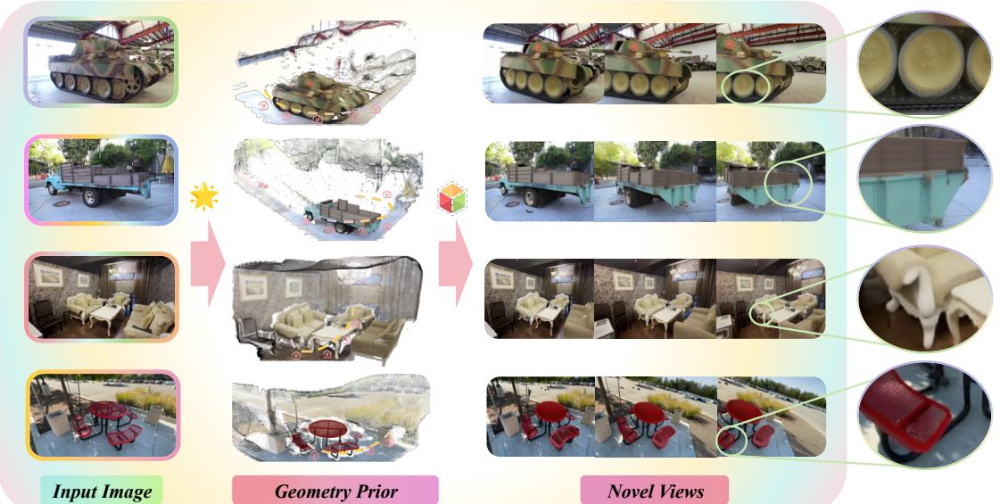  
Novel View Synthesis with Geometry-Enhanced Prior. We synthesize novel views from a single image (left) by constructing a disentangled 3D prior (middle). This prior conditions a video diffusion model to generate a long-range, geometrically consistent view sequence (right). The output demonstrates the effectiveness of our prior-based pipeline.

## ABSTRACT

Single-image novel view synthesis remains challenging because the underlying 3D geometry is highly ambiguous. Recent diffusion-based approaches produce plausible results, but they often struggle to preserve the geometric structure and spatial coherence of foreground objects. We present GenNVS, a framework for geometry-enhanced novel view synthesis via a disentangled 3D prior. Specifically, GenNVS models foreground objects and the background with 3D Gaussian Splatting and aligns them through a coarse-to-fine geometric optimization process to form a unified 3D scene. This scene conditions a video diffusion model through the proposed Dual-Stream Masking mechanism, which guides synthesis by jointly exploiting rendered validity masks and geometry-aware warping. Experimental results show that GenNVS performs favorably against recent methods in both visual quality and geometric accuracy, while naturally supporting flexible scene editing.

## 1 Introduction

Novel view synthesis (NVS) from a single image is a core problem in computer vision and graphics, with applications ranging from augmented reality to digital content creation. Despite significant progress in 3D scene representations, such as Neural Radiance Fields [1] and 3D Gaussian Splatting (3DGS) [2], existing methods typically rely on dense multi-view observations and struggle to extrapolate to novel viewpoints from a single observation. Recent advances in diffusion models [3] suggest a new avenue for single-image NVS, with approaches [4] leveraging video diffusion prior to synthesize plausible camera motion from sparse inputs. However, without explicit 3D prior, these models often generate views with geometric distortions and temporal inconsistencies, underscoring the difficulty of achieving high-fidelity, consistent NVS from a single image.

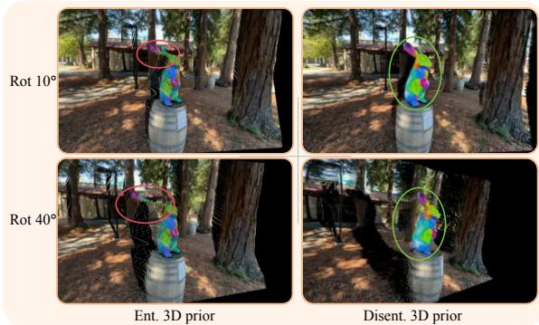  
Figure 1: Geometric prior from entangled scene modeling [6] and our disentangled formulation.

Effective NVS critically depends on strong 3D geometric prior. Prior approaches generally follow two paradigms. The first encodes camera poses as high-level embeddings to condition diffusion models [5, 4]. While simple, this implicit conditioning provides limited geometric supervision and can fail under out-of-distribution settings or complex trajectories. The second reconstructs an explicit 3D repre sentation (e.g., point clouds or 3DGS) from the input image and uses it as a structural prior [6, 7]. Although this introduces stronger 3D awareness, single-image reconstruction remains fundamentally ambiguous and often yields incom plete or distorted geometry, which then propagates errors into the synthesized views.

Existing methods typically use point clouds or 3DGS reconstructed from a single image as geometric prior, treating the scene holistically. This introduces two challenges. First, single-image reconstruction often yields unreliable geometry, which weakens the 3D prior and shifts the burden to the generative model to correct structural errors. Second, reconstructed scenes frequently contain large holes in unseen regions, relying on the generative model to inpaint missing content and often leading to geometric distortions.

Motivated by the geometric fidelity of recent object-level 3D generative methods [8], we revisit single-image NVS from the perspective of where reliable geometry can be obtained. Salient objects (foreground) often require more faithful, object-centric reconstruction, while the remaining regions (background) mainly require coherent global layout. This motivates a foreground-background disentangled formulation: we separately recover object geometry and scene layout, and then merge them into a unified 3D scene prior that offers both geometric accuracy and structural coverage, providing stronger guidance for view synthesis and improving geometric consistency. Figure 1 contrasts prior from foreground-background entangled modeling [6] with our disentangled formulation, which yields a more complete and reliable 3D prior for novel view synthesis.

Building on this insight, we introduce GenNVS, a framework for geometry-enhanced novel view synthesis via a disentangled 3D prior. It separately reconstructs foreground objects and the background, and fuses them into a coherent scene representation that provides stronger geometry guidance to a video diffusion model. Crucially, we additionally provide visibility/validity cues from the rendered prior during conditioning, encouraging view-consistent generation and reducing geometric artifacts. The disentangled representation also naturally enables flexible editing by modifying foreground objects while maintaining consistent novel views.

The main contributions of this work are:

• A geometry-enhanced NVS framework, GenNVS, that leverages a disentangled 3D prior by aligning foreground and background into a coherent 3D scene.

• Foreground Gaussian Alignment (FGA), a coarse-to-fine alignment module combining GS-ICP registration with depth-aware optimization.

• A Dual-Stream Masking mechanism for video diffusion models that leverages the rendered geometric prior to encourage 3D-consistent novel view synthesis.

• Empirical validation on standard benchmarks, showing favorable performance in foreground geometry consistency and naturally supporting flexible scene editing.

## 2 Related Work

Feed-Forward Novel View Synthesis. Feed-forward models have reshaped scene reconstruction by enabling novel view synthesis from sparse inputs without test-time optimization. These approaches typically encode an input image into a latent representation, lift it into 3D space, and decode it in a single forward pass to produce target views or explicit 3D scene representations.

One prominent line of work focuses on direct reconstruction from limited observations. Methods such as LRM [9], PixelSplat [10], and MVSplat [11] regress scene representations in a single forward pass. LRM [9], for example, employs a large-scale Transformer to map images into triplane features. Approaches such as VGGT [12] reconstruct point clouds using vision transformers trained on large-scale datasets, while Anysplat [13] and HunyuanWorld-Mirror [14] further extend this paradigm by directly predicting 3D Gaussian Splatting (3DGS) representations. While highly efficient, these methods effectively operate as deterministic interpolators, limiting their ability to reason about unobserved regions and often leading to severe artifacts under occlusion or large camera motion.

To overcome these limitations, another line of work introduces generative prior from visual foundation models to hallucinate unseen content. Representative methods include SA3D [15], SAM3D [8], and SplatFlow [16], with

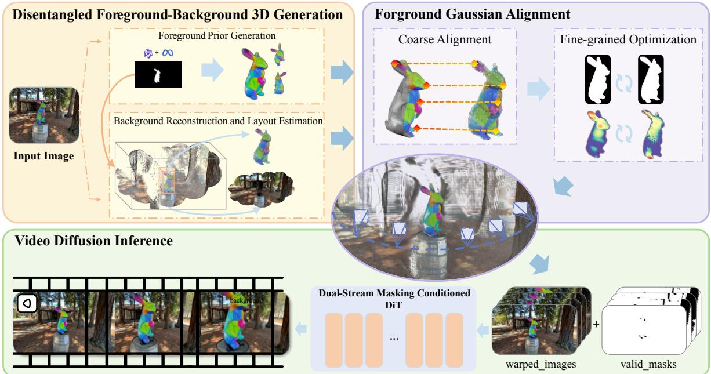  
Figure 2: Overview of GenNVS. Given a single input image, our framework first generates separate 3DGS for foreground objects and background. These are aligned into a unified 3D scene through coarse-to-fine geometric optimization. The aligned prior then conditions a video diffusion model via a Dual-Stream Masking mechanism, yielding high-fidelity and geometrically consistent novel view sequences.

SAM3D [8] demonstrating 3D object generation from a single image. Despite their strong generalization capability, these approaches lack explicit global geometric constraints, frequently resulting in multi-view inconsistencies and fragmented scene-level structure.

Diffusion-Based Novel View Synthesis. Recent advances in novel view synthesis increasingly leverage pre-trained diffusion models for their powerful generative prior, particularly for plausibly hallucinating unobserved regions. Early methods build upon text-to-image diffusion models, such as Zero-1-to-3 [17], which condition generation on a source image and relative camera pose using specialized attention mechanisms. More recent approaches cast novel view synthesis as conditional video generation [18, 5, 4], better exploiting temporal coherence for continuous camera trajectories. These methods can be broadly categorized based on how geometric information is incorporated.

Implicit Camera Encoding. This category conditions video diffusion models directly on numerical camera parameters to steer viewpoint trajectories. For instance, ReCamMaster [4] embeds camera poses into the model’s feature space via adapter modules or modified attention layers. While effective for short-range motions, such implicit conditioning provides only weak geometric supervision, often resulting in inaccurate camera control, spatial drift, and accumulated distortion under long-range or complex trajectories.

Explicit Geometry Guidance. An alternative strategy incorporates explicit 3D scene representations as conditioning prior to enforce stronger geometric constraints. ViewCrafter [6] guides video diffusion using point clouds rendered from monocular reconstruction models [19]. Recently, Free360 [20] separates foreground and background to handle depth and occlusion better, while VMem [21] introduces a learnable geometric memory for cross-view feature retrieval. However, these methods remain fundamentally limited by the ambiguity of single-image 3D reconstruction: errors in the initial geometry propagate through the diffusion process, constraining fidelity and view consistency.

## 3 Method

Figure 2 illustrates the overall architecture of our framework, which consists of disentangled foreground and background generation, foreground Gaussian alignment, and geometry-guided novel view synthesis.

## 3.1 Disentangling Foreground and Background

Given a reference image $I _ { \mathrm { r e f } }$ , our goal is to produce separate 3D prior for foreground objects and background. This disentanglement enables high-fidelity generation of foreground objects while ensuring a coherent spatial context.

Foreground Prior Generation. We first segment salient foreground objects from the input image. A Vision-Language Model [22] provides category labels, which guide a segmentation model to produce precise binary masks $\{ M _ { i } \} _ { i = 1 } ^ { N }$ for N objects.

For each masked object, we apply a 3D generation model [8] to obtain a complete 3D Gaussian Splatting representation:

$$
\mathcal { G } _ { \mathrm { f g - g e n } } ^ { i } = \left\{ \left( \mu _ { j } ^ { i } , \Sigma _ { j } ^ { i } , \alpha _ { j } ^ { i } , c _ { j } ^ { i } \right) \right\} _ { j = 1 } ^ { J _ { i } } ,\tag{1}
$$

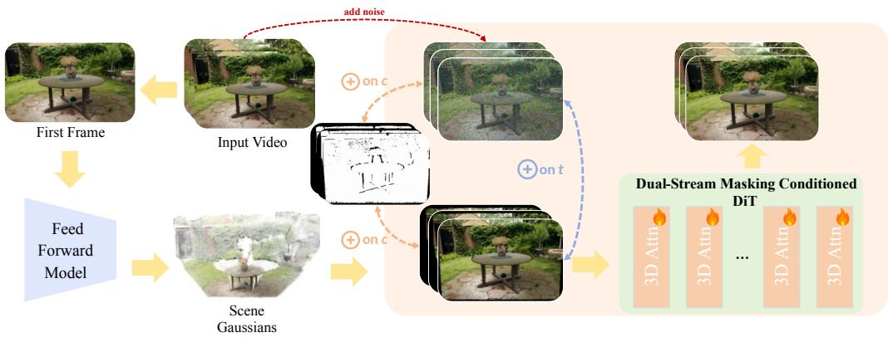  
Figure 3: Training pipeline with Dual-Stream Masking. A coarse 3DGS reconstructed from the video is rendered into a warped image sequence and a validity mask. During training, the mask latent is concatenated with both the noisy video latent and the warped latent along the channel dimension, and the two streams are fused along the temporal dimension for denoising.

where $\boldsymbol { \mu } _ { j } ^ { i } \in \mathbb { R } ^ { 3 }$ is the Gaussian center, $\Sigma _ { j } ^ { i }$ the covariance, $\alpha _ { j } ^ { i }$ the opacity, and $c _ { j } ^ { i }$ the spherical harmonic color coefficients. The full foreground prior is $\begin{array} { r } { \mathcal G _ { \mathrm { f g - g e n } } = \bigcup _ { i = 1 } ^ { N } \mathcal G _ { \mathrm { f g - g e n } } ^ { i } . } \end{array}$

Background Reconstruction and Layout Estimation. For complementary scene geometry, we use a monocular feed-forward model [14] to produce a holistic 3DGS of the scene, denoted $\mathcal { G } _ { \mathrm { f e e d } }$ . Using the foreground masks $\{ M _ { i } \}$ we split this into foreground and background components via projection and masking:

$$
\mathcal { G } _ { \mathrm { f g - f e e d } } ^ { i } = \{ g \in \mathcal { G } _ { \mathrm { f e e d } } \ | \ \mathrm { p r o j } ( g ) \in M _ { i } \} ,\tag{2}
$$

$$
\mathcal { G } _ { \mathrm { b g - f e e d } } = \mathcal { G } _ { \mathrm { f e e d } } \setminus \bigcup _ { i = 1 } ^ { N } \mathcal { G } _ { \mathrm { f g - f e e d } } ^ { i } .\tag{3}
$$

In this formulation, $\mathcal { G } _ { \mathrm { b g - f e e d } }$ provides direct geometric prior for the background. We further estimate a coarse layout to guide object placement. For each object $i ,$ we compute an axis-aligned 3D bounding box from $\mathcal { G } _ { \mathrm { f g - f e e d } } ^ { i } ,$ parameterized by its center $\mathbf { b } _ { c } ^ { i }$ and size $\mathbf { b } _ { s } ^ { i }$ . The aggregate layout $\mathcal { L } = \{ ( \mathbf { b } _ { c } ^ { i } , \mathbf { b } _ { s } ^ { i } ) \} _ { i = 1 } ^ { N }$ provides an initial spatial configuration, which guides the subsequent geometric alignment of foreground objects into the unified scene.

## 3.2 Foreground Gaussian Alignment

The independently generated foreground $\mathcal { G } _ { \mathrm { f g - g e n } }$ exists in a coordinate system separate from the aligned background $\mathcal { G } _ { \mathrm { b g - f e e d } }$ . To construct a unified 3D scene prior, we align each foreground object to the scene through a coarse-tofine two-stage process. For the i-th object, we define a rigid transformation $T ^ { i }$ parameterized by a scale factor $s ^ { i } \in \mathbb { R }$ , a translation vector $t ^ { i } \in \mathbb { R } ^ { 3 }$ , and a rotation matrix $R ^ { i } \in S O ( 3 )$ , such that $T ^ { i } ( g ) = s ^ { i } \cdot ( R ^ { i } g ) + t ^ { i }$ for a Gaussian $g .$

Coarse Alignment. We first coarsely position each foreground object using the estimated layout ${ \mathcal { L } } .$ . For the i-th object, we initialize scaling factor $s ^ { i }$ and translation $t ^ { i }$ such that the bounding box of $\bar { \mathcal { G } } _ { \mathrm { f g - g e n } } ^ { i }$ aligns with the corresponding layout box $\mathbf { b } _ { s } ^ { i }$ and $\mathbf { b } _ { c } ^ { i }$ .

To further refine the placement, we perform point cloud registration between the generated object and its feed-forward counterpart. We extract the visible portion of $\mathcal { G } _ { \mathrm { f g - g e n } } ^ { i }$ from the reference view by thresholding the accumulated opacity during rendering, then uniformly sample points from these visible Gaussians to form a point cloud $\bar { P _ { \mathrm { v i s } } ^ { i } }$ . Similarly, we sample points from $\mathcal { G } _ { \mathrm { f g - f e e d } } ^ { i }$ to obtain $P _ { \mathrm { f e e d } } ^ { i } .$ The Iterative Closest Point (ICP) algorithm is applied to compute an incremental rigid transformation:

$$
( \Delta R ^ { i } , \Delta t ^ { i } ) = \arg \operatorname* { m i n } _ { R , t } \sum _ { p \in P _ { \mathrm { v i s } } ^ { i } } \| R p { + } t { - } \mathbf { N N } _ { P _ { \mathrm { f e e d } } ^ { i } } ( R p { + } t ) \| _ { 2 } ^ { 2 } ,\tag{4}
$$

where $\mathrm { N N } _ { P } ( x )$ finds the nearest neighbor of point x in point cloud $P .$ This incremental transformation is then composed with the existing one: $R ^ { i } \gets \Delta R ^ { i } R ^ { i } , t ^ { i } \gets$ $\Delta R ^ { i } { \dot { t } } ^ { i } + \Delta t ^ { i }$

Fine-grained Optimization. Following coarse alignment, we refine the transformation parameters $\dot { T } ^ { i }$ for each object through a per-object optimization that enforces photometric, geometric, and mask consistency. Let $\hat { C } ^ { i } , \hat { D } ^ { i }$ , and $\hat { A } ^ { i }$ denote the color, depth, and alpha map rendered from the transformed foreground Gaussians ${ \tilde { \mathcal { G } } } _ { \mathrm { f g - g e n } } ^ { i } .$ , respectively. The corresponding ground-truth color $C _ { \mathrm { r e f } } ^ { i } ,$ , depth $D _ { \mathrm { r e f } } ^ { i }$ , and binary mask $M ^ { i }$ are derived from the feed-forward reconstruction $\mathcal { G } _ { \mathrm { f g - f e e d } } ^ { i }$ and the segmentation mask.

We define a composite loss function with four terms. The color and depth losses ensure appearance and geometry alignment within the object region:

$$
\mathcal { L } _ { \mathrm { r g b } } ^ { i } = \Vert M ^ { i } \odot ( \hat { C } ^ { i } - C _ { \mathrm { r e f } } ^ { i } ) \Vert _ { 1 } ,\tag{5}
$$

$$
\mathcal { L } _ { \mathrm { d e p t h } } ^ { i } = \| M ^ { i } \odot ( \hat { D } ^ { i } - D _ { \mathrm { r e f } } ^ { i } ) \| _ { 1 } .\tag{6}
$$

where ⊙ denotes element-wise multiplication. The mask alignment loss uses mean squared error to match the rendered silhouette:

$$
\mathcal { L } _ { \mathrm { m a s k } } ^ { i } = \| \hat { A } ^ { i } - M ^ { i } \| _ { 2 } ^ { 2 } .\tag{7}
$$

DL3DV  
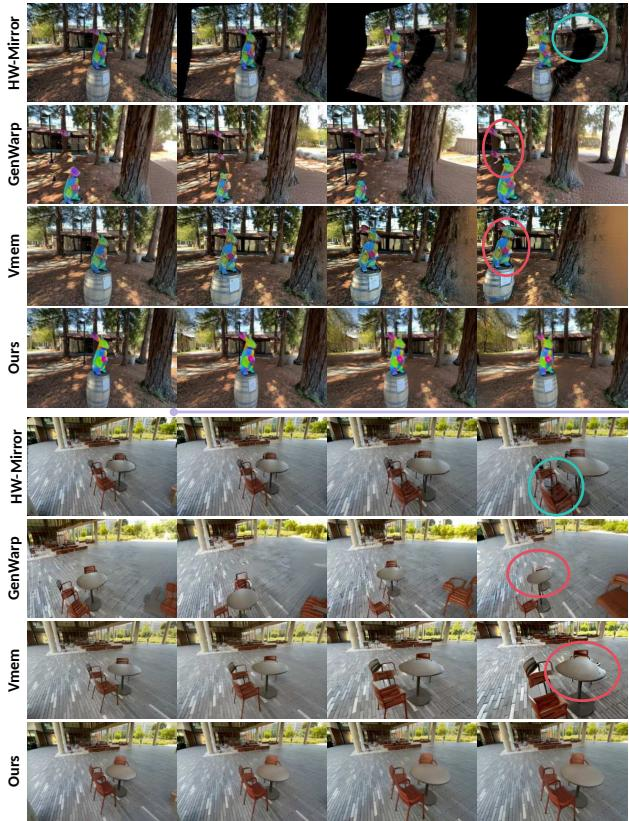

Mip-NeRF 360  
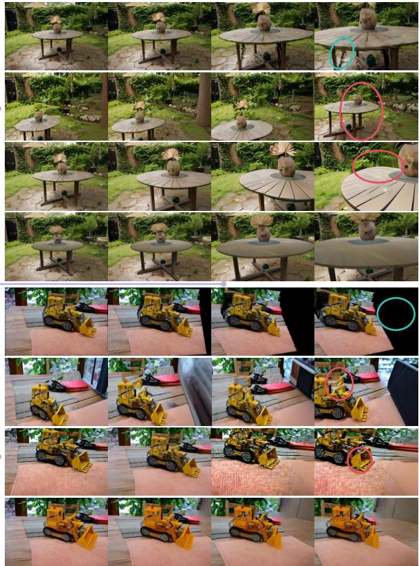  
Figure 4: Qualitative comparisons on the DL3DV and Mip-NeRF 360 datasets. We evaluate novel view sequences generated by our method against VMem [21], GenWarp [23], and HW-Mirror [14]. GenNVS produces more geometrically consistent and temporally stable results. Red circles highlight geometric inconsistencies, and blue circles indicate unseen holes.

To penalize both holes inside the mask and overflow outside it, we employ two ReLU-based regularization terms:

$$
\mathcal { L } _ { \mathrm { h o l e } } ^ { i } = \mathrm { R e L U } ( M ^ { i } - \hat { A } ^ { i } ) ,\tag{8}
$$

$$
\begin{array} { r } { \mathcal { L } _ { \mathrm { o v e r f l o w } } ^ { i } = \mathrm { R e L U } ( \hat { A } ^ { i } - M ^ { i } ) . } \end{array}\tag{9}
$$

The total fine-grained loss is a weighted combination:

$$
\mathcal { L } _ { \mathrm { f i n e } } ^ { i } = \sum _ { k } \lambda _ { k } \mathcal { L } _ { k } ^ { i } ,\tag{10}
$$

where $k \in \{ { \mathrm { r g b } }$ , depth, mask, hole, overflow} denotes the different loss terms with their corresponding weights $\lambda _ { k }$ We minimize ${ \mathcal { L } } _ { \mathrm { f i n e } } ^ { i }$ independently for each object to obtain the final transformation parameters. The resulting precisely aligned foreground Gaussians are denoted as $\breve { \mathcal { G } } _ { \mathrm { f g - g e n } } ^ { i }$ . The complete and consistent 3DGS scene prior is assembled as:

$$
\mathcal { G } _ { \mathrm { s c e n e } } = \mathcal { G } _ { \mathrm { b g - f e e d } } \cup \bigcup _ { i = 1 } ^ { N } \bar { \mathcal { G } } _ { \mathrm { f g - g e n } } ^ { i } .\tag{11}
$$

## 3.3 Geometry-Guided Novel View Synthesis

With the unified 3DGS prior $\mathcal { G } _ { \mathrm { s c e n e } } .$ , we synthesize novel view sequences using a video diffusion model. Our core contribution is a Dual-Stream Masking conditioning mechanism that leverages rendered geometric prior to ensure 3D-consistent synthesis.

Model Architecture and Conditioning. We build upon a pretrained text-to-video model based on a Diffusion Transformer (DiT) [24, 25]. The model is conditioned on explicit geometric cues derived from $\mathcal { G } _ { \mathrm { s c e n e } }$ . Given a target camera trajectory, we render two guidance sequences: a warped RGB video $\mathbf { V } _ { \mathrm { w a r p } } \in \mathbb { R } ^ { 3 \times T \times H \times W }$ and a corresponding binary mask video $\mathbf { V } _ { \mathrm { m a s k } } \in \mathbb { R } ^ { 1 \times T \times H \times W }$ . The warped video is encoded by a frozen VAE encoder $\mathcal { E }$ to produce $\mathbf { c } _ { \mathrm { w a r p } } .$ , while the mask is resized to the latent resolution to obtain $\mathbf { c } _ { \mathrm { m a s k } }$

The Dual-Stream Masking mechanism constructs the model input as illustrated in fig. 3. The mask latent $\mathbf { c } _ { \mathrm { m a s k } }$ is first concatenated with the noisy latent $\mathbf { z } _ { t }$ along the channel dimension, and separately with the warped latent $\mathbf { c } _ { \mathrm { w a r p } }$ These two concatenated features are then joined along the temporal dimension, forming the complete input to the denoising network. This design provides explicit, view-aligned geometric and structural guidance at each denoising step.

Training and Inference. During training, we use multiview video data with known camera poses. For a training clip with frames $\mathbf { I } _ { \mathrm { g t } }$ and poses $\{ C _ { t } \}$ , we first reconstruct a coarse 3DGS scene $\mathcal { G } _ { \mathrm { t r a i n } }$ from the first frame using a monocular model [14], as shown in fig. 3. We then render $\mathcal { G } _ { \mathrm { t r a i n } }$ along the trajectory to obtain the training conditions $\mathbf { V } _ { \mathrm { w a r p } }$ and $\mathbf { V } _ { \mathrm { m a s k } }$ . The warped video is encoded to $\hat { \mathbf { c } } _ { \mathrm { w a r p } } .$ while the mask is interpolated to $\hat { \mathbf { c } } _ { \mathrm { m a s k } }$

Table 1: Quantitative comparison on DL3DV dataset. Single-view novel view synthesis results on DL3DV dataset with diverse environments and complex camera trajectories. Our method demonstrates favorable geometric consistency and image quality.
<table><tr><td>Method</td><td>PSNR↑</td><td>SSIM↑</td><td>LPIPS↓</td><td>FID↓</td><td> $R _ { d i s t \downarrow }$ </td><td> $T _ { d i s t \downarrow }$ </td></tr><tr><td>HW-Mirror [14]</td><td>17.18</td><td>0.41</td><td>0.28</td><td>20.81</td><td>1.607</td><td>0.467</td></tr><tr><td>GenWarp [23]</td><td>14.38</td><td>0.18</td><td>0.47</td><td>28.68</td><td>1.811</td><td>0.464</td></tr><tr><td>VMem [21]</td><td>16.32</td><td>0.30</td><td>0.34</td><td>19.17</td><td>1.888</td><td>0.460</td></tr><tr><td>RecamMaster [4]</td><td>17.60</td><td>0.44</td><td>0.33</td><td>18.82</td><td>1.805</td><td>0.465</td></tr><tr><td>ViewCrafter [6]</td><td>18.72</td><td>0.50</td><td>0.26</td><td>16.38</td><td>1.320</td><td>0.472</td></tr><tr><td>CameraCtrl [5]</td><td>16.74</td><td>0.43</td><td>0.32</td><td>22.10</td><td>1.680</td><td>0.465</td></tr><tr><td>MotionCtrl [18]</td><td>15.28</td><td>0.41</td><td>0.30</td><td>20.46</td><td>1.772</td><td>0.478</td></tr><tr><td>SEVA [27]</td><td>19.07</td><td>0.49</td><td>0.28</td><td>15.70</td><td>1.157</td><td>0.433</td></tr><tr><td>Ours</td><td>19.39</td><td>0.53</td><td>0.24</td><td>14.21</td><td>1.142</td><td>0.451</td></tr></table>

The ground-truth video is encoded as latents $\mathbf { z } _ { 0 } = \mathcal { E } ( \mathbf { I } _ { \mathrm { g t } } )$ Following the flow-matching framework [26], we construct a linear interpolation path from the data $\mathbf { z } _ { 0 }$ to a standard Gaussian noise $\epsilon \sim \tilde { \mathcal { N } } ( 0 , \mathbf { I } )$

$$
\mathbf { z } _ { \tau } = ( 1 - \tau ) \mathbf { z } _ { 0 } + \tau \epsilon ,\tag{12}
$$

where $\tau \in [ 0 , 1 ]$ is the timestep. The condition is formed by the proposed Dual-Stream Masking mechanism. The model $\mathbf { v } _ { \theta }$ is trained to predict the vector field that transports zτ along the probability flow, with supervision applied only to the first half of the temporal output (the original noisy stream):

$$
\begin{array} { r } { \begin{array} { r } { \mathcal { L } = \mathbb { E } _ { \mathbf { z } _ { 0 } , \boldsymbol { \epsilon } , \tau } \left[ \lVert \boldsymbol { \epsilon } - \mathbf { z } _ { 0 } \right. } \\ { \left. - \mathbf { v } _ { \theta } ( \mathbf { z } _ { \tau } , \tau ; \hat { \mathbf { c } } _ { \mathrm { w a r p } } , \hat { \mathbf { c } } _ { \mathrm { m a s k } } ) [ : , : , : T ] \rVert _ { 2 } ^ { 2 } \right] , } \end{array} } \end{array}\tag{13}
$$

where $[ : , : , : T ]$ denotes slicing the first T frames along the temporal dimension. This objective corresponds to learning the conditional velocity field under a straight-line interpolation path, which is a common special case of flow matching.

During inference, given a reference image, we obtain the aligned prior $\mathcal { G } _ { \mathrm { s c e n e } }$ and a target trajectory. We render the conditions, process them accordingly, and apply the same Dual-Stream Masking process to guide the iterative denoising, synthesizing a high-fidelity and geometrically consistent novel view sequence.

## 4 Experiments

## 4.1 Experimental Setup

Implementation Details. The video diffusion model is fine-tuned from Wan2.1-1.3B [25]. We train on the filtered SpatialVid-HQ dataset [28] at a resolution of $3 9 4 \times 5 3 8$ We use AdamW optimizer [29] with a base learning rate of $1 \times 1 0 ^ { - 5 }$ and a cosine annealing schedule. All experiments are conducted on 8 NVIDIA A100-80G GPUs, and more training details are provided in section A.

During inference, we adopt the flow matching scheduler with 50 denoising steps and incorporate classifier-free guidance [30].

Evaluation Datasets and Metrics. We evaluate on two challenging benchmarks, Mip-NeRF 360 [31] and DL3DV [32]. Standard image quality metrics including PSNR, SSIM [33], and LPIPS [34] are reported. To assess geometric correctness, we compute camera pose errors as in [19]. Specifically, relative poses $( R _ { g e n } , \bar { t } _ { g e n } )$ between generated novel views are estimated using DUST3R [19] and compared to the ground truth poses $( R _ { g t } , t _ { g t } )$ . The rotation distance $R _ { d i s t }$ and translation distance $T _ { d i s t }$ are defined as:

$$
R _ { d i s t } = \operatorname { a r c c o s } \left( 0 . 5 ( \operatorname { t r } ( R _ { g e n } R _ { g t } ^ { T } ) - 1 ) \right) ,
$$

$$
T _ { d i s t } = \| t _ { g t } - t _ { g e n } \| _ { 2 } .\tag{14}
$$

(15)

where $\operatorname { t r } ( \cdot )$ is the matrix trace. The translation is normalized by the distance to the furthest frame.

These metrics emphasize complementary aspects of the single-image NVS problem. Image-space metrics measure whether each synthesized frame remains faithful to the target view appearance, while the pose distances evaluate whether the generated sequence preserves a coherent camera-induced 3D structure. This distinction is important because a video model can produce visually plausible frames while still drifting geometrically over time. We therefore report both families of metrics and interpret the results jointly rather than optimizing for a single score.

In addition, a user study is conducted to obtain human assessment of the proposed approach. Participants are tasked with selecting the most preferred novel-view sequence in terms of visual realism and geometric consistency, after viewing the results of our method and the baseline methods. Details are provided in section C.

## 4.2 Evaluation Results

We evaluate our method against several state-of-the-art feed-forward and generative approaches for novel view synthesis, including HunyuanWorld-Mirror [14], GenWarp [23], VMem [21], RecamMaster [4], ViewCrafter [6], CameraCtrl [5], MotionCtrl [18], and SEVA [27].

Quantitative Comparison. As shown in tables 1 and 2, GenNVS consistently achieves strong quantitative performance on both benchmarks. It improves perceptual quality with higher PSNR and SSIM and lower LPIPS and FID, while also maintaining strong trajectory accuracy with low camera pose errors. These results suggest that our method enhances both visual fidelity and geometric consistency, leading to more reliable novel view synthesis under challenging scenes and camera motions.

Table 2: Quantitative comparison on Mip-NeRF 360 dataset. Evaluation on Mip-NeRF 360 dataset further validates the robustness of our approach in handling complex indoor and outdoor scenes. GenNVS obtains favorable results against baselines in both perceptual quality and geometric accuracy.
<table><tr><td>Method</td><td>PSNR↑</td><td>SSIM↑</td><td>LPIPS↓</td><td>FID↓</td><td> $R _ { d i s t \downarrow }$ </td><td>Tdist↓</td></tr><tr><td>HW-Mirror [14]</td><td>15.90</td><td>0.20</td><td>0.35</td><td>16.25</td><td>1.098</td><td>0.420</td></tr><tr><td>GenWarp [23]</td><td>14.59</td><td>0.33</td><td>0.47</td><td>29.33</td><td>1.184</td><td>0.629</td></tr><tr><td>VMem [21]</td><td>19.04</td><td>0.47</td><td>0.30</td><td>16.81</td><td>2.150</td><td>0.481</td></tr><tr><td>RecamMaster [4]</td><td>17.86</td><td>0.48</td><td>0.34</td><td>15.16</td><td>1.881</td><td>0.432</td></tr><tr><td>ViewCrafter [6]</td><td>16.75</td><td>0.48</td><td>0.39</td><td>19.23</td><td>1.067</td><td>0.595</td></tr><tr><td>CameraCtrl [5]</td><td>16.74</td><td>0.43</td><td>0.30</td><td>22.10</td><td>1.680</td><td>0.465</td></tr><tr><td>MotionCtrl [18]</td><td>15.28</td><td>0.33</td><td>0.32</td><td>20.46</td><td>1.772</td><td>0.478</td></tr><tr><td>SEVA [27]</td><td>19.15</td><td>0.51</td><td>0.33</td><td>14.80</td><td>0.924</td><td>0.423</td></tr><tr><td>Ours</td><td>19.43</td><td>0.54</td><td>0.27</td><td>13.50</td><td>0.848</td><td>0.408</td></tr></table>

The improvement is most pronounced on metrics that depend on cross-view structure. Compared with methods that primarily condition generation through camera embeddings or monocular reconstructions, GenNVS reduces both rotation and translation errors. This indicates that the generated views are not only sharp independently but also more compatible as a sequence. The gains are also consistent across the two datasets, suggesting that the disentangled prior does not overfit to a particular scene type or camera distribution.

Qualitative Comparison. Figure 4 shows visual results on both datasets. GenNVS alleviates common issues such as temporal flickering and background distortion, and maintains sharp foreground details. It generates geometrically stable foregrounds with natural background integration, demonstrating robustness even under large viewpoint changes. The user study in fig. 6 compares our method with baselines in terms of Overall Aesthetic (O.A.), Over all Consistency (O.C.), Foreground Aesthetic (F.A.), and Foreground Consistency (F.C.), showing that our method is consistently preferred.

Qualitatively, the main difference lies in how errors accumulate along the camera path. Baseline video diffusion methods often correct local appearance but gradually change the shape, scale, or attachment of foreground objects, especially when the camera reveals partially unseen regions. Feed-forward geometry-based methods provide stronger structure, but their initial geometry may contain holes or entangled foreground-background artifacts that become visible after rendering. By aligning object-level foreground priors with the scene-level background, Gen-NVS supplies a denser geometric scaffold before diffusion, which reduces the amount of structure that must be hallucinated by the generator.

## 4.3 Ablation Studies

We conduct ablation studies to examine the contribution of key designs in GenNVS, as shown in table 3. We compare four configurations: generation without foregroundbackground disentanglement, with disentanglement but without coarse alignment, with disentanglement and coarse alignment but without fine alignment, and the full model. The full model achieves the best overall quality while maintaining a favorable efficiency-accuracy trade-off. Furthermore, we showcase the scene editing capability of Gen-NVS.

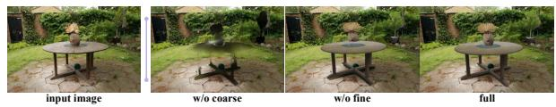  
Figure 5: Ablation study on alignment stages. Qualitative comparisons demonstrate the necessity of both the coarse and fine alignment stages.

Table 3: Ablation studies on Mip-NeRF 360 dataset. We evaluate the contribution of each component. The full model achieves the best quality while maintaining a trade-off in efficiency.
<table><tr><td></td><td>PSNR ↑</td><td>LPIPS ↓</td><td>Time/obj (s)</td></tr><tr><td>w/o disent.</td><td>15.90</td><td>0.35</td><td>*</td></tr><tr><td>w/o coarse align.</td><td>18.39</td><td>0.22</td><td>177.45</td></tr><tr><td>w/o fine align.</td><td>19.65</td><td>0.18</td><td>1.32</td></tr><tr><td>GenNVS</td><td>21.75</td><td>0.16</td><td>22.88</td></tr></table>

Disentangled Foreground-Background Generation. We evaluate the proposed method with a variant that generates the scene holistically without separating foreground and background. As shown in table 3, this variant leads to a significant drop in all quality metrics, confirming that artifacts and holes in the entangled prior degrade novel view synthesis. Qualitatively, our disentangled prior is also denser and more geometrically complete, as further illustrated in the fig. 8.

Coarse-to-Fine Alignment. We ablate our two-stage alignment by evaluating three configurations: coarse alignment only, fine alignment only, and our full pipeline. Table 3 and fig. 5 show that both incomplete variants perform poorly compared to the complete strategy. Removing coarse alignment leads to unstable convergence and lower accuracy, while skipping fine optimization leaves visible misalignments. Our complete coarse-to-fine approach achieves the best balance between quality and efficiency.

Table 4: Analysis of inference time. The table details the processing time per stage, including disentangled generation, coarse and fine alignment (per object), diffusion-based rendering, and the total end-to-end latency.
<table><tr><td></td><td>Disent. gen.</td><td>Coarse (/obj)</td><td>Fine (/obj)</td><td>Diff.</td><td>Total</td></tr><tr><td>Time (s)</td><td>20.15</td><td>1.28</td><td>21.60</td><td>60.10</td><td>103.13</td></tr></table>

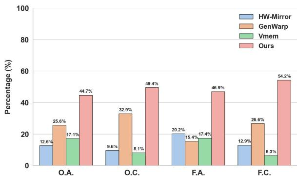  
Figure 6: User study results. We evaluate our method along with VMem [21], GenWarp [23], HW-Mirror [14] on O.A., O.C., F.A., and F.C.. Our method performs favorably against baselines, receiving over 40% of votes as the preferred approach in each category.

Efficiency Analysis. To analyze the efficiency of our framework, we provide a detailed breakdown of the inference time over 73 frames in table 4. The coarse alignment stage is fast and provides a reliable initial pose estimate. The subsequent fine-grained optimization, while more computationally involved, remains highly efficient in practice as the optimization per-object can be performed in parallel. It optimizes only the rigid transformation for each object, which requires few learnable parameters.

This runtime profile reflects the intended division of labor in the pipeline. The feed-forward components provide an initial scene hypothesis, the alignment stage corrects the spatial relationship between independently generated assets, and the diffusion model focuses on view synthesis rather than full geometry recovery. In practice, the additional alignment cost is small compared with diffusion sampling and provides a favorable trade-off: a modest amount of test-time geometric optimization substantially improves the stability of the generated video.

Scene Editing. Benefiting from its fully disentangled and explicitly editable 3D Gaussian representation, GenNVS inherently supports flexible scene manipulation. Users can directly edit the scene at the component level—such as replacing, removing, or adding a foreground object—after which the framework consistently regenerates all novel views from the updated 3D prior, as visualized in fig. 7.

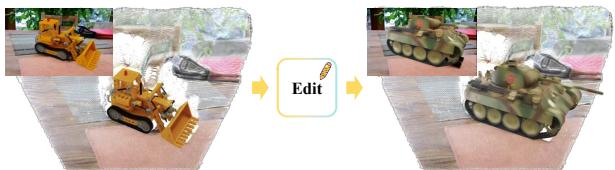  
Figure 7: Scene editing results. Replacing the foreground "lego" with a "tank" preserves visual and geometric consistency across synthesized novel views.

## 5 Conclusion

This work introduces GenNVS, a framework for geometryenhanced novel view synthesis via a disentangled 3D prior. By separately modeling foreground and background, aligning them with a coarse-to-fine strategy, and conditioning a video diffusion model with Dual-Stream Masking, our method produces geometrically consistent novel views and supports flexible scene editing. The experiments show that explicitly improving the 3D prior before diffusion leads to better visual quality, more stable foreground geometry, and lower camera-pose errors across challenging benchmark scenes.

The central observation behind our approach is that singleimage NVS benefits from separating the sources of geometric reliability. Object-level generation provides stronger foreground structure, while feed-forward scene reconstruction provides global layout and background context. Aligning these two sources yields a prior that is more useful than either component alone, because it reduces holes, object drift, and foreground-background entanglement before the video model begins synthesis. This design also exposes an editable intermediate representation, making scene manipulation a natural consequence of the pipeline rather than an additional post-processing step.

## References

[1] Ben Mildenhall, Pratul P Srinivasan, Matthew Tancik, Jonathan T Barron, Ravi Ramamoorthi, and Ren Ng. Nerf: Representing scenes as neural radiance fields for view synthesis. Communications of the ACM, 65(1):99–106, 2021. 1

[2] Bernhard Kerbl, Georgios Kopanas, Thomas Leimkühler, and George Drettakis. 3d gaussian splatting for real-time radiance field rendering. ACM Transactions on Graphics (ToG), 42(4):139–1, 2023. 1

[3] Jonathan Ho, Ajay Jain, and Pieter Abbeel. Denoising diffusion probabilistic models. Advances in Neural Information Processing Systems, 33:6840–6851, 2020. 1

[4] Jianhong Bai, Menghan Xia, Xiao Fu, Xintao Wang, Lianrui Mu, Jinwen Cao, Zuozhu Liu, Haoji Hu, Xiang Bai, Pengfei Wan, et al. Recammaster: Camera-controlled generative rendering from a single video. arXiv preprint, arXiv:2503.11647, 2025. 1, 2, 3, 6, 7

[5] Hao He, Yinghao Xu, Yuwei Guo, Gordon Wetzstein, Bo Dai, Hongsheng Li, and Ceyuan Yang. Cameractrl: Enabling camera control for text-to-video generation. arXiv preprint, arXiv:2404.02101, 2024. 2, 3, 6, 7, 12, 13

[6] Wangbo Yu, Jinbo Xing, Li Yuan, Wenbo Hu, Xiaoyu Li, Zhipeng Huang, Xiangjun Gao, Tien-Tsin Wong, Ying Shan, and Yonghong Tian. Viewcrafter: Taming video diffusion models for high-fidelity novel view synthesis. arXiv preprint, arXiv:2409.02048, 2024. 2, 3, 6, 7

[7] Xuanchi Ren, Tianchang Shen, Jiahui Huang, Huan Ling, Yifan Lu, Merlin Nimier-David, Thomas Müller, Alexander Keller, Sanja Fidler, and Jun Gao. Gen3c: 3d-informed world-consistent video generation with precise camera control. In Proceedings of the IEEE/CVF Conference on Computer Vision and Pattern Recognition, pages 6121–6132, 2025. 2

[8] Xingyu Chen, Fu-Jen Chu, Pierre Gleize, Kevin J Liang, Alexander Sax, Hao Tang, Weiyao Wang, Michelle Guo, Thibaut Hardin, Xiang Li, et al. Sam 3d: 3dfy anything in images. arXiv preprint, arXiv:2511.16624, 2025. 2, 3

[9] Yicong Hong, Kai Zhang, Jiuxiang Gu, Sai Bi, Yang Zhou, Difan Liu, Feng Liu, Kalyan Sunkavalli, Trung Bui, and Hao Tan. Lrm: Large reconstruction model for single image to 3d. arXiv preprint, arXiv:2311.04400, 2023. 2

[10] David Charatan, Sizhe Lester Li, Andrea Tagliasacchi, and Vincent Sitzmann. pixelsplat: 3d gaussian splats from image pairs for scalable generalizable 3d reconstruction. In Proceedings ofthe IEEE/CVF Conference on Computer Vision and Pattern Recognition, pages 19457–19467, 2024. 2

[11] Yuedong Chen, Haofei Xu, Chuanxia Zheng, Bohan Zhuang, Marc Pollefeys, Andreas Geiger, Tat-Jen Cham, and Jianfei Cai. Mvsplat: Efficient 3d gaussian splatting from sparse multi-view images. In European Conference on Computer Vision, pages 370–386. Springer, 2024. 2

[12] Jianyuan Wang, Minghao Chen, Nikita Karaev, Andrea Vedaldi, Christian Rupprecht, and David Novotny. Vggt: Visual geometry grounded transformer. In Proceedings of the IEEE/CVF Conference on Computer Vision and Pattern Recognition, pages 5294–5306, 2025. 2

[13] Lihan Jiang, Yucheng Mao, Linning Xu, Tao Lu, Kerui Ren, Yichen Jin, Xudong Xu, Mulin Yu, Jiangmiao Pang, Feng Zhao, et al. Anysplat: Feed-forward 3d gaussian splatting from unconstrained views. arXiv preprint, arXiv:2505.23716, 2025. 2

[14] Yifan Liu, Zhiyuan Min, Zhenwei Wang, Junta Wu, Tengfei Wang, Yixuan Yuan, Yawei Luo, and Chunchao Guo. Worldmirror: Universal 3d world reconstruction with anyprior prompting. arXiv preprint, arXiv:2510.10726, 2025. 2, 4, 5, 6, 7, 8, 11

[15] Jiazhong Cen, Zanwei Zhou, Jiemin Fang, Wei Shen, Lingxi Xie, Dongsheng Jiang, Xiaopeng Zhang, Qi Tian, et al. Segment anything in 3d with nerfs. Advances in Neural Information Processing Systems, 36:25971–25990, 2023. 2

[16] Hyojun Go, Byeongjun Park, Jiho Jang, Jin-Young Kim, Soonwoo Kwon, and Changick Kim. Splatflow: Multi-view rectified flow model for 3d gaussian splatting synthesis. In Proceedings of the IEEE/CVF Conference on Computer Vision and Pattern Recognition, pages 21524–21536, 2025. 2

[17] Ruoshi Liu, Rundi Wu, Basile Van Hoorick, Pavel Tokmakov, Sergey Zakharov, and Carl Vondrick. Zero-1-to-3: Zero-shot one image to 3d object. In Proceedings of the IEEE/CVF International Conference on Computer Vision, pages 9298–9309, 2023. 3

[18] Zhouxia Wang, Ziyang Yuan, Xintao Wang, Yaowei Li, Tianshui Chen, Menghan Xia, Ping Luo, and Ying Shan. Motionctrl: A unified and flexible motion controller for video generation. In ACM SIGGRAPH 2024 Conference Papers, pages 1–11, 2024. 3, 6, 7, 12, 13

[19] Shuzhe Wang, Vincent Leroy, Yohann Cabon, Boris Chidlovskii, and Jerome Revaud. Dust3r: Geometric 3d vision made easy. In Proceedings ofthe IEEE/CVF Confer ence on Computer Vision and Pattern Recognition, pages 20697–20709, 2024. 3, 6

[20] Chong Bao, Xiyu Zhang, Zehao Yu, Jiale Shi, Guofeng Zhang, Songyou Peng, and Zhaopeng Cui. Free360: Layered gaussian splatting for unbounded 360-degree view synthesis from extremely sparse and unposed views. In Proceedings of the IEEE/CVF Conference on Computer Vision and Pattern Recognition, pages 16377–16387, 2025. 3

[21] Runjia Li, Philip Torr, Andrea Vedaldi, and Tomas Jakab. Vmem: Consistent interactive video scene generation with surfel-indexed view memory. arXiv preprint, arXiv:2506.18903, 2025. 3, 5, 6, 7, 8

[22] Shuai Bai, Keqin Chen, Xuejing Liu, Jialin Wang, Wenbin Ge, Sibo Song, Kai Dang, Peng Wang, Shijie Wang, Jun Tang, et al. Qwen2. 5-vl technical report. arXiv preprint, arXiv:2502.13923, 2025. 3

[23] Junyoung Seo, Kazumi Fukuda, Takashi Shibuya, Takuya Narihira, Naoki Murata, Shoukang Hu, Chieh-Hsin Lai, Seungryong Kim, and Yuki Mitsufuji. Genwarp: Single image to novel views with semantic-preserving generative warping. Advances in Neural Information Processing Systems, 37:80220–80243, 2024. 5, 6, 7, 8

[24] William Peebles and Saining Xie. Scalable diffusion models with transformers. In Proceedings of the IEEE/CVF International Conference on Computer Vision, pages 4195– 4205, 2023. 5

[25] Team Wan, Ang Wang, Baole Ai, Bin Wen, Chaojie Mao, Chen-Wei Xie, Di Chen, Feiwu Yu, Haiming Zhao, Jianxiao Yang, Jianyuan Zeng, Jiayu Wang, Jingfeng Zhang, Jingren Zhou, Jinkai Wang, Jixuan Chen, Kai Zhu, Kang Zhao, Keyu Yan, Lianghua Huang, Mengyang Feng, Ningyi Zhang, Pandeng Li, Pingyu Wu, Ruihang Chu, Ruili Feng, Shiwei Zhang, Siyang Sun, Tao Fang, Tianxing Wang, Tianyi Gui, Tingyu Weng, Tong Shen, Wei Lin, Wei Wang, Wei Wang, Wenmeng Zhou, Wente Wang, Wenting Shen, Wenyuan Yu, Xianzhong Shi, Xiaoming Huang, Xin Xu, Yan Kou, Yangyu Lv, Yifei Li, Yijing Liu, Yiming Wang, Yingya Zhang, Yitong Huang, Yong Li, You Wu, Yu Liu, Yulin Pan, Yun Zheng, Yuntao Hong, Yupeng Shi, Yutong Feng, Zeyinzi Jiang, Zhen Han, Zhi-Fan Wu, and Ziyu Liu. Wan: Open and advanced large-scale video generative models. arXiv preprint, arXiv:2503.20314, 2025. 5, 6, 11

[26] Yaron Lipman, Ricky TQ Chen, Heli Ben-Hamu, Maximilian Nickel, and Matt Le. Flow matching for generative modeling. arXiv preprint, arXiv:2210.02747, 2022. 6

[27] Jensen Zhou, Hang Gao, Vikram Voleti, Aaryaman Vasishta, Chun-Han Yao, Mark Boss, Philip Torr, Christian Rupprecht, and Varun Jampani. Stable virtual camera: Generative view synthesis with diffusion models. arXiv preprint, arXiv:2503.14489, 2025. 6, 7, 12, 13

[28] Jiahao Wang, Yufeng Yuan, Rujie Zheng, Youtian Lin, Jian Gao, Lin-Zhuo Chen, Yajie Bao, Yi Zhang, Chang Zeng,

Yanxi Zhou, et al. Spatialvid: A large-scale video dataset with spatial annotations. arXiv preprint, arXiv:2509.09676, 2025. 6, 11

[29] Ilya Loshchilov and Frank Hutter. Decoupled weight decay regularization. arXiv preprint, arXiv:1711.05101, 2017. 6

[30] Jonathan Ho and Tim Salimans. Classifier-free diffusion guidance. arXiv preprint, 2022. 6

[31] Jonathan T Barron, Ben Mildenhall, Dor Verbin, Pratul P Srinivasan, and Peter Hedman. Mip-nerf 360: Unbounded anti-aliased neural radiance fields. In Proceedings of the IEEE/CVF Conference on Computer Vision and Pattern Recognition, pages 5470–5479, 2022. 6

[32] Lu Ling, Yichen Sheng, Zhi Tu, Wentian Zhao, Cheng Xin, Kun Wan, Lantao Yu, Qianyu Guo, Zixun Yu, Yawen Lu, et al. Dl3dv-10k: A large-scale scene dataset for deep learning-based 3d vision. In Proceedings of the IEEE/CVF Conference on Computer Vision and Pattern Recognition, pages 22160–22169, 2024. 6, 12

[33] Zhou Wang, Alan C Bovik, Hamid R Sheikh, and Eero P Simoncelli. Image quality assessment: from error visibility to structural similarity. IEEE transactions on image processing, 13(4):600–612, 2004. 6

[34] Richard Zhang, Phillip Isola, Alexei A Efros, Eli Shechtman, and Oliver Wang. The unreasonable effectiveness of deep features as a perceptual metric. In Proceedings of the IEEE/CVF Conference on Computer Vision and Pattern Recognition, pages 586–595, 2018. 6

## Appendix

## A Model Details

Data Processing. We train our model on the SpatialVid-HQ [28] dataset, a high-quality video collection comprising diverse scenes with precise camera trajectories, textual descriptions, and motion annotations. Based on metrics such as motion score and dynamic ratio, we filter the dataset and retain 354,944 video clips for training. Since camera poses are provided only for keyframes, we first compute full-frame trajectories via linear interpolation. For each video, we use the first frame to predict an initial 3D Gaussian Splatting (3DGS) scene with HunyuanWorld-Mirror [14]. This scene is then rendered along the interpolated camera path to generate two conditioning sequences: a warped RGB video $\mathbf { V } _ { \mathrm { w a r p } }$ and a corresponding binary validity mask $\mathbf { V } _ { \mathrm { m a s k } }$ , which indicate regions with reliable geometric projection, obtained by thresholding the rendered alpha values at 0.8

Training Configuration. Our model is based on the Wan2.1 1.3B text-to-video diffusion transformer [25]. To accommodate the dual-stream input introduced by our conditioning mechanism, we fine-tune the patch embedding layer and all 3D-Attention blocks, while keeping all other parameters frozen. Training is performed at a resolution of $3 9 4 \times 5 3 8$ , chosen to match the optimal operating point of the geometry estimator. We use the AdamW optimizer with a learning rate of $1 \times 1 0 ^ { - 5 }$ , a global batch size of 8 (1 per GPU), with a total training time of approximately 72 hours. The model is trained for 40k steps on 8 NVIDIA A100 GPUs.

## B Additional Analysis

Density and Completeness of the Geometric Prior. We further compare the 3D prior produced by a holistic monocular reconstruction pipeline and our disentangled generation strategy. As shown in fig. 8, the initial point cloud obtained from feed-forward monocular reconstruction is sparse and exhibits substantial missing regions. After disentangled foreground-background generation and coarse-to-fine alignment, our method produces a substantially denser and more complete 3DGS prior, with improved foreground geometry and better spatial coherence with the background. This enhanced geometric prior provides more reliable guidance for novel view synthesis.

Sensitivity to Loss Weights. We use a relatively stable set of loss weights during the prior generation stage. To assess the sensitivity of the model to these hyperparameters, we perturb each loss weight by 30% individually and evaluate the rendered outputs from the input viewpoint on 5 scenes. The results are summarized in table 6. The performance remains reasonably stable under these perturbations, indicating that the prior generation process is robust to moderate changes in loss balancing.

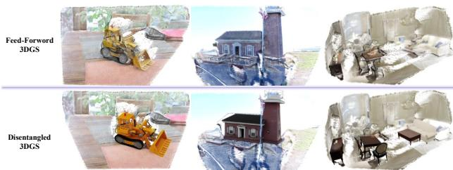  
Figure 8: Comparison of 3D prior from a single image. Top row: initial point cloud from a monocular model. Bottom row: refined results after disentangled foreground-background generation and coarse-to-fine alignment.

Table 5: Viewpoint variation ranges supported by our method in the additional large-viewpoint-change results.
<table><tr><td>Viewpoint Parameter</td><td>Range</td></tr><tr><td>Pitch</td><td> $\pm 6 0 ^ { \circ }$ </td></tr><tr><td>Yaw</td><td> $\pm 4 0 ^ { \circ }$ </td></tr><tr><td>Translation</td><td>~20% scene scale</td></tr></table>

Scaling Up with Many Objects. Our method treats per-object generation and refinement as independent processes, enabling efficient parallel execution when multiple foreground objects are selected. Since each object is optimized independently and then aligned with the overall point cloud through a coarse-to-fine refinement stage, error accumulation is effectively mitigated. For example, the bottom-left case in fig. 4 shows a scene in which four objects (chairs and a table) are selected as foreground, and no significant error accumulation is observed. Additional multi-object examples are also provided in fig. 9. These results suggest that our framework scales favorably to more complex scenes with multiple edited objects.

Table 6: Sensitivity analysis of loss weights in the prior generation stage. Best values are highlighted in bold.
<table><tr><td>Metric</td><td>Default</td><td>↑30%  $L _ { \mathrm { r g b } }$ </td><td>↑30%  $L _ { \mathrm { d e p t h } }$ </td><td> $L _ { \mathrm { m a s k } } \uparrow 3 0 \%$ </td><td>↑30%  $L _ { \mathrm { h o l e } }$ </td><td> $L _ { \mathrm { o v e r f l o w } }$  ↑30%</td></tr><tr><td>PSNR</td><td>24.03</td><td>24.18</td><td>23.82</td><td>23.65</td><td>21.47</td><td>23.95</td></tr><tr><td>SSIM</td><td>0.83</td><td>0.84</td><td>0.81</td><td>0.80</td><td>0.74</td><td>0.82</td></tr><tr><td>LPIPS</td><td>0.18</td><td>0.19</td><td>0.16</td><td>0.21</td><td>0.28</td><td>0.18</td></tr></table>

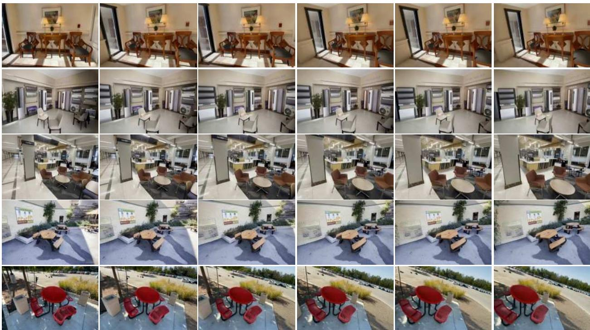  
Figure 9: Additional results on the DL3DV [32] dataset.

## C User Study

We conducted a controlled user study to evaluate the perceptual quality of the novel views synthesized by different methods. The study involved 90 participants of various ages (18–60) and professional backgrounds. Participants are presented with novel view sequences of the same scenes generated by our method and several baselines. They are asked to select the most preferred result based on four explicit criteria: overall realism, foreground object realism, overall consistency across views, andforeground consistency. Our method received a strong and consistent preference across all categories, with a significant majority of participants selecting it as the preferred option. These results provide clear empirical evidence that our approach produces outputs perceived as more realistic and geometrically coherent than existing techniques.

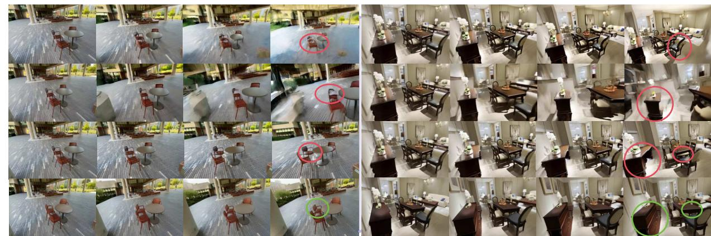  
Figure 10: Additional comparisons with CameraCtrl [5], MotionCtrl [18], and SEVA [27]. Our method shows stronger geometric consistency.

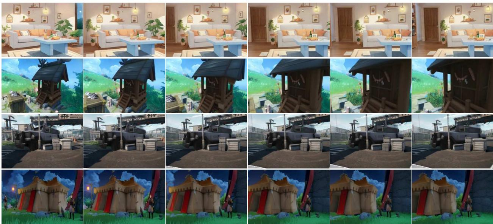  
Figure 11: Generalization to Diverse Artistic Styles. We evaluate our framework on out-of-distribution artistic inputs, including hand-drawn sketches, game scenes, and anime imagery. Results show that our method synthesizes high-quality, stylized novel views while maintaining strict multi-view 3D consistency, highlighting that our disentangled prior and conditioning mechanism provide strong geometric guidance without sacrificing adaptation to varied visual styles.

## D Additional Results

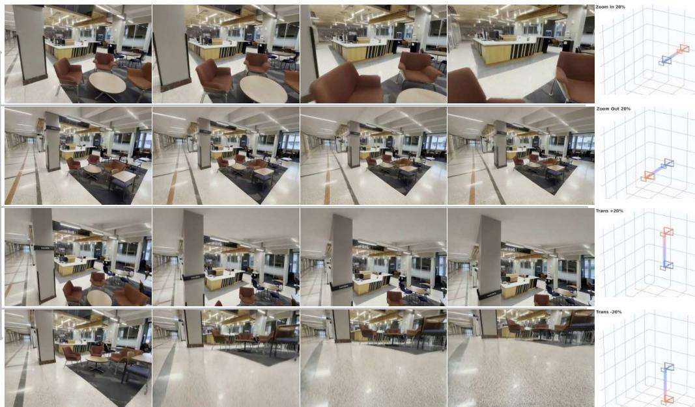  
Figure 12: Results under boundary viewpoint changes.

Additional Visualizations. We provide extensive qualitative results in fig. 9 on the DL3DV dataset. These results further demonstrate our model’s ability to recover plausible geometric and textural details in heavily occluded regions. Notably, they highlight the superior geometric consistency of foreground objects, even under challenging camera motions, a key advantage of our disentangled generation and alignment strategy. We further compare against CameraCtrl [5], MotionCtrl [18], and SEVA [27] in fig. 10. The results likewise show that our method better preserves geometric consistency and handles occluded regions more reliably.

Generalization to Out-of-Domain Data. We also evaluate our framework on a curated set of images from the web, computer games, and animated media, which differ significantly from the training distribution. As shown in fig. 11, our method successfully generates plausible and consistent novel view sequences across these diverse inputs. This demonstrates strong generalization beyond photorealistic scenes to a wide range of visual styles and scene types.

Results under Large Viewpoint Changes. We additionally provide results under larger viewpoint changes in fig. 12. Our method can reliably handle viewpoint variations within ranges in table 5:

Limitations. While GenNVS advances single-image novel view synthesis, it shares certain limitations common to the field. Our framework assumes static scenes and does not model dynamic elements (e.g., moving people or flowing water). Additionally, the quality of the final output depends partially on the accuracy of the initial monocular 3D reconstruction.