Text-based method Ours

# Drag as Evidence: Motion-Grounded Latent Recomposition for Drag-Based Editing

Xinyu Pu Southeast University xinyupu@seu.edu.cn

Jie Gui<sup>∗</sup> Southeast University Purple Mountain Laboratories guijie@seu.edu.cn

Hongsong Wang Southeast University hongsongwang@seu.edu.cn

Pan Zhou Singapore Management University panzhou3@gmail.com

## Abstract

Modern image editors excel at semantic manipulation and visual synthesis, yet remain limited in precise spatial control, motivating the development of drag-based editing. However, existing drag-based methods often struggle to balance drag accuracy with natural, plausible, and intent-aligned generation. We propose MoRe-Drag, a motion-grounded drag-based editing method. Our key insight is to treat pixel-space warping as coarse motion evidence, and to inject this evidence into the generative sampling trajectory. Specifically, MoRe-Drag performs region-aware latent recomposition over refinement, inpainting, and anchor regions, coupled with stage-adaptive conditioning that progressively shifts from motion-grounded structure formation to semantic refinement. We further support an instruction-free interface by adapting the MLLM-based text encoder for drag-aware instruction inference. Experiments on DRAGBENCH-SR and DRAGBENCH-DR show that MoRe-Drag substantially improves drag precision over strong base editors and achieves superior drag accuracy among SOTA drag-based methods, while delivering strong semantic consistency and visually realistic results. Code and dataset will be publicly released.

Existing drag-based methods

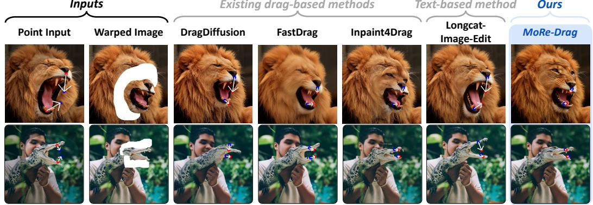  
Figure 1: Editing comparison. Pixel-space warping provides explicit but imperfect motion evidence. MoRe-Drag injects this evidence into the generative trajectory, enabling the editor to follow the specified motion while restoring natural structure and appearance.

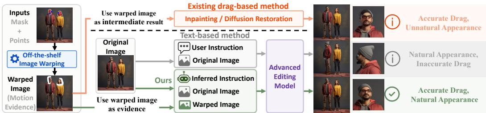  
Figure 2: Conceptual comparison with existing drag-based and text-based editing paradigms. Existing drag methods use warped image as an intermediate result, leading to accurate but unnatural edits, while text-based editors produce natural results without precise drag control. Our method uses warped image as motion evidence to achieve both accurate dragging and natural appearance.

## 1 Introduction

Image generative models have advanced rapidly in realism, instruction following, and identity preservation [1–6], driven by progress in data curation [7, 8], model training [9–12], and architectural improvements [13, 14]. These advances have established natural language as an effective interface for semantic image generation and editing. Recent general-purpose image editing models [15–17] further strengthen this paradigm by leveraging MLLM-based text encoders and joint image-text conditioning, enabling image-aware instruction representations and supporting high-fidelity and visually consistent edits. However, as shown in the gray-shaded middle panel of Fig. 2, text-based instructions are primarily semantic: while effective at specifying what should be changed, they often fall short for spatially grounded manipulations, which require users to specify where the content should be adjusted and to what extent. This limitation motivates drag-based editing as a dedicated interface that provides explicit motion control through handle-to-target point pairs [18, 19].

Motivation. Existing drag-based editing methods usually preserve the identity and appearance of the input image via image-specific reconstruction, such as LoRA fine-tuning, inversion, or cached keyvalue features [19–22]. They then realize drag control either by optimizing latent representations with motion supervision and point tracking [19, 22–27], or by applying explicit deformation in the latent or pixel space [20, 21, 28]. Nevertheless, as shown in the top panel of Fig. 2, accurate dragging and natural synthesis remain difficult to reconcile: strong motion constraints can distort object structure, compromise texture consistency, or introduce unnatural artifacts, as also illustrated by existing drag-based methods in Fig. 1. Conversely, stronger generative regularization can produce realistic images, but often fails to fully satisfy the requested deformation, as seen in the text-based method in Fig. 1. This precision–naturalness trade-off remains a central obstacle to reliable drag-based editing. This limitation motivates us to revisit drag-based editing through modern general-purpose image editors, whose strong generative priors support realistic and visually consistent synthesis. However, drag interaction requires explicit motion control beyond text-based instruction. The key challenge is therefore how to couple the strong generative prior of modern editors with explicit motion evidence to obtain natural and motion-consistent edits.

Contribution. To address this challenge, we make a crucial shift in how pixel-level dragging contributes to the editing process. As illustrated in the bottom green panel of Fig. 2, the warped image is not treated as an intermediate edit, but as motion evidence that coarsely encodes the desired deformation. This evidence complements the generative prior of advanced image editors with explicit drag control. Based on this insight, we propose MoRe-Drag, a Motion-grounded latent Recomposition framework, which consists of three key components: region-aware recomposition for motion-evidence, disoccluded, and preservation regions; generation-stage adaptive conditioning to balance motion guidance and semantic refinement across timesteps; and instruction interaction to translate visual drag context into editor-friendly textual guidance. Together, they enable accurate dragging with natural synthesis.

We instantiate these components as follows. (i) Region-aware recomposition. We partition the warped observation into three non-overlapping regions: motion-evidence regions, where warped pixels provide coarse motion cues; disoccluded regions, which should be semantically completed; and preservation regions, where the content should remain unchanged. During sampling, MoRe-Drag maintains separate latent trajectories and recomposes them according to these regional roles.

(ii) Generation-stage adaptive conditioning. Since early sampling timesteps determine coarse layout and geometry while later refine appearance and texture details, MoRe-Drag first emphasizes the warped observation to stabilize the drag-induced structure, and then shifts toward the original image and editing instruction for semantic refinement. This design mitigates both warp-induced unnaturalness and instruction-only artifacts. (iii) Instruction interaction. To reduce the interaction burden, we attach a lightweight adapter to the editing model’s MLLM-based text encoder to infer drag-aware instructions from the visual drag annotations. The adapter is activated only for instruction inference and disabled during generation, ensuring that the generative decoder receives embeddings aligned with the original encoder distribution. As illustrated in Fig. 2, our method differs from warp-then-inpaint pipelines such as Inpaint4Drag [29] by using the warped image solely as motion evidence rather than as an intermediate edited result, thereby enabling precise drag control with natural synthesis.

MoRe-Drag significantly boosts controllable drag editing over text-instruction-only baselines. As shown in Fig. 1, MoRe-Drag produces natural and accurate edits. By grounding the same editor (LongCat-Image-Edit [16]) with explicit motion evidence, drag accuracy—measured by Mean Distance (MD)—improves from 46.73 to 20.03 on DRAGBENCH-DR [19] and from 53.62 to 18.54 on DRAGBENCH-SR [30].

## 2 Related Work

Text-guided image editing. Early text-guided image editing methods manipulate pretrained diffusion models through concept learning [31], attention control [3], and inversion [32]. With advances in flow-based generative modeling [11, 12] and diffusion transformers [13], recent editors adopt stronger backbones and multimodal conditioning for open-domain editing [14, 33]. In particular, MLLM-powered editors, such as FLUX.2 [34], Qwen-Image-Edit [15], LongCat-Image-Edit [16], Step1X-Edit [17], and FireRed-Image-Edit [35], jointly interpret the reference image and editing instruction with multimodal encoders, improving instruction following and appearance preservation. However, text alone remains limited for precise spatial motion control.

Drag-based image editing. Drag-based editing addresses this limitation through explicit spatial control. DragGAN [18] introduces drag-based editing with point tracking and motion supervision, and DragDiffusion [19] extends it to diffusion models. Subsequent methods improve robustness, accuracy, and efficiency [20–25, 30, 36–38]. Inpaint4Drag [29] formulates drag editing as pixel-space warp-then-inpaint, whereas MoRe-Drag uses the warped image only as motion evidence to guide a generative editor rather than as an intermediate edit. Recent methods enable drag controllability on MMDiT-based models via explicit correspondence, inversion, region supervision, latent manipulation, or attention alignment [39–41]. In contrast, MoRe-Drag keeps the MMDiT editor unchanged and injects motion externally through conditioning and latent recomposition. Although ContextDrag [41] also builds on a pretrained editing model, it relies on attention-level reference injection, whereas MoRe-Drag uses motion evidence to better couple precise motion control with natural synthesis.

## 3 Methodology

We first formalize the task of interest. Given an image, user-specified point pairs, and deformation masks, our goal is to produce a natural edit while precisely aligning each handle point with its target point. Recent latent- and pixel-warping methods [20, 21, 29] treat the warped outputs as intermediate results, followed by inpainting or restoration to obtain the final drag result (see top of Fig. 2). Text-based methods rely solely on textual instructions to control editing, resulting in limited motion accuracy (see middle of Fig. 2). Moreover, requiring textual instructions further increases the user burden. To address these issues, we introduce MoRe-Drag, which combines coarse motion evidence from the warped image with the generative priors of advanced image editors for natural and accurate drag editing (see bottom of Fig. 2).

MoRe-Drag first constructs pixel-space motion evidence. Specifically, following off-the-shelf image warping [29], we interpolate sparse handle displacements $\pmb { d } _ { i } = \pmb { t } _ { i } - \pmb { h } _ { i }$ into a dense mask-aware motion field $\begin{array} { r } { \pmb { F } ( \pmb { x } ) = \sum _ { i } \frac { w _ { i } ( \pmb { x } ) \pmb { d } _ { i } } { \sum _ { i } w _ { i } ( \pmb { x } ) } } \end{array}$ , and bidirectionally warp original image $X _ { o }$ to obtain a coarse evidence image $X _ { w } ,$ with invalid correspondences marked as disocclusions (detailed in Appendix C.4). Then, as illustrated in Fig. 3, this evidence is incorporated into flow sampling via two components: (i)

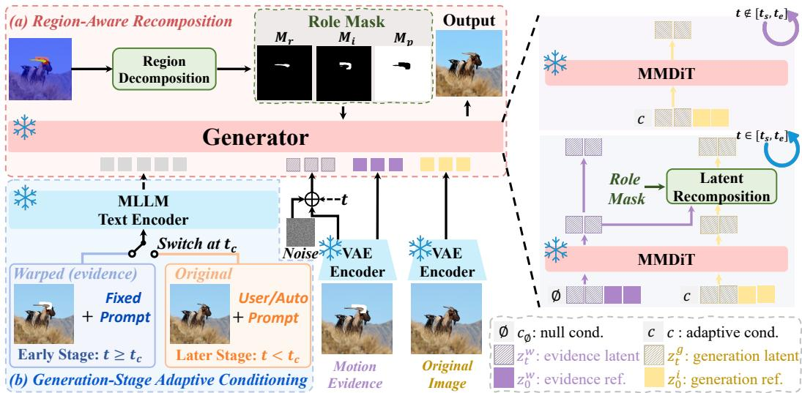  
Figure 3: Overview of MoRe-Drag. (a) Region-aware recomposition: the evidence and original image are decomposed into role-specific regions, producing role masks that guide latent recomposition, so motion cues are injected into the corresponding regions. (b) Generation-stage adaptive conditioning: at early timesteps $( t \geq t _ { c } )$ , the model uses the warped image with a fixed prompt to enforce motion consistency; at later timesteps $( t < t _ { c } )$ , it switches to the original image with the user/auto prompt for semantic and appearance refinement.

a region-aware recomposition module that injects motion evidence through region decomposition and latent recomposition (Sec. 3.1); (ii) a generation-stage adaptive conditioning strategy that balances motion evidence with semantic refinement across timestep-based condition switch (Sec. 3.2). As shown in Fig. 5, we fine-tune the MLLM, which also serves as the generator’s text encoder, to support automatic instruction inference (Sec. 3.3). For clarity, we provide algorithmic pseudocode in Appendix D.

## 3.1 Region-Aware Recomposition

The image warping algorithm [29] propagates the sparse handle-to-target displacements across the source region, deforming it according to the indicated motion directions and magnitudes. However, direct warping provides only coarse evidence—it introduces unnatural geometry, local distortions, boundary artifacts, and semantic misalignment, e.g., mouth shapes of the lion and crocodile in Fig. 1. This raises a key requirement: the editing process should retain the geometric faithfulness of the warp while leveraging the generative prior of the editing model to restore realism and semantic coherence. To this end, we first decompose the warped observation into three functional regions for refinement, hole inpainting, and background preservation (see Fig. 3 (a, top)), and then perform latent recomposition to inject the warped image as explicit motion evidence during generation (see Fig. 3 (a, right)). This allows the model to follow the user-specified motion while restoring realistic geometry, plausible semantics, and source-region consistency.

Region decomposition. We obtain the transported target mask $M _ { t }$ by applying the same warp to the source deformation region. As illustrated in the top-left part of Fig. 3, let Ω be the image domain, direct warping is particularly error-prone near the transported boundary. We therefore augment M with a narrow boundary band $M _ { \partial t }$ extracted from the contour of the target mask, and define the refinement mask as

$$
M _ { r } = M _ { t } \cup M _ { \partial t } .\tag{1}
$$

To identify the regions that remain uncovered after transport, we take the difference between the source mask and the transported target mask, dilate it to absorb boundary discontinuities, and exclude the refinement mask to avoid overlap:

$$
M _ { i } = \mathrm { D i l a t e } ( M _ { s } \setminus M _ { t } ) \setminus M _ { r } ,\tag{2}
$$

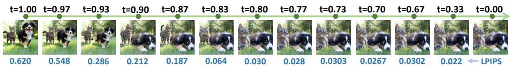  
Figure 4: Toy editing from different initial timesteps. Top: starting latent timestep; bottom: LPIPS to the original image.

where the dilation kernel size is 5. Finally, all remaining pixels form the preservation mask:

$$
M _ { p } = \Omega \setminus ( M _ { r } \cup M _ { i } ) .\tag{3}
$$

The three masks provide explicit spatial roles for generation. $M _ { \tau }$ guides refinement of the dragged content, $M _ { i }$ specifies the area to be inpainted, and $M _ { p }$ constrains the non-edited region to remain consistent.

Latent recomposition. Given the decomposed masks, we perform latent recomposition by assembling latent features within their corresponding mask regions. As illustrated in the right part of Fig. 3, we maintain two generation trajectories. The yellow trajectory on the right corresponds to conditioned generation branch and is initialized from Gaussian noise:

$$
z _ { 1 } ^ { g } \sim \mathcal { N } ( \mathbf { 0 } , I ) .\tag{4}
$$

We update it by integrating the flow-matching velocity field conditioned on the MLLM text encoder embedding c and reference image $z _ { 0 } ^ { i m a g e }$ , which is obtained by encoding the image with the VAE E:

$$
d z _ { t } ^ { g } = v _ { \theta } ( z _ { t } ^ { g } , t , c , z _ { 0 } ^ { i m a g e } ) d t , \quad t : 1 \to 0 , \quad \mathrm { w h e r e } \quad z _ { 0 } ^ { i m a g e } = \mathcal { E } ( X _ { o } )\tag{5}
$$

The resulting latent $ { \boldsymbol { z } } _ { t } ^ { g }$ serves as the conditional generation branch for subsequent recomposition. The purple trajectory on the left corresponds to the evidence branch. We first encode the warped image $X _ { w }$ into the latent space, and then perturb the resulting latent to a noisy state at timestep t for initialization:

$$
\begin{array} { r } { z _ { t } ^ { w } = ( 1 - t ) z _ { 0 } ^ { w } + t \epsilon ^ { w } , \qquad \epsilon ^ { w } \sim \mathcal { N } ( \mathbf { 0 } , I ) , \quad z _ { 0 } ^ { w } = \mathcal { E } ( X _ { w } ) , } \end{array}\tag{6}
$$

The evidence branch follows a null-conditioned reconstruction flow:

$$
d z _ { t } ^ { w } = v _ { \theta } ( z _ { t } ^ { w } , t , c _ { \theta } , z _ { 0 } ^ { w } ) d t , \quad t : 1 \to 0 .\tag{7}
$$

The evidence branch provides drag-induced spatial cues as well as reconstruction guidance for the non-edited regions. As shown in the right part of Fig. 3, since both $ { \boldsymbol { z } } _ { t } ^ { g }$ and $\boldsymbol { z } _ { t } ^ { w }$ are defined at the same flow timestep, they can be recomposed in latent space without scale or timestep misalignment. We resize the refinement, inpainting, and preservation masks to the latent resolution, denoted as $m _ { r } , m _ { i }$ and $m _ { p } .$ . During the timestep interval $\mathcal { T } = [ t _ { s } , t _ { e } ]$ , we recompose the sampling latents:

$$
z _ { t ^ { \prime } } ^ { g } \gets m _ { i } \odot z _ { t ^ { \prime } } ^ { g } + { m _ { p } } \odot z _ { t ^ { \prime } } ^ { w } + { m _ { r } } \odot \big ( \lambda ( t ^ { \prime } ) z _ { t ^ { \prime } } ^ { g } + \big ( 1 - \lambda ( t ^ { \prime } ) \big ) z _ { t ^ { \prime } } ^ { w } \big ) , \quad t ^ { \prime } \in \mathcal T .\tag{8}
$$

Here, $\lambda ( t ^ { \prime } )$ is a weight controlling the strength of generative refinement. The inpainting region fully relies on the conditioned generation branch to complete the hole, the preservation region adopts the evidence branch to preserve unchanged content, and the refinement region blends both branches to correct geometric artifacts while retaining the drag-induced spatial structure. This region-aware recomposition injects explicit pixel-space motion evidence into the latent sampling trajectory, while leveraging the model’s prior to produce natural deformation, plausible completion, and consistent background preservation.

Weight schedule. We experimented with three timestep-dependent schedules, including constant, linear, and inverse-square decay from $\lambda _ { \operatorname* { m a x } } \tan \lambda _ { \operatorname* { m i n } } .$ Considering its simplicity, efficiency, and stable empirical performance, we use the constant schedule by default. The quantitative comparison of different schedules is reported in Table 3. The formulations of schedules are provided in Appendix C.3.

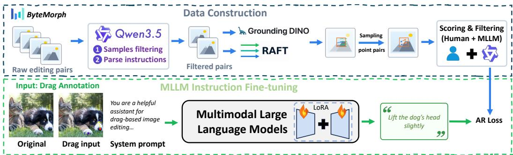  
Figure 5: Instruction interaction and data construction. Top: drag annotation construction from BYTEMORPH. Bottom: LoRA-based MLLM fine-tuning with AR loss, enabling automatic instruction inference from drag annotations.

## 3.2 Generation-Stage Adaptive Conditioning

While region-aware recomposition successfully injects motion evidence into the sampling trajectory, the generator prior still performs semantic refinement based on the source image and editing instruction. As a result, the sampling process may be driven by two competing spatial tendencies: the motion evidence specifies the desired drag target, whereas the generator prior may favor another edit location. When these two tendencies are substantially misaligned, the model attempts to satisfy both, producing duplicated or split edits across different regions, as shown in Fig. 8 (only stage 2). This indicates a competition between the editor’s semantic prior and the injected motion evidence.

A common understanding in diffusion/flow-based generation is that early sampling steps tend to establish low-frequency structure and high-level semantics, while later steps increasingly recover high-frequency details [42, 43]. We further conduct a toy editing experiment: given a real image $( t = 0 . 0 0 )$ and an edit instruction, we perturb the image to different timesteps along the forward flow path and start instruction-conditioned generation from each perturbed state. As shown in the Fig. 4, even at an early sampling timestep $t = 0 . 8 0$ , the major image structures and spatial layout have already been determined, while the remaining steps mainly refine appearance details. This observation motivates us to inject motion evidence in the early sampling stage, when spatial decisions are still being formed, and rely on the instruction for later refinement. Thus, as shown in Fig. 3(b), we introduce adaptive conditioning into conditioned generation branch. Specifically, during the early stage, we define the conditioning embedding c as the joint encoding of the warped image (motion evidence) $X _ { w }$ , and a fixed prompt p<sub>fix</sub>:

$$
\begin{array} { r } { \pmb { c } ^ { w } = \Phi _ { \mathrm { m l l m } } ( \pmb { X } _ { w } , p _ { \mathrm { f i x } } ) , \qquad z _ { 0 } ^ { \mathrm { i m g } , w } = \mathcal { E } ( \pmb { X } _ { w } ) , } \end{array}\tag{9}
$$

where $c ^ { w }$ is the early stage condition, and $\Phi _ { \mathrm { m l l m } }$ denotes MLLM text-encoder. $p _ { \mathrm { f i x } }$ encourages the model to correct distortions and fill holes in the motion evidence. Then, switching to the original image and the user/auto prompt during later stage:

$$
\pmb { c } ^ { o } = \Phi _ { \mathrm { m l l m } } ( \pmb { X } _ { o } , p ) , \qquad z _ { 0 } ^ { \mathrm { i m g } , o } = \mathcal { E } ( \pmb { I } _ { o } ) .\tag{10}
$$

With this stage-adaptive design, the conditional generation trajectory is sampled as

$$
d z _ { t } ^ { g } = v _ { \theta } \left( z _ { t } ^ { g } , t , c ( t ) , z _ { 0 } ^ { \mathrm { i m g } } ( t ) \right) d t , \quad \mathrm { w h e r e } \left( c ( t ) , z _ { 0 } ^ { \mathrm { i m g } } ( t ) \right) = \left\{ \begin{array} { l l } { \left( c ^ { w } , z _ { 0 } ^ { \mathrm { i m g } , w } \right) , } & { t \geq t _ { c } , } \\ { \left( c ^ { o } , z _ { 0 } ^ { \mathrm { i m g } , o } \right) , } & { t < t _ { c } . } \end{array} \right.\tag{11}
$$

Here, $t _ { c }$ controls the transition from motion-evidence-guided structure formation to source-imageguided semantic refinement. This switching timestep should be properly set to ensure a smooth conditioning transition, balancing motion-evidence injection and semantic refinement. We provide an analysis of its effect in Table 7.

This adaptive conditioning strategy complements the region-aware recomposition in Sec. 3.1 by establishing a dual pathway for motion-evidence injection, while early-stage conditioning guides generation toward the desired motion structure and aligns the model prior with the motion evidence. By first grounding the generation trajectory in the motion evidence and then refining it with the original image and instruction, MoRe-Drag improves the alignment between motion evidence and editing instructions while retaining the model’s ability to fix artifacts and synthesize plausible content.

Table 1: Results on DRAGBENCH-SR/DR. CP and PF are scaled by 100. Metrics of Qwen-Image-Edit and LongCat-Image-Edit are not highlighted, as they are not drag-based methods. “+ FLUX.1-Fill-dev” denotes an Inpaint4Drag variant using a stronger inpainting model. (\*) indicates results from the original papers, as the models were not publicly available at the time of evaluation. In the Params column, (-) indicates that MoRe-Drag keeps the generative backbone frozen.
<table><tr><td rowspan="2">Model</td><td rowspan="2">Params</td><td colspan="3">DRAGBENCH-SR</td><td colspan="3">DRAGBENCH-DR</td></tr><tr><td>MD↓</td><td>CP↑</td><td>PF↑</td><td>MD↓</td><td>CP↑</td><td>PF↑</td></tr><tr><td colspan="9">Test-time Optimization-based Methods</td></tr><tr><td>DragDiffusion</td><td>2.1B</td><td> $4 1 . 0 8 _ { \pm 0 . 4 3 }$ </td><td> $9 2 . 7 5 { \scriptstyle \pm 0 . 3 8 }$ </td><td> $7 7 . 1 5 { \scriptstyle \pm 1 . 4 9 }$ </td><td> $3 1 . 6 1 { \scriptstyle \pm 0 . 2 3 }$ </td><td> $9 6 . 4 6 { \scriptstyle \pm 0 . 4 3 }$ </td><td> $7 8 . 4 5 { \scriptstyle \pm 0 . 9 5 }$ </td></tr><tr><td>DragNoise</td><td>2.1B</td><td> $4 7 . 6 4 _ { \pm 1 . 0 8 }$ </td><td> $7 9 . 0 0 { \scriptstyle \pm 0 . 2 5 }$ </td><td> $6 1 . 5 6 { \scriptstyle \pm 0 . 3 1 }$ </td><td> $3 0 . 0 5 { \scriptstyle \pm 0 . 0 1 }$ </td><td> $9 1 . 4 6 _ { \pm 1 . 3 4 }$ </td><td> $8 1 . 0 2 _ { \pm 0 . 1 8 }$ </td></tr><tr><td>GoodDrag</td><td>2.1B</td><td> $2 8 . 9 4 _ { \pm 0 . 4 0 }$ </td><td> $9 4 . 5 0 { \scriptstyle \pm 0 . 1 3 }$ </td><td> $7 6 . 5 0 { \scriptstyle \pm 0 . 3 9 }$ </td><td> $2 3 . 2 1 _ { \pm 0 . 1 2 }$ </td><td> $9 5 . 3 6 { \scriptstyle \pm 0 . 2 4 }$ </td><td> $8 3 . 9 4 { \scriptstyle \pm 0 . 0 4 }$ </td></tr><tr><td colspan="9">Optimization-free Methods</td></tr><tr><td>FastDrag</td><td>2.1B</td><td> $2 3 . 1 7 _ { \pm 0 . 1 9 }$ </td><td></td><td></td><td> $2 9 . 5 0 { \scriptstyle \pm 0 . 1 2 }$ </td><td> $9 2 . 7 3 { \scriptstyle \pm 0 . 7 3 }$ </td><td></td></tr><tr><td>ContextDrag*</td><td>12B</td><td>19.07</td><td> $^ { 9 4 . 0 0 \pm 0 . 2 5 } _ { 9 2 . 2 5 }$ </td><td> $^ { 7 9 . 6 2 \pm 4 . 3 8 } _ { 8 2 . 0 0 }$ </td><td>21.66</td><td>90.90</td><td> $^ { 7 5 . 6 0 \pm 1 . 6 3 } _ { 8 3 . 7 8 }$ </td></tr><tr><td>Inpaint4Drag</td><td>2.1B</td><td> $1 9 . 7 9 _ { \pm 0 . 1 8 }$ </td><td></td><td> $8 1 . 0 0 { \scriptstyle \pm 0 . 0 4 }$ </td><td> $2 1 . 3 7 { \scriptstyle \pm 0 . 3 2 }$ </td><td> $8 8 . 5 3 { \scriptstyle \pm 0 . 2 5 }$ </td><td> $8 2 . 7 7 { \scriptstyle \pm 0 . 7 6 }$ </td></tr><tr><td> $+ F L U X . I \ – F i l l - d e \nu$ </td><td>12B</td><td> $1 8 . 9 6 _ { \pm 0 . 1 8 }$ </td><td> $\begin{array} { c } { 9 3 . 0 0 _ { \pm 0 . 1 3 } } \\ { 9 4 . 6 9 _ { \pm 0 . 5 3 } } \end{array}$ </td><td> $8 1 . 4 1 _ { \pm 1 . 4 1 }$ </td><td> $2 1 . 1 6 { \scriptstyle \pm 0 . 2 8 }$ </td><td> $9 1 . 7 0 { \scriptstyle \pm 0 . 4 9 }$ </td><td> $7 7 . 1 9 _ { \pm 1 . 4 0 }$ </td></tr><tr><td> $\mathrm { Q w e n - I m a g e { \mathrm { - } } E d i t }$ </td><td>20B</td><td> $5 0 . 4 8 { \scriptstyle \pm 0 . 1 2 }$ </td><td> $9 4 . 5 7 { \scriptstyle \pm 0 . 6 3 }$ </td><td> $8 3 . 5 9 { \scriptstyle \pm 0 . 7 6 }$ </td><td> $4 7 . 9 0 { \scriptstyle \pm 0 . 2 7 }$ </td><td> $9 2 . 4 3 { \scriptstyle \pm 0 . 4 1 }$ </td><td> $8 8 . 1 7 { \scriptstyle \pm 0 . 0 3 }$ </td></tr><tr><td> $+ M o R e \mathrm { - } D r a g$ </td><td>-</td><td> $2 3 . 8 5 { \scriptstyle \pm 0 . 6 2 }$ </td><td> $9 0 . 1 5 { \scriptstyle \pm 0 . 1 2 }$ </td><td> $7 0 . 9 6 { \scriptstyle \pm 0 . 5 8 }$ </td><td> $2 6 . 3 5 { \scriptstyle \pm 0 . 1 7 }$ </td><td> $8 7 . 3 1 { \scriptstyle \pm 0 . 0 0 }$ </td><td> $7 8 . 7 5 { \scriptstyle \pm 0 . 8 9 }$ </td></tr><tr><td> $\mathrm { L o n g C a t - I m a g e - E d i t }$ </td><td>6B</td><td> $5 3 . 6 2 { \scriptstyle \pm 0 . 0 9 }$ </td><td> $9 4 . 0 0 { \scriptstyle \pm 0 . 5 0 }$ </td><td> $9 2 . 0 8 { \scriptstyle \pm 1 . 1 7 }$ </td><td> $4 6 . 7 3 { \scriptstyle \pm 0 . 2 4 }$ </td><td> $9 1 . 2 8 { \scriptstyle \pm 0 . 5 5 }$ </td><td> $9 1 . 2 0 { \scriptstyle \pm 0 . 1 0 }$ </td></tr><tr><td> $+ M o R e \mathrm { - } D r a g$ </td><td></td><td> $\mathbf { 1 8 . 5 4 { \scriptstyle \pm 0 . 2 2 } }$ </td><td> $\mathbf { 9 6 . 3 6 { \scriptstyle \pm 0 . 3 8 } }$ </td><td> $\mathbf { 8 6 . 3 6 { \scriptstyle \pm 4 . 0 6 } }$ </td><td> $\mathbf { 2 0 . 0 3 { \scriptstyle \pm 0 . 2 1 } }$ </td><td> $\mathbf { 9 3 . 1 5 { \scriptstyle \pm 0 . 2 3 } }$ </td><td> $\mathbf { 8 4 . 8 2 { \scriptstyle \pm 0 . 9 8 } }$ </td></tr></table>

## 3.3 Instruction Interaction

The above components rely on textual instructions, which places an additional burden on users. To alleviate this, we introduce an instruction-free interface that automatically derives drag-aware instructions from drag-annotation visualizations. Specifically, we reuse the MLLM-based text encoder of the base editor for instruction inference, without introducing any additional standalone model. The inferred instruction is then used for subsequent generation.

Directly using the original MLLM for instruction inference can yield inaccurate intents, such as misidentifying the edited object or introducing semantic changes unsupported by the drag annotations (see Fig. 9). Therefore, as illustrated in the top part of Fig. 5, we construct a high-quality dragannotation dataset from the released demo split of BYTEMORPH [44]. Starting from 780K samples, we first remove 560K camera-centric samples using Qwen3.5-9B [45]. We then estimate optical flow with RAFT [46], localize edited subjects with Grounding DINO [47], and cluster regional flow vectors by magnitude and direction to sample handle–target pairs. To further improve annotation quality, we conduct a hybrid human-and-MLLM scoring review of the generated drag annotations, resulting in 68K high-quality samples for subsequent model fine-tuning, detailed in Appendix B.

As shown in the bottom part of Fig. 5, we fine-tune the MLLM using LoRA with the standard AR loss, implemented with an open-source Qwen-VL fine-tuning framework<sup>2</sup>. The adapter is activated only for instruction inference and disabled during generation, so the MMDiT decoder still receives conditioning features from the original encoder distribution. This bridges geometric interaction and semantic conditioning without altering the generative pathway.

## 4 Experiments

## 4.1 Implementation Details and Experimental Setup

Implementation Details. We use LongCat-Image-Edit [16] as the default base editor for MoRe-Drag, and instantiate it on Qwen-Image-Edit [15] as supplementary. Both editors adopt Qwen2.5-VL-7B [48] as the text encoder but use different MMDiT backbones. DragDiffusion [19], DragNoise [23], GoodDrag [25], and FastDrag [20] take drag points with a mask as input, whereas Inpaint4Drag [29] and MoRe-Drag use the drag-point-induced warped image. We also include an Inpaint4Drag variant implemented on top of FLUX.1-Fill-dev<sup>3</sup>. Further details are provided in Appendix C.

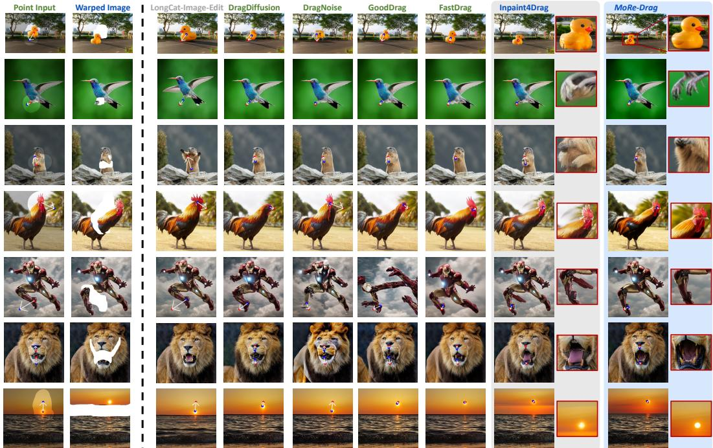  
Figure 6: Qualitative comparisons with state-of-the-art drag-based editing models. Blue and red points denote handle and target points, respectively. LongCat-Image-Edit is a text-based editing method; Inpaint4Drag and MoRe-Drag take the warped image as input, while the other methods are driven by point inputs. We provide zoomed-in views of the edited regions for the two warped-imagebased methods to highlight local structural fidelity. More results are shown in Fig. 11

Experimental Setup. We evaluate MoRe-Drag on DRAGBENCH-SR [30] and DRAGBENCH-DR [19]. Since neither benchmark provides natural-language edit instructions, we generate reference instructions with Qwen3.5-9B [45] followed by human correction for evaluation. Unless otherwise specified, MoRe-Drag uses inferred instructions produced by our LoRA-adapted MLLM. We report Mean Distance (MD) [19], Concept Preservation (CP) [49], and Prompt Following (PF) [49], each averaged over three runs with standard deviations. Details are provided in Appendices C.5 and C.6.

## 4.2 Comparison with SOTAs

Quan titative analysis. Table 1 reports the quantitative results. MoRe-Drag consistently improves drag precision over the base editors, demonstrating its generality. The performance gap between Qwen-Image-Edit- and LongCat-Image-Edit-based variants mainly stems from the base editors themselves, especially their null-conditioned reconstruction ability; the reconstruction comparison is reported in Appendix E.5. MoRe-Drag based on LongCat-Image-Edit achieves the best drag accuracy on both benchmarks with strong CP and PF scores, showing improved spatial controllability while preserving visual and semantic consistency. Even with the same inputs as ours and a stronger FLUX.1- Fill-dev backbone, Inpaint4Drag still falls short in precise and natural drag editing, highlighting the benefit of using the warped image as motion evidence. Although base editors sometimes obtain slightly higher PF, they are designed for text-guided editing and thus naturally favor this metric; however, they lack precise spatial manipulation ability, leading to much higher MD. Runtime and peak GPU memory comparisons between MoRe-Drag and the base editor are reported in Appendix E.6.

Qualitative analysis. Fig. 6 presents qualitative comparisons with representative drag-based editing methods and our base editor (LongCat-Image-Edit). MoRe-Drag achieves more accurate drag control while producing visually natural edits with better preservation of object texture, shape, and local structures. Compared with prior drag-based methods, MoRe-Drag more effectively maintains boundary continuity, preserves fine structures during motion, and avoids distortions, e.g., the first row of Fig. 6. It also enables semantically coherent edits, such as generating realistic mouth details in the lion example and consistently adjusting the sky color and reflection in the sunset case.

Table 2: Ablation results on DRAGBENCH-DR.  
Table 3: Ablation results on DRAGBENCH-SR.
<table><tr><td>Variant</td><td>MD↓</td><td>CP↑</td><td>PF↑</td></tr><tr><td>MoRe-Drag</td><td> $\mathbf { 2 0 . 0 3 _ { \pm 0 . 2 1 } }$  </td><td> $9 3 . 1 5 _ { \pm 0 . 2 3 }$  </td><td> $\mathbf { 8 4 . 8 2 _ { \pm 0 . 9 8 } }$ </td></tr><tr><td>w/o RAR</td><td>25.41±0.23</td><td> $9 2 . 5 0 { \scriptstyle \pm 0 . 1 8 }$ </td><td>77.14±1.16</td></tr><tr><td>w/o GAC</td><td> $2 9 . 6 1 _ { \pm 0 . 3 3 }$ </td><td> $\mathbf { 9 3 . 7 8 { \scriptstyle \pm 0 . 2 4 } }$ </td><td> $7 6 . 5 2 { \scriptstyle \pm 0 . 6 7 }$ </td></tr></table>

<table><tr><td>Variant</td><td>MD↓</td><td>CP↑</td><td>PF↑</td></tr><tr><td>Constant</td><td> $1 8 . 5 4 { \scriptstyle \pm 0 . 2 2 }$ </td><td> $9 6 . 3 6 { \scriptstyle \pm 0 . 3 8 }$ </td><td> $\mathbf { 8 6 . 3 6 _ { \pm 4 . 0 6 } }$ </td></tr><tr><td>Linear</td><td> $1 8 . 4 1 _ { \pm 0 . 0 3 }$ </td><td> $9 6 . 2 5 { \scriptstyle \pm 0 . 3 7 }$ </td><td>82.25±0.00</td></tr><tr><td>Inv. square</td><td> $\mathbf { 1 8 . 2 3 _ { \pm 0 . 1 0 } }$ </td><td> $\mathbf { 9 6 . 6 3 _ { \pm 0 . 1 3 } }$ </td><td> $8 0 . 1 4 { \scriptstyle \pm 1 . 8 6 }$ </td></tr></table>

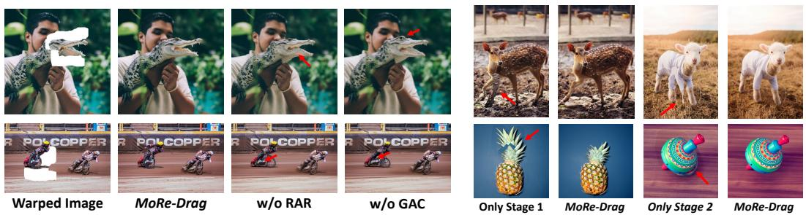  
Figure 7: Qualitative comparison of MoRe-Drag with <sub>Figure 8: Effect of generation-stage adap-</sub> variants without RAR or GAC. tive conditioning.

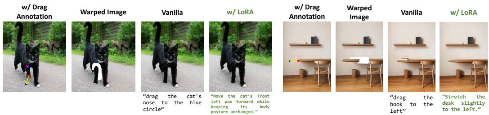  
Figure 9: Instruction interaction examples. Compared with vanilla instruction inference, LoRA adaptation produces drag-aware instructions that better match the visual annotations, reducing unintended artifacts and hallucinated content.

## 4.3 Ablation Studies

Region-aware recomposition and adaptive conditioning. Table 2 and Fig. 7 show that both Region-Aware Recomposition (RAR) and Generation-Stage Adaptive Conditioning (GAC) are important: removing RAR weakens local deformation control, while removing GAC produces less plausible structures. Fig. 8 further shows that using only the early-stage condition preserves motion cues but leads to under-refined distortions, whereas using only the later-stage condition can cause competition between semantic editing and injected motion evidence. Since different recomposition weight schedules perform similarly (Table 3), we use the constant schedule by default.

Instruction interaction. Fig. 9 illustrates drag-aware instruction inference. Misaligned instructions can introduce artifacts or unsupported content, whereas LoRA adaptation better captures the drag intent and improves editing faithfulness. Additional comparisons are provided in Appendix E.2.

## 5 Conclusion

In this paper, we presented MoRe-Drag, a drag-based editing framework that grounds modern editors with motion evidence. Through region-aware recomposition and stage-adaptive conditioning, MoRe Drag improves spatial control while preserving natural and visually coherent image generation results. We also introduced an instruction-free mode for drag-aware intent inference. Overall, our results suggest that pixel-space warping can serve as coarse motion evidence for advanced generative editors, enabling spatially accurate and visually natural drag-based manipulation.

Limitations and future work. Our method is primarily developed for editing backbones that use an MLLM as the text encoder and an MMDiT-style generative decoder. In our experiments, we find that the effectiveness of motion-evidence injection is related to the model’s null-conditioned reconstruction ability, where stronger reconstruction generally leads to more reliable editing consistency and concept preservation. Future work may explore improved reconstruction priors and editor-agnostic calibration strategies to make motion grounding more uniformly effective across diverse generative editing backbones.

## References

[1] Hansam Cho, Jonghyun Lee, Seoung Bum Kim, Tae-Hyun Oh, and Yonghyun Jeong. Noise map guidance: Inversion with spatial context for real image editing. In The Twelfth International Conference on Learning Representations, ICLR, 2024.

[2] Jun Zhou, Jiahao Li, Zunnan Xu, Hanhui Li, Yiji Cheng, Fa-Ting Hong, Qin Lin, Qinglin Lu, and Xiaodan Liang. Fireedit: Fine-grained instruction-based image editing via region-aware vision language model. In IEEE/CVF Conference on Computer Vision and Pattern Recognition, CVPR, pages 13093–13103, 2025.

[3] Amir Hertz, Ron Mokady, Jay Tenenbaum, Kfir Aberman, Yael Pritch, and Daniel Cohen-Or. Prompt-to-prompt image editing with cross-attention control. In The Eleventh International Conference on Learning Representations, ICLR, 2023.

[4] Ling Yang, Zhaochen Yu, Chenlin Meng, Minkai Xu, Stefano Ermon, and Bin Cui. Mastering text-to-image diffusion: Recaptioning, planning, and generating with multimodal llms. In Forty-first International Conference on Machine Learning, ICML, pages 56704–56721, 2024.

[5] Zechuan Zhang, Ji Xie, Yu Lu, Zongxin Yang, and Yi Yang. In-context edit: Enabling instructional image editing with in-context generation in large scale diffusion transformer. arXiv preprint arXiv:2504.20690, 2025.

[6] Chenyuan Wu, Pengfei Zheng, Ruiran Yan, Shitao Xiao, Xin Luo, Yueze Wang, Wanli Li, Xiyan Jiang, Yexin Liu, Junjie Zhou, Ze Liu, Ziyi Xia, Chaofan Li, Haoge Deng, Jiahao Wang, Kun Luo, Bo Zhang, Defu Lian, Xinlong Wang, Zhongyuan Wang, Tiejun Huang, and Zheng Liu. Omnigen2: Exploration to advanced multimodal generation. arXiv preprint arXiv:2506.18871, 2025.

[7] Qifan Yu, Wei Chow, Zhongqi Yue, Kaihang Pan, Yang Wu, Xiaoyang Wan, Juncheng Li, Siliang Tang, Hanwang Zhang, and Yueting Zhuang. Anyedit: Mastering unified high-quality image editing for any idea. In IEEE/CVF Conference on Computer Vision and Pattern Recognition, CVPR, pages 26125–26135, 2025.

[8] Cong Wei, Zheyang Xiong, Weiming Ren, Xeron Du, Ge Zhang, and Wenhu Chen. Omniedit: Building image editing generalist models through specialist supervision. In The Thirteenth International Conference on Learning Representations, ICLR, 2025.

[9] Zeyue Xue, Jie Wu, Yu Gao, Fangyuan Kong, Lingting Zhu, Mengzhao Chen, Zhiheng Liu, Wei Liu, Qiushan Guo, Weilin Huang, and Ping Luo. Dancegrpo: Unleashing GRPO on visual generation. arXiv preprint arXiv:2505.07818, 2025.

[10] Jie Liu, Gongye Liu, Jiajun Liang, Yangguang Li, Jiaheng Liu, Xintao Wang, Pengfei Wan, Di Zhang, and Wanli Ouyang. Flow-grpo: Training flow matching models via online rl. arXiv preprint arXiv:2505.05470, 2025.

[11] Yaron Lipman, Ricky T. Q. Chen, Heli Ben-Hamu, Maximilian Nickel, and Matthew Le. Flow matching for generative modeling. In The Eleventh International Conference on Learning Representations, ICLR, 2023.

[12] Xingchao Liu, Chengyue Gong, and Qiang Liu. Flow straight and fast: Learning to generate and transfer data with rectified flow. In The Eleventh International Conference on Learning Representations, ICLR, 2023.

[13] William Peebles and Saining Xie. Scalable diffusion models with transformers. In IEEE/CVF International Conference on Computer Vision, ICCV, pages 4172–4182, 2023.

[14] Black Forest Labs, Stephen Batifol, Andreas Blattmann, Frederic Boesel, Saksham Consul, Cyril Diagne, Tim Dockhorn, Jack English, Zion English, Patrick Esser, Sumith Kulal, Kyle Lacey, Yam Levi, Cheng Li, Dominik Lorenz, Jonas Müller, Dustin Podell, Robin Rombach, Harry Saini, Axel Sauer, and Luke Smith. FLUX.1 kontext: Flow matching for in-context image generation and editing in latent space. arXiv preprint arXiv:2506.15742, 2025.

[15] Chenfei Wu, Jiahao Li, Jingren Zhou, Junyang Lin, Kaiyuan Gao, Kun Yan, Shengming Yin, Shuai Bai, Xiao Xu, Yilei Chen, Yuxiang Chen, Zecheng Tang, Zekai Zhang, Zhengyi Wang, An Yang, Bowen Yu, Chen Cheng, Dayiheng Liu, Deqing Li, Hang Zhang, Hao Meng, Hu Wei, Jingyuan Ni, Kai Chen, Kuan Cao, Liang Peng, Lin Qu, Minggang Wu, Peng Wang, Shuting Yu, Tingkun Wen, Wensen Feng, Xiaoxiao Xu, Yi Wang, Yichang Zhang, Yongqiang Zhu, Yujia Wu, Yuxuan Cai, and Zenan Liu. Qwen-image technical report, 2025.

[16] Hanghang Ma, Haoxian Tan, Jiale Huang, Junqiang Wu, Jun-Yan He, Lishuai Gao, Songlin Xiao, Xiaoming Wei, Xiaoqi Ma, Xunliang Cai, Yayong Guan, and Jie Hu. Longcat-image technical report. arXiv preprint arXiv:2512.07584, 2025.

[17] Shiyu Liu, Yucheng Han, Peng Xing, Fukun Yin, Rui Wang, Wei Cheng, Jiaqi Liao, Yingming Wang, Honghao Fu, Chunrui Han, Guopeng Li, Yuang Peng, Quan Sun, Jingwei Wu, Yan Cai, Zheng Ge, Ranchen Ming, Lei Xia, Xianfang Zeng, Yibo Zhu, Binxing Jiao, Xiangyu Zhang, Gang Yu, and Daxin Jiang. Step1x-edit: A practical framework for general image editing. arXiv preprint arXiv:2504.17761, 2025.

[18] Xingang Pan, Ayush Tewari, Thomas Leimkühler, Lingjie Liu, Abhimitra Meka, and Christian Theobalt. Drag your GAN: interactive point-based manipulation on the generative image manifold. In ACM SIGGRAPH 2023 Conference Proceedings, SIGGRAPH, pages 78:1–78:11, 2023.

[19] Yujun Shi, Chuhui Xue, Jun Hao Liew, Jiachun Pan, Hanshu Yan, Wenqing Zhang, Vincent Y. F. Tan, and Song Bai. Dragdiffusion: Harnessing diffusion models for interactive point-based image editing. In IEEE/CVF Conference on Computer Vision and Pattern Recognition, CVPR, pages 8839–8849, 2024.

[20] Xuanjia Zhao, Jian Guan, Congyi Fan, Dongli Xu, Youtian Lin, Haiwei Pan, and Pengming Feng. Fastdrag: Manipulate anything in one step. In Advances in Neural Information Processing Systems 38: Annual Conference on Neural Information Processing Systems 2024, NeurIPS, 2024.

[21] Jingyi Lu, Xinghui Li, and Kai Han. Regiondrag: Fast region-based image editing with diffusion models. In The 18th European Conference on Computer Vision, ECCV, pages 231–246, 2024.

[22] Siwei Xia, Li Sun, Tiantian Sun, and Qingli Li. Draglora: Online optimization of lora adapters for drag-based image editing in diffusion model. In Forty-second International Conference on Machine Learning, ICML, 2025.

[23] Haofeng Liu, Chenshu Xu, Yifei Yang, Lihua Zeng, and Shengfeng He. Drag your noise: Interactive point-based editing via diffusion semantic propagation. In IEEE/CVF Conference on Computer Vision and Pattern Recognition, CVPR, pages 6743–6752, 2024.

[24] Pengyang Ling, Lin Chen, Pan Zhang, Huaian Chen, Yi Jin, and Jinjin Zheng. Freedrag: Feature dragging for reliable point-based image editing. In IEEE/CVF Conference on Computer Vision and Pattern Recognition, CVPR, pages 6860–6870, 2024.

[25] Zewei Zhang, Huan Liu, Jun Chen, and Xiangyu Xu. Gooddrag: Towards good practices for drag editing with diffusion models. In The Thirteenth International Conference on Learning Representations, ICLR, 2025.

[26] DuoSheng Chen, Binghui Chen, Yifeng Geng, and Liefeng Bo. Adaptivedrag: Semantic-driven dragging on diffusion-based image editing. arXiv preprint arXiv:2410.12696, 2024.

[27] Ziqi Jiang, Zhen Wang, and Long Chen. Clipdrag: Combining text-based and drag-based instructions for image editing. In The Thirteenth International Conference on Learning Representations, ICLR, 2025.

[28] Yujun Shi, Jun Hao Liew, Hanshu Yan, Vincent Y. F. Tan, and Jiashi Feng. Lightningdrag: Lightning fast and accurate drag-based image editing emerging from videos. In Forty-second International Conference on Machine Learning, ICML, 2025.

[29] Jingyi Lu and Kai Han. Inpaint4drag: Repurposing inpainting models for drag-based image editing via bidirectional warping. In International Conference on Computer Vision, ICCV, 2025.

[30] Shen Nie, Hanzhong Allan Guo, Cheng Lu, Yuhao Zhou, Chenyu Zheng, and Chongxuan Li. The blessing of randomness: SDE beats ODE in general diffusion-based image editing. In The Twelfth International Conference on Learning Representations, ICLR, 2024.

[31] Rinon Gal, Yuval Alaluf, Yuval Atzmon, Or Patashnik, Amit Haim Bermano, Gal Chechik, and Daniel Cohen-Or. An image is worth one word: Personalizing text-to-image generation using textual inversion. In The Eleventh International Conference on Learning Representations, ICLR, 2023.

[32] Ron Mokady, Amir Hertz, Kfir Aberman, Yael Pritch, and Daniel Cohen-Or. Null-text inversion for editing real images using guided diffusion models. In IEEE/CVF Conference on Computer Vision and Pattern Recognition, CVPR, pages 6038–6047, 2023.

[33] Kunyu Feng, Yue Ma, Bingyuan Wang, Chenyang Qi, Haozhe Chen, Qifeng Chen, and Zeyu Wang. Dit4edit: Diffusion transformer for image editing. In Thirty-Ninth AAAI Conference on Artificial Intelligence, Thirty-Seventh Conference on Innovative Applications ofArtificial Intelligence, Fifteenth Symposium on Educational Advances in Artificial Intelligence, AAAI, pages 2969–2977, 2025.

[34] Black Forest Labs. FLUX.2: Frontier Visual Intelligence. https://bfl.ai/blog/flux-2, November 2025.

[35] Changhao Qiao, Chao Hui, Chen Li, Cunzheng Wang, Dejia Song, Jiale Zhang, Jing Li, Qiang Xiang, Runqi Wang, Shuang Sun, Wei Zhu, Xu Tang, Yao Hu, Yibo Chen, Yuhao Huang, Yuxuan Duan, Zhiyi Chen, and Ziyuan Guo. Firered-image-edit-1.0 technical report. arXiv preprint arXiv:2602.13344, 2026.

[36] Xingzhong Hou, Boxiao Liu, Yi Zhang, Jihao Liu, Yu Liu, and Haihang You. Easydrag: Efficient point-based manipulation on diffusion models. In IEEE/CVF Conference on Computer Vision and Pattern Recognition, CVPR, pages 8404–8413, 2024.

[37] Yutao Cui, Xiaotong Zhao, Guozhen Zhang, Shengming Cao, Kai Ma, and Limin Wang. Stabledrag: Stable dragging for point-based image editing. In The 18th European Conference on Computer Vision, ECCV, pages 340–356, 2024.

[38] Gayoon Choi, Taejin Jeong, Sujung Hong, and Seong Jae Hwang. Dragtext: Rethinking text embedding in point-based image editing. In IEEE/CVF Winter Conference on Applications of Computer Vision, WACV, pages 441–450, 2025.

[39] Zixin Yin, Xili Dai, Duomin Wang, Xianfang Zeng, Lionel M. Ni, Gang Yu, and Heung-Yeung Shum. Lazydrag: Enabling stable drag-based editing on multi-modal diffusion transformers via explicit correspondence. arXiv preprint arXiv:2509.12203, 2025.

[40] Zihan Zhou, Shilin Lu, Shuli Leng, Shaocong Zhang, Zhuming Lian, Xinlei Yu, and Adams Wai-Kin Kong. Dragflow: Unleashing dit priors with region based supervision for drag editing. arXiv preprint arXiv:2510.02253, 2025.

[41] Huiguo He, Pengyu Yan, Ziqi Yi, Weizhi Zhong, Zheng Liu, Yejun Tang, Huan Yang, Guanbin Li, and Lianwen Jin. Contextdrag: Precise drag-based image editing via context-preserving token injection and position-aligned attention, 2026.

[42] Haeil Lee, Hansang Lee, Seoyeon Gye, and Junmo Kim. Beta sampling is all you need: Efficient image generation strategy for diffusion models using stepwise spectral analysis. In IEEE/CVF Winter Conference on Applications ofComputer Vision, WACV, pages 4215–4224, 2025.

[43] Jooyoung Choi, Jungbeom Lee, Chaehun Shin, Sungwon Kim, Hyunwoo Kim, and Sungroh Yoon. Perception prioritized training of diffusion models. In IEEE/CVF Conference on Computer Vision and Pattern Recognition, CVPR, pages 11462–11471, 2022.

[44] Di Chang, Mingdeng Cao, Yichun Shi, Bo Liu, Shengqu Cai, Shijie Zhou, Weilin Huang, Gordon Wetzstein, Mohammad Soleymani, and Peng Wang. Bytemorph: Benchmarking instruction-guided image editing with non-rigid motions. arXiv preprint arXiv:2506.03107, 2025.

[45] Qwen Team. Qwen3.5: Towards native multimodal agents. https://qwen.ai/blog?id= qwen3.5, February 2026.

[46] Zachary Teed and Jia Deng. Raft: Recurrent all-pairs field transforms for optical flow. In The 18th European Conference on Computer Vision, ECCV, 2020.

[47] Shilong Liu, Zhaoyang Zeng, Tianhe Ren, Feng Li, Hao Zhang, Jie Yang, Chunyuan Li, Jianwei Yang, Hang Su, Jun Zhu, et al. Grounding dino: Marrying dino with grounded pre-training for open-set object detection. arXiv preprint arXiv:2303.05499, 2023.

[48] Shuai Bai, Keqin Chen, Xuejing Liu, Jialin Wang, Wenbin Ge, Sibo Song, Kai Dang, Peng Wang, Shijie Wang, Jun Tang, Humen Zhong, Yuanzhi Zhu, Ming-Hsuan Yang, Zhaohai Li, Jianqiang Wan, Pengfei Wang, Wei Ding, Zheren Fu, Yiheng Xu, Jiabo Ye, Xi Zhang, Tianbao Xie, Zesen Cheng, Hang Zhang, Zhibo Yang, Haiyang Xu, and Junyang Lin. Qwen2.5-vl technical report. arXiv preprint arXiv:2502.13923, 2025.

[49] Yuang Peng, Yuxin Cui, Haomiao Tang, Zekun Qi, Runpei Dong, Jing Bai, Chunrui Han, Zheng Ge, Xiangyu Zhang, and Shu-Tao Xia. Dreambench++: A human-aligned benchmark for personalized image generation. In The Thirteenth International Conference on Learning Representations, ICLR, 2025.

[50] Alexander Kirillov, Eric Mintun, Nikhila Ravi, Hanzi Mao, Chloé Rolland, Laura Gustafson, Tete Xiao, Spencer Whitehead, Alexander C. Berg, Wan-Yen Lo, Piotr Dollár, and Ross B. Girshick. Segment anything. In IEEE/CVF International Conference on Computer Vision, ICCV, pages 3992–4003, 2023.

## A Broader Impacts

MoRe-Drag is designed to improve the controllability and usability of interactive image editing. Such capability can benefit creative workflows, visual design, image retouching, education, and AR/VR content creation. Our method reduces the need for manual trial-and-error tuning, enabling more accurate and natural manipulation. However, more controllable and realistic editing tools may also increase the risk of misuse. Precise drag-based manipulation raises potential misuse concerns, including the alteration of visual evidence, the creation of misleading media, and non-consensual edits of personal images. These risks are not unique to our method; however, increased spatial controllability may reduce the effort needed to produce convincing deceptive content. Responsible deployment should therefore incorporate safeguards such as explicit user consent, provenance tracking, watermarking, and authentication of edited images.

## B Drag-Instruction Dataset Construction

Below, we describe in detail the dataset construction pipeline mentioned in Sec. 3.3. BYTE-MORPH<sup>4</sup> [44] covers several editing types, including camera zoom, camera motion, object motion, human motion, and human-object interaction. Since our method focuses on drag-based editing, we design an automated data processing pipeline to extract samples with reliable local motion, mine dense drag correspondences, filter noisy annotations, and construct spatial candidate regions. The overall data construction pipeline is summarized in Table 4. Starting from BYTEMORPH, the motion filtering stage retains approximately 220K samples, and the final score-based filtering produces approximately 68K high-quality drag-instruction samples.

Table 4: Summary of the drag-instruction dataset construction pipeline.
<table><tr><td>Stage</td><td>Main models</td><td>Key settings</td><td>Size</td></tr><tr><td>Raw dataset</td><td></td><td></td><td>780K</td></tr><tr><td>Motion-edit filtering</td><td>Qwen3.5-9B</td><td>local human/object motion; no global camera change</td><td>220K</td></tr><tr><td>Drag annotation mining</td><td>Grounding DINO, SAM, RAFT</td><td>flow threshold 1.5; cycle error ≤ 1; max 16 points/sample</td><td>220K</td></tr><tr><td>Quality scoring and filtering</td><td>Qwen3.5-9B + Human</td><td>alignment scores in {0, 1, 2, 3}; keep  $S _ { \mathrm { a v g } } \geq 0 . 6$ </td><td>68K</td></tr></table>

(i) Motion-edit filtering. We first filter BYTEMORPH to keep only samples involving local motion edits. Specifically, we use Qwen3.5-9B [45] as a structured instruction parser. Given an editing instruction, the model determines whether the instruction is motion-related, whether it involves global camera changes, the motion type, and the entities being edited. We retain a sample only if it describes human or object motion, and discard samples involving global camera changes. The extracted edited entities are further used in the subsequent step to obtain masks for the editing subjects. This stage retains approximately 220K motion-related samples from the original dataset.

(ii) Drag annotation mining. For each retained sample, we automatically extract drag annotations from the source–target image pair. We first localize the edited entities obtained from the instruction parser. Grounding DINO [47] is used to detect entity boxes in the source image, and SAM [50] converts the detected boxes into pixel-level masks. We then compute bidirectional optical flow between the source and target images using RAFT [46]. A pixel is considered a valid motion candidate if the magnitudes of both its forward flow and the corresponding backward flow exceed 1.5 pixels.

The candidate motion mask is defined as the intersection of the entity mask and the valid motion mask. We remove a 4-pixel image border and discard connected components with fewer than 64 pixels. Large components are further partitioned by applying k-means clustering to their flow vectors, which separates regions with different motion directions. We retain at most 8 motion regions per sample. Within each region, handle points are sampled on a stratified grid, at a density of approximately one point per 16 × 16 pixels. The number of handle points is capped at 8 per region and 64 per sample. For each handle point $( x _ { h } , y _ { h } )$ , the corresponding target point is obtained by adding the forward optical-flow vector:

$$
( x _ { t } , y _ { t } ) = ( x _ { h } + \Delta x , y _ { h } + \Delta y ) .
$$

We discard target points outside the image boundary and remove samples that contain no valid drag points.

(iii) Drag quality scoring and filtering. The automatically mined drag annotations may still contain noisy correspondences or motion cues that are not semantically aligned with the intended edit. We therefore score the annotations with a VLM, using human inspection to calibrate the scoring prompt and spot-check the retained samples. For each sample, Qwen3.5-9B [45] is given three images: the source image, the source image overlaid with drag guidance, and the target image. The drag visualization marks handle points in red, target points in blue, and drag directions with arrows.

The VLM scores each sample along three dimensions: camera motion, instruction alignment, and target alignment. The camera-motion score penalizes global camera changes in the source–target pair; the instruction-alignment score measures whether the drag guidance matches the editing instruction; and the target-alignment score measures whether the drag guidance explains the visible transformation from the source image to the target image. Each score is an integer in {0, 1, 2, 3}, with higher values indicating better quality. The final score is the normalized average:

$$
S _ { \mathrm { a v g } } = \frac { 1 } { 3 } \left( \frac { S _ { \mathrm { c a m } } } { 3 } + \frac { S _ { \mathrm { i n s } } } { 3 } + \frac { S _ { \mathrm { t g t } } } { 3 } \right) .
$$

We discard samples with $S _ { \mathrm { a v g } } < 0 . 6$ and remove obvious failure cases through human spot-checking.   
This score-based filtering step yields approximately 68K high-quality drag-annotated samples.

## C Implementation, Evaluation, and Training Details

## C.1 Implementation Details

We implement MoRe-Drag on LongCat-Image-Edit [16] and Qwen-Image-Edit [15]. Both models adopt Qwen2.5-VL-7B [48] as the MLLM-based text encoder, while using MMDiT generators with 6B and 20B parameters, respectively. All evaluation experiments are conducted on NVIDIA RTX 4090 GPUs. Unless otherwise specified, we use 30 sampling steps. For DRAGBENCH-SR [30], we use a CFG scale of 3, apply region-aware latent recomposition from step 1 to step 16, and switch generation-stage adaptive conditioning at step 12. For DRAGBENCH-DR, we use a CFG scale of 2, apply region-aware latent recomposition from step 1 to step 14, and switch generation-stage adaptive conditioning at step 11. For the recomposition weight, we set $\lambda _ { \mathrm { m a x } } = 0 . 5$ and $\lambda _ { \mathrm { m i n } } = 0 . 3$

## C.2 Training Details

For drag-aware instruction inference, we fine-tune the Qwen2.5-VL-7B text encoder on our filtered 68K drag-instruction dataset. The fine-tuning is performed with LoRA on two NVIDIA RTX PRO 6000 GPUs for 15 GPU-hours. We freeze the vision tower, LLM backbone, and multimodal merger, and train LoRA adapters with rank 32, alpha 64, and dropout 0.05. The model is trained for 3 epochs using a global batch size of 80, with a per-device batch size of 40 and no gradient accumulation. We use bfloat16 precision and DeepSpeed ZeRO-2 setting. The learning rate is set to $2 \times 1 0 ^ { - 4 }$ with weight decay 0.1, a warmup ratio of 0.03, and a cosine learning-rate schedule. The input image resolution is controlled by setting the minimum and maximum visual tokens to $2 5 6 \times 2 8 \times 2 8$ and $1 2 8 0 \times 2 8 \times 2 8$ , respectively.

## C.3 Formulation of Weight Schedule

We provide the formulations of the weight schedules used in latent recomposition (Sec. 3.1). Unless otherwise specified, we adopt the constant schedule as the default setting.

$$
C o n s t a n t : ~ \lambda ( t _ { i } ) = \lambda _ { \operatorname* { m a x } } , \quad L i n e a r : ~ \lambda ( t _ { i } ) = \lambda _ { \operatorname* { m a x } } + ( \lambda _ { \operatorname* { m i n } } - \lambda _ { \operatorname* { m a x } } ) \rho _ { i } ,
$$

Inverse square : $\lambda ( t _ { i } ) = \lambda _ { \operatorname* { m a x } } + ( \lambda _ { \operatorname* { m i n } } - \lambda _ { \operatorname* { m a x } } ) \rho _ { i } ^ { 2 } .$

(12)

## C.4 Details of Bidirectional Warping

We adopt the bidirectional pixel-space warping strategy from Inpaint4Drag [29] to construct the warped observation used as motion evidence. Given a source image X, a manipulation mask $M _ { s } ,$ and handle–target pairs $\{ ( h _ { i } , t _ { i } ) \} _ { i = 1 } ^ { K }$ , the goal is to propagate sparse user-specified displacements to dense pixel motions within the editable region. For each handle point, the displacement vector is defined as

$$
d _ { i } = t _ { i } - h _ { i } .\tag{13}
$$

A dense motion field ${ \pmb F } ( { \pmb x } )$ is then estimated by interpolating the sparse displacements over pixels $\pmb { x } \in M _ { s }$ , with nearby handles contributing more strongly:

$$
\pmb { F } ( \pmb { x } ) = \sum _ { i = 1 } ^ { K } \frac { w _ { i } ( \pmb { x } ) d _ { i } } { \sum _ { i = 1 } ^ { K } w _ { i } ( \pmb { x } ) } , \qquad w _ { i } ( \pmb { x } ) = \frac { 1 } { \| \pmb { x } - \pmb { h } _ { i } \| + \epsilon } .\tag{14}
$$

Pixels outside the manipulation mask are kept unchanged.

Following Inpaint4Drag [29], we apply bidirectional warping to better preserve transported content while identifying disoccluded regions. Forward warping maps each source pixel to its displaced location:

$$
\pmb { x } ^ { \prime } = \pmb { x } + \pmb { F } ( \pmb { x } ) , \qquad \pmb { x } \in \pmb { M } _ { s } .\tag{15}
$$

Since forward warping may create holes or overlaps, we further construct a backward mapping for pixels in the transformed target region. For each target pixel $\mathbf { x } ^ { \prime }$ , we find its $N$ nearest pixels $\{ { \pmb x } _ { i } ^ { \prime } \} _ { i = 1 } ^ { N }$ that have valid correspondences from the forward warping step, where $\mathbf { \Delta } _ { \mathbf { \mathcal { X } } _ { i } }$ denotes the corresponding source position of $\pmb { x } _ { i } ^ { \prime }$ . The source position of $\mathbf { x } ^ { \prime }$ is then estimated by locally interpolating the inverse displacement:

$$
{ \pmb x } _ { s } ( { \pmb x } ^ { \prime } ) = { \pmb x } ^ { \prime } + \sum _ { i = 1 } ^ { N } w _ { i } ( { \pmb x } ^ { \prime } ) \left( { \pmb x } _ { i } - { \pmb x } _ { i } ^ { \prime } \right) ,\tag{16}
$$

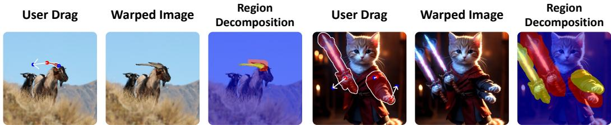  
Figure 10: Illustration of bidirectional warping and mask decomposition. Given handle–target drag annotations, bidirectional warping produces a warped observation that provides pixel-space motion evidence. We decompose the result into preservation, refinement, and inpainting regions for regionaware latent recomposition: blue denotes the anchor preservation $M _ { p } ,$ , yellow denotes the refinement mask $M _ { r }$ , and red denotes the inpainting mask $M _ { i }$

where $w _ { i } ( \pmb { x } ^ { \prime } )$ are normalized inverse-distance weights computed from the distance between $\mathbf { x } ^ { \prime }$ and $\pmb { x } _ { i } ^ { \prime }$ . We only keep valid mapping pairs whose source and target coordinates lie inside the image domain,

$$
\pmb { x } _ { s } ( \pmb { x } ^ { \prime } ) , \pmb { x } ^ { \prime } \in [ 0 , W ) \times [ 0 , H ) ,\tag{17}
$$

where $W$ and H denote the image width and height. The warped image is then obtained by

$$
\pmb { X } _ { w } ( \pmb { x } ^ { \prime } ) = \pmb { X } ( \pmb { x } _ { s } ( \pmb { x } ^ { \prime } ) ) .\tag{18}
$$

The resulting warped image $X _ { w }$ provides a coarse observation of the desired drag motion.

Fig. 10 visualizes the intermediate representation derived from drag annotations. The user-specified drag input is converted into a warped observation that serves as pixel-space motion evidence. Based on this observation, we construct three functional masks for region-aware latent recomposition: a preservation mask for unchanged content, a refinement mask for transported content, and an inpainting mask for invalid regions.

This warping result is not used as the intermediate edited image. Instead, MoRe-Drag treats $\mathbf { \nabla } _ { I _ { w } }$ as coarse motion evidence that provides drag-relevant cues about where and how the content should move. The subsequent region-aware recomposition and adaptive conditioning stages repair artifacts introduced by warping and synthesize visually plausible content. For additional implementation details of the bidirectional warping procedure, we refer readers to Inpaint4Drag [29].

## C.5 Benchmark Instruction Generation

DRAGBENCH-SR [19] and DRAGBENCH-DR [30] provide source images, manipulation masks, and handle–target point pairs, but do not include the natural-language editing instructions needed for our instruction-based evaluation metrics. We therefore generate one edit prompt for each sample with a vision-language model. For each sample, we pair the original source image with an annotated version in which handle points are marked as red squares, target points as blue circles, and handle-to-target displacements as yellow arrows. We feed this two-image input to Qwen3.5-9B [45], together with a structured intent-parsing prompt, to obtain a concise instruction that captures the semantic intent of the drag operation. The generated instructions are manually checked and corrected when necessary. The final instruction is written back to the sample metadata for instruction-based evaluation, while the original drag points and masks are kept for drag-based editing and metric computation.

## C.6 Evaluation Metrics

Following DragDiffusion [19], we use Mean Distance (MD) to evaluate drag precision. MD measures the average Euclidean distance between the tracked handle points in the edited image and the userspecified target points; lower values indicate more accurate drag control. Specifically, for each handle–target pair, we track the handle location after editing, compute its distance to the target point, and average the distances over all point pairs and samples.

We do not report Image Fidelity (IF), as prior work has noted that it is not well suited for evaluating identity preservation in drag-based editing [29, 39]. For drag-based editing, valid geometric transformations may inevitably increase LPIPS despite preserving the intended identity, making IF an unreliable proxy for fidelity in this setting. We therefore adopt the vision-language-model-based metrics from DreamBench++ [49], namely Concept Preservation (CP) and Prompt Following (PF), which are designed to better capture semantic consistency and instruction alignment.

```latex
Algorithm 1 MoRe-Drag
Require: Source image $X _ { o } ,$ warped image $\scriptstyle { X _ { w } , }$ drag masks $( m _ { r } , m _ { i } , m _ { p } )$ , instruction $p ,$ fixed
restoration prompt $p _ { \mathrm { f i x } } ,$ recomposition interval $\tau _ { \ast }$ , switching timestep $t _ { c } .$
1: Encode source and warped images: $z _ { 0 } ^ { o } = \mathcal { E } ( X _ { o } ) , z _ { 0 } ^ { w } = \bar { E ( X _ { w } ) }$
2: Initialize generation latent $z _ { 1 } ^ { g } \stackrel { - } { \sim } \mathcal { N } ( 0 , I )$ and evidence latent $\boldsymbol { z } _ { t } ^ { w }$ from the flow perturbation of
$z _ { 0 } ^ { w }$
3: for each timestep $t : 1  0$ do
4: if $t \geq t _ { c }$ then
5: Use warped-image condition $( \pmb { c } ( t ) , z _ { 0 } ^ { \mathrm { i m g } } ( t ) ) = ( \Phi _ { \mathrm { m l l m } } ( \pmb { X } _ { w } , p _ { \mathrm { f i x } } ) , \pmb { \mathcal { E } } ( \pmb { X } _ { w } ) )$
6: else
7: Use original-image condition $( \pmb { c } ( t ) , z _ { 0 } ^ { \mathrm { i m g } } ( t ) ) = ( \Phi _ { \mathrm { m l l m } } ( \pmb { X } _ { o } , p ) , \pmb { \mathcal { E } } ( \pmb { X } _ { o } ) )$
8: end if
9: Update the generation trajectory with one MMDiT forward pass:
$\begin{array} { r } { \boldsymbol { z } _ { t - \Delta t } ^ { g }  \mathrm { S t e p } ( \boldsymbol { z } _ { t } ^ { g } , \boldsymbol { v } _ { \boldsymbol { \theta } } ( \boldsymbol { z } _ { t } ^ { g } , t , c ( t ) , \boldsymbol { z } _ { 0 } ^ { \mathrm { i m g } } ( t ) ) ) } \end{array}$
10: $\mathbf { i f } \dot { t } \in \mathcal { T }$ then
11: Update the evidence trajectory with a null-condition MMDiT forward pass:
$\Im _ { t - \Delta t }  \mathrm { S t e p } ( z _ { t } ^ { w } , \pmb { v } _ { \theta } ( z _ { t } ^ { w } , t , \pmb { c } _ { \theta } , z _ { 0 } ^ { w } ) )$
12: Recompose the generation latent:
$z _ { t _ { - } \bot \bot } ^ { g } \getsm \dot { m } _ { i } \odot z _ { t - \Delta t } ^ { g ^ { - } } + m _ { p } \odot z _ { t - \Delta t } ^ { w } + m _ { r } \odot \big ( \lambda z _ { t - \Delta t } ^ { g } + ( 1 - \lambda ) z _ { t - \Delta t } ^ { w } \big ) .$
13: end $\mathbf { \overline { { i f } } } ^ { \circ }$
14: end for
15: Decode $z _ { 0 } ^ { g }$ to obtain the edited image.
```

Following DreamBench++, we use GPT-4o as the evaluator for both CP and PF. CP is computed under the original DreamBench++ setting to assess whether the edited image preserves the main visual concept and identity of the source content. For PF, since our task is image editing rather than text-to-image generation, we adapt the original prompt-following protocol by providing the evaluator with a triplet consisting of the source image, the edited image, and the corresponding edit instruction. The evaluator is asked to determine whether the edited image follows the instruction while preserving visual content that should remain unchanged. The PF score ranges from 0 to 4, with higher values indicating better instruction alignment and content preservation.

## D Algorithmic Details of MoRe-Drag

Algorithm 1 summarizes the inference procedure of MoRe-Drag. The input instruction p can be either provided by the user or automatically inferred from drag annotations using the fine-tuned MLLM text encoder of the editor (Sec. 3.3). The method maintains two latent trajectories during sampling: an instruction-conditioned generation trajectory and a null-condition evidence reconstruction trajectory. The generation trajectory is updated at every sampling step using the adaptive image-text condition (Sec. 3.2). The evidence trajectory is updated only within the recomposition interval $\mathcal { T } = [ t _ { s } , t _ { e } ]$ where the warped observation is injected as motion evidence (Sec. 3.1).

## E Extra Results

## E.1 Qualitative Results

Fig. 11 presents additional qualitative comparisons across diverse drag-based editing scenarios, including object translation, pose adjustment, and human/object motion. Existing drag-based methods often suffer from a precision–naturalness trade-off. Optimization-based methods, such as DragDiffusion [19], DragNoise [23], and GoodDrag [25], lack a sufficiently strong mechanism for motion injection, which limits their ability to perform high-precision edits. Optimization-free methods also exhibit clear limitations: FastDrag [20] performs warping in the latent space followed by generative refinement, which can lead to detail loss and inaccurate edits, as shown in Rows 3 and 5 of Fig. 11. Inpaint4Drag [29] uses the warped image as an intermediate result and can achieve relatively accurate motion in some cases, but it cannot avoid distortions and unnatural artifacts introduced by warping, as observed in Rows 1, 3, 5, and 8 of Fig. 11. In contrast, MoRe-Drag uses the warped image as motion evidence to provide deformation constraints for the editing model, enabling edits that are both accurate and natural. For example, in Row 3 of Fig. 11, where the crocodile’s mouth is opened, MoRe-Drag satisfies the drag constraints while generating realistic inner-mouth content. In Row 8, MoRe-Drag successfully adjusts Iron Man’s pose while preserving a more natural and plausible arm structure, whereas Inpaint4Drag produces visible arm distortions. These examples further demonstrate the effectiveness of our method.

GoodDrag

Inpaint4Drag

Warped Image

DragNoise  
FastDrag  
MoRe-Drag  
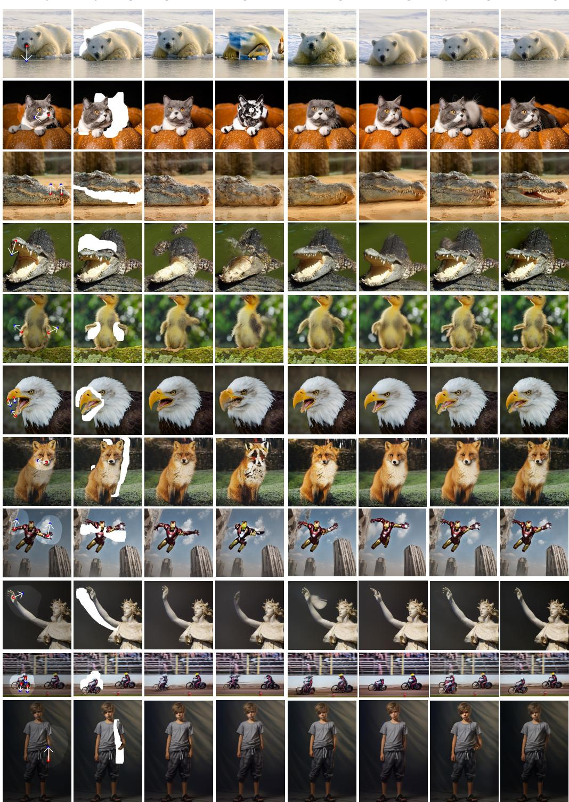  
Figure 11: Additional qualitative comparisons on diverse drag-based editing examples. MoRe-Drag faithfully follows the specified drag motion while preserving object structure, texture details, and background consistency.

Table 5: Hyperparameter analysis on DRAGBENCH-SR.
<table><tr><td rowspan="2">Setting (RAR steps, GAC switch)</td><td colspan="3">DRAGBENCH-SR</td></tr><tr><td>MD↓</td><td>CP↑</td><td>PF↑</td></tr><tr><td>(6,2)</td><td> $3 7 . 0 0 { \scriptstyle \pm 0 . 4 8 }$ </td><td> $9 2 . 7 5 _ { \pm 0 . 0 0 }$ </td><td> $6 9 . 7 2 _ { \pm 0 . 2 8 }$ </td></tr><tr><td>(11,9)</td><td> $2 1 . 0 9 _ { \pm 0 . 2 0 }$ </td><td> $9 5 . 7 5 { \scriptstyle \pm 0 . 2 5 }$ </td><td> $8 0 . 6 3 { \scriptstyle \pm 0 . 3 8 }$ </td></tr><tr><td>(16, 12)</td><td> $1 8 . 5 4 _ { \pm 0 . 2 2 }$ </td><td> $9 6 . 3 6 { \scriptstyle \pm 0 . 3 8 }$ </td><td> $8 6 . 3 6 { \scriptstyle \pm 4 . 0 6 }$ </td></tr><tr><td>(21, 14)</td><td> $1 8 . 4 3 _ { \pm 0 . 3 1 }$ </td><td> $9 5 . 8 7 _ { \pm 0 . 8 8 }$ </td><td> $8 3 . 5 0 { \scriptstyle \pm 2 . 3 6 }$ </td></tr><tr><td>(30, 20)</td><td> $1 7 . 9 8 _ { \pm 0 . 3 7 }$ </td><td> $9 4 . 2 5 _ { \pm 1 . 0 0 }$ </td><td> $8 0 . 7 5 { \scriptstyle \pm 1 . 6 1 }$ </td></tr></table>

Table 6: Quantitative analysis of instruction interaction on DRAGBENCH-SR.
<table><tr><td></td><td>MD↓</td><td>CP↑</td><td>PF↑</td></tr><tr><td>Vanilla</td><td> $1 9 . 9 4 _ { \pm 0 . 2 7 }$ </td><td> $9 5 . 1 2 _ { \pm 0 . 1 3 }$ </td><td> $7 8 . 6 3 { \scriptstyle \pm 1 . 3 8 }$ </td></tr><tr><td>w/LoRA</td><td> $1 8 . 5 4 _ { \pm 0 . 2 2 }$ </td><td> $9 6 . 3 6 { \scriptstyle \pm 0 . 3 8 }$ </td><td> $8 6 . 3 6 _ { \pm 4 . 0 6 }$ </td></tr></table>

## E.2 Effect of Instruction Interaction

We provide additional examples of drag-aware instruction inference in Fig. 12. Each column shows one drag-annotated input together with the instructions inferred by the vanilla MLLM and the LoRA-adapted MLLM. Compared with the vanilla model, the LoRA-adapted model more accurately identifies the edited subject and converts the drag geometry into an appropriate editing intent. Table 6 quantifies the effect of drag-aware instruction inference on DRAGBENCH-SR. Compared with the vanilla MLLM, the LoRA-adapted model improves drag accuracy, reducing MD from 19.94 to 18.54, while also increasing CP and PF. These results indicate that LoRA adaptation produces instructions that are better aligned with the drag annotations and more beneficial for downstream editing.

Both the vanilla MLLM and the LoRA-adapted MLLM use a shared prompt for instruction inference. Each model receives the source image and its drag-annotated version and outputs a natural-language instruction describing the intended edit.

Table 7: Effect of switching timestep $t _ { c }$ on DRAGBENCH-SR.
<table><tr><td>Step k  $t _ { c }$ </td><td>4 0.87</td><td> $^ 8$  0.73</td><td>16 0.47</td><td>20 0.33</td><td>24 0.20</td><td>28 0.07</td></tr><tr><td>MD↓</td><td> $2 1 . 0 1 _ { \pm 0 . 1 }$ </td><td> $1 9 . 2 7 _ { \pm 0 . 2 5 }$ </td><td> $1 8 . 5 9 _ { \pm 0 . 3 2 }$ </td><td> $1 7 . 9 8 _ { \pm 0 . 0 9 }$ </td><td> $1 7 . 5 2 _ { \pm 0 . 2 4 }$ </td><td> $1 7 . 3 6 _ { \pm 0 . 1 6 }$ </td></tr><tr><td>CP↑</td><td> $9 6 . 0 9 _ { \pm 0 . 6 3 }$ </td><td> $9 7 . 1 0 _ { \pm 0 . 1 3 }$ </td><td> $9 7 . 4 7 _ { \pm 0 . 2 5 }$ </td><td> $9 7 . 1 0 _ { \pm 0 . 1 3 } ^ { - }$ </td><td> $9 5 . 9 6 _ { \pm 0 . 5 0 } ^ { - }$ </td><td> $9 6 . 4 6 _ { \pm 0 . 2 6 }$ </td></tr><tr><td>PF↑</td><td> $8 3 . 3 3 { \scriptstyle \pm 2 . 6 8 }$ </td><td> $8 5 . 1 0 { \scriptstyle \pm 1 . 9 9 }$ </td><td> $8 0 . 0 8 { \scriptstyle \pm 1 . 2 9 }$ </td><td> $8 1 . 0 6 _ { \pm 0 . 5 1 }$ </td><td> $7 9 . 3 1 _ { \pm 0 . 7 4 }$ </td><td> $8 0 . 9 4 _ { \pm 0 . 1 3 }$ </td></tr></table>

## E.3 Hyperparameter Analysis

We analyze two related hyperparameters on DRAGBENCH-SR: the number of Region-Aware Recomposition (RAR) steps and the switching step of Generation-Stage Adaptive Conditioning (GAC). Although they are defined separately, they play a similar role in practice: increasing the RAR steps injects motion evidence for a longer interval, while delaying the GAC switch keeps the generation branch conditioned on the warped observation for more steps. Both therefore strengthen the influence of motion evidence during sampling. For this reason, we vary them synchronously and evaluate five paired settings, as shown in Table 5.

As the RAR steps and GAC switching step increase, MD consistently decreases, indicating that stronger motion-evidence grounding improves drag precision. However, after the (16, 12) setting, the reduction in MD becomes marginal, while CP and PF show slight declines. This suggests that the injected motion evidence is already sufficient at (16, 12), and further increasing its influence brings limited gains in drag accuracy while slightly weakening semantic consistency. We therefore use (16, 12) as the default setting.

We further isolate the effect of the GAC switching step by fixing the number of RAR steps to 16. The quantitative results are reported in Table 7. When the switch occurs too early, motion evidence is removed before the spatial layout is sufficiently anchored, leading to degraded drag accuracy. Conversely, keeping the warped-observation conditioning for too long leaves insufficient sampling steps for instruction-guided refinement, often producing less natural results and prompt following. This reveals a trade-off between motion grounding and semantic refinement, and supports our choice of an intermediate switching step.

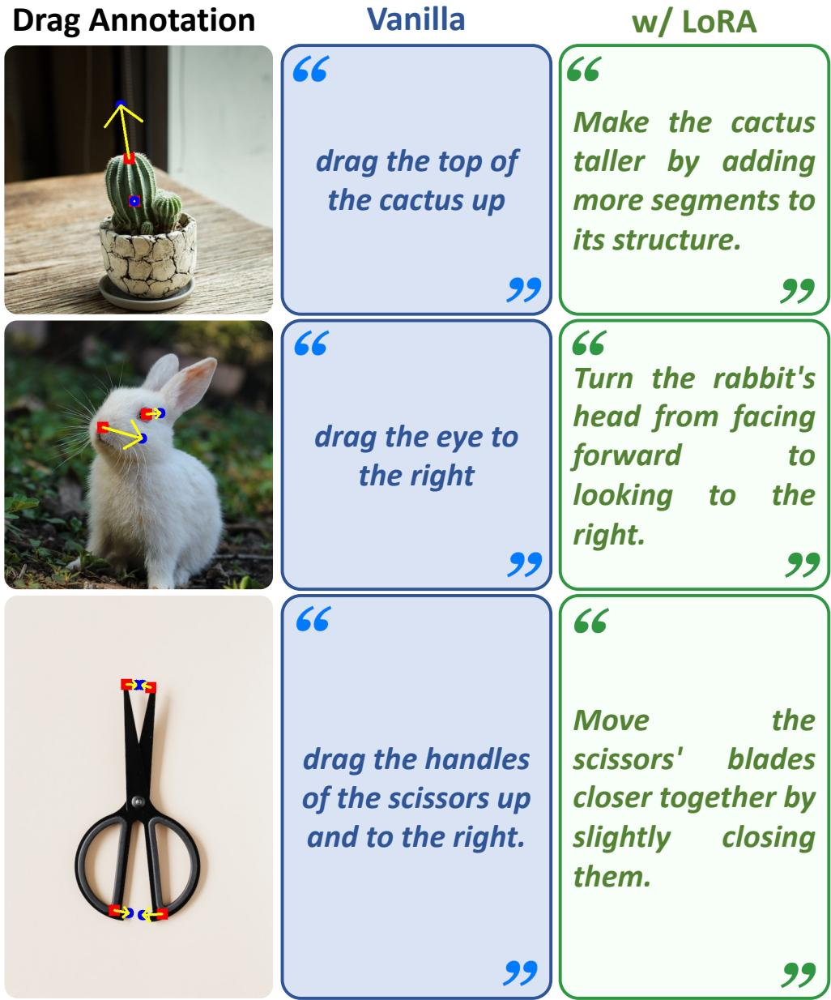  
Figure 12: Additional comparisons of drag-aware instruction inference. Each column shows a drag-annotated input, the instruction inferred by the vanilla MLLM, and the instruction inferred by the LoRA-adapted MLLM. LoRA adaptation improves grounding to the visual drag annotations and produces instructions that better reflect the intended object motion or deformation.

## E.4 Failure Cases

We present two representative failure cases in Fig. 13, where inaccurate warped observations weaken the usefulness of motion evidence. Our method is designed to incorporate motion evidence into the editing generation process, and it works reliably when the warped observation provides a reasonably consistent indication of the desired motion. However, in these cases, the motion evidence becomes ambiguous and misleading. For example, in the cat case, the drag point is insufficiently constrained for the intended rotation, which would typically require an additional anchor point; in the toilet case, the warped image does not provide a clear geometry for closing the lid. As a result, the editor tends to treat the corrupted and ambiguous regions as content to be restored rather than reliable evidence of the intended motion, leading to edits that remain visually plausible but only partially follow the target articulation. Future work may improve robustness by incorporating stronger correspondence estimation and geometry-aware warping.

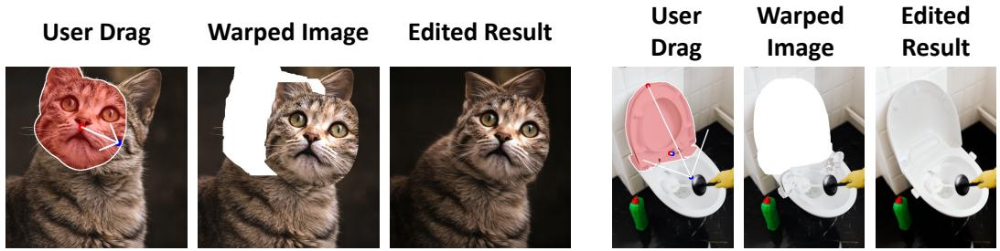  
Figure 13: Failure cases. When the warped observation contains severe errors or ambiguous disocclusions, the injected motion evidence may not faithfully represent the intended edit. In these cases, MoRe-Drag may favor plausible restoration over the desired motion, such as incomplete head manipulation or unsuccessful lid articulation.

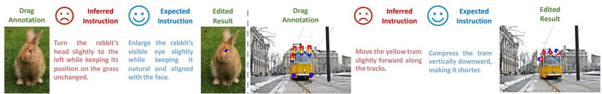  
Figure 14: Failure cases of drag-aware instruction inference. The LoRA-adapted MLLM may still infer imperfect instructions when drag annotations are too close to each other, especially for finegrained shape changes.

Fig. 14 shows failure cases of drag-aware instruction inference. The LoRA-adapted MLLM may infer imperfect instructions when drag annotations are spatially too close, particularly for fine-grained shape changes, since the annotations may occlude local image content and provide incomplete visual evidence. As a result, subtle shape deformation may be misinterpreted as object motion or orientation change. Nevertheless, the injected motion evidence can partially compensate for suboptimal textual guidance by directly constraining the edited region. As shown in the tram example, MoRe-Drag still produces a motion-faithful result despite the imperfect inferred instruction. Future work may investigate alternative representations of drag information for MLLMs to further improve robustness.

## E.5 Comparison of Base Editor Reconstruction Ability

MoRe-Drag relies on the base editor’s null-conditioned reconstruction ability, since the injected motion evidence should guide the intended deformation while the editor is expected to faithfully preserve content outside the edited regions. We therefore compare the reconstruction behavior of different base editors under null conditions. As shown in Fig. 15, LongCat-Image-Edit [16] provides more stable reconstruction than Qwen-Image-Edit [15], leading to better preservation of nonedited regions and more reliable integration of motion evidence during sampling. This explains the performance gap between the Qwen-Image-Edit- and LongCat-Image-Edit-based variants in Table 1. Notably, this advantage holds even though LongCat-Image-Edit is a smaller model, which is also consistent with the strong editing and preservation performance reported in LongCat-Image-Edit [16]. These observations suggest that the effectiveness of MoRe-Drag is closely tied to the reconstruction stability of the underlying editor, rather than model scale alone.

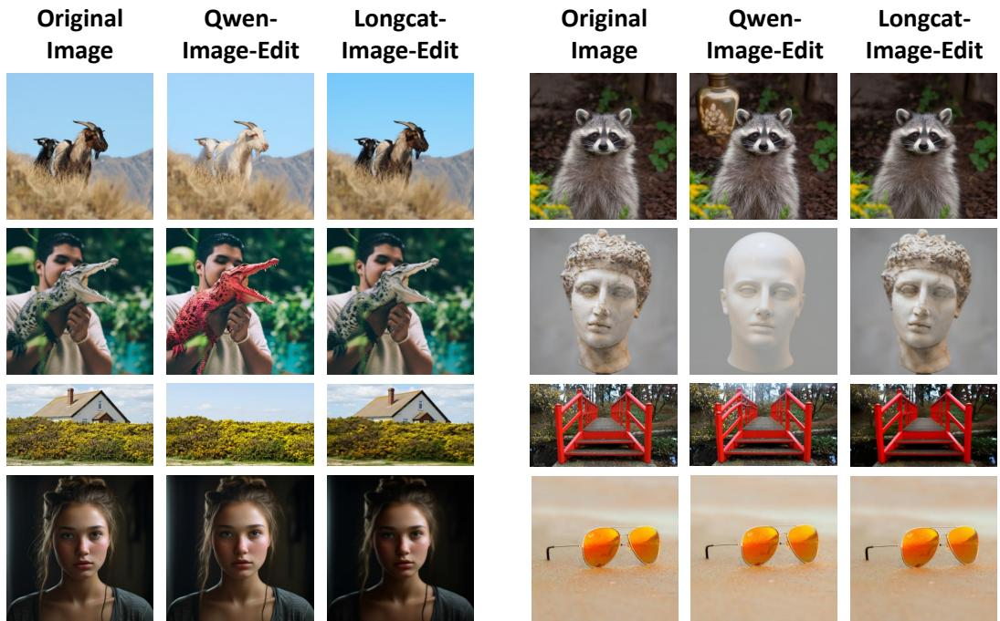  
Figure 15: Comparison of base editor reconstruction ability. Under null conditions, LongCat-Image-Edit reconstructs the source images more faithfully than Qwen-Image-Edit, with better preservation of identity, structure, and appearance. This stronger reconstruction stability benefits motionevidence injection and non-edited region preservation in MoRe-Drag.

Table 8: Runtime and memory comparison. We report the average generation time per image and peak GPU memory over 10 samples.
<table><tr><td>Method</td><td></td><td>Sampling steps Avg. time / image (s)</td><td>Peak GPU memory (GB)</td></tr><tr><td>Baseline editor</td><td>30</td><td>30.74</td><td>16.05</td></tr><tr><td>MoRe-Drag</td><td>30</td><td>41.31</td><td>17.18</td></tr></table>

## E.6 Runtime and Memory Analysis

We further report the computational cost of MoRe-Drag. All measurements are conducted on an NVIDIA RTX 4090 GPU with CPU offloading enabled. We randomly select 10 samples and report the average generation time per image and the peak GPU memory during inference. The default setting uses 30 sampling steps, applies region-aware latent recomposition from step 1 to step 16, and therefore introduces an additional evidence-branch forward pass for approximately half of the sampling trajectory.

As shown in Table 8, MoRe-Drag increases the average generation time from 30.74s to 41.31s. This overhead is expected, since the evidence reconstruction branch requires extra MMDiT forward passes during the RAR interval. Under our default setting, RAR is applied for 16 out of 30 sampling steps, and the observed runtime increase is roughly consistent with the additional forward computation. In contrast, the peak GPU memory only increases from 16.05 GB to 17.18 GB. These results indicate that MoRe-Drag improves drag editing performance with a moderate runtime overhead and limited additional memory usage.

## F Declaration of LLM Usage

We use LLMs/MLLMs in data construction and evaluation. For data construction, we use Qwen3.5- 9B [45] to filter camera-centric samples, parse motion-centric editing instructions, and generate natural-language instructions for DRAGBENCH-SR and DRAGBENCH-DR. For semantic evaluation,

we follow the LLM-based evaluation protocol of DreamBench++ [49] and use GPT-4o to compute the PF score and CP score.