# Dual-Mode Low-Rank Learner with Bridge-Prototype Ensemble for Vision-Language Class-Incremental Learning

Chiyuan He1, Zihuan Qiu1, Fanman Meng1,✉, Chao Wang2, Liangjiang Chen1, Linfeng Xu1, Qingbo Wu1, Hongliang Li1

1University of Electronic Science and Technology of China, Chengdu, China 2Qiyuan Lab, Beijing, China {cyhe,zihuanqiu,202522011613}@std.uestc.edu.cn {lfxu,qbwu,hlli}@uestc.edu.cn, w-c15@tsinghua.org.cn

## Abstract

Benefiting from transferable visual-textual alignment, CLIP has been widely adopted for class-incremental learning (CIL). However, existing learners either repeatedly update components shared across tasks, leading to knowledge overwriting, or overly isolate new-task updates, hindering the reuse of CLIP’s transferable knowledge and limiting plasticity. Moreover, the text-based or bimodal classifier designs still fail to efectively integrate complementary information from the visual and textual modalities. To address these challenges, we introduce DuLBE, which couples dual-mode low-rank learning with a bridge-prototype ensemble classifier for exemplarfree CIL. DuLBE allocates two visual low-rank update modes according to the gradient demand and uses gradient routing to coordinate them: a compact and rewritable shared mode is selected from historically occupied visual directions to reuse transferable knowledge, while residual modes provide low-interference channels for task-specific variations. Building on the resulting stable inter-modal structure, we further construct geodesic bridges between visual prototypes and text embeddings on the unit hypersphere, and ensemble reliable bridge prototypes to compensate for the modality-gap limitations of textual decision boundaries. Extensive experiments under multiple settings show that DuLBE achieves state-ofthe-art CIL performance while retaining the high parameter eficiency of low-rank tuning.

## Introduction

Benefiting from large-scale pre-training over aligned visiontext data, vision-language models (VLMs) like CLIP (Radford et al. 2021) can use natural-language text to organize the continually expanding class space of downstream classincremental learning (CIL). The central challenge is to balance stability and plasticity: when previous data are unavailable or strictly limited, the model must preserve knowledge from old classes while continually incorporating knowledge of new classes.

Parameter-eficient tuning methods for pre-trained CLIP commonly freeze the backbone and introduce a small number of trainable parameters, such as prompts, adapters, or low-rank factors (Zhou et al. 2022; Gao et al. 2024; Hu et al. 2022). These methods retain the general alignment knowledge acquired during pre-training while adapting the model to downstream tasks. Building on this adaptation paradigm,

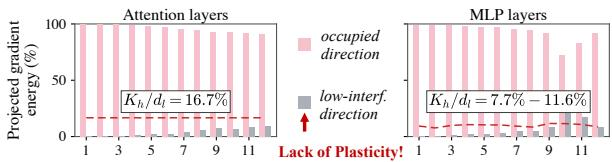  
(a) Layer-wise comparison of projected gradient energy

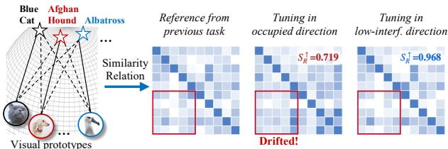  
(b) Structure drift of old visual-textual relations

Figure 1: Motivating observations. (a) New-task cross-modal gradients retain substantial projection energy in historically occupied directions $( K _ { h } = 1 2 8 )$ across the visual tower. (b) Tuning occupied directions causes greater old-class relationstructure drift than tuning low-interference directions. SR denotes rank-structure similarity to the old-task relation matrix, whose entries are cosine similarities between old-class visual prototypes and corresponding text embeddings.

recent continual learning methods introduce global constraints (Zheng et al. 2023; Yu et al. 2024; Wu et al. 2025; He et al. 2026b), or tailored update strategies (Zhang et al. 2024; Huang et al. 2025) to continually adapt CLIP. Nevertheless, these methods still repeatedly optimize trainable components shared across tasks. Without old-task data, newtask supervision can progressively overwrite the previously acquired knowledge encoded in these shared components.

Another line of work isolates task knowledge to reduce interference from new-task learning, with particular attention to the more fragile visual tower (Zhou et al. 2025a; Li et al. 2026; Kang et al. 2025; Peng et al. 2025; Qiu et al. 2026). Within this line, strategies based on orthogonal update or null-space learning reduce interference by steering new-task updates away from the principal directions occupied by oldtask representations. However, our study reveals that avoiding these directions may be overly restrictive in CLIP. As shown in Figure 1(a), a substantial portion of the new-task cross-modal gradient energy in CIL is projected onto these occupied directions (i.e., the top- $K _ { h }$ principal directions of old-task representations), well above the dimensional baseline $K _ { h } / d _ { l }$ expected for a random $K _ { h }$ -dimensional subspace, where $d _ { l }$ is the input dimension of layer l. We attribute this concentration to the way CLIP organizes visual and textual concepts in a shared general-purpose alignment space, where diferent classes reuse common visual patterns (e.g., wheelrelated features shared by concepts: trucks and bicycles). Excluding these directions would therefore discard transferable write-in signals and restrict alignment plasticity. However, such transferability does not make them freely rewritable. Figure 1(b) shows that tuning in the occupied directions induces substantially greater drift in old-class visual-textual relations than tuning in low-interference directions (i.e., directions selected from the orthogonal complement of their span). Without old data, aligning towards new textual objective can shift these shared visual patterns, thereby disrupting the old semantic relation structure and ultimately leading to forgetting. Taken together, these observations reveal that occupied directions support transfer but require controlled rewriting, whereas low-interference directions enable safer adaptation but ofer limited plasticity.

To address this bottleneck, we propose DuLBE (Dualmode Low-rank learner with Bridge-prototype Ensemble), a collaborative CLIP-based CIL framework. DuLBE performs current-task-driven, layer-wise allocation of the lowrank subspace for adaptation in CLIP’s visual tower. At each adapted layer, it decomposes the prospective gradient according to historical visual-mode occupation. Following the principle of maximizing gradient projection energy, DuLBE selects one compact rewritable shared mode from occupied directions and allocates a small set of low-interference residual modes to the remaining task-specific demand. Gradient routing further assigns distinct responsibilities to the two modes: the shared mode reuses a high-demand historical direction under semantic-structure regularization, whereas the residual modes capture task-specific variations with negligible interference to previous tasks. This dual-mode learner transfers previously established cross-modal structures while injecting new knowledge with a small rank overhead. Building on the resulting stable inter-modal structure, we further introduce a bridge-prototype ensemble classifier. It constructs bridges between visual prototypes and text embeddings on the unit hypersphere through geodesic interpolation and uses bridge reliability to refine the decision boundary, flexibly combining textual semantics with adapted visual evidence.

In summary, our contributions include: (1) we propose DuLBE, a dual-mode collaborative low-rank continual learner that allocates rewritable and low-interference sub-modes in CLIP’s visual tower, together with a gradientrouting mechanism for stable yet plastic adaptation. (2) we introduce a bridge-prototype ensemble classifier that leverages stable inter-modal geodesic structures to compensate for the limitations of a single text-based decision boundary. (3) extensive experiments demonstrate that DuLBE achieves state-of-the-art performance with modest trainable overhead.

## Related Work

## Class-Incremental Learning

Class-incremental learning (CIL) requires a model to learn new classes sequentially while recognizing all seen classes without task identities. Traditional CIL methods mitigate forgetting by storing exemplars, distilling old responses, or allocating task-specific parameters (De Lange et al. 2021; Rebufi et al. 2017; Li and Hoiem 2017; Douillard et al. 2020). These strategies establish the stability-plasticity trade-of, but they often rely on stored data, explicit old-task supervision, or expanding capacity.

CLIP-based CIL shifts the focus from learning visual representations from scratch to continually optimizing visualtextual alignment. Existing methods mainly exploit this prior from three perspectives. First, external knowledge, textual priors, or language-guided concept descriptions are introduced to enrich class semantics and optimize the continual learning objective (Zhou et al. 2025a; He et al. 2026d; Yin et al. 2024; Huang et al. 2024; Yu et al. 2025). Second, several studies protect the global cross-modal semantic structure by preserving modality-gap properties, relative semantic relations, or geometric consistency during continual adaptation (Yu et al. 2024; He et al. 2026d; Hu et al. 2025; Liang et al. 2025; He et al. 2026b; Gong et al. 2026). Third, interference-isolation methods either expand and freeze taskspecific projection heads (Zhou et al. 2025b,a; Liang et al. 2025), or constrain new-task updates in low-interference directions (Li et al. 2026; Kang et al. 2025; Qiu et al. 2025). These studies demonstrate the value of CLIP’s semantic structure, but they either keep updating shared trainable modules or mainly avoid risky directions.

## LoRA-Based Continual Learning

Low-Rank Adaptation (LoRA) (Hu et al. 2022) freezes pretrained weights and parameterizes updates with low-rank factors, which makes it suitable for compact continual adaptation. However, a small-rank update can still interfere with old knowledge if its directions overlap with old-task-sensitive regions. Recent LoRA-based continual learning methods therefore control the update by orthogonalization (Wang et al. 2023), interference-free subspace allocation (Liang and Li 2024; Luo et al. 2026), energy-driven subspace decomposition (He et al. 2026c) or predefined functional LoRA insertion (He, Duan, and Zhu 2025). These methods establish lowrank subspace control as an efective way to balance stability and plasticity. In contrast, DuLBE uses cross-modal gradient demand and mode occupation to decide which shared directions are rewritable and which residual directions should be included.

## Methodology

## Preliminaries

We consider exemplar-free class-incremental learning (CIL) with a pre-trained CLIP model. The learner receives a sequence of tasks $\{ \mathcal { D } _ { t } \} _ { t = 1 } ^ { N }$ , where task t introduces a disjoint class set $\mathcal { C } _ { t }$ satisfying $\boldsymbol { \dot { \mathcal { C } } } _ { t } \cap \mathcal { C } _ { k } = \boldsymbol { \emptyset }$ for $t \ne k$ . After finishing task t, the model is evaluated over all seen classes ${ \mathcal { C } } _ { \leq t } = \bigcup _ { k = 1 } ^ { t } { \mathcal { C } } _ { k }$ without task identities, and no raw data from previous tasks are retained.

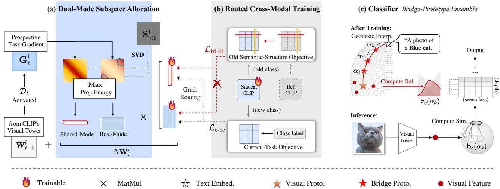  
Figure 2: Overview of DuLBE. (a) Dual-mode allocation uses the prospective task gradient to form a compact shared mode within historically occupied directions and a low-interference residual mode outside them. (b) Routed cross-modal training directs gradients from the current-task objective to both learners, while routing gradients from the semantic-structure preservation objective only to the shared learner. (c) Classifier: it builds visual-text geodesic bridges, estimates bridge-depth reliability after each task, and ensembles reliable bridge prototypes for inference.

CLIP performs classification by comparing an image representation with text embeddings generated from class-name prompts, e.g., A photo of a {CLASS}. Given the normalized visual feature $\mathbf { z } _ { i }$ of image $x _ { i }$ and class-text embedding $\mathbf { e } _ { c } ,$ the CLIP logit is $\ell _ { i } ( c ) = \tau \mathbf { z } _ { i } ^ { \top } \mathbf { e } _ { c } .$ , where τ is the logit scale. This language-defined classifier naturally supports an expanding class space, but it also makes continual visual adaptation delicate: the visual tower must learn new classes while remaining compatible with both the textual decision space and the cross-modal relations formed by previous tasks.

## Overview

As shown in Figure 2, DuLBE integrates three components. First, it allocates the visual low-rank update space using the current-task prospective gradient. Within the historically occupied subspace, the direction with the strongest gradient demand forms a compact rewritable shared mode, while dominant directions outside this subspace form lowinterference residual modes for task-specific knowledge. Second, the shared and residual mode learners are trained collaboratively through mode-specific gradient routing, which assigns diferent knowledge roles: the current-task CE updates both learners, while semantic-structure preservation regularizes only the shared learner, encouraging controlled knowledge reuse and residual task-specific plasticity. Third, DuLBE forms a reliability-guided bridge-prototype ensemble by estimating visual-text geodesic bridges after each task and aggregating reliable bridge prototypes for classification.

## Gradient-Demand Dual-Mode Subspace Allocation

A single current-task update may overwrite old visual-text relations. Some interference-aware strategies restrict new updates to orthogonal or null-space directions (Wang et al. 2023; Liang and Li 2024), reducing forgetting but also blocking directions that could remain reusable in CLIP’s shared semantic space. Dual-branch designs introduce shared and task-specific components (He, Duan, and Zhu 2025; He et al. 2026c), but their allocation is often predefined rather than determined by the current write-in demand. We instead allocate the visual low-rank subspace from the perspective of the current cross-modal gradient. For each adapted visual layer $l ,$ a prospective gradient is computed on current-task data $\mathcal { D } _ { t }$

$$
\mathbf { G } _ { t } ^ { l } = \nabla _ { \mathbf { W } _ { t - 1 } ^ { l } } \mathcal { L } _ { \mathrm { c - c e } } ( \theta _ { t - 1 } ; \mathcal { D } _ { t } ) .\tag{1}
$$

This gradient is used only to plan the low-rank update basis, not as a direct parameter update. It indicates which input directions are activated by the current cross-modal CE objective in the layer l.

Historical Visual-Mode Occupation. The historical visual support is estimated from the second-order statistics of layer inputs. For a previous task $t ^ { \prime }$ , the cached input tokens of the layer l are row-stacked as $\mathbf { X } _ { t ^ { \prime } } ^ { l } \in \mathbb { R } ^ { n _ { t ^ { \prime } } ^ { l } \times d _ { l } }$ , where $n _ { t ^ { \prime } } ^ { l }$ is the number of cached tokens and $d _ { l }$ is the input dimension. The task-wise and accumulated occupation statistics are:

$$
\mathbf { S } _ { t ^ { \prime } } ^ { l } = ( \mathbf { X } _ { t ^ { \prime } } ^ { l } ) ^ { \top } \mathbf { X } _ { t ^ { \prime } } ^ { l } , ~ \mathbf { S } _ { < t } ^ { l } = \sum _ { t ^ { \prime } < t } \mathbf { S } _ { t ^ { \prime } } ^ { l } .\tag{2}
$$

For any unit direction p, the quadratic form $\mathbf { p } ^ { \top } \mathbf { S } _ { < t } ^ { l } \mathbf { p } \ =$ $\begin{array} { r } { \sum _ { t ^ { \prime } < t } \| \mathbf { X } _ { t ^ { \prime } } ^ { l } \mathbf { p } \| _ { 2 } ^ { 2 } } \end{array}$ measures its accumulated activation energy on previous tasks. Large eigenvalues of $\mathbf { S } _ { < t } ^ { l }$ indicate repeatedly occupied visual modes. Since $\mathbf { S } _ { < t } ^ { l }$ is positive semidefinite, its SVD takes the eigendecomposition form:

$$
\mathbf { S } _ { < t } ^ { l } = \mathbf { U } _ { < t } ^ { l } \pmb { \Lambda } _ { < t } ^ { l } ( \mathbf { U } _ { < t } ^ { l } ) ^ { \top } .\tag{3}
$$

The $\mathrm { t o p } { \cdot } K _ { h }$ eigenvectors form the historical principal support $\bar { \mathcal { H } } _ { < t } ^ { l } = \mathrm { s p a n } ( \mathbf { U } _ { < t } ^ { l , K _ { h } } )$ . This support may contain transferable visual directions, but rewriting it as a whole would be too aggressive because many directions encode old visualtext relations irrelevant to the current task.

Rewritable Shared Mode. The shared mode should therefore be a compact portion of the historical support, selected by its current gradient demand. Under a LoRA update, when the down-projection direction is fixed as a unit vector p, the gradient that can be absorbed by the corresponding trainable up-projection is proportional to $\mathbf { G } _ { t } ^ { l } \mathbf { p } .$ . Thus, $\| \mathbf { G } _ { t } ^ { \widetilde { l } } \mathbf { p } \| _ { 2 } ^ { 2 }$ measures the write-in energy available along p. We select the historical direction that maximizes this energy:

$$
\mathbf { p } _ { t } ^ { l , S } = \arg \operatorname* { m a x } _ { \mathbf { p } \in \mathcal { H } _ { < t } ^ { l } } \| \mathbf { G } _ { t } ^ { l } \mathbf { p } \| _ { 2 } ^ { 2 } .\tag{4}
$$

Writing $\mathbf { p } = \mathbf { U } _ { < t } ^ { l , K _ { h } } \mathbf { q }$ with $\| \mathbf { q } \| _ { 2 } = 1$ turns the objective into $\mathbf { q } ^ { \top } \mathbf { M } _ { t } ^ { l } \mathbf { q } ,$ where $\mathbf { M } _ { t } ^ { l } = ( \mathbf { U } _ { < t } ^ { l , K _ { h } } ) ^ { \top } ( \mathbf { G } _ { t } ^ { l } ) ^ { \top } \mathbf { G } _ { t } ^ { l } \mathbf { U } _ { < t } ^ { l , K _ { h } }$ . By the Rayleigh-Ritz theorem (Horn and Johnson 2012), the maximizer is the principal eigenvector of $\mathbf { M } _ { t } ^ { l }$ . Therefore, the shared down-projection basis can be defined as:

$$
\mathbf { q } _ { t } ^ { l } = \mathrm { e i g } _ { \mathrm { m a x } } ( \mathbf { M } _ { t } ^ { l } ) , \qquad \mathbf { P } _ { t } ^ { l , S } = \mathbf { U } _ { < t } ^ { l , K _ { h } } \mathbf { q } _ { t } ^ { l } .\tag{5}
$$

This basis keeps only the strongest overlap between historical occupation and current cross-modal demand. $\mathbf { P } _ { t } ^ { l , S }$ is the only historical direction allowed to be rewritten.

Low-Interference Residual Modes. After extracting the rewritable shared mode, the remaining gradient demand is used to construct additional learnable channels for taskspecific adaptation. These residual modes follow the spirit of interference-avoidance methods that project new updates away from historical or alignment-sensitive subspaces (Wang et al. 2023; Liang and Li 2024; Li et al. 2026). Unlike these methods, our residual modes are not expected to learn the new task alone. Instead, they provide low-interference plasticity that cooperates with the shared mode. Concretely, we remove the historical principal support from the current gradient:

$$
\mathbf { G } _ { t , R } ^ { l } = \mathbf { G } _ { t } ^ { l } \big ( \mathbf { I } - \mathbf { U } _ { < t } ^ { l , K _ { h } } \big ( \mathbf { U } _ { < t } ^ { l , K _ { h } } \big ) ^ { \top } \big ) .\tag{6}
$$

The residual basis is then taken from the dominant right singular directions of this projected gradient. Specifically, if $\mathbf { G } _ { t , R } ^ { l ^ { - } } = \mathbf { U } _ { R } ^ { l } \boldsymbol { \Sigma } _ { R } ^ { l } ( \mathbf { V } _ { R } ^ { l } ) ^ { \top }$ with $\mathbf { V } _ { R } ^ { l } = [ \mathbf { v } _ { R , 1 } ^ { l } , \ldots , \mathbf { v } _ { R , d _ { l } } ^ { l } ]$ , then we choose:

$$
\mathbf { P } _ { t } ^ { l , R } = [ \mathbf { v } _ { R , 1 } ^ { l } , \ldots , \mathbf { v } _ { R , r _ { R } } ^ { l } ] .\tag{7}
$$

By construction, span $( \mathbf { P } _ { t } ^ { l , R } ) \subseteq ( \mathcal { H } _ { < t } ^ { l } ) ^ { \perp }$ . Moreover, for any unit residual direction $\mathbf { r } \in \mathrm { s p a n } ( \mathbf { P } _ { t } ^ { l , R } )$ , the historical occupation energy satisfies $\mathbf { r } ^ { \top } \mathbf { S } _ { < t } ^ { l } \mathbf { r } \le \lambda _ { K _ { h } + 1 } ^ { l }$ . Residual modes therefore capture current-task gradient demand outside the historical support, while maintaining low overlap with previously occupied visual modes.

Subspace-Frozen Parameterization. The allocation stage only determines where each branch can write. After allocation, $\mathbf { P } _ { t } ^ { l , S }$ and $\mathbf { P } _ { t } ^ { l , R }$ are frozen as the down-projection bases, while only $\mathbf { B } _ { t } ^ { l , S }$ and $\mathbf { B } _ { t } ^ { l , R }$ remain trainable. For the first task, without any historical statistics, the bases are initialized with the dominant right singular vectors of $\mathbf { G } _ { 1 } ^ { l }$ The resulting task-t update is

$$
\Delta \mathbf { W } _ { t } ^ { l } = \mathbf { B } _ { t } ^ { l , S } ( \mathbf { P } _ { t } ^ { l , S } ) ^ { \top } + \mathbf { B } _ { t } ^ { l , R } ( \mathbf { P } _ { t } ^ { l , R } ) ^ { \top } .\tag{8}
$$

## Routed Cross-Modal Training

Given the allocated bases $\mathbf { P } _ { t } ^ { l , S }$ and $\mathbf { P } _ { t } ^ { l , R }$ , their up-projections $\mathbf { B } _ { t } ^ { l , S }$ and $\mathbf { B } _ { t } ^ { l , R }$ are trained with two routed objectives: a current-task cross-modal objective for new class learning and an old semantic-structure objective for preserving old visual-text relations.

Current-Task Cross-Modal Objective. For a mini-batch , the student model produces row-stacked normalized image features $\mathbf { Z } _ { t } \in \mathbb { R } ^ { | \boldsymbol { B } | \times \dot { d } }$ . The text embeddings of current-task classes are $\mathbf { E } _ { t } = [ \mathbf { e } _ { c } ] _ { c \in \mathcal { C } _ { t } } \in \mathbb { R } ^ { | \mathcal { C } _ { t } | \times d }$ , with batch labels $\mathbf { Y } _ { B }$ The batch image-text logits and current-task CE loss are:

$$
\mathbf { L } _ { t } = \tau \mathbf { Z } _ { t } \mathbf { E } _ { t } ^ { \top } , \qquad \mathcal { L } _ { \mathrm { c - c e } } ( \boldsymbol { B } ) = \mathrm { C E } ( \mathbf { L } _ { t } , \mathbf { Y } _ { \boldsymbol { B } } ) .\tag{9}
$$

Old Semantic-Structure Objective. The shared basis $\mathbf { P } _ { t } ^ { l , S }$ is selected from directions occupied by old tasks, making it the main channel for reusing transferable cross-modal knowledge. However, optimizing it may reinterpret these old modes for new-class texts and distort old visual-text relations. We therefore simply constrain the shared branch using semantic structure induced by old text embeddings. Specifically, before training task t, we freeze a copy of the model obtained after task $\bar { t } - 1$ as the reference teacher. For the same mini-batch , the reference visual features are denoted as $\bar { \mathbf { Z } } _ { t - 1 }$ , and the old-class text embeddings are collected as $\mathbf { E } _ { < t } = [ \mathbf { e } _ { c } ] _ { c \in \mathcal { C } _ { < t } }$ . The student and reference logits over old classes can be represented as:

$$
\mathbf { L } _ { t } ^ { < t } = \tau \mathbf { Z } _ { t } \mathbf { E } _ { < t } ^ { \top } , \qquad \bar { \mathbf { L } } _ { t - 1 } ^ { < t } = \tau \bar { \mathbf { Z } } _ { t - 1 } \mathbf { E } _ { < t } ^ { \top } .\tag{10}
$$

The old semantic-structure loss is defined as:

$$
\begin{array} { r } { \mathcal { L } _ { \mathrm { b i - k l } } ( \mathcal { B } ) = \underbrace { \tau _ { C } ^ { 2 } \mathrm { K L } \big ( \sigma _ { C } ( \bar { \bf L } _ { t - 1 } ^ { < t } / \tau _ { C } ) \left\| \sigma _ { C } ( { \bf L } _ { t } ^ { < t } / \tau _ { C } ) \right) } _ { \mathrm { c l a s s - w i s e s t u c t u r e ~ c o n s t r a i n t } } } \\ { + \underbrace { \tau _ { I } ^ { 2 } \mathrm { K L } \big ( \sigma _ { I } ( \bar { \bf L } _ { t - 1 } ^ { < t } / \tau _ { I } ) \left\| \sigma _ { I } ( { \bf L } _ { t } ^ { < t } / \tau _ { I } ) \right) } _ { \mathrm { i n s t a n c e - w i s e ~ s t r u c t u r e ~ c o n s t r a i n t } } . } \end{array}\tag{11}
$$

where $\sigma _ { C } ( \cdot )$ and $\sigma _ { I } ( \cdot )$ are softmax operators that normalize over old classes for each image and over batch instances for each old class-text, respectively. $\tau _ { C } , \tau _ { I }$ are temperatures. The class-wise term preserves the relative positioning of images with respect to old text embeddings, while the instance-wise term preserves how each old text embedding organizes the visual distribution within the batch.

Gradient Routing. Gradient routing controls which objective contributes gradients to each mode. The current-task cross-modal objective sends gradients to both branches, since both modes participate in new-class learning. In contrast, the old semantic-structure objective is back-propagated only through the shared branch, which rewrites directions already occupied by old tasks:

$$
\begin{array} { r l } & { \mathbf { B } _ { t } ^ { l , S } \gets \mathbf { B } _ { t } ^ { l , S } - \eta \nabla _ { \mathbf { B } _ { t } ^ { l , S } } \Big [ \mathcal { L } _ { \mathrm { c - c e } } ( B ) + \lambda \mathcal { L } _ { \mathrm { b i - k l } } ( B ) \Big ] , } \\ & { \mathbf { B } _ { t } ^ { l , R } \gets \mathbf { B } _ { t } ^ { l , R } - \eta \nabla _ { \mathbf { B } _ { t } ^ { l , R } } \mathcal { L } _ { \mathrm { c - c e } } ( B ) . } \end{array}\tag{12}
$$

Here η is the learning rate and λ controls the strength of old-structure constraint. As a result, the shared mode learns transferable alignment under old semantic constraints, while the residual mode captures task-specific evidence through low-interference directions.

## Reliability-Guided Bridge-Prototype Ensemble

Text embeddings ofer stable semantic anchors, but they mainly encode high-level semantics and may miss discriminative evidence from the visual side. Existing methods often combine text embeddings and visual prototypes for prediction (Zhou et al. 2025a; Li et al. 2026; He et al. 2026d), but such fusion is usually coarse: the two modal representations are treated as fixed endpoints, and a global fusion rule cannot reflect that diferent classes may rely on diferent degrees of textual semantics and visual evidence. We therefore search the inter-modal discriminative space on the unit hypersphere by constructing class-wise geodesic bridges and estimating which bridge depths are reliable. For each class c introduced at task $t ,$ we define its sample set as $\mathcal { X } _ { c } ^ { t } = \{ x _ { i } ~ \vert ~ ( x _ { i } , y _ { i } ) \in \mathcal { D } _ { t } , ~ y _ { i } = c \}$ . Its normalized visual prototype is computed as:

$$
\mathbf { v } _ { c } = \frac { \sum _ { \substack { x _ { i } \in \mathcal { X } _ { c } ^ { t } } } \mathbf { z } _ { i } } { \left\| \sum _ { \substack { x _ { i } \in \mathcal { X } _ { c } ^ { t } } } \mathbf { z } _ { i } \right\| _ { 2 } } .\tag{13}
$$

Given $\mathbf { v } _ { c }$ and the normalized text embedding $\mathbf { e } _ { c } .$ , the bridge depth is discretized as $\{ \alpha _ { 1 } , \alpha _ { 2 } , \ldots , \alpha _ { K _ { b } } \}$ , and the endpoint angle on the unit hypersphere is $\theta _ { c } = $ arccos $( \mathbf { v } _ { c } ^ { \top } \mathbf { e } _ { c } )$ . The bridge prototype at depth $\alpha _ { k }$ is obtained by geodesic interpolation:

$$
\mathbf { b } _ { c } ( \alpha _ { k } ) = \frac { \sin ( ( 1 - \alpha _ { k } ) \theta _ { c } ) \mathbf { v } _ { c } + \sin ( \alpha _ { k } \theta _ { c } ) \mathbf { e } _ { c } } { \sin \theta _ { c } } .\tag{14}
$$

Here $\alpha _ { k } = 0$ and $\alpha _ { k } = 1$ correspond to the visual and textual endpoints, respectively. Compared with linear interpolation (Li et al. 2026), geodesic interpolation provides a smooth transition on the unit hypersphere from the visual semantic coordinate to the textual one, so bridge prototypes at each depth remain semantically comparable across classes despite the modality gap. For a fixed depth $\alpha _ { k }$ , we instantiate a bridge classifier using the bridge prototypes of all seen classes. Its logits for class $j \in \mathcal { C } _ { < t }$ on image $x _ { i }$ is $\tau \mathbf { z } _ { i } ^ { \top } \mathbf { b } _ { j } ( \alpha _ { k } )$ , and the corresponding softmax probability for class c is denoted by $p _ { \alpha _ { k } } ( c | x _ { i } )$ . The reliability of depth $\alpha _ { k }$ for class c is then measured by the average correct-class confidence on these samples as $\begin{array} { r } { \dot { \rho } _ { c } ( \alpha _ { k } ) = \frac { - 1 } { | \mathcal { X } _ { c } ^ { t } | } \sum _ { x _ { i } \in \mathcal { X } _ { c } ^ { t } } p _ { \alpha _ { k } } ( c | x _ { i } ) } \end{array}$ . The reliability weights are then normalized over all bridge depths by:

$$
\pi _ { c } ( \alpha _ { k } ) = \frac { \exp ( \rho _ { c } ( \alpha _ { k } ) / \beta ) } { \sum _ { m = 1 } ^ { K _ { b } } \exp ( \rho _ { c } ( \alpha _ { m } ) / \beta ) } .\tag{15}
$$

The temperature $\beta$ controls how sharply the ensemble concentrates on highly reliable depths. For old classes, the visual prototypes and reliability weights are stored when the classes are first introduced, and no raw old data is kept.

At inference, prediction is made by a reliability-weighted ensemble of bridge-prototype logits:

$$
\hat { y } = \arg \operatorname* { m a x } _ { c \in \mathcal { C } _ { \leq t } } \sum _ { k = 1 } ^ { K _ { b } } \pi _ { c } ( \alpha _ { k } ) \tau \mathbf { z } ( x ) ^ { \top } \mathbf { b } _ { c } ( \alpha _ { k } ) .\tag{16}
$$

This ensemble improves CIL classification by exploiting discriminative bridge prototypes in the inter-modal semantic region. Its efectiveness relies on a stably evolving intermodal semantic structure. As shown in Table 3, methods without explicit semantic-structure preservation do not obtain consistent gains from the bridge-prototype ensemble. Thus, the classifier is tightly coupled with the proposed dualmode low-rank learner. Further evidence and analysis of the bridge-prototype ensemble are provided in Appendix A.3.

## Experiments

## Experimental Setup

Datasets. We evaluate DuLBE under two standard CLIPbased CIL settings adopted in recent studies. Setting-A (Huang et al. 2024) uses OpenAI CLIP (Radford et al. 2021) and includes CIFAR (Krizhevsky 2009), CUB (Wah et al. 2011), ImageNet-R (Hendrycks et al. 2021), and ImageNet100 (Deng et al. 2009). Setting-B (Zhou et al. 2025a) uses OpenCLIP (Cherti et al. 2023) pretrained on LAION-400M (Schuhmann et al. 2021) and we include CIFAR, SUN (Xiao et al. 2010), Cars (Krause et al. 2013), and Food (Bossard, Guillaumin, and Van Gool 2014). For each setting, we use the same task splits and data preprocessing as the corresponding protocol.

Implementation Details. All experiments are implemented in PyTorch and conducted on an NVIDIA RTX 4090 GPU. For fair comparison, all methods use the same ViT-B/16 pretrained weights required by each setting: OpenAI CLIP in Setting-A and LAION-400M-pretrained OpenCLIP in Setting-B. The proposed dual-mode low-rank learner is inserted into the transformer blocks of CLIP’s visual tower, including the key/value attention projections and MLP layers. The historical support dimension is $K _ { h } = 1 2 8$ , with shared rank $r _ { S } = 1$ and residual rank $r _ { R } = 8$ . The KL temperatures are set to $\tau _ { C } = 5$ and $\tau _ { I } = 0 . 1$ , respectively, and the semantic-structure loss weight is $\lambda = 0 . 5$ . We optimize the model with Adam (Kingma and Ba 2015) using a learning rate of $1 \times 1 0 ^ { - 3 }$ and a batch size of 32. For the bridgeprototype ensemble, we sample $K _ { b } = 1 0$ bridge depths and set the reliability temperature to $\beta = 0 . 0 5$

## Comparison with the State-of-the-Arts

We compare DuLBE with representative baselines, including the zero-shot ContinualCLIP baseline (Thengane et al. 2022), prompt-based methods DualPrompt (Wang et al. 2022) and CODA (Smith et al. 2023), and recent CLIP-based CIL methods PROOF (Zhou et al. 2025b), RAPF (Huang et al. 2024), SGCL (Yu et al. 2024), CLG-CBM (Yu et al. 2025), EN-GINE (Zhou et al. 2025a), DesCLIP (He et al. 2026a), MG-CLIP (Huang et al. 2025), BOFA (Li et al. 2026), LoDA-CLIP (He et al. 2026c), and LfI (Gong et al. 2026). We report the average accuracy over all incremental stages, denoted as ${ \bar { A } } ,$ and the final accuracy after the last task, denoted as $\mathbf { \mathcal { A } } _ { l }$

As shown in Table 1, DuLBE achieves the strongest overall performance under both standard settings. In Setting-A, DuLBE ranks first on all four datasets and all reported metrics. The advantage is particularly evident on CIFAR, where

SUN-10 tasks (Setting-B)
<table><tr><td rowspan="3">Method</td><td colspan="7">Setting-A (CLIP)</td></tr><tr><td colspan="2">CIFAR</td><td colspan="2">CUB</td><td colspan="2">I.N.-R</td><td colspan="2">I.N.100</td></tr><tr><td>À</td><td>Al</td><td>A</td><td>Al</td><td>À</td><td>Al</td><td>À</td><td>Al</td></tr><tr><td>ContinualCLIP</td><td></td><td>66.7</td><td>一</td><td>51.2</td><td></td><td>72.0</td><td></td><td>75.4</td></tr><tr><td>DualPrompt (ECCV&#x27;22)</td><td>81.5</td><td>72.5</td><td></td><td></td><td>82.0</td><td>75.8</td><td>80.7</td><td>67.4</td></tr><tr><td>CODA (CVPR&#x27;23)</td><td>77.0</td><td>62.3</td><td>66.6</td><td>50.9</td><td>78.0</td><td>67.5</td><td>64.1</td><td>34.8</td></tr><tr><td>PROOF (TPAMI&#x27;25)</td><td>86.2</td><td>76.3</td><td></td><td></td><td>82.8</td><td>77.1</td><td>84.7</td><td>72.5</td></tr><tr><td>RAPF (ECCV’24)</td><td>86.2</td><td>79.0</td><td>82.7</td><td>76.2</td><td>85.6</td><td>80.3</td><td>87.5</td><td>80.2</td></tr><tr><td>CLG-CBM (CVPR’25)</td><td>84.9</td><td>76.9</td><td>82.9</td><td>77.8</td><td></td><td></td><td>86.0</td><td>78.5</td></tr><tr><td>ENGINE (ICCV’25)</td><td>82.1</td><td>73.1</td><td>83.9</td><td>76.2</td><td>84.4</td><td>77.0</td><td></td><td></td></tr><tr><td>DesCLIP (TMM&#x27;26)</td><td>85.6</td><td>78.7</td><td>85.1</td><td>78.7</td><td>86.4</td><td>77.8</td><td>80.7</td><td>72.2</td></tr><tr><td>MG-CLIP (ICCV’25)</td><td>87.0</td><td>80.6</td><td>80.6</td><td>72.0</td><td>87.6</td><td>82.7</td><td>87.3</td><td>78.4</td></tr><tr><td>BOFA (AAAI&#x27;26)</td><td></td><td></td><td></td><td></td><td></td><td></td><td></td><td></td></tr><tr><td>LoDA-CLIP (ICML&#x27;26)</td><td>86.8</td><td>81.5</td><td>84.2</td><td>78.1</td><td>87.8</td><td>82.0</td><td>85.9</td><td>76.4</td></tr><tr><td>DuLBE (Ours)</td><td>89.5</td><td>84.2</td><td>86.1</td><td>80.6</td><td>88.4</td><td>84.3</td><td>88.3</td><td>80.7</td></tr></table>

<table><tr><td colspan="5">Setting-B (OpenCLIP)</td></tr><tr><td>CIFAR À Al</td><td>SUN À Al</td><td>Cars À</td><td>Al</td><td>Food À Al</td></tr><tr><td>71.4 81.6 72.4</td><td>72.1 82.5 74.4</td><td>76.3</td><td>76.4 62.9</td><td>81.9 一 84.9 77.3</td></tr><tr><td>82.4 73.4</td><td>83.3 75.7</td><td>80.2</td><td>66.5 86.2</td><td>78.8</td></tr><tr><td>86.8 79.1 86.1 78.0</td><td>83.9 77.3 82.1 72.5</td><td>90.7 82.9</td><td>86.5 90.0 62.9 88.6</td><td>84.7 81.2</td></tr><tr><td></td><td></td><td></td><td></td><td></td></tr><tr><td>86.9 79.2</td><td>85.0 78.5</td><td>94.1</td><td>90.1</td><td>89.8 83.9</td></tr><tr><td>89.1 82.4</td><td>55.9 43.0</td><td>88.4</td><td>80.7</td><td>88.2 82.2</td></tr><tr><td>86.5 79.3</td><td>85.6 78.9</td><td>93.8</td><td>89.2</td><td>89.0 82.7</td></tr><tr><td>88.9 81.7</td><td>一 一</td><td>94.3</td><td>90.6</td><td>一 一</td></tr><tr><td>90.0 84.5</td><td>86.7 80.3</td><td>94.1</td><td>90.3</td><td>91.3 86.7</td></tr></table>

Table 1: Main comparison under two standard CLIP-based CIL settings. Setting-A (Huang et al. 2024) uses OpenAI CLIP ViT-B/16, and Setting-B (Zhou et al. 2025a) uses OpenCLIP ViT-B/16 pretrained on LAION-400M. All methods are evaluated using the standard 10-task split without external training data. The best results are highlighted in bold, and the second-best results are underlined.

DuLBE improves ¯ and $\mathbf { \mathcal { A } } _ { l }$ over the best previous results by 2.5% and 2.7%, respectively. It also obtains clear finalaccuracy gains on CUB and ImageNet-R, demonstrating that the proposed dual-mode allocation benefits both general object recognition and fine-grained visual adaptation. In Setting-B, DuLBE achieves the best results on most datasets and shows especially strong retention on CIFAR and Food, with improvements of 2.1% and 2.0% over the second. Broader baseline comparisons and backbone scalability results are reported in Appendix C.1 and C.3, respectively.

We further provide a detailed eficiency-performance comparison in Figure 3. Compared with parameter-tuning methods: LoRA-CLIP, MG-CLIP, LfI, LoDA-CLIP, and SGCL under diferent adaptation budgets, DuLBE achieves a more favorable trade-of. In particular, the shared-mode-only variant DuL $. \mathrm { B E } _ { r 1 }$ uses only about 0.065M trainable parameters in the visual tower, while $\mathrm { D u L B E } _ { r 1 + 8 }$ still requires only about 0.58M parameters after adding the residual-mode low-rank learner. Despite these modest parameter budgets, DuLBE remains in the upper-left region of the plot, outperforming higher-rank LoRA variants and full fine-tuning counterparts. This confirms that the improvement of DuLBE does not arise from increasing the adaptation scale, but from allocating the key subspaces for transferable shared knowledge and lowinterference task-specific variations. Moreover, we provide detailed analyses of training, inference, and CIL memory overheads in Appendix C.5.

## Further Analysis

Efectiveness of Dual-Mode Collaborative Learning. Table 2 shows that both shared and residual modes improve over the LoRA baseline through complementary roles. The shared mode reuses historically occupied directions but remains sensitive to unconstrained rewriting, while the residual mode captures task-specific variations with lower interference. This distinction is supported by Figure 4, where semantic-structure constraint substantially reduces the drift of the shared mode, whereas the residual mode naturally maintains low drift. Simply combining both modes provides limited gains, indicating that mode allocation alone is insufficient for efective collaboration. Regularizing both modes, however, restricts residual plasticity. Routing $\mathbf { \bar { \mathcal { L } } } _ { \mathrm { b i - k l } }$ only to the shared mode enables controlled knowledge reuse while preserving flexible residual adaptation, yielding the greatest gains of 3.4/5.7% on CIFAR and 5.1/6.8% on CUB in $\bar { \mathcal { A } } / \mathcal { A } _ { l }$

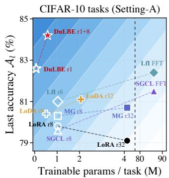

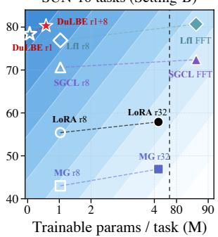  
Figure 3: Eficiency-performance comparison with benchmark methods. For a fair comparison, trainable parameters are counted only from the key/value attention projections and MLP layers in CLIP’s visual tower. Here, r denotes the low-rank dimension, and FFT denotes full fine-tuning.

Analysis of Bridge-Prototype Ensemble. Table 3 evaluates the bridge-prototype ensemble. Fixed bridge depths (rows 1–3) consistently outperform the text-only classifier, confirming the discriminative value of the inter-modal region. Uniformly combining multiple depths remains efective but is not consistently superior to the best fixed depth, as diferent classes may favor diferent bridge regions. Reliability weighting captures this variation and achieves the best performance on both datasets. However, its efect on other learners is less consistent: it improves LoRA-CLIP but degrades LfI and RAPF. Thus, the ensemble is not a universally efective plug-in. Its benefit depends on a compatible inter-modal structure, which DuLBE explicitly stabilizes.

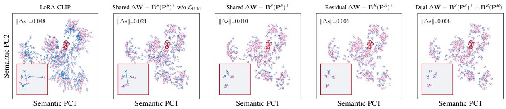  
Figure 4: Visualization of old-task semantic-coordinate drift. Each old sample is represented by its cosine-similarity vector to Task-1 class-text embeddings and projected to two dimensions. Arrows show the shift after learning the new task, and ∆s denotes the average drift in the original text-semantic coordinate space.

<table><tr><td colspan="2">Mode bases</td><td colspan="2"> $\nabla _ { \mathcal { L } _ { \mathrm { c - c e } } }$ </td><td colspan="2"> $\nabla _ { \cal L _ { \mathrm { b i - k l } } }$ </td><td colspan="2">CIFAR (A) A↑ Al↑</td><td colspan="2">CUB (A)</td></tr><tr><td colspan="2"></td><td>BSBR</td><td></td><td> $\mathbf { B } ^ { S } \ \mathbf { B } ^ { R }$ </td><td></td><td></td><td></td><td>A↑ Al ↑</td></tr><tr><td colspan="2">LoRA*  $( r = 3 2 )$ </td><td>一</td><td>一</td><td>一</td><td></td><td>(86.1)</td><td>(78.5)</td><td>(81.0)</td><td>(73.8)</td></tr><tr><td colspan="2">Shared  $\mathbf { P } ^ { S }$   $\mathbf { P } ^ { R }$ </td><td>√</td><td>一</td><td>√</td><td>X</td><td>+2.4</td><td>+4.1</td><td>+3.2 +4.7</td><td>+4.0</td></tr><tr><td colspan="2">Residual Dual  $[ \mathbf { P } ^ { S } , \mathbf { P } ^ { R } ]$ </td><td>一</td><td>√ √</td><td>X</td><td>×</td><td>+2.5 +1.3</td><td>+4.4 +2.4</td><td>+1.1</td><td>+5.5 +1.5</td></tr><tr><td colspan="2"> $\mathbf { \bar { P } } ^ { S } , \mathbf { P } ^ { R \dagger }$ </td><td>√</td><td>√</td><td>× V</td><td>× √</td><td>+2.6</td><td>+4.4</td><td>+4.2</td><td>+5.3</td></tr><tr><td colspan="2">Dual Dual  $[ \mathbf { P } ^ { S } , \mathbf { P } ^ { R } ]$ </td><td>√ √</td><td>√</td><td>√</td><td>X</td><td>+3.4</td><td> $+ 5 . 7$ </td><td>+5.1</td><td>+6.8</td></tr></table>

Table 2: Ablation of dual-mode collaborative learning. All values are improvements over the LoRA∗ baseline, which replaces the low-rank learner with standard LoRA while keeping all other components unchanged.

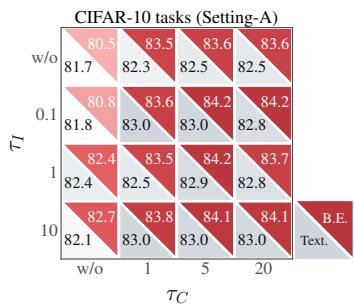  
(a) Temperature of $\mathcal { L } _ { \mathrm { b i d s l } }$

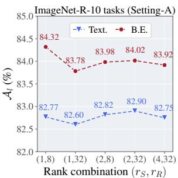  
(b) Mode-rank allocation  
Figure 5: Hyper-parameter analysis of (a) the class-wise and instance-wise temperatures in ${ \mathcal { L } } _ { \mathrm { b i - k l } }$ and (b) the shared/residual rank allocation.

Hyper-parameter Analysis. DuLBE is generally robust to the KL temperatures and mode-rank allocation. As shown in Figure 5, the setting $\tau _ { C } = 5$ and $\tau _ { I } = 0 . 1$ achieves the best bridge-ensemble accuracy, while nearby choices yield comparable results. Moreover, the compact rank allocation $( r _ { S } , { \overline { { r _ { R } } } } ) = ( 1 , 8 )$ performs best, and increasing the ranks brings no consistent benefit. This suggests that a single compact direction is suficient for knowledge transfer, while a modest residual space provides adequate plasticity. Additionally, the number of geodesic bridge depths $\bar { K _ { b } } ^ { \bar { } }$ and the reliability-smoothing temperature $\beta$ are further analyzed in Appendix C.4.

<table><tr><td rowspan="2">Method</td><td colspan="2">Text Clf.</td><td colspan="4">B.E. Clf.</td></tr><tr><td>CUB</td><td>Food</td><td>α</td><td>Rel.</td><td>CUB</td><td>Food</td></tr><tr><td>Ours</td><td>67.9</td><td>83.7</td><td>0.25</td><td>X</td><td>77.9</td><td>85.0</td></tr><tr><td>Ours</td><td></td><td></td><td>0.50</td><td>×</td><td>77.7</td><td>83.9</td></tr><tr><td>Ours</td><td></td><td></td><td>0.75</td><td>×</td><td>72.9</td><td>84.2</td></tr><tr><td>Ours</td><td></td><td></td><td>{αk}</td><td>×</td><td>79.1</td><td>84.6</td></tr><tr><td>Ours</td><td></td><td></td><td>{αk}</td><td>√</td><td>80.6(+12.7)</td><td>86.7(+3.0)</td></tr><tr><td>LoRA-CLIPr8</td><td>63.2</td><td>79.6</td><td>{αk}</td><td>√</td><td>73.6(+10.4)</td><td>80.0(+0.4)</td></tr><tr><td>RAPF</td><td>76.2</td><td>81.2</td><td>{αk</td><td>√</td><td>71.9(-4.3)</td><td>74.2(-7.0)</td></tr><tr><td> $\mathrm { L f I } _ { r 8 }$ </td><td>79.3</td><td>87.1</td><td>{αk}</td><td>√</td><td>75.4(-3.9)</td><td>84.0(-3.1)</td></tr></table>

Table 3: Ablation of the bridge-prototype ensemble on CUB (A) and Food (B). All entries report the last accuracy l. B.E. denotes bridge-prototype ensemble and Rel. denotes reliability weighting over bridge depths.

## Conclusion

We presented DuLBE, an exemplar-free Vision-Language CIL framework that addresses continual adaptation with a dual-mode low-rank learner and a bridge-prototype ensemble classifier. Through subspace allocation and routed objective learning, DuLBE allocates transferable cross-modal knowledge to a compact rewritable shared mode and task-specific variations to low-interference residual modes, enabling controlled knowledge reuse and flexible adaptation. Building on the resulting stable inter-modal structure, the bridgeprototype ensemble classifier exploits discriminative prototypes in the inter-modal semantic region with bridge-depth reliability. Experiments under standard CIL settings show that DuLBE achieves state-of-the-art performance while preserving the parameter eficiency of low-rank adaptation.

## References

Bossard, L.; Guillaumin, M.; and Van Gool, L. 2014. Food-101: Mining Discriminative Components with Random Forests. In European Conference on Computer Vision.

Cherti, M.; Beaumont, R.; Wightman, R.; Wortsman, M.; Ilharco, G.; Gordon, C.; Schuhmann, C.; Schmidt, L.; and Jitsev, J. 2023. Reproducible Scaling Laws for Contrastive Language-Image Learning. In Proceedings ofthe IEEE/CVF Conference on Computer Vision and Pattern Recognition, 2818–2829.

De Lange, M.; Aljundi, R.; Masana, M.; Parisot, S.; Jia, X.; Leonardis, A.; Slabaugh, G.; and Tuytelaars, T. 2021. A Continual Learning Survey: Defying Forgetting in Classification Tasks. IEEE Transactions on Pattern Analysis and Machine Intelligence, 44(7): 3366–3385.

Deng, J.; Dong, W.; Socher, R.; Li, L.-J.; Li, K.; and Fei-Fei, L. 2009. ImageNet: A Large-Scale Hierarchical Image Database. In Proceedings ofthe IEEE Conference on Computer Vision and Pattern Recognition, 248–255.

Douillard, A.; Cord, M.; Ollion, C.; Robert, T.; and Valle, E. 2020. PODNet: Pooled Outputs Distillation for Small-Tasks Incremental Learning. In European Conference on Computer Vision, 86–102.

Gao, P.; Geng, S.; Zhang, R.; Ma, T.; Fang, R.; Zhang, Y.; Li, H.; and Qiao, Y. 2024. Clip-adapter: Better vision-language models with feature adapters. International journal of computer vision, 132(2): 581–595.

Gong, Y.; Yu, S.; Al-Nuaimy, W.; and Xiao, J. 2026. Learning from Itself: Mining Internal Knowledge from Vision Language Models for Continual Learning. In Proceedings of the IEEE/CVF Conference on Computer Vision and Pattern Recognition, 10830–10839.

He, C.; Qiu, Z.; Meng, F.; Xu, L.; Wu, Q.; and Li, H. 2026a. DesCLIP: Robust Continual Learning via General Attribute Descriptions for VLM-Based Visual Recognition. IEEE Transactions on Multimedia, 28: 5021–5035.

He, C.; Qiu, Z.; Meng, F.; Zhang, R.; Xu, L.; Wu, Q.; and Li, H. 2026b. Continual Learning with Vision-Language Models via Semantic-Geometry Preservation. arXiv:2603.12055.

He, J.; Duan, Z.; and Zhu, F. 2025. CL-LoRA: Continual low-rank adaptation for rehearsal-free class-incremental learning. In Proceedings ofthe Computer Vision and Pattern Recognition Conference, 30534–30544.

He, L.; Cheng, D.; Wang, H.; Yang, X.; Wang, N.; and Gao, X. 2026c. Task-Driven Subspace Decomposition for Knowledge Sharing and Isolation in LoRA-Based Continual Learning. In International Conference on Machine Learning.

He, L.; Cheng, D.; Xu, D.; Wang, H.; and Wang, N. 2026d. Harnessing Textual Semantic Priors for Knowledge Transfer and Refinement in CLIP-Driven Continual Learning. In Proceedings of the AAAI Conference on Artificial Intelligence.

Hendrycks, D.; Basart, S.; Mu, N.; Kadavath, S.; Wang, F.; Dorundo, E.; Desai, R.; Zhu, T.; Parajuli, S.; Guo, M.; Song, D.; Steinhardt, J.; and Gilmer, J. 2021. The Many Faces of Robustness: A Critical Analysis of Out-of-Distribution Generalization. In Proceedings of the IEEE/CVF International Conference on Computer Vision.

Horn, R. A.; and Johnson, C. R. 2012. Matrix analysis. Cambridge university press.

Hu, E. J.; Shen, Y.; Wallis, P.; Allen-Zhu, Z.; Li, Y.; Wang, S.; Wang, L.; and Chen, W. 2022. LoRA: Low-Rank Adaptation of Large Language Models. In International Conference on Learning Representations.

Hu, T.; Li, L.; Xie, Z.-H.; and Zhou, D.-W. 2025. Hierarchical Semantic Tree Anchoring for CLIP-Based Class-Incremental Learning. arXiv preprint arXiv:2511.15633.

Huang, L.; Cao, X.; Lu, H.; and Liu, X. 2024. Class-Incremental Learning with CLIP: Adaptive Representation Adjustment and Parameter Fusion. In European Conference on Computer Vision, 214–231.

Huang, L.; Cao, X.; Lu, H.; Meng, Y.; Yang, F.; and Liu, X. 2025. Mind the Gap: Preserving and Compensating for the Modality Gap in CLIP-Based Continual Learning. In Proceedings of the IEEE/CVF International Conference on Computer Vision.

Kang, B.; Wang, L.; Wu, Z.; Feng, T.; Li, Y.; Gao, Y.; and Li, W. 2025. Dynamic Multi-Layer Null Space Projection for Vision-Language Continual Learning. In Proceedings of the IEEE/CVF International Conference on Computer Vision.

Kingma, D. P.; and Ba, J. 2015. Adam: A Method for Stochastic Optimization. In International Conference on Learning Representations.

Krause, J.; Stark, M.; Deng, J.; and Fei-Fei, L. 2013. 3D Object Representations for Fine-Grained Categorization. In Proceedings ofthe IEEE International Conference on Computer Vision Workshops, 554–561.

Krizhevsky, A. 2009. Learning Multiple Layers of Features from Tiny Images. Technical report, University of Toronto.

Li, L.; Hu, T.; Zhou, D.-W.; Yang, J.-Q.; Ye, H.-J.; and Zhan, D.-C. 2026. BOFA: Bridge-Layer Orthogonal Low-Rank Fusion for CLIP-Based Class-Incremental Learning. In Proceedings of the AAAI Conference on Artificial Intelligence, 22967–22975.

Li, Z.; and Hoiem, D. 2017. Learning without Forgetting. IEEE Transactions on Pattern Analysis and Machine Intelligence, 40(12): 2935–2947.

Liang, G.; Qin, C.; Cheng, D.; Zhang, S.; and Zhang, Y. 2025. Boosting Multi-Modal Alignment: Geometric Feature Separation for Class Incremental Learning. In Proceedings of the 33rd ACM International Conference on Multimedia, 1880–1889.

Liang, Y.-S.; and Li, W.-J. 2024. InfLoRA: Interference-Free Low-Rank Adaptation for Continual Learning. In Proceedings of the IEEE/CVF Conference on Computer Vision and Pattern Recognition, 23638–23647.

Luo, M.-L.; Zhou, Z.-H.; Zhang, Y.-L.; Wan, Y.; Wei, T.; and Zhang, M.-L. 2026. KeepLoRA: Continual Learning with Residual Gradient Adaptation. arXiv preprint arXiv:2601.19659.

Peng, T.; Liu, Y.; Yang, S.; Hong, Q.; and Tian, Y. 2025. GNSP: Gradient Null Space Projection for Preserving Cross-Modal Alignment in VLMs Continual Learning. arXiv:2507.19839.

Qiu, Z.; Wang, L.; Cao, Y.; Zhang, R.; Su, B.; Xu, Y.; Meng, F.; Xu, L.; Wu, Q.; and Li, H. 2026. Null-Space Filtering for Data-Free Continual Model Merging: Preserving Stability, Promoting Plasticity. In International Conference on Learning Representations (ICLR). Poster.

Qiu, Z.; Xu, Y.; He, C.; Meng, F.; Xu, L.; Wu, Q.; and Li, H. 2025. MINGLE: Mixture of Null-Space Gated Low-Rank Experts for Test-Time Continual Model Merging. Advances in Neural Information Processing Systems, 38: 143841– 143878.

Radford, A.; Kim, J. W.; Hallacy, C.; Ramesh, A.; Goh, G.; Agarwal, S.; Sastry, G.; Askell, A.; Mishkin, P.; Clark, J.; Krueger, G.; and Sutskever, I. 2021. Learning Transferable Visual Models from Natural Language Supervision. In Proceedings ofthe International Conference on Machine Learning, 8748–8763.

Rebufi, S.-A.; Kolesnikov, A.; Sperl, G.; and Lampert, C. H. 2017. iCaRL: Incremental Classifier and Representation Learning. In Proceedings of the IEEE Conference on Computer Vision and Pattern Recognition, 2001–2010.

Schuhmann, C.; Vencu, R.; Beaumont, R.; Kaczmarczyk, R.; Mullis, C.; Katta, A.; Coombes, T.; Jitsev, J.; and Komatsuzaki, A. 2021. LAION-400M: Open Dataset of CLIP-Filtered 400 Million Image-Text Pairs. arXiv:2111.02114.

Smith, J. S.; Karlinsky, L.; Gutta, V.; Cascante-Bonilla, P.; Kim, D.; Arbelle, A.; Panda, R.; Feris, R.; and Kira, Z. 2023. CODA-Prompt: COntinual Decomposed Attention-Based Prompting for Rehearsal-Free Continual Learning. In Proceedings of the IEEE/CVF Conference on Computer Vision and Pattern Recognition, 11909–11919.

Thengane, V.; Khan, S.; Hayat, M.; and Khan, F. S. 2022. CLIP Model is an Eficient Continual Learner. arXiv:2210.03114.

Wah, C.; Branson, S.; Welinder, P.; Perona, P.; and Belongie, S. 2011. The Caltech-UCSD Birds-200-2011 Dataset. Technical Report CNS-TR-2011-001, California Institute of Technology.

Wang, X.; Chen, T.; Ge, Q.; Xia, H.; Bao, R.; Zheng, R.; Zhang, Q.; Gui, T.; and Huang, X. 2023. Orthogonal Subspace Learning for Language Model Continual Learning. In Findings of the Association for Computational Linguistics: EMNLP 2023, 10658–10671. Association for Computational Linguistics.

Wang, Z.; Zhang, Z.; Ebrahimi, S.; Sun, R.; Zhang, H.; Lee, C.-Y.; Ren, X.; Su, G.; Perot, V.; Dy, J.; and Pfister, T. 2022. DualPrompt: Complementary Prompting for Rehearsal-Free Continual Learning. In European Conference on Computer Vision, 631–648.

Wu, B.; Shi, W.; Wang, J.; and Ye, M. 2025. Synthetic data is an elegant gift for continual vision-language models. In Proceedings of the Computer Vision and Pattern Recognition Conference, 2813–2823.

Xiao, J.; Hays, J.; Ehinger, K. A.; Oliva, A.; and Torralba, A. 2010. SUN Database: Large-Scale Scene Recognition from Abbey to Zoo. In Proceedings of the IEEE Conference on Computer Vision and Pattern Recognition, 3485–3492.

Yin, B.; Zhao, J.; Jiang, H.; Hou, N.; Hu, Y.; Beheshti, A.; Yang, M.-H.; and Qi, Y. 2024. Adapter-Enhanced Semantic Prompting for Continual Learning. arXiv:2412.11074.

Yu, L.; Han, H.; Tao, Z.; Yao, H.; and Xu, C. 2025. Language Guided Concept Bottleneck Models for Interpretable Continual Learning. In Proceedings of the IEEE/CVF Conference on Computer Vision and Pattern Recognition, 14976–14986.

Yu, L.; Tao, Z.; Goswami, D.; Yao, H.; Twardowski, B.; Van de Weijer, J.; and Xu, C. 2024. Exploiting the Semantic Knowledge of Pre-trained Text-Encoders for Continual Learning. arXiv preprint arXiv:2408.01076.

Zhang, W.; Janson, P.; Aljundi, R.; and Elhoseiny, M. 2024. Overcoming generic knowledge loss with selective parameter update. In Proceedings of the IEEE/CVF Conference on Computer Vision and Pattern Recognition, 24046–24056.

Zheng, Z.; Ma, M.; Wang, K.; Qin, Z.; Yue, X.; and You, Y. 2023. Preventing zero-shot transfer degradation in continual learning of vision-language models. In Proceedings of the IEEE/CVF international conference on computer vision, 19125–19136.

Zhou, D.-W.; Li, K.-W.; Ning, J.; Ye, H.-J.; Zhang, L.; and Zhan, D.-C. 2025a. External Knowledge Injection for CLIP-Based Class-Incremental Learning. In Proceedings of the IEEE/CVF International Conference on Computer Vision.

Zhou, D.-W.; Zhang, Y.; Wang, Y.; Ning, J.; Ye, H.-J.; Zhan, D.-C.; and Liu, Z. 2025b. Learning Without Forgetting for Vision-Language Models. IEEE Transactions on Pattern Analysis and Machine Intelligence, 47(6): 4489–4504.

Zhou, K.; Yang, J.; Loy, C. C.; and Liu, Z. 2022. Learning to prompt for vision-language models. International journal of computer vision, 130(9): 2337–2348.

# Dual-Mode Low-Rank Learner with Bridge-Prototype Ensemble for Vision-Language Class-Incremental Learning

Appendix

Chiyuan He1, Zihuan Qiu1, Fanman Meng1,✉, Chao Wang2, Liangjiang Chen1, Linfeng $\mathbf { X } \mathbf { u } ^ { 1 }$ , Qingbo Wu1, Hongliang Li1

1University of Electronic Science and Technology of China, Chengdu, China 2Qiyuan Lab, Beijing, China {cyhe,zihuanqiu,202522011613}@std.uestc.edu.cn {lfxu,qbwu,hlli}@uestc.edu.cn, w-c15@tsinghua.org.cn

## Overview

The appendix is organized into four parts. Section A analyzes the main design choices and their supporting evidence. Section B details the experimental protocols and training configurations. Section C reports additional experimental results. Section D gives the complete procedure ofproposed DuLBE.

## A Method Analysis and Evidence

## A.1 Rewritable Shared Mode

This subsection supplements the rewritable Shared Mode in the main paper by explaining why DuLBE selects a compact, layer-wise direction instead of making a large-rank historical subspace jointly rewritable. For each adapted layer l, the accumulated historical statistic is decomposed as

$$
\begin{array} { r } { \mathbf { S } _ { < t } ^ { l } = \mathbf { U } _ { < t } ^ { l } \mathbf { A } _ { < t } ^ { l } \big ( \mathbf { U } _ { < t } ^ { l } \big ) ^ { \top } . } \end{array}\tag{A.1}
$$

The top- $K _ { h }$ eigenvectors $\mathbf { U } _ { < t } ^ { l , K _ { h } }$ define the historical principal support $\mathcal { H } _ { < t } ^ { l }$ . Directions in this support have been repeatedly activated by previous tasks, but only a small subset may also be demanded by current task. Therefore, consider a rank-r shared basis $\mathbf { P } _ { t } ^ { l , \tilde { S } } ( r ) \subseteq \operatorname { s p a n } ( \mathcal { H } _ { < t } ^ { l } )$ . With the basis fixed, one gradient step on its trainable up-projection gives

$$
\begin{array} { r } { \mathcal { L } _ { \mathrm { c - e } } ( \mathbf { W } _ { t - 1 } ^ { l } + \Delta \mathbf { W } _ { t } ^ { l , S } ) - \mathcal { L } _ { \mathrm { c - e } } ( \mathbf { W } _ { t - 1 } ^ { l } ) } \\ { = - \eta \| \mathbf { G } _ { t } ^ { l } \mathbf { P } _ { t } ^ { l , S } ( r ) \| _ { F } ^ { 2 } + O ( \eta ^ { 2 } ) . } \end{array}\tag{A.2}
$$

Thus, the projected gradient energy measures how much current-task learning signal can be absorbed through the selected historical directions. To maximize this energy, define

$$
\mathbf { M } _ { t } ^ { l } = ( \mathbf { U } _ { < t } ^ { l , K _ { h } } ) ^ { \top } ( \mathbf { G } _ { t } ^ { l } ) ^ { \top } \mathbf { G } _ { t } ^ { l } \mathbf { U } _ { < t } ^ { l , K _ { h } } ,\tag{A.3}
$$

and let $\mu _ { 1 } ^ { l } \ge \cdots \ge \mu _ { K _ { h } } ^ { l }$ be its eigenvalues, with corresponding eigenvectors ql . By the Ky Fan maximum principle Horn and Johnson (2012), the optimal rank-r shared basis is

$$
\begin{array} { r l } & { { \mathbf { P } _ { t } ^ { l , S } } ( r ) = { \mathbf { U } _ { < t } ^ { l , K _ { h } } } [ \mathbf { q } _ { 1 } ^ { l } , \dots , \mathbf { q } _ { r } ^ { l } ] , } \\ & { \quad { \left\| { \mathbf { G } _ { t } ^ { l } } { \mathbf { P } _ { t } ^ { l , S } } ( r ) \right\| _ { F } ^ { 2 } } = \displaystyle \sum _ { i = 1 } ^ { r } \mu _ { i } ^ { l } . } \end{array}\tag{A.4}
$$

Therefore, $\mu _ { i } ^ { l }$ represents the marginal current-task benefit of making the corresponding historical direction rewritable.

Although a larger shared rank captures more gradient energy, it also opens more historically occupied directions to modification. From a sparse-update perspective, this tradeof can be expressed by the analytical surrogate

$$
\operatorname* { m a x } _ { 1 \leq r \leq K _ { h } } \left[ \sum _ { i = 1 } ^ { r } \mu _ { i } ^ { l } - \gamma _ { l } r \right] ,\tag{A.5}
$$

where $\gamma _ { l }$ denotes the conceptual cost of exposing one additional historical direction to rewriting and is not an extra training hyperparameter. Increasing the shared rank from r to $r + 1$ is useful only when its additional gradient benefit $\mu _ { r + 1 } ^ { l }$ exceeds this rewriting cost. When the projected spectrum is concentrated, the leading direction retains most transferable gradient energy, whereas the remaining directions provide limited benefit while increasing the risk of disturbing old visual-text relations. DuLBE therefore adopts the sparse choice $r _ { S } = 1 \mathrm { : }$

$$
\mathbf { P } _ { t } ^ { l , S } = \mathbf { U } _ { < t } ^ { l , K _ { h } } \operatorname { e i g } _ { \operatorname* { m a x } } ( \mathbf { M } _ { t } ^ { l } ) .\tag{A.6}
$$

This layer-wise construction retains the strongest overlap between historical occupation and current cross-modal demand while avoiding unnecessary high-rank rewriting.

## A.2 Residual Modes and Gradient Routing

This subsection supplements the low-interference Residual Modes and Gradient Routing in the main paper. We analyze two connected aspects: how the residual mode captures task-specific information not covered by the compact shared mode, and why routing the KL-constraint gradient to this space would introduce noise into its plastic exploration.

Residual-mode construction. Because $\mathbf { P } _ { t } ^ { l , S }$ already represents the most useful direction inside $\mathcal { H } _ { < t } ^ { l }$ , allocating additional residual capacity in the same support would duplicate the shared branch and expose more historical structure to modification. DuLBE therefore projects the prospective gradient onto the complementary space:

$$
\begin{array} { r l } & { \mathbf { \Pi } \mathbf { { \Pi } } _ { < t } ^ { l , \perp } = \mathbf { I } - \mathbf { { \mathbf { U } } } _ { < t } ^ { l , K _ { h } } ( \mathbf { { \mathbf { U } } } _ { < t } ^ { l , K _ { h } } ) ^ { \top } , } \\ & { \mathbf { \Pi } \mathbf { { G } } _ { t , R } ^ { l } = \mathbf { { G } } _ { t } ^ { l } \mathbf { { \Pi } } \mathbf { { \Pi } } _ { < t } ^ { l , \perp } . } \end{array}\tag{A.7}
$$

This removes gradient components associated with the principal historical support while retaining current-task demand that cannot be absorbed by the shared mode. Let

$$
\mathbf { G } _ { t , R } ^ { l } = \mathbf { A } _ { t } ^ { l } \mathbf { \Sigma } \Sigma _ { t } ^ { l } ( \mathbf { V } _ { t } ^ { l } ) ^ { \top }\tag{A.8}
$$

be its singular value decomposition, with singular values $\sigma _ { 1 } ^ { l } \geq \sigma _ { 2 } ^ { l } \geq \cdots$ . We choose to select

$$
\mathbf { P } _ { t } ^ { l , R } = [ \mathbf { v } _ { t , 1 } ^ { l } , \ldots , \mathbf { v } _ { t , r _ { R } } ^ { l } ] .\tag{A.9}
$$

For any orthonormal basis R satisfying $\mathbf { R } ^ { \top } \mathbf { U } _ { < t } ^ { l , K _ { h } } = \mathbf { 0 }$ , we have ${ \bf G } _ { t } ^ { l } { \bf R } = { \bf G } _ { t , R } ^ { l } { \bf R }$ . The variational characterization of singular values therefore gives

$$
\begin{array} { r l } { \mathbf { P } _ { t } ^ { l , R } \in } & { \operatorname { a r g m a x } \quad \left\| \mathbf { G } _ { t } ^ { l } \mathbf { R } \right\| _ { F } ^ { 2 } , } \\ & { \mathbf { R } ^ { \top } \mathbf { R } { = } \mathbf { I } _ { r _ { R } } } \\ & { \mathbf { R } ^ { \top } \mathbf { U } _ { < t } ^ { l , { K } _ { h } } { = } \mathbf { 0 } } \end{array}\tag{A.10}
$$

$$
\left\| \mathbf { G } _ { t } ^ { l } \mathbf { P } _ { t } ^ { l , R } \right\| _ { F } ^ { 2 } = \sum _ { i = 1 } ^ { r _ { R } } ( \sigma _ { i } ^ { l } ) ^ { 2 } .
$$

Accordingly, the residual basis is not an arbitrary orthogonal component: it is the rank-r $\cdot _ { R }$ subspace outside the historical support that retains the largest current-task gradient energy. A gradient step through this basis provides the first-order loss decrease:

$$
\begin{array} { r l } { \mathcal { L } _ { \mathrm { c - e } } ( \mathbf { W } _ { t - 1 } ^ { l } + \Delta \mathbf { W } _ { t } ^ { l , R } ) - \mathcal { L } _ { \mathrm { c - e } } ( \mathbf { W } _ { t - 1 } ^ { l } ) } & { } \\ { = - \eta \displaystyle \sum _ { i = 1 } ^ { r _ { R } } ( \sigma _ { i } ^ { l } ) ^ { 2 } + O ( \eta ^ { 2 } ) . } \end{array}\tag{A.11}
$$

The same construction also limits historical interference. Let $\rho _ { K _ { h } + 1 } ^ { l }$ denote the largest eigenvalue of $\mathbf { S } _ { < t } ^ { l }$ outside its top-$K _ { h }$ principal support. Since $\mathbf { P } _ { t } ^ { l , R }$ lies in this complementary space, the accumulated response of $\Delta \mathbf { W } _ { t } ^ { l , R } = \mathbf { B } _ { t } ^ { \bar { l } , R } ( \mathbf { P } _ { t } ^ { l , R } ) ^ { \bar { \top } }$ on historical layer inputs satisfies

$$
\sum _ { k < t } \left\| \mathbf { X } _ { k } ^ { l } \mathbf { P } _ { t } ^ { l , R } ( \mathbf { B } _ { t } ^ { l , R } ) ^ { \top } \right\| _ { F } ^ { 2 } \leq \rho _ { K _ { h } + 1 } ^ { l } \| \mathbf { B } _ { t } ^ { l , R } \| _ { F } ^ { 2 } .\tag{A.12}
$$

Thus, the residual mode simultaneously maximizes the remaining current-task learning signal and bounds its response on historical activations. This explains why DuLBE can allocate a larger rank $r _ { R }$ to task-specific plasticity while keeping the historically sensitive shared mode compact.

Gradient routing. Let $\mathbf { g } _ { t } ^ { l , R } = \nabla _ { \mathbf { B } _ { t } ^ { l , R } } \mathcal { L } _ { \mathrm { c - c e } }$ denote the useful current-task gradient in the residual branch. The bidirectional KL objective instead preserves the teacher’s historical semantic structure, and its systematic contribution is handled by the shared branch that rewrites historically occupied directions. Under this intended decomposition, the remaining mini-batch KL component in the residual branch mainly reflects finite-sample variation, imperfect subspace estimation, and nonlinear cross-layer coupling. We denote this component by $\pmb { \xi } _ { t } ^ { l , R }$ and model it as

$$
\mathbb { E } [ \pmb { \xi } _ { t } ^ { l , R } ] = \mathbf { 0 } , \qquad \mathbb { E } [ \| \pmb { \xi } _ { t } ^ { l , R } \| _ { F } ^ { 2 } ] = ( \sigma _ { t } ^ { l , R } ) ^ { 2 } .\tag{A.13}
$$

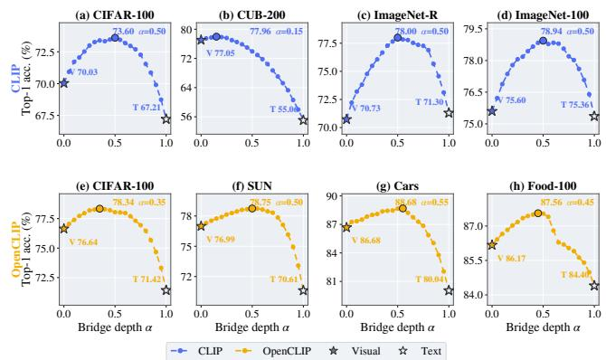  
Figure A.1: Dataset-level top-1 accuracy across bridge depths using frozen OpenAI CLIP (top) and OpenCLIP (bottom). Filled and hollow stars denote the visual and textual endpoints, respectively.

If this component were routed to the residual branch, its update can become $\mathbf { B } _ { t , + } ^ { l , R } = \mathbf { B } _ { t } ^ { l , R } - \eta ( \mathbf { g } _ { t } ^ { l , R } + \lambda \pmb { \xi } _ { t } ^ { l , R } )$

Assuming that $\mathcal { L } _ { \mathrm { c - c e } }$ is locally Ll-smooth with respect to $\mathbf { B } _ { t } ^ { l , R }$ , the expected current-task loss after this noisy update satisfies

$$
\begin{array} { r l } & { \displaystyle \mathbb { E } [ \mathcal { L } _ { \mathrm { c - c e } } ( \mathbf { B } _ { t , + } ^ { l , R } ) ] \leq \mathcal { L } _ { \mathrm { c - c e } } ( \mathbf { B } _ { t } ^ { l , R } ) - \eta \left( 1 - \frac { L _ { l } \eta } { 2 } \right) \| \mathbf { g } _ { t } ^ { l , R } \| _ { F } ^ { 2 } } \\ & { \quad \quad \quad \quad + \frac { L _ { l } \eta ^ { 2 } \lambda ^ { 2 } } { 2 } ( \sigma _ { t } ^ { l , R } ) ^ { 2 } . } \end{array}\tag{A.14}
$$

The final positive term is introduced solely by residual KL noise. It weakens the guaranteed current-task loss decrease and perturbs the dominant task-specific directions selected by Eq. (A.10). Consequently, we choose to route the KL gradient only to $\mathbf { B } _ { t } ^ { l , S }$ , where historical-structure preservation is required, while updating $\mathbf { B } _ { t } ^ { l , R }$ only with the current-task objective to preserve eficient plastic exploration.

## A.3 Analysis of Bridge-Prototype Ensemble

Dataset and class-level evidence. The bridge-prototype ensemble is motivated by the fact that visual and text prototypes provide complementary class information, while their relative importance varies across scenarios and classes. We reveal this kind of efect using frozen CLIP and vary only the bridge depth $\alpha ,$ where $\alpha = 0$ and $\alpha = 1$ denote the visual and textual endpoints, respectively. As shown in Figure A.1, all 8 scenarios achieve their best accuracy at an intermediate depth, with $\alpha ^ { * }$ ranging from 0.15 to 0.55. The best bridge exceeds the stronger endpoint by 0.91–6.70 percentage points, demonstrating that the geodesic interior contains useful discriminative representations beyond either modality alone. Figure A.2 further shows that classes within the same dataset prefer substantially diferent depths, spanning visual-dominant, intermediate, and text-dominant regions. These results motivate estimating bridge reliability separately for each class instead of adopting a fixed global fusion depth.

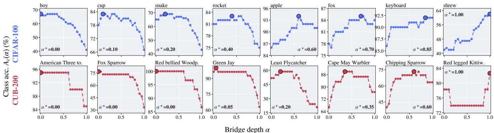  
Figure A.2: Class-wise accuracy across bridge depths for representative CIFAR (top) and CUB(bottom) classes. Each class is evaluated against all classes in the corresponding dataset. Enlarged markers indicate the class-specific optimal depths.

Analysis of Geodesic Bridge Interpolation. The visualtext modality gap places visual and textual representations in distinct regions of CLIP’s shared embedding space Liang et al. (2022); Huang et al. (2025). Consequently, a visual prototype and its corresponding text embedding need not be geometrically aligned, although they describe the same class. The visual prototype captures appearance-specific evidence but may inherit specific-dependent bias, whereas the text embedding provides stable semantics but may omit fine-grained visual cues. Thus, the most discriminative class direction need not coincide with either endpoint, but may lie between them, where visual evidence and textual semantics are better integrated. The interior accuracy gains in Figure A.1 and the class-dependent optima in Figure A.2 provide direct evidence for this non-endpoint discriminative region.

Geodesic interpolation provides a calibrated transition between these two modality-specific semantic directions. Let $\theta _ { c } = \operatorname { a r c c o s } ( \mathbf { v } _ { c } ^ { \top } \mathbf { e } _ { c } )$ . The resulting bridge prototype satisfies

$$
\|  { \mathbf { b } } _ { c } ( \alpha ) \| _ { 2 } = 1 , \qquad \angle (  { \mathbf { v } } _ { c } ,  { \mathbf { b } } _ { c } ( \alpha ) ) = \alpha \theta _ { c } .\tag{A.15}
$$

Therefore, every bridge prototype remains on the CLIP unit hypersphere, and α consistently represents the fraction of semantic displacement from the visual modality toward the textual modality. Prototypes of diferent classes at the same depth consequently retain comparable value of logits.

For comparison, BOFA Li et al. (2026) adopts ordinary linear interpolation between the two modal endpoints:

$$
\begin{array} { c } { \widetilde { \mathbf { b } } _ { c } ( \alpha ) = ( 1 - \alpha ) \mathbf { v } _ { c } + \alpha \mathbf { e } _ { c } , } \\ { \left\| \widetilde { \mathbf { b } } _ { c } ( \alpha ) \right\| _ { 2 } ^ { 2 } = 1 - 2 \alpha ( 1 - \alpha ) ( 1 - \cos \theta _ { c } ) . } \end{array}\tag{A.16}
$$

Its norm, and hence its logit scale, varies with the classspecific modality gap $\theta _ { c }$ . Although normalization removes this scale variation, the angular transition remains nonlinear, so the same α represents diferent semantic progress across classes. In contrast, geodesic interpolation preserves both unit norm and uniform angular depth, making each depth a comparable all-class classifier. Consequently, the reliability weights $\pi _ { c } ( \alpha _ { k } )$ can identify the most discriminative intermodal region (depth) for each class semantics.

## B Experimental Details

## B.1 Datasets and Protocols

Benchmark settings. We follow the two public protocols commonly used by the corresponding baselines. Setting-A is the uniform configurations Huang et al. (2024)1 with OpenAI CLIP Radford et al. (2021) ViT-B/16. It contains CIFAR-100 Krizhevsky (2009), CUB-200-2011 Wah et al. (2011), ImageNet-R Hendrycks et al. (2021), and 100-class subset of ImageNet Deng et al. (2009). We use the default public class orders. ImageNet-R has no oficial train/test partition, we therefore use released random split, same as Huang et al. (2024). Setting-B is the uniform 10-task configurations Zhou et al. (2025b)2 with OpenCLIP ViT-B/16 Cherti et al. (2023) initialized from laion400m\_e32 weights Schuhmann et al. (2021). We choose CIFAR-100, the 300-class SUN-397 Xiao et al. (2010) subset, the 100-class Stanford Cars Krause et al. (2013) subset, and the 100-class Food-101 Bossard, Guillaumin, and Van Gool (2014) subset. The class order is shufled with seed 1993, same as Zhou et al. (2025b).

Dataset. CIFAR-100 contains 32 32 natural images from 100 object classes, with 500 training and 100 test images per class. CUB-200 and Stanford Cars are fine-grained benchmarks for 200 bird species and 196 car make/model/year categories, respectively. ImageNet-R contains artistic and nonphotographic renditions of 200 ImageNet classes, whereas ImageNet-100 retains natural images from 100 ImageNet classes. SUN-397 covers diverse indoor and outdoor scenes, with 50 training and 50 test images per class in its standard partitions. Food-101 contains 750 training and 250 test images for each of 101 dishes. For Setting-B, only the retained classes in Table B.1 enter the CIL stream,and the remaining original classes are never used for training or evaluation.

Text templates. Setting-A follows Huang et al. (2024) and uses the single template $\mathcal { T } _ { A } = { ^ { \bullet } } \mathbf { a }$ good photo ofa c.” for every class name c. Setting-B follows the actual configuration of Zhou et al. (2025b), which selects only the first entry of each dataset-specific template list. Thus, CIFAR-100, SUN-397, and Stanford Cars use “a photo of a $c . \mathrm { ^ { \circ } } .$ , while Food-101 uses “a photo of c, a type of food.” The exact template for each benchmark is reported in Table B.1.

Table B.1: Dataset statistics and class-incremental protocols. “Classes” reports the number used by the protocol and the numbe in the original benchmark. “Stream” gives the number of tasks new classes per task, and “Training template” reports the text prompt used during optimization. Train/test counts refer only to the classes used in the CIL stream.
<table><tr><td>Setting</td><td>Dataset</td><td>Classes</td><td>Train</td><td>Test</td><td>Stream</td><td>Training template</td></tr><tr><td>A</td><td>CIFAR-100</td><td>100/100</td><td>50,000</td><td>10,000</td><td> $1 0 \times 1 0$ </td><td> $\mathbf { \ddot { a } }$  good photo of a  $\cdot \ : c . \ : ^ { \ast }$ </td></tr><tr><td>A</td><td>CUB-200</td><td>200/200</td><td>5,994</td><td>5,794</td><td> $1 0 \times 2 0$ </td><td>“a good photo of a  $c . ^ { \mathfrak { n } }$ </td></tr><tr><td>A</td><td>ImageNet-R</td><td>200/200</td><td>24,000</td><td>6,000</td><td> $1 0 \times 2 0$ </td><td> $\mathbf { \ddot { a } }$  good photo of a  $c . ^ { \mathfrak { n } }$ </td></tr><tr><td>A</td><td>ImageNet-100</td><td>100/1,000</td><td>129,395</td><td>5,000</td><td> $1 0 \times 1 0$ </td><td> $\mathbf { \ddot { a } }$  good photo of a  $c . ^ { \mathfrak { n } }$ </td></tr><tr><td>B</td><td>CIFAR-100</td><td>100/100</td><td>50,000</td><td>10,000</td><td> $1 0 \times 1 0$ </td><td> $\mathbf { \ddot { a } }$  photo of  $\mathrm { ~ a ~ c . ~ } ^ { \ast }$ </td></tr><tr><td>B</td><td>SUN-397</td><td>300/397</td><td>15,000</td><td>15,000</td><td> $1 0 \times 3 0$ </td><td> $\mathbf { \ddot { a } }$  photo of  $\mathrm { ~ a ~ c . ~ } ^ { \ast }$ </td></tr><tr><td>B</td><td>Stanford Cars</td><td>100/196</td><td>4,114</td><td>4,062</td><td> $1 0 \times 1 0$ </td><td> $\mathbf { \ddot { a } }$  photo of a  $c . ^ { \mathfrak { n } }$ </td></tr><tr><td>B</td><td>Food-101</td><td>100/101</td><td>75,000</td><td>25,000</td><td> $1 0 \times 1 0$ </td><td> $\mathbf { \ddot { a } }$  photo of c, a type of food.&quot;</td></tr></table>

Image preprocessing. All images are mapped to 224 224 and normalized by the preprocessing pipeline associated with the corresponding pretrained CLIP model. We keep the class subsets, class orders, train/test partitions, and preprocessing fixed to the public configurations of Huang et al. (2024) and Zhou et al. (2025b).

We provide further descriptions of the compared methods in the main. Following the standard CLIP-based CIL evaluation protocol, DualPrompt and CODA-Prompt are applied only to the visual branch of CLIP, while the other methods are implemented according to their original designs.

## B.2 Introduction to Compared Methods

• ContinualCLIP Thengane et al. (2022): ContinualCLIP keeps CLIP frozen and performs zero-shot classification using the text embeddings of all classes observed so far. It requires neither continual optimization nor exemplar replay.

Data access in CIL. DuLBE uses only current-task data, without storing old exemplars or introducing external data. We retain the original resource settings of the compared methods. PROOF Zhou et al. (2025c) stores 20 exemplars per observed class. CLG-CBM Yu et al. (2025), ENGINE Zhou et al. (2025b), and DesCLIP He et al. (2026a) do not replay old images but use externally generated language knowledge, such as LLM-derived class concepts or attribute descriptions. In addition, LfI Gong et al. (2026) uses COCO Captions Chen et al. (2015) as an external reference set during token generation, mixing 512 target samples with 512 COCO image-caption pairs per batch.

• DualPrompt Wang et al. (2022a): DualPrompt learns complementary general and expert prompts for a frozen pretrained transformer. The general prompts encode taskshared knowledge, whereas the expert prompts capture task-specific information.

• CODA Smith et al. (2023): CODA decomposes prompts into learnable components and combines them using input-conditioned attention. This enables end-to-end prompt construction without replaying historical data.

• PROOF Zhou et al. (2025c): PROOF freezes the pretrained visual and text towers and expands task-specific projection layers as new classes arrive. Previously learned projections are fixed, while a cross-modal fusion module integrates projected visual features and visual-textual prototypes.

• RAPF Huang et al. (2024): RAPF adopts text semantics to estimate influence of new classes on old learned classes and adaptively adjusts their representations. It further employs decomposed parameter fusion to consolidate task-wise adapter updates and prevent forgetting.

• SGCL Yu et al. (2024b): SGCL exploits semantic relations encoded by the pretrained CLIP text tower. It combines semantically guided representation learning with semantically guided knowledge distillation to transfer class relations within and across tasks.

• CLG-CBM Yu et al. (2025): CLG-CBM introduces a language-guided concept bottleneck model (CBM) between frozen CLIP features and a linear classifier. Concept alignment improves interpretability, while semantic-guided prototype augmentation generates oldclass pseudo-features to alleviate forgetting.

• ENGINE Zhou et al. (2025b): ENGINE injects external knowledge through visual and textual branches. The visual branch enriches features through data augmentation, while the textual branch introduces discriminative descriptions. The resulting knowledge is further exploited by re-ranking predictions using abundant text prompts at inference time.

• DesCLIP He et al. (2026a): DesCLIP constructs robust vision-general attribute-class associations using general attribute descriptions. An anchor-based filter selects vision-relevant descriptors, which guide visual adaptation and the calibration of class-text embeddings.

• MG-CLIP Huang et al. (2025): MG-CLIP treats the intrinsic visual-textual modality gap as an indicator of retained pretrained cross-modal knowledge. It preserves the modality gap to reduce forgetting and compensates using visual learnable classifier in the visual space for

CIL prediction.

• BOFA Li et al. (2026): BOFA adapts only CLIP’s crossmodal bridge layer(projection from raw visual space to aligned visual space) and constrains its low-rank updates to a subspace approximately orthogonal to historical features. It further combines stable textual prototypes with adapted visual prototypes using linear Interpolation for classification.

• LoDA-CLIP He et al. (2026b): Adopts the oficial CLIP implementation of LoDA (Low-rank Decomposition and Adaptation) reported in the original paper. LoDA constructs general and isolated LoRA down-projection spaces from layer-wise feature statistics: the former captures directions shared across previous and current tasks, while the latter maximizes the current-to-historical feature energy ratio. After optimizing the up-projections and recalibrating the general update, the oficial CLIP implementation combines a frozen CLIP branch with the adapted CLIP, fusing their prediction scores at inference.

• LfI Gong et al. (2026): LfI mines the internal knowledge of CLIP without relying on an external captioning model. It constructs pseudo-captions by optimizing learnable tokens and performs adaptive mutual distillation between the textual classifier and a temporary visual classifier.

## B.3 Additional Implementation Details

This subsection supplements the implementation settings reported in the main paper with the dataset-wise training schedules and further details of prospective-gradient estimation.

Training schedule and text adaptation. We train the CIL model on CIFAR for 2 epochs per task under both OpenAI CLIP and OpenCLIP. CUB, ImageNet-100, and ImageNet-R are trained for 4 epochs per task, whereas SUN, Cars, and Food under OpenCLIP are trained for 10 epochs per task. All runs use Adam with a cosine-annealing schedule, without warm-up, weight decay, or mixed-precision training. Following Huang et al. (2025), we adapt the text tower using rank-8 LoRA while keeping its pretrained weights frozen. The text-side LoRA parameters are optimized jointly with the visual learner. Since the text tower serves as a stable semantic anchor, we do not apply dual-mode allocation or historical-structure regularization to its LoRA parameters.

Prospective-gradient estimation. At the beginning of each task, before initializing the new dual-mode branches, we keep the model at its pre-task state and perform one gradient-probing pass over the current-task training data. We use the same cross-modal CE objective and current-class text embeddings as in subsequent training. The mini-batch gradients are accumulated for all adapted visual layers. No optimizer step is performed and no model parameters are modified during this pass. The resulting gradients are used only to construct the shared and residual bases and are then discarded. For the first task, the bases are initialized from the dominant gradient directions. For later tasks, the prospective gradients are combined with the accumulated historical statistics for mode allocation. This procedure uses only current-task samples and introduces no historical replay.

Overall, our optimization epochs do not exceed those of the corresponding standard protocols. Therefore, the performance gains of DuLBE do not rely on an enlarged optimization budget.

## B.4 Evaluation Metrics

After learning task t, the model is evaluated on all classes observed so far, ${ \mathcal { C } } _ { \leq t } ,$ , without task identity. We denote $A _ { t }$ as the resulting top-1 accuracy, which jointly reflects learning of new classes and retention of previous ones. For the stream of $T$ tasks, we compute $\begin{array} { r } { \bar { \mathcal { A } } = \bar { T } ^ { - 1 } \sum _ { t = 1 } ^ { T } A _ { t } } \end{array}$ . It averages accuracy across all incremental stages and measures whether the model performs consistently throughout the learning process. In addition, we define $\mathcal { A } _ { l } = \mathcal { A } _ { T } .$ , which evaluates the final model on all benchmark classes after the complete task stream. It summarizes the final balance between learning new classes and preserving old knowledge.

## C Additional Experimental Results

## C.1 Comparison with Other Baselines

To complement the standard-protocol comparison in the main paper, we extend the evaluation along two dimensions: a) access to additional training data and b) the choice of continual low-rank adaptation strategy. All comparisons use Setting-A with the same OpenAI CLIP ViT-B/16 backbone, 10-task class splits, and evaluation metrics as in the main paper.

Comparison with methods using additional training data. We compare DuLBE with methods that exploit additional training data through either historical replay or external reference datasets. SGCL Yu et al. (2024b), CLAP4CLIP Jha, Gong, and Yao (2024), PROOF Zhou et al. (2025c), and SPU∗ Zhang et al. (2024) retain 20 historical images per observed class. In contrast, ZSCL Zheng et al. (2023) distills knowledge from the 28k-image validation set of Conceptual Captions Sharma et al. (2018), whereas LfI Gong et al. (2026) samples 512 reference pairs from COCO Captions Chen et al. (2015) in each token-generation batch. We additionally report the replay-free SPU as a resource-matched baseline. DuLBE uses neither historical exemplars nor external training images and accesses only the current-task data.

Despite using no additional training data, DuLBE achieves the best average and final accuracies on both CIFAR and ImageNet-R, while ranking second on both metrics for CUB. It surpasses the strongest replay-based results on CIFAR by 0.3 and 0.6 points, respectively, and slightly outperforms LfI on ImageNet-R. On the fine-grained CUB benchmark, DuLBE remains competitive with SGCL while avoiding the storage of old exemplars.

Comparison with LoRA-based methods. We further compare DuLBE with representative LoRA-based continual learning methods: O-LoRA Wang et al. (2023), InfLoRA Liang and Li (2024), CL-LoRA He, Duan, and Zhu (2025), and LoDA He et al. (2026b). We follow the original rank settings and additionally evaluate LoDA with r = 8. For a fair comparison, all methods insert LoRA modules into the same key and value projections and MLP layers of the visual tower. Importantly, all reported LoRA baseline results use the same standard CLIP text classifier for prediction, which is also adopted by DuL $\mathbf { \mathbf { \mathbf { B } } E _ { \mathrm { T e x t } } }$ . for a classifier-matched comparison. These baselines are formulated for generic pretrained models and are largely agnostic to CLIP’s dual-tower structure. In contrast, DuLBE is specifically designed for CLIPbased continual learning by coordinating visual adaptation with visual-textual knowledge preservation. DuL $\mathrm { \mathcal { B } E _ { B , E } }$ . further reports the complete method with the bridge-prototype ensemble classifier.

<table><tr><td rowspan="3">Method</td><td rowspan="3">Additional Data</td><td colspan="6">Setting-A (CLIP)</td></tr><tr><td colspan="2">CIFAR</td><td colspan="2">CUB</td><td colspan="2">I.N.-R</td></tr><tr><td> $\bar { A }$ </td><td> $\mathcal { A } _ { l }$ </td><td>A</td><td> $\mathcal { A } _ { l }$ </td><td>Ã</td><td> $\boldsymbol { A } _ { l }$ </td></tr><tr><td>SGCL Yu et al. (2024b)</td><td>Replay (20/class)</td><td>89.1</td><td>82.7</td><td>87.1</td><td>82.9</td><td>86.8</td><td>81.9</td></tr><tr><td>CLAP4CLIP Jha, Gong, and Yao (2024)</td><td>Replay (20/class)</td><td>85.1</td><td>76.4</td><td>85.2</td><td>79.9</td><td>85.0</td><td>79.2</td></tr><tr><td>PROOF Zhou et al. (2025c)</td><td>Replay (20/class)</td><td>86.2</td><td>76.3</td><td></td><td></td><td>82.8</td><td>77.1</td></tr><tr><td>SPU* Zhang et al. (2024)</td><td>Replay (20/class)</td><td>89.2</td><td>83.6</td><td>81.0</td><td>70.3</td><td>85.7</td><td>80.1</td></tr><tr><td>ZSCL Zheng et al. (2023)</td><td>External (CC val., 28k)</td><td>82.4</td><td>74.1</td><td>71.1</td><td>60.6</td><td>85.5</td><td>79.7</td></tr><tr><td>LfI Gong et al. (2026)</td><td>External (COCO, 512/batch)</td><td>87.8</td><td>82.7</td><td></td><td></td><td>88.1</td><td>84.0</td></tr><tr><td>SPU Zhang et al. (2024)</td><td>None</td><td>84.9</td><td>76.4</td><td>75.9</td><td>68.2</td><td>83.1</td><td>77.5</td></tr><tr><td>DuLBE (Ours)</td><td>None</td><td>89.5</td><td>84.2</td><td>86.1</td><td>80.6</td><td>88.4</td><td>84.3</td></tr></table>

Table C.1: Comparison with methods using additional training data under Setting-A. Replay methods retain 20 historical images per observed class. CC and COCO denote Conceptual Captions and COCO Captions, respectively. $\mathrm { S P U ^ { * } }$ is the replay-based variant, whereas SPU and DuLBE use neither historical exemplars nor external training images. The best results are highlighted in bold, and the second-best results are underlined.

<table><tr><td rowspan="2"></td><td>CIFAR I.N.-100</td></tr><tr><td>A Al À</td></tr><tr><td> $\mathrm { O - L o R A } \left( r = 8 / \mathrm { t a s k } \right)$ </td><td>86.2 77.3 83.4 72.0</td></tr><tr><td>InfLoRA (r = 10)</td><td>87.8 80.9 85.4 75.5</td></tr><tr><td> $\mathbf { C L - L o R A } ( r = 1 0 )$  LoDA (r = 8)</td><td>83.9 75.1 83.7 73.4</td></tr><tr><td>LoDA (r = 32)</td><td>86.080.4 85.6 74.7 86.4 81.1 85.8 75.7</td></tr><tr><td>DuL  $\mathbf { \mathcal { B } E } _ { \mathrm { T e x t } }$   $( r = 1 + 8 )$ </td><td></td></tr><tr><td> $\mathbf { D u L B E } _ { \mathrm { B . E . } }$   $( r = 1 + 8 )$ </td><td>89.0 83.0 87.5 78.4 89.5 84.2 88.3 80.7</td></tr></table>

Table C.2: Comparison with LoRA-based methods under Setting-A. All methods use identical insertion locations in the visual tower, including the key and value projections and the MLP layers. All LoRA baselines and DuL $. \mathrm { B E } _ { \mathrm { T e x t } }$ . use the same standard CLIP text classifier, whereas $\mathrm { D u L B E _ { B . E } }$ . uses the complete reliability-guided bridge-prototype ensemble. For O-LoRA, $r \ = \ 8$ denotes the rank of each task-wise adapter. Best and second-best results are shown in bold and underline, respectively.

## C.2 Performance under the Learning-from-Half Protocol

We further evaluate DuLBE under the learning-from-half (LFH) protocol in Setting-B. The initial stage contains half of the benchmark classes and is followed by five equal incremental stages. Specifically, the 100-class benchmark splits of CIFAR-100, Stanford Cars, and Food-101 use B50 Inc10, while the 300-class SUN-397 split uses B150 Inc30. All results are based on OpenCLIP ViT-B/16 pretrained on LAION-400M, using the same class order and random seed as in the main Setting-B experiments.

Baseline results are taken from the corresponding original papers or matched evaluations under this configuration. PROOF follows its original setting with 20 replay exemplars per observed class, while LfI uses COCO reference pairs during training. As shown in Table C.3, we achieves the best average and final accuracies on both CIFAR and SUN. Our DuLBE achieve these results without data replay or external reference images, whereas PROOF and LfI use replay exemplars and COCO reference pairs, respectively. These results demonstrate that DuLBE efectively preserves the knowledge acquired from a large initial task while remaining adaptable to subsequent increments, extending its advantages beyond the uniform 10-task protocol.

## C.3 Performance with CLIP ViT-L/14 Backbone

To evaluate the scalability of DuLBE to a larger visionlanguage backbone, we replace the OpenAI CLIP Radford et al. (2021) ViT-B/16 used in Setting-A with ViT-L/14 and conduct experiments on CIFAR and ImageNet-R. We retain the same uniform 10-task CIL, with 10 and 20 new classes introduced per task, respectively. The CIL protocol remains unchanged.

These baseline results are all taken from the matched ViT-L/14 evaluation reported by Huang et al. (2025). PROOF and CLAP4CLIP use real-data replay, whereas SLCA and RAPF use feature replay. CLAP4CLIP∗ denotes the exemplar-free variant of CLAP4CLIP. In contrast, DuLBE uses neither replay nor external reference data. This experiment examines whether DuLBE’s dual-mode adaptation and bridgeprototype classification remain efective as the capacity of the CLIP backbone increases. As shown in Table C.4, DuLBE achieves the best results across all four metrics, while its text-classifier variant consistently ranks second. These results confirm that the dual-mode learner remains efective with a larger CLIP backbone and that the bridge-prototype ensemble provides further improvements.

<table><tr><td rowspan="3">Method</td><td colspan="8">Setting-B (OpenCLIP)-LFH</td></tr><tr><td colspan="2">CIFAR B50 Inc10</td><td colspan="2">SUN B150 Inc30</td><td colspan="2">Cars B50 Inc10</td><td colspan="2">Food B50 Inc10</td></tr><tr><td>À</td><td>Al</td><td>À</td><td> $\mathcal { A } _ { l }$ </td><td>À</td><td>Al</td><td>Ã</td><td> $\mathcal { A } _ { l }$ </td></tr><tr><td>ContinualCLIP Thengane et al. (2022)</td><td>76.5</td><td>71.4</td><td>75.0</td><td>72.1</td><td>78.3</td><td>76.4</td><td>84.8</td><td>81.9</td></tr><tr><td>DualPrompt Wang et al. (2022a)</td><td>80.1</td><td>72.6</td><td>79.4</td><td>73.0</td><td>76.9</td><td>67.6</td><td>80.0</td><td>72.8</td></tr><tr><td>CODA-Prompt Smith et al. (2023)</td><td>78.7</td><td>71.6</td><td>80.4</td><td>74.2</td><td>75.1</td><td>64.2</td><td>81.0</td><td>74.1</td></tr><tr><td>PROOF Zhou et al. (2025c)</td><td>82.9</td><td>78.9</td><td>80.7</td><td>77.5</td><td>90.5</td><td>89.5</td><td>87.5</td><td>84.7</td></tr><tr><td>RAPF Huang et al. (2024)</td><td>82.2</td><td>77.9</td><td>78.0</td><td>73.1</td><td>75.9</td><td>63.2</td><td>85.5</td><td>81.2</td></tr><tr><td>ENGINE Zhou et al. (2025b)</td><td>83.2</td><td>79.5</td><td>81.6</td><td>78.5</td><td>91.6</td><td>90.0</td><td>86.9</td><td>83.9</td></tr><tr><td>MG-CLIP Huang et al. (2025)</td><td>85.6</td><td>81.3</td><td>26.6</td><td>12.6</td><td>84.6</td><td>79.6</td><td>28.9</td><td>12.5</td></tr><tr><td>BOFA Li et al. (2026)</td><td>83.7</td><td>80.1</td><td>82.3</td><td>79.3</td><td>92.3</td><td>90.9</td><td>86.3</td><td>83.7</td></tr><tr><td>LfI Gong et al. (2026)</td><td>87.5</td><td>85.6</td><td>81.9</td><td>79.8</td><td>92.7</td><td>91.9</td><td>91.9</td><td>89.9</td></tr><tr><td>DuLBE (Ours)</td><td>88.5</td><td>85.8</td><td>82.9</td><td>80.1</td><td>92.1</td><td>91.0</td><td>91.1</td><td>88.2</td></tr></table>

Table C.3: Comparison under the learning-from-half (LFH) protocol in Setting-B. The best results are highlighted in bold, and the second-best results are underlined.

<table><tr><td rowspan="2">Method</td><td colspan="2">CIFAR I.N.-R</td></tr><tr><td>À Al</td><td>À  $\mathcal { A } _ { l }$ </td></tr><tr><td>PROOF Zhou et al. (2025c) CLAP4CLIP Jha, Gong, and Yao (2024) SLCA Zhang et al. (2023) RAPF Huang et al. (2024)</td><td>89.983.6 87.9 84.9 92.1 88.6 90.1 84.6 90.0 86.8 90.3 85.3 92.0 88.3</td><td>91.3 87.3</td></tr><tr><td>L2P++ Wang et al. (2022b) DualPrompt Wang et al. (2022a) CODA Smith et al. (2023) ContinualCLIP Thengane et al. (2022) APER-Adapter Zhou et al. (2025a) MOE4CL Yu et al. (2024a) CLAP4CLIP* Jha, Gong, and Yao (2024) MagMax Marczak et al. (2024)</td><td>86.6 79.1 90.7 87.1 85.8 78.7 89.1 84.6 80.5 73.587.0 83.1 80.2 72.089.2 85.4 91.0 85.8 93.3 90.4 74.4 71.6 91.1 87.6 90.2 86.1 93.2 89.6</td><td>85.7 77.9 90.586.7</td></tr><tr><td>MG-CLIP Huang et al. (2025) DuLBEText. (Ours)</td><td>91.8 87.0 93.7 91.1 93.2 89.1 93.9 91.7</td><td></td></tr><tr><td>DuLBEB.E. (Ours)</td><td>93.4 89.4 94.2 92.3</td><td></td></tr></table>

Table C.4: Comparison using OpenAI CLIP ViT-L/14 under the uniform Setting-A protocol. CIFAR-100 and ImageNet-R are divided into ten tasks with 10 and 20 new classes per task, respectively. Baseline results follow the matched ViT-L/14 evaluation reported by Huang et al. (2025). CLAP4CLIP∗ denotes its replay-free variant. Text. and B.E. denote the conventional text classifier and bridge-prototype ensemble, respectively. The best results are highlighted in bold, and the second-best results are underlined.

## C.4 Additional Ablation Studies

We further analyze the bridge-prototype hyperparameters and the insertion locations ofthe dual-mode low-rank learner.

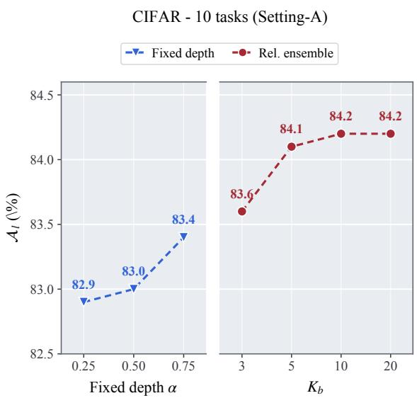  
Figure C.1: Efect of fixed bridge depth α and the number of reliability-weighted bridge depths $K _ { b }$ on CIFAR-100 under Setting-A. Blue denotes a fixed-depth classifier, while red denotes the reliability-guided bridge-prototype ensemble.

Bridge-depth discretization and reliability smoothing. The number of bridge depths $K _ { b }$ controls the discretization granularity of the visual-text geodesic. $\beta$ controls the smoothness of the class-wise reliability weights. We vary both hyperparameters while keeping the trained dual-mode learner and all other settings unchanged.

As shown in Figure C.1, reliability-guided ensembling consistently outperforms the fixed-depth classifiers. Increasing $K _ { b }$ from 3 to 10 improves $\mathbf { \mathcal { A } } _ { l }$ from 83.6% to 84.2%, whereas $K _ { b } = 2 0$ provides no further gain. Thus, $K _ { b } = 1 0$ provides suficient bridge granularity without introducing redundant prototypes. Figure C.2(a) shows that a very small $\beta$ produces nearly one-hot depth selection, making the ensemble sensitive to reliability noise. Increasing β smoothly distributes weight over neighboring depths while preserving class-specific preferences: orchid favors the visual side, beetle favors the textual side, and apple remains approximately depth-insensitive. As shown in Figure C.2(b), $\bar { \mathcal { A } } _ { l }$ increases from 83.72% at $\beta = 0 . 0 0 5$ to 84.22% at $\beta = 0 . 0 5$ , before slightly decreasing to 84.07% at $\beta = 0 . 0 7 5$ . We therefore use $\beta = 0 . 0 5$ , which provides the best balance between depth selectivity and reliability smoothing.

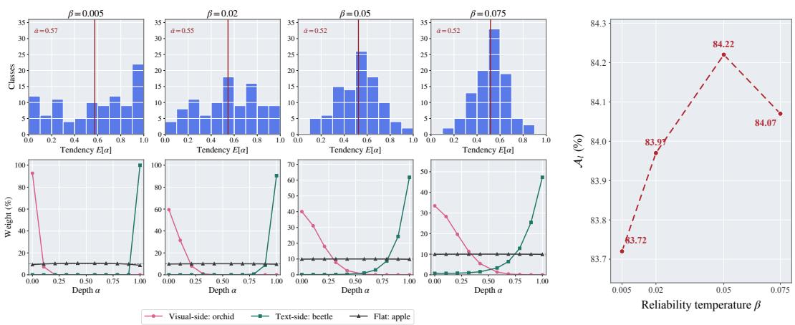  
(a) Reliability-weight tendencies  
(b) Final accuracy  
Figure C.2: Efect of the reliability temperature $\beta$ with $K _ { b } = 1 0$ on CIFAR-100 under Setting-A. (a) Distributions of the class-wise expected bridge depth $\mathbb { E } _ { \pi _ { c } } [ \alpha ]$ (top) and reliability weights of three representative classes (bottom). The red vertica line denotes the mean expected depth across classes. (b) Final accuracy under diferent values of ${ \mathbf { \nabla } } \beta .$

Insertion locations of the dual-mode low-rank learner. We compare diferent insertion locations within each visual Transformer block, including the query (Q), key (K), and value (V ) projections and the feed-forward network (MLP). For example, $K , V + \mathrm { M L P }$ applies the dual-mode learner to the key and value projections and the MLP layers. All configurations use $r _ { S } ~ = ~ 1$ and $r _ { R } \ = \ 8 ,$ while modules outside the specified locations remain frozen.

As shown in Table C.5, MLP-only adaptation performs better than adapting only the key and value projections, while combining them provides complementary benefits. Including the query projection brings little additional improvement and slightly weakens final retention. We therefore adopt $K , V + \mathrm { M L P }$ as the default configuration, providing a concise and unified adaptation scheme for both attention and feature transformation.

<table><tr><td>Adapted visual modules</td><td>A↑</td><td>Al ↑</td></tr><tr><td> $K , V$ </td><td>88.8</td><td>83.0</td></tr><tr><td> $Q , K , V$ </td><td>89.1</td><td>83.9</td></tr><tr><td>K, V + MLP (default)</td><td>89.5</td><td>84.2</td></tr><tr><td>MLP</td><td>89.2</td><td>83.5</td></tr><tr><td> $Q , K , V + \mathrm { M L P }$ </td><td>89.6</td><td>84.1</td></tr></table>

Table C.5: Efect of the insertion locations of the dual-mode low-rank learner on CIFAR-100 under Setting-A. Here, $Q ,$ $K ,$ , and V denote the query, key, and value projections in visual self-attention, while MLP denotes the feed-forward block. The same per-module ranks are used for all configurations. The best results are highlighted in bold, and the second-best results are underlined.

## C.5 Overhead

Training and inference overhead. Table C.6 reports the peak number of parameters optimized within one task, including both the visual and text towers and any learnable auxiliary classifier. Inference GFLOPs are measured per image, following the convention that one ViT-B/16 visual forward costs 17.60 GFLOPs. Class-text embeddings are computed once and cached rather than repeatedly encoded for each test image. Mergeable LoRA updates are folded into the pretrained weights before inference. Additional parameters denote method-specific model parameters and persistent prototype bufers retained beyond one standard CLIP model. The common CLIP text-embedding cache is excluded.

For LoDA-CLIP He et al. (2026b), we follow its oficial CLIP extension, which combines predictions from a frozen pretrained visual encoder and a separately adapted visual encoder. Its additional parameters therefore include one complete ViT-B/16 visual tower and the stored visual prototypes. This difers from the single-backbone LoDA setting, in which the low-rank updates can be merged without retaining additional inference parameters.

For DuLBE, the trainable-parameter count includes rank-8 text-side LoRA modules applied to the key/value projections and MLP layers. The visual trainable parameters are 0.0645M and 0.5806M for r = 1 and $r = 1 + 8 .$ , respectively. At inference, DuLBE retains only the class visual prototypes and reliability weights, requiring $| { \mathcal { C } } | d + | { \mathcal { C } } | K _ { b } = { \bar { 0 } } . 0 5 { \bar { 2 } } { \bar { 2 } } \mathbf { M }$ additional parameters. The bridge prototypes are generated from these parameters and the cached text embeddings when

<table><tr><td rowspan="2">Method</td><td>Training Stage</td><td colspan="2">Inference Stage</td><td colspan="2">CIFAR (A)</td></tr><tr><td>Trainable Params (M)</td><td>GFLOPs (per sample)</td><td>Additional Params (M)</td><td>Ã↑</td><td>Al ↑</td></tr><tr><td>RAPF Huang et al. (2024)</td><td>0.26</td><td>17.6003</td><td>0.262</td><td>86.2</td><td>79.0</td></tr><tr><td>LoRA  ${ \cdot } \mathrm { C L I P } _ { r = 3 2 }$  Hu et al. (2022)</td><td>6.88</td><td>17.6001</td><td>0.000</td><td>86.2</td><td>79.1</td></tr><tr><td>LoDA  $ { \mathrm { \cdot C L I P } _ { r = 3 2 } ^ { \dagger } }$  He et al. (2026b)</td><td>1.77</td><td>35.2001</td><td>86.244</td><td>86.4</td><td>81.1</td></tr><tr><td>MG-CLIP Huang et al. (2025)</td><td>0.54</td><td>17.6001</td><td>0.051</td><td>87.0</td><td>80.6</td></tr><tr><td>SGCL* Yu et al. (2024b)</td><td>7.09</td><td>17.6001</td><td>0.000</td><td>86.4</td><td>79.5</td></tr><tr><td>LfI Gong et al. (2026)</td><td>149.62</td><td>17.6001</td><td>0.000</td><td>87.8</td><td>82.7</td></tr><tr><td> $ { \mathbf { D u L B E } } _ { r = 1 } \left( \mathrm { O u r s } \right)$ </td><td>0.75</td><td>17.6005</td><td>0.052</td><td>88.5</td><td>82.6</td></tr><tr><td> $\mathbf { D u L B E } _ { r = 1 + 8 } \ ( \mathrm { O u r s } )$ </td><td>1.27</td><td>17.6005</td><td>0.052</td><td>89.5</td><td>84.2</td></tr></table>

Table C.6: Training and inference overhead on CIFAR-100 under Setting-A. Trainable parameters cover the complete method, including trainable components in both CLIP towers. GFLOPs include visual encoding and classification over all 100 classes. SGCL∗ denotes the replay-free variant. MG-CLIP uses one image encoding and combines a text classifier with a learned visual classifier. DuLBE directly evaluates $K _ { b } = 1 0$ bridge depths, incurring $\bar { K } _ { b } | \mathcal { C } | d = 0 . 0 0 0 5 1 2$ GFLOPs for bridge scoring. Additional parameters include method-specific model parameters and persistent prototype bufers retained beyond the standard CLIP model, while excluding the common text-embedding cache. The best results are in bold, and the second-best results are underlined.

## needed.

Memory overhead. We analyze two complementary sources of persistent memory: class-level representations and layer-wise historical statistics. Only numerical states retained across tasks are counted. Pretrained CLIP parameters, temporary tensors, and the class-text embedding cache shared by CLIP-based classifiers are excluded.

Representation storage. RAPF Huang et al. (2024) retains a feature mean and a full covariance matrix for each historical class, while CLG-CBM Yu et al. (2025) additionally stores its selected concept representations. Such detailed class distributions support feature-level knowledge preservation, but their storage increases rapidly with the number of classes. ENGINE Zhou et al. (2025b) is more compact because it combines class prototypes with shared GDA statistics. In contrast, DuLBE stores only one visual prototype and a small set of reliability weights per class. Its bridge prototypes are generated when needed and therefore require no additional prototype bank. As shown in Table C.7, DuLBE requires only 0.20 MiB of representation memory while achieving the highest final accuracy under Setting-A.

Layer-statistic storage. The layer-wise statistics of DuLBE are retained only at the locations where the dual-mode lowrank learner is inserted. Each statistic is updated in place, so its storage is independent of the number of tasks and observed classes. We evaluate the full configuration and three compact variants under Setting-B using OpenCLIP ViT-B/16 pretrained on LAION-400M, reporting final accuracy on CI-FAR and Food.

Variant A applies the learner only to the key and value projections of all visual blocks, reducing the statistic storage from 486.00 to 27.00 MiB while achieving final accuracies of 83.9% and 85.5%. Variant B further restricts the learner to the last four visual blocks and retains comparable performance with only 9.00 MiB. Variant C adapts only the cross-modal bridge layer and uses the same 2.25 MiB statistic budget

as BOFA Li et al. (2026). Under this matched configuration, DuLBE-C outperforms BOFA by 1.9 and 1.4 points on CIFAR-100 and Food-101, respectively. Overall, the three variants reduce statistic storage by approximately 18 , 54 , and 216 while retaining strong final performance, demonstrating that DuLBE can be deployed flexibly under diferent memory budgets.
<table><tr><td>Method</td><td>Stored state</td><td>MiB↓</td><td>Al ↑</td></tr><tr><td>RAPF</td><td>Mean + covariance</td><td>100.20</td><td>79.0</td></tr><tr><td>ENGINE</td><td>Prototype + GDA</td><td>3.03</td><td>73.1</td></tr><tr><td>CLG-CBM</td><td>Mean + covariance + concepts</td><td>102.15</td><td>76.9</td></tr><tr><td>DuLBE</td><td>Prototype + reliability</td><td>0.20</td><td>84.2</td></tr></table>

Table C.7: Representation memory and final accuracy on CIFAR-100 under Setting-A.

<table><tr><td></td><td></td><td></td><td colspan="2">Al ↑</td></tr><tr><td>Config.</td><td>Learner location</td><td>MiB↓</td><td>CIFAR</td><td>Food</td></tr><tr><td>Full</td><td> $K , V + \mathrm { M L P }$ </td><td>486.00</td><td>84.5</td><td>86.7</td></tr><tr><td>A</td><td>K, V, all blocks</td><td>27.00</td><td>83.9</td><td>85.5</td></tr><tr><td>B</td><td>K, V, last four</td><td>9.00</td><td>83.6</td><td>85.1</td></tr><tr><td>C</td><td>Bridge layer</td><td>2.25</td><td>81.2</td><td>84.1</td></tr><tr><td>BOFA</td><td>Bridge layer</td><td>2.25</td><td>79.3</td><td>82.7</td></tr></table>

Table C.8: Statistic storage and final accuracy under Setting-B.

## C.6 Visualizations

Bridge-depth attribution. We use prototype-conditioned Layer Grad Act maps Zhao et al. (2024) to trace the visual evidence associated with each bridge depth. As shown in Figure C.3, changing the conditioning prototype alters not only the attribution strength but also its spatial distribution. The visual endpoint often captures broader appearance and contextual evidence, whereas the text endpoint tends to emphasize more localized, class-discriminative regions. Intermediate bridge prototypes provide distinct transitions between these patterns, although the transition varies across classes. Similar behavior is observed on both ImageNet-100 and the rendition-style ImageNet-R, suggesting that the intermediate prototypes remain meaningful under visual domain shifts. These observations show that diferent bridge depths provide complementary decision evidence, supporting class-dependent reliability weighting rather than reliance on a single fixed depth.

ImageNet-100  
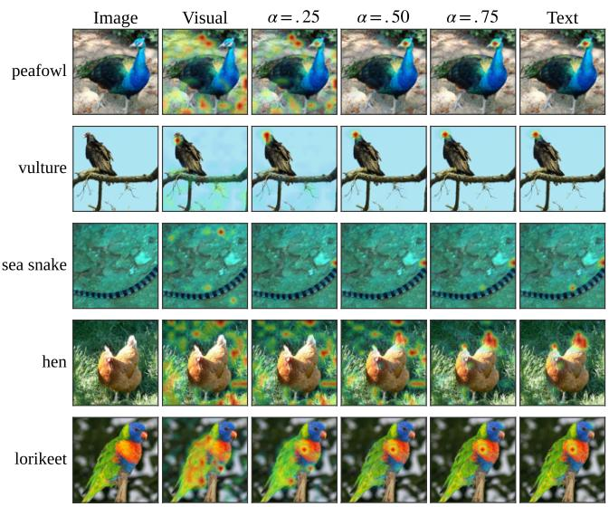

ImageNet-R  
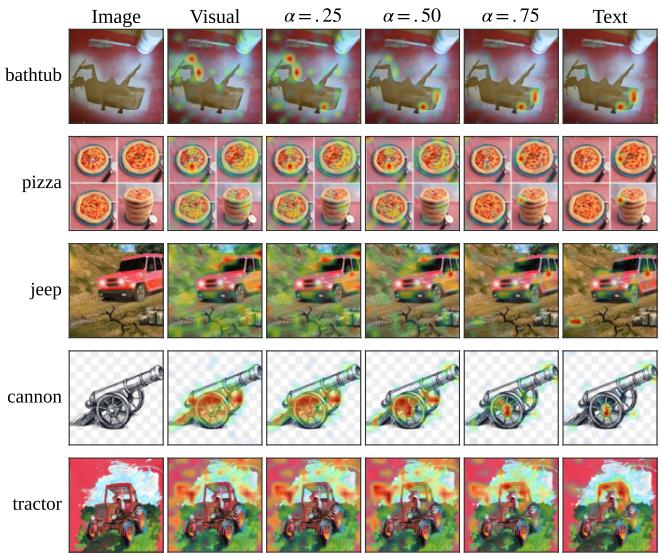  
Figure C.3: Prototype-conditioned Layer Grad Act maps on ImageNet-100 and ImageNet-R. Columns show the visual prototype, bridge prototypes at α 0.25, 0.50, 0.75 , and the text embedding. Warmer colors indicate larger positive contributions to the image-prototype similarity.

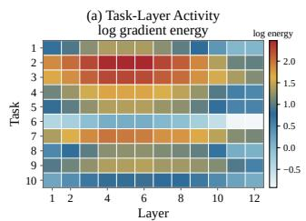

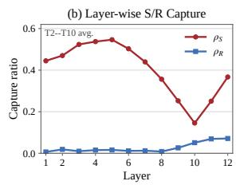  
Figure C.4: CIFAR-100 gradient-space diagnostics. (a) Tasklayer log expected-gradient energy across visual Transformer layers. (b) Layer-wise expected-gradient capture ratios of the shared and residual spaces, averaged over Task2–Task10 (T2–T10). The two ratios are computed independently and are not complementary.

Gradient-space alignment. Following the gradientdemand allocation defined in the main paper, Figure C.4 analyzes the prospective cross-modal gradient $\mathbf { G } _ { t } ^ { l }$ used to construct the two bases. Panel (a) shows that its energy varies substantially across tasks and visual layers, supporting the layer-wise allocation of low-rank directions rather than using a fixed subspace for the entire visual tower.

For $t \geq 2$ , we also measure the gradient energy captured by the shared and residual bases as $\rho _ { S } ^ { l } = \Vert \mathbf { G } _ { t } ^ { l } \mathbf { P } _ { t } ^ { l , S } \Vert _ { F } ^ { 2 } / \Vert \mathbf { G } _ { t } ^ { l } \Vert _ { F } ^ { 2 }$ and $\rho _ { R } ^ { l } \ = \ \lVert { \bf G } _ { t } ^ { l } { \bf P } _ { t } ^ { l , R } \rVert _ { F } ^ { 2 } / \lVert { \bf G } _ { t } ^ { l } \rVert _ { F } ^ { 2 }$ , respectively. Panel (b) shows that the compact shared basis $\mathbf { P } _ { t } ^ { \bar { l } , S }$ captures substantial demand in the early and middle layers, confirming that a single direction selected from the historical support $\mathcal { H } _ { < t } ^ { l }$ can reuse transferable visual structure. In deeper layers, its capture ratio decreases while the residual ratio increases, indicating stronger demand outside the historical support. This demand is captured by $\mathbf { P } _ { t } ^ { l , R } \subseteq \operatorname { s p a n } ( ( \mathcal { H } _ { < t } ^ { l } ) ^ { \perp } )$ to provide low-interference task-specific plasticity. Since the two ratios measure the energy captured by two compact bases of diferent ranks, they are computed independently and do not form a complete decomposition of the gradient.

## D Complete Procedure

Algorithm D.1 summarizes the complete task-wise procedure of DuLBE.

Hendrycks, D.; Basart, S.; Mu, N.; Kadavath, S.; Wang, F.; Dorundo, E.; Desai, R.; Zhu, T.; Parajuli, S.; Guo, M.; Song, D.; Steinhardt, J.; and Gilmer, J. 2021. The Many Faces of Robustness: A Critical Analysis of Out-of-Distribution Generalization. In Proceedings of the IEEE/CVF International Conference on Computer Vision, 8340–8349.

Algorithm D.1: Procedure of DuLBE   
Input: $\begin{array} { r } { \mathrm { C L I P } \theta _ { 0 } ; } \end{array}$ task stream $\{ \mathcal { D } _ { t } , \mathcal { C } _ { t } \} _ { t = 1 } ^ { N } ;$ adapted layers ; hyperparameters Ω.   
Output: $\theta _ { N } ;$ stored $\{ \mathbf { v } _ { c } , \pi _ { c } ( \overset { \cdot } { \alpha } _ { k } ) \} _ { c , k } .$   
1 Initialization: $\bar { \theta } _ { 0 }  \theta _ { 0 }$ and $\mathbf { S } _ { < 1 } ^ { l }  \mathbf { 0 } , \forall l \in \mathcal { V } ;$   
2 for task $t = 1 , \ldots , N$ do   
Gradient-Demand Dual-Mode Allocation   
3 Estimate prospective demand: $\mathbf { G } _ { t } ^ { l }  \nabla _ { \mathbf { W } _ { t - 1 } ^ { l } } \mathcal { L } _ { \mathrm { c - c e } } ( \theta _ { t - 1 } ; \mathcal { D } _ { t } ) , \forall l \in \mathcal { V } ;$   
4 for each adapted layer $l \in \nu$ do   
5 Allocate modes: $( \mathbf { P } _ { t } ^ { l , S } , \mathbf { P } _ { t } ^ { l , R } ) \gets \mathrm { M o d e A l l o c } ( \mathbf { G } _ { t } ^ { l } , \mathbf { S } _ { < t } ^ { l } ) ;$   
6 Freeze $\mathbf { P } _ { t } ^ { l , S } , \mathbf { P } _ { t } ^ { l , \dot { R } }$ and initialize $\mathbf { B } _ { t } ^ { l , S } , \mathbf { B } _ { t } ^ { l , R } \gets \mathbf { 0 } ;$   
Routed Cross-Modal Training   
7 for each mini-batch $B \subset { \mathcal { D } } _ { t }$ do   
8 $\begin{array} { r } { ( \mathbf { g } _ { \mathrm { c e } } ^ { l , S } , \mathbf { g } _ { \mathrm { c e } } ^ { l , R } ) \xleftarrow \nabla _ { ( \mathbf { B } _ { t } ^ { l , S } , \mathbf { B } _ { t } ^ { l , R } ) } \mathcal { L } _ { \mathrm { c - c e } } , \mathbf { g } _ { \mathrm { k l } } ^ { l , S } \xleftarrow \mathbb { I } [ t > 1 ] \nabla _ { \mathbf { B } _ { t } ^ { l , S } } \mathcal { L } _ { \mathrm { b i - k l } } ( \bar { \theta } _ { t - 1 } ) ; } \end{array}$   
9 Route and update: $\mathbf { B } _ { t } ^ { l , S } \xleftarrow { } \mathrm { O p t S t e p } ( \mathbf { g } _ { \mathrm { c e } } ^ { l , S } + \lambda \mathbf { g } _ { \mathrm { k l } } ^ { l , S } ) , \mathbf { B } _ { t } ^ { l , R } \xleftarrow { } \mathrm { O p t S t e p } ( \mathbf { g } _ { \mathrm { c e } } ^ { l , R } ) ;$   
Reliability-Guided Bridge-Prototype Ensemble   
10 for each new class $c \in { \mathcal { C } } _ { t }$ do   
11 $\mathbf { v } _ { c } \gets$ Normalize $\begin{array} { r } { \Big ( \sum _ { x _ { i } \in \mathcal { X } _ { c } ^ { t } } \mathbf { z } _ { i } \Big ) , \quad \mathbf { b } _ { c } ( \alpha _ { k } ) \gets \mathrm { S l e r p } ( \mathbf { v } _ { c } , \mathbf { e } _ { c } ; \alpha _ { k } ) ; } \end{array}$   
12 $\begin{array} { r } { p _ { \alpha _ { k } } ( j \mid x _ { i } ) \propto \exp \bigl ( \tau \mathbf { z } _ { i } ^ { \top } \mathbf { b } _ { j } ( \alpha _ { k } ) \bigr ) , \rho _ { c } ( \alpha _ { k } ) \gets | \mathcal { X } _ { c } ^ { t } | ^ { - 1 } \sum _ { x _ { i } \in \mathcal { X } _ { c } ^ { t } } p _ { \alpha _ { k } } ( c \mid x _ { i } ) ; } \end{array}$   
13 $\pi _ { c } ( \alpha _ { k } ) $ softmaxk $\left( \rho _ { c } ( \alpha _ { k } ) / \beta \right)$ ; store $\{ \mathbf { v } _ { c } , \pi _ { c } ( \alpha _ { k } ) \} _ { k = 1 } ^ { K _ { b } } ;$   
14 Update historical state: $\mathbf { S } _ { < t + 1 } ^ { l }  \mathbf { S } _ { < t } ^ { l } + ( \mathbf { X } _ { t } ^ { l } ) ^ { \top } \mathbf { X } _ { t } ^ { l } , \forall l \in \mathcal { V } ;$   
15 $ { \bar { \theta } } _ { t } \gets  { \mathrm { S t o p G r a d } } ( \theta _ { t } ) ;$ ; discard $\mathcal { D } _ { t } ;$   
16 Evaluate after task $\begin{array} { r } { t \colon s _ { c } ( x ) \gets \sum _ { k = 1 } ^ { K _ { b } } \pi _ { c } ( \alpha _ { k } ) \tau \mathbf { z } ( x ) ^ { \top } \mathbf { b } _ { c } ( \alpha _ { k } ) , \quad \hat { y } ( x ) \gets \arg \operatorname* { m a x } _ { c \in \mathcal { C } _ { \leq t } } s _ { c } ( x ) ; } \end{array}$

## References

Bossard, L.; Guillaumin, M.; and Van Gool, L. 2014. Food-101: Mining Discriminative Components with Random Forests. In European Conference on Computer Vision, 446–461.

Chen, X.; Fang, H.; Lin, T.-Y.; Vedantam, R.; Gupta, S.; Dollár, P.; and Zitnick, C. L. 2015. Microsoft COCO Captions: Data Collection and Evaluation Server. arXiv preprint arXiv:1504.00325.

Cherti, M.; Beaumont, R.; Wightman, R.; Wortsman, M.; Ilharco, G.; Gordon, C.; Schuhmann, C.; Schmidt, L.; and Jitsev, J. 2023. Reproducible Scaling Laws for Contrastive Language-Image Learning. In Proceedings of the IEEE/CVF Conference on Computer Vision and Pattern Recognition, 2818–2829.

Deng, J.; Dong, W.; Socher, R.; Li, L.-J.; Li, K.; and Fei-Fei, L. 2009. ImageNet: A Large-Scale Hierarchical Image Database. In Proceedings of the IEEE Conference on Computer Vision and $P a t { \mathrm { - } }$ tern Recognition, 248–255.

Gong, Y.; Yu, S.; Al-Nuaimy, W.; and Xiao, J. 2026. Learning from Itself: Mining Internal Knowledge from Vision Language Models for Continual Learning. In Proceedings of the IEEE/CVF Conference on Computer Vision and Pattern Recognition, 10830–10839. He, C.; Qiu, Z.; Meng, F.; Xu, L.; Wu, Q.; and Li, H. 2026a. DesCLIP: Robust Continual Learning via General Attribute Descriptions for VLM-Based Visual Recognition. IEEE Transactions on Multimedia, 28: 5021–5035.

He, J.; Duan, Z.; and Zhu, F. 2025. CL-LoRA: Continual Low-Rank Adaptation for Rehearsal-Free Class-Incremental Learning. In Proceedings of the IEEE/CVF Conference on Computer Vision and Pattern Recognition, 30534–30544.

He, L.; Cheng, D.; Wang, H.; Yang, X.; Wang, N.; and Gao, X. 2026b. Task-Driven Subspace Decomposition for Knowledge Shar-

ing and Isolation in LoRA-Based Continual Learning. In Proceedings of the 43rd International Conference on Machine Learning, volume 306 of Proceedings of Machine Learning Research.

Horn, R. A.; and Johnson, C. R. 2012. Matrix Analysis. Cambridge University Press, second edition.

Hu, E. J.; Shen, Y.; Wallis, P.; Allen-Zhu, Z.; Li, Y.; Wang, S.; Wang, L.; and Chen, W. 2022. LoRA: Low-Rank Adaptation of Large Language Models. In International Conference on Learning Representations.

Huang, L.; Cao, X.; Lu, H.; and Liu, X. 2024. Class-Incremental Learning with CLIP: Adaptive Representation Adjustment and Parameter Fusion. In European Conference on Computer Vision, 214–231.

Huang, L.; Cao, X.; Lu, H.; Meng, Y.; Yang, F.; and Liu, X. 2025. Mind the Gap: Preserving and Compensating for the Modality Gap in CLIP-Based Continual Learning. In Proceedings of the IEEE/CVF International Conference on Computer Vision, 3777– 3786.

Jha, S.; Gong, D.; and Yao, L. 2024. CLAP4CLIP: Continual Learning with Probabilistic Finetuning for Vision-Language Models. In Advances in Neural Information Processing Systems, volume 37, 129146–129186.

Krause, J.; Stark, M.; Deng, J.; and Fei-Fei, L. 2013. 3D Object Representations for Fine-Grained Categorization. In Proceedings of

the IEEE International Conference on Computer Vision Workshops, 554–561.

Krizhevsky, A. 2009. Learning Multiple Layers of Features from Tiny Images. Technical report, University of Toronto.

Li, L.; Hu, T.; Zhou, D.-W.; Yang, J.-Q.; Ye, H.-J.; and Zhan, D.- C. 2026. BOFA: Bridge-Layer Orthogonal Low-Rank Fusion for CLIP-Based Class-Incremental Learning. In Proceedings of the AAAI Conference on Artificial Intelligence, 22967–22975.

Liang, V. W.; Zhang, Y.; Kwon, Y.; Yeung, S.; and Zou, J. Y. 2022. Mind the Gap: Understanding the Modality Gap in Multimodal Contrastive Representation Learning. In Advances in Neural Information Processing Systems, volume 35, 17612–17625.

Liang, Y.-S.; and Li, W.-J. 2024. InfLoRA: Interference-Free Low-Rank Adaptation for Continual Learning. In Proceedings of the IEEE/CVF Conference on Computer Vision and Pattern Recognition, 23638–23647.

Marczak, D.; Twardowski, B.; Trzciński, T.; and Cygert, S. 2024. MAGMAX: Leveraging Model Merging for Seamless Continual Learning. In European Conference on Computer Vision, 379–395. Radford, A.; Kim, J. W.; Hallacy, C.; Ramesh, A.; Goh, G.; Agarwal,

S.; Sastry, G.; Askell, A.; Mishkin, P.; Clark, J.; Krueger, G.; and Sutskever, I. 2021. Learning Transferable Visual Models from Natural Language Supervision. In Proceedings ofthe International Conference on Machine Learning, 8748–8763.

Schuhmann, C.; Vencu, R.; Beaumont, R.; Kaczmarczyk, R.; Mullis, C.; Katta, A.; Coombes, T.; Jitsev, J.; and Komatsuzaki, A. 2021. LAION-400M: Open Dataset of CLIP-Filtered 400 Million Image-Text Pairs. arXiv:2111.02114.

Sharma, P.; Ding, N.; Goodman, S.; and Soricut, R. 2018. Conceptual Captions: A Cleaned, Hypernymed, Image Alt-text Dataset for Automatic Image Captioning. In Proceedings of the 56th Annual Meeting of the Association for Computational Linguistics, 2556– 2565.

Smith, J. S.; Karlinsky, L.; Gutta, V.; Cascante-Bonilla, P.; Kim, D.; Arbelle, A.; Panda, R.; Feris, R.; and Kira, Z. 2023. CODA-Prompt: COntinual Decomposed Attention-Based Prompting for Rehearsal-Free Continual Learning. In Proceedings ofthe IEEE/CVF Confer ence on Computer Vision and Pattern Recognition, 11909–11919. Thengane V: Khan S : Havat M : and Khan E S 2022 CL JP

Thengane, V.; Khan, S.; Hayat, M.; and Khan, F. S. 2022. CLIP Model is an Eficient Continual Learner. arXiv:2210.03114.

Wah, C.; Branson, S.; Welinder, P.; Perona, P.; and Belongie, S. 2011. The Caltech-UCSD Birds-200-2011 Dataset. Technical Report CNS-TR-2011-001, California Institute of Technology.

Wang, X.; Chen, T.; Ge, Q.; Xia, H.; Bao, R.; Zheng, R.; Zhang, Q.; Gui, T.; and Huang, X. 2023. Orthogonal Subspace Learning for Language Model Continual Learning. In Findings of the Associa tionfor Computational Linguistics: EMNLP 2023, 10658–10671.

Wang, Z.; Zhang, Z.; Ebrahimi, S.; Sun, R.; Zhang, H.; Lee, C.-Y.; Ren, X.; Su, G.; Perot, V.; Dy, J.; and Pfister, T. 2022a. DualPrompt: Complementary Prompting for Rehearsal-Free Continual Learning. In European Conference on Computer Vision, 631–648.

Wang, Z.; Zhang, Z.; Lee, C.-Y.; Zhang, H.; Sun, R.; Ren, X.; Su, G.; Perot, V.; Dy, J.; and Pfister, T. 2022b. Learning to Prompt for Continual Learning. In Proceedings of the IEEE/CVF Conference on Computer Vision and Pattern Recognition, 139–149.

Xiao, J.; Hays, J.; Ehinger, K. A.; Oliva, A.; and Torralba, A. 2010. SUN Database: Large-Scale Scene Recognition from Abbey to Zoo. In Proceedings of the IEEE Conference on Computer Vision and Pattern Recognition, 3485–3492.

Yu, J.; Zhuge, Y.; Zhang, L.; Hu, P.; Wang, D.; Lu, H.; and He, Y. 2024a. Boosting Continual Learning of Vision-Language Models via Mixture-of-Experts Adapters. In Proceedings ofthe IEEE/CVF Conference on Computer Vision and Pattern Recognition, 23219– 23230.

Yu, L.; Tao, Z.; Goswami, D.; Yao, H.; Twardowski, B.; Van de

Weijer, J.; and Xu, C. 2024b. Exploiting the Semantic Knowledge ofPre-trained Text-Encoders for Continual Learning. arXivpreprint arXiv:2408.01076.

Yu, Y.; Ko, S.; Liu, H.; Dong, Y.; Wu, X.; and Zhu, Q. 2025. Language Guided Concept Bottleneck Models for Interpretable Continual Learning. In Proceedings of the IEEE/CVF Conference on Computer Vision and Pattern Recognition, 14976–14986.

Zhang, G.; Wang, L.; Kang, G.; Chen, L.; and Wei, Y. 2023. SLCA: Slow Learner with Classifier Alignment for Continual Learning on a Pre-Trained Model. In Proceedings ofthe IEEE/CVF International Conference on Computer Vision, 19148–19158.

Zhang, W.; Janson, P.; Aljundi, R.; and Elhoseiny, M. 2024. Overcoming Generic Knowledge Loss with Selective Parameter Update. In Proceedings of the IEEE/CVF Conference on Computer Vision and Pattern Recognition (CVPR), 24046–24056.

Zhao, C.; Wang, K.; Zeng, X.; Zhao, R.; and Chan, A. B. 2024. Gradient-Based Visual Explanation for Transformer-Based CLIP. In Proceedings of the 41st International Conference on Machine Learning, volume 235 of Proceedings of Machine Learning Research, 61072–61091.

Zheng, Z.; Ma, M.; Wang, K.; Qin, Z.; Yue, X.; and You, Y. 2023. Preventing Zero-Shot Transfer Degradation in Continual Learning of Vision-Language Models. In Proceedings of the IEEE/CVF International Conference on Computer Vision (ICCV), 19125–19136.

Zhou, D.-W.; Cai, Z.-W.; Ye, H.-J.; Zhan, D.-C.; and Liu, Z. 2025a. Revisiting Class-Incremental Learning with Pre-Trained Models: Generalizability and Adaptivity Are All You Need. International Journal of Computer Vision, 133(3): 1012–1032.

Zhou, D.-W.; Li, K.-W.; Ning, J.; Ye, H.-J.; Zhang, L.; and Zhan, D.-C. 2025b. External Knowledge Injection for CLIP-Based Class-Incremental Learning. In Proceedings of the IEEE/CVF International Conference on Computer Vision, 3314–3325.

Zhou, D.-W.; Zhang, Y.; Wang, Y.; Ning, J.; Ye, H.-J.; Zhan, D.- C.; and Liu, Z. 2025c. Learning Without Forgetting for Vision-Language Models. IEEE Transactions on Pattern Analysis and Machine Intelligence, 47(6): 4489–4504.