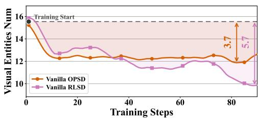
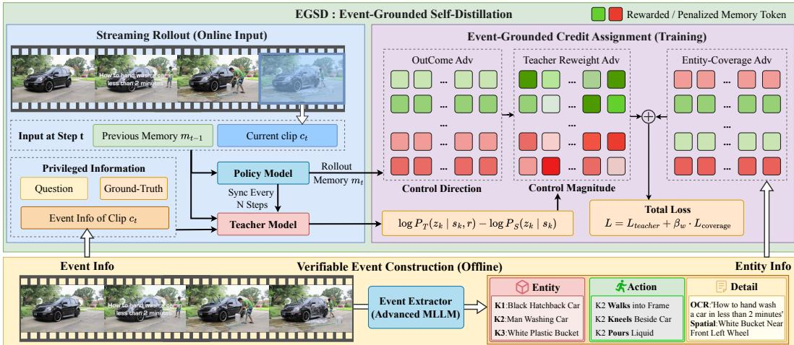
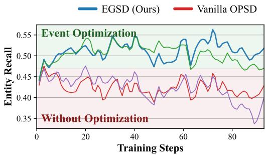
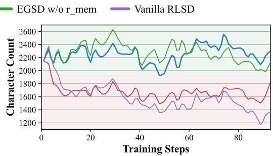
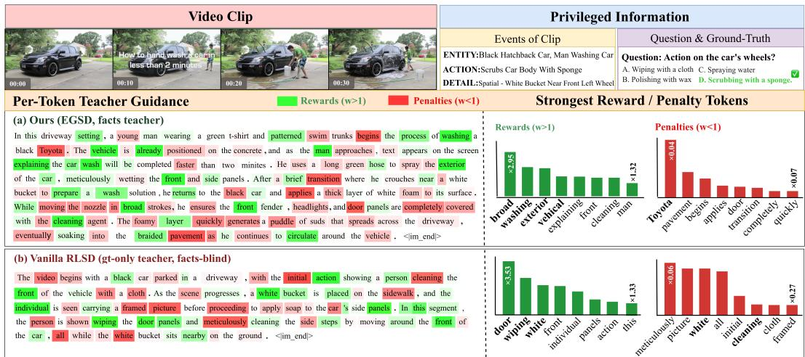

# EGSD: EVENT-GROUNDED SELF-DISTILLATION FOR STREAMING VIDEO UNDERSTANDING

Yuwei Miao1,∗, Xuesheng Zhang1,∗, Wenhao Zou2, Jixia Zhang3, Jianwei Lv1, Bo Yuan1, Junfeng Wang1, Shiao Xie1,†

1Baidu 2University of Chinese Academy of Sciences 3China University of Petroleum, Beijing

## ABSTRACT

Real-time video understanding requires incrementally maintaining a memory of streaming content, and optimizing this requires dense process signals. On-Policy Self-Distillation (OPSD), which lets one model serve as both teacher and student with the teacher receiving additional privileged information such as the question and ground-truth (GT) answer, can supply such token-level signals. However, applying it directly to streaming video raises two problems. (1) The student cannot be optimized end-to-end, where memory is written before the question arrives, yet the teacher scores it with the question-and-GT privilege, misaligning their preferences. (2) Effective-entity memory collapses, where the question-and-GT privilege makes the teacher favor only question-relevant entities, and token-mean averaging over a memory renders its signal invariant to how many entities that memory covers, both driving memory against the streaming need for diversity. To address these issues, we propose Event-Grounded Self-Distillation (EGSD), which characterizes streaming memory as an incremental update over verifiable Events (key visual entities, actions, and details) and targets the two problems on this basis. For problem (1), we adapt the OPSD signal into a multiplicative weight combined with the outcome reward; for problem (2), we re-weight the teacher with Events as privileged information to counter its question-relevance bias, and add an entity-coverage reward to supply the coverage preference the token-mean teacher lacks. Extensive experiments on mainstream online and offline benchmarks show EGSD achieves strong performance, reaching 79.8% on Streaming-Bench and 73.4% on the OVO-Bench Real-Time track, while memory analysis shows effective-entity recall rises 17.4% at only 6.8% more memory length.

## 1 INTRODUCTION

Video Large Language Models (VideoLLMs) have achieved significant success in offline video understanding (Chen et al., 2025b; Wang et al., 2025a; Qin et al., 2025). However, real-world applications such as live-stream QA and embodied intelligence (Chen et al., 2024; 2025a; Driess et al., 2023) demand real-time processing of streaming input, bound by temporal causality and a limited context window. This raises a central challenge, incrementally memorizing long-horizon visual context while producing causal responses in an online manner (Lin et al., 2026).

Such incremental memory of the streaming history admits different representations. One way compresses visual information at the token or KV-cache level or into hidden states, and is mainly optimized by training-free or lightweight-adapter inference that prunes visual tokens by inter-frame similarity, attention importance, and similar criteria (Kim et al., 2026; Xie et al., 2026b; Xu et al., 2026); yet such memory is not human-readable, so whether it retains the information a future query needs cannot be measured explicitly. The other way writes the history as natural-language text, which is reviewable and is the memory this work adopts. Existing methods optimize such memory with an SFT-RL pipeline (Guan et al., 2026; Xie et al., 2026a), but its reward is verifiable only at the end of a long trajectory, leaving the model passively driven by final-answer correctness.

On-Policy Distillation (OPD) (Gu et al., 2023; Agarwal et al., 2024) is an important post-training paradigm that supplies dense, token-level process signals within a trajectory. Vanilla OPD needs a larger same-family teacher, bounding gains by the teacher’s capability at high cost; On-Policy Self-Distillation (OPSD) (Zhao et al., 2026) instead lets a student holding privileged information act as its own teacher, needing no larger model and balancing training cost against performance. Recent work explores this paradigm across image-text and mathematical reasoning with RLSD (Yang et al., 2026), multi-turn agents with StepOPSD (Zhang et al., 2026), multimodal reasoning with OPLD (Zhu et al., 2026), and privileged visual evidence with Video-OPSD (Wang et al., 2026), differing in what privileged information the teacher sees and how the resulting signal re-weights tokens; among these, the mainstream privileged information is the final question and the ground-truth answer.

However, these OPSD methods mostly target single-turn or offline settings, whereas streaming video understanding with natural-language memory has two distinctive traits. First, the intermediate memory turns run before any question, so the model can only record the salient visual content it currently observes. Second, for low-latency answering the model must reply from its existing textual memory and the current video clip alone, so the diversity of effective visual entities in memory is critical. Directly applying existing OPSD methods to streaming video thus raises two problems.

(1) The student cannot be optimized end-to-end. In single-turn QA the teacher adds the ground-truth answer to the shared question, so distilling it aligns with answering correctly; in streaming, memory is written before the question arrives, so the student writes from its own visible state while the teacher scores with the question known, misaligning the teacher’s preference with optimizing memory for final performance. (2) Effective-entity memory collapses. As shown in Figure 1, the student memory retains far fewer visual entities as training proceeds, driven by two causes. First, the existing question-

  
Figure 1: Applying OPSD/RLSD to streaming video collapses memory diversity.

and-GT privilege makes the teacher favor question-useful entities and discriminate against equally real but irrelevant ones. Second, an intrinsic OPSD limitation is that, under token-mean averaging over a memory, the teacher signal is invariant to how many effective entities a rollout grounds, so it cannot prefer a higher-coverage memory over one grounding fewer entities. Both push memory opposite to the streaming goal of retaining as much key visual content as possible.

To address these problems, we propose Event-Grounded Self-Distillation (EGSD). Inspired by the event-segmentation theory in cognitive science (Zacks & Tversky, 2001; Zacks et al., 2007), we argue that streaming video understanding based on incremental textual memory is essentially an incremental update over Events, comprising three complementary parts: key visual entities, actions, and details (e.g., spatial relations and OCR). Unlike methods that finely optimize the memory format (Song et al., 2024; Diko et al., 2025), an Event is a deterministic signal that can be extracted offline, verified, and defined independently of any question, giving a stable grounding basis for the teacher and reward. EGSD strengthens the diversity of streaming memory and the final answering accuracy end-to-end by targeting the two problems. For problem (1) we introduce Multiplicative teacher gating, where we analyze why the OPSD signal fails in the streaming-video setting and establish that combining it as a multiplicative weight with the outcome reward is the right form for end-to-end streaming optimization that keeps the student learnable from its own memory. For problem (2) we introduce Event-privileged teacher re-weighting, where on top of the question and GT answer we add a verifiable set of Event facts to the teacher’s privileged information, preventing the teacher’s reward from attending only to question-relevant entities and thereby avoiding memory collapse, together with an Entity-coverage reward that explicitly prefers rollouts covering more of the clip’s effective entities, supplying the coverage preference the token-mean teacher lacks.

EGSD’s mechanisms are complementary in streaming video: the Event-based reward drives the model to write more effective entities, while multiplicative gating keeps this optimization aligned with the final answer, so their interaction lifts performance. Our contributions are as follows:

• We analyze and verify the causes of end-to-end optimization failure and memory collapse when vanilla OPSD is applied directly to streaming video understanding.

• We propose EGSD, which identifies verifiable Events as the essential content of streaming memory and strengthens memory diversity and answering accuracy end-to-end through multiplicative gating, Event-privileged re-weighting, and an entity-coverage reward.

• EGSD achieves strong performance on online and offline benchmarks, and memory analy sis attributes this to entity recall rising 17.4% at only 6.8% more memory length.

## 2 RELATED WORK

## 2.1 MULTIMODAL LLMS FOR LONG VIDEO AND STREAMING VIDEO REASONING

Offline long-video LLMs (Yue et al., 2025; Li et al., 2024) scale along context extension (Chen et al., 2025b) and token compression (Wang et al., 2025a; Qin et al., 2025), but assume the full video is available, whereas streaming exposes neither future frames nor query time. Among causal single-pass methods for streaming video, the history representation determines whether an external function can inspect it. Visual-token or KV compression (Yao et al., 2025; Kim et al., 2026; Xie et al., 2026b; Xu et al., 2026) drops content irrecoverably; hidden-state memory (Chen et al., 2024; Qian et al., 2025; Zeng et al., 2026; Wang et al., 2025b; Sun et al., 2025) is compact but unreadable and unscorable; natural-language memory (Guan et al., 2026; Xie et al., 2026a) is readable and reusable at a token cost. However, none of these imposes a trainable, reward-checkable objective on the memory content itself, which is the premise of our Event-grounded memory.

## 2.2 VIDEO REINFORCEMENT LEARNING

Recent methods for RL in long-video reasoning augment the outcome reward with an additional process reward, since over a long horizon the final answer alone cannot tell whether a failure comes from looking at the wrong moment or from flawed reasoning. Yet these rewards score “where to look” rather than “what to remember”, whether via key-frame grounding (Cao et al., 2025), zoom-in (Fu et al., 2025b), temporal grounding (Liu et al., 2026), or sampler-MLLM joint optimization (Tan et al., 2026), all evaluating a coordinate against interval annotations. In contrast, none rewards the content of streaming memory, which is exactly where our process reward applies.

## 2.3 MULTIMODAL ON-POLICY SELF-DISTILLATION

OPSD lets a privileged copy of the student act as its own teacher, giving dense supervision without a larger model. Across all existing instantiations, and this is what matters for streaming, the tokens the teacher scores are the same tokens that produce the answer being evaluated, whether the target is a single-turn image (Zhu et al., 2026), a reasoning chain (Yang et al., 2026), an agent rollout (Zhang et al., 2026), or an evidence-grounded video answer (Wang et al., 2026), so the teacher judges tokens the student already produced toward a question it already knows. Streaming memory writing breaks this premise, as memory turns are written before any question arrives and useful content is defined by future queries, so no existing OPSD signal can supervise it, the gap this work closes.

## 3 METHOD

## 3.1 ANALYSIS OF THE OPSD SIGNAL IN THE STREAMING-VIDEO SETTING

Streaming protocol. We adopt a multi-turn streaming protocol that splits the video stream into K sequentially arriving clips by cumulative visual-token capacity. For the first K − 1 clips, without knowing the final question $q ,$ the model generates a streaming thought $z _ { k }$ from the current visual content $c _ { k }$ and the historical memory $m _ { k - 1 }$ and updates the memory, and when the K-th clip arrives and q becomes visible it produces the final answer a from the accumulated memory,

$$
z _ { k } \sim \pi _ { \theta } ( \cdot \mid c _ { k } , m _ { k - 1 } ) , \qquad m _ { k } = \mathrm { U p d a t e } ( m _ { k - 1 } , z _ { k } ) .\tag{1}
$$

OPSD as a teacher-provided process signal. Vanilla OPD supplies a per-token process signal through the reverse KL between a student $P _ { S }$ and a same-family teacher $P _ { T }$ conditioned on the same prior trajectory,

$$
\mathrm { K L } ( P _ { S } \parallel P _ { T } ) = \mathbb { E } _ { P _ { S } } [ \log P _ { S } ( y _ { t } \mid y _ { < t } ) - \log P _ { T } ( y _ { t } \mid y _ { < t } ) ] .\tag{2}
$$

  
Figure 2: Overview of EGSD. The student writes free-text memory per clip without seeing the question, while a frozen large model extracts a per-clip Event fact set offline. The Event-privileged teacher re-weights student tokens into a multiplicative advantage, and an Event-based entitycoverage reward prefers higher-coverage memories, guiding memory toward grounded diversity.

OPSD instantiates the teacher as the student itself additionally conditioned on privileged information ψ, i.e., $P _ { S } ( z _ { k } ) = \pi _ { \theta } ( z _ { k } \mid s _ { k } )$ and $P _ { T } ( z _ { k } ) = \pi _ { \theta } ( z _ { k } \mid s _ { k } , \psi )$ with $s _ { k } = ( c _ { k } , m _ { k - 1 } )$ the state visible to the student at clip k, so the per-memory signal becomes

$$
\delta _ { k } = \log { P _ { T } ( z _ { k } \mid s _ { k } , \psi ) } - \log { P _ { S } ( z _ { k } \mid s _ { k } ) } ,\tag{3}
$$

which measures the log-probability gain the privileged information brings to this memory.

Multiplicative OPSD fits streaming video. The distinctive challenge of streaming is that the student writes memory before the question arrives, whereas the teacher scores it with the question already known, so $\delta _ { k }$ prefers an answer-aware memory that is misaligned with the student’s and cannot drive end-to-end optimization on its own. The difficulty is thus how to propagate the outcome to early memory decisions while preserving the teacher’s clip-level resolution. Additive schemes such as VOLD (Bousselham et al., 2026), which sum a distillation loss with a GRPO objective, fall short here, as the loss ratio is hard to tune into cooperation toward end-to-end optimization.

We thus propose the key viewpoint that credit assignment in streaming video should let the final result decide the update direction and the privileged teacher the credit magnitude across memory decisions. Accordingly, we adopt outcome-conditioned multiplicative teacher modulation,

$$
{ \hat { A } } _ { k } = A _ { R } \cdot \rho _ { k } , \qquad \rho _ { k } > 0 ,\tag{4}
$$

where the positivity of $\rho _ { k }$ keeps $\hat { A } _ { k }$ aligned in sign with $A _ { R } .$ , so $A _ { R }$ alone sets the update direction while the teacher gain $\delta _ { k } .$ , through $\rho _ { k }$ , only modulates the credit magnitude across memory decisions.

## 3.2 EGSD: EVENT-PRIVILEGED TEACHER RE-WEIGHTING AND ENTITY-COVERAGE REWARD

§3.1 established multiplicative teacher modulation as the right form of credit assignment for stream ing memory but left open what the teacher should be conditioned on. As analyzed in §1, mainstream OPSD conditions the teacher on the question and GT answer, rewarding only question-relevant memory and progressively collapsing the student’s output space, at odds with the streaming need for diverse memory. We therefore add a verifiable set of objective facts, termed the Event, to the teacher’s privilege, extending its discriminative axis from question relevance to faithfulness to what has happened. As shown in Figure 2, §3.2.1 introduces the Event representation, §3.2.2 derives a privileged teacher anchored on fact grounding, and §3.2.3 develops a coverage reward that ranks memories by how many effective entities they cover.

## 3.2.1 EVENT: A TRIPLE-COMPONENT VERIFIABLE SIGNAL

Free-text memory $z _ { k }$ is a fluent carrier of a video clip, yet a plain narrative carries no structure verifiable against the visual content, so both the teacher and the reward are left to discriminate on an unverifiable textual surface. We therefore decompose the Event of the k-th clip into three complementary components, extracted offline by a frozen large model and collected into a per-clip fact set,

$$
\mathcal { F } _ { k } = \mathcal { E } _ { k } \cup \mathcal { A } _ { k } \cup \mathcal { D } _ { k } ,\tag{5}
$$

where $\mathcal { E } _ { k }$ (ENTITY) are key visual entities such as people, things, and text signs, $\mathcal { A } _ { k }$ (ACTION) are temporally ordered behaviors among them, and $\mathcal { D } _ { k }$ (DETAIL) are verbatim-checkable attributes such as OCR text, counts, and spatial relations. This decomposition breaks a single free-text narrative into typed fact units that can be verified independently, and we use $\mathcal { F } _ { k }$ as the privileged information on which the teacher of §3.2.2 and the coverage reward of §3.2.3 give cleaner, more grounded signals.

## 3.2.2 EVENT-BASED PRIVILEGED TEACHER

Adding Events to the privileged context. We augment the teacher’s privileged context with the per-clip fact set $\mathcal { F } _ { k }$ from §3.2.1, so the teacher and student conditions are

$$
\begin{array} { r } { P _ { T } ( \cdot \mid y _ { < t } ) \stackrel { \Delta } { = } \pi _ { \theta } ( \cdot \mid s _ { k } , \mathcal { F } _ { k } , q , a ^ { \star } , y _ { < t } ) , \qquad P _ { S } ( \cdot \mid y _ { < t } ) \stackrel { \Delta } { = } \pi _ { \theta } ( \cdot \mid s _ { k } , y _ { < t } ) , } \end{array}\tag{6}
$$

which share the same student state $s _ { k }$ and differ only in whether the teacher sees $( \mathcal { F } _ { k } , q , a ^ { \star } )$ . Adding $\mathcal { F } _ { k }$ extends the discriminative axis of the gain $\delta _ { k }$ from question relevance to fact grounding.

Teacher-weight construction and non-decaying gating strength. Substituting this Event privilege into the multiplicative basis of §3.1, we adapt RLSD’s sign-modulated positive weight (Yang et al., 2026), the stop-gradient teacher-student probability ratio modulated by the advantage sign,

$$
w _ { t } = \left( \frac { P _ { T } ( y _ { t } \mid y _ { < t } ) } { P _ { S } ( y _ { t } \mid y _ { < t } ) } \right) ^ { \mathrm { s i g n } ( A _ { R } ) } ,\tag{7}
$$

where $w _ { t } > 1$ amplifies the credit of tokens the Event-privileged teacher favors and $w _ { t } < 1$ suppresses the rest, always in the direction set by $A _ { R } .$ . Realizing the memory-level gate $\rho _ { k }$ of §3.1 at token resolution, we combine the clipped weight with the identity weight at gating strength λ,

$$
\hat { A } _ { t } = A _ { R } \cdot \rho _ { t } , \qquad \rho _ { t } = ( 1 - \lambda ) + \lambda \exp ( w _ { t } , 1 - \epsilon _ { w } , 1 + \epsilon _ { w } ) .\tag{8}
$$

Unlike RLSD, which decays λ to transition back to standard GRPO, streaming memory decisions face the invisible-question gap throughout training, so we keep λ constant at $\lambda _ { 0 }$ and never fade the teacher gate. The clipped surrogate objective of this branch is thus

$$
\mathcal { L } _ { \mathrm { t e a c h e r } } ( \hat { A } ) = - \mathbb { E } \left[ \frac { 1 } { G } \sum _ { i = 1 } ^ { G } \frac { 1 } { | y ^ { ( i ) } | } \sum _ { t = 1 } ^ { | y ^ { ( i ) } | } \operatorname* { m i n } \left( w _ { t } A _ { R } ^ { ( i ) } , \hat { A } _ { t } ^ { ( i ) } \right) \right] .\tag{9}
$$

## 3.2.3 EVENT-BASED ENTITY-COVERAGE REWARD

The privileged teacher of §3.2.2 only re-weights tokens the student has already written, and under token-mean averaging it is invariant to how many reference entities a memory covers, so it cannot prefer a higher-coverage rollout over a lower-coverage one. To supply this missing preference we introduce an Event-based entity-coverage reward that ranks rollouts directly by how many effective entities they ground. For the k-th clip, the student memory holds $N _ { k } ^ { S }$ entities and the Event fact set $\mathcal { F } _ { k }$ supplies $N _ { k } ^ { E }$ reference entities; matching the two by one-to-one semantic correspondence yields $N _ { k } ^ { + }$ effective entities the student has grounded. We then define a grounding rate $g _ { k }$ and a coverage rate covk,

$$
g _ { k } = \frac { N _ { k } ^ { + } } { N _ { k } ^ { S } } , \qquad \mathrm { c o v } _ { k } = \frac { N _ { k } ^ { + } } { N _ { k } ^ { E } } .\tag{10}
$$

Table 1: Results on the real-time subtasks of OVO-Bench and StreamingBench. Best overall results are in bold and the best results among training-free methods are underlined.
<table><tr><td rowspan="2">Method</td><td rowspan="2">Size</td><td colspan="5">StreamingBench</td><td rowspan="2"></td><td colspan="5">OVO Real-Time</td></tr><tr><td>OP CR CS</td><td>ATP</td><td>EU TR PR</td><td>SU ACP CT</td><td>Avg.</td><td>OCR ACR</td><td>ATR STU FPD OJR Avg.</td><td></td><td></td><td></td></tr><tr><td colspan="2">Open-source Offline models</td><td></td><td></td><td></td><td></td><td></td><td></td><td></td><td></td><td></td><td></td><td></td></tr><tr><td>LLaVA-Video [TMLR&#x27;25]</td><td>7B</td><td></td><td></td><td></td><td></td><td></td><td>69.1</td><td>58.7</td><td>68.8</td><td>49.4 74.3</td><td>59.8</td><td>63.4</td></tr><tr><td>LLaVA-OV [TMLR&#x27;25]</td><td>7B</td><td></td><td>80.4 74.2 76.0 80.7 72.7 71.7 67.6 65.5 65.7 45.1 71.1</td><td></td><td></td><td></td><td>66.4</td><td>57.8</td><td>73.3</td><td>53.4</td><td>71.3</td><td>62.0 64.0</td></tr><tr><td>Long VU [ICML/25]</td><td></td><td>7B</td><td></td><td></td><td></td><td></td><td>53.7</td><td>53.2</td><td>62.9</td><td>47.8</td><td>68.3</td><td>59.8 57.6</td></tr><tr><td>Long VA [TMLR&#x27;25]</td><td>7B</td><td></td><td>70.0 63.3 61.2 70.9</td><td>62.7 59.5 61.1 53.7 54.7 34.7 60.0</td><td></td><td></td><td></td><td></td><td></td><td></td><td></td><td></td></tr><tr><td>Qwen2.5-VL[arXiv&#x27;25]</td><td>7B</td><td>73.0 74.2 85.8</td><td>82.4 76.9</td><td>80.4 82.4 69.5</td><td>65.2</td><td>48.2 74.1</td><td>84.6</td><td>65.1</td><td>65.5</td><td>54.5</td><td>72.3</td><td>63.067.5</td></tr><tr><td>Qwen3-VL [arXiv*25]</td><td>8B</td><td>71.7 74.2 89.6 84.6</td><td></td><td>68.1 85.1 83.3 75.6 72.041.5 75.7</td><td></td><td></td><td>89.3</td><td>73.4</td><td>74.1</td><td>64.0 73.3</td><td>64.7</td><td>73.1</td></tr><tr><td colspan="2">Open-source Online methods</td><td></td><td></td><td></td><td></td><td></td><td></td><td></td><td></td><td></td><td></td><td></td></tr><tr><td>Dispider [CVPR*25]</td><td></td><td>8B</td><td>74.9 75.5 74.1 73.1 74.4 59.9 76.1 62.9 62.2 45.8 67.6</td><td></td><td></td><td></td><td>57.7</td><td>49.5</td><td>62.1</td><td>44.9 61.4</td><td></td><td>51.6 54.5</td></tr><tr><td>TimeChat-Online [MM&#x27;25]</td><td>7B</td><td></td><td>80.2 82.0 79.5 83.3 76.1 78.5 78.7 64.6 69.6 58.0 75.4</td><td></td><td></td><td></td><td>75.2</td><td>46.8</td><td>70.7</td><td>47.8 69.3</td><td></td><td>61.4 61.9</td></tr><tr><td>FluxMem [CVPR·26]</td><td>7B 7B</td><td></td><td>80.2 81.1 81.4 85.3 78.0 83.8 80.6 65.9 69.6 52.1 76.4</td><td></td><td></td><td></td><td>81.2</td><td>59.6</td><td>70.7</td><td>53.4 75.2</td><td></td><td>63.0 67.2</td></tr><tr><td>StreamForest [NeurIPS*25]</td><td></td><td></td><td>83.1 82.8 82.7 84.3 77.5 78.2 76.9 69.1 75.654.4 77.3</td><td></td><td></td><td></td><td>68.5</td><td>53.2</td><td>71.6</td><td>47.8 65.4</td><td></td><td>60.9 61.2</td></tr><tr><td>Streamo [CVPR&#x27;26]</td><td></td><td></td><td></td><td></td><td></td><td></td><td>77.2</td><td>66.1</td><td>76.7</td><td>45.5 66.3</td><td>72.8</td><td>67.4</td></tr><tr><td>VST [ECCV*26]</td><td>7B 7B</td><td></td><td>85.4 82.086.489.1 74.2 87.2 82.4 73.173.947.379.5</td><td></td><td></td><td></td><td>80.5</td><td>55.1</td><td>72.4</td><td>55.1 76.2</td><td>64.1 67.2</td><td></td></tr><tr><td colspan="2">OPSD-based methods</td><td></td><td></td><td></td><td></td><td></td><td></td><td></td><td></td><td></td><td></td><td></td></tr><tr><td>Qwen2.5-VL + SFT</td><td></td><td>7B</td><td></td><td></td><td></td><td></td><td>81.2</td><td>70.6</td><td>67.2</td><td></td><td></td><td></td></tr><tr><td>+ OPSD [ICLR*24]</td><td></td><td>7B 74.7 71.9 82.3</td><td>85.2 71.2 81.3</td><td>73.8 75.0 85.8 82.6 73.1 86.0 75.9 72.4</td><td>68.8</td><td>49.7 75.4 52.3 74.8</td><td>84.6</td><td>68.8</td><td>68.1</td><td>52.8 52.8 74.3</td><td>77.2 66.3</td><td>63.0 68.7 69.2</td></tr><tr><td>+ RLSD [arXiv&#x27;26]</td><td></td><td>7B 76.3 76.6 86.1</td><td>84.6 75.6 82.2</td><td>73.2 74.0 73.2 72.4</td><td>70.5 72.5</td><td>51.8 76.7</td><td>83.2</td><td>64.2</td><td>69.0</td><td>53.4 76.2</td><td>65.2</td><td>68.5</td></tr><tr><td>+ EGSD (ours)</td><td>7B</td><td>79.3 80.5 88.3</td><td>81.6 84.4 83.2</td><td>84.3 72.0</td><td>73.7 54.9</td><td>78.4</td><td>84.6</td><td>67.9</td><td>71.6</td><td>53.9 78.2</td><td>63.6</td><td>70.0</td></tr><tr><td>Qwen3-VL + SFT</td><td></td><td>8B 74.974.2</td><td>85.5 86.6 76.3 86.0</td><td>78.7</td><td>75.2</td><td>48.7 76.9</td><td>89.3</td><td>67.0</td><td>75.9</td><td>57.9</td><td>78.2</td><td>67.4 72.6</td></tr><tr><td>+ OPSD [ICLR*24]</td><td></td><td>8B 75.2 78.9</td><td>86.4 80.3 80.0</td><td>80.7 79.6 72.4</td><td>72.0 72.2</td><td>50.3 76.0</td><td>90.6</td><td>64.2</td><td>73.3</td><td>58.4</td><td>77.2</td><td>67.4 71.9</td></tr><tr><td>+ RLSD [arXiv&#x27;26]</td><td></td><td>8B 82.0 84.4 84.5</td><td>86.2 77.5</td><td>81.6 82.4 73.6</td><td>73.1 51.8 78.2</td><td></td><td>86.6</td><td>68.8</td><td>77.6</td><td>59.0</td><td>80.2</td><td>67.973.4</td></tr><tr><td>+ EGSD (ours)</td><td></td><td>8B 83.7 79.7 89.3</td><td>87.5</td><td>81.9 83.5 85.2 74.0 72.8 53.9 79.8</td><td></td><td></td><td>91.3</td><td>71.6</td><td>72.4</td><td>60.1</td><td>76.2</td><td>69.0 73.4</td></tr></table>

We combine them into a coverage-biased harmonic signal $r _ { \mathrm { m e m } } ( k )$

$$
r _ { \mathrm { m e m } } ( k ) = \frac { ( 1 + \beta _ { e } ^ { 2 } ) g _ { k } \mathrm { c o v } _ { k } } { \beta _ { e } ^ { 2 } g _ { k } + \mathrm { c o v } _ { k } } , \qquad \beta _ { e } > 1 ,\tag{11}
$$

where $\beta _ { e } = 1 . 5$ weights coverage above grounding, rewarding entity recall while still penalizing ungrounded expansion. We center $r _ { \mathrm { m e m } }$ within the group at each clip level to obtain $A _ { \mathrm { { m e m } } }$ , added to the loss as an independent auxiliary policy-gradient signal,

$$
\mathcal { L } = \mathcal { L } _ { \mathrm { t e a c h e r } } ( \hat { A } ) + \beta _ { w } \cdot \mathcal { L } _ { \mathrm { c o v e r a g e } } ( A _ { \mathrm { m e m } } ) .\tag{12}
$$

Unlike teacher re-weighting, this signal leaves the sign of $\hat { A }$ untouched and ranks rollouts by how many effective entities they ground, so it supplies the coverage preference the token-mean teacher lacks, with independent hyperparameters $\beta _ { e }$ balancing grounding against coverage and $\beta _ { w }$ scaling the auxiliary reward against the teacher re-weighting loss. Together, §3.2.2 and §3.2.3 shape streaming memory from two directions, the privileged teacher enforcing truthfulness and the coverage reward enforcing sufficiency. Verbosity gaming gains nothing here: each extra entity must still survive the teacher’s gate, so hallucinated additions are down-weighted and the reward accrues to grounded diversity rather than length.

## 4 EXPERIMENTS

## 4.1 IMPLEMENTATION DETAILS

Experiments use Qwen2.5-VL-7B-Instruct (Bai et al., 2025b) and Qwen3-VL-8B-Instruct (Bai et al., 2025a) as backbones and sample frames uniformly at 1 fps. Since our memory is text, we first SFT each backbone on the streaming-memory corpus open-sourced by VST (Guan et al., 2026) to keep the intermediate memory concise and high-quality; all subsequent RL runs start from this same base checkpoint. Under the streaming protocol, a split is triggered and a memory write performed every 5000 visual tokens. All methods are evaluated under this same streaming protocol. During testing we cap each inference step, including streaming-think and the final answer, at 8,192 video tokens and limit the thinking count to 4 for efficient evaluation. Low latency is an inherent advantage of this streaming paradigm rather than an optimization target of our Events; we report it in Appendix A.

Table 2: Memory-dependent results on the online video understanding benchmarks OVO-Bench Backward and Forward, as well as on the offline benchmarks VideoMME (w/o sub.), LongVideoBench (LVB), and VideoHolmes (VH).
<table><tr><td rowspan="3">Method</td><td rowspan="3">Size</td><td colspan="8">Online Video</td><td rowspan="2" colspan="4">Offline Video</td></tr><tr><td colspan="3">OVO-Bench Backward</td><td colspan="4">OVO-Bench Forward</td><td colspan="2">VideoMME</td><td rowspan="2">LVB</td></tr><tr><td>EPM</td><td>ASI</td><td>HLD</td><td>Avg.</td><td>REC</td><td>SSR</td><td>CRR</td><td>Avg.</td><td>Long</td><td>Overall</td></tr><tr><td colspan="10">Open-source Offline models</td><td></td><td></td><td></td><td></td></tr><tr><td>LLaVA-Video [TMLR&#x27;25]</td><td>7B</td><td>56.2</td><td>57.4</td><td>7.5</td><td>40.4</td><td>34.1</td><td>70.0</td><td>60.4</td><td>54.8</td><td>1</td><td>63.3</td><td>61.3</td><td></td></tr><tr><td>LLaVA-OV [TMLR&#x27;25]</td><td>7B</td><td>54.2</td><td>55.4</td><td>21.5</td><td>43.7</td><td>25.6</td><td>67.1</td><td>58.8</td><td>50.5</td><td></td><td>58.2</td><td>56.3</td><td></td></tr><tr><td>LongVA[TMLR&#x27;25]</td><td>7B</td><td></td><td></td><td></td><td></td><td></td><td></td><td></td><td></td><td>47.6</td><td>54.3</td><td>56.3</td><td></td></tr><tr><td>Video-R1 [NeurlPS&#x27;25]</td><td>7B</td><td></td><td></td><td></td><td></td><td></td><td></td><td></td><td></td><td></td><td>61.4</td><td></td><td>36.5</td></tr><tr><td>LongVILA-R1 [NeurIPS&#x27;25]</td><td>7B</td><td></td><td></td><td></td><td></td><td></td><td></td><td></td><td></td><td>55.2</td><td>65.1</td><td>58.0</td><td></td></tr><tr><td>REVISOR[CVPR*26]</td><td>7B</td><td></td><td></td><td></td><td></td><td></td><td></td><td></td><td></td><td>56.2</td><td>65.7</td><td>57.5</td><td></td></tr><tr><td>Qwen2.5-VL[arXiv&#x27;25]</td><td>7B</td><td>50.5</td><td>67.6</td><td>42.5</td><td>53.5</td><td>29.7</td><td>50.6</td><td>48.3</td><td>42.9</td><td>46.7</td><td>54.7</td><td>56.8</td><td>33.6</td></tr><tr><td>Qwen3-VL[arXiv*25]</td><td>8B</td><td>55.2</td><td>73.0</td><td>22.6</td><td>50.3</td><td>28.4</td><td>68.4</td><td>53.3</td><td>50.0</td><td>53.8</td><td>62.6</td><td>59.6</td><td>35.9</td></tr><tr><td colspan="10">Open-source Online methods</td><td rowspan="2" colspan="3"></td></tr><tr><td>Dispider [CVPR*25]</td><td>8B</td><td>48.5</td><td>55.4</td><td>4.3</td><td>36.1</td><td>18.1</td><td>37.4</td><td>48.8</td><td>34.7</td><td></td><td>57.2</td><td></td></tr><tr><td>TimeChat-Online [MM&#x27;25]</td><td>7B</td><td>55.9</td><td>59.5</td><td>9.7</td><td>41.7</td><td>31.6</td><td>38.5</td><td>40.0</td><td>36.7</td><td>48.4</td><td>62.4</td><td>55.4</td><td></td></tr><tr><td>StreamForest [NeurIPS25]</td><td>7B</td><td>58.9</td><td>64.9</td><td>32.3</td><td>52.0</td><td>32.8</td><td>70.6</td><td>57.1</td><td>52.5</td><td></td><td>61.4</td><td></td><td></td></tr><tr><td>InfiniPot-V [NeurIPS*25]</td><td>7B</td><td></td><td></td><td></td><td>47.6</td><td></td><td></td><td></td><td>47.9</td><td>53.4</td><td>59.3</td><td>56.5</td><td></td></tr><tr><td>Streamo [CVPR*26] VST [ECCV·26]</td><td>7B 7B</td><td>55.6 56.9</td><td>58.1</td><td>33.9</td><td>49.2</td><td>30.8</td><td>57.6</td><td>82.5</td><td>57.0</td><td></td><td></td><td></td><td></td></tr><tr><td></td><td></td><td></td><td>64.9</td><td>48.4</td><td>56.7</td><td>33.0</td><td>66.9</td><td>62.1</td><td>54.0</td><td>55.3</td><td>64.9</td><td>58.0</td><td>41.9</td></tr><tr><td colspan="10">OPSD-based methods</td><td colspan="7"></td></tr><tr><td>Qwen2.5-VL + SFT</td><td>7B</td><td>53.2</td><td>66.9</td><td>26.9</td><td>49.0</td><td>33.1</td><td>49.9</td><td>57.9</td><td>47.0</td><td>49.7</td><td>58.2</td><td>58.6</td><td>36.7</td></tr><tr><td>+ OPSD [ICLR*24]</td><td>7B</td><td>53.5</td><td>61.5</td><td>23.1</td><td>46.0</td><td>24.5</td><td>62.5</td><td>56.3</td><td>47.8</td><td>52.0</td><td>60.8</td><td>57.8</td><td>43.5</td></tr><tr><td>+ RLSD [arXiv&#x27;26]</td><td>7B</td><td>54.2</td><td>64.9</td><td>30.1</td><td>49.7</td><td>29.8</td><td>63.0</td><td>57.1</td><td>50.0</td><td>53.0</td><td>61.5</td><td>59.6</td><td>43.8</td></tr><tr><td>+ EGSD (ours)</td><td>7B</td><td>60.9</td><td>68.9</td><td>36.0</td><td>55.3</td><td>34.4</td><td>67.9</td><td>61.3</td><td>54.5</td><td>56.1</td><td>65.2</td><td>60.9</td><td>44.5</td></tr><tr><td>Qwen3-VL + SFT</td><td>8B</td><td>61.3</td><td>64.9</td><td>32.3</td><td>52.8</td><td>24.8</td><td>70.8</td><td>64.6</td><td>53.4</td><td>54.6</td><td>63.4</td><td>60.4</td><td>43.1</td></tr><tr><td>+ OPSD [ICLR&#x27;24]</td><td>8B</td><td>59.6</td><td>62.8</td><td>28.0</td><td>50.1</td><td>23.8</td><td>70.6</td><td>65.4</td><td>53.3</td><td>54.6</td><td>63.6</td><td>59.7</td><td>44.8</td></tr><tr><td>+ RLSD [arXiv&#x27;26]</td><td>8B</td><td>58.6</td><td>61.5</td><td>32.3</td><td>50.8</td><td>30.7</td><td>72.7</td><td>63.8</td><td>55.7</td><td>53.8</td><td>62.6</td><td>60.4</td><td>44.3</td></tr><tr><td>+ EGSD (ours)</td><td>8B</td><td>62.6</td><td>66.2</td><td>39.8</td><td>56.2</td><td>35.2</td><td>72.7</td><td>62.1</td><td>56.7</td><td>57.1</td><td>66.5</td><td>61.1</td><td>46.2</td></tr></table>

## 4.2 BENCHMARKS AND BASELINES

Benchmarks. We evaluate comprehensively on five video-understanding benchmarks. Among them, StreamingBench (Lin et al., 2026) and OVO-Bench (Niu et al., 2025) are used for online video understanding, examining online reasoning ability and temporal perception; Video-MME (Fu et al., 2025a) is a comprehensive offline benchmark covering multiple domains and durations; LongVideoBench (LVB) (Wu et al., 2024) targets long-video understanding ability; and Video-Holmes (VH) (Cheng et al., 2025) focuses on logical reasoning over video content.

Baselines. For OPSD-based methods, we take SFT as the base and train + OPSD (Agarwal et al., 2024), + RLSD (Yang et al., 2026), and + EGSD each independently on top of the same SFT checkpoint, and also report the bare backbone Qwen3-VL-8B, evaluating all rows under one script. Open source online baselines are Dispider (Qian et al., 2025), TimeChat-Online (Yao et al., 2025), Stream Forest (Zeng et al., 2026), Streamo (Xia et al., 2026), VST (Guan et al., 2026), and the training-free FluxMem (Xie et al., 2026b) and InfiniPot-V (Kim et al., 2026), the latter two both built on Qwen2.5- VL-7B. We also include open-source offline models such as REVISOR (Li et al., 2026).

## 4.3 MAIN RESULTS

Results on Online Video Understanding. As shown in Table 1, EGSD achieves strong performance in real-time evaluation. Since most streaming baselines build on Qwen2.5-VL, we compare on that backbone against the strongest baseline VST. EGSD does not surpass VST on every StreamingBench subtask, as expected since its Event optimization targets cross-time memory, not singleframe perception. It wins on the four subclasses that require accumulating events across segments, event understanding (EU, +10.2), temporal counting (CT, +7.6), clip summarization (CS, +1.9), and prospective reasoning (PR, +1.9) over VST, covering 778 of 2498 questions (31%). On the remaining single-frame subclasses it largely holds or improves over the backbone, so stronger memory does not erode perception, and on the OVO-Bench Real-Time track it leads VST by 2.8 on average.

Results on Memory-Dependent Understanding. Table 2 evaluates the streaming OVO-Bench Backward and Forward tracks, whose queries target events already streamed past, together with the offline VideoMME, LongVideoBench, and VideoHolmes, where our core advantage concentrates. Comparing on Qwen2.5-VL against the strongest baseline VST, EGSD improves the Backward subsets EPM by 4.0 and ASI by 4.0. On Forward it leads by 0.5, and on the offline benchmarks it improves VideoMME-Overall by 0.3, LongVideoBench by 2.9, and VideoHolmes by 2.6. Against its own SFT start the gains are far larger, with the Backward average up 6.3, the Forward average up 7.5, VideoMME-Overall up 7.0, and VideoHolmes up 7.8. Because VideoHolmes is a purely offline reasoning benchmark, this shows the memory from teacher distillation and the entity-coverage reward transfers beyond streaming without trading off offline quality.

Effect of Model Size and the OPSD Signal. The gains persist across backbone scale. On Qwen3- VL-8B, EGSD leads every memory benchmark on its overall metric, lifting the OVO-Bench Backward / Forward averages from 52.8 / 53.4 to 56.2 / 56.7, VideoMME-Overall from 63.4 to 66.5, LongVideoBench from 60.4 to 61.1, and VideoHolmes from 43.1 to 46.2. Comparing the OPSD and RLSD rungs then isolates our first design choice. Vanilla OPSD often falls below its SFT start on the memory columns, with Backward dropping 49.0 to 46.0 on Qwen2.5-VL, because its teacher scores memory with the dual question and GT known while the student wrote it before any question arrived, misaligning its preference with optimizing memory for the answer. RLSD instead combines the same signal multiplicatively with the outcome reward and turns most memory columns positive again, confirming the multiplicative form is the right way to apply the OPSD signal under the streaming protocol; EGSD builds on this form and pushes the gains further.

## 4.4 ABLATION STUDIES OF EGSD COMPONENTS

As shown in Table 3, starting from Vanilla RLSD, removing the decay-rate term lifts OVO-Bench, Video-MME, and VideoHolmes by consistent margins, showing the teacher should supervise the whole streaming process. Adding the Event privileged teacher gives the largest single jump, raising OVO-Backward, OVO-Forward, and their average. The complete EGSD

Table 3: Ablation starting from Vanilla RLSD, enabling components one by one. Backbone Qwen3-VL-8B.
<table><tr><td rowspan="2">Configuration</td><td colspan="3">OVO-Bench</td><td rowspan="2"></td><td rowspan="2">Video-MME VideoHolmes</td></tr><tr><td></td><td>BT FW Avg.</td><td></td></tr><tr><td>Vanilla RLSD</td><td></td><td>50.8 55.7 53.3</td><td></td><td>62.6</td><td>44.3</td></tr><tr><td>+ remove decay rate</td><td></td><td>52.1 55.3 53.7</td><td></td><td>63.8</td><td>44.9</td></tr><tr><td>+ privileged Event</td><td>55.3</td><td>56.1</td><td>55.7</td><td>65.6</td><td>46.5</td></tr><tr><td>+ entity-coverage (EGSD)</td><td>56.2 56.7 56.5</td><td></td><td></td><td>66.5</td><td>46.2</td></tr></table>

then adds the entity-coverage reward and reaches the ladder-highest OVO-Bench average and Video-MME with VideoHolmes level. The three components are complementary and synergistic.

## 4.5 MEMORY QUALITY ANALYSIS

This section characterizes the quality of the memory itself. To separate memory getting longer from memory getting better, we record per step two intrinsic indicators, entity recall, the fraction of the reference Event entities of §3.2.3 that the student trajectory grounds, and the average memory character count for length overhead. The four compared methods are Vanilla OPSD, Vanilla RLSD, EGSD, and EGSD without $r _ { \mathrm { m e m } } ,$ , the ablation of §4.4.

## 4.5.1 RECALL AND MEMORY-LENGTH ANALYSIS

Figure 3 shows the per-step curves of entity recall and memory character count. On recall, the Event-privileged teacher and coverage reward $r _ { \mathrm { m e m } }$ jointly fill the teacher’s blind spot, so EGSD climbs to 0.518 (+17.4% over the SFT start) while Vanilla RLSD instead drops to 0.400 (−9.4%), a 29.5% gap at convergence. This gain does not come from writing more: EGSD’s memory grows only to 2303 characters, +6.8% over the shared SFT start, with no runaway growth. Removing rmem confirms its role, recall falls from 0.518 to 0.470 (−9.3%) and length from 2303 to 2124 characters, so $r _ { \mathrm { m e m } }$ raises recall while adding only marginal memory.

  
(a) Entity recall per step.

  
(b) Memory length per step.

Figure 3: Per-step entity recall (a) and memory character count (b) for four methods sharing the same SFT start.  
  
Figure 4: Case study of per-token teacher guidance on the same clip. (a) EGSD teacher with Event facts; (b) Vanilla RLSD teacher with only the question and ground-truth answer.

## 4.5.2 TOKENS REWARDED ANALYSE

This section analyzes the tokens rewarded by the teacher, using a macro visual-entity ratio across training together with a per-token guidance case study.

Table 4: Reward composition: visual-entity ratio of rewarded tokens across training steps.
<table><tr><td>Step</td><td>10</td><td>30</td><td>50</td><td>70</td><td>90</td></tr><tr><td>Vanilla RLSD</td><td>0.204</td><td>0.280</td><td>0.237</td><td>0.288</td><td>0.300</td></tr><tr><td>EGSD (ours)</td><td>0.366</td><td>0.325</td><td>0.306</td><td>0.380</td><td>0.356</td></tr></table>

Visual-entity ratio of rewarded tokens. We define visual entities as the union of ENTITY words registered for the clip in the fact cache and measure the fraction of teacher-rewarded content words landing on this union (Table 4). EGSD’s visual-entity ratio is clearly higher than Vanilla RLSD throughout training, with the gap stably maintained. We never set this ratio as a training target; it emerges after re-weighting the teacher with Event facts, which pushes gradient weight toward entities truly present in the scene and shapes memory-writing habits early.

Case study. We place the Vanilla RLSD and EGSD teachers on the same clip, differing only in privileged information. On a clip of a man hand-washing a black car, asked what action the person performs on the wheels, the registered facts cover the black car, the man in green, a bucket, a hose, and wiping the body with a sponge. As shown in Figure 4, the two teachers reward very different tokens. EGSD concentrates reward on the valid visual entities and actions truly present in the scene, giving high weight to the registered washing action (broad×2.95, wash×2.05, exterior×2.00) and to grounded objects, so it encourages the student to record more effective entities, while its deepest penalty ×0.04 falls only on the brand hallucination Toyota. Vanilla RLSD instead penalizes salient visual entities only weakly tied to the question, scoring car×0.806 and cleaning×0.713 where EGSD rewards the same tokens at cleaning×1.569 and car×1.249. Its guidance is even unstable within one clip, rewarding white in the white bucket at ×1.996 on first mention but ×0.079 on the second, since a question-and-GT privilege cannot judge whether an entity should be recorded for being salient in the scene or only for being relevant to the question. Lacking effective facts, the vanilla teacher penalizes salient entities irrelevant to the question and collapses memory, whereas the Event fact teacher grounds the gradient in real facts and lifts entity recall.

## 5 CONCLUSION

This paper introduces EGSD, an on-policy self-distillation method that optimizes streaming video memory end-to-end. Characterizing memory as an incremental update over verifiable Events, EGSD combines multiplicative teacher gating, Event-privileged re-weighting, and an entity-coverage reward to counter the optimization failure and memory collapse of vanilla OPSD. Across online and offline benchmarks, EGSD improves both memory diversity and answering accuracy for streaming video understanding, and we hope it offers useful insights for future work in this direction.

## AI USE STATEMENT

In this work, generative AI tools were used solely to polish the writing of parts of the paper, correcting grammar and improving fluency of author-written text. They were not used for research ideation, experimental design, implementation, data analysis, or generating any scientific claims or results. All AI-assisted text was reviewed by the authors, who take full responsibility for the final content of this work.

## REFERENCES

Rishabh Agarwal, Nino Vieillard, Yongchao Zhou, Piotr Stanczyk, Sabela Ramos Garea, Matthieu Geist, and Olivier Bachem. On-policy distillation of language models: Learning from selfgenerated mistakes. In International Conference on Learning Representations, volume 2024, pp. 21246–21263, 2024.

Shuai Bai, Yuxuan Cai, Ruizhe Chen, Keqin Chen, Xionghui Chen, Zesen Cheng, Lianghao Deng, Wei Ding, Chang Gao, Chunjiang Ge, et al. Qwen3-vl technical report. arXiv preprint arXiv:2511.21631, 2025a.

Shuai Bai, Keqin Chen, Xuejing Liu, Jialin Wang, Wenbin Ge, Sibo Song, Kai Dang, Peng Wang, Shijie Wang, Jun Tang, Humen Zhong, Yuanzhi Zhu, Mingkun Yang, Zhaohai Li, Jianqiang Wan, Pengfei Wang, Wei Ding, Zheren Fu, Yiheng Xu, Jiabo Ye, Xi Zhang, Tianbao Xie, Zesen Cheng, Hang Zhang, Zhibo Yang, Haiyang Xu, and Junyang Lin. Qwen2.5-vl technical report, 2025b. URL https://arxiv.org/abs/2502.13923.

Walid Bousselham, Hilde Kuehne, and Cordelia Schmid. Vold: Reasoning transfer from llms to vision-language models via on-policy distillation. In Proceedings of the IEEE/CVF Conference on Computer Vision and Pattern Recognition, pp. 26209–26218, 2026.

Xinye Cao, Hongcan Guo, Jiawen Qian, Guoshun Nan, Chao Wang, Yuqi Pan, Tianhao Hou, Xiaojuan Wang, and Yutong Gao. Videominer: Iteratively grounding key frames of hour-long videos via tree-based group relative policy optimization. In 2025 IEEE/CVF International Conference on Computer Vision (ICCV), pp. 23773–23783. IEEE, 2025.

Joya Chen, Zhaoyang Lv, Shiwei Wu, Kevin Qinghong Lin, Chenan Song, Difei Gao, Jia-Wei Liu, Ziteng Gao, Dongxing Mao, and Mike Zheng Shou. Videollm-online: Online video large language model for streaming video. In 2024 IEEE/CVF Conference on Computer Vision and Pattern Recognition (CVPR), pp. 18407–18418. IEEE, 2024.

Joya Chen, Ziyun Zeng, Yiqi Lin, Wei Li, Zejun Ma, and Mike Zheng Shou. Live: Learning video llm with streaming speech transcription at scale. In 2025 IEEE/CVF Conference on Computer Vision and Pattern Recognition (CVPR), pp. 29083–29095. IEEE, 2025a.

Yukang Chen, Fuzhao Xue, Dacheng Li, Qinghao Hu, Ligeng Zhu, Xiuyu Li, Yunhao Fang, Haotian Tang, Shang Yang, Zhijian Liu, et al. Longvila: Scaling long-context visual language models for long videos. In International Conference on Learning Representations, volume 2025, pp. 18227– 18246, 2025b.

Junhao Cheng, Yuying Ge, Teng Wang, Yixiao Ge, Jing Liao, and Ying Shan. Video-holmes: Can mllm think like holmes for complex video reasoning? arXiv preprint arXiv:2505.21374, 2025.

Anxhelo Diko, Tinghuai Wang, Wassim Swaileh, Shiyan Sun, and Ioannis Patras. Rewind: Understanding long videos with instructed learnable memory. In 2025 IEEE/CVF Conference on Computer Vision and Pattern Recognition (CVPR), pp. 13734–13743. IEEE, 2025.

Danny Driess, Fei Xia, Mehdi SM Sajjadi, Corey Lynch, Aakanksha Chowdhery, Brian Ichter, Ayzaan Wahid, Jonathan Tompson, Quan Vuong, Tianhe Yu, et al. Palm-e: An embodied multimodal language model. arXiv preprint arXiv:2303.03378, 2023.

Chaoyou Fu, Yuhan Dai, Yongdong Luo, Lei Li, Shuhuai Ren, Renrui Zhang, Zihan Wang, Chenyu Zhou, Yunhang Shen, Mengdan Zhang, et al. Video-mme: The first-ever comprehensive evaluation benchmark of multi-modal llms in video analysis. In 2025 IEEE/CVF Conference on Computer Vision and Pattern Recognition (CVPR), pp. 24108–24118. IEEE, 2025a.

Shenghao Fu, Qize Yang, Yuan-Ming Li, Xihan Wei, Xiaohua Xie, and Wei-Shi Zheng. Lover1: Advancing long video understanding with an adaptive zoom-in mechanism via multi-step reasoning. arXiv preprint arXiv:2509.24786, 2025b.

Yuxian Gu, Li Dong, Furu Wei, and Minlie Huang. Minillm: On-policy distillation of large language models. arXiv preprint arXiv:2306.08543, 2023.

Yiran Guan, Liang Yin, Dingkang Liang, Jianzhong Ju, Zhenbo Luo, Jian Luan, Yuliang Liu, and Xiang Bai. Video streaming thinking: Videollms can watch and think simultaneously. In European Conference on Computer Vision, pp. 80–99. Springer, 2026.

Minsoo Kim, Kyuhong Shim, Jungwook Choi, and Simyung Chang. Infinipot-v: Memoryconstrained kv cache compression for streaming video understanding. Advances in Neural Information Processing Systems, 38:138983–139013, 2026.

Jiaze Li, Hao Yin, Wenhui Tan, Jingyang Chen, Boshen Xu, Yuxun Qu, Yijing Chen, Jianzhong Ju, Zhenbo Luo, and Jian Luan. Revisor: Beyond textual reflection, towards multimodal introspective reasoning in long-form video understanding. In Proceedings of the IEEE/CVF Conference on Computer Vision and Pattern Recognition, pp. 5059–5069, 2026.

Zhang Li, Biao Yang, Qiang Liu, Zhiyin Ma, Shuo Zhang, Jingxu Yang, Yabo Sun, Yuliang Liu, and Xiang Bai. Monkey: Image resolution and text label are important things for large multi-modal models. In 2024 IEEE/CVF Conference on Computer Vision and Pattern Recognition (CVPR), pp. 26753–26763. IEEE, 2024.

Junming Lin, Zheng Fang, Chi Chen, Haoxuan Cheng, Zihao Wan, Fuwen Luo, Ziyue Wang, Peng Li, Yang Liu, and Maosong Sun. Streamingbench: Assessing the gap for mllms to achieve streaming video understanding. In ICASSP 2026-2026 IEEE International Conference on Acoustics, Speech and Signal Processing (ICASSP), pp. 12147–12151. IEEE, 2026.

Wenqi Liu, Yunxiao Wang, Shijie Ma, Meng Liu, Qile Su, Tianke Zhang, Haonan Fan, Changyi Liu, Kaiyu Jiang, Jiankang Chen, et al. Videotemp-o3: Harmonizing temporal grounding and video understanding in agentic thinking-with-videos. arXiv preprint arXiv:2602.07801, 2026.

Junbo Niu, Yifei Li, Ziyang Miao, Chunjiang Ge, Yuanhang Zhou, Qihao He, Xiaoyi Dong, Haodong Duan, Shuangrui Ding, Rui Qian, et al. Ovo-bench: How far is your video-llms from real-world online video understanding? In 2025 IEEE/CVF Conference on Computer Vision and Pattern Recognition (CVPR), pp. 18902–18913. IEEE, 2025.

Rui Qian, Shuangrui Ding, Xiaoyi Dong, Pan Zhang, Yuhang Zang, Yuhang Cao, Dahua Lin, and Jiaqi Wang. Dispider: Enabling video llms with active real-time interaction via disentangled perception, decision, and reaction. In 2025 IEEE/CVF Conference on Computer Vision and Pattern Recognition (CVPR), pp. 24045–24055. IEEE, 2025.

Minghao Qin, Xiangrui Liu, Zhengyang Liang, Yan Shu, Huaying Yuan, Juenjie Zhou, Shitao Xiao, Bo Zhao, and Zheng Liu. Video-xl-2: Towards very long-video understanding through task-aware kv sparsification. arXiv preprint arXiv:2506.19225, 2025.

Enxin Song, Wenhao Chai, Guanhong Wang, Yucheng Zhang, Haoyang Zhou, Feiyang Wu, Haozhe Chi, Xun Guo, Tian Ye, Yanting Zhang, et al. Moviechat: From dense token to sparse memory for long video understanding. In 2024 IEEE/CVF Conference on Computer Vision and Pattern Recognition (CVPR), pp. 18221–18232. IEEE, 2024.

Guangzhi Sun, Yixuan Li, Xiaodong Wu, Yudong Yang, Wei Li, Zejun Ma, and Chao Zhang. videosalmonn s: Memory-enhanced streaming audio-visual llm. arXiv preprint arXiv:2510.11129, 2025.

Wenhui Tan, Xiaoyi Yu, Jiaze Li, Yijing Chen, Jianzhong Ju, Zhenbo Luo, Ruihua Song, and Jian Luan. Msjoe: Jointly evolving mllm and sampler for efficient long-form video understanding. arXiv preprint arXiv:2602.22932, 2026.

Yi Wang, Xinhao Li, Ziang Yan, Yinan He, Jiashuo Yu, Xiangyu Zeng, Chenting Wang, Changlian Ma, Haian Huang, Jianfei Gao, et al. Internvideo2. 5: Empowering video mllms with long and rich context modeling. arXiv preprint arXiv:2501.12386, 2025a.

Yuxuan Wang, Yiqi Song, Cihang Xie, Yang Liu, and Zilong Zheng. Videollamb: Long streaming video understanding with recurrent memory bridges. In 2025 IEEE/CVF International Confer ence on Computer Vision (ICCV), pp. 24170–24181. IEEE, 2025b.

Ziyue Wang, Shiqi Huang, Weiwen Xu, Bihan Wen, and Xudong Jiang. Video-opsd: Exploiting privileged visual evidence for on-policy self-distillation in video large language models. arXiv preprint arXiv:2608.27065, 2026.

Haoning Wu, Dongxu Li, Bei Chen, and Junnan Li. Longvideobench: A benchmark for long-context interleaved video-language understanding. Advances in Neural Information Processing Systems, 37:28828–28857, 2024.

Jiaer Xia, Peixian Chen, Mengdan Zhang, Xing Sun, and Kaiyang Zhou. Streaming video instruction tuning. In Proceedings of the IEEE/CVF Conference on Computer Vision and Pattern Recognition, pp. 31219–31229, 2026.

Junlin Xie, Quanlong Zheng, Ruifei Zhang, Kuo Wang, Yanhao Zhang, Jinguo Luo, Haonan Lu, Xiang Wan, and Guanbin Li. Streamrag: Enhancing real-time video understanding with retrieval augmentation. In Proceedings of the IEEE/CVF Conference on Computer Vision and Pattern Recognition, pp. 38870–38879, 2026a.

Yiweng Xie, Bo He, Junke Wang, Xiangyu Zheng, Ziyi Ye, and Zuxuan Wu. Fluxmem: Adaptive hierarchical memory for streaming video understanding. arXiv preprint arXiv:2603.02096, 2026b.

Ruyi Xu, Guangxuan Xiao, Yukang Chen, Liuning He, Kelly Peng, Yao Lu, and Song Han. Streamingvlm: Real-time understanding for infinite video streams. In International Conference on Learning Representations, volume 2026, pp. 61463–61475, 2026.

Chenxu Yang, Chuanyu Qin, Qingyi Si, Minghui Chen, Naibin Gu, Dingyu Yao, Zheng Lin, Weiping Wang, Jiaqi Wang, and Nan Duan. Self-distilled rlvr. arXiv preprint arXiv:2604.03128, 2026.

Linli Yao, Yicheng Li, Yuancheng Wei, Lei Li, Shuhuai Ren, Yuanxin Liu, Kun Ouyang, Lean Wang, Shicheng Li, Sida Li, et al. Timechat-online: 80% visual tokens are naturally redundant in streaming videos. In Proceedings of the 33rd ACM International Conference on Multimedia, pp. 10807–10816, 2025.

Zihao Yue, Zhenru Lin, Yifan Song, Weikun Wang, Shuhuai Ren, Shuhao Gu, Shicheng Li, Peidian Li, Liang Zhao, Lei Li, et al. Mimo-vl technical report. arXiv preprint arXiv:2506.03569, 2025.

Jeffrey M Zacks and Barbara Tversky. Event structure in perception and conception. Psychological bulletin, 127(1):3, 2001.

Jeffrey M Zacks, Nicole K Speer, Khena M Swallow, Todd S Braver, and Jeremy R Reynolds. Event perception: a mind-brain perspective. Psychological bulletin, 133(2):273, 2007.

Xiangyu Zeng, Kefan Qiu, Qingyu Zhang, Xinhao Li, Jing Wang, Jiaxin Li, Ziang Yan, Kun Tian, Meng Tian, Xinhai Zhao, et al. Streamforest: Efficient online video understanding with persistent event memory. Advances in Neural Information Processing Systems, 38:75804–75835, 2026.

Yanfei Zhang, Xu Lin, and Chenglin Wu. Stepopsd: Step-aware online preference distillation for agent reinforcement learning. arXiv preprint arXiv:2605.27140, 2026.

Siyan Zhao, Zhihui Xie, Mengchen Liu, Jing Huang, Guan Pang, Feiyu Chen, and Aditya Grover. Self-distilled reasoner: On-policy self-distillation for large language models. arXiv preprint arXiv:2601.18734, 2026.

Shoutai Zhu, Tianyang Xu, Bin Sun, Mingyuan Xu, Yu Liu, and Qinzhen Guo. Opld: On-policy latent distillation for multimodal reasoning. arXiv preprint arXiv:2607.28154, 2026.

## A INFERENCE LATENCY

We report two latency notions and, following VST’s Table 6, keep them apart. TTFT (Time-To-First-Token) is the delay from posing the question to the first answer token, and is the operative metric for direct-answer and online streaming methods. End-to-end QA latency (E2E) runs from the end of video input to the last token of a full answer, and is the only faithful metric for offline with-CoT methods, whose reasoning chain is produced after the question — reporting TTFT for them would undercount the true cost by an order of magnitude. All “ours” rows are measured on one harness and GPU batch with failure rate=0; the rest are quoted from the VST paper.

Table 5: Inference latency on VideoHolmes (p50), reported for both the Qwen2.5-VL-7B and Qwen3-VL-8B backbones. Offline with-CoT rows report end-to-end QA latency (E2E); directanswer and online rows report TTFT. Rows shaded green are offline, orange online; numbers not marked “ours” are quoted from the VST paper.
<table><tr><td>Type</td><td>Method</td><td>Metric</td><td>Latency (s)</td></tr><tr><td>Offline</td><td>Qwen2.5-VL-7B w/CoT</td><td>E2E</td><td>5.30</td></tr><tr><td>Offline</td><td>Video-R1 w/CoT</td><td>E2E</td><td>8.80</td></tr><tr><td>Offline</td><td>Qwen2.5-VL-7B w/CoT (ours repro)</td><td>E2E</td><td>5.68</td></tr><tr><td>Ofline</td><td>Qwen3-VL-8B w/CoT (our 8B backbone)</td><td>E2E</td><td>5.89</td></tr><tr><td>Offline</td><td>Qwen2.5-VL-7B direct-answer</td><td>TTFT</td><td>0.54</td></tr><tr><td>Online</td><td>Dispider-7B</td><td>TTFT</td><td>1.10</td></tr><tr><td>Online</td><td>VST-7B</td><td>TTFT</td><td>0.56</td></tr><tr><td>Online</td><td>VST-32B</td><td>TTFT</td><td>1.40</td></tr><tr><td>Online</td><td>EGSD-7B (ours)</td><td>TTFT</td><td>0.90</td></tr><tr><td>Online</td><td>EGSD-8B (ours)</td><td>TTFT</td><td>0.73</td></tr></table>

Holding the backbone fixed, the two regimes diverge sharply. On Qwen3-VL-8B, an offline with-CoT answer needs 5.89 s end-to-end, whereas our online streaming memory returns a first token in 0.73 s (≈ 8× faster); on Qwen2.5-VL-7B the contrast is 5.68 vs 0.90 s (≈ 6×). The gain is structural, not a smaller-model artifact: the streaming think is front-loaded, completing asynchronously as clips arrive before the question rather than stacking after it, so our TTFT stays in the same subsecond range as VST-7B (0.56 s) even with the added memory mechanism. Across seven benchmarks the sample-weighted median first token is 0.98 s (8B), on par with the GT-only variant, so the memory shaped by $r _ { \mathrm { m e m } }$ costs no extra latency. Because VST rows come from different hardware, we compare orders of magnitude and the online–offline gap, not absolute seconds.