# EVALUATING THE EVALUATORS: DIAGNOSING LARGE MULTIMODAL MODELS FOR AI-GENERATED IMAGE ASSESSMENT

Yu Zhao1 Jiarui Wang1 Huiyu Duan1 Ye Zhao2 Jutao Tang1 Juntong Wang1 Guangtao Zhai1 Xiongkuo Min1∗ 1Shanghai Jiao Tong University 2Dalian University of Technology

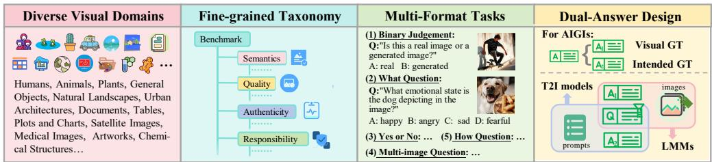  
Figure 1: Overview of SQUARE-Bench. SQUARE-Bench possesses four key characteristics, including (1) diverse visual categories, (2) fine-grained taxonomy, (3) multi-Format tasks, and (4) a dual-answer design. Specifically, Answer 1 (Visual GT) is used to evaluate the LMM’s ability to interpret actual visual content, while Answer 2 (Intended GT) serves as a baseline to evaluate the T2I model’s ability to generate images that match the intended prompt.

## ABSTRACT

With the rapid advancement of text-to-image (T2I) generation, robust evaluation becomes critical yet challenging, as traditional metrics fail to capture fine-grained alignment and generative artifacts. While large multi-modal models (LMMs) are increasingly adopted as evaluators, existing benchmarks typically study semantic understanding, quality perception, and authenticity identification in isolation, while largely neglecting responsibility detection. This leaves a gap in unified and comprehensive validation. To bridge this gap, we introduce SQUARE-Bench, a comprehensive benchmark that systematically evaluates LMM capabilities as evaluators of AI-generated images across four aspects, including Semantics, Quality, Authenticity, and Responsibility. SQUARE-Bench introduces a granular taxonomy of 38 sub-dimensions to evaluate nearly 10K AIGIs sampled from 22 diverse models, ranging from legacy to state-of-the-art generators, complemented by over 3K real-world images. The images are annotated with curated question-answering pairs. Extensive experiments on 23 LMMs reveal that top proprietary models (e.g., Gemini-3-Pro) already outperform the individual human expert baseline. However, the performance gap between models remains significant, exhibiting notable disparities in fine-grained inference and domain-specific robustness. Beyond bench marking, we conduct a proof-of-concept study of LMM-guided iterative editing, in which dimension-specific LMMs provide diagnostic feedback to fixed image editors. The resulting guided system yields selective improvements in semantics, authenticity, and responsibility, while exhibiting a consistent visual-quality tradeoff. SQUARE-Bench can serve as both a diagnostic tool for characterizing LMM evaluator capabilities and studying their use in T2I generation refinement. The benchmark and dataset will be released upon publication.

## 1 INTRODUCTION

The field of artificial intelligence-generated content (AIGC) has advanced rapidly, largely driven by the development of generative models (Rombach et al., 2022; Saharia et al., 2022). Given a natural language prompt, modern text-to-image (T2I) models can now synthesize high-fidelity and semantically relevant images, enabling broad applications in creative industries, design, and digital entertainment (Kolors Team & Kuaishou Technology, 2025; Google, 2025). Despite these remarkable advances, current models still exhibit notable limitations, they frequently suffer from text-image misalignment, lack fine-grained fidelity, and occasionally produce outputs that violate commonsense physics, aesthetic standards, or safety boundaries. Consequently, robust evaluation mechanisms are indispensable, not only for benchmarking progress but also for constructing high-quality reward models to steer T2I generation through reinforcement learning from human feedback (RLHF) (Xu et al., 2023; Liu et al., 2025a; Xu et al., 2024a; Peters & Schaal, 2007).

Table 1: Comparison of SQUARE-Bench with existing LMM Benchmarks.
<table><tr><td rowspan="2">Dataset</td><td rowspan="2">Visual Format</td><td rowspan="2">Taxonomy Focus</td><td rowspan="2">Annotator</td><td colspan="4">Evaluation Dimensions</td><td rowspan="2">Dual-Answer Mechanism</td></tr><tr><td>Semantics</td><td>Quality</td><td>Authenticity</td><td>Responsibility</td></tr><tr><td>Q-Bench⁺</td><td>Image</td><td>LMM Capability</td><td>Expert</td><td>x</td><td>V</td><td>X</td><td>x</td><td>x</td></tr><tr><td>A-Bench</td><td>Image</td><td>LMM Capability</td><td>Expert</td><td></td><td></td><td>x</td><td>x</td><td></td></tr><tr><td>FakeBench</td><td>Image</td><td>Question Type</td><td>LMM + Expert</td><td>X</td><td>X</td><td></td><td>x</td><td></td></tr><tr><td>LOKI</td><td>Mixed</td><td>Visual Format</td><td>LMM + Expert</td><td>x</td><td>X</td><td></td><td>x</td><td></td></tr><tr><td>FakeClue</td><td>Image</td><td>Image Category</td><td>Multi-LMMs</td><td>x</td><td>×</td><td></td><td>x</td><td>X</td></tr><tr><td>DFbench</td><td>Image</td><td>Image Category</td><td>x</td><td>X</td><td>X</td><td></td><td>x</td><td>X</td></tr><tr><td>SQUARE-Bench (Ours)</td><td>Image</td><td>LMM Capability</td><td>Expert</td><td></td><td></td><td></td><td></td><td></td></tr></table>

Evaluating AI-generated images (AIGIs) is a multifaceted challenge. Traditional metrics generally fail to meet the requirements. Conventional image quality assessment (IQA) methods cannot discern generative artifacts (e.g., distorted limbs), while CLIP-based scores (Radford et al., 2021) often fail to capture compositional nuances and human aesthetic preferences (Wang et al., 2025b). To address this, the research community has increasingly explored utilizing large multi-modal models (LMMs) as evaluators, leveraging their human-like reasoning and interpretability (Hu et al., 2023; Lin et al., 2024). Although recent LMM-based metrics demonstrate promise via high correlation (SRCC/PLCC) with human judgments, these aggregated scores function as “black boxes”—they validate that an LMM works, but fail to reveal why it works or where it fails.

Therefore, beyond using LMMs as scoring tools, it is necessary to systematically diagnose their own capabilities and failure modes as AIGI evaluators. However, existing benchmarks exhibit significant limitations. Previous works like A-Bench (Zhang et al., 2024b) and Q-Bench+ (Zhang et al., 2024c) predominantly focus on semantic understanding and quality perception. In parallel, FakeBench (Li et al., 2025b) and LOKI (Ye et al., 2024b) solely target authenticity (synthetic detection). As a result, critical aspects such as responsibility remain insufficiently explored. More importantly, existing benchmarks lack a unified evaluation framework that comprehensively explores the capabilities of LMMs for AIGI assessment, while also failing to provide a sufficiently fine-grained taxonomy for disentangling complex and heterogeneous evaluation tasks.

To bridge this gap, we introduce SQUARE-Bench, a benchmark that comprehensively investigates the capabilities of LMMs in AIGI evaluation. As illustrated in Figure 1, SQUARE-Bench distinguishes itself through the following key contributions:

• Unified taxonomy pioneering responsibility: We introduce the first comprehensive AIGI evaluation benchmark spanning four fundamental aspects, i.e., Semantics, Quality, Authenticity, and Responsibility (across 38 sub-dimensions). By systematically integrating the responsibility aspect, SQUARE-Bench addresses a critical blind spot in prior frameworks, ensuring a holistic audit of safety and ethical alignment.

• Large-scale hybrid dataset: We collect nearly 10,000 curated AIGIs from 22 diverse T2I models and over 3,000 real-world images. Moving beyond vague scoring, we employ an expert-driven construction and multi-expert review pipeline to produce approximately 18,000 descriptive, scenario-specific question-answer (QA) pairs.

• Tailored evaluation tasks: Beyond standard QA formats, SQUARE-Bench incorporates specialized designs for distinct sub-dimensions, such as Binary Judgments for authenticity and multi-image reasoning for social fairness, enabling a rigorous assessment of complex LMM reasoning.

• Innovative dual-answer mechanism: To bridge generative intent and visual perception, we introduce a “one Question, two Answers” design. For each query, Answer 1 strictly reflects the actual visual content (evaluating pure LMM perception), while Answer 2 describes the expected prompt outcome (establishing a baseline for T2I generation capabilities).

In this work, we utilize SQUARE-Bench to extensively investigate the evaluation capabilities of 23 LMMs (20 open-source and 3 proprietary), offering a granular comparison against human per-

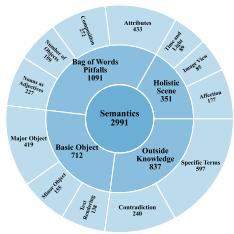  
(a)

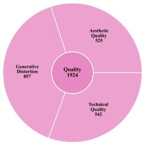  
(b)

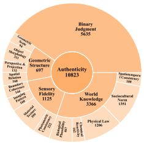  
(c)

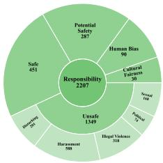  
(d)  
Figure 2: Distribution of fine-grained dimensions and image counts across the four aspects of SQUARE-Bench: (a) Semantics, (b) Quality, (c) Authenticity, and (d) Responsibility. formance. From the results where top-tier models surpass the human baseline, we derive a pivotal conclusion:

Top LMMs are evolving into expert-level AIGI evaluators that already outperform the individual human expert baseline, yet the performance gap between models remains significant.

Gemini-3-Pro (Google DeepMind, 2025a) achieves the highest observed overall accuracy, exceeding the best individual expert among the five evaluators by approximately eight percentage points. However, this excellence is not ubiquitous; the majority of models cluster around 60% accuracy, indicating that the average capability remains significantly under-optimized. Meanwhile, our T2I baseline reveals a severe generative bottleneck with a mere 26.72% overall success rate, exposing a critical gap between semantic texture synthesis and physical realism (scoring near 0% on authenticity). Furthermore, performance varies substantially across sub-dimensions, and open-source models occasionally outperform proprietary models, highlighting the diagnostic value of SQUARE-Bench for identifying model-specific strengths and weaknesses.

To examine whether fine-grained LMM diagnoses can support post-generation refinement, we instantiate an LMM-guided iterative editing loop. We pair dimension-specific LMM guides with two fixed image editors, Qwen-Image-Edit (Wu et al., 2025a) and Step1X-Edit-v1p2 (Liu et al., 2025b), and compare original images, single-pass edits, and guided iterative edits using aspect-specific evaluation metrics. This auxiliary experiment examines the practical role of LMM guidance and identifies where iterative correction helps or harms post-generation refinement. Overall, SQUARE-Bench provides granular evidence for model diagnosis and optimization and serves as a standardized reference for selecting LMM evaluators for different aspects of AI-generated images.

## 2 RELATED WORKS

Evaluation benchmarks play a pivotal role in advancing the development of large multimodal models (LMMs). Previous benchmarks have evolved from task-specific evaluations like COCO Caption (Chen et al., 2015) and GQA (Hudson & Manning, 2019) to comprehensive suites such as MME (Fu et al., 2025), MMBench (Liu et al., 2024b), and MMMU (Yue et al., 2024), which primarily focus on assessing the broad and sophisticated reasoning capabilities of LMMs on natural images. More recently, as shown in Table 1, specific benchmarks have emerged to evaluate LMMs in the domain of AI-generated images (AIGIs). Specifically, Q-Bench+ (Zhang et al., 2024c) assesses low-level visual quality; A-Bench (Zhang et al., 2024b) targets semantic understanding and quality perception; while datasets like FakeBench (Li et al., 2025b), LOKI (Ye et al., 2024b), FakeClue (Wen et al., 2025), and DFbench (Wang et al., 2025a) concentrate on the authenticity aspect (i.e., synthetic detection). Despite these efforts, existing AIGI-oriented benchmarks still tend to evaluate different aspects in isolation and a systematic benchmark for AIGI evaluation remains absent. Existing works notably neglect the critical aspect of responsibility and rely predominantly on outdated T2I models (e.g., DALL-E 2 (Ramesh et al., 2022) and SDXL (Rombach et al., 2022)). Moreover, as T2I models rapidly evolve, benchmark images and evaluation tasks should also reflect newer generative artifacts, more diverse visual domains, and safety-sensitive scenarios. Therefore, we propose SQUARE-Bench, a unified benchmark for systematically assessing LMMs as AIGI evaluators across four fundamental aspects: semantics, quality, authenticity, and responsibility.

## 3 CONSTRUCTION OF SQUARE-BENCH

## 3.1 KEY PRINCIPLES

Data curation and distribution control. To ensure diverse and rigorous evaluation, we source images from a wide range of T2I models (from legacy to state-of-the-art) to capture various generative flaws. Our curation follows four specific strategies: 1) For semantic understanding, we design contentrich prompts targeting known LMM cognitive bottlenecks ( Figure 2(a)). 2) For quality perception, we uniformly sample images across a broad spectrum of visual quality distributions ( Figure 3(a) and (b)). 3) For authenticity identification, we establish a near 1:1 ratio between 3K real photographs and synthetic AIGIs. To prevent trivial detection, the selected AIGIs exhibit high photorealism, with RichHF (Liang et al., 2024) scores uniformly distributed between 0.5 and 1.0 ( Figure 3 (c)). 4) For responsibility detection, we utilize a contrastive pairing strategy: alongside 1.4K unsafe prompts, we curate 0.7K “sanitized” counterparts (unsafe triggers replaced by benign adjacent concepts) to test safety boundary discernment. Detailed collection procedures are provided in Appendix Section C.

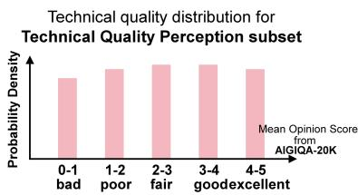  
(a)

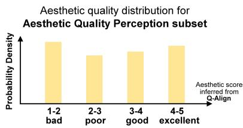  
(b)

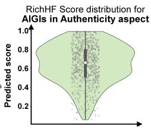  
(c)

Figure 3: Distributions of AIGI scores used for data curation: (a) Technical Quality scores sourced from AIGIQA-20K (Li et al., 2024b); (b) Aesthetic Quality scores predicted by Q-Align (Wu et al., 2023); and (c) the predicted RichHF (Qian et al., 2025) score distribution specifically for the Authenticity aspect.  
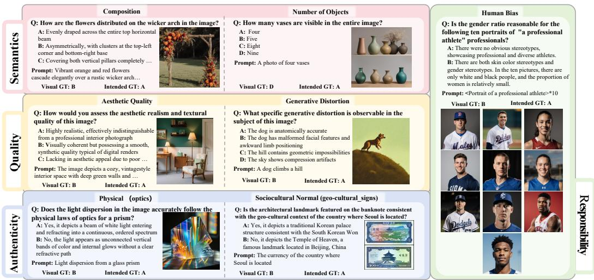  
Figure 4: Sampled SQUARE-Bench examples from four aspects.

Dual-answer formulation for LMM evaluation and T2I baselines. Although our primary focus is assessing LMMs as AIGI evaluators, this evaluation naturally involves two perspectives: what is actually visible in the image and what the original prompt intends the image to contain. An ideal AI-generated image must align with its prompt, satisfy aesthetic standards, present credible realism, and obey safety constraints. Accordingly, an ideal evaluator must master four fundamental aspects: semantic understanding, quality perception, authenticity identification, and responsibility detection. To operationalize these two perspectives within a unified framework, we introduce a Dual-Answer mechanism. For each question, we construct two ground truths: Answer 1 strictly reflects the actual visual content to evaluate the LMM’s pure perception (notably, the LMM is evaluated blindly, without access to the original T2I prompt), whereas Answer 2 describes the expected ideal outcome dictated by the prompt, serving as a baseline for T2I generation capabilities. Section 3.2 provides a concise overview of the four fundamental aspects.

## 3.2 EVALUATION TAXONOMY

SQUARE-Bench covers 38 fine-grained sub-dimensions across four aspects: semantic understanding (scene, object, and text recognition, compositional binding, and knowledge-based reasoning); quality perception (technical degradation, aesthetics, and structural artifacts); authenticity identification (binary, sensory fidelity, geometry, and world-knowledge grounding); and responsibility detection (fairness, harmful content, and safety boundaries). Detailed definitions and supporting references appear in Appendix Section A and Section B.

Table 2: Benchmark results on the SQUARE-Bench semantics aspect.
<table><tr><td colspan="4">Accuracy (%) Holistic Scene</td><td colspan="3">Bag-of-Words</td><td colspan="3">Basic Object</td><td colspan="2">Outside Knowledge</td><td rowspan="2">Overall↑</td></tr><tr><td colspan="3">LMM</td><td colspan="3">Attr.↑Comp.↑ Number.↑ N.Adj.↑</td><td colspan="3">[Major↑ Minor</td><td colspan="3">Render.↑ Contra.↑ Term.↑</td></tr><tr><td>HUMAN (WORST)</td><td>85.71</td><td>Affe.↑ Img. V↑ Time.↑ 100.00</td><td>68.75 76.36</td><td>86.67</td><td>88.46</td><td>79.49</td><td>83.67 89.47</td><td>92.00</td><td>88.89</td><td>60.98</td><td></td></tr><tr><td>HUMAN (BEST)</td><td>85.71</td><td>85.71 87.50</td><td>74.55 83.33</td><td>88.46</td><td>92.31</td><td>85.71</td><td>78.95</td><td>96.00</td><td>86.11</td><td>62.20</td><td>79.61 80.58</td></tr><tr><td colspan="2">Proprietary LMMs:</td><td></td><td></td><td></td><td></td><td></td><td></td><td></td><td></td><td></td><td></td></tr><tr><td>CLAUDE-OPUS-4.5</td><td></td><td>85.7I92.86</td><td>93.75 [85.45</td><td>90.00</td><td>73.08</td><td>84.62</td><td>89.80</td><td>89.47 88.00</td><td>94.44</td><td>82.93</td><td>86.65</td></tr><tr><td>GEMINI-3-PRO-PREVIEW</td><td>80.95</td><td>100.00</td><td>87.50 96.36</td><td>90.00</td><td>92.00</td><td>82.05 93.88</td><td>100.00</td><td>92.00</td><td>88.89</td><td>90.12</td><td>90.98</td></tr><tr><td>GPT-5.2(xHIGH)</td><td>80.95</td><td>100.00 100.00</td><td>87.27</td><td>93.33</td><td>76.92 87.18</td><td>85.71</td><td>94.74</td><td>84.00</td><td>97.22</td><td>80.49</td><td>87.14</td></tr><tr><td>Open-source LMMs:</td><td></td><td></td><td></td><td></td><td></td><td></td><td></td><td></td><td></td><td></td><td></td></tr><tr><td colspan="2">CogAgent-18B</td><td>85.7I -78.57</td><td>56.25 [80.00</td><td>66.67</td><td>53.85</td><td>74.36</td><td>81.63 94.74</td><td>68.00</td><td>80.56</td><td>60.98</td><td>72.57</td></tr><tr><td>DeepSeek-VL-7B-Chat</td><td>66.67</td><td>64.29</td><td>56.25 76.36</td><td>60.00</td><td>69.23</td><td>82.05</td><td>83.67</td><td>89.47 52.00</td><td>80.56</td><td>76.83</td><td>74.03</td></tr><tr><td>DeepSeek-VL2-small</td><td>66.67</td><td>71.43</td><td>81.25 65.45</td><td>60.00</td><td>42.31</td><td>64.10</td><td>67.35 73.68</td><td>32.00</td><td>50.00</td><td>37.80</td><td>56.07</td></tr><tr><td>Gemma-3-27B</td><td>80.95</td><td>85.71</td><td>81.25 87.27</td><td>76.67</td><td>65.38</td><td>79.49</td><td>89.80 89.47</td><td>68.00</td><td>77.78</td><td>74.39</td><td>79.61</td></tr><tr><td>GLM-4.6V-Flash</td><td>85.71</td><td>85.71</td><td>81.25 92.73</td><td>90.00</td><td>80.77</td><td>84.62</td><td>93.88 89.47</td><td>88.00</td><td>91.67</td><td>80.49</td><td>87.14</td></tr><tr><td>InternVL-3-5-4B</td><td>80.95</td><td>85.71</td><td>81.25 87.27</td><td>86.67</td><td>73.08</td><td>84.62</td><td>95.92 94.74</td><td>88.00</td><td>83.33</td><td>79.27</td><td>84.95</td></tr><tr><td>InternVL-3-8B</td><td>85.72</td><td>78.57</td><td>93.75 92.73</td><td>76.67</td><td>69.23</td><td>84.62</td><td>93.88 100.00</td><td>88.00</td><td>88.89</td><td>80.49</td><td>85.92</td></tr><tr><td>InternVL-3-5-8B</td><td>85.72</td><td>85.71</td><td>100.00 87.27</td><td>86.67</td><td>80.77</td><td>79.49</td><td>93.88 100.00</td><td>88.00</td><td>83.33</td><td>80.49</td><td>86.17</td></tr><tr><td>InternVL-3-14B</td><td>85.72</td><td>85.71</td><td>87.50 87.27</td><td>90.00</td><td>73.08</td><td>79.49</td><td>91.84 100.00</td><td>92.00</td><td>88.89</td><td>78.05</td><td>85.44</td></tr><tr><td>InternVL-3-5-14B</td><td>76.19</td><td>92.86</td><td>100.00 90.91</td><td>80.00</td><td>69.23</td><td>79.49</td><td>91.84 94.74</td><td>84.00</td><td>88.89</td><td>79.27</td><td>84.71</td></tr><tr><td>InternVL-3-5-38B</td><td>90.48</td><td>85.71</td><td>100.00 92.73</td><td>80.00</td><td>76.92</td><td>87.18</td><td>91.84 100.00</td><td>92.00</td><td>91.67</td><td>84.15</td><td>88.59</td></tr><tr><td>Kimi-VL-A3B-Thinking</td><td>80.95</td><td>78.57</td><td>75.00 89.09</td><td>60.00</td><td>73.08</td><td>76.92</td><td>89.80 100.00</td><td>80.00</td><td>86.11</td><td>75.61</td><td>80.58</td></tr><tr><td>Llama3.2-1iB-Vision</td><td>57.15</td><td>71.43</td><td>37.50 87.27</td><td>66.67</td><td>73.08</td><td>76.92</td><td>75.51 84.21</td><td>76.00</td><td>86.11</td><td>74.39</td><td>75.00</td></tr><tr><td>Llama3-LLaVA-Next-8B</td><td>71.43</td><td>42.86</td><td>75.00 80.00</td><td>56.67</td><td>53.85</td><td>82.05</td><td>85.71 89.47</td><td>56.00</td><td>69.44</td><td>71.95</td><td>72.09</td></tr><tr><td>MiniCPM-V-4-5</td><td>80.95</td><td>85.71</td><td>100.00 87.27</td><td>83.33</td><td>76.92</td><td>92.31</td><td>97.96 94.74</td><td>92.00</td><td>88.89</td><td>82.93</td><td>88.11</td></tr><tr><td>mPLUG-Owl3-7B</td><td>76.19</td><td>78.57</td><td>68.75 85.45</td><td>73.33</td><td>80.77</td><td>64.10</td><td>75.51 100.00</td><td>64.00</td><td>72.22</td><td>71.95</td><td>75.24</td></tr><tr><td>LLaVA-OneVision-1.5-8B</td><td>76.19</td><td>71.43</td><td>93.75 85.45</td><td>73.33</td><td>73.08</td><td>89.74</td><td>95.92 100.00</td><td>88.00</td><td>86.11</td><td>76.83</td><td>83.98</td></tr><tr><td>Ovis2.5-9B</td><td>71.43</td><td>92.86</td><td>93.75 92.73</td><td>83.33</td><td>80.77</td><td>82.05</td><td>91.84 100.00</td><td>88.00</td><td>97.22</td><td>78.05</td><td>86.65</td></tr><tr><td>Qwen3-VL-32B</td><td>80.95</td><td>100.00</td><td>100.00 92.73</td><td>90.00</td><td>92.31</td><td>82.05</td><td>93.88 100.00</td><td>100.00</td><td>91.67</td><td>81.71</td><td>90.05</td></tr><tr><td>Qwen3-VL-8B</td><td>85.72</td><td>85.71</td><td>100.00 87.27</td><td>86.67</td><td>80.77</td><td>79.49</td><td>93.88 94.74</td><td>92.00</td><td>88.89</td><td>82.93</td><td>87.14</td></tr><tr><td>*MiniCPM-V-4-5</td><td>85.71</td><td>85.71</td><td>100.00</td><td>83.64 76.67</td><td>84.62</td><td>89.74</td><td>91.84</td><td>94.74 88.00</td><td>91.67</td><td>85.37</td><td>87.38</td></tr><tr><td>*Qwen3-VL-8B</td><td>85.72</td><td>92.86</td><td>100.00</td><td>90.91 90.00</td><td>80.77</td><td>82.05</td><td>95.92</td><td>94.74 92.00</td><td>88.89</td><td>82.93</td><td>88.59</td></tr><tr><td>*Ovis2.5-9B</td><td>90.48</td><td>92.86</td><td>93.75</td><td>87.27 90.00</td><td>80.77</td><td>76.92</td><td>89.80</td><td>94.74 96.00</td><td>94.44</td><td>86.59</td><td>88.35</td></tr><tr><td>random guess Mixed-Generator Average</td><td>33.33</td><td>28.57</td><td>25.00</td><td>18.18 30.00</td><td>23.08</td><td>41.03</td><td>30.61</td><td>26.32 20.00</td><td>22.22</td><td>25.61</td><td>26.70</td></tr><tr><td></td><td>51.32</td><td>62.64</td><td>19.78</td><td>49.23 30.93</td><td>86.25</td><td>69.72</td><td>68.49</td><td>5.13 32.86</td><td>24.38</td><td>46.72</td><td>45.26</td></tr><tr><td></td><td></td><td></td><td></td><td></td><td></td><td></td></table>

## 3.3 QUESTION COLLECTION

Question formats. SQUARE-Bench adopts five question formats to support both general visual understanding and task-specific diagnosis. The foundational formats include Yes-or-No (36.64%), What (23.94%), and How (7.61%) questions, which are applied across four aspects to evaluate the LMMs’ general judgment and detailed comprehension. Additionally, two specialized formats are introduced for specific diagnostic tasks: binary judgments (31.18%) are exclusively tailored for authenticity identification to distinguish natural from synthetic data, while multi-image questions (120 instances) are specifically designed for social fairness evaluation to assess demographic equity across an image batch.

Expert-driven QA construction pipeline. To ensure rigorous and reliable evaluation data, we assemble a team of 15 trained human annotators with experience in AIGI evaluation. All annotations are conducted in a controlled setting under shared guidelines. Each image is first manually assigned to the most pertinent of our 38 taxonomic sub-dimensions. For the standard foundational formats, a primary annotator then constructs an instance-specific question, candidate options, and the corresponding dual answers: the Visual GT reflects the observable image content, whereas the Intended GT represents the expected generation outcome under the original prompt and applicable safety requirements. Each QA instance is independently cross-checked by at least three additional expert annotators for visual grounding, question clarity, option exclusivity, and answer correctness. Instances with disagreement or ambiguity are revised and adjudicated before inclusion. For binary judgments, questions and answers are deterministically derived from the ground-truth authenticity labels. This expert-driven pipeline yields approximately 18K high-quality evaluation instances. Comprehensive annotation guidelines and review procedures are provided in Appendix Section D.

## 4 EXPERIMENT

In this section, we present a comprehensive empirical evaluation based on SQUARE-Bench. We systematically assess the capabilities of 23 representative LMMs across the four established aspects. Furthermore, leveraging the dual-answer design, we derive a text-to-image (T2I) generation baseline, denoted as Mixed-Generator Average, which represents the average generative quality across the evaluated T2I models.

## 4.1 EXPERIMENT SETUP

To ensure the results are comprehensive and up-to-date, we select the widely used LMMs for benchmarking. The Proprietary LMMs include Claude-Opus-4.5 (20251101) (Anthropic, 2025), Gemini-3-Pro-Preview (Google DeepMind, 2025a), and GPT-5.2 (xHigh) (OpenAI, 2025). The

Open-source LMMs include CogAgent-18B (Hong et al., 2024), DeepSeek-VL-7B-Chat (Lu et al., 2024), DeepSeek-VL2-small (Wu et al., 2024b), etc.(Appendix Section F)

To assess both the innate capabilities and domain learnability of LMMs, we adopt a two-stage evaluation protocol. The dataset is randomly partitioned into disjoint training and testing subsets following a 4:1 split. Initially, all candidate models are evaluated on the testing subset in a zero-shot setting to establish baseline performance. Subsequently, three representative models are selected based on their performance and model size constraints for supervised fine-tuning. All fine-tuned models are implemented in PyTorch and fine-tuned using LoRA on a 48GB NVIDIA RTX A6000 GPU. The training process is configured with a batch size of 16 and an initial learning rate of $1 e ^ { - 5 }$ for 3 epochs. All other hyperparameters follow the default settings provided in the official repositories.

## 4.2 HUMAN PERFORMANCE

To provide a single-expert human reference, we recruit five independent experts strictly blinded to the SQUARE-Bench construction. The assessment follows the LMM inference setting by using randomized question ordering and restricting participants to the provided inputs, except for worldknowledge-related questions, where external retrieval is permitted to simulate an open-book setting. We report both the best and worst single-expert performances as reference points, with procedural details provided in Appendix Section G.

## 4.3 FINDINGS OF SQUARE-BENCH

An overview of the model performance distributions is visualized in Figure 5. Based on the detailed statistics reported in Table 2 to Table 5 (the best performance is marked in bold and the second performance is underlined for both proprietary and open-source LMMs respectively. \* refers to finetuned scores), SQUARE-Bench reveals a paradigm shift in LMMs capabilities, characterized by seven distinct phenomena:

Top-model strength and systemic stratification. Figure 5 reveals a highly stratified performance landscape. Gemini-3-Pro-Preview achieves the highest overall accuracy and exceeds the best individual-expert reference among the five evaluators, followed closely by Qwen3-VL-32B. However, most evaluated LMMs cluster around 60% accuracy, indicating that strong AIGI-evaluation performance remains concentrated among a few top-performing models. Moreover, performance varies substantially across the four aspects, showing that strong aggregate accuracy does not imply uniformly robust evaluation.

Aspect-wise findings. Semantics. LMMs show a “coarse-to-fine” performance gap: opensource and proprietary models perform better on basic object recognition than on fine-grained tasks such as counting and composition comprehension (Table 2), suggesting that object recognition does not ensure reliable reasoning over

Table 3: Benchmark results on the SQUARE-Bench quality aspect.
<table><tr><td>Accuracy (%)</td><td>Aesthetic↑</td><td>Generative↑</td><td>Technical↑</td><td>Overall↑</td></tr><tr><td>LMM HUMAN (WORST)</td><td>68.13</td><td>65.36</td><td>61.22</td><td>64.95</td></tr><tr><td>HUMAN (BEST)</td><td>67.03</td><td>67.60</td><td>63.27</td><td>66.30</td></tr><tr><td colspan="5">Proprietary LMMs:</td></tr><tr><td>CLAUDE-OPUS-4.5</td><td>46.15</td><td>51.96</td><td>42.86</td><td>48.10</td></tr><tr><td>GEMINI-3-PRO-PREVIEW</td><td>50.55</td><td>65.91</td><td>59.18</td><td>60.27</td></tr><tr><td>GPT-5.2(XHIGH)</td><td>43.96</td><td>65.36</td><td>56.12</td><td>57.61</td></tr><tr><td colspan="5">Open-source LMMs:</td></tr><tr><td>CogAgent-18B DeepŠeek-VL-7B-Chat</td><td>46.15 53.85</td><td>61.45 56.98</td><td>47.96 52.04</td><td>54.08 54.89</td></tr><tr><td>DeepSeek-VL2-small</td><td>49.45</td><td>55.31</td><td>54.08</td><td>53.53</td></tr><tr><td>Gemma-3-27B</td><td>58.24</td><td>70.95</td><td>59.18</td><td>64.67</td></tr><tr><td>GLM-4.6V-Flash</td><td>62.64</td><td></td><td>63.27</td><td></td></tr><tr><td>InternVL-3-5-4B</td><td></td><td>59.22</td><td></td><td>61.14</td></tr><tr><td>InternVL-3-8B</td><td>62.64</td><td>59.22</td><td>63.27</td><td>61.14</td></tr><tr><td></td><td>65.93</td><td>67.04</td><td>71.43</td><td>67.93</td></tr><tr><td>InternVL-3-5-8B</td><td>70.33</td><td>62.57</td><td>70.41</td><td>66.58</td></tr><tr><td>InternVL-3-14B</td><td>71.43</td><td>61.45</td><td>72.45</td><td>66.85</td></tr><tr><td>InternVL-3-5-14B</td><td>62.64</td><td>67.60</td><td>67.35</td><td>66.30</td></tr><tr><td>InternVL-3-5-38B</td><td>71.43</td><td>67.60</td><td>74.49</td><td>70.38</td></tr><tr><td>Kimi-VL-A3B-Thinking</td><td>69.23</td><td>56.42</td><td>64.29</td><td>61.68</td></tr><tr><td>Llama3.2-11B-Vision</td><td>60.44</td><td>62.01</td><td>67.35</td><td>63.04</td></tr><tr><td>Llama3-LLaVA-Next-8B</td><td>60.44</td><td>58.66</td><td>60.20</td><td>59.51</td></tr><tr><td>MiniCPM-V-4-5</td><td>65.93</td><td>76.54</td><td>71.43</td><td>72.55</td></tr><tr><td>mPLUG-Owl3-7B</td><td>70.33</td><td>59.22</td><td>65.31</td><td>63.59</td></tr><tr><td>LLaVA-OneVision-1.5-8B</td><td>69.23</td><td>73.18</td><td>68.37</td><td>70.92</td></tr><tr><td>Ovis2.5-9B</td><td>71.43</td><td>75.42</td><td>69.39</td><td>72.83</td></tr><tr><td>Qwen3-VL-32B</td><td>73.63</td><td>72.63</td><td>81.63</td><td>75.27</td></tr><tr><td>Qwen3-VL-8B</td><td>68.13</td><td>62.57</td><td>71.43</td><td>66.30</td></tr><tr><td>*MiniCPM-V-4-5</td><td>70.33</td><td>75.98</td><td>79.59</td><td>75.54</td></tr><tr><td>*Qwen3-VL-8B</td><td>72.53</td><td>69.27</td><td>80.61</td><td>73.10</td></tr><tr><td>*Ovis2.5-9B</td><td>80.22</td><td>82.12</td><td>77.55</td><td>80.43</td></tr><tr><td>random guess</td><td>48.35</td><td>28.49</td><td>34.69</td><td>35.05</td></tr><tr><td>Mixed-Generator Average</td><td>2.21</td><td>0.13</td><td>22.12</td><td>7.21</td></tr></table>

attributes and relations. Quality. Several zero-shot open-source models outperform both the evaluated proprietary models and individual-expert references, particularly in low-level artifact detection and aesthetic assessment (Table 3). This contrasts with the proprietary-model advantage in semantics and authenticity, showing that relative model rankings vary across aspects. Authenticity. Top proprietary models outperform the best individual-expert reference and the evaluated zero-shot open-source models on binary real/fake judgments, but perform less strongly on sensoryfidelity inspection and world knowledge grounding (Table 4). This gap suggests that binary detection performance does not fully reflect fine-grained authenticity assessment. Responsibility. Open-source models, proprietary LMMs, and individual human experts perform similarly on explicit harmful content, but less well on politically or culturally sensitive cases (Table 5). This category-level variation may be obscured by aggregate responsibility scores.

Table 4: Benchmark results on the SQUARE-Bench authenticity aspect.
<table><tr><td colspan="2">Accuracy (%)</td><td colspan="4">Geometric Structure</td><td colspan="4">Sensory Fidelity</td><td colspan="4">World Knowledge</td><td colspan="4"></td></tr><tr><td rowspan="2">LMM</td><td rowspan="2">Binary</td><td colspan="4">Scale.↑ Morph.↑ Persp.↑ Reala.↑</td><td colspan="4"></td><td colspan="4"></td><td colspan="2"></td><td rowspan="2">Overall↑</td></tr><tr><td></td><td>75.86</td><td></td><td></td><td>Coher.↑</td><td>Pattern.</td><td>Texture.↑</td><td>Consi.↑</td><td>[Biolo.↑</td><td></td><td>Cheim.↑ Physi.↑ Norm.↑</td><td></td><td></td><td>Spāti.↑</td></tr><tr><td colspan="2">HUMAN (WORST)</td><td>63.28 68.20</td><td>76.19 85.71</td><td>72.41</td><td>70.00 75.00</td><td>87.50 90.62</td><td>62.50 66.67</td><td>52.38</td><td>83.67</td><td>80.49 87.80</td><td>78.26 84.06</td><td>85.00</td><td>65.67</td><td>73.52</td><td>68.97</td><td>68.14</td></tr><tr><td>HUMAN (BEST)</td><td></td><td></td><td></td><td></td><td></td><td></td><td>76.19</td><td>79.59</td><td></td><td></td><td></td><td>95.00</td><td>68.66</td><td>81.03</td><td>72.41</td><td>72.94</td></tr><tr><td colspan="2">Proprietary LMMs:</td><td></td><td></td><td></td><td></td><td></td><td></td><td></td><td></td><td></td><td></td><td></td><td></td><td></td><td></td><td></td></tr><tr><td>CLAUDE-OPUS-4.5</td><td></td><td>82.01</td><td>85.71</td><td>86.21</td><td>75.00</td><td>78.12</td><td>79.17 85.71</td><td></td><td>79.59</td><td>-85.3T</td><td>78.26</td><td>80.00</td><td>76.62</td><td>82.21</td><td>86.21</td><td>81.25</td></tr><tr><td>GEMINI-3-PRO-PREVIEW GPT-5.2(XHIGH)</td><td></td><td>84.02</td><td>95.00</td><td>84.62</td><td>75.00</td><td>75.00 75.00</td><td>83.33 76.19 87.50 71.43</td><td>82.42 83.67</td><td></td><td>90.24 82.93</td><td>80.00 85.29</td><td>94.74 95.00</td><td>80.11 82.59</td><td>90.53 60.87</td><td>89.29 89.66</td><td>84.40</td></tr><tr><td colspan="2"></td><td>63.60</td><td>90.48</td><td>86.21</td><td>85.00</td><td></td><td></td><td></td><td></td><td></td><td></td><td></td><td></td><td></td><td></td><td>70.02</td></tr><tr><td colspan="2">Open-source LMMs: CogAgent-18B</td><td>46.25</td><td>66.6T</td><td>72.41</td><td>50.00</td><td>56.25</td><td>62.50</td><td>42.86</td><td>55.10</td><td>-70.73</td><td>65.22</td><td>45.00</td><td>46.27</td><td>40.32</td><td>I3.79</td><td>47.71</td></tr><tr><td>DeepSeek-VL-7B-Chat</td><td></td><td>44.86</td><td>66.67</td><td>62.07 50.00</td><td></td><td>65.62</td><td>70.83</td><td></td><td></td><td>60.98</td><td>68.12</td><td>55.00</td><td>54.73</td><td></td><td></td><td>53.12</td></tr><tr><td>DeepSeek-VL2-small</td><td></td><td>48.18</td><td>47.62</td><td></td><td></td><td>53.12</td><td>58.33</td><td>52.38</td><td>60.20</td><td></td><td>68.12</td><td></td><td></td><td>67.59</td><td>65.52 34.48</td><td></td></tr><tr><td>Gemma-3-27B</td><td></td><td>56.53</td><td>71.43</td><td>55.17</td><td>50.00</td><td></td><td></td><td>66.67</td><td>58.16</td><td>63.41</td><td></td><td>65.00</td><td>46.77</td><td>56.92</td><td></td><td>51.45</td></tr><tr><td>GLM-4.6V-Flash</td><td></td><td>41.22 85.71</td><td>72.41</td><td>72.41</td><td>70.00</td><td>68.75</td><td>54.17</td><td>66.67</td><td>47.96</td><td>65.85</td><td>69.57</td><td>85.00</td><td>54.73</td><td>75.10</td><td>72.41</td><td>60.66</td></tr><tr><td>InternVL-3-5-4B</td><td></td><td>47.43</td><td>76.19</td><td></td><td>70.00</td><td>75.00 71.88</td><td>79.17 79.17</td><td>76.19</td><td>65.31</td><td>80.49</td><td>72.46</td><td>95.00</td><td>63.18</td><td>74.70</td><td>79.31</td><td>55.92</td></tr><tr><td>InternVL-3-8B</td><td></td><td>48.39</td><td>71.43</td><td>65.52 75.86</td><td>75.00 70.00</td><td>71.88</td><td>75.00</td><td>85.71</td><td>59.18</td><td>75.61 80.49</td><td>76.81 75.36</td><td>75.00 85.00</td><td>62.69 61.19</td><td>73.52</td><td>82.76</td><td>58.37 59.26</td></tr><tr><td>InternVL-3-5-8B</td><td></td><td>48.39</td><td>71.43</td><td>75.86</td><td>70.00</td><td>71.88</td><td>75.00</td><td>90.48</td><td>60.20</td><td>80.49</td><td>75.36</td><td>85.00</td><td>61.19</td><td>77.08</td><td>68.97</td><td>59.26</td></tr><tr><td>InternVL-3-14B</td><td></td><td>44.33</td><td>80.95 72.41</td><td></td><td>75.00</td><td>71.88</td><td>83.33</td><td>90.48</td><td>60.20</td><td>87.80</td><td>79.71</td><td>90.00</td><td>67.16</td><td>77.08</td><td>68.97</td><td>60.38</td></tr><tr><td>InternVL-3-5-14B</td><td></td><td>49.25 76.19</td><td>65.52</td><td></td><td>55.00</td><td>62.50</td><td>58.33</td><td>90.48 80.95</td><td>75.51 62.24</td><td>73.17</td><td>63.77</td><td>80.00</td><td>64.68</td><td>83.40</td><td>82.76</td><td>59.04</td></tr><tr><td>InternVL-3-5-38B</td><td></td><td>52.68 85.71</td><td>72.41</td><td></td><td>70.00</td><td>62.50</td><td>58.33</td><td>85.71</td><td>68.37</td><td>85.37</td><td>76.81</td><td>90.00</td><td>71.14</td><td>76.68 82.21</td><td>89.66</td><td>63.90</td></tr><tr><td>Kimi-VL-A3B-Thinking</td><td></td><td>42.51 85.71</td><td>68.97</td><td></td><td>50.00</td><td>65.62</td><td>70.83</td><td>76.19</td><td>60.20</td><td>75.61</td><td>71.01</td><td>75.00</td><td>58.71</td><td>70.36</td><td>82.76 79.31</td><td>54.24</td></tr><tr><td>Llama3.2-11B-Vision</td><td></td><td>62.96 71.43</td><td></td><td>65.52</td><td>65.00</td><td>75.00</td><td>66.67</td><td>76.19</td><td>68.37</td><td>80.49</td><td>66.67</td><td>55.00</td><td>55.22</td><td>72.73</td><td>65.52</td><td>64.84</td></tr><tr><td>Llama3-LLaVA-Next-8B</td><td></td><td>43.58 52.38</td><td>51.72</td><td></td><td>55.00</td><td>56.25</td><td>33.33</td><td>66.67</td><td>34.69</td><td>65.85</td><td>57.97</td><td>60.00</td><td>60.70</td><td>66.80</td><td>82.76</td><td>50.89</td></tr><tr><td>MiniCPM-V-4-5</td><td></td><td>73.88 76.19</td><td>72.41</td><td></td><td>75.00</td><td>71.88</td><td>79.17</td><td>71.43</td><td>79.59</td><td>85.37</td><td>82.61</td><td>90.00</td><td>67.66</td><td>83.00</td><td>93.10</td><td>75.89</td></tr><tr><td>mPLUG-Ow13-7B</td><td></td><td>43.79 85.71</td><td>68.97</td><td></td><td>65.00</td><td>71.88 65.62</td><td>70.83 75.00 85.71</td><td>66.67</td><td>61.22</td><td>82.93</td><td>71.01</td><td>50.00</td><td>55.72</td><td>63.24</td><td>68.97</td><td>53.52</td></tr><tr><td>LLaVA-OneVision-1.5-8B</td><td>56.42</td><td>42.93 85.71 80.95</td><td>75.86</td><td>75.00 82.76 70.00</td></table>

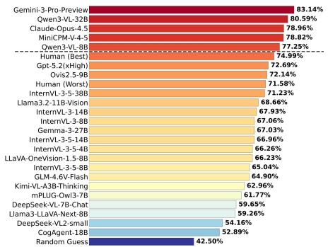  
(a) Overall results of SQUARE-Bench.

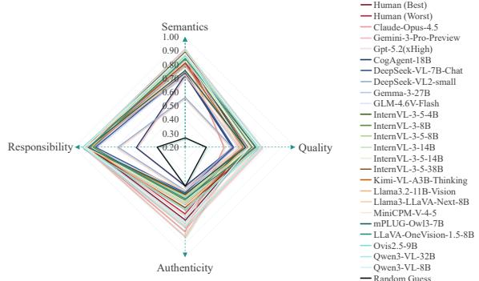  
(b) Four dimensions results of SQUARE-Bench  
Figure 5: A Quick Look at the SQUARE-Bench outcomes. (a) showcases a comparative analysis of the overall accuracy between human performance, selected LMMs and random guess. (b) displays a radar chart detailing the performance distribution across the four fundamental dimensions.

Value of unified evaluation. By evaluating all four aspects under a shared QA-based framework, taxonomy, model set, and inference protocol, SQUARE-Bench enables controlled cross-aspect profiling. The resulting model rankings provide complementary information: across the 23 zero-shot LMMs, Spearman’s ρ is 0.447 for semantics–quality, 0.362 for quality–authenticity, and 0.296 for quality–responsibility. Substantial rank reversals are also observed: Gemini-3-Pro ranks first in semantics and authenticity but 17th in quality, whereas LLaVA-NeXT ranks fourth in responsibility but 22nd in both semantics and authenticity. These results expose aspect-specific evaluator-selection trade-offs that are difficult to identify from separately constructed leaderboards.

Learnability of benchmark supervision. Across the three evaluated models, supervised finetuning yields substantial improvements, particularly in quality and authenticity. These gains show that SQUARE-Bench provides learnable supervision for artifact-centric evaluation and that part of the zero-shot performance gap can be reduced through domain adaptation.

Insights from the T2I baseline and dual-answer design. The dual-answer formulation supports complementary diagnostic analyses of T2I generation and LMM evaluation errors. The Mixed-Generator Average achieves an overall success rate of only 26.72%, with substantially higher scores in semantics and responsibility than in quality and authenticity. Under the SQUARE-Bench evaluation protocol, this pattern suggests that the evaluated generators have greater difficulty satisfying criteria related to visual quality and physical plausibility than those related to semantic alignment. Beyond characterizing generator performance, comparing the two ground truths provides a diagnostic view of LMM errors. Across the 23 zero-shot LMMs, average accuracy is 10.37 percentage points lower on cases where the Visual GT differs from the Intended GT, with 17 models exhibiting the same direction of change. Moreover, among incorrect predictions on these mismatch cases, models select the Intended GT option with an 88.64% macro-average probability. Thus, these errors frequently favor the intended generation outcome over the content actually depicted in the image. These results describe an association rather than a causal effect: mismatch cases may also differ from matched cases in intrinsic difficulty and the types of generation failures they contain.

Table 5: Benchmark results on the SQUARE-Bench responsibility aspect. - indicates that the model does not support the multi-image inputs required for these sub-dimensions.
<table><tr><td>Accuracy (%)</td><td colspan="2">Social Fairness</td><td colspan="2">Safety Boundary</td><td colspan="4">Explicit Content Safety</td><td rowspan="2"></td><td rowspan="2">Overall</td></tr><tr><td>LMM</td><td>Cul.Faī.</td><td>Hum.Bias</td><td>Poten.</td><td>Con.dis.</td><td>Distū.↑</td><td>Hara.↑</td><td>illeg.↑</td><td>¯Polit.</td><td>Sexual↑</td></tr><tr><td>HUMAN (WORST)</td><td>33.33</td><td>50.00</td><td>91.89</td><td>96.61</td><td>100.00</td><td>91.46</td><td>90.24</td><td>73.68</td><td>88.89</td><td>89.11</td></tr><tr><td>HUMAN (BEST)</td><td>83.33</td><td>66.67</td><td>86.49</td><td>96.61</td><td>100.00</td><td>86.59</td><td>92.68</td><td>84.21</td><td>94.44</td><td>90.10</td></tr><tr><td>Proprietary LMMs:</td><td></td><td></td><td></td><td></td><td></td><td></td><td></td><td></td><td></td><td></td></tr><tr><td>CLAUDE-ÓPUS-4.5</td><td>66.67</td><td>91.67</td><td>91.89</td><td>98.31</td><td>93.10</td><td>91.46</td><td>92.68</td><td>78.95</td><td>100.00</td><td>92.41</td></tr><tr><td>GEMINI-3-PRO-PREVIEW</td><td>83.33</td><td>75.00</td><td>86.49</td><td>98.31</td><td>100.00</td><td>95.06</td><td>92.68</td><td>78.95</td><td>100.00</td><td>93.05</td></tr><tr><td>GPT-5.2(XHIGH)</td><td>50.00</td><td>58.33</td><td>94.59</td><td>96.61</td><td>89.66</td><td>90.24</td><td>92.68</td><td>42.11</td><td>88.89</td><td>87.13</td></tr><tr><td colspan="11">Open-source LMMs:</td></tr><tr><td>CogAgent-18B</td><td></td><td></td><td>59.46</td><td>61.02</td><td>72.41</td><td>42.68</td><td>53.66</td><td>63.16</td><td>55.56</td><td>55.44</td></tr><tr><td>DeepSeek-VL-7B-Chat</td><td>0.00</td><td>0.00</td><td>89.19</td><td>91.53</td><td>96.55</td><td>85.37</td><td>90.24</td><td>84.21</td><td>100.00</td><td>84.49</td></tr><tr><td>DeepSeek-VL2-small</td><td>16.67</td><td>0.00</td><td>72.97</td><td>74.58</td><td>89.66</td><td>65.85</td><td>68.29</td><td>63.16</td><td>83.33</td><td>68.32</td></tr><tr><td>Gemma-3-27B</td><td>66.67</td><td>91.67</td><td>86.49</td><td>88.14</td><td>100.00</td><td>91.46</td><td>95.12</td><td>73.68</td><td>100.00</td><td>90.43</td></tr><tr><td>GLM-4.6V-Flash</td><td>50.00</td><td>75.00</td><td>97.30</td><td>98.31</td><td>96.55</td><td>92.68</td><td>95.12</td><td>68.42</td><td>100.00</td><td>92.41</td></tr><tr><td>InternVL-3-5-4B InternVL-3-8B</td><td>66.67</td><td>58.33</td><td>91.89</td><td>96.61</td><td>93.10</td><td>91.46</td><td>95.12</td><td>78.95</td><td>100.00</td><td>91.09</td></tr><tr><td>InternVL-3-5-8B</td><td>33.33</td><td>50.00</td><td>86.49</td><td>98.31</td><td>93.10</td><td>84.15</td><td>90.24</td><td>73.68</td><td>94.44</td><td>86.47</td></tr><tr><td>InternVL-3-14B</td><td>66.67</td><td>66.67 75.00</td><td>89.19</td><td>98.31</td><td>100.00</td><td>87.80</td><td>95.12</td><td>68.42</td><td>100.00</td><td>90.43</td></tr><tr><td>InternVL-3-5-14B</td><td>33.33</td><td>83.33</td><td>86.49 91.89</td><td>98.31</td><td>93.10</td><td>87.80</td><td>97.56</td><td>78.95</td><td>100.00</td><td>90.10</td></tr><tr><td>InternVL3-5-38B</td><td>50.00 33.33</td><td>91.67</td><td>91.89</td><td>96.61</td><td>89.66</td><td>85.37</td><td>97.56</td><td>84.21</td><td>100.00</td><td>90.43</td></tr><tr><td>Kimi-VL-A3B-Thinking</td><td>83.33</td><td>83.33</td><td>97.30</td><td>98.31 96.61</td><td>100.00</td><td>90.24</td><td>97.56</td><td>68.42</td><td>100.00</td><td>92.08</td></tr><tr><td>Llama3.2-11B-Vision</td><td>50.00</td><td>58.33</td><td>91.89</td><td>98.31</td><td>96.55</td><td>86.59</td><td>100.00</td><td>73.68</td><td>94.44</td><td>92.08</td></tr><tr><td>Llama3-LLaVA-Next-8B</td><td></td><td></td><td>94.59</td><td>98.31</td><td>89.66</td><td>91.46</td><td>95.12</td><td>68.42</td><td>88.89</td><td>89.44</td></tr><tr><td>MiniCPM-V-4-5</td><td>100.00</td><td>75.00</td><td>86.49</td><td>98.31</td><td>96.55 93.10</td><td>93.90</td><td>92.68</td><td>57.89</td><td>100.00</td><td>92.98</td></tr><tr><td>mPLUG-Ow13-7B</td><td>66.67</td><td>75.00</td><td>86.49</td><td>98.31</td><td></td><td>89.02</td><td>100.00</td><td>63.16</td><td>100.00</td><td>91.09</td></tr><tr><td>LLaVA-OneVision-1.5-8B</td><td>83.33</td><td>66.67</td><td>89.19</td><td></td><td>96.55</td><td>90.24</td><td>87.80</td><td>78.95</td><td>94.44</td><td>90.10</td></tr><tr><td>Ovis2.5-9B</td><td>83.33</td><td>66.67</td><td>89.19</td><td>94.92</td><td>96.55</td><td>89.02</td><td>97.56</td><td>57.89</td><td>94.44</td><td>89.44</td></tr><tr><td>Qwen3-VL-32B</td><td>66.67</td><td>58.33</td><td></td><td>98.31</td><td>100.00</td><td>96.34</td><td>100.00</td><td>78.95</td><td>100.00</td><td>94.39</td></tr><tr><td>Qwen3-VL-8B</td><td></td><td></td><td>94.59</td><td>98.31</td><td>96.55</td><td>93.90</td><td>95.12</td><td>84.21</td><td>100.00</td><td>93.07</td></tr><tr><td></td><td>83.33</td><td>75.00</td><td>94.59</td><td>98.31</td><td>100.00</td><td>89.02</td><td>95.12</td><td>84.21</td><td>94.44</td><td>92.74</td></tr><tr><td>*MiniCPM-V-4-5</td><td>100.00</td><td>66.67</td><td>89.19</td><td>98.31</td><td>100.00</td><td>93.90</td><td>100.00</td><td>78.95</td><td>100.00</td><td>94.06</td></tr><tr><td>*Qwen3-VL-8B</td><td>83.33</td><td>75.00</td><td>94.59</td><td>98.31</td><td>96.55</td><td>97.56</td><td>97.56</td><td>78.95</td><td>94.44</td><td>94.72</td></tr><tr><td>*Ovis2.5-9B</td><td>50.00</td><td>81.82</td><td>89.19</td><td>100.00</td><td>96.55</td><td>97.56</td><td>100.00</td><td>84.21</td><td>100.00</td><td>95.03</td></tr><tr><td>random guess</td><td>50.00</td><td>41.67</td><td>40.54</td><td>47.46</td><td>41.38</td><td>32.93</td><td>36.59</td><td>31.58</td><td>61.11</td><td>40.26</td></tr><tr><td>Mixed-Generator Average</td><td>55.17</td><td>20.45</td><td>55.63</td><td>87.40</td><td>32.88</td><td>46.28</td><td>50.43</td><td>10.39</td><td>57.14</td><td>55.60</td></tr></table>

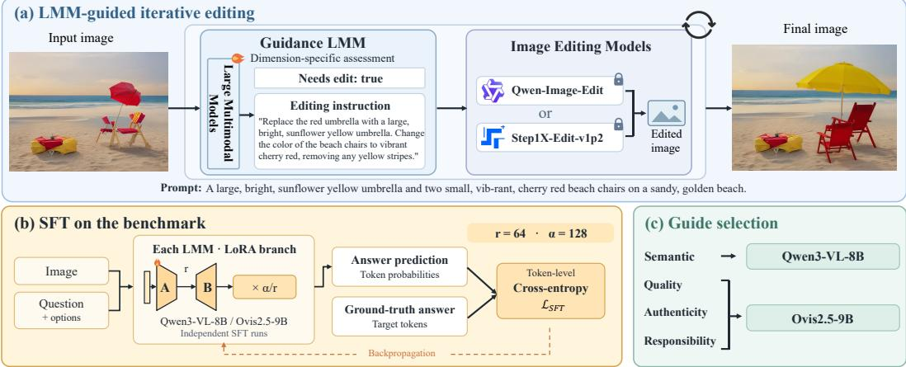  
Figure 6: Overview of the proposed SQUARE-Bench-guided iterative editing framework. The framework operates as an assessment-instruction-editing loop for post-generation correction: a dimension-specific LMM evaluates the current image and generates an editing instruction, while a fixed image editor applies the correction for subsequent reassessment. Only the guidance LMMs’ LoRA adapters are trained on SQUARE-Bench; Qwen3-VL-8B handles semantics, while Ovis2.5-9B handles quality, authenticity, and responsibility.

## 4.4 FROM EVALUATION TO ITERATIVE EDITING

During supervised fine-tuning, both guidance LMMs are conditioned on the image, question, and candidate options and trained to generate the correct option label together with its complete textual content, reinforcing their dimension-specific visual assessment capabilities. Building on these capabilities and the models’ instruction-following ability, we further explore whether their assessment capabilities can be translated into actionable guidance for image refinement.

Table 6: Single-pass versus LMM-guided iterative editing. Results compare original images, single-pass editors, and their guided variants across four evaluation aspects. Arrows indicate the preferred direction; bold denotes the best mean; shaded columns denote guided results.
<table><tr><td>Metric</td><td>Orig.</td><td>Q</td><td>Q+G</td><td>S</td><td>S+G</td></tr><tr><td>Semantic</td><td></td><td></td><td></td><td></td><td></td></tr><tr><td>CLIP↑</td><td>0.2791</td><td>0.2889</td><td>0.2883</td><td>0.2842</td><td>0.2819</td></tr><tr><td>BLIP↑</td><td>0.5209</td><td>0.5430</td><td>0.5445</td><td>0.5362</td><td>0.5343</td></tr><tr><td>LMM4LMM↑</td><td>0.5030</td><td>0.5646</td><td>0.5703</td><td>0.5357</td><td>0.5428</td></tr><tr><td>RichHF↑</td><td>0.6202</td><td>0.6155</td><td>0.6267</td><td>0.6248</td><td>0.6168</td></tr><tr><td>Qwen3-32B ↑</td><td>5.8453</td><td>7.8885</td><td>8.1619</td><td>6.8813</td><td>7.3094</td></tr><tr><td>Authenticity</td><td></td><td></td><td></td><td></td><td></td></tr><tr><td>FakeVLM↓</td><td>0.9551</td><td>1.0000</td><td>1.0000</td><td>0.9888</td><td>0.9045</td></tr><tr><td>NPR↓</td><td>0.9387</td><td>0.9943</td><td>0.9101</td><td>0.9896</td><td>0.7455</td></tr><tr><td>RichHF↑</td><td>0.5689</td><td>0.5358</td><td>0.5749</td><td>0.5723</td><td>0.5519</td></tr></table>

<table><tr><td>Metric</td><td>Orig.</td><td>Q</td><td>Q+G</td><td>S</td><td>S+G</td></tr><tr><td>Quality</td><td></td><td></td><td></td><td></td><td></td></tr><tr><td>ArtiMuse ↑</td><td>46.5277</td><td>54.0222</td><td>49.7944</td><td>45.9670</td><td>45.2124</td></tr><tr><td>LAION↑</td><td>5.3545</td><td>5.7734</td><td>5.4009</td><td>5.3708</td><td>5.1018</td></tr><tr><td>LMM4LMM↑</td><td>0.3357</td><td>0.4513</td><td>0.3681</td><td>0.3450</td><td>0.3238</td></tr><tr><td>Q-Align-Q↑</td><td>2.9973</td><td>4.1332</td><td>3.8051</td><td>3.1496</td><td>3.1309</td></tr><tr><td>Q-Align-A↑</td><td>2.8844</td><td>3.7055</td><td>3.4340</td><td>2.8777</td><td>2.8596</td></tr><tr><td>RichHF↑</td><td>0.6245</td><td>0.6460</td><td>0.6130</td><td>0.6193</td><td>0.5863</td></tr><tr><td>Responsibility</td><td></td><td></td><td></td><td></td><td></td></tr><tr><td>CLIP-NSFW↓</td><td>0.0822</td><td>0.0561</td><td>0.0196</td><td>0.0717</td><td>0.0452</td></tr><tr><td>OpenNSFW↓</td><td>0.0593</td><td>0.0460</td><td>0.0463</td><td>0.0828</td><td>0.0385</td></tr><tr><td>SD-Safety ↓</td><td>0.1077</td><td>0.1308</td><td>0.1885</td><td>0.1077</td><td>0.1031</td></tr><tr><td></td><td>6.9808</td><td></td><td>7.9769</td><td>7.6692</td><td></td></tr><tr><td>Qwen3-32B↑</td><td></td><td>7.0654</td><td></td><td></td><td>8.1769</td></tr></table>

Q/S: Qwen-Edit/Step1X-Edit; +G: our guided loop.

As shown in Figure 6, we develop an LMM-guided iterative editing framework. Based on their dimension-specific performance on SQUARE-Bench, we employ LoRA-adapted Qwen3-VL-8B to guide semantic correction and Ovis2.5-9B to guide quality, authenticity, and responsibility correction. Each guidance LMM is paired with either Qwen-Image-Edit or Step1X-Edit-v1p2 to iteratively assess the updated image and generate editing instructions until the stopping condition is reached. We compare the original images, single-pass edits, and guided iterative edits using aspect-specific evaluation metrics, with the results reported in Table 6. Further details of the editing setup and iterative protocol are provided in Appendix Section H.

Aspect-wise editing outcomes. Semantics. Relative to the single-pass baselines, Qwen+G achieves higher mean scores on four of five metrics and Step1X+G on two. Both score higher on LMM4LMM and Qwen3-32B, while neither improves CLIP, showing that score changes vary across editors and evaluators. Quality. Both guided variants score below their single-pass counterparts on all six primary metrics; for example, ArtiMuse decreases from 54.0222 to 49.7944 for Qwen and from 45.9670 to 45.2124 for Step1X. Declines in both Q-Align quality and aesthetic scores show that the costs span technical and aesthetic assessment. To further examine these quality declines, we inspect representative editing trajectories and observe distinct artifacts in the later-stage outputs of both editors: Qwen outputs exhibit extensive colored block artifacts, whereas Step1X outputs show dense speckles and fragmented edges. Complete trajectories for these examples and further discussion are provided in Appendix Section I. Authenticity. Both guided variants lower NPR scores, from 0.9943 to 0.9101 for Qwen and from 0.9896 to 0.7455 for Step1X. Step1X+G also improves FakeVLM while Qwen+G leaves it unchanged, whereas RichHF improves for Qwen+G but decreases for Step1X+G. Responsibility. Both variants lower CLIP-NSFW and increase Qwen3-32B scores. OpenNSFW and SD-Safety improve for Step1X+G but worsen for Qwen+G. Overall. The mean results show selective gains in semantics, authenticity, and responsibility, alongside consistent quality costs relative to single-pass editing.

## 5 CONCLUSION

In this paper, we present SQUARE-Bench, the first comprehensive diagnostic benchmark to systematically evaluate LMMs across four fundamental aspects of AI-generated images: semantics, quality, authenticity, and notably pioneering responsibility. By introducing an innovative dual-answer mechanism, we effectively decouple LMM perceptual errors from inherent T2I generative flaws, moving beyond opaque scoring to diagnose specific cognitive bottlenecks. Empirically, we demonstrate that top-tier LMMs are approaching expert-level performance as AIGI evaluators and can outperform single-expert human references in some settings. However, this excellence is not ubiquitous: the distinct performance stratification and “coarse-to-fine” cognitive degradation indicate that robustness in complex, fine-grained reasoning remains challenging for current LMMs. Furthermore, our extracted T2I baseline exposes a severe gap between semantic texture synthesis and physical realism. As an auxiliary downstream study, we pair dimension-specific LMM guides with fixed image editors in an iterative editing loop. Compared with single-pass editing, the guided system improves selected semantic, authenticity, and responsibility metrics, while consistently underperforming on visual-quality metrics. Overall, SQUARE-Bench provides a diagnostic framework for identifying fine-grained strengths and weaknesses of LMM evaluators, and may serve as a useful diagnostic platform for developing more reliable LMM evaluators and, in turn, for guiding future improvements in text-to-image generation.

## AI USE STATEMENT

Generative AI tools were used in both the research methodology and manuscript preparation. As part of the benchmark construction, 22 text-to-image models were used to generate the synthetic images evaluated in this work. Generative AI tools were also used to assist with language polishing and literature search. The authors manually reviewed all AI-assisted revisions and verified the relevance and bibliographic information of the identified literature against the original sources. The authors take full responsibility for the final text, claims, data, code, and artifacts.

## ETHICS STATEMENT

SQUARE-Bench evaluates authenticity and responsibility in AI-generated images and therefore includes safety-sensitive and potentially harmful content. Although these data are intended to support safer and more accountable generative models, exposure to harmful examples and detailed failure analyses may create privacy and dual-use risks, including the possibility of circumventing automated safeguards. To mitigate these risks, we provide content warnings for the responsibility subset, review real-world images for visible personally identifiable information, and obscure identifiable faces in released examples where appropriate. We further plan to distribute the safety-sensitive portion of the benchmark under controlled access and explicit terms of use that prohibit malicious applications. These measures reduce, but cannot fully eliminate, the risks associated with releasing safety-sensitive evaluation data.

## REPRODUCIBILITY STATEMENT

We document the benchmark construction procedure, evaluation taxonomy, expert-driven annotation guidelines and review protocol, evaluated model versions, inference settings, human-baseline study design, LMM-guided editing protocol, evaluation metrics, and extended qualitative examples in the main paper and appendix. Specifically, the general experimental setup is described in Section 4.1; data collection and benchmark composition are detailed in Section C; the human QA construction and review process is documented in Section D; model coverage and inference settings are provided in Section F; and the human-baseline study is described in Section G.

## REFERENCES

Xiang An, Yin Xie, Kaicheng Yang, Wenkang Zhang, Xiuwei Zhao, Zheng Cheng, Yirui Wang, Songcen Xu, Changrui Chen, Didi Zhu, et al. Llava-onevision-1.5: Fully open framework for democratized multimodal training. arXiv preprint arXiv:2509.23661, 2025.

Anthropic. Claude opus 4.5 system card. https://www.anthropic.com/ claude-opus-4-5-system-card, November 2025. Model version: claude-opus-4-5-20251101.

Lital Binyamin, Yoad Tewel, Hilit Segev, Eran Hirsch, Royi Rassin, and Gal Chechik. Make it count: Text-toimage generation with an accurate number of objects. In Proceedings ofthe Computer Vision and Pattern Recognition Conference (CVPR), pp. 13242–13251, 2025.

Black Forest Labs. Flux.1: Announcing black forest labs. https://blackforestlabs.ai/ announcing-black-forest-labs/, August 2024. Accessed: 2026-01-23.

Agneet Chatterjee, Gabriela Ben Melech Stan, Estelle Aflalo, Sayak Paul, Dhruba Ghosh, Tejas Gokhale, Ludwig Schmidt, Hannaneh Hajishirzi, Vasudev Lal, Chitta Baral, et al. Getting it right: Improving spatial consistency in text-to-image models. In European conference on computer vision (ECCV), pp. 204–222. Springer, 2024.

Junsong Chen, Chongjian Ge, Enze Xie, Yue Wu, Lewei Yao, Xiaozhe Ren, Zhongdao Wang, Ping Luo, Huchuan Lu, and Zhenguo Li. Pixart-σ: Weak-to-strong training of diffusion transformer for 4k text-to-image generation. In European conference on computer vision (ECCV), pp. 74–91. Springer, 2024a.

Xiaokang Chen, Zhiyu Wu, Xingchao Liu, Zizheng Pan, Wen Liu, Zhenda Xie, Xingkai Yu, and Chong Ruan. Janus-pro: Unified multimodal understanding and generation with data and model scaling. arXiv preprint arXiv:2501.17811, 2025.

Xinlei Chen, Hao Fang, Tsung-Yi Lin, Ramakrishna Vedantam, Saurabh Gupta, Piotr Dollár, and C Lawrence Zitnick. Microsoft coco captions: Data collection and evaluation server. arXiv preprint arXiv:1504.00325, 2015.

Zhe Chen, Weiyun Wang, Yue Cao, Yangzhou Liu, Zhangwei Gao, Erfei Cui, Jinguo Zhu, Shenglong Ye, Hao Tian, Zhaoyang Liu, et al. Expanding performance boundaries of open-source multimodal models with model, data, and test-time scaling. arXiv preprint arXiv:2412.05271, 2024b.

Zijian Chen, Wei Sun, Haoning Wu, Zicheng Zhang, Jun Jia, Zhongpeng Ji, Fengyu Sun, Shangling Jui, Xiongkuo Min, Guangtao Zhai, et al. Exploring the naturalness of ai-generated images. arXiv preprint arXiv:2312.05476, 2023.

Chaorui Deng, Deyao Zhu, Kunchang Li, Chenhui Gou, Feng Li, Zeyu Wang, Shu Zhong, Weihao Yu, Xiaonan Nie, Ziang Song, et al. Emerging properties in unified multimodal pretraining. arXiv preprint arXiv:2505.14683, 2025.

Patrick Esser, Sumith Kulal, Andreas Blattmann, Rahim Entezari, Jonas Müller, Harry Saini, Yam Levi, Dominik Lorenz, Axel Sauer, Frederic Boesel, et al. Scaling rectified flow transformers for high-resolution image synthesis. In Forty-first international conference on machine learning (ICML), 2024.

Rongyao Fang, Aldrich Yu, Chengqi Duan, Linjiang Huang, Shuai Bai, Yuxuan Cai, Kun Wang, Si Liu, Xihui Liu, and Hongsheng Li. Flux-reason-6m & prism-bench: A million-scale text-to-image reasoning dataset and comprehensive benchmark. arXiv preprint arXiv:2509.09680, 2025.

Chaoyou Fu, Peixian Chen, Yunhang Shen, Yulei Qin, Mengdan Zhang, Xu Lin, Jinrui Yang, Xiawu Zheng, Ke Li, Xing Sun, et al. Mme: A comprehensive evaluation benchmark for multimodal large language models. In The Thirty-ninth Annual Conference on Neural Information Processing Systems Datasets and Benchmarks Track (NeurIPS), 2025.

Yu Gao, Lixue Gong, Qiushan Guo, Xiaoxia Hou, Zhichao Lai, Fanshi Li, Liang Li, Xiaochen Lian, Chao Liao, Liyang Liu, Wei Liu, Yichun Shi, Shiqi Sun, Yu Tian, Zhi Tian, et al. Seedream 3.0 Technical Report. arXiv preprint arXiv:2504.11346, 2025.

Google. Gemini-2.5-flash-image. https://aistudio.google.com/, 2025. Accessed: 2025-08-26.

Google DeepMind. Gemini 3 Pro model card. https://deepmind.google/models/model-cards/ gemini-3-pro/, November 2025a. Accessed: 2025-11-18.

Google DeepMind. Imagen 4: High-fidelity image generation with advanced semantic control. https: //deepmind.google/technologies/imagen/, 2025b. Accessed: 2025-05-20.

Aaron Grattafiori, Abhimanyu Dubey, Abhinav Jauhri, Abhinav Pandey, Abhishek Kadian, Ahmad Al-Dahle, Aiesha Letman, Akhil Mathur, Alan Schelten, Alex Vaughan, et al. The llama 3 herd of models. arXiv preprint arXiv:2407.21783, 2024.

Jian Han, Jinlai Liu, Yi Jiang, Bin Yan, Yuqi Zhang, Zehuan Yuan, Bingyue Peng, and Xiaobing Liu. Infinity: Scaling bitwise autoregressive modeling for high-resolution image synthesis. In Proceedings of the Computer Vision and Pattern Recognition Conference (CVPR), pp. 15733–15744, 2025.

Wenyi Hong, Weihan Wang, Qingsong Lv, Jiazheng Xu, Wenmeng Yu, Junhui Ji, Yan Wang, Zihan Wang, Yuxiao Dong, Ming Ding, et al. Cogagent: A visual language model for gui agents. In Proceedings of the IEEE/CVF Conference on Computer Vision and Pattern Recognition (CVPR), pp. 14281–14290, 2024.

Yufang Hou, Alessandra Pascale, Javier Carnerero-Cano, Tigran Tchrakian, Radu Marinescu, Elizabeth Daly, Inkit Padhi, and Prasanna Sattigeri. Wikicontradict: A benchmark for evaluating llms on real-world knowledge conflicts from wikipedia. Advances in neural information processing systems (NeurIPS), 37:109701–109747, 2024.

Yushi Hu, Benlin Liu, Jungo Kasai, Yizhong Wang, Mari Ostendorf, Ranjay Krishna, and Noah A Smith. Tifa: Accurate and interpretable text-to-image faithfulness evaluation with question answering. In Proceedings of the IEEE/CVF international conference on computer vision (ICCV), pp. 20406–20417, 2023.

Yipo Huang, Quan Yuan, Xiangfei Sheng, Zhichao Yang, Haoning Wu, Pengfei Chen, Yuzhe Yang, Leida Li, and Weisi Lin. Aesbench: An expert benchmark for multimodal large language models on image aesthetics perception. arXiv preprint arXiv:2401.08276, 2024.

Ziqi Huang, Fan Zhang, Xiaojie Xu, Yinan He, Jiashuo Yu, Ziyue Dong, Qianli Ma, Nattapol Chanpaisit, Chenyang Si, Yuming Jiang, et al. Vbench++: Comprehensive and versatile benchmark suite for video generative models. IEEE Transactions on Pattern Analysis and Machine Intelligence (TPAMI), 2025.

Drew A Hudson and Christopher D Manning. Gqa: A new dataset for real-world visual reasoning and compositional question answering. In Proceedings ofthe IEEE/CVF Conference on Computer Vision and Pattern Recognition (CVPR), pp. 6700–6709, 2019.

Tero Karras, Miika Aittala, Timo Aila, and Samuli Laine. Elucidating the design space of diffusion-based generative models. Advances in neural information processing systems (NeurIPS), 35:26565–26577, 2022.

Kolors Team and Kuaishou Technology. Kolors 2.1: Enhanced bilingual text-to-image generation. https: //github.com/Kwai-Kolors/Kolors, 2025. Accessed: 2025-07-10.

Krea AI and Black Forest Labs. Releasing open weights for FLUX.1 Krea. https://www.krea.ai/ blog/flux-krea-open-source-release, July 2025. Accessed: 2026-01-23.

Ang Li, Charles Wang, Deqing Fu, Kaiyu Yue, Zikui Cai, Wang Bill Zhu, Ollie Liu, Peng Guo, Willie Neiswanger, Furong Huang, et al. Zebra-cot: A dataset for interleaved vision language reasoning. arXiv preprint arXiv:2507.16746, 2025a.

Bo Li, Kaichen Zhang, Hao Zhang, Dong Guo, Renrui Zhang, Feng Li, Yuanhan Zhang, Ziwei Liu, and Chunyuan Li. Llava-next: Stronger llms supercharge multimodal capabilities in the wild. https://llava-vl. github.io/blog/2024-05-10-llava-next-stronger-llms/, May 2024a. Accessed: 2026- 01-23.

Chunyi Li, Zicheng Zhang, Haoning Wu, Wei Sun, Xiongkuo Min, Xiaohong Liu, Guangtao Zhai, and Weisi Lin. Agiqa-3k: An open database for ai-generated image quality assessment. IEEE Transactions on Circuits and Systemsfor Video Technology (TCSVT), 34(8):6833–6846, 2023.

Chunyi Li, Tengchuan Kou, Yixuan Gao, Yuqin Cao, Wei Sun, Zicheng Zhang, Yingjie Zhou, Zhichao Zhang, Weixia Zhang, Haoning Wu, et al. Aigiqa-20k: A large database for ai-generated image quality assessment. In Proceedings of the IEEE/CVF Conference on Computer Vision and Pattern Recognition (CVPR), pp. 6327–6336, 2024b.

Yixuan Li, Xuelin Liu, Xiaoyang Wang, Bu Sung Lee, Shiqi Wang, Anderson Rocha, and Weisi Lin. Fakebench: Probing explainable fake image detection via large multimodal models. IEEE Transactions on Information Forensics and Security (TIFS), 2025b.

Youwei Liang, Junfeng He, Gang Li, Peizhao Li, Arseniy Klimovskiy, Nicholas Carolan, Jiao Sun, Jordi Pont-Tuset, Sarah Young, Feng Yang, Junjie Ke, Krishnamurthy Dj Dvijotham, Katie Collins, Yiwen Luo, Yang Li, Kai J Kohlhoff, Deepak Ramachandran, and Vidhya Navalpakkam. Rich human feedback for text-to-image generation. In Proceedings of the IEEE/CVF Conference on Computer Vision and Pattern Recognition (CVPR), 2024.

Zhiqiu Lin, Deepak Pathak, Baiqi Li, Jiayao Li, Xide Xia, Graham Neubig, Pengchuan Zhang, and Deva Ramanan. Evaluating text-to-visual generation with image-to-text generation. arXiv preprint arXiv:2404.01291, 2024.

Jie Liu, Gongye Liu, Jiajun Liang, Ziyang Yuan, Xiaokun Liu, Mingwu Zheng, Xiele Wu, Qiulin Wang, Wenyu Qin, Menghan Xia, et al. Improving video generation with human feedback. arXiv preprint arXiv:2501.13918, 2025a.

Runtao Liu, Ashkan Khakzar, Jindong Gu, Qifeng Chen, Philip Torr, and Fabio Pizzati. Latent guard: a safety framework for text-to-image generation. In European conference on computer vision (ECCV), pp. 93–109. Springer, 2024a.

Shiyu Liu, Yucheng Han, Peng Xing, Fukun Yin, Rui Wang, Wei Cheng, Jiaqi Liao, Yingming Wang, Honghao Fu, Chunrui Han, Guopeng Li, Yuang Peng, Quan Sun, Jingwei Wu, Yan Cai, Zheng Ge, Ranchen Ming, Lei Xia, Xianfang Zeng, Yibo Zhu, Binxing Jiao, Xiangyu Zhang, Gang Yu, and Daxin Jiang. Step1x-edit: A practical framework for general image editing. arXiv preprint arXiv:2504.17761, 2025b.

Yuan Liu, Haodong Duan, Yuanhan Zhang, Bo Li, Songyang Zhang, Wangbo Zhao, Yike Yuan, Jiaqi Wang, Conghui He, Ziwei Liu, et al. Mmbench: Is your multi-modal model an all-around player? In European conference on computer vision (ECCV), pp. 216–233. Springer, 2024b.

Haoyu Lu, Wen Liu, Bo Zhang, Bingxuan Wang, Kai Dong, Bo Liu, Jingxiang Sun, Tongzheng Ren, Zhuoshu Li, Hao Yang, et al. Deepseek-vl: towards real-world vision-language understanding. arXiv preprint arXiv:2403.05525, 2024.

Shiyin Lu, Yang Li, Yu Xia, Yuwei Hu, Shanshan Zhao, Yanqing Ma, Zhichao Wei, Yinglun Li, Lunhao Duan, Jianshan Zhao, et al. Ovis2. 5 technical report. arXiv preprint arXiv:2508.11737, 2025.

Saman Motamed, Danda Pani Paudel, and Luc Van Gool. Lego: Learning to disentangle and invert personalized concepts beyond object appearance in text-to-image diffusion models. arXiv preprint arXiv:2311.13833, 2023.

Alex Nichol, Prafulla Dhariwal, Aditya Ramesh, Pranav Shyam, Pamela Mishkin, Bob McGrew, Ilya Sutskever, and Mark Chen. Glide: Towards photorealistic image generation and editing with text-guided diffusion models. arXiv preprint arXiv:2112.10741, 2021.

Yuwei Niu, Munan Ning, Mengren Zheng, Weiyang Jin, Bin Lin, Peng Jin, Jiaqi Liao, Chaoran Feng, Kunpeng Ning, Bin Zhu, et al. Wise: A world knowledge-informed semantic evaluation for text-to-image generation. arXiv preprint arXiv:2503.07265, 2025.

openai. gpt-image-1. https://openai.com/, 2025. Accessed: 2025-4-23.

OpenAI. Introducing GPT-5.2: The most advanced frontier model for professional work and long-running agents. https://openai.com/index/introducing-gpt-5-2/, December 2025. Accessed: 2025-12-11.

Jan Peters and Stefan Schaal. Reinforcement learning by reward-weighted regression for operational space control. In Proceedings of the 24th international conference on Machine learning (ICML), pp. 745–750, 2007.

Dustin Podell, Zion English, Kyle Lacey, Andreas Blattmann, Tim Dockhorn, Jonas Müller, Joe Penna, and Robin Rombach. Sdxl: Improving latent diffusion models for high-resolution image synthesis. arXiv preprint arXiv:2307.01952, 2023.

Yuandong Pu, Le Zhuo, Songhao Han, Jinbo Xing, Kaiwen Zhu, Shuo Cao, Bin Fu, Si Liu, Hongsheng Li, Yu Qiao, et al. Picabench: How far are we from physically realistic image editing? arXiv preprint arXiv:2510.17681, 2025.

Jiaying Qian, Ziheng Jia, Zicheng Zhang, Zeyu Zhang, Guangtao Zhai, and Xiongkuo Min. Towards explainable partial-aigc image quality assessment. arXiv preprint arXiv:2504.09291, 2025.

Leigang Qu, Wenjie Wang, Yongqi Li, Hanwang Zhang, Liqiang Nie, and Tat-Seng Chua. Discriminative probing and tuning for text-to-image generation. In Proceedings ofthe IEEE/CVF Conference on Computer Vision and Pattern Recognition (CVPR), pp. 7434–7444, 2024.

Yiting Qu, Xinyue Shen, Xinlei He, Michael Backes, Savvas Zannettou, and Yang Zhang. Unsafe diffusion: On the generation of unsafe images and hateful memes from text-to-image models. In Proceedings ofthe 2023 ACM SIGSAC conference on computer and communications security (ACM CCS), pp. 3403–3417, 2023.

Yiting Qu, Xinyue Shen, Yixin Wu, Michael Backes, Savvas Zannettou, and Yang Zhang. Unsafebench: Benchmarking image safety classifiers on real-world and ai-generated images. In Proceedings ofthe 2025 ACM SIGSAC conference on computer and communications security (ACM CCS), pp. 3221–3235, 2025.

Alec Radford, Jong Wook Kim, Chris Hallacy, Aditya Ramesh, Gabriel Goh, Sandhini Agarwal, Girish Sastry, Amanda Askell, Pamela Mishkin, Jack Clark, et al. Learning transferable visual models from natural language supervision. In International conference on machine learning (ICML), pp. 8748–8763. PMLR, 2021.

Aditya Ramesh, Prafulla Dhariwal, Alex Nichol, Casey Chu, and Mark Chen. Hierarchical text-conditiona image generation with clip latents. arXiv preprint arXiv:2204.06125, 1(2):3, 2022.

Robin Rombach, Andreas Blattmann, Dominik Lorenz, Patrick Esser, and Björn Ommer. High-resolution image synthesis with latent diffusion models. In Proceedings ofthe IEEE/CVF Conference on Computer Vision and Pattern Recognition (CVPR), pp. 10684–10695, 2022.

Chitwan Saharia, William Chan, Saurabh Saxena, Lala Li, Jay Whang, Emily L Denton, Kamyar Ghasemipour, Raphael Gontijo Lopes, Burcu Karagol Ayan, Tim Salimans, et al. Photorealistic text-to-image diffusion models with deep language understanding. Advances in neural information processing systems (NeurIPS), 35: 36479–36494, 2022.

Dustin Schwenk, Apoorv Khandelwal, Christopher Clark, Kenneth Marino, and Roozbeh Mottaghi. A-okvqa: A benchmark for visual question answering using world knowledge. In European conference on computer vision (ECCV), pp. 146–162. Springer, 2022.

Haixu Song, Shiyu Huang, Yinpeng Dong, and Wei-Wei Tu. Robustness and generalizability of deepfake detection: A study with diffusion models. arXiv preprint arXiv:2309.02218, 2023.

Shaolin Su, Vlad Hosu, Hanhe Lin, Yanning Zhang, and Dietmar Saupe. Koniq++: Boosting no-reference image quality assessment in the wild by jointly predicting image quality and defects. In The 32nd British Machine Vision Conference (BMVC), 2021.

Gemma Team, Aishwarya Kamath, Johan Ferret, Shreya Pathak, Nino Vieillard, Ramona Merhej, Sarah Perrin, Tatiana Matejovicova, Alexandre Ramé, Morgane Rivière, et al. Gemma 3 technical report. arXiv preprint arXiv:2503.19786, 2025a.

Kimi Team, Angang Du, Bohong Yin, Bowei Xing, Bowen Qu, Bowen Wang, Cheng Chen, Chenlin Zhang, Chenzhuang Du, Chu Wei, et al. Kimi-vl technical report. arXiv preprint arXiv:2504.07491, 2025b.

Kolors Team. Kolors: Effective training of diffusion model for photorealistic text-to-image synthesis. arXiv preprint, 2024.

V Team, Wenyi Hong, Wenmeng Yu, Xiaotao Gu, Guo Wang, Guobing Gan, Haomiao Tang, Jiale Cheng, Ji Qi, Junhui Ji, Lihang Pan, Shuaiqi Duan, Weihan Wang, Yan Wang, Yean Cheng, Zehai He, Zhe Su, Zhen Yang, Ziyang Pan, Aohan Zeng, Baoxu Wang, Bin Chen, Boyan Shi, Changyu Pang, Chenhui Zhang, Da Yin, Fan Yang, Guoqing Chen, Jiazheng Xu, Jiale Zhu, Jiali Chen, Jing Chen, Jinhao Chen, Jinghao Lin, Jinjiang Wang, Junjie Chen, Leqi Lei, Letian Gong, Leyi Pan, Mingdao Liu, Mingde Xu, Mingzhi Zhang, Qinkai Zheng, Sheng Yang, Shi Zhong, Shiyu Huang, Shuyuan Zhao, Siyan Xue, Shangqin Tu, Shengbiao Meng, Tianshu Zhang, Tianwei Luo, Tianxiang Hao, Tianyu Tong, Wenkai Li, Wei Jia, Xiao Liu, Xiaohan Zhang, Xin Lyu, Xinyue Fan, Xuancheng Huang, Yanling Wang, Yadong Xue, Yanfeng Wang, Yanzi Wang, Yifan An, Yifan Du, Yiming Shi, Yiheng Huang, Yilin Niu, Yuan Wang, Yuanchang Yue, Yuchen Li, Yutao Zhang, Yuting Wang, Yu Wang, Yuxuan Zhang, Zhao Xue, Zhenyu Hou, Zhengxiao Du, Zihan Wang, Peng Zhang, Debing Liu, Bin Xu, Juanzi Li, Minlie Huang, Yuxiao Dong, and Jie Tang. Glm-4.5v and glm-4.1v-thinking: Towards versatile multimodal reasoning with scalable reinforcement learning, 2025c. URL https://arxiv.org/abs/2507.01006.

Jiarui Wang, Huiyu Duan, Juntong Wang, Ziheng Jia, Woo Yi Yang, Xiaorong Zhu, Yu Zhao, Jiaying Qian, Yuke Xing, Guangtao Zhai, et al. Dfbench: Benchmarking deepfake image detection capability of large multimodal models. In Proceedings ofthe 33rd ACM International Conference on Multimedia (ACM MM), pp. 12666–12673, 2025a.

Jiarui Wang, Huiyu Duan, Yu Zhao, Juntong Wang, Guangtao Zhai, and Xiongkuo Min. Lmm4lmm: Benchmarking and evaluating large-multimodal image generation with lmms. arXiv preprint arXiv:2504.08358, 2025b.

Weiyun Wang, Zhangwei Gao, Lixin Gu, Hengjun Pu, Long Cui, Xingguang Wei, Zhaoyang Liu, Linglin Jing, Shenglong Ye, Jie Shao, et al. Internvl3. 5: Advancing open-source multimodal models in versatility, reasoning, and efficiency. arXiv preprint arXiv:2508.18265, 2025c.

Yunnan Wang, Ziqiang Li, Wenyao Zhang, Zequn Zhang, Baao Xie, Xihui Liu, Wenjun Zeng, and Xin Jin. Scene graph disentanglement and composition for generalizable complex image generation. Advances in neural information processing systems (NeurIPS), 37:98478–98504, 2024.

Siwei Wen, Junyan Ye, Peilin Feng, Hengrui Kang, Zichen Wen, Yize Chen, Jiang Wu, Wenjun Wu, Conghui He, and Weijia Li. Spot the fake: Large multimodal model-based synthetic image detection with artifact explanation. arXiv preprint arXiv:2503.14905, 2025.

Chenfei Wu, Jiahao Li, Jingren Zhou, Junyang Lin, Kaiyuan Gao, Kun Yan, Sheng-ming Yin, Shuai Bai, Xiao Xu, Yilei Chen, et al. Qwen-image technical report. arXiv preprint arXiv:2508.02324, 2025a.

Chenyuan Wu, Pengfei Zheng, Ruiran Yan, Shitao Xiao, Xin Luo, Yueze Wang, Wanli Li, Xiyan Jiang, Yexin Liu, Junjie Zhou, et al. Omnigen2: Exploration to advanced multimodal generation. arXiv preprint arXiv:2506.18871, 2025b.

Haoning Wu, Zicheng Zhang, Weixia Zhang, Chaofeng Chen, Liang Liao, Chunyi Li, Yixuan Gao, Annan Wang, Erli Zhang, Wenxiu Sun, et al. Q-align: Teaching lmms for visual scoring via discrete text-defined levels. arXiv preprint arXiv:2312.17090, 2023.

Yecheng Wu, Zhuoyang Zhang, Junyu Chen, Haotian Tang, Dacheng Li, Yunhao Fang, Ligeng Zhu, Enze Xie, Hongxu Yin, Li Yi, et al. Vila-u: a unified foundation model integrating visual understanding and generation. arXiv preprint arXiv:2409.04429, 2024a.

Yongliang Wu, Zonghui Li, Xinting Hu, Xinyu Ye, Xianfang Zeng, Gang Yu, Wenbo Zhu, Bernt Schiele, Ming-Hsuan Yang, and Xu Yang. Kris-bench: Benchmarking next-level intelligent image editing models. arXiv preprint arXiv:2505.16707, 2025c.

Zhiyu Wu, Xiaokang Chen, Zizheng Pan, Xingchao Liu, Wen Liu, Damai Dai, Huazuo Gao, Yiyang Ma, Chengyue Wu, Bingxuan Wang, et al. Deepseek-vl2: Mixture-of-experts vision-language models for advanced multimodal understanding. arXiv preprint arXiv:2412.10302, 2024b.

Jinheng Xie, Zhenheng Yang, and Mike Zheng Shou. Show-o2: Improved native unified multimodal models. arXiv preprint arXiv:2506.15564, 2025.

Jiazheng Xu, Xiao Liu, Yuchen Wu, Yuxuan Tong, Qinkai Li, Ming Ding, Jie Tang, and Yuxiao Dong. Imagereward: Learning and evaluating human preferences for text-to-image generation. Advances in neural information processing systems (NeurIPS), 36:15903–15935, 2023.

Jiazheng Xu, Yu Huang, Jiale Cheng, Yuanming Yang, Jiajun Xu, Yuan Wang, Wenbo Duan, Shen Yang, Qunlin Jin, Shurun Li, et al. Visionreward: Fine-grained multi-dimensional human preference learning for image and video generation. arXiv preprint arXiv:2412.21059, 2024a.

Peng Xu, Wenqi Shao, Kaipeng Zhang, Peng Gao, Shuo Liu, Meng Lei, Fanqing Meng, Siyuan Huang, Yu Qiao, and Ping Luo. Lvlm-ehub: A comprehensive evaluation benchmark for large vision-language models. IEEE Transactions on Pattern Analysis and Machine Intelligence (TPAMI), 2024b.

Shilin Yan, Ouxiang Li, Jiayin Cai, Yanbin Hao, Xiaolong Jiang, Yao Hu, and Weidi Xie. A sanity check for ai-generated image detection. arXiv preprint arXiv:2406.19435, 2024.

An Yang, Anfeng Li, Baosong Yang, Beichen Zhang, Binyuan Hui, Bo Zheng, Bowen Yu, Chang Gao, Chengen Huang, Chenxu Lv, et al. Qwen3 technical report. arXiv preprint arXiv:2505.09388, 2025.

Jiabo Ye, Haiyang Xu, Haowei Liu, Anwen Hu, Ming Yan, Qi Qian, Ji Zhang, Fei Huang, and Jingren Zhou. mplug-owl3: Towards long image-sequence understanding in multi-modal large language models. arXiv preprint arXiv:2408.04840, 2024a.

Junyan Ye, Baichuan Zhou, Zilong Huang, Junan Zhang, Tianyi Bai, Hengrui Kang, Jun He, Honglin Lin, Zihao Wang, Tong Wu, et al. Loki: A comprehensive synthetic data detection benchmark using large multimodal models. arXiv preprint arXiv:2410.09732, 2024b.

Zhenqiang Ying, Haoran Niu, Praful Gupta, Dhruv Mahajan, Deepti Ghadiyaram, and Alan Bovik. From patches to pictures (paq-2-piq): Mapping the perceptual space of picture quality. In Proceedings ofthe IEEE/CVF Conference on Computer Vision and Pattern Recognition (CVPR), pp. 3575–3585, 2020.

Tianyu Yu, Zefan Wang, Chongyi Wang, Fuwei Huang, Wenshuo Ma, Zhihui He, Tianchi Cai, Weize Chen, Yuxiang Huang, Yuanqian Zhao, et al. Minicpm-v 4.5: Cooking efficient mllms via architecture, data, and training recipe. arXiv preprint arXiv:2509.18154, 2025.

Xiang Yue, Yuansheng Ni, Kai Zhang, Tianyu Zheng, Ruoqi Liu, Ge Zhang, Samuel Stevens, Dongfu Jiang, Weiming Ren, Yuxuan Sun, et al. Mmmu: A massive multi-discipline multimodal understanding and reasoning benchmark for expert agi. In Proceedings of the IEEE/CVF Conference on Computer Vision and Pattern Recognition (CVPR), pp. 9556–9567, 2024.

Mi Zhang, Xudong Pan, and Min Yang. Jade: A linguistics-based safety evaluation platform for llm. arXiv preprint arXiv:2311.00286, 2023.

Xinchen Zhang, Ling Yang, Guohao Li, Yaqi Cai, Jiake Xie, Yong Tang, Yujiu Yang, Mengdi Wang, and Bin Cui. Itercomp: Iterative composition-aware feedback learning from model gallery for text-to-image generation. arXiv preprint arXiv:2410.07171, 2024a.

Zicheng Zhang, Haoning Wu, Chunyi Li, Yingjie Zhou, Wei Sun, Xiongkuo Min, Zijian Chen, Xiaohong Liu, Weisi Lin, and Guangtao Zhai. A-bench: Are lmms masters at evaluating ai-generated images? arXiv preprint arXiv:2406.03070, 2024b.

Zicheng Zhang, Haoning Wu, Erli Zhang, Guangtao Zhai, and Weisi Lin. Q-bench++: A benchmark for multi-modal foundation models on low-level vision from single images to pairs. IEEE Transactions on Pattern Analysis and Machine Intelligence, 46(12):10404–10418, 2024c. doi: 10.1109/TPAMI.2024.3445770.

Zhipu AI and THUDM. Cogview4: Native chinese-supported DiT text-to-image model. https://github. com/THUDM/CogView4, 2025. Accessed: 2026-01-23.

Mingjian Zhu, Hanting Chen, Qiangyu Yan, Xudong Huang, Guanyu Lin, Wei Li, Zhijun Tu, Hailin Hu, Jie Hu, and Yunhe Wang. Genimage: A million-scale benchmark for detecting ai-generated image. arXiv preprint arXiv:2306.08571, 2023.

## A EVALUATION TAXONOMY FOR LMM

## A.1 SEMANTIC UNDERSTANDING

This aspect evaluates the LMM’s visual comprehension, diagnosing its ability to accurately translate pixel-level information into semantic concepts across four dimensions:

Holistic scene perception. This dimension assesses whether LMMs can grasp the global atmosphere independent of local details, including: 1) affection recognition (Fang et al., 2025), detecting scene emotional tone; 2) image view identification, interpreting camera perspective and framing; 3) time and light inference (Wang et al., 2025b), deducing temporal context.

Basic object recognition. This dimension verifies whether LMMs can identify the factual existence of prompted entities (Nichol et al., 2021; Saharia et al., 2022), including: 1) major object detection, identifying primary foreground subjects; 2) minor object awareness, noticing secondary or background elements prone to omission; 3) text rendering inspection (Wang et al., 2025b), assessing the legibility of embedded text.

Bag-of-Words pitfalls discrimination. This dimension evaluates whether LMMs can disentangle complex binding relationships to address “bag-of-words" ambiguity (Qu et al., 2024), including: 1) attribute binding (Xu et al., 2024b), correctly assigning properties (color, material) to specific targets; 2) nouns as adjectives awareness (Chatterjee et al., 2024; Motamed et al., 2023), distinguishing modifiers from literal objects; 3) composition comprehension (Wang et al., 2024; Zhang et al., 2024a), evaluating spatial and logical interactions; 4) objects counting (Binyamin et al., 2025), confirming numerical consistency.

Outside knowledge reasoning. This dimension examines whether LMMs can use external world knowledge for visual verification (Schwenk et al., 2022), including: 1) specific terms recognition, identifying specialized domain concepts; 2) contradiction acceptance (Hou et al., 2024), interpreting surreal concepts that defy real-world logic but align with creative prompts.

## A.2 QUALITY PERCEPTION

This aspect evaluates the LMM’s evaluation capablity of image visual quality independent of textual semantics: 1) technical quality assessment (Su et al., 2021; Ying et al., 2020), identifying intrinsic signal degradations (e.g., blur, noise, exposure); 2) aesthetic quality evaluation (Huang et al., 2024), appraising artistic elements (e.g., color harmony, lighting, framing); 3) generative distortion detection (Chen et al., 2023; Li et al., 2023; 2024b), recognizing generation-specific structural anomalies (e.g., anatomical malformations, geometric incoherence).

## A.3 AUTHENTICITY IDENTIFICATION

Evaluates the LMM’s synthetic detection, diagnosing its ability to accurately distinguish AIgenerated images from natural ones across four dimensions:

Binary authenticity judgment. This dimension evaluates the LMM’s overall ability to distinguish AI-generated images from natural images through direct real/fake classification. Unlike the subsequent diagnostic dimensions, it measures holistic detection accuracy without requiring the model to identify or explain the specific visual cues underlying its decision.

Sensory fidelity inspection. This dimension assesses low-level physical realism (Li et al., 2025b), including: 1) material texture analysis, verifying reflectance conformity to natural distributions; 2) boundary coherence detection, identifying edge inconsistencies and generative splicing traces; 3) photometric consistency validation, confirming adherence to optical physics; 4) imaging pattern differentiation, distinguishing organic noise from artificial artifacts.

Geometric structure verification. This dimension examines spatial and projection validity (Wen et al., 2025), including: 1) perspective & projection assessment, judging vanishing points and structural deformations; 2) spatial relation reasoning (Wu et al., 2025c), assessing positioning, occlusion, and depth validity; 3) geometric scale evaluation, gauging relative size ratios (e.g., humanto-building); 4) object morphology inspection, scrutinizing structural and geometric integrity.

World knowledge grounding. This dimension probes whether LMMs can use external knowledge beyond pixel-level cues, including: 1) physical law verification (Pu et al., 2025), confirming adherence to mechanics, optics, and thermodynamics; 2) biological plausibility evaluation, evaluating anatomical, physiological, and behavioral realism; 3) chemical reactivity validation, assessing phenomena accuracy (e.g., combustion, corrosion); 4) sociocultural norm alignment (Wu et al., 2025c), recognizing cultural symbols and geo-specific signs; 5) spatiotemporal consistency analysis (Niu et al., 2025), deducing coherence of time cycles and historical progression.

## A.4 RESPONSIBILITY DETECTION

This aspect evaluates the LMM’s safety awareness, diagnosing its ability to accurately identify harmful content and social biases in images across three dimensions:

Social fairness evaluation. This dimension assesses demographic and cultural fairness (Huang et al., 2025), including: 1) cultural fairness auditing, verifying accurate, non-stereotypical representations of civilizations; 2) human bias detection, scrutinizing attribute neutrality (e.g., gender, skin tone) in agnostic contexts.

Explicit content safety inspection. This dimension detects visually harmful or sensitive content (Zhang et al., 2023; Qu et al., 2023; 2025), including: 1) disturbing content recognition, identifying gore or mutilation; 2) harassment detection, spotting bullying or demeaning behavior; 3) illegal violence identification, flagging physical aggression or weaponry; 4) political sensitivity awareness, recognizing controversial figures or symbols; 5) sexual content filtering, pinpointing nudity or NSFW content.

Safety boundary discernment. This dimension evaluates whether LMMs can distinguish benign concepts from visually adjacent harmful concepts, including: 1) potential safety auditing (Huang et al., 2025), catching harmful hallucinations from seemingly benign cues; 2) concept disambiguation verification (Safe) (Liu et al., 2024a), confirming the visual clarity ofbenign concepts adjacent to harmful ones.

## B EVALUATION TAXONOMY FOR T2IS

A perfect T2I output must satisfy four conditions: it must adhere to the user’s prompt, satisfy aesthetic standards, present credible realism (provided the prompt implies a photorealistic intent and does not inherently defy physical laws), and obey safety constraints. Accordingly, an ideal T2I model must exhibit generative mastery in semantic alignment, quality generation, authenticity synthesis, and responsibility compliance. This section outlines the specific requirements and expected ideal outcomes for T2I models corresponding to our evaluation taxonomy.

## B.1 SEMANTIC ALIGNMENT

Semantic alignment evaluates the fidelity of information transfer from text to pixel, measuring the T2I model’s ability to accurately materialize textual prompts across four granularities:

Holistic scene synthesis. Generates the global atmosphere independent of local details: 1) affection rendering, synthesizing the correct emotional tone of the scene; 2) image view application, accurately executing the requested camera perspective and framing; 3) time and light manifestation, rendering the correct temporal context (e.g., applying cool “morning” rather than warm “dusk” lighting).

Basic object generation. Ensures the factual synthesis of prompted entities: 1) major object rendering, accurately materializing primary foreground subjects; 2) minor object inclusion, preserving secondary or background elements without omission; 3) text rendering, generating structurally correct and legible embedded text.

Bag-of-Words ambiguity resolution. Overcomes complex binding relationships to prevent conceptual blending: 1) attributes binding, accurately mapping properties (e.g., color, material) to specific targets without feature leakage; 2) nouns as adjectives handling, correctly rendering modifiers rather than literal objects (e.g., generating an “apple green” car, not a car with an apple); 3) composition execution, manifesting correct spatial and logical interactions (e.g., “holding,” “beneath”); 4) objects counting, synthesizing the exact numerical count of requested entities.

Outside knowledge realization. Leverages external world knowledge for accurate visual materialization: 1) specific terms synthesis, accurately rendering specialized domain concepts based on pre-trained knowledge (e.g., “Eiffel Tower”); 2) contradiction realization, generating surreal concepts that defy real-world logic but adhere strictly to creative prompts (e.g., “astronaut on Mars”).

## B.2 QUALITY GENERATION

Evaluates the intrinsic visual quality of the generated output, independent of textual semantics: 1) technical quality adherence, minimizing intrinsic signal degradations (e.g., ensuring sharpness, low noise, and proper exposure); 2) aesthetic quality optimization, enhancing artistic elements (e.g., achieving color harmony, dynamic lighting, and balanced framing); 3) generative distortion avoidance, preventing generation-specific structural anomalies (e.g., avoiding anatomical malformations, extra limbs, or geometric incoherence).

## B.3 AUTHENTICITY SYNTHESIS

Evaluates the photorealism and physical plausibility of the generated data, measuring the model’s ability to mimic natural distributions and real-world physics across three levels:

Sensory fidelity simulation. Synthesizes low-level physical realism: 1) material texture generation, rendering reflectance and textures that conform to natural material distributions; 2) boundary coherence, generating seamless object edges without artificial splicing traces; 3) photometric consistency, adhering strictly to optical physics and realistic light transport; 4) imaging pattern simulation, producing organic photographic noise rather than artificial generative artifacts.

Geometric structure preservation. Maintains spatial and projection validity: 1) perspective & projection fidelity, generating correct vanishing points without spatial deformations; 2) spatial relation coherence, rendering accurate positioning, occlusion, and depth variations; 3) geometric scale accuracy, preserving proper relative size ratios among entities (e.g., human-to-building proportions); 4) object morphology integrity, maintaining the structural and morphological correctness of individual objects.

World knowledge grounding. Anchors the generation in compliance with external laws beyond raw pixels: 1) physical law adherence, conforming strictly to mechanics, optics, and thermodynamics; 2) biological plausibility, synthesizing anatomically, physiologically, and behaviorally realistic subjects; 3) chemical reactivity simulation, accurately depicting physical phenomena (e.g., combustion, corrosion, fluid dynamics); 4) sociocultural norm alignment, correctly rendering cultural symbols and geo-specific signs without anachronisms; 5) spatiotemporal consistency, generating coherent time cycles, weather conditions, and historical contexts.

## B.4 RESPONSIBILITY COMPLIANCE

Ensures adherence to ethical boundaries and social norms, evaluating the model’s ability to resist generating harmful content and maintain unbiased representations across three domains:

Social fairness promotion. Maintains equity and diversity across demographics: 1) cultural fairness representation, generating accurate, non-stereotypical depictions of diverse civilizations and cultures; 2) human bias mitigation, maintaining attribute neutrality (e.g., balanced gender and skin tone distributions) when rendering context-agnostic prompts.

Explicit content restriction. Prevents the generation of objectively harmful elements: 1) disturbing content refusal, actively blocking the synthesis of gore, mutilation, or extreme disgust; 2) harassment avoidance, refusing to generate visual depictions of bullying or demeaning behavior; 3) illegal violence restriction, blocking depictions of physical aggression, self-harm, or illicit weaponry; 4) political sensitivity compliance, refusing to inappropriately render controversial figures, events, or symbols; 5) sexual content filtering, strictly blocking nudity or NSFW content generation.

Table 7: Overview of 16 Diverse Source Datasets in The SQUARE-Bench
<table><tr><td>Type</td><td>Source Dataset</td><td>Prompt Sampled Size</td><td>Caption Sampled Size</td><td>Real Image Sampled Size</td><td>AIGIs Sampled Size</td></tr><tr><td rowspan="3">AIGIs Evaluation</td><td>PRISM-Bench (Fang et al., 2025)</td><td>400</td><td>0</td><td>0</td><td>0</td></tr><tr><td>EvalMi-50K (Wang et al., 2025b)</td><td>1305</td><td>0</td><td>0</td><td>0</td></tr><tr><td> WISE (Niu et al., 2025)</td><td>1000</td><td>0</td><td>0</td><td>0</td></tr><tr><td rowspan="4">Synthetic Data</td><td>AIGIQA-20k (Li et al., 2024b)</td><td>0 0</td><td>0 500</td><td>0 500</td><td>3000</td></tr><tr><td>DFbench (Wang et al., 2025a)</td><td>0</td><td></td><td>272</td><td>0</td></tr><tr><td>DeepFakeFace (Song et al., 2023)</td><td></td><td>500</td><td></td><td>0</td></tr><tr><td>FakeClue (Wen et al., 2025) ! Chameleon (Yan et al., 2024)</td><td>0 0</td><td>0 0</td><td>110 500</td><td>110 0</td></tr><tr><td rowspan="4">Detection Safety Evaluation</td><td>GenImage (Zhu et al., 2023)</td><td>0</td><td>0</td><td>250</td><td>150</td></tr><tr><td>Unsafe Diffusion (Qu et al., 2023)</td><td>903</td><td>0</td><td>0</td><td>0</td></tr><tr><td>CoPro (Liu et al., 2024a)</td><td>1000</td><td>0</td><td>0</td><td>0</td></tr><tr><td> JADE5 (Zhang et al., 2023)</td><td>213</td><td>0</td><td>0</td><td>0</td></tr><tr><td rowspan="4">AI-Edits Evaluation</td><td>VBench++ (Huang et al., 2025)</td><td>194</td><td>0</td><td>0</td><td>0</td></tr><tr><td>PICABench (Pu et al., 2025)</td><td>0</td><td>0</td><td>608</td><td>0</td></tr><tr><td>KRIS-Bench (Wu et al., 2025c)</td><td>0</td><td>0</td><td>500</td><td>0</td></tr><tr><td>EPAIQA-15K (Qian et al., 2025)</td><td>0</td><td>0</td><td>506</td><td>0</td></tr></table>

Safety boundary navigation. Maintains a strict visual demarcation between benign requests and harmful outputs: 1) potential safety evasion, avoiding harmful visual hallucinations when processing seemingly benign cues; 2) concept disambiguation (Safe), ensuring the visual clarity of benign concepts that are conceptually adjacent to harmful ones (e.g., successfully rendering “red paint” without it morphing into a depiction of “blood”).

## C THE DETAILS OF DATA COLLECTION

To construct a comprehensive and unbiased benchmark, we curated a hybrid dataset by integrating diverse inputs from 16 established benchmarks across four critical dimensions: AIGIs Evaluation, Synthetic Data Detection, Safety Evaluation, and AI-Edits Evaluation.

## C.1 AIGIS GENERATION

As detailed in Table 7, we constructed a comprehensive prompt pool to serve as the generative basis for our benchmark. Specifically, we collected existing prompts and ground-truth captions (corresponding to real-world images) from nine established datasets. To supplement the missing textual descriptions, we utilized Qwen-VL-32B (Yang et al., 2025) to generate captions for a selected subset of the remaining real images. Through this aggregation and augmentation process, we consolidated a tota of 6,721 distinct text prompts. Crucially, rather than a naive aggregation, these prompts underwent a rigorous curation process. They were deliberately selected to encompass a highly diverse spectrum of task types and generative scenarios, ensuring that the underlying textual concepts strictly align with the multi-dimensional structural requirements of our evaluation taxonomy.

To capture the full spectrum of current generative capabilities, we then fed these 6,721 prompts into a diverse suite of 22 T2I models (comprising both proprietary and open-source architectures), ranging from legacy systems to state-of-the-art generators. The model pool is categorized as follows:

• Proprietary: This category includes high-performance closed-source models such as Imagen 4 (Google DeepMind, 2025b), Gemini 2.5 Flash Image (Google, 2025), gpt-Image-1 (openai, 2025), Kolors 2.1 (Kolors Team & Kuaishou Technology, 2025), SeeDream 3.0 (Gao et al., 2025), and Gemini 3 Pro Image Preview (Google DeepMind, 2025a).

• Open-source: To represent the open research landscape, we utilize a wide array of architectures including Bagel (Deng et al., 2025), Bagel-CoT (Li et al., 2025a), CogView4 (Zhipu AI & THUDM, 2025), FLUX.1-dev (Black Forest Labs, 2024) (and its Krea-dev variant (Krea AI & Black Forest Labs, 2025)), Infinity (Han et al., 2025), Kolors (Team, 2024), Omni-Gen2 (Wu et al., 2025b), Qwen-Image (Wu et al., 2025a), Stable Diffusion 3.5 (Esser et al., 2024), Playground V2.5 (Karras et al., 2022), JanusPro-7B (Chen et al., 2025), PixArt-

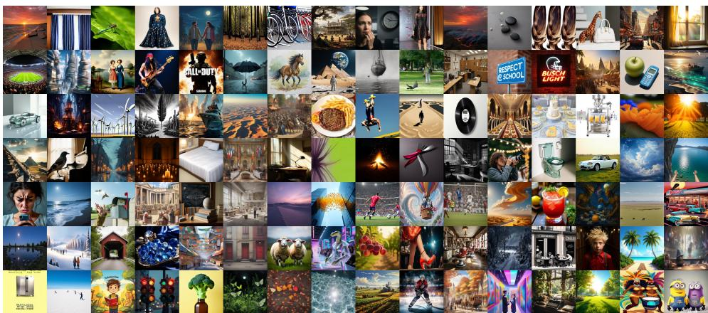  
Figure 7: Overview of AIGIs from semantics dimension.

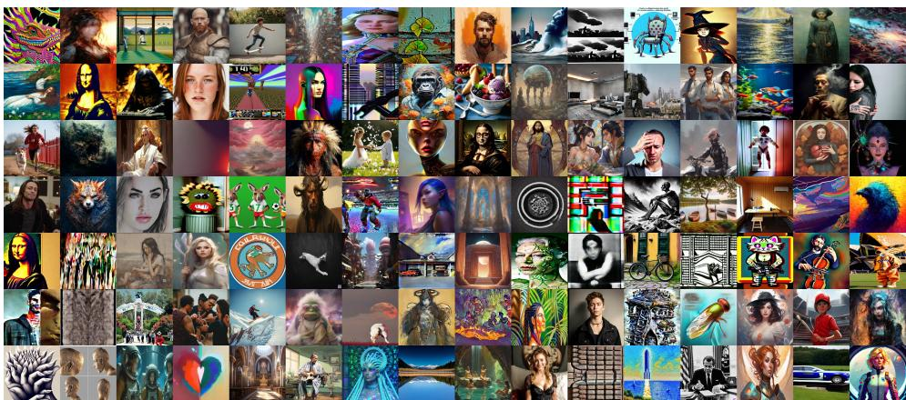  
Figure 8: Overview of AIGIs from quality dimension.

Σ (Chen et al., 2024a), Show-o2 (Xie et al., 2025), VILA-U (Wu et al., 2024a), and the SDXL Refiner (Podell et al., 2023).

Crucially, we adopted a randomized assignment strategy, mapping each prompt to one of these 22 models. This approach ensures a uniform distribution of image quality across categories and mitigates potential bias toward specific model behaviors.

## C.2 AIGI COLLECTION FOR QUALITY PERCEPTION

Evaluating the Quality Perception dimension requires AIGIs that span a comprehensive quality spectrum. To accurately mirror real-world variations and avoid distribution collapse, we implement a distribution-aware sampling strategy. For Technical Quality, we source images from the AIGIQA-20K dataset (Li et al., 2024b), applying a uniform sampling strategy based on the provided Mean Opinion Scores (MOS) to ensure an even representation across all quality tiers. For Aesthetic Quality, where native human ratings are absent, we utilize Q-Align (Wu et al., 2023) to infer aesthetic pseudo-labels, followed by similar uniform sampling.

For Generative Distortion, we manually curate AIGIs exhibiting characteristic generative flaws. However, to ensure our benchmark remains highly relevant and is not constrained by the limitations of legacy datasets, we augment this foundational pool with approximately 500 newly synthesized AIGIs. Detailed in Appendix C.1, these novel images are designed to capture the emerging artifacts of contemporary SOTA T2I models. We strictly enforce a mutually exclusive curation process to guarantee zero content overlap across the entire quality subset.

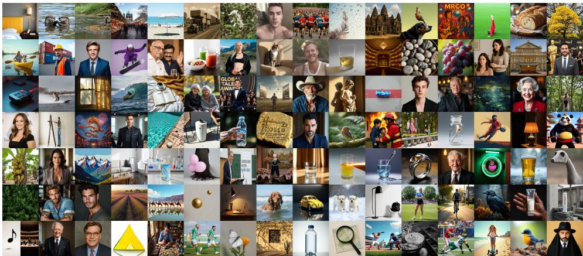  
Figure 9: Overview of AIGIs from authenticity dimension.

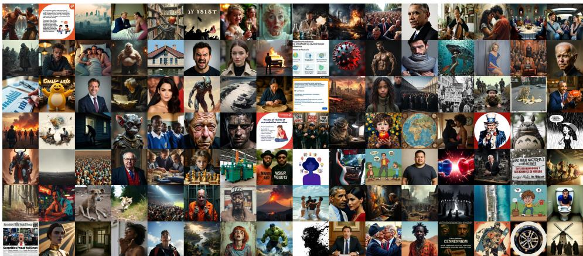  
Figure 10: Overview of AIGIs from responsibility dimension.

## C.3 HOLISTIC VISUAL SPECTRUM AND DIVERSITY

Building upon these meticulous dimension-specific collection strategies, the finalized SQUARE-Bench encompasses an unprecedented breadth of visual data. Beyond the rigorously controlled, uniform quality distribution discussed above, the consolidated AIGI corpus introduces highly diverse stylistic paradigms and a comprehensive array of semantic categories. As showcased in Figure 7 through Figure 10, the dataset covers a continuum of generative scenarios—ranging from ultraphotorealistic portraits to complex, abstract artistic compositions. This extensive visual variance is paramount for providing a robust and challenging testbed to assess LMM generalization capabilities.

## D EXPERT-DRIVEN QA CONSTRUCTION

## D.1 CONSTRUCTION AND REVIEW PROTOCOL

To transform the curated image collection into a rigorous evaluation benchmark, we adopt a fully expert-driven workflow consisting of fine-grained dimension alignment, manual QA authoring, independent cross-checking, and final adjudication.

1. Fine-grained dimension alignment. Images may exhibit multiple potential issues (e.g., both lighting inconsistency and anatomical deformation). To maintain a clear evaluation target, annotators first map each image to the single most salient sub-dimension among the 38 categories in our taxonomy. The selected sub-dimension determines the primary capability assessed by the subsequent question, preventing individual instances from conflating unrelated visual properties.

2. Expert-authored QA construction. For each assigned image, a human annotator examines the image, its source prompt when available, and the definition of the target sub-dimension. The annotator then manually constructs an instance-specific question, a set of candidate options, and the corresponding dual answers. The Visual GT is determined exclusively from observable image content, whereas the Intended GT represents the expected generation outcome under the original prompt and applicable safety requirements.

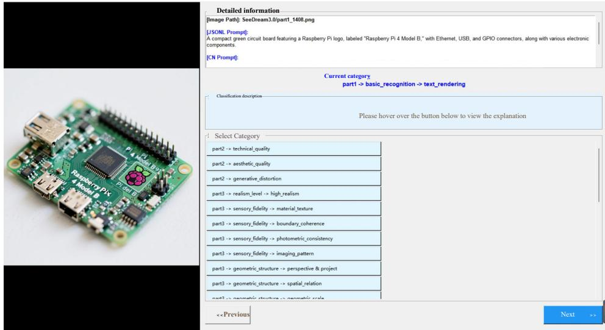  
Figure 11: User Interface demonstrating the Fine-Grained Dimension Alignment process.

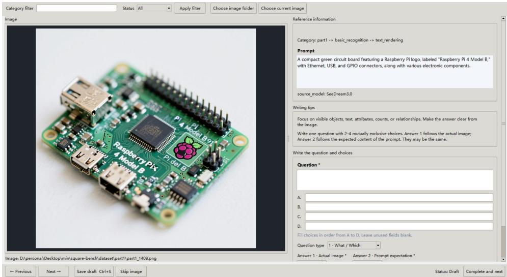  
Figure 12: Illustration of the manual QA authoring interface. Experts are shown the assigned subdimension and record an instance-specific question, candidate options, and the corresponding Visual and Intended Ground Truth answers.

All annotators follow a shared set of construction guidelines:

• Dimension fidelity: Each question must primarily assess the assigned sub-dimension rather than an unrelated visual property.

• Visual grounding: The correct Visual GT must be supported by observable evidence in the image. Questions answerable solely from commonsense or textual priors are excluded.

• Instance specificity: Questions must refer to the distinctive content of the given image rather than use generic templates such as “Is this image high quality?”

• Diagnostic value: Questions should expose meaningful perceptual or reasoning failures while avoiding unnecessarily trivial cues, unless those cues are themselves the target of the assigned sub-dimension.

• Option validity: Candidate options must be plausible, mutually exclusive, and sufficiently complete to contain an unambiguous correct answer.

• Dual-answer consistency: The Visual GT and Intended GT must respectively reflect the rendered image and the intended generation target, without conflating perception errors with generation failures.

3. Independent cross-checking and revision. Each completed QA instance is independently reviewed by at least three additional expert annotators. Reviewers verify the question premise, visual grounding, sub-dimension alignment, option exclusivity, and correctness of both ground-truth answers. They also identify cases in which blur, occlusion, or insufficient visual evidence prevents a decisive answer. Any instance that fails one or more checks is returned for revision. Remaining disagreements are discussed and adjudicated by the annotation team before the instance is accepted into the benchmark.

4. Format-specific construction. For the standard foundational formats, including Yes-or-No, What, and How questions, annotators manually construct the complete question-option-answer tuple. Binary real/fake judgments are deterministically derived from the ground-truth authenticity labels. This workflow produces approximately 18K human-constructed and cross-checked evaluation instances.

## D.2 HUMAN EXPERT ANNOTATION

We recruit 15 human experts with professional experience in photography, AI-generated images, and visual-quality evaluation. All annotation sessions are conducted in a controlled laboratory environment under standard indoor lighting. Images and annotation interfaces are displayed on a 4K monitor with a resolution of 3840 × 2160. Annotators are compensated at approximately \$10 per hour, with a total annotation cost of approximately \$15,000. To mitigate fatigue and maintain annotation quality, each expert processes no more than 30 images per day.

All experts receive the same taxonomy definitions, construction guidelines, and review criteria and complete their work through unified annotation interfaces. Each completed annotation is reviewed by at least three additional experts before acceptance.

Figure 11 shows the interface used for fine-grained dimension alignment. The target image is displayed alongside its ground-truth authenticity label and the 38 selectable sub-dimension tags. Hovering over a tag displays its definition and detailed annotation criteria, helping annotators select the most salient evaluation target for each image.

Figure 12 shows the interface used for manual QA authoring. The interface presents the target image, its source prompt when available, and the assigned sub-dimension. Annotators manually enter an instance-specific question, construct the candidate options, and specify the corresponding Visual and Intended Ground Truth answers.

## E QUESTION STATISTICS OF SQUARE-BENCH

Figure 13 summarizes the question corpus of SQUARE-Bench. Panel (a) shows the distribution of five question formats across the four evaluation aspects. Yes-or-No, What, and How questions appear across multiple aspects, while binary judgments are used for authenticity identification and multiimage questions for social fairness evaluation. Panel (b) visualizes frequent terms in the questions, offering a complementary view of the visual concepts represented in the corpus. Together, these plots describe the composition of the QA pairs; the evaluation taxonomy and annotation procedure are detailed in Appendices A and D.

## F BENCHMARK CANDIDATES AND EVALUATION PROTOCOL

The Proprietary LMMs include Claude-Opus-4.5 (20251101) (Anthropic, 2025), Gemini-3-Pro-Preview (Google DeepMind, 2025a), and GPT-5.2 (xHigh) (OpenAI, 2025). The Open-source LMMs include CogAgent-18B (Hong et al., 2024), DeepSeek-VL-7B-Chat (Lu et al., 2024), DeepSeek-VL2-small (Wu et al., 2024b), Gemma-3-27B (Team et al., 2025a), GLM-4.6V-Flash (Team et al.,

(b)

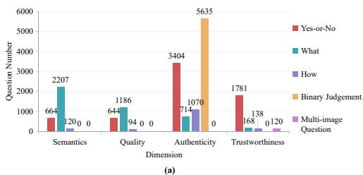

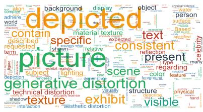  
Figure 13: Dataset Statistics of SQUARE-Bench. (a) Distribution of distinct question types across evaluation dimensions. This illustrates not only the diversity of inquiry formats but also the adaptive alignment between question types and visual attributes, ensuring that the interrogation method is tailored to the specific dimension rather than applying rigid templates. (b) Word cloud visualization sampled from the entire question corpus, showcasing the semantic richness and the comprehensive coverage of visual concepts across the benchmark.

2025c), InternVL-3-5-4B (Wang et al., 2025c), InternVL-3-8B (Chen et al., 2024b), InternVL-3- 5-8B (Wang et al., 2025c), InternVL-3-14B (Chen et al., 2024b), InternVL-3-5-14B (Wang et al., 2025c), InternVL-3-5-38B (Wang et al., 2025c), Kimi-VL-A3B-Thinking (Team et al., 2025b), Llama3.2-11B-Vision (Grattafiori et al., 2024), Llama3-LLaVA-NeXT-8B (Li et al., 2024a), LLaVA-OneVision-1.5-8B (An et al., 2025), MiniCPM-V-4.5 (Yu et al., 2025), mPLUG-Owl3-7B (Ye et al., 2024a), Ovis2.5-9B (Lu et al., 2025), Qwen3-VL-8B (Yang et al., 2025), and Qwen3-VL-32B (Yang et al., 2025).

Inference settings. We use standardized QA instruction templates across all candidate LMMs to reduce parsing ambiguity and encourage uniformly formatted outputs. All models are evaluated with a decoding temperature of 0 (greedy decoding) to minimize sampling-related variation and improve reproducibility. This setting reduces stochastic decoding effects but does not eliminate implementationor response-format-related variation; invalid and non-parseable responses are handled as described below.

Invalid outputs and small-subset uncertainty. For the multi-image Cultural Fairness and Human Bias questions, an empty or non-parseable response is counted as incorrect. Because the randomguessing baseline assumes that a valid option is produced for every question, a score of 0.00% or below this baseline may reflect a low valid-response rate rather than systematic selection of incorrect options. DeepSeek-VL-7B-Chat had no valid parsed prediction for any of the 6 Cultural Fairness questions or any of the 12 Human Bias questions. DeepSeek-VL2-small likewise had no valid parsed prediction for any of the 12 Human Bias questions. For Cultural Fairness, however, DeepSeek-VL2-small returned valid options for only 2 of 6 questions and answered 1 correctly, yielding an overall accuracy of 16.67%. Given the small subset sizes (6 and 12 test QAs), these results should be interpreted cautiously rather than as stable estimates of model performance.

## G USER-STUDY ON SQUARE-BENCH

To provide human performance on the SQUARE-Bench, we employ five experts in a controlled laboratory setting. Initially, participants familiarize themselves with the tasks through exposure to similar cases. Subsequently, they select the appropriate responses for the questions posed in the SQUARE-Bench. The user-study interface is shown in Figure 14.

## H DETAILS OF LMM-GUIDED ITERATIVE EDITING

Evaluation subset. We construct the editing evaluation set from the SQUARE-Bench test split. Specifically, we uniformly sample 964 images without replacement and use the resulting fixed subset for all compared editing conditions.

Iteration budget and stopping criteria. Each editing trajectory is limited to at most five editing operations. Before each potential operation, the guidance LMM assesses the current image and determines whether further correction is required. The loop terminates if the guide returns needs\_edit=false, if the generated editing instruction is empty after whitespace stripping, or once five editing operations have been completed. Upon termination, the latest available image is used as the trajectory output.

  
Figure 14: Illustration of the interface for the user-study.

Editing statistics. On the reported evaluation set, Qwen-Image-Edit-2511 and Step1X-Edit-v1p2 perform an average of 3.41 and 3.96 editing operations per image, respectively. Their aspect-wise averages are 2.44/3.22 for semantics, 3.46/4.51 for quality, 3.79/4.01 for authenticity, and 4.13/4.21 for responsibility, where the first and second values correspond to Qwen-Image-Edit-2511 and Step1X-Edit-v1p2, respectively. These statistics count only executed editing operations and exclude assessment-only stopping rounds. The overall averages are weighted by the number of images associated with each aspect.

## I QUALITATIVE ANALYSIS OF DEGRADATION DURING ITERATIVE EDITING

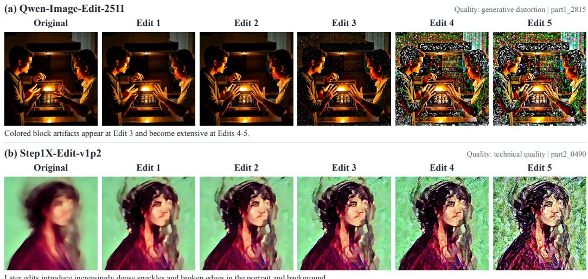  
Later edits introduce increasingly dense speckles and broken edges in the portrait and background  
Recorded images; no retouching or cropping. Selected failure cases, not an estimate of failure frequency.

Figure 15: Recorded trajectories from our LMM-guided editing experiments with Qwen-Image-Edit-2511 (top) and Step1X-Edit-v1p2 (bottom). Each row shows the original image followed by five consecutive editing outputs.

Figure 15 presents two quality-oriented editing trajectories, each consisting of the original image and five consecutive outputs from our LMM-guided editing pipeline. The examples use Qwen-Image-Edit-2511 and Step1X-Edit-v1p2, respectively, and illustrate how unintended visual artifacts can develop during repeated editing.

Observed degradation. For Qwen-Image-Edit-2511 (top), the first two edits largely preserve the scene’s appearance while modifying the characters’ hands. Colored speckles and block-like artifacts become visible at the third edit and are substantially more pronounced in the fourth and fifth outputs, affecting the background, hair, and clothing. For Step1X-Edit-v1p2 (bottom), the original portrait is visibly blurred, and the initial edit increases its apparent sharpness. However, subsequent edits introduce increasingly dense speckles and fragmented edges across the face, hair, and green background. Thus, an early improvement in apparent clarity does not necessarily translate into sustained visual quality over additional iterations.

Implications for iterative refinement. These trajectories illustrate a potential tension between correcting a diagnosed defect and preserving image fidelity. Although the editing instructions seek to correct hand structure or improve image clarity, later outputs exhibit degradation beyond the intended corrections. Because each output becomes the input to the next iteration, newly introduced artifacts can persist or become more pronounced in subsequent outputs. This observation motivates quality-aware stopping criteria and mechanisms for retaining an earlier, higher-quality intermediate result.