# EVO-WAM: Evolving World Action Models through Video-Action Verification

Shiyang Zhou1,2,‡, Xionghao Wu3,‡, Wenbo Li4,†, Shenghe Zheng5, Jiyao Zhang6, Songsong Yu7, Yijun Yang5,8, Jianhui Liu9, Haoze Sun10, Senqiao Yang11, Li Jiang12,2, Jingyong Su1, Haoyang Huang4, Zhuotao Tian1,2,\*

1HITSZ 2SLAI 3THU 4JD 5HKUST 6PKU 7SJTU 8HKUSTGZ 9HKU 10UBC 11CUHK 12CUHKSZ

shiyangzhou@stu.hit.edu.cn fenglinglwb@gmail.com tianzhuotao@hit.edu.cn ‡Equal contribution †Project lead \*Corresponding author

## Abstract

Improving robot policies on new tasks without collecting additional expert demonstrations remains a central challenge in robot learning. World action models (WAMs) use broad video priors to jointly predict future videos and actions, ofering a potential source of supervision for adapting to new tasks. However, generated videos may fail to depict task completion, and even visually successful videos may be paired with inconsistent actions that lead to execution failure. We propose EVO-WAM, a framework that adapts WAMs to unseen tasks by learning from their own generated video-action trajectories, without executing candidate actions in an external environment. First, we augment WAM training with state prediction and anchored multi-frame context to enable complete autoregressive rollouts without external execution feedback. Second, we identify reliable training experience by selecting task-completing prefixes with a vision-language model and verifying their video-action consistency with an inverse dynamics model. Third, we iteratively train the WAM on verified prefixes and generate new rollouts with the updated model. On seven unseen RoboTwin 2.0 tasks, EVO-WAM increases average success rates from 26.9% to 68.0% for Cosmos3 and from 28.5% to 46.4% for DreamZero, reaching approximately 2.5× and 1.6× their initial success rates. On three unseen long-horizon composite tasks in the real world, it improves Cosmos3’s average success rate from 20.0% to 76.7%, a gain of 56.7 percentage points. Project Page: https://evo-wam.github.io/.

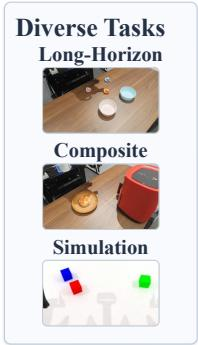

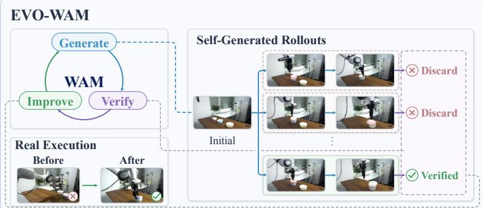

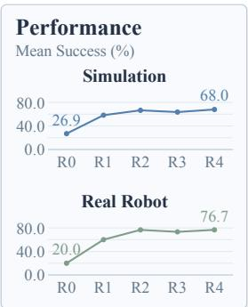  
Figure 1: EVO-WAM improves world action models through verified experience. Left: unseen tasks in simulation and long-horizon composite tasks in the real world. Middle: the generate-verify-improve cycle, where learning from verified rollouts improves task execution. Right: Cosmos3’s performance gains over successive rounds in simulation and the real world.

## 1 Introduction

Adapting robot policies to unseen tasks without collecting additional expert demonstrations remains a central challenge in robot learning. Large-scale robot datasets [13, 16, 17, 37] have enabled increasingly general policies, but extending demonstration coverage to new tasks remains costly [41].

To support such generalization, world action models (WAMs) [1, 3, 39, 46] draw on broad video priors to jointly predict future videos and actions. Acquired through large-scale video pretraining [27, 34], these priors capture motion, physical interactions, and scene evolution, allowing video predictions to guide action generation and planning [22, 43, 49]. Recent models, including DreamZero [42], Cosmos3, and LingBot-VA [23], can complete unseen tasks or make progress toward their goals in some trials, suggesting that video priors ofer useful knowledge beyond the tasks covered by robot demonstrations.

However, this potential does not guarantee successful adaptation to unseen tasks. Specifically, as illustrated in Figure 6, existing WAMs do not consistently generate videos depicting task completion. Even under the same initial conditions, generated videos may depict either success or failure. Moreover, the paired actions may be inconsistent with the visually depicted behavior, leading to execution failure even when the video depicts success. This raises a question: Can a WAM improve its performance on unseen tasks by identifying and learning from reliable trajectories within its own generated rollouts?

Existing methods have used separate world models to generate experience for policy improvement [10, 11, 15, 21, 30, 52]. WAM-generated replay has also been used to preserve previously learned skills during continual learning [8]. However, these approaches still rely on experience from a separate world model or task demonstrations to learn new tasks, leaving the WAM’s own video priors unexploited as a source of supervision for unseen-task improvement.

Our key observation is that a WAM can improve on unseen tasks by learning from its own generated rollouts that depict successful task completion and preserve video-action consistency, without executing actions in an external environment. However, obtaining such rollouts raises two challenges. First, the mode must generate complete rollouts without receiving updated observations or robot states from an external environment. Second, it requires actions that are consistent with the generated video and can faithfully realize the depicted behavior during execution.

Motivated by this observation, we present EVO-WAM, a framework for improving world action models through video-action verification, as shown in Fig. 1 and 2. We augment WAM training with state prediction and anchored multi-frame context, enabling complete autoregressive continuation without external execution feedback. To identify reliable rollouts, we use a vision-language model (VLM) to select task-completing prefixes and an inverse dynamics model (IDM) [35] to verify their video-action consistency. We train the WAM on prefixes that pass both stages and use the updated model to generate new candidates, iteratively improving performance on unseen tasks.

We evaluate EVO-WAM across two WAM backbones, Cosmos3 [27] and DreamZero [42], on seven RoboTwin 2.0 [4] tasks unseen during base-model training, where self-training on verified trajectories increases average success rates from 26.9% to 68.0% and from 28.5% to 46.4%, respectively. We further evaluate EVO-WAMCosmos3 on three unseen long-horizon composite tasks in the real world, improving average success from 20.0% to 76.7%. Additionally, our study in Section 4.5 shows that verifying both task completion and video-action consistency is important for substantial gains from self-training. This verification process is efective with both the large, highly capable Qwen3.8-Flash-Next [31] and the smaller, eficient Qwen3.5-27B [32]. Our seen-task evaluation further shows that EVO-WAMCosmos3 largely preserves performance on seen tasks.

In summary, our contributions are threefold:

• A framework for improving WAMs with generated experience. We introduce EVO-WAM, which enables WAMs to generate autoregressive video-action rollouts and improve on unseen tasks through verification and iterative self-training, without additional expert demonstrations or action execution in an external environment during self-evolution.

• Verification of task completion and video-action consistency. We introduce a two-stage verification process in which a VLM identifies task-completing prefixes and an IDM assesses their video-action consistency, selecting generated rollouts for iterative self-training.

• Generality across WAM backbones, tasks and VLMs. We demonstrate improvements across Cosmos3 and DreamZero on unseen RoboTwin tasks and with Cosmos3 on real-world long-horizon composite tasks. It also shows robustness to VLM choice, sustaining performance gains with verifiers of diferent sizes.

## 2 Preliminaries

## 2.1 World Action Models

World action models (WAMs) jointly predict future videos and robot actions conditioned on visual observations, robot states, and task instructions [23, 42]. At chunk k, a WAM with parameters θ samples

$$
( { \hat { V } } _ { k } , { \hat { A } } _ { k } ) \sim p _ { \theta } ^ { \mathrm { V A } } ( \cdot \mid h _ { k } , \ell ) ,
$$

where $h _ { k }$ contains the visual context and robot state, ℓ is the task instruction, and $\hat { V } _ { k }$ and $\hat { A } _ { k }$ denote the predicted video latents and actions. The decoded video depicts anticipated task behavior, while the actions are intended to realize it through execution.

Conventional vision-language-action (VLA) policies predict actions from observations and task instructions [2, 18]. Constructing new rollout trajectories requires future observations from environment interaction or a separate learned world model [6, 11, 52]. WAMs jointly predict the visual frames and paired actions that can form training trajectories. This capability gives WAMs the potential to learn from their own generated experience without external execution feedback.

## 2.2 Self-Training with Generated Rollouts

In closed-loop control, WAMs such as DreamZero refresh their visual context with observations after action execution [23, 42]. Generating complete rollouts without this feedback requires predicted visual context and robot states to condition subsequent chunks.

Moreover, even when such trajectories can be generated, they do not necessarily provide reliable supervision. First, videos sampled from the same initial conditions and task instruction may depict either task success or failure, so task completion cannot be assumed from generation alone. Second, even when a video depicts success, its paired actions may be inconsistent with the depicted behavior and fail to realize it during execution [8]. Training on rollouts with either limitation may reinforce incomplete behaviors or actions that do not achieve the imagined outcome. These limitations motivate assessing both visual task completion and video-action consistency before using generated rollouts for self-training.

## 3 Method

Overview. We present EVO-WAM, a framework for improving WAMs on unseen tasks through video-action verification, as shown in Fig. 2. For each scene of an unseen task, we are given an initial observation $o _ { 0 } .$ a robot state $s _ { 0 } .$ , and a task instruction ℓ. Our goal is to improve task performance without additional expert demonstrations or action execution in an external environment. We enable autoregressive rollouts through state prediction and context augmentation (Sec. 3.1), and select reliable prefixes through video-action verification (Sec. 3.2). Starting from a base model WAM , we repeat generation, verification, and training over multiple rounds, updating $\mathrm { W A M } _ { r - 1 }$ to WAM using verified data at each round r (Sec. 3.3).

## 3.1 Enabling Autoregressive Rollouts

State prediction and anchored multi-frame context. Autoregressive continuation requires the robot state and visual context for the next chunk. We therefore train the WAM to predict the robot state at the end of each chunk, providing the robot configuration needed for continuation. For visual conditioning, we initialize the rollout with a single frame and retain it as an anchor alongside recent generated frames during continuation. The recent frames provide motion history, while the anchor remains a persistent reference for the objects and scene.

Let $\hat { V } _ { k }$ and $\hat { A } _ { k }$ denote the generated video latent and action blocks for chunk $k ,$ and let $\hat { s } _ { k } ^ { + }$ denote its predicted end state. Hats indicate model-generated quantities. With $z _ { 0 }$ denoting the latent representation of

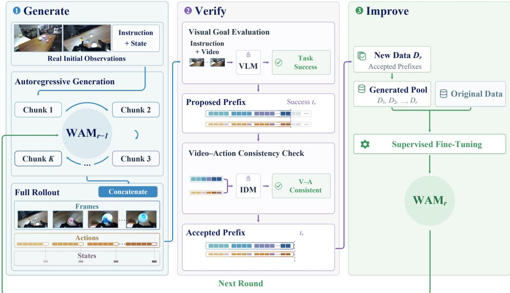  
Figure 2: Overview of EVO-WAM. (1) Generate: $\mathrm { W A M } _ { r - 1 }$ autoregressively generates video-action-state trajectories from an initial scene and task instruction. (2) Verify: a VLM identifies task-completing prefixes, and an IDM checks their video-action consistency. (3) Improve: verified prefixes accumulated across rounds are combined with the original training data to obtain WAM , which generates candidates for the next round.

the initial observation $o _ { 0 }$ , the conditioning context is

$$
h _ { k } = \left\{ \begin{array} { l l } { ( z _ { 0 } , s _ { 0 } ) , } & { k = 1 , } \\ { ( z _ { 0 } , \mathrm { T a i l } _ { m } ( \hat { V } _ { k - 1 } ) , \hat { s } _ { k - 1 } ^ { + } ) , } & { k \geq 2 , } \end{array} \right.\tag{1}
$$

where $s _ { 0 }$ is the initial state and $\mathrm { T a i l } _ { m }$ selects the last m latent frames of the video block. Both initialization and continuation modes are used during base training and each self-training round.

Autoregressive trajectory generation. At self-training round $r ,$ let $\theta _ { r - 1 }$ denote the parameters of $\mathrm { W A M } _ { r - 1 }$ . The model generates each chunk conditioned on $h _ { k }$ and the task instruction ℓ:

$$
( \hat { V } _ { k } , \hat { A } _ { k } , \hat { s } _ { k } ^ { + } ) \sim p _ { \theta _ { r - 1 } } ( { \textrm { - } } | h _ { k } , \ell ) .\tag{2}
$$

The generated video and predicted state then provide the context for the next chunk. Repeating this process for a task-specific budget of K chunks produces a candidate trajectory τˆ, which includes the initial conditions $( o _ { 0 } , s _ { 0 } , \ell )$ and the generated video-action-state sequence. These rollouts provide candidates for the video-action verification described in Sec. 3.2.

## 3.2 Video-Action Verification

We select self-training prefixes in two stages, as shown in Fig. 3. A vision-language model (VLM) first identifies task-completing prefixes. We then use an inverse dynamics model (IDM), which infers actions from transitions between observations [5, 51], to reconstruct actions from the generated videos. Comparing these reconstructions with the paired WAM-generated actions provides a measure of video-action consistency.

Task-completion verification. We separate each VLM assessment into visual description and task judgment, grounding the decision in explicit visual evidence. The VLM first describes the objects, their spatial relations, and the robot configuration in the initial and generated observations from multiple camera views. It then checks these descriptions against the same images, the task instruction, and the active subgoal, using the initial scene as a reference. The judgment evaluates goal satisfaction, required gripper release, object consistency, and robot structural consistency. An assessment returns Accept only when all four verification checks are satisfied.

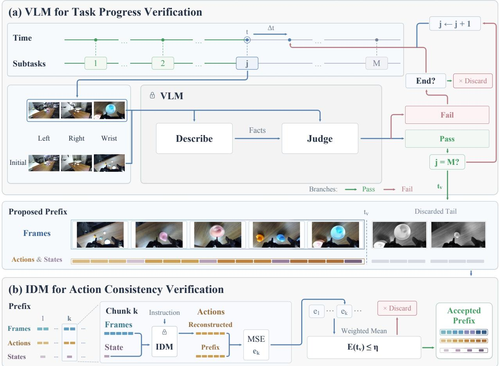  
Figure 3: Video-action verification. (a) A VLM checks subgoals one at a time through description and judgment. (b) An IDM reconstructs actions from the generated videos and compares them with WAMgenerated actions at the fixed visual endpoint. Prefixes passing this check undergo endpoint vote confirmation before entering training.

For both RoboTwin and real-robot tasks, we scan predefined time points chronologically and check subgoals $\left( g _ { 1 } , \ldots , g _ { M } \right)$ in sequence (M = 1 for a single goal). We fix each tj at the first VLM Accept after $t _ { j - 1 }$ , then set $t _ { v } = t _ { M }$ . Once all endpoints are fixed, we check the prefix’s video-action consistency. Only if this check passes do we perform two additional description-judgment assessments at each endpoint using the same observations and subgoal. Each endpoint must receive at least two Accept judgments out of three. A missing visual endpoint or a failed consistency or voting check discards the candidate; verification does not resume at a later endpoint. Accepted prefixes are retained through tv. Appendix C.1 formalizes this procedure in Algorithm 1.

Video-action consistency verification. An IDM trained on recorded video-action pairs provides a reference for the actions associated with depicted motion. We adapt a pretrained video model into an actiononly IDM conditioned on a video window, its robot state, and the task instruction, with implementation details in Appendix C.2. We compare its reconstructions with the WAM-generated actions in the same normalized action space, as shown in Fig. 3(b).

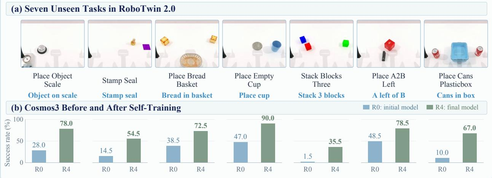  
Figure 4: Unseen-task improvement in RoboTwin 2.0. (a) Example task scenes. (b) Cosmos3’s per-task success rates before self-training (Round 0) and after four rounds (Round 4).

For a prefix ending at $t _ { v } ,$ we summarize this discrepancy as $E ( t _ { v } )$ , the mean squared error across verification windows. The consistency check passes if $E ( t _ { v } ) \leq \eta$ , where η is fixed across self-training rounds for each backbone and dataset. Calibration is described in Appendix C.2. Prefixes that pass both verification stages provide the self-training data used in Sec. 3.3.

## 3.3 Iterative Self-Training

As shown in Fig. 2, we improve the WAM through iterative training on prefixes retained after generation and verification. At round r, we combine the newly verified data $\mathcal { D } _ { r }$ with all retained data from earlier rounds, $\mathcal { D } _ { 1 } , \ldots , \mathcal { D } _ { r - 1 }$ , to preserve trajectory diversity and limit shifts in the training distribution between updates. We mix these data with the original training data $\mathcal { D } _ { \mathrm { b a s e } }$ and update the WAM by supervised fine-tuning:

$$
\theta _ { r } \gets \mathrm { S F T } \left( \theta _ { r - 1 } ; \mathcal { D } _ { \mathrm { b a s e } } , \mathcal { D } _ { 1 } , \dots , \mathcal { D } _ { r } \right) .\tag{3}
$$

The updated WAM generates candidates for the next round, continuing the cycle of generation, verification, and training. Table 3 reports performance improvements over successive rounds.

## 4 Experiments

## 4.1 Implementation

We apply EVO-WAM to Cosmos3 [27] and DreamZero [42], using subscripts to identify the backbone. We use Qwen3.8-Flash-Next [31] for task-completion assessment. IDM training details are provided in Appendix C.2. Self-training uses no additional expert demonstrations or action execution in an external environment.

## 4.2 Simulation Experiments

Setting and baselines. We use 43 RoboTwin 2.0 tasks [4] for base-model training and the remaining seven for self-training and evaluation, as shown in Figure 4. We compare against the Cosmos3 and DreamZero baselines, VLA models $\pi _ { 0 . 5 }$ [29], LingBot-VLA [38], and StarVLA-OFT [19, 33], and WAMs Fast-WAM [44] and LingBot-VA [23]. All baselines are trained for 34K steps with a global batch size of 256. The main evaluation uses the same scene configurations used for self-generation, with 100 Clean and 100 Randomized trials per task.

Self-training settings. Starting from the 30K-step Cosmos3 and DreamZero checkpoints, we perform four rounds of self-training. Each round generates a budget of 2,800 candidate rollouts, followed by 1K training updates with a global batch size of 256. Verified prefixes are accumulated across rounds. Detailed generation and training configurations for both self-training and baselines are provided in Appendix B.6.

Table 1: RoboTwin 2.0 results on unseen tasks. Success rates (%) on seven tasks unseen during basemodel training. $\mathrm { E V O - W A M _ { C o s m o s 3 } }$ achieves 68.0% average success, compared with 31.6% for the strongest baseline Cosmos3. Baselines are trained for 34K steps; EVO-WAM models start from 30K checkpoints and are evaluated at 34K steps. Bold and underlined values indicate the best and second-best results.
<table><tr><td>Method</td><td>Object on scale</td><td>Stamp seal</td><td>Bread in basket</td><td>Place cup</td><td>Stack 3 blocks</td><td>A left of B</td><td>Cans in box</td><td>Average</td></tr><tr><td colspan="9">Vision-Language-Action Models</td></tr><tr><td>π0.5</td><td>17.0</td><td>14.0</td><td>14.0</td><td>44.0</td><td>0.0</td><td>29.0</td><td>0.0</td><td>16.9</td></tr><tr><td>LingBot-VLA</td><td>13.0</td><td>0.5</td><td>29.0</td><td>17.0</td><td>0.0</td><td>21.5</td><td>2.0</td><td>11.9</td></tr><tr><td>StarVLA-OFT</td><td>0.0</td><td>0.0</td><td>8.5</td><td>21.5</td><td>0.0</td><td>0.5</td><td>0.0</td><td>4.4</td></tr><tr><td colspan="9">World Action Models</td></tr><tr><td>Fast-WAM</td><td>3.5</td><td>1.0</td><td>22.5</td><td>31.5</td><td>0.0</td><td>0.0</td><td>0.0</td><td>8.4</td></tr><tr><td>LingBot-VA</td><td>7.0</td><td>5.5</td><td>8.0</td><td>29.5</td><td>0.0</td><td>23.0</td><td>0.0</td><td>10.4</td></tr><tr><td>DreamZero</td><td>26.5</td><td>25.5</td><td>39.5</td><td>25.0</td><td>0.0</td><td>59.5</td><td>14.5</td><td>27.2</td></tr><tr><td>Cosmos3</td><td>24.0</td><td>22.5</td><td>40.5</td><td>54.5</td><td>5.0</td><td>55.5</td><td>19.0</td><td>31.6</td></tr><tr><td colspan="9">World Action Models with EVO-WAM (Ours)</td></tr><tr><td> $\mathbf { E V O - W A M _ { D r e a m Z e r o } }$ </td><td>61.5</td><td>36.5</td><td>78.5</td><td>25.0</td><td>2.0</td><td>73.5</td><td>48.0</td><td>46.4</td></tr><tr><td> $\mathbf { E V O - W A M _ { C o s m o s 3 } }$ </td><td>78.0</td><td>54.5</td><td>72.5</td><td>90.0</td><td>35.5</td><td>78.5</td><td>67.0</td><td>68.0</td></tr></table>

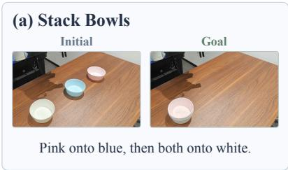

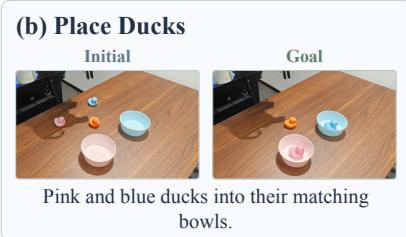

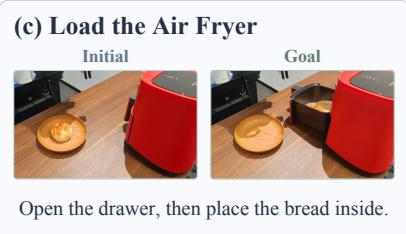  
Figure 5: Real-robot tasks. Initial and goal scenes for three unseen composite tasks.

Results. As shown in Table 1, $\mathrm { E V O - W A M _ { C o s m o s 3 } }$ and $\mathrm { E V O - W A M _ { D r e a m Z e r o } }$ achieve 68.0% and 46.4% average success, compared with 31.6% and 27.2% for their respective baselines. Cosmos3 is the strongest baseline, while $\pi _ { 0 . 5 }$ performs best among the VLA baselines. Figure 4 shows $\mathrm { E V O  – W A M _ { C o s m o s 3 } \mathrm { ^ { \circ } s } }$ per-task improvements from Round 0 to Round 4.

Both backbones benefit, but their gains vary across tasks. DreamZero’s limited improvement on emptycup placement and block stacking may reflect constraints on the useful behaviors available in its generated candidates for subsequent policy improvement.

## 4.3 Real-World Experiments

Setting and baselines. We evaluate $\mathrm { E V O - W A M _ { C o s m o s 3 } }$ on a Franka robot across three unseen long-horizon and composite tasks, as shown in Figure 5. Stacking bowls tests multi-stage manipulation and semantic understanding. Placing ducks into matching bowls tests generalization to unseen objects and target selection amid distractors. Loading an air fryer tests the execution of composite subtasks, requiring the drawer to be opened before bread is placed inside.

The Cosmos3 baseline is obtained by training the released checkpoint for 31K additional steps on DROID [17] with state prediction and context augmentation, as described in Section 3.1. We also compare against unmodified public $\pi _ { 0 . 5 }$ and DreamZero checkpoints. Improvements use no additional expert demonstrations or feedback from executing candidate actions in the environment. Each policy is evaluated in ten trials per task.

Self-training settings. Starting from the 30K-step Cosmos3 checkpoint, we perform four rounds of selftraining. Each round uses an initial batch of 800 candidate rollouts across the three tasks and performs 500 training updates with a global batch size of 256. Verified prefixes are accumulated across rounds. Additional details are reported in Appendix B.6.

Results. As shown in Table 2, EVO-WAMCosmos3 achieves 76.7% average success, compared with 20.0% for both Cosmos3 and DreamZero and 6.7% for $\pi _ { 0 . 5 }$ . It exceeds the strongest baseline on stacking bowls, placing ducks, and loading the air fryer by 20, 50, and 80 percentage points, respectively. These gains indicate improvements in multi-stage manipulation, target selection amid distractors, and composite task completion.

Qualitative example. In Figure 6, one candidate places the blue duck in the pink bowl and fails visual-goal verification. Another passes this check but fails video-action consistency verification. After learning from prefixes that pass both checks, the policy successfully completes both placements. Additional cases appear in Appendix B.4.

Table 2: Real-robot results. Success rates (%) on three unseen long-horizon composite tasks. $\mathrm { E V O - W A M _ { C o s m o s 3 } }$ achieves 76.7% average success, compared with 20.0% for Cosmos3. The Cosmos3 baseline and our Round 2 model are both evaluated at 31K steps. Bold and underlined values indicate the best and second-best results across all methods.
<table><tr><td>Model</td><td>Stack Bowls</td><td>Place Ducks</td><td>Load the Air Fryer</td><td>Average</td></tr><tr><td>π0.5</td><td>10.0</td><td>10.0</td><td>0.0</td><td>6.7</td></tr><tr><td>DreamZero</td><td>60.0</td><td>0.0</td><td>0.0</td><td>20.0</td></tr><tr><td>Cosmos3</td><td>40.0</td><td>10.0</td><td>10.0</td><td>20.0</td></tr><tr><td>EVO-WAMCosmos3 (Ours)</td><td>80.0</td><td>60.0</td><td>90.0</td><td>76.7</td></tr></table>

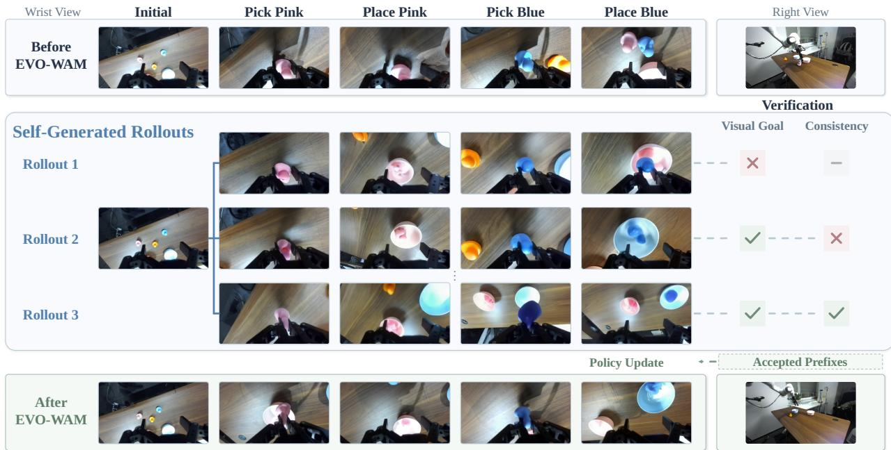  
Figure 6: Placing two ducks. Top and bottom show real executions before and after EVO-WAM. The middle shows generated candidates and their visual-goal and video-action consistency checks; prefixes passing both checks are used to update the policy.

## 4.4 Improvement over Multiple Rounds

Table 3 and Figure 1 show that EVO-WAMCosmos3 gains most in Round 1 (26.9% to 58.3%). After four rounds, EVO-WAMCosmos3 and EVO-WAMDreamZero reach 68.0% and 46.4%, respectively. The Cosmos3 variant temporarily declines in Round 3 and recovers to 68.0% in Round 4. On the real robot, EVO-WAMCosmos3 reaches 76.7% in both Rounds 2 and 4, with 73.3% in Round 3. The large early gains suggest that useful supervision can already be extracted from the initial model’s generations. Later rounds bring smaller gains and occasional regressions, showing that additional self-training does not always improve performance.

## 4.5 Ablation Studies

Action verification. To assess whether stricter action verification improves self-training, we compare three criteria using the same starting policy and Qwen3.8-Flash-Next, as shown in Table 4. Controlled settings are detailed in Appendix B.6. VLM only checks visual completion; VLM + IDM additionally checks video-action consistency; VLM + Simulator retains prefixes whose paired actions complete the task in simulation, providing execution-verified supervision.

VLM + IDM outperforms VLM only in every round, reaching 68.0% versus 43.7% in Round 4. This gap shows that visual completion alone is insuficient for selecting efective action supervision. VLM + Simulator reaches 72.7% in Round 4. Directly testing whether the actions complete the task may explain its stronger performance. However, it requires a simulator of the target task and scene. IDM-based verification also supports real-world tasks without such simulators.

Table 3: Improvement over successive self-training rounds. Average success rates (%) on seven unseen RoboTwin 2.0 tasks and three unseen real-world tasks. Parentheses show gains over Round 0 in percentage points (pp), computed before rounding. Round 0 denotes the 30K self-training initialization. Each simulation round adds 1K updates, and each real-world round adds 500 updates.
<table><tr><td>Model</td><td>Round 0</td><td>Round 1</td><td>Round 2</td><td>Round 3</td><td>Round 4</td></tr><tr><td colspan="6">RoboTwin</td></tr><tr><td>EVO-WAMDreamZero (Ours)</td><td>28.5</td><td>36.5 (+8.0)</td><td>42.3 (+13.8)</td><td>45.1 (+16.6)</td><td>46.4 (+17.9)</td></tr><tr><td>EVO-WAMCosmos3 (Ours)</td><td>26.9</td><td>58.3 (+31.4)</td><td>66.6 (+39.8)</td><td>63.6 (+36.7)</td><td>68.0 (+41.1)</td></tr><tr><td colspan="6">Real world</td></tr><tr><td>EVO-WAMCosmos3 (Ours)</td><td>20.0</td><td>60.0 (+40.0) 76.7 (+56.7)</td><td></td><td>73.3 (+53.3)</td><td>76.7 (+56.7)</td></tr></table>

Table 4: Efect of verification on self-training. Success rates (%) on unseen RoboTwin 2.0 tasks across rounds, comparing action verification criteria and task-completion VLMs.
<table><tr><td>Verification</td><td>VLM</td><td>R0 R1</td><td>R2</td><td>R3</td><td>R4</td></tr><tr><td>VLM only</td><td>Qwen3.8-Flash-Next</td><td>26.9 37.9 (+11.1)</td><td>42.7 (+15.9)</td><td>39.6 (+12.7)</td><td>43.7 (+16.9)</td></tr><tr><td>VLM + IDM (Ours) Qwen3.8-Flash-Next</td><td></td><td>26.9 58.3 (+31.4)</td><td>66.6 (+39.8)</td><td>63.6 (+36.7)</td><td>68.0 (+41.1)</td></tr><tr><td>VLM + Simulator</td><td>Qwen3.8-Flash-Next</td><td>26.9 66.4 (+39.5)</td><td>69.3 (+42.4)</td><td>73.2 (+46.4)</td><td>72.7 (+45.9)</td></tr><tr><td>VLM + IDM</td><td>Qwen3.5-27B</td><td>26.9 52.7 (+25.9)</td><td>57.8 (+30.9)</td><td>62.7 (+35.9)</td><td>65.7 (+38.9)</td></tr></table>

VLM sensitivity. To examine the efect of VLM selection, we use Qwen3.5-27B [32] for task-completion assessment while retaining IDM-based action verification. As shown in Table 4, using the smaller, less capable Qwen3.5-27B still yields 65.7% success in Round 4, compared with 68.0% using Qwen3.8-Flash-Next. Substantial gains with both VLMs suggest that EVO-WAM is robust to the choice of VLM, though stronger VLMs yield better performance.

Generalization to new scenes. The results in Table 1 show gains on the scene configurations used for self-imagination and self-training. To further evaluate generalization, we randomly sample 100 new scenes per task under each condition and evaluate the updated model without further adaptation. As shown in Table $5 , \mathrm { E V O - W A M _ { C o s m o s 3 } }$ achieves 70.4% success, compared with 24.9% for the baseline. This improvement suggests that the learned behaviors extend beyond the initial configurations used to generate training data. Details are in Appendix B.2.

Seen-task retention. On the 43 seen tasks with 50 Clean and 50 Randomized trials each, EVO-WAMCosmos3 at Round 4 achieves 84.8% success, compared with 85.8% for the 34K Cosmos3 baseline (Table 5). These results show that it substantially improves unseen-task performance while causing only a small decrease on seen tasks.

Table 5: Generalization and retention (%) of EVO-WAM.
<table><tr><td>Evaluation</td><td>Cosmos3</td><td> $\mathrm { E V O - W A M _ { C o s m o s 3 } }$ </td></tr><tr><td>New-scene generalization</td><td>24.9</td><td>70.4</td></tr><tr><td>Seen-task retention</td><td>85.8</td><td>84.8</td></tr></table>

## 5 Conclusion

We presented EVO-WAM, a framework that enables world action models to improve on tasks unseen during base-model training by learning from their own generated experience. By enabling autoregressive rollouts and verifying task completion and video-action consistency, the framework turns model predictions into self-training data without additional expert demonstrations or external action execution during self-training. Evaluations with Cosmos3 and DreamZero on RoboTwin 2.0 demonstrate improvements across both WAM backbones, while real-world evaluations with Cosmos3 show gains on long-horizon composite tasks. These findings point to a path toward self-improving robot policies, where video-action verification enables WAMs to transform their own predictions into experience for adapting to new tasks.

## References

[1] Hongzhe Bi, Hengkai Tan, Shenghao Xie, Zeyuan Wang, Shuhe Huang, Haitian Liu, Ruowen Zhao, Yao Feng, Chendong Xiang, Yinze Rong, et al. Motus: A unified latent action world model. arXiv preprint arXiv:2512.13030, 2025.

[2] Anthony Brohan, Noah Brown, Justice Carbajal, Yevgen Chebotar, Xi Chen, Krzysztof Choromanski, Tianli Ding, Danny Driess, Avinava Dubey, Chelsea Finn, et al. Rt-2: Vision-language-action models transfer web knowledge to robotic control. arXiv preprint arXiv:2307.15818, 2023.

[3] Hong Chen, Daqi Liu, Zehan Zhang, Haiguang Wang, Tianhao Lu, Longfei Yan, Haiyang Sun, Fangzhen Li, Hongwei Xie, Bing Wang, et al. Pondering the way: Spatial-perceiving world action model for embodied navigation. arXiv preprint arXiv:2606.29908, 2026.

[4] Tianxing Chen, Zanxin Chen, Baijun Chen, Zijian Cai, Yibin Liu, Zixuan Li, Qiwei Liang, Xianliang Lin, Yiheng Ge, Zhenyu Gu, et al. Robotwin 2.0: A scalable data generator and benchmark with strong domain randomization for robust bimanual robotic manipulation. arXiv preprint arXiv:2506.18088, 2025.

[5] Yilun Du, Sherry Yang, Bo Dai, Hanjun Dai, Ofir Nachum, Josh Tenenbaum, Dale Schuurmans, and Pieter Abbeel. Learning universal policies via text-guided video generation. Advances in Neural Information Processing Systems, 36:9156–9172, 2023.

[6] Shenyuan Gao, Siyuan Zhou, Yilun Du, Jun Zhang, and Chuang Gan. Adaworld: Learning adaptable world models with latent actions. arXiv preprint arXiv:2503.18938, 2025.

[7] GigaWorld Team, Angyuan Ma, Boyuan Wang, Bohan Li, Chaojun Ni, Guo Li, Guan Huang, Guosheng Zhao, Hao Li, Hengtao Li, et al. Gigaworld-1: A roadmap to build world models for robot policy evaluation. arXiv preprint arXiv:2607.02642, 2026.

[8] Manish Kumar Govind, Dominick Reilly, Smit Patel, Hieu Le, and Srijan Das. World action models enable continual imitation learning with recurrent generative replays. arXiv preprint arXiv:2606.27374, 2026.

[9] Daya Guo, Dejian Yang, Haowei Zhang, Junxiao Song, Peiyi Wang, Qihao Zhu, Runxin Xu, Ruoyu Zhang, Shirong Ma, Xiao Bi, et al. Deepseek-r1 incentivizes reasoning in llms through reinforcement learning. Nature, 645(8081):633–638, 2025.

[10] Yanjiang Guo, Lucy Xiaoyang Shi, Jianyu Chen, and Chelsea Finn. Ctrl-world: A controllable generative world model for robot manipulation. arXiv preprint arXiv:2510.10125, 2025.

[11] Yanjiang Guo, Tony Lee, Lucy Xiaoyang Shi, Jianyu Chen, Percy Liang, and Chelsea Finn. Vlaw: Iterative co-improvement of vision-language-action policy and world model. arXiv preprint arXiv:2602.12063, 2026.

[12] Danijar Hafner, Jurgis Pasukonis, Jimmy Ba, and Timothy P. Lillicrap. Mastering diverse control tasks through world models. Nature, 640(8059):647–653, 2025.

[13] Chengkai Hou, Kun Wu, Jiaming Liu, Zhengping Che, Di Wu, Fei Liao, Guangrun Li, Jingyang He, Qiuxuan Feng, Zhao Jin, et al. Robomind 2.0: A multimodal, bimanual mobile manipulation dataset for generalizable embodied intelligence. arXiv preprint arXiv:2512.24653, 2025.

[14] Yucheng Hu, Yanjiang Guo, Pengchao Wang, Xiaoyu Chen, Yen-Jen Wang, Jianke Zhang, Koushil Sreenath, Chaochao Lu, and Jianyu Chen. Video prediction policy: A generalist robot policy with predictive visual representations. arXiv preprint arXiv:2412.14803, 2024.

[15] Joel Jang, Seonghyeon Ye, Zongyu Lin, Jiannan Xiang, Johan Bjorck, Yu Fang, Fengyuan Hu, Spencer Huang, Kaushil Kundalia, Yen-Chen Lin, et al. Dreamgen: Unlocking generalization in robot learning through video world models. arXiv preprint arXiv:2505.12705, 2025.

[16] Tao Jiang, Tianyuan Yuan, Yicheng Liu, Chenhao Lu, Jianning Cui, Xiao Liu, Shuiqi Cheng, Jiyang Gao, Huazhe Xu, and Hang Zhao. Galaxea open-world dataset and g0 dual-system vla model. arXiv preprint arXiv:2509.00576, 2025.

[17] Alexander Khazatsky, Karl Pertsch, Suraj Nair, Ashwin Balakrishna, Sudeep Dasari, Siddharth Karamcheti, Soroush Nasiriany, Mohan Kumar Srirama, Lawrence Yunliang Chen, Kirsty Ellis, et al. Droid: A large-scale in-the-wild robot manipulation dataset. arXiv preprint arXiv:2403.12945, 2024.

[18] Moo Jin Kim, Karl Pertsch, Siddharth Karamcheti, Ted Xiao, Ashwin Balakrishna, Suraj Nair, Rafael Rafailov, Ethan Foster, Grace Lam, Pannag Sanketi, et al. Openvla: An open-source vision-languageaction model. arXiv preprint arXiv:2406.09246, 2024

[19] Moo Jin Kim, Chelsea Finn, and Percy Liang. Fine-tuning vision-language-action models: Optimizing speed and success. arXiv preprint arXiv:2502.19645, 2025.

[20] Moo Jin Kim, Yihuai Gao, Tsung-Yi Lin, Yen-Chen Lin, Yunhao Ge, Grace Lam, Percy Liang, Shuran Song, Ming-Yu Liu, Chelsea Finn, et al. Cosmos policy: Fine-tuning video models for visuomotor control and planning. arXiv preprint arXiv:2601.16163, 2026.

[21] Seungku Kim, Suhyeok Jang, Byungjun Yoon, Dongyoung Kim, John Won, and Jinwoo Shin. Robocurate: Harnessing diversity with action-verified neural trajectory for robot learning. arXiv preprint arXiv:2602.18742, 2026.

[22] Po-Chen Ko, Jiayuan Mao, Yilun Du, Shao-Hua Sun, and Joshua B Tenenbaum. Learning to act from actionless videos through dense correspondences. arXiv preprint arXiv:2310.08576, 2023.

[23] Lin Li, Qihang Zhang, Yiming Luo, Shuai Yang, Ruilin Wang, Fei Han, Mingrui Yu, Zelin Gao, Nan Xue, Xing Zhu, et al. Causal world modeling for robot control. arXiv preprint arXiv:2601.21998, 2026.

[24] Yaron Lipman, Ricky T. Q. Chen, Heli Ben-Hamu, Maximilian Nickel, and Matt Le. Flow matching for generative modeling. arXiv preprint arXiv:2210.02747, 2022.

[25] Yuejiang Liu, Fan Feng, Lingjing Kong, Weifeng Lu, Jinzhou Tang, Kun Zhang, Kevin Murphy, Chelsea Finn, and Yilun Du. World action verifier: Self-improving world models via forward-inverse asymmetry. arXiv preprint arXiv:2604.01985, 2026.

[26] Calvin Luo, Zilai Zeng, Mingxi Jia, Yilun Du, and Chen Sun. Self-improving loops for visual robotic planning. In The Fourteenth International Conference on Learning Representations, 2026.

[27] NVIDIA. Cosmos 3: Omnimodal world models for physical ai. arXiv preprint arXiv:2606.02800, 2026.

[28] Physical Intelligence, Ali Amin, Raichelle Aniceto, Ashwin Balakrishna, Kevin Black, Ken Conley, Grace Connors, James Darpinian, Karan Dhabalia, Jared DiCarlo, et al. $\pi _ { 0 . 6 } ^ { * } \colon$ A vla that learns from experience. arXiv preprint arXiv:2511.14759, 2025.

[29] Physical Intelligence, Kevin Black, Noah Brown, James Darpinian, Karan Dhabalia, Danny Driess, Adnan Esmail, Michael Equi, Chelsea Finn, Niccolo Fusai, et al. π0.5: A vision-language-action model with open-world generalization. arXiv preprint arXiv:2504.16054, 2025.

[30] Chenhao Qiu, Ruixiang Wang, Runyi Zhao, Sixu Lin, Songen Gu, Shufeng Nan, Guiliang Liu, Kui Jia, Yanwei Fu, and Simo Wu. Vid2wam: Distilling video difusion priors into world action models. arXiv preprint arXiv:2608.08558, 2026.

[31] Zihan Qiu, Zekun Wang, Xiao Li, Yanpeng Li, Yang Xu, Yixuan Wang, Huaqing Zhang, Rui Men, Bochao Mao, Chengruidong Zhang, et al. On the design of qwen3.8-next architecture: Evaluation, eficiency, and training stability. arXiv preprint arXiv:2608.30320, 2026.

[32] Qwen Team. Qwen3.5: Towards native multimodal agents, 2026. URL https://qwen.ai/blog?id=qw en3.5.

[33] StarVLA Community. Starvla: A lego-like codebase for vision-language-action model developing. arXiv preprint arXiv:2604.05014, 2026.

[34] Team Wan, Ang Wang, Baole Ai, Bin Wen, Chaojie Mao, Chen-Wei Xie, Di Chen, Feiwu Yu, Haiming Zhao, Jianxiao Yang, et al. Wan: Open and advanced large-scale video generative models. arXiv preprint arXiv:2503.20314, 2025.

[35] Yang Tian, Sizhe Yang, Jia Zeng, Ping Wang, Dahua Lin, Hao Dong, and Jiangmiao Pang. Predictive inverse dynamics models are scalable learners for robotic manipulation. In International Conference on Learning Representations, 2025.

[36] Hongtao Wu, Ya Jing, Chilam Cheang, Guangzeng Chen, Jiafeng Xu, Xinghang Li, Minghuan Liu, Hang Li, and Tao Kong. Unleashing large-scale video generative pre-training for visual robot manipulation. In International Conference on Learning Representations, 2024.

[37] Shihan Wu, Xuecheng Liu, Shaoxuan Xie, Pengwei Wang, Xinghang Li, Bowen Yang, Zhe Li, Kai Zhu, Hongyu Wu, Yiheng Liu, et al. Robocoin: An open-sourced bimanual robotic data collection for integrated manipulation. arXiv preprint arXiv:2511.17441, 2025.

[38] Wei Wu, Fan Lu, Yunnan Wang, Shuai Yang, Shi Liu, Fangjing Wang, Qian Zhu, He Sun, Yong Wang, Shuailei Ma, et al. A pragmatic vla foundation model. arXiv preprint arXiv:2601.18692, 2026.

[39] Xionghao Wu, Yijun Yang, Shiyang Zhou, Haoze Sun, Jianhui Liu, Songsong Yu, Jiyao Zhang, Wenbo Li, Bo Wang, Guoqing Ma, Lin Song, Renjie Liao, Shenghe Zheng, Wei Tang, Xiaojuan Qi, Yanwei Li, Yuan Zhang, Zhuotao Tian, Haoyang Huang, and Nan Duan. ZimaBlue: Evolving generalizable world action models through scalable video pre-training, 2026. URL https://arxiv.org/abs/2609.00188.

[40] Jiazhi Yang, Kunyang Lin, Jinwei Li, Wencong Zhang, Tianwei Lin, Longyan Wu, Zhizhong Su, Hao Zhao, Ya-Qin Zhang, Li Chen, et al. Rise: Self-improving robot policy with compositional world model. arXiv preprint arXiv:2602.11075, 2026.

[41] Senqiao Yang, Chengyao Wang, Yuxin Chen, Zixuan Wang, Longxiang Tang, Haokun Gui, Jinhui Ye, Changsheng Lu, Xiaoyang Wu, Mingkang Zhu, et al. Beyond data scaling: Representation-centric continued pre-training for vision-language-action models. arXiv preprint arXiv:2608.27550, 2026.

[42] Seonghyeon Ye, Yunhao Ge, Kaiyuan Zheng, Shenyuan Gao, Sihyun Yu, George Kurian, Suneel Indupuru, You Liang Tan, Chuning Zhu, Jiannan Xiang, et al. World action models are zero-shot policies. arXiv preprint arXiv:2602.15922, 2026.

[43] Ge Yuan, Qiyuan Qiao, Jing Zhang, and Dong Xu. Adaworldpolicy: World-model-driven difusion policy with online adaptive learning for robotic manipulation. arXiv preprint arXiv:2602.20057, 2026.

[44] Tianyuan Yuan, Zibin Dong, Yicheng Liu, and Hang Zhao. Fast-wam: Do world action models need test-time future imagination? arXiv preprint arXiv:2603.16666, 2026.

[45] Eric Zelikman, Yuhuai Wu, Jesse Mu, and Noah D. Goodman. Star: Bootstrapping reasoning with reasoning. Advances in Neural Information Processing Systems, 35:15476–15488, 2022.

[46] Zhanguang Zhang, Zhiyuan Li, Behnam Rahmati, Rui Heng Yang, Yintao Ma, Amir Rasouli, Sajjad Pakdamansavoji, Yangzheng Wu, Lingfeng Zhang, Tongtong Cao, et al. Do world action models generalize better than vlas? a robustness study. arXiv preprint arXiv:2603.22078, 2026.

[47] Andrew Zhao, Yiran Wu, Tong Wu, Quentin Xu, Yang Yue, Matthieu Lin, Shenzhi Wang, Qingyun Wu, Zilong Zheng, and Gao Huang. Absolute zero: Reinforced self-play reasoning with zero data. Advances in Neural Information Processing Systems, 38:117235–117298, 2025.

[48] Wenliang Zhao, Lujia Bai, Yongming Rao, Jie Zhou, and Jiwen Lu. Unipc: A unified predictor-corrector framework for fast sampling of difusion models. Advances in Neural Information Processing Systems, 36:49842–49869, 2023.

[49] Haoyu Zhen, Qiao Sun, Hongxin Zhang, Junyan Li, Siyuan Zhou, Yilun Du, and Chuang Gan. Tesseract: Learning 4d embodied world models. arXiv preprint arXiv:2504.20995, 2025.

[50] Jiaming Zhou, Qihang Zhang, Gangwei Xu, Cunxin Fan, Yujie Zhao, Ruilin Wang, Yiming Luo, Shuai Yang, Xing Zhu, Yujun Shen, et al. Zero-wam: In-context world-action modeling from human videos for open-ended task generalization. arXiv preprint arXiv:2608.26103, 2026.

[51] Siyuan Zhou, Yilun Du, Jiaben Chen, Yandong Li, Dit-Yan Yeung, and Chuang Gan. Robodreamer: Learning compositional world models for robot imagination. arXiv preprint arXiv:2404.12377, 2024.

[52] Fangqi Zhu, Zhengyang Yan, Zicong Hong, Quanxin Shou, Xiao Ma, and Song Guo. Wmpo: World model-based policy optimization for vision-language-action models. arXiv preprint arXiv:2511.09515, 2025.

[53] Adam Zweiger, Jyo Pari, Han Guo, Yoon Kim, and Pulkit Agrawal. Self-adapting language models. Advances in Neural Information Processing Systems, 38:82334–82365, 2025.

## A Related Work

Learning from Self-Generated Data. Reasoning models use feedback to learn beyond expert demonstrations. STaR iteratively trains on model-generated rationales that lead to correct answers [45]. DeepSeek-R1 [9] develops reasoning through reinforcement learning with verifiable rewards. Absolute Zero [47] generates and solves executable tasks, using a code executor to validate them, while SEAL [53] generates fine-tuning data and update directives and evaluates the resulting adaptation. These approaches highlight the role of verification in learning from generated material. For embodied trajectories, verification must account for both task completion and consistency between visual outcomes and actions.

Self-Improvement in Robot Learning. DreamerV3 [12] learns a world model from environment interaction and improves its policy using imagined trajectories. Robot policies can improve through deployment experience. RECAP [28] combines autonomous rollouts, reward feedback, and human corrections to train $\pi _ { 0 . 6 } ^ { * } ,$ while SILVR [26] uses execution experience to improve visual planning on unseen tasks. WMPO [52] and RISE [40] use learned world models to optimize policies through imagined interactions and reward or value feedback. Cosmos Policy [20] refines future-state and value prediction using rollout experience to improve model-based planning. Our framework uses a WAM’s own joint video-action predictions as supervision for iterative policy updates, without external action execution during adaptation.

Verifying Model-Generated Experience. GigaWorld-1 [7] uses an action-conditioned world model for robot policy evaluation. World Action Verifier [25] uses forward-inverse disagreement to select informative environment interactions for updating a world model. Our verification instead selects visually successful, video-action-consistent prefixes from the WAM’s own rollouts as training experience, without executing candidate actions in an external environment.

World Action Models and Unseen-Task Adaptation. For VLAs, VLAct [41] studies representationcentric continued pretraining to improve transfer across tasks and embodiments. UniPi [5] and Robo-Dreamer [51] generate video plans and recover actions through inverse dynamics. GR-1 [36] jointly predicts images and actions after video pretraining, while Video Prediction Policy [14] conditions an action decoder on predictive video features. DreamGen [15] trains policies on video-generated trajectories with recovered pseudo-actions. Vid2WAM [30] distills an external video teacher into a WAM using generated futures and IDM-inferred actions. In our framework, the WAM generates both training targets, and the IDM checks their consistency. LingBot-VA [23] and DreamZero [42] jointly generate videos and actions, and Cosmos 3 [27] supports world-action generation within an omnimodal backbone. Zero-WAM [50] studies unseen-task execution with human video guidance, whereas ReGen [8] uses WAM-generated trajectories of previously learned tasks to mitigate forgetting during continual learning. We instead generate and verify trajectories for tasks unseen during base-model training, then learn from them over successive rounds of self-improvement.

## B Additional Experiments and Evaluation Details

## B.1 Data Accumulation

Figure 7 and Table 6 report the latest-round and accumulated-data series through Round 4. The accumulateddata results are the $\mathrm { E V O - W A M _ { C o s m o s 3 } }$ sequence from Table 3. Both series use IDMs trained on the 43 seen RoboTwin tasks.

Table 6: Efect of data accumulation. Success rates (%) corresponding to Figure 7, with 1,400 trials per round. Accumulated data reproduces Table 3. Both series use IDMs trained on the 43 seen RoboTwin tasks.
<table><tr><td>Training data</td><td>Round 0</td><td>Round 1</td><td>Round 2</td><td>Round 3</td><td>Round 4</td></tr><tr><td>Latest-round data only</td><td>26.9</td><td>58.6</td><td>60.5</td><td>57.1</td><td>53.6</td></tr><tr><td>Accumulated data</td><td>26.9</td><td>58.3</td><td>66.6</td><td>63.6</td><td>68.0</td></tr></table>

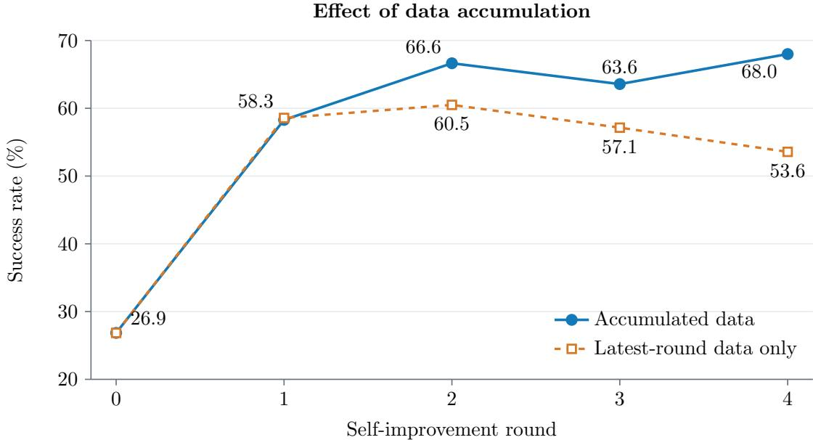  
Figure 7: Efect of data accumulation. Success in adaptation scenes across self-improvement rounds under the two configurations described above.

## B.2 Per-Task Evaluation Across Scene Sets

The new-scene comparison in Table 5 uses the 34K Cosmos3 baseline from Table 1 and EVO-WAMCosmos3 at 34K steps, with success rates of 24.9% and 70.4%, respectively. Both models are evaluated on the same new-scene test set, with 100 Clean and 100 Randomized trials per task (1,400 in total), using identical inference settings and success criteria. The 34K baseline is a separate comparison model; self-training starts from the 30K initialization described in Section 4.2.

Table 7 breaks down $\mathrm { E V O  – W A M _ { C o s m o s 3 } } ^ { \prime } \mathrm { s }$ Round 4 performance in adaptation and new scenes. In new scenes, success reaches 82.0% for placing bread in a basket and 47.0% for stacking three blocks, compared with 72.5% and 35.5% in adaptation scenes.

Table 7: Per-task evaluation across scene sets. Success rates (%) of the final EVO-WAMCosmos3 model at 34K steps. Adapt. and New denote adaptation and new scenes; each set has 100 Clean and 100 Randomized trials per task (1,400 total). Average pools both conditions.
<table><tr><td rowspan="2">Task</td><td colspan="2">Clean</td><td colspan="2">Randomized</td><td colspan="2">Average</td></tr><tr><td>Adapt.</td><td>New</td><td>Adapt.</td><td>New</td><td>Adapt.</td><td>New</td></tr><tr><td>Place object on scale</td><td>79.0</td><td>84.0</td><td>77.0</td><td>75.0</td><td>78.0</td><td>79.5</td></tr><tr><td>Stamp seal</td><td>48.0</td><td>49.0</td><td>61.0</td><td>59.0</td><td>54.5</td><td>54.0</td></tr><tr><td>Place bread in basket</td><td>74.0</td><td>79.0</td><td>71.0</td><td>85.0</td><td>72.5</td><td>82.0</td></tr><tr><td>Place empty cup</td><td>93.0</td><td>89.0</td><td>87.0</td><td>86.0</td><td>90.0</td><td>87.5</td></tr><tr><td>Stack three blocks</td><td>34.0</td><td>49.0</td><td>37.0</td><td>45.0</td><td>35.5</td><td>47.0</td></tr><tr><td>Place A to the left of B</td><td>81.0</td><td>78.0</td><td>76.0</td><td>75.0</td><td>78.5</td><td>76.5</td></tr><tr><td>Place cans in box</td><td>65.0</td><td>67.0</td><td>69.0</td><td>65.0</td><td>67.0</td><td>66.0</td></tr><tr><td>Overall (Ours)</td><td>67.7</td><td>70.7</td><td>68.3</td><td>70.0</td><td>68.0</td><td>70.4</td></tr></table>

## B.3 Real-Robot Tasks and Scene Configurations

We evaluate each policy on ten physical trials per task. Stack Bowls and Place Ducks each use three initial layouts, with three, three, and four trials. Load the Air Fryer uses two layouts with five trials each. Figure 8

shows the object arrangements. The instruction and target objects are fixed within each task; their initial positions vary across layouts. Task success is the number of successful trials divided by ten.

Stack Bowls. The instruction is: “Stack the pink bowl on the blue bowl, then lift both together onto the white bowl.” The three layouts permute the initial positions of the bowls. Completion requires the white bowl to support the blue bowl, the blue bowl to support the pink bowl, and the gripper to release the stack.

Place Ducks. The robot must place the pink toy duck in the pink bowl and then the blue toy duck in the blue bowl. A third duck serves as a distractor. The three layouts change the ducks’ positions while retaining the two target bowls. Completion requires both target ducks to be released into their corresponding bowls.

Load the Air Fryer. The robot must pull the red handle to open the drawer, pick up the bread from its plate, and release it inside the drawer. The two layouts place the bread on opposite sides of the air fryer.

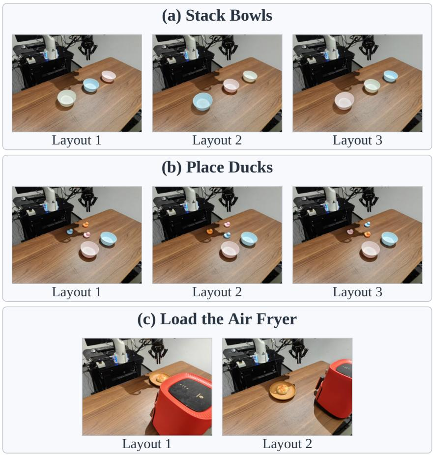  
Figure 8: Initial configurations for physical evaluation. Three layouts for Stack Bowls, three for Place Ducks, and two for Load the Air Fryer. Each task has ten trials per evaluated policy: 3/3/4 across the three-layout tasks and 5/5 across the two air-fryer layouts.

Table 8 reports per-layout success counts for the baselines and all four self-training rounds; Table 2 reports the task-level comparison, and Table 3 summarizes average success rates across self-training rounds.

## B.4 Additional Real-Robot Case Studies

Qualitative case studies. Figures 9 and 10 show real executions before self-training (Before), three self-imagined trajectories (Rollouts 1–3), and real executions after the second self-training round (After). For each task, all three self-imagined trajectories are generated from the same initial observation by the model after its first self-training round. Rollout 1 is rejected by visual verification. Rollout 2 passes the initial visual scan but is rejected by the IDM. Rollout 3 passes both the IDM check and visual endpoint confirmation and is used for the second round of self-training. Appendix C.1 describes the verification procedure.

Table 8: Real-robot results by layout. Successful trials over attempts for the models in Table 2. Layout numbers match Figure 8. The Cosmos3 baseline is evaluated at 31K steps. R1–R4 denote the self-training rounds; Table 2 uses R2.
<table><tr><td rowspan="2">Layout</td><td>VLA</td><td colspan="2">WAM</td><td colspan="4">EVO-WAMCosmos3 (Ours)</td></tr><tr><td>π0.5</td><td>DreamZero</td><td>Cosmos3</td><td>R1</td><td>R2</td><td>R3</td><td>R4</td></tr><tr><td colspan="8">Stack Bowls</td></tr><tr><td>Layout 1</td><td>0/3</td><td>3/3</td><td>1/3</td><td>3/3</td><td>3/3</td><td>3/3</td><td>3/3</td></tr><tr><td>Layout 2</td><td>0/3</td><td>3/3</td><td>2/3</td><td>3/3</td><td>3/3</td><td>2/3</td><td>2/3</td></tr><tr><td>Layout 3</td><td>1/4</td><td>0/4</td><td>1/4</td><td>1/4</td><td>2/4</td><td>2/4</td><td>3/4</td></tr><tr><td>Total</td><td>1/10</td><td>6/10</td><td>4/10</td><td>7/10</td><td>8/10</td><td>7/10</td><td>8/10</td></tr><tr><td colspan="8">Place Ducks</td></tr><tr><td>Layout 1</td><td>0/3</td><td>0/3</td><td>0/3</td><td>0/3</td><td>0/3</td><td>0/3</td><td>0/3</td></tr><tr><td>Layout 2</td><td>1/3</td><td>0/3</td><td>1/3</td><td>1/3</td><td>3/3</td><td>2/3</td><td>2/3</td></tr><tr><td>Layout 3</td><td>0/4</td><td>0/4</td><td>0/4</td><td>1/4</td><td>3/4</td><td>4/4</td><td>4/4</td></tr><tr><td>Total</td><td>1/10</td><td>0/10</td><td>1/10</td><td>2/10</td><td>6/10</td><td>6/10</td><td>6/10</td></tr><tr><td colspan="8">Load the Air Fryer</td></tr><tr><td>Layout 1</td><td>0/5</td><td>0/5</td><td>0/5</td><td>5/5</td><td>4/5</td><td>4/5</td><td>5/5</td></tr><tr><td>Layout 2</td><td>0/5</td><td>0/5</td><td>1/5</td><td>4/5</td><td>5/5</td><td>5/5</td><td>4/5</td></tr><tr><td>Total</td><td>0/10</td><td>0/10</td><td>1/10</td><td>9/10</td><td>9/10</td><td>9/10</td><td>9/10</td></tr></table>

Each imagined trajectory is shown through four chronological wrist-camera frames. The column headings indicate the intended task stages. The Before and After rows show the initial observation and four subsequent wrist-camera frames, together with a synchronized external view at the last displayed step. These real executions use independently reset scenes with matching relative object layouts.

Stacking bowls: maintaining an intermediate result. Figure 9 illustrates the dependency between the two stacking operations. Rollout 1 places the white bowl above the pink and blue bowls, reversing the required order. Rollout 2 places pink on blue and transfers the pair onto white, ending with the gripper withdrawn. Its prefix IDM score of 0.008170 slightly exceeds the threshold of 0.008111, so the trajectory is rejected by the action-consistency check. Rollout 3 passes verification and supplies a stacking example for subsequent self-training rounds.

In Before, the bowls remain separated at the displayed endpoint. After shows the robot placing pink onto blue and moving the resulting stack toward white. This second operation requires preserving the intermediate stack while moving both bowls together. The external view shows their relative positions alongside the corresponding wrist view.

Loading the air fryer: opening before transfer. Figure 10 illustrates how opening the drawer enables the subsequent placement. In Before, the gripper still holds the bread at the displayed endpoint. Rollout 1 develops a pronounced distortion in the drawer and bread region after transfer. Rollout 2 opens the drawer, picks up the bread, and releases it inside, leaving the plate empty. Its prefix IDM score is 0.009082, above the threshold of 0.008111, so it is rejected. Rollout 3 passes verification with a sequence that opens the drawer before transferring the bread.

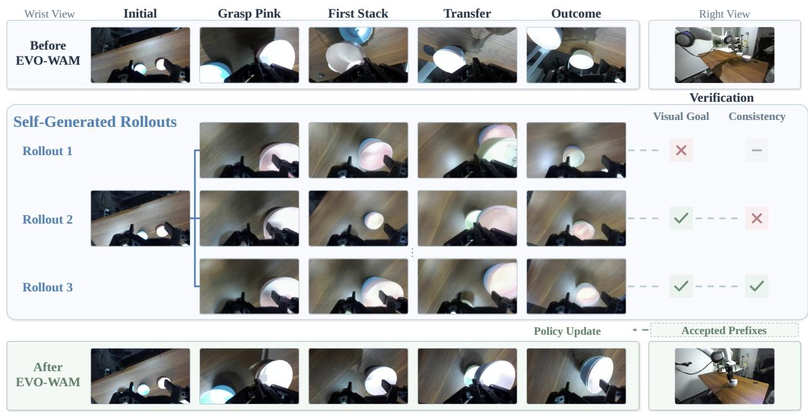  
Figure 9: Stacking three bowls. The instruction is: “Stack the pink bowl on the blue bowl, then lift both together onto the white bowl.” Before shows the bowls still separated. The imagined trajectories illustrate diferent stacking orders and verification outcomes; After shows the two successive stacking operations.

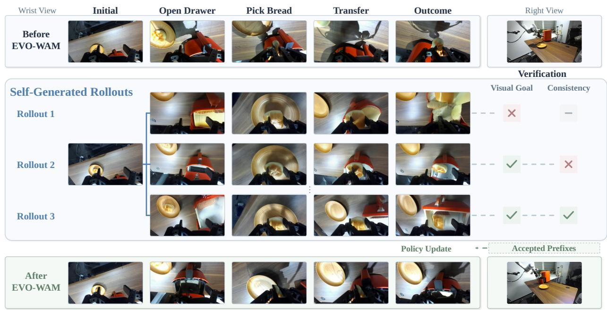  
Figure 10: Loading the air fryer. The robot must pull the red handle to open the drawer and transfer the bread from the plate into it. Before shows the bread still held by the gripper. Rollout 1 distorts the drawer and bread during transfer, while Rollout 3 passes verification. After shows drawer opening, bread transfer, and release.

In After, the robot first opens the drawer to make the receptacle accessible, then grasps the bread, transfers it from the plate to the drawer, and releases it. The sequence coordinates the prerequisite drawer interaction with object transfer.

## B.5 IDM Training Data and Model Design

IDM design. The IDM predicts actions conditioned on observed motion, the window-start state, and the instruction. Its training pairs include unsuccessful executions as well as successful ones: in both cases, the recorded actions produced the observed video. The IDM learns this correspondence by reconstructing the recorded actions. During verification, the generated video conditions the reconstruction and the paired WAM actions are used to compute the consistency error. Architecture, normalization, and temporal settings are given in Appendix C.2.

## B.6 Data Production and Training Configuration

Baseline training. All simulation baselines are trained on the 43 seen RoboTwin tasks for 34K steps with a global batch size of 256. The learning rate follows cosine decay over the first 15K steps, from $1 0 ^ { - 4 } ~ \mathrm { t o } ~ 1 0 ^ { - 6 }$ for Cosmos3 and the other comparison models, and from $5 \times 1 0 ^ { - 5 }$ to $5 \times 1 0 ^ { - 6 }$ for DreamZero. At step 15K, the learning rate is reset to $1 0 ^ { - 5 }$ and kept constant for the remaining training steps.

Self-training optimization. Table 9 lists the self-training settings. Each run starts from a 30,000-step WAM checkpoint and initializes each round from the preceding round’s updated weights. RoboTwin uses four rounds of 1,000 updates; the final checkpoints therefore have 34,000 training steps. The real-robot model uses four rounds of 500 updates, reaching 32,000 steps; Table 2 uses Round 2 at 31,000 steps. Batch size denotes the global number of training samples per optimizer update.

Table 9: Self-training configuration. Learning rates are constant within each round. The recorded/generated ratio is the training sampling ratio.
<table><tr><td>Setting</td><td> $\mathrm { E V O \mathrm { - } W A M _ { C o s m o s 3 } , }$  RoboTwin</td><td>EVO-WAMDreamZero, RoboTwin</td><td> $\mathrm { E V O - W A M _ { C o s m o s 3 } . }$  real robot</td></tr><tr><td>Starting step</td><td>30,000</td><td>30,000</td><td>30,000</td></tr><tr><td>Global batch size</td><td>256</td><td>256</td><td>256</td></tr><tr><td>Updates per round</td><td>1,000</td><td>1,000</td><td>500</td></tr><tr><td>Rounds</td><td>4</td><td>4</td><td>4</td></tr><tr><td>Learning rate</td><td>10-5</td><td> $2 \times 1 0 ^ { - 5 }$ </td><td>10-5</td></tr><tr><td>Recorded/generated</td><td>1:1</td><td>1:1</td><td>1:1</td></tr><tr><td>Final training step</td><td>34,000</td><td>34,000</td><td>32,000</td></tr></table>

The action projection layers use a learning rate of $5 \times 1 0 ^ { - 5 }$ . In the real-robot runs, generated prefixes, recorded successful executions, and recorded unsuccessful executions contribute 50%, 45%, and 5% of training samples, respectively. The generated-data sampler selects a scene uniformly, an episode within that scene uniformly, and then a chunk according to its duration. Training targets are the generated video and its paired actions. IDM reconstructions provide the consistency score used for filtering.

Verification-ablation controls. All variants in Table 4 use the same Cosmos3 30K initialization, a planned budget of 2,800 candidates per round, and four rounds of 1,000 updates. They share the Cosmos3 learning rates and global batch size of 256 specified above, the 1:1 recorded/generated sampling ratio, and cumulative prefix replay. Each round is evaluated on the same seven tasks using 100 Clean and 100 Randomized trials per task, following Section 4.2. The action-verification comparison keeps the VLM, visual scanning, and endpoint voting fixed: VLM only omits the action check, VLM + IDM uses consistency, and VLM + Simulator uses task success from executing the paired actions. The VLM comparison changes the task-completion mode while retaining the same IDM checkpoint and $\eta = 0 . 0 0 4 1 8 4 8 7$ . The retained prefix sets and their sizes depend on the verifier’s decisions; the training-update budget remains fixed.

Data retained per round. Table 10 reports newly retained prefixes, the cumulative training pool, and optimizer updates. RoboTwin schedules 2,800 candidates per round from 1,400 distinct scenes across the seven unseen tasks. In Round 2 of $\mathrm { E V O - W A M _ { C o s m o s 3 } }$ , 2,799 candidates reached the recorded selection stage. $\mathrm { E V O - W A M _ { C o s m o s 3 } }$ and $\mathrm { E V O - W A M _ { D r e a m Z e r o } }$ use fixed consistency thresholds of 0.00418487 and 0.00843549, respectively, throughout self-training, and accumulate accepted prefixes. Once retained for training, prefixes remain in the pool in subsequent rounds; the cumulative pool is the union of all rounds’ retained sets.

Table 10: Retained training-pool sizes. New prefixes are trajectories retained for training after filtering and exclusions. Cumulative pool size sums new prefixes through the current round. Each retained trajectory contributes one prefix. Updates are optimizer steps per round.
<table><tr><td>Round</td><td>New prefixes</td><td>Cumulative pool</td><td>Updates</td></tr><tr><td colspan="4">EVO-WAMCosmos3 — RoboTwin</td></tr><tr><td>1</td><td>531</td><td>531</td><td>1,000</td></tr><tr><td>2</td><td>1,400</td><td>1,931</td><td>1,000</td></tr><tr><td>3</td><td>1,482</td><td>3,413</td><td>1,000</td></tr><tr><td>4</td><td>1,592</td><td>5,005</td><td>1,000</td></tr><tr><td colspan="4">EVO-WAMDreamZero — RoboTwin</td></tr><tr><td>1</td><td>704</td><td>704</td><td>1,000</td></tr><tr><td>2</td><td>894</td><td>1,598</td><td>1,000</td></tr><tr><td>3</td><td>1,161</td><td>2,759</td><td>1,000</td></tr><tr><td>4</td><td>1,234</td><td>3,993</td><td>1,000</td></tr><tr><td colspan="4">EVO-WAMCosmos3 — Real robot</td></tr><tr><td>1</td><td>33</td><td>33</td><td>500</td></tr><tr><td>2</td><td>159</td><td>192</td><td>500</td></tr><tr><td>3</td><td>179</td><td>371</td><td>500</td></tr><tr><td>4</td><td>76</td><td>447</td><td>500</td></tr></table>

For the three real-robot tasks, each round starts with a budget of 100 candidates per scene, or 800 across eight scenes. Initially, a fallback procedure adds batches of 100 for scenes with fewer than three newly retained prefixes. This procedure is disabled during R2, with already submitted batches completed; tota generation attempts are 5,900 in R1 and 900 in R2. R1 retains 33 training prefixes after excluding one corrupted generated video from 34 automated acceptances. R2 adds 159 prefixes, yielding a cumulative pool of 192. R3 and R4 each generate 800 candidates without additional batches, retaining 179 and 76 new prefixes, respectively, for cumulative pools of 371 and 447. The real-robot consistency threshold remains fixed at 0.00811050.

## B.7 Analysis of Generated Rollouts

The candidates in Figures 9 and 10 share an initial observation within each task, yet difer in stacking order and object geometry. The following example examines a separate discrepancy: a generated placement that does not occur when the paired actions are executed.

Figure 11 compares a generated rollout with execution of its paired action sequence from the same initial scene. The task is to place the blue stapler on the scale using the right arm. In the generated video, the stapler moves onto the weighing platform. In the simulator replay, the gripper moves toward the scale but leaves the stapler on the table. At action step 120, the generated image shows the stapler on the scale while the replayed scale remains empty. The stapler remains on the table through the end of the 194-action sequence, and the simulator reports task failure.

This diagnostic rollout was generated by the starting policy before self-training. Visual assessment accepts the generated placement at step 120, but executing the paired WAM actions fails to grasp the stapler. The IDM rejects this prefix, illustrating why visual completion needs to be checked together with video–action consistency for each candidate prefix.

Place the blue stapler on the scale

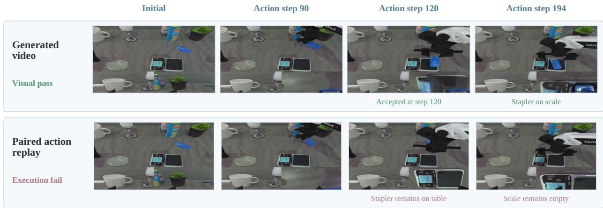  
Figure 11: Generated completion and failed action execution. Top: the video generated by the 30,000-step Cosmos3 policy. Bottom: simulator execution of the same generated action sequence. Columns use the same action steps and show the main view above the two wrist views. The generated stapler reaches the scale; the replayed stapler remains on the table. The last column is the end of the 194-action replay. The visually accepted 120-action prefix has an IDM consistency error of 0.00632283, exceeding the fixed threshold of 0.00418487, and is therefore rejected by the IDM.

## B.8 Verifier Reliability

We assess selection quality on 700 Cosmos3 rollouts sampled from a pool of 8,390 candidates with recorded simulator replay outcomes. We sample 50 per task–condition pair across seven tasks and Clean/Randomized conditions, using seed 20260926 independently of verifier decisions and replay labels. The subset contains 208 successes and 492 failures. Both methods share the recorded action prechecks, visual endpoints, and two-of-three VLM voting. VLM + IDM additionally applies the IDM trained on the 43 seen tasks with fixed $\eta = 0 . 0 0 4 1 8 4 8 7$

Table 11: Verifier reliability against simulator replay (%). Both methods use the same 700 candidates. Precision and recall treat replay success as the positive label; FPR is the fraction of replay failures accepted.
<table><tr><td>Verification</td><td>Precision ↑</td><td>Recall ↑</td><td>FPR↓</td></tr><tr><td>VLM</td><td>68.0</td><td>64.4</td><td>12.8</td></tr><tr><td>VLM + IDM</td><td>86.0</td><td>44.2</td><td>3.0</td></tr></table>

As shown in Table 11, adding IDM reduces false acceptances from 63 to 15, at the cost of lower recall. Among VLM-accepted candidates, replay succeeds for 92/107 (86.0%) passing IDM and 42/90 (46.7%) rejected by IDM, linking consistency verification to a higher proportion of successful executions. These labels describe complete action-tape replay, not separate execution of selected prefixes or human judgments of visual completion. Simulator failures may also reflect physics artifacts and do not by themselves identify video–action inconsistency; all recorded failures remain in the analysis.

## C Implementation Details

## C.1 Task-Completion Verification

Visual assessment. The description call receives synchronized initial and generated views with observation prompts, without the task instruction or desired outcome. It records object identities, spatial relations, gripper contact, and visible changes in object or robot structure. The judgment call then receives the same images, the resulting description, the task instruction, and the active subgoal. It checks goal satisfaction, required gripper release, object consistency, and robot structural consistency. The program accepts an assessment only when all four checks pass. A negative or uncertain check makes the assessment non-accepting. Unsupported or conflicting facts in the description and its image-grounded audit also prevent the afected check from passing. Release is not required for the handle-engagement subgoal of opening the air fryer.

Sequential scanning. Both RoboTwin and real-robot verification use the same visual endpoint search. For subgoals $\left( g _ { 1 } , \ldots , g _ { M } \right)$ checked in sequence, let $\tau _ { j }$ contain predefined scan times within a task-specific window for subgoal $g _ { j }$ . Only the active subgoal is assessed, including any earlier relations it requires to remain satisfied. For placing ducks, the second subgoal requires both the blue duck in the blue bowl and the pink duck still in the pink bowl. Write $b _ { j } ^ { ( q ) } ( t ) = 1$ when assessment q accepts and zero when a valid assessment rejects or remains uncertain. The preliminary completion time is

$$
t _ { j } = \operatorname* { m i n } \{ t \in \mathcal { T } _ { j } : t > t _ { j - 1 } , \ b _ { j } ^ { ( 1 ) } ( t ) = 1 \} , \qquad t _ { 0 } = 0 .\tag{4}
$$

The scan advances to $g _ { j + 1 }$ only after finding $t _ { j }$ . Each endpoint is selected using the initial VLM assessment alone and remains fixed during the subsequent IDM check and vote confirmation. For real-robot tasks, scan windows are 7–17 s and 17–33 s for stacking bowls, 5–14 s and 12–23 s for placing ducks, and 1 s to the rollout end and 19–36 s for loading the air fryer. The increasing-time constraint also applies where these windows overlap. A rollout without a completion time for every subgoal is rejected.

Endpoint confirmation. After the prefix ending at $t _ { v } = t _ { M }$ passes the IDM check, we confirm each fixed endpoint. The initial accepting assessment and two additional description–judgment calls form three votes. Each additional vote receives the same images and subgoal but produces its own description. A subgoal is confirmed when

$$
\sum _ { q = 1 } ^ { 3 } b _ { j } ^ { ( q ) } ( t _ { j } ) \geq 2 , \qquad j = 1 , \ldots , M .\tag{5}
$$

A missing or invalid response is not counted as a negative vote. Unresolved candidates are withheld from subsequent policy training.

Interaction with action verification. Algorithm 1 applies to both RoboTwin and real-robot tasks: first locate and fix all visual endpoints, then check $E ( t _ { M } ) \leq \eta .$ , and finally confirm each endpoint with two additional VLM assessments. IDM or voting rejection discards the candidate without searching for a later endpoint. Training retains the complete prefix through $t _ { v }$ only after both conditions pass; all its actions are scored using the window rules in Appendix C.2.

## C.2 Inverse Dynamics Model

Architecture and training data. The IDM reconstructs actions from a video window, its starting robot state, and the task instruction. We build it from Wan2.2 pretrained weights [34] using a reduced-width Transformer initialized by interpolating the pretrained tensors. We retain video conditioning and action denoising, while removing the video denoising branch and its prediction loss. The resulting model has approximately 0.9B trainable parameters. The Transformer has 30 layers, a hidden width of 1,344, an FFN width of 5,376, and 24 attention heads. Video and text encoders provide the conditioning features for action flow prediction.

We train the IDM on recorded video-action pairs, including successful and unsuccessful executions: an unsuccessful task can still provide a valid correspondence between motion and actions. For RoboTwin, gradient training uses recorded trajectories from the 43 seen tasks. For real-world verification, we train the IDM on DROID [17] trajectories.

Temporal and training settings. Table 12 lists the three temporal interfaces. The dense RoboTwin IDM is trained for 26,000 updates with global batch size 256. The sparse-video IDM for DreamZero continues that model for 10,000 updates at batch size 256. The DROID IDM uses a 50,000-update continuation of a pretrained DROID IDM, also at batch size 256.

The dense RoboTwin model samples 64-action windows with probability 0.5, 32-action windows with probability 0.25, and other supported lengths with the remaining probability. For generated rollouts, window-start conditioning uses the measured initial robot state for the first window and the corresponding boundary-state estimate for subsequent windows.

Algorithm 1 Prefix verification for RoboTwin and real-robot tasks   
Require: Rollout ˆτ, ordered subgoals $( g _ { j } ) _ { j = 1 } ^ { M } ,$ scan sets $( T _ { j } ) _ { j = 1 } ^ { M } ,$ fixed threshold $\eta$   
Any unresolved assessment or unavailable IDM score returns Withhold.   
1: $t _ { 0 } \gets 0$   
2: for $j = 1 , \dots , M$ do   
3: $t _ { j } \gets \perp$   
4: for $t \in \mathcal { T } _ { j }$ in increasing order, with $t > t _ { j - 1 }$ do   
5: Obtain initial VLM assessment $b _ { j } ^ { ( 1 ) } ( t )$ from $\hat { \tau }$ for $g _ { j }$   
6: if $b _ { j } ^ { ( 1 ) } ( t ) = 1$ then $t _ { j } \gets t ;$ break   
7: end for   
8: if $t _ { j } = \perp$ then return Reject   
9: end for   
10: Fix $t _ { v } \gets t _ { M }$ and all subgoal endpoints $( t _ { 1 } , \dots , t _ { M } )$   
11: Compute $E ( t _ { v } )$ over all actions through $t _ { v }$ (Appendix C.2)   
12: if $E ( t _ { v } ) > \eta$ then return Reject   
13: for $j = 1 , \dotsc , M$ do   
14: Obtain $b _ { j } ^ { ( 2 ) } ( t _ { j } )$ and $b _ { j } ^ { ( 3 ) } ( t _ { j } )$ using the same images and subgoal   
15: if $\textstyle \sum _ { q = 1 } ^ { 3 } b _ { j } ^ { ( q ) } ( t _ { j } ) < 2$ then return Reject   
16: end for   
17: return the complete prefix ending at $t _ { v }$

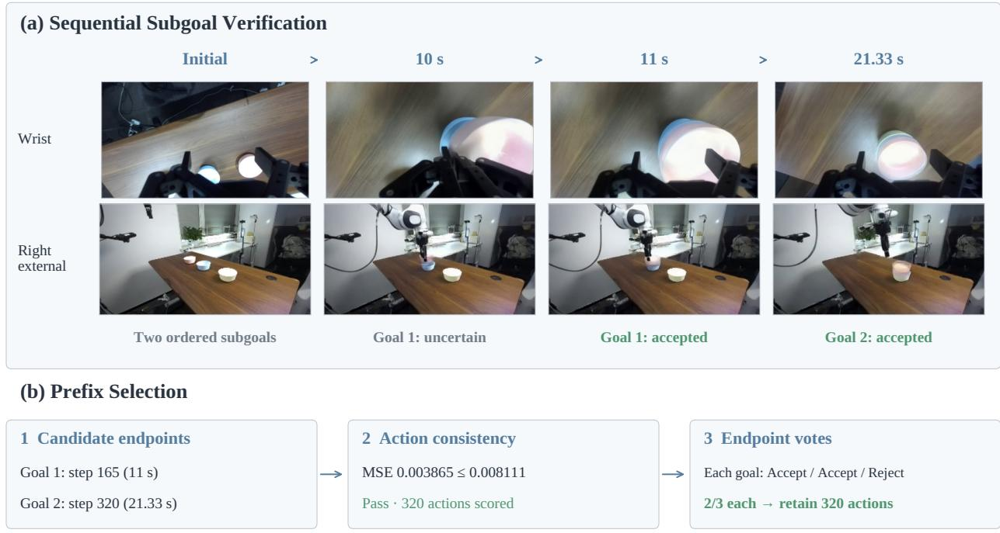  
Figure 12: A recorded verification trace for stacking bowls. The initial VLM scan proposes endpoints at step 165 (11 s) for the first subgoal and step 320 (21.33 s) for the second. The 320-action prefix passes the IDM threshold, after which each endpoint receives two further assessments. Both subgoals receive Accept/Accept/Reject, satisfying the two-of-three rule. Five complete 64-action windows are scored, and all 320 actions are retained for training. The images show wrist and right external views; assessment also uses the left view.

Table 12: IDM settings. L is the number of actions in a verification window; the video includes its starting observation. Standardization uses recorded-data means and standard deviations.
<table><tr><td>Setting</td><td>RoboTwin, Cosmos3</td><td>RoboTwin, DreamZero</td><td>DROID, Cosmos3</td></tr><tr><td>Action dimensions</td><td>14</td><td>14</td><td>8</td></tr><tr><td>Actions per window</td><td> $1 \leq L \leq 6 4$ </td><td> $L \in \{ 3 , 6 , . . . , 7 2 \}$ </td><td> $1 \leq L \leq 6 4$ </td></tr><tr><td>Video frames</td><td> $L + 1$ </td><td> $L / 3 + 1$ </td><td> $L + 1$ </td></tr><tr><td>Video/action rate</td><td> $1 5 / 1 5 ~ \mathrm { H z }$ </td><td> $5 / 1 5 ~ \mathrm { H z }$ </td><td> $1 5 / 1 5 ~ \mathrm { H z }$ </td></tr><tr><td>Normalized clipping</td><td>None</td><td>None</td><td>[-5,5]</td></tr><tr><td>Reconstruction steps</td><td>4</td><td>4</td><td>4</td></tr><tr><td>Calibration percentile</td><td>P90</td><td>P90</td><td>P99</td></tr><tr><td>Fixed consistency threshold</td><td>0.00418487</td><td>0.00843549</td><td>0.00811050</td></tr></table>

Training objective. Let A be a training action sequence with length L and dimension $d ,$ and let $Y =$ $\mathcal { N } _ { \mathrm { I D M } } ( A )$ be its normalized representation. Given Gaussian noise ϵ and a sampled noise level σ, we construct

$$
X _ { \sigma } = ( 1 - \sigma ) Y + \sigma \epsilon .\tag{6}
$$

The IDM is trained with an action flow-matching objective [24]

$$
\mathcal { L } _ { \mathrm { I D M } } = \mathbb { E } \left[ \frac { 1 } { L d } \left. v _ { \phi } ( X _ { \sigma } , \sigma ; \widetilde Z , c , \ell ) - ( \epsilon - Y ) \right. _ { F } ^ { 2 } \right] ,\tag{7}
$$

where $\phi$ denotes the IDM parameters, c is the window-start state, and $\widetilde { Z }$ is the encoded video condition. With probability 0.5, we perturb the video condition as $\widetilde { Z } = ( 1 - \alpha ) Z + \alpha \epsilon _ { Z }$ , where $\alpha \sim \mathcal { U } ( 0 , 0 . 5 )$ and $\epsilon _ { Z }$ is Gaussian noise. Otherwise, $\widetilde { Z } = Z$

Action reconstruction. Each reconstruction conditions on the corresponding video, including the window’s starting observation, its starting state, and the instruction. Reconstruction uses four UniPC steps [48], starting from independent Gaussian action noise; the WAM-generated actions are used only for the comparison.

Video-action consistency score. For a proposed prefix ending at $t _ { v } ,$ let $\hat { A } _ { k } ^ { ( v ) }$ contain the $n _ { k }$ generated actions in verification window $k ,$ and let $\widetilde { Y } _ { k } ^ { \left( v \right) }$ denote the corresponding IDM reconstruction in normalized action space. With d denoting the action dimension and $\mathcal { N } _ { \mathrm { I D M } }$ the action normalization used by the IDM, the window error is

$$
e _ { k } = \frac { 1 } { n _ { k } d } \left\| \mathcal { N } _ { \mathrm { I D M } } \big ( \hat { A } _ { k } ^ { ( v ) } \big ) - \widetilde { Y } _ { k } ^ { ( v ) } \right\| _ { F } ^ { 2 } .\tag{8}
$$

For both RoboTwin and DROID, the $K _ { v }$ windows partition all $N _ { v }$ actions through $t _ { v } .$ , including a shorter final window when needed. Thus $\begin{array} { r } { \sum _ { k = 1 } ^ { K _ { v } } n _ { k } = N _ { v } } \end{array}$ , and we aggregate window errors weighted by their respective numbers of actions:

$$
E ( t _ { v } ) = \frac { \sum _ { k = 1 } ^ { K _ { v } } n _ { k } e _ { k } } { \sum _ { k = 1 } ^ { K _ { v } } n _ { k } } .\tag{9}
$$

The complete prefix ending at $t _ { v }$ is retained for training if task-completion verification passes and $E ( t _ { v } ) \leq \eta .$ where η is fixed across self-training rounds for each backbone and dataset.

For Cosmos3 on RoboTwin and DROID, $K _ { v } = \lceil N _ { v } / 6 4 \rceil$ and the final window contains $N _ { v } - 6 4 ( K _ { v } - 1 )$ actions. This window is scored and weighted by its actual action count, so the visual, scoring, and training endpoints all remain at $t _ { v }$ . Candidate actions use the IDM’s normalization, including DROID clipping, and are compared directly with the normalized IDM output.

Threshold calibration. We set thresholds separately for simulation and real-robot verification to account for diferences in their video-action data distributions. For both RoboTwin backbones, IDM checkpoint selection and threshold calibration use ofline data from the 43 seen tasks, without execution feedback from the seven target tasks. We calibrate once per backbone, setting η to the 90th percentile (P90) of normalized video-action reconstruction errors on these calibration data. The selected IDM and its numerical threshold remain fixed across self-training rounds. For DROID, we use the 99th percentile (P99) of normalized video-action reconstruction errors on the original recorded DROID data, yielding η = 0.00811050, which is also fixed across self-training rounds. Table 12 reports the calibration percentiles and fixed thresholds for al three settings.

## C.3 Autoregressive Rollout Training

Chunk and context settings. Table 13 separates generated outputs from reused context. Cosmos3 predicts 64 video frames and 64 actions per chunk. DreamZero predicts 24 video frames and 72 actions because video is sampled at 5 Hz and actions at 15 Hz. At each chunk boundary, the state input for continuation is obtained from the model’s outputs and combined with the initial visual anchor and recent generated latents. The initial anchor is retained throughout the rollout, and generated latents are reused directly.

Table 13: Autoregressive generation settings. Output counts exclude the starting observation. Recent visual context is in addition to the initial anchor.
<table><tr><td>Setting</td><td>Cosmos3, RoboTwin</td><td>DreamZero, RoboTwin</td><td>Cosmos3, DROID</td></tr><tr><td>Video/action rate</td><td>15/15 Hz</td><td>5/15 Hz</td><td>15/15 Hz</td></tr><tr><td>New frames/actions</td><td>64/64</td><td>24/72</td><td>64/64</td></tr><tr><td>Recent video context</td><td>32 frames</td><td>8 frames</td><td>32 frames</td></tr><tr><td>Recent video latents</td><td>8</td><td>2</td><td>8</td></tr></table>

For Cosmos3 training, a continuation sample uses 33 local frames: one VAE priming frame and 32 recent frames. The priming latent is dropped before the eight history latents are combined with the initial anchor. The stitched trajectory concatenates the newly predicted outputs of successive chunks.

Training contexts. Both initialization and continuation modes are used during base training and each self-training round. Training contexts and prediction targets are drawn from the same trajectory: recorded trajectories during base training, and a mixture of recorded and verified generated trajectories during self-training. During autoregressive generation, the model directly reuses its predicted video latents and obtains the next state input from its own outputs to construct the continuation context.

## C.4 Qualitative Comparison of Visual Context

Figure 13 compares two autoregressive rollouts with and without the initial visual anchor (global sink) and recent multi-frame context described in Section 3.1. The comparison illustrates object persistence after occlusion: the yellow block disappears in the rollout without these context components, while it remains visible after the arm moves away in the rollout with them.

## (a) Without global sink and context

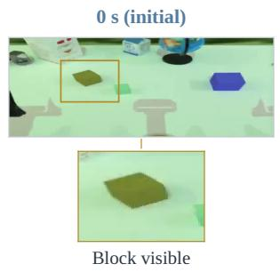

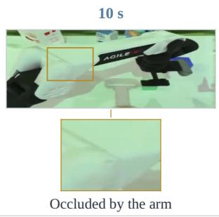

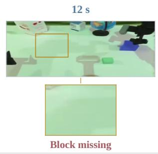

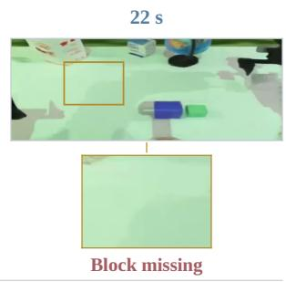

(b) With global sink and context  

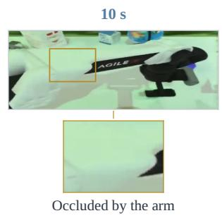

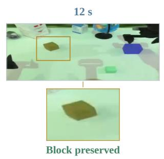

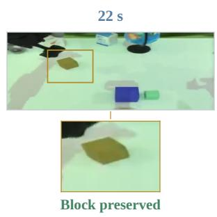  
Figure 13: Object consistency during autoregressive rollout. Top: without global sink and context. Bottom: with both components. Columns show matched timestamps relative to each clip’s start. The yellow block is initially visible and is occluded by the arm at 10 s. At 12 s and 22 s, it is missing in the top row and preserved in the bottom row. Each frame shows the main camera view cropped from the source video; boxes and enlarged insets highlight the same fixed image region in both rows.