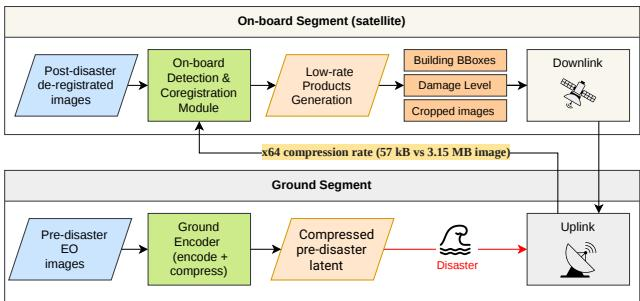
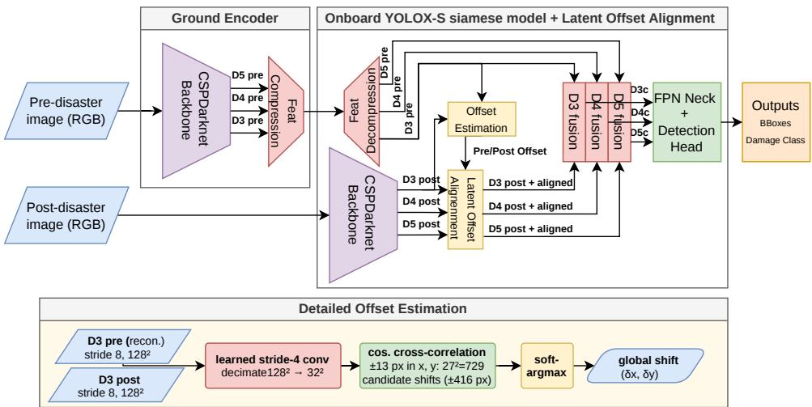
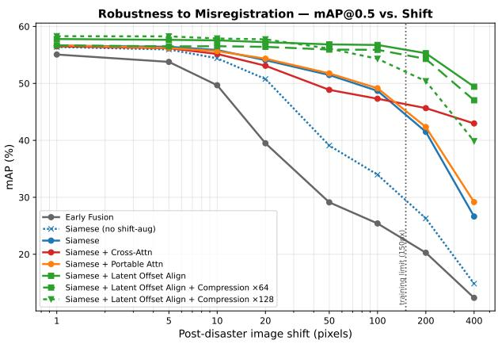
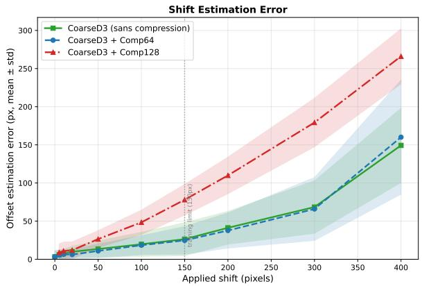
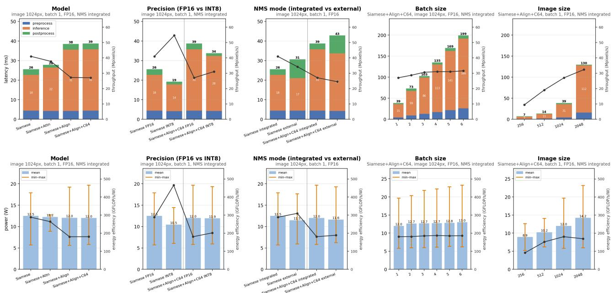
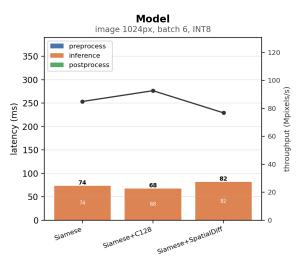
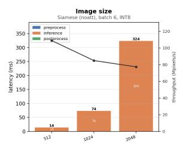
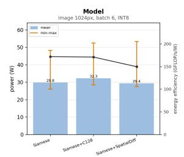
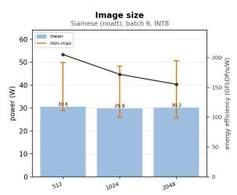

# Embedded Bi-Temporal Building Damage Assessment for On-Board Data Reduction

Thomas Goudemant1, Benjamin Francesconi1, Marjorie Bellizzi1, Adrien Dorise1,2

1IRT Saint Exupéry, France 2CNES, France

thomas.goudemant@irt-saintexupery.com

Preprint — accepted at OBPDC 2026, Barcelona, October 2026

## Abstract

Rapid assessment of building damage after natural disasters or conflict events is essential to support emergency response and prioritise field interventions. Earth Observation satellites can acquire relevant imagery shortly after an event, but exploitation is limited by uplink and downlink capacity and by ground-processing latency. We address this with a bi-temporal building damage assessment pipeline built on a siamese detector derived from YOLOX and designed to compress information at both ends of the ground/space link. On the ground, pre-disaster reference images are encoded into a compact latent space (compressed by up to a factor of 64) and uplinked to the satellite. On board, this reference is compared with a fresh post-disaster acquisition so that the downlink carries only actionable object-level products, bounding boxes and damage classes, instead of full scenes. This cuts the data exchanged in both directions and shortens the time to an actionable result, while on xBD the strongly compressed reference still preserves most of the detection performance.

Because on-board acquisitions sufer from residual pre/post co-registration errors, we introduce a latentspace shift estimation and correction module that regresses the global ofset from the coarse feature level and realigns the post-disaster features before fusion. It substantially improves robustness to de-registration, especially under large shifts where fusion-only variants collapse, while also raising nominal accuracy and remaining compatible with the strongest compression. We finally port the pipeline to two embedded targets, a Xilinx Versal VCK190 and an NVIDIA Jetson AGX Orin, and report deployment impact and hardware performance (latency, throughput, power eficiency). We find that the core detector and its compression port cleanly to both, but that the operators needed for long-range robustness survive only on the Jetson GPU, which supports the full robust pipeline, whereas the Versal DPU does not.

## 1 Introduction

Timely assessment of building damage after natural disasters or armed conflicts is critical to support emergency response, allocate limited resources and prioritise field interventions [12]. High-resolution (HR) Earth Observation (EO) satellites provide large-scale, repeatable coverage of impacted regions, and deep learning has significantly improved automated damage assessment from satellite imagery [12, 21]. Most high-performing methods formulate the task as a bitemporal change detection problem, jointly exploiting pre- and post-disaster imagery to disambiguate newly destroyed structures from pre-existing ones [18, 24]. Such pipelines, however, remain largely ground-centric: they require full-image downlink and ofline processing before actionable products are generated [19], which delays decision-making and consumes communication resources over areas of limited operational interest.

Advances in intelligent satellite systems and embedded AI accelerators enable moving part of the processing closer to the sensor [23], and on-board object detection has been demonstrated for several EO tasks [15, 19]. In this context, on-board AI can be used as a data-reduction and prioritisation stage: rather than transmitting complete scenes, the satellite extracts and downlinks only actionable information.

In our previous work [9], we introduced a ground/onboard architecture for bi-temporal building damage assessment that decouples pre- and post-event processing: pre-disaster scenes are encoded on the ground into compact latent representations, uplinked and stored on board, then compared with newly acquired postdisaster images to produce object-level products. That study established the benefit of siamese processing, latent-space compression and shift augmentation, and used classical cross-attention as a reference mechanism for robustness to residual co-registration errors. It did not, however, resolve two open issues: (i) robustness to large pre/post de-registration degraded well before the model’s efective receptive field was reached, and (ii) the mechanisms giving robustness were not shown to be compatible with an actual embedded target.

This paper extends that line of work along both axes. First, on the algorithmic side, we introduce a latent-space shift estimation and correction module that explicitly regresses the global pre/post ofset from the coarse feature level and realigns the post-disaster features before fusion. It substantially improves robustness to de-registration while also raising nominal accuracy, and it remains compatible with aggressive latent compression up to a factor of 64; detailed figures are reported in Section 4. Second, on the deployment side, we port the on-board pipeline to two representative embedded accelerators, a Xilinx Versal VCK190 and an NVIDIA Jetson AGX Orin, and report both the impact of deployment on algorithmic performance and the hardware performance (latency, throughput, power eficiency). We show that the core detection pipeline ports cleanly, but that the operators required for longrange robustness (softmax cross-attention and gridsampling-based alignment) are either non-portable or non-robust on the Versal DPU, whereas the Jetson GPU supports the full robust pipeline.

Contributions. (i) A latent-space shift estimation and correction module for robust bi-temporal damage assessment under strong de-registration, compatible with latent compression and designed for embedded (GPU) inference. (ii) An updated robustness analysis contrasting shift augmentation, cross-attention, portable (DPU-compatible) attention, and the proposed alignment module. (iii) An embedded deployment study on Versal VCK190 and Jetson AGX Orin, reporting algorithmic impact and hardware performance, and characterising which robustness mechanisms survive each target.

## 2 Related work

Building damage assessment from EO imagery is commonly cast as a bi-temporal change detection problem, since post-only observation confuses damaged buildings with background structures [1, 18]; fully convolutional siamese networks compare pre-/post-event images in a shared representation space [3]. Most benchmarks pose the task as dense pixel-level segmentation [12], but pixel-wise labelling can yield semantically inconsistent predictions at the building scale when damage afects only part of a structure [24]. Object-level formulations instead take the building as the unit of analysis, localising each structure and assigning it a single damage state; this produces more coherent, compact outputs [13] that are well suited to on-board data reduction, where only actionable object-level products need be downlinked. For robustness to residual co-registration, non-local mechanisms are attractive because a feature can retrieve context from a displaced location: self-attention does this [16, 20], but its spatial softmax is poorly supported by fixed-function edge accelerators. Lightweight convolutional attention such as CBAM [22] is hardwarefriendly, but its spatial component is a multiplicative gate with a fixed convolutional receptive field: it reweights features locally and cannot fetch information from a displaced location, so it remains strictly local.

  
Figure 1: System concept. The ground segment encodes pre-disaster references into a compressed latent (×64) uplinked to the satellite; the on-board segment detects and co-registers against the fresh post-disaster image and downlinks only low-rate products (bounding boxes, damage level, optional crops over damaged regions) instead of full scenes.

On the deployment side, embedded AI in orbit has been demonstrated for object and change detection on spaceborne hardware [10, 11, 19, 23], and system-level demonstrators have explored reactive ground–space architectures that shorten the decision–action loop [6]; yet these eforts rarely combine bi-temporal reasoning, object-level modelling and the constraints of embedded deployment [4]. We refer the reader to [9] for the full survey and adopt its object-level, single-stage detection formulation; this paper focuses on the two new contributions: an explicit latent-space alignment module and an embedded portability study.

## 3 Method

## 3.1 Ground/on-board system concept

We consider an operational EO scenario in which rapid building damage assessment is required to support post-disaster response. Following a disaster alert or the identification of an area of interest, the ground segment selects the relevant pre-disaster reference image(s), encodes them into compact multi-scale latent representations, and uplinks only the latents over the targeted area. The on-board segment processes the newly acquired post-disaster image and compares it with the stored pre-disaster latents to produce compact object-level products: building bounding boxes and damage classes, with the option to selectively downlink image crops over damaged regions instead of full scenes.

This separation (Fig. 1) reduces the uplink volume (compact latents instead of full-resolution pre-disaster images) and the downlink volume (damage products and selected crops instead of full post-disaster scenes). It also introduces the constraints that drive our design: uplink bandwidth and on-board memory forbid transmitting complete pre-disaster scenes, and limited on-board geolocation accuracy induces residual pre/post misregistration. The detailed network is shown in Fig. 2.

## 3.2 Base detection architecture

The base detector and the two baseline robustness mechanisms below (shift augmentation and attention) are those of [9], where they are detailed; we only summarise them here. The backbone is YOLOX-S [8], whose CSPDarknet produces three feature maps (D3, D4, D5) at strides 8, 16 and 32. These levels difer in nature: D3, at stride 8 and the finest spatial resolution, stays close to the input image and retains fine geometric detail, which makes it the level on which spatial registration can still be performed; D5, at stride 32, is spatially coarse but semantically rich, encoding objectlevel representations. YOLOX’s Path Aggregation FPN (PAFPN) [14] then fuses these maps with both a top-down and a bottom-up path, propagating D5’s semantic context into the finer, better-localised D3/D4 levels and, in turn, their spatial detail back up.

We start from a classic YOLOX and simply feed it the pre- and post-disaster images stacked along the channel axis (a 6-channel input); we refer to this baseline as early fusion, since the two images are mixed at the very input. We then evolve it into a siamese architecture: a single shared encoder processes the pre- and the post-disaster image independently, and the two feature sets are concatenated, together with their element-wise diference, before the FPN. This decomposition lets the network reason separately about each image (e.g. distinguishing building edges from ground) while learning a common representation of both, which improves detection over early fusion. Crucially, sharing one encoder maps directly onto the ground/on-board split: the same encoder is used on the ground to encode the pre-disaster reference and on board to encode the newly acquired post-disaster image, so pre-disaster features are computed on the ground and reused on board.

Compressed pre-disaster latents. The raw multiscale pre-disaster features exceed the input image size (≈ 3.7 MB vs. 3.15 MB at 10242), so a lightweight 1 × 1 convolution reduces the channel count by a factor r before uplink, with a symmetric projection restoring dimensionality on board. Tab. 1 reports the resulting int8 footprint: r=64 shrinks the latent to 57 kB, two orders of magnitude below the image, while r=128 leaves a single latent channel at the finest level (D3), which we show is insuficient for the alignment module (Sec. 4.3).

## 3.3 Robustness to pre/post deregistration

Residual spatial misregistration between the pre- and post-disaster images is unavoidable on board, due to acquisition-geometry diferences and limited onboard registration. Under such shifts, strictly local feature comparison fails to retrieve the relevant predisaster information at the correct location, which mostly degrades damage classification (localisation is more stable, as boxes are predicted in the pre-disaster reference frame) [9]. We consider three families of mechanisms, of increasing efectiveness.

Table 1: Size of the pre-disaster latent representation under channel compression, for a 1024 × 1024 × 3 input, reported as an equivalent int8 footprint. Spatial resolutions: $1 2 8 ^ { 2 }$ (D3), $6 4 ^ { 2 }$ (D4), 322 (D5).
<table><tr><td>Configuration</td><td>D3</td><td>D4</td><td>D5</td><td>Size</td></tr><tr><td>Input image  $( 1 0 2 4 ^ { 2 } \times 3 )$ </td><td></td><td></td><td></td><td>3.15 MB</td></tr><tr><td>Latent (no comp.)</td><td>128</td><td>256</td><td>512</td><td>3.67MB</td></tr><tr><td>Latent (comp. r=8)</td><td>16</td><td>32</td><td>64</td><td>0.46 MB</td></tr><tr><td>Latent (comp. r=64)</td><td>2</td><td>4</td><td>8</td><td>57kB</td></tr><tr><td>Latent (comp. r=128)</td><td>1</td><td>2</td><td>4</td><td>29 kB</td></tr></table>

(a) Shift augmentation and (b) attention. Shift augmentation applies, during training, a random displacement (ofsets in [0, 150] px) to the post-disaster image only, with ground truth kept in the pre-disaster frame; it is used in all variants unless stated. Crossattention lets each pre-disaster location attend over the whole post-disaster map and retrieve possibly shifted features, using the query–key–value formulation of [20] on the coarse levels (D4–D5); its HW × HW softmax, however, is not supported by the Versal DPU (Sec. 3.4). We therefore additionally consider portable attention gates built only from DPU-compatible operators, the most representative being a spatial-diference gate adapted from the spatial branch of CBAM [22]: a depthwise $7 \times 7$ convolution over the signed pre−post diference, followed by a pointwise convolution and a sigmoid gate. Being purely convolutional, it has a strictly local receptive field.

(c) Latent-space shift estimation and correction (proposed). We estimate the global pre/post ofset explicitly and use it to realign the post-disaster features before fusion (Fig. 2). An ofset head predicts one global displacement $( \delta _ { x } , \delta _ { y } )$ per image by cross-correlating the pre and post features. It works on D3, the finest and least-compressed level, whose geometric detail is best for matching; a stride-4 convolution first subsamples it to 32 × 32 to keep the search cheap. On a grid of $( 2 R { + } 1 ) ^ { 2 }$ candidate ofsets, we cosine-correlate the pre and shifted post embeddings, and a soft-argmax over the grid gives a sub-pixel of set. We use R=13, covering shifts of up to 416 px. A coarse grid is suficient in practice: the correction only needs to bring the residual shift back within the perceptive field, where detection stays robust (≈ 20 px, Fig. 3), and the soft-argmax already interpolates below one cell. The ofset then shifts the post-disaster D3/D4/D5 features toward the pre features by bilinear resampling, each level scaled by its stride. The whole module is diferentiable, so it is trained end-to-end by the detection loss plus an auxiliary loss that regresses the known training shift.

The module stays exportable on embedded accelerators: the ofset search is a single vectorised correlation and the resampling reduces to one grid-sampling operation. Grid-sampling is a native TensorRT operator, so the alignment is portable on the Jetson GPU but not on the Versal DPU (Sec. 3.4), which it therefore targets.

## 3.4 Embedded targets and portability

We deploy the on-board branch on two representative accelerators. The Xilinx Versal VCK190, whose adaptive-compute architecture [7] is a candidate for next-generation edge computing in space [17], carries a DPUCVDX8G\_ISA3\_C32B6 DPU (batch 6) programmed through Vitis AI with int8 quantisation and a fixed-function operator set. The NVIDIA Jetson AGX Orin [2] is a general-purpose edge GPU programmed through TensorRT, capped here to a 30 W power mode.

The DPU imposes a hard portability constraint: the on-board model must compile to a single DPU subgraph, otherwise the runtime aborts. The siamese detector and its latent-compressed variants meet this constraint and port cleanly, as does the portable attention gate (the spatial-diference gate). Classical cross-attention and the alignment module, by contrast, are not portable to the DPU. In short, the DPU supports the core bi-temporal detector, compression and the portable attention gate, but not the operators providing long-range robustness through cross-attention or explicit alignment, which the Jetson GPU does support.

## 4 Experiments and results

## 4.1 Dataset and protocol

We conduct all experiments on the xBD dataset [12] (xView2 Challenge), built from very-high-resolution optical imagery of the Maxar/DigitalGlobe Open Data program. The images are orthorectified RGB products, provided as coarsely registered pre-/post-event pairs of size 1024×1024 at a ground sampling distance below 0.8 m/px. Buildings are annotated with four damage levels (no damage, minor, major, destroyed). We reformulate the segmentation annotations as object detection by converting polygons to axis-aligned boxes, and use the standard split (excluding Tier 3): 4,665 pairs, 60/20/20% train/val/test. All variants use a YOLOX-S backbone and identical optimisation settings. Detection is evaluated with precision, recall, F1 and mAP@0.5. Robustness is measured by applying synthetic shifts at test time to the post-disaster image only, with ground truth kept in the pre-disaster frame and all metrics computed on the common spatial support induced by the maximum displacement, so that every shift is scored on an identical image and annotation subset.

## 4.2 Nominal detection performance

Tab. 2 reports performance without test-time shift. Siamese processing improves over early fusion, confirming the benefit of separating pre- and post-disaster feature extraction before comparison. Cross-attention and the portable spatial-diference gate leave nominal accuracy essentially unchanged. The proposed shift estimation and correction module gives the best nominal mAP@0.5 (57.8%), and combining it with latent compression r=64 costs only ≈ 1 pp of mAP while shrinking the uplinked latent by two orders of magnitude (Tab. 1). This confirms that the pre-disaster information required for the task can be represented with a much smaller volume than the original image.

Table 2: Nominal detection performance on xBD (no test-time shift), %. All variants use shift augmentation unless stated.
<table><tr><td>Configuration</td><td>P</td><td>R</td><td>F1</td><td>mAP@0.5</td></tr><tr><td>Early Fusion (baseline)</td><td>58.3</td><td>55.0</td><td>56.3</td><td>55.1</td></tr><tr><td>Siamese (no shift-aug)</td><td>59.0</td><td>58.0</td><td>58.2</td><td>56.4</td></tr><tr><td>Siamese</td><td>58.5</td><td>57.4</td><td>57.8</td><td>56.6</td></tr><tr><td>Siamese + Cross-Attention</td><td>61.1</td><td>56.0</td><td>58.4</td><td>56.5</td></tr><tr><td>Siamese + Portable Attn (Sp.-Diff)</td><td>58.9</td><td>57.3</td><td>57.9</td><td>56.7</td></tr><tr><td>Siamese + Shift Est. &amp; Corr.</td><td>61.5</td><td>57.3</td><td>59.2</td><td>57.8</td></tr><tr><td>+ Latent Compression ×64</td><td>61.3</td><td>55.8</td><td>58.3</td><td>56.7</td></tr></table>

## 4.3 Robustness to de-registration

Fig. 3 reports mAP@0.5 as a function of the applied post-disaster shift. Without shift augmentation (the early-fusion and siamese-no-aug baselines) performance collapses within a few tens of pixels, i.e. typical building extents. Shift augmentation alone slows the degradation but its mAP@0.5 still falls to 26.6% at a 400-pixel shift (from 56.6% nominal). Cross-attention adds genuine long-range robustness (43.0% at 400 px) but does not port to the DPU (it runs on the Jetson GPU only), while the portable spatial-diference gate behaves like the plain siamese model (29.2%): its local receptive field cannot retrieve distant features, so it does not deliver the robustness of true attention. This is a negative result we make explicit, since it is exactly this gap that motivates an explicit alignment.

The proposed shift estimation and correction module is the clear best variant: it keeps mAP essentially flat across the whole shift range, holding 49.4% at 400 px (from 57.8% nominal), against 26.6% for shift augmentation and 43.0% for cross-attention, while also improving nominal accuracy. Notably, mAP stays flat well beyond the 150 px training range of the shift augmentation (vertical line in Fig. 3): the model extrapolates to shifts larger than any seen during training, because the ofset head estimates the displacement geometrically rather than memorising trained ofsets. Adding latent compression ×64 preserves this behaviour almost exactly (47.0% at 400 px), so aggressive data reduction and strong de-registration tolerance are compatible.

  
Figure 2: Proposed ground/on-board architecture (details in Sec. 3.3). Compressed pre-disaster latents are uplinked and expanded on board; the ofset-estimation module regresses a global shift $( \delta _ { x } , \delta _ { y } )$ from the D3 latent, which the latent ofset alignment applies to realign the post D3/D4/D5 features before multi-scale fusion.

  
Figure 3: Robustness to pre/post misregistration on xBD: mAP@0.5 vs. applied post-disaster shift (log-x), averaged over shift directions. The vertical line marks the 150 px training range of the shift augmentation; the proposed module (green) stays flat beyond it, whereas shift-augmentation and attention baselines degrade.

Ofset estimation quality and the r=128 limit. Fig. 4 reports the module’s ofset estimation error. It is low and grows smoothly within the useful range, and compression ×64 tracks the uncompressed estimator almost exactly, confirming that the ofset can be recovered directly from the compact latent. Pushing to ×128, however, leaves a single latent channel at D3 (Tab. 1): the correlation signal becomes too weak and the estimation error roughly doubles. The alignment can then no longer lock onto the shift, and this propagates to the end task: the post features are mis-warped, so damage classification degrades and the overall detection $\mathrm { m A P @ 0 . 5 }$ drops well below the ×64 configuration under shift, undoing the robustness gain. r=128 removes the information the alignment module needs, so r=64 is the aggressive-compression limit at which the robust pipeline still works.

  
Figure 4: Ofset estimation error (mean ± std) vs. applied shift. Compression ×64 matches the uncompressed estimator; ×128 (a single D3 latent channel) roughly doubles the error and breaks alignment. The rise beyond ∼ 150 px reflects extrapolation outside the training range.

## 4.4 Embedded deployment: algorithmic impact

Tab. 3 reports the efect of porting on mAP@0.5. Quantisation is near-neutral for all compressed/portable models on both targets: on the Jetson, the plain siamese detector loses only 0.31 pp in int8; on the Versal, the ×128-compressed detector and the portable spatial-diference proxy stay within ±1.3 pp of their float32 references. The exception is the full alignment model (with compression ×64) on the Jetson, which drops 3.24 pp already in FP16.

We attribute this to a porting bug in the alignment path, not to numerical precision. Two arguments support this. First, FP16 is otherwise near-lossless on this target (all other models lose $< 0 . 4 \mathrm { p p } )$ , so a 3 pp drop appearing in FP16, before any int8 rounding, cannot be a quantisation efect. Second, the drop is localised to the one component that distinguishes this model:

the grid-sampling warp of the alignment module. The operator does export and run (the engine builds and produces detections), but its numerical output diverges from the reference PyTorch model. The likely cause is a mismatch in the resampling convention between the two implementations (corner alignment, the normalisation of sampling coordinates, or the border-padding mode), any of which shifts the warped features by a fraction of a cell and thus corrupts the pre/post comparison that damage classification relies on. This is an implementation-level porting issue, still open at the time of writing, and must be resolved before this model is trusted in production on the Jetson; it does not afect the other reported models, none of which use grid sampling.

Table 3: Impact of quantisation/deployment on porting, per model (mAP@0.5, %). Rows compare each model’s float32 reference against its on-target quantised version, not models across platforms.
<table><tr><td>Platform</td><td>Model</td><td>float32</td><td>Quant.</td><td>Δ</td></tr><tr><td>Jetson (TensorRT)</td><td>Siamese</td><td>57.90</td><td>57.59 (int8)</td><td>-0.31</td></tr><tr><td>Jetson (TensorRT)</td><td>S.E.C. + C×64</td><td>57.63</td><td>54.39 (FP16)</td><td>-3.24*</td></tr><tr><td>VCK190 (Vitis AI)</td><td>Siamese + C×128</td><td>52.66</td><td>53.98 (int8)</td><td>+1.32</td></tr><tr><td>VCK190 (Vitis AI)</td><td>Portable Sp.-Diff</td><td>58.85</td><td>58.03 (int8)</td><td>-0.81</td></tr></table>

open porting issue on the grid-sampling alignment path, not a quantisation efect.

## 4.5 Embedded deployment: hardware performance

We measure end-to-end latency (broken down into preprocess / inference / postprocess), throughput and power on both targets. On the Jetson we sweep five axes: model, precision (FP16/int8), NMS mode, batch size and image size (Fig. 5); NMS runs either as a CPU post-processing step (external) or fused into the engine as a GPU TensorRT plugin (integrated, faster); on the VCK190 we can only sweep model and image size (Fig. 6): the other axes are fixed in the DPU image (changing the batch size requires rebuilding it, too costly to sweep), and NMS runs on the CPU, unsupported by the DPU. Unless stated, the reference point is 1024 × 1024, integrated NMS, Jetson at batch $1 / \mathrm { F P 1 6 / 3 0 W }$ mode and VCK190 at batch 6/int8. Power is read from each board’s onboard monitors: the Jetson’s three GPU/CPU/SYS rails (INA3221) and the VCK190’s 17 INA226 rails. Throughput is reported in Mpixels/s, which is comparable across image sizes and batch settings.

Per-model behaviour. On the Jetson, the plain siamese detector runs at 25.6 ms $/ \mathrm { 4 1 . 0 M p x / s } \ /$ 288 GFLOP/s/W; adding cross-attention is almost free (27.8 ms), whereas the alignment module is ≈ 40% slower (38.5–38.8 ms) because of the multi-level gridsampling warp, not because of attention. Latent compression ×64 brings no latency gain over the uncompressed alignment model (38.8 vs. 38.5 ms): it shrinks the tensor exchanged between ground and edge, which matters for the uplink, but does not change the on-board compute that dominates latency. On the VCK190, compression ×128 is instead the fastest model (67.9 ms $/ \mathrm { 9 2 . 7 M p x / s ) }$ , 8% faster than the plain detector, because DPU compute is bound by the feature volume and compression lightens it directly; the portable spatial-diference proxy is the slowest (81.9 ms), the cost of its extra spatial gate.

Precision, NMS and image/batch sweeps. The Jetson sweep (Fig. 5) isolates several system knobs. Precision: switching FP16 to int8 cuts latency by ≈ 13% and lifts eficiency markedly (up to $4 6 5 \mathrm { G F L O P / s / W }$ on the plain detector) at nearconstant power. NMS mode: integrated NMS is consistently 3–5 ms cheaper in postprocess than external NMS, since it avoids the GPU-to-CPU round-trip; we thus use it for all hardware measurements, external NMS being needed only for uncapped-detection mAP evaluation. Batch size: throughput rises from batch 1 to ≈ 3 (+13%) and then plateaus, as the GPU already saturates at ${ \mathrm { 1 0 2 4 } } ^ { 2 } ;$ power stays nearly flat. Image size: throughput in Mpixels/s grows with resolution (9.4 → 32.4 Mpx/s from 256 to 2048) as the fixed perpixel cost is better amortised, while frame rate falls and power rises with load. On the VCK190, 512 px is the most eficient operating point (3.6 vs. $2 . 6 \mathrm { M p x / s / W }$ at 1024/2048).

Cross-platform summary. Tab. 4 collects the best portable model per target plus the common noatt reference. On the plain detector (the only fair crossplatform comparison), the VCK190 reaches ≈ 2× the throughput of the Jetson (85 vs. 41 Mpx/s) but draws ≈ 2.4× the power (29.8 vs. 12.5 W), so energy eficiency favours the Jetson (288 vs. 172 GFLOP/s/W), consistent with a general-purpose GPU tuned for FP16/int8 versus an int8-only DPU on a development board. Each platform’s best model behaves diferently. On the VCK190 compression is essentially free: the compressed best model matches the plain detector in eficiency (171 vs. 172 GFLOP/s/W) and is even marginally faster. On the Jetson, enabling the full robust pipeline (S.E.C. alignment) is what costs: eficiency drops from 288 to 181 GFLOP/s/W and latency rises 25.6 → 38.8 ms (≈ 40%), bringing the Jetson down to roughly the Versal’s eficiency, in exchange for the long-range robustness the DPU cannot provide.

Table 4: Hardware performance at $1 0 2 4 ^ { 2 }$ . Only noatt (Siamese) is compared across platforms; per-platform best models use diferent compression and are not crosscompared. Jetson: FP16, batch 1, 30 W; VCK190: int8, batch 6.
<table><tr><td>Platform</td><td>Model</td><td>GFLOPs (/img)</td><td>Lat. (ms)</td><td>Thr. (Mpx/s)</td><td>Power (W)</td><td>Eff. (GF/s/W)</td></tr><tr><td>Jetson Orin Siamese</td><td></td><td>69.8</td><td>25.6</td><td>41.0</td><td>12.5</td><td>288</td></tr><tr><td>VCK190</td><td>Siamese</td><td>69.8</td><td>74.1</td><td>85.0</td><td>29.8</td><td>172</td></tr><tr><td></td><td>Jetson Orin S.E.C. + C×64 (best)</td><td>70.4</td><td>38.8</td><td>27.1</td><td>12.0</td><td>181</td></tr><tr><td>VCK190</td><td>Siamese + C×128 (best)</td><td>69.9</td><td>67.9</td><td>92.7</td><td>32.3</td><td>171</td></tr></table>

Figure 5: Jetson AGX Orin sweep. Top: latency (stacked bars: preprocess / inference / postprocess, left axis) and throughput (line, right axis). Bottom: power (mean bar with a min–max whisker, left axis) and energy eficiency (line, right axis). Five axes: model, precision, NMS mode, batch size, image size.  

  
Figure 6: VCK190 sweep (int8, batch 6), two axes (model, image size). From left to right: latency/throughput by model, latency/throughput by image size, power/eficiency by model, power/eficiency by image size. The DPU batch size is fixed and the NMS/precision knobs of the Jetson path do not apply.

## 5 Discussion

Data-reduction use case. The pipeline reduces data on both links. For a representative 100 km2 urban disaster area (≈ Paris proper) at 0.8 m/px, uplinking full-resolution pre-disaster references would require ≈ 450 MB, whereas ×64-compressed latents bring the uplink below 10 MB (two orders of magnitude less). On the downlink, on-board inference transmits compact detection products (boxes, damage levels, optional crops over damaged regions) instead of full scenes. At the measured throughput (∼ 27–85 Mpx/s), inference over such an area takes a few seconds: compute is not the bottleneck, the downlink is, which is exactly what compressing the products on board reduces.

Robustness vs. portability. Our results clearly separate the two targets. The alignment module is the best answer to de-registration (flat mAP across the operational shift range and the best nominal accuracy) but relies on grid sampling, a GPU operator absent from the Versal DPU. Classical cross-attention is next best on robustness yet equally non-portable (spatial softmax). The DPU-compatible alternatives (a portable spatial-diference gate, and compression) keep the model deployable but do not recover longrange robustness (the gate is only as robust as the plain siamese model). Thus, on a fixed-function DPU, on-board correction of large de-registration remains open, and alternatives, such as TriCCOT [5], are being explored. In contrast, an embedded GPU (Jetson) supports the full robust pipeline today.

Limitations. This work is a step toward raw onboard data, not a validation on it. We operate on L1Clike inputs (ortho-rectified, calibrated, only coarsely co-registered RGB pairs, as in xBD [12]) and move closer to raw acquisitions by removing the need for accurate co-registration: the network tolerates a residual pre/post pixel shift rather than assuming aligned pairs. Part of the real variability is already exercised by xBD and thus implicitly evaluated: of-nadir diferences surface as a fixed per-image pixel drift [12], exactly the global shift our alignment targets, and illumination and seasonal changes span nineteen events over several years, though a fine-grained evaluation of each factor is left for future work. Other gaps remain: on-board sensor calibration, scale and rotation diferences (only translation is handled today), cross-sensor pairs, and validation on true raw acquisitions.

## 6 Conclusion

We presented an on-board data-reduction architecture for bi-temporal building damage assessment that compresses pre-disaster information on the ground and extracts compact damage products on board. Building on our previous work [9], it addresses three challenges of this distributed ground/on-board use case. First, it cuts the uplink data volume by about two orders of magnitude (up to ×64) with no notable loss in detection, making the pre-disaster reference practical to transmit. Second, it moves closer to raw on-board inputs: a latent-space shift estimation and correction module regresses the pre/post ofset and realigns the post-disaster features before fusion, removing the need for accurate co-registration and outperforming shift augmentation and cross-attention under strong de-registration, with robustness to fully raw acquisitions remaining future work. Third, it is deployed on embedded hardware (to our knowledge, the first onboard, dual ground/on-board detector of its kind) on a Versal VCK190 and a Jetson AGX Orin. The core detector and its compression port cleanly, while the operators giving long-range robustness (spatial-softmax attention, grid-sampling alignment) are non-portable on the fixed-function DPU, whereas the Jetson GPU runs the full pipeline. Several directions follow: an asymmetric, larger ground-side encoder (it runs on the ground) could yield richer references at no on-board cost; multi-temporal series and multimodal inputs (e.g. SAR with optical) would add robustness to illumination and weather.

## References

[1] G. Andresini, A. Appice, D. Ienco, and D. Malerba. Seneca: Change detection in optical imagery using siamese networks with active-transfer learning. Expert Systems with Applications, 214:119123, 2023.

[2] M. Barnell, C. Raymond, M. Wilson, D. Isereau, and E. Cote. Ultra low-power deep learning applications at the edge with Jetson Orin AGX hardware. In IEEE High Performance Extreme Computing Conf. (HPEC), pages 1–4, 2022.

[3] R. Caye Daudt, B. Le Saux, and A. Boulch. Fully convolutional siamese networks for change detection. In 2018 25th IEEE International Conference on Image Processing (ICIP), pages 4063–4067, 2018.

[4] A. Dorise, M. Bellizzi, A. Girard, B. Francesconi, and S. May. Explaining raw data complexity to improve satellite on-board processing. In 2025 European Data Handling & Data Processing Conference (EDHPC), pages 1–8, Oct 2025.

[5] A. Dorise, M. Bellizzi, J. Cohen, and S. May. Triccot: Tri-part convolutional conformal transformer for onboard space object detection, 2026. URL https://arxiv.org/ abs/2609.08659.

[6] B. Francesconi, L. Palluel, T. Goudemant, H. Meleiro, B. Marchand, O. Thiery, and F. Creil. From event to

action: A reactive loop demonstrator for earth observation based on modular ai-driven components. In Actes de la 7ème Conference on Artificial Intelligence for Defense (CAID 2025), 2025.

[7] B. Gaide, D. Gaitonde, C. Ravishankar, and T. Bauer. Xilinx adaptive compute acceleration platform: Versal architecture. In ACM/SIGDA Int. Symp. Field-Programmable Gate Arrays (FPGA), pages 84–93, 2019.

[8] Z. Ge, S. Liu, F. Wang, Z. Li, and J. Sun. Yolox: Exceeding yolo series in 2021. arXiv preprint arXiv:2107.08430, 2021.

[9] T. Goudemant and B. Francesconi. Optimizing latent representations for robust building damage assessment onboard earth observation satellites. In Proc. IEEE/CVF CVPR Workshops, pages 10232–10240, 2026.

[10] T. Goudemant, B. Francesconi, H. Farhat, L. Daniel, O. Thiery, E. Kervennic, A. Girard, and S. Mzoughi. Dé- tection de navires embarquable à bord de satellites. In Actes de la 4ème Conference on Artificial Intelligence for Defense (CAID 2022), 2022.

[11] T. Goudemant, B. Francesconi, M. Aubrun, E. Kervennic, I. Grenet, Y. Bobichon, and M. Bellizzi. Onboard anomaly detection for marine environmental protection. IEEE J. Sel. Topics Appl. Earth Observ. Remote Sens., 17:7918–7931, 2024.

[12] R. Gupta, R. Hosfelt, S. Sajeev, N. Patel, B. Goodman, J. Doshi, E. Heim, H. Choset, and M. Gaston. xbd: A dataset for assessing building damage from satellite imagery, 2019.

[13] H. Jiang, M. Peng, Y. Zhong, H. Xie, Z. Hao, J. Lin, X. Ma, and X. Hu. A survey on deep learning-based change detection from high-resolution remote sensing images. Remote Sensing, 14(7), 2022.

[14] T.-Y. Lin, P. Dollár, R. Girshick, K. He, B. Hariharan, and S. Belongie. Feature pyramid networks for object detection. In IEEE Conf. Computer Vision and Pattern Recognition (CVPR), pages 2117–2125, 2017.

[15] N. Melega, B. A. Carnicero, N. Longepe, A. Paskeviciute, V. Marchese, O. Aragon, I. Babkina, A. Marin, J. Nalepa, L. Buckley, et al. Implementation of the ϕsat-2 on board image processing chain. In Sensors, systems, and nextgeneration satellites XXVII, volume 12729, pages 264–276, 2023.

[16] A. Mohammadian and F. Ghaderi. Siamixformer: a fullytransformer siamese network with temporal fusion for accurate building detection and change detection in bi-temporal remote sensing images. International Journal of Remote Sensing, 44(12):3660–3678, June 2023.

[17] N. Perryman, C. Wilson, and A. George. Evaluation of Xilinx Versal architecture for next-gen edge computing in space. In IEEE Aerospace Conference, pages 1–11, 2023.

[18] J. Shao, L. Tang, M. Liu, G. Shao, L. Sun, and Q. Qiu. Bddnet: A general protocol for mapping buildings damaged by a wide range of disasters based on satellite imagery. Remote Sensing, 12(10), 2020.

[19] Y. Shen, D. Liu, J. Chen, Z. Wang, Z. Wang, and Q. Zhang. On-board multi-class geospatial object detection based on convolutional neural network for high resolution remote sensing images. Remote Sensing, 15(16), 2023.

[20] A. Vaswani, N. Shazeer, N. Parmar, J. Uszkoreit, L. Jones, A. N. Gomez, L. Kaiser, and I. Polosukhin. Attention is all you need. CoRR, abs/1706.03762, 2017.

[21] L. Wang, J. Wu, Y. Yang, R. Tang, and R. Ya. Deep learning models for hazard-damaged building detection using remote sensing datasets: A comprehensive review. IEEE Journal of Selected Topics in Applied Earth Observations and Remote Sensing, 17:15301–15318, 2024.

[22] S. Woo, J. Park, J.-Y. Lee, and I. S. Kweon. CBAM: Convolutional block attention module. In European Conf. Computer Vision (ECCV), pages 3–19, 2018.

[23] B. Zhang, Y. Wu, B. Zhao, J. Chanussot, D. Hong, J. Yao, and L. Gao. Progress and challenges in intelligent remote sensing satellite systems. IEEE Journal of Selected Topics in Applied Earth Observations and Remote Sensing, 15: 1814–1822, 2022.

[24] Z. Zheng, Y. Zhong, J. Wang, A. Ma, and L. Zhang. Building damage assessment for rapid disaster response with a deep object-based semantic change detection framework: From natural disasters to man-made disasters. Remote Sensing of Environment, 265:112636, 2021.