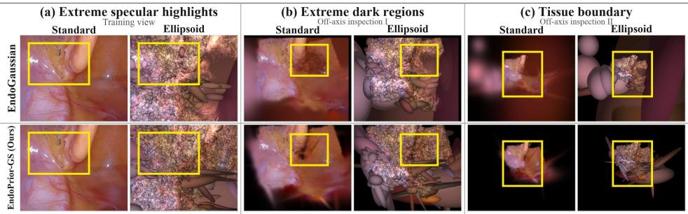
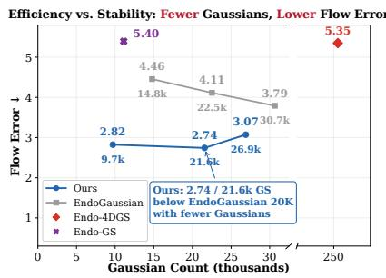
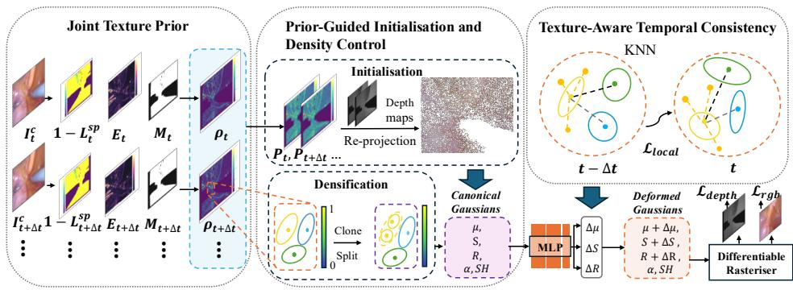
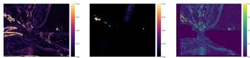
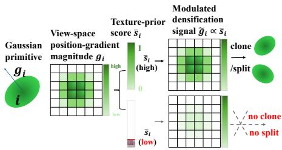
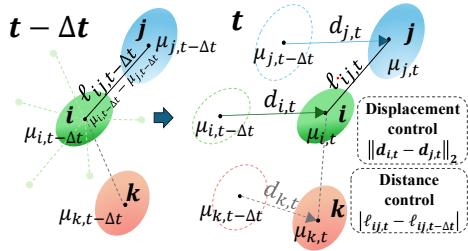
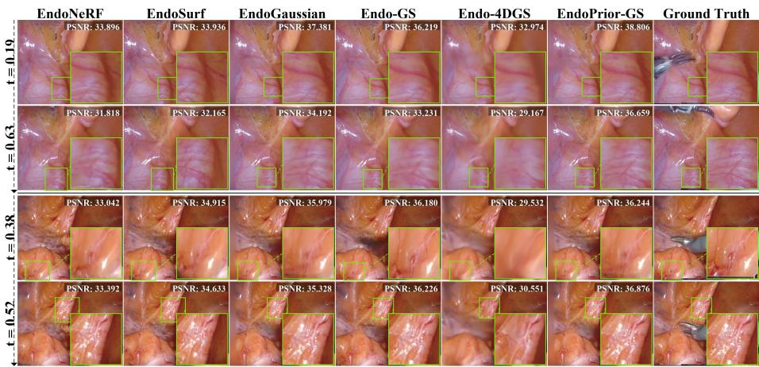
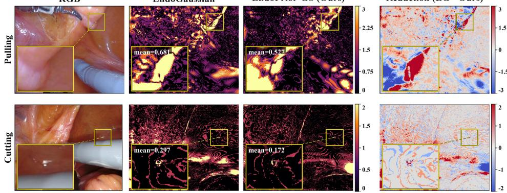
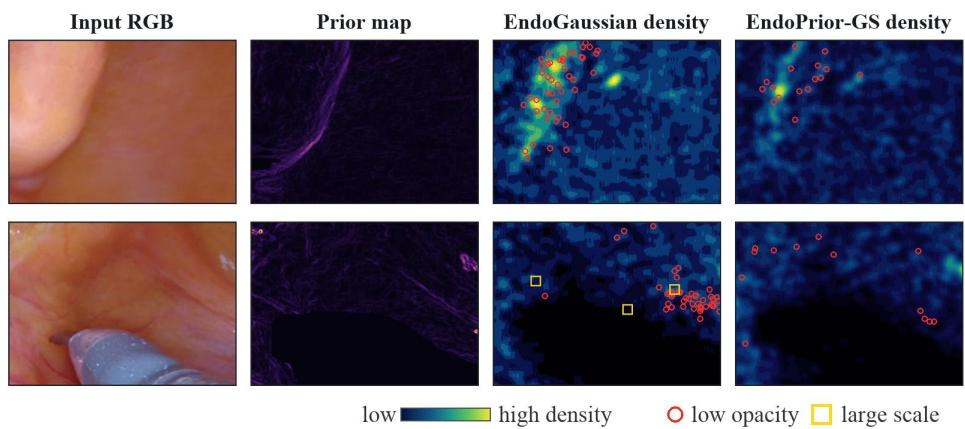

# EndoPrior-GS: Dynamic Endoscopic Reconstruction with a Joint Texture Prior

Jiaqi Huang1 , Shidong Wang1 ⋆, Tong Xin2 , and Kabita Adhikari1

1 School of Engineering, Newcastle University,

Newcastle upon Tyne NE1 7RU, UK

{J.huang57,shidong.wang,kabita.adhikari}@ncl.ac.uk

2 School of Computing, Newcastle University,

Newcastle upon Tyne NE4 5TG, UK

tong.xin@ncl.ac.uk

Abstract. Dynamic endoscopic reconstruction is fundamental to robotic surgery and computer-assisted interventions. While 3D Gaussian Splatting (3DGS) realises real-time rendering, its application to deformable intraoperative environments remains constrained by spurious geometry and varying illuminations. To address these limitations, we introduce EndoPrior-GS, a novel pipeline that explicitly couples frame-extracted vision heuristics and estimated depth maps. EndoPrior-GS derives a joint texture prior from a tool-filtered valid tissue mask, a non-specular photometric filter, and anatomical structural salience, yielding a probability map that guides primitive initialisation and subsequent density control. The prior is further extended to the temporal domain through a texture-aware term that dynamically weighs pairwise primitive contributions during training. We conduct extensive experiments on benchmark datasets EndoNeRF and SCARED, and the obtained results show that our method EndoPrior-GS reduces Flow Error by 27.7% and 25.8% over the representative approaches while preserving competitive rendering quality and real-time rendering speed. Our project website is available at https://jiaqi-huang-77.github.io/EndoPrior-GS/.

Keywords: Dynamic endoscopic reconstruction · 3D Gaussian Splatting · Prior-guided optimisation · Surgical scene reconstruction

## 1 Introduction

In recent years, the development of computer-assisted interventions, such as diagnostic endoscopy, has shifted towards generating real-time rendering and high-fidelity 3D reconstruction of the tissue field to enhance intraoperative navigation and visual interpretation of complex, non-rigid anatomical structures [3, 12, 17, 19]. While continuously implicit representations such as Neural Radiance Fields (NeRF) have shown promise for this task, the considerable computational overhead has hindered true real-time rendering [15, 23].

  
Fig. 1: Comparison of rendering results in challenging endoscopic regions. Panels (a)–(c) show extreme specular highlights, extreme dark regions, and tissue boundaries, respectively. Compared with EndoGaussian [13], EndoPrior-GS (Ours) mitigates semi-transparent floaters, oversized Gaussians near tissue boundaries, and degenerate sheet-like Gaussians in low-texture regions.

The emergence of 3D Gaussian Splatting (3DGS) has fundamentally transformed novel view synthesis, enabling high-speed synthesis via either explicit point-based representations [11, 29, 30] or pixel-wise re-projection [4, 5, 21, 26], coupled with tile-based rasterisation. However, adapting vanilla 3DGS to dynamic endoscopic sequences is challenging. Standard 3DGS relies heavily on Structure-from-Motion (SfM) frameworks like COLMAP [18] for initial sparse point cloud generation, which usually fails in endoscopy because of the uniform, featureless textures of internal organs and the severe spatial constraints of

monocular camera trajectories [7, 13].

The depth-reprojection pipelines [9, 13, 25], on the other hand, leverage monocular depth estimators to guide the initialisation of Gaussian primitives. Whilst computationally expedient, these approaches treat every pixel uniformly. Specifically, depth estimation cannot precisely capture geometry on highly reflective instruments, preserve sharp anatomical boundaries, and distinguish ambiguous regions under varying illumination as illustrated in Fig. 1. Furthermore, when

  
Fig. 2: Eficiency and Stability. EndoPrior-GS (Ours) achieves lower Flow Error with fewer Gaussians.

dynamic instruments pass across the tissue bed, both point-based and depth reprojection-based approaches struggle to maintain long-range inter-frame consistency, as the temporal correspondence of underlying tissue becomes non-rigid and deformable. The Flow Error for benchmarked approaches is shown in Fig. 2.

To overcome these limitations, we present a novel pipeline, EndoPrior-GS, that explicitly couples the depth maps with frame-wise vision heuristics to guide splatting with structural texture information. Firstly, we construct a probability map by taking the product of a binary tool-filtered valid tissue mask, a nonspecular photometric filter, and anatomical structural salience. This probability map then serves as a filter and priority guide that can be formulated and accumulated into a persistent texture-prior score to dynamically regulate the entire splatting process. We further introduce a texture-aware temporal regularisation term that can be imposed on the original 3DGS optimisation pipeline to dynamically assign diferent strengths to local neighbourhood primitive relations to enforce inter-frame consistency.

With EndoGaussian [13] as baseline, our contributions are summarised below:

– We propose a training-free Joint Texture Prior, derived from frame-wise visual heuristics, to provide an explicit prior-based mechanism for guiding Gaussian primitive evolution.

– We develop a Prior-Guided Initialisation and Density Control strategy that regulates Gaussian initialisation and density updates, reducing redundant growth in geometrically distorted regions.

– We introduce a Texture-Aware Temporal Consistency term that dynamically assigns diferent strengths to local neighbourhood primitive relations to enforce inter-frame consistency.

We conducted experiments to show that EndoPrior-GS reduces Flow Error by 27.7% and 25.8% on EndoNeRF and SCARED, respectively, while improving temporal consistency and suppressing redundant and unstable Gaussian growth.

## 2 Related Work

## 2.1 Endoscopic Neural Reconstruction

Dynamic endoscopic reconstruction is hindered by non-rigid tissue deformation, restricted camera trajectories, tool occlusion, specular reflections, motion blur, and ambiguous or weak tissue texture [6, 14, 23, 30]. Neural rendering methods have adapted radiance-field and neural-surface representations to surgical scenes. EndoNeRF [23] reconstructs deformable tissues with neural rendering, mask-guided ray sampling, and stereo depth priors, while EndoSurf [27] combines deformation, signed-distance, and radiance fields for dynamic surface reconstruction. These implicit formulations encode scene support as continuous fields queried along rays, requiring costly ray sampling and leaving no persistent local elements for direct refinement or explicit temporal constraints.

## 2.2 Dynamic Endoscopic Reconstruction with 3DGS

Explicit 3D Gaussian Splatting ofers a more controllable alternative for eficient dynamic endoscopic reconstruction [11]. Existing methods mainly incorporate auxiliary cues at specific stages.

Several methods address the initial Gaussian construction by re-projection from depth maps. EndoGaussian [13] proposes Holistic Gaussian Initialisation (HGI), where pixels from input frames are re-projected using estimated depth maps. SurgicalGaussian [25] follows the same general direction by using depth priors. Endo-4DGS [9] uses pseudo-depth maps for monocular Gaussian initialisation and applies confidence-guided depth learning during optimisation. These methods mainly apply depth and mask cues to construct or supervise the initial Gaussian set; subsequent primitive growth and pruning remain governed by standard 3DGS optimisation criteria.

Other works improve endoscopic Gaussian deformation, surface geometry, or appearance modelling. Endo-GS [30] utilises depth-guided supervision and surface-aligned regularisation to improve deformable tissue reconstruction under tool occlusion. SurgicalGaussian [25] imposes consistency losses on Gaussian position and covariance to regularise local motion. Surgical Gaussian Surfels [20] models tissue geometry with Gaussian surfels to avoid unrestricted volumetric scaling of standard 3DGS. Endo-4DGX [8] incorporates illumination embeddings for illumination-adaptive colour prediction. Although these methods are efective, they mostly address specific failure modes through targeted supervision, regularisation, geometric modelling, or appearance conditioning.

Rather than treating endoscopy-specific challenges merely as isolated terms in the training objective or as stand-alone correction modules, we re-examine the optimisation flow of 3DGS. The proposed EndoPrior-GS explicitly couples frame-extracted vision heuristics into the Gaussian splatting optimisation pipeline throughout training.

## 3 Method

## 3.1 Overview

  
Fig. 3: The proposed EndoPrior-GS framework.

The core pipeline of the proposed EndoPrior-GS is illustrated in Fig. 3. Specifically, we construct a unified texture prior that operates as a training-free heuristic mechanism. Computed directly from low-level image cues, this prior circumvents the need for heavy feature-extraction networks commonly found in standard approaches. The joint texture prior, alongside the raw input frame, is first normalised into an initialisation sampling distribution that adaptively determines whether a 3D Gaussian primitive should be initialised at a given pixel location. Furthermore, we formulate a texture-prior scoring function to dynamically govern the lifecycle of the Gaussians during the subsequent densification and pruning stages. Lastly, a texture-aware temporal regularisation term is integrated into the optimisation flow to enforce spatio-temporal consistency, ensuring stable and high-fidelity reconstruction of highly deformable dynamic endoscopic scenes.

## 3.2 Joint Texture Prior

We construct a joint texture prior to address the scenarios where standard 3DGS struggles when applied to dynamic endoscopic scenes, which are pervasively corrupted by instrument occlusions or back-

  
Fig. 4: Joint Texture Prior. $E _ { t } , L _ { t } ^ { \mathrm { s p } }$ and $\rho _ { t } = M _ { t } \odot \left( 1 - L _ { t } ^ { \mathrm { s p } } \right) \odot E _ { t }$

ground noise, specular reflections and lack of distinctive textures. These adverse factors often trigger floating artefacts, as illustrated in ${ \mathrm { F i g . } }$ 1.

To mitigate this, we propose a joint texture prior $\rho _ { t }$ as a pixel-wise spatial probability map over the image domain $\varOmega _ { t }$ , which denotes the discrete 2D pixelcoordinate space of the image frame t. For any pixel location ${ \mathbf u } = ( u , v ) \in \varOmega _ { t } ,$ $\rho _ { t } ( \mathbf { u } )$ is computed directly from low-level image cues:

$$
\rho _ { t } ( \mathbf { u } ) = M _ { t } ( \mathbf { u } ) \big ( 1 - L _ { t } ^ { \mathrm { s p } } ( \mathbf { u } ) \big ) E _ { t } ( \mathbf { u } ) ,\tag{1}
$$

where $M _ { t } ( \mathbf { u } ) \in \{ 0 , 1 \}$ is the value of the binary tool-filtered valid tissue mask at pixel \protec \mathbf u , $L _ { t } ^ { s p } ( \mathbf { u } ) \in [ 0 , 1 ]$ is the specular likelihood at $\mathbf { u } ,$ and $E _ { t } ( \mathbf { u } ) \in [ 0 , 1 ]$ is the anatomical structural salience at \protec \mathbf u.

Specifically, the mask $M _ { t }$ is extracted directly from the dataset, when ${ { M } _ { t } } ( { \bf { u } } ) =$ indicates usable tissue and ${ \cal M } _ { t } ( { \bf u } ) = 0$ indicates tool or invalid pixels. The reflection intensity map $L _ { t } ^ { \mathrm { s p } }$ is estimated from RGB intensity and saturation cues [1, 16]. The specular likelihood $L _ { t } ^ { \mathrm { s p } } ( \mathbf { u } ) \in [ 0 , 1 ]$ at pixel \protec \mathbf {u} is computed as:

$$
L _ { t } ^ { \mathrm { s p } } ( \mathbf { u } ) = \operatorname* { m a x } \left\{ \sigma \left( \frac { V _ { t } ( \mathbf { u } ) - \tau _ { v } } { \gamma _ { v } } \right) \sigma \left( \frac { \tau _ { s } - S _ { t } ( \mathbf { u } ) } { \gamma _ { s } } \right) , C _ { t } ( \mathbf { u } ) \right\} ,\tag{2}
$$

where $V _ { t } ( \mathbf { u } ) = \operatorname* { m a x } _ { c } I _ { t } ^ { c } ( \mathbf { u } )$ is the maximum RGB intensity, $I _ { t } ^ { c } ( \mathbf { u } )$ is the intensity of RGB colour channe $c \in \{ R , G , B \}$ at pixel \protec \mathbf {u} in frame $t ,$ and $S _ { t } ( { \mathbf { u } } ) = ( V _ { t } ( { \mathbf { u } } ) -$ min $: I _ { t } ^ { c } ( \mathbf { u } ) ) / ( V _ { t } ( \mathbf { u } ) + \epsilon )$ is the saturation computed from the RGB channels. $C _ { t }$ is a binary saturated-channel indicator map, and $C _ { t } ( \mathbf { u } ) \in \{ 0 , 1 \}$ is its value at pixel \protec \mathbf u. Specifically, $C _ { t } ( \mathbf { u } ) = 1$ when at least two RGB channels at \protec \mathbf u exceed $\tau _ { o } ,$ and ${ \cal C } _ { t } ( { \bf u } ) = 0$ otherwise. $\sigma ( \cdot )$ denotes the standard sigmoid activation function, which converts the intensity and saturation response into the continuous interval $[ 0 , 1 ] ; \tau _ { v }$ and $\tau _ { s }$ are the brightness and saturation thresholds, $\gamma _ { v }$ and $\gamma _ { s }$ are the temperature parameters controlling the sigmoid transition around $\tau _ { v }$ and $\tau _ { s }$

Concurrently, the structural salience value $E _ { t } ( \mathbf { u } ) \in [ 0 , 1 ]$ measures the strength of anatomical edges and texture at pixel \protec \mathbf {u}, which provides useful landmarks for tracking non-rigid tissue deformation. To compute this, the RGB frame is converted to a greyscale intensity map $I _ { t }$ . The horizontal and vertical gradients

$G _ { x } ( \mathbf { u } )$ and $G _ { y } ( \mathbf { u } )$ at pixel \protec \mathbf {u} are calculated by convolving the image with directional $3 \times 3$ Sobel kernels, $K _ { x }$ and $K _ { y } { \mathrm { : } }$

$$
G _ { x } ( \mathbf { u } ) = ( K _ { x } * I _ { t } ) ( \mathbf { u } ) , \quad G _ { y } ( \mathbf { u } ) = ( K _ { y } * I _ { t } ) ( \mathbf { u } ) ,\tag{3}
$$

where the kernels are defined as:

$$
K _ { x } = { \binom { - 1 0 1 } { - 2 0 2 } } , \quad K _ { y } = { \left[ \begin{array} { l l l } { - 1 - 2 - 1 } \\ { 0 } & { 0 } & { 0 } \\ { 1 } & { 2 } & { 1 } \end{array} \right] } .\tag{4}
$$

The unnormalised edge magnitude is obtained via the Euclidean norm $\hat { E } _ { t } ( { \mathbf { u } } ) =$ $\sqrt { G _ { x } ( \mathbf { u } ) ^ { 2 } + G _ { y } ( \mathbf { u } ) ^ { 2 } }$ . To bound this structural prior to the continuous range $[ 0 , 1 ]$ we normalise the edge magnitude using a robust percentile computed over validtissue pixels within the image domain $\varOmega _ { t }$

$$
E _ { t } ( \mathbf { u } ) = \operatorname* { m i n } \left\{ \frac { \hat { E } _ { t } ( \mathbf { u } ) } { { Q _ { p } } \Big ( \big \{ \hat { E } _ { t } ( \mathbf { x } ) \mid \mathbf { x } \in \varOmega _ { t } , \ M _ { t } ( \mathbf { x } ) = 1 \big \} \Big ) + \epsilon } , 1 \right\} ,\tag{5}
$$

where $Q _ { p } ( \cdot )$ is the p-th percentile, and \epsilon is a small numerical stabiliser. The cue maps and the resulting joint texture prior are illustrated in Fig. 4.

## 3.3 Prior-Guided Initialisation and Density Control

The joint texture prior is explicitly leveraged to guide the initialisation, densification, and pruning of Gaussian primitives. This approach fundamentally departs from the standard adaptive density-control operations of 3DGS [11], ensuring that the Gaussian allocation evolves selectively and aligns with the extracted structurally valid tissue regions.

Initialisation: Standard 3DGS initialises primitives using sparse Structurefrom-Motion (SfM) [18] point clouds. In endoscopic scenes, this triggers catastrophic failures as points erroneously anchor to transient surgical-tool regions or shifting specular highlights. To overcome this, we leverage the joint texture prior $\rho _ { t }$ to construct an initialisation sampling distribution $P _ { t }$ over the image domain $\varOmega _ { t }$ at frame t. For each pixel $\mathbf { u } \in \varOmega _ { t }$ , its sampling probability is defined as:

$$
P _ { t } ( \mathbf { u } ) = \eta _ { \mathrm { a p p } } \frac { \widetilde { M } _ { t } ( \mathbf { u } ) } { \sum _ { \mathbf { x } \in \Omega _ { t } } \widetilde { M } _ { t } ( \mathbf { x } ) + \epsilon } + ( 1 - \eta _ { \mathrm { a p p } } ) \frac { \rho _ { t } ( \mathbf { u } ) } { \sum _ { \mathbf { x } \in \Omega _ { t } } \rho _ { t } ( \mathbf { x } ) + \epsilon } ,\tag{6}
$$

where \epsilon is a small numerical stabiliser, and $\eta _ { \mathrm { a p p } } \in [ 0 , 1 ]$ is a balancing coeficient. The first term enforces uniform coverage over the valid tissue, whilst the second term prioritises non-specular, structurally rich regions. To prevent initialisation on unstable tool boundaries, the raw mask $M _ { t }$ is conservatively refined via morphological erosion: $\widetilde { M } _ { t } = M _ { t } \ominus B _ { k }$ where $\begin{array} { r } { \breve { M } _ { t } ( \mathbf { u } ) = \operatorname* { m i n } _ { \mathbf { v } \in B _ { k } } M _ { t } ( \mathbf { u } + \mathbf { v } ) } \end{array}$ , with \ominus denoting the erosion operator and $B _ { k }$ representing an elliptical structuring element of size $k \times k \left( k = 9 \right)$

After sampling a set of initialisation pixels from $P _ { t }$ , we back-project them with the estimated depth maps to form the initial Gaussian point cloud.

Densification: The complex and dynamic nature of endoscopic imaging, including specular highlights, tool boundaries, or motion blur, poses significant challenges for primitive densification, often resulting in severe geometric distortions. We address these vulnerabilities by introducing a persistent texture-prior score $\bar { s } _ { i }$ for each Gaussian that samples $\rho _ { t }$ at its projected image coordinates across frames, which attenuates densification for primitives repeatedly projected onto low-prior regions.

To obtain the persistent texture-prior score $\bar { s } _ { i } .$ , we first project each deformed Gaussian centre denoted by $\mu _ { i , t } \ \in \ \mathbb { R } ^ { 3 }$ at frame t onto the image plane as $\mathbf { c } _ { i , t } = \pi ( \pmb { \mu } _ { i , t } ; \varPi _ { t } )$ , where $\pi ( \cdot ; \boldsymbol { \Pi } _ { t } )$ is the camera projection function with camera parameters $\varPi _ { t } ,$ and $\mathbf { c } _ { i , t } \in \mathbb { R } ^ { 2 }$ is the projected image coordinate.

The texture-prior value of primitive i at frame t is computed as $\begin{array} { r l } { s _ { i , t } } & { { } = } \end{array}$ $m _ { i , t } B ( \rho _ { t } , \mathbf { c } _ { i , t } )$ , where \protec \mathcal {B} denotes bilinear interpolation of $\rho _ { t }$ at $\mathbf { c } _ { i , t } ,$ and $m _ { i , t } \in$ $\{ 0 , 1 \}$ is the projection-validity indicator that is set to $m _ { i , t } = 1$ when $\mathbf { c } _ { i , t }$ lies within the image bounds and $M _ { t } ( \mathbf { c } _ { i , t } ) = 1$ , and to $m _ { i , t } = 0$ otherwise. The texture-prior score $\bar { s } _ { i }$ is then obtained by averaging valid samples:

$$
\bar { s } _ { i } = \frac { \sum _ { t } s _ { i , t } } { \sum _ { t } m _ { i , t } + \epsilon } .\tag{7}
$$

The densification, therefore, can be modulated by incorporating the texture-prior score $\bar { s } _ { i }$ derived from Eq. (7), and denoted as:

$$
\begin{array} { r } { \tilde { g } _ { i } = \left[ \lambda _ { \operatorname* { m i n } } ^ { \mathrm { d e n } } + ( 1 - \lambda _ { \operatorname* { m i n } } ^ { \mathrm { d e n } } ) \bar { s } _ { i } \right] g _ { i } , } \end{array}\tag{8}
$$

where $g _ { i }$ is the view-space positiongradient magnitude, and $\lambda _ { \operatorname* { m i n } } ^ { \mathrm { d e n } } \ \in \ [ 0 , 1 ]$ is the minimum retained densification weight. This modulation attenuates densification triggers from artefact-

Fig. 5: Prior-Guided Densification. The densification trigger is modulated by the texture-prior score $\bar { s } _ { i }$

induced gradients, thereby reducing redundant Gaussian growth around geometrically distorted regions. This modulated densification mechanism is illustrated in Fig. 5, and more visuals can be found in Fig. 9.

Pruning: Our pruning strategy explicitly integrates the obtained texture-prior score $\bar { s } _ { i }$ alongside standard density-control criteria. Concretely, a primitive needs to satisfy the following criteria: $n _ { i } \ge n _ { \mathrm { m i n } } , \qquad \bar { s } _ { i } < \tau _ { \mathrm { p r i o r } } , \qquad \bar { \alpha } _ { i } < \tau _ { \alpha } .$ where $n _ { i } = \textstyle \sum _ { t } m _ { i , t }$ denotes the valid-projection count of Gaussian primitive $i , \bar { \alpha } _ { i }$ is the running mean opacity during training, $\tau _ { \mathrm { p r i o r } }$ and $\tau _ { \alpha }$ are the primitive textureprior threshold and the opacity threshold. This criterion targets semi-transparent primitives that are repeatedly projected onto low-prior regions, while avoiding aggressive pruning of newly created or insuficiently sampled Gaussians.

## 3.4 Texture-Aware Temporal Consistency

While prior-guided initialisation and density control optimise the spatial distribution of Gaussian primitives, spatially heterogeneous anatomical motion may drive the deformation field to produce incoherent local ofsets. To address this limitation, we incorporate a texture-aware temporal regularisation term that dynamically adjusts each primitive’s contribution over time and encourages neighbouring Gaussian primitives to move coherently.

Since all frames share a canonical Gaussian set, each primitive has a consistent identity. At frame t, we first construct an eligible primitive set $S _ { t }$ containing primitives that have valid projections at both $t - \Delta t$ and $t ,$ and meet the criteria of having a minimum number of valid projected samples, such that $n _ { i } ~ \ge ~ n _ { \operatorname* { m i n } }$ . Here, $\varDelta t$ represents the normalised interval between adja-

  
Fig. 6: Temporal Regularisation.

cent training frames, and $n _ { i }$ denotes the valid-projection count of primitive i. Then, for each eligible primitive $i \in S _ { t } .$ , we assign a primitive-specific motion weight $w _ { i } ^ { \mathrm { m o t } }$ derived from its texture-prior score $\bar { s } _ { i } ,$ which is formulated as:

$$
w _ { i } ^ { \mathrm { m o t } } = \sigma \left( \frac { \bar { s } _ { i } - \tau _ { m } } { \gamma _ { m } } \right) ,\tag{9}
$$

where $\sigma ( \cdot )$ denotes the standard sigmoid activation function that maps the resulting scalar to the continuous interval [0, 1] , $\tau _ { m }$ is a texture-prior threshold for motion weight, and $\gamma _ { m }$ represents a temperature scaling parameter.

We further extend this to pairwise primitive relations to ensure local deformation constraints are confined to pairs where both primitives are mutually trustworthy. Specifically, we compute a pairwise spatio-temporal afinity weight $w _ { i j , t }$ between primitive i and its neighbour j at frame t, which is defined as:

$$
w _ { i j , t } = \exp \left( - \frac { \left\| \pmb { \mu } _ { i , t - \Delta t } - \pmb { \mu } _ { j , t - \Delta t } \right\| _ { 2 } ^ { 2 } } { 2 \sigma _ { \mathrm { l o c } } ^ { 2 } } \right) w _ { i } ^ { \mathrm { m o t } } w _ { j } ^ { \mathrm { m o t } } ,\tag{10}
$$

where $\sigma _ { \mathrm { l o c } }$ controls the spatial range of the local neighbourhood, and $\mu _ { i , t - \varDelta t }$ and $\mu _ { j , t - \varDelta t }$ denote the 3D spatial centres of primitives i and j at the preceding reference frame $t - \Delta t$ , respectively.

The proposed texture-aware temporal consistency loss that leverages the above prior-driven weights to ensure a smooth deformation and maintain structural coherence across neighbouring frames is specifically defined as:

$$
\begin{array} { r l } & { \mathcal { L } _ { \mathrm { l o c a l } } = \lambda _ { \mathrm { d i s p } } \frac { \sum _ { i \in S _ { t } } \sum _ { j \in \mathcal { N } _ { K } ^ { ( t ) } ( i ) } w _ { i j , t } \left\| \mathbf { d } _ { i , t } - \mathbf { d } _ { j , t } \right\| _ { 2 } } { \sum _ { i \in S _ { t } } \sum _ { j \in \mathcal { N } _ { K } ^ { ( t ) } ( i ) } w _ { i j , t } + \epsilon } } \\ & { ~ + ~ \lambda _ { \mathrm { d i s t } } \frac { \sum _ { i \in S _ { t } } \sum _ { j \in \mathcal { N } _ { K } ^ { ( t ) } ( i ) } w _ { i j , t } h _ { \delta } \left( \left| \ell _ { i j , t } - \ell _ { i j , t - \Delta t } \right| \right) } { \sum _ { i \in S _ { t } } \sum _ { j \in \mathcal { N } _ { K } ^ { ( t ) } ( i ) } w _ { i j , t } + \epsilon } , } \end{array}\tag{11}
$$

where $\mathcal { N } _ { K } ^ { ( t ) } ( i )$ is the local neighbourhood of primitive i, containing the K nearest Gaussian primitives in $S _ { t } \ \backslash \ \{ i \}$ with distances measured at the preceding reference frame $t - \Delta t$ . The adjacent training frame displacements of primitives i and j are $\mathbf { d } _ { i , t } = \pmb { \mu } _ { i , t } - \pmb { \mu } _ { i , t - \Delta t }$ and ${ \bf d } _ { j , t } = \pmb { \mu } _ { j , t } - \pmb { \mu } _ { j , t - \Delta t }$ , respectively. The pairwise Gaussian centre distance of primitive i and j at frame t is defined as $\ell _ { i j , t } = \left\| \pmb { \mu } _ { i , t } - \pmb { \mu } _ { j , t } \right\| _ { 2 } .$ . The function $h _ { \delta } ( \cdot )$ denotes the Huber penalty with transition parameter $\bar { \delta } \ [ \mathrm { i } \tilde { 0 } ] , \lambda _ { \mathrm { d i s p } }$ and $\lambda _ { \mathrm { d i s t } }$ balance the first and second terms, and \epsilon is a small constant for numerical stability. The first term reduces isolated primitive motion drift by encouraging neighbouring primitives to have similar adjacentframe displacements. The second term discourages sudden local stretching or collapse by penalising changes in pairwise Gaussian centre distances. The mechanism is illustrated in Fig. 6.

The training objective of our framework is formulated as a linear combination of baseline objectives and our proposed texture-aware constraint. Formally,

$$
\mathcal { L } _ { \mathrm { t o t a l } } = \mathcal { L } _ { \mathrm { r g b } } + \lambda _ { \mathrm { d e p t h } } \mathcal { L } _ { \mathrm { d e p t h } } + \lambda _ { \mathrm { t v } } \mathcal { L } _ { \mathrm { t v } } + \lambda _ { \mathrm { l o c a l } } \mathcal { L } _ { \mathrm { l o c a l } } ,\tag{12}
$$

where $\mathcal { L } _ { \mathrm { r g b } } , \mathcal { L } _ { \mathrm { d e p t h } } ,$ and ${ \mathcal L } _ { \mathrm { t v } }$ represent the masked RGB colour loss, depth loss, and total variation (TV) loss introduced by EndoGaussian [13], respectively; the scaling coeficients $\lambda _ { \mathrm { d e p t h } } , \lambda _ { \mathrm { t v } }$ , and $\lambda _ { \mathrm { l o c a l } }$ are hyperparameters that balance the contribution of each respective penalty during the joint optimisation flow.

## 4 Experiments

## 4.1 Experimental Setup

Datasets. We evaluate our method on two publicly released dynamic endoscopic reconstruction benchmarks: EndoNeRF [23] and SCARED [2].

The EndoNeRF dataset [23] consists of six stereo video sequences captured from DaVinci robotic surgical procedures, totalling 807 frames. Each sequence has a resolution of 512×640 and exhibits significant non-rigid tissue deformation and tool occlusion. Following prior work [9,13], we evaluate on two public cases (pulling and cutting) using a 7:1 train-test split.

The SCARED dataset [2] consists of stereo RGB-D endoscopic sequences captured from porcine cadaver abdominal anatomies using a DaVinci endoscope. We evaluate on datasets 1, 2, 3, 6, and 7. Following the standard protocol used in previous endoscopic reconstruction works [13, 27], we use a fixed temporal interval split on each sequence into training and testing frames with a 7:1 ratio.

Metrics. We assess rendering quality using standard image metrics: Peak Signalto-Noise Ratio (PSNR), Structural Similarity Index Measure (SSIM) [24], and Learned Perceptual Image Patch Similarity (LPIPS) [28]. Depth accuracy is measured using root mean square error (RMSE) over pixels with valid depth annotations. To evaluate temporal consistency, we report a RAFT-based Flow Error [22] between the rendered and ground-truth video sequences within valid tissue regions. We also report the Gaussian primitive count $N _ { \mathrm { G S } }$ after training and rendering speed in frames per second (FPS) to measure rendering eficiency.

A rendered-depth temporal instability diagnostic is reported in Sec. 4.4 to quantify adjacent-frame depth variation. The diagnostic is computed for an adjacent frame pair $( t - \varDelta t , t )$ as $\begin{array} { r } { \mathcal { T } _ { t } = \frac { 1 } { \vert \boldsymbol { \Omega } _ { t - \Delta t , t } ^ { \mathrm { v a l } } \vert } \sum _ { \mathbf { u } \in \Omega _ { t - \Delta t , t } ^ { \mathrm { v a l } } } \Big \vert \hat { D } _ { t } ( \mathbf { u } ) - \hat { D } _ { t - \Delta t } ( \mathbf { u } ) \Big \vert } \end{array}$ where $\hat { D } _ { t } ( { \mathbf { u } } )$ denotes the rendered depth in frame t at pixel \protec \mathbf {u}. The evaluation domain is $\Omega _ { t - \Delta t , t } ^ { \mathrm { v a l } } = \left\{ \mathbf { u } \in \Omega _ { t } \Big \vert \ M _ { t - \Delta t } ( \mathbf { u } ) = M _ { t } ( \mathbf { u } ) = 1 , \ \hat { D } _ { t - \Delta t } ( \mathbf { u } ) \hat { D } _ { t } ( \mathbf { u } ) > 0 \right\}$ where ${ \cal M } _ { t - \Delta t } ( { \bf u } ) = \dot { M _ { t } } ( { \bf u } ) = 1$ indicates that pixel \protec \mathbf {u} is retained by the binary tool-filtered valid tissue masks in both frames, and $\hat { D } _ { t - \varDelta t } ( \mathbf { u } ) \hat { D } _ { t } ( \mathbf { u } ) > 0$ indicates valid rendered depth values in both frames.

Implementation details. All experiments follow the training schedule as EndoGaussian [13], with 1,000 coarse-stage iterations and 3,000 fine-stage iterations, and are conducted on an NVIDIA RTX 6000 Ada Generation GPU.

In Sec. 3.2, the specular likelihood in Eq. 2 uses $\tau _ { v } = 0 . 8 5 , \tau _ { s } = 0 . 3 5 , \gamma _ { v } =$ $0 . 0 4 , \gamma _ { s } = 0 . 0 8$ , and saturated-channel threshold $\tau _ { o } = 0 . 9 2$ . For Eq. 5, we set percentile $p = 9 9$ . In Sec. 3.3, we set the initialisation balancing coeficient in Eq. 6 to $\eta _ { \mathrm { a p p } } = 0 . 4 5$ . The texture-prior score $\bar { s } _ { i }$ is updated every 100 iterations, following 3DGS [11]. Prior-guided densification applies Eq. 8 with $\lambda _ { \mathrm { m i n } } ^ { \mathrm { d e n } } = 0 . 3 5$ During pruning, we set $\tau _ { \mathrm { p r i o r } } = 0 . 2 , n _ { \mathrm { m i n } } = 2 0$ , opacity threshold $\tau _ { \alpha } = 0 . 0 0 7 5$ In Sec. 3.4, the weight in Eq. 9 is initialised with $\tau _ { m } = 0 . 4 5$ and $\gamma _ { m } = 0 . 0 8$ . We set $\lambda _ { \mathrm { d i s t } } = 0 . 2 , \lambda _ { \mathrm { d i s p } } = 1 . 0 , K = 8$ and Huber transition parameter $\delta = 0 . 0 1$ in Eq. 11, respectively. The texture-aware temporal regularisation term is weighted by $\lambda _ { \mathrm { l o c a l } } = 1 0 ^ { - 6 }$ in Eq. 12. We use fixed hyperparameters across all sequences.

## 4.2 Comparison with Representative Methods

  
Fig. 7: Qualitative comparison with representative endoscopic reconstruction methods. Results are shown on selected pulling and cutting sequences. Rows denote timestamps and columns denote methods or ground truth.

<table><tr><td>Method</td><td>PSNR↑</td><td>SSIM↑</td><td>LPIPS↓</td><td>RMSE↓</td><td>Flow Error↓</td><td>FPS↑</td></tr><tr><td colspan="7">EndoNeRF</td></tr><tr><td>EndoNeRF [23]1</td><td>32.039</td><td>0.925</td><td>0.081</td><td></td><td></td><td></td></tr><tr><td></td><td>27.519</td><td>0.933</td><td>0.128</td><td>2.522</td><td>5.421</td><td>0.14</td></tr><tr><td>EndoSurf [27]2</td><td>34.992</td><td>0.954</td><td>0.113</td><td>1.000</td><td></td><td></td></tr><tr><td></td><td>35.004</td><td>0.845</td><td>0.243</td><td>2.584</td><td>5.284</td><td>12.84</td></tr><tr><td>EndoGaussian [13]5</td><td>37.849</td><td>0.963</td><td>0.054</td><td></td><td></td><td></td></tr><tr><td></td><td>37.322</td><td>0.958</td><td>0.060</td><td>2.482</td><td>3.791</td><td>279</td></tr><tr><td>Endo-GS [30]³</td><td>37.935</td><td>0.966</td><td>0.034</td><td></td><td></td><td></td></tr><tr><td></td><td>36.710</td><td>0.955</td><td>0.067</td><td>2.477</td><td>5.396</td><td>76</td></tr><tr><td>Endo-4DGS [9]4</td><td>37.205</td><td>0.957</td><td>0.038</td><td></td><td></td><td></td></tr><tr><td></td><td>35.353</td><td>0.924</td><td>0.104</td><td>2.686</td><td>5.369</td><td>15</td></tr><tr><td>EndoPrior-GS (Ours)</td><td>38.071</td><td>0.967</td><td>0.071</td><td>2.260</td><td>2.742</td><td>305</td></tr><tr><td colspan="7">SCARED</td></tr><tr><td>EndoNeRF [23]</td><td></td><td></td><td></td><td></td><td></td><td></td></tr><tr><td>EndoSurf [27]2</td><td>24.345</td><td>0.768</td><td>0.313</td><td>2.723</td><td>5.894</td><td>0.06</td></tr><tr><td></td><td>23.637</td><td>0.794</td><td>0.351</td><td></td><td></td><td></td></tr><tr><td></td><td>25.020</td><td>0.802</td><td>0.356</td><td>2.501</td><td>5.401</td><td>2</td></tr><tr><td>EndoGaussian [13]5</td><td>27.042</td><td>0.827</td><td>0.267</td><td></td><td></td><td></td></tr><tr><td></td><td>27.070</td><td>0.744</td><td>0.249</td><td>2.675</td><td>5.232</td><td>269</td></tr><tr><td>Endo-GS [30]3</td><td></td><td></td><td></td><td></td><td></td><td></td></tr><tr><td></td><td>27.786</td><td>0.781</td><td>0.245</td><td>2.548</td><td>4.867</td><td>76</td></tr><tr><td>Endo-4DGS [9]⁴</td><td></td><td></td><td></td><td></td><td></td><td></td></tr><tr><td></td><td>30.908</td><td>0.807</td><td>0.167</td><td>4.897</td><td>4.905</td><td>17</td></tr><tr><td>EndoPrior-GS (Ours)</td><td>31.089</td><td>0.856</td><td>0.196</td><td>2.490</td><td>3.609</td><td>292</td></tr></table>

Table 1: Quantitative comparison on EndoNeRF [23] and SCARED [2]. Grey cells denote original-paper values, followed by our reproduced results under a unified protocol. Red superscripts indicate oficial GitHub links. Best and second-best results are highlighted in red and orange.

Table 1 compares EndoPrior-GS (Ours) with representative endoscopic reconstruction methods from two categories: (i) neural reconstruction methods, including EndoNeRF [23] and EndoSurf [27]; and (ii) Gaussian-based methods, including EndoGaussian [13], Endo-GS [30], and Endo-4DGS [9]. EndoPrior-GS (Ours) consistently achieves more stable reconstruction in the temporal domain, as reflected by lower Flow Error. On EndoNeRF [23]: Compared with EndoGaussian [13], EndoPrior-GS (Ours) reduces Flow Error from 3.791 to 2.742 , corresponding to a 27.7% relative reduction, while maintaining competitive rendering quality and speed. On SCARED [2]: Compared with Endo-GS [30], the strongest baseline in terms of Flow Error, EndoPrior-GS (Ours) reduces Flow Error from 4.867 to 3.609 , giving a 25.8% relative reduction. Fig. 7 further shows that EndoPrior-GS preserves more continuous tissue structures in challenging regions, consistent with the quantitative improvements.

## 4.3 Eficiency and Stability under Matched Initialisation Budgets

Table 2 evaluates EndoPrior-GS (Ours) and EndoGaussian [13] under matched initialisation budgets. This matched-budget analysis decouples the observed temporal stability gain from Gaussian count. Across the 10K, 20K, and 30K initialisation budgets, EndoPrior-GS achieves lower Flow Error with fewer final Gaussians, indicating that the improvement arises independently of increased primitive capacity.

<table><tr><td>Budget</td><td>Method</td><td> $N _ { \mathrm { G S \downarrow } }$ </td><td>PSNR↑</td><td>SSIM↑</td><td>LPIPS↓</td><td>RMSE↓</td><td>Flow Error↓</td><td>FPS↑</td></tr><tr><td rowspan="2">10K</td><td>EndoGaussian [13]</td><td>14.8K</td><td>36.81</td><td>0.953</td><td>0.084</td><td>2.97</td><td>4.46</td><td>307</td></tr><tr><td>EndoPrior-GS</td><td>9.7K</td><td>36.87</td><td>0.951</td><td>0.095</td><td>2.47</td><td>2.82</td><td>310</td></tr><tr><td rowspan="2">20K</td><td>EndoGaussian [13]</td><td>22.5K</td><td>37.14</td><td>0.957</td><td>0.066</td><td>2.80</td><td>4.11</td><td>295</td></tr><tr><td>EndoPrior-GS</td><td>21.6K</td><td>38.07</td><td>0.967</td><td>0.071</td><td>2.26</td><td>2.74</td><td>305</td></tr><tr><td rowspan="2">30K</td><td>EndoGaussian [13]</td><td>30.7K</td><td>37.32</td><td>0.959</td><td>0.058</td><td>2.48</td><td>3.79</td><td>280</td></tr><tr><td>EndoPrior-GS</td><td>26.9K</td><td>38.12</td><td>0.973</td><td>0.067</td><td>2.27</td><td>3.07</td><td>300</td></tr></table>

Table 2: Eficiency and stability comparison under matched initialisation budgets. The budget denotes the nominal initialisation setting, while $N _ { \mathrm { G S } }$ is the Gaussian count after training.

## 4.4 Analysis of Temporal Consistency

Beyond the RAFT-based Flow Error, we report the average rendered-depth temporal instability as a complementary diagnostic of temporal stability. We emphasise that these metrics eval

<table><tr><td>Seq.</td><td>EndoG. [13] EndoPrior-GS</td></tr><tr><td>Pulling 0.4459</td><td>0.3786 15.1%</td></tr><tr><td>Cutting 0.1166</td><td>0.1071 8.1%</td></tr><tr><td>Table 3: Average</td><td>rendered-depth</td></tr><tr><td>temporal instability diagnostic.</td><td></td></tr></table>

uate the consistency of rendered sequences within valid tissue regions. Table 3 reports diagnostic values averaged over all adjacent frame pairs. EndoPrior-GS (Ours) reduces the diagnostic from 0.459 to 0.3786 on pulling sequence and from 0.16 to 0.1071 on cutting sequence, corresponding to 15.1\% and 8.1\% reductions, respectively. Fig. 8 qualitatively confirms lower local adjacent-frame depth variation in the highlighted tissue regions. The reduction map is Endo-Gaussian [13] minus EndoPrior-GS (Ours), where positive values indicate lower variation for EndoPrior-GS (Ours). Reported means in Fig. 8 are computed only within the zoomed regions.

RGB  
EndoGaussian  
EndoPrior-GS (Ours)  
  
Reduction (EG - Ours)  
Fig. 8: Comparison of rendered-depth temporal instability diagnostic maps. Heat-maps visualise representative pixel-wise adjacent-frame depth variation.

## 4.5 Analysis of Primitive Distribution

<table><tr><td>Variant</td><td> $N _ { \mathrm { G S } } \ .$  →</td><td> $N _ { \mathrm { l o w - } p r i o r }$ </td><td> $N _ { \mathrm { l o w } - \alpha }$  ↓</td><td> $N _ { \mathrm { l a r g e - } s c a l e } ~ \downarrow$ </td><td>Flow Error↓</td></tr><tr><td>Baseline</td><td>22.5k</td><td>19.9k</td><td>262.0</td><td>5.0</td><td>4.112</td></tr><tr><td>w/o Texture-aware temp. reg.</td><td>21.5k</td><td>19.9k</td><td>110.3</td><td>0.7</td><td>3.152</td></tr><tr><td>EndoPrior-GS (Ours)</td><td>21.6k</td><td>19.9k</td><td>105.0</td><td>0.0</td><td>2.742</td></tr></table>

Table 4: Quantitative primitive count diagnostic analysis. Counts use fixed post-hoc thresholds after training. The baseline denotes EndoGaussian [13] under 20K initialisation budgets.

  
Fig. 9: Qualitative primitive distribution analysis. We show input RGB, joint texture prior $\rho _ { t } .$ , and projected Gaussian density, with diagnostic markers computed using the thresholds in Table 4.

The proposed EndoPrior-GS framework suppresses artefact-driven redundant Gaussian growth. Table 4 shows that all variants have comparable final Gaussian counts $N _ { \mathrm { G S } }$ (21.5K–22.5K) and identical low-prior primitive counts $N _ { \mathrm { l o w - } p r i o r }$ (19.9K), measured with $\bar { s } _ { i } ~ < ~ 0 . 2$ after at least 20 valid observations. Under these comparable counts, EndoPrior-GS (Ours) reduces low-opacity primitives $N _ { \mathrm { l o w } - \alpha }$ with opacity $< 0 . 0 1$ from 262.0 to 105.0, and large-scale primitives with normalised-coordinate scale $> 4 0$ from 5.0 to 0.0. These diagnostics indicate that the proposed prior-guided strategy does not simply remove low-prior primitives. Instead, it suppresses opacity-inefective and over-scaled primitive growth while maintaining comparable projected primitive coverage over valid tissue regions. Fig. 9 explains this behaviour qualitatively. Compared with EndoGaussian [13], EndoPrior-GS reduces redundant and unstable growth around surgical-tool and tissue boundary areas.

## 4.6 Ablation Study

Texture-aware temporal regularisation ablation. Table 5 isolates the texture-aware temporal regularisation term in Sec. 3.4. Prior-guided weighting

substantially reduces Flow Error from 3.569 to 3.003 (15.9%) under identical temporal constraints. Distance control provides an additional gain, while the full formulation achieves the lowest RMSE with comparable PSNR.
<table><tr><td>Variant</td><td>Pair. w. Disp. c. Dist. c. PSNR↑</td><td></td><td></td><td></td><td>SSIM↑</td><td>LPIPS↓</td><td></td><td>RMSE↓ Flow Error↓</td></tr><tr><td>Baseline</td><td>X</td><td>X</td><td>X</td><td>37.147</td><td>0.957</td><td>0.066</td><td>2.804</td><td>4.112</td></tr><tr><td>w/o Pairwise weighting</td><td>X</td><td>√</td><td>√</td><td>37.017</td><td>0.959</td><td>0.068</td><td>2.785</td><td>3.569</td></tr><tr><td>w/o Distance control</td><td>√</td><td>√</td><td>X</td><td>37.104</td><td>0.959</td><td>0.070</td><td>2.797</td><td>3.144</td></tr><tr><td>w/ Temporal reg.</td><td>√</td><td>√</td><td>√</td><td>37.129</td><td>0.961</td><td>0.069</td><td>2.575</td><td>3.003</td></tr></table>

Table 5: Ablation of texture-aware temporal regularisation. Pair. w.: pairwise afinity weighting; Disp. c.: primitive displacement control; Dist. c.: pairwise distance control.

Components ablation. Table 6 evaluates progressive component contributions under the matched 20K initialisation budget. Prior-guided initialisation reduces Flow Error from 4.112 to 3.343, and prior-guided density control further lowers it to 3.152. Temporal regularisation constrains deformed Gaussian centres to discourage extreme local deformation, further reducing Flow Error to 2.701 while achieving the highest PSNR and lowest RMSE among the tested variants.
<table><tr><td>Variant</td><td>Pri. init. Pri. dens.</td><td>Temp. reg.</td><td>PSNR↑</td><td>SSIM↑</td><td>LPIPS↓</td><td></td><td>RMSE↓ Flow Error↓</td></tr><tr><td>Prior init.</td><td>√</td><td>X X</td><td>37.080</td><td>0.959</td><td>0.060</td><td>2.727</td><td>3.343</td></tr><tr><td>+ Prior dens.</td><td>√</td><td>√ X</td><td>37.165</td><td>0.961</td><td>0.065</td><td>2.479</td><td>3.152</td></tr><tr><td>Full model</td><td>√</td><td>√ √</td><td>38.041</td><td>0.967</td><td>0.071</td><td>2.260</td><td>2.701</td></tr></table>

Table 6: Ablation study of the components. All variants are evaluated under the matched 20K budget.

## 5 Conclusion

This paper presents EndoPrior-GS, a novel dynamic endoscopic Gaussian reconstruction framework that uses a heuristic and training-free joint texture prior to guide Gaussian primitive evolution. We further extend the texture prior to the temporal domain through a texture-aware term that dynamically weighs pairwise primitive contribution during training. Extensive experiments show that EndoPrior-GS reduces Flow Error by 27.7% and 25.8% on EndoNeRF and SCARED, respectively. For temporal evaluation, Flow Error is computed from RAFT-estimated image-plane optical flow, as dense 3D tissue-motion ground truth is unavailable in current benchmarks; we therefore use it together with an adjacent-frame rendered-depth diagnostic as supporting evidence for rendered temporal stability and consistency. The current prior is derived from low-level image cues and assumes available tool-filtered valid tissue support. It may become less discriminative under pronounced blur, over-saturation, dense smoke occlusion, highly ambiguous tissue texture, or noisy predicted masks.

## References

1. Akbari, M., Mohrekesh, M., Najariani, K., Karimi, N., Samavi, S., Soroushmehr, S.R.: Adaptive specular reflection detection and inpainting in colonoscopy video frames. In: 2018 25th IEEE international conference on image processing (ICIP). pp. 3134–3138. IEEE (2018) 5

2. Allan, M., McLeod, J., Wang, C., Rosenthal, J.C., Hu, Z., Gard, N., Eisert, P., Fu, K.X., Zefiro, T., Xia, W., et al.: Stereo correspondence and reconstruction of endoscopic data challenge. arXiv preprint arXiv:2101.01133 (2021) 9, 11

3. Bianchi, L., Cercenelli, L., Bortolani, B., Piazza, P., Droghetti, M., Boschi, S., Gaudiano, C., Carpani, G., Chessa, F., Lodi, S., et al.: 3D renal model for surgical planning of partial nephrectomy: a way to improve surgical outcomes. Frontiers in Oncology 12, 1046505 (2022) 1

4. Charatan, D., Li, S.L., Tagliasacchi, A., Sitzmann, V.: pixelSplat: 3D Gaussian splats from image pairs for scalable generalizable 3D reconstruction. In: Proceedings of the IEEE/CVF conference on computer vision and pattern recognition. pp. 19457–19467 (2024) 2

5. Chen, Y., Xu, H., Zheng, C., Zhuang, B., Pollefeys, M., Geiger, A., Cham, T.J., Cai, J.: MVSplat: Eficient 3D Gaussian Splatting from sparse multi-view images. In: European conference on computer vision. pp. 370–386. Springer (2024) 2

6. Edwards, P.E., Psychogyios, D., Speidel, S., Maier-Hein, L., Stoyanov, D.: SERV-CT: A disparity dataset from cone-beam CT for validation of endoscopic 3D reconstruction. Medical image analysis 76, 102302 (2022) 3

7. Guo, J., Wang, J., Kang, D., Dong, W., Wang, W., Liu, Y.h.: Free-SurGS: SfM-free 3D Gaussian Splatting for surgical scene reconstruction. In: International Conference on Medical Image Computing and Computer-Assisted Intervention. pp. 350– 360. Springer (2024) 2

8. Huang, Y., Bai, L., Cui, B., Li, Y., Chen, T., Wang, J., Wu, J., Lei, Z., Liu, H., Ren, H.: Endo-4DGX: Robust endoscopic scene reconstruction and illumination correction with Gaussian Splatting. In: International Conference on Medical Image Computing and Computer-Assisted Intervention. pp. 181–191. Springer (2025) 4

9. Huang, Y., Cui, B., Bai, L., Guo, Z., Xu, M., Islam, M., Ren, H.: Endo-4DGS: Endoscopic monocular scene reconstruction with 4D Gaussian Splatting. In: International Conference on Medical Image Computing and Computer-Assisted Intervention. pp. 197–207. Springer (2024) 2, 4, 9, 11

10. Huber, P.J.: Robust estimation of a location parameter. The Annals of Mathematical Statistics 35(1), 73–101 (1964) 9

11. Kerbl, B., Kopanas, G., Leimkühler, T., Drettakis, G.: 3D Gaussian Splatting for real-time radiance field rendering. ACM Transactions on Graphics 42(4) (July 2023) 2, 3, 6, 10

12. Lee, A., Baker, T.S., Bederson, J.B., Rapoport, B.I.: Levels of autonomy in FDAcleared surgical robots: A systematic review. NPJ Digital Medicine 7(1), 103 (2024) 1

13. Liu, Y., Li, C., Liu, H., Yang, C., Yuan, Y.: Foundation model-guided Gaussian Splatting for 4D reconstruction of deformable tissues. IEEE Transactions on Medical Imaging (2025) 2, 3, 9, 10, 11, 12, 13

14. Long, Y., Li, Z., Yee, C.H., Ng, C.F., Taylor, R.H., Unberath, M., Dou, Q.: E-DSSR: eficient dynamic surgical scene reconstruction with transformer-based stereoscopic depth perception. In: International Conference on Medical Image Computing and Computer-Assisted Intervention. pp. 415–425. Springer (2021) 3

15. Mildenhall, B., Srinivasan, P.P., Tancik, M., Barron, J.T., Ramamoorthi, R., Ng, R.: NeRF: representing scenes as neural radiance fields for view synthesis. Communications of the ACM 65(1), 99–106 (2021) 1

16. Morgand, A., Tamaazousti, M.: Generic and real-time detection of specular reflections in images. In: 2014 International conference on computer vision theory and applications (VISAPP). vol. 1, pp. 274–282. IEEE (2014) 5

17. Portelli, M., Bianco, S., Bezzina, T., Abela, J.: Virtual reality training compared with apprenticeship training in laparoscopic surgery: a meta-analysis. The Annals of the Royal College of Surgeons of England 102(9), 672–684 (2020) 1

18. Schonberger, J.L., Frahm, J.M.: Structure-from-Motion revisited. In: Proceedings of the IEEE conference on computer vision and pattern recognition. pp. 4104–4113 (2016) 2, 6

19. Seymour, N.E., Gallagher, A.G., Roman, S.A., O’Brien, M.K., Bansal, V.K., Andersen, D.K., Satava, R.M.: Virtual reality training improves operating room performance: results of a randomized, double-blinded study. Annals of surgery 236(4), 458–464 (2002) 1

20. Sunmola, I.O., Zhao, Z., Schmidgall, S., Wang, Y., Scheikl, P.M., Pham, V., Krieger, A.: Surgical Gaussian Surfels: Highly accurate real-time surgical scene rendering using Gaussian Surfels. In: Proceedings of the IEEE/CVF Winter Conference on Applications of Computer Vision. pp. 4515–4524 (2026) 4

21. Szymanowicz, S., Rupprecht, C., Vedaldi, A.: Splatter Image: Ultra-fast singleview 3D reconstruction. In: Proceedings of the IEEE/CVF conference on computer vision and pattern recognition. pp. 10208–10217 (2024) 2

22. Teed, Z., Deng, J.: RAFT: Recurrent all-pairs field transforms for optical flow. In: European conference on computer vision. pp. 402–419. Springer (2020) 9

23. Wang, Y., Long, Y., Fan, S.H., Dou, Q.: Neural rendering for Stereo 3D Reconstruction of deformable tissues in robotic surgery. In: International conference on medical image computing and computer-assisted intervention. pp. 431–441. Springer (2022) 1, 3, 9, 11

24. Wang, Z., Bovik, A.C., Sheikh, H.R., Simoncelli, E.P.: Image quality assessment: from error visibility to structural similarity. IEEE Transactions on Image Processing 13(4), 600–612 (2004) 9

25. Xie, W., Yao, J., Cao, X., Lin, Q., Tang, Z., Dong, X., Guo, X.: SurgicalGaussian: Deformable 3D Gaussians for high-fidelity surgical scene reconstruction. In: International Conference on Medical Image Computing and Computer-Assisted Intervention. pp. 617–627. Springer (2024) 2, 3, 4

26. Xu, H., Peng, S., Wang, F., Blum, H., Barath, D., Geiger, A., Pollefeys, M.: Depth-Splat: Connecting Gaussian Splatting and depth. In: Proceedings of the Computer Vision and Pattern Recognition Conference. pp. 16453–16463 (2025) 2

27. Zha, R., Cheng, X., Li, H., Harandi, M., Ge, Z.: EndoSurf: Neural surface reconstruction of deformable tissues with stereo endoscope videos. In: International conference on medical image computing and computer-assisted intervention. pp. 13–23. Springer (2023) 3, 9, 11

28. Zhang, R., Isola, P., Efros, A.A., Shechtman, E., Wang, O.: The unreasonable efectiveness of deep features as a perceptual metric. In: Proceedings of the IEEE conference on computer vision and pattern recognition. pp. 586–595 (2018) 9

29. Zhang, Z., Hu, W., Lao, Y., He, T., Zhao, H.: Pixel-GS: Density control with pixelaware gradient for 3D Gaussian Splatting. In: European Conference on Computer Vision. pp. 326–342. Springer (2024) 2

30. Zhu, L., Wang, Z., Cui, J., Jin, Z., Lin, G., Yu, L.: EndoGS: Deformable endoscopic tissues reconstruction with Gaussian Splatting. In: International Conference on Medical Image Computing and Computer-Assisted Intervention. pp. 135–145. Springer (2024) 2, 3, 4, 11