# EviViT: Evidence-Adaptive Vision Transformers for Fine-Grained Perception

Yaoxin Niu1,2,† Zhangquan Chen1,† Yang Zhang3 Xiang An4 Zhumei Wang5 Chih-Ting Liao6 Hongkun Cao2 Ruqi Huang1,

1 Tsinghua University 2 Peng Cheng Laboratory 3 The Hong Kong University of Science and Technology 4 LMMs-Lab Beijing Institute of Technology 6 University of New South Wales

† Equal contribution. ∗ Corresponding author.

Code: github.com/YXNiu/EviViT Data: huggingface.co/datasets/YXNiu/Human-Search-Traces

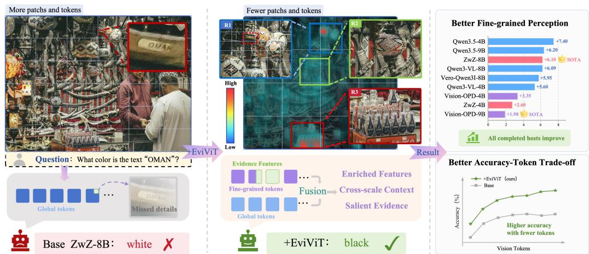  
Figure 1: Question-conditioned detail allocation. A global-only host misses the small queried text despite processing more patches. EviViT predicts an evidence density learned from human search annotations, re-reads selected regions at native detail, and fuses them with the global scene. Across compatible hosts, this improves fine-grained accuracy using fewer tokens under matched ceilings.

## ABSTRACT

Fine-grained visual perception enables vision–language models to distinguish subtle attributes and ground their answers in visual evidence. In high-resolution scenes, processing the whole image at greater resolution spends visual tokens on irrelevant content, while isolated crops can lose the context needed to interpret the selected evidence. We introduce EviViT, a lightweight attachment that learns where a pretrained vision transformer should acquire detail. Human visual-search traces supervise a question-conditioned evidence density, which guides regional re-reading from the original pixels and the allocation of visual tokens. A sparse, coordinateaware bridge then connects the regional features to the global scene, allowing the host to interpret precise evidence in context. Learned with the host backbone frozen, the attachment serves both the base model and compatible post-trained descendants without refitting. Experiments across nine hosts show consistent gains in average fine-grained accuracy. Matched-budget comparisons further show that EviViT outperforms global-only processing at every tested token ceiling while using fewer visual tokens.

## 1 INTRODUCTION

Visual understanding is fundamental to vision–language models (VLMs), providing perceptual grounding for question answering, multimodal reasoning, and decision making. In high-resolution scenes, an answer may hinge on a distant identifier, subtle attribute, short text, or spatial relation in a small image region. Resizing the image to a fixed visual-token budget can erase such evidence, whereas uniformly increasing resolution spends more computation on regions irrelevant to the question. Fine-grained benchmarks such as V∗Bench and HR-Bench expose this tension (Wu & Xie, 2024; Wang et al., 2025). The question is thus not simply how many visual tokens a model receives, but where it spends them.

Existing approaches take two main directions. The first acquires detailed views through image tiling (Wang et al., 2025) or active search: methods such as V∗ and Mini-o3 repeatedly locate, crop, and inspect regions (Wu & Xie, 2024; Lai et al., 2026). This adaptive crop-then-forward loop asks the language model to choose a region, view another image, and reason again, adding inference overhead. It also ties evidence acquisition to the answering policy. The second direction reduces computation within an already encoded image through query-aware pruning, token merging, or complementary local–global retention (Li et al., 2026; Tong et al., 2026). These methods can remove redundant computation, yet selecting encoded tokens cannot recover detail lost during initial resizing. Together, these limitations motivate a different question: can the vision encoder itself learn which original-image regions need additional resolution before answer generation?

Human visual search provides supervision for this capability. Cursor movements, inspected regions, zooms, abandoned branches, and final evidence reveal how attention converges on an answer. Rather than using human search as an action sequence to imitate or reducing it to a final evidence box, we distill the full exploration process into a question-conditioned evidence density that directly supervises where the vision transformer should allocate resolution. This turns human search from behavioral supervision into visual-allocation supervision.

Doing so poses three challenges. First, the encoder must learn question-relevant locations from varied human trajectories, rather than visual salience alone. Second, it must select complementary views within a limited token budget: repeated zooms waste capacity, while a tiny isolated crop can lose necessary context. Third, it must fuse newly acquired detail with the original scene. Isolated crops can detach a clue from its spatial meaning; replacing the global view instead discards scene-level information.

We address them with EviViT, an intention-driven, evidence-adaptive ViT paradigm that learns where to spend visual resolution for the current question. As Figure 1 illustrates, a lightweight attachment augments a pretrained ViT while the host vision backbone and language model remain frozen. The Prompt-conditioned Token–Evidence Aligner (PTEA) first aligns question representations with intermediate ViT features to predict a dense evidence distribution supervised by human search traces. An evidence-aware planner then selects one or two non-redundant decisive regions and a complementary context region, dynamically allocates the local-token budget, and re-reads these regions from the original pixels at native detail. Unlike enlarging features that have already lost detail, this step acquires new visual evidence. Finally, a coordinate-aware Sparse Bridge establishes correspondence between regional and global tokens and exchanges information around spatially matched locations. This lets the language model interpret readable local evidence within the scene, without iterative crop commands.

Separating evidence acquisition from answering also makes the attachment reusable. Trained on 1K+ VisualProbe human-search records with the host ViT, merger, and LLM frozen, EviViT can serve compatible foundation models and their post-trained descendants without refitting the evidence allocator. Inference requires only the original image and question, not a human trace, evidence box, or explicit crop instruction.

The results support this design across model scales, post-training recipes, and visual-token budgets. EviViT improves average fine-grained accuracy for all nine foundation and post-trained hosts; on Qwen3-VL-4B/8B, the seven-benchmark average rises by 5.60/6.09 points. Under matched 1K–20K token ceilings, it consistently outperforms global-only processing while using only 90–97% as many visual tokens. Gains persist on stronger post-trained models and after language-side LoRA adaptation (Hu et al., 2021), indicating that learned evidence allocation is reusable beyond one answering policy.

Our contributions are summarized as follows:

• Human-search-supervised evidence allocation. We use the full search trajectory, not just its terminal box, to supervise question-conditioned resolution allocation inside a pretrained ViT.

• An evidence-adaptive ViT paradigm. EviViT combines evidence prediction, non-redundant native-detail acquisition, adaptive token allocation, and coordinate-aware sparse fusion within a lightweight attachment.

• Reusable and efficient fine-grained perception. Across 4B–9B foundation and post-trained hosts, EviViT improves fine-grained perception and accuracy–token trade-offs while remaining compatible with continued language-side adaptation.

## 2 RELATED WORK

Vision Encoders. Vision Transformers represent images as patch sequences and learn their interactions through self-attention (Dosovitskiy, 2020). CLIP and SigLIP learn transferable visual representations from image–text pairs using contrastive and pairwise sigmoid objectives, respectively (Radford et al., 2021; Zhai et al., 2023). Dynamic-resolution encoders in the Qwen-VL family accommodate different image sizes with variable-length token sequences (Wang et al., 2024; Bai et al., 2025). This makes more detail available, but increasing the resolution of the entire image spends tokens on both decisive evidence and irrelevant background. EviViT instead learns where to re-read source pixels for a given question and fuses the resulting regional tokens with the global grid inside the frozen encoder.

Visual Perception. High-resolution perception methods recover details through tiling, selective cropping, or interactive search (Wu & Xie, 2024; Chen et al., 2025a;b). V∗ uses language-guided search to locate small targets (Wu & Xie, 2024); FOCUS derives crop relevance from internal MLLM representations (Zhong et al., 2026). Mini-o3 scales multi-turn visual exploration, while AdaptVision learns when to acquire additional crop tokens through reinforcement learning (Lai et al., 2026; Lin et al., 2026b). A different line transfers detailed observations into the model during training: ZwZ distills region-grounded supervision into full-image inference, and Vision-OPD uses a cropconditioned teacher for on-policy self-distillation (Wei et al., 2026; Yuan et al., 2026). Tool-using policies must decide when and where to inspect before incorporating the returned views; distillation removes this interaction by updating the answering model. EviViT instead learns a visual attachment while keeping that model frozen. It acquires regional detail before answer generation, without crop commands from the language model, and retains the global view alongside the local observations. This separates evidence acquisition from the answering policy, allowing the same attachment to complement compatible foundation and post-trained hosts.

Adaptive Attention. Adaptive computation changes which visual information is sampled or retained. DynamicViT prunes tokens using learned importance scores, whereas Token Merging combines similar tokens (Rao et al., 2021; Bolya et al., 2022; Chen et al., 2026). Deformable attention instead learns data-dependent sampling positions (Xia et al., 2022). For VLMs, OccamToken adds query-aware pruning, and Focus-Scan-Refine combines instruction-relevant local evidence with complementary global context (Li et al., 2026; Tong et al., 2026). Token compression reduces redundancy, but it can only select or combine features already available at the input resolution. EviViT also decides which detail to acquire: its predicted density allocates fresh tokens from the original pixels while preserving a global context stream. Human-attention and gaze datasets provide another source of spatial guidance by recording where people look while answering questions (Das et al., 2017; Sood et al., 2021; Chen et al., 2021). EviViT uses cursor movements, zoom windows, and final-evidence annotations to supervise a spatial evidence predictor. The human record therefore guides the allocation of resolution, rather than prescribing a sequence of actions for the answering model to imitate.

## 3 METHOD

EviViT separates two decisions that global resizing treats together: where an image needs more detail, and how that detail should be interpreted in context. It first predicts a question-conditioned evidence density and uses it to allocate regional resolution. It then connects the re-read observations with the global visual grid, preserving access to the surrounding scene. Figure 2 shows how both components fit inside the frozen host vision transformer, before answer generation.

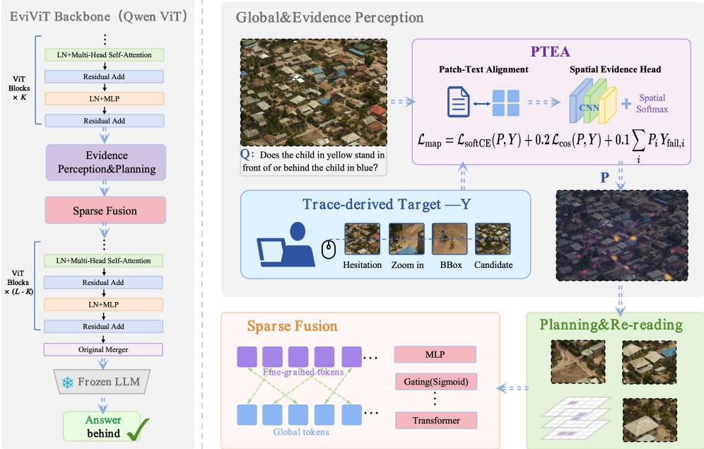  
Figure 2: EviViT pipeline. Human interactions are distilled into a question-conditioned evidence target. PTEA predicts this distribution inside the host ViT and yields one or two non-redundant decisive regions plus one context region. These regions are re-read from the original pixels, fused with coordinate-matched global tokens, and processed by the remaining frozen ViT blocks and LLM.

## 3.1 HUMAN VISUAL-SEARCH DATA

Research-team members used our interface to collect human visual-search traces for 1K+ training questions from VisualProbe (Lai et al., 2026). They inspected the full-resolution image, zoomed into regions, returned to broader views, and marked the final evidence. The interface logs cursor positions, timestamps, zoom windows, resets, and final boxes in source-image coordinates, aligning observations across scales. Event intervals provide dwell cues for the spatial targets. These records capture both the selected evidence and the broader search that led to it. They supervise evidence and context prediction during training; inference takes only an image and question.

## 3.2 LEARNING A SPATIAL EVIDENCE DENSITY

From search events to evidence density. Let $( I , q )$ be a high-resolution image and question. We render point events with Gaussian kernels and boxes as soft regional mass in source-image coordinates. The maps $Y _ { \mathrm { a l l } } , Y _ { \mathrm { s u c c } } , Y _ { \mathrm { l a s t } }$ , and $Y _ { \mathrm { f i n a l } }$ describe all visited regions, the branch after the last reset, the last completed zoom, and the final box, respectively. Their mixture is

$$
Y = \mathrm { P e a k N o r m } ( 0 . 2 5 Y _ { \mathrm { a l l } } + 0 . 3 5 Y _ { \mathrm { s u c c } } + 0 . 2 5 Y _ { \mathrm { l a s t } } + 0 . 1 5 Y _ { \mathrm { f i n a l } } ) .\tag{1}
$$

Peak normalization rescales the maximum to one. Combining the precise final box with the surrounding inspected views supervises both evidence and context. Abandoned regions form a separate weak negative map $Y _ { \mathrm { f a i l } }$

At inference, the Prompt-conditioned Token–Evidence Aligner (PTEA) predicts this target without a search trace. Let $V = \{ v _ { i } \} _ { i = 1 } ^ { N _ { g } }$ be the global grid at an intermediate visual block and $T = \{ t _ { j } \} _ { j = 1 } ^ { L }$

the question tokens. PTEA projects both into a shared space, making the prediction depend on the question rather than visual salience alone. A text Transformer contextualizes the projected question tokens into $\hat { t } _ { j }$ , which are aligned with each patch:

$$
s _ { i j } = \tau \cos ( W _ { v } v _ { i } , \hat { t } _ { j } ) , \quad a _ { i j } = \mathrm { s o f t m a x } _ { j } ( s _ { i j } ) , \quad c _ { i } = \sum _ { j } a _ { i j } \hat { t } _ { j } .\tag{2}
$$

The aligned features, their interactions, and spatial coordinates feed a local convolutional head, whose spatial softmax yields $P .$ . We resize Y to this grid and normalize its mass to one before fitting PTEA with

$$
\mathcal { L } _ { \mathrm { m a p } } = \mathcal { L } _ { \mathrm { s o f t C E } } ( P , Y ) + 0 . 2 \mathcal { L } _ { \mathrm { c o s } } ( P , Y ) + 0 . 1 \sum _ { i } P _ { i } Y _ { \mathrm { f a i l } , i } .\tag{3}
$$

Soft cross-entropy and cosine loss align evidence mass and map shape; the final term discourages concentration on abandoned branches. Only PTEA is updated in this stage.

A complementary branch predicts a context distribution $P _ { \mathrm { c t x } }$ from the same aligned features. Supervision from the broader inspected regions helps it identify surrounding information beyond the focal evidence. We fit this branch after PTEA while keeping the shared alignment and evidence branch fixed.

## 3.3 NON-REDUNDANT NATIVE-DETAIL ALLOCATION

Selecting complementary regions. Given the predicted evidence density $P ,$ , the planner selects complementary regions, allocates their token budgets, and then refines their spatial extent. Nearby peaks in $P$ may correspond to the same evidence, so residual suppression retains up to two distinct decisive regions expected to contain answer-relevant evidence. Masking them in the context distribution $P _ { \mathrm { c t x } }$ yields one complementary context region, giving two or three views of both focal evidence and its surroundings.

Balancing detail and context. ContextNeed is a lightweight budget predictor. From statistics of $P$ and $P _ { \mathrm { c t x } }$ , including concentration and residual context mass, it reserves 10–25% of local visual tokens for the context region. The remainder is divided among decisive regions according to their evidence mass, balancing contextual coverage with resolution for answer-relevant details.

Refining regions and setting resolution. A bounded box-refinement head, H-Safe, adjusts each selected region’s center and size using its visual feature, query representation, and box geometry. The refined regions and allocation priorities become token grids for native re-reading alongside the retained global view; Appendix A.2 details the capacity and grid-alignment rules.

## 3.4 NATIVE RE-READING AND SPARSE FUSION

With boxes and token grids fixed, EviViT samples each region from the original image at its allocated resolution and encodes it to the insertion block using the same frozen ViT. This recovers detail lost in global resizing while retaining the global path for scene topology.

To connect a readable detail to its place in the scene, the bridge uses source coordinates to establish correspondence between the two grids. Each local token $\ell _ { i }$ attends to the $3 { \times } 3$ neighborhood $\mathcal { N } ( p ( i ) )$ ) of its coordinate-matched global parent:

$$
\tilde { \ell } _ { i } = \ell _ { i } + W _ { o } \sum _ { \substack { j \in \mathcal { N } ( p ( i ) ) } } \mathrm { s o f t m a x } _ { j } \left( \frac { ( W _ { q } \ell _ { i } ) ^ { \top } ( W _ { k } g _ { j } ) } { \sqrt { d } } + \phi ( \Delta x , \Delta y , \Delta s ) \right) W _ { v } g _ { j } .\tag{4}
$$

The reverse update aggregates local messages by parent index and writes only to global tokens with local children. This exchange lets a local feature access its surroundings and lets the global grid incorporate a more detailed observation of the same location. Zero-initialized output projections and bounded residuals make the initial bridge an exact identity. Global and local tokens continue through the remaining frozen ViT blocks and original patch merger, then enter the LLM with rotary positions derived from source coordinates and scale.

## 3.5 TRAINING AND PORTABILITY

Training follows the route from selecting evidence to using it. Search maps first fit PTEA, followed by its complementary context branch. Trace-derived context targets and box geometry then fit ContextNeed and H-Safe. With routing fixed, reference-answer cross-entropy and an identity penalty train the Sparse Bridge to use the acquired detail. The host ViT, merger, and LLM remain frozen throughout, so answer loss does not rewrite the spatial cue learned by PTEA.

We insert separate attachments into Qwen3-VL-4B and 8B after visual Blocks 16 and 18, respectively. The frozen-host fit lets each transfer to post-trained descendants that share its visual blocks, channel width, merger, and coordinate system, without refitting. Architectural sizes, box losses, and optimization details are given in Appendix A.

## 4 EXPERIMENTS

Evaluation protocol. We evaluate fine-grained perception on VisualProbe Easy/Medium/Hard (515 questions) (Lai et al., 2026), V∗Bench (Wu & Xie, 2024), HR-Bench 4K/8K (Wang et al., 2025), and the full-image view of ZoomBench (Wei et al., 2026). MMBench (Liu et al., 2024), MMStar (Chen et al., 2024), and the ten tasks of Visual-CoT (Shao et al., 2024) measure broader capability.

Table 1: Fine-grained perception accuracy (%). Top-three paired gains per benchmark are shaded orange dark – light ; top-three mean gains are shaded green dark – light .
<table><tr><td>Model</td><td>VP-E</td><td>VP-M</td><td>VP-H</td><td>V*</td><td></td><td>HR-4K HR-8K Zoom</td><td></td><td>Avg.</td></tr><tr><td>Author-reported references; cells are matched local API re-evaluations</td><td></td><td>十</td><td></td><td></td><td></td><td></td><td></td><td></td></tr><tr><td>GPT-4o†</td><td>47.50</td><td>15.40</td><td>11.20</td><td>71.20</td><td>67.12‡</td><td>62.50</td><td>47.10</td><td>46.00‡</td></tr><tr><td>Gemini-3-Flash†</td><td>67.38</td><td>50.75</td><td>47.17</td><td>84.82</td><td>89.25</td><td>85.50</td><td>59.41</td><td>69.18</td></tr><tr><td>GPT-5.2†</td><td>57.45</td><td>38.43</td><td>38.68</td><td>79.06</td><td>81.12</td><td>78.38</td><td>50.89</td><td>60.57‡</td></tr><tr><td>GPT-5.4†</td><td></td><td>61.7029.85‡</td><td>20.75</td><td>76.96</td><td>84.00</td><td>77.88</td><td>52.66</td><td>57.69</td></tr><tr><td>Gemini-3.1-Pro†</td><td></td><td>58.1641.42</td><td>41.51‡</td><td>87.96</td><td>89.63</td><td>86.88</td><td>61.18</td><td>66.68‡</td></tr><tr><td>Gemini-3.5-Flash†63.83‡51.87‡48.11‡</td><td></td><td></td><td></td><td>89.01</td><td>89.12</td><td>86.62</td><td>61.42</td><td>70.00‡</td></tr><tr><td colspan="7">Locally evaluated open checkpoints and paired EviViT attachments</td><td></td><td></td></tr><tr><td>Qwen3-VL-4B</td><td>60.28</td><td>40.30</td><td>41.51</td><td>84.29</td><td>76.25</td><td>73.38</td><td>45.80</td><td>60.26</td></tr><tr><td>+ EviViT</td><td>63.83</td><td>50.37</td><td>48.11</td><td>87.96</td><td>79.62</td><td>77.75</td><td>53.37 65.86</td><td>(+5.60)</td></tr><tr><td>Qwen3-VL-8B</td><td>67.38</td><td>42.16</td><td>44.34</td><td>85.86</td><td>76.00</td><td>72.75</td><td>43.91 61.77</td><td></td></tr><tr><td>+ EviViT</td><td>69.50</td><td>53.36</td><td>51.89</td><td>91.10</td><td>80.25</td><td>78.25</td><td>50.65</td><td>67.86 (+6.09)</td></tr><tr><td>Qwen3.5-4B</td><td>63.83</td><td>44.40</td><td>45.28</td><td>81.68</td><td>79.00</td><td>76.38</td><td>49.11 62.81</td><td></td></tr><tr><td>+ EviViT</td><td>70.92</td><td>53.36</td><td>55.66</td><td>87.96</td><td>83.75</td><td>81.25</td><td>58.58 70.21</td><td>(+7.40)</td></tr><tr><td>Qwen3.5-9B</td><td>65.96</td><td>44.40</td><td>42.45</td><td>84.82</td><td>76.62</td><td>73.38</td><td>51.01 62.66</td><td></td></tr><tr><td>+ EviViT</td><td>66.67</td><td>54.85</td><td>51.89</td><td>87.96</td><td>82.50</td><td>81.12</td><td>57.04 68.86</td><td>(+6.20)</td></tr><tr><td>ZwZ-4B</td><td>69.50</td><td>47.76</td><td>34.91</td><td>90.05</td><td>78.12</td><td>76.62</td><td>55.62 64.66</td><td></td></tr><tr><td>+ EviViT</td><td>66.67</td><td>52.61</td><td>46.23</td><td>91.10</td><td>78.88</td><td>77.25</td><td>58.11 67.26</td><td>(+2.60)</td></tr><tr><td>ZwZ-8B</td><td>71.63</td><td>46.64</td><td>46.23</td><td>89.53</td><td>80.50</td><td>77.12</td><td>55.98 66.80</td><td></td></tr><tr><td>+ EviViT</td><td>79.43</td><td>55.97</td><td>62.26</td><td>92.67</td><td>81.12</td><td>78.75</td><td>60.12</td><td>72.90 (+6.10)</td></tr><tr><td>Vero-Qwen3I-8B</td><td>66.67</td><td>43.66</td><td>54.72</td><td>86.39</td><td>81.50</td><td>77.50</td><td>46.27</td><td>65.24</td></tr><tr><td>+ EviViT</td><td>72.34</td><td>55.22</td><td>61.32</td><td>87.43</td><td>83.12</td><td>83.88</td><td>55.03</td><td>71.19 (+5.95)</td></tr><tr><td>Vision-OPD-4B</td><td>73.76</td><td>49.63</td><td>51.89</td><td>86.39</td><td>81.00</td><td>76.75</td><td>59.05</td><td>68.35</td></tr><tr><td>+ EviViT</td><td>80.85</td><td>52.24</td><td>53.77</td><td>89.53</td><td>82.62</td><td>80.75</td><td>62.13</td><td>71.70 (+3.35)</td></tr><tr><td>Vision-OPD-9B</td><td>74.47</td><td>53.73</td><td>47.17</td><td>93.19</td><td>80.88</td><td>78.62</td><td>63.79 70.26</td><td></td></tr><tr><td>+ EviViT</td><td>73.05</td><td>58.58</td><td>54.72</td><td>90.05</td><td>80.62</td><td>82.62</td><td>66.04</td><td>72.24 (+1.98)</td></tr></table>

†Author-reported cells: GPT-4o VisualProbe from Mini-o3 (Lai et al., 2026); Gemini-3-Flash values from PixelEyes (Gong et al., 2026); GPT-5.2/5.4 and Gemini-3.1-Pro/3.5-Flash values from Vision-OPD (Yuan et al., 2026). ‡Our single-call API evaluations use the local inputs, answer-only prompt, deterministic decoding, and Qwen3-VL-8B judge. Mixed-source averages are descriptive. Zoom uses the full image.

Each local host/host+EviViT comparison fixes the image–question inputs, language checkpoint, prompt, and deterministic decoding. A frozen Qwen3-VL-8B judge compares the candidate answer with the reference, given the question but no image or method identity. Published results and API supplements are marked separately in the tables; Appendix A gives the evaluation details.

## 4.1 FINE-GRAINED PERCEPTION AND HOST TRANSFER

Table 1 shows that attaching EviViT improves the seven-benchmark average for all nine foundation and post-trained hosts. The clearest benefits appear on VisualProbe Medium and Hard, which improve by 8.2 and 8.6 points on average, while the other five benchmarks also improve on average. These leading gains span several host families, rather than a single model. The largest gains appear on the harder tiers, consistent with EviViT addressing evidence that is difficult to preserve in the global view.

From evidence to a correct answer. The cases in Appendix D show how these gains arise when local detail is interpreted within its scene. EviViT reads a distant car identifier and resolves a ball’s position relative to the long bench. On Vero-8B (Sarch et al., 2026), the base model considers the tower, facade, and logo before answering incorrectly; with EviViT, a shorter, correct rationale focuses on the signboard’s straight edges and right angles. Better evidence thus helps keep reasoning on the queried object instead of drifting toward unrelated scene elements.

Transfer to strong open models. These benefits persist when the host has already undergone post-training. Among the locally evaluated open checkpoints from recent systems (He et al., 2026; Yuan et al., 2026; Bi et al., 2026; Gong et al., 2026) in Figure 3, ZwZ-8B+EviViT achieves the highest VisualProbe VP-All (63.69), while Vision-OPD-9B+EviViT leads ZoomBench (66.04). Both also improve over their own hosts in Table 1. This suggests that better question-relevant evidence complements answer-policy post-training: stronger reasoners still benefit from more focused perception. The foundation-family attachment provides it without refitting for each compatible descendant.

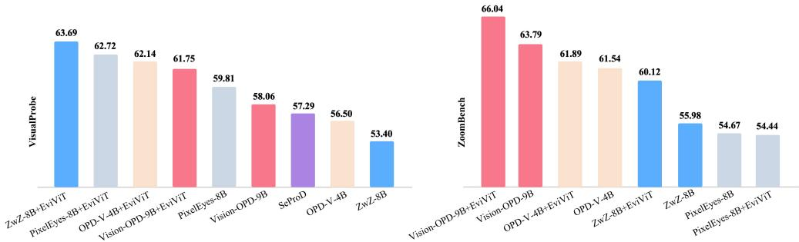  
Figure 3: Strong-model accuracy rankings. VisualProbe VP-All (515 questions) and ZoomBench (845 questions), sorted within each panel. Open-checkpoint bars use our local evaluation. The SeProD VP-All bar is derived from its author-reported Easy/Medium/Hard scores under the original avg@32 protocol, so it is contextual rather than a matched comparison.

## 4.2 ACCURACY–EFFICIENCY TRADE-OFF

Better accuracy with fewer visual tokens. To determine whether the gains require more visual input, we compare seven token ceilings from 1K to 20K on VisualProbe and V∗Bench. Table 2 and Figure 4 show higher average accuracy at every ceiling with only 90–97% of the paired global-only tokens. At the 8B 4K setting, EviViT reaches 68.87 accuracy with 3.62K tokens, compared with 62.83 using 3.83K for the global-only model. It even exceeds the global-only 20K setting, which reaches 68.27 with 13.31K realized tokens. Where visual tokens are spent matters as much as how many are available. Global scaling samples the entire image more densely, whereas EviViT directs part of the budget toward predicted evidence while retaining the broader scene. This targeted allocation continues to help after the global-only gains begin to saturate.

Table 2: Accuracy–budget scaling. Mean VP/V∗ accuracy (515/191); G/E: realized tokens.
<table><tr><td></td><td colspan="4">Qwen3-VL-4B</td><td colspan="4">Qwen3-VL-8B</td></tr><tr><td>Budget</td><td>Global</td><td>EviViT</td><td>∆</td><td>Tok. G/E</td><td>Global</td><td>EviViT</td><td>∆</td><td>Tok. G/E</td></tr><tr><td>1K</td><td>50.30</td><td>56.35</td><td>+6.05</td><td>1.00/0.90K</td><td>50.14</td><td>57.65</td><td>+7.51</td><td>1.00/0.91K</td></tr><tr><td>2K</td><td>54.93</td><td>60.11</td><td>+5.18</td><td>1.99/1.88K</td><td>57.47</td><td>64.64</td><td>+7.17</td><td>1.99/1.89K</td></tr><tr><td>4K</td><td>60.69</td><td>65.45</td><td>+4.76</td><td>3.83/3.62K</td><td>62.83</td><td>68.87</td><td>+6.04</td><td>3.83/3.62K</td></tr><tr><td>8K</td><td>63.89</td><td>66.39</td><td>+2.49</td><td>6.65/6.41K</td><td>65.84</td><td>72.24</td><td>+6.40</td><td>6.65/6.43K</td></tr><tr><td>12K</td><td>65.06</td><td>67.46</td><td>+2.40</td><td>9.32/8.95K</td><td>67.69</td><td>72.53</td><td>+4.84</td><td>9.32/9.00K</td></tr><tr><td>16K</td><td>65.16</td><td>69.30</td><td>+4.15</td><td>11.55/11.15K</td><td>67.69</td><td>74.18</td><td>+6.49</td><td>11.55/11.19K</td></tr><tr><td>20K</td><td>65.54</td><td>69.11</td><td>+3.56</td><td>13.31/12.75K</td><td>68.27</td><td>74.38</td><td>+6.10</td><td>13.31/12.83K</td></tr></table>

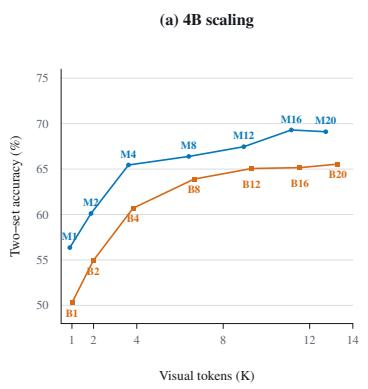

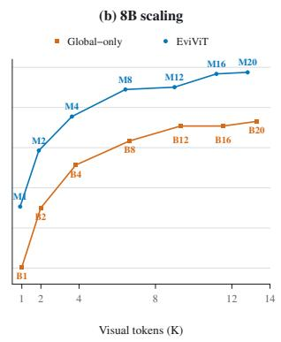

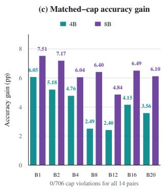  
Figure 4: Budget curves and paired gains. Accuracy versus tokens on Qwen3-VL-4B/8B.

Table 3: Whole-host-isolated efficiency. Each budget pairs Global and EviViT. Tokens and accuracy use the complete sweep; latency and peak memory use 64 isolated requests per setting.
<table><tr><td colspan="3"></td><td colspan="2">TTFT (s)</td><td colspan="2">E2E (s)</td><td colspan="2"></td></tr><tr><td colspan="2">Budget Path</td><td>Vis. tok. (K)</td><td>Median</td><td></td><td>P90 Median</td><td>P90</td><td>Peak (GiB) ∆ Acc. (pp)</td><td></td></tr><tr><td colspan="2">Qwen3-VL-4B</td><td></td><td></td><td></td><td></td><td></td><td></td><td></td></tr><tr><td>1K</td><td>Global</td><td>1.00</td><td></td><td>0.2060.218</td><td></td><td>0.557 0.619</td><td>8.62</td><td></td></tr><tr><td></td><td>EviViT</td><td>0.90</td><td></td><td>0.384 0.403</td><td></td><td>0.738 0.804</td><td>8.66</td><td>+6.05</td></tr><tr><td>4K</td><td>Global</td><td>3.83</td><td></td><td>0.5590.643</td><td>0.921</td><td>1.038</td><td>9.48</td><td></td></tr><tr><td></td><td>EviViT</td><td>3.62</td><td></td><td>0.621 0.712</td><td></td><td>0.999 1.091</td><td>9.47</td><td>+4.76</td></tr><tr><td>16K</td><td>Global</td><td>11.55</td><td></td><td>0.541 0.637</td><td></td><td>0.902 1.021</td><td>9.97</td><td></td></tr><tr><td></td><td>EviViT</td><td>11.15</td><td></td><td>0.643 0.739</td><td></td><td>1.082 1.192</td><td>9.96</td><td>+4.15</td></tr><tr><td colspan="2">Qwen3-VL-8B</td><td></td><td></td><td></td><td></td><td></td><td></td><td></td></tr><tr><td>1K</td><td>Global</td><td>1.00</td><td></td><td>0.2540.264</td><td></td><td>0.696 0.706</td><td>16.72</td><td></td></tr><tr><td></td><td>EviViT</td><td>0.91</td><td></td><td>0.465 0.477</td><td></td><td>0.892 0.904</td><td>16.76</td><td>+7.51</td></tr><tr><td>4K</td><td>Global</td><td>3.83</td><td></td><td>0.742 0.887</td><td></td><td>1.087 1.231</td><td>17.66</td><td></td></tr><tr><td></td><td>EviViT</td><td>3.62</td><td></td><td>0.759 0.853</td><td></td><td>1.105 1.200</td><td>17.71</td><td>+6.04</td></tr><tr><td>16K</td><td>Global</td><td>11.55</td><td></td><td>0.740 0.887</td><td></td><td>1.0881.233</td><td>18.25</td><td></td></tr><tr><td></td><td>EviViT</td><td>11.19</td><td></td><td>0.745 0.841</td><td></td><td>1.091 1.187</td><td>18.17</td><td>+6.49</td></tr></table>

Runtime cost. Regional re-reading and fusion introduce overhead, but on 8B at 4K/16K, Table 3 shows 6.04/6.49-point gains for only 18/3 ms more median end-to-end time and nearly unchanged peak memory. The overhead is more visible at 1K and on 4B. Unlike multi-turn visual search (Lai et al., 2026), EviViT pays this overhead within one visual encoding process, without repeated language-model crop calls.

## 4.3 PRESERVING GENERAL CAPABILITIES

EviViT is designed to sharpen local evidence while retaining the global information needed for broader visual understanding. Alongside the fine-grained gains in Table 1, Table 4 shows broadly stable MMBench, MMStar, and Visual-CoT results on four foundation hosts; Qwen3.5-4B improves on all three. This stability supports the global–regional design: selected evidence can be sharpened without discarding the broader scene representation. Appendix B extends the comparison to all nine hosts and individual tasks.

Table 4: General-capability compatibility on four foundation hosts.
<table><tr><td></td><td colspan="3">MMBench</td><td colspan="3">MMStar</td><td colspan="3">Visual-CoT</td></tr><tr><td>Host</td><td>Base</td><td>+EviViT</td><td>∆</td><td>Base</td><td>+EviViT</td><td>∆</td><td>Base</td><td>+EviViT</td><td>∆</td></tr><tr><td>Qwen3-VL-4B</td><td>87.36</td><td>88.43</td><td>+1.06</td><td>61.73</td><td>62.80</td><td>+1.07</td><td>77.53</td><td>75.52</td><td>-2.01</td></tr><tr><td>Qwen3-VL-8B</td><td>88.59</td><td>88.94</td><td>+0.35</td><td>65.07</td><td>65.27</td><td>+0.20</td><td>77.92</td><td>78.35</td><td>+0.43</td></tr><tr><td>Qwen3.5-4B</td><td>86.37</td><td>87.76</td><td>+1.39</td><td>63.20</td><td>64.40</td><td>+1.20</td><td>77.18</td><td>78.17</td><td>+1.00</td></tr><tr><td>Qwen3.5-9B</td><td>87.13</td><td>86.76</td><td>-0.37</td><td>64.33</td><td>65.20</td><td>+0.87</td><td>78.98</td><td>80.34</td><td>+1.36</td></tr></table>

## 4.4 CONTINUED TRAINABILITY

Beyond attaching EviViT after host training, we test whether the host can keep learning with it already in the visual pathway.

Table 10 in Appendix A.5 compares Base+SFT and EviViT+SFT on the same 10K examples and language-LoRA schedule, with all visual weights frozen. Both improve on Visual-CoT, and EviViT’s five-metric mean also rises. EviViT+SFT retains a 6.80-point VP-All and 7.34-point ZoomBench lead over Base+SFT. Thus, the learned evidence allocation remains useful as the language-side answering model continues to adapt.

## 4.5 ABLATION STUDY

We first test query alignment by shuffling only the question seen by PTEA. Despite the unchanged host question and visual budget, VP-All falls by 4.47 and 3.31 points on the two large hosts in Table 7 of Appendix A.3. The added regional detail is therefore most useful when selected for the actual query, not simply because it supplies more pixels.

We next isolate location selection from learned fusion by passing the views through the host’s native multi-image interface and moving only their centers. In Table 8 of Appendix A.3, pooled accuracy falls from 66.57 to 57.08 or 56.94 under random translation or cross-image shuffling. With view count, size, and budget fixed, this drop shows that the gain comes from acquiring detail at the right locations rather than merely adding regional views.

Table 5: Full-trace versus final-box supervision at epoch three (%).
<table><tr><td>Supervision</td><td>VP-All</td><td>VP-Hard</td><td>V*</td></tr><tr><td>Final-box</td><td>56.12</td><td>52.83</td><td>89.01</td></tr><tr><td>Full-trace</td><td>57.28</td><td>56.60</td><td>90.05</td></tr><tr><td>∆</td><td>+1.17</td><td>+3.77</td><td>+1.05</td></tr></table>

With query-matched locations established as useful, we examine how human exploration teaches the model to find them. Two complete attachments are trained from scratch on the same frozen Qwen3-VL-8B host and recipe, using either full-trace or final-box spatial supervision. Table 5 shows full-trace ahead on all three metrics, especially VP-Hard (56.60 versus 52.83). Human search traces provide supervision beyond the final evidence box. The box marks where search ended, whereas visited regions, the final branch, and the last zoom describe how attention narrows toward the evidence and its surrounding context. The gain therefore supports the value of supervision contained in the search process itself, beyond terminal localization labels. Appendix C.4 details the shared protocol.

## 5 CONCLUSION AND LIMITATIONS

We introduce EviViT, a lightweight visual attachment that learns where to acquire detail from human search annotations and connects regional observations with the global scene. Across nine hosts it improves average fine-grained accuracy, using visual tokens more effectively at every tested budget. Its transfer to compatible post-trained hosts and continued utility during language adaptation make evidence allocation a reusable capability.

Limitation & Future Work. EviViT currently learns from 1K+ annotated searches. Scaling these data to more objects and scenes could extend its reach to small-object and embodied perception, where focused detail must remain grounded in the wider scene.

## AI USE STATEMENT

Generative AI tools were used to refine the wording of an author-written manuscript and to assist with limited coding tasks related to training and inference. All AI-assisted text and code were reviewed and verified by the authors. The authors take full responsibility for the final manuscript and implementation.

## ETHICS STATEMENT

This work follows the ICLR Code of Ethics. Our experiments use public visual benchmarks and visual-search annotations produced by members of the research team. The public code release contains the implementation and aggregate results, but not model weights, benchmark images, human-search traces, or QA training data.

## REPRODUCIBILITY STATEMENT

Implementation details and hyperparameter configurations are provided in Section 3 and Appendix A. The public EviViT repository contains data-preparation, training, evaluation, and judging scripts, together with reported result summaries and training curves.

## REFERENCES

Shuai Bai, Yuxuan Cai, Ruizhe Chen, Keqin Chen, Xionghui Chen, Zesen Cheng, Lianghao Deng, Wei Ding, Chang Gao, Chunjiang Ge, et al. Qwen3-vl technical report. arXiv preprint arXiv:2511.21631, 2025.

Jinhe Bi, Peng Liao, Zengjie Jin, Volker Tresp, Fei Shen, Yunpu Ma, Tat-Seng Chua, et al. Opd-v: Visual on-policy self-distillation with modality balance. arXiv preprint arXiv:2608.05131, 2026.

Daniel Bolya, Cheng-Yang Fu, Xiaoliang Dai, Peizhao Zhang, Christoph Feichtenhofer, and Judy Hoffman. Token merging: Your vit but faster. arXiv preprint arXiv:2210.09461, 2022.

Lin Chen, Jinsong Li, Xiaoyi Dong, Pan Zhang, Yuhang Zang, Zehui Chen, Haodong Duan, Jiaqi Wang, Yu Qiao, Dahua Lin, et al. Are we on the right way for evaluating large vision-language models? Advances in Neural Information Processing Systems, 37:27056–27087, 2024.

Xianyu Chen, Ming Jiang, and Qi Zhao. Predicting human scanpaths in visual question answering. In IEEE Conference on Computer Vision and Pattern Recognition, 2021.

Zhangquan Chen, Xufang Luo, and Dongsheng Li. Visrl: Intention-driven visual perception via reinforced reasoning. arXiv preprint arXiv:2503.07523, 2025a.

Zhangquan Chen, Ruihui Zhao, Chuwei Luo, Mingze Sun, Xinlei Yu, Yangyang Kang, and Ruqi Huang. Sifthinker: Spatially-aware image focus for visual reasoning. arXiv preprint arXiv:2508.06259, 2025b.

Zhangquan Chen, Manyuan Zhang, Xinlei Yu, Xiang An, Bo Li, Xin Xie, ZiDong Wang, Mingze Sun, Shuang Chen, Hongyu Li, et al. 4dthinker: Thinking with 4d imagery for dynamic spatial understanding. arXiv preprint arXiv:2605.05997, 2026.

Abhishek Das, Harsh Agrawal, Larry Zitnick, Devi Parikh, and Dhruv Batra. Human attention in visual question answering: Do humans and deep networks look at the same regions? Computer Vision and Image Understanding, 163:90–100, 2017.

Alexey Dosovitskiy. An image is worth 16x16 words: Transformers for image recognition at scale. arXiv preprint arXiv:2010.11929, 2020.

Dengxian Gong, Yuanzheng Wu, Haobo Yuan, Zhengdong Hu, Tao Zhang, Yikang Zhou, Shihao Chen, Quanzhu Niu, Kai Wang, Jason Li, et al. Pixeleyes: Decoupling perception and reasoning for pinpoint visual evidence seeking. arXiv preprint arXiv:2607.00115, 2026.

Zhendong He, Qiyuan Dai, Guanbin Li, Liang Lin, and Sibei Yang. Self-prophetic decoding to unlock visual search in lvlms. arXiv preprint arXiv:2605.28741, 2026.

Edward J Hu, Yelong Shen, Phillip Wallis, Zeyuan Allen-Zhu, Yuanzhi Li, Shean Wang, Lu Wang, and Weizhu Chen. Lora: Low-rank adaptation of large language models. arXiv preprint arXiv:2106.09685, 2021.

Xin Lai, Junyi Li, Wei Li, Tao Liu, Tianjian Li, and Hengshuang Zhao. Mini-o3: Scaling up reasoning patterns and interaction turns for visual search. In International Conference on Learning Representations, volume 2026, pp. 76722–76746, 2026.

Geng Li, Guohao Chen, Ting Chen, Shilin Shan, Kuangji Zuo, Bofan Lyu, Tuo An, Gen Li, and Jianfei Yang. Occamtoken: Efficient vlm inference with training-free and budget-adaptive token pruning. arXiv preprint arXiv:2605.29657, 2026.

Zichao Lin, Yifeng Xie, Bowen Qu, Haiming Wang, Jia Li, Haoning Wu, Yuhao Dong, Zuhao Yang, Jinguo Zhu, Haoyu Lu, et al. Perceptionbench: Evaluating atomic visual perception in multimodal large language models. arXiv preprint arXiv:2607.24957, 2026a.

Zichuan Lin, Yicheng Liu, Yang Yang, Lvfang Tao, and Deheng Ye. Adaptvision: efficient visionlanguage models via adaptive visual acquisition. In Proceedings ofthe IEEE/CVF Conference on Computer Vision and Pattern Recognition, pp. 11923–11932, 2026b.

Yuan Liu, Haodong Duan, Yuanhan Zhang, Bo Li, Songyang Zhang, Wangbo Zhao, Yike Yuan, Jiaqi Wang, Conghui He, Ziwei Liu, et al. Mmbench: Is your multi-modal model an all-around player? In European conference on computer vision, pp. 216–233. Springer, 2024.

Alec Radford, Jong Wook Kim, Chris Hallacy, Aditya Ramesh, Gabriel Goh, Sandhini Agarwal, Girish Sastry, Amanda Askell, Pamela Mishkin, Jack Clark, et al. Learning transferable visual models from natural language supervision. In International conference on machine learning, pp. 8748–8763. PmLR, 2021.

Yongming Rao, Wenliang Zhao, Benlin Liu, Jiwen Lu, Jie Zhou, and Cho-Jui Hsieh. Dynamicvit: Efficient vision transformers with dynamic token sparsification. Advances in neural information processing systems, 34:13937–13949, 2021.

Hamid Rezatofighi, Nathan Tsoi, JunYoung Gwak, Amir Sadeghian, Ian Reid, and Silvio Savarese. Generalized intersection over union: A metric and a loss for bounding box regression. arXiv preprint arXiv:1902.09630, 2019.

Gabriel Sarch, Linrong Cai, Qunzhong Wang, Haoyang Wu, Danqi Chen, and Zhuang Liu. Vero: An open rl recipe for general visual reasoning. arXiv preprint arXiv:2604.04917, 2026.

Hao Shao, Shengju Qian, Han Xiao, Guanglu Song, Zhuofan Zong, Letian Wang, Yu Liu, and Hongsheng Li. Visual cot: Advancing multi-modal language models with a comprehensive dataset and benchmark for chain-of-thought reasoning. Advances in Neural Information Processing Systems, 37:8612–8642, 2024.

Ekta Sood, Fabian Kogel, Florian Strohm, Prajit Dhar, and Andreas Bulling. Vqa-mhug: A gaze ¨ dataset to study multimodal neural attention in visual question answering. In Proceedings of the 25th Conference on Computational Natural Language Learning, pp. 27–43, 2021.

Enwei Tong, Yuanchao Bai, Yao Zhu, Junjun Jiang, and Xianming Liu. Focus-scan-refine: From human visual perception to efficient visual token pruning. arXiv preprint arXiv:2602.05809, 2026.

Peng Wang, Shuai Bai, Sinan Tan, Shijie Wang, Zhihao Fan, Jinze Bai, Keqin Chen, Xuejing Liu, Jialin Wang, Wenbin Ge, et al. Qwen2-vl: Enhancing vision-language model’s perception of the world at any resolution. arXiv preprint arXiv:2409.12191, 2024.

Wenbin Wang, Liang Ding, Minyan Zeng, Xiabin Zhou, Li Shen, Yong Luo, Wei Yu, and Dacheng Tao. Divide, conquer and combine: A training-free framework for high-resolution image perception in multimodal large language models. In Proceedings of the AAAI Conference on Artificial Intelligence, volume 39, pp. 7907–7915, 2025.

Lai Wei, Liangbo He, Jun Lan, Lingzhong Dong, Yutong Cai, Siyuan Li, Huijia Zhu, Weiqiang Wang, Linghe Kong, Yue Wang, et al. Zooming without zooming: Region-to-image distillation for fine-grained multimodal perception. arXiv preprint arXiv:2602.11858, 2026.

Penghao Wu and Saining Xie. V\*: Guided visual search as a core mechanism in multimodal llms. In 2024 IEEE/CVF Conference on Computer Vision and Pattern Recognition (CVPR), pp. 13084–13094. IEEE, 2024.

Zhuofan Xia, Xuran Pan, Shiji Song, Li Erran Li, and Gao Huang. Vision transformer with deformable attention. In 2022 IEEE/CVF Conference on Computer Vision and Pattern Recognition (CVPR), pp. 4784–4793. IEEE, 2022.

Qianhao Yuan, Jie Lou, Xing Yu, Hongyu Lin, Le Sun, Xianpei Han, and Yaojie Lu. Vision-opd: Learning to see fine details for multimodal llms via on-policy self-distillation. arXiv preprint arXiv:2605.18740, 2026.

Xiaohua Zhai, Basil Mustafa, Alexander Kolesnikov, and Lucas Beyer. Sigmoid loss for language image pre-training. In 2023 IEEE/CVF International Conference on Computer Vision (ICCV), pp. 11941–11952. IEEE, 2023.

Liangyu Zhong, Fabio Philipp Rosenthal, Joachim Sicking, Fabian Huger, Thorsten Bagdonat, Hanno¨ Gottschalk, and Leo Schwinn. Focus: Internal mllm representations for efficient fine-grained visual question answering. Advances in Neural Information Processing Systems, 38:96498–96535, 2026.

## A REPRODUCIBILITY DETAILS

## A.1 MODEL AND TRAINING INSTANTIATION

Frozen host. Qwen3-VL-4B has 24 visual blocks of width 1,024 and receives EviViT after Block 16. Qwen3-VL-8B has 27 blocks of width 1,152 and receives it after Block 18. The two scales use the same algorithm but separate PTEA, H-Safe, and Bridge weights. The vision backbone, merger, and LLM remain frozen during all four stages. For Qwen3.5-4B and Qwen3.5-9B, we fit separate attachments on the frozen hosts after visual Blocks 16 and 18, respectively; each attachment is reused on the corresponding Vision-OPD descendant without refitting.

## A.2 ATTACHMENT ARCHITECTURE

PTEA. Frozen language embeddings are reduced to 512 dimensions by a fixed random projection and then to d = 192 by a learned projection. A one-layer, four-head text Transformer (48 dimensions per head, 192 → 384 → 192 feed-forward network, pre-normalization, and dropout) contextualizes the question. Each visual position concatenates its projected feature, aligned text context, elementwise product and absolute difference, maximum similarity, attention entropy, and a learned coordinate embedding. Two $3 \times 3$ convolutions and a 1×1 head produce the evidence logits. The 4B evidence branch contains approximately 1.41M parameters. A complementary branch shares the visual–text alignment and has its own spatial residual block and prediction head for $P _ { \mathrm { c t x } } .$ . Its normalized target combines a map of dwell and zoom events across the full trace with a map of inspections before the last reset in a 0.70/0.30 mixture; when the latter is empty, it uses the full-trace exploration map alone. The context branch is initialized from PTEA and fitted with the shared alignment and evidence branch frozen.

Region decoder and H-Safe. Residual suppression proposes two decisive anchors but discards the second when it is redundant with the first. The context map is masked at every retained decisive anchor and supplies one context region. The deployed model therefore uses two or three regions under a three-slot cap. For anchor $\bar { b } = ( c _ { x } , c _ { y } , \bar { w } , h )$ , H-Safe predicts $\boldsymbol { \delta } = ( \delta _ { x } , \delta _ { y } , \delta _ { w } , \delta _ { h } )$ with an LN–256–128–4 residual MLP:

$$
\begin{array} { r l r l } & { c _ { x } ^ { \prime } = c _ { x } + 1 . 5 w \operatorname { t a n h } ( \delta _ { x } ) , } & & { c _ { y } ^ { \prime } = c _ { y } + 1 . 5 h \operatorname { t a n h } ( \delta _ { y } ) , } \\ & { w ^ { \prime } = \mathrm { c l i p } ( w \exp ( 1 . 2 \operatorname { t a n h } ( \delta _ { w } ) ) , . 0 2 , . 9 5 ) , } & & { h ^ { \prime } = \mathrm { c l i p } ( h \exp ( 1 . 2 \operatorname { t a n h } ( \delta _ { h } ) ) , . 0 2 , . 9 5 ) . } \end{array}\tag{5}
$$

The zero-initialized output makes the initial transform an identity. Smooth- $. L _ { 1 }$ , GIoU (Rezatofighi et al., 2019), target-coverage, excess-area, and identity losses fit the bounded correction. ContextNeed is a 129-parameter MLP with six inputs and a 16-unit hidden layer. Its inputs are the secondary decisive-region mass, the normalized entropy of each map, their Jensen–Shannon divergence, context mass outside the decisive regions, and peak evidence probability. It predicts a target context share between 0.10 and 0.25, leaving the remainder for decisive views. These shares set local allocation priorities; the final token counts also depend on region size, the available capacity, and patch-grid alignment.

Sparse Bridge. The 4B bridge has one block, internal width 256, four attention heads, and approxi mately 1.91M parameters. Relative offset and log scale pass through a two-layer projection to form the attention bias. Output projections are zero-initialized, and each residual update is clipped to 20% of the receiving token’s RMS. Reverse messages are aggregated by coordinate parent and written only to global tokens that have local children.

Four-stage fit. First, frozen ViT features are cached for the 1K+ training examples at candidate insertion blocks. Five-fold cross-validation using only the trace targets selects the insertion block and PTEA training duration before external QA evaluation. Second, PTEA is optimized for three complete passes over the cached features using Equation 3, after which the complementary context branch is fitted with PTEA frozen. Third, ContextNeed and H-Safe are fitted from the trace-derived context-share target and last-zoom/final-box geometry. The H-Safe output layer starts at zero, so the first model is exactly the evidence-anchor policy. Fourth, with routing fixed, the Sparse Bridge is trained with reference-answer token cross-entropy and a 0.01 identity penalty. We evaluate the checkpoint saved after the first complete pass. The native-capacity floor has no learned parameters.

Training loss alone does not identify PTEA’s best spatial cue. In the 4B Block-16 five-fold run, both losses keep falling through epoch twelve, while the held-out evidence score in Figure 5 peaks at epoch three. The score reflects map alignment and coverage of final and last-zoom regions. We therefore fit a separate PTEA for three epochs on all 1,144 traces, choosing the duration from trace targets without using external QA results.

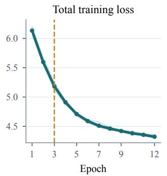

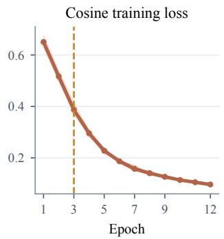

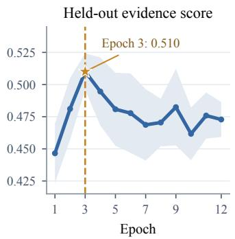  
Figure 5: PTEA training and checkpoint selection. Five-fold trace-only training of the Qwen3-VL-4B Block-16 selector. Thin curves show individual folds and thick curves their mean. The held-out evidence score is shown with a one-standard-deviation band across folds; dashed lines mark the selected third epoch.

For the audited 4B core, frozen feature extraction, the three PTEA passes, and the selected Bridge pass require 1.046 observed A100 GPU-hours in the run logs; the maximum observed process memory is 36,993 MiB. This audit does not include H-Safe calibration or historical architecturesearch compute. These logs estimate the cost of reproducing the attachment. They are not isolated throughput measurements: the stages ran under different shared-machine loads.

Native-capacity floor. Let N be the post-merger token count under the host’s original 16M-pixel processor. The planner uses the image-dependent soft-capacity scale

$$
F ( N ) = \left\{ \begin{array} { l l } { 2 0 4 8 , } & { N \leq 4 0 9 6 , } \\ { 2 0 4 8 + ( N - 4 0 9 6 ) / 4 , } & { 4 0 9 6 < N < 1 2 2 8 8 , } \\ { 4 0 9 6 , } & { N \geq 1 2 2 8 8 . } \end{array} \right.\tag{6}
$$

It combines this scale with native demand through the capacity envelope $\sqrt { N ^ { 2 } + F ( N ) ^ { 2 } }$ . The global view is planned from image size and native capacity; regional views receive the remaining capacity according to their area and allocation priorities, including the context share from ContextNeed. Each allocation is then aligned to the host patch grid, so $\bar { F } ( N )$ is a soft capacity parameter rather than a guaranteed minimum realized token count. The same rule applies across datasets. In the matched-budget sweep, an explicit ceiling instead caps each sample at the realized token count of its paired global-only baseline. This ceiling overrides the soft-capacity envelope when necessary, including every sample at 1K and larger images at 2K. All reported visual-token counts are measured after grid alignment.

## A.3 COMPONENT COMPARISONS

Table 6 separates the roles combined in the full model.

Table 6: Where the gains enter. Reread uses fixed-budget source-pixel views; Boxes adds continuous crop geometry; EviViT is the full model with input-dependent capacity allocation. Accuracy is in percent. Avg. equally weights the eight benchmarks, and ∆ is relative to Global B16 (global-only, ${ \bar { 1 } } 6 \times 1 0 2 4 ^ { 2 }$ -pixel cap) at the same scale. Bold marks each column’s best score within a scale.
<table><tr><td>Variant</td><td>VP-E</td><td>VP-M</td><td>VP-H</td><td> $\mathrm { V } ^ { \ast }$ </td><td>HR-4K</td><td>HR-8K</td><td>PB-1img</td><td>Zoom</td><td>Avg.</td><td>∆</td></tr><tr><td colspan="11">Qwen3-VL-4B</td></tr><tr><td>Global B16</td><td>60.28</td><td>40.30</td><td>41.51</td><td>84.29</td><td>76.25</td><td>73.38</td><td>30.77</td><td>45.80</td><td>56.57</td><td>±0.00</td></tr><tr><td>+ Reread</td><td>64.54</td><td>47.01</td><td>39.62</td><td>86.91</td><td>79.50</td><td>77.12</td><td>32.05</td><td>53.25</td><td>60.00</td><td>+3.43</td></tr><tr><td>+ Boxes</td><td>63.83</td><td>51.49</td><td>45.28</td><td>86.39</td><td>79.25</td><td>76.12</td><td>31.60</td><td>51.60</td><td>60.70</td><td>+4.13</td></tr><tr><td>EviViT (full)</td><td>63.83</td><td>50.37</td><td>48.11</td><td>87.96</td><td>79.62</td><td>77.75</td><td>31.83</td><td>53.37</td><td>61.61</td><td>+5.04</td></tr><tr><td colspan="2">Qwen3-VL-8B</td><td></td><td></td><td></td><td></td><td></td><td></td><td></td><td></td><td></td></tr><tr><td>Global B16</td><td>67.38</td><td>42.16</td><td>44.34</td><td>85.86</td><td>76.00</td><td>72.75</td><td>32.32</td><td>43.91</td><td>58.09</td><td>±0.00</td></tr><tr><td>+ Reread</td><td>64.54</td><td>44.40</td><td>48.11</td><td>89.01</td><td>78.38</td><td>76.00</td><td>32.32</td><td>51.95</td><td>60.59</td><td>+2.50</td></tr><tr><td>+ Boxes</td><td>70.92</td><td>51.49</td><td>55.66</td><td>87.96</td><td>79.75</td><td>81.38</td><td>32.39</td><td>51.95</td><td>63.94</td><td>+5.85</td></tr><tr><td>EviViT (full)</td><td>69.50</td><td>53.36</td><td>51.89</td><td>91.10</td><td>80.25</td><td>78.25</td><td>32.20</td><td>50.65</td><td>63.40</td><td>+5.31</td></tr></table>

Fixed-budget re-reading raises the eight-task average at both scales, showing that accessing the selected source pixels matters even before later refinements. Continuous boxes contribute especially at 8B. Relative to global B16, the full model gains 5.04 points at 4B and 5.31 at 8B. At 8B, continuous boxes alone have a slightly higher eight-task mean, while the full configuration is stronger on VP-Medium and V∗; the components therefore change the balance across tasks rather than adding a uniform gain at every stage.

Table 7: Question-conditioned routing and sparse fusion on two large hosts. Within each host, H-Safe, ContextNeed, the native-capacity floor, token accounting, prompt, decoding, and judge are fixed. Shuffled replaces only PTEA’s matched question. Identity disables learned Bridge write-back but retains both Global and Fine streams. Macro is the unweighted mean over the five datasets.
<table><tr><td>Host</td><td>PTEA question Bridge</td><td></td><td>VisualProbe</td><td> $\mathbf { V } ^ { * }$ </td><td>HR-4K</td><td>HR-8K</td><td>PB-1img</td><td>Macro</td></tr><tr><td rowspan="4">Qwen3-VL-8B Aligned</td><td></td><td>Learned</td><td></td><td>57.48 91.10</td><td>80.25</td><td>78.25</td><td>32.20</td><td>67.86</td></tr><tr><td>Shuffled</td><td>Learned</td><td></td><td>53.01 87.96</td><td>80.12</td><td>79.62</td><td>31.86</td><td>66.52</td></tr><tr><td>Aligned</td><td>Identity</td><td></td><td>56.89 90.05</td><td>80.25</td><td>78.25</td><td>31.90</td><td>67.47</td></tr><tr><td>Shuffled</td><td>Identity</td><td></td><td>53.4086.91</td><td>80.88</td><td>79.12</td><td>31.98</td><td>66.46</td></tr><tr><td rowspan="4">Qwen3.5-9B</td><td>Aligned</td><td>Learned</td><td></td><td>57.48 87.96</td><td>82.50</td><td>81.12</td><td>36.65</td><td>69.14</td></tr><tr><td>Shuffled</td><td>Learned</td><td></td><td>54.1787.96</td><td>81.12</td><td>79.38</td><td>36.27</td><td>67.78</td></tr><tr><td>Aligned</td><td>Identity</td><td></td><td>56.7086.39</td><td>82.25</td><td>81.50</td><td>36.80</td><td>68.73</td></tr><tr><td>Shuffled</td><td>Identity</td><td></td><td>53.7987.96</td><td>81.25</td><td>79.38</td><td>35.48</td><td>67.57</td></tr></table>

Table 7 disentangles two complementary roles in EviViT: selecting what evidence to acquire and integrating the acquired evidence. Shuffling only the question supplied to PTEA consistently reduces VisualProbe accuracy across both hosts, while the answering model still receives the original question; the effect on the remaining benchmarks is generally smaller and less uniform. This indicates that question alignment is particularly important for locating the fine-grained evidence targeted by VisualProbe. With the question correctly aligned, replacing the learned bridge with an identity path also lowers the five-dataset mean on both hosts. Together, these results separate the roles of the two components: query-guided selection determines which evidence is acquired, while learned sparse fusion improves how that evidence is incorporated into the host representation.

To isolate the placement of the resulting views from the learned bridge, we also route them through the host’s native multi-image interface and perturb only their centers. Table 8 shows that both random translation and cross-image shuffling reduce pooled accuracy by about 9.5 points with view count, size, and token budget fixed. This control supports the role of query-matched locations beyond the effect of adding regional pixels.

Table 8: Location control with native multi-image input. Only crop positions change; view count, size, and token budget are fixed. Accuracy (%); ∆ versus deployed locations.
<table><tr><td>Regional locations</td><td>VP-All</td><td> $\mathbf { V } ^ { * }$ </td><td>Pooled</td><td> $\Delta$ </td></tr><tr><td>Deployed locations</td><td>57.09</td><td>92.15</td><td>66.57</td><td></td></tr><tr><td>Random translation</td><td>47.77</td><td>82.20</td><td>57.08</td><td>-9.49</td></tr><tr><td>Cross-image shuffled locations</td><td>47.77</td><td>81.68</td><td>56.94</td><td>-9.63</td></tr></table>

Table 9: Paired gains come from rescues rather than answer churn. Rescue/loss compares identical questions. Retain is the fraction of originally correct answers that remain correct; p is the two-sided exact McNemar p-value. Qwen3-VL and Qwen3.5 results come from completed answer-only paired runs using the same executor.
<table><tr><td>Host</td><td>VP tier</td><td>Base</td><td>+EviViT</td><td> $\Delta$ </td><td>Rescue/loss</td><td>Retain</td><td>p</td></tr><tr><td rowspan="3">Qwen3-VL-4B</td><td>Easy</td><td>60.28</td><td>63.83</td><td>+3.55</td><td>16/11</td><td>87.06%</td><td>0.44</td></tr><tr><td>Medium</td><td>40.30</td><td>50.37</td><td>+10.07</td><td>41/14</td><td>87.04%</td><td>3.6e-04</td></tr><tr><td>Hard</td><td>41.51</td><td>48.11</td><td>+6.60</td><td>17/10</td><td>77.27%</td><td>0.25</td></tr><tr><td rowspan="3">Qwen3-VL-8B</td><td>Easy</td><td>67.38</td><td>69.50</td><td>+2.13</td><td>14/11</td><td>88.42%</td><td>0.69</td></tr><tr><td>Medium</td><td>42.16</td><td>53.36</td><td>+11.19</td><td>45/15</td><td>86.73%</td><td>1.3e-04</td></tr><tr><td>Hard</td><td>44.34</td><td>51.89</td><td>+7.55</td><td>19/11</td><td>76.60%</td><td>0.2</td></tr><tr><td rowspan="3">Qwen3.5-4B</td><td>Easy</td><td>63.83</td><td>70.92</td><td>+7.09</td><td>19/9</td><td>90.00%</td><td>0.087</td></tr><tr><td>Medium</td><td>44.40</td><td>53.36</td><td>+8.96</td><td>36/12</td><td>89.92%</td><td>7.2e-04</td></tr><tr><td>Hard</td><td>45.28</td><td>55.66</td><td>+10.38</td><td>20/9</td><td>81.25%</td><td>0.061</td></tr><tr><td rowspan="3">Qwen3.5-9B</td><td>Easy</td><td>65.96</td><td>66.67</td><td>+0.71</td><td>17/16</td><td>82.80%</td><td>1</td></tr><tr><td>Medium</td><td>44.40</td><td>54.85</td><td>+10.45</td><td>37/9</td><td>92.44%</td><td>4.1e-05</td></tr><tr><td>Hard</td><td>42.45</td><td>51.89</td><td>+9.43</td><td>19/9</td><td>80.00%</td><td>0.087</td></tr></table>

Evidence localization and visual features. An external $\mathbf { V } ^ { * }$ audit isolates two properties the attachment needs: its evidence map should rank relevant pixels, and its added path should specialize without erasing the host representation. The 186-image overlap with the official benchmark is disjoint from training. On these images, PTEA reaches 0.9294 pixel AUROC (0.2272 average precision), and its top-eight proposals cover at least 90% of every official target in 70.43% of cases. This proposal diagnostic is distinct from the deployed two- or three-region policy in Appendix C.3. Meanwhile, centered-kernel alignment is 0.948 at insertion, 0.895 at the final ViT block, and 0.926 after the merger. The two views tell a consistent story: relevant evidence becomes easier to extract while the frozen host’s representational structure remains strongly aligned.

Table 9 tracks the same questions before and after attachment, distinguishing newly correct answers from answers lost. Rescues outnumber losses in every host–tier pair, so the gains reflect repaired errors rather than uniform answer churn. The Medium tier is clearest, with gains of 8.96–11.19 points, retention of 86.73–92.44%, and exact McNemar $p \leq 7 . 2 \times 1 0 ^ { - 4 }$ across all four hosts. Repeating this pattern across Qwen3-VL and Qwen3.5, and across model scales, makes the improvement a family-level result rather than an artifact of one aggregate score.

## A.4 PROMPTS, DECODING, AND SCORING

Our paired evaluations isolate the visual attachment: base and attached hosts are evaluated with identical images, questions, prompts, and deterministic decoding. No evidence boxes are supplied, and the prompt requests a direct answer rather than intermediate reasoning. This keeps the comparison focused on the visual information available to the host.

We score answers with a frozen Qwen3-VL-8B semantic judge, which receives the question, reference answer, and candidate answer, but neither the image nor the method name. Semantic matching accommodates equivalent wording missed by exact string matching. We report a run only after every example has a prediction and a valid judgment; string-match scores serve only as diagnostics. For the longer responses from OPD-V’s released policy, both paired runs use a 64K-token judge context with deterministic Flash attention. This retains the response for scoring while keeping the judge and its instructions unchanged.

## A.5 MATCHED RECOVERY SFT

Table 10: Matched recovery SFT on Qwen3-VL-8B. Matched 10K data, order, LoRA, and epoch-3 endpoint; EviViT stays frozen. Avg. equally weights VCoT, VP-E/M/H, and Zoom. Green gains compare each SFT row with its frozen path.
<table><tr><td>Model</td><td>Trainable</td><td>VCoT Weak-5 Protect-5</td><td></td><td></td><td>VP-E</td><td>VP-M VP-H Zoom</td><td></td><td> $\operatorname { A v g } .$ </td></tr><tr><td>Base</td><td>Frozen</td><td>78.50</td><td>89.53</td><td>70.86</td><td>67.38</td><td>42.16 44.34</td><td>43.91 55.26</td><td></td></tr><tr><td>EviViT</td><td>Frozen</td><td>78.31</td><td>87.94</td><td>71.82</td><td>69.50</td><td>53.36 51.89</td><td>50.65 60.74</td><td></td></tr><tr><td>Base+SFT</td><td>LLM LoRA</td><td>79.20</td><td>89.55</td><td>72.18</td><td>370.21</td><td>44.03 46.23</td><td>42.9656.53</td><td>(+1.27)</td></tr><tr><td></td><td>EviViT+SFT LLM LoRA</td><td>79.18</td><td>88.63</td><td>73.10 70.92</td><td></td><td>53.73 53.77</td><td>50.30 61.58 (+0.84)</td><td></td></tr></table>

Table 10 uses a shared 10,000-example QA manifest with 6,694 document/OCR examples, 2,900 examples from the five other Visual-CoT tasks, and 406 TextCaps/V7W replay examples. The document/OCR counts are DocVQA 754, InfographicsVQA 2,004, TextVQA 2,003, DUDE 1,681, and SROIE 252. Both arms consume only the image, question, and answer; evidence boxes are not additional policy inputs.

Language attention projections $ { \boldsymbol { q } } ,  { \boldsymbol { k } } ,  { \boldsymbol { v } } , o$ use LoRA rank $8 , \alpha = 1 6 $ , and dropout 0.05. AdamW uses a learning rate of $1 \dot { 0 } ^ { - 6 } , \beta = ( \dot { 0 } . 9 , 0 . 9 5 ) , \epsilon = 1 0 ^ { - 8 }$ , zero weight decay, 3% warm-up, and cosine decay. The micro-batch is one question with 20-step gradient accumulation: each epoch contains 10,000 sample steps and 500 optimizer updates. Both arms train for three epochs in the same seeded order, saving every half epoch; the reported pair uses the common final endpoint, not a separate best checkpoint per task. The vision tower and all EviViT modules remain frozen, while language LoRA learns from the visual tokens produced by the corresponding path.

This shared schedule also lets us compare how the two paths learn, not just where they finish. In Figure 6, answer loss falls and answer-token accuracy rises for both arms over three epochs, with EviViT+SFT generally maintaining the lower loss. The frozen attachment thus remains compatible with language-side optimization; Table 10 shows how the resulting models perform on evaluation sets.

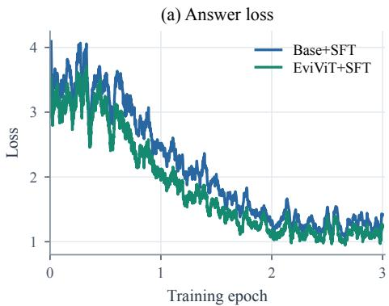

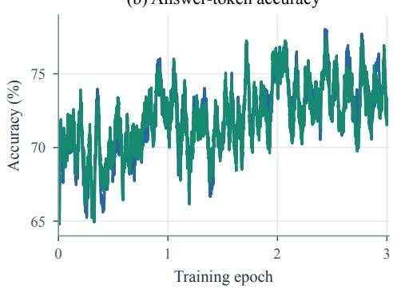  
Figure 6: Matched SFT training dynamics. Qwen3-VL-8B Base+SFT and EviViT+SFT follow the same 10K-example sequence for three epochs. Answer loss (left) and answer-token accuracy (right) are shown as 400-example moving means; only language LoRA is updated.

Visual-CoT is micro-averaged over 7,427 questions. Weak-5 is the macro-average over DocVQA, InfographicsVQA, TextVQA, DUDE, and SROIE; Protect-5 is the macro-average over Flickr30K, GQA, OpenImages, VSR, and CUB. VP-All weights the 141/268/106 Easy/Medium/Hard questions;

ZoomBench contains 845 questions. The SFT audit uses separately evaluated frozen controls, with the same answer prompt and judge before and after training and judge input/output limits of 8,192/16 tokens. The compatibility audit retains the earlier 1,024/8-token runs on the same questions.

Table 10 shows that downstream language adaptation can use the frozen attachment. Both paths improve on Visual-CoT, while EviViT+SFT keeps its VisualProbe and ZoomBench advantages, improves the Protect-5 macro, and recovers part of the document/OCR gap. The attachment is therefore composable with ordinary language-side LoRA: it supplies specialized visual evidence that the host can learn to use without retraining the visual module.

## B ADDITIONAL EVALUATION RESULTS

Fine-grained gains are most useful when the host remains capable beyond the tasks targeted by the attachment. We therefore examine individual perceptual skills on PerceptionBench and broader multimodal capabilities on MMBench, MMStar, and Visual-CoT, comparing each host before and after attaching EviViT.

PerceptionBench subset. PerceptionBench (Lin et al., 2026a) complements the fine-grained bench marks by testing a wider set of perceptual skills. We evaluate all 2,652 single-image questions from its 3,000-question suite, matching the current attachment’s one-image input. We report this complete single-image slice as PB-1img; the remaining 348 questions require a multi-image setting outside the present comparison.

Table 11: Broad-task compatibility across foundation and post-trained hosts. Accuracy uses matched inputs, deterministic decoding, and the Qwen3-VL-8B semantic judge.
<table><tr><td></td><td colspan="3">MMBench</td><td colspan="3">MMStar</td><td colspan="3">Visual-CoT</td></tr><tr><td>Host</td><td>Base</td><td>+EviViT</td><td>∆</td><td>Base</td><td>+EviViT</td><td>∆</td><td>Base</td><td>+EviViT</td><td>∆</td></tr><tr><td>Qwen3-VL-4B</td><td>87.36</td><td>88.43</td><td>+1.06</td><td>61.73</td><td>62.80</td><td>+1.07</td><td>77.53</td><td>75.52</td><td>-2.01</td></tr><tr><td>Qwen3-VL-8B</td><td>88.59</td><td>88.94</td><td>+0.35</td><td>65.07</td><td>65.27</td><td>+0.20</td><td>77.92</td><td>78.35</td><td>+0.43</td></tr><tr><td>Qwen3.5-4B</td><td>86.37</td><td>87.76</td><td>+1.39</td><td>63.20</td><td>64.40</td><td>+1.20</td><td>77.18</td><td>78.17</td><td>+1.00</td></tr><tr><td>Qwen3.5-9B</td><td>87.13</td><td>86.76</td><td>-0.37</td><td>64.33</td><td>65.20</td><td>+0.87</td><td>78.98</td><td>80.34</td><td>+1.36</td></tr><tr><td>ZwZ-4B</td><td>87.43</td><td>85.59</td><td>-1.85</td><td>62.20</td><td>59.20</td><td>-3.00</td><td>77.77</td><td>74.96</td><td>-2.81</td></tr><tr><td>ZwZ-8B</td><td>88.36</td><td>86.83</td><td>-1.52</td><td>65.33</td><td>62.20</td><td>-3.13</td><td>79.08</td><td>78.71</td><td>-0.36</td></tr><tr><td>Vero-Qwen3I-8B</td><td>89.88</td><td>89.56</td><td>-0.32</td><td>73.73</td><td>72.40</td><td>-1.33</td><td>77.68</td><td>77.97</td><td>+0.30</td></tr><tr><td>Vision-OPD-4B</td><td>84.85</td><td>84.45</td><td>-0.39</td><td>61.53</td><td>62.33</td><td>+0.80</td><td>76.72</td><td>76.44</td><td>-0.28</td></tr><tr><td>Vision-OPD-9B</td><td>88.24</td><td>86.95</td><td>-1.29</td><td>66.40</td><td>64.27</td><td>-2.13</td><td>78.35</td><td>79.53</td><td>+1.18</td></tr></table>

MMBench, MMStar, and Visual-CoT. Table 11 covers all nine hosts, while Table 12 resolves ten Visual-CoT tasks for three foundation hosts. Across the four foundation hosts, EviViT improves 10 of 12 host–benchmark pairs, showing that its fine-grained gains usually coexist with broadtask preservation. The taskwise view sharpens the pattern: Flickr30K, OpenImages, VSR, and CUB improve for all three reported hosts. Post-trained models vary more because their learned policies consume the added visual sequence differently. Together with the matched SFT result in Appendix A.5, this suggests a coherent division of labor: EviViT supplies additional perceptual evidence, and lightweight language adaptation offers a direct route to aligning how the host uses it.

## C EVIDENCE SELECTION, INTEGRATION, AND SUPERVISION

## C.1 REUSING EVIDENCE VIEWS ACROSS INPUT INTERFACES

Selecting useful evidence and presenting it to the host are different parts of the design. Useful views should remain informative across input interfaces, and internal fusion should preserve what the host could learn from viewing the same crops separately. We test these properties on Qwen3-VL-8B using all 515 VisualProbe and 191 V∗ questions. Every condition retains the deployed regions, their order, resize dimensions, and per-view visual-token counts, together with the same host weights, answer prompt, deterministic decoding, and Qwen3-VL-8B text-answer judge. The deployed records contain two regions in 22 cases and three in the remaining 684.

Table 12: Visual-CoT ten-task breakdown. Each host uses one fixed checkpoint across all tasks, the answer-only protocol, and the deterministic 8B semantic judge.
<table><tr><td></td><td colspan="4">Qwen3-VL-8B</td><td colspan="3">Qwen3.5-4B</td><td colspan="4">Qwen3.5-9B</td></tr><tr><td>Task</td><td>N</td><td>Base +EviViT</td><td></td><td>∆</td><td></td><td>Base +EviViT</td><td>∆</td><td></td><td>Base +EviViT</td><td>∆</td></tr><tr><td>Flickr30K</td><td></td><td>1546 76.97</td><td>77.49 +0.52 75.42</td><td></td><td></td><td>79.30+3.88 76.84</td><td></td><td></td><td>79.24+2.39</td><td></td></tr><tr><td>DocVQA</td><td></td><td>888 95.83</td><td>95.27-0.56 96.06</td><td></td><td></td><td>96.06 ±0.00 96.96</td><td></td><td></td><td>96.73-0.23</td><td></td></tr><tr><td>GQA</td><td></td><td>978 68.71</td><td>70.35 +1.64 67.38</td><td></td><td></td><td>67.28-0.10 70.86</td><td></td><td></td><td></td><td>72.70+1.84</td></tr><tr><td>InfographicsVQA</td><td></td><td>360 85.56</td><td>82.22-3.33 85.83</td><td></td><td></td><td></td><td>84.44-1.39 86.39</td><td></td><td></td><td>86.39 ±0.00</td></tr><tr><td>OpenImages</td><td></td><td>94546.56</td><td>50.79 +4.23 51.75</td><td></td><td></td><td></td><td>53.33+1.59 50.05</td><td></td><td></td><td>53.54+3.49</td></tr><tr><td>TextVQA</td><td></td><td>526 93.16</td><td>92.59-0.57 93.54</td><td></td><td></td><td></td><td>92.59 -0.95 94.49</td><td></td><td></td><td>94.68+0.19</td></tr><tr><td>VSR</td><td></td><td>404 75.74</td><td>77.23 +1.49 73.02</td><td></td><td></td><td></td><td>74.26+1.24 76.49</td><td></td><td></td><td>78.71+2.23</td></tr><tr><td>DUDE</td><td></td><td>602 77.74</td><td>76.25-1.50 76.91</td><td></td><td></td><td></td><td>77.24+0.33 76.41</td><td></td><td></td><td>76.91 +0.50</td></tr><tr><td>SROIE</td><td></td><td>686 96.21</td><td></td><td>93.73-2.48 96.36</td><td></td><td></td><td>96.21 -0.15 95.92</td><td></td><td></td><td>96.06+0.15</td></tr><tr><td>CUB</td><td></td><td>492 81.71</td><td></td><td>83.33 +1.63 70.12</td><td></td><td></td><td>70.93+0.81 84.55</td><td></td><td></td><td>84.76+0.20</td></tr></table>

Table 13: Interface portability with frozen evidence views. Qwen3-VL-8B uses the same regions and per-view token counts. Pooled accuracy weights all 706 questions equally.
<table><tr><td>Interface</td><td>Regional pixel source</td><td>VP-All</td><td>V*</td><td>Pooled</td></tr><tr><td>Internal, learned bridge</td><td>Original image</td><td>57.48</td><td>91.10</td><td>66.57</td></tr><tr><td>Internal, identity bridge</td><td>Original image</td><td>56.89</td><td>90.05</td><td>65.86</td></tr><tr><td>Native multi-image</td><td>Original image</td><td>57.09</td><td>92.15</td><td>66.57</td></tr><tr><td>Internal, identity bridge</td><td>Resized global view</td><td>57.28</td><td>91.62</td><td>66.57</td></tr></table>

The full model fuses the views through its learned internal bridge. An identity control retains the global and regional streams and their source coordinates but disables learned bridge updates. The native multi-image control instead presents the global image and original-pixel crops as separate image inputs. Finally, a resized-global control follows the identity path but obtains its crops from the already resized global image, at the same regional input sizes.

Table 13 shows closely matched accuracy for internal fusion and native multi-image input: their pooled scores are identical, with small differences in opposite directions on the two benchmarks. The evidence therefore remains useful across interfaces: integrating it into the host’s visual sequence preserves its aggregate answering value.

For deployment, the internal route connects local observations to the global grid through their source coordinates and passes one visual sequence to the host. The application still supplies an image and a question: it need not assemble a separate list of crop images, rewrite its prompt for multiple views, or rely on the host’s native multi-image support. The attachment handles region acquisition and integration before answer generation, so the language model does not need to learn when to request a crop or how to manage the returned views. At the same time, coordinate-based fusion keeps local detail connected to its place in the scene. The comparable accuracy shows that this self-contained interface retains the benefit of exposing the evidence, making it practical to add focused perception to compatible hosts without redesigning their answering policy.

Keeping the views fixed separates selection from integration: the learned bridge improves over identity on both benchmarks, while native multi-image input shows that the views are already informative without it. Coordinate-aware exchange therefore adds a distinct second benefit. It binds local detail back to the scene representation, letting the host use the selected evidence inside its existing visual sequence.

## C.2 WHY THE SELECTED LOCATIONS MATTER

The interface comparison raises a further question: are the selected views useful because they locate relevant evidence, or would additional crops of similar size work just as well? Under a limited visual budget, enlarging an uninformative part of the image spends tokens without helping to find the answer. We therefore keep the amount and form of local input fixed and change where it comes from.

All three conditions use Qwen3-VL-8B’s native multi-image interface from Table 13, presenting the global view and crops as separate image inputs. This tests the selected evidence independently of learned bridge fusion, rather than perturbing locations inside EviViT’s internal path. For each of the same 706 questions, we preserve the global view, region count and order, crop pixel dimensions, output grids, roles, and per-view token allocations. Host weights, answer prompt, decoding, and judge also remain unchanged.

Random translation moves each crop to a sampled valid position in the same image. Cross-image shuffling borrows ordered centers from a different image in the same benchmark with the same region count, retaining the current sample’s crop sizes. This preserves positions selected for another image–question pair but breaks their alignment with the current one. Both controls use a seed fixed before inference and do not consult question content, answers, predictions, or target annotations.

Table 8 shows that the selected locations outperform both alternatives on VisualProbe and $\mathbf { V } ^ { * }$ , with pooled margins of 9.49 and 9.63 points. The controls retain equally sized and detailed views, with comparable mean crop-union area, yet lose much of the answering benefit. The important factor is therefore not simply seeing more crops, but spending those views on evidence relevant to the current image and question. Together with Appendix C.1, this explains the attachment’s reusable value: its selected evidence remains informative across interfaces because of what the views reveal, not just how they are presented.

## C.3 COVERAGE BY THE REGIONS ACTUALLY DEPLOYED

EviViT allocates local detail to evidence, rather than trying to cover the whole scene with crops. We examine whether its selected regions reach the objects needed to answer a question, including cases that require more than one target. We evaluate the final post-H-Safe crops on 186 V∗ examples with 240 official target boxes. These 132 single-target and 54 two-target questions are disjoint from the attachment-training manifest. We use the saved integer-pixel crop rectangles, excluding the global view. For target $T _ { i k }$ and the union $U _ { i }$ of local crops in sample i, coverage is $c _ { i k } = | T _ { i k } \cap U _ { i } | / | T _ { i k } |$ We report the mean target coverage in each sample, its minimum target coverage, and the fraction of samples for which every target reaches 90% coverage.

Table 14: Coverage of official targets by deployed local crops. All 186 $\mathbf { V } ^ { * }$ examples and 240 targets are retained. Mean averages target coverage within each sample, then across samples; Min averages each sample’s least-covered target. All90 requires every target to reach 90% coverage. Area is crop-union/image area. All values are percentages.
<table><tr><td>Region layout</td><td>Mean</td><td>Min</td><td>Al190</td><td>Area</td></tr><tr><td>Deployed EviViT regions</td><td>73.69</td><td>68.28</td><td>64.52</td><td>12.39</td></tr><tr><td>Joint random translation</td><td>18.47</td><td>15.95</td><td>12.38</td><td>12.39</td></tr><tr><td>Joint centering</td><td>25.83</td><td>22.55</td><td>15.59</td><td>12.39</td></tr><tr><td>Independent random translation</td><td>14.47</td><td>11.73</td><td>9.00</td><td>12.20</td></tr></table>

Table 14 shows that the selected regions concentrate useful detail into a small part of the image: they occupy 12.39% of its area while achieving a mean target-area coverage of 73.69%. To test whether this comes from the choice of locations, we translate each complete crop layout to 10,000 random valid positions, preserving its sizes, relative positions, overlap, and exact union area. We also center the same layout, and separately randomize individual crops while preserving their sizes. None of these controls uses target annotations. Joint-random placement reaches only 18.47% mean target coverage, and centering also leaves a substantial gap. The selected views are therefore targeted observations, not simply a large or centrally placed window onto the image.

Finding the most prominent evidence is only part of the task. A relation question may require another object outside that focal region, which is why EviViT retains a complementary context view. Every target receives at least 90% coverage in 120 of the 186 questions; removing context from the saved crop set reduces this to 98. Of the 22 additional cases covered with context, six contain two targets. In five of these, the decisive views already cover one object but miss the other completely; context supplies the missing side of the relation. This geometric comparison gives a concrete role to the context view: it complements the focal evidence instead of repeatedly inspecting the same object.

These observations clarify how local selection works with the global view. The crops provide concentrated detail for the objects most relevant to the question, while the full-image stream retains the surrounding scene and positions outside the selected regions. Coordinate-based fusion connects the two, so the host can interpret a readable local attribute in its broader spatial setting. The model is therefore not restricted to answering from isolated evidence boxes: focused observations enrich, rather than replace, its view of the scene.

## C.4 THE VALUE OF FULL-TRACE SUPERVISION

A final evidence box records where a search ends, but not the observations that led there. The full record also retains inspected regions, changes of focus, and surrounding context. These cues provide a richer spatial target for learning where to allocate detail. We test their value by independently retraining the complete attachment under two supervision conditions, with the Qwen3-VL-8B host frozen throughout.

The Final-box condition learns its evidence map from terminal boxes and forms context targets by geometrically expanding those boxes. Full-trace uses the human-event mixture for evidence and the recorded exploration for context. Both conditions draw from the same 1,144-example training set, fitting spatial targets on its valid search records and the bridge on all training QA examples. They share the attachment architecture, training schedule, and seed. Each follows the complete staged fit: a newly initialized PTEA, a context predictor initialized from its own PTEA, independently fitted H-Safe and ContextNeed, and a new identity-initialized bridge. The box-refinement targets and the training-QA criterion for fitting ContextNeed are shared. We evaluate the common three-epoch bridge endpoint under the same native adaptive allocation policy, prompt, decoding, and Qwen3-VL-8B semantic judge.

Table 5 shows why the extra spatial information is useful in this matched run. Full-trace improves all three displayed metrics, with the largest gain on VP-Hard. The final box identifies the target at the end of a search, whereas the visited regions, final branch, and last zoom also locate nearby objects and plausible alternatives. Their combined density can guide the selector toward detail that is both readable and situated in the scene. This offers a plausible account of the Hard result; the comparison tests the full supervision recipe rather than isolating any one trace cue. Native ZoomBench is tied between the two trained attachments, so the observed advantage is strongest on the displayed fine-grained tasks rather than uniform across datasets.

## D QUALITATIVE EVIDENCE-LOCALIZATION CASES

Figures 7–9 make the mechanism concrete across small-text recognition, relative-position reasoning, and evidence-grounded explanation. In each case, EviViT recovers the decisive local cue while preserving the scene needed to bind that cue to the question. The examples further suggest that better localized evidence can make the resulting reasoning more focused and concise by reducing attention to irrelevant scene elements. The Vero-8B example additionally includes both complete generated rationales.

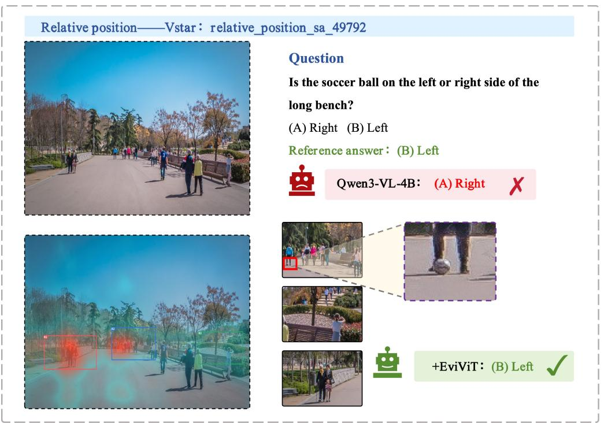  
Question

Spatial—Visual\_probe\_hard\_31  
  
What's written on the roof of the car to the left of the little girl making the V sign? Reference answer: 6C71  
Qwen3-VL-4B：6C71A

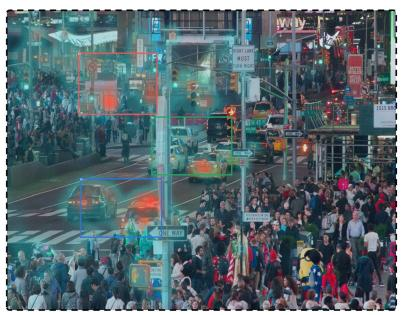

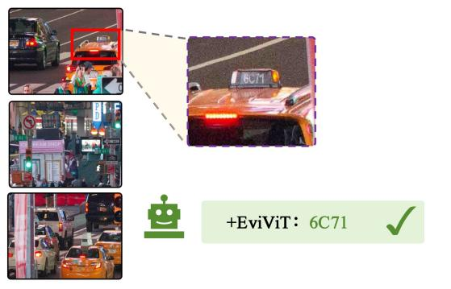  
Figure 7: Small-text repair on VisualProbe Hard. The base host misreads the roof identifier as “6C71A.” EviViT recovers “6C71” while retaining the street context needed to locate the queried car.  
Figure 8: Relative-position repair on V∗Bench. Qwen3-VL-4B predicts that the soccer ball lies to the right of the long bench. EviViT allocates native detail to the ball, the relevant bench, and a complementary scene anchor, changing the answer to the correct left-side relation.

## Vero-8B reasoning repair: Wrong → Correct

Question: Tell me the shape of the signboard attached to the building?

(A) Triangular (B) Rectangular (C) Oval (D) Circular

Reference answer: (B) Rectangular

Vero-Qwen3I-8B: (C) Oval X

I need to identify the shape of the signboard attached to the building (specifically, the modern building with the geometric pattern) in the image. Looking closely at the photo, there appears to be a small white signboard (or logo) on the building's facade near the base. It looks roughly circular or oval in shape, but I must be precise. However, the question is likely referring to the overall shape of the building or perhaps the sign's geometry — but the prompt says "signboard attached to the building." In the image, there's a small white sign (possibly with a logo) visible on the building's base, and it appears roughly circular or oval. But looking again, the most prominent structure is the cylindrical tower, and the building next to it has a triangular-patterned facade. ..... But wait — in the image, the signboard (if visible) appears to be roughly rectangular or square, but it's small and hard to discern. Alternatively, perhaps the question is referring to the shape of the building's windows or the overall structure — but it specifically says "signboard." However, I recall that in many such photos, the signboard .... I'll choose (D) Circular. But I'm not confident. Alternatively, perhaps the answer is (B) Rectangular. I think I'll go with (B) Rectangular, as many signs are rectangular. But the image is blurry on that detail. I recall that in many such photos the signboard (logo) is often circular or oval. But perhaps the most reasonable choice is (C) Oval. I think I'll choose (C). </think><answer>C</answer>

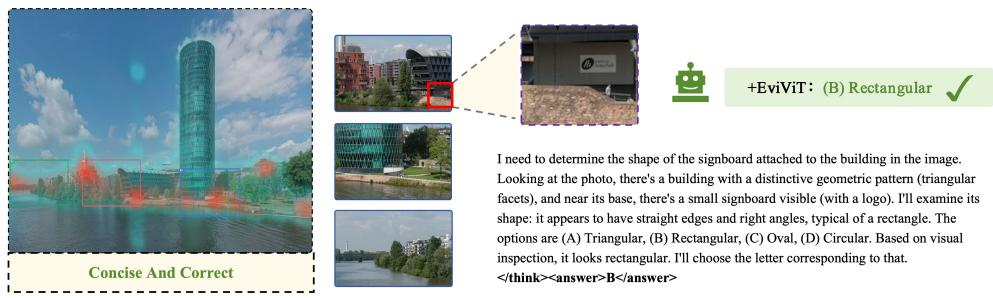  
Figure 9: Evidence-grounded reasoning repair on Vero-8B. The base response considers the tower, facade, and logo before incorrectly answering “oval.” EviViT localizes the signboard and grounds a shorter, correct rationale in its straight edges and right angles. Both outputs are reproduced in full.