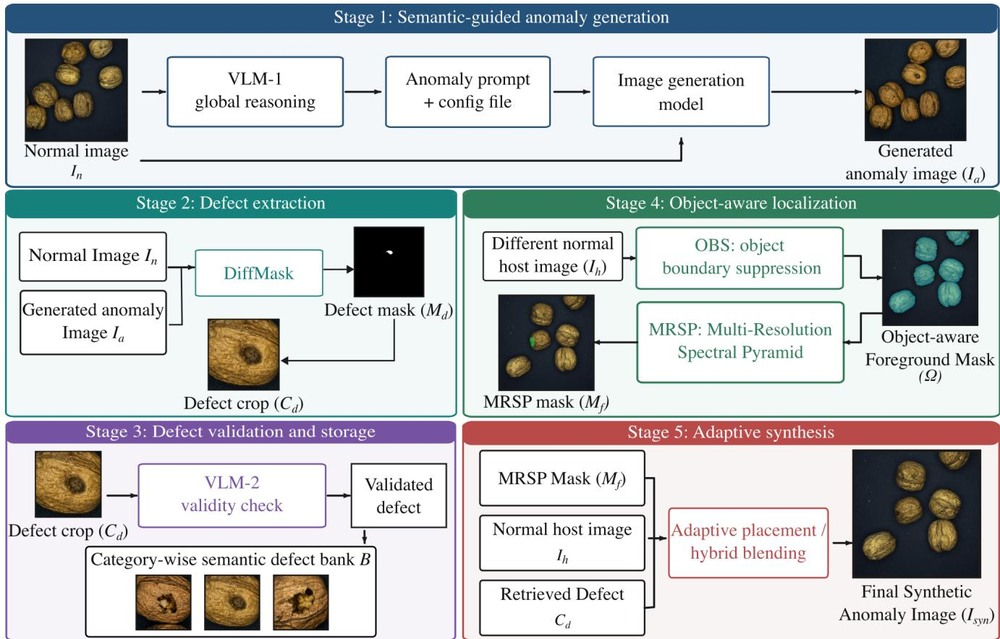
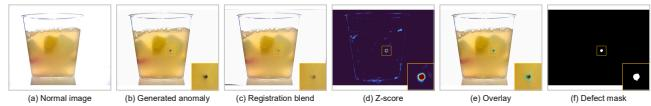
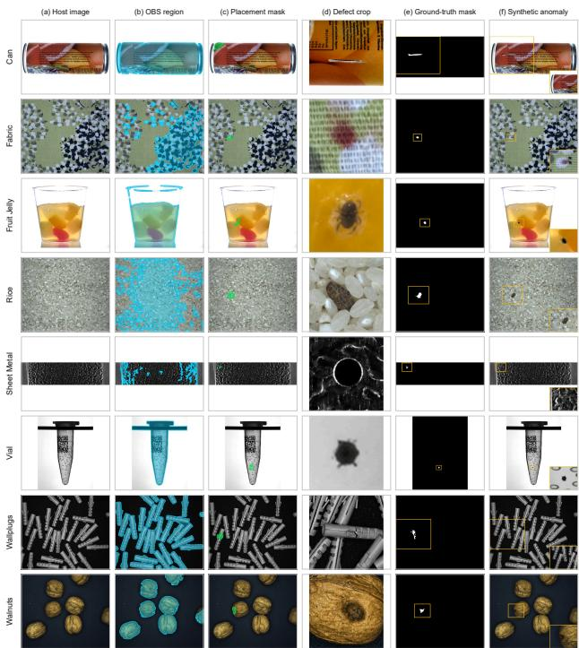
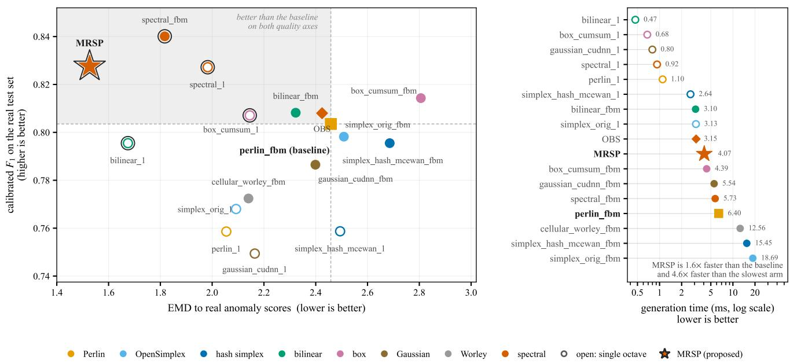
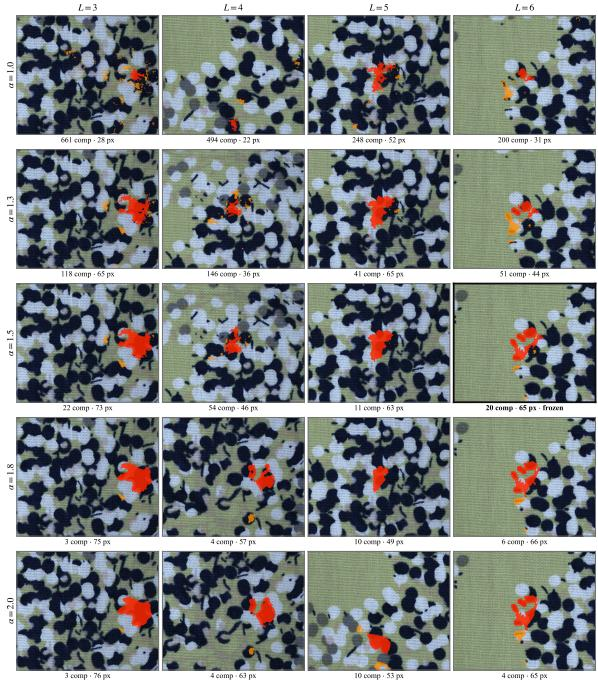
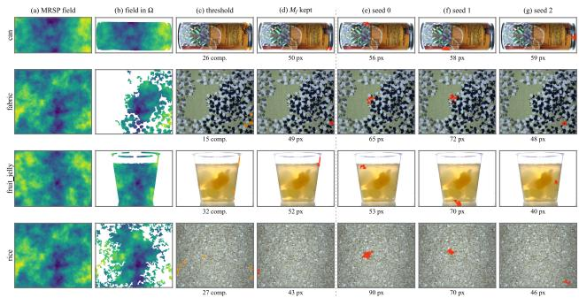
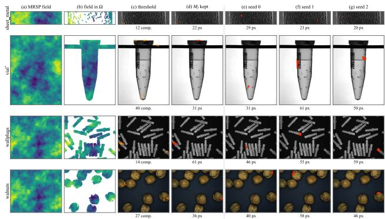
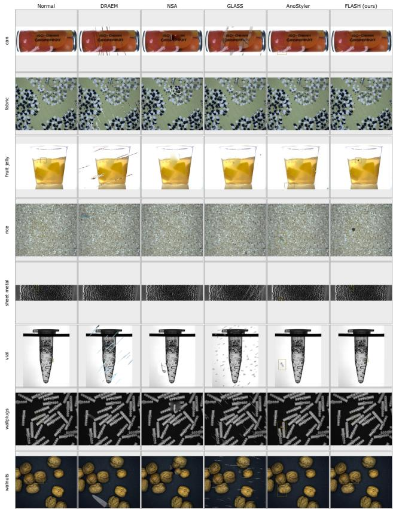
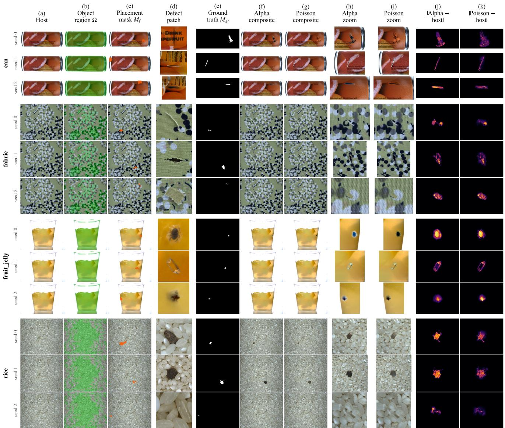
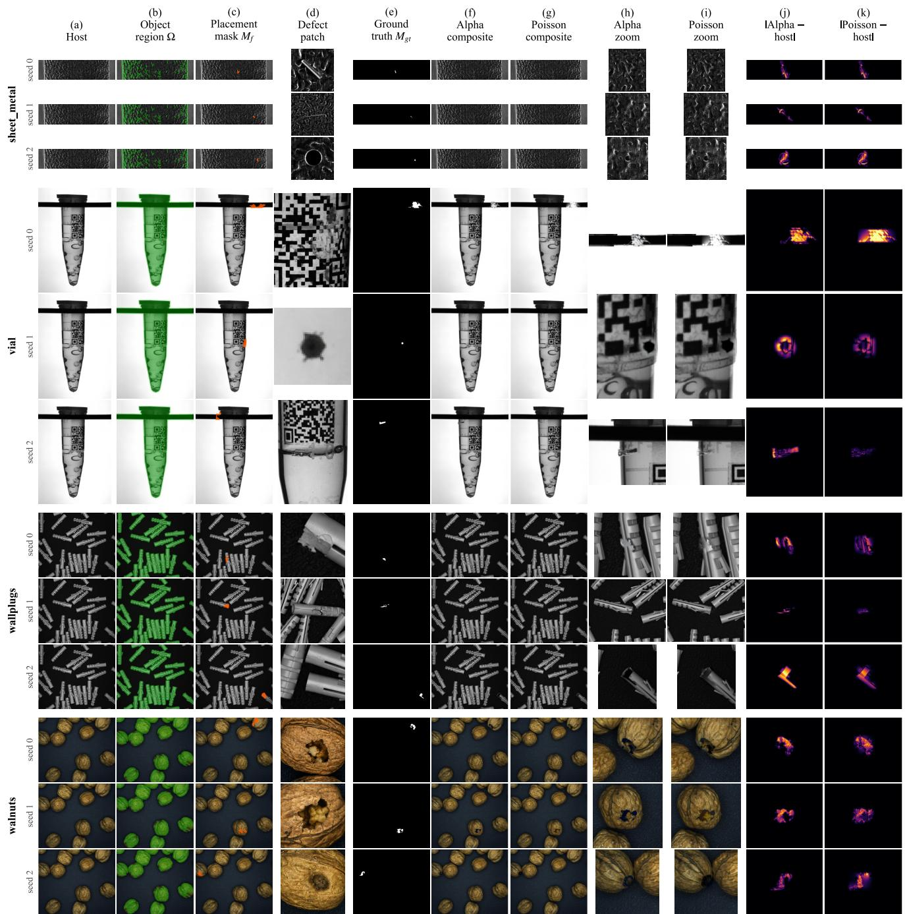

# FLASH: A “Generate Once, Synthesize Many” Framework for Synthetic Anomaly Generation in Industrial Anomaly Detection

Abhay Kumar Das<sup>1</sup> Rajesh Gangireddy<sup>2</sup> Ashwin Vaidya<sup>2</sup> Samet Akcay<sup>2</sup>

<sup>1</sup>Silicon University, Bhubaneswar, India <sup>2</sup>Intel

dasabhay.jsr@gmail.com rajesh.gangireddy@intel.com

ashwin.vaidya@intel.com samet.akcay@intel.com

## Abstract

Synthetic anomaly generation helps expand industrial anomaly datasets when real defects are scarce or unavailable. Existing approaches lie at two extremes: procedural approaches are fast but struggle to represent complex anomalies, while generative approaches produce diverse defects but require costly per-sample generation. We present FLASH, a framework that decouples defect generation from anomaly synthesis under a “generate once, synthesize many” paradigm. Given only normal images, FLASH uses Vision Language Model (VLM) guidance and an image-generation model to produce a small set of defect images, from which it extracts, validates, and banks reusable defect patches. For synthesis of anomalous images, Object Boundary Suppression (OBS) first identifies the probable foreground object-aware region of the host image, while Multi-Resolution Spectral Pyramid (MRSP) noise generates diverse, size-controllable masks that determine the defect location and spatial extent. It then composes a large and diverse synthetic anomalous image set by localizing the defect region, sampling size-controllable placement masks and seamlessly blending retrieved defects onto new defect-free images without further need for image generation. Experiments on the MVTec AD 2 dataset show that FLASH-generated anomalies nearly close the calibration gap on real defects, reaching 78.1% image-level F1 against an 83.6% real-anomaly upper bound and providing the most consistent calibration transfer across detectors among procedural and generative alternatives. Moreover, FLASH synthesizes anomalies more than 11.95× faster than persample generative approaches.

## 1. Introduction

In manufacturing, production lines predominantly yield defect-free products, while anomalous samples are rare, diverse, and expensive to collect and annotate [5]. This makes synthetic anomaly generation an attractive alternative for constructing anomalous data from normal images [50, 52]. Existing approaches occupy two extremes, computationally faster procedural and feature-based methods, and the slower but contextually coherent generative methods. The first set of methods is limited in their ability to represent complex and semantically meaningful defects [29, 30] whereas the second, though closer to the target domain, require substantially more time and computation per generated sample [22, 26]. We therefore aim to develop a framework that lies between these two extremes: retaining the fast generation and computational efficiency of procedural synthesis while obtaining diverse synthetic anomalies through limited generative inference. We introduce FLASH, a framework designed around this trade-off. It generates a small set of defect instances once and reuses them to synthesize a substantially larger anomaly dataset, thereby reducing generation time while operating without any real defect references. The resulting synthetic anomalies are contextspecific, thus serving as a viable surrogate in the absence of real defects for downstream anomaly detection, including decision-threshold calibration [54].

FLASH achieves this through a five-stage approach. Its factorized design allows a limited set of generated defects to be reused across normal images, balancing generation speed, computational efficiency, and synthetic anomaly utility. We evaluate FLASH on MVTec AD 2 [20], a challenging benchmark with diverse conditions and anomaly types beyond conventional structural defects, including subtle foreign contamination. Such anomalies challenge procedural synthesis, where predefined noise or feature perturbations have limited capacity to model the appearance, context, and spatial characteristics of externally introduced materials, making MVTec AD 2 a stringent test of whether reference-free synthesis can move beyond simple procedural defects.

## 2. Related Work

Synthetic anomaly generation encompasses procedural methods that prioritize efficient synthesis and generative approaches that emphasize contextual fidelity, forming a persistent procedural–generative trade-off.

## 2.1. Procedural Anomaly Generation

Procedural methods establish a simple route to referencefree anomaly synthesis by transforming normal images through patch relocation [29], blending [49], and Poisson cloning [43]. Noise-based formulations extended this principle to scalable defect formation using Perlin masks and sampled textures [35, 52], with subsequent work improving object constraints [51] and perturbation subtlety [8]. Their low computational cost makes them attractive for large-scale synthesis; however, the generated defect space remains tied to predefined perturbations or borrowed textures, limiting their ability to represent complex contextdependent anomalies such as those arising from real manufacturing process error.

## 2.2. Generative Anomaly Generation

Generative models address the above limitations by broadening the diversity of defects that can be represented. GANbased approaches introduced defective counterparts [32], controllable synthesis [53], and defect transfer from limited anomalous samples [13]. Diffusion-based approaches [39] further enabled anomaly embeddings [22], joint imagemask generation [26], controllable anomaly strength [55], inpainting [48], cross-category transfer [45], and spatial conditioning [18]. Vision-language models subsequently added contextual reasoning to anomaly analysis [17, 23, 56] and synthetic defect generation [21, 25, 27]. These advances broaden the range of defects that can be generated, but generative inference typically must be repeated for each synthesized sample, making the process slow and computationally expensive, and several approaches also rely on real anomalous references [9] – placing generative methods at the opposite end of the synthesis spectrum from procedural approaches in terms of diversity versus efficiency.

## 2.3. Industrial AD Benchmarks and Detectors

The practical value of synthetic anomalies depends on whether they provide useful anomalous evidence for downstream industrial anomaly detection. Most synthetic anomaly generation methods are benchmarked on MVTec AD [5] and VisA [57]. However, these datasets are wellexplored, primarily feature simple procedural defects, and often fail to expose the limitations of synthetic anomalies. In contrast, MVTec AD 2 [20] is a far more demanding industrial dataset featuring transparent objects, challenging illumination, and foreign contamination. Despite its realism, it remains underutilized, making it an ideal testbed for evaluating synthetic anomalies beyond basic procedural defects.

Downstream anomaly detection methods span several architectural paradigms, including embedding-based (PaDiM [11], PatchCore [42]), feature-mapping (SimpleNet [30]), student-teacher networks (EfficientAD [4]), reconstructionbased frameworks (Reverse Distillation [12]), and modern foundation-model approaches (Dinomaly [19], AnomalyDINO [10], SuperADD [40]). However, existing benchmarks predominantly evaluate models using decision thresholds calibrated on real anomalies, an assumption that breaks down in practical zero-shot or unsupervised industrial settings where real anomalies are unavailable prior to deployment.

## 3. Methodology

Industrial anomaly detection focuses on normal data as defective samples are rare, unevenly distributed across defect types, and expensive to collect and annotate at pixel level [5]. FLASH addresses this in its strictest form: given only normal images from a category, it generates anomalous images with pixel-accurate segmentation labels without using any real defect image, defect mask, or human annotation. Throughout the pipeline, $I _ { n }$ denotes the Normal Image, $I _ { a }$ the Generated Anomaly Image, $M _ { d }$ the Defect Mask, $C _ { d }$ the Defect Crop, B the Category-wise Semantic Defect Bank, $I _ { h }$ the Different Normal Host Image, Ω the Object-Aware region, $M _ { f }$ the MRSP noise-based placement mask, $I _ { s y n }$ the Final Synthetic Anomaly Image, and $M _ { g t }$ its corresponding ground-truth mask.

Existing pipelines are predominantly mask-first: a defect mask is defined before the defect is generated, after which the model is required to conform its output to the prescribed region [51]. Diffusion-based approaches follow this formulation by conditioning image generation on predefined defect regions [48]. This creates a mask-drift problem: the generated defect may not fully occupy the prescribed mask or may extend beyond $\mathrm { i t , }$ causing disagreement between the anomaly and its label. Unlike other approaches [18], FLASH generates the anomalous frame first and then recovers the actual Defect Mask $M _ { d }$ from the generated image $I _ { a } .$ This mask can then be transferred onto a different Normal host Image $I _ { h }$ and placed within the MRSP mask $M _ { f } .$ where its location and spatial extent can be varied without distorting the recovered defect.

Figure 1 presents the five-stage FLASH architecture. Stage 1 uses a VLM reasoning about the entire image and a Config File to guide the image-generation model in producing $I _ { a }$ from $I _ { n }$ . Stage 2 recovers $M _ { d }$ using DiffMask and extracts the Defect Crop $C _ { d } .$ , while Stage 3 validates the crop and stores it in the Category-wise Semantic Defect Bank B. Stage 4 processes the Different Normal Host Image $I _ { h }$ using OBS and MRSP to obtain the Object-Aware region Ω and placement mask $M _ { f }$ . Stage 5 retrieves a defect from B and adaptively blends it within $M _ { f }$ to produce $I _ { s y n }$ and $M _ { g t }$ from $I _ { h }$ . Thus, $I _ { n }$ serves as the donor for defect creation, while $I _ { h }$ serves as the host for subsequent synthesis; the detailed operations of each stage are described in the following sections.

Stages 1–3 are executed once per category to construct the defect bank, while Stages 4–5 execute for each output image. Thus, the image-generation model is not invoked for every synthetic sample, unlike fully generative pipelines whose generation cost scales with corpus size [48]. The per-image generation instead relies on lightweight placement, harmonization and blending, allowing FLASH to retain the efficiency of procedural synthesis while using limited generative inference to obtain diverse contextual defects. The resulting defect bank can then be reused across normal host images, with MRSP mask providing intraimage variation for additional diversity. An overview of the complete FLASH pipeline across all eight MVTec AD 2 categories, showing host images, OBS regions, placement masks, extracted defects, ground-truth masks, and final synthetic anomalies, is shown in Figure 3.

  
Figure 1. Five-stage FLASH architecture. Stages 1–3 generate, extract, validate, and store reusable defects, while Stages 4–5 localize and synthesize retrieved defects onto separate normal host images.

## 3.1. Semantic-Guided Anomaly Generation

Starting from a Normal Image $I _ { n } .$ , the first challenge is to specify what anomaly should be introduced before passing the image to the image-generation<sup>1</sup> model. Rather than manually defining this prompt, VLM-1<sup>2</sup> performs global reasoning over $I _ { n }$ to identify a plausible defect type, its material context, and then generates an Anomaly Prompt. This prompt is augmented by a Config File that provides dataset context, category-wise defect types, and hard generation constraints. Crucially, it enforces photometric preservation with respect to $I _ { n } ,$ ensuring that lighting elements including shadows, reflections, and colour distribution remain unaltered and strictly prohibits changes to exposure, contrast, or white balance. As shown in Figure 1, the Anomaly Prompt, Config File, and $I _ { n }$ are provided to the imagegeneration model to generate the Anomaly Image $I _ { a } .$ . Thus, VLM-1 provides the semantic specification of the anomaly, while the Config File provides dataset-specific context and generation constraints. Since the image-generation model re-generates the entire image with anomaly, it may exhibit scale, spatial-offset, and pixel-level correspondence differences from $I _ { n } .$ , motivating the Defect Extraction stage.

## 3.2. Defect Extraction

DiffMask frames the difference between the Normal Image $I _ { n }$ and the generated Anomalous Image $I _ { a }$ as a signalrecovery problem in which alignment, illumination, and reconstruction noise act as nuance variation, while the introduced defect constitutes the signal. The two images are first registered using their edge maps to establish structural correspondence, followed by photometric adjustment.

As detailed in Algorithm 1, the registration is refined through similarity alignment, ECC refinement [14], and when required, feature-based [31] and dense-flow correction [15] to absorb residual geometric drift. The registered images are then compared using a tolerance band to suppress small registration errors. Five complementary cues measure luminance, chromaticity, gradient structure, lowfrequency appearance, and fine-detail changes, which are fused into the difference score S. The complete registration and difference-based extraction process is illustrated in Figure 2.

  
Figure 2. DiffMask-based defect extraction from registered normal and generated anomaly images.

Rather than applying a fixed global threshold to S, Diff-Mask evaluates each pixel relative to its local reconstruction noise. For a pixel $p ,$ let $\mathcal { N } ( \boldsymbol { p } )$ denote its local neighbourhood. The local deviation is computed as

$$
Z ( p ) = \frac { S ( p ) - \mu _ { \mathcal { N } ( p ) } } { \operatorname* { m a x } \left( \sigma _ { \mathcal { N } ( p ) } , \epsilon \right) } ,\tag{1}
$$

where $Z ( p )$ is the local z-score, $S ( p )$ is the fused difference score, $\mu _ {  { \mathcal { N } } ( p ) }$ and $\sigma _ {  { \mathcal { N } } ( p ) }$ are the mean and standard deviation of S within $\mathcal { N } ( \boldsymbol { p } )$ , and ϵ prevents unstable normalization when the local variance is near zero. This makes the defect decision dependent on how strongly a pixel deviates from its surrounding reconstruction noise rather than on its absolute difference magnitude.

The resulting Z map is separated into strong and weak candidates using absolute and adaptive thresholds. Hysteresis thresholding [7] retains weak responses only when connected to strong defect evidence, suppressing isolated noise while preserving faint defect extensions. The surviving regions are then refined, ranked by accumulated evidence, and subjected to direction-matched completion to recover weak portions that exhibit the same characteristic change as the detected defect. The resulting Defect Mask $M _ { d }$ is used to extract the Defect Crop $C _ { d }$ from $I _ { a }$ with surrounding substrate context for subsequent validation and storage.

Algorithm 1 DiffMask   
Require: Normal Image $I _ { n } ,$ Generated Anomaly Image $I _ { a }$   
Ensure: Defect Mask $M _ { d }$ , Defect Crop $C _ { d }$   
1: Convert $I _ { n }$ and $I _ { a }$ to structural representations and   
obtain an initial similarity transform using scale–   
translation search.   
2: Refine registration using coarse-to-fine ECC alignment;   
if the alignment score is insufficient, evaluate feature  
based similarity registration and retain the better solu  
tion.   
3: Apply smoothed dense-flow refinement to compensate   
for residual local misalignment.   
4: Photometrically match the registered $I _ { n }$ to $I _ { a }$ using lo  
cal gain–offset fitting and construct a tolerance band   
around the reference response.   
5: Compute luminance, chromaticity, gradient/edge struc  
ture, low-frequency appearance, and sharpness/fine  
detail residuals, and fuse them into the difference score   
S.   
6: Estimate robust global and local neighborhood statistics   
of S and compute the local z-score $Z ( p )$   
7: Generate strong and weak candidates using absolute   
and adaptive thresholds, and apply hysteresis threshold  
ing to retain weak candidates connected to strong defect   
evidence.   
8: Remove isolated responses and refine surviving re  
gions; rank connected components by accumulated ev  
idence and retain valid ones.   
9: Recover weak defect continuations using direction  
matched completion and obtain the final defect mask   
$M _ { d }$   
10: Extract the defect crop $C _ { d }$ from $I _ { a }$ with surrounding   
substrate context.   
11: return $M _ { d } , C _ { d }$

## 3.3. Defect Validation and Banking

DiffMask recovers candidate defect regions, but its difference cues can also flag random texture variations or reconstruction artifacts that do not correspond to valid defects. Therefore, the extracted Defect Crop $C _ { d }$ is passed to $\mathrm { V L M } { - } 2 ^ { 3 }$ , for semantic validation. VLM-2 evaluates $C _ { d }$ together with its surrounding substrate and accepts it only when the detected region represents a plausible categoryspecific defect; otherwise, the crop is rejected. A contrast gate additionally verifies that the candidate defect has sufficient contrast relative to its surrounding substrate. Each accepted crop becomes a Validated Defect and is stored in the Category-wise Semantic Defect Bank B, indexed by category and defect type. Thus, entries are not selected solely based on pixel-level differences; they must also pass VLM-

2’s semantic validity check and correspond to a valid defect.

Once a Defect Crop $C _ { d }$ is accepted into B, its generative cost is incurred only once. The stored defect can then be retrieved and reused across different Normal Host Images $I _ { h }$ , locations, and spatial extents, allowing a limited set of generated and validated defects to produce many distinct synthetic anomaly instances without invoking the imagegeneration model again.

## 3.4. Object-Aware Localization

After constructing the Category-wise Semantic Defect Bank B, FLASH must determine where a retrieved defect can be placed on a different Normal Host Image $I _ { h }$ . The localization stage consists of two components. First, Object Boundary Suppression (OBS) estimates the physically meaningful foreground region Ω of $I _ { h }$ . Second, Multi-Resolution Spectral Pyramid (MRSP) generates a coherent placement field within this region. The resulting MRSP mask $M _ { f }$ controls the location and spatial extent of the retrieved defect without altering its appearance. This allows the same defect to be reused across different host images, locations, and spatial extents.

## 3.4.1. Object Boundary Suppression (OBS)

The procedural noise field has no knowledge of the physical object in $I _ { h }$ and can therefore place a defect on the background. The key intuition behind OBS is to combine appearance and texture cues: pixels that differ from the background (estimated from the image boundary) are likely to belong to the foreground object [1], while local texture variation can recover object regions that have weak colour separation.

As summarized in Algorithm 2, for every Host Image, it first estimates the background from the median colour of the image-border pixels in CIELAB space. A colourdistance response is then Otsu-thresholded [34], while a local standard-deviation response provides an independent texture cue. The two responses are combined using a logical OR and subsequently refined using morphological operations [44] and connected-component area filtering. A degeneracy guard handles cases in which the resulting foreground estimate is either empty or covers nearly the complete image.

The resulting Object-Aware region is defined in Eq. 2

$$
\Omega = \mathcal { R } \left( M _ { \mathrm { c o l } } ^ { \mathrm { O t s u } } \lor M _ { \mathrm { t e x } } ^ { \mathrm { O t s u } } \right) ,\tag{2}
$$

where $M _ { \mathrm { c o l } } ^ { \mathrm { O t s u } }$ and $M _ { \mathrm { t e x } } ^ { \mathrm { O t s u } }$ are the colour- and texturebased foreground responses, respectively, and $\mathcal { R } ( \cdot )$ denotes morphological refinement and connected-component filtering. The OR operation allows a region to be retained when either color or local texture provides sufficient evidence of the object.

Algorithm 2 Object Boundary Suppression   
Require: Different Normal Host Image $I _ { h }$   
Ensure: Object-Aware region Ω   
1: Convert $I _ { h }$ to CIELAB space and estimate the back  
ground colour from the median of the image-border   
pixels.   
2: Compute the colour-distance response from the es  
timated background and local grayscale standard  
deviation map.   
3: Apply Otsu thresholding to obtain the colour response   
$M _ { \mathrm { c o l } }$ from the estimated background and the texture   
response $M _ { \mathrm { t e x } }$ from the grayscale standard-deviation   
map.   
4: Combine the responses using a logical OR.   
5: Refine with morphological opening, closing and hole   
filling.   
6: Remove connected components below the minimum   
area threshold; retain the largest component if area fil  
tering removes all candidates.   
7: Apply the degeneracy guard for empty or near-full  
image estimates to obtain Ω (Eq. 2).   
8: return Ω

## 3.4.2. Multi-Resolution Spectral Pyramid (MRSP)

Given the Object-Aware region Ω, FLASH must determine a compact region within the object where a retrieved defect can be synthesized. This region should be spatially coherent while allowing both its location and size to vary across generated samples. MRSP constructs such a placement field by combining two noise components generated across multiple spatial resolutions [6]: multi-resolution spectral noise [16] and bilinear upsampling noise [28]. Low-frequency components establish the coarse blob structure, whereas higher-frequency components introduce irregularity along its boundaries.

As summarized in Algorithm 3, MRSP generates spectral noise at multiple resolutions using $1 / f ^ { \alpha }$ amplitude weighting [16] and uniformly sampled random phase. Here, f denotes spatial frequency and α controls the frequencydependent amplitude decay. Each spectral response is transformed to the spatial domain using an inverse Fourier transform; lower-resolution responses are then bilinearly upsampled to the host resolution and normalized. The resulting multi-resolution responses are combined using persistence weighting [35] and energy normalization to obtain the placement field $F _ { \mathrm { M R S P } }$ . Thus, spectral synthesis controls the frequency structure, while bilinear upsampling brings each resolution to a common spatial scale.

The target extent or size is derived from normal-image statistics. Object coverage, the number of visible object instances, and the dataset-specific defect-coverage prior determine the target coverage c. Hence, the stochastic MRSP realization controls where the placement appears, while c controls how much of the object it occupies.

Algorithm 3 Multi Resolution Spectral Pyramid Noise   
Require: Host dimensions (H, W), Object-Aware region   
Ω, target coverage c   
Ensure: MRSP placement mask $M _ { f }$   
1: Construct the multi-resolution frequency grids and gen  
erate spectral amplitudes using $1 / \bar { f } ^ { \alpha }$ weighting.   
2: Sample a uniformly random phase for each spectral   
level and form spectral response using the inverse   
Fourier transform.   
3: Bilinearly resize each response to (H, W) and normal  
ize it.   
4: Combine the normalized responses using persistence   
weighting and energy-normalize the combined re  
sponse to obtain F<sub>MRSP</sub>.   
5: Compute the object-conditioned quantile threshold   
$Q _ { 1 - c }$ from $F _ { \mathrm { M R S P } } [ \Omega > 0 ] .$   
6: Threshold $F _ { \mathrm { M R S P } } ,$ gate by Ω, and retain the largest con  
nected component as $M _ { f } \left( \operatorname { E q } . 3 \right)$   
7: return $M _ { f }$

A threshold computed over the complete image can select strong responses outside Ω, while direct intersection with Ω can fragment or remove the intended placement region. FLASH therefore computes the threshold only from responses within Ω. Let $Q _ { q } ( \cdot )$ denote the q-quantile operator. The final placement mask is defined in Eq. 3

$$
M _ { f } = L [ ( F _ { \mathrm { M R S P } } > Q _ { 1 - c } ( F _ { \mathrm { M R S P } } [ \Omega > 0 ] ) ) \land \Omega ] ,\tag{3}
$$

where $F _ { \mathrm { M R S P } }$ is the normalized MRSP placement field, Ω is the Object-Aware region obtained from OBS, $Q _ { 1 - c } ( \cdot )$ is the (1 − c)-quantile operator, c is the target object-region coverage, and $L ( \cdot )$ retains the largest connected component. Computing the quantile within Ω makes the specified coverage relative to the object rather than the complete image.

The resulting $M _ { f }$ provides a single coherent placement region for Stage 5. Different MRSP realizations vary the defect location, while different target coverages vary its occupied object area, providing controllable spatial and size diversity without additional generative inference.

## 3.5. Adaptive Synthesis

This final stage combines the Normal Host Image $I _ { h }$ , MRSP placement mask $M _ { f }$ and retrieved defect crop $C _ { d }$ to produce the final synthetic anomaly $I _ { \mathrm { s y n } }$ . The objective is to reuse the generated defect while varying its placement and size on a new normal host. Thus, $C _ { d }$ determines what is synthesized, while $M _ { f }$ determines where it is synthesized.

As summarized in Algorithm 4, FLASH uses an original placement mode and an adaptive placement mode. The original mode places the defect at the MRSP blob centroid while preserving its source-relative scale. The adaptive mode additionally uses the blob area, principal orientation, centroid, coverage, and containment to adapt the defect to the selected MRSP region. The defect is isotropically scaled according to the target coverage, aligned with the MRSP orientation, anchored at the blob centroid or deepest interior point [41], and iteratively reduced when necessary to satisfy the containment constraint. Rotation and horizontal flipping provide additional placement variation while preserving the recovered defect morphology.

```latex
Algorithm 4 Adaptive Placement and Hybrid Blending
Require: Host Image $I _ { h } .$ , Defect Crop $C _ { d } ,$ MRSP Mask
$M _ { f }$ , Object Region Ω
Ensure: Synthetic Anomaly $I _ { \mathrm { s y n } }$ , Ground-Truth Mask
$M _ { \mathrm { { g t } } }$
1: Extract the MRSP blob centroid $( x _ { f } , y _ { f } )$ , area $A _ { f } ,$ and
orientation $\phi _ { f } .$
2: Initialize the defect using its source-relative scale and
sample rotation and horizontal flip.
3: if adaptive placement then
4: Estimate defect orientation $\phi _ { d }$ and align with $\phi _ { f } ;$
isotropically scale the defect according to the MRSP
blob coverage.
5: Anchor the defect at $( x _ { f } , y _ { f } )$ or the deepest interior
point of $M _ { f } ;$ reduce its scale until the defect mask
satisfies the MRSP containment constraint.
6: else
7: Place the defect at $( x _ { f } , y _ { f } )$ using its source-relative
scale.
8: end if
9: Place the transformed defect on $I _ { h }$ and constrain its
mask by $M _ { f } \cap \Omega ;$ harmonize the localized crop with
the host substrate in Lab space.
10: Set $M _ { \mathrm { { g t } } }$ to the placed defect mask and compute its
equivalent radius $r _ { \mathrm { e q } } .$
11: if $r _ { \mathrm { e q } } < \tau$ then
12: Apply feathered alpha blending.
13: else
14: Extract the defect core and construct a substrate col
lar around $M _ { \mathrm { { g t } } }$ to form $M _ { c } ;$ apply Poisson blending
within $M _ { c } ,$ falling back to alpha blending if it fails.
15: end if
16: return $I _ { \mathrm { s y n } } , M _ { \mathrm { g t } }$
```

The placed crop is then harmonized with $I _ { h }$ in CIELAB space using source-substrate and local host-substrate statistics [38]. FLASH subsequently applies hybrid blending: small adaptive placements use feathered alpha blending [36], while larger placements use Poisson blending [37] with a substrate collar. The collar moves the blending boundary into the surrounding substrate [24], preventing the blending operation from crossing the defect boundary and reducing visible seams that could otherwise be detected as artificial edges. If Poisson blending fails, alpha blending is used as a fallback. The hybrid operation is defined in Eq. 4.

$$
I _ { \mathrm { s y n } } = \left\{ \begin{array} { l l } { A ( I _ { h } , C _ { d } ^ { \prime } ) , } & { r _ { \mathrm { e q } } < \tau , } \\ { \mathcal { P } ( I _ { h } , C _ { d } ^ { \prime } , M _ { c } ) , } & { r _ { \mathrm { e q } } \geq \tau , } \end{array} \right.\tag{4}
$$

where $I _ { \mathrm { s y n } }$ is the final synthetic anomaly, $I _ { h }$ is the normal host image, $C _ { d } ^ { \prime }$ is the CIELAB-harmonized defect crop, $r _ { \mathrm { e q } }$ is the equivalent radius of the placed defect, τ is the small-defect threshold, A denotes feathered alpha blending, P denotes Poisson blending, and $M _ { c }$ is the substrate-collar compositing mask.

  
Figure 3. Qualitative results across all eight MVTec AD 2 categories, illustrating the end-to-end FLASH pipeline.

## 4. Experiments

This section evaluates synthetic anomalies from FLASH as a substitute for real defects in decision-threshold calibration across anomaly detectors and MVTec AD 2 categories, with real-defect calibration as the oracle.

## 4.1. Experimental Setup

We evaluate FLASH on MVTec AD 2 [20], which contains high-resolution industrial inspection scenarios with varying illumination, overlapping objects, transparent and reflective surfaces, and localized defects. The complete pipeline is executed independently for each category following the Generate Once, Synthesize Many formulation. SuperADD [40] with DINOv3 ViT-H/16+ [46] features is used as the primary downstream detector. To determine whether the calibration behavior transfers beyond a single detector, we additionally evaluate PaDiM [11], PatchCore [42], AnomalyDINO [10] and Dinomaly [19], covering parametric, coreset-based, training-free, and distillation-based architectures, respectively, using Anomalib [2].

For each evaluation, the detector and its memory bank are fitted once and held fixed; only the data used for decision-threshold calibration is varied. The Real setting fits the threshold using real test anomalies and therefore serves as an oracle upper bound rather than a competing method. Each synthetic setting instead uses held-out normal samples and its own generated anomalies for calibration and determining the threshold, followed by evaluation on the same real test set. A synthetic source is therefore effective to the extent that its calibrated performance approaches the Real reference. All experiments are repeated with three random seeds and the reported results are averaged across seeds.

## 4.2. Cross-Model Comparison

We compare FLASH with Perlin noise [35, 52] and AnoStyler [47] under the same synthetic-anomaly budget and calibration protocol, with the downstream detector fixed. Perlin represents the procedural, referencefree baseline, blending textures from the Describable Textures Dataset through Perlin-noise masks as implemented in DRAEM [52]. AnoStyler represents the text-driven generative alternative, using a style-transfer network under CLIPguided textual losses to synthesize defects within procedurally localized foreground masks. This controlled comparison isolates the effect of the synthetic calibration source on transfer to real defects.

Table 1 shows that FLASH provides the most consistent synthetic calibration across the five detectors. At the image level, FLASH retains 91–98% of the corresponding Real oracle performance and achieves the best synthetic result for four of the five detectors. At the pixel level, FLASH retains 42–75% of oracle performance and achieves the best synthetic result for four out of the five detectors. For SuperADD, FLASH reaches 78.1% image-level F1 against the 83.6% Real oracle, while substantially improving pixellevel F1 over Perlin. Although Perlin obtains a marginally higher image-level F1 for SuperADD, its weaker pixel-level result shows that global anomaly separation does not necessarily yield spatially useful calibration. AnoStyler remains stronger for PaDiM and AnomalyDINO at the pixel level, but exhibits larger variation across detectors. Overall, FLASH provides the most consistent cross-model transfer rather than dominating every individual metric.

<table><tr><td>Model</td><td>Real</td><td>Perlin</td><td>AnoStyler</td><td>FLASH (Ours)</td></tr><tr><td>PaDiM</td><td>80.37</td><td>69.41</td><td>62.37</td><td>79.11</td></tr><tr><td>PatchCore</td><td>82.46</td><td>67.50</td><td>43.02</td><td>74.64</td></tr><tr><td>AnomalyDINO</td><td>81.47</td><td>62.19</td><td>49.85</td><td>77.05</td></tr><tr><td>Dinomaly</td><td>81.81</td><td>60.42</td><td>55.37</td><td>77.51</td></tr><tr><td>SuperADD</td><td>83.64</td><td>79.12</td><td>64.36</td><td>78.13</td></tr></table>

(a) Image F1

<table><tr><td>Model</td><td>Real</td><td>Perlin</td><td>AnoStyler</td><td>FLASH (Ours)</td></tr><tr><td>PaDiM</td><td>7.63</td><td>3.05</td><td>5.37</td><td>3.89</td></tr><tr><td>PatchCore</td><td>26.09</td><td>14.90</td><td>16.08</td><td>18.14</td></tr><tr><td>AnomalyDINO</td><td>33.55</td><td>17.47</td><td>26.11</td><td>13.99</td></tr><tr><td>Dinomaly</td><td>31.9</td><td>15.45</td><td>3.35</td><td>22.53</td></tr><tr><td>SuperADD</td><td>51.53</td><td>19.44</td><td>36.99</td><td>38.38</td></tr></table>

(b) Pixel F1

Table 1. (a) Image-level F1 and (b) pixel-level F1 scores (%) averaged across categories of the MVTec AD 2.
<table><tr><td>Category</td><td>Real</td><td>Perlin</td><td>AnoStyler</td><td>FLASH (Ours)</td></tr><tr><td>Can</td><td>0.02</td><td>0.01</td><td>0.00</td><td>0.00</td></tr><tr><td>Fabric</td><td>78.36</td><td>18.57</td><td>44.30</td><td>69.06</td></tr><tr><td>Fruit Jelly</td><td>56.07</td><td>40.02</td><td>55.93</td><td>55.57</td></tr><tr><td>Rice</td><td>58.75</td><td>6.21</td><td>25.36</td><td>51.90</td></tr><tr><td>Sheet Metal</td><td>35.87</td><td>2.53</td><td>7.79</td><td>7.39</td></tr><tr><td>Vial</td><td>57.05</td><td>56.46</td><td>46.63</td><td>39.41</td></tr><tr><td>Wallplugs</td><td>54.30</td><td>1.98</td><td>50.79</td><td>17.41</td></tr><tr><td>Walnuts</td><td>71.86</td><td>29.78</td><td>65.12</td><td>66.28</td></tr><tr><td>Mean</td><td>51.53</td><td>19.44</td><td>36.99</td><td>38.38</td></tr></table>

Table 2. Per-category pixel-level F1 scores (%) using SuperADD.

## 4.3. Category-wise Behaviour and Efficiency

Table 2 examines pixel-level F1 for SuperADD across the eight MVTec AD 2 categories, with Real providing the oracle reference. FLASH achieves the highest mean among the synthetic sources and approaches the oracle most closely on several textured-material categories, including fabric, walnuts, rice, and fruit jelly. The improvement is particularly pronounced for rice, where Perlin provides substantially weaker calibration. The remaining categories reveal complementary behavior: AnoStyler performs better on wallplugs, where the anomalies are primarily geometric, while Perlin performs better on vial, a transparent back-lit setting. Sheet metal remains challenging for all synthetic sources under its dark-field illumination and specular structure. The can category is a hard case, with the Real oracle itself achieving close to 0, and therefore does not provide a meaningful distinction between synthesis strategies. Failure on this category is reported by SuperADD in [40] as well. Overall, the category-wise results support FLASH as a transferable calibration source across diverse defect types while transparently exposing the regimes where alternative synthesis strategies remain advantageous.

Table 3 shows that Perlin and AnoStyler require no separate $I _ { a }$ generation, whereas FLASH incurs this one-time step for defect extraction. Despite this overhead, FLASH has an estimated generation time of 112.8 s per category, compared with 1348.1 s for per-category generative synthesis per category. This corresponds to an approximately

<table><tr><td>Method</td><td> $I _ { a }$  Gen. (s/image)</td><td> $I _ { s y n }$  Gen. (ms/image)</td><td>Total (s/category)</td></tr><tr><td>Perlin</td><td>一</td><td>14.4</td><td>1.3</td></tr><tr><td>AnoStyler</td><td>一</td><td>14,982.1</td><td>1,348.1</td></tr><tr><td>FLASH (Ours)</td><td>15</td><td>586.2</td><td>112.8</td></tr></table>

Table 3. Estimated generation time for $I _ { a }$ and $I _ { s y n }$ . Total (s/category) indicates the total time taken to generate the synthetic images for a category of MVTec AD 2.

11.95× speedup or a 91.6% reduction in generation time.

## 5. Conclusion and Future Work

The results establish FLASH as an effective approach to bridging the procedural–generative trade-off in synthetic anomaly generation. Across MVTec AD 2, FLASH provides strong and consistent calibration across diverse anomaly-detection architectures and categories, reaching 78.1% image-level F1 for SuperADD against an 83.6% Rea oracle upper bound. Its reusable defect banks preserve the contextual diversity of generative anomalies while enabling their transfer across normal hosts, making synthetic anomalies a viable surrogate for real defects in decisionthreshold calibration. FLASH also achieves an estimated 11.95× speedup, corresponding to a 91.6% reduction in generation time relative to per-sample generative synthesis. Together, these findings establish that FLASH can provide scalable synthetic calibration while substantially reducing dependence on real defect samples.

Future work will focus on reducing the remaining category-dependent calibration gaps, particularly for geometry-dominated and challenging illumination regimes, through increased defect diversity and adaptive defect-bank construction. We will further evaluate FLASH across additional industrial datasets and study how calibration quality evolves with larger synthetic anomaly sets.

## References

[1] R. Achanta, S. Hemami, F. Estrada, and S. Susstrunk.¨ Frequency-tuned salient region detection. In CVPR, pages 1597–1604, 2009. 5

[2] S. Akcay, D. Ameln, A. Vaidya, B. Lakshmanan, N. Ahuja,

and U. Genc. Anomalib: A deep learning library for anomaly detection. In ICIP, pages 1706–1710, 2022. 7

[3] S. Bai, K. Chen, X. Liu, et al. Qwen2.5-vl technical report. arXiv:2502.13923, 2025. 3, 4

[4] K. Batzner, L. Heckler, and R. Konig. Efficientad: Accurate¨ visual anomaly detection at millisecond-level latencies. In WACV, pages 128–138, 2024. 2

[5] P. Bergmann, M. Fauser, D. Sattlegger, and C. Steger. Mvtec ad — a comprehensive real-world dataset for unsupervised anomaly detection. In CVPR, pages 9592–9600, 2019. 1, 2

[6] P. J. Burt and E. H. Adelson. The laplacian pyramid as a compact image code. IEEE Trans. Communications, 31(4): 532–540, 1983. 5

[7] J. Canny. A computational approach to edge detection. IEEE Trans. Pattern Anal. Mach. Intell., PAMI-8(6):679– 698, 1986. 4

[8] Q. Chen, H. Luo, C. Lv, and Z. Zhang. A unified anomaly synthesis strategy with gradient ascent for industrial anomaly detection and localization. In ECCV, pages 37–54, 2024. 2

[9] Z. Dai, S. Zeng, H. Liu, X. Li, F. Xue, and Y. Zhou. Seas: Few-shot industrial anomaly image generation with separation and sharing fine-tuning. In ICCV, 2025. 2

[10] Simon Damm, Mike Laszkiewicz, Johannes Lederer, and Asja Fischer. AnomalyDINO: Boosting patch-based fewshot anomaly detection with DINOv2. In WACV, 2025. 2, 7

[11] T. Defard, A. Setkov, A. Loesch, and R. Audigier. Padim: A patch distribution modeling framework for anomaly detection and localization. In ICPR Workshops, pages 475–489, 2021. 2, 7

[12] H. Deng and X. Li. Anomaly detection via reverse distillation from one-class embedding. In CVPR, pages 9737–9746, 2022. 2

[13] Y. Duan, Y. Hong, L. Niu, and L. Zhang. Few-shot defect image generation via defect-aware feature manipulation. In AAAI, pages 571–578, 2023. 2

[14] Georgios D. Evangelidis and Emmanouil Z. Psarakis. Parametric image alignment using enhanced correlation coefficient maximization. IEEE Trans. Pattern Anal. Mach. Intell., 30(10):1858–1865, 2008. 4

[15] Gunnar Farneback. Two-frame motion estimation based on¨ polynomial expansion. In SCIA, pages 363–370, 2003. 4

[16] A. Fournier, D. Fussell, and L. Carpenter. Computer rendering of stochastic models. Communications of the ACM, 25 (6):371–384, 1982. 5

[17] Z. Gu, B. Zhu, G. Zhu, Y. Chen, M. Tang, and J. Wang. Anomalygpt: Detecting industrial anomalies using large vision-language models. In AAAI, pages 1932–1940, 2024. 2

[18] G. Gui, B.-B. Gao, J. Liu, C. Wang, and Y. Wu. Fewshot anomaly-driven generation for anomaly classification and segmentation. In ECCV, pages 210–226, 2024. 2

[19] Jia Guo, Shuai Lu, Weihang Zhang, Fang Chen, Huiqi Li, and Hongen Liao. Dinomaly: The less is more philosophy in multi-class unsupervised anomaly detection. In Proceedings of the Computer Vision and Pattern Recognition Conference, pages 20405–20415, 2025. 2, 7

[20] L. Heckler-Kram, J.-H. Neudeck, U. Scheler, R. Konig, and¨ C. Steger. The mvtec ad 2 dataset: Advanced scenarios for unsupervised anomaly detection. arXiv:2503.21622, 2025. 1, 2, 7

[21] J. Hu, F. Borsatti, A. Stropeni, D. Dalle Pezze, M. Barusco, and G. A. Susto. Mirage: Model-agnostic industrial realis tic anomaly generation and evaluation. arXiv:2603.13507, 2026. 2

[22] T. Hu et al. Anomalydiffusion: Few-shot anomaly image generation with diffusion model. In AAAI, pages 8526–8534, 2024. 1, 2

[23] J. Jeong, Y. Zou, T. Kim, D. Zhang, A. Ravichandran, and O. Dabeer. Winclip: Zero-/few-shot anomaly classification and segmentation. In CVPR, pages 19606–19616, 2023. 2

[24] J. Jia, J. Sun, C.-K. Tang, and H.-Y. Shum. Drag-and-drop pasting. ACM Trans. Graph., 25(3):631–637, 2006. 6

[25] Y. Jiang et al. Anomagic: Crossmodal prompt-driven zeroshot anomaly generation. In AAAI, pages 5485–5493, 2026. 2

[26] Y. Jin et al. Dual-interrelated diffusion model for few-shot anomaly image generation. In CVPR, 2025. 1, 2

[27] Z. Lai et al. Anomalypainter: Vision-language-diffusion syn ergy for realistic and diverse unseen industrial anomaly synthesis. In AAAI, pages 5800–5808, 2026. 2

[28] J. P. Lewis. Algorithms for solid noise synthesis. ACM SIG GRAPH Computer Graphics, 23(3):263–270, 1989. 5

[29] C.-L. Li, K. Sohn, J. Yoon, and T. Pfister. Cutpaste: Selfsupervised learning for anomaly detection and localization. In CVPR, pages 9664–9674, 2021. 1, 2

[30] Z. Liu, Y. Zhou, Y. Xu, and Z. Wang. Simplenet: A simple network for image anomaly detection and localization. In CVPR, pages 20402–20411, 2023. 1, 2

[31] D. G. Lowe. Distinctive image features from scale-invariant keypoints. Int. J. Comput. Vis., 60(2):91–110, 2004. 4

[32] S. Niu, B. Li, X. Wang, and H. Lin. Defect image sam ple generation with gan for improving defect recognition. IEEE Trans. Automation Science and Engineering, 17(3): 1611–1622, 2020. 2

[33] OpenAI. GPT-4o system card. arXiv:2410.21276, 2024. 3

[34] N. Otsu. A threshold selection method from gray-level histograms. IEEE Trans. Systems, Man, and Cybernetics, 9(1): 62–66, 1979. 5

[35] K. Perlin. An image synthesizer. In SIGGRAPH, pages 287– 296, 1985. 2, 5, 7

[36] T. Porter and T. Duff. Compositing digital images. ACM SIGGRAPH Computer Graphics, 18(3):253–259, 1984. 6

[37] P. Perez, M. Gangnet, and A. Blake. Poisson image editing.´ ACM Trans. Graph., 22(3):313–318, 2003. 6

[38] Erik Reinhard, Michael Ashikhmin, Bruce Gooch, and Peter Shirley. Color transfer between images. IEEE Computer Graphics and Applications, 21(5):34–41, 2001. 6

[39] R. Rombach, A. Blattmann, D. Lorenz, P. Esser, and B. Ommer. High-resolution image synthesis with latent diffusion models. In CVPR, pages 10684–10695, 2022. 2

[40] Lukas Roming, Felix Lehnerer, Jonas V. Funk, Andreas Michel, Georg Maier, Thomas Langle, and J ¨ urgen Beyerer.¨

SuperADD: Training-free class-agnostic anomaly segmentation. In CVPR Workshops (VAND 4.0 Challenge, Industrial Track), 2026. 2, 7, 8

[41] A. Rosenfeld and J. L. Pfaltz. Sequential operations in digital picture processing. Journal of the ACM, 13(4):471–494, 1966. 6

[42] K. Roth, L. Pemula, J. Zepeda, B. Scholkopf, T. Brox, and P.¨ Gehler. Towards total recall in industrial anomaly detection. In CVPR, pages 14318–14328, 2022. 2, 7

[43] H. M. Schluter, J. Tan, B. Hou, and B. Kainz. Natural syn-¨ thetic anomalies for self-supervised anomaly detection and localization. In ECCV, pages 474–489, 2022. 2

[44] J. Serra. Image Analysis and Mathematical Morphology. Academic Press, 1982. 5

[45] Q. Shi, J. Wei, F. Shen, and Z. Zhang. Few-shot defect image generation based on consistency modeling. In ECCV, 2024. 2

[46] Oriane Simeoni, Huy V. Vo, Maximilian Seitzer, Fed-´ erico Baldassarre, Maxime Oquab, et al. DINOv3. arXiv:2508.10104, 2025. 7

[47] Yulim So and Seokho Kang. AnoStyler: Text-driven localized anomaly generation via lightweight style transfer. In AAAI, 2026. arXiv:2511.06687. 7

[48] J. Song et al. Defectfill: Realistic defect generation with inpainting diffusion model for visual inspection. In CVPR, pages 18718–18727, 2025. 2, 3

[49] J. Tan, B. Hou, J. Batten, H. Qiu, and B. Kainz. Detecting outliers with foreign patch interpolation. Machine Learning for Biomedical Imaging, 1:1–27, 2022. 2

[50] X. Xu et al. A survey on industrial anomalies synthesis. arXiv:2502.16412, 2025. 1

[51] M. Yang, P. Wu, and H. Feng. Memseg: A semi-supervised method for image surface defect detection using differences and commonalities. Engineering Applications of Artificial Intelligence, 119:105835, 2023. 2

[52] V. Zavrtanik, M. Kristan, and D. Skocaj. Draem — a dis-ˇ criminatively trained reconstruction embedding for surface anomaly detection. In ICCV, pages 8330–8339, 2021. 1, 2, 7

[53] G. Zhang, K. Cui, T.-Y. Hung, and S. Lu. Defect-gan: Highfidelity defect synthesis for automated defect inspection. In WACV, pages 2524–2534, 2021. 2

[54] Q. Zhang, S. Zhang, J. Liu, et al. Asbench: Image anomalies synthesis benchmark for anomaly detection. arXiv:2510.07927, 2025. 1

[55] X. Zhang, M. Xu, and X. Zhou. Realnet: A feature selection network with realistic synthetic anomaly for anomaly detection. In CVPR, pages 16699–16708, 2024. 2

[56] Q. Zhou, G. Pang, Y. Tian, S. He, and J. Chen. Anomalyclip: Object-agnostic prompt learning for zero-shot anomaly detection. In ICLR, 2024. 2

[57] Y. Zou, J. Jeong, L. Pemula, D. Zhang, and O. Dabeer. Spotthe-difference self-supervised pre-training for anomaly detection and segmentation. In ECCV, pages 392–408, 2022. 2

## Supplementary Material

This supplementary material provides additional implementation details and experimental evidence supporting FLASH. It examines the design choices underlying semantic defect generation, object-aware placement, MRSP, calibration, and reusable anomaly synthesis across categories. Together, these analyses further validate FLASH’s generate-once, synthesize-many paradigm. The accompanying code and configuration files are provided to ensure reproducibility.

## Repository:

https://github.com/AbhayKumarDas/flash

## A. Implementation Details and Hyperparameters

FLASH uses a fixed, category-agnostic configuration across the evaluated categories. The complete implementation is provided with the supplementary code, while Table 4 reports the principal hyperparameters that directly control defect extraction, object-aware placement, adaptive synthesis, and hybrid compositing. The configuration was established during development using controlled parameter sweeps and observed failure modes, and was subsequently frozen rather than tuned independently for each category.

The parameterization follows the intended operating behaviour of each stage. DiffMask is designed to retain coherent changes introduced by the generator while suppressing reconstruction noise; consequently, defect size, contextual support, and perceptual contrast are controlled jointly. For placement, MRSP provides multi-scale spatial variation, while its coverage is defined relative to the detected object rather than the image frame. Adaptive placement then varies defect extent within a bounded relative range and enforces geometric containment. For compositing, the Poisson collar provides the substrate support required for seamless blending, while the routing threshold avoids applying Poisson blending when the defect does not provide sufficient spatial support. These choices make the principal parameters dependent on local image statistics, object geometry, or relative defect scale rather than category-specific coordinates.

Importantly, the configuration was not subsequently retuned for individual categories. It was fixed using four development categories, rice, walnuts, wallplugs, and fruit jelly, and then applied unchanged to four heldout categories, can, fabric, sheet metal, and vial. What is held out is the numeric parameterization: no value in Table 4 was retuned for the second group, although the Config File of Section B supplies category vocabulary for all eight categories. Thus, the held-out categories are processed using the same generation parameters despite differences in object geometry, surface texture, and appearance. This protocol provides a direct test of whether the fixed parameterization captures general properties of industrial anomaly synthesis rather than category-specific visual statistics.

The same design principle motivates the expected applicability of FLASH to other industrial anomaly datasets with similar structured objects or surfaces and localized defects. Since the principal controls are expressed through local statistics, normalized multi-scale structure, objectrelative coverage, defect-relative extent, and geometric containment, they do not depend on manually specified defect locations or category-specific coordinates. Cross-dataset validation is not part of the present study and is reserved for future work.

For the downstream experiments, the corpus and detector configuration are also fixed as summarized in Table 6. FLASH generates 90 synthetic anomalies (matching the number of anomalies in MVTec AD 2 dataset) per category and seed, while SuperADD uses the frozen DINOv3 ViT-H/16+ backbone and a fixed normal memory bank. These settings remain identical across evaluation settings, so the comparison changes the threshold-fitting data without changing the underlying detector.

The main experiment results for FLASH were generated and evaluated on the dedicated workstation configuration outlined in Table 5.

## B. Semantic Specification of the Anomaly Prompt

Stage 1 converts a defect-free image I<sub>n</sub> into an Anomaly Prompt describing one physically plausible defect. Its behavior is controlled by two artifacts: a dataset-specific Config File and a frozen Prompt Template. The Config File specifies the dataset context and, for each category, the object identity, permitted defect families, concrete defect candidates, and category-specific notes describing normal visual variation. An optional max pixels override handles extreme aspect ratios. A shared defect-family dictionary and validation vocabulary remain dataset-agnostic, making adaptation to a new dataset primarily a configuration change. Defect size is specified qualitatively (e.g., tiny or small) rather than using physical units.

VLM-1 returns four fields: defect name, target, defect, and where, which are inserted into a frozen template:

Generate a natural-looking anomaly image of   
this scene: {target} has a {size} {defect},   
{where}. The defect is part of the material,   
not laid on top -- its edges, depth and shadow   
follow the surface. Small, clearly visible,   
photorealistic.

The template was chosen to avoid two observed failure modes: preservation-dominated prompts that reproduce the input unchanged, and copy-and-overlay prompts that place an external object over the image rather than modifying the material. Three fixed rules are appended to every prompt: (i) preserve geometry, composition, background, texture, lighting, shadows, reflections, perspective, and pixel correspondence outside the defect; (ii) preserve photometric properties, dimensions, aspect ratio, crop, and resolution without global modification; and (iii) introduce exactly one small, category-valid, physically realistic defect. The first two maintain comparability between $I _ { n }$ and the generated anomaly $I _ { a } ,$ , while the third supports single-defect mask recovery.

<table><tr><td>Hyperparameter</td><td>Value</td><td>Purpose</td></tr><tr><td>Synthesis resolution</td><td>1024 px</td><td>Provides sufficient spatial support for localized defects and blending.</td></tr><tr><td>DiffMask context expansion</td><td>1.8</td><td>Retains surrounding substrate context around the recov- ered defect.</td></tr><tr><td>Minimum defect region</td><td>500 px</td><td>Suppresses small reconstruction artifacts during defect ex- traction.</td></tr><tr><td>Defect contrast threshold</td><td> $\Delta E = 6 . 0$ </td><td>Filters weak defect evidence using perceptual color differ- ence.</td></tr><tr><td>MRSP noise scale</td><td>14</td><td>Controls the characteristic spatial scale of the placement field.</td></tr><tr><td>MRSP octaves</td><td>6</td><td>Provides multi-resolution spatial structure for defect</td></tr><tr><td>MRSP persistence</td><td>0.8</td><td>placement. Controls the contribution of successive spectral resolu-</td></tr><tr><td>Target object coverage</td><td>0.018</td><td>tions. Controls placement extent relative to the detected object.</td></tr><tr><td>Adaptive placement ratio</td><td>0.5</td><td>Balances original and adaptive placement across generated samples.</td></tr><tr><td>Defect-area factor γ</td><td>U(0.20, 0.60)</td><td>Controls defect extent relative to the selected placement</td></tr><tr><td>Containment threshold</td><td>0.90</td><td>region. Keeps the transformed defect predominantly within the</td></tr><tr><td>Poisson collar fraction</td><td>0.25</td><td>valid placement region. Provides local substrate support for Poisson blending.</td></tr><tr><td>Minimum Poisson collar</td><td>6 px</td><td>Ensures sufficient blending support for small defects.</td></tr><tr><td>Poisson routing threshold</td><td>16 px</td><td>Routes insufficiently supported defects to alpha blending.</td></tr></table>

Table 4. Principal hyperparameters governing defect extraction, object-aware placement, adaptive defect sizing, and hybrid compositing. The configuration is fixed across categories after development.

<table><tr><td>Component</td><td>Configuration</td></tr><tr><td>Anomalib</td><td>2.5.2</td></tr><tr><td>Python</td><td>3.13</td></tr><tr><td>PyTorch</td><td>2.13.0 (CUDA 13.0)</td></tr><tr><td>PyTorch Lightning</td><td>2.6.5</td></tr><tr><td>TorchMetrics</td><td>1.9.0</td></tr><tr><td>Torchvision</td><td>0.28.0</td></tr><tr><td>timm</td><td>1.0.28</td></tr><tr><td>GPU</td><td>NVIDIA RTX 3090 (24 GB)</td></tr><tr><td>CPU</td><td>Intel Core i9-10920X @ 3.50 GHz</td></tr><tr><td>OS</td><td>Ubuntu 24.04 LTS</td></tr></table>

Table 5. Software and hardware environment used for all experiments.

Each VLM response is validated for schema completeness, category-validity, object identity, and defect specificity before generation. Responses are rejected when they describe normal variation, use ambiguous appearance terms, fail the required noun-phrase structure, or reuse a defect name within a category. Rejected responses are retried with the rejection reason appended; the first attempt is greedy and subsequent attempts use temperature 0.8, with four attempts allowed. A deterministic Config-File fallback is used if all attempts fail, while the raw response is retained for diagnosis. Three normal images per category serve as generation donors and are assigned different permitted defect families. Each prompt, seed, family, image identifier, and raw response is recorded in prompts.csv and manifest.json for reproducibility 4

## C. Construction of the Placement Mask $M _ { f }$

Noise primitive selection The placement mask $M _ { f }$ determines where and over what extent a retrieved defect is placed on the host object, but not the defect appearance. We therefore treat the underlying stochastic field as a design variable and benchmark 17 GPU-based configurations spanning Perlin, OpenSimplex, hash-simplex, bilinear, box, Gaussian, Worley, and spectral fields at single-octave and six-octave fBm depths, together with MRSP and a bandorthogonal spectral control. All candidates use the same mask-construction pipeline and matched coverage, and are evaluated by generation time, the EMD between synthetic and real anomaly scores, and transfer of an $F _ { 1 }$ threshold calibrated on synthetic anomalies to real test anomalies. The comparison reveals a speed–realism trade-off: bilinear fields are the fastest, spectral fields provide closer score distributions, while multi-octave fBm incurs substantially higher generation cost. We therefore seek a multi-scale field that retains the benefits of spectral structure without repeated spectral evaluation.



Figure 4. Joint comparison of noise primitives in terms of generation time, EMD, and calibrated $F _ { 1 }$ . (a) Calibrated F on the real test set versus EMD to the real anomaly-score distribution; lower EMD and higher $F _ { 1 }$ are preferred, with the horizontal axis reversed accordingly. (b) Noise-generation time on a logarithmic scale (measured on images at 224 × 224 resolution), where lower values are preferred. Marker shapes distinguish single-octave and six-octave fBm configurations, while MRSP is highlighted as the proposed primitive. MRSP provides a favorable trade-off among computational cost, similarity to real anomaly-score distributions, and calibration transfer.
<table><tr><td>Configuration</td><td>Value</td><td>Purpose</td></tr><tr><td>Random seeds</td><td>{0, 1, 2}</td><td>Provides repeated paired evaluations under controlled stochastic variation.</td></tr><tr><td>VLM</td><td>Qwen2.5-VL-7B- Instruct</td><td>Used for semantic anomaly specification and defect vali- dation.</td></tr><tr><td>Synthetic anomalies</td><td>90 / category / seed</td><td>Fixed synthetic calibration budget.</td></tr><tr><td>SuperADD backbone</td><td>DINOv3 ViT-H/16+</td><td>Frozen representation used across all evaluation settings.</td></tr><tr><td>Patch-feature cap</td><td>8000</td><td>Fixed memory-bank capacity across evaluation settings.</td></tr></table>

Table 6. Fixed corpus and downstream evaluation configuration used in the reported experiments.

MRSP provides this operating point. As shown in Fig. 4,

MRSP requires 4.07 ms per field versus 6.40 ms for sixoctave Perlin fBm, while achieving an EMD of 1.53 and calibrated $F _ { 1 }$ of 0.828, compared with 2.46 and 0.803, respectively, for the baseline. Thus, relative to Perlin fBm, MRSP improves runtime, score-distribution similarity, and calibration transfer simultaneously, while achieving the lowest EMD among the 17 configurations. Five configurations are non-dominated in the joint comparison, with MRSP among them. We therefore adopt MRSP as the placement primitive for subsequent experiments and use six-octave Perlin fBm as the primary procedural baseline because its multi-scale structure provides a stronger comparison than single-octave Perlin.

  
Figure 5. MRSP ablation at the MVTec AD 2 operating point. Placement masks are evaluated across spectral exponent α and pyramid levels L at fixed coverage $c = 0 . 0 1 8$ . The selected configuration, $\alpha = 1 . 5$ and $L = 6 ,$ , provides a coherent placement region while avoiding excessive fragmentation or over-smoothing.

MRSP ablation MRSP exposes two parameters, first the spectral exponent α, which controls the decay of amplitude with frequency and hence the amount of fine-scale structure and second the number of pyramid levels $L ,$ which determines the available coarse-scale structure. Figure 5 evaluates these parameters at the MVTec AD 2 operating point, using Fabric as a representative category and fixing the coverage at $c = 0 . 0 1 8$ in every cell. Thus, α and L determine the morphology of the placement region, while coverage independently controls its extent. This low-coverage setting is evaluated directly rather than inherited from the earlier 12% study done on MVTec AD, since thresholding within the object region Ω produces a different fragmentation regime. Low α values retain strong high-frequency variation and produce fragmented regions, whereas high α values excessively smooth the field into compact, near-circular regions. Increasing L consistently reduces fragmentation by strengthening coarse-scale structure; we therefore fix $L =$ 6.

The choice of α is determined by the transition from fragmentation to excessive smoothness. $\mathrm { A t } \ : \alpha = 1 . 5 ,$ fragmentation has largely collapsed, with approximately 20 thresholded components and the largest component containing more than half of the thresholded mass. Increasing α to 1.8 or 2.0 produces similarly smooth boundaries, providing little additional structural benefit. We therefore use $\alpha \ : = \ : 1 . 5 , \ : L \ : = \ : 6 .$ , and persistence $\rho ~ = ~ 0 . 8$ for all eight MVTec AD 2 categories. The field is defined in normalized frequency coordinates, allowing the same configuration to be applied across categories and image resolutions without category-specific tuning.

  
Figure 6. Construction of the object-aware placement mask $M _ { f }$ for Can, Fabric, Fruit Jelly, and Rice. Each row shows the MRSP field, its restriction to the object region Ω, thresholded response, retained largest connected component, and seed-dependent place ment regions.

From field to placement mask Because MRSP is defined over the full image whereas valid placement must remain on the object, OBS is applied before thresholding. Let Ω denote the object region produced by OBS. The MRSP threshold is computed only within Ω, and the largest connected component of the thresholded response is retained as the final placement mask $M _ { f }$ . Figures 6 and 7 illustrate this construction across all eight MVTec AD 2 categories, progressing from the MRSP field to the object-restricted field, thresholded response, and retained component.

Computing the threshold within Ω makes the target coverage relative to the visible object rather than the complete image, avoiding category-dependent effects caused by different object occupancy. The connected-component filtering further enforces a single coherent placement site, consistent with the single-defect synthesis protocol. Before filtering, the thresholded fields produce 12–40 disconnected components across the illustrated categories; retaining the largest component reduces these responses to a single placement region.

Seed-dependent diversity Changing the MRSP seed alters the location and extent of $M _ { f }$ while keeping the host image and construction procedure fixed, as illustrated in the seed variations of Figs. 6 and 7. For example, the retainedregion widths vary across seeds by $9 0 / 7 0 / 4 6$ px for Rice, $6 5 / 7 2 / 4 8$ px for Fabric, and $2 9 / 2 3 / 2 0$ px for Sheet Metal. This variation is generated by the stochastic placement field rather than by fitting a defect-size or location prior to real anomalies. Since the retrieved defect is scaled relative to the sampled $M _ { f }$ , the same mechanism provides spatial and extent diversity without requiring real anomalous images during mask construction.



Figure 7. Construction of the object-aware placement mask $M _ { f }$ for Sheet Metal, Vial, Wallplugs, and Walnuts. Each row shows the MRSP field, its restriction to the object region Ω, thresholded response, retained largest connected component, and seeddependent placement regions.
<table><tr><td>Stage</td><td>Time (ms)</td><td>Share (%)</td></tr><tr><td>OBS foreground extraction</td><td>154</td><td>26.3</td></tr><tr><td>MRSP noise generation</td><td>12</td><td>2.0</td></tr><tr><td>Placement-mask computation</td><td>37</td><td>6.3</td></tr><tr><td>Defect placement</td><td>5</td><td>0.9</td></tr><tr><td>CIELAB color harmonization</td><td>139</td><td>23.7</td></tr><tr><td>Poisson blending</td><td>212</td><td>36.2</td></tr><tr><td>Total (measured)</td><td>586</td><td>100.0</td></tr></table>

Table 7. Per-image timing breakdown of FLASH synthesis at 1024×1024 resolution on a single NVIDIA RTX 3090. Stage times are means over fresh, non-cached images; the sub-stage sum (559 ms) is slightly below the measured total (586 ms) because stages overlap and cache.

Per-stage timing for FLASH algorithm Table 7 shows the Per-Stage Timing for our method. Blending dominates the per-image cost: Poisson blending (36%) and CIELAB color harmonization (24%) together account for roughly 60% of the 586 ms, with OBS foreground extraction adding a further 26%. In contrast, the components that distinguish FLASH from ordinary copy-paste synthesis are cheap, with MRSP noise generation, mask computation, and defect placement together costing under 10% of the total. The only generative step, defect generation, is paid once per category (about 0.4 s of bank extraction plus offline donor generation) and never repeated per image, which is what makes the “generate once, synthesize many” formulation practical.

## D. Calibration Analysis

To assess the efficacy of synthetic anomalies as a practical calibration surrogate, we evaluate downstream decisionthreshold calibration across five anomaly-detection architectures: PaDiM, PatchCore, AnomalyDINO, Dinomaly, and SuperADD. For each detector, normal representations and memory banks are fitted once on normal training data and held fixed, ensuring that downstream performance variations stem exclusively from the calibration data source. We benchmark thresholds calibrated on FLASH against procedural synthesis (Perlin noise) and generative style-transfer (AnoStyler), using calibration on real test anomalies as the empirical oracle upper bound.

Image-Level Calibration Performance. Table 8 provides the per-category image-level F1 scores across all detectors. FLASH achieves the most reliable calibration transfer, yielding the highest synthetic mean image-level F1 across four of the five architectures: 79.11% for PaDiM (vs. 80.37% oracle), 74.64% for PatchCore (vs. 82.46% oracle), 77.05% for AnomalyDINO (vs. 81.47% oracle), and 77.51% for Dinomaly (vs. 81.81% oracle). Across these detectors, FLASH recovers between 91% and 98% of the oracle performance.

Per-category inspection indicates that FLASH provides stable decision boundaries across distinct object geometries. On structured and textured materials such as fabric, rice, and sheet metal, FLASH consistently achieves optimal or near-optimal calibration scores across detectors (e.g., reaching 73.17% on fabric and 81.08% on rice across four architectures). In contrast, AnoStyler suffers significant calibration collapse on categories such as rice (dropping to 6.27% on PaDiM and 11.42% on PatchCore) and fabric (16.33% on PatchCore), indicating that style-transfer losses struggle to preserve category-level boundary compactness. While Perlin achieves a higher mean image-level F1 on SuperADD (79.12% vs. 78.13% for FLASH), its high imagelevel score does not translate into robust spatial localization. Pixel-Level Localization Calibration. Table 9 presents the per-category pixel-level F1 scores. Pixel-level calibration is substantially more sensitive to synthetic artifact alignment, as threshold over- or under-estimation directly degrades defect mask precision. FLASH achieves the highest overall synthetic mean on PatchCore (18.14%), AnomalyDINO (26.11%), Dinomaly (22.53%), and SuperADD (38.38%), outperforming both procedural and generative baselines.

The advantage of FLASH is particularly evident on modern foundation-model detectors. On AnomalyDINO, FLASH attains a mean pixel F1 of 26.11% (approaching the 33.55% oracle bound), whereas Perlin and AnoStyler degrade to 17.47% and 13.99%, respectively. Similarly, on Dinomaly, FLASH attains 22.53% (vs. 31.90% oracle), compared to 15.45% for Perlin and 3.35% for AnoStyler. The severe degradation of AnoStyler across multiple categories (often falling below 1.0% on can, rice, and wallplugs) demonstrates that global texture style transfer lacks spatial localization fidelity.

Category-Specific Calibration Dynamics. Evaluating the per-category distributions reveals distinct structural behaviors across synthetic paradigms:

<table><tr><td>Category</td><td>Real</td><td>Perlin</td><td>AnoStyler</td><td>FLASH (Ours)</td></tr><tr><td>PaDiM</td><td></td><td></td><td></td><td></td></tr><tr><td>Can</td><td>71.49</td><td>44.60</td><td>64.67</td><td>68.93</td></tr><tr><td>Fabric</td><td>73.89</td><td>73.17</td><td>58.37</td><td>73.17</td></tr><tr><td>Fruit Jelly</td><td>88.27</td><td>69.37</td><td>87.24</td><td>85.71</td></tr><tr><td>Rice</td><td>81.31</td><td>81.08</td><td>6.27</td><td>81.08</td></tr><tr><td>Sheet Metal</td><td>89.64</td><td>88.24</td><td>65.13</td><td>88.24</td></tr><tr><td>Vial</td><td>86.10</td><td>48.79</td><td>78.46</td><td>85.71</td></tr><tr><td>Wallplugs</td><td>75.24</td><td>75.00</td><td>63.80</td><td>75.00</td></tr><tr><td>Walnuts</td><td>77.06</td><td>75.00</td><td>75.00</td><td>75.00</td></tr><tr><td>Mean</td><td>80.37</td><td>69.41</td><td>62.37</td><td>79.11</td></tr><tr><td>PatchCore</td><td></td><td></td><td></td><td></td></tr><tr><td></td><td></td><td></td><td></td><td></td></tr><tr><td>Can</td><td>70.92</td><td>37.86</td><td>42.56</td><td>45.33</td></tr><tr><td>Fabric</td><td>79.47</td><td>73.17</td><td>16.33</td><td>73.17</td></tr><tr><td>Fruit Jelly</td><td>92.16</td><td>46.64</td><td>54.16</td><td>73.56</td></tr><tr><td>Rice</td><td>80.73</td><td>81.08</td><td>11.42</td><td>81.08</td></tr><tr><td>Sheet Metal</td><td>89.00</td><td>88.24 64.28</td><td>26.75</td><td>88.24 85.71</td></tr><tr><td>Vial</td><td>91.02 74.53</td><td>75.00</td><td>84.67 32.53</td><td>75.00</td></tr><tr><td>Wallplugs Walnuts</td><td>81.88</td><td>73.76</td><td>75.71</td><td>75.00</td></tr><tr><td>Mean</td><td></td><td></td><td></td><td></td></tr><tr><td></td><td>82.46</td><td>67.50</td><td>43.02</td><td>74.64</td></tr><tr><td>AnomalyDINO</td><td></td><td></td><td></td><td></td></tr><tr><td>Can</td><td>71.34</td><td>46.75</td><td>44.28</td><td>52.45</td></tr><tr><td>Fabric</td><td>74.44</td><td>73.17</td><td>24.40</td><td>73.17</td></tr><tr><td>Fruit Jelly</td><td>86.83</td><td>24.76</td><td>48.14</td><td>85.71</td></tr><tr><td>Rice</td><td>84.26</td><td>81.08</td><td>17.98</td><td>81.08</td></tr><tr><td>Sheet Metal Vial</td><td>88.69 91.61</td><td>88.24 54.81</td><td>58.08</td><td>88.24 85.71</td></tr><tr><td>Wallplugs</td><td></td><td>54.98</td><td>74.65</td><td></td></tr><tr><td>Walnuts</td><td>75.07</td><td></td><td>55.17</td><td>75.00</td></tr><tr><td></td><td>79.49</td><td>73.70</td><td>76.11</td><td>75.00</td></tr><tr><td>Mean</td><td>81.47</td><td>62.19</td><td>49.85</td><td>77.05</td></tr><tr><td>Dinomaly</td><td></td><td></td><td></td><td></td></tr><tr><td>Can</td><td>71.43</td><td>43.21</td><td>51.48</td><td>50.81</td></tr><tr><td>Fabric</td><td>77.42</td><td>73.17</td><td>29.18</td><td>73.17</td></tr><tr><td>Fruit Jelly</td><td>87.03</td><td>6.32</td><td>45.02</td><td>85.28</td></tr><tr><td>Rice</td><td>81.16</td><td>81.08</td><td>40.71</td><td>81.08</td></tr><tr><td>Sheet Metal</td><td>88.66</td><td>88.24</td><td>50.27</td><td>88.24</td></tr><tr><td>Vial</td><td>89.05</td><td>56.19</td><td>87.57</td><td>85.71</td></tr><tr><td>Wallplugs</td><td>76.27</td><td>56.15</td><td>55.82</td><td>75.63</td></tr><tr><td>Walnuts</td><td>83.43</td><td>79.02</td><td>82.94</td><td>80.15</td></tr><tr><td>Mean</td><td>81.81</td><td>60.42</td><td>55.37</td><td>77.51</td></tr><tr><td>SuperADD</td><td></td><td></td><td></td><td></td></tr><tr><td></td><td></td><td></td><td></td><td></td></tr><tr><td>Can Fabric</td><td>71.19 75.60</td><td>61.14 73.17</td><td>61.46 41.03</td><td>61.10 73.17</td></tr><tr><td>Fruit Jelly</td><td>85.86</td><td>80.74</td><td>81.54</td><td>85.71</td></tr><tr><td>Rice</td><td>86.60</td><td>81.08</td><td>25.17</td><td>81.08</td></tr><tr><td></td><td>89.75</td><td>88.24</td><td>70.47</td><td></td></tr><tr><td>Sheet Metal</td><td></td><td></td><td></td><td>88.24</td></tr><tr><td>Vial</td><td>99.52</td><td>98.61</td><td>99.84</td><td>85.71</td></tr><tr><td>Wallplugs Walnuts</td><td>76.47 84.09</td><td>75.00 75.00</td><td>52.87 82.51</td><td>75.00 75.00</td></tr><tr><td>Mean</td><td>83.64</td><td>79.12</td><td>64.36</td><td>78.13</td></tr></table>

Table 8. Per-category image-level F1 (%) across all five detectors on MVTec AD 2. The Mean row averages over the eight categories; bold marks the best synthetic source per detector (the Real oracle is excluded).

• Complex Texture and Particulate Regimes: On granular substrates such as rice and textured surfaces such as fabric and walnuts, FLASH provides robust calibration. For instance, on rice using SuperADD, FLASH achieves

<table><tr><td>Category</td><td>Real</td><td>Perlin</td><td>AnoStyler</td><td>FLASH (Ours)</td></tr><tr><td colspan="5">PaDiM</td></tr><tr><td>Can</td><td>0.16</td><td>0.05</td><td>0.05</td><td>0.05</td></tr><tr><td>Fabric</td><td>3.36</td><td>1.44</td><td>0.93</td><td>1.01</td></tr><tr><td>Fruit Jelly</td><td>12.41</td><td>4.46</td><td>5.13</td><td>2.96</td></tr><tr><td>Rice</td><td>6.26</td><td>2.03</td><td>6.21</td><td>1.74</td></tr><tr><td>Sheet Metal</td><td>11.95</td><td>3.70</td><td>11.27</td><td>9.08</td></tr><tr><td>Vial</td><td>10.01</td><td>0.18</td><td>3.22</td><td>0.37</td></tr><tr><td>Wallplugs</td><td>1.09</td><td>0.88</td><td>0.94</td><td>0.72</td></tr><tr><td>Walnuts</td><td>15.83</td><td>11.63</td><td>15.23</td><td>15.21</td></tr><tr><td>Mean</td><td>7.63</td><td>3.05</td><td>5.37</td><td>3.89</td></tr><tr><td colspan="5">PatchCore</td></tr><tr><td>Can</td><td>0.06</td><td>0.04</td><td>0.00</td><td>0.00</td></tr><tr><td>Fabric</td><td>15.27</td><td>1.88</td><td>2.05</td><td>15.19</td></tr><tr><td>Fruit Jelly</td><td>40.02</td><td>38.92</td><td>36.06</td><td>14.28</td></tr><tr><td>Rice</td><td>22.81</td><td>2.64</td><td>0.00</td><td>3.26</td></tr><tr><td>Sheet Metal</td><td>30.69</td><td>5.12</td><td>0.01</td><td>26.32</td></tr><tr><td>Vial</td><td>32.23</td><td>17.66</td><td>27.54</td><td>28.14</td></tr><tr><td>Wallplugs</td><td>16.22</td><td>2.76</td><td>15.94</td><td>8.53</td></tr><tr><td>Walnuts</td><td>51.41</td><td>50.15</td><td>47.04</td><td>49.38</td></tr><tr><td>Mean</td><td>26.09</td><td>14.90</td><td>16.08</td><td>18.14</td></tr><tr><td colspan="5">AnomalyDINO</td></tr><tr><td>Can</td><td>0.06</td><td>0.04</td><td>0.00</td><td>0.00</td></tr><tr><td>Fabric</td><td>46.11</td><td>16.61</td><td>20.11</td><td>37.66</td></tr><tr><td>Fruit Jelly</td><td>40.22</td><td>15.92</td><td>13.42</td><td>21.26</td></tr><tr><td>Rice</td><td>58.47</td><td>31.29</td><td>1.84</td><td>56.34</td></tr><tr><td>Sheet Metal</td><td>32.09</td><td>9.37</td><td>3.12</td><td>8.16</td></tr><tr><td>Vial</td><td>32.45</td><td>9.00</td><td>25.64</td><td>27.30</td></tr><tr><td>Wallplugs</td><td>2.39</td><td>1.57</td><td>0.00</td><td>1.83</td></tr><tr><td>Walnuts</td><td>56.59</td><td>55.95</td><td>47.82</td><td>56.30</td></tr><tr><td>Mean</td><td>33.55</td><td>17.47</td><td>13.99</td><td>26.11</td></tr><tr><td colspan="5">Dinomaly</td></tr><tr><td></td><td>0.03</td><td>0.03</td><td>0.00</td><td>0.00</td></tr><tr><td>Can</td><td>27.45</td><td>15.68</td><td>3.77</td><td>19.46</td></tr><tr><td>Fabric Fruit Jelly</td><td>52.89</td><td>28.04</td><td>9.76</td><td>37.18</td></tr><tr><td>Rice</td><td>46.46</td><td>22.35</td><td>0.00</td><td>21.21</td></tr><tr><td>Sheet Metal</td><td>44.24</td><td>15.00</td><td>0.00</td><td>30.90</td></tr><tr><td>Vial</td><td>35.46</td><td>0.58</td><td>9.36</td><td>23.97</td></tr><tr><td>Wallplugs</td><td>2.36</td><td>1.27</td><td>0.00</td><td>2.18</td></tr><tr><td>Walnuts</td><td>46.27</td><td>40.70</td><td>3.90</td><td>45.35</td></tr><tr><td>Mean</td><td>31.90</td><td>15.45</td><td>3.35</td><td>22.53</td></tr><tr><td colspan="5">SuperADD</td></tr><tr><td></td><td></td><td></td><td></td><td></td></tr><tr><td>Can</td><td>0.02 78.36</td><td>0.01 18.57</td><td>0.00 44.30</td><td>0.00 69.06</td></tr><tr><td>Fabric Fruit Jelly</td><td>56.07</td><td>40.02</td><td>55.93</td><td>55.57</td></tr><tr><td>Rice</td><td>58.75</td><td>6.21</td><td>25.36</td><td>51.90</td></tr><tr><td></td><td>35.87</td><td>2.53</td><td>7.79</td><td></td></tr><tr><td>Sheet Metal</td><td></td><td></td><td></td><td>7.39</td></tr><tr><td>Vial Wallplugs</td><td>57.05 54.30</td><td>56.46 1.98</td><td>46.63 50.79</td><td>39.41 17.41</td></tr><tr><td>Walnuts</td><td>71.86</td><td>29.78</td><td>65.12</td><td>66.28</td></tr><tr><td>Mean</td><td>51.53</td><td>19.44</td><td>36.99</td><td>38.38</td></tr></table>

Table 9. Per-category pixel-level F1 (%) across all five detectors on MVTec AD 2. The Mean row averages over the eight categories; bold marks the best synthetic source per detector (the Real oracle is excluded).

51.90% pixel F1 compared to 6.21% for Perlin and 25.36% for AnoStyler. The integration of Object Boundary Suppression (OBS) and Multi-Resolution Spectral Pyramid (MRSP) noise prevents the synthetic anomalies from spilling across physical grain boundaries, producing localized perturbations that closely mimic physical for-

eign matter.

• Transparent and Specular Regimes: Highly reflective or transparent objects present distinct challenges. On vial, Perlin provides strong pixel calibration (56.46% on SuperADD and 17.66% on PatchCore) due to high contrast against uniform backlighting, whereas FLASH achieves 39.41% and 28.14%, respectively. On sheet metal, which exhibits severe dark-field illumination variations, all synthetic methods encounter reduced calibration performance relative to the oracle (35.87%), though FLASH maintains competitive transfer (7.39% on Super-ADD and 30.90% on Dinomaly).

• Zero-Oracle Degeneracy: For the can category, the detector itself fails to segment real anomalies even under oracle calibration (0.02% on SuperADD, 0.03% on Dinomaly, and 0.06% on PatchCore), a known benchmark challenge reported in prior work due to severe specular reflections and symmetry. Consequently, all synthetic calibration sources attain near-zero performance, reflecting a feature representation limit of the detector rather than a failure of threshold transfer.

## E. Per-Category Synthesis Sheets

Figures 9 and 10 provide a category-wise view of FLASH synthesis across all eight MVTec AD 2 categories. Each row follows one synthesis instance through the same sequence: normal host image, object-aware region Ω, MRSP placement mask $M _ { f }$ , retrieved defect crop C , ground-truth mask $M _ { g t }$ , the alpha and Poisson composites with their corresponding zoomed views, and the absolute difference of each composite against the host. The visualization therefore exposes how a reusable defect is transformed into a new anomaly while separating object localization, placement, defect retrieval, and compositing. In particular, $M _ { f }$ specifies the admissible placement region, whereas $M _ { g t }$ records the actual transformed defect footprint after placement and containment. Across seeds, the same category-level configuration is retained while the stochastic placement and defect realization vary, demonstrating the intended reuse of banked defects across different hosts and locations.

The sheets also expose the behavior of the two compositing operators used by FLASH. The harmonized defect crop is first adapted to the selected MRSP region through translation, rotation, scaling, and containment, after which the synthesis is routed to either feathered alpha or Poisson blending according to the placed defect size. Alpha blending avoids the additional substrate collar required by Poisson blending and is therefore preferable for very small placements, where the collar can consume a substantial fraction of the defect support. For larger defects, Poisson blending moves the blending boundary into the surrounding substrate and reduces visible transition artifacts. The two outputs shown for corresponding instances make these trade-offs directly observable while holding the host, defect, and placement fixed.

  
Figure 8. Visual comparison of synthetic anomaly generation across the eight MVTec AD 2 categories. Each row uses the same normal host image across methods, with columns showing the clean host followed by DRAEM, NSA, GLASS, AnoStyler, and FLASH (ours).

This size-dependent routing is important because the two operators exhibit complementary failure modes. Alpha blending can preserve defect contrast while leaving a localized boundary transition, whereas Poisson blending can suppress this transition at the cost of attenuating defect content when the support is too small. FLASH therefore does not assume that a single blending operator is optimal across all defect scales. Instead, the placed defect’s equivalent radius determines the compositing arm, with alpha used for small defects and Poisson used for larger defects; Poisson additionally falls back to alpha when the gradient-domain operation fails. This follows the adaptive synthesis procedure defined in the main paper, where the defect is constrained by ${ M } _ { f } \cap \Omega$ before blending and $M _ { g t }$ is recorded from the placed defect itself.

The difference maps provide a final check on the spatial fidelity of the synthesis. Because $M _ { g t }$ identifies the actual defect support, image differences should remain concentrated around this region rather than introduce changes elsewhere in the host. Such off-target responses would indicate registration-independent compositing artifacts and would weaken the correspondence between the generated anomaly and its supervision. Across the eight categories in Figures 9 and 10, the changes remain localized to the synthesized defects, while the softer transitions produced by the Poisson arm are consistent with its gradient-domain formulation. Together, the sheets provide qualitative evidence that FLASH preserves the host context while varying defect location, scale, and appearance through reusable defect crops and stochastic placement.

## F. Visual Comparison with Existing Synthetic Anomaly Generators

Comparison protocol We compare FLASH with DRAEM and GLASS as Perlin-based procedural generators, NSA as a same-category patch-transfer method with Poisson blending, and AnoStyler as a text-conditioned generative approach. These baselines represent the principal alternatives to the components of FLASH: procedural anomaly masks, seamless patch compositing, and semantic defect generation. All methods receive the same host images and are executed with a fixed seed through their native synthesis pipelines, without result selection. Figure 8 shows one realization for each category and method.

Visual qualitative comparison DRAEM and GLASS use Perlin-based masks without explicit object-aware placement, leading to elongated or fragmented anomalies that can cross object boundaries or appear on the background, particularly for Can, Fruit Jelly, Vial, and Walnuts. DRAEM also produces substantially larger regions than typical localized defects. NSA provides material-consistent patches through same-category transfer and Poisson blending, but can introduce visible patch boundaries, weak lowfrequency changes, or off-object placement. AnoStyler produces more plausible defect appearance in several cases, but semantic generation alone does not constrain the modification to the target object. In contrast, FLASH jointly specifies the defect semantically and constrains its placement using the object-aware mask, producing localized anomalies across all eight categories. This comparison is qualitative; a quantitative evaluation of the baseline generators as calibration sources under the proxy calibration protocol is left to future work.

Estimated generation cost Single-image generation measured on Kaggle 2×T4 GPUs requires approximately 52 ms for GLASS, 80 ms for NSA, 1.2 s for DRAEM, and 54 s for AnoStyler. Each value is a single call producing one image and its mask, and the reported figure is the median across categories after excluding the first category evaluated, which carries model load and process startup. These measurements include the execution overhead of each native pipeline: AnoStyler is driven as a separate process and reloads its diffusion and segmentation weights on every call, and the DRAEM wrapper constructs its texturebacked dataset per call, so both figures are upper bounds on marginal cost rather than marginal cost itself. The twoorder-of-magnitude separation between the procedural and generative families is unaffected by this. FLASH separates defect generation and extraction from subsequent synthesis: its estimated replay cost is 586.2 ms per image, consistent with the estimate reported in the main paper, while the onetime defect-bank construction cost is amortized over subsequent samples. This generate-once, synthesize-many structure is the basis for reusing a validated defect across multiple hosts and placements.

  
Figure 9. Per-category synthesis results for Can, Fabric, Fruit Jelly, and Rice. Each row traces a synthesized instance through the host image, object region Ω, placement mask $M _ { f }$ , retrieved defect, ground-truth mask $M _ { g t } .$ , the alpha and Poisson composites, their zoomed views, and the absolute difference of each composite against the host. Rows correspond to three seeds of the same category.

  
Figure 10. Per-category synthesis results for Sheet Metal, Vial, Wallplugs, and Walnuts; columns as in Figure 9. These categories carry the constrained supports: a thin specular strip, a transparent vial, and two multi-object scenes in which the placement mask selects which instance receives the defect.