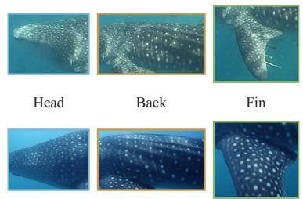
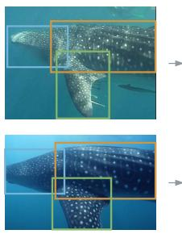
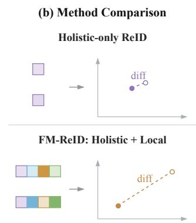
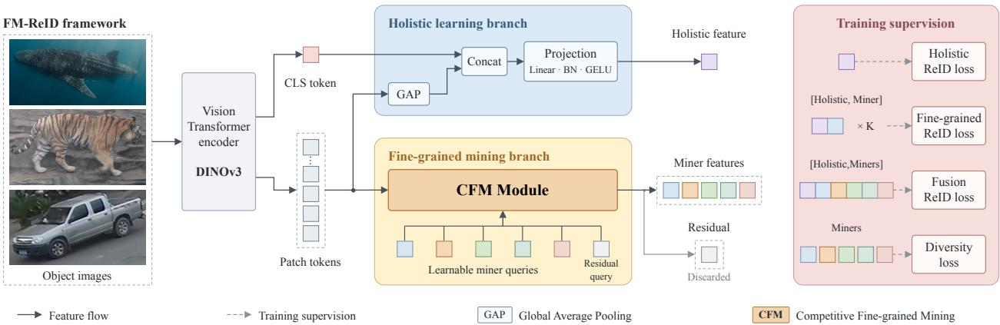
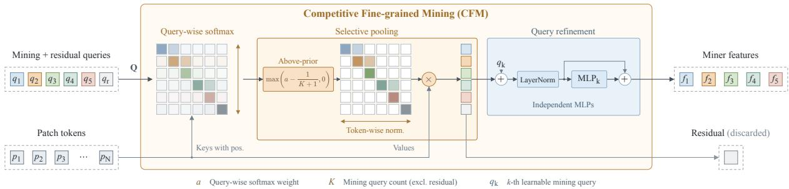
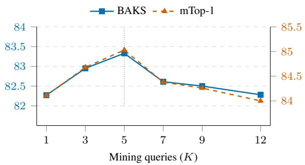
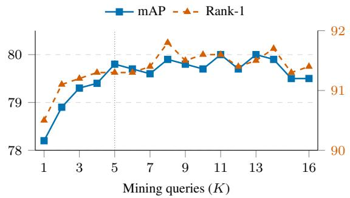
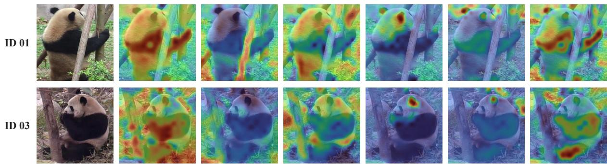

# FM-REID: SELECTIVE COMPETITIVE TOKEN ROUTING FOR OBJECT RE-IDENTIFICATION

## A PREPRINT

Zhiqi Li1,2, Xiaowei Zhou1∗, Zeyuan Sun1, Feng Gao1, Junyu Dong1,2∗

1Faculty of Information Science and Engineering, Ocean University of China, Qingdao, China 2Sanya Oceanographic Institution, Ocean University of China, Sanya, China

{lizhiqi,sunzeyuan}@stu.ouc.edu.cn {zhouxiaowei,gaofeng,dongjunyu}@ouc.edu.cn

## ABSTRACT

Object re-identification (ReID) faces a recurring challenge: different identities can share highly similar global appearances, while the cues that distinguish them are localized, heterogeneous, and visible only under particular viewpoints. This challenge arises in animal ReID through markings, contours, and scars, in person ReID through subtle clothing and accessory cues, and in vehicle ReID through localized appearance details. Although visual foundation models encode such information in dense tokens, a single holistic descriptor can obscure discriminative local signals. We propose FM-ReID, an end-to-end framework that formulates local representation learning as selective competitive token routing. Its Competitive Fine-grained Mining module uses multiple mining queries and a residual query to compete for dense DINOv3 tokens. Above-prior selection retains tokens preferentially allocated to each mining query, while the residual slot receives tokens excluded from the retrieval descriptors. The resulting multi-query descriptors are jointly trained with a holistic representation for retrieval, without fixed spatial partitions or equal-area constraints. FM-ReID achieves strong results on animal, person, and vehicle ReID benchmarks, supporting competitive token routing as an effective way to augment holistic foundation-model representations.

  
Similar Appearance  
(a) Motivation  
Local Differences

  
Holistic + Local Cues  
Figure 1: (a) Object ReID often requires localized identity cues to complement holistic representations when different instances have similar global appearances. (b) FM-ReID selectively mines such cues from dense foundation-model tokens through competitive query routing, without fixed spatial partitions or equal-area constraints.

## 1 Introduction

Object re-identification (ReID) retrieves the same instance across cameras, times, or viewpoints. Its central difficulty is that different identities can share highly similar global appearances, whereas the evidence that distinguishes them is often localized, heterogeneous, and visible only from particular viewpoints. In animal ReID, this evidence may consist of markings, contours, or scars (Cermák et al., 2024; Adam et al., 2025); in person ReID, it can be subtle clothing and accessory cues; and in vehicle ReID, it can be localized appearance details. Viewpoint changes, deformation, occlusion, and background clutter further alter the location and visibility of these cues.

Local and multi-granular representation learning has long been used to complement holistic features with additional localized representations. Early approaches divide feature maps into fixed stripes or multiple predetermined granularities (Sun et al., 2018; Wang et al., 2018), while more recent Transformer-based methods rearrange patch tokens or learn prototypes that attend to latent regions (He et al., 2021; Li et al., 2021; Zhu et al., 2024). However, fixed partitions and rearrangement rules rely on approximate spatial alignment and can become unreliable across shapes, poses, and occlusions. Independently normalized queries may also repeatedly attend to the same salient evidence. These limitations motivate a local representation mechanism that can select complementary evidence without fixed spatial partitions, equal-area constraints, or category-specific anatomy.

Self-supervised visual foundation models provide a promising basis for this mechanism. DINO-family models learn object-aware dense representations from large-scale data without category-specific part annotations (Caron et al., 2021; Oquab et al., 2024; Siméoni et al., 2025). Although their patch tokens encode rich spatial and semantic structure, dense tokens alone do not determine which local evidence should augment a retrieval descriptor. The allocation mechanism must distinguish query-specific evidence from ambiguous or uninformative tokens, while accommodating identity cues with unequal visible extents.

We address this problem with FM-ReID, an end-to-end framework that formulates local representation learning as selective competitive token routing on top of a DINOv3 visual encoder. Its holistic branch fuses the image-level CLS token with average-pooled patch context. Its Competitive Fine-grained Mining (CFM) module introduces multiple learnable mining queries and a residual query that compete for dense patch tokens through query-wise normalization. Above-prior selection retains tokens preferentially allocated to each mining query before query-specific aggregation, whereas the residual slot receives evidence excluded from the retrieval descriptors. Thus, a token need not contribute to any mining descriptor, and the retained support can vary across queries. We jointly train the resulting multi-query descriptors with the holistic representation for retrieval, yielding a multi-granular embedding without fixed spatial partitions or equal-area constraints.

Our main contributions are summarized as follows:

• We propose FM-ReID, an end-to-end object ReID framework that augments a holistic representation with fine-grained features selectively mined from dense foundation-model tokens, without part annotations.

• We introduce the CFM module, in which mining queries and a residual query compete for tokens; above-prior selection allows evidence to remain outside the retrieval descriptors and permits query supports of unequal size.

• We jointly train holistic and multi-query descriptors for retrieval. Evaluations on animal, person, and vehicle ReID benchmarks show that competitive token routing can effectively augment holistic foundation-model representations.

• We provide FM-FISH, a benchmark for fine-grained identity discrimination among visually similar fish in underwater and laboratory settings.

## 2 Related Work

## 2.1 Fine-Grained Representation Learning for Object ReID

Fine-grained representations are crucial when identities share similar holistic appearances. The challenge is especially pronounced in animal ReID, where localized markings and subtle structural differences may be the only reliable identity cues (Cermák et al., 2024; Adam et al., 2025), but analogous ambiguities occur in person and vehicle ReID.

Early part-based methods impose spatial structure directly. PCB (Sun et al., 2018) partitions convolutional feature maps into horizontal stripes, while MGN (Wang et al., 2018) combines global features with local descriptors at several fixed granularities. Such partitions are effective for approximately aligned pedestrians, but can become semantically inconsistent under pose changes, occlusion, or non-human object geometry. Transformer-based methods provide more flexible token processing. TransReID (He et al., 2021) shifts, shuffles, and groups patch tokens through its Jigsaw Patch Module. PAT (Li et al., 2021) learns part prototypes with a Transformer decoder, and AAformer (Zhu et al., 2024) uses Optimal Transport to align patches with learnable part tokens. For animals, PAW-ViT (Neto et al., 2026) specializes anatomical part tokens through semantic segmentation distillation. Our propovsed FM-ReID uses identity supervision to learn selective token aggregation without prescribed anatomical regions or equal-area assignments.

## 2.2 Query-Based Discovery and Competitive Assignment

Learnable queries and prototypes have been used to discover latent regions from weak supervision. Region Grouping (Huang and Li, 2020) learns interpretable object regions from image-level labels, while conceptual-part models (Zhou et al., 2021) associate spatial features with latent prototypes. In ReID, PAT applies part prototypes independently and in troduces auxiliary objectives to improve diversity. APD (Lai et al., 2021) uses competition in part-mask generation, and AAformer adopts a globally balanced patch-to-part assignment. DRL-Net (Jia et al., 2023) separates identity-relevant and identity-irrelevant queries. These methods establish prior uses of competitive assignment and auxiliary queries; CFM combines them with above-prior selection over dense foundation-model tokens.

Competition among latent slots has also been studied in object-centric learning. Slot Attention (Locatello et al., 2020) normalizes attention across slots and renormalizes over inputs for aggregation. Our proposed CFM builds on this allocation principle for discriminative retrieval. Its residual query and above-prior selection allow evidence to remain unclaimed by the mining queries, while query-specific aggregation permits unequal support sizes. The intended contribution is this selective aggregation of additional identity evidence from strong dense representations.

## 2.3 Visual Foundation Models for ReID

Vision-language models have become strong initialization sources for ReID. CLIP-ReID (Li et al., 2023) learns identityspecific text tokens and transfers textual knowledge to image representations. TF-CLIP (Yu et al., 2024) constructs visual memories for video ReID, CLIMB-ReID (Yu et al., 2025) combines CLIP-based transfer with sequence modeling, and EvoPrompt-ReID (He et al., 2026) jointly evolves prompts and the image encoder through bilevel optimization. Their main emphasis is cross-modal knowledge or temporal modeling rather than competitive organization of dense spatial tokens.

A complementary direction learns person-specific representations through additional self-supervised pre-training. LUPerson (Fu et al., 2021) supplies large-scale unlabeled pedestrian data; PASS (Zhu et al., 2022a) learns part-aware consistency from predefined local zones; and SOLIDER (Chen et al., 2023) introduces pseudo-semantic supervision and controllable representation learning. Although effective, these approaches use in-domain data, person-oriented spatial assumptions, or additional pre-training stages.

General self-supervised foundation models offer category-agnostic dense features. DINO (Caron et al., 2021) reveals emergent object structure in self-supervised Vision Transformers, DINOv2 (Oquab et al., 2024) scales the resulting general-purpose representations, and register tokens improve the spatial consistency of dense feature maps (Darcet et al., 2024). DINOv3 (Siméoni et al., 2025) further advances dense self-supervised features at scale. Our proposed FM-ReID uses this visual knowledge without text prompts or secondary in-domain pre-training. It augments holistic pooling with selective competitive aggregation, whose empirical contribution is evaluated using the same DINOv3 backbone.

## 3 Method

## 3.1 Overview of FM-ReID

FM-ReID augments a holistic representation with selectively mined localized representations. As illustrated in Figure $^ { 2 , }$ an input image $\mathbf { X } \in \mathbb { R } ^ { H \times W \times C }$ is processed by a DINOv3 encoder, which produces a CLS token $\mathbf { z } _ { \mathrm { c l s } } \in \mathbb { R } ^ { D }$ and N spatial patch tokens $\mathbf { Z } = [ \mathbf { z } _ { 1 } , \dots , \mathbf { \bar { z } } _ { N } ] \in \mathbb { R } ^ { N \times \check { D } }$ . We discard register tokens because they do not correspond to image locations. The holistic branch combines the CLS token with average-pooled patch context:

$$
\begin{array} { r } { \mathbf { f } _ { h } = \phi _ { h } \Big ( [ \mathbf { z } _ { \mathrm { c l s } } ; N ^ { - 1 } \sum _ { n = 1 } ^ { N } \mathbf { z } _ { n } ] \Big ) , } \end{array}\tag{1}
$$

where $[ \cdot ; \cdot ]$ denotes concatenation and $\phi _ { h }$ is a linear–BN–GELU projection. In parallel, the Competitive Fine-grained Mining (CFM) module converts Z into K fine-grained representations. Rather than assigning queries to fixed spatial regions, CFM makes mining queries and a residual query compete for each patch token, then retains only above-prior mining assignments for aggregation. The residual output is not used as a retrieval descriptor, providing an alternative allocation for evidence that is not preferentially retained by the mining queries. The following two subsections detail this selective aggregation and the joint supervision used to combine the holistic and fine-grained representations for retrieval. All components, including the DINOv3 encoder, are optimized end to end.

  
Figure 2: Overview of FM-ReID. DINOv3 provides a holistic CLS token and dense patch tokens. CFM selectively routes patch-token evidence through competing mining and residual queries, then retains above-prior assignments for the mining descriptors. During training, the holistic feature, holistic–fine-grained pairs, and their joint fusion receive ReID supervision. At inference, normalized holistic and fine-grained features form the retrieval embedding, while the residual output is discarded.

## 3.2 Competitive Fine-Grained Mining

Independent attention queries can repeatedly select the same dominant region because each query normalizes its attention over all tokens in isolation. CFM instead makes its queries compete for every token before aggregation.

Competitive token assignment. We use K learnable fine-grained mining queries $\{ \mathbf { q } _ { k } \} _ { k = 1 } ^ { K }$ and one residual competition query ${ \bf q } _ { 0 }$ . In the reported experiments, the mining-query matrix is initialized as $\dot { \mathbf { G } } / \lVert \dot { \mathbf { G } } \rVert _ { F }$ , where the entries of $\mathbf { G } \in \mathbb { R } ^ { K \times D ^ { \bullet } }$ are sampled from a standard Gaussian. The residual query is independently initialized from $\mathcal { N } ( 0 , 0 . 0 2 ^ { 2 } \mathbf { I } _ { D } )$ and provides an auxiliary non-retrieval slot for competing assignments. Let $\mathbf { Q } = [ \mathbf { q } _ { 0 } ; \mathbf { q } _ { 1 } ; \dots ; \mathbf { q } _ { K } ]$ . For attention head m, queries, keys, and values are computed as

$$
\begin{array} { r l r } { \mathbf { Q } ^ { m } = \mathbf { Q } \mathbf { W } _ { q } ^ { m } , } & { { } \mathbf { K } ^ { m } = ( \mathbf { Z } + \mathbf { E } ) \mathbf { W } _ { k } ^ { m } , } & { } \\ { \mathbf { V } ^ { m } = \mathbf { Z } \mathbf { W } _ { v } ^ { m } , } & { { } } & { } \end{array}\tag{2}
$$

where E is a learnable spatial position embedding. Position is injected only into the keys, so it guides assignment without altering the visual content being aggregated.

Given the scaled similarities $s _ { k n } ^ { m } = \langle \mathbf { Q } _ { k } ^ { m } , \mathbf { K } _ { n } ^ { m } \rangle / \sqrt { d } .$ , where d is the head dimension, CFM applies softmax across queries rather than tokens:

$$
a _ { k n } ^ { m } = \frac { \exp ( s _ { k n } ^ { m } ) } { \sum _ { j = 0 } ^ { K } \exp ( s _ { j n } ^ { m } ) } , \qquad \sum _ { k = 0 } ^ { K } a _ { k n } ^ { m } = 1 .\tag{3}
$$

Consequently, increasing one query’s assignment to a patch necessarily reduces the mass available to the others. The residual output is excluded from direct identity supervision and the retrieval descriptor. The residual query still receives gradients indirectly through the shared competition.

Evidence selection and aggregation. A query-wise softmax may still produce ambiguous assignments close to the uniform solution. We therefore subtract the uniform competition prior, suppress assignments that do not exceed it, and renormalize each query over tokens:

$$
\begin{array} { c } { { \hat { a } _ { k n } ^ { m } = \left[ a _ { k n } ^ { m } - \frac { 1 } { K + 1 } \right] _ { + } , } } \\ { { w _ { k n } ^ { m } = \displaystyle \frac { \hat { a } _ { k n } ^ { m } } { \sum _ { t = 1 } ^ { N } \hat { a } _ { k t } ^ { m } + \epsilon } . } } \end{array}\tag{4}
$$

The first normalization in Equation 3 allocates probability mass across queries; the second in Equation 4 pools each query’s retained evidence. Multiple queries may exceed the prior for the same token, so their supports can overlap

  
Figure 3: Competitive Fine-grained Mining (CFM). Mining queries and a residual query compete for each patch token through a softmax across queries. Above-prior mining assignments are retained and renormalized over tokens to form query-specific descriptors; their supports may overlap and vary in size. Query refinement produces the fine-grained features, whereas the residual output is excluded from the retrieval embedding.

and need not have equal sizes. A token with no above-prior mining assignment contributes to none of the fine-grained aggregates. The multi-head output is

$$
\mathbf { o } _ { k } = \mathbf { W } _ { o } \operatorname { C o n c a t } \left( \sum _ { m = 1 } ^ { N } w _ { k n } ^ { m } \mathbf { V } _ { n } ^ { m } \right) .\tag{5}
$$

After discarding $\mathbf { o } _ { 0 } .$ , each fine-grained output is refined with an independent two-layer MLP:

$$
\begin{array} { r l } & { \tilde { \bf f } _ { k } = \mathrm { L N } ( { \bf o } _ { k } + { \bf q } _ { k } ) , } \\ & { { \bf f } _ { k } = \tilde { \bf f } _ { k } + \mathrm { M L P } _ { k } ( \tilde { \bf f } _ { k } ) . } \end{array}\tag{6}
$$

The residual connection adds the learned query seed, and query-specific refiners transform the aggregated features before ReID supervision.

## 3.3 Optimization and Inference

Let $\mathcal { R } ( \mathbf { x } , y ) = \mathcal { L } _ { \mathrm { i d } } ( \mathrm { B N } ( \mathbf { x } ) , y ) + \mathcal { L } _ { \mathrm { t r i } } ( \mathbf { x } , y )$ denote the standard ReID objective, comprising label-smoothed identity classification and batch-hard triplet loss. Separate BNNecks and classifiers are used for different feature streams. We supervise the holistic feature directly. For each mined feature, we concatenate its holistic context $\mathbf { g } _ { k } = [ \mathbf { f } _ { h } ; \mathbf { f } _ { k } ]$ to stabilize identity learning. We also supervise their joint fusion $\mathbf { f } _ { u } = [ \mathbf { f } _ { h } ; \boldsymbol { \alpha } \mathbf { f } _ { 1 } ; \ldots ; \boldsymbol { \alpha } \mathbf { f } _ { K } ]$ , where α prevents the fine-grained blocks from overwhelming the holistic feature. The three ReID losses are

$$
\begin{array} { l } { \displaystyle \mathcal { L } _ { h } = \mathcal { R } ( { \bf f } _ { h } , y ) , } \\ { \displaystyle \mathcal { L } _ { f } = \frac { 1 } { K } \sum _ { k = 1 } ^ { K } \mathcal { R } ( { \bf g } _ { k } , y ) , } \\ { \displaystyle \mathcal { L } _ { u } = \mathcal { R } ( { \bf f } _ { u } , y ) . } \end{array}\tag{7}
$$

To encourage decorrelation among mined feature vectors, let $\bar { \mathbf { F } } _ { f } ^ { ( b ) } \in \mathbb { R } ^ { K \times D }$ stack the $L _ { 2 }$ -normalized fine-grained features of sample b. We regularize their Gram matrix by

$$
\mathcal { L } _ { \mathrm { d i v } } = \frac { 1 } { B K ^ { 2 } } \sum _ { b = 1 } ^ { B } \left\| \bar { \mathbf { F } } _ { f } ^ { ( b ) } \bar { \mathbf { F } } _ { f } ^ { ( b ) \top } - \mathbf { I } _ { K } \right\| _ { F } ^ { 2 } .\tag{8}
$$

The final training objective is

$$
\begin{array} { r } { \mathcal { L } = \mathcal { L } _ { h } + \lambda _ { u } \mathcal { L } _ { u } + \lambda _ { f } \mathcal { L } _ { f } + \lambda _ { d } \mathcal { L } _ { \mathrm { d i v } } . } \end{array}\tag{9}
$$

At inference, the holistic and fine-grained BNNeck outputs are individually $L _ { 2 } .$ -normalized and concatenated:

$$
\mathbf { f } _ { \mathrm { t e s t } } = [ \bar { \mathbf { f } } _ { h } ; \alpha \bar { \mathbf { f } } _ { 1 } ; \ldots ; \alpha \bar { \mathbf { f } } _ { K } ] .\tag{10}
$$

The stored descriptor has $( K + 1 ) D$ dimensions: $^ { 4 , 6 0 8 }$ for the default $K = 5$ and $D = 7 6 8$ , compared with 768 for the holistic baseline. Competition maps and the residual output are not stored for retrieval.

Table 1: Comparison on (a) WildlifeReID-10k under the official closed-set protocol and (b) vehicle ReID benchmarks. The first four baselines in (a) are from Adam et al. (2025); TransReID and CLIP-ReID are from our runs. Bold indicates the best result in each metric.  
(a) WildlifeReID-10k
<table><tr><td>Model</td><td>Input</td><td>mTop-1</td><td>mTop-5</td><td>BAKS</td></tr><tr><td>ConvNeXt-Base</td><td>2242</td><td>81.1</td><td>90.3</td><td>78.5</td></tr><tr><td>EfficientNet-B3</td><td>3002</td><td>77.8</td><td>88.5</td><td>75.1</td></tr><tr><td>ViT-Base</td><td>2242</td><td>78.3</td><td>88.7</td><td>75.8</td></tr><tr><td>Swin-Base</td><td>2242</td><td>81.5</td><td>90.4</td><td>79.1</td></tr><tr><td>TransReID</td><td>2562</td><td>80.52</td><td>89.46</td><td>78.22</td></tr><tr><td>CLIP-ReID</td><td>2562</td><td>76.49</td><td>87.61</td><td>74.21</td></tr><tr><td>FM-ReID</td><td>2562</td><td>85.03</td><td>92.07</td><td>83.33</td></tr></table>

(b) Vehicle ReID
<table><tr><td rowspan="2">Method</td><td rowspan="2">Reference</td><td colspan="2">VeRi-776</td><td colspan="2">VehicleID</td></tr><tr><td>mAP</td><td>R1</td><td>R1</td><td>R5</td></tr><tr><td>TransReID</td><td>ICCV21</td><td>82.1</td><td>97.4</td><td>83.6</td><td>97.1</td></tr><tr><td>DCAL</td><td>CVPR22</td><td>80.2</td><td>96.9</td><td></td><td></td></tr><tr><td>CLIP-ReID</td><td>AAAI23</td><td>83.3</td><td>97.4</td><td>85.3</td><td>97.6</td></tr><tr><td>Fast-ReID</td><td>MM23</td><td>81.9</td><td>97.9</td><td>86.6</td><td>97.9</td></tr><tr><td>EvoPrompt-ReID</td><td>CVPR26</td><td>84.2</td><td>97.5</td><td>-</td><td>-</td></tr><tr><td>FM-ReID</td><td>一</td><td>87.8</td><td>98.3</td><td>87.4</td><td>98.6</td></tr></table>

## 4 Experiments

## 4.1 Experimental Setup

Dataset We evaluate FM-ReID on animal, person, and vehicle ReID benchmarks. For animal ReID, we use WildlifeReID-10k (Adam et al., 2025) and our FM-FISH benchmark. WildlifeReID-10k covers 37 source datasets. For person ReID, we use Market-1501 (Zheng et al., 2015), MSMT17 (Wei et al., 2018), DukeMTMC-reID (Ristani et al., 2016), and Occluded-Duke (Miao et al., 2019). The latter evaluates retrieval under partial occlusion. For vehicle ReID, we use VeRi-776 (Liu et al., 2016a) and VehicleID (Liu et al., 2016b).

Our proposed FM-FISH combines self-collected images, an FS-48 subset, AAUZebraFish, WhaleSharkID, and MFT25 track crops, comprising 45,632 images and 724 identity labels (Table 3(a)). It targets fine-grained matching among visually similar fish. We retain source-specific splits: the self-collected subset uses unseen test identities, the Wildlife subsets include known-identity queries, and MFT25 uses within-sequence temporal splits with track-based labels.

Implementation details. We fine-tune DINOv3 ViT-Base/16 (Siméoni et al., 2025) on each benchmark with a batch size of 64, using five mining queries and one residual query. Input images are resized to 256 × 256 for animal and vehicle ReID, and 256 × 128 for person ReID. On WildlifeReID-10k, we train for 120 epochs with AdamW. Ablation variants share the same backbone and training recipe within each benchmark. All FM-ReID results use final checkpoints without re-ranking. All experiments are conducted on an NVIDIA GeForce RTX 5080 GPU.

Evaluation metrics. We report mean average precision (mAP) and cumulative matching characteristic (CMC) accuracy for person, vehicle, and fish ReID following the respective benchmark protocols. For WildlifeReID-10k, we report mTop-1, mTop-5, and balanced accuracy on known samples (BAKS) under the official closed-set protocol (Adam et al., 2025). mTop-1 and mTop-5 are the unweighted means of the image-level top-1 and top-5 identification accuracies across source datasets, respectively. BAKS averages per-identity top-1 accuracy equally over known identities within each source dataset and then equally across source datasets.

## 4.2 Evaluation on WildlifeReID-10k

Table 1(a) compares FM-ReID with the published WildlifeReID-10k baselines and our TransReID and CLIP-ReID runs. FM-ReID achieves 85.03% mTop-1, 92.07% mTop-5, and 83.33% BAKS, leading the listed methods on all three metrics. Compared with Swin-Base, the strongest official baseline, it improves mTop-1 and BAKS by 3.53 and 4.23 percentage points, respectively.

## 4.3 Evaluation on Person ReID Benchmarks

Table 2 compares FM-ReID with representative CNN- and Transformer-based methods on four person ReID benchmarks.

FM-ReID achieves the highest mAP among the listed methods on MSMT17, DukeMTMC-reID, and Occluded-Duke. On MSMT17, it obtains 79.8% mAP and 91.3% Rank-1, exceeding EvoPrompt-ReID by 2.7 and 1.0 percentage points, respectively. It also achieves competitive results of 92.3% mAP and 96.1% Rank-1 on Market-1501, and reaches 85.0% mAP and 92.2% Rank-1 on DukeMTMC-reID.

Table 2: Comparison with selected published methods on MSMT17, Market-1501, DukeMTMC-reID, and Occ-Duke. Bold indicates the best result among the listed methods.
<table><tr><td rowspan="2">Method</td><td rowspan="2">Reference</td><td rowspan="2">Backbone</td><td colspan="2">MSMT17</td><td colspan="2">Market-1501</td><td colspan="2">DukeMTMC</td><td colspan="2">Occ-Duke</td></tr><tr><td>mAP</td><td>R1</td><td>mAP</td><td>R1</td><td>mAP</td><td>R1</td><td>mAP</td><td>R1</td></tr><tr><td>PCB Sun et al. (2018)</td><td>ECCV18</td><td rowspan="4">CNN</td><td>40.4</td><td>68.2</td><td>81.6</td><td>93.8</td><td>69.2</td><td>83.3</td><td>1</td><td></td></tr><tr><td>OSNet Zhou et al. (2019)</td><td>ICCV19</td><td>52.9</td><td>78.7</td><td>84.9</td><td>94.8</td><td>73.5</td><td>88.6</td><td>-</td><td></td></tr><tr><td>Fast-ReID He et al. (2023)</td><td>MM23</td><td>59.9</td><td>83.3</td><td></td><td></td><td>78.9</td><td>89.6</td><td>-</td><td></td></tr><tr><td>TransReID He et al. (2021)</td><td>ICCV21</td><td rowspan="6"></td><td>67.4</td><td>85.3</td><td>88.9</td><td>95.2</td><td>82.0</td><td>90.7</td><td>66.4</td></tr><tr><td>DCAL Zhu et al. (2022b)</td><td>CVPR22</td><td>64.0</td><td>83.1</td><td>87.5</td><td>94.7</td><td>80.1</td><td>89.0</td><td>59.2</td><td></td></tr><tr><td>DPM Tan et al. (2022)</td><td>MM22</td><td></td><td></td><td></td><td></td><td>82.6</td><td>91.0</td><td>61.8</td><td>71.4</td></tr><tr><td>CLIP-ReID Li et al. (2023)</td><td>AAAI23</td><td>73.4</td><td>88.7</td><td>89.6</td><td>95.5</td><td>83.1</td><td>90.8</td><td>59.5</td><td>67.1</td></tr><tr><td>TF-CLIP Yu et al. (2024)</td><td>AAAI24</td><td>73.9</td><td>88.5</td><td>90.4</td><td>95.7</td><td></td><td></td><td>-</td><td></td></tr><tr><td>AAformer Zhu et al. (2024)</td><td>TNNLS24</td><td>58.2</td><td>84.4</td><td>88.0</td><td>95.4</td><td>80.9</td><td>90.1</td><td>-</td><td></td></tr><tr><td>EvoPrompt-ReID He et al. (2026)</td><td>CVPR26</td><td></td><td>77.1</td><td>90.3</td><td>91.7</td><td>96.1</td><td>-</td><td>-</td><td>-</td><td>-</td></tr><tr><td>FM-ReID (Ours)</td><td>一</td><td>ViT</td><td>79.8</td><td>91.3</td><td>92.3</td><td>96.1</td><td>85.0</td><td>92.2</td><td>65.5</td><td>72.6</td></tr></table>

Table 3: FM-FISH: (a) dataset statistics and (b) comparison results. MFT25 identity labels denote annotated tracks. Bold indicates the best result in each metric.  
(a) FM-FISH dataset statistics
<table><tr><td>Source</td><td>IDs</td><td>Images</td></tr><tr><td>Self-collected</td><td>36</td><td>1,205</td></tr><tr><td>FS-48 subset</td><td>48</td><td>22,692</td></tr><tr><td>AAUZebraFish</td><td>5</td><td>281</td></tr><tr><td>WhaleSharkID</td><td>519</td><td>7,305</td></tr><tr><td>MFT25</td><td>116</td><td>14,149</td></tr><tr><td>Total</td><td>724</td><td>45,632</td></tr></table>

(b) ReID results
<table><tr><td>Method</td><td>Reference</td><td>mAP</td><td>R1</td><td>R5</td><td>R10</td></tr><tr><td>TransReID</td><td>ICCV21</td><td>43.2</td><td>53.7</td><td>65.8</td><td>71.8</td></tr><tr><td>CLIP-ReID</td><td>AAAI23</td><td>41.4</td><td>55.2</td><td>67.5</td><td>72.8</td></tr><tr><td>FM-ReID</td><td>一</td><td>55.1</td><td>63.5</td><td>72.3</td><td>76.3</td></tr></table>

On Occluded-Duke, FM-ReID achieves 65.5% mAP and 72.6% Rank-1, improving over CLIP-ReID by 6.0 and 5.5 percentage points. These results demonstrate the framework’s effectiveness in both standard and occluded person retrieval.

## 4.4 Evaluation on Vehicle ReID Benchmarks

As shown in Table 1(b), FM-ReID obtains 87.8% mAP and 98.3% Rank-1 on VeRi-776, improving mAP over EvoPrompt-ReID by 3.6 percentage points. On VehicleID, it reaches 87.4% Rank-1 and 98.6% Rank-5, exceeding Fast-ReID by 0.8 and 0.7 points, respectively. FM-ReID leads the listed methods on both vehicle benchmarks.

## 4.5 Evaluation on FM-FISH

Table 3(b) reports the results on FM-FISH. FM-ReID achieves 55.1% mAP and 63.5% Rank-1, outperforming TransReID by 11.9 and 9.8 percentage points, and CLIP-ReID by 13.7 and 8.3 points, respectively. The gains across all reported metrics support its effectiveness for fine-grained fish identity matching.

## 4.6 Ablation Studies

Table 4 evaluates the contributions of holistic aggregation and fine-grained mining. Adding GAP to CLS improves WildlifeReID-10k mTop-1 by 0.99 points and MSMT17 mAP by 1.3 points. Full CFM further improves these metrics by 0.75 and 2.3 points over CLS+GAP. Retaining the residual query adds 0.49 points in WildlifeReID-10k mTop-1 and 0.1 points in MSMT17 mAP, supporting its role in competitive aggregation.

Number of mining queries. Figure 4 evaluates the effect of K. On WildlifeReID-10k, performance improves from K = 1 to K = 5, where mTop-1 and BAKS reach 85.03% and 83.33%, respectively. On MSMT17, mAP rises from 78.2% at K = 1 to 79.8% at K = 5 and remains between 79.5% and 80.0% for larger K. The default K = 5 is within

Table 4: Component ablation on WildlifeReID-10k and MSMT17. Mining and Residual denote the mining queries and auxiliary residual query. Within each benchmark, all variants use DINOv3-B/16, the same training recipe, and seed 1234; CFM variants retain the default fusion and diversity objectives. Bold indicates the best result in each metric.
<table><tr><td rowspan="2">Backbone</td><td colspan="2">Holistic</td><td colspan="2">CFM</td><td colspan="3">WildlifeReID-10k</td><td colspan="2">MSMT17</td></tr><tr><td>CLS</td><td>GAP</td><td>Mining</td><td>Residual</td><td>mTop-1</td><td>mTop-5</td><td>BAKS</td><td>mAP</td><td>R1</td></tr><tr><td rowspan="4">DINOv3-B/16</td><td>√</td><td></td><td></td><td></td><td>83.29</td><td>91.44</td><td>81.46</td><td>76.1</td><td>89.6</td></tr><tr><td>√</td><td>V</td><td></td><td></td><td>84.28</td><td>91.56</td><td>82.41</td><td>77.4</td><td>90.5</td></tr><tr><td>√</td><td>√</td><td>√</td><td></td><td>84.54</td><td>92.01</td><td>82.90</td><td>79.6</td><td>91.4</td></tr><tr><td>√</td><td>√</td><td>√</td><td>√</td><td>85.03</td><td>92.07</td><td>83.33</td><td>79.7</td><td>91.4</td></tr></table>

  
(a) WildlifeReID-10k

  
(b) MSMT17  
Figure 4: Sensitivity to the number of mining queries K: (a) WildlifeReID-10k, with BAKS/mTop-1 on the left/right axes; (b) MSMT17, with mAP/Rank-1 on the left/right axes. Dotted lines mark K = 5; the residual query is retained and excluded from K. All runs use epoch-120 checkpoints and seed 1234. Panel (a) retains the full-model result at K = 5, while (b) uses independent sweep runs for every K.

0.2 points of the best mAP and 0.5 points of the best Rank-1 result on MSMT17, providing a compact choice with competitive performance.

## 4.7 Efficiency

Table 5 compares inference-model parameters, FLOPs, and peak GPU memory. Adding GAP to the CLS baseline introduces 1.18M parameters and 4.5 MiB of peak memory, with unchanged FLOPs at the reported precision. Relative to Baseline + GAP, FM-ReID increases FLOPs by only 1.41%, with parameter and peak-memory increases of 9.66% and 9.28%, respectively. TransReID uses its checkpoint-specific patch stride of 12, while all other methods use 16; its higher FLOPs also reflect the longer token sequence.

## 4.8 Qualitative Visualization

Figure 5 shows the spatial weighting patterns of the holistic representation and individual miners. In these two examples, Miner 3 concentrates on the ear region, while Miners 2 and 5 show more distributed responses over the body and its surroundings. Miner 1 places greater emphasis on surrounding structures. These examples illustrate query-dependent aggregation of patch information from localized regions, broader body areas, and contextual regions alongside the holistic representation. We combine these additional miner features with the holistic representation to enhance inter-identity separability in the fused feature space and support more accurate re-identification.

## 5 Conclusion

We presented FM-ReID, an object ReID framework that extracts additional identity evidence from dense DINOv3 tokens through selective competition. Its CFM module combines mining queries, a residual query, and above-prior selection, allowing unclaimed evidence and unequal support sizes. The resulting features augment a holistic representation. FM-ReID exceeds the closed-set baselines reported by the WildlifeReID-10k benchmark paper, and within-backbone ablations evaluate its contribution beyond holistic pooling. Separate supervised experiments on animal, person, and vehicle benchmarks support the architecture’s cross-category applicability. Transfer to unseen object categories remains unevaluated.

Table 5: Inference cost at 256 × 128, FP32, and batch size 1 on an RTX 5080. Baseline uses DINOv3 with CLS pooling; parentheses indicate increases over Baseline + GAP.
<table><tr><td>Method</td><td>Parameters (M)</td><td>GFLOPs</td><td>Peak memory (MiB)</td></tr><tr><td>TransReID</td><td>92.92</td><td>40.77</td><td>371.5</td></tr><tr><td>CLIP-ReID</td><td>86.14</td><td>22.78</td><td>346.1</td></tr><tr><td>Baseline</td><td>85.66</td><td>23.40</td><td>341.5</td></tr><tr><td>Baseline + GAP</td><td>86.84</td><td>23.40</td><td>346.0</td></tr><tr><td>FM-ReID</td><td>(+9.66%) 95.23</td><td>(+1.41%) 23.73</td><td>(+9.28%) 378.1</td></tr></table>

Original  
Holistic  
Miner 1  
Miner 2  
Miner 3  
Miner 4  
Miner 5  
  
Figure 5: Qualitative visualization on two panda identities. From left to right: input images, holistic responses, and five miner attention maps. Holistic responses use feature–patch cosine similarity, while miner maps show token aggregation weights. Each map is independently min–max normalized for display; colors indicate relative responses within each map.

## References

Vojtech Cermák, Lukás Picek, Lukás Adam, and Kostas Papafitsoros. Wildlifedatasets: An open-source toolkit for animal re-identification. In IEEE/CVF Winter Conference on Applications of Computer Vision, WACV 2024, Waikoloa, HI, USA, January 3-8, 2024, pages 5941–5951. IEEE, 2024. doi: 10.1109/WACV57701.2024.00585. URL https://doi.org/10.1109/WACV57701.2024.00585.

Lukás Adam, Vojtech Cermák, Kostas Papafitsoros, and Lukás Picek. Wildlifereid-10k: Wildlife re-identification dataset with 10k individual animals. In IEEE/CVF Conference on Computer Vision and Pattern Recognition Workshops, CVPR Workshops 2025, Nashville, TN, USA, June 11-15, 2025, pages 2099–2109. Computer Vision Foundation / IEEE, 2025. URL https://openaccess.thecvf.com/content/CVPR2025W/FGVC/html/Adam\_ WildlifeReID-10k\_Wildlife\_re-identification\_dataset\_with\_10k\_individual\_animals\_CVPRW\_ 2025\_paper.html.

Yifan Sun, Liang Zheng, Yi Yang, Qi Tian, and Shengjin Wang. Beyond part models: Person retrieval with refined part pooling (and A strong convolutional baseline). In Vittorio Ferrari, Martial Hebert, Cristian Sminchisescu, and Yair Weiss, editors, Computer Vision - ECCV 2018 - 15th European Conference, Munich, Germany, September 8-14, 2018, Proceedings, Part IV, volume 11208 of Lecture Notes in Computer Science, pages 501–518. Springer, 2018. doi: 10.1007/978-3-030-01225-0\_30. URL https://doi.org/10.1007/978-3-030-01225-0\_30.

Guanshuo Wang, Yufeng Yuan, Xiong Chen, Jiwei Li, and Xi Zhou. Learning discriminative features with multiple granularities for person re-identification. In Susanne Boll, Kyoung Mu Lee, Jiebo Luo, Wenwu Zhu, Hyeran Byun, Chang Wen Chen, Rainer Lienhart, and Tao Mei, editors, 2018 ACM Multimedia Conference on Multimedia Conference, MM 2018, Seoul, Republic ofKorea, October 22-26, 2018, pages 274–282. ACM, 2018. doi: 10.1145 3240508.3240552. URL https://doi.org/10.1145/3240508.3240552.

Shuting He, Hao Luo, Pichao Wang, Fan Wang, Hao Li, and Wei Jiang. Transreid: Transformer-based object re-identification. In 2021 IEEE/CVF International Conference on Computer Vision, ICCV 2021, Montreal, QC,

Canada, October 10-17, 2021, pages 14993–15002. IEEE, 2021. doi: 10.1109/ICCV48922.2021.01474. URL https://doi.org/10.1109/ICCV48922.2021.01474.

Yulin Li, Jianfeng He, Tianzhu Zhang, Xiang Liu, Yongdong Zhang, and Feng Wu. Diverse part discovery: Occluded person re-identification with part-aware transformer. In IEEE Conference on Computer Vision and Pattern Recognition, CVPR 2021, virtual, June 19-25, 2021, pages 2898–2907. Computer Vision Foundation / IEEE, 2021. doi: 10.1109/CVPR46437.2021. 00292. URL https://openaccess.thecvf.com/content/CVPR2021/html/Li\_Diverse\_Part\_Discovery\_ Occluded\_Person\_Re-Identification\_With\_Part-Aware\_Transformer\_CVPR\_2021\_paper.html.

Kuan Zhu, Haiyun Guo, Shiliang Zhang, Yaowei Wang, Jing Liu, Jinqiao Wang, and Ming Tang. Aaformer: Autoaligned transformer for person re-identification. IEEE Trans. Neural Networks Learn. Syst., 35(12):17307–17317, 2024. doi: 10.1109/TNNLS.2023.3301856. URL https://doi.org/10.1109/TNNLS.2023.3301856.

Mathilde Caron, Hugo Touvron, Ishan Misra, Hervé Jégou, Julien Mairal, Piotr Bojanowski, and Armand Joulin. Emerging properties in self-supervised vision transformers. In 2021 IEEE/CVF International Conference on Computer Vision, ICCV 2021, Montreal, QC, Canada, October 10-17, 2021, pages 9630–9640. IEEE, 2021. doi: 10.1109/ICCV48922.2021.00951. URL https://doi.org/10.1109/ICCV48922.2021.00951.

Maxime Oquab, Timothée Darcet, Théo Moutakanni, Huy V. Vo, Marc Szafraniec, Vasil Khalidov, Pierre Fernandez, Daniel Haziza, Francisco Massa, Alaaeldin El-Nouby, Mido Assran, Nicolas Ballas, Wojciech Galuba, Russell Howes, Po-Yao Huang, Shang-Wen Li, Ishan Misra, Michael Rabbat, Vasu Sharma, Gabriel Synnaeve, Hu Xu, Hervé Jégou, Julien Mairal, Patrick Labatut, Armand Joulin, and Piotr Bojanowski. Dinov2: Learning robust visual features without supervision. Trans. Mach. Learn. Res., 2024, 2024. URL https://openreview.net/forum?id=a68SUt6zFt.

Oriane Siméoni, Huy V. Vo, Maximilian Seitzer, Federico Baldassarre, Maxime Oquab, Cijo Jose, Vasil Khalidov, Marc Szafraniec, Seung Eun Yi, Michaël Ramamonjisoa, Francisco Massa, Daniel Haziza, Luca Wehrstedt, Jianyuan Wang, Timothée Darcet, Théo Moutakanni, Leonel Sentana, Claire Roberts, Andrea Vedaldi, Jamie Tolan, John Brandt, Camille Couprie, Julien Mairal, Hervé Jégou, Patrick Labatut, and Piotr Bojanowski. Dinov3. CoRR, abs/2508.10104, 2025. doi: 10.48550/ARXIV.2508.10104. URL https://doi.org/10.48550/arXiv.2508.10104.

Eugênio Dias Ribeiro Neto, Marc Chaumont, Gérard Subsol, Michel de Garine-Wichatitsky, and Hélène Guis. An improved architecture for part-based animal re-identification through semantic segmentation distillation. In 2026 IEEE/CVF Winter Conference on Applications of Computer Vision (WACV), pages 5280–5289, 2026. doi: 10.1109/ WACV61042.2026.00512.

Zixuan Huang and Yin Li. Interpretable and accurate fine-grained recognition via region grouping. In 2020 IEEE/CVF Conference on Computer Vision and Pattern Recognition (CVPR), pages 8659–8669, 2020. doi: 10.1109/CVPR42600. 2020.00869.

Xiaowei Zhou, Jie Yin, Ivor W. Tsang, and Chen Wang. Human-understandable decision making for visual recognition. In Kamal Karlapalem, Hong Cheng, Naren Ramakrishnan, R. K. Agrawal, P. Krishna Reddy, Jaideep Srivastava, and Tanmoy Chakraborty, editors, Advances in Knowledge Discovery and Data Mining - 25th Pacific-Asia Conference, PAKDD 2021, Virtual Event, May 11-14, 2021, Proceedings, Part III, volume 12714 of Lecture Notes in Computer Science, pages 168–180. Springer, 2021. doi: 10.1007/978-3-030-75768-7\_14. URL https://doi.org/10. 1007/978-3-030-75768-7\_14.

Shenqi Lai, Zhenhua Chai, and Xiaolin Wei. Transformer meets part model: Adaptive part division for person reidentification. In IEEE/CVF International Conference on Computer Vision Workshops, ICCVW 2021, Montreal, QC, Canada, October 11-17, 2021, pages 4133–4140. IEEE, 2021. doi: 10.1109/ICCVW54120.2021.00461. URL https://doi.org/10.1109/ICCVW54120.2021.00461.

Mengxi Jia, Xinhua Cheng, Shijian Lu, and Jian Zhang. Learning disentangled representation implicitly via transformer for occluded person re-identification. IEEE Transactions on Multimedia, 25:1294–1305, 2023. doi: 10.1109/TMM. 2022.3141267.

Francesco Locatello, Dirk Weissenborn, Thomas Unterthiner, Aravindh Mahendran, Georg Heigold, Jakob Uszkoreit, Alexey Dosovitskiy, and Thomas Kipf. Object-centric learning with slot attention. In Hugo Larochelle, Marc’Aurelio Ranzato, Raia Hadsell, Maria-Florina Balcan, and Hsuan-Tien Lin, editors, Advances in Neural Information Processing Systems 33: Annual Conference on Neural Information Processing Systems 2020, NeurIPS 2020, December 6-12, 2020, virtual, 2020. URL https://proceedings.neurips.cc/paper/2020/hash/ 8511df98c02ab60aea1b2356c013bc0f-Abstract.html.

Siyuan Li, Li Sun, and Qingli Li. Clip-reid: Exploiting vision-language model for image re-identification without concrete text labels. In Brian Williams, Yiling Chen, and Jennifer Neville, editors, Thirty-Seventh AAAI Conference on Artificial Intelligence, AAAI 2023, Thirty-Fifth Conference on Innovative Applications of Artificial Intelligence, IAAI 2023, Thirteenth Symposium on Educational Advances in Artificial Intelligence, EAAI 2023, Washington,

DC, USA, February 7-14, 2023, pages 1405–1413. AAAI Press, 2023. doi: 10.1609/AAAI.V37I1.25225. URL https://doi.org/10.1609/aaai.v37i1.25225.

Chenyang Yu, Xuehu Liu, Yingquan Wang, Pingping Zhang, and Huchuan Lu. TF-CLIP: learning text-free CLIP for video-based person re-identification. In Michael J. Wooldridge, Jennifer G. Dy, and Sriraam Natarajan, editors, Thirty-Eighth AAAI Conference on Artificial Intelligence, AAAI 2024, Thirty-Sixth Conference on Innovative Applications of Artificial Intelligence, IAAI 2024, Fourteenth Symposium on Educational Advances in Artificial Intelligence, EAAI 2014, February 20-27, 2024, Vancouver, Canada, pages 6764–6772. AAAI Press, 2024. doi: 10.1609/AAAI.V38I7. 28500. URL https://doi.org/10.1609/aaai.v38i7.28500.

Chenyang Yu, Xuehu Liu, Jiawen Zhu, Yuhao Wang, Pingping Zhang, and Huchuan Lu. Climb-reid: A hybrid clip-mamba framework for person re-identification. In Toby Walsh, Julie Shah, and Zico Kolter, editors, AAAI-25, Sponsored by the Association for the Advancement of Artificial Intelligence, February 25 - March 4, 2025, Philadelphia, PA, USA, pages 9589–9597. AAAI Press, 2025. doi: 10.1609/AAAI.V39I9.33039. URL https: //doi.org/10.1609/aaai.v39i9.33039.

Yuanlin He, Zhenchuan Wang, Jun Chen, Yingying He, Jiabao Wang, Weiwen Wang, Kun Xu, Zijin Zhou, Xiaoxiao Wang, Mingju Chen, Tingting Liu, and Zhisong Pan. Evoprompt-reid: A bilevel optimization framework for prompt-encoder co-evolution in image re-identification. In Proceedings of the IEEE/CVF Conference on Computer Vision and Pattern Recognition (CVPR) Findings, pages 6758–6767, June 2026.

Dengpan Fu, Dongdong Chen, Jianmin Bao, Hao Yang, Lu Yuan, Lei Zhang, Houqiang Li, and Dong Chen. Unsupervised pre-training for person re-identification. In IEEE Conference on Computer Vision and Pattern Recognition, CVPR 2021, virtual, June 19-25, 2021, pages 14750–14759. Computer Vision Foundation / IEEE, 2021. doi: 10.1109/CVPR46437.2021.01451. URL https://openaccess.thecvf.com/content/CVPR2021/html/Fu\_ Unsupervised\_Pre-Training\_for\_Person\_Re-Identification\_CVPR\_2021\_paper.html.

Kuan Zhu, Haiyun Guo, Tianyi Yan, Yousong Zhu, Jinqiao Wang, and Ming Tang. PASS: part-aware self-supervised pretraining for person re-identification. In Shai Avidan, Gabriel J. Brostow, Moustapha Cissé, Giovanni Maria Farinella, and Tal Hassner, editors, Computer Vision - ECCV 2022 - 17th European Conference, Tel Aviv, Israel, October 23-27, 2022, Proceedings, Part XIV, volume 13674 of Lecture Notes in Computer Science, pages 198–214. Springer, 2022a. doi: 10.1007/978-3-031-19781-9\_12. URL https://doi.org/10.1007/978-3-031-19781-9\_12.

Weihua Chen, Xianzhe Xu, Jian Jia, Hao Luo, Yaohua Wang, Fan Wang, Rong Jin, and Xiuyu Sun. Beyond appearance: A semantic controllable self-supervised learning framework for human-centric visual tasks. In IEEE/CVF Conference on Computer Vision and Pattern Recognition, CVPR 2023, Vancouver, BC, Canada, June 17-24, 2023, pages 15050– 15061. IEEE, 2023. doi: 10.1109/CVPR52729.2023.01445. URL https://doi.org/10.1109/CVPR52729.2023. 01445.

Timothée Darcet, Maxime Oquab, Julien Mairal, and Piotr Bojanowski. Vision transformers need registers. In The Twelfth International Conference on Learning Representations, ICLR 2024, Vienna, Austria, May 7-11, 2024. OpenReview.net, 2024. URL https://openreview.net/forum?id=2dnO3LLiJ1.

Liang Zheng, Liyue Shen, Lu Tian, Shengjin Wang, Jingdong Wang, and Qi Tian. Scalable person re-identification: A benchmark. In 2015 IEEE International Conference on Computer Vision (ICCV), pages 1116–1124, 2015. doi: 10.1109/ICCV.2015.133.

Longhui Wei, Shiliang Zhang, Wen Gao, and Qi Tian. Person transfer GAN to bridge domain gap for person reidentification. In 2018 IEEE Conference on Computer Vision and Pattern Recognition, CVPR 2018, Salt Lake City, UT, USA, June 18-22, 2018, pages 79–88. Computer Vision Foundation / IEEE Computer Society, 2018. doi: 10.1109/CVPR.2018.00016. URL http://openaccess.thecvf.com/content\_cvpr\_2018/html/Wei\_ Person\_Transfer\_GAN\_CVPR\_2018\_paper.html.

Ergys Ristani, Francesco Solera, Roger S. Zou, Rita Cucchiara, and Carlo Tomasi. Performance measures and a data set for multi-target, multi-camera tracking. In Gang Hua and Hervé Jégou, editors, Computer Vision - ECCV 2016 Workshops - Amsterdam, The Netherlands, October 8-10 and 15-16, 2016, Proceedings, Part II, volume 9914 of Lecture Notes in Computer Science, pages 17–35, 2016. doi: 10.1007/978-3-319-48881-3\_2. URL https://doi.org/10.1007/978-3-319-48881-3\_2.

Jiaxu Miao, Yu Wu, Ping Liu, Yuhang Ding, and Yi Yang. Pose-guided feature alignment for occluded person re-identification. In 2019 IEEE/CVF International Conference on Computer Vision, ICCV 2019, Seoul, Korea (South), October 27 - November 2, 2019, pages 542–551. IEEE, 2019. doi: 10.1109/ICCV.2019.00063. URL https://doi.org/10.1109/ICCV.2019.00063.

Xinchen Liu, Wu Liu, Huadong Ma, and Huiyuan Fu. Large-scale vehicle re-identification in urban surveillance videos. In IEEE International Conference on Multimedia and Expo, ICME 2016, Seattle, WA, USA, July 11-15, 2016, pages 1–6. IEEE Computer Society, 2016a. doi: 10.1109/ICME.2016.7553002. URL https://doi.org/10.1109/ICME. 2016.7553002.

Hongye Liu, Yonghong Tian, Yaowei Wang, Lu Pang, and Tiejun Huang. Deep relative distance learning: Tell the difference between similar vehicles. In 2016 IEEE Conference on Computer Vision and Pattern Recognition, CVPR 2016, Las Vegas, NV, USA, June 27-30, 2016, pages 2167–2175. IEEE Computer Society, 2016b. doi: 10.1109/CVPR.2016.238. URL https://doi.org/10.1109/CVPR.2016.238.

Kaiyang Zhou, Yongxin Yang, Andrea Cavallaro, and Tao Xiang. Omni-scale feature learning for person re-identification. In 2019 IEEE/CVF International Conference on Computer Vision, ICCV 2019, Seoul, Korea (South), October 27 - November 2, 2019, pages 3701–3711. IEEE, 2019. doi: 10.1109/ICCV.2019.00380. URL https://doi.org/10. 1109/ICCV.2019.00380.

Lingxiao He, Xingyu Liao, Wu Liu, Xinchen Liu, Peng Cheng, and Tao Mei. Fastreid: A pytorch toolbox for general instance re-identification. In Abdulmotaleb El-Saddik, Tao Mei, Rita Cucchiara, Marco Bertini, Diana Patricia Tobon Vallejo, Pradeep K. Atrey, and M. Shamim Hossain, editors, Proceedings ofthe 31st ACM International Conference on Multimedia, MM 2023, Ottawa, ON, Canada, 29 October 2023- 3 November 2023, pages 9664–9667. ACM, 2023. doi: 10.1145/3581783.3613460. URL https://doi.org/10.1145/3581783.3613460.

Haowei Zhu, Wenjing Ke, Dong Li, Ji Liu, Lu Tian, and Yi Shan. Dual cross-attention learning for fine-grained visual categorization and object re-identification. In IEEE/CVF Conference on Computer Vision and Pattern Recognition, CVPR 2022, New Orleans, LA, USA, June 18-24, 2022, pages 4682–4692. IEEE, 2022b. doi: 10.1109/CVPR52688. 2022.00465. URL https://doi.org/10.1109/CVPR52688.2022.00465.

Lei Tan, Pingyang Dai, Rongrong Ji, and Yongjian Wu. Dynamic prototype mask for occluded person re-identification. In João Magalhães, Alberto Del Bimbo, Shin’ichi Satoh, Nicu Sebe, Xavier Alameda-Pineda, Qin Jin, Vincent Oria, and Laura Toni, editors, MM ’22: The 30th ACM International Conference on Multimedia, Lisboa, Portugal, October 10 - 14, 2022, pages 531–540. ACM, 2022. doi: 10.1145/3503161.3547764. URL https://doi.org/10.1145/ 3503161.3547764.