# FOCUSVTC: EFFICIENT AND HIGH-PERFORMANCE VISUAL TEXT COMPRESSION WITH ADAPTIVE RESOLUTION

FangZhi Zhong∗1,2,4, Xuerui Qiu∗1,2,4, Yuqi Pan1,2, Ya Liu3, Shaowei Gu1,2 Bo XU†1,2, Guoqi Li†1,2

1Institute of Automation, Chinese Academy of Sciences 2School of Artificial Intelligence, University of Chinese Academy of Sciences 3Shanghai Jiao Tong University 4Zhongguancun Academy Website Code Models Data

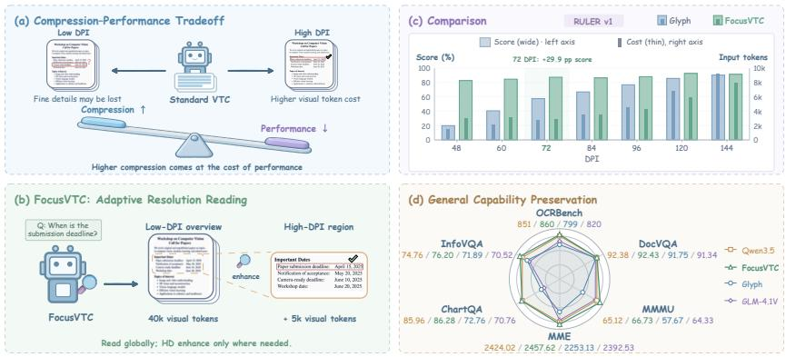  
Figure 1: Breaking the compression–performance trade-off through selective enhancement. (a) Fixed-resolution VTC ties local legibility to whole-page token cost. (b) FOCUSVTC retains a compressed global view and selectively enhances relevant regions. (c) On RULER v1, it sustains high scores at low initial DPI, while Glyph needs higher DPI and more tokens for comparable performance. (d) These gains coexist with preserved general capabilities across six benchmarks.

## ABSTRACT

Long-context reasoning in large language models incurs substantial computation and memory costs. Visual text compression (VTC) reduces input length by rendering text as images, but fixed-resolution rendering creates a compression– performance trade-off: low DPI saves tokens at the expense of legibility, whereas high DPI spends tokens on irrelevant content. We introduce FOCUSVTC, which breaks this trade-off through adaptive resolution while preserving general multimodal capabilities. It combines compressed low-DPI global views with selective region enhancement, integrating enhanced views into ongoing reasoning. We construct 29.4K high-quality Reasoning–Evidence Localization (REL) chainof-thought examples (REL-CoT) that link reasoning traces to page indices and bounding boxes. Multi-resolution REL supervised fine-tuning (REL-SFT) teaches the model to localize relevant regions, and Group Relative Policy Optimization learns when to enhance resolution and how to use the resulting observations, without a separate continual-pretraining stage. At 72 DPI on RULER v1, FOCUSVTC scores 87.4 at 2.9× input compression, including tool observations, versus 57.5 for Glyph at 3.0× input compression. It surpasses its text-input backbone on LongBench (56.40 versus 55.86), improves the MRCR macro-average by 13.91 points, and achieves a 51.19 macro-average on VTCBench. The MRCR latency evaluation also shows a 2.79× online end-to-end speedup over Text. General multimodal capabilities are preserved, with MMMU increasing from 65.12 to 66.73 and MME from 2424.02 to 2457.62.

## 1 INTRODUCTION

Large language models (LLMs) increasingly support document analysis, multi-document question answering, and extended interaction histories, all of which require reasoning over long contexts (Yang et al., 2025b; Grattafiori et al., 2024; Qwen Team, 2026). As context length grows, attention computation, inference latency, and key-value (KV) cache memory become substantial costs (Dao et al., 2022; Kwon et al., 2023); a larger context window also does not guarantee reliable retrieval and reasoning (Hsieh et al., 2024; Vodrahalli et al., 2024). Existing approaches address different aspects of these challenges through context-window extension (Peng et al., 2024), efficient attention (Dao et al., 2022), KV cache management (Kwon et al., 2023), and prompt compression (Jiang et al., 2023). Complementing these approaches, visual text compression (VTC) represents text as page images that vision-language models (VLMs) encode with compact visual-token sequences, preserving document coverage with fewer input tokens.

However, VTC introduces a compression–performance trade-off. Prior work (Wang et al., 2024; Xing et al., 2025) encodes long text as compact visual tokens. Glyph (Cheng et al., 2026) optimizes dense text rendering, while DeepSeek-OCR (Wei et al., 2025) explores optical context compression. With fixed-resolution visual input, local readability remains tied to the global token budget: low DPI saves tokens but can obscure exact characters, whereas high DPI improves readability by spending tokens across the entire page, including irrelevant passages. Our key insight is that global context coverage and precise local reading need not use the same resolution: a question often depends on only a small subset of the document.

We introduce FOCUSVTC, an adaptive-resolution framework that breaks this trade-off by retaining a compressed low-DPI global view and selectively enhancing relevant regions during reasoning (Figure 1). FOCUSVTC learns this adaptive reading strategy through two-stage training. We construct 29.4K high-quality Reasoning–Evidence Localization (REL) chain-of-thought examples (REL-CoT), each linking a reasoning trace and answer to page indices and bounding boxes. Multiresolution REL supervised fine-tuning (REL-SFT) teaches the model to localize relevant regions across seven rendering resolutions. Group Relative Policy Optimization (GRPO) (Shao et al., 2024) learns when and where to enhance resolution, how to integrate enhanced views into ongoing reasoning, and when to stop.

Experiments show strong performance with compressed visual input while preserving general multimodal capabilities. At 72 DPI on RULER v1 (Hsieh et al., 2024), FOCUSVTC scores 87.4 at 2.9× input compression, including tool observations, versus 57.5 for Glyph (Cheng et al., 2026) at 3.0× input compression. On LongBench (Bai et al., 2024), it outperforms its text-input backbone (56.40 vs. 55.86). On MRCR, the macro-average over six length bins and two/four/eight needles improves from 31.65 to 45.56 (+13.91). The MRCR latency evaluation shows a 2.79× online end to-end speedup (Appendix C.2). On VTCBench (Zhao et al., 2025), FOCUSVTC achieves a 51.19 macro-average across Retrieval, Reasoning, and Memory. General multimodal performance is preserved, with MMMU (Yue et al., 2024) improving from 65.12 to 66.73 and MME (Fu et al., 2026) from 2424.02 to 2457.62. At 72 DPI, DejaVu Sans improves LongBench from 54.93 to 56.40 over Verdana (+1.47). Our contributions are threefold:

• We introduce an adaptive-resolution framework that breaks the compression–performance tradeoff in VTC by combining compressed global context with tool-mediated access to high-resolution content for selected document regions.

• We construct REL-CoT, a dataset of 29.4K high-quality examples linking reasoning traces to page indices and bounding boxes. These annotations support multi-resolution REL-SFT and the learning of adaptive visual reading.

• We develop FOCUSVTC, which scores 87.4 on RULER v1 at 2.9× compression and 56.40 on LongBench, improves the MRCR macro-average by 13.91 points, and achieves 51.19 on VTCBench, while preserving general multimodal capabilities.

## 2 RELATED WORK

Long-context efficiency and visual text compression. Prior work explores context-window extension (Peng et al., 2024), efficient attention (Dao et al., 2022; Yuan et al., 2025), cache management (Kwon et al., 2023), retrieval (Lewis et al., 2020), summarization (Xu et al., 2024a), and prompt compression (Jiang et al., 2023). VisInContext and VIST compress textual context into visual tokens (Wang et al., 2024; Xing et al., 2025). Glyph combines dense rendering with continual pre-training and post-training (Cheng et al., 2026), while DeepSeek-OCR studies text reconstruction from compressed visual representations (Wei et al., 2025). With fixed-resolution input, local legibility remains tied to the global visual-token budget. FOCUSVTC addresses this trade-off through compressed global context and tool-mediated access to selected high-resolution regions.

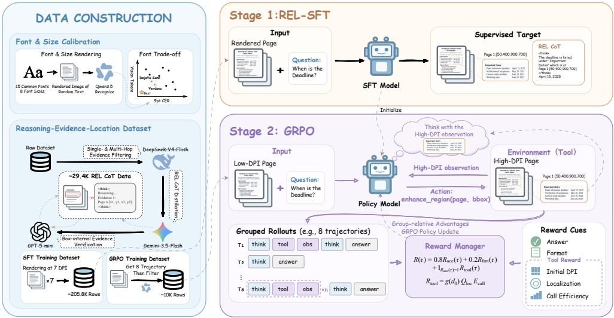  
Figure 2: Overview of FocusVTC data construction and two-stage training. After calibrating font and point size, text contexts are rendered at multiple DPIs and annotated with REL-CoT. REL-SFT teaches low-DPI evidence localization, while GRPO trains the model to iteratively acquire and use high-resolution observations through selective region enhancement.

Adaptive resolution and grounded visual reasoning. Tang et al. (2026) use transport cost to route between textual and visual inputs and re-encode selected regions at higher resolution. AGAR enlarges attention-selected text spans before a second inference pass without model training (Zeng et al., 2026); SEER learns to select rendered pages and retrieve their source text (Xu et al., 2026). DeepEyes learns active visual inspection through reinforcement learning (Zheng et al., 2026). Complementary training approaches compress reasoning into visual memory (VTC-R1), align visualand text-input behavior (SPIRAL), or transfer text-history policies to visual-history agents (CAPS) (Wang et al., 2026; Liang et al., 2026; Fan et al., 2026). DocVAL distills validated spatial reasoning traces for document grounding (Guha Neogi et al., 2026). Our 29.4K REL-CoT examples link reasoning to page indices and bounding boxes across resolutions. Multi-resolution REL-SFT and GRPO teach FOCUSVTC when and where to enhance regions and how to integrate the resulting views into ongoing reasoning, while retaining compressed global context and general multimodal capabilities without continual pre-training.

Rendering fidelity and downstream evaluation. VTCBench evaluates retrieval, reasoning, and memory under visual compression (Zhao et al., 2025); Fico examines recognition and understanding as visual fidelity and information density vary (Tu et al., 2026). These studies motivate assessing task performance alongside token savings. We evaluate prompt and observation token costs and connect Qwen3.5’s rendering-font preferences to downstream scores: DejaVu Sans improves LongBench performance over Verdana under matched settings (Table 3).

## 3 FOCUSVTC

FocusVTC learns adaptive-resolution visual text compression in two stages (Figure 2). We construct REL-CoT to provide training data for both stages, pairing each reasoning step with a page index and a normalized evidence box. Reasoning–Evidence Localization (REL) supervised fine-tuning uses these annotations to teach evidence localization without continual pretraining, and Group Relative Policy Optimization (GRPO) learns when and where to enhance region resolution. At inference, the model reasons over low-DPI pages and iteratively integrates enhanced views of relevant regions to produce the final answer.

## 3.1 PROBLEM SETUP

Let x denote a source text context, and q and y its associated question and answer. A renderer controlled primarily by font $f ,$ point size s, and DPI d converts x into $P$ page images:

$$
\begin{array} { r } { \mathcal { T } ^ { ( d ) } = \mathrm { R e n d e r } ( x ; f , s , d ) = \{ I _ { p } ^ { ( d ) } \} _ { p = 1 } ^ { P } . } \end{array}\tag{1}
$$

At an initial low DPI $d _ { 0 }$ , the model receives the question and the global page views. Let $r _ { < t } , a _ { < t } .$ and $O _ { < t }$ denote its previous reasoning segments, actions, and tool observations, respectively (all empty at $t = 0 )$ . The state is

$$
\begin{array} { r } { s _ { t } = \left( q , \mathcal { T } ^ { ( d _ { 0 } ) } , r _ { < t } , a _ { < t } , o _ { < t } \right) , \qquad s _ { 0 } = \left( q , \mathcal { T } ^ { ( d _ { 0 } ) } \right) . } \end{array}\tag{2}
$$

Conditioned on $s _ { t } .$ , the model generates a reasoning segment $r _ { t }$ and then selects an action $a _ { t } .$ , either a final answer or a region-enhancement call:

$$
( r _ { t } , a _ { t } ) \sim \pi _ { \theta } ( \cdot \mid s _ { t } ) , \qquad a _ { t } \in \{ \mathrm { A n s w e r } ( \hat { y } ) , \mathrm { E n h a n c e } . \mathrm { R e g i o n } ( p _ { t } , b _ { t } ) \} .\tag{3}
$$

Here $p _ { t } \in \{ 1 , \ldots , P \}$ and $b _ { t } \in [ 0 , 1 0 0 0 ] ^ { 4 }$ specify a page and a normalized bounding box. The tool enhances the selected region by reading its pixels from the aligned page rendered at a higher DPI $d _ { h } > d _ { 0 } \colon$

$$
o _ { t } = \mathrm { E n h a n c e . R e g i o n } \Big ( I _ { p _ { t } } ^ { ( d _ { h } ) } , b _ { t } \Big ) .\tag{4}
$$

Coordinates refer to the original page, keeping the low- and high-DPI views aligned. After enhancement, the model appends $\left( r _ { t } , a _ { t } , o _ { t } \right)$ to its history and continues reasoning until it answers or reaches the call budget. Figure 10 in Appendix E.2 illustrates this iterative use of high-resolution views. The policy must localize relevant regions in the compressed global context and enhance them selectively, balancing answer quality against the additional visual-token and interaction cost.

## 3.2 DATA CONSTRUCTION

Font and Point-Size Selection. Qwen3.5-9B exhibits rendering-font preferences that matter for compressed reading (Figure 3). We evaluate 15 fonts at eight point sizes using randomized-text character error rate (CER), visual-token cost, and confusable sequences. DejaVu Sans and Verdana first satisfy the 5% CER criterion at 9 pt, with interpolated thresholds of 8.69 and 8.68 pt (panel a). Among fonts meeting this criterion, DejaVu Sans has the lowest cost: 8,368.4 visual tokens per 32K-token context versus 8,417.8 for Verdana (panel b). Their overall random-text CERs are close, but DejaVu Sans reduces CER by 0.30 percentage points on confusable sequences (95% $\mathrm { C I } \ [ - 0 . 5 2 , - 0 . 0 \dot { 9 } ] )$ , with fewer errors on cl, rn, and i; Verdana performs better on j (panel c). We therefore use DejaVu Sans at 9 pt with 1 pt additional line spacing. This choice also improves downstream LongBench scores from 54.93 to 56.40 (Table 3). Full protocols and controls are in Appendix A.

Reasoning–Evidence Localization Chain-of-Thought (REL-CoT) Data Construction. The raw candidate pool draws primarily from the ChatQA training data (Liu et al., 2024b) and the ChatQA2 training data (Xu et al., 2024b), supplemented by TriviaQA (Joshi et al., 2017) and multi-hop and numerical-reasoning QA datasets including HotpotQA, 2WikiMultihopQA, MuSiQue, and FinQA (Yang et al., 2018; Ho et al., 2020; Trivedi et al., 2022; Chen et al., 2021). These sources cover reading comprehension, long contexts, tables, numerical reasoning, and multi-hop QA. Data expansion and training details are given in Appendix B.

As shown in Figure 2, we use a three-stage, cross-model pipeline so that REL-CoT examples are context-dependent, spatially grounded, and independently verified. Before rendering, DeepSeek V4 Flash filters out questions answerable from common knowledge, preventing shortcuts that bypass document reading. We then render the retained contexts into pages. Gemini 3.5 Flash serves as the annotation teacher, producing reasoning traces with inline page indices and normalized bounding boxes. The text explains how each selected region supports the reasoning, and a trace may refer to multiple regions. Appendix E.1 shows a complete annotated example. Finally, GPT-5 mini independently checks whether the selected high-resolution regions support the reference answer and removes samples with incorrect or insufficient support. The resulting release contains approximately 29.4K verified REL-CoT examples. Appendix B.1 reports their source distribution (Figure 7) and the expanded sample count.

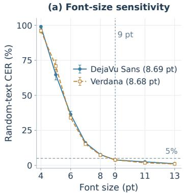

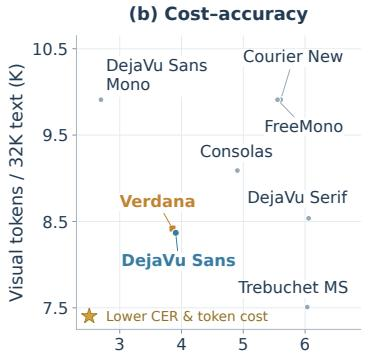  
CER at 9 pt (%)

(c) Confusable characters  
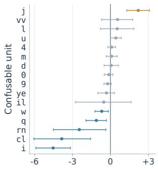  
DejaVu Sans − Verdana (pp)  
Figure 3: Font and point-size selection at 72 DPI. (a) Random-text CER across point sizes, with one-standard-error bars; references mark 5% CER and 9 $\mathrm { p t . }$ (b) 9 pt cost–CER comparison; the star indicates the preferred direction. (c) Confusable-unit errors, DejaVu Sans minus Verdana, with 95% paired-bootstrap intervals.

## 3.3 REASONING–EVIDENCE LOCALIZATION SUPERVISED FINE-TUNING

Reasoning–Evidence Localization supervised fine-tuning (REL-SFT) trains FocusVTC to ground it reasoning in question-relevant document regions across input resolutions.

For each verified REL-CoT example, we render the document at $d _ { 0 } \in \{ 4 8 , 6 0 , 7 2 , 8 4 , 9 6 , 1 2 0 , 1 4 4 \}$ DPI. The seven views share the same question $q ,$ annotated reasoning trace, and answer, differing only in the input rendering (Appendix B.1). We serialize the reasoning trace, including its page and region markers, followed by the answer into a single target token sequence u.

Given rendered pages I and question $q ,$ REL-SFT minimizes the token-level negative log-likelihood

$$
\mathcal { L } = - \mathbb { E } _ { ( \mathcal { T } , q , \mathbf { u } ) \sim \mathcal { D } _ { \mathrm { R E L } } } \left[ \sum _ { k = 1 } ^ { | \mathbf { u } | } \log p _ { \theta } ( u _ { k } \mid \mathcal { T } , q , \mathbf { u } _ { < k } ) \right] .\tag{5}
$$

This joint supervision of reasoning, evidence localization, and answer generation establishes the foundation for the model’s subsequent adaptive-resolution capabilities. Training configuration and sequence packing are detailed in Appendix B.2.

## 3.4 GROUP RELATIVE POLICY OPTIMIZATION FOR ADAPTIVE RESOLUTION

Starting from the REL-SFT checkpoint, GRPO optimizes complete interaction trajectories using task-level rewards. The policy learns when and where to enhance resolution, how to integrate the resulting observations, and when to terminate. Enhanced regions come from aligned high-DPI pages while the low-DPI global context remains available.

For each initial state, we sample G = 8 trajectories and standardize their rewards within the group to obtain advantages $\widehat { A } _ { i }$ . GRPO maximizes

$$
\mathcal { I } _ { \mathrm { G R P O } } ( \theta ) = \mathbb { E } _ { i , k } \left[ \operatorname* { m i n } \Bigl ( \rho _ { i , k } \widehat { A } _ { i } , \operatorname { c l i p } ( \rho _ { i , k } , 1 - \epsilon , 1 + \epsilon ) \widehat { A } _ { i } \Bigr ) \right] ,\tag{6}
$$

where $\rho _ { i , k }$ is the new-to-rollout policy probability ratio for generated token k in trajectory $i ,$ and ϵ is the clipping threshold. Tool observations condition the policy but are excluded from the loss.

GRPO Data Filtering. We construct the final GRPO prompts only from REL-CoT’s 72-, 96-, and 144-DPI views. For each candidate, eight trajectories are generated for construction-time filtering. We discard candidates whose eight trajectories all repeatedly call the tool without recovering an answer, or whose eight trajectories never call the tool. We then retain 10,000 prompts in a fixed 7:2:1 DPI ratio. The online rollout group size, prompt limits, and update schedule are detailed in Appendix B.3.

Reward. For a trajectory $\tau ,$ the total reward combines answer correctness, output validity, and a correctness-gated tool-use bonus:

$$
R ( \tau ) = 0 . 8 R _ { \mathrm { a c c } } ( \tau ) + 0 . 2 R _ { \mathrm { f m t } } ( \tau ) + \mathbb { I } _ { R _ { \mathrm { a c c } } ( \tau ) = 1 } R _ { \mathrm { t o o l } } ( \tau ) .\tag{7}
$$

Here $R _ { \mathrm { a c c } }$ measures answer matching and $R _ { \mathrm { f m t } }$ enforces valid outputs and tool calls. The tool bonus is enabled only for fully correct answers. It combines resolution necessity $g ( d _ { 0 } )$ ), localization quality $Q _ { \mathrm { l o c } } ,$ , and call efficiency $E _ { \mathrm { c a l l } }$ . For $N > 0$ attempted calls and $E > 0$ distinct annotated regions,

$$
R _ { \mathrm { t o o l } } = g ( d _ { 0 } ) Q _ { \mathrm { l o c } } E _ { \mathrm { c a l l } } , \quad g ( d _ { 0 } ) = \mathrm { c l i p } \bigg ( { \frac { 1 4 4 - d _ { 0 } } { 1 4 4 - 7 2 } } , 0 , 1 \bigg ) ^ { \gamma } , \quad E _ { \mathrm { c a l l } } = \mathrm { m i n } ( 1 , E / N ) .\tag{8}
$$

The resolution weight $g$ falls from one at 72 DPI to zero at 144 DPI, favoring enhancement when the initial view is compressed. Call efficiency $E _ { \mathrm { c a l l } }$ stays at one for $N \leq E$ and decays as $E / N$ thereafter, discouraging redundant enhancements. Localization quality is computed as

$$
Q _ { \mathrm { l o c } } = \frac { \sum _ { ( i , j ) \in \mathcal { M } } \mathrm { I o U } ( c _ { i } , e _ { j } ) \operatorname* { m i n } \{ 1 , 2 ( 1 - s _ { i } ) \} } { \operatorname* { m i n } ( N , E ) } ,\tag{9}
$$

where M is a maximum-weight one-to-one matching between valid call regions $c _ { i }$ and boxes $e _ { j }$ on the same page. The requested page-area fraction $s _ { i }$ penalizes overly broad regions, and counting invalid attempts in N penalizes malformed calls. Both $Q _ { \mathrm { l o c } }$ and $E _ { \mathrm { c a l l } }$ are zero when $N = 0$ or E = 0. Table 9 summarizes reward behavior for representative cases.

## 4 EXPERIMENTS

## 4.1 EXPERIMENTAL SETUP

We compare FocusVTC with three groups of baselines: (1) text-input models, with Qwen3.5- 9B (Qwen Team, 2026) as the backbone reference; (2) fixed-resolution multimodal models, including Qwen3-VL-8B (Bai et al., 2025), Qwen3.5-9B, GLM-4.1V-9B (V Team et al., 2025), and Glyph (Cheng et al., 2026); and (3) training-stage variants, including FocusVTC w/o GRPO with and without tools, a no-tools ablation of FocusVTC, intermediate FocusVTC checkpoints, direct GRPO (FocusVTC w/o SFT), and a tools-only Qwen3.5-9B (denoted Qwen3.5-9B+tools). We evaluate long-context performance on LongBench (Bai et al., 2024), MRCR (Vodrahalli et al., 2024; OpenAI, 2025), and VTCBench (Zhao et al., 2025), and resolution robustness and compression efficiency on RULER (Hsieh et al., 2024). We assess capability preservation with general multimodal benchmarks (Yue et al., 2024; Liu et al., 2024a; Mathew et al., 2021; 2022; Fu et al., 2026; Masry et al., 2022); complete scores are in Appendix C.5. At evaluation, Text and Vision denote text input and 72-DPI pages, respectively. For models with tool access, the region-enhancement tool provides aligned 144-DPI regions. All rendered pages use DejaVu Sans at 9 pt unless otherwise stated. Sampling settings and tool-use budgets are detailed in Appendix C.

## 4.2 LONG-CONTEXT PERFORMANCE

LongBench: matching text performance with compressed input. FocusVTC achieves the best overall score in Table 1 (56.40), slightly exceeding Qwen3.5-9B Text (55.86) and outperforming the strongest VTC baseline, Glyph (Cheng et al., 2026) (52.34). More importantly, it gains 20.54 points over the same backbone at a fixed 72 DPI. The gains concentrate on QA and synthetic retrieval, where a small number of passages determine the answer. This pattern supports the intended mechanism: low-resolution pages preserve global search coverage, while learned crops restore the exact text only where needed. Summarization changes little because its evidence is distributed rather than localized. Few-shot results are mixed, as demonstrations can span multiple regions.

Table 1: LongBench task scores (%), grouped by task family. Avg is the unweighted arithmetic mean of the 11 displayed non-code task scores. Vision denotes 72-DPI pages.
<table><tr><td>Model / stage</td><td>Input</td><td>Single-doc QA</td><td></td><td></td><td>Multi-doc QA</td><td></td><td>Summarization</td><td></td><td>Few-shot</td><td></td><td>Synthetic</td><td>Overall</td></tr><tr><td></td><td></td><td>QP</td><td></td><td></td><td>MF-En MF-Zh DuR</td><td>2Wiki</td><td></td><td>MNews QMSum SAMSum Trivia PR-En PR-Zh</td><td></td><td></td><td></td><td>Avg</td></tr><tr><td>LLaMA-3.1-8B (Grattafiori et al., 2024)</td><td></td><td>Text 44.56</td><td>44.61</td><td>41.26</td><td>19.06</td><td>46.67</td><td>25.30</td><td>23.28</td><td>35.46</td><td>89.12 99.50</td><td>62.20</td><td>48.27</td></tr><tr><td>Qwen2.5-7B (Yang et al., 2025b)</td><td>Text</td><td>45.29</td><td>43.44</td><td>42.12</td><td>16.55</td><td>40.51</td><td>24.94</td><td>22.95</td><td>34.59</td><td>86.93 100.00</td><td>98.50</td><td>50.53</td></tr><tr><td>Qwen3-8B (Yang et al., 2025a)</td><td></td><td>Text 44.67</td><td>47.73</td><td>45.21</td><td>21.19</td><td>73.92</td><td>21.30</td><td>19.60</td><td>35.01</td><td>87.98 97.26</td><td>100.00</td><td>53.99</td></tr><tr><td>GLM-4-9B (Team GLM et al., 2024)</td><td></td><td>Text 43.75</td><td>45.21</td><td>41.23</td><td>20.79</td><td>50.89</td><td>24.82</td><td>22.84</td><td>35.84</td><td>90.07 99.50</td><td>100.00</td><td>52.27</td></tr><tr><td>Qwen3.5-9B (Qwen Team, 2026)</td><td></td><td>Text 47.23</td><td>49.32</td><td>56.58</td><td>25.25</td><td>61.82</td><td>23.79</td><td>22.28</td><td>38.02</td><td>90.16 100.00 100.00</td><td></td><td>55.86</td></tr><tr><td>Qwen3-VL-8B (Bai et al., 2025)</td><td></td><td>Vision 27.85</td><td>32.17</td><td>26.50</td><td>18.00</td><td>37.49</td><td>19.47</td><td>20.72</td><td>34.10</td><td>87.97 52.50</td><td>6.50</td><td>33.02</td></tr><tr><td>Qwen3.5-9B (Qwen Team, 2026)</td><td></td><td>Vision 36.20</td><td>41.10</td><td>28.68</td><td>19.38</td><td>38.12</td><td>21.79</td><td>22.32</td><td>32.70</td><td>91.37 29.25</td><td>33.50</td><td>35.86</td></tr><tr><td>GLM-4.1V-9B (V Team et al., 2025)</td><td></td><td>Vision 30.85</td><td>33.95</td><td>26.92</td><td>15.86</td><td>38.33</td><td>22.55</td><td>16.52</td><td>36.52</td><td>88.25 72.50</td><td>40.68</td><td>38.45</td></tr><tr><td>Glyph (Cheng et al., 2026)</td><td></td><td>Vision 43.77</td><td>46.49</td><td>36.74</td><td>25.17</td><td>72.49</td><td>22.22</td><td>20.71</td><td>34.41</td><td>86.61 100.00</td><td>87.11</td><td>52.34</td></tr><tr><td>FocusVTC (Ours)</td><td>Vision 47.71</td><td></td><td>48.95</td><td>57.78</td><td>30.21</td><td>69.04</td><td>23.57</td><td>21.71</td><td>33.87</td><td>91.01 98.50</td><td>98.00</td><td>56.40</td></tr></table>

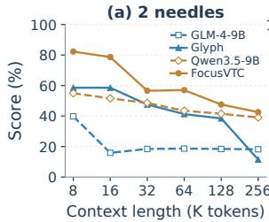

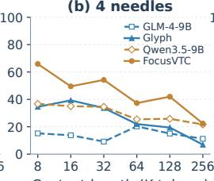

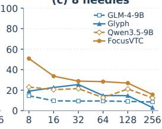

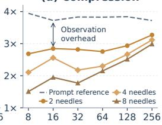  
Figure 4: MRCR results: (a) two needles; (b) four needles; (c) eight needles; (d) prompt-plusobservation compression. Text is dashed/hollow; VTC is solid/filled. Context axes use bin upper bounds on a base-two scale. Compression divides Text tokens by the initial prompt plus tool observations. Full scores: Appendix C.3.

Table 2: VTCBench performance (%) across Retrieval, Reasoning, and Memory. Length labels are bin upper bounds (K tokens). Each Avg is the unweighted arithmetic mean of the four displayed length-bin scores. Vision denotes 72-DPI pages.
<table><tr><td>Model / stage</td><td>Input</td><td colspan="3">Retrieval</td><td colspan="3">Reasoning</td><td colspan="3">Memory</td></tr><tr><td></td><td>8</td><td>16</td><td>32 64</td><td>Avg</td><td>8 16</td><td>32</td><td>64 Avg</td><td>8</td><td>16 32</td><td>64 Avg</td></tr><tr><td>Qwen3-VL-8B (Bai et al., 2025)</td><td>Vision 90.50 77.90 77.01 76.36</td><td></td><td></td><td>80.44</td><td>18.83 12.16 11.11</td><td></td><td>1.52 10.91</td><td></td><td>21.08 20.18 24.03 20.00</td><td>21.32</td></tr><tr><td>Qwen3.5-9B (Qwen Team, 2026)</td><td>Vision 89.14 78.45 79.21 78.23</td><td></td><td></td><td>81.26</td><td>62.9755.4134.2613.64</td><td></td><td>41.57</td><td></td><td>32.50 22.75 18.42 10.10</td><td>20.94</td></tr><tr><td>GLM-4.1V-9B (V Team et al., 2025) Vision 86.20 85.25 82.76 58.01</td><td></td><td></td><td></td><td>78.06</td><td>31.5910.14 22.22</td><td></td><td>9.09 18.26</td><td></td><td>25.10 21.89 13.16 7.07</td><td>16.81</td></tr><tr><td>Glyph (Cheng et al., 2026)</td><td>Vision 92.08 87.85 80.51 77.1684.40</td><td></td><td></td><td></td><td>22.186.0815.74 10.6113.65</td><td></td><td></td><td></td><td>22.11 17.11 21.47 19.0019.92</td><td></td></tr><tr><td>FocusVTC (Ours)</td><td>Vision 98.39 93.37 85.34 86.8991.00</td><td></td><td></td><td></td><td>45.24 43.24 35.19 21.3336.25</td><td></td><td></td><td></td><td>32.98 22.07 24.64 25.6426.33</td><td></td></tr></table>

MRCR: higher scores than text under compression. FocusVTC exceeds the Qwen3.5-9B Text average in all three needle settings and also consistently outperforms Glyph, with two/four/eightneedle averages of 60.76/45.21/30.71 versus 42.63/25.97/16.57, giving equal weight to the six context-length bins. These gains coexist with approximately 3.0–3.3× prompt-plus-observation compression in the longest bin (Figure 4). Section 4.4 analyzes how compression scales with context length.

VTCBench: retrieval, memory, and long-context reasoning. FocusVTC obtains the best Retrieval and Memory averages in Table 2. Its advantage is clearest in the longest bins, where the low-resolution overview narrows the search and crops recover facts that fixed-resolution input can miss. This supports that adaptive resolution addresses the access-to-evidence bottleneck. Reasoning improves over the fixed-resolution backbone in the two longest bins, although its overall average remains lower. Overall, these results show that adaptive crops add a complementary capability: the model can revisit and recover evidence missed by the fixed-resolution view, with the clearest benefits at longer contexts.

Table 3: Training stages and tool access at 72 DPI (scores in %). Best and second-best scores are bold and underlined, respectively. +tools uses tool access without additional training. Detailed results are provided in Appendices C.3 and C.4.
<table><tr><td>Model</td><td colspan="4">REL-SFT GRPO Tools</td><td colspan="4">RULER LongBench MRCR (needles)</td><td colspan="2">VTCBench</td></tr><tr><td></td><td></td><td></td><td>v1</td><td>v2</td><td>Avg</td><td>2 4</td><td>8</td><td>Retrieval Reasoning Memory</td><td></td></tr><tr><td>FocusVTC (Ours)</td><td>√</td><td>√</td><td></td><td>87.38 75.94</td><td>56.40</td><td>60.76 45.21 30.71</td><td></td><td>91.00 36.25</td><td>26.33</td></tr><tr><td>FocusVTC (Verdana) (Ours)</td><td>√</td><td>√</td><td></td><td>85.13 75.49</td><td>54.93</td><td>60.26 43.11 27.34</td><td>89.21</td><td>35.93</td><td>24.23</td></tr><tr><td>FocusVTC w/o tools (Ours)</td><td>√</td><td>√</td><td></td><td>36.60 44.82</td><td>36.82</td><td>52.00 37.65 23.50</td><td>67.25</td><td>3.11</td><td>22.95</td></tr><tr><td>FocusVTC w/o SFT (Ours)</td><td></td><td>√</td><td></td><td>73.21 62.77</td><td>49.30</td><td>57.05 39.36 26.66</td><td></td><td>87.17 38.15</td><td>23.56</td></tr><tr><td>FocusVTC w/o GRPO (Ours)</td><td>√</td><td></td><td></td><td>32.28 43.58</td><td>37.86</td><td>44.94 28.83 21.30</td><td></td><td>80.27 20.37</td><td>17.68</td></tr><tr><td>FocusVTC w/o GRPO+tools (Ours)</td><td>√</td><td></td><td>√</td><td>22.98 39.41</td><td>25.41</td><td>22.25 15.098.96</td><td></td><td>54.25 2.53</td><td>6.93</td></tr><tr><td>Qwen3.5-9B (Qwen Team, 2026)</td><td>一</td><td></td><td></td><td>37.40 44.64</td><td>35.86</td><td>48.52 28.53 18.56</td><td></td><td>81.26 41.57</td><td>20.94</td></tr><tr><td>Qwen3.5-9B+tools (Qwen Team, 2026)</td><td></td><td></td><td>√</td><td>22.50 37.68</td><td>27.22</td><td>20.70 14.42  6.96</td><td></td><td>49.38 2.83</td><td>3.30</td></tr></table>

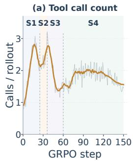

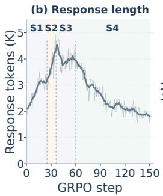

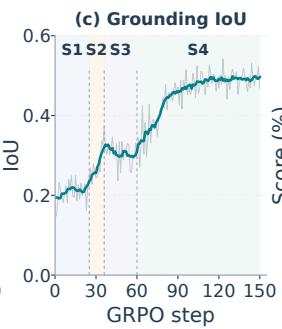

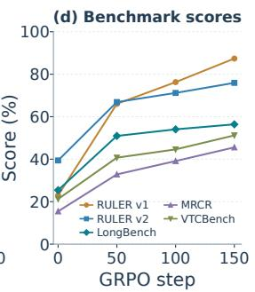  
Figure 5: Training behavior and checkpoint scores. (a) Tool calls; (b) response length; (c) grounding IoU; (d) benchmark scores at 0/50/100/150 steps. S1–S4 mark exploration, frequent tool use, fewer calls with longer responses, and shorter responses with higher IoU.

## 4.3 TRAINING STRATEGY ANALYSIS

Training and rendering ablations. Table 3 summarizes the ablations. Training configurations are given in Appendix B, and detailed results in Appendix C. REL-SFT provides a useful initialization for GRPO: compared with FocusVTC w/o SFT, FocusVTC improves eight of nine reported aggregates, including LongBench (49.30 to 56.40), with VTCBench Reasoning as the sole exception (38.15 to 36.25). However, Qwen3.5-9B+tools and FocusVTC w/o GRPO+tools score lower on every aggregate than Qwen3.5-9B and FocusVTC w/o GRPO, respectively; for FocusVTC w/o GRPO, enabling tools reduces LongBench from 37.86 to 25.41. After GRPO, FocusVTC surpasses FocusVTC w/o GRPO+tools on all nine aggregates, including a rise from 22.98 to 87.38 on RULER v1, supporting the role of policy learning in using the crop interface effectively. FocusVTC also outperforms FocusVTC w/o tools on LongBench (56.40 versus 36.82). Rendering quality provides a further gain: FocusVTC with DejaVu Sans outperforms FocusVTC (Verdana) on both RULER versions and LongBench, with the largest RULER v1 gains on single 3 and multikey 3, where exact key–value retrieval is sensitive to character errors (Appendix A.4).

GRPO progression. With tools enabled, every reported LongBench, MRCR, and VTCBench aggregate improves steadily from 50 to 100 to 150 steps, with particularly strong later gains on eightneedle MRCR and VTCBench Reasoning and Memory. Figure 5 connects these gains to the policy trajectory. In S1–S2 (0–36), increasing calls and response length coincide with rising IoU as the policy learns to request useful evidence. In S3 (36–60), calls fall while responses remain long and IoU briefly dips, so fewer calls alone do not imply precise reading. In S4 (60–150), responses shorten and IoU rises before stabilizing as the benchmark scores reach their strongest checkpoint. GRPO therefore progressively converts exploratory tool use into more selective evidence acquisition and stopping.

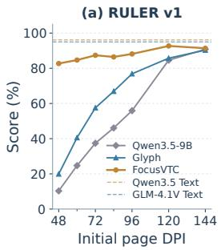

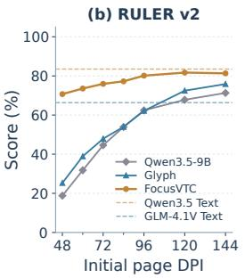

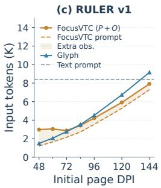

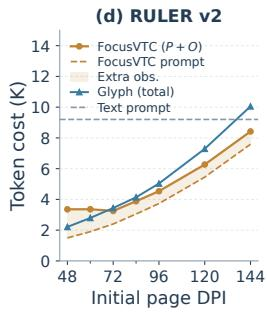  
Figure 6: RULER results across DPI: (a) v1 scores; (b) v2 scores; (c) v1 input token costs; (d) v2 token costs. FocusVTC shows prompt and prompt-plus-observation costs. Glyph uses prompt tokens for v1 and v2. Dashed references show Text prompts. Token accounting: Appendix C.1; task-level scores at 72 DPI: Appendix C.4.

## 4.4 RESOLUTION ROBUSTNESS AND COMPRESSION EFFICIENCY

Robustness across initial resolutions. RULER provides a direct test of the adaptive-resolution mechanism. Across 48–144 DPI, FocusVTC is substantially less sensitive to the initial resolution than the fixed-resolution baselines (Figure 6); at 72 DPI, it reaches 87.38/75.94 on v1/v2, compared with 37.40/44.64 for the same backbone without crops (Appendix C.4). REL trains the model to localize across resolutions, and the aligned 144-DPI crop then decouples exact character reading from the initial page resolution. At 48 and 60 DPI, extra-observation costs are higher, reducing the savings from shorter prompts. At 72 DPI, the prompt-plus-observation length is the smallest on both v1 and v2, while scores exceed those at lower DPIs. Above 72 DPI, observation costs change little but prompt length grows; starting at 144 DPI costs 2.8/2.6× as many input tokens for only modest gains. Thus, uniformly increasing resolution spends capacity on irrelevant text, whereas 72 DPI gives the crop policy enough information to allocate detail selectively. We therefore use it on the other benchmarks.

Token costs and compression. At 72 DPI on RULER v1, FocusVTC uses an average of 2,154 prompt tokens and 723 extra-observation tokens. Their sum of approximately 2,877 tokens gives 2.9× compression relative to the 8,400-token text context, while scoring 87.38. Glyph (Cheng et al., 2026) scores 57.53 at 3.0× compression. FocusVTC achieves higher accuracy at a similar compression ratio. For MRCR’s longest bin, the text reference is 197,909 tokens and the prompt is 53,181 tokens. Adding the two/four/eight-needle observations of 7,296/10,290/13,048 tokens gives $3 . 3 \times / 3 . 1 \times / 3 . 0 \times$ compression (Figure 4(d)). On 64K–128K four-needle MRCR examples, FocusVTC achieves a 2.79× online end-to-end speedup over Qwen3.5-9B Text, excluding offline page rendering (Appendix C.2).

## 5 CONCLUSION

Long-context reasoning incurs substantial computation and memory costs, while fixed-resolution visual text compression trades legibility for token savings. We presented FOCUSVTC, which breaks this trade-off through compressed global views and selective high-resolution enhancement. Trained with multi-resolution REL-SFT and GRPO on 29.4K high-quality REL-CoT examples, FOCUSVTC learns to localize and enhance relevant regions without continual pretraining. It scores 87.4 on RULER v1 at 2.9× input compression, including tool observations, and surpasses its text-input backbone on LongBench (56.40 versus 55.86). It also gains 13.91 points on MRCR and reaches a 51.19 VTCBench macro-average while preserving general multimodal capabilities. These results show that allocating visual detail according to reasoning needs can reconcile high compression with strong performance. We believe this principle advances visual text compression toward adaptive long-context understanding and provides a foundation for more capable, versatile, and scalable multimodal intelligence.

## AI USE STATEMENT

We used generative AI tools to assist with language polishing and manuscript organization. As part of the research pipeline, we also used DeepSeek V4 Flash to filter context-dependent questions, Gemini 3.5 Flash to generate reasoning traces and evidence locations, and GPT-5 mini to verify whether the extracted crops support the reference answers, as described in Section 3.2. The authors take responsibility for the final manuscript, including all claims, experimental results, and artifacts.

## ETHICS STATEMENT

This work studies efficient long-context reading through visual text compression and adaptive evidence localization. We use existing public QA datasets and evaluation benchmarks to construct rendered pages and derived reasoning–evidence annotations. The study does not recruit human participants or collect private documents. Derived data remain subject to the usage and redistribution conditions of their source datasets.

## REPRODUCIBILITY STATEMENT

Section 3 describes the FocusVTC reading protocol, REL-CoT data construction, REL supervised fine-tuning, and GRPO objective. Appendix B reports data composition and expansion, training hyperparameters, sequence packing, rollout limits, and representative reward cases. Appendix C specifies evaluation settings and token-cost accounting for initial prompts and tool observations, as well as generated-token counts in the latency analysis. Appendix A details the font and point-size selection experiments, rendering parameters, and visual preprocessing.

## REFERENCES

Shuai Bai, Yuxuan Cai, Ruizhe Chen, Keqin Chen, Xionghui Chen, Zesen Cheng, Lianghao Deng, Wei Ding, Chang Gao, Chunjiang Ge, et al. Qwen3-VL Technical Report. arXiv preprint arXiv:2511.21631, 2025.

Yushi Bai, Xin Lv, Jiajie Zhang, Hongchang Lyu, Jiankai Tang, Zhidian Huang, Zhengxiao Du, Xiao Liu, Aohan Zeng, Lei Hou, Yuxiao Dong, Jie Tang, and Juanzi Li. LongBench: A Bilingual, Multitask Benchmark for Long Context Understanding. In Proceedings ofthe 62nd Annual Meeting of the Association for Computational Linguistics (Volume 1: Long Papers), pp. 3119– 3137. Association for Computational Linguistics, 2024. doi: 10.18653/v1/2024.acl-long.172.

Zhiyu Chen, Wenhu Chen, Charese Smiley, Sameena Shah, Iana Borova, Dylan Langdon, Reema Moussa, Matt Beane, Ting-Hao Huang, Bryan R Routledge, et al. Finqa: A dataset of numerical reasoning over financial data. In Proceedings of the 2021 Conference on Empirical Methods in Natural Language Processing, pp. 3697–3711, 2021.

Jiale Cheng, Yusen Liu, Xinyu Zhang, Yulin Fei, Wenyi Hong, Ruiliang Lyu, Weihan Wang, Zhe Su, Xiaotao Gu, Xiao Liu, Yushi Bai, Jie Tang, Hongning Wang, and Minlie Huang. Glyph: Scaling Context Windows via Visual-Text Compression. In Proceedings of the 64th Annual Meeting of the Association for Computational Linguistics (Volume 1: Long Papers), pp. 37145–37158. Association for Computational Linguistics, 2026. doi: 10.18653/v1/2026.acl-long.1722.

Tri Dao, Dan Fu, Stefano Ermon, Atri Rudra, and Christopher Re. Flashattention: Fast and memory-´ efficient exact attention with io-awareness. volume 35, pp. 16344–16359, 2022.

Bradley Efron. Bootstrap methods: Another look at the jackknife. The Annals of Statistics, 7(1): 1–26, 1979. doi: 10.1214/aos/1176344552.

Cheng Fan, Junyi Zhou, Tingzhang Luo, RongJian Xu, Qiyanhui Lu, Mingjian Zhu, Hanting Chen, and Jianyuan Guo. Reading is not Reasoning: Bridging the Agentic Policy Gap in Vision-Text Compression. arXiv preprint arXiv:2608.08960, 2026.

Chaoyou Fu, Peixian Chen, Yunhang Shen, Yulei Qin, Mengdan Zhang, Xu Lin, Jinrui Yang, Xiawu Zheng, Ke Li, Xing Sun, et al. Mme: A comprehensive evaluation benchmark for multimodal large language models. volume 38, 2026.

Yonghan Gao, Zehong Chen, Lijian Xu, Jingzhi Chen, Jingwei Guan, and Xingyu Zeng. Decoupling Semantics from Vision: A Framework for Faithful Visual-Text Compression Evaluation. arXiv preprint arXiv:2608.01848, 2026.

Aaron Grattafiori, Abhimanyu Dubey, Abhinav Jauhri, et al. The Llama 3 Herd of Models. arXiv preprint arXiv:2407.21783, 2024.

Pinaki Prasad Guha Neogi, Ahmad Mohammadshirazi, Ser-Nam Lim, and Rajiv Ramnath. Doc-VAL: Validated Chain-of-Thought Distillation for Grounded Document VQA. In Proceedings of the 43rd International Conference on Machine Learning, volume 306 of Proceedings ofMachine Learning Research. PMLR, 2026.

Xanh Ho, Anh-Khoa Duong Nguyen, Saku Sugawara, and Akiko Aizawa. Constructing A Multihop QA Dataset for Comprehensive Evaluation of Reasoning Steps. In Proceedings of the 28th International Conference on Computational Linguistics, pp. 6609–6625. International Committee on Computational Linguistics, 2020. doi: 10.18653/v1/2020.coling-main.580.

Cheng-Ping Hsieh, Simeng Sun, Samuel Kriman, Shantanu Acharya, Dima Rekesh, Fei Jia, Yang Zhang, and Boris Ginsburg. RULER: What’s the Real Context Size of Your Long-Context Language Models? In First Conference on Language Modeling, 2024.

Huiqiang Jiang, Qianhui Wu, Chin-Yew Lin, Yuqing Yang, and Lili Qiu. LLMLingua: Compressing prompts for accelerated inference of large language models. In Proceedings of the 2023 Conference on Empirical Methods in Natural Language Processing, pp. 13358–13376. Association for Computational Linguistics, 2023. doi: 10.18653/v1/2023.emnlp-main.825.

Mandar Joshi, Eunsol Choi, Daniel S. Weld, and Luke Zettlemoyer. TriviaQA: A Large Scale Distantly Supervised Challenge Dataset for Reading Comprehension. In Proceedings ofthe 55th Annual Meeting of the Association for Computational Linguistics (Volume 1: Long Papers), pp. 1601–1611. Association for Computational Linguistics, 2017. doi: 10.18653/v1/P17-1147.

Woosuk Kwon, Zhuohan Li, Siyuan Zhuang, Ying Sheng, Lianmin Zheng, Cody Hao Yu, Joseph E. Gonzalez, Hao Zhang, and Ion Stoica. Efficient memory management for large language model serving with PagedAttention. In Proceedings ofthe 29th Symposium on Operating Systems Prin ciples, pp. 611–626, 2023. doi: 10.1145/3600006.3613165.

Patrick Lewis, Ethan Perez, Aleksandra Piktus, Fabio Petroni, Vladimir Karpukhin, Naman Goyal, Heinrich Kuttler, Mike Lewis, Wen-tau Yih, Tim Rockt¨ aschel, Sebastian Riedel, and Douwe¨ Kiela. Retrieval-augmented generation for knowledge-intensive NLP tasks. In Advances in Neural Information Processing Systems, volume 33, pp. 9459–9474, 2020.

Tianyu Liang, Xiangxi Zheng, Yilin Wang, and Dongxing Mao. Same Semantics, Different Paths: Self-Improving Alignment for Vision-Text Compression. arXiv preprint arXiv:2608.02109, 2026.

Yuliang Liu, Zhang Li, Mingxin Huang, Biao Yang, Wenwen Yu, Chunyuan Li, Xu-Cheng Yin, Cheng-Lin Liu, Lianwen Jin, and Xiang Bai. OCRBench: On the Hidden Mystery of OCR in Large Multimodal Models. Science China Information Sciences, 67(12):220102, 2024a. doi: 10.1007/s11432-024-4235-6.

Zihan Liu, Wei Ping, Rajarshi Roy, Peng Xu, Chankyu Lee, Mohammad Shoeybi, and Bryan Catanzaro. Chatqa: Surpassing gpt-4 on conversational qa and rag. arXiv preprint arXiv:2401.10225, 2024b.

Ilya Loshchilov and Frank Hutter. Decoupled weight decay regularization. In International Conference on Learning Representations, 2019.

Ahmed Masry, Jia Qing Tan, Shafiq Joty, Enamul Hoque, et al. Chartqa: A benchmark for question answering about charts with visual and logical reasoning. In Findings of the association for computational linguistics: ACL 2022, pp. 2263–2279, 2022.

Minesh Mathew, Dimosthenis Karatzas, and C. V. Jawahar. DocVQA: A Dataset for VQA on Document Images. In Proceedings of the IEEE/CVF Winter Conference on Applications of Computer Vision, pp. 2200–2209, 2021.

Minesh Mathew, Viraj Bagal, Ruben Tito, Dimosthenis Karatzas, Ernest Valveny, and C. V. Jawa-\` har. InfographicVQA. In Proceedings of the IEEE/CVF Winter Conference on Applications of Computer Vision, pp. 1697–1706, 2022. doi: 10.1109/WACV51458.2022.00264.

OpenAI. OpenAI MRCR: Long Context Multiple Needle in a Haystack Benchmark. Hugging Face dataset release, 2025.

Bowen Peng, Jeffrey Quesnelle, Honglu Fan, and Enrico Shippole. YaRN: Efficient context window extension of large language models. In International Conference on Learning Representations, 2024.

Qwen Team. Qwen3.5: Towards native multimodal agents, February 2026.

Zhihong Shao, Peiyi Wang, Qihao Zhu, Runxin Xu, Junxiao Song, Xiao Bi, Haowei Zhang, Mingchuan Zhang, Y. K. Li, Y. Wu, and Daya Guo. DeepSeekMath: Pushing the Limits of Mathematical Reasoning in Open Language Models. arXiv preprint arXiv:2402.03300, 2024.

Lv Tang, Tianyi Zheng, Yang Liu, Bo Li, and Xingyu Li. Visual Text Compression as Measure Transport. arXiv preprint arXiv:2605.06708, 2026.

Team GLM, Aohan Zeng, Bin Xu, et al. Chatglm: A family of large language models from glm-130b to glm-4 all tools, 2024.

Harsh Trivedi, Niranjan Balasubramanian, Tushar Khot, and Ashish Sabharwal. MuSiQue: Multihop Questions via Single-hop Question Composition. Transactions of the Association for Computational Linguistics, 10:539–554, 2022. doi: 10.1162/tacl a 00475.

Jianhong Tu, Nicholas Crispino, Kyle Montgomery, Chenguang Wang, and Dawn Song. Fico: Evaluating Vision-Language Models under Visual Fidelity and Compression at Scale. In Findings of the Association for Computational Linguistics: ACL 2026, pp. 35261–35277. Association for Computational Linguistics, 2026. doi: 10.18653/v1/2026.findings-acl.1758.

V Team, Wenyi Hong, Wenmeng Yu, et al. Glm-4.5v and glm-4.1v-thinking: Towards versatile multimodal reasoning with scalable reinforcement learning, 2025.

Kiran Vodrahalli, Santiago Ontan˜on, Nilesh Tripuraneni, Kelvin Xu, Sanil Jain, Rakesh Shivanna,´ Jeffrey Hui, Nishanth Dikkala, Mehran Kazemi, Bahare Fatemi, Rohan Anil, Ethan Dyer, Siamak Shakeri, Roopali Vij, Harsh Mehta, Vinay Ramasesh, Quoc Le, Ed Chi, Yifeng Lu, Orhan Firat, Angeliki Lazaridou, Jean-Baptiste Lespiau, Nithya Attaluri, and Kate Olszewska. Michelangelo: Long Context Evaluations Beyond Haystacks via Latent Structure Queries. arXiv preprint arXiv:2409.12640, 2024.

Robert A. Wagner and Michael J. Fischer. The string-to-string correction problem. Journal of the ACM, 21(1):168–173, 1974. doi: 10.1145/321796.321811.

Alex Jinpeng Wang, Linjie Li, Yiqi Lin, Min Li, Lijuan Wang, and Mike Zheng Shou. Leveraging Visual Tokens for Extended Text Contexts in Multi-Modal Learning. In Advances in Neural Information Processing Systems, volume 37, pp. 14325–14348, 2024. doi: 10.52202/079017-0457.

Yibo Wang, Yongcheng Jing, Shunyu Liu, Hao Guan, Rong-Cheng Tu, Chengyu Wang, Jun Huang, and Dacheng Tao. VTC-R1: Vision-Text Compression for Efficient Long-Context Reasoning. arXiv preprint arXiv:2601.22069, 2026.

Haoran Wei, Yaofeng Sun, and Yukun Li. Deepseek-ocr: Contexts optical compression. arXiv preprint arXiv:2510.18234, 2025.

Ling Xing, Alex Jinpeng Wang, Rui Yan, Xiangbo Shu, and Jinhui Tang. Vision-centric Token Compression in Large Language Model. In Advances in Neural Information Processing Systems, volume 38, pp. 37239–37269, 2025. doi: 10.52202/085713-1111.

Fangyuan Xu, Weijia Shi, and Eunsol Choi. RECOMP: Improving retrieval-augmented LMs with compression and selective augmentation. In International Conference on Learning Representations, 2024a.

Jiawei Xu, Zhilin Zhai, Jinrui Fang, Ruohan Xu, Mingfei Lu, Yi Zhang, Guanchu Wang, Tianlong Chen, and Ying Ding. SEER: Long-Context Reasoning via Selective Visual-Text Compression. In Conference on Language Modeling, 2026.

Peng Xu, Wei Ping, Xianchao Wu, Zihan Liu, Mohammad Shoeybi, and Bryan Catanzaro. Chatqa 2: Bridging the gap to proprietary llms in long context and rag capabilities. arXiv preprint arXiv:2407.14482, 2024b.

An Yang, Anfeng Li, Baosong Yang, et al. Qwen3 Technical Report. arXiv preprint arXiv:2505.09388, 2025a.

An Yang, Bowen Yu, Chengyuan Li, Dayiheng Liu, Fei Huang, Haoyan Huang, Jiandong Jiang, Jianhong Tu, Jianwei Zhang, Jingren Zhou, Junyang Lin, Kai Dang, Kexin Yang, Le Yu, Mei Li, Minmin Sun, Qin Zhu, Rui Men, Tao He, Weijia Xu, Wenbiao Yin, Wenyuan Yu, Xiafei Qiu, Xingzhang Ren, Xinlong Yang, Yong Li, Zhiying Xu, and Zipeng Zhang. Qwen2.5-1m technical report, 2025b.

Zhilin Yang, Peng Qi, Saizheng Zhang, Yoshua Bengio, William W. Cohen, Ruslan Salakhutdinov, and Christopher D. Manning. HotpotQA: A Dataset for Diverse, Explainable Multi-hop Question Answering. In Proceedings of the 2018 Conference on Empirical Methods in Natural Language Processing, pp. 2369–2380. Association for Computational Linguistics, 2018. doi: 10.18653/v1/ D18-1259.

Jingyang Yuan, Huazuo Gao, Damai Dai, Junyu Luo, Liang Zhao, Zhengyan Zhang, Zhenda Xie, Yuxing Wei, Lean Wang, Zhiping Xiao, Yuqing Wang, Chong Ruan, Ming Zhang, Wenfeng Liang, and Wangding Zeng. Native sparse attention: Hardware-aligned and natively trainable sparse attention. In Proceedings of the 63rd Annual Meeting of the Association for Computational Linguistics (Volume 1: Long Papers), pp. 23078–23097. Association for Computational Linguistics, 2025. doi: 10.18653/v1/2025.acl-long.1126.

Xiang Yue, Yuansheng Ni, Kai Zhang, Tianyu Zheng, Ruoqi Liu, Ge Zhang, Samuel Stevens, Dongfu Jiang, Weiming Ren, Yuxuan Sun, Cong Wei, Botao Yu, Ruibin Yuan, Renliang Sun, Ming Yin, Boyuan Zheng, Zhenzhu Yang, Yibo Liu, Wenhao Huang, Huan Sun, Yu Su, and Wenhu Chen. MMMU: A Massive Multi-discipline Multimodal Understanding and Reasoning Benchmark for Expert AGI. In Proceedings of the IEEE/CVF Conference on Computer Vision and Pattern Recognition, pp. 9556–9567, 2024. doi: 10.1109/CVPR52733.2024.00913.

Shenglai Zeng, Qirui Wang, Kai Guo, Xinnan Dai, Xianxuan Long, and Hui Liu. Magnifying What Matters: Attention-Guided Adaptive Rendering for Visual Text Comprehension. arXiv preprint arXiv:2606.12898, 2026.

Hongbo Zhao, Meng Wang, Fei Zhu, Wenzhuo Liu, Bolin Ni, Fanhu Zeng, Gaofeng Meng, and Zhaoxiang Zhang. Vtcbench: Can vision-language models understand long context with visiontext compression?, 2025.

Ziwei Zheng, Michael Yang, Jack Hong, Chenxiao Zhao, Guohai Xu, Le Yang, Chao Shen, and Xing Yu. DeepEyes: Incentivizing ”Thinking with Images” via Reinforcement Learning. In International Conference on Learning Representations, 2026.

## APPENDIX

## A RENDERING PARAMETERS AND SELECTION

We detail the rendering settings and font-selection diagnostics supporting Section 3.2 and Figure 3.

## A.1 RENDERING CONFIGURATION

Table 4 lists the settings using Glyph’s parameter categories (Cheng et al., 2026). Visual-token costs are measured after preprocessing.

Table 4: Rendering settings. The first block lists the selected font and resolution settings; pagelayout and image-processor values in the second block apply to the font-selection diagnostics.
<table><tr><td>Parameter</td><td>Setting</td></tr><tr><td>Font family</td><td>DejaVu Sans (selected from 15 candidates)</td></tr><tr><td>Font size</td><td>9 pt (selected from 4, 5, 6, 7, 8, 9, 11, 13 pt)</td></tr><tr><td>Initial training DPI</td><td>48, 60, 72, 84, 96, 120, 144 for REL-SFT; 72, 96, 144 for GRPO</td></tr><tr><td>Default evaluation DPI</td><td>72, except for the resolution sweep</td></tr><tr><td>Enhancement source DPI</td><td>144, with aligned page layout and coordinates</td></tr><tr><td colspan="2">Font-selection page layout and preprocessing</td></tr><tr><td>Page size</td><td>A4;  $5 9 5 \times 8 4 2$  pixels at 72 DPI</td></tr><tr><td>Margins</td><td>10 pt on each side</td></tr><tr><td>Line spacing</td><td>Font size + 1 pt (10 pt at the selected size)</td></tr><tr><td>Colors</td><td>Black text on a white background</td></tr><tr><td>Wrapping</td><td>Text wrapped and paginated within the margins</td></tr><tr><td>Resize alignment</td><td>Both image dimensions aligned to multiples of 32</td></tr><tr><td>Image pixel limits</td><td>Minimum 65,536; maximum 525,312</td></tr><tr><td>Patch and spatial merging</td><td>16 × 16 pixels; 2 × 2 merging</td></tr><tr><td>Processed 72-DPI page</td><td>608 × 832 pixels; 494 visual tokens</td></tr></table>

## A.2 TRANSCRIPTION PROTOCOL AND READABILITY CRITERION

We use Qwen3.5-9B (Qwen Team, 2026) on vLLM 0.19.1 (Kwon et al., 2023) with deterministic decoding, thinking disabled, and an 8,192-token context limit. A fixed prompt requests exact transcription, preserving case, digits, punctuation, and nonsense strings. The size sweep covers 15 fonts and eight sizes ({4, 5, 6, 7, 8, 9, 11, 13} pt), sharing 30 random passages across all pairs (3,600 images). Each passage contains 60 lowercase strings of lengths sampled from {3, 4, 4, 5, 5, 6, 6, 7, 8}, with 6% of characters replaced by digits and another 6% capitalized (seed 23).

Character error rate (CER) is

$$
c _ { i } = \frac { \mathrm { L e v } ( \mathcal { N } ( \hat { g } _ { i } ) , \mathcal { N } ( g _ { i } ) ) } { \operatorname* { m a x } \{ | \mathcal { N } ( g _ { i } ) | , 1 \} } ,\tag{10}
$$

where $g _ { i }$ and $\hat { g } _ { i }$ are the reference and transcription, N collapses repeated whitespace, and Lev is Levenshtein distance (Wagner & Fischer, 1974). The sweep averages passage CERs capped at one, averaging duplicate records, excluding failed requests, and retaining truncated generations; error bars show one standard error.

We select the smallest tested size with mean $\mathrm { C E R } \leq 5 \%$ : 9 pt for both DejaVu Sans and Verdana. Thresholds in Table 5 are interpolated linearly in log point size, with 95% intervals from 3,000 paired passage bootstrap resamples (seed 1) (Efron, 1979).

## A.3 FONT COMPARISON AND VISUAL-TOKEN COST

At 9 pt, we measure uncapped CER on 400 shared passages (151,220 normalized reference characters per font) and cost on 50 English passages assembled from LongBench (Bai et al., 2024),

targeting 32,768 Qwen3.5 text tokens (mean re-encoded length 32,762.8). Using the layout in Table 4, mean visual-token cost is

$$
\overline { { V } } _ { f } = \frac { 1 } { 5 0 } \sum _ { i = 1 } ^ { 5 0 } \sum _ { j = 1 } ^ { P _ { i f } } \frac { w _ { i j } h _ { i j } } { 1 0 2 4 } .\tag{11}
$$

Here $P _ { i f }$ is the page count and $w _ { i j } , h _ { i j }$ are resized dimensions; the denominator accounts for 16×16 patches with $2 \times 2$ merging. Each 72-DPI A4 page costs 494 visual tokens, so cost depends on fontspecific pagination, including the last page, and excludes instructions, generation, and enhanced regions.

Table 5: All font candidates at 72 DPI, sorted by visual-token cost. CER uses the 400-passage 9 pt set; threshold sizes and 95% intervals use the separate 30-passage sweep. Pagination and visual tokens are means over the same 50 long passages. Bold identifies the selected font.
<table><tr><td>Font</td><td>Family CER (%)</td><td></td><td>Threshold pt [95% CI]</td><td>Pages</td><td>Visual tokens</td></tr><tr><td>Liberation Sans Narrow</td><td>Sans</td><td>17.53</td><td>11.69 [11.41, 11.91]</td><td>12.18</td><td>6,016.9</td></tr><tr><td>Times New Roman</td><td>Serif</td><td>13.15</td><td>10.87 [10.76, 11.01]</td><td>13.54</td><td>6,688.8</td></tr><tr><td>Liberation Serif</td><td>Serif</td><td>12.94</td><td>10.67 [10.56, 10.80]</td><td>13.54</td><td>6,688.8</td></tr><tr><td>FreeSans</td><td>Sans</td><td>9.30</td><td>10.60 [10.44, 10.77]</td><td>14.50</td><td>7,163.0</td></tr><tr><td>Georgia</td><td>Serif</td><td>10.76</td><td>10.73 [10.54, 10.90]</td><td>14.82</td><td>7,321.1</td></tr><tr><td>Arial</td><td>Sans</td><td>8.39</td><td>10.39 [10.19, 10.59]</td><td>14.86</td><td>7,340.8</td></tr><tr><td>Tahoma</td><td>Sans</td><td>7.31</td><td>10.02 [9.81, 10.21]</td><td>14.94</td><td>7,380.4</td></tr><tr><td>Trebuchet MS</td><td>Sans</td><td>6.04</td><td>9.50 [9.17, 9.81]</td><td>15.20</td><td>7,508.8</td></tr><tr><td>DejaVu Sans</td><td>Sans</td><td>3.91</td><td>8.69 [8.57, 8.81]</td><td>16.94</td><td>8,368.4</td></tr><tr><td>Verdana</td><td>Sans</td><td>3.85</td><td>8.68 [8.53, 8.82]</td><td>17.04</td><td>8,417.8</td></tr><tr><td>DejaVu Serif</td><td>Serif</td><td>6.06</td><td>9.53 [9.26, 9.78]</td><td>17.28</td><td>8,536.3</td></tr><tr><td>Consolas</td><td>Mono</td><td>4.90</td><td>8.98 [8.90, 9.15]</td><td>18.40</td><td>9,089.6</td></tr><tr><td>Courier New</td><td>Mono</td><td>5.61</td><td>9.41 [9.04, 10.18]</td><td>20.06</td><td>9,909.6</td></tr><tr><td>DejaVu Sans Mono</td><td>Mono</td><td>2.70</td><td>8.40 [8.29, 8.49]</td><td>20.06</td><td>9,909.6</td></tr><tr><td>FreeMono</td><td>Mono</td><td>5.55</td><td>9.48 [9.15, 10.03]</td><td>20.06</td><td>9,909.6</td></tr></table>

DejaVu Sans has the lowest measured cost among fonts meeting the 5% CER criterion (Table 5). Its random-text CER is close to Verdana’s (3.906% versus 3.854%; paired difference 95% CI $[ - 0 . 0 7 , + 0 . 1 8 ]$ percentage points, 20,000 bootstrap resamples, seed 0). The main-text scatter includes only fonts with $\mathrm { C E R } ^ { - } \leq 7 \%$

## A.4 CONFUSABLE CHARACTERS AND DOWNSTREAM VALIDATION

The confusable-character test uses 300 passages shared by DejaVu Sans, Verdana, Trebuchet MS, DejaVu Sans Mono, and Tahoma (116,925 normalized characters per font; seed 31), enriched with sequences such as cl, rn, vv, and il. A unit is erroneous if any of its reference positions overlaps a non-equal Levenshtein edit block; overlapping occurrences count separately. Unit error rates pool erroneous over total occurrences. Figure 3(c) reports DejaVu Sans minus Verdana with 95% intervals from 8,000 paired passage bootstrap resamples (seed 0). Overall CER is 0.30 percentage points lower for DejaVu Sans (95% CI [−0.52, −0.09], 20,000 paired resamples).

A control uses 30 news/report passages in both fonts at eight sizes. At 5 pt, CER is 1.79%/2.05% for DejaVu Sans/Verdana versus 64.70%/70.91% on random text, showing how predictable language can mask visual ambiguity and motivating random-text selection (Gao et al., 2026).

Under matched settings, FOCUSVTC with DejaVu Sans improves LongBench from 54.93 to 56.40 (Table 3) and matches or exceeds Verdana on every RULER v1 task, with the largest gains on single 3 and multikey 3 (Table 6). For example, in single 3, the key vague-ecology maps to the UUID $\mathtt { c 6 a 7 e e 3 9 - c 4 b 0 - 4 2 c c - 9 7 c 5 - 2 4 a 5 5 3 0 4 3 1 7 } \mathtt { f }$ . These arbitrary identifiers offer little semantic redundancy, so a single misread hexadecimal digit can invalidate the answer.

## B DATA AND IMPLEMENTATION DETAILS

REL-SFT and GRPO use AdamW (Loshchilov & Hutter, 2019), bf16 mixed precision, gradient checkpointing, and gradient clipping at 1.0.

Table 6: FocusVTC font comparison on RULER v1 at 72 DPI (scores in %).
<table><tr><td>Model / font</td><td>Single-1</td><td>Single-2</td><td>Single-3</td><td>MKey-1</td><td>MKey-2</td><td>MKey-3</td><td>MValue</td><td>MQuery</td><td>QA-1</td><td>QA-2</td></tr><tr><td>FocusVTC (Ours)</td><td>98.00</td><td>100.00</td><td>72.00</td><td>97.00</td><td>96.00</td><td>46.00</td><td>96.25</td><td>98.50</td><td></td><td>89.00 81.00</td></tr><tr><td>FocusVTC (Verdana) (Ours)</td><td>98.00</td><td>99.00</td><td>63.00</td><td>94.00</td><td>96.00</td><td>40.00</td><td>95.80</td><td>98.50</td><td></td><td>87.0080.00</td></tr></table>

## B.1 TRAINING DATA DETAILS

The 29,411 REL-CoT examples (Figure 7) yield 205,877 candidate SFT samples after resolution expansion and before length filtering. The ChatQA portion comprises DROP (3,327), Quoref (870), ROPES (1,705), and TAT-QA (2,931). ChatQA2 contributes NarrativeQA-131072 (2,018) and Long-SFT (5,195), while TriviaQA reading comprehension and FinQA contribute 5,755 and 1,423 examples, respectively. The multi-hop subset contains 285/2,123 examples from 2Wiki-MultihopQA, 382/2,014 from HotpotQA, and 277/1,106 from MuSiQue, where each pair denotes original/long-context variants. Long multi-hop contexts append and shuffle passages from the same dataset; TriviaQA concatenates retrieved passages, and FinQA retains text and tables.

The GRPO set contains 10,000 prompts selected by the filtering procedure in Section 3.4: 7,000 at 72 DPI, 2,000 at 96 DPI, and 1,000 at 144 DPI.

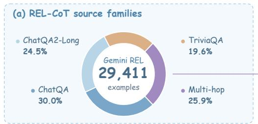

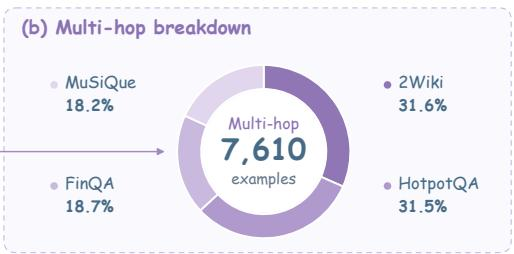  
Figure 7: REL-CoT source families (left) and the Multi-hop breakdown (right), before resolution expansion. Percentages use each panel’s total; the right panel combines long and original variants of each dataset.

## B.2 SUPERVISED FINE-TUNING DETAILS

REL-SFT initializes FOCUSVTC from Qwen3.5-9B (Qwen Team, 2026), using the settings in Table 7. Batch size counts packed sequences, and sequence length is measured in tokens.

Table 7: Stage 1: REL-SFT training hyperparameters.
<table><tr><td>Global batch size</td><td>Training steps</td><td>Learning rate</td><td>Weight decay</td><td>LR schedule</td><td>Warm-up steps</td><td>Visual encoder</td><td>Max. packed seq. length</td></tr><tr><td>8</td><td>7,000</td><td>10-6</td><td>0.01</td><td>Cosine</td><td>325</td><td>Frozen</td><td>32,768</td></tr></table>

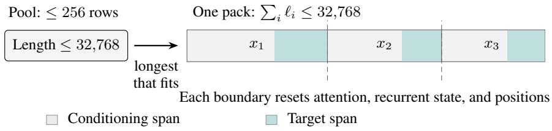  
Figure 8: SFT sequence packing. Gray spans denote conditioning inputs; teal spans denote assistant targets.

We pack complete examples into 32,768-token sequences (Figure 8). Lengths are measured after chat templating and image preprocessing, including assistant targets; longer examples are excluded. Each worker selects the longest fitting sample from a pool of up to 256, refilling below 128 samples or before closing a pack with no fitting candidate. SFT uses FSDP2, FlashAttention-2, and fused AdamW, achieving 99.85% packing occupancy and approximately 51% model FLOPs utilization (MFU). The near-full packs minimize unused sequence capacity, while the observed MFU reflects efficient use of the training hardware. Training takes 26.7 hours on eight GPUs.

## B.3 GROUP RELATIVE POLICY OPTIMIZATION DETAILS

GRPO starts from the REL-SFT checkpoint with the settings in Table 8. The direct-GRPO baseline FocusVTC w/o SFT also trains for 150 updates. Global and PPO mini-batch sizes count prompts before rollout expansion; each update samples 64 $\times \ 8 \ = \ 5 1 2$ trajectories. The PPO micro-batch counts trajectories per GPU. All prompt, response, and generation lengths are in tokens (1K = 1,024).

Table 8: Stage 2: GRPO training hyperparameters.
<table><tr><td colspan="10">Global Train</td><td colspan="5">PPO micro-</td><td colspan="3"></td></tr><tr><td>batch steps</td><td></td><td>LR</td><td>Weight decay</td><td>LR schedule</td><td>Warmup steps</td><td>Visual encoder</td><td>response</td><td>prompt / Max. gen. Rollouts /</td><td>/ turn</td><td>prompt</td><td>PPO mini-batch</td><td>batch / GPU</td><td>Temp. / top-p</td><td>turns / tool calls</td><td></td><td>g exponent Clip γ</td><td>€</td></tr><tr><td>64</td><td>150</td><td> $1 0 ^ { - 6 }$ </td><td>0.01</td><td>Constant</td><td>0</td><td></td><td>Trainable 8K / 10K</td><td></td><td>2K</td><td>8</td><td>64</td><td>1</td><td>1.0 / 1.0</td><td></td><td>9/8</td><td>2</td><td>0.2</td></tr></table>

Online rollouts are sampled independently of the data-filtering trajectories in Section 3.4. The postprompt budget includes tool observations. Rollouts end with an <answer>...</answer> block or an exhausted length or interaction budget. Training takes approximately 139.2 hours on eight GPUs.

The policy uses Enhance Region(page, bbox) to request regions from aligned 144-DPI pages. Page indices are one-based, and bounding boxes satisfy $0 ~ \leq ~ x _ { 1 } ~ < ~ x _ { 2 } ~ \leq ~ 1 0 0 0$ and $0 \leq y _ { 1 } < y _ { 2 } \leq 1 0 0 0$ . Malformed or unexecutable calls consume an attempt and return an error. Table 9 summarizes reward behavior for representative interaction cases.

Table 9: Representative cases under the reward function. Unless otherwise stated, terminal answer formatting is valid.
<table><tr><td>Situation</td><td>Consequence</td></tr><tr><td>Fully correct answer, no tool calls Answer not fully correct</td><td> $R _ { \mathrm { a c c } } = R _ { \mathrm { f m t } } = 1$  and  $R _ { \mathrm { t o o l } } = 0 ,$  giving  $R = 1 .$  The tool-bonus term is gated off.</td></tr><tr><td>Full-page request</td><td> $s _ { i } = 1 \colon$  the area factor is zero, so this call contributes zero to the</td></tr><tr><td></td><td>matching sum. Repeated requests for the same evi- Each annotated evidence region can be matched at most once.</td></tr><tr><td>dence</td><td></td></tr><tr><td>Excess or malformed tool calls</td><td>Both set  $R _ { \mathrm { f m t } } = 0 .$  For  $N > E , E _ { \mathrm { c a l l } } = E / N < 1 ;$  malformed calls count in N but are excluded from matching.</td></tr><tr><td>Initial view at 144 DPI</td><td> $g ( 1 4 4 ) = 0 ,$  giving  $R = 0 . 8 R _ { \mathrm { a c c } } + 0 . 2 R _ { \mathrm { f m t } } .$ </td></tr></table>

## C EVALUATION RESULTS DETAIL AND EFFICIENCY

Unless otherwise specified, we evaluate Qwen3.5-9B (with and without tools) and FocusVTC in thinking mode using the official Qwen3.5 sampling settings (Qwen Team, 2026): temperature = 1.0, top-p = 0.95, top-k = 20, min-p = 0.0, presence penalty = 1.5, and repetition penalty = 1.0. Tool-enabled evaluation allows up to eight calls over nine rounds, with an 8,192-token limit per generation and a 20,480-token post-prompt trajectory limit, including tool observations. The training examples used for REL-SFT and GRPO do not overlap with the test examples in any of our evaluation benchmarks.

## C.1 TOKEN-COST ACCOUNTING

Prompt and extra observations. Let P be the number of tokens in the initial prompt and O the total number of extra observation tokens appended during tool use, including returned images and environment text. For RULER, MRCR, and LongBench, we define input compression as

$$
C _ { \mathrm { c o n t e x t } } = \frac { T _ { \mathrm { t e x t } } } { P + O } ,\tag{12}
$$

where $T _ { \mathrm { t e x t } }$ is the token count of the text-context reference. Each extra observation is counted once; Table 10 reports token costs for RULER and LongBench, including the RULER decomposition underlying Figure 6.

Table 10: Token costs and compression. P and O denote initial prompt and extra-observation tokens. Text references are 8,400/9,201/11,313 tokens for RULER v1/v2 and LongBench.
<table><tr><td rowspan="2">Benchmark</td><td colspan="3">Glyph (Cheng et al., 2026)</td><td colspan="4">FocusVTC (Ours)</td></tr><tr><td>DPI</td><td>P</td><td>Text/P</td><td>P</td><td>O</td><td>P + 0</td><td> $\mathrm { T e x t } / ( P + O )$ </td></tr><tr><td>RULER v1</td><td>48</td><td>1,491</td><td>5.6×</td><td>1,218</td><td>1,768</td><td>2,986</td><td>2.8×</td></tr><tr><td></td><td>60</td><td>2,061</td><td>4.1×</td><td>1,655</td><td>1,392</td><td>3,047</td><td>2.8×</td></tr><tr><td></td><td>72</td><td>2,765</td><td>3.0×</td><td>2,154</td><td>723</td><td>2,877</td><td>2.9×</td></tr><tr><td rowspan="5"></td><td>84</td><td>3,517</td><td>2.4×</td><td>2,729</td><td>698</td><td>3,427</td><td>2.5×</td></tr><tr><td>96</td><td>4,522</td><td>1.9×</td><td>3,544</td><td>681</td><td>4,225</td><td>2.0×</td></tr><tr><td>120</td><td>6,731</td><td>1.2×</td><td>5,277</td><td>634</td><td>5,911</td><td>1.4×</td></tr><tr><td>144</td><td>9,153</td><td>0.9×</td><td>7,290</td><td>625</td><td>7,915</td><td>1.1×</td></tr><tr><td>48</td><td>2,209</td><td>4.2×</td><td>1,495</td><td>1,861</td><td>3,356</td><td>2.7×</td></tr><tr><td>RULER v2</td><td>60</td><td>2,793</td><td>3.3×</td><td>1,902</td><td>1,458</td><td>3,360</td><td>2.7×</td></tr><tr><td></td><td>72</td><td>3,440</td><td>2.7×</td><td>2,399</td><td>852</td><td>3,251</td><td>2.8×</td></tr><tr><td rowspan="4"></td><td>84</td><td>4,138</td><td>2.2×</td><td>3,050</td><td>834</td><td>3,884</td><td>2.4×</td></tr><tr><td>96</td><td>5,032</td><td>1.8×</td><td>3,731</td><td>803</td><td>4,534</td><td>2.0×</td></tr><tr><td>120</td><td>7,291</td><td>1.3×</td><td>5,450</td><td>818</td><td>6,268</td><td>1.5×</td></tr><tr><td>144</td><td>10,052</td><td>0.9×</td><td>7,585</td><td>834</td><td>8,419</td><td>1.1×</td></tr><tr><td>LongBench</td><td>72</td><td>3,691</td><td>3.1×</td><td>3,014</td><td>723</td><td>3,737</td><td>3.0×</td></tr></table>

At 72 DPI, extra observations account for 25.1%/26.2% of RULER v1/v2 input tokens, giving compression of $2 . 9 \times / 2 . 8 \times$ These ratios divide the mean text-reference length by the mean P + O length. For MRCR’s longest bin, the text reference is 197,909 tokens and the prompt is 53,181 tokens. Adding the two/four/eight-needle observations of 7,296/10,290/13,048 tokens gives $3 . 3 \times / 3 . 1 \times / 3 . 0 \times$ compression.

## C.2 END-TO-END LATENCY

We compare Qwen3.5-9B Text and FocusVTC on 300 paired MRCR four-needle examples (64K– 128K). Each system uses two NVIDIA A100 80GB GPUs (TP=2), processing one request at a time. We time each example once after warmup, using greedy decoding with thinking enabled and an 8,192-token cumulative generation budget. Online latency is computed by subtracting each example’s page-rendering time from its recorded end-to-end latency, treating rendering as offline preprocessing. It includes image loading, processing and encoding, all inference rounds, and tool execution.

Table 11: End-to-end latency on 300 paired MRCR four-needle examples with 64K–128K contexts. Values exclude recorded page-rendering time but include all online inference and tool rounds. Prefill timings are measured separately; tool-round prefill is cumulative per sample. Lower is better.
<table><tr><td>Model</td><td>Latency (s)</td><td>Initial prefill (s)</td><td>Tool-round prefill (s/sample)</td></tr><tr><td>Text (Qwen3.5-9B)</td><td>187.09</td><td>6.42</td><td></td></tr><tr><td>FocusVTC (Ours)</td><td>67.06</td><td>4.14</td><td>1.34</td></tr></table>

Table 11 shows that FocusVTC reduces mean online latency from 187.09 s to 67.06 s, a 64.2% reduction (2.79× speedup). Text’s longer input is accompanied by substantially more generated tokens: 5,411.30 per example versus 1,529.77 for FocusVTC, including thinking, answers, and all tool rounds. These results show that FocusVTC’s compressed visual input is accompanied by fewer generated tokens and lower online latency.

## C.3 DETAILED LONG-CONTEXT RESULTS

Tables 12, 13, and 14 report detailed LongBench, VTCBench, and MRCR results for the training and tool-use variants. VTCBench (Zhao et al., 2025) is designed specifically to evaluate longcontext understanding under visual text compression. Retrieval focuses on locating and aggregating information, Reasoning on inferring associations beyond direct lexical matching, and Memory on recalling and using information from long dialogue histories. On LongBench, the gap between English and Chinese passage retrieval narrows from 50.27 points for FocusVTC w/o GRPO to 0.50 for FocusVTC, whose final scores are 98.50 and 98.00. On MRCR, FocusVTC’s scores decrease with needle count in every context-length bin; even at 4K–8K, the scores are 82.25, 65.89, and 50.84 for two, four, and eight needles, respectively.

Table 12: Detailed LongBench scores (%) for training-stage variants. Avg is the unweighted arithmetic mean of the 11 displayed non-code task scores. The final FocusVTC row is included as reference. Vision denotes 72-DPI pages. +tools uses tool access without additional training.
<table><tr><td>Model / stage</td><td>Input</td><td colspan="2">Single-doc QA</td><td colspan="2">Multi-doc QA</td><td colspan="2">Summarization</td><td colspan="2">Few-shot</td><td colspan="2">Synthetic</td><td colspan="2">Overall</td></tr><tr><td></td><td>QP</td><td></td><td>MF-En MF-Zh</td><td>DuR</td><td></td><td>2Wiki</td><td>MNews</td><td>QMSum SAMSum Trivia PR-En PR-Zh</td><td></td><td></td><td></td><td></td><td>Avg</td></tr><tr><td>FocusVTC w/o SFT (Ours)</td><td>Vision 43.77</td><td></td><td>46.73</td><td>53.80</td><td>26.74</td><td>61.26</td><td>24.07</td><td>23.95</td><td>31.56</td><td>85.31</td><td>72.32</td><td>72.74</td><td>49.30</td></tr><tr><td>FocusVTC w/o GRPO (Ours)</td><td>Vision 34.52</td><td></td><td>39.94</td><td>31.77</td><td>14.73</td><td>56.54</td><td>17.47</td><td>16.69</td><td>31.64</td><td>89.23</td><td>67.12</td><td>16.85</td><td>37.86</td></tr><tr><td>FocusVTC w/o GRPO+tools (Ours)</td><td>Vision</td><td>16.46</td><td>32.70</td><td>23.16</td><td>8.42</td><td>49.70</td><td>2.96</td><td>3.79</td><td>3.88</td><td>56.42</td><td>65.19</td><td>16.83</td><td>25.41</td></tr><tr><td>FocusVTC-50 (Ours)</td><td>Vision</td><td>47.61</td><td>41.73</td><td>49.21</td><td>29.80</td><td>52.73</td><td>21.47</td><td>12.15</td><td>30.78</td><td>87.21</td><td>94.05</td><td>93.66</td><td>50.95</td></tr><tr><td>FocusVTC-100 (Ours)</td><td>Vision 46.90</td><td></td><td>45.06</td><td>54.22</td><td>30.10</td><td>61.14</td><td>22.47</td><td>20.06</td><td>32.76</td><td>90.10</td><td>95.73</td><td>96.00</td><td>54.05</td></tr><tr><td>FocusVTC w/o tools (Ours)</td><td>Vision 34.02</td><td></td><td>41.38</td><td>21.70</td><td>13.26</td><td>59.62</td><td>17.47</td><td>12.36</td><td>9.10</td><td>81.83</td><td>79.00</td><td>35.26</td><td>36.82</td></tr><tr><td>FocusVTC (Ours)</td><td>Vision 47.71</td><td></td><td>48.95</td><td>57.78</td><td>30.21</td><td>69.04</td><td>23.57</td><td>21.71</td><td>33.87</td><td>91.01</td><td>98.50</td><td>98.00</td><td>56.40</td></tr><tr><td>Qwen3.5-9B+tools</td><td></td><td></td><td></td><td></td><td></td><td></td><td></td><td></td><td></td><td></td><td></td><td></td><td></td></tr><tr><td>(Qwen Team, 2026)</td><td>Vision 15.58</td><td></td><td>34.22</td><td>27.10</td><td>22.03</td><td>47.81</td><td>3.16</td><td>4.51</td><td>4.88</td><td>61.70</td><td>66.01</td><td>12.40</td><td>27.22</td></tr></table>

Table 13: Detailed VTCBench results (%) for training-stage variants. Length labels are bin upper bounds (K tokens). Each Avg is the unweighted arithmetic mean of the four displayed length-bin scores. The final FocusVTC row is included as reference. Vision denotes 72-DPI pages. +tools uses tool access without additional training.
<table><tr><td>Model / stage</td><td colspan="2">Input</td><td colspan="4">Retrieval</td><td colspan="4">Reasoning</td><td colspan="5">Memory</td></tr><tr><td></td><td>8</td><td></td><td>16</td><td>32</td><td>64</td><td>Avg</td><td>8</td><td>16</td><td>32 64</td><td>Avg</td><td>8</td><td>16</td><td>32</td><td>64</td><td>Avg</td></tr><tr><td>FocusVTC w/o SFT (Ours)</td><td>Vision</td><td>99.83</td><td>85.55</td><td>82.22</td><td>81.07</td><td>87.17</td><td>50.88</td><td>49.09</td><td>33.96 18.65</td><td>38.15</td><td>31.24</td><td>22.21</td><td>21.57</td><td>19.20</td><td>23.56</td></tr><tr><td>FocusVTC w/o GRPO (Ours)</td><td>Vision</td><td>87.78</td><td>79.56</td><td>80.21</td><td>73.52</td><td>80.27</td><td>40.17</td><td>25.68</td><td>12.04 3.57</td><td>20.37</td><td></td><td>12.12 17.98</td><td>20.60</td><td>20.00</td><td>17.68</td></tr><tr><td>FocusVTC w/o GRPO+tools (Ours)</td><td>Vision</td><td>66.28</td><td>59.67</td><td>51.72</td><td>39.34</td><td>54.25</td><td>7.82</td><td>1.35</td><td>0.93 0.00</td><td>2.53</td><td>7.50</td><td>4.23</td><td>6.18</td><td>9.79</td><td>6.93</td></tr><tr><td>FocusVTC-50 (Ours)</td><td>Vision</td><td>96.96</td><td>80.65</td><td>81.97</td><td>65.56</td><td>81.29</td><td>38.51</td><td>29.37</td><td>14.22 7.00</td><td>22.28</td><td>17.63</td><td>13.65</td><td>18.06</td><td>24.99</td><td>18.58</td></tr><tr><td>FocusVTC-100 (Ours)</td><td>Vision</td><td>97.94</td><td>87.85</td><td>85.34</td><td>77.05</td><td>87.05</td><td>39.53</td><td>29.73</td><td>16.67 11.21</td><td>24.29</td><td>25.53</td><td>17.84</td><td>20.85</td><td>25.64</td><td>22.47</td></tr><tr><td>FocusVTC w/o tools (Ours)</td><td>Vision</td><td>72.94</td><td>75.14</td><td>58.62</td><td>62.30</td><td>67.25</td><td>10.15</td><td>1.35</td><td>0.93 0.00</td><td>3.11</td><td>26.27</td><td>20.50</td><td>24.88</td><td>20.15</td><td>22.95</td></tr><tr><td>FocusVTC (Ours)</td><td>Vision</td><td>98.39</td><td>93.37</td><td>85.34</td><td>86.89</td><td>91.00</td><td>45.24</td><td>43.24</td><td>35.19 21.33</td><td>36.25</td><td>32.98</td><td>22.07</td><td>24.64</td><td>25.64</td><td>26.33</td></tr><tr><td>Qwen3.5-9B+tools (Qwen Team, 2026)</td><td></td><td>Vision 58.26</td><td>59.12</td><td>45.69</td><td>34.43</td><td>49.38</td><td>7.19</td><td>1.35</td><td>2.78 0.00</td><td>2.83</td><td>3.08</td><td>2.56</td><td>5.80</td><td>1.77</td><td>3.30</td></tr></table>

Table 14: MRCR performance (%) for two, four, and eight needles. Length labels are bin upper bounds (K tokens). Avg is the unweighted arithmetic mean of the six length-bin scores. Vision denotes 72-DPI pages. +tools uses tool access without additional training.
<table><tr><td rowspan=1 colspan=8>Model / stage              Input          2 needles</td><td rowspan=1 colspan=2>4 needles</td><td rowspan=1 colspan=1></td><td rowspan=1 colspan=1>8 needles</td><td rowspan=1 colspan=1></td></tr><tr><td rowspan=1 colspan=8>8  16 32 64 128256AvgLLaMA-3.1-8B</td><td rowspan=1 colspan=2>8  16 32 64 128256</td><td rowspan=1 colspan=1>Avg</td><td rowspan=1 colspan=1>8  16 32 64 128256</td><td rowspan=1 colspan=1>Avg</td></tr><tr><td rowspan=2 colspan=3>(Grattafiori et a</td><td></td><td></td><td></td><td></td><td></td><td></td><td></td><td></td><td></td><td></td></tr><tr><td rowspan=1 colspan=6>l., 2024)        Text54.2753.21 51.05 29.81 24.98 20.903</td><td rowspan=1 colspan=1>9.04</td><td rowspan=1 colspan=2>33.42 25.97 22.73 26.97 12.686.00</td><td rowspan=1 colspan=1>21.30</td><td rowspan=1 colspan=1>23.80 17.69 19.85 17.72 11.797.801</td><td rowspan=1 colspan=1>6.44</td></tr><tr><td rowspan=2 colspan=7>Qwen2.5-7B(Yang et al., 2025b)           Text45.92 51.07 46.9734.67 37.57 37.6042.30</td><td></td><td></td><td></td><td></td><td></td><td></td></tr><tr><td rowspan=1 colspan=1>37.60</td><td rowspan=1 colspan=1>42.30</td><td rowspan=1 colspan=2>25.96 20.1319.93 24.2517.2912.301</td><td rowspan=1 colspan=1>9.98</td><td rowspan=1 colspan=1>17.64 19.4812.41 14.8014.24 13.701</td><td rowspan=1 colspan=1>5.38</td></tr><tr><td rowspan=3 colspan=7>Qwen3-8B(Yang et al., 2025a)           Text58.95 41.18 36.18 24.99 20.8917.5033.28</td><td></td><td></td><td></td><td></td><td></td><td></td></tr><tr><td></td><td rowspan=2 colspan=2>29.34 22.67 20.34 23.6319.1115.502</td><td rowspan=2 colspan=1>1.77</td><td rowspan=2 colspan=1>18.75 19.6916.81 17.8615.00 12.601</td><td></td></tr><tr><td></td><td rowspan=1 colspan=1>6.79</td></tr><tr><td rowspan=5 colspan=7>GLM-4-9B(Team GLM et al., 2024)        Text39.7715.8718.42 18.6318.4218.2021.55</td><td></td><td></td><td></td><td></td><td></td><td></td></tr><tr><td rowspan=4 colspan=5></td><td></td><td></td><td></td><td></td><td></td><td></td></tr><tr><td rowspan=3 colspan=1>21.55</td><td rowspan=3 colspan=1>15</td><td></td><td></td><td></td></tr><tr><td rowspan=2 colspan=1>14.11</td><td></td><td></td></tr><tr><td rowspan=1 colspan=1>14.559.659.349.478.978.501</td><td rowspan=1 colspan=1>0.08</td></tr><tr><td></td><td></td><td></td><td></td><td rowspan=1 colspan=3>Text54.9651.5948.59 43.44 41.48 39.0846.52</td><td rowspan=1 colspan=1>4652</td><td rowspan=1 colspan=2>36.72 35.02 34.5525.4425.82 21.6629.87</td><td></td><td></td><td rowspan=1 colspan=1>18.56</td></tr><tr><td></td><td></td><td></td><td></td><td></td><td></td><td></td><td rowspan=1 colspan=1></td><td></td><td></td><td></td><td></td><td></td></tr><tr><td rowspan=1 colspan=2>Glyph</td><td rowspan=1 colspan=1></td><td rowspan=1 colspan=4></td><td rowspan=1 colspan=1></td><td rowspan=1 colspan=2></td><td rowspan=1 colspan=1></td><td rowspan=1 colspan=1></td><td></td></tr><tr><td rowspan=1 colspan=8>(Cheng et al., 2026)          Vision 58.54 58.52 47.54 41.26 38.42 11.4842.63</td><td rowspan=1 colspan=2>34.56 39.26 33.71 21.96 19.436.922</td><td rowspan=1 colspan=1>5.97</td><td rowspan=1 colspan=1>19.04 22.61 25.47 14.74 14.622.941</td><td rowspan=1 colspan=1>6.57</td></tr><tr><td rowspan=1 colspan=8>FocusVTC w/o SFT (Ours)     Vision 74.77 72.32 54.81 52.91 46.37 41.1357.05</td><td rowspan=1 colspan=2>51.37 46.15 47.32 34.177 33.54 23.62</td><td rowspan=1 colspan=1>39.36</td><td rowspan=1 colspan=1>42.63 30.84 26.66 22.82 21.80 15.232</td><td rowspan=1 colspan=1>6.66</td></tr><tr><td rowspan=1 colspan=8>FocusVTC w/o GRPO (Ours)    Vision 64.19 62.79 48.05 46.28 30.10 18.2044.94</td><td rowspan=1 colspan=2>34.64 42.73 30.0033.57 20.4311.58</td><td rowspan=1 colspan=1>28.83</td><td rowspan=1 colspan=1>26.81 24.76 31.23 18.08 15.75 11.152</td><td rowspan=1 colspan=1>1.30</td></tr><tr><td rowspan=1 colspan=8>FocusVTC w/o GRPO+tools (Ours) Vision 41.36 14.77 23.75 25.02 15.11 13.4822.25</td><td rowspan=1 colspan=2>14.74 6.4513.58 28.44 17.759.561</td><td rowspan=1 colspan=1>5.09</td><td rowspan=1 colspan=1>10.47 8.83 13.48 11.28 8.930.77</td><td rowspan=1 colspan=1>8.96</td></tr><tr><td rowspan=1 colspan=8>FocusVTC-50 (Ours)         Vision 77.50 56.45 51.58 55.24 30.01 17.3948.03</td><td rowspan=1 colspan=2>62.00 43.12 42.40 31.19 20.2914.22</td><td rowspan=1 colspan=1>35.54</td><td rowspan=1 colspan=1>19.37 17.17 22.17 15.48 10.874.491</td><td rowspan=1 colspan=1>4.93</td></tr><tr><td rowspan=1 colspan=8>FocusVTC-100 (Ours)        Vision 79.39 68.12 55.96 55.68 39.58 28.6854.57</td><td rowspan=1 colspan=2>64.68 45.26 48.48 33.59 30.67 19.41</td><td rowspan=1 colspan=1>40.35</td><td rowspan=1 colspan=1>35.01 23.56 25.25 23.6917.11 10.022</td><td rowspan=1 colspan=1>2.44</td></tr><tr><td rowspan=1 colspan=8>FocusVTC w/o tools (Ours)     Vision 76.61 63.66 63.74 56.04 34.51 17.4552.00</td><td rowspan=1 colspan=2>45.22 53.62 47.44 37.06 25.87 16.70</td><td rowspan=1 colspan=1>37.65</td><td rowspan=1 colspan=1>28.31 32.47 22.67726.40 17.58 13.562</td><td rowspan=1 colspan=1>3.50</td></tr><tr><td rowspan=1 colspan=8>FocusVTC (Ours)           Vision 82.25 78.64 56.58 56.98 47.55 42.5660.76</td><td rowspan=1 colspan=2>65.89 49.50 54.23 37.29 41.97 22.36</td><td rowspan=1 colspan=1>45.21</td><td rowspan=1 colspan=1>50.84 33.65 28.80 28.36 26.90 15.693</td><td rowspan=1 colspan=1>0.71</td></tr><tr><td rowspan=1 colspan=8>Qwen3.5-9B+tools(Qwen Team, 2026)          Vision 37.67 25.6328.5712.4711.108.7620.70</td><td rowspan=1 colspan=3>24.32 17.54 14.5613.298.937.8614.42</td><td rowspan=1 colspan=2>10.29 9.566.128.244.203.366.96</td></tr></table>

## C.4 DETAILED RULER RESULTS AT 72 DPI

Tables 15 and 16 report the 72-DPI task-level results for the visual models and their training and tool configurations. RULER v1 is the original RULER benchmark (Hsieh et al., 2024), evaluated here on ten retrieval and QA tasks, excluding variable tracing and the two word-frequency tasks. RULER v2 extends evaluation from retrieval to retrieval combined with reasoning: it covers multikey retrieval (MK-NIAH), multi-value retrieval (MV-NIAH), and multi-document QA, each at four difficulty levels (Basic, Easy, Medium, and Hard), yielding twelve task–difficulty combinations. Each version’s Avg is the unweighted mean of its subset scores. For the two new measured variants, we recompute the v1 average over these ten tasks, excluding the three additional tasks in their run summaries. The retained v2 scorer permits relaxed matching on some tasks; neither run receives additional credit from reasoning text, which was not saved in the RULER predictions.

Table 15: RULER v1 task scores (%) at 72 DPI. Avg is the unweighted arithmetic mean of the 10 displayed task scores. Best and second-best scores are bold and underlined, respectively. Qwen3.5- 9B+tools uses tool access without additional training.
<table><tr><td>Model Avg</td><td colspan="8">Single-1 Single-2 Single-3 MKey-1 MKey-2 MKey-3 MValue MQuery QA-1 QA-2</td></tr><tr><td>Qwen3.5-9B</td><td>54.00</td><td>48.00</td><td>0.00</td><td>43.00</td><td>40.00 1.00</td><td>37.25</td><td>42.75</td><td>62.00 46.00 37.40</td></tr><tr><td>GLM-4.1V-9B</td><td>61.00</td><td>26.00</td><td>0.00</td><td>30.00</td><td>19.00 0.00</td><td>19.50</td><td>33.25</td><td>50.00 48.00 28.68</td></tr><tr><td>Glyph</td><td>74.00</td><td>76.00</td><td>44.00</td><td>69.00 37.00</td><td>2.00</td><td>70.75</td><td>74.50</td><td>64.00 64.00 57.53</td></tr><tr><td>FocusVTC w/o GRPO (Ours)</td><td>50.00</td><td>39.00</td><td>0.00</td><td>29.00</td><td>37.00 0.00</td><td>24.25</td><td>24.50</td><td>65.00 54.00 32.28</td></tr><tr><td>FocusVTC w/o GRPO+tools (Ours)</td><td>43.00</td><td>29.00</td><td>1.00</td><td>24.00</td><td>37.00 1.00</td><td>23.75</td><td>23.00</td><td>22.00 26.00 22.98</td></tr><tr><td>FocusVTC-50 (Ours)</td><td>82.99</td><td>82.73</td><td>46.03</td><td>73.50</td><td>66.15 37.59</td><td>54.36</td><td>71.10</td><td>77.27 68.58 66.03</td></tr><tr><td>FocusVTC-100 (Ours)</td><td>93.00</td><td>96.00</td><td>60.00</td><td>87.00</td><td>75.00 49.00</td><td>63.50</td><td>85.25</td><td>81.00 73.00 76.28</td></tr><tr><td>FocusVTC w/o tools (Ours)</td><td>51.00</td><td>45.00</td><td>0.00</td><td>38.00</td><td>42.00</td><td>1.00 30.00</td><td>30.00</td><td>64.00 65.00 36.60</td></tr><tr><td>FocusVTC (Ours)</td><td>98.00</td><td>100.00</td><td>72.00</td><td>97.00</td><td>96.00</td><td>46.00 96.25</td><td>98.50</td><td>89.00 81.00 87.38</td></tr><tr><td>FocusVTC w/o SFT (Ours)</td><td>85.53</td><td>85.26</td><td>51.59</td><td>81.69</td><td>80.13</td><td>33.24 79.53</td><td>82.70</td><td>81.35 71.08 73.21</td></tr><tr><td>Qwen3.5-9B+tools</td><td>43.00</td><td>32.00</td><td>2.00</td><td>20.00</td><td>42.00</td><td>1.00</td><td>22.50 16.50</td><td>20.00 26.00 22.50</td></tr></table>

## C.5 GENERAL MULTIMODAL CAPABILITIES

Table 17 lists the raw general multimodal scores from Figure 1(d), including Glyph and GLM-4.1V-9B, followed by the MMLongBench comparison. FOCUSVTC improves over Qwen3.5-9B on all

Table 16: RULER v2 task scores (%) at 72 DPI. Avg is the unweighted arithmetic mean of the 12 displayed task scores. Best and second-best scores are bold and underlined, respectively. Qwen3.5- 9B+tools uses tool access without additional training.
<table><tr><td>Model</td><td colspan="3">MK-NIAH</td><td colspan="3">MV-NIAH</td><td colspan="3">QA</td><td>Overall</td></tr><tr><td></td><td>Basic Easy Medium Hard Basic Easy Medium Hard Basic Easy</td><td></td><td></td><td></td><td></td><td></td><td></td><td>Medium Hard</td><td></td><td>Avg</td></tr><tr><td>Qwen3.5-9B</td><td>19.00 79.44</td><td>70.00</td><td>46.00 10.75</td><td>8.65</td><td>23.36</td><td></td><td>23.45 69.00 34.00</td><td>71.00</td><td>81.00</td><td>44.64</td></tr><tr><td>GLM-4.1V-9B</td><td>8.00 51.12</td><td>29.00</td><td>25.003.50</td><td>9.67</td><td>10.64</td><td></td><td>18.24 53.00 32.00</td><td>53.58</td><td>53.50 28.94</td><td></td></tr><tr><td>Glyph</td><td>16.00 67.15</td><td>45.00</td><td>43.00 9.25</td><td>5.72</td><td>17.02</td><td></td><td>34.05 86.00 93.00</td><td>78.35</td><td>80.36</td><td>47.91</td></tr><tr><td>FocusVTC w/o GRPO (Ours)</td><td>18.00 59.96</td><td>51.00</td><td>39.00 7.25</td><td>7.05</td><td>16.79</td><td></td><td>27.24 74.00 83.00</td><td>68.50</td><td>71.17 43.58</td><td></td></tr><tr><td>FocusVTC w/o GRPO+tools (Ours) 20.00 71.32</td><td></td><td>45.00</td><td>33.00 10.75</td><td>7.03</td><td>13.04</td><td></td><td>29.78 72.00 36.00</td><td>63.27</td><td>71.68</td><td>39.41</td></tr><tr><td>FocusVTC-50 (Ours)</td><td>56.82 90.05</td><td>75.48</td><td>69.38 31.94 38.12</td><td></td><td>51.07</td><td>54.98 90.88 </td><td>82.16</td><td>84.11</td><td>77.57</td><td>66.88</td></tr><tr><td>FocusVTC-100 (Ours)</td><td>64.00 95.61</td><td>80.00</td><td>75.00 36.50 43.87</td><td></td><td>57.41</td><td>60.11</td><td>194.00 82.00</td><td>87.00</td><td>78.75</td><td>71.19</td></tr><tr><td>FocusVTC w/o tools (Ours)</td><td>22.00 78.68</td><td>48.00</td><td>40.00 10.00</td><td>9.25</td><td>17.09</td><td></td><td>27.49 84.00 56.00</td><td>70.77</td><td>74.58</td><td>44.82</td></tr><tr><td>FocusVTC (Ours)</td><td>88.00 96.11</td><td>84.00</td><td>75.00 77.25</td><td>39.72</td><td>35.59</td><td>61.79 95.00</td><td>87.00</td><td>87.67</td><td>84.17</td><td>75.94</td></tr><tr><td>FocusVTC w/o SFT (Ours)</td><td>58.97 89.09</td><td>78.11</td><td>62.80 49.27 26.65</td><td></td><td>30.44</td><td></td><td>45.66 84.06 64.70</td><td>80.65</td><td>82.84</td><td>62.77</td></tr><tr><td>Qwen3.5-9B+tools</td><td>19.00 66.96</td><td>48.00</td><td>33.00 7.75</td><td>4.19</td><td></td><td>11.77</td><td>26.98 71.00 24.00</td><td>71.00</td><td>68.55</td><td>37.68</td></tr></table>

six general benchmarks and on MMLongBench image and text needle retrieval, while the remaining MMLongBench results are comparable overall.

Table 17: General multimodal scores from Figure 1(d) (top) and MMLongBench results (bottom). DocVQA and InfoVQA use ANLS; other entries retain their benchmark scales.
<table><tr><td>Model</td><td>OCRBench</td><td>DocVQA</td><td>MMMU</td><td>MME</td><td></td><td>ChartQA InfoVQA</td></tr><tr><td>Qwen3.5-9B (Qwen Team, 2026)</td><td>851</td><td>92.38</td><td>65.12</td><td>2424.02</td><td>85.96</td><td>74.76</td></tr><tr><td>Glyph (Cheng et al., 2026)</td><td>799</td><td>91.75</td><td>57.67</td><td>2253.13</td><td>72.76</td><td>71.89</td></tr><tr><td>GLM-4.1V-9B (V Team et al., 2025)</td><td>820</td><td>91.34</td><td>64.33</td><td>2392.53</td><td>70.76</td><td>70.52</td></tr><tr><td>FocusVTC (Ours)</td><td>860</td><td>92.43</td><td>66.73</td><td>2457.62</td><td>86.28</td><td>76.20</td></tr></table>

<table><tr><td>Model</td><td>VRAG</td><td>VH</td><td>NIAH image</td><td>NIAH text</td><td>Summ</td><td>DocQA</td></tr><tr><td>Qwen3.5-9B (Qwen Team, 2026)</td><td>61.12</td><td>56.10</td><td>45.04</td><td>71.82</td><td>29.19</td><td>68.96</td></tr><tr><td>FocusVTC (Ours)</td><td>61.00</td><td>57.05</td><td>49.82</td><td>76.11</td><td>28.40</td><td>67.27</td></tr></table>

## D LIMITATIONS

Despite promising improvements in the compression–performance balance, our current study is limited in model and training-data scale, which defines several directions for future research. We develop FOCUSVTC with a 9B-parameter multimodal backbone and 29.4K verified REL-CoT examples. While this setting demonstrates the effectiveness of adaptive-resolution reading, the ben efits of scaling model capacity and localization supervision remain to be established. Moreover, long-context compression must accommodate diverse languages, document layouts, and reasoning demands; the current training corpus represents only part of this broader space. Future work will therefore focus on extending the framework to larger backbones and expanding REL-CoT with more diverse documents and reasoning trajectories. We also plan to study adaptive enhancement at larger context scales, jointly evaluating answer quality and complete interaction cost. These extensions would help establish the scalability of selective visual reading and broaden its applicability while preserving general multimodal capabilities.

## E CASE STUDIES

## E.1 REASONING WITH PAGE AND REGION ANNOTATIONS

Figure 9 follows an annotated reasoning trace through Merlin and Arthur to the answer, Sir Ector.

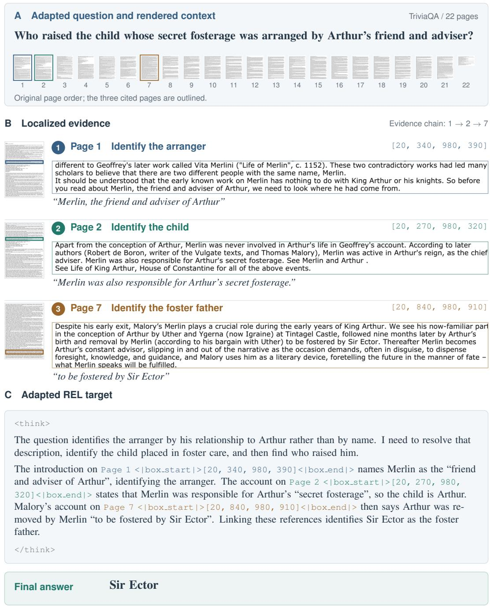  
Figure 9: A factual evidence chain in REL-CoT. The question and target are adapted; source pages and boxes are unchanged. (A) A factual question over 22 pages (72-DPI thumbnails). (B) 144- DPI excerpts linking Merlin, Arthur, and Sir Ector; box coordinates are normalized to [0, 1000]. (C) Initial question analysis followed by sentence-embedded page–box citations and a short, directly verifiable answer.

Page 6 / High-DPI region / 144 DP   
Passage 7:   
Adam Smith Prize   
The Adam Smith Prizes are prizes currently awarded for the best overall examination nerformance and hest dissertation ir   
Part IIB of the Economics Tripos (the graduation examination for economics undergraduates) at the University of   
Cambridge The prize - named after Scottish philosonber and economist Adam Smith s was originally established in 1891   
and awarded triennially for the best submitted essay on a subiect of the writer's choice

## E.2 ADAPTIVE READING ACROSS PAGES

Input MuSiQue 11 (adapted) / 13 pages / 72 DPI   
Answer the question based on the given passages. Only give me the answer and do not output any other words.   
The following are given passages.

The user is asking about who gives out a prize named after the author of “Lectures on Jurisprudence”. I need to find out who wrote “Lectures on Jurisprudence” and then find information about a prize named after that author.

Enhance Region(   
page=3,   
bbox=[20, 199, 995, 245]   
)   
Original-page coordinates / [0,1000]

Enhanced region from page 3, read from the aligned 144- DPI source page.

Passage 4:   
Lectures on Jurisprudence   
Lectures on Jurisprudence, also called Lectures on Justice, Police, Revenue and Arms (1763) is a collection of Adam Smith's   
lectures, comorising notes taken from his early lectures. It contains the formative ideas behind The Wealth of Nations.

Based on the first zoomed region, I can see that “Lectures on Jurisprudence” is a collection of Adam Smith’s lectures. So Adam Smith is the author of “Lectures on Jurisprudence”. Now I need to find information about a prize named after Adam Smith. Let me look at page 6 which appears to contain information about various awards and prizes.

1. From Passage 4 on Page 3, “Lectures on Jurisprudence, also called Lectures on Justice, Police, Revenue and Arms (1763) is a collection of Adam Smith’s lectures, comprising notes taken from his early lectures.” This confirms Adam Smith is the author of Lectures on Jurisprudence.

2. From Passage 7 on Page 6, The Adam Smith Prize is “named after Scottish philosopher and economist Adam Smith” and “The Adam Smith Prizes are prizes currently awarded for the best overall examination performance and best dissertation in Part IIB of the Economics Tripos (the graduation examination for economics undergraduates) at the University of Cambridge.”

Figure 10: An adapted MuSiQue illustration of selective enhancement. The question, source pages, reasoning excerpts, and answer are retained from the recorded Verdana example; tool-call boxes and observations are adapted for illustration. Enhance Region reads local passages on pages 3 and 6 from aligned 144-DPI sources, using original-page coordinates in [0, 1000]. Insets enlarge text within these enhanced regions.