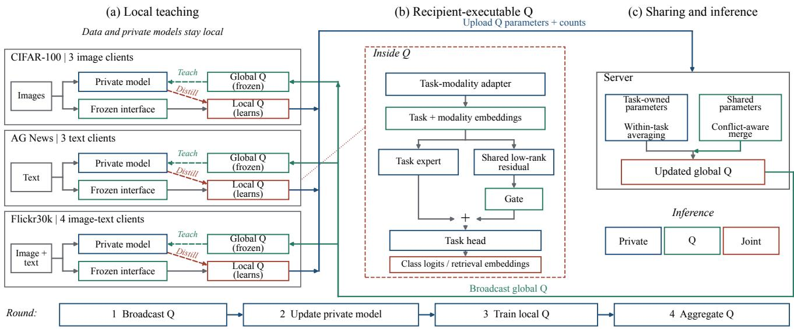
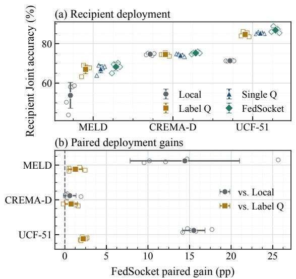
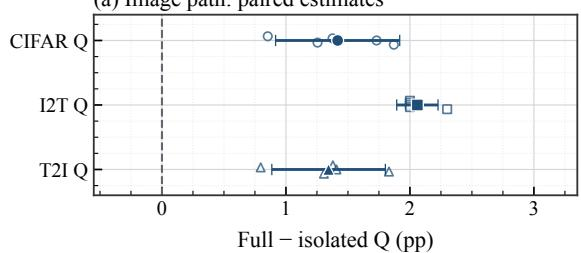
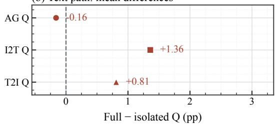
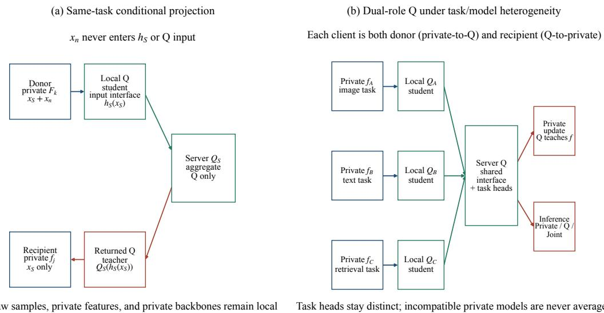
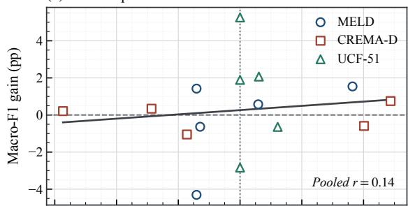
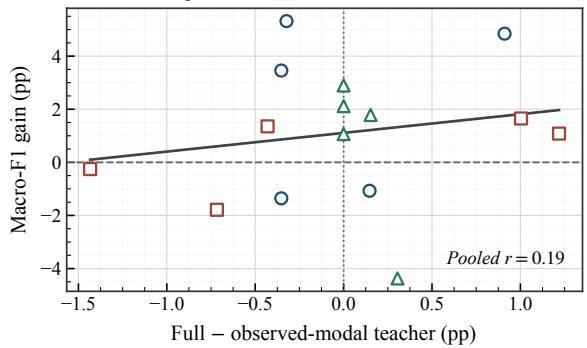
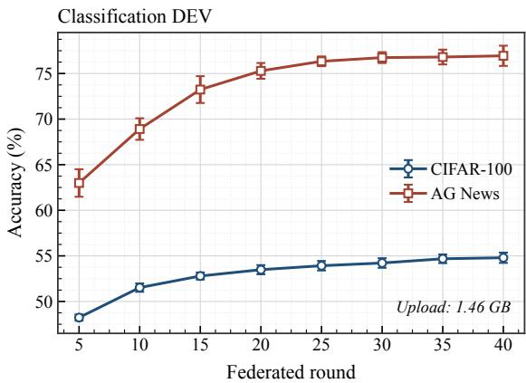
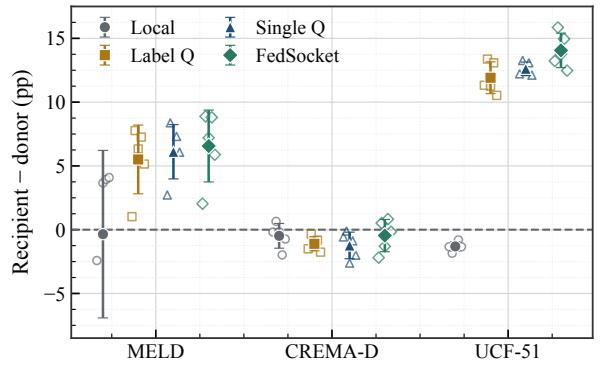

# FedSocket: Recipient-Executable Knowledge Exchange for Heterogeneous Multimodal Federated Learning

Xinyuan Zhao

Sun Yat-sen University

## Abstract

Federated knowledge must remain usable by recipients with different modalities, private architectures, and tasks. We present FedSocket, which makes recipient execution a design requirement ofthe exchanged model. A shared Q combines recipient-computable inputs, task-owned outputs, and ownership-aware aggregation, connecting heterogeneous private models through a common prediction interface. Private models teach local Q copies; the returned Q supports local learning and Joint inference, with only Q parameters and counts exchanged. Across six datasets, FedSocket improves missing-modality recipient accuracy over Local by 14.44 and 15.51 percentage points on MELD and UCF-51. Under matched inference capacity, Joint exceeds independent ensembles by 11.06 points in UCF-51 accuracy and 4.87 points in mean bidirectional Flickr30k R@1. Joint also improves over Q alone on all four heterogeneous endpoints, demonstrating the value ofcombining local and exchanged predictions. Teacher controls, sharing-path interventions, and component factorials identify the roles of supervision, sharing, and deployment. FedSocket makes exchanged knowledge directly usable from federated training to recipient inference.

## 1. Introduction

Multimodal federated learning connects clients that differ in what they observe, how they model it, and what they predict. A video–audio donor and a video-only recipient share a task but have different inputs; an image classifier and an image–text retriever share a modality but have different outputs. Donor-only features prevent recipient execution, while incompatible task heads prevent direct output aggregation. Knowledge exchange must address both mismatches while preserving local model choice.

Parameter averaging shares a common model [14, 15]; distillation, messenger models, and prototypes accommodate heterogeneous private models [12, 22, 25, 26]. Multimodal methods address modality selection, incomplete inputs, representation exchange, and fusion [7, 16, 18, 21, 28]. These advances motivate a joint compatibility requirement: exchanged knowledge must accept available inputs, produce task-valid outputs, and support aggregation across clients. Its usefulness should persist through deployment.

We introduce FedSocket, a recipient-executable knowledge interface realized by a shared Q model. Fixed modality mappings decouple Q from private encoders. Task-owned heads preserve classification and retrieval semantics, while a gated shared residual carries cross-task updates. Private models teach local Q copies; the server returns their aggregated knowledge for local learning and Joint prediction. Only Q parameters and counts are communicated.

FedSocket makes the same exchanged predictor valid across input, task, and deployment boundaries. For example, CIFAR and Flickr share image-connected parameters while retaining classification and retrieval outputs; AG and Flickr share the text path. The returned Q transfers knowledge during training and remains executable at the recipient. Across six datasets, teacher controls, path isolation, and capacity-matched alternatives separately test how Q learns, shares, and contributes to prediction.

Our contributions are:

• Recipient-executable knowledge. We jointly specify input, output, and aggregation compatibility, enabling shared prediction across heterogeneous modalities, private architectures, and tasks.

• Task-valid sharing from training to deployment. Q separates task-owned prediction blocks from gated crosstask residuals, learns from private models, and returns for local teaching and inference. Path isolation tests the shared connection.

• Controlled gains across six datasets. Capacity-matched alternatives establish deployment value; teacher and component controls identify learning and sharing effects, complemented by backbone and partition analyses.

  
Figure 1. One exchanged model for local teaching, cross-task sharing, and recipient prediction. (a) Private models teach local Q copies through recipient-computable inputs. (b) Task-owned branches preserve output semantics while a gated residual shares knowledge. (c) Compatible blocks are aggregated and returned for local learning and Joint inference. Only Q parameters and counts cross the boundary.

## 2. Related Work

Heterogeneous federated knowledge exchange. FedAvg aggregates a shared model, and FedProx stabilizes local optimization under statistical and systems heterogeneity [14, 15]. Knowledge distillation transfers predictions between models [11], allowing architectures to differ. FedMD uses predictions on common public examples [12]; FedGEMS selectively fuses client knowledge for a larger server model, and FedET uses heterogeneous ensembles [4, 5]. FedProto exchanges class prototypes to regularize local models [22]. These approaches provide different exchange objects with corresponding input, output, and representation requirements.

FML retains personalized models while aggregating a mutually distilled meme model [19]; FedKD shares a small mentee trained with local mentors through adaptive mutual distillation and compressed updates [25]. MH-pFLID uses a public-data-free messenger with receiver and transmitter modules for heterogeneous private architectures [26]. Fed-Socket builds on shared-model exchange by coupling recipient computation with parameter ownership: classifiers and retrievers share compatible Q blocks while retaining taskvalid outputs, and recipients reuse the returned Q in Joint inference. This coupled interface is the focus of our contribution. Table 14 compares exchange requirements and evaluated deployments.

Multimodal federation and missing modalities. Fed-Multimodal benchmarks modality heterogeneity [8]. FedMSplit adapts multimodal multi-task collaboration to heterogeneous active sensors, while Harmony disentangles multimodal training to exploit modality heterogeneity [2, 16]. MFedMC and BMSFed select clients or modality components to control communication and modality bias [7, 30]. Federated prompt tuning aligns instructions under heterogeneous and incomplete multimodal inputs [18]; ModalityMirror and TACTFL transfer or align information under missing modalities [9, 20]. FedSocket instead makes the exchanged predictor itself executable after aggregation across private architectures and task outputs.

Cross-task representation exchange. CreamFL uses public image–text representations to bridge model, modality, and task gaps [28]. FedHTCM couples cross-moda distillation with task-conflict handling [27]; FedAMB addresses modality dominance through adaptive distillation [10]; FedAFD combines alignment, adversarial fusion, and distillation [21]. FedSocket exchanges compatible Q parameters while retaining classification and retrieval heads within their owning tasks. Image/text isolation measures the utility of the resulting shared paths.

Transfer objectives and multimodal optimization. Contrastive representation distillation and cross-modal KD improve knowledge transfer between representations or modalities [3, 23]. OGM and PMR address imbalanced multimodal optimization [6, 17]. Our conditional target follows Bregman prediction [1], and compatible shared updates use PCGrad-style projection [29].

## 3. Recipient-Executable Knowledge Exchange

Client $k \in \mathcal { K }$ owns local data $\mathcal { D } _ { k } = \{ ( x _ { i } ^ { \mathcal { M } _ { k } } , y _ { i } ) \}$ and private model $f _ { k } ( \cdot ; \theta _ { k } )$ , where $\mathcal { M } _ { k }$ denotes available modalities. Same-task donors observe $( x _ { S } , x _ { n } )$ and recipients observe $x _ { S } ;$ heterogeneous tasks may have distinct label or retrieval spaces. Private parameters $\theta _ { k }$ are never aggregated.

A fixed modality mapping $h _ { m }$ supplies $u ^ { m } = h _ { m } ( x ^ { m } )$ to $Q ( \cdot ; \phi )$ with task and modality identifiers. The exchange contract has three obligations (Fig. 1).

Input computability. Every Q input uses an available modality independently of private encoder states. Clients execute the same $h _ { m }$ for modality m while retaining their native private architectures.

Output validity. Each task supervises its own classification or retrieval outputs; local distillation compares predictions within that task’s output space.

Aggregation ownership. Corresponding Q blocks are merged according to ownership. Shared residuals carry cross-task updates, and task-specific heads are averaged within their owning task. Input choice determines who can execute Q, task ownership determines what it predicts, and aggregation ownership determines where each update is shared. The three choices are coupled: a common input interface makes shared parameters reusable, while taskowned heads translate the resulting representation into valid local outputs. Classification and retrieval clients thus reuse an aggregated predictor while retaining different private architectures and output spaces.

## 4. FedSocket: Learning and Deploying Q

## 4.1. Recipient-Computable Q and Task-Owned Outputs

For a complete-modality donor with temperature-scaled distribution $t _ { k } ( x _ { S } , x _ { n } )$ , the ideal within-task target available through $z = h _ { S } ( x _ { S } )$ is

$$
Q _ { S } ^ { * } ( z ) = \mathbb { E } _ { D } [ t _ { k } ( x _ { S } , x _ { n } ) \mid h _ { S } ( x _ { S } ) = z ] .\tag{1}
$$

This forward-KL projection [1] motivates learning donor behavior from observed inputs, with local labels anchoring the target to the recipient task. Its population interpretation and anchoring bound are in Sec. C.

Q reads fixed local features, independently of private encoders. The task-heterogeneous interface uses frozen ResNet-18 image and GloVe-mean text features projected to $\mathbb { R } ^ { 2 5 6 }$ . For task t and modality m, an adapter and learned embeddings form $\boldsymbol { b } = A _ { t , m } ( \boldsymbol { u } ) + \boldsymbol { e } _ { t } + \boldsymbol { e } _ { m }$ . Q combines a task-private expert and a gated shared residual:

$$
q _ { t , m } ( u ) = E _ { t } ( b ) + \sigma ( g _ { t } ) R ( b ) .\tag{2}
$$

Hidden width is 256 and residual rank is 48. Classification heads are task-specific; Flickr uses a normalized retrieval head. Shared residuals and modality embeddings carry exchange across tasks; owned heads preserve their output semantics. Private models include MLP/CNN/Transformer recipients, ResNet-18 image classifiers, BiGRU text classifiers, and modality-specific retrieval encoders (Sec. I).

## 4.2. Bidirectional Local Knowledge Transfer

Private models first warm up on local labels. At each round, global Q is frozen while the private model learns; a trainable local Q copy then learns from the private model. For classification, with logits $p , q ,$ label-smoothed cross-entropy and reliability-weighted distillation give

$$
\begin{array} { r l } & { \mathcal { L } _ { \mathrm { p r i v } } = \mathrm { C E } _ { \mathrm { l s } } ( p , y ) + \lambda _ { \mathrm { K D } } \mathcal { L } _ { \mathrm { R K D } } ( p , \mathrm { s g } ( q ) ; y ) } \\ & { \quad \quad \quad + \lambda _ { \mathrm { f u s } } \mathcal { L } _ { \mathrm { f u s } } ( p , q , y ) , } \end{array}
$$

$$
\begin{array} { r } { \mathcal { L } _ { Q } = \mathrm { C E } _ { \mathrm { l s } } ( q , y ) + \lambda _ { \mathrm { r e l } } \mathcal { L } _ { \mathrm { R K D } } ( q , \mathrm { s g } ( p ) ; y ) . } \end{array}\tag{3}
$$

(4)

The second argument supplies the teacher; sg freezes it. Reliability weights combine teacher entropy and label correctness. Retrieval uses multi-positive contrastive supervision and symmetric score-distribution distillation, with fusedscore supervision for the private branch. MELD uses group cross-fitting: donor targets for a held group exclude that group from teacher training. Recipients use their available inputs and local labels. Exact weights, retrieval losses, and cross-fitting equations are retained in Sec. A.

## 4.3. Compatible Server Aggregation

Clients upload Q parameters, sample counts, and permitted class counts. Task-owned adapters, experts, embeddings, gates, and heads are averaged within the owning task; a classification-head row uses only clients with a positive count for that class. Shared task updates $\Delta _ { t }$ undergo PCGrad-style conflict projection [29], followed by

$$
\phi ^ { r + 1 } = \phi ^ { r } + | \mathcal { T } | ^ { - 1 } \sum _ { t } \widetilde { \Delta } _ { t } .\tag{5}
$$

Image embeddings connect CIFAR/Flickr, and text embeddings connect AG/Flickr. The same-task instance uses sample-weighted Q averaging and a 0.5 server stabilizer. Full merge equations appear in Sec. A.

## 4.4. Reusing Q at Recipient Inference

Private retains fk; Q retains the modality interface and $\mathrm { Q } ;$ Joint retains both branches with a development-frozen mixture. Classification uses a class-count-dependent Q weight; an absent class receives weight one. Retrieval uses direction-specific score mixtures. Checkpoints and coefficients are selected on development data before testing. These three endpoints expose knowledge retained during training and the value of retaining Q at inference. Only Q parameters and permitted counts cross the boundary; private models, samples, features, and sample-level predictions remain local. Complete calibration and payload accounting are in Secs. A and I.

## 5. Experimental Design

## 5.1. Protocol Instances

The six datasets instantiate two evaluation families under the same input/output/aggregation contract. The sametask instance uses sample-weighted Q averaging, while the task-heterogeneous instance uses task-owned blocks and cross-task residual merging; their results are not pooled. RQ1, teacher effect: on MELD, CREMA-D, and UCF-51, does private-to-Q supervision improve over Label Q and single-modal supervision for missing-modality recipients? RQ2, deployment effect: on CIFAR-100, AG News, and Flickr30k, how does the complete Joint deployment compare with its Private-only and Q-only branches? Here “public Q” denotes the globally shared branch, not public data. RQ3, sharing effect: which tasks benefit from the image- and text-connected paths? RQ4, returned components: across all four heterogeneous endpoints, what are the main effects and interaction of KD and fusion? Main endpoints and primary ablations use paired five-seed runs.

Table 1 summarizes the evaluated interfaces; complete dataset protocols appear in Tab. 15. Flickr30k main results, mechanism comparisons, and endpoint figures use the five-fold 200-image protocol. Each seed contributes one five-fold aggregate; complete R@1/5/10 endpoints appear in Tab. 10.

## 5.2. Statistical and Selection Protocol

Main and mechanism results use five seeds. We report mean and sample standard deviation across seed-level endpoints. Same-task seeds are {1, 7, 11, 21, 42}; task-heterogeneous and mechanism seeds are {101, 202, 303, 404, 505}. Set A supplies primary paired controls (Tab. 17); set B supplies additional endpoint summaries (Tab. 24) under the same hyperparameters. Set-A contrasts use matched seed vectors; set-B contrasts use differences of endpoint means. The two sets are reported separately. Heterogeneous Full endpoints consistently use Tab. 4. Primary client partitions are fixed. Repartitioning uses three splits and three seeds per split; its intervals treat the three split means as replicates. Client– seed points and retrieval folds are not additional independent replicates.

Same-task all-client accuracy pools test samples. For client k with $n _ { k , s }$ test samples and accuracy $a _ { k , s }$ in seed s, the endpoint is

$$
A _ { s } ^ { \mathrm { A l l } } = \frac { \sum _ { k \in \mathcal { K } } n _ { k , s } a _ { k , s } } { \sum _ { k \in \mathcal { K } } n _ { k , s } } .\tag{6}
$$

Table 1. Evaluation settings. T/A/V/I: text/audio/video/image. Arrows indicate donor-to-recipient modality access. Flickr uses fivefold 200-image evaluation. Full protocols: Tab. 15.
<table><tr><td>Dataset</td><td>Client inputs</td><td>Primary metric</td></tr><tr><td colspan="3">Same task with missing modalities</td></tr><tr><td>MELD</td><td> $\mathrm { T } { + } \mathrm { A }  \mathrm { T }$ </td><td>Accuracy</td></tr><tr><td>CREMA-D</td><td> $\mathrm { V } { + } \mathrm { A } \to \mathrm { V }$ </td><td>Accuracy</td></tr><tr><td>UCF-51</td><td> $\mathrm { V } { + } \mathrm { A } \to \mathrm { V }$ </td><td>Accuracy</td></tr><tr><td colspan="3">Heterogeneous tasks and architectures</td></tr><tr><td>CIFAR-100</td><td>3 image clients</td><td>Accuracy</td></tr><tr><td>AG News</td><td>3 text clients</td><td>Accuracy</td></tr><tr><td>Flickr30k</td><td>4 image-text clients</td><td>I2T/T2I R@1</td></tr></table>

We report mean and sample SD across the five $A _ { s } ^ { \mathrm { A l l } }$ values. Heterogeneous classification instead averages the fixed client endpoints within each seed.

For paired differences $d _ { s } ,$ intervals use ${ \bar { d } } \pm t _ { 0 . 9 7 5 , n - 1 } s _ { d } / { \sqrt { n } }$ We enumerate all $2 ^ { n }$ sign flips for the two-sided paired test. $~ \mathrm { A t } ~ n ~ = ~ 5 ,$ its minimum $p = 2 / 3 2 = 0 . 0 6 2 5$ exceeds 0.05. We report unadjusted t intervals and exact sign-flip results as complementary summaries; intervals use the assumptions of the paired t procedure. No family-wise significance is claimed.

Development data select checkpoints and fusion coefficients, which are then frozen for the reported test evaluation.

## 5.3. Baselines, Controls, and Ablations

The controls have distinct scopes. Label Q removes privateto-Q teacher supervision; Single-modal Q tests a restricted Q source in same-task runs. Task-isolated Q removes the cross-task path. No Q→private removes KD and fusion training, while a matched $2 \times 2$ factorial toggles them separately. Joint is the complete FedSocket deployment; Private and public Q are deployable branch-specific endpoints used to localize contributions, and Local is an independently trained reference. Capacity controls compare Conditional Joint with DEV-selected independent and checkpoint ensembles. FedSocket follows FedAFD benchmark conditions; published rows provide protocol context, Private is the single-model comparison, and Joint is interpreted with the matched-capacity controls (Tabs. 17, 18 and 20 and Sec. 6.3).

## 6. Results

## 6.1. RQ1: Conditional Supervision for Recipients

FedSocket produces the highest mean recipient Joint accuracy on all three missing-modality datasets (Tab. 2 and Fig. 2). Relative to independently trained Local models, the gains are $1 4 . 4 4 \pm 6 . 5 9 \mathrm { p p }$ on MELD, 0.59 ± 0.76 pp on CREMA-D, and $1 5 . 5 1 \pm 1 . 3 5 \mathrm { p p }$ on UCF-51. These gains establish the complete deployed system; paired teacher controls then isolate the incremental value of private-to-Q supervision. Full exceeds Label Q by $1 . 2 7 \pm 0 . 8 4$ pp, $0 . 7 6 \pm 0 . 7 6 \mathrm { p p } .$ , and 2.22 ± 0.35 pp, with positive gains in all five MELD and UCF-51 seeds and four of five CREMA-D seeds. Full also exceeds Single-modal Q by 1.01 pp/1.51 pp on MELD/UCF-51.

Table 2. Same-task Joint accuracy (%; mean ± sample SD, five seeds). All: pooled client test samples; Rec.: missing-modality recipients. Red/underline: best/second-best means.
<table><tr><td></td><td colspan="2">MELD</td><td colspan="2">CREMA-D</td><td colspan="2">UCF-51</td></tr><tr><td>Method</td><td>All</td><td>Rec.</td><td>All</td><td>Rec.</td><td>All</td><td>Rec.</td></tr><tr><td>Local</td><td> $5 4 . 1 3 \pm 0 . 9 5$ </td><td> $5 3 . 8 1 \pm 6 . 5 4$ </td><td> $7 4 . 7 9 \pm 0 . 3 2$ </td><td> $\underline { { 7 4 . 6 5 \pm 0 . 5 0 } }$ </td><td> $7 1 . 7 0 \pm 0 . 1 3$ </td><td> $7 1 . 3 2 \pm 0 . 2 1$ </td></tr><tr><td>Label Q</td><td> $\underline { { 6 1 . 9 0 \pm 0 . 7 8 } }$ </td><td> $6 6 . 9 7 \pm 2 . 2 1$ </td><td> $\underline { { 7 4 . 8 1 \pm 0 . 5 9 } }$ </td><td> $7 4 . 4 8 \pm 0 . 6 4$ </td><td> $8 1 . 2 2 \pm 0 . 7 8$ </td><td> $8 4 . 6 2 \pm 1 . 1 2$ </td></tr><tr><td>Single-modal Q</td><td> $6 1 . 6 0 \pm 0 . 6 9$ </td><td> $6 7 . 2 3 \pm 2 . 0 1$ </td><td> $7 4 . 4 9 \pm 0 . 3 8$ </td><td> $7 4 . 1 2 \pm 0 . 6 4$ </td><td> $\underline { { 8 1 . 7 3 \pm 0 . 2 2 } }$ </td><td> $8 5 . 3 2 \pm 0 . 3 5$ </td></tr><tr><td>FedSocket</td><td> ${ \bf 6 2 . 1 6 \pm 0 . 7 7 }$ </td><td> ${ \bf 6 8 . 2 4 \pm 1 . 9 9 }$ </td><td> $\mathbf { 7 5 . 4 5 \pm 0 . 3 4 }$ </td><td> ${ \bf 7 5 . 2 4 \pm 0 . 4 6 }$ </td><td> ${ \bf 8 2 . 8 3 \pm 0 . 9 3 }$ </td><td> ${ \bf 8 6 . 8 3 \pm 1 . 3 1 }$ </td></tr></table>

Endpoint decomposition shows where the system gains appear. FedSocket Private improves over Local by 0.40 pp, 0.40 pp, and 0.95 pp on MELD/CREMA-D/UCF-51, while retaining Q at inference contributes a further 14.04 pp, 0.19 pp, and 14.56 pp (Tabs. 3 and 16). The returned Q carries the largest deployment gains on MELD and UCF-51, making Joint the strongest operating point. Teacher supervision also improves the CREMA-D mean, with positive Full-versus-Label-Q gains in four of five seeds.

## 6.2. RQ2: Deployment Across Heterogeneous Tasks

FedSocket connects task-owned classifiers and retrievers through one Q interface. Joint combines local predictions with returned knowledge and achieves the highest mean on every heterogeneous endpoint (Tab. 4). Private and public Q expose the contributions of its two branches. Its paired gain over public Q is $3 . 2 7 \pm 1 . 6 8 \mathrm { p p }$ on $\mathrm { C I F A R - 1 0 0 , 2 . 6 5 \pm }$ 0.90 pp on AG News, and 4.50±0.41 pp/4.33±0.82 pp on Flickr I2T/T2I (Tab. 13). All four gains are positive in every seed, and Joint also leads classification macro F1 (Tab. 9).

Conditional Joint also exceeds independent alternatives with matched inference capacity (Tab. 5). On UCF-51 it exceeds a parameter-, FLOP-, and latency-matched independent Private ensemble by 11.06 pp pooled accuracy. On Flickr30k, its mean bidirectional five-fold R@1 exceeds the independent Conditional–Private ensemble by 4.87 pp. Each reported paired comparison favors Conditional Joint in all five seeds. All reported alternatives use DEV-frozen selections; complete endpoints, paired intervals, selection details, and resources are reported in Sec. G.

## 6.3. Comparison with Published Methods

All task-heterogeneous experiments follow the FedAFD benchmark conditions, including non-IID client/task composition, modality access, and the five-fold Flickr evaluator [21]. Private exceeds published FedAFD on CIFAR and Flickr. Joint retains Q and leads all four means, so Tab. 6 reports both endpoints. Same-task comparisons align modality and metric with MFedMC on MELD [30] and BMS-Fed on CREMA-D [7]. UCF-51 AMID is a centralized observed-modality reference [3], not a federated baseline. Baseline rows retain the published values, while FedSocket rows use five seeds under the aligned conditions. Private is the direct single-model comparison; Joint is evaluated against matched-capacity controls in Tabs. 5 and 11.

Table 3. Same-task recipient accuracy decomposition (pp; paired mean ± sample SD, five seeds). $J - L = ( P - L ) + ( \bar { J } - \bar { P } )$ for Joint, Q-trained Private, and independent Local.
<table><tr><td>Dataset</td><td> $P - L$ </td><td> $J - P$ </td><td> $J - L$ </td></tr><tr><td>MELD</td><td> $0 . 4 0 \pm 1 . 2 6$ </td><td> $1 4 . 0 4 \pm 6 . 6 0$   $1 4 . 4 4 \pm 6 . 5 9$ </td><td rowspan="3"></td></tr><tr><td>CREMA-D</td><td> $0 . 4 0 \pm 1 . 1 7$   $0 . 1 9 \pm 0 . 6 8$ </td><td> $0 . 5 9 \pm 0 . 7 6$ </td></tr><tr><td>UCF-51</td><td> $0 . 9 5 \pm 0 . 4 6$   $1 4 . 5 6 \pm 1 . 2 7$ </td><td> $1 5 . 5 1 \pm 1 . 3 5$ </td></tr></table>

Figure 2. Recipient Joint accuracy (a) and paired gains over Local/Label Q (b). Open points: seeds; filled points/bars: means/sample SD. Population gaps appear in Fig. 7.

Table 4. Task-heterogeneous endpoints (%; mean ± sample SD, five seeds). Joint retains both branches. Flickr: five-fold 200- image R@1. Red/underline: best/second-best means.
<table><tr><td>Task / metric</td><td>Private</td><td>Public Q</td><td>Joint</td></tr><tr><td>CIFAR Acc.</td><td> $4 5 . 1 3 \pm 0 . 3 9$ </td><td> $5 0 . 3 2 \pm 0 . 4 8$ </td><td> ${ \bf 5 3 . 5 9 \pm 1 . 2 8 }$ </td></tr><tr><td>AG News Acc.</td><td> $4 9 . 7 3 \pm 0 . 4 8$ </td><td> ${ \underline { { 7 5 . 8 5 } } } \pm 1 . 1 1$ </td><td> $\mathbf { 7 8 . 5 0 \pm 0 . 4 2 }$ </td></tr><tr><td>Flickr I2T R@1</td><td> $3 5 . 0 9 \pm 0 . 2 6$ </td><td> $3 7 . 8 6 \pm 0 . 8 2$ </td><td> ${ \bf 4 2 . 3 7 \pm 0 . 5 1 }$ </td></tr><tr><td>Flickr T2I R@1</td><td> $3 0 . 3 8 \pm 0 . 4 5$ </td><td> $\underline { { 3 1 . 1 3 \pm 0 . 7 3 } }$ </td><td> ${ \bf 3 5 . 4 6 \pm 0 . 4 8 }$ </td></tr></table>

Table 5. Matched inference-capacity controls (%; mean ± sample SD, five seeds). Flickr cells are I2T/T2I R@1. “Independent matched” is parameter-matched on UCF and Conditional–Private on Flickr. Red/underline: best/second best.
<table><tr><td>Method</td><td>UCF-51 Acc.</td><td>Flickr R@1</td></tr><tr><td>Conditional Joint</td><td> ${ \bf 8 2 . 8 3 \pm 0 . 9 3 }$ </td><td> $4 2 . 3 7 \pm 0 . 5 1 / 3 5 . 4 6 \pm 0 . 4 8$ </td></tr><tr><td>Independent matched</td><td> $7 1 . 7 7 \pm 0 . 1 7$ </td><td> $3 6 . 5 6 \pm 0 . 2 1 / 3 1 . 5 4 \pm 0 . 0 5$ </td></tr><tr><td>Independent 2× full</td><td> $7 1 . 7 0 \pm 0 . 1 9$ </td><td></td></tr><tr><td>Dual checkpoint</td><td> $7 1 . 7 0 \pm 0 . 1 3$ </td><td> $2 1 . 5 8 \pm 1 . 0 3 / 1 8 . 3 9 \pm 0 . 6 7$ </td></tr></table>

Table 6. Protocol-aligned task-heterogeneous reference values (%). Published rows follow FedAFD Tab. 2(b) [21]; FedSocket rows are five-seed means. Private uses one model; Joint retains Q. CIFAR/AG: accuracy; Flickr: five-fold R@1.
<table><tr><td rowspan=1 colspan=1>Method           CIFARAG I2T T2I</td></tr><tr><td rowspan=1 colspan=1>LOCAL [21]       28.0748.3522.3318.44</td></tr><tr><td rowspan=1 colspan=1>FedMD [12]        22.5448.1819.1315.63</td></tr><tr><td rowspan=1 colspan=1>FedGEMS [4]      22.8448.3018.9316.05</td></tr><tr><td rowspan=1 colspan=1>FedET [5]          31.8649.3822.6318.22</td></tr><tr><td rowspan=1 colspan=1>CreamFL [28]      22.1442.1618.3815.49</td></tr><tr><td rowspan=1 colspan=1>FedMKD [13]      24.9947.9922.3318.37</td></tr><tr><td rowspan=1 colspan=1>FedDFA [24]       23.0943.7919.6817.13</td></tr><tr><td rowspan=1 colspan=1>FedAFD [21]      33.1851.98 32.48 25.68</td></tr><tr><td rowspan=1 colspan=1>FedSocket (Private)45.1349.73 35.0930.38FedSocket (Joint)   53.5978.5042.3735.46</td></tr></table>

Table 7. Published same-task references and FedSocket all-client accuracy (%; mean ± SD, five seeds). Reference settings: MELD, natural distribution and 5 MB; CREMA-D, 50% single-modal clients. †AMID is centralized.
<table><tr><td>Dataset</td><td>Published ref.</td><td>Private</td><td>Joint</td></tr><tr><td>MELD</td><td>MFedMC [30] 53.31</td><td> $6 1 . 1 1 \pm 1 . 1 3$ </td><td> $6 2 . 1 6 \pm 0 . 7 7$ </td></tr><tr><td>CREMA-D</td><td>BMSFed [7] 59.8</td><td> $7 4 . 8 7 \pm 0 . 6 2$ </td><td> $7 5 . 4 5 \pm 0 . 3 4$ </td></tr><tr><td>UCF-51†</td><td>AMID [3] 73.8</td><td> $7 2 . 5 0 \pm 0 . 2 9$ </td><td> $8 2 . 8 3 \pm 0 . 9 3$ </td></tr></table>

## 6.4. RQ3: Cross-Task Sharing Through Q

On the primary image-connected path, shared Q exceeds task-isolated Q by $1 . 4 2 \pm 0 . 4 0 \mathrm { p p }$ on CIFAR and $2 . 0 6 \pm$

$0 . 1 3 \mathrm { p p } / 1 . 3 4 \pm 0 . 3 7$ pp on Flickr I2T/T2I, with five positive pairs each (Tab. 13). Private gains over Label Q are 1.31 ± $0 . 5 7 \mathrm { p p } , 1 . 1 1 \pm 0 . 1 4 \mathrm { p p }$ , and $1 . 1 9 \pm 0 . 4 8 \mathrm { p p }$ (Tab. 17). On the text path, the Full-minus-isolated Q mean differences are $+ 1 . 3 6 \mathrm { p p } / + 0 . 8 1 \mathrm { p p }$ for Flickr I2T/T2I and −0.16 pp for AG (75.85 versus 76.01; Fig. 3 and Tab. 24). Thus the text path primarily benefits retrieval in these comparisons; AG Q remains close to its isolated counterpart.

## 6.5. RQ4: Separating KD and Fusion

The paired KD×fusion factorial has positive KD effects at every Private and Joint endpoint (Tab. 8). Fusion is positive at all Joint endpoints $\left( + 0 . 3 2 \mathrm { - + 7 . 9 2 p p } \right)$ , with its strongest role appearing when both branches are deployed. KD×fusion Joint interactions are positive, largest on AG $\left( + 1 5 . 5 1 \mathrm { p p } \right)$ Thus KD contributes consistently to Private, while fusion benefits Joint (Tab. 18). In the separate gate×PCGrad design, both Joint main-effect means are positive on every task and largest on AG (Tab. 25).

## 6.6. Additional Deployment and Capacity Evidence

The exact-private control holds the Private predictor fixed and matches parameters and profiler operations, leaving the Q branch as the differing predictor (Tab. 11). CIFAR and AG Joint exceed independent Joint by 2.68 pp and 13.86 pp in mean accuracy. Full endpoints match Tab. 4; endpoint SDs and resources appear in Tab. 23. Together with UCF and Flickr independent-ensemble controls, these results support conditional Q’s deployment value under matched inference capacity.

UCF results cover MLP, CNN, and Transformer private groups (Tab. 12). Joint exceeds Private in each group mean; the paired accuracy gains are 15.02 pp, 18.57 pp, and $1 . 8 2 \mathrm { p p }$ . The gains are largest for MLP and CNN; the Transformer mean remains positive, with full intervals and complementary macro F1/UAR reported in Tabs. 27 and 28. These within-group comparisons extend the deployment evidence across three private architecture families.

Classification macro F1 complements accuracy (Tab. 9); Joint has the highest primary mean on CIFAR and AG. The gate/PCGrad Joint effects in Tab. 8 are positive on every task mean, with positive interactions throughout. Retrieval R@1/5/10 appears in Tab. 10; partition-level teacher gains, complete factorial cells, and resources appear in Sec. L.

## 7. Analysis and Discussion

A shared predictor with local task semantics. Fed-Socket assigns compatibility to the exchanged model. Common modality mappings make its inputs available to recipients, task-owned branches preserve valid outputs, and shared blocks carry updates between related tasks. Q can therefore move through local teaching, server aggregation, and recipient deployment without changing private architectures. The conditional target and label anchoring describe the knowledge available through the recipient interface (Eqs. (1) and (28)).

(a) Image path: paired estimates  
Table 8. Component effects (pp; five seeds). Separate $2 \times 2$ designs: KD/fusion reports paired mean ± SD; gate/PCGrad reports contrasts of cell means (Tab. 25). Interaction: combined minus singles plus reference. Flickr: five-fold R@1.
<table><tr><td>Effect</td><td>CIFAR</td><td>AG</td><td>I2T</td><td>T2I</td></tr><tr><td colspan="5">Private: KD×fusion</td></tr><tr><td>KD Fusion</td><td> $4 . 9 4 \pm 0 . 1 9$ </td><td> $3 . 2 3 { \pm } 0 . 4 4$   $1 . 6 4 \pm 0 . 2 5 - 0 . 2 4 \pm 0 . 1 5 - 0 . 3 2 \pm 0 . 4 0 - 0 . 2 2 \pm 0 . 1 4$ </td><td> $1 7 . 1 9 { \pm } 0 . 4 7 $ </td><td> $1 5 . 5 1 { \pm } 0 . 4 2 $ </td></tr><tr><td>Interaction</td><td> $3 . 2 6 \pm 0 . 5 7 - 0 . 4 8 \pm 0 . 4 0$ </td><td></td><td> $0 . 6 2 { \pm } 0 . 6 8$ </td><td> $0 . 7 1 \pm 0 . 7 4$ </td></tr><tr><td colspan="5">Joint: KD×fusion</td></tr><tr><td>KD</td><td> $5 . 8 4 \pm 1 . 3 6$ </td><td> $1 7 . 3 0 { \pm } 1 . 6 5$ </td><td> $4 . 2 4 \pm 0 . 3 0$ </td><td> $3 . 7 6 \pm 0 . 4 3$   $0 . 3 2 { \pm } 0 . 2 6$ </td></tr><tr><td>Fusion Interaction</td><td> $2 . 1 3 { \pm } 0 . 7 2$   $3 . 0 3 { \pm } 1 . 2 5 $ </td><td> $7 . 9 2 \pm 0 . 3 9$   $1 5 . 5 1 { \pm } 1 . 5 6 $ </td><td> $0 . 7 2 { \pm } 0 . 1 8$   $2 . 0 0 { \pm } 0 . 5 8 \ $ </td><td> $0 . 9 4 \pm 0 . 2 7$ </td></tr><tr><td colspan="5">Joint: gate×PCGrad</td></tr><tr><td>Gate</td><td>1.81</td><td>8.09</td><td>0.97</td><td>0.46</td></tr><tr><td>PCGrad</td><td>1.96</td><td>8.12</td><td>1.31</td><td>0.58</td></tr><tr><td>Interaction</td><td>3.88</td><td>15.66</td><td>2.15</td><td>1.48</td></tr></table>

(b) Text path: mean differences  
  
Figure 3. Full minus isolated Q. (a) Primary image-path pairs: seeds, means, and 95% paired t intervals. (b) Text-path differences of endpoint means from Tab. 24.

Table 9. Primary classification macro F1 (%; mean ± sample SD, five seeds).
<table><tr><td>Dataset</td><td>Private</td><td>Public Q</td><td>Joint</td></tr><tr><td>CIFAR-100</td><td> $3 6 . 8 8 \pm 0 . 4 3$ </td><td> $4 9 . 4 4 \pm 0 . 4 8$ </td><td> ${ \bf 4 9 . 7 0 \pm 1 . 2 3 }$ </td></tr><tr><td>AG News</td><td> $3 8 . 7 9 \pm 0 . 6 5$ </td><td> ${ \underline { { 7 4 . 2 5 \pm 1 . 5 7 } } }$ </td><td> ${ \bf 7 6 . 9 0 \pm 0 . 4 2 }$ </td></tr></table>

Table 10. Flickr retrieval (%; mean ± sample SD, five seeds). Each seed aggregates five 200-image folds. †Mean R averages the six recall means; only this point estimate is reported.
<table><tr><td>Metric</td><td>Private</td><td>Public Q</td><td>Joint</td></tr><tr><td>I2T R@1</td><td> $3 5 . 0 9 \pm 0 . 2 6$ </td><td> $3 7 . 8 6 \pm 0 . 8 2$ </td><td> ${ \bf 4 2 . 3 7 \pm 0 . 5 1 }$ </td></tr><tr><td>I2T R@5</td><td> $6 4 . 5 8 \pm 0 . 4 5$ </td><td> $6 5 . 3 0 \pm 0 . 4 9$ </td><td> $\mathbf { 7 0 . 2 1 \pm 0 . 6 2 }$ </td></tr><tr><td>I2T R@10</td><td> $7 5 . 8 4 \pm 0 . 4 6$ </td><td> $7 5 . 7 6 \pm 0 . 4 3$ </td><td> ${ \bf 8 0 . 2 6 \pm 0 . 4 6 }$ </td></tr><tr><td>T2IR@1</td><td> $3 0 . 3 8 \pm 0 . 4 5$ </td><td> $\underline { { 3 1 . 1 3 \pm 0 . 7 3 } }$ </td><td> ${ \bf 3 5 . 4 6 \pm 0 . 4 8 }$ </td></tr><tr><td>T2I R@5</td><td> $6 1 . 8 2 \pm 0 . 2 9$ </td><td> $6 1 . 4 7 \pm 0 . 5 6$ </td><td> ${ \bf 6 6 . 9 3 \pm 0 . 3 2 }$ </td></tr><tr><td>T2I R@10</td><td> ${ \underline { { 7 4 . 6 5 \pm 0 . 2 2 } } }$ </td><td> $7 3 . 5 8 \pm 0 . 4 9$ </td><td> ${ \bf 7 8 . 3 4 \pm 0 . 2 8 }$ </td></tr><tr><td> $\mathrm { M e a n R } ^ { \dagger }$ </td><td>57.06</td><td>57.52</td><td>62.26</td></tr></table>

Evidence for each role of Q. Full versus Label Q measures private-teacher supervision; Full versus isolated Q measures cross-task reuse; and Joint versus its branches measures deployment (Tabs. 2 and 13). Imagepath gains are positive in every primary pair, and the text path improves Flickr retrieval means. Keeping Q adds 14.04 pp/14.56 pp over Private on MELD/UCF-51. Matched-capacity alternatives on UCF, Flickr, CIFAR, and AG support the value of the learned exchange path beyond an independent second predictor (Tabs. 5 and 11).

Why the coupled predictor matters. Joint combines class-dependent scores. Its Q weight increases as local class support decreases and equals one for an absent class (Eq. (21)). Thus shared scores can contribute more strongly for locally underrepresented classes, while private scores remain available for other decisions. Branch accuracy alone does not determine the margins of this combined predictor. AG illustrates the distinction: Full Joint reaches 78.50% versus 64.48% for Label Q, despite a lower Q-only accuracy (75.85% versus 77.49%; Tab. 24). The controls directly test the value of this coupling. With the Private predictor fixed, conditional Q yields a 13.86 pp Joint advantage over independent Q; the separate KD×fusion factorial yields a 15.51 pp Joint interaction (Tabs. 8 and 11). Together, these results support learning Q for its contribution to the deployed combination.

Deployment choices. Joint uses both branches for prediction; Private supports deployment without Q, and Q provides the exchanged predictor alone. Their endpoints and resource measurements expose the available trade-offs.

Table 11. Exact-private capacity control (%; $\mathrm { m e a n } \pm \mathrm { S D } ,$ five seeds). ∆: difference of endpoint means. Private branches and parameter/FLOP counts match.
<table><tr><td>Task</td><td>Conditional J</td><td>Independent J</td><td>∆ mean (pp)</td></tr><tr><td>CIFAR</td><td> $5 3 . 5 9 \pm 1 . 2 8$ </td><td> $5 0 . 9 1 \pm 0 . 3 4$ </td><td> $+ 2 . 6 8$ </td></tr><tr><td>AG News</td><td> $7 8 . 5 0 \pm 0 . 4 2$ </td><td> $6 4 . 6 4 \pm 0 . 9 7$ </td><td> $+ 1 3 . 8 6$ </td></tr></table>

Table 12. UCF backbone-group accuracy (%; mean $\pm \ \mathrm { S D } ,$ five seeds). Comparisons are within group; paired gains and intervals appear in Tab. 28.
<table><tr><td>Backbone</td><td>Private</td><td>Q Joint</td></tr><tr><td>MLP</td><td> $7 6 . 2 3 \pm 0 . 5 0$   $8 3 . 0 4 \pm 2 . 0 6$ </td><td> $9 1 . 2 5 \pm 0 . 9 8$ </td></tr><tr><td>CNN</td><td> $6 1 . 3 1 \pm 1 . 9 5$ </td><td> $7 7 . 6 9 \pm 0 . 9 7$   $7 9 . 8 8 \pm 0 . 9 7$ </td></tr><tr><td>Transformer</td><td> $8 0 . 0 5 \pm 1 . 5 3$ </td><td> $7 5 . 6 7 \pm 1 . 7 5$   $8 1 . 8 7 \pm 2 . 9 7$ </td></tr></table>

Table 13. Paired evidence for sharing and deployment (pp; mean ± sample SD, five seeds). Mechanism contrasts use primary control set A. Every reported contrast is positive in 5/5 seeds; dashes denote unreported comparisons. CIFAR/AG: accuracy; Flickr: five-fold R@1.
<table><tr><td>Evidence</td><td>Contrast</td><td>CIFAR</td><td>AG News</td><td>Flickr I2T</td><td>Flickr T2I</td></tr><tr><td>Sharing</td><td>Q − isolated Q</td><td> $+ 1 . 4 2 \pm 0 . 4 0$ </td><td>一</td><td> $+ 2 . 0 6 \pm 0 . 1 3$ </td><td> $+ 1 . 3 4 \pm 0 . 3 7$ </td></tr><tr><td>Teaching</td><td> $\mathrm { Q } - \mathrm { L a b e l } \mathrm { Q }$ </td><td> $+ 1 . 4 1 \pm 0 . 3 9$ </td><td>一</td><td> $+ 2 . 6 4 \pm 0 . 6 9$ </td><td> $+ 2 . 0 7 \pm 0 . 5 7$ </td></tr><tr><td>Returned training</td><td> $\mathrm { P r i v a t e } - \mathsf { n o } \mathrm { Q } \to \mathsf { P }$ </td><td> $+ 6 . 5 8 \pm 0 . 4 2$ </td><td>一</td><td> $+ 1 6 . 8 7 \pm 0 . 6 3$ </td><td> $+ 1 5 . 2 9 \pm 0 . 4 9$ </td></tr><tr><td>Deployment</td><td> $\mathrm { J o i n t - P r i v a t e }$ </td><td> $+ 8 . 4 6 \pm 1 . 1 2$ </td><td> $+ 2 8 . 7 7 \pm 0 . 1 7$ </td><td> $+ 7 . 2 8 \pm 0 . 5 4$ </td><td> $+ 5 . 0 9 \pm 0 . 4 7$ </td></tr><tr><td></td><td>Joint – Q</td><td> $+ 3 . 2 7 \pm 1 . 6 8$ </td><td> $+ 2 . 6 5 \pm 0 . 9 0$ </td><td> $+ 4 . 5 0 \pm 0 . 4 1$ </td><td> $+ 4 . 3 3 \pm 0 . 8 2$ </td></tr></table>

Resources and portability. Backbone groups extend evaluation to MLP, CNN, and Transformer recipients, and development curves show stable training plateaus (Tab. 12 and Fig. 6). Each task-heterogeneous run uploads/downloads 1.4609/1.4608 GB (Sec. I).

## 8. Scope and Generalization

The interface is evaluated for registered recipients with fixed modality mappings and classification/retrieval tasks. UCF studies cover three private backbone families. Component and capacity controls quantify aggregate deployment effects; classwise error overlap and calibration contributions remain to be resolved.

Repartitioning probes the incremental teacher contribution: mean Full-versus-Label-Q gains are positive, with split-level intervals spanning zero (Tab. 26). Both alternatives retain Q at inference, so this contrast measures teaching within a common deployment.

Unseen task compositions, zero-shot registration, formal privacy mechanisms, and broader hardware profiling are directions for extending the interface.

## 9. Conclusion

FedSocket makes federated knowledge executable at the recipient. Its shared Q combines computable inputs, taskowned outputs, and compatible aggregation, allowing heterogeneous private models to teach a common predictor and reuse it during learning and inference. Across six datasets, recipient gains, shared-path interventions, and capacitymatched alternatives demonstrate the value of this design for classification and retrieval. Private, Q, and Joint expose distinct deployment choices, while component studies connect training decisions to their outcomes. FedSocket thus connects federation and deployment through an exchanged model that recipients can use directly.

## References

[1] Arindam Banerjee, Xin Guo, and Hui Wang. On the optimality of conditional expectation as a Bregman predictor. IEEE Trans. Inf. Theory, 51(7):2664–2669, 2005. 2, 3, 9, 11

[2] Jiayi Chen and Aidong Zhang. FedMSplit: Correlation-adaptive federated multi-task learning across multimodal split networks. In ACM SIGKDD, pages 87–96, 2022. 2

[3] Mengxi Chen, Linyu Xing, Yu Wang, and Ya Zhang. Enhanced multimodal representation learning with cross-modal KD. In CVPR, pages 11766–11775, 2023. 2, 5, 6

[4] Sijie Cheng, Jingwen Wu, Yanghua Xiao, and Yang Liu. FedGEMS: Federated learning of larger server models via selective knowledge fusion. arXiv preprint arXiv:2110.11027, 2021. 2, 6

[5] Yae Jee Cho, Andre Manoel, Gauri Joshi, Robert Sim, and Dimitrios Dimitriadis. Heterogeneous ensemble knowledge transfer for training large models in federated learning. In IJCAI, pages 2881–2887, 2022. 2, 6

[6] Yunfeng Fan, Wenchao Xu, Haozhao Wang, Junxiao Wang, and Song Guo. PMR: Prototypical modal rebalance for multimodal learning. In CVPR, pages 20029–20038, 2023. 2

[7] Yunfeng Fan, Wenchao Xu, Haozhao Wang, Fushuo Huo, Jinyu Chen, and Song Guo. Overcome modal bias in multi-modal federated learning via balanced modality selection. In ECCV, 2024. 1, 2, 5, 6

[8] Tiantian Feng, Digbalay Bose, Tuo Zhang, Rajat Hebbar, Anil Ramakrishna, Rahul Gupta, Mi Zhang, Salman Avestimehr, and Shrikanth Narayanan. FedMultimodal: A benchmark for multimodal federated learning. In ACM SIGKDD, pages 4035–4045, 2023. 2

[9] Tiantian Feng, Tuo Zhang, Salman Avestimehr, and Shrikanth Narayanan. ModalityMirror: Enhancing audio classification in modality heterogeneity federated learning via multimodal distillation. In ACM NOSSDAV, pages 78–83, 2025. 2

[10] Seungjin Han, Juyeob Lee, Sangmin Lee, and Eunil Park. FedAMB: Adaptive modality balancing for dominance-robust multimodal federated distillation. In IJCAI, pages 4330–4338, 2026. 2

[11] Geoffrey Hinton, Oriol Vinyals, and Jeff Dean. Distilling the knowl edge in a neural network. arXiv preprint arXiv:1503.02531, 2015. 2

[12] Daliang Li and Junpu Wang. FedMD: Heterogenous federated learning via model distillation. arXiv preprint arXiv:1910.03581, 2019. 1, 2, 6, 12

[13] Mingyi Li, Xiao Zhang, Qi Wang, Tengfei Liu, Ruofan Wu, Weiqiang Wang, Fuzhen Zhuang, Hui Xiong, and Dongxiao Yu. Resource-aware federated self-supervised learning with global class representations. In NeurIPS, pages 10008–10035, 2024. 6

[14] Tian Li, Anit Kumar Sahu, Manzil Zaheer, Maziar Sanjabi, Ameet Talwalkar, and Virginia Smith. Federated optimization in heterogeneous networks. In MLSys, pages 429–450, 2020. 1, 2

[15] Brendan McMahan, Eider Moore, Daniel Ramage, Seth Hampson, and Blaise Ag"uera y Arcas. Communication-efficient learning of deep networks from decentralized data. In AISTATS, pages 1273– 1282, 2017. 1, 2

[16] Xiaomin Ouyang, Zhiyuan Xie, Heming Fu, Sitong Cheng, Li Pan, Neiwen Ling, Guoliang Xing, Jiayu Zhou, and Jianwei Huang. Harmony: Heterogeneous multi-modal federated learning through disentangled model training. In ACM MobiSys, pages 530–543, 2023. 1, 2

[17] Xiaokang Peng, Yake Wei, Andong Deng, Dong Wang, and Di Hu. Balanced multimodal learning via on-the-fly gradient modulation. In CVPR, pages 8238–8247, 2022. 2

[18] Thu Hang Phung, Duong M. Nguyen, Thanh Trung Huynh, Quoc Viet Hung Nguyen, Trong Nghia Hoang, and Phi Le Nguyen. Federated prompt-tuning with heterogeneous and incomplete multimodal client data. In ICCV, pages 3936–3946, 2025. 1, 2

[19] Tao Shen, Jie Zhang, Xinkang Jia, Fengda Zhang, Gang Huang, Pan Zhou, Kun Kuang, Fei Wu, and Chao Wu. Federated mutual learning. arXiv preprint arXiv:2006.16765, 2020. 2, 12

[20] Guanxiong Sun, Majid Mirmehdi, Zahraa S. Abdallah, Raul Santos-Rodriguez, Ian James Craddock, and Telmo M. Silva Filho. TACTFL: Temporal contrastive training for multi-modal federated learning with similarity-guided model aggregation. In BMVC, 2025. 2

[21] Min Tan, Junchao Ma, Yinfu Feng, Jiajun Ding, Wenwen Pan, Tingting Han, Qian Zheng, Zhenzhong Kuang, and Zhou Yu. FedAFD: Multimodal federated learning via adversarial fusion and distillation. In CVPR, 2026. 1, 2, 5, 6, 12

[22] Yue Tan, Guodong Long, Lu Liu, Tianyi Zhou, Qinghua Lu, Jing Jiang, and Chengqi Zhang. FedProto: Federated prototype learning across heterogeneous clients. In AAAI, pages 8432–8440, 2022. 1, 2

[23] Yonglong Tian, Dilip Krishnan, and Phillip Isola. Contrastive representation distillation. In ICLR, 2020. 2

[24] Zichen Wang, Feng Yan, Tianyi Wang, Cong Wang, Yuanchao Shu, Peng Cheng, and Jiming Chen. Fed-DFA: Federated distillation for heterogeneous model fusion through the adversarial lens. In AAAI, pages 21429–21437, 2025. 6

[25] Chuhan Wu, Fangzhao Wu, Lingjuan Lyu, Yongfeng Huang, and Xing Xie. Communication-efficient federated learning via knowledge distillation. Nature Communications, 13:2032, 2022. 1, 2, 12

[26] Luyuan Xie, Manqing Lin, Tianyu Luan, Cong Li, Yuejian Fang, Qingni Shen, and Zhonghai Wu. MH-pFLID: Model heterogeneous personalized federated learning via injection and distillation for med ical data analysis. In ICML, pages 54561–54575, 2024. 1, 2, 12

[27] Kangning Yin, Xinhui Ji, Zhen Ding, Shaoqi Hou, and Zhiguo Wang. Towards heterogeneous tasks conflict avoidance for cross-modal fed erated learning via knowledge distillation. Information Sciences, 721:122601, 2025. 2, 12

[28] Qiying Yu, Yang Liu, Yimu Wang, Ke Xu, and Jingjing Liu. Multimodal federated learning via contrastive representation ensemble. In ICLR, 2023. 1, 2, 6, 12

[29] Tianhe Yu, Saurabh Kumar, Abhishek Gupta, Sergey Levine, Karol Hausman, and Chelsea Finn. Gradient surgery for multi-task learning. In NeurIPS, 2020. 2, 3, 11

[30] Liangqi Yuan, Dong-Jun Han, Su Wang, Devesh Upadhyay, and Christopher G. Brinton. Communication-efficient multimodal federated learning: Joint modality and client selection. arXiv preprint arXiv:2401.16685, 2024. Version 2, revised March 2026. 2, 5, 6

## A. Complete Objectives and Implementation

## A.1. Recipient-Conditioned Task Projection

For a complete-modality donor, define the temperaturescaled predictive distribution

$$
t _ { k } ( x _ { S } , x _ { n } ) = \mathrm { s o f t m a x } ( F _ { k } ( x _ { S } , x _ { n } ) / T ) .\tag{7}
$$

For a fixed donor population D, the conceptual target observed through $z = h _ { S } ( x _ { S } )$ is

$$
Q _ { S } ^ { * } ( z ) = \mathbb { E } _ { D } [ t _ { k } ( x _ { S } , x _ { n } ) \mid h _ { S } ( x _ { S } ) = z ] .\tag{8}
$$

Equation (1) states the optimal recipient-side projection of a fixed donor within one task. Under forward KL, the conditional expectation is the unrestricted minimizer, following the standard Bregman prediction property [1]. FedSocket turns this projection into a federated learning objective by combining teacher supervision with label anchoring, reliability weighting, and an explicit input/output/aggregation contract (Sec. C).

## A.2. Interfaces and Private Models

Q inputs are fixed local features, separate from private encoders. Same-task runs use precomputed text or visual features; task-heterogeneous runs use frozen ResNet-18 image features and GloVe-mean text features with a fixed orthogonal projection, both in $\mathbb { R } ^ { 2 5 6 }$ . Feature dimensions and donor backbones are detailed in Sec. I.

Private models remain local: same-task recipients use MLP, temporal CNN, or Transformer variants; CIFAR-100 and AG News use ResNet-18/PIE and GloVe–BiGRU/PIE encoders. Flickr30k uses independent modality encoders and normalized 256-dimensional embeddings; its private score is scaled cosine similarity, with all captions of an image treated as positives.

## A.3. FedSocket Architecture

For task t and modality m, Q first applies a task–modality input adapter $A _ { t , m }$ and adds learned task and modality embeddings:

$$
\boldsymbol { b } = A _ { t , m } ( \boldsymbol { u } ) + \boldsymbol { e } _ { t } + \boldsymbol { e } _ { m } .\tag{9}
$$

The hidden representation combines a task-private expert $E _ { t }$ with a gated low-rank shared residual R:

$$
q _ { t , m } ( u ) = E _ { t } ( b ) + \sigma ( g _ { t } ) R ( b ) .\tag{10}
$$

In the implementation, the hidden width is 256 and the shared residual rank is 48. Classification tasks use taskspecific linear heads, whereas Flickr30k uses a shared 256- dimensional normalized retrieval head. Task-private components prevent incompatible label spaces from being averaged; R and the modality embeddings form the cross-task exchange path.

## A.4. Stage I: Private Warm-Up and Same-Task Cross-Fitting

Private models are first trained with their native supervised objectives. In the cross-fitted same-task protocol, donor training groups are split into two folds by dialogue or video group. A full-modality teacher trained without the held group produces out-of-fold logits $t _ { i } ^ { \mathrm { O O F } }$ . The teacher contains an observed-modality public prior plus a bounded private correction:

$$
t _ { i } ^ { \mathrm { O O F } } = Q _ { \mathrm { p r i o r } } ( v _ { i } ) + 1 . 5 \operatorname { t a n h } \left( \frac { r _ { k } ( v _ { i } , a _ { i } ) - \overline { { r } } _ { k } } { 3 } \right)\tag{11}
$$

The cached logits stay local and are never server messages. Every label-trained prior, residual component, and centering statistic follows the same group exclusion when producing an out-of-fold target.

## A.5. Stage II: Q as Teacher of the Private Model

At round $r ,$ the server broadcasts $Q ( \cdot ; \phi ^ { r } )$ , which remains frozen during private updates. Let $p _ { k }$ and $q _ { k } ^ { g }$ denote classification logits. For teacher logits $q ,$ define reliability using

Shannon entropy H over the task’s C classes:

$$
c _ { i } ( q ) = 1 - \frac { H ( \operatorname { s o f t m a x } ( q _ { i } ) ) } { \log C } ,\tag{12}
$$

$$
w _ { i } ( q , y ) = c _ { i } ( q ) \left( 0 . 2 5 + 0 . 7 5 { \bf 1 } [ \arg \operatorname* { m a x } q _ { i } = y _ { i } ] \right)\tag{13}
$$

The reliability-weighted distillation loss, with $\begin{array} { r l } { w _ { i } } & { { } = } \end{array}$ $w _ { i } ( q , y )$ , is

$$
\begin{array} { c } { { { \displaystyle { \mathcal { L } } _ { \mathrm { R K D } } ( p , q ; y ) = \frac { 1 } { \sum _ { i } w _ { i } + \epsilon } \sum _ { i } w _ { i } T ^ { 2 } } } } \\ { { { \cdot \mathrm { K L } ( \mathrm { s o f t m a x } ( q _ { i } / T ) \| \mathrm { s o f t m a x } ( p _ { i } / T ) ) . } } } \end{array}\tag{14}
$$

With label-smoothed cross-entropy $\mathrm { C E _ { l s } }$ , the private classification loss is

$$
\begin{array} { r l } & { \mathcal { L } _ { \mathrm { p r i v } } ^ { \mathrm { c l s } } = \mathrm { C E } _ { \mathrm { l s } } ( p _ { k } , y ) } \\ & { \phantom { \mathcal { L } } + \lambda _ { \mathrm { K D } } \mathcal { L } _ { \mathrm { R K D } } ( p _ { k } , \mathrm { s g } ( q _ { k } ^ { g } ) ; y ) } \\ & { \phantom { \mathcal { L } } + \lambda _ { \mathrm { f u s } } \mathcal { L } _ { \mathrm { f u s } } ( p _ { k } , q _ { k } ^ { g } , y ) . } \end{array}\tag{15}
$$

For retrieval, Q produces normalized embeddings $\boldsymbol { q } ^ { I } , \boldsymbol { q } ^ { T }$ and score matrix $\bar { S } ^ { q } = 1 5 q ^ { I } ( q ^ { T } ) ^ { \top }$ . The private loss is

$$
\begin{array} { r l } { \mathcal { L } _ { \mathrm { p r i v } } ^ { \mathrm { r e t } } = \mathcal { L } _ { \mathrm { M P N C E } } ( S ^ { p } ) } & { } \\ { + \lambda _ { \mathrm { K D } } \mathcal { L } _ { \mathrm { s y m K L } } ( S ^ { p } , \mathrm { s g } ( S ^ { q } ) ) } & { } \\ { + \lambda _ { \mathrm { f u s } } \mathcal { L } _ { \mathrm { M P N C E } } ( ( 1 - g ) S ^ { p } + g S ^ { q } ) . } \end{array}\tag{16}
$$

Thus returned Q knowledge changes the private model even when Q is not used at deployment.

## A.6. Stage III: Q as Student of the Private Model

Each client creates a trainable local copy $Q ( \cdot ; \phi _ { k } ^ { r } )$ . For classification,

$$
\mathcal { L } _ { Q , k } ^ { \mathrm { c l s } } = \mathrm { C E } _ { \mathrm { l s } } ( q _ { k } , y ) + \lambda _ { \mathrm { r e l } } \mathcal { L } _ { \mathrm { R K D } } ( q _ { k } , \mathrm { s g } ( p _ { k } ) ; y ) .\tag{17}
$$

For retrieval,

$$
\mathcal { L } _ { Q , k } ^ { \mathrm { r e t } } = \mathcal { L } _ { \mathrm { M P N C E } } ( S _ { k } ^ { q } ) + \lambda _ { \mathrm { r e l } } \mathcal { L } _ { \mathrm { s y m K L } } ( S _ { k } ^ { q } , \mathrm { s g } ( S _ { k } ^ { p } ) ) .\tag{18}
$$

Equations (15)–(18) reverse the teacher and student roles. The second argument of LRKD supplies the teacher distribution and reliability weight; sg freezes that branch. Symbols $p , q$ denote logits, and ${ \mathcal { L } } _ { \mathrm { f u s } }$ applies supervised training to the fused branch before the development-calibrated inference rule is fixed.

For the same-task cross-fitted protocol, local Q instead combines a label anchor and reliable out-of-fold teacher correction:

$$
\begin{array} { r l } & { \mathcal { L } _ { Q , k } ^ { \mathrm { s a m e } } = \mathrm { C E } ( q _ { k } , y ) } \\ & { ~ + \alpha \mathbf { 1 } [ \mathrm { a r g m a x } t ^ { \mathrm { O O F } } = y ] T ^ { 2 } } \\ & { ~ \cdot \mathrm { K L } ( t _ { T } ^ { \mathrm { O O F } } \Vert q _ { k , T } ) . } \end{array}\tag{19}
$$

Recipients train only from their observed modality using local labels and a reliability-gated global-Q distillation term.

## A.7. Heterogeneous Server Aggregation

Clients upload $\left( \phi _ { k } ^ { r } , n _ { k } \right)$ and, for classification, a class-count vector $c _ { k } .$ . Raw samples, private features, private-model parameters, and sample-level logits are excluded. Taskprivate adapters, experts, embeddings, gates, and output heads are aggregated only among clients of the owning task. A classification-head row is averaged only across clients with a positive count for that class, preventing untouched rare-class rows from diluting an update.

For shared parameters, let $\Delta _ { t }$ denote the task-level average update and initialize $\widetilde { \Delta } _ { t } = \Delta _ { t }$ . Conflicting task directions are projected in a PCGrad-style merge [29]:

$$
\widetilde { \Delta } _ { t } \gets \widetilde { \Delta } _ { t } - \frac { \operatorname* { m i n } ( 0 , \langle \widetilde { \Delta } _ { t } , \Delta _ { s } \rangle ) } { \| \Delta _ { s } \| _ { 2 } ^ { 2 } + \epsilon } \Delta _ { s } , \quad s \neq t ,\tag{20}
$$

followed by $\begin{array} { r } { \phi ^ { r + 1 } = \phi ^ { r } + | T | ^ { - 1 } \sum _ { t } \widetilde { \Delta } _ { t } } \end{array}$ . Image modality embeddings are shared by CIFAR-100 and Flickr30k; text embeddings are shared by AG News and Flickr30k.

The same-task implementation (Fig. 4) uses sampleweighted Q averaging followed by a 0.5 server stabilizer; no cross-task projection is needed.

## A.8. Development Calibration and Inference

We report three endpoints: Private uses $f _ { k } , p u b l i c \ Q$ uses Q, and Joint combines them. For non-IID classification, the local training histogram determines a class-specific Q weight and score

$$
\begin{array} { r l r } & { \omega _ { k , c } = \frac { \rho _ { k } \mathrm { m e d } ( c _ { k } ^ { + } ) } { c _ { k , c } + \rho _ { k } \mathrm { m e d } ( c _ { k } ^ { + } ) } , } & \\ & { s _ { k , c } ^ { \mathrm { j o i n t } } = ( 1 - \omega _ { k , c } ) \pi _ { k , c } ^ { \mathrm { p r i v } } + \omega _ { k , c } \pi _ { k , c } ^ { Q } . } & \end{array}\tag{21}
$$

Here $c _ { k } ^ { + }$ contains positive counts, $\omega _ { k , c } = 1$ for an absent class, and development data select $\rho _ { k }$ before testing. Prediction uses arg maxc $s _ { k , c } ^ { \mathrm { j o i n t } }$ ; probability metrics renormalize the class-dependent scores. Flickr30k analogously uses development-frozen, direction-specific mixtures of private and Q score matrices.

## A.9. Training, Deployment, and Boundary

Each round broadcasts Q, updates the private model, trains a local Q copy, and aggregates only owned Q blocks. Private deployment retains $f _ { k } ; \mathrm { ~ Q ~ }$ retains $h _ { m }$ and $\mathrm { Q } ;$ Joint retains both plus the frozen fusion rule. Registration is a trainingtime attachment rather than zero-shot enrollment. Only Q parameters and permitted counts cross the boundary. Payload accounting and implementation details are in Sec. I.

## B. Exchange-Object Comparison

Table 14 compares the inputs, uploads, output spaces, and recipient deployments supported by the closest exchange objects.

## C. Population Interpretation of the Conditional Interface

Let $t ( X )$ be a fixed teacher probability vector and $Z =$ $h _ { S } ( X _ { S } )$ the information available to the recipient. Expectations in the following projection are under a fixed donor population D. Consider an unrestricted measurable probability predictor $q ( Z )$ and finite expected forward-KL risk

$$
\mathcal { R } ( \boldsymbol { q } ) = \mathbb { E } \big [ \mathrm { K L } ( t ( \boldsymbol { X } ) \| \boldsymbol { q } ( \boldsymbol { Z } ) ) \big ] .\tag{22}
$$

Writing $\mu ( Z ) = \mathbb { E } [ t ( X ) \mid Z ]$ and conditioning on $Z$ gives

$$
\mathcal { R } ( \boldsymbol { q } ) = \mathcal { R } ( \mu ) + \mathbb { E } \left[ \mathrm { K L } ( \mu ( \boldsymbol { Z } ) \| \boldsymbol { q } ( \boldsymbol { Z } ) ) \right] .\tag{23}
$$

To verify this identity, expand both KL terms and use $\mathbb { E } [ t _ { c } ( X ) \mathrm { l o g } q _ { c } ( Z ) ] = \bar { \mathbb { E } } [ \bar { \mu _ { c } } ( Z ) \mathrm { l o g } q _ { c } ( Z ) ]$ for every class c. Nonnegativity of KL gives $q ^ { * } ( Z ) = \mu ( Z )$ almost surely. This standard conditional Bregman result [1] characterizes the population target; finite-sample estimation and federated optimization are evaluated empirically.

The training objective includes more than this unweighted projection. For fixed nonnegative reliability weights $w ( X , Y )$ and constants $a , b \geq 0 .$ , a simplified common-temperature label-and-teacher loss is

$$
\begin{array} { r l } & { \mathcal { L } ( q ) = \mathbb { E } \big [ a \mathrm { C E } ( e _ { Y } , q ( Z ) ) } \\ & { ~ + b w ( X , Y ) \mathrm { C E } ( t ( X ) , q ( Z ) ) \big ] , } \end{array}\tag{24}
$$

where $e _ { Y }$ is a one-hot label vector. Provided the denominator is positive, its unrestricted minimizer is

$$
q ^ { * } ( z ) = { \frac { a \operatorname* { P r } ( Y = { \boldsymbol { \cdot } } \mid Z = z ) } { a + b \mathbb { E } [ w ( X , Y ) t ( X ) \mid Z = z ] } } .\tag{25}
$$

Minimizing conditional cross-entropy gives this mixture: labels anchor the target, while reliability weights control each teacher’s contribution. Temperature scaling, minibatch normalization, and finite-model optimization determine the implemented approximation.

Recipient-label risk. Let R be a recipient population with the same label space and let $\eta _ { R } ( z ) ~ = ~ \operatorname* { P r } _ { R } ( Y ~ =$ $. . . \ | \ Z \ = \ z )$ Write $\mu _ { D } ( z ) ~ = ~ \mathbb { E } _ { D } [ t ( X ) ~ | ~ Z ~ = ~ z ]$ for the unweighted donor projection above. Assume recipient interface values are covered by the donor distribution $( P _ { R } ^ { Z } \ll P _ { D } ^ { Z } )$ and the cross-entropies are finite. For $\mathcal { C } _ { R } ( q ) \stackrel { \sim } { = } \mathbb { E } _ { R } [ - \log q _ { Y } ( Z ) ]$ , conditioning on $Z$ gives

$$
\begin{array} { r l } & { \mathcal { C } _ { R } ( \mu _ { D } ) - \mathcal { C } _ { R } ( \eta _ { R } ) } \\ & { \quad \quad = \mathbb { E } _ { R } \big [ \mathrm { K L } ( \eta _ { R } ( Z ) \| \mu _ { D } ( Z ) ) \big ] . } \end{array}\tag{26}
$$

An ideal sufficient condition for zero mismatch is $t ( X ) =$ $\operatorname* { P r } _ { D } ( Y = \cdot \mid X )$ together with $\operatorname* { P r } _ { D } ( Y = \cdot \mid Z ) = \eta _ { R } ( Z )$

Table 14. Capability boundary of the closest exchange-object methods. “Sample-indexed upload” denotes logits or representations attached to shared examples; model parameters are not counted. “Recipient branch” requires a returned shared model whose inputs are available to the receiving client and whose outputs are valid for its task. Entries summarize the methods’ stated contracts and evaluated endpoints, no possible extensions.
<table><tr><td>Method</td><td>Common public examples</td><td>Sample-indexed upload</td><td>Output organization</td><td>Recipient branch</td><td>Evaluated inference</td></tr><tr><td>FedMD [12]</td><td>Required</td><td>Logits</td><td>Common output space</td><td>No</td><td>Private</td></tr><tr><td>FML [19]</td><td>Not required</td><td>None</td><td>Adapted client heads</td><td>Training meme</td><td>Private</td></tr><tr><td>FedKD [25]</td><td>Not required</td><td>None</td><td>Common task outputs</td><td>Yes (same task)</td><td>Mentor/mentee</td></tr><tr><td>MH-pFLID [26]</td><td>Not required</td><td>None</td><td>Receiver/transmitter modules</td><td>Yes</td><td>Private</td></tr><tr><td>CreamFL [28]</td><td>Required</td><td>Representations</td><td>Global server space</td><td>No</td><td>Client/server</td></tr><tr><td>FedHTCM [27]</td><td>Required</td><td>Representations</td><td>Multitask global space</td><td>No</td><td>Client/global</td></tr><tr><td>FedAFD [21]</td><td>Required</td><td>Representations</td><td>Client/server task models</td><td>No</td><td>Client/server</td></tr><tr><td>FedSocket</td><td>Not required</td><td>None</td><td>Task-owned heads</td><td>Yes</td><td>Private/Q/Joint</td></tr></table>

the tower property then gives $\mu _ { D } = \eta _ { R }$ . Without this alignment, exact donor projection can leave a recipient-label mismatch. The empirical recipient endpoints directly test whether the learned interface is useful under the evaluated populations.

How label anchoring limits population mismatch. The same-label conditional alignment above also clarifies the role of anchoring. For the simplified weighted objective, let $W ( z ) = \mathbb { E } _ { D } [ w \mid z ] , \mu _ { w } ( z ) = \mathbb { E } _ { D } [ w t \mid z ] / W ( z )$ when $W ( z ) > 0$ , and $\lambda ( z ) = b W ( z ) / ( a + b W ( z ) )$ . Assume the donor label conditional equals $\eta _ { R } ( z )$ on recipient support, and $a > 0$ . Then the population target is

$$
q _ { a } ( z ) = ( 1 - \lambda ( z ) ) \eta _ { R } ( z ) + \lambda ( z ) \mu _ { w } ( z ) .\tag{27}
$$

Convexity of KL in its second argument and $q _ { a , c } \geq ( 1 -$ $\lambda ) \eta _ { R , c }$ yield

$$
\mathcal { C } _ { R } ( q _ { a } ) - \mathcal { C } _ { R } ( \eta _ { R } ) \leq \mathbb { E } _ { R } \left[ \operatorname* { m i n } \left\{ \lambda \mathrm { K L } ( \eta _ { R } \| \mu _ { w } ) , \right\} \right] .\tag{28}
$$

For $W = 0 ,$ take $\lambda = 0$ and $q _ { a } = \eta _ { R }$ . The first inequality uses convexity of KL; the second uses the coordinatewise lower bound on $q _ { a }$ . The bound requires aligned donor– recipient label conditionals. Under label shift, anchoring uses ηD and need not bound recipient risk. Thus recipient utility depends on conditional alignment as well as donor fidelity, motivating the partition-level evaluation. This population bound does not describe finite-sample optimization.

## D. Experimental Protocol Summary

Five-fold retrieval evaluator. Each Flickr seed contributes one aggregate over five 200-image folds, not five independent random seeds. Mean R is the arithmetic mean of the six reported I2T/T2I recall means at ranks 1, 5, and 10; it is reported as a point estimate. The complete R@1/5/10 endpoints are in Tab. 10.

## E. Recipient Endpoints and Class-Balanced Metrics

Tab. 16 separates private and joint predictions for the missing-modality recipients. Macro F1 and unweighted average recall (UAR) supplement accuracy; all three metrics use the same per-seed evaluator. In MELD, FedSocket private accuracy exceeds Local by $0 . 4 0 \pm 1 . 2 6 \mathrm { p p }$ (4/5 positive seeds), while joint inference adds $1 4 . 0 4 \pm 6 . 6 0 \mathrm { p p }$ to that private branch. The corresponding UCF-51 differences are $0 . 9 5 \pm 0 . 4 6 \mathrm { p p }$ and $1 4 . 5 6 \pm 1 . 2 7 \mathrm { p p }$ , both positive in all five seeds. CREMA-D shows a smaller joint gain, consistent with its main accuracy result.

All-client accuracy pools test samples across clients (Eq. (6)). The reported sample counts are 1,807 donors and 155 recipients for MELD, 349 and 837 for CREMA-D, and 554 and 1,390 for UCF-51. Donor–recipient differences remain descriptive comparisons of different populations, not paired causal effects of missing a modality.

## F. Absolute Ablation Results

Tab. 17 reports primary control set A, which underlies the paired CIFAR-100 and Flickr30k ablations. Additional control set B is reported separately in Tab. 24, under the same hyperparameter configuration. All Flickr entries use the five-fold evaluator. The Full/FedSocket rows match the main endpoint table; paired mechanism contrasts use the set-A controls. The Local and no-Q→private Private endpoints coincide, as expected when Q assistance to the private branch is disabled.

KD×fusion factorial endpoints. Tab. 18 gives the four five-seed cells underlying the factorial effects in the main paper. The eight Full endpoint vectors match the main results seed by seed. The other cells toggle KD and fusion; effects are computed from the complete paired vectors.

Table 15. Experimental protocol and primary endpoints.
<table><tr><td>Dataset</td><td>Client/modality setting</td><td>Primary metric</td><td>Protocol</td></tr><tr><td colspan="4">Same task, different available modalities</td></tr><tr><td>MELD</td><td>Text-audio donors; text recipients</td><td>Accuracy</td><td>Four-class selected cohort; group cross-fitting.</td></tr><tr><td>CREMA-D</td><td>Video-audio donors; video recipients</td><td>Accuracy</td><td>Six-class emotion; same-actor sentence-group split.</td></tr><tr><td>UCF-51</td><td>Video-audio donors; video recipients</td><td>Accuracy</td><td>20 clients;  $\alpha = 0 . 5 ;$  full supervision.</td></tr><tr><td colspan="4">Heterogeneous tasks and private architectures</td></tr><tr><td>CIFAR-100</td><td>3 non-IID image clients</td><td>Accuracy</td><td>Task-heterogeneous training; Private, public Q, and Joint.</td></tr><tr><td>AG News</td><td>3 non-IID text clients</td><td>Accuracy</td><td>Task-heterogeneous training; calibrated Joint endpoint.</td></tr><tr><td>Flickr30k</td><td>4 image-text clients</td><td>I2T/T2I R@1</td><td>Five-fold evaluation; 200 images per fold.</td></tr></table>

Table 16. Same-task recipient test endpoints (%, mean ± sample standard deviation over five seeds). Accuracy is primary; macro F1 and UAR are supplementary. Local has no public branch; its columns repeat the same predictor. Red/underline: best/second best within each dataset and endpoint.
<table><tr><td></td><td></td><td colspan="3">Private</td><td colspan="3">Joint</td></tr><tr><td>Dataset</td><td>Method</td><td> $\operatorname { A c c } .$ </td><td>Macro F1</td><td>UAR</td><td> $\operatorname { A c c } .$ </td><td>Macro F1</td><td>UAR</td></tr><tr><td>MELD</td><td>Local</td><td> $5 3 . 8 1 \pm 6 . 5 4$ </td><td> $2 7 . 7 8 \pm 6 . 4 7$ </td><td> $2 8 . 5 1 \pm 5 . 4 6$ </td><td> $5 3 . 8 1 \pm 6 . 5 4$ </td><td> $2 7 . 7 8 \pm 6 . 4 7$ </td><td> $2 8 . 5 1 \pm 5 . 4 6$ </td></tr><tr><td></td><td>Label Q</td><td> $5 3 . 2 9 \pm 6 . 2 2$ </td><td> $2 8 . 0 2 \pm 6 . 5 8$ </td><td> $\underline { { 2 8 . 8 3 \pm 5 . 7 2 } }$ </td><td> $6 6 . 9 7 \pm 2 . 2 1$ </td><td> $4 4 . 6 8 \pm 5 . 9 6$ </td><td> $4 3 . 7 4 \pm 4 . 8 3$ </td></tr><tr><td></td><td>Single-modal Q</td><td> $5 3 . 2 9 \pm 6 . 2 2$ </td><td> $2 8 . 0 2 \pm 6 . 5 8$ </td><td> $2 8 . 8 3 \pm 5 . 7 2$ </td><td> $6 7 . 2 3 \pm 2 . 0 1$ </td><td> $\underline { { 4 5 . 7 9 \pm 4 . 7 9 } }$ </td><td> $\underline { { 4 4 . 8 5 \pm 4 . 1 3 } }$ </td></tr><tr><td></td><td>FedSocket</td><td> ${ \bf 5 4 . 2 1 \pm 6 . 3 6 }$ </td><td> ${ \bf 2 8 . 8 9 \pm 7 . 2 2 }$ </td><td> ${ \bf 2 9 . 5 0 \pm 6 . 1 2 }$ </td><td> ${ \bf 6 8 . 2 4 \pm 1 . 9 9 }$ </td><td> ${ \bf 4 6 . 9 2 \pm 4 . 6 1 }$ </td><td> ${ \bf 4 5 . 8 2 \pm 3 . 9 4 }$ </td></tr><tr><td>CREMA-D</td><td>Local</td><td> $7 4 . 6 5 \pm 0 . 5 0$ </td><td> ${ \underline { { 7 1 . 1 4 } } } \pm 0 . 6 0$ </td><td> $\underline { { 7 1 . 3 6 \pm 0 . 5 2 } }$ </td><td> $7 4 . 6 5 \pm 0 . 5 0$ </td><td> ${ \underline { { 7 1 . 1 4 } } } \pm 0 . 6 0$ </td><td> $\underline { { 7 1 . 3 6 \pm 0 . 5 2 } }$ </td></tr><tr><td></td><td>Label Q</td><td> $7 4 . 4 8 \pm 0 . 6 4$ </td><td> $7 0 . 2 8 \pm 0 . 7 2$ </td><td> $7 0 . 3 9 \pm 0 . 8 2$ </td><td> $7 4 . 4 8 \pm 0 . 6 4$ </td><td> $7 0 . 2 8 \pm 0 . 7 2$ </td><td> $7 0 . 3 9 \pm 0 . 8 2$ </td></tr><tr><td></td><td>Single-modal Q</td><td> $7 4 . 1 2 \pm 0 . 6 4$ </td><td> $6 9 . 9 7 \pm 0 . 9 9$ </td><td> $6 9 . 9 3 \pm 0 . 8 6$ </td><td> $7 4 . 1 2 \pm 0 . 6 4$ </td><td> $6 9 . 9 7 \pm 0 . 9 9$ </td><td> $6 9 . 9 3 \pm 0 . 8 6$ </td></tr><tr><td></td><td>FedSocket</td><td> ${ \bf 7 5 . 0 5 \pm 0 . 9 5 }$ </td><td> ${ \bf 7 1 . 5 4 \pm 1 . 2 7 }$ </td><td> $\mathbf { 7 1 . 7 6 \pm 1 . 3 2 }$ </td><td> ${ \bf 7 5 . 2 4 \pm 0 . 4 6 }$ </td><td> $\mathbf { 7 1 . 4 4 \pm 0 . 4 4 }$ </td><td> $\mathbf { 7 1 . 6 0 \pm 0 . 4 1 }$ </td></tr><tr><td>UCF-51</td><td>Local</td><td> $7 1 . 3 2 \pm 0 . 2 1$ </td><td> $6 6 . 4 1 \pm 0 . 4 2$ </td><td> $6 8 . 3 0 \pm 0 . 3 3$ </td><td> $7 1 . 3 2 \pm 0 . 2 1$ </td><td> $6 6 . 4 1 \pm 0 . 4 2$ </td><td> $6 8 . 3 0 \pm 0 . 3 3$ </td></tr><tr><td></td><td>Label Q</td><td> $7 1 . 8 7 \pm 0 . 5 5$ </td><td> $6 8 . 4 5 \pm 0 . 9 1$ </td><td> $7 0 . 1 5 \pm 0 . 9 5$ </td><td> $8 4 . 6 2 \pm 1 . 1 2$ </td><td> $8 2 . 0 2 \pm 1 . 1 6$ </td><td> $8 5 . 3 0 \pm 0 . 7 9$ </td></tr><tr><td></td><td>Single-modal Q</td><td> $7 1 . 7 6 \pm 0 . 8 7$ </td><td> $6 7 . 9 2 \pm 1 . 2 4$ </td><td> $6 9 . 6 4 \pm 1 . 3 0$ </td><td> $8 5 . 3 2 \pm 0 . 3 5$ </td><td> $8 3 . 3 4 \pm 0 . 3 5$ </td><td> $8 6 . 2 9 \pm 0 . 3 0$ </td></tr><tr><td></td><td>FedSocket</td><td> $\mathbf { 7 2 . 2 7 \pm 0 . 4 8 }$ </td><td> ${ \bf 6 8 . 8 5 \pm 0 . 8 6 }$ </td><td> $\mathbf { 7 0 . 5 5 \pm 0 . 8 2 }$ </td><td> ${ \bf 8 6 . 8 3 \pm 1 . 3 1 }$ </td><td> ${ \bf 8 4 . 9 8 \pm 1 . 2 5 }$ </td><td> ${ \bf 8 7 . 4 2 \pm 0 . 5 3 }$ </td></tr></table>

## G. Matched Inference-Capacity Controls

These controls test whether Conditional Joint gains can be reproduced by a second private predictor alone. UCF-51 donors retain their multimodal Private predictor and only recipients receive the additional branch; Flickr30k uses the same five-fold 200-image evaluator as the main retrieval results. Every control mixture weight and second checkpoint is selected on DEV and frozen before TEST. Target and control rows use complete frozen five-seed endpoint vectors without seed-wise selection or TEST-based retuning.

For the closest matched comparison, UCF Conditional Joint and its parameter-matched independent ensemble both use 0.60M parameters, 0.01 profiler GFLOPs per sample, and 0.012 ms per sample at displayed precision. On Flickr30k, Conditional Joint and the independent Conditional–Private ensemble both use 36.15M parameters; Conditional Joint uses 7.27 versus 7.29 GFLOPs and 0.260 versus 0.292 ms per sample. The archived probability/rank records and manuscript CSVs reproduce the reported endpoints, and all control-selection records mark TEST as unused for tuning.

## H. Supplementary Visual Evidence

The following diagrams and diagnostics complement the primary endpoint and mechanism results.

  
Figure 4. Same-task conditional projection (left) and task-heterogeneous exchange (right). Both return an executable Q while private architectures and task semantics remain local.

Table 17. Primary paired controls (set A; %, mean $\pm \ \mathrm { S D } .$ , five seeds). No return disables Q→private training; Q denotes the public branch. Flickr: five-fold 200-image R@1.
<table><tr><td colspan="2"></td><td>CIFAR</td><td colspan="2">Flickr30k</td></tr><tr><td>Variant</td><td>Endpoint</td><td>Accuracy</td><td>I2T R@1</td><td>T2IR@1</td></tr><tr><td>Local</td><td>Private</td><td> $3 8 . 5 5 \pm 0 . 1 3$ </td><td> $1 8 . 2 2 \pm 0 . 7 4$ </td><td> $1 5 . 0 8 \pm 0 . 2 6$ </td></tr><tr><td>No return</td><td>Private</td><td> $3 8 . 5 5 \pm 0 . 1 3$ </td><td> $1 8 . 2 2 \pm 0 . 7 4$ </td><td> $1 5 . 0 8 \pm 0 . 2 6$ </td></tr><tr><td rowspan="5">Task-isolated</td><td>Q</td><td> $4 8 . 6 3 \pm 0 . 3 0$ </td><td> $3 4 . 8 0 \pm 0 . 8 5$ </td><td> $2 9 . 3 9 \pm 0 . 3 8$ </td></tr><tr><td>Joint</td><td> $4 5 . 6 2 \pm 0 . 9 5$ </td><td> $3 7 . 4 1 \pm 0 . 5 8$ </td><td> $3 1 . 3 9 \pm 0 . 2 8$ </td></tr><tr><td>Private</td><td> $4 1 . 6 6 \pm 0 . 2 2$ </td><td> $3 3 . 5 7 \pm 0 . 3 2$ </td><td> $2 8 . 9 4 \pm 0 . 1 7$ </td></tr><tr><td>Q</td><td> $4 8 . 9 0 \pm 0 . 3 0$ </td><td> $3 5 . 8 0 \pm 0 . 7 6$ </td><td> $2 9 . 7 9 \pm 0 . 5 6$ </td></tr><tr><td>Joint</td><td> $4 9 . 3 8 \pm 0 . 7 9$ </td><td> $4 0 . 5 6 \pm 0 . 5 0$ </td><td> $3 4 . 3 8 \pm 0 . 2 4$ </td></tr><tr><td rowspan="3">Label Q</td><td>Private</td><td> $4 3 . 8 2 \pm 0 . 1 9$ </td><td> $3 3 . 9 8 \pm 0 . 3 3$ </td><td> $2 9 . 1 9 \pm 0 . 2 4$ </td></tr><tr><td>Q</td><td> $4 8 . 9 1 \pm 0 . 3 1$ </td><td> $3 5 . 2 2 \pm 0 . 8 4$ </td><td> $2 9 . 0 6 \pm 0 . 3 7$ </td></tr><tr><td>Joint</td><td> $5 2 . 2 6 \pm 0 . 9 8$ </td><td> $4 0 . 4 7 \pm 0 . 8 7$ </td><td> $3 4 . 1 2 \pm 0 . 2 7$ </td></tr><tr><td rowspan="3">FedSocket</td><td>Private</td><td> $4 5 . 1 3 \pm 0 . 3 9$ </td><td> $3 5 . 0 9 \pm 0 . 2 6$ </td><td> $3 0 . 3 8 \pm 0 . 4 5$ </td></tr><tr><td>Q</td><td> $5 0 . 3 2 \pm 0 . 4 8$ </td><td> $3 7 . 8 6 \pm 0 . 8 2$ </td><td> $3 1 . 1 3 \pm 0 . 7 3$ </td></tr><tr><td>Joint</td><td> $5 3 . 5 9 \pm 1 . 2 8$ </td><td> $4 2 . 3 7 \pm 0 . 5 1$ </td><td> $3 5 . 4 6 \pm 0 . 4 8$ </td></tr></table>

Table 18. KD×fusion endpoints (%; $\mathrm { m e a n } \pm \mathrm { S D } ,$ five seeds). P/J: Private/Joint. CIFAR/AG: accuracy; Flickr: five-fold R@1. Red/underline: best/second-best within each branch.

## I. Implementation and Reproducibility

Interface and private-model details. The same-task interface uses 300-dimensional precomputed text features for MELD and eight 1280-dimensional visual tokens for CREMA-D/UCF-51. Extra donor-only features are 1611- dimensional MELD audio and 852-dimensional AV audio. MELD donors combine text and audio bottlenecks; CREMA-D/UCF donors combine attention-pooled video and audio through visual, audio, gated, and joint heads. Task-heterogeneous experiments use an ImageNetpretrained, frozen ResNet-18 image interface and a frozen

<table><tr><td>Setting</td><td>CIFAR</td><td>AG</td><td>I2T</td><td>T2I</td></tr><tr><td>None / P</td><td> $3 8 . 5 5 { \pm } 0 . 1 3 $ </td><td> $4 6 . 7 5 { \pm } 0 . 1 5$ </td><td> $1 8 . 2 2 { \pm } 0 . 7 4 $ </td><td> $1 5 . 0 8 { \pm } 0 . 2 6 $ </td></tr><tr><td>None / J</td><td> $4 5 . 6 2 { \pm } 0 . 9 5 $ </td><td>53.28±1.33</td><td> $3 7 . 4 1 { \pm } 0 . 5 8 $ </td><td> $3 1 . 3 9 { \pm } 0 . 2 8 $ </td></tr><tr><td>KD /P</td><td> $4 1 . 8 6 { \pm } 0 . 1 4$ </td><td> ${ \bf 5 0 . 2 1 \pm 0 . 3 9 }$ </td><td> $\mathbf { 3 5 . 1 0 \pm 0 . 4 0 }$ </td><td> $3 0 . 2 4 \pm 0 . 3 4$ </td></tr><tr><td>KD/J</td><td> $4 9 . 9 5 { \pm } 0 . 9 7 $ </td><td> $6 2 . 8 2 { \pm } 0 . 8 6 $ </td><td> $4 0 . 6 5 { \pm } 0 . 6 0 $ </td><td> $3 4 . 6 7 \pm 0 . 2 0 $ </td></tr><tr><td>Fus. / P</td><td> $3 8 . 5 6 { \pm } 0 . 0 5$ </td><td>46.74±0.07</td><td> $1 7 . 5 9 { \pm } 0 . 5 3 $ </td><td> $1 4 . 5 1 { \pm } 0 . 3 6 $ </td></tr><tr><td>Fus. / J</td><td> $4 6 . 2 3 { \pm } 0 . 7 2 $ </td><td> $5 3 . 4 5 { \pm } 1 . 4 0 $ </td><td> $3 7 . 1 3 { \pm } 0 . 7 5 $ </td><td> $3 1 . 2 4 \pm 0 . 2 1$ </td></tr><tr><td>Full / P</td><td> ${ \bf 4 5 . 1 3 \pm 0 . 3 9 }$ </td><td> $\underline { { 4 9 . 7 3 \pm 0 . 4 8 } }$ </td><td> $3 5 . 0 9 \pm 0 . 2 6 $ </td><td> $\mathbf { 3 0 . 3 8 \pm 0 . 4 5 }$ </td></tr><tr><td>Full / J</td><td> ${ \bf 5 3 . 5 9 \pm 1 . 2 8 }$ </td><td> $\mathbf { 7 8 . 5 0 \pm 0 . 4 2 }$ </td><td> ${ \bf 4 2 . 3 7 \pm 0 . 5 1 }$ </td><td> $\mathbf { 3 5 . 4 6 \pm 0 . 4 8 }$ </td></tr></table>

Table 19. DEV-selected mixture weights for the control alternatives (mean ± sample SD). TEST data are not used for selecting these weights.
<table><tr><td>Control</td><td>Class/I2T</td><td>T2I</td></tr><tr><td>UCF-51</td><td></td><td></td></tr><tr><td>Independent Private (matched)</td><td> $0 . 7 0 \pm 0 . 4 5$ </td><td></td></tr><tr><td>Independent Private (2×)</td><td> $0 . 4 4 \pm 0 . 5 2$ </td><td></td></tr><tr><td>Private dual checkpoint</td><td> $0 . 0 0 \pm 0 . 0 0$ </td><td></td></tr><tr><td>Flickr30k</td><td></td><td></td></tr><tr><td>Conditional-Private</td><td> $0 . 5 3 \pm 0 . 1 5$ </td><td> $0 . 4 7 \pm 0 . 0 7$ </td></tr><tr><td>Private dual checkpoint</td><td> $0 . 5 7 \pm 0 . 1 4$ </td><td> $0 . 5 3 \pm 0 . 1 3$ </td></tr><tr><td>Local-Private</td><td> $0 . 5 1 \pm 0 . 1 5$ </td><td> $0 . 4 8 \pm 0 . 1 0$ </td></tr></table>

GloVe-mean text interface followed by a fixed orthogonal projection, each producing 256-dimensional features. These interfaces are not the trainable private encoders and are not communicated every round.

Table 20. Complete inference-capacity controls (%, mean ± sample SD over five seeds). UCF-51 uses pooled accuracy and macro F1; Flickr30k uses five-fold I2T/T2I R@1. Red/underline: best/second best.
<table><tr><td>Dataset</td><td>Method</td><td>Acc.</td><td>Macro F1</td><td>I2T R@1</td><td>T2I R@1</td></tr><tr><td>UCF-51</td><td>Single Private</td><td> $7 1 . 7 0 \pm 0 . 1 3$ </td><td> $7 0 . 9 9 \pm 0 . 2 2$ </td><td></td><td></td></tr><tr><td></td><td>Conditional Private</td><td> $7 2 . 5 0 \pm 0 . 2 9$ </td><td> $7 1 . 9 3 \pm 0 . 4 0$ </td><td></td><td></td></tr><tr><td></td><td>Independent Private (param.-matched)</td><td> $7 1 . 7 7 \pm 0 . 1 7$ </td><td> $7 1 . 0 4 \pm 0 . 3 2$ </td><td></td><td></td></tr><tr><td></td><td>Independent Private (2× full)</td><td> $7 1 . 7 0 \pm 0 . 1 9$ </td><td> $7 0 . 9 9 \pm 0 . 2 8$ </td><td></td><td></td></tr><tr><td></td><td>Private dual checkpoint</td><td> $7 1 . 7 0 \pm 0 . 1 3$ </td><td> $7 0 . 9 9 \pm 0 . 2 2$ </td><td></td><td></td></tr><tr><td></td><td>Conditional Joint</td><td> ${ \bf 8 2 . 8 3 \pm 0 . 9 3 }$ </td><td> ${ \bf 8 0 . 9 5 \pm 1 . 2 5 }$ </td><td></td><td></td></tr><tr><td>Flickr30k</td><td>Conditional Private</td><td></td><td></td><td> $3 5 . 0 9 \pm 0 . 2 6$ </td><td> $3 0 . 3 8 \pm 0 . 4 5$ </td></tr><tr><td></td><td>Independent Conditional-Private</td><td></td><td></td><td> $3 6 . 5 6 \pm 0 . 2 1$ </td><td> $3 1 . 5 4 \pm 0 . 0 5$ </td></tr><tr><td></td><td>Independent Local-Private</td><td></td><td></td><td> $2 2 . 2 9 \pm 0 . 5 6$ </td><td> $1 8 . 8 9 \pm 0 . 2 9$ </td></tr><tr><td></td><td>Private dual checkpoint</td><td></td><td></td><td> $2 1 . 5 8 \pm 1 . 0 3$ </td><td> $1 8 . 3 9 \pm 0 . 6 7$ </td></tr><tr><td></td><td>Conditional Joint</td><td></td><td></td><td> ${ \bf 4 2 . 3 7 \pm 0 . 5 1 }$ </td><td> ${ \bf 3 5 . 4 6 \pm 0 . 4 8 }$ </td></tr></table>

Table 21. Seed-index-aligned evidence against a generic extra-predictor explanation. Positive differences favor Conditional Joint. UCF uses accuracy; Flickr uses mean bidirectional five-fold R@1. With five independent nonzero pairs, the exact two-sided sign-flip test has minimum $p = . 0 6 2 5$
<table><tr><td>Dataset</td><td>Capacity control</td><td> $\Delta \left( \mathsf { p p } \right)$ </td><td>95% CI</td><td>Wins</td><td>Exact p</td></tr><tr><td>UCF-51</td><td>Conditional Private</td><td>10.33</td><td>[9.18, 11.48]</td><td>5/5</td><td>.0625</td></tr><tr><td></td><td>Independent Private (param.-matched)</td><td>11.06</td><td>[9.99, 12.13]</td><td>5/5</td><td>.0625</td></tr><tr><td></td><td>Independent Private (2× full)</td><td>11.13</td><td>[9.98, 12.28]</td><td>5/5</td><td>.0625</td></tr><tr><td></td><td>Private dual checkpoint</td><td>11.13</td><td>[9.97, 12.29]</td><td>5/5</td><td>.0625</td></tr><tr><td>Flickr30k</td><td>Conditional Private</td><td>6.18</td><td>[5.76, 6.60]</td><td>5/5</td><td>.0625</td></tr><tr><td></td><td>Independent Conditional-Private</td><td>4.87</td><td>_†</td><td>5/5</td><td>_†</td></tr><tr><td></td><td>Independent Local-Private</td><td>18.33</td><td>_†</td><td>5/5</td><td>_†</td></tr><tr><td></td><td>Private dual checkpoint</td><td>18.93</td><td>[17.61, 20.25]</td><td>5/5</td><td>.0625</td></tr></table>

†The Flickr independent ensembles use cyclic pairing of the five registered seeds. Because replicas are reused across rows, these two descriptive comparisons omit an independent-pair interval and sign-flip p-value.

Table 22. Inference resources on an NVIDIA RTX 4090 at batch size 64. FLOPs are profiler-counted operations and conservative for unsupported operators; latency excludes data loading and host–device transfer.
<table><tr><td>Dataset</td><td>Method</td><td>Params (M)</td><td>GFLOPs</td><td>ms/sample</td><td>Peak MiB</td></tr><tr><td>UCF-51</td><td>Conditional Joint</td><td>0.60</td><td>0.01</td><td>0.012</td><td>2.0</td></tr><tr><td></td><td>Conditional Private</td><td>0.43</td><td>0.00</td><td>0.007</td><td>2.0</td></tr><tr><td></td><td>Independent Private (2× full)</td><td>0.86</td><td>0.01</td><td>0.014</td><td>2.0</td></tr><tr><td></td><td>Independent Private (param.-matched)</td><td>0.60</td><td>0.01</td><td>0.012</td><td>2.0</td></tr><tr><td></td><td>Private dual checkpoint</td><td>0.86</td><td>0.01</td><td>0.014</td><td>2.0</td></tr><tr><td></td><td>Single Private</td><td>0.43</td><td>0.00</td><td>0.007</td><td>2.0</td></tr><tr><td>Flickr30k</td><td>Conditional Private</td><td>18.07</td><td>3.64</td><td>0.147</td><td>392.0</td></tr><tr><td></td><td>Independent Conditional-Private</td><td>36.15</td><td>7.29</td><td>0.292</td><td>392.1</td></tr><tr><td></td><td>Private dual checkpoint</td><td>36.15</td><td>7.29</td><td>0.293</td><td>392.1</td></tr><tr><td></td><td>Conditional Joint</td><td>36.15</td><td>7.27</td><td>0.260</td><td>392.1</td></tr></table>

Optimization and release. The task-heterogeneous configuration trains for 40 communication rounds after a 10- epoch private warm-up. Per-round local schedules use two image epochs, two text epochs, and five Flickr30k epochs; learning rates are $5 \times 1 0 ^ { - 2 } , 5 \times 1 0 ^ { - 4 } , 2 \times 1 0 ^ { - 4 }$ , and $3 \times 1 0 ^ { - 4 }$ for image, text, multimodal-private, and Q updates, respectively. The KD, fusion, and relation weights are 0.5, 0.25, and 0.2. Development data select checkpoints and fixed fusion coefficients. Release contents and evaluation aggregation are specified in Sec. K.

(a) 25% recipient data  

(b) 100% recipient data  
  
Figure 5. Teacher-advantage diagnostic at 25% and 100% recipient data. Markers are seeds; the vertical axis is FedSocket minus Label Q macro F1 (pp). Donor advantage has a weak pooled linear association with the gain over Label Q.

  
Figure 6. CIFAR-100 and AG News development accuracy (fiveseed mean ± SD), measured during primary training.

Communication accounting. If Q contains $P _ { Q }$ transmitted parameters and $\textstyle { \mathcal { K } } _ { r }$ is the participating set in round r, the float32 uplink payload is approximately $\begin{array} { r l } { ~ } & { { } \mathrm { 4 } P _ { Q } \sum _ { r = 1 } ^ { R } | \mathcal { K } _ { r } | + } \end{array}$ $B _ { \mathrm { m e t a } } .$ . This excludes initial interface distribution, orchestration, storage, and transport framing. Each recorded taskheterogeneous run transfers 1.4609 decimal GB upstream and 1.4608 GB downstream, with a 3.652 MB Q state and 800 recorded messages.

## J. Interpreting Training and Inference Gains

Training and inference contrasts. For a fixed dataset, seed, population, and metric, write $L _ { s } , P _ { s }$ , and $J _ { s }$ for independently trained Local, Q-trained Private, and Joint performance. The exact accounting identity is

$$
J _ { s } - L _ { s } = ( P _ { s } - L _ { s } ) + ( J _ { s } - P _ { s } ) .\tag{29}
$$

The first term measures the change retained by the Private model after Q-assisted training; the second measures the benefit of retaining Q at inference. Joint may use additional information and capacity, so Tab. 3 reports both terms rather than attributing the total gain to distillation alone.

Factorial identification. Let $Y _ { a b , s }$ denote an endpoint in seed s when KD is enabled by $a \in \{ 0 , 1 \}$ and fusion training by $b \in \{ 0 , 1 \}$ . The balanced within-seed main effects are

$$
\begin{array} { r } { \Delta _ { \mathrm { K D } , s } = \frac { 1 } { 2 } [ ( Y _ { 1 0 , s } - Y _ { 0 0 , s } ) + ( Y _ { 1 1 , s } - Y _ { 0 1 , s } ) ] } \end{array}\tag{30}
$$

and analogously $\begin{array} { r } { \Delta _ { \mathrm { F u s } , s } \ = \ \frac { 1 } { 2 } [ ( Y _ { 0 1 , s } - Y _ { 0 0 , s } ) + ( Y _ { 1 1 , s } - } \end{array}$ $Y _ { 1 0 , s } ) ]$ . The interaction is $Y _ { 1 1 , s } - Y _ { 1 0 , s } - Y _ { 0 1 , s } + Y _ { 0 0 , s } .$ Tabs. 8 and 18 report the mean and sample SD of these five paired seed-level effects. The simpler no-Q comparison remains a combined-path contrast, whereas the factorial separates these two components within the measured configuration.

## K. Evaluation Aggregation and Release

Same-task “All” accuracy pools test samples; heterogeneous classification averages fixed client endpoints; Flickr uses five-fold 200-image retrieval. Primary results use five seeds; partition intervals use three split means. We will release code, configurations, split manifests, feature checkpoints, preprocessing, cross-fitting, calibration, and exports, mapping each reported row to its seeds and evaluator.

## L. Additional Controls and Partition Sensitivity

Set B provides additional endpoint summaries under the same hyperparameters as paired set A (Tab. 17). Full follows Tab. 4; set-B contrasts compare endpoint means, separately from set A. Repartitioning uses three splits, three seeds per split, and split-level intervals.

Capacity and sharing. Exact-private controls match Private predictors, parameters, and counted operations (Tab. 23). RTX 4090 measurements use batch size 64; latency excludes loading and transfers. Additional Label-Q/isolation endpoints appear in Tab. 24; text-path effects use the Q means.

Table 23. Exact-private endpoints and resources. Cond./Indep.: conditional/independent Joint. Accuracy: mean ± SD, five seeds; GFLOPs and latency: per sample. Full matches Tab. 4; mean differences: Tab. 11.
<table><tr><td></td><td colspan="2">CIFAR-100</td><td colspan="2">AG News</td></tr><tr><td>Metric</td><td>Cond.</td><td>Indep.</td><td>Cond.</td><td>Indep.</td></tr><tr><td>Joint (%)</td><td>53.59 ± 1.28</td><td> $5 0 . 9 1 \pm 0 . 3 4$ </td><td></td><td>78.50 ± 0.42 64.64 ± 0.97</td></tr><tr><td>Param. (M)</td><td>23.679</td><td> $2 3 . 6 7 9 $ </td><td>13.401</td><td>13.401</td></tr><tr><td>GFLOPs</td><td>4.7574</td><td>4.7574</td><td>0.0067</td><td>0.0067</td></tr><tr><td>Latency (ms)</td><td>0.150</td><td>0.163</td><td>0.053</td><td>0.056</td></tr><tr><td>Activ. (MiB)</td><td>320.14</td><td>320.14</td><td>45.69</td><td>45.69</td></tr></table>

Table 24. Main Full endpoints and additional controls (set B; %, $\mathrm { m e a n } \pm \mathrm { S D }$ , five seeds). Both use the main settings. Primary paired set A is in Tab. 17. Text-path mean differences in Fig. 3 use these Q rows.
<table><tr><td>Endpoint</td><td>CIFAR</td><td>AG News</td><td>I2T</td><td>T2I</td></tr><tr><td colspan="5">Full (main endpoints)</td></tr><tr><td>Private</td><td> $4 5 . 1 3 \pm 0 . 3 9$ </td><td> $4 9 . 7 3 \pm 0 . 4 8$ </td><td> $3 5 . 0 9 \pm 0 . 2 6$ </td><td> $3 0 . 3 8 \pm 0 . 4 5$ </td></tr><tr><td>Q</td><td> $5 0 . 3 2 \pm 0 . 4 8$ </td><td> $7 5 . 8 5 \pm 1 . 1 1$ </td><td> $3 7 . 8 6 \pm 0 . 8 2$ </td><td> $3 1 . 1 3 \pm 0 . 7 3$ </td></tr><tr><td>Joint</td><td> $5 3 . 5 9 \pm 1 . 2 8$ </td><td> $7 8 . 5 0 \pm 0 . 4 2$ </td><td> $4 2 . 3 7 \pm 0 . 5 1$ </td><td> $3 5 . 4 6 \pm 0 . 4 8$ </td></tr><tr><td colspan="5">Label Q</td></tr><tr><td>Private</td><td> $4 3 . 9 5 \pm 0 . 1 4$ </td><td> $5 1 . 2 8 \pm 0 . 9 2$ </td><td> $3 3 . 7 8 \pm 0 . 6 3$ </td><td> $2 8 . 8 7 \pm 0 . 2 5$ </td></tr><tr><td>Q</td><td> $4 8 . 9 8 \pm 0 . 3 3$ </td><td> $7 7 . 4 9 \pm 1 . 7 0$ </td><td> $3 5 . 3 4 \pm 1 . 0 4$ </td><td> $2 9 . 3 2 \pm 0 . 3 0$ </td></tr><tr><td>Joint</td><td> $5 2 . 0 7 \pm 0 . 4 2$ </td><td> $6 4 . 4 8 \pm 1 . 0 9$ </td><td> $4 0 . 3 2 \pm 0 . 3 8$ </td><td> $3 3 . 9 9 \pm 0 . 4 0$ </td></tr><tr><td colspan="5">Task-isolated Q</td></tr><tr><td>Private</td><td> $4 1 . 6 9 \pm 0 . 1 5$ </td><td> $4 9 . 9 8 \pm 0 . 3 4$ </td><td> $3 3 . 5 2 \pm 0 . 6 7$ </td><td> $2 8 . 6 1 \pm 0 . 2 9$ </td></tr><tr><td>Q</td><td> $4 8 . 8 3 \pm 0 . 3 4$ </td><td> $7 5 . 9 2 \pm 1 . 0 0$ </td><td> $3 5 . 6 6 \pm 0 . 9 1$ </td><td> $2 9 . 8 9 \pm 0 . 4 8$ </td></tr><tr><td>Joint</td><td> $4 9 . 7 4 \pm 0 . 9 6$ </td><td> $6 3 . 0 2 \pm 1 . 3 0$ </td><td> $4 0 . 2 4 \pm 0 . 5 7$ </td><td> $3 4 . 4 1 \pm 0 . 5 3$ </td></tr><tr><td colspan="5">AG–Flickr  $t e x t i s o l a t i o n$ </td></tr><tr><td>Private</td><td> $4 1 . 7 1 \pm 0 . 1 8$ </td><td> $4 9 . 9 8 \pm 0 . 3 5$ </td><td> $3 3 . 4 1 \pm 1 . 0 6$ </td><td> $2 8 . 7 7 \pm 0 . 3 3$ </td></tr><tr><td>Q</td><td> $4 8 . 8 0 \pm 0 . 3 9$ </td><td> $7 6 . 0 1 \pm 1 . 0 7$ </td><td> $3 6 . 5 0 \pm 0 . 9 9$ </td><td> $3 0 . 3 2 \pm 0 . 3 2$ </td></tr><tr><td>Joint</td><td> $4 9 . 5 4 \pm 1 . 0 0$ </td><td> $6 2 . 4 2 \pm 0 . 9 1$ </td><td> $4 0 . 5 4 \pm 0 . 4 4$ </td><td> $3 4 . 4 8 \pm 0 . 3 8$ </td></tr></table>

Table 25. Gate×PCGrad alternative cells (%; mean ± SD, five seeds). Learn./Fix.: learned/fixed gate. Learned+PCGrad is Full in Tab. 24. Main effects average two cell-mean contrasts; these cells reproduce Tab. 8.
<table><tr><td>Gate / merge</td><td>CIFAR</td><td>AG News</td><td>I2T</td><td>T2I</td></tr><tr><td colspan="5">Private</td></tr><tr><td>Learn./Mean</td><td> $4 1 . 7 1 { \pm } 0 . 1 6$ </td><td> $4 9 . 7 4 \pm 0 . 4 4$ </td><td>33.63±0.91</td><td> $2 8 . 5 6 { \pm } 0 . 1 9$ </td></tr><tr><td>Fix./PCGrad</td><td> $4 1 . 7 0 { \pm } 0 . 1 9$ </td><td> $4 9 . 7 7 { \scriptstyle \pm 0 . 4 1 }$ </td><td> $3 3 . 7 2 { \scriptstyle \pm 0 . 6 5 }$ </td><td> $2 8 . 6 1 { \pm } 0 . 3 4$ </td></tr><tr><td>Fix./Mean</td><td>41.72±0.16</td><td> $4 9 . 7 6 { \pm } 0 . 4 3$ </td><td> $3 3 . 4 5 { \pm } 0 . 8 0$ </td><td> $2 8 . 8 9 { \pm } 0 . 3 4 $ </td></tr><tr><td colspan="5">Q</td></tr><tr><td>Learn./Mean</td><td>48.83±0.39</td><td> $7 5 . 8 5 { \pm } 0 . 9 9$ </td><td> $3 5 . 7 0 { \pm } 1 . 1 7$ </td><td>29.98±0.19</td></tr><tr><td>Fix./PCGrad</td><td> $4 8 . 8 5 { \pm } 0 . 3 2 $ </td><td> $7 5 . 7 1 \pm 1 . 2 3$ </td><td> $3 5 . 1 4 \pm 0 . 9 0$ </td><td> $3 0 . 0 5 { \pm } 0 . 1 9$ </td></tr><tr><td>Fix./Mean</td><td>48.85±0.32</td><td> $7 5 . 7 5 { \pm } 1 . 2 3 $ </td><td> $3 5 . 1 4 \pm 0 . 8 8$ </td><td> $3 0 . 0 4 \pm 0 . 2 3$ </td></tr><tr><td colspan="5">Joint</td></tr><tr><td>Learn./Mean</td><td> $4 9 . 6 9 { \pm } 0 . 8 8$ </td><td> $6 2 . 5 5 { \pm } 1 . 2 3 $ </td><td>39.99±0.57</td><td> $3 4 . 1 4 \pm 0 . 4 5$ </td></tr><tr><td>Fix./PCGrad</td><td> $4 9 . 8 4 \pm 1 . 1 0$ </td><td> $6 2 . 5 8 { \pm } 0 . 8 0$ </td><td> $4 0 . 3 3 { \pm } 0 . 6 1$ </td><td> $3 4 . 2 6 { \pm } 0 . 4 7$ </td></tr><tr><td>Fix./Mean</td><td> $4 9 . 8 2 \pm 1 . 2 0 $ </td><td> $6 2 . 2 9 { \pm } 0 . 8 2 $ </td><td> $4 0 . 1 0 { \pm } 0 . 8 1$ </td><td>34.42±0.50</td></tr></table>

Table 26. Partition sensitivity of the incremental teacher contribution: Full minus Label Q Joint (pp). Each split averages three paired seeds; 95% CIs use three split means. Positive counts refer to the nine runs.
<table><tr><td>Metric</td><td>Split 1</td><td>Split 2</td><td>Split 3</td><td>Mean</td><td>Split-level 95% CI Positive</td><td></td></tr><tr><td>AG Acc.</td><td>+0.283</td><td>3+0.217</td><td>-0.023</td><td>+0.159</td><td>[−0.24, +0.56]</td><td>6/9</td></tr><tr><td>I2T R@1</td><td></td><td></td><td> $+ 0 . 2 1 7 \ + 0 . 1 8 0 \ - 0 . 0 1 3 \ + 0 . 1 2 8$ </td><td></td><td>[−0.18, +0.43]</td><td>6/9</td></tr><tr><td>T2I R@1</td><td></td><td></td><td> $+ 0 . 1 5 3 ~ + 0 . 1 4 3 ~ - 0 . 0 1 3 ~ + 0 . 0 9 4$ </td><td></td><td>[−0.14, +0.33]</td><td>6/9</td></tr><tr><td>UCF Acc.</td><td></td><td> $+ 0 . 2 5 3 ~ + 0 . 2 0 0 ~ - 0 . 0 1 7 ~ + 0 . 1 4 6$ </td><td></td><td></td><td>[−0.21,+0.50]</td><td>6/9</td></tr><tr><td>UCF F1</td><td> $+ 0 . 2 7 0 ~ + 0 . 2 2 0 ~ - 0 . 0 1 7 ~ + 0 . 1 5 8$ </td><td></td><td></td><td></td><td>[−0.22, +0.54]</td><td>6/9</td></tr><tr><td>UCF UAR +0.263 +0.210 −0.017 +0.152</td><td></td><td></td><td></td><td></td><td>[−0.22, +0.52]</td><td>6/9</td></tr></table>

  
Figure 7. Recipient minus donor Joint accuracy (pp). Open symbols: seeds; filled symbols/bars: mean ± SD. Groups have different populations, so gaps are descriptive rather than causal effects of missing modalities.

Table 27. UCF backbone-group endpoints (%; mean ± SD, five seeds). Each group has five clients (β = 0.75). Comparisons are paired within group; cross-group differences do not isolate architecture effects.
<table><tr><td>Backbone</td><td>Endpoint</td><td>Acc.</td><td>Macro F1</td><td>UAR</td></tr><tr><td>MLP</td><td>Private</td><td> $7 6 . 2 3 \pm 0 . 5 0$ </td><td> $6 7 . 6 0 \pm 0 . 8 2$ </td><td> $7 1 . 9 4 \pm 0 . 7 5$ </td></tr><tr><td>MLP</td><td>Public Q</td><td> $8 3 . 0 4 \pm 2 . 0 6$ </td><td> $7 6 . 7 9 \pm 2 . 5 5$ </td><td> $7 9 . 7 3 \pm 2 . 1 9$ </td></tr><tr><td>MLP</td><td>Joint</td><td> $9 1 . 2 5 \pm 0 . 9 8$ </td><td> $8 7 . 8 3 \pm 1 . 5 2$ </td><td> $8 7 . 7 7 \pm 1 . 2 5$ </td></tr><tr><td>CNN</td><td>Private</td><td> $6 1 . 3 1 \pm 1 . 9 5$ </td><td> $5 5 . 7 1 \pm 2 . 4 8$ </td><td> $6 3 . 0 9 \pm 2 . 3 2$ </td></tr><tr><td>CNN</td><td>Public Q</td><td> $7 7 . 6 9 \pm 0 . 9 7$ </td><td> $7 1 . 5 1 \pm 0 . 6 4$ </td><td> $7 9 . 4 8 \pm 0 . 8 9$ </td></tr><tr><td>CNN</td><td>Joint</td><td> $7 9 . 8 8 \pm 0 . 9 7$ </td><td> $7 7 . 1 3 \pm 1 . 2 0$ </td><td> $8 2 . 9 3 \pm 0 . 7 1$ </td></tr><tr><td>Transformer Private</td><td></td><td> $8 0 . 0 5 \pm 1 . 5 3$ </td><td> $6 9 . 8 5 \pm 1 . 4 1 $ </td><td> $7 2 . 7 5 \pm 1 . 4 9$ </td></tr><tr><td>Transformer Public Q</td><td></td><td> $7 5 . 6 7 \pm 1 . 7 5$ </td><td> $7 4 . 3 8 \pm 2 . 5 3$ </td><td> $7 8 . 7 4 \pm 1 . 8 7$ </td></tr><tr><td>Transformer Joint</td><td></td><td> $8 1 . 8 7 \pm 2 . 9 7$ </td><td> $8 0 . 7 7 \pm 3 . 0 3$ </td><td> $8 3 . 4 3 \pm 2 . 3 5$ </td></tr></table>

Table 28. Paired Joint minus Private accuracy by UCF group (pp; five seeds).
<table><tr><td>Backbone</td><td>J—P accuracy (pp)</td><td>95% CI</td><td>Positive</td></tr><tr><td>MLP</td><td> $+ 1 5 . 0 2 \pm 1 . 4 1$ </td><td> $[ + 1 3 . 2 7 , + 1 6 . 7 7 ]$ </td><td>5/5</td></tr><tr><td>CNN</td><td> $+ 1 8 . 5 7 \pm 2 . 3 0$ </td><td> $[ + 1 5 . 7 1 , + 2 1 . 4 2 ]$ </td><td>5/5</td></tr><tr><td>Transformer</td><td> $+ 1 . 8 2 \pm 2 . 9 9$ </td><td> $[ - 1 . 9 0 , + 5 . 5 3 ]$ </td><td>3/5</td></tr></table>