1718 HOURS

# FineART: Fine-grained Annotated Robotic Trajectory Dataset and Vision-Language-Action Model for Bimanual Manipulation

Jade Choghari1,\*, Pepijn Kooijmans2,\*, Mansi Agarwal1, Yusuf Umut Ciftci1,3,4, Aseem Doriwala1,   
Catherine Weaver1, Mouli Sivapurapu‡, Kai Yang1, Jackson Lee1,†,   
Thomas Wolf2,†, Pragna Mannam1,†

1Scale AI, 2Hugging Face, 3University of Southern California, 4Stanford University

## Abstract

Hugging Face

Robots operating in real-world environments must execute complex, multi-step bimanual tasks over long horizons rather than single, isolated actions. Current manipulation datasets struggle to support this capability: although single-arm datasets reach hundreds of thousands of trajectories, they typically provide only one high-level instruction per episode while the rare bimanual effort that does label subtasks annotates only a fraction of its hours. We present FineART, a densely annotated bimanual manipulation dataset of 40,543 episodes, 1,718 hours, and 533,913 subtasks across 151 tasks. We also introduce FineART-VLA, a vision-language-action policy that predicts its own next subtask, and show that mid-training it this way yields substantial gains. Specifically, success on a spatial disambiguation task increases from 32.0% to 100.0%, and step-by-step human subtask guidance lifts success on an unseen long-horizon task from 16.0% to 76.0%. Furthermore, after minimal fine-tuning on a new robot, the policy requires one-tenth the data of baselines without mid-training and generalizes zero-shot to completely unseen tasks on the new hardware. We open-source the full dataset, model weights, and training code.

40.5K EPISODES

534K SUBTASKS

152 SEC / EPISODE

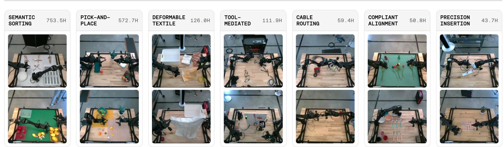  
Figure 1. Representative demonstrations from FineART dataset. FineART is the largest subtask-annotated manipulation dataset to date, consisting of 40.5K episodes and 534K subtasks, totaling 1,718 hours.

## 1 Introduction

“Divide each difficulty into as many parts as is feasible and necessary to resolve it.”

— René Descartes, Discourse on Method (1637), Part II

Robotic assistants that work in real households and workplaces must handle long-horizon tasks – such as preparing a meal, sorting tools, or packing a bag – that demand dozens of coordinated two-handed actions over several minutes. Humans manage this complexity by continuously breaking a task into a running sequence of subtasks (e.g., pick up plate, pick up toast, put toast on plate) instead of holding one instruction for the full duration. Giving a robot policy that same ability requires two foundations: (1) long-horizon bimanual manipulation data and (2) language supervision that marks subtask boundaries densely and persistently enough to train on directly.

While single-arm datasets [20, 28] scale to hundreds of thousands of trajectories, they consist mainly of short pick-and-place episodes associated with single instructions. Recent bimanual datasets [12, 13, 36] address embodiment gaps and scale, but even the largest [2] only annotates subtask labels for a fraction of its hours. Furthermore, they report diversity in aggregate, obscuring whether they cover contactrich, long-tail skills like insertion, deformable object manipulation, or tool use. Existing annotation pipelines [1, 3, 26] make this worse: they either assign broad, high-level labels to entire videos or try to generate subtasks on the fly during execution, rather than giving the model step-by-step guidance directly throughout training.

Without step-by-step labels during training, current models struggle to handle long tasks. Flat visionlanguage-action models [6, 22] map an instruction and image directly to actions, with no way to track progress through a multi-minute task, while hierarchical alternatives [1, 31] split planning and execution across two separate models. No existing dataset-and-model combination offers persistent, dense subtask training for long-horizon bimanual manipulation inside a single end-to-end policy. FineART closes this gap: a bimanual manipulation dataset where every one of its 1,718 hours across 40,543 episodes (averaging 152.5 seconds each) carries dense subtask annotations – 533,913 subtask labels in total, roughly 13 per episode – paired with a training recipe that treats these subtasks as persistent supervision inside a single end-to-end policy.

Our contributions are:

• FineART Dataset. An open-source bimanual manipulation dataset with dense subtask annotations, containing 40,543 labeled episodes and 533,913 subtask labels.

• FineART-VLA. A single end-to-end policy, extended from a pretrained vision-language-action backbone, that pairs System-2 subtask prediction in language with System-1 continuous-action execution using hierarchical inference and knowledge insulation instead of splitting planning and execution across two separate models.

• Dense Subtask Training. Dense subtask training improves spatial grounding and long-horizon instruction following, raising success rate from 32.0% to 100.0% on a spatial disambiguation task and from 16.0% to 76.0% on a long-horizon task requiring human corrections, compared to a matched policy trained without subtask training.

• Cross-Embodiment Mid-Training. Mid-training on FineART enables zero-shot transfer to unseen tasks – after fine-tuning on only five atomic tasks, the policy generalizes to unseen, multi-stage tasks on a distinct robot platform (YAM), reaching 28.0% success on prepare breakfast, 12.0% on sort tools, and 60.0% on put cable into bin under distractors.

We open-source the model and training code alongside the dataset.2

<table><tr><td>Dataset</td><td>Traj.</td><td>Tasks</td><td>Hours</td><td>Subtask Hours</td><td>Sec./Ep.</td></tr><tr><td>MT-Opt [19]</td><td>800,000</td><td>12</td><td>5,556</td><td>0</td><td>25</td></tr><tr><td>RH20T [12]</td><td>110,000</td><td>147</td><td>1,111</td><td>0</td><td>36.4</td></tr><tr><td>RoboSet [4]</td><td>7,500</td><td>38</td><td>N/A</td><td>0</td><td>N/A</td></tr><tr><td>BridgeData V2 [33]</td><td>60,096</td><td>13</td><td>127</td><td>0</td><td>7.6</td></tr><tr><td>Open X-Embodiment [28]</td><td>1M+</td><td>500+</td><td>N/A</td><td>0</td><td>N/A</td></tr><tr><td>DROID [20]</td><td>76,000</td><td>86</td><td>350</td><td>0</td><td>16.6</td></tr><tr><td>MolmoAct2 (Bimanual YAM) [11]</td><td>34,500</td><td>28</td><td>720</td><td>0</td><td>75.1</td></tr><tr><td>ABC-130K [2]</td><td>134,806</td><td>195</td><td>3,553</td><td>1,552</td><td>94.9</td></tr><tr><td>FineART (Ours)</td><td>40,543</td><td>151</td><td>1,718</td><td>1,718</td><td>152.5</td></tr></table>

Table 1. Comparison of open-source robot manipulation datasets. FineART has the most densely annotated subtask hours. N/A: not reported.

## 2 Related Work

## 2.1 Large-Scale Robot Learning Datasets

Robot learning has scaled in waves. An early single-arm dataset [19] established teleoperated data collection at growing scale, but it stayed within a handful of tasks and seconds-long episodes. Later efforts [20, 28] pushed scale further still, aggregating over a million and 76k trajectories respectively across dozens of platforms and hundreds of in-the-wild scenes, yet both remain dominated by single arm, short-horizon pick-and-place, with one instruction typically covering an entire episode. Bimanual datasets close part of that gap [12, 13, 27, 36]: two introduce low-cost teleoperation for contact-rich two-arm manipulation, one adds force and audio modalities across 110k sequences, and the last extends coverage to over 100 more tasks. Two very recent efforts push bimanual scale further still: MolmoAct2’s Bimanual YAM release [11] and the ABC-130K dataset [2], the latter also annotating a 1,552-hour subset with sub-episode task labels. Table 1 compares all of these datasets across trajectory count, task count, and annotated hours: FineART is the only dataset combining bimanual manipulation, multi-minute episodes, and dense sub-episode labels across its entire duration, rather than a curated subset of it.

## 2.2 Data Curation and Annotation Pipelines

Dense temporal annotation of long videos originated in captioning work [23], which jointly localized and described events in multi-minute footage. Robotics applied coarser versions of the same idea [1, 26], pairing subtasks with play data or decomposing an instruction into skills online rather than annotating the training data itself. A closer prior effort [3] inserted an intermediate language-motion layer between task and action, but its hierarchy was produced online rather than as a persistent, dataset-wide label. FineART instead annotates every episode directly, producing 533,913 subtask labels (an average of 13 per episode) that are available as fixed training targets rather than being generated at inference time.

## 2.3 Language-Conditioned Policies

Augmenting end-to-end policies with an explicit high-level reasoning step improved performance on long-horizon tasks [1, 14, 24, 31], particularly when the high-level step could draw on a pretrained LLM or VLM. Flat vision-language-action models [6, 22] skip this step, mapping a single instruction and image directly to actions; one extension [9] carries the same recipe to heterogeneous embodiments without unifying the action space. These architectures degrade over long horizons because the model does not track task progress. Most hierarchical methods instead split the two roles across separate models, with a VLM predicting semantic subtasks and a distinct low-level policy executing them [1, 24, 31]; others [25] conditioned on short natural-language subtasks mined from unstructured play data rather than a planner’s output. FineART instead uses a single model for both stages, closer to chain-of-thought [34] than to a two-model pipeline, built on a $\pi _ { 0 . 5 }$ flow-matching backbone [29] and knowledge insulation [10] to prevent continuous-action gradients from destroying pretrained VLM representations. Two concurrent efforts pursued closely related ideas: dense per-clip language annotation for policy learning [21], and a diffusion policy conditioned on foundation-model-generated subtasks [17]; a third [18] paired a VLM subtask planner with a flow-matching controller in a similar spirit. None reported a dataset combining bimanual multi-minute episodes with persistent sub-episode labels at FineART’s scale.

(c)  
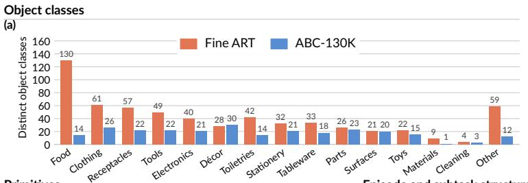

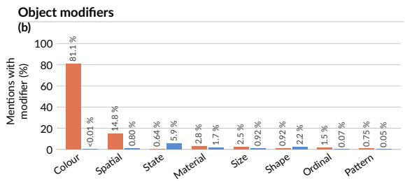

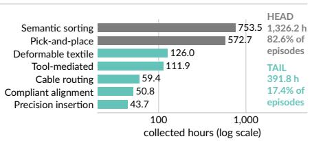

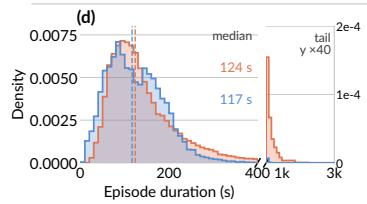

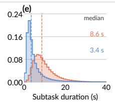

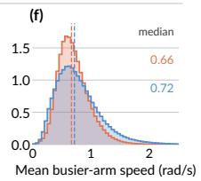  
Figure 2. FineART dataset overview. (a) Distinct object classes represented in FineART and ABC-130K across semantic categories. (b) Frequency of descriptive object modifiers in subtask annotations. (c) Collected hours across manipulation primitives, highlighting the high-volume head and contact-rich tail. (d–f) Episode duration, subtask duration, and arm-speed distributions, respectively, compared with ABC-130K.

## 3 FineART Dataset

FineART is a bimanual manipulation dataset consisting of 40,543 teleoperated episodes (1,718 hours, 185.5 M frames) spanning 151 tasks. It is the largest subtask-annotated robot dataset to the best of our knowledge, providing full temporal supervision across 100% of its hours and tasks.

## 3.1 Data Collection Protocol

All data are collected on the Trossen Stationary AI bimanual leader–follower system by human teleoperators. Each follower arm carries an ALOHA2 gripper rated for a 1 kg payload and executes a 50 Hz control loop, with joint telemetry logged at 300 Hz. Visual state is recorded at 30 fps (1280 × 720) across four Intel RealSense D405 cameras: a bird’s-eye view for global tabletop context, a worm’s-eye view for low-angle contact physics, and dual wrist-mounted cameras for egocentric local manipulation.

A second independent team of human annotators labeled trajectories with natural task descriptions, without VLM assistance. Finally, a third independent team of human auditors performed quality control on a statistically significant sample of the labeled trajectories. This process ensures that the dataset is free of labeling bias from the teleoperators, and that the annotations are accurate, complete, and consistent. Labeling yields two granularities (Fig. 3). Demonstration Label: Whole-episode text summary paired with metadata describing execution quality and outcome success. Subtask Labels: Contiguous, nonoverlapping temporal segments containing untemplated free-text task descriptions.

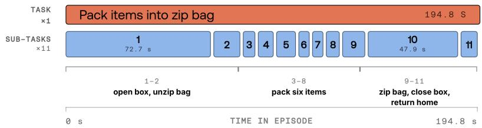  
Figure 3. FineART annotation schema. A multi-stage task with demonstration-level and temporally segmented subtask annotations. Subtask labels shown are illustrative categorical examples, not the actual annotations.

## 3.2 Dataset Composition: Long Multistage Tasks

While single-arm datasets like Bridge V2 [33] and DROID [20] provide large trajectory volumes, they pair multiminute trajectories with a single instruction. ABC-130K [2] represents the only prior singleembodiment dataset providing timestamped subtask text alongside raw trajectories. Therefore, we use ABC-130K as a reference while analyzing our dataset composition.

FineART features long-horizon tasks that require multiple manipulation subtasks to complete, averaging 13.17 subtasks per task. The median episode duration is approximately 2.0 min, with a long tail of episodes lasting more than 10 min (Fig. 2d).

## 3.2.1 Subtask Composition

FineART deliberately concentrates most of its subtasks on a small set of reusable manipulation primitives, then adds a long tail of physically distinct, contact-rich skills on top. In a mid-training dataset, a policy needs to see a primitive many times to learn it reliably, while the contact-rich tail tests whether that learned representation actually carries over to harder, fine-grained tasks.

To capture manipulation diversity, we define a primary vocabulary of 31 leading verbs categorized into seven fundamental manipulation primitives (Fig. 2c).

While the majority of the dataset (1,326.2 h; 77.2% of hours) concentrates on gross pick-and-place (572.7 h) and semantic organization (753.5 h) to build core spatial manipulation abilities, the remaining 391.8 h (22.8% of hours) forms a long tail of contact-rich operations. This long tail covers tight tolerances, nearunbounded configuration states, and complex contact dynamics across deformable textile manipulation (126.0 h), tool-mediated assembly (111.9 h), flexible linear object routing (59.4 h), compliant alignment (50.8 h), and high-precision mechanical insertion (43.7 h).

Though smaller in total volume, this tail provides the essential demonstration signal needed for policies to move beyond simple prehension toward fine-motor, contact-guided behavior. Section 4 tests that hypothesis directly by ablating the tail from the training mixture.

We observe that FineART subtasks are about 2.5 times as long as ABC-130K subtasks, with median duration of 8.6 s versus 3.5 s (Fig. 2e), even though the datasets have similar arm-speed distributions (Fig. 2f). This indicates that FineART subtasks capture more multi-stage manipulation (stack, remove, close), while ABC-130K subtasks often segment simpler, individual actions (pass, grab, flatten).

## 3.2.2 Object Diversity

Object diversity is introduced during collection through object rotation and spatial randomization. Every five episodes, a unique set of objects is assigned to each task-operator pair. Objects are repositioned and reoriented for each episode so that no arrangement is repeated. This protocol varies both the objects used to perform tasks and the spatial configurations in which they must be manipulated.

To compare object diversity, we apply a shared rule-based parser to the subtask annotations of FineART and ABC-130K. After spelling normalization and typo correction, we extract noun phrases and represent object classes by singularized head nouns, retaining noun qualifiers for generic heads (e.g., chess piece). Preceding modifiers are retained separately as descriptors and tagged using lexicons for color, material, size, shape, pattern, state, spatial position, and ordinal attributes. The parser filters non-object expressions such as regions, robot parts, pronouns, and measurements. These statistics measure objects named in the annotations: a class is a normalized object label, and a mention is an occurrence of that label.

Figure 2a shows broad coverage across everyday object categories, spanning 657 distinct object classes in total. FineART contains more distinct labels than ABC-130K in food, clothing, receptacles, tools, electronics, and toiletries. Coverage also extends to stationery, tableware, parts, toys, and materials, with comparable coverage of surfaces and fewer labels for décor. Thus, the repeated manipulation primitives described above are demonstrated across a range of object identities, materials, and geometries. Because this comparison is annotation-based, it reflects both collection diversity and how specifically annotators name objects.

The Other category contains extracted labels that could not be mapped to a semantic category from the noun alone. FineART entries include ambiguous nouns such as stick and mesh, and parser leftovers such asform from the phrase “to form a loop.” In ABC-130K, approximately 95% of these mentions use generic labels such as personal item, distractor, chemistry item, and product.

## 3.2.3 Descriptive Specificity

The annotations describe not only which object class is involved, but also attributes that distinguish an object within a scene. Figure 2b reports descriptor frequency per object mention. Color modifiers occur in 81.1% of FineART mentions, compared with less than 0.01% in ABC-130K; spatial modifiers occur in 14.8% versus 0.80%. Material, size, ordinal, and pattern descriptors provide additional distinctions. ABC-130K uses state and shape modifiers more frequently, largely because of its many deformable-object demonstrations featuring descriptors such as folded, flattened, and crumpled.

This descriptive detail is reflected in the diversity of the annotation text: FineART contains 110,299 distinct subtask strings and 23,589 distinct object-referring expressions, compared with 7,977 and 534, respectively, in ABC-130K. In cases involving two objects of the same class, FineART annotations disambiguate the objects 81.4% of the time, compared with 44.0% in ABC-130K. Such distinctions let a subtask specify which instance to manipulate, beyond naming the action and object class.

Together, object variation and instance-specific language provide supervision for selecting and manipulating objects throughout multi-stage tasks. Section 4 evaluates how mid-training with these subtask annotations affects spatial grounding, instruction following, and transfer to a different embodiment.

## 4 Experiments

We evaluate FineART as a mid-training dataset for a pre-trained generalist VLA [29], mid-training for a relatively short run (300k steps) and then asking three questions (Sections 4.2 and 4.3). Does dense subtask training, together with knowledge insulation (KI), improve out-of-distribution generalization and long-horizon instruction following? How much does long-tail training data contribute to overall performance? And does FineART mid-training reduce the data required to adapt to a new embodiment? Over the course of our experiments, we execute 3,400 rollouts.

## 4.1 Policy and Mid-Training Setup

We start from $\pi _ { 0 . 5 }$ publicly released via LeRobot [7, 29], whose implementation does not support subtask training, knowledge insulation, or hierarchical subtask-then-action inference. We extend the architecture to add all three and refer to the resulting model as FineART-VLA: a System-2 subtask predictor and a System-1 continuous-action controller in one policy. It combines a 2B-parameter Gemma backbone [15] with a SigLIP vision encoder [35] and a separate 300M-parameter Gemma-style action expert. Images and language form one bidirectional attention block; the state/action suffix attends to itself and to that full block but not vice versa, and the subtask span being generated is further restricted to its own earlier tokens, matching autoregressive generation at inference. At step t the policy observes $o _ { t } = ( I _ { t } ^ { 1 : 3 } , q _ { t } )$ three of the rig’s camera streams (bird’s-eye and both wrists, resized to $2 2 4 \times 2 2 4 ;$ the worm’s-eye view is recorded but not consumed) and the 14-dim bimanual joint and gripper states. The policy is conditioned on a language context ℓ that is either the task string $\ell ^ { \mathrm { t a s k } }$ or a subtask $\ell ^ { \mathrm { s u b } }$

Following [29], the policy emits three outputs per forward pass: the next subtask in language, a FASTtokenized action sequence ${ \tilde { a } } ,$ and a continuous chunk $\boldsymbol A _ { t } \stackrel { \textstyle \_ } { = } [ a _ { t } , \ldots , a _ { t + H - 1 } ] \in \mathbb { R } ^ { H \times 1 4 }$ with $H = 5 0$ Writing $z _ { \theta } \equiv z _ { \theta } ( o _ { t } , \ell ^ { \mathrm { s u b } } )$ for the backbone representation,

$$
\begin{array} { r l } & { p _ { \theta } \bigl ( \ell ^ { \mathrm { s u b } } , \tilde { a } , A _ { t } \mid o _ { t } , \ell ^ { \mathrm { t a s k } } \bigr ) = } \\ & { \qquad p _ { \theta } \bigl ( \ell ^ { \mathrm { s u b } } \mid o _ { t } , \ell ^ { \mathrm { t a s k } } \bigr ) p _ { \theta } \bigl ( \tilde { a } \mid o _ { t } , \ell ^ { \mathrm { s u b } } \bigr ) p _ { \theta } \bigl ( A _ { t } \mid z _ { \theta } \bigr ) . } \end{array}\tag{1}
$$

The continuous action head predicts a velocity $v _ { \theta }$ from the noised chunk $A _ { t } ^ { \tau } = ( 1 - \tau ) A _ { t } + \tau \epsilon .$ , trained by flow matching to minimize the L2-norm between $v _ { \theta }$ and the target field $\epsilon - A _ { t } ,$ while the discrete and text heads use next-token cross-entropy. The objective is

$$
\mathcal { L } ( \boldsymbol { \theta } ) = \lambda _ { \mathrm { f l o w } } \mathcal { L } _ { \mathrm { f l o w } } + \lambda _ { \mathrm { f a s t } } \mathcal { L } _ { \mathrm { f a s t } } + \lambda _ { \mathrm { t e x t } } \mathcal { L } _ { \mathrm { t e x t } } ,\tag{2}
$$

with $\lambda _ { \mathrm { f l o w } } = 1 0 , \lambda _ { \mathrm { f a s t } } = 1$ and $\lambda _ { \mathrm { t e x t } } \in \{ 0 , 1 \}$ . Each action chunk in the dataset is represented in both the continuous flow target and the discretized token sequence. Including explicit task-to-subtask predictions $( \lambda _ { \mathrm { t e x t } } > 0 )$ has been shown to improve performance on long-horizon tasks, even compared to human oracle subtask planning [29]. Setting $\lambda _ { \mathrm { t e x t } } = 0$ removes the subtask channel, conditioning the policy on ℓtask directly.

Knowledge insulation (KI) [10] has been shown to mitigate the degradation of pre-trained VLM knowledge that occurs when a randomly initialized flow-based action expert is attached to the backbone. Insulating the backbone from ${ \mathcal { L } } _ { \mathrm { f l o w } }$ restores language-following, accelerates convergence by roughly $7 . 5 \times$ , and improves generalization to unseen objects and environments. With KI enabled, the action expert attends to stop-gradient copies of the backbone’s keys and values so that $\nabla _ { \theta _ { \mathrm { V L M } } } \mathcal { L } _ { \mathrm { f l o w } } = 0$ and the backbone is shaped only by the token-level losses.

When $\lambda _ { \mathrm { t e x t } } = 1$ , 30% of each batch is a sample $( \ell ^ { \mathrm { t a s k } } , \ell ^ { \mathrm { s u b } } , o _ { t } )$ for $\mathcal { L } _ { \mathrm { t e x t } }$ and 70% is a sample $( A _ { t } , \tilde { a } , o _ { t } , \ell ^ { \mathrm { s u b } } )$ for ${ \mathcal { L } } _ { \mathrm { f l o w } }$ and ${ \mathcal { L } } _ { \mathrm { f a s t } }$ . All runs train for 300k steps at a global batch of 64, about 10% of one epoch over the

<table><tr><td></td><td colspan="2">In-distribution</td><td colspan="2">Partial ID</td><td colspan="2">Out-of-distribution</td><td>Overall</td></tr><tr><td>Checkpoint</td><td>Shelf</td><td>Towel</td><td>Vase</td><td>Pegboard</td><td>Saucer</td><td>Sort tools</td><td>Avg.</td></tr><tr><td colspan="8">(a) subtask training and knowledge insulation (α = 0.5, full data)</td></tr><tr><td>Run 1.1 (subtask training + KI)</td><td>91.0 / 72.0 72.0 / 32.0 75.0 / 16.055.0 / 0.0 73.0 / 20.0 69.5 / 28.0</td><td></td><td></td><td></td><td></td><td></td><td>72.6 / 28.0</td></tr><tr><td>Run 1.2 (no subtask training + KI)</td><td>97.0 / 96.0 50.0 / 16.0 74.0 / 24.0 72.0 / 0.033.0 / 4.0 76.5 / 16.0</td><td></td><td></td><td></td><td></td><td></td><td>67.1 / 26.0</td></tr><tr><td>Run 1.3 (subtask training, no KI)</td><td>77.0 / 64.0 86.0 / 44.0 66.0 / 16.0 49.0 / 0.0 69.0 / 12.0 58.5 / 12.0</td><td></td><td></td><td></td><td></td><td></td><td>67.6 / 24.7</td></tr><tr><td>Run 1.4 (no subtask training, no KI)</td><td>82.0 / 72.0 58.5 / 4.0 41.0 / 12.0 65.0 / 0.0 58.0 / 12.0 50.0 / 4.0</td><td></td><td></td><td></td><td></td><td></td><td>59.1 / 17.3</td></tr><tr><td colspan="8">(b) Mid-training data ablations (w/ subtask training, no  $K I , \alpha = 0 . 5 )$ </td></tr><tr><td>Run 1.3 (full data)</td><td>77.0 / 64.0 86.0 / 44.0 66.0 / 16.0 49.0 / 0.0 69.0 / 12.0 58.5 / 12.0</td><td></td><td></td><td></td><td></td><td></td><td>67.6 / 24.7</td></tr><tr><td>Run 2.1 (no long-tail†)</td><td>88.0 / 68.0 29.5 / 0.0 67.0 / 8.0 58.0 / 0.0 56.0 / 0.0 67.0 / 8.0</td><td></td><td></td><td></td><td></td><td></td><td>60.9 / 14.0</td></tr></table>

Each cell reports progress rate / success rate in percent over 25 rollouts; the final column averages over all 150 rollouts per checkpoint. Bold marks the best success rate in each column. †Run 2.1 restricts training to the two majority task-label categories in Fig. 2.

Table 2. In-embodiment (ALOHA) results on the 6-task evaluation suite.  
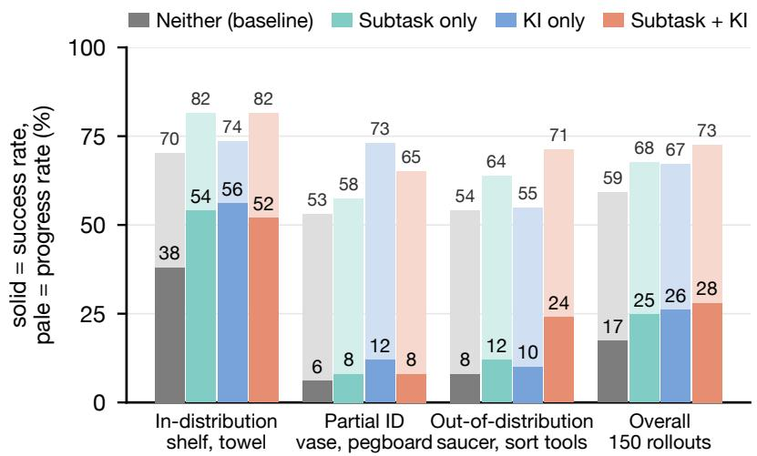  
Figure 4. Success rate of FineART-VLA by task regime (ID, partial ID, OOD) with subtask supervision and knowledge insulation. (n = 25 per task, n = 50 per regime, n = 150 overall). Subtask training and KI improve most significantly on OOD tasks.

185.5M frames, using AdamW at $2 . 5 \times 1 0 ^ { - 5 }$ decayed to $5 \times 1 0 ^ { - 6 }$ in bfloat16. Mid-training draws frames with a task-balanced sampler following [29]: a task contributing $n _ { i }$ frames is sampled with probability proportional to $n _ { i } ^ { \alpha }$ , so $\alpha = 0$ weights every task equally regardless of size (task-based sampling) and α = 1 weights every frame equally across the pooled dataset (raw frequency). We use $\alpha = 0 . 5 ,$ a blend of the two.

## 4.2 In-Embodiment Results (ALOHA)

We train policy ablations via Section 4.1 on the full FineART dataset and evaluate the policies on the same embodiment used for collection (Stationary Trossen ALOHA). For all experiments, each checkpoint is evaluated with 25 rollouts per task and is initialized with a prescribed set of 25 object locations, meaning all checkpoints are evaluated under the same initial conditions. We report success rate (SR) and progress rate (PR, the average fraction of task stages completed). At 25 rollouts, per-task SR is quantized to 4 points with a standard error near 9, and per-checkpoint averages carry roughly 3 to 4, indicating large, consistent effects rather than single-task differences.

## 4.2.1 Does dense subtask training and knowledge insulation (KI) improve OOD generalization?

We isolate the effect of subtask training $( \mathbf { i . e . } , \lambda _ { \mathrm { t e x t } } = 1 )$ and KI with a 2 × 2 ablation that varies each independently: Run 1.1 (subtask training + KI), Run 1.2 (no subtask training + KI), Run 1.3 (subtask training, no KI), and Run 1.4 (no subtask training, no KI), each evaluated on the same suite of six tasks. The tasks are grouped in Table 2 by their relation to the tasks present in the FineART training set. Shelf and towel are in-distribution, with literal subtask strings. Vase and pegboard are partial, in that the insertion dynamics appear but the prompts differ. Saucer and sort tools are out-of-distribution: the dataset contains no saucer and no type-routed sorting of tools.

Comparing performance across in-distribution, partially in-distribution, and out-of-distribution tasks (Fig. 4), subtask training and knowledge insulation each improve overall performance. Policies with both subtask training and KI show the highest OOD generalization capabilities, indicating that both subtask training and knowledge insulation are necessary to maintain general pre-trained task knowledge.

With in-distribution tasks, performance is dependent on the type of task (Table 2). Shelf placement is a saturated, single-step task, and no subtask training and KI achieves the highest performance (96.0% vs. 72.0%) indicating that subtask training may hinder task performance, while KI is important to maintain task understanding. Conversely, towel folding, which is a more ambiguous task, benefits from subtask training more than KI. KI and subtask training both improve performance compared to the baseline in Partial ID tasks, but benefit the most from KI alone; the comparatively worse performance with subtask training may indicate an over-sensitivity to language conditioning.

## 4.2.2 How much does long-tail data contribute to overall performance?

Run 2.1 (Table 2b) removes the long-tail task categories defined in Fig. 2c from mid-training, keeping the same number of training steps; the retained set is only pick-and-place and sorting, 106 of 151 task labels (71.0% of valid frames), compared against Run 1.3 (full data, otherwise identical). Overall success drops from 24.7% to 14.0%. The simple shelf task is the exception, holding its SR steady (64.0% to 68.0%), but every other evaluation task degrades substantially when the long-tail is excluded, even though those tasks are nominally covered by the retained categories – indicating that long-tail diversity, not merely category coverage, drives generalization.

## 4.2.3 Does subtask training provide spatial grounding and long-horizon instruction following?

In Fig. 5, we further evaluate Run 1.3 (subtask training, no KI) against Run 1.4 (no subtask training, no KI) – KI fixed off in both arms to isolate subtask training alone – on two tasks designed to test spatial grounding or long-horizon instruction following. The experimental procedure is the same: 25 rollouts per task with prescribed initial conditions.

Spatial grounding. On put donut into the {left, right, middle} bin, the target is distinguished only by a spatial word in the instruction. Subtask training saturates the task with 100% SR. In contrast, the no-subtask policy only achieves 32% success and all 17 failures were due to placing the object in the incorrect bin. The results indicate that the dense subtask annotations in the FineART dataset are critical for spatial grounding and instruction following.

Long-horizon instruction following. Prepare breakfast is a multi-minute task whose subtasks are present in the dataset, but not the full task sequence. Figure 5 contrasts two inference conditions:

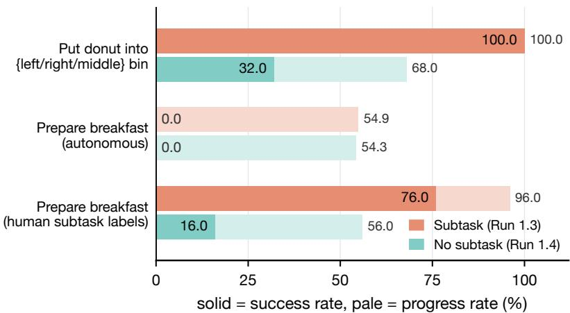  
Figure 5. Evaluation of subtask training on instruction following tasks (Run 1.3 against Run 1.4, no KI). The solid fill is success rate and the pale bar behind it progress rate.

autonomous execution, where the policy proposes its own subtasks (Run 1.3, hierarchical subtask-thenaction prediction [29]) or acts on the task label alone (Run 1.4), against human-provided subtask guidance at inference, where a human oracle labels each subtask, advancing to the next one only after the prior one is judged complete. Both autonomous policies fail completely (0.0% success, at 54.9% and 54.3% progress respectively) since one misstep is enough to stall the whole rollout. With human-provided subtask guidance, Run 1.3 reaches 76.0% success against 16.0% for Run 1.4 – despite identical guidance, so subtask training at training time, not guidance at inference, is what drives the gap.

## 4.2.4 Observation: policies exhibit recovery and complex bimanual behaviors

FineART-VLA reproduced notable behaviors that the dataset may contain in small proportion, but the task instruction does not explicitly call for (Table 3). Self-correction: a sort tools policy redirected a trajectory already heading for the wrong bin. Failure recovery: a fallen cup was re-grasped and the placement completed, instead of the rollout stalling on the first error. Bimanual coordination: on a flower in vase rollout, the left arm steadied the vase so that the right could insert the flower. These behaviors indicate that policies are exhibiting closed-loop behavior and reacting to state feedback.

## 4.3 Cross-Embodiment Transfer (YAM)

Section 4.2 measures mid-trained policy performance on the in-distribution FineART embodiment. In this section, we evaluate whether the mid-trained FineART-VLA shows similar improved performance on an out-of-distribution embodiment. We fine-tune the best-performing checkpoint from Table 2a (Run 1.1, subtask training + KI, 300k steps) for an additional 5,000 steps on YAM, using five of the six ALOHA evaluation tasks – shelf, towel, vase, pegboard, and saucer – as the fine-tuning set. Sort tools and prepare breakfast are held out entirely from YAM fine-tuning, to test transfer to unseen tasks later in this section. We examine policies trained on 10, 25, 50, and 250 training episodes per task. Evaluations consist of 25 rollouts each (125 rollouts per checkpoint). The embodiment gap is substantial: Stationary ALOHA arms are mounted on opposite sides of the table facing each other, whereas YAM arms face forward towards the back of the table. We compare against three alternatives fine-tuned identically: the upstream $\pi _ { 0 . 5 }$ initialization with no FineART mid-training, and two checkpoints mid-trained on different datasets (ABC, and Ai2’s MolmoAct2 YAM release). FineART is the only one of the three datasets entirely on a different embodiment.

<table><tr><td>Task</td><td>Behavior</td></tr><tr><td colspan="2">Run 1.1 (subtask training + KI)</td></tr><tr><td>Sort tools</td><td>Corrected in-flight trajectory toward wrong bin</td></tr><tr><td colspan="2">Run 1.2 (no subtask training + KI)</td></tr><tr><td>Sort tools</td><td>Recovery, and a handover between the arms</td></tr><tr><td>Sort tools</td><td>Handover between the arms</td></tr><tr><td colspan="2">Run 1.4 (no subtask training, no KI)</td></tr><tr><td>Fold towel</td><td>Completed two folds with the towel lifted</td></tr><tr><td colspan="2">Run 2.1 (no long-tail)</td></tr><tr><td></td><td>Cup on shelfRe-grasped fallen cup and completed place</td></tr><tr><td></td><td>Flower in vase Left arm steadied the vase so right could insert</td></tr></table>

Note: These are observations found via inspection and do not indicate the relative frequency of such behaviors.

Table 3. Notable behaviors observed in rollouts.  
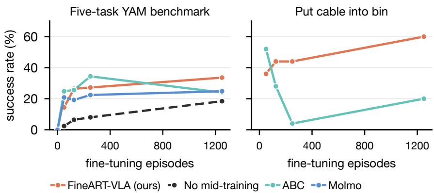  
Figure 6. FineART-VLA cross-embodiment YAM evaluation. Policies are mid-trained for 300k steps on the FineART, ABC, or MolmoAct2 datasets, then fine-tuned on YAM data for a fixed 5k steps at each data budget. Upstream π open-source weights are not fine-tuned in mid-trained checkpoints. Since ABC and MolmoAct2 datasets contain YAM data, zero-shot (ZS) policies are evaluated for ABC and MolmoAct2 only.

## 4.3.1 Does mid-training on FineART reduce embodiment-specific downstream data requirements?

The FineART-VLA (orange) yields a 10× reduction in downstream data compared to a checkpoint with no mid-training (black) in Fig. 6. FineART-VLA reaches 26.4% SR at 25 fine-tuning episodes per task, compared to the 18.4% SR at 250 episodes per task when there is no mid-training. Both checkpoints start from the same $\pi _ { 0 . 5 }$ weights and differ only in whether the FineART mid-training occurred, so the gain comes from the mid-training stage rather than the underlying pre-training or model architecture.

## 4.3.2 How does FineART-VLA performance on YAM (cross-embodiment) compare to policies from YAM open source datasets?

We compare FineART-VLA to ABC and MolmoAct2, both of which include the YAM embodiment in their pre-training dataset. On the five evaluation tasks in Fig. 6a, at the smallest budget FineART-VLA is the weakest (14.4% against 24.8% for ABC and 20.8% for MolmoAct2), which is consistent with the embodiment gap: ten episodes per task is not enough YAM data to re-target ALOHA kinematics.

<table><tr><td>Mid-Trained Checkpoint Zero-shot</td><td colspan="5">Number of Fine-Tuning Trajectories</td></tr><tr><td>(a) Five-task YAM benchmark</td><td></td><td>50 (10/task)</td><td>125 (25/task)</td><td>250 (50/task)</td><td>1250 (250/task)</td></tr><tr><td>FineART-VLA (ours, ALOHA)</td><td></td><td>45.9 / 14.4</td><td>55.9 / 26.4</td><td></td><td></td></tr><tr><td>None (upstream π0.5 init)</td><td></td><td>25.0 / 2.4</td><td>33.4 / 6.4</td><td>53.7 / 27.2</td><td>69.2 / 33.6</td></tr><tr><td>ABC (XDOF, YAM data) ‡</td><td>22.5 / 0.0</td><td></td><td></td><td>36.1 / 8.0</td><td>50.8 / 18.4</td></tr><tr><td>MolmoAct2‡ (Ai2, YAM data)</td><td>18.2 / 0.0</td><td>63.0 / 24.8</td><td>66.0 / 25.6</td><td>73.1 / 34.4</td><td>64.7 / 24.0</td></tr><tr><td></td><td></td><td>61.1 / 20.8</td><td>66.7 / 19.2</td><td>62.4 / 22.4</td><td>68.1 / 24.8</td></tr><tr><td>(b) Put cable into bin, unseen target and unseen distractors</td><td></td><td></td><td></td><td></td><td></td></tr><tr><td>FineART-VLA (ours)</td><td>一</td><td>38.0 / 36.0</td><td>44.0 / 44.0</td><td>46.0 / 44.0</td><td>64.0 / 60.0</td></tr><tr><td>ABC</td><td></td><td>52.0 / 52.0</td><td>28.0 / 28.0</td><td>4.0 / 4.0</td><td>22.0 / 20.0</td></tr></table>

Cells are progress rate / success rate in percent. Block (a): average of 125 rollouts across the first five tasks in Table 2; block (b): single held-out task with 25 rollouts. Bold marks the best success rate per column. ‡Zero-shot rates are reported only for ABC and MolmoAct2, whose mid-training datasets already include YAM data.

Table 4. Cross-embodiment transfer to YAM, after a fixed 5k-step fine-tune at each budget.  
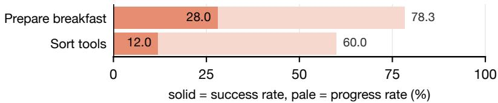  
Figure 7. FineART-VLA transfer to tasks absent from the YAM five-task fine-tuning set; 300k ALOHA mid-training steps + 5k fine-tuning steps on YAM.

FineART-VLA is the only checkpoint whose success rate increases monotonically to 33.6% SR at 1250 episodes. MolmoAct2’s SR plateaus in the low twenties despite a 25-fold increase in data (20.8% to 24.8%), while ABC peaks mid-sweep at 34.4% before dropping to 24.0%. Both baselines score 0.0% success zero-shot, indicating task-embodiment fine-tuning is necessary regardless of mid-training dataset.

## 4.3.3 Does FineART-VLA pick the right object among distractors on YAM?

An additional task tests spatial grounding: put the cable into the bin, with a bread roll and a donut as distractors, where the target and both distractors are absent from the YAM fine-tuning data. FineART-VLA improves monotonically from 36.0% to 60.0% success as the budget grows. ABC starts higher at ten episodes (52.0%) but then drops sharply as the fine-tuning set grows, suggesting the representation is overwritten, not refined, by fine-tuning.

## 4.3.4 Does fine-tuning on non-relevant YAM tasks enable transfer to unseen long-horizon tasks?

The most striking result is on tasks that appear nowhere in the YAM fine-tuning data. After the same 5k-step fine-tune on the five basic tasks (Fig. 6a), we evaluate FineART-VLA on prepare breakfast, which requires placing a plate on the tray and then arranging two donuts and a slice of bread on it. As shown in Fig. 7, the policy reaches 28.0% SR and 78.3% PR with autonomous hierarchical execution, executing the full multi-stage sequence on a robot it had seen only through five unrelated tasks. It also emits the Adjust subtask to realign the tray, a behavior annotated in the FineART ALOHA data and never performed in the YAM fine-tuning set. Sort tools, also unseen on YAM, reaches 12.0% SR and 60.0% PR. These results indicate that subtask-level task structure transfers across the embodiment gap, and the fine-tuning trajectories supply the kinematics for embodiment-specific motor patterns.

## 5 Conclusion

To our knowledge, FineART is the largest open-source subtask-annotated manipulation dataset: 533,913 labels covering every one of its 40,543 episodes and 151 tasks, spanning hundreds of distinct object classes plus a long tail of contact-rich skills beyond ordinary pick-and-place tasks (Section 3).

Experiments with our FineART-VLA policy indicate that the FineART dataset (Section 4) enables meaningful performance gains on in-distribution and out-of-distribution tasks and across embodiments. Inclusion of long-tail tasks enables higher performance across partially in-distribution and out-ofdistribution evaluation tasks, indicating object variety alone is not sufficient for task diversity. Subtask training enables FineART-VLA to parse instructions, which a flat policy cannot, and to execute longhorizon sequential tasks. In cross-embodiment experiments with minimal target embodiment fine-tuning (Stationary table-top ALOHA to Mobile YAM), our FineART-VLA policy completes long-horizon tasks not present in the target embodiment fine-tuning set. These results indicate that FineART-VLA learned subtask-level planning during ALOHA mid-training, and the target embodiment fine-tuning trains the policy on the target robot’s kinematics without forgetting the sequential task planning.

Limitations and Future Work. Our dataset focuses on a single robot platform, and our policy is only trained for about 10% of an epoch. Training for longer and testing more base models would likely show a larger impact of dense subtask annotations. Given the impressive performance gains from our subtask-conditioned FineART-VLA policy, we are excited to see progress on subtask-conditioned world models [16], reward models [8], and advantage-conditioned RL [30], which enables learning from rejected rollouts instead of discarding them. VLM-automated labeling shows promise for reducing subtask annotation burden as the dataset grows [5]. Finally, while fine-tuning on five non-relevant YAM tasks enabled transfer to unseen, long-horizon YAM tasks, it is unclear which types of fine-tuning tasks drove cross-embodiment transfer. A task, annotation, and embodiment sweep [9, 28] would help isolate the effects of mid-training and fine-tuning dataset diversity. By releasing the FineART dataset, model, and training code, we present a canvas for future exploration in our field.

## Acknowledgments

We thank our robot operators for data collection, annotation, evaluations, and logistics, and the many colleagues across engineering and program leadership who supported this work. See Section C for full acknowledgments.

## References

[1] M. Ahn, A. Brohan, N. Brown, Y. Chebotar, O. Cortes, B. David, C. Finn, K. Gopalakrishnan, K. Hausman, A. Herzog, et al. Do As I Can, Not As I Say: Grounding Language in Robotic Affordances. In Conf. on Robot Learning (CoRL), pages 287–318, 2022.

[2] A. Allshire, H. G. Singh, R. Singh, A. Rashid, H. Choi, D. McAllister, J. Yu, Y. Chen, H. Huang,

P. Abbeel, et al. Scalable Behavior Cloning with Open Data, Training, and Evaluation. arXiv:2606.27375, 2026.

[3] S. Belkhale, T. Ding, T. Xiao, P. Sermanet, Q. Vuong, J. Tompson, Y. Chebotar, D. Dwibedi, and D. Sadigh. RT-H: Action Hierarchies Using Language. In Robotics: Science and Systems (RSS), 2024.

[4] H. Bharadhwaj, J. Vakil, M. Sharma, A. Gupta, S. Tulsiani, and V. Kumar. RoboAgent: Generalization and Efficiency in Robot Manipulation via Semantic Augmentations and Action Chunking. In IEEE Int. Conf. on Robotics and Automation (ICRA), pages 4788–4795, 2024.

[5] N. Blank, M. Reuss, M. Rühle, Ö. E. Ya˘gmurlu, F. Wenzel, O. Mees, and R. Lioutikov. Scaling Robot Policy Learning via Zero-Shot Labeling with Foundation Models. In Conf. on Robot Learning (CoRL), pages 4158–4187, 2024.

[6] A. Brohan, N. Brown, J. Carbajal, Y. Chebotar, X. Chen, K. Choromanski, T. Ding, D. Driess, A. Dubey, C. Finn, et al. RT-2: Vision-Language-Action Models Transfer Web Knowledge to Robotic Control. In Conf. on Robot Learning (CoRL), pages 2165–2183, 2023.

[7] R. Cadene, S. Alibert, F. Capuano, M. Aractingi, A. Zouitine, P. Kooijmans, J. Choghari, M. Russi, C. Pascal, S. Palma, M. Shukor, J. Moss, A. Soare, D. Aubakirova, Q. Lhoest, Q. Gallouédec, and T. Wolf. LeRobot: An Open-Source Library for End-to-End Robot Learning. In The Fourteenth International Conference on Learning Representations, 2026.

[8] Q. Chen, J. Yu, M. Schwager, P. Abbeel, Y. Shentu, and P. Wu. SARM: Stage-Aware Reward Modeling for Long Horizon Robot Manipulation. In Int. Conf. on Learning Representations (ICLR), 2026.

[9] R. Doshi, H. Walke, O. Mees, S. Dasari, and S. Levine. Scaling Cross-Embodied Learning: One Policy for Manipulation, Navigation, Locomotion and Aviation. In Conf. on Robot Learning (CoRL), pages 496–512, 2024.

[10] D. Driess, J. T. Springenberg, B. Ichter, L. Yu, A. Li-Bell, K. Pertsch, A. Z. Ren, H. Walke, Q. Vuong, L. X. Shi, and S. Levine. Knowledge Insulating Vision-Language-Action Models: Train Fast, Run Fast, Generalize Better. arXiv:2505.23705, 2025.

[11] H. Fang et al. MolmoAct2: Action Reasoning Models for Real-world Deployment. arXiv:2605.02881, 2026.

[12] H.-S. Fang, H. Fang, Z. Tang, J. Liu, C. Wang, J. Wang, H. Zhu, and C. Lu. RH20T: A Comprehensive Robotic Dataset for Learning Diverse Skills in One-Shot. In IEEE Int. Conf. on Robotics and Automation (ICRA), pages 653–660, 2024.

[13] Z. Fu, T. Z. Zhao, and C. Finn. Mobile ALOHA: Learning Bimanual Mobile Manipulation with Low-Cost Whole-Body Teleoperation. In Conf. on Robot Learning (CoRL), pages 4066–4083, 2024.

[14] Gemini Robotics Team, S. Abeyruwan, J. Ainslie, J.-B. Alayrac, M. G. Arenas, T. Armstrong, A. Balakrishna, R. Baruch, M. Bauza, M. Blokzijl, et al. Gemini Robotics: Bringing AI into the Physical World. arXiv:2503.20020, 2025.

[15] Gemma Team et al. Gemma 2: Improving Open Language Models at a Practical Size. arXiv:2408.00118, 2024.

[16] Y. Guo, L. X. Shi, J. Chen, and C. Finn. Ctrl-World: A Controllable Generative World Model for Robot Manipulation. In Int. Conf. on Learning Representations (ICLR), 2026.

[17] S. Hu and T. Horii. SADP: Subgoal-Aware Diffusion Policy for Long-Horizon Manipulation Learned from Foundation Model Generated Demonstrations. arXiv:2605.16871, 2026.

[18] T. Jiang, T. Yuan, Y. Liu, C. Lu, J. Cui, X. Liu, S. Cheng, J. Gao, H. Xu, and H. Zhao. Galaxea Open-World Dataset and G0 Dual-System VLA Model. arXiv:2509.00576, 2025.

[19] D. Kalashnikov, J. Varley, Y. Chebotar, B. Swanson, R. Jonschkowski, C. Finn, S. Levine, and K. Hausman. Scaling Up Multi-Task Robotic Reinforcement Learning. In Conf. on Robot Learning (CoRL), pages 557–575, 2021.

[20] A. Khazatsky, K. Pertsch, S. Nair, A. Balakrishna, S. Dasari, S. Karamcheti, S. Nasiriany, M. K. Srirama, L. Y. Chen, K. Ellis, et al. DROID: A Large-Scale In-the-Wild Robot Manipulation Dataset. In Robotics: Science and Systems (RSS), pages 1–13, 2024.

[21] B. Kim, R. Wang, D. Acuna, J. Jung, A. Trevithick, B. Cui, Y. Choi, and P. Ammanabrolu. How to Instruct Your Robot: Dense Language Annotations Power Robot Policy Learning. arXiv:2605.17077, 2026.

[22] M. J. Kim, K. Pertsch, S. Karamcheti, T. Xiao, A. Balakrishna, S. Nair, R. Rafailov, E. Foster, G. Lam, P. Sanketi, Q. Vuong, T. Kollar, B. Burchfiel, R. Tedrake, D. Sadigh, S. Levine, P. Liang, and C. Finn. OpenVLA: An Open-Source Vision-Language-Action Model. In Conf. on Robot Learning (CoRL), pages 2679–2713, 2024.

[23] R. Krishna, K. Hata, F. Ren, L. Fei-Fei, and J. C. Niebles. Dense-Captioning Events in Videos. In IEEE Int. Conf. on Computer Vision (ICCV), pages 706–715, 2017.

[24] Y. Li, Y. Deng, J. Zhang, J. Jang, M. Memmel, R. Yu, C. R. Garrett, F. Ramos, D. Fox, A. Li, A. Gupta, and A. Goyal. HAMSTER: Hierarchical Action Models for Open-World Robot Manipulation. In Int. Conf. on Learning Representations (ICLR), 2025.

[25] C. Lynch, A. Wahid, J. Tompson, T. Ding, J. Betker, R. Baruch, T. Armstrong, and P. Florence. Interactive Language: Talking to Robots in Real Time. IEEE Robotics and Automation Letters (RA-L), pages 1–8, 2023. doi: 10.1109/LRA.2023.3295255.

[26] O. Mees, L. Hermann, E. Rosete-Beas, and W. Burgard. CALVIN: A Benchmark for Language-Conditioned Policy Learning for Long-Horizon Robot Manipulation Tasks. IEEE Robotics and Automation Letters (RA-L), 7(3):7327–7334, 2022.

[27] T. Motoda, M. Murooka, R. Nakajo, M. A. Muttaqien, K. Makihara, H. Oh, K. Shirai, F. Erich, R. Hanai, and Y. Domae. AIST Bimanual Manipulation Dataset. https://aistairc.github.io/ aist\_bimanip\_site/, 2025.

[28] Open X-Embodiment Collaboration et al. Open X-Embodiment: Robotic Learning Datasets and RT-X Models. In IEEE Int. Conf. on Robotics and Automation (ICRA), pages 6892–6903, 2024.

[29] Physical Intelligence et al. π0.5: a Vision-Language-Action Model with Open-World Generalization. arXiv:2504.16054, 2025.

[30] Physical Intelligence et al. $\pi _ { 0 . 6 } ^ { * } \colon$ a VLA That Learns From Experience. arXiv:2511.14759, 2025.

[31] L. X. Shi, B. Ichter, M. Equi, L. Ke, K. Pertsch, Q. Vuong, J. Tanner, A. Walling, H. Wang, N. Fusai, A. Li-Bell, D. Driess, L. Groom, S. Levine, and C. Finn. Hi Robot: Open-Ended Instruction Following with Hierarchical Vision-Language-Action Models. In Int. Conf. on Machine Learning (ICML), pages 54919–54933, 2025.

[32] L. Su. FlashRT, 2026. URL https://github.com/flashrt-project/FlashRT.

[33] H. R. Walke, K. Black, T. Z. Zhao, Q. Vuong, C. Zheng, P. Hansen-Estruch, A. W. He, V. Myers, M. J. Kim, M. Du, A. Lee, K. Fang, C. Finn, and S. Levine. BridgeData V2: A Dataset for Robot Learning at Scale. In Conf. on Robot Learning (CoRL), pages 1723–1736, 2023.

[34] J. Wei, X. Wang, D. Schuurmans, M. Bosma, B. Ichter, F. Xia, E. Chi, Q. V. Le, and D. Zhou. Chain-of-Thought Prompting Elicits Reasoning in Large Language Models. Advances in Neural Information Processing Systems, 35:24824–24837, 2022.

[35] X. Zhai, B. Mustafa, A. Kolesnikov, and L. Beyer. Sigmoid Loss for Language Image Pre-Training. In Int. Conf. on Computer Vision (ICCV), pages 11975–11986, 2023.

[36] T. Z. Zhao, V. Kumar, S. Levine, and C. Finn. Learning Fine-Grained Bimanual Manipulation with Low-Cost Hardware. In Robotics: Science and Systems (RSS), 2023.

## Appendix

## A FineART-VLA: Architecture and Mid-Training Details

Figure 8 gives the full computational path behind Section 4.1’s architecture, Fig. 9 gives the attention masks behind Eq. (1)’s two training shapes, and Table 5 gives the mid-training configuration behind all of our subtask/KI runs in Table 2(a).

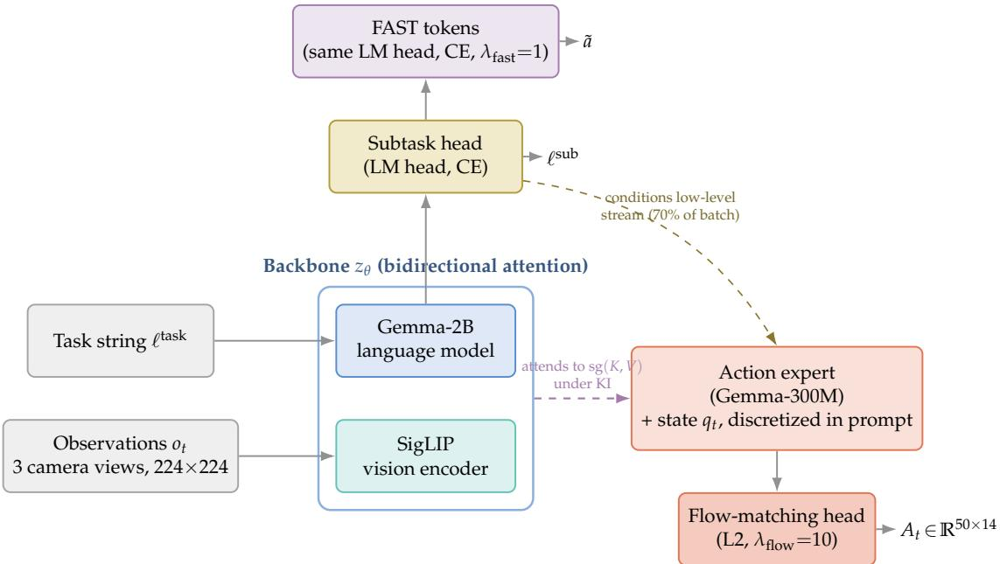  
Figure 8. FineART-VLA architecture. The backbone $z _ { \theta }$ is a 2B-parameter Gemma language model with a SigLIP vision encoder, attending bidirectionally over the camera views and the task string. Its LM head decodes the subtask $\ell ^ { \mathrm { s u b } }$ and, right after it, the FAST-tokenized action sequence a˜. The separate 300M-parameter action expert reads out the continuous chunk $A _ { t }$ through its own flow-matching loss. Under knowledge insulation, the action expert attends to stop-gradient copies of the backbone’s keys and values.

The LM head decodes the subtask on 30% of samples $( \lambda _ { \mathrm { t e x t } } { = } 1 )$ , and the action expert conditions on it for the remaining 70% (Eq. (1)). The action expert always conditions on the 14-dim joint state $q _ { t } ,$ discretized into 256 bins and embedded as text in the same prompt rather than passed through the backbone. The FAST and the flow-matching output never attend to each other. With knowledge insulation on, the flow loss’s gradient never reaches $\theta _ { \mathrm { V L M } }$ while the FAST loss – computed entirely by the backbone’s own LM head – is unaffected either way (Section A.2). Because a sample either generates the subtask (30%) or predicts the FAST and action outputs conditioned on it (70%), these two cases use two different attention patterns rather than one shared sequence, shown side by side in Fig. 9 (Section A.2).

<table><tr><td>Setting</td><td>Value</td></tr><tr><td colspan="2">(a) Mid-training data</td></tr><tr><td>Dataset</td><td>FineART, task-label-repaired release</td></tr><tr><td></td><td>Episodes / frames 40,543 / 185,534,500</td></tr><tr><td>Tasks</td><td>151 (dense task index)</td></tr><tr><td>Cameras</td><td>bird&#x27;s-eye, left wrist, right wrist (360×640, resized 224×224)</td></tr><tr><td>State / action</td><td>14-dim bimanual joint + gripper, per frame</td></tr><tr><td>Sampling</td><td>task-balanced, α = 0.5, idle chunks stripped (≈ 3.1% of frames)</td></tr><tr><td colspan="2">(b) Optimization</td></tr><tr><td>Optimizer</td><td> $\mathrm { A d a m W } ( \beta _ { 1 } { = } 0 . 9 , \beta _ { 2 } { = } 0 . 9 5 , \epsilon { = } 1 0 ^ { - 8 } )$ </td></tr><tr><td>Learning rate</td><td> $2 . 5 \times 1 0 ^ { - 5 } ,$  cosine decay to  $5 \times 1 0 ^ { - 6 }$ </td></tr><tr><td>Warmup</td><td>2,000 steps</td></tr><tr><td>Weight decay</td><td> $1 0 ^ { - 1 0 }$ </td></tr><tr><td>Gradient clip</td><td>1.0 (global norm)</td></tr><tr><td>Text CE z-loss</td><td>weight  $1 0 ^ { - 4 }$  (large-vocab logit regularizer)</td></tr><tr><td>Precision</td><td>native bfloat16 (no autocast), gradient checkpointing</td></tr><tr><td colspan="2">(c) Compute</td></tr><tr><td>Hardware</td><td>1 node, 8×H100 per run</td></tr><tr><td>Global batch</td><td>64 (8 per device × 8 devices)</td></tr><tr><td>Steps</td><td>300,000 (≈ 10% of one epoch)</td></tr><tr><td>Wall-clock</td><td>≈ 1 week per run (four runs trained in parallel)</td></tr><tr><td>Checkpointing</td><td>every 2,500 steps (120 checkpoints saved)</td></tr></table>

All four subtask/KI ablation runs in Table 2(a) share this configuration and differ only in the recipe (subtask training on/off) and whether knowledge insulation is enabled. Per-component learning-rate multipliers for the LM head, backbone, and action expert are all 1.0 (no differential scaling).

Table 5. Mid-training configuration for FineART-VLA.

## A.1 Task-Balanced Sampling

FineART’s 151 tasks range from a few dozen episodes to tens of thousands, so sampling frames uniformly from the pooled dataset would spend most of training on whichever tasks happen to be over-represented, starving all others. We use the temperature-sampling scheme from [29] behind the “task-balanced, $\alpha = 0 . 5 ^ { \prime \prime }$ row of Table 5(a): task $i ,$ with $n _ { i }$ valid (non-idle) frames, is drawn with probability

$$
p ( { \mathrm { t a s k } } = i ) = \frac { n _ { i } ^ { \alpha } } { \sum _ { j } n _ { j } ^ { \alpha } } ,\tag{3}
$$

and once a task is chosen, the frame itself is drawn uniformly from that task’s $n _ { i }$ valid frames. α interpolates between two extremes. $\mathrm { A t } \alpha = 0 , \mathrm { E q . } ( 3 )$ gives $p ( { \mathrm { t a s k } } = i ) = 1 / 1 5 1$ for every task regardless of size, so a task with a handful of episodes gets exactly as many gradient steps as one an order of magnitude larger. $\mathrm { A t } \alpha = 1$ , it reduces to $n _ { i } / \sum _ { j } n _ { j } ,$ i.e., sampling frames uniformly from the pooled dataset, so the largest tasks dominate in direct proportion to their size. We use $\alpha = 0 . 5$ for every run in this paper: a task twice as large as another is still sampled more often, but only by a factor of $\dot { \sqrt { 2 } }$ rather than 2.

We do not implement Eq. (3) as a single per-frame weight vector handed to a weighted sampler since building and drawing from a categorical distribution over FineART’s 185.5M frames is beyond what torch.multinomial’s categorical cap $( 2 ^ { 2 4 }$ entries) supports. We sample hierarchically: draw a task from Eq. (3) by an inverse-CDF lookup on the 151-entry task distribution, then draw a frame uniformly from a precomputed per-task index of valid frames, costing two small lookups per sample instead of one lookup into a 185.5M-entry table.

## A.2 Knowledge Insulation

Section 4.1 asserts that knowledge insulation makes $\nabla _ { \theta _ { \mathrm { V L M } } } \mathcal { L } _ { \mathrm { f l o w } } = 0$ . Here we show why. At every layer $l = 1 , \ldots , L$ of the joint attention, drop the head dimension and write the VLM stream’s own query/key/value as $Q _ { \mathrm { v l m } } ^ { ( l ) } , K _ { \mathrm { v l m } } ^ { ( l ) } , V _ { \mathrm { v l m } } ^ { ( l ) }$ (projections of the backbone hidden state $h _ { \mathrm { v l m } } ^ { ( l - 1 ) } )$ and the action expert’s as $Q _ { \mathrm { a c t } } ^ { ( l ) } , K _ { \mathrm { a c t } } ^ { ( l ) } , V _ { \mathrm { a c t } } ^ { ( \dot { l } ) }$ (projections of $h _ { \mathrm { a c t } } ^ { ( l - 1 ) }$ , its own 300M-parameter Gemma tower). Because the prefix never attends into the suffix (Fig. 9), the VLM stream’s attention is ordinary self-attention,

$$
\mathrm { A t t } _ { \mathrm { v l m } } ^ { ( l ) } = \mathrm { s o f t m a x } \left( \frac { Q _ { \mathrm { v l m } } ^ { ( l ) } K _ { \mathrm { v l m } } ^ { ( l ) \top } } { \sqrt { d } } + M _ { \mathrm { v l m } } \right) V _ { \mathrm { v l m } } ^ { ( l ) } ,\tag{4}
$$

and its final layer’s output realizes the backbone representation $z _ { \theta }$ of Eq. (1). The action stream’s attention additionally reads the VLM stream’s keys and values (it is conditioned on the backbone, not vice versa):

$$
\mathrm { A t t } _ { \mathrm { a c t } } ^ { ( l ) } = \mathrm { s o f t m a x } \left( \frac { Q _ { \mathrm { a c t } } ^ { ( l ) } \left[ \kappa ^ { ( l ) } ; K _ { \mathrm { a c t } } ^ { ( l ) } \right] ^ { \top } } { \sqrt { d } } + M _ { \mathrm { a c t } } \right) \left[ \nu ^ { ( l ) } ; V _ { \mathrm { a c t } } ^ { ( l ) } \right] ,\tag{5}
$$

where $[ \cdot ; \cdot ]$ concatenates along the key/value sequence axis and $M _ { \mathrm { v l m } } , M _ { \mathrm { a c t } }$ are the additive masks realizing Fig. 9(b). Without KI, $\kappa ^ { ( l ) } = K _ { \mathrm { v l m } } ^ { ( l ) }$ and $\bar { \nu } ^ { ( l ) } = V _ { \mathrm { v l m } } ^ { ( l ) }$ directly. With $\mathbf { K I } , \kappa ^ { ( l ) } = \ s \mathbf { g } \big ( K _ { \mathrm { v l m } } ^ { ( l ) } \big )$ and $\nu ^ { ( l ) } = \mathrm { s g } \big ( V _ { \mathrm { v l m } } ^ { ( l ) } \big )$ , where $\operatorname { s g } ( \cdot )$ is the stop-gradient operator: the identity in the forward pass $( \operatorname { s g } ( x ) = x )$ but a constant under differentiation $( \partial \mathrm { s g } ( x ) / \partial x \equiv 0 )$ . Figure 10 draws this split for a single layer.

Because $\operatorname { s g } ( { \mathord { \cdot } } )$ is the identity in the forward direction, Eq. (5) takes the exact same numerical value whether or not KI is enabled. KI is a purely backward-pass ablation, changing which parameters receive gradient and not what the model computes. Let $\theta _ { \mathrm { V L M } }$ denote every backbone parameter feeding $K _ { \mathrm { v l m } } ^ { ( l ) } , V _ { \mathrm { v l m } } ^ { ( \breve { l } ) }$ at any layer, and note that $\mathcal { L } _ { \mathrm { f l o w } } \left( \mathrm { E q . ~ } ( 2 ) \right)$ is read out of the action stream’s outputs only, $\mathcal { L } _ { \mathrm { f l o w } } = g \big ( \mathrm { A t t } _ { \mathrm { a c t } } ^ { ( 1 ) } , \dots , \mathrm { A t t } _ { \mathrm { a c t } } ^ { ( L ) } \big )$ , never touching $\mathsf { A t t } _ { \mathrm { v l m } } ^ { ( l ) }$ directly. With KI, for every layer $l ,$

$$
\frac { \partial \operatorname { A t t } _ { \mathrm { a c t } } ^ { ( l ) } } { \partial \theta _ { \mathrm { V L M } } } = \frac { \partial \operatorname { A t t } _ { \mathrm { a c t } } ^ { ( l ) } } { \partial s \mathrm { g } ( K _ { \mathrm { v l m } } ^ { ( l ) } ) } \underbrace { \frac { \partial s \mathrm { g } ( K _ { \mathrm { v l m } } ^ { ( l ) } ) } { \partial \theta _ { \mathrm { V L M } } } } _ { \equiv 0 } + \frac { \partial \operatorname { A t t } _ { \mathrm { a c t } } ^ { ( l ) } } { \partial s \mathrm { g } ( V _ { \mathrm { v l m } } ^ { ( l ) } ) } \underbrace { \frac { \partial s \mathrm { g } ( V _ { \mathrm { v l m } } ^ { ( l ) } ) } { \partial \theta _ { \mathrm { V L M } } } } _ { \equiv 0 } = 0 ,\tag{6}
$$

so by the chain rule $\begin{array} { r } { \nabla _ { \theta _ { \mathrm { V L M } } } \mathcal { L } _ { \mathrm { f l o w } } = \sum _ { l = 1 } ^ { L } \frac { \partial \mathcal { L } _ { \mathrm { f l o w } } } { \partial \mathrm { A t t } _ { \mathrm { a c t } } ^ { ( l ) } } \cdot \frac { \partial \mathrm { A t t } _ { \mathrm { a c t } } ^ { ( l ) } } { \partial \theta _ { \mathrm { V L M } } } = 0 . } \end{array}$ . This split is applied uniformly at every one of the L backbone layers (once per layer of the fused forward), so no VLM parameter at any depth – not just a given layer’s own $K / V$ projection weights, but every earlier embedding and layer that produced $\dot { h } _ { \mathrm { v l m } } ^ { ( l - 1 ) } - \mathrm { c a n }$ reach ${ \mathcal { L } } _ { \mathrm { f l o w } }$ through this path either. $\operatorname { s g } ( { \mathord { \cdot } } )$ severs the graph at that node regardless of what feeds into it upstream.

The FAST-tokenized output $\mathrm { ( F i g . 8 ) }$ is computed from the VLM stream, not the action stream. FAST tokens are appended to the prefix’s own text tokens before layer 1 (Fig. 9(b): “FAST tokens” shares the bidirectional-prefix side with $^ { \prime \prime } S \mathrm { u b t a s k } + S \mathrm { t a t e ^ { \prime \prime } } )$ and read out through $\mathrm { A t t } _ { \mathrm { v l m } } ^ { ( L ) }$ using the same PaliGemma

LM head that predicts the subtask. Both $\mathcal { L } _ { \mathrm { t e x t } }$ and ${ \mathcal { L } } _ { \mathrm { f a s t } }$ are sliced from the same VLM-stream output tensor, which Eq. (5) never modifies. So

$$
\nabla _ { \theta _ { \mathrm { { V L M } } } } \mathcal { L } _ { \mathrm { t e x t } } \neq 0 , \qquad \nabla _ { \theta _ { \mathrm { { V L M } } } } \mathcal { L } _ { \mathrm { { f a s t } } } \neq 0 ,\tag{7}
$$

by the same argument in reverse: neither loss’s computational graph passes through an $\operatorname { s g } ( { \mathord { \cdot } } )$ node, so the backbone continues to receive full gradient from both. KI insulates the backbone from the continuous action loss only, not from the discrete one – consistent with “the backbone is shaped only by the token-level losses” (Section 4.1).

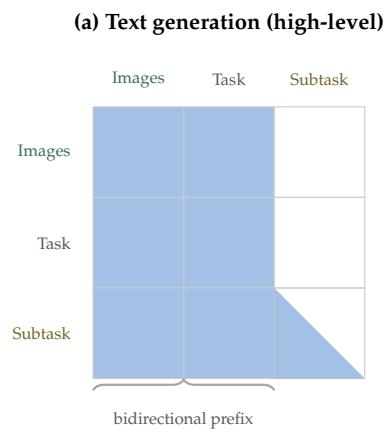

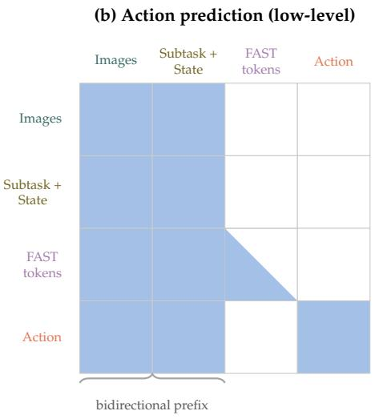  
Figure 9. Block-causal attention pattern. Colored cells can attend to each other, white cells are masked, and the diagonal split means attention is causal within that block. (a) Generating the subtask (30% of samples). Images and the task string form the bidirectional prefix, and the subtask is generated one token at a time, so each subtask token can only see earlier subtask tokens – the autoregressive restriction described in Section 4.1. (b) Predicting the action (70% of samples, or every sample for the no-subtask arm). Here the subtask and discretized state are given as input rather than generated, so they join the bidirectional prefix instead. The FAST-tokenized sequence is still generated token by token, so it stays causal like the subtask span in (a). The continuous action tokens have no such restriction: flow matching denoises the whole chunk at once, so they can all attend freely to each other.

In no panel does the prefix attend back into a generated or predicted suffix, and the FAST and continuousaction outputs are mutually invisible so neither loss leaks into the other. This masking pattern is fixed by the recipe regardless of knowledge insulation.

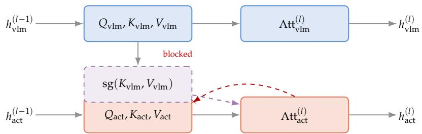  
Figure 10. Knowledge insulation at layer l. The VLM stream’s attention $\mathsf { A t t } _ { \mathrm { v l m } } ^ { ( l ) }$ (top) is untouched by KI. The action stream’s attention $\mathrm { A t t } _ { \mathrm { a c t } } ^ { ( l ) }$ (bottom) reads the VLM stream’s keys and values only through the stop-gradient copy $\mathsf { s g } ( K _ { \mathrm { v l m } } , V _ { \mathrm { v l m } } )$ (purple, dashed), which blocks $\nabla _ { \theta _ { \mathrm { { V L M } } } } \mathcal { L } _ { \mathrm { { f l o w } } }$ at the red $\times \left( \mathrm { E q . } \left( 6 \right) \right)$ .

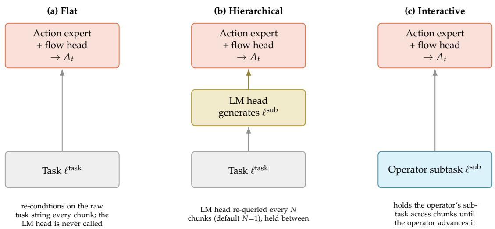  
Figure 11. Inference-time conditioning modes. The three panels show where the action expert’s low-level conditioning comes from. In (a) Flat it is just the raw task string, re-fed every chunk with the LM head never called. It is the only correct way to deploy the no-subtask arm (Run 1.4 in Table 2) since its LM head was never trained to produce anything. (b) Hierarchical is how the trained FineART-VLA is deployed (Fig. 8): the LM head autoregressively generates a subtask ℓsub every N chunks and the action expert conditions on it until the next regeneration, which is how the subtask-trained arm (Run 1.3) is deployed. (c) Interactive skips the LM head altogether and lets an operator supply ℓsub directly. It is the human-oracle protocol behind the long-horizon instruction-following result in Fig. 5, where the operator moves on to the next subtask once the previous one is judged done rather than waiting on the LM head to propose it.

## A.3 Optimization Objective

Equation (2) gives the three loss terms. In practice all of them are computed on every action chunk regardless of $\lambda _ { \mathrm { t e x t } }$ since the same chunk is flow-matched and FAST-tokenized at once. We also put a z-loss on the text logits, weight $1 0 ^ { - 4 }$ : without it, a large-vocabulary head like PaliGemma’s 257K tokens can let its log-partition function drift while cross-entropy itself persists. The recipe stack can drop the subtask context at random during training, so the policy learns to fall back on the task string alone. We leave that dropout at 0 for every run in this paper.

Mid-training required 300K steps at a global batch of 64 – about 10% of one epoch over FineART’s 185.5M frames – roughly a week of wall-clock time on a single 8×H100 node. We ran the four subtask/KI ablations on separate nodes at the same time rather than one after another, so all four checkpoints in Table 2(a) were ready within that same week.

## A.4 Inference

At deployment, the same checkpoint can be executed in three different ways, independent of how it was mid-trained (Fig. 11). All three call the same action expert and flow-matching head from Fig. 8. They differ in where the low-level conditioning comes from and how often it gets refreshed.

Chunk-level execution is the same in all three modes: a fresh action chunk is predicted from a new observation every n\_action\_steps control steps while the policy runs open-loop in between. In (b) and (c), the subtask is held across several chunks so that it spans seconds rather than a single 50-step chunk and matches how subtasks are actually distributed in training. We run inference eager rather than compiled because the action expert’s prompt embeds the discretized joint state as text. With token count shifting with almost every observation, a compiled graph re-specializes on nearly every call, so compilation never pays off.

## A.5 Language Runtime and Subtask Execution

FineART-VLA integrates with LeRobot’s interactive rollout runtime, which separates language-level instruction updates from action-chunk execution. The runtime keeps the policy, observation processors, and robot connection initialized throughout a session. A terminal interface and a programmatic controller expose the same instruction-update and execution operations.

Human-provided subtasks. An operator can replace the active instruction during execution without reloading the model. Under synchronous inference, the runtime discards queued policy actions computed under the previous instruction, and the next prediction uses the updated instruction. When real-time chunking is enabled, the new instruction conditions the next action chunk, which is blended with the remaining action prefix.

Autonomous subtask inference. Given a high-level goal, the runtime periodically requests a subtask from FineART-VLA using the current observation. The generation prompt is constructed from the checkpoint’s saved training recipe, preserving the prompt structure used for subtask supervision. The generated text becomes the active instruction for subsequent action predictions and remains in effect until replaced. Each planning query receives the original goal. The replanning interval is configurable and measured from the application of the preceding subtask; the runtime does not itself detect subtask completion.

## A.6 Efficient Training and Inference

Training. The implementation shares backbone computation across language, FAST-token, and flowmatching objectives when their corresponding supervision is present. To amortize visual-language prefix computation, multiple independent noise and timestep draws reuse the same prefix, with five draws by default. Action embeddings and output projections are vectorized across these draws. Attention masks isolate the action sequences and prevent access to FAST action targets, and the flow losses are averaged across draws.

Additional optimizations include sparse and bucketed cross-entropy computation, per-layer vision activation checkpointing, and fused AdamW updates. Optional backends support compiled crossentropy and FlashRT [32] adaptive RMSNorm kernels. For flow-only batches with knowledge insulation and no language or FAST supervision, the implementation can also omit the backbone’s backward graph.

Inference. Autoregressive subtask generation uses incremental key–value caching. The actiondenoising implementation reuses the visual-language prefix cache across steps and crops appended action entries instead of copying the cache at each step.

An optional FlashRT backend provides calibrated FP8 MLP kernels for Gemma and SigLIP. These kernels are inference-only, change numerical precision, and are disabled by default.

Liang Su, author of FlashRT [32], contributed substantial implementation and optimization work underlying this section, including denoising-cache improvements, training-path optimizations, and FlashRT kernel integration.

## B Evaluations

Our evaluations total 3,400 rollouts across 23 checkpoints between experiments on ALOHA and YAM, summarized in Table 6.

Table 6. Summary of Evaluations
<table><tr><td>Task</td><td>Total Rollouts</td><td>ALOHA Experiment</td><td>YAM Experiment</td></tr><tr><td>Put cup on shelf</td><td>575</td><td>Benchmark</td><td>Benchmark</td></tr><tr><td>Fold towel</td><td>575</td><td>Benchmark</td><td>Benchmark</td></tr><tr><td>Insert flower in vase</td><td>575</td><td>Benchmark</td><td>Benchmark</td></tr><tr><td>Insert tool into pegboard</td><td>575</td><td>Benchmark</td><td>Benchmark</td></tr><tr><td>Put cup on saucer</td><td>575</td><td>Benchmark</td><td>Benchmark</td></tr><tr><td>Sort tools</td><td>150</td><td>Benchmark</td><td>Cross-Embodiment Transfer</td></tr><tr><td>Put donut into bin</td><td>50</td><td>Spatial Grounding</td><td></td></tr><tr><td>Prepare breakfast</td><td>125</td><td>Long-Horizon</td><td>Cross-Embodiment Transfer</td></tr><tr><td>Put cable into bin</td><td>200</td><td></td><td>Unseen Target and Distractors</td></tr></table>

## B.1 Procedure

Evaluations of our scale demand procedural rigor. Across benchmark suites, we predetermine 25 initial conditions, namely position and orientation, for each task (Table 7).

Table 7. Benchmark suites by initial conditions.
<table><tr><td>Benchmark Suite</td><td>Benchmark Tasks</td><td>Initial Conditions</td></tr><tr><td>In-Embodiment</td><td>6</td><td>150</td></tr><tr><td>Cross-Embodiment</td><td>5</td><td>125</td></tr><tr><td>Total</td><td>11</td><td>275</td></tr></table>

Fig. 12 illustrates the 25 initial conditions for an in-distribution benchmark task: put cup on shelf.

## B.2 Rubric

We evaluate each checkpoint by progress rate based on subtask completion percentage. Subtasks are defined such that one subtask must be completed before the next can begin (Table 8). Prepare breakfast is an exception, with no prescribed order after its first subtask.

Table 8. Tasks by Subtask
<table><tr><td>Task</td><td>Subtask #</td><td>Subtask Description</td><td>Subtask Completion (%)</td></tr><tr><td rowspan="4">Put cup on shelf</td><td>1</td><td>Approach cup</td><td>25.0</td></tr><tr><td>2</td><td>Grasp cup</td><td>50.0</td></tr><tr><td>3</td><td>Move cup toward shelf</td><td>75.0</td></tr><tr><td>4</td><td>Place cup on shelf</td><td>100.0</td></tr><tr><td rowspan="8">Fold towel</td><td>1</td><td>Approach first boundary of towel</td><td>12.5</td></tr><tr><td>2</td><td>Grasp first boundary of towel</td><td>25.0</td></tr><tr><td>3</td><td>Move toward opposite boundary</td><td>37.5</td></tr><tr><td>4</td><td>Place at opposite boundary</td><td>50.0</td></tr><tr><td>5</td><td>Approach second boundary of towel</td><td>62.5</td></tr><tr><td>6</td><td>Grasp second boundary of towel</td><td>75.0</td></tr><tr><td>7 8</td><td>Move toward opposite boundary</td><td>87.5</td></tr><tr><td></td><td>Place at opposite boundary</td><td>100.0</td></tr><tr><td rowspan="4">Insert flower in vase</td><td>1</td><td>Approach flower</td><td>25.0</td></tr><tr><td>2</td><td>Grasp flower</td><td>50.0</td></tr><tr><td>3</td><td>Move flower toward vase</td><td>75.0</td></tr><tr><td>4</td><td>Insert flower in vase</td><td>100.0</td></tr><tr><td rowspan="4">Insert tool into pegboard holder</td><td>1</td><td>Approach tool</td><td>25.0</td></tr><tr><td>2</td><td>Grasp tool</td><td>50.0</td></tr><tr><td>3</td><td>Move tool toward pegboard</td><td>75.0</td></tr><tr><td>4</td><td>Insert tool into pegboard holder</td><td>100.0</td></tr><tr><td rowspan="4">Put cup on saucer</td><td>1</td><td>Approach cup</td><td>25.0</td></tr><tr><td>2</td><td>Grasp cup</td><td>50.0</td></tr><tr><td>3</td><td>Move cup toward saucer</td><td>75.0</td></tr><tr><td>4</td><td>Place cup on saucer</td><td>100.0</td></tr><tr><td rowspan="8">Sort tools</td><td>1</td><td>Approach first tool</td><td>12.5</td></tr><tr><td>2</td><td>Grasp first tool</td><td>25.0</td></tr><tr><td>3</td><td>Move toward bin</td><td>37.5</td></tr><tr><td>4</td><td>Drop object in corresponding bin</td><td>50.0</td></tr><tr><td>5</td><td>Approach second tool</td><td>62.5</td></tr><tr><td>6</td><td>Grasp second tool</td><td>75.0</td></tr><tr><td>7</td><td>Move toward bin</td><td>87.5</td></tr><tr><td>8</td><td>Drop object in corresponding bin</td><td>100.0</td></tr><tr><td rowspan="3">Put donut into bin</td><td>1</td><td>Approach donut</td><td>25.0</td></tr><tr><td>2</td><td>Grasp donut</td><td>50.0</td></tr><tr><td>3 4</td><td>Move donut toward correct bin</td><td>75.0</td></tr><tr><td rowspan="2"></td><td></td><td>Place donut into correct bin</td><td>100.0</td></tr><tr><td>1</td><td>Pick and place plate on tray</td><td>14.3</td></tr><tr><td rowspan="7">Prepare breakfast</td><td>2</td><td>Pick up bread</td><td>28.6</td></tr><tr><td>3</td><td>Place bread on plate</td><td>42.9</td></tr><tr><td>4</td><td>Pick up pink donut</td><td>57.1</td></tr><tr><td>5</td><td>Place pink donut on plate</td><td>71.4</td></tr><tr><td>6</td><td>Pick up blue donut</td><td>85.7</td></tr><tr><td>7</td><td>Place blue donut on plate</td><td>100.0</td></tr><tr><td></td><td></td><td>50.0</td></tr><tr><td rowspan="2">Put cable into bin</td><td>1 2</td><td>Pick up cable</td><td></td></tr><tr><td></td><td>Put cable into bin</td><td>100.0</td></tr></table>

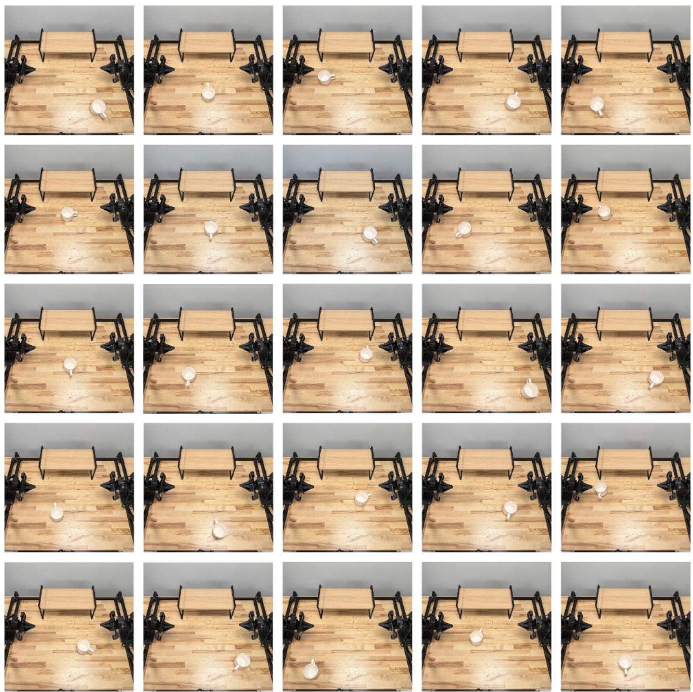  
Figure 12. Initial conditions for put cup on shelf.

## C Acknowledgments

Our work would not be possible without the support of colleagues and friends at Scale AI, Hugging Face, and the community.

• We thank Alex Finch, Angel Uribe, Luke Pulaski, and Marci Ramos for their work in operations for data collection; Ana Paula Estevez, Juan Carlos Becerril, Jose Antonio Gonzalez, Paulina Vergara Montoya, and Astrid Hernandez Galvez for their work in operations for data annotation; Aidan Walker, Amanda Dee, Angel Uribe, Devender Bankoti, Luke Pulaski, and Marci Ramos for their work in operations for evaluation; and Aidan Walker, Aliyah Dela Cruz, Amanda Dee, Angel Uribe, Caroline Doubane, Devender Bankoti, Isaiah Smith, Joshua Diaz, Katerina Connearney, Marci Ramos, Reeya Shrestha, Rudy Garcia, Sherwood Yee, Tony Alfatooni, Travis Bringas, and Veronika Tsvelodub for their work as on-site contributors.

• We thank Selam Gano, Sidney Nimako, Tyler Smithline, Martin Lombardo, Matias Del Carlo, Fran Espeche, Gabriel Blanchard, Shreyas Chakravarthula, Eric Taylor, and Tim Lu for their work in hardware engineering for data collection; Martin Lombardo, Matias Del Carlo, Fran Espeche, and Gianluca Bobbio for their work in software engineering for data collection; Gregorio Freidin, Matias Carou, Santiago Illi, and Gianluca Bobbio for their work in software engineering for data processing; and Garrett Matsuda, Juan Cabrera, Malena Goñi, Conrado Mader Blanco, Ezequiel Romio, Micaela Alvarez, Luis Lopez Castaneda, Ankit Vedak, Gianluca Bobbio, and Tim Lu for their work in software engineering for data annotation.

• We thank Caroline Clark, Kendyl Burkitt, and Molly Taudvin for their go-to-market support; and Javier Gonzalez for their cross-functional support.

• We thank Harsha Mohan, Michel Aractingi, Caroline Pascal, Carlos Jerez, Ke Wang, and Khalil Meftah for their early discussions on policy and dataset design.

• We thank Liang Su for their work on training and inference speed optimizations for FineART-VLA; and Steven Palma and the LeRobot team for their contributions to the interactive rollout runtime.

• We thank Ben Levin, Natasha Dadabhoy, and Joe Fox Jr. for their leadership and for approving the public release of the dataset.