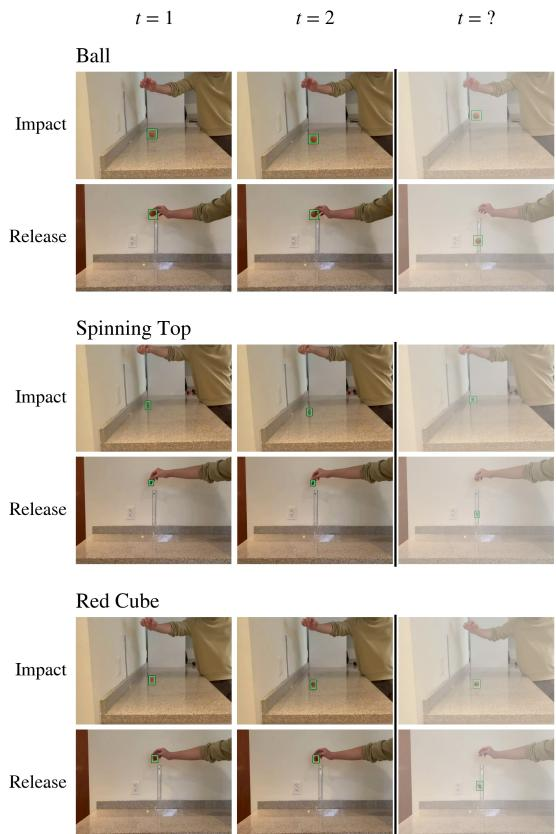
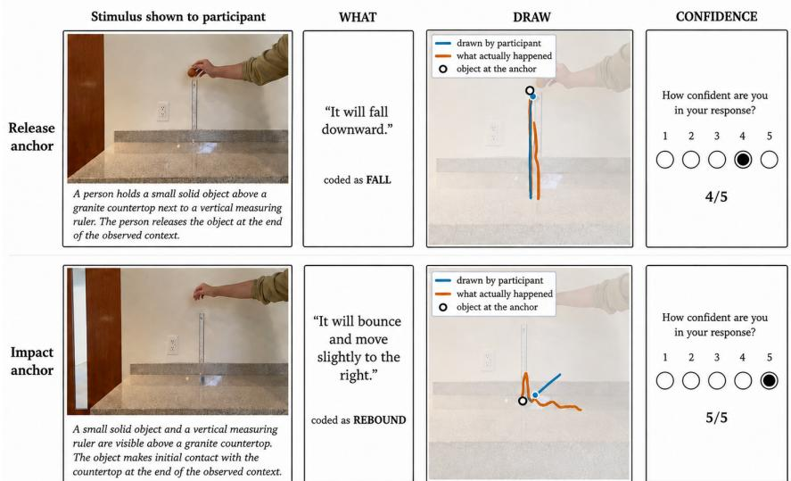

# Foresight at the Event Boundary: Evaluating Physical Prediction in Video World Models

Estela Monserrat Arriaga Santana1 Julian Rosas Scull1 Ehecatl Sacamch’en N´ u´nez Rico˜ 1 Hugo Jair Escalante2

1National Autonomous University of Mexico, Mexico

2University of Texas at El Paso, USA

mon.arriaga.santana@gmail.com julian.rosas@ciencias.unam.mx

ehecatl564@gmail.com hescalantebal@utep.edu

## Abstract

Video world models are largely regarded as predictive models of the physical world, and are therefore expected to anticipate the consequences of observed events. However, up to now, evaluation has mainly focused on reference similarity, physical-law consistency, orjudgmentplau sibility, estimating anticipation only indirectly. We address this straightforwardly: when a release or impact has just occurred but its consequence is withheld, can a world model anticipate what should happen next? We introduce an event-anchored evaluation based on 62 controlled realworldfree-fall recordings and 124 clips spanning three object types, withfine-grained release and impact annotations and ground-truth trajectories. The protocol separates consequence production, temporal placement, and physical realization. Across six contemporary video generation and world models, our findings reveal interesting failure patterns: Runway and Veo produce release and subsequent impact events at rates above 93% but often initiate them substantially late, whereas Cosmos-Predict-2.5 and MAGI-1 frequently preserve the pre-event state and produce little or no measurable consequence. Among measurable falls, plausible timing does not necessarily imply physically consistent motion. We further conduct a 15-participant, 20-condition human study in which participants describe the expected consequence from a single event-anchored frame and draw its trajectory, allowing us to contrast human and model performance. Human predictionsfavor the recorded future in aggregate while revealing genuine ambiguity among plausible continuations. Trajectory analysis further shows that whether a model produces measurable motion must be separated from how accurately that mo tion is realized. Overall, physical foresight emerges as a sequence of distinct challenges: initiating a consequence,

anchoring it in time, and realizing its motion.

## 1. Introduction

Video world models are increasingly framed as predictive models of the physical world. Under this view, a model should not only generate visually plausible motion, but also continue the consequence of an event that has already been observed: an unsupported object should fall after release, and an object that has just collided with a surface should react accordingly.

Existing evaluations largely ask whether a generated continuation resembles a recorded future or satisfies physical constraints [11, 17, 18]. These criteria can miss an earlier failure: the model may never initiate the expected consequence at all. We therefore separate three questions: whether the observed event is carried through, whether the resulting motion is physically plausible, and whether the expected consequence is inferable from the available evidence.

We study these questions using controlled real-world free-fall recordings of three objects, annotated at release and impact and accompanied by measured trajectories. Prediction ends exactly at one of these physical events, and everything that follows is withheld. We evaluate six models—Cosmos-3 [12], Cosmos-Predict-2.5 [1], MAGI-1 [15], PhyWorld [20], Runway Gen-4.5 [14], and Google Veo 3.1 [6]—and complement the model evaluation with a human study. Because the recorded continuation represents only one possible future compatible with the observed event, human predictions provide a reference for which consequences and trajectories are reasonably anticipated from the available evidence.

The results reveal qualitatively different failure modes. Runway and Veo usually produce the expected release consequence, but often place it substantially too late; Cosmos-

Predict-2.5 and MAGI-1 frequently fail to initiate the consequence at all, while Cosmos-3 and PhyWorld lie between these regimes. Once measurable free-fall motion is produced, its timing can be close to the real fall even when the event onset is misplaced. Human predictions further show that the recorded future receives the strongest aggregate support from minimal evidence, while also revealing genuine ambiguity among plausible continuations.

The contributions of this work are as follows:

• an event-anchored, outcome-blind protocol that separates consequence production, temporal placement, and physical realization;

• a new annotated real-world free-fall resource comprising 62 recordings and 124 event-anchored clips, with release, impact, and rest events together with metric object trajectories;

• an evaluation of six recent video generation and world models; and

• a matched human study of open-ended consequence and trajectory prediction from the same event anchors.

## 2. Related Work

Evaluations of generated video typically rely on human/VLM judgments, comparison with a reference future, or explicit tests of physical laws. PhyGround and Physion-Eval provide semantic judgments of physical failures [8, 19], while Physics-IQ compares generated motion with real experimental recordings [11, 13]. Referencebased evaluation measures agreement with an observed future, but may penalize alternative physically valid continuations when the initial state is not fully determined.

Law-based benchmarks instead assess physical admissibility. Morpheus evaluates trajectory-level equations and invariants such as acceleration, energy, momentum, and period [18], while WorldBench combines concept-specific evaluation with estimation of physical parameters such as gravity and friction [17]. These approaches measure whether generated motion follows expected physics, but they do not specifically isolate the response to an observed physical event. In particular, they do not directly measure whether a consequence begins after a release or impact, how long that onset is delayed, or whether the response is suppressed altogether. Physion and Physion++ also define explicit prediction boundaries [2, 16], but these boundaries are not used as event anchors for measuring the subsequent physical response.

Our protocol focuses on this complementary event-level setting. Observation ends at an annotated release or impact in controlled real-world free-fall experiments, and the subsequent consequence is withheld. We evaluate whether the expected response occurs, when it begins, and whether the resulting motion is physically plausible. We further compare these continuations with open-ended human predictions from the same event anchors. Unlike the predefined contact judgments used in Physion and Physion++, participants freely describe and draw the expected continuation, following a broader tradition of using trajectory drawings to probe intuitive physics [2, 10, 16].

## 3. Dataset

Source recordings and event clips. We use 62 real freefall recordings captured at 832 × 464 and 59.9 fps under fixed indoor conditions, covering three objects—a ball, a red cube, and a spinning top—and two camera viewpoints. The objects were chosen to provide contrasting geometries and contact profiles within the same controlled free-fall setting: although all three are subject to the same gravitational acceleration during the fall, their shape and mass distribution support substantially different post-contact responses, ranging from bouncing or rolling to face-supported and rotational motion. This allows us to test a common eventconditioned prediction problem without restricting the evaluation to a single object geometry. Each recording is split into a release-anchored and an impact-anchored clip, yielding 124 event clips (Fig. 1). Each clip provides 33 context frames (0.55 s), ending at the annotated anchor event, and the prompt describes the observed setup without revealing the future trajectory or outcome.

Annotations. The real recordings were annotated in CVAT [4] with object locations and frame-level release, impact, and rest events. We additionally tracked the objects in Tracker [3], using the per-video spatial calibration to obtain metric trajectories for the physics-based measurements. Generated videos were annotated only in CVAT, using the same object tracks and event markers, together with failure-mode labels such as suppressed motion, disappearance, duplication, and outcome substitution. Four annotators labeled the real and generated videos, with each video assigned to one annotator.

Generated and evaluated clips. We evaluate Cosmos-3, Cosmos-Predict-2.5, MAGI-1, PhyWorld, Runway, and Veo, producing 743 videos in total (124 per model except Veo, which failed on one clip). For manual evaluation, we use the 123 event clips available for all six models and sample a balanced subset over object, viewpoint, and anchor event. The 3 × 2 × 2 = 12 strata contribute eight clips each, giving 96 event clips per model and 576 annotated generated videos in total.

## 4. Proposed Evaluation Protocol

Our protocol evaluates physical foresight along three complementary dimensions: whether an observed event is carried through to its expected consequence, whether the resulting motion is physically plausible, and whether the generated future aligns with human expectations under minimal visual evidence. The physical-realization criteria follow established physics-based evaluation practice, while our event-level consequence measurement and open-ended human reference target complementary aspects not isolated by these evaluations.

  
Figure 1. Event-anchored evaluation clips. The context ends at the annotated release or impact; subsequent frames are withheld from the model. Examples show the three evaluated objects.

## 4.1. Measuring consequence production

Under the considered scenario, the prompt and the context video specify which event has just occurred and withhold everything that follows from it. The evaluation protocol establishes whether the generated continuation contains the events entailed by that anchor event. It does not assess how accurately those events are rendered: no criterion of physi cal plausibility, trajectory accuracy or timing is imposed, so that a model is credited with the consequence whenever it produces it at all.

Release condition. The context ends at the instant the object is let go. The entailed continuation comprises a release, a subsequent impact, and the object coming to rest after moving. The presence of each of the three markers is recorded independently. Release and impact constitute the substantive tests; the rest marker carries weaker evidential weight, since a clip may terminate before the object settles.

Impact condition. The context ends at the instant of contact. The requirement is that the model, from the prompt and the reference frames, infer what follows: the object must react rather than remain frozen. The same three markers are annotated as in the release condition, and they are used to characterise what the model produced—in particular whether it substituted a fresh release for the expected continuation, and whether the object was brought to rest.

The markers do not, however, establish whether the object moved. The impact marker coincides with the anchor in this condition, since the contact is supplied to the model rather than predicted by it, and the rest marker records that the object is at rest irrespective of whether it had previously been in motion. Motion is consequently determined from the annotated trajectory: an object counts as having moved when the centre of its bounding box departs from its initial position by more than half the object’s own size. Displacement is expressed in object diameters—the mean diagonal of the bounding box—rather than in pixels, since each model generates at its native resolution (832 × 480 to 1280 × 720) and a pixel threshold would not be comparable across models.

Scope of the measurement. Event rates are computed over the full generated portion of each clip, without restricting when the event must occur. For models that replay conditioning frames at the start of their output (Cosmos-3: 13; Cosmos-Predict-2.5: 5; PhyWorld: 9), evaluation begins at the first newly generated frame, since the replayed frames are part of the input and already contain the anchor event. MAGI-1, Runway, and Veo require no such exclusion. Release markers occurring within replayed conditioning frames are ignored; only releases occurring after the first genuinely generated frame are treated as generated rerelease events.

## 4.2. Measuring physical realization

Following established physics-based evaluation practice [11, 17, 18], we assess measurable free-fall motion along three criteria. We compare the annotated release-toimpact duration with the theoretical time $t = { \sqrt { 2 h / g } }$ , using $g \ : = \ : 9 . 8 1 \mathrm { m / s ^ { 2 } }$ and a one-frame tolerance determined by the video’s frame rate. We additionally measure the horizontal displacement of the object’s bounding-box center from its release position, allowing a 10 px tolerance, and estimate $g _ { \mathrm { m o d e l } }$ by fitting the tracked vertical trajectory to a constant-acceleration model. These measurements are computed only for continuations with identifiable release and impact events. Full derivations, fitting details, and implementation choices are provided in the supplementary material.

  
Figure 2. Human prediction protocol. Participants observe an anchor frame and an outcome-blind event description, then provide a textua prediction (WHAT), a trajectory drawing (DRAW), and a confidence score. The recorded trajectory is used only for evaluation and is never shown to participants.

## 4.3. Human foresight reference

Human prediction study. We evaluate whether the expected continuation can be inferred from minimal visual evidence through a separate human study. The human prediction protocol is summarized in Fig. 2. Fifteen participants complete 20 free-fall conditions (11 release and 9 impact), yielding 300 responses. For each condition, participants see only the final anchor frame together with the same outcomeblind event description used for generation. They predict what happens next in free text (WHAT), draw the expected object trajectory (DRAW), and report confidence on a fivepoint scale. The conditions span three objects, two viewpoints, and different release heights.

WHAT: predicted consequence. Free-text responses are assigned a single code corresponding to the first physical consequence explicitly predicted by the participant [7, 9]. Categories include FALL, REBOUND, SURFACE-MOTION, NO-MOTION, CONTACT, ROTATE, BREAK, and OTHER; we do not infer unstated intermediate events, so “fall and bounce” is coded as FALL. To compare humans with models and the recorded future, generated and real trajectories are mapped to the same consequence space. Starting at the anchor, the first displacement exceeding 0.5d , where d is the object’s bounding-box diagonal, is classified as FALL, REBOUND, or SURFACE-MOTION according to whether motion is predominantly downward, upward, or horizontal; trajectories that never reach the threshold are coded as NO-

MOTION. We then report the fraction of participants predicting the same consequence as each model and the recorded future.

DRAW: predicted trajectory. Human drawings, model trajectories, and recorded trajectories are translated to the anchor position and normalized by d0, so distances are expressed in object-size units rather than pixels. Curves are resampled to 30 points and compared over the corresponding event interval: release to first contact for release trials, and the initial post-impact response for impact trials. Trajectories moving less than 0.5d0 are treated as degenerate and receive no geometric score; for the remaining trajectories, we use discrete Frechet distance [ ´ 5], which compares path geometry without requiring synchronized timestamps. We report human–human (H–H), human–ground-truth (H–GT), model–human (M–H), and model–ground-truth (M–GT) comparisons.

Conditioning asymmetry. To define a human reference under the minimum visual evidence available across the evaluated models, participants receive only the anchor frame together with the outcome-blind event description. This matches the conditioning of the single-frame models, Runway and Veo. The video-conditioned models receive additional temporal context according to their native input requirements. Accordingly, comparisons with Runway and Veo are matched in visual evidence, whereas comparisons with the video-conditioned models should be interpreted as alignment with a minimal-evidence human reference rather than as a controlled test of context length.

<table><tr><td>Model</td><td>Access</td><td>Mode</td><td>Visual context</td></tr><tr><td>Cosmos3-Nano</td><td>Open</td><td>V2V</td><td>0.55 s</td></tr><tr><td>Cosmos-Predict2.5-2B</td><td>Open</td><td>V2V</td><td>5 frames (≈ 0.31 s)</td></tr><tr><td>MAGI-1-4.5B-distill</td><td>Open</td><td>V2V</td><td>0.55s</td></tr><tr><td>PhyWorld</td><td>Open</td><td>V2V</td><td>0.55s</td></tr><tr><td>Runway Gen-4.5</td><td>Closed</td><td>I2V</td><td>1 frame</td></tr><tr><td>Google Veo 3.1</td><td>Closed</td><td>I2V</td><td>1 frame</td></tr></table>

Table 1. Access and visual conditioning of the evaluated models. V2V and I2V denote video- and image-conditioned generation, respectively.

## 5. Experimental Settings

We evaluate six recent video generation and world models: Cosmos3-Nano [12], Cosmos-Predict2.5-2B [1], MAGI-1- 4.5B-distill [15], PhyWorld [20], Runway Gen-4.5 [14], and Google Veo 3.1 [6]. Each open-weight model was self-hosted on a single NVIDIA A100 80 GB GPU through RunPod,1 while Runway and Veo were accessed through Replicate using the runwayml/gen-4.52 and google/veo-3.13 endpoints. We preserve each model’s native conditioning modality and recommended operating point whenever compatible with our protocol; exact inference configurations and deviations from released decoding settings are reported in the supplementary material.

Models and conditioning. The models receive the temporal evidence supported by their native conditioning interfaces (Table 1). Cosmos3-Nano, MAGI-1, and PhyWorld receive the complete 0.55 s event-ending context, resampled to their required frame rate. Cosmos-Predict2.5-2B uses its default five-frame Video2World conditioning (≈ 0.31 s), while Runway Gen-4.5 and Veo 3.1 operate from the anchor frame alone. In all cases, conditioning terminates at the annotated release or impact and contains no post-anchor information.

Prompting. Following Physics-IQ Verified [13], prompts describe the setup, camera, and anchor event while withholding the subsequent motion, trajectory, and outcome. Wording is adapted to each model’s interface while preserving the same event-level information. Where supported, auxiliary constraints discourage camera motion and generation artifacts; for Runway, which lacks a negative-prompt field, these are expressed positively.

## 6. Results

We first examine whether and when models produce the expected event consequence, and then compare their predicted

consequences and trajectories with human expectations under minimal visual evidence.

## 6.1. Does the model produce the consequence?

Table 2 reveals a sharp difference in consequence production. Runway and Veo carry the release through to a subsequent impact in over 93% of clips. Cosmos-3 and PhyWorld do so in roughly one third, whereas Cosmos-Predict-2.5 never generates a release and MAGI-1 does so only once. For Cosmos-3 and PhyWorld, impact rates closely track release rates (33.3 vs. 33.3 and 33.3 vs. 31.2), indicating that most failures occur at the first step: once the object is released, the remaining consequence usually follows.

The rest marker should be interpreted separately. Cosmos-Predict-2.5 and MAGI-1 are labeled at rest in 47.9% and 56.2% of clips despite almost never releasing the object, because rest indicates only that the object is stationary, not that it came to rest after moving. We therefore do not interpret this marker alone as evidence of a completed consequence.

The impact condition exposes a related failure. Cosmos-3 moves the object in every clip, while Runway, Veo, and PhyWorld do so in most cases. Cosmos-Predict-2.5 and MAGI-1 instead leave the object frozen in 72.9% and 63.8% of clips, respectively, even though the collision itself is already visible in the conditioning input.

A second failure mode is event replay: rather than continuing from the observed impact, some models regenerate an earlier stage of the event. After excluding releases contained in replayed conditioning frames, Veo generates a new release in 17 impact-conditioned clips and Runway in 4. Several Veo clips contain multiple re-releases, indicating repetition of the causal event rather than continuation from it.

Together, the two conditions distinguish two forms of consequence failure: suppression of the expected response, most evident for Cosmos-Predict-2.5 and MAGI-1, and replay of an earlier causal stage, most evident for Veo.

When the consequence is placed. High event-occurrence rates can hide substantial timing errors. As shown in Table 3, Runway and Veo release the object after median onset times of 1.73 s and 0.94 s, compared with 0.23 s for Cosmos-3 and 0.22 s for PhyWorld. Restricting evaluation to the first generated second therefore reduces the release rate from 95.8% to 22.9% for Runway and to 54.2% for Veo, while leaving the other models largely unchanged.

The delay occurs mainly before the release. Once falling begins, Runway (0.25 s) and Veo (0.21 s) are close to the real release-to-impact duration of 0.20 s; Cosmos-3 and PhyWorld yield 0.29 s and 0.25 s, respectively. Thus, Runway and Veo often produce the expected consequence but place it too late, whereas Cosmos-Predict-2.5 and MAGI-1 rarely initiate it at all. Because Runway and Veo receive only the final context frame, their delayed onset may partly reflect the absence of temporal context rather than model quality alone.

<table><tr><td rowspan="2">Model</td><td colspan="3">Release condition</td><td rowspan="2">Impact condition</td></tr><tr><td>Release</td><td>Impact</td><td>Rest</td></tr><tr><td>Cosmos3-Nano</td><td>33.3 [22–47]</td><td>33.3 [22–47]</td><td>62.5 [48–75]</td><td>Object moved 100.0 [93–100]</td></tr><tr><td>Cosmos-P2.5</td><td>0.0 [0–7]</td><td>0.0 [0–7]</td><td>47.9 [34–62]</td><td>27.1 [17–41]</td></tr><tr><td>MAGI-1</td><td>2.1 [0–11]</td><td>0.0 [0–7]</td><td>56.2 [42–69]</td><td>36.2 [24–50]</td></tr><tr><td>PhyWorld</td><td>33.3 [22–47]</td><td>31.2 [20–45]</td><td>64.6 [50–77]</td><td>72.9 [59–83]</td></tr><tr><td>Runway</td><td>95.8 [86–99]</td><td>93.8 [83–98]</td><td>95.8 [86–99]</td><td>85.4 [73–93]</td></tr><tr><td>Veo</td><td>95.8 [86–99]</td><td>93.8 [83–98]</td><td>95.8 [86–99]</td><td>81.2 [68–90]</td></tr></table>

Table 2. Occurrence rates of event-level consequences. Under the release condition, columns indicate whether release, subsequent impact, and rest occur; under the impact condition, whether the object moves after the observed impact. Values are percentages with 95% Wilson confidence intervals. There are $n = 4 8$ clips per model and condition, except MAGI-1 impact $( n = 4 7 )$ due to one missing object annotation.

<table><tr><td></td><td>Releases</td><td>Onset</td><td>Fall</td><td>Settling</td></tr><tr><td>Real recordings</td><td>61</td><td></td><td>0.20</td><td>1.12</td></tr><tr><td>Cosmos-3</td><td>16</td><td>0.23</td><td>0.29</td><td>0.25</td></tr><tr><td>Cosmos-Predict-2.5</td><td>0</td><td></td><td>一</td><td></td></tr><tr><td>MAGI-1</td><td>1</td><td></td><td></td><td></td></tr><tr><td>PhyWorld</td><td>16</td><td>0.22</td><td>0.25</td><td>0.31</td></tr><tr><td>Runway</td><td>46</td><td>1.73</td><td>0.25</td><td>2.29</td></tr><tr><td>Veo</td><td>46</td><td>0.94</td><td>0.21</td><td>2.25</td></tr></table>

Table 3. Median event timing in seconds. Onset is measured from the first generated frame to release, fall from release to impact, and settling from impact to rest. Releases gives the number of clips contributing to the onset estimate; later intervals may contain fewer valid clips.

## 6.2. Is the resulting motion physically plausible?

Table 4 summarizes performance across the three classicalmechanics-based criteria described above. The first two columns report the fraction of videos satisfying the expected temporal and spatial properties of free fall, respectively, while the last reports the mean estimated gravitational acceleration and its standard deviation. These measurements are computed only on release-conditioned continuations in which a generated release and subsequent impact can be identified. Re-release events generated after an impact anchor are treated as event-replay failures (Sec. 6.1) and excluded from the primary physics analysis.

The results reveal substantial differences across models and show that satisfying one physical criterion does not necessarily imply consistency with the others. PhyWorld, for example, produces plausible fall durations in 50% of the analyzed videos and exhibits no measurable horizontal deviation in 36% of them. However, its estimated gravitational acceleration is ${ \bar { g } } _ { \mathrm { m o d e l } } = 3 . 3 6 { \pm } 3 . 1 2 \mathrm { m / s ^ { 2 } }$ , considerably below the expected value of $9 . 8 1 \mathrm { m } / \mathrm { s } ^ { 2 }$ . Thus, a generated trajectory may satisfy some quantitative physical criteria while remaining inconsistent with the expected dynamics.

Cosmos-3 provides the closest mean estimate to the expected gravitational acceleration, with $\bar { g } _ { \mathrm { m o d e l } } ~ = ~ 8 . 0 9 \pm$ $\mathrm { 1 1 . 9 4 m / s ^ { 2 } }$ . Nevertheless, only 46% of its videos satisfy the temporal criterion and 8% satisfy the criterion for the absence of horizontal deviation. The large standard deviation further indicates substantial variability across samples, so the agreement of the mean acceleration with the physical reference is not representative of all generated continuations.

Runway and Veo yield lower mean accelerations of $5 . 3 5 \pm 5 . { \dot { 6 } } 7 \mathrm { m } / \mathrm { s } ^ { 2 }$ and $\mathrm { 4 . 4 7 \pm 4 . 8 5 m / s ^ { 2 } }$ , respectively, and show no measurable horizontal deviation in only 4% and 2% of videos. MAGI-1 and Cosmos-Predict-2.5 produce no release-conditioned continuations for which both release and impact can be reliably identified, so no physical measurements are reported for these models. Overall, the disagreement between fall duration, horizontal consistency, and estimated acceleration shows that physical plausibility cannot be adequately characterized by a single measurement. Here, fall duration captures temporal consistency, horizontal deviation captures spatial consistency, and the estimated acceleration provides a direct measure of the generated dynamics.

## 6.3. Do model predictions align with human foresight?

We compare models and the recorded future with human predictions in two spaces: WHAT, measuring human support for the first predicted consequence, and DRAW, measuring trajectory production and, conditional on motion, geometry relative to humans and ground truth.

WHAT: Which consequence is anticipated? At the human level, open-ended responses remained distributed, with primary-event entropy of 1.42 bits for release and 1.91 bits for impact, indicating greater disagreement after impact. For human–model alignment, Table 5 reports, for each model and the recorded future, the mean fraction of participants predicting the same first consequence. The recorded continuation receives the greatest aggregate support in both conditions: 0.61 for release and 0.47 for impact, compared with maximum model values of 0.52 and 0.39, respectively. These averages hide important differences across stimuli: in one red-cube impact condition, the recorded NO-MOTION continuation receives human support 0.27, whereas Cosmos-3 and Runway each receive 0.40, showing that a model can disagree with the recorded future while still matching human expectations. The most humansupported model also differs by anchor: Veo and Runway receive the highest support after release, whereas Cosmos-3 does so after impact. Cosmos-Predict-2.5 is an extreme release case (0.01), as its frequent NO-MOTION continuations were rarely anticipated. Because responses are openended, these scores reflect agreement in the first consequence explicitly selected by each participant; responses such as “fall”, “contact”, and “rebound” may refer to different points of a largely shared physical sequence rather than entirely different predicted futures.

<table><tr><td>Model</td><td>Plausible Fall Time</td><td>No Horizontal Deviation</td><td> $\bar { g } _ { \mathrm { m o d e l } } \pm \sigma \ [ \mathrm { m / s ^ { 2 } } ]$ </td></tr><tr><td>Cosmos-3</td><td>0.46</td><td>0.08</td><td> $8 . 0 9 { \pm } 1 1 . 9 4$ </td></tr><tr><td>Cosmos-Predict-2.5</td><td></td><td></td><td></td></tr><tr><td>MAGI-1</td><td></td><td></td><td></td></tr><tr><td>PhyWorld</td><td>0.50</td><td>0.36</td><td> $3 . 3 6 { \pm } 3 . 1 2$ </td></tr><tr><td>Runway</td><td>0.30</td><td>0.04</td><td> $5 . 3 5 { \pm } 5 . 6 7$ </td></tr><tr><td>Veo</td><td>0.27</td><td>0.02</td><td> $4 . 4 7 \pm 4 . 8 5$ </td></tr></table>

Table 4. Fraction of videos that satisfied the classical-mechanics-based benchmarks, together with the estimated accelerations. Only videos with a release anchor exhibiting both a successful release and an impact were considered.

<table><tr><td>Source</td><td>Release</td><td>Impact</td></tr><tr><td>Recorded GT</td><td>0.61</td><td>0.47</td></tr><tr><td>Veo</td><td>0.52</td><td>0.30</td></tr><tr><td>Runway</td><td>0.47</td><td>0.24</td></tr><tr><td>Cosmos-3</td><td>0.34</td><td>0.39</td></tr><tr><td>MAGI-1</td><td>0.12</td><td>0.14</td></tr><tr><td>PhyWorld</td><td>0.12</td><td>0.11</td></tr><tr><td>Cosmos-Predict-2.5</td><td>0.01</td><td>0.17</td></tr></table>

Table 5. Mean human support for the first physical consequence produced by each model and by the recorded future, $\mathbb { E } _ { s } [ p _ { H } ( c$ | s)], over 11 release and 9 impact stimuli with 15 human predictions per stimulus.

DRAW: Does the model produce a trajectory? Table 6 reports whether each generated continuation contains a nondegenerate trajectory in the event-defined DRAW window, with static outputs retained as failures rather than discarded before geometric comparison. Cosmos-Predict-2.5 produces no measurable trajectory in any of its 19 evaluable windows, while MAGI-1 does so in only 2 of 20. Discarding these cases would therefore introduce severe survivorship bias; we treat trajectory production as the primary DRAW result and evaluate geometry only conditional on measurable motion.

<table><tr><td>Model</td><td>Release</td><td>Impact</td></tr><tr><td>Cosmos-3</td><td>6/11</td><td>7/9</td></tr><tr><td>Veo</td><td>7/11</td><td>3/9</td></tr><tr><td>Runway</td><td>4/11</td><td>4/9</td></tr><tr><td>PhyWorld</td><td>1/11</td><td>1/8</td></tr><tr><td>MAGI-1</td><td>2/11</td><td>0/9</td></tr><tr><td>Cosmos-Predict-2.5</td><td>0/10</td><td>0/9</td></tr></table>

Table 6. Production of a measurable trajectory within the eventdefined DRAW window. Smaller denominators indicate continuations that were not evaluable for the corresponding model.

DRAW: How does the trajectory compare? For measurable trajectories, H–H measures variability among human drawings, while H–GT measures human agreement with the recorded future; these provide references for the model–human (M–H) and model–ground-truth (M–GT) comparisons. Median Frechet distances are´ $D ( H , H ) ~ = ~ 0 . 8 6 d _ { 0 }$ for release and $1 . 7 9 d _ { 0 }$ for impact, while $D ( H , G T ) = 0 . 7 5 d _ { 0 }$ for release and 1.53d for impact, showing that the recorded trajectory is at least as close to humans as human drawings are to one another. We report model distances only when at least five measurable trajectories are available. For release, Veo yields $D ( M , H ) =$ 1.19d0 and $D ( M , G T ) = 0 . 4 0 d _ { 0 } ( n = 7 )$ , while Cosmos-3 yields $D ( M , H ) = 2 . 2 3 d _ { 0 }$ and $D ( M , G T ) = 1 . 6 1 d _ { 0 }$ $( n = 6 )$ . For impact, Cosmos-3 yields $D ( M , H ) = 2 . 2 2 d _ { 0 }$ and $D ( M , G T ) = 1 . 5 8 d _ { 0 } ( n = 5 )$ . Thus, conditional on producing motion, Veo’s release trajectories lie closer to the recorded future than Cosmos-3’s, while Cosmos-3 remains farther from both humans and the recorded trajectory. These results should be interpreted together with the trajectoryproduction rates above.

## 7. Conclusion

We introduced an event-anchored evaluation of physical foresight that separates whether a model produces the consequence of an observed event from when and how that consequence is physically realized. Across six models, we observe distinct failure stages: some frequently fail to initiate the implied consequence, others produce it only after a substantial temporal delay, and physically plausible timing does not necessarily imply physically consistent motion. Human predictions further show that these failures cannot be explained solely by insufficient evidence: from even a single event-anchored frame, participants often anticipate the expected consequence while also revealing genuine ambiguity among plausible futures. Together, these findings suggest that physical prediction should be evaluated as a sequence of separable capabilities—consequence production, temporal anchoring, and physical realization— rather than reduced to a single similarity or physics score.

## References

[1] Arslan Ali, Junjie Bai, Maciej Bala, Yogesh Balaji, Aaron Blakeman, Tiffany Cai, Jiaxin Cao, Tianshi Cao, Elizabeth Cha, Yu-Wei Chao, et al. World simulation with video foundation models for physical AI. arXiv preprint arXiv:2511.00062, 2025. 1, 5

[2] Daniel M. Bear, Elias Wang, Damian Mrowca, Felix J. Binder, Hsiao-Yu Fish Tung, R. T. Pramod, Cameron Holdaway, Sirui Tao, Kevin Smith, Fan-Yun Sun, Li Fei-Fei, Nancy Kanwisher, Joshua B. Tenenbaum, Daniel L. K. Yamins, and Judith E. Fan. Physion: Evaluating physical prediction from vision in humans and machines. In Advances in Neural Information Processing Systems, 2021. 2

[3] Douglas Brown, Robert Hanson, and Wolfgang Christian. Tracker video analysis and modeling tool. Computer software, 2026. Version 6.3.5. 2

[4] CVAT.ai Corporation. Computer vision annotation tool (cvat). 2

[5] Thomas Eiter and Heikki Mannila. Computing discrete frechet distance. Technical Report CD-TR 94/64, Technis-´ che Universitat Wien, 1994.¨ 4

[6] Jess Gallegos and Thomas Iljic. Introducing veo 3.1 and advanced capabilities in flow, 2025. 1, 5

[7] Hsiu-Fang Hsieh and Sarah E. Shannon. Three approaches to qualitative content analysis. Qualitative Health Research, 15(9):1277–1288, 2005. 4

[8] Juyi Lin, Arash Akbari, Yumei He, Lin Zhao, Haichao Zhang, Arman Akbari, Xingchen Xu, Zoe Y. Lu, Enfu Nan, Hokin Deng, Edmund Yeh, Sarah Ostadabbas, Yun Fu, Jennifer Dy, Pu Zhao, and Yanzhi Wang. PhyGround: Benchmarking physical reasoning in generative world models. arXiv preprint arXiv:2605.10806, 2026. 2

[9] Philipp Mayring. Qualitative content analysis. Forum Qualitative Sozialforschung /Forum: Qualitative Social Research, 1(2), 2000. 4

[10] Michael McCloskey, Alfonso Caramazza, and Bert Green. Curvilinear motion in the absence of external forces: Naive

beliefs about the motion of objects. Science, 210(4474): 1139–1141, 1980. 2

[11] Saman Motamed, Laura Culp, Kevin Swersky, Priyank Jaini, and Robert Geirhos. Do generative video models understand physical principles? In Proceedings ofthe IEEE/CVF Winter Conference on Applications of Computer Vision, pages 948– 958, 2026. 1, 2, 3

[12] NVIDIA. Cosmos 3: Omnimodal world models for physical AI. Model card and technical documentation, 2026. Cosmos3-Nano model card, released May 2026. 1, 5

[13] Tim Radsch, Yuki M. Asano, Hilde Kuehne, Stefan Bauer,¨ Priyank Jaini, Robert Geirhos, and Carsten T. Luth. Physics-¨ IQ Verified. arXiv preprint arXiv:2606.18943, 2026. 2, 5

[14] Runway. Runway gen-4.5: State-of-the-art ai video generation. Runway Research, 2025. Accessed: 2026-08-29. 1, 5

[15] Sand.ai, Hansi Teng, Hongyu Jia, Lei Sun, Lingzhi Li, Maolin Li, Mingqiu Tang, Shuai Han, Tianning Zhang, W. Q. Zhang, et al. MAGI-1: Autoregressive video generation at scale. arXiv preprint arXiv:2505.13211, 2025. 1, 5

[16] Hsiao-Yu Tung, Mingyu Ding, Zhenfang Chen, Daniel Bear, Chuang Gan, Joshua B. Tenenbaum, Daniel L. K. Yamins, Judith E. Fan, and Kevin A. Smith. Physion++: Evaluating physical scene understanding that requires online inference of different physical properties. In Advances in Neural Information Processing Systems, pages 67048–67068, 2023. 2

[17] Rishi Upadhyay, Howard Zhang, Jim Solomon, Ayush Agrawal, Pranay Boreddy, Shruti Satya Narayana, Yunhao Ba, Alex Wong, Celso M. de Melo, and Achuta Kadambi. WorldBench: Disambiguating physics for diagnostic evaluation of world models. arXiv preprint arXiv:2601.21282, 2026. 1, 2, 3

[18] Chenyu Zhang, Daniil Cherniavskii, Andrii Zadaianchuk, Antonios Tragoudaras, Antonios Vozikis, Thijmen Nijdam, Derck W. E. Prinzhorn, Mark Bodracska, Nicu Sebe, and Efstratios Gavves. Morpheus: Benchmarking physical reasoning of video generative models with real physical experi ments. arXiv preprint arXiv:2504.02918, 2025. 1, 2, 3

[19] Qin Zhang, Peiyu Jing, Hong-Xing Yu, Fangqiang Ding, Fan Nie, Weimin Wang, Yilun Du, James Zou, Jiajun Wu, and Bing Shuai. Physion-Eval: Evaluating physical realism in generated video via human reasoning. arXiv preprint arXiv:2603.19607, 2026. 2

[20] Pu Zhao, Juyi Lin, Timothy Rupprecht, Arash Akbari, Chence Yang, Rahul Chowdhury, Elaheh Motamedi, Arman Akbari, Yumei He, Chen Wang, Geng Yuan, Weiwei Chen, and Yanzhi Wang. PhyWorld: Physics-faithful world model for video generation. arXiv preprint arXiv:2605.19242, 2026. 1, 5