# From Unity Simulation to Difusion-Based Augmentation: Quantifying Dataset Balance for Robust Object Detection

Mohamed Benkedadra ILIA, Université de Mons Mons, Belgium mohamed.benkedadra@umons.ac.be

Aissa Saoudi   
Université Polytechnique   
Hauts-de-France   
Valenciennes, France   
aissa.saoudi@uphf.fr

Sidi Ahmed Mahmoudi DeepILIA, ILIA, Université de Mons Mons, Belgium sidi.mahmoudi@umons.ac.be

Maxime Gloesener   
DeepILIA, ILIA, Université de Mons Mons, Belgium   
maxime.gloesener@umons.ac.be Matei Mancas   
ISIA Lab, Université de Mons Mons, Belgium   
matei.mancas@umons.ac.be

## Abstract

Modern computer vision models achieve high accuracy when trained on large-scale annotated datasets. In critical domains such as construction safety monitoring, data collection is costly, hazardous, and ethically constrained. This paper presents a systematic study comparing two complementary data generation paradigms, (1) Unity Simulation-based rendering and (2) Controllable Difusion-based generation (CIA), for object detection under real data-scarce conditions. A unified experimental framework enables controlled dataset mixing across real, simulated, and generative sources, while maintaining identical model and training settings. Quantitative evaluation using Precision, Recall, mAP, and custom Δ-metrics, reveals that neither simulation nor generative augmentation alone achieves optimal transferability. Unity-only training yields an mAP@0.5 drop of −50% relative to real data, while CIA-only training shows a milder −16.5% degradation. Hybrid compositions significantly improve performance, with the 90% real + 10% Unity configuration achieving the best overall mAP@0.5 of 62.68% (+7.64% over baseline), and the 90% real + 10% CIA configuration maximizing precision at 74.45%. Results demonstrate that limited synthetic inclusion enhances generalization, while excessive substitution induces domain drift.

## CCS Concepts

• Computing methodologies → Object detection; Scene understanding; Supervised learning; Simulation environments.

## Keywords

Synthetic Data, Difusion Models, Unity Simulation, Object Detection, Data Augmentation

Mohamed Benkedadra, Aissa Saoudi, Maxime Gloesener, Sidi Ahmed Mah moudi, and Matei Mancas. 2025. From Unity Simulation to Difusion-Based

Augmentation: Quantifying Dataset Balance for Robust Object Detection. In 2025 The 8th International Conference on Computational Intelligence and Intelligent Systems (CIIS 2025), November 21–23, 2025, Okayama, Japan. ACM, New York, NY, USA, 8 pages. https://doi.org/10.1145/3787256.3787261

## 1 Introduction

Modern deep object detectors such as YOLO [16] achieve remarkable accuracy when trained on large-scale datasets. However, in industrial or safety critical contexts (e.g., construction sites or railway environments) obtaining labeled data is logistically dificult, costly, and often unsafe [9]. Scenes are dynamic, lighting varies, and safety incidents cannot ethically be staged for data capture. Consequently, these systems are limited by data scarcity rather than by model capacity.

Data scarcity prompted a wide spectrum of strategies aimed at reducing reliance on large annotated datasets. few-shot [18, 22] and zero-shot learning [15], exploit transfer learning and language–vision alignment to generalize from limited examples. Semi-supervised and self-supervised approaches [10] leverage unlabeled data to learn robust feature representations. Domain adaptation [20] aligns distributions between source and target domains to mitigate the so called sim-to-real gap.

(1) Simulation-based data generation, where game/virtual environments platforms render photorealistic and precisely annotated scenes with controllable geometry, lighting, and occlusion patterns. Popular platforms include Unity [6, 21], Unreal Engine [5], or the more research focused CARLA [4].

(2) Generative data augmentation, where modern difusion models such as Stable Difusion [17] or ControlNet [25] synthesize realistic visual variations conditioned on structure, pose, semantics, etc.

The recently introduced Controllable Image Augmentation (CIA) framework [2] unifies and standardizes the second paradigm. This is done by ofering modular stages for control condition extraction, conditioned difusion-based generation, image quality filtering, dataset integration, and parallelized model training.

Despite their popularity, these paradigms have not been systematically compared under controlled conditions, nor studied jointly in a real-world object detection task. This work fills that gap by making the following key contributions:

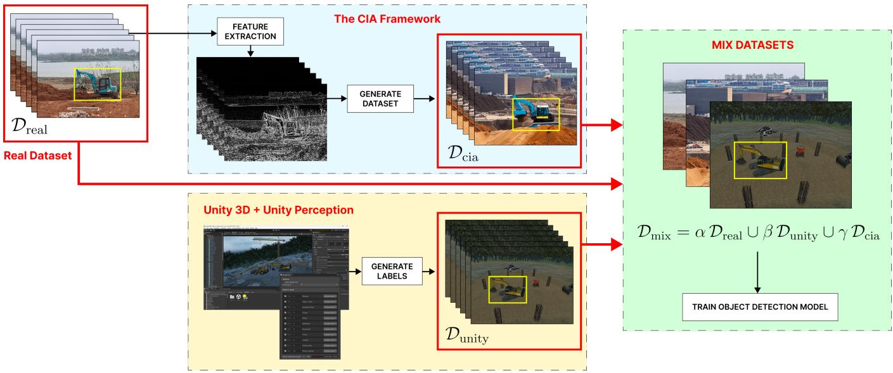  
Figure 1: Overview of the proposed hybrid data pipeline. CIA generates photorealistic augmentations from real images using Difusion, while Unity3D renders synthetic scenes with automatic annotations. The fused dataset $\mathcal { D } _ { \mathbf { m i x } }$ balances realism and diversity, reducing the sim-to-real gap, and improving model robustness.

(1) We present a benchmarking between Unity-based simulation and difusion-based augmentation (CIA) for object detection, under controlled data volume and model settings.

(2) We quantify the separate and combined impact of diferent real, simulated, and generated data, on detection performance across multiple dataset mixtures. That is done through a joint analysis of simulation domain gap, generative bias, and dataset composition synergy.

(3) We provide a unified, reproducible pipeline built entirely with open-source tools, designed for broader adoption in industrial and academic contexts where synthetic and generative data must be jointly leveraged.

## 2 Related Work

Synthetic rendering has been adopted for vision tasks training, due to its controllability, cost-eficiency, and ability to simulate rare objects or scenarios. CARLA for example, published by Dosovit skiy et al. (2014) [4], enabled simulation based autonomous vehicle training and research when real world data capture was dangerous. Zhang et al. (2016) [26] systematically studied synthetic rendering for indoor scene understanding, generating 500K synthetic images from 45K realistic 3D scenes. They showed that more realistic rendering improves performance on tasks like semantic segmentation and surface normal prediction.

Many game engines such as Unity3D, ofer the ability to develop community plugins. In addition to providing an asset stores where plugins ca be published and sold. Borkman et al. (2021) [3] published the Unity Perception plugin, which provides a modular framework for large-scale synthetic dataset generation with automatic ground truth annotations. It is able to generate object bounding boxes, instance segmentation masks, depth maps, and keypoints. The toolkit integrates domain randomization capabilities.

Domain randomization [19] improves transferability by deliberately varying visual factors such as lighting, textures, object colors, camera poses, and backgrounds during rendering. It forces models to rely on invariant structural cues rather than low-level appearance statistics. Hence, this strategy reduces overfitting to specific synthetic textures and narrows the sim-to-real gap.

Despite these advances, purely randomized rendering often fails to reproduce the complex photometric and material properties of real environments. For example, global illumination efects, finegrained surface roughness, or realistic motion blur. As a result, models trained solely on domain randomized synthetic data typically under-perform when evaluated on real world imagery [1]. This limitation motivates hybrid approaches that integrate physically grounded simulation with data-driven generative augmentation, as explored in this work through the combination of Unity-based rendering and difusion-based synthesis.

Difusion models [7, 17] and ControlNet [25] have revolutionized controllable image generation, enabling generative conditioning on edges, poses, or semantic maps. Thus, allowing task specific synthesis. CIA [2] leverages difusion models for data augmentation via extraction of structural features and conditions, controlled synthesis, and quality filtering. This type of augmentation has proven efective, but pretrained difusion models can introduce semantic bias from internet scale training corpora [11, 13, 24].

Bridging the sim-to-real gap has been a longstanding challenge [12, 19]. Recent data-centric AI paradigms [8] emphasize dataset quality, balance, and representativeness over model complexity. Our work aligns with this direction by empirically quantifying how synthetic and generative data afect generalization in real-world evaluation.

## 3 Methodology

We aim to systematically analyze how synthetic simulation and generative difusion, influence object detection robustness under data-scarce industrial scenarios.

The proposed pipeline, illustrated in Figure 1, is divided into four components. (1) Controllable Difusion-based (CIA) data generation, (2) Unity Simulation-based data generation, (3) dataset composition and balancing, and (4) Model training and evaluation.

## 3.1 Data Baseline and Augmentation Strategies

Let $\mathcal { D } _ { \mathrm { r e a l } }$ denote the real baseline dataset, consisting of RGB images $I _ { i } ,$ , and their corresponding labels $y _ { i }$ (object class and bounding box annotations). This dataset represents the operational target domain but is inherently limited in scale and variability.

$$
\mathcal { D } _ { \mathrm { r e a l } } = \{ ( I _ { i } , y _ { i } ) \} _ { i = 1 } ^ { N }\tag{1}
$$

In Difusion-based augmentation, the Controllable Image Augmentation (CIA) framework [2] enhances data diversity by generating photorealistic variants of existing samples while preserving their structural semantics.

Given an image $I _ { i } \in \mathcal { D } _ { \mathrm { r e a l } }$ , a configurable encoder $\varepsilon$ extracts structural control features. $F _ { i }$ can represent edge maps, depth projections, or semantic segmentation masks depending on the selected control mode.

$$
F _ { i } = \mathcal { E } ( I _ { i } ) ,\tag{2}
$$

A controlled difusion generator $\mathcal { G }$ (e.g., Stable Difusion [17] augmented with ControlNet [25]) is conditioned on $F _ { i }$ and a textual prompt � to synthesize a new image ${ \tilde { I } } _ { i \cdot }$

$$
\tilde { I } _ { i } = { \mathcal { G } } ( F _ { i } , C ) .\tag{3}
$$

The generated image $\tilde { I } _ { i }$ inherits the annotation $y _ { i }$ from its real counterpart $I _ { i } ,$ yielding the difusion-augmented dataset.

$$
\mathcal { D } _ { \mathrm { c i a } } = \{ ( \tilde { I } _ { i } , y _ { i } ) \} _ { i = 1 } ^ { N } .\tag{4}
$$

To ensure photometric realism and semantic fidelity, each generated image is evaluated through a composite quality control function $q ( \tilde { I } _ { i } )$ , where diferent metrics like FID, NIMA and CLIP ensure high quality, label-consistent augmentation.

This process results in a generative dataset $\mathcal { D } _ { \mathrm { c i a } }$ that complements $\mathcal { D } _ { \mathrm { r e a l } }$ by expanding its visual diversity while maintaining semantic alignment with real-world conditions.

In Unity-based simulation augmentation, synthetic datasets are procedurally generated using the Unity Perception toolkit [3]. Each sample is produced by rendering a fully controllable 3D environment with randomized parameters governing lighting, camera pose, surface materials, and object placement, following the domain randomization principle [19]. This approach enables systematic exploration of geometric and photometric variations that are dificult or unsafe to capture in the real world. Formally, the simulated dataset is defined as $D _ { \mathrm { u n i t y } }$ where each $I _ { j } ^ { u }$ represents a rendered RGB image and $y _ { j } ^ { u }$ its corresponding ground-truth label set (object bounding boxes, segmentation masks, and class identifiers). All annotations are automatically generated at render time through the Unity Perception API, eliminating manual labeling cost and errors.

$$
\mathcal { D } _ { \mathrm { u n i t y } } = \{ ( I _ { j } ^ { u } , y _ { j } ^ { u } ) \} _ { j = 1 } ^ { N }\tag{5}
$$

Unity provides fine-grained control over environmental parameters $\theta _ { u } =$ {illumination, materials, occlusion, camera pose, scene layout, etc} allowing domain randomization across a high dimensional visual parameter space. $\mathrm { B y }$ varying $\theta _ { u }$ across render iterations, the simulator yields a diverse, densely annotated dataset that enhances geometric and contextual coverage. However, despite this controllability, synthetic images often diverge from real-world visual statistics. This is due to limited photometric realism. For example, global illumination, micro-texture, and noise characteristics are hard to reproduce.

This discrepancy constitutes the well-known simulation-to-reality (sim-to-real) gap, which can impair generalization when models trained on ${ \mathcal { D } } _ { \mathrm { u n i t y } }$ are evaluated on $\mathcal { D } _ { \mathrm { r e a l } }$ . To mitigate this gap, the subsequent CIA-based generative augmentation stage injects learned visual priors from real imagery. Hence, blending the strengths of procedural-based simulation with the strengths of difusionbased realism.

To compose balanced datasets mixes, we consider a real dataset $\mathcal { D } _ { \mathrm { r e a l } }$ of� labeled samples. We also consider a Unity-rendered dataset ${ \mathcal { D } } _ { \mathrm { u n i t y } }$ and CIA-augmented dataset $\mathcal { D } _ { \mathrm { c i a } }$ . Since each CIAgenerated image $\tilde { I } _ { i }$ originates from a real sample $I _ { i }$ through a one-toone generation strategy (Eq. 3), all datasets should share identical cardinality.

$$
| \mathcal { D } _ { \mathrm { r e a l } } | = | \mathcal { D } _ { \mathrm { u n i t y } } | = | \mathcal { D } _ { \mathrm { c i a } } | = N .\tag{6}
$$

To study how the substitution of real images with synthetic or generative ones afects model robustness, we construct a mixed dataset $\mathcal { D } _ { \operatorname* { m i x } }$ by replacing a proportion of $\mathcal { D } _ { \mathrm { r e a l } }$ with samples from ${ \mathcal { D } } _ { \mathrm { u n i t y } }$ and $\mathcal { D } _ { \mathrm { c i a } }$ . Formally, the dataset mixture is parameterized by ratios $( \alpha , \beta , \gamma )$ such that :

$$
\mathcal { D } _ { \operatorname* { m i x } } ( \alpha , \beta , \gamma ) = \alpha \mathcal { D } _ { \mathrm { r e a l } } \cup \beta \mathcal { D } _ { \mathrm { u n i t y } } \cup \gamma \mathcal { D } _ { \mathrm { c i a } } , \quad \alpha + \beta + \gamma = 1 .\tag{7}
$$

This formulation enables isolating the individual and joint effects of simulation and difusion on generalization, under identical training volumes. In practice, we evaluate configurations such as (1, 0, 0), (0, 1, 0), (0, 0, 1), and mixes like (0.8, 0.15, 0.05) to quantify trade-ofs between realism, diversity, and performance.

## 3.2 Model Training and Evaluation Metrics

All experiments employ a consistent detection architecture $M _ { \phi }$ trained under identical optimization and scheduling conditions to ensure that performance variations stem solely from data composition. All trained models are evaluated on a held-out real-world test set $\mathcal { D } _ { \mathrm { r e a l } } ^ { \mathrm { t e s t } }$ , ensuring that no synthetic or generative images are seen during evaluation. Performance is reported in terms of mean Average Precision (mAP), Precision, and Recall. For consistency, all metrics are computed at IoU thresholds of 0.5 and 0.5:0.95 following COCO evaluation standards.

To quantify the influence of dataset origin on detection robustness, we define two comparative metrics that characterize the relative performance gap between real, simulated, and generative data :

$$
\Delta _ { \mathrm { s i m }  \mathrm { r e a l } } ( \alpha , \beta ) = \mathrm { m A P } ( \mathcal { D } _ { \mathrm { m i x } } ( \alpha , \beta , 0 ) ) - \mathrm { m A P } ( \mathcal { D } _ { \mathrm { r e a l } } ) ,\tag{8}
$$

$$
\Delta _ { \mathrm { g e n }  \mathrm { r e a l } } ( \alpha , \gamma ) = \mathrm { m A P } ( \mathcal { D } _ { \mathrm { m i x } } ( \alpha , 0 , \gamma ) ) - \mathrm { m A P } ( \mathcal { D } _ { \mathrm { r e a l } } )\tag{9}
$$

$\Delta _ { \mathrm { s i m } \to \mathrm { r e a l } }$ quantifies the simulation domain gap, reflecting the loss in realism induced by photometric, geometric, and material discrepancies, between Unity-rendered and real images. $\Delta _ { \mathrm { g e n \mathrm { \to r e a l } } }$ captures the generative bias introduced by Difusion-based aug mentation, encompassing both the visual realism and the semantic priors inherited from pretrained generative models.

Together, these ratio-dependent metrics form a rigorous framework for assessing how simulation and generative synthesis contribute to real-world object detection robustness.

In summary, our methodology provides a reproducible protocol for isolating and quantifying the efects of data origin. By controlling data mixture ratios, and maintaining identical training pipelines, we explicitly measure the trade-of between realism, controllability, and semantic bias. Thus, yielding actionable insights for data centric model design in computer vision applications.

## 4 Experimental Setup

All experiments are conducted on the MOCS dataset [23], a construction site dataset designed for safety and activity monitoring. It contains diverse outdoor scenes with workers, helmets, machinery, and equipment. These scenes were captured under varying illumi nation, occlusion, and weather conditions. Each image is annotated with bounding boxes and class identifiers corresponding to safety related entities (e.g. helmet). The real subset $\mathcal { D } _ { \mathrm { r e a l } }$ used in this study contains � = 3000 labeled images sampled to maximize contextual diversity across recording conditions.

To complement real data, a synthetic dataset ${ \mathcal { D } } _ { \mathrm { u n i t y } }$ was generated using the Unity game engine. The simulated environment replicates a construction site populated with human avatars, cranes, and vehicles, rendered with physically based textures [14]. Random ization was applied to environmental parameters $\theta _ { u }$ . Each rendered frame automatically includes 2D bounding boxes, instance masks, and class annotations exported by the Unity Perception API. The resulting dataset maintains parity in size with $\mathcal { D } _ { \mathrm { r e a l } }$ to ensure bal anced comparison.

The generative dataset $\mathcal { D } _ { \mathrm { c i a } }$ was produced using the Controllable Image Augmentation (CIA) framework using the canny edge extraction method, which was shown to produce the most improvement in model performance, out of all the extractor-generator couples introduced in the original paper.

As a result, we produced three datasets where $| \mathcal { D } _ { \mathrm { r e a l } } | = | \mathcal { D } _ { \mathrm { u n i t y } } | =$ $\left| \mathcal { D } _ { \mathrm { c i a } } \right| = N .$ . Qualitative examples of Unity-rendered, CIA-generated, and real-world samples are shown in Figure 2. We used a test dataset of 300 real images for evaluation.

Training and evaluation were performed using YOLOv11n1. All experiments ran on Google Colab Pro environments with NVIDIA L4 GPUs, Python 3.10, and PyTorch 2.3. Each model was trained for 20 epochs with a batch size of 64, image resolution of 640×640. Adam was used for optimization, with a learning rate $\alpha = 1 \times 1 0 ^ { - 3 }$ and cosine decay scheduling. Standard data augmentations (flips, scaling, hue-saturation jitter) were applied identically across all runs.

For each experiment, a mixed dataset $\mathcal { D } _ { \operatorname* { m i x } }$ was constructed, varying the ratios of real, synthetic, and generative data. Evaluated configurations included both pure and hybrid compositions such as (1, 0, 0), (0, 1, 0), (0, 0, 1), (0.75, 0.25, 0), (0.33, 0.33, 0.33), etc. All models were tested on a held-out real validation set $\mathcal { D } _ { \mathrm { r e a l } } ^ { \mathrm { t e s t } }$ unseen during training.

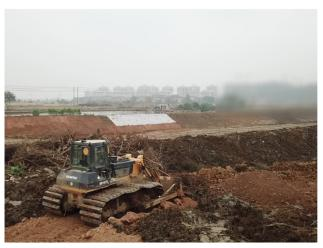

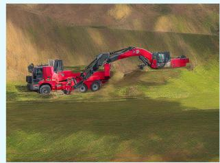

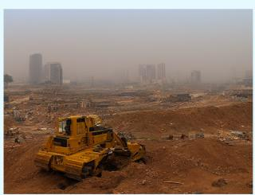

Unity  
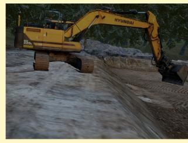

  
Figure 2: Representative samples from the three dataset sources used in this study. Top: real construction-site images from MOCS. Middle: CIA-generated variants using difusionbased controllable augmentation. Bottom: Unity-rendered synthetic scenes produced through domain randomization.

Performance is reported using mean Average Precision (mAP) at IoU thresholds 0.5 (mAP@0.5) and 0.5:0.95 (mAP@0.5:0.95), along with Precision, Recall, and Fitness. To quantify the influence of data composition, the metrics $\Delta _ { \mathrm { s i m } \to \mathrm { r e a l } }$ and $\Delta _ { \mathrm { g e n \mathrm { \to r e a l } } }$ (Eqs. 8–9) are computed for all configurations, capturing how simulation and difusion influence generalization performance on real-world test data.

## 5 Results

Table 1 reports the detection performance across all dataset compositions. The 100% real configuration (1, 0, 0) serves as the baseline. CIA-only (0, 1, 0) and Unity-only (0, 0, 1) variants isolate the efects of generative and simulated data respectively. Intermediate mixtures quantify how controlled substitution of real samples afects generalization when evaluated on $\mathcal { D } _ { \mathrm { r e a l } } ^ { \mathrm { t e s t } }$ . The results confirm three main observations:

(1) Simulation-only training sufers from severe domain mismatch, yielding an mAP@0.5 drop of over 50% compared to the real baseline.

(2) Pure difusion-based augmentation performs moderately better, but remains below real-only training.

(3) Controlled hybrid ratios, particularly 90% real with 10% Unity or CIA, achieve superior generalization, improving up to +0.076 mAP@0.5 relative to the baseline.

A closer inspection of Table 1 reveals a consistent divergence between precision-oriented and recall-oriented trends across the two hybrid regimes. The Real-CIA mixtures exhibit the highest precision values, peaking at 0.7445 for the 90%/10% configuration. That is slightly above the 100% Real baseline at 0.7266. This indicates that difusion-based augmentation enhances the detector’s ability to produce low False-Positive predictions.

Conversely, the Real-Unity mixtures outperform all other groups in recall, mAP@0.5, mAP@0.5:0.95, and Fitness, reaching their peak at the 90%/10% configuration. Overall, these complementary efects underline the trade-of between precision-oriented realism (from CIA) and recall-oriented diversity (from Unity).

The qualitative results visualized in Figure 3 corroborate the quantitative trends observed in Table 1. Because the MOCS dataset is highly imbalanced, we report non-normalized matrices to preserve the true distribution of errors. The 100% Real baseline (Figure 3a) exhibits a strong diagonal across frequent classes (Worker,

Table 1: Comprehensive performance comparison across all dataset composition experiments. Each configuration reports Precision, Recall, mAP@0.5, mAP@0.5:0.95, and Fitness, evaluated on a held-out real test set. Groups correspond to diferent mixing regimes between Real, Unity-simulated, and CIA-generated data. Green-highlighted row indicates the best overall result, while Blue-highlighted rows indicate the best results within each group. Purple-bordered cells mark the overall best value per metric, across all configurations.
<table><tr><td>Group</td><td>Real</td><td>CIA</td><td>Unity</td><td>Precision</td><td>Recall</td><td>mAP@0.5</td><td>mAP@0.5:0.95</td><td>Fitness</td></tr><tr><td>Baselines</td><td></td><td></td><td></td><td></td><td></td><td></td><td></td><td></td></tr><tr><td>Real only</td><td>100</td><td>0</td><td>0</td><td>0.7266</td><td>0.4828</td><td>0.5504</td><td>0.3873</td><td>0.4036</td></tr><tr><td>CIA only</td><td>0</td><td>100</td><td>0</td><td>0.5923</td><td>0.3566</td><td>0.3851</td><td>0.2551</td><td>0.2681</td></tr><tr><td>Unity only</td><td>0</td><td>0</td><td>100</td><td>0.3004</td><td>0.0558</td><td>0.0447</td><td>0.0260</td><td>0.0279</td></tr><tr><td colspan="9">Real-CIA Mixes</td></tr><tr><td></td><td>90</td><td>10</td><td>0</td><td>0.7445</td><td>0.5063</td><td>0.5792</td><td>0.4076</td><td>0.4248</td></tr><tr><td></td><td>75</td><td>25</td><td>0</td><td>0.6530</td><td>0.4591</td><td>0.4998</td><td>0.3345</td><td>0.3582</td></tr><tr><td></td><td>50</td><td>50</td><td>0</td><td>0.6543</td><td>0.4449</td><td>0.4940</td><td>0.3427</td><td>0.3578</td></tr><tr><td></td><td>25</td><td>75</td><td>0</td><td>0.6518</td><td>0.4584</td><td>0.4965</td><td>0.3342</td><td>0.3504</td></tr><tr><td></td><td>10</td><td>90</td><td>0</td><td>0.6423</td><td>0.4118</td><td>0.4567</td><td>0.3088</td><td>0.3236</td></tr><tr><td colspan="9">Real-Unity Mixes</td></tr><tr><td></td><td>90</td><td>0</td><td>10</td><td>0.7400</td><td>0.5739</td><td>0.6268</td><td>0.4481</td><td>0.4660</td></tr><tr><td></td><td>75</td><td>0</td><td>25</td><td>0.5551</td><td>0.3811</td><td>0.4079</td><td>0.2766</td><td>0.2898</td></tr><tr><td></td><td>50</td><td>0</td><td>50</td><td>0.4876</td><td>0.3392</td><td>0.3354</td><td>0.2196</td><td>0.2312</td></tr><tr><td></td><td>25</td><td>0</td><td>75</td><td>0.3528</td><td>0.2206</td><td>0.1993</td><td>0.1214</td><td>0.1293</td></tr><tr><td></td><td>10</td><td>0</td><td>90</td><td>0.3527</td><td>0.2205</td><td>0.1993</td><td>0.1215</td><td>0.1293</td></tr><tr><td colspan="9">Tri-Source Mixes</td></tr><tr><td></td><td>50</td><td>25</td><td>25</td><td>0.6192</td><td>0.4362</td><td>0.4712</td><td>0.3229</td><td>0.3377</td></tr><tr><td></td><td>33</td><td>33</td><td>33</td><td>0.6166</td><td>0.4333</td><td>0.4665</td><td>0.3201</td><td>0.3347</td></tr><tr><td></td><td>25</td><td>25</td><td>50</td><td>0.5997</td><td>0.3890</td><td>0.4282</td><td>0.2905</td><td>0.3043</td></tr><tr><td colspan="9">CIA-Unity Mixes</td></tr><tr><td></td><td>0</td><td>90</td><td>10</td><td>0.5395</td><td>0.3523</td><td>0.3678</td><td>0.2455</td><td>0.2577</td></tr><tr><td></td><td>0</td><td>75</td><td>25</td><td>0.5202</td><td>0.3326</td><td>0.3569</td><td>0.2408</td><td>0.2524</td></tr><tr><td></td><td>0</td><td>50</td><td>50</td><td>0.5173</td><td>0.3141</td><td>0.3324</td><td>0.2217</td><td>0.2328</td></tr><tr><td></td><td>0</td><td>25</td><td>75</td><td>0.4385</td><td>0.2693</td><td>0.2705</td><td>0.1737</td><td>0.1834</td></tr><tr><td></td><td>0</td><td>10</td><td>90</td><td>0.3081</td><td>0.2087</td><td>0.1802</td><td>0.1086</td><td>0.1158</td></tr></table>

(b) 100% CIA

(c) 100% Unity

(e) 90% Real + 10% Unity  
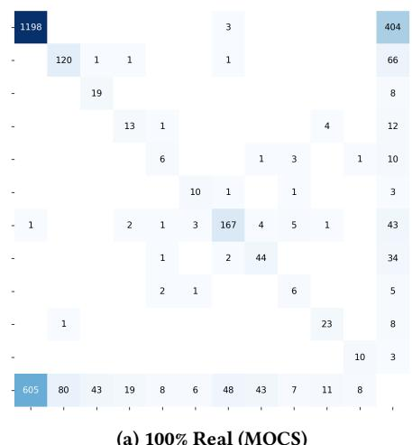

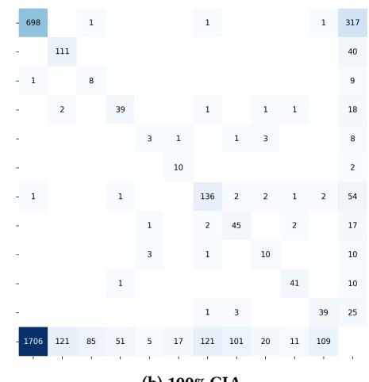

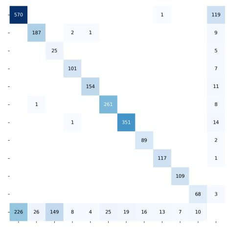

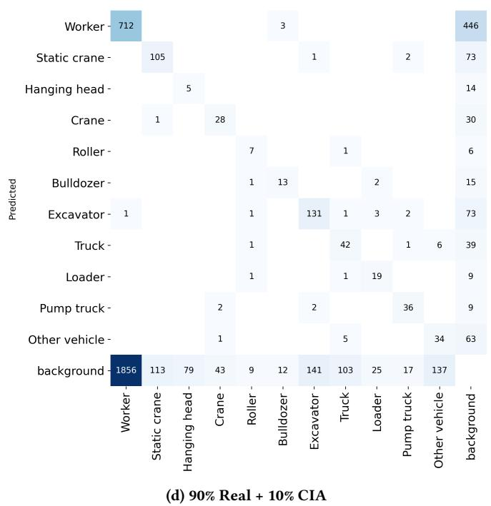

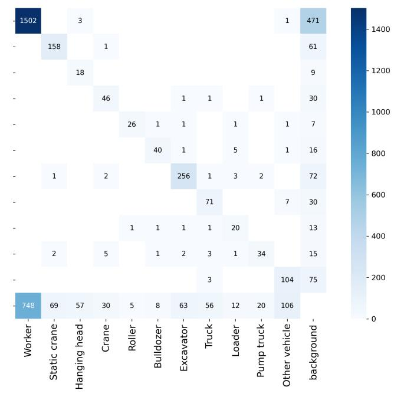  
Figure 3: Non-normalized confusion matrices with a shared color scale. Raw counts expose the dominant error mode (FN→background) and the reduction achieved by small Unity/CIA mixes.

Static crane, Excavator), with most residual errors corresponding to false negatives assigned to the background.

In contrast, the 100% Unity model (Figure 3c) collapses toward background predictions, revealing severe domain shift and explaining its sharp mAP degradation. The 100% CIA configuration (Figure 3b) retains photometric realism, but shows weaker diagonal ity on structural and spatially complex classes, reflecting limited geometric variability. Introducing a limited amount of synthetic data restores class-specific diagonality. CIA mixing (Figure 3d) suppresses of-diagonal confusions between visually similar categories. Hence, leading to higher precision. Unity mixing Figure 3e visibly strengthens the main diagonal, by increasing true positives, even though the of-diagonal mass remains.

To quantify domain and generative efects independently of absolute scores, Figure 4 summarizes the relative Δ metrics as defined in Eqs. 8–9. Positive values indicate performance improvement over the real-only baseline, while negative values denote degradation.

We notice that both $\Delta _ { \mathrm { s i m } } .$ →real and $\Delta _ { \mathrm { g e n } } .$ →real follow an inverted-U trend. Moderate substitution (10%) yields positive gains, while higher proportions cause overfitting. This behavior empirically validates the controlled augmentation hypothesis which states that synthetic data is beneficial only when constrained to limited ratios. the $\Delta _ { \mathrm { g e n \mathrm { \to r e a l } } }$ curve decays more slowly than $\Delta _ { \mathrm { s i m } \to \mathrm { r e a l } }$ , indicating that

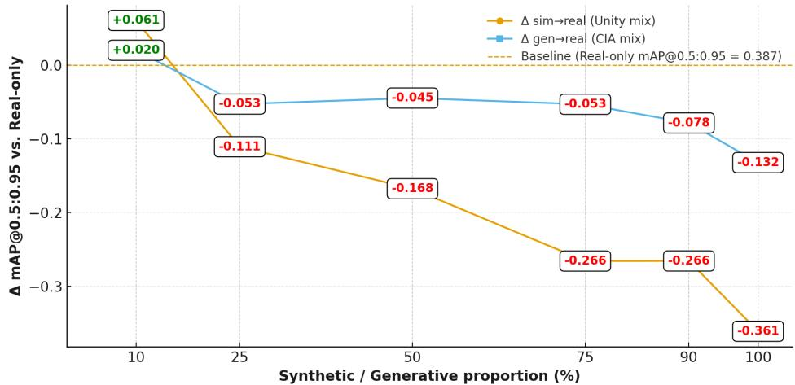  
Figure 4: Comparison of $\Delta _ { \mathrm { s i m } \to \mathrm { r e a l } }$ and $\Delta _ { \mathrm { g e n \to r e a l } }$ across increasing synthetic data ratios

CIA-based generative data maintains transferability under higher substitution ratios. In contrast, Unity-rendered data exhibits faster degradation, reflecting stronger domain divergence as synthetic content increases.

## 6 Discussion

The results presented in Table 1 and Figure 4 reveal a nuanced interplay between dataset realism, diversity, and controllability in shaping generalization performance. Neither purely synthetic nor purely generative augmentation alone achieves optimal transferability. 10% CIA substitution insures the highest precision, while 10% Unity based substitution insures the highest recall. This precision–recall asymmetry is visually supported by the confusion matrices (Figure 3).

The degradation observed for the Unity-only configuration (a drop of over 50% in mAP@0.5:0.95 relative to the real baseline) reflects the well-documented simulation-to-reality gap. Despite extensive domain randomization, Unity-rendered scenes diverge from real photometric distributions. Global illumination, specular reflections, and fine-grained textures remain simplified. This induces a representational bias where detectors overfit to synthetic regularities, such as unrealistic sharp edges. Nonetheless, introducing a limited fraction of simulated samples (10%) substantially improves recall and overall mAP. This improvement indicates that simulated data acts as a diversity regularizer. It plays a role in expanding geometric coverage and reducing overfitting to the narrow appearance manifold of the real subset.

The CIA-only configuration exhibits a milder degradation, confirming that difusion-based augmentation better preserves realworld statistics. Difusion models inherit strong natural priors from large-scale image corpora. This knowledge allows for realistic illumination and texture reproduction. Hence, explaining the higher precision in Real-CIA mixtures. Particularly at 90%/10% ratios, where the model achieves the lowest recorded false-positive rate. The improvement suggests that CIA reinforces the photometric discriminability of the detector. However, recall remains comparatively limited, implying that generative augmentation introduces less geometric diversity. Difusion-based synthesis primarily perturbs textures and lighting while maintaining similar spatial layouts, leading to photometric realism but limited structural novelty. Moreover, pretrained difusion models can embed latent semantic biases from their internet-scale training corpora. Thus, favoring familiar object configurations and backgrounds over rare domain specific contexts.

The superior performance of the 90% Real + 10% Unity configuration demonstrates that a small synthetic contribution can enhance generalization without overwhelming the real data distribution. This composition combines Unity’s geometric variability with the contextual grounding of real data, ofering complementary bias compensation. Yet, as mixing ratios increase, the divergence between simulation and reality grows, ultimately harming convergence and stability. Interestingly, tri-source compositions (e.g., 50/25/25) perform worse than their dual counterparts, suggesting that mixing simulation and generative domains simultaneously can introduce conflicting statistical cues. While Unity images broaden geometric space, CIA images densify photometric space. Excessive blending of both may confuse the model’s internal domain boundaries, leading to representational interference. These observations imply that hybrid training could benefit from progressive curriculum mixing. This is done starting with simulation-heavy training for structural generalization. Then, gradually transitioning toward CIA and real data for photometric alignment.

Aggregating $\Delta _ { \mathrm { s i m } \to \mathrm { r e a l } }$ and $\Delta _ { \mathrm { g e n \mathrm { \to r e a l } } }$ across all configurations highlights distinct decay patterns. Generative data maintains positive deltas for broader substitution ratios, whereas simulated data exhibits faster degradation. From a bias-variance perspective, Unity samples introduce high-variance perturbations that initially aid generalization, but quickly destabilize learning when the variance exceeds the model’s tolerance. CIA on the other hand induces low-variance, low-bias perturbations. Thus, maintaining domain alignment longer, albeit with limited geometric expansion. This asymmetry underscores the complementary nature of both data sources. Simulation drives diversity, while generative difusion drives realism. Their joint utility lies in controlled proportionality, not volume.

Several avenues exist to further understand and enhance these effects. Feature-level analysis could reveal which network layers benefit most from each modality. As a result, distinguishing whether im provements occur at low-level edge encoding or high-level semantic abstraction. Evaluating models on out-of-domain real datasets (e.g., construction sites under novel lighting, culture, geography, etc.) would test whether the observed gains extend beyond intra-domain realism. Adaptive data selection strategies could also be explored, where Unity and CIA samples are dynamically sampled according to model uncertainty or feature-space coverage. Finally, integrating domain adaptation objectives such as adversarial feature alignment, or perceptual loss minimization, could mitigate residual distributional drift between mixed domains and the target real domain.

## 7 Conclusion

In conclusion, this study provides a principled framework for quantifying the relative contributions of simulated and generative data, in real-world object detection. The empirical results demonstrate that small, well-calibrated proportions of synthetic or generative data, can significantly enhance generalization. On the other hand, excessive inclusion induces domain drift. Unity data ofers geometric variability, CIA ofers photometric fidelity, and Real data provides semantic grounding. Their optimal combination maximizes perfor mance without compromising realism. Future work will explore adaptive mixing schedules and cross-domain fine-tuning strategies, to dynamically balance these complementary efects. Grounding dataset composition in quantitative Δ metrics enables systematic, data-driven evaluation of how synthetic and generative sources influence model robustness and generalization.

## Acknowledgments

We thanks INFRABEL for their constant dedication to push research forward.

## References

[1] Louis-Philippe Asselin, Denis Laurendeau, and Jean-Francois Lalonde. 2020. Deep SVBRDF Estimation on Real Materials. In 2020 International Conference on 3D Vision (3DV). IEEE, 1157–1166. doi:10.1109/3dv50981.2020.00126

[2] Mohamed Benkedadra, Dany Rimez, Tifanie Godelaine, Natarajan Chidambaram, Hamed Razavi Khosroshahi, Horacio Tellez, Matei Mancas, Benoit Macq, and Sidi Ahmed Mahmoudi. 2024. CIA: Controllable Image Augmentation Frame work Based on Stable Difusion. In 2024 IEEE 7th International Conference on Multimedia Information Processing and Retrieval (MIPR). IEEE, 600–606. doi:10.1109/mipr62202.2024.00102

[3] Steve Borkman, Adam Crespi, Saurav Dhakad, Sujoy Ganguly, Jonathan Hogins, You-Cyuan Jhang, Mohsen Kamalzadeh, Bowen Li, Steven Leal, Pete Parisi, Cesar Romero, Wesley Smith, Alex Thaman, Samuel Warren, and Nupur Ya dav. 2021. Unity Perception: Generate Synthetic Data for Computer Vision. arXiv:2107.04259 [cs.CV] https://arxiv.org/abs/2107.04259

[4] Alexey Dosovitskiy, German Ros, Felipe Codevilla, Antonio Lopez, and Vladlen Koltun. 2017. CARLA: An Open Urban Driving Simulator. In Proceedings of the 1st Annual Conference on Robot Learning. 1–16.

[5] Epic Games. 2025. The most powerful real-time 3D creation tool - unrealengine.com. https://www.unrealengine.com/en-US. [Accessed 06-10-2025].

[6] John K Haas. 2014. A history of the unity game engine. (2014).

[7] Jonathan Ho, Ajay Jain, and Pieter Abbeel. 2020. Denoising Difusion Probabilistic Models. arXiv:2006.11239 [cs.LG] https://arxiv.org/abs/2006.11239

[8] Johannes Jakubik, Michael Vössing, Niklas Kühl, Jannis Walk, and Gerhard Satzger. 2024. Data-Centric Artificial Intelligence. arXiv:2212.11854 [cs.AI] https://arxiv.org/abs/2212.1185

[9] Jaemin Kim, Ingook Wang, Jungho Yu, and Seulki Lee. 2025. A Practical Image Augmentation Method for Construction Safety Using Object Range Expansion Synthesis. Buildings 15, 9 (April 2025), 1447. doi:10.3390/buildings15091447

[10] Manikanta Kotthapalli, Reshma Bhatia, and Nainsi Jain. 2025. Self-Supervised YOLO: Leveraging Contrastive Learning for Label-Eficient Object Detection. arXiv preprint arXiv:2508.01966 (2025).

[11] Alexandra Sasha Luccioni, Christopher Akiki, Margaret Mitchell, and Yacine Jernite. 2023. Stable Bias: Analyzing Societal Representations in Difusion Models. arXiv:2303.11408 [cs.CY] https://arxiv.org/abs/2303.11408

[12] Xue Bin Peng, Marcin Andrychowicz, Wojciech Zaremba, and Pieter Abbeel. 2018. Sim-to-Real Transfer of Robotic Control with Dynamics Randomization. In 2018 IEEE International Conference on Robotics and Automation (ICRA). IEEE, 3803–3810. doi:10.1109/icra.2018.8460528

[13] Malsha V. Perera and Vishal M. Patel. 2023. Analyzing Bias in Difusion-based Face Generation Models. arXiv:2305.06402 [cs.CV] https://arxiv.org/abs/2305.06402

[14] Matt Pharr, Wenzel Jakob, and Greg Humphreys. 2016. Physically Based Rendering: From Theory to Implementation (3rd ed.). Morgan Kaufmann Publishers Inc., San Francisco, CA, USA

[15] Alec Radford, Jong Wook Kim, Chris Hallacy, Aditya Ramesh, Gabriel Goh, Sandhini Agarwal, Girish Sastry, Amanda Askell, Pamela Mishkin, Jack Clark, Gretchen Krueger, and Ilya Sutskever. 2021. Learning Transferable Visual Models From Natural Language Supervision. arXiv:2103.00020 [cs.CV] https://arxiv.org/ abs/2103.00020

[16] Joseph Redmon, Santosh Divvala, Ross Girshick, and Ali Farhadi. 2016. You Only Look Once: Unified, Real-Time Object Detection. arXiv:1506.02640 [cs.CV] https://arxiv.org/abs/1506.02640

[17] Robin Rombach, Andreas Blattmann, Dominik Lorenz, Patrick Esser, and Björn Ommer. 2022. High-Resolution Image Synthesis with Latent Difusion Models. arXiv:2112.10752 [cs.CV] https://arxiv.org/abs/2112.10752

[18] Jake Snell, Kevin Swersky, and Richard S. Zemel. 2017. Prototypical Networks for Few-shot Learning. arXiv:1703.05175 [cs.LG] https://arxiv.org/abs/1703.05175

[19] Josh Tobin, Rachel Fong, Alex Ray, Jonas Schneider, Wojciech Zaremba, and Pieter Abbeel. 2017. Domain Randomization for Transferring Deep Neural Networks from Simulation to the Real World. arXiv:1703.06907 [cs.RO] https://arxiv.org/ abs/1703.06907

[20] Eric Tzeng, Judy Hofman, Kate Saenko, and Trevor Darrell. 2017. Adversarial Discriminative Domain Adaptation. arXiv:1702.05464 [cs.CV] https://arxiv.org/ abs/1702.05464

[21] Unity. 2025. Unity Real-Time Development Platform | 3D, 2D, VR & AR Engine -unity.com. https://unity.com/. [Accessed 06-10-2025].

[22] Xin Wang, Thomas E. Huang, Trevor Darrell, Joseph E. Gonzalez, and Fisher Yu. 2020. Frustratingly Simple Few-Shot Object Detection. arXiv:2003.06957 [cs.CV] https://arxiv.org/abs/2003.06957

[23] An Xuehui, Zhou Li, Liu Zuguang, Wang Chengzhi, Li Pengfei, and Li Zhiwei. 2021. Dataset and benchmark for detecting moving objects in construction sites. Automation in Construction 122 (2021), 103482. doi:10.1016/j.autcon.2020.103482

[24] Shin’ya Yamaguchi and Takuma Fukuda. 2023. On the Limitation of Difusion Models for Synthesizing Training Datasets. arXiv:2311.13090 [cs.AI] https: //arxiv.org/abs/2311.13090

[25] Lvmin Zhang, Anyi Rao, and Maneesh Agrawala. 2023. Adding Conditional Control to Text-to-Image Difusion Models. arXiv:2302.05543 [cs.CV] https: //arxiv.org/abs/2302.05543

[26] Yinda Zhang, Shuran Song, Ersin Yumer, Manolis Savva, Joon-Young Lee, Hailin Jin, and Thomas Funkhouser. 2017. Physically-Based Rendering for Indoor Scene Understanding Using Convolutional Neural Networks. In 2017 IEEE Conference on Computer Vision and Pattern Recognition (CVPR). IEEE, 5057–5065. doi:10. 1109/cvpr.2017.537