# DYRAD: RADAR NOVEL VIEW SYNTHESIS FOR DY-NAMIC DRIVING SCENES

Merav Keidar1 Tomer Borreda1 Rajalakshmi Nandakumar2 Or Litany1,3

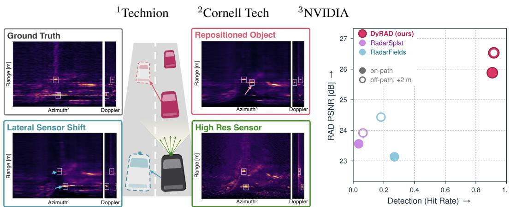

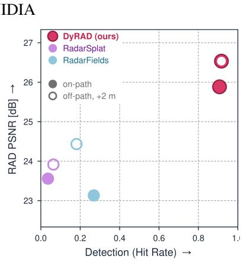  
Figure 1: Radar re-simulation with DyRAD. From recorded radar measurements, poses, and object boxes, DyRAD reconstructs dynamic scenes supporting novel viewpoints, sensorconfiguration changes, and scene editing. Right: Higher RAD PSNR and detection hit rate than both baselines on RADIal, on-path and after a 2 m lateral-shift round trip. See the project page for videos of all real-data off-path and synthetic experiments.

## ABSTRACT

Reconstructing dynamic driving scenes from recorded sensor data supports closed-loop evaluation of autonomous driving systems by synthesizing observations beyond the original trajectory. Unlike cameras and LiDAR, radar measures radial velocity directly through Doppler. Yet existing radar novel-view synthesis fails to exploit this capability: methods addressing dynamic scenes reconstruct only range–azimuth tensors, while methods that render Doppler assume static scenes. Moreover, because radar processing spreads each reflection across multiple bins, existing representations absorb this spread into scene geometry, causing it to render incorrectly when the viewpoint moves. We present DyRAD, which models dynamic driving scenes using static background reflectors and motion-tracked dynamic point reflectors to render complete range–azimuth–Doppler (RAD) tensors. Reflector velocities are derived from object tracks and projected onto the line of sight, making Doppler both a rendered output and supervision for those tracks. Crucially, we render reflectors through a fixed analytic point-spread function (PSF) derived from the radar’s signal-processing chain, preventing sensorinduced spread from being baked into the scene representation. Beyond improving scene reconstruction, this separation also enables zero-shot sensor-configuration transfer, allowing the same reconstructed scene to be rendered under different radar specifications without refitting. We evaluate DyRAD on RADIal, Boreas, and a synthetic benchmark across both on-path poses and displaced viewpoints untested by prior work. On RADIal, DyRAD recovers radar detections in 90.7% of reference-detected objects, compared with 26.9% for the strongest baseline.

## 1 INTRODUCTION

Accurate sensor simulation is critical for training and evaluating automotive systems. Reconstructing dynamic driving scenes from recorded sensor data supports this goal by enabling realistic observations to be synthesized beyond the original trajectory. Capturing radar measurements is particularly important given radar’s distinct capabilities within a vehicle’s sensor suite: direct radial velocity measurements via Doppler and robust operation under adverse weather. Yet its sparse measurements and limited spatial resolution make reconstruction particularly challenging. Received power varies with range and viewing aspect, while Doppler shifts depend on relative sensor–object motion. Re-simulation must therefore recover the scene from measurements that couple sensor pose, object dynamics, and signal processing.

Neural scene representations such as NeRF (Mildenhall et al., 2021) and 3D Gaussian Splatting (Kerbl et al., 2023) now support novel-view synthesis (NVS) of dynamic driving scenes for camera and LiDAR (Yan et al., 2024; Chen et al., 2025; Turki et al., 2026), with related approaches emerging for radar (Borts et al., 2024; Kung et al., 2025; Zhang et al., 2026; Huang et al., 2024). Three capabilities, however, remain unexplored: 1) reconstructing dynamic scenes together with their Doppler signature, 2) recovering scene structure rather than the sensor’s own response, and 3) evaluating synthesis beyond the recorded trajectory.

1) Dynamics and Doppler. Radar measures motion through Doppler, a property routinely exploited in radar perception (Haitman & Bialer, 2025; Ding et al., 2024; Musiat et al., 2024; Paek et al., 2022). Yet existing radar NVS methods discard this measurement where it matters most: method addressing dynamic driving scenes reconstruct only range–azimuth (RA), omitting Doppler (Zhang et al., 2026). Methods that render Doppler assume static environments, where it arises solely from sensor motion (Huang et al., 2024; Chen et al., 2026; Kung et al., 2026). No existing radar NVS method reconstructs dynamic driving scenes from complete RAD measurements while using rendered Doppler to constrain object motion.

2) Separating the scene from the sensor. A radar measurement is not a direct picture of the scene: the radar’s signal-processing chain spreads each reflector’s return across range, azimuth, and Doppler bins, as described by its point-spread function (PSF). Although existing methods estimate occupancy or transmittance to recover scene structure (Kung et al., 2025; Borts et al., 2024), the spatial extent of that structure is learned directly from the measurements. A broad return can therefore be explained by a broad scene element rather than the sensor’s PSF, leaving scene structure entangled with sensor-induced spread. Once absorbed into the scene representation, this spread behaves like static geometry rather than a measurement artifact, causing it to render incorrectly from displaced viewpoints. Recovering true scene structure therefore requires explicitly modeling the sensor’s response from its signal-processing chain. Furthermore, isolating the sensor response in this way unlocks a capability prior methods cannot provide: resimulating the recovered scene under a different sensor configuration by simply swapping the analytic PSF.

3) Evaluating away from the recorded path. Existing radar NVS evaluates only at held-out frames along the driven trajectory (Borts et al., 2024; Kung et al., 2025; Zhang et al., 2026). Because these test frames sit right between nearly identical training poses, interpolating directly in measurement space can score just as well as a correct forward model. As a result, this protocol fails to test synthesis at displaced viewpoints, which are precisely what closed-loop simulation requires.

To close these gaps we propose DyRAD, a dynamic point-reflector scene representation coupled with a differentiable, physics-grounded RAD renderer. Radar returns originate from discrete scattering centers, so we represent the scene as zero-extent point reflectors whose positions, base reflected power, and aspect-dependent reflectivity are optimized from the measurements. Static reflectors represent the background, while dynamic reflectors follow learned rigid object tracks initialized from bounding boxes. We derive reflector velocities from these tracks and project relative sensor–reflector motion onto the line of sight to render Doppler. Jointly optimizing the reflectors and tracks against recorded RAD measurements makes Doppler both a rendered output and a constraint on those tracks.

We address the second gap by explicitly modeling the sensor’s response. Each point reflector is rendered through a sensor-specific PSF across range, azimuth, and Doppler, derived from the radar’s signal-processing chain and held fixed throughout optimization. Using zero-extent reflectors with a fixed sensor response constrains how measurement spread is explained, reducing ambiguity between scene structure and sensor-induced blur. This makes rendering at sensor poses away from the driven trajectory a forward model rather than interpolation in measurement space, and it makes the recovered scene portable across sensors (Fig. 1).

We evaluate DyRAD on RADIal, Boreas, and a synthetic benchmark, testing reconstruction at heldout poses along the recorded trajectory as well as at displaced viewpoints; the latter addressing the third gap. We assess displaced views directly against synthetic ground truth and through a renderand-refit cycle on real data. On RADIal, DyRAD increases full-RAD correlation from 0.068 to 0.272 and foreground hit rate from 26.9% to 90.7% over the strongest respective baselines. Ablations show that Doppler supervision reduces vehicle Doppler peak error by 60% relative to RA-only fitting, while fixing the analytic PSF more than doubles joint detection recall compared with learning Gaussian extents or the PSF. Finally, the same reconstructed scene supports coarse-to-fine sensorconfiguration transfer without refitting, improving object-region RAD PSNR and nearly doubling detection F1 over linear upsampling.

## Our main contributions are as follows:

1. Physics-grounded RAD rendering of dynamic scenes. To our knowledge, we introduce the first radar NVS method to render Doppler for dynamic driving scenes. We reconstruct scenes as static and dynamic point reflectors following rigid object tracks and render complete RAD tensors with Doppler derived from relative sensor–reflector motion.

2. Decoupling scene structure from sensor response. We render point reflectors through a fixed, sensor-specific PSF, separating scene structure from sensor-induced spread. This improves object-region reconstruction and detection while also enabling the same scene to be rendered under alternative radar configurations without refitting.

3. Off-path evaluation for radar novel-view synthesis. Prior radar NVS evaluates only along the recorded trajectory, testing interpolation rather than true spatial generalization. We introduce off-path evaluation via displaced ground-truth views in a synthetic benchmark and a cycleconsistency protocol adapted to real radar recordings.

## 2 RELATED WORK

## 2.1 NOVEL-VIEW SYNTHESIS FOR DYNAMIC DRIVING SCENES

Reconstructing driving scenes from recorded data has become an established approach to sensor simulation for autonomous driving. Once reconstructed, a scene can be rendered along new ego trajectories, enabling training and closed-loop evaluation beyond the recorded drive (Tancik et al., 2022; Manivasagam et al., 2020; Yang et al., 2023; Tonderski et al., 2024). Early neural approaches focused on static camera scenes (Tancik et al., 2022; Rematas et al., 2022), later extending to dynamic driving environments (Turki et al., 2023; Yang et al., 2024; Yan et al., 2024; Chen et al., 2025). Reconstruction-based simulation also expanded to LiDAR, progressing from static (Manivasagam et al., 2020; Huang et al., 2023) to dynamic scenes (Wu et al., 2024; Zheng et al., 2024), and subsequently to joint camera–LiDAR rendering (Yang et al., 2023; Tonderski et al., 2024; Hess et al., 2025; Turki et al., 2026). For camera and LiDAR, dynamic driving scenes can now be reconstructed and replayed from viewpoints that were never driven. Our work makes this possible also for radar.

## 2.2 RADAR RECONSTRUCTION AND DOPPLER

Radar novel-view synthesis. Radar reconstruction has developed along similar lines as its camera and LiDAR counterparts. Radar Fields (Borts et al., 2024) and RadarSplat (Kung et al., 2025) reconstruct RA measurements of static driving scenes, the former with a frequency-space neural field, the latter with Gaussian primitives combining modeling of radar noise and multipath effects. RF4D (Zhang et al., 2026) extends the Radar Fields framework to dynamic driving scenes through a spatiotemporal field and a scene-flow module that predicts motion offsets between adjacent frames. Yet it too reconstructs RA alone. NeuRadar (Rafidashti et al., 2025) extends joint camera–LiDAR rendering of dynamic driving scenes to radar point clouds, but renders radar as sparse detections without Doppler information rather than as raw, dense measurements.

Doppler as a motion cue. Doppler has been used as an input motion cue for visual scene reconstruction, as in 4DRadar-GS (Tang et al., 2025), which uses per-point radar velocities but does not render radar measurements. Other methods render Doppler but assume static environments (Huang et al., 2024; Chen et al., 2026; Kung et al., 2026), where it arises solely from sensor motion. We instead reconstruct dynamic driving scenes directly from full RAD measurements, where Doppler is both rendered and used to refine the object motion that produced it.

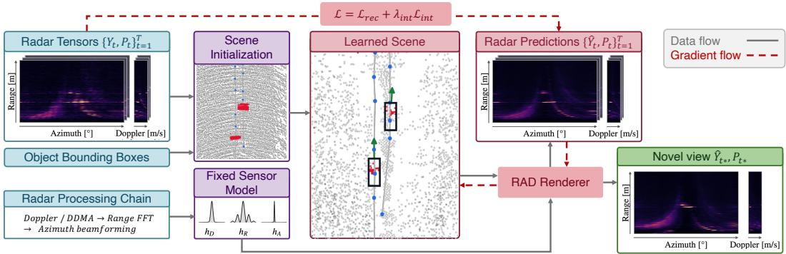  
Figure 2: DyRAD overview. Inputs: recorded RAD tensors, sensor poses, object bounding-boxes, and radar processing information when available. Initialization: measurements and annotations initialize the scene; processing information defines the fixed sensor response. Optimization: the differentiable RAD renderer jointly fits reflectors and object tracks to recorded measurements. Inference: the optimized scene produces RAD predictions $\hat { \mathbf { Y } } ( t ^ { \star } , \mathbf { P } ^ { \star } )$ at query times and sensor poses. Solid gray arrows show data flow; dashed red arrows show gradient flow.

## 2.3 SENSOR MODELING IN NEURAL RENDERING

Neural rendering has repeatedly improved by replacing an idealized sensor with a model of how the measurement is actually formed. Methods account for sampling footprints and beam divergence (Barron et al., 2021; Huang et al., 2023), processing and blur (Mildenhall et al., 2022; Ma et al., 2022), and appearance variation (Martin-Brualla et al., 2021). Radar reconstruction additionally accounts for propagation, antenna gain, and range–Doppler geometry (Borts et al., 2024; Huang et al., 2024; Chen et al., 2026; Armouti et al., 2026), as well as speckle and multipath (Kung et al., 2025). Measurement spreading has been addressed through PSF convolution for simulation (Bialer & Haitman, 2024), range smoothing and antenna-profile convolution (Kung et al., 2025), and Doppler soft binning (Kung et al., 2026). We instead represent the scene using static and dynamic point reflectors coupled with a fixed, sensor-specific RAD PSF, explicitly separating sensorinduced measurement spread from the learned scene representation.

## 3 METHOD

Method Overview. DyRAD reconstructs dynamic driving scenes from radar measurements to synthesize RAD tensors at novel sensor poses (Fig. 2). We represent the scene using static and dynamic point reflectors, with dynamic reflectors following rigid object tracks (Sec. 3.1). We couple this representation with a differentiable renderer that maps reflectors to radar measurements through a fixed sensor-specific response (Sec. 3.2). We initialize the reflectors and tracks from radar measurements and object bounding boxes, then jointly optimize them to reproduce the observations (Sec. 3.3).

Problem Setting. We are given a sequence of radar measurements $\{ \mathbf { Y } _ { t } \} _ { t = 1 } ^ { T }$ and corresponding sensor poses $\{ \mathbf { P } _ { t } \} _ { t = 1 } ^ { T }$ . Each RAD tensor $\mathbf { Y } _ { t } \in \mathbb { R } _ { > 0 } ^ { D \times R \times A }$ records return strength over D radialvelocity bins, R range bins, and A azimuth bins. We obtain RA and RD projections by averaging over Doppler and azimuth, respectively; for sensors without Doppler, we reconstruct RA maps. We additionally assume dynamic-object bounding-box annotations at a subset of frames, a common input in dynamic driving-scene reconstruction (Yan et al., 2024; Chen et al., 2025). These annotations initialize object tracks, providing spatial and motion information that is difficult to infer from sparse radar returns alone. Since the measurements do not resolve elevation, we model geometry and motion in the ground plane, with sensor poses defined by planar position and heading. Our goal is to synthesize measurements $\hat { \mathbf { Y } } ( t ^ { \star } , \mathbf { P } ^ { \star } )$ at a query time $t ^ { \star }$ and sensor pose $\mathbf { P } ^ { \star }$

## 3.1 SCENE REPRESENTATION

Scene Primitives. We represent the scene as $N$ point reflectors with learned positions and reflectivities. Reflectors have no spatial extent; the renderer models sensor-induced spreading through a fixed PSF. We partition the reflectors into a static background and M dynamic objects, with reflectors within each object sharing a rigid motion. The scene is then: $\mathcal { S } = \left\{ \left( \mathbf { x } _ { i } ( \cdot ) , o _ { i } , \pmb { \eta } _ { i } , q _ { i } \right) \right\} _ { i = 1 } ^ { N }$ where $\mathbf { x } _ { i } ( t ) \in \mathbb { R } ^ { 2 }$ is reflector $i \ ' s$ world-space position at time t. The learned logit $o _ { i } ~ \in \ \mathbb { R }$ defines reflector $i \ ' s$ base reflected power $\alpha _ { i } = \sigma ( o _ { i } ) \in ( 0 , 1 )$ . $\pmb { \eta } _ { i } \in \mathbb { R } ^ { K }$ contains spherical-harmonic coefficients for view-dependent reflectivity. The assignment $\mathsf { \bar { q } } _ { i } \in \{ 0 , \dots , M \}$ identifies the static background $( q _ { i } = 0 )$ or a dynamic object $( q _ { i } > 0 )$ .

Motion Modeling. Following prior dynamic driving-scene reconstruction (Yan et al., 2024; Chen et al., 2025), we represent each moving object by a planar rigid track (Fig. 3).

Object j has one learned track point $\mathbf { c } _ { j , k } \in \mathbb { R } ^ { 2 }$ per training timestamp $t _ { k } .$ , with the first point defining its reference-frame origin. For $t \in [ t _ { k } , t _ { k + 1 } ]$ , we linearly interpolate $\mathbf { c } _ { j , k }$ and $\mathbf { c } _ { j , k + 1 }$ to obtain its position $\mathbf { p } _ { j } ( t )$ . We estimate its orientation from the direction of travel using neighboring track points and interpolate it between timestamps. The rotation ${ \bf R } _ { j } ( t )$ describes the change in orientation relative to the object’s initial orientation. Reflector i’s world-space position is then:

$$
\begin{array} { r } { \mathbf { x } _ { i } ( t ) = \left\{ \begin{array} { l l } { \mathbf { x } _ { i } , \quad } & { q _ { i } = 0 , } \\ { \mathbf { p } _ { j } ( t ) + \mathbf { R } _ { j } ( t ) { \boldsymbol { \mu } } _ { i } , } & { q _ { i } = j > 0 . } \end{array} \right. } \end{array}\tag{1}
$$

Where $\mathbf { x } _ { i }$ is a static reflector’s learned worldspace position and $\pmb { \mu } _ { i }$ is a dynamic reflector’s learned position in its object’s reference frame.

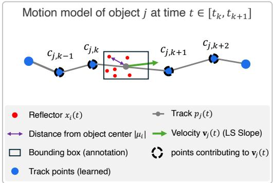  
Figure 3: Object motion along a learned track. Four neighboring track points estimate translational velocity. Reflectors follow the track’s translation and relative rotation, preserving their object-frame coordinates $\pmb { \mu _ { i } }$

## 3.2 PHYSICS-GROUNDED RAD RENDERING

We render RAD tensors by projecting reflectors into sensor coordinates, computing their Doppler, applying the sensor-specific PSF, and accumulating their contributions. The pipeline is differentiable and implemented in CUDA for efficiency.

Reflector Projection. At time t, we transform each reflector’s world-space position into the sensor frame using pose P and compute its range $r _ { i } ,$ azimuth $\phi _ { i }$ , and unit viewing direction di from the sensor to the reflector. We model view-dependent reflected power as: $\rho _ { i } ( \mathbf { d } _ { i } ) \ =$ $\begin{array} { r } { \alpha _ { i } \exp \Bigl ( \sum _ { k = 0 } ^ { K - 1 } \eta _ { i , k } B _ { k } ( { \bf d } _ { i } ) \Bigr ) } \end{array}$ , where $B _ { k }$ is the k-th real spherical-harmonic (SH) basis function. We fix the degree-zero coefficient to $\eta _ { i , 0 } = 0$ to avoid redundancy between the constant harmonic and the base reflected power $\alpha _ { i }$

Doppler. Doppler measures relative sensor–reflector velocity along the line of sight. Let $\mathbf { v } _ { i } ( t )$ denote reflector $i \mathrm { \ ' } _ { \mathrm { s } }$ world-space velocity. Static reflectors have $\mathbf { v } _ { i } ( t ) = \mathbf { 0 }$ . For dynamic reflectors, we derive $\mathbf { v } _ { i } ( t )$ from the learned object track, accounting for changes in both position and orientation. We estimate the object’s translational velocity as the slope of a linear fit to four neighboring object track points (Fig. 3) and additionally include the velocity induced by changes in object orientation. We obtain ego sensor velocity $\mathbf { v } _ { s } ( t )$ from the dataset when available and otherwise estimate it from timestamped sensor poses. A reflector’s radial velocity is then ${ \nu } _ { i } ( t ) = s _ { D } \cdot \hat { \mathbf { r } } _ { i } ( t ) ^ { \top } \big ( \mathbf { v } _ { i } ( t ) - \mathbf { v } _ { s } ( t ) \big )$ where $\hat { \mathbf { r } } _ { i } ( t )$ is the unit vector from the sensor to reflector i and $s _ { D } \in \{ - 1 , 1 \}$ accounts for the sensor’s Doppler sign convention.

Radar Doppler measurements are periodic: radial velocities outside the sensor’s unambiguous interval wrap back into it, so different radial velocities can produce the same Doppler coordinate. We reproduce this behavior by wrapping $\nu _ { i } ( t )$ into this interval, yielding the rendered coordinate $\widetilde { \nu } _ { i } ( t )$

Sensor Response. The sensor’s PSF determines how each reflector’s return spreads across range, azimuth, and Doppler axes. We model reflector $i \ ' s$ contribution as:

$$
\psi _ { i } ( r , \phi , \nu ) = \rho _ { i } ( { \bf d } _ { i } ) h _ { R } ( r - r _ { i } ) h _ { A } ( \phi , \phi _ { i } ) h _ { D } ( \nu - \widetilde { \nu } _ { i } ( t ) ) ,\tag{2}
$$

where $\rho _ { i } (  { \mathbf { d } } _ { i } )$ is its view-dependent reflected power, and $h _ { R } , \ h _ { A }$ , and $h _ { D }$ describe the sensor’s spread kernel along each axis, where each captures range-FFT leakage, the azimuth beamformer response, and the Doppler-processing response, respectively. The Doppler kernel $h _ { D }$ is periodic, wrapping responses across the measured interval’s boundaries. The azimuth kernel depends on both the evaluated angle ϕ and the reflector angle $\phi _ { i }$ , allowing the PSF to vary across viewing directions.

All kernels are computed before scene optimization and remain fixed. We derive them from the signal-processing chain when available, and approximate otherwise (Appendix Sec. A.1).

Rasterization. Unlike depth-ordered alpha compositing in camera rendering, radar signal formation involves the superposition of echoes from multiple reflectors. We approximate it by summing reflected powers incoherently. We form the RAD tensor by summing the contributions of all reflectors’ responses at the sensor’s sampling grid: $\begin{array} { r } { \Psi ( t , { \bf P } ) [ \ell , m , n ] = \sum _ { i = 1 } ^ { N } \psi _ { i } ( r _ { m } , \phi _ { n } , \nu _ { \ell } ) } \end{array}$ , where $r _ { m } .$ $\phi _ { n }$ , and $\nu _ { \ell }$ are the range, azimuth, and Doppler coordinates of cell $[ \ell , m , n ]$

Finally, we convert this power tensor to the recorded intensity representation (e.g., amplitude, power, or log-compressed power), incorporating a sensor-specific measurement floor to account for the nonzero background. This floor is determined during preprocessing and held fixed throughout optimization. The resulting tensor is our prediction $\hat { \mathbf { Y } } ( t , \mathbf { P } )$ ).

## 3.3 SCENE INITIALIZATION AND OPTIMIZATION

Initialization. We associate object bounding boxes across frames to initialize tracks and use the boxes to separate dynamic-object regions from the static background. Each track contains one point per training frame, initialized from annotated locations where available and linearly interpolated otherwise. We initialize background reflectors from peaks in Doppler-averaged RA maps. For each dynamic object, we extract peaks within its bounding box from the Doppler bin with the strongest response at its annotated location.

We project the peaks onto the ground plane and accumulate them across frames retaining background peaks in world coordinates and aligning dynamic peaks to their object’s reference frame using the initialized tracks. We merge nearby peaks with the same object assignment to obtain the initial reflectors. Appendix Sec. B.1 provides details and an illustration.

Optimization. We jointly optimize the reflector parameters and track points using $\mathcal { L } = \mathcal { L } _ { \mathrm { r e c } } +$ $\lambda _ { \mathrm { { i n t } } } { \mathcal { L } } _ { \mathrm { { i n t } } }$ , where $\mathcal { L } _ { \mathrm { r e c } }$ is the mean squared error between predicted and recorded RAD tensors (or RA maps for sensors without Doppler). Inspired by RegNeRF (Niemeyer et al., 2022), the interpolationconsistency loss ${ \mathcal { L } } _ { \mathrm { i n t } }$ regularizes predictions between training frames. We sample a time t˜ between adjacent training timestamps $t _ { 0 }$ and $t _ { 1 }$ and interpolate the sensor pose to obtain P˜ . We compare the predicted RA map with the neighboring measurements’ average after spatial smoothing:

$$
\mathcal { L } _ { \mathrm { i n t } } = \left. \mathcal { G } \Big ( \Pi _ { \mathrm { R A } } \big ( \hat { \mathbf { Y } } ( \tilde { t } , \tilde { \mathbf { P } } ) \big ) \Big ) - \mathcal { G } \Bigg ( \frac { \Pi _ { \mathrm { R A } } \big ( \mathbf { Y } _ { t _ { 0 } } \big ) + \Pi _ { \mathrm { R A } } \big ( \mathbf { Y } _ { t _ { 1 } } \big ) } { 2 } \Bigg ) \right. _ { 1 } ,\tag{3}
$$

where $\Pi _ { \mathrm { R A } }$ averages over Doppler and G applies a fixed spatial Gaussian blur. This provides a coarse appearance constraint at intermediate timesteps. We apply it only to RA, since the neighboringframe average does not specify intermediate object positions or Doppler profiles. We evaluate its effect in the ablation studies (Sec. 4.4), with full results in Appendix Sec. D.

Densification. During optimization, we periodically extract peaks from positive reconstruction residuals and add static-background reflectors where no nearby reflector exists. Additional details and hyperparameters are provided in Sec. B.3 of the appendix.

## 4 EXPERIMENTS

We encourage readers to explore the project page, which provides videos of all real-data off-path and synthetic experiments.

## 4.1 EXPERIMENTAL SETUP

Datasets. We evaluate on two real-world datasets, RADIal (Rebut et al., 2022) and Boreas (Burnett et al., 2023), and one synthetic benchmark. Our primary benchmark uses ten 60-frame RADIal sequences, with raw radar measurements, vehicle annotations, and ego-motion measurements, supporting full-RAD reconstruction and evaluation of scene dynamics. For Boreas, we use three 50- frame sequences. Its $3 6 0 ^ { \circ }$ spinning Navtech radar provides RA measurements without Doppler, testing reconstruction in the baselines’ native sensor setting and complementing RADIal’s front-facing radar. Finally, we construct five synthetic scenes with an idealized RADIal-format sensor model to obtain ground-truth measurements at displaced poses for direct off-path evaluation. We will release the synthetic benchmark, including off-path ground-truth measurements, to support future research. Implementation details and the generation procedure are provided in Appendix Sec. C.4.

Table 1: On-path evaluation. Mean ± sample standard deviation across ten RADIal sequences and three Boreas sequences. ∗ indicates Doppler lifted RA-only baselines. Full results in Sec. C.2.
<table><tr><td rowspan="2">Method</td><td colspan="3">RADIal: RAD reconstruction</td><td colspan="3">RADIal: detection</td><td colspan="3">Boreas: RA reconstruction</td></tr><tr><td>PSNR↑</td><td> $\rho \uparrow$ </td><td> $\rho _ { \mathrm { o b j } } \uparrow$ </td><td>CD [m] ↓</td><td>F1 ↑</td><td>Hit rate ↑</td><td>PSNR↑</td><td> $\rho \uparrow$ </td><td> $\rho _ { \mathrm { o b j } } \uparrow$ </td></tr><tr><td>RadarSplat*</td><td>23.56 ±0.85</td><td></td><td>0.068 ±0.028 −0.010 ±0.057</td><td>6.53 ±5.82</td><td>0.073 ±0.048</td><td>0.036 ±0.067</td><td> $2 3 . 9 2 \pm 1 . 0 7$ </td><td>0.666 ±0.036 0.178 ±0.249</td><td></td></tr><tr><td>RadarFields*</td><td>23.13 ±1.23 0.015 ±0.009</td><td></td><td>-0.011 ±0.051</td><td></td><td>6.97 ±0.96 0.016 ±0.007</td><td>0.269 ±0.245</td><td></td><td>19.96 ±0.84 0.279 ±0.078 0.016 ±0.128</td><td></td></tr><tr><td></td><td></td><td>DyRAD-static 25.67 ±0.95 0.213 ±0.054</td><td>−0.013 ±0.072</td><td></td><td></td><td>4.71 ±1.29 0.123 ±0.041 0.070 ±0.083</td><td></td><td>25.31 ±0.90 0.749 ±0.018 0.278 ±0.217</td><td></td></tr><tr><td>DyRAD</td><td>25.88 ±0.950.272 ±0.0620.658 ±0.070</td><td></td><td></td><td>4.01 ±1.020.179 ±0.0410.907 ±0.086</td><td></td><td></td><td></td><td>25.36 ±0.900.752 ±0.0170.622 ±0.130</td><td></td></tr></table>

Baselines. We compare with RadarSplat (Kung et al., 2025), and RadarFields (Borts et al., 2024), which reconstruct static scenes and predict RA measurements. We use their published configurations on Boreas and adapt them to RADIal’s sensor geometry and resolution. For RAD reconstruction and detection evaluation, we assign Doppler assuming a static scene and using the sensor’s ego-motion; these results are marked with an asterisk. We omit RF4D (Zhang et al., 2026) because its released code is “still under checking”. We also evaluate DyRAD-static, which retains our point-reflector representation and renderer but treats all reflectors as static and omits bounding-box separation during initialization. Comparing this variant with the full model measures the combined benefit of object separation and motion modeling.

Metrics. Reconstruction. Following RadarSplat and RadarFields, we report PSNR and SSIM (Wang et al., 2004) over full measurements and object regions of RAD, RA, and RD, and full-measurement LPIPS (Zhang et al., 2018) over full RA and RAD measurements. However, agreement at the noise floor can dominate these global scores in sparse radar data (Sec. C.1). We therefore report Pearson correlation, a scale-invariant measure of structural agreement. ρ and $\rho _ { \mathrm { o b j } }$ denote correlation over full measurements and object regions, respectively.

Detection. To assess whether synthesized measurements preserve usable radar returns, we apply identical RD-CFAR detection to reference and synthesized RAD tensors and compare the resulting point clouds using metrics adapted from RadarGen (Borreda et al., 2026). We report spatial Chamfer distance (CD), joint F1 over position, Doppler, and power, and foreground hit rate: the fraction of reference-occupied annotated boxes also containing predicted detections. Detection evaluation covers RADIal and synthetic data; Boreas lacks the Doppler dimension required by RD-CFAR. Metric definitions and additional results appear in Appendix Sec. C.

## 4.2 NOVEL VIEW SYNTHESIS

On-Path Evaluation. Following prior work (Kung et al., 2025; Borts et al., 2024), we hold out every fifth frame and exclude its measurements and bounding boxes from initialization and optimization (Table 1). Our static variant already improves reconstruction over both baselines, including in their native RA output: on RADIal, DyRAD-static achieves correlation 0.533, compared with 0.291 for RadarSplat and 0.055 for RadarFields. However, this stronger aggregate reconstruction still misses most vehicle returns. Moving from DyRAD-static to the full model increases full-RAD correlation from 0.213 to 0.272, while object-region RAD correlation rises from −0.013 to 0.658 and foreground hit rate from 7.0% to 90.7%. On Boreas, the gap over RadarSplat is smaller in full-measurement correlation (0.752 versus 0.666) than within object regions (0.622 versus 0.178). These results support the benefit of explicit object modeling even without Doppler supervision. Figure 4 provides qualitative examples on both datasets, with enlarged regions highlighting vehicle returns that DyRAD preserves but the static variant and baselines weaken or miss.

Real-Data Off-Path Evaluation. Without ground-truth measurements at displaced viewpoints, we adopt the cycle-consistency protocol of Neural LiDAR Fields (Huang et al., 2023). We fit each method to the recordings, render a trajectory shifted laterally by 2m, and train a new instance on those renders. Its predictions at the original poses and training timestamps are then compared with the real recordings; scores are therefore not directly comparable to the held-out on-path results. This tests whether scene information remains recoverable through displaced rendering and refitting; direct off-path accuracy is evaluated separately on synthetic data. DyRAD achieves the best means across the metrics in Table 2. On RADIal, it substantially outperforms the prior baselines in both reconstruction and detection, recovering detections in 91.7% of reference-detected objects, compared with 18.1% for the strongest prior baseline on this measure, and 20.9% for the static model. On Boreas, RadarSplat nearly matches our PSNR (24.29 versus 24.51 dB), yet its object-region RA correlation is substantially lower (0.211 versus 0.641). The object-reconstruction benefit observed on-path thus persists through displaced rendering and refitting, including in the baselines’ native RA setting without Doppler supervision.

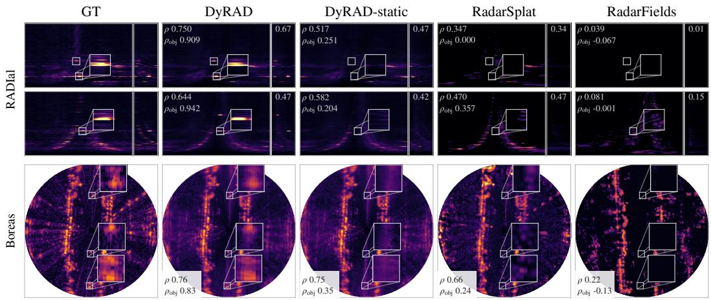  
Figure 4: On-path reconstruction on RADIal and Boreas. The top two rows show held-out RADIal frames with RA (left) and RD (right) projections; the bottom row shows a held-out Boreas RA frame in Cartesian bird’s-eye view. White boxes mark objects, with selected regions enlarged in the insets. DyRAD preserves object returns that the static variant and baselines weaken or miss, even when surrounding scene structure appears similar.

Table 2: Real-data off-path evaluation. Reconstruction at the original poses after a 2m lateralshift round trip. Mean ± sample standard deviation across ten RADIal sequences and three Boreas sequences. ∗ indicates Doppler lifted RA-only baselines. See the project page for off-path videos and Sec. C.3 for full quantitative results.
<table><tr><td rowspan="2">Method</td><td colspan="3">RADIal: RAD reconstruction</td><td colspan="3">RADIal: detection</td><td colspan="3">Boreas: RA reconstruction</td></tr><tr><td>PSNR↑</td><td>ρ↑</td><td> $\rho _ { \mathrm { o b j } } \uparrow$ </td><td>CD [m] ↓</td><td>F1 ↑</td><td>Hit rate ↑</td><td>PSNR↑</td><td>ρ↑</td><td> $\rho _ { \mathrm { o b j } } \uparrow$ </td></tr><tr><td>RadarSplat*</td><td>23.92 ±0.85</td><td>0.076 ±0.032 −0.004 ±0.053</td><td></td><td> $6 . 3 5 \pm 4 . 7 5$ </td><td>0.077 ±0.050</td><td>0.064 ±0.065</td><td>24.29 ±1.16</td><td>0.689 ±0.042</td><td> $0 . 2 1 1 { \scriptstyle \pm 0 . 2 3 7 }$ </td></tr><tr><td>RadarFields*</td><td>24.43 ±0.75</td><td>0.023 ±0.018</td><td>8 −0.011 ±0.048</td><td> $9 . 1 9 \pm 6 . 0 7$ </td><td>0.027 ±0.020</td><td> $0 . 1 8 1 \pm 0 . 1 8 3$ </td><td> $2 1 . 0 9 \pm 1 . 2 8$ </td><td>0.538 ±0.081</td><td> $0 . 0 9 5 \pm 0 . 1 2 3$ </td></tr><tr><td>DyRAD-static 26.41 ±0.73</td><td></td><td>0.335 ±0.054</td><td> $0 . 0 5 6 \pm 0 . 0 6 4$ </td><td> $3 . 4 7 \pm 0 . 6 1$ </td><td> $0 . 2 1 0 \pm 0 . 0 4 2$ </td><td> $0 . 2 0 9 \pm 0 . 1 4 4$ </td><td> $2 4 . 4 5 \pm 0 . 6 2$ </td><td> $0 . 7 4 1 \pm 0 . 0 0 7$ </td><td> $0 . 2 6 1 \pm 0 . 2 1 5$ </td></tr><tr><td>DyRAD</td><td> $\mathbf { 2 6 . 5 3 \pm 0 . 7 4 0 . 3 6 3 \pm } 0 . 0 5 2 0 . 5 3 6 \pm 0 . 0 7 7$ </td><td></td><td></td><td> $\mathbf { 3 . 2 5 \pm 0 . 5 7 0 . 2 3 6 \pm } \mathbf { 0 . 0 4 0 0 0 . 9 1 7 \pm } \mathbf { 0 . 1 0 1 }$ </td><td></td><td></td><td></td><td>24.51 ±0.620.744 ±0.0090.641 ±0.165</td><td></td></tr></table>

Synthetic Off-Path Evaluation. We directly assess off-path accuracy by fitting each method to five synthetic scenes and evaluating without refitting at lateral offsets of −1.75, +1.75, and +3.5m and yaw offsets of +5◦ and +10◦. Across the 25 scene–offset pairs, DyRAD achieves the highest mean correlation scores, globally and within objects. Object-region RAD correlation reaches 0.356, compared with 0.161 for DyRAD-static and 0.086 for RadarFields, the strongest prior baseline, demonstrating improved object reconstruction at displaced viewpoints. CD is nearly identical to RadarSplat’s (5.13 versus 5.14m), but joint detection F1 is substantially higher (0.227 versus 0.106), indicating better agreement in location, Doppler, and power despite similar spatial distances. F1 is close to DyRAD-static (0.223), whereas foreground hit rate is much higher: 74.6%, compared with 22.4% for DyRAD-static and 36.0% for RadarSplat. However, this greater coverage comes with more reference-empty annotated boxes containing predicted detections: 4.9 on average, versus 0.7 and 3.4, respectively. Videos of all synthetic scenes and evaluated offsets appear on the project page; the generator and full results are described in Sec. C.4.

## 4.3 ADDITIONAL CAPABILITIES

Separating the scene from the sensor response enables sensor-configuration transfer without retraining. We demonstrate coarse-to-fine transfer using two configurations processed from the same raw ADC recordings. After fitting to coarse measurements, we replace the PSF and sampling grid with the finer configuration’s, keeping scene parameters fixed. Against real fine-resolution measurements, direct rendering reduces CD from 7.27 to 3.20m and increases F1 from 0.101 to 0.195 over linear upsampling of the same model’s coarse renders. It also improves object-region RAD PSNR, although upsampling scores higher on most correlation and SSIM metrics. These detection gains without refitting suggest that the learned reflectors capture scene structure beyond the coarse measurement resolution. Details and full results appear in Appendix E. Additionally, the explicit scene and motion representation supports scene editing, demonstrated qualitatively in Fig. 1.

## 4.4 ABLATION STUDIES

We ablate Doppler supervision, interpolation consistency, and PSF modeling under the RADIal onpath and off-path protocols. Complete results appear in Tables 12- 15 in Sec. D of the appendix.

Doppler supervision. Doppler supervision raises joint detection F1 from 0.144 to 0.179 on-path and from 0.120 to 0.236 off-path, while reducing object Doppler peak error from 1.843 to 0.732 bins and from 2.264 to 1.375 bins, respectively. Yet foreground hit rate remains nearly unchanged under both protocols: bounding-box initialization and RA-only fitting already recover vehicle coverage, while Doppler supervision refines the velocity structure of those returns. Object-region RAD correlation also increases from 0.504 to 0.658 on-path and from 0.389 to 0.536 off-path, at the cost of reductions of 0.055 and 0.033 in full-measurement RA correlation, respectively.

Interpolation consistency. On-path, the loss improves RA, RD, and RAD correlation by 0.219, 0.143, and 0.051 and precision from 0.162 to 0.233, with little change in recall or vehicle coverage. Off-path, it improves RA PSNR by 1.50 dB and SSIM by 0.109, but lowers RAD correlation (0.447 to 0.363) and F1 (0.296 to 0.236), both still above all baselines. The loss regularizes intermediate timestamps evaluated on-path, whereas off-path evaluation uses the training timestamps. We retain it to balance temporal interpolation and RA fidelity against off-path RAD fidelity.

PSF modeling. We compare the fixed sensor-derived PSF with Gaussian primitives with learned extent and point reflectors with learned PSF bandwidths. On-path, the fixed PSF more than doubles detection recall relative to either alternative, improving F1 at similar precision. Off-path, F1 reaches 0.236, versus 0.074 for learned extent and 0.124 for learned bandwidths. Across both protocols, the fixed PSF also improves object-region correlation in RA, RD, and RAD, despite lower full-RAD PSNR and SSIM. These results support fixing the sensor response rather than allowing learnable spread to compensate for errors in reflector placement and reflectivity.

## 5 CONCLUSION, LIMITATIONS, AND FUTURE WORK

We presented DyRAD, a method for synthesizing complete RAD measurements of dynamic driving scenes from novel viewpoints. It combines static and motion-tracked point reflectors with a fixed sensor response, separating scene structure from measurement spreading. This formulation improves object reconstruction and detection in both on-path and off-path evaluations and enables sensor-configuration changes without refitting the scene. To our knowledge, it is the first radar NVS method to reconstruct dynamic driving scenes with Doppler measurements.

Several limitations remain. Reflector-to-object assignments rely on object annotations and remain fixed during optimization, even as tracks and reflector positions are refined. Jointly refining these assignments could help correct initialization errors, while modeling multipath and speckle noise could improve measurement realism. While our formulation supports 3D reconstruction, in this work we use a ground-plane implementation because the evaluated measurements lack elevation. Future work may evaluate elevation-resolving radar and explore transfer across physical sensors, beyond the processing configurations demonstrated here.

## AI USE STATEMENT

We used generative AI tools to assist with writing and editing code, drafting and revising manuscript text, and reviewing related literature. The authors reviewed and revised the AI-assisted manuscript text and code. We take responsibility for the final content of this work, including all AI-assisted code, text, claims, and artifacts.

## REPRODUCIBILITY STATEMENT

The appendix details sensor-specific PSF construction (Sec. A.1), scene initialization (Sec. B.1), densification (Sec. B.3), and hyperparameter selection, including search ranges and selected values (Sec. B.2). It also provides evaluation protocols, metric definitions, and additional experimental results (Sec. C), together with ablation settings (Sec. D) and configuration-transfer procedures (Sec. E). The code, with usage examples and experiment configurations, is available at https://github.com/Dyrad-NVS/DyRad. It includes a deterministic generator for the synthetic dataset described in Sec. C.4, which serves as a benchmark for off-path radar novel-view synthesis. Videos are available on the project page.

## REFERENCES

Adnan Armouti, Yixuan Gao, and Rajalakshmi Nandakumar. mmir: Frequency-space inverse rendering for 3d millimeter-wave radar adc synthesis. arXiv preprint arXiv:2608.28913, 2026.

Jonathan T Barron, Ben Mildenhall, Matthew Tancik, Peter Hedman, Ricardo Martin-Brualla, and Pratul P Srinivasan. Mip-nerf: A multiscale representation for anti-aliasing neural radiance fields. In ICCV, 2021.

Oded Bialer and Yuval Haitman. Radsimreal: Bridging the gap between synthetic and real data in radar object detection with simulation. In CVPR, 2024.

Tomer Borreda, Fangqiang Ding, Sanja Fidler, Shengyu Huang, and Or Litany. Radargen: Automotive radar point cloud generation from cameras. In ECCV, 2026.

David Borts, Erich Liang, Tim Broedermann, Andrea Ramazzina, Stefanie Walz, Edoardo Palladin, Jipeng Sun, David Brueggemann, Christos Sakaridis, Luc Van Gool, et al. Radar fields: Frequency-space neural scene representations for fmcw radar. In SIGGRAPH, 2024.

Keenan Burnett, David J Yoon, Yuchen Wu, Andrew Z Li, Haowei Zhang, Shichen Lu, Jingxing Qian, Wei-Kang Tseng, Andrew Lambert, Keith YK Leung, et al. Boreas: A multi-season autonomous driving dataset. The International Journal ofRobotics Research, 2023.

Chuhan Chen, Tianshu Huang, Akarsh Prabhakara, Chaithanya Kumar Mummadi, Zhongxiao Cong, Anthony Rowe, Matthew O’Toole, and Deva Ramanan. Radarsim: Simulating single-chip radar via multimodal neural fields. In 3DV, 2026.

Ziyu Chen, Jiawei Yang, Jiahui Huang, Riccardo De Lutio, Janick Martinez Esturo, Boris Ivanovic, Or Litany, Zan Gojcic, Sanja Fidler, Marco Pavone, et al. Omnire: Omni urban scene reconstruction. In ICLR, 2025.

Fangqiang Ding, Xiangyu Wen, Yunzhou Zhu, Yiming Li, and Chris Xiaoxuan Lu. Radarocc: Robust 3d occupancy prediction with 4d imaging radar. NeurIPS, 2024.

Yuval Haitman and Oded Bialer. Doppdrive: Doppler-driven temporal aggregation for improved radar object detection. In ICCV, 2025.

Georg Hess, Carl Lindstrom, Maryam Fatemi, Christoffer Petersson, and Lennart Svensson. Splatad:¨ Real-time lidar and camera rendering with 3d gaussian splatting for autonomous driving. In CVPR, 2025.

Shengyu Huang, Zan Gojcic, Zian Wang, Francis Williams, Yoni Kasten, Sanja Fidler, Konrad Schindler, and Or Litany. Neural lidar fields for novel view synthesis. In ICCV, 2023.

Tianshu Huang, John Miller, Akarsh Prabhakara, Tao Jin, Tarana Laroia, Zico Kolter, and Anthony Rowe. Dart: Implicit doppler tomography for radar novel view synthesis. In CVPR, 2024.

Bernhard Kerbl, Georgios Kopanas, Thomas Leimkuhler, George Drettakis, et al. 3d gaussian splat-¨ ting for real-time radiance field rendering. ACM Trans. Graph., 2023.

Pou-Chun Kung, Skanda Harisha, Ram Vasudevan, Aline Eid, and Katherine A Skinner. Radarsplat: Radar gaussian splatting for high-fidelity data synthesis and 3d reconstruction of autonomous driving scenes. In ICCV, 2025.

Pou-Chun Kung, Yuan Tian, Zhengqin Li, Yue Liu, Eric Whitmire, Wolf Kienzle, and Hrvoje Benko. Radarsplat-rio: Indoor radar-inertial odometry with gaussian splatting-based radar bundle adjustment. arXiv preprint arXiv:2604.13492, 2026.

Li Ma, Xiaoyu Li, Jing Liao, Qi Zhang, Xuan Wang, Jue Wang, and Pedro V Sander. Deblur-nerf: Neural radiance fields from blurry images. In CVPR, 2022.

Sivabalan Manivasagam, Shenlong Wang, Kelvin Wong, Wenyuan Zeng, Mikita Sazanovich, Shuhan Tan, Bin Yang, Wei-Chiu Ma, and Raquel Urtasun. Lidarsim: Realistic lidar simulation by leveraging the real world. In CVPR, 2020.

Ricardo Martin-Brualla, Noha Radwan, Mehdi SM Sajjadi, Jonathan T Barron, Alexey Dosovitskiy, and Daniel Duckworth. Nerf in the wild: Neural radiance fields for unconstrained photo collections. In CVPR, 2021.

Ben Mildenhall, Pratul P Srinivasan, Matthew Tancik, Jonathan T Barron, Ravi Ramamoorthi, and Ren Ng. Nerf: Representing scenes as neural radiance fields for view synthesis. Communications ofthe ACM, 2021.

Ben Mildenhall, Peter Hedman, Ricardo Martin-Brualla, Pratul P Srinivasan, and Jonathan T Barron. Nerf in the dark: High dynamic range view synthesis from noisy raw images. In CVPR, 2022.

Alexander Musiat, Laurenz Reichardt, Michael Schulze, and Oliver Wasenmuller. Radarpillars:¨ Efficient object detection from 4d radar point clouds. In 2024 IEEE 27th International Conference on Intelligent Transportation Systems (ITSC), 2024.

Michael Niemeyer, Jonathan T Barron, Ben Mildenhall, Mehdi SM Sajjadi, Andreas Geiger, and Noha Radwan. Regnerf: Regularizing neural radiance fields for view synthesis from sparse inputs. In CVPR, 2022.

Dong-Hee Paek, Seung-Hyun Kong, and Kevin Tirta Wijaya. K-radar: 4d radar object detection for autonomous driving in various weather conditions. Advances in Neural Information Processing Systems, 2022.

Mahan Rafidashti, Ji Lan, Maryam Fatemi, Junsheng Fu, Lars Hammarstrand, and Lennart Svensson. Neuradar: Neural radiance fields for automotive radar point clouds. In CVPR, 2025.

Julien Rebut, Arthur Ouaknine, Waqas Malik, and Patrick Perez. Raw high-definition radar for ´ multi-task learning. In CVPR, 2022.

Konstantinos Rematas, Andrew Liu, Pratul P Srinivasan, Jonathan T Barron, Andrea Tagliasacchi, Thomas Funkhouser, and Vittorio Ferrari. Urban radiance fields. In CVPR, 2022.

Matthew Tancik, Vincent Casser, Xinchen Yan, Sabeek Pradhan, Ben Mildenhall, Pratul P Srinivasan, Jonathan T Barron, and Henrik Kretzschmar. Block-nerf: Scalable large scene neural view synthesis. In CVPR, 2022.

Xiao Tang, Guirong Zhuo, Cong Wang, Boyuan Zheng, Minqing Huang, Lianqing Zheng, Long Chen, and Shouyi Lu. 4dradar-gs: Self-supervised dynamic driving scene reconstruction with 4d radar. arXiv preprint arXiv:2509.12931, 2025.

Adam Tonderski, Carl Lindstrom, Georg Hess, William Ljungbergh, Lennart Svensson, and¨ Christoffer Petersson. Neurad: Neural rendering for autonomous driving. In CVPR, 2024.

Haithem Turki, Jason Y Zhang, Francesco Ferroni, and Deva Ramanan. Suds: Scalable urban dynamic scenes. In CVPR, 2023.

Haithem Turki, Qi Wu, Xin Kang, Janick Martinez Esturo, Shengyu Huang, Ruilong Li, Zan Gojcic, and Riccardo de Lutio. Simuli: Real-time lidar and camera simulation with unscented transforms. In ICLR, 2026.

Zhou Wang, Alan C Bovik, Hamid R Sheikh, and Eero P Simoncelli. Image quality assessment: from error visibility to structural similarity. IEEE transactions on image processing, 2004.

Hanfeng Wu, Xingxing Zuo, Stefan Leutenegger, Or Litany, Konrad Schindler, and Shengyu Huang. Dynamic lidar re-simulation using compositional neural fields. In CVPR, 2024.

Yunzhi Yan, Haotong Lin, Chenxu Zhou, Weijie Wang, Haiyang Sun, Kun Zhan, Xianpeng Lang, Xiaowei Zhou, and Sida Peng. Street gaussians: Modeling dynamic urban scenes with gaussian splatting. In ECCV, 2024.

Jiawei Yang, Boris Ivanovic, Or Litany, Xinshuo Weng, Seung Wook Kim, Boyi Li, Tong Che, Danfei Xu, Sanja Fidler, Marco Pavone, et al. Emernerf: Emergent spatial-temporal scene decomposition via self-supervision. In ICLR, 2024.

Ze Yang, Yun Chen, Jingkang Wang, Sivabalan Manivasagam, Wei-Chiu Ma, Anqi Joyce Yang, and Raquel Urtasun. Unisim: A neural closed-loop sensor simulator. In CVPR, 2023.

Jiarui Zhang, Zhihao Li, Chong Wang, and Bihan Wen. Rf4d: Neural radar fields for novel view synthesis in outdoor dynamic scenes. In CVPR, 2026.

Richard Zhang, Phillip Isola, Alexei A Efros, Eli Shechtman, and Oliver Wang. The unreasonable effectiveness of deep features as a perceptual metric. In CVPR, 2018.

Zehan Zheng, Fan Lu, Weiyi Xue, Guang Chen, and Changjun Jiang. Lidar4d: Dynamic neural fields for novel space-time view lidar synthesis. In CVPR, 2024.

## Contents

A Radar Signal Formation 13   
A.1 Sensor-Specific PSF Construction 13   
B Scene Initialization and Optimization 14   
B.1 Scene Initialization Details . 14   
B.2 Hyperparameter Selection 14   
B.3 Densification 15   
C Additional Experimental Results 15   
C.1 Evaluation Protocol 15   
C.2 On-Path Evaluation 16   
C.3 Real-Data Off-Path Evaluation 16   
C.4 Synthetic Off-Path Evaluation 18   
C.5 Runtime 20   
D Ablations 21   
E Sensor Configuration Transfer 21

## A RADAR SIGNAL FORMATION

## A.1 SENSOR-SPECIFIC PSF CONSTRUCTION

A localized reflector produces a response across multiple measurement bins because of the radar’s acquisition and signal-processing chain. This spreading is a sensor property: changing the reconstructed scene should change the reflectors, not the response applied to them. We therefore construct the sensor response before scene optimization and hold it fixed. For RADIal, we use its known processing operations and calibration table. For Boreas, where these are unavailable, we use an approximate response with fixed parameters selected from sensor specifications and validation data. For the synthetic data we use the same formulation as in RADIal.

RADIal. We construct the kernels from RADIal’s reference processing (Rebut et al., 2022). Range and Doppler use Hamming-windowed FFTs. We approximate their normalized power responses with the corresponding analytic Hamming-FFT kernel, evaluated over a five-bin neighborhood.

RADIal separates its transmitters through phase codes that shift their returns by multiples of 16 Doppler FFT bins. From the 256-bin spectrum, we gather the transmitter channels using RADIal’s prescribed shifts and retain 16 reduced Doppler offsets. We do not disambiguate individual returns onto the original 256-bin grid. Gathering compensates for the transmitter shifts, leaving the Hamming-FFT response modeled by our Doppler kernel; Doppler indices wrap around the reduced grid.

For azimuth, we compute each source direction’s response through RADIal’s calibrated beamformer, including its antenna window, then square the magnitude and normalize the peak. This preserves the response’s dependence on viewing direction. We use the same elevation slice as RADIal’s reference RA processing (index 5, corresponding to $+ 1 ^ { \circ } )$ for both measurement preprocessing and kernel construction. All kernels remain fixed during scene optimization.

Boreas. The processing chain is unavailable, so we approximate the range and azimuth responses using fixed, tapered sinc-squared kernels:

$$
h _ { u } ( x ) = \mathrm { s i n c } ^ { 2 } ( x / w _ { u } ) \frac { 1 + \cos ( \pi x / k _ { u } ) } { 2 } { \bf 1 } _ { | x | \le k _ { u } } , \qquad u \in \{ R , A \} .\tag{4}
$$

We use $( w _ { R } , k _ { R } ) = ( 5 . 7 , 1 6 )$ and $( w _ { A } , k _ { A } ) = ( 2 . 2 6 , 4 )$ , in bins. The azimuth width is based on the nominal $1 . 8 ^ { \circ }$ beamwidth and $0 . { \dot { 9 } } ^ { \circ }$ sampling interval; the taper yields an effective width of approximately 1.64◦. The range width is selected by validation reconstruction performance because

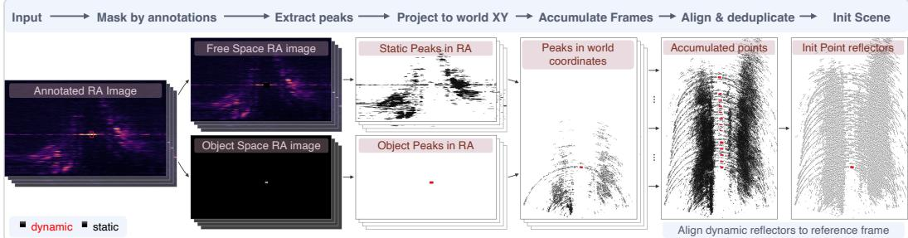  
Figure 5: Point-reflector initialization. Object bounding boxes separate background and object regions. Selected returns are projected into world coordinates and accumulated across training frames. Dynamic returns are aligned by track translation and expressed in object coordinates. Deduplication yields the initial static and dynamic reflectors.

the available specifications do not provide the range-response width. This is an empirical approxi mation, held fixed throughout scene optimization. Boreas provides no Doppler axis, so $h _ { D } = 1$

## B SCENE INITIALIZATION AND OPTIMIZATION

## B.1 SCENE INITIALIZATION DETAILS

Figure 5 illustrates the initialization procedure. We initialize the scene using only training-frame measurements and bounding boxes.

Object association and peak extraction. We associate bounding boxes across annotated frames by extrapolating each bounding box from the previous annotated frame using a constant-velocity model and matching it to the current annotations. Each resulting track receives a unique object index.

The annotated bounding box size defines an approximate object footprint, which we dilate by the sensor PSF to obtain its measurement region. The static-background region is the complement of these regions. On RADIal, for the background, we threshold the Doppler-averaged RA map. For each dynamic object, we select the Doppler bin with the strongest response at its annotated location and threshold that slice within its region. For Boreas, we select returns directly from the RA maps, using annotated object regions for dynamic initialization and their complement for the static background. We project the selected cells onto the ground plane in world coordinates and accumulate them across frames. Cells in overlapping regions contribute to each corresponding object.

Dynamic-peak alignment. Let ${ \bf z } _ { i } ( t )$ be a selected return associated with object $j ,$ and let $\mathbf { p } _ { 0 , j }$ be its first training-frame annotated position. Using the initial track position $\mathbf { p } _ { j } ( t )$ , we align the return and express it relative to the object-frame origin:

$$
\pmb { \mu } _ { i } = \mathbf { z } _ { i } ( t ) - \mathbf { p } _ { j } ( t ) .\tag{5}
$$

This initialization compensates for translation only, approximating the alignment of returns from turning objects.

Deduplication and parameter initialization. We deduplicate static returns on a 0.5 m voxel grid and aligned dynamic returns on a 0.15 m grid, separately for each object. Static reflectors retain their world-space positions and receive $q _ { i } = 0 ;$ dynamic reflectors use $\pmb { \mu _ { i } }$ and receive $q _ { i } = j$ . We initialize the base reflected power to $\alpha _ { i } ~ = ~ 0 . 2$ and all SH coefficients to zero, keeping the DC coefficient fixed.

## B.2 HYPERPARAMETER SELECTION

We select the interpolation-consistency weight $\lambda _ { \mathrm { i n t } }$ and learning rates for reflector positions, opacities, spherical-harmonic coefficients, and object tracks separately for each dataset using held-out validation data. We use degree-three SH $( K \bar { = } 1 6 )$ . All remaining settings are fixed or data-derived.

Table 3: Search ranges and selected hyperparameters.
<table><tr><td>Hyperparameter</td><td>Range</td><td>RADIal</td><td>Boreas</td></tr><tr><td>Interpolation weight  $\lambda _ { \mathrm { i n t } }$ </td><td> $1 0 ^ { - 3 } – 1$ </td><td>0.1</td><td>0.01</td></tr><tr><td>Position LR (means.  $_ { - 1 \tt T }$ </td><td> $1 0 ^ { - 5 } – 1 0 ^ { - 2 }$ </td><td>0.0002</td><td>0.00005</td></tr><tr><td>Opacity LR (opacities_lr)</td><td> $1 0 ^ { - 3 } – 1$ </td><td>0.02</td><td>0.02</td></tr><tr><td>SHLR(sh_coeffs_lr)</td><td> $1 0 ^ { - 4 } – 1 0 ^ { - 1 }$ </td><td>0.01</td><td>0.02</td></tr><tr><td>Motion LR (deform_lr)</td><td> $1 0 ^ { - 4 } – 1 0 ^ { - 1 }$ </td><td>0.01</td><td>0.0005</td></tr></table>

We tune five optimization hyperparameters. Each grid contains ten 1-2-5 logarithmic values. We sweep each hyperparameter independently while holding the remaining four at their pre-study values; the selections are therefore conditional rather than jointly optimal.

RADIal uses four held-out recordings. Boreas uses four held-out segments of a single annotated recording, each separated from evaluation segments by at least 1,000 frames. Both datasets use every fifth frame for validation.

We select using a composite of RA correlation, RAD correlation, and peak F1, standardized across candidates within each window and averaged over the four windows. Boreas uses only RA correlation and peak F1, as it has no Doppler dimension. For RADIal, candidates whose object recall falls more than 0.05 below the best arm are disqualified.

We also compare per-window rank agreement. It confirms the interpolation-weight selection on RADIal and all five selections on Boreas. For the four RADIal learning rates, rank agreement disagreed or tied; after reviewing these results, we adopted the composite-score winners. Chosen values can be seen in table 3.

## B.3 DENSIFICATION

The final model uses residual-guided densification of the static background. Starting at step 1,000, we perform densification every 200 steps until the end of training. At each event, we extract positiveresidual peaks within the ego-motion-compensated static-Doppler band, project them into world coordinates, and remove duplicates and candidates within 1m of an existing reflector. We then add the 1,000 strongest remaining candidates as static reflectors. We use a residual threshold of 0.05 and limit the complete representation to 800,000 reflectors.

We evaluated densification in a 36-configuration sensitivity sweep on the same validation recordings used for hyperparameter selection, disjoint from the evaluation sequences. Performance was stable across the sweep, and we retain its central configuration for every setting.

## C ADDITIONAL EXPERIMENTAL RESULTS

## C.1 EVALUATION PROTOCOL

Implementation Details. We optimize DyRAD and DyRAD-static for 10k steps. For the baselines, we use their published training schedules on Boreas; on RADIal, we train RadarSplat for 10k steps and retain the published RadarFields schedule. All experiments run on a single NVIDIA GeForce RTX 4090.

Reconstruction evaluation. We evaluate reconstruction using PSNR, SSIM, LPIPS, and Pearson correlation $\rho .$ Both datasets are evaluated in their native domain: RADIal is evaluated in the linear amplitude domain and Boreas in the sensor’s log-compressed domain. PSNR, SSIM, and correlation are reported over full measurements and object regions; LPIPS is computed over full RA and RAD measurements only.

Approximately 97% of RADIal tensor bins lie at the noise floor, so agreement with the background can dominate full-measurement scores. To examine this effect, we evaluate two structureless diagnostic controls using the same normalization, held-out frames, and scoring procedure as the reconstruction methods. CONST predicts the median value of each reference RA map uniformly, while ZERO predicts zero everywhere.

Table 4: Structureless controls. Full-measurement RA reconstruction on held-out RADIal frames. Mean ± sample standard deviation across ten sequences; best means, including controls, are bold. Constant predictions are assigned $\rho = 0$ by the scorer.
<table><tr><td>Method</td><td>PSNR [dB] ↑</td><td>SSIM↑</td><td>LPIPS ↓</td><td> $\rho \uparrow$ </td></tr><tr><td>DyRAD</td><td> $\mathbf { 2 5 . 7 8 \pm 1 . 0 9 }$ </td><td> $0 . 6 9 0 { \scriptstyle \pm 0 . 0 2 5 }$ </td><td> $\mathbf { 0 . 2 3 4 \pm 0 . 0 1 7 }$ </td><td> $\mathbf { 0 . 6 1 2 \pm 0 . 0 3 1 }$ </td></tr><tr><td>DyRAD-static</td><td> $2 5 . 1 6 \pm 1 . 1 5$ </td><td> $0 . 6 8 6 \pm 0 . 0 2 5$ </td><td> $0 . 2 4 9 \pm 0 . 0 2 1$ </td><td> $0 . 5 3 3 { \scriptstyle \pm 0 . 0 5 5 }$ </td></tr><tr><td>RadarSplat</td><td> $2 0 . 9 4 \pm 0 . 6 6$ </td><td> $0 . 0 5 0 { \scriptstyle \pm 0 . 0 1 1 }$ </td><td> $0 . 5 3 3 { \scriptstyle \pm 0 . 0 2 2 }$ </td><td> $0 . 2 9 1 \pm 0 . 1 0 0$ </td></tr><tr><td>RadarFields</td><td> $2 0 . 3 8 \pm 0 . 7 1$ </td><td> $0 . 0 5 9 { \scriptstyle \pm 0 . 0 0 9 }$ </td><td> $0 . 5 6 9 \pm 0 . 0 2 1$ </td><td> $0 . 0 5 5 { \scriptstyle \pm 0 . 0 2 4 }$ </td></tr><tr><td>CONST</td><td> $2 3 . 7 1 \pm 1 . 0 4$ </td><td> $\mathbf { 0 . 7 2 3 \pm 0 . 0 2 3 }$ </td><td> $0 . 5 8 3 { \scriptstyle \pm 0 . 0 2 5 }$ </td><td> $0 . 0 0 0 { \scriptstyle \pm 0 . 0 0 0 }$ </td></tr><tr><td>ZERO</td><td> $2 0 . 4 4 \pm 0 . 6 5$ </td><td> $0 . 0 3 2 { \scriptstyle \pm 0 . 0 0 4 }$ </td><td> $0 . 5 9 7 { \scriptstyle \pm 0 . 0 2 4 }$ </td><td> $0 . 0 0 0 { \scriptstyle \pm 0 . 0 0 0 }$ </td></tr></table>

Despite containing no scene structure, CONST achieves higher SSIM than every reconstruction method and higher PSNR than both RadarSplat and RadarFields (Table 4). Thus, these metrics alone do not establish that a reconstruction preserves radar structure.

LPIPS ranks all reconstruction methods above the controls on RA, although its separation is much larger for DyRAD than for the prior baselines. Correlation measures agreement in spatial variation independently of an affine intensity transformation; it therefore complements PSNR without measuring intensity calibration. For constant predictions, where Pearson correlation is undefined, the scorer assigns zero.

We consequently interpret PSNR and SSIM alongside correlation and LPIPS, and report objectregion scores to expose errors that full-measurement averages can conceal. Detection evaluation further tests whether synthesized measurements preserve usable radar returns.

Detection evaluation. We apply the CFAR detector from RADIal’s original implementation, with unchanged settings, to both measured and synthesized tensors. This evaluates compatibility with the dataset’s native detection pipeline without detector-specific tuning. We then evaluate the resulting point clouds using metrics from RadarGen (Borreda et al., 2026), with return power in place of calibrated RCS. Entire-area metrics comprise CD for spatial localization, CD-Full for joint distance in normalized position, Doppler, and power, and IoU@1 m for spatial overlap. DA precision, recall, and F1 require agreement in position and both radar attributes. Maximum Mean Discrepancy (MMD) measures distributional agreement separately for location, Doppler, and power, using five multi-scale RBF kernels and fixed-seed subsampling to at most 2,000 points. Doppler comparisons account for periodicity, with the DA Doppler threshold set to 10% of RADIal’s Doppler period.

Foreground metrics are averaged over annotated boxes. Hit rate measures the fraction of boxes containing reference detections that also contain predicted detections; density similarity is the ratio of the smaller detection count to the larger, with value one when both are zero. Both penalize missing returns in reference-occupied boxes. We additionally report the number of boxes containing predictions but no reference detections (FP boxes).

We omit conditional foreground CD, CD-Full, and MMD: the baselines miss most objects, leaving these scores undefined or evaluated on a small detected subset. They therefore cannot support a comparison across methods. We instead report foreground hit rate and density similarity, which penalize missed objects. Tables report means and sample standard deviations across sequences, or scene–offset pairs for synthetic evaluation.

## C.2 ON-PATH EVALUATION

Tables 5 and 6 provide the full reconstruction and detection results for the on-path evaluation described in Sec. 4.2. Figures 6 and 7 show qualitative comparisons on RADIal and Boreas, respectively.

## C.3 REAL-DATA OFF-PATH EVALUATION

Tables 7 and 8 provide the full reconstruction and detection results for the real-data off-path protocol described in Sec. 4.2. Figures 8 and 9 illustrate the displaced renders and subsequent reconstructions

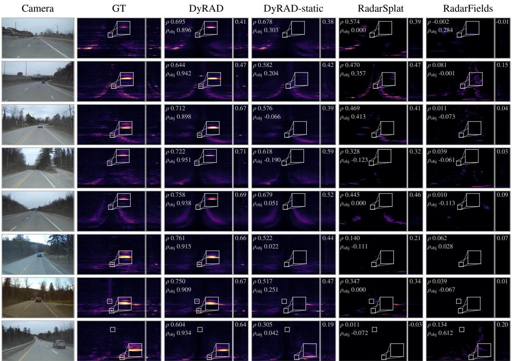  
Figure 6: Additional on-path examples on RADIal. Each row compares a held-out measurement with the corresponding reconstructions, showing RA (left) and RD (right) projections within each panel. Displayed correlations are computed separately for each projection. White boxes mark objects; insets enlarge selected RA object regions. DyRAD preserves object returns that the static variant and baselines miss, even where the surrounding scene is reconstructed similarly.

Table 5: On-path reconstruction: full results. Mean ± sample standard deviation across ten RADIal sequences and three Boreas sequences. Best means within each projection are bold. ∗ denotes the ego-Doppler lift. LPIPS is not reported for RD.
<table><tr><td rowspan="2">Method</td><td colspan="4">Full</td><td colspan="3">Object</td></tr><tr><td>ρ↑</td><td>PSNR [dB] ↑</td><td>SSIM ↑</td><td>LPIPS ↓</td><td>ρ↑</td><td>PSNR [dB] ↑</td><td>SSIM↑</td></tr><tr><td colspan="6">RADIal — RAD reconstruction</td><td></td><td></td></tr><tr><td> $\mathrm { R a d a r S p l a t } ^ { * }$ </td><td> $0 . 0 6 8 \pm 0 . 0 2 8$ </td><td> $2 3 . 5 6 \pm 0 . 8 5$ </td><td> $0 . 2 1 5 { \scriptstyle \pm 0 . 0 0 6 }$ </td><td></td><td>0.634 ±0.008 −0.010 ±0.057</td><td> $1 3 . 5 4 \pm 1 . 2 2$ </td><td> $0 . 0 9 8 { \scriptstyle \pm 0 . 0 2 1 }$ </td></tr><tr><td> $\mathrm { R a d a r F i e l d s } ^ { * }$ </td><td> $0 . 0 1 5 { \scriptstyle \pm 0 . 0 0 9 }$ </td><td> $2 3 . 1 3 \pm 1 . 2 3$ </td><td> $0 . 2 0 3 { \scriptstyle \pm 0 . 0 1 2 }$ </td><td></td><td> $0 . 6 3 7 \pm 0 . 0 0 7 \quad - 0 . 0 1 1 \pm 0 . 0 5 1$ </td><td> $1 3 . 4 0 \pm 1 . 2 8$ </td><td> $0 . 0 8 8 { \scriptstyle \pm 0 . 0 2 1 }$ </td></tr><tr><td> $\mathrm { D y R A D - s t a t i c }$ </td><td> $0 . 2 1 3 { \scriptstyle \pm 0 . 0 5 4 }$ </td><td> $2 5 . 6 7 \pm 0 . 9 5$ </td><td> $0 . 4 9 8 \pm 0 . 0 2 1$ </td><td> $0 . 2 7 9 { \scriptstyle \pm 0 . 0 2 6 }$ </td><td> $- 0 . 0 1 3 \pm 0 . 0 7 2$ </td><td> $1 3 . 7 6 \pm 1 . 2 4$ </td><td> $0 . 1 9 9 { \scriptstyle \pm 0 . 0 3 5 }$ </td></tr><tr><td>DyRAD</td><td> $\mathbf { 0 . 2 7 2 \pm 0 . 0 6 2 }$ </td><td> $\mathbf { 2 5 . 8 8 \pm 0 . 9 5 }$ </td><td> $\mathbf { 0 . 5 0 2 \pm 0 . 0 2 2 }$ </td><td> $\mathbf { 0 . 2 7 5 \pm 0 . 0 2 5 }$ </td><td> $\mathbf { 0 . 6 5 8 \pm 0 . 0 7 0 }$ </td><td> $\mathbf { 1 6 . 9 7 \pm 1 . 0 6 }$ </td><td> $\mathbf { 0 . 3 7 4 \pm 0 . 0 2 8 }$ </td></tr><tr><td colspan="6">RADIal — RA reconstruction</td><td></td><td></td></tr><tr><td>RadarSplat</td><td> $0 . 2 9 1 \pm 0 . 1 0 0$ </td><td> $2 0 . 9 4 \pm 0 . 6 6$ </td><td> $0 . 0 5 0 { \scriptstyle \pm 0 . 0 1 1 }$ </td><td> $0 . 5 3 3 { \scriptstyle \pm 0 . 0 2 2 }$ </td><td> $- 0 . 0 0 5 \pm 0 . 0 2 4$ </td><td> $8 . 0 8 \pm 1 . 4 5$ </td><td> $0 . 0 0 8 \pm 0 . 0 0 4$ </td></tr><tr><td>RadarFields</td><td> $0 . 0 5 5 { \scriptstyle \pm 0 . 0 2 4 }$ </td><td> $2 0 . 3 8 \pm 0 . 7 1$ </td><td> $0 . 0 5 9 { \scriptstyle \pm 0 . 0 0 9 }$ </td><td> $0 . 5 6 9 \pm 0 . 0 2 1$ </td><td> $- 0 . 0 0 4 \pm 0 . 0 6 3$ </td><td> $8 . 1 8 \pm 1 . 4 3$ </td><td> $0 . 0 1 9 { \scriptstyle \pm 0 . 0 0 7 }$ </td></tr><tr><td>DyRAD-static</td><td> $0 . 5 3 3 { \scriptstyle \pm 0 . 0 5 5 }$ </td><td> $2 5 . 1 6 \pm 1 . 1 5$ </td><td> $0 . 6 8 6 \pm 0 . 0 2 5$ </td><td> $0 . 2 4 9 \pm 0 . 0 2 1$ </td><td> $0 . 0 2 1 \pm 0 . 0 8 8$ </td><td> $8 . 7 0 \pm 1 . 5 6$ </td><td> $0 . 2 3 2 { \scriptstyle \pm 0 . 0 5 8 }$ </td></tr><tr><td>DyRAD</td><td> $\mathbf { 0 . 6 1 2 \pm 0 . 0 3 1 }$ </td><td> $\mathbf { 2 5 . 7 8 \pm 1 . 0 9 }$ </td><td> $\mathbf { 0 . 6 9 0 \pm 0 . 0 2 5 }$ </td><td> $\mathbf { 0 . 2 3 4 \pm 0 . 0 1 7 }$ </td><td> $\mathbf { 0 . 8 2 7 \pm 0 . 0 8 7 }$ </td><td> $\mathbf { 1 4 . 9 3 \pm 1 . 8 9 }$ </td><td> $\mathbf { 0 . 5 6 8 \pm 0 . 0 9 7 }$ </td></tr><tr><td colspan="6">RADIal — RD reconstruction</td><td></td><td></td></tr><tr><td>RadarSplat*</td><td> $0 . 3 0 3 { \scriptstyle \pm 0 . 0 9 0 }$ </td><td> $2 1 . 5 7 \pm 0 . 9 3$ </td><td> $0 . 1 0 2 { \scriptstyle \pm 0 . 0 2 6 }$ </td><td></td><td> $0 . 0 7 3 { \scriptstyle \pm 0 . 1 0 4 }$ </td><td> $1 6 . 8 1 \pm 2 . 0 2$ </td><td> $0 . 0 6 3 { \scriptstyle \pm 0 . 0 1 5 }$ </td></tr><tr><td>RadarFields*</td><td> $0 . 1 3 1 \pm 0 . 0 6 2$ </td><td> $2 1 . 4 4 \pm 0 . 9 3$ </td><td> $0 . 1 2 9 { \scriptstyle \pm 0 . 0 3 6 }$ </td><td></td><td> $0 . 0 1 9 { \scriptstyle \pm 0 . 0 6 3 }$ </td><td> $1 6 . 8 7 \pm 2 . 0 6$ </td><td> $0 . 0 9 8 { \scriptstyle \pm 0 . 0 4 3 }$ </td></tr><tr><td> $\mathrm { D y R A D - s t a t i c }$ </td><td> $0 . 3 7 5 { \scriptstyle \pm 0 . 0 6 4 }$ </td><td> $2 4 . 7 8 \pm 1 . 6 8$ </td><td> $0 . 6 1 1 { \scriptstyle \pm 0 . 0 3 8 }$ </td><td></td><td> $0 . 0 7 3 { \scriptstyle \pm 0 . 0 8 4 }$ </td><td> $1 8 . 5 6 \pm 2 . 3 9$ </td><td> $0 . 4 3 8 \pm 0 . 1 1 1$ </td></tr><tr><td>DyRAD</td><td> $\mathbf { 0 . 4 7 6 \pm 0 . 0 6 7 }$ </td><td> $\mathbf { 2 5 . 3 3 \pm 1 . 7 0 }$ </td><td> $\mathbf { 0 . 6 2 0 \mathop { \pm 0 . 0 4 0 } }$ </td><td></td><td> $\mathbf { 0 . 5 6 4 \pm 0 . 1 0 0 }$ </td><td> $\mathbf { 2 0 . 7 9 \pm 1 . 9 5 }$ </td><td> $\mathbf { 0 . 5 5 8 \pm 0 . 0 8 6 }$ </td></tr><tr><td colspan="6">Boreas — RA reconstruction</td><td></td><td></td></tr><tr><td>RadarSplat</td><td> $0 . 6 6 6 \pm 0 . 0 3 6$ </td><td> $2 3 . 9 2 \pm 1 . 0 7$ </td><td> $0 . 4 4 6 \pm 0 . 0 4 4$ </td><td> $0 . 4 1 1 { \scriptstyle \pm 0 . 0 0 5 }$ </td><td> $0 . 1 7 8 \pm 0 . 2 4 9$ </td><td> $1 9 . 6 1 \pm 3 . 2 3$ </td><td> $0 . 2 7 3 { \scriptstyle \pm 0 . 1 2 1 }$ </td></tr><tr><td>RadarFields</td><td> $0 . 2 7 9 { \scriptstyle \pm 0 . 0 7 8 }$ </td><td> $1 9 . 9 6 \pm 0 . 8 4$ </td><td> $0 . 1 4 7 \pm 0 . 0 1 1$ </td><td> $0 . 5 1 8 { \scriptstyle \pm 0 . 0 1 6 }$ </td><td> $0 . 0 1 6 \pm 0 . 1 2 8$ </td><td> $1 6 . 9 9 \pm 1 . 9 2$ </td><td> $0 . 0 4 1 \pm 0 . 0 4 1$ </td></tr><tr><td>DyRAD-static</td><td> $0 . 7 4 9 \pm 0 . 0 1 8$ </td><td> $2 5 . 3 1 \pm 0 . 9 0$ </td><td> $0 . 4 8 2 \pm 0 . 0 3 7$ </td><td> $\mathbf { 0 . 3 0 4 \pm 0 . 0 1 1 }$ </td><td> $0 . 2 7 8 \pm 0 . 2 1 7$ </td><td> $2 1 . 1 3 \pm 2 . 8 9$ </td><td> $0 . 3 7 2 { \scriptstyle \pm 0 . 0 8 7 }$ </td></tr><tr><td>DyRAD</td><td> $\mathbf { 0 . 7 5 2 \pm 0 . 0 1 7 }$ </td><td>25.36 ±0.90</td><td> $\mathbf { 0 . 4 8 4 \pm 0 . 0 3 8 }$ </td><td>0.305 ±0.010</td><td> $\mathbf { 0 . 6 2 2 \pm 0 . 1 3 0 }$ </td><td> $\mathbf { 2 4 . 7 8 \pm 0 . 5 4 }$ </td><td> $\mathbf { 0 . 5 6 5 \pm 0 . 1 2 9 }$ </td></tr></table>

Table 6: On-path detection on RADIal: full results. Mean ± sample standard deviation across ten sequences. Best means, including ties, are bold. ∗ denotes the ego-Doppler lift.
<table><tr><td rowspan="2">Method</td><td colspan="6">Entire area</td></tr><tr><td> $\mathrm { C D } \left[ \mathrm { m } \right] \downarrow$ </td><td> ${ \mathrm { C D - F u l l } } \downarrow$ </td><td> $\mathrm { I o U @ 1 m \uparrow }$ </td><td>Precision ↑</td><td>Recall ↑</td><td>F1↑</td></tr><tr><td>RadarSplat*</td><td> $6 . 5 3 \pm 5 . 8 2$ </td><td> $0 . 1 6 6 8 \pm 0 . 0 7 5 8$ </td><td> $0 . 1 4 1 \pm 0 . 0 6 6$ </td><td> $0 . 0 8 4 \pm 0 . 0 3 6$ </td><td> $0 . 0 8 7 { \scriptstyle \pm 0 . 0 5 6 }$ </td><td> $0 . 0 7 3 { \scriptstyle \pm 0 . 0 4 8 }$ </td></tr><tr><td>RadarFields*</td><td> $6 . 9 7 \pm 0 . 9 6$ </td><td> $0 . 1 6 1 2 \pm 0 . 0 5 2 1$ </td><td> $0 . 0 3 7 \pm 0 . 0 1 2$ </td><td> $0 . 0 1 5 { \scriptstyle \pm 0 . 0 0 6 }$ </td><td> $0 . 0 1 9 { \scriptstyle \pm 0 . 0 1 0 }$ </td><td> $0 . 0 1 6 \pm 0 . 0 0 7$ </td></tr><tr><td>DyRAD-static</td><td> $4 . 7 1 \pm 1 . 2 9$ </td><td> $0 . 0 7 8 3 { \scriptstyle \pm 0 . 0 1 1 7 }$ </td><td> $0 . 1 8 8 \pm 0 . 0 4 3$ </td><td> $0 . 1 6 9 \pm 0 . 0 5 5$ </td><td> $0 . 0 9 9 { \scriptstyle \pm 0 . 0 3 4 }$ </td><td> $0 . 1 2 3 { \scriptstyle \pm 0 . 0 4 1 }$ </td></tr><tr><td>DyRAD</td><td> ${ \bf 4 . 0 1 } \pm 1 . 0 2 $ </td><td> $\mathbf { 0 . 0 6 8 9 { \scriptstyle \pm 0 . 0 0 9 2 } }$ </td><td> $\mathbf { 0 . 2 3 8 \pm 0 . 0 4 0 }$ </td><td> $\mathbf { 0 . 2 3 3 \pm 0 . 0 5 1 }$ </td><td> $\mathbf { 0 . 1 4 9 \pm 0 . 0 3 7 }$ </td><td> $\mathbf { 0 . 1 7 9 \bot 0 . 0 4 1 }$ </td></tr><tr><td rowspan="2">Method</td><td colspan="3">Entire area</td><td colspan="3">Foreground</td></tr><tr><td>MMD location ↓ MMD Doppler ↓</td><td></td><td> $\mathbf { M M D \ p o w e r \downarrow }$ </td><td> $\mathrm { H i t } \ \mathrm { r a t e } \ \uparrow$ </td><td>Density sim. ↑</td><td>FP boxes ↓</td></tr><tr><td>RadarSplat*</td><td> $0 . 9 2 6 3 { \scriptstyle \pm 0 . 4 3 4 0 }$ </td><td> $1 . 1 8 2 0 \pm 0 . 8 4 0 9$ </td><td> $5 . 6 3 0 0 { \scriptstyle \pm 0 . 6 5 4 4 }$ </td><td> $0 . 0 3 6 \pm 0 . 0 6 7$ </td><td> $0 . 0 4 8 \pm 0 . 0 4 8$ </td><td> ${ \bf 0 . 0 \pm 0 . 0 }$ </td></tr><tr><td>RadarFields*</td><td> $0 . 5 3 8 5 { \scriptstyle \pm 0 . 1 5 6 6 }$ </td><td>1.3328 ±0.6162</td><td> $4 . 7 8 3 2 { \scriptstyle \pm 0 . 8 5 1 5 }$ </td><td> $0 . 2 6 9 \pm 0 . 2 4 5$ </td><td> $0 . 1 5 3 { \scriptstyle \pm 0 . 1 2 1 }$ </td><td> ${ \bf 0 . 0 \pm 0 . 0 }$ </td></tr><tr><td> $\mathrm { D y R A D - s t a t i c }$ </td><td> $0 . 5 8 4 2 \pm 0 . 2 1 9 1$ </td><td>0.2386 ±0.1191</td><td> $0 . 7 4 7 1 \pm 0 . 2 9 7 0$ </td><td> $0 . 0 7 0 { \scriptstyle \pm 0 . 0 8 3 }$ </td><td> $0 . 0 4 7 \pm 0 . 0 5 7$ </td><td> ${ \bf 0 . 0 \pm 0 . 0 }$ </td></tr><tr><td>DyRAD</td><td> $\mathbf { 0 . 4 2 0 8 \pm 0 . 1 4 2 5 }$ </td><td> $\mathbf { 0 . 1 6 5 7 \pm 0 . 0 7 4 1 }$ </td><td> $\mathbf { 0 . 5 9 3 3 \pm 0 . 2 0 8 2 }$ </td><td> $\mathbf { 0 . 9 0 7 \pm 0 . 0 8 6 }$ </td><td> $\mathbf { 0 . 5 8 3 \pm 0 . 0 9 9 }$ </td><td> $0 . 3 \pm 0 . 5$ </td></tr></table>

at the original poses. On RADIal, RadarFields produces a near-constant reconstruction on one sequence and an all-zero reconstruction on another; both are included in the reported averages.

## C.4 SYNTHETIC OFF-PATH EVALUATION

Scene generation. We construct five scenes with crossing traffic, a curved road, sparse roadside structure, a dual carriageway, and an urban canyon. Static structures and vehicles comprise worldframe reflectors with positions, velocities, reflectivities, and surface normals. The scene evolves independently of the sensor trajectory, allowing the same world state to be rendered from different poses at each timestamp. Each sequence contains 40 frames at 0.1 s intervals.

The generator produces RADIal-format tensors with 512 range bins, 751 azimuth bins, and 16 Doppler bins, matching the real data; both are cropped identically to 447 range bins before training and scoring. These are generated together with sensor poses, ego velocities, and view-specific vehicle annotations. Measurements use analytic sensor responses in the amplitude domain and lognormal clutter. Doppler is wrapped to RADIal’s 1.7968 m/s period; real DDMA demultiplexing artifacts are not reproduced. The benchmark therefore provides ground truth under an idealized sensor model. We plan to publicly release the synthetic scenes and their off-path ground-truth measurements to support reuse of the benchmark.

Camera  
GT  
DyRAD  
DyRAD-static  
RadarSplat  
RadarFields  
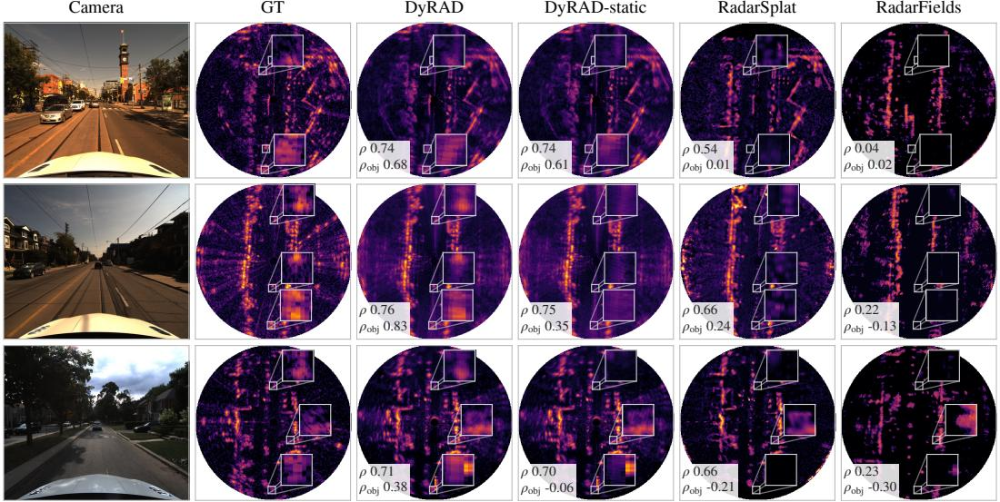  
Figure 7: On-path examples on Boreas. Held-out RA measurements and reconstructions displayed in Cartesian bird’s-eye view. White boxes mark annotated objects; insets enlarge selected object regions. DyRAD preserves object returns that the static variant and baselines miss, even where the surrounding scene is reconstructed similarly.

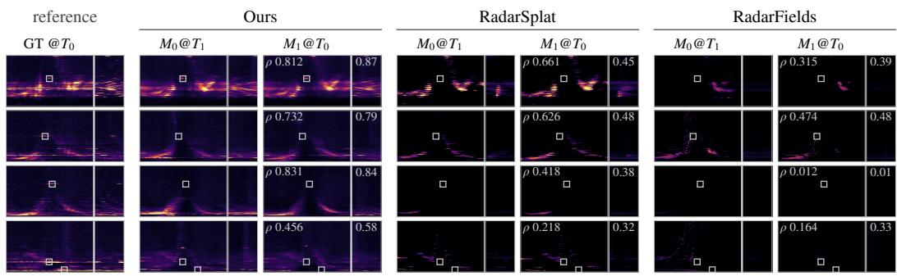  
Figure 8: Off-path rendering and round-trip reconstruction on RADIal. Each panel shows RA (left) and RD (right) projections. For each method, $M _ { 0 } @ T _ { 1 }$ shows measurements synthesized along the trajectory shifted laterally by 2 m. A new model is fitted to these renders and evaluated at the original poses $( M _ { 1 } @ T _ { 0 } )$ , against the real measurements $( \mathrm { G T } @ T _ { 0 } )$ . White boxes mark annotated vehicles. The values in the return panels report RA and RD correlations with the reference, respectively.

Evaluation protocol. Each method is fitted to the base trajectory and evaluated without refitting at five displaced trajectories: lateral offsets of −1.75, +1.75, and +3.5 m, and yaw offsets of $+ 5 ^ { \circ }$ and $+ 1 0 ^ { \circ }$ . Results are pooled over the 25 scene–offset pairs; the reported standard deviation describes variation across scenes and views, not training seeds.

Full results. Tables 9 and 10 provide the full reconstruction and detection results. For objectregion RD metrics, the evaluation mask includes all Doppler bins at ranges occupied by annotated vehicles; collapsing azimuth therefore also includes background returns at those ranges. The project page provides videos of synthetic off-path sequences for all methods.

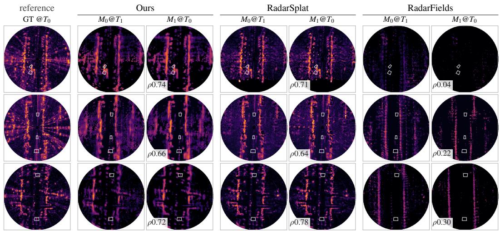  
Figure 9: Off-path rendering and round-trip reconstruction on Boreas. RA measurements shown in Cartesian bird’s-eye view. For each method, $M _ { 0 } @ T _ { 1 }$ shows the initial model rendered along the trajectory shifted laterally by 2 m. A new model is fitted to these renders and evaluated at the original poses $\overset { \cdot } { (} M _ { 1 } @ T _ { 0 } )$ , against the real measurements $( \mathrm { G T } @ T _ { 0 } )$ . White boxes mark annotated vehicles; $\rho$ denotes correlation of the round-trip reconstruction with the reference.

Table 7: Real-data off-path reconstruction: full results. Results at the original poses after a 2 m lateral-shift round trip. Mean ± sample standard deviation across ten RADIal sequences and three Boreas sequences; best means are bold. ∗ denotes the ego-Doppler lift. LPIPS is not reported for RD.
<table><tr><td rowspan="2">Method</td><td colspan="4">Full</td><td colspan="3">Object</td></tr><tr><td> $\rho \uparrow$ </td><td>PSNR [dB] ↑</td><td>SSIM ↑</td><td>LPIPS ↓</td><td>ρ↑</td><td>PSNR [dB] ↑</td><td>SSIM ↑</td></tr><tr><td colspan="8">RADIal — RAD reconstruction</td></tr><tr><td>RadarSplat*</td><td> $0 . 0 7 6 \pm 0 . 0 3 2$ </td><td> $2 3 . 9 2 \pm 0 . 8 5$ </td><td> $0 . 2 1 7 { \scriptstyle \pm 0 . 0 0 6 }$ </td><td> $0 . 6 3 4 \pm 0 . 0 0 8$ </td><td> $- 0 . 0 0 4 \pm 0 . 0 5 3$ </td><td> $1 3 . 5 7 \pm 1 . 3 2$ </td><td> $0 . 0 9 9 { \scriptstyle \pm 0 . 0 2 2 }$ </td></tr><tr><td>RadarFields*</td><td> $0 . 0 2 3 { \scriptstyle \pm 0 . 0 1 8 }$ </td><td> $2 4 . 4 3 \pm 0 . 7 5$ </td><td> $0 . 2 1 7 { \scriptstyle \pm 0 . 0 0 6 }$ </td><td> $0 . 6 3 8 { \scriptstyle \pm 0 . 0 0 8 }$ </td><td> $- 0 . 0 1 1 \pm 0 . 0 4 8$ </td><td> $1 3 . 4 8 \pm 1 . 2 0$ </td><td> $0 . 0 9 9 { \scriptstyle \pm 0 . 0 2 3 }$ </td></tr><tr><td>DyRAD-static</td><td> $0 . 3 3 5 { \scriptstyle \pm 0 . 0 5 4 }$ </td><td> $2 6 . 4 1 \pm 0 . 7 3$ </td><td> $0 . 4 9 2 { \scriptstyle \pm 0 . 0 1 2 }$ </td><td> $0 . 2 7 1 { \scriptstyle \pm 0 . 0 1 4 }$ </td><td> $0 . 0 5 6 \pm 0 . 0 6 4$ </td><td> $1 3 . 8 6 \pm 1 . 3 5$ </td><td> $0 . 1 9 4 \pm 0 . 0 3 5$ </td></tr><tr><td>DyRAD</td><td> $\mathbf { 0 . 3 6 3 \pm 0 . 0 5 2 }$ </td><td> $\mathbf { 2 6 . 5 3 \pm 0 . 7 4 }$ </td><td> $\mathbf { 0 . 4 9 8 \pm 0 . 0 1 2 }$ </td><td> $\mathbf { 0 . 2 6 7 \pm 0 . 0 1 5 }$ </td><td> $\mathbf { 0 . 5 3 6 \pm 0 . 0 7 7 }$ </td><td> $\mathbf { 1 5 . 9 8 \pm 1 . 3 6 }$ </td><td> $\mathbf { 0 . 3 4 4 \pm 0 . 0 4 1 }$ </td></tr><tr><td colspan="8">RADIal — RA reconstruction</td></tr><tr><td>RadarSplat</td><td> $0 . 3 5 7 { \scriptstyle \pm 0 . 1 2 5 }$ </td><td> $2 1 . 1 5 \pm 0 . 7 3$ </td><td> $0 . 0 5 1 \pm 0 . 0 1 2$ </td><td> $0 . 5 3 6 \pm 0 . 0 2 3$ </td><td> $0 . 0 1 2 { \scriptstyle \pm 0 . 0 1 7 }$ </td><td> $8 . 1 2 \pm 1 . 6 3$ </td><td> $0 . 0 1 0 { \scriptstyle \pm 0 . 0 0 6 }$ </td></tr><tr><td>RadarFields</td><td> $0 . 1 0 4 \pm 0 . 0 6 7$ </td><td> $2 0 . 5 7 { \scriptstyle \pm 0 . 6 5 }$ </td><td> $0 . 0 3 8 \pm 0 . 0 0 6$ </td><td> $0 . 5 7 2 { \scriptstyle \pm 0 . 0 2 7 }$ </td><td> $0 . 0 1 5 { \scriptstyle \pm 0 . 0 2 9 }$ </td><td> $8 . 1 4 \pm 1 . 6 1$ </td><td> $0 . 0 1 0 { \scriptstyle \pm 0 . 0 0 5 }$ </td></tr><tr><td>DyRAD-static</td><td> $0 . 5 9 5 { \scriptstyle \pm 0 . 0 5 6 }$ </td><td> $2 5 . 5 6 \pm 0 . 9 9$ </td><td> $0 . 6 5 2 { \scriptstyle \pm 0 . 0 1 9 }$ </td><td> $0 . 2 1 8 { \scriptstyle \pm 0 . 0 1 5 }$ </td><td> $0 . 1 1 4 \pm 0 . 0 6 6$ </td><td> $8 . 7 6 \pm 1 . 7 6$ </td><td> $0 . 2 1 5 { \scriptstyle \pm 0 . 0 6 8 }$ </td></tr><tr><td>DyRAD</td><td> $\mathbf { 0 . 6 6 1 \pm 0 . 0 3 5 }$ </td><td> $\mathbf { 2 6 . 1 5 \pm 0 . 9 5 }$ </td><td> $\mathbf { 0 . 6 6 5 \pm 0 . 0 2 3 }$ </td><td> $\mathbf { 0 . 2 1 2 \pm 0 . 0 1 5 }$ </td><td> $\mathbf { 0 . 8 0 7 \pm 0 . 0 5 7 }$ </td><td> $\mathbf { 1 4 . 1 4 \pm 1 . 6 6 }$ </td><td> $\mathbf { 0 . 5 1 7 \pm 0 . 0 8 9 }$ </td></tr><tr><td colspan="8"> $R A D I a l - R D$  reconstruction</td></tr><tr><td> $\mathrm { R a d a r S p l a t } ^ { * }$ </td><td> $0 . 3 0 1 { \scriptstyle \pm 0 . 1 1 5 }$ </td><td> $2 1 . 5 0 { \scriptstyle \pm 0 . 9 4 }$ </td><td> $0 . 0 9 1 \pm 0 . 0 2 3$ </td><td></td><td> $0 . 0 6 3 \pm 0 . 0 9 8$ </td><td> $1 6 . 9 3 \pm 2 . 0 5$ </td><td> $0 . 0 5 8 \pm 0 . 0 1 4$ </td></tr><tr><td> $\mathrm { R a d a r F i e l d s } ^ { * }$ </td><td> $0 . 0 8 6 \pm 0 . 0 6 6$ </td><td> $2 1 . 1 2 { \scriptstyle \pm 0 . 9 6 }$ </td><td> $0 . 0 6 6 \pm 0 . 0 2 2$ </td><td></td><td> $0 . 0 2 1 \pm 0 . 0 4 2$ </td><td> $1 6 . 8 5 \pm 2 . 0 5$ </td><td> $0 . 0 4 3 { \scriptstyle \pm 0 . 0 2 0 }$ </td></tr><tr><td> $\mathrm { D y R A D - s t a t i c }$ </td><td> $0 . 6 3 3 { \scriptstyle \pm 0 . 0 5 9 }$ </td><td> $2 6 . 3 5 \pm 1 . 2 4$ </td><td> $0 . 6 5 3 { \scriptstyle \pm 0 . 0 2 1 }$ </td><td>一</td><td> $0 . 5 1 2 { \scriptstyle \pm 0 . 1 5 2 }$ </td><td> $1 9 . 7 4 \pm 2 . 0 1$ </td><td> $0 . 5 0 5 { \scriptstyle \pm 0 . 0 5 7 }$ </td></tr><tr><td>DyRAD</td><td> $\mathbf { 0 . 6 5 3 \pm 0 . 0 4 8 }$ </td><td> $\mathbf { 2 6 . 6 2 \pm 1 . 2 6 }$ </td><td> $\mathbf { 0 . 6 6 1 \pm 0 . 0 2 2 }$ </td><td></td><td> $\mathbf { 0 . 5 8 4 \pm 0 . 0 9 4 }$ </td><td> $\mathbf { 2 0 . 5 6 \pm 1 . 9 7 }$ </td><td> $\mathbf { 0 . 5 5 1 \pm 0 . 0 5 3 }$ </td></tr><tr><td colspan="8">Boreas — RA reconstruction</td></tr><tr><td>RadarSplat</td><td> $0 . 6 8 9 { \scriptstyle \pm 0 . 0 4 2 }$ </td><td> $2 4 . 2 9 \pm 1 . 1 6$ </td><td> $\mathbf { 0 . 4 9 0 \pm 0 . 0 4 0 }$ </td><td> $\mathbf { 0 . 4 1 5 \pm 0 . 0 0 4 }$ </td><td> $0 . 2 1 1 \pm 0 . 2 3 7$ </td><td> $1 9 . 2 5 \pm 3 . 5 1 $ </td><td> $0 . 2 8 9 \pm 0 . 1 2 3$ </td></tr><tr><td>RadarFields</td><td> $0 . 5 3 8 { \scriptstyle \pm 0 . 0 8 1 }$ </td><td> $2 1 . 0 9 \pm 1 . 2 8$ </td><td> $0 . 4 6 6 \pm 0 . 0 4 4$ </td><td> $0 . 5 5 0 { \scriptstyle \pm 0 . 0 0 7 }$ </td><td> $0 . 0 9 5 \pm 0 . 1 2 3$ </td><td> $1 6 . 5 4 \pm 2 . 3 0$ </td><td> $0 . 2 9 6 \pm 0 . 0 6 9$ </td></tr><tr><td>DyRAD-static</td><td> $0 . 7 4 1 \pm 0 . 0 0 7$ </td><td> $2 4 . 4 5 \pm 0 . 6 2$ </td><td> $0 . 3 5 9 { \scriptstyle \pm 0 . 0 2 3 }$ </td><td> $0 . 4 6 2 \pm 0 . 0 2 4$ </td><td> $0 . 2 6 1 \pm 0 . 2 1 5$ </td><td> $2 0 . 0 2 \pm 2 . 5 4$ </td><td> $0 . 2 9 6 \pm 0 . 0 6 5$ </td></tr><tr><td>DyRAD</td><td> $\mathbf { 0 . 7 4 4 \pm 0 . 0 0 9 }$ </td><td> ${ \bf 2 4 . 5 1 \pm 0 . 6 2 }$ </td><td> $0 . 3 6 0 { \scriptstyle \pm 0 . 0 2 0 }$ </td><td> $0 . 4 6 1 \pm 0 . 0 2 3$ </td><td> $\mathbf { 0 . 6 4 1 \pm 0 . 1 6 5 }$ </td><td> $\mathbf { 2 4 . 1 9 \pm 1 . 3 9 }$ </td><td> $\mathbf { 0 . 5 1 9 \bot 0 . 1 8 0 }$ </td></tr></table>

## C.5 RUNTIME

We measure computational cost on RADIal using an otherwise idle NVIDIA RTX 4090 (Tab. 11). DyRAD requires a median of 7.2 minutes for 10k optimization steps and 5.65 ms to render a full RAD tensor, with 1055 MiB peak allocated GPU memory. Rendering measurements cover the complete forward pass after warm-up, excluding loading and file output. The baselines render RA maps, so their latency measures a different output. Training times follow each method’s stated budget.

Table 8: Real-data off-path detection on RADIal: full results. Results at the original poses after a 2 m lateral-shift round trip. Mean ± sample standard deviation across ten sequences; best means are bold. ∗ denotes the ego-Doppler lift.
<table><tr><td rowspan="2">Method</td><td colspan="6">Entire area</td></tr><tr><td> $\mathrm { C D } \left[ \mathrm { m } \right] \downarrow$ </td><td> ${ \mathrm { C D - F u l l } } \downarrow$ </td><td> $\mathrm { I o U } @ 1 \mathrm { m } \uparrow$ </td><td>Precision ↑</td><td>Recall ↑</td><td>F1↑</td></tr><tr><td>RadarSplat*</td><td> $6 . 3 5 \pm 4 . 7 5$ </td><td> $0 . 1 6 9 9 { \scriptstyle \pm 0 . 0 7 0 2 }$ </td><td> $0 . 1 5 5 { \scriptstyle \pm 0 . 0 7 6 }$ </td><td> $0 . 0 8 5 \pm 0 . 0 4 2$ </td><td> $0 . 0 9 3 { \scriptstyle \pm 0 . 0 6 1 }$ </td><td> $0 . 0 7 7 { \scriptstyle \pm 0 . 0 5 0 }$ </td></tr><tr><td>RadarFields*</td><td> $9 . 1 9 \pm 6 . 0 7$ </td><td> $0 . 2 2 1 1 { \scriptstyle \pm 0 . 0 9 6 2 }$ </td><td> $0 . 0 7 2 { \scriptstyle \pm 0 . 0 4 5 }$ </td><td> $0 . 1 9 8 { \scriptstyle \pm 0 . 3 5 3 }$ </td><td> $0 . 0 3 3 { \scriptstyle \pm 0 . 0 2 6 }$ </td><td> $0 . 0 2 7 \pm 0 . 0 2 0$ </td></tr><tr><td>DyRAD-static</td><td> $3 . 4 7 \pm 0 . 6 1$ </td><td> $0 . 0 6 8 1 \pm 0 . 0 1 0 1$ </td><td> $0 . 2 3 9 { \scriptstyle \pm 0 . 0 3 6 }$ </td><td> $0 . 2 2 1 \pm 0 . 0 5 1$ </td><td> $0 . 2 0 5 \pm 0 . 0 3 6$ </td><td> $0 . 2 1 0 { \scriptstyle \pm 0 . 0 4 2 }$ </td></tr><tr><td>DyRAD</td><td> ${ \bf 3 . 2 5 \pm 0 . 5 7 }$ </td><td> $\mathbf { 0 . 0 6 2 9 \bot 0 . 0 0 8 5 }$ </td><td> $\mathbf { 0 . 2 6 8 \pm 0 . 0 3 4 }$ </td><td> $\mathbf { 0 . 2 5 1 } \pm \mathrm { 0 . 0 4 9 }$ </td><td> $\mathbf { 0 . 2 2 7 \pm 0 . 0 3 4 }$ </td><td> $\mathbf { 0 . 2 3 6 \bot } 0 . 0 4 0$ </td></tr></table>

<table><tr><td></td><td colspan="3">Entire area</td><td colspan="4">Foreground</td></tr><tr><td>Method</td><td>MMD location ↓ MMD Doppler ↓</td><td></td><td> $\mathbf { M M D \ p o w e r \downarrow }$ </td><td>Hit rate ↑</td><td></td><td>Miss rate ↓ Density sim. ↑ FP boxes ↓</td><td></td></tr><tr><td>RadarSplat*</td><td> $1 . 0 2 3 1 { \scriptstyle \pm 0 . 5 9 7 3 }$ </td><td> $1 . 2 2 4 7 \pm 0 . 7 8 0 8$ </td><td> $5 . 7 5 9 8 \pm 0 . 6 7 2 0$ </td><td> $0 . 0 6 4 \pm 0 . 0 6 5$ </td><td> $0 . 9 3 6 \pm 0 . 0 6 5$ </td><td> $0 . 0 5 8 { \scriptstyle \pm 0 . 0 3 8 }$ </td><td> ${ \bf 0 . 0 \pm 0 . 0 }$ </td></tr><tr><td>RadarFields*</td><td> $1 . 0 8 6 4 \pm 0 . 4 8 4 3$ </td><td> $1 . 9 8 3 2 { \scriptstyle \pm 1 . 1 8 2 4 }$ </td><td> $6 . 1 7 1 5 \pm 0 . 7 4 5 4$ </td><td> $0 . 1 8 1 \pm 0 . 1 8 3$ </td><td> $0 . 8 1 9 { \scriptstyle \pm 0 . 1 8 3 }$ </td><td> $0 . 1 0 8 \pm 0 . 0 9 7$ </td><td> $0 . 3 \pm \mathbf { 0 . 5 }$ </td></tr><tr><td>DyRAD-static</td><td> $0 . 3 9 6 5 \pm 0 . 1 7 1 7$ </td><td> $0 . 1 8 6 7 \pm 0 . 0 8 5 7$ </td><td> $1 . 3 5 2 1 \pm 0 . 2 4 6 9$ </td><td> $0 . 2 0 9 { \scriptstyle \pm 0 . 1 4 4 }$ </td><td> $0 . 7 9 1 { \scriptstyle \pm 0 . 1 4 4 }$ </td><td> $0 . 0 8 5 \pm 0 . 0 7 3$ </td><td> $0 . 2 \pm 0 . 6$ </td></tr><tr><td>DyRAD</td><td> $\mathbf { 0 . 3 5 3 4 \pm 0 . 1 6 0 6 }$ </td><td> $\mathbf { 0 . 1 7 4 9 \bot 0 . 0 8 2 2 }$ </td><td> $\mathbf { 1 . 2 0 2 6 \pm 0 . 2 1 0 7 }$ </td><td> $\mathbf { 0 . 9 1 7 \pm 0 . 1 0 1 }$ </td><td> $\mathbf { 0 . 0 8 3 \pm 0 . 1 0 1 }$ </td><td> $\mathbf { 0 . 5 2 1 \pm 0 . 1 1 1 }$ </td><td> $1 . 1 \pm 1 . 2$ </td></tr></table>

Table 9: Synthetic off-path reconstruction. Mean ± sample standard deviation across 25 scene– offset pairs; best displayed means are bold. ∗ denotes the wrap-aware static ego-Doppler lift of RA predictions. LPIPS is reported only for full RA and RAD.
<table><tr><td rowspan="2">Method</td><td colspan="4">Full</td><td colspan="3">Object</td></tr><tr><td> $\rho \uparrow$ </td><td> ${ \mathrm { P S N R ~ } } [ \mathrm { d B } ] \uparrow$ </td><td>SSIM↑</td><td>LPIPS↓</td><td> $\rho \uparrow$ </td><td>PSNR [dB] ↑</td><td>SSIM↑</td></tr><tr><td colspan="8">RAD reconstruction</td></tr><tr><td> $\mathrm { R a d a r S p l a t } ^ { * }$ </td><td> $0 . 1 7 1 { \scriptstyle \pm 0 . 0 8 5 }$ </td><td> $2 2 . 1 7 \pm 1 . 1 5$ </td><td> $0 . 0 8 0 { \scriptstyle \pm 0 . 0 0 5 }$ </td><td> $0 . 6 7 8 \pm 0 . 0 1 3$ </td><td> $0 . 0 8 5 \pm 0 . 1 7 9$ </td><td> $1 0 . 2 4 \pm 1 . 2 0$ </td><td> $0 . 0 2 7 \pm 0 . 0 2 2$ </td></tr><tr><td>RadarFields*</td><td> $0 . 0 3 5 \pm 0 . 0 2 4$ </td><td> $2 2 . 3 9 \pm 1 . 1 8$ </td><td> $0 . 0 7 5 { \scriptstyle \pm 0 . 0 0 1 }$ </td><td> $0 . 7 0 3 { \scriptstyle \pm 0 . 0 1 3 }$ </td><td> $0 . 0 8 6 \pm 0 . 1 7 1$ </td><td> $1 0 . 4 4 \pm 0 . 9 9$ </td><td> $0 . 0 2 2 { \scriptstyle \pm 0 . 0 0 5 }$ </td></tr><tr><td>DyRAD-static</td><td> $0 . 2 9 7 { \scriptstyle \pm 0 . 1 5 8 }$ </td><td> $2 3 . 9 4 \pm 0 . 5 8$ </td><td> $0 . 2 9 0 { \scriptstyle \pm 0 . 0 1 4 }$ </td><td> $0 . 5 2 2 { \scriptstyle \pm 0 . 0 4 7 }$ </td><td> $0 . 1 6 1 \pm 0 . 2 7 0$ </td><td> $1 1 . 1 4 \pm 1 . 3 2$ </td><td> $0 . 1 2 1 \pm 0 . 0 4 5$ </td></tr><tr><td>DyRAD</td><td> $\mathbf { 0 . 3 2 4 \pm 0 . 1 5 3 }$ </td><td> $\mathbf { 2 4 . 0 6 \pm 0 . 5 5 }$ </td><td> $\mathbf { 0 . 2 9 1 \pm 0 . 0 1 4 }$ </td><td> $\mathbf { 0 . 5 1 6 \pm 0 . 0 4 5 }$ </td><td> $\mathbf { 0 . 3 5 6 \pm } 0 . 1 5 1$ </td><td> $\mathbf { 1 1 . 8 9 \pm 1 . 4 9 }$ </td><td> $\mathbf { 0 . 2 1 5 \pm 0 . 0 7 3 }$ </td></tr><tr><td colspan="8">RA reconstruction</td></tr><tr><td>RadarSplat</td><td> $0 . 4 6 7 \pm 0 . 1 9 5$ </td><td> $2 6 . 6 7 \pm 5 . 1 9$ </td><td> $0 . 3 3 3 { \scriptstyle \pm 0 . 2 2 4 }$ </td><td> $0 . 3 0 0 { \scriptstyle \pm 0 . 2 6 9 }$ </td><td> $0 . 0 7 0 { \scriptstyle \pm 0 . 0 6 0 }$ </td><td> $1 3 . 6 9 \pm 5 . 9 0$ </td><td> $0 . 0 9 2 { \scriptstyle \pm 0 . 0 7 8 }$ </td></tr><tr><td>RadarFields</td><td> $0 . 0 5 1 \pm 0 . 0 5 3$ </td><td> $2 5 . 3 0 \pm 4 . 0 9$ </td><td> $0 . 3 1 3 { \scriptstyle \pm 0 . 2 1 3 }$ </td><td> $0 . 3 6 0 \pm 0 . 2 7 0$ </td><td> $- 0 . 0 0 5 \pm 0 . 0 1 8$ </td><td> $1 3 . 2 2 \pm 5 . 4 9$ </td><td> $0 . 0 2 8 \pm 0 . 0 2 6$ </td></tr><tr><td>DyRAD-static</td><td> $0 . 5 1 4 \pm 0 . 2 3 9$ </td><td> $2 8 . 3 8 \pm 4 . 4 5$ </td><td> $0 . 6 3 5 \pm 0 . 2 1 5$ </td><td> $0 . 2 5 5 \pm 0 . 2 1 6$ </td><td> $0 . 1 0 6 \pm 0 . 1 4 3$ </td><td> $1 3 . 8 0 \pm 5 . 7 2$ </td><td> $0 . 1 0 3 { \scriptstyle \pm 0 . 0 7 1 }$ </td></tr><tr><td>DyRAD</td><td> $\mathbf { 0 . 5 7 4 \pm 0 . 2 2 7 }$ </td><td> ${ \bf 2 8 . 8 5 \pm } 4 . 5 4$ </td><td> $\mathbf { 0 . 6 4 0 \pm 0 . 2 1 5 }$ </td><td> $\mathbf { 0 . 2 4 7 \pm 0 . 2 1 7 }$ </td><td> $\mathbf { 0 . 5 9 3 \pm 0 . 2 3 7 }$ </td><td> $\mathbf { 1 7 . 3 9 \pm 3 . 3 8 }$ </td><td> $\mathbf { 0 . 5 4 2 \pm 0 . 1 2 6 }$ </td></tr><tr><td colspan="8">RD reconstruction</td></tr><tr><td> $\mathrm { R a d a r S p l a t } ^ { * }$ </td><td> $0 . 2 9 9 \pm 0 . 1 5 4$ </td><td> $2 1 . 7 8 \pm 4 . 3 8$ </td><td> $0 . 1 4 2 \pm 0 . 0 9 4$ </td><td></td><td> $0 . 2 0 9 { \scriptstyle \pm 0 . 1 4 0 }$ </td><td> $2 0 . 4 2 \pm 5 . 1 1$ </td><td> $0 . 0 9 1 \pm 0 . 0 6 5$ </td></tr><tr><td> ${ \mathrm { R a d a r F i e l d s } } ^ { * }$ </td><td> $0 . 0 5 7 { \scriptstyle \pm 0 . 0 4 6 }$ </td><td> $2 1 . 3 8 \pm 4 . 2 0$ </td><td> $0 . 1 2 4 \pm 0 . 0 8 8$ </td><td></td><td> $0 . 0 3 4 \pm 0 . 0 3 4$ </td><td> $2 0 . 1 9 \pm 4 . 9 4$ </td><td> $0 . 0 6 6 \pm 0 . 0 4 6$ </td></tr><tr><td>DyRAD-static</td><td> $0 . 4 9 2 { \scriptstyle \pm 0 . 1 8 5 }$ </td><td> $2 3 . 9 0 \pm 4 . 0 4$ </td><td> $0 . 5 3 0 { \scriptstyle \pm 0 . 1 8 9 }$ </td><td></td><td> $0 . 3 3 3 { \scriptstyle \pm 0 . 1 2 7 }$ </td><td> $2 2 . 0 0 \pm 4 . 9 3$ </td><td> $0 . 3 8 9 \pm 0 . 1 3 2$ </td></tr><tr><td>DyRAD</td><td> $\mathbf { 0 . 5 1 2 \pm 0 . 1 7 7 }$ </td><td> $\mathbf { 2 4 . 1 9 \pm } 4 . 1 5$ </td><td> $\mathbf { 0 . 5 3 9 \bot 0 . 1 9 2 }$ </td><td></td><td> $\mathbf { 0 . 3 6 5 \pm 0 . 0 9 7 }$ </td><td> $\mathbf { 2 2 . 8 0 \pm } 4 . 3 6$ </td><td> $\mathbf { 0 . 4 5 7 \pm 0 . 1 3 9 }$ </td></tr></table>

The two splatting methods have similar rendering latencies, with DyRAD’s modest overhead consistent with motion evaluation and full-RAD synthesis. RadarFields has higher rendering latency, consistent with its neural-field rendering approach.

## D ABLATIONS

We evaluate the ablations using the RADIal on-path and off-path protocols, applying each ablation in both fitting stages of the off-path cycle. The learned-extent ablation limits the representation to 300,000 primitives. We report mean ± sample standard deviation across ten sequences. Tables 12 and 13 report all on-path ablations; Tables 14 and 15 report the corresponding off-path results.

## E SENSOR CONFIGURATION TRANSFER

We evaluate coarse-to-fine sensor-configuration transfer against linear upsampling of the same model’s coarse renders. Both measurement configurations are derived from the same RADIal raw ADC recordings; the scene and acquisition platform remain unchanged.

Table 10: Synthetic off-path detection. Mean ± sample standard deviation across 25 scene–offset pairs; best displayed means are bold. ∗ denotes the wrap-aware static ego-Doppler lift.
<table><tr><td></td><td colspan="7">Entire area</td></tr><tr><td>Method</td><td> $\mathrm { C D } \left[ \mathrm { m } \right] \downarrow$ </td><td>CD-Full ↓</td><td> $\mathrm { I o U } @ 1 \mathrm { m } \uparrow$ </td><td>Precision ↑</td><td>Recall ↑</td><td></td><td>F1↑</td></tr><tr><td>RadarSplat*</td><td> $5 . 1 4 \pm 0 . 6 9$ </td><td> $0 . 1 7 7 3 { \scriptstyle \pm 0 . 0 3 5 1 }$ </td><td> $0 . 1 8 5 \pm 0 . 0 9 3$ </td><td> $0 . 0 9 0 { \scriptstyle \pm 0 . 0 5 1 }$ </td><td> $0 . 1 3 2 { \scriptstyle \pm 0 . 0 9 1 }$ </td><td></td><td> $0 . 1 0 6 \pm 0 . 0 6 5$ </td></tr><tr><td>RadarFields*</td><td> $8 . 0 6 \pm 0 . 8 6$ </td><td> $0 . 2 1 0 4 \pm 0 . 0 4 3 8$ </td><td> $0 . 0 9 9 { \scriptstyle \pm 0 . 0 6 4 }$ </td><td> $0 . 0 2 2 { \scriptstyle \pm 0 . 0 1 9 }$ </td><td> $0 . 0 2 8 \pm 0 . 0 2 6$ </td><td></td><td> $0 . 0 2 4 \pm 0 . 0 2 2$ </td></tr><tr><td>DyRAD-static DyRAD</td><td> ${ \bf 5 . 0 8 \pm 1 . 0 3 }$ </td><td> $0 . 0 8 8 5 \pm 0 . 0 2 3 7$ </td><td> $0 . 2 3 0 { \scriptstyle \pm 0 . 0 9 5 }$ </td><td> $0 . 3 3 0 { \scriptstyle \pm 0 . 1 3 1 }$ </td><td> $0 . 1 7 2 { \scriptstyle \pm 0 . 0 9 3 }$ </td><td></td><td> $0 . 2 2 3 { \scriptstyle \pm 0 . 1 0 9 }$ </td></tr><tr><td></td><td> $5 . 1 3 \pm 1 . 0 1$ </td><td> $\mathbf { 0 . 0 8 8 4 \pm 0 . 0 2 3 1 }$ </td><td> $\mathbf { 0 . 2 3 6 \pm 0 . 0 9 8 }$ </td><td> $\mathbf { 0 . 3 4 8 \pm 0 . 1 2 9 }$ </td><td> $\mathbf { 0 . 1 7 4 \pm 0 . 0 9 4 }$ </td><td></td><td> $\mathbf { 0 . 2 2 7 \pm 0 . 1 0 9 }$ </td></tr><tr><td colspan="8">Entire area</td></tr><tr><td>Method</td><td></td><td>MMD location ↓ MMD Doppler ↓</td><td> $\mathbf { M M D \ p o w e r \downarrow }$ </td><td>Hit rate ↑</td><td></td><td>Foreground Miss rate ↓ Density sim. ↑ FP boxes ↓</td><td></td></tr><tr><td>RadarSplat*</td><td>0.2278 ±0.0597</td><td> $0 . 6 3 6 2 { \scriptstyle \pm 0 . 3 8 4 1 }$ </td><td> $5 . 1 2 9 6 \pm 1 . 0 1 4 8$ </td><td>0.360 ±0.238</td><td> $0 . 6 4 0 \pm 0 . 2 3 8$ </td><td> $0 . 2 4 4 \pm 0 . 1 5 3$ </td><td> $3 . 4 \pm 5 . 0$ </td></tr><tr><td>RadarFields*</td><td> $0 . 3 1 9 6 \pm 0 . 0 5 2 1$ </td><td> $0 . 7 1 3 4 \pm 0 . 5 5 4 6$ </td><td> $5 . 9 2 6 7 \pm 1 . 0 3 3 0$ </td><td> $0 . 3 0 5 \pm 0 . 1 9 9$ </td><td> $0 . 6 9 5 \pm 0 . 1 9 9$ </td><td> $0 . 2 2 0 { \scriptstyle \pm 0 . 1 1 1 }$ </td><td> $5 . 0 \pm 7 . 4$ </td></tr><tr><td>DyRAD-static</td><td> $0 . 5 1 0 9 \pm 0 . 2 1 3 2$ </td><td>0.6353 ±0.3296</td><td> $1 . 8 3 2 3 { \scriptstyle \pm 1 . 0 7 9 0 }$ </td><td> $0 . 2 2 4 \pm 0 . 1 3 2$ </td><td> $0 . 7 7 6 \pm 0 . 1 3 2$ </td><td> $0 . 2 4 0 \pm 0 . 2 1 4$ </td><td> ${ \bf 0 . 7 \pm 0 . 8 }$ </td></tr><tr><td>DyRAD</td><td> $0 . 5 3 4 5 \pm 0 . 2 2 1 5$ </td><td> $0 . 6 3 9 8 { \scriptstyle \pm 0 . 2 9 6 1 }$ </td><td> $\mathbf { 1 . 7 3 2 7 \pm 1 . 1 1 1 5 }$ </td><td> $\mathbf { 0 . 7 4 6 \pm 0 . 2 2 2 }$ </td><td> $\mathbf { 0 . 2 5 4 \pm 0 . 2 2 2 }$ </td><td> $\mathbf { 0 . 3 4 1 \pm 0 . 1 5 5 }$ </td><td> $4 . 9 \pm 4 . 5$ </td></tr></table>

Table 11: Computational cost on RADIal. Median training time, rendering latency, and peak allocated GPU memory on an RTX 4090.
<table><tr><td>Method</td><td>Training budget</td><td>Train [min]</td><td>Render [ms/frame]</td><td>Peak [MiB]</td><td>Rendered output</td></tr><tr><td>RadarSplat</td><td>10k steps</td><td>4.3</td><td>4.68</td><td>2138</td><td>RA map</td></tr><tr><td>RadarFields</td><td>800 iterations/image</td><td>1.4</td><td>15.10</td><td>4669</td><td>RA map</td></tr><tr><td>DyRAD</td><td>10k steps</td><td>7.2</td><td>5.65</td><td>1055</td><td>RAD tensor</td></tr></table>

Configurations. The native (fine) configuration uses 512 ADC samples per chirp and 256 chirps per coherent processing interval. The coarse configuration retains 128 samples per chirp and 128 consecutive chirps, yielding fourfold coarser range resolution and twofold coarser Doppler resolution. The native and coarse RAD tensors contain $\mathbf { \bar { 1 6 } } \times 4 4 7 \times 7 5 1$ and 8 × 112 × 751 bins after range cropping, respectively. The azimuth grid and Doppler wrap period of 1.7968 m/s remain unchanged. Both sets of measurements are processed directly from raw ADC; the coarse measurements are not obtained by resizing native tensors.

Training and rendering. We fit a model to the coarse measurements for each of the ten sequences in the RADIal on-path split, using 10k optimization steps. Initialization uses only the coarse training measurements, with configuration-specific normalization. For direct rendering, we replace the coarse PSF and sampling grid with those of the native configuration, keeping all reflector and motion parameters fixed. For linear upsampling, we render the same model under the coarse configuration and interpolate along range and Doppler, using circular interpolation over the shared Doppler wrap period.

Evaluation. Both outputs are evaluated against the same real held-out native measurements using the same scorer. Table 16 reports reconstruction and detection results as means and sample standard deviations across the ten sequences. Figure 10 compares the two rendering routes with the native measurements.

Table 12: Ablations on-path on RADIal: reconstruction. Mean ± sample standard deviation across ten sequences; best displayed means, including ties, are bold.
<table><tr><td rowspan="2">Method</td><td colspan="4">Full</td><td colspan="3">Object</td></tr><tr><td>ρ↑</td><td>PSNR [dB] ↑</td><td>SSIM ↑</td><td>LPIPS ↓</td><td>ρ↑</td><td>PSNR [dB] ↑</td><td>SSIM↑</td></tr><tr><td colspan="7">RAD reconstruction</td></tr><tr><td>w/o Doppler</td><td> $0 . 2 2 6 \pm 0 . 0 3 0$ </td><td> $2 4 . 8 8 9 \pm 0 . 8 3 2$ </td><td> $0 . 4 4 8 \pm 0 . 0 1 7$ </td><td> $0 . 2 8 3 { \scriptstyle \pm 0 . 0 1 5 }$ </td><td> $0 . 5 0 4 \pm 0 . 1 2 5$ </td><td> $1 5 . 3 7 4 \pm 1 . 1 6 5$ </td><td>0.292 ±0.046</td></tr><tr><td>w/o  ${ \mathcal { L } } _ { \mathrm { i n t } }$ </td><td> $0 . 2 2 1 \pm 0 . 0 8 9$ </td><td> $2 3 . 9 8 8 \pm 1 . 5 1 0$ </td><td> $0 . 5 1 1 { \scriptstyle \pm 0 . 0 2 4 }$ </td><td> $0 . 2 7 7 { \scriptstyle \pm 0 . 0 1 9 }$ </td><td> $\mathbf { 0 . 6 6 7 \pm 0 . 0 8 7 }$ </td><td> $1 7 . 0 3 8 \pm 1 . 0 8 2$ </td><td>0.383 ±0.039</td></tr><tr><td>Learned extent</td><td> $0 . 2 6 3 \pm 0 . 0 2 0$ </td><td> $2 6 . 1 1 4 \pm 0 . 9 7 7$ </td><td> $0 . 5 3 5 { \scriptstyle \pm 0 . 0 1 8 }$ </td><td> $0 . 5 6 7 \pm 0 . 0 1 2$ </td><td> $0 . 6 1 0 { \scriptstyle \pm 0 . 0 9 0 }$ </td><td> $1 6 . 8 0 1 \pm 1 . 3 2 2$ </td><td>0.360 ±0.049</td></tr><tr><td>Learned PSF</td><td> $\mathbf { 0 . 3 0 5 \pm 0 . 0 2 7 }$ </td><td> $\mathbf { 2 6 . 6 0 7 \div 0 . 9 4 0 }$ </td><td> $\mathbf { 0 . 5 4 7 \pm 0 . 0 1 2 }$ </td><td> $0 . 3 9 2 { \scriptstyle \pm 0 . 0 1 7 }$ </td><td> $0 . 6 3 6 \pm 0 . 0 8 9$ </td><td> $\mathbf { 1 7 . 0 7 1 \pm 1 . 0 7 4 }$ </td><td>0.336 ±0.047</td></tr><tr><td>DyRAD</td><td> $0 . 2 7 2 { \scriptstyle \pm 0 . 0 6 2 }$ </td><td> $2 5 . 8 8 4 \pm 0 . 9 5 1$ </td><td> $0 . 5 0 2 { \scriptstyle \pm 0 . 0 2 2 }$ </td><td> $\mathbf { 0 . 2 7 5 \pm 0 . 0 2 5 }$ </td><td> $0 . 6 5 8 { \scriptstyle \pm 0 . 0 7 0 }$ </td><td> $1 6 . 9 6 6 \pm 1 . 0 5 6$ </td><td>0.374 ±0.028</td></tr><tr><td colspan="8">RA reconstruction</td></tr><tr><td>w/o Doppler</td><td> $\mathbf { 0 . 6 6 7 \pm 0 . 0 3 2 }$ </td><td> $\mathbf { 2 6 . 4 3 9 \div } 1 . 0 1 6$ </td><td> $0 . 6 8 2 { \scriptstyle \pm 0 . 0 2 4 }$ </td><td> $\mathbf { 0 . 2 1 7 \pm 0 . 0 1 6 }$ </td><td> $\mathbf { 0 . 8 3 4 \pm 0 . 0 5 6 }$ </td><td> $\mathbf { 1 5 . 8 1 8 \pm 0 . 8 8 5 }$ </td><td>0.616 ±0.040</td></tr><tr><td>w/o  ${ \mathcal { L } } _ { \mathrm { i n t } }$ </td><td> $0 . 3 9 3 { \scriptstyle \pm 0 . 1 0 6 }$ </td><td> $2 1 . 3 9 5 \pm 1 . 8 0 6$ </td><td> $0 . 5 6 6 \pm 0 . 0 2 3$ </td><td> $0 . 2 4 3 \pm 0 . 0 1 2$ </td><td> $0 . 7 9 0 { \scriptstyle \pm 0 . 1 1 4 }$ </td><td> $1 4 . 0 3 6 \pm 1 . 9 3 9$ </td><td>0.465 ±0.120</td></tr><tr><td>Learned extent</td><td> $0 . 6 0 0 { \scriptstyle \pm 0 . 0 4 6 }$ </td><td> $2 5 . 7 0 7 \pm 1 . 1 0 9$ </td><td> $\mathbf { 0 . 7 2 1 \pm 0 . 0 1 8 }$ </td><td> $0 . 4 7 7 { \scriptstyle \pm 0 . 0 1 7 }$ </td><td> $0 . 7 8 3 { \scriptstyle \pm 0 . 0 7 5 }$ </td><td> $1 3 . 4 1 5 \pm 0 . 9 8 7$ </td><td>0.494 ±0.066</td></tr><tr><td>Learned PSF</td><td> $0 . 6 4 5 \pm 0 . 0 3 9$ </td><td> $2 6 . 2 6 7 \pm 1 . 0 5 9$ </td><td> $0 . 7 1 2 { \scriptstyle \pm 0 . 0 2 0 }$ </td><td> $0 . 3 4 6 \pm 0 . 0 1 8$ </td><td> $0 . 7 8 8 { \scriptstyle \pm 0 . 0 8 1 }$ </td><td> $1 2 . 5 5 4 \pm 1 . 1 8 4$ </td><td>0.438 ±0.055</td></tr><tr><td>DyRAD</td><td> $0 . 6 1 2 { \scriptstyle \pm 0 . 0 3 1 }$ </td><td> $2 5 . 7 8 0 \pm 1 . 0 9 1$ </td><td> $0 . 6 9 0 { \scriptstyle \pm 0 . 0 2 5 }$ </td><td> $0 . 2 3 4 \pm 0 . 0 1 7$ </td><td> $0 . 8 2 7 \pm 0 . 0 8 7$ </td><td> $1 4 . 9 2 7 \pm 1 . 8 8 9$ </td><td>0.568 ±0.097</td></tr><tr><td colspan="8">RD reconstruction</td></tr><tr><td>w/o Doppler</td><td> $0 . 4 1 8 \pm 0 . 0 4 1$ </td><td> $2 4 . 7 5 9 \pm 1 . 7 0 1$ </td><td> $0 . 5 4 7 \pm 0 . 0 3 3$ </td><td></td><td> $0 . 4 4 0 \pm 0 . 1 3 5$ </td><td> $1 9 . 8 5 4 \pm 2 . 1 7 5$ </td><td>0.489 ±0.059</td></tr><tr><td>w/o  ${ \mathcal { L } } _ { \mathrm { i n t } }$ </td><td> $0 . 3 3 3 { \scriptstyle \pm 0 . 1 3 5 }$ </td><td> $2 1 . 8 2 4 \pm 1 . 7 2 1$ </td><td> $0 . 5 5 4 \pm 0 . 0 4 1$ </td><td></td><td> $0 . 5 1 0 { \scriptstyle \pm 0 . 1 7 7 }$ </td><td> $1 9 . 6 6 9 \pm 2 . 4 5 3$ </td><td>0.487 ±0.094</td></tr><tr><td>Learned extent</td><td> $0 . 4 6 0 \pm 0 . 0 4 3$ </td><td> $2 5 . 4 2 2 \pm 1 . 7 8 6$ </td><td> $\mathbf { 0 . 6 6 3 \pm 0 . 0 3 5 }$ </td><td></td><td> $0 . 5 0 0 { \scriptstyle \pm 0 . 1 1 1 }$ </td><td> $1 9 . 6 7 7 \pm 2 . 2 7 3$ </td><td>0.539 ±0.104</td></tr><tr><td>Learned PSF</td><td> $\mathbf { 0 . 4 9 3 \pm 0 . 0 3 3 }$ </td><td> $\mathbf { 2 5 . 7 1 7 \pm 1 . 7 7 0 }$ </td><td> $0 . 6 4 9 \pm 0 . 0 3 2$ </td><td></td><td> $0 . 5 0 2 { \scriptstyle \pm 0 . 1 0 4 }$ </td><td> $1 9 . 8 6 3 \pm 2 . 1 4 8$ </td><td>0.530 ±0.093</td></tr><tr><td>DyRAD</td><td> $0 . 4 7 6 \pm 0 . 0 6 7$ </td><td> $2 5 . 3 3 1 \pm 1 . 7 0 0$ </td><td> $0 . 6 2 0 { \scriptstyle \pm 0 . 0 4 0 }$ </td><td></td><td> $\mathbf { 0 . 5 6 4 \pm 0 . 1 0 0 }$ </td><td> $\mathbf { 2 0 . 7 8 6 \pm 1 . 9 4 8 }$ </td><td>0.558 ±0.086</td></tr></table>

Table 13: Ablations on-path on RADIal: detection and Doppler. Mean ± sample standard deviation across ten sequences; best displayed means, including ties, are bold. Doppler MAE is peak-location error at annotated cars, in bins; it is reported here only for the Doppler-supervision comparison.
<table><tr><td rowspan="2">Method</td><td colspan="6">Entire area</td><td>Doppler</td></tr><tr><td>CD [m] ↓</td><td>CD-Full↓</td><td> $\mathrm { I o U } @ 1 \mathrm { m } \uparrow$ </td><td>Precision ↑</td><td>Recall ↑</td><td>F1↑</td><td>MAE↓</td></tr><tr><td>w/o Doppler</td><td> $\mathbf { 3 . 6 6 3 \pm 0 . 6 6 0 }$ </td><td> $\mathbf { 0 . 0 6 9 \pm 0 . 0 0 6 }$ </td><td> $\mathbf { 0 . 2 4 0 \pm 0 . 0 4 9 }$ </td><td> $0 . 1 4 2 \pm 0 . 0 2 5$ </td><td> $\mathbf { 0 . 1 5 3 \pm 0 . 0 3 1 }$ </td><td> $0 . 1 4 4 \pm 0 . 0 2 1$ </td><td>1.843 ±0.585</td></tr><tr><td>w/o Lint</td><td> $3 . 9 7 4 \pm 0 . 8 7 7$ </td><td> $0 . 0 7 0 { \scriptstyle \pm 0 . 0 1 0 }$ </td><td> $0 . 1 9 3 { \scriptstyle \pm 0 . 0 5 7 }$ </td><td> $0 . 1 6 2 \pm 0 . 0 6 5$ </td><td> $0 . 1 5 2 { \scriptstyle \pm 0 . 0 5 8 }$ </td><td> $0 . 1 5 5 { \scriptstyle \pm 0 . 0 6 1 }$ </td><td></td></tr><tr><td>Learned extent</td><td> $7 . 4 6 8 \pm 2 . 5 2 0$ </td><td> $0 . 1 0 0 { \scriptstyle \pm 0 . 0 1 5 }$ </td><td> $0 . 1 2 6 \pm 0 . 0 3 9$ </td><td> $0 . 2 2 4 \pm 0 . 0 5 2$ </td><td> $0 . 0 6 7 \pm 0 . 0 2 4$ </td><td> $0 . 1 0 1 \pm 0 . 0 3 2$ </td><td></td></tr><tr><td>Learned PSF</td><td> $6 . 3 0 2 \pm 1 . 7 6 2$ </td><td> $0 . 1 1 4 \pm 0 . 0 2 5$ </td><td> $0 . 1 1 2 { \scriptstyle \pm 0 . 0 3 2 }$ </td><td> $\mathbf { 0 . 2 4 3 \pm 0 . 0 3 1 }$ </td><td> $0 . 0 5 8 { \scriptstyle \pm 0 . 0 2 2 }$ </td><td> $0 . 0 8 9 \pm 0 . 0 2 8$ </td><td></td></tr><tr><td>DyRAD</td><td> $4 . 0 0 8 \pm 1 . 0 2 1$ </td><td> $\mathbf { 0 . 0 6 9 \pm 0 . 0 0 9 }$ </td><td> $0 . 2 3 8 { \scriptstyle \pm 0 . 0 4 0 }$ </td><td> $0 . 2 3 3 { \scriptstyle \pm 0 . 0 5 1 }$ </td><td> $0 . 1 4 9 \pm 0 . 0 3 7$ </td><td> $\mathbf { 0 . 1 7 9 \pm 0 . 0 4 1 }$ </td><td>0.732 ±0.290</td></tr><tr><td colspan="5"></td><td colspan="3">Foreground</td></tr><tr><td>Method</td><td></td><td>Entire area</td><td>MMD location ↓ MMD Doppler ↓ MMD power ↓</td><td>Hit rate ↑</td><td>Miss rate ↓ Density sim. ↑</td><td></td><td>FP boxes ↓</td></tr><tr><td>w/o Doppler</td><td> $0 . 5 4 1 \pm 0 . 2 5 4$ </td><td> $0 . 4 7 1 \pm 0 . 1 6 6$ </td><td> $0 . 8 3 4 \pm 0 . 3 0 1$ </td><td> $0 . 9 0 9 { \scriptstyle \pm 0 . 0 9 9 }$ </td><td> $0 . 0 9 1 \pm 0 . 0 9 9$ </td><td>0.530 ±0.107</td><td>0.200 ±0.422</td></tr><tr><td>w/o Lint</td><td> $0 . 4 9 6 \pm 0 . 2 5 4$ </td><td> $\mathbf { 0 . 0 9 5 \pm 0 . 0 5 0 }$ </td><td> $0 . 5 8 2 \pm 0 . 1 9 7$ </td><td> $\mathbf { 0 . 9 1 0 \bot 0 . 1 1 9 }$ </td><td> $\mathbf { 0 . 0 9 0 \pm 0 . 1 1 9 }$ </td><td>0.547 ±0.113</td><td>0.200±0.422</td></tr><tr><td>Learned extent</td><td> $0 . 5 4 5 \pm 0 . 2 2 3$ </td><td> $0 . 1 3 3 { \scriptstyle \pm 0 . 0 4 9 }$ </td><td> $\mathbf { 0 . 4 0 5 \pm 0 . 1 3 2 }$ </td><td> $0 . 8 4 2 { \scriptstyle \pm 0 . 1 3 0 }$ </td><td> $0 . 1 5 8 { \scriptstyle \pm 0 . 1 3 0 }$ </td><td>0.518 ±0.130</td><td>0.200±0.422</td></tr><tr><td>Learned PSF</td><td> $0 . 6 9 4 \pm 0 . 3 6 1$ </td><td> $0 . 5 2 9 { \scriptstyle \pm 0 . 2 1 5 }$ </td><td> $1 . 0 0 1 \pm 0 . 3 5 1$ </td><td>0.891 ±0.118</td><td> $0 . 1 0 9 \pm 0 . 1 1 8$ </td><td>0.396 ±0.102</td><td> $\mathbf { 0 . 2 0 0 \pm 0 . 4 2 2 }$ </td></tr><tr><td>DyRAD</td><td> $\mathbf { 0 . 4 2 1 \pm 0 . 1 4 2 }$ </td><td>0.166 ±0.074</td><td>0.593 ±0.208</td><td>0.907 ±0.086</td><td>0.093 ±0.086</td><td>0.583 ±0.099</td><td> $0 . 3 0 0 { \scriptstyle \pm 0 . 4 8 3 }$ </td></tr></table>

Table 14: Ablations off-path on RADIal: reconstruction. Results after the 2 m lateral-shift cycle. Mean ± sample standard deviation across ten sequences; best displayed means, including ties, are bold.
<table><tr><td rowspan="2">Method</td><td colspan="4">Full</td><td colspan="3">Object</td></tr><tr><td> $\rho \uparrow$ </td><td>PSNR [dB] ↑</td><td>SSIM ↑</td><td> $\mathrm { L P I P S } \downarrow$ </td><td> $\rho \uparrow$ </td><td>PSNR [dB] ↑</td><td>SSIM ↑</td></tr><tr><td colspan="8">RAD reconstruction</td></tr><tr><td>w/o Doppler</td><td> $0 . 2 0 8 \pm 0 . 0 2 0$ </td><td> $2 4 . 6 7 6 \pm 0 . 7 4 5$ </td><td> $0 . 4 1 9 { \scriptstyle \pm 0 . 0 1 5 }$ </td><td> $0 . 2 9 5 \pm 0 . 0 1 2$ </td><td> $0 . 3 8 9 { \scriptstyle \pm 0 . 0 7 4 }$ </td><td> $1 4 . 6 1 0 \pm 1 . 2 7 1$ </td><td> $0 . 2 6 4 \pm 0 . 0 3 4$ </td></tr><tr><td>w/o  ${ \mathcal { L } } _ { \mathrm { i n t } }$ </td><td> $\mathbf { 0 . 4 4 7 \pm 0 . 0 6 2 }$ </td><td> $\mathbf { 2 7 . 1 5 3 \pm 0 . 9 1 3 }$ </td><td> $0 . 5 4 8 \pm 0 . 0 1 6$ </td><td> $\mathbf { 0 . 2 5 2 \pm 0 . 0 1 7 }$ </td><td> $\mathbf { 0 . 5 4 9 \bot 0 . 0 4 6 }$ </td><td> $1 5 . 8 9 0 \pm 1 . 4 0 1$ </td><td>0.356 ±0.053</td></tr><tr><td>Learned extent</td><td> $0 . 3 1 3 { \scriptstyle \pm 0 . 0 3 1 }$ </td><td> $2 6 . 7 1 2 \pm 0 . 8 8 0$ </td><td> $\mathbf { 0 . 5 5 1 \pm 0 . 0 2 0 }$ </td><td> $0 . 6 0 9 { \scriptstyle \pm 0 . 0 1 3 }$ </td><td> $0 . 4 2 4 \pm 0 . 0 8 0$ </td><td> $1 5 . 5 7 4 \pm 1 . 2 0 4$ </td><td>0.307 ±0.045</td></tr><tr><td>Learned PSF</td><td> $0 . 3 4 9 \pm 0 . 0 2 6$ </td><td> $2 6 . 9 3 8 \pm 0 . 8 7 5$ </td><td> $0 . 5 3 9 { \scriptstyle \pm 0 . 0 1 1 }$ </td><td>0.381 ±0.010</td><td> $0 . 4 8 8 \pm 0 . 1 1 6$ </td><td> $1 5 . 8 4 9 \pm 1 . 2 1 3$ </td><td>0.318 ±0.049</td></tr><tr><td>DyRAD</td><td> $0 . 3 6 3 \pm 0 . 0 5 2$ </td><td> $2 6 . 5 3 4 \pm 0 . 7 3 6$ </td><td> $0 . 4 9 8 \pm 0 . 0 1 2$ </td><td> $0 . 2 6 7 \pm 0 . 0 1 5$ </td><td> $0 . 5 3 6 \pm 0 . 0 7 7$ </td><td> $\mathbf { 1 5 . 9 7 7 \pm 1 . 3 5 7 }$ </td><td>0.344 ±0.041</td></tr><tr><td colspan="8">RA reconstruction</td></tr><tr><td>w/o Doppler</td><td> $\mathbf { 0 . 6 9 4 \mathop { \pm 0 . 0 4 1 } }$ </td><td> $\mathbf { 2 6 . 7 6 2 \pm 1 . 2 1 0 }$ </td><td> $0 . 6 7 5 { \scriptstyle \pm 0 . 0 2 1 }$ </td><td> $0 . 2 3 2 { \scriptstyle \pm 0 . 0 1 8 }$ </td><td> $\mathbf { 0 . 8 3 5 \pm 0 . 0 4 0 }$ </td><td> $\mathbf { 1 5 . 5 6 7 \pm 0 . 7 7 8 }$ </td><td>0.595 ±0.042</td></tr><tr><td>w/o  ${ \mathcal { L } } _ { \mathrm { i n t } }$ </td><td> $0 . 6 5 5 { \scriptstyle \pm 0 . 0 5 4 }$ </td><td> $2 4 . 6 5 5 \pm 0 . 9 2 8$ </td><td> $0 . 5 5 6 \pm 0 . 0 2 3$ </td><td> $\mathbf { 0 . 2 0 3 \pm 0 . 0 1 4 }$ </td><td> $0 . 8 1 8 { \scriptstyle \pm 0 . 0 4 9 }$ </td><td> $1 3 . 5 9 0 \pm 1 . 7 7 5$ </td><td>0.438 ±0.083</td></tr><tr><td>Learned extent</td><td> $0 . 6 4 0 \pm 0 . 0 2 4$ </td><td> $2 6 . 1 9 0 \pm 1 . 0 5 6$ </td><td> $\mathbf { 0 . 7 2 9 \pm 0 . 0 1 7 }$ </td><td> $0 . 5 3 2 { \scriptstyle \pm 0 . 0 2 2 }$ </td><td> $0 . 7 3 2 { \scriptstyle \pm 0 . 0 8 3 }$ </td><td> $1 2 . 7 1 2 \pm 1 . 3 9 0$ </td><td>0.413 ±0.082</td></tr><tr><td>Learned PSF</td><td> $0 . 6 6 5 \pm 0 . 0 2 2$ </td><td> $2 6 . 4 1 9 \pm 1 . 0 4 3$ </td><td> $0 . 6 9 8 { \scriptstyle \pm 0 . 0 2 0 }$ </td><td> $0 . 3 4 4 \pm 0 . 0 1 6$ </td><td> $0 . 7 6 1 \pm 0 . 0 7 5$ </td><td> $1 2 . 5 8 1 \pm 1 . 5 0 6$ </td><td>0.409 ±0.079</td></tr><tr><td>DyRAD</td><td> $0 . 6 6 1 \pm 0 . 0 3 5$ </td><td> $2 6 . 1 5 0 \pm 0 . 9 5 1$ </td><td> $0 . 6 6 5 \pm 0 . 0 2 3$ </td><td> $0 . 2 1 2 { \scriptstyle \pm 0 . 0 1 5 }$ </td><td> $0 . 8 0 7 \pm 0 . 0 5 7$ </td><td> $1 4 . 1 3 8 \pm 1 . 6 6 2$ </td><td>0.517 ±0.089</td></tr><tr><td colspan="8">RD reconstruction</td></tr><tr><td>w/o Doppler</td><td> $0 . 3 8 8 \pm 0 . 0 3 7$ </td><td> $2 4 . 5 7 7 \pm 1 . 4 8 5$ </td><td> $0 . 5 1 9 { \scriptstyle \pm 0 . 0 3 0 }$ </td><td></td><td> $0 . 3 0 5 \pm 0 . 0 8 2$ </td><td> $1 8 . 9 8 8 \pm 2 . 2 3 3$ </td><td>0.415 ±0.069</td></tr><tr><td>w/o  ${ \mathcal { L } } _ { \mathrm { i n t } }$ </td><td> $\mathbf { 0 . 7 4 6 \pm 0 . 0 2 9 }$ </td><td> $2 5 . 6 0 4 \pm 1 . 0 0 8$ </td><td> $0 . 5 9 6 { \scriptstyle \pm 0 . 0 3 2 }$ </td><td></td><td> $\mathbf { 0 . 6 7 9 \pm 0 . 0 7 3 }$ </td><td> $2 0 . 2 6 4 \pm 1 . 7 5 6$ </td><td>0.526 ±0.051</td></tr><tr><td>Learned extent</td><td> $0 . 5 5 0 { \scriptstyle \pm 0 . 0 3 4 }$ </td><td> $2 6 . 0 1 0 \pm 1 . 6 9 0$ </td><td> $\mathbf { 0 . 6 8 9 \pm 0 . 0 3 2 }$ </td><td></td><td> $0 . 5 2 3 { \scriptstyle \pm 0 . 1 1 4 }$ </td><td> $1 9 . 6 8 2 \pm 2 . 1 9 4$ </td><td>0.551 ±0.092</td></tr><tr><td>Learned PSF</td><td> $0 . 5 8 5 \pm 0 . 0 2 4$ </td><td> $2 6 . 2 0 3 \pm 1 . 7 0 5$ </td><td> $0 . 6 7 1 \pm 0 . 0 2 9$ </td><td></td><td> $0 . 5 4 5 \pm 0 . 0 9 9$ </td><td> $1 9 . 9 3 6 \pm 2 . 1 7 4$ </td><td>0.537 ±0.087</td></tr><tr><td>DyRAD</td><td> $0 . 6 5 3 { \scriptstyle \pm 0 . 0 4 8 }$ </td><td> $\mathbf { 2 6 . 6 1 6 \pm 1 . 2 5 6 }$ </td><td> $0 . 6 6 1 \pm 0 . 0 2 2$ </td><td></td><td> $0 . 5 8 4 \pm 0 . 0 9 4$ </td><td> $\mathbf { 2 0 . 5 6 1 } \pm 1 . 9 7 3$ </td><td>0.551 ±0.053</td></tr></table>

Table 15: Ablations off-path on RADIal: detection and Doppler. Results after the 2 m lateralshift cycle. Mean ± sample standard deviation across ten sequences; best displayed means, including ties, are bold. Doppler MAE is peak-location error at annotated cars, in bins; it is reported here only for the Doppler-supervision comparison.
<table><tr><td rowspan="2">Method</td><td colspan="6">Entire area</td><td>Doppler</td></tr><tr><td>CD [m] ↓</td><td>CD-Full ↓</td><td> $\mathrm { I o U } @ 1 \mathrm { m } \uparrow$ </td><td>Precision ↑</td><td>Recall ↑</td><td>F1 ↑</td><td>MAE↓</td></tr><tr><td>w/o Doppler</td><td> $3 . 5 8 6 \pm 0 . 4 4 7$ </td><td> $0 . 0 6 8 \pm 0 . 0 0 5$ </td><td> $0 . 2 1 0 { \scriptstyle \pm 0 . 0 4 5 }$ </td><td> $0 . 1 0 9 \pm 0 . 0 2 1$ </td><td> $0 . 1 3 9 { \scriptstyle \pm 0 . 0 2 3 }$ </td><td> $0 . 1 2 0 { \scriptstyle \pm 0 . 0 1 8 }$ </td><td> $2 . 2 6 4 \pm 0 . 5 1 1$ </td></tr><tr><td>w/o  ${ \mathcal { L } } _ { \mathrm { i n t } }$ </td><td> $\mathbf { 2 . 6 7 6 \pm 0 . 5 6 5 }$ </td><td> $\mathbf { 0 . 0 6 3 \pm 0 . 0 1 0 }$ </td><td> $\mathbf { 0 . 3 3 5 \pm 0 . 0 5 7 }$ </td><td> $\mathbf { 0 . 2 9 2 \pm 0 . 0 5 5 }$ </td><td> $\mathbf { 0 . 3 0 5 \pm 0 . 0 6 2 }$ </td><td> $\mathbf { 0 . 2 9 6 \pm 0 . 0 5 7 }$ </td><td></td></tr><tr><td>Learned extent</td><td> $9 . 4 1 9 \pm 3 . 4 2 7$ </td><td> $0 . 1 1 3 { \scriptstyle \pm 0 . 0 2 0 }$ </td><td> $0 . 0 9 1 \pm 0 . 0 4 2$ </td><td> $0 . 1 9 2 { \scriptstyle \pm 0 . 0 7 7 }$ </td><td> $0 . 0 4 7 \pm \bf { 0 . 0 2 3 }$ </td><td> $0 . 0 7 4 \pm 0 . 0 3 4$ </td><td></td></tr><tr><td>Learned PSF</td><td> $5 . 2 2 0 \pm 1 . 2 3 2$ </td><td> $0 . 0 9 4 \pm 0 . 0 1 6$ </td><td> $0 . 1 4 2 { \scriptstyle \pm 0 . 0 3 1 }$ </td><td> $0 . 2 4 1 \pm 0 . 0 5 1$ </td><td> $0 . 0 8 7 \pm 0 . 0 2 3$ </td><td> $0 . 1 2 4 \pm 0 . 0 3 1$ </td><td></td></tr><tr><td>DyRAD</td><td> $3 . 2 4 6 \pm 0 . 5 6 9$ </td><td> $\mathbf { 0 . 0 6 3 \pm 0 . 0 0 8 }$ </td><td> $0 . 2 6 8 \pm 0 . 0 3 4$ </td><td> $0 . 2 5 1 \pm 0 . 0 4 9$ </td><td> $0 . 2 2 7 { \scriptstyle \pm 0 . 0 3 4 }$ </td><td> $0 . 2 3 6 \pm 0 . 0 4 0$ </td><td>1.375 ±0.431</td></tr><tr><td colspan="4">Entire area</td><td colspan="4">Foreground</td></tr><tr><td>Method</td><td></td><td></td><td>MMD location ↓ MMD Doppler ↓ MMD power ↓</td><td>Hit rate ↑</td><td>Miss rate ↓ Density sim. ↑ FP boxes ↓</td><td></td><td></td></tr><tr><td></td><td></td><td></td><td></td><td></td><td></td><td>0.532 ±0.105</td><td></td></tr><tr><td>w/o Doppler</td><td> $0 . 4 9 6 \pm 0 . 2 6 6$   $\mathbf { 0 . 2 9 5 \pm 0 . 2 2 2 }$ </td><td> $0 . 4 3 6 \pm 0 . 1 7 0$ </td><td> $1 . 0 2 7 \pm 0 . 2 9 9$   $1 . 5 8 8 \pm 0 . 3 7 6$ </td><td>0.927 ±0.071  $\mathbf { 0 . 9 4 4 \pm 0 . 0 8 3 }$ </td><td> $0 . 0 7 3 { \scriptstyle \pm 0 . 0 7 1 }$   $\mathbf { 0 . 0 5 6 \pm 0 . 0 8 3 }$ </td><td>0.450 ±0.118</td><td> $1 . 0 0 0 \pm 1 . 2 4 7$   $1 . 7 0 0 \pm 1 . 8 8 9$ </td></tr><tr><td>w/o  ${ \mathcal { L } } _ { \mathrm { i n t } }$  Learned extent</td><td> $0 . 7 9 4 \pm 0 . 3 4 9$ </td><td> $\mathbf { 0 . 0 8 0 \pm 0 . 0 3 5 }$   $0 . 1 1 7 \pm 0 . 0 2 1$ </td><td> $\mathbf { 0 . 3 7 0 \pm 0 . 0 8 2 }$ </td><td> $0 . 5 8 7 \pm 0 . 2 5 5$ </td><td> $0 . 4 1 3 { \scriptstyle \pm 0 . 2 5 5 }$ </td><td>0.328 ±0.143</td><td> $\mathbf { 0 . 2 0 0 \pm 0 . 4 2 2 }$ </td></tr><tr><td>Learned PSF</td><td> $0 . 5 6 1 \pm 0 . 2 4 7$ </td><td> $0 . 3 4 1 \pm 0 . 1 5 0$ </td><td> $1 . 2 8 7 \pm 0 . 3 4 1$ </td><td> $0 . 7 7 6 \pm 0 . 2 3 4$ </td><td> $0 . 2 2 4 \pm 0 . 2 3 4$ </td><td>0.368 ±0.115</td><td> $0 . 8 0 0 { \scriptstyle \pm 0 . 7 8 9 }$ </td></tr><tr><td>DyRAD</td><td> $0 . 3 5 3 { \scriptstyle \pm 0 . 1 6 1 }$ </td><td> $0 . 1 7 5 \pm 0 . 0 8 2$ </td><td> $1 . 2 0 3 \pm 0 . 2 1 1$ </td><td> $0 . 9 1 7 { \scriptstyle \pm 0 . 1 0 1 }$ </td><td> $0 . 0 8 3 { \scriptstyle \pm 0 . 1 0 1 }$ </td><td>0.521 ±0.111</td><td> $1 . 1 0 0 \pm 1 . 1 9 7$ </td></tr></table>

Table 16: Coarse-to-fine configuration transfer versus linear upsampling. Both outputs use the same coarse-trained model and are evaluated against held-out native measurements. Mean ± sample standard deviation across ten RADIal sequences. Object metrics use annotated vehicle regions. Best displayed means are bold. LPIPS is not reported for RD.
<table><tr><td></td><td colspan="3">Full</td><td colspan="3">Object</td></tr><tr><td>Method</td><td>ρ↑</td><td>SSIM↑</td><td> $\mathrm { L P I P S } \downarrow$ </td><td>ρ↑</td><td>PSNR [dB] ↑</td><td>SSIM↑</td></tr><tr><td>RAD reconstruction</td><td></td><td></td><td></td><td></td><td></td><td></td></tr><tr><td>Linear upsampling</td><td> $\mathbf { 0 . 3 2 9 \pm 0 . 0 2 1 }$ </td><td> $\mathbf { 0 . 5 9 5 \pm 0 . 0 1 4 }$ </td><td> $0 . 5 4 0 \pm 0 . 0 0 8$ </td><td> $\mathbf { 0 . 5 5 6 \pm 0 . 0 4 4 }$ </td><td> $1 2 . 8 7 \pm 2 . 7 0$ </td><td>0.315 ±0.058</td></tr><tr><td>Direct rendering</td><td> $0 . 2 0 1 { \scriptstyle \pm 0 . 0 3 7 }$ </td><td> $0 . 4 6 1 \pm 0 . 0 1 2$ </td><td> $\mathbf { 0 . 2 6 3 \pm 0 . 0 1 4 }$ </td><td> $0 . 5 2 2 { \scriptstyle \pm 0 . 1 0 3 }$ </td><td> $\mathbf { 1 5 . 3 2 \pm 1 . 1 0 }$ </td><td>0.301 ±0.040</td></tr><tr><td>RA reconstruction</td><td></td><td></td><td></td><td></td><td></td><td></td></tr><tr><td>Linear upsampling</td><td> $\mathbf { 0 . 6 2 4 \pm 0 . 0 3 3 }$ </td><td> $\mathbf { 0 . 7 2 6 \pm 0 . 0 1 9 }$ </td><td> $0 . 4 7 2 { \scriptstyle \pm 0 . 0 1 2 }$ </td><td> $\mathbf { 0 . 6 2 9 \pm 0 . 0 5 6 }$ </td><td> $1 0 . 3 0 \pm 2 . 0 8$ </td><td> $\mathbf { 0 . 2 9 7 \pm 0 . 0 8 4 }$ </td></tr><tr><td>Direct rendering</td><td> $0 . 5 0 1 { \scriptstyle \pm 0 . 0 3 5 }$ </td><td> $0 . 5 4 9 { \scriptstyle \pm 0 . 0 1 5 }$ </td><td> $\mathbf { 0 . 1 6 6 \pm 0 . 0 1 1 }$ </td><td> $0 . 5 2 8 \pm 0 . 1 4 4$ </td><td> $\mathbf { 1 1 . 1 5 \pm 1 . 0 3 }$ </td><td> $0 . 2 8 5 { \scriptstyle \pm 0 . 0 7 0 }$ </td></tr><tr><td>RD reconstruction Linear upsampling</td><td> $\mathbf { 0 . 5 1 6 \bot 0 . 0 4 6 }$ </td><td> $\mathbf { 0 . 6 6 6 \pm 0 . 0 4 0 }$ </td><td></td><td> $\mathbf { 0 . 5 1 3 \pm 0 . 0 5 8 }$ </td><td> $\mathbf { 1 9 . 8 2 \pm 2 . 3 5 }$ </td><td></td></tr><tr><td>Direct rendering</td><td> $0 . 3 6 1 \pm 0 . 0 5 5$ </td><td> $0 . 5 1 4 \pm 0 . 0 3 2$ </td><td></td><td> $0 . 3 8 0 { \scriptstyle \pm 0 . 0 9 2 }$ </td><td> $1 8 . 8 7 \pm 2 . 0 1$ </td><td> $\mathbf { 0 . 5 3 6 \bot 0 . 0 9 7 }$   $0 . 4 3 1 { \scriptstyle \pm 0 . 0 7 5 }$ </td></tr><tr><td>Detection Method</td><td></td><td></td><td></td><td></td><td></td><td></td></tr><tr><td></td><td> $\mathrm { C D } \left[ \mathrm { m } \right] \downarrow$ </td><td> $\mathrm { I o U } @ 1 \mathrm { m } \uparrow$ </td><td>F1↑</td><td> $\mathrm { H i t } \mathrm { r a t e } \uparrow$ </td><td></td><td>Density sim. ↑</td></tr><tr><td>Linear upsampling</td><td> $7 . 2 7 \pm 1 . 7 1$ </td><td> $0 . 1 0 3 { \scriptstyle \pm 0 . 0 3 5 }$ </td><td> $0 . 1 0 1 { \scriptstyle \pm 0 . 0 3 8 }$ </td><td></td><td> $0 . 9 0 6 \pm 0 . 1 2 4$ </td><td> $0 . 3 3 9 { \scriptstyle \pm 0 . 0 7 7 }$ </td></tr><tr><td>Direct rendering</td><td> $\mathbf { 3 . 2 0 \pm 0 . 5 4 }$ </td><td> $\mathbf { 0 . 2 8 1 \pm 0 . 0 3 5 }$ </td><td> $\mathbf { 0 . 1 9 5 \pm 0 . 0 4 6 }$ </td><td></td><td> $\mathbf { 0 . 9 6 0 \mathop { \pm 0 . 0 7 4 } }$ </td><td> $\mathbf { 0 . 5 9 3 \bot 0 . 0 7 6 }$ </td></tr></table>

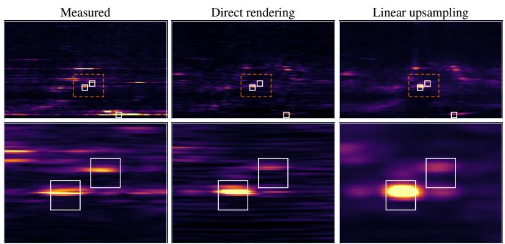  
Figure 10: Changing the measurement configuration of a reconstructed scene. Left: measured native RA projection. Middle: the coarse-trained scene rendered with the native PSF and sampling grid. Right: linear upsampling of the same scene’s coarse render. The bottom row enlarges the dashed region; white boxes mark vehicles.