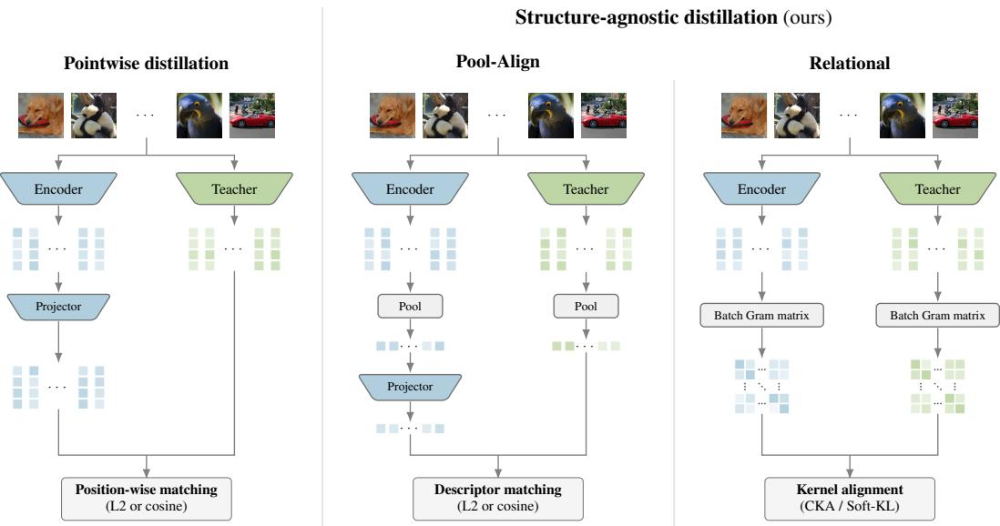
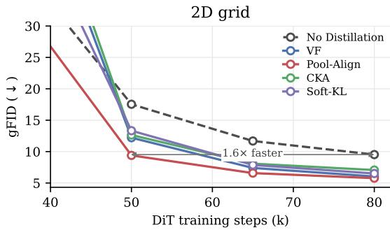
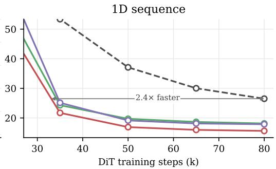
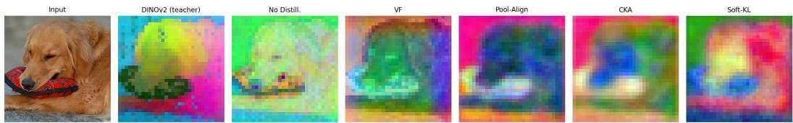
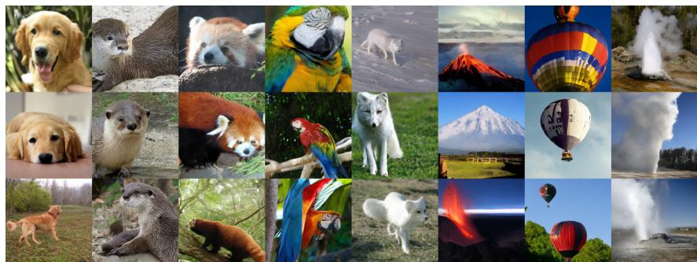

# Diffusable Latents from Structure-Agnostic Distillation

Adrien Ramanana Rahary1,2 Nicolas Dufour2 Patrick Pérez2 David Picard1

1LIGM, ENPC, IP Paris, CNRS, UGE 2Kyutai

{adrien.ramanana-rahary, david.picard}@enpc.fr {nicolas.dufour, patrick}@kyutai.org

## Abstract

Distilling pretrained foundation models into an autoencoder bottleneck improves latent diffusability, enabling diffusion models to converge faster and reach higher sample quality. Standard distillation aligns the latent at each position to a colocated teacher feature, tying the latent layout to the teacher’s. We show this constraint is unnecessary: aligning a single pooled image-level descriptor to the teacher’s performs as well as or slightly better than dense position-wise distillation. We compare first-order and relational pooled objectives across latent shapes and teacher modalities. First-order matching extends naturally to 1D token-sequence latents and across modalities, where distilling a text encoder into an image autoencoder still improves diffusability; a relational objective based only on each image’s nearest neighbours improves it as well. Code and blog post are available at github.com/AdrienRR/structure-agnostic-distillation and kyutai. org/blog/2026-09-28-structure-agnostic-distillation.

## 1 Introduction

Latent diffusion trains a diffusion prior in an autoencoder’s latent [Rombach et al., 2022, Peebles and Xie, 2023], and sample quality depends on how diffusable that latent is [Skorokhodov et al., 2025]. Prior work makes the latent more diffusable by distilling a frozen pretrained vision encoder into the autoencoder bottleneck, matching each latent position to its co-located patch feature [Peng et al., 2022, Hu et al., 2023, Russell et al., 2025, Yao and Wang, 2025, Bi et al., 2026]. A more extreme line replaces the trained encoder with a frozen representation model and diffuses in its output space [Zheng et al., 2025, Tong et al., 2026, Singh et al., 2026, Hu et al., 2026, Guo et al., 2026]. Both approaches place the latent and the teacher on a shared patch grid. But such a grid can be unavailable: compact 1D token latents, a short list of tokens with no spatial layout [Yu et al., 2024, Bachmann et al., 2025], drop it on the student side for efficiency, and a teacher from another modality, such as a text encoder, never had one to share. Position-wise distillation then reaches these settings only through an artificial correspondence, as SoftVQ-VAE [Chen et al., 2025] does by replicating latent tokens and learning a projector to a pretrained grid. We ask whether distillation can improve diffusability without any token-level correspondence between the latent and the teacher.

We study structure-agnostic distillation: we pool each image’s latent tokens into one image-level descriptor and define the distillation objective on these descriptors alone, leaving the latent’s internal layout free (Figure 1). Because pooling reduces each image to a single vector, the objective is independent of the latent’s token count and layout, so student and teacher may take any shape. We compare a family of pooled objectives: a first-order match that aligns each descriptor directly to its teacher descriptor, and relational objectives [Park et al., 2019, Passalis and Tefas, 2018, Tung and Mori, 2019, Tian et al., 2020] that instead match the matrix of between-image similarities, via centered kernel alignment (CKA, Kornblith et al. 2019) or a softmaxed-similarity KL divergence (Soft-KL); both are detailed in Section 2.

  
Figure 1: Pointwise vs. structure-agnostic distillation of a foundation encoder into the autoencoder latent. A batch of B images is encoded by the frozen teacher and the trainable encoder. Pointwise (left) matches each latent token to its co-located teacher token, requiring a shared token grid and a channel projector. Pool-Align (middle) matches one pooled descriptor per image, requiring only a projector, not a grid. Relational (right) matches the $B \bar { \times } B$ between-image similarity kernel, requiring neither. The structure-agnostic variants thus apply to any latent and teacher shape.

To our knowledge, this is the first study to show that aligning pooled representations can replace position-wise alignment while improving diffusability. Varying only the distillation loss at fixed architecture and budget, first-order pooled matching performs as well as or slightly better than position-wise alignment where the latter applies, and structure-agnostic distillation extends to shapes that position-wise alignment reaches only through an artificial correspondence, handling a 1D tokensequence latent and letting a text encoder improve the diffusability of an image latent. Representation distillation can transfer useful semantic geometry into a generative latent without inheriting the teacher’s structural organization.

## 2 Method

Preliminaries. An autoencoder maps an image x to a latent $z = E ( x )$ with an encoder E and reconstructs it as $\hat { x } = D ( z )$ with a decoder D, the two trained jointly with ${ \mathcal { L } } _ { \mathrm { v a e } }$ , the standard image-VAE objective (pixel, perceptual, adversarial, and variational terms; Appendix A.2). A diffusion prior is trained afterwards in this latent space. To make z more diffusable, we add an auxiliary term ${ \mathcal { L } } _ { \mathrm { d i s t i l l } }$ to the encoder’s objective, aligning the latent to a frozen foundation encoder. The encoder E minimizes $\mathcal { L } _ { \mathrm { v a e } } + \lambda \mathcal { L } _ { \mathrm { d i s t i l l } }$ , where λ weights the two terms. This section develops ${ \mathcal { L } } _ { \mathrm { d i s t i l l } }$

Pooled distillation objectives. For image i in a batch of $B ,$ each structure-agnostic objective mean-pools the student’s $N _ { s }$ latent tokens $z _ { i } \in \mathbb { R } ^ { N _ { s } \times d _ { s } } ( \mathbf { r }$ esp. the teacher’s $N _ { t }$ features $g _ { i } \in \mathbb { R } ^ { N _ { t } \times d _ { t } } )$ into one $L _ { 2 } .$ -normalized descriptor $\hat { { u } } _ { i } \in \mathbb { R } ^ { d _ { s } } \ ( \mathrm { r e s p . } \ \hat { { v } } _ { i } \in \mathbb { R } ^ { \hat { d } _ { t } }$ ; the two dimensions generally differ). Pooling discards the token layout, so the same objective works whatever the latent’s shape. They relax the correspondence position-wise distillation requires: position-wise ties each latent token to its colocated teacher token $( z _ { i , j }  g _ { i , j } )$ ; a first-order pooled match ties one descriptor per image $( \hat { u } _ { i }  \hat { v } _ { i } ) ;$ a relational match ties none, matching only the between-image similarity matrices $( S _ { s }  S _ { t }$ , with $S _ { s , i j } = \hat { u } _ { i } ^ { \top } \hat { u } _ { j }$ and $S _ { t , i j } = \hat { v } _ { i } ^ { \top } \hat { v } _ { j } )$ . We instantiate three: one first-order and two relational.

• Pool-Align. A first-order match aligns each image’s pooled student descriptor with the teacher’s descriptor for the same image. A learned linear map $\dot { W }$ sends $\hat { u } _ { i }$ into the teacher’s space, and the loss is the cosine distance $\begin{array} { r } { \bar { \mathcal { L } } _ { \mathrm { p o o l } } = \sum _ { i } \left( 1 - \hat { v } _ { i } ^ { \top } \tilde { u } _ { i } \right) } \end{array}$ , with $\tilde { u } _ { i } = W \hat { u } _ { i } / \lVert W \hat { u } _ { i } \rVert$

• Relational. A relational objective reproduces the teacher’s between-image similarity structure, not the descriptors themselves. Both compare images only through the $\bar { B } \times B$ matrices $S _ { s } , S _ { t }$ above, built from $L _ { 2 }$ -normalized tokens; the matrix is invariant to the descriptor space, so they need no projector.

◦ Centered kernel alignment (CKA) reproduces the teacher’s global geometry (images placed close stay close), matching the two matrices as a whole, $\mathcal { L } _ { \mathrm { C K A } } = 1 \bar { - } \mathrm { C K A } ( S _ { s } , S _ { t } )$ , with the unbiased estimator [Kornblith et al., 2019] (Appendix A.3).

◦ Softmaxed-similarity KL (Soft-KL) matches each image’s soft ranking of its nearest neighbours: a softmax with temperature τ turns each row of S into a neighbour distribution, matched by $\mathrm { K L } , p _ { i } = \mathrm { s o f t m a x } _ { j \neq i } ( \bar { S } _ { i j } / \tau )$ and $\begin{array} { r } { \mathcal { L } _ { \mathrm { s o f t K L } } = \sum _ { i } \operatorname { K L } ( p _ { i } ^ { t } \| p _ { i } ^ { s } ) } \end{array}$ ).

## 3 Experiments

Setup. We build on the VA-VAE implementation [Yao and Wang, 2025], adopting its autoencoder and LightningDiT-XL prior. All arms use the same architecture and training recipe (Appendix A); only the distillation term that shapes the latent, or its absence, varies. This term acts on the encoder’s posterior mean (Appendix A.2). Each arm trains the autoencoder on 256×256 ImageNet [Deng et al., 2009] from scratch (50 epochs, batch 256), then a LightningDiT-XL prior (64 epochs, batch 1024). We compare arms by gFID [Heusel et al., 2017] without classifier-free guidance (no per-arm tuning); for the 2D grid we verify the ranking is preserved under VA-VAE’s guidance recipe (Appendix A; samples in Appendix B.3).

Study arms. We compare our structure-agnostic methods against two references: a control with no distillation (No Distillation), and the position-wise baseline, VA-VAE’s [Yao and Wang, 2025] vision-foundation alignment (VF), which aligns each latent cell to its co-located teacher feature. Our family, defined in Section 2, spans the first-order pooled alignment (Pool-Align) and two relational objectives, centered kernel alignment (CKA) and softmaxed-similarity KL (Soft-KL).

Settings. We run these across three settings that vary the student’s shape or the teacher’s modality:

(A) A 2D grid latent with a DINOv2 image teacher [Oquab et al., 2024], where the latent grid lines up with the teacher’s and all five methods apply, so this setting measures the structure-agnostic methods against position-wise VF on equal footing.

(B) A 1D sequence latent with the same image teacher, produced by a Perceiver-resampler [Jaegle et al., 2021] bottleneck that emits a flat set of tokens with no spatial grid; position-wise VF then has no grid to align to and drops out, while the four layout-free methods still apply.

(C) A cross-modal 2D grid whose latent we align to per-image captions from the captioned ImageNet of Degeorge et al. [2025], embedded with a BGE-large text teacher [Xiao et al., 2024], which has no spatial grid, so VF drops out here too.

## Results. Table 1 reports final gFID and Figure 2 the in-modality training-time convergence.

(A) Shared grid: does discarding token correspondence hurt? No. Pooling performs as well as or slightly better than position-wise VF (Pool-Align 5.77 vs. VF 6.04; 1.99 vs. 2.12 with classifier-free guidance, Appendix $\mathbf { A } ;$ see Appendix B.1 for the size of this margin), every structure-agnostic objective beats the undistilled No-Distillation (9.52), and each reaches a given gFID in fewer training steps (Figure 2).

(B) No grid: can we drop correspondence entirely? Yes. In the 1D-sequence latent, the pooled objectives still beat No-Distillation (Pool-Align 15.62 vs. 26.49) in the same order.

(C) Cross-modal: can structure-agnostic distillation cross modalities? Yes, for two of the three objectives: with a text teacher, Pool-Align (6.97) and Soft-KL (8.51) improve over No-Distillation (9.52), while CKA (10.41) lands above it.

Table 1: Generation quality (gFID, ↓), without classifier-free guidance (no per-arm tuning); for the 2D grid the ranking is preserved under VA-VAE’s guidance recipe (Appendix A). Autoencoders are trained for 50 epochs on 256 × 256 ImageNet and the diffusion priors for 64 epochs (Appendix A). Rows are settings A–C (bottleneck structure × teacher model). The structure-agnostic methods (Pool-Align, CKA, Soft-KL) apply in every setting; the position-wise baseline VF needs a shared latent–teacher grid, so it is inapplicable (n/a) in the 1D (B) and cross-modal (C) settings. Within a row only the distillation method changes, with architecture and budget fixed, so differences reflect the objective, not compute; absolute gFID differs across bottleneck structures, so we compare only within a setting. Best per row in bold.
<table><tr><td></td><td></td><td></td><td colspan="2">Baselines</td><td colspan="3">Structure-agnostic (ours)</td></tr><tr><td>Setting</td><td>Bottleneck</td><td>Teacher</td><td>No Distill.</td><td>VF [Yao and Wang, 2025]</td><td>Pool-Align</td><td>CKA</td><td>Soft-KL</td></tr><tr><td>A: shared grid</td><td>2D grid</td><td>DINOv2 [Oquab et al., 2024]</td><td>9.52</td><td>6.04</td><td>5.77</td><td>7.06</td><td>6.51</td></tr><tr><td>B: no grid</td><td>1D seq</td><td>DINOv2 [Oquab et al., 2024]</td><td>26.49</td><td>n/a</td><td>15.62</td><td>18.13</td><td>17.87</td></tr><tr><td>C: cross-modal</td><td>2D grid</td><td>BGE-large [Xiao et al., 2024]</td><td>9.52</td><td>n/a</td><td>6.97</td><td>10.41</td><td>8.51</td></tr></table>

  
Figure 2: Distillation speeds up diffusion training. Per-checkpoint gFID (50k samples, without classifier-free guidance) against DiT training steps for the 2D-grid (left) and 1D-sequence (right) settings. Every distilled latent converges to a lower final gFID than No-Distillation and reaches low gFID in fewer steps; the horizontal marker reports how many fewer steps Pool-Align needs to reach No-Distillation’s final gFID.

## 4 Discussion

Why pooling can match position-wise alignment. We hypothesise that pooling helps in-modality by averaging out distractors carried in the teacher’s per-token features. Positional information is one such distractor: self-supervised ViTs encode substantial positional signal in their tokens [Amir et al., 2021], and position-wise alignment copies it into the latent, where it competes with the content the decoder must reconstruct; pooling averages it out. High-norm artifact tokens [Darcet et al., 2024] are another such distractor. A latent PCA (Appendix B.2) is consistent with this picture: the position-wise VA-VAE latent inherits a smooth spatial gradient artefact that the pooled latents lack.

What transfers across modalities. With a text teacher, Pool-Align brings gFID from 9.52 to 6.97, close to its 5.77 with DINOv2, and Soft-KL also improves it, so both help in every setting. Only CKA fails across modalities; we hypothesise that its constraint, the full centered between-image geometry, is the strictest of the three. Our captions largely restate each image’s ImageNet class, so part of the gain may be class-level semantics. We test one text encoder and caption source, and not text-to-image generation, where a conditioning-aligned teacher could help more.

## 5 Conclusion

We show that latent distillation can improve diffusability without requiring spatial correspondence. Pooling representations performs as well as or slightly better than position-wise alignment for image teachers, and extends distillation to 1D latents and to a text teacher, where Pool-Align and Soft-KL improve generation quality. Structure-agnostic distillation is thus a simple, flexible alternative to position-wise alignment that leaves the latent’s layout free.

## References

Shir Amir, Yossi Gandelsman, Shai Bagon, and Tali Dekel. Deep ViT features as dense visual descriptors. arXiv preprint arXiv:2112.05814, 2021.

Roman Bachmann, Jesse Allardice, David Mizrahi, Enrico Fini, Oguzhan Fatih Kar, Elmira Amirloo,˘ Alaaeldin El-Nouby, Amir Zamir, and Afshin Dehghan. FlexTok: Resampling images into 1d token sequences of flexible length. In International Conference on Machine Learning (ICML), 2025.

Tianci Bi, Xiaoyi Zhang, Yan Lu, and Nanning Zheng. VFM-VAE: Vision foundation models can be good tokenizers for latent diffusion models. In IEEE/CVF Conference on Computer Vision and Pattern Recognition (CVPR), 2026.

Hao Chen, Ze Wang, Xiang Li, Ximeng Sun, Fangyi Chen, Jiang Liu, Jindong Wang, Bhiksha Raj, Zicheng Liu, and Emad Barsoum. SoftVQ-VAE: Efficient 1-dimensional continuous tokenizer. In IEEE/CVF Conference on Computer Vision and Pattern Recognition (CVPR), 2025. continuous 1D tokenizer + DiT/SiT diffusion; REPA-style DINO alignment in the latent.

Timothée Darcet, Maxime Oquab, Julien Mairal, and Piotr Bojanowski. Vision transformers need registers. In International Conference on Learning Representations (ICLR), 2024.

Lucas Degeorge, Arijit Ghosh, Nicolas Dufour, David Picard, and Vicky Kalogeiton. How far can we go with ImageNet for text-to-image generation? arXiv preprint arXiv:2502.21318, 2025.

Jia Deng, Wei Dong, Richard Socher, Li-Jia Li, Kai Li, and Li Fei-Fei. ImageNet: A large-scale hierarchical image database. In IEEE Conference on Computer Vision and Pattern Recognition (CVPR), 2009.

Nicolas Dufour, Alexei A. Efros, and Patrick Pérez. The FID lottery: Quantifying hidden randomness in generative-model evaluation. arXiv preprint arXiv:2606.20536, 2026.

Minghui Guo, Shengqiong Wu, and Hao Fei. V-RAE: Rethinking video latent spaces for generation. arXiv preprint arXiv:2608.13556, 2026.

Martin Heusel, Hubert Ramsauer, Thomas Unterthiner, Bernhard Nessler, and Sepp Hochreiter. GANs trained by a two time-scale update rule converge to a local Nash equilibrium. In Advances in Neural Information Processing Systems (NeurIPS), 2017.

Anthony Hu, Lloyd Russell, Hudson Yeo, Zak Murez, George Fedoseev, Alex Kendall, Jamie Shotton, and Gianluca Corrado. GAIA-1: A generative world model for autonomous driving. arXiv preprint arXiv:2309.17080, 2023. distills DINO features into the VQ-VAE tokenizer, following BEiT v2.

Anthony Hu, Václav Volhejn, Adrien Ramanana Rahary, Chris Mulder, Aditya Makkar, Alyx Liao, Amélie Royer, Manu Orsini, Adam Jelley, Eloi Alonso, Florian Laurent, Fredrik Norén, James Swingos, Jan Hünermann, Kent Rollins, Lucas Hosseini, Matthieu Le Cauchois, Maxim Peter, Pim de Witte, Tim Brown, Vincent Micheli, Moritz Böhle, Gabriel de Marmiesse, Viktoriia Sharmanska, Lucia Specia, Michael Black, and Patrick Pérez. Multiplayer interactive world models with representation autoencoders. arXiv preprint arXiv:2607.05352, 2026.

Phillip Isola, Jun-Yan Zhu, Tinghui Zhou, and Alexei A. Efros. Image-to-image translation with conditional adversarial networks. In IEEE Conference on Computer Vision and Pattern Recognition (CVPR), 2017.

Andrew Jaegle, Felix Gimeno, Andy Brock, Oriol Vinyals, Andrew Zisserman, and João Carreira. Perceiver: General perception with iterative attention. In International Conference on Machine Learning (ICML), 2021.

Simon Kornblith, Mohammad Norouzi, Honglak Lee, and Geoffrey Hinton. Similarity of neural network representations revisited. In International Conference on Machine Learning (ICML), 2019.

Tuomas Kynkäänniemi, Miika Aittala, Tero Karras, Samuli Laine, Timo Aila, and Jaakko Lehtinen. Applying guidance in a limited interval improves sample and distribution quality in diffusion models. In Advances in Neural Information Processing Systems (NeurIPS), 2024.

Yaron Lipman, Ricky T. Q. Chen, Heli Ben-Hamu, Maximilian Nickel, and Matt Le. Flow matching for generative modeling. In International Conference on Learning Representations (ICLR), 2023.

Xingchao Liu, Chengyue Gong, and Qiang Liu. Flow straight and fast: Learning to generate and transfer data with rectified flow. In International Conference on Learning Representations (ICLR), 2023.

Maxime Oquab, Timothée Darcet, Théo Moutakanni, et al. Dinov2: Learning robust visual feature without supervision. Transactions on Machine Learning Research (TMLR), 2024.

Wonpyo Park, Dongju Kim, Yan Lu, and Minsu Cho. Relational knowledge distillation. In IEEE/CVF Conference on Computer Vision and Pattern Recognition (CVPR), 2019.

Nikolaos Passalis and Anastasios Tefas. Learning deep representations with probabilistic knowledge transfer. In European Conference on Computer Vision (ECCV), 2018.

William Peebles and Saining Xie. Scalable diffusion models with transformers. In IEEE/CVF International Conference on Computer Vision (ICCV), 2023.

Zhiliang Peng, Li Dong, Hangbo Bao, Qixiang Ye, and Furu Wei. BEiT v2: Masked image modeling with vector-quantized visual tokenizers. arXiv preprint arXiv:2208.06366, 2022. vector-quantized knowledge distillation: origin of distilling semantic features into a visual tokenizer.

Robin Rombach, Andreas Blattmann, Dominik Lorenz, Patrick Esser, and Björn Ommer. Highresolution image synthesis with latent diffusion models. In IEEE/CVF Conference on Computer Vision and Pattern Recognition (CVPR), 2022.

Lloyd Russell, Anthony Hu, Lorenzo Bertoni, George Fedoseev, Jamie Shotton, Elahe Arani, and Gianluca Corrado. GAIA-2: A controllable multi-view generative world model for autonomous driving. arXiv preprint arXiv:2503.20523, 2025.

Noam Shazeer. GLU variants improve transformer. arXiv preprint arXiv:2002.05202, 2020.

Jaskirat Singh, Boyang Zheng, Zongze Wu, Richard Zhang, Eli Shechtman, and Saining Xie. Improved baselines with representation autoencoders. arXiv preprint arXiv:2605.18324, 2026. RAEv2.

Ivan Skorokhodov, Sharath Girish, Benran Hu, Willi Menapace, Yanyu Li, Rameen Abdal, Sergey Tulyakov, and Aliaksandr Siarohin. Improving the diffusability of autoencoders. In International Conference on Machine Learning (ICML), 2025.

Jianlin Su, Yu Lu, Shengfeng Pan, Ahmed Murtadha, Bo Wen, and Yunfeng Liu. RoFormer: Enhanced transformer with rotary position embedding. arXiv preprint arXiv:2104.09864, 2021.

Yonglong Tian, Dilip Krishnan, and Phillip Isola. Contrastive representation distillation. In International Conference on Learning Representations (ICLR), 2020.

Shengbang Tong, Boyang Zheng, Ziteng Wang, Bingda Tang, Nanye Ma, Ellis Brown, Jihan Yang, Rob Fergus, Yann LeCun, and Saining Xie. Scaling text-to-image diffusion transformers with representation autoencoders. arXiv preprint arXiv:2601.16208, 2026.

Frederick Tung and Greg Mori. Similarity-preserving knowledge distillation. In IEEE/CVF International Conference on Computer Vision (ICCV), 2019.

Shitao Xiao, Zheng Liu, Peitian Zhang, Niklas Muennighoff, Defu Lian, and Jian-Yun Nie. C-Pack: Packed resources for general Chinese embeddings. In Proceedings ofthe 47th International ACM SIGIR Conference on Research and Development in Information Retrieval (SIGIR), 2024.

Jingfeng Yao and Xinggang Wang. Reconstruction vs. generation: Taming optimization dilemma in latent diffusion models. In IEEE/CVF Conference on Computer Vision and Pattern Recognition (CVPR), 2025. VA-VAE / LightningDiT.

Qihang Yu, Mark Weber, Xueqing Deng, Xiaohui Shen, Daniel Cremers, and Liang-Chieh Chen. An image is worth 32 tokens for reconstruction and generation. In Advances in Neural Information Processing Systems (NeurIPS), 2024. TiTok.

Biao Zhang and Rico Sennrich. Root mean square layer normalization. In Advances in Neural Information Processing Systems (NeurIPS), 2019.

Richard Zhang, Phillip Isola, Alexei A. Efros, Eli Shechtman, and Oliver Wang. The unreasonable effectiveness of deep features as a perceptual metric. In IEEE Conference on Computer Vision and Pattern Recognition (CVPR), 2018.

Boyang Zheng, Nanye Ma, Shengbang Tong, and Saining Xie. Diffusion transformers with representation autoencoders. arXiv preprint arXiv:2510.11690, 2025. RAE: diffuse directly in a frozen self-supervised representation.

## A Architecture and training details

VA-VAE and LightningDiT. Yao and Wang [2025] observe that high-dimensional latents reconstruct well but diffuse poorly, and fix this by aligning the latent to a vision foundation model. VA-VAE is a KL-regularized convolutional VAE trained with their “VF loss”: with $\tilde { z } _ { j } = W z _ { j }$ the projected latent at position $j , g _ { j }$ the co-located DINOv2 feature, N positions per image and $[ x ] _ { + } ^ { - } = \operatorname* { m a x } ( x , 0 )$

$$
\mathcal { L } _ { \mathrm { V F } } = \frac { 1 } { N } \sum _ { j } \big [ 1 - m _ { c } - \cos ( \tilde { z } _ { j } , g _ { j } ) \big ] _ { + } + \frac { 1 } { N ^ { 2 } } \sum _ { j , k } \big [ | \cos ( \tilde { z } _ { j } , \tilde { z } _ { k } ) - \cos ( g _ { j } , g _ { k } ) | - m _ { d } \big ] _ { + } ,
$$

with $m _ { c } = 0 . 5 , m _ { d } = 0 . 2 5$ , averaged over the batch: a position-wise cosine match plus a withinimage analogue of our relational objectives. Pool-Align is the first term on pooled descriptors without margin; our VF baseline is this model retrained from the released code. LightningDiT is their rectified-flow transformer prior [Liu et al., 2023, Lipman et al., 2023] (linear path, velocity prediction, lognormal timestep sampling, cosine velocity loss; AdamW with $\beta _ { 2 } = 0 . 9 5$ , clipping at 1, batch 1024); trained for 64 epochs on a 50-epoch VA-VAE, our exact budget, it reaches gFID 2.11, which VF reproduces. All arms share this pipeline; only the distillation term changes.

Autoencoder. We build on VA-VAE [Yao and Wang, 2025]. The 2D-grid tokenizer is its convolutional VAE: input 256×256, base width 128, channel multipliers (1, 1, 2, 2, 4) (four 2× downsamples, an f16 reduction), two residual blocks per stage, self-attention at 16 × 16, and a 32-channel latent, giving a $3 2 \times 1 6 \times$ 16 posterior. The 1D-sequence tokenizer keeps this convolutional encoder and decoder unchanged and replaces only the bottleneck by a Perceiver-style resampler [Jaegle et al., 2021]: K = 32 learned latents of dimension 128 cross-attend to the 16 × 16 conv tokens (2 attention blocks, 8 heads) to form the token sequence, and 256 learned position queries cross-attend back for decoding.

Diffusion prior. We adopt LightningDiT-XL [Yao and Wang, 2025]: 28 blocks, hidden size 1152, 16 heads, patch size 1, with RMSNorm [Zhang and Sennrich, 2019], SwiGLU [Shazeer, 2020] and RoPE [Su et al., 2021]. For the 1D setting the 32 latent tokens are embedded per token with a learned 1D positional embedding (RoPE disabled). The main comparison (Table 1) uses no classifier-free guidance. For the 2D-grid setting we additionally check guidance under VA-VAE’s recipe (interval guidance [Kynkäänniemi et al., 2024], settings in Table 2, each arm at its optimum scale): VF reproduces VA-VAE’s reported FID (2.12 vs. 2.11) and Pool-Align stays strongest (1.99), so the pipeline is faithful and the ranking survives guidance. This recipe amplifies the leading latent channels and does not transfer to the 1D or cross-modal latents, so we report guided FID only where it is meaningful.

Teachers. The vision teacher is a frozen DINOv2 ViT-L/14 [Oquab et al., 2024]; images are resized to $2 2 4 \times 2 2 4$ , giving a 16 × 16 grid of 1024-dimensional patch tokens (the class token is dropped). For the cross-modal teacher we take the per-image captions from the captioned ImageNet of Degeorge et al. [2025] and encode each with BGE-large [Xiao et al., 2024], precomputing one text embedding per training image and matching against it, so this teacher carries no spatial grid. Pool-Align’s projector is a single learned bias-free linear map from the latent into the teacher’s dimension.

## A.1 Training and evaluation hyperparameters

Table 2 gives the full optimization, training and sampling configuration, shared by every arm; only the per-method distillation settings (last block) and the latent shape differ.

<table><tr><td colspan="2">Autoencoder (tokenizer), all arms</td></tr><tr><td>Optimizer</td><td>Adam,  $\beta = ( 0 . 5 , 0 . 9 )$  , weight decay 0</td></tr><tr><td>Learning rate</td><td> $1 0 ^ { - 4 }$  , constant (no warmup or schedule)</td></tr><tr><td>Global batch size</td><td>256 (8 per GPU × 32 GPUs)</td></tr><tr><td>Epochs</td><td>50</td></tr><tr><td>Precision</td><td>fp32</td></tr><tr><td>Gradient clipping</td><td>global norm 1.0</td></tr><tr><td>Weight averaging (EMA)</td><td>none</td></tr><tr><td>Pixel reconstruction (L1) weight</td><td>1.0</td></tr><tr><td>LPIPS (VGG) perceptual weight</td><td>1.0</td></tr><tr><td>Reconstruction NLL</td><td>learned scalar log-variance (init 0)</td></tr><tr><td>KL weight</td><td> $1 0 ^ { - 6 }$ </td></tr><tr><td>Discriminator</td><td>PatchGAN, 3 layers, 64 base channels, hinge loss</td></tr><tr><td>Discriminator start / weight</td><td>step 5001 / 0.5× adaptive</td></tr><tr><td>Distillation weight λ</td><td>gradient-norm balanced (Appendix A.2)</td></tr><tr><td>Distillation target</td><td>encoder posterior mean</td></tr><tr><td colspan="2">Diffusion prior (LightningDiT-XL/1)</td></tr><tr><td>Optimizer</td><td>AdamW,  $\beta = ( 0 . 9 , 0 . 9 5 )$  , weight decay 0</td></tr><tr><td>Learning rate</td><td> $2 \times 1 0 ^ { - 4 } ,$  constant</td></tr><tr><td>Global batch size / steps</td><td>1024 / 80 000 (≈ 64 epochs)</td></tr><tr><td>Precision</td><td>bf16 mixed</td></tr><tr><td>Gradient clipping</td><td>global norm 1.0</td></tr><tr><td>Weight averaging (EMA)</td><td>0.9999</td></tr><tr><td>Objective</td><td>linear flow matching (velocity) + cosine loss</td></tr><tr><td>Timestep sampling</td><td>logit-normal</td></tr><tr><td>Latent preprocessing</td><td>per-channel standardization</td></tr><tr><td>Class-label dropout (for CFG)</td><td>0.1</td></tr><tr><td colspan="2">Sampling and FID</td></tr><tr><td>Sampler</td><td>Euler ODE, 250 steps</td></tr><tr><td>Samples for FID</td><td>50 000</td></tr><tr><td>Guidance (unguided / guided)</td><td>cfg 1 / interval from 0.11, timestep shift 0.3, optimum cfg per arm</td></tr><tr><td colspan="2">Per-method distillation settings</td></tr><tr><td>VF (position-wise)</td><td>DINOv2 teacher, weight target  $r = 0 . 1$  , distance-matrix margin 0.25,</td></tr><tr><td>Pool-Align</td><td>cosine margin 0.5 DINOv2 teacher, pooled cosine, weight target r = 10, cosine margin</td></tr><tr><td>CKA</td><td>0 pooled unbiased linear-CKA kernel, weight target  $r = 1 0$ </td></tr><tr><td>Soft-KL</td><td>pooled kernel, softmax temperature  $\tau = 0 . 1$  , weight target</td></tr></table>

Table 2: Full training and evaluation configuration. The autoencoder trains first, then the diffusion prior on its frozen latents. Data is ImageNet-1k at $2 5 6 \times 2 5 6$ , normalized to [−1, 1], with randomcrop augmentation (no horizontal flip). The weight target r is the gradient-norm-balancing factor of Appendix A.2.

## A.2 VAE training loss

$\mathcal { L } _ { \mathrm { v a e } }$ is the standard VA-VAE tokenizer objective, unchanged by our distillation term. It combines an $L _ { 1 }$ pixel reconstruction and a VGG-LPIPS perceptual loss [Zhang et al., 2018], wrapped in a learned-variance negative log-likelihood; a KL term pulling the posterior toward a standard normal, weighted by $1 0 ^ { - 6 } \colon$ at this weight it is not a generative prior but a light regularizer that keeps the latent’s scale and posterior variance bounded, so the latent handed to the diffusion prior stays smooth and well-conditioned; and a hinge adversarial loss from a PatchGAN discriminator [Isola et al., 2017], enabled after 5000 steps and weighted by 0.5 times an adaptive factor. The adaptive factor is the ratio of the reconstruction and adversarial gradient norms at the decoder’s last layer, the standard VA-VAE balancing.

Distillation weight. As in VA-VAE, λ is set by gradient-norm balancing at the encoder’s last layer (r = 10 for our objectives; VA-VAE’s own $r = 0 . 1$ for $V F ,$ whose configuration we leave untouched and which reproduces its reported gFID, 2.12 vs. 2.11). The distillation term acts on the posterior mean rather than the reparameterized sample, which would let the encoder inflate the posterior variance.

## A.3 Unbiased CKA

The CKA objective uses the minibatch unbiased linear-CKA estimator [Kornblith et al., 2019], $\mathrm { C K A } ( S _ { s } , S _ { t } ) = \mathrm { H S I C } ( S _ { s } , S _ { t } ) / \sqrt { \mathrm { H S I C } ( S _ { s } , S _ { s } ) }$ HSI $\overline { { \mathrm { { C } } ( S _ { t } , S _ { t } ) } }$ , where, with ${ \tilde { S } } = S - \mathrm { d i a g } ( S )$ the $B \times \dot { B }$ kernels with zeroed diagonals (so only between-image structure enters),

$$
\mathrm { H S I C } ( K , L ) = \frac { 1 } { B ( B - 3 ) } \left[ \mathrm { t r } ( \tilde { K } \tilde { L } ) + \frac { ( { \bf 1 } ^ { \top } \tilde { K } { \bf 1 } ) ( { \bf 1 } ^ { \top } \tilde { L } { \bf 1 } ) } { ( B - 1 ) ( B - 2 ) } - \frac { 2 } { B - 2 } { \bf 1 } ^ { \top } \tilde { K } \tilde { L } { \bf 1 } \right] .\tag{1}
$$

## B Additional results and analyses

## B.1 Significance of gFID gaps

gFID varies with the training and sampling seed at a coefficient of variation near 1.3% [Dufour et al., 2026], i.e. ∼0.1–0.2 FID at our operating points, the scale Dufour et al. [2026] recommend as the smallest difference worth reading. Our improvements over No-Distillation exceed it, the smallest (cross-modal $S o f t \mathrm { - } K L , \sim 1$ FID) several times over. The Pool-Align margin over VF (0.27, 0.13 with guidance) sits just above it and comes from one run per objective, so we read Pool-Align as on par with or slightly better than VF.

## B.2 Latent PCA

  
Figure 3: Position-wise alignment carries a spatial gradient; pooled latents track content. Top-3 PCA (as RGB) of one image’s representation for the DINOv2 teacher, the undistilled latent, and each distilled latent. The undistilled latent is nearly featureless; the position-wise VA-VAE (VF) latent carries a smooth horizontal spatial gradient, whereas the pooled latents show no such gradient and instead pick out the foreground object from the background, tracking content rather than residual information from positional embeddings in the teacher’s representations.

## B.3 Samples

  
Figure 4: Samples from Pool-Align on the 2D grid (DINOv2 teacher, setting A): autoencoder trained for 50 epochs, diffusion prior for 64 epochs (80k steps); sampled in 250 Euler steps with classifier-free guidance (recipe in Appendix A), which corresponds to gFID 1.99.