# EFFGS: EFFICIENT AND HIGH-FIDELITY GAUSSIAN SPLATTING

Changbai Li1∗ Shuo Yang1∗ Yichen Yang1 Shuwei Shao2 Huobin Tan1†

1Beihang University 2Nanyang Technological University

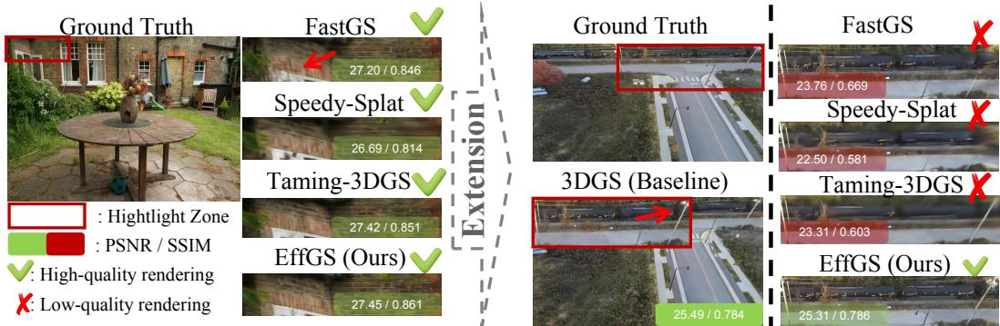  
Figure 1: Compared with existing 3DGS acceleration methods, they can maintain high-quality rendering in small-scale scenes but suffer from degraded rendering quality when scaled up to city-level scenarios. In contrast, EffGS sustains high-fidelity rendering consistently, demonstrating superior scalability.

## ABSTRACT

3D Gaussian Splatting (3DGS) enables real-time novel view synthesis, but existing general-purpose acceleration methods suffer severe rendering quality degradation when extended to more complex, large-scale scenes. To address this issue, we propose EffGS, a more general acceleration framework that improves training and rendering efficiency while maintaining reconstruction quality comparable to or better than vanilla 3DGS across bounded and large-scale scenes. EffGS combines frequency-aware guidance, localized density control, and adaptive primitive scale modulation. First, an importance scoring mechanism combines pixel-wise reconstruction errors with a difference-of-Gaussians mask scheduled over training to provide stage-dependent spatial guidance. Second, localized densification and pruning restricts density modifications to Gaussians with valid projected footprints in the sampled views. Third, learnable per-Gaussian scale modulation adjusts effective primitive extent during optimization while retaining the Compact Box rasterization rule. Extensive experiments on bounded and large-scale scene datasets demonstrate a favorable balance between reconstruction quality, training time, and primitive count. Component ablations and matched-primitive-budget comparisons further support the effectiveness of the framework. Code will be released at https://github.com/CypressLi01/EffGS.

## 1 INTRODUCTION

Neural Radiance Fields (NeRF) (Mildenhall et al., 2020) advanced novel view synthesis (NVS) (Reiser et al., 2023), but their computational demands motivated more efficient scene representations. 3D Gaussian Splatting (3DGS) (Kerbl et al., 2023) uses explicit Gaussian primitives and a tile-based rasterizer to achieve real-time, photorealistic rendering. However, adaptive density control can generate redundant primitives, increasing optimization and rasterization costs (Fan et al.,

2024). These costs become particularly important when reconstructing large-scale environments. Recent acceleration methods improve density control through budget constraints (Mallick et al., 2024; Chen et al., 2025), targeted pruning (Hanson et al., 2025a), and multi-view evaluation (Ren et al., 2025). These approaches reduce computational cost, but preserving rendering quality under aggressive primitive reduction remains challenging. Our city-scale comparisons (Tab. 2 and Fig. 6) illustrate this trade-off. We focus on three aspects of the optimization pipeline: the spatial information used to score primitives, the sampled views supporting density-control decisions, and the effective extent of each Gaussian.

1. spatial detail should inform primitive allocation. Reconstruction errors identify regions that remain difficult to render, while scale-dependent image responses provide complementary information about local structure. Combining these signals allows density control to emphasize selected image structures at different training stages. The spectral magnitude comparisons and spatial visualizations in Fig. 2 further motivate evaluating detail preservation alongside standard reconstruction metrics.

2. density-control decisions should account for sampled-view coverage. In large-scale scenes, a small set of sampled cameras typically covers only part of the Gaussian representation. FastGS (Ren et al., 2025) evaluates primitives using reconstruction errors from randomly sampled views. When applying view-based scores, primitives outside the sampled coverage should be distinguished from those with valid projected footprints. Restricting density modifications to the latter localizes the operation to the currently covered portion of the scene. The FastGS+LDP comparison in Tab. 11 supports the benefit of this restriction.

3. primitive extent affects rasterization cost. Vanilla 3DGS (Kerbl et al., 2023) uses a three-sigma extent to construct rasterization bounds. Speedy-Splat (Hanson et al., 2025a) reduces redundant Gaussian–tile pairs through precise tile intersection, and FastGS (Ren et al., 2025) further restricts support using its Compact Box mechanism. These culling rules operate on projected Gaussian geometry. Adapting effective scales during optimization therefore complements tile culling by changing the spatial support to which the rule is applied.

We introduce EffGS, a framework that combines frequency-aware scoring, localized density control, and adaptive primitive compactness. Our scoring mechanism couples pixel-wise reconstruction errors with a scheduled difference-of-Gaussians mask. The mask provides two-stage, scale-dependent spatial guidance for importance scoring and reconstruction supervision. Localized Densification and Pruning (LDP) restricts density operations to Gaussians with valid projected footprints in the sampled views, excluding primitives outside the current active set. Finally, a learnable scalar γi uniformly modulates each Gaussian’s three base-scale components. Joint optimization of this fac tor and the base scales provides an additional pathway for adapting effective primitive extent while preserving the Compact Box tile-culling rule. Experiments on bounded and urban-scale datasets show that EffGS combines high reconstruction quality with efficient training and real-time rendering. Component ablations support the contribution of each module, while matched-primitive-budget comparisons evaluate the framework under controlled Gaussian counts. We additionally report bandwise spectral magnitude errors and high-frequency response discrepancies to complement standard rendering metrics (Sec. A.4). Our main contributions are summarized as follows:

• Frequency-Aware Optimization: We combine reconstruction errors with scheduled difference-of-Gaussians masks to provide stage-dependent spatial guidance for primitive allocation and reconstruction supervision.

• Localized Density Control (LDP): We restrict densification and pruning to Gaussians with valid projected footprints in sampled views, improving reconstruction quality in the evaluated large-scale scenes.

• Adaptive Primitive Compactness: We introduce learnable per-Gaussian scale modulation that interacts with optimization and density control to improve the quality–efficiency tradeoff while retaining the Compact Box rasterization rule.

## 2 RELATED WORK

Neural Rendering. Novel View Synthesis has attracted significant attention in computer vision and graphics (Zhu et al., 2025). Neural Radiance Fields (NeRF) Mildenhall et al. (2020) implicitly parameterize scene information via a multi-layer perceptron network and achieve high-quality image synthesis through volume rendering, greatly advancing NVS (Turki et al., 2022a; Mi & Xu, 2023). However, due to its slow rendering efficiency, 3D Gaussian Splatting (3DGS) (Kerbl et al., 2023) was subsequently introduced. 3DGS explicitly represents scenes with Gaussian primitives and employs GPU-friendly rasterization with alpha compositing for image rendering, thereby significantly accelerating optimization and enabling real-time rendering. Subsequently, a series of methods based on 3DGS have been proposed to enhance rendering quality (Yu et al., 2024a; Li et al., 2025; Chen et al., 2024; Yu et al., 2024b). Although 3DGS (Kerbl et al., 2023) achieves impressive rendering results, the redundancy of Gaussian primitives considerably reduces its efficiency (Fan et al., 2024; Li et al., 2025; Hamdi et al., 2024; Hanson et al., 2025b; Hollein et al., 2024), especially when extending to¨ city-scale scenes where multi-GPU training is often used to improve training efficiency (Li et al., 2026; Liu et al., 2024a; Gao et al., 2025; Liu et al., 2024b; Lin et al., 2024), leading to increased training time. To accelerate 3DGS, many recent works have made substantial efforts.

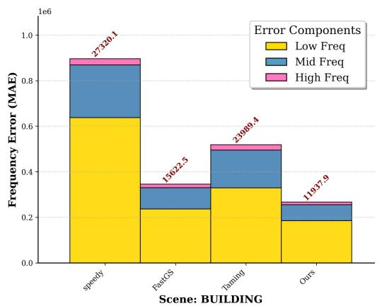

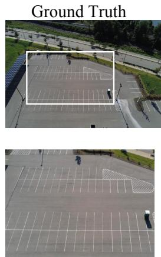

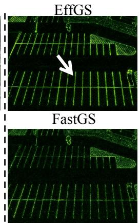  
Figure 2: Spectral magnitude errors (left) and high-frequency discrepancy visualizations with ground-truth references (right) on Building (Turki et al., 2022b); see Sec. A.4.

3DGS Acceleration. Density control is a major direction for accelerating 3DGS (Ren et al., 2025). For densification, recent works (Chen et al., 2025; Mallick et al., 2024; Kim et al., 2024; Bulo et al.,\` 2024) refine primitive allocation through mechanisms such as Gaussian budgets (Mallick et al., 2024) and resolution-guided scheduling (Chen et al., 2025). For pruning, methods reduce the representation using importance estimates and selection strategies (Fan et al., 2024; Li et al., 2025; Fang & Wang, 2024; Hanson et al., 2025a;b), including Gaussian attributes, sampling-based reduction (Fang & Wang, 2024), and approximate second-order information (Hanson et al., 2025b;a). FastGS (Ren et al., 2025) evaluates pixel-wise reconstruction errors from randomly sampled views to guide densification and pruning. These methods offer different trade-offs between primitive count, computational cost, and rendering quality. EffGS builds on error-based scoring and Compact Box rasterization by incorporating scale-dependent spatial guidance, restricting density operations to the sampled-view active set, and introducing learnable per-Gaussian scale modulation. The combined framework targets efficient training with high reconstruction fidelity across scene scales.

## 3 METHOD

We first revisit the basics of 3DGS (Sec. 3.1). We then introduce frequency-aware importance scoring, which combines pixel-wise reconstruction errors with scheduled difference-of-Gaussians masks (Sec. 3.2). Localized densification and pruning restricts density modifications to Gaussians with valid projected footprints in the sampled views (Sec. 3.3). Next, adaptive primitive compactness uses learnable per-Gaussian scale modulation to adjust effective spatial support during optimization (Sec. 3.4). Finally, we describe the training objective that combines photometric, structural, maskweighted, and scale-factor regularization terms (Sec. 3.5). Additional frequency-domain analysis, including spectral decomposition and band-wise reconstruction-error measurements, is provided in the supplementary material (Sec. A.4.2).

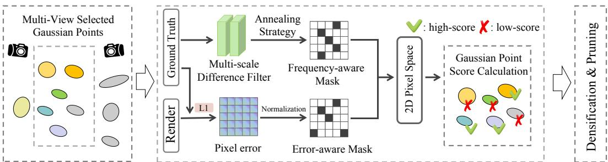  
Figure 3: Overview of the proposed unified optimization pipeline. Given a set of sampled views, we first identify the visible Gaussians. We then compute a unified 2D supervision signal by fusing a pixel-wise error-aware mask with a frequency-aware mask (extracted via an annealing schedule). Finally, we project the visible Gaussians to 2D to accumulate importance scores from the unified mask, guiding localized densification and pruning.

## 3.1 PRELIMINARY

We briefly review 3D Gaussian Splatting (3DGS) (Kerbl et al., 2023). A scene is represented by a set of 3D Gaussians $\left\{ G _ { k } \right\}$ . Each Gaussian has position $\mathbf { p } _ { k } ,$ , opacity $O _ { k } .$ , rotation $R _ { k }$ , base-scale matrix $S _ { k } ~ = ~ \mathrm { d i a g } ( s _ { k } ^ { x } , s _ { k } ^ { \tilde { y } } , s _ { k } ^ { z } )$ , and covariance $\Sigma _ { k } \dot { = } R _ { k } \bar { S } _ { k } S _ { k } ^ { \top } \mathbf { \bar { \phi } } _ { R _ { k } } \quad$ . Its spherical-harmonic coefficients determine the view-dependent RGB color $\mathbf { c } _ { k }$

For rendering, the covariance is projected to the image plane as

$$
\Sigma _ { k } ^ { \mathrm { 2 D } } = J W \Sigma _ { k } W ^ { \top } J ^ { \top } ,\tag{1}
$$

where $W \in \mathbb { R } ^ { 3 \times 3 }$ is the rotational part of the world-to-camera transform and J is the projection Jacobian evaluated at $\mathbf { p } _ { k } .$ . For image-plane coordinate u $\in \mathbb { R } ^ { 2 }$ , let $\mathbf { p } _ { k } ^ { \mathrm { 2 D } }$ denote the projected Gaussian center. The rendered color is obtained by front-to-back alpha compositing:

$$
\hat { \mathbf { C } } ( \mathbf { u } ) = \sum _ { k } \mathbf { c } _ { k } \alpha _ { k } ( \mathbf { u } ) \prod _ { \ell < k } \left( 1 - \alpha _ { \ell } ( \mathbf { u } ) \right) ,\tag{2}
$$

$$
\alpha _ { k } ( { \mathbf u } ) = o _ { k } \exp \left( - \frac { 1 } { 2 } ( { \mathbf u } - { \mathbf p } _ { k } ^ { \mathrm { 2 D } } ) ^ { \top } ( \Sigma _ { k } ^ { \mathrm { 2 D } } ) ^ { - 1 } ( { \mathbf u } - { \mathbf p } _ { k } ^ { \mathrm { 2 D } } ) \right) .\tag{3}
$$

3DGS uses adaptive density control: Gaussians with large positional gradients are cloned or split, while those with low opacity or excessive scale are pruned. The standard objective is

$$
\mathcal { L } = ( 1 - \lambda _ { \mathrm { d s s i m } } ) \mathcal { L } _ { 1 } + \lambda _ { \mathrm { d s s i m } } ( 1 - \mathcal { L } _ { \mathrm { S S I M } } ) ,\tag{4}
$$

where $\lambda _ { \mathrm { d s s i m } } = 0 . 2$

## 3.2 FREQUENCY-AWARE IMPORTANCE SCORING

We combine reconstruction errors with scheduled image responses to guide primitive allocation (Fig. 3).

Frequency mask generation. We convert each ground-truth image to grayscale and downsample it to obtain $I _ { \mathrm { d o w n } }$ . Let $\mathcal { G } _ { \sigma }$ denote a normalized Gaussian kernel with standard deviation σ. We compute

$$
H = \left| I _ { \mathrm { d o w n } } * \mathcal { G } _ { \sigma _ { 1 } } - I _ { \mathrm { d o w n } } * \mathcal { G } _ { \sigma _ { 2 } } \right| , \qquad \sigma _ { 2 } = 2 \sigma _ { 1 } ,\tag{5}
$$

where ∗ denotes convolution. The bandwidth follows the piecewise schedule in Sec. C.2, controlled by $f ( t ) = 1 0 0 t / T _ { \mathrm { t o t a l } }$ , where t is the current training iteration and $T _ { \mathrm { t o t a l } }$ is the total number of iterations. After upsampling and normalization, we threshold the complemented response for $f <$ 50 and the direct response for $f \geq 5 0$ to obtain the frequency-aware mask $M _ { \mathrm { f r e q } }$ . This provides stage-dependent spatial guidance, with the decreasing bandwidth in the second stage emphasizing finer structures.

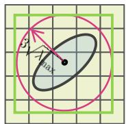  
(a) 3DGS

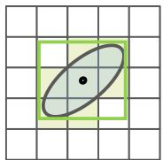  
(b) Speedy-Splat

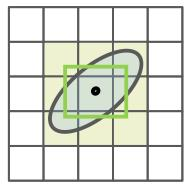  
(c) FastGS

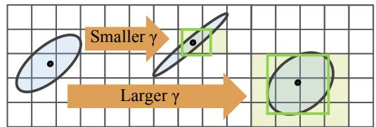  
(d) Adaptive Primitive Compactness (Ours)  
Figure 4: Learnable primitive compactness. Compared with vanilla 3DGS (Kerbl et al., 2023), Speedy-Splat (Hanson et al., 2025a), and FastGS (Ren et al., 2025), our method learns per-Gaussian compactness, reducing redundant pairs and improving fidelity.

Composite error map. For sampled view $j$ with pixel grid $\mathcal { P } _ { j }$ , let $I _ { \mathrm { r e n d } } ^ { j }$ and $I _ { \mathrm { g t } } ^ { j }$ denote the rendered and ground-truth images, respectively, and let $M _ { \mathrm { f r e q } } ^ { j }$ be the corresponding frequency-aware mask. The raw RGB reconstruction error is

$$
e ^ { j } ( \mathbf { u } ) = \frac { 1 } { 3 } \sum _ { c = 1 } ^ { 3 } \left| I _ { \mathrm { r e n d } , c } ^ { j } ( \mathbf { u } ) - I _ { \mathrm { g t } , c } ^ { j } ( \mathbf { u } ) \right| , \qquad \bar { e } ^ { j } = \mathcal { N _ { P _ { j } } } [ e ^ { j } ] ,
$$

where $\mathcal { N } _ { \mathcal { S } }$ denotes min–max normalization over index set S, with constant inputs mapped to zero. The composite mask is

$$
M _ { \mathrm { e r r } } ^ { j } ( \mathbf { u } ) = \mathbb { I } \Big [ \bar { e } ^ { j } ( \mathbf { u } ) > \tau ~ \vee ~ \left( M _ { \mathrm { f r e q } } ^ { j } ( \mathbf { u } ) = 1 ~ \wedge ~ \bar { e } ^ { j } ( \mathbf { u } ) > 0 . 5 \tau \right) \Big ] ,\tag{6}
$$

where $\mathbb { I } [ \cdot ]$ is the indicator function and $\tau \in ( 0 , 1 )$ is the normalized error threshold.

Densification scores. Let $\nu _ { i }$ contain the sampled views in which Gaussian i has a valid projected footprint, and let $\boldsymbol { A } _ { t }$ denote the active primitive set at the current density update (Sec. 3.3). For each view, $\Omega _ { i } ^ { j }$ contains the pixels at which Gaussian i is processed and contributes during compositing. Define

$$
n _ { i } ^ { j } = \sum _ { \mathbf { u } \in \Omega _ { i } ^ { j } } M _ { \mathrm { e r r } } ^ { j } ( \mathbf { u } ) .
$$

The valid-view average and densification score are

$$
C _ { i } = \frac { 1 } { \vert \mathcal { V } _ { i } \vert } \sum _ { j \in \mathcal { V } _ { i } } n _ { i } ^ { j } , \qquad i \in \mathcal { A } _ { t } ,\tag{7}
$$

$$
s _ { d } ^ { i } ( t ) = \omega ( t ) C _ { i } ,\tag{8}
$$

where $\omega ( t )$ is a positive, nondecreasing clipped-linear schedule over the densification interval. Exact normalization, pixel-support, and scheduling definitions are provided in Sec. C.3.

Pruning scores. Following FastGS (Ren et al., 2025), we weight each per-view count by the corresponding image-level photometric loss:

$$
E _ { \mathrm { p h o t o } } ^ { j } = ( 1 - \lambda _ { \mathrm { d s s i m } } ) \mathcal { L } _ { 1 } ^ { j } + \lambda _ { \mathrm { d s s i m } } \left( 1 - \mathrm { S S I M } ( I _ { \mathrm { r e n d } } ^ { j } , I _ { \mathrm { g t } } ^ { j } ) \right) , \qquad \mathcal { L } _ { 1 } ^ { j } = \frac { 1 } { | \mathcal { P } _ { j } | } \sum _ { \mathbf { u } \in \mathcal { P } _ { j } } e ^ { j } ( \mathbf { u } ) .
$$

The pruning score is

$$
Q _ { i } = \sum _ { j \in \mathscr { V } _ { i } } n _ { i } ^ { j } E _ { \mathrm { p h o t o } } ^ { j } , \qquad s _ { p } ^ { i } = \mathscr { N } _ { A _ { t } } [ Q ] ( i ) .\tag{9}
$$

Thus, densification uses a valid-view average, whereas pruning retains summed, loss-weighted counts. $E _ { \mathrm { p h o t o } } ^ { j }$ is used only for scoring; parameter optimization follows Sec. 3.5.

## 3.3 VIEW-VISIBLE LOCAL DENSIFICATION AND PRUNING

We restrict density modifications to the portion of the representation covered by the sampled views.

Ours  
Ground Truth  
Speedy-Splat  
FastGS  
Tamping-3DGS  
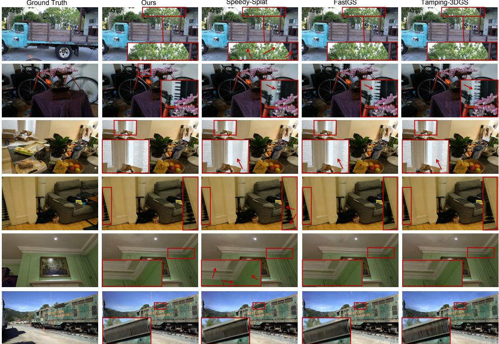  
Figure 5: Qualitative results of ours and other methods in image rendering on Deep Blending (Park et al., 2019), Mip-NeRF 360 (Barron et al., 2022) and Tanks & Temples datasets (Knapitsch et al., 2017).

Active primitives. At each scheduled update, we sample K distinct training views uniformly without replacement. Let $\mathcal { G } _ { t }$ denote the index set of Gaussian primitives before the update, and let $r _ { i } ^ { \mathcal { I } }$ be the projected radius returned by the rasterizer. We define

$$
\mathcal { V } _ { i } = \{ j : r _ { i } ^ { j } > 0 \} , \qquad | \mathcal { V } _ { i } | = \sum _ { j = 1 } ^ { K } \mathbb { I } [ r _ { i } ^ { j } > 0 ] , \qquad \mathcal { A } _ { t } = \{ i \in \mathcal { G } _ { t } : | \mathcal { V } _ { i } | > 0 \} .\tag{10}
$$

This criterion defines projected-footprint eligibility rather than explicit occlusion visibility; actual counted contributions are determined by $\Omega _ { i } ^ { j }$ . Density control is skipped when $A _ { t } = \mathcal { D }$

Pruning. At a pruning step, mandatory removals are

$$
\mathcal { H } _ { t } = \left\{ i \in \mathcal { A } _ { t } : o _ { i } < 0 . 1 ~ \lor ~ \gamma _ { i } < 0 . 0 1 \right\} ,
$$

where $\gamma _ { i }$ is the learnable scale-modulation factor introduced in Sec. 3.4. The remaining candidates are

$$
\mathcal { P } _ { t } = \left\{ i \in \mathcal { A } _ { t } \ \backslash \ \mathcal { H } _ { t } : s _ { p } ^ { i } > \tau _ { p } \right\} , \qquad 0 \leq \tau _ { p } < 1 .
$$

We sample $b _ { t } = \lfloor \rho \rfloor \mathcal { P } _ { t } \rfloor \rfloor$ candidates without replacement using weights proportional to $s _ { p } ^ { i } .$ , where $\rho \in [ 0 , 1 ]$ . The removal set $\mathcal { R } _ { t }$ is their union with $\mathcal { H } _ { t }$

Densification and execution. At a densification step, surviving active primitives satisfying $s _ { d } ^ { i } ( t ) > \tau _ { d }$ are selected, where $\tau _ { d } \geq 0$ is the densification-score threshold. A primitive is cloned and shifted along its positional gradient if its largest base-scale component is below $\tau _ { s } > 0 ;$ otherwise, it is replaced by two smaller Gaussians. New primitives inherit the parent’s unconstrained modulation parameter $\beta _ { i } \in \mathbb { R }$ , with $\gamma _ { i } = 2$ sigmoid $( \bar { \beta _ { i } } ) \in ( 0 , 2 )$ , while their remaining attributes follow the underlying clone/split updates. All scores are computed from the same pre-update representation. When pruning and densification coincide, pruning is applied first; new primitives are scored only at the next density update. Primitives outside $\boldsymbol { A } _ { t }$ undergo neither operation. The complete execution protocol is given in Sec. C.3.

Ground Truth  
Speedy-Splat  
Tamping-3DGS  
FastGS  
Ours  
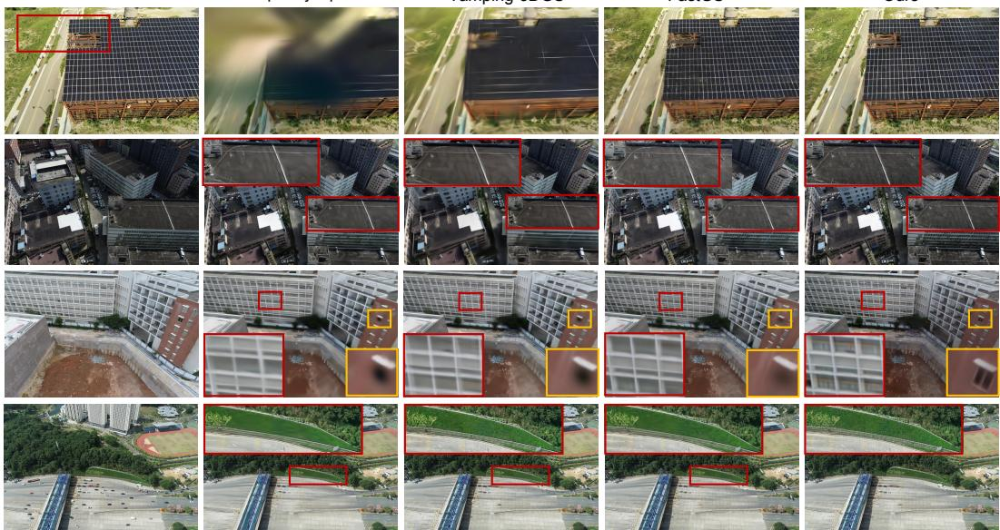  
Figure 6: Qualitative results of ours and other methods in image rendering on Mill-19 (Turki et al., 2022b), Urbanscene3D (Lin et al., 2022) and GauU-Scene datasets (Xiong et al., 2024).

Table 1: Quantitative comparison on Mip-NeRF 360 (Barron et al., 2022), Deep Blending (Hedman et al., 2018), and Tanks & Temples (Knapitsch et al., 2017).
<table><tr><td rowspan="2">Method</td><td colspan="6">Mip-NeRF 360</td><td colspan="6">Deep Blending</td><td colspan="6">Tanks &amp; Temples</td></tr><tr><td>Time ↓ PSNR ↑ SSIM ↑ LPIPS ↓ NGs ↓ FPS ↑ </td><td></td><td></td><td></td><td></td><td></td><td></td><td></td><td> Time ↓ PSNR ↑ SSIM ↑ LPIPS ↓ NGs ↓ FPS ↑ 7</td><td></td><td></td><td></td><td>Time ↓ PSNR ↑ SSIM ↑ LPIPS</td><td></td><td></td><td></td><td> $\overline { { . N _ { G S } } }$ </td><td>↓ FPS ↑</td></tr><tr><td>3DGS</td><td>20.93</td><td>27.53</td><td>0.812</td><td>0.221</td><td>2.63M</td><td>146</td><td>19.77</td><td>29.71</td><td>0.903</td><td>0.241</td><td>2.46M</td><td>158</td><td>11.34</td><td>23.71</td><td>0.850</td><td>0.170</td><td>1.57M</td><td>195</td></tr><tr><td>3DGS-LM</td><td>10.37</td><td>27.42</td><td>0.810</td><td>0.222</td><td>3.36M</td><td>220</td><td>9.83</td><td>29.61</td><td>0.905</td><td>0.248</td><td>2.71M</td><td>248</td><td>6.15</td><td>23.53</td><td>0.842</td><td>0.184</td><td></td><td>1.81M 289</td></tr><tr><td>Mini-Splatting</td><td>14.67</td><td>27.32</td><td>0.821</td><td>0.217</td><td>0.53M</td><td>567</td><td>13.35</td><td>29.99</td><td>0.907</td><td>0.244</td><td>0.56M</td><td>624</td><td>9.06</td><td>23.46</td><td>0.844</td><td>0.181</td><td>0.30M 756</td><td></td></tr><tr><td>Speedy-Splat</td><td>13.38</td><td>26.91</td><td>0.781</td><td>0.295</td><td>0.30M</td><td>552</td><td>10.75</td><td>29.42</td><td>0.898</td><td>0.272</td><td>0.25M</td><td>664</td><td>6.32</td><td>23.38</td><td>0.816</td><td>0.242</td><td>0.18M</td><td>691</td></tr><tr><td>Taming-3DGS</td><td>5.14</td><td>27.48</td><td>0.794</td><td>0.261</td><td>0.68M</td><td>221</td><td>3.06</td><td>29.50</td><td>0.894</td><td>0.278</td><td>0.29M</td><td>352</td><td>2.71</td><td>23.89</td><td>0.833</td><td>0.214</td><td>0.32M</td><td>379</td></tr><tr><td>DashGaussian</td><td>6.35</td><td>27.73</td><td>0.817</td><td>0.218</td><td>2.40M</td><td>155</td><td>4.16</td><td>29.65</td><td>0.906</td><td>0.246</td><td>1.94M</td><td>208</td><td>4.28</td><td>24.00</td><td>0.853</td><td>0.178</td><td>1.21M</td><td>240</td></tr><tr><td>FastGS</td><td>1.93</td><td>27.56</td><td>0.797</td><td>0.261</td><td>0.40M</td><td>579</td><td>1.28</td><td>30.03</td><td>0.901</td><td>0.270</td><td>0.22M</td><td>714</td><td>1.32</td><td>24.15</td><td>0.839</td><td>0.210</td><td>0.24M</td><td>655</td></tr><tr><td>Ours</td><td>3.07</td><td>27.77</td><td>0.826</td><td>0.207</td><td>0.48M</td><td>478</td><td>2.94</td><td>30.01</td><td>0.910</td><td>0.238</td><td>0.25M 632</td><td></td><td>1.94</td><td>24.22</td><td>0.861</td><td>0.166</td><td>0.44M 572</td><td></td></tr></table>

## 3.4 ADAPTIVE PRIMITIVE COMPACTNESS

During rasterization, the projected extent of each Gaussian determines the tiles that require processing. Vanilla 3DGS (Kerbl et al., 2023) uses a three-sigma extent, while Speedy-Splat (Hanson et al., 2025a) and FastGS (Ren et al., 2025) reduce redundant Gaussian–tile evaluations through more restrictive culling rules. We retain the Compact Box mechanism of FastGS and introduce a learnable per-Gaussian scale modulation. For Gaussian i,

$$
\widetilde { S } _ { i } = \gamma _ { i } S _ { i } , \qquad \widetilde { \Sigma } _ { i } = \gamma _ { i } ^ { 2 } \Sigma _ { i } .\tag{11}
$$

With the base scales fixed, $\gamma _ { i }$ changes the overall spatial extent while preserving anisotropic axis ratios. Because both $S _ { i }$ and $\gamma _ { i }$ remain learnable, the modulation acts as an additional optimization and density-control variable rather than enlarging the family of representable covariances. It therefore provides an additional pathway for adapting effective primitive support while retaining the Compact Box tile-culling rule. Further details are provided in Sec. C.1.

## 3.5 OPTIMIZATION

We further use $M _ { \mathrm { f r e q } }$ to spatially weight reconstruction errors during training. For the currently sampled view, let $\mathcal { P } _ { \mathrm { i m g } }$ denote its pixel grid and $C _ { \mathrm { r g b } } = 3$ . Using $I _ { \mathrm { r e n d } }$ and $I _ { \mathrm { g t } }$ for the rendered and ground-truth images,

$$
\mathcal { L } _ { 1 } = \frac { 1 } { C _ { \mathrm { r g b } } | \mathcal { P } _ { \mathrm { i m g } } | } \sum _ { \mathbf { u } \in \mathcal { P } _ { \mathrm { i m g } } } \sum _ { c = 1 } ^ { C _ { \mathrm { r g b } } } | I _ { \mathrm { r e n d } , c } ( \mathbf { u } ) - I _ { \mathrm { g t } , c } ( \mathbf { u } ) | .
$$

Table 2: Quantitative comparison of the averaged metrics on Mill-19 (Turki et al., 2022b), Urban-Scene3D (Lin et al., 2022), and GauU-Scene (Xiong et al., 2024).
<table><tr><td rowspan="2">Method</td><td colspan="6">Mill-19</td><td colspan="6">UrbanScene3D</td><td colspan="6">GauU-Scene</td></tr><tr><td></td><td>Time (m) ↓ SSIM ↑ PSNR ↑ LPIPS ↓ NGs ↓ FPS ↑ Time (m) ↓ SSIM ↑ PSNR ↑ LPIPS ↓ NGs ↓ FPS ↑</td><td></td><td></td><td></td><td></td><td></td><td></td><td></td><td></td><td></td><td></td><td></td><td></td><td></td><td> Time (m) ↓ SSIM ↑ PSNR ↑ LPIPS ↓ NGs ↓ FPS ↑</td><td></td><td></td></tr><tr><td>3DGS</td><td>196</td><td>0.735 23.06</td><td></td><td>0.292</td><td>10.76</td><td>&lt; 50</td><td>180</td><td>0.763</td><td>21.69</td><td>0.252</td><td>6.12</td><td>&lt; 50</td><td>176</td><td>0.736</td><td>23.66</td><td>0.268</td><td>6.58</td><td>&lt; 50</td></tr><tr><td>PGSR</td><td>212</td><td>0.603</td><td>20.12</td><td>0.447</td><td>12.41</td><td>&lt; 50</td><td>177</td><td>0.780</td><td>20.01</td><td>0.285</td><td>5.87</td><td>&lt; 50</td><td>187</td><td>0.593</td><td>20.57</td><td>0.421</td><td>5.98</td><td>&lt; 50</td></tr><tr><td>Mip-Splatting</td><td>187</td><td>0.703</td><td>22.35</td><td>0.334</td><td>18.44</td><td>&lt; 50</td><td>192</td><td>0.775</td><td>21.37</td><td>0.266</td><td>13.07</td><td>&lt; 50</td><td>184</td><td>0.660</td><td>21.40</td><td>0.341</td><td>14.50</td><td>&lt; 50</td></tr><tr><td>Taming-3DGS</td><td>21</td><td>0.551</td><td>21.22</td><td>0.510</td><td>0.75</td><td>88</td><td>23</td><td>0.633</td><td>19.74</td><td>0.460</td><td>0.48</td><td>73</td><td>29</td><td>0.714</td><td>23.77</td><td>0.308</td><td>5.92</td><td>84</td></tr><tr><td>Speedy-Splat</td><td>45</td><td>0.522</td><td>19.70</td><td>0.547</td><td>0.54</td><td>204</td><td>54</td><td>0.658</td><td>19.52</td><td>0.432</td><td>0.56</td><td>181</td><td>45</td><td>0.646</td><td>22.42</td><td>0.401</td><td>0.73</td><td>185</td></tr><tr><td>FastGS</td><td>12</td><td>0.662</td><td>22.32</td><td>0.391</td><td>1.60</td><td>251</td><td>11</td><td>0.708</td><td>20.24</td><td>0.351</td><td>1.28</td><td>228</td><td>13</td><td>0.707</td><td>23.47</td><td>0.329</td><td>2.34</td><td>236</td></tr><tr><td>EffGS</td><td>20</td><td>0.755</td><td>23.68</td><td>0.279</td><td>3.76</td><td>145</td><td>22</td><td>0.778</td><td>21.50</td><td>0.281</td><td>3.05</td><td>148</td><td>21</td><td>0.756</td><td>24.23</td><td>0.273</td><td>4.23</td><td>124</td></tr></table>

The frequency-guided loss is

$$
\mathcal { L } _ { \mathrm { f r e q } } = \frac { 1 } { C _ { \mathrm { r g b } } | \mathcal { P } _ { \mathrm { i m g } } | } \sum _ { \mathbf { u } \in \mathcal { P } _ { \mathrm { i m g } } } \sum _ { c = 1 } ^ { C _ { \mathrm { r g b } } } M _ { \mathrm { f r e q } } ( \mathbf { u } ) \left| I _ { \mathrm { r e n d } , c } ( \mathbf { u } ) - I _ { \mathrm { g t } , c } ( \mathbf { u } ) \right| .\tag{12}
$$

The mask is shared across color channels and uses the full-image denominator, so an empty mask yields zero masked loss without a separate normalization rule. Let $\mathcal { L } _ { \mathrm { S S I M } } = \mathrm { S S I M } ( I _ { \mathrm { r e n d } } , \dot { I } _ { \mathrm { g t } } )$ . The complete objective is

$$
\begin{array} { r l } & { \mathcal { L } = ( 1 - \lambda _ { \mathrm { d s s i m } } - \lambda _ { \mathrm { f r e q } } ) \mathcal { L } _ { 1 } + \lambda _ { \mathrm { d s s i m } } ( 1 - \mathcal { L } _ { \mathrm { S S I M } } ) } \\ & { ~ + ~ \lambda _ { \mathrm { f r e q } } \mathcal { L } _ { \mathrm { f r e q } } + \mathcal { R } _ { \gamma } , } \end{array}\tag{13}
$$

where $\lambda _ { \mathrm { d s s i m } } = 0 . 2$ and $\lambda _ { \mathrm { f r e q } } = 0 . 1$ . Let G denote the current primitive index set and $N = | \mathcal { G } |$ . The scale-factor regularizer is

$$
\mathcal { R } _ { \gamma } = \left\{ \begin{array} { l l } { \displaystyle \frac { \lambda _ { \gamma } } { N } \sum _ { i \in \mathcal { G } } \gamma _ { i } ^ { 2 } , } & { N > 0 , } \\ { 0 , } & { N = 0 , } \end{array} \right. \qquad \lambda _ { \gamma } > 0 .
$$

The mean reduction prevents its scale from increasing solely with the primitive count. The regularizer introduces a shrinkage preference on the modulation factors, but is not a direct penalty on effective Gaussian volume.

## 4 EXPERIMENT

We first describe the datasets and implementation details in Sec. 4.1. We then evaluate EffGS on both bounded and city-scale scenes and compare it with representative Gaussian Splatting methods in Sec. 4.2. Finally, we analyze the contribution of each component through ablation studies in Sec. 4.3.

## 4.1 EXPERIMENTAL SETUP

Datasets. To comprehensively evaluate the rendering fidelity, computational efficiency, and scal ability of our proposed method, we conduct experiments across a diverse range of scene configurations. For object-centric and bounded indoor/outdoor environments, we utilize the Mip-NeRF 360 (Barron et al., 2022), Deep-Blending (Park et al., 2019), and Tanks and Temples (Knapitsch et al., 2017) datasets. Furthermore, to rigorously assess the performance and robustness of our method in large-scale, complex, and unbounded scenarios, we evaluate it on the Mill-19 (Turki et al., 2022b), UrbanScene3D (Lin et al., 2022), and GauU-Scene (Xiong et al., 2024) datasets.

Implementation Details. EffGS and all baselines are implemented in PyTorch. EffGS, Speedy-Splat (Hanson et al., 2025a), and FastGS (Ren et al., 2025) are evaluated on identical 24GB GPUs, while baseline configurations that exceed this memory capacity on large-scale scenes are evaluated using NVIDIA A800 GPUs. Additional implementation details and extended experiments are provided in the supplementary material (see Sec. A.1).

## 4.2 RESULTS ANALYSIS

In this section, we first compare EffGS with representative Gaussian Splatting methods on bounded scenes, and then evaluate its scalability against efficient large-scene reconstruction methods on cityscale datasets. In the supplementary material, we further extend EffGS to multi-GPU training and compare it with several city-scale multi-GPU reconstruction methods, together with a detailed analysis of GPU memory consumption. See Sec. A for more details.

Table 3: Component ablations on GauU-Scene (Xiong et al., 2024), evaluating reconstruction quality and computational cost.
<table><tr><td rowspan="2">Ablation Item</td><td colspan="3">Rendering Quality</td><td colspan="4">Efficiency Metrics</td></tr><tr><td>SSIM↑</td><td>PSNR ↑</td><td>LPIPS↓</td><td>Time (Min) ↓</td><td>Size (GB)↓</td><td>GS (M) ↓</td><td>Mem (G) ↓</td></tr><tr><td>(a) w/o Frequency-aware Mask</td><td>0.752</td><td>24.12</td><td>0.278</td><td>22</td><td>1.15</td><td>4.51</td><td>15.6</td></tr><tr><td>(b) w/o Error-aware Mask</td><td>0.748</td><td>23.98</td><td>0.284</td><td>21</td><td>1.23</td><td>4.42</td><td>14.8</td></tr><tr><td>(c) w/o Learnable Compactness  $( \gamma _ { i } )$ </td><td>0.745</td><td>23.85</td><td>0.288</td><td>28</td><td>1.25</td><td>4.98</td><td>16.5</td></tr><tr><td>(d) w/o Local Densification and Pruning (LDP)</td><td>0.741</td><td>23.75</td><td>0.295</td><td>19</td><td>0.98</td><td>3.85</td><td>14.2</td></tr><tr><td>(e) w/o Frequency-aware Loss  $( \mathcal { L } _ { f r e q } )$ </td><td>0.753</td><td>24.16</td><td>0.276</td><td>19</td><td>1.05</td><td>4.20</td><td>15.3</td></tr><tr><td>Full (Ours)</td><td>0.756</td><td>24.23</td><td>0.273</td><td>21</td><td>1.07</td><td>4.23</td><td>14.8</td></tr></table>

Performance on Bounded Scenes. EffGS achieves a favorable balance between rendering quality and training efficiency (Tab. 1). Among the methods compared in this table, it achieves the highest PSNR on Mip-NeRF 360 and Tanks & Temples, reaching 27.77 and 24.22, respectively. Across all three benchmarks, EffGS improves PSNR, SSIM, and LPIPS over vanilla 3DGS (Kerbl et al., 2023) while substantially reducing training time. Compared with FastGS, it achieves higher SSIM and lower LPIPS on all three datasets, with additional training cost. These results demonstrate the quality–efficiency benefits of the complete framework.

Scalability to City-Scale Scenes. As shown in Tab. 2, EffGS outperforms Taming-3DGS, Speedy-Splat, and FastGS in PSNR, SSIM, and LPIPS across all three city-scale datasets. Among the methods in this table, it achieves the best PSNR and SSIM on Mill-19 and GauU-Scene, while maintaining competitive quality on UrbanScene3D. With training times of 20–22 minutes and rendering speeds of 124–148 FPS, EffGS combines efficient training with real-time rendering in large-scale scenes.

## 4.3 ABLATION STUDY

We evaluate the contribution of each component on the GauU-Scene dataset (Tab. 3). Additional measurements of the frequency extraction module’s memory usage are provided in Sec. A.3. We further conduct matched-Gaussian-budget comparisons on both bounded and large-scale scenes to control for differences in primitive count (Tabs. 13 and 14).

Frequency and Error-Aware Guidance. Removing the frequency-aware mask (row a), the erroraware mask (row b), or the frequency-guided loss $\mathcal { L } _ { \mathrm { f r e q } }$ (row e) reduces PSNR and SSIM and increases LPIPS. These results support combining reconstruction errors with scale-dependent spatial guidance for density control and reconstruction supervision.

Adaptive Learnable Compactness (γi). Removing the learnable scale-modulation component (row c) increases the Gaussian count to 4.98M, training time to 28 minutes, and peak memory usage to 16.5GB, while reducing PSNR to 23.85. These results support the contribution of scale reparameterization and its interaction with density control to both reconstruction quality and efficiency. The extended evaluation in Tab. 15 further confirms this trend across representative bounded and largescale scenes, where learnable compactness consistently reduces frequency-specific reconstruction errors while improving rendering quality with fewer Gaussian primitives.

Local Densification and Pruning (LDP). Removing LDP (row d) reduces the Gaussian count, training time, and memory usage, but yields the lowest reconstruction quality among the evaluated variants. Retaining LDP improves all three quality metrics by restricting density modifications to primitives with valid projected footprints in the sampled views. The results support this local restriction as a useful component of the framework’s quality–efficiency trade-off. As shown in Tab. 11, adding LDP to FastGS consistently improves reconstruction quality on the Russian scene, increasing SSIM from 0.741 to 0.758 and PSNR from 23.48 to 23.89, while reducing LPIPS from 0.294 to 0.257.

## 5 CONCLUSION

We presented EffGS, a framework for efficient, high-fidelity Gaussian splatting across bounded and city-scale scenes. Frequency-aware scoring combines reconstruction errors with scale-dependent spatial masks, while localized density control restricts densification and pruning to primitives with valid projected footprints in sampled views. Learnable per-Gaussian scale modulation provides an additional optimization pathway for adapting effective spatial support. Together, these components achieve a favorable balance between reconstruction quality, training time, and primitive count. Component ablations and matched-primitive-budget comparisons support the effectiveness of the framework, with spectral magnitude analysis complementing standard rendering metrics.

## AI USE STATEMENT

Generative AI tools were used only for language polishing, grammar correction, and improving the clarity of the manuscript. They were not used to generate experimental results, perform data analysis, or make scientific claims. All technical content, experiments, and conclusions were produced and verified by the authors.

## ETHICS STATEMENT

This work focuses on efficient 3D scene reconstruction and does not involve human subjects, personal data, or sensitive attributes. All experiments are conducted on publicly available research datasets following their intended academic use. We are not aware of any direct ethical concerns specific to the proposed method.

## REPRODUCIBILITY STATEMENT

We provide detailed descriptions of the model architecture, optimization objectives, training schedule, hyperparameters, datasets, and evaluation protocols in the main paper and supplementary material. All experiments use consistent settings unless otherwise specified. We plan to release the implementation and configuration files to facilitate reproduction of the reported results.

## REFERENCES

Jonathan T. Barron, Ben Mildenhall, Dor Verbin, Pratul P. Srinivasan, and Peter Hedman. Mipnerf 360: Unbounded anti-aliased neural radiance fields. In IEEE/CVF Conference on Computer Vision and Pattern Recognition, CVPR 2022, New Orleans, LA, USA, June 18-24, 2022, pp. 5460–5469. IEEE, 2022.

Samuel Rota Bulo, Lorenzo Porzi, and Peter Kontschieder. Revising densification in gaussian splat-\` ting. In Ales Leonardis, Elisa Ricci, Stefan Roth, Olga Russakovsky, Torsten Sattler, and Gul¨ Varol (eds.), Computer Vision - ECCV 2024 - 18th European Conference, Milan, Italy, September 29-October 4, 2024, Proceedings, Part LXIII, Lecture Notes in Computer Science, pp. 347–362. Springer, 2024.

Danpeng Chen, Hai Li, Weicai Ye, Yifan Wang, Weijian Xie, Shangjin Zhai, Nan Wang, Haomin Liu, Hujun Bao, and Guofeng Zhang. PGSR: planar-based gaussian splatting for efficient and high-fidelity surface reconstruction. CoRR, abs/2406.06521, 2024.

Youyu Chen, Junjun Jiang, Kui Jiang, Xiao Tang, Zhihao Li, Xianming Liu, and Yinyu Nie. Dashgaussian: Optimizing 3d gaussian splatting in 200 seconds. In IEEE/CVF Conference on Computer Vision and Pattern Recognition, CVPR 2025, Nashville, TN, USA, June 11-15, 2025, pp. 11146–11155. Computer Vision Foundation / IEEE, 2025.

Zhiwen Fan, Kevin Wang, Kairun Wen, Zehao Zhu, Dejia Xu, and Zhangyang Wang. Lightgaussian: Unbounded 3d gaussian compression with 15x reduction and 200+ FPS. In Advances in Neural Information Processing Systems 38: Annual Conference on Neural Information Processing Systems 2024, NeurIPS 2024, Vancouver, BC, Canada, December 10 - 15, 2024, 2024.

Guangchi Fang and Bing Wang. Mini-splatting: Representing scenes with a constrained number of gaussians. In Ales Leonardis, Elisa Ricci, Stefan Roth, Olga Russakovsky, Torsten Sattler, and Gul Varol (eds.),¨ Computer Vision - ECCV 2024 - 18th European Conference, Milan, Italy, September 29-October 4, 2024, Proceedings, Part LXXVII, Lecture Notes in Computer Science, pp. 165–181. Springer, 2024.

Yuanyuan Gao, Hao Li, Jiaqi Chen, Zhengyu Zou, Zhihang Zhong, Dingwen Zhang, Xiao Sun, and Junwei Han. Citygs-x: A scalable architecture for efficient and geometrically accurate large-scale scene reconstruction. CoRR, abs/2503.23044, 2025.

Abdullah Hamdi, Luke Melas-Kyriazi, Jinjie Mai, Guocheng Qian, Ruoshi Liu, Carl Vondrick, Bernard Ghanem, and Andrea Vedaldi. GES: generalized exponential splatting for efficient radiance field rendering. In IEEE/CVF Conference on Computer Vision and Pattern Recognition, CVPR 2024, Seattle, WA, USA, June 16-22, 2024. IEEE, 2024.

Alex Hanson, Allen Tu, Geng Lin, Vasu Singla, Matthias Zwicker, and Tom Goldstein. Speedysplat: Fast 3d gaussian splatting with sparse pixels and sparse primitives. In IEEE/CVF Conference on Computer Vision and Pattern Recognition, CVPR 2025, Nashville, TN, USA, June 11-15, 2025, pp. 21537–21546. Computer Vision Foundation / IEEE, 2025a.

Alex Hanson, Allen Tu, Vasu Singla, Mayuka Jayawardhana, Matthias Zwicker, and Tom Goldstein. PUP 3d-gs: Principled uncertainty pruning for 3d gaussian splatting. In IEEE/CVF Conference on Computer Vision and Pattern Recognition, CVPR 2025, Nashville, TN, USA, June 11-15, 2025, pp. 5949–5958. Computer Vision Foundation / IEEE, 2025b.

Peter Hedman, Julien Philip, True Price, Jan-Michael Frahm, George Drettakis, and Gabriel J. Brostow. Deep blending for free-viewpoint image-based rendering. ACM Trans. Graph., 37(6):257, 2018.

Lukas Hollein, Aljaz Bozic, Michael Zollh ¨ ofer, and Matthias Nießner. 3dgs-lm: Faster gaussian-¨ splatting optimization with levenberg-marquardt. CoRR, abs/2409.12892, 2024.

Bernhard Kerbl, Georgios Kopanas, Thomas Leimkuhler, and George Drettakis. 3d gaussian splat-¨ ting for real-time radiance field rendering. ACM Trans. Graph., 42(4):139:1–139:14, 2023.

Sieun Kim, Kyungjin Lee, and Youngki Lee. Color-cued efficient densification method for 3d gaussian splatting. In IEEE/CVF Conference on Computer Vision and Pattern Recognition, CVPR 2024 - Workshops, Seattle, WA, USA, June 17-18, 2024, pp. 775–783. IEEE, 2024.

Arno Knapitsch, Jaesik Park, Qian-Yi Zhou, and Vladlen Koltun. Tanks and temples: benchmarking large-scale scene reconstruction. ACM Trans. Graph., 36(4):78:1–78:13, 2017.

Changbai Li, Haodong Zhu, Hanlin Chen, Juan Zhang, Tongfei Chen, Shuo Yang, Shuwei Shao, Wenhao Dong, and Baochang Zhang. HRGS: hierarchical gaussian splatting for memory-efficient high-resolution 3d reconstruction. CoRR, abs/2506.14229, 2025.

Changbai Li, Haodong Zhu, Hanlin Chen, Xiuping Liang, Tongfei Chen, Shuwei Shao, Linlin Yang, Huobin Tan, and Baochang Zhang. Urbangs: A scalable and efficient architecture for geometrically accurate large-scene reconstruction. CoRR, abs/2602.02089, 2026.

Jiaqi Lin, Zhihao Li, Xiao Tang, Jianzhuang Liu, Shiyong Liu, Jiayue Liu, Yangdi Lu, Xiaofei Wu, Songcen Xu, Youliang Yan, and Wenming Yang. Vastgaussian: Vast 3d gaussians for large scene reconstruction. In CVPR, 2024.

Liqiang Lin, Yilin Liu, Yue Hu, Xingguang Yan, Ke Xie, and Hui Huang. Capturing, reconstructing, and simulating: The urbanscene3d dataset. In Shai Avidan, Gabriel J. Brostow, Moustapha Cisse,´ Giovanni Maria Farinella, and Tal Hassner (eds.), Computer Vision - ECCV 2022 - 17th European Conference, Tel Aviv, Israel, October 23-27, 2022, Proceedings, Part VIII, volume 13668 of Lecture Notes in Computer Science, pp. 93–109. Springer, 2022.

Yang Liu, Chuanchen Luo, Lue Fan, Naiyan Wang, Junran Peng, and Zhaoxiang Zhang. Citygaussian: Real-time high-quality large-scale scene rendering with gaussians. In Computer Vision - ECCV 2024 - 18th European Conference, Milan, Italy, September 29-October 4, 2024, Proceedings, Part XVI, pp. 265–282, 2024a.

Yang Liu, Chuanchen Luo, Zhongkai Mao, Junran Peng, and Zhaoxiang Zhang. Citygaussianv2: Efficient and geometrically accurate reconstruction for large-scale scenes. CoRR, abs/2411.00771, 2024b.

Saswat Subhajyoti Mallick, Rahul Goel, Bernhard Kerbl, Markus Steinberger, Francisco Vicente Carrasco, and Fernando De la Torre. Taming 3dgs: High-quality radiance fields with limited resources. In Takeo Igarashi, Ariel Shamir, and Hao (Richard) Zhang (eds.), SIGGRAPH Asia 2024 Conference Papers, SA 2024, Tokyo, Japan, December 3-6, 2024, pp. 2:1–2:11. ACM, 2024.

Zhenxing Mi and Dan Xu. Switch-nerf: Learning scene decomposition with mixture of experts for large-scale neural radiance fields. In The Eleventh International Conference on Learning Representations, ICLR 2023, Kigali, Rwanda, May 1-5, 2023. OpenReview.net, 2023.

Ben Mildenhall, Pratul P. Srinivasan, Matthew Tancik, Jonathan T. Barron, Ravi Ramamoorthi, and Ren Ng. Nerf: Representing scenes as neural radiance fields for view synthesis. In Computer Vision - ECCV 2020 - 16th European Conference, Glasgow, UK, August 23-28, 2020, Proceedings, Part I, 2020.

Jeong Joon Park, Peter R. Florence, Julian Straub, Richard A. Newcombe, and Steven Lovegrove. Deepsdf: Learning continuous signed distance functions for shape representation. In IEEE Conference on Computer Vision and Pattern Recognition, Long Beach, CA, USA, June 16-20, 2019, pp. 165–174. Computer Vision Foundation / IEEE, 2019.

Christian Reiser, Richard Szeliski, Dor Verbin, Pratul P. Srinivasan, Ben Mildenhall, Andreas Geiger, Jonathan T. Barron, and Peter Hedman. MERF: memory-efficient radiance fields for real-time view synthesis in unbounded scenes. ACM Trans. Graph., 42(4):89:1–89:12, 2023.

Shiwei Ren, Tianci Wen, Yongchun Fang, and Biao Lu. Fastgs: Training 3d gaussian splatting in 100 seconds. CoRR, abs/2511.04283, 2025.

Haithem Turki, Deva Ramanan, and Mahadev Satyanarayanan. Mega-nerf: Scalable construction of large-scale nerfs for virtual fly- throughs. In IEEE/CVF Conference on Computer Vision and Pattern Recognition, CVPR 2022, New Orleans, LA, USA, June 18-24, 2022, pp. 12912–12921. IEEE, 2022a.

Haithem Turki, Deva Ramanan, and Mahadev Satyanarayanan. Mega-nerf: Scalable construction of large-scale nerfs for virtual fly- throughs. In IEEE/CVF Conference on Computer Vision and Pattern Recognition, CVPR 2022, New Orleans, LA, USA, June 18-24, 2022, pp. 12912–12921. IEEE, 2022b.

Butian Xiong, Nanjun Zheng, Junhua Liu, and Zhen Li. Gauu-scene V2: assessing the reliability of image-based metrics with expansive lidar image dataset using 3dgs and nerf. CoRR, abs/2404.04880, 2024.

Zehao Yu, Anpei Chen, Binbin Huang, Torsten Sattler, and Andreas Geiger. Mip-splatting: Aliasfree 3d gaussian splatting. In IEEE/CVF Conference on Computer Vision and Pattern Recognition, CVPR 2024, Seattle, WA, USA, June 16-22, 2024, pp. 19447–19456. IEEE, 2024a.

Zehao Yu, Torsten Sattler, and Andreas Geiger. Gaussian opacity fields: Efficient adaptive surface reconstruction in unbounded scenes. ACM Trans. Graph., 43(6):271:1–271:13, 2024b.

Haodong Zhu, Changbai Li, Yangyang Ren, Zichao Feng, Xuhui Liu, Hanlin Chen, Xiantong Zhen, and Baochang Zhang. Surf3r: Rapid surface reconstruction from sparse RGB views in seconds. CoRR, abs/2508.04508, 2025.

## Supplementary Material

## This supplementary material is organized as follows:

• Appendix A provides experimental settings, extended quantitative and qualitative comparisons, and analyses of frequency-extraction memory usage and frequencyaware reconstruction errors.

• Appendix B presents additional baseline comparisons, matched-Gaussian-budget evaluations, and an extended ablation of adaptive primitive compactness.

• Appendix C details learnable per-Gaussian scale modulation and frequency-aware mask generation.

• Appendix D discusses the limitations of the proposed method.

• Appendix E discusses broader social impacts and potential applications.

## A MORE EXPERIMENTS

To further demonstrate the scalability of our EffGS, we extend it to multi-GPU parallel training. We adopt the tiling strategy from CityGS (Liu et al., 2024a) for parallelization and conduct an extended comparison with state-of-the-art city-scale 3DGS methods (Gao et al., 2025; Liu et al., 2024b;a) on the Mill-19 (Turki et al., 2022b), Urbanscene3D (Lin et al., 2022), and GauU-Scene (Xiong et al., 2024) datasets, as illustrated in Fig. 12. We provide detailed quantitative comparisons in Tabs. 5, 9, 10, and 12. We also report model size and GPU memory usage, as visualized in Fig. 9. In addition, we perform two supplementary ablation studies: Memory Footprint of Frequency Extraction (Sec. A.3) and Frequency Aware Error Analysis (Sec. A.4).

We also provide additional qualitative (see Fig. 13) and quantitative comparisons (see Fig. 14, Tab. 5,Tab. 4,Tab. 6 ) on the Deep Blending (Park et al., 2019), Mip-NeRF 360 (Barron et al., 2022), and Tanks & Temples (Knapitsch et al., 2017) datasets.

## A.1 EXPERIMENTAL SETUP AND IMPLEMENTATION

EffGS and the comparative baselines are implemented in PyTorch. Shared optimization settings, including the learning rates for Gaussian positions and base scales, opacity reset intervals, and density-control frequency, follow the original 3DGS configuration. The density-control rules and additional optimization components of EffGS are described in Secs. 3.2–3.5.

For bounded indoor and outdoor benchmarks, including Mip-NeRF 360, Deep Blending, and Tanks & Temples, training and evaluation are conducted on a single NVIDIA GeForce RTX 4090 with 24GB VRAM. EffGS, Speedy-Splat (Hanson et al., 2025a), and FastGS (Ren et al., 2025) are evaluated under the same hardware setting.

For large-scale urban benchmarks, we maintain the same 24GB memory constraint whenever possible. However, several baseline configurations exceed this capacity. Specifically, 3DGS (Kerbl et al., 2023), PGSR (Chen et al., 2024), and Mip-Splatting (Yu et al., 2024a) encounter out-ofmemory issues, with Mip-Splatting requiring more than 60GB of GPU memory in some scenes, and are therefore evaluated using NVIDIA A800 GPUs. Taming-3DGS similarly requires the A800 on several GauU-Scene scenes.

We further distinguish the single-GPU EffGS configuration from its distributed extension, denoted as EffGS-GPUs. The distributed experiments use NVIDIA TITAN RTX GPUs and adopt the tiling strategy described in Sec. A. Additional memory measurements for frequency extraction and frequency-specific error analysis are provided in Secs. A.3 and A.4, respectively.

For the initial Gaussian primitives, we initialize $\beta _ { i } = 0$ , corresponding to a scale-modulation factor $\gamma _ { i } = 1$ . Primitives created through cloning or splitting inherit their parent’s $\beta _ { i } .$ The modulation parameters are optimized jointly with the other Gaussian attributes. The parameterization, regularization, and relation to projected support are detailed in Sec. C.1.

Frequency-aware Error Analysis Across Large-scale Scenes  
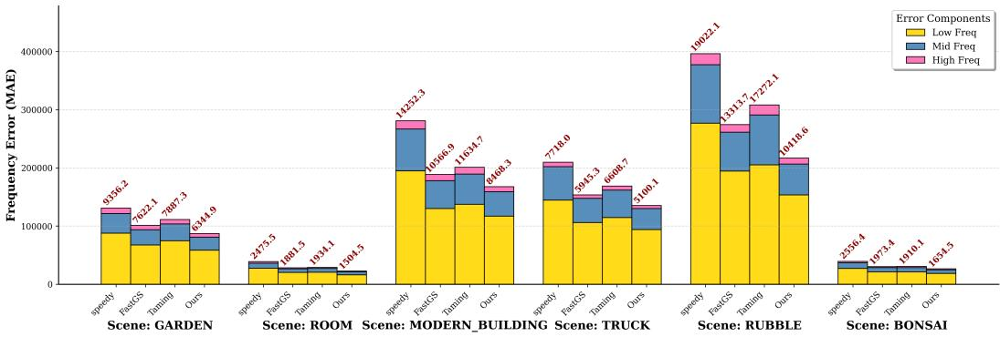  
Figure 7: Low-, mid-, and high-frequency spectral magnitude errors across scenes.

## A.2 EXTENDED RESULTS ANALYSIS

Performance on Massive Urban Scenes. The extended comparisons (Tabs. 8–10) show that EffGS-GPUs achieves competitive reconstruction quality against specialized large-scale pipelines, including CityGaussian, CityGS-v2, and CityGS-X, with leading results across multiple scenes and metrics. Table 12 reports the training time, primitive count, and rendering speed of EffGS and the listed baselines. Fig. 9 additionally compares memory usage and model size, with multi-GPU configurations marked separately.

Fig. 8 tracks the band-wise spectral magnitude errors on the Rubble scene. The lower errors observed for EffGS across the three bands complement the standard image-quality metrics and provide additional evidence of improved spectral magnitude reconstruction.

We further evaluate LDP by incorporating it into FastGS (Tab. 11). On the Russian scene, FastGS+LDP improves PSNR from 23.48 to 23.89 and reduces LPIPS from 0.294 to 0.257. This comparison supports the benefit of restricting density operations to the sampled-view active set within the FastGS pipeline.

Performance on Bounded Scenes. The per-scene results in Tabs. 4, 5, and 6 provide a more detailed view of reconstruction quality across bounded scenes. Together with the training-time comparison in Tab. 1, they support the effectiveness of EffGS across indoor and outdoor environments. The qualitative examples in Fig. 13 show clearer edges and finer texture details than FastGS and Speedy-Splat in the illustrated regions, complementing the quantitative comparisons.

## A.3 MEMORY FOOTPRINT OF FREQUENCY EXTRACTION

The frequency-aware mask is computed from two Gaussian-filtered versions of a downsampled grayscale image. The absolute difference is upsampled, normalized, and thresholded according to the two-stage schedule in Sec. C.2.

Fig. 11 evaluates memory usage during sequential processing with varying input resolutions and a fixed batch size of 10 on the Russian scene. After the initial increase, peak VRAM usage fluctuates within a bounded range without a sustained upward trend over the tested sequence. The step-wise changes reflect these fluctuations and support the memory stability of frequency extraction unde the evaluated settings.

## A.4 FREQUENCY-AWARE ERROR ANALYSIS

We visualize the spatial masks used for training guidance and measure spectral magnitude discrepancies in separate frequency bands. These analyses complement PSNR, SSIM, LPIPS, and qualitative renderings by characterizing mask selection and frequency-specific differences.

Table 4: Quantitative PSNR comparison on Mip-NeRF 360 (Barron et al., 2022). The best, second-best, and third-best results are indicated by light red, light orange, and light yellow backgrounds, respectively.
<table><tr><td>Method</td><td>Bicycle</td><td>Flowers</td><td>Garden</td><td>Stump</td><td>Treehill</td><td>Room</td><td>Counter</td><td>Kitchen</td><td>Bonsai</td></tr><tr><td>3DGS</td><td>25.14</td><td>21.30</td><td>27.34</td><td>26.64</td><td>22.59</td><td>31.71</td><td>29.16</td><td>31.54</td><td>32.37</td></tr><tr><td>Mini-Splatting</td><td>25.23</td><td>21.43</td><td>27.36</td><td>26.80</td><td>22.76</td><td>31.48</td><td>28.65</td><td>31.05</td><td>31.24</td></tr><tr><td>Speedy-Splat</td><td>24.79</td><td>21.21</td><td>26.69</td><td>26.67</td><td>22.48</td><td>30.83</td><td>28.22</td><td>30.09</td><td>31.16</td></tr><tr><td>Taming-3DGS</td><td>24.72</td><td>21.10</td><td>27.42</td><td>26.05</td><td>22.92</td><td>31.64</td><td>29.20</td><td>31.84</td><td>32.40</td></tr><tr><td>DashGaussian</td><td>25.31</td><td>21.78</td><td>27.57</td><td>27.17</td><td>22.94</td><td>31.81</td><td>29.11</td><td>31.69</td><td>32.15</td></tr><tr><td>FastGS</td><td>24.84</td><td>21.21</td><td>27.20</td><td>26.65</td><td>22.94</td><td>31.98</td><td>29.15</td><td>31.87</td><td>32.19</td></tr><tr><td>Ours</td><td>25.25</td><td>22.18</td><td>27.45</td><td>27.21</td><td>22.34</td><td>32.03</td><td>29.15</td><td>31.91</td><td>32.39</td></tr></table>

Frequency-aware Error Convergence Across 30k Iterations  
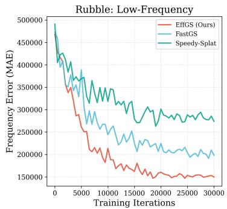

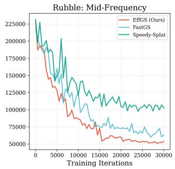

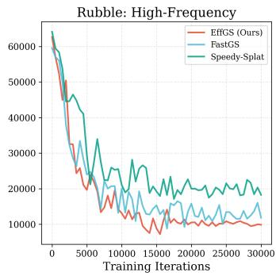  
Figure 8: Band-wise spectral magnitude errors over 30,000 training iterations on Rubble.

## A.4.1 FREQUENCY-AWARE MASK VISUALIZATION

Fig. 10 shows continuous selection scores, their overlays, and binary masks on a fixed image at different schedule parameters $f .$ For $f \geq 5 0 .$ , increasing $f$ reduces the Gaussian filter scales, producing responses around progressively finer structures. For $f < 5 0$ , the normalized response is complemented before thresholding. The heatmaps represent spatial selection scores, and the binary masks identify pixels selected at the threshold of 0.5. Because scores are normalized independently for each setting, their colors indicate relative selection strength within each image.

## A.4.2 SPECTRAL DECOMPOSITION AND ERROR FORMULATION

We compute the centered Fourier spectra of the grayscale ground-truth and rendered images. For $I \in \{ I _ { \mathrm { g t } } , I _ { \mathrm { r e n d e r } } \}$ 4

$$
\widehat { I } = \mathrm { f f s h i f t } ( \mathcal { F } ( I ) ) , \qquad A _ { I } = | \widehat { I } | ,\tag{14}
$$

where $\mathcal { F }$ denotes the 2D discrete Fourier transform, $\widehat { I }$ is the centered complex spectrum, and $A _ { I }$ is its magnitude spectrum.

Let $( \xi , \eta )$ denote a frequency-grid coordinate and $D ( \xi , \eta )$ its Euclidean radial distance from the centered zero-frequency location. We partition the frequency coordinates into three bands:

$$
\begin{array} { r l } & { \Omega _ { \mathrm { l o w } } = \{ ( \xi , \eta ) : D ( \xi , \eta ) \leq 3 0 \} , } \\ & { \Omega _ { \mathrm { m i d } } = \{ ( \xi , \eta ) : 3 0 < D ( \xi , \eta ) \leq 8 0 \} , } \\ & { \Omega _ { \mathrm { h i g h } } = \{ ( \xi , \eta ) : D ( \xi , \eta ) > 8 0 \} . } \end{array}\tag{15}
$$

The thresholds are measured in frequency-grid pixels and therefore define bands relative to the image resolution used in each evaluation. For each band $b \in \{ \mathrm { l o w } , \mathrm { m i d } , \mathrm { h i g h } \}$ , we compute the mean absolute spectral magnitude error:

$$
E _ { b } = \frac { 1 } { | \Omega _ { b } | } \sum _ { ( \xi , \eta ) \in \Omega _ { b } } \left| A _ { I _ { \mathrm { r e n d e r } } } ( \xi , \eta ) - A _ { I _ { \mathrm { g t } } } ( \xi , \eta ) \right| .\tag{16}
$$

Table 5: Quantitative SSIM comparison on Mip-NeRF 360 (Barron et al., 2022). The best, second-best, and third-best results are indicated by light red, light orange, and light yellow backgrounds, respectively.
<table><tr><td>Method</td><td>Bicycle</td><td>Flowers</td><td>Garden</td><td>Stump</td><td>Treehill</td><td>Room</td><td>Counter</td><td>Kitchen</td><td>Bonsai</td></tr><tr><td>3DGS</td><td>0.748</td><td>0.586</td><td>0.857</td><td>0.768</td><td>0.636</td><td>0.927</td><td>0.915</td><td>0.932</td><td>0.946</td></tr><tr><td>Mini-Splatting</td><td>0.764</td><td>0.614</td><td>0.806</td><td>0.839</td><td>0.656</td><td>0.928</td><td>0.911</td><td>0.930</td><td>0.943</td></tr><tr><td>Speedy-Splat</td><td>0.704</td><td>0.560</td><td>0.814</td><td>0.765</td><td>0.590</td><td>0.903</td><td>0.876</td><td>0.895</td><td>0.925</td></tr><tr><td>Taming-3DGS</td><td>0.693</td><td>0.552</td><td>0.851</td><td>0.729</td><td>0.628</td><td>0.917</td><td>0.909</td><td>0.929</td><td>0.942</td></tr><tr><td>DashGaussian</td><td>0.763</td><td>0.604</td><td>0.857</td><td>0.783</td><td>0.640</td><td>0.924</td><td>0.911</td><td>0.927</td><td>0.945</td></tr><tr><td>FastGS</td><td>0.714</td><td>0.560</td><td>0.836</td><td>0.756</td><td>0.612</td><td>0.920</td><td>0.907</td><td>0.929</td><td>0.942</td></tr><tr><td>Ours</td><td>0.773</td><td>0.610</td><td>0.861</td><td>0.825</td><td>0.642</td><td>0.931</td><td>0.913</td><td>0.934</td><td>0.944</td></tr></table>

Table 6: Quantitative LPIPS comparison on Mip-NeRF 360 (Barron et al., 2022). The best, second-best, and third-best results are indicated by light red, light orange, and light yellow backgrounds, respectively.
<table><tr><td>Method</td><td>Bicycle</td><td>Flowers</td><td>Garden</td><td>Stump</td><td>Treehill</td><td>Room</td><td>Counter</td><td>Kitchen</td><td>Bonsai</td></tr><tr><td>3DGS</td><td>0.242</td><td>0.360</td><td>0.122</td><td>0.244</td><td>0.347</td><td>0.197</td><td>0.183</td><td>0.116</td><td>0.180</td></tr><tr><td>Mini-Splatting</td><td>0.241</td><td>0.341</td><td>0.215</td><td>0.161</td><td>0.326</td><td>0.190</td><td>0.181</td><td>0.120</td><td>0.177</td></tr><tr><td>Speedy-Splat</td><td>0.333</td><td>0.418</td><td>0.214</td><td>0.288</td><td>0.462</td><td>0.258</td><td>0.259</td><td>0.195</td><td>0.228</td></tr><tr><td>Taming-3DGS</td><td>0.332</td><td>0.416</td><td>0.138</td><td>0.324</td><td>0.395</td><td>0.227</td><td>0.200</td><td>0.128</td><td>0.193</td></tr><tr><td>DashGaussian</td><td>0.222</td><td>0.341</td><td>0.131</td><td>0.229</td><td>0.333</td><td>0.205</td><td>0.191</td><td>0.129</td><td>0.180</td></tr><tr><td>FastGS</td><td>0.310</td><td>0.406</td><td>0.174</td><td>0.297</td><td>0.429</td><td>0.217</td><td>0.204</td><td>0.127</td><td>0.191</td></tr><tr><td>Ours</td><td>0.240</td><td>0.353</td><td>0.162</td><td>0.243</td><td>0.335</td><td>0.104</td><td>0.171</td><td>0.106</td><td>0.151</td></tr></table>

This metric measures differences in Fourier magnitude. Since it does not capture phase differences, we interpret it together with the standard image-quality metrics and qualitative results.

## A.4.3 SPATIAL VISUALIZATION AND QUANTITATIVE COMPARISON

To visualize high-frequency response discrepancies, we define the binary spectral mask

$$
M _ { \mathrm { h i g h } } ( \xi , \eta ) = \mathbb { I } [ ( \xi , \eta ) \in \Omega _ { \mathrm { h i g h } } ] ,\tag{17}
$$

where $\mathbb { I } [ \cdot ]$ denotes the indicator function. We apply this mask to the complex spectrum and compute the magnitude of the reconstructed high-pass response:

$$
S _ { \mathrm { h f } } ( I ) = \Bigl | \mathcal { F } ^ { - 1 } \Bigl ( \mathrm { i f f t s h i f t } \Bigl ( \widehat { I } \odot M _ { \mathrm { h i g h } } \Bigr ) \Bigr ) \Bigr | ,\tag{18}
$$

where ${ \mathcal { F } } ^ { - 1 }$ denotes the inverse 2D discrete Fourier transform and ⊙ denotes element-wise multipli cation.

We visualize

$$
\Delta S _ { \mathrm { h f } } = \vert S _ { \mathrm { h f } } ( I _ { \mathrm { g t } } ) - S _ { \mathrm { h f } } ( I _ { \mathrm { r e n d e r } } ) \vert\tag{19}
$$

Table 7: Quantitative results (Time) on Mip-NeRF 360 (Barron et al., 2022).
<table><tr><td>Method</td><td>bicycle</td><td>flowers</td><td>garden</td><td>stump</td><td>treehill</td><td>room</td><td>counter</td><td>kitchen</td><td>bonsai</td></tr><tr><td>3DGS</td><td>27.97</td><td>18.98</td><td>26.78</td><td>21.77</td><td>20.33</td><td>18.78</td><td>17.58</td><td>21.30</td><td>14.90</td></tr><tr><td>Mini-Splatting</td><td>16.17</td><td>17.22</td><td>15.97</td><td>16.52</td><td>17.05</td><td>18.00</td><td>9.83</td><td>10.23</td><td>11.02</td></tr><tr><td>Speedy-Splat</td><td>15.87</td><td>13.38</td><td>15.73</td><td>13.77</td><td>12.90</td><td>12.05</td><td>12.10</td><td>13.25</td><td>11.37</td></tr><tr><td>Taming-3DGS</td><td>5.65</td><td>4.97</td><td>9.82</td><td>3.93</td><td>5.37</td><td>3.88</td><td>4.60</td><td>3.48</td><td>4.60</td></tr><tr><td>DashGaussian</td><td>9.93</td><td>7.05</td><td>8.27</td><td>6.57</td><td>8.20</td><td>4.00</td><td>3.95</td><td>5.52</td><td>3.95</td></tr><tr><td>FastGS</td><td>1.92</td><td>1.95</td><td>2.47</td><td>1.72</td><td>1.72</td><td>1.62</td><td>1.83</td><td>2.42</td><td>1.83</td></tr><tr><td>Ours</td><td>3.14</td><td>2.45</td><td>3.23</td><td>4.15</td><td>2.56</td><td>2.52</td><td>2.93</td><td>3.22</td><td>3.43</td></tr></table>

(b) Model Size Comparison  
Table 8: Quantitative SSIM comparison (↑) across different datasets. Building and Rubble are from Mill-19 (Turki et al., 2022b); Residence and Sci-Art are from UrbanScene3D (Lin et al., 2022); Russian Building, Residence+, and Modern Building are from GauU-Scene (Xiong et al., 2024). The best, second-best, and third-best results are indicated by light red, light orange, and light yellow backgrounds, respectively. † denotes results obtained without decoupled appearance encoding, while \* denotes results obtained without depth supervision.
<table><tr><td rowspan="2">Method</td><td colspan="2">Mill-19</td><td colspan="2">UrbanScene3D</td><td colspan="3">GauU-Scene</td></tr><tr><td>Building</td><td>Rubble</td><td>Residence</td><td>Sci-Art</td><td>Russian Building</td><td>Residence+</td><td>Modern Building</td></tr><tr><td>VastGaussian†</td><td>0.725</td><td>0.745</td><td>0.712</td><td>0.765</td><td>0.781</td><td>0.738</td><td>0.789</td></tr><tr><td rowspan="3">CityGaussian CityGS-v2</td><td>0.776</td><td>0.814</td><td>0.810</td><td>0.835</td><td>0.801</td><td>0.755</td><td>0.791</td></tr><tr><td>0.661</td><td>0.724</td><td>0.771</td><td>0.808</td><td>0.792</td><td>0.741</td><td>0.762</td></tr><tr><td>0.771</td><td>0.803</td><td>0.802</td><td>0.829</td><td>0.793</td><td>0.742</td><td>0.774</td></tr><tr><td rowspan="3">3DGS PGSR Mip-Splatting</td><td>0.722</td><td>0.748</td><td>0.782</td><td>0.743</td><td>0.770</td><td>0.686</td><td>0.751</td></tr><tr><td>0.482</td><td>0.723</td><td>0.758</td><td>0.802</td><td>0.759</td><td>0.315</td><td>0.705</td></tr><tr><td>0.683</td><td>0.722</td><td>0.749</td><td>0.806</td><td>0.751</td><td>0.518</td><td>0.710</td></tr><tr><td rowspan="3">Taming-3DGS Speedy-Splat</td><td>0.498</td><td>0.603</td><td>0.560</td><td>0.706</td><td>0.738</td><td>0.661</td><td>0.744</td></tr><tr><td>0.462</td><td>0.581</td><td>0.649</td><td>0.667</td><td>0.697</td><td>0.569</td><td>0.671</td></tr><tr><td>0.654</td><td>0.669</td><td>0.688</td><td>0.728</td><td>0.741</td><td>0.659</td><td>0.722</td></tr><tr><td>EffGS</td><td>0.728</td><td>0.783</td><td>0.777</td><td>0.778</td><td>0.768</td><td>0.747</td><td>0.754</td></tr><tr><td>EffGS-GPUs</td><td>0.782</td><td>0.811</td><td>0.813</td><td>0.844</td><td>0.803</td><td>0.786</td><td>0.795</td></tr></table>

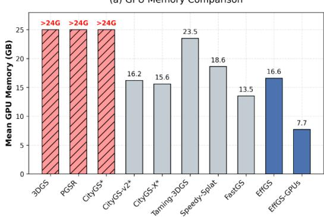

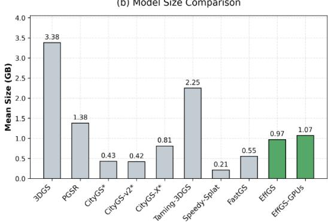  
Figure 9: Quantitative comparison of computational overhead on the Mill-19 (Turki et al., 2022b), Urbanscene3D (Lin et al., 2022), and GauU-Scene datasets (Xiong et al., 2024). ∗ indicates multi-GPU training.

after normalization by its 99th percentile. The resulting map shows spatial differences in highpass response magnitude, rather than squared-energy error. Percentile normalization emphasizes the spatial distribution of these discrepancies.

We also present the three band-wise errors as stacked bars, allowing comparisons between methods within each frequency band. The stacked height is the sum of the three band-wise mean errors; it is neither the overall pixel-space error nor a decomposition of total error into frequency-band proportions.

## B ADDITIONAL COMPARISONS AND CONTROLLED EXPERIMENTS

We compare EffGS with EDGS and 3DGS-MCMC under reported and matched-budget settings, and further evaluate adaptive primitive compactness.

## B.1 REFERENCE AND MATCHED-BUDGET COMPARISONS

Tab. 13 compares reconstruction quality and training time on Deep Blending and Tanks & Temples. Under reported settings, EffGS has lower reported training times on both datasets and achieves the highest SSIM and PSNR on Deep Blending, while EDGS achieves the lowest LPIPS on both datasets and the highest SSIM and PSNR on Tanks & Temples. Under Gaussian budgets matched to EffGS— 0.25M on Deep Blending and 0.44M on Tanks & Temples—EffGS achieves the best PSNR, SSIM, LPIPS, and training time on both datasets. These results show that its quality advantages persist under matched budgets rather than relying on more Gaussian primitives.

Table 9: Quantitative PSNR comparison (↑) across different datasets. Building and Rubble are from Mill-19 (Turki et al., 2022b); Residence and Sci-Art are from UrbanScene3D (Lin et al., 2022); Russian Building, Residence+, and Modern Building are from GauU-Scene (Xiong et al., 2024). The best, second-best, and third-best results are indicated by light red, light orange, and light yellow backgrounds, respectively. † denotes results obtained without decoupled appearance encoding, while \* denotes results obtained without depth supervision.
<table><tr><td rowspan="2">Method</td><td colspan="2">Mill-19</td><td colspan="2">UrbanScene3D</td><td colspan="3">GauU-Scene</td></tr><tr><td>Building</td><td>Rubble</td><td>Residence</td><td>Sci-Art</td><td>Russian Building</td><td>Residence+</td><td>Modern Building</td></tr><tr><td>VastGaussian†</td><td>21.83</td><td>25.24</td><td>21.06</td><td>22.59</td><td>23.98</td><td>23.41</td><td>25.53</td></tr><tr><td>CityGaussian</td><td>21.56</td><td>25.79</td><td>22.03</td><td>22.42</td><td>24.11</td><td>23.65</td><td>26.01</td></tr><tr><td>CityGS-v2</td><td>19.85</td><td>24.02</td><td>21.23</td><td>20.71</td><td>24.04</td><td>23.43</td><td>25.78</td></tr><tr><td>CityGS-X*</td><td>21.78</td><td>25.45</td><td>22.11</td><td>22.32</td><td>24.18</td><td>23.91</td><td>25.95</td></tr><tr><td>3DGS</td><td>20.62</td><td>25.49</td><td>21.45</td><td>21.92</td><td>23.74</td><td>22.10</td><td>25.15</td></tr><tr><td>PGSR</td><td>17.01</td><td>23.23</td><td>20.58</td><td>19.43</td><td>23.30</td><td>14.65</td><td>23.77</td></tr><tr><td>Mip-Splatting</td><td>20.65</td><td>24.05</td><td>20.98</td><td>21.75</td><td>22.48</td><td>17.97</td><td>23.76</td></tr><tr><td>Taming-3DGS</td><td>19.13</td><td>23.31</td><td>19.01</td><td>20.47</td><td>23.51</td><td>22.34</td><td>25.46</td></tr><tr><td>Speedy-Splat</td><td>16.90</td><td>22.50</td><td>20.04</td><td>18.99</td><td>22.87</td><td>20.32</td><td>24.08</td></tr><tr><td>FastGS</td><td>20.88</td><td>23.76</td><td>20.13</td><td>20.34</td><td>23.48</td><td>22.12</td><td>24.81</td></tr><tr><td>EffGS</td><td>22.05</td><td>25.31</td><td>21.23</td><td>21.77</td><td>24.05</td><td>23.28</td><td>25.35</td></tr><tr><td>EffGS-GPUs</td><td>22.34</td><td>25.83</td><td>21.89</td><td>22.73</td><td>24.34</td><td>23.89</td><td>26.14</td></tr></table>

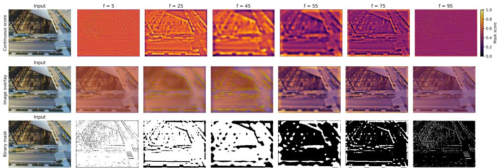  
Figure 10: Visualization of the frequency-aware mask at different schedule parameters f on a fixed input image. Top: continuous mask scores before thresholding. Middle: score heatmaps overlaid on the input. Bottom: binary masks obtained with a threshold of 0.5, where white indicates selected pixels. Scores are normalized independently for each setting.

## B.2 MATCHED-BUDGET COMPARISONS ON LARGE-SCALE SCENES

We further evaluate matched-budget performance on Mill-19 and UrbanScene3D. For Taming-3DGS, we set its target Gaussian budget to match EffGS. For the EDGS variant, denoted as EDGS+3DGS, we disable densification and initialize optimization with the same Gaussian budget. These budget-constrained configurations are evaluated separately from the methods’ original operating settings.

Tab. 14 summarizes the results. At the reported matched budgets of 3.76M Gaussians on Mill-19 and 3.05M Gaussians on UrbanScene3D, EffGS achieves the best reconstruction metrics and the shortest training time among the evaluated methods. On Mill-19, EffGS achieves 23.68 dB PSNR and 0.279 LPIPS, compared with 22.57 dB and 0.372 for EDGS+3DGS. On UrbanScene3D, EffGS achieves 21.50 dB PSNR and 0.281 LPIPS, compared with 21.17 dB and 0.330 for EDGS+3DGS. Together with the results on Deep Blending and Tanks & Temples, these comparisons support the effectiveness of EffGS under matched primitive budgets across different scene scales. They do not, by themselves, isolate the contribution of an individual component of the full framework.

Memory Robustness Analysis with Dynamic Resolution (Batch Size=10)  
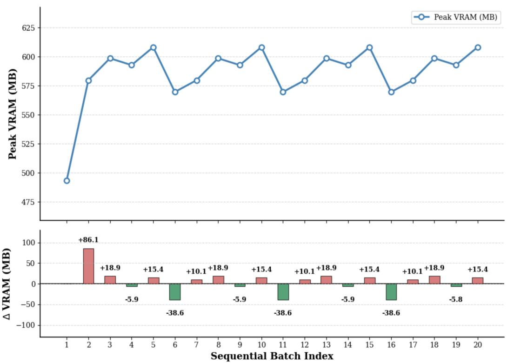  
Figure 11: Peak VRAM usage (top) and step-wise changes (bottom) during frequency extraction with varying resolutions and batch size 10 on Russian (Xiong et al., 2024).

Table 10: Quantitative LPIPS comparison (↓) across different datasets. Building and Rubble are from Mill-19 (Turki et al., 2022b); Residence and Sci-Art are from UrbanScene3D (Lin et al., 2022); Russian Building, Residence+, and Modern Building are from GauU-Scene (Xiong et al., 2024). The best, second-best, and third-best results are indicated by light red, light orange, and light yellow backgrounds, respectively. † denotes results obtained without decoupled appearance encoding, while \* denotes results obtained without depth supervision.
<table><tr><td rowspan="2">Method</td><td colspan="2">Mill-19</td><td colspan="2">UrbanScene3D</td><td colspan="3">GauU-Scene</td></tr><tr><td>Building</td><td>Rubble</td><td>Residence</td><td>Sci-Art</td><td>Russian Building</td><td>Residence+</td><td>Modern Building</td></tr><tr><td>VastGaussian†</td><td>0.271</td><td>0.268</td><td>0.263</td><td>0.259</td><td>0.251</td><td>0.301</td><td>0.245</td></tr><tr><td>CityGaussian</td><td>0.267</td><td>0.226</td><td>0.213</td><td>0.232</td><td>0.223</td><td>0.289</td><td>0.253</td></tr><tr><td>CityGS-v2</td><td>0.382</td><td>0.311</td><td>0.235</td><td>0.265</td><td>0.234</td><td>0.294</td><td>0.254</td></tr><tr><td>CityGS-X*</td><td>0.256</td><td>0.224</td><td>0.221</td><td>0.241</td><td>0.220</td><td>0.284</td><td>0.234</td></tr><tr><td>3DGS</td><td>0.304</td><td>0.279</td><td>0.238</td><td>0.265</td><td>0.234</td><td>0.321</td><td>0.249</td></tr><tr><td>PGSR</td><td>0.541</td><td>0.352</td><td>0.292</td><td>0.277</td><td>0.278</td><td>0.657</td><td>0.327</td></tr><tr><td>Mip-Splatting</td><td>0.344</td><td>0.324</td><td>0.272</td><td>0.259</td><td>0.252</td><td>0.482</td><td>0.290</td></tr><tr><td>Taming-3DGS</td><td>0.542</td><td>0.477</td><td>0.509</td><td>0.410</td><td>0.291</td><td>0.352</td><td>0.282</td></tr><tr><td>Speedy-Splat</td><td>0.593</td><td>0.501</td><td>0.411</td><td>0.452</td><td>0.352</td><td>0.469</td><td>0.382</td></tr><tr><td>FastGS</td><td>0.380</td><td>0.402</td><td>0.351</td><td>0.351</td><td>0.294</td><td>0.377</td><td>0.315</td></tr><tr><td>EffGS</td><td>0.276</td><td>0.282</td><td>0.265</td><td>0.297</td><td>0.254</td><td>0.291</td><td>0.273</td></tr><tr><td>EffGS-GPUs</td><td>0.253</td><td>0.217</td><td>0.208</td><td>0.224</td><td>0.236</td><td>0.281</td><td>0.256</td></tr></table>

Ground Truth  
CityGS-X  
CityGS-v2  
CityGaussian  
EffGS-GPUs  
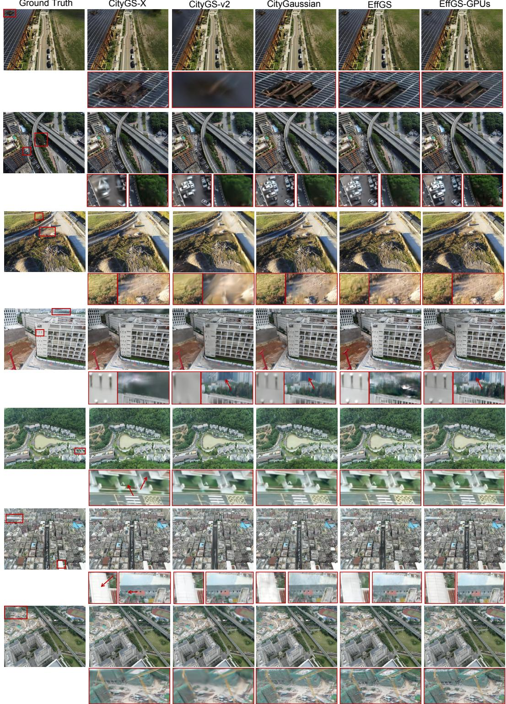  
Figure 12: Qualitative comparisons on the Mill-19, Urbanscene3D, and GauU-Scene datasets (Turki et al., 2022b; Lin et al., 2022; Xiong et al., 2024).

## B.3 EXTENDED ANALYSIS OF ADAPTIVE PRIMITIVE COMPACTNESS

The learnable factor $\gamma _ { i }$ provides a dedicated optimization pathway for adaptive primitive compactness. Although a multiplicative scale modulation does not expand the static representational space of a Gaussian, it changes the optimization parameterization and participates in compactness-aware primitive control.

Tamping-3DGS  
FastGS  
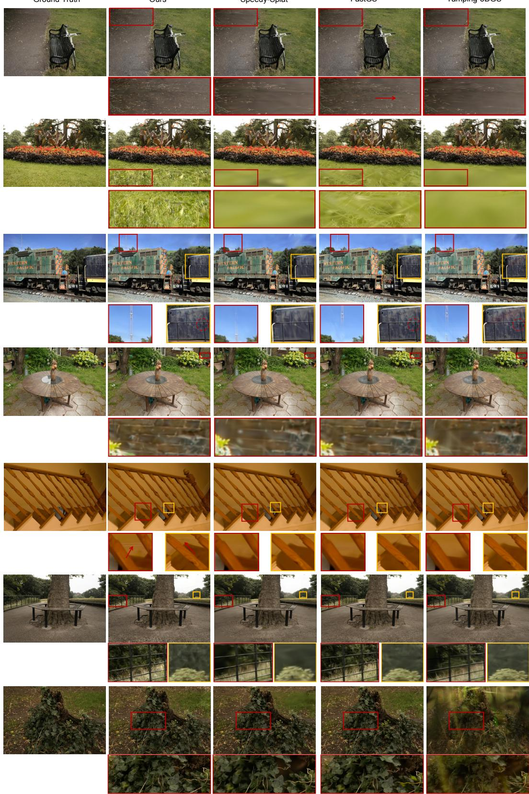  
Figure 13: Qualitative comparisons on the Deep Blending, Mip-NeRF 360, and Tanks & Temples datasets (Park et al., 2019; Barron et al., 2022; Knapitsch et al., 2017).

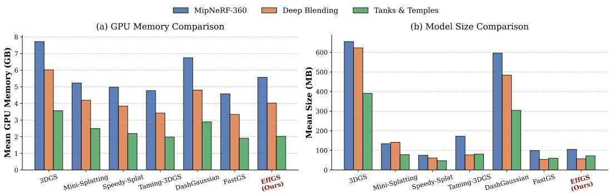

Figure 14: Quantitative comparison of computational overhead on the Deep Blending (Park et al., 2019), Mip-NeRF 360 (Barron et al., 2022), and Tanks & Temples datasets (Knapitsch et al., 2017). Table 11: Ablation study on the Russian scene from the GauU-Scene dataset (Xiong et al., 2024).
<table><tr><td>Method</td><td>SSIM↑</td><td>PSNR ↑</td><td>LPIPS↓</td></tr><tr><td>FastGS</td><td>0.741</td><td>23.48</td><td>0.294</td></tr><tr><td>FastGS+LDP</td><td>0.758</td><td>23.89</td><td>0.257</td></tr></table>

We evaluate its contribution on five representative scenes: Garden, Room, and Bonsai from Mip-NeRF 360, Rubble from Mill-19, and Modern Building from GauU-Scene. Tab. 15 reports the aggregated results across these scenes. Compared with the variant without learnable compactness, the full model reduces the average errors in all three frequency bands, improves PSNR from 26.99 to 28.51 dB and SSIM from 0.810 to 0.855, and reduces LPIPS from 0.264 to 0.194. The average Gaussian count also decreases from 2.30M to 2.02M. Thus, the observed improvement in reconstruction quality is accompanied by a more compact representation, rather than an increase in primitive count.

Summary. The matched-budget comparisons show that EffGS achieves better reconstruction quality than the evaluated baselines at the tested Gaussian budgets, while also reporting shorter training times. The extended compactness ablation further shows that the full model improves average reconstruction quality and frequency-specific errors while using fewer primitives. These results provide complementary evidence for the quality–efficiency benefits of the proposed framework.

## C METHODOLOGICAL DETAILS

## C.1 LEARNABLE SCALE MODULATION FOR PRIMITIVE COMPACTNESS

Building upon the Compact Box mechanism in FastGS (Ren et al., 2025), we introduce a learnable per-Gaussian scale factor $\gamma _ { i }$ . This factor reparameterizes the effective Gaussian scales, providing an additional optimization pathway for adapting primitive extent while retaining the existing tileculling rule.

Covariance modulation. In vanilla 3DGS (Kerbl et al., 2023), the covariance of Gaussian i is constructed from its base-scale matrix $S _ { i } ~ = ~ \mathrm { d i a g } ( s _ { i } ^ { x } , s _ { i } ^ { y } , s _ { i } ^ { z } )$ , with $s _ { i } ^ { x } , s _ { i } ^ { y } , s _ { i } ^ { z } \ > \ 0$ , and rotation matrix $R _ { i } { \mathrm { : } }$

$$
\Sigma _ { i } = R _ { i } S _ { i } S _ { i } ^ { \top } R _ { i } ^ { \top } .\tag{20}
$$

We augment each Gaussian with a learnable scalar $\beta _ { i } \in \mathbb { R }$ , initialized to zero for the initial Gaussian primitives. Its corresponding positive scale multiplier i

$$
\gamma _ { i } = 2 \mathrm { ~ s i g m o i d } ( \beta _ { i } ) .\tag{21}
$$

For finite $\beta _ { i } ,$ , we have $\gamma _ { i } \in ( 0 , 2 )$ , with $\gamma _ { i } = 1$ at initialization.

Table 12: Efficiency comparison on Residence+, Russian Building, and Modern Building scenes from the GauU-Scene dataset (Xiong et al., 2024).
<table><tr><td rowspan="2">Method</td><td colspan="3">Residence+</td><td colspan="3">Russian Building</td><td colspan="3">Modern Building</td></tr><tr><td>Time (min)</td><td>GS (M)</td><td>FPS</td><td>Time (min)</td><td>GS (M)</td><td>FPS</td><td>Time (min)</td><td>GS (M)</td><td>FPS</td></tr><tr><td>CityGaussian</td><td>261</td><td>8.14</td><td>68</td><td>214</td><td>7.02</td><td>55</td><td>217</td><td>7.90</td><td>57</td></tr><tr><td>CityGS-v2</td><td>203</td><td>8.04</td><td>46</td><td>182</td><td>6.97</td><td>33</td><td>188</td><td>7.90</td><td>35</td></tr><tr><td>Speedy-splat</td><td>50</td><td>0.50</td><td>195</td><td>43</td><td>0.82</td><td>189</td><td>43</td><td>0.87</td><td>170</td></tr><tr><td>FastGS</td><td>14</td><td>2.91</td><td>252</td><td>12</td><td>1.89</td><td>231</td><td>12</td><td>2.23</td><td>224</td></tr><tr><td>EffGS</td><td>19</td><td>4.86</td><td>131</td><td>21</td><td>3.45</td><td>127</td><td>23</td><td>4.37</td><td>115</td></tr></table>

Table 13: Comparison on Deep Blending and Tanks & Temples. Top: reported settings. Bottom: Gaussian budgets matched to EffGS. Time is in minutes and $N _ { \mathrm { G S } }$ in millions; – denotes unavailable counts. Best quality and timing results within each block and dataset are bold.
<table><tr><td rowspan="3">Method</td><td colspan="4">Deep Blending</td><td colspan="5">Tanks &amp; Temples</td></tr><tr><td>Time ↓</td><td>PSNR↑</td><td>SSIM ↑ LPIPS↓</td><td></td><td> $N _ { \mathrm { G S } }$ </td><td>Time ↓</td><td>PSNR ↑</td><td>SSIM ↑ LPIPS ↓</td><td> $N _ { \mathrm { G S } }$ </td></tr><tr><td>Uncontrolled Gaussian-point count</td><td></td><td></td><td></td><td></td><td></td><td></td><td></td><td></td></tr><tr><td colspan="9"></td></tr><tr><td>EDGS</td><td>30.00</td><td>29.81</td><td>0.904</td><td>0.223</td><td>23.00</td><td>24.28</td><td>0.868</td><td>0.132</td><td></td></tr><tr><td>3DGS-MCMC</td><td>19.00</td><td>29.56</td><td>0.902</td><td>0.244</td><td></td><td>13.00</td><td>24.22 0.863</td><td>0.158</td><td></td></tr><tr><td>EffGS (Ours)</td><td>2.94</td><td>30.01</td><td>0.910</td><td>0.238</td><td>0.25</td><td>1.94</td><td>24.22</td><td>0.861 0.166</td><td>0.44</td></tr><tr><td colspan="10">Matched Gaussian budgets: controlled comparison</td></tr><tr><td>EDGS</td><td>7.00</td><td>28.83</td><td>0.877</td><td>0.309</td><td>0.25</td><td>6.00</td><td>22.19</td><td>0.841</td><td></td></tr><tr><td>3DGS-MCMC</td><td>5.00</td><td>28.67</td><td>0.874</td><td>0.294</td><td>0.25</td><td>4.00</td><td>22.24 0.837</td><td>0.194 0.207</td><td>0.44 0.44</td></tr><tr><td>EffGS (Ours)</td><td>2.94</td><td>30.01</td><td>0.910</td><td>0.238</td><td>0.25</td><td>1.94</td><td>24.22</td><td>0.861 0.166</td><td>0.44</td></tr></table>

The effective scale matrix is

$$
\widetilde { S } _ { i } = \mathrm { d i a g } ( \gamma _ { i } s _ { i } ^ { x } , \gamma _ { i } s _ { i } ^ { y } , \gamma _ { i } s _ { i } ^ { z } ) = \gamma _ { i } S _ { i } .\tag{22}
$$

Consequently,

$$
\widetilde { \Sigma } _ { i } = R _ { i } \widetilde { S } _ { i } \widetilde { S } _ { i } ^ { \top } R _ { i } ^ { \top } = \gamma _ { i } ^ { 2 } \Sigma _ { i } .\tag{23}
$$

The scalar factor changes the overall extent, while anisotropic axis ratios remain governed by the base scales.

Let $\widetilde { \Sigma } _ { i } ^ { \mathrm { 2 D } }$ denote the projected covariance and $\mathbf { p } _ { i } ^ { \mathrm { 2 D } }$ the projected center, following the notation in the main paper. For an image-plane coordinate u $\in \mathbb { R } ^ { 2 }$ , the squared Mahalanobis distance is

$$
\begin{array} { r } { m _ { i } ( \mathbf { u } ) = ( \mathbf { u } - \mathbf { p } _ { i } ^ { \mathrm { 2 D } } ) ^ { \top } ( \widetilde { \Sigma } _ { i } ^ { \mathrm { 2 D } } ) ^ { - 1 } ( \mathbf { u } - \mathbf { p } _ { i } ^ { \mathrm { 2 D } } ) . } \end{array}\tag{24}
$$

Compact Box uses this quantity to determine the spatial support relevant to tile culling.

Gradient flow. We optimize $\beta _ { i }$ jointly with the other Gaussian attributes using Adam. Its gradient follows the chain rule:

$$
\frac { \partial \mathcal { L } } { \partial \beta _ { i } } = \frac { \partial \mathcal { L } } { \partial \gamma _ { i } } \frac { \partial \gamma _ { i } } { \partial \beta _ { i } } .\tag{25}
$$

From Eq. equation 21,

$$
\frac { \partial \gamma _ { i } } { \partial \beta _ { i } } = 2 \mathrm { s i g m o i d } ( \beta _ { i } ) \left( 1 - \mathrm { s i g m o i d } ( \beta _ { i } ) \right) .\tag{26}
$$

This differentiable parameterization allows the training objective to update the modulation factor through the effective Gaussian scales.

Impact on projected support. Holding the Gaussian center and camera fixed, let $\Pi _ { i } = J _ { i } W$ where W is the rotational part of the world-to-camera transformation and $J _ { i }$ is the projection Jacobian at the center of Gaussian i. Under the first-order covariance projection,

$$
\widetilde { \Sigma } _ { i } ^ { \mathrm { 2 D } } = \Pi _ { i } \widetilde { \Sigma } _ { i } \Pi _ { i } ^ { \top } = \gamma _ { i } ^ { 2 } \Pi _ { i } \Sigma _ { i } \Pi _ { i } ^ { \top } = \gamma _ { i } ^ { 2 } \Sigma _ { i } ^ { \mathrm { 2 D } } .\tag{27}
$$

Table 14: Matched-budget comparison on Mill-19 and UrbanScene3D. EDGS+3DGS uses matched initialization with densification disabled. Time is in minutes and $N _ { \mathrm { G S } }$ in millions. Best quality and timing results are bold.
<table><tr><td rowspan="2">Method</td><td colspan="5">Mill-19</td><td colspan="5">UrbanScene3D</td></tr><tr><td>Time ↓</td><td>PSNR↑</td><td>SSIM ↑</td><td> $\mathrm { L P I P S } \downarrow N _ { \mathrm { G S } }$ </td><td></td><td>Time ↓</td><td>PSNR ↑</td><td>SSIM↑</td><td>LPIPS↓</td><td> $N _ { \mathrm { G S } }$ </td></tr><tr><td>Taming-3DGS</td><td>57</td><td>22.52</td><td>0.693</td><td>0.384</td><td>3.76</td><td>61</td><td>21.14</td><td>0.719</td><td>0.332</td><td>3.05</td></tr><tr><td>EDGS+3DGS</td><td>83</td><td>22.57</td><td>0.716</td><td>0.372</td><td>3.76</td><td>91</td><td>21.17</td><td>0.716</td><td>0.330</td><td>3.05</td></tr><tr><td>EffGS (Ours)</td><td>20</td><td>23.68</td><td>0.755</td><td>0.279</td><td>3.76</td><td>22</td><td>21.50</td><td>0.778</td><td>0.281</td><td>3.05</td></tr></table>

Table 15: Extended ablation of learnable primitive compactness, averaged over Garden, Room, Bonsai, Rubble, and Modern Building. $\bar { N _ { \mathrm { G S } } }$ is reported in millions. The best results are shown in bold.
<table><tr><td rowspan="2">Method</td><td colspan="3">Frequency Error</td><td colspan="3">Reconstruction Quality</td><td rowspan="2"> $N _ { \mathrm { G S } } \downarrow$ </td></tr><tr><td>Low↓</td><td>Mid↓</td><td>High↓</td><td>PSNR ↑</td><td>SSIM↑</td><td>LPIPS ↓</td></tr><tr><td>w/o Learnable Compactness  $( \gamma _ { i } )$ </td><td>86726.7</td><td>30836.8</td><td>7073.6</td><td>26.99</td><td>0.810</td><td>0.264</td><td>2.30</td></tr><tr><td>EffGS (Ours)</td><td>72713.2</td><td>25773.5</td><td>5678.1</td><td>28.51</td><td>0.855</td><td>0.194</td><td>2.02</td></tr></table>

For a fixed squared Mahalanobis level $q > 0$ , let $\ell _ { i , \kappa }$ denote the κ-th eigenvalue of $\Sigma _ { i } ^ { \mathrm { 2 D } }$ , where $\kappa \in \{ 1 , 2 \}$ indexes the two principal axes. The corresponding ellipse semi-axis length is

$$
\rho _ { i , \kappa } = \sqrt { q \gamma _ { i } ^ { 2 } \ell _ { i , \kappa } } = \gamma _ { i } \sqrt { q \ell _ { i , \kappa } } .\tag{28}
$$

Thus, with the base covariance held fixed, a smaller factor contracts the ideal projected support and can reduce the number of intersected tiles.

If a fixed screen-space covariance $\varepsilon _ { \mathrm { c o v } } { \mathbf { I } } _ { 2 }$ is added during rasterization, where $\varepsilon _ { \mathrm { c o v } } > 0$ and $\mathbf { I } _ { 2 }$ denotes the $2 \times 2$ identity matrix, the projected eigenvalues become $\gamma _ { i } ^ { 2 } \ell _ { i , \kappa } + \varepsilon _ { \mathrm { c o v } } .$ . The corresponding semi-axis lengths are

$$
\sqrt { q \left( \gamma _ { i } ^ { 2 } \ell _ { i , \kappa } + \varepsilon _ { \mathrm { c o v } } \right) } .\tag{29}
$$

Discrete tile assignment further makes the realized tile count change in steps as the support varies.

During training, both the base scales and $\gamma _ { i }$ are optimized. The resulting effective support therefore depends on their product, while total rasterization cost also depends on the number and arrangement of primitives.

Training and regularization. For the initial Gaussian primitives, we set $\beta _ { i } = 0 ,$ giving $\gamma _ { i } = 1$ Primitives created by cloning or splitting inherit their parent’s $\beta _ { i } ,$ as specified in Sec. 3.3. The modulation parameters are subsequently optimized with a dedicated learning rate. The L2 term $\mathcal { R } _ { \gamma }$ is exactly the regularizer defined in Sec. 3.5, with the same coefficient and reduction. It introduces a shrinkage preference on the modulation factors. Within the active set used by local density control, primitives with $\gamma _ { i } < 0 . 0 1$ are removed.

Since the effective scales are $\gamma _ { i } S _ { i }$ , a penalty or threshold on $\gamma _ { i }$ acts on the chosen parameterization rather than directly constraining Gaussian volume. Indeed, compensating changes in the base scales can preserve the effective covariance. The factor therefore serves as an optimization and primitivecontrol variable.

Role of the reparameterization. The base scales remain learnable, so the modulation does not enlarge the static family of representable Gaussian covariances. Its contribution lies in the optimization parameterization and its interaction with density control. The reported ablations show improved reconstruction quality and efficiency when this component is included in the full framework.

## C.2 FREQUENCY-AWARE MASK GENERATION

Given an input image, we first average its color channels to obtain a grayscale image and downsample it by a factor of $s = 0 . 5$ . We convolve the downsampled image with two Gaussian kernels having standard deviations $\sigma _ { 1 }$ and $\sigma _ { 2 } = 2 \sigma _ { 1 }$ , then take the absolute difference of the filtered images. Each discrete Gaussian kernel is normalized to unit sum, and zero padding is used to preserve the spatial dimensions.

The bandwidth is controlled by the schedule parameter $f \in [ 0 , 1 0 0 ]$ , which increases linearly with the training iteration:

$$
\sigma _ { 1 } = { \left\{ \begin{array} { l l } { 0 . 1 + ( 1 0 0 - f ) \times 0 . 1 , } & { { \mathrm { i f ~ } } f \geq 5 0 , } \\ { 0 . 1 + f \times 0 . 1 , } & { { \mathrm { o t h e r w i s e . } } } \end{array} \right. }\tag{30}
$$

The bandwidth increases during the first stage and decreases during the second stage.

We upsample the absolute response to the original resolution and apply min–max normalization separately to each image. The minima and maxima are taken over spatial pixels, independently of the other images in the batch. For $f < 5 0$ , thresholding the complemented response selects locations with relatively weak responses at the current scale. For $f \geq 5 0$ , thresholding the direct response selects strong-response locations, with progressively narrower filters emphasizing finer structures. The resulting binary mask, denoted consistently by $M _ { \mathrm { f r e q } } ,$ is used in both importance scoring and the mask-weighted reconstruction loss.

Algorithm 1 summarizes the procedure. The mask provides a stage-dependent spatial selection signal derived from image-frequency responses. A spatially constant response has $H _ { \mathrm { n o r m } } ~ = ~ 0$ under the stated stabilization rule, yielding an all-one mask for $f < 5 0$ and an all-zero mask for $f \geq 5 0$ . Its participation in density control is determined by the operation sets in Sec. C.3; the mask is also used in the reconstruction objective throughout training.

Here, ∗ denotes 2D convolution and $\mathbb { I } [ \cdot ]$ denotes the indicator function.

## C.3 DENSITY-CONTROL DEFINITIONS AND EXECUTION DETAILS

This subsection specifies the normalization, counting support, schedules, and sampling procedure used in Secs. 3.2 and 3.3. We use $G _ { t } , A _ { t } , V _ { i } , s _ { i } ^ { d } ( \bar { t _ { } } ) , s _ { i } ^ { \bar { p _ { } } } , \bar { H } _ { t } , P _ { t } , b _ { t } , \tau _ { d } , \tau _ { p } ,$ and $\tau _ { s }$ following the definitions in Sec. 3.3. Let $t \in \{ 1 , \dots , T _ { \mathrm { t o t a l } } \}$ denote the current training iteration, where $T _ { \mathrm { t o t a l } }$ is the total number of training iterations.

Normalization. For a nonempty finite index set S, a scalar-valued collection $\{ x _ { a } \} _ { a \in { \mathcal { S } } }$ , and $a \in S .$ define

$$
\mathcal { N } _ { S } [ x ] ( a ) = \left\{ \begin{array} { l l } { \frac { x _ { a } - x _ { \operatorname* { m i n } } } { x _ { \operatorname* { m a x } } - x _ { \operatorname* { m i n } } } , } & { x _ { \operatorname* { m a x } } > x _ { \operatorname* { m i n } } , } \\ { 0 , } & { x _ { \operatorname* { m a x } } = x _ { \operatorname* { m i n } } , } \end{array} \right. \quad \quad x _ { \operatorname* { m i n } } = \operatorname* { m i n } _ { b \in \mathcal { S } } x _ { b } , \quad x _ { \operatorname* { m a x } } = \operatorname* { m a x } _ { b \in \mathcal { S } } x _ { b } .\tag{31}
$$

Pixel errors are normalized separately for each image, whereas pruning statistics are normalized over the current active set. Constant inputs receive no relative priority. The unnormalized pixel errors are used for photometric losses. Density control is skipped when the active set is empty.

Pixel counting support. Let $B _ { i } ^ { j }$ denote the image pixels in tiles assigned to Gaussian i by Compact Box. Let $\alpha _ { i } ^ { j } ( { \mathbf { u } } )$ be its per-pixel compositing opacity and $T _ { i } ^ { j } ( { \mathbf { u } } )$ the transmittance immediately before processing it in front-to-back order. We define

$$
\Omega _ { i } ^ { j } = \left\{ \mathbf { u } \in B _ { i } ^ { j } : \begin{array} { c } { \mathrm { t h e ~ c o m p o s i t i n g ~ l o o p ~ r e a c h e s ~ G a u s s i a n ~ } i , } \\ { \alpha _ { i } ^ { j } ( \mathbf { u } ) \geq \varepsilon _ { \alpha } , } \\ { T _ { i } ^ { j } ( \mathbf { u } ) \big ( 1 - \alpha _ { i } ^ { j } ( \mathbf { u } ) \big ) \geq \varepsilon _ { T } } \end{array} \right\} ,\tag{32}
$$

where $\varepsilon _ { \alpha } > 0$ and $0 < \varepsilon _ { T } < 1$ are the renderer’s opacity and early-termination tolerances. Thus, a pixel is counted only when Gaussian i is reached by the compositing loop, passes the opacity test, and is processed before the renderer’s early-termination condition is triggered. We set $\Omega _ { i } ^ { j } = \alpha$ for $j \notin V _ { i }$

Algorithm 1 Frequency-Aware Mask Generation   
Require: Input image batch $I \in \mathbb { R } ^ { B \times C \times H _ { \mathrm { i m g } } \times W _ { \mathrm { i m g } } }$ , schedule parameter $f \in [ 0 , 1 0 0 ] ,$ and scale   
factor s $( \mathbf { e . g . } , s = 0 . 5 ) ,$ , where $B , C , H _ { \mathrm { i m g } } ,$ and $W _ { \mathrm { i m g } }$ denote the batch size, number of channels,   
image height, and image width, respectively   
Ensure: Binary mask $M _ { \mathrm { f r e q } } \in \{ 0 , 1 \} ^ { D ^ { \bullet } \times 1 \times H _ { \mathrm { i m g } } \times W _ { \mathrm { i m g } } }$   
1: Convert I to grayscale:   
$I _ { \mathrm { g r a y } } \gets \mathrm { m e a n } ( I , \mathrm { d i m } = 1 , \mathrm { k e e p d i m = t r u e } ) , \qquad I _ { \mathrm { g r a y } } \in \mathbb { R } ^ { B \times 1 \times H _ { \mathrm { i m g } } \times W _ { \mathrm { i m g } } }$   
2: Downsample the grayscale image:   
$I _ { \mathrm { d o w n } } \gets \mathrm { B i l i n e a r I n t e r p } ( I _ { \mathrm { g r a y } } , s )$   
3: $\mathbf { i f } \ f \geq 5 0$ then   
4: $\sigma _ { 1 } \gets 0 . 1 + ( 1 0 0 - f ) \times 0 . 1$   
5: else   
$6 \colon \quad \quad \sigma _ { 1 } \gets 0 . 1 + f \times 0 . 1$   
7: end if   
8: $\sigma _ { 2 } \gets 2 \sigma _ { 1 }$   
9: Compute the Gaussian kernel sizes:   
$k _ { 1 } \gets 2 \left\lceil 3 \sigma _ { 1 } \right\rceil + 1 , \qquad k _ { 2 } \gets 2 \left\lceil 3 \sigma _ { 2 } \right\rceil + 1$   
10: Generate Gaussian kernels:   
${  { K _ { 1 } } } \gets \mathrm { G a u s s i a n K e r n e l } ( k _ { 1 } , \sigma _ { 1 } ) , \qquad {  { K _ { 2 } } } \gets \mathrm { G a u s s i a n K e r n e l } ( k _ { 2 } , \sigma _ { 2 } )$   
11: Apply dimension-preserving zero-padded convolution:   
$I _ { 1 } ^ { \mathrm { b l u r } }  K _ { 1 } * I _ { \mathrm { d o w n } } , \qquad I _ { 2 } ^ { \mathrm { b l u r } }  K _ { 2 } * I _ { \mathrm { d o w n } }$   
12: Compute the absolute difference-of-Gaussians response:   
$H _ { \mathrm { f r e q } }  \vert I _ { 1 } ^ { \mathrm { b l u r } } - I _ { 2 } ^ { \mathrm { b l u r } } \vert$   
13: Upsample the response:   
$H _ { \mathrm { u p } } \gets \mathrm { B i l i n e a r I n t e r p } \left( H _ { \mathrm { f r e q } } , ( H _ { \mathrm { i m g } } , W _ { \mathrm { i m g } } ) \right)$   
14: Normalize each image independently over its spatial pixels, where $\varepsilon _ { \mathrm { n o r m } } > 0$ is a numerical   
stabilization constant:   
$H _ { \mathrm { n o r m } }  \frac { H _ { \mathrm { u p } } - \operatorname* { m i n } ( H _ { \mathrm { u p } } ) } { \operatorname* { m a x } ( H _ { \mathrm { u p } } ) - \operatorname* { m i n } ( H _ { \mathrm { u p } } ) + \varepsilon _ { \mathrm { n o r m } } }$   
15: if $f \geq 5 0$ then   
16: $\overline { { M } } _ { \mathrm { f r e q } }  \mathbb { I } [ H _ { \mathrm { n o r m } } \geq 0 . 5 ]$   
17: else   
18: $M _ { \mathrm { f r e q } }  \mathbb { I } [ 1 - H _ { \mathrm { n o r m } } \geq 0 . 5 ]$   
19: end if   
20: return $M _ { \mathrm { f r e q } }$

Densification weight. The temporal weight in Eq. equation 8 is

$$
u _ { d } ( t ) = \operatorname* { m i n } \biggl \{ 1 , \operatorname* { m a x } \biggl \{ 0 , \frac { t - t _ { d } ^ { \mathrm { s t a r t } } } { t _ { d } ^ { \mathrm { e n d } } - t _ { d } ^ { \mathrm { s t a r t } } } \biggr \} \biggr \} , \qquad \omega ( t ) = \omega _ { \mathrm { s t a r t } } + ( \omega _ { \mathrm { e n d } } - \omega _ { \mathrm { s t a r t } } ) u _ { d } ( t ) ,\tag{33}
$$

with $0 < \omega _ { \mathrm { s t a r t } } \leq \omega _ { \mathrm { e n d } }$ and $t _ { d } ^ { \mathrm { s t a r t } } < t _ { d } ^ { \mathrm { e n d } }$ . For a fixed count and threshold, increasing $\omega ( t )$ makes the densification criterion easier to satisfy. The weight is used only at scheduled densification steps.

Operation schedules. Let $t _ { d } ^ { \mathrm { s t a r t } } < t _ { d } ^ { \mathrm { e n d } }$ and $t _ { p } ^ { \mathrm { s t a r t } } \leq t _ { p } ^ { \mathrm { e n d } }$ be integer endpoints within $[ 1 , T _ { \mathrm { t o t a l } } ]$ For positive integer intervals $\Delta _ { d }$ and $\begin{array} { r } { \Delta _ { p } , } \end{array}$ define

$$
\begin{array} { r } { \mathcal { T } _ { d } = \left\{ t \in \mathbb { Z } : t _ { d } ^ { \mathrm { s t a r t } } \leq t \leq t _ { d } ^ { \mathrm { e n d } } , \quad \left( t - t _ { d } ^ { \mathrm { s t a r t } } \right) \mathrm { m o d } \Delta _ { d } = 0 \right\} , } \end{array}\tag{34}
$$

$$
\begin{array} { r } { \mathcal { T } _ { \boldsymbol { p } } = \left\{ t \in \mathbb { Z } : t _ { \boldsymbol { p } } ^ { \mathrm { s t a r t } } \leq t \leq t _ { \boldsymbol { p } } ^ { \mathrm { e n d } } , \quad \left( t - t _ { \boldsymbol { p } } ^ { \mathrm { s t a r t } } \right) \mathrm { m o d } ~ \Delta _ { \boldsymbol { p } } = 0 \right\} . } \end{array}
$$

Density control occurs at $t \in \mathcal { T } _ { d } \cup \mathcal { T } _ { p }$ . At each such update, we sample K distinct views uniformly without replacement, where $N _ { \mathrm { t r a i n } }$ denotes the number of training views and $1 \leq K \leq N _ { \mathrm { t r a i n } }$

The frequency schedule $f ( t ) = 1 0 0 t / T _ { \mathrm { t o t a l } }$ is not restarted for density control. For either operation $o \in \{ d , p \}$ , the complemented and direct masks participate at

$$
\begin{array} { r } { \mathcal { T } _ { o } \cap \{ t : t < T _ { \mathrm { t o t a l } } / 2 \} , \qquad \mathcal { T } _ { o } \cap \{ t : t \geq T _ { \mathrm { t o t a l } } / 2 \} , } \end{array}\tag{35}
$$

respectively. Either intersection may be empty. Mask-weighted supervision follows the same frequency schedule throughout training, including iterations without density updates.

Weighted pruning without replacement. For $t \in \mathcal { I } _ { p }$ , form $H _ { t } , P _ { t }$ , and $b _ { t }$ as defined in Sec. 3.3. Initialize $\bar { U _ { 0 } } = P _ { t }$ . For $\nu = 1 , \ldots , b _ { t }$ , sample

$$
\operatorname* { P r } ( i _ { \nu } = i \mid U _ { \nu - 1 } ) = \frac { s _ { i } ^ { p } } { \sum _ { k \in U _ { \nu - 1 } } s _ { k } ^ { p } } , \qquad i \in U _ { \nu - 1 } ,\tag{36}
$$

and update

$$
U _ { \nu } = U _ { \nu - 1 } \backslash \{ i _ { \nu } \} .\tag{37}
$$

All candidate weights are positive because $s _ { i } ^ { p } > \tau _ { p } \geq 0$ . The removal set is

$$
R _ { t } = H _ { t } \cup \{ i _ { 1 } , . . . , i _ { b _ { t } } \} .\tag{38}
$$

When $b _ { t } = 0$ , the sampled subset is empty. For $t \notin \mathcal { T } _ { p } .$ , set $R _ { t } = \emptyset$

Densification and update order. Visibility sets and scores are computed from the same preupdate representation $G _ { t }$ . Pruning, when scheduled, is applied first. For $t \in \mathcal { T } _ { d }$ , densification candidates are

$$
D _ { t } = \left\{ i \in A _ { t } \setminus R _ { t } : s _ { i } ^ { d } ( t ) > \tau _ { d } \right\} , \qquad \tau _ { d } \geq 0 .
$$

Let

(39)

$$
s _ { \mathrm { m a x } , i } = \operatorname* { m a x } \{ s _ { i } ^ { x } , s _ { i } ^ { y } , s _ { i } ^ { z } \} .\tag{40}
$$

For $s _ { \mathrm { m a x } , i } < \tau _ { s }$ , with $\tau _ { s } > 0 .$ , we clone the primitive and shift the clone along the positional gradient. Otherwise, we replace the parent with two smaller Gaussians. The branch uses base scales, whereas rendering uses the effective scales $\gamma _ { i } S _ { i }$

New primitives inherit the parent’s modulation parameter $\beta _ { i }$ , and hence $\gamma _ { i } ;$ their other attributes follow the underlying clone/split updates. They receive fresh visibility estimates and scores at the next scheduled density update and are not pruned during their creation step. Every density modification is restricted to $A _ { t }$

## D LIMITATIONS

Our evaluation focuses on static-scene novel view synthesis across bounded and urban-scale benchmarks. The effectiveness of EffGS for time-varying scene reconstruction remains unevaluated. The reported results characterize the quality–efficiency trade-off under the evaluated training configurations. Although matched-primitive-budget comparisons control Gaussian counts, they do not characterize performance across all computational budgets or hardware settings. Further evaluation is needed to establish how these trade-offs extend beyond the tested configurations.

## E BROADER SOCIAL IMPACTS

This work introduces EffGS, an efficient framework for high-fidelity large-scale 3D scene reconstruction. While our approach positively contributes to environmental sustainability by significantly reducing computational overhead and enables beneficial applications in urban planning and simulation, we acknowledge the potential for misuse in privacy-sensitive contexts, such as unauthorized spatial reconstruction. To mitigate such risks, the deployment of our framework should be governed by clear ethical guidelines, rigorous dataset sanitization prior to training, and regulatory oversight.