# EMERGENT MULTI-VIEW GEOMETRY THROUGHSELF-DISTILLATION

David Nordstrom¨ <sup>1</sup>, Thibaut Loiseau<sup>2</sup>, Vincent Lepetit<sup>2</sup>

Michael Felsberg<sup>3</sup>, Guillaume Bourmaud<sup>4</sup>, Fredrik Kahl<sup>1</sup>

<sup>1</sup>Chalmers University of Technology, Sweden

<sup>2</sup>LIGM, Ecole des Ponts, Univ. Gustave Eiffel, CNRS, France

<sup>3</sup>Linkoping University, Sweden ¨

<sup>4</sup>Univ. Bordeaux, CNRS, Bordeaux INP, IMS, UMR 5218, France

## ABSTRACT

Over a century ago, Henri Poincare argued that a motionless observer cannot ac-´ quire the notion of space. Yet, most visual representation learning methods operate on individual images, while those that leverage multiple views rely on RGB reconstruction, entangling geometry with appearance. We propose Poincar3, a self-supervised method that learns representations from multiple views through self-distillation instead of RGB reconstruction. We combine masked patch and image-level distillation with a teacher that observes additional views, enabling training from scratch without explicit 3D supervision. Poincar3 outperforms both previous single and multi-view self-supervised approaches such as DI-NOv3, MuM, and Muskie on correspondence estimation, camera pose estimation, and 3D reconstruction. Using a lightweight Poincare adapter, we also´ find that our learned features encode camera motion more accurately than existing self-supervised representations. Code and weights available publicly at: https://github.com/davnords/poincar3.

## 1 INTRODUCTION

Representation learning lies at the heart of modern computer vision. Self-supervised learning (SSL) has produced increasingly powerful single-image representations without requiring human annotations (Caron et al., 2021; Zhou et al., 2022; He et al., 2022; Oquab et al., 2024; Simeoni et al., 2026;´ Yang et al., 2026). For 3D vision, however, as Poincare argued (Poincar ´ e, 1905), a single image is ´ inherently limited. Recent SSL approaches therefore exploit multiple images of the same scene to encourage representations to capture information shared across views. CroCo (Weinzaepfel et al., 2022; 2023), MuM (Nordstrom et al., 2026), and Muskie (Li et al., 2025) extend masked image¨ modeling (He et al., 2022) to the multi-view setting, where information from one image can be used to predict content in another.

However, RGB reconstruction imposes unnecessary constraints on learned representations. Reconstructing RGB values across views requires encoding appearance alongside geometry, whereas downstream 3D tasks benefit from representations robust to appearance variations. This motivates a natural question: can we learn to transfer information across views without RGB reconstruction?

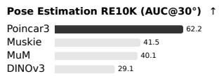

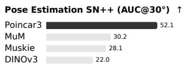

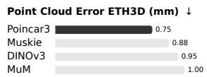

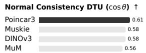

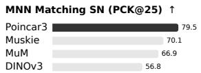

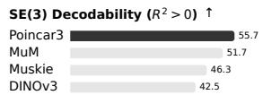  
Figure 1: Poincar3 main results. Poincar3 outperforms state-of-the-art SSL baselines across multiview geometric tasks, including pose estimation, point cloud estimation, and image matching.

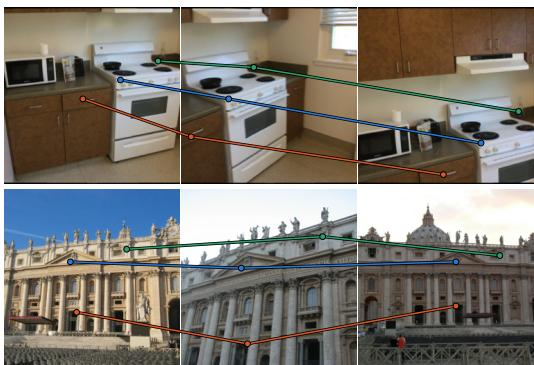

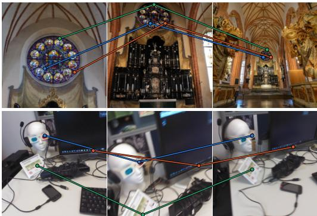  
Figure 2: Emerging matching capabilities without supervision. Given query keypoints, we visualize the tracks formed by selecting the patch with the highest attention activation. Despite receiving neither correspondence labels nor explicit attention supervision, the model learns to identify patch correspondences across images, suggesting the emergence of 3D-aware representations from SSL.

We address this question through self-distillation, which has proven effective for learning singleimage representations (Caron et al., 2021; Oquab et al., 2024; Simeoni et al., 2026). Self-distillation,´ however, is notoriously difficult to train, and introducing a multi-view transformer only exacerbates this difficulty. Yet, we show that a multi-view teacher–student objective can be trained entirely from scratch, without any 3D supervision.

We find that stable and effective multi-view self-distillation relies on three key ingredients: introducing an image-level distillation objective, providing the teacher with access to additional views of the scene, and retaining full images rather than using local and global crops. Together, these ingredients give rise to Poincar3,<sup>1</sup>a multi-view self-supervised model that learns strong representations directly from unlabeled image sequences mined from the internet. We illustrate its state-of-the-art empirical performance in Fig. 1, and show that multi-view geometry emerges without labels, as evidenced by zero-shot correspondences in Fig. 2.

Across a broad range of 3D tasks, such as relative pose estimation, point cloud estimation, and correspondence estimation, Poincar3 substantially improves over state-of-the-art single- and multiview SSL approaches, including DINOv3, MuM, and Muskie.

The main contributions are as follows:

(i) A new SSL objective based on multi-view self-distillation for learning visual representations from unlabeled image sequences, without RGB reconstruction or 3D supervision.

(ii) We show that the learned representations exhibit emergent multi-view geometric capabilities, including zero-shot multi-view correspondence estimation and lightweight SE(3) decodability via a Poincare adapter, despite receiving no correspondence or 3D supervision.´

(iii) An ablation study of the key components underlying our method.

## 2 RELATED WORK

Self-Supervised Learning (SSL). SSL aims to learn powerful representations from unlabeled data. In vision, early works used hand-crafted pretext tasks (Doersch et al., 2015; Zhang et al., 2016; Gidaris et al., 2018). Later work focused on clustering (Caron et al., 2018; Asano et al., 2020; Caron et al., 2020; 2021) and contrastive learning (van den Oord et al., 2018; Misra & van der Maaten, 2020; Chen et al., 2020; He et al., 2020). A major advance was the exponential moving average (EMA) teacher–student framework (Tarvainen & Valpola, 2017) which has since become the dominant SSL paradigm (Grill et al., 2020; He et al., 2020; Caron et al., 2021; Zhou et al.,

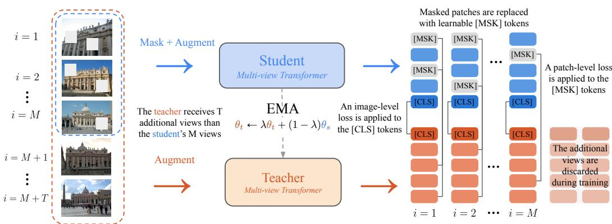  
Figure 3: Poincar3 learns visual features without labels via multi-view self-distillation. The teacher, an EMA of the student, processes a full image sequence, while the student processes a masked and photometrically augmented subset. After the multi-view transformer, student and teacher embeddings are aligned using an image-level loss on CLS tokens and a patch loss on masked tokens.

2022; Oquab et al., 2024; Darcet et al., 2025; Simeoni et al., 2026). The current state-of-the-art,´ DINOv3 (Simeoni et al., 2026), combines these advances with a masked image modeling objective´ based on iBOT (Zhou et al., 2022). Concurrently with iBOT, He et al. (2022) introduced another masked image modeling objective (MAE) that instead reconstructs RGB pixels. Although simple and effective for pretraining, MAE-style models produce frozen representations less suited for efficient linear extraction than DINO-style methods (Zhou et al., 2026).

SSL in 3D Vision. To learn representations for 3D downstream tasks, CroCo (Weinzaepfel et al., 2022; 2023) extended the MAE objective by conditioning the reconstruction on an unmasked reference view of the same scene, while Alligat0R (Loiseau et al., 2025) and Gekko (Loiseau et al., 2026) focused on covisibility segmentation. MuM (Nordstrom et al., 2026) and Muskie (Li et al.,¨ 2025) concurrently generalized CroCo to reconstruct an arbitrary number of views from the same scene using a multi-view transformer. An et al. (2025) showed that these models can perform zeroshot correspondence estimation. In this paper, we show that self-distillation substantially improves it. Other approaches include adapting existing foundation models to 3D (Segre et al., 2026), using RGB-D guidance (Almukhamedov et al., 2026), novel view synthesis (Jin et al., 2025; Jiang et al., 2025; Mitchel et al., 2026; Zhao et al., 2026; Lucas et al., 2026), and video models (Kong et al., 2024; Assran et al., 2025; Mur-Labadia et al., 2026; Wang et al., 2026c). An important downstream application is feed-forward reconstruction, where a multi-view transformer directly predicts scene geometry from images. Recent models include (Wang et al., 2024; Leroy et al., 2024; Wang et al., 2025; 2026d; Keetha et al., 2026; Lin et al., 2026; Wang et al., 2026b). VGGT-Ω (Wang et al., 2026b), the strongest feed-forward reconstruction model to date, showed that post-training with an SSL objective enabled training on internet-scale videos, improving generalization. However, this approach first requires supervised pretraining with 3D annotations. In a similar spirit, SelfEvo (Huang et al., 2026) showed that VGGT can improve itself by using an EMA copy as a teacher, providing the teacher with additional views, and aligning teacher and student predictions. In contrast, we introduce a teacher–student objective that learns entirely from scratch without 3D annotations. It produces representations that outperform previous SSL baselines and are competitive with those obtained from supervised 3D training for zero-shot multi-view correspondence estimation.

## 3 METHOD

In this section, we begin by introducing the notation (Sec. 3.1) and subsequently propose multi-view self-distillation (Sec. 3.2). Thereafter, we outline the architecture (Sec. 3.3) and training (Sec. 3.4) of Poincar3. We illustrate Poincar3 in Fig. 3 and propose a pseudo-code implementation in Algo. 1.

## Algorithm 1: Multi-view self-distillation pseudo-code.

```python
# fs, ft: student and teacher networks
# tps, tpt: student and teacher temperatures
# l: EMA momentum rate
# M, T: number of student and extra teacher views
ft.params = fs.params
for imgs in loader: # mini-batch of M+T frame seqs
sv = augment(imgs[:, :M])
tv = augment(imgs)
mask = sample_mask(sv) # patch mask [B, M, N]
P_s, G_s, G_raw = fs(sv, mask=mask)
with no_grad():
P_t, G_t, _ = ft(tv, mask=None)
# masked patch distillation (iBOT-style)
P_t = sknopp(P_t[:, :M][mask].detach(), tpt)
P_s = log_softmax(P_s[mask] / tps, dim=-1)
L_patch = -(P_t <sub>*</sub> P_s).sum(-1).mean()
# per-frame image objective (DINO-style)
G_t = sknopp(G_t[:, :M].detach(), tpt)
G_s = log_softmax(G_s / tps, dim=-1)
L_global = -(G_t <sub>*</sub> G_s).sum(-1).mean()
L_koleo = koleo(G_raw)
loss = L_patch + 0.5 L_global + 0.1 L_koleo
loss.backward()
update(fs) # AdamW
ft.params = l<sub>*</sub>ft.params + (1-l)<sub>*</sub>fs.params
```

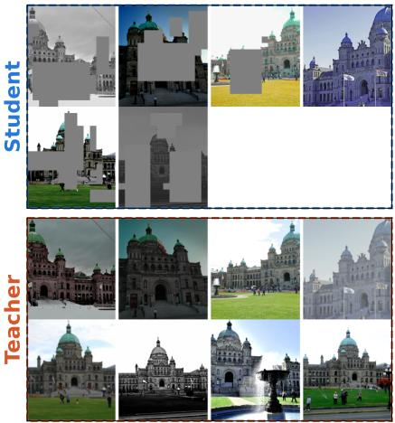  
Figure 4: Visualizing a training sequence. The student and teacher get the same sequence (here $M = 6 )$ while the teacher gets additional frames (here $T = 2 )$ , the student gets masked frames.

## 3.1 NOTATIONS

Let $\mathcal { T } = \left\{ \mathtt { I } _ { 1 } , \mathtt { I } _ { 2 } , \dots , \mathtt { I } _ { M } \right\}$ be a sequence of M images of the same scene. Our goal is to learn a set of dense patch features $\dot { \mathcal { Z } } = \{ { \sf Z } _ { 1 } , \ldots , { \sf Z } _ { M } \}$ , where $\mathbf { Z } _ { i } \in \mathbb { R } ^ { N \times C }$ contains a C-dimensional feature vector for each of the N patches in the ith image. These dense patch features should capture the underlying 3D structure of the scene, making them useful for downstream 3D vision tasks.

In practice, we parameterize our model by a backbone network $f _ { \theta }$ that maps an image sequence to a set of dense patch features together with a global image representation $\bar { \mathrm { H } } _ { i } \in \mathbb { R } ^ { C }$ for each image: $( \mathcal { Z } , \mathcal { H } ) = f _ { \theta } ( \bar { \mathcal { T } } )$ , where $\mathcal { H } = \{ \breve { \mathrm { H } } _ { 1 } , \dots , \mathrm { H } _ { M } \}$ is the global ([CLS]) representation for each image.

## 3.2 MULTI-VIEW SELF-DISTILLATION

Our goal is to obtain a multi-view self-supervised learning method that does not rely on RGB reconstruction. To do so, we adopt the teacher–student self-distillation framework. The student network is parameterized by $\theta _ { s }$ and the teacher by $\theta _ { t }$ . During training, the student learns to match the predictions of the teacher, while the teacher parameters are updated as an exponential moving average (EMA) of the student parameters $\theta _ { t }  \lambda \bar { \theta } _ { t } + ( 1 - \lambda ) \theta _ { s }$ , where $\lambda \in [ 0 , 1 )$ denotes the EMA decay.

The current state of the art for visual self-distillation is DINOv3 (Simeoni et al., 2026), built on´ the DINOv2 (Oquab et al., 2024) objective. The model operates on a single image by generating multiple augmented crops. The student processes masked global crops together with local crops, while the teacher observes only unmasked global crops. Both networks predict global and patchlevel representations, and the student is trained to match the teacher using cross-entropy losses on the global representation and masked patches. Sinkhorn-Knopp (Sinkhorn & Knopp, 1967) and KoLeo (Sablayrolles et al., 2019) regularization are applied to prevent representational collapse.

Although highly effective for single-image representation learning, we show in Sec. 4.4 that naively extending this objective to multi-view image sequences leads to worse performance than RGB reconstruction. We therefore next consider the design of a multi-view self-distillation objective.

We operate on image sequences from the same scene where a multi-view transformer propagates information between frames. The backbone outputs are passed through a projection head (MLP + softmax) to transform the representation into a high-dimensional vector, as done in DINO, producing patch predictions $\mathsf { P } _ { i } = g _ { p } ( \mathsf { Z } _ { i } )$ , and global predictions ${ \sf G } _ { i } = g _ { g } ( { \sf H } _ { i } )$ . For clarity, we denote the student outputs by $( \mathcal { P } ^ { s } , \mathcal { G } ^ { s } )$ and the teacher outputs by $( \mathcal { P } ^ { t } , \mathcal { G } ^ { t } )$

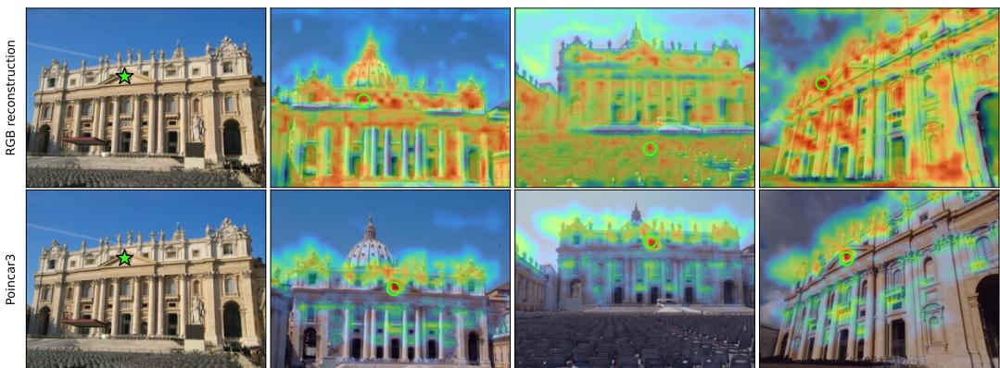  
Figure 5: Qualitative feature comparison. Given a query patch (green star), we visualize its feature correlations across frames and mark the maximum response (green circle). RGB reconstruction produces diffuse responses, whereas our method yields localized responses at corresponding patches.

Masked patch prediction. For every image $\mathbb { I } _ { i } ,$ , we randomly sample a binary patch mask $\mathbf { m } _ { i } \in \{ 0 , 1 \} ^ { N }$ , where $\mathbf { m } _ { i } ( u ) = 1$ indicates that patch u of $\mathtt { I } _ { i }$ is masked. We denote the corresponding set of masked patch indices by $\mathcal { M } _ { i }$ . The student receives the masked image $\tilde { \mathtt { I } } _ { i } = \left( 1 - \mathbf { m } _ { i } \right) \odot \mathtt { I } _ { i }$ where $\odot$ denotes masking at the patch level. The teacher always observes the full image.

Following iBOT (Zhou et al., 2022), the patch prediction loss is computed only over masked patches,

$$
\mathcal { L } _ { \mathrm { p a t c h } } = \frac { 1 } { \sum _ { i = 1 } ^ { M } \left| \mathcal { M } _ { i } \right| } \sum _ { i = 1 } ^ { M } \sum _ { u \in \mathcal { M } _ { i } } \mathrm { C E } \left( \mathcal { P } _ { i , u } ^ { t } , \mathcal { P } _ { i , u } ^ { s } \right) ,\tag{1}
$$

where $| \mathcal { M } _ { i } |$ denotes the number of masked patches, and $\begin{array} { r } { \mathrm { C E } ( { \bf p } , { \bf q } ) = - \sum _ { k } { \bf p } _ { k } } \end{array}$ log $\mathbf { q } _ { k }$ denotes the cross-entropy loss.

Image-level self-distillation. We additionally align the image-level representations using,

$$
\mathcal { L } _ { \mathrm { g l o b a l } } = \frac { 1 } { M } \sum _ { i = 1 } ^ { M } \mathrm { C E } \left( \mathcal { G } _ { i } ^ { t } , \mathcal { G } _ { i } ^ { s } \right) ,\tag{2}
$$

which we find essential for guiding self-distillation towards a 3D-aware representation.

Teacher with additional views. We further propose that the teacher observe more of the scene than the student. If the student processes M views, the teacher also receives $T$ extra frames from the same scene. These additional frames are excluded from all loss computations and only provide extra geometric context through the multi-view attention mechanism. During training, we sample T uniformly between 0 and 12. We illustrate an example sequence in Fig. 4.

Regularization and final objective. We apply Sinkhorn-Knopp and KoLeo regularization to prevent representational collapse. Our final training objective is,

$$
\mathcal { L } = \mathcal { L } _ { \mathrm { p a t c h } } + \alpha \mathcal { L } _ { \mathrm { g l o b a l } } + \beta \mathcal { L } _ { \mathrm { K o L e o } } ,\tag{3}
$$

where $\alpha = 0 . 5$ and $\beta = 0 . 1$ in all experiments.

## 3.3 NETWORK ARCHITECTURE

We parameterize $f _ { \theta }$ as a multi-view transformer inspired by VGGT-Ω (Wang et al., 2026b). The network consists of a ViT-L (Dosovitskiy et al., 2021) image encoder followed by a multi-view transformer decoder. The decoder propagates information across views using alternating framewise and global attention. Rotary positional embeddings (RoPE) (Su et al., 2023) are applied only within the frame-wise attention layers, while register attention (Wang et al., 2026b) is employed in a subset of the decoder blocks to enable efficient scaling to long sequences. Unless otherwise stated, the decoder comprises $L = 1 2$ alternating-attention layers with hidden dimension $C = 1 0 2 4$ . In total, our model comprises around 650M trainable parameters.

## 3.4 TRAINING

Implementation Details. We pre-train Poincar3 for 400k steps using the AdamW (Loshchilov & Hutter, 2019) optimizer. Following VGGT and MuM, the input sequence length is sampled uniformly between 2 and 24 views while images are resized to ${ \bar { 2 } } 5 6 \times { \bar { 2 } } 5 6$ . Given the sampled sequence length, we include as many training scenes as possible without exceeding a budget of 64 images per GPU. We use constant optimization hyper-parameters with learning rate $\overline { { 2 } } \times 1 0 ^ { - \overline { { 4 } } }$ , weight decay 0.04, and EMA decay $\lambda = 0 . { \overset { - } { . } } 9 9 9$ . Training on 8 H200 GPUs takes three days. Further details on hyper-parameters are provided in Sec. D.1 in the Appendix.

Downstream performance improves steadily throughout training (see Figs. 6 and 15), while our features become increasingly consistent across views compared to RGB reconstruction (see Fig. 5). Interestingly, unlike DINOv3, we do not experience dense feature degradation during long training runs, which has been a topic of discussion lately (Dai et al., 2025; Simeoni et al., 2026).´

Training Data. Our method is fully self-supervised and requires only unlabeled image sequences. We train on large-scale collections of internet videos such as SpatialVID (Wang et al., 2026a) and RealEstate10K (Zhou et al., 2018) and popular 3D annotated datasets such as MegaDepth (Li & Snavely, 2018) and ScanNet++ (Yeshwanth et al., 2023). For the former, sequences are constructed via temporal random sampling, whereas for the latter, frames are randomly sampled from the same scene to form a sequence. In Sec. 4.4, we show the strength of being able to train on data lacking 3D annotations. The full data distribution is provided in Tab. 7 in the Appendix.

## 4 RESULTS

In this section, we compare Poincar3’s visual features to those of state-of-the-art SSL models on a wide range of 3D vision tasks. We begin by evaluating feed-forward reconstruction (Sec. 4.1), both through finetuning and using frozen features. Thereafter, we consider the ability to extract accurate correspondences from multiple views zero-shot (Sec. 4.2) and decoding camera motion through a lightweight adapter (Sec. 4.3). Finally, we conduct extensive ablations that distinguish the contributions of each part of our design (Sec. 4.4). In the Appendix, we discuss our choice of baselines in Sec. B, additional experiments in Sec. C, and details on the evaluation in Sec. E.

## 4.1 FEED-FORWARD 3D RECONSTRUCTION

We begin by considering feed-forward reconstruction (Wang et al., 2024; 2025), where a multi-view transformer directly predicts scene geometry from a sequence of images. We consider three evaluation settings of increasing computational complexity (i) train only the pose and depth head, (ii) train a transformer, and (iii) finetune the full model with new heads. We train on a large collection of labeled 3D datasets using 4 H200 GPUs for each experiment and report the results in Tab. 1 together with training curves in Fig. 7. Poincar3 shows substantially improved performance, especially on camera pose estimation, compared to all existing models. Furthermore, initializing from the Poincar3 weights allows for rapid finetuning, achieving an AUC@30<sup>◦</sup> of 65.0%+ on RE10K after only 10K steps with a low learning rate. Further details can be found in Sec. E in the Appendix.

## 4.2 MULTI-VIEW CORRESPONDENCE ESTIMATION

We study the 3D geometric consistency of features by zero-shot multi-view correspondence estimation. Correspondence estimation is at the heart of multiple-view geometry (Hartley & Zisserman, 2004) and has been shown to be closely linked to understanding 3D (El Banani et al., 2024; Stary´ et al., 2025; Chen et al., 2026). Concretely, we follow the evaluation protocol of El Banani et al. (2024) and sample sequences of 8 images where a set of patches are queried and tracks are produced by either nearest-neighbor matching in feature space or by using the maximum patch activation of the attention map. As shown in Fig. 14 (Appendix), the performance of baselines can vary substantially per layer, although Poincar3 consistently outperforms at each depth. For fair comparison, we sweep the layers and report the best performing one in Tab. 2. Aside from the quantitative evaluation, in Fig. 8 we qualitatively compare the predicted tracks with the ground-truth. We find that Poincar3 is substantially more accurate than other SSL methods and feed-forward reconstruction models trained with 3D annotations. The attention map is an even more powerful correspondence estimator, achieving a top-accuracy of 94.9. We also outperform all other methods on two-view correspondence estimation using a linear probe (Tab. 5, Appendix).

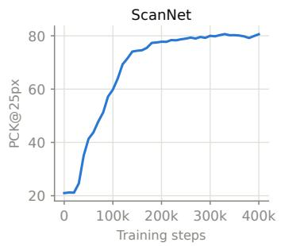

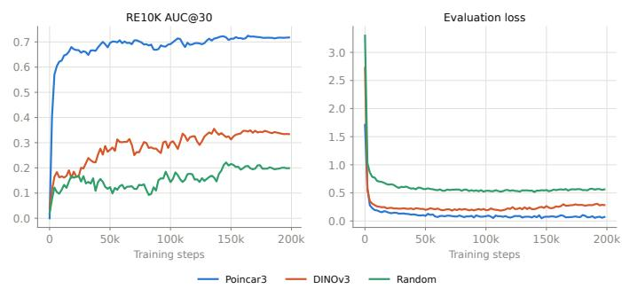  
Figure 6: Training dynamics. Multi-view correspondence esti mation attention performance.  
Figure 7: Initialization for feed-forward reconstruction. Comparing training from scratch (green), initializing the encoder from DINOv3 (red), and finetuning Poincar3 (blue).

Table 1: Feed-forward reconstruction. Reporting relative pose accuracy by AUC over 10 random frames and point cloud accuracy by median accuracy (acc.) in mm and normal consistency (NC) by the cosine of the angle between the normals. Training with 4 H200 GPUs for 3 days each.
<table><tr><td></td><td colspan="6">Multi-View Relative Pose</td><td colspan="4">Point Cloud Estimation</td></tr><tr><td>Method</td><td colspan="2">RE10K</td><td colspan="2">ScanNet++</td><td colspan="2">MegaDepth</td><td colspan="2">ETH3D</td><td colspan="2">DTU</td></tr><tr><td>Metric →</td><td> $@ 3 ^ { \circ }$ </td><td>@30°</td><td>@3°</td><td> $@ 3 0 ^ { \circ }$ </td><td>@3°</td><td> $@ 3 0 ^ { \circ }$ </td><td>Acc.</td><td>NC</td><td>Acc.</td><td>NC</td></tr><tr><td colspan="9">Train only heads on top of the frozen backbone</td><td></td></tr><tr><td>DINOv3</td><td>0.0</td><td>18.9</td><td>0.0</td><td>9.4</td><td>1.5</td><td>55.5</td><td>1.18</td><td>0.59</td><td>10.76</td><td>0.54</td></tr><tr><td>Muskie</td><td>1.1</td><td>36.3</td><td>0.0</td><td>19.0</td><td>0.1</td><td>46.9</td><td>1.12</td><td>0.60</td><td>11.43</td><td>0.55</td></tr><tr><td>MuM</td><td>0.0</td><td>29.8</td><td>0.0</td><td>18.7</td><td>0.1</td><td>48.5</td><td>1.12</td><td>0.60</td><td>12.60</td><td>0.54</td></tr><tr><td>Poincar3</td><td>2.4</td><td>51.9</td><td>0.1</td><td>48.7</td><td>3.7</td><td>67.5</td><td>0.82</td><td>0.65</td><td>10.60</td><td>0.59</td></tr><tr><td colspan="9">Train a transformer on top of the frozen backbone</td><td></td><td></td></tr><tr><td>DINOv3</td><td>1.0</td><td>29.1</td><td>0.0</td><td>22.0</td><td>1.7</td><td>65.6</td><td>0.95</td><td>0.66</td><td>10.63</td><td>0.58</td></tr><tr><td>Muskie</td><td>1.8</td><td>41.5</td><td>0.0</td><td>28.1</td><td>1.7</td><td>58.9</td><td>0.88</td><td>0.67</td><td>11.95</td><td>0.58</td></tr><tr><td>MuM</td><td>1.4</td><td>40.1</td><td>0.0</td><td>30.2</td><td>1.9</td><td>60.8</td><td>1.00</td><td>0.60</td><td>12.26</td><td>0.56</td></tr><tr><td>Poincar3</td><td>5.2</td><td>62.2</td><td>1.3</td><td>52.1</td><td>5.2</td><td>69.5</td><td>0.75</td><td>0.68</td><td>10.52</td><td>0.61</td></tr><tr><td colspan="9">Finetune the backbone¹</td><td></td><td></td></tr><tr><td>Random init.</td><td>0.0</td><td>17.4</td><td>0.0</td><td>11.3</td><td>0.0</td><td>35.9</td><td>1.24</td><td>0.60</td><td>12.34</td><td>0.56</td></tr><tr><td>DINOv3 init.</td><td>1.3</td><td>31.2</td><td>0.0</td><td>30.9</td><td>6.9</td><td>73.8</td><td>0.98</td><td>0.68</td><td>10.87</td><td>0.59</td></tr><tr><td>Poincar3</td><td>8.3</td><td>68.2</td><td>4.5</td><td>67.0</td><td>7.4</td><td>74.6</td><td>0.81</td><td>0.80</td><td>6.73</td><td>0.63</td></tr></table>

<sup>1</sup>MuM and Muskie are excluded because their architectures differ substantially, making direct finetuning comparisons less meaningful.

## 4.3 EMERGENT SE(3) STRUCTURE

Next, we follow Chen et al. $( 2 0 2 6 ) ^ { 2 }$ and evaluate whether the features capture the geometry of $\mathrm { S E } ( 3 )$ Consider a static scene observed at poses $P _ { t } \in \mathrm { S E } ( 3 )$ , and let $\mathcal { H } _ { t } = f _ { \boldsymbol { \theta } } \mathbf { \bar { ( } } \mathcal { T } _ { t } ) \in \mathbb { R } ^ { \zeta }$ denote a model’s feature for frame $\mathcal { T } _ { t }$ . The motion between frames t and t+s is the se(3) twist

$$
\begin{array} { r } { \Delta P _ { t , s } = \left( \mathrm { L o g } ( P _ { t } ^ { - 1 } P _ { t + s } ) \right) ^ { \vee } \in \mathbb { R } ^ { 6 } , } \end{array}\tag{4}
$$

stacking three rotational and three translational velocities. We study if $\Delta P$ is a function of the corresponding feature displacement by fitting a trainable adapter $\varphi _ { \phi }$ (an MLP) in a Siamese manner:

$$
\Delta P _ { t , s } \approx { W } \big ( \varphi _ { \phi } ( \mathcal { H } _ { t + s } ) - \varphi _ { \phi } ( \mathcal { H } _ { t } ) \big )\tag{5}
$$

The network $\varphi _ { \phi }$ is called a Poincare adapter ´ as it aims to unroll the non-linear feature space to a homogeneous coordinate system, making changes in pose linear, revealing the SE(3) geometry.

Table 2: Multi-view correspondence estimation. Zero-shot patch tracking across 8 views. While Poincar3 has strong representations at all layers, we compare to the best layer for fair comparison.
<table><tr><td>Method</td><td colspan="4">ScanNet (Dai et al., 2017)</td><td colspan="4">NAVI (Jampani et al., 2023)</td></tr><tr><td>PCK@ →</td><td>5px</td><td>10px</td><td> $2 5 \mathrm { p x }$ </td><td>50px</td><td> $5 \mathrm { p x }$ </td><td>10px</td><td>25px</td><td>50px</td></tr><tr><td colspan="9">Feature Nearest-Neighbor Matching</td></tr><tr><td colspan="9">Feed-Forward Reconstruction</td></tr><tr><td>VGGT-Ω</td><td>24.5</td><td>32.8</td><td>52.9</td><td>69.0</td><td>16.8</td><td>25.9</td><td>51.6</td><td>70.9</td></tr><tr><td>DA3</td><td>21.5</td><td>22.9</td><td>28.2</td><td>35.2</td><td>14.6</td><td>18.6</td><td>30.5</td><td>46.9</td></tr><tr><td> $\pi ^ { 3 }$ </td><td>26.7</td><td>38.6</td><td>61.3</td><td>75.6</td><td>18.2</td><td>30.3</td><td>60.2</td><td>78.8</td></tr><tr><td colspan="9">Self-Supervised Models</td></tr><tr><td>DINOv3</td><td>24.7</td><td>33.9</td><td>56.8</td><td>72.2</td><td>17.6</td><td>28.7</td><td>59.6</td><td>78.7</td></tr><tr><td>Muskie</td><td>27.7</td><td>42.4</td><td>70.1</td><td>83.1</td><td>18.7</td><td>32.7</td><td>64.7</td><td>80.5</td></tr><tr><td>MuM</td><td>27.0</td><td>40.5</td><td>66.9</td><td>79.9</td><td>17.9</td><td>30.2</td><td>60.2</td><td>74.9</td></tr><tr><td>Poincar3</td><td>27.9</td><td>46.2</td><td>79.5</td><td>89.6</td><td>19.2</td><td>33.7</td><td>68.7</td><td>84.2</td></tr><tr><td colspan="9">Attention Matching</td></tr><tr><td colspan="9">Feed-Forward Reconstruction</td></tr><tr><td>VGGT-Ω</td><td>24.3</td><td>32.9</td><td>54.2</td><td>68.9</td><td>16.3</td><td>23.9</td><td>46.8</td><td>63.7</td></tr><tr><td>DA3</td><td>21.4</td><td>23.2</td><td>28.2</td><td>34.0</td><td>14.8</td><td>19.1</td><td>31.6</td><td>46.7</td></tr><tr><td> $\pi ^ { 3 }$ </td><td>27.0</td><td>40.7</td><td>68.7</td><td>83.8</td><td>18.3</td><td>30.4</td><td>62.2</td><td>82.0</td></tr><tr><td colspan="9">Self-Supervised Models</td></tr><tr><td>Muskie</td><td>24.6</td><td>34.7</td><td>62.9</td><td>81.5</td><td>15.5</td><td>22.3</td><td>46.2</td><td>67.9</td></tr><tr><td>MuM</td><td>25.6</td><td>37.2</td><td>64.7</td><td>77.2</td><td>17.4</td><td>28.5</td><td>56.6</td><td>68.7</td></tr><tr><td>Poincar3</td><td>27.0</td><td>43.9</td><td>83.7</td><td>94.9</td><td>19.3</td><td>34.7</td><td>74.5</td><td>86.5</td></tr></table>

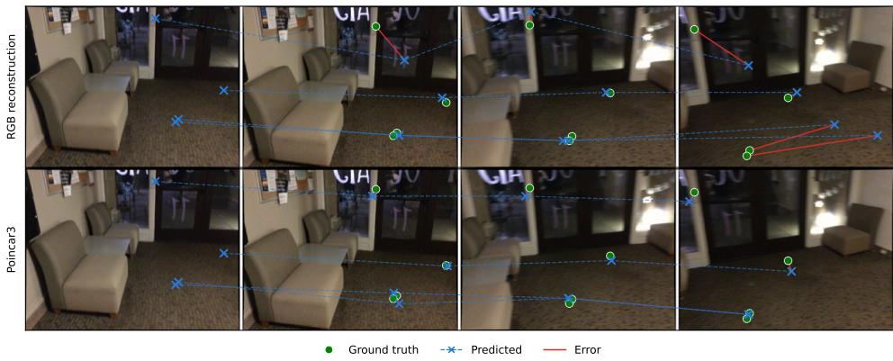  
Figure 8: Multi-view correspondence tracks. We visualize the predicted tracks (blue), the groundtruth (green), and the error (red). Poincar3 gives accurate zero-shot multi-view geometry.

We fit one such adapter per scene on 20 held-out ScanNet++ (Yeshwanth et al., 2023) scenes and report $R ^ { 2 }$ on the held-out pairs from each scene in Tab. 3. We qualitatively illustrate the results in Fig. 11. In the spirit of Poincare’s observation that spatial structure emerges through distinguish-´ ing changes of position from changes of state (Poincare, 1905), the motion-informed features are´ consistently better than those obtained from one view, with Poincar3 achieving the strongest results.

## 4.4 ABLATION STUDIES

Supervision. In Tab. 4, we compare different supervision objectives. For fair comparison, we keep the architecture fixed throughout and fix the compute budget to 4×H200 for a day. We establish two baselines: I) multi-view RGB reconstruction and II) single-view DINOv2. Building on the DINOv2 objective, we extend it to multiple views (III), remove the local crops (IV), add a global objective (V), feed the teacher additional views (VI), and scale the compute and model size (VII).

Table 3: Poincare adapter.´ We evaluate the frozen features using a lightweight camera motion adapter on 20 held-out scenes from ScanNet++. Inclusion of multi-view information is denoted by ✓.
<table><tr><td>Method</td><td>MV</td><td>Avg.  $R ^ { 2 }$ </td><td> ${ R } ^ { 2 } > 0$ </td><td> $R ^ { 2 } > 0 . 3$ </td></tr><tr><td>DINOv3</td><td>x</td><td>0.046±0.003</td><td>42.5±1.9</td><td>0.9±0.6</td></tr><tr><td>Muskie</td><td>x</td><td>0.042±0.003</td><td>39.7±2.2</td><td>0.4±0.2</td></tr><tr><td>Muskie</td><td>√</td><td>0.061±0.003</td><td>46.3±1.7</td><td>3.6±1.0</td></tr><tr><td>MuM</td><td>x</td><td>0.059±0.002</td><td>43.1±1.8</td><td>4.5±0.6</td></tr><tr><td>MuM</td><td>√</td><td>0.081±0.002</td><td>51.7±1.8</td><td>6.5±0.8</td></tr><tr><td>Poincar3</td><td>x</td><td>0.053±0.003</td><td>42.4±2.3</td><td>2.0±0.7</td></tr><tr><td>Poincar3</td><td>√</td><td>0.098±0.002</td><td> $5 5 . 7 \pm 1 . 7$ </td><td>7.1±0.7</td></tr></table>

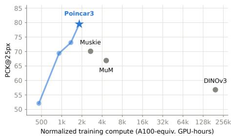  
Figure 9: Multi-view correspondence estimation accuracy versus training compute. Poincar3 ties DINOv3’s performance after just one day on 8×H200s.

Table 4: Supervision ablation. Multi-view correspondence estimation accuracy (PCK@25).
<table><tr><td>Method</td><td colspan="2">Multi-view Matching</td></tr><tr><td>Dataset →</td><td>ScanNet</td><td>NAVI</td></tr><tr><td colspan="3">Same compute, data, and architecture</td></tr><tr><td>I: RGB reconstruction (MuM obj.)</td><td>54.5</td><td>46.3</td></tr><tr><td>II: Baseline (DINOv2 obj.)</td><td>47.2</td><td>35.7</td></tr><tr><td>III: Multi-view DINOv2</td><td>49.7</td><td>35.9</td></tr><tr><td>IV: Multi-view iBOT</td><td>55.7</td><td>46.4</td></tr><tr><td>V: +Image-level objective</td><td>66.7</td><td>58.1</td></tr><tr><td>VI: +Teacher seeing more views</td><td>70.2</td><td>61.5</td></tr><tr><td>VII: +Increase scale (Poincar3)</td><td>83.7</td><td>74.5</td></tr></table>

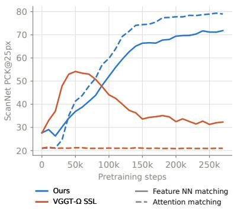  
Figure 10: VGGT-Ω SSL comp.

Our objective (V) is clearly superior to the RGB reconstruction used in MuM and Muskie (I). Finally, in Fig. 10 we find the MSE loss from VGGT-Ω (SSL) does not work from scratch as self-supervision.

Data. Our setup enables us to leverage internet-scale data inaccessible to 3D reconstruction models requiring 3D labels. To quantify its benefit, we compare multi-view correspondence accuracy from attention maps when training on only 3D-labeled data versus all available data. Incorporating the additional data substantially improves multi-view geometry understanding, increasing PCK@50 from 87.5 to 94.9 on ScanNet and from 78.5 to 86.5 on NAVI.

## 5 LIMITATIONS

Our approach prioritizes geometric over semantic performance (see Tab. 6, Appendix). This is consistent with evidence that semantic and spatial information are processed by different neural systems in the human brain (Binder et al., 2009; Epstein et al., 2017). Furthermore, we do not have the computational resources to match the size of DINOv3 (we use around 100x less compute). Yet, we significantly outperform previous approaches (see Fig. 9).

We find that the representations degrade when hyper-parameters such as the EMA coefficient and weight decay deviate from those of DINOv3. We also find it crucial to follow prior work when adapting the learning rate to batch size (Goyal et al., 2018). This fragility has plagued self-distillation since its inception (Grill et al., 2020; Caron et al., 2021) and mitigating it constitutes interesting future work. Finally, while our training is self-supervised, frame selection within video sequences is currently handcrafted. Automating this selection is an interesting direction for future work.

## 6 CONCLUSIONS

We introduced Poincar3, a multi-view foundation model trained from scratch in a self-supervised manner. To remove the RGB reconstruction supervision used in MuM and Muskie, which entangles geometry with appearance, we proposed a DINO-like self-distillation objective. Self-distillation is notoriously challenging to train, and introducing a multi-view transformer further exacerbates this difficulty. We show that a multi-view teacher–student objective can nevertheless be trained from scratch, without supervision, by feeding the teacher additional frames, using a global stabilizing objective, and retaining full images rather than relying on local and global crops. Poincar3 improves substantially over MuM and Muskie on 3D vision tasks and achieves higher performance than DI-NOv3 using 100× less compute. These results show that multi-view self-distillation can learn strong 3D representations from scratch without explicit 3D supervision or pixel reconstruction.

## ACKNOWLEDGEMENTS

This work was supported by the Wallenberg Artificial Intelligence, Autonomous Systems and Software Program (WASP), funded by the Knut and Alice Wallenberg Foundation, and by the strategic research environment ELLIIT, funded by the Swedish government. The computational resources were provided by the National Academic Infrastructure for Supercomputing in Sweden (NAISS) at C3SE, partially funded by the Swedish Research Council through grant agreement no. 2022-06725, and by the Berzelius resource, provided by the Knut and Alice Wallenberg Foundation at the National Supercomputer Centre.

This work benefited from Hi! PARIS and State funding managed by the French National Research Agency (ANR) under the France 2030 program, reference ANR-23-IACL-0005.

This work was supported by the Bosch Research Foundation (Bosch Forschungsstiftung) and by the European Union (ERC Advanced Grant Explorer, Funding ID #101097259).

## REFERENCES

Farkhat Almukhamedov, Sami Azirar, and Hermann Blum. Dinocular: Self-supervised visuospatial representations, 2026. URL https://arxiv.org/abs/2608.27226.

Honggyu An, Jin Hyeon Kim, Seonghoon Park, Jaewoo Jung, Jisang Han, Sunghwan Hong, and Seungryong Kim. Cross-view completion models are zero-shot correspondence estimators. In CVPR, 2025.

Eduardo Arnold, Jamie Wynn, Sara Vicente, Guillermo Garcia-Hernando, Aron Monszpart, Victor Prisacariu, Daniyar Turmukhambetov, and Eric Brachmann. Map-free visual relocalization: Metric pose relative to a single image. In ECCV, 2022.

Yuki M. Asano, Christian Rupprecht, and Andrea Vedaldi. Self-labelling via simultaneous clustering and representation learning. In ICLR, 2020.

Mahmoud Assran, Adrien Bardes, David Fan, Quentin Garrido, Russell Howes, Mojtaba Komeili, Matthew Muckley, Ammar Rizvi, Claire Roberts, Koustuv Sinha, Artem Zholus, Sergio Arnaud, Abha Gejji, Ada Martin, Francois Robert Hogan, Daniel Dugas, Piotr Bojanowski, Vasil Khalidov, Patrick Labatut, Francisco Massa, Marc Szafraniec, Kapil Krishnakumar, Yong Li, Xiaodong Ma, Sarath Chandar, Franziska Meier, Yann LeCun, Michael Rabbat, and Nicolas Ballas. V-jepa 2: Self-supervised video models enable understanding, prediction and planning. arXiv preprint arXiv:2506.09985, 2025.

Adrien Bardes, Jean Ponce, and Yann LeCun. Vicreg: Variance-invariance-covariance regularization for self-supervised learning. In ICLR, 2022.

Gilad Baruch, Zhuoyuan Chen, Afshin Dehghan, Tal Dimry, Yuri Feigin, Peter Fu, Thomas Gebauer, Brandon Joffe, Daniel Kurz, Arik Schwartz, and Elad Shulman. ARKitscenes - a diverse realworld dataset for 3d indoor scene understanding using mobile RGB-d data. In NeurIPS, 2021.

Jeffrey R. Binder, Rutvik H. Desai, William W. Graves, and Lisa L. Conant. Where is the semantic system? a critical review and meta-analysis of 120 functional neuroimaging studies. Cerebral Cortex, 19(12):2767–2796, December 2009. doi: 10.1093/cercor/bhp055.

Yohann Cabon, Naila Murray, and Martin Humenberger. Virtual kitti 2, 2020. URL https: //arxiv.org/abs/2001.10773.

Mathilde Caron, Piotr Bojanowski, Armand Joulin, and Matthijs Douze. Deep clustering for unsupervised learning of visual features. In ECCV, 2018.

Mathilde Caron, Ishan Misra, Julien Mairal, Priya Goyal, Piotr Bojanowski, and Armand Joulin. Unsupervised learning of visual features by contrasting cluster assignments. In NeurIPS, 2020.

Mathilde Caron, Hugo Touvron, Ishan Misra, Herve J´ egou, Julien Mairal, Piotr Bojanowski, and´ Armand Joulin. Emerging properties in self-supervised vision transformers. In ICCV, 2021.

Caroline Chen, Sayna Ebrahimi, Fedor Kitashov, Ming-Hsuan Yang, Leonidas Guibas, Viorica Patr˘ aucean, and Maks Ovsjanikov. Seese3: Emergence of 3d space in vision features, 2026.˘ URL https://arxiv.org/abs/2607.14228.

Ting Chen, Simon Kornblith, Mohammad Norouzi, and Geoffrey Hinton. A simple framework for contrastive learning of visual representations. In ICML, 2020.

Angela Dai, Angel X Chang, Manolis Savva, Maciej Halber, Thomas Funkhouser, and Matthias Nießner. Scannet: Richly-annotated 3d reconstructions of indoor scenes. In CVPR, 2017.

Siran Dai, Qianqian Xu, Peisong Wen, Yang Liu, and Qingming Huang. Exploring structural degradation in dense representations for self-supervised learning. In NeurIPS, 2025.

Timothee Darcet, Federico Baldassarre, Maxime Oquab, Julien Mairal, and Piotr Bojanowski. Clus-´ ter and predict latent patches for improved masked image modeling, 2025. URL https: //arxiv.org/abs/2502.08769.

Jia Deng, Wei Dong, Richard Socher, Li-Jia Li, Kai Li, and Li Fei-Fei. Imagenet: A large-scale hierarchical image database. In CVPR, 2009.

Carl Doersch, Abhinav Gupta, and Alexei A. Efros. Unsupervised visual representation learning by context prediction. In ICCV, 2015.

Alexey Dosovitskiy, Lucas Beyer, Alexander Kolesnikov, Dirk Weissenborn, Xiaohua Zhai, Thomas Unterthiner, Mostafa Dehghani, Matthias Minderer, Georg Heigold, Sylvain Gelly, Jakob Uszkoreit, and Neil Houlsby. An image is worth 16x16 words: Transformers for image recognition at scale. In ICLR, 2021.

Johan Edstedt, Qiyu Sun, Georg Bokman, M¨ arten Wadenb˚ ack, and Michael Felsberg. RoMa: Robust¨ dense feature matching. In CVPR, 2024.

Mohamed El Banani, Amit Raj, Kevis-Kokitsi Maninis, Abhishek Kar, Yuanzhen Li, Michael Rubinstein, Deqing Sun, Leonidas Guibas, Justin Johnson, and Varun Jampani. Probing the 3d awareness of visual foundation models. In CVPR, 2024.

Russell A. Epstein, Eva Zita Patai, Joshua B. Julian, and Hugo J. Spiers. The cognitive map in humans: spatial navigation and beyond. Nature Neuroscience, 20:1504–1513, November 2017. doi: 10.1038/nn.4656.

Adrien Gaidon, Qiao Wang, Yohann Cabon, and Eleonora Vig. Virtual worlds as proxy for multi object tracking analysis. In CVPR, 2016.

Spyros Gidaris, Praveer Singh, and Nikos Komodakis. Unsupervised representation learning by predicting image rotations. In ICLR, 2018.

Priya Goyal, Piotr Dollar, Ross Girshick, Pieter Noordhuis, Lukasz Wesolowski, Aapo Kyrola, An-´ drew Tulloch, Yangqing Jia, and Kaiming He. Accurate, large minibatch sgd: Training imagenet in 1 hour, 2018. URL https://arxiv.org/abs/1706.02677.

Jean-Bastien Grill, Florian Strub, Florent Altche, Corentin Tallec, Pierre Richemond, Elena´ Buchatskaya, Carl Doersch, Bernardo Avila Pires, Zhaohan Guo, Mohammad Gheshlaghi Azar, et al. Bootstrap your own latent-a new approach to self-supervised learning. In NeurIPS, 2020.

Richard Hartley and Andrew Zisserman. Multiple View Geometry in Computer Vision. Cambridge University Press, 2 edition, 2004.

Kaiming He, Haoqi Fan, Yuxin Wu, Saining Xie, and Ross Girshick. Momentum contrast for unsupervised visual representation learning. In CVPR, 2020.

Kaiming He, Xinlei Chen, Saining Xie, Yanghao Li, Piotr Dollar, and Ross Girshick. Masked´ autoencoders are scalable vision learners. In CVPR, 2022.

Nan Huang, Pengcheng Yu, Weijia Zeng, James M. Rehg, Angjoo Kanazawa, Haiwen Feng, and Qianqian Wang. Self-improving 4d perception via self-distillation, 2026. URL https: //arxiv.org/abs/2604.08532.

Varun Jampani, Kevis-Kokitsi Maninis, Andreas Engelhardt, Arjun Karpur, Karen Truong, Kyle Sargent, Stefan Popov, Andre Araujo, Ricardo Martin-Brualla, Kaushal Patel, Daniel Vlasic, Vittorio Ferrari, Ameesh Makadia, Ce Liu, Yuanzhen Li, and Howard Zhou. Navi: Category-agnostic image collections with high-quality 3d shape and pose annotations. In NeurIPS, 2023.

Hanwen Jiang, Hao Tan, Peng Wang, Haian Jin, Yue Zhao, Sai Bi, Kai Zhang, Fujun Luan, Kalyan Sunkavalli, Qixing Huang, et al. Rayzer: A self-supervised large view synthesis model. In ICCV, 2025.

Haian Jin, Hanwen Jiang, Hao Tan, Kai Zhang, Sai Bi, Tianyuan Zhang, Fujun Luan, Noah Snavely, and Zexiang Xu. Lvsm: A large view synthesis model with minimal 3d inductive bias. In ICLR, 2025.

Nikhil Keetha, Norman Muller, Johannes Sch¨ onberger, Lorenzo Porzi, Yuchen Zhang, Tobias Fis-¨ cher, Arno Knapitsch, Duncan Zauss, Ethan Weber, Nelson Antunes, Jonathon Luiten, Manuel Lopez-Antequera, Samuel Rota Bulo, Christian Richardt, Deva Ramanan, Sebastian Scherer, and\` Peter Kontschieder. MapAnything: Universal feed-forward metric 3D reconstruction. In 3DV, 2026.

Weijie Kong, Qi Tian, Zijian Zhang, Rox Min, Zuozhuo Dai, Jin Zhou, Jiangfeng Xiong, Xin Li, Bo Wu, Jianwei Zhang, Kathrina Wu, Qin Lin, Junkun Yuan, Yanxin Long, Aladdin Wang, Andong Wang, Changlin Li, Duojun Huang, Fang Yang, Hao Tan, Hongmei Wang, Jacob Song, Jiawang Bai, Jianbing Wu, Jinbao Xue, Joey Wang, Kai Wang, Mengyang Liu, Pengyu Li, Shuai Li, Weiyan Wang, Wenqing Yu, Xinchi Deng, Yang Li, Yi Chen, Yutao Cui, Yuanbo Peng, Zhentao Yu, Zhiyu He, Zhiyong Xu, Zixiang Zhou, Zunnan Xu, Yangyu Tao, Qinglin Lu, Songtao Liu, Dax Zhou, Hongfa Wang, Yong Yang, Di Wang, Yuhong Liu, Jie Jiang, and Caesar Zhong. Hunyuanvideo: A systematic framework for large video generative models, 2024. URL https://arxiv.org/abs/2412.03603.

Alex Krizhevsky, Ilya Sutskever, and Geoffrey E Hinton. Imagenet classification with deep convolutional neural networks. In NeurIPS, 2012.

Vincent Leroy, Yohann Cabon, and Jer´ ome Revaud. Grounding image matching in 3d with mast3r.ˆ In ECCV, 2024.

Wenyu Li, Sidun Liu, Peng Qiao, Yong Dou, and Tongrui Hu. Muskie: Multi-view masked image modeling for 3d vision pre-training, 2025. URL https://arxiv.org/abs/2511.18115.

Zhengqi Li and Noah Snavely. Megadepth: Learning single-view depth prediction from internet photos. In CVPR, 2018.

Haotong Lin, Sili Chen, Jun Hao Liew, Donny Y. Chen, Zhenyu Li, Guang Shi, Jiashi Feng, and Bingyi Kang. Depth anything 3: Recovering the visual space from any views. In ICLR, 2026.

Lu Ling, Yichen Sheng, Zhi Tu, Wentian Zhao, Cheng Xin, Kun Wan, Lantao Yu, Qianyu Guo, Zixun Yu, Yawen Lu, et al. Dl3dv-10k: A large-scale scene dataset for deep learning-based 3d vision. In CVPR, 2024.

Thibaut Loiseau, Guillaume Bourmaud, and Vincent Lepetit. Alligat0r: Pre-training through covisibility segmentation for relative camera pose regression. In NeurIPS, 2025.

Thibaut Loiseau, Vincent Lepetit, and Guillaume Bourmaud. Revisiting cross-view completion: Self-supervised pre-training via reconstruction error comparison. In NeurIPS, 2026.

Ilya Loshchilov and Frank Hutter. Decoupled weight decay regularization. In ICLR, 2019.

Thomas Lucas, Maxime Pietrantoni, Philippe Weinzaepfel, Wonjune Cho, Bardienus Pieter Duisterhof, Vincent Leroy, and Jerome Revaud. Sparse auto-regressive modeling for scene generation from multi-view images. In ECCV, 2026.

Nikolaus Mayer, Eddy Ilg, Philip Hausser, Philipp Fischer, Daniel Cremers, Alexey Dosovitskiy, and Thomas Brox. A large dataset to train convolutional networks for disparity, optical flow, and scene flow estimation. In CVPR, 2016.

Ishan Misra and Laurens van der Maaten. Self-supervised learning of pretext-invariant representations. In CVPR, 2020.

Thomas W. Mitchel, Hyunwoo Ryu, and Vincent Sitzmann. True self-supervised novel view synthesis is transferable. In ICLR, 2026.

Lorenzo Mur-Labadia, Matthew Muckley, Amir Bar, Mahmoud Assran, Koustuv Sinha, Michael Rabbat, Yann LeCun, Nicolas Ballas, and Adrien Bardes. V-jepa 2.1: Unlocking dense features in video self-supervised learning. In ECCV, 2026.

David Nordstrom, Johan Edstedt, Fredrik Kahl, and Georg B¨ okman. MuM: Multi-view masked¨ image modeling for 3d vision. In CVPR, 2026.

Maxime Oquab, Timothee Darcet, Theo Moutakanni, Huy V. Vo, Marc Szafraniec, Vasil Khalidov,´ Pierre Fernandez, Daniel Haziza, Francisco Massa, Alaaeldin El-Nouby, Russell Howes, Po-Yao Huang, Hu Xu, Vasu Sharma, Shang-Wen Li, Wojciech Galuba, Mike Rabbat, Mido Assran, Nicolas Ballas, Gabriel Synnaeve, Ishan Misra, Herve Jegou, Julien Mairal, Patrick Labatut, Armand Joulin, and Piotr Bojanowski. DINOv2: Learning robust visual features without supervision. In Transactions on Machine Learning Research, 2024.

Henri Poincare.´ La Valeur de la Science. Flammarion, Paris, 1905.

Mike Roberts, Jason Ramapuram, Anurag Ranjan, Atulit Kumar, Miguel Angel Bautista, Nathan Paczan, Russ Webb, and Joshua M. Susskind. Hypersim: A photorealistic synthetic dataset for holistic indoor scene understanding. In ICCV, 2021.

Alexandre Sablayrolles, Matthijs Douze, Cordelia Schmid, and Herve J´ egou. Spreading vectors for´ similarity search. ICLR, 2019.

Paul-Edouard Sarlin, Daniel DeTone, Tomasz Malisiewicz, and Andrew Rabinovich. Superglue: Learning feature matching with graph neural networks. In CVPR, 2020.

Leo Segre, Or Hirschorn, and Shai Avidan. Multi-view foundation models. In ECCV, 2026.

Oriane Simeoni, Huy V. Vo, Maximilian Seitzer, Federico Baldassarre, Maxime Oquab, Cijo Jose,´ Vasil Khalidov, Marc Szafraniec, Seungeun Yi, Michal Ramamonjisoa, Francisco Massa, Daniel Haziza, Luca Wehrstedt, Jianyuan Wang, Timothee Darcet, Th´ eo Moutakanni, Leonel Sentana,´ Claire Roberts, Andrea Vedaldi, Jamie Tolan, John Brandt, Camille Couprie, Julien Mairal, Herve´ Jegou, Patrick Labatut, and Piotr Bojanowski. Dinov3. ´ Transactions on Machine Learning Research, 2026.

Richard Sinkhorn and Paul Knopp. Concerning nonnegative matrices and doubly stochastic matrices. Pacific Journal ofMathematics, 1967.

Michal Stary, Julien Gaubil, Ayush Tewari, and Vincent Sitzmann. Understanding Multi-View´ Transformers. In ICCV 2025 E2E3D Workshop, 2025.

Jianlin Su, Yu Lu, Shengfeng Pan, Ahmed Murtadha, Bo Wen, and Yunfeng Liu. Roformer: Enhanced transformer with rotary position embedding, 2023. URL https://arxiv.org/abs/ 2104.09864.

Antti Tarvainen and Harri Valpola. Mean teachers are better role models: Weight-averaged consistency targets improve semi-supervised deep learning results. In NeurIPS, 2017.

Fabio Tosi, Yiyi Liao, Carolin Schmitt, and Andreas Geiger. Smd-nets: Stereo mixture density networks. In CVPR, 2021.

Aaron van den Oord, Yazhe Li, and Oriol Vinyals. Representation learning with contrastive predictive coding, 2018. URL https://arxiv.org/abs/1807.03748.

Huy V. Vo, Vasil Khalidov, Timothe Darcet, Tho Moutakanni, Nikita Smetanin, Marc Szafraniec, Hugo Touvron, Camille Couprie, Maxime Oquab, Armand Joulin, Herv Jgou, Patrick Labatut, and Piotr Bojanowski. Automatic data curation for self-supervised learning: A clustering-based approach. Transactions on Machine Learning Research, 2024.

Khiem Vuong, Anurag Ghosh, Deva Ramanan, Srinivasa Narasimhan, and Shubham Tulsiani. Aerialmegadepth: Learning aerial-ground reconstruction and view synthesis. In CVPR, 2025.

Jiahao Wang, Yufeng Yuan, Rujie Zheng, Youtian Lin, Jian Gao, Lin-Zhuo Chen, Yajie Bao, Yi Zhang, Chang Zeng, Yanxi Zhou, et al. Spatialvid: A large-scale video dataset with spatial annotations. In CVPR, 2026a.

Jianyuan Wang, Minghao Chen, Nikita Karaev, Andrea Vedaldi, Christian Rupprecht, and David Novotny. Vggt: Visual geometry grounded transformer. In CVPR, 2025.

Jianyuan Wang, Minghao Chen, Shangzhan Zhang, Nikita Karaev, Johannes Schonberger, Patrick¨ Labatut, Piotr Bojanowski, David Novotny, Andrea Vedaldi, and Christian Rupprecht. VGGT-Ω. In CVPR, 2026b.

Letian Wang, Chuhan Zhang, Rishabh Kabra, Jasper Uijlings, Steven Waslander, Andrew Zisserman, Joao Carreira, Kaiming He, Misha Andriluka, Eduard Gabriel Bazavan, Andrei Zanfir, and Cristian Sminchisescu. Video generation models are general-purpose vision learners. In ECCV, 2026c.

Shuzhe Wang, Vincent Leroy, Yohann Cabon, Boris Chidlovskii, and Jerome Revaud. Dust3r: Geometric 3d vision made easy. In CVPR, 2024.

Wenshan Wang, Delong Zhu, Xiangwei Wang, Yaoyu Hu, Yuheng Qiu, Chen Wang, Yafei Hu, Ashish Kapoor, and Sebastian Scherer. Tartanair: A dataset to push the limits of visual slam. In IROS, 2020.

Yifan Wang, Jianjun Zhou, Haoyi Zhu, Wenzheng Chang, Yang Zhou, Zizun Li, Junyi Chen, Jiangmiao Pang, Chunhua Shen, and Tong He. π<sup>3</sup>: Scalable permutation-equivariant visual geometry learning. In ICLR, 2026d.

Philippe Weinzaepfel, Vincent Leroy, Thomas Lucas, Romain Bregier, Yohann Cabon, Vaibhav´ Arora, Leonid Antsfeld, Boris Chidlovskii, Gabriela Csurka, and Jerome Revaud. CroCo: Self-Supervised Pre-training for 3D Vision Tasks by Cross-View Completion. In NeurIPS, 2022.

Philippe Weinzaepfel, Vaibhav Arora, Yohann Cabon, Thomas Lucas, Romain Bregier, Vincent´ Leroy, Gabriela Csurka, Leonid Antsfeld, Boris Chidlovskii, and Jer´ ome Revaud. Croco v2:ˆ Improved cross-view completion pre-training for stereo matching and optical flow. In ICCV, 2023.

Lihe Yang, Shang-Wen Li, Yang Li, Xinjie Lei, Dong Wang, Abdelrahman Mohamed, Saining Xie, Hengshuang Zhao, Kaiming He, and Hu Xu. In pursuit of pixel supervision for visual pre-training. In CVPR, 2026.

Yao Yao, Zixin Luo, Shiwei Li, Jingyang Zhang, Yufan Ren, Lei Zhou, Tian Fang, and Long Quan. Blendedmvs: A large-scale dataset for generalized multi-view stereo networks. In CVPR, 2020.

Chandan Yeshwanth, Yueh-Cheng Liu, Matthias Nießner, and Angela Dai. Scannet++: A highfidelity dataset of 3d indoor scenes. In ICCV, 2023.

Richard Zhang, Phillip Isola, and Alexei A Efros. Colorful image colorization. In ECCV, 2016.

Qitao Zhao, Hao Tan, Qianqian Wang, Sai Bi, Kai Zhang, Kalyan Sunkavalli, Shubham Tulsiani, and Hanwen Jiang. E-rayzer: Self-supervised 3d reconstruction as spatial visual pre-training. In CVPR, 2026.

Bolei Zhou, Hang Zhao, Xavier Puig, Sanja Fidler, Adela Barriuso, and Antonio Torralba. Scene parsing through ade20k dataset. In CVPR, 2017.

Jinghao Zhou, Chen Wei, Huiyu Wang, Wei Shen, Cihang Xie, Alan Yuille, and Tao Kong. Image BERT pre-training with online tokenizer. In ICLR, 2022.

Tinghui Zhou, Richard Tucker, John Flynn, Graham Fyffe, and Noah Snavely. Stereo magnification: Learning view synthesis using multiplane images. ACM Trans. Graph. (Proc. SIGGRAPH), 37, 2018. URL https://arxiv.org/abs/1805.09817.

Weichen Zhou, Yawen Zou, Chunzhi Gu, Ran Dong, Haoran Xie, and Chao Zhang. Understanding geometric representations in self-supervised vision transformers via subspace intervention. In ECCV, 2026.

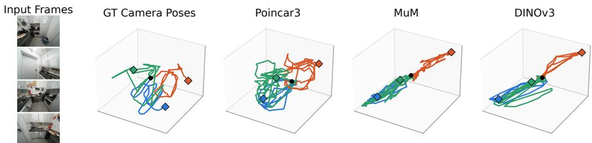  
Figure 11: Poincare adapter. ´ We visualize the alignment between visual features and camera trajectories with a lightweight Poincare adapter ´ , following Fig. 1 of Chen et al. (2026). Applied to Poincar3, it unrolls the feature space toward the ground-truth camera trajectories.

## A THINGS THAT DID NOT WORK

While not included in the ablation in the main paper (Tab. 4), we experimented with multiple SSL objectives before arriving at our formulation. We primarily sought a simpler objective, such as BYOL (Grill et al., 2020), which does not use centering or Sinkhorn-Knopp. While showing initial promise, the feature maps quickly degraded during training, resulting in unsatisfactory qualitative results. We attempted to mitigate this degradation through regularization, but were unable to obtain stable training. Neither centering nor Sinkhorn–Knopp normalization, nor more sophisticated regularization methods such as VICReg (Bardes et al., 2022), resolved the issue.

We also tried being more sloppy with our data curation. However, in contrast to RGB reconstruction, self-distillation appears to be more sensitive to low-quality data samples. This is likely why the DINO-team has spent significant effort in creating elaborate data curation pipelines (Vo et al., 2024).

## B BASELINES

In the paper, our core comparisons are to the features obtained by state-of-the-art SSL methods. Namely, DINOv3, MuM, and Muskie. We omit the comparison to CroCo, which was already shown to be inferior to MuM and Muskie in their respective papers. Furthermore, MuM showed a drastic improvement over VJEPA 2 on geometric understanding. At times, we compare to the features obtained by supervised 3D models such as $\operatorname { V G G T - } \Omega , \pi ^ { 3 }$ , and DepthAnything3 (DA3). These constitute the state-of-the-art supervised methods and have garnered widespread interest from the 3D vision community. We include these as comparisons where they constitute a fair comparison, as in correspondence estimation, whereas in others, such as feed-forward reconstruction, their training objective is tailored for that specific task and are thus omitted. Lastly, we do not compare to GenCeption, as it is diffusion-based, or Alligat0r, as it requires covisibility labels.

## C ADDITIONAL EXPERIMENTS

## C.1 QUALITATIVE

To understand what the model has learned, we visualize the PCA of the patch features after the decoder. We show the results for an image pair in Fig. 12. Furthermore, we visualize the alignment of the Poincare adapter with the ground-truth camera trajectory in Fig. 11 and additional baselines´ for qualitative multi-view correspondence tracks in Fig. 13.

## C.2 TWO-VIEW MATCHING

We now consider two-view matching. We employ a lightweight protocol by training linear probes and using zero-shot nearest-neighbor (NN) in feature space. This evaluation protocol follows from Edstedt et al. (2024) and Nordstrom et al. (2026). We report the accuracy in Tab. 5 on ScanNet-1500.¨ We find that Poincar3 outperforms all other methods on both zero-shot matching and linear probing.

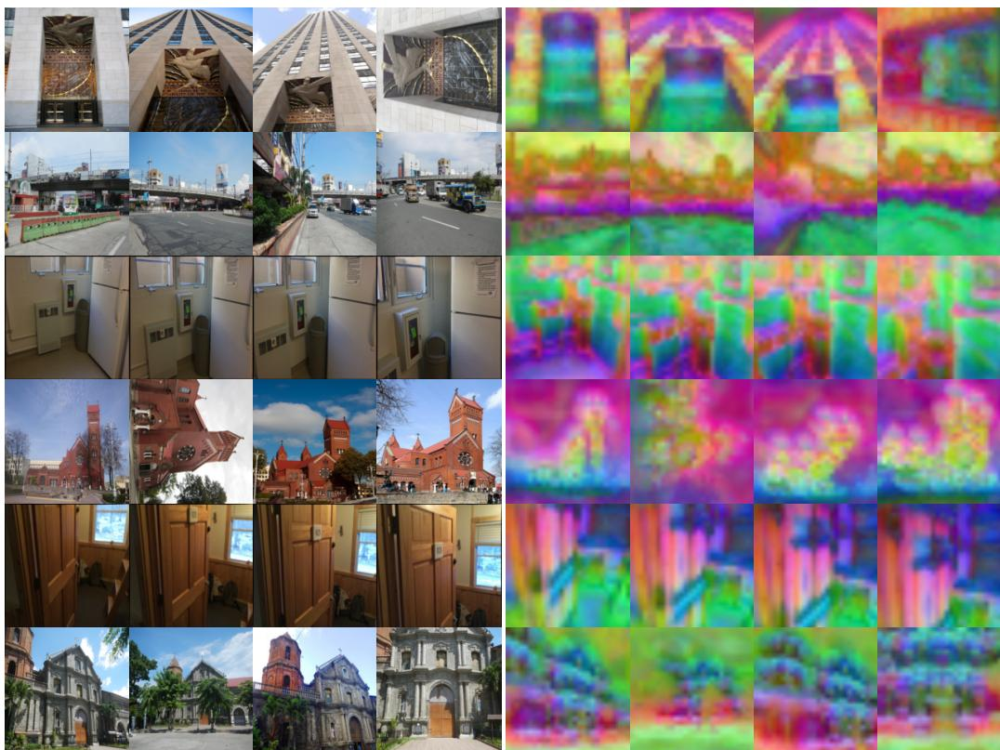  
Figure 12: PCA feature visualization. We visualize the 3 principal components as RGB for different sequences from the same scene.

Table 5: Lightweight two-view matching. Matching robustness on ScanNet-1500 (Dai et al., 2017; Sarlin et al., 2020).
<table><tr><td rowspan="2">Method PCK →</td><td colspan="3">Nearest-Neighbor</td><td colspan="3">Linear Probe</td></tr><tr><td>8px</td><td>16px</td><td>32px</td><td>8px</td><td>16px</td><td>32px</td></tr><tr><td colspan="7">Feed-forward Reconstruction</td></tr><tr><td>VGGT-Ω DA3</td><td>2.3 0.8</td><td>6.8 2.4 17.1</td><td>17.0 6.8 30.2</td><td>26.4 29.2 32.9</td><td>47.9 49.0 55.3</td><td>67.5 66.7 73.5</td></tr><tr><td colspan="7">8.0 Self-supervised Models</td></tr><tr><td>DINOv3</td><td>17.5</td><td>35.0</td><td>52.2 32.1</td><td>35.3</td><td>60.4</td><td>77.9</td></tr><tr><td>Muskie</td><td>6.6</td><td>16.2</td><td></td><td>34.8</td><td>54.5</td><td>69.8</td></tr><tr><td>MuM</td><td>15.7</td><td>31.9</td><td>51.1</td><td>40.7</td><td>63.6</td><td>78.9</td></tr><tr><td>Poincar3</td><td>24.3</td><td>42.5</td><td>58.6</td><td>45.3</td><td>67.0</td><td>79.3</td></tr></table>

## C.3 SEMANTIC TASKS

We compare the semantic performance in Tab. 6. Without being trained on ImageNet, Poincar3 outperforms other multi-view SSL models on image classification and semantic segmentation. However, removing the local crops and training on significantly more geometric data leads to significant performance degradation compared to DINOv3. For a fair comparison, we use the output of the final layer for all the models whereas in MuM, the semantic performance is evaluated after only the encoder. We follow the evaluation protocol of Darcet et al. (2025).

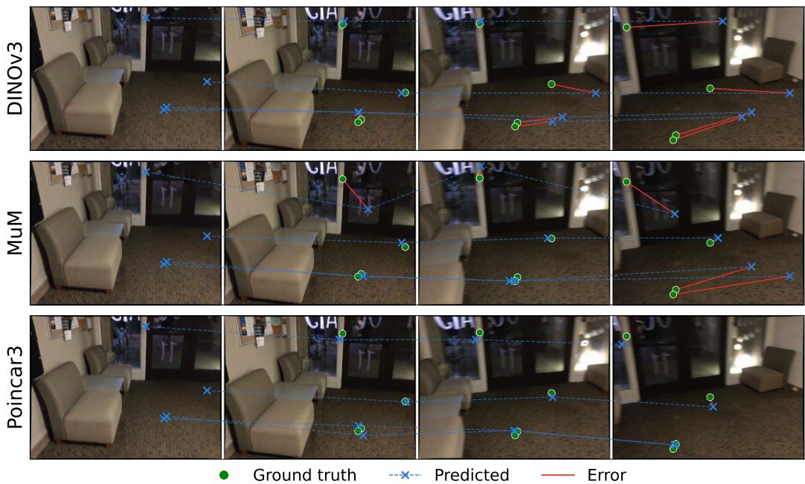  
Figure 13: Additional multi-view correspondence visualizations. Including also DINOv3 as a baseline.

Table 6: Semantic performance. Image classification accuracy on ImageNet-1K and semantic segmentation (mIoU) on ADE20K.
<table><tr><td>Context</td><td>ImageNet-1K (Deng et al., 2009; Krizhevsky et al., 2012)</td><td>ADE20K (Zhou et al., 2017)</td></tr><tr><td>DINOv3</td><td>85.1</td><td>49.8</td></tr><tr><td>Muskie</td><td>27.5</td><td>6.4</td></tr><tr><td>MuM</td><td>27.5</td><td>4.6</td></tr><tr><td>Poincar3</td><td>34.4</td><td>9.6</td></tr></table>

## C.4 LAYER-WISE MULTI-VIEW CORRESPONDENCE ESTIMATION

We investigate the geometric information at different depths for the models by multi-view correspondence estimation accuracy in Fig. 14. We find that Poincar3 consistently outperforms the baselines at all depths.

## D IMPLEMENTATION DETAILS

## D.1 HYPER-PARAMETERS

Architecture. Poincar3 uses a ViT-L/16 backbone with DINOv3-style RoPE position embeddings, QK-norm, and LayerScale, initialized from scratch. The multi-view decoder has 12 blocks, alternating full cross-frame attention with a cheaper register-bottleneck attention at blocks {2, 6, 9} (zero-indexed) using 16 register tokens.

Self-distillation objective. We use separate DINO/iBOT heads for the patch and global tokens, each with 65,536 prototypes, hidden dimension 2048, and bottleneck dimension 256. Teacher targets are normalized with Sinkhorn–Knopp (3 iterations) rather than centering, which we found more resistant to collapse. The student temperature is fixed at 0.1, while the teacher temperature warms up from 0.04 to 0.07 over the first 30k steps; the teacher EMA decay (λ) follows the same warmup schedule, from 0.994 to 0.999. The last layer of both heads is frozen for the first 2k steps.

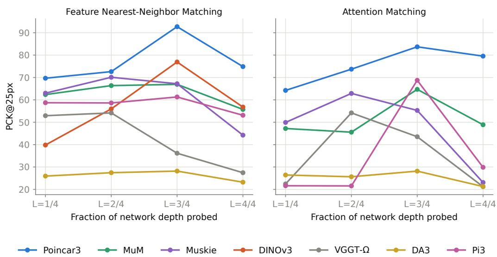  
Figure 14: Layer-wise performance. We plot the multi-view correspondence accuracy at different depths. We find that Poincar3 encodes multi-view geometry throughout the network, while the performance of supervised methods collapses at later layers.

Multi-view sampling. Each training sequence draws a student frame count uniformly from [2, 24] and, crucially, feeds the teacher [0, 12] additional frames the student never sees, unmasked; the loss is computed only over the frames both networks observe. Patches are masked independently per frame with probability 0.5 and a mask ratio sampled from [0.1, 0.5], following iBOT. The global objective compares teacher and student tokens frame-by-frame. Batches are built dynamically to a fixed budget of 64 frames per GPU. Images are resized to 256 × 256 with patch size 16. As we train on 8 H200 GPUs, the maximum number of frames can go into a batch is 512.

Optimization. We train with AdamW and a fixed learning rate of $2 \times 1 0 ^ { - 4 }$ , warmed up over 10k steps. Weight decay is 0.04 and gradients are clipped to norm 1.0. Training uses bf16 mixed precision.

## D.2 DATA

We detail our dataset mixture in Tab. 7. The majority of the scenes come from videos from the internet, providing a rich source of data that can only be mined through SSL. Note there is no overlap between the training scenes and the scenes used for evaluation in Sec. 4.

## D.3 TRAINING DYNAMICS

In Fig. 15, we visualize how six different evaluation metrics evolve during training and how performance is impacted by initializing the encoder from DINOv3. Furthermore, we provide plots of the stabilization metrics we tracked throughout training in Fig. 16. While the losses are uninformative in a teacher–student setup, it is encouraging to see that the teacher’s features are not collapsing but rather becoming more discriminative as training progresses (as illustrated by the standard deviation and the effective rank).

## E EVALUATION

## E.1 FEED-FORWARD RECONSTRUCTION

We broadly follow the training in Wang et al. (2026b), but make minor adjustments to fit with our limited compute budget. The protocol we use is outlined below.

Table 7: Dataset mixture for Poincar3. The top part contains large-scale internet video datasets with noisy or no annotations, while the bottom part contains 3D datasets with annotations. The weight is proportional to the probability of sampling from the respective dataset.
<table><tr><td>Datasets</td><td>Type / Source</td><td>Weight NScenes</td><td></td></tr><tr><td>SpatialVID (Wang et al., 2026a)</td><td>Outdoor / Video</td><td>1</td><td>176,749</td></tr><tr><td>DL3DV (Ling et al., 2024)</td><td>Mixed / Video</td><td>1</td><td>10,000</td></tr><tr><td>RealEstate10K (Zhou et al., 2018)</td><td>Indoor / Video</td><td>1</td><td>7,850</td></tr><tr><td>MegaDepth (Li &amp; Snavely, 2018)</td><td>Outdoor / MVS</td><td>1</td><td>169</td></tr><tr><td>AerialMD (Vuong et al., 2025)</td><td>Aerial / MVS</td><td>1</td><td>124</td></tr><tr><td>BlendedMVS (Yao et al., 2020)</td><td>Aerial / Mesh</td><td>1</td><td>493</td></tr><tr><td>Hypersim (Roberts et al., 2021)</td><td>Indoor / Graphics</td><td>1</td><td>393</td></tr><tr><td>TartanAir v2 (Wang et al., 2020)</td><td>Outdoor / Graphics</td><td>1</td><td>46</td></tr><tr><td>Map-Free (Arnold et al., 2022)</td><td>Object-centric / MVS</td><td>1</td><td>397</td></tr><tr><td>ScanNet++ v2 (Yeshwanth et al., 2023)</td><td>Indoor / Mesh</td><td>1</td><td>856</td></tr><tr><td>FlyingThings3D (Mayer et al., 2016)</td><td>Outdoor / Graphics</td><td>0.5</td><td>2,239</td></tr><tr><td>ARKitScenes (Baruch et al., 2021)</td><td>Indoor / RGB-D</td><td>0.1</td><td>5,047</td></tr><tr><td>UnrealStereo4k (Tosi et al., 2021)</td><td>Outdoor / Graphics</td><td>0.01</td><td>8</td></tr><tr><td>Virtual KITTI 2 (Gaidon et al., 2016; Cabon et al., 2020)</td><td>Outdoor / Graphics</td><td>0.01</td><td>5</td></tr><tr><td colspan="2">Total</td><td colspan="2">204,376</td></tr></table>

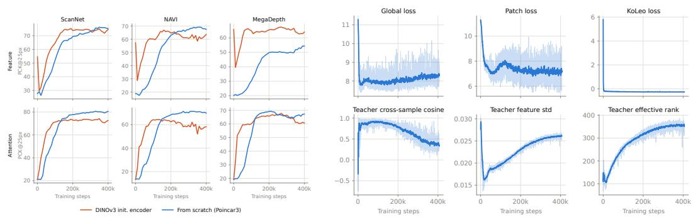  
Figure 15: Detailed evaluation metrics. Multi-view correspondence estimation performance, from scratch vs. DINOv3 init.  
Figure 16: Detailed stability metrics. We visualize how the loss terms evolve during training as well as stability metrics.

Training. Every feed-forward reconstruction model shares the same pair of prediction heads on top of a backbone: a camera head, a 4-layer self-attention trunk that mixes each frame’s camera and register tokens across the whole sequence in one shot and regresses a 9D pose encoding per frame (translation, rotation quaternion, field of view), and a depth head, a DPT-style multi-scale fusion decoder (following VGGT/Depth-Anything) that reads dense tokens from four evenly-spaced depths of the backbone and regresses per-pixel depth and confidence independently per frame (no crossframe mixing). Training data is a weighted mixture of posed, depth-annotated multi-view datasets (HyperSim, ScanNet++, MegaDepth, BlendedMVS, Map-free, MegaSynth, and SpatialVid). Each batch draws one sequence length (uniform in [2, 24] frames) and one resolution bucket, following the same dynamic-batching scheme used for pretraining of Poincar3.

We compare three training protocols that trade off how much of the backbone is updated:

1. Frozen backbone, heads only. The backbone (encoder and, where present, its pretrained cross-view decoder) stays entirely frozen, and only the camera/depth heads are trained on top of its existing features, isolating how much 3D structure a backbone’s pretraining objective already encodes.

2. Frozen backbone + adapter. The backbone stays frozen, but a small, freshly-initialized adapter (two layers of the same alternating frame/inter-frame self-attention used in our own cross-view decoder) sits between the frozen per-frame features and the heads, giving every backbone an identical amount of new trainable cross-view capacity, which matters for backbones with no pretrained cross-view mixing at all (e.g. DINOv3, a plain per-frame ViT).

3. Full finetune. The entire backbone is updated jointly with the heads end to end, optionally regularized against representational drift with a feature-distillation term against a frozen VGGT-Ω teacher, matching both dense patch tokens and the camera token. From this experiment we do not include MuM or Muskie as it would constitute an unfair comparison as their architectures differ. For the DINOv3 comparison, we substitute the encoder for DINOv3 ViT-L/16. Muskie showed that this is superior to transplanting the DINO weights also into the multi-view transformer.

In all three protocols the training objective is $\mathcal { L } = \lambda _ { \mathrm { c a m } } \mathcal { L } _ { \mathrm { c a m } } + \lambda _ { \mathrm { d e p t h } } \mathcal { L } _ { \mathrm { d e p t h } } ,$ , with $\lambda _ { \mathrm { c a m } } = \lambda _ { \mathrm { d e p t h } } = 1$ The camera loss is a flat L1 on the predicted vs. ground-truth pose encoding $p = ( t , q , f )$ (translation, rotation quaternion, field-of-view):

$$
\mathcal { L } _ { \mathrm { c a m } } = \| \hat { p } - p \| _ { 1 } .\tag{6}
$$

The depth loss combines a confidence-weighted term, a plain regression term, and a multi-scale gradient term over pixels with valid ground-truth depth (after dropping the worst 2% by quantile):

$$
\mathcal { L } _ { \mathrm { d e p t h } } = \mathbb { E } \big [ \gamma \vert \hat { d } - d \vert c - \alpha \log c \big ] + \mathbb { E } \big [ \vert \hat { d } - d \vert \big ] + \mathcal { L } _ { \mathrm { g r a d } } ,\tag{7}
$$

where c is the predicted per-pixel confidence, γ=1, α=0.2 (the −α log c term discourages trivially collapsing confidence to zero), and $\mathcal { L } _ { \mathrm { g r a d } }$ averages an L1 gradient-matching term over 4 progressively downsampled resolutions. Ground-truth depth and camera translations are rescaled per training batch, since absolute scale is unobservable from monocular images alone.

Evaluation. We evaluate the resulting checkpoints along two axes: relative camera pose and multiview point-cloud geometry. For the former, we follow Wang et al. (2025), while for the latter we follow Wang et al. (2026d). For pose, a single joint forward pass over N=10 sampled frames of a test sequence predicts every frame’s pose in one model-chosen reference frame (VGGT-style); since this absolute frame carries no ground-truth correspondence, we score every one of the $\binom { N } { 2 }$ frame pairs’ relative pose instead – rotation error is the geodesic angle between predicted and ground-truth quaternions, translation error is the angle between the (sign-disambiguated) predicted and ground-truth translation directions – and report the area under the cumulative-accuracy curve of max(rotation error, translation error), thresholded at 30<sup>◦</sup> (AUC@30), averaged first within each test scene and then across scenes so scenes contributing more sampled sequences (e.g. RE10K) do not dominate. Test sets are MegaDepth-1500, RE10K, ScanNet-1500, and 50 held-out ScanNet++ scenes, each following its own reference protocol’s image-loading convention.

For point-cloud quality, we unproject each backbone’s predicted per-frame depth through its predicted camera parameters into a world-space point cloud, on 5-view sequences from DTU and ETH3D. Since predicted geometry is only defined up to an unknown similarity transform, we first coarsely align it to the ground-truth point cloud with Umeyama’s method and then refine with rigid ICP. We report point-to-point accuracy and completion (mean/median nearest-neighbor distance predicted→ground-truth and vice versa) and normal consistency (mean cosine similarity between each point’s PCA-estimated normal and its nearest neighbor’s), averaged over sequences – reproducing VGGT’s own multi-view reconstruction evaluation protocol.

## E.2 MULTI-VIEW CORRESPONDENCE ESTIMATION

Our protocol follows El Banani et al. (2024). In particular, we evaluate zero-shot correspondence directly, without any task-specific finetuning, by feeding a cluster of 8 covisible views of one scene through a backbone in a single multi-view forward pass and tracking 100 query points sampled in the first view across the remaining 7. Ground-truth tracks come from reprojecting each query point through its ground-truth depth, pose, and intrinsics into every other view, with a depth-based occlusion test discarding views where the reprojected point is not actually visible; points never visible in any other view are dropped entirely. We evaluate on NAVI and ScanNet (both with metricscale ground-truth depth) and MegaDepth (unscaled SfM depth).

We score two different ways of reading off a correspondence from the same forward pass. Feature matching takes the source query point’s dense feature (bilinearly sampled at its exact sub-patch location) and finds its 1-nearest-neighbor by cosine similarity in each target view’s dense feature map. Attention matching instead reads the correspondence directly off the backbone’s own softmax cross-view attention: the source point’s query vector attends over every view’s keys, and the argmax of that distribution restricted to a target view’s patch tokens is the match – this asks whether the model’s own attention agrees with correspondence, not just its output feature similarity. Both are read from features/attention at a specific network depth; since backbones differ widely in depth and in which blocks carry genuine cross-view mixing, we sweep four evenly-spaced relative depths (quarter-points of each backbone’s own valid block range) and, following common practice, report the single best-performing depth per backbone and correspondence method.

Given a predicted match and its ground-truth target location, we report the fraction of visible query points landing within k pixels of the ground-truth match $( \mathrm { P C K } @ \bar { k } , k \in \{ 5 , 1 0 , 2 5 , 5 0 \}$ ), plus the analogous 3D accuracy after unprojecting both points with ground-truth depth.

## E.3 EMERGENT SE(3) STRUCTURE

We follow Chen et al. (2026). As the code is unpublished as of writing, we do our best to reimplement the core protocol. In particular, we fit a Poincare adapter per scene on´ 20 held-out Scan-Net++ (Yeshwanth et al., 2023) scenes, using a chronological 80/20 split of each scene’s frames and sweeping strides $s \in \{ 2 , \ldots , 6 0 \}$ , and measure $R ^ { 2 }$ on the held-out pairs. As $R ^ { 2 }$ is unbounded below, its raw mean is dominated by a few degenerate scenes; we therefore report the clipped mean $\overline { { R ^ { 2 } } } = \operatorname* { m e a n } \left( \operatorname* { m a x } ( 0 , R ^ { 2 } ) \right)$ together with the fraction of scenes exceeding $R ^ { 2 } > 0$ and $R ^ { 2 } > 0 . 3$ All values are the best over four relative encoder depths and are averaged over 10 adapter seeds (± 95%-confidence interval where the scene set is fixed and shared across methods). Methods marked MV additionally receive an eight-frame context window with a frame spacing of 5, activating their cross-view attention; only the anchor frame’s feature is retained.

## E.4 VISUALIZING FEATURE CORRELATIONS

Here we detail how we perform a visualization such as Fig. 5. Given a cluster of covisible frames processed jointly in one multi-view forward pass, we mark a query patch in the first frame and, for every other frame, compute the cosine similarity between the query’s dense feature and every patch of that frame (clipped below zero). Each row (backbone) is independently rescaled to its own $\mathrm { 5 ^ { t h } . }$ -percentile–to-max range and rendered as a semi-transparent Turbo-colormap overlay (opacity 0.25–0.85, so weakly-correlated regions stay visible rather than fading to the bare image), with a circle marking the arg-max match. Rescaling per backbone sacrifices strict cross-row comparability of absolute intensity in exchange for making each backbone’s correlation dispersion legible: a backbone that discriminates well shows a small, concentrated hot region, while one that does not washes warm over most of the frame.