# EPIC: Epipolar-Consistent 360◦ Immersive Stereo Video Generation

Debabrata Manda UNC Chapel Hill

Dongdong Fu u Dolby Laboratories es

Jonathon Miller Dolby Laboratories Praneeth Chakravarthula UNC Chapel Hil

William Villareal Dolby Laboratories

Xi Peng UNC Chapel Hill

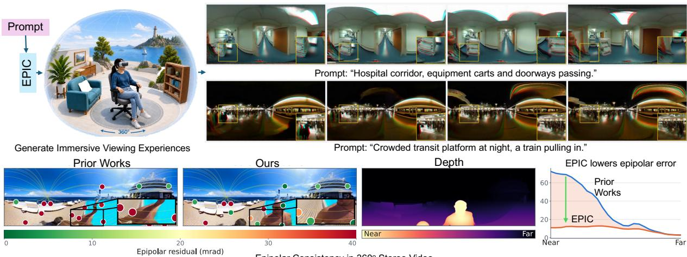  
Figure 1: Teaser. We present a panoramic stereo video refinement pipeline to create an immersive viewing experience directly from text or image prompts. Our stereo generation pipeline works across a diverse range of scene prompt descriptions such as both indoors and outdoors. Prior works such as DissolveStereo [37] can only provide soft geometric supervision which leads to epipolar inconsistencies in the generated right views while ours learns to produce lesser stereo errors through a novel approach.

## ABSTRACT

Immersive displays can enable rich and diverse virtual experiences. Manually authoring every possible experience to realize this potential, however, is prohibitively expensive, difficult to scale, and impractical. Generative AI models could remove this bottleneck, but today’s models are built for conventional displays and cannot generate the high-resolution, stereoscopic 360◦ content required for immersive viewing. Further, temporal and stereo inconsistencies that may be tolerable on conventional displays can become highly disruptive when viewed through an immersive headset.

Here, we address this gap with a zero-shot generative pipeline that extends existing video diffusion models into 4K stereoscopic 360◦ videos. Inspired from binocular vision and depth perception, we develop an epipolar-aware 360◦ image matching metric that captures the temporal and stereo geometric inconsistencies across views. We then use this metric as a preference signal for direct preference optimization with limited training data. Our work enables 360◦ stereo video generation and provides a scalable path for bringing generative content to immersive displays, allowing diverse mixed reality experiences on demand.

Index Terms: Video generation, Headsets, Optimization

## 1 INTRODUCTION

Immersive displays can transport viewers to places and experiences beyond their physical surroundings, from exploring remote environments to training in realistic simulations. Realizing this potential, however, requires creating immersive content for every new experience, which is expensive and difficult to scale. Capturing stereoscopic 360 video requires complex multi-camera rigs [29, 49], careful stitching of captured images, and, most importantly, physical access to the scene being recorded. Manually creating virtual environments requires artists to model, texture, and animate each scene. In addition, neither approach can easily create experiences that cannot be staged or captured, such as dangerous, rare, or imagined environments.

Generative video models could remove this bottleneck by creating scenes directly from text or image prompts, enabling personalized experiences such as exposure therapy for phobias [4], vestibular and spatial rehabilitation [11], immersive skills training [14], and classroom education [7]. However, today’s models are primarily designed for conventional displays and cannot directly generate the high-resolution, stereoscopic 360◦ video required for immersive viewing. Naively extending existing video generators to immersive displays introduces several challenges, such as incorrect geometry, that prior work does not fully address. While stereo generation [48, 37] and panoramic 360◦ generation [42, 21] have each been studied in isolation, their intersection remains underexplored.

The key obstacle to achieving immersive generative video is the lack of data. High-quality panoramic stereo video is scarce and expensive to capture, prohibiting the use of supervised training methods. Zero-shot methods such as DissolveStereo [37] and StereoCrafter [48] avoid this requirement by diffusion inpainting and have been used for perspective stereo video. However, these methods rely on soft conditioning guidance and do not explicitly enforce the correct geometry between the left and right eye views (see Fig. 1). As a result, errors that may be tolerable on a conventional display become especially disruptive during binocular viewing. Unfortunately, existing metrics also rely on perspective image matching [37], which does not account for the spherical geometry of $3 6 0 ^ { \circ }$ immersive visuals or the strong distortion of equirectangular projected (ERP) images near the poles. We therefore need both a way to generate immersive stereo video without large-scale stereo training data, and a way to measure and correct the geometric errors that affect immersive viewing.

We address these challenges with a generative pipeline that extends existing video diffusion models to high-resolution stereoscopic 360◦ video. We first introduce a zero-shot stereo adaptation procedure that allows existing video models to generate text- or image-conditioned stereo pairs without requiring large-scale training data. However, the generated videos may contain incorrect disparities and other geometric inconsistencies between binocular views. To identify these errors, we introduce a novel Panoramic Epipolar Geometry Score (PEGS), a ranking-based metric that measures stereo consistency directly on the 360◦ viewing sphere. Unlike perspective image matching, it accounts for spherical epipolar geometry. In addition, PEGS is pose-free and robust to independently moving objects, allowing it to evaluate the dynamic content produced by generative video models. We use the PEGS score to rank generated panoramic stereo videos according to their geometric consistency and construct (PREFERRED, DISPREFERRED) pairs. We then use these pairs to optimize the generator through direct preference optimization [35]. This process turns PEGS, a non-differentiable geometric metric, into a useful training signal and reduces the artifacts left by zero-shot stereo adaptation, without requiring ground-truth panoramic stereo video.

The current video generators are limited to 480p or 720p [41], well below the resolution needed for immersive viewing. Therefore, we employ a stereoscopic panoramic upsampling stage that produces 4K output. We also demonstrate a stereo baseline adjustment procedure that controls the disparity between generated views, with implications for comfortable headset viewing. Together, these components provide a scalable path to high-resolution stereoscopic 360◦ generation for immersive displays.

In summary, this work makes the following contributions:

• An immersive video generation pipeline, the first to the best of our knowledge, for generating 4K stereoscopic 360◦ content without requiring large-scale immersive stereo training data.

• A pose-free epipolar consistency metric, PEGS, formulated directly on the 360◦ viewing sphere, capturing geometric inconsistencies relevant to stereoscopic immersive viewing.

• A direct preference optimization method for correcting geometric artifacts within generated panoramic stereo videos without requiring ground-truth data.

• A stereoscopic upsampling and baseline adjustment method for bringing generated immersive content to headset-ready quality.

## 2 RELATED WORKS

Panoramic stereo captures the world as an egocentric observer experiences it, overcoming two complementary limitations: the restricted field of view of a pinhole camera, and the absence of depth in a monocular one. Early systems pursued each half of the problem separately, through catadioptric and multi-camera arrangements for panoramic capture [29] and conventional binocular rigs for stereo [49], before converging on omnidirectional stereo, which synthesizes each stereo output view from a rotating left-right camera arm so that disparity is available in every viewing direction [31]. The resulting optical setups are cumbersome to use. Dual fisheye and multi-rig designs demand precise calibration, and their stitched output carries seam artifacts and parallax errors wherever the assumed geometry breaks down [12, 43]; and the interocular baseline is fixed at capture time, leaving no way to re-target the content for a different display or viewer afterwards. Generative video models sidestep this problem entirely, producing realistic footage from text or images and reaching scenes that no rig could practically be built to film [45]. An ecosystem of model variants also allows arbitrary video resolution scaling and high dynamic range capabilities. This paper explores stereo generation for 360◦ videos through a fast and flexible adaptation pipeline.

Table 1: Comparison of related work on panoramic and stereo video generation. Each criterion is fully ✓, partially (✓), or not met ✗. Prior work covers either the panoramic axis or the stereo axis, but not both, and geometric structure enters as depth conditioning rather than as an explicit epipolar constraint.
<table><tr><td>Pano-</td><td></td><td colspan="3">Dissolve-</td><td>Stereo- Stereo- Pano- World-X Ours</td><td></td></tr><tr><td></td><td>Wan [42]</td><td>Stereo [37]</td><td>World [44]</td><td>WM [38]</td><td>[47]</td><td></td></tr><tr><td>Output domain</td><td></td><td></td><td></td><td></td><td></td><td></td></tr><tr><td>360° panoramic</td><td></td><td>X</td><td>X</td><td>X</td><td></td><td></td></tr><tr><td>Stereo</td><td>X</td><td></td><td></td><td></td><td>x</td><td></td></tr><tr><td>Geometry</td><td></td><td></td><td></td><td></td><td></td><td></td></tr><tr><td>Depth-guided</td><td>x</td><td></td><td></td><td></td><td></td><td></td></tr><tr><td>Epipolar constraintX</td><td></td><td>x</td><td></td><td></td><td>X</td><td></td></tr><tr><td>Camera control</td><td>X</td><td>X</td><td>X</td><td></td><td></td><td></td></tr><tr><td>Model-agnostic</td><td></td><td></td><td></td><td>X</td><td>X</td><td></td></tr></table>

Video generation models. Contemporary video generators are latent diffusion transformers trained on Internet-scale corpora [36] by distribution matching, most commonly through flow matching and its rectified variant [23, 25]. Yet as the field has advanced rapidly toward more capable systems such as Veo 3 [9], Wan-2.2 [41], and HunyuanVideo [18], camera modality has received comparatively little attention. Stereo generation has been studied in both trained [44] and training-free [48, 37] regimes, but only for pinhole cameras; panoramic video generators [21, 42] cover the full sphere but render a single monocular viewpoint. This objective asks the model to place mass where the data lies; it says nothing about whether any individual sample obeys the physical regularities that every training video necessarily obeys. The consequence is that models trained on billions of 3D-consistent videos still produce outputs that violate rigid object geometry [46], drift in scene depth and scale [13], and fail the epipolar constraint between frames [20]. Because these properties are global to a sample and cheap to verify but expensive to differentiate through, they are naturally expressed as rewards rather than as likelihoods, and a line of recent work has accordingly moved them into a post-training stage: preference optimization against multi-view consistency [46] and against epipolar error [20] both recover structure that pretraining alone does not supply. Table 1 contrasts our method against the prior works within the video generation landscape. Our work rightfully addresses the combination of both panoramic and stereo content generation through rigid geometric consistency enforced through epipolar error.

Reinforcement Learning and Post-Training Alignment. Post-training alignment steers a pretrained generator toward a desired property by maximizing a reward while penalizing divergence from the reference model, a formulation inherited from RLHF in language modeling [30] and now standard for diffusion and flow models. Approaches differ chiefly in how they access the reward. Reward backpropagation methods such as DRaFT [6] and Align-Prop [34] differentiate through the sampling chain, which is efficient but demands an end-to-end differentiable score. Policy gradient methods including DDPO [3], DPOK [8], and PPO-style variants accept arbitrary non-differentiable rewards, but require many rollouts per update; for video, where a rollout is a full denoising trajectory decoded to pixels, this is prohibitive. Direct Preference Optimization [35] and its diffusion [40] and rectified-flow [24] extensions instead reduce alignment to a supervised loss over preference pairs, requiring only a relative ordering between samples and never differentiating the reward. The reward itself is usually learned, from aesthetic classifiers [36] or vision-language models trained on human annotation [24]. Such signals are costly to collect, encode subjective judgments that need not track geometric correctness, and invite reward hacking; models aligned this way have been shown to score well on the learned metric while leaving epipolar error essentially unchanged [20]. Classical geometric criteria avoid these failure modes by construction. The closest work to ours [20] adopts exactly this reasoning but computes its epipolar reward between frames across time, where a single fundamental matrix holds only for static scenes under camera motion. Our reward is measured between simultaneous stereo views, so one essential matrix explains every correspondence regardless of object motion.

## 3 PRELIMINARY

Here, we briefly discuss the key concepts used in our framework.

## 3.1 Epipolar Constraint

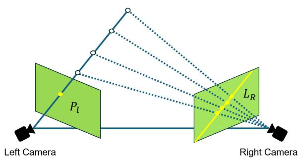  
Figure 2: Illustration of the epipolar constraint. The observation on the left image plane $P _ { l }$ determines a viewing ray, shown by the solid blue line. Because the depth is unknown, the observed 3D point may lie anywhere along this ray, as indicated by the white circles. When these possible 3D locations are projected into the right camera, their projections all lie on the yellow epipolar line $L _ { R } .$ Therefore, the point corresponding to the left observation must be found on $L _ { R } ,$ rather than anywhere in the right image.

As shown in Fig. 2, an observation in the left image determines the viewing direction p but not the depth of the 3D point. All possible 3D locations therefore lie along the same viewing ray. This ray and the two camera centers define a plane called the epipolar plane. The corresponding viewing direction $ { \mathbf { p } } ^ { \prime }$ in the right camera must also lie in this plane.

Consider a stereo pair whose two viewpoints are separated by a baseline t (the vector between the two camera centers) and a relative orientation R (the rotation taking one camera’s frame into the other’s). A 3D scene point seen along the unit viewing direction p from the left camera and p′ from the right must satisfy

$$
\mathbf { p } ^ { \prime \top } \mathbf { E } \mathbf { p } = 0 , \qquad \mathbf { E } = [ \mathbf { t } ] \times \mathbf { R } ,\tag{1}
$$

where E encodes the two-view geometry (rotation R and translation t between the cameras) and $[ \cdot ] _ { \times }$ denotes the matrix form of the cross product. Equation (1) states simply that both viewing directions and the baseline are coplanar: they span the epipolar plane, and the correspondence to p must lie somewhere in that plane. For a pinhole camera this plane cuts the image in a straight line. Rectification turns that line into a horizontal row $( L _ { R }$ in Fig. 2), so perspective stereo reduces to a search along a scanline. For a panoramic camera the plane cuts the sphere in a great circle instead. Every such circle passes through the two points where the baseline pierces the sphere.

## 3.2 Tangent Sampson Error

To turn the epipolar constraint introduced in Sec. 3.1 into a usable error, one measures how far a correspondence is from satisfying it exactly. Or in other words, how far does the re-projected correspondence lie from the epipolar line in the other camera view as shown in Fig. 3. For a pinhole pair, the classical Sampson error [10] measures exactly this,

$$
E _ { \mathrm { S } } ^ { 2 } = \frac { \left( \mathbf { p } _ { 2 } ^ { \top } \mathbf { E } \mathbf { p } _ { 1 } \right) ^ { 2 } } { \left\| \left[ \mathbf { E } \mathbf { p } _ { 1 } \right] _ { 1 : 2 } \right\| ^ { 2 } + \left\| \left[ \mathbf { E } ^ { \top } \mathbf { p } _ { 2 } \right] _ { 1 : 2 } \right\| ^ { 2 } } ,\tag{2}
$$

$\mathbf { \dot { E } x } _ { 1 }$ divided by how fast it changes when the image points move, with $[ \cdot ] _ { 1 : 2 }$ taking the first two components. The denominator is where the pinhole assumption sits: it treats the two image coordinates as the free parameters of a measurement, which is false for a panorama.

Terekhov and Larsson [39] keep the same ratio but replace the image points with unit viewing directions $\mathbf { d } _ { i } = \pi ^ { - 1 } ( \mathbf { p } _ { i } )$ , where π is the camera projection, and the image derivatives with $J _ { i } ^ { \dagger }$ , the pseudoinverse of the Jacobian of $\pi$ at $\mathbf { d } _ { i } ,$ giving the Tangent Sampson error

$$
E _ { \mathrm { T S } } ^ { 2 } = { \frac { \bigl ( \mathbf { d } _ { 2 } ^ { \top } \mathbf { E } \mathbf { d } _ { 1 } \bigr ) ^ { 2 } } { \bigl \| \mathbf { d } _ { 2 } ^ { \top } \mathbf { E } J _ { 1 } ^ { \dagger } \bigr \| ^ { 2 } + \bigl \| \mathbf { d } _ { 1 } ^ { \top } \mathbf { E } ^ { \top } J _ { 2 } ^ { \dagger } \bigr \| ^ { 2 } } } ,\tag{3}
$$

which reduces to the classical Sampson error when π is a pinholeReprojection projection. Because $J _ { 1 }$ and $J _ { 2 }$ depend only on the measured points re-projection and not on E, they can be precomputed, making the residual nearly as cheap to evaluate as the pinhole form; we refer the reader to [39] for the derivation and for extensions handling measurement covariances. For the equi-rectangular panoramic projection used here, π has a closed-form Jacobian, so Equation (3) is directly applicable to our setting.

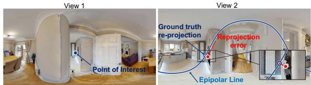  
Figure 3: Tangent Sampson Error. We compute the error by taking a point from one view and re-projecting it into another view and computing the reprojection error.

## 3.3 Flow Matching for Video Generation

We build on video generators trained with rectified flow [26, 33, 15], which learn how to transform a noise latent into a clean video latent by following a time-dependent vector field . Let $x _ { 0 } \sim q ( x _ { 0 } | c )$ denote a clean video latent produced by a temporal VAE (variational autoencoder), conditioned on c (a text prompt and, for imageto-video, a reference frame), and let $x _ { 1 } \sim \mathcal { \hat { N } } ( \mathbf { 0 } , \hat { \mathbf { I } } )$ be an independently sampled Gaussian-noise latent noise with the same dimensions as x . Rectified flow defines a linear interpolation between the two,

$$
x _ { t } = ( 1 - t ) x _ { 0 } + t x _ { 1 } , \qquad t \in [ 0 , 1 ] ,\tag{4}
$$

where t corresponds to the time steps along the straight path from noise to clean video latent, and the velocity $\nu = ( x _ { t } - x _ { 0 } ) / t$ refers to the directional flow of change in video latent space. Notice-© 2024 DOL B Y | CONFI DENTI A Lably, the velocity v is constant as $x _ { 1 } - x _ { 0 } .$ , throughout $t \in [ 0 , 1 ]$ . A transformer-based model $\nu _ { \theta } ( x _ { t } , t , c )$ parameterized by θ is trained to predict the target velocity from the intermediate latent (xt ), time t, and condition c. The flow-matching objective is

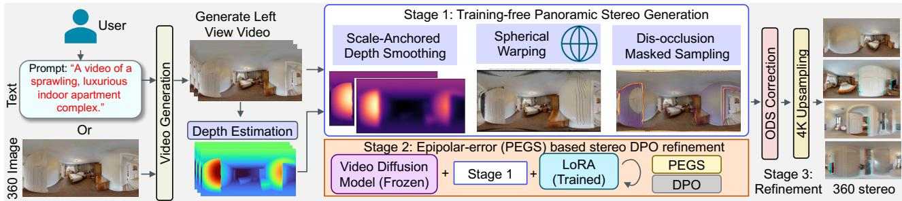  
Figure 4: Overview. We present a $3 6 0 ^ { \circ }$ stereo generation pipeline to convert user provided text or image prompts into headset viewable content. Our pipeline works in three main stages a training-free stereo approach to provide initial stereo estimates, a preference based finetuning approach without requiring expensive $\mathrm { \dot { 3 } 6 0 ^ { \circ } }$ stereo data collection and a final post-processing stage for immersive viewing

$$
\mathcal { L } _ { \mathrm { F M } } ( \theta ) = \mathbb { E } _ { t , x _ { 0 } } \left. \nu - \nu _ { \theta } ( x _ { t } , t , c ) \right. ^ { 2 } ,\tag{5}
$$

At inference, generation starts from a noise latent at $t = 1$ and integrates the learned velocity field back to $t = 0 ;$ we write $p _ { \theta } ( x _ { 0 } \mid c )$ for the distribution of clean latents this produces. Separately, we abbreviate the per-sample velocity error inside Eq. (5) as $\mathcal { V } _ { \theta } ( x _ { t } , t ) =$ $\| \nu - \nu _ { \theta } ( x _ { t } , t , c ) \| ^ { 2 }$ . Both are needed in Sec. 4.3: steering the generator is posed as moving $p _ { \theta }$ toward stereo-consistent outputs while keeping it close to the pretrained model, and the objective that does so is written entirely in terms of $\mathcal { V } _ { \theta }$

## 4 METHOD

Our proposed panoramic stereo generation and epipolar refinement pipeline is comprised of three main stages, as shown in Fig. 4. Here, we describe each stage in detail.

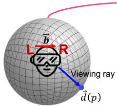

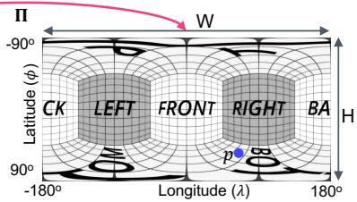

(a) Spherical Warping  
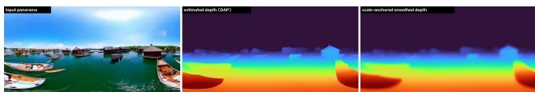  
(b) Depth Estimation and Smoothing

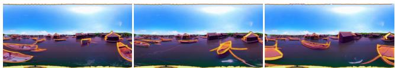  
(c) Smooth Dis-Occlusion Masked Sampling  
Figure 5: Stage 1: Zero-shot 360◦ Stereo Generation. Our trainingfree stage can produce a large collection of $3 6 0 ^ { \circ }$ stereo videos without requiring any training data. We perform depth-wise spherical warping to get the right view from the generated left view and inpaint the occluded regions using the video diffusion model.

## 4.1 Stage 1: Training-free Panoramic Stereo

1Video generation models are largely trained on monocular pinhole videos collected from the Internet such as WebVid [2]. Diffusion inpainting methods [28] are used to fill in missing regions in generated content by sampling from the posterior of the learned prior, filling in physically plausible content. However, central camera models such as fisheye $1 8 0 ^ { \circ }$ or panoramic $3 6 0 ^ { \circ }$ do not follow the same image capture process as pinhole cameras. Hence, we first perform a zero-shot stereo generation pipeline (Fig. 5.a) [37] over a pre-trained panoramic generation model [42]. To accommodate the all-around viewing of panoramic cameras, we perform spherical warping from the left to the right view using estimated video depth. Let $\mathbf { p } = \left( u , \nu \right)$ index the equirectangular grid and $\mathbf { d } ( \mathbf { p } )$ be the unit viewing ray of pixel p,

$$
\begin{array} { r } { \mathbf { d } ( \mathbf { p } ) = \left[ \begin{array} { c c c c } { \cos \phi \sin \lambda } \\ { \sin \phi } \\ { - \cos \phi \cos \lambda } \end{array} \right] , \quad \lambda = \frac { 2 \pi u } { W } - \pi , \ \phi = \frac { \pi } { 2 } - \frac { \pi \nu } { H } , } \end{array}\tag{6}
$$

where $\lambda$ and $\phi$ are the longitude and latitude of p, H and W are the height and width of generated image dimension. Let $\Pi : \mathbb { S } ^ { 2 } $ $\left[ 0 , W \right) \breve { \times } \left[ 0 , H \right)$ be the forward equirectangular projection. We extend it to any 3D point by normalizing before projecting. For a rigid two-eye view with baseline b representing the direction from left to right eye, the right view then follows by pushing each ray out to its depth and re-projecting it from the left eye,

$$
\hat { I } _ { R } ( \mathbf { p } ) = I _ { L } \Big ( \Pi \big ( \overline { { D } } ( \mathbf { p } ) \mathbf { d } ( \mathbf { p } ) + \mathbf { b } \big ) \Big ) , \qquad \overline { { D } } = \operatorname* { m a x } \big ( D , D _ { \operatorname* { m i n } } \big ) .\tag{7}
$$

Here $D$ is the estimated video depth. We obtain it with a panoramic image depth estimation model [22] and then smooth it temporally (Fig. 5.b).

The warp cannot fill everything. Surfaces the right eye can see but the left eye never observed have no source pixel, leaving holes along depth edges. We mark these with a smooth binary mask (Fig. 5.c) and let the generator synthesize inside it only, keeping the warped content everywhere else, so the two views agree by construction wherever the geometry already fixes them.

## 4.2 Panoramic Epipolar Geometry Score

The zero-shot pipeline from Sec. 4.1 does not enforce correct geometry. The generated content may not follow the warped content closely about where the points in the observed 3D space may lie. Hence, we need a metric that can measure geometric dis-agreement directly, which appearance metrics simply cannot do, since two views can each look correct while disagreeing about the underlying 3D scene (Fig. 2).

We measure that disagreement as a violation of the epipolar constraint from Sec. 3.1. For two views of a rigid scene, every true correspondence must satisfy it, and we report the violation as an angle on the viewing sphere. Figure 6 shows the steps.

We begin with two views and find dense correspondences using a matcher built for equirectangular images [16], keeping only confident matches. Each match gives a pair of unit viewing rays $\mathbf { d } _ { A }$ and $\mathbf { d } _ { B } ,$ one in each view. Moving objects break the rigid-scene assumption, so we track points across frames [17] and discard those that move differently from the background scene such as cars or people. The surviving matches give the relative pose i.e. the rotation, and the direction the camera moved. Correspondences, however, cannot reveal how far the camera moved, and the metric does not need it either. It asks whether two viewing rays meet, which does not depend on how far apart the cameras are. We then evaluate the Tangent Sampson error ε of Eq. (3) on every match. It returns an angle in radians and is defined everywhere on the sphere, even in the poles where plain Sampson error is undefined [39].

We repeat this for three pairs of views: the two eyes at the same time instant (t) (Lt and DPO bas $R _ { t } )$ , one eye at two instants (t and d Reward Fin $t + k ) ,$ and one eye against the other eye at a later instant (Fig. 6). The last pair is particularly important for rigid two-view geometry. A model can produce a plausible stereo pair and a plausible temporal pair without any coherent scene behind them, but it cannot satisfy the combined constraint unless such a scene exists.

A score that can be gamed will be, so the metric reports whether it is valid instead of always returning a number. A right view copied from the left drives the metric score to zero while destroying the stereo effect, so we require real parallax to be present. A static cam-era makes the temporal pair vacuous. Too few surviving matches- Teach the model to get closer to lower error make any estimate unreliable. The reported score is

$$
\mathrm { P E G S } = \frac { 1 0 ^ { 3 } } { \left| \mathcal { T } \right| } \sum _ { \kappa \in \mathcal { T } } \operatorname* { m e d i a n } _ { ( A , B ) \in \mathcal { C } _ { \kappa } } \varepsilon \bigl ( \mathbf { d } _ { A } , \mathbf { d } _ { B } ; E _ { \kappa } \bigr ) ,\tag{8}
$$

in milliradians, where $E _ { \kappa }$ is the essential matrix for pair κ, $\mathcal { T }$ collects the pairs that pass these checks, and $\mathcal { C } _ { \kappa }$ the matches kept for pair κ. A pair that fails is dropped rather than set to zero, since treating it as zero would rank a degenerate clip best.

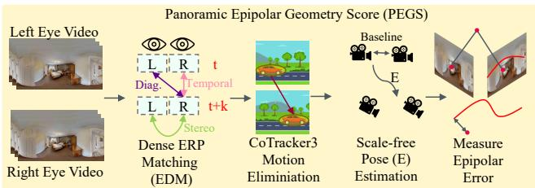  
Figure 6: Stereo Scorer. Our panoramic stereo scorer metric performs robust feature matching to find compatible point correspondences for epipolar error computation.

## 4.3 Stage 2: Preference Optimization for Stereo

Let $p _ { \mathrm { r e f } }$ be the distribution of generated videos from the pretrained video generative model [41], kept frozen. We want a model that produces stereo-consistent videos $p _ { \theta }$ without losing the generative quality of $p _ { \mathrm { r e f } }$ . The standard way to write this goal is

$$
\operatorname* { m a x } _ { \theta } \mathbb { E } _ { c \sim \mathcal { P } , x _ { 0 } \sim p _ { \theta } } \left[ r ( x _ { 0 } ) \right] - \beta D _ { \mathrm { K L } } ( p _ { \theta } \| p _ { \mathrm { r e f } } ) ,\tag{9}
$$

where $r ( x _ { 0 } )$ is a reward that is high for the property we want and $\mathcal { P }$ is the set of text conditionings we train on. The Kullback–Leibler divergence $D _ { \mathrm { K I } }$ measures how far $p _ { \theta }$ has moved from $p _ { \mathrm { r e f } } ,$ and $\beta$ sets how much movement is allowed.

Two things stop us from optimizing Eq. (9) directly. PEGS needs feature matching and two-view estimation on a decoded video, so it has no gradient with respect to θ. It must also be computed freshly on samples from $p _ { \theta }$ every training step, which would require an expensive inference pass through the model. Direct Preference Optimization [35] removes both. The model that maximizes Eq. (9) is known in closed form [32, 19, 35], which simplifies the whole objective to asking only which of two samples is better. We still train the model, but never have to differentiate the reward. This suits PEGS, which ranks samples reliably under identical conditioning even though its absolute value does not compare across scenes [20].

For each conditioning c we sample several videos and score them with Eq. (8). PEGS is an error, so the lowest-scoring sample is the preferred one $x _ { 0 } ^ { w }$ and the highest-scoring the dispreferred one $x _ { 0 } ^ { l } .$ Each is noised independently through Eq. (4). Writing ${ \mathcal { V } } _ { \theta } ^ { w }$ for the velocity error on $x _ { t } ^ { w }$ and $\mathcal { Y } _ { \mathrm { r e f } } ^ { \tilde { w } }$ for the same under the frozen model, and likewise for l, Eq. (9) becomes the Flow-DPO objective

$$
\mathcal { L } _ { \mathrm { D P O } } = - \mathbb { E } \left[ \log \sigma \left( - \frac { \beta _ { t } } { 2 } \left( \mathcal { V } _ { \boldsymbol { \theta } } ^ { w } - \mathcal { V } _ { \mathrm { r e f } } ^ { w } - \mathcal { V } _ { \boldsymbol { \theta } } ^ { l } + \mathcal { V } _ { \mathrm { r e f } } ^ { l } \right) \right) \right] ,\tag{10}
$$

where $\beta _ { t } = \beta ( 1 - t ^ { 2 } )$ weights the penalty by noise level and σ is the logistic function. The bracket is small when the model denoises $x _ { 0 } ^ { w }$ better than the reference and $x _ { 0 } ^ { l }$ worse, so minimizing it favours geometrically consistent samples (Fig. 7).

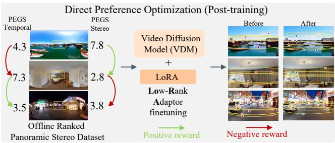  
Figure 7: DPO. We finetune a pre-trained panoramic video model using low-rank neural adaptors over stereo preference signal obtained from (good, bad) video pairs.

## 4.4 Stage 3: Viewing Refinement

Omnidirectional stereo for headset playback. Our pipeline places both eyes at fixed points in space, so the pair is only correct for a viewer facing one direction (Fig. 8.a). Headset playback needs omnidirectional stereo, where the disparity is correct for every gaze direction (Fig. 8.b).

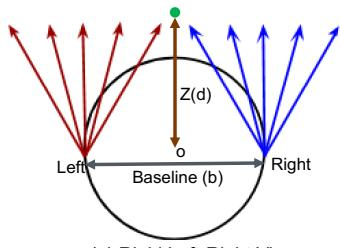

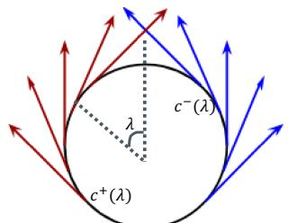  
(b) ODS Approximated Left-Right View  
Figure 8: Rigid Stereo to ODS Correction.

We convert it by re-sampling. Monocular depth has no scale of its own, so we first estimate depth for the left view and fix its scale by triangulating against the right view,

$$
Z ( \mathbf { d } ) = \underset { Z } { \arg \operatorname* { m i n } } \sum _ { i } \big \| \pi _ { R } \big ( \mathbf { c } _ { L } + Z ( \mathbf { d } _ { i } ) \mathbf { d } _ { i } \big ) - \mathbf { m } _ { i } \big \| ^ { 2 } ,\tag{11}
$$

where Z is the depth along each ray, cL the left-eye position, di the left-view rays, m their matches in the right view and π the righteye projection. We then re-render, rotating the eye pair around a small circle and taking each output column from the eye position facing it,

$$
\begin{array} { r } { { \bf c } ^ { \pm } ( \lambda ) = { \bf 0 } \pm \frac { b } { 2 } \hat { \bf t } ( \lambda ) , \qquad \hat { \bf t } ( \lambda ) = ( \cos \lambda , 0 , \sin \lambda ) , } \end{array}\tag{12}
$$

where $\mathbf { c } ^ { \pm }$ are the two eye positions for the column at longitude λ, o is the rig midpoint and b the interocular baseline.

4K Upsampling. Headset displays demand far more resolution than the generator produces, so we super-resolve both views before playback. Equi-rectangular frames cannot be fed directly to a stereo super-resolution network, so we split each view into cube faces and super-resolve the corresponding left–right face pairs with NAFSSR [5], then reassemble. Passing the two eyes through together keeps their detail consistent, which a per-view network would not guarantee. Ordering matters, as the omnidirectional stage re-renders both eyes from the left view, so we project first and super-resolve last.

## 5 RESULTS AND DISCUSSION

## 5.1 Dataset and Implementation

All generations use a frozen Wan2.1-1.3B backbone with the PanoWan [42] equirectangular LoRA; no backbone weights are updated. The left view is generated at 448 × 896 over 81 frames with 50 denoising steps and guidance 5.0. The right view is synthesized from it by depth-guided backward warping at a rig baseline of 0.05. Depth is generated on a per-frame basis using the panoramic monocular depth estimation model DAP [22].

We evaluate videos from two generation sets, Stage 1 and Stage 2. For each stage we select n = 500 videos, for evaluation on various axes as described next. For stage 2 refinement, we also generated an additional n = 500 videos from the stage 1 zero-shot phase. We train a rank-64 LoRA (α = 128) on the DiT attention and feedforward projections, leaving the backbone and the PanoWan adapter frozen, with Adam at learning rate $5 \times 1 0 ^ { - 6 }$ and an effective batch of 4. Preference pairs are formed only where the two samples differ by at least 5 mrad of PEGS, since pairs closer than that carry no reliable ordering. We check held-out PEGS every 25 steps and stop early: Fig. 9 shows the reward margin creeping up while the policy’s divergence from the reference accelerates, so late checkpoints drift from the reference model rather than improving on it.

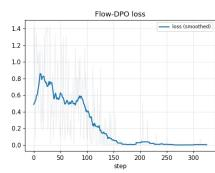

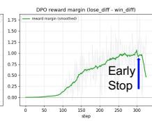

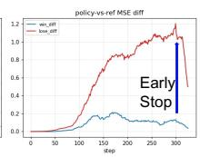  
Figure 9: Flow-DPO training. The reward margin creeps up while the policy’s divergence from the reference accelerates, so we stop early rather than train to convergence.

## 5.2 Metrics

We evaluate PEGS on three axes: Stereo compares left and right at fixed time. Temporal compares one eye across time, under pose obtained from RANSAC with moving content emission. Diagonal compares one eye against the other at a time offset. Lower is better on all three (measured in milli-radians on unit rays). A clip contributes to an axis only where a two-view pose is recoverable, which fails when parallax is too small to constrain it. We compare against Met3R [1], a learned measure of multi-view consistency.

It scores a pair of views in feature space rather than as an angular residual, so it is unitless and defined only on perspective images. Both metrics see the same frames.

Properties. We identify seven core properties that our metric must follow:

• Determinism: The same input gives the same score.

• Zero floor: An exact pair scores zero.

• Exchange symmetry: Swapping left and right gives the same score.

• Monotonicity: A larger error never scores lower.

• Frame invariance: Turning the whole $3 6 0 ^ { \circ }$ stereo left-right rig does not change the score.

• Calibration: The score equals the error injected.

• Motion robustness: Moving objects are excluded, not charged as error.

Table 2: Metric properties. ✓ holds, × violated, “—” not expressible.
<table><tr><td>Property</td><td>PEGS</td><td>MEt3R</td></tr><tr><td>Determinism</td><td>√</td><td>√</td></tr><tr><td>Zero floor</td><td>√</td><td>√</td></tr><tr><td>Exchange symmetry</td><td>√</td><td>√</td></tr><tr><td>Monotonicity</td><td>√</td><td>X</td></tr><tr><td>Frame invariance</td><td>√</td><td>一</td></tr><tr><td>Calibration</td><td>√</td><td>一</td></tr><tr><td>Motion robustness</td><td>√</td><td>×</td></tr></table>

As shown in Tab. 2, the two agree on the first three and differ on monotonicity, which decides whether a metric can order generations at all.

We start by injecting a frame misalignment of increasing size, and observe PEGS increases strictly and returns exactly the error given, a slope of 1.000 in milliradians; MEt3R rises then falls on eight different sweeps (Fig. 10). 0.38–0.68 mrad, MEt3R −10% to +27%.

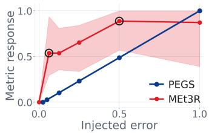  
Figure 10: Response to injected misalignment.

Frame invariance can-

not be posed for MEt3R since by comparing feature maps, it never forms the rigid two-view geometry needed for rotation. A feature distance carries no angle, so it can rank pairs but never say by how much one is wrong. Calibration is hence not possible, given 5 mrad of injected error PEGS returns 5 mrad, while MEt3R returns a feature distance corresponding to no physical quantity. Furthermore, under object motion our metric PEGS automatically eliminates motion while Met3R counts moving pixels towards matching breaking rigid two-view geometry assumptions as shown in Fig. 11.

## 5.3 Geometric Consistency

As shown in Tab. 3, both metrics agree on the axis Stage 2 is meant to fix. Stereo consistency improves under PEGS (3.121 → 2.640 mrad) and under MEt3R (0.096 → 0.081). Figure 7 shows the visual improvements in the output. Incorrect warp inpainting errors near the camera

The two disagree on the temporal axis, and the disagreement is informative. This axis compares two frames of the same eye, so it responds to how much the scene moves as well as to how consistent it is. PEGS discards non-rigid tracks before scoring and reports an improvement (1.494 → 1.263); MEt3R has no such test and reports the opposite. The diagonal axis asks for stereo and temporal consistency to hold at once and is the hardest to satisfy; neither metric shows a gain there, which is where the remaining headroom lies.

Frame 1  
Frame 2  
Met3R  
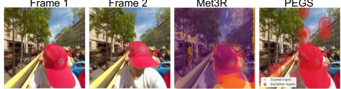  
PEGS  
Figure 11: Object motion breaks the rigid two-view model. A passenger turns his head and torso between frame t and t+20 while the background barely moves. MEt3R scores every pixel and charges the motion as inconsistency, whereas PEGS votes the moving tracks out (red, which also covers non-rigid foliage) and scores only the static scene: 1.10 vs. 2.54 mrad if they were retained.

Table 3: Evaluating PEGS and MEt3R on the two generation sets with 500 videos each; lower is better. PEGS is a tangent-space angular residual in milliradians, MEt3R a unitless feature-space dissimilarity, so the two scales are not comparable to each other; only down each column.
<table><tr><td></td><td colspan="2">PEGS (mrad)</td><td colspan="2">MEt3R [1] (unitless)</td></tr><tr><td>Axis</td><td>Stage 1</td><td>Stage 2</td><td>Stage 1</td><td>Stage 2</td></tr><tr><td>Stereo</td><td>3.121</td><td>2.640</td><td>0.096</td><td>0.081</td></tr><tr><td>Temporal</td><td>1.494</td><td>1.263</td><td>0.061</td><td>0.073</td></tr><tr><td>Diagonal</td><td>2.958</td><td>4.375</td><td>0.104</td><td>0.104</td></tr></table>

## 5.4 Comparing against State of the Art

DissolveStereo [37] generates stereo video from a monocular input by coarse depth injection with a noisy restart and iterative refinement, and is the closest published method to our right-view synthesis stage. It is a perspective method, with no mechanism for longitude wrap-around or the latitude-dependent sampling density of an equirectangular frame.

Figure 13 compares the two in terms of epipolar inconsistencies on the same sources (prompt → left view). We report this quantitatively in Tab. 4. The difference concentrates in the tail rather than the typical correspondence: the median residual barely separates the two methods, but correspondences that land far off their epipolar curve are three times rarer in our output. Ours is better on 46 of the 50 clips.

We also compare against OmniRoam [27], a camera-controlled panoramic generator, qualitatively in Fig. 14. Because its camera can be placed anywhere, the obvious way to obtain a stereo pair is to generate the right eye a second time from a laterally shifted camera. Sharing the left eye between the two arms isolates that choice. Table 5 shows it does not produce a usable pair: the two eyes are each plausible but do not describe one scene. Ours is better on 9 of the 10 clips.

## 5.5 Analysis

Omnidirectional Stereo. Our two eyes sit side by side, so a point should appear shifted only left or right between them, and that horizontal shift is what fuses into depth. A vertical shift cannot be fused at all, and simply causes strain. With a fixed rig the two eyes stop being side by side as soon as the viewer looks away from the forward direction, and that tilt appears as vertical shift. The

Table 4: Epipolar consistency against DissolveStereo, over 50 clips sharing the same prompt, seed and left eye, so only the right eye differs. A correspondence is inconsistent when it lies ≥ 20 mrad off its epipolar curve. Lower is better.
<table><tr><td>Method</td><td>Inconsistent</td><td>Inconsistent (%)</td><td>p95 (mrad)</td></tr><tr><td>DissolveStereo</td><td>282,949</td><td>8.2</td><td>15.4</td></tr><tr><td>Ours</td><td>88,459</td><td>2.6</td><td>8.4</td></tr></table>

Table 5: Against a camera pose-shift baseline, over 10 clips sharing the same OmniRoam left eye, so only the right eye differs. Lower is better; disparity is reported to show the comparison is not won by a narrower baseline.
<table><tr><td>Method</td><td>Inconsistent (%)</td><td>p95 (mrad)</td><td>Disparity (mrad)</td></tr><tr><td>Pose-shift</td><td>46.0</td><td>132.9</td><td>46.0</td></tr><tr><td>Ours</td><td>1.2</td><td>8.2</td><td>21.5</td></tr></table>

ODS eye offset ˆt(λ) stays perpendicular to the gaze wherever the viewer looks, so no strain appears. Figure 15 measures this on the delivered pixels: along one scanline the rigid pair reaches 4.73 px of vertical shift, worst near $\lambda = \pm 9 0 ^ { \circ }$ , while the converted pair stays at 0.04 px against a ground truth of exactly zero.

## 5.6 Ablations

Impact of DPO Refinement: We ablate the choice of preference signal by running the same DPO procedure with PEGS and with MEt3R as the reward (Fig. 16). With PEGS the median improves from 3.10 to 2.64 mrad, but the median understates what changed: the effect is concentrated in the tail, where clips scoring above 6 mrad thin out and the saturated bin at the top of the range falls from 35 clips to 11. This behavior is preferred from a geometric preference metric, since a clip whose stereo is wrong would be more noticeable than one that is marginally off. With MEt3R the distribution keeps its shape and its median moves the wrong way (0.053 → 0.081). We attribute this to what each signal ranks: PEGS orders clips by measured epipolar violation, whereas MEt3R’s feature-space score varies with scene content as much as with geometry, so the preference pairs it induces are not consistently ordered by consistency.

## 6 CONCLUSION

We generate 360◦ stereo video from a frozen monocular panoramic generator, with no stereo panoramic training data. The right eye comes from a spherical depth warp, and the model fills what the warp cannot. To measure the result we introduced PEGS, an angular epipolar residual on the viewing sphere that ignores non-rigid tracks and reports validity rather than a number when its assumptions fail. Used as the preference signal for DPO, it removes gross geometric failures rather than shifting the typical clip, and a final stage converts the pair to omnidirectional stereo for headset playback.

PEGS assumes a rigid scene, so it can only score moving content by discarding it. The clearest next step is a constraint that ties all views to one scene at once: our hardest axis, which asks for stereo and temporal consistency together, is the one that does not yet improve.

## REFERENCES

[1] M. Asim, C. Wewer, T. Wimmer, B. Schiele, and J. E. Lenssen. MEt3R: Measuring multi-view consistency in generated images. In CVPR, 2025. 6, 7

[2] M. Bain, A. Nagrani, G. Varol, and A. Zisserman. Frozen in time: A joint video and image encoder for end-to-end retrieval. In Proceed-

360-degree view of a bustling street scene with a shop entrance as the focal point.  
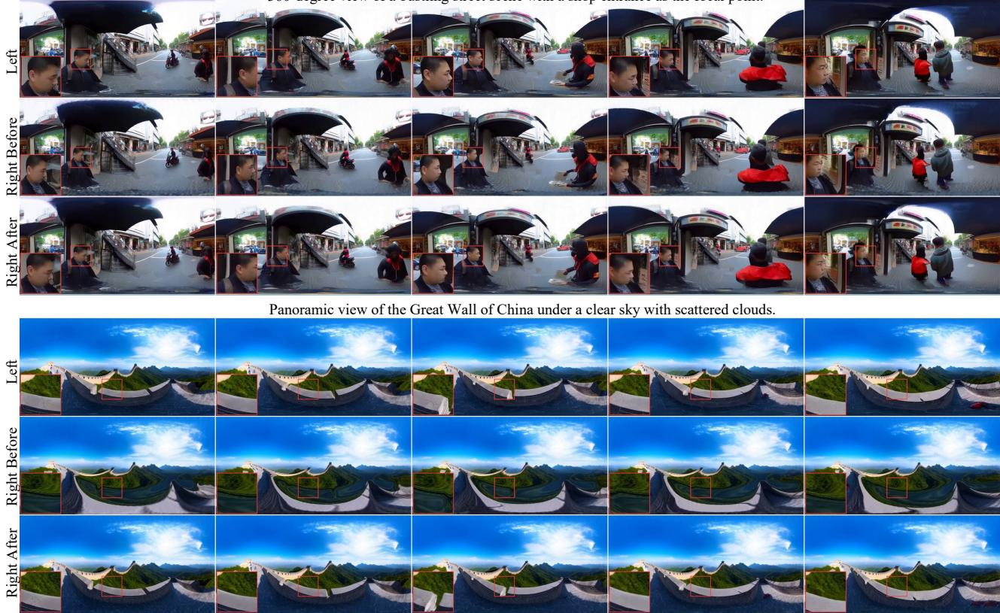  
Figure 12: DPO refinement. Our DPO refinement recovers fine geometry existing in the source left video lost during diffusion based inpainting over warped right view.

ings of the IEEE/CVF International Conference on Computer Vision (ICCV), pp. 1728–1738, 2021. 4

[3] K. Black, M. Janner, Y. Du, I. Kostrikov, and S. Levine. Training diffusion models with reinforcement learning. arXiv preprint arXiv:2305.13301, 2023. 3

[4] E. Carl, A. T. Stein, A. Levihn-Coon, J. R. Pogue, B. Rothbaum, P. Emmelkamp, G. J. G. Asmundson, P. Carlbring, and M. B. Powers. Virtual reality exposure therapy for anxiety and related disorders: A meta-analysis of randomized controlled trials. Journal of Anxiety Disorders, 61:27–36, 2019. 1

[5] X. Chu, L. Chen, and W. Yu. NAFSSR: Stereo image super-resolution using NAFNet. In CVPR Workshops (NTIRE), 2022. 6

[6] K. Clark, P. Vicol, K. Swersky, and D. J. Fleet. Directly finetuning diffusion models on differentiable rewards. arXiv preprin arXiv:2309.17400, 2023. 2

[7] M. Coban, Y. I. Bolat, and I. Goksu. The potential of immersive virtual reality to enhance learning: A meta-analysis. Educational Research Review, 36:100452, 2022. 1

[8] Y. Fan, O. Watkins, Y. Du, H. Liu, M. Ryu, C. Boutilier, P. Abbeel, M. Ghavamzadeh, K. Lee, and K. Lee. Reinforcement learning for fine-tuning text-to-image diffusion models. In Advances in Neural Information Processing Systems (NeurIPS), 2023. 3

[9] Google DeepMind. Veo. https://deepmind.google/ technologies/veo/, 2025. 2

[10] R. Hartley and A. Zisserman. Multiple View Geometry in Computer Vision. Cambridge University Press, 2nd ed., 2004. Sampson error: Sec. 11.4.3. 3

[11] A. Heffernan, M. Abdelmalek, and D. A. Nunez. Virtual and augmented reality in the vestibular rehabilitation of peripheral vestibular disorders: Systematic review and meta-analysis. Scientific Reports, 11(17843), 2021. 1

[12] T. Ho and M. Budagavi. Dual-fisheye lens stitching for 360-degree imaging. In ICASSP, 2017. 2

[13] L. Hollein and M. Nießner. World reconstruction from inconsistent¨ views. arXiv preprint arXiv:2603.16736, 2026. 2

[14] G. Humm, H. Mohan, C. Fleming, R. Harries, C. Wood, K. Dawas, D. Stoyanov, and L. B. Lovat. The impact of virtual reality simulation training on operative performance in laparoscopic cholecystectomy: Meta-analysis of randomized clinical trials. BJS Open, 6(4):zrac086, 2022. 1

[15] Y. Jin, Z. Sun, N. Li, K. Xu, H. Jiang, N. Zhuang, Q. Huang, Y. Song, Y. Mu, and Z. Lin. Pyramidal flow matching for efficient video generative modeling. arXiv preprint arXiv:2410.05954, 2024. 3

[16] D. Jung, J. Choi, Y. Lee, S. Jeong, T. Lee, D. Manocha, and S. Yeon. Edm: Equirectangular projection-oriented dense kernelized feature matching. In 2025 IEEE/CVF Conference on Computer Vision and Pattern Recognition (CVPR), pp. 6337–6347. IEEE, 2025. 5

[17] N. Karaev, I. Rocco, B. Graham, N. Neverova, A. Vedaldi, and C. Rupprecht. CoTracker: It is better to track together. In ECCV, 2024. 5

[18] W. Kong, Q. Tian, Z. Zhang, R. Min, Z. Dai, J. Zhou, J. Xiong, X. Li, B. Wu, J. Zhang, et al. Hunyuanvideo: A systematic framework for large video generative models. arXiv preprint arXiv:2412.03603, 2024. 2

[19] T. Korbak, H. Elsahar, G. Kruszewski, and M. Dymetman. On reinforcement learning and distribution matching for fine-tuning language models with no catastrophic forgetting. In NeurIPS, 2022. 5

[20] O. Kupyn, T. Uscidda, M. Tintore Gazulla, F. Manhardt, F. Tombari, and C. Rupprecht. Epipolar geometry improves video generation models. arXiv preprint arXiv:2510.21615, 2025. 2, 3, 5

[21] L. Li, G. Wang, X. Li, Z. Zhang, Q. Dou, J. Gu, T. Xue, and Y. Shan. Cubecomposer: Spatio-temporal autoregressive 4k 360 {\deg} video generation from perspective video. arXiv preprint arXiv:2603.04291, 2026. 1, 2

[22] X. Lin, M. Song, D. Zhang, W. Lu, H. Li, B. Du, M.-H. Yang, T. Nguyen, and L. Qi. Depth any panoramas: A foundation model for panoramic depth estimation. arXiv preprint arXiv:2512.16913, 2025.

Prompt: “Panoramic view of the Great Wall of China under a clear sky with scattered clouds.”

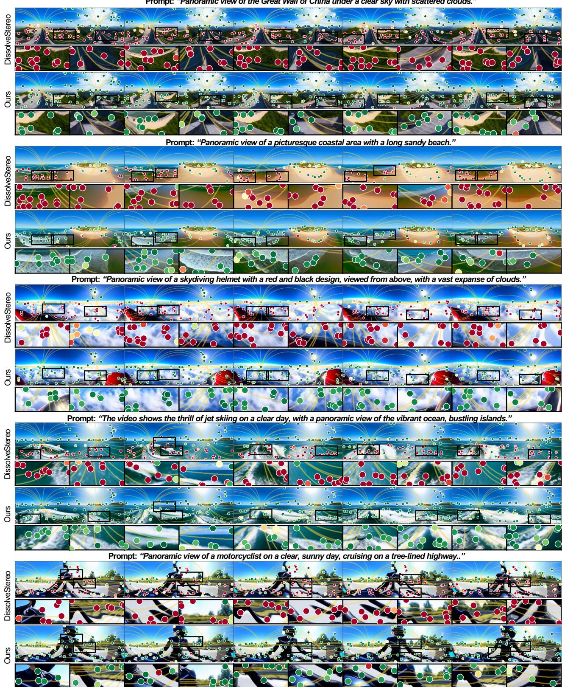  
Figure 13: Comparing epipolar against DissolveStereo [37]. We evaluate DissolveStereo’s zero-shot stereo adaptation procedure for panoramic stereo generation and compare against our method in terms of epipolar mismatches. Red indicates more epipolar mismatch and Green indicates less epipolar mismatches.

Prompt: “Walk forward through a dense street market, stalls and shoppers pressing close.”  
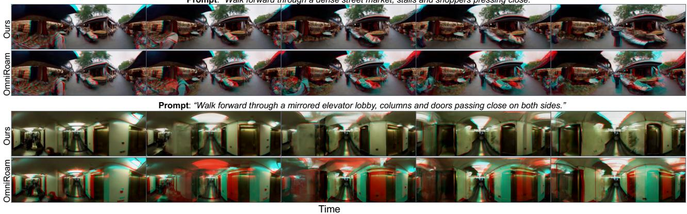  
Figure 14: Camera Controlled Stereo [OmniRoam] vs Ours. Our DPO based stereo adaptation performs better than adapting cameraconditioned video generation models such as OmniRoam which suffers from differing left-right generated views.

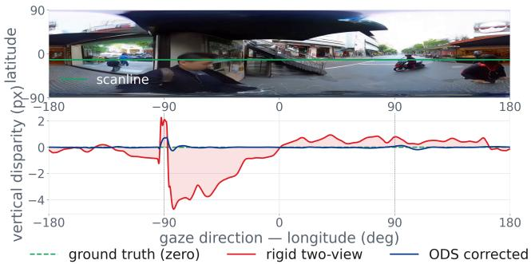  
Figure 15: Vertical disparity along one scanline, measured between the delivered eyes. Zero is the ground truth for a fusable pair. The rigid rendering departs from it most where the baseline aligns with the gaze; the omnidirectional conversion holds it at zero throughout.

4, 6

[23] Y. Lipman, R. T. Q. Chen, H. Ben-Hamu, M. Nickel, and M. Le. Flow matching for generative modeling. arXiv preprint arXiv:2210.02747, 2022. 2

[24] J. Liu, G. Liu, J. Liang, Z. Yuan, X. Liu, M. Zheng, X. Wu, Q. Wang, W. Qin, M. Xia, et al. Improving video generation with human feedback. arXiv preprint arXiv:2501.13918, 2025. 3

[25] X. Liu, C. Gong, and Q. Liu. Flow straight and fast: Learning to generate and transfer data with rectified flow. arXiv preprint arXiv:2209.03003, 2022. 2

[26] X. Liu, C. Gong, and Q. Liu. Flow straight and fast: Learning to generate and transfer data with rectified flow. In International Conference on Learning Representations, 2023. 3

[27] Y. Liu, X. Lin, X. Li, B. Yang, C. Wang, K. Sunkavalli, Y. Hold-Geoffroy, H. Tan, K. Zhang, X. Xie, et al. Omniroam: World wandering via long-horizon panoramic video generation. arXiv preprint arXiv:2603.30045, 2026. 7

[28] C. Meng, Y. He, Y. Song, J. Song, J. Wu, J.-Y. Zhu, and S. Ermon. Sdedit: Guided image synthesis and editing with stochastic differential equations. In International Conference on Learning Representations (ICLR), 2022. 4

[29] S. K. Nayar. Catadioptric omnidirectional camera. In CVPR, 1997. 1, 2

[30] L. Ouyang, J. Wu, X. Jiang, D. Almeida, C. Wainwright, P. Mishkin, C. Zhang, S. Agarwal, K. Slama, A. Ray, et al. Training language models to follow instructions with human feedback. Advances in Neural Information Processing Systems, 35:27730–27744, 2022. 2

[31] S. Peleg, M. Ben-Ezra, and Y. Pritch. Omnistereo: Panoramic stereo

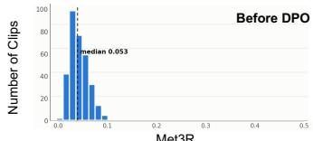

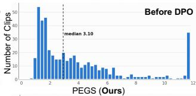

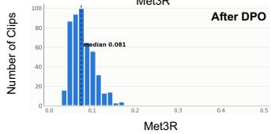

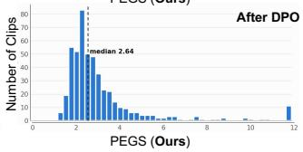  
Figure 16: Met3R vs PEGS. We perform DPO finetune ablation on both PEGS and Met3R with our framework and interestingly observe the tail-end distribution improvement offered by PEGS while Met3R barely shows any improvement.

imaging. IEEE Transactions on Pattern Analysis and Machine Intelligence, 23(3):279–290, 2001. 2

[32] X. B. Peng, A. Kumar, G. Zhang, and S. Levine. Advantage-weighted regression: Simple and scalable off-policy reinforcement learning. arXiv:1910.00177, 2019. 5

[33] A. Polyak, A. Zohar, A. Brown, et al. Movie gen: A cast of media foundation models. arXiv preprint arXiv:2410.13720, 2024. 3

[34] M. Prabhudesai, A. Goyal, D. Pathak, and K. Fragkiadaki. Aligning text-to-image diffusion models with reward backpropagation. arXiv preprint arXiv:2310.03739, 2023. 2

[35] R. Rafailov, A. Sharma, E. Mitchell, C. D. Manning, S. Ermon, and C. Finn. Direct preference optimization: Your language model is secretly a reward model. Advances in Neural Information Processing Systems, 36:53728–53741, 2023. 2, 3, 5

[36] C. Schuhmann. Laion-aesthetics. https://laion.ai/blog/ laion-aesthetics/, 2022. 2, 3

[37] J. Shi, Q. Wang, Z. Li, W. Cui, R. Idoughi, and P. Wonka. Dissolvestereo: Coarse depth injection for zero-shot stereo video generation. ACM Transactions on Graphics (TOG), 45(4):1–14, 2026. 1, 2, 4, 7, 9

[38] Y.-T. Sun et al. Stereo world model: Camera-guided stereo video generation. arXiv preprint arXiv:2603.17375, 2026. 2

[39] M. Terekhov and V. Larsson. Tangent sampson error: Fast approximate two-view reprojection error for central camera models. In Proceedings of the IEEE/CVF International Conference on Computer Vision (ICCV), pp. 3370–3378, 2023. 3, 5

[40] B. Wallace, M. Dang, R. Rafailov, L. Zhou, A. Lou, S. Purushwalkam, S. Ermon, C. Xiong, S. Joty, and N. Naik. Diffusion model alignment using direct preference optimization. In Proceedings ofthe IEEE/CVF

Conference on Computer Vision and Pattern Recognition (CVPR), pp. 8228–8238, 2024. 3

[41] A. Wang, B. Ai, B. Wen, C. Mao, C.-W. Xie, D. Chen, F. Yu, H. Zhao, J. Yang, J. Zeng, et al. Wan: Open and advanced large-scale video generative models. arXiv preprint arXiv:2503.20314, 2025. 2, 5

[42] Y. Xia et al. Panowan: Lifting diffusion video generation models to 360◦ with latitude/longitude-aware mechanisms. arXiv preprint arXiv:2505.22016, 2025. 1, 2, 4, 6

[43] Z. Xiang, S. Chen, L. Luo, and N. Zou. Compact omnidirectional multi-stereo vision system for 3d reconstruction. Applied Optics, 57(34):9929–9935, 2018. 2

[44] K. Xing et al. Stereoworld: Geometry-aware monocular-to-stereo video generation. arXiv preprint arXiv:2512.09363, 2025. 2

[45] Z. Xing, Q. Feng, H. Chen, Q. Dai, H. Hu, H. Xu, Z. Wu, and Y.-G. Jiang. A survey on video diffusion models. ACM Computing Surveys, 57(2):1–42, 2024. doi: 10.1145/3696415 2

[46] T. Yin, J. Shi, H. Guo, and X. Wang. Vigor: Video geometryoriented reward for temporal generative alignment. arXiv preprint arXiv:2603.16271, 2026. 2

[47] Y. Yin, H. Guo, F. Liu, M. Wang, H. Liang, E. Li, Y. Wang, X. Jin, Y. Zhao, and Y. Wei. Panoworld-x: Generating explorable panoramic worlds via sphere-aware video diffusion. arXiv preprint arXiv:2509.24997, 2025. 2

[48] S. Zhao, W. Wang, H. Li, X. Gu, Y. Zhang, Y. Shan, and X. Qie. Stereocrafter: Diffusion-based generation of long and high-fidelity stereoscopic 3d from monocular videos. arXiv preprint arXiv:2409.07447, 2024. 1, 2

[49] F. Zilly, J. Kluger, and P. Kauff. Production rules for stereo acquisition. Proceedings ofthe IEEE, 99(4):590–606, 2011. 1, 2