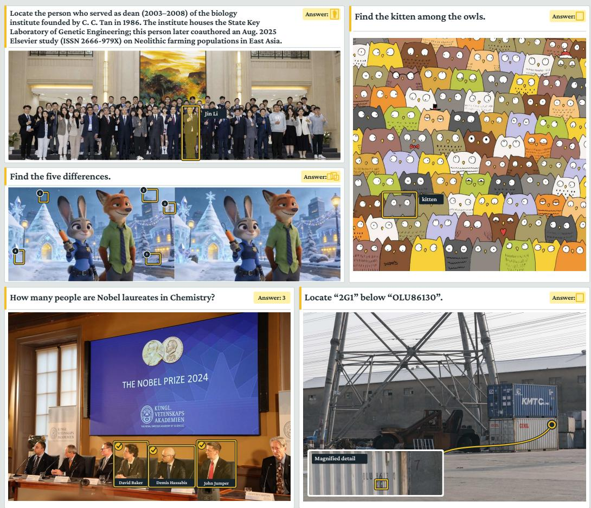
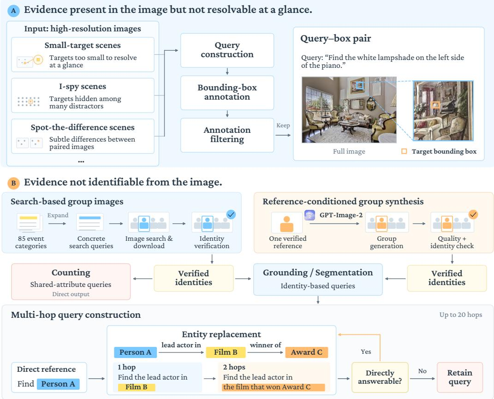
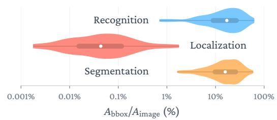
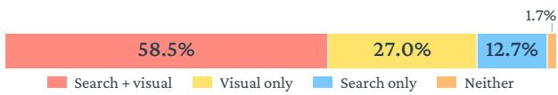
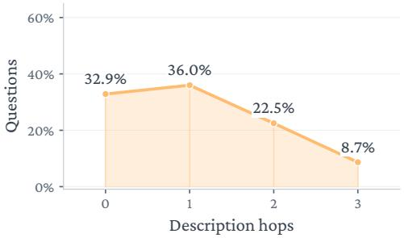
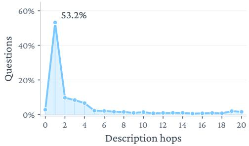
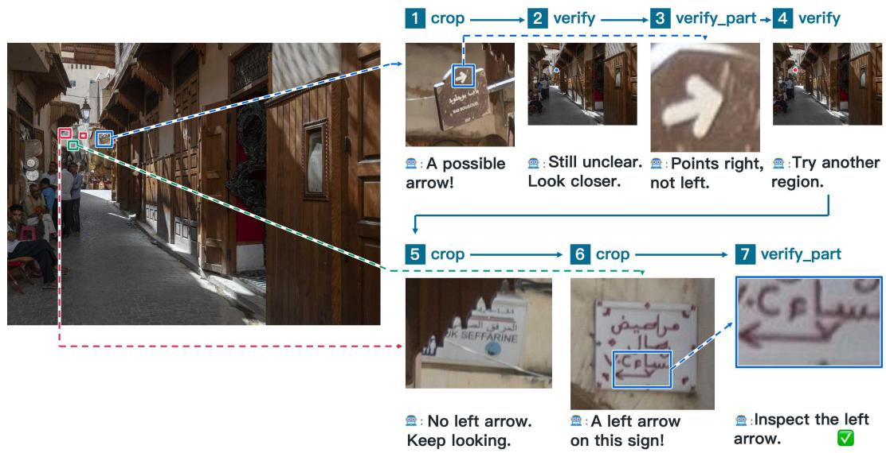
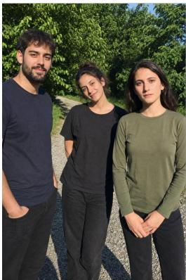
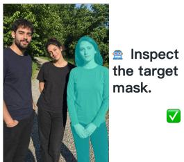

# EVIROVER: REINFORCING AGENTIC PERCEPTION BE-YOND A GLANCE

Kaixuan Fan1 Kaituo Feng1 Tianshuo Peng1 Yilei Jiang1 Manyuan Zhang1 Junke Wang2 Xiangyu Yue1,†

1MMLab, The Chinese University of Hong Kong

2Fudan University

†Corresponding author

https://github.com/kxfan2002/evirover

## ABSTRACT

Visual perception is conventionally formulated as a one-shot prediction from a single glance at the image, under the assumption that the image content and the model's parametric knowledge suffice to resolve the query. This assumption often fails in real-world scenarios that hinge on fine-grained visual details or require knowledge-intensive and up-to-date information. We term such cases perception under insufficient evidence and formulate perception as an agentic process that can obtain information beyond a single glance. To address the absence of data for this setting, we design two dedicated data generation pipelines, yielding EviRover-SFT-5K and EviRover-RL-12K for training. We further construct EviLens, a human-verified benchmark comprising 688 instances across five perception categories. Building on these data, we present EviRover, to our knowledge the first perception agent explicitly trained to resolve perceptual queries through interaction, using supervised fine-tuning followed by agentic reinforcement learning. Experiments show that the 4B EviRover outperforms its backbone by 30 points on average on EviLens, reaching performance comparable to advanced proprietary models. The gains transfer beyond EviLens to WebEyes, conventional perception benchmarks, and general multimodal benchmarks, including a 15-point improvement on BrowseComp-VL. All code, models, and data are released.

## 1 INTRODUCTION

Multimodal large language models (MLLMs) have progressed rapidly in reasoning and tool use (Ma et al., 2025; Feng et al., 2026; Du et al., 2026; Yan et al., 2026). These advances have enabled multimodal agents to address increasingly complex visual questions through multi-step interaction (Huang et al., 2026; Fan et al., 2026; Chu et al., 2026; Jiao et al., 2026). Yet in most such systems, agentic interaction serves question answering rather than perceptual prediction. Perception tasks themselves have largely retained their conventional formulation (Wang et al., 2026b; Tang et al., 2026b; Wang et al., 2026a; Deng et al., 2026; Pacini et al., 2026). Grounding, segmentation, and counting are still commonly treated as one-shot predictions from an image-query pair, based on a single glance at the input image. This formulation assumes that the image and the model's parametric knowledge are sufficient to resolve the query. In practice, fine-grained visual details may require closer inspection, while identifying the target may depend on knowledge beyond the image. We refer to such cases as perception under insufficient evidence. In these settings, a single glance is insufficient to determine the required perceptual output, yet the model must still produce a location, a boundary, or a count without the opportunity for further search.

We therefore reformulate perception under insufficient evidence as an evidence-seeking process. Rather than predicting directly from the initial observation, the model can search through finergrained visual inspection or external knowledge sources to resolve the perceptual task. Whereas existing multimodal agents (Huang et al., 2026; Wu et al., 2026; Zhang et al., 2025) gather evidence to support a textual answer, the proposed formulation treats the perceptual output itself as the objective. This makes perception a stricter test of evidence seeking: in question answering, searched evidence can be converted directly into a textual answer, whereas in perception it must be translated into a location, a boundary, or a count on the input image, which demands fine-grained visual understanding. Moreover, the perceptual output is directly verifiable against spatial or numerical annotations, and is correct only if the agent both acquires the missing evidence and correctly relates it to the visual content. Perception is also of considerable practical value, as accurate perception underpins downstream applications such as embodied manipulation (Zhang et al., 2024a; Kim et al., 2026) and image editing (Liu et al., 2024a; 2026). Despite these advantages, agentic perception poses a central challenge: the missing evidence varies across queries. A small target calls for closer inspection, whereas an unfamiliar identity calls for external search. Deciding what to acquire and how is therefore part of the task rather than a fixed procedure. Recent prompt-based workflows (Yang et al., 2026; Tang et al., 2026a) have begun to incorporate web search into perception. However, they rely on manually designed prompting strategies at inference time, so their searching behavior is bounded by human-designed heuristics rather than learned from task feedback. Liang et al. (2026) train an agent that interleaves reasoning with web search. But it is limited to segmentation and assumes that missing evidence is always external knowledge.

  
Figure 1: Representative examples from our training data and the EviLens benchmark.

Inspired by recent developments in agentic reinforcement learning for visual question answering (Zheng et al., 2026; Wu et al., 2026; Hong et al., 2026), we ask: can we train agents to learn when and how to search to push perception beyond a single glance?

To answer this question, we introduce EviRover, to our knowledge the first agent trained to search both within and beyond the image to resolve perceptual queries. EviRover moves beyond a single glance: at each step, it decides whether further evidence is needed and which action can provide it, before producing a location, a boundary, or a count. As existing perception datasets do not cover this setting, we design two data generation pipelines, each targeting one form of evidence insufficiency. For evidence present in the image but not discernible at a glance, we collect high-resolution images with targets occupying less than 0.1% of the image area, together with scenes requiring multi-step visual exploration, such as I-spy and spot-the-difference puzzles. For evidence beyond the image, we construct queries over group photographs of public figures and anime characters through two procedures: (1) starting from group photographs and verifying the identities of the depicted individuals; and (2) starting from a reference image of a known individual or character and synthesizing a group photograph containing them with GPT-Image-2 (OpenAI, 2026b), followed by filtering with Seed-2.0-Pro (Seed, 2026b) for visual quality and identity preservation. These pipelines yield two training sets, EviRover-SFT-5K and EviRover-RL-12K, and EviLens, a human-verified benchmark of 688 instances spanning segmentation, counting, and three grounding categories: localization, recognition, and spot-the-difference. Figure 1 presents representative examples.

Extensive experiments demonstrate the effectiveness of EviRover. On EviLens, EviRover improves over its Qwen3-VL-4B-Instruct backbone by 30 points on average across the five categories, bringing a 4B model to a level comparable with advanced proprietary models such as Seed-2.1-turbo and Gemini-3.5-Flash. We also evaluate on WebEyes (Yang et al., 2026), a benchmark for searchbased grounding, segmentation, and visual question answering, where EviRover improves over its backbone by 14.4 IoU on grounding and 24.7 gIoU on segmentation. The gains further extend beyond our setting: EviRover consistently improves on conventional perception benchmarks such as ReasonSeg (Lai et al., 2024) and RefCOCOg (Mao et al., 2016; Nagaraja et al., 2016), as well as general multimodal benchmarks, including MMMU (Yue et al., 2024), MMMU-Pro (Yue et al., 2025), and MathVerse (Zhang et al., 2024b), with a 15-point gain on BrowseComp-VL (Geng et al., 2026). These results indicate that learning to search under insufficient evidence not only enhances perception but also yields capabilities that generalize well beyond the training distribution.

Our contributions can be summarized as follows:

• We identify perception under insufficient evidence and reformulate perception as an evidence-seeking process that looks beyond a single glance.

• We present EviRover, to our knowledge the first perception agent trained to determine what evidence is missing and how to acquire it.

• To address the absence of data for perception under insufficient evidence, we design two dedicated data generation pipelines, yielding EviRover-SFT-5K, EviRover-RL-12K, and EviLens, a human-verified benchmark of 688 instances.

• Extensive experiments validate EviRover: it improves over its backbone by 30 points on average on EviLens and generalizes to WebEyes, conventional perception benchmarks, and general multimodal benchmarks.

## 2 RELATED WORK

Visual Perception. Grounding (Kamath et al., 2021), segmentation (Hu et al., 2016), and counting (Amini-Naieni et al., 2023) are conventionally formulated as predicting a location, a boundary, or a count from an image and a query. Beyond specialized detectors (Liu et al., 2024b), segmentation models (Carion et al., 2025), and counting models (Amini-Naieni et al., 2024), MLLM-based methods extend these tasks to free-form queries requiring reasoning (Lai et al., 2024; You & Wu, 2025; Liu et al., 2025). In parallel, a growing body of work has focused specifically on fine-grained perception of small objects in high-resolution images (Goto et al., 2025; Zhang et al., 2026; Jia et al., 2026). However, these advances retain the one-shot formulation, in which the evidence needed to resolve the query is assumed to be present in the input image. Our work lifts this assumption, allowing the perceptual prediction to draw on evidence acquired beyond a single glance at the image.

Evidence-Seeking Multimodal Agents. A broad class of visual questions cannot be resolved from the image and the model's parametric knowledge alone (Chen et al., 2023; Zeng et al., 2026; Choi et al., 2026). One line of work, often referred to as thinking with images (Su et al., 2025), enables models to actively inspect image regions through operations such as zooming and cropping (Zheng et al., 2026; Wu & Xie, 2024; Guo et al., 2026; Zhang et al., 2025). Another line develops multimodal search agents that acquire external knowledge through web search, progressing from short-horizon search to long-horizon deep research (Wu et al., 2026; Geng et al., 2026; Huang et al., 2026; Yao et al., 2026). However, these works acquire evidence to produce textual answers, treating perception as a means rather than an end. Recent attempts extend search to segmentation and grounding (Yang et al., 2026; Tang et al., 2026a; Liang et al., 2026), but either rely on manually designed prompting or restrict evidence seeking to external search for a specific task. In contrast, our work treats perception as the goal of evidence seeking, where the acquired evidence must be resolved into a perceptual prediction on the input image. Since the kind of evidence a query lacks varies, deciding what to acquire and how becomes an integral part of the task.

  
Figure 2: Overview of our data generation pipeline.

## 3 METHOD

## 3.1 DATASET CONSTRUCTION

As illustrated in Figure 2, we design two dedicated data generation pipelines targeting different forms of missing evidence.

Evidence present in the image but not resolvable at a glance. We collect high-resolution images containing targets so small that they cannot be resolved without inspecting the image at a finer scale, in many cases occupying well under 0.1% of the image area, together with images where the target can only be found by comparing or scanning multiple regions, such as I-spy and spot-the-difference scenes. Images are adapted from Mini-o3 (Lai et al.,

  
Figure 3: Distribution of target area relative to image area.

2026a) and collected from the web through image search.

Evidence beyond the image. We construct perception queries over group photographs of people, including public figures and anime characters, through two complementary procedures.

The first collects real group photographs and verifies the identities of the people they depict. We begin from a manually written seed list of 85 event categories spanning award ceremonies, music groups, esports competitions, political summits, product launches, academic events, sports competitions, and entertainment programs. We prompt Seed-1.8 to expand each category into concrete search queries, which are then issued to an image search engine to obtain group photographs and their associated captions. However, captions are an unreliable source of identity annotations, as they are absent for most collected images and frequently incomplete or inaccurate when present. We therefore verify identities independently using Seed-2.0-Pro equipped with web search tools.

The second procedure starts from a reference image of a known individual or character and synthesizes a group photograph containing that individual. Since single-person images with verifiable identities are far more abundant than group photographs in which every identity can be verified, this procedure covers a substantially broader range of identities. We initially explored conditioning generation on multiple verified reference images simultaneously. For real individuals, identity preservation degrades sharply as the number of references increases, remaining reliable for only up to approximately three references. Beyond this number, the generated individuals can no longer be reliably matched to their references through reverse image search, a failure further confirmed by manual inspection. Anime characters, in contrast, are defined by distinctive visual traits such as hairstyles and costumes, and remain well preserved under multi-reference conditioning. We therefore condition each generation of real individuals on a single reference identity while leaving the other individuals in the scene unconstrained, and condition anime generation on multiple character references. The images are synthesized with GPT-Image-2 and filtered by Seed-2.0-Pro, which assesses visual quality and verifies identity preservation by searching for the generated individual and confirming that the results match the reference identity.

The two procedures thus yield group photographs with different levels of identity coverage: real photographs may have some or all depicted individuals verified, synthesized photographs of real individuals contain exactly one verified individual, and synthesized anime images may contain multiple verified characters.

Query construction. The verified identities serve as ground truth for query construction. Grounding and segmentation queries require at least one verified identity per image, which serves as the target to be localized or segmented. Counting queries require every depicted individual to be verified, and are formulated over attributes shared among them, such as affiliation with a particular institution or receipt of a particular honor.

In their initial form, these queries name the target directly, for example by asking for the mask of a specific individual. A model that recognizes the named individual can resolve such queries without seeking any additional evidence. To make evidence seeking necessary, we rewrite each query into a multi-hop form through iterative entity replacement. At each step, we select an entity in the current query, obtain its public profile through a search engine, and prompt GPT-5.4-mini to replace the entity with an indirect description that identifies it without naming it. The replacement terminates once Seed-1.8 can no longer resolve the query without tools, with a maximum of 20 hops.

SFT trajectory construction. We generate agent trajectories for the constructed queries, using Gemini-3.0-Pro for localization queries and Seed-2.0- Pro for the remaining tasks, and retain only those that reach the correct answer

  
Figure 4: Tool-use composition of EviRover-SFT-5K.

through a logically consistent sequence of actions. Correctness alone, however, does not ensure that a trajectory exhibits the intended behavior. For example, queries about widely recognized individuals are often resolved by a single search or directly from parametric knowledge, involving little evidence seeking. We therefore downsample such trajectories while retaining a portion of them, so that the model learns both to answer directly when its knowledge suffices and to seek evidence when it does not. Figure 4 shows the resulting composition of EviRover-SFT-5K.

Table 1: Comparison of EviLens with existing perception benchmarks.
<table><tr><td rowspan="2">Benchmark</td><td colspan="3">Task</td><td colspan="3">Required ability</td></tr><tr><td>Grounding Segmentation</td><td></td><td>Counting</td><td>Visual acquisition</td><td>Visual comparison</td><td>External knowledge</td></tr><tr><td>RefCOCOg (Mao et al., 2016)</td><td>√</td><td>J</td><td>X</td><td>X</td><td>X</td><td>X</td></tr><tr><td>ReasonSeg (Lai et al., 2024)</td><td>X</td><td>√</td><td>X</td><td>X</td><td>X</td><td>√</td></tr><tr><td>Ref-Adv (Dong et al., 2026)</td><td>√</td><td>X</td><td>X</td><td>X</td><td>√</td><td>X</td></tr><tr><td>SOREC (Goto et al., 2025)</td><td>√</td><td>X</td><td>X</td><td>√</td><td>X</td><td>X</td></tr><tr><td>OK-VOS (Liang et al., 2026)</td><td>X</td><td>√</td><td>X</td><td>X</td><td>X</td><td>√</td></tr><tr><td>WebEyes (Yang et al., 2026)</td><td>√</td><td>√</td><td>X</td><td>X</td><td>X</td><td>√</td></tr><tr><td>EviLens (Ours)</td><td>L</td><td>1</td><td>1</td><td>L</td><td>J</td><td>J</td></tr></table>

Together, these procedures yield two training sets, EviRover-SFT-5K and EviRover-RL-12K.

## 3.2 EVILENS

We construct EviLens with the pipelines above and manually verify every instance, yielding a benchmark of 688 instances for evaluating perception under insufficient evidence. It covers segmentation, counting, and three grounding categories that differ in the type of missing evidence. Localization targets are explicitly named but tiny or hidden among clutter, as in high-resolution scenes and Ispy puzzles. Recognition targets are visually salient but referred to indirectly, requiring external information to identify. Spot-the-difference targets are defined relative to a second panel and require cross-panel comparison. Segmentation and counting share the recognition setting but output masks and counts, respectively.

Table 1 compares EviLens with existing benchmarks in task coverage and required abilities. EviLens contains 140 localization, 182 recognition, 15 spot-the-difference, 195 segmentation, and 156 counting instances, with the spot-the-difference instances comprising 79 annotated differences in total.

Metrics. Recognition and localization are evaluated by mean box IoU and R@0.5. Segmentation is evaluated by gIoU (mean per-instance IoU) and cIoU (cumulative intersection over cumulative union). Counting is evaluated by exact-match accuracy. Spot-the-difference is evaluated by microand macro-F1 under greedy one-to-one matching at IoU 0.5, where micro-F1 pools matches across images and macro-F1 averages per-image scores.

## 3.3 MODEL TRAINING

We train EviRover in two stages. SFT establishes the interaction format and basic tool-use skills, while RL teaches the model to identify what evidence each query lacks and how to acquire it, using the correctness of the final perceptual output as feedback.

Agent framework. EviRover operates with a set of ten tools, shared across trajectory labeling, training, and evaluation. Four tools acquire external evidence: text search, text-to-image search, image search, and web browsing. Three tools support fine-grained visual inspection, such as cropping a region for closer examination and rendering a candidate region on the original image for verification. The remaining three support task-specific prediction: SAM3-based mask generation, side-by-side region comparison for spot-the-difference queries, and a Python interpreter. Table 6 summarizes the available tools; detailed specifications and complete tool schemas are provided in Appendix A.5.2.

Supervised fine-tuning. We fine-tune Qwen3-VL-4B-Instruct on EviRover-SFT-5K (Section 3.1) to initialize tool use and task-specific prediction. The loss is computed only over model-generated tokens, with tool observations masked.

Reinforcement learning. We further optimize the SFT model on EviRover-RL-12K. Since the training data span heterogeneous perception tasks with substantially different reward distributions, we adopt EMA-GRPO (Feng et al., 2026), which maintains task-specific running reward statistics to normalize the learning signal across tasks.

We use task-specific outcome rewards in [0, 1]. Let p denote a predicted box and g its ground-truth counterpart, and let ê and c denote the predicted and ground-truth counts. For segmentation, let M be the mask returned by SAM3 from the predicted box and point prompts, and M the ground-truth mask. The reward is

$$
R = \left\{ \begin{array} { l l } { \mathrm { I o U } ( \hat { p } , g ) , } & { \mathrm { g r o u n d i n g } , } \\ { \mathrm { I o U } ( \hat { M } , M ) , } & { \mathrm { s e g m e n t a t i o n } , } \\ { \mathbb { 1 } [ \hat { c } = c ] , } & { \mathrm { c o u n t i n g } , } \\ { F _ { 1 } ^ { \mathrm { s o f t } } ( \hat { P } , G ) , } & { \mathrm { s p o t } \mathrm { t h e } \mathrm { - d i f f e r e n c e } , } \end{array} \right.\tag{1}
$$

where segmentation predictions are required to provide a bounding box together with at least one positive and one negative point.

For spot-the-difference, a prediction may recover only a subset of the annotated differences, so we use a soft set-level reward. Let $\hat { P } = \{ \hat { p } _ { 1 } , . . . , \hat { p } _ { n } \}$ be the predicted boxes in the left panel and $G = \{ g _ { 1 } , \dots , g _ { m } \}$ the annotated differences. We form the candidate set

$$
{ \mathcal { C } } = \{ ( i , j ) : \operatorname { I o U } ( { \hat { p } } _ { i } , g _ { j } ) \geq \tau \} ,\tag{2}
$$

sort candidate pairs by IoU in descending order, and greedily construct a one-to-one matching M. Each matched pair is weighted by its overlap:

$$
\mathrm { S T P } = \sum _ { ( i , j ) \in \mathcal { M } } \mathrm { I o U } ( \hat { p } _ { i } , g _ { j } ) ^ { \alpha } , \qquad F _ { 1 } ^ { \mathrm { s o f t } } = \frac { 2 \mathrm { S T P } } { n + m } ,\tag{3}
$$

with the reward taken as zero when $n + m = 0$ . The threshold τ admits partially correct boxes, while α downweights low-quality matches; implementation details are provided in Appendix A.2.1.

For policy-loss aggregation, we use sequence-mean-token-mean reduction instead of the token-mean reduction used in EMA-GRPO. This avoids the length bias of token-mean, which linearly amplifies the influence of long rollouts and can cause a small number of unusually long trajectories to disproportionately dominate the policy update. We discuss this choice in detail in Appendix A.4.

## 4 EXPERIMENTS

## 4.1 TRAINING AND EVALUATION SETTINGS

Training details. We initialize from Qwen3-VL-4B-Instruct and train on a single node of 8 NVIDIA A800-80GB GPUs with FSDP. Both stages use AdamW $( \beta = ( 0 . 9 , 0 . 9 9 9 )$ , weight decay 0.01) with gradient clipping at 1.0. Supervised fine-tuning uses a learning rate of $5 \times 1 0 ^ { - 6 }$ under a cosine schedule with warmup ratio 0.03, a global batch size of 64, and 2 epochs. Reinforcement learning uses a constant learning rate without warmup, and samples 8 rollouts for each of 8 prompts per step, giving 64 rollouts per step divided into 4 mini-batches for the policy update.

Evaluation details. We evaluate primarily on EviLens, and additionally on WebEyes, a searchbased grounding, segmentation and VQA benchmark. All methods receive the same input prompt (Appendix A.5.1) and use the same task-specific output interfaces, with coordinates normalized to [0, 1000] and boxes in xyxy format. Direct baselines predict a box from the image and query in a single pass; segmentation converts the predicted box into a mask with SAM3, and counting returns an integer. Agentic baselines and EviRover additionally have access to the tool framework of Section 3.3, with a limit of 35 tool calls per trajectory. Further details are given in Appendix A.3.

## 4.2 PERFORMANCE ANALYSIS ON EVILENS

As shown in Table 2, EviLens is challenging for all model families. Among proprietary models, Gemini-3.5-Flash, Seed-2.1-Turbo, and GPT-5.6-Sol perform best overall. Gemini-3.5-Flash and Seed-2.1-Turbo lead on recognition and counting, and Seed-2.1-Turbo achieves the highest segmentation score of any model (0.779 gIoU). GPT-5.6-Sol performs notably poorly on spot-thedifference, achieving a micro-F1 of only 0.112, as it consistently predicts a single bounding box even when the prompt indicates multiple differences.

Table 2: Evaluation results on EviLens.
<table><tr><td rowspan="3">Model</td><td colspan="5">Grounding</td><td colspan="2">Segmentation</td><td rowspan="2">Counting</td></tr><tr><td colspan="2">Localization</td><td colspan="2">Recognition</td><td colspan="2">Spot Diff</td><td></td><td></td></tr><tr><td>IoU</td><td>R@.5</td><td>IoU</td><td>R@.5</td><td>F1mi</td><td>F1ma</td><td>gIoU</td><td>cIoU Acc</td></tr><tr><td colspan="9">Closed-source Models</td></tr><tr><td>GPT-5.6-Sol (OpenAI, 2026a)</td><td>0.358</td><td>0.407</td><td>0.615</td><td>0.660</td><td>0.112 0.087</td><td></td><td>0.627 0.699</td><td>51.3</td></tr><tr><td>GPT-5.6-Luna (OpenAI, 2026a)</td><td>0.264</td><td>0.250</td><td>0.533</td><td>0.571</td><td>0.192</td><td>0.224</td><td>0.544 0.564</td><td>35.5</td></tr><tr><td>GPT-5.6-Terra (OpenAI, 2026a)</td><td>0.304</td><td>0.321</td><td>0.528</td><td>0.548</td><td>0.231</td><td>0.313 0.539</td><td>0.567</td><td>43.4</td></tr><tr><td>Seed-2.1-Turbo (ByteDance Seed, 2026)</td><td>0.331</td><td>0.326</td><td>0.636</td><td>0.674</td><td>0.241</td><td>0.273</td><td>0.779 0.714</td><td>60.5</td></tr><tr><td>Seed-1.8 (Seed, 2026a)</td><td>0.360</td><td>0.393</td><td>0.542</td><td>0.560</td><td>0.190</td><td>0.274</td><td>0.613 0.610</td><td>48.0</td></tr><tr><td>Qwen3.7-Plus (Qwen Team, 2026)</td><td>0.351</td><td>0.414</td><td>0.569</td><td>0.606</td><td>0.137</td><td>0.187 0.577</td><td>0.576</td><td>46.7</td></tr><tr><td>Gemini-3.5-Flash (Google DeepMind, 2026)</td><td>0.373</td><td>0.421</td><td>0.636</td><td>0.668</td><td>0.274</td><td>0.280 0.579</td><td>0.582</td><td>61.8</td></tr><tr><td colspan="9">Open-Source Segmentation Models</td></tr><tr><td>Seg-R1-7B (You &amp; Wu, 2025)</td><td>一</td><td>一</td><td>一</td><td>一</td><td>一</td><td></td><td>0.266 0.382</td><td></td></tr><tr><td>Seg-Zero-7B (Liu et al., 2025)</td><td></td><td></td><td></td><td></td><td></td><td></td><td>0.343 0.407</td><td></td></tr><tr><td>SAM3-Agent (Carion et al., 2025)</td><td></td><td></td><td></td><td>一</td><td></td><td>0.213</td><td>0.287</td><td></td></tr><tr><td colspan="9">Open-Source Grounding Models</td></tr><tr><td>Perception-R1 (Yu et al., 2026)</td><td>0.007</td><td>0.000</td><td>0.106</td><td>0.044</td><td>0.000</td><td>0.000</td><td>一</td><td>17.3</td></tr><tr><td>UniVG-R1 (Bai et al., 2025b)</td><td>0.051</td><td>0.036</td><td>0.283</td><td>0.264</td><td>0.014</td><td>0.016</td><td>一 1</td><td>一</td></tr><tr><td colspan="9">Open-Source General Models</td></tr><tr><td>Minimax-M3 (Lai et al., 2026b)</td><td>0.018</td><td>0.000</td><td>0.286</td><td>0.329</td><td>0.010</td><td>0.013</td><td>0.329 0.469</td><td>37.8</td></tr><tr><td>OneThinker-8B (Feng et al., 2026)</td><td>0.110</td><td>0.086</td><td>0.353</td><td>0.357</td><td>0.065</td><td>0.106</td><td>0.409 0.387</td><td>25.6</td></tr><tr><td>InternVL-3.5-8B (Wang et al., 2025)</td><td>0.020</td><td>0.007</td><td>0.093</td><td>0.033</td><td>0.000 0.000</td><td>0.081</td><td>0.081</td><td>20.5</td></tr><tr><td colspan="9">Our Models</td></tr><tr><td>Qwen3VL-4B-Inst (Bai et al., 2025a)</td><td>0.276</td><td>0.251</td><td>0.265</td><td>0.231</td><td>0.005</td><td>0.008</td><td>0.203 0.279</td><td>19.2</td></tr><tr><td>+ SFT</td><td>0.369</td><td>0.371</td><td>0.595</td><td>0.626</td><td>0.114</td><td>0.179 0.584</td><td>0.633</td><td>42.8</td></tr><tr><td>EviRover(Ours)</td><td>0.444</td><td>0.500</td><td>0.648</td><td>0.687</td><td>0.171</td><td>0.266</td><td>0.686 0.708</td><td>50.0</td></tr></table>

Open-source models perform substantially worse. Despite strong results on conventional perception benchmarks, segmentation specialists reach at most 0.343 gIoU, and grounding specialists achieve near-zero IoU on localization. General-purpose opensource MLLMs exhibit similarly limited performance. The difficulty of EviLens therefore lies not in perceptual precision but in acquiring the evidence each query lacks, a capability that existing perception benchmarks do not evaluate.

Against this backdrop, EviRover achieves the best localization and recognition results of all evaluated models, with a clear margin on lo-

Table 3: Evaluation results on the WebEyes benchmark.
<table><tr><td rowspan=1 colspan=1>Model</td><td rowspan=1 colspan=3>Grounding ||IoU R@.5|</td><td rowspan=1 colspan=1>|Segmentation|gIoU cIoU</td><td rowspan=1 colspan=1>VQA</td></tr><tr><td rowspan=2 colspan=1>Doubao-Seed-2.0-ProGemini-3.1-Pro</td><td rowspan=2 colspan=3>35.744.430.535.1</td><td rowspan=1 colspan=1>61.2  43.3</td><td rowspan=1 colspan=1>65.4</td></tr><tr><td rowspan=1 colspan=1>35.1</td><td rowspan=1 colspan=1>54.6 38.8</td><td rowspan=1 colspan=1>63.8</td></tr><tr><td rowspan=3 colspan=1>Qwen3VL-4B-InstQwen3VL-8B-InstPixel-Searcher-8B</td><td rowspan=1 colspan=2>25.6</td><td rowspan=1 colspan=1>29.9</td><td rowspan=1 colspan=1>24.8  21.7</td><td rowspan=1 colspan=1>36.0</td></tr><tr><td rowspan=2 colspan=3>26.834.141.3</td><td rowspan=1 colspan=1>6.8 32.6</td><td rowspan=1 colspan=1>35.8 25.9</td><td rowspan=1 colspan=1>36.3</td></tr><tr><td rowspan=1 colspan=1>39.1  32.4</td><td rowspan=1 colspan=1>42.2</td></tr><tr><td rowspan=1 colspan=1>EviRover(Ours)</td><td rowspan=1 colspan=3>40.048.5</td><td rowspan=1 colspan=1>49.5 38.0</td><td rowspan=1 colspan=1>40.3</td></tr></table>

calization (0.444 IoU versus 0.373 for Gemini-3.5-Flash), and ranks second on segmentation behind Seed-2.1-Turbo. On counting and spot-the-difference, where its backbone scores 19.2 and 0.005 respectively, EviRover surpasses most proprietary models, coming within 1.3 points of GPT-5.6-Sol on counting. Relative to its backbone, EviRover improves the primary metric of every category, by 30.2 points on average, bringing a 4B model to a level comparable with the strongest proprietary systems.

## 4.3 PERFORMANCE ON WEBEYES

Table 3 reports results on WebEyes, where baseline results are taken from the original paper and bold marks the best result among open-source models. EviRover achieves the best grounding performance among all evaluated models, including the proprietary systems, with 40.0 IoU and 48.5 R@0.5. On segmentation, it outperforms Pixel-Searcher-8B, a prompt-based workflow built on a larger backbone, by 10.4 gIoU. On VQA, a task absent from our training data, it performs comparably to Pixel-Searcher-8B. These results suggest that the evidence-seeking behavior learned by EviRover transfers beyond EviLens.

## 4.4 GENERALIZATION BEYOND EVILENS

Conventional perception. To examine whether evidence-seeking training affects standard perception, we evaluate EviRover on grounding and segmentation in ReasonSeg and RefCOCOg (Table 4). EviRover improves over its backbone on every split and metric, and outperforms task-specific models on most metrics, such as Seg-Zero-7B on segmentation and Perception-R1 on grounding. The capabilities acquired through evidence-seeking training thus carry over to conventional perception.

Table 4: Evaluation results on traditional perception benchmarks.
<table><tr><td rowspan="3">Model</td><td colspan="4">ReasonSeg</td><td colspan="6">RefCOCOg Grounding</td><td colspan="4">RefCOCOg Segmentation</td></tr><tr><td colspan="2">Val</td><td colspan="2">Test</td><td colspan="2"></td><td colspan="2">Val</td><td colspan="2">Test</td><td colspan="2">Val</td><td colspan="2">Test</td></tr><tr><td>gIoU</td><td>cIoU</td><td>gIoU</td><td>cIoU</td><td>@50</td><td>@75</td><td>@95</td><td>@50</td><td>@75</td><td>@95</td><td>gIoU</td><td>cIoU</td><td>gIoU</td><td>cIoU</td></tr><tr><td>Seg-Zero-7B</td><td>62.6</td><td>62.0</td><td>57.5</td><td>52.0</td><td></td><td></td><td></td><td></td><td></td><td></td><td>68.3</td><td>65.3</td><td>68.8</td><td>66.8</td></tr><tr><td>Perception-R1</td><td></td><td></td><td></td><td></td><td>85.6</td><td>75.6</td><td>31.7</td><td>85.3</td><td>75.9</td><td>32.7</td><td></td><td></td><td></td><td></td></tr><tr><td>Qwen3VL-4B-Inst</td><td>63.9</td><td>58.9</td><td>60.9</td><td>53.9</td><td>85.7</td><td>74.9</td><td>28.6</td><td>85.3</td><td>75.4</td><td>29.4</td><td>71.6</td><td>68.8</td><td>72.3</td><td>69.9</td></tr><tr><td>EviRover (Ours)</td><td>68.7</td><td>62.3</td><td>62.6</td><td>56.5</td><td>86.1</td><td>76.4</td><td>31.5</td><td>85.4</td><td>76.7</td><td>32.5</td><td>73.7</td><td>71.9</td><td>73.7</td><td>72.3</td></tr></table>

General multimodal benchmarks. Beyond perception, we assess whether the learned behavior benefits broader multimodal capabilities, spanning multidisciplinary reasoning (MMMU and MMMU-Pro), mathematical reasoning (MathVerse), and agentic visual search (BrowseComp-VL), as shown in Table 5. EviRover improves over its backbone on all four benchmarks. On the reasoning benchmarks the gains reach up to 4 points, while on BrowseComp-VL accuracy more than doubles, rising from 9.5 to 24.8. The consistent gains on reasoning show that specializing in evidenceseeking perception also improves the model's general capabilities, and the substantially larger gain on BrowseComp-VL shows that the learned behavior transfers to agentic visual question answering, which requires acquiring external evidence.

Table 5: Generalization to unseen benchmarks.
<table><tr><td rowspan="2">Model</td><td>MMMU</td><td>MMMU-Pro</td><td>MathVerse</td><td colspan="3">BrowseComp-VL</td></tr><tr><td>Acc.</td><td>Std. Vision</td><td>Overall</td><td>L1</td><td>L2</td><td>Overall</td></tr><tr><td>Qwen3-VL-4B-Inst</td><td>63.1</td><td>44.5</td><td>46.9</td><td>62.4</td><td>10.6 8.5</td><td>9.5</td></tr><tr><td>EviRover (Ours)</td><td>66.2</td><td>48.5 48.4</td><td>64.5</td><td>33.7</td><td>16.0</td><td>24.8</td></tr></table>

## 5 CONCLUSION

In this work, we study perception under insufficient evidence, where a single glance at the image does not suffice to resolve the query. We reformulate perception in this setting as an evidenceseeking process. To support this formulation, we develop two dedicated data generation pipelines and construct EviLens, a human-verified benchmark for evaluating perception under insufficient evidence. Building on these data, we train EviRover to actively seek the missing evidence required by each query through supervised fine-tuning followed by agentic reinforcement learning. Experiments show that EviRover substantially improves over its backbone on EviLens and WebEyes, and that these gains extend to conventional perception and general multimodal benchmarks. These results suggest that perception can move beyond a single glance: learning to identify and acquire missing evidence improves perceptual accuracy and yields evidence-seeking capabilities that generalize to broader multimodal reasoning.

## REFERENCES

Niki Amini-Naieni, Kiana Amini-Naieni, Tengda Han, and Andrew Zisserman. Open-world textspecified object counting. arXiv preprint arXiv:2306.01851, 2023.

Niki Amini-Naieni, Tengda Han, and Andrew Zisserman. Countgd: Multi-modal open-world counting. Advances in Neural Information Processing Systems, 37:48810–48837, 2024.

Shuai Bai, Yuxuan Cai, Ruizhe Chen, Keqin Chen, Xionghui Chen, Zesen Cheng, Lianghao Deng, Wei Ding, Chang Gao, Chunjiang Ge, Wenbin Ge, Zhifang Guo, Qidong Huang, Jie Huang, Fei Huang, Binyuan Hui, Shutong Jiang, Zhaohai Li, Mingsheng Li, Mei Li, Kaixin Li, Zicheng Lin, Junyang Lin, Xuejing Liu, Jiawei Liu, Chenglong Liu, Yang Liu, Dayiheng Liu, Shixuan Liu, Dunjie Lu, Ruilin Luo, Chenxu Lv, Rui Men, Lingchen Meng, Xuancheng Ren, Xingzhang Ren, Sibo Song, Yuchong Sun, Jun Tang, Jianhong Tu, Jianqiang Wan, Peng Wang, Pengfei Wang, Qiuyue Wang, Yuxuan Wang, Tianbao Xie, Yiheng Xu, Haiyang Xu, Jin Xu, Zhibo Yang, Mingkun Yang, Jianxin Yang, An Yang, Bowen Yu, Fei Zhang, Hang Zhang, Xi Zhang, Bo Zheng, Humen Zhong, Jingren Zhou, Fan Zhou, Jing Zhou, Yuanzhi Zhu, and Ke Zhu. Qwen3-vl technical report. arXiv preprint arXiv:2511.21631, 2025a.

Sule Bai, Mingxing Li, Yong Liu, Jing Tang, Haoji Zhang, Lei Sun, Xiangxiang Chu, and Yansong Tang. Univg-r1: Reasoning guided universal visual grounding with reinforcement learning. arXiv preprint arXiv:2505.14231, 2025b.

ByteDanceSeed. Seed2.1OfficiallyReleased: AdvancingAI Productivity. https://seed.bytedance.com/en/blog/ seed2-1-officially-released-advancing-ai-productivity,June 2026.

Nicolas Carion, Laura Gustafson, Yuan-Ting Hu, Shoubhik Debnath, Ronghang Hu, Didac Suris, Chaitanya Ryali, Kalyan Vasudev Alwala, Haitham Khedr, Andrew Huang, Jie Lei, Tengyu Ma, Baishan Guo, Arpit Kalla, Markus Marks, Joseph Greer, Meng Wang, Peize Sun, Roman Rädle, Triantafyllos Afouras, Effrosyni Mavroudi, Katherine Xu, Tsung-Han Wu, Yu Zhou, Liliane Momeni, Rishi Hazra, Shuangrui Ding, Sagar Vaze, Francois Porcher, Feng Li, Siyuan Li, Aishwarya Kamath, Ho Kei Cheng, Piotr Dollár, Nikhila Ravi, Kate Saenko, Pengchuan Zhang, and Christoph Feichtenhofer. Sam 3: Segment anything with concepts, 2025. URL https://arxiv.org/abs/2511.16719.

Yang Chen, Hexiang Hu, Yi Luan, Haitian Sun, Soravit Changpinyo, Alan Ritter, and Ming-Wei Chang. Can pre-trained vision and language models answer visual information-seeking questions? In Houda Bouamor, Juan Pino, and Kalika Bali (eds.), Proceedings of the 2023 Conference on Empirical Methods in Natural Language Processing, pp. 14948–14968, Singapore, December 2023. Association for Computational Linguistics. doi: 10.18653/v1/2023.emnlp-main.925. URL https://aclanthology.org/2023.emnlp-main.925/.

Changin Choi, Wonseok Lee, Jungmin Ko, and Wonjong Rhee. Progressive multimodal search and reasoning for knowledge-intensive visual question answering. In Maria Liakata, Viviane P. Moreira, Jiajun Zhang, and David Jurgens (eds.), Proceedings of the 64th Annual Meeting of the Association for Computational Linguistics (Volume 1: Long Papers), pp. 19291–19315, San Diego, California, United States, July 2026. Association for Computational Linguistics. ISBN 979-8-89176-390-6. doi: 10.18653/v1/2026.acl-long.881. URL https: //aclanthology. org/2026.acl-1ong.881/.

Zheng Chu, Xiao Wang, Jack Hong, Huiming Fan, Yuqi Huang, Yue Yang, Guohai Xu, Chenxiao Zhao, Cheng Xiang, Shengchao Hu, et al. Redsearcher: A scalable and cost-efficient framework for long-horizon search agents. arXiv preprint arXiv:2602.14234, 2026.

Ken Deng, Yunhan Yang, Jingxiang Sun, Xihui Liu, Yebin Liu, Ding Liang, and Yan-Pei Cao. Geosam2: Unleashing the power of sam2 for 3d part segmentation. In Proceedings of the IEEE/CVF Conference on Computer Vision and Pattern Recognition, pp. 6367–6376, 2026.

Qihua Dong, Kuo Yang, Lin Ju, Handong Zhao, Yitian Zhang, Yizhou Wang, Huimin Zeng, Jianglin Lu, and Yun Fu. Ref-adv: Exploring mllm visual reasoning in referring expression tasks. arXiv preprint arXiv:2602.23898, 2026.

Yifan Du, Zikang Liu, Jinbiao Peng, Jie Wu, Junyi Li, Jinyang Li, Wayne Xin Zhao, and Ji-Rong Wen. Towards long-horizon agentic multimodal search. arXiv preprint arXiv:2604.12890, 2026.

Kaixuan Fan, Kaituo Feng, Haoming Lyu, Dongzhan Zhou, and Xiangyu Yue. Sophiavl-r1: Reinforcing mllms reasoning with thinking reward. In International Conference on Learning Representations, volume 2026, pp. 9290–9310, 2026.

Kaituo Feng, Manyuan Zhang, Hongyu Li, Kaixuan Fan, Shuang Chen, Yilei Jiang, Dian Zheng, Peiwen Sun, Yiyuan Zhang, Haoze Sun, et al. Onethinker: All-in-one reasoning model for image and video. In Proceedings of the IEEE/CVF Conference on Computer Vision and Pattern Recognition, pp. 5432–5443, 2026.

Xinyu Geng, Peng Xia, Zhen Zhang, Xinyu Wang, Qiuchen Wang, Ruixue Ding, Chenxi Wang, Jialong Wu, Kuan Li, Yida Zhao, et al. Webwatcher: Breaking new frontiers of vision-language deep research agent. In International Conference on Learning Representations, volume 2026, pp. 61240–61271, 2026.

Google DeepMind. Gemini 3.5 Flash: Model Card. https: //deepmind. google/models/ model-cards/gemini-3-5-flash/,May2026.

Kanoko Goto, Takumi Hirose, Mahiro Ukai, Shuhei Kurita, and Nakamasa Inoue. Referring expression comprehension for small objects. In 2025 IEEE/CVF International Conference on Computer Vision (ICCV), pp. 21231–21242. IEEE, 2025.

Zirun Guo, Minjie Hong, Feng Zhang, Kai Jia, and Tao Jin. Thinking with programming vision: Towards a unified view for thinking with images. In Proceedings of the IEEE/CVF Conference on Computer Vision and Pattern Recognition, pp. 33467–33476, 2026.

Jack Hong, Chenxiao Zhao, ChengLin Zhu, Weiheng Lu, and Guohai Xu. Deepeyesv2: Toward agentic multimodal model. In International Conference on Learning Representations, volume 2026, pp. 114851–114872, 2026.

Ronghang Hu, Marcus Rohrbach, and Trevor Darrell. Segmentation from Natural Language Expressions. In European Conference on Computer Vision, pp. 108–124, 2016. doi: 10.1007/978-3-319-46448-0\_7. URL https://mlanthology.org/eccv/2016/ hu2016eccv-segmentation/.

Wenxuan Huang, Yu Zeng, Qiuchen Wang, Zhen Fang, Shaosheng Cao, Zheng Chu, Qingyu Yin, Shuang Chen, Zhenfei Yin, Lin Chen, et al. Vision-deepresearch: Incentivizing deepresearch capability in multimodal large language models. arXiv preprint arXiv:2601.22060, 2026.

Wenqi Jia, Ruifan Li, Pengyue Lin, Fangxiang Feng, Zhanyu Ma, and Xiaojie Wang. Small object, great challenge: A benchmark for small object visual grounding. In Conference on Computer Vision and Pattern Recognition 2026, 2026. URL https://openreview.net/forum? id=rWFSj0L615.

Zhengbo Jiao, Yiming Cheng, Yilei Jiang, Kaituo Feng, Rui Huang, Tianyi Jiang, Juanxi Tian, Qunzhong Wang, Tailai Chen, Qianshan Wei, et al. Searcheyes: Towards frontier multimodal deep search intelligence via search world simulation. arXiv preprint arXiv:2607.05943, 2026.

Aishwarya Kamath, Mannat Singh, Yann LeCun, Gabriel Synnaeve, Ishan Misra, and Nicolas Carion. Mdetr-modulated detection for end-to-end multi-modal understanding. In 2021 IEEE/CVF international conference on computer vision (ICCV), pp. 1760–1770. IEEE, 2021.

Seonho Kim, Junhyeong Hong, Kyungjae Lee, and Yoonseon Oh. Insight bench: Towards grounded in-situ guidance for robotic manipulation. In Proceedings of the IEEE/CVF Conference on Computer Vision and Pattern Recognition (CVPR), pp. 35070–35079, June 2026.

Xin Lai, Zhuotao Tian, Yukang Chen, Yanwei Li, Yuhui Yuan, Shu Liu, and Jiaya Jia. Lisa: Reasoning segmentation via large language model. In 2024 IEEE/CVF Conference on Computer Vision and Pattern Recognition (CVPR), pp. 9579–9589. IEEE, 2024.

Xin Lai, Junyi Li, Wei Li, Tao Liu, Tianjian Li, and Hengshuang Zhao. Mini-o3: Scaling up reasoning patterns and interaction turns for visual search. In International Conference on Learning Representations, volume 2026, pp. 76722–76746, 2026a.

Xunhao Lai, Weiqi Xu, Yufeng Yang, Qiaorui Chen, Yang Xu, Lunbin Zeng, Xiaolong Li, Haohai Sun, Haichao Zhu, Vito Zhang, et al. Minimax sparse attention. arXiv preprint arXiv:2606.13392, 2026b.

Tianming Liang, Qirui Du, Jian-Fang Hu, Haichao Jiang, Zicheng Lin, and Wei-Shi Zheng. Seg-research: Segmentation with interleaved reasoning and external search. arXiv preprint arXiv:2602.04454, 2026.

Chang Liu, Xiangtai Li, and Henghui Ding. Referring image editing: Object-level image editing via referring expressions. In Proceedings of the IEEE/CVF Conference on Computer Vision and Pattern Recognition (CVPR), pp. 13128–13138, June 2024a.

Delong Liu, Haotian Hou, Zhaohui Hou, Zhiyuan Huang, Shihao Han, Mingjie Zhan, Zhicheng Zhao, and Fei Su. Inter-edit: First benchmark for interactive instruction-based image editing. In Proceedings of the IEEE/CVF Conference on Computer Vision and Pattern Recognition (CVPR), pp. 37290–37300, June 2026.

Shilong Liu, Zhaoyang Zeng, Tianhe Ren, Feng Li, Hao Zhang, Jie Yang, Qing Jiang, Chunyuan Li, Jianwei Yang, Hang Su, et al. Grounding dino: Marrying dino with grounded pre-training for open-set object detection. In European conference on computer vision, pp. 38–55. Springer, 2024b.

Yuqi Liu, Bohao Peng, Zhisheng Zhong, Zihao Yue, Fanbin Lu, Bei Yu, and Jiaya Jia. Segzero: Reasoning-chain guided segmentation via cognitive reinforcement. arXiv preprint arXiv:2503.06520, 2025.

Yan Ma, Linge Du, Xuyang Shen, Shaoxiang Chen, Pengfei Li, Qibing Ren, Lizhuang Ma, Yuchao Dai, Pengfei Liu, and Junjie Yan. One rl to see them all: Visual triple unified reinforcement learning. arXiv preprint arXiv:2505.18129, 2025.

Junhua Mao, Jonathan Huang, Alexander Toshev, Oana Camburu, Alan L. Yuille, and Kevin Murphy. Generation and comprehension of unambiguous object descriptions. In Proceedings of the IEEE Conference on Computer Vision and Pattern Recognition (CVPR), June 2016.

Varun K Nagaraja, Vlad I Morariu, and Larry S Davis. Modeling context between objects for referring expression understanding. In European conference on computer vision, pp. 792–807. Springer, 2016.

OpenAI. GPT-5.6 System Card. https://deploymentsafety.openai.com/gpt-5-6, July 2026a.

OpenAI. GPT-Image-2. https://developers.openai.com/api/docs/models/ gpt–image-2, 2026b. OpenAI API model documentation.

Giacomo Pacini, Lorenzo Bianchi, Luca Ciampi, Nicola Messina, Giuseppe Amato, and Fabrizio Falchi. Countingdino a training-free pipeline for class-agnostic counting using unsupervised backbones. In 2026 IEEE/CVF Winter Conference on Applications of Computer Vision (WACV), pp. 806–815. IEEE, 2026.

Qwen Team. Qwen3.7-Plus: Multimodal agent intelligence, May 2026. URL https : //qwen. ai/blog?id=qwen3.7-plus.

Bytedance Seed. Seed1. 8 model card: Towards generalized real-world agency. arXiv preprint arXiv:2603.20633, 2026a.

Bytedance Seed. Seed2. 0 model card: Towards intelligence frontier for real-world complexity. arXiv preprint arXiv:2607.00248, 2026b.

Zhaochen Su, Peng Xia, Hangyu Guo, Zhenhua Liu, Yan Ma, Xiaoye Qu, Jiaqi Liu, Yanshu Li, Kaide Zeng, Zhengyuan Yang, et al. Thinking with images for multimodal reasoning: Foundations, methods, and future frontiers. arXiv preprint arXiv:2506.23918, 2025.

Song Tang, Guangquan Jie, Henghui Ding, and Yu-Gang Jiang. Rose: Retrieval-oriented segmentation enhancement. arXiv preprint arXiv:2604.14147, 2026a.

Wei Tang, Yanpeng Sun, Qinying Gu, and Zechao Li. Visual position prompt for mllm based visual grounding. IEEE Transactions on Multimedia, 2026b.

Hao Wang, Limeng Qiao, Zequn Jie, Zhijian Huang, Chengjian Feng, Qingfang Zheng, Lin Ma, Xiangyuan Lan, and Xiaodan Liang. X-sam: From segment anything to any segmentation. In Proceedings of the AAAI Conference on Artificial Intelligence, volume 40, pp. 26187–26196, 2026a.

Shihao Wang, Shilong Liu, Yuanguo Kuang, Xinyu Wei, Yangzhou Liu, Zhiqi Li, Yunze Man, Guo Chen, Andrew Tao, Guilin Liu, et al. Locateanything: Fast and high-quality vision-language grounding with parallel box decoding. In European Conference on Computer Vision, pp. 336– 357. Springer, 2026b.

Weiyun Wang, Zhangwei Gao, Lixin Gu, Hengjun Pu, Long Cui, Xingguang Wei, Zhaoyang Liu, Linglin Jing, Shenglong Ye, Jie Shao, et al. Internvl3.5: Advancing open-source multimodal models in versatility, reasoning, and efficiency. arXiv preprint arXiv:2508.18265, 2025.

Jinming Wu, Zihao Deng, Wei Li, Yiding Liu, Bo You, Bo Li, Zejun MA, and Ziwei Liu. MMSearch-r1: Incentivizing LMMs to search. In Maria Liakata, Viviane P. Moreira, Jiajun Zhang, and David Jurgens (eds.), Proceedings of the 64th Annual Meeting of the Association for Computational Linguistics (Volume 1: Long Papers), pp. 2456–2487, San Diego, California, United States, July 2026. Association for Computational Linguistics. ISBN 979-8-89176- 390-6. doi: 10.18653/v1/2026.acl-long.114. URL https://aclanthology.org/2026. acl-long.114/.

Penghao Wu and Saining Xie. V\*: Guided visual search as a core mechanism in multimodal llms. In 2024 IEEE/CVF Conference on Computer Vision and Pattern Recognition (CVPR), pp. 13084– 13094. IEEE, 2024.

Wentao Yan, Shengqin Wang, Huichi Zhou, Yihang Chen, Kun Shao, Yuan Xie, and Zhizhong Zhang. Prommsearchagent: A generalizable multimodal search agent trained with processoriented rewards. arXiv preprint arXiv:2604.20486, 2026.

Bokang Yang, Xinyi Sun, Kaituo Feng, Xingping Dong, Dongming Wu, and Xiangyu Yue. From web to pixels: Bringing agentic search into visual perception. arXiv preprint arXiv:2605.12497, 2026.

Huanjin Yao, Qixiang Yin, Min Yang, Ziwang Zhao, Yibo Wang, Haotian Luo, Jingyi Zhang, and Jiaxing Huang. Mm-deepresearch: A simple and effective multimodal agentic search baseline. arXiv preprint arXiv:2603.01050, 2026.

Zuyao You and Zuxuan Wu. Seg-r1: Segmentation can be surprisingly simple with reinforcement learning. arXiv preprint arXiv:2506.22624, 2025.

En Yu, Kangheng Lin, Liang Zhao, Yana Wei, Yuang Peng, Haoran Wei, Jianjian Sun, Chunrui Han, Zheng Ge, Xiangyu Zhang, et al. Perception-r1: Pioneering perception policy with reinforcement learning. Advances in Neural Information Processing Systems, 38:94827–94853, 2026.

Xiang Yue, Yuansheng Ni, Kai Zhang, Tianyu Zheng, Ruoqi Liu, Ge Zhang, Samuel Stevens, Dongfu Jiang, Weiming Ren, Yuxuan Sun, et al. Mmmu: A massive multi-discipline multimodal understanding and reasoning benchmark for expert agi. In Proceedings of the IEEE/CVF conference on computer vision and pattern recognition, pp. 9556–9567, 2024.

Xiang Yue, Tianyu Zheng, Yuansheng Ni, Yubo Wang, Kai Zhang, Shengbang Tong, Yuxuan Sun, Botao Yu, Ge Zhang, Huan Sun, et al. Mmmu-pro: A more robust multi-discipline multimodal understanding benchmark. In Proceedings of the 63rd Annual Meeting of the Association for Computational Linguistics (Volume 1: Long Papers), pp. 15134–15186, 2025.

Yu Zeng, Wenxuan Huang, Zhen Fang, Shuang Chen, Yufan Shen, Yishuo Cai, Xiaoman Wang, Zhenfei Yin, Lin Chen, Zehui Chen, et al. Vision-deepresearch benchmark: Rethinking visual and textual search for multimodal large language models. arXiv preprint arXiv:2602.02185, 2026.

Junjie Zhang, Chenjia Bai, Haoran He, Wenke Xia, Zhigang Wang, Bin Zhao, Xiu Li, and Xuelong Li. Sam-e: leveraging visual foundation model with sequence imitation for embodied manipulation. arXiv preprint arXiv:2405.19586, 2024a.

Lu Zhang, Jiazuo Yu, Haomiao Xiong, Ping Hu, Yunzhi Zhuge, Huchuan Lu, and You He. Finers: Fine-grained reasoning and segmentation of small objects with reinforcement learning. Advances in Neural Information Processing Systems, 38:67403–67426, 2026.

Renrui Zhang, Dongzhi Jiang, Yichi Zhang, Haokun Lin, Ziyu Guo, Pengshuo Qiu, Aojun Zhou, Pan Lu, Kai-Wei Chang, Yu Qiao, et al. Mathverse: Does your multi-modal llm truly see the diagrams in visual math problems? In European Conference on Computer Vision, pp. 169–186. Springer, 2024b.

Yi-Fan Zhang, Xingyu Lu, Shukang Yin, Chaoyou Fu, Wei Chen, Xiao Hu, Bin Wen, Kaiyu Jiang, Changyi Liu, Tianke Zhang, et al. Thyme: Think beyond images. arXiv preprint arXiv:2508.11630, 2025.

Ziwei Zheng, Minghao Yang, Jack Hong, Chenxiao Zhao, Guohai Xu, Le Yang, and Chao Shen. Deepeyes: Incentivizing"thinking with images" via reinforcement learning. In International Conference on Learning Representations, volume 2026, pp. 126775–126798, 2026.

## A APPENDIX

## A.1 DATASET CONSTRUCTION

We use Gemini-3.0-Pro as the annotation model for localization because, at the time of data annotation, it was the only model that could successfully complete the task

Beyond correctness, we also filter SFT trajectories by their behavior patterns. Trajectories in which the annotation model answers directly, or verifies its answer with only a single tool call, typically reflect knowledge that the annotation model already possesses. Since Qwen3VL-4B-Instruct may lack this knowledge, imitating such trajectories would teach it to answer without supporting evidence, encouraging hallucination. We therefore downsample these trajectories, retaining a portion so that the model still learns to answer directly when its own knowledge suffices.

Figure 5 shows the distribution of description hops constructed for anime and real-person queries in the RL data. Anime queries contain substantially fewer hops than real-person queries. Since entity replacement terminates once Seed-1.8 can no longer resolve the query without tools, this difference reflects the limited coverage of anime characters in the model's parametric knowledge. For example, a single hop describing a character as released in a specific game at a particular time with a particular skill is often sufficient to terminate the construction.

  
(a) Anime questions

  
(b) Real-person questions  
Figure 5: Distribution of description hops in the RL data for anime and real-person questions.

## A.2 TRAINING DETAILS

## A.2.1 REWARD DETAILS

Segmentation fallback. The segmentation reward requires SAM3 to return a mask for the predicted box and point prompts. When SAM3 fails to produce a mask, we do not assign zero reward. Under group-relative advantage estimation, a zero reward is not a neutral outcome: it enters the group mean and shifts the advantages of every other rollout for the same prompt, so a tool failure unrelated to prediction quality would corrupt the learning signal for the rest of the group. We instead treat the predicted box as a rectangular mask and compute the IoU against the ground truth, which preserves the ordering of rollouts by localization quality while remaining a strict lower bound on what SAM3 would have returned. Trajectories scored this way are flagged in the training metadata so that the fallback rate can be monitored.

## Spot-the-difference matching. We set $\tau = 0 . 1$ and $\alpha = 2 .$

The candidate threshold τ is deliberately set below the evaluation threshold of 0.5. Using the evaluation threshold for reward computation would assign zero credit to predictions that overlap a groundtruth difference but have not yet reached the evaluation criterion, yielding no intermediate reward signal for approximately localized predictions. Setting $\tau = 0 . 1$ instead allows such predictions to receive partial credit and provides a denser learning signal during training.

A low matching threshold alone, however, can make weak overlaps overly rewarding. In particular, if every match above τ were counted as a unit true positive, a loosely localized box with IoU = 0.1 would receive the same positive credit as a tightly localized one with $\mathrm { \tilde { I o U } = 0 . 9 }$ . This can encourage overprediction, since emitting additional coarse boxes increases the chance of obtaining low-IoU matches. We therefore weight each matched pair by IoUα. With $\alpha = 2$ , for example, matches at IoU 0.15 and 0.9 contribute 0.0225 and 0.81, respectively. Thus, weak matches remain informative but contribute substantially less than well-localized predictions.

This weighting also interacts naturally with the set-level precision-recall trade-off. Let the current soft true-positive mass be S and the current reward be

$$
F _ { 1 } ^ { \mathrm { s o f t } } = \frac { 2 S } { n + m } .
$$

Adding one prediction that matches a previously unmatched ground-truth difference with IoU q changes the reward to

$$
{ \frac { 2 ( S + q ^ { \alpha } ) } { n + m + 1 } } .
$$

The additional prediction improves the reward if and only if

$$
q ^ { \alpha } > \frac { S } { n + m } = \frac { F _ { 1 } ^ { \mathrm { s o f t } } } { 2 } .
$$

Hence, an additional box is beneficial only when the quality of the newly recovered match is sufficiently high relative to the current set-level performance. Unmatched or duplicate predictions increase n without increasing S and therefore strictly decrease the reward. Together, the low threshold τ and the exponent α provide a dense signal for approximate localization while discouraging indiscriminate or overly coarse box proposals.

Matching is greedy rather than optimal. Sorting candidate pairs by IoU and accepting each pair whose predicted box and ground-truth region are both unmatched costs $O ( n m \log n m )$ and is stable in practice, whereas optimal bipartite matching would change the reward only in rare configurations where a lower-IoU pairing yields a higher total.

## A.3 EVALUATION DETAILS

Coordinate formats. Gemini predicts boxes in yxyx format, as $( y _ { \mathrm { m i n } } , x _ { \mathrm { m i n } } , y _ { \mathrm { m a x } } , x _ { \mathrm { m a x } } )$ whereas the remaining models use xyxy, as $( x _ { \mathrm { m i n } } , y _ { \mathrm { m i n } } , x _ { \mathrm { m a x } } , y _ { \mathrm { m a x } } )$ . All predictions are converted to a common format before scoring.

Decoding and tools. All models are decoded at temperature 0.7. Text search, image search, and text-to-image search are served by Serper; web page content is retrieved with Jina.

Spot-the-difference. Predicted boxes are first restricted to those lying entirely within the left panel, since the task requires differences to be marked there. The remaining boxes are matched to the annotated differences by greedy one-to-one assignment: candidate pairs with IoU at least 0.5 are sorted by IoU in descending order, and each pair is accepted if neither its predicted box nor its annotated region has already been matched. Each accepted pair counts as a true positive. Precision, recall, and F1 are then computed from the resulting counts. We report micro F1, which pools true positives, predictions, and annotated regions across all images before computing F1, and macro F1, which computes F1 per image and averages over images. Micro F1 is treated as the primary metric: with 15 images containing 79 annotated differences, it is the more stable of the two. Each instance is evaluated over eight rollouts, and both metrics are averaged across rollouts.

## A.4 WHY TOKEN-MEAN REDUCTION Is ILL-SUITED FOR AGENTIC RL

We consider a group of N trajectories sampled for the same input. Let trajectory i contain $L _ { i }$ valid response tokens and receive a trajectory-level advantage $A _ { i } .$ In GRPO, the advantages are centered

within each group, such that

$$
\sum _ { i = 1 } ^ { N } A _ { i } = 0 .\tag{4}
$$

For clarity, we first omit PPO clipping and importance ratios, since the issue considered here arises purely from the reduction over tokens and trajectories. Let

$$
g _ { i , t } = \nabla _ { \theta } \log \pi _ { \theta } ( a _ { i , t } \mid s _ { i , t } )\tag{5}
$$

denote the score function of token t in trajectory i, and define its trajectory-average score as

$$
\bar { g } _ { i } = \frac { 1 } { L _ { i } } \sum _ { t = 1 } ^ { L _ { i } } g _ { i , t } .\tag{6}
$$

The same argument applies to the clipped PPO surrogate by replacing $g _ { i , t }$ with the corresponding token-level surrogate gradient.

Token-mean induces length-biased trajectory weighting. Under token-mean reduction, the policy loss is

$$
\mathcal { L } _ { \mathrm { t o k } } = - \frac { 1 } { \sum _ { j } L _ { j } } \sum _ { i = 1 } ^ { N } \sum _ { t = 1 } ^ { L _ { i } } A _ { i } \log \pi _ { \theta } ( a _ { i , t } \mid s _ { i , t } ) .\tag{7}
$$

Its gradient can be rewritten as

$$
\nabla _ { \theta } \mathcal { L } _ { \mathrm { t o k } } = - \sum _ { i = 1 } ^ { N } \frac { L _ { i } } { \sum _ { j } L _ { j } } A _ { i } \bar { g } _ { i } .\tag{8}
$$

Thus, trajectory i receives effective weight

$$
q _ { i } ^ { \mathrm { t o k } } = \frac { L _ { i } } { \sum _ { j } L _ { j } } .\tag{9}
$$

In contrast, sequence-mean-token-mean gives

$$
\mathcal { L } _ { \mathrm { s e q } } = - \frac { 1 } { N } \sum _ { i = 1 } ^ { N } \frac { 1 } { L _ { i } } \sum _ { t = 1 } ^ { L _ { i } } A _ { i } \log \pi _ { \theta } ( a _ { i , t } \mid s _ { i , t } ) ,\tag{10}
$$

and hence

$$
\nabla _ { \theta } \mathcal { L } _ { \mathrm { s e q } } = - \frac { 1 } { N } \sum _ { i } A _ { i } \bar { g } _ { i } .\tag{11}
$$

Therefore, token-mean does not merely change the normalization constant. It changes the sampling measure over trajectories from

$$
q _ { i } ^ { \mathrm { s e q } } = \frac { 1 } { N }\tag{12}
$$

to the length-biased distribution in Eq. equation 9.

Equivalently, for any trajectory-level quantity $f _ { i }$

$$
\mathbb { E } _ { \mathrm { t o k } } [ f ] = \frac { \sum _ { i } L _ { i } f _ { i } } { \sum _ { i } L _ { i } } ,\tag{13}
$$

which is the empirical analogue of size-biased sampling,

$$
p _ { \mathrm { t o k } } ( \tau ) = \frac { L ( \tau ) p ( \tau ) } { \mathbb { E } _ { p } [ L ] } .\tag{14}
$$

Thus, long trajectories are systematically overrepresented in the policy update. This distinction is particularly important in agentic RL, where trajectory length is policy-dependent: additional search, repeated inspection, unsuccessful attempts, or redundant interactions all increase $L _ { i } .$ There is generally no reason for such a trajectory to receive a proportionally larger policy update merely because more tokens were generated.

Token-mean breaks the balance induced by centered advantages. Equation equation 4 implies that the total positive and negative advantage masses are exactly balanced:

$$
\sum _ { A _ { i } > 0 } A _ { i } = \sum _ { A _ { i } < 0 } | A _ { i } | .\tag{15}
$$

Sequence-level averaging preserves this balance at the level of trajectory coefficients. Token-mean instead produces positive and negative coefficient masses

$$
M _ { + } ^ { \mathrm { t o k } } = \sum _ { A _ { i } > 0 } L _ { i } A _ { i } , \qquad M _ { - } ^ { \mathrm { t o k } } = \sum _ { A _ { i } < 0 } L _ { i } | A _ { i } | .\tag{16}
$$

Their difference is

$$
M _ { + } ^ { \mathrm { t o k } } - M _ { - } ^ { \mathrm { t o k } } = \sum _ { i } L _ { i } A _ { i } .\tag{17}
$$

Since $\bar { A } = 0 ,$

$$
\begin{array} { l } { \displaystyle \mathrm { C o v } ( L , { \cal A } ) = \frac { 1 } { N } \sum _ { i } ( L _ { i } - \bar { L } ) ( A _ { i } - \bar { A } ) } \\ { \displaystyle = \frac { 1 } { N } \sum _ { i } L _ { i } A _ { i } . } \end{array}\tag{18}
$$

Therefore,

$$
\Bigl | M _ { + } ^ { \mathrm { t o k } } - M _ { - } ^ { \mathrm { t o k } } = N \mathrm { C o v } ( L , A ) \Bigr | .\tag{19}
$$

Consequently,

$$
\mathrm { C o v } ( L , A ) < 0 \quad \Longrightarrow \quad M _ { - } ^ { \mathrm { t o k } } > M _ { + } ^ { \mathrm { t o k } } .\tag{20}
$$

Hence, although GRPO explicitly centers trajectory-level advantages, token-mean reintroduces an imbalance whenever trajectory length correlates with advantage. This effect does not require long trajectories to be negative more frequently. It is sufficient for negative advantages to have larger magnitude at large ${ \check { L } } ,$ since Eq. equation 19 depends on the joint magnitude of $L _ { i } A _ { i } ,$ rather than only on the sign probability $P ( A _ { i } < 0 \mid L _ { i } )$

Heavy-tailed trajectory lengths induce gradient concentration. Token-mean also reduces the effective number of trajectories contributing to an update. Using the trajectory weights in Eq. equation 9, define the effective sample size as

$$
N _ { \mathrm { e f f } } = \frac { 1 } { \sum _ { i } \left( q _ { i } ^ { \mathrm { t o k } } \right) ^ { 2 } } .\tag{21}
$$

Substituting Eq. equation 9 gives

$$
N _ { \mathrm { e f f } } = \frac { \left( \sum _ { i } L _ { i } \right) ^ { 2 } } { \sum _ { i } L _ { i } ^ { 2 } } .\tag{22}
$$

Let

$$
\bar { L } = \frac { 1 } { N } \sum _ { i } L _ { i }\tag{23}
$$

and define the squared coefficient of variation

$$
\mathrm { C V } _ { L } ^ { 2 } = { \frac { { \frac { 1 } { N } } \sum _ { i } ( L _ { i } - \bar { L } ) ^ { 2 } } { \bar { L } ^ { 2 } } } .\tag{24}
$$

Since

$$
{ \frac { 1 } { N } } \sum _ { i } L _ { i } ^ { 2 } = \bar { L } ^ { 2 } \left( 1 + \mathrm { C V } _ { L } ^ { 2 } \right) ,\tag{25}
$$

Eq. equation 22 becomes

$$
\bigg [ N _ { \mathrm { e f f } } = \frac { N } { 1 + \mathrm { C V } _ { L } ^ { 2 } } \bigg ] .\tag{26}
$$

Thus,

$$
\mathrm { C V } _ { L } ^ { 2 } \uparrow \implies N _ { \mathrm { e f f } } \downarrow .\tag{27}
$$

For heterogeneous or heavy-tailed agentic trajectories, a small number of unusually long rollouts can therefore account for a disproportionately large fraction of the optimization step.

By contrast, sequence-level averaging uses $q _ { i } = 1 / N$ and yields

$$
N _ { \mathrm { e f f } } = N .\tag{28}
$$

Token-mean therefore converts heavy-tailed trajectory length directly into concentrated optimization influence.

Interaction with negative-advantage updates. Consider a sampled token a with softmax logits $z _ { j }$ and the unclipped policy-gradient loss

$$
\ell = - A \log \pi ( a ) .\tag{29}
$$

Its gradient with respect to the logits is

$$
\frac { \partial \ell } { \partial z _ { j } } = - A \left( \mathbb { 1 } [ j = a ] - \pi ( j ) \right) .\tag{30}
$$

For $A < 0 .$ , gradient descent decreases the sampled token logit relative to competing tokens. For any $j \neq a ,$

$$
\Delta ( z _ { a } - z _ { j } ) = \eta A \left( 1 - \pi ( a ) + \pi ( j ) \right) < 0 .\tag{31}
$$

Hence, negative-advantage updates suppress the sampled action and redistribute probability mass toward alternatives. When the sampled action already carries relatively high probability, such updates tend to flatten the local policy distribution.

Combined with Eq. equation 20, token-mean disproportionately magnifies such suppressive updates whenever long trajectories carry more negative advantage mass:

$$
L _ { i } \mathrm { l a r g e } , \quad A _ { i } < 0 \quad \Longrightarrow \quad L _ { i } | A _ { i } | \mathrm { l a r g e } .\tag{32}
$$

Thus, even a moderate dependence between trajectory length and advantage can be substantially amplified by linear length weighting.

## A.5 PROMPT AND TOOL SPECIFICATIONS

We provide the system prompt and tool specifications used by EviRover during training and evaluation. Unless otherwise stated, the same prompt and tool interface are used across all perception tasks.

## A.5.1 SYSTEM PROMPT

The following system prompt is used during training and evaluation.

System prompt   
You are a multimodal agent. Use the provided tools to gather   
information and analyze images, then answer the question.   
# Output Format (strict)   
Each assistant turn must be exactly one of:   
(1) Reasoning then tool call:   
<think>   
...   
</think>

System prompt (continued)   
<tool\_call>   
{"name": "tool\_name", "arguments": {...}}   
</tool\_call>   
(2) Reasoning then final answer:   
<think>   
</think>   
<answer>   
...   
</answer>   
(3) Tool call without reasoning (when no thinking is needed):   
<tool\_call>   
{"name": "tool\_name", "arguments": {...}}   
</tool\_call>   
Rules:   
- One tool call per turn.   
- The final answer must be inside <answer>...</answer>.   
Coordinates are normalized to 0-1000.   
- Bounding boxes use xyxy format: [x\_min, y\_min, x\_max, y\_max].   
1 Points use [x, y].   
For grounding tasks, the answer is a bounding box: <answer>[x\_min,   
y\_min, x\_max, y\_max]</answer>.   
For segmentation tasks, the answer is a JSON object: <answer>{"   
boxes":[x\_min,y\_min,x\_max,y\_max],"positive\_points":[[x,y],[x,y],[x,   
y]],"negative\_points":[[x,y],[x,y],[x,y]]}</answer>.   
For counting tasks, the answer is an integer: <answer>N</answer>.   
- For spot-the-difference tasks, the answer is a list of bounding   
boxes on the LEFT panel: <answer>[[x1,y1,x2,y2], [x1,y1,x2,y2],   
...]</answer>.   
# Important Notes About the Target   
- The target is often SMALL and easy to miss. Pay attention to fine   
details, small text, subtle attributes, relative position, precise   
boundaries, and local context.   
- Use tools strategically to reduce uncertainty.   
Use 'crop' to inspect small or unclear regions.   
Use 'verify' to check global placement on the full image: whether   
the candidate box is on the correct object instance, in the correct   
relative location, and at the right overall scale.   
- Use 'verify\_part' to check local content and tightness: whether the   
box really contains the target, includes all of it, and is not too   
loose.   
- Your bounding box must tightly fit the target l avoid overly large   
boxes. A good bbox should contain the target and little else.   
For spot-the-difference tasks: differences are often SMALL and   
subtle (colors, shapes, missing/added elements). All bounding boxes   
must be on the LEFT panel only (x coordinates in range 0-500).   
Confirm each candidate with 'compare\_lr' before reporting it, and   
drop the ones where both panels look the same.   
For counting tasks: use crop to inspect specific persons or regions   
more closely when faces are small or occluded.   
# Tool Use Policy   
First, observe the given images carefully. Then, based on your   
observation and reasoning, use the tools based on what is uncertain   
:

- Use 'compare\_lr' for spot-the-difference tasks: when you have a candidate difference on the LEFT panel, call 'compare\_lr' on it to see that region side by side with the same region of the RIGHT panel. If the two sides look the same, that candidate is NOT a difference | drop it and do not include it in your answer.

## System prompt (continued)

- Use 'verify' when you have a candidate box and want to check whether it is in the correct place on the full image and whether its scale looks reasonable.

Use 'verify\_part' when you want to inspect the exact content inside a candidate box and check whether the target is fully included and tightly framed.

- Use 'browse'to extract specific details from a webpage when search results are insufficient.

## A.5.2 TOOL SPECIFICATIONS

Table 6 summarizes the available tools and their interfaces. The complete tool schemas are listed below.

Conventions. All spatial coordinates are normalized to [0, 1000] independently of image resolution. Boxes are given in xyxy format and points as [x, y]. The query image is referenced as ORIGINAL; images returned by tools are numbered IMG\_001, IMG\_002, ... in the order they appear in the trajectory, and may be passed as inputs to subsequent tool calls.

Table 6: Tools available to the agent. Visual indicates whether the tool returns an image to the model.
<table><tr><td>Tool</td><td>Function</td><td>Parameters</td><td>Visual</td></tr><tr><td>text_search</td><td>Web text search returning titles, snippets, and links</td><td>query, top_k (default 6)</td><td rowspan="4"></td></tr><tr><td>text_search_image</td><td>Image search from a text query</td><td>query, top_k (default 5, range 1–10)</td></tr><tr><td>image_search</td><td>Reverse image search over the full image or a specified region</td><td>image_id, boxes (optional), top_k (default 3)</td></tr><tr><td>browse</td><td>Opens a URL and extracts content relevant to a query with a summary model</td><td>url, query</td></tr><tr><td>crop</td><td>Crops and enlarges a region for closer inspection</td><td>image_id, boxes</td><td>√</td></tr><tr><td>verify</td><td>Renders proposed boxes on the original image</td><td>image_id, boxes</td><td>L</td></tr><tr><td>verify-part</td><td>Crops a proposed region for final confirmation</td><td>image_id, boxes</td><td>√</td></tr><tr><td>verify-mask</td><td>Runs SAM3 on a proposed box with optional point prompts and returns the mask overlay</td><td>image_id, boxes, positive-points, negative-points</td><td>√</td></tr><tr><td>compare_lr</td><td>Returns corresponding left and right regions side by side</td><td>image_id, boxes</td><td>√</td></tr><tr><td>python</td><td>Executes Python for computation, coordinate transformation, and image analysis</td><td>code</td><td>*</td></tr></table>

Evidence acquisition. image\_search accepts an optional box, allowing the agent to isolate a region before searching rather than querying with the full image. We use Qwen3.5-27B as the summary model in browse.

Visual inspection and confirmation. crop and verify-part both return an enlarged region, but differ in intent: the former is used to examine detail, the latter to confirm a candidate answer. verify draws proposed boxes on the original image, allowing the agent to assess and refine a localization against its surrounding context. All three may be called repeatedly within a trajectory.

Task-specific prediction. verify\_mask runs SAM3 locally on the proposed box together with any point prompts and returns the resulting mask as an overlay, so that the agent can inspect and revise its prompts before committing to a final answer. compare\_lr applies only to spot-thedifference queries: given a box in the left panel, it returns the corresponding regions of both panels side by side, separated by a colored divider. Boxes must lie within the left panel. The pyt hon tool is provided with the original image and all tool-returned images as preloaded variables, along with numpy, PIL, cv2, scipy, math, json, and copy. It returns an image only when the executed code produces one.

Tool schemas. The following schemas form the tool-specification block of the system prompt.   
Line wrapping and indentation are adjusted for readability.

Tool schemas   
<tools>   
{   
"type": "function",   
"function": {

```jsonl
Tool schemas (continued)
"name": "text_search",
"description": "Search the web for one text query. Use one query
per call.",
"parameters": {
"type": "object",
"properties": {
"query": {"type": "string", "description": "One concise
search query."},
"top_k": {"type": "integer", "description": "Number of
results, default 10."}
},
"required": ["query"]
}
}
一
{
"type": "function",
"function": {
"name": "text_search_image",
"description": "Search web images by text query and return image
references with titles, URLs, page URLs, and local paths.",
"parameters": {
"type": "object",
"properties": {
"query": {"type": "string", "description": "One concise image
search query."},
"top_k": {"type": "integer", "description": "Number of image
results, default 5."}
},
"required": ["query"]
}
}
}
"type": "function",
"function": {
"name": "image_search",
"description": "Reverse image search: upload the given image (
optionally cropped to a bbox) and return visually similar images
with evidence summaries.",
"parameters": {
"type": "object",
"properties": {
"image_id": {"type": "string", "description": "Image id to
search, usually ORIGINAL."},
"image_path": {"type": "string", "description": "Local image
file path (optional if image_id is given)."},
"boxes": {"type": "array", "items": {"type": "number"}, "
minItems": 4, "maxItems": 4, "description": "Optional normalized
0-1000 bbox to crop before searching."},
"top_k": {"type": "integer", "description": "Number of
results, default 3."}
},
"required": ["image_id"]
}
}
}
```

```csv
Tool schemas (continued)
"type": "function",
"function": {
"name": "browse",
"description": "Browse a webpage URL and extract information
relevant to the query.",
"parameters": {
"type": "object",
"properties": {
"url": {"type": "string", "description": "The webpage URL."},
"query": {"type": "string", "description": "The information
to extract from the page."}
"required": ["url", "query"]
1
"type": "function",
"function": {
"name": "crop",
"description": "Crop a region from an image so you can inspect
details. Returns the cropped and enlarged image.",
"parameters": {
"type": "object",
"properties": {
"image_id": {"type": "string", "description": "Image id,
usually ORIGINAL."},
"boxes": {"type": "array", "items": {"type": "number"}, "
minItems": 4, "maxItems": 4, "description": "Bbox [x_min, y_min,
x_max, y_max] in normalized coordinates (0-1000)."}
},
"required": ["image_id", "boxes"]
1
}
1
"type": "function",
"function": {
"name": "verify",
"description":""Draw an unlabeled rectangle on the image for bbox
verification. You can call this multiple times to iteratively
refine your bbox.",
"parameters": {
"type": "object",
"properties": {
"image_id": {"type": "string", "description": "Image id,
usually ORIGINAL."},
"boxes": {"type": "array", "items": {"type": "number"}, "
minItems": 4, "maxItems": 4, "description": "Bbox [x_min, y_min,
x_max, y_max] in normalized coordinates (0-1000)."}
},
"required": ["image_id", "boxes"]
1
}
"type": "function",
"function": {
```

Tool schemas (continued)   
"name": "verify\_part",   
"description":""Crop the bbox region for final verification. You   
can call this multiple times to iteratively refine your bbox.",   
"parameters": {   
"type": "object",   
"properties": {   
"image\_id": {"type": "string", "description": "Image id,   
usually ORIGINAL."},   
"boxes": {"type": "array", "items": {"type": "number"}, "   
minItems": 4, "maxItems": 4, "description": "Bbox [x\_min, y\_min,   
x\_max, y\_max] in normalized coordinates (0-1000)."}   
}1   
"required": ["image\_id", "boxes"]   
}   
1   
"type": "function",   
"function": {   
"name": "verify\_mask",   
"description":""Run local SAM3 from the proposed bbox plus   
optional positive/negative points and return a visual overlay of   
the generated mask.",   
"parameters": {   
"type": "object",   
"properties": {   
"image\_id": {"type": "string", "description": "Image id,   
usually ORIGINAL."},   
"boxes": {"type": "array", "items": {"type": "number"}, "   
minItems": 4, "maxItems": 4, "description": "Normalized 0-1000 bbox   
."},   
"positive\_points": {"type": "array", "items": {"type": "array   
", "items": {"type": "number"}, "minItems": 2, "maxItems": 2}},   
"negative\_points": {"type": "array", "items": {"type": "array   
", "items": {"type": "number"}, "minItems": 2, "maxItems": 2}}   
},   
"required": ["image\_id", "boxes"]   
}   
"type": "function",   
"function": {   
"name": "compare\_lr",   
"description": "For spot-the-difference images only. Given ONE   
box on the LEFT panel, return the left region and the SAME region   
of the right panel stitched side by side (separated by a magenta   
divider) at identical size, so the two can be compared directly.   
This is the only way to see both versions of a location up close: a   
location at (x,y) on the left corresponds to (x+500,y) on the   
right, so a single crop containing both would have to span more   
than half the image.",   
"parameters": {   
"type": "object",   
"properties": {   
"image\_id": {"type": "string", "description": "Image id,   
usually ORIGINAL."},   
"boxes": {"type": "array", "items": {"type": "number"}, "   
minItems": 4, "maxItems": 4, "description": "Bbox [x\_min, y\_min,

Tool schemas (continued)   
x\_max, y\_max] normalized 0-1000 on the LEFT panel; x\_max must be <=   
500."}   
},   
"required": ["image\_id", "boxes"]   
一   
}   
一   
{   
"type": "function",   
"function": {   
"name": "python",   
"description": "Execute Python code to perform calculations,   
coordinate transformations, or image analysis. Use print() for text   
output. Assign a PIL Image to'\_result\_image' to return a visual   
result. Code with no output (no print, no \_result\_image) is not   
allowed. Pre-injected variables:'original\_image'(PIL Image),   
IMG\_001'..'IMG\_00N'(PIL Images from previous tool results),   
num\_images'(int). Libraries available: numpy (as np), PIL.Image,   
PIL.ImageDraw, math, json, cv2, scipy, copy.",   
"parameters": {   
"type": "object",   
"properties": {   
"code": {"type": "string", "description": "Python code to   
execute."}   
},   
"required": ["code"]   
一   
}   
}   
</tools>  
A.6 AGENT TRAJECTORIES ON TRAINING AND BENCHMARK EXAMPLES

Query: Locate the red arrow pointing left.

  
Figure 6: Example localization trajectory generated by EviRover on the training set.

Query: Segment the person who attended Virginia Commonwealth University, operates a curated vintage store, and was born in Hampton, Virginia on February 6, 1995.



"Virginia Commonwealth University"   
"Hampton Virginia"   
"February 6 1995"

"born Hampton Virginia February 6 1995"

3 text\_search

:No matching person.   
Try birth details.

:Lucia Zolea matches the birth details.

:University and vintage clues also match.

## 4text\_search\_image

"Lucia Zolea"

:Reference photos match the woman on the right.


5verify\_mask

Figure 7: Example segmentation trajectory generated by EviRover on the training set.  
