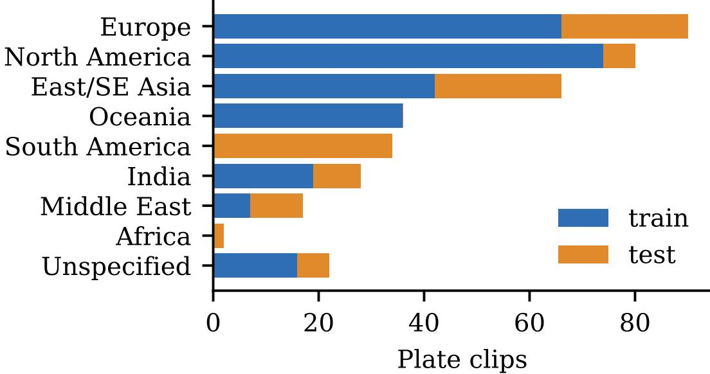
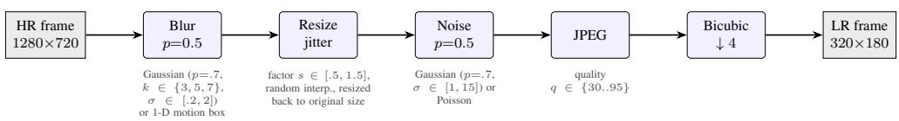
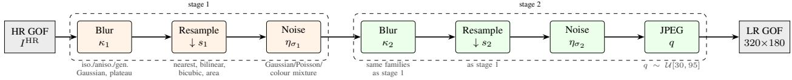
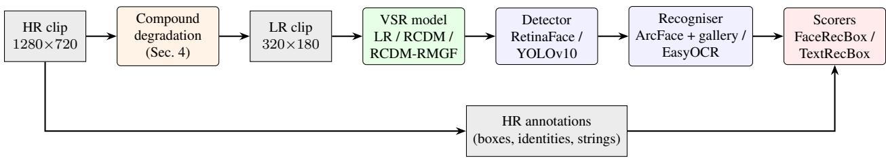
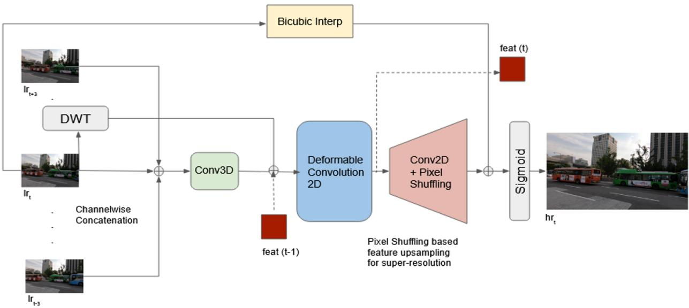
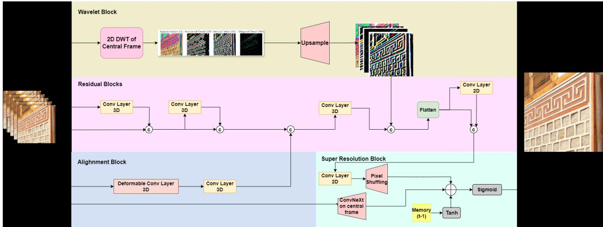
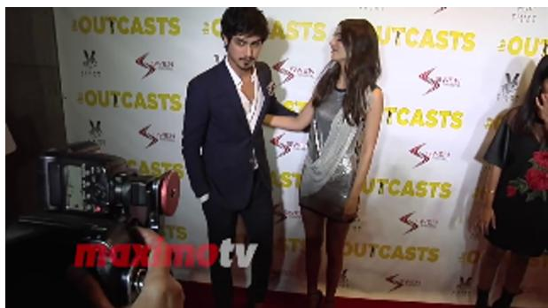
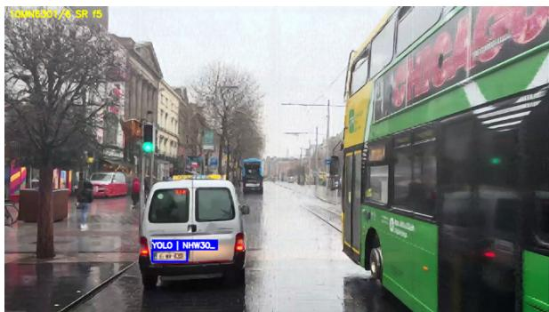

# FANVIDv2: Evaluating Video Super-Resolution by Face and Licence-Plate Recognition Under Compound Degradation

Kavitha Viswanathan\* Vrinda Goel

Madhav Gupta

Shlesh Gholap Devayan Ghosh

Dhruvi Ganatra

Sanket Potdar

Amit Sethi

Department of Electrical Engineering, Indian Institute of Technology Bombay, Mumbai 400076, India

## Abstract

Video super-resolution (VSR) is normally judged by PSNR and SSIM on clips that were downsampled bicubically, although in surveillance its purpose is to make faces and licence plates recognisable. We present FANVIDv2, a benchmark that scores VSR by what a recognition pipeline can do with its output. FANVIDv2 provides 320 × 180 low-resolution (LR) clips with high-resolution (HR) references for 48 public figures (with one HR gallery image each) and 375 licence-plate clips covering 360 distinct plate strings. LR clips are generated with a randomised compound degradation (blur, resize jitter, sensor noise, JPEG compression, final downsampling) rather than bicubic downsampling alone. Two metrics score recognition inside detections: FaceRecBox rewards a face only if it is localised and correctly identified, and TextRecBox scores plate transcriptions by normalised edit distance weighted by localisation quality. With a 2.3 M-parameter VSR baseline (RCDM), FaceRecBox rises from 0.6864 to 0.7222, identity accuracy on matched faces from 84.35% to 86.93%, and TextRecBox from 0.3088 to 0.3667; a residual-map gated variant (RCDM-RMGF) reaches 0.3801 on plates. We describe the degradation model, the baseline architectures and the scorers in detail, and release annotations, metadata, download and degradation scripts and evaluation code.

## 1 Introduction

Surveillance video is often too coarse for its purpose: a face that occupies a few dozen pixels, or a plate whose characters blur together, cannot be recognised in any single frame [2]. Video super-resolution (VSR) could help, because the missing detail is partly present in neighbouring frames. Current VSR benchmarks do not measure this. REDS [21], Vimeo-90K [30] and Vid4 [19] generate low-resolution (LR) inputs by bicubic downsampling of clean video and score outputs with PSNR and SSIM. Real cameras add blur, noise and compression, and a reconstruction can gain PSNR while altering exactly the high-frequency detail that decides whether a character is a B or an 8 [3].

FANVIDv2 evaluates VSR by recognition. It extends FANVID [23], which introduced face and plate clips with bicubic LR inputs, in three ways: LR inputs are generated with a randomised compound degradation (Section 4); both tasks are scored with metrics that couple detection and recognition (Section 5); and the benchmark is accompanied by a reference pipeline, a lightweight VSR baseline family and open scorers (Sections 6–7). Our contributions are:

1. A benchmark of face clips for 48 identities, each with an HR gallery image, and 375 plate clips with 360 distinct plate strings (Section 3).

2. A randomised compound degradation model, its released implementation, and the second-order variant used for training (Section 4).

3. FaceRecBox and TextRecBox and their released scorers (Section 5).

4. A documented family of memory-, wavelet- and deformable-convolution-based VSR baselines with baseline results for LR input, RCDM and RCDM-RMGF that report recognition, localisation and OCR counts, with rates normalised for differing numbers of evaluated frames (Sections 6–7).

## 2 Related work

VSR benchmarks. REDS, Vimeo-90K and Vid4 use bicubic or blur-and-downsample degradations and fidelity metrics. Real-ESRGAN [27] and BSRGAN [31] introduced randomised, higher-order degradation models for blind SR; we use models of this kind both to generate test inputs and to train the baseline. Large VSR models such as BasicVSR++ [4], VRT [18] and RVRT [17] are evaluated almost exclusively with fidelity metrics.

Surveillance recognition datasets. Person re-identification benchmarks such as iLIDS-VID [26] and MARS [33] provide multi-frame tracklets, but match whole bodies at native camera resolution without SR. SCface [10] and QMUL-SurvFace [5] contain low-resolution surveillance faces but are single-frame and do not evaluate SR. Plate datasets such as UFPR-ALPR [15] and CCPD [29] provide plates at resolutions sufficient for direct OCR.

Task-aware evaluation of SR. Restoration quality and recognition utility can diverge [3]. FANVIDv2 provides a common testbed in which this divergence can be measured for two recognition tasks with different requirements: faces need global structural coherence, plates need character-level precision.

## 3 The FANVIDv2 dataset

## 3.1 Sources and content

All clips are cut from publicly available YouTube videos; only URLs, timestamps and annotations are distributed, and frames are regenerated with the released download scripts (Section 9). HR frames are 1280 × 720; LR frames are 320 × 180 (scale ×4).

Faces. Clips show 48 public figures of diverse nationalities, genders and ethnicities in public appearances. Each identity has one HR gallery image taken from a different source (press photography), and the face gallery is released as a name–image table. Training and test identities are disjoint.

Plates. The plate subset contains 375 clips from dash-camera and street videos, with 360 distinct plate strings. Plates are Latin alphanumeric and come from more than 25 cities on five continents. The split is by clip (260 training and 115 test clips); two plate strings occur in both splits. Fig. 1 shows the geographic composition. The split deliberately places some regions only in the test set (all Brazilian clips) and others only in training (all Oceanian clips), so the test set contains plate formats not seen in training.

## 3.2 Annotation

Faces are detected on HR frames with RetinaFace [8], embedded with ArcFace [7], matched to the gallery, and every retained box and identity is checked and corrected manually; a second annotator cross-checked identity labels (inter-annotator agreement $\kappa = 0 . 9 1 )$ . Plates are annotated manually on HR key frames, propagated through the clip with SAM 2 [22], and reviewed frame by frame under an IoU threshold of 0.7; plate strings are transcribed manually and normalised to upper-case alphanumerics. Faces use an IoU threshold of 0.5. Clips also contain distractor faces and plates, and predictions on them count as false positives for faces.

Table 1: FANVIDv2 composition (frame counts are LR frames of annotated clips).
<table><tr><td>Subset</td><td>IDs / strings</td><td>Clips</td><td>Train frames</td><td>Test frames</td><td>Eval. GT boxes</td></tr><tr><td>Faces (public figures)</td><td>48</td><td>828</td><td>101,870</td><td>48,500</td><td>139,093</td></tr><tr><td>Licence plates</td><td>360</td><td>375</td><td>47,806</td><td>18,292</td><td>34,996†</td></tr></table>

† Ground-truth boxes are counted on the frames common to the HR annotations and the system output: 34,996 for SR output and 31,739 for LR output (Section 7).

  
Figure 1: Plate clips by region and split, computed from the released metadata. Twenty-two clips have no region label.

## 4 Compound degradation

Bicubic downsampling produces LR frames that are unrealistically clean, and models trained on them collapse on real footage. FANVIDv2 therefore uses two related degradation models (Fig. 2), one to generate the benchmark’s LR clips and one, richer, to train VSR models.

## 4.1 Benchmark LR generator

Each HR frame is degraded by one randomised pass (Fig. 2a), in this order. Blur: with probability 0.5, a Gaussian blur (probability 0.7; kernel size $k \in \{ 3 , 5 , 7 \} , \sigma \sim \mathcal { U } [ 0 . 2 , 2 . 0 ] )$ or a horizontal box (motion) kernel of size k. Resize jitter: the frame is resized by a factor drawn from U[0.5, 1.5] with an interpolation method drawn from {linear, cubic, area, Lanczos} and resized back to its original size. Noise: with probability 0.5, additive Gaussian noise (probability 0.7, $\sigma \sim \mathcal { U } [ 1 , 1 5 ]$ on the 0–255 scale) or Poisson noise. JPEG:

(a) Benchmark LR generator (released script; sampled independently per frame)

(b) Second-order training degradation (Real-ESRGAN style; drawn once per group of frames)  
  
Figure 2: Degradation models. (a) The LR clips of the benchmark are produced by a single randomised pass, followed by a bicubic ×4 downsample (parameter ranges as in the released script). (b) The second-order model used to train the VSR baselines applies two randomised stages and draws its parameters once per group of frames (GOF), preserving temporal correlation that a recurrent memory relies on.

compression at an integer quality drawn from [30, 95]. Finally the frame is downsampled bicubically by ×4 and resized to the exact LR size. Because every parameter is drawn at random, the test set spans a continuum from nearly clean to heavily corrupted frames rather than one operating point. The implementation is in code/dataset script celebs.py (faces) and code/download script lp.py (plates).

## 4.2 Second-order training degradation

Following Real-ESRGAN [27], VSR training uses two randomised stages,

$$
\begin{array} { r } { I ^ { ( 1 ) } = \left( I ^ { \mathrm { H R } } \circledast \kappa _ { 1 } \right) \downarrow _ { s _ { 1 } } + \eta _ { \sigma _ { 1 } } , } \end{array}\tag{1}
$$

$$
I ^ { ( 2 ) } = \mathrm { J P E G } _ { q } \Big ( \big ( I ^ { ( 1 ) } \circledast \kappa _ { 2 } \big ) \downarrow _ { s _ { 2 } } + \eta _ { \sigma _ { 2 } } \Big ) ,\tag{2}
$$

with kernels $\kappa _ { 1 , 2 }$ drawn from isotropic and anisotropic Gaussian, generalised Gaussian and plateau families, scales $s _ { 1 , 2 }$ realised by a mixed {nearest, bilinear, bicubic, area} resampler, noise $\eta$ from a Gaussian/Poisson/colour mixture, and $q \sim \mathcal { U } [ 3 0 , 9 5 ]$ ]. For video, the parameters are drawn once per GOF rather than per frame, so that temporal correlations within the input window are preserved for a recurrent model.

## 5 Tasks and metrics

Let ground-truth boxes be indexed by i and predicted boxes by $j ,$ with intersection-over-union $I _ { i j }$ . Matching is greedy and one-to-one in decreasing IoU.

Face task (T1). Given an LR clip and the HR gallery, a system detects faces in each frame and assigns an identity or rejects the face. Let $M _ { i j } = \mathbf { 1 } [ I _ { i j } \geq 0 . 5 ]$ be the (one-to-one) matching indicator, $F _ { i j } \in \{ 0 , 1 \}$ indicate a correct identity, and $N _ { i }$ and $P _ { j }$ indicate unmatched ground-truth and predicted boxes. Then

$$
\mathrm { F a c e R e c B o x } = \frac { \sum _ { i j } M _ { i j } F _ { i j } } { \sum _ { i j } M _ { i j } + \sum _ { i } N _ { i } + \sum _ { j } P _ { j } } ,\tag{3}
$$

  
Figure 3: FANVIDv2 evaluation flow. The recognisers are fixed and used off the shelf; only the VSR stage varies between systems. Ground truth is always annotated on the HR clip.

i.e. correct identities divided by ground-truth boxes plus false positives. A detection earns credit only if it is in the right place and names the right person; missed faces and spurious detections both count against it. We also report precision, recall, F1, mean IoU of matches and identity accuracy on matched faces.

Plate task (T2). Given an LR clip, a system localises each plate and transcribes it, with no list of valid plates. For a prediction sˆ and ground truth s (both normalised to upper-case alphanumerics) the text score is

$$
T ( \hat { s } , s ) = \operatorname* { m a x } \Bigl ( 0 , 1 - \frac { \operatorname { L e v } ( \hat { s } , s ) } { | s | } \Bigr ) ,\tag{4}
$$

where Lev is the Levenshtein distance. We use two scorers, both released. The hard-IoU scorer (fanvid metrics arxiv.py) follows FANVID v1: a prediction counts only if $I _ { i j } \geq 0 . 5$ , and false positives are excluded from the denominator because plate strings are open-vocabulary. The aligned scorer (Fanvid metrics aligned.py), used for all plate results in this paper, additionally (i) restricts evaluation to frames present in both the HR annotations and the system output, which removes frame-timing mismatches between HR annotations and LR/SR predictions, and (ii) weights each matched prediction by its localisation quality: the IoU is mapped linearly to a weight $w _ { \mathrm { I o U } } \in [ 0 , 1 ]$ (zero at $I { = } 0 . 2$ , one at I=1) and the box score is $0 . 5 w _ { \mathrm { I o U } } + 0 . 5 T$ . TextRecBox is the mean box score over ground-truth plates, so missed plates score zero and false positives are not penalised. We additionally report mean IoU of matches, recall, the fraction of matches with Io $J \geq 0 . 5 ,$ , and the number of exactly (perfect, $T = 1 )$ and partially $( 0 < T < 1 )$ read plates.

## 6 Reference pipeline and baseline architectures

Recognition pipeline. Faces: LR (or super-resolved) clip → RetinaFace detection → ArcFace embedding → cosine similarity to the gallery. Plates: clip → YOLOv10 [25] detection → EasyOCR [11] transcription. Recognisers are used without fine-tuning (Fig. 3).

## 6.1 RCDM

RCDM (Residual Convolutional Deformable Memory) [24] takes a group of $2 k { + 1 }$ LR frames $\{ I _ { t - k } ^ { \mathrm { L R } } , \ldots , I _ { t + k } ^ { \mathrm { L R } } \}$ (k=3, a seven-frame window) and emits one HR frame $\overline { { \hat { I } } } _ { t } ^ { \mathrm { H R } } \ \mathrm { \Sigma } _ { } ^ { \bullet } ( \mathrm { F i g s . } \ 4 - 5 )$ . It combines three components.

(i) Wavelet conditioning. A single-level 2D Haar discrete wavelet transform of the central frame,

$$
\mathrm { D W T } ( x ) = \{ L L , L H , H L , H H \} ,\tag{5}
$$

gives a low-frequency approximation and horizontal, vertical and diagonal detail sub-bands at half resolution. The sub-bands are upsampled to feature-map resolution, concatenated with the features and, in every

  
Figure 4: RCDM base architecture: the frame window is concatenated and passed through Conv3D; a 2D DWT of the central frame is added before a 2D deformable convolution that jointly fuses and aligns; the recurrent memory $( \mathrm { f e a t } _ { t - 1 }  \mathrm { f e a t } _ { t } )$ feeds back into the fusion; a Conv2D + pixel-shuffle head upsamples and a bicubic skip is added before the output non-linearity.

ConvNeXt fusion block [20], linearly projected and added to the residual branch (wavelet-aware fusion). Removing this conditioning lowers SSIM by roughly 0.012 on REDS4 and visibly softens edges. The wavelet branch follows the sparse, multi-scale token mixing of WaveMix [12].

(ii) Deformable alignment. The 2k+1 frames are concatenated channel-wise $( 3 ( 2 k + 1 ) \times H \times W )$ and passed through shallow 3D convolutions. A modulated deformable convolution layer (DCNv2) [6, 34],

$$
y ( p _ { 0 } ) = \sum _ { p _ { n } \in \mathcal { R } } w ( p _ { n } ) x ( p _ { 0 } + p _ { n } + \Delta p _ { n } ) \Delta m _ { n } , \quad \Delta m _ { n } \in [ 0 , 1 ] ,\tag{6}
$$

fuses spatial detail and aligns neighbouring frames implicitly through learned offsets $\Delta p _ { n }$ , replacing explicit optical-flow estimation.

(iii) Residual memory tensor. The aligned feature map $F _ { t }$ updates a recurrent memory through a learnable single-pole IIR rule,

$$
M _ { t } = \alpha M _ { t - 1 } + ( 1 - \alpha ) F _ { t } , \qquad \alpha \in ( 0 , 1 ) \mathrm { l e a r n a b l e } ,\tag{7}
$$

which reinforces temporally stable structure and damps per-frame noise without the gates of ConvL-STM/ConvGRU. $[ F _ { t } , M _ { t } ]$ passes through a stack of ConvNeXt blocks, and a pixel-shuffle head (two ×2 stages for ×4 SR) adds the result to a bicubic skip connection.

With k=3, RCDM has about 2.3 M parameters and 281 GFLOPs per output frame at $1 8 0 \times 3 2 0 \to 7 2 0 \times 1 2 8 0$ roughly an order of magnitude below VRT and RVRT. Under bicubic LR it reaches SSIM 0.9175 on REDS4. For paired supervision the loss is $\mathcal { L } = \lambda _ { 1 } \mathcal { L } _ { \mathrm { C h a r } } + \lambda _ { 2 } ( 1 - \mathbf { M S - S S I M } ) + \lambda _ { 3 } \mathcal { L } _ { \mathrm { p e r c } }$ with a Charbonnier term $( \epsilon = 1 0 ^ { - 3 } )$ , MS-SSIM [28] and a VGG-19 relu3 3 perceptual term [13], $( \lambda _ { 1 } , \lambda _ { 2 } , \lambda _ { 3 } ) = ( 1 , 0 . 5 , 0 . 0 5 )$

## 6.2 Residual-map gated fusion (RCDM-RMGF)

Under heavy degradation the previous-frame state is unreliable where consecutive frames differ strongly (large $| I _ { t } - I _ { t - 1 } | )$ , e.g. around moving vehicles. RMGF adds a lightweight gating network (fewer than

  
Figure 5: Detailed RCDM pipeline. The wavelet block provides an upsampled sub-band stream from the central frame; residual 3D convolution blocks and a 3D deformable alignment block are concatenated (c); the super-resolution block combines a pixel-shuffle path with a ConvNeXt path on the central frame and the tanh-gated memory from t−1 before the final sigmoid.

0.05 M parameters; 2.35 M in total) that maps the inter-frame residual to a gate on the memory contribution, suppressing $M _ { t - 1 }$ in such regions. On a held-out split of REDS with the second-order degradation, RMGF improves validation PSNR from 22.48 to 22.58 dB and SSIM from 0.591 to 0.598 over pure RCDM.

## 6.3 Modular family

The RCDM backbone exposes configuration axes: propagation topology (sliding-window, recurrent, or a 1.27 M-parameter light-recurrent variant for edge use); reconstruction head (pixel-shuffle or Laplacianpyramid refinement [14], +0.12 M parameters); block type (ConvNeXt, Swin or WaveMix); and dataset adaptation (a 0.6 M-parameter slim configuration). The MRI work in the associated thesis reuses the WaveMix variant. For plates, a text-specialised variant additionally uses glyph-focused patchification and an OCRcoupled objective $\mathcal { L } _ { \mathrm { t e x t } } = \lambda _ { c } \mathcal { L } _ { \mathrm { C h a r } } + \lambda _ { p } \mathcal { L } _ { \mathrm { p e r c } } + \lambda _ { s } ( 1 - \mathrm { S S I M } ) + \lambda _ { o } \mathcal { L } _ { \mathrm { O C R } }$ , with a transformer OCR recogniser [9, 16] at inference; it is not part of the results below, which use the fixed EasyOCR recogniser for all systems.

## 6.4 Baselines

(i) LR: recognisers are applied to the LR clip upsampled bicubically. (ii) RCDM: the 2.3 M-parameter model above, trained on REDS with the second-order degradation of Section 4 and applied to FANVIDv2 without further adaptation. (iii) RCDM-RMGF: RCDM with residual-map gated fusion, trained the same way.

## 7 Results

Faces. Super-resolution raises FaceRecBox from 0.6864 to 0.7222, an absolute gain of 3.6 points (Table 2). Both precision and recall increase, so the gain is not a trade of one error type for another. Matched detections become better localised (mean IoU 0.936 to 0.969), identity accuracy on matched faces rises from 84.35% to 86.93%, and the number of correct identity matches grows by 4,959. Fig. 6(a,b) shows a face that is not detected in the LR frame and is detected after VSR.

Table 2: Face task on the FANVIDv2 test split (hard-IoU scorer, 139,093 ground-truth face boxes).
<table><tr><td>Metric</td><td>LR</td><td>RCDM</td></tr><tr><td>FaceRecBox</td><td>0.6864</td><td>0.7222</td></tr><tr><td>Precision</td><td>0.9077</td><td>0.9133</td></tr><tr><td>Recall</td><td>0.8872</td><td>0.9019</td></tr><tr><td>F1</td><td>0.8973</td><td>0.9076</td></tr><tr><td>Mean IoU of matches</td><td>0.9363</td><td>0.9685</td></tr><tr><td>Identity accuracy on matches</td><td>0.8435</td><td>0.8693</td></tr><tr><td>Correct identity matches</td><td>104,094</td><td>109,053</td></tr></table>

Table 3: Plate task on the FANVIDv2 test split (aligned scorer). All conditions use the same HR annotations as ground truth. The LR and SR outputs are evaluated on different numbers of common frames (14,189 vs. 15,758), so absolute counts are not directly comparable; rates per ground-truth box are. ‡ RMGF counts were produced by the same scorer; its ground-truth box count is not tabulated here.
<table><tr><td>Metric</td><td>LR</td><td>RCDM</td><td>RCDM-RMGF</td></tr><tr><td>TextRecBox</td><td>0.3088</td><td>0.3667</td><td>0.3801</td></tr><tr><td>Mean IoU of matches</td><td>0.6067</td><td>0.6958</td><td>0.7113</td></tr><tr><td>Recall</td><td>0.9871</td><td>0.9931</td><td></td></tr><tr><td> $\mathrm { I o U } \geq 0 . 5 ( \% )$ </td><td>74.69</td><td>77.61</td><td>1</td></tr><tr><td> $\mathrm { I o U } \geq 0 . 3 ( \% )$ </td><td>76.12</td><td>78.84</td><td>一</td></tr><tr><td>Ground-truth boxes</td><td>31,739</td><td>34,996</td><td></td></tr><tr><td>Predicted boxes</td><td>31,331</td><td>34,763</td><td></td></tr><tr><td>Perfect reads (count)</td><td>715</td><td>985</td><td>1,002</td></tr><tr><td>Perfect reads per 1000 GT boxes</td><td>22.5</td><td>28.1</td><td></td></tr><tr><td>Partial reads (count)</td><td>7,334</td><td>9,031</td><td></td></tr></table>

Plates. TextRecBox rises from 0.3088 to 0.3667 with RCDM (a relative gain of 18.7%) and to 0.3801 with RCDM-RMGF (23.1%) (Table 3). The count of exactly read plates grows from 715 to 985 (+37.8%) and to 1,002. Because SR output is evaluated on more common frames than LR output, the count comparison is confounded; normalised per ground-truth box, exact reads rise from 22.5 to 28.1 per 1000 boxes (+24.9%). Mean localisation IoU rises from 0.607 to 0.696 with RCDM and 0.711 with RCDM-RMGF. Recall is almost unchanged (0.987 to 0.993) because the detector already finds most plates in LR frames; the gains come mainly from reading them correctly and localising them more tightly. Fig. 6(c,d) shows a plate that is detected but unreadable in the LR frame and read after VSR.

Fidelity and recognition. On the plate clips, RCDM improves per-frame fidelity over LR input by +1.71 dB PSNR (24.26 → 25.97), +0.074 SSIM (0.733 → 0.807) and MicroSSIM [1] $( 0 . 6 7 2  0 . 7 6 7 )$ , and reduces LPIPS [32] from 0.437 to 0.137. Fidelity and recognition therefore move together here, but they are not equivalent: in our model comparisons PSNR and SSIM correlate only weakly with TextRecBox (Spearman $\rho \approx 0 . 3 )$ and moderately with FaceRecBox $( \rho \approx 0 . 6 )$ , which is the motivation for scoring by recognition. The script code/compute fidelity and correlation.py recomputes these statistics from per-frame results.

  
(a) LR: face not detected

  
(b) RCDM: face detected

  
(c) LR: plate detected, OCR fails

  
(d) RCDM: plate read  
Figure 6: Examples from the FANVIDv2 test split.

## 8 Discussion

What the benchmark measures. FANVIDv2 asks whether the output of a VSR model can be recognised, not whether it looks like the original. The two tasks stress different properties: on faces the gain comes with better localisation and identity matching, on plates with correct reading of characters that the detector had already located.

Limitations. FANVIDv2 is an evaluation benchmark, not a large-scale recognition dataset: 48 identities and 360 plate strings. The face subset is drawn from celebrity footage, chosen for legal clearance and gallery-image availability, which over-represents frontal pose and good illumination relative to operational settings. The degradation is synthetic; a camera-native LR test set would strengthen external validity. Plate strings are Latin alphanumeric only. The recognisers are used off the shelf, so the results measure what VSR contributes to a fixed pipeline, not the best achievable recognition. Two plate strings occur in both plate splits. LR and SR plate outputs are evaluated on different numbers of common frames (Table 3), so we report normalised rates. Only three systems are evaluated here; results for stronger VSR baselines and transformer OCR recognisers should be produced with the released scorers.

Ethics. All subjects are public figures in publicly available footage. No video is redistributed; frames are regenerated from public URLs and LR frames are 320 × 180. We discourage operational surveillance or law-enforcement use without ethical review and compliance with local privacy law.

## 9 Conclusion

FANVIDv2 evaluates video super-resolution by face identification and plate reading under randomised compound degradation. A lightweight, 2.3 M-parameter VSR baseline improves both tasks (FaceRecBox 0.686 → 0.722; TextRecBox 0.309 → 0.367), with a further plate gain from residual-map gated fusion. We release annotations, metadata, degradation and download scripts and scorers so that VSR methods can be compared by what they make recognisable.

## Data and code availability

Annotations, gallery metadata and download scripts are hosted in the FANVID repository: https://huggingface.co/datasets/kv1388/FANVID-Face\_and\_License\_Plate\_ Recognition\_in\_Low-Resolution\_Videos. The degradation generators, the two scorers and the fidelity/correlation script are provided in the code/ directory accompanying this submission.

## Declaration of generative AI and AI-assisted technologies

Generative AI tools were used to assist with language editing, consistency checks and manuscript preparation.   
The authors reviewed and edited the manuscript and are responsible for its final content.

## References

[1] Ashesh Ashesh, Alexander Krull, and Florian Jug. MicroSSIM: Improved structural similarity for comparing microscopy data. arXiv preprint arXiv:2408.08747, 2024.

[2] BBC News. Custody photos too poor for facial recognition software. https://www.bbc.com/ news/articles/cdrx7ry3d14o, 2025. March 2025.

[3] Yochai Blau and Tomer Michaeli. The perception-distortion tradeoff. In CVPR, 2018.

[4] Kelvin CK Chan, Shangchen Zhou, Xiangyu Xu, and Chen Change Loy. Basicvsr++: Improving video super-resolution with enhanced propagation and alignment. In IEEE/CVF Conference on Computer Vision and Pattern Recognition (CVPR), pages 5972–5981, 2022.

[5] Zhiyi Cheng, Xiatian Zhu, and Shaogang Gong. Low-resolution face recognition. In Asian Conference on Computer Vision (ACCV), 2018.

[6] Jifeng Dai, Haozhi Qi, Yuwen Xiong, Yi Li, Guodong Zhang, Han Hu, and Yichen Wei. Deformable convolutional networks. In IEEE International Conference on Computer Vision (ICCV), pages 764–773, 2017.

[7] Jiankang Deng, Jia Guo, Niannan Xue, and Stefanos Zafeiriou. ArcFace: Additive angular margin loss for deep face recognition. In CVPR, 2019.

[8] Jiankang Deng, Jia Guo, Evangelos Ververas, Irene Kotsia, and Stefanos Zafeiriou. RetinaFace: Single-stage dense face localisation in the wild. In CVPR, 2020.

[9] Yuning Du, Chenxia Li, Ruoyu Guo, Xiaoting Yin, Weiwei Liu, Jun Zhou, Yifan Bai, Zilin Yu, Yehua Yang, Qingqing Dang, et al. Pp-ocr: A practical ultra lightweight ocr system. arXiv preprint arXiv:2009.09941, 2020.

[10] Mislav Grgic, Kresimir Delac, and Sonja Grgic. SCface — surveillance cameras face database. Multimedia Tools and Applications, 51:863–879, 2011.

[11] JaidedAI. EasyOCR. https://github.com/JaidedAI/EasyOCR, 2020.

[12] Pranav Jeevan, Kavitha Viswanathan, Amit Sethi, et al. Wavemix: A resource-efficient neural network for image analysis. arXiv preprint arXiv:2205.14375, 2023.

[13] Justin Johnson, Alexandre Alahi, and Li Fei-Fei. Perceptual losses for real-time style transfer and super-resolution. In Computer Vision – ECCV 2016, volume 9906 of Lecture Notes in Computer Science, pages 694–711. Springer, Cham, 2016. doi: 10.1007/978-3-319-46475-6 43. URL https: //cs.stanford.edu/people/jcjohns/papers/eccv16/JohnsonECCV16.pdf.

[14] Wei-Sheng Lai, Jia-Bin Huang, Narendra Ahuja, and Ming-Hsuan Yang. Deep laplacian pyramid networks for fast and accurate super-resolution. In IEEE Conference on Computer Vision and Pattern Recognition (CVPR), pages 624–632, 2017.

[15] Rayson Laroca, Evair Severo, Luiz A. Zanlorensi, et al. A robust real-time automatic license plate recognition based on the YOLO detector. In IJCNN, 2018.

[16] Minghao Li, Tengchao Lv, Jingye Chen, Lei Cui, Yijuan Lu, Dinei Florencio, Cha Zhang, Zhoujun Li, and Furu Wei. Trocr: Transformer-based optical character recognition with pre-trained models. Proceedings of the AAAI Conference on Artificial Intelligence, 2023.

[17] Jingyun Liang, Yuchen Fan, Xiaoyu Xiang, Rakesh Ranjan, Eddy Ilg, Simon Green, Jiezhang Cao, Kai Zhang, Radu Timofte, and Luc Van Gool. Recurrent video restoration transformer with guided deformable attention. In Advances in Neural Information Processing Systems (NeurIPS), 2022.

[18] Jingyun Liang, Jiezhang Cao, Yuchen Fan, Kai Zhang, Rakesh Ranjan, Yawei Li, Radu Timofte, and Luc Van Gool. Vrt: A video restoration transformer. In IEEE Transactions on Image Processing, 2024.

[19] Ce Liu and Deqing Sun. On bayesian adaptive video super resolution. IEEE Transactions on Pattern Analysis and Machine Intelligence, 36(2):346–360, 2014.

[20] Zhuang Liu, Hanzi Mao, Chao-Yuan Wu, Christoph Feichtenhofer, Trevor Darrell, and Saining Xie. A convnet for the 2020s. In IEEE/CVF Conference on Computer Vision and Pattern Recognition (CVPR), pages 11976–11986, 2022.

[21] Seungjun Nah, Sungyong Baik, Seokil Hong, Gyeongsik Moon, Sanghyun Son, Radu Timofte, and Kyoung Mu Lee. Ntire 2019 challenge on video deblurring and super-resolution: Dataset and study. In IEEE CVPR Workshops, 2019.

[22] Nikhila Ravi, Valentin Gabeur, Yuan-Ting Hu, et al. SAM 2: Segment anything in images and videos. In ICCV, 2024.

[23] Kavitha Viswanathan, Vrinda Goel, Shlesh Gholap, Devayan Ghosh, Madhav Gupta, Dhruvi Ganatra, Sanket Potdar, and Amit Sethi. FANVID: A benchmark for face and license plate recognition in low-resolution videos. arXiv preprint arXiv:2506.07304, 2025.

[24] Kavitha Viswanathan, Amit Sethi, Shashwat Pathak, Piyush Bharambe, and Harsh Choudhary. Lowresource video super-resolution with memory, wavelets, and deformable convolutions. In IEEE/CVF CVPR Workshops, Women in Computer Vision (WiCV), 2025.

[25] Ao Wang, Hui Chen, Lihao Liu, et al. YOLOv10: Real-time end-to-end object detection. In NeurIPS, 2024.

[26] Taiqing Wang, Shaogang Gong, Xiatian Zhu, and Shengjin Wang. Person re-identification by video ranking. In European Conference on Computer Vision (ECCV), pages 688–703, 2014.

[27] Xintao Wang, Liangbin Xie, Chao Dong, and Ying Shan. Real-esrgan: Training real-world blind super-resolution with pure synthetic data. In IEEE/CVF International Conference on Computer Vision Workshops, pages 1905–1914, 2021.

[28] Zhou Wang, Eero P. Simoncelli, and Alan C. Bovik. Multiscale structural similarity for image quality assessment. In Asilomar Conference on Signals, Systems and Computers, 2003.

[29] Zhenbo Xu, Wei Yang, Ajin Meng, et al. Towards end-to-end license plate detection and recognition: A large dataset and baseline. In ECCV, 2018.

[30] Tianfan Xue, Baian Chen, Jiajun Wu, Donglai Wei, and William T Freeman. Video enhancement with task-oriented flow. In International Journal ofComputer Vision (IJCV), volume 127, pages 1106–1125, 2019.

[31] Kai Zhang, Jingyun Liang, Luc Van Gool, and Radu Timofte. Designing a practical degradation model for deep blind image super-resolution. In ICCV, 2021.

[32] Richard Zhang, Phillip Isola, Alexei A Efros, Eli Shechtman, and Oliver Wang. The unreasonable effectiveness of deep features as a perceptual metric. In IEEE Conference on Computer Vision and Pattern Recognition (CVPR), pages 586–595, 2018.

[33] Liang Zheng, Zhi Bie, Yifan Sun, Jingdong Wang, Chi Su, Shengjin Wang, and Qi Tian. MARS: A video benchmark for large-scale person re-identification. In ECCV, 2016.

[34] Xizhou Zhu, Han Hu, Stephen Lin, and Jifeng Dai. Deformable convnets v2: More deformable, better results. In IEEE/CVF Conference on Computer Vision and Pattern Recognition (CVPR), pages 9308–9316, 2019.