# FAST: Flow Any Scene Transformer

Yongjian Zhang, Longguang Wang, Zhuo Song, Zhiheng Fu, Liang Lin Fellow, IEEE, Yulan Guo∗ Senior Member, IEEE

Abstract—Scaling has become a primary driver of progress in language and vision foundation models, yet its role in precise corre spondence matching remains underexplored. In this work, we present Flow Any Scene Transformer (FAST), a scalable correspondence model driven by two key insights. First, we reveal that the query-key proiections inside single-view vision foundation models encode a coarse yet reusable prior for cross-view matching. Second, reusing these pretrained projections in cross-attention form yields a highly effective initialization for a ViT-based matcher built from a single-view encoder. Guided by these insights, we build FAST upon a vanilla single-view foundation model, utilizing a zero-parameter rewiring strategy to convert selected self-attention lavers into cross-attention for cross-view interaction. This design allows ViT-based matchers to scale with advances in single-view foundation models, bypassing the need for a dedicated pair-centric pretraining stage. To fully unlock the scaling potential of this formulation, we assemble a 6-million-pair training corpus for general-purpose dense 2D displacement estimation across diverse co-visible image pairs. Extensive experiments demonstrate that FAST achieves state-of-the-art performance across a wide range of benchmarks, while scaling favorably with both backbone size and training data.

Index Terms—Correspondence matching, Foundation model, Scaling laws.

## 1 INTRODUCTION

applications like reconstruction and navigation. Over the past decades, this task has evolved into a standardized volume-centric pipeline [1], where view-wise representations are converted into a cost-defined hypothesis space and subsequent modules process over the resulting cost volume. Although highly successful, this paradigm suffers a limited model scaling route, as simply stacking more aggregation or refinement blocks has shown diminishing gains [2], [3]. Further gains therefore rely heavily on improved module and architecture designs.

By contrast, recent ViT-based approaches [4], [5] introduce a more scalable architectural paradigm, where visual representations and matching cues are progressively refined through stacked Transformer blocks. However, scaling such models relies on pair-centric pretraining on structurally overlapping image pairs, which are not as easy to collect at scale as the independent images used by single-view ViTs. For instance, CroCo [4] is pretrained on 5 million pairs, while DINOv3 [6] employs 1689 million images. At the same time, recent advances [7], [8], [9] suggest that the output representations of single-view vision foundation models (VFMs) already exhibit strong emergent cross-image alignment capabilities, yet current pipelines still rely on additional matching modules to transform these representations into correspondences. This observation, together with the stronger scalability of single-view pretraining, drive us to rethink: rather than initializing a ViT-based matcher from scratch through pair-centric pretraining, can it be bootstrapped from the far more scalable VFM itself?

To explore this possibility, we investigate whether singleview VFMs internally encode transferable matching priors for matcher construction. Specifically, we probe this possibility by applying the query-key projections of a frozen VFM across two views. As illustrated in Fig. 1, the resulting attention logits concentrate on semantically corresponding regions, which inspires our first key insight: the query-key projections inside single-view VFMs encode coarse but reusable cross-view matching priors.

Given this finding, the next question is how to unleash the latent matching prior when adapting a pretrained singleview VFM into a matcher. Since this prior is encoded in attention projections, a natural adaptation strategy is to reuse these projections for cross-view interaction, which can be implemented with (1) explicit cross-attention between views, or (2) global self-attention over concatenated views. Although both enable two-view interaction, they lead to drastically different behaviors at initialization. Explicit cross-attention directs each query to the opposite view and natively establish coarse cross-view affinity before finetuning. In contrast, global self-attention jointly normalizes intra- and inter-view tokens, causing self-affinity to dominate the attention mass. This leads to our second insight: reusing pretrained projections in cross-attention form provides a structurally effective initialization for a ViT-based matcher built from a single-view VFM.

Inspired by these insights, we present Flow Any Scene Transformer (FAST), a scaling-oriented correspondence model. Rather than relying on bespoke matching modules or binocular pretraining, FAST is born on a standard singleview VFM and is adapted to dense matching through a zeroparameter rewiring strategy, which reformulates selected self-attention layers into cross-attention ones. To complement backbone scaling with data-side scaling, we assemble a 6-million-pair corpus, a similar scale to Croco but with additional optical-flow annotations, therefore enabling taskspecific adaptation after VFM-based initialization. Powered by these scalable design choices, FAST achieves state-of-theart performance across diverse benchmarks. More importantly, FAST scales favorably with both backbone size and training data, yielding consistent gains without the early saturation observed in volume-centric approaches [2], [3].

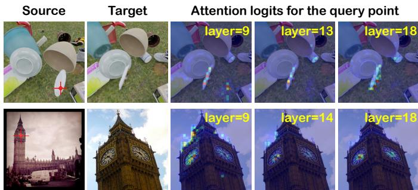  
Fig. 1. Zero-shot emergent matching capacity in DINOv3-Large [6]. Cross-view attention logits (from source queries to target keys) are extracted at the layer-th block. The emergent matching prior is robust to fast-moving objects (row 1) and significant appearance variations (row 2). Warmer colors denote higher attention affinities.

Our contributions can be summarized as follows:

We reveal that the query-key projections inside single-view VFMs can be reused to produce coarse cross-view correlations, establishing the key basis for extending standard VFMs to dense matchers.

We introduce a zero-parameter attention rewiring strategy, which initializes a scalable correspondence matcher from readily available single-view VFMs.

We assemble Flow-6M, a 6-million-pair optical-flow dataset that consolidates existing flow data and converts static-scene geometry into dense flow labels.

We present FAST, a scalable correspondence foundation model that achieves strong generalization across small- and wide-baseline matching benchmarks.

## 2 RELATED WORK

## 2.1 Correlation-Based Method

Correlation-based methods leverage correlation volumes to simplify the matching problem into a regression-fromclassification task. This paradigm has been widely adopted in both optical flow and stereo matching.

Optical Flow. Dosovitskiy et al. [10] first introduce a correlation layer to compute feature similarities for motion regression. Building on this volume-based design, subsequent studies devote substantial effort to developing correlation aggregation strategy to recover an accurate displacement distribution from the correlation volume. Representative directions include coarse-to-fine estimation with multi-scale correlation volumes [11], iterative motion refinement via repeated lookups in correlation volumes [12], and Transformer-integrated solutions [13], [14].

Stereo Matching. Stereo matching can be cast as a constrained correspondence problem where matches lie on epipolar lines. Early learning-based methods construct a 3D cost volume of size $D \times \breve { H } \times W$ by evaluating matching costs over discrete disparity hypotheses [15]. This strategy is widely adopted in efficient stereo algorithms [16], [17] due to its memory-friendly design. Rather than compressing features into a scalar similarity, Kendall et al. [18] construct a 4D volume of size $C \times D ^ { \cdot } \times H \times W$ by concatenating cross-view features along all disparity proposals, followed by 3D CNNs for cost aggregation. Subsequent works further enrich the volume formulation and aggregation through designs such as group-wise correlation, multi-scale volumes, and attention mechanisms [19], [20], [21].

Overall, although correlation volumes provide explicit correspondence hypotheses, their volume-centric formulation tightly couples matching performance with taskspecific aggregation and refinement modules. Simply stacking these modules often leads to diminishing returns, limiting the scalability of correspondence models beyond architecture-specific designs.

## 2.2 Correlation-Free Method

A straightforward correlation-free matching paradigm is to stack both input images together and process them through a network [10]. This design allows the network to decide how to fuse the image pair for motion regression. However, without an explicit cross-view interaction mechanism, such approaches typically struggle to achieve accurate motion estimation. More recently, attention mechanisms have enabled new formulations for dense matching. Along this line, Li et al. [22] replace the cost volume with alternating self-attention and cross-attention along epipolar lines to aggregate cross-view evidence. Weinzaepfel et al. [4], [23] propose a ViT-based encoder-decoder for two-view matching, coupled with cross-view masking pretraining and dense-matching-specific fine-tuning to obtain a correlationfree model. Building on these advances, Leroy et al. [24] introduce a local feature head to establish sparse correspondences for image matching. Zhang et al. [25] update the single-view encoder with DINOv2 [26] and establish cross-view interaction with additional global self-attention modules. Edstedt et al. [27] further improve the dense matching performance with frozen DINOv3, global selfattention, and cascaded warped refiners. In parallel, recent advances [5], [28], [29], [30] demonstrate the effectiveness of attention for correlation-free 3D reconstruction, but they are primarily optimized for scene-level geometry rather than precise correspondence estimation. Following this attentionbased direction, we realize cross-view interaction via attention. In contrast to prior work that designs train-fromscratch modules for dense matching, we directly leverage an existing pretrained vanilla ViT as the matcher.

## 2.3 Scaling Route for Correspondence Models

Model Scaling with Foundation Backbones. Integrating vision foundation models (VFMs) into correspondence pipelines provides a natural route for model scaling. Along this direction, recent advances either freeze the pretrained backbones as robust encoders [8], [9], [31], adapt it with parameter-efficient modules [32], attach side-tuning branches [7], or fully finetune the backbone [25] for downstream matching tasks. Despite these different adaptation strategies, most methods follow an encoder-centric scaling paradigm, where VFMs are employed as single-view encoders, so that additional matching modules are still required for multi-view interaction. As a result, increasing the VFM size mainly scales the feature extractor rather than the matching components. In contrast, we pursue a matchercentric scaling route by repurposing a vanilla pretrained ViT as the matching network.

Data Scaling. Complementary to model scaling, data scaling has become another key route to improving correspondence generalization. Weinzaepfel et al. [4] perform crossview masked pretraining on millions of paired images to alleviate the data-hungry nature of ViT-based Croco model. Wang et al. [3] demonstrate that motion pretraining on static scenes improves the generalization performance of optical flow estimation. Recent efforts further enlarge the scale of labeled correspondence samples with conditional rendering [7], depth-based warping [33], multi-view geometric resampling [25], and single-view homography transformations [34]. Building on this trend, we assemble a millionscale optical flow corpus, enabling our ViT-based matcher to benefit consistently from data scaling.

## 3 METHOD

We present Flow Any Scene Transformer (FAST), a scalable dense correspondence model that transfers the scaling benefits of single-view foundation models to cross-view matching. We first explain why a single-view pretrained VFM is effective for dense matching in Sec. 3.1, then describe the rewired matching architecture in Sec. 3.2. The largescale data corpus is introduced in Sec. 3.3, and the training objectives are presented in Sec. 3.4.

## 3.1 Rethinking Single-View ViTs for Dense Matching

Recent advances [7], [31], [35] have demonstrated that single-view pretrained ViTs can act as robust feature extractors for dense matching. However, within these pipelines, the matching process still relies on external correlation, followed by specialized cost aggregation and refinement modules to establish accurate correspondences. Such a decoupled paradigm not only introduces substantial computational overhead, but also limits the network’s ability to scale in an end-to-end manner. This limitation motivates a more fundamental question: instead of treating a pretrained ViT merely as a feature-extraction backbone, can the ViT itself serve as the matching network?

To answer this question, we first identify two core operations in dense matching: all-pairs correlation estimation across views, and matching evidence aggregation to resolve local ambiguities. Fortunately, the computational substrate for both operations is inherent within the Transformer attention mechanism. Given the query Q and key K, the attention logits are computed as $\begin{array} { r } { \mathbf { M } ^ { \mathbf { \bar { \alpha } } } = \mathbf { Q } \mathbf { K } ^ { \mathsf { T } } / \sqrt { D } . } \end{array}$ . Here, $\mathbf { Q } , \mathbf { K } \in \mathbb { R } ^ { N \times D }$ and $\mathbf { M } \doteq \mathbb { R } ^ { N \times N }$ , where N is the number of tokens and $D$ is the feature dimension. Once the token sequence is interpreted as a flattened image grid as $N =$ $\bar { H \times W }$ , this inner-product formulation connects each query token to all key tokens via pairwise feature similarity, which is mathematically equivalent to constructing an all-pairs correlation volume over spatial patches. Beyond correlation estimation, attention facilitates context-aware aggregation through value mixing, thereby integrating global cues in a manner that satisfies the requirements of matching evidence aggregation.

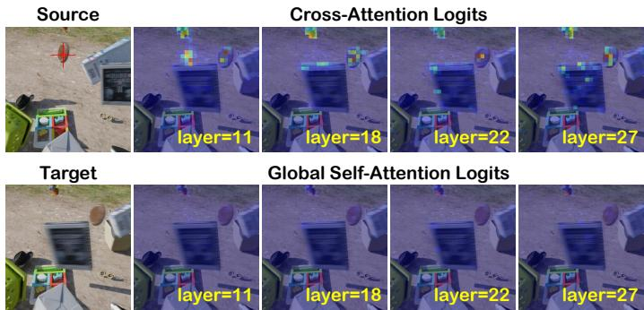  
Fig. 2. Comparison of attention responses at initialization. For a given query in the source view, we show its inter-view attention, including the cross-attention and global self-attention responses on the target view. All responses are directly generated using the Q and K projections from the layer-th attention layer in DINOv3 [6].

Given this structural equivalence, reusing self-attention kernels for cross-view matching only requires that corresponding tokens across views stay close in the shared feature space even under viewpoint and appearance changes. This property is naturally encouraged by large-scale pretraining, which yields representations that are both semantically stable and spatially discriminative. Therefore, the pretrained query-key projections can be directly reused to measure cross-view token affinities without additional matching-specific initialization.

To empirically validate this point, we conduct a zeroshot probing experiment. Specifically, given a cross-view image pair $\left\{ \mathbf { x } , { \bar { \mathbf { y } } } \right\}$ , we pass both images through a frozen pretrained ViT, extract the projected query $\mathbf { Q } _ { \mathbf { x } }$ and key $\mathbf { K } _ { \mathbf { y } } ,$ and manually compute the cross-attention score map as ${ \bf M } _ { { \bf x }  { \bf y } } ^ { \mathrm { c r o s s } } = { \bf Q } _ { \bf x } { \bf \bar { K } } _ { { \bf y } } ^ { \top } / \sqrt { D }$ . As visualized in Fig. 1, strong attention responses frequently localize near the groundtruth corresponding regions, even though the model was never pretrained on explicit image-pair matching objectives. At the same time, these responses are still diffuse, noisy, and often multi-modal, which makes them insufficient for precise dense correspondence estimation without task-specific adaptation. This discrepancy indicates that while the pretrained backbone inherently possesses a useful matching prior, it requires explicit cross-view interaction and taskspecific fine-tuning to achieve accurate correspondences.

## 3.2 Employing ViTs as Matching Backbones

Building on the finding that single-view pretrained ViTs already encode a reusable matching prior, the next critical step is to unleash this latent cross-view compatibility without destroying the well-established inductive biases. To enable cross-view interaction within a Transformer block, two straightforward paradigms can be considered: (1) concatenating the two token sequences and applying global self-attention over the union of tokens, or (2) keeping the two token sequences separate and introducing crossattention across views. The crucial difference between these paradigms lies in the normalization domain of the attention logits. We formalize this distinction below.

Analysis of Global Self-Attention. Let $\mathbf { x } , \mathbf { y } \in \mathbb { R } ^ { N \times D }$ denote the token sequences from the two views. In global selfattention, queries from view x attend to the concatenated token sequence $[ \mathbf { x } ; \mathbf { y } ] ,$ yielding attention weights as

$$
\mathbf { A } _ { \mathbf { x }  \mathbf { x } \mathbf { y } } ^ { \mathrm { g l o b a l } } = \mathrm { s o f t m a x } ( [ D ^ { - \frac { 1 } { 2 } } \mathbf { Q } _ { \mathbf { x } } \mathbf { K } _ { \mathbf { x } } ^ { \mathsf { T } } ; D ^ { - \frac { 1 } { 2 } } \mathbf { Q } _ { \mathbf { x } } \mathbf { K } _ { \mathbf { y } } ^ { \mathsf { T } } ] ) ,\tag{1}
$$

where the softmax is applied jointly to both intra-view and cross-view tokens. Since the backbone is pretrained for single-image perception, intra-view affinities tend to be dominant at initialization. As a result, the cross-view logits are suppressed by the stronger intra-view responses within the shared softmax normalization, making the transferred model less likely to exploit cross-view evidence during the early stages of fine-tuning.

Analysis of Cross-Attention. In contrast, explicit crossattention restricts the normalization domain to the opposite view as

$$
\mathbf { A } _ { \mathbf { x }  \mathbf { y } } ^ { \mathrm { c r o s s } } = \mathrm { s o f t m a x } ( D ^ { - \frac { 1 } { 2 } } \mathbf { Q } _ { \mathbf { x } } \mathbf { K } _ { \mathbf { y } } ^ { \mathsf { T } } ) ,\tag{2}
$$

thereby eliminating competition from intra-view tokens. Guided by the inherent matching prior in QK projections, this interaction establishes explicit all-pair correlations and provides a more favorable initialization than global selfattention. As illustrated in Fig. 2, the initial cross-attention maps exhibit strong responses centered around the corresponding objects, whereas global self-attention yields negligible cross-view signals. These observations confirm that cross-attention is better aligned with the pretrained ViT for matching-oriented initialization.

Zero-parameter attention rewiring. Motivated by the above analysis, we adopt cross-attention for cross-view interaction and implement it via a simple yet effective rewiring strategy. For a standard self-attention layer, the output for view x is given by

$$
\mathrm { S A } ( { \bf x } ) = \mathrm { s o f t m a x } \left( D ^ { - \frac { 1 } { 2 } } \left( { \bf x W } _ { Q } \right) ( { \bf x W } _ { K } ) ^ { \mathsf { T } } \right) \left( { \bf x W } _ { V } \right) ,\tag{3}
$$

where $\mathbf { W } _ { Q } , \mathbf { W } _ { K } .$ , and $\mathbf { W } _ { V }$ denote the QKV projections. To convert this layer into cross-attention, we inherit these pretrained projections while swapping the sources of keys and values to the opposite view as

$$
\begin{array} { r } { \operatorname { C A } ( \mathbf { x }  \mathbf { y } ) = \operatorname { s o f t m a x } ( D ^ { - \frac { 1 } { 2 } } ( \mathbf { x } \mathbf { W } _ { Q } ) ( \mathbf { y } \mathbf { W } _ { K } ) ^ { \mathsf { T } } ) ( \mathbf { y } \mathbf { W } _ { V } ) . } \end{array}\tag{4}
$$

The symmetrical operation is applied to $\mathrm { C A } ( \mathbf { y } \gets \mathbf { x } )$ . Operationally, we process tokens from both views in parallel and modify only the token routing within the attention mechanism, as shown in Fig. 3. This rewiring strategy introduces zero new parameters and explicitly leverages the matching prior encoded in query-key compatibility function, yielding a favorable initialization for cross-view matching.

Overall Matching Architecture. Building on the rewiring strategy, we construct FAST on top of a plain single-view foundation model. We preserve standard self-attention in the first $L _ { s }$ blocks to extract robust, viewpoint-invariant representations. The remaining blocks are organized into an alternating $\mathrm { C A } { \mathrm { - } } { \mathrm { - } } \mathrm { S } \mathrm { A }$ pattern to formulate matcher. The total block depth satisfies ${ \cal L } = { \cal L } _ { s } + 2 { \cal L } _ { c } ,$ which exactly matches that of original ViT without additional Transformer blocks or parameters. Finally, the outputs from the $L _ { s } – t h$ and the last layers are rearranged as multi-level representations and fed into a DPT head [36] to progressively decode the dense correspondence field. The overall architecture is illustrated in Fig. 4.

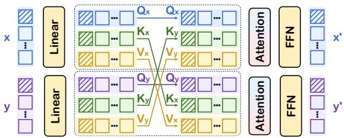

Fig. 3. The proposed zero-parameter attention rewiring strategy, which converts self-attention to cross-attention.  
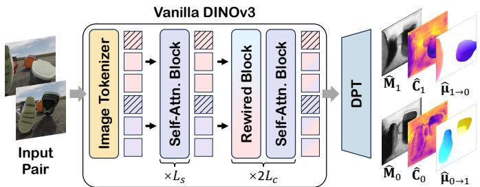  
Fig. 4. FAST consists only of a DINOv3 [6] backbone and a DPT head [36]. In a single forward pass, it jointly regresses bidirectional optical flow $\{ \hat { \mu } _ { 0 \to 1 } , \hat { \mu } _ { 1 \to 0 } \}$ , confidence maps $\big \{ \hat { \mathbf { C } } _ { 0 } , \hat { \mathbf { C } } _ { 1 } \big \}$ , and covisable mask $\{ \hat { \bf M } _ { 0 } , \tilde { \bf M } _ { 1 } \}$ from an RGB image pair.

## 3.3 Large-Scale Supervision from Static Rigid Scenes

Beyond model scaling, FAST also pursues data-side scaling by increasing both the number and the diversity of correspondence pairs. Existing optical-flow datasets provide massive annotated image pairs, yet most samples are organized as video clips, where adjacent frames share repeated objects and similar scene layouts. As a result, the large scale in pair count does not imply equally large scene-level and object-level diversity. This motivates us to complement standard optical-flow data with additional co-visible image pairs from related geometric tasks.

In practice, we consolidate heterogeneous correspondence sources, including rectified stereo and SfM/SLAM reconstructions, into a unified dense 2D displacement representation. For stereo pairs, we convert disparity into horizontal or vertical displacement by applying random 90-degree rotations. For calibrated static rigid scenes, we employ standard multi-view geometry to induce dense correspondences from depth and camera poses. We further apply a depth-based consistency check to improve label reliability, retaining pixels that are projected inside the target image with consistent depth geometry. The final corpus combines optical-flow data with converted static-scene data, expanding the scale and diversity of training pairs across diverse motions, scenes, and camera configurations.

## 3.4 Loss Function

Following the probabilistic regression formulations [3], [23], we parameterize the optical-flow prediction as a Laplace distribution, where the estimated mean $\hat { \mu }$ and scale parameter sˆ represent the expected flow and its uncertainty, respectively. With this assumption, the network is optimized by minimizing the negative log-likelihood of the Laplace model as

$$
\mathcal { L } _ { L a p l a c e } ( \hat { \mu } , \hat { s } ) = - \log { \left[ \frac { 1 } { 2 \hat { s } } \exp { \left( \frac { - | \mu - \hat { \mu } | } { \hat { s } } \right) } \right] } ,\tag{5}
$$

where $\mu$ denotes the optical-flow annotation. In practice, we predict the inverse scale as confidence, $i . e . , \hat { c } \overset { \bullet } { = } ( \hat { s } ) ^ { - 1 }$ , and estimate it in exp space to ensure the equivalent positive confidence $\hat { c } \in ( 0 , \bar { + } \infty )$ . Assuming that ${ { \mathbf { M } } _ { a l l } }$ denotes all valid supervision containing a total of $N _ { a l l }$ elements, Eq. 5 can be rewritten as

$$
\mathcal { L } _ { L a p l a c e } ( \hat { \mu } , \hat { c } ) = \frac { 1 } { N _ { a l l } } \sum _ { i \in \mathbf { M } _ { a l l } } \left( \hat { c } _ { i } | \mu _ { i } - \hat { \mu } _ { i } | - \log \hat { c } _ { i } \right) .\tag{6}
$$

Compared with a standard $\ell _ { 1 }$ loss, the Laplace objective prevents loss domination by ambiguous regions, such as occlusions and noisy pseudo-labels [3]. However, this confidence-aware formulation may also allow the network to under-emphasize difficult yet matchable pixels by predicting low confidence. This is undesirable for dense matching, where covisible pixels with large displacement or significant viewpoint changes should still be optimized. To alleviate this issue, we introduce an additional confidenceindependent robust regression loss [8], [25] on the covisible region $\scriptstyle \mathbf { M } _ { n o c } ,$ which is formulated as

$$
\mathcal { L } _ { r o b u s t } ( \hat { \mu } ) = \frac { 1 } { N _ { n o c } } \sum _ { i \in \mathbf { M } _ { n o c } } \mathcal { R } ( \left\| \mu _ { i } - \hat { \mu } _ { i } \right\| _ { 2 } ) .\tag{7}
$$

This term complements the Laplace loss by enforcing direct flow regression on pixels that are matchable, while keeping optimization stable for large residuals. We additionally supervise the predicted covisibility mask mˆ with a binary cross-entropy loss as

$$
\mathcal { L } _ { n o c } ( \hat { m } ) = \frac { 1 } { N _ { a l l } } \sum _ { i \in \mathbf { M } _ { a l l } } [ - m _ { i } \log \hat { m } _ { i } + ( 1 - m _ { i } ) \log ( 1 - \hat { m } _ { i } ) ]\tag{8}
$$

where $m _ { i } = 1$ indicates that pixel i is covisible, and $m _ { i } = 0$ otherwise. The covisable mask $\mathbf { M } _ { n o c }$ is obtained from forward-backward flow consistency check [37]. The total training loss is formulated as $\mathcal { L } = \mathcal { L } _ { L a p l a c e } + \mathcal { L } _ { r o b u s t } + \mathcal { L } _ { n o c } .$

## 4 EXPERIMENT

## 4.1 Implementation

Training Datasets. We collect a large amount of optical flow data to facilitate learning diverse motion patterns. Besides, we convert disparity of synchronously captured stereo pairs or depth of static rigid scenes into flow format to further enrich the object and scene diversity. The collected pairs with moving objects are over 0.6 million and the total training pairs are up to 6 million (see Appendix E for more details). All training samples are grouped into three categories, including dynamic scenes, small-baseline static scenes and wide-baseline static scenes. During training, we sample uniformly across these categories.

Training Strategies. By default, we employ DINOv3 [6] as the backbone. We set the total batch size equal to 16, and crop input pairs into 512×512. Models are trained with AdamW optimizer for 1000K iterations, with a onecycle learning-rate schedule and maximum learning rate equal to $1 \times \mathrm { 1 0 ^ { - 4 } }$ . During training, we adopt standard data augmentations [12] to increase sample diversity. Training FAST-Huge takes 8 NPUs for 10 days.

TABLE 1  
Quantitative comparison on optical flow benchmarks. All metrics lower are better.
<table><tr><td rowspan="2">Method</td><td colspan="2">Sintel</td><td colspan="3">Spring</td><td colspan="3">KITTI</td></tr><tr><td>clean final</td><td></td><td>EPE</td><td>1PE</td><td>F1</td><td>F1-all F1-bg</td><td></td><td>F1-fg</td></tr><tr><td>PWCNet [11]</td><td>3.45</td><td>4.60</td><td>2.288</td><td>82.27</td><td>4.889</td><td>7.72</td><td>7.69</td><td>7.88</td></tr><tr><td>RAFT [12]</td><td>1.61</td><td>2.86</td><td>1.476</td><td>6.790</td><td>3.198</td><td>5.10</td><td>4.74</td><td>6.87</td></tr><tr><td>SEA-RAFT (M) [3]</td><td>1.44</td><td>2.86</td><td>0.363</td><td>3.686</td><td>1.347</td><td>4.64</td><td>4.47</td><td>5.49</td></tr><tr><td>CrocoFlow [23]</td><td>1.09</td><td>2.44</td><td>0.498</td><td>4.565</td><td>1.508</td><td>3.64</td><td>3.18</td><td>5.94</td></tr><tr><td>FlowFormer++ [42]</td><td>1.07</td><td>1.94</td><td></td><td></td><td></td><td>4.52</td><td></td><td></td></tr><tr><td>FAST-Huge (Ours)</td><td>0.94</td><td>2.30</td><td></td><td>0.3233.4941.212</td><td></td><td>5.43</td><td>3.99</td><td>12.66</td></tr></table>

## 4.2 Benchmark Comparison on Optical Flow Task

We evaluate FAST-Huge on Sintel [38], Spring [39], and KITTI [40] benchmarks. Different from previous methods that often rely on benchmark-specific fine-tuning or dedicated checkpoints optimized for individual datasets, FAST-Huge is evaluated with a single unified checkpoint across all benchmarks without any dataset-specific adaptation. As shown in Table 1, FAST-Huge demonstrates remarkable robustness across synthetic benchmarks. On the Sintel clean split, it achieves a state-of-the-art 0.94 EPE, improving over the previous best result by 12.1%. On Spring, FAST-Huge delivers the lowest EPE, 1PE and F1 scores among all compared methods. Notably, FAST-Huge outperforms CrocoFlow across all metrics on Sintel and Spring, demonstrating the effectiveness of our scalable backbone and largescale correspondence supervision.

On KITTI, FAST-Huge achieves competitive F1- background performance under zero-shot evaluation. The remaining performance gap mainly originates from foreground motion estimation, where FAST is less effective for large out-of-image motions (Fig. 5). Meanwhile, FAST produces sharper and better aligned motion boundaries, while such improvements are not fully reflected by KITTI metrics due to imperfect annotations around object boundaries [41]. Further increasing the diversity of dynamic scenes in training data and introducing sim-to-real self-supervised objectives may help mitigate this gap. Overall, these results highlight that FAST-Huge generalizes well across diverse flow benchmarks without task-specific fine-tuning.

## 4.3 Zero-shot Evaluation on Stereo Matching Task

We evaluate the zero-shot stereo matching capability of FAST-Huge on four standard benchmarks: KITTI 2012 & 2015 [40], [45], ETH3D [46], and Middlebury [47]. Specifically, we compare FAST-Huge with optical-flow methods that are enhanced by large-scale pretraining or finetuning, including FlowFormer++ [42] (video pretraining on YouTube-VOS [48]), CrocoFlow [23] (masked pretraining on 5.4M cross-view pairs), Flow-Anything [33] (motion finetuning on FA-Flow with 6M images), and PanMatch [9] (motion finetuning on 1.8M pairs). This comparison assesses the task-transfer capability of general correspondence models from optical flow estimation to stereo matching. As listed in Table 2, FAST-Huge outperforms existing optical-flow baselines across benchmarks, with the error rate reducing 9% on KITTI15, 9% on KITTI12 and 31% on ETH3D.

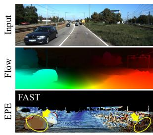

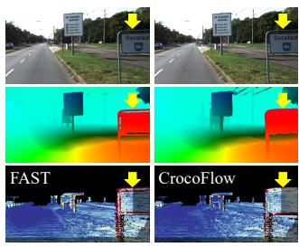  
Fig. 5. Analysis of the KITTI performance gap. FAST struggles with large out-of-image foreground motions, while its sharper boundary predictions are not fully reflected by KITTI metrics due to annotation ambiguity around object boundaries.

TABLE 2  
Zero-shot evaluation on stereo matching datasets.
<table><tr><td>Methods</td><td>KT15 D1-all</td><td>KT12 D1-all</td><td>ETH3D 1PE-noc</td><td>Midd. 2PE-noc</td></tr><tr><td>Selective-IGEV [43]</td><td>4.5</td><td>3.2</td><td>3.4</td><td>7.5</td></tr><tr><td>MatchAttention-B [44]</td><td>3.78</td><td></td><td>1.27</td><td>2.27</td></tr><tr><td>S2M2-XL [41]</td><td>2.97</td><td>4.05</td><td>0.42</td><td>1.0</td></tr><tr><td>FoundationStereo [7]</td><td>2.8</td><td>2.3</td><td>0.5</td><td>1.1</td></tr><tr><td>FlowFormer++ [42]</td><td>6.12</td><td>4.50</td><td>4.63</td><td>10.99</td></tr><tr><td>CrocoFlow [23]</td><td>4.10</td><td>3.83</td><td>2.59</td><td>7.08</td></tr><tr><td>Flow-Anything [33]</td><td>4.12</td><td>3.08</td><td>3.32</td><td>8.53</td></tr><tr><td>PanMatch [9]</td><td>3.27</td><td>2.77</td><td>1.79</td><td>3.39</td></tr><tr><td>FAST-Huge (Ours)</td><td>2.97</td><td>2.51</td><td>1.24</td><td>3.84</td></tr></table>

We additionally report stereo matching models trained on million-scale stereo pairs as reference. Note that these methods explicitly exploit stereo geometry through components such as epipolar-constrained matching and warpingbased refinement. Despite equipping without these designs, FAST-Huge outperforms Selective-IGEV on all four benchmarks, and surpasses MatchAttention-B on KITTI 2015 and ETH3D. Notably, FAST-Huge approaches FoundationStereo on the two KITTI benchmarks, with the absolute D1-all gaps only 0.21 on KITTI 2012 and 0.17 on KITTI 2015. Although FAST still lags behind on ETH3D and Middlebury with the hard 1pe and 2pe metrics, its scaling-oriented trends observed in Section 4.5 suggest that broader supervision and stronger backbones may further narrow the residual gap.

## 4.4 Wide-Baseline Benchmark Comparison

The stereo and optical-flow evaluations mainly focus on small-baseline scenarios, where viewpoint changes are relatively limited. To further verify whether FAST can serve as a general-purpose dense correspondence model, we additionally evaluate it under wide-baseline settings. Specifically, we consider two evaluation protocols. First, we directly measure dense matching accuracy on DTU [49] and TA-WB [25], and compare FAST with representative general matching methods [9], [25], [27]. Second, we evaluate relative pose estimation on WxBS [50], ScanNet [51], and MegaDepth [52], where reliable camera pose recovery requires geometrically consistent matches under significant viewpoint and appearance variations. Note that FAST’s results are obtained with the same checkpoint, without dataset-specific fine-tuning. Evaluation on Dense Matching. We first compare FAST with UFM, a related ViT-DPT model augmented with 12 Transformer blocks and a refiner for matching. As shown in Table. 3, FAST outperforms UFM on all eight metrics, reducing EPE from 5.55 to 4.43 on DTU and from 12.84 to 12.03 on TA-WB. Compared with RoMav2 which employs cascaded refiners, FAST achieves the lowest EPE metric on DTU and trails by only 0.7 and 3.2 percentage points under the 5pe criterion on DTU and TA-WB, respectively. Together with Table 1 & 2, these appended evidence suggest that FAST handles dense 2D correspondence across both smalland wide-baseline settings.

TABLE 3  
Dense matching performance. Non-occluded metrics are reported.
<table><tr><td rowspan="2">Method</td><td colspan="4">DTU</td><td colspan="4">TA-WB</td></tr><tr><td>epe</td><td>1pe</td><td>2pe</td><td>5pe</td><td>epe</td><td>1pe</td><td>2pe</td><td>5pe</td></tr><tr><td>PanMatch [9]</td><td>26.69</td><td>60.7</td><td>44.8</td><td>32.7</td><td>74.36</td><td>69.7</td><td>55.8</td><td>48.0</td></tr><tr><td>UFM [25]</td><td>5.55</td><td>55.5</td><td>32.9</td><td>13.8</td><td>12.84</td><td>51.4</td><td>30.6</td><td>17.0</td></tr><tr><td>RoMav2 [27]</td><td>4.81</td><td>38.8</td><td>20.5</td><td>9.7</td><td>10.73</td><td>38.9</td><td>18.6</td><td>11.5</td></tr><tr><td>FAST</td><td>4.43</td><td>54.0</td><td>28.7</td><td>10.4</td><td>12.03</td><td>51.0</td><td>28.6</td><td>14.7</td></tr></table>

TABLE 4

Relative pose estimation results on WxBS [50], ScanNet [51], [53], and MegaDepth [52], [54]. We evaluate WxBS with mAA metrics while ScanNet and Megadepth with AUC metrics.
<table><tr><td rowspan="2">Method</td><td>WxBS</td><td colspan="3">ScanNet</td><td colspan="3">MegaDepth</td></tr><tr><td>@10px</td><td>@5°</td><td>@10°</td><td>@20°</td><td>@5°</td><td>@10°</td><td>@20°</td></tr><tr><td>LightGlue [55]</td><td>一</td><td>17.8</td><td>34.0</td><td>52.0</td><td>51.0</td><td>68.1</td><td>80.7</td></tr><tr><td>LoFTR [54]</td><td>55.4</td><td>22.1</td><td>40.8</td><td>57.6</td><td>52.8</td><td>69.2</td><td>81.2</td></tr><tr><td>DKM [56]</td><td>58.9</td><td>29.4</td><td>50.7</td><td>68.3</td><td>60.4</td><td>74.9</td><td>85.1</td></tr><tr><td>RoMa [8]</td><td>80.1</td><td>31.8</td><td>53.4</td><td>70.9</td><td>62.6</td><td>76.7</td><td>86.3</td></tr><tr><td>UFM [25]</td><td>42.3</td><td>31.3</td><td>54.1</td><td>72.0</td><td>41.5</td><td>57.9</td><td>72.4</td></tr><tr><td>RoMav2 [27]</td><td>55.4</td><td>33.6</td><td>56.2</td><td>73.8</td><td>62.8</td><td>77.0</td><td>86.6</td></tr><tr><td>FAST</td><td>74.5</td><td>31.8</td><td>54.2</td><td>71.8</td><td>48.5</td><td>65.7</td><td>79.1</td></tr></table>

Relative Pose Estimation. We further evaluate FAST on pose estimation benchmarks, where accurate pose recovery requires reliable correspondences together with effective visibility/confidence estimates for filtering ambiguous matches. As reported in Table 4, FAST achieves a secondbest rank on the challenge WxBS benchmark, surpassing RoMav2 by 19.1 points. FAST also obtains the secondbest AUC@5◦/10◦ metric on ScanNet. On MegaDepth, it consistently outperforms UFM under the same zero-shot setting, improving AUC@5◦/10◦/20◦ from 41.5/57.9/72.4 to 48.5/65.7/79.1. These results provide a stringent tasklevel verification of the accuracy and geometric consistency of FAST’s dense matches.

## 4.5 Ablation Study

We conduct comprehensive ablation studies to validate: (1) the benefits of single-view pretraining for dense matching; (2) the superiority of our rewired cross-attention over global self-attention; (3) the decoder role; (4) the effect of trainable parameter scale; and (5) the scaling behavior with respect to both model size and training data. We use DINOv3-Large as the backbone and train it on a combination of the SceneFlow, TartanAir, and Virtual KITTI 2 datasets for 1,000K iterations with a batch size of 8. We evaluate the zero-shot performance on the training splits of Middlebury, ETH3D, Sintel, and KITTI-15 datasets. Results are summarized in Table 5.

TABLE 5  
Zero-shot evaluation for ablation study. We ablate initialization, attention, decoder role, parameter scale, model scale, and data scale across multiple datasets. Underlined values denote the baseline settings, and bold indicates the best performance. ∗ denotes evaluation on the training set. For all metrics, lower is better.
<table><tr><td rowspan="3">Experiment</td><td colspan="4">Stereo Matching</td><td colspan="4">Optical Flow</td></tr><tr><td colspan="2">Middlebury</td><td colspan="2">ETH3D</td><td colspan="2">Sintel</td><td colspan="2">KITTI 15</td></tr><tr><td>EPE</td><td>2PE</td><td>EPE</td><td>1PE</td><td>clean</td><td>final</td><td>EPE</td><td>F1-all</td></tr><tr><td>Scratch</td><td>5.94</td><td>43.47</td><td>0.79</td><td>16.70</td><td>3.02</td><td>4.11</td><td>4.84</td><td>21.52</td></tr><tr><td>DINOv2 [26]</td><td>2.01</td><td>16.84</td><td>0.37</td><td>5.02</td><td>1.21</td><td>2.28</td><td>2.27</td><td>8.85</td></tr><tr><td>DINOv3 [6]</td><td>1.77</td><td>13.18</td><td>0.28</td><td>3.10</td><td>1.06</td><td>2.13</td><td>2.06</td><td>7.33</td></tr><tr><td>global SA</td><td>2.38</td><td>17.52</td><td>0.31</td><td>4.32</td><td>1.42</td><td>2.44</td><td>2.74</td><td>11.52</td></tr><tr><td>rewired CA</td><td>1.77</td><td>13.18</td><td>0.28</td><td>3.10</td><td>1.06</td><td>2.13</td><td>2.15</td><td>7.73</td></tr><tr><td>Linear-Swap</td><td>2.65</td><td>19.22</td><td>0.37</td><td>4.44</td><td>1.48</td><td>2.39</td><td>2.31</td><td>9.13</td></tr><tr><td>DPT</td><td>1.77</td><td>13.18</td><td>0.28</td><td>3.10</td><td>1.06</td><td>2.13</td><td>2.15</td><td>7.73</td></tr><tr><td>LoRA(r=16)</td><td>2.29</td><td>17.16</td><td>0.39</td><td>4.42</td><td>1.21</td><td>2.26</td><td>2.07</td><td>8.29</td></tr><tr><td>LoRA(r=64)</td><td>1.91</td><td>14.09</td><td>0.28</td><td>3.25</td><td>1.09</td><td>2.05</td><td>2.14</td><td>8.23</td></tr><tr><td>full</td><td>1.77</td><td>13.18</td><td>0.28</td><td>3.10</td><td>1.06</td><td>2.13</td><td>2.15</td><td>7.73</td></tr><tr><td>Base</td><td>2.14</td><td>18.32</td><td>0.35</td><td>4.63</td><td>1.28</td><td>2.34</td><td>2.90</td><td>11.26</td></tr><tr><td>Large</td><td>1.77</td><td>13.18</td><td>0.28</td><td>3.10</td><td>1.06</td><td>2.13</td><td>2.15</td><td>7.73</td></tr><tr><td>Huge</td><td>1.36</td><td>10.99</td><td>0.26</td><td>2.65</td><td>0.98</td><td>2.01</td><td>1.90</td><td>7.34</td></tr><tr><td>SF</td><td>2.62</td><td>18.60</td><td>0.37</td><td>5.52</td><td>1.05</td><td>2.82</td><td>6.24</td><td>29.76</td></tr><tr><td>SF+T+VK</td><td>1.77</td><td>13.18</td><td>0.28</td><td>3.10</td><td>1.06</td><td>2.13</td><td>2.15</td><td>7.73</td></tr><tr><td>Flow-Dynamic</td><td>1.97</td><td>16.58</td><td>0.32</td><td>4.30</td><td>1.04*</td><td>1.59*</td><td>2.13</td><td>7.78</td></tr><tr><td>Flow-6M</td><td>1.11</td><td>7.59</td><td>0.26</td><td>2.34</td><td>0.83*</td><td>1.39*</td><td>2.05</td><td>7.60</td></tr><tr><td>FAST-Huge</td><td>1.02</td><td>6.41</td><td>0.22</td><td>2.06</td><td>0.67*</td><td>1.12*</td><td>1.82</td><td>6.13</td></tr></table>

Scalable Pretraining Initialization. Large-scale single-view pretraining is the cornerstone of FAST. As shown in Table 5, training the ViT backbone from scratch drastically degrades generalization, indicating that pretraining is essential for modeling precise correspondence. Furthermore, upgrading the initialization from DINOv2-Large (pretrained on 142M images) to DINOv3-Large (pretrained on 1.6B images) yields consistent performance improvements across all metrics. These results demonstrate that FAST effectively inherits the scaling benefits of single-view pretraining, where larger-scale pretrained representations provide increasingly stronger initialization for dense matching.

Cross-view Interaction. We compare our rewired crossattention against global self-attention for two-view interaction. Although global self-attention also enables effective cross-view interaction and achieves competitive matching performance, replacing it with rewired cross-attention consistently reduces estimation errors across all evaluation metrics. These results indicate that explicitly modeling crossview affinities through cross-attention is better aligned with correspondence matching than jointly modeling intra- and inter-view interactions with global self-attention.

Furthermore, to examine whether the attention rewiring mechanism preserves the pretrained ViT’s inductive bias at initialization, we visualize the last-layer representations and attention responses before and after rewiring. As shown in

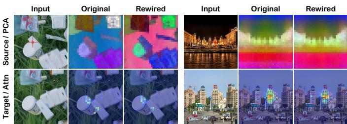  
Fig. 6. Last-layer comparison between original and rewired DINOv3- Huge (rewired from layer 15 of total layer 32).

Fig. 6, despite significant cross-view variations caused by object motion and appearance changes, the PCA structures and correspondence-related attention patterns remain consistent after converting self-attention into cross-attention. This observation suggests that the matching prior encoded in DINOv3 is preserved during the transition from singleview perception to correspondence matching.

Decoder Role. To identify whether the learned correspondence is encoded in the rewired ViT or depends on the decoder capacity, we start from a trained FAST, replace its DPT (44M params.) with a linear head (1.4M params.), freeze the ViT backbone and train only the new head. As shown in Table 5, despite 31× compression in parameters, Linear-Swap variant increases EPE by only 0.09–0.88 pixels. This modest degradation indicates that correspondence is decodable from the frozen ViT representations rather than memorized by DPT. The remaining performance gap mainly comes from DPT’s stronger multi-level decoding and subpixel refinement capabilities.

Parameter-Efficient Adaptation. We compare full finetuning with LoRA-based adaptation to investigate whether FAST relies on full backbone fine-tuning to acquire dense matching capability. As shown in Table 5, LoRA with r = 16 reduces the trainable ViT parameters from 384M to only 4M. Nevertheless, LoRA adaptation still yields strong zero-shot performance, and further approaches the fully fine-tuned counterpart when increasing the rank from 16 to 64. This result suggests that the transferred dense matching ability mainly comes from the pretrained ViT representations and the rewired cross-attention formulation, rather than from unconstrained parameter updates.

Model Scalability. To evaluate model scalability, we instantiate FAST with DINOv3 backbones of increasing sizes: Base, Large, and Huge. As shown in Table 5, performance improves across all zero-shot benchmarks as the model scale increases. Notably, we observe no performance saturation within the evaluated range, indicating that FAST effectively inherits the scaling properties of foundation models, translating larger pretrained ViTs into proportionally stronger dense matching capabilities.

Data Scalability. We explore data scalability by training FAST on progressively larger datasets: FlyingThings3D (0.07M samples), a mixture of SceneFlow, TartanAir, and Virtual KITTI 2 (0.5M samples), Flow-Dynamic (0.6M dynamicscene pairs), and Flow-6M (Flow-Dynamic augmented only with static-scene pairs). Results in Table 5 support two conclusions. First, performance improves overall as the training corpus scales from 0.07M to 6M pairs, confirming that FAST benefits effectively from data scaling. Second, augmenting

Flow-Dynamic solely with static-scene pairs improves all reported metrics, including those on the dynamic Sintel and KITTI-15 benchmarks. This demonstrates that staticscene supervision strengthens geometric matching priors that transfer to independent object motion.

## 5 CONCLUSION

We reveal that single-view VFMs encode transferable crossview matching priors, which can be effectively reused in cross-attention form through zero-parameter attention rewiring. Building on this finding, we introduce FAST, a scaling-oriented correspondence model built from DINOv3. We further assemble Flow-6M to support data-side scaling. Extensive experiments show that FAST achieves state-ofthe-art performance across benchmarks, while scaling favorably with both backbone capacity and training data.

## APPENDIX A

## ROBUST REGRESSION LOSS

The robust regression loss is formulated as

$$
\mathcal { R } ( x ) = \frac { | \alpha - 2 | } { \alpha } \left( \left( \frac { \left( \frac { x } { \beta } \right) ^ { 2 } } { | \alpha - 2 | } + 1 \right) ^ { \frac { \alpha } { 2 } } - 1 \right) ,\tag{9}
$$

where we set $\alpha = 0 . 5$ and $\beta = 0 . 2 4$ following UFM [25]’s choice.

## APPENDIX B

## DEPTH-TO-FLOW LABEL GENERATION

Given the depth map $\mathbf { D } _ { 0 }$ and camera intrinsic matrix $\mathbf { K } _ { 0 }$ of view 0, we first back-project each pixel $\mathbf { p } = ( u _ { 0 } , v _ { 0 } )$ into 3D camera coordinates as

$$
\mathbf { P } _ { 0 } = \mathbf { D } _ { 0 } ( \mathbf { p } ) \mathbf { K } _ { 0 } ^ { - 1 } \tilde { \mathbf { p } } , \quad \tilde { \mathbf { p } } = [ u _ { 0 } , v _ { 0 } , 1 ] ^ { \mathsf { T } } ,\tag{10}
$$

where $\mathbf { P } _ { 0 }$ represents the 3D point corresponding to pixel p in the camera coordinate system of view 0. Let the extrinsics of views 0 and 1 be $[ \mathbf { R } _ { 0 } | \mathbf { t } _ { 0 } ]$ and $[ \mathbf { R } _ { 1 } | \mathbf { t } _ { 1 } ] ,$ , respectively, under the world-to-camera convention. The relative transformation $\mathbf { T } _ { 1  0 } = [ \mathbf { R } _ { 1  0 } | \mathbf { t } _ { 1  0 } ]$ from view 0 to view 1 is given by

$$
\mathbf { R } _ { 1  0 } = \mathbf { R } _ { 1 } \mathbf { R } _ { 0 } ^ { - 1 } , \quad \mathbf { t } _ { 1  0 } = \mathbf { t } _ { 1 } - \mathbf { R } _ { 1  0 } \mathbf { t } _ { 0 } .\tag{11}
$$

The 3D point $\mathbf { P } _ { 0 }$ is subsequently transformed into the coordinate frame of view 1 and projected onto its image plane as

$$
\begin{array} { r } { s \tilde { { \bf p } } _ { 1 } = { \bf K } _ { 1 } ( { \bf R } _ { 1  0 } { \bf P } _ { 0 } + { \bf t } _ { 1  0 } ) , \quad \tilde { { \bf p } } _ { 1 } = [ u _ { 1 } , v _ { 1 } , 1 ] ^ { \top } , } \end{array}\tag{12}
$$

where s denotes the derived depth of the transformed 3D point in the coordinate frame of view 1. This projection can be equivalently written in homogeneous form as $\tilde { \mathbf { p } } _ { 1 } \sim \mathbf { K } _ { 1 } \mathbf { T } _ { 1  0 } \mathbf { P } _ { 0 }$ . With the calculated image coordinates $\mathbf { p } _ { 1 } ~ = ~ ( u _ { 1 } , v _ { 1 } )$ , the optical flow from view 0 to view 1 is thus defined as $\mathbf { F } _ { 1  0 } = \mathbf { p } _ { 1 } - \mathbf { p }$ . The reverse flow $\mathbf { F } _ { 0  1 }$ is obtained analogously. Finally, by comparing the derived depth s with the ground-truth depth $\bar { \bf D } _ { 1 } ( { \bf p } _ { 1 } )$ , we can identify occluded regions as well as geometrically inconsistent correspondences. Specifically, if the projected depth s is significantly greater than the observed depth $\mathbf { D } _ { 1 } ( \mathbf { p } _ { 1 } )$ , it implies that the 3D point is occluded by a foreground object in view 1, allowing us to accurately filter out non-covisible regions.

TABLE 6  
Architecture comparison of representative ViT-based correspondence models. “Params.” denotes parameters newly introduced for cross-view interaction, excluding the pretrained backbone and dense prediction heads.
<table><tr><td>Method</td><td>Backbone</td><td>Cross-view Interaction</td><td>Params. Decoder</td></tr><tr><td>CroCo v2 [23] ViT [57]</td><td></td><td>ViT-B</td><td>114M DPT</td></tr><tr><td>UFM [25]</td><td></td><td>DINOv2 [26] 12× Transformer</td><td>86M DPT</td></tr><tr><td>RoMa v2 [27]</td><td>DINOv3 [6]</td><td>12× Transformer + CNN</td><td>90M DPT + Linear</td></tr><tr><td>FAST (Ours)</td><td>DINOv3 [6]]</td><td>Rewired Transformer</td><td>0 DPT</td></tr></table>

## APPENDIX C

## ARCHITECTURE COMPARISON

We summarize the architectural compositions of representative ViT-based correspondence models in Table 6. Existing approaches typically employ a pretrained image encoder followed by an additional parameterized module for crossview interaction. For instance, CroCo v2 [4], [23] adopts a Base scale ViT as the cross-attention decoder on top of a ViT-L encoder, while UFM [25] and RoMa v2 [27] introduce additional Transformer blocks to exchange information between independently extracted foundation-model features. In contrast, FAST establishes cross-view interaction directly within the pretrained backbone by rewiring selected selfattention layers into cross-attention. This design reuses the pretrained attention projections as matching modules and therefore introduces zero additional parameters for crossview interaction.

## APPENDIX D

## QUALITATIVE COMPARISON AND DOWNSTREAM AP-PLICATION

In this section, we provide additional qualitative comparisons to complement the quantitative evaluations in the main paper. We consider increasingly challenging correspondence settings, ranging from optical flow and rectified stereo matching to wide-baseline image matching, and finally evaluate FAST as a correspondence front-end for multi-view 3D reconstruction. Unless otherwise specified, all FAST results are produced using the same unified FAST-Huge checkpoint without benchmark-specific fine-tuning or adaptation.

## D.1 Qualitative Comparison on Optical Flow

We first compare FAST with CroCo-Flow [23] and SEA-RAFT [3] on the Sintel [38] and Spring [39] benchmarks. CroCo-Flow provides a particularly relevant comparison, as both methods follow a ViT-based dense prediction paradigm with a DPT head. However, CroCo-Flow relies on dedicated cross-view pretraining to initialize its binocular architecture, whereas FAST directly repurposes a pretrained single-view ViT as the matching backbone through attention rewiring, without requiring cross-view pretraining. We additionally include SEA-RAFT as a representative correlation-based optical-flow method, providing a complementary comparison with a specialized flow architecture.

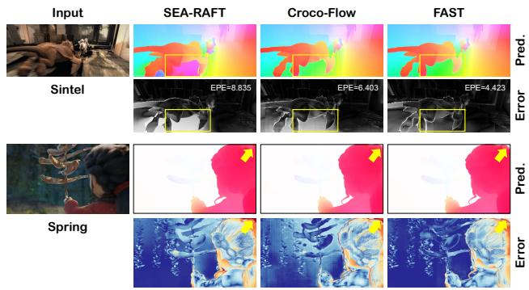  
Fig. 7. Optical flow estimation on Sintel and Spring scenes.

As shown in Fig. 7, FAST exhibits clear advantages in challenging motion regions. On Sintel, FAST better handles large occluded regions and produces a more spatially coherent flow field, reducing the overall EPE to 4.423, compared with 6.403 for CroCo-Flow and 8.835 for SEA-RAFT. On Spring, FAST produces sharper and better image-aligned motion boundaries, particularly along the highlighted foreground contour, while exhibiting noticeably lower errors over the background region. These results suggest that FAST not only improves overall matching accuracy, but also better preserves motion discontinuities in challenging highresolution scenes.

## D.2 Zero-shot Generalization on Stereo Matching

We next compare FAST with $\mathrm { S ^ { 2 } M ^ { 2 } }$ [41] and Foundation-Stereo [7], two recent state-of-the-art stereo matching methods. Unlike these stereo-specialized models, FAST directly transfers its generic 2D correspondence capability to rectified stereo matching without relying on stereo-specific costvolume reasoning. As shown in Fig. 8, FAST remains robust in challenging Booster scenes where both specialized methods exhibit noticeable local failures. In the first example, FAST recovers a spatially coherent disparity field with substantially lower errors. For the transparent object, $\mathrm { S ^ { 2 } M ^ { 2 } }$ and FoundationStereo suffer from background-disparity leakage through the surface, whereas FAST produces a smoother and more coherent disparity estimate with fewer errors inside the transparent region. These results demonstrate that the generic correspondence formulation of FAST transfers effectively to challenging stereo scenes and provides complementary robustness beyond stereo-specific designs.

## D.3 Wide-baseline Dense Matching

We further evaluate FAST on WxBS [50] against RoMa [8], RoMa v2 [27], and UFM [25], three recent state-of-the-art dense correspondence methods. As shown in Fig. 9, the evaluated pairs cover extreme appearance variations, including seasonal changes, day–night transitions, and crossmodal RGB–infrared matching. RoMa and RoMa v2 often produce sparse warps with large low-confidence regions, while UFM provides denser predictions but fails to recover reliable correspondences in Scene 2. In contrast, FAST consistently produces more complete and structurally coherent warps with fewer spurious correspondences. The advantage is particularly pronounced for RGB–infrared matching, where FAST preserves most of the scene structure despite the substantial modality gap. These results demonstrate a favorable balance between correspondence completeness and outlier suppression, highlighting the generalization capability of FAST beyond conventional flow and stereo settings.

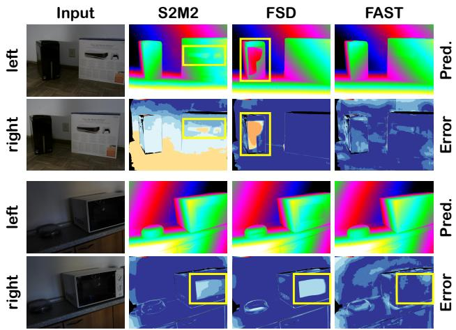  
Fig. 8. Stereo matching estimation on Booster scenes.

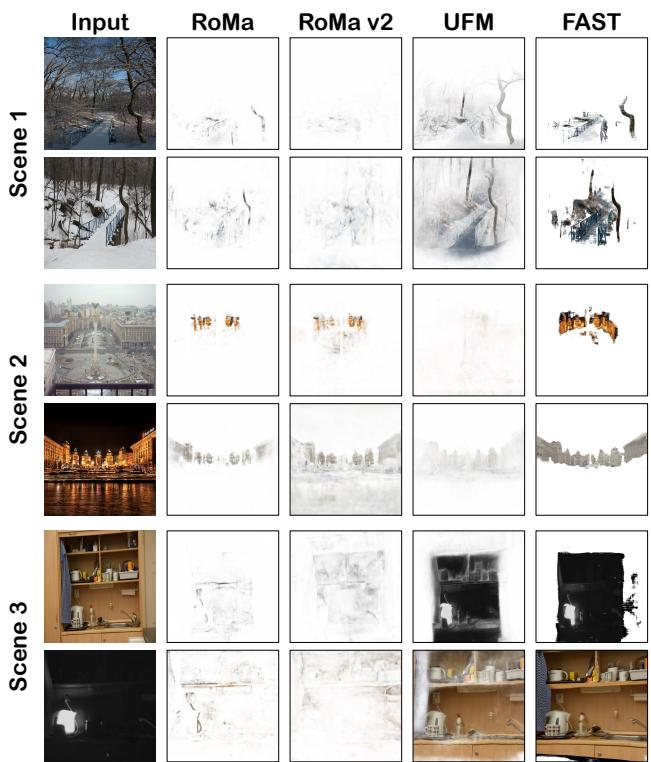  
Fig. 9. Dense matching comparison on the challenging WxBS scenes.

## D.4 Applications on 3D Reconstruction

We further evaluate FAST as a correspondence and depthestimation component in a complete 3D reconstruction pipeline following [9]. To isolate the effect of FAST from image retrieval, we first compare it with the standard COLMAP pipeline under an identical image-pair graph. Only the pair identities are shared: COLMAP uses SIFT correspondences followed by PatchMatch stereo [79], whereas FAST independently predicts correspondences, estimates camera poses through SfM and bundle adjustment, triangulates dense depth from flow, and produces the final fused point cloud. We additionally evaluate an exhaustive FAST variant that removes the COLMAP pairing prior and processes every unordered image pair. As shown on the ETH3D Courtyard scene (Fig. 10), the standard COLMAP reconstruction contains a substantial number of flying points, whereas both FAST variants produce visibly cleaner geometry. FAST with exhaustive pairing further improves pointcloud density and scene completeness over the variant restricted to the COLMAP-derived pair graph. This indicates that the dense correspondences predicted by FAST can exploit additional cross-view constraints that are not retained by the conventional pair-selection stage.

TABLE 7  
Overview of the training data collection. The datasets are grouped into three categories: dynamic scenes with moving objects, static rigid scenes with small baselines, and static rigid scenes with wide baselines. For video datasets, (Seq, Stride) denotes that continuous frames are divided into clips of length Seq with a temporal stride of Stride. ∗ indicates that optical flow labels are generated via a depth-to-flow strategy described in Appendix B.
<table><tr><td rowspan="2">Dataset</td><td rowspan="2">Dynamic Šcenes</td><td colspan="3">Lables</td><td rowspan="2">Res.</td><td rowspan="2">(Seq, Stride)</td><td rowspan="2">Clips</td></tr><tr><td>Flow</td><td>Depth</td><td>Camera</td></tr><tr><td>AutoFlow [58]</td><td></td><td></td><td>X</td><td></td><td>448×576</td><td>(2,1)</td><td>27295</td></tr><tr><td>cvo [59]</td><td></td><td></td><td></td><td></td><td>512×512</td><td>(2,1)</td><td>125466</td></tr><tr><td>DynamicReplica [60]</td><td></td><td></td><td></td><td></td><td>720×1280</td><td>(8,4)</td><td>35742</td></tr><tr><td>FlyingChairs [10]</td><td></td><td></td><td></td><td></td><td>384×512</td><td>(2,1)</td><td>22872</td></tr><tr><td>Infinigen [61]</td><td></td><td></td><td></td><td></td><td>720×1280</td><td>(2,1)</td><td>1910</td></tr><tr><td>Kubric [62]</td><td></td><td></td><td></td><td></td><td>512×512</td><td>(2,1)</td><td>135332</td></tr><tr><td>SceneFlow [15]</td><td></td><td></td><td></td><td></td><td>540×960</td><td>(2,1)</td><td>66252</td></tr><tr><td>Sintel [38]</td><td></td><td></td><td></td><td></td><td>436×1024</td><td>(2,1)</td><td>3054</td></tr><tr><td>Spring [39]</td><td></td><td></td><td></td><td></td><td>1080×1920</td><td>(2,1)</td><td>4889</td></tr><tr><td>VirtualKITTI2 [63]</td><td></td><td></td><td></td><td></td><td>375×1242</td><td>(2,1)</td><td>21110</td></tr><tr><td>BlinkVision [64]</td><td></td><td></td><td></td><td></td><td>540×960</td><td>(2,1)</td><td>181960</td></tr><tr><td>EDEN [65]</td><td></td><td></td><td></td><td></td><td>480×640</td><td>(2,1)</td><td>*364988</td></tr><tr><td>GTA5-SfM [66]</td><td></td><td></td><td></td><td></td><td>480×640</td><td>(2,1)</td><td>*18358</td></tr><tr><td>MatrixCity [67]</td><td>X</td><td></td><td></td><td></td><td>1000×1000</td><td>(2,1)</td><td>*338979</td></tr><tr><td>Replica [68]</td><td>X</td><td>X</td><td></td><td></td><td>680×1200</td><td>(8,4)</td><td>*3992</td></tr><tr><td>TartanAir [69]</td><td>X</td><td></td><td></td><td></td><td>480×640</td><td>(2,1)</td><td>305899</td></tr><tr><td>TaitanAirv2 [70]</td><td>X</td><td></td><td></td><td></td><td>480×640</td><td>(2,1)</td><td>1424947</td></tr><tr><td>CREStereo [71]</td><td>X</td><td></td><td></td><td></td><td>1080×1920</td><td>(2,1)</td><td>200000</td></tr><tr><td>FallingThings [72]</td><td>X</td><td></td><td></td><td></td><td>540×960</td><td>(2,1)</td><td>61500</td></tr><tr><td>FSD [7]</td><td>X</td><td></td><td></td><td></td><td>720×1280</td><td>(2,1)</td><td>1108890</td></tr><tr><td>KenBurns [73]</td><td>X</td><td></td><td></td><td></td><td>512×512</td><td>(2,1)</td><td>76048</td></tr><tr><td>WMGStereo [74]</td><td>X</td><td></td><td></td><td></td><td>720×1280</td><td>(2,1)</td><td>155729</td></tr><tr><td>Hypersim [75]</td><td></td><td>X</td><td></td><td></td><td>768×1024</td><td>(2,1)</td><td>*87374</td></tr><tr><td>Structure3D [76]</td><td>X</td><td>X</td><td></td><td></td><td>720×1280</td><td>(2,1)</td><td>*82182</td></tr><tr><td>MegaDepth [52]</td><td>X</td><td>X</td><td></td><td></td><td>480×640</td><td>(2,1)</td><td>*100150</td></tr><tr><td>BlendedMVS [77]</td><td>X</td><td>X</td><td></td><td></td><td>480×640</td><td>(2,1)</td><td>*446175</td></tr><tr><td>TA-WB [25] Flow-6M</td><td>X</td><td></td><td></td><td></td><td>480×640</td><td>(2,1)</td><td>*279183 5,680,276</td></tr></table>

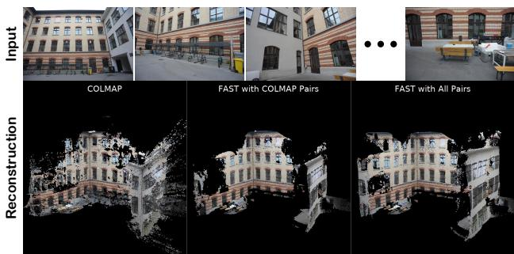  
Fig. 10. 3D reconstruction of the ETH3D [46] courtyard scene (38 views). From left to right: raw COLMAP, FAST COLMAP with COLMAPcomputed pairs, and FAST with all possible pairs.

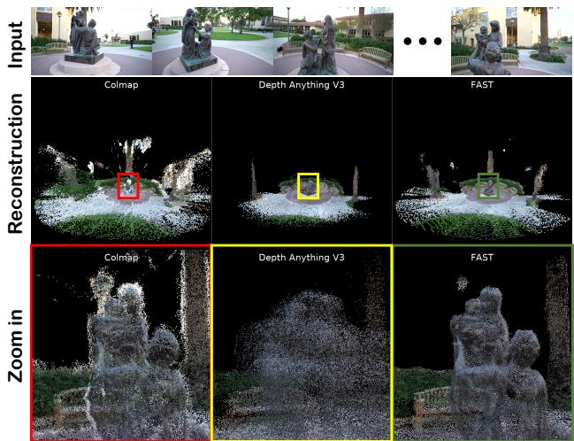  
Fig. 11. 3D reconstruction of the T&T [78] Family scene (152 views). From left to right: raw COLMAP, Depth Anything v3, and FAST COLMAP with COLMAP-computed pairs.

On the T&T Family scene with long trajectory (Fig. 11),

FAST-COLMAP again produces substantially fewer floating artifacts than standard COLMAP. Compared with recent feed-forward reconstruction approach like DA3 [30], FAST recovers finer geometric structures, particularly the silhouette and local details of the human figure, while also preserving more complete scene coverage. DA3 reconstructs the dominant scene structure but tends to produce smoother and less detailed geometry. These qualitative results demonstrate that FAST can provide accurate correspondences for both camera-pose recovery and dense reconstruction, yielding clean and detailed point clouds without relying on COLMAP pose or depth estimates.

## APPENDIX E

## DATA COLLECTION

Details of our training datasets, including image resolutions, ground-truth labels, and sample scales, are summarized in Table 7.

## REFERENCES

[1] H. Laga, L. V. Jospin, F. Boussa¨ıd, and M. Bennamoun, “A survey on deep learning techniques for stereo-based depth estimation,” IEEE Trans. Pattern Anal. Mach. Intell., 2022.

[2] Y. Wang, L. Wang, K. Li, Y. Zhang, D. Oliver Wu, and Y. Guo, “Cost volume aggregation in stereo matching revisited: A disparity classification perspective,” IEEE Trans. Image Process., 2024.

[3] Y. Wang, L. Lipson, and J. Deng, “SEA-RAFT: Simple, efficient, accurate raft for optical flow,” in ECCV, 2024.

[4] P. Weinzaepfel et al., “CroCo: Self-supervised pre-training for 3d vision tasks by cross-view completion,” in NeurIPS, 2022.

[5] J. Wang, M. Chen, N. Karaev, A. Vedaldi, C. Rupprecht, and D. Novotny, “VGGT: visual geometry grounded transformer,” in´ CVPR, 2025.

[6] O. Simeoni´ et al., “DINOv3,” 2025.

[7] B. Wen, M. Trepte, J. Aribido, J. Kautz, O. Gallo, and S. Birchfield, “FoundationStereo: Zero-shot stereo matching,” CVPR, 2025.

[8] J. Edstedt, Q. Sun, G. Bokman, M. Wadenb ¨ ack, and M. Felsberg,¨ “RoMa: Robust Dense Feature Matching,” in CVPR, 2024.

[9] Y. Zhang, L. Wang, K. Li, Y. Zhang, Y. Wang, L. Lin, and Y. Guo, “PanMatch: Unleashing the potential of large vision models for unified matching models,” arXiv preprint arXiv:2507.08400, 2025.

[10] A. Dosovitskiy et al., “FlowNet: Learning optical flow with convolutional networks,” in ICCV, 2015.

[11] D. Sun, X. Yang, M. Liu, and J. Kautz, “PWC-Net: Cnns for optical flow using pyramid, warping, and cost volume,” in CVPR, 2018.

[12] Z. Teed and J. Deng, “RAFT: recurrent all-pairs field transforms for optical flow,” in ECCV, 2020.

[13] H. Xu, J. Zhang, J. Cai, H. Rezatofighi, and D. Tao, “GMFlow: Learning optical flow via global matching,” in CVPR, 2022.

[14] Z. Huang et al., “FlowFormer: A transformer architecture for optical flow,” in ECCV, 2022.

[15] N. Mayer, E. Ilg, P. Hausser, P. Fischer, D. Cremers, A. Dosovitskiy,¨ and T. Brox, “A large dataset to train convolutional networks for disparity, optical flow, and scene flow estimation,” in CVPR, 2016.

[16] H. Xu and J. Zhang, “AANet: Adaptive aggregation network for efficient stereo matching,” in CVPR, 2020.

[17] L. Lipson, Z. Teed, and J. Deng, “RAFT-Stereo: Multilevel recurrent field transforms for stereo matching,” in 3DV, 2021.

[18] A. Kendall, H. Martirosyan, S. Dasgupta, and P. Henry, “End-toend learning of geometry and context for deep stereo regression,” in ICCV, 2017.

[19] X. Guo, K. Yang, W. Yang, X. Wang, and H. Li, “Group-wise correlation stereo network,” in CVPR, 2019.

[20] J. Chang and Y. Chen, “Pyramid stereo matching network,” in CVPR, 2018.

[21] G. Xu, J. Cheng, P. Guo, and X. Yang, “Attention concatenation volume for accurate and efficient stereo matching,” in CVPR, 2022.

[22] Z. Li et al., “Revisiting stereo depth estimation from a sequenceto-sequence perspective with transformers,” in ICCV, 2021.

[23] P. Weinzaepfel et al., “CroCo v2: Improved cross-view completion pre-training for stereo matching and optical flow,” in ICCV, 2023.

[24] V. Leroy, Y. Cabon, and J. Revaud, “Grounding image matching in 3d with mast3r,” in ECCV, 2024.

[25] Y. Zhang et al., “UFM: A simple path towards unified dense correspondence with flow,” in NeurIPS, 2025.

[26] M. Oquab et al., “DINOv2: Learning robust visual features without supervision,” Trans. Mach. Learn. Res., 2024.

[27] J. Edstedt et al., “RoMa v2: Harder better faster denser feature matching,” CoRR, vol. abs/2511.15706, 2025.

[28] S. Wang, V. Leroy, Y. Cabon, B. Chidlovskii, and J. Revaud, “DUSt3R: Geometric 3d vision made easy,” in CVPR, 2024.

[29] J. Zhang et al., “MonST3R: A simple approach for estimating geometry in the presence of motion,” in ICLR, 2025.

[30] H. Lin et al., “Depth Anything 3: Recovering the visual space from any views,” arXiv preprint arXiv:2511.10647, 2025.

[31] Y. Zhang, L. Wang, K. Li, Y. Wang, and Y. Guo, “Learning representations from foundation models for domain generalized stereo matching,” in ECCV, 2024.

[32] Y. Wang, L. Wang, C. Zhang, Y. Zhang, Z. Zhang, A. Ma, C. Fan, T. L. Lam, and J. Hu, “Learning robust stereo matching in the wild with selective mixture-of-experts,” in ICCV, 2025.

[33] Y. Liang, Y. Fu, Y. Hu, W. Shao, J. Liu, and D. Zhang, “Flow-Anything: Learning real-world optical flow estimation from largescale single-view images,” IEEE Trans. Pattern Anal. Mach. Intell., 2025.

[34] X. He et al., “MatchAnything: Universal cross-modality image matching with large-scale pre-training,” in Arxiv, 2025.

[35] S. Zhou, R. He, W. Tan, and B. Yan, “SAMFlow: Eliminating any fragmentation in optical flow with segment anything model,” in AAAI, 2024.

[36] R. Ranftl, A. Bochkovskiy, and V. Koltun, “Vision transformers for dense prediction,” in ICCV, 2021.

[37] S. Meister, J. Hur, and S. Roth, “UnFlow: Unsupervised learning of optical flow with a bidirectional census loss,” in AAAI, 2018.

[38] D. J. Butler, J. Wulff, G. B. Stanley, and M. J. Black, “A naturalistic open source movie for optical flow evaluation,” in ECCV, 2012.

[39] L. Mehl, J. Schmalfuss, A. Jahedi, Y. Nalivayko, and A. Bruhn, “Spring: A high-resolution high-detail dataset and benchmark for scene flow, optical flow and stereo,” in CVPR, 2023.

[40] M. Menze, C. Heipke, and A. Geiger, “Object scene flow,” Journal of Photogrammetry and Remote Sensing (JPRS), 2018.

[41] J. Min, Y. Jeon, J. Kim, and M. Choi, “S2M2: Scalable stereo matching model for reliable depth estimation,” in ICCV, 2025.

[42] X. Shi et al., “Flowformer++: Masked cost volume autoencoding for pretraining optical flow estimation,” in CVPR, 2023.

[43] X. Wang, G. Xu, H. Jia, and X. Yang, “Selective-Stereo: Adaptive frequency information selection for stereo matching,” in CVPR, 2024.

[44] T. Yan, T. Liu, X. Yang, Q. Zhao, and Z. Xia, “MatchAttention: Matching the relative positions for high-resolution cross-view matching,” CoRR, vol. abs/2510.14260, 2025.

[45] A. Geiger, P. Lenz, and R. Urtasun, “Are we ready for autonomous driving? the KITTI vision benchmark suite,” in CVPR, 2012.

[46] T. Schops¨ et al., “A multi-view stereo benchmark with highresolution images and multi-camera videos,” in CVPR, 2017.

[47] D. Scharstein et al., “High-resolution stereo datasets with subpixelaccurate ground truth,” in GCPR, 2014.

[48] N. Xu et al., “YouTube-VOS: A large-scale video object segmentation benchmark,” arXiv preprint arXiv:1809.03327, 2018.

[49] R. R. Jensen, A. L. Dahl, G. Vogiatzis, E. Tola, and H. Aanæs, “Large scale multi-view stereopsis evaluation,” in CVPR, 2014.

[50] D. Mishkin, J. Matas, M. Perdoch, and K. Lenc, “Wxbs: Wide baseline stereo generalizations,” in BMVC, 2015.

[51] A. Dai, A. X. Chang, M. Savva, M. Halber, T. A. Funkhouser, and M. Nießner, “ScanNet: Richly-annotated 3d reconstructions of indoor scenes,” in CVPR, 2017.

[52] Z. Li and N. Snavely, “MegaDepth: Learning single-view depth prediction from internet photos,” in CVPR, 2018.

[53] P. Sarlin, D. DeTone, T. Malisiewicz, and A. Rabinovich, “Super-Glue: Learning feature matching with graph neural networks,” in CVPR, 2020.

[54] J. Sun, Z. Shen, Y. Wang, H. Bao, and X. Zhou, “LoFTR: Detectorfree local feature matching with transformers,” in CVPR, 2021.

[55] P. Lindenberger, P. Sarlin, and M. Pollefeys, “LightGlue: Local feature matching at light speed,” in ICCV, 2023.

[56] J. Edstedt, I. Athanasiadis, M. Wadenback, and M. Felsberg,¨ “DKM: dense kernelized feature matching for geometry estimation,” in CVPR, 2023.

[78] A. Knapitsch, J. Park, Q.-Y. Zhou, and V. Koltun, “Tanks and Temples: Benchmarking large-scale scene reconstruction,” ACM Transactions on Graphics, vol. 36, no. 4, 2017.

[57] A. Dosovitskiy, L. Beyer, A. Kolesnikov, D. Weissenborn, X. Zhai, T. Unterthiner, M. Dehghani, M. Minderer, G. Heigold, S. Gelly, J. Uszkoreit, and N. Houlsby, “An image is worth 16x16 words: Transformers for image recognition at scale,” in ICLR, 2021.

[79] M. Bleyer, C. Rhemann, and C. Rother, “Patchmatch stereo-stereo matching with slanted support windows.” in Bmvc, 2011.

[58] D. Sun, D. Vlasic, C. Herrmann, V. Jampani, M. Krainin, H. Chang, R. Zabih, W. T. Freeman, and C. Liu, “AutoFlow: Learning a better training set for optical flow,” in CVPR, 2021.

[59] G. Wu, X. Liu, K. Luo, X. Liu, Q. Zheng, S. Liu, X. Jiang, G. Zhai, and W. Wang, “Accflow: Backward accumulation for long-range optical flow,” in ICCV, 2023.

[60] N. Karaev, I. Rocco, B. Graham, N. Neverova, A. Vedaldi, and C. Rupprecht, “DynamicStereo: Consistent dynamic depth from stereo videos,” CVPR, 2023.

[61] A. Raistrick, L. Lipson, Z. Ma, L. Mei, M. Wang, Y. Zuo, K. Kayan, H. Wen, B. Han, Y. Wang, A. Newell, H. Law, A. Goyal, K. Yang, and J. Deng, “Infinite photorealistic worlds using procedural generation,” in CVPR, 2023.

[62] K. Greff, F. Belletti, L. Beyer, C. Doersch, Y. Du, D. Duckworth, D. J. Fleet, D. Gnanapragasam, F. Golemo, C. Herrmann, T. Kipf, A. Kundu, D. Lagun, I. H. Laradji, H. D. Liu, H. Meyer, Y. Miao, D. Nowrouzezahrai, A. C. Oztireli, E. Pot, N. Radwan, D. Rebain,¨ S. Sabour, M. S. M. Sajjadi, M. Sela, V. Sitzmann, A. Stone, D. Sun, S. Vora, Z. Wang, T. Wu, K. M. Yi, F. Zhong, and A. Tagliasacchi, “Kubric: A scalable dataset generator,” in CVPR, 2022.

[63] Y. Cabon, N. Murray, and M. Humenberger, “Virtual KITTI 2,” CoRR, 2020.

[64] Y. Li, Y. Shen, Z. Huang, S. Chen, W. Bian, X. Shi, F. Wang, K. Sun, H. Bao, Z. Cui, G. Zhang, and H. Li, “BlinkVision: A benchmark for optical flow, scene flow and point tracking estimation using RGB frames and events,” in ECCV, 2024.

[65] H. Le, T. Mensink, P. Das, S. Karaoglu, and T. Gevers, “EDEN: multimodal synthetic dataset of enclosed garden scenes,” in WACV, 2021.

[66] K. Wang and S. Shen, “Flow-motion and depth network for monocular stereo and beyond,” IEEE Robotics Autom. Lett., vol. 5, no. 2, pp. 3307–3314, 2020.

[67] Y. Li, L. Jiang, L. Xu, Y. Xiangli, Z. Wang, D. Lin, and B. Dai, “MatrixCity: A large-scale city dataset for city-scale neural rendering and beyond,” in ICCV, 2023.

[68] J. Straub, T. Whelan, L. Ma, Y. Chen, E. Wijmans, S. Green, J. J. Engel, R. Mur-Artal, C. Ren, S. Verma, A. Clarkson, M. Yan, B. Budge, Y. Yan, X. Pan, J. Yon, Y. Zou, K. Leon, N. Carter, J. Briales, T. Gillingham, E. Mueggler, L. Pesqueira, M. Savva, D. Batra, H. M. Strasdat, R. D. Nardi, M. Goesele, S. Lovegrove, and R. Newcombe, “The Replica dataset: A digital replica of indoor spaces,” arXiv preprint arXiv:1906.05797, 2019.

[69] W. Wang, D. Zhu, X. Wang, Y. Hu, Y. Qiu, C. Wang, Y. Hu, A. Kapoor, and S. A. Scherer, “TartanAir: A dataset to push the limits of visual SLAM,” in IROS, 2020.

[70] M. Patel, F. Yang, Y. Qiu, C. Cadena, S. Scherer, M. Hutter, and W. Wang, “TartanGround: A large-scale dataset for ground robot perception and navigation,” arXiv preprint arXiv:2505.10696, 2025.

[71] J. Li, P. Wang, P. Xiong, T. Cai, Z. Yan, L. Yang, J. Liu, H. Fan, and S. Liu, “Practical stereo matching via cascaded recurrent network with adaptive correlation,” in CVPR, 2022.

[72] J. Tremblay, T. To, and S. Birchfield, “Falling Things: A synthetic dataset for 3d object detection and pose estimation,” in CVPR Workshops, 2018.

[73] S. Niklaus, L. Mai, J. Yang, and F. Liu, “3d ken burns effect from a single image,” ACM Trans. Graph., vol. 38, no. 6, pp. 184:1–184:15, 2019.

[74] D. Yan, A. Raistrick, and J. Deng, “What makes good synthetic training data for zero-shot stereo matching?” in CVPR, 2025.

[75] M. Roberts, J. Ramapuram, A. Ranjan, A. Kumar, M. A. Bautista,´ N. Paczan, R. Webb, and J. M. Susskind, “Hypersim: A photorealistic synthetic dataset for holistic indoor scene understanding,” in ICCV, 2021.

[76] J. Zheng, J. Zhang, J. Li, R. Tang, S. Gao, and Z. Zhou, “Structured3D: A large photo-realistic dataset for structured 3d modeling,” in ECCV, 2020.

[77] Y. Yao, Z. Luo, S. Li, J. Zhang, Y. Ren, L. Zhou, T. Fang, and L. Quan, “BlendedMVS: A large-scale dataset for generalized multi-view stereo networks,” in CVPR, 2020.