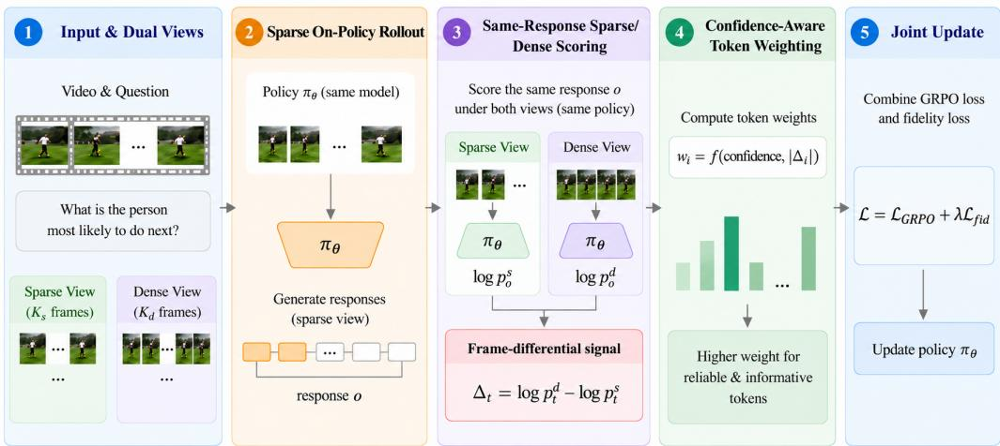
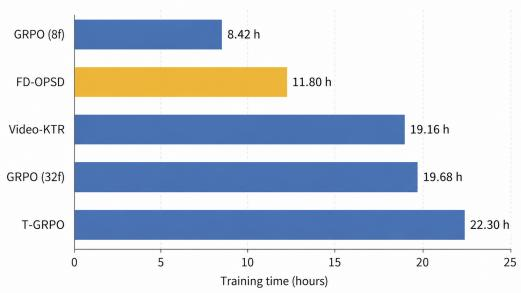
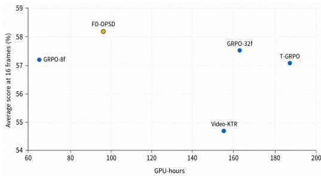
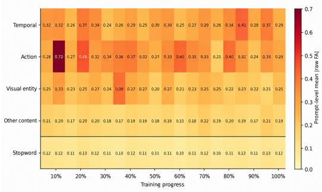
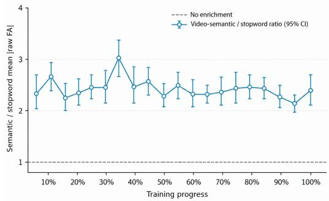
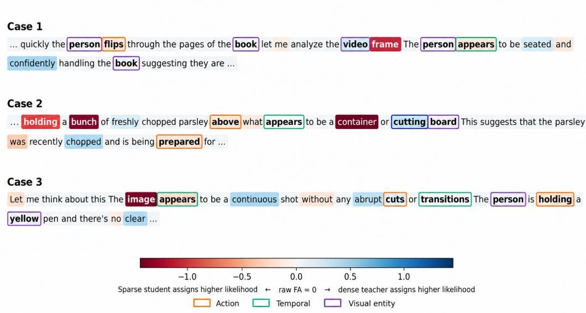
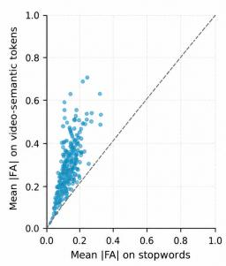
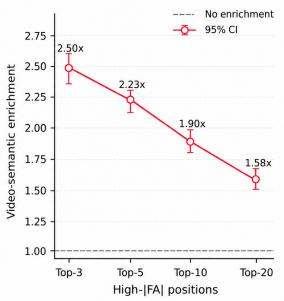
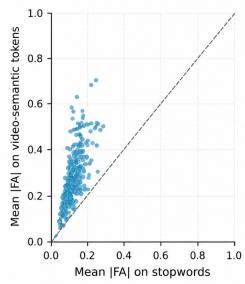
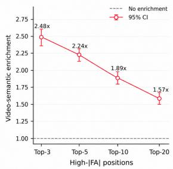

# FRAME DIFFERENTIAL ON-POLICY SELF-DISTILLATION FOR VIDEO REASONING

Haiying He1, Xin Zheng1, Shaoli Hu1, Shijun Xiao2, Xuanhe Liu3, Bing Li4, Harry Yang1† 1HKUST 2NKU 3SEU 4KAUST

## ABSTRACT

Reinforcement learning (RL) has substantially improved the reasoning ability of multimodal language models through verifiable rewards and increasingly finegrainedvisual or temporal credit assignment. In video reasoning, however, current RL methods typically train with a fixed sparse frame budget: increasing the number of frames makes autoregressive rollouts expensive, while too few frames may miss temporally localized events and fine-grained visual details. We present Frame Differential On-Policy Self-Distillation (FD-OPSD), which transfers the useful evidence of dense frame observations to a sparse frame policy during RL training. FD-OPSD compares the policy’s token level preferences for the same sampled response under sparse and dense views, and distills the resulting frame differential signal without an external teacher or dense autoregressive rollout. The method preserves sparse-frame rollouts and leaves inference unchanged. Across Qwen2.5-VL-7B and Qwen3-VL-4B on six video reasoning benchmarks, FD-OPSD yields higher overall average performance than the strongest corresponding GRPO, T-GRPO, or Video-KTR baselines across the 16, 32, and 64 frame evaluation settings. These results show that dense visual evidence can be transferred selectively during training through token level self-distillation while retaining sparse frame rollouts and unchanged inference. Code is available at https://github.com/wannanfeng/video\_reasoning.

## 1 INTRODUCTION

Reinforcement learning (RL) has become an effective way to improve the reasoning abilities of large language models and multimodal language models Luo et al. (2026); Team et al. (2025); Guo et al. (2025). Its success has been driven by verifiable outcome rewards, group relative policy optimization Shao et al. (2024); Yu et al. (2026), and task specific reward Li et al. (2025); Liu et al. (2025b) or credit assignment design Feng et al. (2026b). In video reasoning, GRPO style policy optimization has provided a practical route to improve multimodal reasoning from outcome rewards. Video-R1 Feng et al. (2026a) introduces T-GRPO to encourage sensitivity to frame order, while Video-KTR Wang et al. (2026) performs modality aware token level policy shaping. These methods demonstrate that the design of rewards and policy updates is central to video reasoning, but they generally train with a fixed frame sampling budget.

The frame budget creates a distinct difficulty for video RL. More frames can expose events and details that are absent from a sparse view Chen et al. (2026), yet the cost is amplified during autoregressive rollouts, where multiple responses are generated for each prompt. Sparse training views can therefore miss temporally localized evidence Ge et al. (2025); Zhang et al. (2026), while direct dense frame training increases rollout cost and introduces substantial redundant or irrelevant visual context Qiu et al. (2026). This leads to a question that is largely orthogonal to reward design: Can denseframe evidence improve sparseframe reasoning without requiring denseframe rollouts?

To address this frame budget mismatch, we propose Frame Differential On-Policy Self-Distillation (FD-OPSD). FD-OPSD keeps the policy rollout sparse, but uses a denser view of the same video to provide an auxiliary training signal for the sampled response. By comparing the policy’s token level preferences under sparse and dense views, the method identifies response positions whose predictions change when additional temporal evidence is available. This frame differential signal is selectively transferred to the sparse view policy through a confidence aware fidelity objective while retaining the underlying GRPO optimization. The dense view is used only for token scoring during training, so FD-OPSD requires neither a separately trained teacher nor a dense autoregressive rollout and does not change inference cost.

Across Qwen2.5-VL-7B Wang et al. (2024) and Qwen3-VL-4B Bai et al. (2025), six video reasoning benchmarks, and 16, 32, and 64 frame evaluation settings, FD-OPSD achieves higher overall average performance than the strongest corresponding GRPO, T-GRPO, or Video-KTR baseline. Additional token-level analysis shows that the frame differential signal is concentrated on video semantic content, including temporal expressions, actions, and visual entities. Together, these results support dense evidence transfer as a complementary direction to reward and policy design for efficient video RL. To summarize, our contributions are:

• We identify the sparse training frame budget as an underused source of supervision in video RL and formulate dense frame assistance as an evidence transfer problem.

• We introduce FD-OPSD, a frame differential distillation method that transfers dense view evidence to sparse frame RL without a separate teacher or dense decoding.

• We demonstrate overall gains across two Qwen-VL backbones, six video reasoning benchmarks, and three evaluation frame budgets, together with token level evidence that clarifies where the transferred signal is concentrated.

## 2 RELATED WORK

## 2.1 REINFORCEMENT LEARNING FOR LARGE LANGUAGE MODELS

Reinforcement learning has become a widely used post-training paradigm for improving large language models beyond supervised imitation. Preference based alignment and, more recently, reinforcement learning with verifiable rewards Ouyang et al. (2022); Lambert et al. (2024) (RLVR) have enabled substantial progress on reasoning tasks whose outcomes can be evaluated automatically Liu et al. (2025a). Early successes are most prominent in mathematical reasoning and code generation, where answers, executions, or tests provide reliable reward signals Zheng et al. (2026); Gehring et al. (2024). More recent work has extended this paradigm to broader verifiable settings, including formal reasoning Shao et al. (2024), retrieval augmented reasoning Jin et al. (2025), and agentic tasks with environment feedback Wei et al. (2025). Complementing reward based optimization, on policy distillation provides token level teacher feedback on student generated responses Zhao et al. (2026); Lu & Lab (2025). FD-OPSD studies this setting with a teacher that shares the student’s parameters but observes additional video frames. It uses dense sparse likelihood differences on the same responses to determine selective distillation weights while retaining sparse frame rollouts.

## 2.2 REINFORCEMENT LEARNING FOR VIDEO LANGUAGE REASONING

Video language models introduce an additional temporal dimension to multimodal reasoning, requiring policy optimization to account for temporally structured and often sparsely localized visual evidence Wu et al. (2026). Recent video and multimodal RL methods have therefore moved beyond sequence level outcome rewards toward temporal aware objectives, structured policy optimization, and finer grained supervision Zhang et al. (2025); Yao et al. (2026); Kulkarni & Fazli (2026). Video-R1 adapts rule-based RL to video reasoning and introduces Temporal GRPO (T-GRPO), which encourages sensitivity to frame order. Video-KTR further performs modality aware policy shaping through key token attribution, while PRPO Li et al. (2026) study finer grained visual evidence for policy optimization. Other approaches explore complementary forms of dense supervision, like VISD Lin et al. (2026) introduces structured privileged feedback for token-level video reasoning.

Despite these advances, fixed or uniformly sampled frame budgets remain a common design choice in video reasoning pipelines Qin et al. (2026). The auxiliary training signal is therefore typically derived from the sampled visual context itself, rather than from how the policy changes when additional frames become available. FD-OPSD is complementary to this line of work: it retains the

  
Figure 1: Overview of FD-OPSD for frame differential evidence transfer.

GRPO style video-RL objective, but treats a denser view as additional training evidence and transfers its effect to the sparse view policy through a same response fidelity signal.

## 3 METHOD

We propose Frame-Differential On-Policy Self-Distillation (FD-OPSD), which leverages dense frame views to provide richer visual evidence. It transfers this evidence to a policy trained with sparse frame rollouts. As illustrated in Figure 1, the policy first generates responses from a sparse view. The same model then scores these fixed responses under a dense view without gradient updates. The change in token likelihood between the two views identifies where additional frames affect the response, We call this difference the Fidelity Advantage (FA). We further use dense view confidence to control how strongly each token is distilled. FD-OPSD therefore retains the original GRPO update while adding a token-weighted fidelity objective.

## 3.1 GRPO AND REWARD DESIGN

GRPO objective. Given a question $x ,$ a sparse video view $V _ { s } ,$ and $G$ responses $\{ y ^ { ( g ) } \} _ { g = 1 } ^ { G }$ sampled from the rollout policy $\pi _ { \theta _ { \mathrm { o l d } } }$ , we optimize the GRPO objective (Shao et al., 2024):

$$
\mathcal { I } _ { \mathrm { G R P O } } ( \boldsymbol { \theta } ) = \mathbb { E } \left[ \frac { 1 } { G } \sum _ { g = 1 } ^ { G } \frac { 1 } { T _ { g } } \sum _ { i = 1 } ^ { T _ { g } } \operatorname* { m i n } \left( r _ { g , i } ( \boldsymbol { \theta } ) \widehat { A } ^ { ( g ) } , \operatorname { c l i p } \left( r _ { g , i } ( \boldsymbol { \theta } ) , 1 - \epsilon _ { \mathrm { l o w } } , 1 + \epsilon _ { \mathrm { h i g h } } \right) \widehat { A } ^ { ( g ) } \right) \right] ,\tag{1}
$$

where the standard KL regularization with respect to the reference policy is omitted from the displayed objective for clarity. Here, $T _ { g }$ is the response length and

$$
r _ { g , i } ( \theta ) = \frac { \pi _ { \theta } \left( y _ { i } ^ { ( g ) } \mid x , V _ { s } , y _ { < i } ^ { ( g ) } \right) } { \pi _ { \theta _ { \mathrm { o l d } } } \left( y _ { i } ^ { ( g ) } \mid x , V _ { s } , y _ { < i } ^ { ( g ) } \right) }\tag{2}
$$

is the token-level likelihood ratio. For the $G$ responses associated with the same prompt, the scalar group-relative advantage is:

$$
\widehat { A } ^ { ( g ) } = \frac { R ^ { ( g ) } - \mu _ { R } } { \sigma _ { R } + \epsilon _ { A } } , \qquad \mu _ { R } = \frac { 1 } { G } \sum _ { h = 1 } ^ { G } R ^ { ( h ) } ,\tag{3}
$$

where $\sigma _ { R }$ is the standard deviation of the group rewards. The same advantage is assigned to all valid tokens in response $y ^ { ( g ) }$

Reward design. The rollout reward combines an answer score with a length reward:

$$
R ( y , y ^ { \star } ) = R _ { \mathrm { a c c } } ( y , y ^ { \star } ) + R _ { \mathrm { t h i n k } } ( y ) ,\tag{4}
$$

where $R _ { \mathrm { a c c } } \in [ 0 , 1 ]$ is computed by the verifier associated with the question type. Let $L ( y )$ denote the length of the valid reasoning span. We define:

$$
R _ { \mathrm { t h i n k } } ( y ) = \left\{ \begin{array} { l l } { - 0 . 5 , } & { L ( y ) < 5 0 , } \\ { 0 . 3 , } & { 5 0 \leq L ( y ) \leq 5 1 2 , } \\ { - 0 . 1 , } & { L ( y ) > 5 1 2 . } \end{array} \right.\tag{5}
$$

A response without a valid reasoning span is assigned to the first case. This term discourages missing or collapsed reasoning as well as excessive verbosity.

## 3.2 FRAME DIFFERENTIAL SELF-TEACHER

For each video V, we construct a sparse view $V _ { s } = S ( V ; m )$ and a dense view $V _ { d } = D ( V ; M )$ where $m \subset M$ . All responses are generated only from the sparse view:

$$
y ^ { ( g ) } \sim \pi \theta _ { \mathrm { o l d } } \left( \cdot \mid x , V _ { s } \right) .\tag{6}
$$

For a sampled response $y = ( y _ { 1 } , \dots , y _ { T } )$ , we record its sparse view token log-probability

$$
\ell _ { i } ^ { s } = \log \pi _ { \theta _ { \mathrm { o l d } } } \left( y _ { i } \mid x , V _ { s } , y _ { < i } \right) .\tag{7}
$$

We then reuse the same model as a dense self-teacher. Keeping the response fixed, the teacher computes:

$$
\ell _ { i } ^ { d } = \mathrm { s g } [ \log \pi _ { \theta _ { \mathrm { o l d } } } \left( y _ { i } \mid x , V _ { d } , y _ { < i } \right) ] ,\tag{8}
$$

where $\operatorname { s g } ( \cdot )$ denotes stop-gradient. This is a teacher forced scoring pass: the dense self-teacher evaluates the student response but does not generate a second response. The raw frame differential advantage score (raw FA) is the change in sampled token log-probability between the two views:

$$
\Delta _ { i } = \ell _ { i } ^ { d } - \ell _ { i } ^ { s } .\tag{9}
$$

A dense view may shift the likelihood of the entire response. To focus on which positions are affected more strongly than the response wide shift, we center $\Delta _ { i }$ over valid response tokens:

$$
\widehat { \Delta } _ { i } = \Delta _ { i } - \frac { 1 } { N } \sum _ { j = 1 } ^ { T } m _ { j } \Delta _ { j } , \qquad N = \sum _ { j = 1 } ^ { T } m _ { j } ,\tag{10}
$$

where $m _ { i } \in \{ 0 , 1 \}$ is the response mask. Thus, $\widehat { \Delta } _ { i } > 0$ means that the dense view likelihood gain at position i is above the response level average, while $\widehat { \Delta } _ { i } < 0$ means that it is below the average. The centered score is used for token weighting; the distillation target remains the original dense view log-probability $\ell _ { i } ^ { d }$

## 3.3 CONFIDENCE AWARE SELECTIVE DISTILLATION

More frames do not guarantee a more reliable prediction: dense views may also contain redundant or distracting evidence. We therefore use the confidence of the dense self-teacher to control conservative correction. Let $\kappa _ { i }$ contain the indices of the teacher’s top- $K _ { c }$ logits $z _ { i j } ^ { d }$ . We first renormalize their probabilities:

$$
\widetilde { q } _ { i j } = \frac { \exp ( z _ { i j } ^ { d } ) } { \sum _ { k \in \mathcal { K } _ { i } } \exp ( z _ { i k } ^ { d } ) } , \qquad j \in \mathcal { K } _ { i } ,\tag{11}
$$

and define confidence using normalized entropy:

$$
c _ { i } = 1 - \frac { - \sum _ { j \in { \mathcal { K } } _ { i } } \widetilde { q } _ { i j } \log \widetilde { q } _ { i j } } { \log K _ { c } } .\tag{12}
$$

This score lies in [0, 1]; a larger value indicates a sharper top- $K _ { c }$ teacher distribution. Suppressing the rollout index for clarity, we assign each response token the fidelity weight:

$$
w _ { i } = m _ { i } \mathbf { 1 } [ R > 0 ] \cdot \left\{ \begin{array} { l l } { \alpha _ { + } , } & { \widehat { \Delta } _ { i } > 0 , } \\ { \alpha _ { - } , } & { \widehat { \Delta } _ { i } < 0 \mathrm { ~ a n d ~ } c _ { i } > \tau , } \\ { 0 , } & { \mathrm { o t h e r w i s e } . } \end{array} \right.\tag{13}
$$

Tokens with positive relative frame differential scores receive the supportive weight $\alpha _ { + }$ . For negative scores, the dense prediction is used only when the teacher is confident, and its contribution is reduced by $\alpha _ { - } < \alpha _ { + }$ . This asymmetric design gives full weight to positions with relatively high dense view gains, while applying negative relative changes only conservatively. The reward gate removes non-positive reward trajectories from self-distillation. The centered FA determines token weights, while the current teacher student discrepancy (di) determines the local direction of the fidelity update.

## 3.4 JOINT TRAINING OBJECTIVE

During the policy update, let:

$$
\ell _ { i } ^ { \theta } = \log \pi _ { \theta } \left( y _ { i } \mid x , V _ { s } , y _ { < i } \right) , \qquad d _ { i } = \ell _ { i } ^ { d } - \ell _ { i } ^ { \theta } .\tag{14}
$$

We use $\phi ( d _ { i } )$ to measure the token level discrepancy between the dense self-teacher and the sparse policy.

$$
\phi ( d _ { i } ) = \exp ( d _ { i } ) - d _ { i } - 1 .\tag{15}
$$

For the active token set $\mathcal { A } = \{ i \mid m _ { i } = 1 , w _ { i } > 0 \}$ , the fidelity objective is

$$
\mathcal { L } _ { \mathrm { f i d } } = \frac { 1 } { \left| \mathcal { A } \right| } \sum _ { i \in \mathcal { A } } w _ { i } \phi ( d _ { i } ) ,\tag{16}
$$

and is set to zero when A is empty. The final actor loss is:

$$
\begin{array} { r } { \mathcal { L } = \mathcal { L } _ { \mathrm { G R P O } } + \lambda \mathcal { L } _ { \mathrm { f i d } } , } \end{array}\tag{17}
$$

where $\mathcal { L } _ { \mathrm { G R P O } }$ denotes the standard GRPO loss. The GRPO term learns from sequence level rewards, while the fidelity term transfers dense view evidence to selected positions in the sparse policy. FD-OPSD adds one no-gradient dense view scoring pass during training, but does not require dense autoregressive rollouts or a separate teacher model. The dense self-teacher is removed after training, leaving the inference procedure unchanged.

## 4 EXPERIMENTS

## 4.1 EXPERIMENTAL SETUP

Setup. We train Qwen2.5-VL-7B-Instruct and Qwen3-VL-4B-Instruct on data derived from the Video-R1-260KFeng et al. (2026a) release. For each example, we sample eight responses and compute the empirical accuracy $a = k / 8$ . We discard examples with $a \ge 0 . \bar { 8 }$ or $a \leq 0 . 2$ , retaining the intermediate difficulty examples and approximately 10K video training instances in total. For training, the sparse student rollout and dense teacher scoring use frame budgets of 8 and 32, respectively. Unless otherwise specified, we use a global batch size of 16, eight responses per prompt, a maximum response length of 2,048 tokens, temperature 1.0, and learning rate $\mathrm { \dot { 1 0 } ^ { - 6 } }$ . We use maximum pixel budgets of $1 2 8 \times 2 8 \times 2 8$ during training and $2 5 6 \times 2 8 \times 2 8$ during evaluation. Further implementation details are provided in the Appendix A.

Benchmarks. We evaluate six complementary video reasoning benchmarks. MVBenchLi et al. (2024b) measures broad video understanding across actions, interactions, and temporal events, while subtitle free VideoMME Fu et al. (2025)evaluates general video comprehension under diverse perception and reasoning questions. VideoMMMUHu et al. (2026) emphasizes knowledge intensive multimodal reasoning, and the multiple choice subset of MMVUZhao et al. (2025) provides a controlled visual reasoning evaluation. TempCompassLiu et al. (2024) targets temporal relations such as event order and duration, whereas VSI-BenchYang et al. (2025) focuses on spatial relations and scene layout. We report per benchmark scores and the average.

Baselines. We compare FD-OPSD with two groups of baselines. First, we report published results from representative proprietary and open source Video MLLMs to provide broader context for current video reasoning performance. Second, for controlled comparison, we evaluate both backbones with their corresponding instruction checkpoints, standard GRPO with outcome rewards, Video-R1’s T-GRPO, and Video-KTR with key token attribution. The controlled RL baselines use the same filtered training data, rollout count, response length budget, and evaluation protocol whenever direct alignment is possible. All methods are evaluated at 16, 32, and 64 frames.

Table 1: Main results. Overall is averaged only when all six benchmark results are available.
<table><tr><td rowspan="2">Method</td><td rowspan="2">Frames</td><td colspan="3">General Video Understanding</td><td colspan="3">Fine-Grained Video Reasoning</td><td rowspan="2">Overall</td></tr><tr><td></td><td>MVBench TempCompass MMVU</td><td></td><td>VideoMMMU</td><td>VideoMME VSI-Bench</td><td></td></tr><tr><td colspan="10">Proprietary MLLMs</td></tr><tr><td>GPT-40 OpenAI (2024)</td><td></td><td>64.6</td><td>73.8</td><td>75.4</td><td>61.2</td><td>71.9</td><td>34.0</td><td>63.5</td></tr><tr><td>GPT-5 OpenAI (2025)</td><td></td><td>74.1</td><td>83.3</td><td>82.6</td><td>84.6</td><td>86.7</td><td>55.0</td><td>77.7</td></tr><tr><td>Gemini-1.5-Pro Team et al. (2024)</td><td></td><td>60.5</td><td>67.1</td><td>71.2</td><td>53.4</td><td>75.0</td><td>45.4</td><td>62.1</td></tr><tr><td>Gemini-2.5-Pro Comanici et al. (2025)</td><td></td><td>70.6</td><td>84.3</td><td>78.4</td><td>83.6</td><td>84.3</td><td>53.5</td><td>75.8</td></tr><tr><td colspan="10">Open Source MLLMs</td></tr><tr><td>VILA-1.5-8B Lin et al. (2024)</td><td>64</td><td></td><td>58.8</td><td>49.2</td><td>33.8</td><td>58.2</td><td>28.9</td><td>一</td></tr><tr><td>LLaVA-OV-7B Li et al. (2024a)</td><td>64</td><td>56.7</td><td>64.2</td><td>49.2</td><td>33.8</td><td>58.2</td><td>32.4</td><td>49.1</td></tr><tr><td>TW-GRPO Dang et al. (2025)</td><td>16</td><td>63.3</td><td>73.3</td><td>65.8</td><td>51.3</td><td>55.1</td><td></td><td></td></tr><tr><td>LongVA-7B Zhang et aì. (2024)</td><td></td><td></td><td>56.9</td><td></td><td>23.9</td><td>52.6</td><td>29.2</td><td></td></tr><tr><td>Video-RTS Wang et al. (2025)</td><td>51.2</td><td></td><td></td><td>66.4</td><td>52.7</td><td>63.0</td><td></td><td></td></tr><tr><td>VideoLLaMA2-7B Cheng et al. (2024)</td><td>16</td><td>54.6</td><td>一</td><td>44.8</td><td>1</td><td>47.9</td><td>一</td><td></td></tr><tr><td>Kangaroo-8B Liu et al. (2026)</td><td>一</td><td>61.1</td><td>62.5</td><td></td><td>1</td><td>56.0</td><td>一</td><td></td></tr><tr><td>Video-R1-7B</td><td>32</td><td>65.5</td><td>73.3</td><td>64.1</td><td>50.6</td><td>59.9</td><td>31.1</td><td>57.4</td></tr><tr><td>Qwen2.5-VL-7B</td><td>32</td><td>60.9</td><td>72.6</td><td>62.1</td><td>49.3</td><td>56.9</td><td>34.6</td><td>56.1</td></tr><tr><td>Qwen2.5-VL-7B-165K-SFT</td><td>32</td><td>61.6</td><td>69.7</td><td>62.2</td><td>51.3</td><td>55.4</td><td>32.8</td><td>55.5</td></tr><tr><td>Qwen3-VL-4B</td><td>32</td><td>54.4</td><td>70.4</td><td>59.6</td><td>49.4</td><td>53.6</td><td>43.6</td><td>55.2</td></tr><tr><td colspan="9">Qwen2.5-VL-7B</td></tr><tr><td>GRPO T-GRPO</td><td>16 32 64 16</td><td>65.0 66.2 64.2 65.5</td><td>72.5 73.3 73.4 72.6</td><td>64.5 65.1 66.1 62.4</td><td>49.4 49.6 50.4 50.0</td><td>56.0 58.4 60.6 57.1</td><td>35.9 36.7 38.6 36.1</td><td>57.2 58.0 59.2 57.1</td></tr><tr><td>Video-KTR</td><td>32 64 16</td><td>65.9 61.2 61.2</td><td>72.9 73.1 72.5</td><td>64.1 65.1 61.2</td><td>50.5 50.7 47.4</td><td>60.5 62.9 52.9</td><td>36.0 38.7 32.9</td><td>58.3 59.4 54.7</td></tr><tr><td></td><td>32 64 16</td><td>61.5 64.9</td><td>72.6 73.1 72.6</td><td>61.2 61.9 65.6</td><td>50.2 50.1 49.9</td><td>57.2 59.1 56.7</td><td>33.4 37.3</td><td>56.0 57.2</td></tr><tr><td>FD-OPSD</td><td>32 64</td><td>66.3 66.5</td><td>72.8 73.3</td><td>65.6 66.2</td><td>51.7 55.0</td><td>59.6 62.6</td><td>39.4 38.9 40.8</td><td>58.2 59.2 60.7</td></tr><tr><td></td><td></td><td></td><td>Qwen3-VL-4B</td><td></td><td></td><td></td><td></td><td></td></tr><tr><td colspan="9">16 61.6 72.4 63.8 48.3 55.5</td></tr><tr><td></td><td>32 64 16</td><td>62.6 62.7 61.4</td><td>72.2 72.4 72.9</td><td>64.4 65.1 62.7</td><td>50.0 52.7 49.7</td><td>59.2 60.5 56.3</td><td>48.8 51.0 48.4</td><td>59.5 60.7 58.6</td></tr><tr><td>T-GRPO</td><td>32 64</td><td>62.3 62.6</td><td>73.0 73.0</td><td>63.8 64.6</td><td>50.8 51.8</td><td>57.9 60.6</td><td>51.1 51.6</td><td>59.8 60.7</td></tr><tr><td>Video-KTR</td><td>16 32 64</td><td>60.8 61.7 61.4</td><td>71.2 71.4 71.4</td><td>64.6 65.6 64.0</td><td>48.0 51.5 51.5</td><td>54.0 56.8 61.4</td><td>45.7 47.1 51.0</td><td>57.4 59.0 60.1</td></tr><tr><td>FD-OPSD</td><td>16 32</td><td>61.8 63.8</td><td>74.6 74.5</td><td>65.3 65.8</td><td>49.7 52.7</td><td>57.5 57.6</td><td>49.2 49.3</td><td>59.7 60.6</td></tr><tr><td></td><td>64</td><td>64.0</td><td>74.7</td><td>65.9</td><td>54.6</td><td>61.2</td><td>51.7</td><td>62.0</td></tr></table>

## 4.2 MAIN RESULTS

We evaluate FD-OPSD on six video reasoning benchmarks. Table 1 compares FD-OPSD with published proprietary and open source Video MLLMs, as well as GRPO, T-GRPO, and Video-KTR trained under our controlled protocol.

Superior Performance of FD-OPSD. Under the controlled training protocol, FD-OPSD achieves the best average for both backbones at all three inference frame budgets. On Qwen2.5- VL-7B, FD-OPSD improves over the strongest GRPO-style baseline by 1.0, 0.9, and 1.3 points at 16, 32, and 64 frames, respectively. We observe the same trend on Qwen3-VL-4B, with improvements of 1.1, 0.8, and 1.3 points. These consistent gains show that frame differential supervision is effective across model scales and is not tied to a particular inference budget.

Comparison with Published Video Reasoning Models. At the matched 32-frame setting, Qwen2.5-VL-7B trained with FD-OPSD outperforms Video-R1 on four of the six benchmarks. Specifically, FD-OPSD improves MVBench from 65.5 to 66.3, MMVU from 64.1 to 65.6, VideoM-MMU from 50.6 to 51.7, and VSI-Bench from 31.1 to 38.9. The 7.8 point gain on VSI-Bench is particularly notable, indicating a substantial improvement in spatial video reasoning. Compared with TW-GRPO at 16 frames, FD-OPSD improves MVBench and VideoMME by 1.6 points each, while remaining close on TempCompass and MMVU.

Table 2: Ablation studies of FD-OPSD. The dense view uniformly samples frames from the video, while the local-dense view adds nearby frames around them.
<table><tr><td rowspan="2">Component</td><td rowspan="2">Variant</td><td colspan="3">General Video Understanding</td><td colspan="3">Fine-Grained Video Reasoning</td><td rowspan="2">Overall</td></tr><tr><td>MVBench</td><td>TempCompass</td><td>MMVU</td><td>VideoMMMU</td><td>VideoMME</td><td>VSI-Bench</td></tr><tr><td rowspan="4">CASD</td><td>FA positive only</td><td>64.1</td><td>71.2</td><td>64.5</td><td>50.2</td><td>57.1</td><td>34.2</td><td>56.8</td></tr><tr><td>+ positive utility gate</td><td>64.6</td><td>71.2</td><td>64.0</td><td>49.2</td><td>58.2</td><td>35.4</td><td>57.1</td></tr><tr><td>+ answer correctness gate</td><td>64.7</td><td>72.5</td><td>65.6</td><td>49.7</td><td>57.1</td><td>36.4</td><td>57.7</td></tr><tr><td>All token distillation</td><td>64.6</td><td>72.3</td><td>64.5</td><td>49.7</td><td>57.9</td><td>35.4</td><td>57.4</td></tr><tr><td rowspan="4">Fidelity coefficient</td><td>λ = 0.005</td><td>64.8</td><td>72.3</td><td>66.4</td><td>49.0</td><td>56.8</td><td>33.4</td><td>57.1</td></tr><tr><td>λ = 0.05</td><td>63.7</td><td>71.5</td><td>63.4</td><td>47.4</td><td>57.1</td><td>36.5</td><td>56.6</td></tr><tr><td>λ = 0.1</td><td>20.9</td><td>45.6</td><td>43.8</td><td>39.1</td><td>29.6</td><td>20.5</td><td>33.2</td></tr><tr><td>16 frames teacher</td><td>64.6</td><td>71.8</td><td>64.1</td><td>48.2</td><td>56.9</td><td>35.7</td><td>56.8</td></tr><tr><td rowspan="3">Dense self-teacher</td><td>32 frames, dense view</td><td>64.2</td><td>72.4</td><td>64.0</td><td>49.7</td><td>57.5</td><td>35.9</td><td>57.3</td></tr><tr><td>32 frames, local dense view</td><td>64.1</td><td>72.5</td><td>63.5</td><td>48.1</td><td>57.6</td><td>33.5</td><td>56.5</td></tr><tr><td>32 frames dense rollout GRPO</td><td>64.6</td><td>72.8</td><td>65.4</td><td>50.3</td><td>56.6</td><td>35.9</td><td>57.6</td></tr><tr><td>Dense frame usage Full method</td><td>FD-OPSD</td><td>64.9</td><td>72.6</td><td>65.6</td><td>49.9</td><td>56.7</td><td>39.4</td><td>58.2</td></tr></table>

Robustness across Inference Frame Budgets. Increasing the inference frame budget improves all compared methods, as more frames provide additional visual information. We therefore focus not on the absolute improvement from 16 to 64 frames, but on whether the advantage of FD-OPSD persists across different inference budgets. FD-OPSD consistently outperforms the strongest controlled baselines at 16, 32, and 64 frames. At 64 frames, it improves Qwen2.5-VL-7B from 59.4 to 60.7 and Qwen3-VL-4B from 60.7 to 62.0, corresponding to gains of 1.3 and 1.3 points, respectively. Notably, these gains remain even though the dense self-teacher observes at most 32 frames during training. This result indicates that the benefit of frame differential supervision is not restricted to the teacher’s training time frame budget and remains effective under higher budget inference.

## 4.3 ABLATION STUDIES

We conduct controlled ablations on Qwen2.5-VL-7B and evaluate every variant with 16 frames. We study four aspects of FD-OPSD: the CASD selection rule, the fidelity coefficient, the construction of the dense self-teacher view, and the use of dense frames for scoring versus autoregressive rollout. Results are shown in Table 2.

Effect of Confidence Aware Selection. We first examine whether frame differential supervision should be applied indiscriminately. Distilling only positive FA tokens achieves an average score of 56.8; adding the positive utility trajectory gate improves it to 57.1. The complete CASD rule further reaches 58.2, a 1.1 point gain over positive only gated distillation, suggesting that confidence filtered negative FA tokens provide complementary supervision. We also compare against all token distillation, which retains the same trajectory gate but assigns unit weight to every valid token. Its average score of 57.4 is 0.8 points below the full method, supporting the contribution of selective token weighting beyond trajectory filtering. Finally, replacing the positive utility gate with an answer correctness gate decreases performance by 0.5 points, suggesting that final answer correctness is an imperfect proxy for the utility of token level frame differential signals.

Effect of the Fidelity Coefficient. We next vary the fidelity coefficient λ to control the balance between GRPO and dense view distillation. Reducing λ from 0.01 to 0.005 lowers the average from 58.2 to 57.1 indicating that the transferred signal is too weak to improve performance consistently across tasks. Increasing λ to 0.05 reduces the average to 56.6, while λ = 0.1 causes a severe collapse to 33.2. We therefore use λ = 0.01 in the full method. The non-monotonic trend confirms that frame differential fidelity should act as an auxiliary objective: insufficient weight limits evidence transfer, whereas excessive weight overwhelms reward driven policy optimization.

Effect of Dense View Construction. We compare three teacher view constructions with the same 32-frame budget. The uniformly sampled dense view samples frames across the entire video, while the local dense view samples neighboring frames around those selected by the student. FD-OPSD retains the student selected frames and fills the remaining budget with uniformly sampled frames from the video. The uniform and local dense variants achieve average scores of 57.3 and 56.5, respectively, compared with 58.2 for FD-OPSD. These results suggest that combining the student’s existing observations with broader temporal coverage provides more effective supervision.

  
(a) Training time efficiency.

  
(b) Performance vs. GPU-hours.  
Figure 2: Training cost comparison between FD-OPSD and different video-RL methods. FD-OPSD uses dense frames only for scoring the same on-policy responses, avoiding additional dense autoregressive rollouts.

Dense Scoring versus Dense Rollout. Finally, we compare FD-OPSD with GRPO trained using 32-frame autoregressive rollouts. Dense rollout GRPO generates responses from the dense view and reaches 57.6, whereas FD-OPSD keeps generation sparse, uses dense frames only for scoring, and reaches 58.2. The higher overall average of FD-OPSD supports fixed response dense scoring as a more favorable accuracy cost trade-off than dense autoregressive rollout.

## 5 MECHANISM ANALYSIS

We further analyze the mechanism behind FD-OPSD from two perspectives: computational efficiency and the behavior of the frame differential signal. First, we compare the training cost of FD-OPSD with existing video-RL baselines to understand the overhead introduced by dense view scoring. Second, we investigate whether FA captures meaningful changes caused by additional video evidence, and whether these changes are concentrated on video relevant content rather than generic language tokens.

## 5.1 COMPUTATIONAL COST

We compare the end-to-end training cost of FD-OPSD with sparse GRPO, dense rollout GRPO, T-GRPO, and Video-KTR under the same GPUs setup and matched optimization budget, results are shown in Figure 2. Sparse GRPO is the least expensive baseline, requiring 8.42 hours. FD-OPSD completes training in 11.80 hours, a 1.40× runtime relative to sparse GRPO. Despite this overhead, FD-OPSD is substantially more efficient than methods that introduce dense autoregressive rollouts or multiple attribution passes. Compared with 32-frame dense rollout GRPO, FD-OPSD reduces training time by 40.0% while improving the 16-frame average from 57.6 to 58.2. It also reduces training time by 38.4% relative to Video-KTR and by 47.1% relative to T-GRPO, while achieving higher average accuracy. These results show that fixed response dense scoring provides a favorable accuracy cost trade-off: FD-OPSD is more expensive than sparse GRPO, but considerably cheaper than dense rollout and multi-pass video-RL alternatives.

## 5.2 CASD ANALYSIS

We compute category level raw FA at several logged training steps, using 16 prompts at each step, to examine whether the frame differential signal consistently focuses on video relevant content throughout training.

Frame sensitivity across token categories. Figure 3a tracks the absolute raw FA of different token categories throughout training. Raw FA measures the change in the log-probability of the sampled token when the same response is scored under the sparse and dense video views. We use its absolute value to measure how strongly each token is affected by the additional frames. Action, temporal, and visual entity tokens have mean absolute raw FA values of 0.35, 0.30, and

  
(a) Category wise prompt level mean absolute raw FA.

  
(b) Video semantic enrichment across training.  
Figure 3: Analysis of the frame differential signal throughout training. (a) Category wise prompt level mean absolute raw FA. (b) Video semantic to stopword enrichment across training.

0.25, respectively, compared with 0.11 for stopwords. This separation shows that the sparse to dense intervention has a larger effect on video related tokens than on generic function words.

Video-semantic enrichment across training. Figure 3b further summarizes this separation by comparing the prompt level mean absolute raw FA of video semantic tokens (temporal, action, and visual entity tokens) with that of stopwords. A ratio above one indicates that additional frames affect video semantic content more strongly than generic language tokens. The semantic to stopword ratio averages 2.31, ranges from 1.95 to 3.05, and has a 95% confidence interval lower bound above one at every logged training step. This persistent separation shows that the frame differential signal remains concentrated on video related content throughout training.

## 6 CONCLUSION

We presented FD-OPSD, which turns the difference between sparse and dense video views into token level supervision for video RL. By scoring the same on policy response under both views, FD-OPSD transfers useful dense evidence without a dense autoregressive rollout or a separate teacher model. Across two Qwen-VL backbones and six benchmarks, the method consistently improves matched GRPO-style baselines while requiring substantially less training time than dense rollout and multi-pass alternatives. The analysis shows that FA is concentrated on video semantic tokens and that CASD filters this signal at both the trajectory and token levels. These results establish frame budget intervention as a practical way to improve sparse rollout video reasoning without changing inference.

## 7 LIMITATION

Our evaluation currently covers two Qwen-VL model families and approximately 10K filtered training examples; validation on larger models, higher frame budgets, other architectures, and more diverse video data remains future work. We study three simple dense frame sampling strategies, but do not explore learned or question adaptive frame selection. The self-teacher can only expose knowledge already present in the online policy, and its top-K confidence estimate may be imperfect when the dense view is ambiguous. Future work can scale FD-OPSD across model sizes and frame budgets, learn adaptive dense views, and improve confidence calibration.

## 8 AI USE STATEMENT

Generative AI tools were used for language polishing. The authors take full responsibility for the final content.

## REFERENCES

Shuai Bai, Yuxuan Cai, Ruizhe Chen, Keqin Chen, Xionghui Chen, Zesen Cheng, Lianghao Deng, Wei Ding, Chang Gao, Chunjiang Ge, et al. Qwen3-vl technical report. arXiv preprint arXiv:2511.21631, 2025.

Yukang Chen, Wei Huang, Baifeng Shi, Qinghao Hu, Hanrong Ye, Ligeng Zhu, Zhijian Liu, Pavlo Molchanov, Jan Kautz, Xiaojuan Qi, et al. Scaling rl to long videos. Advances in Neural Information Processing Systems, 38:172842–172870, 2026.

Zesen Cheng, Sicong Leng, Hang Zhang, Yifei Xin, Xin Li, Guanzheng Chen, Yongxin Zhu, Wenqi Zhang, Ziyang Luo, Deli Zhao, et al. Videollama 2: Advancing spatial-temporal modeling and audio understanding in video-llms. arXiv preprint arXiv:2406.07476, 2024.

Gheorghe Comanici, Eric Bieber, Mike Schaekermann, Ice Pasupat, Noveen Sachdeva, Inderjit Dhillon, Marcel Blistein, Ori Ram, Dan Zhang, Evan Rosen, et al. Gemini 2.5: Pushing the frontier with advanced reasoning, multimodality, long context, and next generation agentic capabilities. arXiv preprint arXiv:2507.06261, 2025.

Jisheng Dang, Jingze Wu, Teng Wang, Xuanhui Lin, Nannan Zhu, Hongbo Chen, Wei-Shi Zheng, Meng Wang, and Tat-Seng Chua. Reinforcing video reasoning with focused thinking. arXiv preprint arXiv:2505.24718, 2025.

Kaituo Feng, Kaixiong Gong, Bohao Li, Zonghao Guo, Yibing Wang, Tianshuo Peng, Junfei Wu, Xiaoying Zhang, Benyou Wang, and Xiangyu Yue. Video-r1: Reinforcing video reasoning in mllms. Advances in Neural Information Processing Systems, 38:99114–99137, 2026a.

Lang Feng, Zhenghai Xue, Tingcong Liu, and Bo An. Group-in-group policy optimization for llm agent training. Advances in Neural Information Processing Systems, 38:46375–46408, 2026b.

Chaoyou Fu, Yuhan Dai, Yongdong Luo, Lei Li, Shuhuai Ren, Renrui Zhang, Zihan Wang, Chenyu Zhou, Yunhang Shen, Mengdan Zhang, et al. Video-mme: The first-ever comprehensive evaluation benchmark of multi-modal llms in video analysis. In 2025 IEEE/CVF Conference on Computer Vision and Pattern Recognition (CVPR), pp. 24108–24118. IEEE, 2025.

Haonan Ge, Yiwei Wang, Kai-Wei Chang, Hang Wu, and Yujun Cai. Framemind: Frame-interleaved video reasoning via reinforcement learning. arXiv preprint arXiv:2509.24008, 2025.

Jonas Gehring, Kunhao Zheng, Jade Copet, Vegard Mella, Quentin Carbonneaux, Taco Cohen, and Gabriel Synnaeve. Rlef: Grounding code llms in execution feedback with reinforcement learning. arXiv preprint arXiv:2410.02089, 2024.

Daya Guo, Dejian Yang, Haowei Zhang, Junxiao Song, Peiyi Wang, Qihao Zhu, Runxin Xu, Ruoyu Zhang, Shirong Ma, Xiao Bi, et al. Deepseek-r1: Incentivizing reasoning capability in llms via reinforcement learning. arXiv preprint arXiv:2501.12948, 2025.

Kairui Hu, Penghao Wu, Fanyi Pu, Wang Xiao, Xiang Yue, Bo Li, Yuanhan Zhang, and Ziwei Liu. Video-mmmu: Evaluating knowledge acquisition from multidisciplinary professional videos. In Proceedings of the 64th Annual Meeting of the Association for Computational Linguistics (Volume 1: Long Papers), pp. 27798–27828, 2026.

Bowen Jin, Hansi Zeng, Zhenrui Yue, Jinsung Yoon, Sercan Arik, Dong Wang, Hamed Zamani, and Jiawei Han. Search-r1: Training llms to reason and leverage search engines with reinforcement learning. arXiv preprint arXiv:2503.09516, 2025.

Yogesh Kulkarni and Pooyan Fazli. Avatar: Reinforcement learning to see, hear, and reason over video. In Proceedings of the IEEE/CVF Conference on Computer Vision and Pattern Recognition, pp. 7912–7922, 2026.

Nathan Lambert, Jacob Morrison, Valentina Pyatkin, Shengyi Huang, Hamish Ivison, Faeze Brahman, Lester James V Miranda, Alisa Liu, Nouha Dziri, Shane Lyu, et al. Tulu 3: Pushing frontiers in open language model post-training. arXiv preprint arXiv:2411.15124, 2024.

Bo Li, Yuanhan Zhang, Dong Guo, Renrui Zhang, Feng Li, Hao Zhang, Kaichen Zhang, Peiyuan Zhang, Yanwei Li, Ziwei Liu, et al. Llava-onevision: Easy visual task transfer. arXiv preprint arXiv:2408.03326, 2024a.

Kunchang Li, Yali Wang, Yinan He, Yizhuo Li, Yi Wang, Yi Liu, Zun Wang, Jilan Xu, Guo Chen, Ping Luo, et al. Mvbench: A comprehensive multi-modal video understanding benchmark. In Proceedings of the IEEE/CVF conference on computer vision and pattern recognition, pp. 22195– 22206, 2024b.

Qiming Li, Tianlun Li, Xiaolong Cheng, Hangyu Li, Ruiyan Gong, Kangning Niu, Kaitao Jiang, and Mu Xu. Prpo: Perception-reinforced policy optimization via token-level dynamic advantage reshaping. arXiv preprint arXiv:2606.08708, 2026.

Xinhao Li, Ziang Yan, Desen Meng, Lu Dong, Xiangyu Zeng, Yinan He, Yali Wang, Yu Qiao, Yi Wang, and Limin Wang. Videochat-r1: Enhancing spatio-temporal perception via reinforcement fine-tuning. arXiv preprint arXiv:2504.06958, 2025.

Hao Lin, Kunyang Lv, Xu Jiang, Jingqi Tian, Zhongjing Du, Jiayu Ding, Qiaoman Zhang, and Hongbo Jin. Visd: Enhancing video reasoning via structured self-distillation. arXiv preprint arXiv:2605.06094, 2026.

Ji Lin, Hongxu Yin, Wei Ping, Pavlo Molchanov, Mohammad Shoeybi, and Song Han. Vila: On pre-training for visual language models. In 2024 IEEE/CVF Conference on Computer Vision and Pattern Recognition (CVPR), pp. 26679–26689. IEEE, 2024.

Jiajun Liu, Yibing Wang, Hanghang Ma, Xiaoping Wu, Xiaoqi Ma, Xiaoming Wei, Jianbin Jiao, Enhua Wu, and Jie Hu. Kangaroo: A powerful video-language model supporting long-context video input: J. liu et al. International Journal ofComputer Vision, 134(3):114, 2026.

Yuanxin Liu, Shicheng Li, Yi Liu, Yuxiang Wang, Shuhuai Ren, Lei Li, Sishuo Chen, Xu Sun, and Lu Hou. Tempcompass: Do video llms really understand videos? In Findings ofthe Association for Computational Linguistics: ACL 2024, pp. 8731–8772, 2024.

Zichen Liu, Changyu Chen, Wenjun Li, Penghui Qi, Tianyu Pang, Chao Du, Wee Sun Lee, and Min Lin. Understanding r1-zero-like training: A critical perspective. arXiv preprint arXiv:2503.20783, 2025a.

Ziyu Liu, Zeyi Sun, Yuhang Zang, Xiaoyi Dong, Yuhang Cao, Haodong Duan, Dahua Lin, and Jiaqi Wang. Visual-rft: Visual reinforcement fine-tuning. In 2025 IEEE/CVF International Conference on Computer Vision (ICCV), pp. 2034–2044. IEEE, 2025b.

Kevin Lu and Thinking Machines Lab. On-policy distillation. Thinking Machines Lab: Connectionism, 2025. doi: 10.64434/tml.20251026.

Haotian Luo, Haiying He, Yibo Wang, Jinluan Yang, Rui Liu, Naiqiang Tan, Xiaochun Cao, Dacheng Tao, and Li Shen. Ada-r1: Hybrid-cot via bi-level adaptive reasoning optimization. Advances in Neural Information Processing Systems, 38:59353–59377, 2026.

OpenAI. GPT-4o system card, 2024. URL https://openai.com/index/ gpt-4o-system-card/.

OpenAI. GPT-5 system card, 2025. URL https://openai.com/index/ gpt-5-system-card/.

Long Ouyang, Jeffrey Wu, Xu Jiang, Diogo Almeida, Carroll Wainwright, Pamela Mishkin, Chong Zhang, Sandhini Agarwal, Katarina Slama, Alex Ray, et al. Training language models to follow instructions with human feedback. Advances in neural information processing systems, 35: 27730–27744, 2022.

Yaxuan Qin, Hefei Li, Wenqi Mu, and Yancheng He. Efficient frame selection for long video understanding via reinforcement learning. In Proceedings of the IEEE/CVF Conference on Computer Vision and Pattern Recognition, pp. 16944–16953, 2026.

Jihao Qiu, Lingxi Xie, Xinyue Huo, Qi Tian, and Qixiang Ye. Longvideo-r1: Smart navigation for low-cost long video understanding. arXiv preprint arXiv:2602.20913, 2026.

Zhihong Shao, Peiyi Wang, Qihao Zhu, Runxin Xu, Junxiao Song, Xiao Bi, Haowei Zhang, Mingchuan Zhang, YK Li, Yang Wu, et al. Deepseekmath: Pushing the limits of mathematical reasoning in open language models. arXiv preprint arXiv:2402.03300, 2024.

Gemini Team, Petko Georgiev, Ving Ian Lei, Ryan Burnell, Libin Bai, Anmol Gulati, Garrett Tanzer, Damien Vincent, Zhufeng Pan, Shibo Wang, et al. Gemini 1.5: Unlocking multimodal understanding across millions of tokens of context. arXiv preprint arXiv:2403.05530, 2024.

Kimi Team, Yifan Bai, Yiping Bao, Y Charles, Cheng Chen, Guanduo Chen, Haiting Chen, Huarong Chen, Jiahao Chen, Ningxin Chen, et al. Kimi k2: Open agentic intelligence. arXiv preprint arXiv:2507.20534, 2025.

Peng Wang, Shuai Bai, Sinan Tan, Shijie Wang, Zhihao Fan, Jinze Bai, Keqin Chen, Xuejing Liu, Jialin Wang, Wenbin Ge, et al. Qwen2-vl: Enhancing vision-language model’s perception of the world at any resolution. arXiv preprint arXiv:2409.12191, 2024.

Ziyang Wang, Jaehong Yoon, Shoubin Yu, Md Mohaiminul Islam, Gedas Bertasius, and Mohit Bansal. Video-rts: Rethinking reinforcement learning and test-time scaling for efficient and enhanced video reasoning, 2025. URL https://arxiv.org/abs/2507.06485.

Ziyue Wang, Sheng Jin, Zhongrong Zuo, Jiawei Wu, Han Qiu, Qi She, Hao Zhang, and Jiang Xudong. Video-ktr: Reinforcing video reasoning via key token attribution. In International Conference on Learning Representations, volume 2026, pp. 71553–71570, 2026.

Zhepei Wei, Wenlin Yao, Yao Liu, Weizhi Zhang, Qin Lu, Liang Qiu, Changlong Yu, Puyang Xu, Chao Zhang, Bing Yin, et al. Webagent-r1: Training web agents via end-to-end multi-turn reinforcement learning. In Proceedings of the 2025 Conference on Empirical Methods in Natural Language Processing, pp. 7920–7939, 2025.

Tao Wu, Li Yang, Gen Zhan, Yabin Zhang, Yiting Liao, Junlin Li, Deliang Fu, Li Zhang, and Limin Wang. Tempr1: Improving temporal understanding of mllms via temporal-aware multitask reinforcement learning. In Proceedings of the IEEE/CVF Conference on Computer Vision and Pattern Recognition, pp. 2756–2767, 2026.

Jihan Yang, Shusheng Yang, Anjali W Gupta, Rilyn Han, Li Fei-Fei, and Saining Xie. Thinking in space: How multimodal large language models see, remember, and recall spaces. In 2025 IEEE/CVF Conference on Computer Vision and Pattern Recognition (CVPR), pp. 10632–10643. IEEE, 2025.

Huanjin Yao, Qixiang Yin, Jingyi Zhang, Min Yang, Yibo Wang, Wenhao Wu, Fei Su, Li Shen, Minghui Qiu, Dacheng Tao, et al. R1-sharevl: Incentivizing reasoning capabilities of multimodal large language models via share-grpo. Advances in Neural Information Processing Systems, 38: 80424–80451, 2026.

Qiying Yu, Zheng Zhang, Ruofei Zhu, Yufeng Yuan, Xiaochen Zuo, Yu Yue, Weinan Dai, Tiantian Fan, Gaohong Liu, Lingjun Liu, et al. Dapo: An open-source llm reinforcement learning system at scale. Advances in Neural Information Processing Systems, 38:113222–113244, 2026.

Haoji Zhang, Xin Gu, Jiawen Li, Chixiang Ma, Sule Bai, Chubin Zhang, Bowen Zhang, Zhichao Zhou, Dongliang He, and Yansong Tang. Thinking with videos: Multimodal tool-augmented reinforcement learning for long video reasoning. In Proceedings of the IEEE/CVF Conference on Computer Vision and Pattern Recognition, pp. 32903–32914, 2026.

Jingyi Zhang, Jiaxing Huang, Huanjin Yao, Shunyu Liu, Xikun Zhang, Shijian Lu, and Dacheng Tao. R1-vl: Learning to reason with multimodal large language models via step-wise group relative policy optimization. In 2025 IEEE/CVF International Conference on Computer Vision (ICCV), pp. 1859–1869. IEEE, 2025.

Peiyuan Zhang, Kaichen Zhang, Bo Li, Guangtao Zeng, Jingkang Yang, Yuanhan Zhang, Ziyue Wang, Haoran Tan, Chunyuan Li, and Ziwei Liu. Long context transfer from language to vision. arXiv preprint arXiv:2406.16852, 2024.

Siyan Zhao, Zhihui Xie, Mengchen Liu, Jing Huang, Guan Pang, Feiyu Chen, and Aditya Grover. Self-distilled reasoner: On-policy self-distillation for large language models. arXiv preprint arXiv:2601.18734, 2026.

Yilun Zhao, Haowei Zhang, Lujing Xie, Tongyan Hu, Guo Gan, Yitao Long, Zhiyuan Hu, Weiyuan Chen, Chuhan Li, Zhijian Xu, et al. Mmvu: Measuring expert-level multi-discipline video understanding. In 2025 IEEE/CVF Conference on Computer Vision and Pattern Recognition (CVPR), pp. 8475–8489. IEEE, 2025.

Jiasheng Zheng, Xin Zheng, Boxi Cao, Pengbo Wang, Zhengzhao Ma, Qiming Zhu, Jiazhen Jiang, Yaojie Lu, Hongyu Lin, Xianpei Han, et al. Scalebox: Enabling high-fidelity and scalable code verification for large language models. In Proceedings ofthe 64th Annual Meeting ofthe Associationfor Computational Linguistics (Volume 3: System Demonstrations), pp. 307–317, 2026.

## A MORE DETAILS

## A.1 IMPLEMENTATION DETAILS

For both models, we selected about 10k problems from the Video-R1-260K datasets. For each problem, we sample 8 times. Both models are trained with 8×80 GPUs. The other hyperparameters used in the training process are presented in the Table 3.

Table 3: Training and evaluation setup for the two model families.
<table><tr><td>Parameter</td><td>Qwen2.5-VL-7B-Instruct</td><td>Qwen3-VL-4B-Instruct</td></tr><tr><td>Sparse student frame budget</td><td>8</td><td>8</td></tr><tr><td>Dense teacher frame budget</td><td>32</td><td>32</td></tr><tr><td>Global batch size</td><td>16</td><td>16</td></tr><tr><td>Responses per prompt</td><td>8</td><td>8</td></tr><tr><td>Maximum response length</td><td>2,048</td><td>2,048</td></tr><tr><td>Temperature</td><td>1.0</td><td>1.0</td></tr><tr><td>Warmup steps</td><td>100</td><td>100</td></tr><tr><td>Epoch</td><td>1.0</td><td>1.0</td></tr><tr><td>λ Fidelity</td><td>0.01</td><td>0.01</td></tr><tr><td>Learning rate</td><td>1×10−⁶</td><td>1×10−⁶</td></tr><tr><td>Training maximum pixel budget</td><td>128×28×28</td><td>128×28×28</td></tr><tr><td>Evaluation maximum pixel budget</td><td>256×28×28</td><td>256×28×28</td></tr><tr><td> $\alpha _ { + }$ </td><td>1.0</td><td>1.0</td></tr><tr><td> $\alpha _ { - }$ </td><td>0.3</td><td>0.3</td></tr><tr><td> $K _ { c }$ </td><td>10</td><td>10</td></tr><tr><td>T</td><td>0.3</td><td>0.3</td></tr></table>

## A.2 PERFORMANCE DETAILS

We provide more detailed evaluation results (Table 4) beyond the main table, including results for the two Qwen base models and a more comprehensive evaluation of Video-R1-7B.

Table 4: Detailed evaluation results beyond the main comparison.
<table><tr><td rowspan="2">Method</td><td rowspan="2">Frames</td><td colspan="3">General Video Understanding</td><td colspan="3">Fine-Grained Video Reasoning</td><td rowspan="2">Overall</td></tr><tr><td>MVBench TempCompass MMVU</td><td></td><td></td><td>VideoMMMU</td><td>VideoMME</td><td>VSI-Bench</td></tr><tr><td colspan="8">Open Source MLLMs</td></tr><tr><td colspan="8"></td></tr><tr><td rowspan="4">Qwen2.5-VL-7B-165K-SFT Video-R1-7B</td><td>16 32</td><td>60.9 61.6</td><td>69.0 69.7</td><td>60.2 62.2</td><td>48.4 51.3</td><td>53.1 55.4</td><td>30.6 32.8</td><td>53.7 55.5</td></tr><tr><td>64</td><td>61.7</td><td>70.0</td><td>61.9</td><td>51.1</td><td>58.9</td><td>31.0</td><td>55.8</td></tr><tr><td>16</td><td>64.2</td><td>73.2</td><td>64.6</td><td>50.2</td><td>57.8</td><td>31.0</td><td>56.8</td></tr><tr><td>32</td><td>65.5</td><td>73.3</td><td>64.1</td><td>50.6</td><td>59.9</td><td>31.1</td><td>57.4</td></tr><tr><td></td><td>64</td><td>66.1</td><td>73.4</td><td>64.9</td><td>51.7</td><td>61.7</td><td>32.6</td><td>58.4</td></tr><tr><td colspan="7">Qwen2.5-VL-7B</td><td></td><td></td></tr><tr><td rowspan="4">Instruction</td><td></td><td>59.9</td><td></td><td>62.4</td><td>48.6</td><td></td><td></td><td></td></tr><tr><td>16</td><td>60.9</td><td>72.2</td><td></td><td>49.3</td><td>53.1</td><td>33.6</td><td>55.0</td></tr><tr><td>32 64</td><td>61.5</td><td>72.6 73.0</td><td>62.1 62.5</td><td>50.6</td><td>56.9 59.4</td><td>34.6 37.8</td><td>56.1 57.5</td></tr><tr><td>16</td><td>64.9</td><td>72.6</td><td>65.6</td><td>49.9</td><td>56.7</td><td>39.4</td><td>58.2</td></tr><tr><td rowspan="3">FD-OPSD</td><td>32</td><td>66.3</td><td>72.8</td><td>65.6</td><td>51.7</td><td>59.6</td><td>38.9</td><td>59.2</td></tr><tr><td>64</td><td>66.5</td><td>73.3</td><td>66.2</td><td>55.0</td><td>62.6</td><td>40.8</td><td>60.7</td></tr><tr><td></td><td></td><td>Qwen3-VL-4B</td><td></td><td></td><td></td><td></td><td></td></tr><tr><td colspan="8"></td></tr><tr><td rowspan="3">Instruction</td><td>16</td><td>52.9</td><td>70.2</td><td>60.4</td><td>45.8</td><td>50.3</td><td>41.0</td><td>53.4</td></tr><tr><td>32</td><td>54.4</td><td>70.4</td><td>59.6</td><td>49.4</td><td>53.6</td><td>43.6</td><td>55.2</td></tr><tr><td>64</td><td>55.6</td><td>70.0</td><td>63.6</td><td>51.8</td><td>57.0</td><td>45.3</td><td>57.2</td></tr><tr><td rowspan="3">FD-OPSD</td><td>16</td><td>61.8</td><td>74.6</td><td>65.3</td><td>49.7</td><td>57.5</td><td>49.2</td><td>59.7</td></tr><tr><td>32</td><td>63.8</td><td>74.5</td><td>65.8</td><td>52.7</td><td>57.6</td><td>49.3</td><td>60.6</td></tr><tr><td>64</td><td>64.0</td><td>74.7</td><td>65.9</td><td>54.6</td><td>61.2</td><td>51.7</td><td>62.0</td></tr></table>

## B DEEPER ANALYSIS

## B.1 CASD SEPARATES SUPPORT, CORRECTION, AND REJECTION.

We visualize three representative responses selected with a fixed quantile based rule, covering moderate to strong semantic contrast without manual cherry-picking. In the two positive reward cases, the dense view supports some video related tokens while assigning lower likelihood to others. For example, it favors the action token “cutting” but reduces the likelihood of “container.” These changes illustrate frame dependent token preferences, which CASD selectively distills using response centered FA and teacher confidence. The third case contains strong visual and temporal FA but has negative total reward. The trajectory gate therefore removes the entire fidelity update. Together, the cases show that FA identifies where additional frames change the prediction, while reward and confidence determine whether and how that change is transferred to the sparse policy.

  
Figure 4: Representative examples of CASD support, correction, and rejection under sparse and dense video views.

## B.2 WHEN DOES ADDITIONAL FRAME EVIDENCE HELP?

We first test whether a larger frame budget provides useful evidence. We random smaple 500 questions from test datasets. On the same 500 test questions, uniform-4 uses four evenly spaced frames, random-4 and random-8 sample four or eight frames at random, and dense-16 uses up to sixteen frames spread over the video. All variants use the same Qwen2.5-VL-7B checkpoint and results are in Table 5.

Table 5: Effect of frame sampling on answer accuracy.
<table><tr><td>Sampling Strategy</td><td>Accuracy (%)</td><td>∆ vs. Dense-16</td></tr><tr><td>Uniform-4</td><td>42.8</td><td>-5.8</td></tr><tr><td>Random-4 (1)</td><td>44.2</td><td>-4.4</td></tr><tr><td>Random-4 (2)</td><td>44.8</td><td>-3.8</td></tr><tr><td>Random-8</td><td>46.2</td><td>-2.4</td></tr><tr><td>Dense-16</td><td>48.6</td><td>一</td></tr></table>

Sparse correct / Dense-16 wrong: about 8.0% of questions.

Dense-16 reaches 48.6% accuracy, compared with 42.8% for uniform-4, 44.2% and 44.8% for two random-4 draws, and 46.2% for random-8. We also compare the paired predictions on each question by counting how often one sampler succeeds while the other fails. The difference is clearest for dense-16 versus uniform-4. More frames are helpful on average but are not always better. A sparse sampler succeeds while dense-16 fails on 8.0% of the questions. This is the setting FD-OPSD is designed for: the dense view provides extra evidence, while the reward and confidence gates prevent the policy from treating every dense-view change as a reliable target.

The benefit is example dependent. More frames do not improve every prediction. In 8.0% of test examples, a sparse strategy answers correctly while dense-16 fails. We therefore use the dense view as a source of conditional supervision rather than treating it as an oracle. This observation motivate the two safeguards in CASD: we prioritize positions with positive centered FA and include those with negative centered FA only when the dense self-teacher is confident.

## B.3 WHERE DOES THE FRAME DIFFERENTIAL SIGNAL CONCENTRATE?

  
(a) Response centered FA.

  
(b) Raw FA.  
Figure 5: Video semantic concentration of the frame differential signal. Each panel compares the prompt level mean absolute FA of video semantic tokens and stopwords, and reports video semantic enrichment among high FA positions.

Frame differential changes concentrate on video semantic tokens. We group temporal, action, and visual entity tokens as video semantic tokens and compare their absolute FA with that of stopwords. As shown in Figure 5a, video semantic tokens exhibit larger response centered FA than stopwords, with a video semantic to stopword ratio of 2.03× [1.96, 2.10]. Figure 5b shows a similar ratio of 2.30× [2.22, 2.40] for raw FA, indicating that this concentration is already present before response level centering.

High FA positions show stronger video semantic enrichment. We further examine the positions with the largest absolute FA. Video semantic enrichment reaches 2.50× for the top three positions, 2.23× for the top five, 1.90× for the top ten, and 1.58× for the top twenty. The stronger enrichment among high FA positions indicates that the frame differential signal preferentially highlights tokens whose predictions are more sensitive to additional video evidence. This supports the use of FA fo selective token level distillation in FD-OPSD.