# FRAMEMORROW: FUTURE-GUIDED FRAME SELEC-TION WITH PROSPECTIVE TOKENS FOR LONG-HORIZON VIDEO GENERATION

Bo Yin1, Xiaobin Hu1, Jiaqi Zhao1,2, Shuicheng Yan1,

1National University of Singapore

2Harbin Institute of Technology (Shenzhen)

## ABSTRACT

Long-horizon video generation requires models to effectively leverage an increasingly long generation history. As the generated history grows, retaining all previous content becomes increasingly expensive and redundant, making effective historical selection essential. Existing approaches often determine historical relevance from the current content. However, information that is relevant to the present is not necessarily useful for future generation, while seemingly less relevant history may become important later. Our key insight is that historical information should be selected according to its relevance to future information needs. Capturing these needs does not require generating the full future. A compact representation of what becomes important next is sufficient to guide historical selection. Building on this insight, we propose FRAMEMORROW, a prospective frame selector that predicts a small set ofprospective tokens representing future information needs and uses them to identify relevant information from history. FRAMEM-ORROW selects explicit historical frames rather than model-specific internal states, enabling plug-and-play integration across diverse generators, including closedsource models, with little additional inference cost. We evaluate FRAMEMOR-ROW across five benchmarks and 11 generative models spanning long-video generation, interactive generation, and action-conditioned world models. Extensive experiments demonstrate improvements in long-range consistency, visual quality, and action alignment across diverse generation settings. The project page is at https://yinbo0927.github.io/FrameMorrow/.

## 1 INTRODUCTION

Long-horizon video generation requires models not only to continuously extend visual content, but also to preserve coherent subjects, objects, and scenes over time (Yang et al., 2025; Zhang et al., 2025a; Yu et al., 2026; Yin et al., 2026; Zhao et al., 2026). As generation proceeds, visual details generated earlier in the video gradually fall outside the model’s limited input window (Hu et al., 2026). When such content becomes relevant again, subjects can change appearance, object states can become inconsistent, and revisited scenes can no longer match their earlier observations (Xiao et al., 2026). Keeping all historical information is impractical, as it increases computation and introduces a large amount of redundant context (Yi et al., 2025; Ji et al., 2025; Nie et al., 2026). Moreover, not all historical information is equally useful at every generation step (Ji et al., 2025; An et al., 2026; Yin et al., 2025a). The key challenge is therefore to selectively preserve the historical information that matters for future generation.

Many existing methods identify useful history based on its relevance to the current content (Zhang et al., 2025b), often using the recent visual context to retrieve related information from the past (Hu et al., 2026; Ye et al., 2026; Wang et al., 2026a; Ding et al., 2026). Such a strategy mainly answers which historical information is most relevant to what is visible now. However, this can differ from what will actually be useful for future generation. Information that closely matches the present may provide little additional value for what comes next, while earlier information that appears less relevant now can become important again as the generation evolves. As illustrated in Fig. 1, match ing the current view can favor visually similar history, while information that is less relevant to the present may better support the upcoming generation. Therefore, the importance of historical information should not be determined only by its relevance to the present, but also by its potential usefulness for the future. Can historical information be selected according to its relevance to the future rather than to the current content?

(a) Available history  
  
Next condition: “Return to the room and move toward the armchair.”

(b) Selected history  
(c) Future generation  
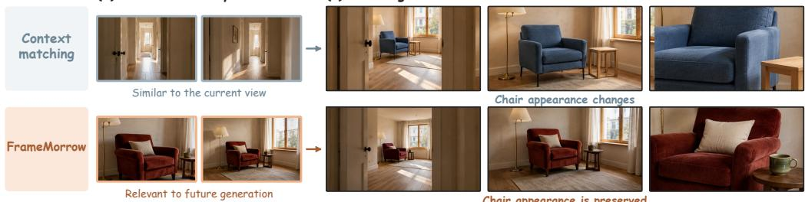  
Figure 1: Motivation for future-relevant history selection. Given the same available history and known next condition, current-context matching favors observations similar to the current view, whereas FRAMEMORROW selects earlier history that is more relevant to the upcoming generation. The selected history helps preserve previously observed visual details in the generated continuation.

However, the challenge is that the future has not been generated when the selection is made. Since the goal is to determine which historical information will be useful for future generation, there is no need to generate the full future itself. Instead, it is sufficient to predict a compact representation that captures future information needs and serves as a proxy for the future. Such a representation can then guide historical selection toward information that is likely to matter next.

Motivated by this, we propose FRAMEMORROW, which predicts a small set ofprospective tokens as compact representations of future information needs. These tokens capture what potentially become important next and are used to identify historical information that is relevant to future generation. FRAMEMORROW then selects explicit historical frames based on this relevance. Because it selects explicit historical frames rather than model-specific internal states, the same selector can be used across different generators, while each model processes the selected frames in its native way. This makes FRAMEMORROW plug-and-play across different generators, including closed-source models. Moreover, predicting only a few prospective tokens and selecting only a few historical frames keeps FRAMEMORROW lightweight with little additional inference cost.

Our contributions are as follows:

• We formulate using future information needs as the condition for frame selection. Selection based only on current content cannot predict future information needs and retrieve frames that are relevant to the present but unhelpful for future generation.

• We propose FRAMEMORROW, which introduces prospective tokens to explicitly represent future information needs and identify relevant information from the history.

• We design FRAMEMORROW as a plug-and-play, lightweight selector that outputs explicit historical frames, enabling broad compatibility across different generators, including closed-source models, with little inference overhead.

• We extensively evaluate FRAMEMORROW across five benchmarks and 11 generative models, covering long-video generation, interactive generation, and action-conditioned world models, with improvements in long-range consistency, visual quality, and action alignment.

## 2 RELATED WORK

Long-Horizon Video Generation. Autoregressive video models extend videos by conditioning new content on previously generated outputs (Yin et al., 2025b; Huang et al., 2026). CausVid (Yin et al., 2025b) distills a bidirectional diffusion model into a few-step causal generator for streaming synthesis. Self-Forcing (Huang et al., 2026) reduces the training–inference gap by using self-generated context during training. LongLive (Yang et al., 2025) supports real-time long-video generation with changing text prompts, while Matrix-Game 3.0 (Wang et al., 2026b) extends interactive world generation with action control and long-horizon memory. Rather than developing another generation backbone, our work provides a plug-and-play frame selector that supports diverse existing generators by supplying relevant historical information.

Historical Information Selection. Historical information can be retrieved as visual context or retained within a generator’s internal cache. LongLive-RAG retrieves historical latents using the latest generated content (Hu et al., 2026), while DySink selects visually relevant historical frames as dynamic frame sinks (Ye et al., 2026). For narrative generation, MemFlow retrieves history using the upcoming chunk prompt (Ji et al., 2025), and Memento separately retrieves identity evidence and short-range shot cues (Wei et al., 2026). Mem-World combines planned actions with scene geometry to retrieve relevant historical observations (Zheng et al., 2026). For cache management, PaFu-KV learns token salience from a bidirectional teacher (Chen et al., 2026a), while Future Forcing constructs future-query proxies to guide cache eviction and merging (Luo et al., 2026a). Unlike existing approaches that determine historical relevance from observed content or model-specific memory states, our method selects history according to its relevance to future information needs.

Learning to Select Frames. Learned frame selection reduces redundant visual input for video understanding. Frame-Voyager learns query-conditioned frame combinations from rankings provided by a video-language model (Yu et al., 2025). FrameOracle predicts both query-relevant frames and an adaptive frame budget (Li et al., 2025). Related approaches learn selection through multimodal model supervision (Hu et al., 2025), flexible selection policies (Buch et al., 2025), or reinforcement learning rewards (Qin et al., 2026). These methods select evidence to answer questions or reason about an available video. Unlike frame selectors designed for fully observed videos, FRAMEMO-RROW predicts prospective tokens to represent information needs for content that has not yet been generated, enabling lightweight selection of relevant historical frames.

## 3 METHOD

Overview. FRAMEMORROW predicts a small set of prospective tokens to represent future information needs by given eligible history $\mathcal { H } _ { t } .$ , recent context $\mathcal { L } _ { t } ,$ and the known rollout condition $c _ { t } ^ { + }$ These tokens score historical relevance and guide frame selection. During training, a frozen visual teacher ranks historical frames by their correspondence with future content, providing ranking supervision for the tokens. At inference, FRAMEMORROW outputs explicit historical frames, which augment a compatible frozen generator through its own conditioning mechanism (Fig. 2).

## 3.1 PROSPECTIVE FRAME SELECTION

At rollout step t, we distinguish the backbone’s recent context from the eligible long-term history:

$$
\mathcal { L } _ { t } = \{ x _ { t - L + 1 } , \ldots , x _ { t } \} , \qquad \mathcal { H } _ { t } = \{ x _ { \tau _ { i } } \} _ { i = 1 } ^ { N } , \quad \tau _ { i } \leq t - L .\tag{1}
$$

Both sets are observed by the selector, but only $\mathcal { H } _ { t }$ is eligible for retrieval. Recent context thus informs which past evidence to recall without occupying the long-term memory budget. The condition $c _ { t } ^ { + }$ is a text prompt, action sequence, or control signal available at step t. It contains no later user input, environment feedback, or future observation. For a memory budget K, we select

$$
\hat { \mathbf { r } } _ { t } = S _ { \theta } ( \mathcal { H } _ { t } , \mathcal { L } _ { t } , c _ { t } ^ { + } ) \in \mathbb { R } ^ { N } , \qquad \mathcal { T } _ { t } = \mathrm { T o p K } ( \hat { \mathbf { r } } _ { t } , K ) , \qquad \mathcal { M } _ { t } = \mathcal { H } _ { t } [ \mathcal { Z } _ { t } ] .\tag{2}
$$

The selected frames are ordered by their timestamps before being passed to the backbone.

## 3.2 PROSPECTIVE TOKENS

To represent future information needs without generating future content, a compact causal Transformer predicts prospective tokens from the observed history, recent context, and rollout con-

## (a) Inference: prospective frame selection

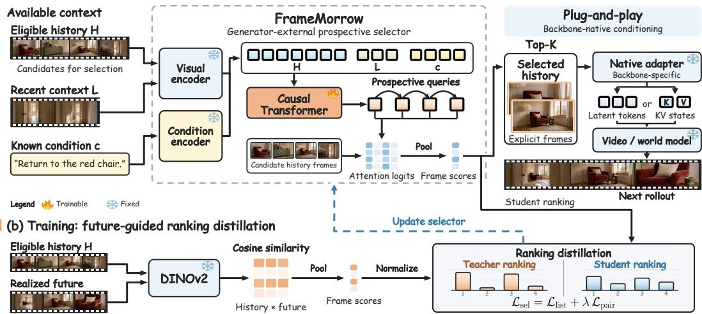  
Figure 2: Overview of FRAMEMORROW. (a) At inference, the selector autoregressively predicts prospective tokens from history, recent context, and the rollout condition. These tokens score eligible historical frames and guide top-K selection. Each frozen generator processes the selected frames through its own conditioning mechanism. (b) During training, frozen DINOv2 features provide future-grounded frame rankings, which supervise the prospective tokens through listwise and pairwise ranking losses.

dition. A frozen visual encoder $E _ { v }$ and learned projection $P _ { v }$ encode each observed frame as $\mathbf { z } ( x ) = P _ { v } [ E _ { v } ( x ) ] \in \mathbb { R } ^ { d }$ . We form the temporally ordered sequences $\mathbf { H } _ { t } = [ \mathbf { h } _ { 1 } , \ldots , \mathbf { h } _ { N } ]$ , with $\mathbf h _ { i } = \mathbf z ( x _ { \tau _ { i } } )$ , and $\bar { \mathbf { L } } _ { t } = [ \mathbf { z } ( x _ { t - L + 1 } ) , \ldots , \mathbf { z } ( x _ { t } ) ]$ . A frozen modality-specific encoder $E _ { c }$ and learned projection $P _ { c }$ produce ${ \bf C } _ { t } ^ { + } = P _ { c } [ E _ { c } ( c _ { t } ^ { + } ) ]$ . Selector weights are shared across compatible backbones within each condition modality. Different modalities share the architecture and interface.

After processing $[ \mathbf { H } _ { t } , \mathbf { L } _ { t } , \mathbf { C } _ { t } ^ { + } ]$ , the selector autoregressively predicts M prospective tokens:

$$
\begin{array} { r } { \mathbf q _ { t } ^ { m } = F _ { \psi } ( \mathbf H _ { t } , \mathbf L _ { t } , \mathbf C _ { t } ^ { + } , \mathbf q _ { t } ^ { < m } ) , \qquad m = 1 , \dots , M . } \end{array}\tag{3}
$$

All predicted tokens are retained as $\mathbf { Q } _ { t } = [ \mathbf { q } _ { t } ^ { 1 } , \dots , \mathbf { q } _ { t } ^ { M } ] \in \mathbb { R } ^ { M \times d } ( M = 4$ by default). Each token can condition on preceding tokens, allowing their predictions to depend on one another. Their prospective role is learned through future-grounded ranking supervision, without assigning predefined future factors to individual tokens. At each rollout step, the tokens are regenerated from the currently available inputs. With $\theta = \{ P _ { v } , P _ { c } , \psi , W _ { Q } , W _ { K } \}$ , the prospective tokens serve as attention queries over eligible historical frames. We compute scaled dot-product attention logits and aggregate them with a smooth maximum:

$$
a _ { t , m , i } = \frac { ( W _ { Q } \mathbf { q } _ { t } ^ { m } ) ^ { \top } ( W _ { K } \mathbf { h } _ { i } ) } { \sqrt { d } } , \qquad \hat { r } _ { t , i } = \tau _ { q } \log \left( \frac { 1 } { M } \sum _ { m = 1 } ^ { M } e ^ { a _ { t , m , i } / \tau _ { q } } \right) .\tag{4}
$$

Here $\tau _ { q } > 0$ controls aggregation sharpness. A frame can score highly by matching any prospective token. The objective supervises the aggregated ranking without explicitly enforcing diversity among tokens or selected frames.

## 3.3 FUTURE-GROUNDED RANKING DISTILLATION

We train the prospective tokens by matching their predicted frame rankings to rankings derived from future content. Each training trajectory supplies eligible history, recent context, a known condition, and a realized continuation $\mathbf { \bar { \mathcal { X } } } _ { t } ^ { + } = \{ \dot { x } _ { t + j } \} _ { i = 1 } ^ { H }$ . The teacher compares candidate and continuation frames using a frozen DINOv2 encoder Φ. Historical views of subjects or scenes that recur in the continuation can provide reusable visual evidence, motivating the correspondence target

$$
R _ { t , i , j } ^ { F } = \cos ( \Phi ( x _ { \tau _ { i } } ) , \Phi ( x _ { t + j } ) ) , \qquad r _ { t , i } ^ { F } = \tau _ { f } \log \left( \frac { 1 } { H } \sum _ { j = 1 } ^ { H } e ^ { R _ { t , i , j } ^ { F } / \tau _ { f } } \right) .\tag{5}
$$

Table 1: VBench-Long results for 60-second generation on all 128 MovieGenBench prompts. Each block compares long-context methods on one backbone. Average rank is computed over six metrics. Bold and underline mark the best and second-best results within each block.
<table><tr><td>Method</td><td></td><td>Subject ↑ Background ↑ Motion ↑</td><td></td><td>Dynamic ↑</td><td></td><td></td><td>Aesthetic ↑ Imaging ↑ Avg. Rank ↓</td></tr><tr><td>Self-Forcing</td><td>95.84</td><td>95.27</td><td>98.20</td><td>51.72</td><td>56.05</td><td>62.22</td><td>4.33</td></tr><tr><td>+∞-RoPE</td><td>97.24</td><td>96.24</td><td>98.58</td><td>46.64</td><td>56.09</td><td>63.28</td><td>3.17</td></tr><tr><td>+Deep Forcing</td><td>96.08</td><td>95.38</td><td>98.24</td><td>41.44</td><td>56.68</td><td>60.81</td><td>4.17</td></tr><tr><td>+LongLive-RAG</td><td>97.60</td><td>96.51</td><td>98.70</td><td>44.69</td><td>57.19</td><td>64.97</td><td>2.00</td></tr><tr><td>+FRAMEMORROW (Ours)</td><td>97.71</td><td>96.45</td><td>98.60</td><td>64.56</td><td>57.27</td><td>68.47</td><td>1.33</td></tr><tr><td>LongLive 1.0</td><td>97.13</td><td>95.89</td><td>98.61</td><td>44.56</td><td>58.17</td><td>67.56</td><td>3.83</td></tr><tr><td>+∞-RoPE</td><td>97.00</td><td>95.85</td><td>98.53</td><td>53.36</td><td>57.48</td><td>66.94</td><td>4.25</td></tr><tr><td>+Deep Forcing</td><td>97.17</td><td>96.04</td><td>98.73</td><td>45.13</td><td>57.48</td><td>67.27</td><td>3.42</td></tr><tr><td>+LongLive-RAG</td><td>97.32</td><td>96.08</td><td>98.62</td><td>49.90</td><td>58.30</td><td>67.79</td><td>2.25</td></tr><tr><td>+FRAMEMORROW (Ours)</td><td>97.32</td><td>96.17</td><td>98.75</td><td>50.42</td><td>58.75</td><td>67.82</td><td>1.25</td></tr><tr><td>Causal Forcing</td><td>93.52</td><td>94.12</td><td>95.74</td><td>72.32</td><td>51.24</td><td>62.30</td><td>4.83</td></tr><tr><td>+∞-RoPE</td><td>93.81</td><td>93.78</td><td>96.09</td><td>92.47</td><td>54.42</td><td>67.50</td><td>3.33</td></tr><tr><td>+Deep Forcing</td><td>94.27</td><td>94.18</td><td>96.62</td><td>78.59</td><td>52.12</td><td>64.25</td><td>3.17</td></tr><tr><td>+LongLive-RAG</td><td>94.29</td><td>94.24</td><td>96.48</td><td>88.20</td><td>54.95</td><td>68.16</td><td>2.33</td></tr><tr><td>+FRAMEMORROW (Ours)</td><td>94.54</td><td>94.28</td><td>96.59</td><td>89.74</td><td>56.27</td><td>68.76</td><td>1.33</td></tr></table>

This smooth maximum favors correspondence with at least part of the continuation. It provides a visual relevance proxy, rather than a measurement of incremental generation utility beyond the recent context or a guarantee of coverage across the continuation. We empirically examine the relationship between this proxy and downstream generation utility in Appendix E.5. The teacher uses only $( \mathbf { \mathcal { H } } _ { t } , \mathbf { \mathcal { V } } _ { t } ^ { + } )$ , while the student receives only $( \mathcal { H } _ { t } , \mathcal { L } _ { t } , c _ { t } ^ { + } )$ ) during both training and inference. We collect $\mathbf { r } _ { t } ^ { F } = [ r _ { t , 1 } ^ { F } , \dots , r _ { t , N } ^ { F } ]$ and normalize teacher and student scores into ranking distributions:

$$
\mathbf { p } _ { t } ^ { F } = \mathrm { S o f t m a x } ( \mathbf { r } _ { t } ^ { F } / \tau _ { r } ) , \qquad \hat { \mathbf { p } } _ { t } = \mathrm { S o f t m a x } ( \hat { \mathbf { r } } _ { t } / \tau _ { s } ) .\tag{6}
$$

The temperatures $\tau _ { f } , \tau _ { r } , \tau _ { s }$ are positive. We retain pairwise orderings separated by a margin $\delta > 0$ $\mathcal { P } _ { t } = \{ ( i , j ) \mid r _ { t , i } ^ { F } \overset {  } { \geq } r _ { t , j } ^ { F } + \delta \}$ , and optimize

$$
\begin{array} { r } { \mathcal { L } _ { \mathrm { s e l } } = \mathcal { L } _ { \mathrm { l i s t } } + \lambda \mathcal { L } _ { \mathrm { p a i r } } , } \end{array}\tag{7}
$$

where the listwise term aligns the full distribution and the pairwise term preserves orderings separated by the teacher-score margin:

$$
\mathcal { L } _ { \mathrm { l i s t } } = - \sum _ { i = 1 } ^ { N } p _ { t , i } ^ { F } \log \hat { p } _ { t , i } , \qquad \mathcal { L } _ { \mathrm { p a i r } } = \frac { 1 } { | \mathcal { P } _ { t } | } \sum _ { ( i , j ) \in \mathcal { P } _ { t } } \mathrm { s o f t p l u s } [ - ( \hat { r } _ { t , i } - \hat { r } _ { t , j } ) ] .\tag{8}
$$

We set $\mathcal { L } _ { \mathrm { p a i r } } = 0$ when $\mathcal { P } _ { t }$ is empty. At inference, continuation-based target construction is removed. The selector still encodes observed frames with $E _ { v }$ and predicts prospective tokens from $( \mathcal { H } _ { t } , \mathcal { L } _ { t } , c _ { t } ^ { + } )$ , without accessing $\mathcal { V } _ { t } ^ { + }$

## 3.4 PLUG-AND-PLAY INTEGRATION

FRAMEMORROW outputs explicit historical frames, while each generator processes these frames through its own conditioning mechanism. For a frozen backbone b that supports reference-frame or memory conditioning, its native adapter $\Gamma _ { b }$ maps the selected frames to the representation already accepted by that model:

$$
\mathbf { M } _ { t } ^ { ( b ) } = \Gamma _ { b } ( \mathcal { M } _ { t } ) , \qquad \hat { \mathcal { Y } } _ { t } ^ { + } = G _ { \omega _ { b } } ( \mathcal { L } _ { t } , c _ { t } ^ { + } , \mathbf { M } _ { t } ^ { ( b ) } ) , \qquad \omega _ { b } \mathrm { ~ i s ~ f r o z e n . }\tag{9}
$$

For example, a reference-frame interface applies its existing image preprocessing and reference encoder to $\mathcal { M } _ { t }$ . No new conditioning module is trained. The selector decides which historical frames to provide, while each generator retains its own way of processing the selected content.

Predicting a small number of prospective tokens avoids generating an additional future video for selection. A fixed K bounds the number of additional frames supplied to the generator. Selector processing still depends on the candidate count, recent-context length, and condition length.

Table 2: Interactive video generation over 60 seconds. Single-shot and multi-shot results are grouped separately. Bold marks the better result within each backbone pair.
<table><tr><td></td><td colspan="3">Overall</td><td colspan="7">Segment-wise CLIP Score ↑</td></tr><tr><td>Model</td><td>Quality ↑</td><td>Consistency ↑</td><td>Aesthetic</td><td>0-10s</td><td>10-20s</td><td>20-30s</td><td>30-40s</td><td>40-50s</td><td>50–60s</td><td>Avg.</td></tr><tr><td colspan="9">Single-shot</td></tr><tr><td>LongLive 1.0</td><td>83.49</td><td>92.62</td><td>64.21</td><td>30.71</td><td>29.41</td><td>27.35</td><td>28.45</td><td>27.63</td><td>28.95</td><td>28.75</td></tr><tr><td>+FRAMEMORROW (Ours)</td><td>84.06</td><td>93.21</td><td>64.56</td><td>30.72</td><td>29.65</td><td>28.11</td><td>28.78</td><td>28.03</td><td>29.18</td><td>29.08</td></tr><tr><td>Self-Forcing</td><td>78.71</td><td>84.95</td><td>58.16</td><td>30.40</td><td>29.52</td><td>26.93</td><td>25.10</td><td>23.37</td><td>23.02</td><td>26.39</td></tr><tr><td>+FRAMEMORROW (Ours)</td><td>81.74</td><td>89.30</td><td>60.62</td><td>30.56</td><td>29.67</td><td>28.34</td><td>27.12</td><td>26.60</td><td>26.01</td><td>28.05</td></tr><tr><td>Causal Forcing</td><td>76.00</td><td>80.46</td><td>55.45</td><td>29.92</td><td>27.37</td><td>23.89</td><td>22.43</td><td>21.02</td><td>22.56</td><td>24.53</td></tr><tr><td>+FRAMEMORROW (Ours)</td><td>78.66</td><td>83.48</td><td>58.75</td><td>29.88</td><td>27.15</td><td>24.27</td><td>23.76</td><td>23.30</td><td>23.08</td><td>25.24</td></tr><tr><td>CausVid</td><td>81.94</td><td>89.77</td><td>63.53</td><td>29.92</td><td>29.00</td><td>28.34</td><td>28.22</td><td>28.19</td><td>28.08</td><td>28.63</td></tr><tr><td>+FRAMEMORROW (Ours)</td><td>82.26</td><td>90.52</td><td>63.64</td><td>29.81</td><td>29.21</td><td>28.86</td><td>28.82</td><td>28.81</td><td>28.64</td><td>29.03</td></tr><tr><td colspan="9">Multi-shot</td></tr><tr><td>LongLive 2.0</td><td>82.77</td><td>93.14</td><td>61.32</td><td>29.27</td><td>28.12</td><td>28.12</td><td>28.53</td><td>28.04</td><td>28.02</td><td>28.35</td></tr><tr><td>+FRAMEMORROW (Ours)</td><td>83.18</td><td>93.49</td><td>61.68</td><td>29.28</td><td>28.05</td><td>28.06</td><td>28.71</td><td>28.29</td><td>28.24</td><td>28.44</td></tr><tr><td>ShotStream</td><td>83.12</td><td>92.75</td><td>62.30</td><td>30.15</td><td>28.87</td><td>28.00</td><td>29.14</td><td>29.19</td><td>29.19</td><td>29.09</td></tr><tr><td>+FRAMEMORROW (Ours)</td><td>84.85</td><td>96.76</td><td>61.74</td><td>29.68</td><td>28.58</td><td>28.38</td><td>29.36</td><td>29.43</td><td>29.51</td><td>29.16</td></tr></table>

## 4 EXPERIMENTS

We evaluate FRAMEMORROW on five benchmarks covering long-video generation, single-shot interactive generation, multi-shot interactive generation, closed-source generation, and actionconditioned world models.

## 4.1 EXPERIMENTAL SETUP

Backbones and baselines. For long-video generation, we evaluate Self-Forcing (Huang et al., 2026), LongLive 1.0 (Yang et al., 2025), and Causal Forcing (Zhu et al., 2026). Long-context baselines include ∞-RoPE (Yesiltepe et al., 2026), Deep Forcing (Yi et al., 2025), and LongLive-RAG (Hu et al., 2026). Interactive video experiments additionally include CausVid (Yin et al., 2025b), LongLive 2.0 (Chen et al., 2026b), and ShotStream (Luo et al., 2026b). World-model experiments use Matrix-Game 3.0 (Wang et al., 2026b), WorldMem (Xiao et al., 2026), and YuMe 1.5 (Mao et al., 2026). Closed-source model experiments use Seedance 2.0 and Kling O3 through their public reference-conditioning interfaces.

Offline training and integration. For text-conditioned generation, we train on 10K Open-VidHD Nan et al. (2025) videos organized into streaming prompts. For action-conditioned world models, we use 10K chunk-aligned examples from Sekai Game-Walking with pseudo-actions derived from camera motion. In both settings, realized future observations are used only to construct future-grounded ranking supervision. At inference, selected frames are passed through each frozen backbone’s existing conditioning interface. Unless otherwise stated, we use K = 4 historical frames and M = 4 prospective tokens while retaining each backbone’s native recent context. Further details are provided in Appendix A.

Evaluation metrics. For MovieGenBench, we report the six VBench-Long dimensions and average rank across these dimensions within each backbone. Ties receive their average rank. For interactive long video generation, we report overall quality, consistency, and aesthetic scores. We measure semantic adherence using CLIP scores between each 10-second segment and its corresponding prompt. For closed-source generation, we report the same overall quality, consistency, and aesthetic scores as in interactive video generation. For interactive world models, we report visual quality, temporal quality, and action alignment. Qwen3-VL-8B-Instruct evaluates action alignment by assessing whether generated rollouts follow the supplied actions.

## 4.2 MAIN RESULT

Long video generation. Table 1 compares long-context mechanisms for 60-second MovieGen-Bench generation. FRAMEMORROW achieves the best average rank on all three backbones: 1.33 for Self-Forcing, 1.25 for LongLive 1.0, and 1.33 for Causal Forcing. With Self-Forcing, it improves imaging quality from 62.22 to 68.47 and dynamic degree from 51.72 to 64.56. The advantage is not uniform across metrics, with LongLive-RAG retaining higher background and motion scores on

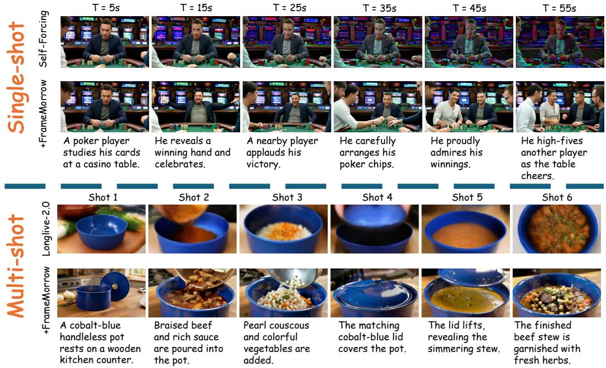  
Figure 3: Qualitative comparisons for interactive video generation. Top: single-shot generation with Self-Forcing under sequential prompts. Bottom: multi-shot generation with LongLive 2.0. Each pair compares the backbone alone with its FRAMEMORROW-augmented variant.

Self-Forcing. The consistent average-rank advantage supports the effectiveness of frame selection across these generators, with trade-offs in individual metrics.

Interactive video generation. We evaluate interactive generation where the generation condition changes over time, covering both single- and multi-shot settings. Table 2 reports improvements in overall quality and consistency across both settings.

For single-shot generation, FRAMEMORROW   
improves overall quality and consistency across   
all evaluated backbones. For Self-Forcing, con  
sistency rises from 84.95 to 89.30. Its segment  
wise CLIP-score gain increases from 0.16 in the   
first 10 seconds to 2.99 in the last 10 seconds,   
indicating larger improvements in prompt align  
ment at later stages of generation. Figure 3 shows   
a representative example, where the native Self-  
Forcing sequence develops strong color artifacts , while FRAMEMORROW depicts the successive actions at the poker table more clearly. actions at the poker table more clearly.

Table 3: Closed-source generation. All baselines use the same reference budget.
<table><tr><td>Model</td><td>Quality ↑</td><td>Consistency ↑ Aesthetic ↑</td><td></td></tr><tr><td>Seedance 2.0</td><td>86.80</td><td>94.02</td><td>65.61</td></tr><tr><td>+ Uniform</td><td>86.47</td><td>93.54</td><td>65.28</td></tr><tr><td>+FRAMEMORROW</td><td>87.46</td><td>95.31</td><td>65.92</td></tr><tr><td>Kling O3</td><td>83.47</td><td>91.28</td><td>63.41</td></tr><tr><td>+ Uniform</td><td>83.21</td><td>90.84</td><td>63.18</td></tr><tr><td>+FRAMEMORROW</td><td>84.06</td><td>92.61</td><td>63.77</td></tr></table>

For multi-shot generation, FRAMEMORROW also improves overall quality and consistency for both evaluated backbones. In particular, ShotStream gains 4.01 consistency points, although its aesthetic score decreases by 0.56. In the qualitative example, FRAMEMORROW better preserves the blue pot and the specified ingredients across multiple successive shot changes.

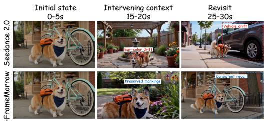  
Figure 4: Seedance 2.0 revisit case.

## Extension to closed-source generators. To test

whether FRAMEMORROW remains effective without access to generator internals, we further eval uate it on Seedance 2.0 and Kling O3 through their public reference-conditioning interfaces. For all variants, the latest generated clip is provided through the native video-reference interface. Uniform-K and FRAMEMORROW additionally receive the same number of historical frames through the image-reference interface, differing only in how these frames are selected. Table 3 reports 30 cases 30-second multi-turn generation results using the same overall metrics as our open-source evaluation. Compared with the original generators, FRAMEMORROW improves consistency by 1.29 points on Seedance 2.0 and 1.33 points on Kling O3. It also outperforms uniform selection on all three reported metrics for both models. These results support plug-and-play use with closed-source generators and show the benefit of selecting relevant references under a fixed reference budget. Figure 4 shows a representative revisit case on Seedance 2.0. While the original model exhibits subject and object drift after intervening interactions, FRAMEMORROW better preserves both the established subject appearance and the previously observed vehicle.

Table 4: Action-conditioned interactive world generation. Subject, background, anti-flicker, motion, and action-alignment scores lie in [0, 1]. Imaging quality is on a 0–100 scale. Shaded rows denote FRAMEMORROW, and bold indicates the better result within each base-model pair.
<table><tr><td rowspan="2">Model</td><td colspan="3">Visual Quality</td><td colspan="2">Temporal Quality</td><td>Interaction</td></tr><tr><td></td><td>Subject ↑ Background ↑</td><td>Imaging ↑</td><td>Anti-flicker ↑ Motion ↑</td><td></td><td>Action Alignment ↑</td></tr><tr><td>Matrix-Game 3.0</td><td>0.801</td><td>0.894</td><td>68.20</td><td>0.936</td><td>0.950</td><td>0.842</td></tr><tr><td>+FRAMEMORROW (Ours)</td><td>0.816</td><td>0.910</td><td>68.35</td><td>0.939</td><td>0.949</td><td>0.861</td></tr><tr><td>WorldMem</td><td>0.782</td><td>0.924</td><td>70.23</td><td>0.910</td><td>0.916</td><td>0.866</td></tr><tr><td>+FRAMEMORROW (Ours)</td><td>0.793</td><td>0.932</td><td>70.47</td><td>0.913</td><td>0.918</td><td>0.889</td></tr><tr><td>YuMe 1.5</td><td>0.765</td><td>0.872</td><td>50.98</td><td>0.944</td><td>0.965</td><td>0.883</td></tr><tr><td>+FRAMEMORROW (Ours)</td><td>0.798</td><td>0.886</td><td>51.80</td><td>0.947</td><td>0.967</td><td>0.912</td></tr></table>

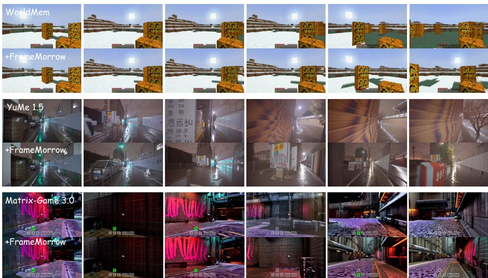  
Figure 5: Qualitative comparisons for interactive world generation. Each pair shows the original backbone (top) and +FRAMEMORROW (bottom) on WorldMem, YuMe 1.5, and Matrix-Game 3.0.

Action-conditioned interactive world models. Table 4 shows consistent improvements across the evaluated world models. FRAMEMORROW improves subject and background consistency, imaging quality, anti-flicker, and action alignment on all three backbones. Action alignment increases by 0.019 for Matrix-Game 3.0, 0.023 for WorldMem, and 0.029 for YuMe 1.5, while motion quality is largely preserved. These results demonstrate that FRAMEMORROW strengthens both long-range visual consistency and control alignment across diverse interactive world models. Figure 5 provides corresponding visual examples. WorldMem better preserves the snow-covered ground, while YuMe 1.5 and Matrix-Game 3.0 retain more consistent street and corridor structures over longer rollouts.

## 4.3 ANALYSIS AND ABLATIONS

We analyze three design choices on the 60-second single-shot interactive generation setting with a frozen Self-Forcing backbone. The recent-context window retains the backbone’s native default, and the eligible-history rule is fixed. Only older historical frames count toward K.

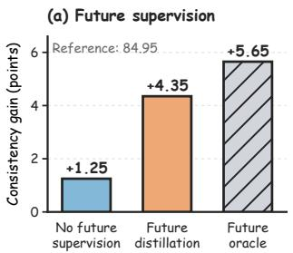

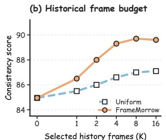

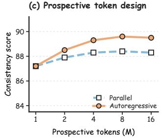  
Figure 6: Ablation studies. Future supervision, frame budget, and token design.

Future supervision. Figure 6(a) compares recent-context supervision (the no-future control), future distillation, and a future-informed oracle. The no-future control constructs ranking targets from DINOv2 similarities between eligible historical frames and recent-context observations, whereas future distillation uses realized future observations. Their gains over the native score of 84.95 are 1.25, 4.35, and 5.65 points. Future distillation adds 3.10 points over the control and reduces the oracle gap from 4.40 to 1.30 points, supporting continuation-derived targets for causal selection. The oracle accesses reference future observations and serves as a diagnostic comparison.

Historical frame budget. Figure 6(b) varies the number of selected historical frames K while fixing M = 4, and compares FRAMEMORROW with uniform sampling from the same eligible history. FRAMEMORROW reaches 88.00 with only two selected frames, exceeding uniform sampling with sixteen frames (87.10). Increasing K from 4 to 8 adds only 0.40 points, with no further improvement at K = 16. These results show that selecting relevant historical frames matters more than simply increasing their number.

Prospective token design. Figure 6(c) compares autoregressive and parallel prediction of prospective tokens at $K = 4$ . Increasing the number of autoregressively predicted tokens from $M = 1$ to M = 4 raises consistency from 87.20 to 89.30. At M = 4, autoregressive prediction exceed parallel prediction by 1.00 point. Increasing M to 8 adds only 0.30 points, with no further gain at M = 16. Four autoregressive tokens capture most of the improvement.

Historical frame selection. Table 5 compares consistency for 60-second single-shot generation with Self-Forcing and multi-shot generation with LongLive 2.0. All strategies share the backbone, eligible history, memory budget, and conditioning interface. 1) Recent-K selects the latest eligible frames. 2) Uniform samples frames uniformly from the eligible history. 3) Context matching ranks frames by cosine similarity to the mean recent-context feature from the selector’s frozen visual encoder. 4) Prompt matching ranks frames by frozen

Table 5: Historical frame selection.
<table><tr><td>Strategy</td><td>Single-shot Multi-shot</td></tr><tr><td>Recent-K</td><td>85.70 92.80</td></tr><tr><td>Uniform</td><td>86.60 92.21</td></tr><tr><td>Context matching</td><td>87.85 92.68</td></tr><tr><td>Prompt matching</td><td>88.35 93.17</td></tr><tr><td>Direct scoring</td><td>88.22 92.53</td></tr><tr><td>FRAMEMORROW</td><td>89.30 93.49</td></tr></table>

CLIP image–text similarity to the next-shot or next-segment prompt. 5) Direct scoring uses the same inputs to predict each candidate’s score from its frame without prospective tokens. FRAMEM-ORROW outperforms the five selection strategies.

Inference overhead. We measure the inference overhead of FRAMEMORROW on three models under matched hardware and sampling settings (Table 6). For all backbones, FRAMEMORROW uses K = 4 and $M = 4 ,$ with selection refreshed every 5 seconds. Selection time includes feature encoding, prospective token prediction, scoring, and Top-K per refresh. Total time covers the pipeline, including historical-frame conditioning, and ∆ denotes the increase over the native backbone.

Table 6: Inference overhead.
<table><tr><td>Method</td><td>Sel. (ms) Total (s) ∆ (%)</td><td></td></tr><tr><td>Self-Forcing</td><td></td><td>82.6</td></tr><tr><td>+FRAMEMORROW</td><td>112</td><td>84.0 1.7</td></tr><tr><td>LongLive 1.0</td><td></td><td>67.8</td></tr><tr><td>+FRAMEMORROW</td><td>109</td><td>69.2 2.1</td></tr><tr><td>Causal Forcing</td><td></td><td>82.6</td></tr><tr><td>+FRAMEMORROW</td><td>115</td><td>84.0 1.7</td></tr></table>

## 5 CONCLUSION

We present FRAMEMORROW, which uses prospective tokens to predict future information needs and select relevant historical frames. Its explicit-frame interface enables lightweight, plug-andplay use across diverse generators. Experiments on five benchmarks and 11 models demonstrate improvements in long-range consistency, visual quality, and action alignment. These results support selecting historical information according to future needs rather than current relevance alone.

## REFERENCES

Zhaochong An, Menglin Jia, Haonan Qiu, Zijian Zhou, Xiaoke Huang, Zhiheng Liu, Weiming Ren, Kumara Kahatapitiya, Ding Liu, Sen He, et al. Onestory: Coherent multi-shot video generation with adaptive memory. In Proceedings of the IEEE/CVF conference on computer vision and pattern recognition, pp. 16173–16184, 2026.

Shyamal Buch, Arsha Nagrani, Anurag Arnab, and Cordelia Schmid. Flexible frame selection for efficient video reasoning. In 2025 IEEE/CVF Conference on Computer Vision and Pattern Recognition (CVPR), pp. 29071–29082. IEEE, 2025.

Hanmo Chen, Chenghao Xu, Xu Yang, Xuan Chen, and Cheng Deng. Past-and future-informed kv cache policy with salience estimation in autoregressive video diffusion. arXiv preprint arXiv:2601.21896, 2026a.

Yukang Chen, Luozhou Wang, Wei Huang, Shuai Yang, Bohan Zhang, Yicheng Xiao, Ruihang Chu, Weian Mao, Qixin Hu, Shaoteng Liu, et al. Longlive-2.0: An nvfp4 parallel infrastructure for long video generation. arXiv preprint arXiv:2605.18739, 2026b.

Yixuan Ding, Jiahao Kong, Wei Huang, Ruijie Quan, and Yi Yang. Layerrecall: A stateconditioned memory router for long-horizon consistency in video generation. arXiv preprint arXiv:2608.28460, 2026.

Kai Hu, Feng Gao, Xiaohan Nie, Peng Zhou, Son Tran, Tal Neiman, Lingyun Wang, Mubarak Shah, Raffay Hamid, Bing Yin, et al. M-llm based video frame selection for efficient video understanding. In 2025 IEEE/CVF Conference on Computer Vision and Pattern Recognition (CVPR), pp. 13702–13712. IEEE, 2025.

Qixin Hu, Shuai Yang, Wei Huang, Song Han, and Yukang Chen. Longlive-rag: A general retrievalaugmented framework for long video generation. arXiv preprint arXiv:2606.02553, 2026.

Xun Huang, Zhengqi Li, Guande He, Mingyuan Zhou, and Eli Shechtman. Self forcing: Bridging the train-test gap in autoregressive video diffusion. Advances in Neural Information Processing Systems, 38:167283–167308, 2026.

Sihui Ji, Xi Chen, Shuai Yang, Xin Tao, Pengfei Wan, and Hengshuang Zhao. Memflow: Flowing adaptive memory for consistent and efficient long video narratives. arXiv preprint arXiv:2512.14699, 2025.

Chaoyu Li, Tianzhi Li, Fei Tao, Zhenyu Zhao, Ziqian Wu, Maozheng Zhao, Juntong Song, Cheng Niu, and Pooyan Fazli. Frameoracle: Learning what to see and how much to see in videos. arXiv preprint arXiv:2510.03584, 2025.

Jiayi Luo, Qiyan Liu, Tengyang Wang, JunHao Liu, Jiayu Chen, Cong Wang, Hanxin Zhu, Chen Gao, Xiaobin Hu, Qingyun Sun, et al. Future forcing: Future-aware training-free kv cache policy for autoregressive video generation. arXiv preprint arXiv:2605.30083, 2026a.

Yawen Luo, Xiaoyu Shi, Junhao Zhuang, Yutian Chen, Quande Liu, Xintao Wang, Pengfei Wan, and Tianfan Xue. Shotstream: Streaming multi-shot video generation for interactive storytelling. arXiv preprint arXiv:2603.25746, 2026b.

Xiaofeng Mao, Zhen Li, Chuanhao Li, Xiaojie Xu, Kaining Ying, and Kaipeng Zhang. Yume1. 5: A text-controlled interactive world generation model. In Proceedings of the IEEE/CVF Conference on Computer Vision and Pattern Recognition, pp. 7752–7761, 2026.

Kepan Nan, Rui Xie, Penghao Zhou, Tiehan Fan, Zhenheng Yang, Zhijie Chen, Xiang Li, Jian Yang, and Ying Tai. Openvid-1m: A large-scale high-quality dataset for text-to-video generation. In International conference on learning representations, volume 2025, pp. 1045–1064, 2025.

Zheng Nie, Ruolin Shen, Xinlei Yu, Bo Yin, Jiangning Zhang, and Xiaobin Hu. Skillgraph: Self-evolving multi-agent collaboration with multimodal graph topology. arXiv preprint arXiv:2604.17503, 2026.

Yaxuan Qin, Hefei Li, Wenqi Mu, and Yancheng He. Efficient frame selection for long video understanding via reinforcement learning. In Proceedings of the IEEE/CVF Conference on Computer Vision and Pattern Recognition, pp. 16944–16953, 2026.

Hongjun Wang, Lin Liu, Jianguo Li, and Tao Lin. Dual-granularity memory for efficient video generation. In Proceedings ofthe IEEE/CVF Conference on Computer Vision and Pattern Recognition, pp. 38016–38026, 2026a.

Zile Wang, Zexiang Liu, Jiaxing Li, Kaichen Huang, Baixin Xu, Fei Kang, Mengyin An, Peiyu Wang, Biao Jiang, Yichen Wei, et al. Matrix-game 3.0: Real-time and streaming interactive world model with long-horizon memory. arXiv preprint arXiv:2604.08995, 2026b.

Xuan Wei, Longbin Ji, Guan Wang, Xiangrui Liu, Zhenyu Zhang, Shuohuan Wang, Yu Sun, and Qingqi Hong. Memento: Reconstruct to remember for consistent long video generation. arXiv preprint arXiv:2606.14667, 2026.

Zeqi Xiao, Yushi Lan, Yifan Zhou, Wenqi Ouyang, Shuai Yang, Yanhong Zeng, and Xingang Pan. Worldmem: Long-term consistent world simulation with memory. Advances in Neural Information Processing Systems, 38:49632–49652, 2026.

Shuai Yang, Wei Huang, Ruihang Chu, Yicheng Xiao, Yuyang Zhao, Xianbang Wang, Muyang Li, Enze Xie, Yingcong Chen, Yao Lu, et al. Longlive: Real-time interactive long video generation. arXiv preprint arXiv:2509.22622, 2025.

Bo Ye, Xinyu Cui, Jian Zhao, Tong Wei, and Min-Ling Zhang. Dysink: Dynamic frame sinks for autoregressive long video generation. arXiv preprint arXiv:2605.21028, 2026.

Hidir Yesiltepe, Tuna Meral, Adil Kaan Akan, Kaan Oktay, and Pinar Yanardag. Infinity-rope: Action-controllable infinite video generation emerges from autoregressive self-rollout. In Proceedings of the IEEE/CVF Conference on Computer Vision and Pattern Recognition, pp. 40256– 40265, 2026.

Jung Yi, Wooseok Jang, Paul Hyunbin Cho, Jisu Nam, Heeji Yoon, and Seungryong Kim. Deep forcing: Training-free long video generation with deep sink and participative compression. arXiv preprint arXiv:2512.05081, 2025.

Bo Yin, Xiaobin Hu, Xingyu Zhou, Yu He, Peng-Tao Jiang, Yue Liao, Junwei Zhu, Jiangning Zhang, Ying Tai, and Shuicheng Yan. Fera: Frequency-energy constrained routing for effective diffusion adaptation fine-tuning. arXiv preprint arXiv:2511.17979, 2025a.

Bo Yin, Xiaobin Hu, Chengming Xu, Ruolin Shen, Mo Yang, Jiangning Zhang, Peng-Tao Jiang, Cheng Tan, and Shuicheng Yan. Spot-e: Test-time entropy shaping with visual spotlights for frozen vlms. arXiv preprint arXiv:2606.20244, 2026.

Tianwei Yin, Qiang Zhang, Richard Zhang, William T Freeman, Fredo Durand, Eli Shechtman, and Xun Huang. From slow bidirectional to fast autoregressive video diffusion models. In 2025 IEEE/CVF Conference on Computer Vision and Pattern Recognition (CVPR), pp. 22963–22974. IEEE, 2025b.

Sicheng Yu, Chengkai Jin, Huanyu Wang, Zhenghao Chen, Sheng Jin, Zhongrong Zuo, Xiaolei Xu, Zhenbang Sun, Bingni Zhang, Jiawei Wu, et al. Frame-voyager: Learning to query frames for video large language models. In International Conference on Learning Representations, volume 2025, pp. 84154–84179, 2025.

Xinlei Yu, Chengming Xu, Zhangquan Chen, Bo Yin, Cheng Yang, Yongbo He, Yihao Hu, Jiangning Zhang, Cheng Tan, Xiaobin Hu, et al. Dual latent memory for visual multi-agent system. arXiv preprint arXiv:2602.00471, 2026.

Kaiwen Zhang, Liming Jiang, Angtian Wang, Jacob Zhiyuan Fang, Tiancheng Zhi, Qing Yan, Hao Kang, Xin Lu, and Xingang Pan. Storymem: Multi-shot long video storytelling with memory. arXiv preprint arXiv:2512.19539, 2025a.

Liuzhou Zhang, Jiarui Ye, Yuanlei Wang, Ming Zhong, Mingju Cao, Wanke Xia, Bowen Zeng, Zeyu Zhang, and Hao Tang. Egolcd: Egocentric video generation with long context diffusion. arXiv preprint arXiv:2512.04515, 2025b.

Jiaqi Zhao, Xiaobin Hu, Bo Yin, Junpeng Jiang, Miao Zhang, and Shuicheng Yan. Quantwm: Temporally consistent 2-bit kv cache quantization for world models and video generation. arXiv preprint arXiv:2609.26425, 2026.

Zirui Zheng, Jiaqian Yu, Xiongfeng Peng, Mingyi Li, Chao Zhang, Weiming Li, Dong Wang, Huchuan Lu, Xu Jia, et al. Mem-world: Memory-augmented action-conditioned world models for persistent robot manipulation. arXiv preprint arXiv:2606.18960, 2026.

Hongzhou Zhu, Min Zhao, Guande He, Hang Su, Chongxuan Li, and Jun Zhu. Causal forcing: Autoregressive diffusion distillation done right for high-quality real-time interactive video generation. arXiv preprint arXiv:2602.02214, 2026.

## A IMPLEMENTATION DETAILS

## A.1 SELECTOR ARCHITECTURE

The selector takes eligible history, recent context, and the known rollout condition. Visual and condition encoders are frozen. Only the visual/condition projections, causal Transformer, and ranking query/key projections are trained, without the generator. Compatible text-conditioned backbones share one checkpoint. Action-conditioned experiments use a separate checkpoint with the same architecture.

Table 7 summarizes the architecture. DINOv2 ViT-B/14 provides final class-token frame features for the visual encoder and teacher. Learned projections map visual and condition features into the selector space. Text conditions use frozen UMT5-XXL token features. Actions are serialized as short motion descriptions and encoded by frozen CLIP ViT-B/32, with a separate projection for its feature dimension.

Historical and recent tokens follow observation time, with learned temporal and token-type embeddings distinguishing history, recent context, and conditions. A learned start token initializes autoregressive queries under a causal mask. Padding is masked in attention and ranking. Only eligible history is scored and returned by Top-K, excluding recent context. Deployment retains the backbone’s native recent window. If fewer than K candidates exist, all are returned without duplication.

Table 7: Selector architecture. Frozen encoders are excluded from the trainable parameter estimate.
<table><tr><td>Configuration</td><td>Value</td></tr><tr><td>Visual encoder / teacher</td><td>DINOv2 ViT-B/14</td></tr><tr><td>Visual feature dimension</td><td>768</td></tr><tr><td>Transformer layers / hidden dimension</td><td>4/512</td></tr><tr><td>Attention heads / FFN dimension</td><td>8 / 2,048</td></tr><tr><td>Normalization / activation</td><td>Pre-LayerNorm / GELU</td></tr><tr><td>Dropout</td><td>0.0</td></tr><tr><td>Positional encoding</td><td>Learned temporal embeddings</td></tr><tr><td>Prospective queries M / memory budget K</td><td>4/4</td></tr><tr><td>Maximum training candidates</td><td>128</td></tr><tr><td>Trainable parameters, text selector</td><td>16M</td></tr></table>

## A.2 RANKING TARGETS AND LOSSES

The teacher computes cosine similarities between ℓ -normalized DINOv2 features of historical and realized future frames. Future observations supply detached targets only and never enter the selector. Scores are aggregated by the smooth maximum in Section 3.3, then softmaxed over valid historical candidates for listwise supervision, without per-example min–max normalization.

The teacher uses H = 8 continuation frames sampled at two fps over the next four seconds. Table 8 lists the loss settings. Pairwise softplus loss is averaged over all ordered pairs with teacher-score gaps of at least δ, or set to zero if none qualify. The listwise term remains active. Both losses are averaged across examples, not pooled candidates.

## A.3 OPTIMIZATION AND COMPUTE

Text- and action-conditioned selectors are trained independently using precomputed frozen encoder features. Table 9 gives the configuration. Linear warmup precedes cosine learning-rate decay, gradients are clipped before each update, and validation listwise loss selects the final checkpoint. The planning budget is six hours on two A100 80GB GPUs, or 12 GPU-hours per selector, excluding annotation and feature extraction.

Table 8: Ranking hyperparameters.
<table><tr><td>Symbol</td><td>Role</td><td>Value</td></tr><tr><td> $\tau _ { q }$ </td><td>Query-score aggregation</td><td>0.10</td></tr><tr><td> $\tau _ { f }$ </td><td>Future-similarity aggregation</td><td>0.05</td></tr><tr><td> $\tau _ { r }$ </td><td>Teacher ranking temperature</td><td>0.10</td></tr><tr><td> $\tau _ { s }$ </td><td>Student ranking temperature</td><td>1.00</td></tr><tr><td> $\delta$ </td><td>Teacher margin for pair inclusion</td><td>0.05</td></tr><tr><td> $\lambda$ </td><td>Pairwise loss weight</td><td>0.50</td></tr><tr><td> $H$ </td><td>Number of teacher continuation frames</td><td>8</td></tr></table>

Table 9: Optimization settings.
<table><tr><td>Configuration</td><td>Value</td></tr><tr><td>Optimizer Learning rate / weight decay</td><td>AdamW 10−4 /0.01</td></tr><tr><td>Adam coefficients</td><td>(0.9,0.999)</td></tr><tr><td>Schedule / warmup</td><td>Cosine / 5% of updates</td></tr><tr><td>Global batch size / epochs</td><td>64 / 5</td></tr><tr><td>Precision / gradient clipping</td><td>BF16 / global norm 1.0</td></tr><tr><td>Training seed</td><td>0</td></tr><tr><td>Hardware budget</td><td>2× A100 80GB</td></tr></table>

## B TRAINING DATA CONSTRUCTION

## B.1 TEXT-CONDITIONED TRAINING TUPLES

We use 10K OpenVidHD videos, divided into two-second annotation units with four uniformly sampled frames each. These units do not set rollout-condition durations or selection refresh intervals. Qwen3-VL-8B-Instruct generates structured segment descriptions, which form the streaming conditions.

Each tuple $( \mathcal { H } _ { t } , \mathcal { L } _ { t } , c _ { t } ^ { + } , \mathcal { V } _ { t } ^ { + } )$ contains eligible history, recent context ending at t, the next-rollout condition, and a teacher-only continuation. Recent context comprises eight frames from the preced ing four seconds. Up to 128 historical frames are sampled uniformly before this window and kept in temporal order. Boundaries lacking eligible history or a complete continuation are skipped. This training window does not replace the backbone’s native deployment window.

Videos are split 90:10 for training and validation before tuple extraction, keeping all tuples from each video together. Teacher frames remain within the condition’s temporal scope. Shorter intervals use fewer frames rather than sampling beyond that scope.

## B.2 SEGMENT ANNOTATION AND PROMPT CONSTRUCTION

The annotation template preserves visible identities, scene attributes, actions, and state changes without introducing unsupported objects or events.

## Prompt 1: Segment annotation

## Instructions

Given four chronologically ordered frames from a two-second video segment, describe the visible subjects, scene, actions, and object states. If a preceding segment description is supplied, identify visible changes while preserving consistent names for recurring subjects and objects. Do not infer unseen events or future actions.

## Output

Return the fields subject, scene, action, state, change, and segment prompt. The segment prompt should be a concise visual description suitable for conditioning this segment.

Table 10: Backbone integration map. Every row retains the native recent window and selects up to four additional historical frames. No generator fine-tuning is used.
<table><tr><td>Backbone</td><td>Selector</td><td>Historical conditioning route</td></tr><tr><td>Self-Forcing</td><td>Text</td><td>Frame encoding followed by historical KV conditioning</td></tr><tr><td>LongLive 1.0</td><td>Text</td><td>Historical frame encoding into the memory cache</td></tr><tr><td>Causal Forcing</td><td>Text</td><td>Frame encoding into causal context KV states</td></tr><tr><td>CausVid</td><td>Text</td><td>Historical latent encoding into context KV states</td></tr><tr><td>LongLive 2.0</td><td>Text</td><td>Historical references in the streaming memory interface</td></tr><tr><td>ShotStream</td><td>Text</td><td>Selected images as cross-shot reference conditioning</td></tr><tr><td>Matrix-Game 3.0</td><td>Action</td><td>Encoded historical frames in the rollout context</td></tr><tr><td>WorldMem</td><td>Action</td><td>Historical frame memory with associated pose metadata</td></tr><tr><td>YuMe 1.5</td><td>Action</td><td>Historical latent references for rollout conditioning</td></tr></table>

Structured fields form each segment prompt, excluding later timestamps and teacher scores. Annotation uses temperature zero and at most 256 output tokens. Empty or malformed outputs are regenerated once, then excluded if still invalid.

## B.3 ACTION-CONDITIONED TRAINING TUPLES

We use 10K chunk-aligned Sekai Game-Walking examples. Each combines observed history and context, the next chunk’s pseudo-action condition, and its realized continuation for the teacher. Pseudo-actions derive from relative camera translation and rotation and need not reproduce the original keyboard inputs.

Under the camera-to-world pose convention, let $R _ { t }$ and $\mathbf { p } _ { t }$ denote camera orientation and position. Local translation and angular velocity are computed as

$$
\begin{array} { r } { \mathbf { v } _ { t } = R _ { t } ^ { \top } ( \mathbf { p } _ { t + 1 } - \mathbf { p } _ { t } ) / \Delta t , \qquad \omega _ { t } = \mathrm { L o g } ( R _ { t } ^ { \top } R _ { t + 1 } ) ^ { \vee } / \Delta t . } \end{array}\tag{10}
$$

Translation is normalized by the trajectory’s median nonzero speed, with components activated above 0.2. Yaw and pitch use a $2 ^ { \circ } / s$ threshold. Labels cover forward/backward, left/right, turn left/right, and look up/down. Simultaneous labels are retained, and chunks are stationary when all components fall below threshold. A trajectory-level 90:10 train/validation split keeps adjacent chunks together.

## C BACKBONE INTEGRATION DETAILS

## C.1 SHARED SELECTION AND BACKBONE-SPECIFIC CONDITIONING

The selector returns explicit frames and shares one checkpoint per condition modality across compatible generators, with $K = M = 4 .$ . Each backbone retains its native recent window. Integration trains neither the generator nor a new conditioning module.

Selected frames are sorted by timestamp and converted by each backbone’s adapter into its reference representation (Table 10). Generator activations never feed back into the selector.

## C.2 TEMPORAL POSITIONS AND CACHE MANAGEMENT

For KV conditioning, the backbone’s frozen image/video encoder and context-encoding path convert selected frames into layer-specific keys and values. DINOv2 features are not copied into this cache. Reference latents are conditioning inputs, not generated output frames. Backbones with direct image-reference interfaces instead receive selected RGB frames.

Selection retains original timestamps. Adapters use historical temporal positions where supported, or map sorted frames to reference slots in temporal order. Refreshes replace historical slots while preserving native recent context, whose frames are excluded from the candidate pool. Thus, the fourframe budget fixes additional observations, not latent-token or KV-cache size across backbones.

## C.3 MATCHED INTEGRATION CONTROLS

Recent-K, Uniform, Context matching, Prompt matching, and FRAMEMORROW share eligible history, budget, and conditioning adapter within each backbone. Context matching uses the selector’s recent visual features, whereas Prompt matching uses CLIP image–text similarity to the known condition. These controls isolate selection quality. Comparisons with the unaugmented backbone also include the benefit of adding historical references.

## D EVALUATION PROTOCOLS

Unless otherwise specified, historical frame selection is refreshed every five seconds of generated video. Each refresh uses only the eligible history, recent context, and condition available at that time.

## D.1 LONG VIDEO GENERATION

We generate 60-second videos from 128 MovieGenBench prompts and evaluate six VBench-Long dimensions: subject/background consistency, motion smoothness, dynamic degree, aesthetic quality, and imaging quality. They assess foreground/scene persistence, temporal smoothness, motion magnitude, aesthetics, and frame-level quality, respectively. Higher is better for all six.

Prompt $i \in \{ 0 , \ldots , 1 2 7 \}$ uses paired seed i. Each backbone and its augmented variants share its released resolution, frame rate, denoising steps, and guidance. Settings are matched within, not across, backbones. Evaluation covers the full 60 seconds without selecting favorable subsequences.

Methods are ranked per metric within each backbone before display rounding, with ties assigned average ranks. Average rank is the mean over six metrics. Dataset scores weight prompts equally.

## D.2 INTERACTIVE VIDEO GENERATION

We evaluate 100 single-shot and 100 multi-shot cases, each comprising six ten-second condition intervals. LLM-generated prompt sequences require dependencies across intervals. Single-shot cases retain one scene, while multi-shot transitions depend on previously established subjects and states. Methods share prompts and recent context. Selection refreshes every five seconds, independently of the ten-second condition/evaluation intervals.

Segment-wise alignment pairs each ten-second interval with its current prompt, following the evaluation organization used for LongLive. In the CLIP ViT-B/32 implementation, eight uniformly sampled frames per interval are encoded and compared with the normalized prompt embedding. The score for interval j is

$$
s _ { j } = \frac { 1 0 0 } { n _ { j } } \sum _ { u = 1 } ^ { n _ { j } } \cos \bigl ( E _ { \mathrm { C L I P } } ^ { \mathrm { i m g } } ( x _ { j , u } ) , E _ { \mathrm { C L I P } } ^ { \mathrm { t x t } } ( c _ { j } ) \bigr ) .\tag{11}
$$

Each interval’s score is averaged across cases using only its current prompt, never prompts from later intervals.

Quality, Consistency, and Aesthetic use the VBench quality aggregate, subject consistency, and aesthetic evaluator, respectively. Multi-shot evaluation measures recurring-subject consistency across shots and temporal quality within shots, avoiding penalties for intended scene changes.

## D.3 CLOSED-SOURCE GENERATION

We evaluate Seedance 2.0 and Kling O3 through their public reference-conditioning interfaces via fal.ai on 30 cases with five turns each. Methods share prompts, initial context, explicit API seeds, and reference budgets. The native model receives the latest clip as a video reference. Uniform-K and FRAMEMORROW additionally receive equal numbers of historical image references, differing only in frame selection. Other settings remain fixed within each backbone.

Table 11: Action-alignment rubric.
<table><tr><td>Score</td><td>Criterion</td></tr><tr><td>1.00</td><td>All commanded motion directions and their temporal order are clearly followed.</td></tr><tr><td>0.75</td><td>The dominant commands are followed, with minor delay or one brief inconsistency.</td></tr><tr><td>0.50</td><td>Some commands are followed, but a substantial part is missing or ambiguous.</td></tr><tr><td>0.25</td><td>Only weak evidence supports the commands, with mostly inconsistent motion.</td></tr><tr><td>0.00</td><td>The commanded motion is absent, reversed, or unsupported by the visible rollout.</td></tr></table>

Table 12: Sensitivity to the visual teacher. All variants use the same selector architecture and training data. ∆ denotes the improvement over the native Self-Forcing consistency score of 84.95.
<table><tr><td>Visual Teacher</td><td>Consistency ↑</td><td>Δ</td></tr><tr><td>CLIP</td><td>88.42</td><td>+3.47</td></tr><tr><td>SigLIP</td><td>88.76</td><td>+3.81</td></tr><tr><td>DINOv2</td><td>89.30</td><td>+4.35</td></tr></table>

## D.4 ACTION-CONDITIONED WORLD MODELS

We evaluate Matrix-Game 3.0, WorldMem, and YuMe 1.5 on 60 trajectories each. Native and FRAMEMORROW variants share initial context and actions. Visual metrics cover subject/background consistency, anti-flicker, motion smoothness, and imaging quality. Qwen3-VL-8B-Instruct judges whether rollouts follow the supplied controls.

The judge receives 16 ordered frames per action interval, command descriptions, and durations, without method identities or competing outputs. Each interval is scored once at temperature zero using Table 11. Scores are averaged within trajectories and then across trajectories, avoiding extra weight for longer sequences.

Prompt 2: Action-alignment evaluation   
Instructions   
Compare camera motion with the supplied controls and intervals. Distinguish camera motion from mov  
ing objects. Judge action compliance, not aesthetics. Using the rubric, assign 0, 0.25, 0.5, 0.75, or 1. Do   
not infer invisible motion.   
Inputs   
Controls: <action sequence and intervals>   
Frames: <chronologically sampled rollout frames>   
Output   
Return JSON fields score and reason, citing visible evidence.

Malformed outputs are retried once, with persistent failures reported as missing. The judge assesses observable action compliance rather than physical correctness.

## E ADDITIONAL ABLATIONS

Unless otherwise specified, additional ablations use 60-second single-shot interactive generation with frozen Self-Forcing, its native recent window, K = 4 historical frames, and M = 4 prospective queries. We report overall consistency, as in the main ablations.

## E.1 SENSITIVITY TO THE VISUAL TEACHER

Visual teacher. We replace the DINOv2 teacher with CLIP or SigLIP, fixing selector architecture, training trajectories, candidate history, and optimization. All three improve consistency (Table 12), supporting the use of different visual feature spaces. DINOv2 performs best and is used in the main experiments.

Table 13: Ablation of the ranking objective. The full objective combines listwise distribution matching with margin-based pairwise ordering constraints.
<table><tr><td>Objective</td><td>Consistency ↑</td><td>Δ</td></tr><tr><td>Pairwise only</td><td>88.21</td><td>+3.26</td></tr><tr><td>Listwise only</td><td>88.67</td><td>+3.72</td></tr><tr><td>Listwise + Pairwise</td><td>89.30</td><td>+4.35</td></tr></table>

Table 14: Effect of the realized-continuation horizon. H denotes the number of continuation observations available only to the training teacher.
<table><tr><td>H</td><td>Consistency ↑</td></tr><tr><td>1 87.86</td><td>+2.91</td></tr><tr><td>2</td><td>88.71</td></tr><tr><td>4 89.14</td><td>+3.76 +4.19</td></tr><tr><td>8</td><td>89.30 +4.35</td></tr></table>

## E.2 RANKING OBJECTIVE

Listwise and pairwise supervision. Listwise loss transfers the teacher’s relevance distribution, while pairwise loss preserves orderings above the teacher-score margin. Table 13 compares each alone with their combination. Both help, listwise supervision is stronger alone, and adding pairwise constraints yields the best consistency.

## E.3 LENGTH OF THE REALIZED CONTINUATION

Continuation horizon. We vary the number of teacher continuation observations H, which affects supervision but not deployed inputs or computation. Consistency improves substantially up to $H =$ 4, then largely saturates (Table 14). Multiple future observations provide a more reliable target than one frame, with limited benefit from longer horizons.

## E.4 AGGREGATION OF PROSPECTIVE QUERIES

Query-score aggregation. We compare mean, hard-maximum, and smooth-maximum pooling of query–frame scores. Mean pooling favors consistent matches across queries, while hard maximum keeps only the strongest match. Smooth maximum allows one strong prospective match to dominate while retaining other queries’ contributions and gives the best consistency (Table 15).

## E.5 RELATION BETWEEN FUTURE RELEVANCE AND GENERATION UTILITY

Generation-utility validation. The target in Eq. (5) measures visual correspondence with the realized continuation, which need not imply downstream benefit. We test whether teacher relevance $r _ { t , i } ^ { F }$ correlates with the generation utility of individual historical frames.

This diagnostic uses condition-free long-video generation. All ranking signals exclude upcoming conditions. At each rollout step t, we sample $N _ { u }$ eligible candidates $\boldsymbol { x } _ { \tau _ { i } } \in \mathcal { H } _ { t }$

The privileged teacher score $r _ { t , i } ^ { F }$ uses the held-out realized continuation, not generated futures. Generated continuations are used only to measure each candidate’s downstream utility.

We first generate a baseline continuation using only the backbone’s native recent context,

$$
\hat { \mathcal { V } } _ { t } ^ { 0 } = G _ { \omega } ( \mathcal { L } _ { t } ) ,\tag{12}
$$

and then generate an additional continuation for each candidate while providing that candidate through the same historical-conditioning interface,

$$
\hat { \mathcal { V } } _ { t } ^ { i } = G _ { \omega } ( \mathcal { L } _ { t } , x _ { \tau _ { i } } ) .\tag{13}
$$

All generations share the initial context, seed, sampling settings, and frozen backbone. Only the supplied historical frame differs.

Table 15: Aggregation across prospective queries. All variants use $M = 4$ queries and the same trained selector configuration.
<table><tr><td>Aggregation</td><td>Consistency ↑</td><td> $\pmb { \Delta }$ </td></tr><tr><td>Mean</td><td>88.43</td><td>+3.48</td></tr><tr><td>Hard maximum</td><td>88.91</td><td>+3.96</td></tr><tr><td>Smooth maximum</td><td>89.30</td><td>+4.35</td></tr></table>

Table 16: Relationship between historical-frame ranking signals and empirical generation utility. Spearman correlations are computed across historical candidates at each rollout step, averaged within each trajectory, and then averaged across the held-out evaluation set. The futuregrounded teacher uses the held-out realized continuation only for this diagnostic analysis, whereas FRAMEMORROW does not observe future content at inference. Confidence intervals are obtained by trajectory-level bootstrap with 1,000 resamples.
<table><tr><td>Ranking signal</td><td>Realized future</td><td>ρ↑</td><td>95% CI</td></tr><tr><td>Context similarity</td><td>No</td><td>0.10</td><td>[0.04, 0.16]</td></tr><tr><td>FRAMEMORROW prediction  $\hat { r }$ </td><td>No</td><td>0.42</td><td>[0.35, 0.49]</td></tr><tr><td>Future-grounded teacher  $r ^ { F }$ </td><td>Yes</td><td>0.51</td><td>[0.44, 0.57]</td></tr></table>

We define the empirical generation utility of candidate i as

$$
u _ { t , i } = Q \Big ( \hat { \mathcal { V } } _ { t } ^ { i } \Big ) - Q \Big ( \hat { \mathcal { V } } _ { t } ^ { 0 } \Big ) ,\tag{14}
$$

where $Q$ is the main experiments’ long-range consistency evaluator. It measures preservation of subjects, objects, and scene appearance from preceding context, rather than internal consistency of the new continuation alone. Positive utility indicates better preservation than the native backbone.

Because trajectory difficulty and utility scale may vary across examples, we measure rank correspondence among historical candidates at each rollout step rather than pooling raw utility values globally. Specifically, we compute

$$
\rho _ { t } ( s , u ) = \mathrm { S p e a r m a n } \left( \{ s _ { t , i } \} _ { i = 1 } ^ { N _ { u } } , \{ u _ { t , i } \} _ { i = 1 } ^ { N _ { u } } \right) ,\tag{15}
$$

where s denotes a historical-frame ranking signal. We compare current-context similarity, the privileged future-grounded teacher score $r ^ { F }$ , and the deployed FRAMEMORROW prediction rˆ.

We average valid step-level correlations within each trajectory, then across trajectories. The analysis includes $\breve { N } _ { \mathrm { t r a j } } = 3 0$ held-out trajectories, $N _ { \mathrm { s t e p } } = 1 2 0 $ valid steps, and $N _ { u } = 8$ candidates per step. We obtain 95% confidence intervals by resampling trajectories with replacement 1,000 times.

Table 16 shows weak correspondence between current-context similarity and generation utility. The teacher ranking aligns more closely with utility, and FRAMEMORROW recovers much of this association without future access at inference. These results support continuation-based visual correspondence as a training proxy for downstream usefulness.

## F ADDITIONAL QUALITATIVE RESULTS

Figures 7, 8, and 9 compare native and FRAMEMORROW-augmented Self-Forcing, LongLive, and Causal Forcing under matched generation conditions and sampling settings, illustrating long-horizon visual consistency.

## G USER STUDY

We conduct a blinded pairwise study of long-video generation. For each of Self-Forcing, LongLive, and Causal Forcing, 30 randomly sampled native/FRAMEMORROW video pairs share prompts and generation settings. All ten raters evaluate every pair, yielding 300 judgments per backbone and 900 per criterion. Method identities are hidden and left–right order is randomized. Raters independently assess long-range consistency (preservation of subjects, objects, and scenes) and overall visual quality (clarity, artifacts, and naturalness), selecting a preferred video or a tie when neither is clearly better.

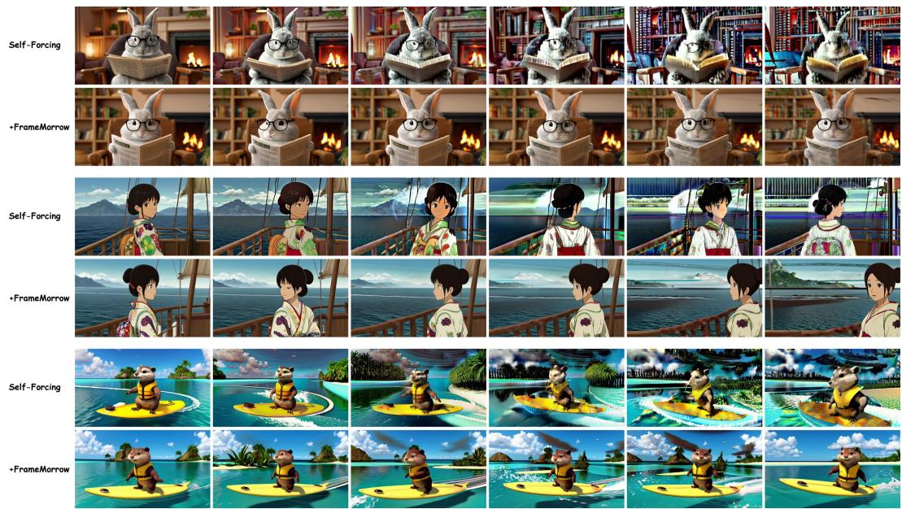

Figure 7: Additional qualitative comparisons with Self-Forcing. Each example compares the original Self-Forcing model (top) with Self-Forcing+FRAMEMORROW (bottom) over long-horizon generation. FRAMEMORROW better preserves subject appearance and visual details as generation progresses.  
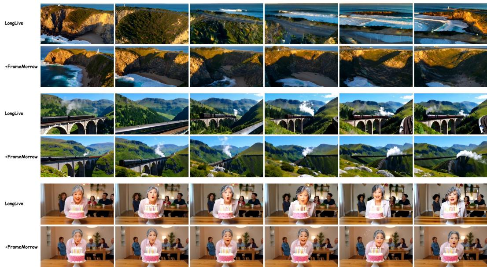  
Figure 8: Additional qualitative comparisons with LongLive. Each example compares the original LongLive model (top) with LongLive+FRAMEMORROW (bottom) under the same generation conditions. FRAMEMORROW improves the preservation of subjects and scene appearance over extended generation.

Figure 10 reports preferences, with Overall averaging the three backbones. FRAMEMORROW is preferred more often than native models for both criteria on every backbone. Average consistency preferences are 62.7% for FRAMEMORROW, 16.7% for native, and 20.7% ties. Quality preferences are 54.0%, 17.0%, and 29.0%, respectively. The stronger consistency preference matches our focus on historical preservation, while quality preferences indicate broader perceptual benefits.

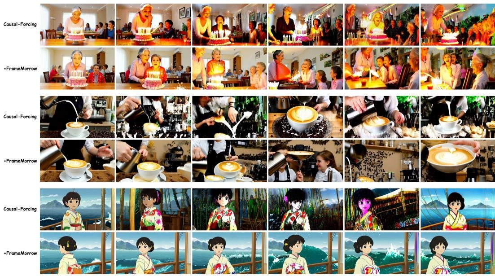  
Figure 9: Additional qualitative comparisons with Causal Forcing. Each example compares the original Causal Forcing model (top) with Causal Forcing+FRAMEMORROW (bottom) under the same generation conditions. FRAMEMORROW provides more consistent subjects, objects, and scene details throughout long-horizon generation.

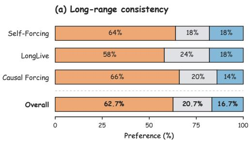

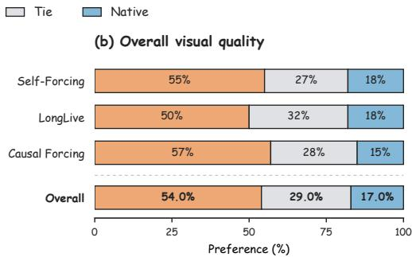  
Figure 10: User preferences for long-video generation. FRAMEMORROW is preferred over the native model across all three backbones. Overall averages the three backbone-level percentages.