# GRC-Pose: Generation-Reconstruction Correspondence for Prior-Free 6D Object Pose Tracking

Shiyang Liu1,2, Weiquan Lin3,2, Luping Xiao4,2, Jiadong Tang1, Yi Yang1, Yu Gao1, and Xingyu Chen2 B

1School of Automation, Beijing Institute of Technology

2Zhongguancun Academy

3Artificial Intelligence Academy, Xidian University

4School of Information and Communication Engineering, Beijing University of Posts and Telecommunications

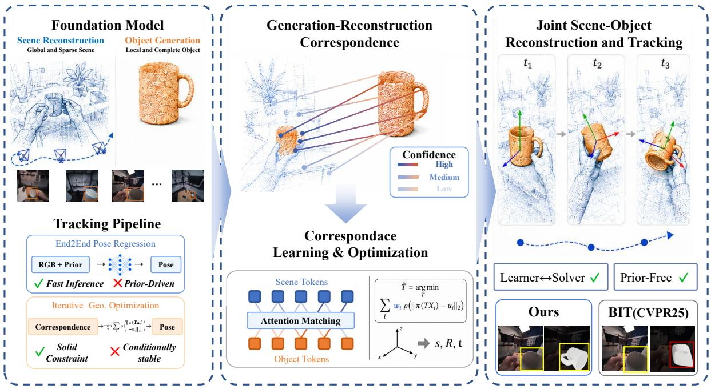  
Figure 1. GRC-Pose overview. Generation-reconstruction correspondence provides the geometric evidence for stable 6D object tracking across an RGB sequence.

## Abstract

Prior-free 6D object pose tracking seeks to recover the trajectory of an unseen object from a single RGB video without object specific CAD models, posed reference images, or pose annotations. Geometric foundation models provide complementary object-centric and scene-centric cues, yet SAM3D CAD is indexed by an arbitrary object-local surface parameterization, whereas reconstructed evidence is expressed in a sequence-specific world frame with partial surface coverage. To exploit this complementarity, we formulate tracking as generation-reconstruction correspondence and introduce GRC-Pose, a correspondence-based framework that combines learned correspondence prediction with robust pose estimation. Concretely, GeoCorr-Matcher estimates weighted object-scene correspondences and per-match uncertainty for each pose candidate. FGH-Solver integrates these matches through multiple robust geometric estimators and sequence-level posterior inference, while a posterior-gated memory retains only inlier-supported observations through occlusion and viewpoint change. Extensive evaluation shows that with SAM3D CAD, GRC-Pose achieves state-of-the-art Average Recall and motion retention on HOT3D, improving the latter by 58% over prior art. On classical benchmarks including YCBInEOAT and LINEMOD, it remains highly competitive.

## 1 Introduction

Reliable 6D object pose tracking is important for manipulation, AR/VR, and robotic interaction [1, 2, 3, 4, 5]. Egocentric hand-object interaction is particularly challenging because large inter-frame motion, severe hand occlusion, motion blur, and intermittent visibility easily lead to severe pose drift and tracking loss over time [6, 7]. Robust tracking therefore requires a spatiotemporally consistent object state throughout the sequence rather than independent framewise estimations.

Existing unseen object pose estimation methods typically rely on either an object-specific CAD model or posed reference views, and learning-based methods heavily rely on large-scale synthetic pose supervision [8, 3, 9, 10, 11, 12, 13]. These requirements restrict real-world applicability on unconstrained in-the-wild objects. Furthermore, single-view estimation is inherently ill-posed due to geometric symmetry and severe occlusion, which frequently induce pose ambiguity or yield multiple pose candidates for a single observation [14, 15]. Sequence-level tracking inherently addresses both challenges by replacing static single-view inference with joint 3D geometry reconstruction and pose optimization across frames. BundleTrack [16] and BundleSDF [2] demonstrate robust RGB-D tracking without CAD models, while BIT [17] further advances to a completely prior-free framework on monocular RGB.

Recent geometric foundation models offer orthogonal geometric strengths. Feed-forward reconstruction models such as VGGT [18, 19] infer cameras and scene geometry from multiple views, whereas single-image generation models such as SAM 3D [20] and TRELLIS [21] produce dense object-centric geometry. However, these two representations resist naive feature or spatial concatenation due to fundamental misalignments in coordinate frame, scale, and completeness. To leverage their synergistic potential for tracking, our key insight is to formulate pose estimation as cross-domain matching and pose solving, using the global scene context and camera poses from multi-view reconstructions to metrically ground the dense, complete canonical geometry of generative models.

In this paper, we propose Generation-Reconstruction Correspondence Pose Tracking (GRC-Pose), a correspondence-driven framework that aligns SAM3D CAD with feed-forward multi-view scene reconstructions via deep feature association and robust pose optimization. Specifically, the Geometric Correspondence Matcher (GeoCorr-Matcher) first estimates poseconditioned weighted correspondences alongside match-wise uncertainty. Next, the Factorized Geometric Hybrid Solver (FGH-Solver) leverages these predictions to derive complementary 2D–3D and 3D–3D pose candidates, which are subsequently propagated to temporal posterior filtering. To prevent error accumulation, a posterior-gated memory bank selectively retains only geometrically consistent keyframe observations. Finally, sequence-specific adaptation enables online self-supervised calibration of matching confidence and geometric uncertainty. Our contributions are summarized as follows:

• We propose GRC-Pose, a novel correspondence-driven paradigm that formulates prior-free 6D pose tracking as a cross-domain geometric consensus problem, explicitly maintaining multimodal pose distributions to resolve the inherent ambiguities induced by severe occlusion, agile ego-motion, and object symmetries.

• We design GeoCorr-Matcher and FGH-Solver to bridge the generative and reconstructive domains, where poseconditioned uncertainty-aware matching rejects correspondence noise while factorized 2D–3D and 3D–3D estimation resolves scale discrepancies, together enabling reliable propagation of pose candidates for temporal filtering and posterior-gated memory updates.

• Experiments across public benchmarks show that GRC-Pose achieves state-of-the-art performance on the egocentric HOT3D dataset featuring rapid motion and occlusion, while achieving competitive results on classical object-centric datasets such as YCBInEOAT and LINEMOD.

## 2 Related Work

Novel-object pose estimation and tracking. Novel-object pose methods differ mainly in the object-specific information available at test time. FoundationPose [3] unifies CAD- and reference-based render-and-compare inference; GigaPose [22] combines template retrieval with patch correspondences; and GoTrack [23] couples object-model refinement with optical-flow registration. Any6D [13] estimates pose and metric size from one RGB-D anchor, whereas SAM-6D [24] uses segmentation and partial-to-partial RGB-D matching. FoundPose [25] establishes CAD-to-image correspondences with foundation features.

FreeZe [26] and its follow-up FreeZeV2 [27] perform training-free registration with frozen visual-geometric descriptors, while MatchU [28] matches a CAD point cloud to a single RGB-D image and SinRef-6D [29] uses a pose-labeled RGB-D reference. SurfEmb [15] learns dense surface embeddings; NeuSurfEmb [30] trains correspondences on a reconstructed neural surface; and Zero6D [31] transfers pretrained visual-geometric descriptors. These methods collectively target per-image registration given a CAD model, posed reference, metric depth, or large-scale pose-supervision assumption. Probabilistic PnP methods such as EPro-PnP [32] propagate correspondence uncertainty to a single-frame pose distribution.

Joint reconstruction and pose optimization. Joint reconstruction methods estimate object geometry and pose from the same sequence. BundleTrack [16] and BundleSDF [2] maintain persistent object representations while optimizing pose from RGB-D video. HOLD [33] reconstructs monocular hand-object interactions, and Dyn-HOR [34] introduces generated geometry into dynamic reconstruction. BIT [17] jointly generates geometry and optimizes pose from monocular RGB; UA-Pose [35] combines uncertainty-aware pose estimation with online completion; and 6DOPE-GS [36] couples Gaussian splat reconstruction with RGB-D tracking. GSGTrack [37] jointly optimizes a Gaussian object representation and pose from RGB videos, while KV-Tracker [38] caches a multi-view reconstruction model for online camera and object mapping. SGPose [39] estimates object pose from a sparse set of approximately ten onboarding views. These systems address adjacent reconstruction-pose objectives under method-specific mapping or sparse-view protocols.

Geometry foundation models and sequential data association. Geometry foundation models provide complementary evidence: DUSt3R [40], MASt3R [41], and VGGT [18] infer point maps, camera geometry, and 3D-aware matches from images, whereas SAM 3D [20] and TRELLIS [21] generate object-centric geometry from a single image. SuperGlue [42], LoFTR [43], GeoTransformer [44], and RegTR [45] learn attention-based correspondences for image or point-cloud registration.

## 3 Method

Given a monocular RGB video $I _ { 1 : T }$ , GRC-Pose recovers a continuous 6D object trajectory in a global world frame by unifying SAM3D CAD geometry with scene-level reconstructions (Fig. 2). The framework infers pose-conditioned correspondences with confidence that evaluate pose candidates against scene context. The correspondences are then solved into factorized pose candidates, propagated through a temporal filter with posterior-gated surface memory, and refined online via sequence-specific self-supervision.

## 3.1 Task Formulation

We represent the 6D object trajectory and reconstructed scene geometry in a global world frame. Canonical 3D surface points $\mathbf { x } _ { i }$ supplied by SAM3D CAD are mapped to the world frame at frame t via a similarity transformation $\mathbf { G } _ { t } \cdot \mathbf { x } _ { i } = s _ { t } R _ { t } \mathbf { x } _ { i } + \mathbf { t } _ { t }$ where $\mathbf { G } _ { t } = ( s _ { t } , R _ { t } , \mathbf { t } _ { t } ) \in \mathrm { S i m } ( 3 ) , R _ { t } \in \mathrm { S O } ( 3 ) , \mathbf { t } _ { t } \in \mathbb { R } ^ { 3 }$ , and $s _ { t } > 0$ . Metric CAD fixes scale $( s _ { t } = 1 )$ , whereas SAM3D CAD requires joint scale and pose estimation. Given camera intrinsics $\mathbf { K } _ { t }$ and VGGT-Ω reconstructed world-to-camera extrinsics $\mathbf { T } _ { t } ^ { c  w }$ , a world point y projects as $\pi _ { t } ( \mathbf y ) = \pi ( \mathbf K _ { t } \mathbf T _ { t } ^ { c  w } \mathbf y )$ . Augmenting these object and scene samples with DINOv3 [46] visual descriptors, the system maintains H pose candidates $\{ \mathbf { G } _ { t } ^ { h } \} _ { h = 1 } ^ { H }$ at frame t associated with a temporal posterior distribution $q _ { t } ( h )$ ).

## 3.2 GeoCorr-Matcher: Pose-Conditioned Correspondence

We construct the initial pose candidate pool $\mathcal { H } _ { t } ^ { ( 0 ) }$ by aggregating multi-source proposals followed by Non-Maximum Suppression (NMS) to eliminate redundancy:

$$
\mathcal { H } _ { t } ^ { ( 0 ) } = \mathrm { N M S } \big ( \mathcal { H } _ { t } ^ { \mathrm { r e t r } } \cup \mathcal { H } _ { t } ^ { \mathrm { 2 D - 3 D } } \cup \mathcal { H } _ { t } ^ { \mathrm { 3 D - 3 D } } \cup \mathcal { H } _ { t - 1 } ^ { \mathrm { p r o p } } \big ) .\tag{1}
$$

where $\mathcal { H } _ { t } ^ { \mathrm { r e t r } }$ provides global retrieval candidates, $\mathcal { H } _ { t } ^ { \mathrm { 2 D - 3 D } }$ and $\mathcal { H } _ { t } ^ { \mathrm { 3 D - 3 D } }$ derive geometric candidates via PnP and Procrustes solvers [47, 48], and $\mathcal { H } _ { t - 1 } ^ { \mathrm { p r o p } }$ propagates previous high-posterior candidates using estimated relative motion $\widehat { \Delta \mathbf { G } } _ { t - 1  t }$ [22, 3].

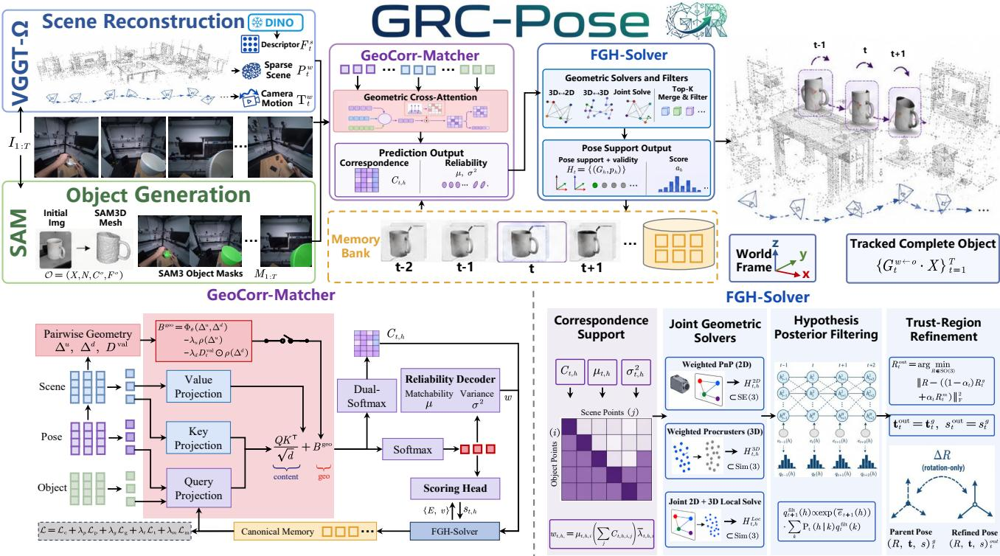  
Figure 2. Overview of GRC-Pose. The top panel maps input video $I _ { 1 : T }$ , SAM3D CAD geometry, and scene-level reconstructions to 6D object trajectories in the world frame. The bottom panel details pose-conditioned correspondences with match-level uncertainty, while FGH-Solver (right) resolves factorized pose candidates, performs temporal filtering with rotation refinement, and guides surface-memory updates.

For each candidate $\mathbf { G } _ { t } ^ { h }$ , a pose encoder $E _ { p }$ converts its normalized parameters $\boldsymbol { \chi } _ { t , h }$ consisting of 6D rotation, scalenormalized translation, and log-scale factors, together with rendered depth and visibility cues, into a candidate embedding $\mathbf { P } _ { t , h } \in \mathbb { R } ^ { N _ { o } \times d }$ . Dedicated feature encoders simultaneously project canonical object surface context and scene observations into feature representations $\mathbf { Z } ^ { o } \in \mathbb { R } ^ { N _ { o } \times d }$ and $\mathbf { Z } _ { t } ^ { s } \in \mathbb { R } ^ { N _ { s } \times d }$ . GeoCorr-Matcher incorporates $\mathbf { P } _ { t , h }$ to modulate cross-attention, allowing identical appearance features to infer pose-conditioned soft correspondences.

The matcher constructs a pose-conditioned object-scene affinity matrix. Object queries incorporate canonical surface features, projected pose embeddings, and historical surface memory, while scene tokens provide attention keys $\mathbf { A } _ { t } ^ { s } = \mathbf { W } _ { k } \mathbf { Z } _ { t } ^ { s }$ and values $\mathbf { V } _ { t } ^ { s } = \mathbf { W } _ { v } \mathbf { Z } _ { t } ^ { s }$ . The resulting attention logits and aggregated scene context are formulated as:

$$
\begin{array} { r l } & { \mathbf { Q } _ { t , h } = \mathbf { W } _ { q } \big ( \mathbf { Z } ^ { o } + \mathbf { P } _ { t , h } + \mathbf { W } _ { m } \mathbf { M } _ { t - 1 } ^ { o } \big ) , } \\ & { \mathbf { L } _ { t , h } = \frac { \mathbf { Q } _ { t , h } \left( \mathbf { A } _ { t } ^ { s } \right) ^ { \top } } { \sqrt { d } } + \mathbf { B } _ { t , h } ^ { \mathrm { g e o } } , } \\ & { \mathbf { O } _ { t , h } = \mathrm { s o f t m a x } _ { j } ( \mathbf { L } _ { t , h } ) \mathbf { V } _ { t } ^ { s } , } \end{array}\tag{2}
$$

The relative geometric bias $\mathbf { B } _ { t , h } ^ { \mathrm { g e o } }$ uses normalized 2D reprojection and 3D depth residuals: $[ \pmb { \Delta } _ { t , h } ^ { u } ] _ { i j } = \| \pi _ { t } ( \mathbf { G } _ { t } ^ { h } \cdot \mathbf { x } _ { i } ) - \mathbf { u } _ { t , j } \| / \kappa _ { u }$ and $[ \pmb { \Delta } _ { t , h } ^ { d } ] _ { i j } = | d _ { t , h , i } - d _ { t , j } | / \kappa _ { d }$ , where $\kappa _ { u }$ and $\kappa _ { d }$ are predefined normalization factors, and $\mathbf { D } _ { t } ^ { \mathrm { v a l } }$ is a binary mask indicating valid depth observations. We define the relative geometric bias $\mathbf { B } _ { t , h } ^ { \mathrm { g e o } } \in \mathbb { R } ^ { N _ { o } \times N _ { s } }$ as:

$$
\begin{array} { r } { \mathbf { B } _ { t , h } ^ { \mathrm { g e o } } = \Phi _ { \theta } ( \Delta _ { t , h } ^ { u } , \Delta _ { t , h } ^ { d } ) - \lambda _ { u } \rho ( \Delta _ { t , h } ^ { u } ) - \lambda _ { d } \mathbf { D } _ { t } ^ { \mathrm { v a l } } \odot \rho ( \Delta _ { t , h } ^ { d } ) , } \end{array}\tag{3}
$$

where $\Phi _ { \theta }$ projects relative spatial residual features into a scalar geometric compatibility score, $\rho$ denotes the Huber penalty function, and $\lambda _ { u } , \lambda _ { d }$ are predefined penalty weights. Invalid element pairs are masked out prior to attention normalization, whereas the absence of metric depth deactivates only the 3D penalty term. Consequently, identical appearance features yield distinct pose-dependent assignments across competing candidates. Row-wise softmax normalization of $\mathbf { L } _ { t , h }$ aggregates scene-level contextual features into $\mathbf { O } _ { t , h }$ , whereas dual-softmax normalization computes the mutual assignment matrix $\mathbf { C } _ { t , h } = \mathrm { s o f t m a x } _ { j } ( \mathbf { L } _ { t , h } )$ ⊙ s $\mathrm { f t m a x } _ { i } ( { \mathbf { L } _ { t , h } } )$ . Row-normalized $\mathbf { C } _ { t , h }$ produces soft expected coordinates $( \bar { \mathbf { u } } _ { t , h , i } , \bar { \mathbf { p } } _ { t , h , i } ^ { w } )$ for downstream geometric pose optimization.

Dual-softmax mutual matching alone does not guarantee that a canonical surface point is observable or geometrically reliable. A dedicated uncertainty decoder therefore predicts a point-wise matchability score $m _ { t , h , i } \in [ 0 , 1 ]$ alongside a 3D spatial variance vector $\sigma _ { t , h , i } ^ { 2 } \in \dot { \mathbb { R } } _ { + } ^ { 3 }$ , which together formulate the correspondence weighting factor for downstream geometric solving:

$$
{ \bar { \lambda } } _ { t , h , i } = \frac { 1 } { 3 } \sum _ { c = 1 } ^ { 3 } ( \sigma _ { t , h , i , c } ^ { 2 } + \epsilon ) ^ { - 1 } ,
$$

$$
w _ { t , h , i } = m _ { t , h , i } \left( \sum _ { j } [ \mathbf { C } _ { t , h } ] _ { i j } \right) \bar { \lambda } _ { t , h , i } .\tag{4}
$$

where ϵ denotes a small positive constant ensuring numerical stability. The composite weight $w _ { t , h , i }$ explicitly factorizes into point-wise matchability, mutual assignment confidence, and spatial precision. A candidate-level Transformer encoder subsequently contextualizes these correspondence-derived features across candidates before emission scoring.

To enforce strict pose conditioning, a counterfactual contrastive loss permutes the embeddings of pose candidates $\boldsymbol { \chi } _ { t , h }$ across mismatched candidates, penalizing correspondences that fail to discriminate the correct geometric pose conditioning vector.

Posterior-gated surface memory. To maintain long-term feature consistency across video sequences, the framework anchors temporal evidence directly to canonical surface coordinates rather than transient image planes. For each canonica surface point $^ { a , }$ frame-level Transformer tokens $\mathbf { r } _ { t , h , n }$ are aggregated using their correspondence weights $w _ { t , h , n } ,$ producing a surface-indexed observation $\widetilde { \mathbf { m } } _ { t , h , a } .$ . Historical surface memories from the previous timestep are first transported across pose candidates using filtering posteriors $q _ { t - 1 }$ , producing a pose-conditioned memory state $\mathbf { M } _ { t , h , a } ^ { - } .$ . The updated surface memory $\mathbf { M } _ { t , h , a } ^ { + }$ is then derived via a learned reliability gate $g _ { t , h } \in [ 0 , 1 ]$ :

$$
\mathbf { M } _ { t , h , a } ^ { + } = ( 1 - g _ { t , h } ) \mathbf { M } _ { t , h , a } ^ { - } + g _ { t , h } \widetilde { \mathbf { m } } _ { t , h , a } .\tag{5}
$$

where the gating factor $g _ { t , h }$ explicitly incorporates frame observability, tracking reset flags, and memory-evidence consistency.

## 3.3 Factorized Geometric Hybrid Solver

Taking the soft expected 2D projections $\bar { \mathbf { u } } _ { t , h , i }$ , 3D scene points $\bar { \mathbf p } _ { t , h , i } ^ { w } ,$ and correspondence weights $w _ { t , h , i }$ inferred by GeoCorr-Matcher, FGH-Solver derives factorized pose candidates via dual 2D–3D and 3D–3D geometric optimizations:

$$
\begin{array} { r l } & { \widehat { \mathbf { G } } _ { t , h } ^ { \mathrm { p r o j } } = \mathop { \arg \operatorname* { m i n } } _ { \mathbf { G } \in \mathrm { S i m } ( 3 ) } \sum _ { i } w _ { t , h , i } \rho \big ( \| \pi _ { t } ( \mathbf { G } \cdot \mathbf { x } _ { i } ) - \bar { \mathbf { u } } _ { t , h , i } \big \| _ { 2 } \big ) , } \\ & { \widehat { \mathbf { G } } _ { t , h } ^ { \mathrm { s i m } } = \mathop { \arg \operatorname* { m i n } } _ { \mathbf { G } \in \mathrm { S i m } ( 3 ) } \sum _ { i } w _ { t , h , i } \left\| \mathbf { G } \cdot \mathbf { x } _ { i } - \bar { \mathbf { p } } _ { t , h , i } ^ { w } \right\| _ { 2 } ^ { 2 } . } \end{array}\tag{6}
$$

The 2D projective branch minimizes Huber-penalized reprojection errors while constraining the scale factor $s ( \mathbf G ) = s _ { t } ^ { h }$ when 3D scene geometry is unreliable. Conversely, the 3D similarity branch performs weighted Procrustes alignment over $\mathrm { S i m ( 3 ) }$ when valid 3D scene point clouds are present. Rather than averaging pose estimates prior to scoring, the solver retains all candidates from both branches that pass geometric support validation with the propagated candidate.

Each retained pose candidate is subsequently evaluated using dense silhouette and RGB residuals. Following robust standardization across candidates, a weighted sum of these geometric residuals combined with a learned confidence score $\boldsymbol { a } _ { t , h }$ defines the frame-level emission score $e _ { t } ( h )$ . Its stop-gradient geometric counterpart supervises temporal posterior calibration. These per-frame pose candidates and calibrated emission scores constitute the input to sequence-level temporal filtering.

Temporal Bayesian filtering. To ensure sequence-level consistency, the system filters the complete discrete posterior distribution over pose candidates rather than relying on greedy single-frame selections. Inter-frame relative motion constraints $\widehat { \Delta \mathbf { G } } _ { i }$ derived from scene alignments govern transitions between consecutive candidates, evaluated via Mahalanobis distances in Sim(3). Given unary emissions $e _ { t } ( h )$ , frame observability $o _ { t }$ , and temperature scaling factor $\tau _ { t }$ , the Bayesian filtering recursion updates the temporal posterior $q _ { t }$ via:

$$
q _ { t + 1 } ( h ) \propto \exp \left( \frac { o _ { t + 1 } e _ { t + 1 } ( h ) } { \tau _ { t + 1 } } \right) \sum _ { k } \mathsf { P } _ { t } ( h \mid k ) q _ { t } ( k ) .\tag{7}
$$

Evaluated in log-space for numerical stability, this recursion supports Forward-Backward or Viterbi decoding.

Trust-region rotation refinement. The Maximum A Posteriori (MAP) estimate derived from the filtered posterior undergoes local rotation refinement. Keeping geometric translation and scale strictly preserved, a learning-based rotation head predicts $R _ { t } ^ { m }$ , which is blended with the geometric reference $R _ { t } ^ { g }$ through:

$$
\begin{array} { r l } & { R _ { t } ^ { \mathrm { o u t } } = \arg \underset { R \in \mathrm { S O } ( 3 ) } { \mathrm { m i n } } \left[ ( 1 - \omega _ { t } ) \| R - R _ { t } ^ { g } \| _ { F } ^ { 2 } \right. } \\ & { \quad \quad \quad \left. d _ { \mathrm { S O } ( 3 ) } ( R , R _ { t } ^ { g } ) \le \eta _ { t } \right. } \\ & { \quad \quad \quad \quad \left. + \omega _ { t } \| R - R _ { t } ^ { m } \| _ { F } ^ { 2 } \right] . } \end{array}\tag{8}
$$

where $\eta _ { t }$ defines the $\mathrm { S O ( 3 ) }$ trust-region radius and $\omega _ { t } \in [ 0 , 1 ]$ represents confidence. Solved via chordal interpolation projected onto $\mathrm { S O ( 3 ) }$ , this formulation prevents learning-based predictions from diverging outside the geometrically grounded rotation basin.

## 3.4 Sequence-Specific Self-Supervised Adaptation

To adapt tracker parameters online without ground-truth pose annotations, GRC-Pose performs test-time sequence-specific self-adaptation. Correspondence, geometric, and dense-measurement evidence is first materialized in a fixed recording-local candidate bank. A temperature-scaled target posterior $\pi _ { t } ^ { \star } ( h )$ is then formed from the distance between each retained candidate and the fixed structured geometric parent.

Only the recording-local posterior adapter is optimized via

$$
\begin{array} { r } { \mathcal { L } _ { \mathrm { s e q } } = \mathcal { L } _ { \mathrm { p o s t } } + \lambda _ { g } \mathcal { L } _ { \mathrm { g e o m } } + \lambda _ { H } \mathcal { H } ( q _ { t } ) + \lambda _ { \delta } \| \pmb { \delta } \| _ { 2 } ^ { 2 } . } \end{array}\tag{9}
$$

where $\mathcal { L } _ { \mathrm { p o s t } } = D _ { \mathrm { K L } } ( \pi _ { t } ^ { \star } \| q _ { t } )$ calibrates the posterior against the geometric target, $\mathcal { L } _ { \mathrm { g e o m } }$ keeps the bounded candidate update close to its parent, and $\mathcal { H } ( q _ { t } )$ is an entropy penalty. Correspondence and memory evidence remain fixed in the candidate bank, while observed motion enters the posterior transport. Full construction, loss terms, and adaptation protocols are detailed in the supplementary material.

## 4 Experiments

## 4.1 Experimental Setup

Datasets and protocols. We evaluate GRC-Pose on HOT3D [6] for egocentric hand-object interactions and on YCBInEOAT [49] and LINEMOD [50] for object-centric tracking. Within each protocol, methods use shared observation sequences, camera calibrations, SAM3 object masks, and the corresponding Metric CAD or SAM3D CAD condition; initializationdependent baselines receive a shared non-ground-truth first-frame pose seed.

FoundationPose  
RGBTrack  
FreePose  
GigaPose  
Dynhor  
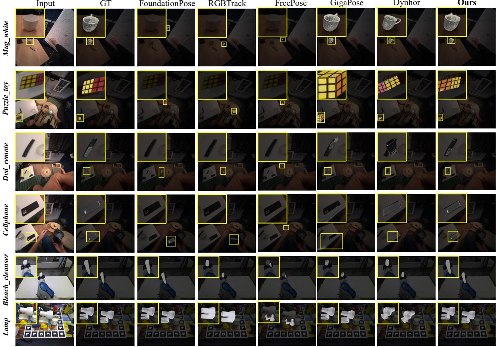  
Figure 3. Qualitative comparison across tracking benchmarks. Pose tracking results on HOT3D, YCBInEOAT and LINEMOD with SAM3D CAD.

Evaluation metrics. Following the standard BOP protocol [51], we report AR (MSPD, MSSD, and VSD) and ADD/ADD-S AUC on Metric CAD benchmarks. On HOT3D, Motion requires both adjacent endpoints to meet the 50-pixel MSPD and 0.5d MSSD thresholds, with camera-invariant relative pose-error drift below 30◦ and 0.5d, where d is the object diameter; complete formulations are in the supplementary material.

## 4.2 Evaluation on Dynamic Egocentric Benchmark

Tab. 1 evaluates 6D pose tracking with SAM3D CAD across the three benchmarks. GRC-Pose achieves the highest Avg. AR (34.0%), AR (79.0%), and Motion (26.9%), exceeding Dynhor and GigaPose by 9.9 and 15.0 Motion points. Fig. 4 shows the plate trajectory across viewpoint changes and partial hand occlusion, where GRC-Pose maintains a scene-consistent sequence of pose candidates across chronological frames. BIT reconstructs geometry from the initial observation; its 1.6% Avg. AR indicates that this reconstruction does not sustain registration through the long egocentric streams.

Per-asset evaluations on the nine assets with at least ten scored keys show GRC-Pose leading or tying the top baseline on seven of these nine, with the largest margins on keyboard (34.2% AR, +12.0% over GigaPose) and eraser (42.5% AR, +7.2% over Dynhor). Supplementary threshold sweeps show the Motion lead over Dynhor widening from 2.9 points at 30 pixels/0.3d to 9.9 points at 50 pixels/0.5d, consistent with the temporal alignment in Fig. 3.

Input  
GT  
GigaPose  
Ours  
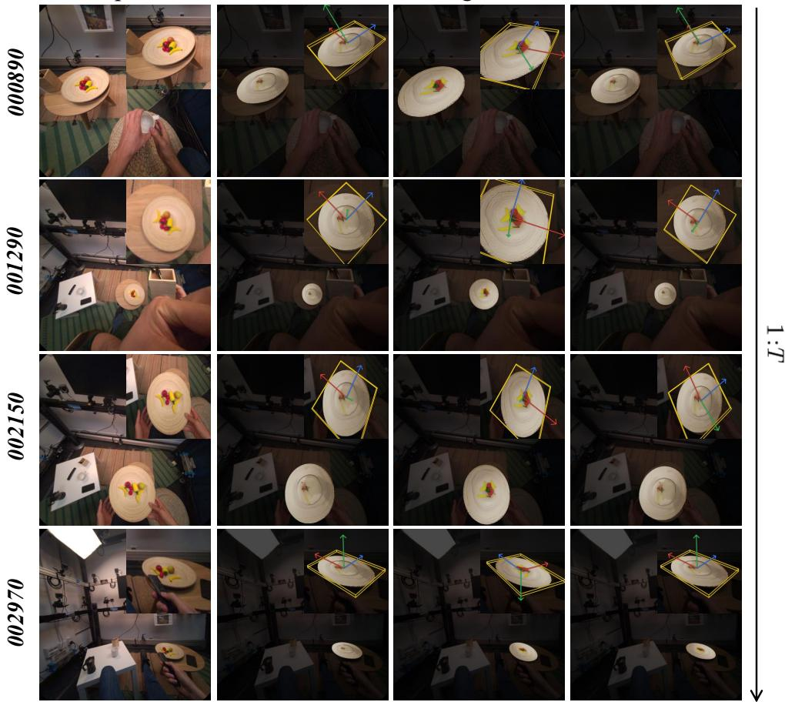  
Figure 4. Qualitative temporal tracking on HOT3D. Images are cropped around the target object with yellow 3D bounding boxes and RGB object-coordinate axes visualizing the recovered 6D pose. Columns follow chronological order.

## 4.3 Evaluation on Classical Object-centric Benchmarks

Tab. 1 reports the shared SAM3D CAD comparison on YCBInEOAT and LINEMOD. GRC-Pose achieves the highest macro ADD-S average (79.8%) across all 20 object identities and the leading LINEMOD ADD-S AUC (86.1%); it reaches 41.2% ADD AUC and 67.0% ADD-S AUC on YCBInEOAT. Across specific identities, GRC-Pose reaches 93.1% ADD-S AUC on sugar box and leads on ape, bowl, and camera; complete per-object rows are reported in the supplementary material.

## 4.4 Ablation Study

Tab. 2(a) isolates pose-conditioned correspondence on HOT3D with SAM3D CAD: all rows retain the same matcher, candidate hypotheses, image and geometric features, and geometric solver. We measure hard correspondences before solver selection and temporal filtering. Candidate-pose conditioning raises Inlier@0.1d from 13.94% to 19.35%, reduces the 3D residual from 58.42% to 54.78%, and lowers duplicate assignment from 37.04% to 34.32%; the contrastive loss further yields

Table 1. Main quantitative comparison with SAM3D CAD. PF denotes prior-free; all values are percentages, and best and second-best values are bold and underlined. HOT3D uses RGB-derived VGGT-Ω proxy depth where a method consumes scene geometry. Full BOP components, Metric CAD controls, and complete per-asset/per-object results are in the supplementary material. ‡ FoundationPose uses independent register on every fixed evaluation key.
<table><tr><td>Method</td><td>PF</td><td colspan="3">HOT3D</td><td colspan="2">YCBInEOAT</td><td colspan="2">LINEMOD</td></tr><tr><td></td><td></td><td>Avg. AR ↑</td><td>ARMSPD ↑</td><td>Motion ↑</td><td>ADD↑</td><td>ADD-S ↑</td><td>ADD↑</td><td>ADD-S ↑</td></tr><tr><td>FoundationPose‡</td><td>X</td><td>3.4</td><td>7.0</td><td>2.4</td><td>43.1</td><td>67.2</td><td>38.2</td><td>84.1</td></tr><tr><td>RGBTrack</td><td>X</td><td>3.4</td><td>9.2</td><td>1.3</td><td>5.6</td><td>21.5</td><td>0.4</td><td>2.1</td></tr><tr><td>GigaPose</td><td>X</td><td>31.4</td><td>69.2</td><td>11.9</td><td>16.1</td><td>31.3</td><td>10.4</td><td>37.5</td></tr><tr><td>FreePose</td><td>X</td><td>1.9</td><td>5.6</td><td>0.0</td><td>0.0</td><td>5.7</td><td>1.7</td><td>18.3</td></tr><tr><td>Dynhor</td><td>X</td><td>31.9</td><td>76.8</td><td>17.0</td><td>2.0</td><td>25.5</td><td>59.9</td><td>85.5</td></tr><tr><td>BIT</td><td>√</td><td>1.6</td><td>4.0</td><td>0.0</td><td>2.3</td><td>7.8</td><td>0.6</td><td>1.7</td></tr><tr><td>Ours</td><td>V</td><td>34.0</td><td>79.0</td><td>26.9</td><td>41.2</td><td>67.0</td><td>44.8</td><td>86.1</td></tr></table>

Table 2. Component ablations. Both panels share the same HOT3D recording–asset streams under SAM3D CAD, adaptation seeds, and model checkpoints. All entries except Supports/frame are percentages; residuals use the shared correspondence field before and after the shared posterior decoder.
<table><tr><td colspan="3">(a) Pose-conditioned correspondence</td></tr><tr><td>Inlier@</td><td>3D residual /d↓</td><td>Duplicate</td></tr><tr><td>Variant</td><td>0.1d ↑</td><td>assignment ↓</td></tr><tr><td>w/o pose cond.</td><td>13.94 58.42</td><td>37.04</td></tr><tr><td>+ pose cond. 19.35</td><td>54.78</td><td>34.32</td></tr><tr><td>+ contrastive 20.34</td><td>49.99</td><td>30.98</td></tr></table>

<table><tr><td colspan="3">(b) Solver support and selection</td><td rowspan="2">Supports / frame ↑</td></tr><tr><td>Variant</td><td>Best residual /d↓</td><td>Selected residual /d↓</td></tr><tr><td>2D-3D only</td><td>21.64</td><td>24.25</td><td>64.0</td></tr><tr><td>3D-3D only</td><td>19.75</td><td>22.52</td><td>64.0</td></tr><tr><td>Direct pose avg.</td><td>20.48</td><td>22.98</td><td>64.0</td></tr><tr><td>Delayed union</td><td>19.74</td><td>22.63</td><td>86.1</td></tr></table>

20.34%, 49.99%, and 30.98%. Bootstrap intervals over 23 recording-asset sequences exclude zero for the full-to-base changes (Supplementary). Fig. 5 shows the same concentration on bleach (3/32 to 22/32) and mug (9/32 to 28/32).

Panel (b) uses the same 23 HOT3D recording–asset streams under SAM3D CAD and three all-frame adaptation seeds. Independent 3D–3D alignment is available for 34.47% of parent hypotheses and differs from its paired 2D–3D parent by a median 25.75◦ and 2.47 cm. Delayed solver union retains 86.1 hypotheses per frame; posterior decoding selects 3D–3D support on 52.4% of frames and 2D–3D support on the other 47.6%. Direct averaging combines the 2D–3D and 3D–3D candidates before posterior selection, whereas delayed solver union retains both. Best residual is measured over retained candidates, whereas selected residual is measured after posterior decoding. Fig. 6 provides YCBInEOAT and HOT3D examples where retaining branch candidates until posterior selection avoids the intermediate pose produced by direct averaging.

Under causal online execution, unsupported updates fall back to their geometric parent candidate; full-video filtering is in the supplementary material. The 1.27M-parameter posterior runs at 1.202 ms per frame (831.9 FPS) on one A100 GPU; self-adaptation takes a median 27.23 seconds and reaches 95% of its final improvement within 10.37 seconds.

## 5 Conclusion

We introduce GRC-Pose, a prior-free framework for 6D tracking through generation-reconstruction correspondence. GeoCorr-Matcher builds object-scene support, FGH-Solver selects candidates, and posterior-gated memory retains reliable

GT

Input

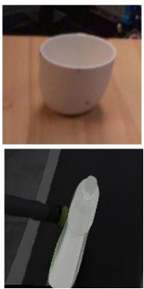

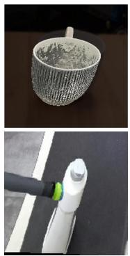  
w/o.  
Pose Conditioning

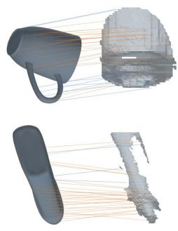  
Ours

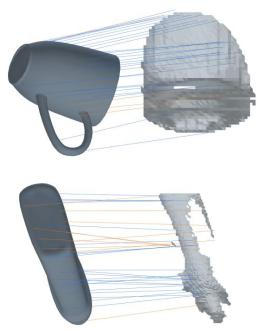

Figure 5. Qualitative visualization of pose-conditioned correspondences. Blue and orange links denote 0.1d inliers and outliers.  
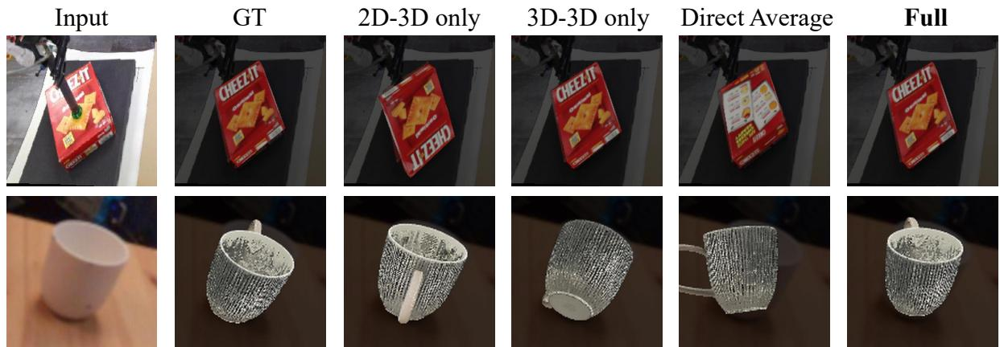  
Figure 6. Qualitative comparison of geometric solving strategies. Branch-specific supports retain distinct pose modes, whereas direct averaging produces an intermediate pose. This illustration accompanies the solver mechanism diagnostic in Tab. 2.

state. GRC-Pose leads HOT3D tracking with SAM3D CAD in Average Recall and Motion retention, with competitive object-centric results. It tracks a designated object throughout a video.

Use of Generative AI. Generative AI tools assisted code development and manuscript preparation. The authors independently verified all content and take full responsibility for this submission.

## References

[1] Xinke Deng, Arsalan Mousavian, Yu Xiang, Fei Xia, Timothy Bretl, and Dieter Fox. PoseRBPF: A rao-blackwellized particle filter fo 6d object pose tracking. In Robotics: Science and Systems, 2019.

[2] Bowen Wen, Jonathan Tremblay, Valts Blukis, Stephen Tyree, Thomas Muller, Alex Evans, Dieter Fox, Jan Kautz, and Stan Birchfield.¨

BundleSDF: Neural 6-DoF tracking and 3d reconstruction of unknown objects. In Proceedings of the IEEE/CVF Conference on Computer Vision and Pattern Recognition, pages 606–617, 2023.

[3] Bowen Wen, Wei Yang, Jan Kautz, and Stan Birchfield. Foundationpose: Unified 6d pose estimation and tracking of novel objects. In Proceedings ofthe IEEE/CVF Conference on Computer Vision and Pattern Recognition, pages 17868–17879, 2024.

[4] Teng Guo and Jingjin Yu. RGBTrack: Fast, robust depth-free 6d pose estimation and tracking. In 2025 IEEE/RSJ Internationa Conference on Intelligent Robots and Systems (IROS), pages 18872–18879, 2025. doi: 10.1109/IROS60139.2025.11247381.

[5] Georgy Ponimatkin, Martin Cifka, Tomas Soucek, Mederic Fourmy, Yann Labbe, Vladimir Petrik, and Josef Sivic. 6d object pose tracking in internet videos for robotic manipulation. In International Conference on Learning Representations, 2025.

[6] Prithviraj Banerjee, Sindi Shkodrani, Pierre Moulon, Shreyas Hampali, Fan Zhang, Jade Fountain, Edward Miller, Selen Basol, Richard Newcombe, Robert Wang, Jakob Julian Engel, and Tomas Hodan. Introducing HOT3D: An egocentric dataset for 3d hand and objec tracking, 2024.

[7] Zicong Fan, Takehiko Ohkawa, Linlin Yang, Nie Lin, Zhishan Zhou, et al. Benchmarks and challenges in pose estimation for egocentric hand interactions with objects. In European Conference on Computer Vision, pages 428–448, 2024.

[8] Caner Sahin, Guillermo Garcia-Hernando, Juil Sock, and Tae-Kyun Kim. A review on object pose recovery: From 3d bounding box detectors to full 6d pose estimators. Image and Vision Computing, 96:103898, 2020. doi: 10.1016/j.imavis.2020.103898.

[9] Yann Labbe, Lucas Manuelli, Arsalan Mousavian, Stephen Tyree, Stan Birchfield, Jonathan Tremblay, Justin Carpentier, Mathieu´ Aubry, Dieter Fox, and Josef Sivic. MegaPose: 6d pose estimation of novel objects via render & compare. In Conference on Robo Learning, 2022.

[10] Yuan Liu, Yilin Wen, Sida Peng, Cheng Lin, Xiaoxiao Long, Taku Komura, and Wenping Wang. Gen6D: Generalizable model-free 6-DoF object pose estimation from RGB images. In European Conference on Computer Vision, pages 20–37, 2022.

[11] Jiaming Sun, Zihao Wang, Siyu Zhang, Xingyi He, Hongcheng Zhao, Guofeng Zhang, and Xiaowei Zhou. OnePose: One-shot object pose estimation without CAD models. In Proceedings of the IEEE/CVF Conference on Computer Vision and Pattern Recognition, pages 6825–6834, 2022.

[12] Xingyi He, Jiaming Sun, Yuang Wang, Di Huang, Hujun Bao, and Xiaowei Zhou. OnePose++: Keypoint-free one-shot object pose estimation without CAD models. In Advances in Neural Information Processing Systems, volume 35, 2022.

[13] Taeyeop Lee, Bowen Wen, Minjun Kang, Gyuree Kang, In So Kweon, and Kuk-Jin Yoon. Any6D: Model-free 6d pose estimation o novel objects. In Proceedings ofthe IEEE/CVF Conference on Computer Vision and Pattern Recognition, pages 11633–11643, 2025.

[14] Tomas Hodan, Daniel Barath, and Jiri Matas. EPOS: Estimating 6d pose of objects with symmetries. In Proceedings of the IEEE/CVF Conference on Computer Vision and Pattern Recognition, pages 11703–11712, 2020.

[15] Rasmus Laurvig Haugaard and Anders Glent Buch. SurfEmb: Dense and continuous correspondence distributions for object pose estimation with learnt surface embeddings. In Proceedings ofthe IEEE/CVF Conference on Computer Vision and Pattern Recognition, pages 6749–6758, 2022.

[16] Bowen Wen and Kostas Bekris. BundleTrack: 6d pose tracking for novel objects without instance or category-level 3d models. In IEEE/RSJ International Conference on Intelligent Robots and Systems, pages 8067–8074, 2021. doi: 10.1109/IROS51168.2021. 9635991.

[17] Xiuqiang Song, Li Jin, Zhengxian Zhang, Jiachen Li, Fan Zhong, Guofeng Zhang, and Xueying Qin. Prior-free 3d object tracking. In Proceedings ofthe IEEE/CVF Conference on Computer Vision and Pattern Recognition, pages 1200–1209, 2025.

[18] Jianyuan Wang, Minghao Chen, Nikita Karaev, Andrea Vedaldi, Christian Rupprecht, and David Novotny. VGGT: Visual geometry grounded transformer. In Proceedings of the IEEE/CVF Conference on Computer Vision and Pattern Recognition, pages 5294–5306, 2025.

[19] Jianyuan Wang, Minghao Chen, Shangzhan Zhang, Nikita Karaev, Johannes Schonberger, Patrick Labatut, Piotr Bojanowski, David¨ Novotny, Andrea Vedaldi, and Christian Rupprecht. VGGT-ω. In Proceedings ofthe IEEE/CVF Conference on Computer Vision and Pattern Recognition (CVPR), 2026.

[20] Xingyu Chen, Fu-Jen Chu, Pierre Gleize, Kevin J. Liang, et al. SAM 3D: 3dfy anything in images. In Proceedings ofthe IEEE/CVF Conference on Computer Vision and Pattern Recognition, pages 7220–7232, 2026.

[21] Jianfeng Xiang, Zelong Lv, Sicheng Xu, Yu Deng, Ruicheng Wang, Bowen Zhang, Dong Chen, Xin Tong, and Jiaolong Yang. Structured 3d latents for scalable and versatile 3d generation. In Proceedings ofthe IEEE/CVF Conference on Computer Vision and Pattern Recognition, pages 21469–21480, 2025.

[22] Van Nguyen Nguyen, Thibault Groueix, Mathieu Salzmann, and Vincent Lepetit. Gigapose: Fast and robust novel object pose estimation via one correspondence. In Proceedings of the IEEE/CVF Conference on Computer Vision and Pattern Recognition, pages 9903–9913, 2024.

[23] Van Nguyen Nguyen, Christian Forster, Sindi Shkodrani, Vincent Lepetit, Bugra Tekin, Cem Keskin, and Tomas Hodan. GoTrack: Generic 6dof object pose refinement and tracking, 2025.

[24] Jiehong Lin, Lihua Liu, Dekun Lu, and Kui Jia. SAM-6D: Segment anything model meets zero-shot 6d object pose estimation. In Proceedings ofthe IEEE/CVF Conference on Computer Vision and Pattern Recognition, pages 27906–27916, 2024.

[25] Evin Pınar Ornek, Yann Labb¨ e, Bugra Tekin, Lingni Ma, Cem Keskin, Christian Forster, and Tomas Hodan. FoundPose: Unseen´ object pose estimation with foundation features. In European Conference on Computer Vision, 2024.

[26] Andrea Caraffa, Davide Boscaini, Amir Hamza, and Fabio Poiesi. FreeZe: Training-free zero-shot 6d pose estimation with geometric and vision foundation models. In European Conference on Computer Vision, 2024.

[27] Andrea Caraffa, Davide Boscaini, and Fabio Poiesi. Accurate and efficient zero-shot 6d pose estimation with frozen foundation models, 2025.

[28] Junwen Huang, Hao Yu, Kuan-Ting Yu, Nassir Navab, Slobodan Ilic, and Benjamin Busam. MatchU: Matching unseen objects for 6d pose estimation from RGB-D images. In Proceedings of the IEEE/CVF Conference on Computer Vision and Pattern Recognition (CVPR), pages 10095–10105, June 2024.

[29] Jian Liu, Wei Sun, Kai Zeng, Jin Zheng, Hui Yang, Hossein Rahmani, Ajmal Mian, and Lin Wang. Scalable unseen objects 6-dof absolute pose estimation with robotic integration. IEEE Transactions on Robotics, 2026.

[30] Francesco Milano, Jen Jen Chung, Hermann Blum, Roland Siegwart, and Lionel Ott. NeuSurfEmb: A complete pipeline for dense correspondence-based 6d object pose estimation without CAD models. In 2024 IEEE/RSJ International Conference on Intelligent Robots and Systems (IROS), pages 8882–8889, 2024. doi: 10.1109/IROS58592.2024.10801399.

[31] Andrea Caraffa, Davide Boscaini, Amir Hamza, and Fabio Poiesi. Object 6d pose estimation meets zero-shot learning, 2023.

[32] Hansheng Chen, Wei Tian, Pichao Wang, Fan Wang, Lu Xiong, and Hao Li. EPro-PnP: Generalized end-to-end probabilistic perspective-n-points for monocular object pose estimation. IEEE Transactions on Pattern Analysis and Machine Intelligence, 2024. doi: 10.1109/TPAMI.2024.3354997.

[33] Zicong Fan, Maria Parelli, Maria Eleni Kadoglou, Xu Chen, Muhammed Kocabas, Michael J. Black, and Otmar Hilliges. HOLD: Category-agnostic 3d reconstruction of interacting hands and objects from video. In Proceedings ofthe IEEE/CVF Conference on Computer Vision and Pattern Recognition, pages 494–504, 2024.

[34] Shijian Jiang, Qi Ye, Rengan Xie, Yuchi Huo, and Jiming Chen. Hand-held object reconstruction from rgb video with dynamic interaction. In Proceedings ofthe IEEE/CVF Conference on Computer Vision and Pattern Recognition, pages 12220–12230, 2025.

[35] Ming-Feng Li, Xin Yang, Fu-En Wang, Hritam Basak, Yuyin Sun, Shreekant Gayaka, Min Sun, and Cheng-Hao Kuo. UA-Pose: Uncertainty-aware 6d object pose estimation and online object completion with partial references. In Proceedings of the IEEE/CVF Conference on Computer Vision and Pattern Recognition, pages 1180–1189, 2025.

[36] Yufeng Jin, Vignesh Prasad, Snehal Jauhri, Mathias Franzius, and Georgia Chalvatzaki. 6DOPE-GS: Online 6d object pose estimation using gaussian splatting. In Proceedings of the IEEE/CVF International Conference on Computer Vision, 2025.

[37] Zhiyuan Chen, Fan Lu, Guo Yu, Bin Li, Sanqing Qu, Yuan Huang, Changhong Fu, and Guang Chen. GSGTrack: Gaussian splatting-guided object pose tracking from RGB videos, 2024.

[38] Marwan Taher, Ignacio Alzugaray, Kirill Mazur, Xin Kong, and Andrew J. Davison. KV-Tracker: Real-time pose tracking with transformers, 2025.

[39] Luqing Luo, Shichu Sun, Jiangang Yang, Linfang Zheng, Jinwei Du, and Jian Liu. Object gaussian for monocular 6d pose estimation from sparse views, 2024.

[40] Shuzhe Wang, Vincent Leroy, Yohann Cabon, Boris Chidlovskii, and Jer´ ome Revaud. DUSt3R: Geometric 3d vision made easy. Inˆ Proceedings ofthe IEEE/CVF Conference on Computer Vision and Pattern Recognition, 2024.

[41] Vincent Leroy, Yohann Cabon, and Jer´ ome Revaud. Grounding image matching in 3d with MASt3R. Inˆ European Conference on Computer Vision, 2024.

[42] Paul-Edouard Sarlin, Daniel DeTone, Tomasz Malisiewicz, and Andrew Rabinovich. SuperGlue: Learning feature matching with graph neural networks. In Proceedings ofthe IEEE/CVF Conference on Computer Vision and Pattern Recognition, pages 4938–4947, 2020.

[43] Jiaming Sun, Zehong Shen, Yuang Wang, Hujun Bao, and Xiaowei Zhou. LoFTR: Detector-free local feature matching with transformers. In Proceedings ofthe IEEE/CVF Conference on Computer Vision and Pattern Recognition, pages 8922–8931, 2021.

[44] Zheng Qin, Hao Yu, Changjian Wang, Yulan Guo, Yuxing Peng, and Kai Xu. Geometric transformer for fast and robust point cloud registration. In Proceedings ofthe IEEE/CVF Conference on Computer Vision and Pattern Recognition, pages 11143–11152, 2022.

[45] Zi Jian Yew and Gim Hee Lee. REGTR: End-to-end point cloud correspondences with transformers. In Proceedings ofthe IEEE/CVF Conference on Computer Vision and Pattern Recognition, pages 6677–6686, 2022.

[46] Oriane Simeoni, Huy V. Vo, Maximilian Seitzer, et al. DINOv3, 2025.´

[47] Vincent Lepetit, Francesc Moreno-Noguer, and Pascal Fua. EPnP: An accurate O(n) solution to the PnP problem. International Journal ofComputer Vision, 81(2):155–166, 2009.

[48] Shinji Umeyama. Least-squares estimation of transformation parameters between two point patterns. IEEE Transactions on Pattern Analysis and Machine Intelligence, 13(4):376–380, 1991.

[49] Bowen Wen and Kostas Bekris. se(3)-TrackNet: Data-driven 6d pose tracking by calibrating image residuals in synthetic domains. In IEEE/RSJ International Conference on Intelligent Robots and Systems, 2020.

[50] Stefan Hinterstoisser, Vincent Lepetit, Slobodan Ilic, Stefan Holzer, Gary Bradski, Kurt Konolige, and Nassir Navab. Model based training, detection and pose estimation of texture-less 3D objects in heavily cluttered scenes. In Asian Conference on Computer Vision, pages 548–562, 2012.

[51] Tomas Hodan, Martin Sundermeyer, Bertram Drost, Yann Labbe, Eric Brachmann, Frank Michel, Carsten Rother, and Jiri Matas. BOP challenge 2020 on 6d object localization. In Computer Vision – ECCV 2020 Workshops, pages 577–594, 2020. doi: 10.1007/ 978-3-030-66096-3 39.

## A Method Details and Implementation

This document reports locked implementation settings and the protocol, breakdown, control, and qualitative results omitted from the main paper.

## A.1 Executable Implementation

This section records the tensor interfaces, numerical settings, and optimization boundaries used by the released implementation.

Stored inputs and coordinate chart. For a SAM3D CAD surface point $\widetilde { \mathbf { x } } _ { i }$ , onboarding writes the object point used by all later stages as

$$
\begin{array} { r l } & { \quad \mathbf { x } _ { i } \gets s _ { \mathrm { o n } } R _ { \mathrm { o n } } \widetilde { \mathbf { x } } _ { i } + \mathbf { t } _ { \mathrm { o n } } , } \\ & { \quad \mathcal { X } _ { t , h } = \left[ \mathrm { v e c } _ { 6 } ( R _ { t , h } ) , \displaystyle \frac { \mathbf { t } _ { t , h } } { d _ { o } } , \log s _ { t , h } \right] \in \mathbb { R } ^ { 1 0 } . } \end{array}\tag{A1}
$$

The implementation removes non-finite vertices and invalid faces before this step, retains the SAM3D CAD triangle topology when available, and otherwise builds a convex-hull surface. Metric CAD controls read the dataset object chart directly and set $s _ { t , h } = 1$ . DINOv3 ViT-B/16 descriptors, camera calibration, scene points, and all candidate rows are materialized before the recording-local adapter is initialized.

Frozen support and stored candidate evidence. We use DINOv3 ViT-B/16 descriptors: four intermediate feature maps are ℓ2-normalized and concatenated from 512 × 512 mask-centered crops with 1.35× enlargement. These descriptors and the calibrated object surface receive no adapter gradient. We retain 240 global proposals per frame before local matching and NMS, then keep K = 64 rows for HOT3D and LINEMOD with SAM3D CAD and $K = 1 2 8$ for the remaining controls. RGB-D controls require at least 8 matches and 6 inliers. RANSAC-PnP uses a 5-pixel threshold, 512 iterations, SQPnP, and 30 LM refinement steps; weighted Kabsch uses 192 iterations and a 2 cm inlier threshold (1.5 cm in the Kabsch-only control) HOT3D uses RGB-derived proxy geometry rather than measured depth; its matched 2D–3D and 3D–3D support controls are specified in Table A7.

Candidate construction writes $\mathbf { A } \in \mathbb { R } ^ { T \times K \times 1 7 } , \mathbf { G } \in \mathbb { R } ^ { T \times K \times 4 \times 4 }$ , and $\mathbf { V } \in \{ 0 , 1 \} ^ { T \times K }$ for the score/geometry summary, pose matrix, and validity mask. For every frame, rows are first grouped by their stored rank. If a rank contains both a structured parent and a validated solver descendant, the latter is retained; otherwise the row with the larger stored score is retained. The resulting top-K rows form the immutable support used by adaptation. Its 17-dimensional evidence vector is

$$
\begin{array} { r l } & { \mathbf { a } _ { t , h } = \left[ s _ { \mathrm { f u s e d } } , s _ { \mathrm { c a n } } , s _ { \mathrm { n a t i v e } } , s _ { \mathrm { p r o p } } , \right. } \\ & { \qquad \left. \rho _ { \mathrm { i n l } } , \bar { c } _ { \mathrm { D I N O } } , F _ { 1 } ^ { \mathrm { m a s k } } , \epsilon _ { \mathrm { d e p t h } } , \right. } \\ & { \qquad \left. \Delta _ { \mathrm { b o x } } , \rho _ { \mathrm { L o F T R } } , \epsilon _ { \mathrm { L o F T R } } , E _ { \mathrm { s o l v e } } , \right. } \\ & { \qquad \left. m _ { \mathrm { m a t c h } } , H _ { \mathrm { m a t c h } } , o _ { \mathrm { s o l v e } } , \Delta _ { \mathrm { h e l d o u t } } , r \right] _ { t , h } \in \mathbb { R } ^ { 1 7 } . } \end{array}\tag{A2}
$$

where the entries respectively record the fused, canonical-prior, native, and proposal scores; RANSAC inlier ratio; mean DINO similarity; mask F1; normalized depth residual; image-center displacement; LoFTR inlier ratio and residual; and the solver-coupled energy, match mass, match entropy, observability, held-out improvement, and rank. Rank is divided by K, image-center distance by 1000 px, and LoFTR residual by 0.03; non-finite entries are zeroed. Thus correspondence, appearance, and dense-measurement evidence are fixed in the candidate rows before adaptation; the v2.4 adapter optimizes the recording-local posterior over this fixed bank while retaining the upstream matcher, geometric solvers, and canonical memory. GeoCorr-Matcher controls use 64 canonical surface slots with aggregation momentum 0.95.

Posterior adapter. The candidate input $[ \mathbf { A } , \pmb { \chi } ] \in \mathbb { R } ^ { T \times K \times 2 7 }$ is mapped by $\mathrm { L N } \ \to \ \mathrm { L i n e a r } ( 2 7 , 1 2 8 ) \ \to \ \mathrm { G E L U } \ \to$ Linear(128, 128). Three pre-norm Transformer encoder blocks operate on $[ T , K , 1 2 8 ]$ with four attention heads, hidden width 128, feed-forward width 512, and dropout 0.05. Softmax frame pooling produces [T, 128] tokens. The temporal input is $[ \tau , \sin ( 2 ^ { b } \pi \tau ) , \cos ( 2 ^ { b } \pi \tau ) ] _ { b = 0 } ^ { 3 } \in \mathbb { R } ^ { 9 }$ , projected to 128 dimensions and processed by three blocks with the same settings.

Frame-pooling and emission heads are $\mathrm { L N } ( 1 2 8 ) \to 1 2 8 \to \mathrm { G E L U } \to 1$ . The pose-update head outputs six Lie coordinates, while the reliability head is $\mathrm { L N } ( 1 2 8 ) \to 1 2 8 \to \mathrm { G E L U } \to 6 4 \to \mathrm { G E L U } \to 3$ for observability, temperature, and rotation noise. The final emission and pose-update layers are zero initialized. Relative motion $\widehat { R } \in \bar { \mathbb { R } } ^ { ( T - 1 ) \times 3 \times 3 } , \widehat { \mathbf { t } } \in \mathbb { R } ^ { ( T - 1 ) \times 3 }$ and an edge-validity mask feed the log-domain recursion; a missing edge is stored as $( I _ { 3 } , \mathbf { 0 } , 0 )$ and closes the transport gate. The recursion uses rotation cost plus 0.02 times normalized translation cost, transport gain 1.0, temperature floor 0.05, and rotation-noise floor 0.03; the Lie update is clipped to $8 ^ { \circ }$ and 1.5 cm.

## A.2 Sequence-Specific Self-Supervised Adaptation

Recording-local inputs and geometric target. A new adapter parameter set Θ is initialized for each recording–asset. The runner loads candidate rows from the stored solver-coupled candidate bank, the parent $\bar { \mathbf { G } } _ { t }$ from the preceding structured geometric stage, and the observed relative-motion cache from the scene-alignment stage. These three inputs are fixed throughout the 600 adaptation steps. In particular, $\bar { \mathbf { G } } _ { t }$ is a preceding geometric output rather than an annotated pose. For a retained candidate $\mathbf { G } _ { t , h }$ , the geometric E-step target is

$$
\begin{array} { r } { D _ { t , h } = d _ { \mathrm { S O ( 3 ) } } ( R _ { t , h } , \bar { R } _ { t } ) + \frac { \Vert \mathbf { t } _ { t , h } - \bar { \mathbf { t } } _ { t } \Vert _ { 2 } } { d _ { o } } , } \\ { \pi _ { t } ^ { \star } ( h ) = \mathrm { s t o p g r a d } [ \mathrm { s o f t m a x } _ { h } ( - D _ { t , h } / 0 . 0 1 ) ] . } \end{array}\tag{A3}
$$

The rotation distance removes the $\mathrm { S i m } ( 3 )$ scale of each $3 \times 3$ block before computing the $\mathrm { S O ( 3 ) }$ geodesic. Consequently, $\pi _ { t } ^ { \star }$ expresses which stored candidates agree with the fixed geometric parent; it is not rebuilt from annotations or from a second correspondence pass during adaptation.

Adapted posterior and motion transport. The candidate input is the concatenation of the frozen evidence and its pose chart, $[ { \bf a } _ { t , h } , \boldsymbol { \chi } _ { t , h } ] \in \mathbb { R } ^ { 2 7 }$ . The architecture is specified above; here we expand the filtering notation in Eq. 7. Let $\ell _ { t , h } = s _ { t , h } ^ { \mathrm { f u s e d } } + E _ { \Theta } ( \mathbf { z } _ { t , h } )$ be the frozen fused score plus the learned emission. With candidate-pair transition cost

$$
\begin{array} { r l } & { \Delta R _ { t } ( i , h ) = R _ { t , h } R _ { t - 1 , i } ^ { \top } , } \\ & { \Delta \mathbf { t } _ { t } ( i , h ) = \mathbf { t } _ { t , h } - \Delta R _ { t } ( i , h ) \mathbf { t } _ { t - 1 , i } , } \\ & { \begin{array} { r l } { C _ { t } ( i , h ) = d _ { \mathrm { S O } ( 3 ) } \Big ( \Delta R _ { t } ( i , h ) , \widehat { R } _ { t - 1 - t } \Big ) ^ { 2 } } & \\ { + 0 . 0 2 \operatorname* { m i n } \Bigg \{ \frac { \left\| \Delta \mathbf { t } _ { t } ( i , h ) - \widehat { \mathbf { t } } _ { t - 1 - t } \right\| _ { 2 } ^ { 2 } } { d _ { \sigma } ^ { 2 } } , \mathfrak { g } \Bigg \} , } & \\ { \mathsf { P } _ { t - 1 } ( h \mid i ) = \operatorname { s o f t m a x } _ { h } \big [ - C _ { t } ( i , h ) / \sigma _ { R , t } ^ { 2 } \big ] , } & \\ { r _ { t } ( h ) = \operatorname { l o g s u n e r b } \cdot [ \mathrm { l o g } q _ { t - 1 } ( i ) + \log P _ { t - 1 } ( h \mid i ) ] , } & \\ { \log q _ { t } ( h ) = \log \mathrm { s o f t m a x } _ { h } \big [ \mathrm { l o g } q _ { t , h } / \tau _ { t } + v _ { t } r _ { t } ( h ) \big ] . } \end{array} } \end{array}\tag{A4}
$$

where $o _ { t } , \tau _ { t } .$ , and $^ { \dag } R , t$ are the learned observability, temperature, and rotation-noise outputs, respectively. A motion edge is valid only at cached quality at least 0.1; otherwise it is represented by $( I _ { 3 } , \mathbf { 0 } )$ with $v _ { t } = 0$ , which closes the transport term. The implementation uses transport gain $1 . 0 , \tau _ { t } \geq 0 . 0 5$ , and $\sigma _ { R , t } \geq 0 . 0 3$ . The first frame uses only its emission.

Objective and optimization boundary. The fixed target and learned posterior define

$$
\begin{array} { l } { { \displaystyle \mathcal { L } _ { \mathrm { s e q } } = D _ { \mathrm { K L } } ( \pi _ { t } ^ { \star } \| q _ { t } ) + 2 0 \mathcal { L } _ { \mathrm { g e o m } } } } \\ { ~ + 0 . 0 0 2 \mathcal { H } ( q _ { t } ) + 0 . 0 0 1 \| \delta \| _ { 2 } ^ { 2 } , }  \\ { { \displaystyle \mathcal { L } _ { \mathrm { g e o m } } = \frac { 1 } { T } \sum _ { t } \sum _ { h } \pi _ { t } ^ { \star } ( h ) \frac { \| \mathbf { G } _ { t , h } ^ { \mathrm { u p d } } - \bar { \mathbf { G } } _ { t } \| _ { 1 } } { 1 6 } } , } \\ { { \displaystyle \mathcal { H } ( q _ { t } ) = ~ - \frac { 1 } { T } \sum _ { t } \sum _ { h } q _ { t } ( h ) \log q _ { t } ( h ) } . } \end{array}\tag{A5}
$$

where $\mathcal { L } _ { \mathrm { g e o m } }$ is the $\pi _ { t } ^ { \star }$ -weighted elementwise $\ell _ { 1 }$ distance from the bounded Lie-updated candidate to its geometric parent. The positive entropy coefficient is an entropy penalty, and the last term constrains the six-dimensional Lie update. AdamW updates only Θ for 600 complete-sequence steps with learning rate $2 \times 1 0 ^ { - 4 }$ , weight decay $1 0 ^ { - 4 }$ , gradient clipping 1.0, and seed 41; decoding uses the lowest-total-loss checkpoint. These settings describe the full-video adaptation control. The all-frame protocol uses the full recording, whereas the causal and cross-fit controls mask or withhold the scored temporal chunk during adaptation. The online control uses prefix-causal adaptation; its scored frames and initialization are specified in Table A13. Candidate rows, the parent, DINO descriptors, object surface, observed motion, and canonical memory remain frozen.

Bounded output fusion. For $h _ { t } ^ { * } = \arg \operatorname* { m a x } _ { h } q _ { t } ( h )$ , the raw adapter output applies a Lie residual bounded to $8 ^ { \circ }$ and 1.5 cm to $\mathbf { G } _ { t , h _ { t } ^ { * } }$ . The released output retains the parent translation and scale and fuses only rotation:

$$
\begin{array} { c } { \iota _ { t } = \sqrt { o _ { t } \left( 1 - \widetilde { \mathcal { H } } ( q _ { t } ) \right) } , } \\ { \eta _ { t } = \sqrt { \displaystyle \sum _ { h } \pi _ { t } ^ { * } ( h ) } d _ { \mathrm { S O } ( 3 ) } ( R _ { t , h } , \bar { R } _ { t } ) ^ { 2 } , } \\ { \omega _ { t } = \iota _ { t } \operatorname* { m i n } \Biggl \{ 1 , \frac { \eta _ { t } } { d _ { \mathrm { S O } ( 3 ) } ( R _ { t } ^ { \mathrm { u p d } } , \bar { R } _ { t } ) } \Biggr \} , } \\ { R _ { t } ^ { \mathrm { m i x } } = ( 1 - \omega _ { t } ) \bar { R } _ { t } + \omega _ { t } R _ { t } ^ { \mathrm { u p d } } , } \\ { R _ { t } ^ { \mathrm { o u t } } = \mathrm { P r o j } _ { \mathrm { S O } ( 3 ) } ( R _ { t } ^ { \mathrm { m i x } } ) , } \\ { ( \mathbf { t } _ { t } ^ { \mathrm { o u t } } , s _ { t } ^ { \mathrm { o u t } } ) = ( \bar { \mathbf { t } } _ { t } , \bar { \mathbf { z } } _ { t } ) . } \end{array}\tag{A6}
$$

where $\widetilde { \mathcal { H } }$ is entropy normalized by log K. The fusion weight is zero when the support radius is below the lane-specific minimum or when the parent lies outside the retained support. Thus the adapted branch can change rotation only inside the candidate-supported neighborhood; the geometric parent is returned when that condition is not met.

Dense measurement and bounded refinement. For the selected pose, the GPU rasterizer minimizes

$$
\begin{array} { r l } & { \ell _ { \mathrm { m e a s } } = 0 . 0 5 \ell _ { \mathrm { s i l } } + 3 \ell _ { \mathrm { d e p t h } } + 3 \ell _ { \mathrm { p 2 p l } } + 0 . 1 5 \ell _ { \mathrm { r g b } } , } \\ & { \mathcal { L } _ { \mathrm { r e f i n e } } = \ell _ { \mathrm { m e a s } } + 0 . 1 \ell _ { \Delta } + 0 . 0 5 \ell _ { \mathrm { t e m p } } . } \end{array}\tag{A7}
$$

Depth and point-to-plane residuals use Huber thresholds of 10 and 5 mm, respectively; chromaticity uses a Huber threshold of 0.10. The RGB term is zero when the input mesh has no valid texture. Without measured depth, the depth, point-to-plane, and depth-derived occlusion terms are disabled.

Table A1. Algorithmic procedure of GRC-Pose. Candidate support is fixed before adaptation; only Θ and bounded local pose variables are optimized. Causal and cross-fit controls restrict the frames used in lines 12–14.

Algorithm 1: Recording-local 6D pose tracking   
1 Input: $\mathcal { O } , \{ I _ { t } , M _ { t } , \mathbf { K } _ { t } , \mathbf { p } _ { t , j } ^ { w } , \mathbf { u } _ { t , j } , d _ { t , j } , v _ { t , j } , \mathbf { f } _ { t , j } ^ { s } \} _ { t = 1 } ^ { T } , \{ \widetilde { \mathbf { x } } _ { i } , \mathbf { f } _ { i } ^ { o } \} _ { i = 1 } ^ { N _ { o } } .$   
2 $\mathbf { x } _ { i } \gets s _ { \mathrm { o n } } R _ { \mathrm { o n } } \widetilde { \mathbf { x } } _ { i } + \mathbf { t } _ { \mathrm { o n } } .$   
3 for $t = 1 , \dots , T$ do   
4 $\mathcal { H } _ { t } ^ { \mathrm { r e t r } }  \mathrm { T o p } _ { 2 4 0 } \big ( \mathrm { D I N O } ( I _ { t } , \{ \mathbf { f } _ { i } ^ { o } \} ) \big )$   
5 $\mathbf { L } _ { t , h }  \mathbf { Q } _ { t , h } ( \mathbf { A } _ { t } ^ { s } ) ^ { \top } / \sqrt { d } + \mathbf { B } _ { t , h } ^ { \mathrm { g e o } } ; \quad \mathbf { C } _ { t , h }  \mathrm { s o f t m a x } _ { j } ( \mathbf { L } _ { t , h } ) \odot \mathrm { s o f t m a x } _ { i } ( \mathbf { L } _ { t , h } ) .$   
6 $( \bar { \mathbf { u } } _ { t , h , i } , \bar { \mathbf { p } } _ { t , h , i } ^ { w } , w _ { t , h , i } ) \gets \mathrm { G e o C o r r } ( \mathbf { C } _ { t , h } , \mathbf { L } _ { t , h } ) ; \quad \mathbf { \mathcal { H } } _ { t } ^ { \mathrm { 2 D - 3 D } } \gets \mathrm { R A N S A C - P n P } ( \mathbf { x } , \bar { \mathbf { u } } , w ) .$   
7 $v _ { t }  \mathbf { 1 } [ \exists j : v _ { t , j } = 1 ] ; \quad \mathbf { i f } v _ { t } = 1 { \mathrm { ~ t h e n ~ } } \ \mathcal { H } _ { t } ^ { \mathrm { 3 D - 3 D } }  \mathrm { K a b s c h } ( \mathbf { x } , { \bar { \mathbf { p } } } ^ { w } , w )$   
8 else $\mathcal { H } _ { t } ^ { \mathrm { 3 D - 3 D } }  \emptyset$ end if   
9 i $\mathbf f t > 1$ then Hprop ← Propagate $( \mathcal { H } _ { t - 1 } , \widehat { \Delta \mathbf { G } } _ { t - 1  t } )$ else $\mathcal { H } _ { t } ^ { \mathrm { p r o p } }  \mathcal { O }$ end if   
10 $\mathcal { H } _ { t } \gets \mathrm { T o p K } \big ( \mathrm { N M S } ( \mathcal { H } _ { t } ^ { \mathrm { r e t r } } \cup \mathcal { H } _ { t } ^ { \mathrm { 2 D - 3 D } } \cup \mathcal { H } _ { t } ^ { \mathrm { 3 D - 3 D } } \cup \mathcal { H } _ { t } ^ { \mathrm { p r o p } } ) \big ) ; \quad \{ \mathbf { a } _ { t , h } , \chi _ { t , h } \} _ { h \in \mathcal { H } _ { t } } \gets \mathrm { S t o r e } ( \cdot ) $   
11 end for   
12 Θ ← Initrecording-asset $( ) ;$ for $n = 1 , \ldots , 6 0 0$ do   
13 $\begin{array} { r } { \mathbf { z } _ { t , h } \gets \mathrm { T r } _ { \mathrm { h y p } } \big ( \mathrm { M L P } \left( \mathrm { L N } [ \mathbf { a } _ { t , h } , \boldsymbol { \chi } _ { t , h } ] \right) \big ) ; \quad ( e _ { t } , o _ { t } , \tau _ { t } , \sigma _ { t } ^ { R } , \delta _ { t } ) \gets \mathrm { T r } _ { \mathrm { t e m p } } ( \{ \mathbf { z } _ { t , h } \} _ { t , h } , \gamma _ { 4 } ( t / T ) ) } \end{array}$   
14 log $\begin{array} { r l } & { q _ { t } ( h ) \gets \log \operatorname { s o f t m a x } _ { h } \big ( o _ { t } e _ { t } ( h ) / \tau _ { t } + v _ { t } r _ { t } ( h ) \big ) ; \quad \Theta \gets \mathrm { A d a m W } \left( \Theta , \nabla _ { \Theta } \mathcal { L } _ { \mathrm { s e q } } \right) } \end{array}$   
15 end for   
16 for $\begin{array} { r } { t = 1 , \ldots , T \_ { \mathbf { d o } } \quad h _ { t } ^ { * }  \arg \operatorname* { m a x } _ { h } q _ { t } ( h ) ; \quad \mathbf { G } _ { t } ^ { \mathrm { p a r } }  \mathbf { G } _ { t , h _ { t } ^ { * } } ; \quad \mathbf { G } _ { t } ^ { \mathrm { u p d } }  \mathrm { A d a m } _ { 1 0 0 } ( \mathcal { L } _ { \mathrm { r e f i n e } } ; \mathbf { G } _ { t } ^ { \mathrm { p a r } } ) } \end{array}$   
17 $\mathbf { i f } \ \ell _ { \mathrm { m e a s } } ( \mathbf { G } _ { t } ^ { \mathrm { u p d } } ) \leq \ell _ { \mathrm { m e a s } } ( \mathbf { G } _ { t } ^ { \mathrm { p a r } } )$ then $\mathbf { G } _ { t } ^ { \mathrm { o u t } }  \mathrm { O u t l e t } ( \mathbf { G } _ { t } ^ { \mathrm { p a r } } , \mathbf { G } _ { t } ^ { \mathrm { u p d } } , I _ { t } , \eta _ { t } , b _ { t } )$   
18 else $\mathbf { G } _ { t } ^ { \mathrm { o u t } } \gets \mathbf { G } _ { t } ^ { \mathrm { p a r } }$ end if   
19 end for; output $\{ \mathbf { G } _ { t } ^ { \mathrm { o u t } } \} _ { t = 1 } ^ { T } .$

## B Additional Experimental Results

## B.1 Protocol Details and Temporal Metric

Within each dataset/CAD panel, all methods share the chronological source stream, calibration, corresponding Metric CAD or SAM3D CAD, and scored keys; SAM3D CAD alignment is fixed per benchmark before temporal inference, while Metric CAD rows use the prescribed dataset chart. Measured RGB-D is used on YCBInEOAT and LINEMOD for 3D–3D support and depth/point-to-plane measurement, whereas HOT3D uses RGB-derived VGGT-Ω scene evidence. The matched solver controls in Table $_ { \textrm { A 7 } }$ compare 2D–3D and 3D–3D support using this evidence; proxy geometry is not treated as measured depth in the dense depth and point-to-plane measurement terms.

For adjacent scored keys $( t - 1 , t ) \in \mathcal { E } ,$ let $E _ { t } = ( T _ { t } ^ { \mathrm { g t } } ) ^ { - 1 } \hat { T } _ { t }$ be the relative error between estimated and ground-truth objectto-camera transforms in the camera frame, $\Delta E _ { t } = E _ { t - 1 } ^ { - 1 } E _ { t } , \mathbf { t ( \cdot ) }$ extract translation, and $c _ { t } ^ { p , q } = \mathbf { 1 } [ \mathrm { M S P D } _ { t } < p , \mathrm { M S S D } _ { t } < q d ]$ The HOT3D Motion diagnostic counts a pair only when both endpoint poses satisfy the BOP correctness gate and their relative error is stable:

$$
\begin{array} { r l } & { \mathrm { M o t i o n } _ { p , q } = \displaystyle \frac { 1 } { | \mathcal { E } | } \sum _ { ( t - 1 , t ) \in \mathcal { E } } c _ { t - 1 } ^ { p , q } c _ { t } ^ { p , q } } \\ & { \quad \quad \cdot \mathbf { 1 } [ \theta ( \Delta E _ { t } ) < 3 0 ^ { \circ } , \| \mathbf { t } ( \Delta E _ { t } ) \| _ { 2 } < q d ] . } \end{array}
$$

Here d is the object diameter. We use recording–asset cluster bootstrap intervals for HOT3D and scene bootstrap intervals fo YCBInEOAT; all reported intervals are two-sided 95% percentile intervals.

## B.2 Complete Fine-Grained Results

The printed tables retain aggregate results and controls that answer distinct protocol questions. The complete frozen per-asset and per-object evaluator rows, including every method and both CAD lanes, are supplied in the accompanying structured record.

The aggregate comparison is frame weighted within each dataset and CAD lane; rows are never averaged across datasets or object charts. BOP AR summarizes MSPD, MSSD, and VSD recall, while ADD AUC, ADD-S AUC, and ADD-0.1d use the same fixed object chart and scored keys as the corresponding AR row. The fine-grained tables then expose the recording–asset or object identities behind each aggregate, and the HOT3D threshold sweep evaluates the same chronological trajectories at progressively broader correctness gates.

## Aggregate results.

Table A2. Complete aggregate results across all three benchmarks and both CAD conditions. All values except rotation and translation are percentages; translation is reported in centimeters; best values are bold.  
HOT3D
<table><tr><td colspan="2">Object CAD Method</td><td colspan="2"></td><td colspan="2">AR↑ ARMSPD ↑ ARMSSD ↑ ARvSD ↑ Motion↑</td><td colspan="2"></td></tr><tr><td rowspan="7"></td><td>FoundationPose</td><td>3.4</td><td>7.0</td><td>3.0</td><td>0.0</td><td>2.4</td></tr><tr><td>RGBTrack</td><td>3.4</td><td>9.2</td><td>0.9</td><td>0.1</td><td>1.3</td></tr><tr><td>GigaPose</td><td>31.4</td><td>69.2</td><td>22.6</td><td>2.4</td><td>11.9</td></tr><tr><td>SAM3D CAD FreePose</td><td>1.9</td><td>5.6</td><td>0.0</td><td>0.0</td><td>0.0</td></tr><tr><td>Dynhor</td><td>31.9</td><td>76.8</td><td>17.9</td><td>1.0</td><td>17.0</td></tr><tr><td>BIT</td><td>1.6</td><td>4.0</td><td>0.7</td><td>0.1</td><td>0.0</td></tr><tr><td>Ours</td><td>34.0</td><td>79.0</td><td>20.9</td><td>2.1</td><td>26.9</td></tr><tr><td rowspan="8">Metric CAD</td><td>FoundationPose</td><td>2.5</td><td>5.7</td><td>1.7</td><td>0.0</td><td>0.4</td></tr><tr><td>RGBTrack</td><td>4.3</td><td>9.1</td><td>2.4</td><td>1.4</td><td>1.5</td></tr><tr><td>GigaPose</td><td>48.5</td><td>74.6</td><td>44.2</td><td>26.7</td><td>22.1</td></tr><tr><td>FreePose</td><td>1.6</td><td>4.9</td><td>0.0</td><td>0.0</td><td>0.0</td></tr><tr><td>Dynhor</td><td>38.8</td><td>80.2</td><td>31.8</td><td>4.3</td><td>27.8</td></tr><tr><td>BIT</td><td>2.4</td><td>6.7</td><td>0.5</td><td>0.0</td><td>0.0</td></tr><tr><td>Ours</td><td>43.1</td><td>81.1</td><td>34.6</td><td>13.5</td><td>36.9</td></tr><tr><td></td><td></td><td></td><td></td><td></td><td></td></tr></table>

<table><tr><td colspan="10">YCBInEOAT</td></tr><tr><td rowspan="2">Object CAD</td><td>Method</td><td></td><td></td><td></td><td>AR↑ ARMSPD ↑ ARMSSD ↑ ARVSD ↑ AUC↑</td><td>ADD</td><td>ADD-S AUC↑</td><td>ADD-0.1d ↑ (deg.)↓ (cm)↓</td><td>Rot.</td><td>Trans.</td></tr><tr><td>FoundationPose 46.3</td><td></td><td>61.4</td><td>53.3</td><td>24.1</td><td>43.1</td><td>67.2</td><td>41.0</td><td>60.9</td><td>7.5</td></tr><tr><td rowspan="6"></td><td>RGBTrack</td><td>17.2</td><td>42.6</td><td>8.7</td><td>0.2</td><td>5.6</td><td>21.5</td><td>0.3</td><td>109.9</td><td>42.4</td></tr><tr><td>GigaPose</td><td>20.7</td><td>39.8</td><td>19.7</td><td>2.6</td><td>16.1</td><td>31.3</td><td>6.3</td><td>53.1</td><td>49.1</td></tr><tr><td>SAM3D CAD FreePose</td><td>13.1</td><td>37.7</td><td>1.5</td><td>0.0</td><td>0.0</td><td>5.7</td><td>0.0</td><td>111.6</td><td>67.0</td></tr><tr><td>Dynhor</td><td>15.3</td><td>33.6</td><td>11.2</td><td>1.0</td><td>2.0</td><td>25.5</td><td>0.0</td><td>153.0</td><td>18.5</td></tr><tr><td>BIT</td><td>7.2</td><td>18.3</td><td>3.0</td><td>0.3</td><td>2.3</td><td>7.8</td><td>0.3</td><td>98.8</td><td>36.5</td></tr><tr><td>Ours</td><td>45.4</td><td>56.5</td><td>53.1</td><td>26.6</td><td>41.2</td><td>67.0</td><td>40.7</td><td>71.8</td><td>6.7</td></tr><tr><td rowspan="6">Metric CAD</td><td>FoundationPose 88.7</td><td></td><td>98.5</td><td>96.8</td><td>70.9</td><td>84.5</td><td>95.9</td><td>85.2</td><td>27.9</td><td>0.7</td></tr><tr><td>RGBTrack</td><td>55.1</td><td>91.1</td><td>50.1</td><td>24.2</td><td>46.4</td><td>56.2</td><td>35.7</td><td>40.0</td><td>49.4</td></tr><tr><td>GigaPose</td><td>27.2</td><td>51.7</td><td>22.9</td><td>7.2</td><td>9.1</td><td>33.3</td><td>1.9</td><td>118.8</td><td>75.9</td></tr><tr><td>FreePose</td><td>14.8</td><td>44.5</td><td>0.0</td><td>0.0</td><td>0.0</td><td>0.0</td><td>0.0</td><td>144.3</td><td>106.0</td></tr><tr><td>Dynhor</td><td>38.1</td><td>82.0</td><td>30.2</td><td>2.2</td><td>20.4</td><td>57.5</td><td>4.8</td><td>88.2</td><td>9.4</td></tr><tr><td>BIT</td><td>27.9</td><td>48.8</td><td>29.3</td><td>5.5</td><td>26.9</td><td>42.0</td><td>7.7</td><td>54.9</td><td>23.3</td></tr><tr><td>Ours</td><td></td><td>87.4</td><td>98.0</td><td>96.4</td><td>67.9</td><td>92.5</td><td>96.2</td><td>95.8</td><td>6.4</td><td>0.5</td></tr><tr><td colspan="9">LINEMOD</td><td></td><td></td></tr><tr><td>Object CAD</td><td>Method</td><td></td><td></td><td>AR↑ ARMSPD ↑ ARMSSD ↑ ARVSD ↑ AUC↑</td><td></td><td>ADD</td><td>ADD-S AUC↑</td><td>ADD-0.1d ↑ (deg.)↓</td><td>Rot.</td><td>Trans. (cm)↓</td></tr><tr><td rowspan="7"></td><td>FoundationPose 43.1</td><td></td><td>64.0</td><td>61.7</td><td>3.6</td><td>38.2</td><td>84.1</td><td>5.6</td><td>94.1</td><td>3.3</td></tr><tr><td>RGBTrack</td><td>2.3</td><td>6.1</td><td>0.8</td><td>0.1</td><td>0.4</td><td>2.1</td><td>0.1</td><td>115.4</td><td>63.6</td></tr><tr><td>GigaPose</td><td>24.0</td><td>53.0</td><td>18.8</td><td>0.1</td><td>10.4</td><td>37.5</td><td>1.0</td><td>90.1</td><td>17.1</td></tr><tr><td>SAM3D CAD FreePose</td><td>14.4</td><td>36.1</td><td>7.0</td><td>0.0</td><td>1.7</td><td>18.3</td><td>0.0</td><td>125.9</td><td>26.4</td></tr><tr><td>Dynhor</td><td>66.5</td><td>94.5</td><td>73.6</td><td>31.5</td><td>59.9</td><td>85.5</td><td>47.2</td><td>47.1</td><td>3.0</td></tr><tr><td>BIT</td><td>5.3</td><td>14.7</td><td>1.1</td><td>0.1</td><td>0.6</td><td>1.7</td><td>0.1</td><td></td><td>120.4 2345.3</td></tr><tr><td>Ours</td><td>42.8</td><td>62.1</td><td>63.6</td><td>2.7</td><td>44.8</td><td>86.1</td><td>6.2</td><td>83.8</td><td>2.6</td></tr><tr><td rowspan="8">Metric CAD</td><td>FoundationPose</td><td>2.4</td><td>3.6</td><td>2.2</td><td>1.4</td><td>1.8</td><td>3.4</td><td>1.7</td><td>111.2</td><td>83.7</td></tr><tr><td>RGBTrack</td><td>3.8</td><td>9.4</td><td>1.5</td><td>0.4</td><td>1.0</td><td>3.3</td><td>0.6</td><td>106.6</td><td>82.9</td></tr><tr><td>GigaPose</td><td>76.0</td><td>95.8</td><td>86.0</td><td>46.3</td><td>75.1</td><td>89.6</td><td>70.6</td><td>18.5</td><td>3.0</td></tr><tr><td>FreePose</td><td>15.0</td><td>44.0</td><td>0.9</td><td>0.0</td><td>0.2</td><td>4.0</td><td>0.0</td><td>125.2</td><td>33.7</td></tr><tr><td>Dynhor</td><td>66.5</td><td>94.5</td><td>73.6</td><td>31.5</td><td>59.9</td><td>85.5</td><td>47.2</td><td>47.1</td><td>3.0</td></tr><tr><td>BIT</td><td>8.1</td><td>21.5</td><td>1.7</td><td>1.2</td><td>1.6</td><td>1.9</td><td>1.6</td><td></td><td>111.2 1240.1</td></tr><tr><td>Ours</td><td>85.6</td><td>96.1</td><td>96.4</td><td>64.2</td><td>86.7</td><td>96.4</td><td>88.0</td><td>14.7</td><td>0.6</td></tr><tr><td></td><td></td><td></td><td></td><td></td><td></td><td></td><td></td><td></td><td></td></tr></table>

HOT3D. The complete records cover all twelve assets and both CAD lanes. The aggregate rows use all 476 chronological keys and retain the common frame-weighted evaluation protocol. The threshold sweep separates high-precision endpoint registration from retention across broader accepted pose neighborhoods. GRC-Pose leads at both the intermediate and reported gates in the two CAD conditions. At the reported gate, its margin over Dynhor is .099 and .091, respectively. This consistent response across both CAD conditions supports the temporal posterior interpretation of the main HOT3D gain.

The full threshold response makes this behavior explicit. With SAM3D CAD, GRC-Pose increases from .022 at M@20/.2d to .086 at M@30/.3d and .269 at M@50/.5d; with Metric CAD, the corresponding values are .119, .245, and .369. The gain therefore persists across object charts and becomes strongest when the metric admits the viewpoint, scale, and partial-occlusion variation encountered along the chronological stream. Figure A1 shows the same setting on Aria, plate, keyboard, mouse, and cellphone targets, with every method evaluated on the shared RGB observation and SAM3D CAD.

Table A4 prints the complete per-asset breakdown for the primary SAM3D CAD setting. The corresponding Metric CAD rows remain in the frozen structured record together with the complete object-level rows for the other benchmarks. The main-text seven-of-nine summary uses the nine assets with at least ten scored keys; the table retains all twelve assets.

Table A3. HOT3D temporal-threshold sensitivity. $\mathrm { M @ } p / q d$ denotes correctness-gated consecutive-pair retention at MSPD threshold p pixels and MSSD threshold qd.
<table><tr><td>Object CAD</td><td>Method</td><td>Macro AR↑</td><td>Frame AR↑</td><td>M@20/.2d ↑</td><td>M@30/.3d ↑</td><td>M@50/.5d ↑</td></tr><tr><td rowspan="7">SAM3D CAD</td><td>FoundationPose</td><td>.033</td><td>.034</td><td>.000</td><td>.009</td><td>.024</td></tr><tr><td>RGBTrack</td><td>.043</td><td>.034</td><td>.000</td><td>.000</td><td>.013</td></tr><tr><td>GigaPose</td><td>.251</td><td>.314</td><td>.031</td><td>.060</td><td>.119</td></tr><tr><td>FreePose</td><td>.010</td><td>.019</td><td>.000</td><td>.000</td><td>.000</td></tr><tr><td>Dynhor</td><td>.296</td><td>.319</td><td>.009</td><td>.057</td><td>.170</td></tr><tr><td>BIT</td><td>.048</td><td>.016</td><td>.000</td><td>.000</td><td>.000</td></tr><tr><td>Ours</td><td>.293</td><td>.340</td><td>.022</td><td>.086</td><td>.269</td></tr><tr><td rowspan="7">Metric CAD</td><td>FoundationPose</td><td>.031</td><td>.025</td><td>.000</td><td>.000</td><td>.004</td></tr><tr><td>RGBTrack</td><td>.051</td><td>.043</td><td>.011</td><td>.011</td><td>.015</td></tr><tr><td>GigaPose</td><td>.363</td><td>.485</td><td>.170</td><td>.201</td><td>.221</td></tr><tr><td>FreePose</td><td>.009</td><td>.016</td><td>.000</td><td>.000</td><td>.000</td></tr><tr><td>Dynhor</td><td>.365</td><td>.388</td><td>.051</td><td>.135</td><td>.278</td></tr><tr><td>BIT</td><td>.027</td><td>.024</td><td>.000</td><td>.000</td><td>.000</td></tr><tr><td>Ours</td><td>.373</td><td>.431</td><td>.119</td><td>.245</td><td>.369</td></tr></table>

The per-asset rows localize the aggregate result. Among the nine assets with at least ten scored keys, GRC-Pose leads or ties AR on seven. Its strongest joint spatial–temporal responses occur on keyboard (34.2 AR and 55.9 Motion), cellphone (34.9 and 31.3), mug (43.1 and 40.0), and eraser (42.5 and 39.1). Coffee pot additionally reaches the best MSPD recall and Motion despite a near-tie in AR, while plate reaches the best Motion score. These rows connect the aggregate temporal gain to targets that undergo hand occlusion, changing viewpoint, and substantial image-scale variation.

The result is also supported by the longest object streams rather than the three assets with the fewest scored keys. Among cellphone (N = 86), coffee pot (N = 86), mug (N = 89), and puzzle (N = 61), GRC-Pose leads AR on cellphone, mug, and puzzle, remains within .4 points of the best coffee-pot AR, and gives the highest Motion score on cellphone, coffee pot, and mug. These rows account for most of the frame-weighted evaluation and show that the aggregate gain is retained over extended chronological trajectories.

The macro and frame-weighted views emphasize different parts of the same record. With SAM3D CAD, GRC-Pose remains within .003 macro AR of Dynhor and leads frame AR by .021. With Metric CAD, it gives the highest macro AR and reported Motion, while GigaPose gives the highest frame AR. Reading these columns together separates framewise registration from correctness retained between adjacent scored keys: the principal GRC-Pose advantage is preserved at the reported tempora gate in both CAD conditions.

Input

GT  
FoundationPose  
RGBTrack  
FreePose  
GigaPose  
Dynhor  
Ours  
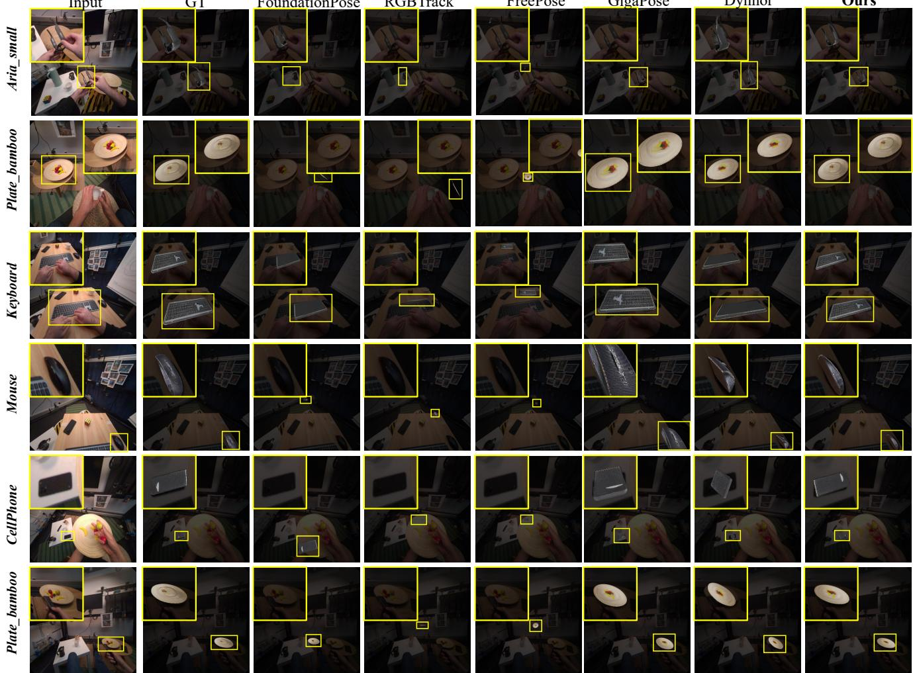  
Figure A1. Qualitative comparison on HOT3D with SAM3D CAD. Each row compares the shared RGB observation, ground truth, GRC-Pose, and the external methods for one target object. Yellow boxes identify target regions; rendered SAM3D CAD overlays visualize the recovered 6D poses.

The qualitative rows expose the same behavior at image level. Keyboard and cellphone combine close hand interaction with large changes in visible object support, while the two plate views cover distinct viewpoint and image-scale conditions. Mouse and Aria retain much smaller target regions. Across these cases, the shared target boxes and SAM3D CAD overlays make both object extent and recovered orientation directly visible, complementing the per-asset AR and Motion scores below.

The keyboard rows show the recovered long-axis orientation under two hand configurations, consistent with the 34.2 AR and 55.9 Motion reported in Table A4. On cellphone, the overlay remains inside the shared target region as the visible face and image scale change; this sequence reaches 34.9 AR and 31.3 Motion. The two plate rows provide the same comparison across near and distant views, where GRC-Pose reaches the best Motion score. Finally, the Aria and mouse rows test substantially smaller image support. Together, these examples connect the recovered 6D pose shown by the overlays to the spatial and temporal measures in the per-asset table.

Table A4. Complete HOT3D per-asset results with SAM3D CAD. The two panels jointly report all twelve assets and all seven methods. All values except the frame count N are percentages; Motion is correctness-gated consecutive-pair retention at the reported 50-pixel/0.5d gate. Best per-asset values are bold.
<table><tr><td>Asset Method</td><td></td><td>N</td><td>AR↑</td><td>ARMSPD ↑</td><td>ARMSSD ↑</td><td>ARVSD ↑</td><td>Motion↑</td></tr><tr><td></td><td></td><td></td><td></td><td>Assets 1–6</td><td></td><td></td><td></td></tr><tr><td></td><td>FoundationPose</td><td>4</td><td>4.2</td><td>12.5</td><td>0.0</td><td>0.0</td><td>0.0</td></tr><tr><td>aria</td><td>RGBTrack</td><td></td><td>0.0</td><td>0.0</td><td>0.0</td><td>0.0</td><td>0.0</td></tr><tr><td></td><td>GigaPose</td><td></td><td>4.2</td><td>12.5</td><td>0.0</td><td>0.0</td><td>0.0</td></tr><tr><td></td><td>FreePose</td><td></td><td>0.0</td><td>0.0</td><td>0.0</td><td>0.0</td><td>0.0</td></tr><tr><td></td><td>Dynhor</td><td></td><td>14.2</td><td>22.5</td><td>20.0</td><td>0.0</td><td>0.0</td></tr><tr><td></td><td>BIT</td><td></td><td>4.2</td><td>12.5</td><td>0.0</td><td>0.0</td><td>0.0</td></tr><tr><td></td><td>Ours</td><td></td><td>4.2</td><td>12.5</td><td>0.0</td><td>0.0</td><td>0.0</td></tr><tr><td>cellphone</td><td>FoundationPose</td><td>86</td><td>2.8</td><td>8.3</td><td>0.0</td><td>0.0</td><td>0.0</td></tr><tr><td></td><td>RGBTrack</td><td></td><td>4.1</td><td>12.0</td><td>0.2</td><td>0.0</td><td>0.0</td></tr><tr><td></td><td>GigaPose</td><td></td><td>32.6</td><td>76.7</td><td>18.7</td><td>2.2</td><td>2.4</td></tr><tr><td></td><td>FreePose</td><td></td><td>4.0</td><td>12.1</td><td>0.0</td><td>0.0</td><td>0.0</td></tr><tr><td></td><td>Dynhor</td><td></td><td>33.7</td><td>88.4</td><td>12.4</td><td>0.3</td><td>16.9</td></tr><tr><td></td><td>BIT</td><td></td><td>2.6</td><td>7.4</td><td>0.2</td><td>0.0</td><td>0.0</td></tr><tr><td></td><td>Ours</td><td></td><td>34.9</td><td>90.9</td><td>13.4</td><td>0.3</td><td>31.3</td></tr><tr><td>coffee pot</td><td>FoundationPose</td><td>86</td><td>1.0</td><td>2.7</td><td>0.5</td><td>0.0</td><td>0.0</td></tr><tr><td></td><td>RGBTrack</td><td></td><td>1.7</td><td>4.8</td><td>0.2</td><td>0.0</td><td>0.0</td></tr><tr><td></td><td>GigaPose</td><td></td><td>23.9</td><td>57.4</td><td>14.1</td><td>0.2</td><td>15.9</td></tr><tr><td></td><td>FreePose</td><td></td><td>2.4</td><td>7.1</td><td>0.0</td><td>0.0</td><td>0.0</td></tr><tr><td></td><td>Dynhor</td><td></td><td>27.8</td><td>67.1</td><td>15.7</td><td>0.6</td><td>13.4</td></tr><tr><td></td><td>BIT</td><td></td><td>1.4</td><td>2.3</td><td>1.9</td><td>0.0</td><td>0.0</td></tr><tr><td></td><td>Ours</td><td></td><td>27.4</td><td>67.3</td><td>14.7</td><td>0.3</td><td>23.2</td></tr><tr><td>remote</td><td>FoundationPose</td><td>6</td><td>0.0</td><td>0.0</td><td>0.0</td><td>0.0</td><td>0.0</td></tr><tr><td></td><td>RGBTrack</td><td></td><td>0.0</td><td>0.0</td><td>0.0</td><td>0.0</td><td>0.0</td></tr><tr><td></td><td>GigaPose</td><td></td><td>37.8</td><td>60.0</td><td>28.3</td><td>25.0</td><td>20.0</td></tr><tr><td></td><td>FreePose</td><td></td><td>0.0</td><td>0.0</td><td>0.0</td><td>0.0</td><td>0.0</td></tr><tr><td></td><td>Dynhor</td><td></td><td>27.2</td><td>81.7</td><td>0.0</td><td>0.0</td><td>0.0</td></tr><tr><td></td><td>BIT</td><td></td><td>0.0</td><td>0.0</td><td>0.0</td><td>0.0</td><td>0.0</td></tr><tr><td></td><td>Ours</td><td></td><td>40.0</td><td>91.7</td><td>25.0</td><td>3.3</td><td>0.0</td></tr><tr><td>flask</td><td>FoundationPose</td><td>1</td><td>0.0</td><td>0.0</td><td>0.0</td><td>0.0</td><td>0.0</td></tr><tr><td></td><td>RGBTrack</td><td></td><td>23.3</td><td>70.0</td><td>0.0</td><td>0.0</td><td>0.0</td></tr><tr><td></td><td>GigaPose</td><td></td><td>0.0</td><td>0.0</td><td>0.0</td><td>0.0</td><td>0.0</td></tr><tr><td></td><td>FreePose</td><td></td><td>0.0</td><td>0.0</td><td>0.0</td><td>0.0</td><td>0.0</td></tr><tr><td></td><td>Dynhor</td><td></td><td>50.0</td><td>80.0</td><td>70.0</td><td>0.0</td><td>0.0</td></tr><tr><td></td><td>BIT</td><td></td><td>43.3</td><td>70.0</td><td>60.0</td><td>0.0</td><td>0.0</td></tr><tr><td></td><td>Ours</td><td></td><td>16.7</td><td>50.0</td><td>0.0</td><td>0.0</td><td>0.0</td></tr></table>

GRC-Pose: Generation-Reconstruction Correspondence for Prior-Free 6D Object Pose Tracking
<table><tr><td></td><td></td><td></td><td colspan="2">ARMSPD</td><td>ARMSSD</td><td>ARVSD</td><td></td></tr><tr><td>Asset</td><td>Method</td><td>N</td><td>AR↑</td><td>↑</td><td>↑</td><td>↑</td><td>Motion↑</td></tr><tr><td>keyboard</td><td>FoundationPose</td><td>35</td><td>19.1</td><td>18.0</td><td>39.1</td><td>0.3</td><td>32.4</td></tr><tr><td></td><td>RGBTrack</td><td></td><td>0.0</td><td>0.0</td><td>0.0</td><td>0.0</td><td>0.0</td></tr><tr><td></td><td>GigaPose</td><td></td><td>22.2</td><td>20.3</td><td>46.3</td><td>0.0</td><td>14.7</td></tr><tr><td></td><td>FreePose</td><td></td><td>0.0</td><td>0.0</td><td>0.0</td><td>0.0</td><td>0.0</td></tr><tr><td></td><td>Dynhor</td><td></td><td>18.2</td><td>29.4</td><td>25.1</td><td>0.0</td><td>41.2</td></tr><tr><td></td><td>BIT</td><td></td><td>0.0</td><td>0.0</td><td>0.0</td><td>0.0</td><td>0.0</td></tr><tr><td></td><td>Ours</td><td></td><td>34.2</td><td>42.9</td><td>59.7</td><td>0.0</td><td>55.9</td></tr><tr><td></td><td></td><td></td><td>Assets 7–12</td><td></td><td></td><td></td><td></td></tr><tr><td>mouse</td><td>FoundationPose</td><td>40</td><td>3.8</td><td>11.2</td><td>0.2</td><td>0.0</td><td>0.0</td></tr><tr><td></td><td>RGBTrack</td><td></td><td>7.3</td><td>16.8</td><td>5.0</td><td>0.0</td><td>10.3</td></tr><tr><td></td><td>GigaPose</td><td></td><td>25.1</td><td>75.0</td><td>0.2</td><td>0.0</td><td>0.0</td></tr><tr><td></td><td>FreePose</td><td></td><td>0.0</td><td>0.0</td><td>0.0</td><td>0.0</td><td>0.0</td></tr><tr><td></td><td>Dynhor</td><td></td><td>30.6</td><td>86.5</td><td>5.2</td><td>0.0</td><td>2.6</td></tr><tr><td></td><td>BIT</td><td></td><td>2.7</td><td>8.2</td><td>0.0</td><td>0.0</td><td>0.0</td></tr><tr><td></td><td>Ours</td><td></td><td>31.0</td><td>88.8</td><td>3.2</td><td>1.0</td><td>0.0</td></tr><tr><td>mug</td><td>FoundationPose</td><td>89</td><td>1.3</td><td>3.7</td><td>0.2</td><td>0.0</td><td>0.0</td></tr><tr><td></td><td>RGBTrack</td><td></td><td>4.5</td><td>12.0</td><td>1.1</td><td>0.3</td><td>1.2</td></tr><tr><td></td><td>GigaPose</td><td></td><td>43.0</td><td>84.8</td><td>37.9</td><td>6.3</td><td>23.5</td></tr><tr><td></td><td>FreePose</td><td></td><td>1.2</td><td>3.6</td><td>0.0</td><td>0.0</td><td>0.0</td></tr><tr><td></td><td>Dynhor</td><td></td><td>41.8</td><td>88.0</td><td>33.8</td><td>3.5</td><td>29.4</td></tr><tr><td></td><td>BIT</td><td></td><td>1.3</td><td>2.6</td><td>0.9</td><td>0.4</td><td>0.0</td></tr><tr><td></td><td>Ours</td><td></td><td>43.1</td><td>89.9</td><td>32.6</td><td>6.9</td><td>40.0</td></tr><tr><td>plate</td><td>FoundationPose</td><td>33</td><td>0.4</td><td>1.2</td><td>0.0</td><td>0.0</td><td>0.0</td></tr><tr><td></td><td>RGBTrack</td><td></td><td>2.0</td><td>3.3</td><td>2.7</td><td>0.0</td><td>3.2</td></tr><tr><td></td><td>GigaPose</td><td></td><td>44.3</td><td>69.4</td><td>63.0</td><td>0.6</td><td>38.7</td></tr><tr><td></td><td>FreePose</td><td></td><td>0.0</td><td>0.0</td><td>0.0</td><td>0.0</td><td>0.0 16.1</td></tr><tr><td></td><td>Dynhor</td><td></td><td>37.0</td><td>69.7</td><td>40.0</td><td>1.2</td><td>0.0</td></tr><tr><td></td><td>BIT</td><td></td><td>0.0</td><td>0.0</td><td>0.0</td><td>0.0</td><td></td></tr><tr><td></td><td>Ours</td><td></td><td>34.4</td><td>61.5</td><td>39.1</td><td>2.7</td><td>48.4</td></tr><tr><td>puzzle</td><td>FoundationPose</td><td>61</td><td>4.0</td><td>12.1</td><td>0.0</td><td>0.0</td><td>0.0</td></tr><tr><td></td><td>RGBTrack</td><td></td><td>4.5</td><td>13.4</td><td>0.0</td><td>0.0</td><td>0.0</td></tr><tr><td></td><td>GigaPose</td><td></td><td>31.7</td><td>88.5</td><td>5.4</td><td>1.3</td><td>0.0</td></tr><tr><td></td><td>FreePose</td><td></td><td>3.6</td><td>10.7</td><td>0.0</td><td>0.0</td><td>0.0</td></tr><tr><td></td><td>Dynhor</td><td></td><td>31.0</td><td>89.5</td><td>2.6</td><td>0.8</td><td>0.0</td></tr><tr><td></td><td>BIT</td><td></td><td>1.9</td><td>5.7</td><td>0.0</td><td>0.0</td><td>0.0</td></tr><tr><td></td><td>Ours</td><td></td><td>33.1</td><td>96.9</td><td>2.5</td><td>0.0</td><td>0.0</td></tr><tr><td>eraser</td><td>FoundationPose</td><td>24</td><td>1.8</td><td>5.4</td><td>0.0</td><td>0.0</td><td>0.0</td></tr><tr><td></td><td>RGBTrack</td><td></td><td>1.4</td><td>4.2</td><td>0.0</td><td>0.0</td><td>0.0</td></tr><tr><td></td><td>GigaPose</td><td></td><td>33.3</td><td>80.8</td><td>14.2</td><td>5.0</td><td>4.3</td></tr><tr><td></td><td>FreePose</td><td></td><td>0.4</td><td>1.2</td><td>0.0</td><td>0.0</td><td>0.0</td></tr><tr><td></td><td>Dynhor</td><td></td><td>35.3</td><td>90.4</td><td>15.0</td><td>0.4</td><td>30.4</td></tr><tr><td></td><td>BIT</td><td></td><td>0.3</td><td>0.8</td><td>0.0</td><td>0.0</td><td>0.0</td></tr><tr><td></td><td>Ours</td><td></td><td>42.5</td><td>85.0</td><td>34.6</td><td>7.9</td><td>39.1</td></tr></table>

GRC-Pose: Generation-Reconstruction Correspondence for Prior-Free 6D Object Pose Tracking
<table><tr><td>Asset</td><td>Method</td><td>N</td><td>AR↑</td><td> $\mathrm { A R } _ { \mathrm { M S P D } }$  ↑</td><td> $\mathrm { \mathbf { A R } _ { M S S D } }$  ↑</td><td> $\mathrm { A R } _ { \mathrm { V S D } }$  ↑</td><td>Motion↑</td></tr><tr><td>marker</td><td>FoundationPose</td><td>11</td><td>0.6</td><td>1.8</td><td>0.0</td><td>0.0</td><td>0.0</td></tr><tr><td></td><td>RGBTrack</td><td></td><td>3.0</td><td>9.1</td><td>0.0</td><td>0.0</td><td>0.0</td></tr><tr><td></td><td>GigaPose</td><td></td><td>2.7</td><td>8.2</td><td>0.0</td><td>0.0</td><td>0.0</td></tr><tr><td></td><td>FreePose</td><td></td><td>0.0</td><td>0.0</td><td>0.0</td><td>0.0</td><td>0.0</td></tr><tr><td></td><td>Dynhor</td><td></td><td>9.1</td><td>27.3</td><td>0.0</td><td>0.0</td><td>0.0</td></tr><tr><td></td><td>BIT</td><td></td><td>0.0</td><td>0.0</td><td>0.0</td><td>0.0</td><td>0.0</td></tr><tr><td></td><td>Ours</td><td></td><td>9.7</td><td>29.1</td><td>0.0</td><td>0.0</td><td>0.0</td></tr></table>

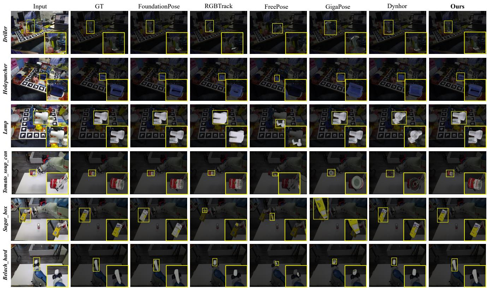  
Figure A2. Qualitative comparison on object-centric benchmarks with SAM3D CAD. Each row compares the shared RGB observation, ground truth, GRC-Pose, and the external methods for one target object. Rendered SAM3D CAD overlays visualize the recovered 6D poses.

YCBInEOAT. For FoundationPose under SAM3D CAD, the structured rows use independent register on every fixed evaluation key, as in the main comparison. They report the five object identities under SAM3D CAD and Metric CAD, making the orientation-sensitive ADD/ADD-S behavior and the BOP components directly comparable on the same fixed keys.

The object-level breakdown is printed below because the two CAD lanes answer different questions: SAM3D CAD evaluates the recording-local object chart, whereas Metric CAD evaluates the dataset object chart. Reading AR together with ADD, ADD-S, and the pose errors makes the effect of the object chart explicit without replacing the aggregate comparison.

With SAM3D CAD, GRC-Pose leads all reported measures on bleach and mustard and achieves the strongest sugar-box AR, ADD-S AUC, and translation. At the aggregate level it remains within .9 AR and .2 ADD-S points of FoundationPose, while attaining the strongest VSD recall and translation. With Metric CAD, GRC-Pose obtains the best aggregate ADD AUC, ADD-S AUC, ADD-0.1d, rotation, and translation. The object rows show that this metric closure is not concentrated in one category: cracker reaches 91.4 ADD AUC and 95.2 ADD-S AUC, while sugar reaches 94.1 and 96.6, respectively.

Figure A2 complements these scores with driller, holepuncher, lamp, tomato-soup-can, sugar-box, and bleach examples. The rendered overlays use the same SAM3D CAD within each row, so differences arise from the recovered 6D pose rather than from a method-specific visualization. Across the varied viewpoints and partial occlusions shown here, GRC-Pose preserves the target extent and orientation while the shared yellow regions keep the comparison focused on the same object instance.

Table A5. Complete YCBInEOAT per-object results for SAM3D CAD and Metric CAD. AR is the BOP average recall; AUC and threshold values are percentages; translation is reported in centimeters; best per-object values are bold.
<table><tr><td>Object (N)</td><td>Method</td><td>AR↑</td><td>ADD AUC↑</td><td>ADD-S AUC↑</td><td>ADD-0.1d ↑</td><td>Rot. (deg.)↓</td><td>Trans. (cm)↓</td></tr><tr><td colspan="8">SAM3D CAD</td></tr><tr><td>bleach (57)</td><td>FoundationPose</td><td>59.2</td><td>56.1</td><td>83.9</td><td>49.1</td><td>55.5</td><td>3.8</td></tr><tr><td></td><td>RGBTrack</td><td>26.8</td><td>3.8</td><td>26.9</td><td>0.0</td><td>131.6</td><td>48.1</td></tr><tr><td></td><td>GigaPose</td><td>25.9</td><td>10.7</td><td>34.6</td><td>1.8</td><td>56.0</td><td>16.1</td></tr><tr><td></td><td>FreePose</td><td>12.2</td><td>0.0</td><td>0.0</td><td>0.0</td><td>116.9</td><td>84.4</td></tr><tr><td></td><td>Dynhor</td><td>28.5</td><td>3.5</td><td>40.8</td><td>0.0</td><td>135.5</td><td>15.2</td></tr><tr><td></td><td>BIT</td><td>9.6</td><td>0.5</td><td>1.3</td><td>0.0</td><td>97.3</td><td>45.5</td></tr><tr><td></td><td>Ours</td><td>65.8</td><td>72.5</td><td>90.0</td><td>59.6</td><td>9.7</td><td>2.5</td></tr><tr><td>cracker (86)</td><td>FoundationPose</td><td>50.7</td><td>52.9</td><td>81.4</td><td>51.2</td><td>50.6</td><td>8.5</td></tr><tr><td></td><td>RGBTrack</td><td>31.3</td><td>18.8</td><td>54.0</td><td>1.2</td><td>39.7</td><td>20.2</td></tr><tr><td></td><td>GigaPose</td><td>3.4</td><td>0.0</td><td>9.4</td><td>0.0</td><td>70.0</td><td>165.3</td></tr><tr><td></td><td>FreePose</td><td>11.4</td><td>0.0</td><td>25.1</td><td>0.0</td><td>115.4</td><td>95.9</td></tr><tr><td></td><td>Dynhor</td><td>2.9</td><td>0.0</td><td>11.1</td><td>0.0</td><td>156.3</td><td>22.6</td></tr><tr><td></td><td>BIT</td><td>3.1</td><td>2.1</td><td>5.5</td><td>0.0</td><td>119.7</td><td>30.5</td></tr><tr><td></td><td>Ours</td><td>39.4</td><td>37.9</td><td>73.7</td><td>40.7</td><td>87.2</td><td>5.6</td></tr><tr><td>mustard (72)</td><td>FoundationPose</td><td>38.7</td><td>36.9</td><td>66.4</td><td>36.1</td><td>62.2</td><td>6.7</td></tr><tr><td></td><td>RGBTrack</td><td>12.8</td><td>3.8</td><td>24.0</td><td>0.0</td><td>91.8</td><td>35.1</td></tr><tr><td></td><td>GigaPose</td><td>19.8</td><td>14.9</td><td>32.1</td><td>4.2</td><td>56.3</td><td>12.7</td></tr><tr><td></td><td>FreePose</td><td>16.8</td><td>0.0</td><td>0.0</td><td>0.0</td><td>98.6</td><td>67.7</td></tr><tr><td></td><td>Dynhor</td><td>17.0</td><td>6.9</td><td>33.2</td><td>0.0</td><td>156.1</td><td>13.6</td></tr><tr><td></td><td>BIT</td><td>16.8</td><td>2.5</td><td>15.1</td><td>1.4</td><td>73.4</td><td>22.3</td></tr><tr><td></td><td>Ours</td><td>41.6</td><td>43.6</td><td>67.3</td><td>48.6</td><td>44.7</td><td>6.5</td></tr><tr><td>sugar (97)</td><td>FoundationPose</td><td>73.5</td><td>60.7</td><td>90.8</td><td>58.8</td><td>61.3</td><td>1.8</td></tr><tr><td></td><td>RGBTrack</td><td>17.7</td><td>0.3</td><td>1.5</td><td>0.0</td><td>152.8</td><td>79.6</td></tr><tr><td></td><td>GigaPose</td><td>45.8</td><td>45.2</td><td>68.7</td><td>20.6</td><td>19.4</td><td>5.9</td></tr><tr><td></td><td>FreePose</td><td>12.8</td><td>0.0</td><td>0.0</td><td>0.0</td><td>97.9</td><td>46.6</td></tr><tr><td></td><td>Dynhor</td><td>28.4</td><td>0.7</td><td>40.7</td><td>0.0</td><td>154.9</td><td>14.1</td></tr><tr><td></td><td>BIT</td><td>7.3</td><td>4.9</td><td>13.5</td><td>0.0</td><td>78.0</td><td>34.8</td></tr><tr><td></td><td>Ours</td><td>75.1</td><td>52.0</td><td>93.1</td><td>51.5</td><td>86.1</td><td>1.4</td></tr></table>

GRC-Pose: Generation-Reconstruction Correspondence for Prior-Free 6D Object Pose Tracking
<table><tr><td>Object (N)</td><td>Method</td><td>AR↑</td><td>ADD AUC↑</td><td>ADD-S AUC↑</td><td>ADD-0.1d ↑</td><td>Rot. (deg.)↓</td><td>Trans. (cm)↓</td></tr><tr><td>tomato (66)</td><td>FoundationPose</td><td>2.4</td><td>0.0</td><td>0.1</td><td>0.0</td><td>77.1</td><td>18.5</td></tr><tr><td></td><td>RGBTrack</td><td>0.8</td><td>0.0</td><td>0.9</td><td>0.0</td><td>139.4</td><td>19.7</td></tr><tr><td></td><td>GigaPose</td><td>3.0</td><td>0.1</td><td>0.8</td><td>0.0</td><td>74.7</td><td>29.2</td></tr><tr><td></td><td>FreePose</td><td>15.2</td><td>0.0</td><td>0.0</td><td>0.0</td><td>136.4</td><td>43.7</td></tr><tr><td></td><td>Dynhor</td><td>0.3</td><td>0.0</td><td>0.0</td><td>0.0</td><td>157.7</td><td>28.1</td></tr><tr><td></td><td>BIT</td><td>0.1</td><td>0.0</td><td>0.0</td><td>0.0</td><td>130.9</td><td>54.7</td></tr><tr><td></td><td>Ours</td><td>0.9</td><td>0.0</td><td>0.0</td><td>0.0</td><td>114.5</td><td>19.5</td></tr><tr><td></td><td></td><td colspan="4">Metric CAD</td><td></td><td></td></tr><tr><td>bleach (57)</td><td>FoundationPose</td><td></td><td></td><td></td><td></td><td></td><td></td></tr><tr><td></td><td>RGBTrack</td><td>86.7</td><td>91.6 43.8</td><td>95.5 66.3</td><td>98.2 42.1</td><td>4.3 11.1</td><td>0.7 8.0</td></tr><tr><td></td><td></td><td>57.2</td><td>19.3</td><td>47.3</td><td>7.0</td><td>112.0</td><td>16.1</td></tr><tr><td></td><td>GigaPose</td><td>36.5 12.2</td><td>0.0</td><td>0.0</td><td>0.0</td><td>149.4</td><td>98.3</td></tr><tr><td></td><td>FreePose Dynhor</td><td>37.9</td><td>17.4</td><td>52.8</td><td>1.8</td><td>53.4</td><td>11.4</td></tr><tr><td></td><td>BIT</td><td>11.9</td><td>9.2</td><td>14.1</td><td>0.0</td><td>85.2</td><td>38.3</td></tr><tr><td></td><td>Ours</td><td>84.3</td><td>91.0</td><td>95.1</td><td>98.2</td><td>5.6</td><td>0.8</td></tr><tr><td>cracker (86)</td><td>FoundationPose</td><td>80.3</td><td>91.2</td><td>94.5</td><td>97.7</td><td>4.1</td><td>1.0</td></tr><tr><td></td><td>RGBTrack</td><td>37.2</td><td>16.5</td><td>19.3</td><td>12.8</td><td>88.9</td><td>121.8</td></tr><tr><td></td><td>GigaPose</td><td>16.9</td><td>1.1</td><td>25.7</td><td>1.2</td><td>118.8</td><td>277.4</td></tr><tr><td></td><td>FreePose</td><td>15.3</td><td>0.0</td><td>0.0</td><td>0.0</td><td>158.3</td><td>228.6</td></tr><tr><td></td><td>Dynhor</td><td>28.8</td><td>6.0</td><td>50.3</td><td>1.2</td><td>105.9</td><td>10.5</td></tr><tr><td></td><td>BIT</td><td>37.8</td><td>43.8</td><td>64.5</td><td>16.3</td><td>25.0</td><td>28.1</td></tr><tr><td></td><td>Ours</td><td>77.5</td><td>91.4</td><td>95.2</td><td>97.7</td><td>4.7</td><td>0.7</td></tr><tr><td>mustard (72)</td><td>FoundationPose</td><td>95.4</td><td>96.1</td><td>97.5</td><td>100.0</td><td>2.8</td><td>0.3</td></tr><tr><td></td><td>RGBTrack</td><td>78.9</td><td>81.8</td><td>90.6</td><td>72.2</td><td>3.7</td><td>1.8</td></tr><tr><td></td><td>GigaPose</td><td>8.6</td><td>0.8</td><td>12.9</td><td>0.0</td><td>120.0</td><td>23.9</td></tr><tr><td></td><td>FreePose</td><td>15.1</td><td>0.0</td><td>0.0</td><td>0.0</td><td>139.4</td><td>82.0</td></tr><tr><td></td><td>Dynhor</td><td>47.1</td><td>50.3</td><td>74.7</td><td>18.1</td><td>44.6</td><td>5.2</td></tr><tr><td></td><td>BIT</td><td>35.0</td><td>27.3</td><td>50.2</td><td>8.3</td><td>56.5</td><td>11.1</td></tr><tr><td></td><td>Ours</td><td>93.4</td><td>95.0</td><td>97.2</td><td>100.0</td><td>4.9</td><td>0.4</td></tr><tr><td>sugar (97)</td><td>FoundationPose</td><td>90.9</td><td>60.9</td><td>96.0</td><td>47.4</td><td>94.7</td><td>0.6</td></tr><tr><td></td><td>RGBTrack</td><td>41.2</td><td>31.2</td><td>37.4</td><td>20.6</td><td>61.6</td><td>76.7</td></tr><tr><td></td><td>GigaPose</td><td>47.3</td><td>21.9</td><td>60.2</td><td>2.1</td><td>120.4</td><td>10.4</td></tr><tr><td></td><td>FreePose</td><td>14.3</td><td>0.0</td><td>0.0</td><td>0.0</td><td>131.9</td><td>47.4</td></tr><tr><td></td><td>Dynhor</td><td>41.7</td><td>21.6</td><td>63.1</td><td>3.1</td><td>95.5</td><td>9.3</td></tr><tr><td></td><td>BIT</td><td>8.1</td><td>9.5</td><td>14.4</td><td>3.1</td><td>61.6</td><td>31.2</td></tr><tr><td></td><td>Ours</td><td>92.2</td><td>94.1</td><td>96.6</td><td>99.0</td><td>4.1</td><td>0.5</td></tr><tr><td>tomato (66)</td><td></td><td></td><td></td><td></td><td></td><td></td><td>0.6</td></tr><tr><td></td><td>FoundationPose RGBTrack</td><td>89.1</td><td>91.9 71.4</td><td>96.4 85.4</td><td>97.0 42.4</td><td>8.5 8.9</td><td>2.8</td></tr><tr><td></td><td>GigaPose</td><td>68.1 23.5</td><td>0.9</td><td>14.0</td><td>0.0</td><td>121.3</td><td>17.9</td></tr><tr><td></td><td>FreePose</td><td></td><td></td><td>0.0</td><td>0.0</td><td>145.3</td><td>65.3</td></tr><tr><td></td><td></td><td>16.9</td><td>0.0</td><td></td><td></td><td></td><td>10.7</td></tr><tr><td></td><td>Dynhor BIT</td><td>34.8 49.1</td><td>6.9 45.3</td><td>43.7 68.5</td><td>0.0 9.1</td><td>132.4 56.2</td><td>5.8</td></tr><tr><td></td><td></td><td></td><td></td><td></td><td></td><td></td><td></td></tr><tr><td></td><td>Ours</td><td>89.0</td><td>90.2</td><td>96.6</td><td>81.8</td><td>14.6</td><td>0.5</td></tr></table>

LINEMOD. The complete records report all fifteen object identities under the same two CAD lanes and share the same fixed evaluation keys. Table A6 gives the per-object breakdown.  
Table A6. Complete LINEMOD per-object results for SAM3D CAD and Metric CAD. All metrics except rotation and translation are percentages; N is the number of scored frames. Best per-object values are bold.
<table><tr><td>Object Method</td><td></td><td>N AR↑</td><td></td><td>ADD AUC↑</td><td>ADD-S AUC↑</td><td>ADD-0.1d ↑</td><td>Rot. (deg.)↓</td><td>Trans. (cm)↓</td></tr><tr><td></td><td></td><td></td><td></td><td>SAM3D CAD</td><td></td><td></td><td></td><td></td></tr><tr><td></td><td></td><td></td><td></td><td>45.7</td><td>88.5</td><td></td><td>149.6</td><td>2.1</td></tr><tr><td>ape</td><td>FoundationPose 62 RGBTrack</td><td>45.1</td><td>1.8</td><td>1.0</td><td>4.6</td><td>0.0 0.0</td><td>122.8</td><td>30.9</td></tr><tr><td></td><td>GigaPose</td><td></td><td>22.3</td><td>1.9</td><td>11.1</td><td>0.0</td><td>151.2</td><td>27.4</td></tr><tr><td></td><td>FreePose</td><td></td><td>13.2</td><td>0.7</td><td>5.5</td><td>0.0</td><td>132.9</td><td>24.0</td></tr><tr><td></td><td>Dynhor</td><td></td><td>59.3</td><td>53.5</td><td>82.1</td><td>22.6</td><td>80.7</td><td>3.3</td></tr><tr><td></td><td>BIT</td><td></td><td>7.0</td><td>0.7</td><td>1.4</td><td>0.0</td><td>154.5</td><td>830.5</td></tr><tr><td></td><td>Ours</td><td></td><td>44.0</td><td>48.3</td><td>90.0</td><td>0.0</td><td>157.4</td><td>1.3</td></tr><tr><td>benchvise</td><td>FoundationPose 61</td><td></td><td>28.4</td><td>0.0</td><td>71.2</td><td>0.0</td><td>137.7</td><td>7.4</td></tr><tr><td></td><td>RGBTrack</td><td></td><td>11.1</td><td>0.0</td><td>0.0</td><td>0.0</td><td>137.4</td><td>175.7</td></tr><tr><td></td><td>GigaPose</td><td></td><td>19.5</td><td>0.5</td><td>18.2</td><td>0.0</td><td>123.5</td><td>40.5</td></tr><tr><td></td><td>FreePose</td><td></td><td>16.4</td><td>0.0</td><td>0.0</td><td>0.0</td><td>130.4</td><td>68.1</td></tr><tr><td></td><td>Dynhor</td><td></td><td>73.3</td><td>83.7</td><td>92.5</td><td>86.9</td><td>7.1</td><td>1.5</td></tr><tr><td></td><td>BIT</td><td></td><td>0.5</td><td>0.0</td><td>1.2</td><td>0.0</td><td>112.9</td><td>1689.8</td></tr><tr><td></td><td>Ours</td><td></td><td>30.9</td><td>0.1</td><td>76.8</td><td>0.0</td><td>141.9</td><td>5.6</td></tr><tr><td>bowl</td><td>FoundationPose 62</td><td></td><td>55.2</td><td>19.7</td><td>92.5</td><td>1.6</td><td>100.0</td><td>2.1</td></tr><tr><td></td><td>RGBTrack</td><td></td><td>0.5</td><td>0.0</td><td>1.6</td><td>0.0</td><td>144.7</td><td>54.0</td></tr><tr><td></td><td>GigaPose</td><td></td><td>39.0</td><td>15.9</td><td>76.6</td><td>0.0</td><td>98.8</td><td>4.8</td></tr><tr><td></td><td>FreePose</td><td></td><td>16.7</td><td>1.4</td><td>31.6</td><td>0.0</td><td>124.1</td><td>13.9</td></tr><tr><td></td><td>Dynhor</td><td></td><td>76.5</td><td>26.0</td><td>90.6</td><td>11.3</td><td>89.5</td><td>2.1</td></tr><tr><td></td><td>BIT</td><td>0.8</td><td></td><td>0.0</td><td>1.5</td><td>0.0</td><td>148.015290.5</td><td></td></tr><tr><td></td><td>Ours</td><td>55.2</td><td></td><td>22.8</td><td>92.7</td><td>3.2</td><td>87.9</td><td>2.1</td></tr><tr><td>camera</td><td>FoundationPose 61</td><td>37.9</td><td></td><td>33.4</td><td>82.5</td><td>0.0</td><td>87.6</td><td>3.2</td></tr><tr><td></td><td>RGBTrack</td><td></td><td>0.5</td><td>0.0</td><td>1.3</td><td>0.0</td><td>126.1</td><td>35.0</td></tr><tr><td></td><td>GigaPose</td><td>21.4</td><td></td><td>7.4</td><td>26.8</td><td>0.0</td><td>54.5</td><td>27.2</td></tr><tr><td></td><td>FreePose</td><td>15.5</td><td></td><td>1.6</td><td>26.5</td><td>0.0</td><td>118.9</td><td>16.0</td></tr><tr><td></td><td>Dynhor</td><td></td><td>60.8</td><td>58.0</td><td>87.3</td><td>41.0</td><td>41.4</td><td>2.7</td></tr><tr><td></td><td>BIT</td><td>0.9</td><td></td><td>1.0</td><td>1.6</td><td>0.0</td><td>122.9</td><td>3184.0</td></tr><tr><td></td><td>Ours</td><td>44.3</td><td></td><td>69.5</td><td>88.2</td><td>1.6</td><td>26.8</td><td>2.4</td></tr><tr><td>can</td><td>FoundationPose 60</td><td>32.6</td><td></td><td>19.3</td><td>71.8</td><td>0.0</td><td>109.0</td><td>5.3</td></tr><tr><td></td><td>RGBTrack</td><td></td><td>0.0</td><td>0.0</td><td>0.0</td><td>0.0</td><td>136.4</td><td>76.6</td></tr><tr><td></td><td>GigaPose</td><td></td><td>6.0</td><td>0.1</td><td>4.4</td><td>0.0</td><td>79.3</td><td>21.4</td></tr><tr><td></td><td>FreePose</td><td>16.5</td><td></td><td>0.7</td><td>52.9</td><td>0.0</td><td>136.3</td><td>9.0</td></tr><tr><td></td><td>Dynhor</td><td>68.8</td><td></td><td>70.4</td><td>90.4</td><td>75.0</td><td>35.3</td><td>1.8</td></tr><tr><td></td><td>BIT</td><td></td><td>18.9</td><td>0.0</td><td>1.8</td><td>0.0</td><td>101.0</td><td>1125.7</td></tr><tr><td></td><td>Ours</td><td></td><td>34.9</td><td>51.4</td><td>81.4</td><td>1.7</td><td>46.0</td><td>2.2</td></tr></table>

GRC-Pose: Generation-Reconstruction Correspondence for Prior-Free 6D Object Pose Tracking
<table><tr><td>Object</td><td>Method</td><td>N AR↑</td><td>ADD AUC↑</td><td>ADD-S AUC↑</td><td>ADD-0.1d ↑ (deg.)↓</td><td>Rot.</td><td>Trans. (cm)↓</td></tr><tr><td>cat</td><td>FoundationPose 59</td><td>46.8</td><td>68.4</td><td>90.3</td><td>0.0</td><td>61.4</td><td>1.7</td></tr><tr><td></td><td>RGBTrack</td><td>1.5</td><td>0.7</td><td>2.3</td><td>0.0</td><td>148.8</td><td>49.3</td></tr><tr><td></td><td>GigaPose</td><td>30.1</td><td>32.0</td><td>60.1</td><td>0.0</td><td>83.4</td><td>10.2</td></tr><tr><td></td><td>FreePose</td><td>16.9</td><td>0.0</td><td>1.0</td><td>0.0</td><td>125.6</td><td>39.9</td></tr><tr><td></td><td>Dynhor</td><td>81.7</td><td>84.8</td><td>93.4</td><td>78.0</td><td>11.5</td><td>1.3</td></tr><tr><td></td><td>BIT</td><td>7.3</td><td>1.1</td><td>2.6</td><td>0.0</td><td>115.4</td><td>1003.8</td></tr><tr><td></td><td>Ours</td><td>48.1</td><td>72.4</td><td>92.1</td><td>5.1</td><td>55.2</td><td>1.3</td></tr><tr><td>cup</td><td>FoundationPose 62</td><td>45.9</td><td>37.1</td><td>90.9</td><td>0.0</td><td>123.1</td><td>1.8</td></tr><tr><td></td><td>RGBTrack</td><td>0.9</td><td>0.0</td><td>3.3</td><td>0.0</td><td>105.0</td><td>37.9</td></tr><tr><td></td><td>GigaPose</td><td>28.0</td><td>12.1</td><td>56.3</td><td>0.0</td><td>104.6</td><td>8.9</td></tr><tr><td></td><td>FreePose</td><td>13.5</td><td>0.8</td><td>9.8</td><td>0.0</td><td>135.8</td><td>21.0</td></tr><tr><td></td><td>Dynhor</td><td>66.7</td><td>69.5</td><td>89.2</td><td>45.2</td><td>33.6</td><td>2.3</td></tr><tr><td></td><td>BIT</td><td>2.0</td><td>0.4</td><td>1.3</td><td>0.0</td><td>121.3</td><td>772.4</td></tr><tr><td></td><td>Ours</td><td>47.4</td><td>47.3</td><td>91.2</td><td>0.0</td><td>97.5</td><td>2.2</td></tr><tr><td>driller</td><td>FoundationPose 60</td><td>42.1</td><td>55.4</td><td>78.8</td><td>0.0</td><td>18.6</td><td>3.9</td></tr><tr><td></td><td>RGBTrack</td><td>4.5</td><td>0.9</td><td>1.3</td><td>0.0</td><td>112.4</td><td>99.6</td></tr><tr><td></td><td>GigaPose</td><td>19.6</td><td>18.1</td><td>40.4</td><td>8.3</td><td>65.4</td><td>17.3</td></tr><tr><td></td><td>FreePose</td><td>4.1</td><td>0.0</td><td>14.7</td><td>0.0</td><td>121.8</td><td>20.5</td></tr><tr><td></td><td>Dynhor</td><td>64.5</td><td>60.4</td><td>82.6</td><td>61.7</td><td>39.6</td><td>3.3</td></tr><tr><td></td><td>BIT</td><td>1.1</td><td>0.9</td><td>1.3</td><td>0.0</td><td>130.7</td><td>2102.9</td></tr><tr><td></td><td>Ours</td><td>41.3</td><td>55.6</td><td>79.5</td><td>0.0</td><td>18.7</td><td>3.8</td></tr><tr><td>duck</td><td>FoundationPose 63</td><td>44.6</td><td>72.4</td><td>88.3</td><td>0.0</td><td>35.4</td><td>1.6</td></tr><tr><td></td><td>RGBTrack</td><td>1.7</td><td>1.5</td><td>1.9</td><td>1.6</td><td>116.0</td><td>35.5</td></tr><tr><td></td><td>GigaPose</td><td>22.4</td><td>14.6</td><td>38.0</td><td>0.0</td><td>65.1</td><td>17.3</td></tr><tr><td></td><td>FreePose</td><td>15.9</td><td>9.7</td><td>39.2</td><td>0.0</td><td>117.4</td><td>11.4</td></tr><tr><td></td><td>Dynhor</td><td>73.8</td><td>71.7</td><td>91.4</td><td>47.6</td><td>49.0</td><td>1.6</td></tr><tr><td></td><td>BIT</td><td>6.1</td><td>1.2</td><td>1.4</td><td>0.0</td><td>99.1</td><td>780.6</td></tr><tr><td></td><td>Ours</td><td>44.6</td><td>71.5</td><td>88.2</td><td>0.0</td><td>38.0</td><td>1.6</td></tr><tr><td>eggbox</td><td>FoundationPose 63</td><td>60.3</td><td>49.5</td><td>92.6</td><td>52.4</td><td>83.5</td><td>1.3</td></tr><tr><td></td><td>RGBTrack</td><td>3.2</td><td>0.1</td><td>4.0</td><td>0.0</td><td>95.6</td><td>45.9</td></tr><tr><td></td><td>GigaPose</td><td>25.7</td><td>3.7</td><td>37.6</td><td>0.0</td><td>87.8</td><td>12.0</td></tr><tr><td></td><td>FreePose</td><td>13.8</td><td>3.4</td><td>27.1</td><td>0.0</td><td>102.2</td><td>19.0</td></tr><tr><td></td><td>Dynhor</td><td>58.6</td><td>38.5</td><td>80.7</td><td>20.6</td><td>80.9</td><td>4.4</td></tr><tr><td></td><td>BIT</td><td>8.1</td><td>0.0</td><td>1.5</td><td>0.0</td><td>95.9</td><td>1800.1</td></tr><tr><td></td><td>Ours</td><td>55.4</td><td>52.7</td><td>91.9</td><td>41.3</td><td>76.1</td><td>1.5</td></tr><tr><td>glue</td><td>FoundationPose 61</td><td>38.6</td><td>18.9</td><td>86.1</td><td>4.9</td><td>150.7</td><td>4.0</td></tr><tr><td></td><td>RGBTrack</td><td>1.8</td><td>0.7</td><td>1.3</td><td>0.0</td><td>97.8</td><td>116.9</td></tr><tr><td></td><td>GigaPose</td><td>27.3</td><td>13.0</td><td>44.8</td><td>1.6</td><td>104.8</td><td>10.9</td></tr><tr><td></td><td>FreePose</td><td>12.6</td><td>1.0</td><td>8.8</td><td>0.0</td><td>131.4</td><td>31.5</td></tr><tr><td></td><td>Dynhor</td><td>54.2</td><td>47.2</td><td>68.5</td><td>23.0</td><td>54.3</td><td>7.3</td></tr><tr><td></td><td>BIT</td><td>0.5</td><td>0.2</td><td>1.5</td><td>0.0</td><td>122.9</td><td>1212.6</td></tr><tr><td></td><td>Ours</td><td>39.2</td><td>15.5</td><td>89.8</td><td>0.0</td><td>162.3</td><td>3.6</td></tr></table>

GRC-Pose: Generation-Reconstruction Correspondence for Prior-Free 6D Object Pose Tracking
<table><tr><td>Object</td><td>Method</td><td>N AR↑</td><td>ADD AUC↑</td><td>ADD-S AUC↑</td><td>ADD-0.1d ↑ (deg.)↓</td><td>Rot.</td><td>Trans. (cm)↓</td></tr><tr><td></td><td>holepuncher FoundationPose 62</td><td>43.3</td><td>23.8</td><td>84.7</td><td>0.0</td><td>145.3</td><td>3.7</td></tr><tr><td></td><td>RGBTrack</td><td>0.5</td><td>0.2</td><td>1.9</td><td>0.0</td><td>90.4</td><td>38.4</td></tr><tr><td></td><td>GigaPose</td><td>20.1</td><td>3.5</td><td>25.8</td><td>0.0</td><td>120.0</td><td>14.0</td></tr><tr><td></td><td>FreePose</td><td>9.7</td><td>2.7</td><td>25.2</td><td>0.0</td><td>124.4</td><td>16.6</td></tr><tr><td></td><td>Dynhor</td><td>70.2</td><td>72.4</td><td>89.4</td><td>53.2</td><td>20.6</td><td>2.3</td></tr><tr><td></td><td>BIT</td><td>14.1</td><td>0.2</td><td>1.4</td><td>0.0</td><td>97.1</td><td>689.5</td></tr><tr><td></td><td>Ours</td><td>29.8</td><td>21.0</td><td>80.6</td><td>0.0</td><td>159.5</td><td>3.1</td></tr><tr><td>iron</td><td>FoundationPose 58 45.5</td><td></td><td>57.0</td><td>83.1</td><td>17.2</td><td>44.2</td><td>3.1</td></tr><tr><td></td><td>RGBTrack</td><td>1.0</td><td>0.1</td><td>2.7</td><td>0.0</td><td>91.1</td><td>31.3</td></tr><tr><td></td><td>GigaPose</td><td>26.6</td><td>12.1</td><td>43.0</td><td>1.7</td><td>50.7</td><td>13.1</td></tr><tr><td></td><td>FreePose</td><td>17.4</td><td>0.0</td><td>4.0</td><td>0.0</td><td>131.5</td><td>38.3</td></tr><tr><td></td><td>Dynhor</td><td>51.4</td><td>33.8</td><td>73.2</td><td>29.3</td><td>89.8</td><td>5.3</td></tr><tr><td></td><td>BIT</td><td>0.6</td><td>0.9</td><td>1.5</td><td>0.0</td><td>160.1</td><td>775.1</td></tr><tr><td></td><td>Ours</td><td>45.5</td><td>63.2</td><td>85.7</td><td>32.8</td><td>39.7</td><td>2.0</td></tr><tr><td>lamp</td><td>FoundationPose 29</td><td>30.8</td><td>35.5</td><td>72.3</td><td>0.0</td><td>35.4</td><td>4.8</td></tr><tr><td></td><td>RGBTrack</td><td>0.8</td><td>0.0</td><td>0.9</td><td>0.0</td><td>68.1</td><td>83.5</td></tr><tr><td></td><td>GigaPose</td><td>24.0</td><td>15.2</td><td>50.8</td><td>3.4</td><td>44.6</td><td>11.7</td></tr><tr><td></td><td>FreePose</td><td>14.7</td><td>0.0</td><td>0.0</td><td>0.0</td><td>143.6</td><td>56.6</td></tr><tr><td></td><td>Dynhor</td><td>66.7</td><td>76.3</td><td>87.9</td><td>82.8</td><td>11.7</td><td>2.1</td></tr><tr><td></td><td>BIT</td><td>1.4</td><td>1.8</td><td>2.7</td><td>0.0</td><td>97.2</td><td>658.0</td></tr><tr><td></td><td>Ours</td><td>26.0</td><td>35.1</td><td>70.1</td><td>0.0</td><td>33.6</td><td>5.2</td></tr><tr><td>phone</td><td>FoundationPose 10</td><td>27.0</td><td>26.6</td><td>59.2</td><td>0.0</td><td>94.7</td><td>7.2</td></tr><tr><td></td><td>RGBTrack</td><td>6.7</td><td>0.0</td><td>11.9</td><td>0.0</td><td>111.5</td><td>18.6</td></tr><tr><td></td><td>GigaPose</td><td>10.7</td><td>2.2</td><td>25.9</td><td>0.0</td><td>90.5</td><td>16.5</td></tr><tr><td></td><td>FreePose</td><td>10.7</td><td>0.0</td><td>5.3</td><td>0.0</td><td>107.3</td><td>39.0</td></tr><tr><td></td><td>Dynhor</td><td>60.3</td><td>66.8</td><td>80.2</td><td>70.0</td><td>14.9</td><td>3.7</td></tr><tr><td></td><td>BIT</td><td>18.3</td><td>7.6</td><td>9.1</td><td>10.0</td><td>98.4</td><td>1266.2</td></tr><tr><td></td><td>Ours</td><td>29.0</td><td>26.9</td><td>74.2</td><td>0.0</td><td>90.1</td><td>4.4</td></tr><tr><td></td><td></td><td></td><td></td><td></td><td></td><td></td><td></td></tr><tr><td colspan="8">Metric CAD</td></tr><tr><td>ape</td><td>FoundationPose 62</td><td>1.5</td><td>1.5</td><td>2.8</td><td>1.6</td><td>116.5</td><td>49.4</td></tr><tr><td></td><td>RGBTrack</td><td>4.5</td><td>1.9</td><td>3.7</td><td>1.6 82.3</td><td>106.8 12.7</td><td>62.9 7.0</td></tr><tr><td></td><td>GigaPose</td><td>87.8</td><td>83.9</td><td>88.3 0.5</td><td>0.0</td><td>132.1</td><td>24.1</td></tr><tr><td></td><td>FreePose</td><td>13.7</td><td>0.0</td><td></td><td>22.6</td><td>80.7</td><td>3.3</td></tr><tr><td></td><td>Dynhor</td><td>59.3</td><td>53.5</td><td>82.1</td><td>1.6</td><td>99.7</td><td>656.3</td></tr><tr><td></td><td>BIT</td><td>10.5</td><td>1.5 92.8</td><td>1.5 96.9</td><td>95.2</td><td>9.8</td><td>0.5</td></tr><tr><td>benchvise</td><td>Ours</td><td>89.6</td><td></td><td></td><td></td><td></td><td></td></tr><tr><td></td><td>FoundationPose 61</td><td>2.7</td><td>1.6</td><td>5.5</td><td>1.6</td><td>120.6</td><td>199.6</td></tr><tr><td></td><td>RGBTrack</td><td>5.0</td><td>1.3</td><td>3.7</td><td>1.6</td><td>126.9 3.5</td><td>101.4 1.7</td></tr><tr><td></td><td>GigaPose</td><td>71.9</td><td>82.5</td><td>92.0</td><td>95.1</td><td></td><td></td></tr><tr><td></td><td>FreePose</td><td>12.6</td><td>0.0</td><td>2.5</td><td>0.0</td><td>104.3</td><td>34.4</td></tr><tr><td></td><td>Dynhor</td><td>73.3</td><td>83.7</td><td>92.5</td><td>86.9</td><td>7.1</td><td>1.5</td></tr><tr><td></td><td>BIT</td><td>0.8</td><td>1.1</td><td>1.4</td><td>0.0</td><td>112.1</td><td>673.4</td></tr><tr><td></td><td>Ours</td><td>82.6</td><td>93.2</td><td>96.3</td><td>96.7</td><td>5.0</td><td>0.6</td></tr></table>

GRC-Pose: Generation-Reconstruction Correspondence for Prior-Free 6D Object Pose Tracking
<table><tr><td>Object</td><td>Method</td><td>N AR↑</td><td>ADD AUC↑</td><td>ADD-S AUC↑</td><td>ADD-0.1d ↑ (deg.)↓</td><td>Rot.</td><td>Trans. (cm)↓</td></tr><tr><td>bowl</td><td>FoundationPose 62</td><td>2.2</td><td>1.2</td><td>2.4</td><td>0.0</td><td>84.0</td><td>43.7</td></tr><tr><td></td><td>RGBTrack</td><td>6.1</td><td>0.5</td><td>2.5</td><td>0.0</td><td>94.8</td><td>141.6</td></tr><tr><td></td><td>GigaPose</td><td>70.5</td><td>24.3</td><td>93.4</td><td>9.7</td><td>88.9</td><td>1.6</td></tr><tr><td></td><td>FreePose</td><td>15.8</td><td>0.2</td><td>12.2</td><td>0.0</td><td>136.1</td><td>19.7</td></tr><tr><td></td><td>Dynhor</td><td>76.5</td><td>26.0</td><td>90.6</td><td>11.3</td><td>89.5</td><td>2.1</td></tr><tr><td></td><td>BIT</td><td>1.4</td><td>1.2</td><td>1.6</td><td>0.0</td><td>114.0</td><td>259.7</td></tr><tr><td></td><td>Ours</td><td>84.1</td><td>21.7</td><td>96.5</td><td>9.7</td><td>95.9</td><td>0.8</td></tr><tr><td>camera</td><td>FoundationPose 61</td><td>1.6</td><td>1.6</td><td>1.6</td><td>1.6</td><td>97.5</td><td>59.8</td></tr><tr><td></td><td>RGBTrack</td><td>1.5</td><td>1.5</td><td>3.0</td><td>1.6</td><td>89.9</td><td>41.5</td></tr><tr><td></td><td>GigaPose</td><td>89.3</td><td>91.9</td><td>95.6</td><td>98.4</td><td>2.6</td><td>0.7</td></tr><tr><td></td><td>FreePose</td><td>17.7</td><td>0.4</td><td>3.6</td><td>0.0</td><td>95.4</td><td>31.5</td></tr><tr><td></td><td>Dynhor</td><td>60.8</td><td>58.0</td><td>87.3</td><td>41.0</td><td>41.4</td><td>2.7</td></tr><tr><td></td><td>BIT</td><td>14.6</td><td>1.3</td><td>2.0</td><td>1.6</td><td>122.7</td><td>1293.0</td></tr><tr><td></td><td>Ours</td><td>87.0</td><td>93.9</td><td>96.5</td><td>100.0</td><td>3.8</td><td>0.5</td></tr><tr><td>can</td><td>FoundationPose 60</td><td>2.7</td><td>1.6</td><td>3.1</td><td>1.7</td><td>113.2</td><td>38.2</td></tr><tr><td></td><td>RGBTrack</td><td>3.0</td><td>1.8</td><td>4.6</td><td>1.7</td><td>117.0</td><td>118.5</td></tr><tr><td></td><td>GigaPose</td><td>83.6</td><td>90.2</td><td>95.4</td><td>96.7</td><td>4.6</td><td>0.8</td></tr><tr><td></td><td>FreePose</td><td>14.2</td><td>1.1</td><td>21.4</td><td>0.0</td><td>129.3</td><td>20.5</td></tr><tr><td></td><td>Dynhor</td><td>68.8</td><td>70.4</td><td>90.4</td><td>75.0</td><td>35.3</td><td>1.8</td></tr><tr><td></td><td>BIT</td><td>22.2</td><td>1.5</td><td>2.4</td><td>1.7</td><td>129.2</td><td>1310.6</td></tr><tr><td></td><td>Ours</td><td>86.9</td><td>94.2</td><td>96.7</td><td>98.3</td><td>3.1</td><td>0.5</td></tr><tr><td>cat</td><td>FoundationPose 59</td><td>2.0</td><td>1.7</td><td>4.2</td><td>1.7</td><td>112.2</td><td>93.6</td></tr><tr><td></td><td>RGBTrack</td><td>1.7</td><td>0.5</td><td>1.3</td><td>0.0</td><td>127.7</td><td>75.4</td></tr><tr><td></td><td>GigaPose</td><td>89.8</td><td>91.3</td><td>95.7</td><td>96.6</td><td>2.4</td><td>0.9</td></tr><tr><td></td><td>FreePose</td><td>17.7</td><td>0.0</td><td>0.4</td><td>0.0</td><td>127.7</td><td>44.4</td></tr><tr><td></td><td>Dynhor</td><td>81.7</td><td>84.8</td><td>93.4</td><td>78.0</td><td>11.5</td><td>1.3</td></tr><tr><td></td><td>BIT</td><td>8.3</td><td>1.5</td><td>1.6</td><td>1.7</td><td>104.0</td><td>1030.2</td></tr><tr><td></td><td>Ours</td><td>90.9</td><td>95.8</td><td>97.5</td><td>100.0</td><td>3.3</td><td>0.4</td></tr><tr><td>cup</td><td>FoundationPose 62</td><td>2.0</td><td>1.9</td><td>3.0</td><td>1.6</td><td>116.6</td><td>70.4</td></tr><tr><td></td><td>RGBTrack</td><td>2.2</td><td>0.4</td><td>2.2</td><td>0.0</td><td>113.8</td><td>29.5</td></tr><tr><td></td><td>GigaPose</td><td>51.4</td><td>45.8</td><td>76.5</td><td>9.7</td><td>47.9</td><td>4.7</td></tr><tr><td></td><td>FreePose</td><td>14.8</td><td>0.0</td><td>0.5</td><td>0.0</td><td>139.9</td><td>34.4</td></tr><tr><td></td><td>Dynhor</td><td>66.7</td><td>69.5</td><td>89.2</td><td>45.2</td><td>33.6</td><td>2.3</td></tr><tr><td></td><td>BIT</td><td>7.3</td><td>1.4</td><td>1.5</td><td>1.6</td><td>118.4</td><td>1478.2</td></tr><tr><td></td><td>Ours</td><td>83.0</td><td>80.9</td><td>96.9</td><td>67.7</td><td>32.4</td><td>0.9</td></tr><tr><td>driller</td><td>FoundationPose 60</td><td>4.4</td><td>1.6</td><td>3.4</td><td>1.7</td><td>117.0</td><td>23.5</td></tr><tr><td></td><td>RGBTrack</td><td>0.7</td><td>0.0</td><td>0.2</td><td>0.0</td><td>115.3</td><td>221.0</td></tr><tr><td></td><td>GigaPose</td><td>72.4</td><td>74.1</td><td>84.6</td><td>81.7</td><td>17.6</td><td>3.5</td></tr><tr><td></td><td>FreePose</td><td>9.4</td><td>0.0</td><td>4.1</td><td>0.0</td><td>124.1</td><td>33.1</td></tr><tr><td></td><td>Dynhor</td><td>64.5</td><td>60.4</td><td>82.6</td><td>61.7</td><td>39.6</td><td>3.3</td></tr><tr><td></td><td>BIT</td><td>18.3</td><td>1.6</td><td>1.6</td><td>1.7</td><td>99.1</td><td>2120.1</td></tr><tr><td></td><td>Ours</td><td>85.6</td><td>93.9</td><td>96.5</td><td>100.0</td><td>1.9</td><td>0.6</td></tr></table>

GRC-Pose: Generation-Reconstruction Correspondence for Prior-Free 6D Object Pose Tracking
<table><tr><td>Object</td><td>Method</td><td>N AR↑</td><td>ADD AUC↑</td><td>ADD-S AUC↑</td><td>ADD-0.1d ↑ (deg.)↓</td><td>Rot.</td><td>Trans. (cm)↓</td></tr><tr><td>duck</td><td>FoundationPose 63</td><td>1.5</td><td>1.5</td><td>1.6</td><td>1.6</td><td>93.2</td><td>70.4</td></tr><tr><td></td><td>RGBTrack</td><td>1.7</td><td>1.5</td><td>1.9</td><td>1.6</td><td>88.4</td><td>40.5</td></tr><tr><td></td><td>GigaPose</td><td>89.0</td><td>87.6</td><td>92.5</td><td>84.1</td><td>8.7</td><td>1.7</td></tr><tr><td></td><td>FreePose</td><td>16.7</td><td>0.2</td><td>1.4</td><td>0.0</td><td>108.6</td><td>32.0</td></tr><tr><td></td><td>Dynhor</td><td>73.8</td><td>71.7</td><td>91.4</td><td>47.6</td><td>49.0</td><td>1.6</td></tr><tr><td></td><td>BIT</td><td>1.5</td><td>1.5</td><td>1.5</td><td>1.6</td><td>112.2</td><td>890.6</td></tr><tr><td></td><td>Ours</td><td>85.0</td><td>90.4</td><td>96.2</td><td>88.9</td><td>12.7</td><td>0.6</td></tr><tr><td>eggbox</td><td>FoundationPose 63</td><td>1.4</td><td>1.5</td><td>1.8</td><td>1.6</td><td>118.9</td><td>49.6</td></tr><tr><td></td><td>RGBTrack</td><td>2.3</td><td>1.2</td><td>4.6</td><td>0.0</td><td>108.9</td><td>27.7</td></tr><tr><td></td><td>GigaPose</td><td>80.6</td><td>81.0</td><td>91.1</td><td>71.4</td><td>8.4</td><td>3.4</td></tr><tr><td></td><td>FreePose</td><td>14.9</td><td>0.0</td><td>1.6</td><td>0.0</td><td>146.3</td><td>34.2</td></tr><tr><td></td><td>Dynhor</td><td>58.6</td><td>38.5</td><td>80.7</td><td>20.6</td><td>80.9</td><td>4.4</td></tr><tr><td></td><td>BIT</td><td>1.4</td><td>1.5</td><td>1.5</td><td>1.6</td><td>102.7</td><td>1730.4</td></tr><tr><td></td><td>Ours</td><td>91.6</td><td>94.9</td><td>97.0</td><td>100.0</td><td>3.2</td><td>0.4</td></tr><tr><td>glue</td><td>FoundationPose 61</td><td>1.7</td><td>1.6</td><td>2.4</td><td>1.6</td><td>111.2</td><td>217.8</td></tr><tr><td></td><td>RGBTrack</td><td>16.6</td><td>1.0</td><td>1.5</td><td>0.0</td><td>99.1</td><td>135.6</td></tr><tr><td></td><td>GigaPose</td><td>73.7</td><td>76.1</td><td>82.8</td><td>72.1</td><td>14.7</td><td>5.0</td></tr><tr><td></td><td>FreePose</td><td>12.7</td><td>0.6</td><td>4.9</td><td>0.0</td><td>144.9</td><td>37.4</td></tr><tr><td></td><td>Dynhor</td><td>54.2</td><td>47.2</td><td>68.5</td><td>23.0</td><td>54.3</td><td>7.3</td></tr><tr><td></td><td>BIT</td><td>4.0</td><td>1.5</td><td>1.6</td><td>1.6</td><td>122.9</td><td>1442.9</td></tr><tr><td></td><td>Ours</td><td>81.7</td><td>90.4</td><td>95.6</td><td>90.2</td><td>13.2</td><td>0.7</td></tr><tr><td>holepuncher</td><td>FoundationPose 62</td><td>2.7</td><td>1.5</td><td>4.0</td><td>1.6</td><td>127.4</td><td>52.6</td></tr><tr><td></td><td>RGBTrack</td><td>1.8</td><td>0.0</td><td>8.5</td><td>0.0</td><td>110.7</td><td>25.4</td></tr><tr><td></td><td>GigaPose</td><td>57.8</td><td>60.3</td><td>84.5</td><td>19.4</td><td>31.0</td><td>3.3</td></tr><tr><td></td><td>FreePose</td><td>19.8</td><td>0.0</td><td>0.2</td><td>0.0</td><td>118.6</td><td>36.6</td></tr><tr><td></td><td>Dynhor</td><td>70.2</td><td>72.4</td><td>89.4</td><td>53.2</td><td>20.6</td><td>2.3</td></tr><tr><td></td><td>BIT</td><td>16.8</td><td>1.6</td><td>1.6</td><td>1.6</td><td>93.8</td><td>1361.8</td></tr><tr><td></td><td>Ours</td><td>90.4</td><td>94.4</td><td>97.1</td><td>100.0</td><td>3.9</td><td>0.5</td></tr><tr><td>iron</td><td>FoundationPose 58</td><td>4.0</td><td>2.8</td><td>7.0</td><td>1.7</td><td>114.4</td><td>154.1</td></tr><tr><td></td><td>RGBTrack</td><td>1.5</td><td>0.7</td><td>2.9</td><td>0.0</td><td>108.9</td><td>74.7</td></tr><tr><td></td><td>GigaPose</td><td>74.4</td><td>88.7</td><td>93.9</td><td>98.3</td><td>2.9</td><td>1.1</td></tr><tr><td></td><td>FreePose</td><td>20.5</td><td>0.0</td><td>0.1</td><td>0.0</td><td>133.1</td><td>50.9</td></tr><tr><td></td><td>Dynhor</td><td>51.4</td><td>33.8</td><td>73.2</td><td>29.3</td><td>89.8</td><td>5.3</td></tr><tr><td></td><td>BIT</td><td>1.4</td><td>1.5</td><td>1.6</td><td>1.7</td><td>106.6</td><td>2398.8</td></tr><tr><td></td><td>Ours</td><td>76.4</td><td>91.8</td><td>95.1</td><td>98.3</td><td>2.6</td><td>0.8</td></tr><tr><td>lamp</td><td>FoundationPose 29</td><td>4.6</td><td>3.1</td><td>5.0</td><td>3.4</td><td>116.3</td><td>42.5</td></tr><tr><td></td><td>RGBTrack</td><td>1.5</td><td>1.4</td><td>2.7</td><td>0.0</td><td>65.3</td><td>80.5</td></tr><tr><td></td><td>GigaPose</td><td>58.0</td><td>75.6</td><td>88.4</td><td>79.3</td><td>4.0</td><td>2.3</td></tr><tr><td></td><td>FreePose</td><td>10.3</td><td>0.0</td><td>2.4</td><td>0.0</td><td>108.2</td><td>46.9</td></tr><tr><td></td><td>Dynhor</td><td>66.7</td><td>76.3</td><td>87.9</td><td>82.8</td><td>11.7</td><td>2.1</td></tr><tr><td></td><td>BIT</td><td>2.9</td><td>3.1</td><td>5.0</td><td>3.4</td><td>132.0</td><td>346.0</td></tr><tr><td></td><td>Ours</td><td>72.6</td><td>87.6</td><td>93.8</td><td>93.1</td><td>7.4</td><td>0.9</td></tr></table>

GRC-Pose: Generation-Reconstruction Correspondence for Prior-Free 6D Object Pose Tracking
<table><tr><td>Object</td><td>Method</td><td>N AR↑</td><td></td><td>ADD AUC↑</td><td>ADD-S AUC↑</td><td>ADD-0.1d↑</td><td>Rot. (deg.)↓</td><td>Trans. (cm)↓</td></tr><tr><td>phone</td><td>FoundationPose 10</td><td></td><td>12.0</td><td>9.6</td><td>12.6</td><td>10.0</td><td>121.0</td><td>25.2</td></tr><tr><td></td><td>RGBTrack</td><td></td><td>9.7</td><td>1.5</td><td>15.7</td><td>0.0</td><td>101.0</td><td>19.0</td></tr><tr><td></td><td>GigaPose</td><td></td><td>78.3</td><td>80.8</td><td>85.2</td><td>90.0</td><td>13.2</td><td>22.7</td></tr><tr><td></td><td>FreePose</td><td></td><td>10.0</td><td>0.0</td><td>3.3</td><td>0.0</td><td>91.9</td><td>34.3</td></tr><tr><td></td><td>Dynhor</td><td></td><td>60.3</td><td>66.8</td><td>80.2</td><td>70.0</td><td>14.9</td><td>3.7</td></tr><tr><td></td><td>BIT</td><td></td><td>9.3</td><td>9.0</td><td>9.4</td><td>10.0</td><td>103.0</td><td>1122.6</td></tr><tr><td></td><td>Ours</td><td></td><td>76.7</td><td>81.0</td><td>93.6</td><td>80.0</td><td>22.4</td><td>1.5</td></tr></table>

## B.3 Matched Controls for the Main-Text Ablations

The following controls use the same 23 HOT3D recording–asset streams, three all-frame adaptation seeds, SAM3D CAD, RGB-derived VGGT-Ω scene evidence, candidate bank, and solver settings as the main-text component ablation. They isolate the stated mechanisms before final pose evaluation.

Pose-conditioned correspondence. For each hard object-to-proxy-3D assignment, Inlier@0.1d counts transformed canonica surface points within one tenth of the object diameter of the assigned proxy point. The duplicate-assignment rate uses the same hard assignments. The 3D residual separately summarizes the correspondence-weighted 3D error normalized by objec diameter, before solver selection and temporal filtering. We average each metric over the three seeds within a recording–asset stream and bootstrap the 23 streams with 10,000 paired draws.

Factorized solver support and selection. The solver diagnostic reads frozen candidate measurements and posterior selections. Best residual is the minimum correspondence residual among retained candidates in a frame, whereas selected residual is measured for the candidate selected by the posterior decoder. The 3D–3D control retains its geometric parent when independent alignment is unsupported. Its 65.3% alignment-selection rate therefore describes the selected branch, rather than the availability of a 3D–3D estimate on every frame. All variants retain the same scored frames.

Pose conditioning improves the reciprocal assignments before solver selection, and the contrastive objective further concentrates them. The intervals exclude zero for inlier rate, duplicate assignment, 3D residual, and the solver-input residual, linking the correspondence change to the geometric measurements used by FGH-Solver.

Independent 3D–3D alignment supplies a retained candidate for 34.47% of parent candidates and differs from its paired 2D–3D candidate by a median 25.75◦ and 2.47 cm. Delayed solver union retains both candidates until posterior decoding; it selects 3D–3D support on 52.4% of frames and 2D–3D support on the remaining 47.6%, rather than averaging their poses before selection.

## B.4 Additional Metric CAD Controls

The preceding tables provide the complete common-output Metric CAD results. We retain the additional LINEMOD controls below because they distinguish independent per-key registration from native continuous tracking in their stated inference families.

BIT results for the two CAD conditions are reported in Table A2; Table A9 lists the separate continuous-video stress-test controls.

All component rows below use the same 378-key YCBInEOAT Metric CAD control, candidate budget, evaluator, and sequence-specific geometric targets.

The sequential assembly summarizes the complete Metric CAD system as its modules are enabled. The matched HOT3D controls isolate pose-conditioned correspondence and FGH-Solver support; panel (a) records their integration with posteriorgated surface memory, temporal Bayesian filtering, dense silhouette/RGB measurement, and trust-region rotation refinement.

Table A7. Matched mechanism controls on the shared HOT3D recording–asset streams under SAM3D CAD and adaptation seeds. (a) Values and intervals are percentages; intervals report the full model minus the appearance-and geometry baseline. (b) Residuals are percentages of object diameter.  
(a) Pose-conditioned correspondence
<table><tr><td>Metric</td><td>w/o pose cond.</td><td>+ pose cond.</td><td>+ contrastive</td><td>Full-base 95% CI</td></tr><tr><td>Inlier@0.1d↑</td><td>13.94</td><td>19.35</td><td>20.34</td><td>[+4.83, +7.95]</td></tr><tr><td>Duplicate assignment ↓</td><td>37.04</td><td>34.32</td><td>30.98</td><td>[-7.52, -4.62]</td></tr><tr><td>3D residual/d↓</td><td>58.42</td><td>54.78</td><td>49.99</td><td>[-11.46, -5.58]</td></tr><tr><td>Initial solver residual/d↓</td><td>39.01</td><td>37.62</td><td>36.92</td><td>[-3.47, -0.56]</td></tr></table>

(b) Factorized solver support and selection
<table><tr><td>Variant</td><td>↓</td><td>Best residual/d Selected residual/d Candidates/frame 3D-3D selected ↓</td><td>↑</td><td>↑</td></tr><tr><td>2D-3D only</td><td>21.64</td><td>24.25</td><td>64.0</td><td>0.0</td></tr><tr><td>3D-3D only</td><td>19.75</td><td>22.52</td><td>64.0</td><td>65.3</td></tr><tr><td>Direct pose average</td><td>20.48</td><td>22.98</td><td>64.0</td><td>0.0</td></tr><tr><td>Delayed solver union</td><td>19.74</td><td>22.63</td><td>86.1</td><td>52.4</td></tr></table>

Table A8. LINEMOD pose quality with Metric CAD on the same 833 evaluation keys. Inference family denotes sequence-level posterior inference, per-key registration, or independent framewise estimation. ADD and ADD-S are AUC percentages; translation is in metres.
<table><tr><td>Method</td><td>Inference family</td><td>AR↑</td><td>ADD AUC↑</td><td>ADD-S AUC↑</td><td>Rot. (deg.) ↓</td><td>Trans. (m) ↓</td></tr><tr><td>Ours</td><td>offline posterior inference</td><td>0.856</td><td>86.7</td><td>96.4</td><td>14.69</td><td>0.0061</td></tr><tr><td>FoundationPose-Register</td><td>independent per-key registration</td><td>0.897</td><td>89.0</td><td>97.1</td><td>11.32</td><td>0.0051</td></tr><tr><td>FoundationPose-Register+Posterior</td><td>register + shared posterior decoder</td><td>0.894</td><td>87.9</td><td>97.1</td><td>13.66</td><td>0.0054</td></tr><tr><td>RGBTrack-Register</td><td>independent per-key registration</td><td>0.591</td><td>54.6</td><td>77.3</td><td>27.80</td><td>0.0482</td></tr><tr><td>GigaPose</td><td>independent framewise estimation</td><td>0.760</td><td>75.1</td><td>89.6</td><td>18.51</td><td>0.0297</td></tr></table>

Table A9. Native no-reset continuous-video stress test over all 16,570 LINEMOD frames, evaluated on the same fixed keys.
<table><tr><td>Native tracker</td><td>AR↑</td><td>ADD AUC↑ AUC↑</td><td>ADD-S Rot. (deg.) ↓</td><td></td><td>Trans. (m) ↓</td></tr><tr><td>FoundationPose</td><td>0.024</td><td>1.8</td><td>3.4</td><td>111.22</td><td>0.8369</td></tr><tr><td>RGBTrack</td><td>0.038</td><td>1.0</td><td>3.3</td><td>106.61</td><td>0.8288</td></tr><tr><td>FreePose</td><td>0.150</td><td>0.2</td><td>4.0</td><td>125.17</td><td>0.3370</td></tr><tr><td>Dynhor</td><td>0.665</td><td>59.9</td><td>85.5</td><td>47.12</td><td>0.0299</td></tr></table>

3D–3D support is already strong on this calibrated benchmark, while the 2D–3D, joint support, and propagated candidates retain complementary candidates. The critical control is posterior selection over their shared support: direct pose averaging loses 7.01 AR points and raises rotation error by 25.86◦, while early, delayed, and union results remain tightly grouped. The delayed solver union thus preserves a valid mode for measurement rather than requiring one solver family to dominate every scene.

Table A10. Component controls on the fixed YCBInEOAT Metric CAD protocol. Panel (a) gives the sequential system assembly; panels (b) and (c) separate solver support and posterior selection from frame-level emission and sequencespecific self-adaptation. ADD and ADD-S are AUC percentages, translation is in meters, and all rows use identical frame keys.  
(a) System assembly
<table><tr><td>Configuration</td><td>AR↑</td><td>ADD AUC ↑</td><td>ADD-S AUC ↑</td><td>Rot. (deg.) ↓</td><td>Trans. (m) ↓</td></tr><tr><td>GeoCorr-Matcher + FGH-Solver</td><td>.6475</td><td>37.1</td><td>79.3</td><td>109.12</td><td>.0842</td></tr><tr><td>+ posterior-gated surface memory</td><td>.8174</td><td>83.4</td><td>92.8</td><td>21.55</td><td>.0110</td></tr><tr><td>+ temporal Bayesian filtering</td><td>.8436</td><td>90.6</td><td>94.9</td><td>7.49</td><td>.0076</td></tr><tr><td>+ dense silhouette/RGB measurement</td><td>.8693</td><td>92.3</td><td>96.1</td><td>6.56</td><td>.0055</td></tr><tr><td>+ trust-region rotation refinement</td><td>.8738</td><td>92.5</td><td>96.2</td><td>6.45</td><td>.0054</td></tr></table>

(b) Solver support and selection
<table><tr><td>Variant</td><td>AR↑</td><td>Rot. (deg.) ↓</td></tr><tr><td>Solver support</td><td></td><td></td></tr><tr><td>2D-3D only</td><td>.4525</td><td>105.48</td></tr><tr><td>Joint support only</td><td>.5376</td><td>73.62</td></tr><tr><td>Propagated candidate only</td><td>.8293</td><td>9.39</td></tr><tr><td>3D-3D only</td><td>.8725</td><td>5.71</td></tr><tr><td>Posterior selection</td><td></td><td></td></tr><tr><td>Direct pose avg.</td><td>.8041</td><td>32.00</td></tr><tr><td>Early posterior selection</td><td>.8735</td><td>5.70</td></tr><tr><td>Delayed posterior selection</td><td>.8734</td><td>6.14</td></tr><tr><td>Delayed solver union</td><td>.8742</td><td>6.14</td></tr></table>

(c) Emission and self-adaptation
<table><tr><td>Variant</td><td>AR↑</td><td>ADD AUC ↑</td><td>Rot. (deg.) ↓</td></tr><tr><td>Frame-level emission</td><td></td><td></td><td></td></tr><tr><td>Feature emission</td><td>.8578</td><td>91.90</td><td>6.78</td></tr><tr><td>Joint emission</td><td>.8768</td><td>93.00</td><td>5.65</td></tr><tr><td>Sequence-specific self-adaptation</td><td></td><td></td><td></td></tr><tr><td>Full  $\mathcal { L } _ { \mathrm { s e q } }$ </td><td>.8311</td><td>83.99</td><td>19.69</td></tr><tr><td>w/o  $\mathcal { L } _ { \mathrm { p o s t } }$ </td><td>.8102</td><td>72.86</td><td>46.00</td></tr><tr><td>w/o  $\mathcal { L } _ { \mathrm { g e o m } }$ </td><td>.8118</td><td>82.80</td><td>21.09</td></tr></table>

Appearance and geometry provide complementary candidate evidence: their joint emission adds 1.90 AR points and 1.10 ADD-AUC points over feature emission alone. The self-adaptation controls act at a different stage. Removing $\mathcal { L } _ { \mathrm { p o s t } }$ reduces AR by 2.09 points and raises rotation error from 19.69◦ to 46.00◦; removing $\mathcal { L } _ { \mathrm { g e o m } }$ reduces AR by 1.93 points. Together they connect sequence-specific self-adaptation to the geometric support consumed by the posterior decoder.

Posterior-gated surface memory raises observability by 34.2% relative while reducing both rotation and translation update magnitudes. Reliable observations therefore become more available to temporal filtering without broadening the local pose correction.

Cross-fit + Viterbi gives the strongest cross-fit result (.8382 AR), while all-frame and temporal cross-fit results remain within .0008 AR. Prefix-causal adaptation is stricter because only the observed prefix can shape adaptation. The HOT3D causa

Table A11. Posterior-gated surface memory and sequence-specific self-adaptation on the fixed YCBInEOAT Metric CAD protocol. Observability is the learned reliability weight used in temporal filtering; memory values are scene means over three matched seeds.  
(a) Posterior-gated surface memory
<table><tr><td>Memory state</td><td>Write prob.</td><td>Observability</td></tr><tr><td>No memory</td><td>.0000</td><td>4.178°/.01121 m</td></tr><tr><td>Gated memory</td><td>.3351</td><td>.3365</td></tr></table>

(b) Sequence-specific self-adaptation
<table><tr><td>Protocol</td><td>AR↑</td><td>ADD AUC ↑</td><td>ADD-S AUC ↑</td><td>Rot. (deg.)↓</td></tr><tr><td>All-frame adaptation</td><td>.8317</td><td>84.0</td><td>93.2</td><td>19.94</td></tr><tr><td>Prefix-causal adaptation</td><td>.8184</td><td>78.8</td><td>93.2</td><td>31.24</td></tr><tr><td>Temporal cross-fit</td><td>.8325</td><td>83.0</td><td>93.1</td><td>22.81</td></tr><tr><td>Cross-fit + Viterbi</td><td>.8382</td><td>84.0</td><td>93.9</td><td>20.14</td></tr></table>

audit in Table A13 shows that prefix-causal and all-frame adaptation differ by .0003 under trust-region rotation refinement.

## B.5 Additional Controls

The remaining controls examine candidate budget, temporal posterior selection, causal execution, sensitivity to SAM3D CAD and reconstructed scene evidence, seed variation, optimization stability, and stage-resolved runtime. They use the fixed protocols stated above and complement the matched controls without changing the main comparison setting.

Candidate budget and temporal posterior. We vary only the number of pose candidates retained from the same fixed geometric bank. All rows use the same 23 HOT3D recording–assets, 476 scored keys, SAM3D CAD, optimizer, random seed, trust-region rotation refinement, and BOP evaluator. The raw bank contains 223.5 pose candidates per frame on average; every evaluated frame has at least 127 raw candidates, so $K \in \{ 1 6 , 3 2 , 6 4 \}$ preserves frame coverage exactly.

We distinguish the retained candidate count from the effective support $H _ { \mathrm { e f f } } = \exp ( \mathcal { H } ( q ) )$ . The former measures which geometric candidates reach temporal filtering; the latter measures posterior concentration after frame-level emission and temporal Bayesian filtering.

The complete accuracy span is .0003 AR and the adaptation-time span is 0.55 s, showing that the fixed network and sequence-specific self-adaptation dominate cost once the support bank is available. More importantly, the response is localized: 21/23 recording–assets are identical for all three budgets. K = 64 improves the ambiguity-rich cellphone and mug sequences by .0009 and .0032 AR relative to the geometric parent, respectively, whereas K = 16 reduces the mug sequence by .0016. These are also among the scenes with high framewise effective support in the posterior support control. The retained budge therefore acts as capacity for unresolved solver modes, while the posterior concentrates to an effective support near one on unambiguous frames.

Temporal transport changes the framewise candidate on 20.5% of all frames and 25.6% of frames with valid motion. Those changed frames have substantially larger framewise effective support than unchanged frames (6.19 versus 1.46), showing that temporal evidence acts where the single-frame emission is most ambiguous. After transport, their effective support remains 1.50 versus 1.21. The final candidate is identical across all three seeds on 95.4% of unique frames, connecting ambiguity preservation with stable posterior selection.

The sequence-level response agrees with the candidate-budget control. The P0014 9a25ec6a/cellphone and P0014 9b7a0725/mug-white sequences have framewise effective support 2.90 and 4.00 and temporal-choice rates .269 and .143, respectively. They are also the two recording–assets improved by the K = 64 support. Temporal transport therefore uses the

Table A12. Candidate budget and temporal posterior on HOT3D with SAM3D CAD. Panel (a) reports median sequencespecific self-adaptation time over 23 recording–assets. Panel (b) reports effective posterior support over 195 frames and three adaptation seeds with $K = 6 4$  
(a) Candidate budget
<table><tr><td>Support</td><td>Raw bank</td><td>AR↑</td><td>ARMSSD ↑</td><td>Adapt. (s) ↓</td></tr><tr><td>Geometric parent</td><td>一</td><td>.3399</td><td>.2086</td><td></td></tr><tr><td>K = 16</td><td>7.2%</td><td>.3398</td><td>.2086</td><td>29.31</td></tr><tr><td>K = 32</td><td>14.3%</td><td>.3400</td><td>.2086</td><td>29.25</td></tr><tr><td>K = 64</td><td>28.6%</td><td>.3401</td><td>.2090</td><td>29.80</td></tr></table>

(b) Posterior support
<table><tr><td>Stage</td><td> $H _ { \mathrm { e f f } }$ </td><td> $P ( H _ { \mathrm { e f f } } > 1 . 5 )$ </td><td> $P ( H _ { \mathrm { e f f } } > 2 )$ </td></tr><tr><td>Frame-level emission</td><td>2.43</td><td>.342</td><td>.243</td></tr><tr><td>Temporal posterior</td><td>1.27</td><td>.138</td><td>.084</td></tr></table>

Table A13. Causal execution and trust-region rotation refinement. Panel (a) uses the same candidate bank and scored HOT3D keys. Panel (b) uses YCBInEOAT with Metric CAD; all rows reuse the same fixed posterior update and differ only in the refined pose components.

(a) Causal execution
<table><tr><td>Mode</td><td>AR↑</td><td> $\mathbf { A R } _ { \mathrm { M S P D } } \uparrow$ </td><td> $\mathbf { A R } _ { \mathrm { M S S D } } \uparrow$ </td></tr><tr><td>Geometric parent</td><td>.5551</td><td>.8262</td><td>.2841</td></tr><tr><td>All-frame adaptation</td><td>.5554</td><td>.8262</td><td>.2846</td></tr><tr><td>Prefix-causal adaptation</td><td>.5551</td><td>.8262</td><td>.2841</td></tr></table>

(b) Trust-region rotation refinement
<table><tr><td>Refinement</td><td>AR↑</td><td>ADD AUC ↑</td><td>Rot. (deg.) ↓</td></tr><tr><td>Geometric parent</td><td>.8738</td><td>92.5</td><td>6.45°</td></tr><tr><td>Rotation only</td><td>.8743</td><td>92.5</td><td>6.43°</td></tr><tr><td>Rotation + translation</td><td>.8711</td><td>92.4</td><td>6.43°</td></tr><tr><td>Rotation + translation + scale</td><td>.8711</td><td>92.4</td><td>6.43°</td></tr><tr><td>Unrestricted refinement</td><td>.8688</td><td>92.3</td><td>6.44°</td></tr></table>

additional bank capacity in the sequences where single-frame evidence remains multi-modal, while concentrating near one mode elsewhere.

Causal execution and trust-region rotation refinement. For strict causal evaluation, every target chunk is excluded from adaptation, temporal filtering uses only the observed prefix, and the initial chunk uses the fixed geometric parent. The experiment contains 195 frames from nine recording–assets; 132 frames have a learned historical prefix

Panel (b) isolates the components allowed to change in the learned pose update. Its geometric parent has AR .8738; the rotation-only output reaches .8743. This is a separate control from the system assembly in Table A10, whose last row reports .8738.

The prefix-causal result preserves the all-frame score within .0003, and its paired difference from the geometric parent is .0000 with 95% CI [−.0005, .0005]. Thus future-frame exclusion has negligible effect, while trust-region rotation refinement

Table A14. Sensitivity to SAM3D CAD and reconstructed scene evidence. Panel (a) uses the registered HOT3D subset; “Temporal change” is the fraction of frames on which posterior transport changes the framewise candidate choice. Object-side perturbations combine descriptor noise, candidate dropout, pose jitter, and reliability attenuation; scene-side perturbations combine motion dropout and rotation, translation, and feature noise. Panel (b) reruns all downstream stages for every non-default seed policy on the same 74 evaluation keys.  
(a) Controlled upstream-evidence sensitivity
<table><tr><td>Evidence condition</td><td>AR↑</td><td>Retained H</td><td>Effective H</td><td>Temporal change</td><td>Update rate</td></tr><tr><td>Clean</td><td>.5552±.0001</td><td>64.0</td><td>1.20</td><td>.205</td><td>.049</td></tr><tr><td>SAM3D mild</td><td> $. 5 5 5 0 { \pm } . 0 0 0 1$ </td><td>61.0</td><td>1.22</td><td>.178</td><td>.041</td></tr><tr><td>SAM3D medium</td><td> $. 5 5 5 3 { \pm } . 0 0 0 1$ </td><td>55.0</td><td>1.18</td><td>.202</td><td>.031</td></tr><tr><td>SAM3D severe</td><td> $5 5 5 1 { \pm } . 0 0 0 0$ </td><td>45.9</td><td>1.16</td><td>.221</td><td>.015</td></tr><tr><td>VGGT mild</td><td> $. 5 5 5 0 { \pm } . 0 0 0 1$ </td><td>64.0</td><td>1.16</td><td>.166</td><td>.049</td></tr><tr><td>VGGT medium</td><td> $5 5 5 2 { \pm } . 0 0 0 3$ </td><td>64.0</td><td>1.14</td><td>.097</td><td>.049</td></tr><tr><td>VGGT severe</td><td> $5 5 5 2 { \pm } . 0 0 0 1$ </td><td>64.0</td><td>1.14</td><td>.058</td><td>.049</td></tr><tr><td>Combined medium</td><td>1.5550±.0001</td><td>55.1</td><td>1.19</td><td>.113</td><td>.040</td></tr></table>

(b) End-to-end SAM3D seed-view control
<table><tr><td>Seed policy</td><td>Macro AR↑</td><td>Keyboard</td><td>Mug</td><td>Puzzle</td></tr><tr><td>Largest visible support</td><td>.5751</td><td>.5129</td><td>.7429</td><td>.4694</td></tr><tr><td>Early-window maximum</td><td>.4884</td><td>.4343</td><td>.5310</td><td>.5000</td></tr><tr><td>Late-window maximum</td><td>.5465</td><td>.5029</td><td>.6976</td><td>.4389</td></tr></table>

bounds learned updates during short-prefix operation.

Seven of the nine recording–assets are identical under all-frame and causal execution. On P0014 9a25ec6a/cellphone, both modes improve the geometric parent by .0014 AR. On P0014 9b7a0725/mug-white, all-frame adaptation adds .0024 while prefix-causal adaptation returns to the parent; the keyboard response is shared by both modes. The small aggregate difference is therefore localized to the availability of future evidence in one sequence, while trust-region rotation refinement preserves the parent whenever prefix support is insufficient.

Bounded rotation gives the highest AR. Admitting translation lowers AR by .0032, and the unrestricted update lowers it by .0055. Scale is numerically inactive in this Metric CAD control because the selected candidate and parent share the calibrated metric scale. The result supports the rotation-only refinement used in the main system.

Sensitivity to SAM3D CAD and reconstructed evidence. We perturb the frozen object-side correspondence evidence, scene-side motion evidence, or both while keeping the candidate generator, parent poses, scored keys, and evaluator fixed. The perturbation levels were registered before evaluation and are repeated with three seeds over nine recording–assets.

Object-generation seed control. We pre-register three RGB-only seed policies and rerun the complete SAM3D CAD path: SAM3D inference, onboarding calibration, candidate construction, recording-local adaptation, and evaluation. The policies select the largest valid mask over the full recording, within a fixed 5–25% early window, or within a fixed 70–95% late window. They are fixed before tracking outcomes are observed and applied under the same SAM3D CAD protocol.

The final AR varies by at most .0002 because the trust gate returns to the geometric parent when perturbed evidence is unsupported. The internal response is nevertheless systematic: increasing SAM3D corruption reduces the update rate from .041 to .015, while increasing VGGT corruption reduces the frequency with which temporal transport changes the framewise choice from .166 to .058. Across recording–assets, the worst controlled AR change is −.0009. This experiment isolates the bounded posterior outlet; the end-to-end seed-view study in Table A14 separately regenerates the SAM3D CAD and al downstream support.

Table A15. Sequence-specific self-adaptation convergence across six evaluation protocols. Median and p95 report the first logged epoch reaching 95% of the full-run improvement.
<table><tr><td>Protocol</td><td>Fits</td><td>K</td><td>Median @95%</td><td>p95 @95%</td></tr><tr><td>HOT3D / SAM3D CAD</td><td>23</td><td>64</td><td>260</td><td>480</td></tr><tr><td>HOT3D / Metric CAD</td><td>23</td><td>128</td><td>240</td><td>360</td></tr><tr><td>YCBInEOAT / SAM3D CAD</td><td></td><td>9 128</td><td>320</td><td>440</td></tr><tr><td>YCBInEOAT / Metric CAD</td><td>9</td><td>128</td><td>400</td><td>500</td></tr><tr><td>LINEMOD / SAM3D CAD</td><td>15</td><td>64</td><td>340</td><td>460</td></tr><tr><td>LINEMOD / Metric CAD</td><td>15</td><td>128</td><td>320</td><td>500</td></tr></table>

Table A16. System cost and refinement controls. Panel (a), on HOT3D with SAM3D CAD, reports support construction on four A100 GPUs, sequence-specific self-adaptation, and one-A100 posterior inference; upstream SAM3D and VGGT passes are excluded. Panel (b) reports the YCBInEOAT Metric CAD refinement control after onboarding.

(a) Stage-resolved runtime
<table><tr><td>Stage</td><td>Cost ↓ Throughput ↑</td></tr><tr><td>Support construction</td><td>2.061 s/frame 0.49 FPS</td></tr><tr><td>Recording-local adaptation</td><td>27.23 s</td></tr><tr><td>Posterior inference 1.202 ms/frame</td><td>831.9 FPS</td></tr><tr><td>Adaptation amortized over a sequence</td><td>1.269 s/frame 0.79 FPS</td></tr></table>

(b) Bounded-refinement speed–accuracy
<table><tr><td colspan="2">Iterations AR ↑ ADD-S ↑ Time (s/frame) ↓</td></tr><tr><td>0.8693</td><td>96.1 .1034</td></tr><tr><td>10.8730</td><td>96.2 .1381</td></tr><tr><td>20.8732</td><td>96.2 .1484</td></tr><tr><td>40.8730</td><td>96.2 .1826</td></tr><tr><td>100.8738</td><td>96.2 .2418</td></tr></table>

The global largest-support policy is the strongest deterministic rule. Its selected masks contain substantially more object evidence: the early/late mask areas are 63/54% of the selected support for keyboard, 51/34% for the mug, and 81/80% for the puzzle. The per-object response also rules out a preferred temporal segment: the early puzzle view gains .0306 AR, while the same policy reduces keyboard and mug AR by .0786 and .2119. Visible support therefore provides a reproducible onboarding criterion without choosing a category- specific view after observing tracking accuracy. The largest-support learned outlet differs from its frozen structured parent by only +.0008 macro AR, so the variation above is attributable to regenerated SAM3D CAD rather than an unbounded posterior correction.

Cross-protocol adaptation stability. We replay the final recording-local optimization from every frozen candidate bank in the six evaluation protocols and parse the complete loss trajectory. This isolates optimization stability from upstream generation, reconstruction, and geometric support construction. Table A15 reports the first logged epoch that reaches 95% of the improvement attained by the full run; losses are logged every 20 epochs, so the statistic is a conservative discrete estimate.

All 94 recording–object fits reach epoch 600 with finite loss. The median epoch@95% is 310. The median observed loss reduction ranges from 86.1% to 97.7% across protocols. Thus, the same geometry-derived objective remains numerically stable under SAM3D CAD and Metric CAD on all three datasets; convergence rates remain bounded across the fixed protocols.

Candidate budget and system cost. Table A16 separates one-time support construction and recording-local adaptation from recurrent posterior inference.

The raw bank contains 223.5 pose candidates per frame on average (240.0 at the 95th percentile), GeoCorr-Matcher retains K = 64, and the posterior reaches an effective support of 1.12 after measurement and transport. This separates broad geometric support, fixed-budget inference, and posterior concentration. The 1.27M-parameter posterior reserves at most 148 MB.

The complete-stream cost of 0.417 s/object–frame amortizes the four-GPU staged wall time over 9,546 chronological

frames; the 2.061-s support row is the isolated 981-s stage divided by 476 scored object–frames. They report complete-stream throughput and scored-bank construction, respectively.

For the YCBInEOAT Metric CAD control, the selected posterior without refinement reaches .8693 AR. Ten iterations retain 96.2 ADD-S AUC at .1381 s/frame, while one hundred iterations reach the highest AR (.8738) at .2418 s/frame, providing two output settings.

The 95% improvement time reported in the main text refers to reduction of the adaptation objective, as defined in Table A15.