# GROUNDING WITH CONFIDENCE: CONTROLLABLEGENERATIVE VIDEO TEMPORAL GROUNDING

Jinhao Chen1,2,∗,‡ Benlei Cui1,∗,† Ruijian Jia1 Ziheng Wang1,3 Tianyu Wo2 Pengfei Sun1 Longtao Huang1 Hui Xue1 Yitong Yang1 Haiwen Hong1,†

1Alibaba Group 2Beihang University 3Fudan University

## ABSTRACT

Video temporal grounding supports applications such as video search, content review, and automated editing by localizing events described in natural language. Yet existing generative models typically output timestamps without explicit intervallevel confidence scores to guide candidate selection. We separate candidate generation from acceptance by scoring individual intervals within the original decoding pass. A lightweight confidence head reads pooled decoder states, providing an explicit score trained for interval selection. Offline verifier scores supervise the head on fixed candidate sequences, and temporal-overlap labels adapt it to current rollouts during reinforcement learning. GT-anchored candidate-pool supervision and set-level optimization train the generator. The resulting scores support ranking, threshold-based selection, and rejection without invoking an external verifier at inference. On a fixed OMTG-Bench candidate pool, confidence raises query-macro Recall@0.5 from 9.95% to 14.42% over generation order at a 10% global return budget, and from 26.48% to 31.12% at a 25% budget. The continuous scores let downstream applications adjust return budgets or acceptance thresholds to match their precision–recall preferences, without regenerating candidate intervals.

## 1 INTRODUCTION

Video temporal grounding (TVG) localizes events described by a language query in a video. Discriminative TVG models provide proposal or matching scores (Lei et al., 2021; Lin et al., 2023; Moon et al., 2023). Generative vision-language models express their predictions as timestamp sequences, accommodating both individual moments and repeated occurrences (Huang et al., 2024; Ren et al., 2024; Wang et al., 2024; Zhu et al., 2026). Yet these responses typically provide no explicit confidence for each interval. Coordinates identify where to look, but provide no interval-level score explicitly trained for localization reliability. Recent decision models such as Jev likewise expose probabilities and confidence alongside predictions to support decisions about model outputs (Almeida, 2026).

Applications differ in their tolerance for false and missed matches (Figure 1). Content moderation, surveillance review, and comprehensive sports review may favor recall: uncertain segments can be reviewed, whereas missed events never reach review. Livestream highlight editing, content recommendations, and targeted video clipping may favor precision, since false matches produce irrelevant clips or unwanted recommendations. These requirements call for adjustable acceptance criteria over the same candidate pool, allowing applications to change which intervals they return without regenerating timestamps.

Video moment retrieval also requires deciding which candidates to present first. This ranking matters even when all proposed intervals are retained. Generation order need not reflect how reliably an interval matches the query, while sequence likelihood is not explicitly supervised for this purpose.

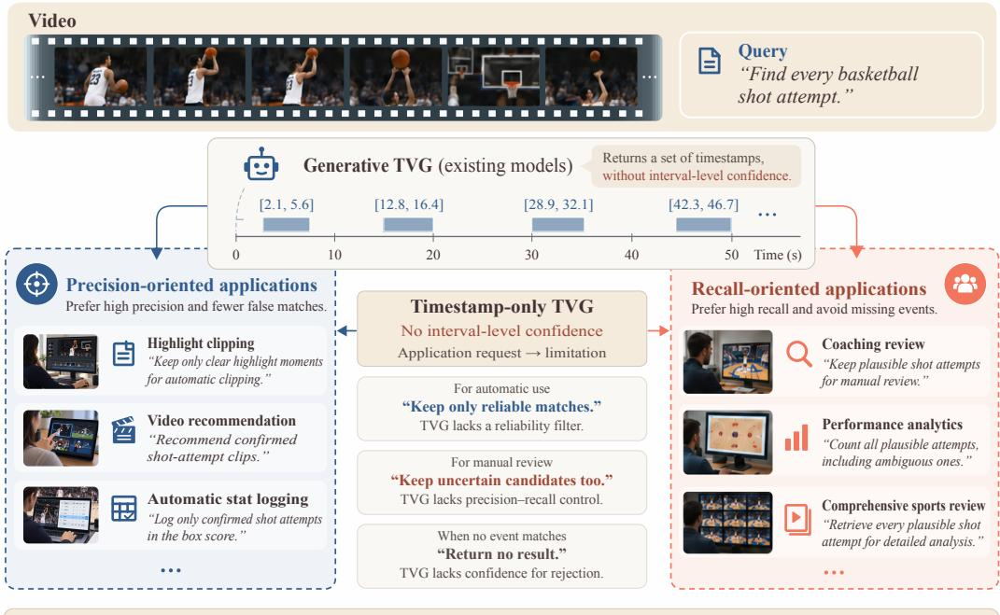  
The dilemma of timestamp-only TVG: no confidence-based selection control. Interval-level confidence enables different acceptance thresholds on the same candidates.  
Figure 1: Localization alone does not meet downstream selection needs. Applications differ in their tolerance for false and missed matches. Timestamp-only generative TVG lacks explicit control for adapting interval selection to these requirements. Frames are synthetic and scenarios illustrative.

Queries for absent events expose a further limitation. A model may return plausible timestamps even when no matching content exists. Negative-query rejection is a recognized challenge in moment retrieval (Flanagan et al., 2025). This requires deciding whether to return any candidate at all, beyond choosing which candidate to rank first.

Adapting existing confidence estimators to this setting involves trade-offs. Token likelihood scores the generated timestamp sequence, without directly supervising whether its boundaries localize the queried event. Verbalized confidence adds score tokens to the response (Tian et al., 2023), while sampling-based semantic uncertainty requires multiple answers (Kuhn et al., 2023). Semantic entropy probes avoid repeated sampling, but estimate uncertainty in text generation rather than temporal localization correctness (Kossen et al., 2024). A separate visual verifier can assess individual intervals, at the cost of additional model inference on candidate clips. We seek a score trained for individual temporal predictions and available from the original grounding pass.

We address this gap by pairing each generated interval with a continuous confidence score. A lightweight head reads pooled decoder states for the interval, reusing features computed during the original autoregressive pass. Applications can then adjust an acceptance threshold, rank candidates by reliability, and return an empty result when no candidate passes the threshold. All three decisions use the same response, without regenerating timestamps or invoking an external verifier. Candidate generation determines what can be returned; confidence supplies the acceptance rule.

Training gives the generator and confidence head distinct objectives. The generator is trained to cover annotated occurrences, whereas confidence learning also uses imperfect and unsupported intervals. In particular, unsupported candidates teach the head to reject without becoming part of the generator’s timestamp targets. We therefore use separate supervision sequences for the two tasks. GT-anchored supervised fine-tuning (SFT) retains every annotated occurrence and adds a bounded number of supported boundary alternatives. The confidence head learns from an offline visual verifier’s soft scores on precomputed candidate sequences. Set-level reinforcement learning (RL) then optimizes candidate coverage and the localization quality of the confidence-selected set. As the generator’s

proposals evolve during RL, binary temporal-overlap labels adapt the head to its current candidates.   
Confidence losses update only the head, while the selected-set reward guides the generator.

Experiments on OMTG-Bench assess fixed-pool selection under equal global return budgets; additional analyses on Charades, ActivityNet, and QVHighlights examine single-answer ranking and rejection of synthetic cross-video mismatches.

Our contributions are:

• Controllable grounding from a single decode. We introduce an interval-level confidence interface for generative TVG that separates candidate generation from acceptance. A lightweight head scores intervals from the original decoder states, enabling ranking, threshold-based selection, and rejection without re-decoding or an inference-time verifier.

• Distinct supervision with set-level optimization. GT-anchored targets train the generator; offline verifier scores and online temporal-overlap labels train the confidence head. Set-level RL connects the two by rewarding candidate coverage and the quality of the confidenceselected set.

• Selection gains from the same candidates. We show that learning what to return increases the value of a single generation. On fixed OMTG-Bench candidates, confidence improves query-macro Recall@0.5 most under tight budgets, gaining 4.47 and 4.64 points over generation order at 10% and 25% global return budgets, respectively.

## 2 METHOD

Figure 2 separates the generation and confidence-supervision paths.

## 2.1 INTERVAL CONFIDENCE AND ACCEPTANCE

Given a video V of duration $T$ and a language query $q ,$ the target is an interval set $\mathcal { V } = \{ [ s _ { j } , e _ { j } ] \} _ { i = 1 } ^ { m } .$ The autoregressive model $\pi _ { \theta }$ emits a variable-length array $C = [ I _ { 1 } , \ldots , I _ { n } ]$ , where $I _ { i } = [ \hat { s } _ { i } , \hat { e } _ { i } ]$ is measured in seconds and the true cardinality m is not supplied to the model. A valid candidate satisfies $0 \leq \hat { s } _ { i } < \hat { e } _ { i } \leq T$

Let $\mathcal { T } _ { i }$ contain the token positions of the serialized interval $I _ { i } ,$ , including its coordinates and withininterval delimiters. Let $h _ { t }$ be the final normalized decoder state after consuming token t. We average these states and apply a LayerNorm–MLP readout:

$$
\bar { h } _ { i } = \frac { 1 } { | { \mathcal T } _ { i } | } \sum _ { t \in { \mathcal T } _ { i } } h _ { t } , \qquad a _ { i } = g _ { \psi } ( \bar { h } _ { i } ) , \qquad c _ { i } = \sigma ( a _ { i } ) .\tag{1}
$$

At inference, the head scores intervals from decoder states cached during timestamp generation, without adding confidence tokens. Teacher-forced replay is used only for training. Single-pass scoring reuses decoding features; generating additional candidates still incurs token cost.

We first apply generation-order NMS at overlap threshold $\nu { : }$ earlier candidates have priority, and a later candidate is suppressed if it overlaps an already retained one above the NMS threshold. Denote this pool by $P = \mathrm { N M S } _ { \mathrm { o r d e r } , \nu } ( C )$ . Confidence then selects

$$
S _ { \tau } = \{ I _ { i } \in P : c _ { i } \geq \tau \} .\tag{2}
$$

NMS does not sort candidates by their confidence. The same completed decode therefore supports multiple global thresholds without regenerating intervals. A threshold allows variable output cardinal ity, including an empty set, rather than imposing a fixed number of answers per query. The scores can also rank the same pool under a return budget. These are different uses of one interface: thresholding fixes an acceptance score, whereas budgeted selection fixes how many intervals may be returned. Neither rule changes interval boundaries or recovers candidates removed by NMS.

## 2.2 LEARNING INTERVAL CONFIDENCE

Offline replay supplies visual-support targets over a broad candidate pool; online overlap labels then adapt the same head to the generator’s changing rollouts. These stages train the acceptance score separately from timestamp generation.

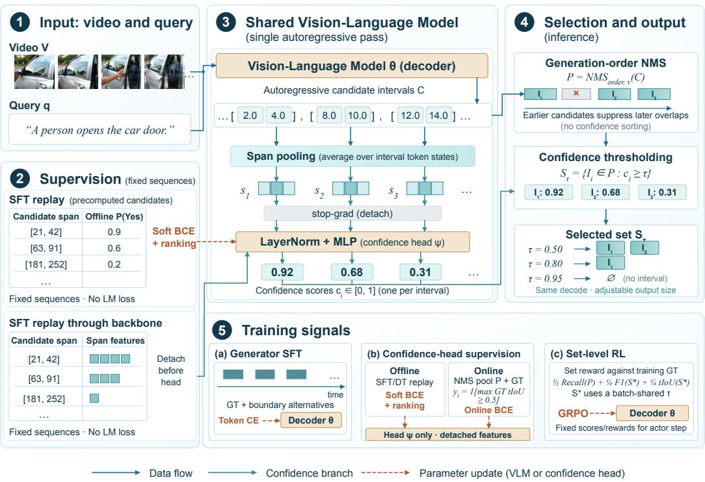  
Figure 2: Single-pass grounding with confidence. A span-pooled head scores temporal intervals from the same decoding pass. Generation-order NMS forms pool $P ;$ confidence thresholding selects $S _ { \tau }$ . GT-anchored SFT and set-level RL train the generator; offline supervision and online overlap labels train the head. Dashed arrows update decoder θ or head ψ; numerical examples are illustrative.

Offline supervision. For each query we use one precomputed candidate sequence, including supported proposals, unmatched proposals, GT completions, and duration-based negative candidates. An offline visual verifier supplies the soft label $z _ { i } = P _ { T } ( \mathrm { Y e s } \mid V , q , I _ { i } )$ . These sequences are fixed before SFT and replayed with teacher forcing to obtain candidate features. They have zero language-model loss, and their labels are not transferred to newly synthesized generator alternatives.

The replay’s interval states are mean-pooled as in Eq. (1) and detached before entering the head. We minimize soft binary cross entropy plus within-query ranking:

$$
\mathcal { L } _ { \mathrm { c o n f } } ^ { \mathrm { S F T } } = \frac { 1 } { n } \sum _ { i } \mathrm { B C E W i t h L o g i t s } ( a _ { i } , z _ { i } ) + 0 . 2 5 \mathcal { L } _ { \mathrm { p a i r } } ,\tag{3}
$$

where $\mathcal { L } _ { \mathrm { p a i r } }$ encourages higher logits for candidates with larger soft labels within a query. Together with the generator loss $\mathcal { L } _ { \mathrm { g e n } }$ (Section 2.3), SFT preserves gradient separation:

$$
\begin{array} { r } { \mathcal { L } _ { \mathrm { S F T } } = \mathcal { L } _ { \mathrm { g e n } } + 0 . 2 5 \mathcal { L } _ { \mathrm { c o n f } } ^ { \mathrm { S F T } } , \qquad \nabla _ { \theta } \mathcal { L } _ { \mathrm { c o n f } } ^ { \mathrm { S F T } } = 0 . } \end{array}\tag{4}
$$

Generator updates therefore use the GT-anchored generation target, while head updates use the broader fixed replay distribution. In particular, unsupported replay candidates teach the head to reject, without teaching the generator to emit those candidates. The verifier’s soft visual-support targets and the online overlap labels below have different meanings.

Online adaptation. The head adapts to current rollouts using binary overlap labels on NMS survivors:

$$
\begin{array} { r l } & { \qquad y _ { i } = \mathbf { 1 } \left[ \underset { Y _ { j } \in \mathcal { Y } } { \operatorname* { m a x } } \mathrm { t I o U } ( I _ { i } , Y _ { j } ) \geq 0 . 5 \right] , } \\ & { \qquad \mathscr { L } _ { \mathrm { c o n f } } ^ { \mathrm { R L } } = \mathrm { m e a n } _ { r } \left[ \mathrm { m e a n } _ { i \in P _ { r } } \mathrm { B C E W i t h L o g i t s } ( a _ { i } , y _ { i } ) \right] . } \end{array}\tag{5}
$$

The loss averages candidates within a rollout, then rollouts with valid NMS candidates. Hidden states are detached, so only ψ receives this loss; online labels use neither a verifier nor offline replay. A positive label means that an interval overlaps some GT occurrence sufficiently; it does not measure the interval’s marginal value after other candidates are accepted. Several candidates can be positive for the same occurrence even though one-to-one set matching credits that occurrence only once. NMS and the set-level reward address returned-set quality separately from this local label.

During online adaptation, scores and rewards are computed with the current head and held fixed for the actor update. The head then takes one supervised update, and its new weights score the next rollout batch. States are reused from the actor’s old-log-probability forward pass. This ordering prevents a head update from retroactively changing the current batch’s reward. At evaluation both generator and head are frozen. Confidence influences actor learning because the current scores determine the selected set used by the reward. Gradient isolation prevents the supervised confidence loss from directly updating the backbone.

## 2.3 TRAINING THE CANDIDATE GENERATOR

Generator targets. Each generation target retains all GT intervals as anchors and adds a bounded number of supported boundary alternatives from real proposals or perturbations. GT anchors precede alternatives and are never dropped to make room for them; the closing bracket follows the full target. Alternatives vary localization boundaries rather than introduce independent occurrences. There is no fixed-count padding or low-IoU filler. The generator loss $\mathcal { L } _ { \mathrm { g e n } }$ averages token cross entropy separately within GT, alternative, and format groups, then weights these groups so their relative contributions do not depend on token counts.

Coverage and acceptance have different roles. Missing an occurrence during generation leaves no candidate for any selector to recover, while retaining several overlapping alternatives can increase raw coverage without improving returned-set quality. The GT anchors preserve occurrence coverage in the target, and alternatives expose boundary variation. Generation-order NMS may still remove an alternative before confidence can compare it with an earlier proposal; we examine this limit separately from score quality.

Set-level reinforcement learning. RL starts from the merged SFT generator and paired head, with full-parameter actor updates. Each sampled response uses the same NMS and confidence selector as evaluation. After a recall/localization warm start, the set-level reward is

$$
\begin{array} { r } { R ( C ) = \frac { 1 } { 2 } \operatorname { R e c a l l } _ { 0 . 5 } ( P , \mathcal { V } ) + \frac { 1 } { 4 } \operatorname { F } 1 _ { 0 . 5 } ( S _ { \tau _ { B } ^ { * } } , \mathcal { V } ) + \frac { 1 } { 4 } \operatorname { t I o U } ( S _ { \tau _ { B } ^ { * } } , \mathcal { V } ) . } \end{array}\tag{6}
$$

Recall uses maximum-cardinality one-to-one matching at tIoU 0.5, so one proposal cannot recover two GT occurrences. The first term rewards coverage before confidence filtering. The remaining terms reward occurrence-level F1 and the temporal intersection over union of the predicted and GT unions. This training reward’s thresholded maximum-cardinality matching differs from the official evaluator’s maximum-total-IoU assignment followed by thresholding (Appendix A); the two need not return identical match counts. One threshold $\tau _ { B } ^ { * }$ maximizes mean F1 across the current training batch. The same selected set supplies both quality terms. No per-query oracle or test annotation enters training rewards.

We use a variant of group-relative policy optimization (GRPO) (Shao et al., 2024) that centers response rewards by their within-query mean without dividing by the group standard deviation. The clipped policy objective updates the generator through the generated response, including coordinate and format tokens. Confidence selection is deterministic and the head uses the separate supervised update in Section 2.2.

## 3 EXPERIMENTS

## 3.1 EXPERIMENTAL SETUP

Data and models. OMTG-Bench evaluates multi-occurrence grounding on 320 queries, 287 videos, and 1,173 official GT intervals (Xu et al., 2026). We initialize from TimeLens2-4B (Zhu et al., 2026); SFT uses 60,405 OMTG/TimeLens2 training units, and RL uses 8,424 OMTG queries with a source-video-disjoint 128-query internal diagnostic split. Single-interval TimeLens splits supply matched and synthetic unmatched queries. The confidence head maps 2,560-dimensional pooled states through 256 hidden units to one logit. Both main OMTG models use the official visual budget (2 fps, min\_pixels=2048, total\_pixels=8,388,608), greedy decoding with 512 output tokens and 32 candidates, and generation-order NMS at tIoU 0.3. Appendix C gives training and decoding details.

Metrics and selection. We report official OMTG set tIoU, tF1@0.3/0.5, occurrence recall, count accuracy, and EtF1, retaining all queries, including empty or invalid responses. Official matching maximizes total IoU before thresholding; supplementary micro diagnostics use thresholded maximumcardinality matching. Each model decodes once and selectors reuse its cached predictions. For full-system OMTG results, one global threshold maximizes test tF1@0.5; all metrics use that set. These are test-oracle operating points, not deployment-validated thresholds; published baselines retain native rules. The reported RL checkpoint was also selected after benchmark feedback. Test labels enter offline metrics and selection feedback, never model inputs, gradients, or rewards. Appendix D specifies scoring and threshold tie rules. Official OMTG scores average query-level metrics, so the reported macro F1 is not computed by taking the harmonic mean of macro precision and recall. Paired uncertainty checks resample source videos, keeping queries from the same video together; these intervals condition on the frozen model and candidate pool.

## 3.2 SELECTION UNDER EQUAL RETURN BUDGETS

We rank the same 1,314 generation-order NMS survivors from the frozen RL model on all 320 OMTG-Bench queries. Order prioritizes earlier within-query positions; Logp uses mean intervaltoken log-probability; Verifier uses the frozen 2B SFT verifier’s binary-normalized first-token Yes probability; and Confidence uses the span head from the original decode. Only Verifier requires separate candidate-clip inference. Each selector ranks across queries and receives the same global return count, rounded down at each budget fraction; ties use generation index then query ID. Generator outputs, intervals, and NMS are fixed, and GT only measures quality. The quota is shared across the benchmark rather than imposed separately on each query. A query may therefore receive several intervals or none, and unanswered queries still contribute zero recall to the full denominator.

Table 1: Confidence-score comparison at equal global return budgets. Official OMTG-Bench Recall@0.5 (%, ↑), averaged over all 320 queries using the same 1,314 candidates. Budget denotes the retained fraction of candidates returned across queries.
<table><tr><td>Budget</td><td>Order</td><td>Logp</td><td>Verifier</td><td>Confidence</td></tr><tr><td>10%</td><td>9.95</td><td>9.41</td><td>11.00</td><td>14.42</td></tr><tr><td>25%</td><td>26.48</td><td>22.37</td><td>26.31</td><td>31.12</td></tr><tr><td>50%</td><td>51.34</td><td>43.05</td><td>47.72</td><td>52.82</td></tr><tr><td>75%</td><td>64.76</td><td>61.00</td><td>62.45</td><td>65.30</td></tr></table>

Confidence improves official query-macro recall over Order by 4.47 and 4.64 points at 10% and 25% retention, respectively (Table 1). The benefit is largest under tight budgets: as more of the fixed pool is returned, selection has less room to help. Paired 95% source-video bootstrap intervals for these official macro-recall gains are [2.30, 6.04] and [2.26, 7.09] points, respectively.

Appendix A reports tie-sensitivity checks and supplementary diagnostics of micro match counts and cross-query budget allocation.

## 3.3 THRESHOLD SELECTION AND TRANSFER

Figure 3(a) sweeps global thresholds on each model’s fixed NMS pool. RL extends the high-recall end: retaining all survivors gives 70.51% recall versus SFT’s 65.06%. Each curve reuses its own model’s candidates; separation between curves reflects both generator and scorer changes. For one fixed pool, increasing τ produces nested accepted sets, $S _ { \tau _ { 2 } } \subseteq S _ { \tau _ { 1 } }$ for $\tau _ { 2 } \geq \tau _ { 1 }$ . The return count therefore decreases or stays fixed; precision depends on which correct and incorrect intervals the threshold removes.

Threshold transfer asks a different question. On 512 source-video-disjoint calibration videos, we select thresholds meeting 80% and 90% empirical micro precision, then apply them unchanged to

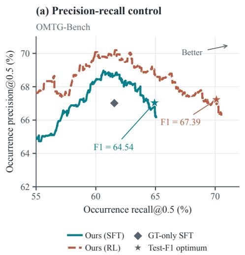

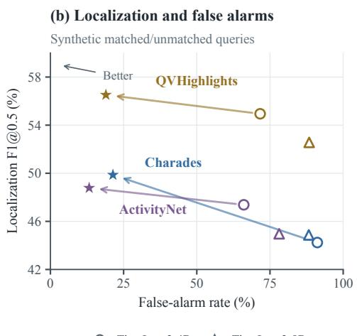  
Figure 3: Confidence-controlled selection and localization. (a) OMTG-Bench precision–recall curves sweep a global threshold on each model’s fixed candidates after generation-order NMS (0.3), without re-decoding. The high-precision/high-recall region is shown. The gray diamond is GT-only SFT at the official visual/512-token budget, without NMS or confidence selection. (b) Localization F1 versus false-alarm rate on the synthetic matched/unmatched splits of Table 4. Colors identify datasets; arrows connect native TimeLens2-4B to our RL model, with native TimeLens2-8B also shown. Higher F1 and lower false-alarm rate are better. In both panels, stars mark the global test-F1-optimal operating points reported in the corresponding tables.

OMTG-Bench. The achieved precision falls to 71.71% (654/912) and 86.89% (391/450), respectively: neither target transfers. The source cohort had been used in earlier project analyses. Appendix B reports calibration results and a retrospective within-source variability check.

This experiment fits a threshold to an empirical precision criterion; it does not simply interpret a confidence value of 0.8 as 80% correctness. The two transferred operating points retain micro recall of 55.75% and 33.33%, respectively, so the higher precision comes with reduced coverage. The relative contributions of threshold-selection variability, cohort composition, and changes in the score–correctness relation remain unresolved.

Budgeted selection depends on score ordering, preserved by a common strictly increasing transformation. Precision-target transfer additionally requires predictions accepted at the source-selected threshold to maintain the required correctness rate across cohorts.

## 3.4 END-TO-END GROUNDING AND COMPONENT ANALYSIS

Our SFT and RL models share the backbone, visual budget, parser, NMS, and one-decode inference, each with its matching head. RL gains 3.52 points in tF1@0.3, 2.85 in tF1@0.5, and 2.49 in tIoU over SFT (Table 2). OMTG-4B retains stronger count accuracy and EtF1.

Table 3 shows raw recall rising from 67.85 to 73.64 as RL reduces the mean candidate count from 11.18 to 8.99 (about 20%); the coverage gain thus does not rely on more candidates on average. NMS accounts for most of the raw-to-final F1 gain; confidence filtering on the fixed RL pool adds 0.32 points (paired 95% interval [−0.14, 0.76]), alongside the budgeted-selection gains in Table 1. Confidence-sorted NMS did not improve performance. The GT-only system reference matches the inference budget but differs in initialization, data, and prompt.

On fixed L200 candidates and decoder states, the online head improves post-NMS AUROC from 0.754 to 0.818 over the original SFT head (Appendix B.3). It raises 10%-budget recall by 1.62 points (95% interval [0.14, 2.83]); gains at 25% and in test-oracle F1 remain uncertain. Better candidate-correctness discrimination can thus support tight-budget selection without a clear final-set F1 gain, consistent with the gap between local overlap labels and marginal set utility (Section 2.2).

Table 2: Multi-occurrence grounding on OMTG-Bench. Official metrics (%). Native TimeLens2 uses the official visual/512-token budget; published baselines retain source protocols (Zhu et al., 2026; Xu et al., 2026). †: one global test-tF1@0.5-optimal threshold.
<table><tr><td>Model</td><td>C-Acc</td><td>tF1@0.3</td><td>tF1@0.5</td><td>tIoU</td><td>EtF1</td></tr><tr><td>Seed-1.8</td><td>38.12</td><td>67.13</td><td>54.67</td><td>56.81</td><td>28.04</td></tr><tr><td>Gemini 2.5 Pro</td><td>50.94</td><td>55.72</td><td>43.57</td><td>43.24</td><td>27.80</td></tr><tr><td>Qwen3-VL-4B</td><td>0.31</td><td>37.07</td><td>26.75</td><td>30.42</td><td>0.21</td></tr><tr><td>TimeLens-8B</td><td>0.00</td><td>39.14</td><td>32.76</td><td>32.38</td><td>0.00</td></tr><tr><td>TimeLens2-4B</td><td>18.75</td><td>53.02</td><td>43.89</td><td>48.73</td><td>14.29</td></tr><tr><td>TimeLens2-8B</td><td>16.25</td><td>47.14</td><td>38.19</td><td>47.08</td><td>12.86</td></tr><tr><td>OMTG-4B</td><td>55.63</td><td>73.46</td><td>65.40</td><td>61.24</td><td>43.65</td></tr><tr><td>Ours (SFT)†</td><td>51.88</td><td>72.40</td><td>64.54</td><td>60.75</td><td>40.26</td></tr><tr><td>Ours (RL)†</td><td>53.75</td><td>75.92</td><td>67.39</td><td>63.24</td><td>42.64</td></tr></table>

Table 3: Candidate coverage and successive selection stages. Official Recall@0.5 and tF1@0.5 (%) on fixed decoded pools. NMS uses generation order at tIoU 0.3; † denotes each model’s global test-F1-optimal confidence threshold.
<table><tr><td></td><td colspan="2">Raw</td><td colspan="2">NMS</td><td colspan="2">NMS + confidence†</td></tr><tr><td>Model</td><td>Recall</td><td>tF1</td><td>Recall</td><td>tF1</td><td>Recall</td><td>tF1</td></tr><tr><td>SFT</td><td>67.85</td><td>34.65</td><td>65.06</td><td>64.17</td><td>64.92</td><td>64.54</td></tr><tr><td>RL</td><td>73.64</td><td>41.39</td><td>70.51</td><td>67.07</td><td>70.10</td><td>67.39</td></tr></table>

## 3.5 RANKING AND REJECTION ON SINGLE-INTERVAL DATASETS

Each matched query in the Charades, ActivityNet, and QVHighlights TimeLens splits is paired with one cross-video mismatch. These synthetic negatives are not official annotations or exhaustively human-verified absences. All prompts permit []. Our frozen models retain the highest-confidence NMS survivor and reject it below one benchmark-wide threshold; TimeLens2 baselines retain their native output rules.

Table 4: Localization and rejection on balanced matched/synthetic-mismatched splits. All prompts allow empty outputs. † denotes one benchmark-wide test-F1-optimal threshold; native baselines retain their original output rules. F1@0.5 and false-alarm rate (FAR) are percentages.
<table><tr><td></td><td colspan="2">Charades</td><td colspan="2">ActivityNet</td><td colspan="2">QVHighlights</td></tr><tr><td>Method</td><td>F1@0.5↑</td><td>FAR↓</td><td>F1@0.5↑</td><td>FAR↓</td><td>F1@0.5↑</td><td>FAR↓</td></tr><tr><td>TimeLens2-4B, native</td><td>44.24</td><td>91.17</td><td>47.38</td><td>66.04</td><td>54.95</td><td>71.64</td></tr><tr><td>TimeLens2-8B, native</td><td>44.87</td><td>88.25</td><td>44.97</td><td>78.13</td><td>52.57</td><td>88.38</td></tr><tr><td>Ours (SFT)†</td><td>46.81</td><td>36.01</td><td>48.42</td><td>15.22</td><td>57.67</td><td>16.87</td></tr><tr><td>Ours (RL)†</td><td>49.87</td><td>21.35</td><td>48.78</td><td>13.24</td><td>56.52</td><td>18.95</td></tr></table>

In this full-system rejection comparison, native TimeLens2-4B retains false-alarm rates of 66.04– 91.17% on these mismatches. At test-F1-optimal thresholds, our RL system reduces this range to 13.24–21.35% and improves F1 by 1.40–5.63 points (Table 4). ActivityNet and QVHighlights gains trade recall for precision. SFT already reduces false alarms and exceeds RL on QVHighlights, so the additional benefit of RL varies by dataset.

A separate fixed-pool analysis on the matched subsets compares returning the first raw interval with returning the highest-confidence interval, without NMS or thresholding. On Charades, confidence im proves mIoU by 2.02 points with a paired 95% interval of [1.39, 2.68]. ActivityNet and QVHighlights have positive point estimates but intervals that include zero (Appendix A). This supports within-query ranking on Charades while leaving its consistency across datasets unresolved.

## 4 RELATED WORK

Video temporal grounding. Discriminative methods learn matching or saliency scores (Gao et al., 2017; Lei et al., 2021; Lin et al., 2023; Moon et al., 2023); generative approaches produce timestamps through language decoding or dedicated interval prediction (Huang et al., 2024; Ren et al., 2024; Wang et al., 2024; Wu et al., 2025; Pramanick et al., 2025). Time-R1 and TimeLens study RLbased grounding and training recipes (Wang et al., 2026; Zhang et al., 2026), while OMTG and TimeLens2 develop set-valued generation (Xu et al., 2026; Zhu et al., 2026). TimeExpert also generates saliency tokens for highlight detection (Yang et al., 2025). Our score targets each decoded interval’s localization correctness for acceptance decisions.

Grounding reliability and rejection. RaTSG, OpenVMR, and Moment of Untruth address absentquery rejection (Dong et al., 2024; Fang et al., 2024; Flanagan et al., 2025); Generalized Video Moment Retrieval supports both multiple and no-target queries (Qin et al., 2025). RA-RFT trains generative grounders to refuse semantically similar but irrelevant queries through GRPO (Lee et al., 2026); HRVTG adapts grounders at test time using counterfactual probes (Yi et al., 2026). Event verification tuning addresses localization–verification inconsistencies (Jung et al., 2025); CAVE aligns boundary evidence through RL and competence-aware gating (Jia et al., 2026). Our method supports rejection by selecting intervals from a completed grounding response with a frozen confidence head.

Confidence and selective prediction. ConfidNet learns auxiliary confidence from model features (Corbière et al., 2019), and hidden-state classifiers predict statement truthfulness in LLMs (Azaria & Mitchell, 2023). For temporal grounding, URPA uses rollout variance to weight adaptation rewards (Hu et al., 2026). Selective prediction controls acceptance and risk (Geifman & El-Yaniv, 2019), whereas calibration concerns agreement between scores and empirical correctness (Guo et al., 2017). Language-model approaches include verbalized confidence (Tian et al., 2023), uncertainty across sampled answers (Kuhn et al., 2023), and hidden-state entropy probes (Kossen et al., 2024). Building on learned confidence readouts, we train interval scores with offline visual-support targets and online temporal-overlap labels for selection from one grounding response.

## 5 LIMITATIONS

This work explores a confidence-aware paradigm for TVG, in which confidence is explicitly learned during training and used to guide inference. Our current confidence head represents one practical realization of this direction: a lightweight MLP over pooled decoder states, adapted online with a standard binary cross-entropy objective. Although this design demonstrates the utility of incorporating confidence into TVG, it explores only a limited part of the architectural and optimization space. In particular, confidence supervision updates the readout without directly shaping the underlying representations. Confidence-based selection also depends on the available candidate pool and cannot recover missing or NMS-suppressed proposals. Future work will investigate more native integration of confidence into temporal representation learning and generation, through architectures and training objectives that jointly learn where to ground and how certain the model should be. Establishing probability calibration and its robustness across domains remains a further research direction.

## 6 CONCLUSION

We introduced interval-level confidence as a decision interface for generative video temporal grounding. By separating candidate generation from acceptance, our approach allows a single decoded response to support ranking, threshold-based selection, and rejection without an inference-time verifier. Fixed-pool experiments on OMTG-Bench show improved recall under equal return budgets, with the largest gains at tight budgets. These results highlight that generation and selection are distinct capabilities: the value of a candidate pool also depends on how its intervals are prioritized and accepted. Explicit confidence makes the output policy adjustable after decoding, allowing the same candidates to serve different return budgets and acceptance requirements.

## AI USE STATEMENT

Generative AI tools were used primarily to polish the manuscript’s language, develop editable figure code, and refine LaTeX formatting.

## REFERENCES

Diogo Almeida. Introducing system one models & Jev. TypeSafe AI Blog, September 2026. URL https://typesafe.ai/blog/introducing-system-one-models-and-jev. Published September 15, 2026.

Amos Azaria and Tom Mitchell. The internal state of an llm knows when it’s lying. In Findings of the Association for Computational Linguistics: EMNLP 2023, pp. 967–976, 2023.

Charles Corbière, Nicolas Thome, Avner Bar-Hen, Matthieu Cord, and Patrick Pérez. Addressing failure prediction by learning model confidence. Advances in neural information processing systems, 32, 2019.

Jianfeng Dong, Xiaoman Peng, Daizong Liu, Xiaoye Qu, Xun Yang, Cuizhu Bao, and Meng Wang. Temporal sentence grounding with relevance feedback in videos. Advances in Neural Information Processing Systems, 37:43107–43132, 2024.

Xiang Fang, Wanlong Fang, Daizong Liu, Xiaoye Qu, Jianfeng Dong, Pan Zhou, Renfu Li, Zichuan Xu, Lixing Chen, Panpan Zheng, et al. Not all inputs are valid: Towards open-set video moment retrieval using language. In Proceedings of the 32nd ACM International Conference on Multimedia, pp. 28–37, 2024.

Kevin Flanagan, Dima Damen, and Michael Wray. Moment of untruth: dealing with negative queries in video moment retrieval. In 2025 IEEE/CVF Winter Conference on Applications of Computer Vision (WACV), pp. 5336–5345. IEEE, 2025.

Jiyang Gao, Chen Sun, Zhenheng Yang, and Ram Nevatia. Tall: Temporal activity localization via language query. In 2017 IEEE International Conference on Computer Vision (ICCV), pp. 5277–5285. IEEE, 2017.

Yonatan Geifman and Ran El-Yaniv. Selectivenet: A deep neural network with an integrated reject option. In International conference on machine learning, pp. 2151–2159. PMLR, 2019.

Chuan Guo, Geoff Pleiss, Yu Sun, and Kilian Q Weinberger. On calibration of modern neural networks. In International conference on machine learning, pp. 1321–1330. PMLR, 2017.

Jian Hu, Zixu Cheng, Shaogang Gong, Isabel Guan, Jianye Hao, Jun Wang, and Kun Shao. Uncertainty-quantified rollout policy adaptation for unlabelled cross-domain video temporal grounding. Advances in Neural Information Processing Systems, 38:44969–44991, 2026.

Bin Huang, Xin Wang, Hong Chen, Zihan Song, and Wenwu Zhu. Vtimellm: Empower llm to grasp video moments. In 2024 IEEE/CVF Conference on Computer Vision and Pattern Recognition (CVPR), pp. 14271–14280. IEEE, 2024.

Wei Jia, Zhicong Lu, Yu Chen, Xiang Wang, Shuai Li, Wenqian Lv, Jiayue Cao, et al. Cave: Competence-aware visual boundary evidence alignment for video temporal grounding. arXiv preprint arXiv:2608.02078, 2026.

Minjoon Jung, Junbin Xiao, Byoung-Tak Zhang, and Angela Yao. On the consistency of video large language models in temporal comprehension. In 2025 IEEE/CVF Conference on Computer Vision and Pattern Recognition (CVPR), pp. 13713–13722. IEEE, 2025.

Jannik Kossen, Jiatong Han, Muhammed Razzak, Lisa Schut, Shreshth Malik, and Yarin Gal. Semantic entropy probes: Robust and cheap hallucination detection in llms. arXiv preprint arXiv:2406.15927, 2024.

Lorenz Kuhn, Yarin Gal, and Sebastian Farquhar. Semantic uncertainty: Linguistic invariances for uncertainty estimation in natural language generation. arXiv preprint arXiv:2302.09664, 2023.

Jin-Seop Lee, SungJoon Lee, SeongJun Jung, Boyang Li, and Jee-Hyong Lee. Learning to refuse: refusal-aware reinforcement fine-tuning for hard-irrelevant queries in video temporal grounding. In Proceedings of the IEEE/CVF Conference on Computer Vision and Pattern Recognition, pp. 10397–10407, 2026.

Jie Lei, Tamara L Berg, and Mohit Bansal. Detecting moments and highlights in videos via natural language queries. Advances in Neural Information Processing Systems, 34:11846–11858, 2021.

Kevin Qinghong Lin, Pengchuan Zhang, Joya Chen, Shraman Pramanick, Difei Gao, Alex Jinpeng Wang, Rui Yan, and Mike Zheng Shou. Univtg: Towards unified video-language temporal grounding. In 2023 IEEE/CVF International Conference on Computer Vision (ICCV), pp. 2782– 2792. IEEE, 2023.

WonJun Moon, Sangeek Hyun, SangUk Park, Dongchan Park, and Jae-Pil Heo. Query-dependent video representation for moment retrieval and highlight detection. In 2023 IEEE/CVF Conference on Computer Vision and Pattern Recognition (CVPR), pp. 23023–23033. IEEE, 2023.

Shraman Pramanick, Effrosyni Mavroudi, Yale Song, Rama Chellappa, Lorenzo Torresani, and Triantafyllos Afouras. Enrich and detect: Video temporal grounding with multimodal llms. In 2025 IEEE/CVF International Conference on Computer Vision (ICCV), pp. 24297–24308. IEEE, 2025.

You Qin, Qilong Wu, Yicong Li, Wei Ji, Li Li, Pengcheng Cai, Lina Wei, and Roger Zimmermann. Generalized video moment retrieval. In International Conference on Learning Representations, volume 2025, pp. 49207–49223, 2025.

Shuhuai Ren, Linli Yao, Shicheng Li, Xu Sun, and Lu Hou. Timechat: A time-sensitive multimodal large language model for long video understanding. In 2024 IEEE/CVF Conference on Computer Vision and Pattern Recognition (CVPR), pp. 14313–14323. IEEE, 2024.

Zhihong Shao, Peiyi Wang, Qihao Zhu, Runxin Xu, Junxiao Song, Xiao Bi, Haowei Zhang, Mingchuan Zhang, Y. K. Li, Y. Wu, and Daya Guo. Deepseekmath: Pushing the limits of mathematical reasoning in open language models. arXiv preprint arXiv:2402.03300, 2024.

Katherine Tian, Eric Mitchell, Allan Zhou, Archit Sharma, Rafael Rafailov, Huaxiu Yao, Chelsea Finn, and Christopher D Manning. Just ask for calibration: Strategies for eliciting calibrated confidence scores from language models fine-tuned with human feedback. In Proceedings ofthe 2023 Conference on Empirical Methods in Natural Language Processing, pp. 5433–5442, 2023.

Haibo Wang, Zhiyang Xu, Yu Cheng, Shizhe Diao, Yufan Zhou, Yixin Cao, Qifan Wang, Weifeng Ge, and Lifu Huang. Grounded-videollm: Sharpening fine-grained temporal grounding in video large language models. arXiv preprint arXiv:2410.03290, 2024.

Ye Wang, Ziheng Wang, Boshen Xu, Yang Du, Kejun Lin, Zihan Xiao, Zihao Yue, Jianzhong Ju, Liang Zhang, Dingyi Yang, et al. Time-r1: Post-training large vision language model for temporal video grounding. Advances in Neural Information Processing Systems, 38:83330–83364, 2026.

Yongliang Wu, Xinting Hu, Yuyang Sun, Yizhou Zhou, Wenbo Zhu, Fengyun Rao, Bernt Schiele, and Xu Yang. Number it: Temporal grounding videos like flipping manga. In 2025 IEEE/CVF Conference on Computer Vision and Pattern Recognition (CVPR), pp. 13754–13765. IEEE, 2025.

Qi Xu, Yue Tan, Shihao Chen, Jiahao Meng, Anna Wang, Shunping Ji, Hao Fei, and Jason Li. Towards one-to-many temporal grounding. arXiv preprint arXiv:2606.06294, 2026.

Zuhao Yang, Yingchen Yu, Yunqing Zhao, Shijian Lu, and Song Bai. Timeexpert: An expert-guided video llm for video temporal grounding. In 2025 IEEE/CVF International Conference on Computer Vision (ICCV), pp. 24286–24296. IEEE, 2025.

Chufan Yi, Hongyu Qu, Shiyu Xuan, Rui Yan, Xiangbo Shu, Fang Zhao, and Guo-Sen Xie. Test-time counterfactual calibration for hallucination-resistant temporal grounding. In European Conference on Computer Vision, pp. 191–209. Springer, 2026.

Jun Zhang, Teng Wang, Yuying Ge, Yixiao Ge, Xinhao Li, and Limin Wang. Timelens: Rethinking video temporal grounding with multimodal llms. In Proceedings ofthe IEEE/CVF Conference on Computer Vision and Pattern Recognition, pp. 10419–10429, 2026.

Yuhan Zhu, Changlian Ma, Xiangyu Zeng, Xinhao Li, Zhiqiu Zhang, Songze Li, Jun Zhang, Tianxiang Jiang, Yuandong Yang, Ziang Yan, et al. Timelens2: Generalist video temporal grounding with multimodal llms. arXiv preprint arXiv:2607.17423, 2026.

## A SUPPLEMENTARY SELECTION RESULTS AND STATISTICAL CHECKS

Official recall at a global acceptance budget. Section 3.2 and Table 1 compare four selectors at equal global return budgets. Selected intervals are restored to generation order before the official parser. Official Hungarian matching maximizes total IoU, then counts pairs with tIoU ≥ 0.5; recall averages each query’s matched fraction over all 320 queries. This differs from the RL reward’s thresholded maximum-cardinality matching, so all-survivor recall is not a formal upper bound. The point estimates condition on the benchmark-selected checkpoint and candidate pool.

For Table 5, we reuse the 3,000 paired source-video bootstrap draws of the micro analysis below. Each draw samples 287 videos with replacement, retaining all queries from each sampled video. Each scorer re-ranks the replicated NMS candidates and returns $\lfloor f N _ { b } \rfloor$ intervals, where f is the budget fraction and $N _ { b }$ is the resampled pool size. We apply the same official parser and evaluator to each query copy and average recall over all query copies, including unanswered ones. The paired percentile intervals therefore use the same metric and budget policy as Table 1.

Table 5: Official recall differences at tight global budgets. Confidence minus each baseline in query-macro Recall@0.5 (percentage points), with paired 95% percentile intervals.
<table><tr><td>Budget</td><td>∆ vs. Order</td><td>∆ vs. Logp</td><td>∆ vs. Verifier</td></tr><tr><td>10%</td><td>+4.47 [2.30, 6.04]</td><td>+5.01 [3.26, 6.36]</td><td>+3.42 [1.36, 4.56]</td></tr><tr><td>25%</td><td>+4.64 [2.26, 7.09]</td><td>+8.75 [5.86, 11.29]</td><td>+4.81 [2.33, 7.16]</td></tr></table>

Micro match counts and allocation diagnostics. At 50% retention (657 intervals), Confidence has 528 matched intervals and 80.37% micro precision, versus 454/69.10% for Order and 497/75.65% for Verifier. It answers 257 of 320 queries, versus Verifier’s 275: more total matches are concentrated on fewer queries. These maximum-cardinality micro counts are a diagnostic distinct from official query-macro recall.

At 10%, 1,000 random cross-query Order tie breaks give 84–99 matches in the central 95% (mean 91.58), versus 87 with fixed ID ties and 124 for Confidence; this is tie sensitivity, not a confidence interval. In 3,000 paired source-video bootstrap draws, each scorer re-ranks and receives the same recomputed quota. Exploratory 95% intervals for Confidence-minus-Order and Confidence-minus-Verifier micro-precision differences are [18.80, 36.51] and [−0.85, 15.27] points at 10%; [12.50, 22.94] and [0.62, 10.77] at 25%; and [8.87, 15.31] and [1.64, 8.12] at 50%. The 10% Verifier comparison remains inconclusive for micro precision even though its query-macro recall interval is positive. Both bootstrap analyses are exploratory, exclude checkpoint-selection and training-seed uncertainty, and have no multiple-comparison correction.

Ranking is useful beyond generation order. A model may emit multiple plausible boundaries even when evaluation requires one answer. We compare taking the first valid interval with taking the highest-confidence interval from the same response. Ties use generation order; neither rule uses NMS or a confidence threshold. The generator and its matching head remain frozen throughout all three datasets.

Table 6: Single-answer ranking on fixed decoded pools. Complete matched subsets of the mixedquery TimeLens runs; mIoU and R@1 at tIoU 0.5 are percentages. The paired mIoU changes and 95% intervals use 2,000 source-video bootstrap samples. Both selectors reuse the saved responses to the prompt allowing []; invalid or empty answers have zero IoU.
<table><tr><td colspan="5">mIoU</td><td rowspan="2">R@1, 0.5 First → Conf.</td></tr><tr><td>Dataset</td><td>Queries</td><td>First</td><td>Confidence</td><td>∆ mIoU [95% CI]</td></tr><tr><td>Charades</td><td>3,363</td><td>47.89</td><td>49.91</td><td>+2.02 [1.39, 2.68]</td><td>55.16 → 57.21</td></tr><tr><td>ActivityNet</td><td>4,500</td><td>45.96</td><td>46.40</td><td>+0.44 [−0.21, 1.11]</td><td>50.76 → 51.33</td></tr><tr><td>QVHighlights</td><td>1,541</td><td>57.26</td><td>57.95</td><td>+0.68 [-0.38, 1.69]</td><td>61.19 → 62.10</td></tr></table>

Confidence improves the point estimates in Table 6, but only the Charades mIoU interval excludes zero. Generation order leaves useful selection information unused on that dataset; the smaller gains on ActivityNet and QVHighlights remain uncertain.

## B THRESHOLD TRANSFER AND COMPONENT ANALYSIS

Threshold transfer. We also fit global thresholds on 512 source-video-disjoint calibration videos, selecting the largest NMS-survivor set that meets 80% or 90% empirical micro precision, with minimum acceptance and video-coverage requirements. The calibration set is disjoint from project SFT, RL, and OMTG videos, but was used in earlier project analyses; it is not a fresh confirmation set. Calibration precision was 80.03% (1,190/1,487) and 90.09% (845/938). Applying those frozen thresholds once to OMTG gives 71.71% (654/912) and 86.89% (391/450) micro precision, with micro recall 55.75% and 33.33%, respectively. Neither empirical target transfers. In a retrospective five-fold video-held-out check within the same source cohort, pooled held-out precision is 80.00% (1,196/1,495) and 89.94% (840/934); only 3/5 and 2/5 folds meet their respective targets.

## B.1 NMS AND CONFIDENCE SELECTION

Redundancy removal and acceptance control are complementary. NMS uses overlap and generation order; confidence uses an interval’s decoder features. Table 7 applies the two rules in sequence, holding each model’s decoded pool fixed. On RL candidates, confidence raises precision from 66.25 to 67.23 and F1 from 67.07 to 67.39, while recall changes from 70.51 to 70.10. The paired F1 change is +0.32 points, with a 95% source-video bootstrap interval of [−0.14, 0.76] (3,000 draws; threshold held fixed), so the incremental F1 benefit is not established. The historical cases in Figure 5 illustrate how the two selectors can make different decisions.

Table 7: Confidence selection after geometric suppression. Official OMTG-Bench metrics (%), averaged over all 320 queries. Confidence uses each model’s global F1-optimal test-oracle threshold; NMS alone retains every survivor.
<table><tr><td>Model</td><td>Selection</td><td>Precision@0.5</td><td>Recall@0.5</td><td>tF1@0.5</td></tr><tr><td>SFT</td><td>NMS</td><td>66.17</td><td>65.06</td><td>64.17</td></tr><tr><td>SFT</td><td>NMS + confidence</td><td>67.04</td><td>64.92</td><td>64.54</td></tr><tr><td>RL</td><td>NMS</td><td>66.25</td><td>70.51</td><td>67.07</td></tr><tr><td>RL</td><td>NMS + confidence</td><td>67.23</td><td>70.10</td><td>67.39</td></tr></table>

NMS order control. On cached final-model candidates, confidence-sorted NMS lowers tF1@0.5 from 67.39 to 66.61 at the same test-oracle threshold. Exploratory five-fold source-video-grouped threshold selection gives 67.37 versus 66.41 (paired bootstrap difference [−1.76, −0.21] points). Both comparisons reuse the inspected OMTG cohort. We retain generation-order NMS based on these aggregate results.

## B.2 FULL SYSTEM AND CANDIDATE-GENERATION REFERENCE

Table 8: Candidate generation and final selection on OMTG-Bench. All rows use the official visual budget and greedy decoding with 512 output tokens on all 320 queries (1,173 GT intervals); metrics are percentages. The upper block shows raw outputs; the lower applies generation-order NMS (0.3) and confidence selection. † denotes one global F1-optimal test-oracle threshold, shared by all metrics in that row.
<table><tr><td></td><td>Recall</td><td></td><td>tF1</td><td></td><td></td></tr><tr><td>Variant</td><td>@0.5</td><td>C-Acc</td><td>@0.5</td><td>tIoU</td><td>EtF1</td></tr><tr><td colspan="6">Candidate generation: raw outputs</td></tr><tr><td>GT-only SFT</td><td>61.55</td><td>48.13</td><td>62.59</td><td>58.67</td><td>38.08</td></tr><tr><td>Ours (SFT), raw</td><td>67.85</td><td>0.00</td><td>34.65</td><td>53.35</td><td>0.00</td></tr><tr><td>Ours (RL), raw</td><td>73.64</td><td>0.31</td><td>41.39</td><td>57.21</td><td>0.01</td></tr><tr><td colspan="6">Final selection: NMS + confidence selection</td></tr><tr><td>Ours (SFT)†</td><td>64.92</td><td>51.88</td><td>64.54</td><td>60.75</td><td>40.26</td></tr><tr><td>Ours (RL)†</td><td>70.10</td><td>53.75</td><td>67.39</td><td>63.24</td><td>42.64</td></tr></table>

The GT-only reference returns 3.65 candidates per query and reaches 61.55 Recall@0.5. Our raw SFT and RL pools return 11.18 and 8.99 candidates, with 67.85 and 73.64 recall. After NMS and confidence selection, their mean returned counts are 3.89 and 3.74. The GT-only run matches the official visual and 512-token inference budget but differs in training initialization, data composition, and prompt; these rows do not isolate candidate-target construction.

## B.3 HEAD ADAPTATION ON FIXED CANDIDATES AND DECODER STATES

We rescore the final step-200 actor’s 2,878 cached candidates and identical span features with the original SFT head and its matching online RL head. Both heads remain frozen, with no new generator decoding or optimizer steps. Generation-order NMS at 0.3 leaves the same 1,314 candidates from 320 queries and 287 source videos. Candidate AUROC uses the local label $\begin{array} { r } { { \bf 1 } [ \mathrm { m a x } _ { j } \mathrm { t I o U } ( I _ { i } , Y _ { j } ) \geq 0 . 5 ] } \end{array}$ after NMS.

Table 9: Head crossover on the same L200 candidates and features. Recall is official query-macro Recall@0.5 at the indicated global return budget. Each head’s tF1 uses its own global test-F1-optimal threshold; these are diagnostic operating points. Recall and tF1 are percentages.
<table><tr><td>Head</td><td>NMS AUROC</td><td>Oracle tF1 @0.5</td><td>Recall, 10%</td><td>Recall, 25%</td></tr><tr><td>Original SFT</td><td>0.754</td><td>67.18</td><td>12.80</td><td>29.74</td></tr><tr><td>Online RL</td><td>0.818</td><td>67.39</td><td>14.42</td><td>31.12</td></tr></table>

At 10% and 25% budgets (131 and 328 returns), the online-minus-SFT recall differences are +1.62 [0.14, 2.83] and +1.38 [−0.59, 3.11] points, respectively. These paired 95% percentile intervals reuse the 3,000 source-video draws from Appendix A, reallocate the global budget in each draw, and apply the same official evaluator to every query copy, including unanswered ones. The 10% gain is supported on this frozen pool; the 25% difference remains uncertain.

For test-oracle F1, the thresholds are 0.257 for the SFT head and 0.184 for the online head. The difference is +0.204 points, with a paired 95% source-video bootstrap interval of [−0.063, 0.478] (5,000 draws, thresholds held fixed). Across queries, the online head wins on 16, loses on 6, and ties on 298. Stronger candidate discrimination and a tight-budget recall gain therefore coexist with an unresolved final-set F1 gain. This is consistent with the distinction between individual overlap labels and marginal set utility in Section 2.2. The actor itself was trained with online adaptation; this inference control does not isolate head-training choices or establish online adaptation as necessary for final F1. All intervals condition on the benchmark-selected checkpoint and fixed pool, excluding checkpoint-selection and training-seed uncertainty; no multiple-comparison adjustment is applied.

## C REPRODUCING THE REPORTED MODELS

Model identity and training order. The SFT row uses the completed 1,888-step model and its jointly trained confidence head. The RL row uses a two-stage continuation of that merged generator. Steps 1–100 use $0 . 5 \mathrm { R e c a l l } _ { 0 . 5 } ( P , \mathcal { V } ) + 0 . 5 \mathrm { t I o U } ( S _ { \tau _ { \mathrm { t r a i n } } } , \mathcal { V } )$ with fixed $\tau _ { \mathrm { t r a i n } } \approx 0 . 1 8 3$ . This value was selected for the final SFT model by a global threshold sweep on 512 calibration examples, maximizing query-macro occurrence F1@0.5 after generation-order NMS at 0.3 under the earlier 120-frame calibration protocol. It remains fixed throughout steps 1–100. Steps 101–200 use Eq. (6), adding selected-set F1 and choosing one threshold across the 512 training responses. Ties favor higher recall, then a lower threshold. At step 101, actor LR changes from $1 0 ^ { - 6 } \mathrm { t o } \dot { 2 } \times 1 0 ^ { - 7 } ;$ ; optimizer moments, scheduler, RNG, and data position are preserved. All quantitative RL rows use this step-200 actor and its matching head after 150 online updates. The SFT head stays frozen for steps 1–50; online updates begin at step 51. Both stages use only OMTG RL data, with no additional training-data mixture.

Table 10: Training settings for the main-table models.
<table><tr><td>Component</td><td>Setting</td></tr><tr><td>Base model</td><td>TimeLens2-4B; hidden size 2,560</td></tr><tr><td>Confidence head</td><td>LayerNorm, Linear(2560, 256), GELU, dropout 0.1, Linear(256, 1), sigmoid</td></tr><tr><td>SFT adaptation</td><td>LoRA rank 32, alpha 64, dropout 0.05; fresh head</td></tr><tr><td>SFT optimizer</td><td>AdamW; generator LR  $. 2 \times 1 0 ^ { - 5 }$  , head  $\mathrm { L R 2 \times 1 0 ^ { - 4 } } ;$  cosine decay, 3% warmup</td></tr><tr><td>SFT schedule</td><td>60,405 units; global batch 64; two epochs, 1,888 steps</td></tr><tr><td>RL actor</td><td>Full-parameter updates; 200 outer steps; LR  $1 0 ^ { - 6 }$  for steps 1–100, then  $2 \times \mathrm { i } 0 ^ { - 7 }$ </td></tr><tr><td>RL sampling</td><td>64 queries × 8 responses; temperature 1.0, top-p 0.8, top-k 20</td></tr><tr><td>RL policy loss</td><td>Query minibatch 16; mean-centered advantages without standard- deviation normalization; sequence-mean token-mean aggregation</td></tr><tr><td>Policy clipping Regularization</td><td>Ratio interval [0.8, 1.285]; dual-clip coefficient 10</td></tr><tr><td>Training selector</td><td>No KL reward, KL loss, or entropy bonus Generation-order NMS 0.3; fixed threshold for steps 1–100, then one</td></tr><tr><td></td><td>batch-shared F1-optimal threshold</td></tr><tr><td>Online head</td><td>FP32  $\mathrm { A d a m W ; L R \ 1 0 ^ { - 4 } ; }$  weight decay 0.01; gradient norm cap 1</td></tr></table>

Two supervised views. SFT uses 60,405 OMTG/TimeLens2 training units representing 60,052 distinct video–query pairs and 49,766 source videos. Each epoch contains 219,000 GT anchors, 73,284 real alternatives, and 328,188 synthetic boundary alternatives. GT anchors are retained before alternatives, with at most two alternatives per GT, 32 total candidates, and 480 completion tokens. Real alternatives require maximum GT tIoU at least 0.5; synthetic ones require 0.6. Added alternatives cannot duplicate or overlap an existing interval at tIoU 0.85 or above. Alternative slots are allocated across occurrences in rounds. Real proposals are used first, and synthetic perturbations fil remaining slots. The target closes only after all retained anchors and alternatives, without fixed-count padding or low-IoU filler. Queries with inconsistent durations or too many GT intervals are excluded before target construction rather than partially dropping their annotations.

The confidence view replays one fixed candidate sequence per training unit, chosen by the first source identifier in sorted order. It contains 594,620 candidate occurrences per epoch: 152,824 matched proposals, 66,340 unmatched proposals, 66,176 GT completions, and 309,280 durationbased negatives. The corresponding 582,900 unique verifier scores remain continuous. Both epochs reuse the same targets and replays. Replay has zero LM loss, and its pooled interval features are detached. Synthetic generator alternatives do not inherit fabricated verifier scores. The head starts from random initialization with seed 20260902; no separate frozen-generator head-fitting stage is used for this SFT model.

The offline verifier is a separately fine-tuned Qwen3.5-2B model (checkpoint candidate-verifier-scaleup-v2-final-step-1159), trained on 74,155 candidate clips, with 2,800 independent calibration clips. It answers a Yes/No question about the query and candidate clip; the soft target is the binary-normalized first-answer-token probability of Yes. The verifier supplies offline SFT targets and the comparison baseline in Table 1; it is not used for RL label construction or inference by our grounding model.

For offline target generation and the Table 1 baseline, the user message contains a candidate-local video clip followed by the text below. Times are clip-relative seconds, formatted to three decimal places.

Judge one temporal-grounding candidate using the video   
evidence.   
Target event: {query}   
Clip duration: {duration:.3f} seconds   
Candidate interval within this clip: {start:.3f} -   
{end:.3f} seconds   
Does this interval correctly localize an occurrence of the   
target event? Answer exactly Yes or No. Do not explain.

The verifier’s own SFT uses the same text without the Clip duration line.

SFT loss details. Let $\ell _ { \mathrm { G T } } , \ \ell _ { \mathrm { a l t } }$ , and $\ell _ { \mathrm { f m t } }$ be token-averaged cross-entropy losses within their respective groups. The generator objective is

$$
\mathcal { L } _ { \mathrm { g e n } } = \left. \begin{array} { l l } { 0 . 6 \ell _ { \mathrm { G T } } + 0 . 3 \ell _ { \mathrm { a l t } } + 0 . 1 \ell _ { \mathrm { f m t } } , } & { \mathrm { w i t h ~ a l t e r n a t i v e s } , } \\ { 0 . 9 \ell _ { \mathrm { G T } } + 0 . 1 \ell _ { \mathrm { f m t } } , } & { \mathrm { o t h e r w i s e } . } \end{array} \right.\tag{7}
$$

For confidence replay, $\mathcal { L } _ { \mathrm { p a i r } }$ averages log $\left( 1 + \exp [ - ( a _ { i } - a _ { j } ) ] \right)$ over within-query pairs with $z _ { i } - z _ { j } \geq$ 0.1. It is zero if no eligible pair exists. Its weight within the head loss is 0.25, and the head loss weight in the joint SFT objective is also 0.25 (Eqs. (3)–(4)).

Online updates. RL uses 8,424 OMTG training queries and a source-video-disjoint 128-query internal diagnostic split. At each step, the current head scores the sampled intervals and the reward remains fixed through the actor update. From step 51, the head then takes one BCE update on valid NMS survivors, labeled by maximum training-GT tIoU at least 0.5. Losses are averaged over candidates within a rollout, then over valid rollouts across eight ranks. Detached features are reused from the actor’s old-log-probability forward pass. Only head parameters receive the confidence gradient; the updated head scores the next batch. The head is in evaluation mode for scoring and uses dropout only during its own supervised update. Generator and head are saved and evaluated together.

Visual and decoding budgets. SFT uses 2 fps, at most 120 frames, and at most 64 visual tokens per frame. RL and OMTG evaluation use 2 fps, min\_pixels=2048, total\_pixels=8,388,608, and a 16,384-token context. TimeLens single-interval evaluation uses 4 fps, at most 2,048 frames, 784–200,704 pixels per frame, a 50,176,000-pixel video budget, and a 131,072-token context. Greedy evaluation permits 512 new tokens and 32 unique candidates, with the same trained candidategeneration prompt. Repetition guards close the response after three consecutive duplicate candidates or 40 total candidates. Confidence is read from the states of consumed interval tokens in that same decode; there is no second video encoding, teacher-forced inference replay, or generated confidence token. The strict parser preserves original candidate indices for score alignment; invalid boundaries are never clipped, swapped, or invented.

## D EVALUATION PROTOCOLS

Shared evaluation design. Each model decodes once, and selectors reuse its cached predictions. Generation-order NMS precedes threshold-based selection, whereas the single-answer ranking analysis uses raw candidates. OMTG uses official metrics with all queries in the denominator; malformed outputs are empty and invalid boundaries are filtered without changing timestamps. Reported global F1-optimal thresholds use test labels and are test-oracle operating points. Native baselines retain their original output rules. For the main OMTG threshold scan, ties in official tF1@0.5 use tIoU, EtF1, fewer retained candidates, then a higher threshold. All metrics in each reported row use the same selected set. Both main models have zero invalid or truncated OMTG responses.

Native TimeLens2 baselines. We rerun the released TimeLens2-4B and 8B checkpoints with their original README prompt on all 320 OMTG queries, using the official visual budget, a 16,384-token context, and greedy decoding with 512 output tokens. The common repetition and candidate-count guards apply; raw outputs are evaluated without NMS or confidence selection against all 1,173 official GT intervals. Invalid or incomplete responses remain in the denominator as empty predictions. The 4B and 8B reruns use FlashAttention 2 and SDPA, respectively.

Fixed-pool comparisons. Single-answer ranking compares first versus highest-confidence intervals from the same saved candidates. Paired bootstrap resamples source videos, preserving queries from each video together.

Rejection on synthetic unmatched queries. Each matched query is paired with a cross-video mismatch; prompts permit []. We retain the highest-confidence NMS survivor and reject it below the global threshold. At tIoU 0.5, an incorrect positive counts as both FP and FN; a nonempty or invalid unmatched response counts as a false alarm. Synthetic mismatches are not human-verified absences.

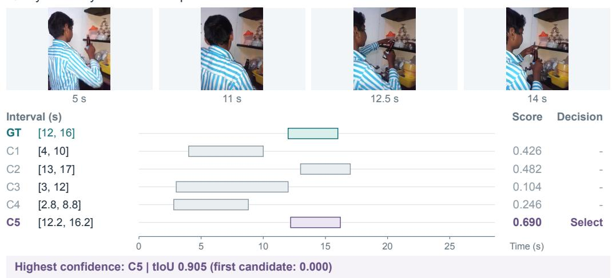  
Charades-TimeLens / MB281  
Figure 4: Ranking: a workflow needs one useful clip from several proposals. (a) Confidence selects the later washing event instead of the first generated interval. (b) For replacing the bottle cap, it selects an existing boundary alternative with tIoU 0.905; the earlier $C _ { 2 }$ has tIoU 0.600. This is selection among decoded intervals, with no boundary refinement. All raw candidates are shown in generation order; the highest score supplies the single answer, without NMS or thresholding. Across the case figures, teal is GT, purple is selected, and gray is unselected. Scores are rounded only for display; all times are clip-relative seconds.

## E QUALITATIVE CASES BY SELECTION REQUIREMENT

Six selected successful videos illustrate ranking, set filtering, and query-level rejection using an earlier fixed-threshold RL variant at step 200 with 150 online head updates. These historical mechanism examples are distinct from the final model used in every quantitative table. Complete-split analyses of that final model are in Appendix A. Two additional cases from the final model below examine where selection cannot recover an annotated occurrence.

## 1 Rank alternatives

Clip retrieval: choose one existing candidate

## (a) Prefer the matching event

Query: A person is washing a cup

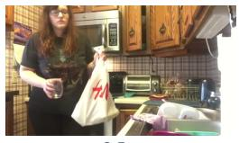

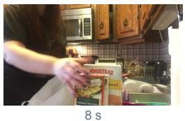

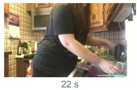  
Charades-TimeLens / TIWRY

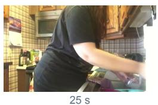

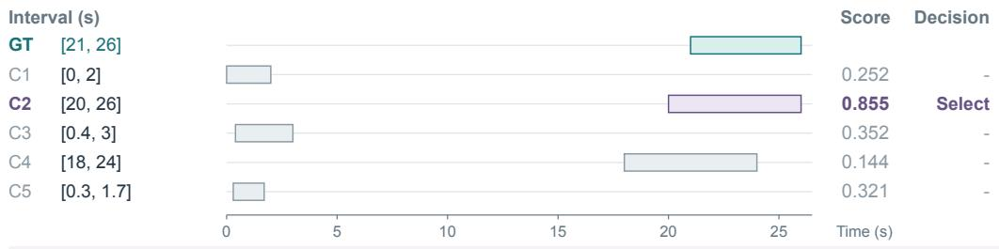  
Highest confidence: C2 | tIoU 0.833 (first candidate: 0.000)

## (b) Choose tighter existing boundaries

## 2 Filter an occurrence set

Occurrence review: retain multiple events with fewer weak intervals

## (a) Remove a misplaced candidate

Query: Three men are standing on a mat.

OMTG-Bench / query 132

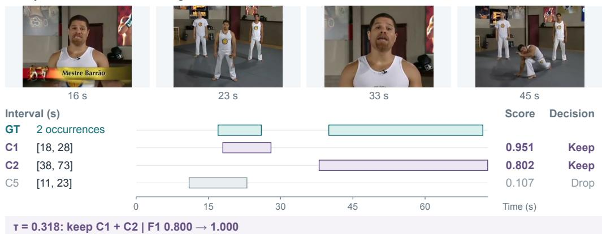  
NMS removed C3, C4; all 3 survivors are shown. Recall stays 1.00.

## (b) Keep four separate occurrences

OMTG-Bench / query 114

Query: The man continues to work out on a machine.

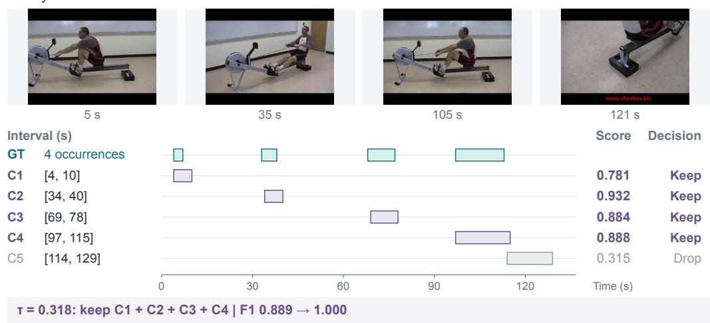  
NMS removed C6, C7, C8, C9, C10; all 5 survivors are shown. Recall stays 1.00.

Figure 5: Set filtering: review repeated events with fewer low-quality intervals. Both OMTG-Bench cases use generation-order NMS at tIoU 0.3 followed by that variant’s global test-oracle threshold, $\tau \approx 0 . 3 1 8$ . Every NMS survivor is shown, with its original candidate index. (a) A misplaced interval survives NMS but is removed by confidence, retaining both annotated occurrences. (b) Four workout intervals are retained while the extra [114, 129] fragment is removed. F1 rises from 0.800 and 0.889 to 1.000, respectively; recall remains 1.000 in both cases. The same threshold supports different answer counts.

Geometric overlap does not determine acceptance. In query 132, the dropped [11, 23] interval overlaps the earlier [18, 28] proposal at tIoU 0.294, so it survives the fixed NMS rule. Its maximum GT IoU is only 0.400, and its confidence is 0.107. Query 114 makes the cardinality distinction explicit: thresholding keeps four separate occurrences, rather than imposing a top-1 or fixed top-k budget. These behaviors are useful when a review queue should preserve multiple supported events while reducing unnecessary clips.

## 3 Accept or return no result

Conditional retrieval: suppress a result when the query is unsupported

## (a) Indoor activity

Same video, two queries; highest-confidence candidate shown for each.

Charades-TimeLens / YIIFF

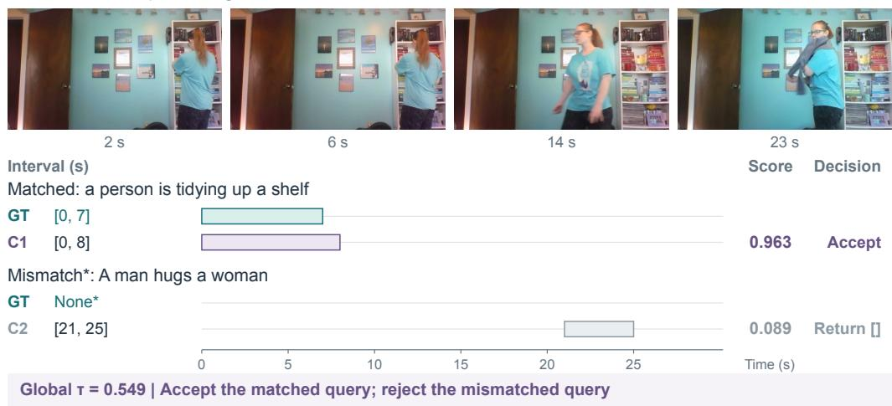

## (b) Travel footage

QVHighlights / TJERhGzxRK8, 360-510 s clip

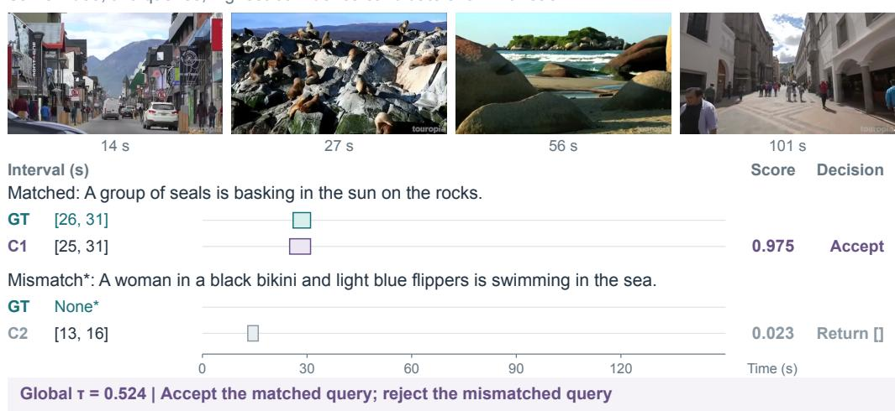  
\* Synthetic cross-video mismatch labels; one global test-oracle threshold per benchmark.

Figure 6: Query-level rejection: a retrieval interface may need to return no result. Each video is paired with its original matched query and one synthetic cross-video mismatch from the accepted mixed-query evaluation. Only the highest-confidence raw candidate for each query is displayed; the generator produced nonempty candidates for all four queries. For this raw-pool diagnostic, the benchmark-wide test-oracle thresholds are 0.549 for Charades and 0.524 for QVHighlights, with no per-case tuning and no NMS. Both matched queries are accepted, while both mismatches return []. An asterisk denotes a synthetic unmatched label, not an official exhaustively verified negative annotation.

Ranking and rejection answer different questions. A maximum always exists in a nonempty candidate pool, even when the query is unsupported. On the indoor video, the best scores are 0.963 for tidying and 0.089 for the mismatched interaction; on the travel video they are 0.975 for the animals on the rocks and 0.023 for the swimming query. The threshold decides whether to return the best candidate at all. Thus confidence can support conditional search or a gate before an automatic action, in addition to ordering clips for human inspection.

## E.1 LIMITS OF SELECTION ON A FIXED CANDIDATE POOL

(a) A better boundary is suppressed before confidence filtering Query: Employees are wearing safety vests working in a warehouse.

  
OMTG / Q58

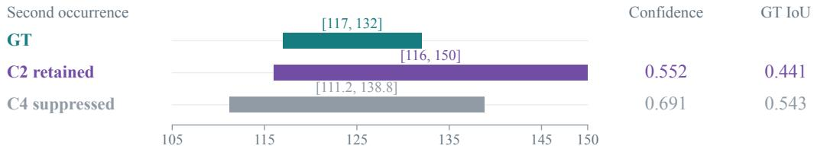  
C2 precedes C4; overlap = 0.588 > 0.3. The later filter cannot recover C4.

(b) A missing occurrence cannot be recovered by selecting a subset Query: A man is using a tool to score the floor.

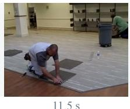  
G1 [9, 14]

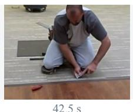  
G2 [38, 47]  
OMTG / Q149

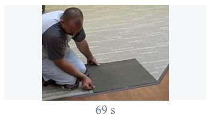  
G3 [64, 74]  
Retained: C1, C2  
Precision = 1.00; fixed-pool recall ceiling = 2/3  
Figure 7: Two routes to a missed occurrence. Selected OMTG-Bench cases from the final L200 model with 150 head updates. (a) A close-up of the second annotation in Q58: generation-order NMS suppresses C4 despite its higher confidence and GT IoU. (b) All six raw candidates in Q149 miss G1; purple rows are retained by NMS and the model’s global F1 test-oracle threshold. Matrix entries are original-coordinate tIoUs; matching uses tIoU ≥ 0.5. Times are clip-relative seconds. Frames provide scene context, and candidate IDs preserve generation order.

Suppression and missing proposals impose different limits. In Q58, a usable boundary exists but is removed before confidence filtering; in Q149, no decoded candidate overlaps the first occurrence, so even perfect subset selection cannot exceed $2 / 3$ recall. These cases separate representative selection within overlapping proposals from proposal coverage. They motivate diagnosing both stages, without establishing that a different NMS policy improves overall performance.