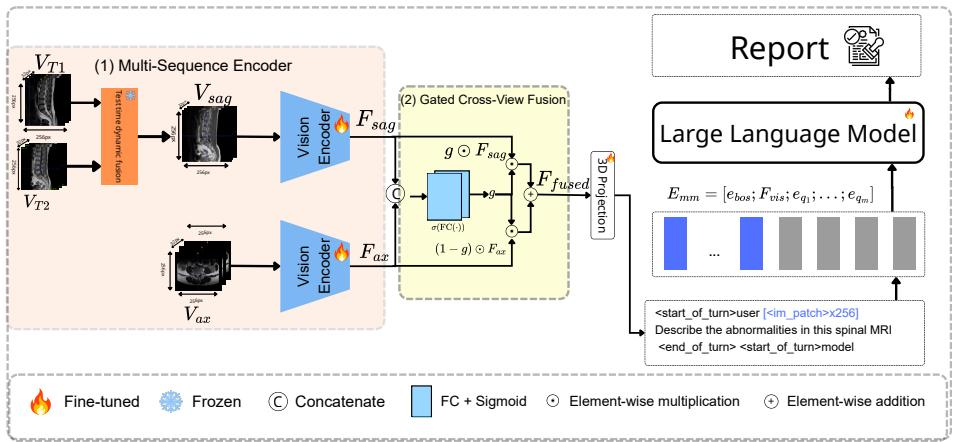
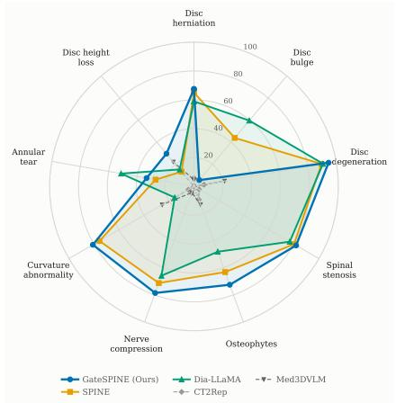
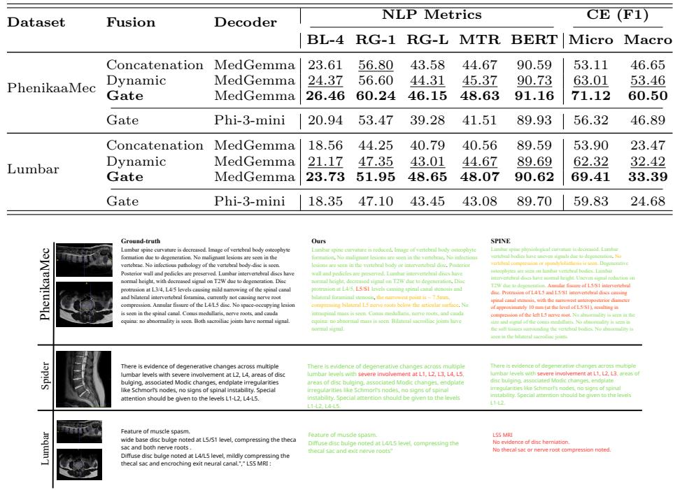

# GateSPINE: Gated Cross-View Fusion for Lumbar Spine MRI Report Generation

Hoang Nguyen Van1, Cuong Vuong Tuan1, Trang Mai Xuan1⋆, Bien Tran Van2,3, Nam Tran Van3, and Thien Van Luong4

1 Applied AI Lab, Phenikaa University, Hanoi, Vietnam

2 Medical Imaging & Radiological Technology Department, Faculty of Medical Technology, Phenikaa School of Medicine & Pharmacy, Phenikaa University, Vietnam Radiology & Functional Exploration Center, Phenikaa University Hospital,

Vietnam

4 Business AI Lab, College of Technology, National Economics University, Vietnam 23010101@st.phenikaa-uni.edu.vn, {cuong.vuongtuan, trang.maixuan, bien.tranvan}@phenikaa-uni.edu.vn, bv.namtv@phenikaamec.vn, thienlv@neu.edu.vn

Abstract. Automated report generation can ease the burden radiologists face when interpreting multi-sequence MRI studies. Unlike CT, MRI examinations comprise multiple sequences and imaging planes, each contributing complementary diagnostic information. Existing methods encode a study as a single volume and combine multiple acquisitions by fixed rules. Findings visible in only one plane are thus diluted and often missed, lowering recall on clinical eficacy metrics, where a missed abnormality is most costly. We propose GateSPINE, a vision-language framework that fuses sagittal T1 and T2 volumes with a training-free operator, encodes the fused sagittal and axial volumes with two parallel 3D encoders, and decodes their combined representation into a report. Its core mechanism is a gated cross-view fusion module that predicts, per feature channel and token, how much of each view to admit, so the more informative view dominates at each spatial location. We evaluate GateSPINE on three lumbar MRI datasets, comprising two public benchmarks and a private cohort collected from Phenikaa University Hospital, using both natural language generation (NLG) and clinical eficacy (CE) metrics. GateSPINE achieves the highest CE F1 through improved recall on all three datasets; on SPIDER, which lacks an axial sequence, this reflects the sagittal fusion component rather than the gated cross-view mechanism, which is validated on the two cohorts with both imaging planes. GateSPINE also remains competitive on standard NLG metrics.

Keywords: Lumbar spine MRI · Medical report generation · 3D vision encoders · Gated cross-wiew fusion · Clinical eficacy.

## 1 Introduction

Magnetic resonance imaging (MRI) is widely used to evaluate degenerative lumbar spine diseases because it provides detailed visualization of soft tissues and neural structures [1, 14]. In clinical practice, radiologists must examine multiple MRI sequences (e.g., T1W and T2W) acquired from diferent imaging planes (e.g., sagittal and axial), integrate the complementary findings across these images, and produce a comprehensive diagnostic report. This process is time-consuming because it requires careful interpretation of a large volume of imaging data, so automatic radiology report generation has attracted increasing attention [4, 11, 12].

Automatic report generation from CT typically couples a 3D vision encoder with a language decoder [11]. Most recently, Reg2RG [7] grounds the report on anatomical regions and combines region-level with global features, substantially improving diagnostic accuracy. These methods assume that a study is a single volume, whereas an MRI examination comprises several sequences and imaging planes, each showing some findings more clearly than the others. For lumbar spine MRI specifically, SPINE [12] stacks sagittal T1- and T2-weighted images together with segmentation labels, showing that integrating complementary contrasts improves report quality. Yet it models the sagittal view alone. This omission is consequential because lateral recess stenosis, facet hypertrophy, and the lateralization of disc herniation are assessed on axial images, findings that a sagittal-only model can therefore characterize only in part. CrossSpine [16] attends across sequences to predict degeneration grades, but represents each by a single 2D slice. The two views are not interchangeable. Sagittal images trace continuity along the spinal axis and capture disc height, alignment, and marrow signal across all levels at once, whereas axial images expose a per-level geometry that sagittal slices cannot reconstruct. Which view carries the decisive evidence therefore changes from finding to finding, which a fixed combination rule cannot accommodate. To our knowledge, learning to combine sagittal and axial views for lumbar report generation remains unexplored.

To address this gap, we propose GateSPINE, a unified vision–language framework for lumbar MRI report generation. GateSPINE first merges sagittal T1 and T2 with a training-free dynamic fusion operator, then encodes the fused sagittal and the axial volumes with two parallel 3D vision encoders. A lightweight gated cross-view fusion module learns, per feature channel, how much of each view to retain, and the resulting representation is decoded into a report by a vision–language model. In summary, our contributions are as follows:

– We propose GateSPINE, a unified vision–language framework that integrates multi-sequence fusion, parallel 3D vision encoders, and adaptive crossview fusion, improving both clinical-eficacy and language-generation performance.

– We design a lightweight gated cross-view fusion module that adaptively combines sagittal and axial representations. The module learns to emphasize the view that provides more informative evidence for each feature channel and spatial position, leading to more efective use of complementary information across MRI sequences and imaging planes.

– On the private PhenikaaMec cohort and two public datasets (SPIDER, Lumbar), GateSPINE improves clinical-eficacy micro-F1 over the strongest baseline by 3.6, 3.6, and 26.9 points, driven by recall gains of up to 38.0 points; on SPIDER, which lacks an axial sequence, this reflects the sagittal fusion component rather than the gated cross-view mechanism. GateSPINE also achieves the highest BERTScore on all three datasets $( + 0 . 3 , + 1 . 3$ , and +0.4 points).

## 2 Related Work

CT report generation. Most 3D report generation systems extract volume features with a 3D vision encoder and pass them to a language decoder that writes the report. CT2Rep [11] is an early instance, though its decoder is trained from scratch, which limits fluency. Dia-LLaMA [8] replaces it with a pretrained LLM and prompts it with predicted disease labels, though it depends on an auxiliary classifier for those labels. Med3DVLM [22] pursues a diferent axis, merging low- and high-level features to cut encoding cost, while generalist models treat report generation as one of many tasks [4, 21]. Each of these systems therefore combines more than one feature stream. Yet all those streams are extracted from a single volume, so combining them never involves reconciling diferent views of the anatomy.

MRI report generation. Report generation for MRI must contend with multiple sequences and imaging planes within one examination. SPINE [12] stacks sagittal T1 and T2 channel-wise with segmentation-derived channels, showing that combining contrasts improves report quality. Such stacking relies on both sequences being acquired in the same plane, so it does not extend to axial images, whose evidence the model never sees. Other systems take a diferent route, working from structured gradings [18] or radiologist-authored findings [23] rather than from the images themselves. How to combine sagittal and axial evidence therefore remains open. We address this by fusing sequences within a plane and gating across planes at the feature level.

## 3 Methods

The overview of our method GateSPINE is shown in Fig. 1. Lumbar MRI report generation involves creating a report R from a study of three volumes: sagittal T1-weighted ${ \bf V } ^ { \mathrm { T 1 } }$ , sagittal T2-weighted ${ \bf V } ^ { \mathrm { T 2 } }$ , and axial T2-weighted $\mathbf { V } ^ { \mathrm { a x } }$ each in $\mathbb { R } ^ { D \times H \times W }$ . Unlike previous works [11, 21, 22] that encode a study as a single volume, we preserve the two imaging planes as separate streams and let the model decide, at each location, which to trust.

  
Fig. 1. Overview of the GateSPINE framework. Sagittal T1 and T2 volumes are fused by the TTD module, while the axial T2 volume is processed in parallel. Two ViT3D encoders extract features from the fused sagittal volume and the axial volume, and the Gated Cross-View Fusion layer combines them. The 3D Projector then compresses the fused features into visual tokens for the VLM decoder, which generates the final report.

Since the sagittal sequences share a common geometry, we merge them into $\tilde { \mathbf { V } } ^ { \mathrm { s a g } } = \varphi ( \mathbf { V } ^ { \mathrm { T 1 } } , \mathbf { \breve { V } } ^ { \mathrm { T 2 } } )$ with test-time dynamic fusion (TTD) [6], a training-free adaptive fusion operator. Two parallel ViT3D encoders [9] $f _ { \mathrm { s a g } }$ and $f _ { \mathrm { a x } } ,$ , initialized from M3D [4], then extract view-specific features. As the two planes may conflict locally, we propose a gated cross-view fusion module $f _ { G }$ that predicts, per channel and per position, how much of each view to admit. A projector $f _ { P }$ compresses the fused features into visual tokens, which the MedGemma decoder [19] consumes with a prompt P to generate R:

$$
\mathcal { R } = \mathrm { L L M } \Big ( f _ { P } \big ( f _ { G } ( \mathcal { F } _ { \mathrm { s a g } } , \mathcal { F } _ { \mathrm { a x } } ) \big ) , ~ \mathbf { P } \Big ) ,\tag{1}
$$

where $\mathcal { F } _ { \mathrm { s a g } } = f _ { \mathrm { s a g } } ( \tilde { \mathbf { V } } ^ { \mathrm { s a g } } )$ and $\mathcal { F } _ { \mathrm { a x } } = f _ { \mathrm { a x } } ( \mathbf { V } ^ { \mathrm { a x } } )$

## 3.1 Multi-Sequence Encoder

This stage maps the three input volumes to two view-level representations $\mathcal { F } _ { \mathrm { s a g } }$ and $\mathcal { F } _ { \mathrm { a x } } \mathrm { : }$ the two sagittal sequences, which share an acquisition geometry, are merged before encoding, while the axial volume forms its own stream.

Sagittal fusion. T1w and T2w are complementary, showing morphology and marrow signal versus fluid and edema. Since a fixed rule cannot follow which contrast is locally stronger, we merge them with TTD [6], a training-free operator built on CDDFuse [25]. “Test-time” refers to the operator itself, which adapts its weights to each input without being trained on our data; we apply it identically to every study, as a fixed preprocessing step, both when training GateSPINE and at inference. Slice by slice, a shared pretrained autoencoder reconstructs each source and measures its per-pixel squared error $\ell ^ { s } ( i , j )$ , from which a Relative Dominability weight follows:

$$
z ^ { s } ( i , j ) = \exp \big ( - \gamma \ell ^ { s } ( i , j ) \big ) ,\tag{2}
$$

$$
w ^ { s } ( i , j ) = \frac { \alpha \exp \left( z ^ { s } ( i , j ) \right) } { \sum _ { s ^ { \prime } \in \mathcal { S } } \exp \left( z ^ { s ^ { \prime } } ( i , j ) \right) } , \qquad s \in \mathcal { S } ,\tag{3}
$$

where $\gamma > 0$ sets how sharply the weighting responds to error, and scaling by $\alpha = \vert S \vert$ makes the weights average one. A source reconstructing a location well is thus emphasized while both are retained. The weighted features are decoded into a fused slice, and stacking all slices gives $\tilde { \mathbf { V } } ^ { \mathrm { s a g } } = \varphi ( \mathbf { V } ^ { \mathrm { T 1 } } , \mathbf { V } ^ { \mathrm { T 2 } } )$ .

View encoding. Both $\tilde { \mathbf { V } } ^ { \mathrm { s a g } }$ and $\mathbf { V } ^ { \mathrm { a x } }$ are min–max normalized and resampled to a common resolution $( D _ { t } , H _ { t } , W _ { t } )$ , then encoded by two ViT3D encoders [9] $f _ { \mathrm { s a g } }$ and $f _ { \mathrm { a x } }$ with separate weights, initialized from M3D [4]. Each partitions its input into non-overlapping patches of size $\left( p _ { D } , p _ { H } , p _ { W } \right)$ and emits N tokens of dimension $d ,$ so that $\bar { \mathcal { F } } _ { \mathrm { s a g } } , \bar { \mathcal { F } } _ { \mathrm { a x } } \in \mathbb { R } ^ { N \times d }$ . The axial branch requires no sequence fusion, as a single axial sequence is acquired.

## 3.2 Gated Cross-View Fusion

This module takes the two view representations from Sec. 3.1 and produces a single representation $\mathcal { F } _ { \mathrm { f u s e } } \in \mathbb { R } ^ { N \times d }$ in which each view contributes according to its content.

Concatenating the two token sets along the sequence would double their number to 2N and raise the decoder cost accordingly, while averaging them applies the same proportion at every channel and location. We instead combine them along the feature dimension with a learned gate, which leaves the token count unchanged and lets the mixing proportion vary with content. Following the gated fusion formulation of [3], but predicting a gate per channel and per token rather than one scalar per modality, we compute for each token $n \in \{ 1 , \ldots , N \}$

$$
\begin{array} { r } { \mathbf { g } _ { n } = \sigma \big ( \mathbf { W } _ { g } \ : [ \mathbf { f } _ { n } ^ { \mathrm { s a g } } ; \ : \mathbf { f } _ { n } ^ { \mathrm { a x } } ] + \mathbf { b } _ { g } \big ) \in \mathbb { R } ^ { d } , } \end{array}\tag{4}
$$

$$
\mathbf { f } _ { n } ^ { \mathrm { f u s e } } = \mathbf { g } _ { n } \odot { \mathbf { f } _ { n } ^ { \mathrm { s a g } } } + \left( \mathbf { 1 } - \mathbf { g } _ { n } \right) \odot { \mathbf { f } _ { n } ^ { \mathrm { a x } } } ,\tag{5}
$$

where $\mathbf { f } _ { n } ^ { \mathrm { s a g } } , \mathbf { f } _ { n } ^ { \mathrm { a x } } \in \mathbb { R } ^ { d }$ are the n-th rows of $\mathcal { F } _ { \mathrm { s a g } }$ and $\mathcal { F } _ { \mathrm { a x } } , [ \cdot ; \cdot ] \in \mathbb { R } ^ { 2 d }$ denotes vector concatenation, $\mathbf { W } _ { g } \in \mathbb { R } ^ { d \times 2 d }$ and $\mathbf { b } _ { q } \in \mathbb { R } ^ { d }$ are learnable, $\sigma ( \cdot )$ is the sigmoid, and ⊙ is element-wise multiplication. Stacking over n gives $\mathcal { F } _ { \mathrm { f u s e } }$ , at a cost of $2 d ^ { 2 } + d$ parameters.

Because $\mathbf { g } _ { n }$ is d-dimensional, diferent channels may be drawn from diferent views within the same token, and the gate is conditioned on both views jointly, so the proportion given to one depends on what the other contains. The alternatives are recovered as special cases: a constant $\mathbf { g } _ { n } \equiv \mathbf { \Gamma } _ { 2 } ^ { 1 }$ gives averaging, and a gate held fixed across tokens reduces to one scalar weight per view.

## 3.3 Vision–Language Projection and Decoding

This stage compresses $\mathcal { F } _ { \mathrm { f u s e } }$ into visual tokens the language model can consume. We reshape it into its 3D patch grid and apply non-overlapping average pooling with factor $\rho$ per axis, giving $N _ { v } = N / \rho ^ { 3 }$ tokens $\mathcal { F } _ { \mathrm { s e q } } \in \mathbb { R } ^ { N _ { v } \times d }$ while preserving spatial structure. Following the projection design of the pretrained VLM [19], a trainable adapter maps these into its $d _ { m }$ -dimensional space, after which its own frozen RMSNorm and projection $\mathbf { W } _ { p }$ are applied:

$$
\mathcal { F } _ { \mathrm { v i s } } = \mathbf { W } _ { p } \mathrm { R M S N o r m } \big ( \mathrm { G E L U } ( \mathbf { W } _ { a } \mathcal { F } _ { \mathrm { s e q } } + \mathbf { b } _ { a } ) \big ) \ \in \ \mathbb { R } ^ { N _ { v } \times d _ { \mathrm { L L M } } } .\tag{6}
$$

Training only the adapter $\left( \mathbf { W } _ { a } , \mathbf { b } _ { a } \right)$ reuses the pretrained vision–language alignment. The visual tokens then replace the placeholder embeddings in P, forming a multimodal sequence of length $M = 1 + N _ { v } + m$ from a BOS token, $N _ { v }$ visual tokens, and m prompt tokens. We adapt the decoder with LoRA [13] on all linear layers, while the view encoders, the gate, and the adapter are trained with full gradients.

## 3.4 Training and Inference

The model is trained with an autoregressive cross-entropy loss over report tokens $\mathcal { R } = \{ r _ { 1 } , . . . , r _ { T } \}$ , conditioned on the multimodal input:

$$
\mathcal { L } = - \sum _ { t = 1 } ^ { T } \mu _ { t } \log p _ { \theta } \big ( r _ { t } \mid r _ { < t } , \mathcal { F } _ { \mathrm { v i s } } , \mathbf { P } \big ) , \qquad \mu _ { t } = \mathbb { 1 } \big [ r _ { t } \mathrm { ~ i s ~ a n ~ a n s w e r ~ t o k e n } \big ] ,\tag{7}
$$

where $\mu _ { t }$ restricts the gradient to answer tokens, so the model is not trained to reproduce the prompt. During training the prompt is sampled at random from a set of clinical query templates, improving robustness to prompt wording. At inference, reports are decoded greedily, stopping at the end-of-sequence token or after $T _ { \mathrm { m a x } }$ tokens.

## 4 Experiments and Results

## 4.1 Datasets and Evaluation Metrics

Datasets. PhenikaaMec [20] is an internal cohort of 250 patients (112/138 M/F, aged 48.1 ± 15.2 years) with sagittal T1, sagittal T2, and axial T2 at $0 . 3 \times 0 . 3 \times 4 . 4$ mm, extracted from hospital PACS and anonymized under appropriate ethical clearance; 236 remain after discarding cases lacking a report or axial sequence. The reports are translated from Vietnamese with LLaMA-3.3-70B, and we split by acquisition month into 118/58/60 studies training on earlier months and testing on later ones to mirror deployment. Lumbar [2] contains 575 Mendeley cases (one per patient) with both planes; 515 remain after discarding empty reports, split 70:15:15. SPIDER [10] provides sagittal T1, T2, and segmentation masks but no axial sequence and no free-text reports, split

60:20:20 by patient. On SPIDER, all methods use the reference reports released by SPINE [12], generated from grading labels with GPT-4. Without an axial sequence the cross-view module is inactive, and, following SPINE, the mask is combined with T1 and T2 per slice in ratio 2 : 2 : 3 in place of TTD; SPIDER thus tests the sagittal branch, while the gated cross-view module is evaluated on the two cohorts with both planes.

Evaluation Metrics. Following recent report generation work [7,12], we report language quality (NLP) and clinical eficacy (CE) metrics. The NLP metrics are BLEU-4 [17], ROUGE-1, ROUGE-L [15], METEOR [5], and BERTScore [24]. These cannot capture diagnostic correctness, since a negation flips meaning while leaving surface similarity intact. CE metrics therefore compare clinical entities: an LLM judge (LLaMA-3.3-70B) labels nine lumbar findings—disc herniation, bulge, degeneration, spinal stenosis, osteophytes, nerve compression, curvature abnormality, annular tear, and disc height loss—as present or absent in both generated and reference reports. We report Micro-F1 pooled over findings and Macro-F1 averaged over them. The same judge scores every method, so the comparison is consistent across models; validating the judge and the report translation against radiologist annotation is left to future work.

## 4.2 Implementation Details and Baselines

Implementation. GateSPINE is implemented in PyTorch and trained on one NVIDIA Quadro RTX 8000, with MedGemma 4B-IT as decoder and both ViT3D encoders initialized from M3D [4]. Volumes are resampled to $D _ { t } \times H _ { t } \times W _ { t } =$ $3 2 \times 2 5 6 \times 2 5 6$ and split into (4, 16, 16) patches $( N = 2 0 4 8 , d = 7 6 8 ) ;$ pooling with $\rho = 2$ gives $N _ { v } = 2 5 6$ visual tokens, projected via $d _ { m } = 1 1 5 2$ to $d _ { \mathrm { L L M } } = 2 5 6 0$ and TTD uses $\gamma = 5 0$ . Stage 1 trains the encoders, gate, and adapter with the LLM frozen (learning rate $1 0 ^ { - 4 } )$ ; stage 2 adds LoRA [13] (rank 8, scaling 32, dropout 0.05) and fine-tunes jointly with a per-dataset learning rate. Both stages use AdamW with cosine decay, mixed precision, an efective batch size of 8 via gradient accumulation, and 10–15 epochs with early stopping.

Baselines. We compare against CT2Rep [11], Med3DVLM [22], Dia-LLaMA [8], and SPINE [12], retrained on each dataset with the same preprocessed inputs and greedy decoding. Being single-volume methods, they receive the fused sagittal volume without the axial branch, so this comparison reflects the framework as a whole; the ablation in Sec. 4.4, where every variant receives both planes, isolates the fusion mechanism.

## 4.3 Evaluation Results

On PhenikaaMec, GateSPINE achieves the best clinical entity scores and leads on ROUGE and BERTScore (Table 1). Its clinical gain comes mainly from higher recall (Micro-R 67.35 vs. 52.05 for Dia-LLaMA) at comparable precision, so it misses fewer true findings. Dia-LLaMA scores higher on BLEU-4 and METEOR but is much weaker on clinical entities. Across the nine findings (Fig. 2), Gate-SPINE leads on seven of nine, with the clearest margins over SPINE on disc degeneration and osteophytes; it trails only on disc bulge, a naming bias rather than a miss: of 29 reference bulges it calls 24 a herniation and omits only 4. Since bulge and herniation are separate labels on a clinical continuum, this lowers Macro-F1 more than Micro-F1. On SPIDER, GateSPINE leads on all NLG metrics and on both F1 scores, with the largest margin on Macro-F1 (+7.2). Med3DVLM attains higher precision but far lower recall, describing fewer findings overall. Because the references here are GPT-4-generated from grading labels rather than written by radiologists, they are highly templated; absolute scores on SPIDER are inflated relative to the other two datasets and should be read only within this benchmark. On the public Lumbar dataset, GateSPINE is again best on both metric groups, above CT2Rep and SPINE. Macro-F1 stays low because every model scores zero on osteophytes and disc height loss, and the short segmentation-style references make both metric groups harder to satisfy.

Table 1. Comparison with state-of-the-art methods on language-quality (NLP) and clinical-eficacy (CE) metrics across three datasets. Best and second-best results in bold and underlined.
<table><tr><td rowspan="2" colspan="2">Method</td><td colspan="5">NLP</td><td colspan="3">CE Micro</td><td colspan="3">CE Macro</td></tr><tr><td>|BL-4</td><td>RG-1</td><td>RG-L</td><td>MTR</td><td>BERT</td><td>Pre.</td><td>Rec.</td><td>F1</td><td>Pre.</td><td>Rec.</td><td>F1</td></tr><tr><td></td><td>CT2Rep [11]</td><td>25.91</td><td>57.97</td><td>44.21</td><td>45.58</td><td>89.78</td><td>66.67</td><td>2.37</td><td>4.58</td><td>61.11</td><td>2.08</td><td>3.99</td></tr><tr><td></td><td>Dia-LLaMA [8]</td><td>28.16</td><td>58.99</td><td>45.05</td><td>50.57</td><td>90.88</td><td>74.79</td><td>52.05</td><td>61.38</td><td>71.79</td><td>47.75</td><td>53.55</td></tr><tr><td>PHeaaMec</td><td>Med3DVLM [22]</td><td>4.35</td><td>36.99</td><td>20.27</td><td>22.78</td><td>87.03</td><td>36.51</td><td>6.69</td><td>11.30</td><td>28.86</td><td>6.68</td><td>10.19</td></tr><tr><td></td><td>SPINE [12]</td><td>25.04</td><td>56.84</td><td>42.71</td><td>45.99</td><td>90.43</td><td>71.24</td><td>64.02</td><td>67.49</td><td>65.23</td><td>57.17</td><td>58.78</td></tr><tr><td></td><td>GateSPINE</td><td>26.46</td><td>60.24</td><td>46.15</td><td>48.63</td><td>91.16</td><td>|75.33 67.35</td><td></td><td>71.12|</td><td>65.30</td><td>59.69 60.50</td><td></td></tr><tr><td></td><td>CT2Rep [11]</td><td>62.76</td><td>77.13</td><td>77.37</td><td>87.45</td><td>94.83</td><td>87.50</td><td>50.60</td><td>64.12</td><td>59.17</td><td>40.46</td><td>47.24</td></tr><tr><td></td><td>Dia-LLaMA [8]</td><td>53.79</td><td>64.70</td><td>63.59</td><td>64.35</td><td>93.65</td><td>89.47</td><td>76.12</td><td>82.26</td><td>70.99</td><td>61.67</td><td>64.98</td></tr><tr><td>SDER</td><td>Med3DVLM [22]</td><td>45.87</td><td>59.81</td><td>58.69</td><td>57.79</td><td>93.06</td><td>93.55</td><td>68.24</td><td>78.91</td><td>84.96</td><td>56.61</td><td>64.16</td></tr><tr><td></td><td>SPINE [12]</td><td>63.20</td><td>71.10</td><td>70.70</td><td>77.40</td><td>94.80</td><td>66.90</td><td>64.00</td><td>64.90</td><td>49.30</td><td>49.20</td><td>46.70</td></tr><tr><td></td><td>GateSPINE</td><td>|65.67</td><td>79.39</td><td>79.27</td><td>87.50</td><td>96.09</td><td>83.91</td><td>87.95</td><td>85.88</td><td>70.49</td><td></td><td>74.36 72.21</td></tr><tr><td></td><td>CT2Rep [11]</td><td>20.42</td><td>49.67</td><td>47.76</td><td>47.40</td><td>90.20</td><td>55.66</td><td>31.22</td><td>40.00</td><td>13.61</td><td>11.14</td><td>12.19</td></tr><tr><td>umqar</td><td>Dia-LLaMA [8]</td><td>8.49</td><td>33.74</td><td>30.81</td><td>29.95</td><td>87.32</td><td>56.62</td><td>8.72</td><td>15.12</td><td>15.40</td><td>3.29</td><td>5.40</td></tr><tr><td></td><td>Med3DVLM [22]</td><td>9.04</td><td>34.38</td><td>29.38</td><td>28.52</td><td>86.99</td><td>58.55</td><td>30.96</td><td>40.53</td><td>30.46</td><td>17.54</td><td>21.87</td></tr><tr><td></td><td>SPINE [12]</td><td>12.72</td><td>40.45</td><td>36.63</td><td>35.64</td><td>88.94</td><td>68.54</td><td>30.81</td><td>42.51</td><td>45.26</td><td>19.24</td><td>24.18</td></tr><tr><td></td><td>GateSPINE</td><td>23.73</td><td>51.95</td><td>48.65</td><td>48.07</td><td>90.62</td><td>69.59</td><td>69.23</td><td>69.41</td><td>37.69</td><td>34.65 33.39</td><td></td></tr></table>

## 4.4 Ablation Studies and Analyses

Contribution of MRI Sequences. We assess each sequence by turning sequences on and of on PhenikaaMec and Lumbar, as shown in Table 2. A single sequence is not enough on either dataset. On PhenikaaMec, sagittal T2 is the best single view, since most degenerative findings are clearer on T2-weighted images, and sagittal T1 is the weakest. On Lumbar the order flips: axial T2 is strongest, matching a stenosis-focused cohort where the axial plane best shows canal narrowing. Adding the axial view on top of the fused sagittal T1 and T2 gives a large jump in clinical entity scores on both datasets. The full threesequence setup is best on every metric, and the gated integration of the axial plane drives most of the clinical entity gain.

  
Fig. 2. F1 score for each clinical finding on PhenikaaMec.

Table 2. Ablation on input MRI sequences. Best in bold, second best underlined.
<table><tr><td rowspan="2">Dataset</td><td colspan="3">Sequence</td><td colspan="5">NLP Metrics</td><td colspan="2">CE (F1)</td></tr><tr><td>T1</td><td>T2</td><td>Ax</td><td>BL-4</td><td>RG-1</td><td>RG-L</td><td>MTR</td><td>BERT</td><td>Micro</td><td>Macro</td></tr><tr><td rowspan="5">PhenikaaMec</td><td>√</td><td></td><td></td><td>19.69</td><td>54.12</td><td>39.20</td><td>40.81</td><td>90.30</td><td>31.12</td><td>17.53</td></tr><tr><td></td><td>√</td><td></td><td>21.81</td><td>54.36</td><td>41.16</td><td>42.10</td><td>90.18</td><td>56.25</td><td>46.50</td></tr><tr><td></td><td></td><td>√</td><td>22.11</td><td>55.64</td><td>42.23</td><td>44.53</td><td>90.27</td><td>48.37</td><td>39.77</td></tr><tr><td>√</td><td>√</td><td></td><td>23.50</td><td>55.52</td><td>42.63</td><td>43.90</td><td>90.43</td><td>49.51</td><td>45.16</td></tr><tr><td>√</td><td>√</td><td>√</td><td>26.46</td><td>60.24</td><td>46.15</td><td>48.63</td><td>91.16</td><td>71.12</td><td>60.50</td></tr><tr><td rowspan="5">Lumbar</td><td>√</td><td></td><td></td><td>10.27</td><td>32.97</td><td>30.52</td><td>32.04</td><td>88.41</td><td>5.03</td><td>3.49</td></tr><tr><td></td><td>√</td><td></td><td>20.91</td><td>43.03</td><td>38.80</td><td>42.60</td><td>90.42</td><td>52.70</td><td>17.01</td></tr><tr><td></td><td></td><td>√</td><td>21.09</td><td>48.22</td><td>44.15</td><td>45.06</td><td>89.70</td><td>62.76</td><td>25.79</td></tr><tr><td>√</td><td>√</td><td></td><td>20.47</td><td>45.47</td><td>39.95</td><td>43.18</td><td>89.15</td><td>54.04</td><td>26.44</td></tr><tr><td>√</td><td>√</td><td>√</td><td>23.73</td><td>51.95</td><td>48.65</td><td>48.07</td><td>90.62</td><td>69.41</td><td>33.39</td></tr></table>

Cross-View Fusion Mechanism. Table 3 compares three cross-view fusion methods. We first expected the uncertainty-aware dynamic fusion to perform best, but the simple gated fusion outperforms both concatenation and dynamic fusion. This holds on both PhenikaaMec and Lumbar. We attribute this to the gate acting as a stable, content-dependent selector that is easier to train on small medical data than a larger dynamic weighting module.

LLM as the Language Decoder. To isolate the decoder’s role, we keep the 3D visual architecture, gated fusion, and projector fixed and swap only the LLM decoder, as shown in Table 3. MedGemma outperforms Phi-3 on every metric. The gap is small on language metrics but much larger on clinical eficacy. We attribute this to MedGemma’s biomedical pre-training, which turns the same features into more accurate findings.

Analysis of Generated Reports. Figure 3 shows one representative case from each dataset, comparing generated and ground-truth reports and judged on abnormality type, location, and severity. Across all three datasets, GateSPINE recovers most major abnormalities with fewer hallucinated and missed findings than SPINE, which both misses findings and adds irrelevant text. The remaining GateSPINE errors are concentrated in the vertebral level and in lesion severity, which we target in future work.

Table 3. Ablation on the cross-view fusion mechanism (rows 1–3, MedGemma decoder) and on the language decoder (rows 3–4, gate fusion; MedGemma 4B vs. Phi-3-mini 3.8B). Best in bold, second best underlined among fusion variants.
<table><tr><td rowspan="2">Dataset</td><td rowspan="2">Fusion</td><td rowspan="2">Decoder</td><td colspan="5">NLP Metrics</td><td colspan="2">CE (F1)</td></tr><tr><td>BL-4</td><td>RG-1</td><td>RG-L</td><td>MTR</td><td></td><td>BERT | Micro</td><td>Macro</td></tr><tr><td rowspan="4">PhenikaaMec</td><td>Concatenation</td><td>MedGemma</td><td>23.61</td><td>56.80</td><td>43.58</td><td>44.67</td><td>90.59</td><td>53.11</td><td>46.65</td></tr><tr><td>Dynamic</td><td>MedGemma</td><td>24.37</td><td>56.60</td><td>44.31</td><td>45.37</td><td>90.73</td><td>63.01</td><td>53.46</td></tr><tr><td>Gate</td><td>MedGemma</td><td>26.46</td><td>60.24</td><td>46.15</td><td>48.63</td><td>91.16</td><td>71.12</td><td>60.50</td></tr><tr><td>Gate</td><td>Phi-3-mini</td><td>20.94</td><td>53.47</td><td>39.28</td><td>41.51</td><td>89.93</td><td>56.32</td><td>46.89</td></tr><tr><td rowspan="4">Lumbar</td><td>Concatenation</td><td>MedGemma</td><td>18.56</td><td>44.25</td><td>40.79</td><td>40.56</td><td>89.59</td><td>53.90</td><td>23.47</td></tr><tr><td>Dynamic</td><td>MedGemma</td><td>21.17</td><td>47.35</td><td>43.01</td><td>44.67</td><td>89.69</td><td>62.32</td><td>32.42</td></tr><tr><td>Gate</td><td>MedGemma</td><td>23.73</td><td>51.95</td><td>48.65</td><td>48.07</td><td>90.62</td><td>69.41</td><td>33.39</td></tr><tr><td>Gate</td><td>Phi-3-mini</td><td>18.35</td><td>47.10</td><td>43.45</td><td>43.08</td><td>89.70</td><td>59.83</td><td>24.68</td></tr></table>

  
Fig. 3. Generated report comparison: Ground-truth, Ours, and SPINE, one case per dataset.

## 5 Conclusions

In this paper, we propose GateSPINE, a unified vision–language framework for lumbar spine MRI report generation. Unlike existing methods that do not fully utilize the complementary information from diferent MRI views, GateSPINE introduces a lightweight gated cross-view fusion module to adaptively combine sagittal and axial representations. The proposed module learns how much information to preserve from each view for every feature channel, enabling the model to better exploit complementary information across MRI sequences and imaging planes. On one private and two public lumbar MRI datasets, GateSPINE achieves the best performance on clinical-eficacy metrics while remaining competitive on language-generation metrics. Furthermore, ablation studies show that the gated cross-view fusion module outperforms existing fusion strategies.

One limitation of the current framework is that it mainly relies on global image representations, which can cause the model to occasionally miss subtle lesions or describe their anatomical locations inaccurately, as illustrated in Fig. 3. In future work, we plan to incorporate finer-grained anatomical information, such as disc-level segmentation or lesion detection, to improve localization accuracy and further enhance report quality.

## Acknowledgements

This research was partially funded by Vingroup Innovation Foundation (VINIF) under project code VINIF.2026.DA036. This research was also supported by the Ben Dam Me Award Fund, the Vietnam Young Talent Support Fund, and the Number One Brand, Tan Hiep Phat Group.

## References

1. Aaen, J., Austevoll, I.M., Hellum, C., Storheim, K., Myklebust, T.A., Banitalebi, H., Anvar, M., Brox, J.I., Weber, C., Solberg, T., Grundnes, O., Brisby, H., Indrekvam, K., Hermansen, E.: Clinical and MRI findings in lumbar spinal stenosis: baseline data from the NORDSTEN study. Eur Spine J 31(6), 1391–1398 (2022)

2. Al-Kafri, A.S., Sudirman, S., Hussain, A., Al-Jumeily, D., Natalia, F., Meidia, H., Afriliana, N., Al-Rashdan, W., Bashtawi, M., Al-Jumaily, M.: Boundary delineation of MRI images for lumbar spinal stenosis detection through semantic segmentation using deep neural networks. IEEE Access 7, 43487–43501 (2019)

3. Arevalo, J., Solorio, T., Montes-y-Gómez, M., González, F.A.: Gated Multimodal Units for Information Fusion. In: International Conference on Learning Representations (2017)

4. Bai, F., Du, Y., Huang, T., Meng, M.Q.H., Zhao, B.: M3D: Advancing 3D medical image analysis with multi-modal large language models. arXiv:2404.00578 (2024)

5. Banerjee, S., Lavie, A.: METEOR: An automatic metric for MT evaluation with improved correlation with human judgments. In: Proceedings of the ACL Workshop on Intrinsic and Extrinsic Evaluation Measures for Machine Translation and/or Summarization. pp. 65–72 (2005)

6. Cao, B., Xia, Y., Ding, Y., Zhang, C., Hu, Q.: Test-time dynamic image fusion. In: Advances in Neural Information Processing Systems. vol. 37, pp. 2080–2105 (2024)

7. Chen, Z., Bie, Y., Jin, H., Chen, H.: Large language model with region-guided referring and grounding for CT report generation. IEEE Transactions on Medical Imaging 44(8), 3139–3150 (2025)

8. Chen, Z., Luo, L., Bie, Y., Chen, H.: Dia-LLaMA: Towards large language modeldriven CT report generation. In: Medical Image Computing and Computer Assisted Intervention – MICCAI 2025. Lecture Notes in Computer Science, vol. 15966, pp. 141–151 (2025)

9. Dosovitskiy, A., Beyer, L., Kolesnikov, A., Weissenborn, D., Zhai, X., Unterthiner, T., Dehghani, M., Minderer, M., Heigold, G., Gelly, S., Uszkoreit, J., Houlsby, N.: An image is worth 16x16 words: Transformers for image recognition at scale. In: International Conference on Learning Representations (ICLR) (2021)

10. van der Graaf, J.W., van Hoof, M.L., Buckens, C.F.M., Rutten, M., van Susante, J.L.C., Kroeze, R.J., De Kleuver, M., van Ginneken, B., Lessmann, N.: Lumbar spine segmentation in MR images: a dataset and a public benchmark. Scientific Data 11(1), 264 (2024)

11. Hamamci, I.E., Er, S., Menze, B.: CT2Rep: Automated radiology report generation for 3D medical imaging. In: Medical Image Computing and Computer Assisted Intervention – MICCAI 2024. Lecture Notes in Computer Science, vol. 15012, pp. 476–486 (2024)

12. Helmy, H., Hosseini, A., Ibrahim, A., Baig-Mirza, A., Sadek, A.R., Serag, A.: SPINE: Segmentation-guided processing and integration of multimodal spinal MRI for natural language enhanced report generation. Applied Artificial Intelligence (2026)

13. Hu, E.J., Shen, Y., Wallis, P., Allen-Zhu, Z., Li, Y., Wang, S., Chen, W.: LoRA: Low-rank adaptation of large language models. CoRR abs/2106.09685 (2021)

14. Lafian, A.M., Torralba, K.D.: Lumbar spinal stenosis in older adults. Rheum Dis Clin North Am 44(3), 501–512 (2018)

15. Lin, C.Y.: ROUGE: A package for automatic evaluation of summaries. In: Text Summarization Branches Out: Proceedings of the ACL-04 Workshop. pp. 74–81 (2004)

16. Nguyen, H.S., Vu, D.N., Nguyen, T.N., Van, B.T., Pham, V.D., Xuan, T.M., Vu, H., Luong, T.V.: CrossSpine: Multi-scale cross-sequence attention with anatomical priors for automated Pfirrmann grading. arXiv:2607.22728 (2026)

17. Papineni, K., Roukos, S., Ward, T., Zhu, W.J.: BLEU: a method for automatic evaluation of machine translation. In: Proceedings of the 40th Annual Meeting of the Association for Computational Linguistics. pp. 311–318 (2002)

18. Salem, S., Habib, A., Guan, C.: AutoSpineAI: Lightweight multimodal CAD framework for lumbar spine MRI assessments. In: 2025 IEEE-EMBS International Conference on Biomedical and Health Informatics (BHI) (2025)

19. Sellergren, A., Kazemzadeh, S., Jaroensri, T., Kiraly, A., Traverse, M., Kohlberger, T., Xu, S., Jamil, F., Hughes, C., Lau, C., et al.: MedGemma technical report. arXiv preprint arXiv:2507.05201 (2025)

20. Vu, D.N., Nguyen, H.S., Nguyen, T.N., Van, B.T., Xuan, T.M., Vu, H., Luong, T.V.: PhenSPINE: A standardized benchmark for spine pathology diagnosis. arXiv:2607.19696 (2026)

21. Wu, C., Zhang, X., Zhang, Y., Hui, H., Wang, Y., Xie, W.: Towards generalist foundation model for radiology by leveraging web-scale 2D&3D medical data. Nature Communications 16, 7866 (2025)

22. Xin, Y., Ates, G.C., Gong, K., Shao, W.: Med3DVLM: An eficient vision-language model for 3D medical image analysis. IEEE Journal of Biomedical and Health Informatics 30(3), 2524–2536 (2026)

23. Zanardo, M., Stoppa, T., Pegorer, S., Scapicchio, C., Chiappino, D., Di Vito, S., Bazzocchi, A.: Can AI write lumbar spine MRI reports like a radiologist? A blinded comparative study between LLM-generated and radiologist-written reports. European Radiology Experimental 10(1), 16 (2026)

24. Zhang, T., Kishore, V., Wu, F., Weinberger, K.Q., Artzi, Y.: BERTScore: Evaluating text generation with BERT. In: International Conference on Learning Representations (ICLR) (2020)

25. Zhao, Z., Bai, H., Zhang, J., Zhang, Y., Xu, S., Lin, Z., Timofte, R., Van Gool, L.: CDDFuse: Correlation-driven dual-branch feature decomposition for multimodality image fusion. In: Proceedings of the IEEE/CVF Conference on Computer Vision and Pattern Recognition (CVPR). pp. 5906–5916 (2023)