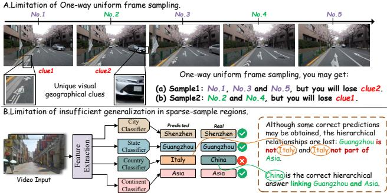
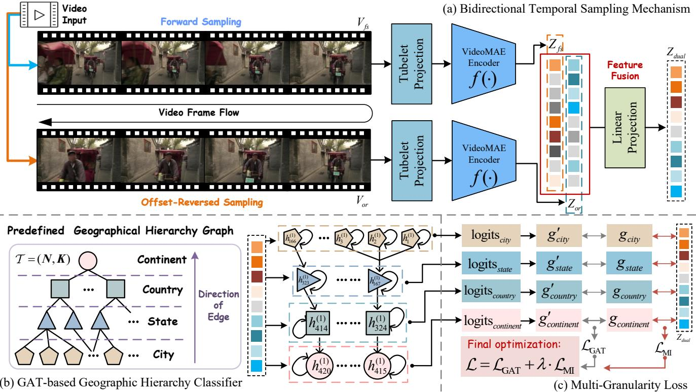
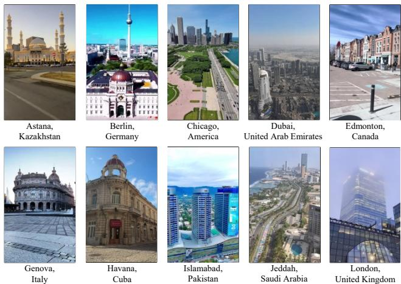
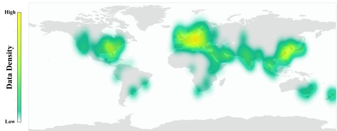
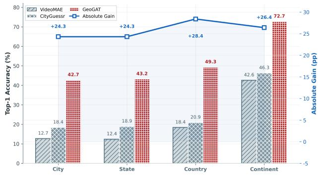
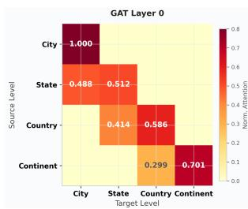
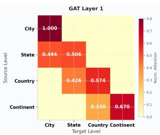
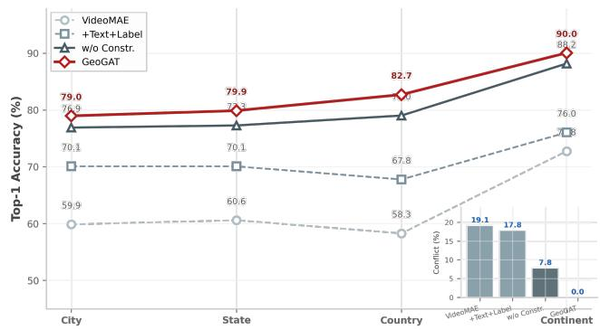

# GeoGAT: Bidirectional Temporal Sampling Meets Hierarchical Graph Attention for Global Video Geo-localization

Junchao Cui1, Xuanzi Ma1, Wenqi Shi1, Hangyu Li1, Biru Zhu1, Chong Fu2, Xiangyang Luo1 ∗

1Information Engineering University, Zhengzhou, China 2Zhengzhou University, Zhengzhou, China

## Abstract

Global video geo-localization aims to infer the geographic location of a video worldwide, evaluating performance across four geographic hierarchies: city, state/province, country, and continent. Existing methods typically employ one-way uniform sampling to process video frames and train independent classifiers for each hierarchy, which leads to the loss of key geographic cues and prediction conflicts between hierarchies, especially for complex multi-shot edited videos. To address these limitations, we propose GeoGAT, which integrates bidirectional temporal sampling with graph attention networks (GATs). Specifically, GeoGAT extracts forward and ofset-reversed frame sequences to construct complementary spatiotemporal features. These fused features are then fed into a predefined geographical hierarchy graph, where GATs perform structure-aware message passing, while a dualconstraint mechanism prunes predictions to eliminate crosshierarchy conflicts. We construct GeoGAT10k, comprising 9,720 multi-shot edited videos from 166 cities worldwide, specifically to benchmark generalization ability on complex video structures. Experimental results on CityGuessr68k and GeoGAT10k demonstrate that GeoGAT eliminates hierarchical conflicts entirely and achieves state-of-the-art performance across all four geographic hierarchies. On CityGuessr68k, GeoGAT outperforms the strongest baseline, evaluated under both classification and retrieval protocols, by 2.6 percentage points at the city level. On the more challenging GeoGAT10k with multi-shot edited videos, the accuracy improvement exceeds 24 percentage points, validating strong generalization to complex real-world scenarios.

## 1 Introduction

Global video geo-localization aims to infer the city-level geographic location of a video captured anywhere on Earth (Kulkarni, Nayak, and Shah 2025). Unlike tasks that estimate precise coordinates from individual static images (Hays and Efros 2008; Weyand, Kostrikov, and Philbin 2016; Seo et al. 2018; Müller-Budack, Pustu-Iren, and Ewerth 2018; Pramanick et al. 2022), continuous camera movement renders the representation of an entire video by a single coordinate inappropriate, owing to the inherent spatialtemporal dynamics. With the explosive growth of videosharing platforms such as TikTok and YouTube (Bhandari and Bimo 2022; Al-Maroof et al. 2021), video volume has increased dramatically. This surge makes accurate global localization of video content increasingly critical for applications such as content verification, misinformation detection, and location-aware recommendation.

Current research on video geo-localization remains in its preliminary stages. Existing methods focus on specific regions (Zhang, Sultani, and Wshah 2023; Vyas, Chen, and Shah 2022; Regmi and Shah 2021), such as individual cities (Humenberger et al. 2022; Zhi et al. 2021) or tourist attractions (Li, Crandall, and Huttenlocher 2009), using retrieval-based strategies. They first construct a reference database of geotagged images (typically ground-view and corresponding satellite views), then match video keyframes against database images. Early studies employed CNN (He et al. 2016) for cross-view matching (Wu et al. 2025; Regmi and Shah 2019; Shi et al. 2020), while later work used VGG (Simonyan and Zisserman 2015) and ViT (Wilson et al. 2023; Dosovitskiy et al. 2021) to enhance accuracy. However, these methods fundamentally belong to fine-grained localization paradigms, applicable only to limited predefined locations, and cannot scale to global coverage.

Recently, Kulkarni et al. (Kulkarni, Nayak, and Shah 2025) proposed CityGuessr, which formalizes global video geolocalization as a hierarchical classification problem. Their approach adopts VideoMAE (Tong et al. 2022) as the video encoder and employs four independent linear heads corresponding to the four geographic hierarchies. Auxiliary mechanisms, including soft-scene labels and text label alignment, further enhance feature representation, and the method achieves initial success on the accompanying CityGuessr68k benchmark (Kulkarni, Nayak, and Shah 2025). Nevertheless, the core architecture still relies on uniform frame sampling and independent classifiers, which are unable to fully exploit sparse yet critical geographic cues. Moreover, hierarchical consistency constraints are applied only at inference time rather than during training, leaving hierarchical conflicts unresolved in the learning process. Fig. 1 summarizes the limitations of existing methods.

Geographic cues in videos are sparse and unevenly distributed: landmarks, road signs, or textual identifiers often appear in only a few frames, and fixed-interval one-way sampling easily misses them amid redundant content. Moreover, geographic labels obey strict inclusion constraints (city ∈ state ∈ country ∈ continent), yet existing methods train independent classifiers per hierarchy without structural constraints during training; soft remedies such as text label alignment cannot fundamentally eliminate the resulting crosshierarchy conflicts.

  
Figure 1: Research motivation.

To address these issues, we propose GeoGAT, which predicts labels at all four hierarchies for each video through three synergistic components. First, bidirectional temporal sampling extracts forward and ofset-reversed frame sequences and fuses them at the feature level, recovering geographic cues missed by one-way uniform sampling. Second, a GATbased hierarchy classifier models the predefined geographic hierarchy as a directed graph and performs structure-aware message passing in place of independent linear classifiers. Third, a dual-constraint mechanism couples soft parent-child correlation during training with hard geographic validity enforcement during inference, eliminating cross-granularity conflicts that message passing alone cannot resolve.

GeoGAT is trained to maximize the geographic information retained in the video representation, instantiated through two complementary variational bounds on the mutual information (Sec. 3.4). To the best of our knowledge, this is the first work to introduce mutual information maximization and GATs into global video geo-localization. The existing benchmark CityGuessr68k (Kulkarni, Nayak, and Shah 2025) contains only single-shot continuous videos, inadequately evaluating generalization on complex video structures. We therefore construct and release GeoGAT10k, comprising 9,720 multi-shot edited videos from 166 cities worldwide, aiming to provide richer data support for future research. Our contributions can be summarized as follows:

• We propose GeoGAT for global video geo-localization with two key components: (1) bidirectional temporal sampling for complementary spatiotemporal features, and (2) a GAT-based hierarchical classifier with dual constraints to resolve cross-granularity prediction conflicts.

• We introduce GeoGAT10k, a dataset of 9,720 multishot edited videos from 166 cities worldwide, evaluating model generalization on complex video structures.

• We conduct extensive experiments on CityGuessr68k and GeoGAT10k, where GeoGAT achieves state-of-the-art performance across all four geographic hierarchies.

## 2 Related Work

## 2.1 Paradigms of Video Geo-localization

Video geo-localization can be divided into two mainstream paradigms: retrieval-based (Yang, Lu, and Zhu 2021; Zhu, Shah, and Chen 2022) and classification-based (Kulkarni, Nayak, and Shah 2025). The retrieval-based paradigm relies on large-scale reference databases, matching video frames with geotagged images for fine-grained localization in local regions (Cepeda, Nayak, and Shah 2023). VidTAG (Kulkarni et al. 2026) formulates video geo-localization as crossmodal frame-to-GPS retrieval via contrastive learning. While achieving high accuracy, retrieval-based methods are limited by database construction costs and coverage constraints, making global scaling impractical. The classification-based paradigm formulates geo-localization as multi-classification, either through grid-based partitioning or administrative divisions, to address global-scale challenges. This paradigm first achieves success in image-based geo-localization (Cui et al. 2026) and is subsequently extended to video (Kulkarni, Nayak, and Shah 2025), discretizing geographic space into manageable categories.

## 2.2 Retrieval-based Region-level Paradigm

Existing video geo-localization works primarily focus on fine-grained localization in local regions via cross-view retrieval. This paradigm treats video frames as queries and builds reference databases from satellite imagery for crossview matching. Representative works include GTFL (Regmi and Shah 2021), GAMa (Vyas, Chen, and Shah 2022) with contrastive learning and 3D/2D CNN (He et al. 2016) encoders, and SeqGeo (Zhang, Sultani, and Wshah 2023) for limited field of view. The efectiveness of such methods in local regions stems from two factors: limited scope enables high accuracy with small database overhead (Hu et al. 2018; Regmi and Shah 2021; Zhu, Yang, and Chen 2021), and the ready availability of satellite imagery supports database construction (Liu and Li 2019; Li and Zhu 2025). However, they inherently face scalability issues: database costs increase dramatically with region expansion, and they are only applicable to predefined local areas.

## 2.3 Classification-based Global Paradigm

Extending geo-localization to the global scale presents challenges of broad coverage, numerous categories, and high computational overhead. In the image domain, classification has become the dominant approach, with substantial research (Haas et al. 2024; Zhou et al. 2024; Jia et al. 2025; Shatwell et al. 2025) providing methodological foundations for video tasks. Weyand et al. (Weyand, Kostrikov, and Philbin 2016) first formulate global image geo-localization as classification with PlaNet, partitioning the Earth’s surface into fixed grids. Subsequent works include CPlaNet (Seo et al. 2018) for fine-grained outputs, multi-level classification with kernel density estimation (Vo, Jacobs, and Hays 2017), ISNs for scene-specific networks (Müller-Budack, Pustu-Iren, and Ewerth 2018), HRNet-based semantic segmentation (Wang et al. 2021) by Pramanick et al. (Pramanick et al. 2022), and GeoDecoder with cross-attention (Clark et al. 2023). Collectively, these works establish the efectiveness of classification for global-scale localization. Inspired by these, Kulkarni et al. (Kulkarni, Nayak, and Shah 2025) first formulate global video geo-localization as classification with CityGuessr, employing four independent linear heads with auxiliary mechanisms such as soft-scene labels and text label alignment. They also open-source CityGuessr68k, the first large-scale global video geo-localization benchmark. We construct GeoGAT10k to evaluate generalization under complex video structures, ofering richer data support.

## 3 Proposed Method

Existing video geo-localization methods sufer from two key limitations: (i) unidirectional uniform sampling misses sparse yet critical geographic cues buried in long videos, and (ii) independent classifiers ignore the inherent geographic hierarchy and cause conflicts across granularities. To address these issues, we propose GeoGAT, which couples bidirectional temporal sampling with GATs. As shown in Fig. 2, GeoGAT extracts complementary spatiotemporal features through dual sampling streams and then performs structureaware message passing over a geographic hierarchy graph to resolve hierarchical conflicts at the architectural level.

## 3.1 Problem Formalization

Global video geo-localization aims to predict the capture location of a video $V ~ = ~ \{ v _ { 1 } , v _ { 2 } , \ldots , \bar { v _ { T } } \}$ containing $T$ frames. The target is a hierarchical geographic label $G =$ (gcity, gstate, gcountry, gcontinent). Only a subset of frames contain discriminative geographic cues (e.g., landmarks, vegetation, and signage); the rest carry location-irrelevant dynamics (e.g., pedestrian motion and illumination variation). The core challenge lies in extracting maximal geographic information from limited and noisy observations.

We formulate this task as maximizing the mutual information $I ( Z ; G )$ between a d-dimensional video representation $Z = { \dot { f } } ( V )$ and the geographic label G. Drawing upon the information bottleneck principle (Siddiky et al. 2024), the objective seeks an optimal compressed representation that preserves discriminative geographic signals while suppressing irrelevant content. To approach this information-theoretic optimum, we propose GeoGAT with two core steps:

Step 1: Bidirectional temporal sampling produces two complementary frame subsets $V _ { \mathrm { f s } }$ and $V _ { \mathrm { o r } } . \mathrm { ~ \bar { A } ~ }$ VideoMAE encoder (Tong et al. 2022) extracts features $Z _ { \mathrm { f s } }$ and $Z _ { \mathrm { o r } } ,$ which are fused into a joint representation $Z _ { \mathrm { d u a l } } \ ( \mathrm { S e c . } \ 3 . 2 )$

Step 2: $Z _ { \mathrm { d u a l } }$ is projected into a predefined geographic hierarchy graph $\tau$ to initialize node features. GAT layers then perform structure-aware message passing to align video embeddings with geographic node embeddings, yielding predictions for all four hierarchies (Sec. 3.3).

A multi-granularity loss (Sec. 3.4) jointly supervises the optimization. Concretely, we optimize $I ( Z ; G )$ through two complementary variational bounds: the geo-localization loss (Eq. 8) maximizes the Barber–Agakov lower bound (Barber and Agakov 2003), $I ( Z ; G ) \ge \breve { H } ( G ) + \mathbb { E } [ \log q _ { \theta } ( G \mid Z ) ]$ where $q _ { \theta }$ is the predictive distribution of the hierarchy classifier and $H ( G )$ is constant; the mutual information loss (Eq. 6) maximizes a contrastive lower bound on the same quantity (van den Oord, Li, and Vinyals 2018). Both terms thus optimize $I ( Z _ { \mathrm { d u a l } } ; G )$ from complementary directions, making the information-theoretic objective and the practical training loss tightly coupled by construction.

## 3.2 Bidirectional Temporal Sampling

Unidirectional uniform sampling with fixed intervals tends to miss sparse geographic cues while accumulating locationirrelevant dynamic noise, which limits the geographic information extractable from the video. To enrich the extracted signal, we propose a bidirectional sampling mechanism that constructs two complementary views: a forward sequence $V _ { \mathrm { f s } }$ and an ofset-reversed sequence $V _ { \mathrm { o r } }$

Given a video with $T$ frames and a target sample size m: Forward Sampling. Starting from the first frame, uniformly sample m frames:

$$
\begin{array} { r } { U _ { \mathrm { f s } } = \{ \left\lfloor \frac { i \cdot T } { m } \right\rfloor \} _ { i = 0 } ^ { m - 1 } , \quad V _ { \mathrm { f s } } = \{ v _ { i } \mid i \in U _ { \mathrm { f s } } \} . } \end{array}\tag{1}
$$

Ofset-Reversed Sampling. Introduce an ofset p to avoid overlap with the forward set, then reverse the order to break temporal directionality:

$$
\begin{array} { r } { U _ { \mathrm { o r } } ^ { \mathrm { r a w } } = \left\{ \left\lfloor p + \frac { i \cdot T } { m } \right\rfloor \right\} _ { i = 0 } ^ { m - 1 } , \quad U _ { \mathrm { o r } } = \mathrm { R e v e r s e } ( U _ { \mathrm { o r } } ^ { \mathrm { r a w } } ) , } \end{array}\tag{2}
$$

with corresponding frames $V _ { \mathrm { o r } } = \{ v _ { i } \mid i \in U _ { \mathrm { o r } } \}$

Both sequences are encoded by a VideoMAE model (Tong et al. 2022) pre-trained on Kinetics-400 (Kay et al. 2017): $Z _ { \mathrm { f s } } = f ( V _ { \mathrm { f s } } )$ and $Z _ { \mathrm { o r } } = f ( V _ { \mathrm { o r } } )$ . Concatenating and projecting these features yields $Z _ { \mathrm { d u a l } }$ . Although both sequences are drawn from the same video, their disjoint temporal support and reversed ordering expose complementary geographic evidence. By the chain rule of mutual information,

$$
I ( [ Z _ { \mathrm { f s } } , Z _ { \mathrm { o r } } ] ; G ) = I ( Z _ { \mathrm { f s } } ; G ) + I ( Z _ { \mathrm { o r } } ; G \mid Z _ { \mathrm { f s } } ) ,\tag{3}
$$

where the second term quantifies the incremental geographic information contributed by the ofset-reversed branch. Whenever the ofset-reversed view captures discriminative cues missed by the forward view, which complementary temporal coverage promotes, this term is positive, yielding a representation richer in geographic signal than that of either branch alone.

## 3.3 GAT-based Geographic Hierarchy Classifier

Linear classifiers (Kulkarni, Nayak, and Shah 2025; Weyand, Kostrikov, and Philbin 2016; Seo et al. 2018; Müller-Budack, Pustu-Iren, and Ewerth 2018; Pramanick et al. 2022) predict each geographic hierarchy independently, overlooking the structured constraint that city ∈ state ∈ country ∈ continent. This causes (i) cross-granularity prediction conflicts and (ii) poor generalization in regions with sparse training data. We instead model the geographic space as a directed hierarchy graph $\boldsymbol { \mathcal { T } } = ( \mathbf { N } , \mathbf { K } )$ and perform structure-aware message passing through GATv2 (Brody, Alon, and Yahav 2022).

The node set N contains all geographic labels across four hierarchies, with nodes at each level distinguished by fixed ofsets. The edge set K encodes parent-child “belongs-to”

  
Figure 2: Overview of GeoGAT. (a) Bidirectional Temporal Sampling extracts complementary features from forward and ofsetreversed frame sequences. (b) GAT-based Hierarchy Classifier propagates information over a directed geographic graph to model cross-granularity dependencies. (c) Multi-granularity Loss enforces geographic consistency through mutual information and hierarchical constraints.

relationships, forming a forest of hierarchical trees that represents global geographic topology.

For each video, $\bar { Z } _ { \mathrm { d u a l } }$ is projected into the graph embedding space to initialize node features. Each node $n \in \mathbf N$ also receives a learnable embedding $h _ { n } .$ initialized with decreasing variance from city to continent levels. This stabilizes higherlevel embeddings against cascading errors while preserving flexibility for lower-level nodes.

Information propagates through L GATv2 layers, each of which employs multi-head self-attention over neighboring nodes together with residual connections and layer normalization. The dynamic attention mechanism of GATv2 (Brody, Alon, and Yahav 2022) captures complex inter-node dependencies more flexibly than the static attention of GAT (Veličković et al. 2018). After L layers:

$$
{ \cal H } ^ { ( L ) } = \mathrm { G A T v } 2 ^ { L } ( \dots \mathrm { G A T v } 2 ^ { 2 } ( \mathrm { G A T v } 2 ^ { 1 } ( { \cal H } ^ { ( 0 ) } , { \bf K } ) ) \dots ) ,\tag{4}
$$

where $H ^ { ( 0 ) }$ denotes the initial node embedding matrix.

For prediction, we compute the cosine similarity between ℓ2-normalized $Z _ { \mathrm { d u a l } }$ and the refined node embeddings $H ^ { ( L ) }$ scaled by a learnable temperature τ for each hierarchy $k \in$ {city, state, country, continent}:

$$
{ \mathrm { l o g i t s } } _ { k } = \exp ( \tau ) \cdot \sin \left( \ell _ { 2 } ( Z _ { \mathrm { d u a l } } ) , H _ { k } ^ { ( L ) } \right) .\tag{5}
$$

To enforce hierarchical consistency, we apply two constraints on the logits:

Soft constraint. Child node logits are augmented with weighted parent logits, so high child confidence drives up the parent score. Node embeddings are initialized with decreasing variance from city to continent (0.01, 0.009, 0.008, 0.005), which stabilizes upper-level predictions against cascading errors.

Hard constraint. At inference, a parent-child lookup table restricts the valid prediction space per granularity, enforcing the geographic rule city ∈ state ∈ country ∈ continent. Logits are then sliced by node ofsets to produce the four hierarchyspecific distributions.

## 3.4 Multi-Granularity Loss

The training objective combines two complementary losses: $\mathcal { L } _ { \mathrm { M I } }$ maximizes mutual information between the video representation and geographic labels, and ${ \mathcal { L } } _ { \mathrm { G A T } }$ directly supervises hierarchical predictions.

Mutual Information Loss. We employ InfoNCE (van den Oord, Li, and Vinyals 2018) as a lower bound on $I ( Z _ { \mathrm { d u a l } } ; G )$ For hierarchy $k ,$ the positive pair $\left( Z _ { \mathrm { d u a l } } , g _ { k } \right)$ is contrasted against the node embeddings of other labels within the same batch $B ,$ where $g _ { k }$ denotes the refined embedding of the ground-truth node at hierarchy k, taken from $H ^ { ( L ) } \left( \mathrm { E q . } 5 \right)$

$$
\mathcal { L } _ { \mathrm { I n f o N C E } } ^ { ( k ) } = - \log \frac { \exp \bigl ( \sin ( Z _ { \mathrm { d u a l } } , g _ { k } ) / \tau \bigr ) } { \sum _ { j \in \mathcal { B } } \exp \bigl ( \sin ( Z _ { \mathrm { d u a l } } , g _ { k , j } ) / \tau \bigr ) } .\tag{6}
$$

The total mutual information loss is averaged over all four hierarchies:

$$
\mathcal { L } _ { \mathrm { M I } } = \frac { 1 } { 4 } \sum _ { k } \mathcal { L } _ { \mathrm { I n f o N C E } } ^ { ( k ) } .\tag{7}
$$

Geo-localization Loss. Cross-entropy loss directly supervises the prediction at each hierarchy:

$$
\mathcal { L } _ { \mathrm { G A T } } = \sum _ { k } \mathrm { C E } ( \sigma ( \mathrm { l o g i t s } _ { k } ) , g _ { k } ) ,\tag{8}
$$

where $\sigma ( \cdot )$ denotes the softmax function.

Final Loss. The combined objective is:

$$
\begin{array} { r } { \mathcal { L } = \mathcal { L } _ { \mathrm { G A T } } + \lambda \cdot \mathcal { L } _ { \mathrm { M I } } , } \end{array}\tag{9}
$$

where λ balances the two terms. This joint objective drives the model to learn discriminative geographic representations while the hierarchy graph propagates structural knowledge across granularities, which improves robustness in sparsesample regions and eliminates cross-granularity conflicts.

## 4 Evaluation

## 4.1 Dataset and Metrics

GeoGAT10k dataset. To address the predominance of single-shot videos in existing datasets, we construct and release GeoGAT10k. All videos are collected and used with explicit permission from the original authors. Fig. 3 shows example frames from various geographic locations. Each video is manually annotated with four geographic hierarchies to ensure label reliability. More details about GeoGAT10k is shown in the supplementary material.

Unlike CityGuessr68k (Kulkarni, Nayak, and Shah 2025), which consists primarily of first-person driving or walking single-shot continuous videos, GeoGAT10k is sourced from TikTok and comprises multi-shot edited videos, each typically under one minute. Despite the short duration, the editing introduces richer geographic cues within a single video, imposing greater demands on spatiotemporal modeling. For preprocessing, we uniformly sample 50 frames per video and assign hierarchies, where the city serves as the finest granularity, from which the corresponding state, country, and continent are derived. GeoGAT10k contains 9,720 videos (486,000 frames) spanning 166 cities, 157 states/provinces, 91 countries, and 6 continents, with detailed distribution shown in Fig. 4. We further evaluate generalization across diferent video types on GeoGAT10k in Section 4.4.

CityGuessr68k dataset. To comprehensively evaluate the efectiveness of GeoGAT, we conduct ablation and comparative experiments primarily on the public CityGuessr68k (Kulkarni, Nayak, and Shah 2025). Following the setup of CityGuessr (Kulkarni, Nayak, and Shah 2025), we stratify the dataset into an 80:20 train–test split, preserving class distributions across the four geographic hierarchies (city, state, country, continent). This yields 54,614 training videos and 13,655 test videos.

Metrics. We employ Top1 accuracy for each hierarchy as the primary evaluation metric, assessing the model’s localization performance across four hierarchies: city, state/province, country, and continent. We show additional analysis on Top3/Top5 accuracy on CityGuessr68k and GeoGAT10k in the supplementary material.

Figure 3: Video frame samples from 10 diferent countries in the GeoGAT10k dataset.  
  
Figure 4: Data distribution. GeoGAT10k covers most regions of the world and maintains a uniform spread across the globe, ensuring balanced geographic diversity.

## 4.2 Training Details

We implement GeoGAT in PyTorch (Paszke et al. 2019). For each video, $m = 1 6$ frames are sampled bidirectionally and resized to 224×224. We adopt VideoMAE-Small (Tong et al. 2022) pretrained on Kinetics-400 (Kay et al. 2017) as the video encoder with feature dimension d = 384, and set the ofset $p = 1$ . The hierarchy graph is a 2-layer GATv2 with 4 attention heads per layer and dropout rate 0.2. The model is trained on a single NVIDIA RTX A6000 GPU with batch size 12, using AdamW (Loshchilov and Hutter 2017) at learning rate $5 \times 1 0 ^ { - 5 }$ . The temperature $\tau = 2 . 3$ and loss balancing factor $\lambda = 0 . 1$ . CityGuessr68k is trained for 10 epochs and GeoGAT10k for 20 epochs; all other hyperparameters are identical across datasets. The predefined geographical hierarchy graph is provided in the supplementary material.

## 4.3 Performance on CityGuessr68k

Following prior works (Kulkarni, Nayak, and Shah 2025), we compare GeoGAT with recent baselines on CityGuessr68k, including image-based methods (PlaNet (Weyand, Kostrikov, and Philbin 2016), ISNs (Müller-Budack, Pustu-Iren, and Ewerth 2018), GeoDecoder (Clark et al. 2023), Geo-CLIP (Cepeda, Nayak, and Shah 2023), GeoReasoner (Li et al. 2024), GeoBayes∗ (Shi et al. 2026)) and video-based ones (Timesformer (Bertasius, Wang, and Torresani 2021),

<table><tr><td>Method</td><td>Venue</td><td>City</td><td>State</td><td>Country</td><td>Continent</td></tr><tr><td>Image-based</td><td></td><td></td><td></td><td></td><td></td></tr><tr><td>PlaNet</td><td>ECCV’16</td><td>55.8</td><td>56.3</td><td>60.8</td><td>74.1</td></tr><tr><td>ISNs</td><td>ECCV’18</td><td>59.5</td><td>59.9</td><td>64.1</td><td>75.9</td></tr><tr><td>GeoDecoder</td><td>CVPR&#x27;23</td><td>64.2</td><td>64.5</td><td>69.5</td><td>79.9</td></tr><tr><td>GeoCLIP</td><td>NeurIPS&#x27;23</td><td>57.8</td><td>60.5</td><td>75.9</td><td>90.8</td></tr><tr><td>GeoReasoner</td><td>ICML&#x27;24</td><td>38.5</td><td>42.8</td><td>64.4</td><td>81.9</td></tr><tr><td>GeoBayes*</td><td>AAAI&#x27;26</td><td>45.3</td><td>53.1</td><td>78.9</td><td>91.1</td></tr><tr><td>Video-based</td><td></td><td></td><td></td><td></td><td></td></tr><tr><td>Timesformer</td><td>ICML&#x27;21</td><td>60.9</td><td>61.4</td><td>66.1</td><td></td></tr><tr><td>VideoMAE</td><td>NeurIPS&#x27;22</td><td>64.5</td><td></td><td></td><td>78.4</td></tr><tr><td></td><td>ECCV’24</td><td></td><td>64.5</td><td>65.9</td><td>74.4</td></tr><tr><td>CityGuessr VidTAG-cls†</td><td></td><td>69.6</td><td>70.2</td><td>74.8</td><td>83.8</td></tr><tr><td></td><td>CVPR&#x27;26</td><td>79.3</td><td>81.0</td><td>85.4</td><td>91.8</td></tr><tr><td>VidTAG-ret‡</td><td>CVPR&#x27;26</td><td>81.9</td><td>82.4</td><td>85.8</td><td>91.9</td></tr><tr><td>GeoGAT</td><td>Ours</td><td>84.5</td><td>84.9</td><td>86.8</td><td>92.2</td></tr></table>

Table 1: Comparison with state-of-the-art methods. VidTAGcls†: visual encoder adapted as a classifier under our training protocol. VidTAG-ret‡: native retrieval paradigm, k-NN $( k \ : = \ : 5 )$ over training embeddings without GPS queries. GeoBayes∗ is reproduced following the original paper. Best baseline results are underlined; best overall results are in bold. Details are in the supplementary material.

VideoMAE (Tong et al. 2022), CityGuessr (Kulkarni, Nayak, and Shah 2025), VidTAG (Kulkarni et al. 2026)). Since Vid-TAG’s retrieval paradigm requires GPS queries at inference, which are unavailable for geo-localization, we evaluate it under two fair protocols: VidTAG-cls†, which fine-tunes its visual encoder as a classifier under identical training conditions, and VidTAG-ret‡, which preserves its native retrieval strength via k-NN matching over training embeddings.

Table 1 reports the results. GeoGAT achieves the best performance at every granularity against both VidTAG variants, indicating that the advantage stems from modeling design rather than the comparison protocol. The gains are most pronounced at finer granularities, where single-frame evidence is ambiguous and our bidirectional temporal sampling aggregates complementary cues across the video. Notably, VidTAG-ret‡ outperforms its classifier-adapted counterpart, confirming that VidTAG’s strength lies in retrieval; yet GeoGAT still surpasses it, demonstrating that graph-structured hierarchical classification captures fine-grained geographic evidence beyond either paradigm.

## 4.4 Performance on GeoGAT10k

We evaluate GeoGAT on GeoGAT10k to verify generalization to multi-shot edited videos. The dataset is split into training and test subsets at a 75:25 ratio, with all hyperparameters consistent with those adopted for CityGuessr68k.

As shown in Fig. 5, GeoGAT achieves the best performance across all metrics. It outperforms CityGuessr by 24.3, 24.3, 28.4, and 26.4 percentage points at the city, state, country, and continent levels. All methods show lower accuracy on GeoGAT10k than on CityGuessr68k. This drop comes from a fundamental data diference: GeoGAT10k contains Tik-Tok videos with abrupt scene transitions and visual efects, causing high-frequency discontinuities in geographic cues. CityGuessr68k uses continuous driving or walking footage with smooth geographic progression. This gap confirms GeoGAT10k as a harder benchmark for discontinuous scenarios. GeoGAT maintains strong performance on this dataset, validating its generalization to multi-shot edited videos.

  
Figure 5: Top-1 accuracy comparison and gain of GeoGAT over the best baseline across geographic hierarchies.

## 4.5 Ablation Study

We conduct ablation experiments on CityGuessr68k and GeoGAT10k with eight configurations (Table 2) to isolate the contribution of each component.

Hierarchical classifier. Replacing the linear heads with the graph-based classifier brings substantial gains under identical one-way uniform sampling (OUS) on both datasets. Notably, equipping the linear baseline with bidirectional temporal sampling (BTS) instead degrades performance, indicating that linear models lack the capacity to fuse complementary temporal views. Structure-aware message passing is therefore essential for converting the enriched features into efective hierarchical predictions.

Sampling strategy. With the graph classifier fixed, BTS consistently outperforms both OUS and bidirectional random sampling (BRS) across all hierarchies on both datasets. The ofset-reversed view captures sparse geographic cues that one-way sampling misses, while its fixed stride preserves the temporal regularity that random sampling breaks, which explains the advantage of ordered complementary coverage.

Hierarchical constraints. The soft constraint produces mixed efects: marginal improvements at coarser levels but degradation at finer granularities, as soft parent-child coupling introduces over-smoothing that harms fine-grained discrimination. In contrast, the hard constraint yields consistent gains across all hierarchies, since enforcing strict geographic validity prunes the prediction space without interfering with representation learning. Rule-based enforcement thus proves more reliable than soft probabilistic coupling.

Mutual information loss. Adding $\mathcal { L } _ { \mathrm { M I } }$ brings consistent improvements, particularly at coarser levels, and the full model attains the best performance across all metrics. This confirms that the contrastive bound and the cross-entropy objective cooperate as two complementary variational bounds, jointly maximizing the mutual information between video representations and geographic labels.

<table><tr><td></td><td></td><td></td><td></td><td></td><td></td><td colspan="4">CityGuessr68k Top 1 Acc.(%)</td><td colspan="4">GeoGAT10k Top 1 Acc.(%)</td></tr><tr><td>Configuration</td><td>Backbone</td><td>Sampling</td><td>Soft</td><td>Hard</td><td> ${ \mathcal { L } } _ { \mathrm { M I } }$ </td><td>City</td><td>State</td><td>Country</td><td>Continent</td><td>City</td><td>State</td><td>Country</td><td>Continent</td></tr><tr><td>Linear</td><td>Linear</td><td>OUS</td><td>0</td><td>0</td><td>o</td><td>61.9</td><td>62.2</td><td>64.1</td><td>73.4</td><td>12.7</td><td>12.4</td><td>18.4</td><td>42.6</td></tr><tr><td>Linear + BTS</td><td>Linear</td><td>BTS</td><td>0</td><td>0</td><td>0</td><td>57.8</td><td>58.0</td><td>62.4</td><td>73.4</td><td>12.0</td><td>11.9</td><td>16.7</td><td>47.5</td></tr><tr><td>w/ OUS</td><td>GATv2</td><td>OUS</td><td>0</td><td>o</td><td>o</td><td>74.7</td><td>75.3</td><td>75.6</td><td>84.1</td><td>30.7</td><td>30.9</td><td>34.1</td><td>62.4</td></tr><tr><td>w/BRS</td><td>GATv2</td><td>BRS</td><td>o</td><td>o</td><td>O</td><td>82.2</td><td>82.6</td><td>82.5</td><td>88.2</td><td>41.8</td><td>41.9</td><td>47.7</td><td>70.5</td></tr><tr><td>w/BTS</td><td>GATv2</td><td>BTS</td><td>o</td><td>o</td><td>O</td><td>83.1</td><td>83.2</td><td>84.7</td><td>89.3</td><td>42.0</td><td>42.1</td><td>48.5</td><td>71.3</td></tr><tr><td>w/ Soft</td><td>GATv2</td><td>BTS</td><td>√</td><td>o</td><td>0</td><td>82.5</td><td>82.8</td><td>84.7</td><td>89.5</td><td>42.2</td><td>42.4</td><td>48.8</td><td>71.6</td></tr><tr><td>w/ Soft + Hard</td><td>GATv2</td><td>BTS</td><td>√</td><td>√</td><td>o</td><td>84.1</td><td>84.3</td><td>86.2</td><td>91.4</td><td>42.3</td><td>42.5</td><td>48.9</td><td>72.0</td></tr><tr><td>GeoGAT</td><td>GATv2</td><td>BTS</td><td>√</td><td>√</td><td>√</td><td>84.5</td><td>84.9</td><td>86.8</td><td>92.2</td><td>42.7</td><td>43.2</td><td>49.3</td><td>72.7</td></tr></table>

Table 2: Ablation study on CityGuessr68k and GeoGAT10k. ◦: disabled; $\checkmark :$ enabled. OUS: one-way uniform sampling; BRS: bidirectional random sampling; BTS: bidirectional temporal sampling. The best results are in bold.

  
Figure 6: Normalized attention weight distribution across GAT layers. Cell $( i , j )$ shows attention proportion from source hierarchy i (rows) to target $j$ (columns). Diagonal cells reflect self-attention, with dominance growing coarser from city to continent. Of-diagonal warmth along adjacent levels indicates cross-hierarchy flow, while distant cells remain cold, revealing locality in geographic dependencies.

## 4.6 Attention Flow Analysis

To understand how geographic information propagates through the hierarchy graph, we visualize the learned attention weights in Fig. 6. Each hierarchy primarily relies on its own features, with self-attention dominance growing from fine to coarse hierarchies. Cross-hierarchy attention concentrates along adjacent levels and decays with depth, reflecting the locality of geographic dependencies. This locality also explains the mixed efect of the soft constraint in Table 2: attention already captures first-order parent–child dependencies, so soft coupling adds redundancy and over-smoothing. This decay creates an information bottleneck at the continent level, which the hard constraint compensates for via rule-based validity enforcement. Consistent patterns across layers confirm stable structural properties, enabling reliable cross-granularity reasoning.

## 4.7 Performance on Sparse Sample Regions

We construct a few-shot subset from CityGuessr68k containing 38 cities with fewer than 160 training samples and 822 test videos. Fig. 7 compares GeoGAT with baselines on this subset. GeoGAT achieves the best performance across all hierarchies, with its advantage widening from city to continent. This widening is expected: rare cities share countryand continent-level labels with data-rich cities, so coarser hierarchies benefit most from graph-based knowledge propagation. For hierarchical consistency, the GeoGAT variant without constraints (w/o Constr.) already reduces the conflict rate to 7.8%, compared with 17.8% for CityGuessr and 19.1% for VideoMAE, indicating that graph-structured message passing alone mitigates long-tail bias by propagating knowledge from data-rich to data-scarce labels. Adding both constraints further eliminates conflicts entirely, validating the dual-constraint design in sparse-sample regions.

  
Figure 7: Sparse-sample region performance. Lines show Top-1 accuracy trends across geographic hierarchies; the right panel reports hierarchy conflict rates.

## 5 Conclusion

We propose GeoGAT for global video geo-localization. GeoGAT couples bidirectional temporal sampling with graph attention networks and enforces hierarchical consistency through dual constraints. It achieves state-of-the-art accuracy across four geographic hierarchies on both CityGuessr68k and GeoGAT10k, outperforming the strongest baseline Vid-TAG, evaluated under both classification and retrieval protocols, by 2.6 percentage points at the city level. These gains stem from the efective fusion of complementary temporal views and structured geographic reasoning, which existing approaches lack. GeoGAT generalizes robustly to multi-shot edited videos where existing methods degrade substantially. We also release GeoGAT10k, a dataset of 9,720 videos from 166 cities featuring real-world editing patterns. The code and dataset will be released with the final version.

## References

Al-Maroof, R. S.; Kevin, A.; Khadija, A.; Ahmad, A.; Muhammad, T. A.; Raghad, M. A.; and Said, A. S. 2021. The acceptance of social media video for knowledge acquisition, sharing and application: A comparative study among YouTube users and TikTok Users’ for medical purposes. International Journal ofData and Network Science.

Barber, D.; and Agakov, F. 2003. The IM Algorithm: A Variational Approach to Information Maximization. In Advances in Neural Information Processing Systems, volume 16.

Bertasius, G.; Wang, H.; and Torresani, L. 2021. Is Space-Time Attention All You Need for Video Understanding? In International Conference on Machine Learning, 813–824.

Bhandari, A.; and Bimo, S. 2022. Why’s Everyone on TikTok Now? The Algorithmized Self and the Future of Self-Making on Social Media. Social Media + Society, 8.

Brody, S.; Alon, U.; and Yahav, E. 2022. How Attentive are Graph Attention Networks? In International Conference on Learning Representations (ICLR).

Cepeda, V. V.; Nayak, G. K.; and Shah, M. 2023. GeoCLIP: clip-inspired alignment between locations and images for effective worldwide geo-localization. In Conference on Neural Information Processing Systems, 1–12.

Clark, B.; Kerrigan, A.; Kulkarni, P. P.; Cepeda, V. V.; and Shah, M. 2023. Where We Are and What We’re Looking At: Query Based Worldwide Image Geo-Localization Using Hierarchies and Scenes. In IEEE/CVF Conference on Computer Vision and Pattern Recognition (CVPR), 23182–23190.

Cui, J.; Shi, W.; Du, S.; He, H.; Ma, X.; Tang, H.; and Luo, X. 2026. DualGeo: A Dual-View Framework for Worldwide Image Geo-localization. arXiv:2604.25533.

Dosovitskiy, A.; Beyer, L.; Kolesnikov, A.; Weissenborn, D.; Zhai, X.; Unterthiner, T.; Dehghani, M.; Minderer, M.; Heigold, G.; Gelly, S.; Uszkoreit, J.; and Houlsby, N. 2021. An Image is Worth 16x16 Words: Transformers for Image Recognition at Scale. In International Conference on Learning Representations (ICLR).

Haas, L.; Skreta, M.; Alberti, S.; and Finn, C. 2024. PI-GEON: Predicting Image Geolocations. In IEEE/CVF Conference on Computer Vision and Pattern Recognition (CVPR), 12893–12902.

Hays, J.; and Efros, A. A. 2008. IM2GPS: Estimating geographic information from a single image. In IEEE/CVF Conference on Computer Vision and Pattern Recognition (CVPR), 1–8.

He, K.; Zhang, X.; Ren, S.; and Sun, J. 2016. Deep Residual Learning for Image Recognition. In IEEE/CVF Conference on Computer Vision and Pattern Recognition (CVPR), 770– 778.

Hu, S.; Feng, M.; Nguyen, R. M.; and Lee, G. H. 2018. CVM-Net: Cross-view matching network for image-based ground-to-aerial geo-localization. In IEEE/CVF Conference on Computer Vision and Pattern Recognition (CVPR), 7258– 7267.

Humenberger, M.; Cabon, Y.; Pion, N.; Weinzaepfel, P.; Lee, D.; Guérin, N.; Sattler, T.; and Csurka, G. 2022. Investigating the Role of Image Retrieval for Visual Localization: An Exhaustive Benchmark. International Journal of Computer Vision, 130(7): 1811—-1836.

Jia, P.; Liu, Y.; Li, X.; Wang, Y.; Du, Y.; Han, X.; Wei, X.; Wang, S.; Yin, D.; and Zhao, X. 2025. G3: An Efective and Adaptive Framework for Worldwide Geolocalization Using Large Multi-Modality Models. In Neural Information Processing Systems (NeurIPS), 1–24.

Kay, W.; Carreira, J.; Simonyan, K.; Zhang, B.; Hillier, C.; Vijayanarasimhan, S.; Viola, F.; Green, T.; Back, T.; Natsev, P.; et al. 2017. The Kinetics Human Action Video Dataset. arXiv preprint arXiv:1705.06950.

Kulkarni, P. P.; Gupta, R.; Chhipa, P. C.; and Shah, M. 2026. VidTAG: Video to GPS Sequence Retrieval via Cross-Modal Contrastive Learning. In Proceedings of the IEEE/CVF Conference on Computer Vision and Pattern Recognition (CVPR), 23977–23987.

Kulkarni, P. P.; Nayak, G. K.; and Shah, M. 2025. CityGuessr: City-Level Video Geo-Localization on a Global Scale. In European Conference on Computer Vision (ECCV), 293– 311.

Li, L.; Ye, Y.; Jiang, B.; and Zeng, W. 2024. GeoReasoner: Geo-localization with reasoning in street views using a large vision-language model. In Proceedings of the 41st International Conference on Machine Learning, 29222–29233.

Li, Y.; Crandall, D. J.; and Huttenlocher, D. P. 2009. Landmark classification in large-scale image collections. In International Conference on Computer Vision(ICCV), 1957– 1964.

Li, Y.; and Zhu, Y. 2025. PLGeo: A Patch-Level Framework to Overcome Orientation Discrepancies in Cross-View Geo-Localization. In ACM International Conference on Multimedia (MM), 6057–6065.

Liu, L.; and Li, H. 2019. Lending Orientation to Neural Networks for Cross-View Geo-Localization. In IEEE/CVF Conference on Computer Vision and Pattern Recognition (CVPR), 5624–5633.

Loshchilov, I.; and Hutter, F. 2017. Decoupled Weight Decay Regularization. In International Conference on Learning Representations (ICLR).

Müller-Budack, E.; Pustu-Iren, K.; and Ewerth, R. 2018. Geolocation estimation of photos using a hierarchical model and scene classification. In European Conference on Computer Vision (ECCV), 575–592.

Paszke, A.; Gross, S.; Massa, F.; Lerer, A.; Bradbury, J.; Chanan, G.; Killeen, T.; Lin, Z.; Gimelshein, N.; Antiga, L.; et al. 2019. PyTorch: An Imperative Style, High-Performance Deep Learning Library. In Neural Information Processing Systems (NeurIPS).

Pramanick, S.; Nowara, E. M.; Gleason, J.; Castillo, C. D.; and Chellappa, R. 2022. Where in the world is this image? Transformer-based geo-localization in the wild. In European Conference on Computer Vision (ECCV), 196–215.

Regmi, K.; and Shah, M. 2019. Bridging the Domain Gap for Ground-to-Aerial Image Matching. In IEEE/CVF International Conference on Computer Vision (ICCV), 470–479.

Regmi, K.; and Shah, M. 2021. Video Geo-Localization Employing Geo-Temporal Feature Learning and GPS Trajectory Smoothing. In IEEE/CVF International Conference on Computer Vision (ICCV), 12106–12115.

Seo, P. H.; Weyand, T.; Sim, J.; and Han, B. 2018. CPlaNet: Enhancing image geolocalization by combinatorial partitioning of maps. In European Conference on Computer Vision (ECCV), 544–560.

Shatwell, D. G.; Dave, I. R.; S., S.; and Shah, M. 2025. GT-Loc: Unifying When and Where in Images Through a Joint Embedding Space. In IEEE/CVF International Conference on Computer Vision (ICCV), 1–11.

Shi, W.; Li, X.; Li, K.; Fang, J.; Zhou, Q.; Geng, Q.; and Zhou, Z. 2026. GeoBayes: Probabilistic Image Geo-Localization Inference via Sequential Bayesian Updating. In The Fortieth AAAI Conference on Artificial Intelligence, 1–9.

Shi, Y.; Yu, X.; Campbell, D.; and Li, H. 2020. Where am I looking at? Joint Location and Orientation Estimation by Cross-View Matching. In IEEE/CVF Conference on Computer Vision and Pattern Recognition (CVPR), 4063–4071.

Siddiky, M. N. A.; Badhon, R. H.; Rahman, M. E.; Salman, M. M.; and Sohag, M. S. H. 2024. The Information Bottleneck Method in Deep Learning: Principles, Applications and Challenges. In Signal Processing, Information, Communication and Systems, 1–6.

Simonyan, K.; and Zisserman, A. 2015. Very Deep Convolutional Networks for Large-Scale Image Recognition. In International Conference on Learning Representations (ICLR).

Tong, Z.; Song, Y.; Wang, J.; and Wang, L. 2022. Video-MAE: Masked Autoencoders are Data-Eficient Learners for Self-Supervised Video Pre-Training. In Neural Information Processing Systems (NeurIPS), 10078–10093.

van den Oord, A.; Li, Y.; and Vinyals, O. 2018. Representation Learning with Contrastive Predictive Coding. ArXiv, abs/1807.03748.

Veličković, P.; Cucurull, G.; Casanova, A.; Romero, A.; Liò, P.; and Bengio, Y. 2018. Graph Attention Networks. In International Conference on Learning Representations (ICLR).

Vo, N.; Jacobs, N.; and Hays, J. 2017. Revisiting IM2GPS in the Deep Learning Era. In IEEE/CVF International Conference on Computer Vision (ICCV), 2640–2649.

Vyas, S.; Chen, C.; and Shah, M. 2022. GAMa: Crossview Video Geo-localization. In European Conference on Computer Vision (ECCV), 440–456.

Wang, J.; Sun, K.; Cheng, T.; Jiang, B.; Deng, C.; Zhao, Y.; Liu, D.; Mu, Y.; Tan, M.; Wang, X.; Liu, W.; and Xiao, B. 2021. Deep High-Resolution Representation Learning for Visual Recognition. IEEE Transactions on Pattern Analysis and Machine Intelligence, 43(10): 3349–3364.

Weyand, T.; Kostrikov, I.; and Philbin, J. 2016. PlaNet-photo geolocation with convolutional neural networks. In European Conference on Computer Vision (ECCV), 37–55.

Wilson, D.; Zhang, X.; Sultani, W.; and Wshah, S. 2023. Image and object geo-localization. In IEEE/CVF International Conference on Computer Vision (ICCV), volume 132, 1350–1392.

Wu, N.; Yang, C.; Qi, B.; Zhu, M.; Li, J.; and Luo, X. 2025. CCIGeo: Cross-View and Cross-Day-Night Image Geo-localization Using Daytime Image Supervision. IEEE Transactions on Multimedia, 27: 6475–6488.

Yang, H.; Lu, X.; and Zhu, Y. 2021. Cross-view geolocalization with layer-to-layer transformer. In Neural Information Processing Systems (NeurIPS), 29009–29020.

Zhang, X.; Sultani, W.; and Wshah, S. 2023. Cross-View Image Sequence Geo-localization. In IEEE/CVF Winter Conference on Applications of Computer Vision (WACV), 2913–2922.

Zhi, L.; Xiao, Z.; Qiang, Y.; and Qian, L. 2021. Street-Level Image Localization Based on Building-Aware Features via Patch-Region Retrieval under Metropolitan-Scale. Remote Sensing, 13(23).

Zhou, Z.; Zhang, J.; Guan, Z.; Hu, M.; Lao, N.; Mu, L.; Li, S.; and Mai, G. 2024. Img2Loc: Revisiting Image Geolocalization Using Multi-Modality Foundation Models and Image-Based Retrieval-Augmented Generation. In ACM SI-GIR Conference on Research and Development in Information Retrieval, 2749–2754.

Zhu, S.; Shah, M.; and Chen, C. 2022. TransGeo: Transformer Is All You Need for Cross-view Image Geolocalization. In IEEE/CVF Conference on Computer Vision and Pattern Recognition (CVPR), 1162–1171.

Zhu, S.; Yang, T.; and Chen, C. 2021. VIGOR: Cross-View Image Geo-Localization Beyond One-to-One Retrieval. In IEEE/CVF Conference on Computer Vision and Pattern Recognition (CVPR), 3640–3649.