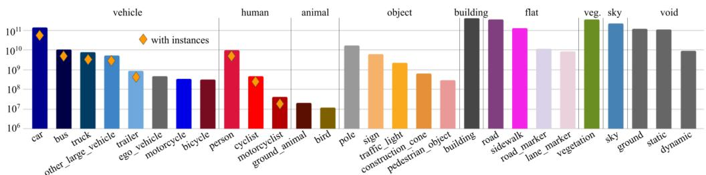
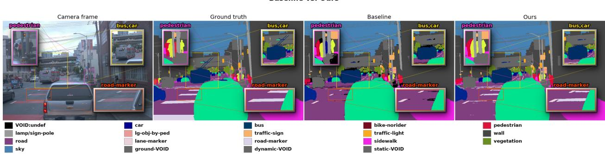
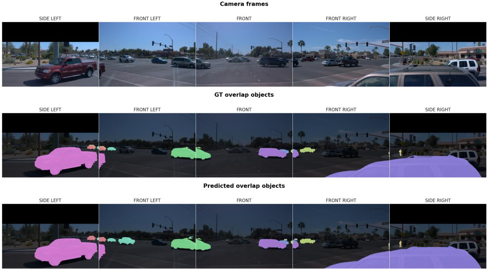

# HARD-REGION SUPERVISION: #1 ON THE WAYMO OPEN DATASET 2D VIDEO PANOPTIC SEGMENTATION LEADERBOARD

TECHNICAL REPORT

Jinghan Yang jinghanyang2023@gmail.com

## ABSTRACT

We describe our winning entry to the Waymo Open Dataset 2D Video Panoptic Segmentation Challenge. The task asks for a semantic class at every pixel of every frame and, for countable objects, an identity that holds across 100 frames and across five overlapping cameras. We build on DVIS++, a cascade of a segmenter, a tracker, and a refiner, as our baseline. We propose hard region supervision (HRS) to improve the baseline. In particular, we use the baseline to define the hard region as where it makes mistakes, and design a loss and an auxiliary prediction head for this region. The auxiliary head is used only in training and removed at test time, so at inference the model trained with HRS has the same architecture as the baseline. In addition, we propose three test-time steps that further improve the results: a two-model ensemble, a merge of the segmenter’s output into the final panoptic map, and cross-camera identity linking. On the challenge test set, our entry reaches 0.3547 wSTQ, 0.2071 wAQ, and 0.6075 mIoU, ranking first on all three metrics. It is 3.6 wSTQ points ahead of the second entry and 2.4 points ahead of our DVIS++ baseline.

## 1 Introduction and Related Work

This report describes our entry to the Waymo Open Dataset 2D Video Panoptic Segmentation Challenge. The task is to assign every pixel of every frame a semantic class and, for countable objects, an instance identity that stays the same across frames and across the five cameras that make up the panoramic view. It is demanding in three separate ways at once: the semantic classes are heavily imbalanced, with ten of the twenty-eight classes together holding only 0.175% of labeled pixels; test videos are 100 frames long, so identities must survive all 100 frames; and the five cameras overlap, so an object straddling a camera boundary is segmented twice and must be recognized as one object.

We build on DVIS++ [44], which decomposes the video panoptic segmentation (VPS) task into a per-frame segmenter, a tracker and a temporal refiner trained one after another. We change it in two places. First, we find that on WOD-PVPS, a large-scale dataset, the baseline performs poorly on long-tail classes and object boundaries in segmentation. We therefore use the baseline to mark the hard region, where it makes wrong predictions, and propose a boosting-style algorithm with hard region supervision that improves performance on these baseline errors without reducing performance on the pixels the baseline already predicts correctly. Second, we find that the baseline’s decoupled design, with three modules, currently uses a suboptimal inference that hurts both AQ and mIoU. Our proposed inference pipeline improves both metrics.

On the challenge test set, the resulting system reaches a weighted STQ of 0.3547, a weighted AQ of 0.2071 and an mIoU of 0.6075, placing first on the leaderboard. The second-place entry reaches 0.3187, 0.1781 and 0.5702, and the baseline we build upon reaches 0.3308, 0.1929 and 0.5675. The remainder of this section reviews the work this builds on; Section 2 describes the methods and Section 3 the experiments.

## 1.1 Challenges in Semantic Segmentation

Two failure cases dominate semantic segmentation quality. The first is the object boundary. A mask is mostly interior, so a prediction that is correct everywhere except at its edge still scores well under mask IoU; Cheng et al. [6] show this directly, proposing Boundary IoU because the standard measure is insensitive to exactly the errors that concentrate at object edges. The second is the long tail. Pixel counts per class span orders of magnitude—LVIS [16] made this the defining property of a segmentation benchmark—so a loss averaged over pixels is dominated by the head classes and the tail contributes almost nothing to the gradient. The two are hard in different ways: boundaries are a small fraction of every object, while rare classes are a small fraction of the dataset. Prior work fixes each by changing the loss, the sampling, or the architecture.

On the boundary side, Kervadec et al. [21] propose a weighted scheme for pixels, where every pixel is weighted by its distance to the boundary rather than uniform weights. PointRend [24] concentrates prediction and supervision on the points where the mask is least certain, which in practice could be boundary pixels. Mask2Former [8] adopts PointRend for sampling. Boundary-preserving Mask R-CNN [9] adds supervision on the boundary band through a parallel boundary head, whose features are fed into the mask head, so that the mask prediction is built on features trained to be boundary-aware.

On the long-tail side, loss-based methods reshape the gradient across classes: focal loss [28] down-weights wellclassified pixels by a factor of $( 1 - p _ { t } ) ^ { \gamma }$ ; class-balanced loss [10] reweights each class by the inverse of its effective number of samples; equalization loss [38] removes the negative gradients that frequent classes impose on rare ones. EQLv2 [39], Seesaw loss [40] and logit adjustment [31] are variations on the same idea, differing only in the statistic that sets the correction: the accumulated positive-to-negative gradient ratio, the cumulative sample ratio, and the log class prior respectively. Training-paradigm methods change what the model sees instead, by resampling, by staging the training, or by augmentation: repeat-factor sampling [16] repeats an image in proportion to the rarity of its rarest category; Kang et al. [20] train the representation with instance-balanced sampling and then retrain or rescale only the classifier; copy-paste augmentation [15] pastes object instances between images.

## 1.2 Video panoptic segmentation.

Video panoptic segmentation (VPS) asks for a semantic class label at every pixel of every frame and, for pixels of countable thing classes, an instance identity that stays consistent across frames [22]. Uncountable stuff classes such as road and sky receive a class label only. The task therefore subsumes three problems at once: which class (semantic segmentation), which object (instance segmentation), and which object over time (tracking). It descends from image panoptic segmentation, which unified the first two into a single per-pixel prediction of class plus instance id.

VPS is commonly measured by two metrics, VPQ and STQ. VPQ [22] is panoptic quality computed over tubes of k consecutive frames and averaged over k. STQ [41] was proposed because VPQ under-rewards long-term tracking, since it only scores short tubes; it separates the two failure modes into a segmentation quality (SQ), measured by mIoU, and an association quality (AQ), and scores a method by their geometric mean. The Waymo Open Dataset [30] adopts a weighted variant, wSTQ, which weights each pixel by the inverse of the number of cameras observing it so that overlapping views are not double-counted; on single-camera data it reduces to STQ. Following the Waymo competition convention, we report wSTQ together with its two components, wAQ and mIoU.

Video segmentation benchmarks split by what they annotate. For video instance segmentation, YouTube-VIS [42] and the heavily occluded OVIS [36] label only thing tracks; VSPW [32] labels every pixel but no identities; and VIPSeg [33] labels both over 3,536 in-the-wild videos, which makes it the standard video panoptic benchmark—DVIS++, our baseline, is evaluated on all four. Driving video is annotated separately, and more sparsely: Cityscapes-VPS and VIPER [22] label every fifth frame, while KITTI-STEP and MOTChallenge-STEP [41] label every frame of long sequences. The Waymo Open Dataset [30] is the largest of them by annotated real frames and the only one that is panoramic, with five cameras rather than one. This report uses its 2D Video Panoptic Segmentation Challenge split: training sequences carry 5 labelled frames and evaluation sequences about 100, sampled at 5 Hz across 5 cameras (3 front at 1920 × 1280, 2 side at 1920 × 886) over 28 semantic classes.

From dense prediction to set prediction. Detection and segmentation problems (DSP) were for a decade solved by dense prediction: a network scores a grid of hand-designed candidates — anchors, proposals or pixels — and a post-processing step such as non-maximum suppression selects among them [37, 17]. DETR [4] replaced this with set prediction: a fixed set of learned queries is matched one-to-one with the ground-truth objects, so each query directly outputs one object, and no candidate grid or suppression is needed. The consequence is that the query becomes the universal interface for DSP. Once an object is one query, detection, instance, semantic, panoptic and video segmentation all collapse into the same formulation — MaskFormer [7], Mask2Former [8] and their video Mask2Former [8] carried the formulation to image segmentation, unifying semantic, instance and panoptic segmentation in one architecture a backbone extracts image features, a pixel decoder produces a high-resolution per-pixel embedding together with a multi-scale feature pyramid, and a transformer decoder refines a set of object queries by attending over that pyramid. Each query then predicts a class and a mask, the mask being the inner product between the query’s mask embedding and the per-pixel embedding. MinVIS [19] extends this to video without changing the architecture or the objective: frames are trained independently as images, and instances are associated only at inference, by matching query embeddings between consecutive frames. No tracking is ever trained.

Unified and decoupled video models. Early video panoptic methods needed a separate mechanism for things and for stuff; the query-based reformulation removed that need, since a single set of queries represents both and can be carried across frames, as in Video K-Net [25] and TubeFormer-DeepLab [23]. Recent work splits into two lines: unified models that treat video panoptic, instance and semantic segmentation as one query-propagation problem [2, 26, 27], and decoupled models that freeze a per-frame segmenter and train a tracker on its queries [19, 43, 44]. The latter currently define the state of the art, and are the line we build on.

## 2 Method

We take DVIS++ [44] as our baseline, described in section 2.1, and build on it in two places. We propose hard-region supervision (HRS), a boosting-style scheme: a trained model marks the pixels it still gets wrong, and a second model is trained with an additional loss on those pixels. Section 2.2.1 defines the hard region (Equation 4), the hard region loss (Equation 5), and the β-head through which this loss is mainly applied. At inference, we propose decoupled inference merge (DIM), a test-time fusion: the cascade produces its panoptic map from the tracker and refiner alone, discarding the segmenter’s own prediction, and DIM puts it back. Equation 7 defines the merge and section 2.2.2 the pipeline it sits in; the same stage reconciles instance identities across the five cameras (Algorithm 1).

## 2.1 Baseline

We take DVIS++ [44] as our baseline. It is a cascade of three modules: a segmenter f (a backbone and a Mask2Former [8] head) that predicts per-frame masks and classes, a referring tracker g that associates them across frames, and a temporal refiner h that produces the final masks for the video.

Loss and cascaded training. The baseline uses the Mask2Former objective [8] unchanged. A Hungarian matcher [4] assigns each predicted query to at most one ground-truth object, and the matched pairs are supervised by

$$
\mathcal { L } _ { \mathrm { b a s e l i n e } } = \lambda _ { 1 } \mathcal { L } _ { \mathrm { D i c e } } + \lambda _ { 2 } \mathcal { L } _ { \mathrm { B C E } } + \lambda _ { 3 } \mathcal { L } _ { \mathrm { C E } } ,\tag{1}
$$

where $\mathcal { L } _ { \mathrm { D i c e } }$ and $\mathcal { L } _ { \mathrm { B C E } }$ supervise each matched mask and $\mathcal { L } _ { \mathrm { C E } }$ is the query classification loss with a down-weighted no-object class. The same loss is applied at every decoder layer as an auxiliary loss.

The two mask terms are not evaluated densely. Following PointRend [24], each matched mask is scored on P sampled points: R · P candidates are drawn uniformly over the whole image, with $R > 1$ an oversampling multiplier; they are ranked by an uncertainty computed from the predicted logits, the most uncertain 0.75P are kept, and the remaining 0.25P are drawn uniformly at random.

The three modules are trained in sequence, each with the earlier stages frozen. The segmenter $f$ is trained first, as a per-frame instance segmentation model. The tracker $g$ is trained on top of the frozen $f$ and gives each object an identity that persists across frames, fusing the current frame’s queries with the previous frame’s—the online setting. The refiner h is trained last, on top of both frozen modules, and lets each object exchange information with the full temporal horizon—the offline setting. We refer to this sequential scheme as cascaded training in this technical report. What the cascade passes along is queries. The queries of $g$ are formed only from the queries of $f ,$ and those of h only from those of $g$ and $f ;$ the mask features produced by $f$ are shared by all three, but only as the frozen map from which each module’s mask head decodes its masks $( g$ adds a learned 1 × 1 projection). Pixel features are never consulted while g and h form their queries—they enter once, at the very end, to turn a finished query into a mask.

Inference modes. DVIS++ turns the same set of object queries into a prediction in two different ways, and the choice decides what the output can contain: one obtains a dense semantic map, and the other obtains a panoptic prediction with associated instance IDs.

Video panoptic segmentation (VPS) selects. A query survives only if its top class is not the no-object slot and its confidence exceeds a threshold $\tau ;$ each surviving mask is scaled by that confidence and every pixel goes to the single highest-scoring query,

$$
i ^ { \star } ( x ) = \arg \operatorname* { m a x } _ { q } \ : \ : c _ { q } m _ { q } ( x ) , \ : \ : \ : \ : \ : \ : \ : \ : c _ { q } = \operatorname* { m a x } _ { k } p _ { q } ( k ) ,\tag{2}
$$

provided that query’s own mask also exceeds τ there. Small segments are dropped and stuff segments sharing a class are merged. Every pixel gets a class and an instance identity—or nothing, if no retained query claims it.

Video semantic segmentation (VSS) sums instead of selecting. With the no-object column dropped, every query contributes to every pixel,

$$
p ( c \mid x ) = \sum _ { q } p _ { q } ( c ) m _ { q } ( x ) , \qquad { \mathrm { l a b e l } } ( x ) = { \mathrm { a r g m a x ~ } } p ( c \mid x ) .\tag{3}
$$

No threshold is applied, so every pixel receives a class, with no instance identity and no possible abstention.

## 2.2 Proposed

We make two changes to the baseline: one to how it is trained, and one to how it is run.

The first is that training treats every pixel alike, except for the uncertainty-based point sampling of PointRend [24], which samples uncertain points more densely for the loss. However, we empirically find that the trained model still performs poorly on boundaries and rare classes. We take a boosting view for solving this. A first model is trained to convergence following the baseline setup exactly; the pixels it still gets wrong are identified and called the hard region; and a second model is trained with an additional loss on exactly those pixels, carried by a prediction branch that is discarded afterwards. The two are combined at test time, so the second model is asked not to be better on its own but to be right where the first is wrong. Section 2.2.1 describes this.

The second change follows from the cascaded objectives and training design. In practice, we find that on WOD-PVPS, the refiner’s panoptic output drops thing-pixels that the segmenter had already detected correctly. We attribute this to the cascade: each module in the baseline is trained on the frozen output of the one before it and forms its queries only from upstream queries, never from the pixel features, so information the segmenter held can be lost by the time the refiner produces the final map. Therefore rather than discarding the segmentation from $f$ and taking the prediction from the tracking modules alone, we recover these pixels at inference by also merging in the segmenter’s output. Section 2.2.2 describes that merge, together with the cross-camera alignment algorithm that associates instance IDs across the five cameras.

## 2.2.1 Hard-Region Supervision (HRS)

Hard region supervision (HRS) is a boosting-style scheme [12]: it trains a second model, the student $\phi _ { s }$ , under the guidance of a trained model, the teacher $\phi _ { t }$ , which marks where the hard pixels are, and trains the student to reduce its errors on these regions. At inference, the student $\phi _ { s }$ can be used alone for panoptic segmentation, or the two models can be ensembled for semantic segmentation (Section 2.2.2).

Loss and Model. Given a teacher model $\phi _ { t } ,$ a query-based instance segmenter that predicts a set of queries, a matching algorithm assigns the predicted queries to the ground-truth objects one to one. For a matched pair, with ground-truth mask y and the teacher’s predicted mask $m _ { t }$ for the same object, the raw hard region is

$$
H = \{ x : m _ { t } ( x ) \neq y ( x ) \} .\tag{4}
$$

H contains only the misclassified pixels. These are typically sparse and thin, forming a narrow band of one to a few pixels along the object boundary, and they lie mostly inside the object, so H alone contains few background pixels. Supervising directly on such an isolated set has two problems. First, it provides little spatial context, so the features learned there tend not to generalize. Second, since H is mostly interior, the hard-region loss admits a degenerate solution: predicting every point in H as foreground. We therefore dilate the hard region by a band of r pixels around its boundary, where r is a hyperparameter (we use $r = 5 )$ ; the thickened region $H _ { r } = { \sf { \bar { H } } } \oplus { \bf \bar { B } } _ { r }$ keeps its focus on the hard pixels while supplying enough surrounding context.

We propose adding a hard-region loss for object mask formation, which has the same definition as the Dice and BCE mask losses but is computed only on the hard region. In particular, $\phi _ { s }$ is trained with $\mathcal { L } _ { \mathrm { b a s e l i n e } }$ on its mask head $\alpha .$ together with an additional loss defined only on the hard region and mainly supervised through the β-head (defined below):

$$
\begin{array} { r } { \mathcal { L } = \mathcal { L } _ { \mathrm { b a s e l i n e } } ( \alpha ) + \mathcal { L } ^ { \mathrm { h a r d } } ( \beta ) + \epsilon \mathcal { L } ^ { \mathrm { h a r d } } ( \alpha ) , \quad \quad \mathcal { L } ^ { \mathrm { h a r d } } = \lambda _ { 4 } \mathcal { L } _ { \mathrm { B C E } } ^ { \mathrm { h a r d } } + \lambda _ { 5 } \mathcal { L } _ { \mathrm { D i c e } } ^ { \mathrm { h a r d } } , \quad \epsilon \ll 1 . } \end{array}\tag{5}
$$

Hard-Region Sampling. Like the baseline mask loss, the hard-region loss is evaluated on sampled points, but the sampling differs from uncertainty-based sampling in two ways. First, the points are drawn from a restricted region rather than the whole image: the support is the hard region itself, taken as the disagreement between the teacher’s mask and the ground truth, together with the nearby background pixels lying within a window of radius $r _ { \mathrm { w i n } }$ of that region but outside the object. Including this background collar keeps negative examples in the sample and prevents the β-head from collapsing to an all-positive prediction inside the band. Second, the uncertainty step is dropped entirely: points are drawn uniformly from that support, with no oversampling and no scoring, because the region has already been selected by the $\phi _ { t } \mathbf { \bar { s } }$ errors and there is no need to search for uncertain locations inside it. The budget is smaller than the baseline’s, $P / \kappa$ points per mask with $\kappa > 1$ , since the support is a small fraction of the image.

β-head. This head can be added to any of the transformer decoders in $f , g ,$ , and h. Each of these decoders turns a set of queries into per-object predictions through two prediction heads: a class head and a mask head. The mask head, in particular, reads the query after each decoder layer, maps it through an MLP to a mask embedding, and decodes it against the per-pixel embeddings by a dot product to produce the object’s mask. We refer to this original mask head as the α-head and add a second one, the $\beta { \mathrm { - h e a d } }$ , beside it. $\mathcal { L } _ { \mathrm { B C E } }$ and $\mathcal { L } _ { \mathrm { D i c e } }$ are attached to the α-head, and $\mathcal { L } _ { \mathrm { B C E } } ^ { \mathrm { h a r d } }$ and $\mathcal { L } _ { \mathrm { D i c e } } ^ { \mathrm { h a r d } }$ mainly to the β-head, with only a small weight $\epsilon \ll 1$ on the α-head (Equation 5); since the two heads share the decoder, the hard-region loss reaches the queries mainly through $\beta .$

## 2.2.2 Inference

Everything in this subsection acts at test time only. We first ensemble the semantic prediction over $K = 2$ models, next merge the segmenter’s instance map back into the refiner’s panoptic map to recover the pixels the cascade drops, and lastly reconcile instance identities across the five cameras.

Segmentation Ensembling (SE) The semantic branch is ensembled over K models at test time. Each of the K models is run independently, and their per-pixel class posteriors are averaged uniformly,

$$
p _ { \mathrm { e n s } } ( c \mid x ) = \frac { 1 } { K } \sum _ { m = 1 } ^ { K } p _ { m } ( c \mid x ) .\tag{6}
$$

In practice, we use $K = 2 \colon$ the two models $f _ { A }$ and $f _ { B }$ obtained from the two training rounds.

Decoupled Inference Merge (DIM) We are given the predictions from two modules, $y _ { f }$ and $y _ { h }$ , where $y _ { f }$ is a semantic segmentation map and $y _ { h }$ is a panoptic segmentation map. For stuff pixels we take the result from $y _ { f } .$ . For thing pixels, let L be the pixels detected as thing in $y _ { h }$ , which therefore carry an associated instance id, and let $U$ be the pixels detected as thing in $y _ { f }$ but not in $y _ { h }$ . We label U with a simple KNN, applied independently within each frame. For each $x \in U$

$$
\mathrm { i } \mathrm { d } ( x ) = \mathrm { i } \mathrm { d } ( y ^ { \star } ) , \qquad y ^ { \star } = \arg \operatorname* { m i n } _ { y \in L } \| x - y \| ,\tag{7}
$$

so x inherits the id of its nearest neighbor in L by pixel distance, while stuff-pixels keep only their class. Despite its simplicity, this merge improves both wAQ and mIoU (Table 4).

Multi-Camera Alignment The five cameras overlap at their edges, so a car near the boundary between two of them is segmented twice, once in each view, and is given an unrelated instance id in each. Because AQ rewards an object keeping one identity wherever it appears, these per-camera identities have to be reconciled. Algorithm 1 does this on the four adjacent camera pairs. Given an adjacent camera pair $( A , B )$ , we first estimate a homography H from the two images, which aligns their overlapping area pixel to pixel. We then warp A’s instance prediction into B’s view through H and link an object pair if it satisfies two constraints, same class and sufficient mask overlap; otherwise the pair is left unlinked. Geometry decides where the two views coincide; the predicted masks decide what is the same object. The two stages use disjoint inputs: H is estimated from the images alone and never sees a prediction, while the linking uses only predictions and never sees the pixels. A wrong prediction cannot corrupt the geometry, and a wrong warp can only cause a missed link, not a wrong one. In practice, replacing the estimated cross-camera links with the ground-truth links changes the result only marginally, so Algorithm 1 is close to an oracle alignment; qualitative examples are shown in Appendix 5.1.

Algorithm 1 Cross-camera alignment of overlapping objects   
Input: images I and predicted maps P for the five cameras; the four adjacent pairs P; pixel threshold τ.   
Output: one global id per physical object, shared across every camera it spans.   
1: initialise a union–find structure U over all thing instances   
2: for each adjacent pair (A, B) ∈ P do   
3: H ← HOMOGRAPHYORBMATCH(IA, IB) // geometry, from RGB only   
4: $P _ { A } ^ { \prime } \gets \mathbf { W } \mathbf { A R P } ( P _ { A } , H )$ // A’s predicted map, now in B’s view   
5: for each thing instance a in P′ do   
6: for each thing instance b in PB do   
7: if class(a) = class(b) and |mask(a) ∩ mask $( b ) | \geq \tau$ then   
8: U.UNION(a, b) // same physical object   
9: for each group g in U do   
10: assign one global id to every instance in g

## 3 Experiment

We evaluate on WOD-PVPS, the five-camera panoramic benchmark the challenge is run on, and report the official wSTQ, wAQ and mIoU. Sections 3.1 and 3.2 introduce the dataset details and the experimental setup, including the parameters used to obtain the empirical results; Section 3.3 gives the challenge result and then separates out what each component of Section 2 contributes to it.

## 3.1 Dataset

We evaluate on the Waymo Open Dataset: Panoramic Video Panoptic Segmentation (WOD-PVPS). WOD-PVPS [30] provides high-resolution frames across 5 cameras. The 3 front camera have the resolution of 1920x1280, the 2 side cameras have the resolution of 1920x886. The split is 70k training / 10k validation / 20k test images; validation and test are long 100-frame sequences (5 Hz) for long-term tracking. The training dataset consists of video clips of five frames sampled at 5 Hz, each from a single camera. We train on these train video clips, and the model predicts 5 consecutive frames, and use a stitching algorithm for stitching these videos clips to be the 100 frames long videos for the validation and test videos.

  
Figure 1: Pixel distribution of the 28 semantic categories, reproduced from Figure 2 of Mei et al. [30]. The vertical axis is the number of pixels per class on a logarithmic scale; classes are grouped by super-class, and diamonds mark the classes for which instance IDs are provided.

WOD-PVPS has 28 semantic classes. Figure 1 shows the pixel distribution over these 28 classes and marks which of them are things and which are stuff. The class distribution is heavily long-tailed: on the log scale, eighteen classes lie above roughly 109 pixels and ten lie well below it. We denote these ten the rare classes R: trailer, ego vehicle, motorcycle, bicycle, cyclist, motorcyclist, ground animal, bird, construction cone, and object dragged by pedestrian. Typically, the rare classes are harder than the common classes, since they contribute few training pixels. We therefore evaluate on all classes, and additionally report separate results on R and on the remaining common classes.

## 3.2 Models and Training

We use Mask2Former as the segmenter, with a DINOv2 [35] ViT-L/14 backbone wrapped in a ViT-Adapter [5]. The ViT weights are frozen and only the adapter, pixel decoder and transformer decoder are trained, which keeps the large backbone affordable at our batch size. The transformer decoder has nine layers with hidden dimension 256 and 200 object queries over 29 classes (28 classes and one no-object class), and the mask losses are evaluated on 12,544 PointRend-sampled points per mask with an oversampling ratio of 3.0 and an importance-sampling ratio of 0.75. The matching and loss weights are 2.0 for classification and 5.0 each for mask BCE and Dice, with a no-object weight of 0.1. Training uses AdamW at a base learning rate of $1 0 ^ { - 4 }$ with weight decay $1 0 ^ { - 4 }$

The three front cameras are $1 2 8 0 \times 1 9 2 0$ while the two side cameras are $8 8 6 \times 1 9 2 0$ , so the resize range is set per camera group: the shorter side is sampled from {960, 1120, 1280} for the front cameras and from {775, 886} for the side cameras, keeping the effective scale comparable across the five views. Clips are then randomly cropped to $7 0 4 \times 1 2 4 8$ , matching the crop size used at inference, and randomly flipped. We follow the cascaded training of DVIS and DVIS++ [43, 44] and train the three modules $f , g ,$ , and h in sequence, each stage freezing everything before it. These three modules are trained with the same loss definition; however, their objectives differ in how the queries are matched to the ground truth. In $f$ training, the matching is at the frame level: $f$ runs per frame with no temporal modeling, and a clip of shape $( T , B , C , H , W )$ is folded to $( T \cdot B , C , H , W )$ ), so time is only a batch dimension. In g and h training, however, the matching is at the video level. Therefore, for a given query, frame-level matching and video-level matching may assign different ground-truth objects. Beyond matching, g and h also differ from $f$ in what they add on top of its queries. The tracker adds attention layers that, at each frame, fuse the current segmenter queries with the previous frame’s tracked output. The refiner lets each tracked object exchange information in three directions: along its own trajectory (temporal attention and convolution), with the other objects (self-attention), and with the frozen per-frame segmenter queries (cross-attention). It then re-predicts class and mask from the whole trajectory.

The tracker adds learnable attention layers that, at each frame, fuse the current segmenter queries with the previous frame’s tracked output. The refiner takes the tracker’s identity-consistent object embeddings and lets each object exchange information along its own trajectory, through temporal self-attention and a short temporal convolution within a track, self-attention across objects, and cross-attention to the frozen per-frame embeddings, before re-predicting class and mask from the whole trajectory.

Hard-region supervision. The round-one segmenter serves as both the teacher that defines the hard region and the initialisation for round two, which is then trained under a fresh learning-rate schedule. The hard region is dilated by 5 pixels before the loss is applied to it. The β-head duplicates only the mask projection, an MLP(256, 256, 256) of the same shape as the original, and is dropped after training, so the model evaluated in Section 3.3 has the same architecture and inference cost as the baseline. At test time the two rounds are ensembled as $K = 2$

## 3.3 Results

We begin with the challenge result on the test set, scored by the official online evaluation system, and then decompose the effectiveness of the proposed methods through ablations on the validation set. VPS consists of semantic segmentation and tracking. Section 3.3.2 takes the semantic half, separating the contribution of the segmentation ensemble (SE, Section 2.2.2) from that of hard-region training on the segmenter (HRT, Section 2.2.1) and then asking which classes the gain lands on. Section 3.3.3 takes the full video panoptic task, where identity across frames and across cameras also counts, and isolates what decoupled inference merge (DIM, Section 2.2.2) contributes; it closes with the online setting, which we report to study the effect of HRT on tracking, although the challenge submission did not use it. Unless stated otherwise, the challenge result is on the test set and everything that follows is on the 20 validation videos.

## 3.3.1 Challenge Result

Table 1 places our submission against the other entries on the challenge test set. Our method leads on all three metrics, by +0.0360 wSTQ, +0.0290 wAQ and +0.0303 mIoU over the next best entry on each metric. The last row is not a leaderboard entry: it is the same pipeline built on the baseline segmenter rather than ours, evaluated on the same test set, and it isolates what our contribution adds:+0.0239 wSTQ, +0.0142 wAQ and +0.0400 mIoU.

## 3.3.2 Semantic Segmentation

Table 1 reports the system as a whole. Table 2 separates its segmentation gain into the part contributed by the segmentation ensemble (SE) and the part contributed by hard-region training (HRT). We write $\mathrm { H R T } _ { f }$ for HRT applied to the segmenter and $\mathrm { H R T } _ { g }$ for HRT applied to the tracker. This subsection, on semantic segmentation, uses only $\operatorname { H R T } _ { f } ;$ the effect of $\mathrm { H R T } _ { g }$ is deferred to the next subsection (Section 3.3.3), on panoptic segmentation.

<table><tr><td>method</td><td>wSTQ</td><td>wAQ</td><td>mIoU</td></tr><tr><td>DVIS_Plus_M1_NN_fusion (ours)</td><td>0.3547</td><td>0.2071</td><td>0.6075</td></tr><tr><td>Pano-CTVPS</td><td>0.3187</td><td>0.1781</td><td>0.5702</td></tr><tr><td>Jay_Street_PVPS_v0.1</td><td>0.2929</td><td>0.1486</td><td>0.5772</td></tr><tr><td>AmapNet-v_230523181741</td><td>0.2757</td><td>0.1466</td><td>0.5185</td></tr><tr><td>AmapNet-v_230501183044</td><td>0.2428</td><td>0.1039</td><td>0.5672</td></tr><tr><td>ViP-DeepLab Baseline S</td><td>0.1750</td><td>0.1062</td><td>0.2883</td></tr><tr><td>Clip KMax with Video Stitching</td><td>0.0831</td><td>0.0251</td><td>0.2748</td></tr><tr><td>Our internal baseline†</td><td>0.3308</td><td>0.1929</td><td>0.5675</td></tr></table>

Table 1: Waymo Open Dataset 2D Video Panoptic Segmentation leaderboard on the test set, ordered by wSTQ. † our internal baseline, not a leaderboard entry.

<table><tr><td></td><td>Baseline-segmenter</td><td>+ SE</td><td> $+ \operatorname { S E } , \operatorname { H R T } _ { f }$  (ours)</td></tr><tr><td>mIoU</td><td>0.6290</td><td>0.6353</td><td>0.6445</td></tr><tr><td>∆</td><td></td><td>+0.0063</td><td>+0.0092</td></tr></table>

Table 2: The baseline, the two-model ensemble, and the two-model ensemble whose second model is trained with the hard-region loss. Each ∆ is against the column to its left, so the first isolates ensembling and the second isolates the hard region.

Of the total +0.0155 mIoU, SE accounts for +0.0063 and the HRTf accounts for the remaining +0.0092. Neither subsumes the other: ensembling helps a model already trained with the hard region, and the hard region helps a model that has already been ensembled.

Next, we study how that gain is distributed across the individual classes. Table 3 shows that our method improves the rare classes R, by about 2% on average, and the other frequent classes by about 1.5% on average in mIoU. Note that both methods are unable to detect ego vehicle and motorcyclist. Our hypothesis is that motorcyclist is the least frequent object in the dataset, and that both motorcyclist and ego vehicle have a high rate of mislabelling.

<table><tr><td>class</td><td>Baseline-segmenter</td><td>Ours</td><td>∆</td><td>GT%</td></tr><tr><td>trailer</td><td>0.6432</td><td>0.6641</td><td>+0.0209</td><td>0.022</td></tr><tr><td>construction cone</td><td>0.5536</td><td>0.5875</td><td>+0.0339</td><td>0.062</td></tr><tr><td>ego vehicle</td><td>0.0000</td><td>0.0000</td><td>+0.0000</td><td>0.004</td></tr><tr><td>cyclist</td><td>0.8404</td><td>0.8583</td><td>+0.0179</td><td>0.018</td></tr><tr><td>motorcycle</td><td>0.7653</td><td>0.7828</td><td>+0.0175</td><td>0.020</td></tr><tr><td>bicycle</td><td>0.7319</td><td>0.7502</td><td>+0.0183</td><td>0.028</td></tr><tr><td>pedestrian object</td><td>0.2816</td><td>0.3009</td><td>+0.0193</td><td>0.020</td></tr><tr><td>motorcyclist</td><td>0.0000</td><td>0.0000</td><td>+0.0000</td><td>0.000</td></tr><tr><td>ground animal</td><td>0.1968</td><td>0.2071</td><td>+0.0103</td><td>0.001</td></tr><tr><td>bird</td><td>0.4912</td><td>0.5521</td><td>+0.0609</td><td>0.000</td></tr><tr><td>R (10 classes)</td><td>0.4504</td><td>0.4703</td><td>+0.0199</td><td>0.175</td></tr><tr><td>complement (18 classes)</td><td>0.7193</td><td>0.7343</td><td>+0.0150</td><td>99.826</td></tr><tr><td>all (28 classes)</td><td>0.6233</td><td>0.6400</td><td>+0.0167</td><td>100.000</td></tr></table>

Table 3: Per-class IoU on the rare classes R: the baseline versus ours, the SE with the HRT -trained second model. Classes are ordered by pixel count. GT% is the class’s share of all ground-truth pixels. The last three rows compare R with its complement and with all 28 classes.

## 3.3.3 Video Panoptic Segmentation

So far we have compared the segmentation quality of the baseline and our method, measured by mIoU, which scores each frame on its own. We now turn to the final task, video panoptic segmentation, which adds identity: whether an object keeps a single id across frames and across the five cameras.

DVIS++ adds two modules after the Mask2Former [8] instance segmenter for VPS, the referring tracker and the temporal refiner, and trains them in a cascaded fashion, freezing the previous module when training the next one. We run DVIS++’s VPS inference throughout, with the confidence threshold of Section 2.1 set to τ = 0.8. At inference, DVIS++ forms the final panoptic map from the two tracking modules, and the predictions of f, which provide the instance segmentation, are completely discarded. Table 4 shows what the full pipeline costs in semantic quality by adding ID association: the baseline scores 0.5919 mIoU, against the 0.6290 its own segmenter reaches under VSS inference. We next shows the proposed DIM inference scheme for the VPS task, which re-includes the instance maps from f in the inference pipeline and not only brings mIoU back but also improves wAQ.

  
Figure 2: The panoptic prediction on one frame of the front camera, coloured by semantic class. Left to right: the camera image, the ground truth, the baseline, and ours; three regions—a pedestrian group, a bus and car, and a road marker—are magnified beside each panel, with the class legend below. Black is VOID:undef, which a method emits where no retained query claims the pixel; it can appear only under the VPS readout of Section 2.1, never under VSS. The baseline leaves large VOID:undef regions over the vehicles and across the pedestrian group, where ours commits to a class.

Inputs and Effect ofDIM. It takes two inputs: the semantic prediction from the segmenter f, and the panoptic prediction from the tracker g and refiner h, produced exactly as in the baseline. In every result we report, including the competition submission, except the HRT result in Table 5, the panoptic prediction simply comes from the baseline, trained without any hard region training. HRT is used only for the segmenter f that provides the semantic prediction.

Due to time and compute constraints, we did not carry HRT to the third stage of training, the refiner, and therefore simply use the baseline’s panoptic prediction in DIM to produce the main results. To show the effectiveness of HRT for tracking as well, we conducted a separate experiment adding it to the second stage of training. Since this result is separate from the competition result, and we defer it to Table 5 as a special case.
<table><tr><td>model</td><td>wSTQ</td><td>wAQ</td><td>mIoU</td></tr><tr><td>baseline</td><td>0.3379</td><td>0.1929</td><td>0.5919</td></tr><tr><td>+DIM (ours)</td><td>0.3590</td><td>0.2049</td><td>0.6290</td></tr><tr><td>+SE-HRTf, DIM (ours)</td><td>0.3654</td><td>0.2071</td><td>0.6445</td></tr></table>

Table 4: Official Waymo metric on the 20 validation videos, cross-camera aligned, offline setting. baseline: DVIS++ trained and run as released. +DIM: the baseline model with decoupled inference merge at test time. +DIM (ours), HRTf (ours): the segmenter trained with the hard-region loss and the restart ensemble, with DIM at test time.

In both DIM rows of Table 4, the panoptic map used for fusion is the baseline’s, without any hard region training; SE-HRT changes only the segmenter. Comparing the baseline with +DIM shows that using DIM at inference is essential for decoupled cascaded training: adding DIM alone improves wSTQ by 2.1 points. Adding SE-HRTf to the segmenter further improves wSTQ by 0.6 points, for a total gain of 2.8 points over the baseline.

Figure 2 shows a qualitative comparison on one frame. Compared with the baseline, our method better detects several critical objects in this frame: cars, buses, pedestrians, and road signs.

Special Case: Online Video panoptic segmentation is usually evaluated in two settings that differ in the temporal horizon available at inference. In the online setting, frames are processed in order, and the prediction for frame t may use only frames up to t. In the offline setting, the whole video is available before prediction, so frame t may use frames both before and after it. For the competition, we submitted results in the offline setting, since the competition provides offline access and the longer horizon gives better results than the online setting. In DVIS++, the online model is the segmenter with the referring tracker, which realizes the online constraint recurrently by taking the current frame’s queries and the previous frame’s tracked queries as its only inputs. In this setting, the pipeline stops at the referring tracker and uses its output as the panoptic prediction. Here, we additionally evaluate the effectiveness of adding hard region supervision to the training of the referring tracker $( \mathrm { H R } \mathbf { S } _ { g } )$ . The results in Table 5 demonstrate that adding $\mathrm { H R T } _ { g }$ to the training of later modules also helps VPS: it improves wSTQ by 1.3 points on its own and by 1.1 points on top of $\operatorname { S E - H R T } _ { f }$ and DIM, and together with our other methods, it improves wSTQ by 5.1 points over the online baseline.

<table><tr><td>method</td><td>wSTQ</td><td>wAQ</td><td>mIoU</td></tr><tr><td>baseline</td><td>0.2712</td><td>0.1297</td><td>0.5669</td></tr><tr><td> $+ \mathrm { H R T } _ { g } \ ( \mathrm { o u r s } )$ </td><td>0.2843</td><td>0.1449</td><td>0.5579</td></tr><tr><td> $+ \mathbf { S } \mathbf { E } \mathbf { - } \mathbf { H } \mathbf { R } \mathbf { T } _ { f } , \mathbf { D } \mathbf { I } \mathbf { M } \left( \mathbf { o u r s } \right)$ </td><td>0.3113</td><td>0.1503</td><td>0.6445</td></tr><tr><td> $+ \mathrm { H R T } _ { g } , \dot { \mathrm { S E } } \mathrm { - } \mathrm { H R T } _ { f } , \mathrm { D I M } \left( \mathrm { o u r s } \right)$ </td><td>0.3225</td><td>0.1614</td><td>0.6445</td></tr></table>

Table 5: Hard-region loss on the referring tracker $( \mathrm { H R L } _ { T } )$ and decoupled inference, online setting; the temporal refiner is not used. Each $" + "$ row adds the named component to the baseline. Best wSTQ in bold.

Table 5 compares four methods in the online setting. Baseline uses the baseline alone. $+ H R T _ { g }$ adds the hard-region loss to the tracker’s training. +SE-HRT , DIM adds the decoupled inference merge of the segmenter and tracker outputs, along with the hard region training of the segmenter. $+ H R T _ { g } , S E \ – H R T _ { f } , D I M$ (Ours) combines all three. Comparing Baseline with $+ H R T _ { g }$ shows that adding the hard-region loss alone improves wAQ by 1.5 points, and the last two rows show that this gain persists after DIM and SE-HRTf (+1.1 points). Note that the same comparison shows that adding the hard-region loss drops mIoU (by 0.9 points). Our hypothesis is that, when training the tracker, the major gain is in ID association between consecutive frames, and AQ is a direct metric of association quality, hence the AQ gain. Thi result is interesting: when the model is trained for the VPS objective, yet takes as input queries learned for instance segmentation, a trade-off forms between association and segmentation quality. When AQ is the main goal, the method improves AQ. It also decreases mIoU. From another perspective, this is consistent with the flaw of decoupled, cascaded training discussed in Section 2.1. DIM addresses this problem at inference time, along with hard region training at training time: Ours recovers mIoU to 0.6445 and improves wSTQ by 5.1 points over Baseline.

Cross-camera alignment Figure 3 in Appendix 5.1 shows the overlap objects recovered by Algorithm 1 on a randomly chosen frame, next to the ground truth; the two are very close.

## 4 Limitations and Future Work

For the segmenter in our VPS pipeline, our improvements come from hard-region training and ensembling the resulting models at inference time. While this boosting paradigm improves segmentation quality, it multiplies inference cost by the number of ensemble members, which is impractical for self-driving, where real-time inference is required. A natural next step is to collapse the boosting pipeline into a single model via knowledge distillation, training one student to match the ensemble’s outputs [18]. Prior work shows that a single student can recover most of an ensemble’s accuracy [14], and that it can additionally retain the ensemble’s uncertainty estimates [29]t. Allen-Zhu and Li [1] further provide a theoretical account of why a single model can absorb the ensemble’s gains. Whether this holds for hard-region-specialized models, whose members are deliberately trained on different data distributions, remains to be verified.

The second problem we address in the baseline is information loss from cascade training in the decoupled modules: the segmenter, tracker, and refiner are trained sequentially toward different stage-wise objectives, each with its predecessor frozen, and each later module reads only queries, never pixel features, when forming its queries, so pixels lost at one stage cannot be recovered by the next. DIM recovers these pixels by re-including the segmenter’s instance maps at inference via nearest-neighbor merging, but this ensembles two modules and relies on KNN relabeling, both impractical for self-driving. The next step is a single end-to-end model, in one of two directions. The first is to let later stages re-attend to the pixel features rather than only to the previous stage’s queries. The second is to close the objective gap between stages, a known problem in staged optimization addressed by continuation methods [34], progressively stricter cascades [3], and residual schemes that train each new stage on the gap left by the frozen predecessor [13, 11].

## References

[1] Zeyuan Allen-Zhu and Yuanzhi Li. Towards understanding ensemble, knowledge distillation and self-distillation in deep learning. In International Conference on Learning Representations (ICLR), 2023.

[2] Ali Athar, Alexander Hermans, Jonathon Luiten, Deva Ramanan, and Bastian Leibe. Tarvis: A unified approach for target-based video segmentation. In Proceedings ofthe IEEE/CVF Conference on Computer Vision and Pattern Recognition (CVPR), 2023.

[3] Zhaowei Cai and Nuno Vasconcelos. Cascade R-CNN: Delving into high quality object detection. In Proceedings ofthe IEEE/CVF Conference on Computer Vision and Pattern Recognition (CVPR), 2018.

[4] Nicolas Carion, Francisco Massa, Gabriel Synnaeve, Nicolas Usunier, Alexander Kirillov, and Sergey Zagoruyko. End-to-end object detection with transformers. In Proceedings ofthe European Conference on Computer Vision (ECCV), 2020.

[5] Zhe Chen, Yuchen Duan, Wenhai Wang, Junjun He, Tong Lu, Jifeng Dai, and Yu Qiao. Vision transformer adapter for dense predictions. In International Conference on Learning Representations (ICLR), 2023.

[6] Bowen Cheng, Ross Girshick, Piotr Dollár, Alexander C. Berg, and Alexander Kirillov. Boundary IoU: Improving object-centric image segmentation evaluation. In Proceedings ofthe IEEE/CVF Conference on Computer Vision and Pattern Recognition (CVPR), pages 15334–15342, 2021.

[7] Bowen Cheng, Alexander G. Schwing, and Alexander Kirillov. Per-pixel classification is not all you need for semantic segmentation. In Advances in Neural Information Processing Systems (NeurIPS), 2021.

[8] Bowen Cheng, Ishan Misra, Alexander G. Schwing, Alexander Kirillov, and Rohit Girdhar. Masked-attention mask transformer for universal image segmentation. In Proceedings of the IEEE/CVF Conference on Computer Vision and Pattern Recognition (CVPR), 2022.

[9] Tianheng Cheng, Xinggang Wang, Lichao Huang, and Wenyu Liu. Boundary-preserving mask R-CNN. In European Conference on Computer Vision (ECCV), 2020.

[10] Yin Cui, Menglin Jia, Tsung-Yi Lin, Yang Song, and Serge Belongie. Class-balanced loss based on effective number of samples. In Proceedings ofthe IEEE/CVF Conference on Computer Vision and Pattern Recognition (CVPR), 2019.

[11] Scott E. Fahlman and Christian Lebiere. The cascade-correlation learning architecture. In Advances in Neural Information Processing Systems (NeurIPS), 1990.

[12] Yoav Freund and Robert E. Schapire. A decision-theoretic generalization of on-line learning and an application to boosting. Journal ofComputer and System Sciences, 55(1):119–139, 1997.

[13] Jerome H. Friedman. Greedy function approximation: A gradient boosting machine. The Annals of Statistics, 29 (5):1189–1232, 2001.

[14] Tommaso Furlanello, Zachary C. Lipton, Michael Tschannen, Laurent Itti, and Anima Anandkumar. Born-again neural networks. In International Conference on Machine Learning (ICML), 2018.

[15] Golnaz Ghiasi, Yin Cui, Aravind Srinivas, Rui Qian, Tsung-Yi Lin, Ekin D. Cubuk, Quoc V. Le, and Barret Zoph. Simple copy-paste is a strong data augmentation method for instance segmentation. In Proceedings of the IEEE/CVF Conference on Computer Vision and Pattern Recognition (CVPR), 2021.

[16] Agrim Gupta, Piotr Dollár, and Ross Girshick. LVIS: A dataset for large vocabulary instance segmentation. In Proceedings of the IEEE/CVF Conference on Computer Vision and Pattern Recognition (CVPR), 2019.

[17] Kaiming He, Georgia Gkioxari, Piotr Dollár, and Ross Girshick. Mask r-cnn. In Proceedings of the IEEE International Conference on Computer Vision (ICCV), 2017.

[18] Geoffrey Hinton, Oriol Vinyals, and Jeff Dean. Distilling the knowledge in a neural network. arXiv preprint arXiv:1503.02531, 2015.

[19] De-An Huang, Zhiding Yu, and Anima Anandkumar. Minvis: A minimal video instance segmentation framework without video-based training. In Advances in Neural Information Processing Systems (NeurIPS), 2022.

[20] Bingyi Kang, Saining Xie, Marcus Rohrbach, Zhicheng Yan, Albert Gordo, Jiashi Feng, and Yannis Kalantidis. Decoupling representation and classifier for long-tailed recognition. In International Conference on Learning Representations (ICLR), 2020.

[21] Hoel Kervadec, Jihene Bouchtiba, Christian Desrosiers, Eric Granger, Jose Dolz, and Ismail Ben Ayed. Boundary loss for highly unbalanced segmentation. In International Conference on Medical Imaging with Deep Learning (MIDL), 2019.

[22] Dahun Kim, Sanghyun Woo, Joon-Young Lee, and In So Kweon. Video panoptic segmentation. In Proceedings of the IEEE/CVF Conference on Computer Vision and Pattern Recognition (CVPR), 2020.

[23] Dahun Kim, Jun Xie, Huiyu Wang, Siyuan Qiao, Qihang Yu, Hong-Seok Kim, Hartwig Adam, In So Kweon, and Liang-Chieh Chen. Tubeformer-deeplab: Video mask transformer. In Proceedings ofthe IEEE/CVF Conference on Computer Vision and Pattern Recognition (CVPR), 2022.

[24] Alexander Kirillov, Yuxin Wu, Kaiming He, and Ross Girshick. PointRend: Image segmentation as rendering. In Proceedings ofthe IEEE/CVF Conference on Computer Vision and Pattern Recognition (CVPR), 2020.

[25] Xiangtai Li, Wenwei Zhang, Jiangmiao Pang, Kai Chen, Guangliang Cheng, Yunhai Tong, and Chen Change Loy. Video k-net: A simple, strong, and unified baseline for video segmentation. In Proceedings of the IEEE/CVF Conference on Computer Vision and Pattern Recognition (CVPR), 2022.

[26] Xiangtai Li, Haobo Yuan, Wenwei Zhang, Guangliang Cheng, Jiangmiao Pang, and Chen Change Loy. Tube-link: A flexible cross tube framework for universal video segmentation. In Proceedings ofthe IEEE/CVF International Conference on Computer Vision (ICCV), 2023.

[27] Xiangtai Li, Haobo Yuan, Wei Li, Henghui Ding, Size Wu, Wenwei Zhang, Yining Li, Kai Chen, and Chen Change Loy. Omg-seg: Is one model good enough for all segmentation? In Proceedings ofthe IEEE/CVF Conference on Computer Vision and Pattern Recognition (CVPR), 2024.

[28] Tsung-Yi Lin, Priya Goyal, Ross Girshick, Kaiming He, and Piotr Dollár. Focal loss for dense object detection. In Proceedings ofthe IEEE International Conference on Computer Vision (ICCV), 2017.

[29] Andrey Malinin, Bruno Mlodozeniec, and Mark Gales. Ensemble distribution distillation. In International Conference on Learning Representations (ICLR), 2020.

[30] Jieru Mei, Alex Zihao Zhu, Xinchen Yan, Hang Yan, Siyuan Qiao, Yukun Zhu, Liang-Chieh Chen, Henrik Kretzschmar, and Dragomir Anguelov. Waymo open dataset: Panoramic video panoptic segmentation. In Proceedings ofthe European Conference on Computer Vision (ECCV), 2022.

[31] Aditya Krishna Menon, Sadeep Jayasumana, Ankit Singh Rawat, Himanshu Jain, Andreas Veit, and Sanjiv Kumar. Long-tail learning via logit adjustment. In International Conference on Learning Representations (ICLR), 2021.

[32] Jiaxu Miao, Yunchao Wei, Yu Wu, Chen Liang, Guangrui Li, and Yi Yang. VSPW: A large-scale dataset for video scene parsing in the wild. In Proceedings ofthe IEEE/CVF Conference on Computer Vision and Pattern Recognition (CVPR), 2021.

[33] Jiaxu Miao, Xiaohan Wang, Yu Wu, Wei Li, Xu Zhang, Yunchao Wei, and Yi Yang. Large-scale video panoptic segmentation in the wild: A benchmark. In Proceedings ofthe IEEE/CVF Conference on Computer Vision and Pattern Recognition (CVPR), 2022.

[34] Hossein Mobahi and John W. Fisher III. On the link between gaussian homotopy continuation and convex envelopes. In Energy Minimization Methods in Computer Vision and Pattern Recognition (EMMCVPR), volume 8932 of Lecture Notes in Computer Science, pages 43–56, 2015.

[35] Maxime Oquab, Timothée Darcet, Théo Moutakanni, Huy V. Vo, Marc Szafraniec, Vasil Khalidov, Pierre Fernandez, Daniel Haziza, Francisco Massa, Alaaeldin El-Nouby, et al. DINOv2: Learning robust visual features without supervision. Transactions on Machine Learning Research, 2024.

[36] Jiyang Qi, Yan Gao, Yao Hu, Xinggang Wang, Xiaoyu Liu, Xiang Bai, Serge Belongie, Alan Yuille, Philip H.S. Torr, and Song Bai. Occluded video instance segmentation: A benchmark. International Journal of Computer Vision, 130(8):2022–2039, 2022.

[37] Shaoqing Ren, Kaiming He, Ross Girshick, and Jian Sun. Faster r-cnn: Towards real-time object detection with region proposal networks. In Advances in Neural Information Processing Systems (NeurIPS), 2015.

[38] Jingru Tan, Changbao Wang, Buyu Li, Quanquan Li, Wanli Ouyang, Changqing Yin, and Junjie Yan. Equalization loss for long-tailed object recognition. In Proceedings ofthe IEEE/CVF Conference on Computer Vision and Pattern Recognition (CVPR), 2020.

[39] Jingru Tan, Xin Lu, Gang Zhang, Changqing Yin, and Quanquan Li. Equalization loss v2: A new gradient balance approach for long-tailed object detection. In Proceedings ofthe IEEE/CVF Conference on Computer Vision and Pattern Recognition (CVPR), 2021.

[40] Jiaqi Wang, Wenwei Zhang, Yuhang Zang, Yuhang Cao, Jiangmiao Pang, Tao Gong, Kai Chen, Ziwei Liu, Chen Change Loy, and Dahua Lin. Seesaw loss for long-tailed instance segmentation. In Proceedings of the IEEE/CVF Conference on Computer Vision and Pattern Recognition (CVPR), 2021.

[41] Mark Weber, Jun Xie, Maxwell Collins, Yukun Zhu, Paul Voigtlaender, Bastian Leibe, Daniel Cremers, Aljoša Ošep, Laura Leal-Taixé, and Liang-Chieh Chen. Step: Segmenting and tracking every pixel. In Advances in Neural Information Processing Systems (NeurIPS) Datasets and Benchmarks Track, 2021.

[42] Linjie Yang, Yuchen Fan, and Ning Xu. Video instance segmentation. In Proceedings of the IEEE/CVF International Conference on Computer Vision (ICCV), 2019.

[43] Tao Zhang, Xingye Tian, Yu Wu, Shunping Ji, Xuebo Wang, Yuan Zhang, and Pengfei Wan. Dvis: Decoupled video instance segmentation framework. In Proceedings of the IEEE/CVF International Conference on Computer Vision (ICCV), 2023.

[44] Tao Zhang, Xingye Tian, Yikang Zhou, Shunping Ji, Xuebo Wang, Xin Tao, Yuan Zhang, Pengfei Wan, Zhongyuan Wang, and Yu Wu. Dvis++: Improved decoupled framework for universal video segmentation. arXiv preprint arXiv:2312.13305, 2023.

## 5 Appendix

Three things are deferred here. Section 5.1 gives the qualitative check on cross-camera alignment, Section 5.2 the full per-class breakdown behind the rare-class table, and Section 5.3 the decomposition of the refiner’s mIoU drop into the part contributed by training and the part contributed by the readout.

## 5.1 Cross-camera alignment

Figure 3 qualitatively shows the overlap objects recovered by Algorithm 1 on a randomly chosen frame, next to the ground-truth overlap objects. The two lower rows are very close: each vehicle straddling a camera boundary is recovered as one object with a single global id, except for a few very small objects (some of which are visibly the same object across two cameras but are not associated in the ground truth, which gives them different ids) and one object that the prediction mis-associates.

  
Figure 3: Cross-camera overlap objects on one frame. Top: the five camera images, arranged left to right in panoramic order. Middle: the ground-truth overlap objects. Bottom: the overlap objects recovered by Algorithm 1, that is, the objects found to span more than one camera; each is shaded by its global id, so an object keeps a single color across every camera it appears in. The two lower rows use matched colors, so an object present in both appears in the same color in each.

## 5.2 Per-class Segmentation Results

Table 6 gives the full per-class breakdown behind Table 3. In the main body, we report the rare classes R individually, since they are the hardest to detect, and average the remaining classes. Here all 28 classes are listed.

IoU improves on 24 of the 28 classes, is unchanged on two (ego vehicle and motorcyclist, which neither model detects), and drops on two. For 15 of the 24 improved classes, precision gains more than recall, so the second model mainly removes false positives. The largest gain is on truck (+11.4 IoU), driven by precision (+11.8). The frequent, large-area classes (road, wall, vegetation, sky) gain less than 0.4 IoU, as they are already near their ceiling.

The two classes that drop, bus and other-large-vehicle, both lose recall (−3.6 and −16.1 points) while their precision slightly rises. Both are visually close to truck, which gains the most. Our hypothesis is that some of their pixels are now assigned to truck.

<table><tr><td></td><td></td><td colspan="3">IoU</td><td colspan="3">Precision</td><td colspan="3">Recall</td></tr><tr><td>Class</td><td>GT %</td><td>Baseline</td><td>Ours</td><td>∆</td><td>Baseline</td><td>Ours</td><td>∆</td><td>Baseline</td><td>Ours</td><td>∆</td></tr><tr><td>truck</td><td>0.53</td><td>0.5970</td><td>0.7110</td><td>+0.1140</td><td>0.6964</td><td>0.8147</td><td>+0.1183</td><td>0.8071</td><td>0.8481</td><td>+0.0410</td></tr><tr><td>bird</td><td>0.00</td><td>0.4877</td><td>0.5468</td><td>+0.0592</td><td>0.6326</td><td>0.7317</td><td>+0.0991</td><td>0.6804</td><td>0.6840</td><td>+0.0036</td></tr><tr><td>cone</td><td>0.04</td><td>0.5524</td><td>0.5860</td><td>+0.0337</td><td>0.6257</td><td>0.6479</td><td>+0.0222</td><td>0.8251</td><td>0.8598</td><td>+0.0347</td></tr><tr><td>lane-marker</td><td>0.44</td><td>0.6493</td><td>0.6755</td><td>+0.0262</td><td>0.8016</td><td>0.8254</td><td>+0.0238</td><td>0.7736</td><td>0.7881</td><td>+0.0145</td></tr><tr><td>road-marker</td><td>0.60</td><td>0.6233</td><td>0.6492</td><td>+0.0259</td><td>0.8271</td><td>0.8345</td><td>+0.0074</td><td>0.7167</td><td>0.7451</td><td>+0.0284</td></tr><tr><td>bike-norider</td><td>0.03</td><td>0.7369</td><td>0.7588</td><td>+0.0219</td><td>0.8707</td><td>0.8854</td><td>+0.0147</td><td>0.8275</td><td>0.8414</td><td>+0.0139</td></tr><tr><td>dynamic-VOID</td><td>0.31</td><td>0.6447</td><td>0.6663</td><td>+0.0216</td><td>0.8096</td><td>0.8429</td><td>+0.0333</td><td>0.7600</td><td>0.7607</td><td>+0.0007</td></tr><tr><td>traffic-light</td><td>0.14</td><td>0.7235</td><td>0.7449</td><td>+0.0214</td><td>0.8733</td><td>0.8921</td><td>+0.0188</td><td>0.8083</td><td>0.8186</td><td>+0.0103</td></tr><tr><td>motorcycle</td><td>0.02</td><td>0.7693</td><td>0.7906</td><td>+0.0213</td><td>0.8748</td><td>0.8971</td><td>+0.0223</td><td>0.8644</td><td>0.8694</td><td>+0.0050</td></tr><tr><td>cyclist</td><td>0.02</td><td>0.8447</td><td>0.8631</td><td>+0.0184</td><td>0.9292</td><td>0.9422</td><td>+0.0130</td><td>0.9028</td><td>0.9113</td><td>+0.0085</td></tr><tr><td>lg-obj-by-ped</td><td>0.02</td><td>0.2873</td><td>0.3042</td><td>+0.0169</td><td>0.5073</td><td>0.5813</td><td>+0.0740</td><td>0.3985</td><td>0.3895</td><td>-0.0090</td></tr><tr><td>lamp/sign-pole</td><td>0.87</td><td>0.6848</td><td>0.7016</td><td>+0.0168</td><td>0.8451</td><td>0.8564</td><td>+0.0113</td><td>0.7830</td><td>0.7952</td><td>+0.0122</td></tr><tr><td>ground-VOID</td><td>4.61</td><td>0.7746</td><td>0.7896</td><td>+0.0150</td><td>0.8694</td><td>0.8855</td><td>+0.0161</td><td>0.8766</td><td>0.8794</td><td>+0.0028</td></tr><tr><td>trailer</td><td>0.02</td><td>0.6587</td><td>0.6730</td><td>+0.0142</td><td>0.8613</td><td>0.8402</td><td>-0.0211</td><td>0.7369</td><td>0.7718</td><td>+0.0349</td></tr><tr><td>sidewalk</td><td>6.04</td><td>0.8512</td><td>0.8615</td><td>+0.0103</td><td>0.9226</td><td>0.9272</td><td>+0.0046</td><td>0.9166</td><td>0.9240</td><td>+0.0074</td></tr><tr><td>car</td><td>9.34</td><td>0.9377</td><td>0.9480</td><td>+0.0103</td><td>0.9710</td><td>0.9728</td><td>+0.0018</td><td>0.9647</td><td>0.9737</td><td>+0.0090</td></tr><tr><td>ground-animal</td><td>0.00</td><td>0.2057</td><td>0.2156</td><td>+0.0099</td><td>0.6349</td><td>0.6907</td><td>+0.0558</td><td>0.2332</td><td>0.2386</td><td>+0.0054</td></tr><tr><td>pedestrian</td><td>0.59</td><td>0.8663</td><td>0.8757</td><td>+0.0094</td><td>0.9197</td><td>0.9260</td><td>+0.0063</td><td>0.9372</td><td>0.9416</td><td>+0.0044</td></tr><tr><td>static-VOID</td><td>3.70</td><td>0.6262</td><td>0.6344</td><td>+0.0082</td><td>0.7764</td><td>0.7914</td><td>+0.0150</td><td>0.7639</td><td>0.7618</td><td>-0.0021</td></tr><tr><td>traffic-sign</td><td>0.38</td><td>0.6933</td><td>0.6990</td><td>+0.0057</td><td>0.8106</td><td>0.8209</td><td>+0.0103</td><td>0.8274</td><td>0.8248</td><td>-0.0026</td></tr><tr><td>road</td><td>19.96</td><td>0.9396</td><td>0.9435</td><td>+0.0039</td><td>0.9672</td><td>0.9681</td><td>+0.0009</td><td>0.9705</td><td>0.9738</td><td>+0.0033</td></tr><tr><td>wall</td><td>25.22</td><td>0.9146</td><td>0.9175</td><td>+0.0029</td><td>0.9523</td><td>0.9524</td><td>+0.0001</td><td>0.9584</td><td>0.9615</td><td>+0.0031</td></tr><tr><td>vegetation</td><td>14.24</td><td>0.8903</td><td>0.8926</td><td>+0.0023</td><td>0.9437</td><td>0.9455</td><td>+0.0018</td><td>0.9402</td><td>0.9410</td><td>+0.0008</td></tr><tr><td>sky</td><td>12.88</td><td>0.9446</td><td>0.9449</td><td>+0.0003</td><td>0.9708</td><td>0.9701</td><td>-0.0007</td><td>0.9722</td><td>0.9732</td><td>+0.0010</td></tr><tr><td>ego veh</td><td>0.00</td><td>0.0000</td><td>0.0000</td><td>+0.0000</td><td>0.0000</td><td>0.0000</td><td>+0.0000</td><td>0.0000</td><td>0.0000</td><td>+0.0000</td></tr><tr><td>motorcyclist</td><td>0.00</td><td>0.0000</td><td>0.0000</td><td>+0.0000</td><td>0.0000</td><td>0.0000</td><td>+0.0000</td><td>0.0000</td><td>0.0000</td><td>+0.0000</td></tr><tr><td>bus</td><td>0.01</td><td>0.4480</td><td>0.4378</td><td>-0.0103</td><td>0.5513</td><td>0.5583</td><td>+0.0070</td><td>0.7053</td><td>0.6696</td><td></td></tr><tr><td>other-lg-veh</td><td>0.01</td><td>0.2595</td><td>0.2158</td><td>-0.0437</td><td>0.3369</td><td>0.3418</td><td>+0.0049</td><td>0.5304</td><td>0.3692</td><td>-0.0357 -0.1612</td></tr></table>

Table 6: Per-class IoU, precision and recall on the validation split: the baseline against ours, the two-model ensemble with the hard-region second model. Classes are ordered by change in IoU; the two below the rule are the only ones whose IoU the ensemble degrades. GT % is each class’s share of the ground-truth pixels.

## 5.3 Decomposing the Refiner’s mIoU Drop: Training vs. Readout

In the main body, when we take the output from the refiner, we follow DVIS++ and use VPS inference to produce the panoptic map, and we report the mIoU of this panoptic map. Here, we separate the refiner’s mIoU loss into two comparisons. First, we fix the readout to VSS for both modules (Table 7), so that only semantic segmentation quality is measured. Even without the VPS readout, cascaded training alone lowers mIoU by 1.6 points, from 0.6290 for the segmenter to 0.6130 for the refiner. The two are trained with the same loss but matched differently: the segmenter per frame, the refiner per video. Video-level matching assigns each query one ground-truth track and one class for the whole clip. For stuff, a track is simply the class region, which is stable over time, so this assignment fits every frame; for a thing object, a single assignment can fit some frames poorly. The cascade cannot correct this by design: the refiner forms its queries only from upstream queries, which were trained under frame-level matching, and never attends to pixel features, so a frame the video-level assignment fits poorly cannot be recovered from the image.

<table><tr><td>model</td><td>mIoU</td></tr><tr><td>baseline-segmenter</td><td>0.6290</td></tr><tr><td>baseline-refiner</td><td>0.6130</td></tr></table>

Table 7: Video semantic segmentation (VSS) inference for both modules, on the 20 validation videos.

<table><tr><td>Group</td><td>#classes</td><td>VPS</td><td>VSS</td><td>∆</td></tr><tr><td>Thing</td><td>8</td><td>0.5294</td><td>0.5515</td><td>+0.0222</td></tr><tr><td>Stuff</td><td>20</td><td>0.6465</td><td>0.6376</td><td>-0.0089</td></tr><tr><td>All</td><td>28</td><td>0.5919</td><td>0.6130</td><td>+0.0211</td></tr></table>

Table 8: mIoU of the same refiner under VPS and VSS inference, on the 20 validation videos. ∆ is VSS minus VPS.

With the model fixed to the refiner, the readout shifts quality between thing and stuff classes (Table 8): VSS is 2.2 points better on thing classes, and VPS is 0.9 points better on stuff classes. VPS keeps a query only if its confidence exceeds τ and assigns each pixel to a single winning query, so thing objects predicted with low confidence lose their pixels. VSS applies no threshold and sums every query’s contribution at each pixel, so low-confidence thing queries still contribute, while stuff regions receive probability mass from thing queries along their borders.