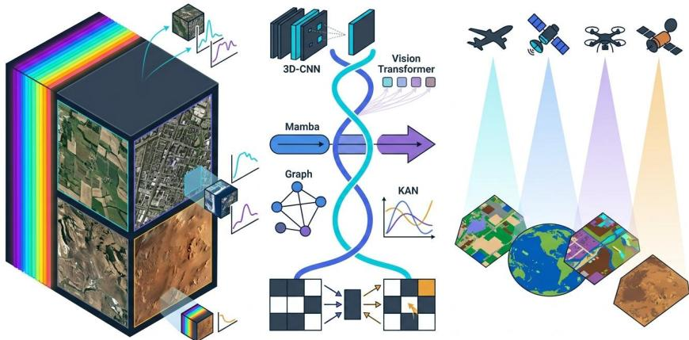
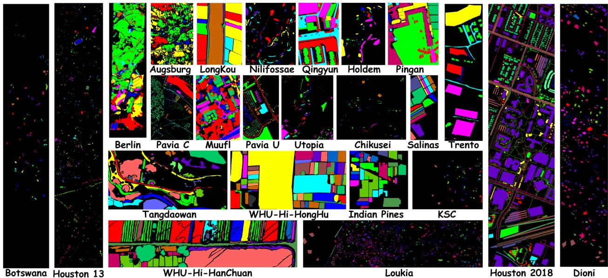
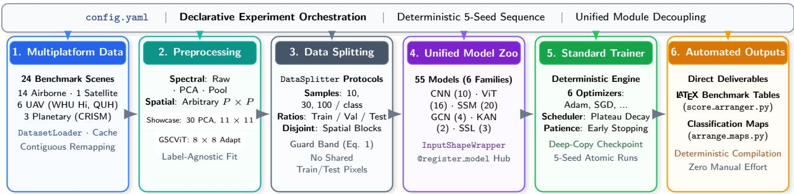
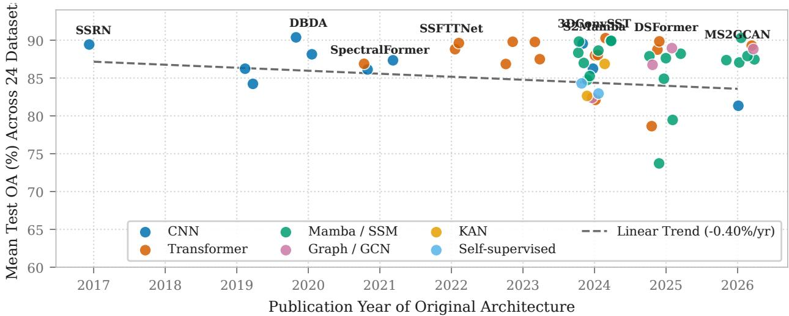
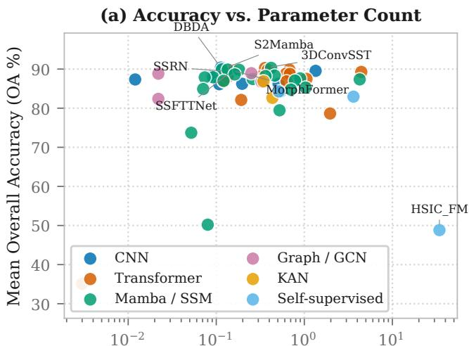
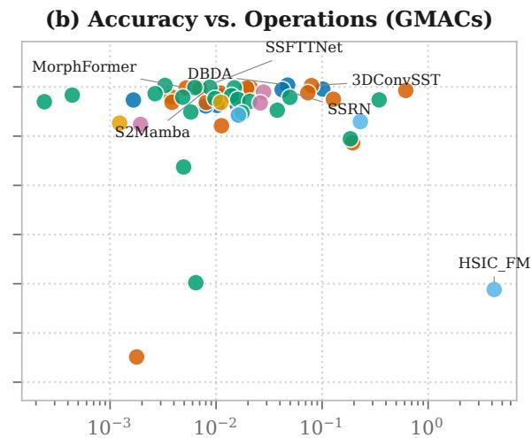
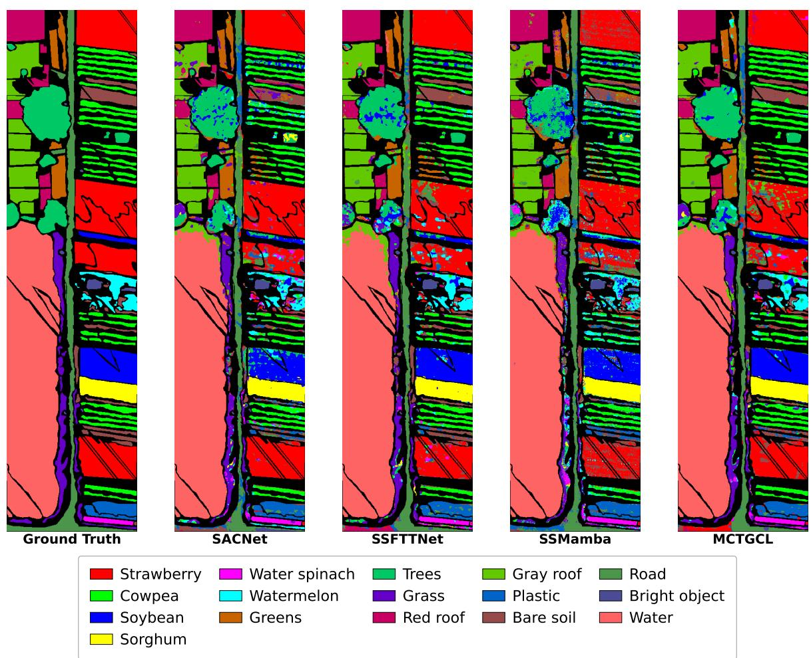
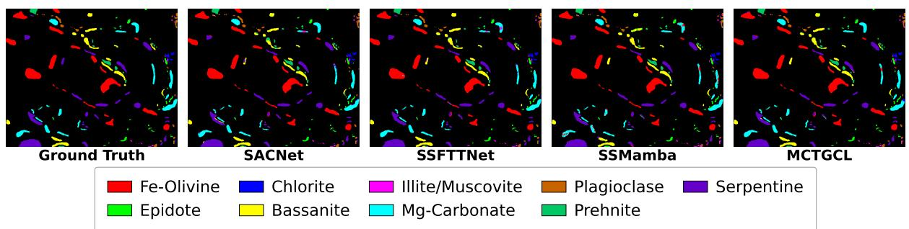

# HYPERSPECTRAL IMAGE MODELS : TECHNICAL REPORT

## Tanishq Rachamalla

Department of Information Technology Siddhartha Academy of Higher Education Vijayawada, Andhra Pradesh 521108, India tanishqrachamalla12@gmail.com

Srishti Kaushik Department of Computer and Information Sciences Indira Gandhi National Open University New Delhi 110068, India kaushiksrishti108@gmail.com

Aryan Das Department of Computer Science and Engineering Vellore Institute of Technology Bhopal, Madhya Pradesh 466114, India aryandas156@gmail.com

Swalpa Kumar Roy Department of Computer Science and Engineering Tezpur University Tezpur, Assam 784028, India swalpa@tezu.ernet.in

## ABSTRACT

Hyperspectral remote sensing has advanced across diverse deep learning paradigms, including spectral-spatial CNNs, Vision Transformers, Mamba, graph neural networks, Kolmogorov-Arnold networks, and self-supervised masked autoencoding. Yet progress remains hindered by fragmented repositories, incompatible tensor conventions, and non-standardized evaluation. Hyperspectral-Image-Models addresses these challenges through a modular framework unifying 55 representative models across six paradigms with a common registry, automatic 4D/5D tensor adaptation, and standardized constructors. It integrates 24 benchmark scenes from Airborne, Spaceborne, UAV, and Mars CRISM sensors, with caching, label remapping, PCA, explicit band selection or raw spectra, optional spatial max-pooling, and arbitrary P × P patch extraction. To prevent inflated accuracy from overlapping windows, it supports class-balanced random partitioning and spatially disjoint regional blocking with Chebyshev guard bands that eliminate train-test pixel overlap. Experiments use a single config.yaml with deterministic seeds and complete provenance, generating LaTeX benchmark tables and classification maps. Across 1,320 model-scene evaluations and 6,600 seeded runs, scene difficulty dominates architecture, with mean accuracy ranging from 96.40% on Botswana to 56.70% on Houston 2018, versus a 15-point spread across paradigm means. No paradigm universally domi nates, while sub-1M-parameter models can match architectures two orders of magnitude larger. Code is publicly available at https://github.com/Tanishq251/Hyperspectral-Image-Models.

Keywords: Hyperspectral image classification · Benchmarking · Reproducibility · Spatially disjoint evaluation · Open source software · Vision Transformers · State space models · Remote sensing

## 1 Introduction

Hyperspectral imaging acquires hundreds of contiguous narrow spectral bands for every pixel of a scene, so that each spatial location carries a near-continuous reflectance signature rather than three broadband colour values [1, 2]. That combination of fine spectral detail and two-dimensional spatial structure makes hyperspectral image (HSI) classification, the assignment of a land-cover or material label to every labelled pixel, a foundational task in precision agriculture, environmental monitoring, mineral mapping, urban analysis and planetary surface science [3, 4].

The methodological history of the task is unusually compressed. Classical spectral classifiers such as support vector machines and random forests [5, 6] gave way within a few years to spectral-spatial convolutional networks [7–9]. Vision Transformers [10] were adapted to spectral sequences almost as soon as they appeared [11, 12], graph convolutional networks [13–15] followed for non-Euclidean parcel structure, and the last three years have added selective state-space models [16–18], Kolmogorov-Arnold networks [19–21] and masked-autoencoder self-supervision [22–24]. Multiple distinct architectural families are now active in the literature at the same time, and new entries arrive faster than any one group can independently reproduce them.

  
Figure 1: Conceptual landscape of hyperspectral image (HSI) classification across deep learning paradigms and Earth/planetary observation platforms. Left: High-dimensional hyperspectral cubes spanning continuous spectral wavelengths, from which spatial patches $( P \overset { \cdot } { \times } P )$ and spectral profiles are extracted. Center: Six major architectural paradigms evaluated within our framework, namely spectral–spatial 3D-CNNs, Vision Transformers (ViT), selective state-space models (Mamba/SSM), graph convolutional networks (GCN), Kolmogorov–Arnold networks (KAN), and self-supervised masked autoencoders (SSL). Right: Multiplatform operational modalities (Airborne, Spaceborne, UAV, and Mars planetary exploration) mapped to pixel-wise semantic land-cover classifications.

## 1.1 The reproducibility problem this framework addresses

Speed has come at a cost to comparability. Published HSI classification results are rarely produced under conditions that allow them to be read against one another, because independent papers diverge along every axis that materially affects the reported number:

1. Spatial context. Patch sizes range from $7 \times 7 \mathrm { t o } 2 7 \times 2 7$ and occasionally to full-image inputs. Because the patch is the spatial evidence available to the classifier, this choice alone can move accuracy by more than the architectural difference under study.

2. Spectral preprocessing. Some works classify the raw cube; others apply principal component analysis or band selection retaining 10 to 50 components, which changes input dimensionality, noise characteristics and effective capacity together.

3. Split protocol. Training budgets range from 1% to 10% random splits, or from 5 to 200 fixed samples per class, so the difficulty of the task is not constant even across papers using the same scene.

4. Benchmark saturation. A large share of published evaluation uses three scenes acquired between 1992 and 2001, on which accuracy has largely saturated and on which modern UAV, urban and planetary behaviour is not observable.

5. Optimisation. Optimisers, schedules, batch sizes and stopping criteria differ freely, so a difference cannot be attributed to architecture without further evidence.

Comparing a new design against ten published baselines therefore means cloning ten repositories, each with its own loader, tensor convention, split logic and dependency set, and either accepting numbers that were never produced under the same conditions or reimplementing everything. Both are expensive, and the second is rarely done in full.

## 1.2 Hyperspectral-Image-Models: A Unified Software Library

This paper introduces and documents Hyperspectral-Image-Models, an open-source PyTorch library and benchmarking ecosystem that establishes an interoperable foundation for hyperspectral image classification. Hyperspectral-Image-Models addresses the fragmentation of the field by functioning as a unified model ecosystem, providing a shared architectural abstraction where independently developed models can be instantiated, swapped, and benchmarked through a common interface (num\_classes, bands, patch\_size) and uniform tensor contracts. The library puts 55 published architectures (spanning 2017 to 2026 across six active paradigms) behind a dynamic registry and executes them across 24 standardized, automatically fetched multi platform scenes under a declarative configuration system. The framework and associated code are openly available at https://github.com/Tanishq251/Hyperspectral-Image-Models under the Apache 2.0 licence, and every benchmark table and classification map in this paper is generated directly by that framework from the same completed runs. The dataset collection is distributed with attribution at https: //huggingface.co/datasets/Tanishq165/HSI\_Datasets, while individual source datasets remain subject to their original licences and terms.

The concrete contributions of this work, structured around the reusable software ecosystem, are the following:

• A unified HSI software library. A modular, extensible PyTorch library that decouples pipeline mechanics from experimental hyperparameters. Adding an architecture takes a single file and one decorator, with no core framework rewiring.

• Dataset and preprocessing abstractions. Unified loaders covering 24 scenes across four operational platforms (Airborne, Spaceborne, UAV, and Mars CRISM planetary observations), with automated Hugging Face caching, [0, 1] min–max normalization, background masking, continuous index remapping, configurable spectral treatment (PCA, explicit band selection, or raw spectra), optional spatial max-pooling of patches, and arbitrary P × P spatial patch extraction.

• Model registry and common interface. A unified model ecosystem hosting 55 architectures behind a single factory signature. The engine automatically adapts differing tensor conventions via InputShapeWrapper (handling 4D channel-first and 5D depth-first models seamlessly) and enforces standardized raw logit outputs.

• Training and evaluation infrastructure. Standardized execution loops exposing six optimizers, learning rate scheduling with plateau decay, early stopping, checkpointing of the best and final weights, and a metrics engine emitting OA, AA, Cohen’s κ, per-class accuracies, and multi-seed statistics.

• Reproducibility and experiment provenance. Global deterministic seed locking across Python, NumPy, PyTorch CPU, CUDA, and cuDNN, coupled with automatic archiving of configuration snapshots into every run directory, guaranteeing that every reported metric is fully traceable to its exact provenance.

• A comprehensive showcase benchmark. To demonstrate the library’s utility and establish commensurable baselines across all paradigms, we conduct a standardized showcase evaluation across all 55 catalog architectures and 24 scenes under a reference protocol (a baseline budget of 30 training and 10 validation samples per class, with dataset-specific reductions where available labelled pixels constrain allocation, such as Indian Pines, which uses 10 training and 5 validation samples per class), totaling 1,320 model–scene evaluations over 6,600 seeded training runs.

• A documented integration record. Every architectural deviation, bug fix, and interface adaptation required to gather independently written research codebases into a shared library is documented in code and audited across the codebase docstrings and repository documentation.

## 1.3 Scope

Two clarifications delineate the scope and interpretability of our contributions. First, this is a software library and benchmarking contribution: architectural credit for every implemented model belongs entirely to its original authors, and the framework claims the reusable integration and evaluation infrastructure rather than the model backbones themselves. Second, and crucially, while the empirical study in Section 5 evaluates performance under a standardized reference configuration (11 × 11 patches, 30 PCA bands, 30/10 reference sample budget), this setting is strictly an exemplary showcase benchmark designed to demonstrate the library’s capabilities under controlled conditions. The underlying Hyperspectral-Image-Models framework natively supports arbitrary spatial patch dimensions, custom spectral band subsets, continuous fractional ratio splits, and spatially disjoint geographic partitioning (which is supported as an alternative evaluation mode for measuring spatial out-of-distribution generalisation).

The remainder of the paper is organised as follows. Section 2 reviews the architectural paradigms the framework implements and the prior benchmarking efforts it builds on. Section 3 describes the 24 scenes and the loader that standardises them. Section 4 documents the framework itself: its execution path, its registry, the protocol it records, and the engineering required to make independently written codebases coexist. Section 5 reports the reference benchmark, the visualisations the framework generates, and the model collection it contains, and closes with the scope of the showcase benchmark and its conclusions.

## 2 Literature Review

Comprehensive surveys of hyperspectral classification already exist [25–30]. This section therefore does not attempt another. It states what each architectural paradigm implemented in the framework assumes about hyperspectral data, because those assumptions are what a shared interface has to accommodate, and it then positions the framework against prior benchmarking efforts. Every architecture named here is listed with its year, venue and identifier in Table 8.

## 2.1 Architectural paradigms and inductive biases

Spectral-spatial convolutional networks. Deep learning entered the field through convolutions built to exploit the three-dimensional structure of the cube [7]. Joint 3D spectral-spatial convolution proved the durable formulation: SSRN [8] stacked 3D residual blocks [31] with no dimensionality reduction, HybridSN [9] reduced its cost by following three 3D layers with one 2D layer, and pResNet [32] added pyramidal channel growth. Attention was then folded into the backbone through dual-branch spectral and spatial gating [33], non-local affinity [34], self-calibrated convolution [35] and interleaved attention blocks [36], and recent entries add multi-scale receptive fields and dynamic kernel routing [37–39]. Across a decade the inductive bias has not changed: local weight sharing and translation equivariance over a bounded receptive field, which is cheap in parameters and well matched to scarce labels.

Vision and spectral transformers. Self-attention [10, 40] replaces the bounded receptive field with an unbounded one at $\mathcal { O } ( N ^ { 2 } )$ cost in sequence length. The design question in hyperspectral imaging is what a token should be. SpectralFormer [11] tokenised bands or contiguous sub-bands so that attention models spectral transitions directly; SSFTTNet [12] tokenised convolutional features instead; GAHT [41] grouped tokens hierarchically to control cost; and MFT [42] and MorphFormer [43] injected morphological operators into the embedding to restore a spatial prior. Later entries pursue multi-scale, clustered or grouped tokenisation [44–54].

Selective state-space models. Structured state-space models [55] and their selective variant, Mamba [16], keep global sequence modelling at linear time by making the discretisation input dependent and evaluating the recurrence with a hardware-aware scan. Hyperspectral adaptation was immediate and is now the largest family in the collection, spanning bidirectional spatial and spectral scans [17, 56, 57], cross-dimensional gating [18], grouped inter-band modelling [58], deformable routing [59], and variants exploring multi-scale [60–62], local and global [63], mixture-of-experts [64], phase [65], wavelet [66], fuzzy [67], morphological [68], hybrid [69, 70], graph-coupled [71] and multimodal [72] scans. One structural point matters for what follows: a selective scan requires a one-dimensional ordering, so applying it to a two-dimensional patch means choosing a serialisation, and the works above choose differently.

Graph convolutional networks. Graph convolution [13] represents a scene as a graph whose nodes are pixels or superpixels and whose edges encode spectral similarity and spatial adjacency, rather than as a regular grid, which suits the irregular boundaries of real ground parcels. Hyperspectral variants apply graph self-attention over multi-hop neighbourhoods [14], fuse graph and transformer cross-attention branches [15, 73], and incorporate multi-scale spectralspatial graph attention [74]. The cost is graph construction, which is scene dependent and parallelises less cleanly than convolution or attention.

Kolmogorov-Arnold networks. Kolmogorov-Arnold networks [19] place learnable univariate functions, typically B-splines, on the edges and sum them at the nodes, $\textstyle \sum _ { i } \phi _ { i } ( x _ { i } )$ , inverting the usual arrangement in which a fixed nonlinearity follows a learned linear map. Hyperspectral uses so far replace convolutional layers [21] or classification heads [20] with spline blocks. Only two entries in the collection belong to this family, which reflects how recent it is.

Self-supervised pretraining. Hyperspectral annotation is expensive, which makes label-free pretraining attractive. Masked autoencoders [22] reconstruct masked content as a pretext task, and hyperspectral adaptations mask spectralspatial tokens [23], work in the frequency domain to retain texture [75], or pursue foundation-scale pretraining across multi-source repositories [24]. Whether such models transfer to small-sample downstream classification without overfitting is open, and it is a question a controlled harness is well placed to examine.

## 2.2 Prior benchmarks and toolboxes

Surveys catalogue methodological trends [1–4] but compile numbers reported in the original papers rather than re-running the models, so the divergences described in Section 1 are inherited rather than removed.

Software narrows the gap. DeepHyperX [76] provides common PyTorch implementations of a cohort of classical convolutional networks on the legacy scenes and remains the reference point for reproducible hyperspectral comparison. TorchGeo [77] standardises geospatial data loading across modalities without targeting hyperspectral classification architectures specifically. HyTAS [78] contributes a transformer architecture search benchmark over five scenes. Liang et al. [79] showed that when training and test pixels are drawn at random from the same image, the spatial windows of spectral-spatial methods overlap, so part of the test information is already seen during training and accuracy is overestimated; they proposed a controlled sampling strategy that keeps the two sets apart. Methodological work by Nalepa et al. [80] showed that patch-based random splits create windows that overlap between the training and test partitions, and that reported accuracies move substantially under spatially disjoint splitting, which is why the framework implements both split families; and broader reproducibility practice, in particular reporting variation over seeds rather than a single best run [81], informs the protocol of Section 4.7.

Table 1: Comparison of the Hyperspectral-Image-Models framework against representative publicly available toolboxes and benchmarking frameworks in hyperspectral imaging and geospatial learning. Counts and capabilities reflect published literature and public releases. The comparison highlights scope, architectural coverage, and reproducibility infrastructure.
<table><tr><td>Framework</td><td></td><td>Year Models Parad.</td><td></td><td>Scenes (Platform)</td><td>Key Architectural Coverage</td><td>Spatial Split</td><td>Auto- Download</td></tr><tr><td>DeepHyperX [76]</td><td>2019</td><td>13</td><td>2</td><td>5 (Airborne)</td><td>Classical (SVM), 1D/2D/3D CNN</td><td>Fold-based</td><td>Script- based</td></tr><tr><td>HyperSTAR [80]</td><td>2020</td><td>5</td><td>2</td><td>3 (Airborne)</td><td>Classical (SVM), 1D/2D/3D CNN</td><td>Predefined Disjoint</td><td>Manual</td></tr><tr><td>TorchGeo [77]</td><td>2022</td><td></td><td></td><td>Generic Vision Many (General EO)</td><td>Generic backbones (ResNet, ViT)</td><td>Grid-based</td><td>API-based</td></tr><tr><td>HyTAS [78]</td><td>2024</td><td>12</td><td>1</td><td>5 (Airborne)</td><td>Vision &amp; Spectral Transformers</td><td>Random only</td><td>Manual</td></tr><tr><td>Hyperspectral-Image-Models (ours) 2026</td><td></td><td>55</td><td>6</td><td>24 (4 platforms)</td><td>CNN, Transformer, Mamba/SSM, GCN, KAN, Self-Supervised</td><td>Disjoint &amp; Random</td><td>Hugging Face Hub</td></tr></table>

What none of this provides, as Table 1 summarises, is a single environment in which diverse contemporary paradigms are runnable across a unified harness, on a scene collection broad enough to include UAV and planetary acquisitions, under one recorded protocol. Closing that gap is the contribution this paper documents.

## 3 Datasets

## 3.1 The collection

The framework distributes 24 hyperspectral scenes as a standardized, curated collection on the Hugging Face hub [82], and the loader retrieves them on first use, so a run does not begin with a manual search across institutional pages and mirrors. Table 2 records the spatial dimensions, band count, class count, labelled pixel count, class structure and sensor of every scene. Rather than the two or three scenes that dominate published evaluation, the collection is deliberately wide along several axes at once: it covers agricultural, urban, coastal, wetland and planetary surfaces; band counts from 48 to 432; class counts from 6 to 22; and images ranging from a few thousand labelled pixels to more than a million. Grouping the scenes by acquisition platform makes the shape of that coverage clearer than an alphabetical listing would.

## 3.2 Airborne acquisitions

Airborne scenes form the largest group. AVIRIS supplies Indian Pines, Salinas and KSC [83], and ROSIS supplies Pavia University and Pavia Centre [84]. HyMap supplies Berlin and DAS Specim supplies Augsburg, both taken from the multimodal urban collection [85]. The ITRES CASI-1500 sensor supplies Houston 2013 [86] and MUUFL [87], AISA Eagle supplies Trento [88], and Headwall Photonics supplies Chikusei [89]. AVIRIS-NG supplies Houston 2018 [90] together with the two HyRANK scenes, Dioni and Loukia [91]. This group spans the widest range of scene content in the collection, from the homogeneous agricultural parcels of Salinas to the shadowed, materially mixed urban corridors of Berlin and Houston 2018.

## 3.3 Spaceborne and unmanned platforms

EO-1 Hyperion, an orbital instrument, supplies Botswana [92], the smallest scene in the collection by labelled pixel count. The UAV scenes are the three WHU Hi images acquired with a Headwall Nano sensor [93] and the three QUH images [94], captured over Qingdao with a Gaiasky mini2-VNIR spectrometer flown on a DJI Matrice 600 Pro at 300 m, giving roughly 0.15 m ground resolution and 176 bands over 400 to 1000 nm; Tangdaowan and Qingyun were surveyed on 18 May 2021.

Each QUH scene was assembled to stress a different failure mode, which makes them a useful difficulty axis for anyone building on the collection. Tangdaowan targets high inter-class spectral similarity, with four vegetation species and three pavement types whose spectra are nearly identical. Qingyun targets shadow occlusion, with large regions of trees, cars and asphalt obscured by building shadows. Pingan targets extreme class-size variation, placing very large classes such as seawater and road alongside very small ones such as ship and car. Their authors describe all three as harder than the classic scenes [94], so results obtained on them should not be read against Indian Pines or Pavia University.

Table 2: The 24 scenes of the collection, grouped by acquisition platform. Dimensions, band and class counts, labelled-pixel counts and per-class sample counts are read from config/dataset.yaml; class names are listed in Table 9. Min and Max are the smallest and largest class of the scene and Imb. their ratio. Train % is the share of the annotation consumed by the protocol’s fixed budget of 30 training pixels per class, which varies by more than two orders of magnitude across the collection and is what makes a nominally identical protocol a different experiment from one scene to the next. Chikusei’s per-class breakdown is not recorded in the registry. † Indian Pines has a class of only 20 labelled pixels, so the standard 30/10 budget cannot be drawn from it; it is evaluated at 10/5 and its Train % is computed accordingly (Section 3.5).
<table><tr><td>Scene</td><td>Size (H × W)</td><td>Bands</td><td>Cls</td><td>Labelled px</td><td>Min</td><td>Max</td><td>Imb.</td><td>Train %</td><td>Sensor</td></tr><tr><td colspan="10">Airborne (14)</td></tr><tr><td>Augsburg</td><td>332×485</td><td>180</td><td>7</td><td>78,294</td><td>575</td><td>30,329</td><td>53×</td><td>0.27</td><td>DAS Specim</td></tr><tr><td>Berlin</td><td>1723×476</td><td>244</td><td>8</td><td>464,671</td><td>6,672</td><td>268,642</td><td>40×</td><td>0.05</td><td>HyMap</td></tr><tr><td>Chikusei</td><td>2517×2335</td><td>128</td><td>19</td><td>77,592</td><td></td><td></td><td></td><td>0.73</td><td>Headwall Photonics</td></tr><tr><td>Dioni</td><td>250×1376</td><td>176</td><td>12</td><td>20,024</td><td>150</td><td>6,374</td><td>42×</td><td>1.80</td><td>AVIRIS-NG</td></tr><tr><td>Houston 2013</td><td>349×1905</td><td>144</td><td>15</td><td>15,029</td><td>325</td><td>1,268</td><td>4×</td><td>2.99</td><td>ITRES CASI-1500</td></tr><tr><td>Houston 2018</td><td>1202×4768</td><td>48</td><td>20</td><td>2,018,910</td><td>587</td><td>894,769</td><td>1,524×</td><td>0.03</td><td>AVIRIS-NG</td></tr><tr><td>Indian Pines†</td><td>200×145</td><td>145</td><td>16</td><td>10,249</td><td>20</td><td>2,455</td><td>123×</td><td>1.56</td><td>AVIRIS</td></tr><tr><td>KSC</td><td>512×614</td><td>176</td><td>13</td><td>5,211</td><td>105</td><td>927</td><td>9×</td><td>7.48</td><td>AVIRIS</td></tr><tr><td>Loukia</td><td>249×945</td><td>176</td><td>14</td><td>13,503</td><td>67</td><td>3,793</td><td>57×</td><td>3.11</td><td>AVIRIS-NG</td></tr><tr><td>MUUFL</td><td>325×220</td><td>64</td><td>11</td><td>53,687</td><td>183</td><td>23,246</td><td>127×</td><td>0.61</td><td>ITRES CASI-1500</td></tr><tr><td>Pavia Centre</td><td>1096×715</td><td>102</td><td>9</td><td>148,152</td><td>2,685</td><td>65,971</td><td>25×</td><td>0.18</td><td>ROSIS</td></tr><tr><td>Pavia University</td><td>610×340</td><td>103</td><td>9</td><td>42,776</td><td>947</td><td>18,649</td><td>20×</td><td>0.63</td><td>ROSIS</td></tr><tr><td>Salinas</td><td>512×217</td><td>204</td><td>16</td><td>54,129</td><td>916</td><td>11,271</td><td>12×</td><td>0.89</td><td>AVIRIS</td></tr><tr><td>Trento</td><td>166×600</td><td>63</td><td>6</td><td>30,214</td><td>479</td><td>10,501</td><td>22×</td><td>0.60</td><td>AISA Eagle</td></tr><tr><td colspan="10">Spaceborne (1)</td></tr><tr><td>Botswana</td><td>1476×256</td><td>145</td><td>14</td><td>3,248</td><td>95</td><td>314</td><td>3×</td><td>12.93</td><td>EO-1 Hyperion</td></tr><tr><td colspan="10">Unmanned aerial vehicle (6)</td></tr><tr><td>Pingan</td><td>1230×1000</td><td>176</td><td>10</td><td>1,140,937</td><td>8,108</td><td>578,113</td><td>71×</td><td>0.03</td><td>Gaiasky mini2-VNIR</td></tr><tr><td>Qingyun</td><td>880×1360</td><td>176</td><td>6</td><td>954,893</td><td>9,767</td><td>278,150</td><td>28×</td><td>0.02</td><td>Gaiasky mini2-VNIR</td></tr><tr><td>Tangdaowan</td><td>1740×860</td><td>176</td><td>18</td><td>557,366</td><td>749</td><td>140,904</td><td>188×</td><td>0.10</td><td>Gaiasky mini2-VNIR</td></tr><tr><td>WHU-Hi-HanChuan</td><td>1217×303</td><td>274</td><td>16</td><td>257,530</td><td>1,136</td><td>75,401</td><td>66×</td><td>0.19</td><td>Headwall Nano</td></tr><tr><td>WHU-Hi-HongHu</td><td>940×475</td><td>270</td><td>22</td><td>386,693</td><td>1,002</td><td>163,285</td><td>163×</td><td>0.17</td><td>Headwall Nano</td></tr><tr><td>WHU-Hi-LongKou</td><td>550×400</td><td>270</td><td>9</td><td>204,542</td><td>3,031</td><td>67,056</td><td>22×</td><td>0.13</td><td>Headwall Nano</td></tr><tr><td colspan="10">Planetary orbital (3)</td></tr><tr><td>Holden</td><td>595×440</td><td>418</td><td>6</td><td>20,090</td><td>458</td><td>8,697</td><td>19×</td><td>0.90</td><td>MRO CRISM</td></tr><tr><td>Nili Fossae</td><td>478×593</td><td>425</td><td>9</td><td>26,710</td><td>228</td><td>8,563</td><td>38×</td><td>1.01</td><td>MRO CRISM</td></tr><tr><td>Utopia</td><td>478×595</td><td>432</td><td>9</td><td>17,338</td><td>202</td><td>6,774</td><td>34×</td><td></td><td>1.56 MRO CRISM</td></tr></table>

## 3.4 Planetary acquisitions

Three scenes are not terrestrial. Holden, Nili Fossae and Utopia are CRISM observations of Mars acquired by the Mars Reconnaissance Orbiter [95]. They carry the widest spectral axes in the collection, at 418, 425 and 432 bands respectively, against only 6 or 9 classes, a combination that is uncommon in terrestrial data and that places most of the discriminative burden on the spectral dimension.

Planetary data is rare in hyperspectral tooling, which is overwhelmingly terrestrial, and its inclusion here is deliberate. The registry also contains MCTGCL [73], the one architecture in the collection designed explicitly for Martian hyperspectral data. Having both in one environment means a planetary method and terrestrial methods become runnable on the same scenes, under the same protocol, with the same splits and seeds, which is a comparison that was no previously available without substantial reimplementation.

## 3.5 Class structure and the protocol budget

A scene is not fully described by its dimensions and band count. What determines how hard it is, and what a fixed sampling protocol actually draws from it, is the class structure. The right-hand columns of Table 2 document that structure for every scene: the size of the smallest and largest class and the resulting imbalance ratio. Table 9 in Section B lists the class names themselves, read from config/dataset.yaml, which are also the names that appear in the legend of any classification map the framework renders.

  
Figure 2: Ground-truth label maps for all 24 scenes in the collection, rendered directly from the dataset registry with each scene’s class palette and legend colours. Panels are shown at their native aspect ratio, which is why the classical airborne strips (Botswana, Houston 2013, Houston 2018, Dioni) appear tall and narrow next to the wider UAV and Mars CRISM mosaics. The spread of label density, from the sparse point-like annotations of Botswana and Houston 2018 to the fully labelled agricultural blocks of WHU Hi LongKou and Indian Pines, is itself a visual summary of the imbalance ratios in Table 2.

Three properties of the collection follow from that table and matter for how the results in Section 5 should be read.

Imbalance varies by three orders ofmagnitude, from 3× between the smallest and largest class in Botswana to 188× in Tangdaowan and 1,524× in Houston 2018. Where a scene is balanced, overall and average accuracy carry almost the same information; where it is not, they diverge sharply, which is why the framework reports both alongside Cohen’s κ (Section 4.6).

The same protocol is a different experiment on different scenes. A budget of 30 training pixels per class takes 12.93% of the annotation in Botswana (and the reduced 10-per-class budget takes 1.56% in Indian Pines), but only 0.05% in Berlin and 0.03% in Houston 2018, so the small scenes sit close to a conventional supervised setting and the large ones close to few-shot learning under a nominally identical protocol. This is a property of fixed-count sampling rather than of the framework, but it is rarely stated, and it is one reason accuracy on the large UAV scenes is not directly comparable to accuracy on the classical ones.

Minority classes can be over-represented in training. Indian Pines contains a minority class with only 20 labelled pixels in total, from which a 30/10 budget cannot be drawn. To preserve all 16 classes without omitting minority categories, Indian Pines is evaluated with a reduced allocation of 10 training and 5 validation samples per class (with the remaining 5 forming the test set), whereas all other scenes follow the standard 30 training / 10 validation budget. Even with this reduction, minority classes receive a training share far above their share of the test set, an effect visible in Section 5.4.

## 3.6 Preprocessing applied by the pipeline

Every scene passes through an identical, deterministic preparation sequence before model ingestion: the hyperspectral cube is oriented and cropped to match its corresponding ground-truth label map; each spectral band is min–max normalized to [0, 1] over the scene-wide dynamic range; unlabelled background pixels are masked out across training, validation, and test partitions; non-contiguous class indices are remapped to a continuous $[ 0 , K - 1 ]$ range; and spatial patches of size $P \times P$ are extracted over the valid scene coordinates at the configured stride without synthetic border padding, so labelled pixels closer than $\lfloor P / 2 \rfloor$ to the image edge are not used. The data loader natively supports arbitrary spatial patch dimensions $( \mathrm { e . g . , 7 \times 7 , \bar { 1 1 } \times \bar { 1 } 1 , 1 5 \times 1 \bar { 5 } , 2 7 \times 2 7 } )$ and flexible spectral treatments (PCA reduction to $\bar { C }$ components, explicit band selection, or unaltered raw cubes), with optional spatial max-pooling of each patch. To showcase the framework’s comparative benchmark across all 55 models under commensurable, controlled conditions, the loader is instantiated with the standardized reference protocol summarized in Table 4 (reducing the spectral axis to 30 principal components and extracting 11 × 11 patches at unit stride), yielding a uniform input tensor contract across all 24 scenes. Users can freely modify or bypass these configurations (classifying raw unreduced cubes, specifying custom spatial contexts, or employing spatially disjoint partitions) directly through config/config.yaml without modifying source code. The underlying implementation is detailed in Section 4.2, and the configuration schema in Table 4.

One consequence is worth stating explicitly. The loader does not rebalance classes, augment, denoise or drop noisy bands; it passes the label distribution through as recorded, so the imbalance in Table 2 reaches the model intact. Correction strategies are themselves research questions, and a framework that applied one silently would make its numbers incomparable with the literature it is meant to be read against.

Every scene is redistributed with attribution to its original provider, cited above, and the consolidated collection is curated and hosted with attribution on Hugging Face; individual scenes remain subject to the terms of their original releases, which the collection card records per scene. No ground truth is modified, so a result obtained here can be compared against one obtained from the original release.

## 4 Hyperspectral-Image-Models: Software Architecture and Library Design

This section documents the software architecture and library design of Hyperspectral-Image-Models. Four foundational design commitments shape the framework: the experiment is declared entirely in one declarative configuration file, with nothing hard-coded or implicit in source code; models are adapted only as far as a shared interface requires, with every adaptation rigorously recorded alongside the code; complete run configurations and seeds are snapshotted into every output directory for end-to-end provenance; and downstream artefacts (publication-grade tables and figures) are generated programmatically rather than assembled manually.

## 4.1 System architecture and library design

Analogous to how libraries like timm [96] and segmentation\_models.pytorch [97] unified 2D computer vision, Hyperspectral-Image-Models is built from the ground up as a reusable, modular PyTorch library rather than an isolated benchmarking script. As shown in Figure 3, the pipeline decouples data management, geometric tensor extraction, architecture instantiation, training optimization, and artifact generation into cleanly partitioned modules. A run proceeds as:

## Dataset −→ Preprocessing −→ Splitting −→ Model Registry −→ Trainer −→ Evaluation −→ Artifacts

Table 3 contrasts the architectural design of Hyperspectral-Image-Models against typical published hyperspectral codebases. In standard practice, individual research papers release standalone scripts tightly coupled to a single dataset, fixed patch size, and hardcoded spectral dimensionality. In contrast, Hyperspectral-Image-Models exposes every stage through programmatic interfaces and YAML configurations, enabling researchers to switch datasets, swap architectures, modify patch dimensions, or toggle between spatial splitting paradigms with zero modifications to underlying model code.

## 4.2 Data loading and preprocessing

DatasetLoader resolves a scene name against the registry in config/dataset.yaml, downloads the collection entry if it is not cached, and reads the MATLAB arrays, locating the data and ground-truth keys by inspection rather than by a fixed naming convention, since the public releases do not agree on one. The loaded cube is then matched in orientation and extent to its label map, and each band is min-max scaled to [0, 1] over the scene-wide dynamic range, $X ^ { \prime } = ( X - X _ { \operatorname* { m i n } } ) / ( X _ { \operatorname* { m a x } } - X _ { \operatorname* { m i n } } )$ . The unlabelled background class is dropped and the remaining labels are remapped to a contiguous range, so a scene whose released ground truth uses non-contiguous indices needs no special handling downstream.

The preprocessing stage then handles the spectral axis. Three options are natively configurable: principal component analysis (PCA) to a chosen number of components C, explicit band index selection (applied after PCA when both are set), or retaining the full unreduced spectral profile. A separate maxpool mode applies $k \times k$ max-pooling over the spatial axes of each patch and leaves the spectral axis unchanged. PCA is seeded with the run seed, so for a given seed the projection basis is identical across models; without this, competitors would evaluate against divergent input representations. We explicitly note that, adhering to prevailing convention in the hyperspectral benchmarking literature [76], both min-max normalization and PCA dimensionality reduction are fitted globally over the complete spatial scene prior to pixel partitioning. This guarantees a consistent, deterministic spectral coordinate basis across all candidate spatial windows while remaining strictly label-agnostic, as neither transformation accesses groundtruth annotations. HyperspectralDataset finally extracts spatial patches of arbitrary dimensions $P \times { \bar { P } } \left( \mathbf { e . g . } \right.$ $7 \times 7 , 1 1 \times 1 1 , 1 5 \times \bar { 1 5 } , 2 7 \times 2 7 )$ from the valid spatial coordinate grid centred on labelled pixels at the configured stride, without artificial border extrapolation, and emits batches of shape (B, 1, C, P, P) or $( \boldsymbol { B } , \boldsymbol { C } , \boldsymbol { P } , \boldsymbol { P } )$ per sample.

  
Figure 3: The Hyperspectral-Image-Models execution path and modular framework architecture. A single declarative configuration file (config.yaml) controls dataset ingestion across 24 multiplatform scenes (14 Airborne, 1 Spaceborne, 6 UAV, 3 Planetary), spectral preprocessing (raw, PCA, or pooling), spatial patch extraction $( P \times P ) ,$ , splitting strategies (balanced count, ratio, or disjoint blocks), and unified model execution across 55 catalog architectures spanning 6 paradigms. While the showcase evaluation in Section 5 uses a standardized reference setting (11 × 11, 30 PCA bands, 30/10 samples, 5 seeds) for fair comparison, the framework provides full user customizability across all pipeline stages, with automated emission of LAT<sub>E</sub>X tables and thematic classification maps.

Table 3: The Hyperspectral-Image-Models software architecture and modular capability matrix. The library decouples data ingestion, preprocessing, partitioning, model registration, training, and evaluation into interchangeable, configuration-driven components.
<table><tr><td>Subsystem</td><td>Core Component</td><td>Modular Capabilities</td></tr><tr><td>Dataset Layer</td><td>DatasetLoader</td><td>Unified retrieval and caching across 24 multi-platform scenes (Airborne, Spaceborne, UAV, Mars CRISM); automatic [0, 1] scaling, label remapping, background masking.</td></tr><tr><td>Preprocessing</td><td>HyperspectralDataset</td><td>Arbitrary  $P \times P$  spatial patch extraction (5 × 5 to 27 × 27); PCA dimensionality reduction to C components, band pooling, explicit selection, or full raw spectra.</td></tr><tr><td>Split Engine</td><td>data_split.py</td><td>Class-balanced random sampling (fixed counts or fractional percentage ratios) and spatially disjoint component-level partitioning with a guard band that removes evaluation patches overlapping any training patch.</td></tr><tr><td>Model Registry</td><td>@register_model</td><td>Unified model ecosystem hosting 55 architectures across 6 paradigms (CNN, ViT, SSM/Mamba, GCN, KAN, MAE); auto-discovery; dynamic 4D/5D InputShapeWrapper.</td></tr><tr><td>Training</td><td>trainer.py</td><td>Shared loop with 6 optimizers (Adam, AdamW, SGD, RMSprop, Adagrad, Adadelta), plateau LR decay, validation early stopping, atomic checkpointing.</td></tr><tr><td>Evaluation</td><td>metrics.py</td><td>Strict held-out evaluation: OA, AA, Cohen&#x27;s κ, full confusion matrices, per-class accuracies, and cross-seed aggregation  $( \mu \pm \sigma )$ </td></tr><tr><td>Complexity</td><td>model_info.py</td><td>Parameter counts and multiply-accumulate operations (MACs/FLOPs) under uniform probe tensors (1, 1, C, P, P).</td></tr><tr><td>Deliverables</td><td>Downstream Tools</td><td>Automated generation of paper-ready LTEX tables (score_arranger . py) and arranged full-scene thematic maps (arrange_maps . py).</td></tr><tr><td>Provenance</td><td>config_loader.py</td><td>Global deterministic seed locking across CPU/CUDA/cuDNN; automatic per-run YAML configuration snapshots archived in every output folder.</td></tr></table>

## 4.3 Dataset splitting

The framework natively supports arbitrary dataset partitioning through two distinct split paradigms, governed entirely through config/config.yaml:

The standard family performs class-balanced random sampling from the labelled pixel pool. Users can declare splits either as continuous percentage ratios (method: ratio, such as 5%/5%/90% or 10%/10%/80% train/val/test splits) or as explicit integer sample budgets per class (method: samples, such as 15, 30, or 100 samples per class), with the remaining annotated pixels forming the test partition. Because sampling is performed per class, every category is guaranteed representation during training regardless of scene-wide class imbalance. Where available ground truth in a class is smaller than the requested budget, the loader stops with an error rather than silently shrinking that class, and the budget is lowered in the configuration (for example, on Indian Pines, where classes contain as few as 20 pixels, a 10/5 budget is set). Table 2 illustrates the real-world sampling variation: a budget of 30 training samples per class utilizes 12.93% of the available ground truth in Botswana, but only 0.03% in Houston 2018.

The disjoint family separates training and evaluation in space rather than by random draw. It targets evaluation under spatial shift and removes the window overlap that inflates accuracy under the standard per-class split [79, 80]. It is built in two stages. First, each class is decomposed into its 4-connected components. A class with a single component is cut along the longer axis of its bounding box into contiguous training, validation and test strips; with two components the smaller one is assigned whole to the split whose target share it best matches and the larger one is cut among the remaining splits; with three or more, whole components are assigned greedily from the largest down, and the dominant training component is re-cut if training exceeds its target by more than five percentage points. Second, every patch is assigned to the split that contains its centre pixel. Target ratios are set with data\_split.split\_ratios (50%/30%/20% by default); because whole components are assigned, the realised shares deviate from the targets and are reported by the splitter for every run (Table 7).

Centre-pixel assignment alone does not make the patches disjoint: a $P \times P$ test patch centred within $P - 1$ pixels (chessboard distance) of a training centre still contains training pixels, and this happens along every region boundary, including boundaries between the regions of different classes [79]. The framework therefore applies a guard band by default (data\_split.guard\_band: true). With T the set of training patch centres, a validation or test patch centred at c is kept only if

$$
\operatorname* { m i n } _ { \mathbf { t } \in \mathcal { T } } \| \mathbf { c } - \mathbf { t } \| _ { \infty } > P - 1 ,\tag{1}
$$

which is exactly the condition under which the two $P \times P$ windows share no pixel. Every other validation or test patch is removed, so no pixel observed during training is observed again during evaluation. The condition is evaluated with one chessboard distance transform of the training-centre mask, so its cost is linear in the scene size. The number of patches removed per split is logged.

Two further behaviours are made explicit rather than hidden. If a class retains fewer than five training or test samples after assignment, samples are moved across regions to reach that minimum, and each move (class, count, source and destination split) is printed so it can be reported. And because the region masks are a deterministic function of the ground truth, repeated seeds share one geometric partition; under the disjoint protocol the reported standard deviation therefore reflects initialisation and optimisation noise, not split variation.

A sample-budget variant (method: samples with disjoint: true) draws the per-class budget from a disjoint training region and evaluates on the opposite region, leaving unpicked training-region samples out of evaluation altogether; in this variant the validation samples are drawn from the evaluation region, so early stopping observes the test distribution, although never a test pixel. Because the guard band acts after the validation samples are drawn, the realised validation budget can fall below the requested one, and a class can lose all of its validation or test patches; the splitter reports both cases. Finally, tools/disjoint\_audit.py computes, from the ground truth alone and without training how many test windows overlap a training window under any protocol, the realised disjoint shares, the guard-band removals and a map of each split.

The showcase benchmark in Section 5 uses the standard per-class protocol (30 training and 10 validation samples) for comparability with the bulk of published results; the disjoint protocol is a one-line switch (data\_split.disjoint: true) intended for evaluation under spatial shift.

## 4.4 Model interface and extensible ecosystem

A core contribution of Hyperspectral-Image-Models is establishing a unified model ecosystem for hyperspectral classification. In mainstream computer vision, models share standard (B, 3, H, W) image tensors. In hyperspectral imaging, however, architectures historically diverge between two mutually incompatible tensor conventions:

• 5D Tensor Convention (B, 1, C, H, W): Utilized by 3D convolutional networks and spectral-spatial state-space models that treat spectral bands as a third spatial depth dimension.

• 4D Tensor Convention (B, C, H, W): Utilized by 2D CNNs, Vision Transformers, and Mamba architectures that treat spectral bands as feature channels.

Hyperspectral-Image-Models harmonizes these conventions through a strict factory contract and an automated adapter. Every registered architecture factory must implement a uniform constructor signature accepting num\_classes, bands, and patch\_size:

Listing 1: Model registration and constructor signature.

@register\_model(’ModelName’, expects\_4d=True, hidden\_dim=64)   
def factory(num\_classes, bands, patch\_size=11, hidden\_dim=64, \*\*kwargs):   
return ModelName(num\_classes=num\_classes, bands=bands, patch\_size=patch\_size, ...)

Models adhering to the 4D convention declare expects\_4d=True in their registration decorator. The runner automatically wraps the model in InputShapeWrapper, which inspects incoming batches at runtime: if a 5D tensor with a singleton depth axis (B, 1, C, H, W) is supplied by the data loader, it squeezes dimension 1 to produce $( B , C , H , W )$ and otherwise passes the tensor transparently. Furthermore, all models emit unnormalized raw logits (B, num\_classes) rather than softmax probabilities, guaranteeing that loss computation, metric evaluation, and gradient updates remain strictly uniform.

Zero-touch extensibility: adding a new model. Contributing a new architecture to the Hyperspectral-Image-Models ecosystem requires no modification to the core training engine, data loaders, or CLI tools. A researcher follows a 4-step workflow:

1. Place the PyTorch model file under models/yYYYY/ according to its publication year.

2. Decorate the factory function with @register\_model(’ModelName’, expects $\underline { { 4 \mathrm { d } } } = \dots )$

3. Add the bibliographic metadata (title, DOI, authors, venue) to MODEL\_CATALOG in models/registry.py.

4. Document any adaptations from the original paper’s release in the module header docstring.

Once registered, the model is immediately available for single runs, sweeps, and benchmarking via the CLI (Listing 2).

## 4.5 Training configuration

The trainer is shared by every model. It exposes six optimisers (Adam, AdamW, SGD, RMSprop, Adagrad and Adadelta), cross-entropy loss, plateau-based learning-rate decay, early stopping on validation accuracy, and checkpointing of the best and final states. Epoch budget, batch size, learning rate, optimiser and early-stopping patience are configuration keys; the plateau schedule (factor 0.5, patience 5, on validation loss) is fixed in utils/trainer.py. The values used for the benchmark are stated in Table 4; the point is not that these are optimal for any individual architecture but that they are the same for all of them, which is the condition under which an accuracy difference can be attributed to the architecture.

## 4.6 Evaluation protocol and metrics

On completion of training, the retained best checkpoint is evaluated on the test partition, which is disjoint from both the training and validation partitions by construction. Let $M \in \mathbb { N } ^ { K \times K }$ be the confusion matrix over $\check { K }$ classes, with $M _ { i j }$ the number of test pixels of true class i predicted as class j, and $\begin{array} { r } { N = \sum _ { i j } M _ { i j } } \end{array}$ . The framework reports three scalar metrics:

$$
\mathrm { O A } = \frac { 1 } { N } \sum _ { i = 1 } ^ { K } M _ { i i } , \qquad \mathrm { A A } = \frac { 1 } { K } \sum _ { i = 1 } ^ { K } \frac { M _ { i i } } { \sum _ { j } M _ { i j } } , \qquad \kappa = \frac { p _ { o } - p _ { e } } { 1 - p _ { e } } ,\tag{2}
$$

where $p _ { o } = \mathrm { O A }$ and $\begin{array} { r } { p _ { e } = N ^ { - 2 } \sum _ { i } \left( \sum _ { j } M _ { i j } \right) \left( \sum _ { j } M _ { j i } \right) } \end{array}$ is the agreement expected by chance. The three are not redundant. Overall accuracy is dominated by the largest classes; average accuracy weights every class equally and therefore exposes minority-class failure; and κ discounts the agreement a trivial classifier would obtain from the class priors alone. Given the imbalance ratios in Table 2, which reach 1,524× on Houston 2018, reporting only one of the three would be misleading. Per-class accuracies are written alongside them for every run.

Model complexity is measured separately from training. model\_info.py profiles trainable parameters and multiplyaccumulate operations for every registered architecture under one fixed probe input, so the numbers are comparable across models. They are structural properties measured under identical conditions, not performance measurements.

## 4.7 Reproducibility and configuration

Repetition is treated as part of an experiment rather than as an afterthought. Each model and scene pair is run once per entry in the seed list, and a seed is applied globally before the split is drawn, so Python’s random, NumPy and $\mathrm { P y }$ Torch on both CPU and CUDA are seeded together and cuDNN runs in deterministic mode with the autotuner disabled. Two consequences matter for comparability: repeated runs of the same model are reproducible, and, more importantly, different models sharing a seed list see identical splits and identical initialisation conditions. Results are reported as a mean with a sample standard deviation over the repeats rather than as a best run, following standard reproducibility practice [81].

Table 4: The standardized unified protocol used to showcase benchmark results across all 55 models and 24 scenes in the Hyperspectral-Image-Models framework. Every value is read from config/config.yaml unless the source column says otherwise, and the configuration file is copied into each run directory for complete provenance. Holding these parameters constant enables fair, commensurable cross-model comparison; researchers can freely adapt any setting (including patch size, spectral band reduction, sampling budgets, spatial disjoint partitioning, and optimizer schedules) to suit their own model compositions and experimental protocols.
<table><tr><td>Setting</td><td>Value</td><td>Source</td></tr><tr><td colspan="3">Input</td></tr><tr><td>Patch size</td><td> $1 1 \times 1 1$ </td><td>dataset.patch_size</td></tr><tr><td>Patch stride</td><td>1</td><td>dataset.stride</td></tr><tr><td>Dimensionality reduction</td><td>PCA</td><td>preprocessing.dim_reduction_method</td></tr><tr><td>Retained components</td><td>30</td><td>preprocessing.num_pca_bands</td></tr><tr><td>Tensor layout</td><td>(1, bands, H, W)</td><td>preprocessing.use_channel_dim</td></tr><tr><td>Band normalisation</td><td>per-band min-max to [0, 1]</td><td>utils/data_loader.py</td></tr><tr><td colspan="3">Split</td></tr><tr><td>Method</td><td>fixed count per class</td><td>data_split.method</td></tr><tr><td>Train / validation</td><td>30 / 10 per class (Indian Pines: 10 / 5); remainder test</td><td>data_split.split_samples</td></tr><tr><td>Spatially disjoint</td><td>available, off by default</td><td>data_split.disjoint</td></tr><tr><td>Guard band</td><td>on whenever disjoint is enabled</td><td>data_split.guard_band</td></tr><tr><td>Base seed</td><td>0</td><td>data_split.random_state</td></tr><tr><td>Per-run seeds</td><td>explicit list, else base + (n − 1)</td><td>utils/experiment_runner.py</td></tr><tr><td>Repeats</td><td>5 runs per model per scene</td><td>training.num_runs</td></tr><tr><td colspan="3">Optimisation</td></tr><tr><td>Epochs</td><td>100</td><td>training.num_epochs</td></tr><tr><td>Batch size</td><td>64</td><td>training.batch_size</td></tr><tr><td>Optimiser</td><td>Adam</td><td>training.optimizer</td></tr><tr><td>Learning rate</td><td> $1 \times 1 0 ^ { - 3 }$ </td><td>training.learning_rate</td></tr><tr><td>Schedule</td><td>plateau decay, factor 0.5, patience 5</td><td>utils/trainer.py</td></tr><tr><td>Early stopping</td><td>patience 10 on validation accuracy</td><td>training.patience</td></tr><tr><td>Loss</td><td>cross-entropy</td><td>utils/trainer.py</td></tr><tr><td colspan="3">Determinism</td></tr><tr><td>Seeded</td><td>Python, NumPy, Torch CPU and CUDA</td><td>set_global_seed</td></tr><tr><td>cuDNN</td><td>deterministic on, autotuner off</td><td>set_global_seed</td></tr><tr><td>PCA</td><td>seeded with the run seed</td><td>utils/experiment.py</td></tr><tr><td colspan="3">Complexity probe</td></tr><tr><td>Probe input</td><td>(1, 1, 30, 11, 11), 16 classes</td><td>model_info.py</td></tr></table>

Table 4 compiles the standardized unified protocol adopted specifically to showcase the benchmark results across all 55 catalog architectures and 24 scenes in the Hyperspectral-Image-Models framework under identical, commensurable conditions. The selected values, an 11 × 11 spatial window, 30 retained principal components, and a reference budget of 30 labelled training and 10 validation samples per class (with an adaptive reduction to 10 training and 5 validation samples per class on Indian Pines to accommodate its smallest categories), sit at the centre of common literature practice, providing a grounded reference point across paradigms. Crucially, nothing in the Hyperspectral-Image-Models framework is constrained or hardcoded to this specific configuration: every entry in Table 4 corresponds to a first-class configuration key in config/config.yaml. Researchers can freely specify custom patch dimensions $( P \times P )$ , arbitrary spectral dimensionality reductions or raw spectra, alternative sampling budgets or percentage ratios, spatially disjoint geographic partitions, and customized optimization routines. What is essential for the benchmark numbers reported here is that they were held strictly constant across all models and scenes, and that every parameter is archived with end-to-end experimental provenance.

Table 5: The implemented collection by paradigm. Parameter and operation counts are measured under one fixed probe input and span three and four orders of magnitude respectively; every entry takes a hyperspectral patch as its only input and is trained under the single protocol of Table 4. Table 8 in Section A gives the per-model breakdown with venues, identifiers and costs. The family rows and cost spans are aggregated automatically by the Hyperspectral-Image-Models framework from the same run records and structural profile used to emit Table 6.
<table><tr><td>Paradigm</td><td>Impl.</td><td>Years</td><td>Par. (M)</td><td>MACs (M)</td><td>Core mechanism</td></tr><tr><td>CNN</td><td>10</td><td>2017-2026</td><td>0.012-1.34</td><td>1.7-102</td><td>local weight sharing, 2D/3D spectral-spatial convolution</td></tr><tr><td>Transformer</td><td>16</td><td>2021-2026</td><td>0.003-4.44</td><td>1.8-615</td><td>multi-head self-attention over spectral or patch tokens</td></tr><tr><td>Mamba / SSM</td><td>20</td><td>2024-2026</td><td>0.052-4.25</td><td>0.2-345</td><td>input-dependent selective state-space scan, lin- ear in length</td></tr><tr><td>Graph / GCN</td><td>4</td><td>2024–2026</td><td>0.022–0.33</td><td>1.9-28</td><td>message passing over a superpixel adjacency graph</td></tr><tr><td>KAN</td><td>2</td><td>2024–2024</td><td>0.344–0.43</td><td>1.2-11</td><td>learnable univariate B-spline functions on net- work edges</td></tr><tr><td>Self-supervised</td><td>3</td><td>2024–2024</td><td>0.513–34.23</td><td>16.3-4195</td><td>masked spectral-spatial reconstruction, then</td></tr><tr><td>Total</td><td>55</td><td>2017-2026</td><td></td><td></td><td>fine-tuning</td></tr></table>

## 4.8 Models implemented in Hyperspectral-Image-Models

Table 5 summarises the implemented collection by paradigm; the complete catalogue, with venue, identifier, parameter count, operation count and admissible patch size for every entry, is Table 8 in Section A. Architectural credit for every entry belongs to its original authors, and the framework claims the integration rather than the architectures.

The composition by year reflects the first public release or preprint appearance of each architecture (with formal archival journal or conference publication details following the cited references): convolutional designs dominate through 2020, transformers from 2021 to 2023, and state-space models from 2024, with graph, Kolmogorov-Arnold and self-supervised entries appearing alongside rather than displacing them. Cost spans a wider range than the paradigm labels suggest, from 0.003 M parameters to 34.2 M and from under 1 MMAC to 4.2 GMAC, and that range cuts across families rather than separating them. Because these diverse paradigms are present in one environment, questions that previously required reimplementation, such as how a Mars-specific graph model behaves on terrestrial scenes, become configuration changes.

## 4.9 Integration: adapting published code to a shared interface

Every codebase gathered into the framework is internally consistent and locally reasonable: each was written against one loader, one patch size, one machine and one dependency set, and inside that setting its choices are the sensible ones. The friction below appears only when 55 such codebases must coexist behind one interface and one seeded protocol. It is a property of independently developed research code rather than a fault of its authors, and it is reported because it is the part of a benchmark that decides whether its numbers can be trusted. The full record is maintained directly in the repository documentation and model module docstrings.

Hard-coded scene assumptions. A model written for one scene has no reason to parameterise what that scene fixes. HSIC\_SClusterFormer carried a spectral width of 30 as a literal in several modules, so the port threads an explicit pca\_components argument through the affected constructors, and HyperKAN’s 2D convolution took an input width that followed from the band count, now computed at construction time. HSIConvKAN is the sharpest case: its reference notebook pairs a fixed MaxPool2d of kernel and stride 3 with a fixed classifier head, a combination consistent only at the patch size that notebook uses, since pooling a height-one feature map with a kernel of three fails outright; an AdaptiveMaxPool2d reaches the same head width from any input size.

Structural input constraints. Some constraints are not incidental. GSCViT asserts that spatial dimensions are divisible by every entry of its group size, [4, 4, 4] in every published configuration, and since spatial dimensions are preserved through all stages, this condition applies at every depth. The requirement is divisibility rather than one admissible resolution; thus 8, 12, 16, 20, and 24 satisfy it, whereas the protocol’s default 11 does not. Rather than forcing a non-divisible patch into one group (which would collapse the multi-level grouped attention hierarchy that defines the architecture), the framework evaluates GSCViT with an 8 × 8 spatial window, the nearest dyadic size satisfying its grouping constraints. This transparent protocol adaptation enables GSCViT to complete all 24 benchmark scenes while preserving its intended architectural inductive biases, exemplifying the framework’s principle of making model-specific adaptations explicit and reproducible rather than silently altering network semantics.

Dependency weight. The state-space family carries the heaviest installation cost. mamba\_ssm and causal-conv1d compile CUDA kernels, must be installed without build isolation, and have no CPU fallback [16]. Two models need kernels that are not in the published packages at all: HyperMamba calls VMamba’s compiled selective scan [98] and EMamba calls one built in its own repository. Both are replaced with selective\_scan\_ref, the algebraically equivalent reference implementation shipped with mamba\_ssm. HyperMamba additionally used mmcv.ops.DeformRoIPool; called with no offset tensor, as the original calls it, that operator reduces to plain box RoI pooling, so the port uses torchvision.ops.roi\_align over the same boxes and drops the dependency. The framework’s standing policy is to skip a model with a warning when an optional dependency is unavailable, so an environment without compiled kernels loses those entries from the listing rather than losing the run.

Device, shape and framework assumptions. Assumptions about where a tensor lives, what shape it has, or which framework surrounds it are invisible until the code runs somewhere it was not written. MambaLG called .cuda() inside forward and pResNet allocated its channel-matching zero-pad the same way, so both now take their placement from the runner; pResNet’s shortcut pool also floored the spatial size where the main path ceiled it, failing at any odd patch size, which ceiling mode and an adaptive final pool resolve. ConvVitMamba came from TensorFlow and Keras and was ported layer for layer, except at attention, where Keras sets the query, key and value width per head independently of the embedding width, so the port carries a module that reproduces the original widths and emits raw logits instead of the original softmax. EMamba required a reduction of a different kind: it is a hyperspectral and LiDAR fusion model and the protocol is single-modality, so the port keeps only its hyperspectral stream and drops the LiDAR branch with both fusion blocks, adding nothing in their place. The complexity probe needed two fixes of its own, since InputShapeWrapper defeats a profiler’s attribute check and lazily created submodules are invisible when the module tree is walked; profiling the raw model after a warm-up pass addresses both.

Fidelity policy. None of the above is useful unless it is recorded. docs/CONTRIBUTING.md makes a deviation note in the module docstring a condition of adding a model, so each adaptation sits next to the code it changes and can be read against the original release. The same discipline surfaced the one latent bug the process found: the single-group branch of GSCViT’s grouped attention names the wrong tensor axis and would raise if it were reached, which it never is in the original because the divisibility assertion above it excludes every input that would take that path. That is the character of what a shared interface exposes. It does not find errors so much as it moves code into configurations its authors had no reason to try, and the value lies in the record of what changed, which is what makes a result obtained here reproducible elsewhere.

## 4.10 Using the framework

Three keys decide what runs: dataset.names lists the scenes, model.name lists the architectures, and data\_split.seeds lists the seeds, one per repeat, and the experiment is their cross product. Two switches turn the lists into sweeps, run\_all\_datasets and run\_all\_models, and model.exclude covers the common case of running everything except a few. The full schema, with the values that define the protocol, is given in Section D.

One entry point then covers ordinary use. The listing commands print what the registry and the dataset catalogue currently contain; a bare invocation trains everything named in the configuration, downloading any missing scene on first use; and the remaining commands operate on completed runs. For sweeps across several configuration variants, run\_all\_experiments.py drives the same entry point in a loop.

Listing 2: The commands that cover ordinary use.

```shell
python main.py --list-models # what is registered
python main.py --list-datasets # what scenes are available
python main.py # train everything in the config
python main.py --arrange-scores # accuracy tables from completed runs
python main.py --arrange-only # arranged classification-map figure
python model_info.py --latex # parameter and operation-count table
```

Outputs go to {results.directory}/{dataset}/{model}/run\_N/, each holding the best and final checkpoints, that run’s configuration snapshot, the epoch-level training log and, when requested, a classification map, with a results\_summary.csv aggregating a model’s runs. Because a full sweep produces many checkpoints, only the best and worst run of a model retain their weights; every snapshot, log and summary is kept, and the snapshot is what makes an output traceable.

As formalized in Section 4.4, adding an architecture to the library requires only four steps: placing the file in its publication year folder, registering it with @register\_model, adding bibliographic metadata to MODEL\_CATALOG, and recording any adaptations in the module docstring. Section E works through these steps end to end.

## 5 Experimental Results and Visual Analysis

This section presents the empirical findings produced when the framework is evaluated at scale across all 55 architectures and 24 scenes. The primary objectives are to validate the framework’s end-to-end execution, to document the automated benchmarking artefacts it generates, and to establish a comprehensive, standardized reference showcase benchmark that future hyperspectral investigations can build upon. To showcase these benchmark results under controlled, reproducible conditions, all experiments reported here adhere strictly to the unified reference protocol of Table 4, ensuring that every model evaluates on identical pixel partitions and operates under uniform optimization constraints. We reiterate that while this showcase evaluation standardizes on an 11 × 11 spatial window, 30 PCA bands, and a reference budget of 30 samples per class (10 on Indian Pines), researchers deploying Hyperspectral-Image-Models can readily configure alternative patch dimensions, raw spectral inputs, and custom split strategies via config/config.yaml.

## 5.1 Experimental setup

All showcase benchmark runs strictly follow the reference configuration in Table 4, guaranteeing that every architecture uses the same labelled pixel partitions across the shared seed sequence, with model-specific input adaptations applied where required by architectural constraints. Of the 55 catalogued architectures, 55 have completed the full sweep across all 24 scenes, yielding 1,320 model–scene combinations and 6,600 individual training runs. To prevent reporting artifacts from lucky initializations, all reported performance metrics represent the mean over the 5 independent seeded runs accompanied by the sample standard deviation $( \mu \pm \sigma )$ , rather than an isolated best run.

## 5.2 Quantitative results

The full evaluation matrix, 55 architectures against 24 scenes, shows two structures at very different magnitudes.

The dominant one is vertical: scene difficulty explains far more of the variation than architecture does. Botswana (mean OA 96.40%), Pavia Centre (96.31%), WHU Hi LongKou (95.13%), Chikusei (95.03%) and Holden (94.82%) have large, spectrally distinct parcels, and nearly every architecture exceeds 90% on them, while Houston 2018 (56.70%), Berlin (64.75%), Loukia (66.77%) and Indian Pines (71.66%) degrade every paradigm at once. The spread between the easiest and hardest scene, 40 accuracy points, is more than twice the 15-point spread between the best and worst family mean. This is the most consequential observation in the benchmark for how hyperspectral results should be read: a method evaluated only on the classical scenes has been measured on the easy end of the range.

The secondary structure is horizontal. Some architectures hold their accuracy across both ends of the difficulty range, while others fall below 40% on the hard scenes while performing normally on the easy ones. Table 10 in Section C gives the difficulty spectrum for all 24 scenes, with the observed accuracy range on each and the architecture attaining the highest value there.

Across the 24 scenes the highest observed accuracy is distributed over four paradigms: state-space models lead on 8 scenes, CNNs on 7, transformers on 6 and graph networks on 3. No paradigm holds a universal advantage, and the one that leads tracks scene geometry rather than publication year: graph models where parcels are large and contiguous, transformers and compact CNNs where they are fine and dense, and the two hardest urban scenes to a 2020 convolutional design and a 2024 hybrid transformer.

## 5.3 Comparison across models

Aggregating the benchmark performance by architectural paradigm reveals that the result is best read as a statement about dispersion rather than about ranking. Convolutional networks (86.90% mean, $\sigma = 1 1 . 6 9 \% )$ and graph networks (86.72%, σ = 10.88%) have the highest family means and the tightest distributions in the collection. Transformers reach 84.33% with a much wider spread $( \sigma = 1 7 . 3 8 \% )$ , largely because of one weak member (DBCTNet, 35.12%), while their best entries are close to the top of the benchmark. State-space models reach 84.78% $( \sigma = 1 5 . 2 3 \% )$ : the strongest entries, R2Mamba at 90.31%, S2Mamba at 89.91% and IGroupSS-Mamba at 89.87%, match the best models of any family, but the family as a whole is more sensitive to scene geometry. The two Kolmogorov-Arnold entries sit at 84.75%, within the convolutional range.

  
Figure 4: Mean overall accuracy across 24 scenes against publication year, coloured by paradigm, with a linear trend. The trend indicates the magnitude of the year effect relative to within-year variation; it is not intended for extrapolation.

The graph result deserves a closer look, because all four evaluated graph models land between 82.38% and 88.95% (GTCFN at 88.95%, MS2GCAN at 88.83%, MCTGCL at 86.74% and GraphGST at 82.38%), with MS2GCAN among the most consistent architectures in the entire 24-scene benchmark (σ = 9.62 across scenes, reaching 99.84% on Botswana and 99.55% on Pavia Centre). In contrast, the self-supervised family mean (72.02%, σ = 22.83%) should be read with one caveat: in this showcase the three self-supervised backbones are trained from scratch with the same supervised loss as every other model, without their self-supervised pretraining stage or pretrained weights. Under that setting LFSMIM (84.29%) and HSIMAE (82.95%) perform robustly, while the foundation-scale HSIC\_FM averages 48.82% in this small-sample (30 samples/class) regime.

Plotting mean accuracy against publication year (Figure 4) gives a fitted slope of −0.40 percentage points per year across the decade. Rather than indicating architectural regression, this negative trend reflects the shifting composition of the field: early designs (2017–2020) were refined, supervised CNNs tightly optimized for small-sample classification on classical scenes, whereas recent cohorts (2024–2026) include ambitious, exploratory paradigms such as foundation-scale models trained here without their pretraining (HSIC\_FM at 48.82%) and specialized state-space or graph variants that exhibit much wider performance dispersion. Crucially, this trend should be read against the spread within a single year: the twenty-two architectures published in 2024 alone range from 35.12% (DBCTNet) to 90.27% (3DConvSST), a spread of more than 55 points. Convolutional designs from 2017 to 2020 span 84.23% to 90.37%, and the top of that range, DBDA (2020), is the highest mean in the entire benchmark. Transformers introduced between 2021 and 2023 span 86.85% to 89.79%, the tightest band of any generation. The 2024 to 2026 cohort is by far the most internally varied, containing both the strongest state-space entries and the weakest results in the collection.

Mean accuracy alone does not describe an architecture’s usefulness, since a model that is excellent on half the scenes and poor on the rest may share a mean with one that is uniformly good. Cross-scene standard deviation separates the two. Seventeen architectures combine a mean above 88% with a standard deviation below 10.5 points, and twelve of those hold σ below 10: DBDA, 3DConvSST, R2Mamba, S2Mamba, IGroupSS-Mamba, DSFormer, MambaLG, MorphFormer, SSFTTNet, DKDMN, MS2GCAN and CTMixer. These are the architectures whose behaviour on an unseen scene is most predictable. At the other extreme, WaveMamba (σ = 20.08) ranges from 85.27% on Holden to 16.18% on MUUFL, and HSIC\_FM (σ = 19.89), MHSSMamba (σ = 19.23) and DBCTNet (σ = 18.08) are similarly scene dependent. Dispersion is not a property of a family: the most and the least consistent state-space models sit at opposite ends of this range.

## 5.4 Detailed results on four representative scenes

Aggregates over 24 scenes are useful for characterising the collection but cannot be compared against published numbers, which are almost always reported per scene. We therefore give the complete per-model results, in all three metrics, for four scenes chosen to span the difficulty and platform range of the collection. Table 6 covers Indian

  
Trainable Parameters (M, log scale)

  
Multiply-Accumulate Operations (GMACs, log scale)  
Figure 5: Mean overall accuracy against (a) trainable parameters and (b) multiply-accumulate operations (GMACs), both on logarithmic axes and both measured under one fixed probe input. Annotations mark the architectures on the accuracy and cost frontier.

Pines and Pavia University, the two most frequently reported benchmarks in the literature, WHU Hi LongKou, a UAV agricultural mosaic, and Nili Fossae, a Mars CRISM scene.

Four things are visible in that table which the aggregates hide.

First, the ordering of architectures changes with the scene. SSRN leads Pavia University at 97.81% overall accuracy and leads none of the other three; the highest values on Indian Pines, WHU Hi LongKou and Nili Fossae belong to CTMixer, MMFormer and R2Mamba respectively, drawn from two different families. Rank correlation across scenes is positive but far from unity.

Second, the gap between overall and average accuracy is a scene property rather than a model property. On Indian Pines, whose imbalance ratio is 123×, average accuracy exceeds overall accuracy for 54 of the 55 models, because drawing a fixed 10 training pixels from every class, the reduced budget this scene requires (Section 3.5), gives a minority class a training share far above its share of the test set. On WHU Hi LongKou, at 22×, the inequality holds for only 10 of the 55. This is the behaviour Equation (2) predicts from the imbalance ratios in Table 2, and it is why the framework reports both metrics rather than either alone.

Third, the seeded standard deviations are informative in themselves. On Pavia University the strongest models vary by a few tenths of a point across seeds, while on Indian Pines the same models vary by three to five points. A single-run comparison on Indian Pines can therefore reverse an ordering purely by seed, which is a concrete argument for repeated runs rather than a methodological preference.

Fourth, Nili Fossae shows that terrestrial architectures transfer to planetary data without modification. Mean accuracies there are comparable to the easier terrestrial scenes despite 425 spectral bands, only nine classes and mineralogical rather than land-cover semantics, and the paradigm ordering is broadly preserved. That comparison was not previously available without reimplementing every model against a CRISM loader.

## 5.5 Accuracy against computational cost

Under this protocol, scale and accuracy are weakly negatively associated: r = −0.451 against parameter count and r = −0.459 against operation count. The frontier is populated by compact models. DBDA reaches 90.37% with 0.113 M parameters and 0.047 GMACs; S2Mamba reaches 89.91% with 0.116 M parameters and under 0.01 GMACs; MorphFormer and SSFTTNet reach roughly 89.7% with similar footprints. At the other end, the foundation-scale HSIC\_FM uses 34.2 M parameters and 4.20 GMACs to reach 48.82%, and MMFormer, the largest transformer in the collection at 4.44 M parameters, attains 89.28%, inside the range set by models thirty times smaller. For onboard or edge deployment this is the practical result to carry forward: compact architectures deliver essentially the accuracy of the largest models in this benchmark at two orders of magnitude less compute.

Table 6: Per-model overall and average accuracy on four representative scenes under the protocol of Table 4: two classical airborne benchmarks, one UAV agricultural mosaic and one Mars CRISM scene. Each entry is the mean over 5 seeded runs with its sample standard deviation, and the best value in each column is in bold. Cohen’s κ is omitted for width and because it correlates with overall accuracy at r = 0.993 across the benchmark; all three metrics are recorded for every run. Models are ordered within each family by their summed accuracy over the four scenes. The table is emitted automatically by the Hyperspectral-Image-Models framework from the completed runs of the same repository released with this paper.
<table><tr><td></td><td rowspan=1 colspan=5>Indian Pines          Pavia University</td><td rowspan=1 colspan=2>WHU-Hi-LongKou</td><td rowspan=1 colspan=2>Nili Fossae</td></tr><tr><td></td><td rowspan=1 colspan=3>Model                       OA      AA</td><td rowspan=1 colspan=2>OA       AA</td><td rowspan=1 colspan=2>OA      AA</td><td rowspan=1 colspan=2>OA      AA</td></tr><tr><td></td><td rowspan=1 colspan=2>CNN</td><td rowspan=1 colspan=1></td><td rowspan=1 colspan=1></td><td rowspan=1 colspan=1></td><td rowspan=1 colspan=1></td><td rowspan=1 colspan=1></td><td rowspan=1 colspan=2></td></tr><tr><td></td><td rowspan=1 colspan=1>SSRN</td><td rowspan=1 colspan=1>84.71 ± 3.9</td><td rowspan=1 colspan=1>91.99 ± 1.4</td><td rowspan=1 colspan=1>97.81 ± 0.5</td><td rowspan=1 colspan=1>98.09 ± 0.4</td><td rowspan=1 colspan=1>98.36 ± 0.3</td><td rowspan=1 colspan=1>97.44 ± 0.4</td><td rowspan=1 colspan=1>96.69 ± 1.0</td><td rowspan=1 colspan=1>95.29 ± 1.8</td></tr><tr><td></td><td rowspan=1 colspan=1>DBDA</td><td rowspan=1 colspan=1>80.73 ± 3.9</td><td rowspan=1 colspan=1>89.34 ± 1.7</td><td rowspan=1 colspan=1>97.46 ± 0.3</td><td rowspan=1 colspan=1>97.29 ± 0.5</td><td rowspan=1 colspan=1>98.05 ± 0.2</td><td rowspan=1 colspan=1>96.78 ± 0.2</td><td rowspan=1 colspan=1>96.45 ± 0.5</td><td rowspan=1 colspan=1>95.76 ± 0.7</td></tr><tr><td></td><td rowspan=1 colspan=1>DKDMN</td><td rowspan=1 colspan=1>84.82 ± 1.8</td><td rowspan=1 colspan=1>91.64 ± 1.1</td><td rowspan=1 colspan=1>95.44 ± 1.2</td><td rowspan=1 colspan=1>95.82 ± 1.7</td><td rowspan=1 colspan=1>97.64 ± 0.5</td><td rowspan=1 colspan=1>95.90 ± 0.8</td><td rowspan=1 colspan=1>93.73 ± 1.4</td><td rowspan=1 colspan=1>94.46 ± 0.9</td></tr><tr><td></td><td rowspan=1 colspan=1>ENL_FCN</td><td rowspan=1 colspan=1>80.73 ± 2.2</td><td rowspan=1 colspan=1>90.37 ± 1.3</td><td rowspan=1 colspan=1>94.43 ± 1.7</td><td rowspan=1 colspan=1>95.32 ± 0.6</td><td rowspan=1 colspan=1>96.93 ± 0.6</td><td rowspan=1 colspan=1>95.58 ± 1.4</td><td rowspan=1 colspan=1>92.22 ± 3.6</td><td rowspan=1 colspan=1>93.26 ± 2.4</td></tr><tr><td></td><td rowspan=1 colspan=1>FETNet</td><td rowspan=1 colspan=1>80.84 ± 1.3</td><td rowspan=1 colspan=1>89.29 ± 0.6</td><td rowspan=1 colspan=1>87.36 ± 3.9</td><td rowspan=1 colspan=1>90.30 ± 1.9</td><td rowspan=1 colspan=1>97.31 ± 0.9</td><td rowspan=1 colspan=1>97.14 ± 0.4</td><td rowspan=1 colspan=1>96.19 ± 1.4</td><td rowspan=1 colspan=1>94.03 ± 2.2</td></tr><tr><td></td><td rowspan=1 colspan=1>SSTN</td><td rowspan=1 colspan=1>73.10 ±4.6</td><td rowspan=1 colspan=1>84.54 ± 4.9</td><td rowspan=1 colspan=1>94.18 ± 1.3</td><td rowspan=1 colspan=1>94.79 ± 0.7</td><td rowspan=1 colspan=1>97.20 ± 0.3</td><td rowspan=1 colspan=1>95.33 ± 0.5</td><td rowspan=1 colspan=1>96.11 ± 0.4</td><td rowspan=1 colspan=1>95.21 ± 0.7</td></tr><tr><td></td><td rowspan=1 colspan=1>pResNet</td><td rowspan=1 colspan=1>66.82 ± 8.4</td><td rowspan=1 colspan=1>79.77 ± 4.9</td><td rowspan=1 colspan=1>94.10 ± 3.8</td><td rowspan=1 colspan=1>95.20 ± 0.6</td><td rowspan=1 colspan=1>97.73 ± 1.2</td><td rowspan=1 colspan=1>97.15 ± 1.6</td><td rowspan=1 colspan=1>97.06 ± 0.6</td><td rowspan=1 colspan=1>95.90 ± 1.1</td></tr><tr><td></td><td rowspan=1 colspan=1>S3ANet</td><td rowspan=1 colspan=1>69.59 ± 2.1</td><td rowspan=1 colspan=1>80.61 ± 1.9</td><td rowspan=1 colspan=1>92.23 ± 1.5</td><td rowspan=1 colspan=1>92.83 ± 0.5</td><td rowspan=1 colspan=1>96.82 ± 0.5</td><td rowspan=1 colspan=1>96.33 ± 0.3</td><td rowspan=1 colspan=1>96.94 ± 1.3</td><td rowspan=1 colspan=1>97.01 ± 0.8</td></tr><tr><td></td><td rowspan=1 colspan=1>SACNet</td><td rowspan=1 colspan=1>70.06 ± 3.5</td><td rowspan=1 colspan=1>80.54 ± 2.5</td><td rowspan=1 colspan=1>91.93 ± 1.3</td><td rowspan=1 colspan=1>92.76 ± 1.3</td><td rowspan=1 colspan=1>97.00 ± 0.2</td><td rowspan=1 colspan=1>95.35 ± 0.4</td><td rowspan=1 colspan=1>95.10 ± 1.4</td><td rowspan=1 colspan=1>95.66 ± 0.3</td></tr><tr><td></td><td rowspan=1 colspan=1>HybridSN</td><td rowspan=1 colspan=1>68.83 ± 2.0</td><td rowspan=1 colspan=1>80.85 ± 0.6</td><td rowspan=1 colspan=1>90.73 ± 4.2</td><td rowspan=1 colspan=1>92.16 ± 1.5</td><td rowspan=1 colspan=1>95.04 ± 0.9</td><td rowspan=1 colspan=1>93.00 ± 1.0</td><td rowspan=1 colspan=1>95.11 ± 1.1</td><td rowspan=1 colspan=1>95.43 ± 1.1</td></tr><tr><td></td><td rowspan=1 colspan=1>Transformer</td><td rowspan=1 colspan=1></td><td rowspan=1 colspan=1></td><td rowspan=1 colspan=1></td><td rowspan=1 colspan=1></td><td rowspan=1 colspan=1></td><td rowspan=1 colspan=1></td><td rowspan=1 colspan=1></td><td rowspan=1 colspan=1></td></tr><tr><td rowspan=1 colspan=1></td><td rowspan=1 colspan=1>MVAHN</td><td rowspan=1 colspan=1>82.71 ± 5.4</td><td rowspan=1 colspan=1>90.76 ± 2.5</td><td rowspan=1 colspan=1>97.57 ± 0.5</td><td rowspan=1 colspan=1>96.88 ± 0.9</td><td rowspan=1 colspan=1>98.17 ± 0.6</td><td rowspan=1 colspan=1>96.83 ± 1.2</td><td rowspan=1 colspan=1>97.48 ± 0.8</td><td rowspan=1 colspan=1>96.58 ± 0.7</td></tr><tr><td rowspan=1 colspan=1></td><td rowspan=1 colspan=1>3DConvSST</td><td rowspan=1 colspan=1>81.79 ± 3.5</td><td rowspan=1 colspan=1>90.50 ± 1.5</td><td rowspan=1 colspan=1>96.05 ± 2.8</td><td rowspan=1 colspan=1>96.66 ± 1.7</td><td rowspan=1 colspan=1>97.45 ± 0.7</td><td rowspan=1 colspan=1>96.43 ± 0.1</td><td rowspan=1 colspan=1>96.19 ± 0.8</td><td rowspan=1 colspan=1>95.83 ± 0.9</td></tr><tr><td rowspan=1 colspan=1></td><td rowspan=1 colspan=1>CTMixer</td><td rowspan=1 colspan=1>84.91 ± 1.9</td><td rowspan=1 colspan=1>91.74 ± 1.3</td><td rowspan=1 colspan=1>97.07 ± 0.3</td><td rowspan=1 colspan=1>97.07 ± 0.5</td><td rowspan=1 colspan=1>96.63 ± 0.4</td><td rowspan=1 colspan=1>96.91 ± 0.2</td><td rowspan=1 colspan=1>92.58 ± 0.6</td><td rowspan=1 colspan=1>93.40 ± 0.4</td></tr><tr><td rowspan=1 colspan=1></td><td rowspan=1 colspan=1>MMFormer</td><td rowspan=1 colspan=1>80.15 ± 4.5</td><td rowspan=1 colspan=1>88.25 ± 2.9</td><td rowspan=1 colspan=1>94.44 ± 3.2</td><td rowspan=1 colspan=1>95.81 ± 1.6</td><td rowspan=1 colspan=1>98.84 ± 0.2</td><td rowspan=1 colspan=1>98.41 ± 0.3</td><td rowspan=1 colspan=1>97.36 ± 0.3</td><td rowspan=1 colspan=1>96.93 ± 0.5</td></tr><tr><td rowspan=1 colspan=1></td><td rowspan=1 colspan=1>DSFormer</td><td rowspan=1 colspan=1>80.50 ± 2.8</td><td rowspan=1 colspan=1>88.82 ± 0.8</td><td rowspan=1 colspan=1>96.50 ± 2.1</td><td rowspan=1 colspan=1>97.53 ± 0.6</td><td rowspan=1 colspan=1>98.20 ± 0.1</td><td rowspan=1 colspan=1>97.47 ± 0.9</td><td rowspan=1 colspan=1>95.49 ± 2.3</td><td rowspan=1 colspan=1>95.36 ± 1.4</td></tr><tr><td rowspan=1 colspan=1></td><td rowspan=1 colspan=1>SSFTTNet</td><td rowspan=1 colspan=1>81.30 ± 3.1</td><td rowspan=1 colspan=1>89.47 ± 2.3</td><td rowspan=1 colspan=1>95.23 ± 1.9</td><td rowspan=1 colspan=1>96.03 ± 1.2</td><td rowspan=1 colspan=1>97.46 ± 1.0</td><td rowspan=1 colspan=1>97.00 ± 1.3</td><td rowspan=1 colspan=1>96.68 ± 0.8</td><td rowspan=1 colspan=1>96.62 ± 1.3</td></tr><tr><td rowspan=1 colspan=1></td><td rowspan=1 colspan=1>MorphFormer</td><td rowspan=1 colspan=1>79.46± 3.6</td><td rowspan=1 colspan=1>88.77 ± 2.1</td><td rowspan=1 colspan=1>96.82 ± 0.4</td><td rowspan=1 colspan=1>96.63 ± 0.4</td><td rowspan=1 colspan=1>97.27 ± 0.1</td><td rowspan=1 colspan=1>96.50 ± 0.3</td><td rowspan=1 colspan=1>95.74 ± 1.0</td><td rowspan=1 colspan=1>95.56 ± 0.7</td></tr><tr><td rowspan=1 colspan=1></td><td rowspan=1 colspan=1>MASSFormer</td><td rowspan=1 colspan=1>80.27 ± 2.7</td><td rowspan=1 colspan=1>89.37 ± 1.8</td><td rowspan=1 colspan=1>92.53 ± 3.8</td><td rowspan=1 colspan=1>94.29 ± 2.5</td><td rowspan=1 colspan=1>97.87 ± 0.4</td><td rowspan=1 colspan=1>97.46 ± 0.6</td><td rowspan=1 colspan=1>97.31 ± 0.5</td><td rowspan=1 colspan=1>96.64 ± 0.9</td></tr><tr><td rowspan=1 colspan=1></td><td rowspan=1 colspan=1>FAHM</td><td rowspan=1 colspan=1>76.08 ± 6.0</td><td rowspan=1 colspan=1>86.52 ± 3.6</td><td rowspan=1 colspan=1>97.15 ± 0.5</td><td rowspan=1 colspan=1>96.21 ± 1.0</td><td rowspan=1 colspan=1>98.29 ± 0.5</td><td rowspan=1 colspan=1>97.67 ± 0.9</td><td rowspan=1 colspan=1>96.42 ± 2.0</td><td rowspan=1 colspan=1>96.33 ± 1.4</td></tr><tr><td rowspan=1 colspan=1></td><td rowspan=1 colspan=1>GSCViT</td><td rowspan=1 colspan=1>77.33 ± 1.9</td><td rowspan=1 colspan=1>88.34 ± 1.3</td><td rowspan=1 colspan=1>95.55 ± 2.3</td><td rowspan=1 colspan=1>96.94 ± 0.6</td><td rowspan=1 colspan=1>98.16 ± 0.2</td><td rowspan=1 colspan=1>97.52 ± 0.7</td><td rowspan=1 colspan=1>96.59 ± 0.6</td><td rowspan=1 colspan=1>96.41 ± 1.1</td></tr><tr><td rowspan=1 colspan=1></td><td rowspan=1 colspan=1>MFT</td><td rowspan=1 colspan=1>72.08 ± 3.9</td><td rowspan=1 colspan=1>83.65 ± 3.5</td><td rowspan=1 colspan=1>95.59 ± 1.2</td><td rowspan=1 colspan=1>95.52 ± 1.1</td><td rowspan=1 colspan=1>96.33 ± 1.8</td><td rowspan=1 colspan=1>94.74 ± 2.0</td><td rowspan=1 colspan=1>95.40 ± 1.6</td><td rowspan=1 colspan=1>94.93 ± 1.7</td></tr><tr><td rowspan=1 colspan=1></td><td rowspan=1 colspan=1>SpectralFormer</td><td rowspan=1 colspan=1>74.18 ± 2.8</td><td rowspan=1 colspan=1>85.05 ± 2.5</td><td rowspan=1 colspan=1>91.69 ± 0.8</td><td rowspan=1 colspan=1>90.71 ± 0.7</td><td rowspan=1 colspan=1>97.16 ± 0.8</td><td rowspan=1 colspan=1>95.01 ± 2.1</td><td rowspan=1 colspan=1>96.24 ± 1.2</td><td rowspan=1 colspan=1>95.50 ± 0.7</td></tr><tr><td rowspan=1 colspan=1></td><td rowspan=1 colspan=1>GAHT</td><td rowspan=1 colspan=1>82.14 ± 1.6</td><td rowspan=1 colspan=1>90.30 ± 1.4</td><td rowspan=1 colspan=1>91.77 ± 2.8</td><td rowspan=1 colspan=1>94.34 ± 0.9</td><td rowspan=1 colspan=1>92.62 ± 6.2</td><td rowspan=1 colspan=1>93.89 ± 3.0</td><td rowspan=1 colspan=1>88.88 ± 0.9</td><td rowspan=1 colspan=1>90.01 ± 1.4</td></tr><tr><td rowspan=1 colspan=1></td><td rowspan=1 colspan=1>HSIC_SClusterFormer</td><td rowspan=1 colspan=1>70.28 ± 3.3</td><td rowspan=1 colspan=1>81.58 ± 3.3</td><td rowspan=1 colspan=1>90.36 ± 1.4</td><td rowspan=1 colspan=1>92.74± 3.5</td><td rowspan=1 colspan=1>94.11 ± 1.7</td><td rowspan=1 colspan=1>93.27 ± 1.2</td><td rowspan=1 colspan=1>93.91 ± 3.9</td><td rowspan=1 colspan=1>92.62 ± 5.0</td></tr><tr><td rowspan=1 colspan=1></td><td rowspan=1 colspan=1>S2Gformer</td><td rowspan=1 colspan=1>61.71 ± 1.9</td><td rowspan=1 colspan=1>77.32 ± 1.2</td><td rowspan=1 colspan=1>74.53 ± 7.4</td><td rowspan=1 colspan=1>82.39 ± 2.9</td><td rowspan=1 colspan=1>95.86 ± 0.7</td><td rowspan=1 colspan=1>93.66 ± 2.4</td><td rowspan=1 colspan=1>96.17 ± 1.2</td><td rowspan=1 colspan=1>94.70 ± 1.2</td></tr><tr><td rowspan=1 colspan=1></td><td rowspan=1 colspan=1>DBCTNet</td><td rowspan=1 colspan=1>32.82 ± 6.8</td><td rowspan=1 colspan=1>33.87 ± 5.1</td><td rowspan=1 colspan=1>42.29 ± 20.7</td><td rowspan=1 colspan=1>44.97 ± 18.6</td><td rowspan=1 colspan=1>51.67 ± 6.9</td><td rowspan=1 colspan=1>44.71 ± 20.0</td><td rowspan=1 colspan=1>55.87 ± 8.2</td><td rowspan=1 colspan=1>51.87 ±7.3</td></tr><tr><td rowspan=1 colspan=1>M</td><td rowspan=1 colspan=1>amba / SSM</td><td rowspan=1 colspan=1></td><td rowspan=1 colspan=1></td><td rowspan=1 colspan=1></td><td rowspan=1 colspan=1></td><td rowspan=1 colspan=1></td><td rowspan=1 colspan=1></td><td rowspan=1 colspan=1></td><td rowspan=1 colspan=1></td></tr><tr><td rowspan=1 colspan=1></td><td rowspan=1 colspan=1>R2Mamba</td><td rowspan=1 colspan=1>83.74 ± 2.3</td><td rowspan=1 colspan=1>91.28 ± 1.2</td><td rowspan=1 colspan=1>96.57 ± 1.7</td><td rowspan=1 colspan=1>96.89 ± 1.5</td><td rowspan=1 colspan=1>97.90 ± 0.6</td><td rowspan=1 colspan=1>98.04 ± 0.5</td><td rowspan=1 colspan=1>98.07 ± 0.4</td><td rowspan=1 colspan=1>97.60 ± 0.1</td></tr><tr><td rowspan=1 colspan=1></td><td rowspan=1 colspan=1>MambaLG</td><td rowspan=1 colspan=1>82.47 ± 4.0</td><td rowspan=1 colspan=1>90.24 ± 1.1</td><td rowspan=1 colspan=1>97.21 ± 1.0</td><td rowspan=1 colspan=1>96.79 ± 0.6</td><td rowspan=1 colspan=1>97.60 ± 0.6</td><td rowspan=1 colspan=1>97.24 ± 1.1</td><td rowspan=1 colspan=1>97.53 ± 0.3</td><td rowspan=1 colspan=1>96.64 ± 0.6</td></tr><tr><td rowspan=1 colspan=1></td><td rowspan=1 colspan=1>IGroupSS-Mamba</td><td rowspan=1 colspan=1>81.08 ± 0.9</td><td rowspan=1 colspan=1>90.35 ± 0.9</td><td rowspan=1 colspan=1>97.12 ± 0.7</td><td rowspan=1 colspan=1>97.65 ± 0.3</td><td rowspan=1 colspan=1>98.27 ± 0.0</td><td rowspan=1 colspan=1>98.26 ± 0.1</td><td rowspan=1 colspan=1>96.92 ± 0.5</td><td rowspan=1 colspan=1>96.72 ± 0.4</td></tr><tr><td rowspan=1 colspan=1></td><td rowspan=1 colspan=1>S2Mamba</td><td rowspan=1 colspan=1>78.12± 3.5</td><td rowspan=1 colspan=1>88.10 ± 0.9</td><td rowspan=1 colspan=1>97.04 ± 0.7</td><td rowspan=1 colspan=1>97.63 ± 0.2</td><td rowspan=1 colspan=1>98.25 ± 0.1</td><td rowspan=1 colspan=1>97.94 ± 0.9</td><td rowspan=1 colspan=1>97.71 ± 0.7</td><td rowspan=1 colspan=1>97.09 ± 0.8</td></tr><tr><td rowspan=1 colspan=1></td><td rowspan=1 colspan=1>HyperMamba</td><td rowspan=1 colspan=1>77.69 ± 1.6</td><td rowspan=1 colspan=1>87.59 ± 2.1</td><td rowspan=1 colspan=1>94.96 ± 1.0</td><td rowspan=1 colspan=1>95.84 ± 1.3</td><td rowspan=1 colspan=1>97.25 ± 0.4</td><td rowspan=1 colspan=1>97.60 ± 0.4</td><td rowspan=1 colspan=1>97.83 ± 0.3</td><td rowspan=1 colspan=1>97.58 ± 0.5</td></tr><tr><td rowspan=1 colspan=1></td><td rowspan=1 colspan=1>PHDMamba</td><td rowspan=1 colspan=1>76.86 ± 3.2</td><td rowspan=1 colspan=1>87.38 ± 1.9</td><td rowspan=1 colspan=1>95.33 ± 0.8</td><td rowspan=1 colspan=1>96.42 ± 0.6</td><td rowspan=1 colspan=1>97.93 ± 0.6</td><td rowspan=1 colspan=1>97.45 ± 1.1</td><td rowspan=1 colspan=1>96.52 ± 1.1</td><td rowspan=1 colspan=1>96.40 ± 0.7</td></tr><tr><td rowspan=1 colspan=1></td><td rowspan=1 colspan=1>MambaHSI_Plus</td><td rowspan=1 colspan=1>77.18±4.2</td><td rowspan=1 colspan=1>87.55 ± 1.8</td><td rowspan=1 colspan=1>94.25 ± 0.9</td><td rowspan=1 colspan=1>94.67 ± 1.0</td><td rowspan=1 colspan=1>98.13 ± 0.5</td><td rowspan=1 colspan=1>97.38 ± 0.6</td><td rowspan=1 colspan=1>96.40 ± 2.3</td><td rowspan=1 colspan=1>96.18 ± 1.6</td></tr><tr><td rowspan=1 colspan=1></td><td rowspan=1 colspan=1>MambaMoE</td><td rowspan=1 colspan=1>75.89 ± 1.4</td><td rowspan=1 colspan=1>86.36 ± 1.6</td><td rowspan=1 colspan=1>94.43 ± 0.5</td><td rowspan=1 colspan=1>95.36 ± 0.9</td><td rowspan=1 colspan=1>97.70 ± 0.2</td><td rowspan=1 colspan=1>97.25 ± 0.9</td><td rowspan=1 colspan=1>95.98 ± 1.6</td><td rowspan=1 colspan=1>96.09 ± 1.5</td></tr><tr><td rowspan=1 colspan=1></td><td rowspan=1 colspan=1>MiM</td><td rowspan=1 colspan=1>76.83 ± 9.3</td><td rowspan=1 colspan=1>87.56±4.8</td><td rowspan=1 colspan=1>96.57 ± 1.0</td><td rowspan=1 colspan=1>97.21 ± 0.3</td><td rowspan=1 colspan=1>97.07 ± 1.0</td><td rowspan=1 colspan=1>95.98 ± 1.6</td><td rowspan=1 colspan=1>93.49 ± 1.4</td><td rowspan=1 colspan=1>92.54 ± 1.9</td></tr><tr><td rowspan=1 colspan=1></td><td rowspan=1 colspan=1>MambaHSI</td><td rowspan=1 colspan=1>76.18 ± 2.8</td><td rowspan=1 colspan=1>86.22 ± 1.1</td><td rowspan=1 colspan=1>92.62 ± 2.0</td><td rowspan=1 colspan=1>93.77 ± 1.0</td><td rowspan=1 colspan=1>97.87 ± 0.2</td><td rowspan=1 colspan=1>96.94 ± 0.7</td><td rowspan=1 colspan=1>95.23 ± 1.2</td><td rowspan=1 colspan=1>94.47 ± 1.9</td></tr><tr><td rowspan=1 colspan=1></td><td rowspan=1 colspan=1>EMamba</td><td rowspan=1 colspan=1>73.54± 2.0</td><td rowspan=1 colspan=1>86.28 ± 1.6</td><td rowspan=1 colspan=1>95.78 ± 0.9</td><td rowspan=1 colspan=1>96.56 ± 0.3</td><td rowspan=1 colspan=1>97.01 ± 0.5</td><td rowspan=1 colspan=1>96.72 ± 0.2</td><td rowspan=1 colspan=1>95.33 ± 0.3</td><td rowspan=1 colspan=1>94.35 ± 0.5</td></tr><tr><td rowspan=1 colspan=1></td><td rowspan=1 colspan=1>HyPyraMamba</td><td rowspan=1 colspan=1>73.72 ±2.8</td><td rowspan=1 colspan=1>84.88 ± 1.9</td><td rowspan=1 colspan=1>93.11 ± 1.4</td><td rowspan=1 colspan=1>93.89 ± 0.7</td><td rowspan=1 colspan=1>96.84 ± 1.3</td><td rowspan=1 colspan=1>96.53 ± 1.6</td><td rowspan=1 colspan=1>97.04 ± 0.7</td><td rowspan=1 colspan=1>95.96 ± 0.6</td></tr><tr><td rowspan=1 colspan=1></td><td rowspan=1 colspan=1>FuzzySpectralMamba</td><td rowspan=1 colspan=1>73.23 ± 3.6</td><td rowspan=1 colspan=1>85.20 ± 2.2</td><td rowspan=1 colspan=1>95.74 ± 1.6</td><td rowspan=1 colspan=1>96.63 ± 0.4</td><td rowspan=1 colspan=1>96.72 ± 1.1</td><td rowspan=1 colspan=1>95.71 ± 1.1</td><td rowspan=1 colspan=1>94.85 ± 0.5</td><td rowspan=1 colspan=1>93.43 ± 0.2</td></tr><tr><td rowspan=1 colspan=1></td><td rowspan=1 colspan=1>MLFMamba</td><td rowspan=1 colspan=1>76.62 ± 5.2</td><td rowspan=1 colspan=1>86.91 ± 2.1</td><td rowspan=1 colspan=1>86.16 ±4.7</td><td rowspan=1 colspan=1>90.34 ± 0.9</td><td rowspan=1 colspan=1>97.86 ± 0.2</td><td rowspan=1 colspan=1>96.94 ± 0.9</td><td rowspan=1 colspan=1>96.68 ± 0.9</td><td rowspan=1 colspan=1>96.24 ± 0.7</td></tr><tr><td rowspan=1 colspan=1></td><td rowspan=1 colspan=1>MorpMamba</td><td rowspan=1 colspan=1>64.30 ± 1.5</td><td rowspan=1 colspan=1>78.07 ± 0.9</td><td rowspan=1 colspan=1>88.97 ± 4.0</td><td rowspan=1 colspan=1>90.11 ± 2.4</td><td rowspan=1 colspan=1>95.51 ± 0.4</td><td rowspan=1 colspan=1>94.68 ± 0.7</td><td rowspan=1 colspan=1>93.06 ± 0.7</td><td rowspan=1 colspan=1>93.87 ± 0.7</td></tr><tr><td rowspan=1 colspan=1></td><td rowspan=1 colspan=1>SSMamba</td><td rowspan=1 colspan=1>63.12 ± 8.3</td><td rowspan=1 colspan=1>77.15 ± 5.8</td><td rowspan=1 colspan=1>85.58 ± 8.1</td><td rowspan=1 colspan=1>90.04 ± 3.5</td><td rowspan=1 colspan=1>97.07 ± 1.0</td><td rowspan=1 colspan=1>97.57 ± 0.5</td><td rowspan=1 colspan=1>92.74 ±4.1</td><td rowspan=1 colspan=1>93.21 ± 2.3</td></tr><tr><td rowspan=1 colspan=1></td><td rowspan=1 colspan=1>MHSSMamba</td><td rowspan=1 colspan=1>59.66 ±7.5</td><td rowspan=1 colspan=1>72.77 ± 7.1</td><td rowspan=1 colspan=1>76.71 ± 2.2</td><td rowspan=1 colspan=1>78.58 ± 0.7</td><td rowspan=1 colspan=1>91.39 ± 4.3</td><td rowspan=1 colspan=1>84.28 ± 7.2</td><td rowspan=1 colspan=1>94.49 ± 1.7</td><td rowspan=1 colspan=1>93.05 ± 1.7</td></tr><tr><td rowspan=1 colspan=1></td><td rowspan=1 colspan=1>GraphMamba</td><td rowspan=1 colspan=1>26.60 ± 40.1</td><td rowspan=1 colspan=1>31.53 ± 43.8</td><td rowspan=1 colspan=1>94.87 ± 4.1</td><td rowspan=1 colspan=1>96.11 ± 1.6</td><td rowspan=1 colspan=1>96.88 ± 1.5</td><td rowspan=1 colspan=1>97.14 ± 0.6</td><td rowspan=1 colspan=1>96.32 ± 0.9</td><td rowspan=1 colspan=1>93.95 ± 4.2</td></tr><tr><td rowspan=1 colspan=1></td><td rowspan=1 colspan=1>ConvVitMamba</td><td rowspan=1 colspan=1>52.39 ± 4.0</td><td rowspan=1 colspan=1>67.47 ± 4.3</td><td rowspan=1 colspan=1>77.59±22.5</td><td rowspan=1 colspan=1>83.49 ± 9.5</td><td rowspan=1 colspan=1>86.75 ± 12.1</td><td rowspan=1 colspan=1>84.89 ± 10.4</td><td rowspan=1 colspan=1>95.41 ± 1.1</td><td rowspan=1 colspan=1>93.78 ± 1.9</td></tr><tr><td rowspan=1 colspan=1></td><td rowspan=1 colspan=1>WaveMamba</td><td rowspan=1 colspan=1>31.98±4.1</td><td rowspan=1 colspan=1>27.02 ± 4.0</td><td rowspan=1 colspan=1>48.05 ± 10.7</td><td rowspan=1 colspan=1>39.64 ± 10.6</td><td rowspan=1 colspan=1>74.53 ± 10.2</td><td rowspan=1 colspan=1>67.45 ±3.3</td><td rowspan=1 colspan=1>80.02 ± 2.1</td><td rowspan=1 colspan=1>73.89±3.6</td></tr><tr><td rowspan=1 colspan=1>C</td><td rowspan=1 colspan=1>Graph / GCN</td><td rowspan=1 colspan=1></td><td rowspan=1 colspan=1></td><td rowspan=1 colspan=1></td><td rowspan=1 colspan=1></td><td rowspan=1 colspan=1></td><td rowspan=1 colspan=1></td><td rowspan=1 colspan=1></td><td rowspan=1 colspan=1></td></tr><tr><td rowspan=1 colspan=1></td><td rowspan=1 colspan=1>MS2GCAN</td><td rowspan=1 colspan=1>84.15 ± 7.5</td><td rowspan=1 colspan=1>91.08 ± 4.3</td><td rowspan=1 colspan=1>94.23 ± 3.3</td><td rowspan=1 colspan=1>93.09 ±4.9</td><td rowspan=1 colspan=1>98.33 ± 1.1</td><td rowspan=1 colspan=1>98.36 ± 0.4</td><td rowspan=1 colspan=1>96.88 ± 0.2</td><td rowspan=1 colspan=1>95.50 ± 1.6</td></tr><tr><td rowspan=1 colspan=1></td><td rowspan=1 colspan=1>GTCFN</td><td rowspan=1 colspan=1>77.68 ± 2.8</td><td rowspan=1 colspan=1>88.28 ± 1.6</td><td rowspan=1 colspan=1>96.74 ± 1.2</td><td rowspan=1 colspan=1>96.61 ± 1.0</td><td rowspan=1 colspan=1>97.35 ± 0.1</td><td rowspan=1 colspan=1>95.99 ± 1.0</td><td rowspan=1 colspan=1>93.57 ± 1.2</td><td rowspan=1 colspan=1>94.17 ± 1.3</td></tr><tr><td rowspan=1 colspan=1></td><td rowspan=1 colspan=1>MCTGCL</td><td rowspan=1 colspan=1>72.32 ± 6.1</td><td rowspan=1 colspan=1>85.63 ± 2.9</td><td rowspan=1 colspan=1>87.27 ± 3.4</td><td rowspan=1 colspan=1>91.47 ± 3.6</td><td rowspan=1 colspan=1>97.39 ± 0.5</td><td rowspan=1 colspan=1>96.52 ± 0.9</td><td rowspan=1 colspan=1>95.46 ± 2.0</td><td rowspan=1 colspan=1>94.90 ± 1.8</td></tr><tr><td rowspan=1 colspan=1></td><td rowspan=1 colspan=1>GraphGST</td><td rowspan=1 colspan=1>71.48 ±4.2</td><td rowspan=1 colspan=1>85.26 ± 1.4</td><td rowspan=1 colspan=1>91.70 ± 2.2</td><td rowspan=1 colspan=1>91.60 ± 2.9</td><td rowspan=1 colspan=1>92.63 ± 4.5</td><td rowspan=1 colspan=1>91.50 ± 3.4</td><td rowspan=4 colspan=1>89.33 ± 4.094.38 ± 0.8</td><td rowspan=4 colspan=1>78.23 ± 5.294.97 ± 0.9</td></tr><tr><td rowspan=1 colspan=1>K</td><td rowspan=1 colspan=1></td><td></td><td></td><td></td><td></td><td></td><td></td></tr><tr><td rowspan=2 colspan=1></td><td rowspan=2 colspan=1>HyperKAN</td><td rowspan=2 colspan=1>79.00 ± 3.0</td><td rowspan=2 colspan=1>88.76 ± 1.5</td><td></td><td></td><td></td><td></td></tr><tr><td rowspan=1 colspan=1>96.15 ± 1.1</td><td rowspan=1 colspan=1>96.37 ± 1.0</td><td rowspan=1 colspan=1>97.45 ± 0.3</td><td rowspan=1 colspan=1>97.72 ± 0.0</td></tr><tr><td rowspan=1 colspan=1></td><td rowspan=1 colspan=1>HSIConvKAN</td><td rowspan=1 colspan=1>59.65 ± 5.5</td><td rowspan=1 colspan=1>74.89 ± 2.6</td><td rowspan=1 colspan=1>86.48 ± 2.4</td><td rowspan=1 colspan=1>87.33 ± 1.1</td><td rowspan=1 colspan=1>92.47 ± 1.2</td><td rowspan=1 colspan=1>92.12 ± 1.0</td><td rowspan=1 colspan=1>86.31 ± 2.2</td><td rowspan=1 colspan=1>87.46 ± 1.7</td></tr><tr><td rowspan=1 colspan=1>Se</td><td rowspan=1 colspan=1>lf-supervised</td><td rowspan=1 colspan=1></td><td rowspan=1 colspan=1></td><td rowspan=1 colspan=1></td><td rowspan=1 colspan=1></td><td rowspan=1 colspan=1></td><td rowspan=1 colspan=1></td><td rowspan=1 colspan=1></td><td rowspan=2 colspan=1>95.50 ± 0.3</td></tr><tr><td rowspan=1 colspan=1></td><td rowspan=1 colspan=1>HSIMAE</td><td rowspan=1 colspan=1>65.81 ± 2.4</td><td rowspan=1 colspan=1>79.96 ± 1.6</td><td rowspan=1 colspan=1>84.04 ± 3.6</td><td rowspan=1 colspan=1>86.67 ± 2.8</td><td rowspan=1 colspan=1>95.84 ± 1.2</td><td rowspan=1 colspan=1>92.03 ± 4.1</td><td rowspan=1 colspan=1>95.94 ± 0.6</td></tr><tr><td rowspan=1 colspan=1></td><td rowspan=1 colspan=1>LFSMIM</td><td rowspan=1 colspan=1>60.20 ± 3.2</td><td rowspan=1 colspan=1>74.54 ± 1.3</td><td rowspan=1 colspan=1>87.86 ± 4.1</td><td rowspan=1 colspan=1>88.71 ± 3.0</td><td rowspan=1 colspan=1>95.02 ± 1.5</td><td rowspan=1 colspan=1>95.85 ± 0.6</td><td rowspan=1 colspan=1>92.52 ± 2.0</td><td rowspan=1 colspan=1>92.69 ± 1.3</td></tr><tr><td rowspan=1 colspan=1></td><td rowspan=1 colspan=1>HSIC_FM            3</td><td rowspan=1 colspan=1>1.93 ± 25.3</td><td rowspan=1 colspan=1>47.35 ± 27.2</td><td rowspan=1 colspan=1>70.28 ± 7.6</td><td rowspan=1 colspan=1>72.50 ±4.5</td><td rowspan=1 colspan=1>78.98 ±5.4</td><td rowspan=1 colspan=1>80.20 ± 6.5</td><td rowspan=1 colspan=1>34.43 ± 10.6</td><td rowspan=1 colspan=1>21.41 ±4.6</td></tr></table>

## 5.6 Visual analysis

Aggregate metrics hide spatial failure modes, which is why the framework assembles multi-model map figures directly from completed runs, with the ground truth, a shared colour map and a class legend read from the dataset registry. Figure 6 shows two scenes chosen for their contrast: WHU Hi HanChuan, whose classes are narrow elongated crop strips with sharp boundaries, and Nili Fossae, whose mineralogical boundaries are diffuse gradients.

Three characteristics are visible. Convolutional and hybrid transformer models (SACNet, SSFTTNet) hold crop-row boundaries crisply, with little spill-over across parcel edges. State-space models (SSMamba, MambaHSI\_Plus) smooth interiors strongly and remove isolated misclassified pixels, but produce occasional directional streaking near transitions, aligned with the scan trajectory. Graph models (MCTGCL) yield piecewise-constant regions that are clean in open parcels and that merge small features where superpixel boundaries do not follow class boundaries. On Nili Fossae the ordering shifts: models that impose strong regional constancy over-segment continuous mineralogical gradients, while GAHT and FETNet track them more faithfully.

## 5.7 Discussion

Read together, the quantitative and visual evidence supports four statements about the current state of hyperspectral classification, each of which is a claim about behaviour under a shared protocol rather than about any individual publication.

The scene matters more than the architecture. The 40-point spread across scenes against a 15-point spread across family means is the central number in this benchmark. A claimed improvement on Indian Pines and Pavia University is weak evidence about behaviour on UAV, urban or planetary data, so the marginal value of a new architecture measured on the classical scenes alone is small against what a broader collection reveals. That is an argument for breadth of evaluation, and it is the argument the framework is built to make cheap to act on.

Established inductive biases remain highly competitive under the reference small-sample protocol. Under 30 labelled samples per class a scene supplies only a few hundred training patches, and a large, loosely constrained model has little to fit them with beyond its priors. That is why local weight sharing, structured spectral grouping and bounded attention behave as regularisers here, why the fitted year effect is small, and why the complexity analysis (Section 5.5) points the same way: the top of the accuracy distribution is occupied by sub-1 M-parameter models rather than the largest architectures in the catalogue. None of it shows that capacity is counterproductive in general; it shows that this regime, which is the one most hyperspectral annotation budgets impose, rewards architectural economy. Whether the ordering survives at 200 samples per class is one configuration key away and is the natural next experiment.

Serialisation is the open question for state-space models. The state-space family reaches the accuracy of the best transformers at its top end while being the most dispersed family overall, and the streaking in Figure 6 points at why. A selective scan needs a one-dimensional ordering of a two-dimensional neighbourhood, and at an 11 × 11 window the sequence is only 121 tokens long, so the asymptotic advantage of linear-time scanning has little room to express itself while the cost of choosing an ordering remains. Variation within the family tracks how each design handles that choice more closely than it tracks publication date, which suggests scan design rather than scan efficiency is where the remaining gains are.

Aggregates conceal failure modes that per-scene reporting exposes. Aggregate family means can be skewed by a single weak member (DBCTNet among the transformers, HSIC\_FM among the self-supervised models), even when the same family contains some of the most consistent architectures in the collection. Neither figure should be read as a verdict on the architecture. DBCTNet instantiates to 0.003 M parameters under the shared constructor contract, two orders of magnitude below its published configuration, which points at how its width is derived from the input rather than at the design itself; HSIC\_FM is a foundation-scale model run here without the pretraining stage that gives it its representations. Both are reported because the framework reports what it measured, and both are cases where the per-model record in Section A, together with the deviation note carried in each model file, is what a reader needs rather than the family mean. A benchmark that reported only aggregate metrics would licence misleading conclusions about architectural paradigms. Table 6, the dispersion measures of Section 5.3 and the maps of Figure 6 each recover information the aggregate discards, which is why the framework generates all of them from the same run records rather than reducing a sweep to a single table.

  
(a) WHU Hi HanChuan (UAV agricultural scene, 16 crop classes)

  
(b) Nili Fossae (Mars CRISM planetary orbital scene, 9 mineralogical classes)  
Figure 6: Arranged classification maps generated directly by the framework. (a) WHU Hi HanChuan, a UAV agricultural strip with narrow parcel boundaries. (b) Nili Fossae, a Mars CRISM scene with diffuse mineralogical transitions. Each row displays the ground-truth map alongside representative convolutional (SACNet), transformer (SSFTTNet), state-space (SSMamba), and graph based (MCTGCL) model predictions with comprehensive class palettes and legends.

Table 7: The disjoint protocol drawn on every scene at the default 50/30/20 targets (P = 11, stride 1, seed 0), with the per-class breakdown in docs/DISJOINT\_SPLIT\_CLASSES.md. Kept is the share of labelled pixels that can centre an 11 × 11 window; the rest lie within five pixels of the border and are never used, under any protocol. Split gives the realised train/validation/test shares of the kept patches, and the next two columns how far the individual classes land from their targets, averaged over classes and at the worst class, in percentage points. Overlap is the share of validation and test patches whose window shares at least one pixel with a training window when patches are assigned by their centre pixel alone; these are exactly the patches the guard band of Eq. (1) removes.
<table><tr><td colspan="5"></td><td colspan="2">Off target (pp)</td><td></td></tr><tr><td>Scene</td><td></td><td>Cls Labelled px</td><td>Kept (%)</td><td>Split (%)</td><td>Mean</td><td>Worst</td><td>Overlap (%)</td></tr><tr><td>Airborne (14)</td><td></td><td></td><td></td><td></td><td></td><td></td><td></td></tr><tr><td>Augsburg</td><td>7</td><td>78,294</td><td>94.4</td><td>49.5/31.9/18.6</td><td>2.6</td><td>10.8</td><td>58.9</td></tr><tr><td>Berlin</td><td>8</td><td>464,671</td><td>99.7</td><td>50.7/30.1/19.2</td><td>1.1</td><td>4.6</td><td>31.9</td></tr><tr><td>Chikusei</td><td>19</td><td>77,592</td><td>100.0</td><td>47.2/32.8/20.0</td><td>5.1</td><td>16.2</td><td>6.7</td></tr><tr><td>Dioni</td><td>12</td><td>20,024</td><td>98.9</td><td>49.8/29.6/20.6</td><td>1.8</td><td>6.8</td><td>27.6</td></tr><tr><td>Houston 2013</td><td>15</td><td>15,029</td><td>99.7</td><td>50.2/29.8/20.0</td><td>0.7</td><td>3.0</td><td>41.7</td></tr><tr><td>Houston 2018</td><td>20</td><td>2,018,910</td><td>99.1</td><td>49.9/30.1/20.0</td><td>2.4</td><td>14.6</td><td>18.6</td></tr><tr><td>Indian Pines</td><td>16</td><td>10,249</td><td>94.9</td><td>50.4/32.7/16.8</td><td>6.6</td><td>17.5</td><td>81.6</td></tr><tr><td>KSC</td><td>13</td><td>5,211</td><td>97.9</td><td>45.4/34.0/20.6</td><td>6.8</td><td>17.4</td><td>19.7</td></tr><tr><td>Loukia</td><td>14</td><td>13,503</td><td>96.2</td><td>48.8/30.6/20.7</td><td>3.1</td><td>12.5</td><td>66.5</td></tr><tr><td>MUUFL</td><td>11</td><td>53,687</td><td>92.3</td><td>50.6/30.0/19.4</td><td>4.1</td><td>15.6</td><td>80.3</td></tr><tr><td>Pavia Centre</td><td>9</td><td>148,152</td><td>98.3</td><td>54.1/34.8/11.1</td><td>4.2</td><td>19.4</td><td>25.2</td></tr><tr><td>Pavia University</td><td>9</td><td>42,776</td><td>94.5</td><td>42.2/38.0/19.8</td><td>7.2</td><td>15.2</td><td>34.9</td></tr><tr><td>Salinas</td><td>16</td><td>54,129</td><td>96.2</td><td>52.0/37.6/10.4</td><td>10.2</td><td>22.8</td><td>32.7</td></tr><tr><td>Trento</td><td>6</td><td>30,214</td><td>99.0</td><td>51.3/32.2/16.4</td><td>6.8</td><td>18.2</td><td>15.8</td></tr><tr><td>Spaceborne (1)</td><td></td><td></td><td></td><td></td><td></td><td></td><td></td></tr><tr><td>Botswana</td><td>14</td><td>3,248</td><td>99.7</td><td>47.2/31.6/21.2</td><td>4.9</td><td>11.3</td><td>24.8</td></tr><tr><td colspan="8">Unmanned aerial vehicle (6)</td></tr><tr><td>Pingan</td><td>10</td><td>1,140,937</td><td>98.2</td><td>46.0/31.6/22.5</td><td>5.5</td><td>12.5</td><td>9.1</td></tr><tr><td>Qingyun</td><td>6</td><td>954,893</td><td>98.1</td><td>51.5/31.3/17.3</td><td>4.8</td><td>11.2</td><td>9.8</td></tr><tr><td>Tangdaowan</td><td>18</td><td>557,366</td><td>98.3</td><td>50.3/31.1/18.6</td><td>5.9</td><td>13.6</td><td>8.0</td></tr><tr><td>WHU-Hi-HanChuan</td><td>16</td><td>257,530</td><td>96.1</td><td>50.4/32.1/17.4</td><td>3.8</td><td>10.8</td><td>28.6</td></tr><tr><td>WHU-Hi-HongHu</td><td>22</td><td>386,693</td><td>97.9</td><td>49.6/31.4/19.0</td><td>5.6</td><td>17.2</td><td>14.7</td></tr><tr><td>WHU-Hi-LongKou</td><td>9</td><td>204,542</td><td>95.9</td><td>49.6/32.7/17.7</td><td>5.1</td><td>12.1</td><td>22.1</td></tr><tr><td>Planetary orbital (3)</td><td></td><td></td><td></td><td></td><td></td><td></td><td></td></tr><tr><td>Holden</td><td>6</td><td>20,090</td><td>95.8</td><td>47.9/31.3/20.9</td><td>3.1</td><td>6.7</td><td>12.7</td></tr><tr><td>Nili Fossae</td><td>9</td><td>26,710</td><td>95.2</td><td>49.4/30.6/20.0</td><td>4.2</td><td>12.3</td><td>18.2</td></tr><tr><td>Utopia</td><td>9</td><td>17,338</td><td>94.4</td><td>51.4/30.5/18.0</td><td>2.9</td><td>8.2</td><td>21.0</td></tr></table>

## 5.8 Spatially disjoint partitioning and the guard band

The reference protocol evaluates models under the standard per-class split for comparability with the bulk of published results. For evaluation under spatial shift, the framework draws a spatially disjoint partition instead (Section 4.3): training, validation and test patches occupy separate regions of the scene, and the guard band of Eq. (1) removes every validation or test window that would share a pixel with a training window. This section reports how that partition behaves across the complete 24-scene collection.

The disjoint protocol on the full collection. Table 7 reports the disjoint split drawn at the default 50/30/20 targets on all 24 scenes. Three observations follow from it. First, assigning patches by their centre pixel alone does not separate them: between 6.7% (Chikusei) and 81.6% (Indian Pines) of the validation and test patches share pixels with a training window, with a median of 23.5%. The overlap exceeds a quarter of the evaluation set on 11 scenes and half of it on four (Augsburg, Loukia, MUUFL and Indian Pines), all scenes whose classes are small, fragmented parcels, so that most of each region lies within a window’s reach of a region boundary. Without the guard band, a disjoint split of Indian Pines would be disjoint in name only; with it, those patches are removed rather than evaluated. Second, the targets are approximate: whole components are assigned, so the realised test share falls to 10.4% on Salinas and 11.1% on Pavia Centre against a target of 20%, and individual classes land up to 22.8 percentage points from their targets (Salinas). Third, between 92.3% (MUUFL) and 100% (Chikusei) of the labelled pixels can centre a window; the remainder lie within five pixels of the image border and are excluded under every protocol, including the showcase benchmark, which is worth stating whenever results are compared against an implementation that pads the scene.

## 5.9 Scope and Interpretation of the Showcase Benchmark

The benchmark presented in this section is intended as a representative showcase of the Hyperspectral-Image-Models framework rather than as a fixed definition of the experimental space supported by the library. The reported results use a controlled reference configuration of 11 × 11 spatial patches, 30 PCA components, and a nominal budget of 30 training and 10 validation samples per class, with the reduced 10/5 allocation used for Indian Pines. This configuration was selected to provide a common reference point across all 55 architectures and 24 scenes.

The framework itself is not restricted to this setting. Patch dimensions, spectral preprocessing, sampling budgets, partitioning strategies, optimization settings, and the number of repeated runs are exposed through the declarative configuration system. The library also supports spatially disjoint evaluation as an alternative to the standard classbalanced sampling used in the showcase benchmark. Multimodal architectures such as EMamba are evaluated here in a single-modality setting to enable direct cross-paradigm comparison. Complexity is characterized through structural graph profiling rather than hardware-dependent wall-clock latency. These design choices define the scope of the showcase rather than restricting the underlying framework, allowing researchers to construct task-specific experiments without modifying the core execution infrastructure.

Accordingly, the quantitative findings in this section should be interpreted as observations under the stated reference configuration rather than as universal rankings of architectural families. The primary value of the showcase is to demonstrate that heterogeneous published architectures can be executed, compared, and analysed within one reproducible environment, while the framework provides the configuration space needed to investigate other experimental regimes.

A protocol choice: overlapping windows under random sampling. The reference protocol draws training, validation and test pixels at random from the same scene for comparability with the bulk of published results. With an 11 × 11 window, a test patch whose centre lies within ten pixels of a training centre shares pixels with that training patch, and within five pixels it contains that labelled training pixel itself [79]. Because of this window overlap, the absolute accuracies reported here should be read as a common-protocol comparison between models rather than an estimate of accuracy on spatially unseparated ground, and the gap to spatially separated evaluation differs between architectures that use spatial context heavily and those that do not. The spatially disjoint protocol with its guard band (Section 4.3) provides a spatial-shift setting in which no evaluation window shares a pixel with a training window, and tools/disjoint\_audit.py reports, from the ground truth alone, how large the window overlap is under any partition before a model is trained (Section 5.8).

A methodological limitation: scene-wide preprocessing fit. As noted in Section 4.2, min–max normalisation and PCA are fitted over the complete scene before the train/validation/test partition is drawn. Both transforms are label-agnostic, so no class information crosses the split; however, the fitted PCA basis and normalisation range are still computed using pixels that later fall inside the test partition, so the spectral coordinate system is not strictly independent of the test region. This is standard practice in the hyperspectral benchmarking literature we follow [76] and does not affect the relative comparison between architectures reported here, since every model sees the identical transform. It is nonetheless a protocol choice a stricter benchmark could avoid by fitting normalisation and PCA on the training partition alone and applying the resulting transform to validation and test pixels. the configuration system in Hyperspectral-Image-Models supports implementing this train-only fitting mode without changing any model code; we flag it as a direction for a future revision of the benchmark rather than re-running the full 6,600-run showcase under it here.

## 6 Conclusion

Hyperspectral-Image-Models was designed to make hyperspectral image classification rigorous, reproducible, and comparable. It places 55 published architectures from diverse paradigms behind a unified registry interface, executes them across 24 multiplatform scenes spanning airborne, spaceborne, UAV, and planetary orbital acquisitions, and preserves full experimental provenance alongside every emitted result. The showcase benchmark presented in this work, comprising 1,320 model–scene evaluations over 6,600 seeded training runs, serves as an extensive demonstration of the library’s end-to-end capabilities and establishes a comprehensive, reproducible reference benchmark that researchers can directly build upon without redundant reimplementation.

The empirical findings of this showcase benchmark provide key insights into current classification dynamics. Scene difficulty accounts for far more variance than architectural choice; no single paradigm dominates universally, with top performance distributed according to scene geometry rather than publication recency; the historical accuracy gain over the past decade is modest relative to within-year dispersion; and in the small-sample regime, several compact architectures rival the accuracy of substantially larger models, including models more than two orders of magnitude larger in parameter count. We emphasize that while these findings are measured under the showcase reference protocol (11 × 11 spatial patches, 30 PCA components, and a reference budget of 30 samples per class, reduced to 10 on Indian Pines), the Hyperspectral-Image-Models framework natively supports arbitrary spatial patch dimensions, diverse spectral preprocessing modes, continuous ratio splits, and spatially disjoint partitioning with a guard band that removes evaluation windows overlapping any training window, together with an audit that measures this overlap from the ground truth before any model is trained. Researchers can re-examine and extend these frontiers across varying patch sizes, split ratios, and spatial isolation strategies through simple configuration modifications. The framework and associated code are released under the Apache 2.0 licence. The dataset collection is distributed with attribution, while individual source datasets remain subject to their original licences and terms. We invite the community to accelerate fair, transparent, and reproducible discovery in hyperspectral remote sensing.

## Data and Code Availability

The framework and associated code are openly available at https://github.com/Tanishq251/ Hyperspectral-Image-Models under the Apache 2.0 licence, and the benchmark tables and comparison maps reported here are generated directly by the framework from those same completed runs. The 24-scene standardised dataset collection is curated with attribution at https://huggingface.co/datasets/Tanishq165/HSI\_Datasets, while individual source datasets remain subject to their original licences and terms. All run configurations, generated tables and figure scripts are archived with the manuscript source.

## Acknowledgements

Every architecture in the framework is an adaptation or reimplementation of published work, and architectural credit belongs to the original authors cited in Table 5 and Table 8. We thank the providers of the 24 public hyperspectral scenes, including NASA JPL and the AVIRIS team, NASA MRO CRISM, IEEE GRSS, Wuhan University, the University of Pavia, DLR and the HyMap team, Ocean University of China, the University of Southern Mississippi, and the HyRANK and Chikusei consortia.

## References

[1] José M. Bioucas-Dias, Antonio Plaza, Gustavo Camps-Valls, Paul Scheunders, Nasser Nasrabadi, and Jocelyn Chanussot. Hyperspectral remote sensing data analysis and future challenges. IEEE Geoscience and Remote Sensing Magazine, 1(2):6–36, 2013. doi: 10.1109/MGRS.2013. 2244672.

[2] Pedram Ghamisi, Javier Plaza, Yushi Chen, Jun Li, and Antonio Plaza. Advanced spectral classifiers for hyperspectral images: A review. IEEE Geoscience and Remote Sensing Magazine, 5(1):8–32, 2017. doi: 10.1109/MGRS.2016. 2616418.

[3] Antonio Plaza, Jon Atli Benediktsson, Joseph W. Boardman, Jason Brazile, Lorenzo Bruzzone, Gustavo Camps-Valls, Jocelyn Chanussot, Mathieu Fauvel, Paolo Gamba, Anthony Gualtieri, et al. Recent advances in techniques for hyperspectral image processing. Remote Sensing of Environment, 113:S110–S122, 2009. doi: 10.1016/j.rse.2007.07.028.

[4] Gustavo Camps-Valls, Devis Tuia, Lorenzo Bruzzone, and Jon Atli Benediktsson. Advances in hyperspectral image classification: Earth monitoring with statistical learning methods. IEEE Signal Processing Magazine, 31(1):45–54, 2014. doi: 10.1109/MSP.2013.2279179.

[5] Farid Melgani and Lorenzo Bruzzone. Classification of hyperspectral remote sensing images with support vector machines. IEEE Transactions on Geoscience and Remote Sensing, 42(8):1778–1790, 2004. doi: 10.1109/TGRS.2004. 831865.

[6] J. Ham, Y. Chen, M. M. Crawford, and J. Ghosh. Investigation of the random forest framework for classification of hyperspectral data. IEEE Transactions on Geo-

science and Remote Sensing, 43(3):492–501, 2005. doi: 10.1109/TGRS.2004.842481.

[7] Yushi Chen, Hao Jiang, Chengzhe Li, Xiuping Jia, and Pedram Ghamisi. Deep feature extraction and classification of hyperspectral images based on convolutional neural networks. IEEE Transactions on Geoscience and Remote Sensing, 54(10):6232–6251, 2016. doi: 10.1109/TGRS. 2016.2584107.

[8] Zilong Zhong, Jonathan Li, Zhiming Luo, and Michael Chapman. Spectral–Spatial Residual Network for Hyperspectral Image Classification: A 3-D Deep Learning Framework. IEEE Transactions on Geoscience and Remote Sensing, 56(2):847–858, 2018. doi: 10.1109/TGRS.2017. 2755542.

[9] Swalpa Kumar Roy, Gopal Krishna, Shiv Ram Dubey, and Bidyut B. Chaudhuri. HybridSN: Exploring 3-D–2-D CNN Feature Hierarchy for Hyperspectral Image Classification. IEEE Geoscience and Remote Sensing Letters, 17(2):277– 281, 2020. doi: 10.1109/LGRS.2019.2918719.

[10] Alexey Dosovitskiy, Lucas Beyer, Alexander Kolesnikov, Dirk Weissenborn, Xiaohua Zhai, Thomas Unterthiner, Mostafa Dehghani, Matthias Minderer, Georg Heigold, Sylvain Gelly, Jakob Uszkoreit, and Neil Houlsby. An Image is Worth 16x16 Words: Transformers for Image Recognition at Scale. In International Conference on Learning Representations, 2021.

[11] Danfeng Hong, Zhu Han, Jing Yao, Lianru Gao, Bing Zhang, Antonio Plaza, and Jocelyn Chanussot. Spectral-Former: Rethinking Hyperspectral Image Classification With Transformers. IEEE Transactions on Geoscience and Remote Sensing, 60:1–15, 2022. doi: 10.1109/TGRS.2021. 3130716.

[12] Le Sun, Guangrui Zhao, Yuhui Zheng, and Zebin Wu. Spectral–Spatial Feature Tokenization Transformer for Hyperspectral Image Classification. IEEE Transactions on Geoscience and Remote Sensing, 60:1–14, 2022. doi: 10.1109/TGRS.2022.3144158.

[13] Thomas N. Kipf and Max Welling. Semi-Supervised Classification with Graph Convolutional Networks. In International Conference on Learning Representations, 2017.

[14] Mengying Jiang, Yuanchao Su, Lianru Gao, Antonio Plaza, Xi-Le Zhao, Xu Sun, and Guizhong Liu. GraphGST: Graph Generative Structure-Aware Transformer for Hyperspectral Image Classification. IEEE Transactions on Geoscience and Remote Sensing, 62:1–16, 2024. doi: 10.1109/TGRS.2023.3349076.

[15] Xiaofeng Zhao, Junyi Ma, Lei Wang, Jiayi Shi, Yao Ding, Zhili Zhang, and Jie Feng. GTCFN: A Graph-Based Transformer and Convolution Fusion Network for Hyperspectral Image Classification. IEEE Transactions on Geoscience and Remote Sensing, 63:1–19, 2025. doi: 10.1109/TGRS.2025.3618962.

[16] Albert Gu and Tri Dao. Mamba: Linear-Time Sequence Modeling with Selective State Spaces. In Conference on Language Modeling, 2024.

[17] Yapeng Li, Yong Luo, Lefei Zhang, Zengmao Wang, and Bo Du. MambaHSI: Spatial–Spectral Mamba for Hyperspectral Image Classification. IEEE Transactions on Geoscience and Remote Sensing, 62:1–16, 2024. doi: 10.1109/TGRS.2024.3430985.

[18] Guanchun Wang, Xiangrong Zhang, Zelin Peng, Tianyang Zhang, and Licheng Jiao. S <sup>2</sup> Mamba: A Spatial–Spectral State Space Model for Hyperspectral Image Classification. IEEE Transactions on Geoscience and Remote Sensing, 63:1–13, 2025. doi: 10.1109/TGRS.2025. 3530993.

[19] Ziming Liu, Yixuan Wang, Sachin Vaidya, Fabian Ruehle, James Halverson, Marin Soljaciˇ c, Thomas Y. Hou, and Max´ Tegmark. KAN: Kolmogorov-Arnold Networks. https: //arxiv.org/abs/2404.19756, 2024.

[20] Nikita Firsov, Evgeny Myasnikov, Valeriy Lobanov, Roman Khabibullin, Nikolay Kazanskiy, Svetlana Khonina, Muhammad A. Butt, and Artem Nikonorov. HyperKAN: Kolmogorov–Arnold Networks Make Hyperspectral Image Classifiers Smarter. Sensors, 24(23):7683, 2024. doi: 10.3390/s24237683.

[21] Ali Jamali, Swalpa Kumar Roy, Danfeng Hong, Bing Lu, and Pedram Ghamisi. How to Learn More? Exploring Kolmogorov–Arnold Networks for Hyperspectral Image Classification. Remote Sensing, 16(21):4015, 2024. doi: 10.3390/rs16214015.

[22] Kaiming He, Xinlei Chen, Saining Xie, Yanghao Li, Piotr Dollar, and Ross Girshick. Masked Autoencoders Are Scalable Vision Learners. In 2022 IEEE/CVF Conference on Computer Vision and Pattern Recognition (CVPR), pages 15979–15988, 2022. doi: 10.1109/CVPR52688.2022. 01553.

[23] Yue Wang, Ming Wen, Hailiang Zhang, Jinyu Sun, Qiong Yang, Zhimin Zhang, and Hongmei Lu. HSIMAE: A Uni fied Masked Autoencoder With Large-Scale Pretraining for Hyperspectral Image Classification. IEEE Journal of Selected Topics in Applied Earth Observations and Remote Sensing, 17:14064–14079, 2024. doi: 10.1109/JSTARS. 2024.3432743.

[24] Jiaqi Yang, Bo Du, and Liangpei Zhang. Overcoming the Barrier of Incompleteness: A Hyperspectral Image Classifi-

cation Full Model. IEEE Transactions on Neural Networks and Learning Systems, 35(10):14467–14481, 2024. doi: 10.1109/TNNLS.2023.3279377.

[25] Pedram Ghamisi, Naoto Yokoya, Jun Li, Wenzhi Liao, Sicong Liu, Javier Plaza, Behnood Rasti, and Antonio Plaza. Advances in Hyperspectral Image and Signal Processing: A Comprehensive Overview of the State of the Art. IEEE Geoscience and Remote Sensing Magazine, 5(4):37–78, 2017. doi: 10.1109/MGRS.2017.2762087.

[26] M.E. Paoletti, J.M. Haut, J. Plaza, and A. Plaza. Deep learning classifiers for hyperspectral imaging: A review. ISPRS Journal of Photogrammetry and Remote Sensing, 158:279–317, 2019. doi: 10.1016/j.isprsjprs.2019.09.006.

[27] Shutao Li, Weiwei Song, Leyuan Fang, Yushi Chen, Pedram Ghamisi, and Jon Atli Benediktsson. Deep Learning for Hyperspectral Image Classification: An Overview. IEEE Transactions on Geoscience and Remote Sensing, 57(9): 6690–6709, 2019. doi: 10.1109/TGRS.2019.2907932.

[28] Alberto Signoroni, Mattia Savardi, Annalisa Baronio, and Sergio Benini. Deep Learning Meets Hyperspectral Image Analysis: A Multidisciplinary Review. Journal of Imaging, 5(5):52, 2019. doi: 10.3390/jimaging5050052.

[29] Sen Jia, Shuguo Jiang, Zhijie Lin, Nanying Li, Meng Xu, and Shiqi Yu. A survey: Deep learning for hyperspectral image classification with few labeled samples. Neurocomputing, 448:179–204, 2021. doi: 10.1016/j.neucom.2021. 03.035.

[30] Muhammad Ahmad, Sidrah Shabbir, Swalpa Kumar Roy, Danfeng Hong, Xin Wu, Jing Yao, Adil Mehmood Khan, Manuel Mazzara, Salvatore Distefano, and Jocelyn Chanussot. Hyperspectral Image Classification—Traditional to Deep Models: A Survey for Future Prospects. IEEE Journal ofSelected Topics in Applied Earth Observations and Remote Sensing, 15:968–999, 2022. doi: 10.1109/JSTARS. 2021.3133021.

[31] Kaiming He, Xiangyu Zhang, Shaoqing Ren, and Jian Sun. Deep Residual Learning for Image Recognition. In 2016 IEEE Conference on Computer Vision and Pattern Recognition (CVPR), pages 770–778, 2016. doi: 10.1109/CVPR.2016.90.

[32] Mercedes E. Paoletti, Juan Mario Haut, Ruben Fernandez-Beltran, Javier Plaza, Antonio J. Plaza, and Filiberto Pla. Deep Pyramidal Residual Networks for Spectral–Spatial Hyperspectral Image Classification. IEEE Transactions on Geoscience and Remote Sensing, 57(2):740–754, 2019. doi: 10.1109/TGRS.2018.2860125.

[33] Rui Li, Shunyi Zheng, Chenxi Duan, Yang Yang, and Xiqi Wang. Classification of Hyperspectral Image Based on Double-Branch Dual-Attention Mechanism Network. Remote Sensing, 12(3):582, 2020. doi: 10.3390/rs12030582.

[34] Yu Shen, Sijie Zhu, Chen Chen, Qian Du, Liang Xiao, Jianyu Chen, and Delu Pan. Efficient Deep Learning of Nonlocal Features for Hyperspectral Image Classification. IEEE Transactions on Geoscience and Remote Sensing, 59 (7):6029–6043, 2021. doi: 10.1109/TGRS.2020.3014286.

[35] Yonghao Xu, Bo Du, and Liangpei Zhang. Self-Attention Context Network: Addressing the Threat of Adversarial Attacks for Hyperspectral Image Classification. IEEE Transactions on Image Processing, 30:8671–8685, 2021. doi: 10.1109/TIP.2021.3118977.

[36] Zilong Zhong, Ying Li, Lingfei Ma, Jonathan Li, and Wei-Shi Zheng. Spectral–Spatial Transformer Network for Hyperspectral Image Classification: A Factorized Architecture Search Framework. IEEE Transactions on

Geoscience and Remote Sensing, 60:1–15, 2022. doi: 10.1109/TGRS.2021.3115699.

[37] Junjie Zhang, Feng Zhao, Hanqiang Liu, and Jun Yu. Data and knowledge-driven deep multiview fusion network based on diffusion model for hyperspectral image classification. Expert Systems with Applications, 249:123796, 2024. doi: 10.1016/j.eswa.2024.123796.

[38] Yichu Xu, Yonghao Xu, Hongzan Jiao, Zhi Gao, and Lefei Zhang. S<sup>3</sup>ANet: Spatial–Spectral Self-Attention Learning Network for Defending Against Adversarial Attacks in Hyperspectral Image Classification. IEEE Transactions on Geoscience and Remote Sensing, 62:1–13, 2024. doi: 10.1109/TGRS.2024.3381824.

[39] Peng Li, Penglei Li, Yonghe Chu, Jiangtao Peng, and Weiping Ding. Fuzzy enhanced transformer network for classification of hyperspectral image combined with light detection and ranging data. Engineering Applications of Artificial Intelligence, 165:113343, 2026. doi: 10.1016/j.engappai.2025.113343.

[40] Ashish Vaswani, Noam Shazeer, Niki Parmar, Jakob Uszkoreit, Llion Jones, Aidan N. Gomez, Lukasz Kaiser, and Illia Polosukhin. Attention Is All You Need. In Advances in Neural Information Processing Systems, 2017.

[41] Shaohui Mei, Chao Song, Mingyang Ma, and Fulin Xu. Hyperspectral Image Classification Using Group-Aware Hierarchical Transformer. IEEE Transactions on Geoscience and Remote Sensing, 60:1–14, 2022. doi: 10.1109/TGRS. 2022.3207933.

[42] Swalpa Kumar Roy, Ankur Deria, Danfeng Hong, Behnood Rasti, Antonio Plaza, and Jocelyn Chanussot. Multimodal Fusion Transformer for Remote Sensing Image Classifica tion. IEEE Transactions on Geoscience and Remote Sensing, 61:1–20, 2023. doi: 10.1109/TGRS.2023.3286826.

[43] Swalpa Kumar Roy, Ankur Deria, Chiranjibi Shah, Juan M. Haut, Qian Du, and Antonio Plaza. Spectral–Spatial Morphological Attention Transformer for Hyperspectral Image Classification. IEEE Transactions on Geoscience and Remote Sensing, 61:1–15, 2023. doi: 10.1109/TGRS.2023. 3242346.

[44] Junjie Zhang, Zhe Meng, Feng Zhao, Hanqiang Liu, and Zhenhui Chang. Convolution Transformer Mixer for Hyperspectral Image Classification. IEEE Geoscience and Remote Sensing Letters, 19:1–5, 2022. doi: 10.1109/LGRS. 2022.3208935.

[45] Feng Zhao, Junjie Zhang, Zhe Meng, Hanqiang Liu, Zhenhui Chang, and Jiulun Fan. Multiple vision architecturesbased hybrid network for hyperspectral image classification. Expert Systems with Applications, 234:121032, 2023. doi: 10.1016/j.eswa.2023.121032.

[46] Shyam Varahagiri, Aryaman Sinha, Shiv Ram Dubey, and Satish Kumar Singh. 3D-Convolution Guided Spectral-Spatial Transformer for Hyperspectral Image Classification. 2024 IEEE Conference on Artificial Intelligence (CAI), pages 8–14, 2024. doi: 10.1109/CAI59869.2024.00011.

[47] Rui Xu, Xue-Mei Dong, Weijie Li, Jiangtao Peng, Weiwei Sun, and Yi Xu. DBCTNet: Double Branch Convolution-Transformer Network for Hyperspectral Image Classification. IEEE Transactions on Geoscience and Remote Sensing, 62:1–15, 2024. doi: 10.1109/TGRS.2024.3368141.

[48] Zhuoyi Zhao, Xiang Xu, Shutao Li, and Antonio Plaza. Hyperspectral Image Classification Using Groupwise Separable Convolutional Vision Transformer Network. IEEE Transactions on Geoscience and Remote Sensing, 62:1–17, 2024. doi: 10.1109/TGRS.2024.3377610.

[49] Le Sun, Hang Zhang, Yuhui Zheng, Zebin Wu, Zhonglin Ye, and Haixing Zhao. MASSFormer: Memory-Augmented Spectral-Spatial Transformer for Hyperspectral Image Classification. IEEE Transactions on Geoscience and Remote Sensing, 62:1–15, 2024. doi: 10.1109/TGRS.2024. 3392264.

[50] Shiqi Huang, Yao Ding, Zhili Zhang, Aitao Yang, Shujun Yang, Yaoming Cai, and Weiwei Cai. S<sup>2</sup>GFormer: A Transformer and Graph Convolution Combining Framework for Hyperspectral Image Classification. IEEE Transactions on Geoscience and Remote Sensing, 62:1–14, 2024. doi: 10.1109/TGRS.2024.3488202.

[51] Yichu Xu, Di Wang, Lefei Zhang, and Liangpei Zhang. Dual selective fusion transformer network for hyperspectral image classification. Neural Networks, 187:107311, 2025. doi: 10.1016/j.neunet.2025.107311.

[52] Peixian Zhuang, Xiaochen Zhang, Hao Wang, Tianxiang Zhang, Leiming Liu, and Jiangyun Li. FAHM: Frequency-Aware Hierarchical Mamba for Hyperspectral Image Classification. IEEE Journal ofSelected Topics in Applied Earth Observations and Remote Sensing, 18:6299–6313, 2025. doi: 10.1109/JSTARS.2025.3539791.

[53] Yu Fang, Le Sun, Yuhui Zheng, and Zebin Wu. Deformable Convolution-Enhanced Hierarchical Transformer With Spectral-Spatial Cluster Attention for Hyperspectral Image Classification. IEEE Transactions on Image Processing, 34:701–716, 2025. doi: 10.1109/TIP.2024.3522809.

[54] Tingrui Feng, Yali Wang, Chuan Fu, Bo Du, and Fulin Luo. MMFormer: Macro–Micro Transformer for Small-Sample Classification of Mars Hyperspectral Image. IEEE Transactions on Geoscience and Remote Sensing, 64:5516015– 5516015, 2026. doi: 10.1109/TGRS.2026.3696892.

[55] Albert Gu, Karan Goel, and Christopher Ré. Efficiently Modeling Long Sequences with Structured State Spaces. In International Conference on Learning Representations, 2022.

[56] Yunbiao Wang, Lupeng Liu, Jun Xiao, Dongbo Yu, Ye Tao, and Wenniu Zhang. MambaHSI+: Multidirectional State Propagation for Efficient Hyperspectral Image Classification. IEEE Transactions on Geoscience and Remote Sensing, 63:1–14, 2025. doi: 10.1109/TGRS.2025.3576656.

[57] Lingbo Huang, Yushi Chen, and Xin He. Spectral-Spatial Mamba for Hyperspectral Image Classification. Remote Sensing, 16(13):2449, 2024. doi: 10.3390/rs16132449.

[58] Yan He, Bing Tu, Puzhao Jiang, Bo Liu, Jun Li, and Antonio Plaza. IGroupSS-Mamba: Interval Group Spatial– Spectral Mamba for Hyperspectral Image Classification. IEEE Transactions on Geoscience and Remote Sensing, 62: 1–17, 2024. doi: 10.1109/TGRS.2024.3502055.

[59] Qiang Liu, Jun Yue, Yi Fang, Shaobo Xia, and Leyuan Fang. HyperMamba: A Spectral-Spatial Adaptive Mamba for Hyperspectral Image Classification. IEEE Transactions on Geoscience and Remote Sensing, 62:1–14, 2024. doi: 10.1109/TGRS.2024.3482473.

[60] Dekai Li, Uzair Aslam Bhatti, Mengxing Huang, Lorenzo Bruzzone, and Jiaxin Li. HyPyraMamba: A Pyramid Spectral Attention and Mamba-Based Architecture for Robust Hyperspectral Image Classification. IEEE Transactions on Geoscience and Remote Sensing, 64:1–16, 2026. doi: 10.1109/TGRS.2025.3650350.

[61] Guicai Wang, Fangfang Wang, Xuan Fei, and Meng Wang. Mamba unleashed: a multi-level feature modeling framework for enhanced hyperspectral image classification. The Visual Computer, 42(7), 2026. doi:

10.1007/s00371-026-04496-w.

[62] Weilian Zhou, Sei-ichiro Kamata, Haipeng Wang, Man Sing Wong, and Huiying (Cynthia) Hou. Mamba-in-Mamba: Centralized Mamba-Cross-Scan in Tokenized Mamba Model for Hyperspectral image classification. Neurocomputing, 613:128751, 2025. doi: 10.1016/j.neucom.2024. 128751.

[63] Zhaojie Pan, Chenyu Li, Antonio Plaza, Jocelyn Chanussot, and Danfeng Hong. Hyperspectral Image Classification With Mamba. IEEE Transactions on Geoscience and Remote Sensing, 63:1–14, 2025. doi: 10.1109/TGRS.2024. 3521411.

[64] Yichu Xu, Di Wang, Hongzan Jiao, Lefei Zhang, and Liangpei Zhang. MambaMoE: Mixture-of-spectral-spatialexperts state space model for hyperspectral image classification. Information Fusion, 127:103811, 2026. doi: 10.1016/j.inffus.2025.103811.

[65] Yichu Xu, Chengxi Han, Shi Chen, Yao Jin, Yuchun Miao, Haonan Guo, and Di Wang. PHDMamba: Progressive Hybrid Mamba for Hyperspectral Image Classification. IEEE Geoscience and Remote Sensing Letters, 22:1–5, 2025. doi: 10.1109/LGRS.2025.3626712.

[66] Muhammad Ahmad, Muhammad Usama, Manuel Mazzara, and Salvatore Distefano. WaveMamba: Spatial-Spectral Wavelet Mamba for Hyperspectral Image Classification. IEEE Geoscience and Remote Sensing Letters, 22:1–5, 2025. doi: 10.1109/LGRS.2024.3506034.

[67] Tanishq Rachamalla, Aryan Das, Swalpa Kumar Roy, and Antonio Plaza. Learnable Fuzzy Spectral Mamba for Uncertainty Aware Hyperspectral Image Classification. IEEE Geoscience and Remote Sensing Letters, 23:5503905– 5503905, 2026. doi: 10.1109/LGRS.2026.3687386.

[68] Muhammad Ahmad, Muhammad Hassaan Farooq Butt, Muhammad Usama, Adil Mehmood Khan, Manuel Mazzara, Salvatore Distefano, Hamad Ahmed Altuwaijri, Swalpa Kumar Roy, Jocelyn Chanussot, and Danfeng Hong. Spatial and Spatial-Spectral Morphological Mamba for Hyperspectral Image Classification. https://arxiv.org/ abs/2408.01372, 2024.

[69] Mohammed Q. Alkhatib. ConvViTMamba: A Convolutional Vision Transformer with Mamba block for Hyperspectral Image Classification. https://arxiv.org/abs/ 2604.18856, 2026.

[70] Muhammad Ahmad, Muhammad Hassaan Farooq Butt, Muhammad Usama, Hamad Ahmed Altuwaijri, Manuel Mazzara, Salvatore Distefano, and Adil Mehmood Khan. Multi-head spatial-spectral mamba for hyperspectral image classification. Remote Sensing Letters, 16(4):339–353, 2025. doi: 10.1080/2150704X.2025.2461330.

[71] Aitao Yang, Min Li, Yao Ding, Leyuan Fang, Yaoming Cai, and Yujie He. GraphMamba: An Efficient Graph Structure Learning Vision Mamba for Hyperspectral Image Classifi cation. IEEE Transactions on Geoscience and Remote Sensing, 62:1–14, 2024. doi: 10.1109/TGRS.2024.3493101.

[72] Yiyan Zhang, Hongmin Gao, Zhonghao Chen, and Bing Zhang. E-Mamba: Efficient Mamba network for hyperspectral and LiDAR joint classification. Information Fusion, 126:103649, 2026. doi: 10.1016/j.inffus.2025.103649.

[73] Bobo Xi, Yun Zhang, Jiaojiao Li, Tie Zheng, Xunfeng Zhao, Haitao Xu, Changbin Xue, Yunsong Li, and Jocelyn Chanussot. MCTGCL: Mixed CNN–Transformer for Mars Hyperspectral Image Classification With Graph Contrastive Learning. IEEE Transactions on Geoscience and Remote Sensing, 63:1–14, 2025. doi: 10.1109/TGRS.2025.

3529996.

[74] Shufang Xu, Wenxuan Fei, Gaoxu Wang, Runhua Sheng, Zhonghao Chen, and Hongmin Gao. Multiscale Spiking Graph Convolution Aggregation Network for Hyperspectral Image Classification. IEEE Transactions on Geoscience and Remote Sensing, 64:1–15, 2026. doi: 10.1109/TGRS. 2026.3678343.

[75] Yuhan Chen and Qingyun Yan. LFSMIM: A Low-Frequency Spectral Masked Image Modeling Method for Hyperspectral Image Classification. IEEE Geoscience and Remote Sensing Letters, 21:1–5, 2024. doi: 10.1109/LGRS. 2024.3360184.

[76] Nicolas Audebert, Bertrand Le Saux, and Sebastien Lefevre. Deep Learning for Classification of Hyperspectral Data: A Comparative Review. IEEE Geoscience and Remote Sensing Magazine, 7(2):159–173, 2019. doi: 10.1109/MGRS. 2019.2912563.

[77] Adam J. Stewart, Caleb Robinson, Isaac A. Corley, Anthony Ortiz, Juan M. Lavista Ferres, and Arindam Banerjee. TorchGeo. In Proceedings of the 30th International Conference on Advances in Geographic Information Systems, pages 1–12, 2022. doi: 10.1145/3557915.3560953.

[78] Fangqin Zhou, Mert Kilickaya, Joaquin Vanschoren, and Ran Piao. HyTAS: A Hyperspectral Image Transformer Architecture Search Benchmark and Analysis. In European Conference on Computer Vision (ECCV), 2024.

[79] Jianzhe Liang, Jun Zhou, Yuntao Qian, Lian Wen, Xiao Bai, and Yongsheng Gao. On the Sampling Strategy for Evaluation of Spectral-Spatial Methods in Hyperspectral Image Classification. IEEE Transactions on Geoscience and Remote Sensing, 55(2):862–880, 2017. doi: 10.1109/TGRS.2016.2616489.

[80] Jakub Nalepa, Michal Myller, and Michal Kawulok. Validating hyperspectral image segmentation. IEEE Geoscience and Remote Sensing Letters, 17(12):2090–2094, 2020. doi: 10.1109/LGRS.2019.2956111.

[81] Joelle Pineau, Philippe Vincent-Lamarre, Koustuv Sinha, Vincent Larivière, Alina Beygelzimer, Florence d’Alché Buc, Emily Fox, and Hugo Larochelle. Improving Reproducibility in Machine Learning Research (A Report from the NeurIPS 2019 Reproducibility Program). Journal of Machine Learning Research, 22:1–20, 2021.

[82] Quentin Lhoest, Albert Villanova del Moral, Yacine Jernite, Abhishek Thakur, Patrick von Platen, Suraj Patil, Julien Chaumond, Mariama Drame, Julien Plu, Lewis Tunstall, Joe Davison, Mario Šaško, Gunjan Chhablani, Bhavitvya Malik, Simon Brandeis, Teven Le Scao, Victor Sanh, Canwen Xu, Nicolas Patry, Angelina McMillan-Major, Philipp Schmid, Sylvain Gugger, Clément Delangue, Théo Matussière, Lysandre Debut, Stas Bekman, Pierric Cistac, Thibault Goehringer, Victor Mustar, François Lagunas, Alexander Rush, and Thomas Wolf. Datasets: A Community Library for Natural Language Processing. In Proceedings ofthe 2021 Conference on Empirical Methods in Natural Language Processing: System Demonstrations, pages 175–184, 2021. doi: 10.18653/v1/2021.emnlp-demo.21.

[83] Robert O Green, Michael L Eastwood, Charles M Sarture, Thomas G Chrien, Mikael Aronsson, Bruce J Chippendale, Jessica A Faust, Betina E Pavri, Christopher J Chovit, Manuel Solis, Martin R Olah, and Orlesa Williams. Imaging Spectroscopy and the Airborne Visible/Infrared Imaging Spectrometer (AVIRIS). Remote Sensing of Environment, 65(3):227–248, 1998. doi: 10.1016/S0034-4257(98) 00064-9.

[84] Paolo Gamba. A collection of data for urban area characterization. In Proc. IEEE International Geoscience and Remote Sensing Symposium (IGARSS), 2004.

[85] Danfeng Hong, Lianru Gao, Naoto Yokoya, Jing Yao, Jocelyn Chanussot, Qian Du, and Bing Zhang. More Diverse Means Better: Multimodal Deep Learning Meets Remote-Sensing Imagery Classification. IEEE Transactions on Geoscience and Remote Sensing, 59(5):4340–4354, 2021. doi: 10.1109/TGRS.2020.3016820.

[86] Christian Debes, Andreas Merentitis, Roel Heremans, Jurgen Hahn, Nikolaos Frangiadakis, Tim van Kasteren, Wenzhi Liao, Rik Bellens, Aleksandra Pizurica, Sidharta Gautama, Wilfried Philips, Saurabh Prasad, Qian Du, and Fabio Pacifici. Hyperspectral and LiDAR Data Fusion: Outcome of the 2013 GRSS Data Fusion Contest. IEEE Journal of Selected Topics in Applied Earth Observations and Remote Sensing, 7(6):2405–2418, 2014. doi: 10.1109/JSTARS.2014.2305441.

[87] Paul Gader, Alina Zare, Ray Close, Jeremy Aitken, and Grady Tuell. MUUFL Gulfport Hyperspectral and LiDAR Airborne Data Set. Technical Report REP-2013-570, Uni versity of Florida, 2013.

[88] Lorenzo Bruzzone, Mattia Marconcini, Urs Wegmuller, and Andreas Wiesmann. Hyperspectral Remote Sensing of Urban Areas: The Trento Dataset. IEEE Transactions on Geoscience and Remote Sensing, 2013.

[89] Naoto Yokoya and Akira Iwasaki. Airborne hyperspectral data over Chikusei. Technical Report SAL-2016-05-27, Space Aircraft Instrument Laboratory, The University of Tokyo, 2016.

[90] Yonghao Xu, Bo Du, Liangpei Zhang, Daniele Cerra, Miguel Pato, Emiliano Carmona, Saurabh Prasad, Naoto Yokoya, Ronny Hansch, and Bertrand Le Saux. Advanced Multi-Sensor Optical Remote Sensing for Urban Land Use and Land Cover Classification: Outcome of the 2018 IEEE GRSS Data Fusion Contest. IEEE Journal of Selected Topics in Applied Earth Observations and Remote Sensing, 12(6):1709–1724, 2019. doi: 10.1109/JSTARS.2019. 2911113.

[91] Konstantinos Karantzalos, Christina Karakizi, Zacharias Kandylakis, and Georgia Antoniou. HyRANK Hyperspectral Satellite Dataset I, 2018.

[92] J.S. Pearlman, P.S. Barry, C.C. Segal, J. Shepanski, D. Beiso, and S.L. Carman. Hyperion, a space-based imaging spectrometer. IEEE Transactions on Geoscience and Remote Sensing, 41(6):1160–1173, 2003. doi: 10.1109/ TGRS.2003.815018.

[93] Yanfei Zhong, Xin Hu, Chang Luo, Xinyu Wang, Ji Zhao, and Liangpei Zhang. WHU-Hi: UAV-borne hyperspectral with high spatial resolution (H2) benchmark datasets and classifier for precise crop identification based on deep convolutional neural network with CRF. Remote Sensing of Environment, 250:112012, 2020. doi: 10.1016/j.rse.2020. 112012.

[94] Hang Fu, Genyun Sun, Li Zhang, Aizhu Zhang, Jinchang Ren, Xiuping Jia, and Feng Li. Three-dimensional singular spectrum analysis for precise land cover classification from UAV-borne hyperspectral benchmark datasets. ISPRS Journal ofPhotogrammetry and Remote Sensing, 203:115–134, 2023. doi: 10.1016/j.isprsjprs.2023.07.013.

[95] S. Murchie, R. Arvidson, P. Bedini, K. Beisser, J.-P. Bibring, J. Bishop, J. Boldt, P. Cavender, T. Choo, R. T. Clancy, E. H. Darlington, D. Des Marais, R. Espiritu, D. Fort, R. Green, E. Guinness, J. Hayes, C. Hash, K. Heffernan, J. Hemmler, G. Heyler, D. Humm, J. Hutcheson, N. Izenberg, R. Lee, J. Lees, D. Lohr, E. Malaret, T. Martin, J. A. McGovern, P. McGuire, R. Morris, J. Mustard, S. Pelkey, E. Rhodes, M. Robinson, T. Roush, E. Schaefer, G. Seagrave, F. Seelos, P. Silverglate, S. Slavney, M. Smith, W.-J. Shyong, K. Strohbehn, H. Taylor, P. Thompson, B. Tossman, M. Wirzburger, and M. Wolff. Compact Reconnaissance Imaging Spectrometer for Mars (CRISM) on Mars Reconnaissance Orbiter (MRO). Journal of Geophysical Research: Planets, 112 (E5), 2007. doi: 10.1029/2006JE002682.

[96] Ross Wightman. PyTorch Image Models. https: //github.com/rwightman/pytorch-image-models, 2019.

[97] Pavel Yakubovskiy. Segmentation Models PyTorch. https://github.com/qubvel/segmentation\_ models.pytorch, 2019.

[98] Yue Liu, Yunjie Tian, Yuzhong Zhao, Hongtian Yu, Lingxi Xie, Yaowei Wang, Qixiang Ye, Jianbin Jiao, and Yunfan Liu. VMamba: Visual State Space Model. In Advances in Neural Information Processing Systems, 2024.

## A The full model catalogue

Table 8 lists every architecture the framework implements, grouped by family and ordered by publication year, with the venue and the digital object identifier of the original paper. The entries are transcribed from MODEL\_CATALOG in models/registry.py, which is the same source the repository’s own documentation and generated tables read from, so the paper and the code cannot disagree about what is implemented. The official reference implementation of every model is recorded in MODEL\_CATALOG alongside the identifier cited here.

One convention in that table is worth restating: a citation is taken from each entry’s paper\_title and identifier rather than from its full\_name, which is a descriptive label maintained for display and is not always the published title. The table records what the framework implements; it reports no measurement of any kind, and none should be read into an architecture’s presence in it.

## B The dataset catalogue

Table 2 in the main text gives the dimensions, band count, class count, labelled-pixel count, sensor, platform and region of all 24 scenes. Table 9 completes it with the class names the framework uses, read from config/dataset.yaml. Those names drive dataset-aware visualisation as well as the legends of any classification map the framework renders, so they are the names a user will see rather than a curated relabelling. The unlabelled background class is not listed: the loader excludes it from training, validation and test, and remaps the remaining labels to a contiguous index range so that scenes with non-contiguous label sets need no special handling.

## C Per-scene difficulty spectrum

Table 10 orders all 24 scenes by the mean overall accuracy attained across the 55 evaluated architectures under the protocol of Table 4. The dispersion column and the observed range give the spread across architectures on each scene, and the final column names the architecture attaining the highest value there. The ordering is a property of the scenes under this protocol and not a ranking of the data.

## D Configuration schema

An experiment is fully described by config/config.yaml. The listing below gives the schema with the values that define the unified protocol; every key is read through config/config\_loader.py, which exposes dotted access such as cfg.get("data\_split.split\_samples").

Listing 3: The configuration schema, with the values that define the unified protocol.

results:   
directory: "Results/Samples\_30\_10\_PCA30\_p11"   
keep\_best\_worst\_checkpoints\_only: True # prune all but the best and worst run   
checkpoint\_pruning\_metric: "OA"   
dataset:   
names: [...] # scenes to run; ignored if run\_all\_datasets   
run\_all\_datasets: False   
patch\_size: 11 # odd; the spatial window handed to the model   
stride: 1   
model:   
name: [...] # models to run; ignored if run\_all\_models   
run\_all\_models: False   
exclude: [] # skip these when running all   
print\_summary: False # torchinfo layer summary before training   
summary\_only: False # print the summary and stop   
data\_split:   
method: "samples" # "samples" | "ratio"   
disjoint: False # spatially disjoint split (ratios from split\_ratios, default 50/30/20)   
guard\_band: True # disjoint only: drop val/test patches overlapping a train patch   
split\_samples: [30, 10] # [train\_per\_class, val\_per\_class]; rest is test   
split\_ratios: null # [train, val, test] when method is "ratio"   
random\_state: 0 # base seed   
seeds: [] # explicit per-run seeds; empty -> base, base+1, ...   
print\_stats: True   
preprocessing:   
dim\_reduction\_method: pca # "pca" | "maxpool" | null   
num\_pca\_bands: 30   
maxpool\_kernel: 2   
use\_channel\_dim: True # emit (1, bands, H, W)

Table 8: The complete model catalogue, grouped by family and ordered by publication year, transcribed from MODEL\_CATALOG in models/registry.py and docs/MODELS.md. Parameters and multiply-accumulate operations are measured by model\_info.py under one fixed probe input of shape (1, 1, 30, P, P) at 16 classes, where P is the patch column; they are structural properties, not performance measurements. Architectural credit for every entry belongs to its original authors.
<table><tr><td>Model</td><td>Yr</td><td>Venue</td><td>Par. (M)</td><td>MACs (M)</td><td>P</td><td>Paper</td></tr><tr><td colspan="7">CNN (10 implemented)</td></tr><tr><td>SSRN</td><td>2017</td><td>TGRS</td><td>0.136</td><td>42.00</td><td>11</td><td>10.1109/TGRS.2017.2755542</td></tr><tr><td>HybridSN</td><td>2019</td><td>GRSL</td><td>0.535</td><td>16.01</td><td>11</td><td>10.1109/LGRS.2019.2918719</td></tr><tr><td>pResNet</td><td>2019</td><td>TGRS</td><td>0.510</td><td>15.87</td><td>11</td><td>10.1109/TGRS.2018.2860125</td></tr><tr><td>DBDA</td><td>2020</td><td>Remote Sens.</td><td>0.113</td><td>47.29</td><td>11</td><td>10.3390/rs12030582</td></tr><tr><td>ENL_FCN</td><td>2020</td><td>TGRS</td><td>0.089</td><td>11.18</td><td>11</td><td>10.1109/TGRS.2020.3014286</td></tr><tr><td>SACNet</td><td>2021</td><td>TIP</td><td>0.108</td><td>7.98</td><td>11</td><td>10.1109/TIP.2021.3118977</td></tr><tr><td>SSTN</td><td>2021</td><td>TGRS</td><td>0.012</td><td>1.66</td><td>11</td><td>10.1109/TGRS.2021.3115699</td></tr><tr><td>DKDMN</td><td>2024</td><td>ESWA</td><td>1.344</td><td>101.52</td><td>11</td><td>10.1016/j.eswa.2024.123796</td></tr><tr><td>S3ANet</td><td>2024</td><td>TGRS</td><td>0.197</td><td>10.21</td><td>11</td><td>10.1109/TGRS.2024.3381824</td></tr><tr><td>FETNet</td><td>2026</td><td>EAAI</td><td>0.492</td><td></td><td>11</td><td>10.1016/j.engappai.2025.113343</td></tr><tr><td colspan="7">Transformer (16 implemented)</td></tr><tr><td>SpectralFormer</td><td>2021</td><td>TGRS</td><td>0.121</td><td>3.84</td><td>11</td><td>10.1109/TGRS.2021.3130716</td></tr><tr><td>CTMixer</td><td>2022</td><td>GRSL</td><td>0.619</td><td>73.28</td><td>11</td><td>IEEE Xplore 9924229</td></tr><tr><td>SSFTTNet</td><td>2022</td><td>TGRS</td><td>0.153</td><td>6.99</td><td>11</td><td>10.1109/TGRS.2022.3144158</td></tr><tr><td>GAHT</td><td>2023</td><td>TGRS</td><td>1.058</td><td>127.87</td><td>11</td><td>10.1109/TGRS.2022.3207933</td></tr><tr><td>MFT</td><td>2023</td><td>TGRS</td><td>0.629</td><td>8.09</td><td>11</td><td>10.1109/TGRS.2023.3286826</td></tr><tr><td>MVAHN</td><td>2023</td><td>TGRS</td><td>0.385</td><td>19.39</td><td>11</td><td>10.1016/j.eswa.2023.121032</td></tr><tr><td>MorphFormer</td><td>2023</td><td>TGRS</td><td>0.142</td><td>5.23</td><td>11</td><td>10.1109/TGRS.2023.3242346</td></tr><tr><td>3DConvSST</td><td>2024</td><td>CAI</td><td>0.358</td><td>79.42</td><td>11</td><td>10.1109/CAI59869.2024.00011</td></tr><tr><td>DBCTNet</td><td>2024</td><td>TGRS</td><td>0.003</td><td>1.78</td><td>11</td><td>10.1109/TGRS.2024.3368141</td></tr><tr><td>GSCViT</td><td>2024</td><td>TGRS</td><td>0.134</td><td>3.77</td><td>8</td><td>10.1109/TGRS.2024.3377610</td></tr><tr><td>MASSFormer</td><td>2024</td><td>TGRS</td><td>0.311</td><td>15.44</td><td>11</td><td>10.1109/TGRS.2024.3392264</td></tr><tr><td>S2Gformer</td><td>2024</td><td>TGRS</td><td>0.192</td><td>11.23</td><td>11</td><td>10.1109/TGRS.2024.3488202</td></tr><tr><td>DSFormer</td><td>2025</td><td>Neural Netw.</td><td>0.677</td><td>21.05</td><td>11</td><td>10.1016/j.neunet.2025.107311</td></tr><tr><td>FAHM</td><td>2025</td><td>JSTARS</td><td>0.685</td><td>11.01</td><td>11</td><td>10.1109/JSTARS.2025.3539791</td></tr><tr><td>HSIC_SClusterFormer</td><td>2025</td><td>TIP</td><td>1.961</td><td>194.10</td><td>11</td><td>10.1109/TIP.2024.3522809</td></tr><tr><td>MMFormer</td><td>2026</td><td>TGRS</td><td>4.436</td><td>615.13</td><td>11</td><td>10.1109/TGRS.2026.3696892</td></tr><tr><td colspan="7">Mamba / SSM (20 implemented)</td></tr><tr><td>GraphMamba</td><td>2024</td><td>TGRS</td><td>0.703</td><td>17.55</td><td>11</td><td>10.1109/TGRS.2024.3493101</td></tr><tr><td>HyperMamba</td><td>2024</td><td>TGRS</td><td>0.162 0.135</td><td>2.66 6.30</td><td>11</td><td>IEEE Xplore 10614183</td></tr><tr><td>IGroupSS-Mamba</td><td>2024</td><td>TGRS</td><td>0.121</td><td></td><td>11</td><td>10.1109/TGRS.2024.3502055</td></tr><tr><td>MambaHSI</td><td>2024</td><td>TGRS</td><td>0.461</td><td>0.24</td><td>11</td><td>10.1109/TGRS.2024.3430985</td></tr><tr><td>MambaHSI_Plus</td><td>2024</td><td>TGRS</td><td></td><td>0.44</td><td>11</td><td>10.1109/TGRS.2025.3576656</td></tr><tr><td>MambaLG</td><td>2024</td><td>TGRS</td><td>0.182</td><td>14.86</td><td>11</td><td>10.1109/TGRS.2024.3521411</td></tr><tr><td>S2Mamba</td><td>2024</td><td>TGRS</td><td>0.116</td><td>8.73</td><td>11</td><td>10.1109/TGRS.2025.3530993</td></tr><tr><td>SSMamba</td><td>2024</td><td>Remote Sens.</td><td>1.035</td><td>37.75</td><td>11</td><td>10.3390/rs16132449</td></tr><tr><td>WaveMamba</td><td>2024</td><td>GRSL</td><td>0.080</td><td>6.44</td><td>11</td><td>10.1109/LGRS.2024.3506034</td></tr><tr><td>ConvVitMamba</td><td>2025</td><td>Knowl.-Based Syst.</td><td>0.523</td><td>184.73</td><td>11</td><td>10.1016/j.knosys.2025.113282</td></tr><tr><td>MHSSMamba</td><td>2025</td><td>Remote Sens. Lett.</td><td>0.052</td><td>4.94</td><td>11</td><td>10.1080/2150704X.2025.2461330</td></tr><tr><td>MambaMoE</td><td>2025</td><td>Inf. Fusion</td><td>0.897</td><td>9.77</td><td>11</td><td>10.1016/j.inffus.2025.103811</td></tr><tr><td>MiM</td><td>2025</td><td>Neurocomputing</td><td>0.074</td><td>49.70</td><td>11</td><td>10.1016/j.neucom.2024.128751</td></tr><tr><td>MorpMamba</td><td>2025</td><td>Neurocomputing</td><td>0.071</td><td>5.78</td><td>11</td><td>10.1016/j.neucom.2025.129990</td></tr><tr><td>PHDMamba</td><td>2025</td><td>GRSL</td><td>0.362</td><td>13.97</td><td>11</td><td>10.1109/LGRS.2025.3626712</td></tr><tr><td>EMamba</td><td>2026</td><td>Inf. Fusion</td><td>0.092</td><td>4.85</td><td>11</td><td>10.1016/j.inffus.2025.103328</td></tr><tr><td>FuzzySpectralMamba</td><td>2026</td><td>GRSL</td><td>4.255</td><td>345.04</td><td>11</td><td>10.1109/LGRS.2026.3687386</td></tr><tr><td>HyPyraMamba</td><td>2026</td><td>TGRS</td><td>0.782</td><td>20.82</td><td>11</td><td>10.1109/TGRS.2025.3650350</td></tr><tr><td>MLFMamba</td><td>2026</td><td>Visual Comput.</td><td>0.260</td><td>16.05</td><td>11</td><td>10.1007/s00371-026-04496-w</td></tr><tr><td>R2Mamba</td><td>2026</td><td>JSTARS</td><td>0.420</td><td>3.30</td><td>11</td><td>10.1109/JSTARS.2026.3728152</td></tr><tr><td colspan="7">Graph / GCN (4 implemented)</td></tr><tr><td>GraphGST</td><td>2024</td><td>TGRS</td><td>0.022</td><td>1.94</td><td>11</td><td>10.1109/TGRS.2023.3349076</td></tr><tr><td>GTCFN</td><td>2025</td><td>TGRS</td><td>0.250</td><td>28.04</td><td>11 11</td><td>10.1109/TGRS.2025.3618962 10.1109/TGRS.2025.3529996</td></tr><tr><td>MCTGCL</td><td>2025</td><td>TGRS</td><td>0.327</td><td>26.11</td><td></td><td></td></tr><tr><td>MS2GCAN</td><td>2026</td><td>TGRS</td><td>0.022</td><td></td><td>11</td><td>10.1109/TGRS.2026.3678343</td></tr><tr><td colspan="7">KAN (2 implemented)</td></tr><tr><td>HSIConvKAN</td><td>2024</td><td>Remote Sens.</td><td>0.434 0.344</td><td>1.23</td><td>11</td><td>10.3390/rs16214015 10.3390/s24237683</td></tr></table>

```yaml
band_indices: null # optional explicit band subset
training:
num_epochs: 100
num_runs: 5 # repeats; each run takes the next seed
batch_size: 64
learning_rate: 0.001
optimizer: "adam" # adam | adamw | sgd | rmsprop | adagrad | adadelta
optimizer_params: {}
patience: 10 # early-stopping patience, on validation accuracy
checkpoint_interval: 10
num_workers: 8
device:
use_cuda: True
cuda_device: 0
```

The seed list. data\_split.seeds is the key that makes a comparison fair. Given an explicit list, run n uses seeds[n-1]; left empty, as it is above, run n uses random\_state + (n − 1), so the five runs of the protocol use seeds 0, 1, 2, 3, 4. The seed is applied by set\_global\_seed before anything else in the run, covering Python’s random, NumPy, Torch on CPU and Torch on every visible CUDA device, and setting cuDNN to deterministic mode with its autotuner disabled. Handing the same list to two different models therefore gives them identical splits and identical initialisation conditions. Setting the list to a repeated value, such as [0, 0, 0, 0, 0], produces five identical runs, which is occasionally useful for isolating nondeterminism but defeats the purpose of repetition.

## E Adding a model, end to end

The following is the complete path for contributing an architecture, as documented in docs/CONTRIBUTING.md.

1. Place the implementation. Put the file in the directory matching its publication year, for example models/y2026/MyModel.py. Nothing else in the repository needs to be touched: the registry walks models/ and each models/yYYYY/ package on first use and imports whatever it finds.

2. Register it and expose the common interface. Decorate the factory function with @register\_model:

Listing 4: Registering a model. The decorator carries only expects\_4d and hyperparameter defaults; anything else listed here is forwarded into the factory.

```python
from models.registry import register_model
@register_model(’MyModel’, expects_4d=False)
def my_model(num_classes, bands, patch_size, **kwargs):
return MyModel(num_classes=num_classes, bands=bands, patch_size=patch_size)
```

The factory must accept num\_classes, bands and patch\_size. Set expects\_4d=True if the model wants (B, C, H, W) rather than the loader’s (B, 1, bands, H, W); the framework then wraps it in InputShapeWrapper and the model never sees the difference. Any further keyword in the decorator becomes a hyperparameter default and is forwarded to the factory, so it must be a parameter the factory accepts.

3. Add the bibliographic entry. Extend MODEL\_CATALOG in models/registry.py with full\_name, paper\_title, paper, code, year and venue. This is separate from the decorator by design: passing bibliographic keys through the decorator would forward them into the model constructor and break instantiation. The entry is what makes the model appear correctly in generated tables, and print\_model\_catalog() reports any model that registered without one.

4. Document the deviations. Record every departure from the authors’ released code in a docstring at the top of the file: ports from another framework, compiled kernels replaced by reference implementations, changed hyperparameter defaults, or hard-coded dimensions converted to configurable parameters. These notes document all framework adaptations directly within the model source files.

5. Verify. python main.py –list-models confirms the model registered and loads in the current environment; python model\_info.py MyModel confirms it instantiates and profiles cleanly under the probe input. At that point the model is selectable from the configuration like any other, and the protocol of Section 4.7 applies to it unchanged.

Table 9: Class names for every scene, as recorded in config/dataset.yaml and used by the framework’s dataset-aware visualisa tion. The unlabelled background class is not listed: the loader excludes it, and the remaining labels are remapped to a contiguous index range.
<table><tr><td>Scene</td><td>Classes</td></tr><tr><td>Augsburg</td><td>Forest; Residential Area; Industrial Area; Low Plants; Allotment; Commercial Area; Water</td></tr><tr><td>Berlin</td><td>Forest; Residential; Industrial; Low Plants; Soil; Allotment; Commercial; Water</td></tr><tr><td>Botswana</td><td>Water; Hippo grass; Floodplain grasses 1; Floodplain grasses 2; Reeds; Riparian; Firescar; Island interior; Acacia woodlands; Acacia shrublands; Acacia grasslands; Short mopane; Mixed mopane; Exposed soils</td></tr><tr><td>Chikusei</td><td>Water; Bare soil (farmland); Bare soil (park); Bare soil (roadside); Pavement (asphalt); Pavement (brick); Farmland (paddy); Farmland (other); Greenhouse; Grass (park); Grass (roadside); Tree (park); Tree (roadside); Forest; Building (low-rise); Building (high-rise); Building (factory); Power line; Swimming pool</td></tr><tr><td>Dioni</td><td>Dense Urban Fabric; Mineral Extraction Sites; Non Irrigated Arable Land; Fruit Trees; Olive Groves; Coniferous Forest; Dense Sclerophyllous Vegetation; Sparce Sclerophyllous Vegetation; Sparsely Vegetated Areas; Rocks and Sand; Water; Coastal Water</td></tr><tr><td>Holden</td><td>Analcime; Plagioclase; Prehnite; High-Ca Pyroxene; Serpentine; Margarite</td></tr><tr><td>Houston 2013</td><td>Healthy Grass; Stressed Grass; Synthetic Grass; Trees; Soil; Water; Residential; Commercial; Road; Highway; Railway; Parking Lot 1; Parking Lot 2; Tennis Court; Running Track</td></tr><tr><td>Houston 2018</td><td>Healthy Grass; Stressed Grass; Artificial Turf; Evergreen Trees; Deciduous Trees; Bare Earth; Water; Residential Buildings; Non- residential Buildings; Roads; Sidewalks; Crosswalks; Major Thoroughfares; Highways; Railways; Paved Parking Lots; Unpaved Parking Lots; Cars; Trains; Stadium Seats</td></tr><tr><td>Indian Pines</td><td>Alfalfa; Corn-notill; Corn-mintill; Corn; Grass-pasture; Grass-trees; Grass-pasture-mowed; Hay-windrowed; Oats; Soybean-notill; Soybean-mintill; Soybean-clean; Wheat; Woods; Buildings-Grass-Trees-Drives; Stone-Steel-Towers</td></tr><tr><td>KSC</td><td>Scrub; Willow swamp; CP hammock; Slash pine; Oak/Broadleaf; Hardwood; Swamp; Graminoid marsh; Spartina marsh; Cattail marsh; Salt marsh; Mud flats; Water</td></tr><tr><td>Loukia</td><td>Dense Urban Fabric; Mineral Extraction Sites; Non Irrigated Arable Land; Fruit Trees; Olive Groves; Broad Leaved Forest; Coniferous Forest; Mixed Forest; Dense Sclerophyllous Vegetation; Sparce Sclerophyllous Vegetation; Sparsely Vegetated Areas; Rocks and Sand; Water; Coastal Water</td></tr><tr><td>MUUFL</td><td>Trees; Mostly grass; Mixed ground surface; Dirt and sand; Road; Water; Buildings shadow; Buildings; Sidewalk; Yellow curb; Cloth panels</td></tr><tr><td>Nili Fossae Pavia Centre</td><td>Fe-Olivine; Epidote; Chlorite; Bassanite; Illite/Muscovite; Mg-Carbonate; Plagioclase; Prehnite; Serpentine Water; Trees; Asphalt; Self-Blocking Bricks; Bitumen; Tiles; Shadows; Meadows; Bare Soil</td></tr><tr><td>Pavia University</td><td></td></tr><tr><td>Pingan</td><td>Asphalt; Meadows; Gravel; Trees; Painted metal sheets; Bare Soil; Bitumen; Self-Blocking Bricks; Shadows</td></tr><tr><td>Qingyun</td><td>Seawater; Road; Trees; Floating pier; Brick houses; Steel houses; Ship; Car; Concrete building; Grass</td></tr><tr><td>Salinas</td><td>Trees; Car; Asphalt road; Concrete building; Water; Grass</td></tr><tr><td></td><td>Brocoli_green_weeds_1; Brocoli_green_weeds_2; Fallow; Fallow_rough_plow; Fallow_smooth; Stubble; Celery; Grapes_untrained; Soil_vinyard_develop; Corn_senesced_green_weeds; Lettuce_romaine_4wk; Lettuce_romaine_5wk; Lettuce_romaine_6wk; Let- tuce_romaine_7wk; Vinyard_untrained; Vinyard_vertical_trellis</td></tr><tr><td>Tangdaowan</td><td>Rubber track; Asphalt; Grassland; Ligustrum vicaryi; Bare soil; Populus; Flagging; Boardwalk; Bulrush; Coniferous pine; Buxus sinica; Ulmus pumila L; Sandy; Roof shadows; Gravel road; Spiraea; Photinia serrulata; Seawater</td></tr><tr><td>Trento</td><td>Apples; Buildings; Ground; Woods; Vineyard; Roads</td></tr><tr><td>Utopia</td><td>Analcime; Bassanite; High-Ca Pyroxene; Illite/Muscovite; Low-Ca Pyroxene; Mg-Smectite; Monohydrated sulfate; Plagioclase; Prehnite</td></tr><tr><td>WHU-Hi-HanChuan</td><td>Strawberry; Cowpea; Soybean; Sorghum; Water spinach; Watermelon; Greens; Trees; Grass; Red roof; Gray roof; Plastic; Bare soil; Road; Bright object; Water</td></tr><tr><td>WHU-Hi-HongHu</td><td>Red roof; Road; Bare soil; Cotton; Cotton firewood; Rape; Chinese cabbage; Pakchoi; Cabbage; Tuber mustard; Brassica parachinensis; Brassica chinensis; Small Brassica chinensis; Lactuca sativa; Celtuce; Film covered lettuce; Romaine lettuce; Carrot; White radish;</td></tr><tr><td>WHU-Hi-LongKou</td><td>Garlic sprout; Broad bean; Tree Corn; Cotton; Sesame; Broad-leaf soybean; Narrow-leaf soybean; Rice; Water; Roads and houses; Mixed weed</td></tr></table>

Table 10: Difficulty spectrum across all 24 scenes, ordered by the mean overall accuracy attained across the 55 architectures under the protocol of Table 4. The dispersion column and the observed range give the spread across architectures on each scene, and the final column names the architecture attaining the highest value there.
<table><tr><td>Scene</td><td>Platform</td><td>Mean OA (%)</td><td>σ</td><td>OA range (min-max)</td><td>Highest (model)</td></tr><tr><td>Botswana</td><td>Spaceborne</td><td>96.40</td><td>11.67</td><td>37.6-99.8</td><td>Graph (MS2GCAN)</td></tr><tr><td>Pavia Centre</td><td>Airborne</td><td>96.31</td><td>9.35</td><td>40.0–99.5</td><td>Graph (MS2GCAN)</td></tr><tr><td>WHU-Hi-LongKou</td><td>UAV</td><td>95.13</td><td>7.37</td><td>51.7-98.8</td><td>Transformer (MMFormer)</td></tr><tr><td>Chikusei</td><td>Airborne</td><td>95.03</td><td>13.48</td><td>11.8–99.4</td><td>Mamba (R2Mamba)</td></tr><tr><td>Holden</td><td>Orbital</td><td>94.82</td><td>9.29</td><td>39.5-99.1</td><td>CNN (SSRN)</td></tr><tr><td>Utopia</td><td>Orbital</td><td>94.30</td><td>9.89</td><td>38.2–98.8</td><td>Mamba (HyperMamba)</td></tr><tr><td>Trento</td><td>Airborne</td><td>93.81</td><td>8.87</td><td>55.6–98.4</td><td>Mamba (R2Mamba)</td></tr><tr><td>Nili Fossae</td><td>Orbital</td><td>93.17</td><td>10.11</td><td>34.4-98.1</td><td>Mamba (R2Mamba)</td></tr><tr><td>Salinas</td><td>Airborne</td><td>91.04</td><td>8.35</td><td>47.6-98.2</td><td>CNN (DKDMN)</td></tr><tr><td>Pavia University</td><td>Airborne</td><td>90.44</td><td>10.75</td><td>42.3–97.8</td><td>CNN (SSRN)</td></tr><tr><td>KSC</td><td>Airborne</td><td>89.27</td><td>13.23</td><td>37.4-98.7</td><td>Mamba (R2Mamba)</td></tr><tr><td>WHU-Hi-HongHu</td><td>UAV</td><td>87.34</td><td>11.52</td><td>32.9-94.2</td><td>Mamba (R2Mamba)</td></tr><tr><td>Dioni</td><td>Airborne</td><td>85.95</td><td>12.04</td><td>27.1–92.2</td><td>Transformer (MMFormer)</td></tr><tr><td>Pingan</td><td>UAV</td><td>84.89</td><td>6.87</td><td>45.6–91.1</td><td>CNN (DBDA)</td></tr><tr><td>Houston 2013</td><td>Airborne</td><td>84.47</td><td>17.21</td><td>22.6–94.8</td><td>Transformer (DSFormer)</td></tr><tr><td>WHU-Hi-HanChuan</td><td>UAV</td><td>82.70</td><td>13.36</td><td>9.0-91.1</td><td>Mamba (MambaLG)</td></tr><tr><td>Qingyun</td><td>UAV</td><td>78.78</td><td>11.76</td><td>13.3-87.5</td><td>CNN (DKDMN)</td></tr><tr><td>Tangdaowan</td><td>UAV</td><td>78.65</td><td>10.70</td><td>34.1-90.0</td><td>Transformer (CTMixer)</td></tr><tr><td>Augsburg</td><td>Airborne</td><td>78.28</td><td>15.84</td><td>19.5-90.0</td><td>CNN (SSRN)</td></tr><tr><td>MUUFL</td><td>Airborne</td><td>76.83</td><td>14.43</td><td>16.2-88.8</td><td>Graph (MS2GCAN)</td></tr><tr><td>Indian Pines</td><td>Airborne</td><td>71.66</td><td>13.72</td><td>26.6-84.9</td><td>Transformer (CTMixer)</td></tr><tr><td>Loukia</td><td>Airborne</td><td>66.77</td><td>10.60</td><td>20.1-75.0</td><td>Mamba (S2Mamba)</td></tr><tr><td>Berlin</td><td>Airborne</td><td>64.75</td><td>9.73</td><td>25.1-74.4</td><td>Transformer (3DConvSST)</td></tr><tr><td>Houston 2018</td><td>Airborne</td><td>56.70</td><td>12.01</td><td>5.7-69.3</td><td>CNN (DBDA)</td></tr></table>