# Forensic Reserve: Eliciting Latent Knowledge for Image Forgery Detection

Jiahua Li1, Zixu John2, Tom Zhong2, Fuping Wu3, Tianhao Xu2, Jianqing Zheng1, Yuanhan Mo3, Fei Shen4∗

1 University of Oxford, the United Kingdom 2 Independent Researcher

3 Imperial College London, the United Kingdom 4 National University of Singapore, Singapore

## ABSTRACT

As generated images become increasingly realistic, reliable forgery detection is essential for maintaining trust in visual information. However, existing methods primarily rely on task-specific supervision to adapt vision foundation model representations, without fully exploiting internal forensic knowledge to guide detection. To address this limitation, we propose Reserve-Guided Elicitation (RGE), a framework that treats sparse, origin-sensitive internal components in pretrained models as a forensic reserve and translates their localization into structural constraints for lightweight adaptation. Specifically, we first use the Forensic Lens (Flens) to decompose activations across layers and token groups into independent components and globally screen them by their response differences between real and generated images, identifying reserve sites and directions. Next, we map the selected directions back to hidden-state space to construct fixed reserve subspaces and insert Forensic Reserve Adapters (FRA) only at the identified sites. Finally, with the backbone parameters, previously fitted reference classifier, and subspace bases fixed, we train only the FRA coefficient maps to generate input-dependent residual updates constrained to the corresponding subspaces, strengthening existing forensic responses. Using only 500 labeled training images and a trainable parameter budget below 0.2% of the backbone, RGE achieves competitive performance across three detection benchmarks without target-benchmark adaptation. Furthermore, RGE consistently improves over the corresponding frozen detectors across eight encoders spanning self-supervised and vision-language pretraining, eliciting a latent forensic capacity broadly shared across pretrained vision models.

## 1 Introduction

Recent studies (Yan et al., 2025a; Li et al., 2025b) show that as generated images become increasingly realistic, distinguishing them from real images becomes more challenging. Reliable forgery detection is essential for maintaining trust in visual information. Practical detection methods must also generalize to evolving generators while keeping annotation and training costs manageable.

Existing methods approach image forgery detection through explicit artifact analysis and adaptation of pretrained representations. Artifact-based detectors exploit spatial and frequency statistics (Li et al., 2025a) or diffusion reconstruction residuals (Wang et al., 2023), but their effectiveness depends on whether these cues remain discriminative across generation settings. Methods based on vision foundation models (VFMs) adapt pretrained representations through forgery supervision, refining training data (Guillaro et al., 2025; Chen et al., 2025b) and parameter updates (Yan et al., 2026) to improve generalization. As

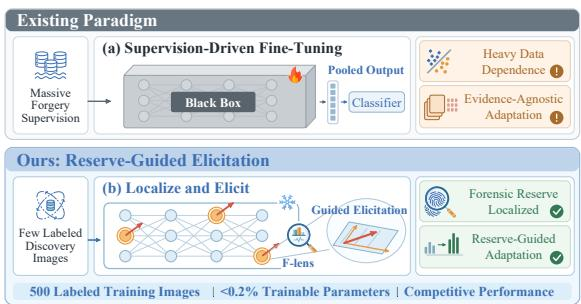  
Figure 1: Comparison of Forgery Detection Paradigms. Fine-tuning relies on large labeled sets without localizing forensic evidence; RGE localizes the forensic reserve to guide targeted enhancement of existing internal responses.

illustrated in Figure 1(a), these approaches primarily optimize real–fake separation through classification objectives. However, improved classification does not directly reveal which internal components carry forensic information or specify where and along which directions adaptation should act. The locations and directions of internal forensic knowledge therefore remain underutilized as structural guidance for targeted enhancement of VFM-based forgery detectors.

Recent studies (Koutlis & Papadopoulos, 2024; Dou et al., 2026) show that forensic information is unevenly distributed across internal features. This motivates our hypothesis that components carrying image-origin evidence can provide discriminative features and structural priors for adaptation. Drawing inspiration from cognitive reserve (Stern, 2002), we refer to sparse, origin-sensitive internal components as a forensic reserve. Once localized, their sites indicate where adaptation should act, while their mapped directions define the subspaces available for residual updates (Figure 1(b)). This structure offers a way to focus limited supervision on enhancing existing forensic responses.

Building on this hypothesis, we propose Reserve-Guided Elicitation (RGE), a framework that translates reserve localization into structural constraints for lightweight adaptation. Specifically, the Forensic Lens (F-lens) decomposes activations across layers and token groups into independent components and globally screens them by their response differences between real and generated images, identifying reserve sites and directions. We map the selected directions back into the corresponding hidden-state spaces to construct fixed reserve subspaces and insert Forensic Reserve Adapters (FRA) only at the identified sites. Each FRA reads the current hidden state to produce an input-dependent residual update constrained to its reserve subspace. The backbone parameters, previously fitted reference classifier, and subspace bases remain fixed; only the FRA coefficient maps are trained, concentrating limited forgery supervision on the targeted enhancement of existing forensic responses. Our main contributions are summarized as follows:

• We propose RGE, a lightweight adaptation framework that localizes and recruits a forensic reserve within pretrained vision models, using sparse, origin-sensitive internal components to guide targeted enhancement for image forgery detection.

• We develop F-lens and FRA to connect reserve localization with constrained residual updates. Site ablations and residual-update interventions support the functional contribution of the identified sites and learned residual updates to detection performance.

• RGE achieves competitive detection across three main benchmarks without targetbenchmark adaptation, using 500 labeled training images and under 0.2% trainable parameters relative to the backbone. Further evaluations show consistent gains over frozen baselines across eight ViT encoders from four model families.

## 2 Related Work

AI-Generated Image Detection. Artifact-based detectors exploit spatial and frequency signatures in SAFE (Li et al., 2025a) or diffusion reconstruction residuals in DIRE (Wang et al., 2023), but realistic generated images (Yan et al., 2025a; Li et al., 2025b) become harder to detect as these cues grow less discriminative. Among methods adapting vision foundation models, DRCT (Chen et al., 2024), B-Free (Guillaro et al., 2025), and DDA (Chen et al., 2025b) refine supervision through reconstruction-based hard negatives, content matching, and pixel- and frequency-aligned image pairs, respectively. DGS-Net (Yan et al., 2026) and Effort (Yan et al., 2025b) instead constrain adaptation through gradient surgery and pretrained weight subspaces, respectively. Frozen readout methods use CLIP features (Ojha et al., 2023; Cozzolino et al., 2024) or perturbation responses (He et al., 2026), while RINE (Koutlis & Papadopoulos, 2024) uses intermediate-block representations. DNA (Dou et al., 2026) further localizes sparse forgery-discriminative units and validates their rel evance through masking. However, translating forensic feature localization into concrete adaptation sites and update subspaces for detector enhancement remains largely underexplored.

Latent Features and Targeted Adaptation. Sparse autoencoders (SAEs) (Huben et al., 2024) learn sparse dictionaries from activations, while ICA Lens (Liu & Han, 2026) provides indepen dent component coordinates and associated reading and writing maps. J-lens (Gurnee et al., 2026) and TraceRouter (Shi et al., 2026) demonstrate targeted control through concept-coordinate swaps and activation rescaling along identified propagation paths, respectively. In vision, feature suppression (Joseph et al., 2025) improves CLIP robustness, while sparse steering (Chatzoudis et al., 2025)

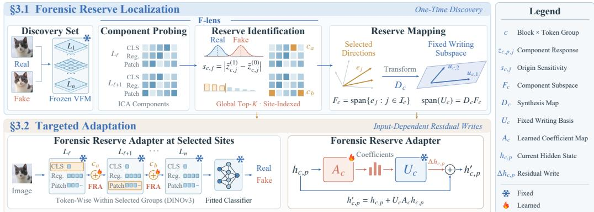  
Figure 2: Overview of Reserve-Guided Elicitation (RGE). F-lens localizes the forensic reserve in the frozen backbone (Section 3.1); FRA writes within the mapped reserve subspaces at selected sites (Section 3.2).

examines the benefits of feature-level edits and limitations of reconstruction-based feature selection. Feature steering typically applies prescribed activation edits, while SAE-FT (Morelli et al., 2026) uses sparse feature structure to regularize visual-encoder and classifier fine-tuning.

## 3 Method

Given a pretrained vision backbone and a labeled discovery set, we fit a linear classifier to the frozen pooled representation and set its decision threshold on a held-out development split, forming a baseline reference detector. This detector uses forensic evidence only as far as the frozen computation carries it to the output; origin-sensitive responses inside the network remain a latent reserve on which the readout does not act. RGE elicits this reserve in two stages (Figure 2). Forensic reserve localization (upper row) operates on the unadapted backbone: F-lens decomposes internal activations and identifies origin-sensitive components, whose directions are then mapped into fixed writing subspaces. Targeted adaptation (lower row) then places FRA at the identified sites to learn residual writes confined to these subspaces. The backbone’s intrinsic forensic structure thus determines where, and along which directions, supervision may change the network’s internal representation.

## 3.1 Forensic Reserve Localization

Discovery Set. We use a labeled discovery set to characterize the pretrained backbone’s internal responses to image origin. The set balances real and fake images while covering multiple real-image domains and generation or manipulation families. Sampling distributes coverage across underlying sources and generator families before adding further examples from the same groups. Passing these images through the frozen backbone yields the activation populations analyzed by F-lens; their real–fake labels subsequently guide component selection. This procedure uses a limited labeled collection to locate the forensic reserve that will guide elicitation. The same discovery images support reference-classifier fitting, reserve localization, and subsequent FRA training. For a given backbone and discovery configuration, localization is performed once; the selected sites and mapped writing bases remain fixed throughout adaptation and are reused across evaluation benchmarks. The set is assembled from public sources independently of the target benchmarks, and the resulting detector is applied to them directly, without fitting any part of RGE to benchmark data. Appendix A details source curation, group-disjoint development splits, and hierarchical sampling.

Component Probing. For localization to guide adaptation, each discovered component must remain tied to its source in the model. We therefore collect hidden states at the output of each transformer block and organize them into sites c = (ℓ, t), where ℓ denotes the block and t a token group present in the architecture, such as classification (CLS), register, or patch tokens. Let $h _ { c , p } ^ { 0 } ( \bar { x } )$ denote the unadapted representation of token p at site c for image x. We collect CLS and register tokens where present and spatially sample patch tokens to form an activation population for each site. Decomposing these populations separately preserves the block and token-group identity of every resulting component, allowing its location to guide adapter placement. At each site, F-lens normalizes activations by their $\ell _ { 2 }$ norms and centers them by the site mean. It then follows an independent component analysis (ICA) workflow (Hyvärinen, 1999; Hyvärinen & Oja, 2000; Liu & Han, 2026) to express these activations in signed component coordinates. We scale each component to unit empirical variance, obtaining the final reading map $R _ { c }$ and coordinates $z _ { c , p } ( x )$ . This common scale expresses response contrasts from all components and sites in the same standardized units, so that they can be ranked jointly. Each coordinate now describes an individually measurable response. F-lens can therefore examine which components carry real–fake contrasts within each site, giving reserve localization both a position in the network and a component-level description. These responses are scored in the next module to identify the reserve available for targeted elicitation.

Reserve Identification. Adapting class-contrast feature selection (Liu & Han, 2026), we identify reserve components by their origin sensitivity, defined for component j at site c as

$$
s _ { c , j } = \left| \mathbb { E } [ z _ { c , p , j } ( x ) \mid y = 1 ] - \mathbb { E } [ z _ { c , p , j } ( x ) \mid y = 0 ] \right| ,\tag{1}
$$

where $y = 0$ and $y = 1$ denote real and fake images, respectively, and the expectations are empirical averages over each class’s sampled token activations. Taking the absolute difference ranks components by the strength of their real–fake response contrast, whether their mean response is higher for real or fake images. A large score therefore identifies an existing internal direction whose response is sensitive to image origin. Because the coordinates at a site are a rotation of its whitened activations, $\textstyle \sum _ { j } s _ { c , j } ^ { 2 }$ equals the squared Mahalanobis distance between the class means at that site, so the scores distribute each site’s origin separation across its components. We retain the top $K$ components globally across all fitted sites according to origin sensitivity. A single global budget allows the number of selected components to vary across sites according to their response contrasts, so sites where origin separation is concentrated contribute more components to the reserve. The reserve is thus drawn from the backbone’s full repertoire of origin-sensitive components, spanning layers and token groups, rather than from a preset location. These selected, site-indexed components constitute the forensic reserve. Let $\mathcal { T } _ { c }$ collect their indices at site $c ;$ sites with nonempty selections form $\mathcal { C } _ { \star }$ specifying where adapters will be inserted. At each selected site, the component-coordinate axes span the component subspace $F _ { c } = \mathrm { s p a n } \{ e _ { j } : j \in \mathbb { Z } _ { c } \}$ , where $e _ { j }$ is the corresponding coordinate axis. We call this family of selected subspaces the forensic reserve space (F-space), which supplies the directions for reserve mapping. The selected sites specify where elicitation should act, grounding adapter placement in the backbone’s existing origin-sensitive responses. Within each site, the retained components supply the directions to be mapped into the corresponding writing subspace. The global budget thus organizes both the locations and directional content of the reserve used for adaptation. Appendix B details activation collection, ICA fitting, and component selection.

Reserve Mapping. F-space is expressed in component coordinates, while residual updates act in hidden-state coordinates. We therefore use the synthesis map $D _ { c }$ associated with the fitted ICA reading map (Liu & Han, 2026) to map the selected component axes into hidden-state directions. At each selected site,we orthonormalize these directions into a fixed writing basis $U _ { c }$ such that

$$
D _ { c } F _ { c } = \operatorname { s p a n } ( U _ { c } ) .\tag{2}
$$

The columns of $U _ { c } \in \mathbb { R } ^ { d _ { c } \times r _ { c } }$ span the mapped reserve subspace, where $d _ { c }$ is the hidden-state dimension and $r _ { c }$ is the dimension of this subspace. They provide the directions along which FRA can write residual updates. Since F-lens normalization only rescales each token and centering only shifts $\mathbf { i t } ,$ neither changes linear subspaces of $\mathbb { R } ^ { d _ { c } }$ ; the mapped span therefore applies directly to writes in raw hidden-state coordinates. Orthonormalization changes the basis but not the span, so $r _ { c }$ counts the independent reserve directions available to the adapter. The resulting basis remains fixed during adaptation. This mapping turns reserve localization into structural guidance for elicitation: the selected sites determine where residual updates are introduced, and the mapped reserve subspaces constrain their directions. Adaptation then learns the input-dependent coefficients of these fixed directions, carrying the reserve identified in the upper row of Figure 2 into the residual branches in the lower row. Discovery thus fixes the site and subspace of every update, while detection supervision learns only how the directions within that subspace are combined for each input.

## 3.2 Targeted Adaptation

Forensic Reserve Adapter at Selected Sites. At each selected site $^ { c , }$ FRA augments the reference detector with a residual branch that updates the current hidden state $h _ { c , p } ;$ adding this residual to $h _ { c , p }$ yields the representation passed to subsequent blocks. Each branch applies token-wise within its designated group, with its parameters shared across tokens at that site and separate parameters at different sites. A selected patch branch operates on all native patch tokens, so each token receives coefficients computed from its own hidden state within the same writing subspace. As the representation proceeds through the network, subsequent adapters read states that already include the effects of earlier writes. The final output representation then reaches the retained classifier, whose unchanged readout connects these local elicitation steps to the image-level detection score.

Table 1: Detection Across Three Benchmarks (%). RGE uses 0.5K discovery images; Average is the mean over the three benchmarks. Best and second-best are bold and underlined; N/A denotes unavailable results.
<table><tr><td rowspan="2">Method</td><td colspan="2">AIGIBench</td><td colspan="2">Chameleon</td><td colspan="2">HiRes-50K</td><td colspan="2">Average</td></tr><tr><td>mAP↑</td><td>Acc ↑</td><td>mAP↑</td><td>Acc ↑</td><td>mAP↑</td><td>Acc ↑</td><td>mAP↑</td><td>Acc ↑</td></tr><tr><td>UnivFD (Ojha et al., 2023)</td><td>75.60</td><td>72.50</td><td>46.20</td><td>57.20</td><td>54.93</td><td>62.05</td><td>58.91</td><td>63.92</td></tr><tr><td>DRCT (Chen et al., 2024)</td><td>85.18</td><td>71.96</td><td>85.20</td><td>79.80</td><td>81.76</td><td>67.17</td><td>84.05</td><td>72.98</td></tr><tr><td>AIDE (Yan et al., 2025a)</td><td>82.70</td><td>77.60</td><td>69.70</td><td>65.80</td><td>74.61</td><td>56.46</td><td>75.67</td><td>66.62</td></tr><tr><td>DDA (Chen et al., 2025b)</td><td>90.20</td><td>81.60</td><td>91.20</td><td>82.40</td><td>93.70</td><td>85.09</td><td>91.70</td><td>83.03</td></tr><tr><td>HiDA-Net (Mu et al., 2026)</td><td>N/A</td><td>N/A</td><td>N/A</td><td>79.10</td><td>N/A</td><td>80.33</td><td>N/A</td><td>N/A</td></tr><tr><td>DGS-Net (Yan et al., 2026)</td><td>87.80</td><td>82.30</td><td>42.90</td><td>59.41</td><td>49.97</td><td>51.13</td><td>60.22</td><td>64.28</td></tr><tr><td>LTD (Yang et al., 2026)</td><td>77.60</td><td>74.90</td><td>35.21</td><td>57.52</td><td>62.96</td><td>52.61</td><td>58.59</td><td>61.68</td></tr><tr><td>PLM (Zhou et al., 2026a)</td><td>81.10</td><td>78.80</td><td>46.47</td><td>59.36</td><td>49.90</td><td>49.94</td><td>59.16</td><td>62.70</td></tr><tr><td>RGE (Ours)</td><td>90.98</td><td>88.05</td><td>95.42</td><td>91.20</td><td>97.66</td><td>92.99</td><td>94.69</td><td>90.75</td></tr></table>

Forensic Reserve Adapter. Each branch updates the current hidden state with a residual write as

$$
h _ { c , p } ^ { \prime } = h _ { c , p } + U _ { c } A _ { c } h _ { c , p } ,\tag{3}
$$

where $A _ { c } \in \mathbb { R } ^ { r _ { c } \times d _ { c } }$ is the learned coefficient map. It reads the complete current hidden state to produce input-dependent coefficients. Multiplication by the fixed basis $U _ { c }$ confines the residual to the mapped reserve subspace. The residual map $U _ { c } A _ { e }$ therefore has rank at most $r _ { c } ,$ with its column space contained in the mapped reserve subspace: $U _ { c }$ determines where in the representation a write can go, while $A _ { c }$ learns which features of the current state drive it. Whereas low-rank adaptation (LoRA) (Hu et al., 2022) learns both factors of an update, FRA inherits its output factor from discovery and learns only how to read. Elicitation is input-dependent within this fixed structure: the coefficient map determines how the reserve directions are combined for each input token, including the sign and magnitude of the resulting write. Each $A _ { c }$ is initialized to zero, so the augmented model initially reproduces the reference detector. We train only these coefficient maps with binary cross-entropy on the labeled discovery set, keeping the backbone parameters, classifier, and writing bases fixed. Gradients propagate through the fixed detector to adjust how the reserve directions are combined for each input. With the classifier fixed, optimization adjusts the internal representations to improve real–fake discrimination under the same readout. Because the writes start from zero and remain confined to reserve directions, detection gains are expressed along the backbone’s own origin-sensitive directions, so RGE largely elicits forensic evidence the backbone already encodes. This gives the two stages complementary roles in reserve-guided elicitation: discovery establishes the sites and writing subspaces, while supervision learns the coefficient maps that use this structure for detection. The trainable parameter count is $\textstyle \sum _ { c \in { \mathcal { C } } _ { \star } } r _ { c } d _ { c }$ , tying the adaptation budget to the selected sites and their writing-subspace dimensions. At inference, the augmented backbone and retained classifier directly score query images with the learned adapters. Appendix B details the basis construction and the full optimization protocol.

## 4 Experiments and Analysis

## 4.1 Experimental Setup

Discovery Set and Benchmarks. We perform localization and adaptation on a labeled discovery set of real and fake images; Appendix A details its construction from public sources. Our main comparison evaluates AIGIBench (Li et al., 2025b), Chameleon (Yan et al., 2025a), and HiRes-50K (Mu et al., 2026), covering diverse generation mechanisms, perceptually convincing images, and highresolution content. These benchmarks supply no training images for the classifier or FRA. Table 1 reports the 0.5K configuration; the scaling analysis examines larger discovery sets. Additional results on the 64-generator Treasure-64 benchmark appear in Appendix D.

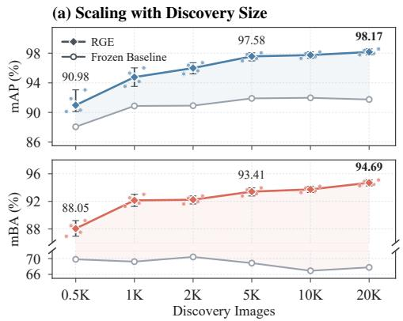

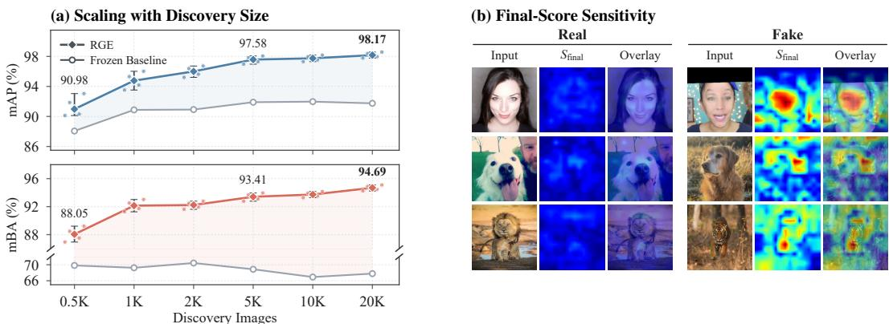  
Figure 3: Scaling and Qualitative Results. (a) Detection across discovery sizes on AIGIBench; bars span five training seeds. (b) Final-score sensitivity S for real and fake pairs (blue: low, red: high).

Evaluation Metrics. We report mean average precision (mAP) for ranking quality and follow each benchmark’s native accuracy (Acc) convention in Table 1; on AIGIBench, Acc is the mean balanced accuracy (mBA) over real and fake images, which the AIGIBench analyses also report. Evaluation and metric aggregation follow the corresponding official benchmark protocols.

Implementation. DINOv3-H+ (Siméoni et al., 2026) serves as our primary backbone. RGE retains the fitted pooled-feature classifier and learns only FRA coefficient maps, with the backbone and writing bases fixed. We select the top 1% of candidate components by origin sensitivity. The resulting writing ranks vary with discovery size; the three main configurations each train fewer than 0.2% of backbone parameters (Appendix C). Training configurations appear in Appendix A, and the component-budget analysis appears in Section 4.4.

## 4.2 Comparison with State-of-the-Art Methods

Quantitative Results. We first compare RGE with eight state-of-the-art detectors on AIGIBench, Chameleon, and HiRes-50K (Table 1). With only 500 labeled discovery images and no targetbenchmark adaptation, RGE achieves the highest available mAP and Acc among the compared methods on all three benchmarks. It reaches 90.98% mAP and 88.05% Acc on AIGIBench, 95.42% and 91.20% on Chameleon, and 97.66% and 92.99% on HiRes-50K. Its lead over the strongest competitor, DDA, grows from 0.78 mAP on AIGIBench to 4.22 and 3.96 on Chameleon and HiRes-50K. Both benchmarks limit the cues that detectors most readily exploit: Chameleon retains only generated images that human annotators judged real, and HiRes-50K contains images of up to 64 megapixels whose fine artifacts are obscured at standard input resolution. Where perceptual realism and high resolution leave few surface artifacts to learn, detection increasingly depends on evidence that the backbone’s representations already encode, and these results indicate that the forensic reserve remains informative in this regime once it is elicited. This reserve is intrinsic to the pretrained backbone rather than acquired from large-scale forgery supervision: the strongest competitors are trained on 144K–473K images (Appendix A), whereas 500 discovery images suffice for RGE to elicit it. Appendix D breaks these results down by source category and resolution interval.

Scaling with Discovery Data. To further reveal the full potential of the forensic reserve in VFMs, we investigate how RGE scales with discovery data. The 0.5K detector is fitted on only 500 images yet evaluated on benchmark sets of approximately 26K–359K images each, and Figure 3(a) follows how this capability develops as the discovery set grows. RGE improves on the baseline at every displayed size, reaching 97.58% mAP and 93.41% mBA at 5K, and 98.17% mAP and 94.69% mBA at 20K. The 0.5K configuration therefore does not exhaust the reserve: additional discovery data continue to strengthen its observable expression, while the gains taper beyond 5K, where quadrupling the discovery set to 20K adds 0.59 mAP and 1.28 mBA. The 5K configuration thus captures much of the observed improvement at a moderate data cost, and all subsequent analyses use it.

Qualitative Results. To visually examine where the detector finds its evidence and how the elicited writes relate to it, we compute sensitivity maps (Appendix C). Figure 3(b) shows the final-score sensitivity $S _ { \mathrm { f i n a l } }$ for independent real and fake portrait, dog, and large-cat pairs. In each fake image, sensitivity peaks on the generated subject, including the face, the dog’s head, and the tiger’s face and front leg, whereas real images show no such peaks. The detector’s evidence for a fake decision thus lies on the synthesized content. The localized-write sensitivity $S _ { \mathrm { w r i t e } } ,$ , which isolates the contribution of the discovery-selected write group of Figure 4(a), peaks in the same regions (Appendix C), indicating that the reserve-elicited writes act on the image regions that also shape the final decision.

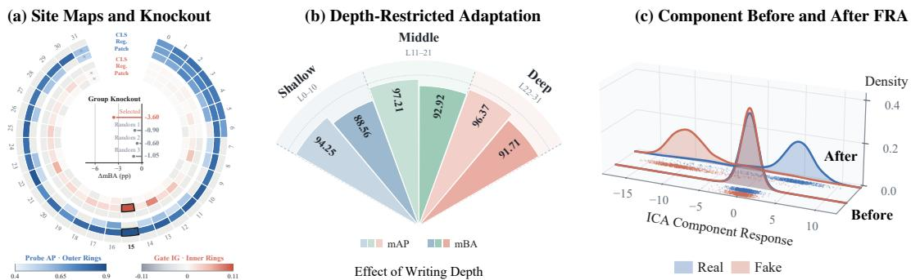  
Figure 4: Reserve Localization and Elicited Responses. (a) Probe AP (outer rings) and gate IG (inner rings) per layer–token site, with the knockout of discovery-ranked versus random site groups at the center. (b) Depthrestricted adaptation, with light and dark shades showing mAP and mBA. (c) Responses of one reserve component on the same images before and after FRA, measured in a fixed ICA coordinate.

## 4.3 Ablation Studies

Reserve Localization. Forensic information is distributed unevenly across the layer–token sites analyzed by F-lens. Figure 4(a) relates this internal organization to the learned writes. Out-of-fold probe AP, shown on the outer rings, measures the discriminative information in fixed component representations before adaptation, while mean label-aligned gate integrated gradients (IG) (Sundararajan et al., 2017) attribute changes in the detection margin to learned writes and are shown on the inner rings; Appendix C defines both quantities. Both maps are uneven, and the layer-15 register site is strongest in both: a location with highly accessible forensic information also makes a prominent contribution after adaptation. The reserve is thus unevenly weighted across sites, and the sites where it is most accessible before adaptation are among those where elicitation contributes most.

Site Knockout. To test this correspondence by intervention, we disable six writing sites selected by discovery-set probe AP and compare them with three random six-site groups of approximately matched total rank. On the stratified 2,000-image AIGIBench analysis panel, removing the discovery-selected group reduces mBA by 3.60 points, versus 0.60–1.05 points for the random groups (Figure 4(a), center). Measured without retraining, this loss is 3.4–6.0 times that of a random group with approximately matched writing rank, so the sites that discovery ranks highest are also where the elicited writes matter most for detection, although this ranking precedes adaptation.

Writing Depth. We next restrict component selection and adaptation to one depth band at a time, keeping the total component budget fixed, to examine how depth affects elicitation (Figure 4(b)). Middle-layer writes (L11–21) achieve 97.21 mAP and 92.92 mBA, recovering 93.5% and 98.0% of full RGE’s respective improvements over the baseline. Both scores exceed those of the shallow- and deep-layer variants, while full RGE achieves the highest performance at 97.58 mAP and 93.41 mBA. The middle band therefore holds the most elicitable reserve, and the global budget of full RGE, which also retains shallow and deep components, adds the remaining improvement. Beyond their discriminative utility, the identified reserves remain broadly consistent across discovery subsets, with relatively low variance in their selected sites, suggesting that F-lens tends to recover shared forensic structure rather than subset-specific components.

Adaptation Structure. To isolate what the reserve structure contributes, we alter its components, their allocation, or the constraint on the update. Random-In keeps RGE’s sites and per-site counts but draws each site’s components at random from its non-reserve ICA components, while Bottom-K retains the components with the lowest origin sensitivity at the same sites and counts. Random-Ex excludes all reserve components and draws the same total number of components across the full grid, with sites determined by the draw. CLS-Budget Reallocation moves the CLS budget to patch/register sites. Free-LoRA learns unconstrained low-rank updates to the attention-output and MLP-down projections of the layers that contain reserve sites, with ranks set to match RGE’s trainable-parameter count. Random Weight Coordinates learns updates to scalar entries sampled uniformly without replacement from all backbone linear weight matrices, with the number of selected entries matched to RGE’s trainable-parameter count. All adapted variants use matched trainable capacity. The three selection controls form a graded comparison (Table 2(a)): random non-reserve components at RGE’s sites (Random-In) cost less than random components elsewhere in the network (Random-Ex), and the lowest-scoring components at the same sites (Bottom-K) cost most. Detection therefore follows the F-lens score both within and across sites, and components outside the reserve do not fully substi tute for it. With matched trainable capacity, reallocating the CLS budget or removing the subspace constraint also falls short of RGE (b), with Free-LoRA trailing by 2.44 mAP; at matched capacity, the remaining gain comes from where and along which directions the parameters act.

tes Rem  
(a) Removal: mBA  
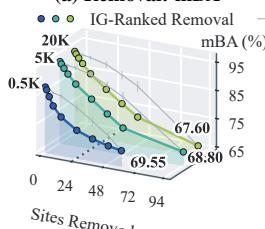

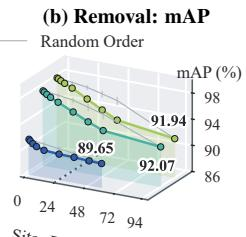

(c) Write Gate  
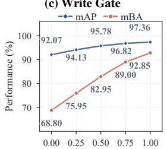  
Write Gate g

(d) Decision Changes  
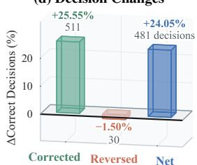  
Figure 5: Functional Contribution of the Learned Writes. (a–b) Removing writes in gate-IG order versus five random orders (mean and range). (c) Detection versus write gate g. (d) Decisions changed by the writes.

Component-Level Separation. To observe elicitation within a single reserve component, we compare its responses in a fixed ICA coordinate before and after adaptation. Figure 4(c) shows substantially reduced overlap between real and fake image responses on the same images. Because the coordinate and its readout are fixed by discovery, this separation reflects the adapted response along a reserve direction, not a redefined measurement axis.

Cumulative Removal. Having examined how discovery structures learning, we test how the learned FRA writes sustain detection. Figure 5(a–b) progressively disables writes in the trained 0.5K, 5K, and 20K de-

Table 2: Adaptation Structure on AIGIBench. Parentheses give decreases from RGE.
<table><tr><td>Adaptation Variant</td><td>mAP↑</td><td>mBA ↑</td></tr><tr><td>RGE (Ours)</td><td>97.58</td><td>93.41</td></tr><tr><td colspan="3">(a) COMPONENT SELECTION</td></tr><tr><td>Random-In</td><td>95.37(-2.21)</td><td>89.52(-3.89)</td></tr><tr><td>Random-Ex</td><td>94.26(-3.32)</td><td>88.47 (-4.94)</td></tr><tr><td>Bottom-K</td><td>93.31 (-4.27)</td><td>87.34(-6.07)</td></tr><tr><td colspan="3">(b) ALLOCATION AND PARAMETERIZATION</td></tr><tr><td>CLS-Budget Reallocation</td><td>93.01 (-4.57)</td><td>89.50(-3.91)</td></tr><tr><td>Free-LoRA</td><td>95.14(-2.44)</td><td>88.79(-4.62)</td></tr><tr><td>Random Weight Coordinates</td><td>93.08(-4.50)</td><td>86.13(-7.28)</td></tr><tr><td>Baseline</td><td>91.90(-5.68)</td><td>68.86(-24.55)</td></tr></table>

tectors, following either their gate-IG ranking, computed on 2,000 AIGIBench images for each detector, or random orders. By 24 disabled sites, IG-ranked removal yields lower mAP and mBA than the random-order mean in all three configurations. Removing all writes reduces mAP by 1.69–6.01 points and mBA by 17.65–25.50 points. These interventions leave the backbone and classifier fixed and involve no retraining, directly connecting the learned internal updates to both ranking quality and balanced classification at all three discovery sizes (0.5K, 5K, and 20K).

Write Gate. Restoring the trained updates reveals how their contribution translates into individual decisions. On the stratified 2,000-image AIGIBench analysis panel, we increase a global write gate g (Appendix C) from zero to one without retraining, while retaining the classifier’s decision boundary. Balanced accuracy rises from 68.80% to 92.85% across the tested gate levels (Figure 5(c)). Restoring the writes corrects 511 previously incorrect predictions and reverses 30 correct ones, yielding 481 additional correct decisions (Figure 5(d)). The elicited writes thus change decisions overwhelmingly in the correct direction, with 17 corrections for every reversal.

## 4.4 Further Analysis

Cross-Backbone Evaluation. Reserve-guided elicitation extends across ViT architectures, capacities, and pretraining families. Figure 6(a) compares eight backbones from DINOv3 (Siméoni et al., 2026), DINOv2 (Oquab et al., 2024), CLIP (Radford et al., 2021), and SigLIP2 (Tschannen et al., 2025), each with its fitted classifier. RGE improves mAP over every corresponding baseline. DINOv3-H+ reaches 97.58% mAP, while DINOv2-L and DINOv2-Giant gain 11.51 and 21.29 points, respectively. Enhancement therefore benefits both a strong initial ranking representation and models with larger room for improvement. Each pretraining family carries its own forensic repertoire, yet the same localize-and-elicit procedure recruits a reserve from it in every case, with the attainable improvement depending on the model rather than on family-specific tuning.

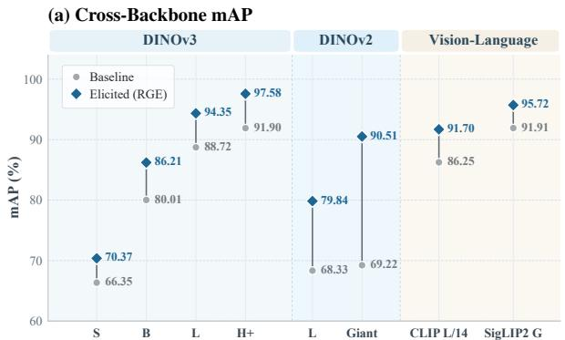

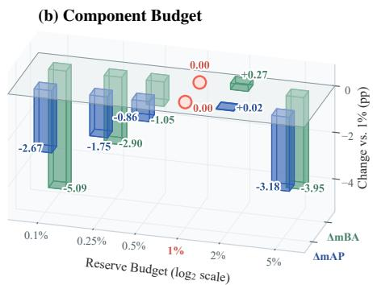  
Figure 6: Backbones and Component Budget. (a) mAP of the baseline (gray) and RGE (blue) across eight ViT backbones on AIGIBench. (b) Change in mAP and mBA relative to the 1% budget.

Component Selection Budget. The retained component fraction also affects detection. In the budget sweep, increasing the fraction from 0.1% to 1% improves both metrics; 2% adds only 0.02 mAP and 0.27 mBA points, while 5% reduces both relative to 1%. A compact reserve therefore suffices: beyond about 1% of the candidate components, additional components contribute little and eventually reduce detection. The default 1% lies near the best observed performance (Figure 6(b)) while keeping the trainable parameters below 0.2% of the backbone; Appendix C reports the corresp

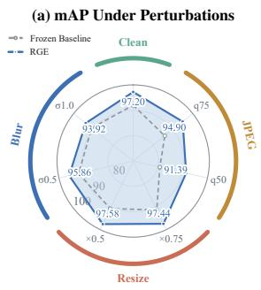

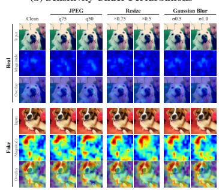  
Figure 7: Robustness Under Image Perturbations. (a) mAP of RGE and the baseline on clean images and under JPEG compression, resizing, and blurring. (b) Final-score sensitivity for a real (top) and a fake (bottom) dog under the same perturbations.

Robustness to Image Perturbations. The benefit of the learned writes also persists under common image perturbations. Figure 7(a) evaluates clean images and six independently applied JPEG, resizing, and blurring conditions on the 20,000-image AIGIBench analysis subset. RGE maintains a 3.03–10.64-point mAP advantage over the baseline across all seven conditions. Resizing preserves its mAP, JPEG compression widens the advantage, and blurring narrows it. Even blurring, which removes the most fine image detail, leaves the elicited detector more discriminative than its baseline, so the elicited evidence is not confined to fragile high-frequency traces. Figure 7(b) provides example spatial responses under these perturbations. Across all six perturbations, the high-sensitivity region of the fake example stays in place, while the real example remains uniformly low.

## 5 Conclusion

We introduced RGE to discover forensic reserve within vision models and turn it into targeted detection enhancement. F-lens localizes origin-sensitive components whose locations specify adaptation sites and whose mapped directions define fixed writing subspaces; the forensic reserve adapter learns input-dependent residual writes within them. Our findings show that internal forensic knowledge supplies both evidence for classification and concrete targets for enhancing detection. RGE achieves strong detection across three main benchmarks with as few as 500 labeled discovery images and no target-benchmark adaptation; its gains also extend across multiple ViT backbones. More broadly, pretrained vision models hold a forensic repertoire that pooled readout leaves underused; locating a reserve within it and eliciting that reserve offers a data-efficient route to detection that does not depend on ever larger forgery corpora.

## AI Use Statement

Generative AI tools were used to polish the grammar and wording of the manuscript. The authors reviewed the final text and take responsibility for its content.

## Ethics Statement

This study uses publicly released datasets and open-weight pretrained models. No additional sensitive personal data were collected. Several source datasets contain human faces; we use these datasets as released, in accordance with their respective terms, and do not redistribute their images. Detection results may reflect biases in the source datasets and pretrained backbones, and performance can vary across generators, content domains, and image conditions. Forensic detectors also pose dualuse risks: knowledge of the internal cues they rely on could facilitate attempts to evade detection. RGE is intended to support rather than replace human judgment. Any deployment should include validation in the target setting and human oversight.

## References

British Library Labs. Digitised Books. c. 1510 - c. 1900. JPG, 2014. URL https: //huggingface.co/datasets/biglam/british-library-book-images. Accessed 2026-09-08. Mirrored and repackaged by BigLAM.

Gerasimos Chatzoudis, Zhuowei Li, Gemma E. Moran, Hao Wang, and Dimitris N. Metaxas. Beyond Interpretability: When, Why, and How Sparse Autoencoders Enable Label-Free Visual Steering. arXiv preprint arXiv:2506.01247, 2025. URL https://arxiv.org/abs/2506. 01247.

Baoying Chen, Jishen Zeng, Jianquan Yang, and Rui Yang. DRCT: Diffusion Reconstruction Contrastive Training towards Universal Detection of Diffusion Generated Images. In International Conference on Machine Learning, pp. 7621–7639, 2024.

Ruoxin Chen, Jiahui Gao, Kaiqing Lin, Keyue Zhang, Yandan Zhao, Isabel Guan, Taiping Yao, and Shouhong Ding. AlignGemini: Generalizable AI-Generated Image Detection Through Task-Model Alignment. arXiv preprint arXiv:2512.06746, 2025a. URL https://arxiv.org/ abs/2512.06746.

Ruoxin Chen, Junwei Xi, Zhiyuan Yan, Ke-Yue Zhang, Shuang Wu, Jingyi Xie, Xu Chen, Lei Xu, Isabel Guan, Taiping Yao, and Shouhong Ding. Dual Data Alignment Makes AI-Generated Image Detector Easier Generalizable. In Advances in Neural Information Processing Systems, 2025b.

Sixiang Chen, Jianyu Lai, Jialin Gao, Tian Ye, Haoyu Chen, Hengyu Shi, Shitong Shao, Yunlong Lin, Song Fei, Zhaohu Xing, Yeying Jin, Junfeng Luo, Xiaoming Wei, and Lei Zhu. PosterCraft: Rethinking High-Quality Aesthetic Poster Generation in a Unified Framework. In International Conference on Learning Representations, 2026.

Complex Data Lab. OpenFake v2 Dataset Card. Hugging Face, n.d. URL https:// huggingface.co/datasets/ComplexDataLab/OpenFake. Accessed 2026-09-08.

Davide Cozzolino, Giovanni Poggi, Riccardo Corvi, Matthias Nießner, and Luisa Verdoliva. Raising the Bar of AI-generated Image Detection with CLIP. In IEEE/CVF Conference on Computer Vision and Pattern Recognition Workshops, pp. 4356–4366, 2024.

Jingtong Dou, Chuancheng Shi, Anqi Yi, Shiming Guo, Wenhua Wu, Yemin Wang, Li Zhang, Fei Shen, and Tat-Seng Chua. DNA: Uncovering Universal Latent Forgery Knowledge. In International Conference on Machine Learning, 2026.

Fabrizio Guillaro, Giada Zingarini, Ben Usman, Avneesh Sud, Davide Cozzolino, and Luisa Verdoliva. A Bias-Free Training Paradigm for More General AI-generated Image Detection. In IEEE/CVF Conference on Computer Vision and Pattern Recognition, pp. 18685–18694, 2025.

Wes Gurnee, Nicholas Sofroniew, Adam Pearce, Mateusz Piotrowski, Isaac Kauvar, Runjin Chen, Anna Soligo, Paul Bogdan, Euan Ong, Rowan Wang, T. Ben Thompson, David Abrahams, Subhash Kantamneni, Emmanuel Ameisen, Joshua Batson, and Jack Lindsey. Verbalizable Representations Form a Global Workspace in Language Models. Transformer Circuits Thread, 2026. URL https://transformer-circuits.pub/2026/workspace/index.html.

Zhiyuan He, Pin-Yu Chen, and Tsung-Yi Ho. RIGID: A Training-Free and Generator-Agnostic Framework for Robust AI-Generated Image Detection. Transactions on Machine Learning Research, 2026.

Edward J. Hu, Yelong Shen, Phillip Wallis, Zeyuan Allen-Zhu, Yuanzhi Li, Shean Wang, Lu Wang, and Weizhu Chen. LoRA: Low-Rank Adaptation of Large Language Models. In International Conference on Learning Representations, 2022.

Robert Huben, Hoagy Cunningham, Logan Riggs Smith, Aidan Ewart, and Lee Sharkey. Sparse Autoencoders Find Highly Interpretable Features in Language Models. In International Conference on Learning Representations, 2024.

Aapo Hyvärinen. Fast and Robust Fixed-Point Algorithms for Independent Component Analysis. IEEE Transactions on Neural Networks, 10(3):626–634, 1999. doi: 10.1109/72.761722.

Aapo Hyvärinen and Erkki Oja. Independent Component Analysis: Algorithms and Applications. Neural Networks, 13(4–5):411–430, 2000. doi: 10.1016/S0893-6080(00)00026-5.

Sonia Joseph, Praneet Suresh, Ethan Goldfarb, Lorenz Hufe, Yossi Gandelsman, Robert Graham, Danilo Bzdok, Wojciech Samek, and Blake Aaron Richards. Steering CLIP’s Vision Transformer with Sparse Autoencoders. In Workshop on Mechanistic Interpretability for Vision at CVPR, 2025. URL https://arxiv.org/abs/2504.08729.

Christos Koutlis and Symeon Papadopoulos. Leveraging Representations from Intermediate Encoder-blocks for Synthetic Image Detection. In European Conference on Computer Vision, pp. 394–411, 2024.

Alina Kuznetsova, Hassan Rom, Neil Alldrin, Jasper Uijlings, Ivan Krasin, Jordi Pont-Tuset, Shahab Kamali, Stefan Popov, Matteo Malloci, Alexander Kolesnikov, Tom Duerig, and Vittorio Ferrari. The Open Images Dataset V4: Unified Image Classification, Object Detection, and Visual Relationship Detection at Scale. International Journal of Computer Vision, 128(7):1956–1981, 2020. doi: 10.1007/s11263-020-01316-z.

Ouxiang Li, Jiayin Cai, Yanbin Hao, Xiaolong Jiang, Yao Hu, and Fuli Feng. Improving Synthetic Image Detection Towards Generalization: An Image Transformation Perspective. In ACM SIGKDD Conference on Knowledge Discovery and Data Mining, pp. 2405–2414, 2025a.

Ziqiang Li, Jiazhen Yan, Ziwen He, Kai Zeng, Weiwei Jiang, Lizhi Xiong, and Zhangjie Fu. Is Artificial Intelligence Generated Image Detection a Solved Problem? In Advances in Neural Information Processing Systems, Datasets and Benchmarks Track, 2025b.

Library of Congress. Free to Use and Reuse Sets, n.d. URL https://www.loc.gov/ free-to-use/. Accessed 2026-09-08.

Sida Liu and Feijiang Han. ICA Lens: Interpreting Language Models Without Training Another Dictionary. arXiv preprint arXiv:2606.11722, 2026. URL https://arxiv.org/abs/2606. 11722.

Victor Livernoche, Akshatha Arodi, Andreea Musulan, Zachary Yang, Adam Salvail, Gaé- tan Marceau Caron, Jean-François Godbout, and Reihaneh Rabbany. OpenFake: An Open Dataset and Platform Toward Real-World Deepfake Detection. arXiv preprint arXiv:2509.09495, 2025. URL https://arxiv.org/abs/2509.09495.

Fabian Morelli, Arnas Uselis, Ankit Sonthalia, and Seong Joon Oh. Sparse Autoencoders Enable Robust and Interpretable Fine-tuning of CLIP Models. arXiv preprint arXiv:2605.15961, 2026. URL https://arxiv.org/abs/2605.15961.

Lianrui Mu, Haoji Hu, Xingze Zou, Jianhong Bai, and Jiaqi Hu. No Pixel Left Behind: A Detail-Preserving Architecture for Robust High-Resolution AI-Generated Image Detection. In International Conference on Learning Representations, 2026.

Utkarsh Ojha, Yuheng Li, and Yong Jae Lee. Towards Universal Fake Image Detectors That Generalize Across Generative Models. In IEEE/CVF Conference on Computer Vision and Pattern Recognition, pp. 24480–24489, 2023.

Maxime Oquab, Timothée Darcet, Théo Moutakanni, Huy V. Vo, Marc Szafraniec, Vasil Khalidov, Pierre Fernandez, Daniel Haziza, Francisco Massa, Alaaeldin El-Nouby, Mahmoud Assran, Nicolas Ballas, Wojciech Galuba, Russell Howes, Po-Yao Huang, Shang-Wen Li, Ishan Misra, Michael Rabbat, Vasu Sharma, Gabriel Synnaeve, Hu Xu, Hervé Jégou, Julien Mairal, Patrick Labatut, Armand Joulin, and Piotr Bojanowski. DINOv2: Learning Robust Visual Features with out Supervision. Transactions on Machine Learning Research, 2024.

Jeongsoo Park and Andrew Owens. Community Forensics: Using Thousands of Generators to Train Fake Image Detectors. In IEEE/CVF Conference on Computer Vision and Pattern Recognition, pp. 8245–8257, 2025.

Seunghyun Park, Seung Shin, Bado Lee, Junyeop Lee, Jaeheung Surh, Minjoon Seo, and Hwalsuk Lee. CORD: A Consolidated Receipt Dataset for Post-OCR Parsing. In Document Intelligence Workshop at Neural Information Processing Systems, 2019. URL https://openreview. net/forum?id=SJl3z659UH.

Birgit Pfitzmann, Christoph Auer, Michele Dolfi, Ahmed S. Nassar, and Peter Staar. DocLayNet: A Large Human-Annotated Dataset for Document-Layout Segmentation. In ACM SIGKDD Conference on Knowledge Discovery and Data Mining, pp. 3743–3751, 2022. doi: 10.1145/3534678.3539043.

Ziheng Qin, Yuheng Ji, Renshuai Tao, Yuxuan Tian, Yuyang Liu, Yipu Wang, and Xiaolong Zheng. Scaling Up AI-Generated Image Detection with Generator-Aware Prototypes. In IEEE/CVF Conference on Computer Vision and Pattern Recognition, pp. 43008–43017, 2026.

Alec Radford, Jong Wook Kim, Chris Hallacy, Aditya Ramesh, Gabriel Goh, Sandhini Agarwal, Girish Sastry, Amanda Askell, Pamela Mishkin, Jack Clark, Gretchen Krueger, and Ilya Sutskever. Learning Transferable Visual Models From Natural Language Supervision. In International Conference on Machine Learning, pp. 8748–8763, 2021.

Rui Shao, Tianxing Wu, and Ziwei Liu. Detecting and Grounding Multi-Modal Media Manipulation. In IEEE/CVF Conference on Computer Vision and Pattern Recognition, pp. 6904–6913, 2023.

Chuancheng Shi, Shangze Li, Wenjun Lu, Wenhua Wu, Cong Wang, Zifeng Cheng, Fei Shen, and Tat-Seng Chua. TraceRouter: Robust Safety for Large Foundation Models via Path-Level Intervention. In International Conference on Machine Learning, 2026.

Oriane Siméoni, Huy V. Vo, Maximilian Seitzer, Federico Baldassarre, Maxime Oquab, Cijo Jose, Vasil Khalidov, Marc Szafraniec, Seungeun Yi, Michaël Ramamonjisoa, Francisco Massa, Daniel Haziza, Luca Wehrstedt, Jianyuan Wang, Timothée Darcet, Théo Moutakanni, Leonel Sentana, Claire Roberts, Andrea Vedaldi, Jamie Tolan, John Brandt, Camille Couprie, Julien Mairal, Hervé Jégou, Patrick Labatut, and Piotr Bojanowski. DINOv3. Transactions on Machine Learning Research, 2026.

Yaakov Stern. What Is Cognitive Reserve? Theory and Research Application of the Reserve Concept. Journal ofthe International Neuropsychological Society, 8(3):448–460, 2002.

Mukund Sundararajan, Ankur Taly, and Qiqi Yan. Axiomatic Attribution for Deep Networks. In International Conference on Machine Learning, pp. 3319–3328, 2017.

Chuangchuang Tan, Yao Zhao, Shikui Wei, Guanghua Gu, Ping Liu, and Yunchao Wei. Frequency-Aware Deepfake Detection: Improving Generalizability through Frequency Space Domain Learning. In AAAI Conference on Artificial Intelligence, pp. 5052–5060, 2024. doi: 10.1609/aaai.v38i5. 28310.

Michael Tschannen, Alexey Gritsenko, Xiao Wang, Muhammad Ferjad Naeem, Ibrahim Alabdulmohsin, Nikhil Parthasarathy, Talfan Evans, Lucas Beyer, Ye Xia, Basil Mustafa, Olivier Hé- naff, Jeremiah Harmsen, Andreas Steiner, and Xiaohua Zhai. SigLIP 2: Multilingual Vision Language Encoders with Improved Semantic Understanding, Localization, and Dense Features. arXiv preprint arXiv:2502.14786, 2025. URL https://arxiv.org/abs/2502.14786.

Unsplash. Unsplash Lite Dataset 1.4.1, 2026. URL https://unsplash.com/data. Accessed 2026-09-08.

Jiaan Wang, Sirui Liu, Yu Li, Kaiyuan Yang, Juan Cao, and Sheng Tang. Fleet: Few Shots Lead Effective AI-generated Image Detection. In International Conference on Machine Learning, 2026.

Zhendong Wang, Jianmin Bao, Wengang Zhou, Weilun Wang, Hezhen Hu, Hong Chen, and Houqiang Li. DIRE for Diffusion-Generated Image Detection. In IEEE/CVF International Conference on Computer Vision, pp. 22388–22398, 2023.

Shiyu Wu, Jing Liu, Jing Li, and Yequan Wang. Few-Shot Learner Generalizes Across AI-Generated Image Detection. In International Conference on Machine Learning, 2025.

Jiazhen Yan, Ziqiang Li, Fan Wang, Boyu Wang, Ziwen He, and Zhangjie Fu. DGS-Net: Distillation-Guided Gradient Surgery for CLIP Fine-Tuning in AI-Generated Image Detection. In International Conference on Machine Learning, 2026.

Shilin Yan, Ouxiang Li, Jiayin Cai, Yanbin Hao, Xiaolong Jiang, Yao Hu, and Weidi Xie. A Sanity Check for AI-generated Image Detection. In International Conference on Learning Representations, 2025a.

Zhiyuan Yan, Taiping Yao, Shen Chen, Yandan Zhao, Xinghe Fu, Junwei Zhu, Donghao Luo, Chengjie Wang, Shouhong Ding, Yunsheng Wu, and Li Yuan. DF40: Toward Next-Generation Deepfake Detection. In Advances in Neural Information Processing Systems, Datasets and Benchmarks Track, pp. 29387–29434, 2024.

Zhiyuan Yan, Jiangming Wang, Peng Jin, Ke-Yue Zhang, Chengchun Liu, Shen Chen, Taiping Yao, Shouhong Ding, Baoyuan Wu, and Li Yuan. Orthogonal Subspace Decomposition for Generalizable AI-Generated Image Detection. In International Conference on Machine Learning, pp. 70268–70288, 2025b.

Shuo Yang, Ping Luo, Chen-Change Loy, and Xiaoou Tang. WIDER FACE: A Face Detection Benchmark. In IEEE Conference on Computer Vision and Pattern Recognition, pp. 5525–5533, 2016.

Yawen Yang, Feng Li, Shuqi Kong, Yunfeng Diao, Xinjian Gao, Zenglin Shi, and Meng Wang. Layer Consistency Matters: Elegant Latent Transition Discrepancy for Generalizable Synthetic Image Detection. In IEEE/CVF Conference on Computer Vision and Pattern Recognition, pp. 38111–38121, 2026.

Zirui Zhang, Yinbo Yu, Donghai Guan, Chunwei Tian, Daoqiang Zhang, and Qi Zhu. A Benchmark Dataset for MLLM-Generated Image Detection: GPT Image2 & Nano Banana2. arXiv preprint arXiv:2608.01258, 2026. URL https://arxiv.org/abs/2608.01258.

Chenming Zhou, Jiaan Wang, Yu Li, Lei Li, Juan Cao, and Sheng Tang. Beyond Semantic Features: Pixel-level Mapping for Generalized AI-Generated Image Detection. In AAAI Conference on Artificial Intelligence, pp. 36101–36109, 2026a. doi: 10.1609/aaai.v40i42.40927.

Xiaoyu Zhou, Jianwei Fei, Peipeng Yu, Jingchang Xie, Chong Cheng, and Zhihua Xia. PGC: Peak-Guided Calibration for Generalizable AI-Generated Image Detection. In International Conference on Machine Learning, 2026b.

## Appendix

The appendix is organized into six parts. Appendix A describes the experimental settings, including discovery-set construction, training configurations, and benchmark baselines. Appendix B details component probing, reserve identification, the writing subspaces, and FRA optimization. Appendix C reports additional functional and adaptation analyses. Appendix D provides the benchmark source breakdown and the evaluation on Treasure-64. Appendix E discusses limitations, and Appendix F addresses data overlap and the provenance of competing results.

## A Experimental Settings

Discovery Set Construction. We construct the discovery set from openly released real, generated, and visually manipulated images. Fake images cover GAN-based synthesis and pixel-space diffusion (Park & Owens, 2025), latent diffusion (Chen et al., 2025a; Livernoche et al., 2025; Complex Data Lab, n.d.), commercial image generation and editing (Zhang et al., 2026; Zhou et al., 2026b), and face swapping, editing, and synthesis (Shao et al., 2023; Yan et al., 2024). Real images span natural and social photography (Yang et al., 2016; Unsplash, 2026; Kuznetsova et al., 2020), humandesigned graphics (Chen et al., 2026), documents and receipts (Pfitzmann et al., 2022; Park et al., 2019), and archival scans (Library of Congress, n.d.; British Library Labs, 2014). A metadatadriven profiling and curation workflow organizes these images into class-balanced discovery pools with controlled redundancy, broad coverage, and consistent partitions.

Image Metadata. Each record links an image to its provenance, content label, and source-origin group. Real images carry a content domain, underlying source, and source variant; fake images carry a generation or manipulation category, generator family, and generator identity. We also record the capture format, source version, native dimensions, codec, color mode, and byte size. Decoding supplies EXIF-oriented RGB8 dimensions, a pixel-identity hash, and a 64-bit perceptual hash. These attributes connect duplicate handling and sampling to the same image identity.

Technical Quality Assessment. We admit readable, decodable primary images with resolved labels and applicable domain or manipulation categories. Missing or corrupted payloads, auxiliary assets, and unresolved labels are excluded with an explicit reason. Fake labels refer to generated or visually manipulated pixels; text-only manipulations are not admitted as fake images. Native image representations, including any officially released preprocessing, are retained; resolution and encoding enter the composition profile. For released video frames, at most four evenly spaced frames are retained per generator and source-video group to limit temporal repetition.

Identity-Aware Deduplication. We remove redundant examples separately within the real and fake classes. Face manipulations and local edits can closely resemble their real originals, so visual similarity across labels does not trigger duplicate removal. Within each class, EXIF-oriented RGB8 pixel identity and declared source identity identify exact repeats. Direct perceptual-hash matches require Hamming distance at most two and relative aspect-ratio difference at most 1%, comparing real images across sources and fake images within the same generator. Representatives favor larger native images, then lossless encoding, with seeded tie-breaking. Pixel-identical records with conflicting labels are handled separately as label conflicts.

Group-Disjoint Partitioning. Each discovery configuration pairs a fitting pool of the specified size with a held-out development set. We partition by complete source-origin groups, keeping original images, their derivatives, and inherited duplicate relations on the same side. The development set selects the decision threshold of the reference detector and is reserved for forward evaluation with the fit-derived F-space and mapped writing sites fixed; its images are excluded from component discovery, classifier fitting, and adapter optimization. The reported discovery budgets count fitting images; each development set contains 20% as many images as its fitting pool (100 at 0.5K).

Hierarchical Coverage and Weighting. Each discovery budget allocates half its unique images to each class. We first assign domain or generation-category quotas using normalized target weights and largest-remainder integer allocation, resolving ties by canonical category key. Within each real domain, available underlying sources receive equal allocation before selection cycles through source variants. Fake categories are divided into capture-format or source-type subgroups where needed, then allocated equally across available generator families, with generator identities selected in rotation. This hierarchy distributes coverage across distinct underlying sources and families before adding more variants. When a group exhausts its eligible images, its unused allocation is redistributed among groups with remaining capacity. Sample ordering and within-group rotation use a fixed seed.

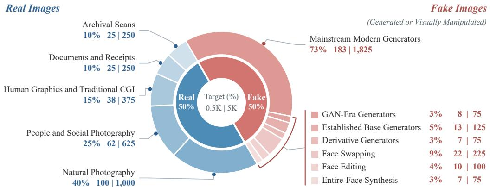  
Figure 8: Discovery Composition. Wedges show target shares within each class; labels give the target share and the unique selected images at 0.5K | 5K, before training draws with replacement.

Concentration and Resolution Constraints. Caps limit domination by an individual generator or capture format: single generators, reduced face crops, and released video frames are limited to 4%, 12%, and 16% of the fake half, respectively. Derivative generators are capped at 3%, and GAN-era, established-base, and derivative generators together at 12%. Resolution uses four native longest-edge bands: below 640, 640–1,023, 1,024–2,047, and at least 2,048 pixels. For pools up to 5K, their target shares are 28/5/57/10% within each class, with a 10-percentage-point tolerance per band. At larger scales, the highest-resolution band instead has a 3% lower bound in the fake class. At all scales, corresponding real/fake band shares differ by at most 14 percentage points. Resolution adjustments first seek replacements within the same source or generator, then widen to its domain or family/category while preserving earlier pool membership and decreasing constraint excess.

Nested Budget Construction. We build pools from small to large. Each larger pool retains all previously selected image identities, treats their category counts as lower bounds, and fills the remaining quotas from unused images. Constraint-driven replacements operate only on newly added images. The resulting manifests record membership, realized category and resolution counts, and any unfilled constraints, making the selection outcome traceable to its profile and budget. Our bud gets are 0.5K, 1K, 2K, 5K, 10K, and 20K. Figure 8 instantiates the category weights and reports realized composition; within the mainstream category, native full-frame/reduced-raster targets are 85/15, while face swapping balances native news-image and processed 256-pixel face-crop sources equally.

Training Configuration. FRA uses AdamW with learning rate $3 \times 1 0 ^ { - 4 }$ , zero weight decay, and gradient-norm clipping at 1.0. The effective batch size is 64 for 0.5K/1K and 256 for the larger pools. Training samples the balanced fitting pool uniformly with replacement; one epoch denotes N image draws. Reported checkpoints use four epochs for 0.5K–5K, two for 10K, and one for 20K. Representation processing, classifier fitting, and the FRA objective are specified in Appendix B.

Benchmark Baselines and Training Data. Table 1 compares RGE with UnivFD (Ojha et al., 2023), DRCT (Chen et al., 2024), AIDE (Yan et al., 2025a), DDA (Chen et al., 2025b), HiDA-Net (Mu et al., 2026), DGS-Net (Yan et al., 2026), LTD (Yang et al., 2026), and PLM (Zhou et al., 2026a). Training counts refer to detector training and exclude backbone pretraining. Wherever available, we adopt the values reported in the official benchmark comparisons; for entries not reported there, we evaluate the officially released weights under each benchmark’s standard protocol. HiDA-Net ha not released its weights, so its unreported entries are marked N/A.

AIGIBench. DGS-Net uses the 144K-image Setting-II split and preserves CLIP priors through distillation-guided gradient surgery during LoRA adaptation (Li et al., 2025b; Yan et al., 2026). DDA adapts DINOv2 with LoRA on 236K COCO originals and SD2.1 VAE reconstructions aligned in the pixel and frequency domains (Chen et al., 2025b; Li et al., 2025b).

Chameleon. AIDE combines DCT-selected patches with a CLIP ConvNeXt trunk and is trained on the full GenImage set (Yan et al., 2025a). The published DRCT reference follows the 473K-image

SD2.1 configuration reported by GAPL (Chen et al., 2024; Qin et al., 2026). DDA uses the same 236K training configuration as on AIGIBench (Chen et al., 2025b).

HiRes-50K. The published Acc values for UnivFD, AIDE, DRCT (ConvB), and HiDA-Net follow the benchmark authors’ comparison with full-GenImage training and averaging across eight resolution intervals (Mu et al., 2026).

Computed Reference Values. Computed entries are obtained from officially released checkpoints under each benchmark’s evaluation protocol. They comprise DRCT mAP/Acc on AIGIBench; DDA mAP and DGS-Net, LTD, and PLM mAP/Acc on Chameleon; and UnivFD, AIDE, and DRCT mAP plus DDA, DGS-Net, LTD, and PLM mAP/Acc on HiRes-50K. HiRes-50K values are macroaveraged over the eight resolution intervals, as for RGE.

## B Detailed Methodology

This section specifies how F-lens decomposes sampled backbone activations and selects the forensic reserve, how synthesis mapping defines the writing subspaces, and how FRA learns updates within them. We follow the construction in Section 3, giving the sampling, numerical, and optimization conventions needed to reproduce each stage.

## Component Probing and Reserve Identification

Representation Collection. Let $\mathcal { D } _ { \mathrm { d i s c } } = \{ ( x _ { i } , y _ { i } ) \} _ { i = } ^ { N }$ be the discovery set, with $N _ { y }$ images of class y. We capture post-block activations from the unadapted backbone at each available site $c = ( \ell , t )$ where ℓ denotes a block and t a token group. All classification and register tokens are collected where present. For patch tokens, the spatial grid is divided into four quadrants, and one token is sampled from each quadrant for every image and block. Sampling is deterministic from the image identifier, block identifier, and sampling seed.

Let ${ \mathcal { P } } _ { c } ( x _ { i } )$ denote the sampled token positions at site $c ,$ with $q _ { i , c } = | \mathcal { P } _ { c } ( x _ { i } ) |$ |. Image i receives weight $\dot { \omega _ { i } } = 1 / ( 2 N _ { y _ { i } } )$ , distributed equally across its sampled tokens as $\omega _ { i } / q _ { i , c }$ . The balanced discovery configurations contribute a fixed number of tokens per image at each site, giving constant weights across the captured rows within that site.

Component Coordinates. Let $h _ { c , p } ^ { 0 } ( x _ { i } ) \in \mathbb { R } ^ { d _ { c } }$ denote the captured activation of token $p$ at site $c .$ Each activation is normalized before decomposition:

$$
\widehat { h } _ { c , p } ^ { 0 } ( x _ { i } ) = \frac { h _ { c , p } ^ { 0 } ( x _ { i } ) } { \operatorname* { m a x } \bigl ( \| h _ { c , p } ^ { 0 } ( x _ { i } ) \| _ { 2 } , \epsilon _ { \mathrm { n o r m } } \bigr ) } ,\tag{B.1}
$$

where $\epsilon _ { \mathrm { n o r m } } = 1 0 ^ { - 1 2 }$ . We compute the empirical mean $\mu _ { c }$ over the normalized rows and collect the centered rows into $H _ { c } \in \mathbb { R } ^ { n _ { c } \times \bar { d _ { c } } }$

The number of ICA components is determined by

$$
m _ { c } = \mathrm { m a x } \{ 1 , \mathrm { m i n } ( d _ { c } , n _ { c } - 1 , \kappa _ { c } ) \} ,\tag{B.2}
$$

where $\kappa _ { c }$ counts the eigenvalues of the centered Gram matrix exceeding $1 0 \epsilon _ { 3 2 }$ , and $\epsilon _ { 3 2 }$ is float32 machine precision. The implementation uses $H _ { c } ^ { \top } H _ { c }$ or $H _ { c } H _ { c } ^ { \top }$ , whichever has smaller dimension.

Let $V _ { c } \ \in \ \mathbb { R } ^ { d _ { c } \times m _ { c } }$ contain the retained eigenvectors in hidden-representation space, with corresponding eigenvalues $\lambda _ { c }$ . When eigendecomposition is performed on $H _ { c } H _ { c } ^ { \top }$ , its eigenvectors are first mapped into this space. The backend whitening map is $Q _ { c } = \mathrm { d i a g } ( \lambda _ { c } ^ { - 1 / 2 } ) V _ { c } ^ { \top }$ . Parallel FastICA fits the unmixing matrix $W _ { c }$ using $\sqrt { n _ { c } } Q _ { c } H _ { c } ^ { \top }$ , with the logcosh nonlinearity, a maximum of 2,000 iterations, and convergence tolerance $1 0 ^ { - 4 }$

Let $\Gamma _ { c }$ be diagonal, with entries equal to the population standard deviations of the provisional responses $W _ { c } Q _ { c } ( \widehat { h } ^ { 0 } - \mu _ { c } )$ ) over the captured rows. The final component coordinates are

$$
z _ { c , p } ( x ) = \Gamma _ { c } ^ { - 1 } W _ { c } Q _ { c } \left( \widehat { h } _ { c , p } ^ { 0 } ( x ) - \mu _ { c } \right) = R _ { c } \left( \widehat { h } _ { c , p } ^ { 0 } ( x ) - \mu _ { c } \right) ,\tag{B.3}
$$

where $R _ { c } = \Gamma _ { c } ^ { - 1 } W _ { c } Q _ { c } \in \mathbb { R } ^ { m _ { c } \times d _ { c } }$ is the final reading map. This convention gives each component unit empirical variance and carries the same scaling into its corresponding synthesis direction.

Sensitivity and Selection. The class-conditional response in Equation (1) is

$$
\overline { { z } } _ { c , j } ^ { ( y ) } = \frac { \displaystyle \sum _ { i : y _ { i } = y } \frac { \omega _ { i } } { q _ { i , c } } \sum _ { p \in \mathcal { P } _ { c } ( x _ { i } ) } z _ { c , p , j } ( x _ { i } ) } { \displaystyle \sum _ { i : y _ { i } = y } \omega _ { i } } .\tag{B.4}
$$

With a fixed token count per image at each site, this equals the empirical mean over that class’s captured token rows. The origin sensitivity is $s _ { c , j } = | \overline { { z } } _ { c , j } ^ { ( 1 ) } - \overline { { z } } _ { c , j } ^ { ( 0 ) } |$

The candidate pool contains $M = \textstyle \sum _ { c } m _ { c }$ components from successfully fitted sites. For selection fraction $\rho ,$ we retain $K = \operatorname* { m a x } ( 1 , \lceil \overline { { \rho } } \dot { M } \rceil )$ components; the main configuration uses $\rho = 0 . 0 1$ . Candidates are ordered by decreasing sensitivity, with ties resolved by the lexicographic site identifier and then the component index; the selected components form the reserve, grouped by site as in Section 3.1.

## Writing Subspaces and FRA Optimization

Synthesis Directions and Writing Bases. Following the reading/synthesis construction (Liu & Han, 2026), we obtain the synthesis matrix from the final reading map:

$$
D _ { c } = R _ { c } ^ { \dagger } ,\tag{B.5}
$$

where † denotes the Moore–Penrose pseudoinverse. Its computation uses float64 singular value decomposition, retaining singular values exceeding $1 0 ^ { - 1 2 }$ times the largest singular value.

At each selected site, $B _ { c } = D _ { c } [ : , \mathcal { T } _ { c } ]$ collects the synthesis directions associated with the forensic reserve components, so $D _ { c } F _ { c } ^ { ' } = \operatorname { \bar { s p a n } } ( B _ { c } )$ is the mapped writing subspace. We compute the singular value decomposition of $B _ { c }$ and retain left singular vectors whose singular values exceed ma $\mathrm { x } ( d _ { c } , | \mathcal { T } _ { c } | ) \epsilon _ { 6 4 } \sigma _ { \mathrm { m a x } } ( B _ { c } )$ . These vectors form the writing basis $U _ { c } \in \mathbb { R } ^ { d _ { c } \times r _ { c } }$ , where $r _ { c }$ is the numerical rank of $B _ { c }$ under this threshold. This gives the mapped subspace in Equation (2).

Reference Detector and Adapted Score. For each discovery configuration, frozen backbone output representations are standardized using their weighted empirical means and population standard deviations. Dimensions with zero numerical scale use a scale of one. The reference classifier is fitted by weighted L2-regularized logistic regression with $C = 1$ , using image weights $\omega _ { i }$ that sum to one. Its decision threshold τ maximizes balanced accuracy on the development set, and the exported scoring head $\psi ( v ) = w ^ { \top } v + b - \tau$ is held fixed during FRA training. FRA training and all reported decisions therefore share the boundary $\psi = 0$

Let $\Phi _ { \theta , A } ( x )$ denote the backbone output with pretrained parameters θ and adapter maps $\mathcal { A } = \left\{ A _ { c } \right.$ $c \in \mathcal { C } _ { \star } \}$ . The adapted score is

$$
f _ { A } ( x ) = \psi ( \Phi _ { \theta , A } ( x ) ) .\tag{B.6}
$$

Optimization. FRA minimizes the detection objective

$$
\mathcal { L } ( \mathcal { A } ) = \sum _ { i = 1 } ^ { N } \omega _ { i } \ell _ { \mathrm { B C E } } ( f _ { A } ( x _ { i } ) , y _ { i } ) .\tag{B.7}
$$

Image weights are implemented through sampling with replacement. Each optimization batch uses the mean binary cross-entropy over its sampled images. Gradients propagate through the fixed backbone and classifier to update only A.

## C Additional Analyses

## Functional Analyses

Analysis Quantities. The analyses scale the trained writes by site gates $g _ { c } ~ \in ~ [ 0 , 1 ]$ , replacing Equation (3) with $h _ { c , p } ^ { \prime } = h _ { c , p } + g _ { c } U _ { c } A _ { c } h _ { c , p }$ while leaving the trained maps unchanged. Let $f _ { \mathbf { \nabla } A } ( x ; \mathbf { g } )$ denote the detector score under gate vector g; $\mathbf { g } = \mathbf { 0 }$ recovers the reference detector, ${ \bf g } = { \bf 1 }$ the trained RGE detector, and the global gate sets $g _ { c } = g$ at every site. Gate IG. For site $c , \operatorname { I G } _ { c } ( x ) =$ $\textstyle \int _ { 0 } ^ { 1 } \partial f _ { \mathcal { A } } ( x ; t { \mathbf { 1 } } ) / \partial g _ { c } d t$ , integrated along the path on which all gates rise together and evaluated with the midpoint rule. By completeness, $\begin{array} { r } { \sum _ { c } \mathrm { I G } _ { c } ( x ) = f _ { \cal A } ( x ; { \bf 1 } ) - f _ { \cal A } ( x ; { \bf 0 } ) } \end{array}$ , so the site attributions partition the score change produced by the writes. Label-aligned gate IG averages $\left( 2 y - 1 \right) \mathrm { I G } _ { c } ( x )$ over the analysis images; positive values mark writes that move the score toward the correct class. Probe AP. At each selected site, the probe represents an image by the responses of the site’s reserve components averaged over all tokens in its group, and fits a logistic classifier with the same recipe as the reference classifier. Probe AP is the average precision of five-fold out-of-fold scores on the fitting pool, with folds assigned by hashed image identifiers. Because the reserve components are selected on the full fitting pool, probe AP ranks sites by the discovery-set separability of the selected components rather than estimating held-out generalization; the out-of-fold scoring only prevents each probe from scoring the images it was fitted on. Whether this ranking transfers is tested by the site knockout below, which is evaluated on AIGIBench images outside the discovery set. Site Knockout. The discovery-selected group H contains the six sites with the highest probe AP. Each random group draws six other such sites whose total writing rank lies within a small tolerance of that of H. Knockout sets the gates of a group to zero. Sensitivity Maps. Let $x _ { u }$ denote x with a $3 \times 3$ patch window centered at grid location u replaced by its blurred version (three passes of a 9-pixel box filter). Then $S _ { \mathrm { f i n a l } } ( u ) \bar { = } f _ { A } ( x ; { \bf 1 } ) - f _ { A } \bar { ( } x _ { u } ; { \bf 1 } )$ and $S _ { \mathrm { w r i t e } } ( u ) = G ( x ) - G ( \mathbf { \bar { \mathbf { \phi } } } x _ { u } )$ , where $\bar { G ( x ) } = f _ { A } ( x ; { \bf 1 } ) - f _ { A } ( x ; { \bf 1 } _ { \backslash \mathcal { H } } )$ is the score contribution of H and $\mathbf { 1 } _ { \backslash \mathcal { H } }$ disables only that group. The figures display $\lvert S _ { \mathrm { f i n a l } } \rvert$ and $| S _ { \mathrm { w r i t e } } |$

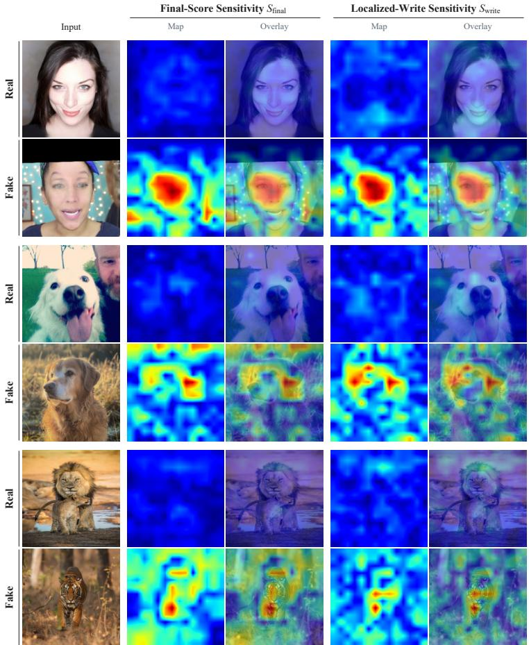  
Figure 9: Final-Score and Localized-Write Sensitivity. $S _ { \mathrm { f i n a l } }$ and $S _ { \mathrm { w r i t e } }$ for the three pairs in Figure 3(b); each map type is normalized within its real/fake pair.

Responses in a Fixed ICA Coordinate. Figure 4(c) uses one reserve component retained by the original discovery procedure. We compare responses with all FRA writes disabled $( g = 0 )$ and enabled $( g = 1 )$ , retaining the same discovery-fitted ICA readout and centering. Responses are measured immediately after the selected block’s residual write, so the adapted response includes effects from both preceding adapters and the write at this site. Both conditions use the complete class-balanced, 2,000-image analysis panel. Gaussian kernel density estimates share one bandwidth across classes and conditions, computed as the root-mean-square of the four within-group sample standard deviations multiplied by 1000−1/5. Axis limits are shared, and all samples and the original coordinate sign are retained.

Write Gate and Prediction Outcomes. We evaluate the fixed 5K RGE checkpoint on a classbalanced analysis panel containing 40 real and 40 fake images from each of the 25 AIGIBench subsets. Images are selected from the 20,000-image analysis subset using a fixed, seeded ordering of sample IDs.

Image Regions and Localized Writes. Figures 3 and 9 provide a spatial view of the detector’s behavior. For visualization, absolute responses on the measured 14 × 14 grid are normalized by a shared maximum within each real/fake pair, separately for each map type. Bilinear interpolation and a power-law color scale (γ = 0.7) display magnitudes from blue (low) to red (high); overlays blend heatmaps and images equally.

## Adaptation Analyses

Writing Capacity. Table 3 reports writing ranks and trainable capacities for six retained component fractions at discovery sizes of 0.5K, 5K, and 20K. At a fixed 1%, the candidate count and resulting writing ranks vary across discovery sets. At a fixed discovery size, increasing the retained fraction expands the writing budget. For the primary backbone, each writing-basis direction contributes 1,280 trainable coefficients. At the default budget, the selected components span most layer–token sites with small per-site ranks, so the sparsity lies within sites rather than across them.

## D Additional Results

## Benchmark Source Breakdown

Category Construction and Aggregation. Figure 10 groups the native sources of AIGIBench and HiRes-50K and Treasure-64, showing the 20K configuration alongside the 0.5K and 5K detectors with their development-set thresholds. Counts in parentheses give the numbers of generators or native source subsets in each category; HiRes-50K bar groups are individual resolution intervals. Means retain the native-source weights: the overall score is recovered by weighting category means by their membership counts, rather than averaging unequal-sized categories equally.

AIGIBench. The 25 native subsets are grouped as follows. Commercial text-to-image: DALLE-3, Imagen3, Midjourney. Public text-to-image models: FLUX1-dev, GLIDE, SD3, SDXL. GAN synthesis: ProGAN, R3GAN, StyleGAN3, StyleGAN-XL, StyleSwin, WFIR. Face manipulation: BlendFace, E4S, FaceSwap, InSwap, SimSwap. Personalized diffusion: BLIP, Infinite-ID, InstantID, IP-Adapter, PhotoMaker. Community / social sources: CommunityAI, SocialRF.

HiRes-50K and Chameleon. HiRes-50K retains its eight native long-edge resolution intervals, in pixels: [0, 900), [900, 1200), [1200, 1500), [1500, 2000), [2000, 2500), [2500, 3000), [3000, 5000), and [5000, ∞). Each interval is retained as one bar group; the benchmark macro score averages the eight intervals (Mu et al., 2026). The original Chameleon evaluation reports whole-benchmark and real/fake-class accuracies without a generator-wise breakdown; we therefore retain its overall comparison in Table 1 (Yan et al., 2025a).

Table 3: Reserve Selection and Trainable Capacity. Six retained component fractions across three discovery sizes. The shaded row is the default top-1% configuration. The backbone denominator is 840.6M parameters.
<table><tr><td rowspan="2"></td><td colspan="3">0.5K Discovery</td><td colspan="3">5K Discovery</td><td colspan="3">20K Discovery</td></tr><tr><td>Fraction</td><td>Rank Parameters</td><td>Backbone</td><td></td><td>Rank Parameters</td><td>Backbone</td><td></td><td>Rank Parameters</td><td>Backbone</td></tr><tr><td>0.1%</td><td>92</td><td>117,760</td><td>0.0140%</td><td>118</td><td>151,040</td><td>0.0180%</td><td>120</td><td>153,600</td><td>0.0183%</td></tr><tr><td>0.25%</td><td>230</td><td>294,400</td><td>0.0350%</td><td>294</td><td>376,320</td><td>0.0448%</td><td>299</td><td>382,720</td><td>0.0455%</td></tr><tr><td>0.5%</td><td>459</td><td>587,520</td><td>0.0699%</td><td>587</td><td>751,360</td><td>0.0894%</td><td>598</td><td>765,440</td><td>0.0911%</td></tr><tr><td>1%</td><td>918</td><td>1,175,040</td><td>0.1398%</td><td>1,174</td><td>1,502,720</td><td>0.1788%</td><td>1,196</td><td>1,530,880</td><td>0.1821%</td></tr><tr><td>2%</td><td>1,835</td><td>2,348,800</td><td>0.2794%</td><td>2,347</td><td>3,004,160</td><td>0.3574%</td><td>2,391</td><td>3,060,480</td><td>0.3641%</td></tr><tr><td>5%</td><td>4,588</td><td>5,872,640</td><td>0.6986%</td><td>5,867</td><td>7,509,760</td><td>0.8934%</td><td>5,978</td><td>7,651,840</td><td>0.9103%</td></tr></table>

Published References. DGS-Net category AP follows its Appendix C, Table 9; it uses the AI-GIBench training split (Yan et al., 2026; Li et al., 2025b). HiDA-Net interval results use the native Acc reported by Mu et al. (2026); AP is not reported there. Metrics not reported in the selected source-level reference have no marker. DDA has no source-level entries in the cited comparison and is retained in Table 1 (Chen et al., 2025b). Published source values retain their reported precision, which can lead to last-digit differences when reaggregated.

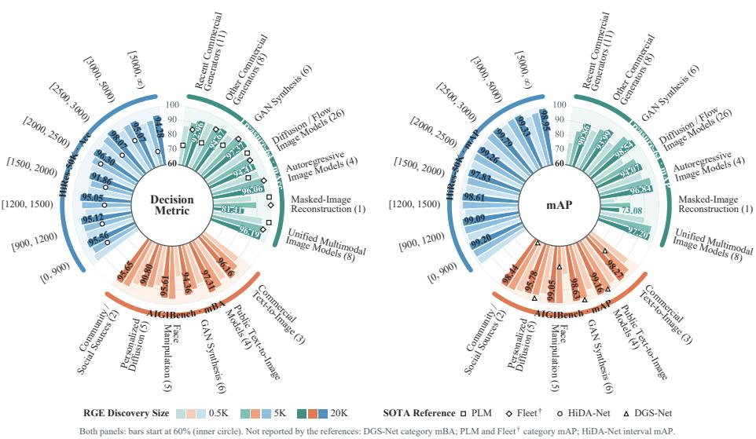  
Figure 10: Detection by Source Category and Resolution Interval (%). Decision metric (left; mAcc, mBA, and Acc) and mAP (right) of RGE at 0.5K, 5K, and 20K discovery images (light to dark; labels give 20K), with published references as markers. Parentheses give source counts; HiRes-50K intervals give the image long edge in pixels. Bars start at 60%. Fleet† uses 10-shot adaptation with images from Treasure-64.

## Evaluation on Treasure-64

Benchmark and Metrics. We additionally evaluate on Treasure-64 (Wang et al., 2026), which covers 64 generators, including recent commercial models. We report mAP and the benchmark’s native mean accuracy (mAcc). RGE uses its discovery set for training without target-benchmark adaptation.

Quantitative Results. On Treasure-64, the 0.5K configuration exceeds zero-shot PLM on both metrics and attains the highest mAcc among the listed methods, 94.60%. Its mAP reaches 95.46%, approaching Fleet’s 95.66%, while exceeding Fleet’s 92.63% mAcc. FSD and Fleet perform 10-shot adaptation using images from Treasure-64; RGE uses only its discovery set for training.

Baselines and Adaptation Protocols. FreqNet (Tan et al., 2024), UnivFD, AIDE, and SAFE use the zero-shot Treasure-64 results in the benchmark authors’ comparison, without target-benchmark adaptation (Wang et al., 2026). PLM uses pixel-value remapping to reduce semantic shortcuts before detector training and is evaluated without target-benchmark adaptation (Zhou et al., 2026a; Wang et al., 2026). FSD (Wu et al., 2025) is a few-shot detector evaluated with 10-

Table 4: Detection on Treasure-64 (%). RGE uses 0.5K discovery images; superscripts give its change from the baseline. Best and secondbest results are bold and underlined.
<table><tr><td>Method</td><td>mAP↑</td><td>mAcc ↑</td></tr><tr><td>FreqNet</td><td>77.71</td><td>73.42</td></tr><tr><td>UnivFD</td><td>84.33</td><td>74.17</td></tr><tr><td>AIDE</td><td>83.72</td><td>84.75</td></tr><tr><td>SAFE</td><td>86.26</td><td>86.66</td></tr><tr><td>PLM</td><td>90.44</td><td>88.18</td></tr><tr><td>FSD (10-shot)</td><td>80.54</td><td>75.87</td></tr><tr><td>Fleet (10-shot)</td><td>95.66</td><td>92.63</td></tr><tr><td>Baseline</td><td>81.66</td><td>85.92</td></tr><tr><td>RGE (Ours)</td><td>95.46 +13.80</td><td>94.60 +8.68</td></tr></table>

shot adaptation in the same comparison. Fleet adapts DINOv3 using LoRA and frequency-guided subspace routing, with 144K images for detector pretraining followed by 10-shot routing adaptation using images from Treasure-64 (Wang et al., 2026).

Source Categories and Aggregation. The 64 generators are grouped as follows. Recent commercial generators: GPT4O\_Image\_T2I, Imagen4, Nano Banana, Nano-Banana-Pro, doubaoseedream-3.0-t2i, doubao-seedream-4.0, wan2.2-t2i-flash, wan2.5-t2i-preview, sora-image, gptimage-1.5, Midjourney V7. Other commercial generators: DALLE-2, DALLE-3, Imagen, Midjourney\_V4, Midjourney\_V5, Midjourney\_V6, Midjourney V6.1, ideogram. GAN synthesis: Big-

GAN, DF-GAN, GigaGAN, ProGAN, StarGAN, StyleGAN3. Diffusion /flow image models: ADM, BRIA\_v3\_2, Cogview3-plus, DeepFloyd\_IF, FLUX.1-dev, GLIDE, HiDream-I1-Dev, Hunyuan-DiT, LongCat-Image, Lumina, Playground\_v2, Playground\_v2.5, SD3-Medium, SDXL, SDv1.4, SDv1.5, SDv2.1, Sana\_v1.5, VQDM, Wukong, Z-Image-Turbo, pixart-α, Kolors, Qwen-Image, FLUX.2, CogView4. Autoregressive image models: CogView2, Infinity, LlamaGen, NextStep. Masked-image reconstruction: MAE. Unified multimodal image models: BAGEL-7B, Janus-Pro-7B, OmniGen\_v1, OmniGen\_v2, Show\_o, Show\_o2, ovis-U1, HunyuanImage-3.0. Category mAP averages the constituent generator APs. Category mAcc averages $( \mathrm { T } \mathbf { \tilde { P } } \mathbf { R } _ { g } + \mathrm { T N } \mathbf { \tilde { R } } _ { \mathrm { r e a l } } ) / 2$ over its generators, where TPR and TNR are true-positive and true-negative rates, using the pooled real-image TNR from COCO2014 and cc12m-2mp-realistic. These real sources do not enter the 64-generator AP average.

Published References. PLM and Fleet category mAcc values are aggregated from the generatorlevel AI/non-AI accuracies in Table 12 of Wang et al. (2026); that table does not provide pergenerator AP. PLM uses no target-benchmark adaptation (Zhou et al., 2026a), whereas Fleet† uses 10-shot adaptation with images from Treasure-64.

## E Limitations

RGE localizes the forensic reserve with a linear decomposition at fixed layer–token sites and a single global component budget, so origin information carried by nonlinear or cross-site interactions is not explicitly captured. The reserve is localized with a single curated discovery pipeline, and discovery collections assembled from other sources remain to be examined. Our evaluation covers image forgery detection with ViT backbones; video, audio, and non-transformer architectures remain untested, as does robustness to adaptive attacks designed to evade the elicited cues. The functional analyses test the contribution of the learned writes within trained detectors rather than providing a complete mechanistic account of how origin evidence is computed. Extending reserveguided elicitation to these settings is left for future work.

## F More Discussions

Q1. Could the discovery set overlap with the evaluation benchmarks? The discovery set is assembled without reference to the evaluation benchmarks: no benchmark image, label, or statistic is inspected during source selection, curation, or sampling (Appendix A). Because both draw on public image sources, we cannot rule out that isolated images coincide, and we do not deduplicate against the benchmarks. Such coincidences are unlikely to explain our results. First, the main configuration fits on 500 images, whereas each benchmark contains approximately 26K–359K evaluation images. Second, our central quantity is the change from the baseline reference detector to RGE; both are fitted on the same discovery pool, so any overlap is shared and cannot by itself produce the gain from eliciting the forensic reserve.

Q2. How faithful are the reported results of competing methods? We prioritize the values reported in the official benchmark comparisons. When a metric is not reported, we evaluate the latest officially released weights under the benchmark’s standard protocol and adopt the computed value after confirming that the same evaluation reproduces the method’s published values where available, up to small decimal-level differences. Methods without released weights are marked N/A rather than reimplemented, and Appendix A lists which entries are published and which are computed. We therefore believe the comparison faithfully reflects the performance of each method.