# GEOPID: DECOMPOSING AND STEERING VISUAL IN-FORMATION IN VISION-LANGUAGE MODELS

Seulgi Kim1∗ Zhixiong Zhang2 Xinwei Zhang2 Jie Ling2 Ronn Shaw2 1Georgia Institute of Technology 2Amazon

## ABSTRACT

While recent vision-language models (VLMs) have shown outstanding performance across diverse applications, they tend to under-use visual information and over-rely on textual context. In this work, we propose GEOPID, a training-free framework that analyzes multimodal information within VLMs from a geometric perspective. GEOPID decomposes information into Redundant, Modality-Unique, and Synergistic components through the geometric relationships between visual and textual representation subspaces. Through an extensive analysis across 22 VLMs and 14 benchmarks, we confirm that correct predictions exhibit stronger vision-unique components when questions strongly require visual grounding. Building on this geometric analysis, we introduce a targeted intervention technique that selectively amplifies visual representations along the visionunique subspace during inference. As a result, visual grounding capabilities were enhanced without any additional model parameter updates, achieving an average relative accuracy gain of 7.63%.

## 1 INTRODUCTION

Recent advances in vision-language models (VLMs) enable joint grounding of visual and linguistic information, resulting in state-of-the-art performance across a wide range of practical applications. This includes visual question answering Zhang et al. (2024), action understanding (Kaviani et al., 2025; Kim et al., 2025), medical image analysis (Li et al., 2023b), and judging the quality of generated visual data (Lin et al., 2024). A core motivation behind VLMs is to combine visual and linguistic information, which can include both shared context and modality-specific details. Ideally, a model should use the visual information required by the question and combine it with textual instructions to produce an image-grounded answer. For example, in Figure 1(c), both modalities establish the shared context of a bedroom, where the text expresses explicit praise while the image depicts clear disorder. Jointly processing these inputs reveals a mismatch between what is said and what is shown, which is essential for capturing the speaker’s sarcastic intent as shown in Figure 1(d 2). However, VLMs often under-use visual information and over-rely on textual context (Leng et al., 2024). For example, in Figure 1(d-1), the model interprets the text as genuine praise, missing the visual evidence needed to recognize the contradiction. This raises specific questions: do VLMs use visual information beyond what is already available from the text, and how is this information organized within their internal representations?

Understanding how to leverage visual information, therefore requires distinguishing information shared with text, information unique to vision, and information available only through their combination. Partial Information Decomposition (PID) (Williams & Beer, 2010) provides a framework for making these distinctions by decomposing the information that multiple modalities provide into three types: redundant information (R), which is available in both vision and language; unique information (U), which is provided exclusively by one modality; and synergistic information (S), which becomes available only when the two modalities are considered jointly. Figure 1 illustrates these distinctions. Both modalities provide shared content (e.g., ‘room’, ‘desk’, ‘bed’) but they also contain contrasting unique content: in Figure 1(b), the text characterizes the scene as tidy, spotless, and perfectly made, whereas the image in Figure 1(a,c) provides image-specific details showing scattered clothes, a cluttered desk, and rumpled bedding. Recognizing the mismatch between the textual praise and the visual scene illustrates the role of synergistic information, supporting a sarcastic interpretation that neither modality establishes alone. Shared information alone may not be sufficient (Figure 1(d-1)‘Before: praising the room’s tidiness’) as it misses the cross-modal relationship. The goal is therefore to distinguish these information components in VLMs, and use these distinctions to determine which visual components to selectively amplify to improve predictions.

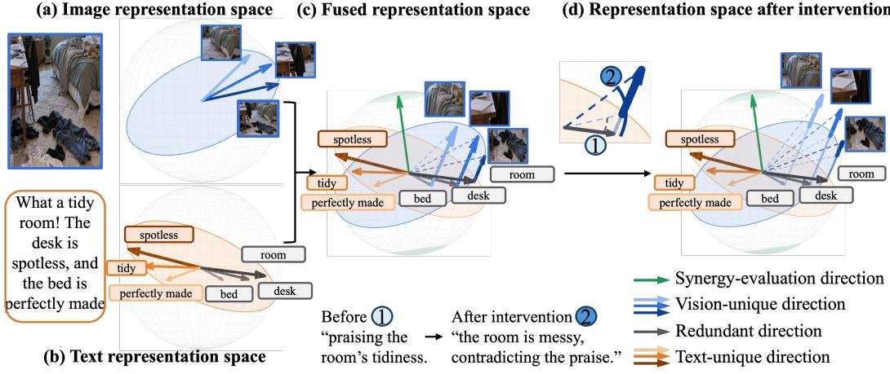  
Figure 1: In this figure, we take a visual and textual input and project them into their own representation space (a-b), where vectors represent features that can be extracted from each input modality. (c): The fused representation space reveals geometric relationships and contrasting modality-specific content: text-unique features (orange) praise the room’s tidiness, while vision-unique features (blue) depict the disorder. The green direction denotes the complementary geometry in which synergy is evaluated. (d): Our approach selectively amplifies along the vision-unique subspace while preserving its orthogonal complement.

Translating these distinctions into selective amplification presents two challenges. First, existing approaches quantify PID components using separate estimators, often based on predictions (Fang et al., 2026; Liang et al., 2023b), but numerical PID values alone do not identify where shared and modality-specific information resides. Figure 1 illustrates this structure using 3D spheres to represent hidden representation spaces, with arrows corresponding to distinct features. Figure 1(c) dis plays their geometric relationships in a fused space. Gray arrows denote shared features, orange arrows represent text-unique contents, and blue arrows isolate vision-unique details. Identifying these specific subspaces is important because it provides a target for selectively amplifying the vision unique directions, as in Figure 1(d). Second, improvements informed by multimodal information decomposition have primarily required costly additional training that is not practical in many application settings. Existing training-free methods for improving visual grounding at inference time instead rely on heuristic signals. This includes contrasting with distorted images (Leng et al., 2024), generating captions (Li & Zhang, 2026), or steering vectors (Yin et al., 2026), without explicitly decomposing shared, unique, and synergistic information to identify the intervention target.

To address these limitations, we propose GEOPID, a training-free framework for understanding and steering visual information use in VLMs. Our central idea is to characterize multimodal information through the geometric relationships between visual and textual representation subspaces. Intuitively, a modality’s representations can span directions that align with the other modality as well as directions that remain distinct. Based on this geometric perspective, we propose representation-based measures of PID components. To characterize geometric redundancy (R), we use the principal angles between the visual and textual representation subspaces to measure the extent to which the two modalities span shared directions. The unique visual and textual components, denoted by U and U , are associated with modality-specific directions orthogonal to the other modality’s estimated subspace. For synergy (S), we use the geometry outside the principal span of the combined visual and textual representations as the space in which to measure answer-related information. However, information in this space does not necessarily come from combining corresponding visual and textual inputs. We therefore project decision representations onto this complementary space and define our synergy measure as the difference in mutual information between these projected representations and answer labels under matched and mismatched image–text pairs. By connecting information decomposition to representation geometry, GEOPID provides both an analytical description of visual information and a concrete subspace target for intervention.

We apply GEOPID to 14 vision-language benchmarks across 22 models and identify three patterns. First, shared geometric structure develops across early and intermediate layers, while models exhibit different modality-specific profiles in later layers. This indicates that shared structure alone does not establish whether visual information is effectively used. Second, the information components vary with what is needed to answer each question: visual-grounding questions exhibit the highest $\mathbf { U } _ { \mathbf { v } }$ while questions requiring visual grounding and the combination of text and image exhibit higher S. Third, for questions requiring vision information, correct answers exhibit stronger vision-unique components in the representation than incorrect answers. This suggests that strengthening representation components along vision-unique directions may help the model answer visually demanding questions. We therefore test a training-free intervention that selectively amplifies vision-token representation components along the identified vision-unique subspace. As illustrated in Figure 1(c), this intervention strengthens image-specific components while preserving the remaining representation components, allowing subsequent layers to integrate the amplified visual content into the prediction. Our intervention yields an average relative accuracy gain of 7.63%, with qualitative examples further illustrating improved visual grounding in open-ended generation. Our contributions are as follows:

1. We present a geometric PID framework that characterizes shared and modality-specific representation subspaces and connects their structure to target-related information in VLMs.

2. We analyze how geometric structure and associated information evolve across layers and vary with the information required by a question, providing insight into visual information use, and motivating a vision-unique intervention target.

3. We develop a training-free intervention that selectively amplifies representation components along the identified vision-unique directions and evaluate its effectiveness across 14 benchmarks and 22 VLMs.

Related Works. Partial Information Decomposition (PID) separates multimodal contributions into redundant, unique, and synergistic components (Williams & Beer, 2010). While recent works apply PID to VLMs for diagnosis and fine-tuning, they typically rely on separate estimators or require costly retraining (Liang et al., 2023b; Fang et al., 2026; Wu et al., 2026). We instead compute these components directly from representation geometry, advancing beyond overall matrix rank measures (Kim et al., 2026a; Chaudhuri et al., 2025) to explicitly distinguish shared from modalityspecific subspaces. Furthermore, existing training-free interventions mitigate visual hallucinations through heuristic methods (Leng et al., 2024; Liu et al., 2024a). GEOPID differs by explicitly utilizing this geometric PID to identify and selectively amplify the vision-unique subspace during inference, providing a theoretically grounded target rather than relying on heuristics. A comprehensive review of related literature is provided in Appendix B.

## 2 METHODOLOGY

In this section, we address two complementary components. First, we analyze the geometry formed by vision and text tokens in the hidden representation and define four geometric PID components corresponding to redundancy, modality-specific uniqueness, and synergy. Second, we use the resulting vision-unique subspace as an intervention target and selectively amplify visual representation components along that subspace during inference.

## 2.1 CHARACTERIZING MULTIMODAL INFORMATION

Given a reference batch B containing $N _ { B }$ image-text samples, let $V _ { i } \in \mathbb { R } ^ { n _ { i } ^ { v } \times d } , T _ { i } \in \mathbb { R } ^ { n _ { i } ^ { t } \times d }$ denote the matrices obtained by stacking the vision- and text- token representations of sample $i ,$ respectively. Here, $n _ { i } ^ { v } , n _ { i } ^ { t }$ denote the number of vision and text tokens in sample $i ,$ and $d$ is the hidden dimension. Let $h _ { i } \in \mathbb { R } ^ { d }$ denote the representation of the last input token, and stacking these representations gives $H = \left[ h _ { 1 } \ldots h _ { N _ { B } } \right] ^ { T } \in \mathbb { R } ^ { N _ { B } \times d }$

We start from the observation that vision- and text- representations do not necessarily occupy the same directions, even when they reside in a shared d-dimensional hidden space. A direction refer to a feature axis within this space. As illustrated by the arrows in Figure 1 (c), some directions may be expressed by both modalities, whereas others are predominantly occupied by only one modality. Based on this structure, we define four geometric bases to formalize these multi-modal relationships:

$G _ { R } { : }$ The geometry shared by vision and text, as shown in the gray directions in Figure 1(c).

$G _ { U _ { V } }$ : The vision geometry orthogonal to the estimated text subspace. This is illustrated as the blue directions in Figure 1 (c).

$G _ { U _ { t } }$ : The text geometry orthogonal to the estimated vision subspace. This is illustrated as the orange directions in Figure 1 (c).

$G _ { S } \colon$ The geometry outside the principal span jointly estimated from the vision and text representations. This is illustrated as the green directions in Figure 1 (c).

We estimate geometric PID in two stages. First, using only the vision and text token representations, we construct modality subspaces and identify the shared geometry $( G _ { R } )$ , modality-unique geometries $( G _ { U _ { V } } , G _ { U _ { t } } )$ , and the geometry in which synergy is evaluated $( G _ { S } )$ . Second, for offline diagnosis, we measure the target information $Y$ associated with these geometries using matrix-based Renyi mutual information, yielding the geometric PID components: ´ $\bar { \boldsymbol { R } } , \boldsymbol { U } _ { V } , \boldsymbol { U } _ { t }$ , and S.

Batch-wise Modality Geometry Estimation. Because the number of tokens may differ across samples, we normalize each sample’s contribution by its token count before estimating a batchlevel covariance matrix. This prevents samples with longer token sequences from disproportionately determining the estimated geometry.

Let $V _ { i , p } , T _ { i , p } ~ \in ~ \mathbb { R } ^ { d }$ denote the representations corresponding to the p-th rows of $V _ { i }$ and $T _ { i }$ respectively, written as column vectors. We compute the vision and text means as $\begin{array} { r l } { \mu _ { v } } & { { } = } \end{array}$ $\begin{array} { r } { \frac { 1 } { N _ { \mathscr { B } } } \sum _ { i \in \mathscr { B } } \frac { 1 } { n _ { i } ^ { v } } \sum _ { p = 1 } ^ { n _ { i } ^ { v } } V _ { i , p } , \mu _ { t } \ = \ \frac { 1 } { N _ { \mathscr { B } } } \sum _ { i \in \mathscr { B } } \frac { 1 } { n _ { i } ^ { t } } \sum _ { p = 1 } ^ { n _ { i } ^ { t } } T _ { i , p } . } \end{array}$ The corresponding covariance matrices are $\begin{array} { r } { C _ { v } \ = \ \frac { 1 } { N _ { B } } \sum _ { i \in B } \frac { V _ { i } ^ { \top } V _ { i } } { n _ { i } ^ { v } } - \mu _ { v } \mu _ { v } ^ { \top } , C _ { t } \ = \ \frac { 1 } { N _ { B } } \sum _ { i \in B } \frac { T _ { i } ^ { \top } T _ { i } } { n _ { i } ^ { t } } - \mu _ { t } \mu _ { t } ^ { \top } } \end{array}$ . Dividing by $n _ { i } ^ { v }$ or $n _ { i } ^ { t }$ averages the contributions within each sample, while dividing by $N _ { B }$ averages across samples in the reference batch. Similarly, to construct the combined marginal geometry used to define $G _ { S }$ , we apply the same procedure to the vision and text representations concatenated within each sample: $\begin{array} { r } { \mu _ { V T } = \frac { 1 } { N _ { B } } \sum _ { i \in \mathcal { B } } \frac { \sum _ { p = 1 } ^ { n _ { i } ^ { v } } V _ { i , p } + \sum _ { p = 1 } ^ { n _ { i } ^ { t } } T _ { i , p } } { n _ { i } ^ { v } + n _ { i } ^ { t } } , C _ { V T } = \frac { 1 } { N _ { B } } \sum _ { i \in \mathcal { B } } \frac { V _ { i } ^ { \top } V _ { i } + T _ { i } ^ { \top } T _ { i } } { n _ { i } ^ { v } + n _ { i } ^ { t } } - \mu _ { V T } \mu _ { V T } ^ { \top } , } \end{array}$ . A single set of covariance matrices $( C _ { v } , \mathbf { \bar { { C } } } _ { t } , \mathbf { \bar { { C } } } _ { V T } )$ is estimated from the reference batch and shared across samples. The leading eigenspaces of $C _ { v }$ and $C _ { t }$ define the principal modality bases used to construct $G _ { R } , G _ { U _ { V } }$ , and $G _ { U _ { t } }$ . The leading eigenspace of $C _ { V T }$ defines the combined marginal span whose orthogonal complement specifies $G _ { S }$

Shared geometry. We first obtain principal bases for the vision and text representations using the batch-wise PCA procedure defined above, where we visualize these subspaces in Appendix E.2. Each sample contributes equally regardless of its number of tokens:

$$
B _ { v } = \mathrm { P C A } _ { r _ { b } } \left( V _ { i } \right) , \qquad B _ { t } = \mathrm { P C A } _ { r _ { b } } \left( T _ { i } \right) , \qquad i \in B\tag{1}
$$

where $\mathrm { P C A } _ { r _ { b } }$ denotes the leading $r _ { b }$ principal directions obtained using the sample-normalized covariance estimator defined above. Here, we set $r _ { b } = 6 4$ . (Design choice is in Appendix E.1). We measure the alignment between these modality subspaces using their principal angles:

$$
\boldsymbol { B } _ { v } ^ { \top } \boldsymbol { B } _ { t } = U \mathrm { d i a g } ( c _ { 1 } , \ldots , c _ { r _ { b } } ) \boldsymbol { W } ^ { \top } ,\tag{2}
$$

where $c _ { j } ~ \in ~ [ 0 , 1 ]$ is the cosine of the j-th principal angle. Larger values of $c _ { j }$ indicate stronger alignment between the corresponding vision and text directions. Let $U _ { c > \tau }$ contain the columns of $U$ whose principal-angle cosines exceed the alignment threshold $\tau = 0 . 7$ . Since we aim to contrast the text-aligned and text-orthogonal directions of the vision geometry, we represent the shared geometry using the vision-side principal directions aligned with the text subspace:

$$
G _ { R } = B _ { v } U _ { c > \tau } .\tag{3}
$$

Modality-unique geometries. We project each modality’s representations onto the orthogonal complement of the other modality’s estimated subspace. For each sample, we form

$$
V _ { \perp t , i } = V _ { i } ( I - B _ { t } B _ { t } ^ { \top } ) , \qquad T _ { \perp v , i } = T _ { i } ( I - B _ { v } B _ { v } ^ { \top } ) .\tag{4}
$$

We then apply the same batch-wise PCA with rank cap $r _ { u } = 3 2$

$$
G _ { U _ { V } } = \mathrm { P C A } _ { r _ { u } } \left( \{ V _ { \perp t , i } \} _ { i \in \mathcal { B } } \right) , \qquad G _ { U _ { t } } = \mathrm { P C A } _ { r _ { u } } \left( \{ T _ { \perp v , i } \} _ { i \in \mathcal { B } } \right) .\tag{5}
$$

Ablation study of $r _ { u }$ is in Appendix E.1. Thus, $G _ { U _ { V } }$ contains the principal vision directions orthogonal to the estimated text subspace, while $G _ { U _ { t } }$ contains the principal text directions orthogonal to the estimated vision subspace. This orthogonality is further explained in Appendix E.2.

Geometry for synergy. For each sample, we concatenate its vision- and text-token matrices and apply the same batch-wise PCA procedure to the combined token representations and retain their leading $r _ { s } = 1 2 8$ principal directions (The design choice of $r _ { s }$ is in Appendix E.1):

$$
B _ { V T } = \mathrm { P C A } _ { r _ { s } } \left( \left[ V _ { i } \right] \right) , \qquad i \in { \cal B }\tag{6}
$$

We define $G _ { S }$ as an orthonormal basis for the complement of this combined marginal span:

$$
\mathrm { s p a n } ( G _ { S } ) = \mathrm { s p a n } ( B _ { V T } ) ^ { \perp } , \qquad G _ { S } ^ { \top } G _ { S } = I .\tag{7}
$$

Consequently, $H G _ { S }$ represents the decision components lying outside the principal directions expressed by the combined vision and text token representations. In implementation, this operation can equivalently be computed as H $\left( I - B _ { V T } B _ { V T } ^ { \top } \right)$ , without explicitly materializing a basis for the full orthogonal complement. This implementation process is detailed in Appendix E.2.

Importantly, information located in $G _ { S }$ is not automatically regarded as synergy. $G _ { S }$ specifies only the complementary region in which correspondence dependence is evaluated. We operationalize synergy in this region through a contrast between correctly matched and mismatched image–text conditions.

Geometric PID measurement. Following prior work on matrix-based information measurement (Giraldo et al., 2014; Yu et al., 2019; 2018), we use matrix-based Renyi-2 mutual informa-´ tion, denoted by $I _ { 2 } ,$ , to measure the dependence between the decision representations (H) projected onto each geometry and the target Y. For each projected representation matrix $Z ,$ we normalize its nonzero rows to unit length and construct the cosine Gram matrix $K _ { Z } = \hat { Z } \hat { Z } ^ { \top }$ . For the target, we use the label kernel $K _ { Y } [ i , j ] = { \bf 1 } [ y _ { i } = y _ { j } ]$ (Wickstrøm et al., 2019), which assigns a value of one to samples with the same target label and zero otherwise.

We first normalize each Gram matrix $K _ { Z } , K _ { Y }$ to have unit trace: $\begin{array} { r } { \widehat { K } _ { Z } = \frac { K _ { Z } } { \operatorname { t r } ( K _ { Z } ) } , \widehat { K } _ { Y } = \frac { K _ { Y } } { \operatorname { t r } ( K _ { Y } ) } } \end{array}$ Then, we combine the representation similarities and target-label similarities through their elementwise product and normalize the result by $\begin{array} { r } { { \widehat K } _ { Z Y } = \frac { { \widehat K } _ { Z } \circ { \widehat K } _ { Y } } { \mathrm { t r } ( { \widehat K } _ { Z } \circ { \widehat K } _ { Y } ) } } \end{array}$ , where ◦ denotes the Hadamard product. Here, because the target kernel is zero for samples with different labels, this operation retains representation similarities only between samples sharing the same target. Following the matrix-based Renyi formulation (Giraldo et al., 2014; Yu et al., 2019; 2018), we compute mutual ´ information from the two marginal matrices and their joint matrix as

$$
I _ { 2 } ( Z ; Y ) = S _ { 2 } ( \widehat { K } _ { Z } ) + S _ { 2 } ( \widehat { K } _ { Y } ) - S _ { 2 } ( \widehat { K } _ { Z Y } ) ,\tag{8}
$$

where $S _ { 2 } ( \widehat { K } ) = - \log \mathrm { t r } ( \widehat { K } ^ { 2 } )$ is the matrix-based Renyi-2 entropy (Giraldo et al., 2014; Yu et al.,´ 2019; 2018). We compute this directly from kernel entries without an eigendecomposition, as detailed in Appendix E.3. With Eq. 8, we define geometric redundancy and modality-specific uniqueness as

$$
R = I _ { 2 } ( H G _ { R } ; Y ) , \qquad U _ { V } = I _ { 2 } ( H G _ { U _ { V } } ; Y ) , \qquad U _ { t } = I _ { 2 } ( H G _ { U _ { t } } ; Y ) .\tag{9}
$$

Here, R measures target-related information along the vision directions aligned with the text subspace. The unique components $U _ { V }$ and $U _ { t }$ measure target-related information along modalityspecific directions orthogonal to the other modality’s estimated subspace. For synergy, we evaluate whether correctly paired image-text inputs yield more target-related information within $G _ { S }$ than mismatched inputs. We generate K mismatched conditions using independent arrangements of the images while keeping the texts and targets fixed, so that no original image-text pair remains. Let $H _ { \mathrm { m i s } } ^ { ( k ) }$ denote the decision representations from the k-th mismatched condition. Using the same geometry $G _ { S }$ estimated from the matched reference batch for all conditions, we define

$$
S = I _ { 2 } ( H G _ { S } ; Y ) - \frac { 1 } { K } \sum _ { k = 1 } ^ { K } I _ { 2 } \left( H _ { \mathrm { m i s } } ^ { ( k ) } G _ { S } ; Y \right) .\tag{10}
$$

A positive value indicates greater target-related information under correct pairing, whereas a negative value indicates the reverse. Further image substitution test across 24 model × benchmark pairs to validate S is done in Appendix E.4.

## 2.2 ANALYZING VISUAL INFORMATION USE

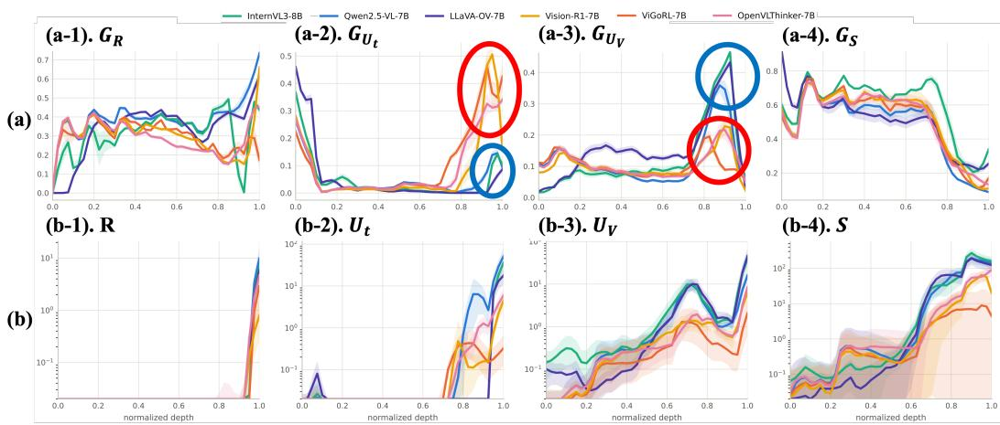  
Figure 2: (a) Layer-wise geometric measures for the shared, text-unique, vision-unique, and synergy-evaluation subspaces. Models highlighted in red and blue exhibit contrasting text-unique and vision-unique profiles in later layers. (b) Models with more pronounced vision-unique components (blue) also tend to show higher $U _ { V }$ and S. The x-axis denotes normalized layer depth. Appendix E.5 extends the information measurements in (b) across 14 benchmarks.

How PID information is organized across layers. Figure 2 presents geometric profiles in the upper panels and their associated answer-information measurements in the lower panels across 6 VLMs. We first examine the shared geometry in panel (a-1), which generally increases in the early layers. The modality-specific panels (a-2) and (a-3) reveal a contrasting pattern across models at later layers, particularly around normalized depths of 0.8-0.95. The red circles highlight Vision-R1-7B (Huang et al., 2026), ViGoRL-7B (Sarch et al., 2026), and OpenVLThinker-7B (Deng et al., 2025), which exhibit stronger text-unique and weaker vision-unique components than the models highlighted by the blue circles: InternVL3-8B (Zhu et al., 2025), Qwen2.5-VL-7B-Instruct (Bai et al., 2025b), and LLaVA-OV-7B (Li et al., 2024c). We compare this geometry with the actual answer-related information in Figure 2(b). The models highlighted by the red circles in (a) also tend to exhibit lower vision-unique information $U _ { V }$ (b-3) and $S ^ { \ ( \flat - 4 ) }$ in later layers. This association between weaker vision-unique representations and lower $U _ { V }$ motivates examining vision-unique directions $( G _ { U _ { V } } )$ as candidates for amplification.

How do PID components vary with the information needed to answer a question? To investigate this, we categorize the evaluation questions into four distinct types based on their evidence requirements by utilizing a LLM annotator (Claude Opus 5 (Anthropic, 2026)) to ensure objective categorization (detailed in Appendix D). Text-sufficient (T) questions can be answered confidently using only the provided text and prior knowledge. Text-prior (T−) questions contain textual clues that strongly suggest an answer, though the image remains necessary for certainty. Visualobservation (V) questions require direct inspection of the image content, such as object identification or counting. Lastly, Joint-evidence (J) questions mandate synthesizing substantive textual premises with visual observations to deduce the answer. In Table 1, comparing the $U _ { V }$ column, V exhibits the highest value (1.34). Geometrically, $U _ { V }$ captures purely visual features that are independent of the text. This shows that when a question requires visual grounding $( \mathrm { i . e . }$ , question type V), the model correctly relies on this unique visual evidence. In the $\breve { S }$ column, both V and J exceed T (3.56 and 3.55, versus 2.24). Geometrically, $S$ measures the joint information existing outside the isolated vision and text spaces. These high scores for both V and J demonstrate that visual grounding actively drives cross-modal interaction. Appendix E.6 further shows that $S$ correlates with models use of visual information. Overall, these patterns suggest that the PID components measured by GEOPID reflect whether answering a question requires textual information, visual information, or both, connecting representation geometry to the information the task requires.

<table><tr><td rowspan="2">Type</td><td colspan="4">Normalized by  $\mathcal { T } _ { 2 } ( h ; Y )$ </td></tr><tr><td> $R$ </td><td> $U _ { v }$ </td><td> $U _ { t }$ </td><td> $S$ </td></tr><tr><td>T</td><td>0.18</td><td>1.15</td><td>0.92</td><td>2.24</td></tr><tr><td> $\mathbf { T } ^ { - }$ </td><td>0.17</td><td>1.17</td><td>1.03</td><td>3.27</td></tr><tr><td>V</td><td>0.22</td><td>1.34</td><td>0.90</td><td>3.56</td></tr><tr><td>J</td><td>0.19</td><td>1.13</td><td>1.00</td><td>3.55</td></tr></table>

Table 1: Normalized PID components across question types. T: questions answerable from text alone, $\mathbf { T } ^ { - } \colon$ : questions where text suggests a likely answer, $\mathbf { V } \colon$ questions requiring direct visual observation, J: questions requiring joint textual and visual information. Each component is divided by the question type’s total decisionstate information $\mathcal { T } _ { 2 } ( h ; Y )$ Mutual information (Eq. 8) is computed using 40 samples per each question type. This analysis covers 22 VLMs and 11 benchmarks (containing at least two question types with at least 40 items each), yielding 253 combinations.

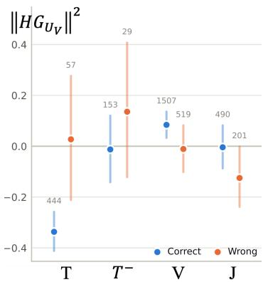  
Figure 3: Magnitude of the vision-unique component $( \| H G _ { U _ { v } } \| ^ { 2 } )$ , grouped by question type and prediction correctness for Qwen2.5-VL-7B (Bai et al., 2025b). For visually demanding questions $( \mathbf { V } , \mathbf { J } )$ , correct predictions exhibit stronger vision-unique representations. Values are standardized within each benchmark. Statistical significance experiment is in Appendix E.7.

How vision-unique components relate to prediction correctness. We further divide each category into correctly and incorrectly answered questions and compare the proportion of the decision representation along the vision-unique directions $G _ { U _ { V } }$ . Figure 3 shows this comparison for Qwen2.5-VL-7B-Instruct. For T and $\bar { \mathbf { T } } ^ { - }$ , correctly answered questions exhibit weaker visionunique components than incorrectly answered questions. The relationship reverses for V and J, where correct answers exhibit stronger vision-unique components. This contrast associates stronger vision-unique components with correct predictions specifically when visual information is required, suggesting that indiscriminate visual amplification could actually harm text-sufficient reasoning. We therefore selectively amplify visual representation components along $G _ { U _ { V } }$ during inference and evaluate whether this intervention improves predictions across multiple VLM models and multiple benchmarks.

## 2.3 TARGETED INTERVENTION IN VISUAL REPRESENTATIONS

From analysis to intervention. Section 2.2 identifies $G _ { U _ { V } }$ as a candidate for strengthening only the vision directions not explained by the estimated text subspace. For each model-benchmark pair, we use a calibration subset that is disjoint from the final evaluation set. The geometric basis $G _ { U _ { V } }$ is estimated from the representations in the calibration subset without using ground-truth labels. Ground-truth labels are used only to select the intervention depth $\ell ^ { * }$ and amplification strength α on the calibration subset. Once selected, these settings are fixed for the final evaluation, and no label-dependent sample selection or gating is performed at inference time.

Vision-unique amplification. Let $V _ { i } ^ { \ell ^ { \star } }$ denote the matrix of visual representations at the selected decoder layer $\ell ^ { \star }$ . We update all vision tokens simultaneously:

$$
\begin{array} { r } { V _ { i } ^ { \ell ^ { \star } }  V _ { i } ^ { \ell ^ { \star } } ( I + \alpha G _ { U _ { V } } ^ { \ell ^ { \star } } ( G _ { U _ { V } } ^ { \ell ^ { \star } } ) ^ { \top } ) . } \end{array}\tag{11}
$$

Table 2: Accuracy gain (%) of the $G _ { U _ { V } }$ intervention at each cell’s selected $( \ell , \alpha )$ , 308 models × benchmarks. Benchmark abbreviation follows Appendix C.2.
<table><tr><td>Model</td><td>POPE</td><td>MME</td><td>CVB</td><td>Hall</td><td>Reef</td><td>NatB</td><td>RWQA</td><td>MMB</td><td>SEED</td><td>AI2D</td><td>AOK</td><td>SQA</td><td>Rap40</td><td>GenAI</td></tr><tr><td>Qwen2.5-VL-7B (Bai et al., 2025b)</td><td>+1.0</td><td>+0.0</td><td>+2.9</td><td>+3.6</td><td>+0.5</td><td>+2.7</td><td>+0.7</td><td>+0.2</td><td>+1.0</td><td>+1.0</td><td>+0.2</td><td>+2.5</td><td>+0.8</td><td>+4.7</td></tr><tr><td>Qwen3-VL-8B (Bai et al., 2025a)</td><td>+0.5</td><td>+3.1</td><td>+0.0</td><td>+0.6</td><td>+0.2</td><td>+0.0</td><td>+0.0</td><td>+0.0</td><td>-0.5</td><td>+1.0</td><td>+0.2</td><td>+0.2</td><td>+5.9</td><td>+4.3</td></tr><tr><td>InternVL3-8B (Żhu et al., 2025)</td><td>+0.2</td><td>-0.8</td><td>+1.6</td><td>+4.2</td><td>+0.0</td><td>+1.3</td><td>+1.3</td><td>-0.5</td><td>+0.7</td><td>+0.5</td><td>-0.2</td><td>-1.0</td><td>+2.3</td><td>+11.0</td></tr><tr><td>InternVL3-2B (Zhu et al., 2025)</td><td>+0.2</td><td>+1.8</td><td>+2.3</td><td>+0.6</td><td>+0.2</td><td>+3.8</td><td>+4.7</td><td>+1.1</td><td>+0.7</td><td>-0.8</td><td>+0.2</td><td>-0.5</td><td>+1.1</td><td>-5.7</td></tr><tr><td>LLaVA-OV-7B (Li et al., 2024c)</td><td>+1.4</td><td>+0.8</td><td>-0.8</td><td>+3.0</td><td>+1.2</td><td>+0.5</td><td>-1.3</td><td>+0.0</td><td>+0.7</td><td>-0.3</td><td>+0.9</td><td>+0.7</td><td>+27.1</td><td>+2.7</td></tr><tr><td>Idefics2-8B (Laurençon et al., 2024)</td><td>+0.0</td><td>+0.5</td><td>+1.8</td><td>-1.2</td><td>+2.6</td><td>+1.1</td><td>+1.3</td><td>+0.2</td><td>+0.0</td><td>+1.6</td><td>+1.1</td><td>-0.5</td><td>-1.1</td><td>-8.7</td></tr><tr><td>SmolVLM-2B (Marafioti et al., 2025)</td><td>+0.5</td><td>-1.3</td><td>+3.1</td><td>+3.6</td><td>+0.7</td><td>+1.9</td><td>+0.7</td><td>+0.5</td><td>-0.7</td><td>+0.3</td><td>-0.5</td><td>+2.9</td><td>+4.0</td><td>+9.3</td></tr><tr><td>MMR1-Math-7B (Leng et al., 2025)</td><td>+2.4</td><td>+0.0</td><td>+0.0</td><td>-0.6</td><td>+0.0</td><td>+1.3</td><td>+0.0</td><td>-0.2</td><td>+0.0</td><td>+1.8</td><td>-0.5</td><td>+2.5</td><td>+0.8</td><td>+7.3</td></tr><tr><td>VL-Rethinker-7B (Wang et al., 2026a)</td><td>+2.1</td><td>+2.3</td><td>+1.0</td><td>+1.2</td><td>-0.2</td><td>+0.3</td><td>+0.0</td><td>+0.2</td><td>-0.2</td><td>+1.0</td><td>+0.7</td><td>+0.2</td><td>+8.5</td><td>-0.3</td></tr><tr><td>Orsta-7B (Ma et al., 2025)</td><td>+0.2</td><td>+1.0</td><td>+0.8</td><td>+2.4</td><td>+0.2</td><td>+1.1</td><td>+1.3</td><td>+0.5</td><td>+1.2</td><td>+0.3</td><td>+0.0</td><td>+1.5</td><td>+0.3</td><td>+6.0</td></tr><tr><td>ThinkLite-VL-7B (Wang et al., 2026b)</td><td>+0.5</td><td>+2.6</td><td>+2.6</td><td>+1.2</td><td>-0.2</td><td>+1.1</td><td>-0.7</td><td>+0.0</td><td>-0.2</td><td>+1.3</td><td>+0.0</td><td>+1.0</td><td>+2.0</td><td>+4.7</td></tr><tr><td>VLAA-Thinker-Q2.5VL-7B (Chen et al., 2025a)</td><td>+1.2</td><td>+1.0</td><td>-0.5</td><td>+0.0</td><td>+1.0</td><td>+2.4</td><td>-0.7</td><td>+0.0</td><td>+0.7</td><td>+1.6</td><td>+0.2</td><td>+2.7</td><td>+5.1</td><td>+7.0</td></tr><tr><td>VLAA-Thinker-Q2.5VL-3B (Chen et al., 2025a)</td><td>+1.9</td><td>+0.0</td><td>+0.8</td><td>+3.6</td><td>+0.2</td><td>+2.7</td><td>+1.3</td><td>+0.0</td><td>+1.2</td><td>+1.0</td><td>+0.2</td><td>+0.7</td><td>+14.1</td><td>+7.0</td></tr><tr><td>VLAA-Thinker-Q2VL-7B (Chen et al., 2025a)</td><td>+0.5</td><td>-0.3</td><td>+2.1</td><td>+4.2</td><td>+0.2</td><td>+1.1</td><td>+0.7</td><td>+0.7</td><td>+2.2</td><td>-0.3</td><td>+0.2</td><td>+1.0</td><td>+4.5</td><td>+2.3</td></tr><tr><td>VLAA-Thinker-Q2VL-2B (Chen et al., 2025a)</td><td>+0.2</td><td>+0.3</td><td>+1.8</td><td>+0.0</td><td>-0.2</td><td>-0.5</td><td>-1.3</td><td>+0.2</td><td>+0.5</td><td>+0.8</td><td>+0.5</td><td>-1.5</td><td>+11.0</td><td>-0.3</td></tr><tr><td>VLM-R1-OVD-3B (Shen et al., 2025)</td><td>+0.5</td><td>+0.8</td><td>+1.0</td><td>+1.8</td><td>+0.0</td><td>+5.4</td><td>+2.0</td><td>+0.0</td><td>+0.7</td><td>+1.3</td><td>+0.0</td><td>+1.0</td><td>+17.8</td><td>+12.0</td></tr><tr><td>VLM-R1-Math-3B (Shen et al., 2025)</td><td>+1.7</td><td>+0.8</td><td>+1.3</td><td>+3.0</td><td>+1.0</td><td>+5.1</td><td>+2.7</td><td>+0.0</td><td>+0.7</td><td>+1.0</td><td>-0.2</td><td>+0.7</td><td>+5.9</td><td>+7.7</td></tr><tr><td>OpenVLThinker-7B (Deng et al., 2025)</td><td>+1.0</td><td>+3.6</td><td>+1.3</td><td>-0.6</td><td>+0.5</td><td>+0.5</td><td>-0.7</td><td>+0.5</td><td>+0.7</td><td>-0.8</td><td>+0.9</td><td>+1.2</td><td>-4.0</td><td>+0.3</td></tr><tr><td>Vision-R1-7B (Huang et al., 2026)</td><td>+0.5</td><td>+1.0</td><td>-0.5</td><td>+3.0</td><td>+4.1</td><td>-0.3</td><td>+1.3</td><td>-0.2</td><td>-0.7</td><td>+0.8</td><td>+1.1</td><td>+1.0</td><td>+52.8</td><td>+13.7</td></tr><tr><td>ViGoRL-7B (Sarch et al., 2026)</td><td>+32.1</td><td>+42.7</td><td>+39.7</td><td>+37.3</td><td>+60.6</td><td>+43.4</td><td>+62.4</td><td>+59.8</td><td>+29.5</td><td>+59.6</td><td>+58.2</td><td>+46.3</td><td>+69.8</td><td>+26.7</td></tr><tr><td>ViGoRL-3B (Sarch et al., 2026)</td><td>+18.6</td><td>+30.8</td><td>+31.9</td><td>+30.7</td><td>+3.1</td><td>+2.4</td><td>+45.6</td><td>+5.7</td><td>+49.9</td><td>+18.1</td><td>+12.9</td><td>+6.1</td><td>+75.7</td><td>+15.3</td></tr><tr><td>ViGoRL-MCTS-3B (Sarch et al., 2026)</td><td></td><td>+0.7 +26.4</td><td>+6.0 +24.7</td><td></td><td>+0.7</td><td>+6.4</td><td>+38.3</td><td>+1.4</td><td></td><td>+50.1 +16.6</td><td>+3.2</td><td>+0.0</td><td>+91.2</td><td>+31.7</td></tr></table>

Table 3: Accuracy before and after the $G _ { U _ { V } }$ intervention (Table 2) by four question type (T, T−, V, J) defined in Appendix D (gain in %).
<table><tr><td>Type</td><td>Before</td><td>After</td><td>Gain</td></tr><tr><td>T</td><td>80.1</td><td>83.6</td><td> $+ 3 . 5$ </td></tr><tr><td> $\mathbf { T } ^ { - }$ </td><td>69.4</td><td>73.1</td><td> $+ 3 . 7$ </td></tr><tr><td> $\mathbf { V }$ </td><td>69.4</td><td>73.6</td><td> $+ 4 . 2$ </td></tr><tr><td>J</td><td>64.9</td><td>74.5</td><td> ${ \bf + 9 . 6 }$ </td></tr><tr><td>All</td><td>70.3</td><td>75.4</td><td> $+ 5 . 1$ </td></tr></table>

Table 4: Comparison of GEOPID against baseline methods. Acc. represents accuracy (%), Gain indicates absolute improvement $( \% )$ , Corr. denotes % of incorrect answers fixed, while Dam. denotes correct answers broken.
<table><tr><td>Method</td><td>Acc.</td><td>Gain</td><td>Corr.</td><td>Dam.</td></tr><tr><td>M3ID (Favero et al., 2024)</td><td>76.5</td><td>+2.54</td><td>21.2</td><td>5.6</td></tr><tr><td>VCD (Leng et al., 2024)</td><td>75.6</td><td>+1.65</td><td>18.5</td><td>6.0</td></tr><tr><td>VTI (Liu et al., 2024a)</td><td>72.9</td><td>-1.04</td><td>9.2</td><td>4.6</td></tr><tr><td>DoLa (Chuang et al., 2024)</td><td>71.0</td><td>-2.91</td><td>18.9</td><td>11.8</td></tr><tr><td>LoRA-PID (Fang et al., 2026)</td><td>74.87</td><td>+2.50</td><td></td><td></td></tr><tr><td>GEOPID</td><td>78.9</td><td>+4.92</td><td>21.6</td><td>4.8</td></tr></table>

The matrix $G _ { U _ { V } } ^ { \ell ^ { \star } } ( G _ { U _ { V } } ^ { \ell ^ { \star } } ) ^ { \top }$ is the orthogonal projector onto the vision-unique geometry. Because of this, the intervention scales the component along the vision-unique subspace by $1 + \alpha$ and preserves its orthogonal complement unchanged. Further analysis and efficient implementation is in Appendix E.8. The remaining decoder layers process the modified visual representations and can integrate the amplified content into the prediction.

## 3 EXPERIMENTS

We evaluate GEOPID across 22 VLMs and 14 benchmarks, yielding 308 model × benchmark combinations. Experimental Details are in Appendix C. More results are in Appendix F.

## 3.1 CAN GEOPID IMPROVE PREDICTIONS?

We apply the intervention Eq. 11 to amplify representation components along the vision-unique subspace and evaluate whether this improves predictions. For each of the 308 model × dataset pairs, we reserve 100 questions as a calibration subset, disjoint from the final evaluation set. We use the ground-truth labels of these 100 questions to select the $\ell ^ { * } / L \in [ 0 . 3 , 0 . 8 ]$ and $\alpha \in { 1 , 2 , 4 , 6 , 8 , 1 2 }$ by maximizing calibration accuracy. The selected $( \ell ^ { * } , \alpha )$ is then fixed and applied to the full evaluation set without further tuning or label-dependent selection. Table 2 reports the resulting accuracy gains, yielding an average relative improvement of 7.63%. This shows that the subspace identified by the analysis can serve as an effective intervention target without updating model parameters. Table 3 reports accuracy before and after intervention for the four question types. The largest improvement occurs for questions requiring textual and visual information jointly (J). This is consistent with Figure 3: strengthening vision-unique components can help when the model must use visual observations, or must combine visual with textual information. Moreover, positive gains for T and $\mathbf { T } ^ { - }$ also show that gains are not confined to the visually demanding questions alone.

Table 5: Accuracy gain (%) of the $G _ { U _ { \tau } }$ intervention at the $( \ell ^ { * } , \alpha )$ chosen by a fixed geometry-based rule described in Section 3.2, across 22 models × 14 datasets. The thresholds were selected using the same 100-question calibration subset and then fixed. Benchmark abbreviation is in Appendix C.2.
<table><tr><td>Model</td><td>POPE MME</td><td></td><td>CVB</td><td>Hall</td><td>Reef</td><td>NatB</td><td>RWQA</td><td>MMB</td><td>SEED</td><td>AI2D</td><td>AOK</td><td>SQA</td><td>Rap40</td><td>GenAI</td><td>Mean</td></tr><tr><td>Qwen2.5-VL-7B (Bai et al., 2025b)</td><td>-0.2</td><td>+0.0</td><td>-0.5</td><td>+0.6</td><td>+0.2</td><td>+2.7</td><td>-0.7</td><td>+0.5</td><td>+0.7</td><td>+1.3</td><td>+0.0</td><td>+2.5</td><td>+0.8</td><td>+4.7</td><td>+1.05</td></tr><tr><td>Qwen3-VL-8B (Bai et al., 2025a)</td><td>+0.0</td><td>+0.0</td><td>+0.0</td><td>+0.6</td><td>+0.0</td><td>+0.0</td><td>+0.7</td><td>+0.0</td><td>-1.7</td><td>+0.8</td><td>+0.0</td><td>+0.2</td><td>+5.1</td><td>+0.7</td><td>+0.49</td></tr><tr><td>InternVL3-8B (Zhu et al., 2025)</td><td>+0.5</td><td>+0.3</td><td>+0.5</td><td>+0.6</td><td>+0.0</td><td>+0.0</td><td>+1.3</td><td>-0.2</td><td>+0.5</td><td>+0.3</td><td>+0.0</td><td>+0.0</td><td>-1.1</td><td>+0.0</td><td>+0.15</td></tr><tr><td>InternVL3-2B (Zhu et al., 2025)</td><td>+0.0</td><td>-0.3</td><td>+0.3</td><td>+0.6</td><td>+0.2</td><td>+1.6</td><td>+1.3</td><td>+0.0</td><td>+0.5</td><td>-0.8</td><td>-0.2</td><td>+0.0</td><td>+1.1</td><td>+2.0</td><td>+0.59</td></tr><tr><td>LLaVA-OV-7B (Li et al., 2024c)</td><td>+0.7</td><td>+0.5</td><td>-0.8</td><td>+1.2</td><td>+0.7</td><td>+0.5</td><td>-2.7</td><td>+0.5</td><td>+1.0</td><td>-0.3</td><td>+0.5</td><td>+0.7</td><td>+27.4</td><td>-6.7</td><td>+1.46</td></tr><tr><td>Idefics2-8B (Laurençon et al., 2024)</td><td>+0.5</td><td>+0.0</td><td>+1.6</td><td>+0.0</td><td>-0.2</td><td>+0.8</td><td>+0.7</td><td>-0.5</td><td>+0.7</td><td>+0.3</td><td>+0.5</td><td>-0.5</td><td>-1.7</td><td>-1.0</td><td>+0.17</td></tr><tr><td>SmolVLM-2B (Marafioti et al., 2025)</td><td>+0.7</td><td>-0.8</td><td>-0.3</td><td>+4.2</td><td>-0.2</td><td>-2.1</td><td>+0.0</td><td>+0.0</td><td>-0.7</td><td>+1.6</td><td>-0.5</td><td>-0.5</td><td>+1.1</td><td>+2.0</td><td>+0.33</td></tr><tr><td>MMR1-Math-7B (Leng et al., 2025)</td><td>+0.0</td><td>-0.3</td><td>+0.0</td><td>+0.6</td><td>+0.0</td><td>+1.3</td><td>+0.0</td><td>+0.5</td><td>+0.7</td><td>+1.3</td><td>+0.0</td><td>+0.0</td><td>+1.1</td><td>+7.3</td><td>+0.97</td></tr><tr><td>VL-Rethinker-7B (Wang et al., 2026a)</td><td>+0.0</td><td>-0.3</td><td>+1.0</td><td>-0.6</td><td>-0.2</td><td>-0.3</td><td>-1.3</td><td>+0.2</td><td>+0.2</td><td>+0.0</td><td>+0.0</td><td>+0.2</td><td>+3.7</td><td>+0.0</td><td>+0.21</td></tr><tr><td>Orsta-7B (Ma et al., 2025)</td><td>+0.0</td><td>+0.0</td><td>+0.8</td><td>+0.0</td><td>-0.2</td><td>-0.3</td><td>+0.7</td><td>+0.5</td><td>+0.2</td><td>+0.3</td><td>-0.7</td><td>+1.5</td><td>+2.5</td><td>+6.0</td><td>+1.05</td></tr><tr><td>ThinkLite-VL-7B (Wang et al., 2026b)</td><td>+0.0</td><td>+0.3</td><td>+0.3</td><td>+0.0</td><td>-0.2</td><td>+1.3</td><td>+0.0</td><td>+0.0</td><td>+0.5</td><td>+1.3</td><td>+0.5</td><td>+0.0</td><td>+2.0</td><td>+4.7</td><td>+0.81</td></tr><tr><td>VLAA-Thinker-Q2.5VL-7B (Chen et al., 2025a)</td><td>+0.0</td><td>+0.8</td><td>+0.0</td><td>+0.0</td><td>+0.0</td><td>+2.4</td><td>-0.7</td><td>+0.7</td><td>+0.5</td><td>+0.3</td><td>-0.2</td><td>+2.7</td><td>+1.4</td><td>+3.3</td><td>+0.95</td></tr><tr><td>VLAA-Thinker-Q2.5VL-3B (Chen et al., 2025a)</td><td>+0.5</td><td>+0.5</td><td>+1.6</td><td>-1.2</td><td>-0.2</td><td>+0.3</td><td>+0.0</td><td>+0.0</td><td>+1.0</td><td>+0.0</td><td>-0.2</td><td>+0.2</td><td>+14.1</td><td>+0.3</td><td>+1.01</td></tr><tr><td>VLAA-Thinker-Q2VL-7B (Chen et al., 2025a)</td><td>+0.2</td><td>+0.3</td><td>+0.0</td><td>-0.6</td><td>+0.2</td><td>+2.1</td><td>+0.7</td><td>+0.5</td><td>+0.5</td><td>-0.3</td><td>+0.2</td><td>+1.0</td><td>+4.5</td><td>+3.7</td><td>+0.65</td></tr><tr><td>VLAA-Thinker-Q2VL-2B (Chen et al., 2025a)</td><td>+0.5</td><td>+0.3</td><td>+2.1</td><td>-1.8</td><td>+0.5</td><td>-0.8</td><td>+0.0</td><td>+0.0</td><td>+0.5</td><td>+0.8</td><td>+0.2</td><td>-0.2</td><td>+7.9</td><td>-5.0</td><td>+0.49</td></tr><tr><td>VLM-R1-OVD-3B (Shen et al., 2025)</td><td>-0.2</td><td>+0.8</td><td>-0.3</td><td>-0.6</td><td>-0.2</td><td>-0.8</td><td>-0.7</td><td>+0.0</td><td>+0.0</td><td>+1.3</td><td>+0.2</td><td>+0.2</td><td>+17.8</td><td>-1.0</td><td>+1.08</td></tr><tr><td>VLM-R1-Math-3B (Shen et al., 2025)</td><td>+0.0</td><td>+0.3</td><td>+0.3</td><td>+1.8</td><td>+0.2</td><td>+0.5</td><td>+0.0</td><td>+0.0</td><td>+0.0</td><td>-0.3</td><td>-0.9</td><td>-0.2</td><td>+5.9</td><td>+0.7</td><td>+0.61</td></tr><tr><td>OpenVLThinker-7B (Deng et al., 2025)</td><td>+0.0</td><td>+0.0</td><td>-1.0</td><td>-0.6</td><td>+0.5</td><td>+0.5</td><td>-0.7</td><td>-0.2</td><td>-0.5</td><td>+0.0</td><td>-1.4</td><td>-1.0</td><td>-0.6</td><td>-1.3</td><td>+0.09</td></tr><tr><td>Vision-R1-7B (Huang et al., 2026)</td><td>+0.2</td><td>-0.3</td><td>+1.0</td><td>+1.8</td><td>+4.1</td><td>-0.3</td><td>+2.7</td><td>-1.6</td><td>-0.7</td><td>-0.8</td><td>+6.9</td><td>-2.2</td><td>+51.7</td><td>-0.3</td><td>+3.40</td></tr><tr><td>ViGoRL-7B (Sarch et al., 2026)</td><td>+39.3</td><td>+42.7</td><td></td><td>7 +39.7 +37.3 +60.6</td><td></td><td>+43.4</td><td>+62.4</td><td>+48.2</td><td></td><td>+60.7 +59.6 +58.2</td><td></td><td>+41.2</td><td>+55.1</td><td>+48.3</td><td>+45.47</td></tr><tr><td>ViGoRL-3B (Sarch et al., 2026)</td><td>+26.9</td><td>+30.8</td><td></td><td>+16.1 +30.7</td><td>+13.2</td><td>+6.4</td><td>+46.3</td><td>+5.7</td><td>+49.9</td><td>+23.3</td><td>+12.6</td><td>+6.1</td><td>+75.7</td><td></td><td>+30.7 +23.59</td></tr><tr><td>ViGoRL-MCTS-3B (Sarch et al., 2026)</td><td></td><td></td><td></td><td></td><td></td><td>+26.4 +26.4 +11.4 +24.7 +19.5 +11.8</td><td>+38.3</td><td>+0.5</td><td></td><td>+50.1 +16.6 +15.2</td><td></td><td>+0.5</td><td>+91.2</td><td>+31.7 +21.86</td><td></td></tr></table>

The gains in Table 2 vary across models and benchmarks. This variability motivates us to investigate whether a model’s baseline geometric structure can guide its optimal intervention settings.  
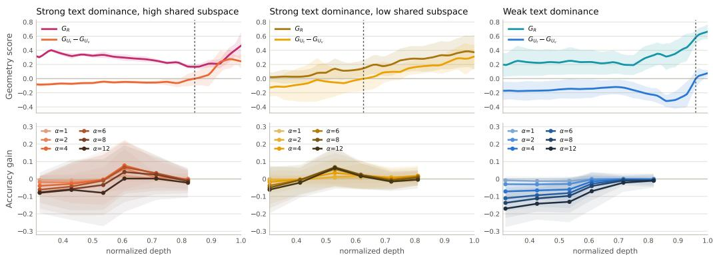  
Figure 4: Geometry-based intervention effects across three regimes: strong late-layer text-unique $G _ { U _ { t } }$ dominance with high shared geometry $G _ { R }$ (left), strong text-unique dominance with low shared geometry (middle), and weak text-unique dominance (right). Top: layer-wise profiles of shared geometry $G _ { R }$ and the difference $G _ { U _ { t } } - G _ { U _ { v } }$ . Bottom: mean accuracy gains from the intervention in Eq. 11 at different $\ell ^ { * }$ and α. The strong text dominance regimes favor early interventions with high amplification strengths, whereas the weak text dominance regime shows degradation under strong early interventions.

## 3.2 CAN GEOMETRY GUIDE INTERVENTION SETTINGS?

The effectiveness of vision-unique amplification correlates strongly with the base models’ geometric profiles. Appendix E.9 shows that the layer-wise trajectory of $G _ { R } , G _ { U _ { t } } , G _ { U _ { v } }$ , and S shows a strong association with intervention gain with up to pearson correlation $r ~ = ~ 0 . 8 0$ Motivated by this predictive capability, we derive a fixed intervention rule based on the three geometric patterns identified in Figure 4 . For representations exhibiting strong late-layer text dominance $\left( G _ { U _ { t } } - G _ { U _ { v } } \geq 0 . 1 \right)$ alongside a broad early shared geometry $\left( G _ { R } \ge 0 . 2 9 6 \right)$ , a moderate visual amplification $( l ^ { * } / L = 0 . 6 , \alpha = 4 )$ is optimal. When this early shared space is weak, earlier and stronger amplification (0.5, 8) is required to integrate the modalities. Conversely, representations with weak text dominance naturally maintain geometric balance and necessitate only minimal, latestage amplification (0.7, 1). Applying this deterministic rule across all 308 model-benchmark pairs (Table 5) yields a relative accuracy gain of 4.62%. Furthermore, compared to established trainingfree baselines (Favero et al., 2024; Leng et al., 2024; Liu et al., 2024a; Chuang et al., 2024) and a training-based PID baseline (Fang et al., 2026) in Table 4, GEOPID achieves the highest overall accuracy and absolute gain while maintaining a minimal damage rate. Unlike global or heuristic shifts that often disrupt pre-existing knowledge, selectively targeting the vision-unique subspace effectively balances error correction with capability preservation.

## 4 CONCLUSION

We present a framework to geometrically analyze and steer how VLMs distribute and utilize multimodal information via GEOPID. Specifically, adjusting the depth and strength of the intervention based on early shared geometry and text dominance leads to consistent gains across diverse bench marks. Ultimately, our intervention shows that appropriately configured subspace manipulation can reliably enhance model performance. This framework provides a useful tool for analyzing multimodal representation spaces and addressing reasoning bottlenecks without costly retraining.

## AI USE STATEMENT

In this work, we used generative AI tools for supporting qualitative data analysis, specifically for categorizing the evaluation questions based on their evidence requirements as detailed in Appendix D. We have not used generative AI tools for generating synthetic data sets, formulating theoretical models, or writing mathematical proofs, and the rest of the required disclosure tasks are not applicable to this work. Additionally, we used generative AI tools to polish writing to improve readability and format LaTeX tables. We have reviewed all AI-assisted work. Specifically, the question categorizations generated by Claude Opus 5 (Anthropic, 2026) were subjected to manual review, and all AI-formatted LaTeX tables and text revisions were verified for accuracy by the authors. We take responsibility for the final content of this work, including text, claims, or artifacts produced with the aid of generative AI.

## ETHICS STATEMENT

In conducting this research, we utilized publicly available vision-language benchmarks and evaluated explicitly grounded models. We ensured strict adherence to data compliance protocols, particularly regarding the handling of potential personally identifiable information that may be present in real-world image datasets. All model and dataset usage was reviewed for proper licensing and ethical compliance. We anticipate no direct societal harm from the GEOPID framework, as it serves as a training-free inference intervention to improve visual grounding and mitigate hallucination, rather than a generative source of new multimodal content.

## REPRODUCIBILITY STATEMENT

It is important that the work published in ICLR is reproducible. While the source code cannot be publicly released at this time, we ensure full reproducibility by explicitly detailing all necessary experimental configurations, implementations, and mathematical formulations within the manuscript. Specifically, the exact construction of the geometric subspaces and the complementary projection are fully specified via equations in Section 2 and Appendix E. All hyperparameter settings, including the rank (r) for batch-wise PCA, intervention depth (l∗), and amplification strength (α), are comprehensively documented in Section 3 and Appendix C. Furthermore, all evaluations were conducted using strictly publicly available vision-language benchmarks and open-weight models, ensuring that independent researchers can fully reconstruct and verify the GEOPID framework based solely on the provided theoretical formulations and procedural details.

## REFERENCES

Anthropic. Claude opus 5 system card, 2026. URL https://www.alphaxiv.org/abs/ 2607.claude-opus-5.

Shuai Bai, Yuxuan Cai, Ruizhe Chen, Keqin Chen, Xionghui Chen, Zesen Cheng, Lianghao Deng, Wei Ding, Chang Gao, Chunjiang Ge, et al. Qwen3-vl technical report. arXiv preprint arXiv:2511.21631, 2025a.

Shuai Bai, Keqin Chen, Xuejing Liu, Jialin Wang, Wenbin Ge, Sibo Song, Kai Dang, Peng Wang, Shijie Wang, Jun Tang, Humen Zhong, Yuanzhi Zhu, Mingkun Yang, Zhaohai Li, Jianqiang Wan,

Pengfei Wang, Wei Ding, Zheren Fu, Yiheng Xu, Jiabo Ye, Xi Zhang, Tianbao Xie, Zesen Cheng, Hang Zhang, Zhibo Yang, Haiyang Xu, and Junyang Lin. Qwen2.5-vl technical report, 2025b. URL https://arxiv.org/abs/2502.13923.

Mohamed Ishmael Belghazi, Aristide Baratin, Sai Rajeshwar, Sherjil Ozair, Yoshua Bengio, Aaron Courville, and Devon Hjelm. Mutual information neural estimation. In International conference on machine learning, pp. 531–540. PMLR, 2018.

Nils Bertschinger, Johannes Rauh, Eckehard Olbrich, Jurgen Jost, and Nihat Ay. Quantifying unique ¨ information. Entropy, 16(4):2161–2183, 2014.

Abhra Chaudhuri, Anjan Dutta, Tu Bui, and Serban Georgescu. A closer look at multimodal representation collapse. arXiv preprint arXiv:2505.22483, 2025.

Hardy Chen, Haoqin Tu, Fali Wang, Hui Liu, Xianfeng Tang, Xinya Du, Yuyin Zhou, and Cihang Xie. Sft or rl? an early investigation into training r1-like reasoning large vision-language models. arXiv preprint arXiv:2504.11468, 2025a.

Jiahe Chen, Jiaying He, Qiyuan Chen, Qian Shao, Jiahe Ying, Hongxia Xu, Jintai Chen, Jianwei Zheng, and Jian Wu. Curing semantic drift: A dynamic approach to grounding generation in large vision-language models. arXiv preprint arXiv:2506.21509, 2025b.

Yung-Sung Chuang, Yujia Xie, Hongyin Luo, Yoon Kim, James R Glass, and Pengcheng He. Dola: Decoding by contrasting layers improves factuality in large language models. In International Conference on Learning Representations, volume 2024, pp. 54158–54183, 2024.

Jacob Cohen. A coefficient of agreement for nominal scales. Educational and psychological measurement, 20(1):37–46, 1960.

Yihe Deng, Hritik Bansal, Fan Yin, Nanyun Peng, Wei Wang, and Kai-Wei Chang. Openvlthinker: An early exploration to complex vision-language reasoning via iterative self-improvement. arXiv e-prints, pp. arXiv–2503, 2025.

Wanlong Fang, Tianle Zhang, Wen Tao, and Alvin Chan. Towards understanding modality interaction in multimodal language models via partial information decomposition. arXiv preprint arXiv:2606.00959, 2026.

Alessandro Favero, Luca Zancato, Matthew Trager, Siddharth Choudhary, Pramuditha Perera, Alessandro Achille, Ashwin Swaminathan, and Stefano Soatto. Multi-modal hallucination control by visual information grounding. In 2024 IEEE/CVF Conference on Computer Vision and Pattern Recognition (CVPR), pp. 14303–14312. IEEE, 2024.

Jerome H Friedman. Greedy function approximation: a gradient boosting machine. Annals of statistics, pp. 1189–1232, 2001.

Chaoyou Fu, Peixian Chen, Yunhang Shen, Yulei Qin, Mengdan Zhang, Xu Lin, Jinrui Yang, Xiawu Zheng, Ke Li, Xing Sun, et al. Mme: A comprehensive evaluation benchmark for multimodal large language models. Advances in Neural Information Processing Systems, 38, 2026.

Luis Gonzalo Sanchez Giraldo, Murali Rao, and Jose C Principe. Measures of entropy from data using infinitely divisible kernels. IEEE Transactions on Information Theory, 61(1):535–548, 2014.

Tianrui Guan, Fuxiao Liu, Xiyang Wu, Ruiqi Xian, Zongxia Li, Xiaoyu Liu, Xijun Wang, Lichang Chen, Furong Huang, Yaser Yacoob, et al. Hallusionbench: an advanced diagnostic suite for entangled language hallucination and visual illusion in large vision-language models. In 2024 IEEE/CVF Conference on Computer Vision and Pattern Recognition (CVPR), pp. 14375–14385. IEEE, 2024.

Wenxuan Huang, Bohan Jia, Shaosheng Cao, Zheyu Ye, Zhe Xu, Yao Hu, Shaohui Lin, et al. Visionr1: Incentivizing reasoning capability in multimodal large language models. In International Conference on Learning Representations, volume 2026, pp. 63794–63812, 2026.

Ghazal Kaviani, Yavuz Yarici, Seulgi Kim, Mohit Prabhushankar, Ghassan AlRegib, Mashhour Solh, and Ameya Patil. Hierarchical and multimodal data for daily activity understanding. arXiv preprint arXiv:2504.17696, 2025.

Aniruddha Kembhavi, Mike Salvato, Eric Kolve, Minjoon Seo, Hannaneh Hajishirzi, and Ali Farhadi. A diagram is worth a dozen images. In European conference on computer vision, pp. 235–251. Springer, 2016.

Seulgi Kim, Ghazal Kaviani, Mohit Prabhushankar, and Ghassan AlRegib. Multi-level and multimodal action anticipation. In 2025 IEEE International Conference on Image Processing (ICIP), pp. 265–270. IEEE, 2025.

Seulgi Kim, Kiran Kokilepersaud, Mohit Prabhushankar, and Ghassan AlRegib. Countering multi modal representation collapse through rank-targeted fusion. In 2026 IEEE/CVF Winter Conference on Applications of Computer Vision (WACV), pp. 4744–4754. IEEE, 2026a.

Seulgi Kim, Mohit Prabhushankar, and Ghassan AlRegib. Information router for mitigating modality dominance in vision-language models. arXiv preprint arXiv:2604.16264, 2026b.

Kiran Kokilepersaud, Seulgi Kim, Mohit Prabhushankar, and Ghassan AlRegib. Hex: Hierarchical emergence exploitation in self-supervised algorithms. In 2025 IEEE/CVF Winter Conference on Applications ofComputer Vision (WACV), pp. 1111–1121. IEEE, 2025a.

Kiran Kokilepersaud, Mohit Prabhushankar, and Ghassan AlRegib. Adadim: Dimensionality adaptation for ssl representational dynamics. arXiv preprint arXiv:2505.12576, 2025b.

Hugo Laurenc¸on, Leo Tronchon, Matthieu Cord, and Victor Sanh. What matters when building´ vision-language models? Advances in Neural Information Processing Systems, 37:87874–87907, 2024.

Sicong Leng, Hang Zhang, Guanzheng Chen, Xin Li, Shijian Lu, Chunyan Miao, and Lidong Bing. Mitigating object hallucinations in large vision-language models through visual contrastive decoding. In Proceedings of the IEEE/CVF Conference on Computer Vision and Pattern Recognition, pp. 13872–13882, 2024.

Sicong Leng, Jing Wang, Jiaxi Li, Hao Zhang, Zhiqiang Hu, Boqiang Zhang, Yuming Jiang, Hang Zhang, Xin Li, Lidong Bing, et al. Mmr1: Enhancing multimodal reasoning with variance-aware sampling and open resources. arXiv preprint arXiv:2509.21268, 2025.

Baiqi Li, Zhiqiu Lin, Deepak Pathak, Jiayao Li, Yixin Fei, Kewen Wu, Tiffany Ling, Xide Xia, Pengchuan Zhang, Graham Neubig, et al. Genai-bench: Evaluating and improving compositional text-to-visual generation. arXiv preprint arXiv:2406.13743, 2024a.

Baiqi Li, Zhiqiu Lin, Wenxuan Peng, Jean De Dieu Nyandwi, Daniel Jiang, Zixian Ma, Simran Khanuja, Ranjay Krishna, Graham Neubig, and Deva Ramanan. Naturalbench: Evaluating visionlanguage models on natural adversarial samples. Advances in Neural Information Processing Systems, 37:17044–17068, 2024b.

Bo Li, Yuanhan Zhang, Dong Guo, Renrui Zhang, Feng Li, Hao Zhang, Kaichen Zhang, Peiyuan Zhang, Yanwei Li, Ziwei Liu, et al. Llava-onevision: Easy visual task transfer. arXiv preprint arXiv:2408.03326, 2024c.

Bohao Li, Rui Wang, Guangzhi Wang, Yuying Ge, Yixiao Ge, and Ying Shan. Seed-bench: Benchmarking multimodal llms with generative comprehension. arXiv preprint arXiv:2307.16125, 2023a.

Chunyuan Li, Cliff Wong, Sheng Zhang, Naoto Usuyama, Haotian Liu, Jianwei Yang, Tristan Naumann, Hoifung Poon, and Jianfeng Gao. Llava-med: Training a large language-and-vision assistant for biomedicine in one day. Advances in neural information processing systems, 36:28541– 28564, 2023b.

Yifan Li, Yifan Du, Kun Zhou, Jinpeng Wang, Xin Zhao, and Ji-Rong Wen. Evaluating object hallucination in large vision-language models. In Proceedings of the 2023 conference on empirical methods in natural language processing, pp. 292–305, 2023c.

Zeshang Li and Shuoyang Zhang. Geass: Gated evidence-adaptive selective caption trust for visionlanguage models. arXiv preprint arXiv:2605.01733, 2026.

Paul Pu Liang, Yun Cheng, Xiang Fan, Chun Kai Ling, Suzanne Nie, Richard Chen, Zihao Deng, Nicholas Allen, Randy Auerbach, Faisal Mahmood, et al. Quantifying & modeling multimodal interactions: An information decomposition framework. Advances in Neural Information Processing Systems, 36:27351–27393, 2023a.

Paul Pu Liang, Yun Cheng, Ruslan Salakhutdinov, and Louis-Philippe Morency. Multimodal fusion interactions: A study of human and automatic quantification. In Proceedings of the 25th International Conference on Multimodal Interaction, pp. 425–435, 2023b.

Stephen D Liang. Vision language model distillation using partial information decomposition. In ES-FoMo III: 3rd Workshop on Efficient Systemsfor Foundation Models, 2025.

Zhiqiu Lin, Deepak Pathak, Baiqi Li, Jiayao Li, Xide Xia, Graham Neubig, Pengchuan Zhang, and Deva Ramanan. Evaluating text-to-visual generation with image-to-text generation. In European Conference on Computer Vision, pp. 366–384. Springer, 2024.

Chengxin Liu, Wonseok Choi, Chenshuang Zhang, and Tae-Hyun Oh. Aligning what vision-language models see and perceive with adaptive information flow. arXiv preprint arXiv:2604.15809, 2026.

Sheng Liu, Haotian Ye, Lei Xing, and James Zou. Reducing hallucinations in vision-language models via latent space steering. arXiv preprint arXiv:2410.15778, 2024a.

Yuan Liu, Haodong Duan, Yuanhan Zhang, Bo Li, Songyang Zhang, Wangbo Zhao, Yike Yuan, Jiaqi Wang, Conghui He, Ziwei Liu, et al. Mmbench: Is your multi-modal model an all-around player? In European conference on computer vision, pp. 216–233. Springer, 2024b.

Pan Lu, Swaroop Mishra, Tanglin Xia, Liang Qiu, Kai-Wei Chang, Song-Chun Zhu, Oyvind Tafjord, Peter Clark, and Ashwin Kalyan. Learn to explain: Multimodal reasoning via thought chains for science question answering. Advances in neural information processing systems, 35:2507–2521, 2022.

Yan Ma, Linge Du, Xuyang Shen, Shaoxiang Chen, Pengfei Li, Qibing Ren, Lizhuang Ma, Yuchao Dai, Pengfei Liu, and Junjie Yan. One rl to see them all: Visual triple unified reinforcement learning. arXiv preprint arXiv:2505.18129, 2025.

Abdullah Makkeh, Dirk Oliver Theis, and Raul Vicente. Broja-2pid: A robust estimator for bivariate partial information decomposition. Entropy, 20(4):271, 2018.

Shunqi Mao, Chaoyi Zhang, and Weidong Cai. Through the magnifying glass: Adaptive perception magnification for hallucination-free vlm decoding. In Proceedings of the 64th Annual Meeting of the Associationfor Computational Linguistics (Volume 1: Long Papers), pp. 44480–44501, 2026.

Andres Marafioti, Orr Zohar, Miquel Farr´ e, Merve Noyan, Elie Bakouch, Pedro Cuenca, Cyril Za-´ kka, Loubna Ben Allal, Anton Lozhkov, Nouamane Tazi, et al. Smolvlm: Redefining small and efficient multimodal models. arXiv preprint arXiv:2504.05299, 2025.

Aaron van den Oord, Yazhe Li, and Oriol Vinyals. Representation learning with contrastive predictive coding. arXiv preprint arXiv:1807.03748, 2018.

Rapidata. The subjective truth: The human-preference leaderboard for text-to-image generation, 2026. URL https://benchmark.ai/. benchmark.ai, Text-to-Image benchmark, as of 2026-08-20.

Alfred R ´ enyi. On measures of entropy and information. In ´ Proceedings of the fourth Berkeley symposium on mathematical statistics and probability, volume 1: contributions to the theory of statistics, volume 4, pp. 547–562. University of California Press, 1961.

Olivier Roy and Martin Vetterli. The effective rank: A measure of effective dimensionality. In 2007 15th European Signal Processing Conference, pp. 606–610, 2007.

Gabriel Sarch, Snigdha Saha, Naitik Khandelwal, Ayush Jain, Michael Tarr, Aviral Kumar, and Katerina Fragkiadaki. Grounded reinforcement learning for visual reasoning. Advances in Neural Information Processing Systems, 38:150977–151013, 2026.

Dustin Schwenk, Apoorv Khandelwal, Christopher Clark, Kenneth Marino, and Roozbeh Mottaghi. A-okvqa: A benchmark for visual question answering using world knowledge. In European conference on computer vision, pp. 146–162. Springer, 2022.

Haozhan Shen, Peng Liu, Jingcheng Li, Chunxin Fang, Yibo Ma, Jiajia Liao, Qiaoli Shen, Zilun Zhang, Kangjia Zhao, Qianqian Zhang, et al. Vlm-r1: A stable and generalizable r1-style large vision-language model, 2025. URL https://arxiv. org/abs/2504.07615, 3(6):10, 2025.

Shengbang Tong, Ellis Brown, Penghao Wu, Sanghyun Woo, Manoj Middepogu, Sai C Akula, Jihan Yang, Shusheng Yang, Adithya Iyer, Xichen Pan, et al. Cambrian-1: A fully open, vision-centric exploration of multimodal llms. Advances in Neural Information Processing Systems, 37:87310– 87356, 2024.

Chao Wang, Jianming Yang, and Yang Zhou. Mint: Mitigating hallucinations in large visionlanguage models via token reduction. arXiv preprint arXiv:2502.00717, 2025a.

Haozhe Wang, Chao Qu, Zuming Huang, Wei Chu, Fangzhen Lin, and Wenhu Chen. Vl-rethinker: Incentivizing self-reflection of vision-language models with reinforcement learning. Advances in Neural Information Processing Systems, 38:30865–30891, 2026a.

Xiyao Wang, Zhengyuan Yang, Chao Feng, Hongjin Lu, Linjie Li, Chung-Ching Lin, Kevin Lin, Furong Huang, and Lijuan Wang. Sota with less: Mcts-guided sample selection for data-efficient visual reasoning self-improvement. Advances in Neural Information Processing Systems, 38: 118818–118850, 2026b.

Zihu Wang, Boxun Xu, Yuxuan Xia, and Peng Li. Vegas: Mitigating hallucinations in large vision-language models via vision-encoder attention guided adaptive steering. arXiv preprint arXiv:2512.12089, 2025b.

Kristoffer Wickstrøm, Sigurd Løkse, Michael Kampffmeyer, Shujian Yu, Jose Principe, and Robert Jenssen. Information plane analysis of deep neural networks via matrix-based renyi’s entropy and tensor kernels. arXiv preprint arXiv:1909.11396, 2019.

Paul L Williams and Randall D Beer. Nonnegative decomposition of multivariate information. arXiv preprint arXiv:1004.2515, 2010.

Hongxuan Wu, Yukun Zhang, and Xueqing Zhou. How vision becomes language: A layer-wise information-theoretic analysis of multimodal reasoning. arXiv preprint arXiv:2602.15580, 2026.

xAI. Realworldqa. https://x.ai/blog/grok-1.5v, 2024.

Lixin Xiu, Xufang Luo, and Hideki Nakayama. A comprehensive information-decomposition analysis of large vision-language models. arXiv preprint arXiv:2603.29676, 2026.

Yavuz Yarici and Ghassan AlRegib. Mer-dg: Modality-entropy regularization for multimodal domain generalization. In Forty-third International Conference on Machine Learning, 2026.

Jianghao Yin, Qin Chen, Kedi Chen, Jie Zhou, Xingjiao Wu, and Liang He. Dynamic multimodal activation steering for hallucination mitigation in large vision-language models. arXiv preprint arXiv:2602.21704, 2026.

Shujian Yu, Luis Gonzalo Sanchez Giraldo, Robert Jenssen, and Jose C Principe. Multivariate extension of matrix-based renyi’s alpha-order entropy functional. arXiv preprint arXiv:1808.07912, 2018.

Shujian Yu, Luis Gonzalo Sanchez Giraldo, Robert Jenssen, and Jose C Principe. Multivariate extension of matrix-based renyi’s ´ α-order entropy functional. IEEE transactions on pattern analysis and machine intelligence, 42(11):2960–2966, 2019.

Xiaoman Zhang, Chaoyi Wu, Ziheng Zhao, Weixiong Lin, Ya Zhang, Yanfeng Wang, and Weidi Xie. Pmc-vqa: Visual instruction tuning for medical visual question answering, 2024. URL https://arxiv. org/abs/2305.10415, 40, 2024.

Jianfei Zhao, Feng Zhang, Xin Sun, and Chong Feng. Mitigating hallucination in large visionlanguage models through aligning attention distribution to information flow. arXiv preprint arXiv:2505.14257, 2025.

Kening Zheng, Junkai Chen, Yibo Yan, Xin Zou, Huiyu Zhou, and Xuming Hu. Reefknot: A comprehensive benchmark for relation hallucination evaluation, analysis and mitigation in multimodal large language models. In Findings of the Association for Computational Linguistics: ACL 2025, pp. 6193–6212, 2025.

Jinguo Zhu, Weiyun Wang, Zhe Chen, Zhaoyang Liu, Shenglong Ye, Lixin Gu, Hao Tian, Yuchen Duan, Weijie Su, Jie Shao, et al. Internvl3: Exploring advanced training and test-time recipes for open-source multimodal models. arXiv preprint arXiv:2504.10479, 2025.

## A SUPPLEMENTARY

The appendix includes the following sections:

• § B Related Works

• § C Experimental Setup

• § D Question Category Annotation

• § E More Analysis

• § F More Results

• § G More Ablation Studies

• § H Robustness

## B RELATED WORKS

## B.1 ANALYZING MULTIMODAL INTERACTION WITH PID

Partial Information Decomposition (PID) (Williams & Beer, 2010) splits the information that two modalities provide about a task into redundant, unique, and synergistic parts. A line of work develops estimators for these quantities, from unique information definitions (Bertschinger et al., 2014) and dedicated PID solvers (Makkeh et al., 2018) to neural mutual-information estimators (Belghazi et al., 2018; Oord et al., 2018). Building on these, Liang et al. (2023b;a) proposed scalable esti mators that quantify multi-modal datasets and models from this perspective. The framework was then moved to use MLLMs (Fang et al., 2026; Wu et al., 2026). These works either decompose the modality contributions at the decision level (Fang et al., 2026), extend the PID decomposition layer by layer (Wu et al., 2026), or profile the information spectrum across 26 large VLMs (Xiu et al., 2026). Beyond diagnosis, several works attempt an intervention, either by teacher-student distillation (Liang, 2025), or by fine-tuning with PID-guided reweighting (Fang et al., 2026). However, these approaches share two limitations. First, they need a separate estimator to obtain the PID components, whose output is only approximate for continuous, high-dimensional representations. Second, any improvements they report are obtained through additional training. Unlike these, we read the information directly from the representation matrices via their rank, without assuming any distribution. We further turn the resulting diagnosis into a performance gain through a training-free intervention.

## B.2 REPRESENTATION GEOMETRY AND INFORMATION MEASUREMENT

The rank of a representation, i.e., how many independent directions it spans, has been used as a measure of a matrix’s information content and representational diversity (Roy & Vetterli, 2007; Renyi, 1961; Kokilepersaud et al., 2025a;b). Recent multi-modal fusion work uses it to diagnose´ modality contributions and modality collapse (Kim et al., 2026a; Chaudhuri et al., 2025; Yarici & AlRegib, 2026). These works treat every direction as equally useful and simply raise the total rank of the representation. However, the overall rank does not distinguish directions shared across modalities from those specific to each modality. We identify shared and modality-specific subspaces through the geometric relationships between visual and textual representations, and measure the answer-related information associated with these subspaces. This analysis identifies vision-unique directions as candidates for selective amplification.

## B.3 TRAINING-FREE INTERVENTIONS FOR VISUAL INFORMATION USE

A large body of work reduces VLM hallucination in a training-free manner. These methods eithe contrast the logits of a removed visual input to amplify the vision contribution (contrastive decoding) (Leng et al., 2024; Chen et al., 2025b), shift activations toward visual-perception directions (Liu et al., 2024a; Yin et al., 2026), intervene at the token level (Li & Zhang, 2026; Wang et al., 2025a), or adjust the information flow (Liu et al., 2026; Zhao et al., 2025; Mao et al., 2026; Wang et al., 2025b; Kim et al., 2026b). However, these methods do not explicitly use PID to identify the inter vention target. In contrast, our approach uses geometric PID analysis to identify a vision-unique subspace and selectively amplifies visual representation components along vision-unique subspace during inference.

## C EXPERIMENTAL SETUP

## C.1 MODELS

The model suite includes general-purpose instruction-tuned VLMs, reasoning-oriented models, and models developed for explicit visual grounding. Their nominal sizes range from approximately 2B to 8B parameters. The evaluated model weights remain fixed throughout these experiments.

Table 6: The 22 evaluated VLMs. Family denotes the multimodal model family or parent VLM.
<table><tr><td>Model</td><td>Size</td><td>Family / parent</td><td>Model type and emphasis</td></tr><tr><td colspan="4">General-purpose instruction-tuned VLMs</td></tr><tr><td>Qwen2.5-VL-7B (Bai et al., 2025b)</td><td>7B</td><td>Qwen2.5-VL</td><td>Image and document understanding with dynamic-resolution visual processing.</td></tr><tr><td>Qwen3-VL-8B (Bai et al., 2025a)</td><td>8B</td><td>Qwen3-VL</td><td>General multimodal instruction follow- ing; multi-level visual feature integra- tion.</td></tr><tr><td>InternVL3-8B (Zhu et al., 2025)</td><td>8B</td><td>InternVL3</td><td>Native multimodal pre-training with broad visual and linguistic capabilities.</td></tr><tr><td>InternVL3-2B (Zhu et al., 2025)</td><td>2B</td><td>InternVL3</td><td>Smaller-scale member of the same model family.</td></tr><tr><td>LLaVA-OV-7B (Li et al., 2024c)</td><td>7B</td><td>LLaVA-OneVision</td><td>Unified single-image, multi-image, and video understanding.</td></tr><tr><td>Idefics2-8B (Laurençon et al., 2024)</td><td>8B</td><td>Idefics2</td><td>Interleaved image-text understanding with pooled visual representations</td></tr><tr><td>SmolVLM-2B (Marafioti et al., 2025)</td><td></td><td>~2B SmolVLM</td><td>Compact instruction-tuned VLM with compressed visual representations.</td></tr><tr><td colspan="4">Reasoning- and task-oriented post-trained VLMs</td></tr><tr><td>MMR1-Math-7B (Leng et al., 2025)</td><td>7B</td><td>Qwen2.5-VL</td><td>Mathematical visual reasoning through GRPO-based post-training.</td></tr><tr><td>VL-Rethinker-7B (Wang et al., 2026a)</td><td>7B</td><td>Qwen2.5-VL</td><td>RL designed to encourage reflection and verification during reasoning.</td></tr><tr><td>OpenVLThinker-7B (Deng et al., 2025)</td><td>7B</td><td>Qwen2.5-VL</td><td>Iterative SFT and RL for multimodal chain-of-thought reasoning.</td></tr><tr><td>Orsta-7B (Ma et al., 2025)</td><td>7B</td><td>Qwen2.5-VL</td><td>Unified RL across reasoning and visual perception tasks.</td></tr><tr><td>ThinkLite-VL-7B (Wang et al., 2026b)</td><td>7B</td><td>Qwen2.5-VL</td><td>Data-efficient reinforcement fine-tuning with MCTS-guided sample selection.</td></tr><tr><td>VLAA-Thinker-Q2.5VL-7B et al., 2025a)</td><td>(Chen 7B</td><td>Qwen2.5-VL</td><td>Reasoning-oriented post-training with perceptual and cognitive reward signals.</td></tr><tr><td>VLAA-Thinker-Q2.5VL-3B et al., 2025a)</td><td>(Chen 3B</td><td>Qwen2.5-VL</td><td>Smaller Qwen2.5-VL variant in the VLAA-Thinker suite.</td></tr><tr><td>VLAA-Thinker-Q2VL-7B et al., 2025a)</td><td>(Chen 7B</td><td>Qwen2-VL</td><td>Qwen2-VL variant in the VLAA-Thinker suite.</td></tr><tr><td>VLAA-Thinker-Q2VL-2B et al., 2025a)</td><td>(Chen 2B</td><td>Qwen2-VL</td><td>Smaller Qwen2-VL variant in the VLAA-Thinker suite.</td></tr><tr><td>VLM-R1-OVD-3B (Shen et al., 2025)</td><td>3B</td><td>Qwen2.5-VL</td><td>RL specialization for open-vocabulary object detection.</td></tr><tr><td>VLM-R1-Math-3B (Shen et al., 2025)</td><td>3B</td><td>Qwen2.5-VL</td><td>RL specialization for multimodal mathe- matical reasoning.</td></tr><tr><td>Vision-R1-7B (Huang et al., 2026)</td><td>7B</td><td>Qwen2.5-VL</td><td>Multimodal reasoning using a reasoning- data cold start followed by RL.</td></tr><tr><td colspan="3">Table o (contiued)</td><td rowspan="2">Model type and emphasis</td></tr><tr><td>Model</td><td></td><td>Size Family / parent</td></tr><tr><td>Explicitly grounded reasoning models</td><td></td><td></td><td></td></tr><tr><td>ViGoRL-7B (Sarch et al., 2026) ViGoRL-3B (Sarch et al., 2026)</td><td>7B 3B</td><td>Qwen2.5-VL Qwen2.5-VL</td><td>Visually grounded reasoning with RL. Smaller-scale visually grounded RL</td></tr><tr><td>ViGoRL-MCTS-SFT-3B (Sarch et al., 3B Qwen2.5-VL</td><td></td><td></td><td>model. SFT on MCTS-generated, spatially</td></tr><tr><td>2026)</td><td></td><td></td><td>grounded reasoning traces.</td></tr></table>

## C.2 BENCHMARKS

The benchmark suite covers broad multimodal understanding (object recognition, spatial understanding), visual perception and hallucination, scientific, knowledge-based, and medical reasoning, and generated-image comparison. This diversity allows us to examine visual information use under different model architectures, post-training objectives, and task requirements. Our evaluation uses a common answer-choice scoring protocol, evaluated in a multiple-choice format including binary questions and pairwise image comparisons. For multiple-choice evaluation, we compare the model’s output logits for the answer choices and select the choice with the highest logit. We use identical prompts before and after intervention.

Table 7: The 14 evaluated benchmarks. The final column describes the answer format used in this study. Dataset codes follow the complete appendix tables.
<table><tr><td>Benchmark</td><td>Code</td><td>Task and visual content</td><td>Evaluation format</td></tr><tr><td colspan="4">Broad multimodal understanding</td></tr><tr><td>MME (Fu et al., 2026)</td><td>MME</td><td>Perception and cognition, including recogni- Binary answer selec- tion and reasoning.</td><td>tion</td></tr><tr><td>MMBench (Liu et al., MMB 2024b)</td><td></td><td>Multiple visual perception and reasoning abil- Multiple-choice ities.</td><td>selection</td></tr><tr><td>SEED-Bench (Li et al., SEE 2023a)</td><td></td><td>Visual comprehension across several evalua- Multiple-choice tion dimensions.</td><td>selection</td></tr><tr><td colspan="4">Visual perception and hallucination</td></tr><tr><td>POPE (Li et al., 2023c) POP</td><td>ages.</td><td>Presence or absence of objects in natural im- Binary answer selec-</td><td>tion</td></tr><tr><td>HallusionBench (Guan HAL et al., 2024)</td><td></td><td>Image-context reasoning, language hallucina- Binary answer selec- tion, and visual illusion.</td><td>tion</td></tr><tr><td>CV-Bench (Tong et al., CVB 2024)</td><td></td><td>Counting and spatial relations in 2D; depth and Multiple-choice relative distance in 3D.</td><td>selection</td></tr><tr><td>2024b)</td><td>NaturalBench (Li et al., NAT</td><td>Natural image-question pairs designed to ex- Answer-choice selec- pose visual reasoning errors.</td><td>tion</td></tr><tr><td>RealWorldQA 2024)</td><td>(xAI, RWQ</td><td>Understanding real scenes and spatial relation- Multiple-choice sub- ships.</td><td>set</td></tr><tr><td>Reefknot (Zheng et al., REE 2025)</td><td></td><td>Perceptive and cognitive relations, including Answer-choice subset relation hallucinations.</td><td></td></tr><tr><td colspan="4">Scientific, knowledge-based, and medical reasoning</td></tr><tr><td>AI2D (Kembhavi et al., AI2 2016)</td><td></td><td>Scientific diagrams, labels, components, and Multiple-choice their relationships.</td><td>selection</td></tr><tr><td>ScienceQA (Lu et al., SCI 2022)</td><td></td><td>Science questions with visual and textual con- Image-containing MC text.</td><td>subset</td></tr><tr><td>A-OKVQA (Schwenk AOK et al., 2022)</td><td></td><td>Questions combining natural images with Multiple-choice commonsense or world knowledge.</td><td>selection</td></tr><tr><td colspan="4">Generated-image comparison</td></tr><tr><td>Rapidata-4o (Rapidata, RAP 2026)</td><td></td><td>Human judgments of generated images, in- Pairwise image selec- cluding prompt alignment.</td><td>tion</td></tr></table>

Continued on next page

Table 7 (continued)
<table><tr><td>Benchmark</td><td>Task and visual content</td></tr><tr><td>GenAI-Bench (Li et al., GEN 2024a)</td><td>Compositional text-to-image alignment and Pairwise image selec- human judgments.</td></tr></table>

## D QUESTION CATEGORY ANNOTATION

Questions within the same benchmark can differ in the evidence needed to answer them. Some can be resolved from text and prior knowledge, whereas others require visual observations or the combination of textual and visual evidence. To distinguish these requirements, we assign each evaluated question to one of four categories: text-sufficient (T), text-prior (T−), visual-observation (V), or joint-vision and text (J). These categories describe the evidence requirements inferred from the question and its accompanying information. We first define the taxonomy D.1, then describe its application D.2 and validation D.3, and finally report the category distribution across benchmarks D.4.

## D.1 DEFINITION

Each question receives exactly one category. The taxonomy distinguishes whether the text determines the correct answer (T), merely suggests it (T−), directs the reader to a visual observation (V), or supplies substantive information that must be combined with the image (J).

T: Text sufficient. The question, answer options, and any supplied hint or context, together with general or domain knowledge, determine the correct option without the image. Examples include factual or definitional questions, option sets with only one logically possible answer, and hints that explicitly provide the answer. Operationally, a reader given the text alone would confidently select the gold option.

T−: Text prior. The text makes the ground truth more plausible than the alternatives, but does not establish it with confidence: the particular image could change the answer. Examples include generic cause–effect questions about food webs and relations suggested by common sense but not guaranteed by the text. A reader given the text alone would lean toward the ground truth without being certain. This category is denoted A in the original annotation files; we use T− throughout the paper.

V: Visual observation. The answer depends on observing the image, while the text primarily specifies what to inspect. Examples include object identification, counting, localization, color recognition, reading a diagram label, and questions about whether an object is present. Such questions remain V even though their instructions are expressed in text.

J: Joint evidence. The text supplies substantive content, such as a description, premise, or claim, that must be matched against or applied to the image. Neither modality alone determines the answer. Examples include selecting the image that best matches a description, checking a stated value or ranking against a chart, and interpreting text–image incongruity.

Benchmark-specific definition. The same definitions apply across benchmarks. The annotation instructions additionally clarify boundaries for formats that can otherwise be ambiguous:

• AI2D (Kembhavi et al., 2016). Science facts independent of the particular diagram are T; labels, depicted stages, and connections that must be read from the diagram are V; generic cause-effect questions about a food web can be T− when prior knowledge suggests but does not determine the answer.

• A-OKVQA (Schwenk et al., 2022). A factual question about an object explicitly named in the text is T if the photograph is unnecessary. A common-sense answer that the photograph could overturn is T−, while an answer requiring observation of the photograph is V.

• Reefknot (Zheng et al., 2025). Relations largely determined or suggested by the named entities and answer options can be T or T−. Spatial and action relations that depend on the depicted scene are V.

• NaturalBench (Li et al., 2024b). Simple perception questions are V. Compositional descriptions that supply constraints to be checked against the image, including combinations of attributes, counts, relations, or negations, are J.

• HallusionBench (Guan et al., 2024) and MME (Fu et al., 2026). Questions about plain image content are V, whereas substantive claims involving a value, date, ranking, name, sentence, or translation to be verified against the image are J. A question is T only when the text alone establishes the gold answer. In particular, because HallusionBench can contain edited images that conflict with prior knowledge, a familiar answer is not sufficient for assignment to T.

## D.2 ANNOTATION PROTOCOL

Annotated item pool. We assign evidence-requirement categories to all 11,372 items in the intervention evaluation pool across 14 benchmarks. For each benchmark, we include up to the first 700 valid items. This is for limiting differences in benchmark contributions since HallusionBench (Guan et al., 2024) and RealWorldQA (xAI, 2024) only contribute 447 and 425 valid items, respectively. We include only items with at least one image, at least two answer options, and a ground-truth answer corresponding to one of the provided options.

Information available for annotation. We use Claude Opus 5 (Anthropic, 2026) as an annotator. Annotations use the question, answer options, any supplied hint or context passage, the ground truth, the benchmark’s category metadata, and the number of images. The annotator does not see the images, model predictions, or any accuracy measurements. The ground truth is included to assess whether textual evidence determines or merely favors the correct answer, particularly at the T/T− boundary. Each benchmark was processed in one annotation run supplied with the category definitions, the relevant benchmark-specific clarifications, and the full item list. The annotator was required to return exactly one category for each item. All output files were checked for complete coverage, with one label per item.

## D.3 ANNOTATION VALIDATION

We assess the annotations in two ways: agreement between two runs and correspondence with model behavior when visual input is removed.

Judge agreement. For the 100 AI2D (Kembhavi et al., 2016) data shared across models in the blank-image evaluation, we compare the full annotation with a pilot annotation produced before it. The two runs agree on 87% of items, with Cohen’s κ = 0.80 (Cohen, 1960). Disagreements only occur at the textual-sufficiency boundary (whether the question is T or T−).

Image removal validation. On the same 100 AI2D (Kembhavi et al., 2016) data, models achieve 89.1% accuracy on T items with a blank image, compared with 29.2% on V items. Note that 29.2% is close to the four-option chance level of 25%. This difference is consistent with the intended distinction between textual sufficiency and visual dependence.

Additionally, we measure the accuracy drop by replacing actual image with blank image. As shown in Table 8, image removal reduces accuracy by 3.9 percentage points on T, but 35.4 on V and 28.9 on J. The small reduction for T and larger reductions for V and J support the intended distinctions.

Table 8: Accuracy reduction after replacing images with blank inputs, aggregated over model-item pairs. Larger reductions indicate greater sensitivity to visual input removal.
<table><tr><td>Category</td><td>Accuracy drop (pp)</td><td>Difference from T (pp)</td></tr><tr><td>T</td><td>3.9</td><td>0.0</td></tr><tr><td>T⁻</td><td>19.3</td><td>15.4</td></tr><tr><td>V</td><td>35.4</td><td>31.5</td></tr><tr><td>J</td><td>28.9</td><td>25.0</td></tr></table>

## D.4 ANNOTATION RESULTS

Table 9 reports the category counts for each benchmark. The distribution varies substantially across benchmarks. POPE (Li et al., 2023c) and CV-Bench (Tong et al., 2024) are entirely V, while GenAI-Bench (Li et al., 2024a) and Rapidata-4o (Rapidata, 2026) are entirely J. In contrast, Reefknot (Zheng et al., 2025) contains predominantly T and $\mathbf { T } ^ { - }$ , and AI2D (Kembhavi et al., 2016) and ScienceQA (Lu et al., 2022) contain substantial text-sufficient subsets.

A pooled comparison between categories can also reflect differences between benchmarks. We therefore use within-model-benchmark contrasts for category comparisons intended to separate evidence requirements from benchmark effects. Only benchmarks with at least two represented categories can contribute to such within-cell contrasts, and any additional group-size and answerbalancing criteria are applied separately for the corresponding information analysis. The counts below describe the full annotation pool.

Table 9: Evidence-requirement categories in the evaluated item pool.
<table><tr><td>Benchmark</td><td>Items</td><td>T</td><td>T⁻</td><td>V</td><td>J</td></tr><tr><td>POPE (Li et al., 2023c)</td><td>700</td><td>0</td><td>0</td><td>700</td><td>0</td></tr><tr><td>CV-Bench (Tong et al., 2024)</td><td>700</td><td>0</td><td>0</td><td>700</td><td>0</td></tr><tr><td>RealWorldQA (xAI, 2024)</td><td>425</td><td>0</td><td>0</td><td>425</td><td>0</td></tr><tr><td>GenAI-Bench (Li et al., 2024a)</td><td>700</td><td>0</td><td>0</td><td>0</td><td>700</td></tr><tr><td>Rapidata-4o (Rapidata, 2026)</td><td>700</td><td>0</td><td>0</td><td>0</td><td>700</td></tr><tr><td>HallusionBench (Guan et al., 2024)</td><td>447</td><td>123</td><td>32</td><td>199</td><td>93</td></tr><tr><td>MME (Fu et al., 2026)</td><td>700</td><td>0</td><td>0</td><td>238</td><td>462</td></tr><tr><td>NaturalBench (Li et al., 2024b)</td><td>700</td><td>0</td><td>0</td><td>480</td><td>220</td></tr><tr><td>MMBench (Liu et al., 2024b)</td><td>700</td><td>71</td><td>24</td><td>600</td><td>5</td></tr><tr><td>SEED-Bench (Li et al., 2023a)</td><td>700</td><td>7</td><td>28</td><td>645</td><td>20</td></tr><tr><td>AI2D (Kembhavi et al., 2016)</td><td>700</td><td>261</td><td>124</td><td>315</td><td>0</td></tr><tr><td>A-OKVQA (Schwenk et al., 2022)</td><td>700</td><td>69</td><td>62</td><td>569</td><td>0</td></tr><tr><td>ScienceQA (Lu et al., 2022)</td><td>700</td><td>406</td><td>21</td><td>233</td><td>40</td></tr><tr><td>Reefknot (Zheng et al., 2025)</td><td>700</td><td>481</td><td>164</td><td>55</td><td>0</td></tr><tr><td colspan="4">Total 1,676</td><td>571 6,744</td><td>2,381</td></tr></table>

## E MORE ANALYSIS

## E.1 EQ. 1, 5, 6: DETERMINING $r _ { b } , r _ { u } , r _ { s }$ IN BATCH-WISE PCA

The modality rank cap $r _ { b }$ in Eq. 1 controls the estimated subspace removed from the opposite modality, while the unique rank cap $r _ { u }$ in Eq. 5 controls how many principal directions are retained after this removal. Since modality representations contain both shared and unique structure, we allocate a larger rank budget to the modality bases $( r _ { b } = 6 4 )$ ) and a smaller budget to the unique directions retained after removing the opposite modality’s estimated subspace $( r _ { u } = 3 2 )$ . For the combined basis B in Eq. 6, we allocate the sum of the two modality rank budgets, $r _ { s } = 6 4 + 6 4 = 1 2 8$ , to represent both modalities.

We evaluate rank sensitivity by varying $r _ { u }$ from 16 to 512 while keeping $r _ { b }$ and $r _ { s }$ fixed (Table 10). Although the magnitude of $U _ { v }$ changes, the evaluated models retain the same ordering (Spearman $\rho = 1 . 0 0 0$ relative to $r _ { u } = 3 2 )$ , supporting the stability of cross-model comparisons over the tested range. For intervention, rank 8 improves gain over rank 32 by a median 0.67 percentage points across 40 matched model-benchmark pairs (Table 11). This improvement at $r _ { u } = 8$ suggests separately calibrating the intervention rank may yield even further gains for the future work.

## E.2 DETAILS OF SECTION 2.1

This subsection supplements the geometric construction in Section 2.1. We first visualize the modality representations used to estimate the bases in Eq. 1, then establish the orthogonality of the unique directions in Eq. 5, and finally describe how to implement the complementary projection defined by Eq. 7.

Table 10: Sensitivity of $U _ { v }$ to the vision-unique rank cap $r _ { u }$ across 6 models and 3 benchmarks. Mean $U _ { v }$ is the equally weighted average of the two previously reported group means. $\rho$ is the Spearman correlation of the model ordering by $U _ { v }$ with the default setting $r _ { u } = 3 2$ . The magnitude increases with the cap, while the model ordering remains unchanged.
<table><tr><td> $r _ { u }$  Mean</td><td> $U _ { v }$ </td><td> $\rho \mathrm { v s } r _ { u } = 3 2$ </td></tr><tr><td>16</td><td>0.01455</td><td>1.000</td></tr><tr><td>32</td><td>0.01890</td><td>1.000</td></tr><tr><td>64</td><td>0.02495</td><td>1.000</td></tr><tr><td>128</td><td>0.03115</td><td>1.000</td></tr><tr><td>256</td><td>0.03965</td><td>1.000</td></tr><tr><td>512</td><td>0.04785</td><td>1.000</td></tr></table>

Table 11: Accuracy gain by changing the rank of $G _ { U _ { V } }$ during the intervention stage. Each entry is the mean accuracy gain (pp) over the six configurations the rank sweep and the main grid share $( \ell / L \in \{ 0 . 5 , 0 . 6 , 0 . { \overset { \vartriangle } { \ 7 } } \times \alpha \overset { \vartriangle } { \in } \{ 2 , 4 \} )$ ), with the change from the $r _ { u } = 3 2$ default in parentheses.
<table><tr><td>Model</td><td> $r _ { u } = 4$ </td><td> $r _ { u } = 8$ </td><td> $r _ { u } = 1 6$ </td><td> $r _ { u } = 3 2$ </td></tr><tr><td>ViGoRL-7B (Sarch et al., 2026)</td><td>+13.3 (−3.5)</td><td> $+ 2 1 . 1 \ : ( + 4 . 2 )$ </td><td> $+ 1 9 . 1 \left( + 2 . 3 \right)$ </td><td>+16.9</td></tr><tr><td>ViGoRL-3B (Sarch et al., 2026)</td><td>+2.6 (−0.9)</td><td> $+ 5 . 7 \left( + 2 . 2 \right)$ </td><td>+3.9 (+0.4)</td><td>+3.5</td></tr><tr><td>ViGoRL-MCTS-3B (Sarch et al., 2026)</td><td>+2.4(+0.0)</td><td> $+ 3 . 6 \ : ( + 1 . 2 ) $ </td><td>+3.4 (+1.0)</td><td>+2.4</td></tr><tr><td>OpenVLThinker-7B (Deng et al., 2025)</td><td>−2.4(+0.1)</td><td>−2.9 (−0.4)</td><td>−3.5 (−1.0)</td><td>-2.5</td></tr><tr><td>Vision-R1-7B (Huang et al., 2026)</td><td>−3.2 (−0.2)</td><td>−3.1 (−0.0)</td><td>-2.7(+0.3)</td><td>-3.0</td></tr></table>

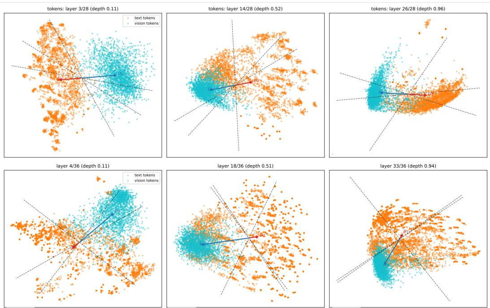  
Figure 5: Illustrative two-dimensional projections of visual and textual representations across decoder depth on MMBench (Liu et al., 2024b). Top: Qwen2.5-VL-7B (Bai et al., 2025b) at layers 3, 14, and 26 under the displayed 28-layer indexing. Bottom: ViGoRL-3B (Sarch et al., 2026) at layers 4, 18, and 33 under the displayed 36-layer indexing. Cyan and orange points denote visual and textual representations, respectively. Arrows mark modality means. Dashed lines indicate answerreadout axes.

Details of Eq. 1. Figure 5 provides illustrative two-dimensional projections of the vision and text representations used to estimate the modality bases. For both Qwen2.5-VL-7B (Bai et al., 2025b) and ViGoRL-3B (Sarch et al., 2026), the relative orientation and spread of the two representation distributions vary across decoder depth. In the late-layer, Qwen2.5-VL-7B (Bai et al., 2025b) retains a broadly distributed visual representation cloud, whereas ViGoRL-3B (Sarch et al., 2026) shows a more concentrated visual distribution relative to its text representations. These views illustrate differences in the underlying representations.

Details of Eq. 5. The unique bases are orthogonal to the opposite modality’s estimated subspace:

$$
B _ { t } ^ { \top } G _ { U _ { v } } = 0 , \qquad B _ { v } ^ { \top } G _ { U _ { t } } = 0 .\tag{12}
$$

To see this, since $B _ { t }$ has orthonormal columns,

$$
B _ { t } ^ { \top } ( I - B _ { t } B _ { t } ^ { \top } ) = 0 .\tag{13}
$$

Thus, the range of the residual covariance $( I - B _ { t } B _ { t } ^ { \top } ) C _ { v } ( I - B _ { t } B _ { t } ^ { \top } )$ is orthogonal to $B _ { t }$ . Every eigenvector with a positive eigenvalue lies in this range, so the retained directions forming $G _ { U _ { \imath } }$ satisfy $B _ { t } ^ { \top } G _ { U _ { v } } = 0$ . The same argument applies to $G _ { U _ { t } }$ after exchanging vision and text.

Details of Eq. 7. The complementary projection can be computed without explicitly constructing $G _ { S } \in \mathbb { R } ^ { d \times ( d - r _ { V T } ) }$ , where $r _ { V T }$ is the number of orthonormal columns in $B _ { V T }$ . Let H contain the decision representations as rows. Using $\begin{array} { r } { G _ { S } G _ { S } ^ { \top } = I - B _ { V T } B _ { V T } ^ { \top } } \end{array}$ , we compute the complementary representations directly:

$$
H ( I - B _ { V T } B _ { V T } ^ { \top } ) = H - ( H B _ { V T } ) B _ { V T } ^ { \top } .\tag{14}
$$

This representation preserves the Gram matrix obtained from explicit complementary coordinates:

$$
\begin{array} { r l } & { \left[ H ( I - B _ { V T } B _ { V T } ^ { \top } ) \right] \left[ H ( I - B _ { V T } B _ { V T } ^ { \top } ) \right] ^ { \top } } \\ & { \qquad = H ( I - B _ { V T } B _ { V T } ^ { \top } ) H ^ { \top } = ( H G _ { S } ) ( H G _ { S } ) ^ { \top } . } \end{array}\tag{15}
$$

Thus, both implementations yield identical pairwise inner products and norms, without requiring storage of an explicit complementary basis.

## E.3 IMPLEMENTATION OF INFORMATION MEASUREMENT (EQ. 8)

For the cosine kernel $K _ { Z }$ with unit diagonal and the label kernel $\mathbf { 1 } [ y _ { i } ~ = ~ y _ { j } ]$ , we compute the matrix-based Renyi-2 mutual information (Giraldo et al., 2014; Yu et al., 2019; 2018) directly from´ the kernel entries:

$$
I _ { 2 } ( Z ; Y ) = \log \frac { N _ { \mathscr { B } } ^ { 2 } \displaystyle \sum _ { i , j \in \mathscr { B } } K _ { Z } [ i , j ] ^ { 2 } } { \left( \displaystyle \sum _ { i , j \in \mathscr { B } } K _ { Z } [ i , j ] ^ { 2 } \right) \left( \displaystyle \sum _ { c } n _ { c } ^ { 2 } \right) } ,\tag{16}
$$

where $n _ { c }$ is the number of examples with label c in the batch. In implementation, we square the entries of $K _ { Z }$ and sum them over all sample pairs and over pairs with matching labels. Together with the label counts, these sums give $I _ { 2 } ( Z ; \bar { Y } )$ without an eigendecomposition. This expression is exactly equivalent to the trace-normalized Renyi-2 formulation, since the trace of a symmetric´ matrix squared equals the sum of its squared entries.

## E.4 VALIDATING THE CORRESPONDENCE DEPENDENCE (EQ. 10) OF S

Section 2.1 defines S as the difference in answer information measured within $G _ { S }$ between matched and mismatched image–text inputs. To examine whether this difference depends on replacing the image with one from another category, we compare matched images, same-category substitutes, different-category substitutes, and blank inputs. Table 12 reports three examples. For InternVL3- 8B (Zhu et al., 2025) on MMBench (Liu et al., 2024b), answer information within $G _ { S }$ falls from 0.4150 with the matched image to 0.0323 with a same-category substitute, close to 0.0274 with a different-category substitute. The other two examples show the same pattern. Thus, the reduction occurs even when the substitute preserves the image category. This supports interpreting S as sensitive to the specific image-text correspondence, rather than attributing the reduction solely to a change in image category or the removal of visual input.

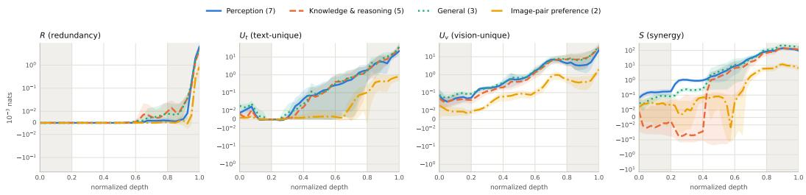  
Figure 6: Layer-wise information profiles by the tasks: perception (7 benchmarks), knowledge and reasoning (5), general (3), and image-pair preference (2). Image-pair preference tasks show a later rise in $U _ { t }$ than others.

Table 12: Answer information measured within $G _ { S }$ under various image substitutions. Three representative examples are shown. ‘Same category’ and ‘Different category’ indicate whether the original image was replaced with another image from the same question category or from a completely different category.
<table><tr><td>Model / Benchmark</td><td>Matched</td><td>Same category</td><td>Different category</td><td>Blank</td></tr><tr><td>InternVL3-8B (Zhu et al., 2025) / MMBench (Liu et al., 2024b)</td><td>0.4150</td><td>0.0323</td><td>0.0274</td><td>0.0149</td></tr><tr><td>Qwen2.5-VL-7B (Bai et al., 2025b) / POPE (Li et al., 2023c)</td><td>0.1882</td><td>0.0106</td><td>0.0055</td><td>0.0010</td></tr><tr><td>ViGoRL-3B (Sarch et al., 2026) / MMBench (Liu et al., 2024b)</td><td>0.0098</td><td>0.0033</td><td>0.0031</td><td>0.0019</td></tr></table>

Table 13: Information measurements across benchmarks.
<table><tr><td>Benchmark</td><td> $I _ { 2 }$ </td><td> $R$ </td><td> $U _ { v }$ </td><td> $U _ { t }$ </td><td> $S$ </td></tr><tr><td>MMBench (Liu et al., 2024b)</td><td>0.0483</td><td>0.0063</td><td>0.0595</td><td>0.0566</td><td>0.3001</td></tr><tr><td>A-OKVQA (Schwenk et al., 2022)</td><td>0.0501</td><td>0.0067</td><td>0.0435</td><td>0.0408</td><td>0.2973</td></tr><tr><td>SEED-Bench (Li et al., 2023a)</td><td>0.0340</td><td>0.0052</td><td>0.0367</td><td>0.0308</td><td>0.1940</td></tr><tr><td>POPE (Li et al., 2023c)</td><td>0.0459</td><td>0.0153</td><td>0.0386</td><td>0.0385</td><td>0.1860</td></tr><tr><td>Reefknot (Zheng et al., 2025)</td><td>0.0341</td><td>0.0034</td><td>0.0275</td><td>0.0192</td><td>0.1844</td></tr><tr><td>MME (Fu et al., 2026)</td><td>0.0349</td><td>0.0111</td><td>0.0358</td><td>0.0355</td><td>0.1738</td></tr><tr><td>ScienceQA (Lu et al., 2022)</td><td>0.0516</td><td>0.0079</td><td>0.0651</td><td>0.0382</td><td>0.1641</td></tr><tr><td>AI2D (Kembhavi et al., 2016)</td><td>0.0368</td><td>0.0047</td><td>0.0446</td><td>0.0663</td><td>0.1634</td></tr><tr><td>NaturalBench (Li et al., 2024b)</td><td>0.0145</td><td>0.0036</td><td>0.0159</td><td>0.0113</td><td>0.0796</td></tr><tr><td>HallusionBench (Guan et al., 2024)</td><td>0.0122</td><td>0.0019</td><td>0.0136</td><td>0.0160</td><td>0.0787</td></tr><tr><td>CV-Bench (Tong et al., 2024)</td><td>0.0227</td><td>0.0047</td><td>0.0188</td><td>0.0099</td><td>0.0652</td></tr><tr><td>RealWorldQA (xAI, 2024)</td><td>0.0131</td><td>0.0026</td><td>0.0115</td><td>0.0136</td><td>0.0543</td></tr><tr><td>Rapidata-4o (Rapidata, 2026)</td><td>0.0021</td><td>0.0008</td><td>0.0020</td><td>0.0009</td><td>0.0160</td></tr><tr><td>GenAI-Bench (Li et al., 2024a)</td><td>0.0019</td><td>0.0009</td><td>0.0020</td><td>0.0007</td><td>0.0088</td></tr></table>

## E.5 FIGURE 2(B) ACROSS ALL BENCHMARKS

Different tasks expose different profiles. Table 13 reports the PID measurements across benchmarks. MMBench (Liu et al., 2024b) and A-OKVQA (Schwenk et al., 2022) have the largest reported S, followed by SEED-Bench (Li et al., 2023a) and POPE (Li et al., 2023c). Rapidata-4o (Rapidata, 2026) and GenAI-Bench (Li et al., 2024a) have much smaller absolute values, 0.0160 and 0.0088. Figure 6 groups the benchmarks into perception, knowledge and reasoning, general, and image-pair preference tasks. Image-pair preference tasks show a later rise in $U _ { t } { : }$ it remains near zero through much of the middle layers, while the other task families show an earlier increase. Thus, task families differ not only in the amount of measured answer information but also in the depth at which it becomes apparent.

Overall information $\left( I _ { 2 } \right)$ is different from image-text correspondence information (S). Table 14 compares Qwen2.5-VL-7B (Bai et al., 2025b) and Vision-R1-7B (Huang et al., 2026). Qwen2.5-VL-7B (Bai et al., 2025b) has higher $S$ on every benchmark, with gaps ranging from 0.011 on GenAI-Bench (Li et al., 2024a) to 0.265 on MMBench (Liu et al., 2024b). Notably, while Qwen2.5-VL-7B extracts nearly identical overall answer information $( I _ { 2 } \approx 0 . 0 4 9 - 0 . 0 5 0 )$ across

ScienceQA (Lu et al., 2022), MME (Fu et al., 2026), and A-OKVQA (Schwenk et al., 2022), its synergy (S) varies significantly across these tasks (0.163, 0.201, and 0.289, respectively). This demonstrates that similar overall answer information can coexist with vastly different amounts of correspondence-dependent information, depending on the task’s specific visual requirements.

Table 14: Per-benchmark information comparison for Qwen2.5-VL-7B (Bai et al., 2025b) (Q) and Vision-R1-7B (Huang et al., 2026) (V1). $\Delta S = S _ { \mathrm { Q } } - S _ { \mathrm { V 1 } }$ is calculated from the rounded entries.
<table><tr><td>Benchmark</td><td> $S _ { \mathrm { Q } }$ </td><td> $S _ { \mathrm { V 1 } }$ </td><td> $\Delta S$ </td><td> $I _ { 2 , \mathrm { Q } }$ </td><td> $I _ { 2 , \mathrm { V 1 } }$ </td></tr><tr><td>POPE Li et al. (2023c)</td><td>0.183</td><td>0.036</td><td>0.147</td><td>0.064</td><td>0.005</td></tr><tr><td>MME (Fu et al., 2026)</td><td>0.201</td><td>0.061</td><td>0.140</td><td>0.050</td><td>0.009</td></tr><tr><td>MMBench (Liu et al., 2024b)</td><td>0.309</td><td>0.044</td><td>0.265</td><td>0.047</td><td>0.006</td></tr><tr><td>HallusionBench Guan et al. (2024)</td><td>0.109</td><td>0.016</td><td>0.093</td><td>0.015</td><td>0.003</td></tr><tr><td>SEED-Bench (Li et al., 2023a)</td><td>0.166</td><td>0.045</td><td>0.121</td><td>0.029</td><td>0.006</td></tr><tr><td>AI2D (Kembhavi et al., 2016)</td><td>0.200</td><td>0.051</td><td>0.149</td><td>0.043</td><td>0.010</td></tr><tr><td>CV-Bench (Tong et al., 2024)</td><td>0.070</td><td>0.017</td><td>0.053</td><td>0.020</td><td>0.004</td></tr><tr><td>Rapidata-4o (Rapidata, 2026)</td><td>0.028</td><td>0.006</td><td>0.022</td><td>0.004</td><td>0.000</td></tr><tr><td>GenAI-Bench (Li et al., 2024a)</td><td>0.014</td><td>0.003</td><td>0.011</td><td>0.003</td><td>0.001</td></tr><tr><td>ScienceQA (Lu et al., 2022)</td><td>0.163</td><td>-0.003</td><td>0.166</td><td>0.050</td><td>0.004</td></tr><tr><td>A-OKVQA (Schwenk et al., 2022)</td><td>0.289</td><td>0.037</td><td>0.252</td><td>0.049</td><td>0.005</td></tr><tr><td>NaturalBench (Li et al., 2024b)</td><td>0.094</td><td>0.020</td><td>0.074</td><td>0.019</td><td>0.003</td></tr><tr><td>RealWorldQA (xAI, 2024)</td><td>0.062</td><td>0.007</td><td>0.055</td><td>0.013</td><td>0.002</td></tr><tr><td>Reefknot (Zheng et al., 2025)</td><td>0.170</td><td>0.009</td><td>0.161</td><td>0.025</td><td>0.002</td></tr></table>

## E.6 DETAILS OF TABLE 1: HOW S RELATES TO VISUAL INFORMATION USE

Information measurements correlate with accuracy and sensitivity to image removal. Table 15 reports Spearman correlations between the information measurements and model behavior. Across pooled model–benchmark pairs, S correlates with image-removal accuracy drop at 0.73 and with base accuracy at 0.83, compared with 0.70 and 0.82 for ${ \check { I } } _ { 2 } ( H ; Y )$ ).

Table 15: Spearman correlations between information measurements and image-removal accuracy drop, with pooled rows for removal drop and base accuracy. The pooled results are reported for 308 cells.
<table><tr><td>Benchmark / outcome</td><td>R</td><td> $U _ { v }$ </td><td> $U _ { t }$ </td><td>S</td><td> $I _ { 2 }$ </td><td> $R - S$ </td></tr><tr><td>POPE (Li et al., 2023c)</td><td>+0.14</td><td>+0.59</td><td>+0.40</td><td>+0.46</td><td>+0.50</td><td>-0.58</td></tr><tr><td>MME (Fu et al., 2026)</td><td>+0.77</td><td>+0.31</td><td>+0.84</td><td>+0.57</td><td>+0.75</td><td>-0.56</td></tr><tr><td>MMBench (Liu et al., 2024b)</td><td>+0.53</td><td>+0.25</td><td>+0.57</td><td>+0.65</td><td>+0.63</td><td>-0.64</td></tr><tr><td>HallusionBench (Guan et al., 2024)</td><td>+0.50</td><td>+0.37</td><td>+0.83</td><td>+0.80</td><td>+0.63</td><td>-0.80</td></tr><tr><td>Rapidata-4o (Rapidata, 2026)</td><td>+0.07</td><td>+0.26</td><td>+0.25</td><td>+0.33</td><td>+0.30</td><td>-0.36</td></tr><tr><td>GenAI-Bench (Li et al., 2024a)</td><td>+0.81</td><td>+0.57</td><td>+0.90</td><td>+0.83</td><td>+0.89</td><td>-0.77</td></tr><tr><td>SEED-Bench (Li et al., 2023a)</td><td>+0.53</td><td>+0.68</td><td>+0.44</td><td>+0.83</td><td>+0.79</td><td>-0.84</td></tr><tr><td>AI2D (Kembhavi et al., 2016)</td><td>+0.69</td><td>+0.47</td><td>+0.58</td><td>+0.91</td><td>+0.67</td><td>-0.91</td></tr><tr><td>ScienceQA (Lu et al., 2022)</td><td>+0.43</td><td>+0.60</td><td>+0.48</td><td>+0.65</td><td>+0.65</td><td>-0.64</td></tr><tr><td>A-OKVQA (Schwenk et al., 2022)</td><td>+0.53</td><td>+0.22</td><td>+0.63</td><td>+0.45</td><td>+0.56</td><td>-0.44</td></tr><tr><td>CV-Bench (Tong et al., 2024)</td><td>+0.67</td><td>+0.33</td><td>+0.80</td><td>+0.83</td><td>+0.80</td><td>-0.82</td></tr><tr><td>NaturalBench (Li et al., 2024b)</td><td>+0.78</td><td>+0.52</td><td>+0.90</td><td>+0.66</td><td>+0.84</td><td>-0.65</td></tr><tr><td>RealWorldQA (xAI, 2024)</td><td>+0.67</td><td>+0.43</td><td>+0.80</td><td>+0.78</td><td>+0.76</td><td>-0.77</td></tr><tr><td>Reefknot (Zheng et al., 2025)</td><td>+0.32</td><td>+0.13</td><td>-0.09</td><td>+0.13</td><td>+0.06</td><td>-0.12</td></tr><tr><td>Pooled: removal drop</td><td>+0.62</td><td>+0.63</td><td>+0.66</td><td>+0.73</td><td>+0.70</td><td>-0.73</td></tr><tr><td>Pooled: base accuracy</td><td>+0.67</td><td>+0.70</td><td>+0.75</td><td>+0.83</td><td>+0.82</td><td>-0.83</td></tr></table>

Sensitivity to excluding one model family. To test whether the association between S and image removal accuracy drop is driven by a single model family, we repeat the analysis after excluding its three models (Table 16). The correlation remains positive at 0.68 across models and 0.67 across model–benchmark pairs, compared with 0.79 and 0.73 in the full analysis.

Table 16: Sensitivity of the S: image-removal association to excluding the ViGoRL (Sarch et al., 2026) family.
<table><tr><td>Aggregation</td><td>Included models</td><td>Count</td><td>Spearman ρ</td></tr><tr><td>Model-level</td><td>All</td><td>22</td><td>0.79</td></tr><tr><td>Model-level</td><td>Excluding ViGoRL (Sarch et al., 2026)</td><td>20</td><td>0.68</td></tr><tr><td>Cell-level</td><td>All</td><td>308</td><td>0.73</td></tr><tr><td>Cell-level</td><td>Excluding ViGoRL (Sarch et al., 2026)</td><td>340</td><td>0.67</td></tr></table>

## E.7 DETAILS OF FIGURE 3

We test whether the higher vision-unique geometry $( G _ { U _ { v } } )$ for correct V/J than for correct T persists under different benchmark inclusion criteria. Across the eight benchmarks with at least ten correct T , the mean standardized $G _ { U _ { \tau } }$ (correct $\mathsf { V } / \mathsf { J } ) - G _ { U _ { \tau } }$ (correct T) $\mathrm { i s + 0 . 7 1 }$ . Correct V/J have higher $G _ { U _ { v } }$ than correct T in all eight benchmarks. Including two additional benchmarks with only two correct T each reduces the mean standardized $G _ { U _ { \tau } }$ (correct $\mathsf { V } / \mathsf { J } ) - G _ { U _ { \tau } }$ (correct T) $\mathrm { { t o \ + 0 . 4 5 } }$ , still showing higher $G _ { U _ { \imath } }$ than correct T in nine of ten benchmarks (Table 17). Tests comparing $G _ { U _ { v } }$ between correct V/J and correct T yield $p \ : = \ : 0 . 0 0 0 2$ under both inclusion criteria, using 4,000 within-benchmark type-label permutations. Thus, the higher $G _ { U _ { \tau } }$ for correct V/J remains evident even when benchmarks with sparse correct-T samples are included.

Table 17: Robustness of higher $G _ { U _ { v } }$ for correct V/J than for correct T to benchmark inclusion criteria. The second column reports the mean standardized $G _ { U _ { \imath } }$ (correct $\mathrm { V } / \mathrm { J } ) - G _ { U }$ (correct T); the third gives its benchmark-bootstrap 95% confidence interval. Permutation tests compare these two sets of correct items by shuffling type labels within benchmarks. The final column counts benchmarks where correct V/J have higher $G _ { U _ { v } }$ than correct T .
<table><tr><td colspan="3">Mean standardized  $G _ { U _ { \imath } }$ </td><td colspan="3">Benchmarks with higher</td></tr><tr><td>Benchmark inclusion</td><td>(correct V/J – correct T)</td><td>95% CI</td><td>p</td><td>for correct V/J than correct T</td></tr><tr><td>≥ 10 correct T All with both types</td><td>+0.71 +0.45</td><td>[+0.46, +0.99] [+0.005, +0.82]</td><td>0.0002 0.0002</td><td> $8 / 8$   $9 / 1 0$ </td></tr></table>

## E.8 DETAILS OF EQ. 11

We describe the properties and implementation of Eq. 11. All identities below apply at the intervention layer ℓ⋆, where $G _ { U _ { v } } ^ { \ell ^ { \star } }$ has orthonormal columns.

Selective amplification. The intervention multiplies the components along $G _ { U _ { v } } ^ { \ell ^ { \star } }$ by $1 + \alpha$ and leaves the orthogonal components unchanged:

$$
V _ { i } ^ { \prime \ell ^ { \star } } G _ { U _ { v } } ^ { \ell ^ { \star } } = ( 1 + \alpha ) V _ { i } ^ { \ell ^ { \star } } G _ { U _ { v } } ^ { \ell ^ { \star } } ,\tag{17}
$$

$$
V _ { i } ^ { \prime } { \ell ^ { \star } } \left( I - G _ { U _ { v } } ^ { \ell ^ { \star } } ( G _ { U _ { v } } ^ { \ell ^ { \star } } ) ^ { \top } \right) = V _ { i } ^ { \ell ^ { \star } } \left( I - G _ { U _ { v } } ^ { \ell ^ { \star } } ( G _ { U _ { v } } ^ { \ell ^ { \star } } ) ^ { \top } \right) .\tag{18}
$$

The orthogonality established in Eq. 5 also gives

$$
V _ { i } ^ { \prime \ell ^ { \star } } B _ { t } ^ { \ell ^ { \star } } = V _ { i } ^ { \ell ^ { \star } } B _ { t } ^ { \ell ^ { \star } } .\tag{19}
$$

Thus, the intervention preserves the coordinates along the estimated text basis at the intervention layer.

Invertibility. For $\alpha \geq 0 .$ , the intervention operator has eigenvalue $1 + \alpha$ on the vision-unique subspace and 1 on its orthogonal complement. Its inverse is

$$
\left( I + \alpha G _ { U _ { v } } ^ { \ell ^ { \star } } ( G _ { U _ { v } } ^ { \ell ^ { \star } } ) ^ { \top } \right) ^ { - 1 } = I - \frac { \alpha } { 1 + \alpha } G _ { U _ { v } } ^ { \ell ^ { \star } } ( G _ { U _ { v } } ^ { \ell ^ { \star } } ) ^ { \top } .\tag{20}
$$

The intervention therefore preserves the matrix rank of $V _ { i } ^ { \ell ^ { \star } }$ and removes no representation directions.

Efficient implementation. Instead of constructing a $d \times d$ projection matrix, we apply the intervention as

$$
V _ { i } ^ { \prime \ell ^ { \star } } = V _ { i } ^ { \ell ^ { \star } } + \alpha \left( V _ { i } ^ { \ell ^ { \star } } G _ { U _ { v } } ^ { \ell ^ { \star } } \right) ( G _ { U _ { v } } ^ { \ell ^ { \star } } ) ^ { \top } .\tag{21}
$$

For $n _ { i } ^ { v }$ vision representations and rank cap $r _ { u } ,$ , the matrix multiplications cost $O ( n _ { i } ^ { v } d r _ { u } )$

## E.9 DETAILS OF SECTION 3.2

To identify patterns that guide our intervention settings, we analyze the relationship between the base models’ geometric profiles and the resulting accuracy gains. Table 18 presents the correlations across all 308 model-benchmark combinations. We observe that individual geometric shifts, such as a lower baseline synergy S, a larger late-layer decline in shared geometry $( \Delta G _ { R } )$ , and a latelayer rise in text-unique geometry, are moderately predictive of intervention benefits. To assess the combined predictive power of these profiles, we fit gradient-boosted tree regressors (Friedman, 2001) using 10-fold cross-validation. While combining static layer differences yields a Pearson correlation of 0.66, incorporating the full layer-wise trajectories of $G _ { R } , G _ { U _ { t } } , G _ { U _ { v } }$ , and $S$ across all layers increases the correlation to $r = 0 . 8 0$ . This strong predictive relationship demonstrates that the layer-wise evolution of representation geometry reliably indicates the potential benefit of vision-unique amplification, directly motivating the geometry-based intervention rules applied in Section 3.2.

Table 18: Correlation between intervention gain of Table 2 and the base model’s geometry across 308 model × benchmark combinations. $\Delta G _ { R }$ measures the drop in shared geometry (the peak value at depths $\geq 0 . 5$ minus the output value). $\Delta ( G _ { R } , G _ { U _ { t } } , G _ { U _ { v } } )$ indicates the late-layer rise in text-unique geometry minus the drops in both vision-unique and shared geometries. Boosted refers to out-of-fold predictions from gradient-boosted trees (Friedman, 2001) (10-fold cross-validation), from the three features $G _ { R } , G _ { U _ { t } } , G _ { U _ { v } }$ or from the full layer-wise geometric trajectories.
<table><tr><td>S</td><td> $\Delta G _ { R }$ </td><td></td><td> $\begin{array} { r l } { \Delta ( G _ { R } , G _ { U _ { t } } , G _ { U _ { v } } ) } & { { } \Delta ( G _ { R } , G _ { U _ { t } } , G _ { U _ { v } } , S ) } \end{array}$ </td><td> $\Delta ( G _ { R } , G _ { U _ { t } } , G _ { U _ { v } } )$  Boosted</td><td>full geometry, Boosted</td></tr><tr><td>-0.54</td><td>0.54</td><td>0.56</td><td>0.61</td><td>0.66</td><td>0.80</td></tr><tr><td>(Spearman)</td><td>(Pearson)</td><td>(Pearson)</td><td>(Pearson)</td><td>(Pearson)</td><td>(Pearson)</td></tr></table>

## F MORE RESULTS

## F.1 QUALITATIVE RESULTS

Figure 7 demonstrates the qualitative effects of the selective amplification of the vision-unique subspace $( G _ { U _ { v } } )$ on the predictive behavior of models across multiple benchmarks. Models as having weak vision-unique components and dominant text-unique components are located within the red dashed boxes in the ‘before’ graphs, exhibiting a very high ‘answered-blind rate’. However, as a result of amplifying the representation components corresponding to the vision-unique geometric direction $( G _ { U _ { v } } )$ through GEOPID (‘after’), the distribution of these models shows a shift along the arrows into the blue dashed box regions. This shift indicates that the rate at which models blindly rely on text to derive the answer has sharply decreased, while the overall performance metric (x-axis) has simultaneously improved. Consequently, this visualization strongly supports that the targeted intervention based on geometric structure activates synergy $( G _ { S } )$ in questions requiring both visual information and textual context, restoring the model’s ability to utilize visual grounding.

Improvements in Open-Ended Generation. The effectiveness of GEOPID extends beyond multiple-choice evaluation to open-ended visual question answering. As illustrated in Figure 8, baseline VLMs frequently rely on language priors or exhibit text-biased hallucinations when generating free-form text. For instance, when asked to identify the green items placed on the ground that will eventually turn yellow, the baseline model incorrectly guesses “corn” rather than grounding its answer in the visual evidence of unripe bananas. Similarly, it defaults to generic or stereotypical predictions like “talking” or “chihuahua” instead of accurately identifying the man singing on the TV or the German Shepherd on the boat. By selectively amplifying the vision-unique subspace $( G _ { U _ { v } } )$ , GEOPID effectively overrides these misleading text priors, enabling the model to generate accurate, visually grounded responses in open-ended settings.

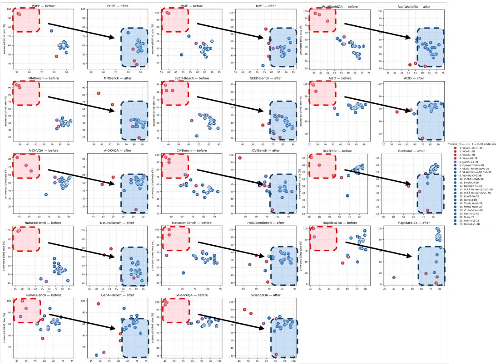  
Figure 7: Qualitative impact of the vision-unique $( G _ { U _ { v } } )$ intervention across 14 benchmarks. The scatter plots illustrate the relationship between overall accuracy (x-axis) and the answered-blind rate (y-axis) before and after the intervention. Models identified as having strong text dominance, initially clustered in the red dashed boxes with high answered-blind rates, demonstrate a distinct shift towards the blue dashed boxes following the intervention. This collective shift indicates a significant reduction in blind text reliance and a concurrent improvement in visual grounding and overall performance.

## F.2 ACCURACY GAIN BY QUESTION TYPES

Largest gains on joint-evidence questions. In the main paper, Table 3 shows accuracy gain after the $G _ { U _ { V } }$ intervention for Table 2. Table 19 further reports accuracy gains after the $G _ { U _ { V } }$ intervention for Table 5, for the four question types defined in Appendix D. Joint-evidence questions (J), which require combining textual and visual evidence, show the largest gain. This pattern is consistent with the intended role of GEOPID in improving predictions that require visual evidence alongside text.

Table 19: Accuracy gain by question category (%).
<table><tr><td>T</td><td>T⁻</td><td>V</td><td>J</td><td>All</td></tr><tr><td>+3.20</td><td>+2.90</td><td>+3.15</td><td>+4.40</td><td>+3.40</td></tr></table>

Gains on visually dependent questions require the matching image. Table 20 compares intervention gains with the original image, an image reassigned from another question, and a blank image. For V and J questions, gains with the original image are 13.1 and 13.9 percentage points, respectively. With mismatched images, these gains fall to 1.0 and −3.3 points, while blank images yield little change. Thus, the gains on visually dependent questions rely on the image matching the

  
Q: What type of dog is it? Before: chihuahua After Intervention: german shepherd  
Q: What is placed on the ground that will eventually turn yellow? Before: corn After Intervention: banana  
Figure 8: Qualitative examples of open-ended generation before and after the $G _ { U _ { v } }$ intervention. Baseline models often fall back on language priors (e.g., blindly guessing “corn” or “chihuahua”), whereas the intervened models accurately ground their generated text in the specific visual evidence (e.g., “banana”, “german shepherd”).

Q: What activity does the cat appear   
most likely to do?   
Before: Watch tv   
After Intervention: jump

Q: What is the man on TV doing? Before: talking After Intervention: singing

Q: What color phone does the woman   
in the blue outfit have?   
Before: blue   
After Intervention: yellow   
Q: What do people do with the items   
purchased at this corner?   
Before: TADJERIA   
After Intervention: eat

question, not because of merely the presence of an image. For T questions, gains remain substantial with mismatched images, indicating that some improvements can also occur without the original visual evidence.

Table 20: Image-condition control on the 100 data for the models exhibiting strong text dominance in Figure 4. We report the accuracy gains in %.
<table><tr><td>Question category</td><td>True image</td><td>Deranged image</td><td>Blank image</td></tr><tr><td>T: text decides</td><td>+22.6</td><td>+17.7</td><td>+1.3</td></tr><tr><td>A: text prior</td><td>+15.3</td><td>+7.4</td><td>0.0</td></tr><tr><td>V: image reading</td><td>+13.1</td><td>+1.0</td><td>-0.2</td></tr><tr><td>J: joint evidence</td><td>+13.9</td><td>-3.3</td><td>+0.3</td></tr></table>

## F.3 UNDERSTANDING THE ACCURACY GAINS

We further examine the prediction changes underlying the accuracy gains in Tables 2 and 5.

Reduced concentration on a single answer option. We examine how often the models exhibiting strong text dominance in Figure 4 select the same answer option across questions. As shown in Table 21, the most frequently selected option accounts for 72% of predictions before intervention and 54% afterward. For comparison, the most frequent ground-truth option accounts for 39% of answers. The intervention therefore reduces the tendency to repeatedly select a single option.

Table 21: Concentration of predictions on the most frequently selected answer option before and after intervention. The ground-truth majority share is provided for comparison.
<table><tr><td>Statistic</td><td>Share</td></tr><tr><td>Most frequent predicted option before intervention</td><td>72%</td></tr><tr><td>Most frequent predicted option after intervention</td><td>54%</td></tr><tr><td>Most frequent ground-truth option</td><td>39%</td></tr></table>

Changed answers are more often correct than random switches. We next examine whether initially incorrect predictions become correct when the intervention changes the answer. We consider the 678 model-item pairs with at least three answer options, an initially incorrect prediction, and a different prediction after intervention. Among these pairs, 74.0% of the new predictions are correct (Table 22). Uniformly selecting an option other than the initial incorrect answer would yield an expected accuracy of 34.1%. Thus, the changed predictions favor the correct answer more often than random switching would.

Table 22: Conditional correction among initially incorrect predictions that change after intervention. Only model-item pairs with at least three answer options are included.
<table><tr><td>Statistic</td><td>Value</td></tr><tr><td>Eligible model-item pairs</td><td>678</td></tr><tr><td>Correct after intervention</td><td>74.0%</td></tr><tr><td>Expected correctness under random switching</td><td>34.1%</td></tr></table>

## F.4 DECISION-STATE CHANGES AFTER INTERVENTION

Visualizing the image-conditioned displacement. Figure 9 shows the decision-state clouds for three benchmark comparisons. Orange points represent text-only states, blue points the original image-and-text states, and green points the intervened states in the lower row. The intervened clouds move away from their original locations, and the displayed image-text angular separation increases in all three examples. These examples illustrate a representational change after the intervention. The displayed frame is constructed using an image-conditioned mean displacement, indicated in the asset as $w = \overline { { H ^ { V T } } } - \overline { { H ^ { T } } }$

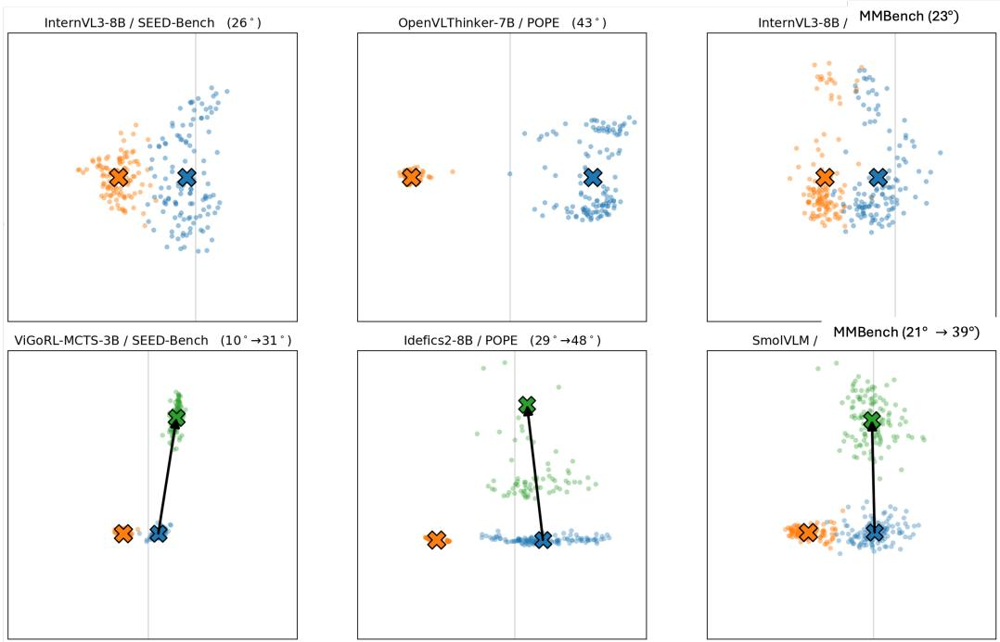  
Figure 9: Decision-state clouds. Top: Examples of weak text-dominant model-benchmark pairs, where the text-only (orange) and text+image (blue) decision states naturally maintain a distinct angular separation. Bottom: Examples of strong text-dominant pairs. Initially, their text+image states exhibited small angular differences from the text-only states, indicating heavy text reliance. However, our GEOPID vision-unique amplification effectively pushes the intervened states (green) away, establishing a clear separation. Crosses mark cloud centroids and arrows mark the before–after displacement. Displayed angular summaries are approximately $1 0 ^ { \circ }  3 1 ^ { \circ }$ for ViGoRL-MCTS-3B (Sarch et al., 2026)/SEED-Bench (Li et al., 2023a), $2 9 ^ { \circ }  4 \dot { 8 } ^ { \circ }$ for Idefics2-8B (Laurenc¸on et al., 2024)/POPE (Li et al., 2023c), and $2 1 ^ { \circ }  3 9 ^ { \circ }$ for SmolVLM (Marafioti et al., 2025)/MMBench (Liu et al., 2024b). Reported angles are averaged over individual examples.

## G MORE ABLATION STUDIES

## G.1 ABLATION STUDIES ON ALTERNATIVE SUBSPACE TARGETS

Table 23 examines whether amplifying $G _ { U _ { v } }$ yields greater gains than amplifying other directions. We fix the normalized intervention depth at 0.6 and the strength at $\alpha = 1$ across the same 15 model– benchmark pairs, changing only the amplified subspace. In particular, the random text-complement control tests whether orthogonality to the text subspace alone is sufficient, or whether selecting the principal directions of the residual vision representations matters. As shown in Table 23, the visionunique directions selected by GEOPID yield the highest average accuracy gain.

Table 23: Alternative amplification targets on 15 model-benchmark pairs at normalized $\ell ^ { * } = 0 . 6$ and $\alpha = 1 .$ . Gain is in percentage points. Correction and damage are reported percentages.
<table><tr><td>Amplified target</td><td>Rank</td><td>Gain</td><td>Correction</td><td>Damage</td></tr><tr><td>Vision-unique  $G _ { U _ { v } }$ </td><td>32</td><td>+0.47</td><td>3.9</td><td>1.4</td></tr><tr><td>Shared  $G _ { R }$ </td><td></td><td>-1.67</td><td>4.1</td><td>4.9</td></tr><tr><td>Text-unique  $G _ { U _ { t } }$ </td><td>7</td><td>-0.47</td><td>4.5</td><td>3.2</td></tr><tr><td>Synergy-evaluation space  $G _ { S }$ </td><td>51</td><td>-0.27</td><td>7.5</td><td>4.6</td></tr><tr><td>Random hidden-space basis</td><td>32</td><td>+0.07</td><td>0.7</td><td>0.3</td></tr><tr><td>Random text-complement basis</td><td>32</td><td>+0.07</td><td>0.6</td><td>0.2</td></tr></table>

## G.2 ABLATION STUDIES ON DIFFERENT INTERVENTION SETTINGS

We examine an alternative rule for deciding which models receive stronger intervention. For each model, we compute the fraction of probe questions whose predicted answers remain unchanged when the original image is replaced with a blank image. Models with an agreement rate of at least 0.7 receive stronger amplification. Table 24 specifies the full rule.

Table 24: Full rule for alternative decision for which models receive stronger intervention.
<table><tr><td>Decision</td><td>Rule</td></tr><tr><td>Edit target</td><td>Vision-unique basis  $G \boldsymbol { { v } } _ { v }$  on visual tokens.</td></tr><tr><td>Open-branch strength</td><td> $\alpha = 8 ; \mathrm { o r } \alpha = 1 2$  when blank-image agreement  $\geq 0 . 9 .$ </td></tr><tr><td>Closed-branch strength</td><td> $\alpha = 1 ,$  a weak edit rather than the unedited baseline.</td></tr></table>

Figure 10 shows how accuracy gains vary with intervention depth $\ell ^ { \star }$ and strength $\alpha .$ . The alternative policy selects a layer with the smallest text-unique component within normalized depths 0.5–0.7 and uses $\alpha = 8$ for models meeting the agreement threshold, while applying $\alpha = 1$ to the remaining models. We also evaluate a variant using $\alpha = 1 2$ when agreement reaches 0.9. Table 25 compares the reported mean gains with those of the rule specified in Figure 4. It shows that the intervention rule in Figure 4 achieves a larger reported gain (+4.62 percentage points) than either alternative (+2.24 and +2.28 percentage points).

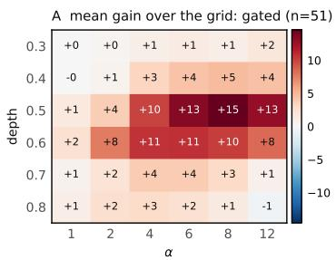

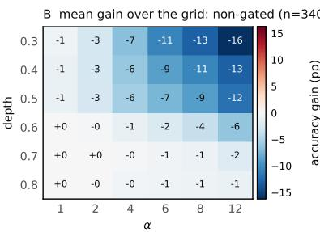

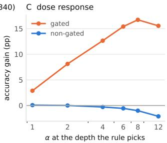  
0.4 +0.35+0.35Figure 10: Effects of intervention depth and amplification strength (α) on accuracy for (A) gated $( n = 5 1 )$ and (B) non-gated $( n = 3 4 0 )$ +0.24+0.24 cells, with (C) the corresponding performance trends across 15in +14.3 0.2in varying strengths at the selected depths.

−0.2Table 25: Mean accuracy gains (%) across 308 model-benchmark pairs under different intervention 0selection rules. The primary result corresponds to Table 5.
<table><tr><td>Intervention selection rule</td><td>Mean gain (pp)</td></tr><tr><td>Blank-image agreement with geometry-based depth selection</td><td>+2.24</td></tr><tr><td>Blank-image agreement with  $\alpha = 1 2$  for agreement  $\geq 0 . 9$ </td><td>+2.28</td></tr><tr><td>GEOPID geometry-based rule (Figure 4)</td><td>+4.62</td></tr></table>

## G.3 ABLATION STUDIES ON DIFFERENT $r , \ell ^ { * }$ , AND α

We vary the rank cap $r _ { u }$ in Eq. 5 and the intervention depth $\ell ^ { \star }$ and strength α in Eq. 11. Specifically, we evaluate $\alpha \in \{ 1 , 2 , 4 \}$ at normalized depths $\ell ^ { \star } / L \in \{ 0 . 5 , 0 . 6 , 0 . 7 \}$ with $r _ { u } = 1 6 .$ . At depth 0.6, we also evaluate $r _ { u } = 6 4$ using the same three strengths. Table 26 reports mean accuracy gains across POPE (Li et al., 2023c), SEED-Bench (Li et al., 2023a), and MMBench (Liu et al., 2024b). With $r _ { u } = 1 6$ , increasing α from 1 to 4 improves the mean gain at all three depths. The largest gain among the tested settings is 29.67 percentage points at $( r _ { u } , \ell ^ { \star } / L , \alpha ) = ( 1 6 , 0 . 6 , 4 )$ . At the same depth and strength, increasing $r _ { u }$ to 64 gives a smaller gain of 21.67 points. These results supplement the intervention settings in Section 2.3.

Table 26: Mean accuracy gains (%) for ViGoRL-7B (Sarch et al., 2026) across POPE (Li et al., 2023c), SEED-Bench (Li et al., 2023a), and MMBench (Liu et al., 2024b) under different rank caps, normalized intervention depths, and strengths.
<table><tr><td>Rank cap</td><td>Depth</td><td> $\alpha = 1$ </td><td> $\alpha = 2$ </td><td> $\alpha = 4$ </td></tr><tr><td>16</td><td>0.50</td><td>0.00</td><td>+2.33</td><td>+21.67</td></tr><tr><td>16</td><td>0.60</td><td>+4.33</td><td>+19.33</td><td>+29.67</td></tr><tr><td>16</td><td>0.70</td><td> $+ 1 . 0 0$ </td><td>+5.00</td><td>+21.00</td></tr><tr><td>64</td><td>0.60</td><td>+3.67</td><td> $+ 1 0 . 3 3$ </td><td>+21.67</td></tr></table>

## H ROBUSTNESS

## H.1 ROBUSTNESS TO THE NUMBER OF IMAGE K IN EQ. 10

We vary the number of mismatched-image draws in Eq. 10 over $K \in \{ 3 , 5 , 1 0 \}$ across 24 model × benchmark pairs. As shown in Table 27, the reported standard error of S due to mismatch randomness is approximately 0.001, indicating limited variability from the random image assignments in this experiment.

Table 27: Sensitivity to the number of mismatched-image draws K in Eq. 10. Standard errors summarize mismatch-related variability across 24 model × benchmark pairs.
<table><tr><td>K</td><td>Mismatch standard deviation</td><td>Reported SE of S</td><td>Median  $| S _ { K } - S _ { 1 } |$ </td></tr><tr><td>3</td><td>0.0017</td><td>0.0010</td><td>0.0029</td></tr><tr><td>5</td><td>0.0023</td><td>0.0010</td><td>0.0022</td></tr><tr><td>10</td><td>0.0031</td><td>0.0010</td><td>0.0038</td></tr></table>

Table 28: Ablation study using 22 models and 5 datasets. Values are Spearman correlations between model rankings based on total decision-state information.
<table><tr><td>Ablation</td><td>Setting</td><td>Rank correlation</td></tr><tr><td>Kernel</td><td>Cosine reference</td><td>1.00</td></tr><tr><td></td><td>RBF</td><td>0.78</td></tr><tr><td></td><td>Standardized linear</td><td>0.75</td></tr><tr><td>Rényi order</td><td>Shannon limit</td><td>0.95</td></tr><tr><td></td><td>1.5</td><td>1.00</td></tr><tr><td></td><td>2 (reference)</td><td>1.00</td></tr><tr><td></td><td>4</td><td>1.00</td></tr><tr><td>Sample fraction</td><td>25%</td><td>0.99</td></tr><tr><td></td><td>50%</td><td>0.97</td></tr><tr><td></td><td>75%</td><td>1.00</td></tr><tr><td></td><td>Full reference</td><td>1.00</td></tr></table>

## H.2 ROBUSTNESS TO KERNEL, RENYI´ ORDER, AND SAMPLE SIZE

We evaluate whether the model ordering by total decision-state information in Eq. 8 is preserved when changing the kernel, Renyi order, and number of samples used in Section 2. Using cached´ decision representations from 22 models and 5 benchmarks, we recompute the information measurements and compare the resulting model rankings with the main-paper setting.

Section 2 constructs the Gram matrix $K _ { Z }$ using cosine similarity:

$$
K _ { Z } [ i , j ] = \frac { \langle Z _ { i } , Z _ { j } \rangle } { \| Z _ { i } \| _ { 2 } \| Z _ { j } \| _ { 2 } } .\tag{22}
$$

We replace this kernel with an RBF kernel,

$$
K _ { Z } ^ { \mathrm { R B F } } [ i , j ] = \exp \left( - \frac { \| Z _ { i } - Z _ { j } \| _ { 2 } ^ { 2 } } { 2 \sigma ^ { 2 } } \right) ,\tag{23}
$$

where $\sigma$ is the bandwidth, or a standardized linear kernel,

$$
K _ { Z } ^ { \mathrm { l i n e a r } } [ i , j ] = \langle \widetilde { Z } _ { i } , \widetilde { Z } _ { j } \rangle ,\tag{24}
$$

where $\widetilde { Z } _ { i }$ denotes the representation after centering and scaling each feature across samples. The RBF kernel assigns higher similarity to nearby representations, while the standardized linear kernel compares their inner products after standardization. For each kernel, we apply the trace normalization described in Section 2 and recompute total decision-state information using Eq. 8.

As shown in Table 28, the model rankings obtained with the RBF and standardized linear kernels have Spearman correlations of 0.78 and 0.75 with the cosine-kernel reference. Thus, the rankings remain positively associated. Keeping the cosine kernel and replacing the Renyi-2 entropy in Eq. 8´ with orders 1.5 and 4 yields ranking correlations of 0.996 and 0.997, respectively. Reducing the sample count to 25%, 50%, or 75% also preserves the ranking closely, with reported correlations of approximately 0.99, 0.97, and 1.00.