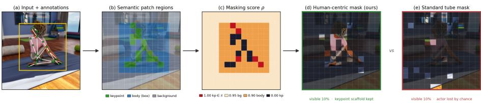
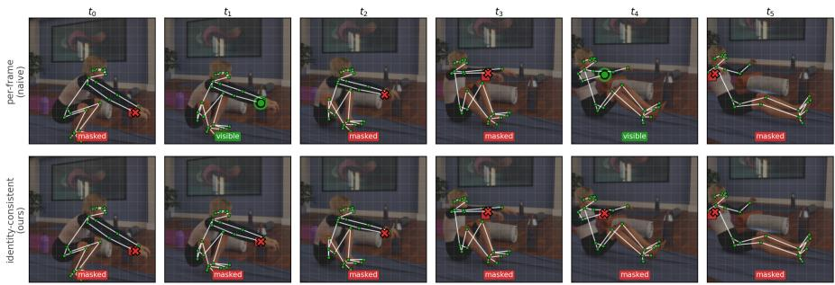

# HuC-VideoMAE: Human-Centric Video Masked Autoencoding from synthetic data

Ricardo Pizarro , 1, Roberto Valle 2, Jos´e M. Buenaposada 3, Luis M. Bergasa 1, and Luis Baumela 2

1Universidad de Alcal´a, Alcal´a de Henares, Spain 2Universidad Polit´ecnica de Madrid, Madrid, Spain 3Universidad Rey Juan Carlos, M´ostoles, Spain

ricardo.pizarroc@edu.uah.es

## Abstract

Modern action recognition models rely on video transformers pretrained on massive collections of web-crawled videos, such as Kinetics-700. However, the use of such data raises ethical concerns, as subjects consent is typically not obtained. Recent high-quality synthetic video datasets generated from motion-capture data, such as BEDLAM2.0, ofer a promising ethical alternative. In this work, we investigate self-supervised pretraining of video transformers on synthetic human-motion datasets. We first show that directly applying the standard VideoMAE masking strategy leads to substantially worse performance than pretraining on Kinetics. To address this limitation, we propose a human-centric masking scheme that leverages body keypoints and person bounding box regions. Our approach encourages the model to focus on the structure and dynamics of human motion during pretraining. Experiments on NTU RGB+D and Toyota-Smarthome demonstrate that our method significantly outperforms standard VideoMAE pretraining on synthetic data, closing 49% of the gap to Kinetics pretraining on NTU RGB+D cross-view-subject without using a single real frame during pretraining. To promote the use of ethical action recognition models, we will publicly release our pretrained models upon acceptance. Code and trained models are available at https://github.com/pcr-upm/eccvw26\_recognition

## 1 Introduction

Modern human motion video understanding is built on transfer learning where a video transformer [24, 15, 13] is first pretrained on a massive corpus of short clips and then fine-tuned on a downstream task [18, 17]. The pretraining corpora that make this work, e.g. Kinetics [12], are assembled by scraping web videos at scale, capturing millions of identifiable people who never consented to their likeness, gait or behaviour being used to train models. This conflicts with emerging data-protection norms such as the GDPR [8] and the EU AI Act [9]. The problem is that video information is intrinsically biometric, since a person’s identity can be recovered from appearance [30] or gait [20] even when a dataset is “de-identified”. As action-recognition systems are deployed in privacy-sensitive settings such as, smart homes [4], or human-robot interaction [19], the provenance of the pretraining data becomes an ethical liability that fine-tuning on a clean downstream set does not erase.

Computer-graphics rendering of motion-captured humans ofers an alternative. Datasets such as SURREAL [26], the AMARV corpus [19] and, most recently, BEDLAM2.0 [22] generate photorealistic clothed avatars driven by consented motion-capture archives, with full control over appearance, viewpoint and scene. No real person is depicted, so the pretraining data carries no consent or biometric-leakage risk by construction, while remaining large and diverse enough for self-supervised learning. This raises an interesting question for privacy-preserving vision, can we pretrain video transformers entirely on ethically-sourced synthetic humans without sacrificing downstream accuracy?

Answering it is not simply a matter of swapping datasets. We find that taking the popular self-supervised recipe VideoMAE [24], which reconstructs clips under high-ratio random “tube” masking, and applying it unchanged to synthetic video yields representations that transfer substantially worse than the same model pretrained on Kinetics. We argue this gap is a property of the objective, not only of the data. The reason is that uniform masking is agnostic to what it hides and at a 90% masking ratio the reconstruction budget is dominated by background and rendered texture, and the human is left almost entirely visible or entirely hidden by chance. On public real web video data sets, this is a slight ineficiency; although there is enough scale, diversity, and data to overcome this. Meanwhile, on the available public synthetic data sets, with a much lower amount of video clips and where backgrounds and textures are comparatively easy to learn, it allows the model to shortcut the task without learning human motion, widening the synthetic-to-real gap.

Our experiments show that synthetic data already hands us, for free, the structural supervision needed to alleviate this. Every rendered frame comes with ground-truth 2D body keypoints, a person bounding box and a background separation, signals that on real video would require noisy of-the-shelf estimation [11]. We use these signals to make masking human-centric where each patch receives a masking score from its semantic region. The background is masked most aggressively, the actor’s body is masked nearly as heavily, and only the sparse keypoints are kept most visible, acting as structural anchors for the reconstruction targets. The keypoints are masked at the identity level (e.g. right wrist or left elbow) so that a joint chosen for masking stays hidden across the whole clip rather than reappearing in a neighboring frame. This concentrates the reconstruction signal on the body and its motion. We call the resulting method Human Centric Video Masked Auto Encoder (or HuC-VideoMAE for short).

HuC-VideoMAE partially compensates for the degradation introduced by random tube masking. On NTU RGB+D, it increases the cross-view-subject average accuracy from 80.1% to 85.8%, reducing by 49% the gap between the baseline and a Kinetics-pretrained model (91.7% average accuracy). Notably, these gains are obtained without access to real frames during pretraining. The method also maintains consistent performance across viewpoints, with a decrease of 1.8 percentage points from 0◦ to 90◦. On Toyota-Smarthome, HuC-VideoMAE achieves higher accuracy than a Kinetics-pretrained VideoMAEv2 baseline on CV1 and performs within 4 percentage points of that baseline on CV2.

Our contributions are:

• We investigate self-supervised pretraining on synthetic motion-capture humans as a privacy-preserving alternative to web-crawled video. We show that the standard VideoMAE masking objective transfers less efectively in this setting, highlighting the need for masking strategies tailored to synthetic human data.

• We propose HuC-VideoMAE, a human-centric masking strategy that leverages the ground-truth keypoints, person masks, and background information available in synthetic data sets. The method introduces temporally consistent, identity-level keypoint masking and is evaluated on both ViT and MViTv2 backbones.

• We demonstrate that HuC-VideoMAE improves transfer performance on NTU RGB+D and Toyota-Smarthome while maintaining stable performance across viewpoints.

## 2 Related work

Masked video modelling. Works like BEiT [1] and the Masked Autoencoder (MAE) [10] showed that reconstructing heavily masked inputs yields strong transferable representations. VideoMAE [24] extended this to video with tube masking along the temporal dimension at very high ratios (90%), and Video-MAEv2 [27] scaled it with dual masking, while MaskFeat [28] reconstructs HOG features instead of pixels. An issue with uniform masking probability is that regions occupying a larger fraction of the image, such as the background, contribute disproportionately to the reconstruction objective. To address this, several works have introduced content-aware masking strategies. MGMAE [11] warps masks along estimated optical flow to keep them on moving regions. SMILE [23] overlays synthetic moving objects and masks along their trajectories while reconstructing CLIP features. MARLIN [3] masks tubes guided by semantic facial regions (eyes, nose, mouth, skin) to learn transferable facial representations.

While these approaches improve the allocation of masking across informative regions, they largely retain the conventional pretraining paradigm based on large-scale collections of web-sourced video. Consequently, although selfsupervision reduces dependence on manual annotations, it does not address concerns related to the origin, consent, or privacy characteristics of the underlying video data. Meanwhile, synthetic sources provide ground-truth data that can guide the informative regions without the need to rely on noisy estimates such as optical flow and facial segmentation.

  
Figure 1: Body-keypoint-guided masking. From a synthetic frame with 2D keypoint and person-box annotations (a), every patch is labelled as keypoint, body (inside the box) or background (b), and receives a masking score ρ (c): background scores above the body, and keypoints lowest of all, so that the sparse joint structure survives the mask. The exception are the joints selected for identity masking (∈ S, red), with score above the background and are therefore always masked.

Synthetic data and ethical pretraining for action recognition. Rendering humans from motion capture is an established way to obtain labeled video without collecting real footage. Early pipelines such as PHAV [7] SUR-REAL [26], and SURREACT [25] showed that synthetic humans rendered from novel viewpoints improve cross-view action recognition on NTU RGB+D [21, 14]. More recently, SynthAct [19] introduced the large AMARV corpus for synthetic-to-real pretraining, and BEDLAM2.0 [22], originally built for 3D human pose and shape estimation, provides highly realistic clothed humans in diverse scenes.

These datasets are appealing as an ethical alternative to web-crawled corpora such as Kinetics [12], whose subjects have not consented to their use. Prior work, however, either trains supervised classifiers on the synthetic labels or applies ofthe-shelf masking. We instead ask how the self-supervised objective should be designed to make ethically-sourced synthetic pretraining competitive, and show that a human-centric masking scheme substantially narrows the gap to real-data pretraining.

## 3 Human centric video masked autoencoder pretraining

We build on the VideoMAE [24, 27] masked autoencoding framework, in which a video transformer is pretrained to reconstruct a large fraction of masked spatio-temporal patches from a small set of visible ones. We use the Video-MAEv2 [27] implementation with the original single-mask objective (the decoder reconstructs all masked positions) and ViT backbones together with the MViTv2 [13] backbones from PyTorch. Each clip is split into patches and neighbouring frames are grouped into tubelets, yielding a spatio-temporal token grid on which masking operates. Our contribution is a new masking policy. Rather than masking patches uniformly at random, we exploit the structural annotations that synthetic data provides, per-frame 2D body keypoints and person bounding boxes, to concentrate the reconstruction signal on the human actor.

## 3.1 Body-keypoint-guided masking

Standard tube masking treats every patch equally, so at a high masking ratio most of the reconstruction budget is spent on background regions that are irrelevant to action recognition, and the actor can be almost entirely visible or almost entirely hidden by chance. We instead assign every patch a masking score derived from its semantic region, and mask the highest-scoring patches first (Fig. 1). Each synthetic frame is annotated with the body keypoints and a person bounding box, obtained directly from the BEDLAM2.0 labels. After the random crop-and-resize augmentation, keypoints and boxes are mapped through the same crop parameters into the patch grid, so the mask stays spatially aligned with the augmented input. Each patch then falls into one of three regions with a distinct score:

• background (outside the person box): highest score $\rho _ { b g }$ , i.e. masked first,

• body (inside the bounding box but not on a joint): intermediate score ρbody,

• keypoint (containing a projected joint): lowest score= 0, if kept visible, or score= 1, if its keypoint identity is selected as masked (∈ S).

with $\rho _ { b g } > \rho _ { b o d y } > 0$ and not-masked keypoint patches scoring below both. The background is masked almost completely, and the actor’s body is masked nearly as aggressively, so most of the reconstruction budget falls on these two. Keypoints are kept mostly visible, they act as sparse structural anchors rather than reconstruction targets, giving the decoder pose cues from which to infer the motion of the surrounding masked body patches. A fraction $\rho _ { k p }$ of the keypoint identities (e.g. left wrist, right ankle, right wrist) is selected once per clip and forced to be masked in every frame. Since the selection is made at the identity level and re-used across temporal slots (tubelets), the same joints are hidden throughout the clip (Fig. 2), which prevents the decoder from trivially copying a joint that is visible in an adjacent frame. As in standard tube masking, the number of masked patches per frame is kept fixed, ensuring a constant number of visible tokens across the batch. Specifically, for a frame containing $N _ { \mathrm { p } }$ patches, we mask $K = r { \cdot } N _ { \mathrm { p } }$ , where r is the target masking ratio. Each patch is assigned a region-dependent masking score, and the K highest-scoring patches are selected for masking. The complete masking procedure is summarized in Algorithm 1.

Algorithm 1 HuC-VideoMAE Mask Generation   
1: $\overline { { \tau  } }$ body keypoint identities visible in at least one frame   
2: m $ \lfloor \rho _ { k p } \cdot \vert \mathcal { T } \vert \rfloor$   
3: $s $ RandomSubset $( \mathcal { T } , m )$   
4: jitter $( p )  \mathcal { U } ( 0 , 1 0 ^ { - 3 } )$ for every patch $p ,$ drawn once per clip   
5: $K \gets \lfloor r \cdot N _ { \mathrm { p } } \rfloor$   
6: for each temporal slot t do   
$\mathrm { ^ 7 } \mathrm { : }$ Project keypoints and person bounding box, $B _ { t }$ , to the patch grid   
8: for each patch $p$ do   
9: if $p$ contains a keypoint whose identity is in $s$ then   
10: $\mathbf { s } ( p ) \gets 1 \{ > \rho _ { b g }$ , always masked}   
11: else if $p$ contains a keypoint then   
12: $\mathbf { s } ( p ) \gets 0$ {lowest, kept visible}   
13: else if $p \in B _ { t }$ then   
14: $\mathbf { s } ( p )  \rho _ { b o d y }$   
15: else   
16: $\mathbf { s } ( p )  \rho _ { b g }$   
17: end if   
18: end for   
19: s ← s + jitter {randomizes selections within a region}   
20: Rank all patches by score $\mathbf { s } ( p )$   
21: $\boldsymbol { \mathcal { M } } _ { t } \gets$ indices of the $\mathrm { t o p } { - } K$ scoring patches   
22: Mask all patches in $\mathcal { M } _ { t }$   
23: end for

Naturally, this policy forces the model to reconstruct the body region from the sparse structure of visible joints and their motion, rather than exploiting background regularities, encouraging actor-centric and viewpoint-robust representations.

## 4 Experiments

In this section, we evaluate the impact of our human-centric masking strategy on self-supervised video pretraining. Models are first pretrained on the synthetic BEDLAM2.0 dataset [22] and then fine-tuned on downstream action recognition benchmarks, namely NTU RGB+D 60 and Toyota-Smarthome. To contextualize the results, we compare against VideoMAEv2 models pretrained on Kinetics [12] as well as the AMARV synthetic pretraining approach [19]. All methods are evaluated under the same fine-tuning and testing protocols.

Temporally-consistent keypoint masking (example joint: R-wrist  
  
Figure 2: Keypoint masking is temporally consistent. A keypoint selected for masking (here the right wrist) is hidden in every frame of the clip (bottom row), because the choice is made at the body part identity level. A naive perframe choice (top row) would leave the same joint visible in some frames $( t _ { 1 } , t _ { 4 } )$ ， letting the decoder copy it from a neighbouring frame. Green: visible keypoints; red: the masked joint and its patch.

## 4.1 Datasets

BEDLAM2.0 [22] is a large-scale synthetic human-motion dataset generated from motion-capture sequences rendered with realistic human body models in diverse virtual environments. The dataset features realistic camera configurations, including varying focal lengths and dynamic motions such as panning, zooming, orbiting, and tracking. It contains more than 27K image sequences, over 8M frames, and more than 4K distinct body shapes, resulting in approximately 13.3M person annotations. In addition to RGB video, BEDLAM2.0 provides accurate human-centric supervision, including 3D poses, projected 2D keypoints, and person bounding boxes. The combination of large scale, rich annotations, and synthetic data generation makes it an attractive benchmark for studying privacy-preserving, human-centric self-supervised video pretraining. We use BEDLAM2.0 exclusively during pretraining.

The AMARV (Archive of Motion Capture As Rendered Videos) dataset [19] is a large-scale, synthetic data set specifically optimized for training generalizable human action recognition and computer vision models. Generated via the automated SynthAct pipeline, AMARV provides over 0.8M single-person multiview synthetic video clips derived from extensive underlying human motion capture databases. Each action sequence is simultaneously rendered from four synchronized, static viewpoints, generating both highly detailed RGB footage and corresponding depth maps. Alongside the video data, the dataset delivers a comprehensive suite of frame-level and clip-level ground truth annotations, including exact 3D body poses, surface normal maps, semantic segmentation masks, and bounding boxes.

Compared to AMARV, BEDLAM2.0 emphasizes diversity and realism over clip count. Although AMARV contains more action clips, BEDLAM2.0 includes over 4K body shapes (compared to 106 in AMARV), a wider variety of clothing and accessories, and more diverse scene layouts. Furthermore, BEDLAM2.0 models realistic camera behavior through motions such as panning, zooming, orbiting, and tracking, whereas AMARV uses static camera viewpoints. As a result, AMARV primarily provides large-scale multi-view action observations, while BEDLAM2.0 exposes the model to greater variability in human appearance, scene context, and camera dynamics.

Original VideoMAEv2 is pretrained first in a 1.35M set of videos and then fine-tuned in a supervised way in the union of Kinetics 400, 600 and 700 (i.e. the number of action categories) with 710 categories and 0.66M clips. BED-LAM2.0 contains approximately 27K clips, compared to the 1.35M clips used for VideoMAEv2 pretraining, representing a roughly 50× smaller corpus (about 1.7 orders of magnitude fewer clips).

NTU RGB+D 60 [21] is a widely used benchmark for human action recognition in indoor environments. The dataset contains approximately 57K videos covering 60 action classes performed by 40 subjects and recorded from multiple camera viewpoints. We follow the cross-view-subject protocol introduced by SURREACT [25], which extends the standard cross-subject split, where training and test subjects are disjoint, by additionally restricting training to front-view videos only, and then testing separately on the $0 ^ { \circ }$ $4 5 ^ { \circ }$ and $9 0 °$ views. Accuracy at $4 5 ^ { \circ }$ and $9 0 °$ therefore measures generalization to viewpoints never seen during fine-tuning Following common practice, we report overall classification accuracy (Acc.).

Toyota-Smarthome [4] focuses on activities of daily living performed in a realistic home environment. The dataset contains around 16K RGB clips from 31 activity classes performed by 18 subjects and captured from seven camera viewpoints. We evaluate using the cross-view protocols CV1 and CV2, which use a 19-class subset. In CV1, training uses only camera 1, while camera 2 is reserved for testing. In CV2, training uses cameras 1, 3, 4, 6, and 7, while camera 5 is used for testing. Due to class imbalance, we report mean class accuracy (mCA).

## 4.2 Implementation details

We sample clips of 16 frames at a temporal stride of 4, resized to $2 2 4 \times 2 2 4 ;$ frames are split into 16 × 16 patches with tubelet size 2, giving an 8 × 14 × 14 token grid. We use ViT-B and MViTv2-S backbones with a 4-layer reconstruction decoder and single-mask decoding (decoder mask ratio 0). For the baseline pretrained models we use the weights vit b k710 dl from giant and pretrain mvitv2 small 224. We mask 90% $( r = 0 . 9 )$ of the patches per temporal slot, with region scores $\rho _ { b g } = 0 . 9 5$ and $\rho _ { b o d y } = 0 . 9 0$ , and mask a fraction $\rho _ { k p } = 0 . 2$ of the keypoint identities per clip. Pretraining runs for 200 epochs with AdamW $( \beta = ( 0 . 9 , 0 . 9 5 ) )$ ), a base learning rate of $1 0 ^ { - 3 }$ , a 20-epoch warm-up with cosine decay, and 4 augmented views per clip. For MViTv2-S, the mask is first computed on the token grid and then expanded to the corresponding $2 \times 3 2 \times 3 2$ spatio-temporal macro-patch in pixel space. This preserves the regular grid structure required by MViTv2’s hierarchical pooling attention while keeping both the masking ratio and the region-dependent masking preferences unchanged.

## 4.3 Training and Evaluation Procedure

To evaluate the transferability and cross-view generalization of our models, we adopt a two-stage paradigm consisting of self-supervised pretraining followed by supervised downstream fine-tuning.

Pretraining stage. We compare three initializations of the VideoMAE (ViT-B) backbone:

• VideoMAE (Kinetics): the publicly released weights self-supervised on the real-world Kinetics dataset with random tube masking, serving as an upper reference for web-crawled pretraining.

• VideoMAE (BEDLAM2.0): the backbone pretrained from scratch on the synthetic BEDLAM2.0 [22] dataset with the same random tube masking, isolating the efect of switching the pretraining source from real to synthetic data.

• HuC-VideoMAE: pretrained on BEDLAM2.0 with our proposal of bodykeypoint-guided masking presented in section 3.1.

Both synthetic variants share identical data, schedule and hyper-parameters, so any downstream diference is attributable to the masking policy alone.

## 4.4 Efect of the masking policy

In Table 1 the backbone, optimizer, schedule and augmentation are held fixed. Only the pretraining source (real Kinetics vs. synthetic BEDLAM2.0) and the masking scheme (random tube masking vs. our body-keypoint-guided HuC-VideoMAE) change, so any diference is attributable to that one factor.

On NTU RGB+D cross-view-subject (ViT-B backbone), switching the pretraining source from Kinetics to BEDLAM2.0 while keeping random tube masking costs 11.6 points of accuracy averaged over the three viewpoints (91.7 → 80.1). This is the synthetic-to-real gap caused by naively applying random masking, at 90% masking ratio, most of what the model is asked to reconstruct is easily-learned background and rendered texture, so it has little incentive to model the human actors. Replacing random masking with HuC-VideoMAE on the same synthetic data and schedule recovers 5.7 of these 11.6 points (80.1 → 85.8), closing 49% of the gap to real-data pretraining without using a single real frame in pretraining.

Table 1: Ablation of the masking policy on NTU RGB+D, crossview-subject (ViT-B). The backbone, optimizer, schedule and augmentation are identical across rows. Only the pretraining source and the masking scheme change. All numbers are downstream fine-tuning accuracy (in %) after synthetic-to-real transfer (S→R), except the Kinetics row (R→R).
<table><tr><td>Pretrain data</td><td>Masking</td><td> $0 ^ { \circ }$ </td><td> $4 5 ^ { \circ }$ </td><td> $9 0 ^ { \circ }$ </td><td> $\operatorname { A v g }$ </td></tr><tr><td>Kinetics</td><td>random tube</td><td>92.2</td><td>91.8</td><td>91.2</td><td>91.7</td></tr><tr><td>BEDLAM2.0</td><td>random tube</td><td>81.6</td><td>79.6</td><td>79.1</td><td>80.1</td></tr><tr><td>BEDLAM2.0</td><td>HuC-VideoMAE</td><td>86.6</td><td>85.9</td><td>84.8</td><td>85.8</td></tr></table>

Table 2: Strength of the pretraining source, independent of masking policy. Random tube masking, same backbone and schedule. Only the synthetic pretraining corpus changes. Downstream accuracy averaged per dataset (NTU: $0 ^ { \circ } / 4 5 ^ { \circ } / 9 0 ^ { \circ }$ . Toyota: CV1/CV2).
<table><tr><td>Pretrain data</td><td>NTU (Avg)</td><td>Toyota (Avg)</td></tr><tr><td>AMARV (synth.)</td><td>55.0</td><td>42.3</td></tr><tr><td>BEDLAM2.0 (synth.)</td><td>80.1</td><td>56.5</td></tr></table>

## 4.5 Efect of the synthetic corpus

An important question is how much the choice of synthetic corpus itself matters, independently of the masking policy. Table 2 compares VideoMAE pretrained with uniform tube masking on BEDLAM2.0 [22] against the same recipe pretrained on the AMARV corpus [19] and fine-tuned on downstream datasets. BEDLAM2.0 outperforms AMARV by a wide margin on both NTU RGB+D $( 0 ^ { \circ } / 4 5 ^ { \circ } / 9 0 ^ { \circ } )$ at 81.6/79.6/79.1 for BEDLAM2.0 versus 57.94/53.59/53.56 for AMARV. With 80.1 vs. 55.0 average across viewpoints (+25.1), and Toyota-Smarthome 54.1/58.86 for BEDLAM2.0 versus 41.71/42.87 (56.5 vs. 42.3 average across CV1/CV2, +14.2), confirming that BEDLAM2.0 is a stronger pretraining dataset regardless of the masking policy.

The comparison between AMARV and BEDLAM2.0 shows that raw scale alone does not explain the gap. AMARV is the larger corpus by clip count (800K multi-view clips vs. BEDLAM2.0’s 27K video sequences) and draws on more distinct source motions (10,892 AMASS/BABEL sequences vs. 4,643 for BEDLAM2.0) [19, 22], yet it is BEDLAM2.0 that transfers far better. (Table 2). We attribute this to more body diversity in BEDLAM2.0 (4K body shapes vs 106), realistic camera motion and rendering quality. BEDLAM2.0 uses simulated clothing, strand-based hair, modelled 3D environments and dynamic camera motion, whereas AMARV maps static, unsimulated clothing onto bodies in front of flat HDRI backdrops with cameras fixed per clip.

## 4.6 Comparison with the state of the art

In this section, we perform supervised fine tuning of the previously trained VideoMAE models with self-supervision. We use the NTU RGB+D and then the Toyota-Smarthome as representatives of the action recognition datasets used in the literature.

Table 3: Cross-view-subject evaluation on NTU RGB+D, comparison with SURREACT[25] and our new VideoMAE-based results. S → R, Pretrained on Synth and then fine-tuned on Real.
<table><tr><td colspan="2">Model</td><td>Pretrain Data</td><td>0°</td><td>45°</td><td>90°</td></tr><tr><td rowspan="3">SURREACT [25] X3D-S [19]</td><td>R</td><td></td><td>86.9</td><td>74.5</td><td>53.6</td></tr><tr><td>R</td><td></td><td>86.4</td><td>77.8</td><td>60.4</td></tr><tr><td>R</td><td></td><td>84.2</td><td>77.0</td><td>75.8</td></tr><tr><td>ViewCLR [6] SURREACT [25]</td><td>S → R</td><td>SURREACT</td><td>84.1</td><td>77.5</td><td>66.2</td></tr><tr><td>X3D-S [19]</td><td>S → R</td><td>AMARV</td><td>89.9</td><td>81.8</td><td>68.0</td></tr><tr><td>MViTv2-S [19]</td><td>S → R</td><td>AMARV</td><td>94.4</td><td>84.5</td><td>65.1</td></tr><tr><td>VideoMAEV2</td><td>R → R</td><td>Kinetics</td><td>92.2</td><td>91.8</td><td>91.2</td></tr><tr><td>HuC-VideoMAE</td><td>S → R</td><td>BEDLAM2.0</td><td>86.6</td><td>85.9</td><td>84.8</td></tr><tr><td>MViTv2-S</td><td>R → R</td><td>Kinetics</td><td>85.61</td><td>85.74</td><td>84.99</td></tr><tr><td>HuC-MViTv2-S</td><td>S → R</td><td>BEDLAM2.0</td><td>84.2</td><td>83.78</td><td>83.29</td></tr></table>

NTU RGB+D. On the cross-view-subject benchmark (Table 3), the most direct comparisons are between Kinetics-pretrained and BEDLAM2.0-pretrained models using the same backbone. For ViT-B, replacing Kinetics pretraining with synthetic-only pretraining reduces accuracy by approximately 5-6 percentage points across all viewpoints (92.2/91.8/91.2 versus 86.6/85.9/84.8), despite the latter never observing real video during pretraining. Moreover, the performance of HuC-VideoMAE remains relatively stable across viewpoints, decreasing by only 1.8 percentage points from 0◦ to 90◦. A similar trend is observed for the MViTv2-S backbone. The Kinetics-pretrained model achieves 85.61/85.74/84.99, while HuC-MViTv2-S reaches 84.2/83.78/83.29, corresponding to a substantially smaller gap of approximately 1.4-2.0 percentage points across viewpoints. As with ViT-B, performance remains stable across views, with a decrease of less than one percentage point from 0◦ to 90◦. These results suggest that the proposed human-centric masking strategy transfers efectively across both plain ViT and hierarchical transformer architectures, while maintaining strong viewpoint generalization under synthetic-to-real transfer (S→R).

When compared with previously reported synthetic-to-real transfer approaches, HuC-VideoMAE achieves the highest average performance among the methods listed in Table 3. However, these comparisons should be interpreted with caution, as the methods difer in backbone architecture, pretraining data, and supervision strategy. The most controlled evidence of the contribution of HuC-VideoMAE is therefore provided by the comparison against Kinetics-pretrained

Table 4: Test results on Toyota-Smarthome over the CV1 and CV2 protocols. Comparison of our HuC models, against previous methods pretrained on Kinetics.
<table><tr><td>Method</td><td>CV1 mCA. (↑)</td><td>CV2 mCA. (↑)</td></tr><tr><td>MotionFormer[16] LTN[29]</td><td>45.2</td><td>51.0 54.6</td></tr><tr><td>TimeSFormer [2] VPN++ [5]</td><td>50.0</td><td>60.6</td></tr><tr><td>Video Swing [15]</td><td>36.6</td><td>54.9 48.6</td></tr><tr><td>π-ViT [18]</td><td>55.2</td><td>64.8</td></tr><tr><td>PO-GUISE [17]</td><td>58.98</td><td>76.12</td></tr><tr><td>VideoMAEv2-base</td><td>55.20</td><td></td></tr><tr><td>HuC-VideoMAE</td><td>56.7</td><td>67.68</td></tr><tr><td></td><td></td><td>63.70</td></tr><tr><td>MViTv2-S</td><td>52.43</td><td>66.63</td></tr><tr><td>HuC-MViTv2-S</td><td>51.81</td><td>61.02</td></tr></table>

VideoMAE, together with the random-tube versus HuC-VideoMAE ablation in Table 1, where the masking policy is the only factor that changes.

Toyota-Smarthome. Table 4 reports performance on this benchmarks with fine-grained activities of daily living recorded in realistic home environments. Following prior work, we report mean class accuracy (mCA) under the CV1 and CV2 protocols. As in the NTU experiments, VideoMAEv2-base pretrained on Kinetics serves as the principal reference point, achieving 55.20 and 67.68 mCA on CV1 and CV2, respectively. Despite relying only on synthetic data during pretraining, HuC-VideoMAE pretrained on BEDLAM2.0 attains 56.7 mCA on CV1 and 63.70 mCA on CV2. On CV1, it slightly surpasses the Kineticspretrained VideoMAEv2 baseline (56.7 versus 55.20), while on CV2 it remains within 4 percentage points (63.70 versus 67.68). These results indicate that representations learned from synthetic human data can transfer efectively to a real-world benchmark that difers substantially from NTU RGB+D in both environment and activity distribution. HuC-MViTv2-S attains 51.81 mCA on CV1 and 61.02 on CV2, against 52.43 and 66.63 for the Kinetics-pretrained MViTv2-S, further closing the gap to the Kinetics baseline on CV1 (−0.62) while trailing by 5.6 points on CV2. As with ViT-B, the CV1 protocol is nearly closed by synthetic-only pretraining while CV2 retains a larger residual gap, suggesting this asymmetry is a property of the benchmark protocols rather than of the backbone architecture.

Relative to previously reported fully supervised methods that have been pretrained in Kinetics. Here, HuC-VideoMAE also achieves competitive performance. In particular, it exceeds the reported results of MotionFormer, LTN, TimeSFormer, VPN++, and Video Swing on the corresponding evaluation protocols. These comparisons provide additional evidence that synthetic-only pretraining with human-centric masking can yield transferable action representations. Methods such as π-ViT and PO-GUISE achieve higher performance, which is expected given that they incorporate additional inductive biases and explicit pose-based modeling beyond a standard video transformer. Our objective is orthogonal to these approaches, as HuC-VideoMAE modifies the selfsupervised pretraining stage rather than the downstream recognition architecture. Consequently, human-centric masking could potentially be combined with pose-aware methods such as PO-GUISE, ofering a promising direction for future work.

## 5 Conclusion

We investigated self-supervised video pretraining on synthetic human-motion data as an ethical alternative to large-scale web-crawled video corpora. Our experiments show that directly transferring the standard VideoMAE masking strategy to synthetic data is not suficient, resulting in a substantial performance gap relative to Kinetics pretraining. To address this limitation, we introduced HuC-VideoMAE, a human-centric masking strategy that leverages body keypoints and person-localization information available in synthetic datasets to encourage the learning of motion- and pose-aware representations.

Across NTU RGB+D and Toyota-Smarthome, HuC-VideoMAE consistently improves over standard VideoMAE pretraining on BEDLAM2.0. On NTU RGB+D cross-view-subject evaluation, it recovers approximately 49% of the gap between synthetic-only and Kinetics-pretrained models while maintaining stable performance across viewpoints. On Toyota-Smarthome, HuC-VideoMAE achieves performance competitive with Kinetics-pretrained VideoMAEv2, exceeding it on CV1 and remaining within 4 percentage points on CV2, despite never using real video during pretraining.

More broadly, our results indicate that narrowing the gap between synthetic and real-video pretraining depends not only on the quality and scale of the synthetic corpus, but also on the design of self-supervised objectives that exploit the unique annotations available in synthetic data. We hope that this work encourages further research on human-centric self-supervised learning and contributes to the development of action-recognition models trained from ethically sourced data.

## Acknowledgements

This work was supported by projects PID2022-137581OB-I00, PLEC2023-010343 (INARTRANS 4.0), PID2024-161576OB-I00 and PID2025-169751OB-I00, funded by the Spanish MICIU/AEI/10.13039/501100011033 and FEDER, UE, co-funded by the European Regional Development Fund (ERDF, “A way of making Europe”), and from iRoboCity2030-CM project (grant TEC-2024/TEC-62), awarded by the Community of Madrid. RP, JMB, LMB and LB are members of the Madrid ELLIS Unit, funded by the Autonomous Community of Madrid, Spain.

## References

[1] Hangbo Bao, Li Dong, Songhao Piao, and Furu Wei. Beit: BERT pretraining of image transformers. In ICLR. OpenReview.net, 2022.

[2] Gedas Bertasius, Heng Wang, and Lorenzo Torresani. Is space-time attention all you need for video understanding? In ICML, volume 139, pages 813–824. PMLR, 2021.

[3] Zhixi Cai, Shreya Ghosh, Kalin Stefanov, Abhinav Dhall, Jianfei Cai, Hamid Rezatofighi, Reza Hafari, and Munawar Hayat. MARLIN: masked autoencoder for facial video representation learning. In CVPR, pages 1493– 1504. IEEE, 2023.

[4] Srijan Das, Rui Dai, Michal Koperski, Luca Minciullo, Lorenzo Garattoni, Fran¸cois Br´emond, and Gianpiero Francesca. Toyota smarthome: Realworld activities of daily living. In ICCV, pages 833–842. IEEE, 2019.

[5] Srijan Das, Rui Dai, Di Yang, and Francois Bremond. Vpn++: Rethinking video-pose embeddings for understanding activities of daily living. IEEE TPAMI, 44(12):9703–9717, 2022.

[6] Srijan Das and Michael S. Ryoo. Viewclr: Learning self-supervised video representation for unseen viewpoints. In IEEE WACV, pages 5562–5572. IEEE, 2023.

[7] C´esar Roberto de Souza, Adrien Gaidon, Yohann Cabon, and Antonio Manuel L´opez Pe˜na. Procedural generation of videos to train deep action recognition networks. In CVPR, pages 2594–2604. IEEE Computer Society, 2017.

[8] European Parliament and Council of the European Union. Regulation (EU) 2016/679 of the European Parliament and of the Council.

[9] European Parliament and Council of the European Union. Regulation (eu) 2024/1689 laying down harmonised rules on artificial intelligence (artificial intelligence act). Oficial Journal of the European Union, 2024. https: //eur-lex.europa.eu/eli/reg/2024/1689/oj.

[10] Kaiming He, Xinlei Chen, Saining Xie, Yanghao Li, Piotr Doll´ar, and Ross B. Girshick. Masked autoencoders are scalable vision learners. In CVPR, pages 15979–15988. IEEE, 2022.

[11] Bingkun Huang, Zhiyu Zhao, Guozhen Zhang, Yu Qiao, and Limin Wang. MGMAE: motion guided masking for video masked autoencoding. In ICCV, pages 13447–13458. IEEE, 2023.

[12] Will Kay, Jo˜ao Carreira, Karen Simonyan, Brian Zhang, Chloe Hillier, Sudheendra Vijayanarasimhan, Fabio Viola, Tim Green, Trevor Back, Paul Natsev, Mustafa Suleyman, and Andrew Zisserman. The kinetics human action video dataset. CoRR, abs/1705.06950, 2017.

[13] Yanghao Li, Chao-Yuan Wu, Haoqi Fan, Karttikeya Mangalam, Bo Xiong, Jitendra Malik, and Christoph Feichtenhofer. Mvitv2: Improved multiscale vision transformers for classification and detection. In CVPR, pages 4794– 4804. IEEE, 2022.

[14] Jun Liu, Amir Shahroudy, Mauricio Perez, Gang Wang, Ling-Yu Duan, and Alex C. Kot. NTU RGB+D 120: A large-scale benchmark for 3d human activity understanding. IEEE TPAMI, 42(10):2684–2701, 2020.

[15] Ze Liu, Jia Ning, Yue Cao, Yixuan Wei, Zheng Zhang, Stephen Lin, and Han Hu. Video swin transformer. In CVPR, pages 3192–3201. IEEE, 2022.

[16] Mandela Patrick, Dylan Campbell, Yuki Asano, Ishan Misra, Florian Metze, Christoph Feichtenhofer, Andrea Vedaldi, and Joao F Henriques. Keeping your eye on the ball: Trajectory attention in video transformers. NeurIPS, 34:12493–12506, 2021.

[17] Ricardo Pizarro, Roberto Valle, Jos´e Miguel Buenaposada, Luis Miguel Bergasa, and Luis Baumela. Pose-guided token selection for the recognition of activities of daily living. Image Vis. Comput., 162:105686, 2025.

[18] Dominick Reilly and Srijan Das. Just add \pi ! pose induced video transformers for understanding activities of daily living. In CVPR, pages 18340– 18350. IEEE, 2024.

[19] David Schneider, Marco Keller, Zeyun Zhong, Kunyu Peng, Alina Roitberg, J¨urgen Beyerer, and Rainer Stiefelhagen. Synthact: Towards generalizable human action recognition based on synthetic data. In ICRA, pages 13038– 13045, 2024.

[20] Alireza Sepas-Moghaddam and Ali Etemad. Deep gait recognition: A survey. IEEE TPAMI, 45(1):264–284, 2023.

[21] Amir Shahroudy, Jun Liu, Tian-Tsong Ng, and Gang Wang. NTU RGB+D: A large scale dataset for 3d human activity analysis. In CVPR, pages 1010– 1019. IEEE Computer Society, 2016.

[22] Joachim Tesch, Giorgio Becherini, Prerana Achar, Anastasios Yiannakidis, Muhammed Kocabas, Priyanka Patel, and Michael J. Black. BEDLAM2.0: Synthetic humans and cameras in motion. In NeurIPS, 2025.

[23] Fida Mohammad Thoker, Letian Jiang, Chen Zhao, and Bernard Ghanem. SMILE: infusing spatial and motion semantics in masked video learning. In CVPR, pages 8438–8449. Computer Vision Foundation / IEEE, 2025.

[24] Zhan Tong, Yibing Song, Jue Wang, and Limin Wang. Videomae: Masked autoencoders are data-eficient learners for self-supervised video pre-training. In Sanmi Koyejo, S. Mohamed, A. Agarwal, Danielle Belgrave, K. Cho, and A. Oh, editors, NeurIPS, 2022.

[25] G¨ul Varol, Ivan Laptev, Cordelia Schmid, and Andrew Zisserman. Synthetic humans for action recognition from unseen viewpoints. IJCV, 129(7):2264–2287, 2021.

[26] G¨ul Varol, Javier Romero, Xavier Martin, Naureen Mahmood, Michael J. Black, Ivan Laptev, and Cordelia Schmid. Learning from synthetic humans. In CVPR, pages 4627–4635. IEEE Computer Society, 2017.

[27] Limin Wang, Bingkun Huang, Zhiyu Zhao, Zhan Tong, Yinan He, Yi Wang, Yali Wang, and Yu Qiao. Videomae V2: scaling video masked autoencoders with dual masking. In CVPR, pages 14549–14560. IEEE, 2023.

[28] Chen Wei, Haoqi Fan, Saining Xie, Chao-Yuan Wu, Alan L. Yuille, and Christoph Feichtenhofer. Masked feature prediction for self-supervised visual pre-training. In CVPR, pages 14648–14658. IEEE, 2022.

[29] Di Yang, Yaohui Wang, Quan Kong, Antitza Dantcheva, Lorenzo Garattoni, Gianpiero Francesca, and Fran¸cois Br´emond. Self-supervised video representation learning via latent time navigation. In Brian Williams, Yiling Chen, and Jennifer Neville, editors, AAAI, pages 3118–3126. AAAI Press, 2023.

[30] Mang Ye, Jianbing Shen, Gaojie Lin, Tao Xiang, Ling Shao, and Steven C. H. Hoi. Deep learning for person re-identification: A survey and outlook. IEEE TPAMI, 44(6):2872–2893, 2022.