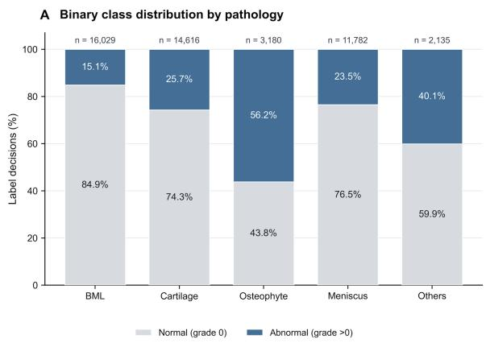
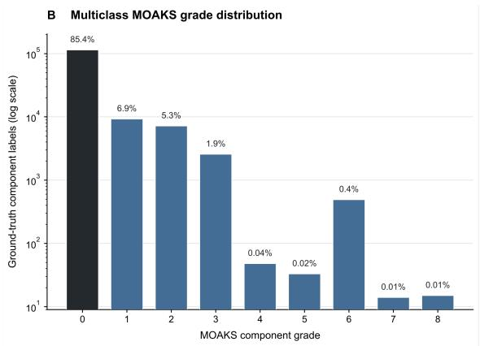
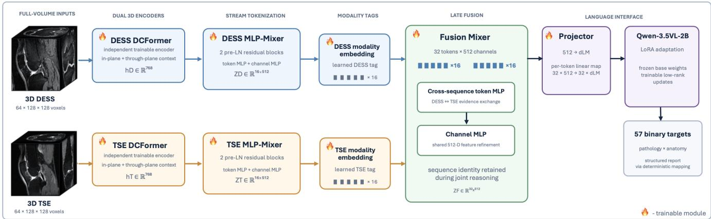

# Knee3DVLM: Dual-Sequence Full-Volume Vision–Language Modeling for Comprehensive Knee MRI Assessment

Maryam Baizhigitova1,2, Andrew Seohwan Yu1,3, Po-Hao Chen3, Naveen Subhas1, Sixu Chen1,4, Xinxin Wang2,3, Kunio Nakamura1, Richard Lartey1, Xiaojuan Li1,3, Mingrui Yang1

1Cleveland Clinic, Cleveland, OH 44106, USA 2Cleveland State University, Cleveland, OH 44115, USA 3Case Western Reserve University, Cleveland, OH 44106, USA 4Kent State University, Kent, OH 44242, USA

Vision-language models (VLMs) are increasingly being applied to three-dimensional medical imaging, with recent systems supporting report generation, visual question answering, localization, and segmentation [1,2]. Their application to knee MRI remains limited, particularly for interpreting the complementary sequences used in clinical practice. The closest existing approach, 3DReasonKnee, processes a single dual-echo steady-state (DESS) series [3], whereas radiologists integrate high-resolution DESS morphology with fluid-sensitive turbo spin-echo (TSE) signal. To address this clinical gap, we introduce Knee3DVLM, a sequence-aware VLM that uses full-volume DESS and TSE inputs to predict 57 anatomically resolved binary diagnostic targets derived from the MRI Osteoarthritis Knee Score (MOAKS) for structured reporting. Three configurations— Knee3DVLM-DESS, Knee3DVLM-TSE, and the fused dual-sequence Knee3DVLM—were evaluated using subject-disjoint Osteoarthritis Initiative partitions [4,5]. In a held-out test cohort of 1,074 examinations, we observed clinically coherent sequence-specific diferences: DESS performed better for cartilage and osteophyte abnormalities, whereas fluid-sensitive TSE performed better for bone marrow lesions, meniscal abnormalities, ACL abnormalities, efusion-synovitis, and Hofa-synovitis. The fused Knee3DVLM achieved 72.98% average accuracy, 71.17% balanced accuracy, 78.96% mean ROC-AUC, and 78.74% macro ROC-AUC, achieving the highest value among the three configurations on every reported aggregate endpoint. In a secondary multiclass analysis aligned with the released 3DReasonKnee cohort, Knee3DVLM achieved numerically higher accuracy than the strongest reported 3DReasonKnee configuration, Qwen2.5VL-3B, in all five pathology categories. These findings support dual-sequence full-volume modeling that more closely reflects clinical multisequence knee MRI interpretation.

Keywords: knee MRI; vision-language model; 3D imaging; multimodal fusion; DESS; TSE; MOAKS; osteoarthritis

## 1 Introduction

Knee osteoarthritis is a highly prevalent joint disease assessed across the entire joint using complementary imaging planes and pulse sequences rather than a single view. In routine interpretation, fluid-sensitive turbo spin-echo (TSE) images commonly serve as the initial survey because they depict meniscal, cruciate ligament, and marrow abnormalities, as well as joint efusion, periarticular cysts, and bursae. Contemporary European Society of Musculoskeletal Radiology recommendations similarly emphasize multiplanar fluid-sensitive imaging and systematic evaluation of every joint structure [6]. This sequence emphasis is also reflected in the OAI knee protocol: the first diagnostic acquisition after localization is coronal intermediate-weighted TSE, while sagittal fat-suppressed TSE provides the protocol's distinctive sensitivity to bone marrow abnormalities and subchondral cysts [5]. DESS supplies complementary thin-section, high-resolution depiction of cartilage morphology and osseous surfaces [7,8], but is relatively insensitive to marrow edema-like signal compared with fluid-sensitive TSE [9,5]. Radiologists therefore reconcile TSE and DESS findings across the whole joint; a DESS-only model cannot fully reproduce this multi-sequence workflow.

Medical VLMs first demonstrated broad visual question answering and generative capabilities on predominantly two-dimensional biomedical figures, radiographs, and other planar images [10,11]. More recent systems have extended image-language alignment to volumetric CT and MRI for report generation, question answering, localization, and segmentation [1,2]. Applied to knee MRI specifically, however, progress remains narrow: existing 3D VLMs generally process a single image series and are benchmarked on isolated diagnostic questions rather than comprehensive, multi-sequence whole-joint assessment.

The closest existing system, 3DReasonKnee, narrows this gap only partially: it introduced regional questions with localization, reasoning traces, and structured MOAKS severity assessments, but operates on DESS alone [3]. More general 3D VLM benchmarks such as M3D-LaMed [1] and Med3DVLM [2] demonstrate eficient full-volume encoding and language grounding but emphasize CT or single-series inputs and do not test clinically motivated sequence complementarity.

We close this gap with Knee3DVLM, a sequence-aware framework for full-volume knee MRI interpretation. Throughout this paper, Knee3DVLM denotes our paired, dual-sequence model; the single-sequence ablations are denoted Knee3DVLM-DESS and Knee3DVLM-TSE. Knee3DVLM makes three contributions:

1. Sequence-preserving dual-volume architecture. Knee3DVLM uses independent full-volume DESS and TSE encoders and stream-specific tokenizers, retains acquisition identity through learned modality embeddings, and performs token-level fusion before projection into the language space. This design integrates complementary contrasts without collapsing them at the image or encoder-input level.

2. Sequence-specific and dual-sequence evaluation. To examine how DESS and fluid-sensitive TSE afect VLM performance, we compared DESS-only, TSE-only, and fused DESS-TSE configurations on the primary 57-target binary task. This analysis tests whether sequence-specific performance follows clinically coherent tissue contrasts and whether combining both sequences improves overall performance.

3. Category-wise comparison with 3DReasonKnee. As a secondary benchmark analysis, we aligned the original OAI data with the released 3DReasonKnee subject, visit, and knee-side identifiers and compared category-wise exact-grade average accuracy using the metric reported in that study (Table 5).

## 2 Related Work

Semiquantitative Knee MRI Assessment. The MRI Osteoarthritis Knee Score (MOAKS) provides a whole-joint framework for semiquantitative assessment of cartilage damage, bone marrow lesions, osteophytes, meniscal abnormalities, synovitis, and other structural findings [12]. The Osteoarthritis Initiative (OAI) supplies longitudinal MRI and clinical data at scale [4]. Sequence selection afects the conspicuity and measured extent of pathology: fluid-sensitive TSE imaging ofers greater validity and statistical power for bone marrow lesion assessment, whereas DESS supports high-resolution morphologic evaluation of cartilage and osseous surfaces [9,7].

Three-Dimensional Medical Vision-Language Models. M3D-LaMed established a generalpurpose 3D multimodal model and benchmark spanning retrieval, captioning, VQA, localization, and segmentation [1]. Med3DVLM focused on computationally eficient full-volume encoding through decomposed convolutions and learned image-language projection [2]. These advances motivate full-volume reasoning but do not directly resolve multi-sequence knee MRI interpretation.

Knee MRI Reasoning. 3DReasonKnee links DESS volumes to subregion-specific diagnostic questions, bounding boxes, clinician-authored reasoning, and MOAKS grades [3]. It is the closest conceptual predecessor to our study. We retain its emphasis on anatomically explicit assessment but extend the input space from a single DESS series to paired DESS and fluid-sensitive TSE, and from isolated questions to a comprehensive structured whole-joint output.

## 3 Methods

3.1 Dataset and Cohort. We used the original Osteoarthritis Initiative (OAI) dataset and aligned it with the cohort manifest released with 3DReasonKnee. Matching was performed by OAI subject, visit, and knee side. These identifiers were used to retrieve the corresponding original OAI MOAKS readings and DESS examination and to pair the fluid-sensitive TSE examination from the same subject, visit, and knee. Acquisition date provided an additional consistency check. We defined a study as one labeled subject-visitknee examination; consequently, a participant could contribute bilateral knees and multiple longitudinal visits but could never appear in more than one data partition. Participants, rather than examinations, were assigned to fixed training, validation, and test partitions. The resulting subject-disjoint split contained 2,000 training participants (75.4%), 267 validation participants (10.1%), and 385 test participants (14.5%), for a total of 2,652 unique participants. These participants contributed 5,901 training studies (74.0%), 837 validation studies (10.5%), and 1,232 test studies (15.5%), or 7,970 labeled studies overall. A participant-ID audit after cohort assembly and sequence matching confirmed zero overlap among the partitions; all knees, visits, and sequences from each participant remained in one partition. Sequence availability was nearly complete. DESS was available for 5,899 of 5,901 training studies (99.97%), 837 of 837 validation studies (100%), and 1,231 of 1,232 test studies (99.92%); TSE was available for 5,897 of 5,901 (99.93%), 837 of 837 (100%), and 1,232 of 1,232 studies (100%), respectively. Matched DESS-TSE pairs were available for 5,895 of 5,901 training studies (99.90%), 837 of 837 validation studies (100%), and 1,231 of 1,232 test studies (99.92%). Each configuration used only studies containing its required sequence or sequence pair; missing acquisitions were excluded rather than imputed. For the controlled primary comparison, all three configurations were evaluated on the same 1,074 fully paired test examinations retained after preprocessing and prediction matching, preventing diferences in test-set composition from afecting the comparison.

  
Figure 1. Class imbalance in the binary and multiclass evaluation tasks. Panel A summarizes ground-truth normal-versus-abnormal labels across the 57 targets, grouped by pathology. Panel B shows the pooled ground-truth grade distribution across all 109 multiclass MOAKS component attributes on a logarithmic axis, exposing rare grades while retaining the dominant grade 0 class (85.4%).

Cohort flow and benchmark alignment. The released 3DReasonKnee manifest comprised 7,970 labeled subject-visit-knee studies from 2,652 participants. Manifest identifiers were matched to the original OAI records by subject, visit, and knee side; the corresponding DESS examination and fluid-sensitive TSE examination from the same knee and visit were then retrieved. The fixed subject-disjoint test partition contained 1,232 studies, of which 1,231 had both sequences available. After preprocessing and requiring matched prediction records from Knee3DVLM-DESS, Knee3DVLM-TSE, and Knee3DVLM, 1,074 examinations formed the common primary test cohort; 157 paired examinations were excluded during preprocessing or prediction matching. The secondary exact-grade analysis used the same 3DReasonKnee-aligned identifiers and the original OAI MOAKS fields, ensuring alignment by subject, visit, and knee side rather than by generated reports.

3.2 Target Construction. As shown in Figure 1, Panel A, for the primary task, original OAI MOAKS measurements were collapsed into 57 binary pathology-region targets: grade 0 was normal, and any valid nonzero grade was abnormal. Each target therefore represents a specific pathology at a defined anatomica location or structural feature rather than a generic disease class. Each n is the total number of evaluable OAI study–target MOAKS annotations pooled within that group: grade 0 was mapped to normal, a valid nonzero grade to abnormal, and missing or non-evaluable readings were excluded. Thus, n counts annotations rather than patients or model predictions. The targets cover the medial and lateral compartments, anterior, central, and posterior subregions where applicable, patellar surfaces, meniscal segments and extrusion sites, the cruciate ligaments, and whole-joint inflammatory findings summarized in Table 1. Missing or non-evaluable MOAKS readings were masked and were never converted to negative labels.

Table 1. Binary target schema. Parenthetical counts indicate the number of binary targets contributed by each anatomical grouping.
<table><tr><td>Pathology</td><td>Targets</td><td>Anatomical definition</td></tr><tr><td>BML</td><td>15</td><td>Femur: medial/lateral × anterior/central/posterior (6); Tibia: medial/lateral × anterior/central/posterior (6); Patella: medial/lateral (2);</td></tr><tr><td>Cartilage</td><td>14</td><td>Tibial subspinous region: one target (1). Femur: medial/lateral × anterior/central/posterior (6); Tibia: medial/lateral × anterior/central/posterior (6); Patella: medial/lateral (2).</td></tr><tr><td>Osteophyte</td><td>12</td><td>Femur: medial/lateral × anterior/central/posterior (6); Tibia: medial/lateral (2);</td></tr><tr><td>Meniscus</td><td>12</td><td>Patella: medial/lateral/superior/inferior (4). Morphology: medial/lateral × anterior horn/body/posterior horn/root (8);</td></tr><tr><td>ACL</td><td>1</td><td>Extrusion: anterior and body sites on each side (4). Whole-ligament anterior cruciate ligament abnormality.</td></tr><tr><td>PCL</td><td>1</td><td>Whole-ligament posterior cruciate ligament abnormality.</td></tr><tr><td>Effusion Synovitis</td><td>1</td><td>Whole-joint effusion-synovitis. Whole-joint Hoffa-synovitis.</td></tr></table>

For the secondary task, we returned to the original OAI MOAKS variables and retained their exact component grades rather than collapsing them to normal versus abnormal. This produces 109 gradebearing attributes because several anatomical questions contain more than one MOAKS component: the 15 BML regions each contribute lesion size, lesion count, and non-cystic lesion percentage (45 attributes); the 14 cartilage regions each contribute lesion size and depth (28); 12 osteophyte locations each contribute one grade (12); meniscal morphology and extrusion contribute 10 attributes; and 11 questions grouped as Others contribute 14 attributes spanning Hofa-synovitis, efusion-synovitis, ACL and PCL features, patellar-tendon signal, bursae, and cysts. Thus, 57 and 109 are not competing class counts: 57 is the prespecified binary whole-joint output space, whereas 109 is the expanded exact-grade component space. A schema audit confirmed that all 109 grading attributes used for the comparison mapped directly to original OAI MOAKS fields and matched the definitions in the released 3DReasonKnee question schema (109/109, 100% coverage). No generated 3DReasonKnee report was used as ground truth. This exact-grade analysis is secondary because the component-grade distribution is highly imbalanced.

3.3 Model Architecture. Knee3DVLM is organized as a hierarchical late-fusion architecture in which sequence-specific volumetric representation learning precedes cross-sequence interaction and language conditioning (Fig. 2). Let $X _ { D } , X _ { T } \in \mathbb { R } ^ { 1 \times 6 4 \times 1 2 8 \times 1 2 8 }$ denote the paired DESS and TSE volumes, where the spatial dimensions correspond to depth, height, and width. For modality $m \in \{ D , T \}$ , the forward pathway is

$$
h _ { m } = f _ { m } ( X _ { m } ) , \qquad Z _ { m } = g _ { m } ( h _ { m } ) , \qquad \widetilde { Z } _ { m } = Z _ { m } + { \bf 1 } _ { 1 6 } E _ { m } ,\tag{1}
$$

followed by

$$
Z _ { F } = q \Bigl ( \bigl [ \widetilde { Z } _ { D } ; \widetilde { Z } _ { T } \bigr ] \Bigr ) , \qquad H _ { V } = p ( Z _ { F } ) .\tag{2}
$$

Here, $f _ { m }$ is the sequence-specific three-dimensional encoder, $h _ { m } \in \mathbb { R } ^ { 7 6 8 }$ is its examination-level representation, $g _ { m }$ is the stream-specific tokenizer, and $Z _ { m } ~ \in ~ \mathbb { R } ^ { 1 6 \times 5 1 2 }$ contains the resulting visual tokens. $E _ { m } \in \mathbb { R } ^ { 5 1 2 }$ is a learned modality embedding that is added to all 16 tokens through broadcasting by 116, thereby identifying each token as DESS or TSE. The bracket $[ \widetilde { Z } _ { D } ; \widetilde { Z } _ { T } ]$ denotes concatenation along the token dimension, q is the cross-sequence fusion Mixer, and $p$ is the language-space projector. Consequently, $Z _ { F } \in \mathbb { R } ^ { 3 2 \times 5 1 2 }$ and $H _ { V } \in \mathbb { R } ^ { 3 2 \times d _ { \mathrm { L M } } }$ , where $d _ { \mathrm { L M } }$ is the hidden embedding dimension required by the language model. This decomposition imposes three explicit stages of representation learning: spatial reasoning within each volume, contrast-specific compression within each sequence, and joint reasoning across the paired examination. Cross-sequence interaction therefore occurs only after each acquisition has formed a complete volumetric representation.

Dual-encoder full-volume representation learning. Knee3DVLM receives spatially matched DESS and TSE volumes from the same subject, visit, and knee. Each sequence is reoriented to a common anatomical convention, resampled to $6 4 \times 1 2 8 \times 1 2 8$ voxels (depth × height × width), and intensitystandardized independently so that its native contrast distribution is retained. The volumes are processed by two independently parameterized DCFormer encoders [2], not a shared visual trunk. Within each encoder, decomposed in-plane and through-plane operations capture spatial morphology and interslice context across the complete volume. Global aggregation and a learned projection produce a 768-dimensional sequence representation, $h _ { m } \in \mathbb { R } ^ { 7 6 8 }$ for $m \in \{ D , T \}$ . The DESS and TSE encoders are initialized from their corresponding sequence-specific checkpoints and remain trainable, enabling each branch to retain its contrast specialization while adapting to the common 57-target whole-joint objective. Because the branches are independently parameterized, optimization is not forced to represent the markedly diferent DESS and TSE intensity distributions with a single set of visual filters. At the same time, end-to-end training allows gradients from the shared diagnostic objective to update both encoders, so their representations become complementary at the point of fusion rather than remaining fixed feature extractors.

  
Figure 2. Knee3DVLM architecture. Independent trainable DCFormer encoders map the full DESS and TSE volumes to 768-dimensional representations. Sequence-specific MLP-Mixers form 16 visual tokens of width 512 per sequence. Learned modality embeddings preserve sequence identity before the 32 tokens undergo cross-sequence token mixing and shared channel refinement. A per-token projector maps the fused representation from width 512 to the language-model embedding dimension $d _ { \mathrm { L M } }$ . The LoRA-adapted language backbone predicts 57 anatomically resolved binary targets, which are converted into a structured report by deterministic mapping. Flame symbols identify trainable modules.

Fixed-width stream-specific tokenization. Each 768-dimensional encoder output is expanded by a separate trainable MLP-Mixer into 16 tokens of width 512. Each stream contains two pre-normalized residual Mixer blocks: a token-mixing multilayer perceptron exchanges information across the 16-token axis, followed by a channel-mixing multilayer perceptron operating across the 512-dimensional feature axis. The DESS and TSE tokenizers share no parameters, allowing the two contrast-specific compression functions to develop independently before multimodal interaction. This yields $Z _ { m } \in \mathbb { R } ^ { 1 6 \times 5 1 2 }$ for each sequence. More formally, a Mixer block applies residual token mixing and residual channel mixing,

$$
U = Z + \mathcal { M } _ { \mathrm { t o k } } ( \mathrm { L N } ( Z ) ) , \qquad Z ^ { \prime } = U + \mathcal { M } _ { \mathrm { c h } } ( \mathrm { L N } ( U ) ) ,\tag{3}
$$

where LN denotes Layer Normalization, $\mathcal { M } _ { \mathrm { t o k } }$ exchanges evidence among learned visual tokens, and $\mathcal { M } _ { \mathrm { c h } }$ transforms their feature channels. Separate parameters are used at every DESS and TSE tokenization stage. The resulting learned bottleneck converts the two full volumes—more than two million input voxels in total—into a fixed visual budget of 32 tokens while preserving distinct token sets for the two acquisitions.

Modality-aware hierarchical late fusion. Cross-sequence interaction is deliberately delayed until both volumes have undergone independent 3D encoding and within-stream token refinement. A learned 512-dimensional modality embedding is added to every token, making its DESS or TSE origin explicit. The two streams are concatenated into $Z \in \mathbb { R } ^ { 3 2 \times 5 1 2 }$ and processed by a fusion Mixer block that performs token and channel mixing across the complete paired examination. Thus, token mixing can exchange evidence across sequences, whereas the retained modality tags allow the fusion module to distinguish the source contrast of that evidence. The residual fusion pathway also provides a direct information route from each sequence-specific token set to the projected representation. Only after fusion is each token mapped through a single linear projector $W _ { \mathrm { o u t } } \in \mathbb { R } ^ { 5 1 2 \times d _ { \mathrm { L M } } }$ into the language-model hidden embedding dimension dLM:

$$
\mathbb { R } ^ { 7 6 8 } \times 2 \longrightarrow \mathbb { R } ^ { 1 6 \times 5 1 2 } \times 2 \longrightarrow \mathbb { R } ^ { 3 2 \times 5 1 2 } \longrightarrow \mathbb { R } ^ { 3 2 \times d _ { \mathrm { L M } } } .
$$

This fixed-width bridge is computationally important: all token and channel mixing occurs at width 512, independent of the language backbone, and only the terminal per-token projection scales with $d _ { \mathrm { L M } }$ . The visual interface therefore grows linearly, rather than quadratically, with the language-model hidden size. In addition, the language model always receives 32 visual tokens, so the visual contribution to its attention sequence length is fixed and does not grow with the original volume dimensions. This separation makes the fusion interface portable across language backbones with diferent hidden sizes: only the terminal projector must conform to the selected language embedding dimension.

Architectural contribution. The resulting hierarchy combines two independently trained volumetric encoders with sequence-preserving compression and late representation-level fusion. It avoids premature contrast entanglement, retains acquisition identity during joint reasoning, and supplies the language model with a compact paired-volume representation. Importantly, fusion is performed over learned threedimensional examination-level features rather than over isolated slices or independently generated textual descriptions. The language backbone consequently receives one jointly optimized representation of the paired examination, while the visual pathway remains explicitly aware of which evidence originated from DESS and which originated from TSE. The same modular interface yields controlled Knee3DVLM-DESS and Knee3DVLM-TSE paths by retaining one encoder-tokenizer stream without changing the language interface, prediction space, or reporting procedure.

Language-conditioned multi-target prediction. The 32 projected visual tokens condition a Qwen-3.5VL-2B backbone adapted with trainable low-rank adapters (LoRA). The optimized pathway comprises both DCFormer encoders, both stream Mixers, the fusion Mixer, the language projector, and the LoRA parameters. The pretrained language weights supply the language prior, whereas LoRA provides a parametereficient route for adapting multimodal reasoning to the structured knee MRI task. Because the visual encoders, tokenizers, fusion module, projector, and adapters are optimized jointly, supervision from the complete target set is propagated through the entire multimodal pathway. A single examination-level forward pass produces probabilities for 57 anatomically resolved binary targets derived from MRI Osteoarthritis Knee Score (MOAKS) readings. Each output is tied to a defined pathology-location pair rather than a generic whole-knee label. A deterministic reporting layer then organizes target-level predictions by pathology and anatomical subregion and constructs the findings, clinical impression, and overall conclusion. Fixing this final mapping ensures that comparisons reflect diagnostic predictions rather than variation in generated phrasing.

3.4 Training and Inference. All models were trained using only the training partition; validation data were used for checkpoint selection, and the test set remained untouched until final evaluation. Volumes were intensity-clipped, standardized, and resampled to $6 4 \times 1 2 8 \times 1 2 8$ voxels before being passed through the appropriate sequence-specific encoder. The binary task used class-aware training and target-specific validation thresholds. At inference, each model generated a continuous probability of abnormality for every target. A separate decision threshold was selected for each target using validation predictions only. The threshold maximized target-level balanced accuracy, with ties resolved in favor of the value closest to 0.50, and was locked before test evaluation. A test probability equal to or greater than its validation-derived threshold was classified as positive.

Continuous probabilities were retained for threshold-independent evaluation with ROC-AUC. Thresholded predictions were used to calculate accuracy, sensitivity, specificity, and balanced accuracy. Missing test labels were excluded separately for each target so that every metric used only evaluable observations.

Finally, the deterministic reporting layer organized the binary predictions into pathology-specific findings and anatomical subregions. Positive predictions were reported as detected abnormalities, while evaluable negative predictions were represented as normal findings. The same reporting procedure was applied to all three model configurations, ensuring that comparisons reflected diferences in model predictions rather than diferences in report generation.

3.5 Evaluation. For binary target i and examination $j , y _ { i j } \in \{ 0 , 1 \}$ denotes the observed label, $p _ { i j }$ the predicted probability of abnormality, and $\tau _ { i }$ the target-specific decision threshold selected exclusively on the validation set by maximizing balanced accuracy; ties were resolved in favor of the threshold closest to 0.50. The locked test prediction was $\hat { y } _ { i j } = \mathcal { H } [ p _ { i j } \ge \tau _ { i } ]$ . Missing and non-evaluable labels were excluded target by target.

Threshold-dependent classification metrics. For every target, we calculated ordinary accuracy, sensitivity (recall), specificity, and balanced accuracy from the test-set confusion matrix:

$$
\mathrm { A c c } _ { i } = \frac { T P _ { i } + T N _ { i } } { N _ { i } } , \quad \mathrm { S e n s } _ { i } = \frac { T P _ { i } } { T P _ { i } + F N _ { i } } , \quad \mathrm { S p e c } _ { i } = \frac { T N _ { i } } { T N _ { i } + F P _ { i } } .
$$

$$
\begin{array} { r } { \mathrm { B A } _ { i } = \frac { 1 } { 2 } ( \mathrm { S e n s } _ { i } + \mathrm { S p e c } _ { i } ) . } \end{array}
$$

Balanced accuracy was the primary endpoint because it assigns equal weight to abnormal-case sensitivity and normal-case specificity despite large diferences in target prevalence. Average accuracy and every macro metric were unweighted means across the $K = 5 7$ targets, so targets with more evaluable observations could not dominate the summary:

$$
\operatorname { M a c r o } ( M ) = \frac { 1 } { K } \sum _ { i = 1 } ^ { K } M _ { i } , \qquad \mathrm { A v e r a g e ~ a c c u r a c y } = \frac { 1 } { K } \sum _ { i = 1 } ^ { K } \operatorname { A c c } _ { i } .
$$

For target $\begin{array} { r } { , \mathrm { R O C - A U C } _ { i } = \mathrm { P r } ( s _ { i } ^ { + } > s _ { i } ^ { - } ) + \frac { 1 } { 2 } \mathrm { P r } ( s _ { i } ^ { + } = s _ { i } ^ { - } ) } \end{array}$ , where $s _ { i } ^ { + }$ and $s _ { i } ^ { - }$ are predicted scores for randomly selected positive and negative examinations. The mean ROC-AUC is the evaluable-examinationweighted mean of the target-level ROC-AUC values,

$$
\mathrm { M e a n \ R O C - A U C } = \frac { \sum _ { i = 1 } ^ { K } N _ { i } \mathrm { R O C - A U C } _ { i } } { \sum _ { i = 1 } ^ { K } N _ { i } } ,
$$

where $N _ { i }$ is the number of evaluable examinations for target i. To ensure that targets with fewer evaluable labels retained equal influence, we also calculated macro ROC-AUC,

$$
\mathrm { M a c r o \ R O C - A U C } = \frac { 1 } { K } \sum _ { i = 1 } ^ { K } \mathrm { R O C - A U C } _ { i } ,
$$

Mean ROC-AUC gives greater influence to targets with more evaluable examinations, whereas macro ROC-AUC gives every target equal influence. Both are reported to distinguish observation-weighted discrimination from equal-target discrimination under the observed missingness and imbalance. Targets lacking either class were excluded.

Secondary exact-grade evaluation. To match 3DReasonKnee, category-wise average accuracy was calculated as the unweighted mean of attribute-level exact-grade accuracies within each pathology category. Participant-level confidence intervals and paired significance tests were not calculated and are acknowledged as limitations.

## 4 Results

4.1 Primary 57-Target Binary Results. Table 2 compares the three Knee3DVLM input configurations on the primary task. Knee3DVLM achieved the highest value among the three configurations for every reported aggregate endpoint: average accuracy (72.98%), balanced accuracy (71.17%), mean ROC-AUC (78.96%), and macro ROC-AUC (78.74%). Knee3DVLM-DESS ranked second on each aggregate endpoint, while Knee3DVLM-TSE contributed complementary information in several pathology groups (Table 3).

Table 2. Primary binary 57-target performance on the matched held-out test cohort. Values are presented in percentages.
<table><tr><td rowspan="2">Model</td><td rowspan="2">Accuracy Average</td><td colspan="3">Threshold-dependent classification</td><td colspan="2">Discrimination</td><td>Cohort</td></tr><tr><td>Balanced accuracy accuracy</td><td>Sensitivity</td><td>Specificity</td><td>Mean ROC-AUC</td><td>Macro ROC-AUC</td><td>Examinations (n)</td></tr><tr><td>Knee3DVLM-DESS</td><td>72.59</td><td>70.42</td><td>67.04</td><td>73.80</td><td>76.93</td><td>76.89</td><td>1,074</td></tr><tr><td>Knee3DVLM-TSE</td><td>70.36</td><td>69.10</td><td>65.24</td><td>72.96</td><td>76.83</td><td>76.45</td><td>1,074</td></tr><tr><td>Knee3DVLM</td><td>72.98</td><td>71.17</td><td>66.88</td><td>75.46</td><td>78.96</td><td>78.74</td><td>1,074</td></tr></table>

Table 3. Pathology-wise balanced accuracy for the three Knee3DVLM input configurations. Values are percentages. TSE-only and DESS-only values were recomputed directly from their held-out target-level prediction exports using the unweighted mean of target-level balanced accuracy within each pathology group; Knee3DVLM values were computed identically. Bold indicates the highest value in each column.
<table><tr><td>Model</td><td>BML</td><td>Cartilage</td><td>Osteophyte</td><td>Meniscus</td><td>ACL</td><td>PCL *</td><td>Effusion</td><td>Synovitis</td></tr><tr><td>Knee3DVLM-TSE</td><td>71.34</td><td>70.62</td><td>69.61</td><td>68.40</td><td>80.42</td><td>50.66</td><td>72.86</td><td>65.71</td></tr><tr><td>Knee3DVLM-DESS</td><td>69.55</td><td>72.77</td><td>71.29</td><td>67.18</td><td>75.95</td><td>32.51</td><td>71.64</td><td>64.22</td></tr><tr><td>Knee3DVLM</td><td>71.60</td><td>73.48</td><td>71.67</td><td>69.02</td><td>78.37</td><td>51.60</td><td>72.41</td><td>63.60</td></tr></table>

\*Only six positive PCL examinations were available in the held-out cohort; the PCL estimate should therefore be interpreted with substantial uncertainty.

Relative to Knee3DVLM-TSE, Knee3DVLM improved average accuracy by 2.62 percentage points, macro balanced accuracy by 2.07 points, mean ROC-AUC by 2.13 points and macro ROC-AUC by 2.29 points. Relative to Knee3DVLM-DESS, it improved average accuracy by 0.39 points, macro balanced accuracy by 0.75 points, mean ROC-AUC by 2.03 points, and macro ROC-AUC by 1.85 points. Dual-sequence fusion therefore improved every prespecified aggregate endpoint over either single-sequence configuration.

The central finding was that model performance reflected the complementary tissue contrasts used by radiologists in clinical practice. Among the single-sequence configurations, Knee3DVLM-DESS achieved higher balanced accuracy for cartilage (72.77% vs. 70.62%) and osteophytes (71.29% vs. 69.61%), whereas Knee3DVLM-TSE performed better for BMLs (71.34% vs. 69.55%), meniscal abnormalities (68.40% vs. 67.18%), ACL abnormalities (80.42% vs. 75.95%), efusion-synovitis (72.86% vs. 71.64%), and Hofasynovitis (65.71% vs. 64.22%). Overall, the results show a clinically coherent sequence-specific pattern rather than a uniform advantage for either acquisition.

Table 4. Knee3DVLM performance by pathology group. Values are percentages, computed directly from the same target-level export used for Tables 2 and 3. Average accuracy and macro ROC-AUC are unweighted means of per-target values within each pathology group. Mean ROC-AUC weights each target-level ROC-AUC by its number of evaluable examinations within the pathology group.
<table><tr><td>Pathology</td><td>Targets</td><td>Average accuracy</td><td>Balanced accuracy</td><td>Mean ROC-AUC</td><td>Macro ROC-AUC</td></tr><tr><td>BML</td><td>15</td><td>73.05</td><td>71.60</td><td>78.88</td><td>78.86</td></tr><tr><td>Cartilage</td><td>14</td><td>76.01</td><td>73.48</td><td>80.45</td><td>80.38</td></tr><tr><td>Meniscus</td><td>12</td><td>74.31</td><td>69.02</td><td>77.58</td><td>78.03</td></tr><tr><td>Osteophyte</td><td>12</td><td>71.13</td><td>71.67</td><td>79.16</td><td>79.16</td></tr><tr><td>ACL</td><td>1</td><td>70.14</td><td>78.37</td><td>87.99</td><td>87.99</td></tr><tr><td>Effusion</td><td>1</td><td>67.60</td><td>72.41</td><td>77.80</td><td>77.80</td></tr><tr><td>Synovitis</td><td>1</td><td>63.65</td><td>63.60</td><td>70.89</td><td>70.89</td></tr><tr><td>PCL*</td><td>1</td><td>53.11</td><td>51.60</td><td>57.06</td><td>57.06</td></tr></table>

\*Only six positive PCL examinations were available in the held-out cohort; the PCL estimate should therefore be interpreted with substantial uncertainty.

The strongest group-level discrimination result was 87.99% ROC-AUC for ACL abnormalities; among the multi-target pathology groups, cartilage achieved the highest mean ROC-AUC (80.45%) and macro ROC-AUC (80.38%).

Fusion provided the strongest overall model. Knee3DVLM ranked first on every prespecified aggregate binary endpoint: average accuracy (72.98%), macro balanced accuracy (71.17%), mean ROC-AUC (78.96%), and macro ROC-AUC (78.74%). At the pathology-group level, fusion achieved the highest balanced accuracy for all four multi-target groups: BML, cartilage, osteophytes, and meniscal abnormalities.

4.2 Multiclass Grading and Comparison with 3DReasonKnee. The secondary multiclass task reconstructs the exact-grade questions used by 3DReasonKnee. We matched the released 3DReasonKnee cohort identifiers to the original OAI examinations by subject ID, visit, and knee side and calculated categorywise average accuracy using the metric reported in that paper (Table 5). Multiclass Knee3DVLM was numerically higher than the strongest published Qwen2.5VL-3B configuration without chain-of-thought supervision in all five categories: BML (72.11% vs. 70.60%), cartilage (62.32% vs. 60.20%), osteophyte (35.22% vs. 34.50%), meniscus (40.32% vs. 38.70%), and Others (65.20% vs. 61.60%). In Table 5, PCL, ACL, Efusion and Synovitis are grouped under Others solely to match the category definitions published by 3DReasonKnee. This benchmark-aligned grouping is not used in the primary 57-target analysis, in which these classes remain distinct targets.

Table 5. Category-wise average accuracy comparison with the published 3DReasonKnee multiclass grading results. †Published results transcribed from Sambara et al. [3]. Bold indicates the highest value in each category.
<table><tr><td>Model</td><td>Method</td><td>BML</td><td>Cartilage</td><td>Osteophyte</td><td>Meniscus</td><td>Others</td></tr><tr><td>Qwen2.5VL-3B†</td><td>SFT with CoT</td><td>66.70</td><td>60.00</td><td>34.20</td><td>34.00</td><td>59.00</td></tr><tr><td>Med3DVLM†</td><td>SFT with CoT</td><td>67.10</td><td>57.90</td><td>33.30</td><td>34.30</td><td>60.50</td></tr><tr><td>Med3DVLM†</td><td>SFT without CoT</td><td>67.00</td><td>57.80</td><td>33.00</td><td>34.60</td><td>60.00</td></tr><tr><td>Qwen2.5VL-3B†</td><td>SFT without CoT</td><td>70.60</td><td>60.20</td><td>34.50</td><td>38.70</td><td>61.60</td></tr><tr><td>Our VLM (DESS-only)</td><td>Full training without CoT</td><td>70.80</td><td>65.30</td><td>36.10</td><td>32.90</td><td>64.30</td></tr><tr><td>Our VLM (TSE-only)</td><td>Full training without CoT</td><td>71.91</td><td>55.40</td><td>34.05</td><td>41.60</td><td>65.40</td></tr><tr><td>Our VLM (paired DESS-TSE)</td><td>Full training without CoT</td><td>72.11</td><td>62.32</td><td>35.22</td><td>40.32</td><td>65.20</td></tr></table>

Values are category-wise average accuracy percentages, matching the metric reported by 3DReasonKnee. We reconstructed the comparison cohort by matching the released 3DReasonKnee OAI identifiers to the original OAI data at the subject, visit, and knee-side levels. Published baseline values are transcribed from the 3DReasonKnee paper; our values were computed on the aligned cohort using the same category definitions.

This comparison requires an important qualification. As shown in Figure 1, Panel B, grade 0 accounted for 85.41% of ground-truth component labels, so exact-grade accuracy can remain high despite weak minority-grade performance. The published 3DReasonKnee results do not include per-grade confusion matrices; therefore, balanced accuracy cannot be recovered for those models. Table 5 should be interpreted as a benchmark-aligned comparison using the authors' reported metric rather than a complete comparison of grading performance.

## 5 Discussion

The DESS advantage for cartilage and osteophytes is consistent with its thin-section, high-resolution three-dimensional depiction of articular morphology and cartilage–fluid and bone–cartilage interfaces. DESS was selected in the OAI protocol specifically to support quantitative cartilage morphometry, and prior whole-joint studies found chondral abnormalities well visualized with high-resolution fat-suppressed DESS [5,13]. Osteophytes are also primarily marginal osseous structures, making the observed DESS advantage anatomically plausible. These are concordant associations, however, and should not be interpreted as proof that sequence contrast alone caused the performance diference.

Conversely, the TSE advantages align with the role of fluid-sensitive proton-density or intermediateweighted imaging in routine knee interpretation. Fat-suppressed TSE increases the conspicuity of marrow edema-like signal, joint fluid, and soft-tissue edema and provides strong contrast for meniscal and cruciateligament abnormalities; current ESSR recommendations therefore emphasize multiplanar fluid-sensitive imaging for systematic assessment of the knee [6]. The higher TSE performance for BML, meniscus, ACL, efusion, and synovitis is therefore clinically expected.

This pattern supports the design premise that sequence-specific encoders preserve morphology-dominant DESS features and fluid-sensitive TSE features before token-level fusion. A prior multireader study similarly found that adding a short fluid-sensitive PD-FSE acquisition to DESS improved positive and negative agreement for comprehensive knee assessment [13].

The secondary exact-grade experiment provided complementary benchmark evidence. Among our models, Knee3DVLM-DESS achieved the highest cartilage and osteophyte accuracy, Knee3DVLM-TSE achieved the highest meniscus and Others accuracy, and Knee3DVLM achieved the highest BML accuracy. More importantly for the external comparison, Knee3DVLM was numerically higher than the strongest published 3DReasonKnee configuration in every shared category: BML (72.11% vs. 70.60%), cartilage (62.32% vs. 60.20%), osteophyte (35.22% vs. 34.50%), meniscus (40.32% vs. 38.70%), and Others (65.20% vs. 61.60%). Finally, this study evaluates diagnostic targets and deterministic structured reports rather than prospective reader performance, workflow impact, or patient outcomes.

## 6 Conclusion

Knee3DVLM addresses a gap in three-dimensional knee MRI by combining full-volume, whole-joint assessment with paired DESS and fluid-sensitive TSE inputs. On the primary binary task, the fused model achieved the highest average accuracy, balanced accuracy, mean ROC-AUC, and macro ROC-AUC among the three tested configurations. On the secondary multiclass exact-grade benchmark, Knee3DVLM was numerically higher than the strongest published 3DReasonKnee baseline in all five reported categories. These results support sequence-aware fusion for comprehensive knee MRI assessment while underscoring the need for class-aware evaluation.

## Acknowledgments

This study was supported by a Cleveland Clinic Catalyst Grant.

## References

[1] F. Bai, Y. Du, T. Huang, M. Q.-H. Meng, and B. Zhao, “M3D: Advancing 3D Medical Image Analysis with Multi-Modal Large Language Models,” arXiv:2404.00578, 2024. https://arxiv.org/abs/2404.00578

[2] Y. Xin, G. C. Ates, K. Gong, and W. Shao, “Med3DVLM: An Eficient Vision-Language Model for 3D Medical Image Analysis,” arXiv:2503.20047, 2025. https://arxiv.org/abs/2503.20047

[3] S. Sambara, S. E. Kim, X. Zhang, L. Luo, S. Johri, M. Baharoon, D. H. Ro, and P. Rajpurkar, “3DReasonKnee: Advancing Grounded Reasoning in Medical Vision Language Models,” Pacific Symposium on Biocomputing, vol. 31, pp. 99–113, 2026. https://doi.org/10.1142/9789819824755\_0008

[4] M. C. Nevitt, D. T. Felson, and G. Lester, “The Osteoarthritis Initiative: Protocol for the Cohort Study,” Osteoarthritis Initiative, version 1.1, 2006. https://nda.nih.gov/static/docs/StudyDesignProtocolAndAppendices.pdf

[5] C. G. Peterfy, E. Schneider, and M. Nevitt, “The Osteoarthritis Initiative: Report on the Design Rationale for the Magnetic Resonance Imaging Protocol for the Knee,” Osteoarthritis and Cartilage, vol. 16, no. 12, pp. 1433–1441, 2008. https://doi.org/10.1016/j.joca.2008.06.016

[6] A. P. Parkar and M. E. A. P. M. Adriaensen, “ESR Essentials: MRI of the Knee—Practice Recommendations by ESSR,” European Radiology, vol. 34, no. 10, pp. 6590–6599, 2024. https://doi.org/10.1007/s00330-024-10706-7

[7] F. Eckstein, M. Hudelmaier, W. Wirth, B. Kiefer, R. Jackson, J. Yu, C. B. Eaton, and E. Schneider, “Double Echo Steady State Magnetic Resonance Imaging of Knee Articular Cartilage at 3 Tesla: A Pilot Study for the Osteoarthritis Initiative,” Annals of the Rheumatic Diseases, vol. 65, no. 4, pp. 433–441, 2006. https://doi.org/10.1136/ard.2005.039370

[8] A. S. Chaudhari, M. S. Black, S. Eijgenraam, W. Wirth, S. Maschek, B. Sveinsson, F. Eckstein, E. H. G. Oei, G. E. Gold, and B. A. Hargreaves, “Five-Minute Knee MRI for Simultaneous Morphometry and T2 Relaxometry of Cartilage and Meniscus and for Semiquantitative Radiological Assessment Using Double-Echo in Steady-State at 3T,” Journal of Magnetic Resonance Imaging, vol. 47, no. 5, pp. 1328–1341, 2018. https://doi.org/10.1002/jmri.25883

[9] M. Zhang, J. B. Driban, L. L. Price, G. H. Lo, and T. E. McAlindon, “Magnetic Resonance Image Sequence Influences the Relationship Between Bone Marrow Lesion Volume and Pain: Data from the Osteoarthritis Initiative,” BioMed Research International, vol. 2015, article 731903, 2015. https://doi.org/10.1155/2015/731903

[10] C. Li, C. Wong, S. Zhang, N. Usuyama, H. Liu, J. Yang, T. Naumann, H. Poon, and J. Gao, “LLaVA-Med: Training a Large Language-and-Vision Assistant for Biomedicine in One Day,” arXiv:2306.00890, 2023. https://arxiv.org/abs/2306.00890

[11] M. Moor, Q. Huang, S. Wu, M. Yasunaga, C. Zakka, Y. Dalmia, E. P. Reis, P. Rajpurkar, and J. Leskovec, “Med-Flamingo: A Multimodal Medical Few-Shot Learner,” arXiv:2307.15189, 2023. https://arxiv.org/abs/2307.15189

[12] D. J. Hunter, A. Guermazi, G. H. Lo, A. J. Grainger, P. G. Conaghan, R. M. Boudreau, and F. W. Roemer, “Evolution of Semi-Quantitative Whole-Joint Assessment of Knee OA: MOAKS (MRI Osteoarthritis Knee Score),” Osteoarthritis and Cartilage, vol. 19, no. 8, pp. 990–1002, 2011. https://doi.org/10.1016/j.joca.2011.05.004

[13] A. S. Chaudhari, K. J. Stevens, B. Sveinsson, J. P. Wood, C. F. Beaulieu, E. H. G. Oei, J. K. Rosenberg, F. Kogan, M. T. Alley, G. E. Gold, and B. A. Hargreaves, “Combined 5-Minute Double-Echo in Steady-State With Separated Echoes and 2-Minute Proton-Density-Weighted 2D FSE Sequence for Comprehensive Whole-Joint Knee MRI Assessment,” Journal of Magnetic Resonance Imaging, vol. 49, no. 7, pp. e183–e194, 2019. https://doi.org/10.1002/jmri.26582