# LATER IS BETTER: TOKEN REDUCTION FOR VITS UNDER DISTRIBUTION SHIFT

Hyeongheon Cha1 Hyungjun Yoon1 Sung-Ju Lee1 1 KAIST

{hyeongheon,hyungjun.yoon,profsj}@kaist.ac.kr § chahh9808/LaterIsBetter

## ABSTRACT

Training-free token reduction accelerates vision transformers by removing redundant tokens across layers, recovering most of the original accuracy at a fraction of the compute. These methods, however, are designed and evaluated primarily on clean data, and under real-world distribution shift their accuracy gap to the uncompressed model widens with the removal rate. We show that this gap is governed by the reduction schedule, the depth profile of removal, usually left fixed as an implementation detail. Concretely, we introduce a one-parameter late-concentrated power-law schedule that consistently improves out-of-distribution accuracy over flat at no extra inference cost. On ImageNet-C with DeiT-S, the late schedule closes 83% of that gap at a 26% compute reduction (+1.17pp), and 99% of it at a lighter 7% reduction (+0.26pp). The gain cannot be attributed to retaining more tokens or using extra compute: held to flat’s compute, the late schedule removes more tokens in total and leaves fewer tokens at the end, yet still wins. Single-layer probes point to a mechanism: earlier reductions perturb features that pass through more remaining layers, front-loading reduction error in depth. The effect is broad, holding across five token-reduction methods (ToMe, EViT, ATS, ATC, PiToMe), nine backbones, all ImageNet-C corruption types, eight further shift suites, and two further modalities, video and vision-language QA. It is also specific to shift, still positive on clean and rising monotonically to ∼4× that at the highest severity 5. The schedule keeps its gain under six test-time adaptation methods, and needs no per-input or per-domain tuning.

## 1 INTRODUCTION

Vision transformers (ViTs) (Dosovitskiy et al., 2021) split an image into patches, embed each as a token, and process the resulting sequence through a stack of transformer layers. Their compute scales with the number of tokens, steeply so in self-attention, whose cost is quadratic in the sequence length. Because many of these tokens are redundant, token-reduction methods cut this cost by removing tokens as the image passes through the network, shrinking the sequence the deeper layers must process: pruning unimportant tokens (Liang et al., 2022), merging similar ones (Bolya et al., 2023; Tran et al., 2024), clustering them into groups (Haurum et al., 2024), or sampling a subset to keep (Fayyaz et al., 2022), all recovering most of the original accuracy at a fraction of the compute. Because they require no retraining and act at test time, with no extra data, they are widely studied as plug-in efficiency tools for existing ViT pipelines.

These methods, however, are designed and evaluated primarily on clean, in-distribution images, while the deployments they target rarely see such inputs. Sensor noise, motion blur, weather, and compression artifacts produce a distribution shift away from the training data (Hendrycks & Dietterich, 2019; Mintun et al., 2021; Kar et al., 2022). Whether token reduction, tuned for clean efficiency, retains its accuracy under such real-world shift is largely unexamined. Figure 1a,b answers this for the widely used ToMe (Bolya et al., 2023): the more aggressive the reduction, the more accuracy it sacrifices under shift, while clean accuracy is barely touched.

The remedy lies in a choice these methods leave implicit. A token-reduction method is defined not only by how many tokens it removes, but by where along the network’s depth it removes them, that is, its schedule. Existing methods largely use a flat schedule that removes the same number at every layer (Bolya et al., 2023; Haurum et al., 2024), treated as a fixed implementation detail, with tuning effort targeting the per-layer rate or input-adaptive rules rather than the depth profile of removal itself. The deployment shift is unknown in advance and unlabeled at test time. We therefore ask whether, in this training-free regime, the schedule is itself a lever for robustness at matched inference cost.

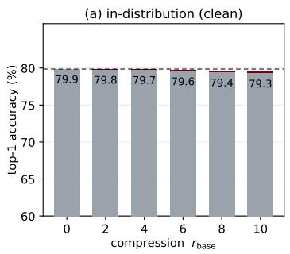

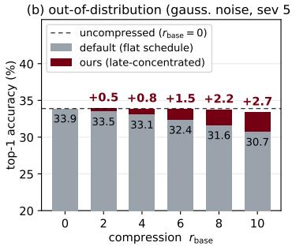

(c) same compute, different schedule: where the token budget is spent over depth uncompressed (33.89% top-1, 4.25 GFLOPs)  
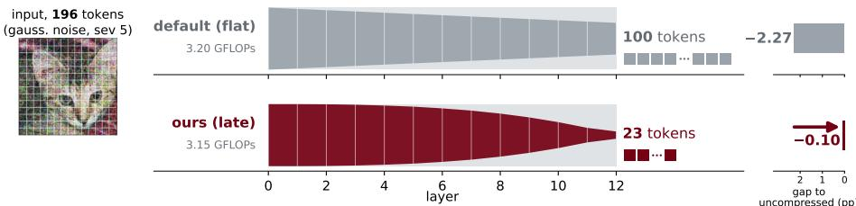  
Figure 1: Token reduction increasingly sacrifices out-of-distribution accuracy; a late-concentrated schedule recovers it at no extra compute. (a, b) DeiT-S top-1 vs. the per-layer token removal rate $r _ { \mathrm { b a s e } }$ on clean and gaussian-noise ImageNet-C. (c) each ribbon’s height is the tokens remaining, so the pale band above is what was removed; flat removes the same number at every layer, ours follows the late-concentrated power law. Ours ends with far fewer tokens, yet closer to uncompressed.

We find that it is, and that concentrating removal late is the direction that helps, while the mirrorimage early-concentrated schedule is the most damaging of the three. The probes in Section 4 point to amplification: a token-reduction step perturbs the features it acts on, and the earlier it acts, the more layers amplify that perturbation before it reaches the classifier. Removing later therefore distorts the output less, and shift widens the gap by raising that amplification. Concretely, we propose a late-concentrated power-law schedule, a per-layer removal rate that increases with depth (Eq. 1, Figure 1c). We use a single fixed exponent at our main operating point, with no per-input or perdomain tuning. On DeiT-S and ImageNet-C this recovers 83% of the accuracy that token reduction loses under shift at a 26% compute reduction (+1.17pp over flat), and 99% of it at a lighter 7% reduction (+0.26pp). It also removes more tokens in total than flat, yet still improves accuracy, so neither a larger token budget nor extra compute can account for the gain.

The benefit holds across five training-free reducers and nine backbones from four pretraining recipes, all ImageNet-C corruption types, eight further shift suites (ImageNet-A/R/V2/Sketch, DomainNet-126, ImageNet-C/3DCC, NaBirds-C), and two modalities beyond image classification, video on Kinetics and vision-language QA on GQA-C. The schedule also composes with six test-time adaptation methods, which adapt the model to the same shift. And the gain rises monotonically with corruption severity, ∼4× from a small +0.28pp on clean images to +1.17pp at severity 5, so it is a robustness property rather than a general accuracy improvement.

## We make the following contributions:

• We identify the reduction schedule (the depth profile of removal) as an under-characterized determinant of ViT robustness to distribution shift, and show that at matched compute a lateconcentrated power law recovers most of the accuracy that reduction costs under shift.

• We provide a first-order diagnostic account of the gain by measuring per-layer distortion and perturbation amplification, finding both to be front-loaded in depth.

• We show the effect is broad, holding across five training-free reducers, nine backbones, all ImageNet-C corruptions, eight further shift suites, two other modalities, growing with shift severity, and composing with six test-time adaptation methods.

## 2 RELATED WORK

Token reduction for efficient vision transformers. A large body of work accelerates ViTs by discarding redundant tokens. Pruning methods drop low-importance tokens: EViT (Liang et al., 2022) reorganizes tokens by their attention to the class token and fuses the inattentive ones. Merging methods instead combine similar tokens: ToMe (Bolya et al., 2023) merges a fixed number of token pairs per layer via bipartite soft matching, and PiToMe (Tran et al., 2024) merges progressively using proportional attention. Adaptive schemes vary the number of tokens per input: ATC (Haurum et al., 2024) clusters tokens into groups, while ATS (Fayyaz et al., 2022) samples a subset to keep by significance. Dynamic-sparsification methods such as DynamicViT (Rao et al., 2021) and A-ViT (Yin et al., 2022) instead learn an input-dependent number of tokens to keep, but require training the reduction policy and so do not apply when the model cannot be retrained on the shift. We therefore scope this work to training-free token reduction, which operates purely at inference and is the relevant regime under distribution shift, and use the five methods above throughout.

Depth allocation has been considered mostly for clean-data efficiency or adaptive reduction policies, not as a controlled robustness lever under distribution shift. ToMe random-searches clean ImageNet merging schedules and reports throughput-dependent preferences, including late-heavy schedules at low throughput, flat schedules at intermediate throughput, and decreasing schedules at high throughput. Other recent methods introduce depth dependence in different ways: ATM (Lee & Choi, 2025) varies similarity thresholds with depth, DyMU (Wang et al., 2025a) studies dynamic merging for VLMs, DSM (Heo et al., 2024) delays global merging by skipping early blocks, and DiffRate (Chen et al., 2023)/LTMP (Bonnaerens & Dambre, 2023) learn layer-wise rates or thresholds with trainingtime clean objectives. Our question is different: for fixed training-free reducers, with no target labels, adaptation, or retraining, how should a static schedule allocate removal under distribution shift at matched inference cost? We answer this with a one-parameter late-concentrated family calibrated to use no more GFLOPs than the flat baseline; under that conservative cost constraint, late removes more tokens in total yet consistently improves OOD accuracy.

Robustness to distribution shift. ImageNet-C (Hendrycks & Dietterich, 2019) measures robustness to common corruptions at graded severities and is the standard distribution-shift benchmark. ViTs (Dosovitskiy et al., 2021; Touvron et al., 2021) exhibit nontrivial robustness to such corruptions, and a line of work studies how their architecture and training affect this robustness (Bhojanapalli et al., 2021; Paul & Chen, 2022). The robustness of token-reduced ViTs, however, is largely unexamined: efficiency methods are tuned for clean accuracy, and whether, and how, token reduction should differ under shift is open. We show that the schedule specifically governs shift robustness, with gains that grow with corruption severity and stay small on clean data.

Test-time adaptation, and adaptation for token reduction. Test-time adaptation (TTA) improves robustness by updating model parameters on unlabeled test inputs (Wang et al., 2021). Most related to us, recent work combines token reduction with TTA: NAViA (Xiong et al., 2026) adds learnable class-token biases to recover the mutual information that token aggregation discards, and TCA (Wang et al., 2025b) performs VLM-specific token condensation with a CLIP/SigLIP testtime cache of domain-anchor tokens and logit self-correction. Both report that token reduction costs accuracy under existing TTA and answer it by adding to the model, via backpropagation or a maintained cache, while leaving the reduction schedule itself unchanged. We instead reshape the schedule alone, with no gradients, cache, or added parameters, and gain over the flat schedule both use; being inference-only, it is orthogonal to TTA and composes with it (Section 5.6). A direct comparison is not straightforward. TCA is coupled to CLIP/SigLIP zero-shot inference, so porting it to the supervised DeiT/ViT classifiers we study would define a new TCA-inspired method rather than a drop-in baseline, and evaluating it natively would need a separate zero-shot protocol; NAViA, closer to our setting, has no official implementation, so any comparison would rest on our reimplementation, not the authors’ method. We therefore treat both as complementary, not competing: because they reduce tokens on a flat schedule by default, our reshaping could in principle be applied within either, changing where tokens are merged across depth, not how adaptation operates.

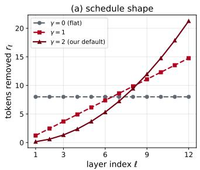

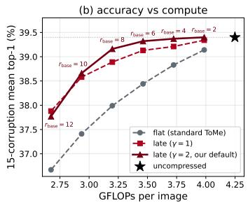

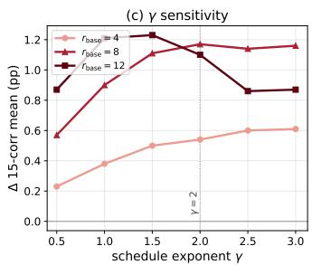  
Figure 2: The late-concentrated schedule and its effect (DeiT-S, ImageNet-C severity 5). (a) sched ule shape: tokens removed per layer $r _ { \ell } \propto ( \ell / L ) ^ { \gamma }$ vs. layer index (at $r _ { \mathrm { b a s e } } { = } 8 )$ , for $\gamma { = } 0$ (flat), 1, and our default 2; larger γ defers removal to later layers. (b) 15-corruption-mean top-1 vs. compute (GFLOPs), each curve a schedule swept over compression (points labeled by $r _ { \mathrm { b a s e } } ) ;$ ⋆ marks the uncompressed model. (c) gain over flat vs. γ, one curve per compression level $r _ { \mathrm { b a s e } } \in \{ 4 , 8 , 1 2 \}$

## 3 METHOD: LATE-CONCENTRATED SCHEDULE

Power-law schedule. A reduction schedule sets a removal count at each of the network’s L layers. We seek a one-parameter family that spans schedules from flat to strongly late-concentrated and whose compute cost is analytic in that parameter, so a schedule can be matched to a baseline’s compute without search. We therefore propose a power-law schedule over normalized depth,

$$
r ( \ell ) = R \cdot \frac { ( \ell / L ) ^ { \gamma } } { \sum _ { k = 1 } ^ { L } ( k / L ) ^ { \gamma } } , \qquad \ell = 1 , \ldots , L ,\tag{1}
$$

where R is the total number of tokens removed across the network and the exponent $\gamma$ is the only parameter our method sets. We use a power law because it recovers the flat schedule as the special case $\gamma { = } 0$ (a uniform $R / L$ removal at every layer, the default across training-free token reducers (Bolya et al., 2023; Liang et al., 2022; Fayyaz et al., 2022; Haurum et al., 2024)), stays monotone nondecreasing in depth for every $\gamma { > } 0$ (no layer removes more than a later one), and redistributes the same budget R continuously toward the later layers as γ grows (Figure 2a). It parameterizes lateconcentration rather than asserting an optimal schedule; likewise, γ is set to a robust default $( \gamma { = } 2 )$ not tuned per task (Figure 2c). The finding is the late-concentrated direction and its intensity (Figure 6), and we expect other monotone late-weighted profiles to behave similarly; a check at the main operating point supports this, with an exponential profile and a non-smooth two-level step (each at iso-GFLOPs) recovering gains comparable to the power law (Appendix O). We round the schedule to integer per-layer counts and apply it identically across all five reducers, which then differ only in which tokens they select (rounding rule and per-layer cap in Appendix A).

Calibration to the flat baseline’s compute (iso-GFLOPs). We label each operating point by $r _ { \mathrm { b a s e } } .$ , the per-layer rate of the flat baseline it is matched against and the deployment choice of how much compute to save $( R { = } r _ { \mathrm { b a s e } } L$ for the flat baseline only); the late schedule’s own budget is set by the calibration below and is larger, with per-layer mean $\bar { r } { = } R / L > r _ { \mathrm { b a s e } }$ (Appendix U). Later-layer removals save less compute (fewer tokens cascade through fewer remaining layers). At the same $r _ { \mathrm { b a s e } } .$ , late-concentrated uses fewer GFLOPs (giga floating-point operations), permitting more (later) token removal to restore GFLOPs parity. All comparisons in this paper are at fair GFLOPs, not equal $r _ { \mathrm { b a s e } }$ . These iso-GFLOPs comparisons are also matched in wall-clock: at the main operating point the late $( \gamma = 2 )$ and flat schedules differ by under 0.5% in measured throughput, so the comparison is fair in real latency and not only in analytic FLOPs (Appendix V).

We calibrate each $( r _ { \mathrm { b a s e } } , \gamma )$ by choosing the integer per-layer removal budget whose GFLOPs match the corresponding flat baseline; because GFLOPs is analytic in the schedule, this calibration needs no extra evaluation. When an exact match is not attainable at integer budgets, we always round the budget so that the late-concentrated schedule uses no more GFLOPs than its flat baseline (the full list of calibrated schedules is given in Appendix U, Table 31). The late-versus-flat comparison is therefore strictly conservative, and the gains cannot be attributed to a larger compute budget. Figure 2b plots the resulting accuracy–compute frontier on the 15-corruption mean: the calibrated late-concentrated family Pareto-dominates the flat one across the entire compute range.

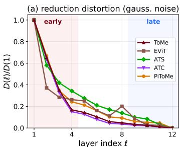

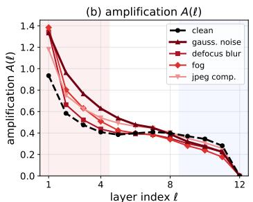

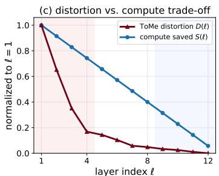  
Figure 3: Per-layer reduction distortion and amplification (DeiT-S, ImageNet-C severity $5 ;$ means over N=1024 images, standard error $< 2 \% )$ . (a) The directly-measured distortion $D ( \ell )$ of reducing at layer ℓ only (relative output-logit change, gaussian noise), normalized to layer 1, for all five reducers. (b) The amplification $\varLambda ( \ell )$ (clean and one corruption per ImageNet-C group). (c) $D ( \ell )$ against the compute a removal at layer ℓ saves, S(ℓ), both normalized; D falls far faster than S.

## 4 WHY LATE CONCENTRATION IMPROVES ROBUSTNESS

We provide a first-order account for why late concentration is preferred in our measurements under distribution shift, and why the empirical optimum is interior rather than maximally late. (i) A reduction’s output distortion is front-loaded in depth, because earlier perturbations pass through more downstream layers. (ii) The compute saved by a reduction also falls with depth, but more slowly, so moving budget later lowers distortion per unit of compute saved. (iii) Per-layer capacity keeps the empirical optimum interior, because each layer can merge only a bounded number of similar tokens.

The reduction distortion is front-loaded. A reduction step (merging, pruning, clustering, or sampling) removes or distorts token information at the layer where it acts, and the perturbation propagates forward to the classification readout; we call the resulting output error the distortion of reducing at layer ℓ. We measure it directly and reducer-agnostically. For each training-free reducer we remove a fixed number of tokens at layer ℓ and nowhere else, so per-layer differences reflect depth alone, and read the relative logit change $D ( \ell ) = \mathbb { E } _ { x } \| f ^ { ( \ell ) } ( x ) - \bar { f ( x ) } \| / \| f ( x ) \|$ (f unreduced, $f ^ { ( \ell ) }$ reduced at ℓ only), a removal-based sensitivity measure in the tradition of ablation-importance criteria (LeCun et al., 1989; Michel et al., 2019; Lee & Choi, 2025). For all five reducers (ToMe, EViT, ATS, ATC, PiToMe) $D ( \ell )$ is steeply front-loaded (Figure 3a), and it stays front-loaded under every corruption, with the early/late distortion ratio exceeding 6× in all 20 reducer×corruption cases (Spearman $\leq - 0 . 9 0$ ; per-cell values in Appendix L). The distortion is near zero at the last layer $( D ( \ell { = } 1 2 ) \approx 0 )$ . Under the class-token readout a final-layer patch merge has no later layer through which to reach the class token, so it costs almost nothing, and the gain does not depend on this (Appendix S). The account rests on single-layer probes, whereas a deployed schedule composes many reductions whose effects interact, each merge changing what later ones see. It still holds for the composed schedules: at equal compute the late schedule’s mean per-case KL to the unreduced model is 0.029 against 0.085 for flat, and it changes the unreduced model’s top-1 on 10.8% of cases against 19.1%, lower on all 15 corruptions and both backbones (Appendix T, Figure 9).

Perturbation amplification induces the front-loading. The distortion is front-loaded because the network amplifies an early perturbation more: it passes through more downstream layers on its way to the classifier. We probe this gain directly. At layer ℓ we perturb each output patch token by $\delta _ { t } = \alpha \left\| \boldsymbol { x } _ { t } \right\| u _ { t } .$ , with $u _ { t }$ an isotropic unit vector and $\alpha { = } 0 . 1$ (the class token is left untouched), let it propagate to the end, and read the pre-logit class-token representation z. The amplification $A ( \ell ) \dot { = } \dot { \mathbb { E } } \big | \big | \big | z _ { \mathrm { p e r t } } - z _ { \mathrm { c l e a n } } \big | \big | / \big | \big | z _ { \mathrm { c l e a n } } \big | \big | \big | / \alpha$ , averaged over 5 draws shared across layers, is a Jacobiannorm sensitivity probe (Novak et al., 2018) anchored at a hidden layer. Linearizing the downstream layers (Lemma 1, Appendix M) sends a perturbation at layer ℓ to the readout through the composed Jacobian $\begin{array} { r } { \prod _ { k > \ell } J _ { k } ; } \end{array}$ the isotropic probe measures the average-case gain of that product, and its operator norm bounds that gain from above. Each deeper layer drops one factor, so the gain is non-increasing in ℓ whenever those layers are on average non-contractive, the familiar depthcompounding of perturbations in deep networks (Poole et al., 2016). Amplification is a property of the network, not of any reducer’s choices, consistent with D(ℓ) being front-loaded for all five. Measured on clean inputs and one corruption from each ImageNet-C group (severity 5), A(ℓ) is front-loaded in every condition (Figure 3b; Spearman $\leq - 0 . 9 2 )$ , with clean the flattest profile, so corruption steepens the amplification.

Capacity keeps the optimum interior, not maximally late. What a schedule spends is compute, not token count, so the governing quantity is not the raw distortion but the distortion per unit of compute saved, $\rho ( \ell ) = \bar { D } ( \ell ) / S ( \bar { \ell } )$ , where $\mathsf { \Pi } _ { } ^ { \mathsf { \Gamma } } \cdot \mathsf { S } ( \ell )$ is the marginal compute a removal at layer ℓ saves. ToMe, our default reducer, merges between attention and the MLP, so a removal saves that layer’s own MLP and all downstream layers: $S ( \ell ) = c + ( L - \ell )$ in units of a full layer, with $c \approx 0 . 6 1$ the own-MLP fraction and $S ( L ) = c > 0$ . A THOP measurement confirms this near-linear profile, the last layer saving only $\approx 6 \%$ of what the first does. Figure 3c contrasts them: D falls far faster than S, so late reductions are cheap in distortion yet save little compute, and $\rho$ falls with depth. That is why late concentration pays at equal compute. The ratio alone does not bound how late: since $A ( L ) = 0$ the last layer reduces at near-zero distortion, $\rho ( L ) \to 0 ,$ and unconstrained $\rho \mathrm { - }$ -minimization would pile the budget onto the latest layers. We attribute the interior optimum to per-layer capacity instead. Each layer can merge only a bounded number of similar tokens, so the budget must spill beyond the few cheap late layers, and as a layer nears that limit the marginal distortion of each further merge rises, favoring a smooth spread over a few saturated layers. The account is first-order and does not pinpoint an optimal $\gamma ,$ , but its predictions hold: the interior inverted-U in $\gamma$ (Table 1, Figure 2c), its migration toward weaker concentration at larger removal budgets (Appendix R), and the late concentrated, last-layer-heavy shape a schedule searched for clean accuracy takes (Appendix P).

Why the advantage grows under shift. The gain grows monotonically with corruption severity (Section 5.2); this is an empirical property, which the probes explain in direction, not magnitude. Token reduction sacrifices more accuracy under a stronger shift (Figure 1), so a better allocation of the same budget has more to recover. The representational reason is that the network amplifies a reduction’s perturbation more off the clean manifold. Self-attention is non-Lipschitz (Kim et al., 2021) and can develop larger Jacobians off-distribution (Appendix M); the amplification $A ( \ell )$ rises under every corruption group (early $A ( \ell )$ from 0.60 on clean to 0.74–0.92) and, compounding through more downstream layers, does so most in the early layers (Lemma 1). The early reductions the flat schedule spends its budget on are therefore the most amplified under shift, so the late schedule recovers more. We do not read the probes as predictors of the per-corruption gain, whose magnitude also reflects how close the corrupted inputs sit to the decision boundary.

The gain is not a readout or insertion-point artifact. The late advantage survives dropping the final layers from both schedules, and it reproduces under global-average-pooling readout, which removes the free last layer but leaves the front-loaded distortion intact: on MAE ViT-B and ViT-L every one of the 15 corruptions improves (+1.28 and +1.22). The strictly free final-layer saving is in any case only 0.2–0.7% of total GFLOPs (Appendix S).

Allocation outweighs the matching criterion. Our account concerns where tokens are removed; a distinct possible source of the OOD penalty is which tokens are merged, since corrupted similarities could worsen merge decisions (the matching criterion). In an oracle control, for each corrupted image we force the per-layer merge decisions its clean counterpart would make (captured offline, unavailable at test time), holding the schedule and the compute fixed. Even the flat schedule with these oracle decisions recovers less OOD accuracy than the late schedule at every operating point (Figure 4, gaussian noise; full ImageNet-C in Appendix N). Allocation therefore outweighs the gain from this oracle’s improved matching; a genuinely corruption-robust criterion, which this oracle does not upper-bound, remains a complementary axis (Section 6).

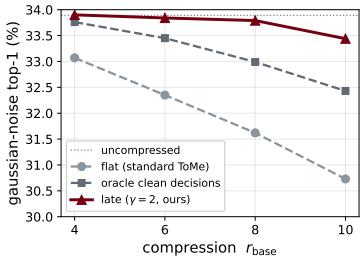  
Figure 4: Oracle clean merge decisions recover less than the late schedule at every $r _ { \mathrm { b a s e } } ,$ the gap widening with compression.

## 5 EXPERIMENTS

Setup. We evaluate token-reduction schedules across image-classification backbones (DeiT-S/B (Touvron et al., 2021), ViT-S/B/L (Dosovitskiy et al., 2021), CLIP ViT-B/L (Radford et al., 2021), and MAE ViT-B/L (He et al., 2022)), a video model (VideoMAE ViT-B (Tong et al., 2022)), and a vision-language model (LLaVA-1.5-7B (Liu et al., 2024)). The schedule is applied to five training-free reducers; ToMe (Bolya et al., 2023) is the default because it is widely used and merges tokens rather than discarding them, while EViT, ATS, ATC, and PiToMe verify the effect is not specific to merging. Our primary benchmark is ImageNet-C at severity 5, and we test generalization on ImageNet-C/3DCC, ImageNet-R, ImageNet-Sketch, NaBirds-C, Mini-Kinetics-C, and GQA-C. To probe composability with test-time adaptation we run Tent, EATA, SAR, FOA, SPA, and NEO on top of the schedule. Comparisons are inference-only (and deterministic) unless a TTA method is stated; we report the severity-5 15-corruption mean top-1 unless noted. Our main operating point is $r _ { \mathrm { b a s e } } { = } 8$ with γ=2 (a 26% compute reduction); we sweep compression from $r _ { \mathrm { b a s e } } { = } 2$ to 12 (Table 1), with γ fixed at 2 rather than tuned per rate. Full implementation details are in Appendix A.

Table 1: γ sensitivity across operating points at iso-GFLOPs (DeiT-S, ImageNet-C severity 5, 15-corruption mean top-1, %). The GFLOPs column is the default γ=2 schedule’s compute and its reduction against the uncompressed model (39.40 at 4.25G; per-γ schedules in Table 31). flat is the $\mathrm { c o n s t } { - } r _ { \mathrm { b a s e } }$ baseline in absolute top-1; the γ columns are ∆ = late − flat. Shaded = the default γ=2; bold = main result $( r _ { \mathrm { b a s e } } { = } 8 ) ;$ underline = per-row optimum γ⋆.
<table><tr><td colspan="8">late-concentrated γ (∆ vs. flat)</td></tr><tr><td> $r _ { \mathrm { b a s e } }$ </td><td>GFLOPs (cut)</td><td>flat</td><td>0.5</td><td>1.0</td><td>1.5</td><td>2.0</td><td>2.5</td><td>3.0</td></tr><tr><td>2</td><td>3.97G (-7%)</td><td>39.14</td><td>+0.09</td><td>+0.20</td><td>+0.22</td><td>+0.26</td><td>+0.27</td><td>+0.28</td></tr><tr><td>4</td><td>3.69G (-13%)</td><td>38.83</td><td>+0.23</td><td>+0.38</td><td>+0.50</td><td>+0.54</td><td>+0.61</td><td>+0.60</td></tr><tr><td>6</td><td>3.34G (-21%)</td><td>38.44</td><td>+0.34</td><td>+0.69</td><td>+0.81</td><td>+0.88</td><td>+0.83</td><td>+0.69</td></tr><tr><td>8</td><td>3.15G (-26%)</td><td>37.99</td><td>+0.57</td><td>+0.90</td><td>+1.11</td><td>+1.17</td><td>+1.14</td><td>+1.16</td></tr><tr><td>10</td><td>2.90G (-32%)</td><td>37.41</td><td>+0.67</td><td>+1.17</td><td>+1.28</td><td>+1.25</td><td>+1.15</td><td>+0.92</td></tr><tr><td>12</td><td>2.67G (-37%)</td><td>36.67</td><td>+0.87</td><td>+1.21</td><td>+1.23</td><td>+1.10</td><td>+0.86</td><td>+0.87</td></tr></table>

## 5.1 LATE-CONCENTRATED VS. FLAT AT ISO-GFLOPS

The late-concentrated schedule at $r _ { \mathrm { b a s e } } { = } 8 , \ \gamma { = } 2$ improves the corrupted mean by +1.17pp over flat (Table 1). That closes 83% of the accuracy compression costs, leaving a −0.24pp gap to the uncompressed model against −1.41pp for flat, at a ∼26% compute reduction. The gain is recovered predictions, not a compensating mix: flat destroys 8.5% of what the unreduced model gets right and ours 3.9% (Appendix T). The gain grows with compression, from +0.26pp at the lightest $r _ { \mathrm { b a s e } } { = } 2$ to +1.25pp at $r _ { \mathrm { b a s e } } { = } 1 0$ , and holds at +1.10pp at the aggressive $r _ { \mathrm { b a s e } } { = } 1 2 ( \mathrm { F i g u r e } 2  { \mathrm { b } } )$ . The γ sweep is an inverted-U, positive for every tested $\gamma \overset { = } \in \left[ 0 . 5 , 3 . 0 \right] \overset { = } ( \geq + 0 . 5 7 \mathrm { p p } )$ , with the optimum migrating from $\gamma ^ { \star } \approx 3$ at $r _ { \mathrm { b a s e } } { = } 2$ to ≈1.5 at $r _ { \mathrm { b a s e } } { = } 1 2 ; \gamma { = } 2$ stays within 0.13pp of the per-rate optimum. All 15 corruptions improve (Figure 5; +0.21pp on elastic transform to +2.45pp on impulse noise), as do the four outside ImageNet-C’s standard set (Appendix I); a sign test rejects the no-effect null at $p < 1 0 ^ { - 4 }$ . Depth allocation is a deployment-neutral lever: it requires no retraining or extra compute, and the gain holds for every tested γ and every corruption rather than at a single tuned setting.

Early vs. flat vs. late schedule. To test the schedule’s directionality, we evaluate the symmetric early-concentrated schedule (the same power law reflected to remove more early). The result is a monotone ordering, early < flat < late, at both operating points (Figure 6). Concentrating removal early hurts (−2.23 to −0.87pp vs. flat), late helps (+1.10 to +1.17pp). This is the ordering predicted by the front-loaded per-step distortion (Section 4). Early reductions are the most damaging, so concentrating removal early is the worst allocation. Crucially the early deficit is attributable to the schedule, not compute or token budget. We calibrate the early-concentrated budget to flat’s compute; it comes out slightly higher: 2.8% more GFLOPs at $r _ { \mathrm { b a s e } } { = } 8$ and $1 . 3 \%$ more at $r _ { \mathrm { b a s e } } { = } 1 2 .$ The early schedule also removes fewer tokens in total (60 vs. 96 at $r _ { \mathrm { b a s e } } { = } 8 )$ . More compute and less removal should both help, yet early is the worst of the three, losing to flat by $0 . 8 7 { - } 2 . 2 3 \mathrm { p p }$ , while the late schedule uses the least compute and wins. Thus the ordering cannot be explained by the simple resource variables of retained token count or compute alone; the depth allocation of removal is the decisive factor in these comparisons.

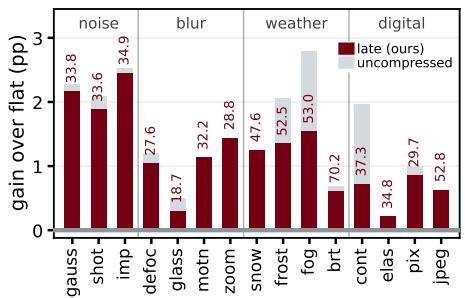  
Figure 5: Per-corruption gain over flat at iso-GFLOPs (DeiT-S, $r _ { \mathrm { b a s e } } { = } 8 , \gamma { = } 2$ , ImageNet-C sev=5); uncompressed in gray. All 15 corruptions improve; labels are late’s top-1.

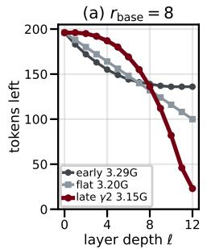

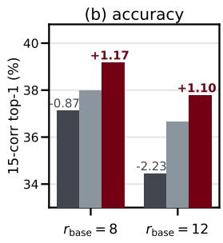  
Figure 6: Schedule placement (DeiT-S, ImageNet-C sev=5). (a) tokens left per layer at $r _ { \mathrm { b a s e } } { = } 8 ,$ , with each schedule’s GFLOPs; the $r _ { \mathrm { b a s e } } { = } 1 2$ profiles are in Appendix Q. (b) top-1 at both rates, ∆ vs. flat.

## 5.2 THE GAIN ACROSS SHIFT SEVERITIES

The improvement grows with the shift, rising monotonically with corruption severity (Table 2). At late $\gamma { = } 2$ it rises from +0.28pp on clean images to $+ 1 . 1 7 \mathrm { p p }$ at severity 5, so the corrupted gain is $4 . 2 \times$ the clean gain. The gain is therefore a robustness effect, not a general accuracy improvement. The $\gamma { = } 1$ schedule traces the same monotone profile (Appendix B). The nonzero clean gain is not a separate effect: the per-step reduction distortion $D ( \ell )$ is front-loaded even on clean inputs (Section 4), so deferring removal helps by a small margin with no corruption, and shift inflates the early-layer

Table 2: Per-severity 15-corruption mean (%), default $\gamma { = } 2 , r _ { \mathrm { b a s e } } { = } 8 ,$ DeiT-S; severity 0 is clean ImageNet val. $\Delta = \mathrm { l a t e \mathrm { ~ - ~ } }$ flat, $\Delta / \Delta _ { 0 }$ its multiple of the clean gain.
<table><tr><td>Sev.</td><td>flat</td><td>late</td><td>Δ</td><td> $\Delta / \Delta _ { 0 }$ </td></tr><tr><td>0 (clean)</td><td>79.40</td><td>79.68</td><td>+0.28</td><td>1.0×</td></tr><tr><td>1</td><td>70.52</td><td>71.04</td><td>+0.52</td><td>1.9×</td></tr><tr><td>2</td><td>64.33</td><td>64.99</td><td>+0.66</td><td>2.4×</td></tr><tr><td>3</td><td>59.06</td><td>59.89</td><td>+0.83</td><td>3.0×</td></tr><tr><td>4</td><td>50.06</td><td>51.12</td><td>+1.06</td><td>3.8×</td></tr><tr><td>5</td><td>37.99</td><td>39.16</td><td>+1.17</td><td>4.2×</td></tr></table>

distortion further, widening that same margin. The clean and corrupted gains are thus two readings of one allocation principle, the clean gain being the floor that shift steepens.

## 5.3 GENERALIZATION ACROSS TOKEN-REDUCTION METHODS

At iso-GFLOPs the late-concentrated schedule (default $\gamma { = } 2 )$ improves all five training-free methods, on both DeiT-S and DeiT-B, at every operating point (Table 3): all 30 cells are positive (+0.23 to +2.52pp), so the same schedule used for ToMe transfers unchanged to the other methods. This is what Section 4 predicts, since the distortion $D ( \ell )$ is front-loaded for every one of the five reducers (Figure 3a). The benefit spans method families, from attention-guided pruning (EViT (Liang et al., 2022)) and merging (ToMe (Bolya et al., 2023), bipartite matching; PiToMe (Tran et al., 2024), spectrum-preserving) to agglomerative clustering (ATC (Haurum et al., 2024)) and adaptive sampling (ATS (Fayyaz et al., 2022)), with EViT gaining most. The same five methods at γ=1, including a more aggressive operating point, are in Appendix J, where the late schedule again beats flat in all cells, and Figure 7 plots each method’s accuracy against compute.

Table 3: Late-concentrated schedule applied to five training-free token-reduction methods at the default $\gamma { = } 2$ . DeiT-S/B, ImageNet-C severity 5, 15-corruption mean top-1 (%), iso-GFLOPs; each header’s % is the γ=2 compute reduction vs. the uncompressed model. For each operating point we report flat, late (bold), and $\mathbf { \bar { \Delta } } \Delta = \mathrm { l a t e } - \mathbf { f l a t } \left( \mathbf { p p } \right)$ ; The γ=1 and larger $r _ { \mathrm { b a s e } }$ results are in Appendix J.
<table><tr><td rowspan=1 colspan=9> $r _ { \mathrm { b a s e } } { = } 4 ( - 1 3 \% )$                   $r _ { \mathrm { b a s e } } { = } 6 ( - 2 1 \% )$                   $r _ { \mathrm { b a s e } } { = } 8 ( - 2 6 \% )$ Method       flat      late       Δ      flat      late       Δ      flat      late       Δ</td></tr><tr><td rowspan=1 colspan=9>DeiT-S</td></tr><tr><td rowspan=1 colspan=1>ToMe       38.83</td><td rowspan=1 colspan=1>39.37</td><td rowspan=1 colspan=1>+0.54</td><td rowspan=1 colspan=1>38.44</td><td rowspan=1 colspan=1>39.32</td><td rowspan=1 colspan=1>+0.88</td><td rowspan=1 colspan=1>37.99</td><td rowspan=1 colspan=1>39.16</td><td rowspan=1 colspan=1>+1.17</td></tr><tr><td rowspan=1 colspan=1>EViT       37.50</td><td rowspan=1 colspan=1>38.97</td><td rowspan=1 colspan=1>+1.47</td><td rowspan=1 colspan=1>36.69</td><td rowspan=1 colspan=1>38.91</td><td rowspan=1 colspan=1>+2.22</td><td rowspan=1 colspan=1>35.98</td><td rowspan=1 colspan=1>38.50</td><td rowspan=1 colspan=1>+2.52</td></tr><tr><td rowspan=1 colspan=1>ATS       34.95</td><td rowspan=1 colspan=1>35.43</td><td rowspan=1 colspan=1>+0.48</td><td rowspan=1 colspan=1>34.50</td><td rowspan=1 colspan=1>35.21</td><td rowspan=1 colspan=1>+0.71</td><td rowspan=1 colspan=1>33.92</td><td rowspan=1 colspan=1>34.88</td><td rowspan=1 colspan=1>+0.96</td></tr><tr><td rowspan=1 colspan=1>ATC       38.28</td><td rowspan=1 colspan=1>38.73</td><td rowspan=1 colspan=1>+0.45</td><td rowspan=1 colspan=1>37.96</td><td rowspan=1 colspan=1>38.74</td><td rowspan=1 colspan=1>+0.78</td><td rowspan=1 colspan=1>37.55</td><td rowspan=1 colspan=1>38.65</td><td rowspan=1 colspan=1>+1.10</td></tr><tr><td rowspan=1 colspan=1>PiToMe     38.45</td><td rowspan=1 colspan=1>38.99</td><td rowspan=1 colspan=1>+0.54</td><td rowspan=1 colspan=1>38.14</td><td rowspan=1 colspan=1>38.67</td><td rowspan=1 colspan=1>+0.53</td><td rowspan=1 colspan=1>37.67</td><td rowspan=1 colspan=1>37.90</td><td rowspan=1 colspan=1>+0.23</td></tr><tr><td rowspan=1 colspan=9>DeiT-B</td></tr><tr><td rowspan=1 colspan=1>ToMe       45.98</td><td rowspan=1 colspan=1>46.50</td><td rowspan=1 colspan=1>+0.52</td><td rowspan=1 colspan=1>45.27</td><td rowspan=1 colspan=1>46.17</td><td rowspan=1 colspan=1>+0.90</td><td rowspan=1 colspan=1>44.35</td><td rowspan=1 colspan=1>45.89</td><td rowspan=1 colspan=1>+1.54</td></tr><tr><td rowspan=1 colspan=1>EViT       44.52</td><td rowspan=1 colspan=1>45.80</td><td rowspan=1 colspan=1>+1.28</td><td rowspan=1 colspan=1>43.57</td><td rowspan=1 colspan=1>45.38</td><td rowspan=1 colspan=1>+1.81</td><td rowspan=1 colspan=1>42.45</td><td rowspan=1 colspan=1>44.62</td><td rowspan=1 colspan=1>+2.17</td></tr><tr><td rowspan=1 colspan=1>ATS       40.60</td><td rowspan=1 colspan=1>41.34</td><td rowspan=1 colspan=1>+0.74</td><td rowspan=1 colspan=1>39.79</td><td rowspan=1 colspan=1>40.75</td><td rowspan=1 colspan=1>+0.96</td><td rowspan=1 colspan=1>38.81</td><td rowspan=1 colspan=1>40.11</td><td rowspan=1 colspan=1>+1.30</td></tr><tr><td rowspan=1 colspan=1>ATC       45.41</td><td rowspan=1 colspan=1>45.96</td><td rowspan=1 colspan=1>+0.55</td><td rowspan=1 colspan=1>44.79</td><td rowspan=1 colspan=1>45.73</td><td rowspan=1 colspan=1>+0.94</td><td rowspan=1 colspan=1>43.97</td><td rowspan=1 colspan=1>45.47</td><td rowspan=1 colspan=1>+1.50</td></tr><tr><td rowspan=1 colspan=1>PiToMe     45.25</td><td rowspan=1 colspan=1>45.78</td><td rowspan=1 colspan=1>+0.53</td><td rowspan=1 colspan=1>44.56</td><td rowspan=1 colspan=1>44.84</td><td rowspan=1 colspan=1>+0.28</td><td rowspan=1 colspan=1>43.69</td><td rowspan=1 colspan=1>43.97</td><td rowspan=1 colspan=1>+0.28</td></tr></table>

Table 4: Generalization across backbones at the default $r _ { \mathrm { b a s e } } { = } 8$ rate, a 24–25% compute cut (ImageNet-C sev 5, 15-corruption mean top-1, %). ∆ = late − flat, bold the default.
<table><tr><td>Backbone</td><td>flat</td><td>late γ=1 (∆)</td><td>late γ=2 (∆)</td></tr><tr><td colspan="4">Supervised, distilled</td></tr><tr><td>DeiT-S</td><td>37.99</td><td>38.89 (+0.90)</td><td>39.16 (+1.17)</td></tr><tr><td>DeiT-B</td><td>44.35</td><td>45.35 (+1.00)</td><td>45.89 (+1.54)</td></tr><tr><td colspan="4">Supervised, AugReg</td></tr><tr><td>ViT-S</td><td>38.05</td><td>39.02 (+0.97)</td><td>39.46 (+1.41)</td></tr><tr><td>ViT-B ViT-L</td><td>53.39</td><td>54.38 (+0.99)</td><td>54.96 (+1.57)</td></tr><tr><td>Contrastive image-text</td><td>58.82</td><td>60.32 (+1.50)</td><td>60.62 (+1.80)</td></tr><tr><td colspan="4"></td></tr><tr><td>CLIP ViT-B</td><td>43.68</td><td>44.72 (+1.04)</td><td>45.07 (+1.39)</td></tr><tr><td>CLIP ViT-L</td><td>57.29</td><td>58.10 (+0.81)</td><td>58.41 (+1.12)</td></tr><tr><td colspan="4">Self-supervised, global pooling</td></tr><tr><td>MAE ViT-B</td><td>42.81</td><td>43.77 (+0.96)</td><td>44.09 (+1.28)</td></tr><tr><td>MAE ViT-L</td><td>52.97</td><td>53.96 (+0.99)</td><td>54.19 (+1.22)</td></tr></table>

Table 5: Generalization across shift types and modalities (flat vs. late $\gamma { = } 2$ , iso-GFLOPs, accuracy %). $\Delta = \mathrm { l a t e \mathrm { ~ - ~ } }$ flat (pp); the same schedule is applied to each system’s ViT backbone.
<table><tr><td rowspan=1 colspan=1>Setting                        flat</td><td rowspan=1 colspan=1>late</td><td rowspan=1 colspan=1>Δ</td></tr><tr><td rowspan=1 colspan=2>Natural shift</td><td rowspan=1 colspan=1></td></tr><tr><td rowspan=5 colspan=1>ImageNet-A                 25.31ImageNet-R                 45.90ImageNet-V2                69.38ImageNet-Sketch             32.89DomainNet-126              65.14</td><td rowspan=1 colspan=1>26.55</td><td rowspan=1 colspan=1>+1.24</td></tr><tr><td rowspan=1 colspan=1>46.57</td><td rowspan=1 colspan=1>+0.67</td></tr><tr><td rowspan=1 colspan=1>69.97</td><td rowspan=1 colspan=1>+0.59</td></tr><tr><td rowspan=1 colspan=1>33.33</td><td rowspan=2 colspan=1>+0.44+0.70</td></tr><tr><td rowspan=1 colspan=1>65.84</td></tr><tr><td rowspan=1 colspan=1>Synthetic corruption</td><td rowspan=1 colspan=1></td><td rowspan=1 colspan=1></td></tr><tr><td rowspan=2 colspan=1>ImageNet-C                 47.28ImageNet-3DCC             41.47NaBirds-C                   31.06</td><td rowspan=1 colspan=1>48.74</td><td rowspan=1 colspan=1>+1.45</td></tr><tr><td rowspan=1 colspan=1>42.3831.83</td><td rowspan=1 colspan=1>+0.91+0.77</td></tr><tr><td rowspan=1 colspan=1>Other modalities</td><td rowspan=1 colspan=1></td><td rowspan=1 colspan=1></td></tr><tr><td rowspan=2 colspan=1>Mini-Kinetics-C (VideoMAE) 66.17GQA-C (LLaVA)             54.96</td><td rowspan=1 colspan=1>66.79</td><td rowspan=1 colspan=1>+0.62</td></tr><tr><td rowspan=1 colspan=1>55.20</td><td rowspan=1 colspan=1>+0.24</td></tr></table>

## 5.4 GENERALIZATION ACROSS BACKBONES AND PRETRAINING

Table 4 applies the schedule at iso-GFLOPs to nine backbones spanning four pretraining recipes, three scales, and both readouts. The default $\gamma { = } 2$ beats flat on all nine (+1.12 to +1.80pp) and γ=1 on all nine. The effect does not fade as the backbone grows larger or more accurate, ViT-L being both the most accurate (58.82 flat) and the one that gains most (+1.80). Nor does it depend on how the backbone was trained. The three ViT-B rows span 10.6pp of flat accuracy under three pretraining recipes yet their gains stay within 0.29pp, and the MAE rows keep theirs with neither supervised pretraining nor a class token. CLIP ViT-L carries 256 tokens rather than 196, and the schedule, defined over normalized depth, transfers to it unchanged. Appendix C adds the per-corruption results and the aggressive $r _ { \mathrm { b a s e } } { = } 1 2$ rate.

## 5.5 GENERALIZATION ACROSS SHIFT TYPES AND MODALITIES

The schedule generalizes well beyond synthetic ImageNet-C. We apply the same iso-GFLOPs flatversus-late comparison to eight further shift suites and two other modalities (Table 5): five natural shifts (ImageNet-A (Hendrycks et al., 2021b), ImageNet-R, ImageNet-V2 (Recht et al., 2019), ImageNet-Sketch, and DomainNet-126 (Peng et al., 2019) averaged over its three target domains), two harder synthetic suites (ImageNet-C (Mintun et al., 2021), ImageNet-3DCC (Kar et al., 2022)) with a fine-grained task (NaBirds-C), and two non-image modalities (video on Mini-Kinetics-C (Yi et al., 2021), vision-language QA on GQA-C (Hudson & Manning, 2019; Usama et al., 2025)). The image settings share a common ViT-S backbone, the non-image modalities their native models (VideoMAE, LLaVA). The gain is positive in all ten settings. Other backbones and per-corruption results are in Appendices E, G and H.

The gains are largest on ImageNet-C (+1.45) and ImageNet-A (+1.24) and smallest on the style shifts (ImageNet-R +0.67, Sketch +0.44); they do not track how much accuracy the shift costs, since near-clean ImageNet-V2 gains more than Sketch. ImageNet-A is where the schedule helps most across backbones, +2.01pp on average against the +1.42pp those same five gain on ImageNet-C, and on three of them the reduced model passes the uncompressed one. Where we dump per-image predictions, on ImageNet-A, ImageNet-V2 and each DomainNet domain, every gain in the table is significant under an exact McNemar test (McNemar, 1947), with the intervals in Appendix D, and NaBirds-C and DomainNet-126 show the effect surviving fine-tuning to a new label space. The benefit also crosses modality. On video we run VideoMAE (Tong et al., 2022) under the six spatial Mini-Kinetics-C corruptions with ToMe at iso-GFLOPs (+0.62 at severity 5 and +0.25 at severity 3, so the video gain grows with severity as well, and it again concentrates on the structure-degrading corruptions; per-corruption in Appendix F). On a vision-language model, the furthest transfer we test, the schedule acts only on the CLIP vision encoder that feeds LLaVA-1.5-7B (Liu et al., 2024), and corrupted GQA accuracy still improves at iso-GFLOPs (+0.24pp).

Table 6: Late-concentrated schedule layered under TTA methods. ImageNet-C severity 5, 15- corruption mean top-1, $r _ { \mathrm { b a s e } } { = } 8 .$ , iso-GFLOPs; each method is run on the flat and the late (γ=2) schedule, which cuts GFLOPs by 26% against the same method on full tokens (Appendix K). $\Delta =$ late − flat (pp); ± = std over 3 seeds.
<table><tr><td rowspan=2 colspan=6>ViT-S                                 ViT-BMethod                          flat</td></tr><tr><td rowspan=1 colspan=1>late</td><td rowspan=1 colspan=1></td><td rowspan=1 colspan=1></td><td rowspan=1 colspan=1>late</td><td rowspan=1 colspan=1></td></tr><tr><td rowspan=1 colspan=1>Source (inference-only)         38.05</td><td rowspan=1 colspan=1>39.46</td><td rowspan=1 colspan=1>+1.41</td><td rowspan=1 colspan=1>53.39</td><td rowspan=1 colspan=1>54.96</td><td rowspan=1 colspan=1>+1.57</td></tr><tr><td rowspan=1 colspan=1>Tent (Wang et al., 2021)    48.47±0.00</td><td rowspan=1 colspan=1>52.04±0.00</td><td rowspan=1 colspan=1>+3.57±0.00</td><td rowspan=1 colspan=1>54.49±0.00</td><td rowspan=1 colspan=1>55.72±0.00</td><td rowspan=1 colspan=1>+1.23±0.00</td></tr><tr><td rowspan=1 colspan=1>EATÀ (Niu et al., 2022)     52.65±0.16</td><td rowspan=1 colspan=1>53.66±0.26</td><td rowspan=1 colspan=1>+1.00±0.38</td><td rowspan=1 colspan=1>59.09±0.62</td><td rowspan=1 colspan=1>60.11±0.37</td><td rowspan=1 colspan=1>+1.01±0.43</td></tr><tr><td rowspan=1 colspan=1>SAR (Niu et al., 2023)      51.52±0.00</td><td rowspan=1 colspan=1>51.96±0.00</td><td rowspan=1 colspan=1>+0.43±0.00</td><td rowspan=1 colspan=1>59.71±0.00</td><td rowspan=1 colspan=1>61.07±0.00</td><td rowspan=1 colspan=1>+1.35±0.00</td></tr><tr><td rowspan=3 colspan=1>FOA (Niu et al., 2024)      42.42±0.48SPA (Niu et al., 2025)      51.22±0.09NEO (Murphy et al., 2026) 40.97±0.00</td><td rowspan=1 colspan=1>42.81±0.30</td><td rowspan=1 colspan=1>+0.39±0.60</td><td rowspan=1 colspan=1>59.80±0.10</td><td rowspan=1 colspan=1>60.41±0.14</td><td rowspan=1 colspan=1>+0.61±0.09</td></tr><tr><td rowspan=1 colspan=1>52.98±0.12</td><td rowspan=1 colspan=1>+1.76±0.21</td><td rowspan=1 colspan=1>63.53±0.08</td><td rowspan=1 colspan=1>64.81±0.06</td><td rowspan=1 colspan=1>+1.28±0.13</td></tr><tr><td rowspan=1 colspan=1>41.97±0.00</td><td rowspan=1 colspan=1>+1.00±0.00</td><td rowspan=1 colspan=1>56.81±0.00</td><td rowspan=1 colspan=1>58.16±0.00</td><td rowspan=1 colspan=1>+1.34±0.00</td></tr></table>

## 5.6 COMPOSABILITY WITH TEST-TIME ADAPTATION

The late-concentrated schedule changes no parameters, so it can be layered under test-time adaptation (TTA), which addresses the same shift by updating the model on unlabeled test inputs (Wang et al., 2021). We ask whether its robustness gain persists when a TTA method runs on top, at iso-GFLOPs. We run six methods: three minimize entropy over normalization parameters (Tent (Wang et al., 2021), EATA (Niu et al., 2022), SAR (Niu et al., 2023)); the forward-only FOA (Niu et al., 2024) searches input prompts with an evolution strategy; the self-bootstrapping SPA (Niu et al., 2025) trains a predictor on two geometry-preserving views; and NEO (Murphy et al., 2026) optimizes nothing and re-centers the classifier’s input. All six run on ViT-S and ViT-B, the backbones this line of adaptation work evaluates on, and on both the flat (γ=0) and the late schedule at the main operating point $( r _ { \mathrm { b a s e } } { = } 8 , \gamma { = } 2 )$ ; we report the 15-corruption mean over 3 seeds (Table 6). Learning rates are frozen and shared by the two schedules; these, the backbone choice and the rest of the protocol are in Appendix A, with $r _ { \mathrm { b a s e } } { = } 4$ in Appendix K.

At $r _ { \mathrm { b a s e } } { = } 8 , \gamma { = } 2$ the schedule improves over flat for every method on both backbones (+0.39 to +3.57pp, including the gradient-free FOA and NEO), and over both operating points it is positive in all 24 cells (Table 18). The gain is additive rather than absorbed: on top of the adapted baseline the schedule still adds +1.36pp on ViT-S and +1.14pp on ViT-B. SPA has the strongest flat baseline (63.53 on ViT-B) and still gains +1.28, so the effect is not an artifact of a weak baseline: at 26% fewer GFLOPs its late schedule comes within 0.1pp of full-token accuracy on ViT-S and 0.6pp on ViT-B, against 1.9pp for flat on both (Appendix K). Under test-time adaptation, the late-concentrated schedule therefore keeps the compute saving and improves on the flat schedule by about a point, leaving each method’s mechanism untouched.

## 6 LIMITATIONS AND CONCLUSION

Limitations. Our first-order amplification account predicts the direction and ordering of the effects, borne out in every test, but not their per-corruption magnitude, which also reflects proximity to the decision boundary (Section 4), though the amplification it predicts rises under every corruption group. The schedule is static by design, which keeps it tuning-free; adapting γ to the estimated shift is a refinement, not a requirement for the reported gains.

Conclusion. We showed that the token-reduction schedule, how the removal budget is distributed over depth, is a first-order determinant of a token-reduced vision transformer’s robustness to distribution shift. At no extra inference cost, a simple late-concentrated power-law schedule recovers 83% of the accuracy gap that token reduction opens against the uncompressed model (+1.17pp at a 26% compute reduction), and 99% at a lighter 7% reduction (+0.26pp; DeiT-S, ImageNet-C). The gain cannot be explained by retaining more tokens or spending extra compute; it follows from where the removal budget is placed. We trace this to a front-loaded error budget: the earlier a reduction acts the more the network amplifies its error, and shift widens that gap. The effect is broad: nine backbones, eight further shift suites, two other modalities, a gain that grows ∼4× from clean to severity 5, and composability with six test-time adaptation methods, all from one static schedule applied at test time with no tuning.

## AI USE STATEMENT

We used generative AI tools to help interpret results, edit the text for grammar and readability, draft the figure scripts, and clean up code. The authors checked every interpretation and every figure against the underlying data, reviewed every edited passage, and verified that all AI-edited code reproduces the reported numbers. We take responsibility for the final content of this work, including text, claims or artifacts produced with the aid of generative AI.

## ETHICS STATEMENT

This work uses only publicly available benchmarks and publicly released model checkpoints. It involves no human subjects, collects no new data, and introduces no new dataset. The contribution is methodological and inherits, and neither adds to nor removes, the known biases and limitations of the models and datasets it is applied to. We do not foresee ethical concerns beyond those general to machine learning research on public benchmarks.

## REPRODUCIBILITY STATEMENT

Code and data. The code is available at https://github.com/chahh9808/ LaterIsBetter, with the schedule and its iso-GFLOPs calibration, the evaluation pipeline, and a launcher for every image-classification table and figure in the paper. It also lists the DomainNet-126 and NaBirds source checkpoints we finetuned with their SHA-256; those checkpoints and the video and vision-language harnesses will be released with the code. Every dataset used is a public benchmark: the ImageNet-1k validation set, ImageNet-C, ImageNet-A, ImageNet-R, ImageNet-V2, ImageNet-Sketch, DomainNet-126, ImageNet-C, ImageNet-3DCC, NaBirds, Mini-Kinetics-C, and GQA. Nothing is collected or relabelled for this work beyond applying the published corruption suites.

Models. Every backbone but one set is a public checkpoint, named with its exact identifier in Appendix A: DeiT-S/B and ViT-S/B/L from timm pretrained on ImageNet-1k (DeiT-S is the default for the main analysis), CLIP ViT-B/16 and ViT-L/14 finetuned on ImageNet-1k, MAE-pretrained ViT-B/L that read out by global average pooling, VideoMAE ViT-B finetuned on Kinetics-400, and LLaVA-1.5-7B with a CLIP ViT-L/14 encoder. The exception is DomainNet-126, where no public source checkpoint covers all five backbones, so we finetune each on the real domain with one recipe given in Appendix A.

The schedule is specified in closed form. The only thing we change in a reducer is the per-layer removal budget of Eq. 1, which is a function of $( r _ { \mathrm { b a s e } } , \gamma , L )$ alone: no training, no per-input decision, and no learned parameter. The continuous counts are rounded to integers by largest remainder and capped at $\lfloor n \ell / \bar { 2 } \rfloor$ , the same cap for every reducer (Appendix A). Because GFLOPs is analytic in the schedule, the iso-GFLOPs calibration needs no measurement: for each $( r _ { \mathrm { b a s e } } , \gamma )$ we read off the integer budget whose GFLOPs match the flat baseline, always rounding so the late schedule uses no more GFLOPs than flat, with GFLOPs from a single THOP counter. Table 31 lists every calibrated schedule used in the paper, so the exact per-layer counts behind any reported number can be reconstructed without rerunning the calibration.

Determinism and reported variance. Inference-only evaluation is fully deterministic: we set cudnn.deterministic, enable deterministic algorithms, and use a deterministic scatter-mean in the merge. The flat-versus-late comparisons therefore carry no run variance, which is why the inference-only tables report single numbers rather than error bars. The test-time-adaptation experiments (Section 5.6) are the stochastic ones and are run over 3 seeds (42, 43, 44), with seed standard deviations reported alongside the means.

Evaluation scope. The main results use the complete standard benchmarks, so there is no subsampling uncertainty: the full 50k images per ImageNet-C corruption at severity 5, the 50k ImageNet validation set for clean accuracy, the full ImageNet-A, ImageNet-R, ImageNet-V2 and ImageNet-Sketch sets, the four DomainNet-126 splits, and the 24,633 NaBirds-C test images. Two suites are exceptions, marked wherever they are reported: ImageNet-C and ImageNet-3DCC use the standard RobustBench (Croce et al., 2021) 5k-image-per-corruption subset, and Mini-Kinetics-C uses 2500 clips over its six spatial corruptions. In the vision-language experiment the encoder schedule is matched to within 0.03% of the flat schedule’s GMACs (Appendix A).

Fairness of the compute matching. The iso-GFLOPs comparisons are also matched in wall-clock: at the main operating point the late (γ=2) and flat schedules differ by under 0.5% in measured throughput (batch 64, single GPU), so the comparison is fair in real latency and not only in analytic FLOPs (Appendix V).

Hyperparameters. Token reduction here is training-free and inference-only, so it adds no hyperparameter beyond the schedule itself. For test-time adaptation, each method’s learning rate is chosen once per method and backbone from a flat-schedule stability protocol and then frozen before the flat-versus-late comparison, with no per-schedule tuning; every other setting is that method’s official default. Appendix A lists them all.

## REFERENCES

Srinadh Bhojanapalli, Ayan Chakrabarti, Daniel Glasner, Daliang Li, Thomas Unterthiner, and Andreas Veit. Understanding robustness of transformers for image classification. In Proceedings of the IEEE/CVF International Conference on Computer Vision (ICCV), 2021.

Daniel Bolya, Cheng-Yang Fu, Xiaoliang Dai, Peizhao Zhang, Christoph Feichtenhofer, and Judy Hoffman. Token merging: Your ViT but faster. In International Conference on Learning Representations (ICLR), 2023.

Maxim Bonnaerens and Joni Dambre. Learned thresholds token merging and pruning for vision transformers. Transactions on Machine Learning Research (TMLR), 2023.

Mengzhao Chen, Wenqi Shao, Peng Xu, Mingbao Lin, Kaipeng Zhang, Fei Chao, Rongrong Ji, Yu Qiao, and Ping Luo. DiffRate: Differentiable compression rate for efficient vision transformers. In Proceedings ofthe IEEE/CVF International Conference on Computer Vision (ICCV), 2023.

Francesco Croce, Maksym Andriushchenko, Vikash Sehwag, Edoardo Debenedetti, Nicolas Flammarion, Mung Chiang, Prateek Mittal, and Matthias Hein. RobustBench: a standardized adversarial robustness benchmark. In Advances in Neural Information Processing Systems (NeurIPS) Datasets and Benchmarks Track, 2021.

Alexey Dosovitskiy, Lucas Beyer, Alexander Kolesnikov, Dirk Weissenborn, Xiaohua Zhai, Thomas Unterthiner, Mostafa Dehghani, Matthias Minderer, Georg Heigold, Sylvain Gelly, Jakob Uszkoreit, and Neil Houlsby. An image is worth 16x16 words: Transformers for image recognition at scale. In International Conference on Learning Representations (ICLR), 2021.

Mohsen Fayyaz, Soroush Abbasi Koohpayegani, Farnoush Rezaei Jafari, Sunando Sengupta, Hamid Reza Vaezi Joze, Eric Sommerlade, Hamed Pirsiavash, and Jurgen Gall. Adaptive token sampling¨ for efficient vision transformers. In European Conference on Computer Vision (ECCV), 2022.

Joakim Bruslund Haurum, Sergio Escalera, Graham W. Taylor, and Thomas B. Moeslund. Agglomerative token clustering. In European Conference on Computer Vision (ECCV), 2024.

Kaiming He, Xinlei Chen, Saining Xie, Yanghao Li, Piotr Dollar, and Ross Girshick. Masked au-´ toencoders are scalable vision learners. In Proceedings of the IEEE/CVF Conference on Computer Vision and Pattern Recognition (CVPR), 2022.

Dan Hendrycks and Thomas Dietterich. Benchmarking neural network robustness to common corruptions and perturbations. In International Conference on Learning Representations (ICLR), 2019.

Dan Hendrycks, Steven Basart, Norman Mu, Saurav Kadavath, Frank Wang, Evan Dorundo, Rahul Desai, Tyler Zhu, Samyak Parajuli, Mike Guo, Dawn Song, Jacob Steinhardt, and Justin Gilmer. The many faces of robustness: A critical analysis of out-of-distribution generalization. In Proceedings ofthe IEEE/CVF International Conference on Computer Vision (ICCV), 2021a.

Dan Hendrycks, Kevin Zhao, Steven Basart, Jacob Steinhardt, and Dawn Song. Natural adversarial examples. In Proceedings of the IEEE/CVF Conference on Computer Vision and Pattern Recognition (CVPR), 2021b.

Jung Hwan Heo, Seyedarmin Azizi, Arash Fayyazi, and Massoud Pedram. Training-free acceleration of ViTs with delayed spatial merging. In Workshop on Efficient Systems for Foundation Models (ES-FoMo) at the International Conference on Machine Learning (ICML), 2024.

Drew A. Hudson and Christopher D. Manning. GQA: A new dataset for real-world visual reasoning and compositional question answering. In Proceedings of the IEEE/CVF Conference on Computer Vision and Pattern Recognition (CVPR), 2019.

Oguzhan Fatih Kar, Teresa Yeo, Andrei Atanov, and Amir Zamir. 3D common corruptions and˘ data augmentation. In Proceedings of the IEEE/CVF Conference on Computer Vision and Pattern Recognition (CVPR), 2022.

Will Kay, Joao Carreira, Karen Simonyan, Brian Zhang, Chloe Hillier, Sudheendra Vijayanarasimhan, Fabio Viola, Tim Green, Trevor Back, Paul Natsev, Mustafa Suleyman, and Andrew Zisserman. The kinetics human action video dataset. arXiv preprint arXiv:1705.06950, 2017.

Hyunjik Kim, George Papamakarios, and Andriy Mnih. The Lipschitz constant of self-attention. In International Conference on Machine Learning (ICML), 2021.

Yann LeCun, John Denker, and Sara Solla. Optimal brain damage. In D. Touretzky (ed.), Advances in Neural Information Processing Systems (NeurIPS), volume 2. Morgan-Kaufmann, 1989.

Jaeyeon Lee and Dong-Wan Choi. Lossless token merging even without fine-tuning in vision transformers. In European Conference on Artificial Intelligence (ECAI), 2025.

Youwei Liang, Chongjian Ge, Zhan Tong, Yibing Song, Jue Wang, and Pengtao Xie. Not all patches are what you need: Expediting vision transformers via token reorganizations. In International Conference on Learning Representations (ICLR), 2022.

Haotian Liu, Chunyuan Li, Yuheng Li, and Yong Jae Lee. Improved baselines with visual instruction tuning. In Proceedings of the IEEE/CVF Conference on Computer Vision and Pattern Recognition (CVPR), 2024.

Quinn McNemar. Note on the sampling error of the difference between correlated proportions or percentages. Psychometrika, 12(2):153–157, 1947.

Paul Michel, Omer Levy, and Graham Neubig. Are sixteen heads really better than one? In Advances in Neural Information Processing Systems (NeurIPS), 2019.

Eric Mintun, Alexander Kirillov, and Saining Xie. On interaction between augmentations and corruptions in natural corruption robustness. In Advances in Neural Information Processing Systems (NeurIPS), 2021.

Alexander Murphy, Michal Danilowski, Soumyajit Chatterjee, and Abhirup Ghosh. NEO: Nooptimization test-time adaptation through latent re-centering. In International Conference on Learning Representations (ICLR), 2026.

Shuaicheng Niu, Jiaxiang Wu, Yifan Zhang, Yaofo Chen, Shijian Zheng, Peilin Zhao, and Mingkui Tan. Efficient test-time model adaptation without forgetting. In International Conference on Machine Learning (ICML), 2022.

Shuaicheng Niu, Jiaxiang Wu, Yifan Zhang, Zhiquan Wen, Yaofo Chen, Peilin Zhao, and Mingkui Tan. Towards stable test-time adaptation in dynamic wild world. In International Conference on Learning Representations (ICLR), 2023.

Shuaicheng Niu, Chunyan Miao, Guohao Chen, Pengcheng Wu, and Peilin Zhao. Test-time model adaptation with only forward passes. In International Conference on Machine Learning (ICML), 2024.

Shuaicheng Niu, Guohao Chen, Peilin Zhao, Tianyi Wang, Pengcheng Wu, and Zhiqi Shen. Selfbootstrapping for versatile test-time adaptation. In International Conference on Machine Learning (ICML), 2025.

Roman Novak, Yasaman Bahri, Daniel A. Abolafia, Jeffrey Pennington, and Jascha Sohl-Dickstein. Sensitivity and generalization in neural networks: An empirical study. In International Conference on Learning Representations (ICLR), 2018.

Sayak Paul and Pin-Yu Chen. Vision transformers are robust learners. In Proceedings of the AAAI Conference on Artificial Intelligence (AAAI), 2022.

Xingchao Peng, Qinxun Bai, Xide Xia, Zijun Huang, Kate Saenko, and Bo Wang. Moment matching for multi-source domain adaptation. In Proceedings of the IEEE/CVF International Conference on Computer Vision (ICCV), 2019.

Jeffrey Pennington, Samuel S. Schoenholz, and Surya Ganguli. Resurrecting the sigmoid in deep learning through dynamical isometry: Theory and practice. In Advances in Neural Information Processing Systems (NeurIPS), 2017.

Ben Poole, Subhaneil Lahiri, Maithra Raghu, Jascha Sohl-Dickstein, and Surya Ganguli. Exponential expressivity in deep neural networks through transient chaos. In Advances in Neural Information Processing Systems (NeurIPS), 2016.

Alec Radford, Jong Wook Kim, Chris Hallacy, Aditya Ramesh, Gabriel Goh, Sandhini Agarwal, Girish Sastry, Amanda Askell, Pamela Mishkin, Jack Clark, Gretchen Krueger, and Ilya Sutskever. Learning transferable visual models from natural language supervision. In International Conference on Machine Learning (ICML), 2021.

Yongming Rao, Wenliang Zhao, Benlin Liu, Jiwen Lu, Jie Zhou, and Cho-Jui Hsieh. DynamicViT: Efficient vision transformers with dynamic token sparsification. In Advances in Neural Information Processing Systems (NeurIPS), 2021.

Benjamin Recht, Rebecca Roelofs, Ludwig Schmidt, and Vaishaal Shankar. Do ImageNet classifiers generalize to ImageNet? In International Conference on Machine Learning (ICML), 2019.

Yuzhang Shang, Mu Cai, Bingxin Xu, Yong Jae Lee, and Yan Yan. LLaVA-PruMerge: Adaptive token reduction for efficient large multimodal models. In Proceedings of the IEEE/CVF International Conference on Computer Vision (ICCV), 2025.

Zhan Tong, Yibing Song, Jue Wang, and Limin Wang. VideoMAE: Masked autoencoders are dataefficient learners for self-supervised video pre-training. In Advances in Neural Information Processing Systems (NeurIPS), 2022.

Hugo Touvron, Matthieu Cord, Matthijs Douze, Francisco Massa, Alexandre Sablayrolles, and Herve J´ egou. Training data-efficient image transformers & distillation through attention. In´ International Conference on Machine Learning (ICML), 2021.

Hoai-Chau Tran, Duy M. H. Nguyen, Duy M. Nguyen, Trung-Tin Nguyen, Ngan Le, Pengtao Xie, Daniel Sonntag, James Y. Zou, Binh T. Nguyen, and Mathias Niepert. Accelerating transformers with spectrum-preserving token merging. In Advances in Neural Information Processing System (NeurIPS), 2024.

Muhammad Usama, Syeda Aishah Asim, Syed Bilal Ali, Syed Talal Wasim, and Umair Bin Mansoor. Analysing the robustness of vision-language-models to common corruptions. arXiv preprint arXiv:2504.13690, 2025.

Grant Van Horn, Steve Branson, Ryan Farrell, Scott Haber, Jessie Barry, Panos Ipeirotis, Pietro Perona, and Serge Belongie. Building a bird recognition app and large scale dataset with citizen scientists: The fine print in fine-grained dataset collection. In Proceedings ofthe IEEE Conference on Computer Vision and Pattern Recognition (CVPR), 2015.

Dequan Wang, Evan Shelhamer, Shaoteng Liu, Bruno Olshausen, and Trevor Darrell. Tent: Fully test-time adaptation by entropy minimization. In International Conference on Learning Representations (ICLR), 2021.

Haohan Wang, Songwei Ge, Zachary Lipton, and Eric P. Xing. Learning robust global representations by penalizing local predictive power. In Advances in Neural Information Processing Systems (NeurIPS), 2019.

Zhenhailong Wang, Senthil Purushwalkam, Caiming Xiong, Silvio Savarese, Heng Ji, and Ran Xu. DyMU: Dynamic merging and virtual unmerging for efficient variable-length VLMs. In Advances in Neural Information Processing Systems (NeurIPS), 2025a.

Zixin Wang, Dong Gong, Sen Wang, Zi Huang, and Yadan Luo. Is less more? exploring token condensation as training-free test-time adaptation. In Proceedings ofthe IEEE/CVF International Conference on Computer Vision (ICCV), 2025b.

Yizhe Xiong, Zihan Zhou, Yiwen Liang, Hui Chen, Zijia Lin, Xinhao Xu, Tianxiang Hao, Fan Zhang, Jungong Han, and Guiguang Ding. Neutralizing token aggregation via information augmentation for efficient test-time adaptation. In European Conference on Computer Vision (ECCV), 2026.

Chenyu Yi, Siyuan Yang, Haoliang Li, Yap-Peng Tan, and Alex C. Kot. Benchmarking the robustness of spatial-temporal models against corruptions. In Advances in Neural Information Processing Systems (NeurIPS) Datasets and Benchmarks Track, 2021.

Hongxu Yin, Arash Vahdat, Jose M. Alvarez, Arun Mallya, Jan Kautz, and Pavlo Molchanov. A-ViT: Adaptive tokens for efficient vision transformer. In Proceedings of the IEEE/CVF Conference on Computer Vision and Pattern Recognition (CVPR), 2022.

## A IMPLEMENTATION DETAILS

Backbones. Image classification uses DeiT-S/B (deit small/base patch16 224) and ViT-S/B/L (vit small/base/large patch16 224) from timm, pretrained on ImageNet-1k; DeiT-S is the default for the main analysis. Table 4 adds two contrastively pretrained backbones finetuned on ImageNet-1k (vit base patch16 clip 224.openai ft in1k and vit large patch14 clip 224.openai ft in1k, the latter carrying 256 tokens rather than 196). The twelve-layer backbones there run at $r _ { \mathrm { b a s e } } { = } 8 ;$ on the twenty-four-layer ones that per-layer rate would cut nearly twice the compute, so we match the compute cut instead, at $r _ { \mathrm { b a s e } } { = } 4$ for the ViT-L/16 models and 5 for CLIP ViT-L/14, a 24–25% reduction in every case, with the late budget calibrated exactly as elsewhere. Video uses VideoMAE ViT-B (Tong et al., 2022) finetuned on Kinetics-400 (Kay et al., 2017), tokenizing a clip into 1568 space-time tokens (tubelet embedding, no class token). Vision-language QA uses LLaVA-1.5-7B (Liu et al., 2024) with a CLIP ViT-L/14 vision encoder (576 visual tokens). The schedule acts inside this encoder; of prior VLM token reduction, PruMerge (Shang et al., 2025) reduces the encoder’s output and DyMU (Wang et al., 2025a) merges inside it with a constant per-layer target. MAE-pretrained ViT-B and ViT-L (He et al., 2022) finetuned on ImageNet-1k (official checkpoints) classify by global average pooling over the patch to kens rather than a class token; they appear both in Table 4 and as the readout control of Appendix S. For DomainNet-126 no public source checkpoint covers all five backbones, so we finetune each one on the real domain with a single recipe (5 epochs, AdamW, lr $5 \times 1 0 ^ { - 5 }$ cosine, label smoothing 0.1, each model’s own normalization), reaching 91.6 to 94.3 on the held-out real split. The recipe is fixed once and shared by all five, and the schedule comparison that follows is inference-only on the frozen weights, so the flat and the late arm see the identical model and no part of the finetuning can prefer one to the other. The held-out real split is the control for the finetuning itself, and the gain is absent there. We release these checkpoints with the code.

Token reduction and iso-GFLOPs. The power-law schedule (Eq. 1) is realized with ToMe bipartite soft matching by default, and with EViT (Liang et al., 2022), ATS (Fayyaz et al., 2022), ATC (Haurum et al., 2024), and PiToMe (Tran et al., 2024) for the cross-method study (the same schedule, each method’s own scoring). The per-layer budget reaches each reducer through its native interface (a keep-rate for EViT and ATS, a merge count for ToMe and PiToMe, a cluster count for ATC), so the schedule is identical and only the scoring rule differs; ToMe and PiToMe use proportional attention, the merge is reweighted by a token-survival correction, and ATC clusters with average linkage. The continuous per-layer counts of Eq. 1 are rounded to integers by largest remainder, and, because ToMe’s bipartite matching removes at most half the tokens present at a layer, each count is capped at $\lfloor n \ell / 2 \rfloor$ ; we apply the same cap to every reducer so the realized schedule stays identical across methods. At strongly late-concentrated settings this cap lowers the deepest layers, where few tokens remain, below the nominal power law (the faster late drop in Figure 6), so removal cannot be pushed arbitrarily late. GFLOPs are computed with a single THOP counter; since GFLOPs is analytic in the schedule, each $( r _ { \mathrm { b a s e } } , \gamma )$ is calibrated by reading off the integer per-layer budget whose GFLOPs match the flat baseline, rounded so the late schedule never exceeds the flat GFLOPs (Table 31). Inference is fully deterministic (cudnn.deterministic, deterministic algorithms, and a deterministic scatter-mean in the merge), so schedule comparisons carry no seed variance. Tent, SAR and NEO have no stochastic step, so their three seeds coincide (std 0.00).

Benchmarks. ImageNet-C (Hendrycks & Dietterich, 2019): 15 corruptions, severity 5, 50k images per corruption; clean = the 50k ImageNet validation set. ImageNet-A (Hendrycks et al., 2021b) (7,500 natural adversarial images, evaluated through its 200-class mask), ImageNet-R (Hendryck et al., 2021a) (renditions), the matched-frequency split of ImageNet-V2 (Recht et al., 2019) (10,000 images) and ImageNet-Sketch (Wang et al., 2019) use their full sets. DomainNet-126 (Peng et al., 2019): models finetuned on real and evaluated on sketch (24,147), clipart (18,523) and painting (30,042), with the held-out real split (6,962) as an in-domain control. ImageNet-C (Mintun et al., 2021) and ImageNet-3DCC (Kar et al., 2022) use the standard RobustBench (Croce et al., 2021) 5k-image-per-corruption subset at severity 5. NaBirds-C: DeiT-S and ViT-S finetuned on NaBirds (Van Horn et al., 2015) (555 species), evaluated under the 15 ImageNet-C corruptions at severity 5 (24,633 test images). Mini-Kinetics-C (Yi et al., 2021): the six spatial corruptions at severity 5 over 2500 clips spanning 400 classes (the six temporal corruptions are out of scope). GQA-C (Usama et al., 2025): GQA (Hudson & Manning, 2019) testdev-balanced under corruption; because VLM inference is costly we evaluate the three corruptions that benchmark flags as hardest (frost, impulse noise, glass blur) at severity 5, with the encoder schedule matched to within 0.03% of the flat schedule’s GMACs.

Test-time adaptation (Section 5.6). Tent, EATA, SAR, FOA, SPA and NEO are run over 3 seeds (42, 43, 44) at full 50k (FOA is gradient-free, optimizing input prompts with CMA-ES; NEO performs no optimization at all). We use ViT rather than the DeiT backbones of the earlier sections because these adaptation methods were developed and tuned primarily on ViT (SAR and FOA report on ViT-Base), so evaluating them in their intended regime avoids confounding the comparison with per-backbone re-tuning. The learning rate is selected once per method/backbone from the constschedule stability protocol and then frozen before the flat-versus-late comparison (no per-schedule tuning): $5 \times 1 0 ^ { - 4 }$ , except EATA at its official rate $( 1 \times 1 0 ^ { - 4 }$ on ViT-S, $1 \times \mathrm { { 1 0 ^ { - 3 } } }$ on ViT-B) and Tent on ViT-B at 1×10−4. SPA also runs at $5 \times 1 0 ^ { - 4 }$ on both backbones: its official rate $( 1 \times 1 0 ^ { - 2 }$ , stated for ViT-B) diverges here, taking the ViT-S flat baseline to near-chance after the first 1,280 images and collapsing the ViT-B one in 8 of the 15 corruption×seed cells it was checked on; $5 \times 1 0 ^ { - 4 }$ is the largest rate whose flat baseline survives every corruption and seed. NEO has no learning rate and no optimizer, so nothing is selected for it. EATA estimates Fisher information from 2,000 samples; Tent, SAR and NEO have no seed-dependent randomness and so are deterministic across seeds. All methods take a single update step with SGD (momentum 0.9); SAR uses sharpness-aware minimization $\scriptstyle ( \rho = 0 . 0 5 )$ . The reliable-sample entropy threshold is $E _ { 0 } \mathrm { = } 0 .$ 4 ln 1000≈2.76 (EATA, SAR), EATA’s redundancy threshold is 0.05. FOA optimizes 3 input prompts with CMA-ES. SPA uses its official ViT settings, a 0.2 low-frequency amplitude mask and an average high-frequency noise fraction of 0.4, with the predictor at 5× the norm-layer rate; NEO has no settings. These are each method’s official defaults, apart from SPA’s learning rate, noted above.

## B PER-SEVERITY DETAIL: $\gamma { = } 1$ VS. $\gamma = 2$

Table 7 gives the full per-severity breakdown for both exponents (companion to the γ=2 body Table 2). Both schedules’ gains grow monotonically with severity; $\gamma { = } 1$ rises from +0.27 (clean) to $+ 0 . 9 0 \mathrm { p p }$ (severity 5), $\gamma = 2$ from +0.28 to +1.17pp. The $\operatorname { s e v } { = } 0 \ ( \gamma { = } 2 )$ value matches the clean improvement in Table 1.

Table 7: Per-severity 15-corruption mean (%), DeiT-S, $r _ { \mathrm { b a s e } } { = } 8 ,$ , iso-GFLOPs. flat = const $( \gamma { = } 0 ) ;$ ∆ = late − flat for $\gamma { = } 1$ and the default $\gamma = 2 ;$ sev=0 is clean ImageNet val.
<table><tr><td>Sev</td><td>flat</td><td> $\gamma { = } 1$ </td><td> $\Delta _ { \gamma 1 }$ </td><td> $\gamma { = } 2$ </td><td> $\Delta _ { \gamma 2 }$ </td></tr><tr><td>0 (clean)</td><td>79.40</td><td>79.67</td><td>+0.27</td><td>79.68</td><td>+0.28</td></tr><tr><td>1</td><td>70.52</td><td>70.95</td><td>+0.43</td><td>71.04</td><td>+0.52</td></tr><tr><td>2</td><td>64.33</td><td>64.82</td><td>+0.49</td><td>64.99</td><td>+0.66</td></tr><tr><td>3</td><td>59.06</td><td>59.71</td><td>+0.65</td><td>59.89</td><td>+0.83</td></tr><tr><td>4</td><td>50.06</td><td>50.88</td><td>+0.82</td><td>51.12</td><td>+1.06</td></tr><tr><td>5</td><td>37.99</td><td>38.89</td><td>+0.90</td><td>39.16</td><td>+1.17</td></tr></table>

## C CROSS-BACKBONE PER-CORRUPTION RESULTS

At the aggressive $r _ { \mathrm { b a s e } } { = } 1 2$ rate (a 37% compute reduction) the default $\gamma = 2$ still beats flat on all four backbones evaluated there, by +0.85 to +1.30pp, and $\gamma { = } 1$ is the stronger exponent, reaching +1.78pp (Table 8). This is the migration toward weaker concentration at larger removal budgets that Section 4 predicts and Figure 2c shows.

## D NATURAL SHIFT: IMAGENET-A, IMAGENET-V2, AND DOMAINNET-126

Table 5 reports these settings on ViT-S. Table 10 gives all five backbones with paired statistics: for every setting we dump per-image correctness for the flat and the late run on the identical images, then compare the two with a 95% paired bootstrap interval $( 1 0 ^ { 4 }$ resamples) and an exact McNemar test. ImageNet-A (Hendrycks et al., 2021b) uses its 200-class mask and ImageNet-V2 (Recht et al., 2019) the matched-frequency split. For DomainNet-126 (Peng et al., 2019) each backbone is fine-tuned on the real domain with one recipe and evaluated on the three target domains, plus the held-out real split as an in-domain control. Uncompressed accuracy matches the published checkpoints within 0.1pp everywhere.

Table 8: Cross-backbone generalization at the aggressive rate $r _ { \mathrm { b a s e } } { = } 1 2$ (ImageNet-C sev 5, 15- corruption mean top-1, %, iso-GFLOPs). ∆ = late − flat.
<table><tr><td>Backbone</td><td>flat</td><td>late γ=1 (∆)</td><td>late γ=2 (∆)</td></tr><tr><td>DeiT-S</td><td>36.67</td><td>37.88 (+1.21)</td><td> $3 7 . 7 7 \ : ( + 1 . 1 0 )$ </td></tr><tr><td>DeiT-B</td><td>41.44</td><td>42.96 (+1.52)</td><td> $4 2 . 7 4 \ : ( + 1 . 3 0 )$ </td></tr><tr><td>ViT-S</td><td>36.07</td><td>37.48 (+1.41)</td><td> $3 6 . 9 2 \ : ( + 0 . 8 5 )$ </td></tr><tr><td>ViT-B</td><td>50.93</td><td>52.71 (+1.78)</td><td> $5 2 . 1 5 \ : ( + 1 . 2 2 )$ </td></tr></table>

Table 9: Per-corruption top-1 (%), ViT-B and ViT-S, sev=5, 50k samples per corruption, at the main operating point $r _ { \mathrm { b a s e } } { = } 8$ . flat = const $( \gamma { = } 0 )$ ; late $\cdot = \gamma { = } 2$ . ∆ = late − flat. The late schedule uses no more GFLOPs than flat on each backbone, and all 15 corruptions improve on both.
<table><tr><td rowspan="2">Corruption</td><td colspan="3">ViT-B</td><td rowspan="2"></td><td colspan="2">ViT-S</td></tr><tr><td>flat</td><td>late</td><td> $\Delta$ </td><td>flat late</td><td> $\Delta$ </td></tr><tr><td>gaussian_noise</td><td>53.64</td><td>56.30</td><td>+2.66</td><td>31.51</td><td>33.38</td><td>+1.87</td></tr><tr><td>shot_noise</td><td>53.85</td><td>56.16</td><td>+2.31</td><td>30.93</td><td>32.54</td><td>+1.61</td></tr><tr><td>impulse_noise</td><td>54.11</td><td>56.92</td><td>+2.82</td><td>31.08</td><td>32.93</td><td>+1.85</td></tr><tr><td>defocus_blur</td><td>44.74</td><td>46.98</td><td>+2.23</td><td>30.26</td><td>31.78</td><td>+1.52</td></tr><tr><td>glass_blur</td><td>35.04</td><td>35.57</td><td>+0.53</td><td>22.61</td><td>23.00</td><td>+0.39</td></tr><tr><td>motion_blur</td><td>50.99</td><td>52.55</td><td>+1.56</td><td>39.64</td><td>41.01</td><td>+1.37</td></tr><tr><td>zoom_blur</td><td>42.48</td><td>44.17</td><td>+1.69</td><td>30.78</td><td>31.92</td><td>+1.14</td></tr><tr><td>snow</td><td>60.54</td><td>61.48</td><td>+0.94</td><td>41.90</td><td>43.17</td><td>+1.27</td></tr><tr><td>frost</td><td>58.78</td><td>60.39</td><td>+1.60</td><td>41.28</td><td>43.26</td><td>+1.98</td></tr><tr><td>fog</td><td>62.44</td><td>64.53</td><td>+2.08</td><td>44.51</td><td>46.40</td><td>+1.90</td></tr><tr><td>brightness</td><td>76.74</td><td>77.27</td><td>+0.53</td><td>69.16</td><td>70.19</td><td>+1.03</td></tr><tr><td>contrast</td><td>29.92</td><td>32.44</td><td>+2.52</td><td>14.45</td><td>16.32</td><td>+1.87</td></tr><tr><td>elastic_transform</td><td>45.46</td><td>45.81</td><td>+0.35</td><td>35.50</td><td>36.80</td><td>+1.30</td></tr><tr><td>pixelate</td><td>65.17</td><td>66.39</td><td>+1.22</td><td>52.42</td><td>53.78</td><td>+1.36</td></tr><tr><td>jpeg_compression</td><td>66.96</td><td>67.42</td><td>+0.47</td><td>54.78</td><td>55.44</td><td>+0.66</td></tr><tr><td>Mean</td><td>53.39</td><td>54.96</td><td>+1.57</td><td>38.05</td><td>39.46</td><td>+1.41</td></tr></table>

The late schedule wins on ImageNet-A on all five backbones by +1.24 to +2.60pp, the largest gains we measure, and on ViT-B, DeiT-S and CLIP ViT-B the reduced model also passes the uncompressed one (49.83 vs 49.67, 19.73 vs 18.68, 48.13 vs 47.31) while using 74% of its compute. The DomainNet target domains are positive in 12 of 15 cells, the exceptions being DeiT-S on sketch and clipart, which are the two most abstract domains; painting, the most photographic, is positive on all five. The in-domain control is within ±0.24pp everywhere and significant nowhere, so the schedule neither helps nor hurts when the test distribution matches the training one.

## E FINE-GRAINED SHIFT: NABIRDS-C

To test transfer beyond ImageNet-scale classification, we apply the same iso-GFLOPs const-versuslate comparison to NaBirds-C: a DeiT-S and a ViT-S finetuned on NaBirds (Van Horn et al., 2015) (555 fine-grained bird species), evaluated under the 15 ImageNet-C corruptions at severity 5 (24,633 test images), inference-only. Operating point: const $r _ { \mathrm { b a s e } } { = } 8 ( 3 . 1 9 9 9 )$ vs. late $\gamma { = } 2 \left( r _ { \mathrm { b a s e } } { = } 8 , \bar { r } { = } 1 6 , \right.$ $3 . 1 4 7 \mathrm { G } \dot { \leq } \mathrm { f l a t } )$ . At the default $\gamma { = } 2$ late beats flat on all 15 corruptions for both backbones (Table 11), mean +0.92pp (DeiT-S) and +0.77pp (ViT-S); for DeiT-S contrast is near-degenerate at ∼2%.

Table 10: Natural shift across backbones, ∆ = late $\gamma { = } 2 \mathrm { ~ - ~ } \operatorname { f l a t }$ (pp) at iso-GFLOPs, $r _ { \mathrm { b a s e } } { = } 8 .$ ∗ marks an exact McNemar $p < 0 . 0 5 ;$ ; those cells also have a 95% paired bootstrap interval excluding zero. DN = DomainNet-126, whose real column is the in-domain control.
<table><tr><td rowspan="2">Backbone</td><td colspan="2">ImageNet</td><td colspan="3">DN target domains</td><td>DN in-domain</td></tr><tr><td>A</td><td>V2</td><td>sketch</td><td>clipart</td><td>painting</td><td>real</td></tr><tr><td>ViT-S</td><td>+1.24*</td><td>+0.59*</td><td>+0.63*</td><td>+0.56*</td><td>+0.90*</td><td>+0.04</td></tr><tr><td>ViT-B</td><td> $+ 2 . 6 0 ^ { * }$ </td><td>+0.09</td><td>+0.35*</td><td>+0.28*</td><td>+0.46*</td><td>-0.04</td></tr><tr><td>DeiT-S</td><td> $+ 1 . 6 7 ^ { * }$ </td><td>+0.38*</td><td>-0.10</td><td>-0.01</td><td> $+ 0 . 6 2 ^ { * }$ </td><td>+0.11</td></tr><tr><td>DeiT-B</td><td> $+ 1 . 9 6 ^ { * }$ </td><td>+0.55*</td><td>+0.47*</td><td> $+ 0 . 3 3 ^ { * }$ </td><td> $+ 0 . 8 2 ^ { * }$ </td><td>+0.24</td></tr><tr><td>CLIP ViT-B</td><td> $+ 2 . 5 6 ^ { * }$ </td><td>+0.16</td><td> $+ 0 . 2 9 ^ { * }$ </td><td> $+ 0 . 1 9 ^ { * }$ </td><td> $+ 0 . 5 6 ^ { * }$ </td><td>-0.03</td></tr><tr><td>mean</td><td>+2.01</td><td>+0.35</td><td>+0.33</td><td>+0.27</td><td>+0.67</td><td>+0.06</td></tr></table>

Table 11: NaBirds-C per-corruption top-1 (%), DeiT-S and ViT-S (NaBirds-finetuned, 555 classes), sev=5, 24,633 images. flat = const $( r _ { \mathrm { b a s e } } { = } 8 )$ ; late $= \gamma { = } 2$ (the default, $\bar { r } { = } 1 6 , 3 . 1 4 7 \mathrm { G } \leq \mathrm { f l a t } )$ $\Delta =$ late − flat.
<table><tr><td rowspan="2">Corruption</td><td colspan="3">DeiT-S</td><td colspan="3">ViT-S</td></tr><tr><td>flat</td><td>late</td><td>∆</td><td>flat</td><td>late</td><td>∆</td></tr><tr><td>gaussian_noise</td><td>23.41</td><td>24.88</td><td>+1.47</td><td>14.85</td><td>16.04</td><td>+1.19</td></tr><tr><td>shot_noise</td><td>23.78</td><td>24.95</td><td>+1.17</td><td>16.23</td><td>17.83</td><td>+1.60</td></tr><tr><td>impulse_noise</td><td>26.02</td><td>27.47</td><td>+1.45</td><td>15.60</td><td>16.76</td><td>+1.16</td></tr><tr><td>defocus_blur</td><td>16.49</td><td>16.70</td><td>+0.21</td><td>6.98</td><td>7.03</td><td>+0.05</td></tr><tr><td>glass_blur</td><td>16.92</td><td>17.53</td><td>+0.61</td><td>17.29</td><td>17.40</td><td>+0.11</td></tr><tr><td>motion_blur</td><td>25.16</td><td>25.87</td><td>+0.71</td><td>20.76</td><td>20.98</td><td>+0.22</td></tr><tr><td>zoom_blur</td><td>33.78</td><td>34.75</td><td>+0.97</td><td>36.74</td><td>37.34</td><td>+0.60</td></tr><tr><td>snow</td><td>44.46</td><td>45.83</td><td>+1.37</td><td>46.56</td><td>47.18</td><td>+0.62</td></tr><tr><td>frost</td><td>46.81</td><td>48.22</td><td>+1.41</td><td>35.83</td><td>36.15</td><td>+0.32</td></tr><tr><td>fog</td><td>45.56</td><td>46.13</td><td>+0.57</td><td>38.26</td><td>39.41</td><td>+1.15</td></tr><tr><td>brightness</td><td>63.37</td><td>63.87</td><td>+0.50</td><td>67.09</td><td>67.38</td><td>+0.29</td></tr><tr><td>contrast</td><td>2.17</td><td>2.18</td><td>+0.01</td><td>18.11</td><td>19.38</td><td>+1.27</td></tr><tr><td>elastic_transform</td><td>45.00</td><td>46.45</td><td>+1.45</td><td>47.89</td><td>49.21</td><td>+1.32</td></tr><tr><td>pixelate</td><td>33.15</td><td>34.28</td><td>+1.13</td><td>38.26</td><td>39.17</td><td>+0.91</td></tr><tr><td>jpeg_compression</td><td>44.98</td><td>45.76</td><td>+0.78</td><td>45.50</td><td>46.24</td><td>+0.74</td></tr><tr><td>Mean</td><td>32.74</td><td>33.66</td><td>+0.92</td><td>31.06</td><td>31.83</td><td>+0.77</td></tr></table>

## F VIDEO: PER-CORRUPTION RESULTS

Table 12 gives the per-corruption Mini-Kinetics-C results behind Table 5 (VideoMAE ViT-B, six spatial corruptions, severities 3 and 5). The gain concentrates on structure-degrading corruptions (shot noise, fog, rain) and is near-neutral on mild photometric shifts (contrast, brightness, saturate), which leave accuracy near its clean value. Clean single-clip, single-crop top-1 is 76.8% on this 2500-clip subset (the published 80.9% uses multi-view inference). Mini-Kinetics-C also defines six temporal corruptions; these probe a redundancy the spatial-token schedule does not act on, so we leave them out of scope.

## G IMAGENET-R / IMAGENET-SKETCH: ALL BACKBONES

Table 13 gives the full ImageNet-R / ImageNet-Sketch results behind Table 5, for the four supervised backbones at $r _ { \mathrm { b a s e } } { = } 8 , \gamma { = } 2$ . All eight cells are positive (mean +0.28pp); the small backbones (DeiT-S, ViT-S) gain more than the base backbones (DeiT-B, ViT-B). Inference-only, iso-GFLOPs (late ≤ flat), full sets.

Table 12: Cross-modality, per-corruption. VideoMAE ViT-B on Kinetics-400 with ToMe, inferenceonly, iso-GFLOPs (flat r=48 vs. late $\gamma { = } 2 ,$ both ≈142.6 GFLOPs, ∼20% reduction), six spatial corruptions of Mini-Kinetics-C (Yi et al., 2021), 2500 clips. ∆ = late − flat.
<table><tr><td rowspan="2">Corruption</td><td colspan="3">Severity 3</td><td colspan="3">Severity 5</td></tr><tr><td>flat</td><td>late</td><td>∆</td><td>flat</td><td>late</td><td> $\Delta$ </td></tr><tr><td>Shot noise</td><td>67.40</td><td>68.28</td><td>+0.88</td><td>50.04</td><td>51.68</td><td>+1.64</td></tr><tr><td>Fog</td><td>70.92</td><td>71.36</td><td>+0.44</td><td>66.80</td><td>67.96</td><td>+1.16</td></tr><tr><td>Contrast</td><td>76.08</td><td>76.08</td><td>+0.00</td><td>73.20</td><td>73.08</td><td>-0.12</td></tr><tr><td>Brightness</td><td>75.84</td><td>75.52</td><td>-0.32</td><td>71.72</td><td>71.80</td><td>+0.08</td></tr><tr><td>Saturate</td><td>75.64</td><td>75.76</td><td>+0.12</td><td>65.60</td><td>65.52</td><td>-0.08</td></tr><tr><td>Rain</td><td>73.48</td><td>73.88</td><td>+0.40</td><td>69.68</td><td>70.68</td><td>+1.00</td></tr><tr><td>Mean</td><td>73.23</td><td>73.48</td><td>+0.25</td><td>66.17</td><td>66.79</td><td>+0.62</td></tr></table>

Table 13: ImageNet-R / ImageNet-Sketch, all backbones. $r _ { \mathrm { b a s e } } { = } 8 .$ , late $\gamma { = } 2 ,$ iso-GFLOPs. ∆ = late − flat (top-1 pp). $\mathtt { R } = 3 0 { , } 0 0 0$ images, Sketch = 50,889.
<table><tr><td rowspan="2">Backbone</td><td colspan="3">ImageNet-R</td><td colspan="3">ImageNet-Sketch</td></tr><tr><td>flat</td><td>late</td><td>∆</td><td>flat</td><td>late</td><td>∆</td></tr><tr><td>DeiT-S</td><td>42.14</td><td>42.45</td><td>+0.31</td><td>29.40</td><td>29.68</td><td>+0.28</td></tr><tr><td>DeiT-B</td><td>44.56</td><td>44.63</td><td>+0.07</td><td>32.21</td><td>32.42</td><td>+0.21</td></tr><tr><td>ViT-S</td><td>45.90</td><td>46.57</td><td>+0.67</td><td>32.89</td><td>33.33</td><td>+0.44</td></tr><tr><td>ViT-B</td><td>58.77</td><td>58.85</td><td>+0.08</td><td>44.92</td><td>45.09</td><td>+0.17</td></tr></table>

## H IMAGENET-C AND IMAGENET-3DCC: PER-CORRUPTION

Tables 14 and 15 give the per-corruption results behind Table 5 for the two harder synthetic corruption suites, ImageNet-C (Mintun et al., 2021) (10 corruptions) and ImageNet-3DCC (Kar et al., 2022) (12 corruptions), for DeiT-S and ViT-S at $r _ { \mathrm { b a s e } } { = } 8 ,$ , late γ=2, iso-GFLOPs (late ≤ flat), severity 5, on the standard RobustBench 5k-image subset. The body table reports the stronger-gaining ViT-S; both backbones improve on average on both suites.

Table 14: ImageNet-C per-corruption top-1 (%), DeiT-S and ViT-S, $r _ { \mathrm { b a s e } } { = } 8 .$ , late $\gamma = 2$ , iso-GFLOPs, severity 5, 5k-image subset. $\Delta = { \mathrm { l a t e } } - { \mathrm { f l a t } }$
<table><tr><td rowspan="2">Corruption</td><td colspan="3">DeiT-S</td><td colspan="3">ViT-S</td></tr><tr><td>flat</td><td>late</td><td>∆</td><td>flat</td><td>late</td><td>∆</td></tr><tr><td>blue noise</td><td>50.36</td><td>50.62</td><td>+0.26</td><td>53.08</td><td>55.10</td><td>+2.02</td></tr><tr><td>brownish noise</td><td>66.40</td><td>67.36</td><td>+0.96</td><td>60.42</td><td>62.34</td><td>+1.92</td></tr><tr><td>caustic refr.</td><td>53.60</td><td>54.46</td><td>+0.86</td><td>51.32</td><td>53.12</td><td>+1.80</td></tr><tr><td>checkerboard</td><td>62.66</td><td>63.58</td><td>+0.92</td><td>64.06</td><td>65.20</td><td>+1.14</td></tr><tr><td>sine waves</td><td>31.42</td><td>31.70</td><td>+0.28</td><td>24.62</td><td>26.42</td><td>+1.80</td></tr><tr><td>inv. sparkles</td><td>18.68</td><td>19.22</td><td>+0.54</td><td>18.04</td><td>18.96</td><td>+0.92</td></tr><tr><td>perlin noise</td><td>69.42</td><td>70.22</td><td>+0.80</td><td>65.64</td><td>66.88</td><td>+1.24</td></tr><tr><td>plasma noise</td><td>51.74</td><td>52.88</td><td>+1.14</td><td>33.48</td><td>36.08</td><td>+2.60</td></tr><tr><td>single-freq. grey</td><td>31.20</td><td>30.66</td><td>-0.54</td><td>34.00</td><td>34.00</td><td>+0.00</td></tr><tr><td>sparkles</td><td>67.14</td><td>68.46</td><td>+1.32</td><td>68.18</td><td>69.28</td><td>+1.10</td></tr><tr><td>Mean</td><td>50.26</td><td>50.92</td><td>+0.65</td><td>47.28</td><td>48.74</td><td>+1.45</td></tr></table>

Table 15: ImageNet-3DCC per-corruption top-1 (%), DeiT-S and ViT-S, $r _ { \mathrm { b a s e } } { = } 8 .$ , late $\gamma { = } 2 ,$ , iso-GFLOPs, severity 5, 5k-image subset. $\Delta = \mathrm { l a t e } - $ flat.
<table><tr><td rowspan="2">Corruption</td><td colspan="3">DeiT-S</td><td colspan="3">ViT-S</td></tr><tr><td>flat</td><td>late</td><td>∆</td><td>flat</td><td>late</td><td>∆</td></tr><tr><td>bit error</td><td>15.50</td><td>16.04</td><td>+0.54</td><td>16.70</td><td>16.98</td><td>+0.28</td></tr><tr><td>color quant</td><td>59.82</td><td>59.80</td><td>-0.02</td><td>41.56</td><td>41.44</td><td>-0.12</td></tr><tr><td>far focus</td><td>50.96</td><td>51.62</td><td>+0.66</td><td>53.30</td><td>54.14</td><td>+0.84</td></tr><tr><td>flash</td><td>39.28</td><td>39.84</td><td>+0.56</td><td>38.98</td><td>39.70</td><td>+0.72</td></tr><tr><td>fog 3d</td><td>38.72</td><td>38.52</td><td>-0.20</td><td>31.34</td><td>31.96</td><td>+0.62</td></tr><tr><td>h265 abr</td><td>43.12</td><td>43.46</td><td>+0.34</td><td>45.94</td><td>46.44</td><td>+0.50</td></tr><tr><td>h265 crf</td><td>46.58</td><td>46.72</td><td>+0.14</td><td>50.60</td><td>51.32</td><td>+0.72</td></tr><tr><td>iso noise</td><td>44.04</td><td>46.46</td><td>+2.42</td><td>42.06</td><td>44.00</td><td>+1.94</td></tr><tr><td>low light</td><td>49.22</td><td>50.68</td><td>+1.46</td><td>44.30</td><td>45.74</td><td>+1.44</td></tr><tr><td>near focus</td><td>59.30</td><td>60.44</td><td>+1.14</td><td>63.04</td><td>64.50</td><td>+1.46</td></tr><tr><td>xy motion</td><td>28.22</td><td>29.22</td><td>+1.00</td><td>34.44</td><td>35.62</td><td>+1.18</td></tr><tr><td>z motion</td><td>31.24</td><td>32.34</td><td>+1.10</td><td>35.38</td><td>36.78</td><td>+1.40</td></tr><tr><td>Mean</td><td>42.17</td><td>42.93</td><td>+0.76</td><td>41.47</td><td>42.38</td><td>+0.91</td></tr></table>

## I THE FOUR IMAGENET-C CORRUPTIONS OUTSIDE THE STANDARDFIFTEEN

ImageNet-C ships four further corruptions that the standard benchmark, and so the rest of this paper, leaves out: speckle noise, Gaussian blur, spatter and saturate. We run them at the main operating point to check that the fifteen reported throughout are not a favorable subset. The late schedule wins on all four, by more on average (+1.66pp) than on the fifteen $\mathrm { ( + 1 . 1 7 p p ) }$ , so the schedule improves every corruption ImageNet-C defines.

Table 16: The four ImageNet-C corruptions outside the standard fifteen (DeiT-S, severity 5, 50k images each, $r _ { \mathrm { b a s e } } { = } 8 ,$ iso-GFLOPs, inference-only). $\Delta = { \mathrm { l a t e } } - { \mathrm { f l a t } }$
<table><tr><td rowspan=1 colspan=2>Corruption      flat</td><td rowspan=1 colspan=1>late</td><td rowspan=1 colspan=1>Δ</td></tr><tr><td rowspan=4 colspan=2>Speckle noise  41.67Gaussian blur 23.38SpatterSaturate       62.10</td><td rowspan=1 colspan=1>43.98</td><td rowspan=1 colspan=1>+2.30</td></tr><tr><td rowspan=2 colspan=1>blur 23.35</td><td rowspan=1 colspan=1>24.09</td><td rowspan=3 colspan=1>+0.71+2.57+1.08</td></tr><tr><td rowspan=1 colspan=1>49.72</td></tr><tr><td rowspan=1 colspan=1>63.17</td></tr><tr><td rowspan=1 colspan=2>Mean         43.58</td><td rowspan=1 colspan=1>45.24</td><td rowspan=1 colspan=1>+1.66</td></tr></table>

## J BASELINE GENERALIZATION AT $\gamma { = } 1$

Table 17 is the $\gamma { = } 1$ counterpart of the body Table 3: the same five training-free reducers, but with the late schedule at $\gamma { = } 1$ (the previous default) and operating points $r _ { \mathrm { b a s e } } \in \{ 6 , 8 , 1 0 \}$ that include the aggressive $r _ { \mathrm { b a s e } } { = } 1 0 .$ . Late beats flat in all 30 cells here as well, so the schedule benefit is robust to the exponent and persists at the aggressive rate (where $\gamma { = } 1$ is the operating-point optimum, Figure 2c). Figure 7 plots these cells together with the body table’s as the accuracy-versus-compute frontier of Figure 2b, one panel per reducer; for every reducer the late curves lie above flat at every budget.

## K COMPOSABILITY WITH TTA: FULL RESULTS

This appendix gives the full $\gamma { = } 2$ composability experiment of Section 5.6 on both backbones: perrate means at $r _ { \mathrm { b a s e } } \in \{ 4 , 8 \}$ (Table 18) and the per-corruption breakdown at $r _ { \mathrm { b a s e } } { = } 8$ (Table 19), and what each method costs on the two token budgets (Table 20). The late schedule is the default $\gamma { = } 2$ throughout. Learning rate is selected once per method/backbone from the const-schedule stability protocol and then applied identically to both schedules (no per-schedule tuning): $5 \times 1 0 ^ { - 4 }$ , except EATA at its official rate $( 1 \times 1 0 ^ { - 4 } \mathrm { \dot { V } i T  – S , 1 \times 1 0 ^ { - 3 } }$ ViT-B) and ViT-B Tent at $1 \times 1 0 ^ { - 4 }$ ; FOA is gradient-free (CMA-ES prompt optimization) and NEO optimizes nothing, so neither has a rate to select.

Table 17: Late-concentrated at $\gamma { = } 1$ across five training-free reducers (companion to the $\gamma { = } 2$ body Table 3). DeiT-S/B, ImageNet-C sev=5, 15-corruption mean top-1 (%), full 50k, iso-GFLOPs (late ≤ flat). ∆ = late − flat (pp); all 30 cells positive. Operating points $r _ { \mathrm { b a s e } } \in \{ 6 , 8 , 1 0 \}$
<table><tr><td></td><td colspan="3"> $r _ { \mathrm { b a s e } } { = } 6$ </td><td colspan="3"> $r _ { \mathrm { b a s e } } { = } 8$ </td><td colspan="3"> $r _ { \mathrm { b a s e } } { = } 1 0$ </td></tr><tr><td>Method</td><td>flat</td><td>late</td><td>∆</td><td>flat</td><td>late</td><td>∆</td><td>flat</td><td>late</td><td>∆</td></tr><tr><td colspan="10">DeiT-S</td></tr><tr><td>ToMe</td><td>38.44</td><td>39.13</td><td>+0.69</td><td>37.99</td><td>38.89</td><td>+0.90</td><td>37.41</td><td>38.58</td><td>+1.17</td></tr><tr><td>EViT</td><td>36.69</td><td>38.10</td><td>+1.41</td><td>35.98</td><td>37.87</td><td>+1.89</td><td>35.16</td><td>37.62</td><td>+2.46</td></tr><tr><td>ATS</td><td>34.50</td><td>34.99</td><td>+0.49</td><td>33.92</td><td>34.61</td><td>+0.69</td><td>33.35</td><td>34.38</td><td>+1.03</td></tr><tr><td>ATC</td><td>37.96</td><td>38.53</td><td>+0.57</td><td>37.55</td><td>38.35</td><td>+0.80</td><td>37.04</td><td>38.26</td><td>+1.22</td></tr><tr><td>PiToMe</td><td>38.14</td><td>38.62</td><td>+0.48</td><td>37.67</td><td>38.23</td><td>+0.56</td><td>37.08</td><td>37.75</td><td>+0.67</td></tr><tr><td colspan="10">DeiT-B</td></tr><tr><td>ToMe</td><td>45.27</td><td>46.00</td><td>+0.73</td><td>44.35</td><td>45.35</td><td>+1.00</td><td>43.10</td><td>44.46</td><td>+1.36</td></tr><tr><td>EViT</td><td>43.57</td><td>44.91</td><td>+1.34</td><td>42.45</td><td>44.02</td><td>+1.57</td><td>41.11</td><td>43.45</td><td>+2.34</td></tr><tr><td>ATS</td><td>39.79</td><td>40.50</td><td>+0.71</td><td>38.81</td><td>39.66</td><td>+0.85</td><td>37.64</td><td>39.11</td><td>+1.47</td></tr><tr><td>ATC</td><td>44.79</td><td>45.48</td><td>+0.69</td><td>43.97</td><td>44.95</td><td>+0.98</td><td>42.81</td><td>44.55</td><td>+1.74</td></tr><tr><td>PiToMe</td><td>44.56</td><td>45.06</td><td>+0.50</td><td>43.69</td><td>43.96</td><td>+0.27</td><td>42.43</td><td>43.06</td><td>+0.63</td></tr></table>

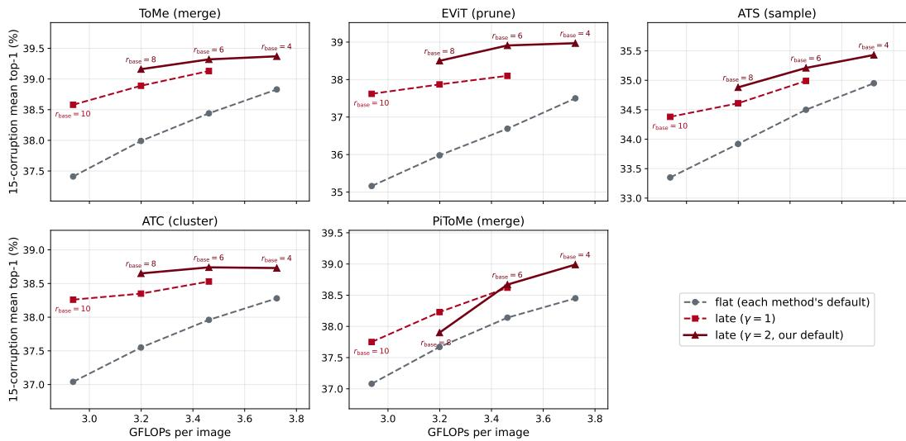  
Figure 7: 15-corruption-mean top-1 vs. compute for each of the five training-free reducers (DeiT-S, ImageNet-C severity 5), each curve a schedule swept over compression (points labeled by $r _ { \mathrm { b a s e } } )$ Flat and late $\gamma = 2$ at $r _ { \mathrm { b a s e } } \in \{ 4 , 6 , 8 \}$ are the cells of Table 3, late $\gamma { = } 1 \ \mathrm { a t } \ r _ { \mathrm { b a s e } } \in \{ 6 , 8 , 1 0 \}$ those of Table 17; each late point is drawn at the GFLOPs of the flat schedule it is calibrated to (its own cost is at or below that).

At both rates late beats flat for every method on both backbones (all 24 cells positive over 3 seeds); the residual seed variance is confined to the const baselines of the gradient methods, where adaptation occasionally collapses on a single corruption×seed run. SPA and NEO carry none of it, SPA because no run of it collapses and NEO because it is deterministic. Table 19 breaks the $r _ { \mathrm { b a s e } } { = } 8$ result down by corruption.

Knife-edge collapses. Per corruption, the late schedule wins on the large majority of cells (166/180). For the three gradient methods the only failures under adaptation are knife-edge corruptions that collapse to near-chance (< 20%). $\mathrm { { A t } \gamma = 2 }$ these shifts are favorable on balance: Tent’s ViT-S zoom rises from 18.2% to 45.1%, while Tent’s ViT-B fog and EATA’s ViT-B contrast are structural, staying near-chance on both schedules at every rate. The schedule thus moves these collapses between methods rather than creating them, which is exactly the regime merge-aware sample selection targets (Section 6). The two methods that take no gradient step on the network never collapse. FOA’s few late-versus-flat regressions are modest $( \leq 2 . 1 \mathrm { p p } , \mathrm { e . g . }$ . ViT-S defocus and ViT-B elastic) and do not concentrate in any corruption family, and $\mathrm { N E O ^ { \circ } s }$ single regression is ViT-B elastic $\mathrm { a t - 0 . 2 p p }$ . NEO’s lowest cell, ViT-S contrast at 17.6 flat and 19.2 late, reads as a collapse only against the 20% line: with nothing to optimize there is nothing to diverge, and no adaptation at all scores 14.4 there, so NEO improves it and the late schedule improves it again. SPA collapses nowhere and regresses nowhere, the only method in the table with a positive cell for every corruption on both backbones.

Table 18: TTA × schedule, per-rate means (γ=2). ImageNet-C sev=5, 15-corruption mean top-1, 3 seeds. full = the same method with no reduction (197 tokens in every block); flat = const $( \gamma { = } 0 ) ;$ ${ \mathrm { l a t e } } = \gamma = 2 .$ , iso-GFLOPs. ∆ = late − flat; small ± values are seed stds. $( r _ { \mathrm { b a s e } } { = } 8$ also appears in the body, Table 6.)
<table><tr><td rowspan="2">Method</td><td rowspan="2">full</td><td colspan="3"> $r _ { \mathrm { b a s e } } = 4$ </td><td colspan="3"> $r _ { \mathrm { b a s e } } = 8$ </td></tr><tr><td>flat</td><td>late</td><td>Δ</td><td>flat</td><td>late</td><td>∆</td></tr><tr><td>ViT-S</td><td></td><td></td><td></td><td></td><td></td><td></td><td></td></tr><tr><td>Tent</td><td> $5 0 . 1 9 { \scriptstyle \pm 0 . 0 0 }$ </td><td> $4 9 . 2 7 { \scriptstyle \pm 0 . 0 0 }$ </td><td> $5 0 . 8 4 { \scriptstyle \pm 0 . 0 0 }$ </td><td> $+ 1 . 5 7 { \scriptstyle \pm 0 . 0 0 }$ </td><td> $4 8 . 4 7 { \scriptstyle \pm 0 . 0 0 }$ </td><td> $5 2 . 0 4 { \scriptstyle \pm 0 . 0 0 }$ </td><td> $\mathbf { + 3 . 5 7 { \pm } 0 . 0 0 }$ </td></tr><tr><td>EATA</td><td> $5 5 . 2 0 { \scriptstyle \pm 0 . 0 2 }$ </td><td> $5 4 . 3 2 { \scriptstyle \pm 0 . 1 1 }$ </td><td> $5 4 . 8 4 { \scriptstyle \pm 0 . 1 3 }$ </td><td> $+ 0 . 5 2 { \scriptstyle \pm 0 . 1 4 }$ </td><td> $5 2 . 6 5 { \scriptstyle \pm 0 . 1 6 }$ </td><td> $5 3 . 6 6 { \scriptstyle \pm 0 . 2 6 }$ </td><td> $+ 1 . 0 0 { \pm } 0 . 3 8 $ </td></tr><tr><td>SAR</td><td> $5 3 . 3 9 { \scriptstyle \pm 0 . 0 0 }$ </td><td> $5 2 . 7 7 { \scriptstyle \pm 0 . 0 0 }$ </td><td> $5 3 . 2 2 { \scriptstyle \pm 0 . 0 0 }$ </td><td> $+ 0 . 4 5 { \scriptstyle \pm 0 . 0 0 }$ </td><td> $5 1 . 5 2 { \scriptstyle \pm 0 . 0 0 }$ </td><td> $5 1 . 9 6 { \scriptstyle \pm 0 . 0 0 }$ </td><td> $+ 0 . 4 3 { \scriptstyle \pm 0 . 0 0 }$ </td></tr><tr><td>FOA</td><td> $4 5 . 2 7 { \scriptstyle \pm 0 . 2 3 }$ </td><td> $4 3 . 9 7 { \scriptstyle \pm 0 . 2 8 }$ </td><td> $4 4 . 6 8 { \scriptstyle \pm 0 . 1 5 }$ </td><td> $+ 0 . 7 1 { \scriptstyle \pm 0 . 3 6 }$ </td><td> $4 2 . 4 2 { \scriptstyle \pm 0 . 4 8 }$ </td><td> $4 2 . 8 1 { \scriptstyle \pm 0 . 3 0 }$ </td><td> $+ 0 . 3 9 { \scriptstyle \pm 0 . 6 0 }$ </td></tr><tr><td>SPA</td><td> $5 3 . 0 9 { \scriptstyle \pm 0 . 2 9 }$ </td><td> $5 2 . 3 8 { \scriptstyle \pm 0 . 1 1 }$ </td><td> $5 3 . 1 2 { \scriptstyle \pm 0 . 0 6 }$ </td><td> $+ 0 . 7 4 { \scriptstyle \pm 0 . 1 5 }$ </td><td> $5 1 . 2 2 { \scriptstyle \pm 0 . 0 9 }$ </td><td> $5 2 . 9 8 { \scriptstyle \pm 0 . 1 2 }$ </td><td> $\mathbf { + 1 . 7 6 { \scriptstyle \pm 0 . 2 1 } }$ </td></tr><tr><td>NEO</td><td> $4 2 . 6 6 { \scriptstyle \pm 0 . 0 0 }$ </td><td> $4 2 . 1 0 { \scriptstyle \pm 0 . 0 0 }$ </td><td> $4 2 . 5 5 { \scriptstyle \pm 0 . 0 0 }$ </td><td> $+ 0 . 4 5 { \scriptstyle \pm 0 . 0 0 }$ </td><td> $4 0 . 9 7 { \scriptstyle \pm 0 . 0 0 }$ </td><td> $4 1 . 9 7 { \scriptstyle \pm 0 . 0 0 }$ </td><td> $+ 1 . 0 0 { \scriptstyle \pm 0 . 0 0 }$ </td></tr><tr><td>ViT-B</td><td></td><td></td><td></td><td></td><td></td><td></td><td></td></tr><tr><td>Tent</td><td> $5 6 . 3 2 { \scriptstyle \pm 0 . 0 0 }$ </td><td> $5 5 . 8 6 { \scriptstyle \pm 0 . 0 0 }$ </td><td> $5 6 . 2 4 { \scriptstyle \pm 0 . 0 0 }$ </td><td> $+ 0 . 3 8 { \pm } 0 . 0 0$ </td><td> $5 4 . 4 9 { \scriptstyle \pm 0 . 0 0 }$ </td><td> $5 5 . 7 2 { \scriptstyle \pm 0 . 0 0 }$ </td><td> $+ 1 . 2 3 { \pm } 0 . 0 0$ </td></tr><tr><td>EATA</td><td> $5 9 . 8 1 { \scriptstyle \pm 1 . 7 8 }$ </td><td> $5 9 . 3 7 { \scriptstyle \pm 2 . 7 6 }$ </td><td> $6 0 . 5 0 { \scriptstyle \pm 0 . 5 1 }$ </td><td> $+ 1 . 1 3 { \pm } 2 . 5 6$ </td><td> $5 9 . 0 9 { \scriptstyle \pm 0 . 6 2 }$ </td><td> $6 0 . 1 1 { \scriptstyle \pm 0 . 3 7 }$ </td><td> $+ 1 . 0 1 { \pm } 0 . 4 3$ </td></tr><tr><td>SAR</td><td> $5 7 . 9 1 { \scriptstyle \pm 0 . 0 0 }$ </td><td> $6 0 . 9 5 { \scriptstyle \pm 0 . 0 0 }$ </td><td> $6 1 . 5 1 { \scriptstyle \pm 0 . 0 0 }$ </td><td> $+ 0 . 5 6 { \scriptstyle \pm 0 . 0 0 }$ </td><td> $5 9 . 7 1 { \scriptstyle \pm 0 . 0 0 }$ </td><td> $6 1 . 0 7 { \scriptstyle \pm 0 . 0 0 }$ </td><td> $+ 1 . 3 5 { \pm } 0 . 0 0$ </td></tr><tr><td>FOA</td><td> $6 2 . 1 6 { \pm } 0 . 1 3$ </td><td> $6 1 . 8 0 { \scriptstyle \pm 0 . 0 2 }$ </td><td> $6 1 . 8 4 { \scriptstyle \pm 0 . 0 7 }$ </td><td> $+ 0 . 0 4 { \scriptstyle \pm 0 . 0 9 }$ </td><td> $5 9 . 8 0 { \scriptstyle \pm 0 . 1 0 }$ </td><td> $6 0 . 4 1 { \scriptstyle \pm 0 . 1 4 }$ </td><td> $+ 0 . 6 1 { \scriptstyle \pm 0 . 0 9 }$ </td></tr><tr><td>SPA</td><td> $6 5 . 4 1 { \scriptstyle \pm 0 . 0 3 }$ </td><td> $6 4 . 7 7 { \scriptstyle \pm 0 . 0 3 }$ </td><td> $6 5 . 2 7 { \scriptstyle \pm 0 . 0 3 }$ </td><td> $+ 0 . 5 0 { \scriptstyle \pm 0 . 0 4 }$ </td><td> $6 3 . 5 3 { \scriptstyle \pm 0 . 0 8 }$ </td><td> $6 4 . 8 1 { \scriptstyle \pm 0 . 0 6 }$ </td><td> $+ 1 . 2 8 { \pm } 0 . 1 3$ </td></tr><tr><td>NEO</td><td> $5 9 . 0 0 { \scriptstyle \pm 0 . 0 0 }$ </td><td> $5 8 . 2 3 { \scriptstyle \pm 0 . 0 0 }$ </td><td> $5 8 . 7 7 { \scriptstyle \pm 0 . 0 0 }$ </td><td> $+ 0 . 5 4 { \scriptstyle \pm 0 . 0 0 }$ </td><td> $5 6 . 8 1 { \scriptstyle \pm 0 . 0 0 }$ </td><td> $5 8 . 1 6 { \scriptstyle \pm 0 . 0 0 }$ </td><td> $+ 1 . 3 4 { \pm } 0 . 0 0$ </td></tr></table>

Table 19: TTA × schedule, per-corruption top-1 (%) at $r _ { \mathrm { b a s e } } { = } 8 , \gamma { = } 2$ (sev=5, 3-seed mean). For each method, flat = const, $\mathrm { l a t e } = \gamma { = } 2$ at iso-GFLOPs. Knife-edge collapses (< 20%) are where adaptation, not the schedule, fails; the schedule shifts them between methods $( \mathrm { e . g . \gamma = 2 }$ repairs Tent’s ViT-S zoom, 18.2→45.1). NEO’s ViT-S contrast cell is low but is not one of them: it optimizes nothing and so cannot diverge, and it improves that cell over the 14.4 of no adaptation.
<table><tr><td></td><td></td><td>gauss</td><td>shot</td><td>imp</td><td>defoc</td><td>glass</td><td>motn</td><td>zoom</td><td>snow</td><td>frost</td><td>fog</td><td>brt</td><td>cont</td><td>elas</td><td>pix</td><td>jpeg</td><td>mean</td></tr><tr><td colspan="10">ViT-S</td><td></td><td></td><td></td><td></td><td></td><td></td><td></td><td></td><td></td></tr><tr><td rowspan="2">Tent</td><td>flat</td><td>42.4</td><td>44.3</td><td>44.5</td><td>46.5</td><td>45.2</td><td>51.3</td><td>18.2</td><td>10.9</td><td>55.8</td><td>60.8</td><td>73.4</td><td>48.9</td><td>57.5</td><td>64.2</td><td>63.3</td><td>48.5</td></tr><tr><td>late</td><td>45.5 42.1</td><td>47.1 44.1</td><td>47.2 44.2</td><td>47.7 46.3</td><td>46.1 45.6</td><td>52.2 50.5</td><td>45.1 46.8</td><td>21.7 55.5</td><td>56.8</td><td>61.3</td><td>73.5 73.6</td><td>51.0 41.6</td><td>57.4</td><td>64.5 63.9</td><td>63.5 63.1</td><td>52.0 52.7</td></tr><tr><td rowspan="2">EATA</td><td>flat</td><td></td><td></td><td></td><td></td><td></td><td></td><td></td><td></td><td>54.9</td><td>59.8</td><td></td><td></td><td>57.8</td><td></td><td></td><td></td></tr><tr><td>late</td><td>45.0</td><td>46.5</td><td>46.6</td><td>46.7</td><td>46.1</td><td>51.1</td><td>47.4</td><td>55.8</td><td>55.8</td><td>60.6</td><td>73.8</td><td>44.1</td><td>57.7</td><td>64.1</td><td>63.5</td><td>53.7</td></tr><tr><td rowspan="2">SAR</td><td>flat late</td><td>40.9</td><td>42.5</td><td>43.1</td><td>45.1</td><td>43.9</td><td>50.0</td><td>45.0</td><td>53.5</td><td>53.8</td><td>58.1</td><td>71.9</td><td>45.1</td><td>56.0</td><td>62.5</td><td>61.5</td><td>51.5</td></tr><tr><td></td><td>43.7 31.4</td><td>45.2</td><td>45.5</td><td>46.2 36.5</td><td>44.9 30.2</td><td>50.8 40.5</td><td>45.7 34.4</td><td>54.2 45.4</td><td>54.7</td><td>58.8</td><td>72.2 68.4</td><td>37.0</td><td>55.8</td><td>63.0</td><td>61.7</td><td>52.0 42.4</td></tr><tr><td rowspan="2">FOA</td><td>flat late</td><td></td><td>31.9</td><td>32.4</td><td></td><td></td><td></td><td></td><td></td><td>45.8</td><td>50.2</td><td></td><td>38.8</td><td>40.9</td><td>51.4</td><td>57.9</td><td>42.8</td></tr><tr><td></td><td>33.2 43.0</td><td>32.6</td><td>34.7</td><td>35.8 41.6</td><td>29.6 36.6</td><td>40.7 28.7</td><td>34.4</td><td>45.5</td><td>46.1</td><td>51.2</td><td>67.6</td><td>39.5</td><td>41.7</td><td>51.4</td><td>58.1</td><td></td></tr><tr><td rowspan="2">SPA</td><td>flat late</td><td>45.6</td><td>45.2</td><td>45.0 47.9</td><td>43.0</td><td>38.6</td><td>35.8</td><td>49.2</td><td>58.2</td><td>57.6</td><td>60.3</td><td>73.7</td><td>43.0</td><td>60.1</td><td>63.8</td><td>62.4</td><td>51.2</td></tr><tr><td></td><td>33.2</td><td>47.5 32.8</td><td>32.9</td><td>34.3</td><td>25.3</td><td>41.5</td><td>50.0 34.2</td><td>58.9</td><td>58.6</td><td>61.5</td><td>74.0</td><td>45.0</td><td>60.8</td><td>64.6</td><td>62.8</td><td>53.0</td></tr><tr><td rowspan="2">NEO</td><td>flat late</td><td></td><td>34.2</td><td>34.5</td><td>35.3</td><td>25.5</td><td>42.7</td><td>34.8</td><td>46.1 46.8</td><td>45.0</td><td>49.4</td><td>70.4</td><td>17.6</td><td>41.2</td><td>54.1</td><td>56.6</td><td>41.0</td></tr><tr><td>34.8</td><td></td><td></td><td></td><td></td><td></td><td></td><td></td><td></td><td>46.2</td><td>50.4</td><td>71.1</td><td>19.2</td><td>41.6</td><td>55.3</td><td>57.2</td><td>42.0</td></tr><tr><td colspan="10">ViT-B</td><td></td><td></td><td></td><td></td><td></td><td></td><td></td><td></td><td></td></tr><tr><td rowspan="2">Tent</td><td>flat late</td><td>54.8</td><td>55.7</td><td>56.3</td><td>52.5</td><td>44.3</td><td>55.9</td><td>48.8</td><td>61.3</td><td>56.1</td><td>12.9</td><td>77.1</td><td>56.2</td><td>50.3</td><td>67.1</td><td>68.0</td><td>54.5</td></tr><tr><td></td><td>57.2</td><td>58.2</td><td>59.0</td><td>54.0</td><td>45.1</td><td>56.9</td><td>50.3</td><td>62.6</td><td>57.3</td><td>11.8</td><td>77.6</td><td>58.9</td><td>50.4</td><td>68.0</td><td>68.5</td><td>55.7</td></tr><tr><td rowspan="2">EATA</td><td>flat</td><td>56.1</td><td>58.3</td><td>56.1</td><td>50.7</td><td>54.9</td><td>60.3</td><td>57.9</td><td>67.3</td><td>62.7</td><td>67.1</td><td>77.4</td><td>6.5</td><td>67.4</td><td>72.6</td><td>71.2</td><td>59.1</td></tr><tr><td>late</td><td>57.8</td><td>59.4</td><td>59.7</td><td>52.1</td><td>55.6</td><td>60.9</td><td>58.3</td><td>67.6</td><td>63.5</td><td>68.0</td><td>79.1</td><td>5.6</td><td>68.0</td><td>73.8</td><td>72.2</td><td>60.1</td></tr><tr><td rowspan="2">SAR</td><td>flat</td><td>55.1</td><td>56.1</td><td>56.3</td><td>53.6</td><td>50.7</td><td>57.7</td><td>52.3</td><td>62.8</td><td>58.4</td><td>64.3</td><td>77.2</td><td>56.2</td><td>57.4</td><td>69.0</td><td>68.6</td><td>59.7</td></tr><tr><td>late</td><td>57.5</td><td>58.5</td><td>58.9</td><td>54.7</td><td>51.4</td><td>58.7</td><td>53.7</td><td>63.9</td><td>60.6</td><td>66.6</td><td>77.8</td><td>57.6</td><td>57.8</td><td>69.6</td><td>69.0</td><td>61.1</td></tr><tr><td rowspan="2">FOA</td><td>flat</td><td>56.6</td><td>57.4</td><td>57.6</td><td>53.5</td><td>43.8</td><td>55.8</td><td>50.6</td><td>64.9</td><td>60.5</td><td>66.2</td><td>77.0</td><td>59.7</td><td>55.0</td><td>68.9</td><td>69.4</td><td>59.8</td></tr><tr><td>late</td><td>58.1</td><td>59.4</td><td>59.6</td><td>54.5</td><td>43.4</td><td>56.3</td><td>49.5</td><td>65.1</td><td>61.5</td><td>65.5</td><td>77.5</td><td>61.6</td><td>53.3</td><td>69.9</td><td>70.8</td><td>60.4</td></tr><tr><td rowspan="2">SPA</td><td>flat</td><td>59.3</td><td>60.4</td><td>60.9</td><td>54.3 55.6</td><td>52.0 53.0</td><td>61.9 63.1</td><td>57.4 58.3</td><td>68.5 69.4</td><td>65.9 66.6</td><td>65.0 66.2</td><td>79.1 79.4</td><td>61.0 64.0</td><td>63.1 63.9</td><td>73.7 74.3</td><td>70.7 71.0</td><td>63.5 64.8</td></tr><tr><td>late flat</td><td>61.4 54.0</td><td>62.7 54.4</td><td>63.2 54.6</td></table>

What the two token budgets cost. Appendix V measures the schedule at inference. Under adaptation the accounting is per method, since each one wraps the backbone differently. Every cell below is the same method at the same learning rate; only the token budget changes. GFLOPs are counted with PyTorch’s flop counter, so a method’s extra forward passes, its backward pass and its auxiliary modules are all included, and every cell was identical across ten batches. Times are the mean over 100 timed steps after 20 warmup steps, averaged over two repeated runs at batch 64 on one GPU, one process per cell, with deterministic kernels disabled; the two runs differ by 0.06% in the median cell and by at most 1.0%.

The saving is the same for every method. GFLOPs fall by 26% throughout, within 0.9pp, because a method’s mechanism multiplies the reduced and the unreduced model alike and only the token profile survives: SAR costs exactly twice Tent at either budget, SPA about two and a half times, FOA thirteen to fourteen times, and all of them shed the same fraction. Wall-clock follows at 17.5 to 24.7%. So the composability in Table 6 is not bought back in compute: whichever method is layered on top, the late schedule runs it at about three quarters of the cost of full tokens.

Table 20: Cost of one adaptation step on full tokens against the late schedule $( r _ { \mathrm { b a s e } } { = } 8 , \ \gamma { = } 2 )$ ImageNet-C severity 5, batch 64. Each percentage is the fraction the quantity shrank. Full tokens = 197 in every block.
<table><tr><td rowspan="2">Method</td><td colspan="3">GFLOPs / step</td><td colspan="3">ms / step</td></tr><tr><td>full</td><td>late</td><td>cut</td><td>full</td><td>late</td><td>cut</td></tr><tr><td colspan="7">ViT-S</td></tr><tr><td>Tent</td><td>1216 1216</td><td>890 890</td><td>26.8% 26.8%</td><td>156.9 171.5</td><td>124.5 139.2</td><td>20.7% 18.8%</td></tr><tr><td>EATA SAR</td><td>2431</td><td>1781</td><td>26.8%</td><td>318.5</td><td>256.1</td><td>19.6%</td></tr><tr><td>FOA</td><td>15555</td><td>11533</td><td>25.9%</td><td>1927.4</td><td>1590.8</td><td>17.5%</td></tr><tr><td>SPA</td><td>3028</td><td>2226</td><td>26.5%</td><td>394.3</td><td>319.0</td><td>19.1%</td></tr><tr><td>NEO</td><td>589</td><td>435</td><td>26.2%</td><td>67.5</td><td>54.2</td><td>19.8%</td></tr><tr><td>ViT-B</td><td></td><td></td><td></td><td></td><td></td><td></td></tr><tr><td>Tent</td><td>4573</td><td>3359</td><td>26.5%</td><td>459.1</td><td>353.4</td><td>23.0%</td></tr><tr><td>EATA</td><td>4573</td><td>3359</td><td>26.5%</td><td>524.4</td><td>394.7</td><td>24.7%</td></tr><tr><td>SAR</td><td>9146</td><td>6718</td><td>26.5%</td><td>934.1</td><td>719.4</td><td>23.0%</td></tr><tr><td>FOA</td><td>63943</td><td>47383</td><td>25.9%</td><td>6378.6</td><td>4984.7</td><td>21.9%</td></tr><tr><td>SPA</td><td>11410</td><td>8401</td><td>26.4%</td><td>1155.8</td><td>892.0</td><td>22.8%</td></tr><tr><td></td><td></td><td></td><td></td><td></td><td></td><td></td></tr><tr><td>NEO</td><td>2248</td><td>1658</td><td>26.2%</td><td>209.7</td><td>161.5</td><td>23.0%</td></tr></table>

## L REDUCTION DISTORTION IS FRONT-LOADED FOR EVERY REDUCER

The reduction distortion $D ( \ell )$ , the output error a single reduction at layer ℓ produces, is the per-step quantity the schedule trades off. We measure it directly for each training-free reducer: starting from the full 197-token DeiT-S, at layer ℓ (and only there) we let the reducer remove a fixed 16 tokens and read the relative change in the output logits, $D ( \ell ) = \mathbb { E } _ { x } \Vert f ^ { ( \ell ) } ( x ) - f ( x ) \Vert / \Vert f ( x ) \vert$ over N=1024 images $( f$ is the unreduced model). This reads the model output rather than operation-specific merged features, so it applies uniformly to merging, pruning, sampling, and clustering reducers.

The main-text Figure 3a plots $D ( \ell )$ under gaussian noise (severity 5) for all five reducers, every curve front-loaded, an early reduction distorting far more than a late one. This holds across the corruption taxonomy: Table 21 gives the early/late ratio per reducer for one corruption from each ImageNet-C group (noise, blur, weather, digital), $\geq 6 \times$ in every cell (Spearman against depth ≤ −0.90 throughout). Because the amplification $A ( \ell )$ is operation-agnostic (Section 4), this frontloaded $D ( \ell )$ is what makes late concentration beneficial for every reducer, not only the merging case in the main text, generalizing the account to the full set of reducers in Table 3.

Table 21: Front-loading of the per-layer reduction distortion $D ( \ell )$ under each ImageNet-C group (DeiT-S, N=1024, severity 5): early/late ratio (early $= \ell \in \{ 1 , \ldots , 4 \}$ , late $= \ell \in \{ 9 , \ldots , 1 2 \}$ means) for one representative corruption per group (noise = gaussian, blur = defocus, weather = fog, digital = jpeg). Every cell is strongly front-loaded (ratio $\geq 6 \times ;$ Spearman against depth $\leq - 0 . 9 0$ throughout).
<table><tr><td>Reducer</td><td>Family</td><td>noise</td><td>blur</td><td>weather</td><td>digital</td></tr><tr><td>ToMe</td><td>merging</td><td>31.5</td><td>21.1</td><td>35.2</td><td>20.8</td></tr><tr><td>EViT</td><td>pruning</td><td>13.4</td><td>10.5</td><td>15.8</td><td>13.5</td></tr><tr><td>ATS</td><td>sampling</td><td>10.9</td><td>8.9</td><td>9.5</td><td>10.1</td></tr><tr><td>ATC</td><td>clustering</td><td>38.2</td><td>22.6</td><td>38.2</td><td>21.6</td></tr><tr><td>PiToMe</td><td>merging</td><td>14.2</td><td>6.6</td><td>9.0</td><td>10.4</td></tr></table>

## M PER-LAYER PROBE: SUMMARY VALUES

Table 22 gives the exact per-condition summary behind Figure 3b (the amplification curves of Sec tion 4): early- and late-layer means of the amplification $A ( \ell ) ,$ , with the Spearman rank correlation against layer index over all 12 layers. The strongly negative Spearman values $( \leq - 0 . 9 2 )$ confirm $A ( \ell )$ is non-increasing in ℓ (front-loaded). The full per-layer efficiency $\rho ( \ell ) = D ( \ell ) / S ( \ell )$ , from the directly-measured per-layer reduction distortion $\mathbf { \bar { \boldsymbol { D } } } ( \ell )$ (Appendix L) and the marginal-saving denominator $S ( \ell )$ of Appendix R, is reported in Table 27.

Why A(ℓ) is front-loaded (linearized view).

Lemma 1 (Linearized amplification). To first order, linearizing the layers above ℓ with input–output Jacobians $J _ { k } ,$ a perturbation δ at layer ℓ’s output reaches the readout as $\begin{array} { r } { \big ( \prod _ { k > \ell } J _ { k } \big ) \delta ; } \end{array}$ its gain is therefore at most the operator norm $\scriptstyle { \left\| \prod _ { k > \ell } J _ { k } \right\| }$ , attained only along the top singular direction, and the isotropic probe measures the average-case gain $\begin{array} { r } { A ( \ell ) \leq \| \prod _ { k > \ell } J _ { k } \| } \end{array}$

In words, an error introduced earlier passes through more layers on its way to the classifier, so it has more opportunity to be amplified. Two consequences follow. The bound $\scriptstyle { \left\| \prod _ { k > \ell } J _ { k } \right\| }$ is a product of $L - \ell$ downstream factors, one fewer at each deeper layer, so it is non-increasing in ℓ whenever those layers are on average non-contractive, matching the measured front-loading of $A ( \ell )$ . And since $\begin{array} { r } { \left\| \dot { \prod } _ { k > \ell } J _ { k } \right\| \le \prod _ { k > \ell } \left\| J _ { k } \right\| } \end{array}$ , a shift that scales the per-layer norms by (1+ϵ) scales this bound by $( 1 + \epsilon ) ^ { L - \ell }$ , which compounds over more factors at small ℓ, inflating the early-layer amplification most and leaving the latest layers almost unchanged (the realized inflation also depends on singularvector alignment). This depth-compounding of a perturbation through a product of layer Jacobians is the mechanism studied in mean-field analyses of deep networks (Poole et al., 2016; Pennington et al., 2017), here measured in a trained ViT. This reduces the question of why shift raises $A ( \bar { \ell } )$ to the local, measurable claim that corruption raises the downstream Jacobian norms, which Table 22 confirms (early $A ( \ell )$ inflates under corruption while late $A ( \ell )$ barely moves).

Why the per-layer norms inflate off the clean distribution. Self-attention can amplify offmanifold perturbations in a way a local operator cannot. Standard dot-product self-attention is not Lipschitz (Kim et al., 2021): its output token $\begin{array} { r } { o _ { i } = \sum _ { j } p _ { i j } v _ { j } } \end{array}$ is a convex combination of value vectors with input-dependent weights $p _ { i } =$ softmax $( q _ { i } K ^ { \top } / \sqrt { d } )$ , and a perturbation reroutes these weights through $\partial p _ { i } / \partial ( \mathrm { l o g i t s } ) = \mathrm { d i a g } ( p _ { i } ) - p _ { i } p _ { i } ^ { \top }$ scaled by $K / { \sqrt { d } } ,$ a term the unbounded bilinear form $q _ { i } K ^ { \top }$ leaves unbounded. The coupling is all-to-all, so a change to one token can shift every token’s weights, unlike the fixed, bounded Jacobian of a convolution’s local receptive field. On the clean manifold this rerouting is organized by training; off it, where the network was never optimized, it is unconstrained, consistent with the early-layer inflation in Table 22.

We stress the scope. This is a capacity argument: it explains why a transformer can amplify off manifold shifts, not that a given shift must, which component (attention, LayerNorm, or the MLP) dominates, or a signed magnitude per corruption; those the probe measures. The theory supplies only the structural reason amplification is available, while the depth profile (early-most) follows from Lemma 1 under the on-average non-contractive condition and is confirmed empirically (Table 22).

Table 22: Amplification $A ( \ell )$ summary (DeiT-S, N=1024, compute-neutral), for clean inputs and one corruption from each ImageNet-C group (severity 5). A(ℓ) is front-loaded (early ≫ late) in every condition, with clean the flattest, so the network’s amplification concentrates a reduction’s distortion in the early layers. early $= \ell \in \{ 1 , \ldots , 4 \}$ , late $= \bar { \ell } \in \{ 9 , \dots , 1 2 \}$ (means); Spearman is over all 12 layers.
<table><tr><td>Condition</td><td>early A(l)</td><td>late A(l)</td><td>Spearman</td></tr><tr><td>clean</td><td>0.60</td><td>0.25</td><td>-0.92</td></tr><tr><td>gaussian noise (noise)</td><td>0.92</td><td>0.20</td><td>-1.00</td></tr><tr><td>defocus blur (blur)</td><td>0.74</td><td>0.20</td><td>-1.00</td></tr><tr><td>fog (weather)</td><td>0.83</td><td>0.17</td><td>-1.00</td></tr><tr><td>jpeg compression (digital)</td><td>0.77</td><td>0.23</td><td>-1.00</td></tr></table>

## N CLEAN MERGE-PATH CONTROL: IS THE MATCHING CRITERION THE LEVER?

We test whether the OOD token-reduction penalty is driven by degraded merge decisions (which tokens are merged) rather than by the schedule. For each ImageNet-C image we capture, layer by layer, the merge path (the token groupings) that ToMe takes on the image’s clean counterpart, and force the corrupted image to follow that same “oracle” path, ignoring its own corrupted features when choosing what to merge. The clean path is unavailable at test time (it requires the clean image); it upper-bounds what restoring the uncorrupted matching could recover (a clean-decision oracle, not a proven global optimum). We compare, at iso-GFLOPs, against the standard own-path baseline and against our late schedule. DeiT-S, the 15-corruption ImageNet-C mean (severity 5), full 50k; the own-path column reproduces the canonical flat numbers exactly, a correctness check on the replay. The uncompressed model scores 39.40.

Table 23: Clean merge-path control (15-corruption ImageNet-C mean, severity 5, DeiT-S, iso-GFLOPs). Forcing the clean (oracle) merge decisions recovers some OOD accuracy, but less than the late schedule at every $r _ { \mathrm { b a s e } } .$ . Parentheses give the gain over the own-path baseline; the late schedule uses its own (corrupted) decisions and needs no clean reference.
<table><tr><td>rbase</td><td>own-path (flat)</td><td>oracle clean-decision</td><td>late schedule  $( \gamma { = } 2 )$ </td></tr><tr><td>4</td><td>38.83</td><td>39.22 (+0.39)</td><td>39.37 (+0.54)</td></tr><tr><td>6</td><td>38.44</td><td>39.03 (+0.59)</td><td>39.32 (+0.88)</td></tr><tr><td>8</td><td>37.99</td><td>38.79 (+0.80)</td><td>39.16 (+1.17)</td></tr><tr><td>10</td><td>37.41</td><td>38.36 (+0.95)</td><td>38.66 (+1.25)</td></tr></table>

Even an oracle that uses the uncorrupted image’s merge decisions recovers less than the late schedule, which uses its own decisions and needs no clean reference. Relative to this clean-decision oracle, the schedule, not the matching criterion, is the stronger lever, which motivates holding the matching rule fixed while studying allocation. A more corruption-robust matching criterion is a separate design axis that we do not pursue here, and leave to future work (Section 6).

## O ROBUSTNESS TO THE SCHEDULE’S FUNCTIONAL FORM

The power law (Eq. 1) is a convenient single-parameter probe of the late-concentrated axis, not a shape we claim is optimal (Section 4). To check that the gain reflects the late-concentrated direction rather than the power-law form, we replace the power law with two other monotone late-weighted families at the main operating point $( r _ { \mathrm { b a s e } } { = } 8$ , DeiT-S, ToMe, ImageNet-C severity 5), each calibrated to the same iso-GFLOPs rule (at or below the flat baseline’s GFLOPs) and with its shape parameter set so that its removal center-of-mass matches the $\gamma { = } 2$ schedule’s: an exponential profile $r _ { \ell } \propto e ^ { \beta \ell / L } \ ( \beta { = } 3 ;$ per-layer removals [2, 3, 4, 6, 7, 9, 12, 16, 21, 28, 36, 48]), and a non-smooth twolevel step that removes about 2 tokens per layer in the first half and about 30 per layer in the second half ([2, 2, 2, 2, 2, 2, 30, 30, 30, 30, 30, 30]).

Both recover gains on par with the power law (Table 24): the exponential adds +1.05pp and the step +1.18pp over flat, against the power law’s +1.17pp, and all 15 corruptions improve under each shape (Table 25). The benefit is thus a property of the late-concentrated direction, not of the power-law parameterization; we keep the power law because its single scalar γ admits the analytic iso-GFLOPs calibration and the continuous concentration sweep used in the mechanism analysis (Figure 2c), not because it is the most accurate shape. The small spread across shapes is itself consistent with the front-loaded-error account (Section 4): the step, which defers early removal most (∼2 tokens per layer in the first half), matches the power law, while the exponential, which removes slightly more in the earliest layers, gives back a little. This is a check at one operating point on one backbone, not an exhaustive search over schedule families.

Table 24: Late-concentration is robust to the schedule’s functional form (DeiT-S, ToMe, ImageNet-C sev=5, 15-corruption mean top-1, $\% ; r _ { \mathrm { b a s e } } { = } 8$ , inference-only, iso-GFLOPs ≤ flat). Each alternative shape is center-of-mass-matched to the $\gamma { = } 2$ schedule. ∆ = shape − flat.
<table><tr><td>Schedule</td><td>Family</td><td>GFLOPs</td><td>mean</td><td>∆ vs. flat</td></tr><tr><td>flat (const  $r _ { \mathrm { b a s e } } { = } 8 )$ </td><td></td><td>3.199</td><td>37.99</td><td></td></tr><tr><td>power law  $( \gamma { = } 2 )$ </td><td>power law (convex)</td><td>3.147</td><td>39.16</td><td>+1.17</td></tr><tr><td>exponential  $\left( \beta = 3 \right)$ </td><td>exponential (convex)</td><td>3.194</td><td>39.04</td><td>+1.05</td></tr><tr><td>two-level step</td><td>step (non-smooth)</td><td>3.178</td><td>39.17</td><td>+1.18</td></tr></table>

Table 25: Per-corruption top-1 (%) for the alternative late shapes (DeiT-S, ToMe, sev=5, $r _ { \mathrm { b a s e } } { = } 8 ,$ iso-GFLOPs). uncompressed, flat and the power law $( \gamma = 2 )$ are the same runs as Figure 5. All 15 corruptions improve over flat under every late shape.
<table><tr><td></td><td>gauss</td><td>shot</td><td>imp</td><td>defoc</td><td>glass</td><td>motn</td><td>zoom</td><td>snow</td><td>frost</td><td>fog</td><td>brt</td><td>cont</td><td>elas</td><td>pix</td><td>jpeg</td><td>mean</td></tr><tr><td>uncompressed</td><td>33.89</td><td>33.79</td><td>34.92</td><td>27.73</td><td>18.92</td><td>32.23</td><td>28.41</td><td>47.53</td><td>53.16</td><td>54.22</td><td>70.25</td><td>38.55</td><td>34.75</td><td>29.87</td><td>52.72</td><td>39.40</td></tr><tr><td>flat</td><td>31.62</td><td>31.70</td><td>32.40</td><td>26.53</td><td>18.42</td><td>31.11</td><td>27.31</td><td>46.37</td><td>51.10</td><td>51.43</td><td>69.57</td><td>36.59</td><td>34.58</td><td>28.88</td><td>52.19</td><td>37.99</td></tr><tr><td>power law (γ=2)</td><td>33.79</td><td>33.58</td><td>34.85</td><td>27.57</td><td>18.72</td><td>32.24</td><td>28.75</td><td>47.62</td><td>52.45</td><td>52.97</td><td>70.18</td><td>37.31</td><td>34.79</td><td>29.74</td><td>52.82</td><td>39.16</td></tr><tr><td>exponential</td><td>33.43</td><td>33.28</td><td>34.53</td><td>27.42</td><td>18.72</td><td>32.11</td><td>28.36</td><td>47.49</td><td>52.42</td><td>52.85</td><td>70.05</td><td>37.43</td><td>35.07</td><td>29.63</td><td>52.77</td><td>39.04</td></tr><tr><td>two-level step</td><td>33.58</td><td>33.45</td><td>34.59</td><td>27.61</td><td>18.73</td><td>32.20</td><td>28.67</td><td>47.71</td><td>52.53</td><td>52.94</td><td>70.09</td><td>37.87</td><td>35.13</td><td>29.72</td><td>52.79</td><td>39.17</td></tr></table>

## P A SEARCHED SCHEDULE IS ALSO LATE-CONCENTRATED

DiffRate (Chen et al., 2023) searches a per-layer compression rate for a given architecture and FLOP target by differentiable optimization on labeled ImageNet, and is therefore the learned counterpart of the schedule Eq. 1 specifies in closed form; LTMP (Bonnaerens & Dambre, 2023) learns perlayer thresholds whose removal varies per input, a different object. DiffRate reports its searched per-layer rates and shows that they outperform constant schedules on clean ImageNet; it does not characterize the depth profile of those rates or evaluate under distribution shift. Section 4 predicts what an accuracy-maximizing search at fixed compute should find, namely removal concentrated in late layers, heaviest at the last layer where a removal costs almost no accuracy (Appendix S), yet spread over several layers by per-layer capacity.

We ran DiffRate’s released search with its default recipe (full ImageNet, three epochs) at our main operating point for the two backbones its code supports. Table 26 lists the searched per-layer removal next to the $\gamma = 2$ power law at the same budget. Both searched schedules have the predicted shape. The last three layers take 57% of all removal on DeiT-S and 69% on DeiT-B, against 56% for the power law, and the last layer alone takes 38% and 29%, against 22%, so the searched schedules are late-concentrated to a similar degree and heavier still at the final layer. For accuracy we also evaluate a flat schedule at the same budget; all three run in DiffRate’s own prune-and-merge implementation, so their numbers are comparable with each other but not with Table 1. At matched THOP GFLOPs on ImageNet-C (severity 5, 15-corruption mean; within 0.4% on DeiT-S, and with 4.8% less compute for the power law on DeiT-B), the fixed $\gamma { = } 2$ schedule reaches 36.30 on DeiT-S against 36.82 for the searched schedule and 34.33 for flat, and 43.27 on DeiT-B against 43.59 and 41.17. The one-parameter formula thus delivers most of the gain that a labeled, gradient-based search obtains over flat, with no search, labels, or gradients.

The searched schedule is also tied to the setting it was searched for. It comes from a differentiable search that needs the labeled training set and gradient access to the model, is run separately for each architecture, token count, and FLOP budget (3.4 and 7.2 GPU-hours for DeiT-S and DeiT-B with the default recipe, paid again for every budget), and yields rates specific to DiffRate’s own pruneand-merge operator; the released schedules cover the DeiT and MAE families at 197 tokens and a few budgets. None exists for the ViT-S/B backbones, the video model (1568 space-time tokens), the vision-language encoder (576 tokens), or the four further reducers of this paper. The closed-form schedule needs none of this. Given only the layer count and the budget, it is evaluated in under a millisecond on a CPU and applied unchanged in every setting above.

Table 26: Per-layer tokens removed at the main operating point (DeiT, 197 tokens). DiffRate’s searched schedules, from a labeled search run per architecture and budget, and the closed-form $\gamma { = } 2$ schedule; all three concentrate removal in the last layers, the searched ones most at the final layer, as Section 4 predicts.
<table><tr><td>layer</td><td>1</td><td>2</td><td>3</td><td>4</td><td>5</td><td>6</td><td>7</td><td>8</td><td>9</td><td>10</td><td>11</td><td>12</td><td>total</td><td>last 3</td></tr><tr><td>DeiT-S, searched</td><td>0</td><td>2</td><td>6</td><td>12</td><td>11</td><td>12</td><td>10</td><td>12</td><td>18</td><td>5</td><td>31</td><td>72</td><td>191</td><td>57%</td></tr><tr><td>DeiT-B, searched</td><td>0</td><td>1</td><td>2</td><td>2</td><td>7</td><td>8</td><td>11</td><td>11</td><td>17</td><td>49</td><td>29</td><td>55</td><td>192</td><td>69%</td></tr><tr><td>power law, γ=2 (both)</td><td>0</td><td>1</td><td>3</td><td>5</td><td>7</td><td>11</td><td>14</td><td>19</td><td>24</td><td>30</td><td>36</td><td>42</td><td>192</td><td>56%</td></tr></table>

## Q SCHEDULE PLACEMENT AT THE AGGRESSIVE RATE

Figure 8 gives the token profiles at $r _ { \mathrm { b a s e } } { = } 1 2$ that accompany the $r _ { \mathrm { b a s e } } { = } 8$ panel of Figure 6. The ordering is the same at both rates: early-concentrated front-loads its removals and still uses the most compute (2.710G versus flat’s 2.675G and late’s 2.666G), yet it loses to flat by 2.23pp, while the late schedule uses the least compute and wins by 1.10pp.

The early-concentrated control is the same power law reflected, so its removal rate falls with depth, and we calibrate its per-layer budget against flat’s compute as we do for the late schedules. Because a removal made early frees capacity in every later block, matching flat’s cost forces a much smaller total removal: 60 tokens versus flat’s 96 at $r _ { \mathrm { b a s e } } { = } 8$ , and 96 versus 144 here.

The calibrated control also ends up slightly above flat rather than below it, 3.290G versus 3.199G at $r _ { \mathrm { b a s e } } { = } 8$ and 2.710G versus 2.675G here, so the placement comparison runs against our own claim on both the compute and the token axis.

## R WHY THE OPTIMUM IS INTERIOR: ANISO-GFLOPS ACCOUNT OF THE SWEET SPOT

At a fixed token budget $\begin{array} { r } { B = \sum _ { \ell } r _ { \ell } . } \end{array}$ , the front-loaded perstep distortion (Section 4) is minimized by pushing all removals to the latest layers. Taken alone this would predict ever-more-extreme concentration. The experiments instead show an inverted-U in γ (Table 1, Table 32). The resolution is that our comparisons are at iso-GFLOPs, under which the budget B is not a free constant.

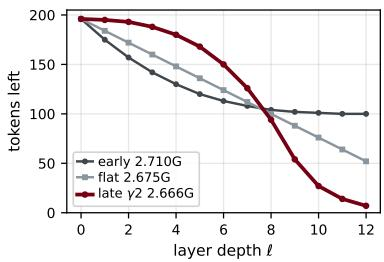  
Figure 8: Tokens remaining after each layer at $r _ { \mathrm { b a s e } } { = } 1 2$ (DeiT-S), for the early-concentrated, flat and lateconcentrated schedules; the legend gives each schedule’s GFLOPs.

## The iso-GFLOPs constraint. Because ToMe merges be-

tween a layer’s attention and its MLP, a removal at layer k shrinks the token stream seen by that layer’s own MLP and by every subsequent layer. To first order the per-token cost of a layer is constant, so the marginal compute saved by one removal at layer k is

$$
S ( k ) = c + ( L - k ) ,\tag{2}
$$

in units of a full layer, where $\left( L - k \right)$ counts the downstream layers and the constant $c =$ $c _ { \mathrm { M L P } } / c _ { \mathrm { l a y e r } } \approx 0 . 6 1$ is the layer’s own MLP saving (DeiT-S: MLP $\bar { 8 } d ^ { 2 }$ MACs per token over a full layer’s $1 2 d ^ { 2 } + 2 N d .$ , with d=384, N=197). Crucially $S ( L ) = c > ($ 0: a removal at the last layer still saves that layer’s MLP. (The self-attention term, quadratic in the token count, only sharpens the depth dependence: early removals shrink the sequence where attention is most expensive.) The same form holds for any reducer that removes tokens inside a block, with c the fraction of that block’s per-token cost downstream of the removal point; the account uses the shape of $S ( k )$ , not the value of c. The total compute saved is $\begin{array} { r } { C _ { \mathrm { s a v e d } } = \dot { \sum _ { k } } r _ { k } S ( k ) } \end{array}$ , and matching a flat baseline’s GFLOPs fixes $\begin{array} { r } { \sum _ { k } r _ { k } S ( k ) = S _ { \mathrm { t o t } } , n o t \sum _ { k } r _ { k } } \end{array}$

Optimal allocation is governed by distortion-per-compute. Writing $D ( k )$ for the per-layer reduction distortion (Section 4), minimizing the total distortion $\begin{array} { r } { \sum _ { k } r _ { k } D ( \bar { k } ) } \end{array}$ subject to $\begin{array} { r } { \sum _ { k } r _ { k } \dot { S } ( k ) = } \end{array}$ $S _ { \mathrm { t o t } }$ and $0 \le r _ { k } \le \kappa _ { k }$ (per-layer capacity) is, as a first-order diagnostic relaxation (not an optimization of the actual network), a linear program whose solution fills layers in increasing order of the ratio

$$
\rho ( k ) = \frac { D ( k ) } { S ( k ) } ,\tag{3}
$$

the distortion incurred per unit of compute saved, until the constraint $S _ { \mathrm { t o t } }$ is met (a water-filling solution). We evaluate $D ( k )$ with its directly-measured values (Appendix L); Table 27 reports the resulting $\rho .$ This ratio falls with depth (later reductions are cheaper), and at the last layer it vanishes $( D \approx 0 , \operatorname { i . e . } A ( L ) = 0 )$ : the readout sees only the class token, so a perturbation to the final layer’s patch tokens never reaches it (the class token is never merged), while $S ( L ) = c > 0$ . The last layer therefore reduces at near-zero distortion, $\rho ( L ) \to 0 .$ , and unconstrained the water-filling solution would pour the entire budget into the latest layers. What makes the optimum interior is the per-layer capacity $\kappa _ { k } \colon$ only so many mutually similar tokens exist to merge at any one layer, so once the cheap late layers are filled the budget must spill into earlier, higher-ρ layers. The optimal schedule is thus late-concentrated but not maximally so. This is the opposite of a spurious blow-up at the last layer: the endpoint is the cheapest place to reduce, and it is capacity, not efficiency, that bounds the concentration.

The efficient region is late, in clean and corrupted inputs alike. Table 27 evaluates $\rho ( \ell )$ with the corrected denominator $S ( \ell )$ from the directly-measured per-layer reduction distortion $D ( \ell )$ (the probe of Appendix L; DeiT-S, $N { = } 1 0 2 4 , L { = } 1 2 )$ . Layer L is the degenerate free reduction $( \dot { D } \approx 0 .$ confirming $A ( L ) { = } 0 , \rho ( L ) { \approx } 0 )$ ). Among the capacity-bounded interior layers the efficient region is late in both conditions (arg min $\ell < L \rho$ at $\ell { = } 1 1 ) \colon$ the distortion is steeply front-loaded already on clean $( \rho$ at $\ell { = } 1$ about $1 1 \times$ that at $\ell { = } 1 1 )$ , so late removal is the efficient choice with or without corruption. Corruption sharpens this rather than relocating it: the early-layer distortion inflates (early D rising about $4 0 \%$ from clean to gaussian noise while the late layers stay low), raising $\rho$ at $\ell { = } 1$ to about $1 3 \times$ the late value. The efficiency diagnostic thus identifies where the budget is efficient (the late, capacity-bounded layers, in every condition); the growth of the gain with severity is established separately by the gains themselves (Section 5.2).

Capacity and saturation. Two features keep the optimum interior, at different levels. The hard capacity $\kappa _ { k }$ in the linear program above already prevents collapse onto the free late layers (the waterfilling spill noted above), but with the per-unit distortion held fixed it would fill each layer bang-bang to its cap. A refinement of that fixed-distortion assumption smooths the solution. Treating the perlayer distortion $D ( k )$ as independent of $r _ { k }$ is first-order; in practice a layer has a limited supply of mutually similar tokens, so as $r _ { k }$ grows toward $\kappa _ { k }$ , bipartite matching is forced onto less-similar pairs and the marginal distortion rises, i.e. $D ( k )$ increases (and becomes convex) in $r _ { k }$ . We treat this as a modeling assumption rather than a directly measured quantity. This convexity penalizes dumping the entire budget into a few late layers (exactly what large γ does, where the removal budget balloons: its per-layer average rises from 12 at $\gamma { = } 0$ to 44 at $\gamma { = } 3$ for $r _ { \mathrm { b a s e } } { = } 1 2 )$ , and favors spreading removal smoothly across the efficient late-but-interior band, i.e. a moderate power law.

Dependence on $r _ { \mathrm { b a s e } } .$ A larger overall budget (higher $r _ { \mathrm { b a s e } } ,$ hence larger $S _ { \mathrm { t o t } } )$ reaches the capacity limits of the most efficient late layers sooner, forcing some removal into earlier, higher-ρ layers; the optimal concentration $\gamma$ thus decreases with $r _ { \mathrm { b a s e } }$ . Conversely a smaller budget leaves more slack to concentrate, so the optimal $\gamma$ increases. This matches our measurements: on the 15- corruption mean the optimum migrates from $\gamma \approx 3$ at the lightest $r _ { \mathrm { b a s e } } { = } 2$ to $\gamma \approx 1 . 5$ at $r _ { \mathrm { b a s e } } { = } 1 2$ (Table 1), and on gaussian noise (Table 32) over-concentration (pushing γ past the optimum) already hurts at the most aggressive setting we report $( r _ { \mathrm { b a s e } } { = } 1 4$ , where $\gamma { = } 1 . 5$ falls below $\gamma { = } 1 . 0 )$ . The account is first-order; it predicts the shape (an interior optimum that shifts with budget), which is what we observe, not a precise $\gamma ^ { \star }$

Table 27: Distortion per unit of compute saved, $\rho ( \ell ) = D ( \ell ) / S ( \ell ) ( \times 1 0 ^ { 3 } )$ , from the directlymeasured per-layer reduction distortion D(ℓ) (relative output-logit change from removing tokens at layer ℓ only; DeiT-S, $N { = } 1 0 2 4 ;$ ; Appendix L) and the exact marginal saving $S ( \ell ) = ( \bar { L ^ { } } - \ell ) +$ $c , c { = } 0 . 6 1$ (the layer’s own-MLP fraction, since ToMe merges before the MLP). The distortion is steeply front-loaded in both conditions and steepens under noise. Layer $L { = } 1 2$ is the degenerate free reduction: $D \approx 0$ confirms $A ( L ) { = } 0 $ , giving $\rho ( L ) { \approx } 0$ despite $S ( L ) { = } c { > } 0$ . Among the interior layers the minimum (bold) is late (ℓ=11) in both conditions; it is per-layer capacity, not a blow-up of $\rho ,$ that keeps the optimum off the free last layer. The table is a directional diagnostic, showing the cheap-to-reduce region sits in the late (but capacity-bounded) layers, not a predictor of the exact optimal $\gamma .$
<table><tr><td>layer l</td><td>clean</td><td>gaussian</td></tr><tr><td>1</td><td>16.4</td><td>25.8</td></tr><tr><td>2</td><td>12.7</td><td>18.4</td></tr><tr><td>3</td><td>8.3</td><td>10.9</td></tr><tr><td>4</td><td>6.3</td><td>5.9</td></tr><tr><td>5</td><td>4.1</td><td>5.7</td></tr><tr><td>6</td><td>3.4</td><td>4.7</td></tr><tr><td>7</td><td>2.8</td><td>3.1</td></tr><tr><td>8</td><td>2.4</td><td>3.1</td></tr><tr><td>9</td><td>2.7</td><td>2.8</td></tr><tr><td>10</td><td>2.3</td><td>2.9</td></tr><tr><td>11</td><td>1.5</td><td>2.0</td></tr><tr><td>12</td><td>0.0</td><td>0.0</td></tr></table>

## S THE LATE GAIN IS NOT A FINAL-LAYER OR READOUT ARTIFACT

ToMe inserts its merge between a layer’s attention and its MLP and protects the class token. At the final layer the attention has already run, so the class token has finished aggregating patch information; merging patch tokens afterward passes only through the token-wise MLP and LayerNorm, with no further patch-to-class attention. A final-layer patch merge therefore cannot change the logits (Section 4: $A ( \bar { L } ) = 0 )$ , while still saving that layer’s MLP on the discarded patch tokens. Because the late-concentrated schedule places its largest removals at the deepest layers, one might worry that part of its iso-GFLOPs advantage comes for free from this degenerate reduction, or more generally from the class-token readout. We rule this out with three controls.

The final layer is a structurally free reduction. Merging tokens at only the last layer leaves the logits bit-identical to the unreduced model (max $| \Delta \mathrm { l o g i t } | \stackrel { - } { = } 0$ over 300 gaussian-noise images at severity 5, for every merge count up to the per-layer clamp; a $1 . 9 \times 1 0 ^ { - 6 }$ rounding residue appears only at an extreme $r { = } 4 0 )$ . The same merge at layer 1 changes 29% of predictions (max $| \Delta \mathrm { l o g i t } | =$ 5.5), and at layer 10 it is already tiny (0.076). This confirms $A ( L ) = \bar { 0 }$ is structural (no patch-toclass path remains), not merely small. The strictly-free final-layer saving is itself small (only that layer’s MLP on the discarded patches, 0.2–0.7% of total GFLOPs, versus the full downstream stack that early removals save); more to the point, the late gain survives after this endpoint is removed entirely (next paragraph).

Excluding the final layer(s) leaves the gain intact. We drop the last layer (and the last two) from both schedules and re-evaluate on the full ImageNet-C validation set at the same operating point as the main comparison (DeiT-S, flat const $r _ { \mathrm { b a s e } } { = } 8$ and late $\gamma = 2$ , each recalibrated over the remaining layers so that flat stays at its baseline compute and late at ≤ flat; 15 corruptions, severity 5, 50,000 images each; Table 28). The late-over-flat gain is essentially unchanged: +1.17 (full, reproducing the main result) versus +1.15 (exclude last) and +1.09 (exclude last two), positive on all 15 corruptions in every condition. The advantage thus comes from the front-loaded amplification across the interior layers, not from the free final reduction. This matches the distortion account, in which the last layer contributes $r _ { L } D ( L ) = 0$ to the direct error (since $A ( L ) = 0 )$ , so only the small compute it frees could matter, and the recalibrated control absorbs that.

The effect reproduces under global-average-pooling readout. The free-final-layer phenomenon is specific to class-token readout. Under global average pooling (GAP) the final layer’s patch tokens are read out, so $A ( L ) \neq 0$ and no free reduction exists (merging at only the last layer now shifts the logits, max $| \Delta \log \mathrm { i t } | = 0 . 1 3 )$ . We evaluate two MAE-pretrained models with GAP readout, ViT-B and ViT-L, the setting ToMe itself studied, reusing ToMe’s size-proportional pooling. At a matched ∼ 25% GFLOPs reduction (ViT-B $r _ { \mathrm { b a s e } } { = } 8 ;$ ; ViT-L $r _ { \mathrm { b a s e } } { = } 4$ over its 24 layers; $\gamma { = } 2$ late calibrated to the closest schedule at or below each model’s flat GFLOPs), the late schedule beats flat on all 15 corruptions for both models, by +1.28 (ViT-B) and +1.22 (ViT-L) mean (Table 29, which also lists the compute and token budgets), reproducing the class-token DeiT-S result (+1.17) in direction and magnitude. The schedule effect is therefore not specific to the class-token readout.

Table 28: Excluding the final layer(s) from both schedules (DeiT-S, full ImageNet-C, severity 5, 50k images; flat const $r _ { \mathrm { b a s e } } { = } 8$ at 3.20 G, late $\gamma = 2$ at 3.15 G, late ≤ flat). flat/late columns are top-1 (%) for the full schedule; $\Delta = \mathrm { l a t e \mathrm { ~ - ~ } }$ flat for the full, exclude-last, and exclude-last-two variants, each recalibrated to the same compute. The full column reproduces Table 2; the gain persists when the (free) final layer(s) are removed.
<table><tr><td>corruption</td><td>flat</td><td>late</td><td>∆ full</td><td>∆ excl-1</td><td>∆ excl-2</td></tr><tr><td>gaussian noise</td><td>31.62</td><td>33.79</td><td>+2.17</td><td>+2.16</td><td>+1.89</td></tr><tr><td>shot noise</td><td>31.70</td><td>33.58</td><td>+1.88</td><td>+1.92</td><td>+1.70</td></tr><tr><td>impulse noise</td><td>32.40</td><td>34.85</td><td>+2.45</td><td>+2.33</td><td>+2.21</td></tr><tr><td>defocus blur</td><td>26.53</td><td>27.57</td><td>+1.04</td><td>+1.11</td><td>+1.13</td></tr><tr><td>glass blur</td><td>18.42</td><td>18.72</td><td>+0.30</td><td>+0.27</td><td>+0.29</td></tr><tr><td>motion blur</td><td>31.11</td><td>32.24</td><td>+1.13</td><td>+1.16</td><td>+0.98</td></tr><tr><td>zoom blur</td><td>27.31</td><td>28.75</td><td>+1.44</td><td>+1.42</td><td>+1.12</td></tr><tr><td>snow</td><td>46.37</td><td>47.62</td><td>+1.25</td><td>+1.15</td><td>+1.12</td></tr><tr><td>frost</td><td>51.10</td><td>52.45</td><td>+1.36</td><td>+1.19</td><td>+1.16</td></tr><tr><td>fog</td><td>51.43</td><td>52.97</td><td>+1.54</td><td>+1.54</td><td>+1.46</td></tr><tr><td>brightness</td><td>69.57</td><td>70.18</td><td>+0.61</td><td>+0.58</td><td>+0.53</td></tr><tr><td>contrast</td><td>36.59</td><td>37.32</td><td>+0.73</td><td>+0.78</td><td>+1.16</td></tr><tr><td>elastic transform</td><td>34.58</td><td>34.79</td><td>+0.21</td><td>+0.24</td><td>+0.26</td></tr><tr><td>pixelate</td><td>28.88</td><td>29.74</td><td>+0.86</td><td>+0.86</td><td>+0.69</td></tr><tr><td>jpeg compression</td><td>52.19</td><td>52.82</td><td>+0.64</td><td>+0.53</td><td>+0.60</td></tr><tr><td>mean</td><td>37.99</td><td>39.16</td><td>+1.17</td><td>+1.15</td><td>+1.09</td></tr></table>

## T WHAT THE LATE SCHEDULE RECOVERS: A TWO-CHANNEL DECOMPOSITION

The body (Table 1) reports that late concentration closes 83% of the accuracy the flat schedule loses to compression. That is an aggregate accounting: in principle a schedule could close the same gap by getting a different set of images right. This appendix shows it does not.

Setup. We split every image-corruption case by what the same model does with no reduction at all. In region A the unreduced model is correct, so any error there was manufactured by the reduction and an advantage in A is literally less reduction damage. In region B the unreduced model is already wrong, so an advantage there is the schedule arriving at a new correct answer, which is the “it got lucky” explanation. The two regions partition the flat-to-late accuracy difference exactly,

$$
\underbrace { \mathrm { P r } ( A ) \big [ \mathrm { a c c } _ { \mathrm { l a t e } } ( A ) - \mathrm { a c c } _ { \mathrm { f a t e } } ( A ) \big ] } _ { \mathrm { r e c o v e r y } } + \underbrace { \mathrm { P r } ( B ) \big [ \mathrm { a c c } _ { \mathrm { l a t e } } ( B ) - \mathrm { a c c } _ { \mathrm { f a t } } ( B ) \big ] } _ { \mathrm { n e w ~ c o r r e c t n e s s } } = \mathrm { a c c } _ { \mathrm { l a t e } } - \mathrm { a c c } _ { \mathrm { f a t } } ,
$$

so no part of the measured difference is left unattributed. All pairs are the calibrated iso-GFLOPs schedules of Table 31 (late GFLOPs ≤ flat), full ImageNet-C at severity 5, 50,000 images × 15 corruptions = 750,000 cases per backbone.

The gain is recovery, not new correctness. Table 30 gives the decomposition. In every one of the twelve cells the recovery channel exceeds the net difference and the new-correctness channel is negative, so late concentration actually concedes ground on cases the unreduced model was already getting wrong and wins purely by preserving the ones it was getting right. At the main operating point $( r _ { \mathrm { b a s e } } { = } 8 , \gamma { = } 2 )$ the unreduced DeiT-S is correct on 295,479 of the 750,000 cases. The flat schedule destroys 8.5% of those predictions (25,017) and ours destroys 3.9% (11,531), at no extra compute; the intermediate $\gamma { = } 1$ sits between them at 5.3%. On ViT-B the rates are 8.0% and 4.2% of 416,401 correct predictions.

Table 29: Global-average-pooling readout (MAE ViT-B and ViT-L, full ImageNet-C, severity 5, 50k images). Each model’s flat / late columns carry, in the upper rows, its budget (GFLOPs, with the reduction from the uncompressed model in parentheses, 16.9G for ViT-B and 59.7G for ViT-L; tokens removed and final, out of 196 patches) and, in the lower rows, its per-corruption top-1 (%); late is $\gamma { = } 2$ calibrated to the closest schedule at or below the flat GFLOPs. At iso-GFLOPs (late ≤ flat) late removes more tokens in total yet keeps fewer at the end, and still beats flat on all 15 corruptions for both scales (mean +1.28 / +1.22): the gain is not from a larger token budget and reproduces the class-token result.
<table><tr><td rowspan="2"></td><td colspan="3">MAE ViT-B</td><td colspan="4">MAE ViT-L</td></tr><tr><td>flat</td><td>late</td><td>∆</td><td>flat</td><td></td><td>late</td><td>∆</td></tr><tr><td>Budget</td><td></td><td></td><td></td><td></td><td></td><td></td><td></td></tr><tr><td>GFLOPs</td><td>12.67 (-25%)</td><td>12.62 (−25%)</td><td></td><td></td><td>44.98 (-25%)</td><td>44.90 (-25%)</td><td></td></tr><tr><td>tokens removed</td><td>96</td><td>169</td><td></td><td>一</td><td>96</td><td>180</td><td></td></tr><tr><td>final tokens</td><td>100</td><td>27</td><td></td><td></td><td>100</td><td>16</td><td>一</td></tr><tr><td>Top-1 accuracy (%) by corruption</td><td></td><td></td><td></td><td></td><td></td><td></td><td></td></tr><tr><td>gaussian noise</td><td>40.64</td><td>44.50</td><td>+3.86</td><td></td><td>54.14</td><td>57.08</td><td>+2.94</td></tr><tr><td>shot noise</td><td>41.62</td><td>44.57</td><td>+2.95</td><td></td><td>56.91</td><td>59.37</td><td>+2.46</td></tr><tr><td>impulse noise</td><td>42.13</td><td>45.88</td><td>+3.75</td><td></td><td>56.47</td><td>59.24</td><td>+2.77</td></tr><tr><td>defocus blur</td><td>27.74</td><td>29.15</td><td>+1.41</td><td></td><td>36.75</td><td>37.57</td><td>+0.82</td></tr><tr><td>glass blur</td><td>18.38</td><td>18.42</td><td>+0.05</td><td></td><td>24.42</td><td>24.78</td><td>+0.36</td></tr><tr><td>motion blur</td><td>35.38</td><td>36.23</td><td>+0.85</td><td></td><td>50.83</td><td>52.00</td><td>+1.16</td></tr><tr><td>zoom blur</td><td>29.24</td><td>30.27</td><td>+1.02</td><td></td><td>43.32</td><td>44.16</td><td>+0.84</td></tr><tr><td>snow</td><td>53.04</td><td>53.92</td><td>+0.87</td><td></td><td>64.19</td><td>65.21</td><td>+1.02</td></tr><tr><td>frost</td><td>54.47</td><td>55.12</td><td>+0.65</td><td></td><td>65.04</td><td>65.84</td><td>+0.80</td></tr><tr><td>fog</td><td>56.54</td><td>57.89</td><td>+1.36</td><td></td><td>60.48</td><td>63.22</td><td>+2.74</td></tr><tr><td>brightness</td><td>73.55</td><td>73.88</td><td>+0.32</td><td></td><td>78.18</td><td>78.35</td><td>+0.17</td></tr><tr><td>contrast</td><td>46.69</td><td>46.96</td><td>+0.26</td><td></td><td>54.58</td><td>54.61</td><td>+0.03</td></tr><tr><td>elastic transform</td><td>26.19</td><td>26.30</td><td>+0.10</td><td></td><td>38.96</td><td>39.48</td><td>+0.53</td></tr><tr><td>pixelate</td><td>43.61</td><td>45.09</td><td>+1.48</td><td></td><td>49.98</td><td>51.34</td><td>+1.35</td></tr><tr><td>jpeg compression</td><td>52.93</td><td>53.17</td><td>+0.24</td><td></td><td>60.29</td><td>60.55</td><td>+0.25</td></tr><tr><td>mean</td><td>42.81</td><td>44.09</td><td></td><td>+1.28</td><td>52.97</td><td>54.19</td><td>+1.22</td></tr></table>

Table 30: Two-channel decomposition of the late-minus-flat accuracy difference (pp), full ImageNet-C severity 5. recovery = cases the unreduced model already got right; new correctness = cases it got wrong. In all twelve cells the recovery channel is positive and larger than the net, and the new-correctness channel is negative: the gain comes from not destroying predictions the model already had, not from finding new ones.
<table><tr><td>backbone</td><td> $\mathsf { p a i r } \left( r _ { \mathrm { b a s e } } , \gamma \right)$ </td><td>net</td><td>recovery</td><td>new correctness</td></tr><tr><td>DeiT-S</td><td> $4 , \gamma { = } 1$ </td><td>+0.375</td><td>+0.740</td><td>-0.366</td></tr><tr><td>DeiT-S</td><td> $4 , \gamma { = } 2$ </td><td>+0.542</td><td>+1.169</td><td>-0.627</td></tr><tr><td>DeiT-S</td><td> $8 , \gamma { = } 1$ </td><td>+0.902</td><td>+1.257</td><td>-0.355</td></tr><tr><td>DeiT-S</td><td> $8 , \gamma { = } 2$ </td><td>+1.173</td><td>+1.798</td><td>-0.625</td></tr><tr><td>DeiT-S</td><td> $1 2 , \gamma { = } 1$ </td><td>+1.213</td><td>+1.417</td><td>-0.204</td></tr><tr><td>DeiT-S</td><td> $1 2 , \gamma { = } 2$ </td><td>+1.103</td><td>+1.331</td><td>-0.228</td></tr><tr><td>ViT-B</td><td>4, γ=1</td><td>+0.348</td><td>+0.685</td><td>-0.337</td></tr><tr><td>ViT-B</td><td>4, γ=2</td><td>+0.576</td><td>+1.238</td><td>-0.662</td></tr><tr><td>ViT-B</td><td> $8 , \gamma { = } 1$ </td><td>+0.991</td><td>+1.325</td><td>-0.334</td></tr><tr><td>ViT-B</td><td> $8 , \gamma { = } 2$ </td><td>+1.567</td><td>+2.111</td><td>-0.544</td></tr><tr><td>ViT-B</td><td> $1 2 , \gamma { = } 1$ </td><td>+1.774</td><td>+1.780</td><td>-0.006</td></tr><tr><td>ViT-B</td><td> $1 2 , \gamma { = } 2$ </td><td>+1.224</td><td>+1.249</td><td>-0.025</td></tr></table>

The damage is a subpopulation, not a uniform drift. The same fact is visible per image. Figure 9 plots, for each case, the probability the unreduced model assigns to its own predicted class $c ^ { \star }$ against the probability the reduced model assigns to that same class, so exact agreement lies on the diagonal. Most cases sit on the diagonal under either schedule; what distinguishes them is a subpopulation that the flat schedule scatters off it. Averaged over the 15 corruptions the mean percase $\bar { \mathrm { K L } } ( p _ { \mathrm { u n r e d u c e d } } \parallel p _ { \mathrm { r e d u c e d } } )$ is 0.085 for flat and 0.029 for ours, and the flat schedule changes the unreduced model’s top-1 prediction on 19.1% of cases against ours on 10.8% (ViT-B: 17.4% and 11.0%), with ours lower on 15/15 corruptions for both backbones. The panels also show that this is specific to the corrupted condition: on clean input the two schedules are equally close to the unreduced model, consistent with the clean-to-corrupted ratio of Section 5.2.

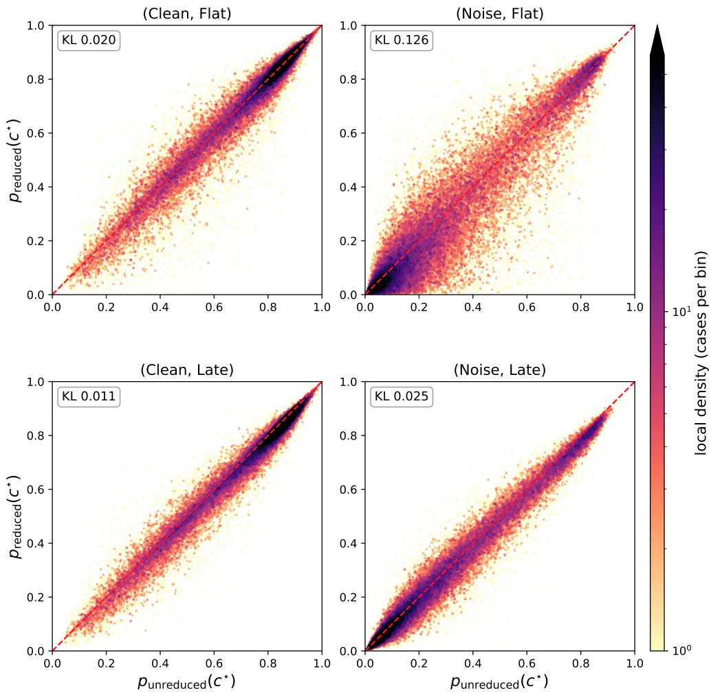  
Figure 9: Per-image agreement with the unreduced model (DeiT-S, $r _ { \mathrm { b a s e } } { = } 8 ,$ iso-GFLOPs, 50,000 images per panel). Horizontal axis: the probability the unreduced model assigns to its own predicted class $c ^ { \star } ;$ vertical axis: the probability the reduced model assigns to that same class; exact agreement lies on the dashed line. Color is the local density of cases, on a shared scale across panels, saturating above its 75th percentile. Reduction is nearly harmless on clean input under either schedule and remains so for ours under corruption; the flat schedule departs from the unreduced model only where reduction and corruption meet. KL is the mean per-case $\mathrm { K L } ( p _ { \mathrm { u n r e d u c e d } } \parallel p _ { \mathrm { r e d u c e d } } )$ over the full class distribution on the same input. Gaussian noise at severity 5 is shown for legibility; the aggregate over all 15 corruptions is quoted above.

## U CALIBRATION: PER-CELL DETAIL (GAUSSIAN NOISE)

Figure 2 summarizes the iso-GFLOPs calibration; the tables below list the per-cell numbers. Table 32 gives the gaussian-noise sweep; the 15-corruption mean sweep for all six operating points is the body Table 1. $\Delta = { \mathrm { l a t e } } - { \mathrm { f l a t } } .$ . The gain is an inverted-U in γ whose optimum shifts to higher γ as $r _ { \mathrm { b a s e } }$ decreases, and over-concentration begins to hurt (the optimum drops below $\gamma { = } 1 . 5 )$ at the most aggressive settings we report $( r _ { \mathrm { b a s e } } { = } 1 4 )$ Table 31 lists the exact calibrated schedules used throughout the paper, confirming that every late-concentrated operating point sits at or below its flat baseline’s GFLOPs.

Table 31: Calibrated iso-GFLOPs schedules used throughout the paper. For each operating point $r _ { \mathrm { b a s e } }$ and exponent γ we list the late-concentrated per-layer-mean removal budget $^ { \bar { r } , }$ chosen so the schedule’s GFLOPs do not exceed the flat (const $r _ { \mathrm { b a s e } } )$ baseline. Parentheses give the GFLOPs deviation from flat (DeiT-S, THOP): every entry $i s \leq 0 ,$ so every late schedule is at most as expensive as its flat counterpart (strictly conservative). $\bar { r }$ is backbone-independent (197 tokens, 12 layers at 224px), so the same schedules apply to DeiT-S/B and ViT-S/B; the flat column shows DeiT-S GFLOPs. The larger under-shoots at small $r _ { \mathrm { b a s e } }$ with high $\gamma ~ ( { \bf e . g . } ~ r _ { \mathrm { b a s e } } { = } 6 , \gamma { = } 3 )$ are an integergranularity effect and remain conservative.
<table><tr><td>Ibase</td><td>flat (GFLOPs)</td><td>γ=0.5</td><td> $\gamma { = } 1 . 0$ </td><td> $\gamma { = } 1 . 5$ </td><td> $\gamma { = } 2 . 0$ </td><td> $\gamma { = } 2 . 5$ </td><td> $\gamma { = } 3 . 0$ </td></tr><tr><td></td><td>2 (3.99G)</td><td>3 (−1.6%)</td><td> $3 \ : ( - 0 . 0 \% )$ </td><td> $4 ( - 1 . 4 \% )$ </td><td> $4 ( - 0 . 4 \% )$ </td><td> $5 ( - 1 . 3 \% )$ </td><td> $5 ( - 0 . 6 \% )$ </td></tr><tr><td></td><td>4 4 (3.72G)</td><td>5 (−0.7%)</td><td> $6 ( - 1 . 1 \% )$ </td><td> $7 \ : ( - 0 . 7 \% )$ </td><td> $8 ( - 0 . 9 \% )$ </td><td> $9 \left( - 1 . 1 \% \right)$ </td><td>10 (−1.4%)</td></tr><tr><td></td><td>6 6 (3.46G)</td><td>8 (-2.7%)</td><td> $9 ( - 1 . 2 \% )$ </td><td> $1 0 ( - 0 . 2 \% )$ </td><td> $1 3 ( - 3 . 6 \% )$ </td><td> $1 6 ( - 5 . 2 \% )$ </td><td>20 (-7.6%)</td></tr><tr><td></td><td>8 8 (3.20G)</td><td>10 (−1.2%)</td><td> $1 2 ( - 2 . 0 \% )$ </td><td> $1 4 ( - 1 . 8 \% )$ </td><td> $1 6 ( - 1 . 6 \% )$ </td><td> $1 8 ( - 0 . 5 \% )$ </td><td> $2 1 \ : ( - 0 . 7 \% )$ </td></tr><tr><td></td><td>10 10 (2.94G)</td><td>13 (−3.6%)</td><td> $1 5 ( - 2 . 2 \% )$ </td><td></td><td>17 (−0.6%) 21 (−1.2%)</td><td> $2 6 ( - 1 . 8 \% )$ </td><td> $3 3 ( - 2 . 9 \% )$ </td></tr><tr><td>12</td><td>12 (2.67G)</td><td>15 (−2.2%)</td><td> $1 8 ( - 1 . 6 \% )$ </td><td>22 (−0.4%)</td><td></td><td></td><td>) 27 (−0.3%) 34 (−0.1%) 44 (−0.4%)</td></tr></table>

Table 32: iso-GFLOPs calibration on gaussian noise (sev=5, 50k), DeiT-S. const rows are flat baselines; late rows are calibrated to the matching flat GFLOPs. ∆ = late − flat.
<table><tr><td> $r _ { \mathrm { b a s e } }$ </td><td>schedule</td><td>gaussian top-1</td><td> $\Delta$ </td></tr><tr><td>6</td><td>const</td><td>32.35</td><td></td></tr><tr><td>6</td><td>late γ=2.0</td><td>33.84</td><td> $+ 1 . 4 9$ </td></tr><tr><td>8</td><td>const</td><td>31.62</td><td></td></tr><tr><td>8</td><td> $1 \mathrm { a t e } \ \gamma { = } 1 . 0$ </td><td>33.12</td><td>+1.50</td></tr><tr><td>8</td><td> $1 \mathrm { a t e } \ \gamma { = } 1 . 5$ </td><td>33.49</td><td>+1.86</td></tr><tr><td>8</td><td> $1 \mathrm { a t e \gamma = } 2 . 0$ </td><td>33.79</td><td>+2.17</td></tr><tr><td>10</td><td>const</td><td>30.73</td><td></td></tr><tr><td>10</td><td>late  $\gamma { = } 1 . 0$ </td><td>32.96</td><td>+2.23</td></tr><tr><td>10</td><td>late γ=1.5</td><td>33.25</td><td>+2.52</td></tr><tr><td>10</td><td>late γ=2.0</td><td>33.44</td><td>+2.71</td></tr><tr><td>10</td><td>late  $\gamma { = } 2 . 5$ </td><td>33.36</td><td>+2.63</td></tr><tr><td>12</td><td>const</td><td>29.68</td><td></td></tr><tr><td>12</td><td>late γ=0.5</td><td>31.41</td><td>+1.72</td></tr><tr><td>12</td><td>late γ=0.75</td><td>32.15</td><td>+2.47</td></tr><tr><td>12</td><td>late γ=1.0</td><td>32.33</td><td>+2.65</td></tr><tr><td>12</td><td>late γ=1.5</td><td>32.64</td><td>+2.96</td></tr><tr><td>12</td><td>late  $\gamma { = } 2 . 0$ </td><td>32.72</td><td>+3.04</td></tr><tr><td>12</td><td>late  $\gamma { = } 2 . 5$ </td><td>32.62</td><td>+2.93</td></tr><tr><td>12</td><td>late  $\gamma { = } 3 . 0$ </td><td>32.44</td><td>+2.75</td></tr><tr><td>14</td><td>const</td><td>28.51</td><td></td></tr><tr><td>14</td><td>late  $\gamma { = } 1 . 0$ </td><td>31.35</td><td> $+ 2 . 8 4$ </td></tr><tr><td>14</td><td>late  $\gamma { = } 1 . 5$ </td><td>30.99</td><td>+2.48</td></tr></table>

Across operating points the 15-corruption mean optimum migrates from $\gamma \approx 3$ at the lightest $r _ { \mathrm { b a s e } } { = } 2$ to γ ≈ 1.5 at the aggressive $r _ { \mathrm { b a s e } } { = } 1 2$ (Table 1), exactly as in Figure 2c. The default $\gamma = 2$ is the perpoint optimum at the main $r _ { \mathrm { b a s e } } { = } 8 ( \mathrm { a n d } r _ { \mathrm { b a s e } } { = } 6 )$ and stays within 0.13pp of the per-point optimum at every operating point we test, which is why a single static $\gamma { = } 2$ suffices without per-shift tuning.

## V WALL-CLOCK LATENCY AT ISO-GFLOPS

We verify that the iso-GFLOPs match translates into matched real latency, addressing the concern that analytic FLOPs need not predict wall-clock speed. Table 33 reports throughput at the main operating point $( r _ { \mathrm { b a s e } } { = } 8$ , batch 64) on a single GPU, averaged over 200 timed iterations after 30 warmup iterations. Latency is data-independent (the per-layer token counts are fixed by the schedule, not by the input). The late $( \gamma { = } 2 )$ and flat schedules are wall-clock-indistinguishable (within 0.5%), so every iso-GFLOPs comparison in the paper is also an iso-latency comparison; token reduction itself speeds up inference over the uncompressed model at this throughput-oriented batch size.

Table 33: Wall-clock latency at the main operating point $( r _ { \mathrm { b a s e } } { = } 8 )$ , batch 64, single GPU (200 timed iterations, 30 warmup). At iso-GFLOPs the late (γ=2) and flat schedules match in throughput to within 0.5%. The 384-dim row covers DeiT-S and ViT-S; the 768-dim row covers DeiT-B and ViT-B (identical architecture, hence identical latency).
<table><tr><td>backbone</td><td>schedule</td><td>GFLOPs</td><td>ms / batch</td><td>img / s</td></tr><tr><td rowspan="3">d=384 (DeiT-S, ViT-S)</td><td>uncompressed</td><td>4.25</td><td>67.1</td><td>954</td></tr><tr><td>flat (const r=8)</td><td>3.20</td><td>54.6</td><td>1172</td></tr><tr><td>late (γ=2)</td><td>3.15</td><td>54.6</td><td>1172</td></tr><tr><td rowspan="3">d=768 (DeiT-B, ViT-B)</td><td>uncompressed</td><td>16.86</td><td>212.0</td><td>302</td></tr><tr><td>flat (const r=8)</td><td>12.67</td><td>167.0</td><td>383</td></tr><tr><td>late (γ=2)</td><td>12.46</td><td>167.5</td><td>382</td></tr></table>