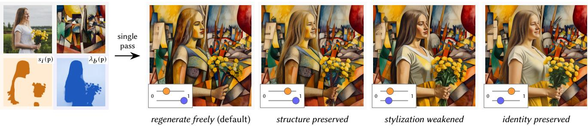
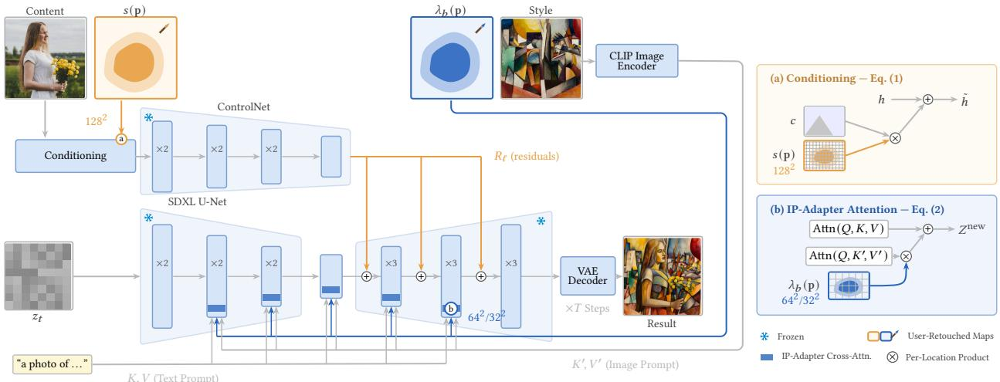
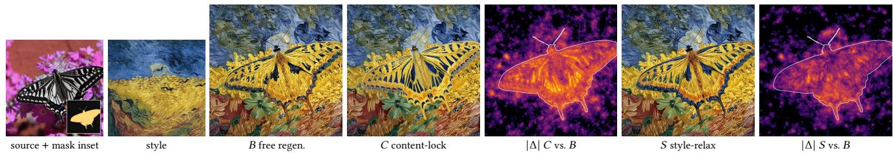
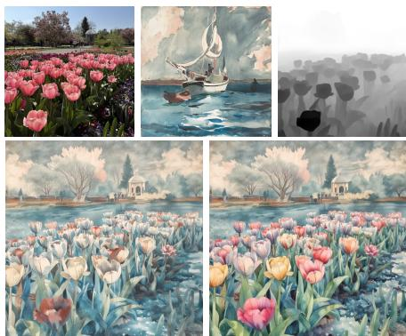
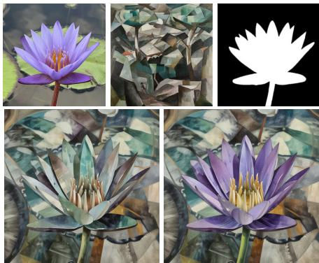
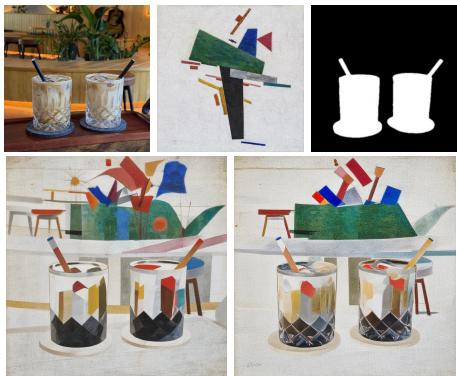

# Local Content-Style Control for Difusion-based Image Stylization

Amir Semmo

Digital Masterpieces GmbH

Potsdam, Germany

amir.semmo@digitalmasterpieces.com

  
Figure 1: Locking content and/or relaxing style spans four local retouching operations. Photo by D. Perevoshchikov on Unsplash.

## Abstract

Image stylization with latent-difusion models entangles two independently refined axes: what a region depicts and how it is de picted. Such pipelines expose only global controls, yet professional retouching demands deliberate, region-specific control. We lift two conditioning weights already present in a ControlNet + IP-Adapter stylization pipeline from global scalars to per-location spatial maps, yielding local, per-axis control of content and style in a single generative pass. Because the two weights act on disjoint pathways, adjusting them independently spans a 2×2 retouching vocabulary, from free regeneration to identity preservation. We validate that edits stay confined to the retouched region and that each weight predominantly steers its own axis. Our approach requires no retraining and drops unchanged into any such pipeline.

## CCS Concepts

• Computing methodologies → Image manipulation; Compu- tational photography.

## Keywords

style transfer, latent difusion, spatial control, image retouching

## ACM Reference Format:

Amir Semmo. 2026. Local Content-Style Control for Difusion-based Image Stylization. In SIGGRAPHAsia 2026 Technical Communications (SA Technical Communications ’26), December 01–04, 2026, Kuala Lumpur, Malaysia. ACM, New York, NY, USA, 4 pages. https://doi.org/10.1145/3829339.3847814

## 1 Introduction

Image stylization is the process of transforming an image to mimic a specific artistic medium or art style. At its core it negotiates the tension between preserving an image’s underlying structure and re-rendering its appearance as artistic marks such as brush strokes [Kyprianidis et al. 2013]. Latent-difusion models (LDMs) redefined this workflow by moving generation into a compact, perceptually compressed latent space, bringing unprecedented visual quality within reach of consumer hardware [Rombach et al. 2022]. However, whereas algorithmic filters transform an image locally, LDMs resynthesize it globally, so neither structure nor appearance stays pinned to the input pixels, turning stylization into a dualaxis process that manipulates what a region depicts (content) and how it is rendered (style) across the whole image. Yet professional workflows such as graphic design demand local, spatial control: they realize deliberate design choices region by region, not as one uniform look. Ideally, both axes should thus be controllable locally.

Parameter-space painting brought exactly this spatial control to heuristic-based stylization, letting the user control where and how strongly an efect applies [DeCarlo and Santella 2002; Semmo et al. 2016]. Conditioning and adapter methods that followed, e.g., ControlNet [Zhang et al. 2023] and IP-Adapter [Ye et al. 2023], restored some structural and stylistic control. Yet a ControlNet conditioning image only specifies what structure to follow per location, while how strongly it is enforced and how strongly the image-prompt style is applied remain uniform over the image.

In this work, we bring the local control of parameter-space painting to the generative setting, spanning content as well as style. We observe that the necessary controls already exist in a standard ControlNet + IP-Adapter pipeline as two scalar conditioning weights: a ControlNet strength governs adherence to content structure, and a per-block IP-Adapter scale governs adherence to the image-prompt style. Our contribution is to lift each to a per-location spatial map and to validate quantitatively that the two controls, acting on disjoint pathways, stay local and axis-specific despite global attention mixing. Together they span a 2 2 vocabulary of retouching operations, from free regeneration to identity preservation (Fig. 1).

  
Figure 2: Weight spatialization overview. (a) A content map � p scales the ControlNet control embedding (Eq. 1). (b) A style map �� p scales the decoupled image-attention term in each IP-Adapter block (Eq. 2). Photo by D. Perevoshchikov on Unsplash.

## 2 Related Work

Spatial difusion control. Paint-with-words [Balaji et al. 2022] and MultiDifusion [Bar-Tal et al. 2023] steer the text pathway spatially, orthogonal to the content and style pathways we control. A broad literature on layout, grounding, and region conditioning (surveyed in [Cao et al. 2026]) expands structural control but spatializes what is conditioned, not how strongly a pathway applies per location. Spatially varying the IP-Adapter scale is an established practitioner technique, but for style alone. SmartControl [Liu et al. 2024] spatial izes the ControlNet scale with a learned predictor that only relaxes a single structural condition where it conflicts with the prompt. None couples a spatial content strength with a spatial style scale, which is our contribution rather than the regional idea itself.

Image-prompt stylization. Adapter-based stylization conditions the generation on a style image rather than text: IP-Adapter [Ye et al. 2023] injects image-prompt features through decoupled crossattention, and InstantStyle [Wang et al. 2024a] shows that restricting this injection to specific attention blocks already separates style from content. B-LoRA [Frenkel et al. 2024] independently confirms that these SDXL [Podell et al. 2024] blocks specialize in style versus content. Our pipeline builds on this image-prompt configuration, and preserves content through a ControlNet [Zhang et al. 2023] Tile branch in the manner introduced for stylization by InstantStyle Plus [Wang et al. 2024b]. A broader line separates the two factors more explicitly but globally, fixed for the whole forward pass [Hertz et al. 2024; Jiang and Chen 2025; Qi et al. 2024; Xing et al. 2024].

Difusion image editing. Pretrained difusion models also support stroke-, mask-, and instruction-guided editing [Avrahami et al. 2023; Hertz et al. 2023; Huang et al. 2025; Meng et al. 2022], but these target content (e.g., layout, attributes) and expose no per-location control of image-style strength. In contrast, our spatial maps let both content and style strength be controlled per location.

Level-of-abstraction control. Non-photorealistic rendering has long varied an image’s level of abstraction locally, driven by gaze, saliency, or depth [DeCarlo and Santella 2002; Kyprianidis et al. 2013] or by parameter maps [Semmo et al. 2016]. The neural era continued this with perceptual-factor control [Gatys et al. 2017] and depth- or saliency-guided style transfer [Jing et al. 2020]. Our maps are the generative counterpart of this abstraction control: they trade content preservation against style transfer per region.

## 3 Method

## 3.1 Pipeline and Modulation Points

Our method spatializes the two scalar conditioning weights of a standard latent-difusion text-to-image pipeline [Rombach et al. 2022] (Fig. 2), whose denoising U-Net is conditioned on content structure by a ControlNet branch [Zhang et al. 2023] and on imageprompt style by an IP-Adapter path [Ye et al. 2023]. Driving the ControlNet with a Tile control turns this pipeline into an image stylizer [Wang et al. 2024b]. The formulation depends only on these two pathways, not on a particular backbone, sampler, or distillation. Sec. 4 describes our SDXL-based [Podell et al. 2024] instantiation.

## 3.2 Content Axis: Spatial ControlNet

The ControlNet branch embeds the noisy latent �� into a feature map ℎ and the control image (Tile, in our pipeline) into a control embedding � at the same latent resolution [Zhang et al. 2023], combined with a conditioning strength � into the conditioned embedding $\tilde { h } = h + s c$ . We replace the scalar � with a spatial map $s \in \mathbb { R } ^ { H \times W }$ at latent resolution, broadcast over channels:

$$
\tilde { h } ( \mathbf { p } ) = h ( \mathbf { p } ) + s ( \mathbf { p } ) c ( \mathbf { p } ) ;\tag{1}
$$

a uniform map reproduces the scalar exactly.

## 3.3 Style Axis: Spatial IP-Adapter

Each IP-Adapter–injected block adds a decoupled image-attention term to the text attention [Ye et al. 2023]:

$$
Z ^ { \mathrm { n e w } } = \mathrm { A t t n } ( Q , K , V ) + \lambda _ { b } \mathrm { A t t n } ( Q , K ^ { \prime } , V ^ { \prime } ) ,\tag{2}
$$

  
Figure 3: Locality and specificity on one evaluation triple (Table 1). Content-lock (�) recovers the wing markings and style-relax (�) restores their contrast, while the change ( Δ heatmaps, LPIPS vs. baseline �) stays confined to the masked butterfly.

where the shared query $Q$ comes from the block’s features, (�, � ) and $( K ^ { \prime } , V ^ { \prime } )$ are the text and image-prompt keys and values, and $\lambda _ { b }$ is the per-block image scale $( \lambda _ { b } = 0$ recovers the base model). We lift the scalar $\lambda _ { b }$ to a per-location map $\lambda _ { b } ( \mathbf { p } )$ . In our accelerator-friendly attention layout, the image-attention output is shaped �, �, 1, �� (one feature vector per latent position), so $\lambda _ { b } ( \mathbf { p } )$ broadcasts over channels with no change to the attention computation itself. This way, only the block’s scale input changes shape, and a uniform map again reproduces the scalar exactly.

## 3.4 Resolution Semantics

The pixel-resolution maps are anti-alias downsampled to each modulation point. Content modulation thus propagates multi-scale through the down-blocks—crisp where decisions are fine, soft where they are coarse—while style modulation is inherently coarser. This asymmetry suits both factors: structure benefits from fine spatial control whereas the spatial assignment of style is a low-frequency, semantic choice.

## 4 Results and Evaluation

Implementation. We instantiate our method in a 4-step-distilled SDXL-Lightning [Lin et al. 2024] pipeline with ControlNet and IP-Adapter, converted for the Apple Neural Engine, where the spatial inputs add negligible latency and memory over the scalar pipeline. At its 10242 output resolution, the maps downsample to latent $1 2 8 ^ { 2 }$ for ControlNet and $3 2 ^ { 2 } / 6 4 ^ { 2 }$ for the injected attention blocks.

The 2 2 retouching vocabulary. The two axes span a 2 2 vocabulary (Fig. 1): content is locked or relaxed around a balanced default (�=0.5), while style starts at full strength $\left( \lambda _ { b } { = } 1 . 0 \right)$ and typically only relaxes. Locking content preserves structure (structure preserved), relaxing style pulls the output toward the content image (stylization weakened), and both together can preserve a subject’s identity amid the stylized scene (identity preserved). Relaxing either axis instead gives the text prompt more weight in the region, $\mathrm { e . g . }$ , for content swaps (supplemental Fig. S1). Because the Tile input is the content image, content-lock also displaces some stylization, which we can ofset by co-raising $\lambda _ { b }$ inside the region.

Evaluation. We evaluate two claims over (content, style, seed) triples (objects and scenes from DIV2K [Agustsson and Timofte 2017]). All conditions share the same noise, so every diference is attributable to the maps, and all 11 IP-Adapter blocks carry style (the worst case for confinement). H1 (locality): an edit confined to region � should change the output predominantly inside �. We measure the far-field change $\ell _ { \infty } ,$ , the mean spatial LPIPS vs. the same-seed baseline over pixels beyond 0.25 image widths from �. Despite self-attention and residual coupling, it stays well below the inside-� response, the stylization magnitude, and even a seed re-roll (0.13–0.24 ; Table 1, top). H2 (specificity): probing structure by tolerant edge agreement and stylization by VGG-Gram texture and Lab-chroma palette distance, all to the source, content-lock is structure-dominant, style-relax’s texture response strengthens with dose, the palette stays flat, and style-relax leaves structure unchanged or slightly restored (Table 1, bottom and Fig. 3).

Table 1: Locality (H1) and specificity (H2) over �=300 triples (10 contents  10 styles  3 seeds). H1: $\ell _ { \infty }$ relative to the inside response, stylization magnitude, and a seed re-roll (lower = more local). H2: signed responses (negative = toward the source; compare within columns—probe scales difer); content loads on structure (edges), style on texture.
<table><tr><td></td><td colspan="3">H1:  $\ell _ { \infty }$  relative to (↓)</td><td colspan="3">H2: signed probe response</td></tr><tr><td>Control</td><td>inside</td><td>styliz.</td><td>roll</td><td>edges</td><td>texture</td><td>palette</td></tr><tr><td>lock content (s→0.8)</td><td>0.33</td><td>0.18</td><td>0.24</td><td>-0.026</td><td>-0.046</td><td>-0.003</td></tr><tr><td>relax style  $( \lambda _ { b } \to 0 . 7 )$ </td><td>0.26</td><td>0.10</td><td>0.13</td><td>-0.004</td><td>-0.024</td><td>+0.003</td></tr><tr><td>relax style  $( \lambda _ { b } \to 0 . 4 )$ </td><td>0.27</td><td>0.16</td><td>0.21</td><td>-0.006</td><td>-0.063</td><td>-0.005</td></tr></table>

Use cases. Because the maps are continuous, sweeping the style scale and content strength over a fixed region moves it gradually from photographic to fully stylized (supplemental Fig. S2). The maps can also be derived from per-pixel priors such as depth or segmentation (Fig. 4), echoing the gaze-directed abstraction of NPR [DeCarlo and Santella 2002]. Neural style transfer supports spatial weighting as well [Gatys et al. 2017], but it can only restyle the given content, whereas our content pathway can also regenerate a region under the prompt. Practitioner alternatives fall short: global scalars are not local, regional text prompts steer a diferent pathway, and stylize-then-composite merges two independently denoised results.

## 5 Limitations

Style localizes more coarsely than content because SDXL caps style modulation at $6 4 ^ { 2 }$ latent resolution. The 8 pixel-to-latent downsampling leaves very small objects hard to control, and the 4-step distilled sampler used in our experiments resolves intermediate strengths only coarsely. Finally, relaxing style can reintroduce color into near-monochromatic styles (e.g., pen-and-ink), either from the source or through hallucination.

  
depth aerial perspective prompt: “watercolor style” style-block �6 p = depth p : exemplar of up close

  
subject prompt color unblocked prompt: “purple water lily, cubist painting, . . . ” style-block �6: 1.0 0.3 on the lily

  
objects stylized focus pull prompt: “suprematist composition, . . . ” outside: all-block style; inside: �: 0.5 0.9, style trimmed

Figure 4: Control maps from perceptual priors: source, style, and mask (top) and uniform vs. map-driven result (bottom). Depth sets the style weight (left), relaxing style frees the prompt’s “purple” (middle), and an object mask sharpens the glasses (right)

## 6 Conclusion

We spatialize two conditioning weights of a ControlNet + IP-Adapter stylization pipeline into per-location maps, yielding local, axisspecific control of content and style in a single coherent generation pass, with no retraining. This brings region-by-region control of professional retouching to difusion stylization: control maps pin a subject, relax a background, or adjust abstraction, while per-pixel priors author them automatically. Future work includes additional ControlNet content types, crop-and-refine for small objects, learned mask priors, and spatial multi-style assignment.

## Acknowledgments

This work was funded by the Federal Ministry for Economic Afairs and Energy (BMWi), Germany, for the ZIM project 16KN124010.

## References

Eirikur Agustsson and Radu Timofte. 2017. NTIRE 2017 Challenge on Single Image Super-Resolution: Dataset and Study. In Proc. IEEE/CVF Conf. on Computer Vision and Pattern Recognition Workshops (CVPRW). 126–135.

Omri Avrahami, Ohad Fried, and Dani Lischinski. 2023. Blended Latent Difusion. ACM Transactions on Graphics (TOG) 42, 4 (2023), 1–11.

Yogesh Balaji, Seungjun Nah, Xun Huang, Arash Vahdat, Jiaming Song, Qinsheng Zhang, Karsten Kreis, Miika Aittala, Timo Aila, Samuli Laine, Bryan Catanzaro, Tero Karras, and Ming-Yu Liu. 2022. eDif-I: Text-to-Image Difusion Models with an Ensemble of Expert Denoisers. arXiv preprint arXiv:2211.01324 (2022).

Omer Bar-Tal, Lior Yariv, Yaron Lipman, and Tali Dekel. 2023. MultiDifusion: Fusing Difusion Paths for Controlled Image Generation. In Proc. Int. Conf. on Machine Learning (ICML). 1737–1752.

Pu Cao, Feng Zhou, Qing Song, and Lu Yang. 2026. Controllable Generation with Text-to-Image Difusion Models: A Survey. IEEE Transactions on Pattern Analysis and Machine Intelligence (TPAMI) 48, 4 (2026), 4771–4791.

Doug DeCarlo and Anthony Santella. 2002. Stylization and Abstraction of Photographs. ACM Transactions on Graphics 21, 3 (2002), 769–776.

Yarden Frenkel, Yael Vinker, Ariel Shamir, and Daniel Cohen-Or. 2024. Implicit Style Content Separation using B-LoRA. In Proc. European Conf. on Computer Vision (ECCV). 181–198.

Leon A. Gatys, Alexander S. Ecker, Matthias Bethge, Aaron Hertzmann, and Eli Shecht man. 2017. Controlling Perceptual Factors in Neural Style Transfer. In Proc. IEEE Conf. on Computer Vision and Pattern Recognition (CVPR). 3985–3993.

Amir Hertz, Ron Mokady, Jay Tenenbaum, Kfir Aberman, Yael Pritch, and Daniel Cohen-Or. 2023. Prompt-to-Prompt Image Editing with Cross-Attention Control. In Proc. Int. Conf. on Learning Representations (ICLR).

Amir Hertz, Andrey Voynov, Shlomi Fruchter, and Daniel Cohen-Or. 2024. Style Aligned Image Generation via Shared Attention. In Proc. IEEE/CVF Conf. on Computer Vision and Pattern Recognition (CVPR). 4775–4785.

Yi Huang, Jiancheng Huang, Yifan Liu, Mingfu Yan, Jiaxi Lv, Jianzhuang Liu, Wei Xiong, He Zhang, Liangliang Cao, and Shifeng Chen. 2025. Difusion Model-Based Image Editing: A Survey. IEEE Transactions on Pattern Analysis and Machine Intelligence (TPAMI) 47, 6 (2025), 4409–4437.

Ruixiang Jiang and Chang Wen Chen. 2025. DifArtist: Towards Structure and Appearance Controllable Image Stylization. In Proc. ACM Int. Conf. on Multimedia (ACM MM). 9598–9607.

Yongcheng Jing, Yezhou Yang, Zunlei Feng, Jingwen Ye, Yizhou Yu, and Mingli Song. 2020. Neural Style Transfer: A Review. IEEE Transactions on Visualization and Computer Graphics (TVCG) 26, 11 (2020), 3365–3385.

Jan Eric Kyprianidis, John Collomosse, Tinghuai Wang, and Tobias Isenberg. 2013. State of the “Art”: A Taxonomy of Artistic Stylization Techniques for Images and Video. IEEE Trans. Vis. Comput. Graph. 19, 5 (2013), 866–885.

Shanchuan Lin, Anran Wang, and Xiao Yang. 2024. SDXL-Lightning: Progressive Adversarial Difusion Distillation. arXiv preprint arXiv:2402.13929 (2024).

Xiaoyu Liu, Yuxiang Wei, Ming Liu, Xianhui Lin, Peiran Ren, Xuansong Xie, and Wangmeng Zuo. 2024. SmartControl: Enhancing ControlNet for Handling Rough Visual Conditions. In Proc. European Conf. on Computer Vision (ECCV). 1–17.

Chenlin Meng, Yutong He, Yang Song, Jiaming Song, Jun-Yan Zhu, and Stefano Ermon. 2022. SDEdit: Guided Image Synthesis and Editing with Stochastic Diferential Equations. In Proc. Int. Conf. on Learning Representations (ICLR).

Dustin Podell, Zion English, Kyle Lacey, Andreas Blattmann, Tim Dockhorn, Jonas Müller, Joe Penna, and Robin Rombach. 2024. SDXL: Improving Latent Difusion Models for High-Resolution Image Synthesis. In Proc. Int. Conf. on Learning Representations (ICLR). 1862–1874.

Tianhao Qi, Shancheng Fang, Yanze Wu, Hongtao Xie, Jiawei Liu, Lang Chen, Qian He, and Yongdong Zhang. 2024. DEADif: An Eficient Stylization Difusion Model with Disentangled Representations. In Proc. IEEE/CVF Conf. on Computer Vision and Pattern Recognition (CVPR).

Robin Rombach, Andreas Blattmann, Dominik Lorenz, Patrick Esser, and Björn Ommer. 2022. High-Resolution Image Synthesis with Latent Difusion Models. In Proc. IEEE/CVF Conf. on Computer Vision and Pattern Recognition (CVPR).

Amir Semmo, Tobias Dürschmid, Matthias Trapp, Mandy Klingbeil, Jürgen Döllner, and Sebastian Pasewaldt. 2016. Interactive Image Filtering with Multiple Levelsof-Control on Mobile Devices. In Proc. ACM SIGGRAPH Asia Mobile Graphics and Interactive Applications (MGIA). 2:1–2:8.

Haofan Wang, Qixun Wang, Xu Bai, Zekui Qin, and Anthony Chen. 2024a. InstantStyle: Free Lunch Towards Style-Preserving in Text-to-Image Generation. arXiv preprint arXiv:2404.02733 (2024).

Haofan Wang, Peng Xing, Renyuan Huang, Hao Ai, Qixun Wang, and Xu Bai. 2024b. InstantStyle-Plus: Style Transfer with Content-Preserving in Text-to-Image Generation. arXiv preprint arXiv:2407.00788 (2024).

Peng Xing, Haofan Wang, Yanpeng Sun, Qixun Wang, Xu Bai, Hao Ai, Renyuan Huang, and Zechao Li. 2024. CSGO: Content-Style Composition in Text-to-Image Generation. arXiv preprint arXiv:2408.16766 (2024).

Hu Ye, Jun Zhang, Sibo Liu, Xiao Han, and Wei Yang. 2023. IP-Adapter: Text Compatible Image Prompt Adapter for Text-to-Image Difusion Models. arXiv preprint arXiv:2308.06721 (2023).

Lvmin Zhang, Anyi Rao, and Maneesh Agrawala. 2023. Adding Conditional Control to Text-to-Image Difusion Models. In Proc. IEEE/CVF Int. Conf. on Computer Vision (ICCV). 3836–3847.