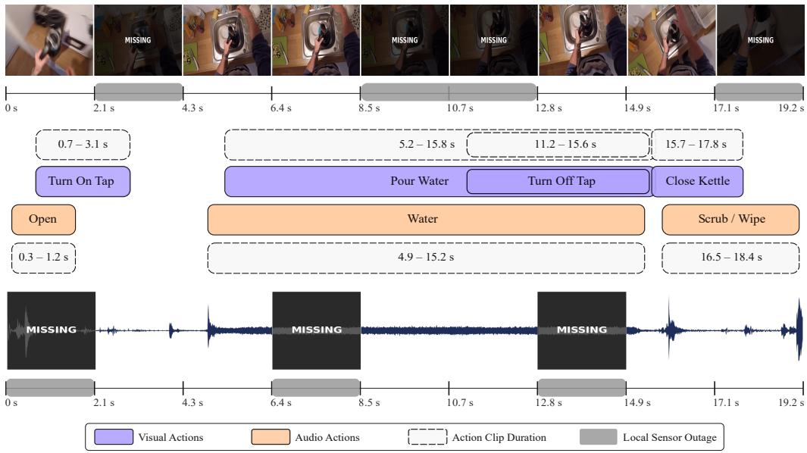
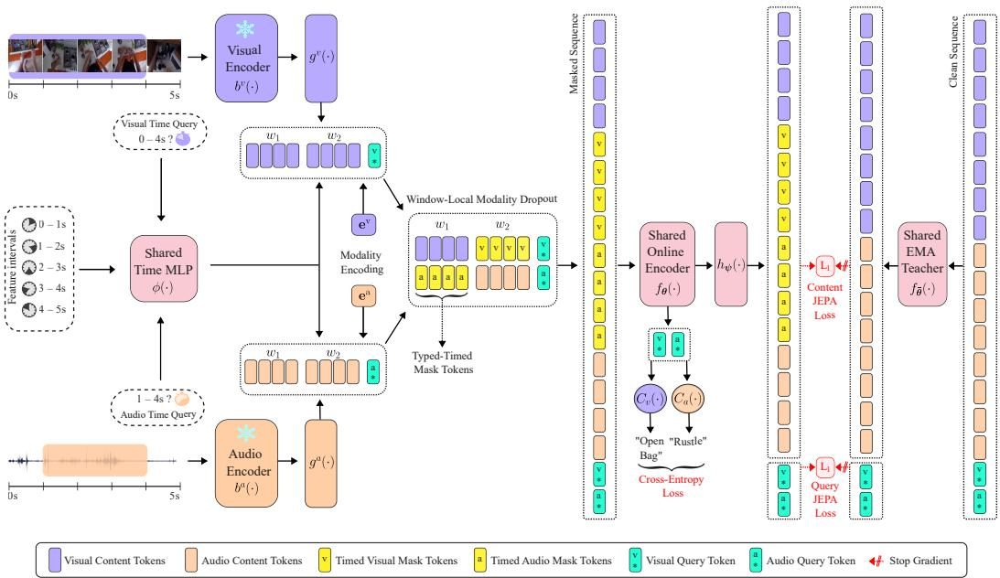
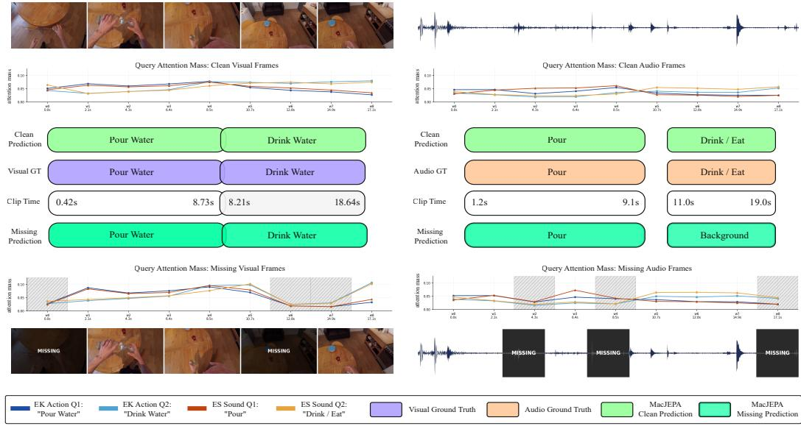

# MACJEPA: MISSINGNESS-ROBUST AUDIO-VISUAL RECOGNITION FROM UNTRIMMED EGOCENTRIC VIDEOS

Souptik Sen1, Zahra Ahmadi1,2

1Peter L. Reichertz Institute for Medical Informatics, Hannover Medical School, Germany

2Lower Saxony Center for Artificial Intelligence and Causal Methods in Medicine (CAIMed), Hannover, Germany {Sen.Souptik,Ahmadi.Zahra}@mh-hannover.de

## ABSTRACT

Audio-visual models improve egocentric action recognition by exploiting complementary cues, yet typically assume that both streams remain available at inference. Existing missing-modality methods operate on trimmed, single-event clips in which a stream is entirely present or absent, whereas real sensors fail and recover within long, untrimmed observations. We redefine egocentric modality missingness as temporally localized sensor outages within untrimmed, multi-event observations, with whole-clip absence as the limiting case. We introduce MacJEPA, a missingmodality-robust Masked-context query JEPA that recognizes visual actions and acoustic events from supplied interval queries over audio-visual context. Windowlocal modality dropout simulates these sensor outages during training. MacJEPA further repurposes masking in JEPA from a self-supervised pretext into a supervised robustness objective, aligning masked and clean latent representations of both multimodal content tokens and the task-conditioned queries. All objectives are optimized jointly with recognition in a single stage, requiring no test-time adaptation. Across Epic-Kitchens-100 and Epic-Sounds, a single checkpoint remains competitive under complete input and consistently surpasses published missing-modality baselines when either the dominant or auxiliary stream is removed. MacJEPA thus unifies strong full-input recognition with temporal missing-modality robustness in a single model operating on untrimmed multi-event videos.

## 1 INTRODUCTION

Egocentric video captures activity from the actor’s perspective, and understanding it underpins assistive systems, robotics, and augmented reality (Damen et al., 2022; Grauman et al., 2022). Vision alone is a fragile signal in this setting; head motion, occlusion, and out-of-view interactions often hide evidence, and many egocentric actions remain acoustically identifiable when visual evidence is occluded or out of view. (Kazakos et al., 2019; Huh et al., 2023). Audio-visual models exploit this complementarity and define the state of the art in egocentric action recognition through convolutional or transformer-based models (Kazakos et al., 2019; 2021a; Nagrani et al., 2021; Chalk et al., 2024). Nevertheless, their gains are contingent on the availability of both streams at inference time, a premise that is often violated during deployment. For example, in real-world wearable devices, microphones or recordings can be suppressed for privacy, sensors can be duty-cycled to conserve power, or hardware can malfunction (Gong et al., 2023; Ramazanova et al., 2025a;b; Santos-Villafranca et al., 2026). The degradation is rarely graceful; losing one stream can push a multimodal model below a unimodal model trained on the surviving stream (Ramazanova et al., 2025a). This makes missing-modality resilience a deployment necessity rather than an optional refinement.

Existing egocentric missing-modality methods remain tied to atomic clips centered on a single annotated event, treating each stream as present or absent throughout the sample (Gong et al., 2023; Ramazanova et al., 2025a;b; Santos-Villafranca et al., 2026; Ma et al., 2022; Lee et al., 2023). Missingness is consequently measured across clips, which implicitly align sensor outages with action boundaries. Even methods incorporating temporal context either aggregate neighboring action centered clips or assume complete modalities over an untrimmed stream (Kazakos et al., 2021a;

  
Figure 1: Local sensor outages across overlapping multimodal events in a 19.2-second untrimmed observation.

Chalk et al., 2024). Deployment grants no such action boundaries, requiring systems to process background, partial actions, and multiple temporally overlapping visual and acoustic events (Damen et al., 2022; Huh et al., 2023; Chalk et al., 2024). Within such continuous observations, either sensor may disappear and return, interleaving clean and corrupted evidence at different intervals. Since overlapping actions share this context, one local outage can affect recognition of several events at different times and to varying degrees. Figure 1 follows a plausible wearable-kitchen sequence where the wearer turns on the tap, pours water, turns it off, and closes the kettle, accompanied by the acoustic events Open, Water, and Scrub/Wipe. Initial privacy muting removes acoustic evidence for Open before audio returns, while a brief camera failure clips visual evidence for Turn On Tap before video recovers. During the overlapping Pour Water, Turn OffTap, and Water events, audio is lost over 6.4–8.5 s, video over 8.5–12.8 s, and audio again over 12.8–14.9 s, repeatedly changing which stream can support recognition. These local outages therefore cause multiple overlapping events to lose different degrees of evidence, revealing what atomic clip-level binary missingness cannot represent. The operative question is no longer which modality is absent from a clip, but which is absent when and which events consequently lose distinguishable evidence.

We introduce MacJEPA, a missing modality robust Masked-context query Joint-Embedding Predictive Architecture that recognizes actions by querying supplied event intervals within untrimmed audio-visual context. During training, MacJEPA independently drops each modality over short intervals within an untrimmed observation and substitutes them with learned mask vectors. Each query must preserve its prediction from surviving temporally aligned evidence, making the missingness in Figure 1 a training condition rather than a deployment-time distribution shift. Canonical JEPA models train a masked online encoder to match clean Exponential Moving Average teacher targets in the latent space, providing an unexplored promising direction for this robustness machinery (Baevski et al., 2022; Assran et al., 2023; 2025). Moreover, aligning masked multimodal context with clean targets in a shared latent space avoids reconstructing heterogeneous audio and visual signals (Lei et al., 2025). Existing frameworks, however, use masking as a self-supervised pretext for transferable features rather than to model deployment failures (Assran et al., 2025; Teotia et al., 2026; Robson et al., 2026; Lei et al., 2025). MacJEPA repurposes JEPA’s masked-to-clean consistency as a robustness objective optimized jointly with task supervision.

Our contributions are threefold. (1) We redefine egocentric modality missingness as an interval property of multi-event, untrimmed observations, with whole-clip binary absence as its limiting case. (2) We introduce interval-wise modality dropout with typed, time-stamped mask tokens, modeling local sensor outages and recoveries within one observation. (3) We reimagine JEPA as a task-supervised robustness objective that aligns masked and clean latent states of multimodal content and task-conditioned queries. With complete input, MacJEPA achieves competitive accuracies of

54.0% on Epic-Kitchens action and 58.1% on Epic-Sounds. Under total dominant-modality loss, it reaches 49.5% Epic-Kitchens verb and 50.0% Epic-Sounds sound accuracy, surpassing the strongest published baseline by 4.2 and 9.3 points at this protocol-matched endpoint (Ramazanova et al., 2025a).

## 2 RELATED WORK

Multimodal Egocentric Recognition under Missing Modalities. Audio complements egocentric vision because contact and state changes remain audible when hands or objects leave the frame (Kazakos et al., 2019; Huh et al., 2023). Convolutional designs include TBN, which fuses RGB, flow, and audio; AVSLOWFAST, which couples fast audio with SlowFast vision; and ASF, which adapts this design to acoustic recognition (Kazakos et al., 2019; Xiao et al., 2020; Kazakos et al., 2021b). Transformers advance this domain by learning fusion through MBT’s bottleneck tokens, MTCN’s neighboring clips, and M&M MIX’s multiple views, while TIM queries both streams over one timeencoded untrimmed timeline (Nagrani et al., 2021; Kazakos et al., 2021a; Xiong et al., 2022; Chalk et al., 2024). These strong baselines assume continuous access to both modalities, while missingmodality methods remain sample-atomic. MMG-EGO4D evaluates withheld modality subsets, MMT learns an absent-stream token, and KARMMA distills a multimodal teacher into a dropout-trained student supporting any modality combination (Gong et al., 2023; Ramazanova et al., 2025a; Santos-Villafranca et al., 2026). MIDL instead adapts at inference while distilling full-modality predictions, whereas related work distills multimodal teachers into RGB-only students (Ramazanova et al., 2025b; Radevski et al., 2023). Fusion search and missing-aware prompting retain the same sample-wise binary premise (Ma et al., 2022; Lee et al., 2023), measuring affected action-centered samples rather than outage timing. MacJEPA unifies these lines by modeling disappearance and recovery within shared, multi-event untrimmed context, with clip-level absence as its limiting case.

Multimodal JEPAs. JEPAs predict abstract targets rather than reconstruct raw inputs, avoiding modality-specific low-level detail in heterogeneous settings (Assran et al., 2023; Baevski et al., 2022; Fei et al., 2023; Lei et al., 2025). M3-JEPA aligns modalities with a multi-gate mixture-of-experts predictor, while MJEPA uses a shared encoder for within- and cross-modal audio-video prediction (Lei et al., 2025; Teotia et al., 2026). AV-JEPA aligns global audio-visual and local unimodal views through early fusion and modality dropout, whereas VL-JEPA predicts continuous text embeddings from vision (Robson et al., 2026; Chen et al., 2026). Across these methods, masking remains a self-supervised pretext for transferable features rather than a deployment failure, and robustness to incomplete inputs is not evaluated. MJEPA leaves this direction to future work (Teotia et al., 2026). MacJEPA repurposes masking to simulate sensor outages, optimizes it jointly with supervision, and extends prediction from content tokens to task-conditioned queries.

## 3 PROPOSED FRAMEWORK

Figure 2 summarizes MacJEPA. We first formulate interval-conditioned recognition over untrimmed observations and construct its query sequence in Sections 3.1 and 3.2. We then introduce our two core components: window-local modality dropout in Section 3.3 and masked-to-clean content and query JEPA, trained jointly with recognition, in Sections 3.4 and 3.5.

## 3.1 PROBLEM SETTING

We formulate audio-visual recognition directly on the untrimmed timeline rather than around isolated event crops. For each modality $m \in \mathcal { M } = \{ \mathrm { v } , \mathrm { a } \}$ , a frozen unimodal encoder $b ^ { m }$ produces temporally ordered features on a shared grid with stride $\Delta$ seconds and receptive field $\omega = 2 \Delta$ seconds. An observation is a contiguous slice of $T$ rows, $X ^ { m } = [ \pmb { x } _ { 0 } ^ { m } , \ldots , \pmb { x } _ { T - 1 } ^ { m } ]$ , spanning the nominal duration $S = T \Delta$ seconds. Candidate observations tile each video at one-row intervals, independently of its annotations. They may therefore begin or end within an event, include substantial background, or contain no annotated visual action. An annotation is assigned to an observation when its intersection with the observation is at least $\delta \ : = \ : 0 . 2 \ : \mathrm { s }$ , or when the annotation is fully contained within it, following Chalk et al. (2024). A training observation contains multiple overlapping Epic-Kitchens visual action annotations and Epic-Sounds acoustic event annotations. The intervals are supplied to the model rather than inferred, so the task is interval-conditioned action recognition. To simulate temporal missingness, we partition each observation into $K = T /$ w non-overlapping windows of w consecutive rows spanning $\tau = w \Delta$ seconds.

  
Figure 2: MacJEPA training framework. Window-local modality dropout corrupts the online multimodal sequence with typed, timed masks, while content and query JEPA align it with clean EMA-teacher targets under joint task supervision. Two windows and one query per stream are shown for clarity.

## 3.2 INTERVAL QUERIES OVER AN UNTRIMMED OBSERVATION

Multiple events share each observation, so time must identify both where evidence occurs and which event is being predicted. For each modality $m \in \mathcal { M }$ , a modality-specific stem $g ^ { m } : \mathbb { R } ^ { D _ { m } }  \mathbb { R } ^ { d _ { c } }$ applies feature dropout and projects the frozen features into a common content space. We then encode every feature and query on the same temporal coordinate system. A shared TimeMLP $\phi : \mathbb { R } ^ { 2 }  \mathbb { R } ^ { \mathbf { \check { d } } _ { t } }$ maps continuous intervals to temporal representations, providing a universal clock across both modalities (Chalk et al., 2024). Content row j is assigned $\mathbf { t } _ { j } = [ j \Delta , j \Delta + \omega ] / S$ , while each annotation interval is clipped to the observation and normalized to obtain $\mathbf { t } _ { q } \in [ 0 , 1 ] ^ { 2 }$ . A learned embedding $e ^ { m } \in \mathbb { R } ^ { d }$ marks the modality of every token. Writing $j = k w + f$ , the content token $\pmb { u } _ { k , f } ^ { m }$ at row f of window k and the token $\pmb { u } _ { q }$ for query q are:

$$
\begin{array} { c } { { { \pmb u } _ { k , f } ^ { m } = [ g ^ { m } \big ( { \pmb x } _ { k w + f } ^ { m } \big ) ~ \| ~ \phi \big ( { \pmb t } _ { k w + f } \big ) ] + e ^ { m } , } } \\ { { { \pmb u } _ { q } = [ { \pmb c } _ { h ( q ) } \| ~ \phi \big ( { \pmb t } _ { q } \big ) \| ~ + e ^ { m ( q ) } ,  } } \end{array}\tag{1}
$$

where $c _ { h ( q ) }$ is a learned seed for the query head and $m ( q )$ identifies its stream. We concatenate $d _ { c }$ and $d _ { t } ,$ , producing tokens of width $d = { \dot { d } } _ { c } + d _ { t }$ . The resulting sequence contains $n = 2 T$ multimodal content tokens, followed by verb, noun, and action queries for each Epic-Kitchens annotation and one sound query for each Epic-Sounds annotation. The encoder restricts content tokens to attending only to content, while each query attends to all content and itself but not other queries. This keeps the encoded context independent of the query set and each prediction independent of co-processed queries, with every classifier reading only its corresponding query representation. This construction temporally locates evidence and queries but assumes complete content; we model local absence next.

## 3.3 WINDOW-LOCAL MODALITY DROPOUT WITH TYPED, TIMED MASKS

We introduce window-local modality dropout to make modality availability vary within the observation. The T rows of an observation are partitioned into $K = T /$ w non-overlapping windows of w rows, and a binary mask $\pmb { M } \in \{ 0 , 1 \} ^ { K \check { \times } | \mathcal { M } | }$ specifies which modality is absent from each window.

In particular, $M _ { k , m } = 1$ removes all w rows of modality m from window $k ;$ it is a window-level decision, not an independent token mask. Windows are sampled independently, with probabilities $1 - \pi$ $\pi / 2$ , and $\pi / 2$ for the complete, video-missing, and audio-missing states, respectively. Simultaneous loss of both streams is excluded so that every interval retains contemporaneous evidence from at least one sensor. Missing features are substituted and not deleted. Let $\bar { e } _ { \mathcal { D } } ^ { m } \in \mathbb { R } ^ { d _ { c } }$ be a learned absence embedding for modality m. The masked content token is:

$$
\widetilde { \pmb { u } } _ { k , f } ^ { m } = \left[ ( 1 - M _ { k , m } ) g ^ { m } \big ( \pmb { x } _ { k w + f } ^ { m } \big ) + M _ { k , m } \pmb { e } _ { \emptyset } ^ { m } \ \big | \ \big | \ \phi \big ( \mathbf { t } _ { k w + f } \big ) \right] + \pmb { e } ^ { m } .\tag{2}
$$

When $M _ { k , m } = 0$ , this recovers the observed content token from Equation (1); when $M _ { k , m } = 1$ , only its projected content is replaced. The token remains in the sequence and retains its time encoding and modality tag. It therefore represents a typed, timed absence: the encoder is told which stream is unavailable and where. Furthermore, window grouping gives the simulated outage meaningful duration. Adjacent rows overlap by 50%, so masking one row would leave much of its temporal support available through its neighbors. Masking w rows creates a $\iota \tau = w \Delta$ outage, which exceeds the $\omega = 2 \Delta$ receptive field of any single feature when $w > 2 \AA$ . The windows are then flattened before encoding and impose no attention boundary. Every query still attends to all $n = 2 T$ content tokens, allowing it to route around a local outage and draw on evidence elsewhere in the observation. Conditional on missingness, the sampler has $3 ^ { \overset {  } { \kappa } }$ possible window configurations, redrawn each epoch, instead of the three states available to clip-level dropout; complete, video-missing, or audio-missing (Xiao et al., 2020; Ramazanova et al., 2025a; Santos-Villafranca et al., 2026). It therefore exposes a single event to partial evidence as sensors disappear and return. Whole-observation absence remains within its support as the limiting pattern $M _ { k , m } = 1$ and $M _ { k , \bar { m } } = 0$ for every k. Further details are in appendix Section A.1. We next regularize representations under these outages toward their clean counterparts.

## 3.4 CONTENT AND QUERY JEPA UNDER SIMULATED OUTAGES

Let $\mathcal { U } ( X ^ { \mathrm { v } } , X ^ { \mathrm { a } } , \mathcal { Q } ; M )$ denote the multimodal content-query sequence assembled under mask M. A transformer encoder $f _ { \theta }$ processes the masked sequence, while an exponential-moving-average teacher $f _ { \bar { \theta } }$ processes its clean counterpart (Figure 2):

$$
\begin{array} { r l } & { ( Z _ { \theta } ^ { c } , Z _ { \theta } ^ { q } ) = f _ { \theta } ( \mathcal { U } ( X ^ { \mathrm { v } } , X ^ { \mathrm { a } } , \mathcal { Q } ; M ) ) , } \\ & { ( \bar { Z } ^ { c } , \bar { Z } ^ { q } ) = f _ { \bar { \theta } } ( \mathcal { U } ( X ^ { \mathrm { v } } , X ^ { \mathrm { a } } , \mathcal { Q } ; \mathbf { 0 } ) ) . } \end{array}\tag{3}
$$

Both branches receive the same observations and queries; only the online branch contains simulated outages. The teacher receives no gradients and is updated as $\bar { \pmb { \theta } }  \alpha \bar { \pmb { \theta } } + ( 1 - \alpha ) \pmb { \theta } .$ , providing stable, contextualized clean targets (Grill et al., 2020; Assran et al., 2023; Baevski et al., 2022). Predicting these targets in a shared latent space avoids reconstructing heterogeneous audio and visual signals in their incomparable input spaces (Lei et al., 2025). A single token-wise predictor $h _ { \psi }$ , implemented as a $d  3 8 4  \quad$ d bottleneck MLP, maps online states $( z _ { \theta } ^ { c } , z _ { \theta } ^ { q } )$ towards their clean targets $( \bar { z } ^ { c } , \bar { z } ^ { q } )$ It intentionally has no attention and receives no mask description beyond the typed, timed absence already encoded by $f _ { \theta }$ . Predictor conditioning and capacity determine whether a JEPA preserves or removes information about a transformation (Garrido et al., 2024). Our limited, unconditioned predictor favors outage-invariant readouts and limits the train-only module from absorbing the cross-token fusion from the online encoder; more details are in appendix Section A.2.

For u, $\textbf { v } \in \mathbb { R } ^ { d }$ , define $d _ { 1 } ( \mathbf { u } , \mathbf { v } ) = \| \mathbf { u } - \mathbf { v } \| _ { 1 } / d .$ We regress both content and valid query states $\mathcal { Q } _ { \mathrm { v a l i d } } \subseteq \mathcal { Q }$ onto parameter-free normalized, stop-gradient teacher targets:

$$
\begin{array} { l } { \displaystyle \ell _ { \mathrm { c t x } } = \frac { 1 } { n } \sum _ { i = 1 } ^ { n } d _ { 1 } \left( h _ { \psi } ( z _ { \theta , i } ^ { c } ) , \mathrm { L N _ { 0 } } ( \mathrm { s g } [ \bar { z } _ { i } ^ { c } ] ) \right) , } \\ { \displaystyle \ell _ { \mathrm { q r y } } = \frac { 1 } { | Q _ { \mathrm { v a l i d } } | } \sum _ { q \in \mathcal { Q } _ { \mathrm { v a l i d } } } d _ { 1 } \left( h _ { \psi } ( z _ { \theta , q } ^ { q } ) , \mathrm { L N _ { 0 } } ( \mathrm { s g } [ \bar { z } _ { q } ^ { q } ] ) \right) , } \\ { \displaystyle : _ { \mathrm { J E P A } } = \ell _ { \mathrm { c t x } } + \ell _ { \mathrm { q r y } } . } \end{array}\tag{4}
$$

The two terms are normalized separately, giving content and query states equal total weight. Unlike masked-position objectives (Baevski et al., 2022; Assran et al., 2023; Teotia et al., 2026), $\ell _ { \mathrm { c t x } }$ covers all $n = \bar { 2 } T$ content states. Since global attention propagates corruption to observed tokens, this aligns their context-dependent representations with clean targets rather than merely filling masked positions.

Crucially, content states cannot attend to queries, so $\partial \ell _ { \mathrm { c t x } } / \partial c _ { h } = 0$ . Although $\ell _ { \mathrm { c t x } }$ updates the shared encoder, it cannot directly regularize the learned query seed read by classifier $C _ { h }$ . The query term instead aligns the same task and interval under corrupted and clean context. It therefore places masked-to-clean consistency directly on the prediction representation, subsequently supervised by cross-entropy. This encourages missing-modality invariance in task-conditioned readouts. Windowlocal dropout creates outage conditions to enable query attention to reroute toward surviving evidence. Content JEPA stabilizes content representations, and query JEPA preserves the prediction readout, allowing robustness to emerge as the encoder combines surviving temporal and cross-modal evidence in latent space. The teacher and predictor are discarded after training.

## 3.5 LEARNING OBJECTIVE

For task heads $\mathcal { H } = \mathrm { \{ v e r b , n o u n \} }$ , action, sound}, let $\mathcal { Q } _ { h } \subseteq \mathcal { Q } _ { \mathrm { v a l i d } }$ denote the valid, unpadded queries for head h. Each classifier $C _ { h }$ predicts from its corresponding interval-conditioned query readouts using label-smoothed cross-entropy with $\varepsilon = 0 . 1$

$$
\mathcal { L } _ { \mathrm { C E } } = \sum _ { h \in \mathcal { H } } \frac { 1 } { | \mathscr { Q } _ { h } | } \sum _ { q \in \mathscr { Q } _ { h } } \mathrm { C E } _ { \varepsilon } \Big ( C _ { h } ( z _ { \theta , q } ^ { q } ) , y _ { q } \Big ) .\tag{5}
$$

We additionally apply VICReg to observed content states as a representational collapse guard, excluding substituted tokens so absence embeddings do not match real sensor statistics (Bardes et al., 2022). All objectives are optimized jointly; complete details are in appendix Sections A.4 and C.7:

$$
\begin{array} { r } { \mathcal { L } = w _ { \mathrm { c e } } \mathcal { L } _ { \mathrm { C E } } + w _ { \mathrm { j e p a } } \mathcal { L } _ { \mathrm { J E P A } } + w _ { \mathrm { v i c } } \mathcal { L } _ { \mathrm { V I C } } . } \end{array}\tag{6}
$$

## 4 EXPERIMENTS

For all experiments, we set $\Delta = 1 6 / 3 0 \mathrm { s } , \omega = 3 2 / 3 0 \mathrm { s } , T = 3 6 , w = 4 , d _ { c } = 7 6 8 , d _ { t } = 2 5 6$ $\pi = 0 . 7$ . This gives $S = 1 9 . 2 \mathrm { s } , K = 9 , \tau = 2 . 1 3 \mathrm { s } , n = 7 2$ , and $d = 1 0 2 4$ . Following the setup in Section 4.1, we examine how MacJEPA learns missing-modality robustness through controlled design hypotheses (Section 4.2) and qualitative evidence-routing analysis (Section 4.3), then compare the same fixed checkpoint with published benchmarks under complete input and across the missingness spectrum (Section 4.4).

## 4.1 EXPERIMENTAL SETUP

Data. We jointly evaluate visual actions from Epic-Kitchens-100 and acoustic events from Epic-Sounds, which annotate the same 100 hours of untrimmed egocentric video with distinct temporal intervals (Damen et al., 2022; Huh et al., 2023). Epic-Kitchens contains 97 verbs and 300 nouns; we classify the 3,806 verb–noun pairs or action labels present in the training and validation sets, while Epic-Sounds contains 44 sound classes. We use the official training and validation annotations. We evaluate 9,668 Epic-Kitchens validation and 8,045 Epic-Sounds validation segments.

Setup. We concatenate frozen Omnivore Swin-B and VideoMAE-L features into a 2,048-D visual input and use 2,304-D Auditory SlowFast R50 audio features (Girdhar et al., 2022; Tong et al., 2022; Kazakos et al., 2021b). Each 19.2 s observation has 36 aligned rows grouped into nine 2.13 s windows. 768-D content and 256-D time representations form 1,024-D tokens for a 6-layer, 8-head transformer with MLP ratio 2. Training uses AdamW for 50 epochs with batch size 256, learning rate $3 \times 1 0 ^ { - 4 }$ weight decay $1 0 ^ { - 4 }$ , two-epoch warm-up, and cosine decay. During training, each observation window independently drops one uniformly chosen modality with probability 0.7. Evaluation uses two missingness protocols. Nested per-window temporal missingness. To evaluate robustness to local sensor disappearance and recovery within an observation, controlled analyses in Section 4.2 and appendix Section B use fixed nested masks that remove the selected modality from each observation window with probability $r \in \{ 0 , 0 . 2 5 , 0 . 5 0 , 0 . 7 5 , 1 \}$ $\mathrm { A t } r = 0 . 7 5$ , this affects 6.75 of nine windows on average, equivalent to 27 aligned rows or 14.4 s of the validation observations. Observation-level missingness. For comparison with prior work in Section 4.4.2, we follow MMT and MIDL to define missingness; a fraction r of validation observations loses the selected modality for the full 19.2 s, while the remainder stay complete (Ramazanova et al., 2025a;b). Following Chalk et al.

Table 1: Controlled component analysis under dominant-modality removal. Top-1 accuracy (%) for Epic-Kitchens action and Epic-Sounds sound reported. Follows nested per-window temporal missingness protocol.
<table><tr><td rowspan="2">Ablation</td><td colspan="5">Epic-Kitchens action, V drop</td><td colspan="5">Epic-Sounds sound, A drop</td></tr><tr><td>0</td><td>25</td><td>50</td><td>75</td><td>100</td><td>0</td><td>25</td><td>50</td><td>75</td><td>100</td></tr><tr><td>Unimodal reference</td><td>13.0</td><td>13.0</td><td>13.0</td><td>13.0</td><td>13.0</td><td>41.4</td><td>41.4</td><td>41.4</td><td>41.4</td><td>41.4</td></tr><tr><td>H1: Encoder + CE</td><td>53.6 51.6</td><td></td><td>45.7</td><td>27.8</td><td>4.1</td><td>56.5</td><td>55.1</td><td>53.5</td><td>45.2 26.3</td><td></td></tr><tr><td>H2: H1 + window-local modality dropout</td><td></td><td></td><td></td><td>52.951.748.744.016.3</td><td></td><td></td><td>55.5 54.4 53.851.046.7</td><td></td><td></td><td></td></tr><tr><td>H3: H2 + content JEPA</td><td>53.6 53.1 50.8</td><td></td><td></td><td>45.2 18.2</td><td></td><td>56.1 55.5</td><td></td><td>55.0</td><td>51.5 48.4</td><td></td></tr><tr><td>H4: H3 + query JEPA (MacJEPA)</td><td></td><td></td><td>54.0 53.7 52.2</td><td>47.319.5</td><td></td><td>58.1 56.0</td><td></td><td>54.3</td><td>52.1 50.0</td><td></td></tr></table>

(2024), we average logits across overlapping observations containing each annotation and report annotation-level top-1 accuracy. Video is dominant for Epic-Kitchens and audio for Epic-Sounds, with the reverse defining weaker-modality removal. All results use the same epoch-50 checkpoint. Appendix Sections B and C details feature extraction, implementation, optimization, and ablations of drop probabilities, window and observation lengths, feature backbones, and encoder depth.

## 4.2 WHAT PRODUCES MISSING-MODALITY ROBUSTNESS IN MACJEPA?

Table 1 isolates each component’s robustness contribution under dominant-modality removal following the nested per-window temporal missigness defined in Section 4.1, fixing the features, encoder, query interface, and training schedule. Following prior work, the unimodal references use only the surviving weaker stream, testing whether robust multimodal inference remains preferable (Ramazanova et al., 2025a;b). On Epic-Kitchens, verbs, e.g., Open, describe temporally extended interactions, while nouns, e.g., Bag, identify manipulated objects from fewer salient frames, and their composition defines actions, e.g., Open Bag. On Epic-Sounds, the sound head identifies acoustic events, e.g., Rustle. (1) Missingness training is necessary. H1 sees only complete observations, leaving its absence embeddings untrained. Under dominant-stream loss, audio may disclose an Epic-Kitchens verb but rarely its visually grounded noun. Similarly, recovering an Epic-Sounds sound from vision requires learning that correspondence. H1 therefore falls from 53.6 to 4.1 on Epic-Kitchens and from 56.5 to 26.3 on Epic-Sounds, respectively 8.9 and 15.1 points below the unimodal references, confirming the fragility of conventional multimodal models (Ramazanova et al., 2025a;b) (2) Temporal outage exposure improves robustness. Window-local modality dropout with learned mask tokens makes absence temporally addressable. Since verb cues unfold across an interval, masking encourages H2 to integrate surviving windows rather than depend on one frame. Nouns often rely on fewer salient object-defining frames, while the sound head loses roughly one-third of its acoustic evidence, making clean supervision for them less reliable. H2 consequently raises the 100% endpoints by 12.2 and 20.4 points but lowers clean action and sound accuracy by 0.7 and 1.0 points, reflecting the robustness–clean-accuracy trade-off (Ramazanova et al., 2025a). (3) Content JEPA restores contextual consistency. Since global attention propagates an outage beyond the replaced tokens, dense content JEPA aligns all corrupted content representations with clean targets, stabilizing the multimodal context. For action recognition, it restores the noun recognition object cues weakened by dropout, without discarding the temporal integration learned for verbs, although Table 1 does not isolate noun and verb effects separately. Consequently, H3 recovers H1’s clean Epic-Kitchens action ceiling and comes within 0.4 points on Epic-Sounds sound, while further improving on the 100% endpoints of H2 by 1.9 and 1.7 points. (4) Query JEPA aligns what classifiers read. Content JEPA cannot directly constrain interval-conditioned queries, since content tokens never attend to them. Query JEPA aligns the masked and clean classifier readouts, preserving the verb–noun composition of visual action and the cross-modal evidence supporting sound. H4 improves over H3 by 0.4 and 2.0 points under complete input and by 1.3 and 1.6 points under total dominant-stream loss. Together, dropout simulates the condition for attention to reroute toward surviving evidence, content JEPA stabilizes the multimodal context, and query JEPA preserves the task decision.

## 4.3 MACJEPA QUERIES REROUTE ATTENTION AROUND LOCAL OUTAGES

Figure 3 follows four interval queries within one 19.2 s validation observation; each curve shows the fraction of a query’s attention assigned to each 2.13 s visual or audio interval, averaged across encoder layers and heads. With complete input, the queries attend to distinct temporal regions, and all four predictions match their ground truth. The corruption removes video over 0–2.1 s and 12.8–17.1 s, and audio over 4.3–6.4 s, 8.5–10.7 s, and 17.1–19.2 s, disrupting both the early Pour and later Drink queries. Attention responds locally: the early queries shift visual mass from 0–2.1 s to 2.1–4.3 s, while the Pour sound query moves its audio peak from 8.5–10.7 s to the surviving 6.4–8.5 s interval. The later queries redistribute visual mass from 12.8–17.1 s to their neighboring intervals, while their audio peaks move from the missing final interval to 14.9–17.1 s for Drink Water and 12.8–14.9 s for Drink/Eat. Under this attention redistribution, both Epic-Kitchens predictions and the Epic-Sounds Pour prediction remain unchanged; only Drink/Eat changes to Background since substantial late multimodal evidence is removed. In this example, we visualize how query attention mass redistributes away from local outages toward nearby surviving evidence, while three of the four task readouts remain unchanged relative to clean input.

  
Figure 3: Query attention over visual (left) and audio (right) windows before (above) and after (below) local outages. Hatched regions are missing, boxes compare clean and corrupted predictions against ground truth.

Table 2: Full-modality validation top-1 accuracy (%). MacJEPA uses a single saved checkpoint for both Epic-Kitchens and Epic-Sounds. Best results are bold, and second-best results are underlined.  
(a) Epic-Kitchens
<table><tr><td>Audio-Visual Benchmarks</td><td>xp</td><td>Verb</td><td>Noun</td><td>Action</td></tr><tr><td>TBN</td><td>224p</td><td>66.0</td><td>47.2</td><td>36.7</td></tr><tr><td>MMT</td><td>224p</td><td>64.0</td><td>57.3</td><td>42.8</td></tr><tr><td>MBT</td><td>224p</td><td>64.8</td><td>58.0</td><td>43.4</td></tr><tr><td>MTCN</td><td>336p</td><td>70.7</td><td>62.1</td><td>49.6</td></tr><tr><td>M&amp;M</td><td>420p</td><td>72.0</td><td>66.3</td><td>53.6</td></tr><tr><td>TIM</td><td>224p</td><td>77.1</td><td>67.2</td><td>57.5</td></tr><tr><td>MacJEPA (ours)</td><td>224p</td><td>74.0</td><td>64.5</td><td>54.0</td></tr></table>

(b) Epic-Sounds
<table><tr><td>Benchmarks</td><td></td><td>Mod. Sound</td></tr><tr><td>SSAST</td><td>A</td><td>53.5</td></tr><tr><td>ASF</td><td>A</td><td>53.8</td></tr><tr><td>MMT</td><td>A,V</td><td>55.2</td></tr><tr><td>TIM</td><td>A</td><td>55.7</td></tr><tr><td>DIFFSED TIM</td><td>A</td><td>56.9</td></tr><tr><td></td><td>A,V</td><td>58.3</td></tr><tr><td>MacJEPA (ours)</td><td>A,V</td><td>58.1</td></tr></table>

## 4.4 COMPARISON WITH PRIOR WORK

## 4.4.1 FULL-MODALITY RECOGNITION

Table 2 establishes two findings under complete input. (1.) On Epic-Kitchens, Table 2(a), MacJEPA achieves 74.0 verb, 64.5 noun, and 54.0 action accuracy using 224p inputs, ranking second on verb and action while outperforming TBN, MBT, MTCN, and M&M on both metrics despite the latter using 420p inputs (Kazakos et al., 2019; Nagrani et al., 2021; Kazakos et al., 2021a; Xiong et al., 2022; Chalk et al., 2024). The MMT row, the only missing-modality framework in this comparison, reports its modal-complete MBT baseline rather than its adapted model (Ramazanova et al., 2025a).

Table 3: Dominant-modality robustness. Top-1 accuracy (%) for Epic-Kitchens verb under missing video and Epic-Sounds sound under missing audio. Follows observation-level missingness protocol.  
(a) Epic-Kitchens verb: Video dropped  
(b) Epic-Sounds sound: Audio dropped
<table><tr><td>Benchmarks</td><td colspan="5">Missing rate (%)</td><td>Benchmarks</td><td colspan="5">Missing rate (%)</td></tr><tr><td></td><td>0</td><td>25</td><td></td><td>50</td><td>75</td><td>100</td><td></td><td>0</td><td>25</td><td>50</td><td>75</td><td>100</td></tr><tr><td>Unimodal (A only)</td><td>40.0</td><td>40.0</td><td>40.0</td><td></td><td>40.0</td><td></td><td>40.0 Unimodal (V only)</td><td>41.4</td><td>41.4</td><td>41.4</td><td>41.4</td><td>41.4</td></tr><tr><td>MIDL-LTA</td><td>63.7 58.4</td><td></td><td></td><td>52.4 46.7</td><td></td><td>41.4 MIDL-LTA</td><td></td><td></td><td>54.946.8</td><td>39.5</td><td></td><td>32.626.0</td></tr><tr><td>MMT</td><td>63.4 59.0</td><td></td><td></td><td></td><td>54.6 50.0</td><td>45.3 MMT</td><td></td><td></td><td>56.352.3</td><td>48.6</td><td>44.6</td><td>40.7</td></tr><tr><td>MacJEPA (ours)</td><td>74.0 67.8 61.6 55.6</td><td></td><td></td><td></td><td></td><td></td><td>49.5 MacJEPA (ours)</td><td>58.1 55.9</td><td></td><td></td><td>53.9 51.8 50.0</td><td></td></tr></table>

Table 4: Auxiliary-modality robustness. Top-1 accuracy (%) for Epic-Kitchens verb under missing audio and Epic-Sounds sound under missing video. Follows observation-level missingness protocol.  
(a) Epic-Kitchens verb: Audio dropped  
(b) Epic-Sounds sound: Video dropped
<table><tr><td>Benchmarks</td><td colspan="6">Missing rate (%)</td><td colspan="6">Missing rate (%)</td></tr><tr><td></td><td>0</td><td>25</td><td></td><td>50</td><td>75</td><td>100</td><td></td><td>0</td><td>25</td><td></td><td>50</td><td>75</td></tr><tr><td>Unimodal (V only)</td><td>63.2</td><td>63.2</td><td></td><td>63.2</td><td>63.2</td><td>63.2</td><td>Unimodal (A only)</td><td>46.5</td><td>46.5</td><td>46.5</td><td></td><td>46.5 46.5</td></tr><tr><td>MIDL-LTA</td><td>63.7</td><td>61.7</td><td></td><td>59.5</td><td>57.3</td><td>55.3</td><td>MIDL-LTA</td><td>55.0</td><td>53.4</td><td>52.0</td><td>51.0</td><td>49.4</td></tr><tr><td>MacJEPA (ours)</td><td></td><td>74.0 73.5</td><td></td><td>73.2</td><td>72.9</td><td></td><td>72.5 MacJEPA (ours)</td><td>58.1 56.9</td><td></td><td></td><td>55.654.4</td><td>53.2</td></tr></table>

(2.) On Epic-Sounds, Table 2(b), MacJEPA reaches 58.1 sound accuracy, only 0.2 points below audio-visual TIM, 1.2 points above the strongest audio-only model, DIFFSED, and 2.9 points above the modal-complete MMT baseline (Chalk et al., 2024; Bhosale et al., 2024; Ramazanova et al., 2025a). It also surpasses SSAST, ASF, and audio-only TIM (Gong et al., 2022; Kazakos et al., 2021b; Chalk et al., 2024).

## 4.4.2 MISSING-MODALITY ROBUSTNESS

Tables 3 and 4 adopt the observation-level missingness of Section 4.1 to align with published benchmarks, which score trimmed single-event clips using separate Epic-Kitchens and Epic-Sounds models. Our MacJEPA model is instead jointly evaluated on both annotation sets within each 19.2 s untrimmed validation video, containing on average 4.55 Epic-Kitchens and 4.04 Epic-Sounds annotations. Robustness to Dominant Missing Modalities. Following prior work, the unimodal references are trained only on the auxiliary surviving stream (Ramazanova et al., 2025a;b). Table 3 reveals three findings. (1) MacJEPA leads both benchmarks at every missing rate, indicating that its queries can increasingly rely on surviving evidence even at this observation-level missingness protocol. (2) At 75% missingness, it exceeds MMT by 5.6 and 7.2 points; on Epic-Kitchens and Epic-Sounds respectively, where MIDL-LTA has already fallen below the 41.4 unimodal reference on Epic-Sounds. (3) At the 100% endpoint, MacJEPA leads the strongest prior method by 4.2 points on Epic-Kitchens and 9.3 points on Epic-Sounds. MacJEPA therefore achieves the highest reported absolute accuracy across the dominant-modality missingness sweep, including complete stream loss. Robustness to Auxiliary Missing Modalities. Following prior work, our unimodal references use only the dominant surviving stream. (Nagrani et al., 2021; Ramazanova et al., 2025a). Table 4 yields two findings. (1) MacJEPA loses only 1.5 points when audio is removed from all observations on Epic-Kitchens and 4.9 points when all video is removed on Epic-Sounds, compared with drops of 8.4 and 5.6 points for MIDL-LTA, respectively (Ramazanova et al., 2025b). (2) At 100% missingness, MacJEPA exceeds MIDL-LTA by 17.2 points on Epic-Kitchens and 3.8 points on Epic-Sounds, while remaining 9.3 and 6.7 points above the corresponding dominant-stream unimodal references. Supported by our component and attention analyses, a single fixed MacJEPA checkpoint remains competitive with established audio-visual models under complete input, withstands local outages under our nested per-window temporal missingness protocol, and outperforms prior missing-modality methods under their observation-level missingness protocol across dominant and auxiliary removal, including complete stream loss, without test-time adaptation.

## 5 CONCLUSION

MacJEPA redefines egocentric missingness as local sensor outages within untrimmed, multi-event observations, with whole-clip absence as the limiting case, and addresses it by introducing typed interval-wise dropout and supervised content-query JEPA. A single checkpoint remains competitive with complete input and leads prior methods at every reported dominant- and auxiliary-stream missing rate on Epic-Kitchens and Epic-Sounds. Future work can extend this framework to temporal action detection under missingness and additional egocentric streams such as optical flow and IMU.

## AI USE STATEMENT

In this work, generative AI tools were used only to polish the manuscript’s language, including grammar correction, sentence rephrasing, and improvements to readability and clarity. They were not used to generate data, develop theoretical models or conceptual frameworks, formulate mathematical claims, assist with proofs, propose or refine hypotheses, design or evaluate the methodology or experiments, implement methods, translate, clean or reformat data, conduct qualitative or thematic analysis, or interpret results. The authors developed all research concepts and ideas and conducted the analyses. The authors reviewed all AI-assisted text for accuracy, originality, and compliance with ethical standards, and take full responsibility for the final manuscript and all of its claims.

## ETHICS STATEMENT

This work adheres to the ICLR Code of Ethics. No new human-subject or animal experimentation was conducted. All datasets were obtained and used in accordance with their respective usage guidelines. We did not seek to identify participants or collect or release additional personal information. We considered potential privacy, bias, and security concerns and remain committed to transparent and responsible reporting throughout the research process.

## REPRODUCIBILITY STATEMENT

We provide a code repository containing the MacJEPA scripts, implementation, and reproduction in structions in a zipped code file in our supplementary materials. Section 4.1 specifies the experimental and evaluation protocols, while Section C details feature extraction, model construction, optimization, and implementation choices. Together, these resources document the complete pipeline required to reproduce our results.

## ACKNOWLEDGMENTS

This work was supported by the Federal Ministry of Research, Technology and Space of Germany [project name: EMuLE – Enhancing Data and Model Efficiency in Multimodal Learning; grant number 16IS24059]. The last author was partially funded by the Lower Saxony Ministry of Science and Culture (MWK) with funds from the Volkswagen Foundation’s Zukunft Niedersachsen program [project name: CAIMed - Lower Saxony Center for Artificial Intelligence and Causal Methods in Medicine; grant number: ZN4257]. The authors acknowledge the Hannover Medical School for providing MHH-HPC resources that have contributed to the results reported in this paper.

## REFERENCES

Mahmoud Assran, Quentin Duval, Ishan Misra, Piotr Bojanowski, Pascal Vincent, Michael Rabbat, Yann LeCun, and Nicolas Ballas. Self-supervised learning from images with a joint-embedding predictive architecture. In Proceedings of the IEEE/CVF Conference on Computer Vision and Pattern Recognition (CVPR), pp. 15619–15629, 2023.

Mahmoud Assran, Adrien Bardes, David Fan, Quentin Garrido, Russell Howes, Mojtaba Komeili, Matthew Muckley, Ammar Rizvi, Claire Roberts, Koustuv Sinha, Artem Zholus, Sergio Arnaud, Abha Gejji, Ada Martin, Francois Robert Hogan, Daniel Dugas, Piotr Bojanowski, Vasil Khalidov, Patrick Labatut, Francisco Massa, Marc Szafraniec, Kapil Krishnakumar, Yong Li, Xiaodong Ma, Sarath Chandar, Franziska Meier, Yann LeCun, Michael Rabbat, and Nicolas Ballas. V-jepa

2: Self-supervised video models enable understanding, prediction and planning. arXiv preprint arXiv:2506.09985, 2025. doi: 10.48550/arXiv.2506.09985.

Alexei Baevski, Wei-Ning Hsu, Qiantong Xu, Arun Babu, Jiatao Gu, and Michael Auli. data2vec: A general framework for self-supervised learning in speech, vision and language. In Proceedings of the 39th International Conference on Machine Learning (ICML), volume 162 of Proceedings of Machine Learning Research, pp. 1298–1312, 2022.

Max Bain, Arsha Nagrani, Gul Varol, and Andrew Zisserman. Frozen in time: A joint video and ¨ image encoder for end-to-end retrieval. In Proceedings of the IEEE/CVF International Conference on Computer Vision, pp. 1728–1738, 2021.

Adrien Bardes, Jean Ponce, and Yann LeCun. VICReg: Variance-invariance-covariance regularization for self-supervised learning. In International Conference on Learning Representations (ICLR), 2022.

Swapnil Bhosale, Sauradip Nag, Diptesh Kanojia, Jiankang Deng, and Xiatian Zhu. DiffSED: Sound event detection with denoising diffusion. In Proceedings of the AAAI Conference on Artificial Intelligence, volume 38, pp. 792–800, 2024. doi: 10.1609/aaai.v38i2.27837.

Jacob Chalk, Jaesung Huh, Evangelos Kazakos, Andrew Zisserman, and Dima Damen. TIM: A time interval machine for audio-visual action recognition. In Proceedings of the IEEE/CVF Conference on Computer Vision and Pattern Recognition (CVPR), pp. 18153–18163, 2024. doi: 10.1109/CVPR52733.2024.01719.

Delong Chen, Mustafa Shukor, Theo Moutakanni, Willy Chung, Lei Yu, Tejaswi Kasarla, Allen´ Bolourchi, Yann LeCun, and Pascale Fung. VL-JEPA: Joint embedding predictive architecture for vision-language. In International Conference on Learning Representations (ICLR), 2026.

Honglie Chen, Weidi Xie, Andrea Vedaldi, and Andrew Zisserman. VGGSound: A large-scale audiovisual dataset. In IEEE International Conference on Acoustics, Speech and Signal Processing, pp. 721–725, 2020. doi: 10.1109/ICASSP40776.2020.9053174.

Dima Damen, Hazel Doughty, Giovanni Maria Farinella, Antonino Furnari, Evangelos Kazakos, Jian Ma, Davide Moltisanti, Jonathan Munro, Toby Perrett, Will Price, and Michael Wray. Rescaling egocentric vision: Collection, pipeline and challenges for EPIC-KITCHENS-100. International Journal ofComputer Vision, 130(1):33–55, 2022. doi: 10.1007/s11263-021-01531-2.

Zhengcong Fei, Mingyuan Fan, and Junshi Huang. A-JEPA: Joint-embedding predictive architecture can listen. arXiv preprint arXiv:2311.15830, 2023. doi: 10.48550/arXiv.2311.15830.

Quentin Garrido, Mahmoud Assran, Nicolas Ballas, Adrien Bardes, Laurent Najman, and Yann LeCun. Learning and leveraging world models in visual representation learning. arXiv preprint arXiv:2403.00504, 2024. doi: 10.48550/arXiv.2403.00504.

Rohit Girdhar, Mannat Singh, Nikhila Ravi, Laurens van der Maaten, Armand Joulin, and Ishan Misra. Omnivore: A single model for many visual modalities. In Proceedings ofthe IEEE/CVF Conference on Computer Vision and Pattern Recognition (CVPR), pp. 16102–16112, 2022. doi: 10.1109/CVPR52688.2022.01563.

Xinyu Gong, Sreyas Mohan, Naina Dhingra, Jean-Charles Bazin, Yilei Li, Zhangyang Wang, and Rakesh Ranjan. MMG-Ego4D: Multi-modal generalization in egocentric action recognition. In Proceedings ofthe IEEE/CVF Conference on Computer Vision and Pattern Recognition (CVPR), pp. 6481–6491, 2023. doi: 10.1109/CVPR52729.2023.00627.

Yuan Gong, Cheng-I Lai, Yu-An Chung, and James Glass. SSAST: Self-supervised audio spectrogram transformer. In Proceedings of the AAAI Conference on Artificial Intelligence, volume 36, pp. 10699–10709, 2022. doi: 10.1609/aaai.v36i10.21315.

Raghav Goyal, Samira Ebrahimi Kahou, Vincent Michalski, Joanna Materzynska, Susanne Westphal, Heuna Kim, Valentin Haenel, Ingo Fruend, Peter Yianilos, Moritz Mueller-Freitag, Florian Hoppe, Christian Thurau, Ingo Bax, and Roland Memisevic. The “something something” video database for learning and evaluating visual common sense. In Proceedings of the IEEE International Conference on Computer Vision, pp. 5842–5850, 2017.

Kristen Grauman, Andrew Westbury, Eugene Byrne, Zachary Chavis, Antonino Furnari, Rohit Girdhar, Jackson Hamburger, Hao Jiang, Miao Liu, Xingyu Liu, Miguel Martin, Tushar Nagarajan, Ilija Radosavovic, Santhosh Kumar Ramakrishnan, Fiona Ryan, Jayant Sharma, Michael Wray, Mengmeng Xu, Eric Zhongcong Xu, Chen Zhao, Siddhant Bansal, Dhruv Batra, and Jitendra Malik. Ego4D: Around the world in 3,000 hours of egocentric video. In Proceedings of the IEEE/CVF Conference on Computer Vision and Pattern Recognition (CVPR), pp. 18973–18990, 2022. doi: 10.1109/CVPR52688.2022.01842.

Jean-Bastien Grill, Florian Strub, Florent Altche, Corentin Tallec, Pierre H. Richemond, Elena´ Buchatskaya, Carl Doersch, Bernardo Avila Pires, Zhaohan Daniel Guo, Mohammad Gheshlaghi Azar, Bilal Piot, Koray Kavukcuoglu, Remi Munos, and Michal Valko. Bootstrap your own ´ latent: A new approach to self-supervised learning. In Advances in Neural Information Processing Systems (NeurIPS), volume 33, pp. 21271–21284, 2020.

Chunhui Gu, Chen Sun, David A. Ross, Carl Vondrick, Caroline Pantofaru, Yeqing Li, Sudheendra Vijayanarasimhan, George Toderici, Susanna Ricco, Rahul Sukthankar, Cordelia Schmid, and Jitendra Malik. AVA: A video dataset of spatio-temporally localized atomic visual actions. In Proceedings ofthe IEEE Conference on Computer Vision and Pattern Recognition, pp. 6047–6056, 2018.

Jaesung Huh, Jacob Chalk, Evangelos Kazakos, Dima Damen, and Andrew Zisserman. EPIC-SOUNDS: A large-scale dataset of actions that sound. In IEEE International Conference on Acoustics, Speech and Signal Processing (ICASSP), pp. 1–5. IEEE, 2023. doi: 10.1109/ICASSP49357. 2023.10096198.

Will Kay, Joao Carreira, Karen Simonyan, Brian Zhang, Chloe Hillier, Sudheendra Vijayanarasimhan, Fabio Viola, Tim Green, Trevor Back, Paul Natsev, Mustafa Suleyman, and Andrew Zisserman. The kinetics human action video dataset. arXiv preprint arXiv:1705.06950, 2017.

Evangelos Kazakos, Arsha Nagrani, Andrew Zisserman, and Dima Damen. EPIC-Fusion: Audiovisual temporal binding for egocentric action recognition. In Proceedings of the IEEE/CVF International Conference on Computer Vision (ICCV), pp. 5491–5500, 2019. doi: 10.1109/ICCV. 2019.00559.

Evangelos Kazakos, Jaesung Huh, Arsha Nagrani, Andrew Zisserman, and Dima Damen. With a little help from my temporal context: Multimodal egocentric action recognition. In British Machine Vision Conference (BMVC), 2021a.

Evangelos Kazakos, Arsha Nagrani, Andrew Zisserman, and Dima Damen. Slow-fast auditory streams for audio recognition. In IEEE International Conference on Acoustics, Speech and Signal Processing (ICASSP), pp. 855–859. IEEE, 2021b.

Yi-Lun Lee, Yi-Hsuan Tsai, Wei-Chen Chiu, and Chen-Yu Lee. Multimodal prompting with missing modalities for visual recognition. In Proceedings ofthe IEEE/CVF Conference on Computer Vision and Pattern Recognition (CVPR), pp. 14943–14952, 2023.

Hongyang Lei, Xiaolong Cheng, Qi Qin, Dan Wang, Fan Kun, Huazhen Huang, Qingqing Gu, Yetao Wu, Zhonglin Jiang, Yong Chen, and Luo Ji. M3-JEPA: Multimodal alignment via multi-gate MoE based on the joint-embedding predictive architecture. In Proceedings ofthe 42nd International Conference on Machine Learning (ICML), volume 267 of Proceedings of Machine Learning Research, 2025.

Mengmeng Ma, Jian Ren, Long Zhao, Davide Testuggine, and Xi Peng. Are multimodal transformers robust to missing modality? In Proceedings ofthe IEEE/CVF Conference on Computer Vision and Pattern Recognition (CVPR), pp. 18177–18186, 2022.

Arsha Nagrani, Shan Yang, Anurag Arnab, Aren Jansen, Cordelia Schmid, and Chen Sun. Attention bottlenecks for multimodal fusion. In Advances in Neural Information Processing Systems (NeurIPS), volume 34, pp. 14200–14213, 2021.

Gorjan Radevski, Dusan Grujicic, Matthew Blaschko, Marie-Francine Moens, and Tinne Tuytelaars. Multimodal distillation for egocentric action recognition. In Proceedings of the IEEE/CVF International Conference on Computer Vision (ICCV), pp. 5213–5224, 2023. doi: 10.1109/ ICCV51070.2023.00481.

Merey Ramazanova, Alejandro Pardo, Humam Alwassel, and Bernard Ghanem. Exploring missing modality in multimodal egocentric datasets. In Proceedings of the IEEE/CVF Conference on Computer Vision and Pattern Recognition (CVPR) Workshops, pp. 75–85, 2025a. doi: 10.1109/ CVPRW67362.2025.00013.

Merey Ramazanova, Alejandro Pardo, Bernard Ghanem, and Motasem Alfarra. Test-time adaptation for combating missing modalities in egocentric videos. In International Conference on Learning Representations (ICLR), 2025b.

Benjamin Robson, Santeri Mentu, Wenshuai Zhao, and Arno Solin. AV-JEPA: Extending LeJEPA to audio-visual self-supervised learning. In ICML 2026 Workshop on Machine Learning for Audio, 2026. Non-archival.

Olga Russakovsky, Jia Deng, Hao Su, Jonathan Krause, Sanjeev Satheesh, Sean Ma, Zhiheng Huang, Andrej Karpathy, Aditya Khosla, Michael Bernstein, Alexander C. Berg, and Li Fei-Fei. Imagenet large scale visual recognition challenge. International Journal of Computer Vision, 115(3):211–252, 2015. doi: 10.1007/s11263-015-0816-y.

Maria Santos-Villafranca, Dustin Carrion-Ojeda, Alejandro Perez-Yus, Jesus Bermudez-Cameo,´ Jose J. Guerrero, and Simone Schaub-Meyer. Multimodal knowledge distillation for egocentric action recognition robust to missing modalities. In Proceedings of the IEEE International Conference on Robotics and Automation (ICRA), 2026. doi: 10.48550/arXiv.2504.08578. To appear.

Shuran Song, Samuel P. Lichtenberg, and Jianxiong Xiao. SUN RGB-D: A RGB-D scene understanding benchmark suite. In Proceedings of the IEEE Conference on Computer Vision and Pattern Recognition, pp. 567–576, 2015.

Revant Teotia, Adrien Bardes, Michael Rabbat, Sumit Chopra, Matthew Muckley, and Nicolas Ballas. MJEPA: A simple and scalable joint-embedding predictive architecture for audio-visual learning. arXiv preprint arXiv:2606.25225, 2026. doi: 10.48550/arXiv.2606.25225.

Zhan Tong, Yibing Song, Jue Wang, and Limin Wang. VideoMAE: Masked autoencoders are data-efficient learners for self-supervised video pre-training. In Advances in Neural Information Processing Systems, volume 35, pp. 10078–10093, 2022. doi: 10.52202/068431-0732.

Yi Wang, Kunchang Li, Yizhuo Li, Yinan He, Bingkun Huang, Zhiyu Zhao, Hongjie Zhang, Jilan Xu, Yi Liu, Zun Wang, Sen Xing, Guo Chen, Junting Pan, Jiashuo Yu, Yali Wang, Limin Wang, and Yu Qiao. Internvideo: General video foundation models via generative and discriminative learning. arXiv preprint arXiv:2212.03191, 2022.

Fanyi Xiao, Yong Jae Lee, Kristen Grauman, Jitendra Malik, and Christoph Feichtenhofer. Audiovisual SlowFast networks for video recognition. arXiv preprint arXiv:2001.08740, 2020. doi: 10.48550/arXiv.2001.08740.

Xuehan Xiong, Anurag Arnab, Arsha Nagrani, and Cordelia Schmid. M&M mix: A multimodal multiview transformer ensemble. arXiv preprint arXiv:2206.09852, 2022. doi: 10.48550/arXiv. 2206.09852.

## APPENDIX

## A MACJEPA FRAMEWORK: EXTENDED DISCUSSION

The interval coordinates, token construction, encoder architecture, attention mask, and task heads follow the formulation in Section 3 and are specified fully in Section C. In brief, each observation is represented by $n = 2 T$ time-encoded audio-visual content tokens followed by interval-conditioned verb, noun, action, and sound queries. Content tokens attend globally to content, while each query attends to all content and itself but not to other queries. In this section, we primarily focus on MacJEPA’s two central mechanisms: representing temporally local sensor outages and aligning their resulting content and task readouts with clean latent targets. Additionally, we detail the task-specific prediction heads we used, the VICReg loss and the complete learning objective of our framework in this section.

## A.1 WINDOW-LOCAL MODALITY DROPOUT AND TYPED, TIMED MASKING

MacJEPA represents availability with a binary mask $\pmb { M } \in \{ 0 , 1 \} ^ { K \times | \mathcal { M } | }$ , where $M _ { k , m } = 1$ means that modality m is unavailable throughout window k. When window-local corruption is applied, each window independently draws one of three states:

$$
s _ { k } \sim \mathrm { C a t e g o r i c a l } \left( 1 - \pi , { \frac { \pi } { 2 } } , { \frac { \pi } { 2 } } \right) , \qquad s _ { k } \in \{ 0 , \mathrm { v } , \mathrm { a } \} ,\tag{7}
$$

with

$$
M _ { k , m } = \mathbf { 1 } [ s _ { k } = m ] .\tag{8}
$$

The state $s _ { k } = 0$ preserves both streams, while $s _ { k } ~ = ~ \mathrm { v }$ and $s _ { k } ~ = ~ \mathrm { a } ~$ remove vision and audio, respectively. Removing both is excluded, ensuring that every window retains contemporaneous evidence from at least one sensor. For either modality,

$$
\operatorname* { P r } ( M _ { k , m } = 1 ) = \frac { \pi } { 2 } .\tag{9}
$$

Since each window contributes equal numbers of visual and audio tokens, $\pi / 2$ is also the expected fraction of substituted tokens in the complete multimodal sequence. Across K windows, the sampler supports

$$
3 ^ { K }\tag{10}
$$

patterns of disappearance and recovery, redrawn each epoch. These patterns are not equiprobable because the complete, video-missing, and audio-missing states occur with probabilities $1 - \pi , \pi / 2$ and $\pi / 2 ,$ , respectively. Whole-observation absence remains within this support when one modality is removed from every window, recovering clip-level missingness as a limiting case.

Let $e _ { \mathcal { O } } ^ { m } \in \mathbb { R } ^ { d _ { c } }$ be the learned absence embedding for modality m. The masked content token is

$$
\widetilde { \pmb { u } } _ { k , f } ^ { m } = [ ( 1 - M _ { k , m } ) g ^ { m } \big ( \pmb { x } _ { k w + f } ^ { m } \big ) + M _ { k , m } \pmb { e } _ { \emptyset } ^ { m } \ \big | \ \big | \ \phi ( \mathbf { t } _ { k w + f } ) \big ] + \pmb { e } ^ { m } .\tag{11}
$$

The projected feature is replaced, but its sequence position is not deleted. The token retains its temporal encoding and modality tag. The learned vector $e _ { \mathcal { D } } ^ { m }$ identifies which stream is missing, while the complete token $\tilde { \boldsymbol { u } } _ { k , j } ^ { m }$ additionally identifies where that absence occurs. Visual and audio use separate absence embeddings. Since corresponding rows share identical temporal coordinates, a common absence vector would give both streams the same substituted content component. Modality specific vectors make the missing stream explicit before attention is applied.

Windowing also gives the corruption meaningful duration. We choose w such that

$$
\tau = w \Delta > \omega .\tag{12}
$$

Because adjacent feature supports overlap, removing one row would leave much of its temporal evidence available through neighboring features. Masking w consecutive rows instead creates an outage whose duration exceeds the receptive field of an individual feature and cannot be recovered from feature overlap alone.

Importantly, substitution does not explicitly block attention to missing positions. For query q and content token i, one attention head computes

$$
\alpha _ { q i } = \mathrm { s o f t m a x } _ { i } \left( \frac { ( W _ { Q } z _ { q } ^ { q } ) ^ { \top } ( W _ { K } \widetilde { \pmb u } _ { i } ^ { c } ) } { \sqrt { d _ { h } } } \right) , \qquad { \bf o } _ { q } = \sum _ { i = 1 } ^ { n } \alpha _ { q i } W _ { V } \widetilde { \pmb u } _ { i } ^ { c } ,\tag{13}
$$

where $W _ { Q } , W _ { K }$ , and $W _ { V }$ are the attention projections and $d _ { h }$ is the head width. A typed, timed absence token remains visible as a key and value, allowing the query to recognize that a particular source is unavailable at that time. Masked-to-clean query alignment then encourages the query to reduce its dependence on unavailable evidence and redistribute attention toward the surviving modality or neighboring temporal context. This rerouting is learned from the robustness objective rather than imposed by an attention mask. The same substitution also changes content self-attention. Every observed content token can attend to absence tokens and surviving evidence across the observation. Dense content JEPA constrains these context-dependent content states toward their clean targets, while query JEPA refines the resulting task-specific attention readout. Mask tokens therefore serve two connected roles: they stabilize content reasoning around an outage and, more directly, enable each query to reroute toward evidence that remains informative. Finally, windows define only the support of corruption. They are flattened before encoding and impose no attention boundaries. Every query retains access to all $n = 2 T$ content tokens across the complete $S = T \Delta$ observation.

## A.2 EMA TEACHER, PREDICTOR, AND JEPA

For observation $\mathbf { X } = ( X ^ { \mathrm { v } } , X ^ { \mathrm { a } } )$ , query set $\mathcal { Q } ,$ and sampled mask M, the online and target branches compute

$$
\begin{array} { r } { \left( \boldsymbol { Z } _ { \theta } ^ { c } , \boldsymbol { Z } _ { \theta } ^ { q } \right) = f _ { \theta } \left( \mathcal { U } ( \mathbf { X } , \boldsymbol { \mathcal { Q } } ; M ) \right) , } \\ { \left( \bar { \mathbf { Z } } ^ { c } , \bar { \mathbf { Z } } ^ { q } \right) = f _ { \bar { \theta } } \left( \mathcal { U } ( \mathbf { X } , \boldsymbol { \mathcal { Q } } ; \mathbf { 0 } ) \right) . } \end{array}\tag{14}
$$

Both branches receive the same observation and interval queries. The online encoder sees typed, timed absence tokens, whereas the target encoder sees the complete multimodal sequence. The target states therefore describe how the same content and task-specific readouts would have been represented under full evidence. The target encoder remains in evaluation mode, receives no gradient, and follows the online parameters through an exponential moving average:

$$
\begin{array} { r l } & { \bar { \theta } _ { t } = \alpha _ { t } \bar { \theta } _ { t - 1 } + ( 1 - \alpha _ { t } ) \theta _ { t } , } \\ & { \alpha _ { t } = 0 . 9 9 6 + ( 0 . 9 9 9 9 - 0 . 9 9 6 ) \mathrm { m i n } \bigg ( \cfrac { t } { T _ { \mathrm { t o t } } } , 1 \bigg ) . } \end{array}\tag{15}
$$

The momentum is scheduled over optimization steps and reaches 0.9999 at the end of training. Model buffers are copied from the online encoder rather than averaged. This EMA and stop-gradient construction provides slowly evolving contextual targets without requiring negative pairs (Grill et al., 2020; Assran et al., 2023; Baevski et al., 2022).

A single token-wise predictor is shared by content and query states:

$$
h _ { \psi } ( \mathbf { z } ) = W _ { 2 } \mathrm { G E L U } ( W _ { 1 } \mathrm { L N } ( \mathbf { z } ) + \mathbf { b } _ { 1 } ) + \mathbf { b } _ { 2 } , \qquad d \to 3 8 4 \to d .\tag{16}
$$

The predictor is a bottleneck rather than an expansion and contains no attention. It cannot gather evidence across tokens after encoding. Cross-modal and temporal recovery must therefore occur within the online encoder, which is the component retained at inference. The predictor also receives no separate mask-location sequence. Its only knowledge of missingness comes through the typed, timed absence states already processed by the encoder. A mask-conditioned or attention-based predictor could learn to invert the corruption itself, allowing the retained encoder to preserve outage-specific representations (Garrido et al., 2024). Limiting the predictor instead encourages stability in the task-conditioned readouts. The content states may still retain information about which sensor failed. Teacher targets are detached and normalized using a parameter-free LayerNorm. For compactness, define

$$
d _ { 1 } ( { \bf u } , { \bf v } ) = \frac { 1 } { d } \| { \bf u } - { \bf v } \| _ { 1 } , \qquad \widehat { \bf \sf z } = \mathrm { L N } ( \mathrm { s g } [ \bar { \bf z } ] ) .
$$

Layer normalization removes target scale as a trivial degree of freedom, while the mean absolute distance follows latent-prediction objectives such as V-JEPA (Assran et al., 2025). Let $v _ { q } \in \{ 0 , 1 \}$

identify valid, unpadded query entries. The content and query objectives are

$$
\begin{array} { l } { \displaystyle \ell _ { \mathrm { c t x } } = \frac { 1 } { n } \sum _ { i = 1 } ^ { n } d _ { 1 } \big ( h _ { \psi } ( z _ { \theta , i } ^ { c } ) , \hat { z } _ { i } ^ { c } \big ) , } \\ { \displaystyle \ell _ { \mathrm { g r y } } = \frac { \sum _ { q = 1 } ^ { 3 N _ { v } + N _ { a } } v _ { q } d _ { 1 } \big ( h _ { \psi } ( z _ { \theta , q } ^ { q } ) , \hat { z } _ { q } ^ { q } \big ) } { 3 N _ { v } + N _ { a } } , } \\ { \displaystyle \sum _ { q = 1 } v _ { q } , } \end{array}\tag{17}
$$

The content loss is dense over al $n = 2 T$ states, rather than restricted to substituted positions. Transformer representations depend on their context, so a local outage can also alter observed tokens elsewhere in the sequence. Dense content JEPA aligns this entire corrupted context with its clean counterpart instead of treating the objective as masked-position reconstruction. The query term aligns the same task and interval under corrupted and clean evidence. Content and query losses are normalized separately before summation, giving the two sets equal aggregate weight despite their different sizes. Since an observation typically contains fewer query states than content states, an individual query consequently receives greater average weight. This emphasis is deliberate because the classifiers operate directly on query representations. Content alignment cannot replace query alignment. The attention mask prevents content tokens from reading queries, and therefore

$$
\frac { \partial \ell _ { \mathrm { c t x } } } { \partial \pmb { c } _ { h } } = 0 , \qquad \forall h \in \mathcal { H } .\tag{18}
$$

The content loss still updates the shared encoder, but it has no direct gradient path to the learned query seeds. Query JEPA closes this path by constraining the exact interval-conditioned representation consumed by each classifier. It is therefore the term that directly refines query attention toward evidence that survives an outage.

## A.3 TASK-SPECIFIC PREDICTION HEADS

Each classifier reads only its corresponding query representation. Verb, noun, and sound use independent linear heads

$$
C _ { h } ( \mathbf { z } ) = W _ { h } \mathrm { D r o p } _ { 0 . 3 } ( \mathbf { z } ) + \mathbf { b } _ { h } , \qquad h \in \{ \mathrm { v e r b } , \mathrm { n o u n } , \mathrm { s o u n d } \} ,\tag{19}
$$

with 97, 300, and 44 outputs, respectively. For the 3,806 Epic-Kitchens action classes, we use a compositional classifier. If $v ( c )$ and $n ( c )$ denote the verb and noun associated with action c, its score is

$$
\begin{array} { r } { S _ { c } ( \mathbf { z } ) = a _ { v ( c ) } ( \mathbf { z } ) + b _ { n ( c ) } ( \mathbf { z } ) + I _ { c } , \qquad c \in \{ 1 , \dots , 3 8 0 6 \} . } \end{array}\tag{20}
$$

Here, $a : \mathbb { R } ^ { d }  \mathbb { R } ^ { 9 7 }$ and $b : \mathbb { R } ^ { d }  \mathbb { R } ^ { 3 0 0 }$ belong exclusively to the action head. They are not shared with the standalone verb and noun classifiers. The learned residual $I _ { c } ,$ , initialized to zero, captures compatibility specific to each verb–noun pair. This factorization shares evidence across the long-tailed action vocabulary. Rare actions benefit from observations of their constituent verbs and nouns, while $I _ { c }$ preserves pair-specific information. The four heads otherwise share no parameters and interact only through the common encoder.

## A.4 VICREG AND COMPLETE OBJECTIVE

For each head, classification is the mean label-smoothed cross-entropy over its valid queries, with smoothing $\varepsilon = 0 . 1$ . A head with no valid query in a batch contributes an exact zero. The four task losses are combined as

$$
{ \mathcal { L } } _ { \mathrm { C E } } = { \mathcal { L } } _ { \mathrm { C E } } ^ { \mathrm { v e r b } } + { \mathcal { L } } _ { \mathrm { C E } } ^ { \mathrm { n o u n } } + w _ { \mathrm { a c t } } { \mathcal { L } } _ { \mathrm { C E } } ^ { \mathrm { a c t i o n } } + \lambda _ { A } { \mathcal { L } } _ { \mathrm { C E } } ^ { \mathrm { s o u n d } } , \qquad \lambda _ { A } = 0 . 1 .\tag{21}
$$

The sound weight is explicit because visual and acoustic queries have different counts and label spaces, while the action coefficient controls the contribution of the larger compositional action vocabulary.

We additionally apply VICReg to observed online content states (Bardes et al., 2022). Let $\mathbf { Z } \in \mathbb { R } ^ { N \times d }$ contain all non-substituted content states in the batch and let $\widetilde { { \mathbf Z } } = { \mathbf Z } - \mathbb { E } [ { \mathbf Z } ]$ . The regularizers are

$$
\begin{array} { r l r } {  { \sigma _ { j } = \sqrt { \mathrm { V a r } ( \widetilde { \mathbf { Z } } _ { : , j } ) + 1 0 ^ { - 4 } } , } } \\ & { } & { \mathcal { L } _ { \mathrm { v a r } } = \cfrac { 1 } { d } \displaystyle \sum _ { j = 1 } ^ { d } \mathrm { m a x } ( 0 , 1 - \sigma _ { j } ) , } \\ & { } & { \mathbf { C } = \cfrac { \widetilde { \mathbf { Z } } ^ { \top } \widetilde { \mathbf { Z } } } { N - 1 } , \qquad \mathcal { L } _ { \mathrm { c o v } } = \cfrac { 1 } { d } \displaystyle \sum _ { i \neq j } C _ { i j } ^ { 2 } . } \end{array}\tag{22}
$$

For compactness, we denote the complete weighted VICReg contribution by

$$
w _ { \mathrm { v i c } } \mathcal { L } _ { \mathrm { V I C } } \equiv \mu \mathcal { L } _ { \mathrm { v a r } } + \nu \mathcal { L } _ { \mathrm { c o v } } .\tag{23}
$$

The variance term prevents individual dimensions from collapsing, while the covariance term discourages redundant dimensions. Substituted tokens are excluded because their learned absence embeddings are constant content values. Including them would force these special tokens to reproduce the statistics of genuine sensor observations. Both terms are computed in fp32 for numerical stability. The complete scheduled objective is

$$
\left| \mathcal { L } = w _ { \mathrm { c e } } \mathcal { L } _ { \mathrm { C E } } + w _ { \mathrm { j e p a } } \mathcal { L } _ { \mathrm { J E P A } } + w _ { \mathrm { v i c } } \mathcal { L } _ { \mathrm { V I C } } \right|\tag{24}
$$

with $\lambda _ { A } = 0 . 1$ , and $\nu = 1$ . The schedules for $w _ { \mathrm { c e } } , w _ { \mathrm { a c t } } , w _ { \mathrm { j e p a } } , \mu ,$ and the clean-observation probability are specified in Section C.7 and Table 11. All objectives are active from the beginning of training and optimized jointly. MacJEPA never reconstructs raw audio or video. Window-local dropout defines the unavailable evidence, dense content JEPA stabilizes the resulting multimodal context, and query JEPA preserves the representation used for prediction. The EMA teacher and predictor are discarded after training, leaving only the online encoder and task heads at inference.

## B ADDITIONAL ABLATIONS

Beyond the controlled component analysis in Table 1, we examine MacJEPA’s sensitivity to its training and architectural choices. Each variant is trained from scratch for 50 epochs and evaluated using its final epoch-50 online checkpoint, with only the factor under study changed. Following the nested per-window temporal missingness protocol defined in Sections C.1 and 4.1, the first four ablations report annotation-level top-1 accuracy at rates $r \in \{ 0 , 0 . 2 5 , 0 . 5 0 , 0 . 7 5 , 1 \}$ for Epic-Kitchens action under video removal and Epic-Sounds sound under audio removal, alongside the corresponding unimodal references. We study the training-time modality-drop probability, outage-window duration, observation length, and encoder depth, followed by an Epic-Kitchens action ablation of the frozen visual features. Together, these studies isolate how outage exposure, temporal geometry, model capacity, and input representation shape missing-modality robustness

## B.1 EFFECT OF TRAINING-TIME MODALITY-DROP PROBABILITY

We isolate the window-level corruption probability

$$
\pi = \operatorname* { P r } \left( \sum _ { m \in \mathcal { M } } M _ { k , m } = 1 \right) ,
$$

where $M _ { k , m } = 1$ denotes that modality m is removed from window k. Within observations selected for corruption, a window remains complete with probability $1 - \pi$ and loses either modality with probability $\pi / 2 .$ . We vary only $\pi \in \{ 0 . 3 , 0 . 5 , 0 . 7 , 0 . 9 \}$ , keeping the observation length $T = 3 6$ window size $w = 4 .$ , six-layer encoder, frozen feature backbones, clean-observation schedule, learning objectives, and optimization fixed. MacJEPA uses $\pi = 0 . 7$ . Table 5 exposes a clear robustness– availability trade-off. On Epic-Kitchens, increasing π from 0.3 to 0.9 raises accuracy under complete video loss from 13.7 to 21.5, but reduces clean and 75%-missing accuracy from 54.1 to 53.6 and from

Table 5: Effect of the training-time modality-drop probability π. We report top-1 accuracy (%) across perwindow missing rates for Epic-Kitchens action under video removal and Epic-Sounds sound under audio removal. $\pi = 0 . 7$ is the MacJEPA setting. Follows nested per-window temporal missingness protocol.
<table><tr><td rowspan="2">Training setting</td><td colspan="5">Epic-Kitchens action, V drop</td><td colspan="5">Epic-Sounds sound, A drop</td></tr><tr><td>0</td><td>25</td><td>50</td><td>75</td><td>100</td><td>0</td><td>25</td><td>50</td><td>75</td><td>100</td></tr><tr><td>Unimodal reference</td><td>13.0</td><td>13.0</td><td>13.0</td><td>13.0</td><td>13.0</td><td>41.4</td><td>41.4</td><td>41.4</td><td>41.4</td><td>41.4</td></tr><tr><td> $\pi = 0 . 3$ </td><td>54.1</td><td>53.9</td><td>53.6</td><td>49.7 13.7</td><td></td><td>57.4</td><td>56.7</td><td>55.4</td><td>53.1</td><td>47.8</td></tr><tr><td> $\pi = 0 . 5$ </td><td>53.9</td><td>53.9</td><td>53.2</td><td>48.816.9</td><td></td><td>57.7</td><td>57.2</td><td>55.9</td><td>54.1</td><td>50.1</td></tr><tr><td> $\pi = 0 . 9$ </td><td>53.653.2</td><td></td><td>51.8</td><td>46.5</td><td>21.5</td><td>58.1</td><td>57.2</td><td>55.8</td><td>53.6</td><td>50.1</td></tr><tr><td>π = 0.7 (MacJEPA)</td><td>54.0 53.7 52.2</td><td></td><td></td><td>47.3 19.5</td><td></td><td>58.1</td><td>56.0</td><td>54.3 </td><td>52.1</td><td>50.0</td></tr></table>

Table 6: Effect of outage granularity w. We report top-1 accuracy (%) across per-window missing rates for Epic-Kitchens action under video removal and Epic-Sounds sound under audio removal. $w = 4$ is the MacJEPA setting. Follows nested per-window temporal missingness protocol.
<table><tr><td rowspan="2">Window setting</td><td colspan="5">Epic-Kitchens action, V drop</td><td colspan="5">Epic-Sounds sound, A drop</td></tr><tr><td>0</td><td>25</td><td>50</td><td>75</td><td>100</td><td>0</td><td>25</td><td>50</td><td>75</td><td>100</td></tr><tr><td>Unimodal reference</td><td>13.0</td><td>13.0</td><td>13.0</td><td>13.0</td><td>13.0</td><td>41.4</td><td>41.4</td><td>41.4</td><td>41.4</td><td>41.4</td></tr><tr><td> $w = 2 ( 1 8 \times 1 . 0 7 \mathrm { s } )$ </td><td>53.6 53.6</td><td></td><td>53.1</td><td>50.9 14.8</td><td></td><td>57.7</td><td>56.9</td><td>56.1</td><td>54.1</td><td>48.6</td></tr><tr><td> $w = 3 \left( 1 2 \times 1 . 6 0 { \mathrm { s } } \right)$ </td><td>53.5 53.5</td><td></td><td></td><td>52.4 48.616.9</td><td></td><td>57.1</td><td>56.6</td><td>55.7</td><td>54.1</td><td>49.3</td></tr><tr><td> $w = 6 ( 6 \times 3 . 2 0 \mathrm { s } )$ </td><td>53.7 53.3</td><td></td><td>51.444.5</td><td></td><td>22.3</td><td>57.9</td><td>57.3</td><td>55.9</td><td>53.7</td><td>50.0</td></tr><tr><td> $w = 4 \ : ( 9 \times 2 . 1 3 \ : \mathrm { s } ; \mathrm { M a c J E P A } )$ </td><td>54.0 53.7 52.2</td><td></td><td></td><td>47.3</td><td>319.5</td><td>58.1</td><td>56.0 </td><td>54.3</td><td>52.1</td><td>50.0</td></tr></table>

49.7 to 46.5. Frequent training outages therefore improve reliance on the surviving audio stream, while excessive corruption weakens the visual evidence available for learning action composition. The effect is milder on Epic-Sounds: complete-loss accuracy rises from 47.8 at $\pi = 0 . 3$ to 50.1 $\mathrm { a t } \pi = 0 . 5$ and then saturates, while clean accuracy remains within 57.4–58.1. We retain $\pi = 0 . 7$ since it exposes most eligible windows to an outage while preserving enough complete cross-modal evidence to learn fusion, providing a balanced policy across tasks and missing rates rather than optimizing a single evaluation endpoint.

## B.2 EFFECT OF OUTAGE GRANULARITY OR WINDOW LENGTH

We isolate the number of feature rows w grouped into one outage window. For a fixed observation of T = 36 rows, this determines the number and duration of independently masked intervals as

$$
K = \frac { T } { w } , \qquad \tau = w \Delta .
$$

We vary only $w \in \{ 2 , 3 , 4 , 6 \}$ , producing outages of 1.07, 1.60, 2.13, and 3.20 s. The observation set, $\pi = 0 . { \dot { 7 } }$ , clean-observation schedule, frozen features, six-layer encoder, objectives, and optimization remain fixed. MacJEPA uses $w = 4 .$ , giving nine 2.13 s windows per observation. At fixed T, changing w also changes $K = T / w$ and hence the $3 ^ { K }$ possible train-time availability patterns. Fine windows produce more independently located short outages, while coarse windows expose the model to fewer but longer failures. Table 6 shows that outage duration controls the type of robustness learned while leaving clean recognition comparatively stable. Short 1.07 s windows are easiest to bridge using neighboring temporal and cross-modal evidence, giving the strongest intermediate robustness. At 75% video missingness, they reach 50.9 on Epic-Kitchens, compared with 44.5 for 3.20 s windows. Longer training outages instead prepare the model for sustained sensor failure, raising completevideo-loss accuracy from 14.8 to 22.3 as w increases from 2 to $^ { 6 . }$ The same distinction is weaker but remains visible on Epic-Sounds, where short windows lead at intermediate rates and the coarser settings perform best under complete audio loss. We retain $w = 4$ because its 2.13 s outage exceeds the 1.07 s feature receptive field while preserving nine independently addressable intervals. This setting achieves the strongest clean accuracy on both tasks and balances partial- and complete-outage robustness without optimizing for either dataset or missingness endpoint.

Table 7: Effect of observation length T. We report top-1 accuracy (%) across per-window missing rates for Epic-Kitchens action under video removal and Epic-Sounds sound under audio removal. $T = 3 6$ is the MacJEPA setting. Follows nested per-window temporal missingness protocol.
<table><tr><td rowspan="2">Observation setting</td><td colspan="5">Epic-Kitchens action, V drop</td><td colspan="5">Epic-Sounds sound, A drop</td></tr><tr><td>0</td><td>25</td><td>50</td><td>75</td><td>100</td><td>0</td><td>25</td><td>50</td><td>75</td><td>100</td></tr><tr><td>Unimodal reference</td><td>13.0</td><td>13.0</td><td>13.0</td><td>13.0</td><td>13.0</td><td>41.4</td><td>41.4</td><td>41.4</td><td>41.4</td><td>41.4</td></tr><tr><td> $\overline { { T = 2 0 \left( 1 0 . 6 7 { \mathrm { s } } , K = 5 \right) } }$ </td><td>53.7 53.6</td><td></td><td>52.7</td><td>47.5</td><td>22.0</td><td>57.7</td><td>57.0</td><td>55.9</td><td>53.6</td><td>49.5</td></tr><tr><td> $T = 2 8 ( 1 4 . 9 3 { \mathrm { s } } , K = 7 )$ </td><td></td><td>53.7 53.6</td><td>52.9</td><td>47.7</td><td>19.6</td><td>58.1</td><td>57.6</td><td>56.1</td><td>53.9</td><td>49.9</td></tr><tr><td> $T = 4 4 ( 2 3 . 4 7 { \mathrm { s } } , K = 1 1 )$ </td><td>53.653.3</td><td></td><td>52.5</td><td>47.7</td><td>18.4</td><td>56.6</td><td>56.3</td><td>55.0</td><td>53.049.2</td><td></td></tr><tr><td> $T = 3 6 \left( 1 9 . 2 0 \mathrm { s } , K = 9 ; \mathrm { M a c J E P A } \right)$ </td><td>54.0 53.7 52.2</td><td></td><td></td><td>47.3 19.5</td><td></td><td></td><td>58.1 56.0</td><td>54.3 </td><td>52.1 50.0</td><td></td></tr></table>

## B.3 EFFECT OF OBSERVATION LENGTH

We isolate the number of feature rows $T$ in each observation. With feature stride $\Delta$ and fixed window size $w = 4$ , the observation span and number of outage windows are

$$
S = T \Delta , \qquad K = \frac { T } { w } .
$$

We vary only $T \in \{ 2 0 , 2 8 , 3 6 , 4 4 \}$ , corresponding to observation spans of 10.67, 14.93, 19.20, and 23.47 s. The window size $w = 4 , \pi = 0 . 7$ , clean-observation schedule, frozen features, six-layer encoder, objectives, and optimization remain fixed. Observation indices are regenerated for each length, while multi-view averaging preserves annotation-level evaluation with essentially unchanged denominators. MacJEPA uses ${ \overline { { T } } } = 3 6$

Because w remains fixed, varying $T$ also changes $K = T / w$ . At missing rate $r ,$ the expected outage therefore covers $r K$ windows, or $_ { r S }$ seconds, so longer observations provide both more context and more possible outage locations. Table 7 shows that wider temporal context does not uniformly improve robustness. The 14.93 s observation performs best through most intermediate missing rates, reaching 52.9 and 47.7 on Epic-Kitchens at 50% and 75%, and 57.6, 56.1, and 53.9 on Epic-Sounds from 25% to 75%. This span provides useful neighboring evidence without introducing as much unrelated background or additional events. The shortest observation instead leads under complete video loss on Epic-Kitchens, while extending the context to 23.47 s provides no consistent benefit. Longer context therefore increases available evidence but also makes attention resolve more temporally distant and potentially irrelevant content.

We retain T = 36 because its 19.2 s span captures multiple overlapping events and nine independently masked intervals while achieving the strongest clean Epic-Kitchens accuracy, matching the strongest clean Epic-Sounds result, and leading under complete audio loss. Shorter observations win isolated missingness columns, but none provides the same balance between complete-input recognition and robustness across both tasks.

## B.4 EFFECT OF ENCODER CAPACITY

We isolate the transformer depth $L _ { \mathrm { e n c } }$ and vary only $L _ { \mathrm { e n c } } \in \{ 2 , 4 , 6 , 8 \}$ . The model width remains 1,024 with eight attention heads and an MLP ratio of two. For every depth, drop-path increases linearly from 0 to 0.1, preserving the same terminal regularization rate. The observation length $T = 3 6$ , window size $w = 4 , \pi = 0 . 7$ , clean-observation schedule, frozen features, objectives, and optimization remain fixed. MacJEPA uses $L _ { \mathrm { e n c } } = 6$

Table 8 shows no monotonic relationship between capacity and missingness robustness. Increasing the model from 21.2M to 71.6M parameters changes clean Epic-Kitchens and Epic-Sounds accuracy by only 0.3 and 0.2 points, respectively. The eight-layer model leads at intermediate Epic-Kitchens missingness and under complete audio loss on Epic-Sounds, whereas the two-layer model is strongest at intermediate Epic-Sounds rates. The six-layer model instead leads clean recognition on both tasks and complete video-loss recognition on Epic-Kitchens. Even the two-layer variant retain approximately 99% of its clean accuracy using only 39% of the parameters, indicating that robustness is produced primarily by the training objective rather than encoder scale. We retain $L _ { \mathrm { e n c } } = 6$ because it balances capacity and computation while giving the strongest clean performance on both tasks and competitive robustness across the full sweep, rather than optimizing an isolated missingness rate.

Table 8: Effect of encoder depth $L _ { \mathrm { e n c } }$ . We report top-1 accuracy (%) across per-window missing rates for Epic-Kitchens action under video removal and Epic-Sounds sound under audio removal. Total parameter counts are shown in parentheses. Follows nested per-window temporal missingness protocol.
<table><tr><td rowspan="2">Encoder setting</td><td colspan="5">Epic-Kitchens action, V drop</td><td colspan="5">Epic-Sounds sound, A drop</td></tr><tr><td>0</td><td>25</td><td>50</td><td>75</td><td>100</td><td>0</td><td>25</td><td>50</td><td>75</td><td>100</td></tr><tr><td>Unimodal reference</td><td>13.0</td><td>13.0</td><td>13.0</td><td>13.0</td><td>13.0</td><td>41.4</td><td>41.4</td><td>41.4</td><td>41.4</td><td>41.4</td></tr><tr><td> $\overline { { L _ { \mathrm { e n c } } = 2 \left( 2 1 . 2 \mathbf { M } \right) } }$ </td><td>53.4 53.2</td><td></td><td>52.1</td><td>46.7 18.2</td><td></td><td>57.6</td><td>57.0</td><td>56.2</td><td>54.0 48.8</td><td></td></tr><tr><td> $L _ { \mathrm { e n c } } = 4 ( 3 8 . 0 \mathbf { M } )$ </td><td></td><td></td><td></td><td>53.6 53.3 51.9 47.5 19.3</td><td></td><td></td><td>57.2 56.6</td><td>55.4 53.650.0</td><td></td><td></td></tr><tr><td> $L _ { \mathrm { e n c } } = 8 ( 7 1 . 6 \mathbf { M } )$ </td><td>53.7 53.5</td><td></td><td>52.4</td><td>47.918.3</td><td></td><td>57.8</td><td>57.0</td><td>56.053.8 50.5</td><td></td><td></td></tr><tr><td> $\mathbf { \overline { { { L _ { e n c } = 6 } ( 5 4 . 8 M ; M a c J E P A ) } } }$ </td><td>54.0 53.7 52.2 47.3 19.5</td><td></td><td></td><td></td><td></td><td></td><td>58.1 56.0 54.3 52.1 50.0</td><td></td><td></td><td></td></tr></table>

Table 9: Robustness across frozen visual feature sources. We report Epic-Kitchens action top-1 accuracy (%) under per-window video removal. Omnivore and VideoMAE are concatenated in the MacJEPA setting. Follows nested per-window temporal missingness protocol.
<table><tr><td rowspan="2">Visual features</td><td colspan="5">Video missing rate (%)</td></tr><tr><td>0</td><td>25</td><td>50</td><td>75</td><td>100</td></tr><tr><td>Unimodal reference (A only)</td><td>13.0</td><td>13.0</td><td>13.0</td><td>13.0</td><td>13.0</td></tr><tr><td>Omnivore only  $\overline { { ( D _ { \mathrm { v } } = 1 0 2 4 ) } }$ </td><td>52.7</td><td>52.4</td><td>51.2</td><td>45.3</td><td>19.6</td></tr><tr><td>VideoMAE only  $( D _ { \mathrm { v } } = 1 0 2 4 )$ </td><td>52.5</td><td>51.7</td><td>49.6</td><td>43.4</td><td>18.3</td></tr><tr><td> $\mathrm { O m n i v o r e + V i d e o M A E } \left( D _ { \mathrm { v } } = 2 0 4 8 ; \mathrm { M a c J E P A } \right)$ </td><td>54.0</td><td>53.7</td><td>52.2</td><td>47.3</td><td>19.5</td></tr></table>

## B.5 ROBUSTNESS ACROSS VISUAL FEATURE SOURCES

We next isolate the frozen visual representation $X ^ { \mathrm { v } }$ by ablating the frozen unimodal visual encoder bv. Let $\mathbf { o } _ { j }$ and $\mathbf { m } _ { j }$ denote the 1,024-dimensional Omnivore Swin-B (Girdhar et al., 2022) and VideoMAE-L (Tong et al., 2022) features at row j. We compare

$$
\begin{array} { r } { \pmb { x } _ { j } ^ { \mathrm { v } } \in \left\{ \mathbf { o } _ { j } , \mathbf { m } _ { j } , \frac { \mp } { \hbar } \vert \mathbf { o } _ { j } \vert \vert \mathbf { m } _ { j } \right\} , } \end{array}
$$

giving visual dimensions $D _ { \mathrm { v } } \in \{ 1 0 2 4 , 1 0 2 4 , 2 0 4 8 \}$ . Only the visual stem input width changes. Auditory SlowFast (Kazakos et al., 2021b) features, $T = 3 6 , w = 4 , \pi = 0 . 7$ , the six-layer encoder, clean-observation schedule, objectives, and optimization remain fixed. MacJEPA concatenates Omnivore and VideoMAE features. Table 9 shows that MacJEPA’s robustness is not tied to one visual backbone. Both single-backbone variants remain well above the audio-only reference through most of the sweep, while concatenating their representations improves action accuracy whenever visual evidence remains. It raises clean accuracy by 1.3 points over Omnivore and 1.5 points over VideoMAE, with gains of 2.0 and 3.9 points at 75% video missingness. Under complete video loss, all variants converge within 1.3 points because their visual features are no longer available, and Omnivore’s 0.1-point advantage over the combined model is marginal. We therefore retain the concatenated representation because it provides the best balance of clean and partial-outage recognition while preserving near-best complete-loss robustness, rather than selecting a visual backbone from an endpoint at which vision is entirely absent.

## C EXTENDED IMPLEMENTATION DETAILS

We provide the evaluation protocol, complete data deatils, feature extraction, sequence construction, architecture, and training used for every reported result. For all experiments, we set $( \Delta , \omega , T , w , d _ { c } , d _ { t } , \delta , \pi ) \ = \ ( 1 6 / 3 0 \mathrm { \bar { s } } , 3 2 / 3 0 \mathrm { s } , 3 6 , \bar { 4 } , 7 6 \hat { 8 } , 2 5 6 , 0 . 2 \mathrm { s } , 0 . 7 )$ , giving $( S , K , \tau , n , d ) \ =$ $\left( 1 9 . 2 \mathrm { s } , 9 , 2 . 1 3 \mathrm { s } , 7 2 , 1 0 2 4 \right)$

## C.1 EVALUATION PROTOCOL

We evaluate the epoch-50 online model rather than the EMA teacher. Observations advance by one feature row, so each annotation appears in multiple overlapping views. Following Chalk et al. (2024), we average its logits across all views before computing annotation-level top-k accuracy. We use two missingness protocols with identical clean $( r = 0 )$ and complete-loss $( r = 1 )$ endpoints.

Nested per-window temporal missingness. Controlled analyses in Sections B and 4.2 use the nested per-window temporal missingness protocol designed to test robustness to local sensor disappearance and recovery. Each observation–window pair receives a fixed pseudorandom rank, thresholded at $r \in \{ 0 , 0 . 2 5 , 0 . 5 0 , 0 . 7 5 , 1 \}$ , so windows removed at one rate remain removed at higher rates. At r = 0.75, the selected modality is absent from 6.75 of nine windows, or 14.4 s, on average. Overlapping observations receive independent ranks, so a physical moment is removed from approximately a fraction r of its views.

Observation-level missingness. For comparison with prior work in Section 4.4.2, we follow the observation-level missingness protocol of MMT and MIDL: a fraction r of validation observations loses the selected modality for the full 19.2 s, while the remainder stay complete (Ramazanova et al., 2025a;b). For fixed MacJEPA, this corresponds to the endpoint mixture $\operatorname { A c c } ( r ) = ( 1 - r ) \operatorname { A c c } ( 0 ) +$ rAcc(1). Thus, intermediate rates vary outage incidence across observations rather than outage duration within them.

MMT and MIDL classify one annotation from a trimmed 2 s single-event clip and evaluate Epic-Kitchens and Epic-Sounds with separate models, whereas our model jointly queries both annotation sets within each 19.2 s untrimmed observation containing multiple overlapping audio-visual events. Each forward pass contains 8.59 annotations on average, comprising 4.55 Epic-Kitchens and 4.04 Epic-Sounds annotations. Epic-Kitchens targets occupy a mean/median 16.7%/9.8% of the observation, compared with 21.4%/6.4% for Epic-Sounds, whose median event spans only about 1.2 s. Despite fewer queries, Epic-Sounds presents the denser attribution problem: 49.4% temporally overlap another sound event, compared with 40.5% on Epic-Kitchens. Since query-to-query attention is blocked, each query must resolve its target independently from shared content. Longer context aids outage recovery but introduces distractor suppression and multi-instance attribution absent from clip-based evaluation. Thus, TIM matches our observation protocol, while MMT and MIDL match our observation-level missingness protocol. No prior reference matches both.

Missing video and audio are evaluated separately. Video is dominant for Epic-Kitchens and audio for Epic-Sounds, with the reverse defining auxiliary-modality removal. We report annotation-level top-1 accuracy. All Epic-Kitchens heads share one valid-annotation set, and action accuracy uses the compositional head’s own argmax rather than the conjunction of separate verb and noun predictions.

## C.2 DATASET

Epic-Kitchens-100 contains 100 hours of unscripted, head-mounted recordings from 45 kitchens, comprising 700 untrimmed videos, approximately 20 million frames, and 90,000 fine-grained action segments (Damen et al., 2022). Each action is annotated by its temporal extent, verb, and noun. The label space contains 97 verbs, 300 nouns, and 3,806 verb–noun action classes present across the training and validation sets. Epic-Sounds adds temporally localized acoustic annotations to the same underlying videos (Huh et al., 2023). It contains 78.4K categorized audible events across 44 classes, together with 39.2K non-categorized sound segments. We use only the categorized training and validation annotations. The acoustic intervals and labels are defined independently of the visual actions, so the two annotation streams may differ in duration, overlap, or occur without a corresponding event in the other modality. We use the Epic-Kitchens and Epic-Sounds annotations distributed with TIM, preserving its video-disjoint splits and class numbering (Chalk et al., 2024). We evaluate 9,668 Epic-Kitchens and 8,045 Epic-Sounds validation annotations.

## C.3 INDEXING AND OBSERVATION CONSTRUCTION

Each observation contains 36 feature rows and advances by one row, or 16/30 s, along the untrimmed video. Consecutive observations consequently overlap by 35 rows. An annotation is assigned when its overlap with the observation is at least 0.2 s or when it is fully contained within the observation, following Chalk et al. (2024). Its interval is clipped to the observation and normalized by the 19.2 s observation duration. Training observations contain, on average, 5.48 Epic-Kitchens and 5.28 Epic-Sounds queries; validation observations contain 4.55 and 4.04, respectively. Visual and acoustic queries are padded independently, with validity masks excluding padded entries from classification, query JEPA, and multi-view accumulation. Our feature-complete index contains 487 training and 136 validation videos, producing 485,786 training and 83,964 validation observations.

Table 10: Frozen feature-extraction settings.
<table><tr><td></td><td>Omnivore Swin-B</td><td>VideoMAE-L</td><td>Auditory SlowFast R50</td></tr><tr><td>Output width</td><td>1,024</td><td>1,024</td><td>2,304</td></tr><tr><td>Input support</td><td>32 frames</td><td>16 frames, tubelet 2</td><td>1.0 s waveform</td></tr><tr><td>Input size</td><td>224 × 224</td><td>224 × 224</td><td>128 × 200 log-mel</td></tr><tr><td>Preprocessing</td><td>ImageNet normalization</td><td>ImageNet normalization</td><td>24-kHz mono audio</td></tr><tr><td>Extraction precision</td><td>fp16 autocast</td><td>fp16 autocast</td><td>fp32</td></tr></table>

## C.4 FROZEN FEATURE EXTRACTION

All feature backbones are frozen and run offline. Omnivore Swin-B is pretrained on ImageNet, Kinetics, and SUN RGB-D (Girdhar et al., 2022; Russakovsky et al., 2015; Kay et al., 2017; Song et al., 2015). The VideoMAE-L branch follows VideoMAE/InternVideo pretraining on Kinetics, Something-Something V2, AVA, and WebVid2M (Tong et al., 2022; Wang et al., 2022; Kay et al., 2017; Goyal et al., 2017; Gu et al., 2018; Bain et al., 2021). Both visual extractors are then fine-tuned on Epic-Kitchens-100 labels. Auditory SlowFast R50 is initialized from VGGSound and fine-tuned on Epic-Sounds labels (Kazakos et al., 2021b; Chen et al., 2020; Huh et al., 2023). Further pretraining, fine-tuning, and extraction details are provided in the respective extractor papers (Girdhar et al., 2022; Tong et al., 2022; Wang et al., 2022; Kazakos et al., 2021b). Each visual row concatenates 1,024-dimensional Omnivore and VideoMAE features, forming a 2,048-dimensional input. Omnivore samples 32 frames, resizes the short side to 256 pixels, and takes a 224 × 224 center crop. VideoMAE samples 16 frames using a $2 2 4 \times 2 2 4$ crop. Both apply ImageNet normalization, and their outputs are concatenated without learned fusion. Audio rows use 2,304-dimensional Auditory SlowFast features. Audio is sampled at 24 kHz, with 24,000 samples per feature and a 12,800-sample hop that matches the $\Delta = 1 6 / \bar { 3 0 } \mathrm { s }$ visual-grid stride. The log-mel input contains 128 frequency bins and 200 temporal frames, using a 10-ms analysis window and 5-ms hop. Auditory SlowFast uses a slow–fast ratio of four. All streams are extracted on the same temporal grid. Each row is assigned the encoded support $\omega = 3 2 / 3 0 \mathrm { s }$ , producing 50% overlap between adjacent rows. Although the physical audio support is 1.0 s, the common encoded extent gives corresponding audio and visual rows identical temporal coordinates. This compact grid represents 19.2 s of context with 72 content tokens. Table 10 summarizes the extraction settings.

## C.5 TEMPORAL ENCODING AND SEQUENCE ASSEMBLY

Each 19.2 s observation contains 36 rows grouped into nine four-row windows. Every 2.13 s window contributes four visual and four audio tokens, giving 72 content positions. Content row j uses the normalized interval $[ j \Delta , j \Delta + \omega ] / S$ . Its endpoint is not clipped and the final row reaches $3 7 / 3 6$ . Query intervals are clipped to the observation and normalized to $[ 0 , 1 ] ^ { 2 }$ . A shared TimeMLP with widths $2  2 5 6  2 5 6  2 5 6$ uses three ReLU layers followed by LayerNorm. It encodes all content and query intervals and is the model’s only positional signal. Visual and audio stems independently apply feature dropout of 0.5, project to 768 dimensions, and apply GELU and LayerNorm. Concatenating the projected feature with its 256-dimensional time encoding produces a 1,024-dimensional token, after which a learned modality embedding is added. Mask substitution occurs after the stem and be fore temporal concatenation. Each modality has a learned 768-dimensional absence vector initialized from a truncated normal distribution with standard deviation 0.02. Within each window, four visual tokens precede four audio tokens. The flattened sequence is ordered as

$$
[ 7 2 \ \mathrm { c o n t e n t } \ | \ N _ { v } \ \mathrm { v e r b } \ | \ N _ { v } \ \mathrm { n o u n } \ | \ N _ { v } \ \mathrm { a c t i o n } \ | \ N _ { a } \ \mathrm { s o u n d } ] .
$$

Four learned 768-dimensional query seeds, initialized with the same scale, represent verb, noun, action, and sound. Visual-task queries reuse the visual modality embedding, while sound queries reuse the audio embedding.

## C.6 ENCODER, ATTENTION, AND TASK READOUTS

The encoder contains six pre-normalized transformer blocks of width 1,024, with eight attention heads and a 2,048-dimensional GELU MLP. Attention and MLP dropout are 0.3. Drop-path increases linearly from 0 to 0.1 across the blocks and is applied to both residual branches. A final LayerNorm produces the encoded states, and sequence-level dropout is set to zero. Every sequence row can attend to all 72 content columns. Query columns are visible only to themselves. Content therefore attends globally to content but not to queries, while each query attends to all content and itself but not to other queries. Windows are flattened before encoding and impose no attention boundaries. Verb, noun, and sound readouts use dropout of 0.3 followed by independent linear classifiers with 97, 300, and 44 outputs. The compositional action head in Section A.3 predicts 3,806 action classes. The four heads share no parameters. The encoder contains 50.40M parameters, the modality stems 3.35M, the heads 0.87M, and the TimeMLP 0.13M. The complete inference model has 54.76M parameters. Content and query JEPA share one training-only predictor consisting of LayerNorm and a 1024 → 384 → 1024 GELU MLP without attention. It adds 0.79M parameters and is optimized jointly with the online model. The EMA teacher is a non-trainable copy kept in evaluation mode. The predictor and teacher are discarded at inference.

Table 11: Training-objective schedule.
<table><tr><td>Epoch</td><td> $w _ { \mathrm { c e } }$ </td><td> $w _ { \mathrm { a c t } }$ </td><td> $w _ { \mathrm { j e p a } }$ </td><td> $\mu$ </td><td>Pclean</td></tr><tr><td>1</td><td>0.20</td><td>0.33</td><td>2.20</td><td>4.40</td><td>0.150</td></tr><tr><td>2</td><td>0.40</td><td>0.67</td><td>1.90</td><td>3.80</td><td>0.163</td></tr><tr><td>3</td><td>0.60</td><td>1.00</td><td>1.60</td><td>3.20</td><td>0.175</td></tr><tr><td>4</td><td>0.80</td><td>1.00</td><td>1.30</td><td>2.60</td><td>0.188</td></tr><tr><td>5-50</td><td>1.00</td><td>1.00</td><td>1.00</td><td>2.00</td><td>0.200</td></tr></table>

## C.7 MASK SAMPLING AND OBJECTIVE SCHEDULE

Training masks are generated independently for each observation and epoch using the global seed, epoch, video row, and observation start. The probability of retaining an observation entirely clean increases from 0.15 to 0.20 during the first five epochs. In every remaining observation, each window independently drops one uniformly selected modality with probability 0.7. Audio and video are never removed simultaneously. Classification uses label smoothing $\varepsilon = 0 .$ 1 and sound weight $\lambda _ { A } = 0 . 1$ Content and query JEPA use $\lambda _ { q } = 1$ . VICReg is applied only to observed content states and computed in fp32 with variance target $\gamma = 1$ , numerical constant $1 0 ^ { - 4 }$ , and covariance weight $\nu = 1$ . All objectives are optimized jointly from the first step. Their coefficients reach their final values during the first five epochs, as listed in Table 11. The action-specific ramp limits the early contribution of the 3,806-way action head. There is no separate self-supervised stage or frozen-encoder probe.

## C.8 OPTIMIZATION AND REGULARIZATION

We train every model for 50 epochs with AdamW using $\beta _ { 1 } = 0 . 9 , \beta _ { 2 } = 0 . 9 5$ , weight decay $1 0 ^ { - 4 }$ batch size 256, and gradient clipping at 1.0 over the online model and predictor. The training index contains 1,897 full batches per epoch with drop last=True, giving 94,850 optimization steps. The learning rate warms linearly from $1 0 ^ { - 6 } { \mathrm { ~ t o ~ } } 3 \times 1 0 ^ { - 4 }$ over the first 3,794 steps, corresponding to two epochs. It then follows cosine decay to $1 0 ^ { - 6 }$ without a constant-rate hold period. Training uses fp16 autocast and gradient scaling, while VICReg is explicitly evaluated in fp32. Feature dropout is 0.5, encoder and head dropout are 0.3, and stochastic depth increases from 0 to 0.1. The EMA momentum increases linearly from 0.996 to 0.9999 over all 94,850 steps. Teacher buffers are copied from the online branch rather than averaged. We use seed 0 and eight persistent data-loading workers with pinned memory and shuffled training observations. Training completed without non-finite batches. All reported full-modality, robustness, component, and additional-ablation results use the final epoch-50 online checkpoint. The same checkpoint evaluates Epic-Kitchens and Epic-Sounds, and no early stopping or task-specific checkpoint selection is used.