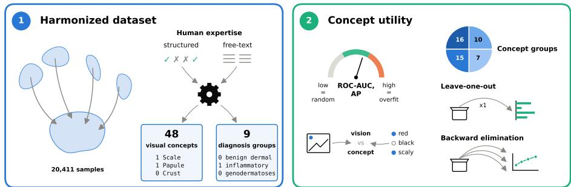
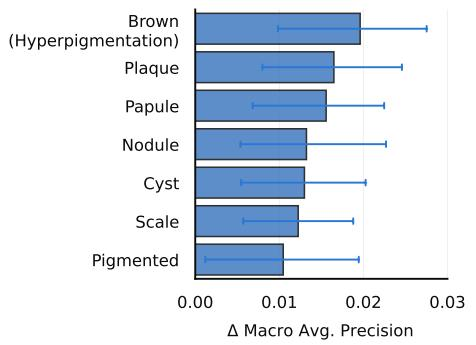
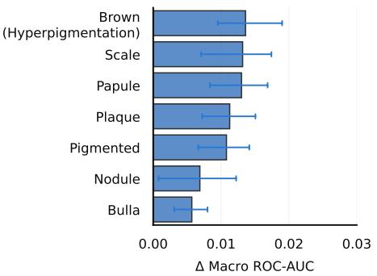
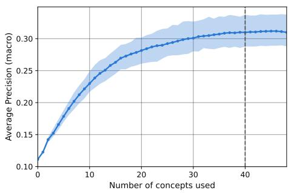
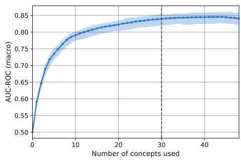

# Multi-Dataset Diagnostic Utility of Clinical Visual Concepts in AI Systems for Dermatology

Linda Wermelinger1,2, Simone Lionetti2, Fabian Gröger1,2, Nipun Ranasekara1,2, Philippe Gottfrois1,3, Ludovic Amruthalingam2, Labelling Consortium3,†, Marc Pouly2, and Alexander A. Navarini1,3

1 University of Basel 2 Lucerne University of Applied Sciences and Arts 3 University Hospital of Basel † Thierry Grimm, Bianca Wahrenberger, Maximilian Kass linda.wermelinger@hslu.ch

Abstract. The clinical integration of AI systems in digital dermatology relies heavily on human trust. Clinically interpretable visual concepts can act as intermediate representations enhancing trust and reliability. However, research in this domain is currently limited by scattered, heterogeneous dataset annotations. In this work, we introduce SkinLex, a harmonized dataset of 48 clinical morphological attributes across four public datasets (SkinCon, DermaCon-IN, MM-Skin, and PASSION) for a total of 20,411 records. Supervised nine-partition classification of skin conditions shows that limiting features to specific visual groups, like shapes or colors alone, reduces diagnostic accuracy. Bootstrapped backward elimination reveals that the set of 48 visual concepts has some degree of redundancy for algorithmic nine-partition diagnosis on the examined dataset. This demonstrates that coarse diagnosis on the selected dataset requires a relatively small but varied combination of clinical concepts, and motivates further research to improve concept taxonomy. Results can be translated into clinical benefits by reducing inputs for concept-based models, improving eficiency for annotation and modeling, and further enhancing interpretability. Code and prompt templates are available at https://github.com/Digital-Dermatology/SkinLex.

Keywords: Explainable AI (XAI) · Clinical Concepts · Feature Selection · Digital Dermatology.

## 1 Introduction

The clinical adoption of artificial intelligence (AI) decision-support systems in digital dermatology depends heavily on human trust [4]. Clinical concepts are emerging as an intermediate layer that can corroborate trust and steer decisions or corrections, as they enable intuitive audits by medical staf [16,20]. One prominent approach in this direction is concept bottleneck modeling, which uses human-interpretable concepts as an interpretable layer [16]. Recent work extends this idea by integrating clinical knowledge into concept bottleneck models [20] and refining concept-based representations for medical image diagnosis [25].

  
Fig. 1. Overview of the paper: the harmonized SkinLex dataset and visual concept utility analysis.

Dermatological examinations routinely use a standardized vocabulary to describe skin disorders by assessing primary lesions, their secondary changes, and their morphology (color, size, shape, surface), distribution, and progression [17]. In digital dermatology, this was first incorporated in dermatoscopic settings through early specialized resources like PH2 [19] and Derm7pt [13]. Both datasets adopt specific, expert-annotated dermatoscopic structures, such as global asymmetry or the 7-point checklist criteria [2,19,13].

Subsequent work expanded this to broader clinical dermatology through datasets with structured concept metadata. For instance, SkinCon [7] provides expert annotations for 48 morphological features across a subset of images from Fitzpatrick17k [10] and DDI [6]. These descriptors consist of clinical terms that capture primary lesions, secondary changes, shapes, and colors. This concept set is closely mirrored by DermaCon-IN [18] across a patient cohort from outpatient clinics in South India, adding features like striae and nail abnormalities. While both SkinCon and DermaCon-IN rely on manual, expert-validated annotations, other approaches like MILK10k [23] automate concept probability extraction using an image-text foundation model trained on medical literature [15].

Driven by the success of vision-language models, recent work has increasingly turned toward datasets featuring detailed, natural language clinical descriptions rather than rigid categorical labels. While not concept datasets in the strict sense, their captions contain recoverable morphological information that maps to a shared concept vocabulary. Examples include MM-Skin [27], a dataset pairing diverse modalities with long-form clinical captions, and Derm1M [26], which uses a 130-item list to extract visual characteristics from raw text. Similarly, the PASSION dataset [9] of sub-Saharan skin conditions was recently extended with dual expert captions [24].

While several public datasets now provide conceptual metadata, progress is hindered by the scattered and heterogeneous character of this concept-related information. Such heterogeneity is understandable, as human annotations require substantial expert efort to collect [7,28]. Moreover, dermatology datasets are collected across diverse patient populations and clinical settings, often reflecting locally defined label sets and annotation practices [12,6]. As a result, manually annotated concept information is available only for a relatively small fraction of digital dermatology images in formats that have seen little standardization and are typically sparse, complicating large-scale analyses. Such limitations create a need for cross-dataset concept harmonization before questions about concept redundancy, complementarity, and predictive utility can be studied at scale.

So far, the data-driven methods community has leveraged structured concepts from clinical dermatology to develop interpretable, fair and auditable AI systems [20,7,5]. In this work, we simultaneously increase the scale of this endeavor and take first steps toward exploring how these models can provide valuable, interpretable feedback to dermatological practice. By harmonizing concept annotations across four dataset sources, we open the path to a broader analysis of clinical attributes in digital dermatology. At the same time, we train, evaluate, and examine how machine-learning models predict skin diseases directly from these structured concepts. In doing so, we explore the assumption that a unified set of clinical concepts can provide a shared feature representation for computer-assisted diagnosis across diverse disease categories, treating concepts as a primary input modality rather than mere explanatory support. Our empirical study of model behavior informs concept-bottleneck approaches in first instance, but our hope is that, with additional evidence from future work, it could guide how visual concepts are selected and annotated in digital dermatology.

The main contributions of this paper, illustrated in fig. 1, are as follows.

1. We introduce SkinLex, a unified dataset built from sources that rely on human expertise (section 2.1), which feature either structured annotations by clinicians (SkinCon, DermaCon-IN) or expert-authored text (MM-Skin, PASSION). We map clinical visual concepts to the set established by Skin-Con, using exact matching where possible or processing free text with a large language model (LLM). We consolidate more than 6,000 noisy, fine-grained diagnoses into the nine Fitzpatrick17k categories leveraging the same LLM. This produces a dataset with structured visual clinical concepts and diagnostic information derived from human expertise that is five times larger than SkinCon.

2. We evaluate the utility of the 48 selected concepts for predicting the nine diagnostic categories across the unified dataset. We establish metrics including lower and upper bounds (section 2.2), and compare concept performance to deep visual feature extraction (section 3.1). We then evaluate diferent groups of concepts such as shapes or colors, assess how critical individual concepts are (section 3.2), and estimate the degree of redundancy in the concept set (section 3.3). Results indicate that classification requires varied concept categories to work well and that some redundancy is present.

Together, these two contributions facilitate the evaluation of clinical visual concepts for computer-assisted diagnosis by separating concept utility from their image-based extraction, and trace a path for the refinement of concept sets.

Table 1. Summary of original and final sample counts across unified sources.
<table><tr><td>Source Dataset Image Modality</td><td></td><td>Original</td><td>Final</td><td>Alignment</td></tr><tr><td>SkinCon</td><td>Clinical</td><td>3,886</td><td>3,642</td><td>Direct match.</td></tr><tr><td>DermaCon-IN</td><td>Clinical</td><td>5,450</td><td>5,405</td><td>Direct match.</td></tr><tr><td>MM-Skin</td><td>Clinical, Dermatoscopy,</td><td>11,015</td><td>7,500</td><td>Concept and</td></tr><tr><td>PASSION</td><td>Pathology</td><td></td><td></td><td>disease extraction.</td></tr><tr><td></td><td>Clinical</td><td>5,127</td><td>3,864</td><td>Concept extraction.</td></tr><tr><td>SkinLex</td><td>Mixed</td><td>25,478</td><td>20,411</td><td></td></tr></table>

## 2 Methodology

## 2.1 Dataset Harmonization

Previous works have investigated the capabilities and limitations of conceptbased methods, but these analyses are either performed on small datasets or entangled with the ability of complex models to correctly infer such concepts from images. To obtain a strong data signal and circumvent image-based concept inference, we aggregate and harmonize information from several sources. In doing so, we strive to obtain suficiently clean diagnostic information that can be used for a unified analysis. However, direct human annotations for concepts and diagnoses are sparse, so we leverage the human signal from image captions that describe skin conditions when structured labels are not available. To this end, we use QuantTrio/Qwen3.6-35B-A3B-AWQ [21] to extract concepts and diagnoses from text, where they can often be found without requiring complex processing. We use zero temperature to minimize sampling variability, refer to this model simply as “Qwen” in the following, and provide all prompt templates in the project’s GitHub repository.

To construct SkinLex with a unified visual clinical vocabulary, we map each sample onto the SkinCon concept space (e.g., erythema, scale, plaque) which is based on dermatology textbook definitions [3]. Two of the sources already provide concepts as binary 0/1 labels in this space, while for others we extract the 48 SkinCon concepts in the same format using Qwen. Direct alignment of the raw diagnostic labels is impractical because of diferent granularity, terminology, and frequency across sources, which results in more than 6,000 separate condition identifiers. We therefore map these identifiers to a common category set using Qwen, generating a dictionary from the diagnostic labels of each dataset when possible, and otherwise leveraging human-provided captions which often directly include information on the condition. Given the size of the final dataset, we settle for the nine-partition mutually-exclusive classification that was established with Fitzpatrick17k. To ensure medical grounding and reduce the risk of hallucination, we include the text-based granular-to-nine-partition mapping dictionary from the Fitzpatrick17k dataset as in-context reference.

The details of sources, harmonization, and quality checks are as follows.

Table 2. Distribution of the aligned disease categories across the unified dataset.
<table><tr><td>Standardized Disease Category</td><td>Sample Count</td><td>Percentage (%)</td></tr><tr><td>Inflammatory</td><td>15,091</td><td>73.94</td></tr><tr><td>Malignant Epidermal</td><td>964</td><td>4.72</td></tr><tr><td>Genodermatoses</td><td>867</td><td>4.25</td></tr><tr><td>Benign Dermal</td><td>865</td><td>4.24</td></tr><tr><td>Benign Epidermal</td><td>825</td><td>4.04</td></tr><tr><td>Benign Melanocyte</td><td>641</td><td>3.14</td></tr><tr><td>Malignant Cutaneous Lymphoma</td><td>565</td><td>2.77</td></tr><tr><td>Malignant Melanoma</td><td>465</td><td>2.28</td></tr><tr><td>Malignant Dermal</td><td>128</td><td>0.63</td></tr><tr><td>Total</td><td>20,411</td><td>100.00</td></tr></table>

– SkinCon: Samples are filtered using the CleanPatrick list [11] and the label “Do not consider this image”, leaving 3,642 instances.

DermaCon-IN: Images with insuficient quality for diagnosis according to the metadata and entries labeled “No Definite Diagnosis” are removed, leaving 5,405 instances.

– MM-Skin: Discrete clinical concepts and granular diagnostic labels are extracted from captions and visual question answering (VQA) dialogues using Qwen. Although MM-Skin includes dermatoscopic and pathological images alongside clinical photographs, captions across these modalities contain overlapping concept sets. We discard extraneous files, as well as cases where the model extracted multiple or no diagnoses, leaving 7,500 instances.

– PASSION: We extract clinical concepts from the two expert captions per sample using Qwen. This dataset has structured diagnostic annotations, so we only drop instances marked as unspecified and retain 3,864.

We do not include Derm1M because 378,678 of its 423,016 captions are repeated identically at least two times, with the most frequent appearing in 2,945 copies. This produces many entries where concept set and diagnosis are exactly the same and would lead to unrealistic reweighting with no variance.

The final sample counts and alignment methods are summarized in table 1, and the diagnosis distribution according to the nine-partition Fitzpatrick17k classification is given in table 2. While individual sources exhibit severe localized imbalances, their aggregation fills critical data gaps. For instance, features completely absent (0.0%) from DermaCon-IN such as Sclerosis, Blue, and Warty/Papillomatous morphologies are heavily supplemented by MM-Skin (accounting for 87.1%, 96.7%, and 79.9% of those concepts, respectively). Likewise, the PASSION dataset provides 92.4% of all Excoriation instances. This improvement in concept and diagnosis coverage provides a basis for novel analyses.

## 2.2 Experimental Setup

The SkinLex dataset is split randomly with stratification into training (64%), validation (16%), and testing (20%) subsets. Because of imbalance, with the largest diagnosis accounting for 73.94% of the samples, we evaluate the models both using macro-averaged receiver operating characteristic area under the curve (ROC-AUC) and average precision (AP). These metrics bypass threshold calibration and have baselines of 0.5000 and 0.1111 respectively. Since the concept presence space is sparsely populated and some samples with diferent diagnoses might not be separable, we establish a performance ceiling by overfitting the validation set, obtaining 0.9404 ROC-AUC and 0.5568 AP.

We investigate how models utilize diferent clinical concepts for diagnosis. First, we restrict the input feature space to one of four clinically defined feature groups: Colors (10 features), Shapes (16 features), Textures (15 features), and Other (7 features) to measure their standalone predictive capacity. Second, we perform a leave-one-out sensitivity analysis by removing one clinical concept at a time and retraining 48 models with fixed hyperparameters.

To estimate the potential redundancy of the 48-concept set for the coarse diagnosis task under exam, we run backward elimination with 100 bootstrapped training and validation sets, each with a separate sample pool. At each step, the feature whose individual exclusion produces the best median score across bootstraps is removed until the feature set is empty. The last zero-feature model is a dummy classifier that randomly assigns labels with the training set frequency.

The minimal concept set that retains the full performance is determined by a one-sided paired Wilcoxon signed-rank test on the bootstrapped scores with a p-value threshold of 5%. Score diferences are indeed symmetric under the null hypothesis that the model trained on the reduced concept set is not worse than the one using the full 48-concept set. No correction is applied for multiple testing, as lowering the threshold would increase the chance of no observed diference, which could inflate the set of concepts deemed redundant.

## 3 Experiments and Results

## 3.1 Reference models

To select promising models for concept-based nine-partition diagnosis, we screen twelve classic candidates on the validation set using PyCaret [1]. LightGBM [14] achieves the best results, capturing 90.9% of the ROC-AUC and 58.1% of the AP ceiling with 0.8555 and 0.3236 respectively. We therefore use LightGBM as the primary model, and include one-versus-rest logistic regression (ROC-AUC: 0.8384, AP: 0.2947) as a linear comparison. For reference, we tested the same models on classification with frozen image feature sets extracted by ViT-base [8] models. A LightGBM classifier on DINOv3 features [22] obtains 0.8907 ROC-AUC and 0.3756 AP, outperforming supervised ImageNet features.

Table 3. Model performance across full and restricted concept groups. Metrics report median and [95% CI] estimated with 100 validation bootstraps.
<table><tr><td rowspan="2">Feature Set</td><td rowspan="2">Features</td><td colspan="4">LightGBM</td><td colspan="4">Logistic Regression</td></tr><tr><td>ROC-AUC</td><td></td><td></td><td>AP</td><td></td><td>ROC-AUC</td><td></td><td>AP</td></tr><tr><td>Full Model</td><td>48</td><td>0.829</td><td>[0.845] [0.812]</td><td>0.309</td><td>[0.330] [0.288]</td><td>0.801</td><td>[0.819] [0.786]</td><td>0.274</td><td>[0.299] [0.255]</td></tr><tr><td>Shapes</td><td>16</td><td>0.711</td><td>[0.727] [0.695]</td><td>0.174</td><td>[0.183] [0.163]</td><td></td><td>0.672 [0.689] [0.658]</td><td></td><td>0.170 [0.181] 0.158</td></tr><tr><td>Colors</td><td>10</td><td>0.690</td><td>[0.713] [0.671]</td><td>0.173</td><td>[0.185] [0.164]</td><td>0.683</td><td>[0.707] [0.665]</td><td></td><td>0.177 [0.191] [0.165]</td></tr><tr><td>Textures</td><td>15</td><td>0.661</td><td>[0.675] [0.644]</td><td>0.153</td><td>[0.163] [0.145]</td><td>0.659</td><td>[0.675] [0.643]</td><td>0.155</td><td>[0.163] [0.148]</td></tr><tr><td>Others</td><td>7</td><td>0.530</td><td>[0.538] [0.524]</td><td>0.124</td><td>[0.129] [0.119</td><td></td><td>0.532 [0.541] 0.526</td><td></td><td>0.124 [0.129] 0.119</td></tr></table>

  
Fig. 2. Leave-one-out sensitivity for LightGBM on the validation split. The bars illustrate the mean absolute decrease in macro AP (left) and ROC-AUC (right) when a concept is omitted, with higher values indicating concepts critical for performance. Error bars denote the standard deviation across 100 validation bootstraps.

## 3.2 Concept Groups and Sensitivity Analysis

Table 3 shows that restricting inputs to isolated concept groups considerably degrades performance. The Shapes and Colors groups preserve the strongest standalone signals, while Others approaches random guessing. Altogether, results highlight the need for a diverse, mixed concept set.

Concurrently, the leave-one-out sensitivity in fig. 2 demonstrates individual concept redundancy, as performance shifts are small. The color Brown (Hyperpigmentation) leads to the largest degradation, followed by structural attributes like Plaque, Papule, Nodule, and Scale.

## 3.3 Backward Elimination

Figure 3 illustrates model performance in terms of macro-averaged ROC-AUC and AP as a function of the number of concepts in the backward-elimination process. As expected, the returns in terms of scores grow sub-linearly with the number of concepts used for classification. The statistical test indicates that removing 8 concepts does not significantly lower AP compared to the full concept set, while up to 18 concepts can be omitted without decreasing ROC-AUC. These numbers suggest some redundancy for algorithmic diagnosis in this dataset, although the outcome depends on the evaluation metric. Note that it is not possible to deduce if and which concepts lack utility from the result, as a missing concept can be compensated for by others, and which one is removed may be an artifact.

  
Fig. 3. Median and 95% CI of LightGBM macro AP and ROC-AUC across the number of concepts used, using 100 bootstraps of training and validation sets. The dashed line indicates the highest number of used concepts where a paired one-sided Wilcoxon signed-rank test indicates lower performance than the full set.

## 4 Discussion

## 4.1 Limitations

First, our flat 48-concept set and nine-diagnoses partition represent a simplified setup that may not reflect consensus across medical institutions, as it omits disease hierarchies and context-dependent clinical vocabularies. Finer concept sets, such as those in Derm1M, or more granular disease targets may capture greater diagnostic nuance and increase task complexity. Although the concept set focuses on visual descriptions rather than diagnostic labels, some annotation bias toward specific conditions may be present.

Second, dataset harmonization carries extraction constraints. Because original sources emphasize concept presence over absence, caption-based extraction is prone to conflating unmentioned features with negative findings. Additionally, automated extraction and harmonization via Qwen require further cross-model and human verification.

Finally, caution is required when generalizing these findings. While combining diverse sources improves overall coverage, it likely introduces hidden subgroups and demographic constraints. Humans or alternative models may leverage concepts diferently, yielding distinct importance rankings. Even within the present scope, a concept’s lack of utility for algorithmic coarse-grained classification cannot be interpreted as general low relevance, as redundancy is only defined within a set of concepts.

## 4.2 Conclusions and Outlook

In this work, we introduce SkinLex, a dataset harmonizing four skin image datasets with human annotations of visual concepts and diagnostic labels. By merging these into a single collection of 20,411 samples with structured information, we enabled an analysis of concept utility in a specific diagnostic task. Empirical results confirm that diferent concept categories such as shape and color supply complementary information, and suggest that the 48 concepts reported by SkinCon have some level of redundancy for coarse algorithmic classification.

These findings carry clinical relevance for explainable AI deployment. Identifying and removing redundant concepts can reduce annotation efort, improve computational eficiency, elevate interpretability and increase trust in clinical environments by presenting a concise, stable core of diagnostic indicators rather than a noisy list of low-signal terms.

Acknowledgments. This research was funded by the Swiss National Science Foundation (SNSF) under grant 20HW-1 228541.

Disclosure of Interests. A.A.N. is a shareholder of Derma2Go AG and Derma .One GmbH. All other authors declare no competing interests.

## References

1. Ali, M.: PyCaret: An open source, low-code machine learning library in Python (April 2020), https://www.pycaret.org, version 3.3.2

2. Argenziano, G., Fabbrocini, G., Carli, P. et al.: Epiluminescence microscopy for the diagnosis of doubtful melanocytic skin lesions. Comparison of the ABCD rule of dermatoscopy and a new 7-point checklist based on pattern analysis. Archives of Dermatology 134(12), 1563–1570 (Dec 1998). https://doi.org/10.1001/archderm. 134.12.1563

3. Bolognia, J., Schafer, J.V., Cerroni, L.: Dermatology. Elsevier (2017)

4. Chanda, T., Hauser, K., Hobelsberger, S. et al.: Dermatologist-like explainable AI enhances trust and confidence in diagnosing melanoma. Nature Communications 15(1), 524 (Jan 2024)

5. Daneshjou, R., Barata, C., Betz-Stablein, B. et al.: CheckList for Evaluation of image-based AI Reports in Dermatology: CLEAR Derm Consensus Guidelines from the International Skin Imaging Collaboration Artificial Intelligence Working Group. JAMA dermatology 158(1), 90–96 (Jan 2022). https://doi.org/10.1001/ jamadermatol.2021.4915

6. Daneshjou, R., Vodrahalli, K., Novoa, R.A. et al.: Disparities in dermatology AI performance on a diverse, curated clinical image set. Science Advances 8(32), eabq6147 (Aug 2022). https://doi.org/10.1126/sciadv.abq6147

7. Daneshjou, R., Yuksekgonul, M., Cai, Z.R. et al.: SkinCon: A skin disease dataset densely annotated by domain experts for fine-grained debugging and analysis. In: Advances in Neural Information Processing Systems. vol. 35, pp. 18157–18167 (2022)

8. Dosovitskiy, A., Beyer, L., Kolesnikov, A. et al.: An image is worth 16x16 words: Transformers for image recognition at scale. In: International Conference on Learning Representations (ICLR) (2021)

9. Gottfrois, P., Gröger, F., Andriambololoniaina, F.H. et al.: PASSION for Dermatology: Bridging the Diversity Gap with Pigmented Skin Images from Sub-Saharan Africa . In: proceedings of Medical Image Computing and Computer Assisted Intervention – MICCAI 2024. vol. LNCS 15003 (October 2024)

10. Groh, M., Harris, C., Soenksen, L. et al.: Evaluating Deep Neural Networks Trained on Clinical Images in Dermatology with the Fitzpatrick 17k Dataset. In: 2021 IEEE/CVF Conference on Computer Vision and Pattern Recognition Workshops (CVPRW). pp. 1820–1828 (Jun 2021). https://doi.org/10.1109/CVPRW53098. 2021.00201

11. Gröger, F., Lionetti, S., Gottfrois, P. et al.: CleanPatrick: A Benchmark for Image Data Cleaning. Journal of Data-centric Machine Learning Research (Jun 2026)

12. Gröger, F., Lionetti, S., Gottfrois, P. et al.: A Global Atlas of Digital Dermatology to Map Innovation and Disparities (Jan 2026). https://doi.org/10.48550/arXiv. 2601.00840

13. Kawahara, J., Daneshvar, S., Argenziano, G. et al.: 7-Point Checklist and Skin Lesion Classification using Multi-Task Multi-Modal Neural Nets. IEEE journal of biomedical and health informatics (Apr 2018). https://doi.org/10.1109/JBHI. 2018.2824327

14. Ke, G., Meng, Q., Finley, T. et al.: Lightgbm: a highly eficient gradient boosting decision tree. In: Proceedings of the 31st International Conference on Neural Information Processing Systems. p. 3149–3157 (2017)

15. Kim, C., Gadgil, S.U., DeGrave, A.J. et al.: Transparent medical image AI via an image–text foundation model grounded in medical literature. Nature Medicine 30(4), 1154–1165 (Apr 2024). https://doi.org/10.1038/s41591-024-02887-x

16. Koh, P.W., Nguyen, T., Tang, Y.S. et al.: Concept Bottleneck Models. In: Proceedings of the 37th International Conference on Machine Learning. pp. 5338–5348 (Nov 2020)

17. Lipsker, D.: Clinical Examination and Diferential Diagnosis of Skin Lesions. Springer, Paris (2013). https://doi.org/10.1007/978-2-8178-0411-8

18. Madarkar, S.S., Madarkar, M., V, M. et al.: Dermacon-IN: A multiconceptannotated dermatological image dataset of indian skin disorders for clinical AI research. In: The Thirty-ninth Annual Conference on Neural Information Processing Systems Datasets and Benchmarks Track (2026), https://openreview.net/ forum?id=aqr5pyOQpf

19. Mendonca, T., Ferreira, P.M., Marques, J.S. et al.: PH² - a dermoscopic image database for research and benchmarking. Annual International Conference of the IEEE Engineering in Medicine and Biology Society. IEEE Engineering in Medicine and Biology Society. Annual International Conference 2013, 5437–5440 (2013). https://doi.org/10.1109/EMBC.2013.6610779

20. Pang, W., Ke, X., Tsutsui, S. et al.: Integrating Clinical Knowledge into Concept Bottleneck Models. In: proceedings of Medical Image Computing and Computer Assisted Intervention – MICCAI 2024. vol. LNCS 15004, pp. 243 – 253 (Oct 2024)

21. Qwen Team: Qwen3.6-35B-A3B: Agentic coding power, now open to all (April 2026), https://qwen.ai/blog?id=qwen3.6-35b-a3b

22. Siméoni, O., Vo, H.V., Seitzer, M. et al.: Dinov3 (Aug 2025). https://doi.org/10. 48550/arXiv.2508.10104

23. Tschandl, P., Akay, B.N., Rosendahl, C. et al.: MILK10k: A Hierarchical Multimodal Imaging-Learning Toolkit for Diagnosing Pigmented and Nonpigmented Skin Cancer and its Simulators. Journal of Investigative Dermatology 146(2), 357– 364.e7 (Feb 2026). https://doi.org/10.1016/j.jid.2025.06.1594

24. Voegtli, N.: PASSION-derm-ICD-Captions: ICD-10, ICD-11, and Dual-Caption Annotations for the PASSION Dermatology Dataset. Zenodo (2026). https://doi. org/10.5281/zenodo.22011112

25. Wang, H., Hou, J., He, S. et al.: Concept Complement Bottleneck Model for Interpretable Medical Image Diagnosis. In: Proceedings of The 9th International Conference on Medical Imaging with Deep Learning. pp. 342–359 (May 2026)

26. Yan, S., Hu, M., Jiang, Y. et al.: Derm1m: A million-scale vision-language dataset aligned with clinical ontology knowledge for dermatology. In: 2025 IEEE/CVF International Conference on Computer Vision (ICCV). pp. 12681–12690 (2025). https://doi.org/10.1109/ICCV51701.2025.01178

27. Zeng, W., Sun, Y., Ma, C. et al.: MM-Skin: Enhancing Dermatology Vision-Language Model with an Image-Text Dataset Derived from Textbooks. In: Proceedings of the 33rd ACM International Conference on Multimedia. pp. 3769–3778. MM ’25, New York, NY, USA (Oct 2025). https://doi.org/10.1145/3746027.3755187

28. Zhou, J., Sun, L., Xu, Y. et al.: SkinCAP: A Multi-modal Dermatology Dataset Annotated with Rich Medical Captions (May 2024). https://doi.org/10.48550/arXiv. 2405.18004