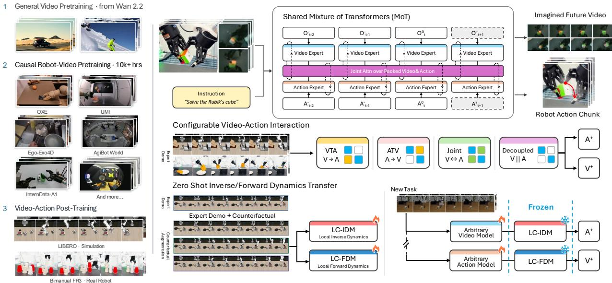
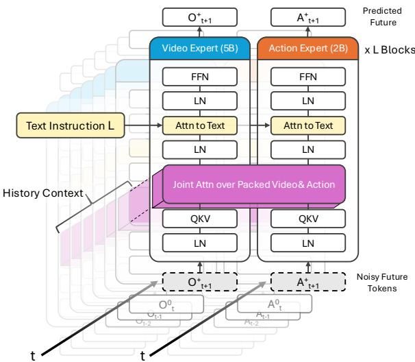
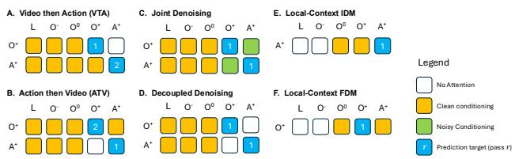
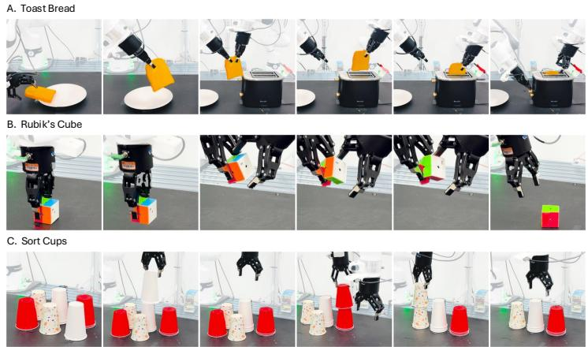
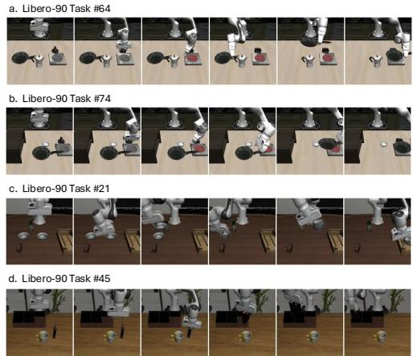
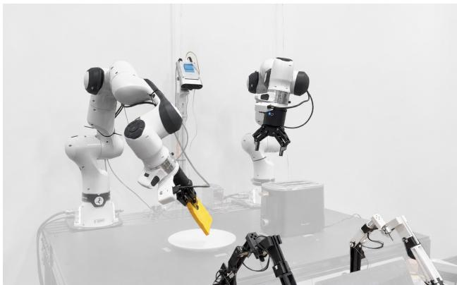

# OPENWAM: An Open Framework for Composable World-Action Models

Heng Yu∗, David D. Yuan∗, Juze Zhang∗, Changan Chen, Yao Feng Michelle Baldonado, Steve Cousins, Li Fei-Fei, Jiajun Wu, Ehsan Adeli

Stanford University \*Equal contribution

World–action models (WAMs) couple future prediction with robot control, yet existing systems often vary the video backbone, interaction structure, supervision, and inference procedure simultaneously, making their design choices difficult to compare. We introduce OPENWAM, an open world–action modeling framework built around a common causal robot-video foundation and configurable video–action interaction. Starting from Wan2.2-5B, we perform causal robot-video pretraining on over 10,000 hours of video, then integrate an action expert through a shared Mixture-of-Transformers architecture that supports joint, video-then-action, action-then-video, and decoupled generation. OPENWAM achieves high success rates on four LIBERO suites and real-world bimanual tasks; robotvideo training with causal adaptation improves VTA success on LIBERO-Long from 68.4% to 97.8%. The same configurable architecture naturally extends to inverse and forward dynamics, allowing us to study how counterfactual transitions improve independently trained dynamics models beyond demonstrations alone. When only the video predictor is adapted to a new task, a frozen local-context inverse dynamics model trained on counterfactual data and demonstrations achieves 84.0% mean success across four held-out LIBERO-90 tasks, compared with 47.0% for a full-context inverse model and 21.5% for a local-context model trained only on demonstrations. For forward dynamics, counterfactual supervision reduces RGB prediction error by 34.5% and raises outcome identification from 21.1% to 71.3% among 16 same-state outcomes. OPENWAM provides a common testbed for comparing WAM interaction designs and for studying dynamics learning from video data beyond successful demonstrations.

Project Page: https://openwam.stanford.edu Code: https://github.com/OpenWAM/OpenWAM Release: Project page & code: June 4, 2026 Paper: October 6, 2026

## 1. Introduction

World-action models (WAMs) integrate future-observation prediction with robot control. Recent systems such as DreamZero [90], DVA [71] and LingBot-VA [43, 97] use pretrained video models to couple future-observation prediction with robot action generation. However, differences in their backbones, training data, objectives, and inference procedures make it difficult to isolate the effect of video–action interaction.

Two challenges arise when studying these systems systematically. First, video–action interaction spans multiple choices: video and actions can be generated jointly, sequentially, or through restricted cross-modal connections. A shared architecture and evaluation protocol would allow these interaction patterns and generation orders to be compared under controlled conditions. Second, successful demonstrations cover only a limited subset of possible action–outcome relationships. Other interactions, including failures, exploratory behavior, and counterfactual rollouts, can provide additional supervision about local dynamics. However, it remains unclear whether such data can improve the reuse of an action-grounding component when the visual predictor is adapted to a new task. We study this question by independently training local-context dynamics models and evaluating their transfer across adapted video predictors.

To this end, we introduce OPENWAM, an open framework and model series for controlled world–action modeling, summarized in Figure 1. Starting from a pretrained generalpurpose video model, we adapt its visual prior through causal robot-video training without action labels, then introduce an action branch through a Mixture-of-Transformers (MoT) architecture [49]. The resulting model supports joint, sequential, and restricted video–action interaction. These configurations share the video initialization, representations, and evaluation pipeline, allowing us to compare how their interaction patterns affect the control performance.

  
Figure 1. Overview of OPENWAM. Left: Starting from Wan2.2 [75], causal pretraining on robot and human-interaction video builds a predictive backbone without action labels, followed by video–action training on simulated and real-robot demonstrations. Top right: A shared Mixture-of-Transformers couples temporally aligned video and action streams through joint attention while retaining modality specific experts. Middle right: Configurable cross-modal attention and generation order support joint, video-then-action, action-then-video, and decoupled prediction within the same architecture. Bottom right: Local-context inverse and forward dynamics models are trained independently using demonstrations and counterfactual transitions. A frozen IDM translates predictions from compatible task-adapted video models into actions, while an FDM predicts the visual consequences of candidate actions.

Furthermore, OPENWAM trains local-context inverse and forward models independently. The inverse model predicts actions from the current observation and a future visual trajectory, while the forward model predicts that trajectory from supplied actions. In simulation, we broaden their training data by executing alternative action sequences from the same initial state. This local-transition formulation is also compatible with failed and exploratory interactions, because it does not require a successful task outcome or a success label. Each recorded transition supplies dynamics supervision regardless of whether it completes the task. At inference, a video predictor can propose a visual trajectory and a separately trained inverse model can translate it into executable actions.

We evaluate robot-video pretraining, closed-loop policy success across video–action interaction modes and dynamicscomponent reuse. In transfer experiments, task-adapted video predictors are paired with frozen inverse models to compare demonstration-only with counterfactual-augmented supervision and local-context with full-context conditioning. We additionally evaluate forward prediction under alternative actions from the same initial state.

This work makes three contributions:

• A controlled WAM framework. OPENWAM combines a causal video backbone with configurable video–action models under shared training and evaluation protocols.

• Local-context dynamics interfaces. We independently train inverse- and forward-dynamics models from demonstrations and broader local transitions and evaluate their composition with separately trained predictors.

• Controlled empirical analysis. We measure the effects of robot-video pretraining, interaction design, transition coverage, and conditioning context on policy performance and component reuse.

## 2. Related Work

## 2.1. Visuomotor Policies and Predictive Control

Behavior cloning provides the standard supervised formulation for visuomotor policy learning, mapping observations and task context directly to demonstrated actions. Action chunking and generative action prediction have become effective control primitives [13, 101], while large-scale vision– language–action models extend this paradigm through language conditioning, pretraining, and cross-task or crossembodiment learning [6–8, 33, 36, 58, 70].

Predictive control introduces an additional interface by explicitly modeling future observations or latent states. Early visual-foresight methods combined action-conditioned video prediction with model-predictive control for robotic manipulation [16, 17]. Subsequent work learns latent or visual dynamics to support policy learning, planning, and imagined rollouts [11, 24, 25, 80, 82, 107]. Predictive rollouts have also been used to evaluate policy behavior [22, 47].

Action-conditioned world models provide a complementary perspective by predicting how an environment evolves under supplied or candidate actions. Recent methods use such predictions for simulation, candidate evaluation, proposal refinement, and self-verifying planning [31, 61, 95, 106]. Together, these lines show that predictive models can support action generation, simulation, planning, and evaluation. However, action-conditioned prediction and video–action policy generation are often developed as separate components, leaving open how explicit prediction– action interfaces affect component reuse across tasks.

## 2.2. Video Foundations and World–Action Architectures

Recent world–action models connect predictive video representations with robot control through several forms of video–action coupling. Joint generation models predict future visual content and actions together [1, 21, 66, 90], while causal video-first formulations generate or represent visual futures before action prediction [43, 71]. Other architectures use specialized video and action pathways with explicit cross-modal exchange [87, 96], or leverage egocentric and large-scale video priors for robot grounding and generalization [41, 62, 85, 105].

A closely related line studies the interface between predictive visual information and executable actions. Predicted visual states or representations can condition inverse dynamics [26, 46, 72], while other approaches translate generated futures through dense correspondence, pseudo-action labeling, intermediate denoising features, or latent representation alignment [34, 39, 55, 74]. These methods differ in where and how predictive visual information enters the action-generation pathway.

Unified formulations instead expose multiple predictive and control modes within a shared system. UWM and UVA [44, 108] support combinations of policy, inversedynamics, forward-dynamics, and video prediction objectives, while related systems combine action generation with world prediction, simulation, planning, or evaluation [4, 10, 20, 38, 68].

Recent work further isolates particular choices in the WAM design space. Predictive computation can be reduced, sparsified, reordered, or scheduled asynchronously [28, 29, 48, 59, 69, 77, 89, 94]. Alternative work studies the representation through which world prediction interacts with control [35, 53, 63, 67, 76, 92, 99], or augments world– action learning with structural, geometric, and tactile supervision [18, 56, 104]. Temporal abstraction, data and model scaling, humanoid control, and long-horizon memory provide additional design axes [45, 52, 100, 103]; recent surveys summarize the rapidly expanding landscape [54, 78].

Concurrent work, also named OpenWAM [79], develops a modular framework for systematic WAM pretraining and design studies. Our focus is complementary: OPENWAM fixes a common causal robot-video foundation and training interface while explicitly varying generation order and future cross-modal visibility, enabling joint, video-then-action, action-then-video, and decoupled interaction to be compared under a shared evaluation protocol. We further study the reuse of independently trained inverse- and forwarddynamics components through explicit trajectory interfaces.

## 2.3. Dynamics Learning Beyond Successful Demonstrations

Successful demonstrations provide valid transitions, but they cover only the action–outcome relationships selected by the demonstrating policy. A complementary analysis shows that observational demonstrations alone may not identify the consequences of unsupported actions [93]. Classical imitation-learning methods address the resulting distribution shift by collecting supervision on learner-visited states, perturbing expert trajectories, or soliciting corrective interventions [27, 32, 40, 57, 65]. These approaches broaden state coverage beyond clean expert rollouts and improve robustness to execution errors.

More recent work expands supervision through synthetic failures, counterfactual augmentation, autonomous experience, and other non-successful interactions [2, 4, 15, 42, 60, 88, 91, 98]. Such data have been used for recovery, policy improvement, failure understanding, and predictive modeling. Particularly related to our setting, Fail2Progress [30] targets data collection toward observed failures to improve skill-effect models, while UniPi [14] decouples video planning from inverse dynamics and allows the inverse model to learn from a separate, potentially suboptimal dataset.

OPENWAM focuses on a different question: how transition coverage and conditioning scope affect the reuse of independently trained dynamics components after visual task adaptation. We branch alternative action continuations from task-relevant simulator states and use the resulting state– action–outcome transitions as local dynamics supervision.

## 3. Methodology

We develop OPENWAM as an open framework for composing world prediction and action generation. It combines three ingredients: a causal video backbone pretrained on robot video without action labels, a common video–action architecture whose cross-modal interaction can be reconfigured, and separately trained inverse and forward dynamics components operating through local trajectory interfaces.

The design supports two forms of composition. At the architectural level, we vary how future observation and action streams interact while retaining a common backbone and objective family. At the component level, we connect independently trained predictors through explicit future-observation and action-trajectory interfaces. The latter motivates localcontext dynamics models that do not require the language and nonlocal history used by a task-conditioned generator.

## 3.1. World–Action Modeling Formulation

Let $o _ { t } \in \mathcal { O } , a _ { t } \in \mathcal { A } , q _ { t } \in \mathcal { Q }$ , and $\ell \in \mathcal L$ denote the visual observation, action, proprioceptive state, and language instruction at time t. For fixed observation- and action-history lengths $K _ { o } \in \mathbb { N }$ and $K _ { a } \in \mathbb { N }$ , respectively, we define

$$
\begin{array} { l } { { O _ { t } ^ { - } = \bigl ( o _ { t - K _ { o } } , \ldots , o _ { t - 1 } \bigr ) , } } \\ { { A _ { t } ^ { - } = \bigl ( a _ { t - K _ { a } } , \ldots , a _ { t - 1 } \bigr ) , } } \\ { { O _ { t } ^ { 0 } = o _ { t } . } } \end{array}\tag{1}
$$

Let $H \in \mathbb { N } _ { > 0 }$ denote the prediction horizon. The future action and observation trajectories are defined as

$$
A _ { t } ^ { + } = ( a _ { t } , \ldots , a _ { t + H - 1 } ) , \quad O _ { t } ^ { + } = ( o _ { t + 1 } , \ldots , o _ { t + H } ) .\tag{2}
$$

We collect the information available before predicting the future into the task context

$$
\mathcal { C } _ { t } = ( O _ { t } ^ { - } , O _ { t } ^ { 0 } , A _ { t } ^ { - } , q _ { t } , \ell ) .
$$

Recorded future trajectories are denoted without hats, whereas generated trajectories are denoted by $\hat { O } _ { t } ^ { + }$ and $\hat { A } _ { t } ^ { + }$ We omit the time index t when it is unambiguous.

OPENWAM models future observations and actions jointly. For a reference joint distribution, the two chain-rule factorizations are

$$
\begin{array} { r } { p _ { \mathrm { W A M } } ( O _ { t } ^ { + } , A _ { t } ^ { + } \mid \mathcal { C } _ { t } ) = \underbrace { p ( O _ { t } ^ { + } \mid \mathcal { C } _ { t } ) } _ { \mathrm { C V P } } \underbrace { p ( A _ { t } ^ { + } \mid O _ { t } ^ { + } , \mathcal { C } _ { t } ) } _ { \mathrm { I D M } } } \\ { = \underbrace { p ( A _ { t } ^ { + } \mid \mathcal { C } _ { t } ) } _ { \mathrm { V L A } } \underbrace { p ( O _ { t } ^ { + } \mid A _ { t } ^ { + } , \mathcal { C } _ { t } ) } _ { \mathrm { F D M } } . } \end{array}\tag{3}
$$

Causal video prediction (CVP) proposes future observations, a direct vision–language–action (VLA) policy proposes actions, inverse dynamics (IDM) grounds a supplied visual transition into actions, and forward dynamics (FDM) predicts the visual consequence of supplied actions.

These roles give three primary generation routes. Joint generation produces future observations and actions concurrently. Video-then-action (VTA) first generates a visual future and then conditions action generation on that trajectory. Action-then-video (ATV) first proposes actions and then predicts their visual consequences. These factorizations specify modeling interfaces; they do not require all factors to share one trained parameterization or final checkpoint.

## 3.2. An Open Causal Robot-Video Backbone

We initialize the video backbone from Wan2.2-5B [75] and continue pretraining it on heterogeneous robot-manipulation and interaction videos without action supervision. This stage adapts a general-purpose video prior to robot-centric motion and interaction while preserving a standalone videoprediction interface. The resulting checkpoint is shared across all downstream OPENWAM variants, allowing different video–action interaction strategies to be compared under a common visual initialization. Dataset composition and optimization details are summarized in Sec. 4.1.

Because the original video model is not temporally causal, we introduce chunk-causal prediction during robot-video pretraining. A future chunk may attend to the current and preceding observations and previously generated chunks, but not to later chunks; tokens within a chunk are processed jointly. This provides the temporal direction needed for sequential prediction while retaining within-chunk denoising.

Temporal causality and cross-modal interaction are separate design dimensions. Chunk causality determines which times are visible, while the interaction programs in Sec. 3.3 determine which observation and action streams communicate. The pretrained causal backbone can therefore be used directly as a video predictor or coupled to an action branch without changing its basic predictive interface.

## 3.3. Configurable Video–Action Interaction Programs

Shared architecture. We couple the pretrained video backbone to a separate action transformer using a Mixture-of-Transformers (MoT) architecture [49]. Video and action trajectories are encoded into temporally aligned streams and processed by modality-specific transformer branches. Interleaved cross-modal attention determines how information flows between them. The backbone, tokenization, and objective family are shared across configurations; future cross-modal visibility and generation order are the principal variables. Figure 2 summarizes the architecture, and Figure 3 the attention masks of four interaction programs together with the two local-context dynamics programs.

Interaction programs. We study four video–action interaction programs under a shared Mixture-of-Transformers backbone. Joint denoises future video and action streams concurrently, with bidirectional attention between their noisy future tokens. VTA first predicts future video without access to future actions, then predicts the action conditioned on the completed visual trajectory. ATV reverses this order: it first predicts the action, then conditions video prediction on the completed action trajectory. Decoupled predicts both modalities without future cross-modal attention. All four programs use the same backbone, tokenization, and training objective; they differ only in generation order and future cross-modal attention.

  
Figure 2. Shared MoT architecture. Two modality-specific branches keep their own normalization, projection and feed-forward parameters and meet in a single attention over the packed video and action tokens; a separate cross-attention consumes the task text. Noisy future tokens enter at the bottom and the preceding chunks sit behind as history context.

  
Figure 3. Attention masks the shared architecture exposes: four interaction programs (A–D) and the two local-context dynamics programs (E–F). Columns are the streams a row may condition on, cell colour gives what it attends to there, and the numeral marks the generation pass. E and F carry one row each because each predicts a single stream: the inverse model produces actions, the forward model observations.

Table 1. LIBERO-90 targets used for component-transfer evaluation.
<table><tr><td>Task</td><td>Target behavior</td><td>Transfer challenge</td></tr><tr><td>64</td><td>Stack bowls; place stack in tray</td><td>Novel skill composition</td></tr><tr><td>74</td><td>Book into caddy&#x27;s left compartment</td><td>Retarget familiar manipulation</td></tr><tr><td>21</td><td>Turn on stove; place frying pan on it</td><td>Object and grasp change</td></tr><tr><td>45</td><td>Same objective as Task 21</td><td>Additional scene and layout shift</td></tr></table>

Shared flow-matching objective. All programs use the same latent flow-matching [50] construction. For target modality $P \in \{ \mathrm { O } , \mathrm { A } \}$ , let $Z _ { P } ^ { \star }$ be its clean target latent. With $\tau \sim \mathcal { U } [ 0 , 1 ]$ and $\epsilon _ { P } \sim \mathcal { N } ( 0 , I )$

$$
Z _ { P , \tau } = ( 1 - \tau ) \epsilon _ { P } + \tau Z _ { P } ^ { \star } , \quad u _ { P } = Z _ { P } ^ { \star } - \epsilon _ { P } .\tag{4}
$$

An active prediction stage minimizes

$$
\mathcal { L } _ { P } = \mathbb { E } \Big [ \big \lVert \boldsymbol { v } _ { \boldsymbol { \theta } , P } \big ( \boldsymbol { Z } _ { P , \tau } \mid \boldsymbol { c } _ { P } , \tau \big ) - \boldsymbol { u } _ { P } \big \rVert _ { 2 } ^ { 2 } \Big ] ,\tag{5}
$$

where $c _ { P }$ denotes the history, side information, and crossmodal trajectory made visible by the interaction program. Programs with multiple targets sum the corresponding losses. Observation and action trajectories used as conditioning are processed through their respective modality encoders.

During training, a sequential program uses teacher forcing: the second generation pass conditions on the recorded cross-modal trajectory rather than on an output sampled by the first pass. At inference, it conditions on the completed trajectory generated by the first pass. The same interaction program and temporal alignment are used during training and inference; the source of the conditioning trajectory changes from recorded to generated.

## 3.4. Counterfactual Learning of Local-Context Dynamics Interfaces

Local-context dynamics interfaces. Architectural composition controls communication within a model, but reusing a separately trained component requires an explicit conditioning boundary. A task-conditioned generator may use language and nonlocal history to specify behavior; a reusable local dynamics component instead relates a supplied transition to its actions, or supplied actions to their consequences.

We therefore define

$$
\begin{array} { r } { p _ { \mathrm { I D M } } ^ { \mathrm { l o c a l } } : = p ( A _ { t } ^ { + } \mid O _ { t } ^ { + } , O _ { t } ^ { 0 } , q _ { t } ) , } \\ { p _ { \mathrm { F D M } } ^ { \mathrm { l o c a l } } : = p ( O _ { t } ^ { + } \mid A _ { t } ^ { + } , O _ { t } ^ { 0 } , q _ { t } ) . } \end{array}\tag{6}
$$

Local-context IDM grounds a supplied visual trajectory into an action sequence, while local-context FDM predicts the visual consequence of a supplied action sequence. Neither receives language, past actions, or observations preceding t.

  
Figure 4. Evaluation tasks. Left: the three real-world bimanual tasks of Table 2, each shown as frames sampled along one successful rollout. Right: the four LIBERO-90 targets of Table 1 used for component transfer, which lie outside the LIBERO-Long source-task set.

Importantly, conditioning scope and transition supervision are separate design choices. The local-context restriction specifies which variables the dynamics component may consume; it does not determine which transitions are used for learning. Conversely, broader transition supervision can also be applied to a full-context dynamics model. Sec. 4.3 therefore compares full-context and local-context IDMs under matched demonstration-only and mixed supervision.

Local-context conditioning restricts the variables available to the dynamics component; it does not assume universal local sufficiency. Its adequacy depends on whether the information needed for local action–outcome inference is observable from the current observation, proprioceptive state, and supplied transition. We evaluate this interface through local prediction and composed control.

Broader local-transition supervision. A task trajectory induces a local transition $z = ( O _ { t } ^ { 0 } , q _ { t } , A _ { t } ^ { + } , O _ { t } ^ { + } )$ . Let $\mathcal { D } _ { \mathrm { t a s k } } ^ { \mathrm { l o c } }$ denote the distribution of such transitions obtained from demonstrations. Demonstrations provide valid transitions but contain only the action continuations selected by the policy.

To broaden local supervision, we restore selected simulator states and execute alternative future action sequences. For branch b, this produces $z ^ { ( b ) } = ( O _ { t } ^ { 0 } , q _ { t } , A _ { t } ^ { + , ( b ) } , \bar { O } _ { t } ^ { + , ( b ) } )$ where the initial condition is shared and each future observation trajectory results from executing its corresponding action sequence. These alternatives include interactions outside the demonstrated continuation and need not complete the task. The simulator state is used only to control data collection and is not provided to the model.

The paired collection protocol controls the starting state, while the learning objective operates on individual transition records rather than using an explicit paired-branch loss. Let $\mathcal { D } _ { \mathrm { c f } }$ denote the resulting counterfactual transitions. Dynamics models are trained from

$$
\mathcal { D } _ { \mathrm { d y n } } = ( 1 - \eta ) \mathcal { D } _ { \mathrm { t a s k } } ^ { \mathrm { l o c } } + \eta \mathcal { D } _ { \mathrm { c f } } , \qquad \eta \in [ 0 , 1 ] .\tag{7}
$$

This supports demonstration-only, counterfactual-only, and mixed supervision without changing the conditioning interface. The experimental mixture and collection details are given in Sec. 4.1. The same interface can be applied to failed or exploratory physical-robot transitions when such data are collected.

Local dynamics learning. Using the flow construction in Eq. 4, local-context IDM denoises the action target while conditioning on the observed future, whereas local-context FDM denoises the future observation target while conditioning on the executed action sequence:

$$
\begin{array} { r l } & { \mathcal { L } _ { \mathrm { L C - I D M } } = \mathbb { E } \Big [ \big \| v _ { \theta _ { \mathrm { I D } } } ( Z _ { \mathrm { A } , \tau } \mid O ^ { 0 } , q _ { t } , O ^ { + } , \tau ) - u _ { \mathrm { A } } \big \| _ { 2 } ^ { 2 } \Big ] , } \\ & { \mathcal { L } _ { \mathrm { L C - F D M } } = \mathbb { E } \Big [ \big \| v _ { \theta _ { \mathrm { F D } } } ( Z _ { \mathrm { O } , \tau } \mid O ^ { 0 } , q _ { t } , A ^ { + } , \tau ) - u _ { \mathrm { O } } \big \| _ { 2 } ^ { 2 } \Big ] . } \end{array}\tag{8}
$$

Ground-truth future observations condition IDM training but are not video denoising targets; analogously, executed actions condition FDM training.

Inference and component composition. For video-toaction composition, the video predictor passes future variational autoencoder (VAE) video latents to the receiving IDM; transformer hidden states and caches are not transferred across components. The receiving IDM processes the transferred latents through the same modality-conditioning pathway used for recorded conditioning.

At inference, a task-conditioned visual predictor can be paired with an independently trained local-context IDM:

$$
\begin{array} { r } { \hat { O } _ { t } ^ { + } \sim p _ { \phi } ^ { \mathrm { C V P } } ( \cdot \mid \mathcal C _ { t } ) , \quad \hat { A } _ { t } ^ { + } \sim p _ { \theta _ { \mathrm { I D } } } ^ { \mathrm { L C - I D M } } ( \cdot \mid \hat { O } _ { t } ^ { + } , O _ { t } ^ { 0 } , q _ { t } ) . } \end{array}\tag{9}
$$

Task context determines the desired future through the visual predictor, while the receiving IDM receives only the generated future trajectory and the current local inputs.

The complementary composition pairs an action generator with local-context FDM:

$$
\hat { A } _ { t } ^ { + } \sim p _ { \psi } ^ { \mathrm { V L A } } ( \cdot \mid \mathcal { C } _ { t } ) , \quad \hat { O } _ { t } ^ { + } \sim p _ { \theta _ { \mathrm { F D } } } ^ { \mathrm { L C - F D M } } ( \cdot \mid \hat { A } _ { t } ^ { + } , O _ { t } ^ { 0 } , q _ { t } ) .\tag{10}
$$

The action sequence may equivalently be supplied by an external policy. These are learned compositions: separately trained components need not recover factors of one identical learned joint distribution. Their common trajectory interfaces instead make the components explicitly replaceable, and Sec. 4.3 evaluates when such replacement succeeds.

## 4. Experiments

We evaluate OPENWAM along three dimensions: native policy performance, component composability, and local dynamics modeling. We test whether the shared robot-video foundation supports different video–action interaction programs, whether independently trained action components remain useful when paired with adapted visual predictors, and whether local-context forward dynamics models actiondependent visual outcomes.

## 4.1. Experimental Setup

Robot-video pretraining and simulation. We initialize the visual backbone from Wan2.2-5B [75] and further pretrain it without action supervision on heterogeneous robot and human-interaction video, including UMI/MV-UMI [12, 64], AgiBot World [9], RoboMIND [81], InternData-A1 [73], RoboCOIN [84], FastUMI [102], Ego-Exo4D [19], and Open X-Embodiment [58]. Unless otherwise stated, downstream OPENWAM variants use this common initialization.

The four interaction programs share the same dual-stream MoT backbone and downstream training recipe; they differ in generation order and future cross-modal attention. Video is processed in four-frame latent chunks, each predicting a 16-step action chunk, with proprioception provided as a perchunk conditioning signal. Actions consist of end-effector position, axis-angle rotation, and a gripper command. We use a two-stage training procedure: causal robot-video pretraining followed by joint video–action training on the target suite.

We evaluate Joint, VTA, ATV, and Decoupled on LIBERO-Object, LIBERO-Goal, LIBERO-Spatial, and

Table 2. Real-world bimanual manipulation tasks.
<table><tr><td>Task</td><td>Objective</td><td>Main challenge</td></tr><tr><td>Toast Bread</td><td>Insert bread and activate toaster</td><td>Deformability and precise insertion</td></tr><tr><td>Rubik&#x27;s Cube</td><td>Restore final layer of 2 × 2 cube</td><td>Contact-rich push and rotation</td></tr><tr><td>Sort Cups</td><td>Sort cups according to color</td><td>Variable ordering and sequencing</td></tr></table>

LIBERO-Long [51]. Component transfer uses LIBERO-Long as the downstream source distribution and four LIBERO-90 targets (Table 1) chosen to represent qualitatively different forms of transfer. These targets are outside the LIBERO-Long source-task set; robot-video pretraining is treated as a separate stage.

Real-world tasks. We evaluate on a bimanual platform comprising two Franka Research 3 arms with parallel-jaw grippers and three RGB views: two wrist-mounted cameras and one centered third-person camera. The three task definitions are listed in Table 2. Figure 4 shows the real-world tasks and the LIBERO-90 transfer targets.

Dynamics supervision. Native task models are trained from task demonstrations. For local dynamics, we additionally construct LIBERO-Long-CF by executing alternative action continuations from states encountered in LIBERO-Long demonstrations. Branches sharing an initial state remain in the same train, validation, or test partition. IDM and FDM experiments use demonstration-only, counterfactualonly (CF-only), or mixed supervision. Mixed supervision samples 60% of transitions from $\mathcal { D } _ { \mathrm { c f } }$ and 40% from $\mathcal { D } _ { \mathrm { t a s k } } ^ { \mathrm { l o c } }$ corresponding to η = 0.6 in Eq. 7.

Evaluation. Closed-loop task success is the primary policy and composition metric. For forward dynamics, we report visual prediction error and outcome identification accuracy. Given K realized futures from the same state, the metric tests whether the prediction is closest in RGB MSE to its matching outcome. We report both pairwise identification (K = 2) and identification among all 16 action branches (K = 16).

## 4.2. Native Policy Performance

Broad LIBERO evaluation. We compare the four interaction programs across the LIBERO suites and report the average success rate over three random seeds in Table 3. The principal OPENWAM configurations achieve strong performance across all four suites, establishing that the shared foundation supports multiple world–action generation orders.

Backbone initialization ablation. Holding the VTA architecture, task supervision, and downstream training procedure fixed, the original Wan2.2-5B initialization reaches 68.4% success on LIBERO-Long, while our robot-video-pretrained causal backbone reaches 97.8% (+29.4 points). This comparison measures the combined effect of robot-video pretraining and causal adaptation, rather than attributing the gain to either factor individually.

Table 3. Closed-loop success (%) on four LIBERO suites. Baselines are previously reported results.
<table><tr><td>Method</td><td>Object</td><td>Goal</td><td>Spatial</td><td>Long</td><td>Mean</td></tr><tr><td>OpenVLA [36]</td><td>88.4</td><td>79.2</td><td>84.7</td><td>53.7</td><td>76.5</td></tr><tr><td>OpenVLA-OFT [37]</td><td>98.4</td><td>97.9</td><td>97.6</td><td>94.5</td><td>97.1</td></tr><tr><td>π0 [6]</td><td>98.8</td><td>95.8</td><td>96.8</td><td>85.2</td><td>94.1</td></tr><tr><td> $\pi _ { 0 . 5 } \ [ 3 3 ]$ </td><td>98.2</td><td>98.0</td><td>98.8</td><td>92.4</td><td>96.9</td></tr><tr><td>GR00T-N1 [5]</td><td>97.6</td><td>93.0</td><td>94.4</td><td>90.6</td><td>93.9</td></tr><tr><td>Motus [3]</td><td>99.8</td><td>96.6</td><td>96.8</td><td>97.6</td><td>97.7</td></tr><tr><td>Fast-WAM [94]</td><td>100.0</td><td>97.0</td><td>98.2</td><td>95.2</td><td>97.6</td></tr><tr><td>LingBot-VA [43]</td><td>99.6</td><td>97.2</td><td>98.5</td><td>98.5</td><td>98.5</td></tr><tr><td>OPENWAM-VTA</td><td> $9 9 . 4 _ { \pm 0 . 3 }$ </td><td> $9 8 . 4 _ { \pm 0 . 5 }$ </td><td> $9 8 . 6 { \scriptstyle \pm 0 . 2 }$ </td><td> $9 7 . 8 _ { \pm 0 . 4 }$ </td><td>98.6</td></tr><tr><td>OPENWAM-ATV</td><td> $9 8 . 0 { \scriptstyle \pm 0 . 4 }$ </td><td> $9 7 . 2 _ { \pm 0 . 2 }$ </td><td> $9 6 . 6 { \scriptstyle \pm 0 . 6 }$ </td><td> $9 5 . 4 _ { \pm 0 . 3 }$ </td><td>96.8</td></tr><tr><td>OPENWAM-Joint</td><td> $9 8 . 2 { \scriptstyle \pm 0 . 2 }$ </td><td> $9 7 . 8 { \scriptstyle \pm 0 . 4 }$ </td><td> $9 7 . 6 { \scriptstyle \pm 0 . 3 }$ </td><td> $9 6 . 6 { \scriptstyle \pm 0 . 5 }$ </td><td>97.6</td></tr><tr><td>OPENWAM-Decoupled</td><td> $9 9 . 0 { \scriptstyle \pm 0 . 3 }$ </td><td> $9 8 . 0 { \scriptstyle \pm 0 . 2 }$ </td><td> $9 7 . 8 _ { \pm 0 . 5 }$ </td><td> $9 7 . 0 { \scriptstyle \pm 0 . 4 }$ </td><td>98.0</td></tr></table>

Table 4. Closed-loop success (%) on real-world bimanual manipulation tasks.
<table><tr><td>Method</td><td>Toast</td><td>Cube</td><td>Cups</td><td>Mean</td></tr><tr><td>OPENWAM-VTA</td><td>92.0</td><td>90.0</td><td>94.4</td><td>92.1</td></tr><tr><td>OPENWAM-Joint</td><td>90.0</td><td>94.0</td><td>91.7</td><td>91.9</td></tr></table>

Real-world native policies. Table 4 reports closed-loop success for VTA and Joint on the three bimanual tasks of Table 2, which test the same framework under multi-view, deformable, contact-rich, and multi-object manipulation.

## 4.3. Component Composability

We next study whether action-grounding components remain useful when the visual predictor changes. Full-context and local-context IDMs are evaluated under transitionsupervision regimes, separating the effects of broader localtransition data from the restriction of task-level context.

Frozen action-component reuse. For each LIBERO-90 target, the visual producer is taken from a task-tuned VTA model while source-trained action components remain frozen. Thus, the experiment measures reuse of an action component after visual-task adaptation, rather than targettask learning without action supervision. All reused executors are evaluated with the same target predictor and rollout protocol. Table 6 reports source-task composition on LIBERO-Long.

Conditioning scope and supervision interact strongly (Tables 6 and 5). Mixed supervision raises mean target success from 21.5% to 84.0% for local-context IDMs, compared with 44.5% to 47.0% for full-context IDMs. Under matched mixed supervision, local conditioning improves target success by 37.0 percentage points while retaining 94.4% source-task success. Counterfactual-only and mixed supervision both substantially improve local-context IDM transfer, achieving comparable mean success of 84.5% and 84.0%, respectively, across the four LIBERO-90 targets. These results show that broader transition coverage supports the reuse of local-context dynamics components after visual task adaptation.

The per-task results also reveal uneven transfer. The demonstration-only full-context IDM performs well on Tasks 64 and 74 but obtains 0% success on Tasks 21 and 45, whereas CF-only and mixed local-context IDMs remain effective across all four targets. This contrast highlights their more consistent reuse across the evaluated task changes.

## 4.4. Action-Conditioned Forward Dynamics

We evaluate local-context FDMs on 2,560 counterfactual futures from 160 contexts across ten LIBERO tasks, with 16 action branches per context. Models share the same initial observations, actions, and realized futures. In addition to RGB prediction error, we measure whether the predicted future preserves the identity of its conditioning action through outcome identification at $K = 2$ and $K = 1 6$

As shown in Table 7, CF-only and mixed supervision reduce RGB MSE by 34.5% and 33.0%, respectively, relative to demonstration-only training. CF-only supervision raises outcome accuracy from 68.3% to 93.6% for $K = 2 ,$ , and from 21.1% to 71.3% for $K = 1 6 .$ . Mixed supervision shows a similar improvement, reaching 91.8% and 67.7%, respectively. These results show that broader transition supervision improves both visual prediction accuracy and the ability to distinguish action-dependent futures.

## 5. Discussion and Conclusion

We presented OPENWAM, an open framework and pretrained foundation spanning video prediction, robot control, and local dynamics modeling. Its shared causal backbone supports joint, sequential, and decoupled video–action generation within a common training and evaluation stack. Strong performance across four LIBERO suites and real-world bimanual tasks demonstrates the framework’s control capabilities, while the initialization ablation establishes the substantial benefit of robot-video pretraining. OPENWAM thus supports multiple effective modeling configurations rather than a single specialized policy.

Beyond native control, the framework supports independently trained inverse and forward dynamics components. In the transfer study, counterfactual-only and mixed supervision both substantially improve the reuse of local-context IDMs after visual task adaptation, while retaining strong source-task performance. Counterfactual FDM supervision

Table 5. Frozen inverse dynamics transfer to four LIBERO-90 targets. Target rows use task-tuned video predictors while source-trained IDMs remain frozen. Mean is averaged over the four target tasks.
<table><tr><td>Video / policy</td><td>Action component (frozen)</td><td>64 Composition</td><td>74 Retarget</td><td>21 Object/grasp</td><td>45 Scene shift</td><td>Transfer mean</td></tr><tr><td></td><td>Task-tuned VTA (finetuned policy reference)</td><td>94%</td><td>86%</td><td>92%</td><td>100%</td><td>93.0%</td></tr><tr><td>Task-tuned video</td><td>Full-context IDM, demo-only</td><td>88%</td><td>90%</td><td>0%</td><td>0%</td><td>44.5%</td></tr><tr><td>Task-tuned video</td><td>Full-context IDM, mixed</td><td>54%</td><td>92%</td><td>4%</td><td>38%</td><td>47.0%</td></tr><tr><td>Task-tuned video</td><td>Local-context IDM, demo-only</td><td>36%</td><td>50%</td><td>0%</td><td>0%</td><td>21.5%</td></tr><tr><td>Task-tuned video</td><td>Local-context IDM, CF-only</td><td>80%</td><td>92%</td><td>90%</td><td>76%</td><td>84.5%</td></tr><tr><td>Task-tuned video</td><td>Local-context IDM, mixed</td><td>74%</td><td>86%</td><td>88%</td><td>88%</td><td>84.0%</td></tr><tr><td colspan="2">Original VTA (unadapted policy reference)</td><td>42%</td><td>0%</td><td>0%</td><td>0%</td><td>10.5%</td></tr></table>

Table 6. Source-task composition on LIBERO-Long, all action components evaluated with LIBERO-Long video predictor.
<table><tr><td>Action component</td><td>Supervision</td><td>Success (%)</td></tr><tr><td>Full-context IDM</td><td>Demo-only (Native VTA)</td><td>97.8</td></tr><tr><td>Full-context IDM</td><td>Mixed</td><td>92.2</td></tr><tr><td>Local-context IDM</td><td>Demo-only</td><td>25.8</td></tr><tr><td>Local-context IDM</td><td>CF-only</td><td>90.6</td></tr><tr><td>Local-context IDM</td><td>Mixed</td><td>94.4</td></tr></table>

Table 7. Local-context FDM prediction on counterfactual transitions. MSE values are reported in units of $1 0 ^ { - 3 }$ . Outcome accuracy measures identification of the matching realized future by RGB MSE among K same-state outcomes.
<table><tr><td>Supervision</td><td>RGB MSE↓</td><td>Acc. K=2 ↑</td><td>Acc. K=16 ↑</td></tr><tr><td>Demo-only</td><td>14.35</td><td>68.3</td><td>21.1</td></tr><tr><td>CF-only</td><td>9.40</td><td>93.6</td><td>71.3</td></tr><tr><td>Mixed</td><td>9.62</td><td>91.8</td><td>67.7</td></tr></table>

also improves both visual prediction accuracy and identification of action-dependent outcomes.

Several questions remain open. Composability is established primarily in simulation; demonstrating comparable reuse on real robots will require more data-efficient physical dynamics supervision. Our target-task experiments adapt the video predictor and therefore do not establish zero-shot transfer of the complete video–action model. Appendix E shows that policy, IDM, and FDM objectives can be trained jointly in one checkpoint, but we have not yet shown that a single multi-objective model can match the strongest specialized OPENWAM variants across all modes. The present FDM study also focuses on local, short-horizon prediction, leaving long-horizon planning and physical deployment as natural extensions.

OPENWAM brings these capabilities into one open foundation: strong policies, configurable prediction–action interaction, and independently reusable dynamics. It provides both capable world–action models and a common basis for building, comparing, and composing the next generation.

## References

[1] Niket Agarwal, Arslan Ali, Jon Allen, Martin Antolini, Adeline Aubame, Alisson Azzolini, Junjie Bai, Maciej Bala, Yogesh Balaji, Josh Bapst, et al. Cosmos 3: Omnimodal world models for physical ai. arXiv preprint arXiv:2606.02800, 2026. 3

[2] Ezra Ameperosa, Jeremy A Collins, Mrinal Jain, and Animesh Garg. Rocoda: Counterfactual data augmentation for data-efficient robot learning from demonstrations. In 2025 IEEE International Conference on Robotics and Automation (ICRA), pages 13250–13256. IEEE, 2025. 3

[3] Hongzhe Bi, Hengkai Tan, Shenghao Xie, Zeyuan Wang, Shuhe Huang, Haitian Liu, Ruowen Zhao, Yao Feng, Chendong Xiang, Yinze Rong, et al. Motus: A unified latent action world model. In Proceedings ofthe IEEE/CVF Conference on Computer Vision and Pattern Recognition, pages 35101–35113, 2026. 8

[4] Hongzhe Bi, Zihao Zhou, Yihang Tang, Jingrui Pang, Shuhe Huang, Haitian Liu, Runqing Wang, Shuai Huang, Yichen Wang, Yiming Cheng, et al. Motus2: A self-evolving general world model for dexterous manipulation. arXiv preprint arXiv:2608.30237, 2026. 3

[5] Johan Bjorck, Fernando Castaneda, Nikita Cherniadev,˜ Xingye Da, Runyu Ding, Linxi Fan, Yu Fang, Dieter Fox, Fengyuan Hu, Spencer Huang, et al. Gr00t n1: An open foundation model for generalist humanoid robots. arXiv preprint arXiv:2503.14734, 2025. 8

[6] Kevin Black, Noah Brown, Danny Driess, Adnan Esmail, Michael Equi, Chelsea Finn, Niccolo Fusai, Lachy Groom, Karol Hausman, Brian Ichter, et al. π0: A vision-languageaction flow model for general robot control. arXiv preprint arXiv:2410.24164, 2024. 2, 8

[7] Anthony Brohan, Noah Brown, Justice Carbajal, Yevgen Chebotar, Joseph Dabis, Chelsea Finn, Keerthana Gopalakrishnan, Karol Hausman, Alex Herzog, Jasmine Hsu, et al. Rt-1: Robotics transformer for real-world control at scale. arXiv preprint arXiv:2212.06817, 2022.

[8] Anthony Brohan, Noah Brown, Justice Carbajal, Yevgen Chebotar, Xi Chen, Krzysztof Choromanski, Tianli Ding, Danny Driess, Avinava Dubey, Chelsea Finn, et al. Rt-2:

Vision-language-action models transfer web knowledge to robotic control. arXiv preprint arXiv:2307.15818, 2023. 2

[9] Qingwen Bu, Jisong Cai, Li Chen, Xiuqi Cui, Yan Ding, Siyuan Feng, Shenyuan Gao, Xindong He, Xuan Hu, Xu Huang, et al. Agibot world colosseo: A large-scale manipulation platform for scalable and intelligent embodied systems. arXiv preprint arXiv:2503.06669, 2025. 7

[10] Jun Cen, Chaohui Yu, Hangjie Yuan, Yuming Jiang, Siteng Huang, Jiayan Guo, Xin Li, Yibing Song, Hao Luo, Fan Wang, et al. Worldvla: Towards autoregressive action world model. arXiv preprint arXiv:2506.21539, 2025. 3

[11] Chi-Lam Cheang, Guangzeng Chen, Ya Jing, Tao Kong, Hang Li, Yifeng Li, Yuxiao Liu, Hongtao Wu, Jiafeng Xu, Yichu Yang, et al. Gr-2: A generative video-language-action model with web-scale knowledge for robot manipulation. arXiv preprint arXiv:2410.06158, 2024. 3

[12] Cheng Chi, Zhenjia Xu, Chuer Pan, Eric Cousineau, Benjamin Burchfiel, Siyuan Feng, Russ Tedrake, and Shuran Song. Universal manipulation interface: In-the-wild robot teaching without in-the-wild robots. arXiv preprint arXiv:2402.10329, 2024. 7

[13] Cheng Chi, Zhenjia Xu, Siyuan Feng, Eric Cousineau, Yilun Du, Benjamin Burchfiel, Russ Tedrake, and Shuran Song. Diffusion policy: Visuomotor policy learning via action diffusion. The International Journal ofRobotics Research, 44(10-11):1684–1704, 2025. 2

[14] Yilun Du, Sherry Yang, Bo Dai, Hanjun Dai, Ofir Nachum, Josh Tenenbaum, Dale Schuurmans, and Pieter Abbeel. Learning universal policies via text-guided video generation. Advances in neural information processing systems, 36:9156–9172, 2023. 3

[15] Jiafei Duan, Wilbert Pumacay, Nishanth Kumar, Yi Ru Wang, Shulin Tian, Wentao Yuan, Ranjay Krishna, Dieter Fox, Ajay Mandlekar, and Yijie Guo. Aha: A visionlanguage-model for detecting and reasoning over failures in robotic manipulation. arXiv preprint arXiv:2410.00371, 2024. 3

[16] Frederik Ebert, Chelsea Finn, Sudeep Dasari, Annie Xie, Alex Lee, and Sergey Levine. Visual foresight: Modelbased deep reinforcement learning for vision-based robotic control. arXiv preprint arXiv:1812.00568, 2018. 3

[17] Chelsea Finn and Sergey Levine. Deep visual foresight for planning robot motion. In 2017 IEEE international conference on robotics and automation (ICRA), pages 2786– 2793. IEEE, 2017. 3

[18] Javier Alejandro Lopetegui Gonzalez, Paul Pacaud, and Cordelia Schmid. Spatially aware world action model via geometric latent diffusion. arXiv preprint arXiv:2609.02531, 2026. 3

[19] Kristen Grauman, Andrew Westbury, Lorenzo Torresani, Kris Kitani, Jitendra Malik, Triantafyllos Afouras, Kumar Ashutosh, Vijay Baiyya, Siddhant Bansal, Bikram Boote, et al. Ego-exo4d: Understanding skilled human activity from first-and third-person perspectives. In Proceedings of the IEEE/CVF conference on computer vision and pattern recognition, pages 19383–19400, 2024. 7

[20] Jun Guo, Qiwei Li, Peiyan Li, Zilong Chen, Nan Sun, Yifei Su, Heyun Wang, Yuan Zhang, Xinghang Li, and

Huaping Liu. Unified 4d world action modeling from video priors with asynchronous denoising. arXiv preprint arXiv:2604.26694, 2026. 3

[21] Yanjiang Guo, Yucheng Hu, Jianke Zhang, Yen-Jen Wang, Xiaoyu Chen, Chaochao Lu, and Jianyu Chen. Prediction with action: Visual policy learning via joint denoising process. Advances in Neural Information Processing Systems, 37:112386–112410, 2024. 3

[22] Yanjiang Guo, Lucy Shi, Jianyu Chen, and Chelsea Finn. Ctrl-world: A controllable generative world model for robot manipulation. In International Conference on Learning Representations, pages 6121–6138, 2026. 3

[23] Huy Ha, Yihuai Gao, Zipeng Fu, Jie Tan, and Shuran Song. UMI on legs: Making manipulation policies mobile with manipulation-centric whole-body controllers. In Proceedings ofthe 2024 Conference on Robot Learning, 2024. 3

[24] Danijar Hafner, Timothy Lillicrap, Jimmy Ba, and Mohammad Norouzi. Dream to control: Learning behaviors by latent imagination. arXiv preprint arXiv:1912.01603, 2019. 3

[25] Danijar Hafner, Jurgis Pasukonis, Jimmy Ba, and Timothy Lillicrap. Mastering diverse domains through world models. arXiv preprint arXiv:2301.04104, 2023. 3

[26] Yucheng Hu, Yanjiang Guo, Pengchao Wang, Xiaoyu Chen, Yen-Jen Wang, Jianke Zhang, Koushil Sreenath, Chaochao Lu, and Jianyu Chen. Video prediction policy: A generalist robot policy with predictive visual representations. arXiv preprint arXiv:2412.14803, 2024. 3

[27] Zheyuan Hu, Robyn Wu, Naveen Enock, Jasmine Li, Riya Kadakia, Zackory Erickson, and Aviral Kumar. Rac: Robot learning for long-horizon tasks by scaling recovery and correction. IEEE Transactions on Robotics, 2026. 3

[28] Wen Huang, Haoran Sun, Yongjian Guo, Yunxuan Ma, Haoran Li, Jing Long, Zhouying Mo, Zhong Guan, Yucheng Guo, Shuai Di, et al. Noisegate: Learning per-latent timestep schedules as information gating in world action models. arXiv preprint arXiv:2605.07794, 2026. 3

[29] Xuyao Huang, Yixuan Wang, Zengyao Ye, Boyuan Zhao, Chenyang Yu, Haoran Wen, and Zhijie Deng. Streaming-wam: Action-conditioned world-action model for asynchronous robot manipulation. arXiv preprint arXiv:2609.28927, 2026. 3

[30] Yixuan Huang, Novella Alvina, Mohanraj Devendran Shanthi, and Tucker Hermans. Fail2progress: Learning from real-world robot failures with stein variational inference. arXiv preprint arXiv:2509.01746, 2025. 3

[31] Ze Huang, Jiahui Zhang, Hairuo Liu, Chenxi Zhang, Ran Cheng, and Li Zhang. Learning transferable dynamics priors from action to world modeling. arXiv preprint arXiv:2606.29501, 2026. 3

[32] Physical Intelligence, Ali Amin, Raichelle Aniceto, Ashwin Balakrishna, Kevin Black, Ken Conley, Grace Connors, James Darpinian, Karan Dhabalia, Jared DiCarlo, et al. π∗0.6: a vla that learns from experience. arXiv preprint arXiv:2511.14759, 2025. 3

[33] Physical Intelligence, Kevin Black, Noah Brown, James Darpinian, Karan Dhabalia, Danny Driess, Adnan Esmail,

Michael Equi, Chelsea Finn, Niccolo Fusai, et al. π0.5: A vision-language-action model with open-world generalization. arXiv preprint arXiv:2504.16054, 2025. 2, 8

[34] Joel Jang, Seonghyeon Ye, Zongyu Lin, Jiannan Xiang, Johan Bjorck, Yu Fang, Fengyuan Hu, Spencer Huang, Kaushil Kundalia, Yen-Chen Lin, et al. Dreamgen: Unlocking generalization in robot learning through video world models. arXiv preprint arXiv:2505.12705, 2025. 3

[35] Haoyi Jiang, Liu Liu, Xinjiang Wang, Zhihao Sun, Zequn Chen, Sen Wang, Xinjie Wang, Xia Chen, Jingfeng Yao, Weiheng Zhao, et al. Rethinking representations for worldaction modeling. arXiv preprint arXiv:2609.38163, 2026. 3

[36] Moo Jin Kim, Karl Pertsch, Siddharth Karamcheti, Ted Xiao, Ashwin Balakrishna, Suraj Nair, Rafael Rafailov, Ethan Foster, Grace Lam, Pannag Sanketi, et al. Openvla: An open-source vision-language-action model. arXiv preprint arXiv:2406.09246, 2024. 2, 8

[37] Moo Jin Kim, Chelsea Finn, and Percy Liang. Fine-tuning vision-language-action models: Optimizing speed and success. arXiv preprint arXiv:2502.19645, 2025. 8

[38] Moo Jin Kim, Yihuai Gao, Tsung-Yi Lin, Yen-Chen Lin, Yunhao Ge, Grace Lam, Percy Liang, Shuran Song, Ming-Yu Liu, Chelsea Finn, et al. Cosmos policy: Fine-tuning video models for visuomotor control and planning. arXiv preprint arXiv:2601.16163, 2026. 3

[39] Po-Chen Ko, Jiayuan Mao, Yilun Du, Shao-Hua Sun, and Joshua B Tenenbaum. Learning to act from actionless videos through dense correspondences. In International Conference on Learning Representations, pages 40938–40958, 2024. 3

[40] Michael Laskey, Jonathan Lee, Roy Fox, Anca Dragan, and Ken Goldberg. Dart: Noise injection for robust imitation learning. In Conference on robot learning, pages 143–156. PMLR, 2017. 3

[41] Baoyu Li, Xinchen Yin, Mengying Lin, Yixin Zhang, and Danfei Xu. Egowam: World action models beyond pixels with in-the-wild egocentric human data. In Robot World Models, 2026. 3

[42] Dayou Li, Jiuzhou Lei, Hao Wang, Lulin Liu, Yunhao Yang, Zihan Wang, Bangya Liu, Minghui Zheng, and Zhiwen Fan. Learning actionable manipulation recovery via counterfactual failure synthesis. arXiv preprint arXiv:2603.13528, 2026. 3

[43] Lin Li, Qihang Zhang, Yiming Luo, Shuai Yang, Ruilin Wang, Fei Han, Mingrui Yu, Zelin Gao, Nan Xue, Xing Zhu, et al. Causal world modeling for robot control. arXiv preprint arXiv:2601.21998, 2026. 1, 3, 8

[44] Shuang Li, Yihuai Gao, Dorsa Sadigh, and Shuran Song. Unified video action model, 2025. arXiv preprint arXiv:2503.00200. 3, 5

[45] Shalfun Li, Victor Yao, Charles Yang, Truth Qu, Regis Cheng, Ryan Yu, Howard Lu, Newton Von, Vincent Chen, Yohann Tang, et al. Wall-wm: Carving world action modeling at the event joints. arXiv preprint arXiv:2606.01955, 2026. 3

[46] Sizhe Lester Li, Evan Kim, Xingjian Bai, Tong Zhao, Tao Pang, Max Simchowitz, and Vincent Sitzmann. Turning video models into generalist robot policies. 2026. 3

[47] Yaxuan Li, Yichen Zhu, Junjie Wen, Chaomin Shen, and Yi Xu. Worldeval: World model as real-world robot policies evaluator. arXiv preprint arXiv:2505.19017, 2025. 3

[48] Ziang Li, Dongzhou Cheng, Yibin Wang, Shiyue Wang, Xiaoyang Xu, Lingxuan Weng, Juan Wang, and Jiaqi Wang. Light-wam: Efficient world action models with state-fusion action decoding. arXiv preprint arXiv:2606.08242, 2026. 3

[49] Weixin Liang, Lili Yu, Liang Luo, Srinivasan Iyer, Ning Dong, Chunting Zhou, Gargi Ghosh, Mike Lewis, Wen-tau Yih, Luke Zettlemoyer, et al. Mixture-of-transformers: A sparse and scalable architecture for multi-modal foundation models. arXiv preprint arXiv:2411.04996, 2024. 1, 4

[50] Yaron Lipman, Ricky TQ Chen, Heli Ben-Hamu, Maximilian Nickel, and Matt Le. Flow matching for generative modeling. arXiv preprint arXiv:2210.02747, 2022. 5

[51] Bo Liu, Yifeng Zhu, Chongkai Gao, Yihao Feng, Qiang Liu, Yuke Zhu, and Peter Stone. Libero: Benchmarking knowledge transfer for lifelong robot learning. Advances in Neural Information Processing Systems, 36:44776–44791, 2023. 7

[52] Renhang Liu, Wenzhi Zhao, Zhuo Yang, Liliang Chen, Pengfei Zhou, Shengcong Chen, Guanghui Ren, Youlun Peng, Rongjun Jin, Nan Wang, et al. Ge-act 2.0: Pretraining and scaling a world-action model for robotic manipulation. arXiv preprint arXiv:2609.05588, 2026. 3

[53] Yushan Liu, Peibo Sun, Shoujie Li, Yifan Xie, Lingfeng Zhang, Xintao Chao, Shiyuan Dong, Fang Chen, Xiao-Ping Zhang, and Wenbo Ding. Oa-wam: Object-addressable world action model for robust robot manipulation. arXiv preprint arXiv:2605.06481, 2026. 3

[54] Zuxing Lu, Hongjia Zhai, Guanzhi Wang, Huajian Zeng, Jiaqi Yang, Jingyu Liu, Lei Cheng, Yuantai Zhang, Yuheng Qiu, Zezhou Cheng, et al. World-action models for robot learning and control: A survey. arXiv preprint arXiv:2609.16074, 2026. 3

[55] Teli Ma, Jia Zheng, Zifan Wang, Chunli Jiang, Andy Cui, Junwei Liang, and Shuo Yang. Dit4dit: Jointly modeling video dynamics and actions for generalizable robot control. arXiv preprint arXiv:2603.10448, 2026. 3

[56] Zipei Ma, Xiaofei Wei, Junzhe Jiang, Shunlin Lu, and Li Zhang. Tacpac: Tactile prediction and real-time action correction in world-action models for contact-rich manipulation. arXiv preprint arXiv:2609.05266, 2026. 3

[57] Ajay Mandlekar, Danfei Xu, Roberto Mart´ın-Mart´ın, Yuke Zhu, Li Fei-Fei, and Silvio Savarese. Human-in-the-loop imitation learning using remote teleoperation. arXiv preprint arXiv:2012.06733, 2020. 3

[58] Abby O’Neill, Abdul Rehman, Abhiram Maddukuri, Abhishek Gupta, Abhishek Padalkar, Abraham Lee, Acorn Pooley, Agrim Gupta, Ajay Mandlekar, Ajinkya Jain, et al. Open x-embodiment: Robotic learning datasets and rt-x models: Open x-embodiment collaboration 0. In 2024 IEEE International Conference on Robotics and Automation (ICRA), pages 6892–6903. IEEE, 2024. 2, 7

[59] Bikang Pan, Fan Liu, Haotao Lu, Jingya Wang, and Ye Shi. Selfwam: A self-grounded unified world action model for fast robot control. arXiv preprint arXiv:2608.00725, 2026. 3

[60] Quanquan Peng, Yutong Liang, Rui Yan, Nicklas Hansen, and Xiaolong Wang. Fact: Failure-aware causal training for world-action models. arXiv preprint arXiv:2608.10232, 2026. 3

[61] Han Qi, Haocheng Yin, Aris Zhu, Yilun Du, and Heng Yang. Inference-time enhancement of generative robot policies via predictive world modeling. IEEE Robotics and Automation Letters, 2026. 3

[62] Chenhao Qiu, Ruixiang Wang, Runyi Zhao, Sixu Lin, Songen Gu, Shufeng Nan, Guiliang Liu, Kui Jia, Yanwei Fu, and Simo Wu. Vid2wam: Distilling video diffusion priors into world action models. arXiv preprint arXiv:2608.08558, 2026. 3

[63] Lu Qiu, Yizhuo Li, Yi Chen, Yuying Ge, Yixiao Ge, and Xihui Liu. Making foresight actionable: Repurposing representation alignment in world action models. arXiv preprint arXiv:2606.12217, 2026. 3

[64] Omar Rayyan, John Abanes, Mahmoud Hafez, Anthony Tzes, and Fares Abu-Dakka. Mv-umi: A scalable multiview interface for cross-embodiment learning. IEEE Access, 2026. 7

[65] Stephane Ross, Geoffrey Gordon, and Drew Bagnell. A´ reduction of imitation learning and structured prediction to no-regret online learning. In Proceedings of the fourteenth international conference on artificial intelligence and statistics, pages 627–635. JMLR Workshop and Conference Proceedings, 2011. 3

[66] Yichao Shen, Fangyun Wei, Zhiying Du, Yaobo Liang, Yan Lu, Jiaolong Yang, Nanning Zheng, and Baining Guo. Videovla: Video generators can be generalizable robot manipulators. Advances in neural information processing systems, 38:95597–95621, 2026. 3

[67] Zhenhao Shen, Jiaqi Liang, Jasper Lu, Feng Jiang, Yuran Wang, Chuanbo Wei, Jiayi Liu, Jianchun Yang, Qize Yu, Jiadi You, et al. Ld4wam: Learning latent dynamics from human videos for world action models. arXiv preprint arXiv:2608.22403, 2026. 3

[68] Haofeng Sun, Jiangbo Pei, Fei Kang, Zexiang Liu, Yaokun Li, Boyi Jiang, Hua Xue, Cindy Zhou, Wei Li, Yichen Wei, et al. Riemann-1.0: An embodied world action model for physical ai. arXiv preprint arXiv:2608.27033, 2026. 3

[69] Qu Tang, Benhui Zhuang, Bo Yuan, Xue Yu, Longteng Guo, and Junlan Feng. World tokens: Enhancing embodied policies with training-time world modeling. arXiv preprint arXiv:2608.09730, 2026. 3

[70] Octo Model Team, Dibya Ghosh, Homer Walke, Karl Pertsch, Kevin Black, Oier Mees, Sudeep Dasari, Joey Hejna, Tobias Kreiman, Charles Xu, et al. Octo: An open-source generalist robot policy. arXiv preprint arXiv:2405.12213, 2024. 2

[71] Rhoda AI Team. Causal video models are data-efficient robot policy learners. Rhoda AI Blog, 2026. 1, 3

[72] Yang Tian, Sizhe Yang, Jia Zeng, Ping Wang, Dahua Lin, Hao Dong, and Jiangmiao Pang. Predictive inverse dynamics models are scalable learners for robotic manipulation. In International Conference on Learning Representations, pages 92033–92052, 2025. 3

[73] Yang Tian, Yuyin Yang, Yiman Xie, Zetao Cai, Xu Shi, Ning Gao, Hangxu Liu, Xuekun Jiang, Zherui Qiu, Feng Yuan, et al. Interndata-a1: Pioneering high-fidelity synthetic data for pre-training generalist policy. In Proceedings of the IEEE/CVF Conference on Computer Vision and Pattern Recognition, pages 976–985, 2026. 7

[74] An Dinh Vuong, Tuan Van Vo, Abdullah Sohail, Haoran Ding, Liang Ma, Xiaodan Liang, Anqing Duan, Ivan Laptev, and Ian Reid. World2act: Latent action post-training from world model dynamics. arXiv preprint arXiv:2603.10422, 2026. 3

[75] Team Wan, Ang Wang, Baole Ai, Bin Wen, Chaojie Mao, Chen-Wei Xie, Di Chen, Feiwu Yu, Haiming Zhao, Jianxiao Yang, et al. Wan: Open and advanced large-scale video generative models. arXiv preprint arXiv:2503.20314, 2025. 2, 4, 7

[76] Junke Wang, Qihang Zhang, Shuai Yang, Yiming Luo, Yujun Shen, Zuxuan Wu, Yu-Gang Jiang, and Yinghao Xu. Repwam: World action modeling with representation visualaction tokenizers. arXiv preprint arXiv:2606.13674, 2026. 3

[77] Linhan Wang, Zijian An, Mingyuan Zhang, Chen Dai, Yi Xu, Can Cui, Zichong Yang, Yinlin Chen, Lifeng Zhou, and Chang-Tien Lu. Glancewam: Sparse test-time imagination for world-action models. arXiv preprint arXiv:2608.23927, 2026. 3

[78] Siyin Wang, Junhao Shi, Zhaoyang Fu, Xinzhe He, Feihong Liu, Chenchen Yang, Yikang Zhou, Zhaoye Fei, Jingjing Gong, Jinlan Fu, et al. World action models: The next frontier in embodied ai. arXiv preprint arXiv:2605.12090, 2026. 3

[79] Yuran Wang, Siqiao Huang, Mingleyang Li, Chenhao Zhang, Jiaqi Liang, Weiyang Jin, Yue Chen, Xuemin Chi, Donghao Zhou, Qize Yu, et al. Openwam: An open, modular exploration towards systematic world-action model pretraining. arXiv preprint arXiv:2609.07398, 2026. 3

[80] Hongtao Wu, Ya Jing, Chilam Cheang, Guangzeng Chen, Jiafeng Xu, Xinghang Li, Minghuan Liu, Hang Li, and Tao Kong. Unleashing large-scale video generative pre-training for visual robot manipulation. In International Conference on Learning Representations, pages 10641–10662, 2024. 3

[81] Kun Wu, Chengkai Hou, Jiaming Liu, Zhengping Che, Xiaozhu Ju, Zhuqin Yang, Meng Li, Yinuo Zhao, Zhiyuan Xu, Guang Yang, et al. Robomind: Benchmark on multiembodiment intelligence normative data for robot manipulation. arXiv preprint arXiv:2412.13877, 2024. 7

[82] Philipp Wu, Alejandro Escontrela, Danijar Hafner, Pieter Abbeel, and Ken Goldberg. Daydreamer: World models for physical robot learning. In Conference on robot learning, pages 2226–2240. PMLR, 2023. 3

[83] Philipp Wu, Yide Shentu, Zhongke Yi, Xingyu Lin, and Pieter Abbeel. Gello: A general, low-cost, and intuitive teleoperation framework for robot manipulators. In 2024 IEEE/RSJ International Conference on Intelligent Robots and Systems (IROS), pages 12156–12163. IEEE, 2024. 2

[84] Shihan Wu, Xuecheng Liu, Shaoxuan Xie, Pengwei Wang, Xinghang Li, Bowen Yang, Zhe Li, Kai Zhu, Hongyu Wu,

Yiheng Liu, et al. Robocoin: An open-sourced bimanual robotic data collection for integrated manipulation. arXiv preprint arXiv:2511.17441, 2025. 7

[85] Xionghao Wu, Yijun Yang, Shiyang Zhou, Haoze Sun, Jianhui Liu, Songsong Yu, Jiyao Zhang, Wenbo Li, Bo Wang, Guoqing Ma, et al. Zimablue: Evolving generalizable world action models through scalable video pre-training. arXiv preprint arXiv:2609.00188, 2026. 3

[86] Mengda Xu, Han Zhang, Yifan Hou, Zhenjia Xu, Linxi Fan, Manuela Veloso, and Shuran Song. Dexumi: Using human hand as the universal manipulation interface for dexterous manipulation. In Conference on Robot Learning, pages 437–459. PMLR, 2025. 3

[87] Liudi Yang, Yang Bai, George Eskandar, Fengyi Shen, Mohammad Altillawi, Dong Chen, Ziyuan Liu, and Abhinav Valada. Covar: Co-generation of video and action for robotic manipulation via multi-modal diffusion. In 2026 IEEE International Conference on Robotics and Automation (ICRA), pages 17785–17792. IEEE, 2026. 3

[88] Liuhaichen Yang, Zhuang Jiang, Chenchao Sheng, and Zezhi Tang. Wam-opd: On-policy distillation for world action models. arXiv preprint arXiv:2608.22364, 2026. 3

[89] Angen Ye, Boyuan Wang, Chaojun Ni, Guan Huang, Guosheng Zhao, Hao Li, Hengtao Li, Jie Li, Jindi Lv, Jingyu Liu, et al. Gigaworld-policy: An efficient actioncentered world–action model, 2026. URL https://arxiv. org/abs/2603.17240. 3

[90] Seonghyeon Ye, Yunhao Ge, Kaiyuan Zheng, Shenyuan Gao, Sihyun Yu, George Kurian, Suneel Indupuru, You Liang Tan, Chuning Zhu, Jiannan Xiang, et al. World action models are zero-shot policies. arXiv preprint arXiv:2602.15922, 2026. 1, 3

[91] Tenny Yin, Zhiting Mei, Zhonghe Zheng, Miyu Yamane, David Wang, Jade Sceats, Samuel M Bateman, Lihan Zha, Apurva Badithela, Ola Shorinwa, et al. Playworld: Learning robot world models from autonomous play. arXiv preprint arXiv:2603.09030, 2026. 3

[92] Jiadi You, Qize Yu, Yue Chen, Minghong Cai, Zhide Zhong, Yuran Wang, Bowen Ping, Jiaqi Liang, Zhenhao Shen, Haodong Yan, et al. Affordancewam: Affordance-aware joint world-action modeling for robot manipulation. arXiv preprint arXiv:2609.22332, 2026. 3

[93] Yang Yu. On the capability separation between world-model policy learning and imitated world-action models. arXiv preprint arXiv:2608.22197, 2026. 3

[94] Tianyuan Yuan, Zibin Dong, Yicheng Liu, and Hang Zhao. Fast-wam: Do world action models need test-time future imagination? arXiv preprint arXiv:2603.16666, 2026. 3, 8

[95] Chuhan Zhang, Seiji Ito, Kenta Hoshino, Satoshi Ikehata, and Ikuro Sato. World-coherent decoding: Self-verifying test-time planning for world action models. arXiv preprint arXiv:2609.02159, 2026. 3

[96] Mengqi Zhang, Sahil Khose, Simar Kareer, Yuchen Song, Unnat Jain, and Judy Hoffman. Deva: Decoupled videoaction model with physical guidance for robot policy learning. arXiv preprint arXiv:2607.24159, 2026. 3

[97] Qihang Zhang, Lin Li, Luyao Zhang, Shuai Yang, Yiming Luo, Shuaiting Li, Ruilin Wang, Junke Wang, Jiahao Shao,

Gangwei Xu, et al. Native video-action pretraining for generalizable robot control. arXiv preprint arXiv:2607.08639, 2026. 1

[98] Ganlong Zhao, Zijia Tang, Xingping Chen, Zhanghui Kuang, Ye Tian, and Guanbin Li. Flare: A failure-aware framework for autonomous correction and recovery in visual-language robotic manipulation. In Proceedings of the IEEE/CVF Conference on Computer Vision and Pattern Recognition, pages 22391–22401, 2026. 3

[99] Ruiteng Zhao, Zhengshen Zhang, Yue Su, Wenshuo Wang, Jiahui Li, Zhiyuan Yang, Francis EH Tay, Marcelo H Ang Jr, and Haiyue Zhu. Sg-wam: Self-guided world modeling in geometry-aware policy space. arXiv preprint arXiv:2608.01397, 2026. 3

[100] Sizhe Zhao, Haozhe Xie, Weiyu Zhao, Chenchu Zhang, Huan Wang, Chenyang Wang, Qinglin Liu, and Shengping Zhang. Memory as plans: World-action modeling with memory-grounded planning. arXiv preprint arXiv:2609.11561, 2026. 3

[101] Tony Z Zhao, Vikash Kumar, Sergey Levine, and Chelsea Finn. Learning fine-grained bimanual manipulation with low-cost hardware. arXiv preprint arXiv:2304.13705, 2023. 2

[102] Zhaxizhuom Zhaxizhuoma, Kehui Liu, Chuyue Guan, Zhongjie Jia, Ziniu Wu, Xin Liu, Tianyu Wang, Shuai Liang, Pengan Chen, Pingrui Zhang, et al. Fastumi: A scalable and hardware-independent universal manipulation interface with dataset. In Conference on Robot Learning, pages 3069–3093. PMLR, 2025. 7

[103] Jia Zheng, Teli Ma, Yudong Fan, Zifan Wang, Shuo Yang, and Junwei Liang. Motionwam: Towards foundation world action models for real-time humanoid loco-manipulation. arXiv preprint arXiv:2606.09215, 2026. 3

[104] Yupeng Zheng, Xiang Li, Songen Gu, Yuhang Zheng, Shuai Tian, Weize Li, Linbo Wang, Chaoyue Li, Qichao Zhang, Haoran Li, et al. Gift: Guided intermediate feature training via action-oriented structural supervision for robotic manipulation. arXiv preprint arXiv:2609.04193, 2026. 3

[105] Jiaming Zhou, Qihang Zhang, Gangwei Xu, Cunxin Fan, Yujie Zhao, Ruilin Wang, Yiming Luo, Shuai Yang, Xing Zhu, Yujun Shen, et al. Zero-wam: In-context world-action modeling from human videos for open-ended task generalization. arXiv preprint arXiv:2608.26103, 2026. 3

[106] Pengfei Zhou, Shengcong Chen, Di Chen, Jiaxu Wang, Rongjun Jin, Bingwen Zhu, Yike Pan, Songen Gu, Kuanning Wang, Shufeng Nan, et al. τ0-WM: A unified videoaction world model for robotic manipulation. arXiv preprint arXiv:2606.01027, 2026. 3

[107] Siyuan Zhou, Yilun Du, Jiaben Chen, Yandong Li, Dit-Yan Yeung, and Chuang Gan. Robodreamer: Learning compositional world models for robot imagination. arXiv preprint arXiv:2404.12377, 2024. 3

[108] Chuning Zhu, Raymond Yu, Siyuan Feng, Benjamin Burchfiel, Paarth Shah, and Abhishek Gupta. Unified world models: Coupling video and action diffusion for pretraining on large robotic datasets. arXiv preprint arXiv:2504.02792, 2025. 3

## Appendix

## A. Implementation Details

This section provides implementation and evaluation details for the four video–action interaction programs studied in the main paper, including model architecture, downstream training, generation, and closed-loop evaluation.

## A.1. Model Architecture and Representation

Dual-stream backbone. We use a 30-layer dual-stream Mixture-of-Transformers (MoT) architecture with modalityspecific video and action experts. The video expert has a hidden dimension of 3072, 24 attention heads with a head dimension of 128, and an FFN dimension of 14336. The action expert has a hidden dimension of 2048 and an FFN dimension of 8192, while retaining the same attention configuration of 24 heads with a head dimension of 128. Consequently, its query, key, and value projections each map the 2048-dimensional hidden state to 3072 dimensions, and the attention output is projected back to 2048 dimensions. Cross-modal information exchange is controlled by the future cross-modal attention pattern associated with each interaction program. Task text conditions both streams through a separate cross-attention layer.

Visual observations. Each observation contains an agentview image and a wrist-camera image, both at $1 2 8 \times 1 2 8$ resolution. The two views are encoded independently into $8 \times 8 \times 4 8$ VAE latents and concatenated along the spatial width dimension to form an $8 \times 1 6 \times 4 8$ latent canvas. Using a $1 \times 2 \times 2$ temporal-spatial patch size, each latent frame contains 32 video tokens. The video VAE temporally compresses every four environment steps into one latent video frame. Each generation chunk spans four future latent frames, corresponding to 16 environment steps.

Actions and proprioception. The policy predicts a 16- step action chunk aligned with the same temporal horizon, with four action steps corresponding to each latent video frame. Each action has seven dimensions: three for endeffector position, three for axis-angle rotation, and one for the gripper command. Each chunk is conditioned on an eightdimensional proprioceptive state comprising the 3D endeffector position, a 3D axis-angle orientation converted from the simulator quaternion, and two gripper joint positions. The proprioceptive state is projected to the corresponding hidden dimension of each stream and added to its hidden representation rather than appended as a sequence token.

## A.2. Downstream Training

The four interaction programs start from the same robotvideo-pretrained causal backbone. The action expert is initialized from width-adapted copies of the corresponding pretrained video-expert layers, while action-specific input/output and conditioning layers are initialized separately. The video and action experts are then jointly optimized during downstream training. All programs use the same data, optimization settings, and flow-matching objective; they differ only in generation order and future cross-modal attention.

For the downstream runs examined here, training uses AdamW with $\beta _ { 1 } = 0 . 9 , \beta _ { 2 } = 0 . 9 5$ , weight decay 0.1, a learning rate of $1 0 ^ { - 5 }$ , with 10 warmup steps followed by a constant learning-rate schedule. We use a per-device batch size of 1 and accumulate gradients over 10 steps, yielding an effective batch size of 10. Gradient norms are clipped at 2.0, and training uses bf16 mixed precision. We train all downstream models for 10,000 optimization steps.

Flow-matching objective. Both streams are trained with the rectified-flow objective in Eq. (4). For implementation, we parameterize the noise level as $\sigma = 1 - \tau ,$ , such that $\sigma = 0$ denotes clean data and $\sigma = 1$ denotes pure noise. We uniformly sample from a 1,000-level base noise grid and apply the modality-specific shift

$$
S _ { s } ( \sigma ) = \frac { s \sigma } { 1 + ( s - 1 ) \sigma } , \qquad s _ { V } = 5 . 0 , \quad s _ { A } = 1 . 0 ,\tag{11}
$$

for video and action, respectively.

We additionally apply timestep-dependent loss weighting,

$$
w _ { P } ( \sigma ) \propto \exp \Bigl [ - 2 \bigl ( \sigma - \textstyle { \frac { 1 } { 2 } } \bigr ) ^ { 2 } \Bigr ] - e ^ { - 1 / 2 } ,\tag{12}
$$

where the weights are normalized to have unit mean over the corresponding timestep grid. This emphasizes intermediate noise levels while assigning zero weight to the pure-noise endpoint.

The flow-matching loss is applied only to predicted future video latents and valid action entries. Video losses are normalized over the supervised latent elements, while action losses are averaged over the action horizon after masking invalid action dimensions. The two modality losses are combined with equal weight,

$$
\mathcal { L } = \mathcal { L } _ { V } + \mathcal { L } _ { A } .\tag{13}
$$

## A.3. Video–Action Interaction Programs

The four programs differ in how predicted video and action trajectories interact within a generation chunk. Each program also receives the observed history and task instruction.

Joint. Video and action trajectories are denoised concurrently. During generation, each stream can attend to the other stream’s evolving prediction, allowing bidirectional interaction before either trajectory is complete.

Video-to-action (VTA). The model first generates the future video trajectory without conditioning on future actions. It then generates the action trajectory conditioned on the generated video trajectory.

Action-to-video (ATV). The model first generates the future action trajectory without conditioning on future video. It then generates the video trajectory conditioned on the generated action trajectory.

Decoupled. Video and action trajectories are generated concurrently, without cross-modal interaction between their future predictions. Both streams can still use the observed history and task instruction.

During training, the second stage of VTA and ATV conditions on the ground-truth trajectory of the first modality. At inference time, this ground-truth trajectory is replaced by the trajectory generated in the first stage. Joint and Decoupled jointly denoise both modalities in a single generation stage, whereas VTA and ATV use two sequential generation stages.

## A.4. Inference and Closed-Loop Evaluation

Sampling. We use 20 denoising steps for each modality, with the same modality-specific timestep schedules as in training. Video generation uses classifier-free guidance with scale 5.0, while no classifier-free guidance is applied to actions. Key–value caching is enabled during inference. The history window spans 15 generation chunks, corresponding to 60 latent video frames and the temporally aligned action history.

Action execution. After resetting to the episode’s initial state, the simulator is advanced for five zero-action steps to settle, and the policy is initialized from the final observation. The first generation chunk conditions on this single observation; the same startup convention is used during training, so no additional history frames are required before the first prediction. The policy executes each 16-step action chunk before replanning. Episodes terminate upon task success, after 800 environment steps (including the five initialization steps), or after 50 action chunks, whichever comes first.

Evaluation protocol. For each interaction program, we evaluate three independently trained seeds. Each checkpoint is evaluated on 10 tasks with 50 closed-loop episodes per task, for 500 episodes per seed. Within each task, all interaction programs use the same 50 environment seeds and therefore share the same set of initial conditions. An episode is counted as successful if the simulator’s task-success predicate is satisfied at any environment step, at which point the rollout terminates. We report the mean and standard deviation of the success rate across the three seeds.

  
Figure 5. Real-world bimanual setup with two Franka FR3 arms, Flexiv Grav grippers, bimanual GELLO teleoperation [83], two wrist-mounted RealSense D405 cameras, and a central Orbbec Femto Mega camera.

## A.5. Real Robot Setup

The real-robot setup, as shown in Figure 5, consists of two Franka FR3 arms with Flexiv Grav grippers. We collect demonstrations through bimanual GELLO teleoperation. Two wrist-mounted RealSense D405 cameras record at 1280 × 720 pixels, and a central Orbbec Femto Mega records at 1920 × 1080 pixels, all at 30 fps. Joint positions, end-effector poses, gripper widths, and control commands are recorded with timestamps at 30 Hz. In the chunk-relative formulation, each arm’s target poses are expressed relative to its observed pose at the start of the chunk, while gripper widths remain absolute. Each action contains 20 values: three position coordinates, six values representing orientation, and one gripper width for each arm.

For the real-robot experiments, we collect 200 demonstrations each for Toast Bread and Rubik’s Cube, and 180 demonstrations for Sort Cups. Each demonstration is 30 s long. We evaluate the learned policies over 50 closed-loop episodes for Toast Bread and Rubik’s Cube, and 36 episodes for Sort Cups.

## B. Robot-Video Pretraining

We adapt the Wan2.2-5B video backbone to robot-centric motion and physical interaction before introducing action prediction. The pretraining corpus combines robot demonstrations, human manipulation video, and synthetic robot trajectories across a broad range of embodiments, viewpoints, objects, and interaction patterns. No action labels are used during this stage.

## B.1. Pretraining Corpus

Our robot-video pretraining corpus combines large-scale real-robot manipulation, human interaction video, and synthetic robot trajectories. Table 8 summarizes the source data before training-window sampling. The UMI-family entry aggregates UMI, DexUMI [86], UMI on Legs [23], and MV-UMI.

Table 8. Data used for causal robot-video pretraining.
<table><tr><td>Dataset</td><td>Trajectories / takes</td><td>Hours</td><td>Source type</td></tr><tr><td>Open X-Embodiment (49 manipulation datasets)</td><td>1,300,749</td><td>1,911.29</td><td>Multi-embodiment robot data</td></tr><tr><td>AgiBot World Beta</td><td>1,003,672</td><td>2,976.4</td><td>Real robot manipulation</td></tr><tr><td>Ego-Exo4D v2</td><td>5,035</td><td>221.26</td><td>Human interaction</td></tr><tr><td>InternData-A1</td><td>637,498</td><td>7,433.91</td><td>Synthetic robot manipulation</td></tr><tr><td>RoboCOIN</td><td>183,157</td><td>1,306.83</td><td>Real bimanual manipulation</td></tr><tr><td>RoboMIND</td><td>107,877</td><td>305.5</td><td>Multi-embodiment robot data</td></tr><tr><td>FastUMI-100K</td><td>92,823</td><td>461.77</td><td>Human-guided manipulation</td></tr><tr><td>UMI family</td><td>5,430</td><td>24.60</td><td>Human-guided manipulation</td></tr></table>

The corpus contains approximately 3.34 million trajectory or take units and 14.64k nominal hours, spanning heterogeneous robot embodiments, collection interfaces, viewpoints, human-object interactions, and synthetic manipulation at scale, providing the visual and interaction prior used by all downstream OPENWAM models.

## B.2. Causal Adaptation

Pretraining starts from the Wan2.2-5B checkpoint. We retain the pretrained video representation and optimize the model on the corpus above using the chunk-causal prediction objective described in Sec. 3. Future chunks may attend to the current observation, preceding observations, and previously generated chunks, but not to later chunks. Tokens within each chunk are denoised jointly.

This stage uses video alone. Robot actions, proprioception, and task-specific policy targets are not supplied to the model. The resulting checkpoint serves both as a standalone causal video predictor and as the common visual initialization for the downstream OPENWAM interaction programs.

## B.3. Training Compute

Causal robot-video pretraining is performed on 32 NVIDIA B200 GPUs for 14 days. All downstream OPENWAM variants in the main experiments start from the resulting checkpoint unless otherwise specified.

## C. LIBERO-Long-CF: Counterfactual Dynamics Data

LIBERO demonstrations contain task-directed behavior and cover only a small fraction of the local state–action–outcome distribution. From each visited state, they provide essentially one successful action continuation. This is well suited to imitation learning but provides limited supervision for inverse and forward dynamics, which must model how alternative actions correspond to alternative physical outcomes.

Table 9. Scale of LIBERO-Long-CF and the source LIBERO-Long demonstration corpus.
<table><tr><td>Quantity</td><td>Demonstrations</td><td>LIBERO-Long-CF</td></tr><tr><td>Tasks</td><td>10</td><td>10</td></tr><tr><td>Stored sequences</td><td>500</td><td>32,000</td></tr><tr><td>Sequences / task</td><td>50</td><td>3,200</td></tr><tr><td>Controls / sequence</td><td>276.2 mean</td><td>128</td></tr><tr><td>Total controls</td><td>138,090</td><td>4,096,000</td></tr><tr><td>Duration</td><td>1.92 h</td><td>56.9 h</td></tr></table>

We construct LIBERO-Long-CF by branching from taskrelevant states in the ten LIBERO-Long tasks and executing modified future action sequences. The dataset contains 32,000 counterfactual segments, balanced across tasks. Each segment contains 128 future controls and 129 synchronized two-view observations. The original tasks, assets, and simulator physics are preserved.

## C.1. Scale and Intervention Coverage

LIBERO-Long-CF contains 4.10 million control records, compared with 138,090 controls in the 500 source demonstrations, increasing local transition supervision by approximately 29.7×. At 20 Hz, these correspond to 56.9 and 1.92 control-equivalent hours, respectively.

The branch generator modifies motion magnitude, direction, temporal structure, individual action axes, stochastic arm motion, and gripper behavior. Table 10 summarizes the intervention distribution.

Interventions include stopped and rescaled motion, reversed or redirected translation, translational and rotational pulses, structured control noise, piecewise-random commands, and changes to gripper state and timing. All commands are within LIBERO’s normalized controller range.

## C.2. State and Interaction Coverage

Within the dataset, 75% of segments begin from demonstration-prefix states. The remaining 25% begin after an additional executed perturbation, extending the startingstate distribution beyond the demonstrated trajectories.

Table 10. Intervention composition of LIBERO-Long-CF. Categories denote generation recipes and may induce overlapping physical effects.
<table><tr><td>Intervention family</td><td>Fraction (%)</td></tr><tr><td>Stop / rescale arm motion</td><td>9.4</td></tr><tr><td>Reverse / redirect translation</td><td>6.3</td></tr><tr><td>Axis biases and pulses</td><td>12.5</td></tr><tr><td>Dedicated yaw perturbation</td><td>3.1</td></tr><tr><td>Noise / randomized arm controls</td><td>12.5</td></tr><tr><td>Dedicated gripper interventions</td><td>31.3</td></tr><tr><td>Random-duration arm / gripper interventions</td><td>25.0</td></tr></table>

Table 11. Physical interaction statistics for LIBERO-Long-CF. Categories overlap.
<table><tr><td>Measured interaction</td><td>Rate (%)</td></tr><tr><td>Gripper-object / fixture contact</td><td>90.4</td></tr><tr><td>Detected grasp</td><td>50.0</td></tr><tr><td>Object-configuration effect</td><td>72.3</td></tr></table>

Among characterized perturbed starts, the end-effector state is on average 3.34 cm from the nearest point on the corresponding demonstrated path (median 1.90 cm). Under thresholds of 1 cm translation, 5◦ rotation, or 5% articulatedjoint travel, 61.6% also contain object configurations outside the corresponding demonstrated configurations.

The corpus contains substantial physical interaction. As shown in Table 11, 90.4% of characterized segments contain gripper contact with an object or fixture, 50.0% contain a detected grasp, and 72.3% alter object configuration relative to the same-start reference continuation.

## C.3. Representation for Local Dynamics Learning

Each segment contains two synchronized 128 × 128 RGB streams, 128 seven-dimensional delta-OSC controls, and 129 proprioceptive states. Actions contain three translation channels, three rotation channels, and one gripper command.

Both camera streams are encoded with the OPENWAM video VAE. The encoded sequence contains one boundary observation and 32 future latent frames, with four controls aligned to each future latent frame.

Local-context IDM conditions on the boundary observation, proprioception, and future visual trajectory to predict the action sequence. Local-context FDM conditions on the boundary observation, proprioception, and action sequence to predict the future visual trajectory. Both objectives exclude task language and pre-start history.

Table 12. Effect of video-backbone initialization on closed-loop LIBERO-Long success. Downstream architecture and training are held fixed within each interaction program.
<table><tr><td>Video initialization</td><td>VTA (%)</td><td>Joint (%)</td></tr><tr><td>Random initialization</td><td>20.0</td><td>27.2</td></tr><tr><td>Original Wan2.2</td><td>68.4</td><td>62.2</td></tr><tr><td>Robot-video pretrained</td><td>97.8</td><td>96.6</td></tr></table>

Table 13. Effect of the Mixture-of-Transformers architecture on closed-loop LIBERO-Long success. All variants use robot-videopretrained initialization.
<table><tr><td>Architecture</td><td>VTA (%)</td><td>Joint (%)</td></tr><tr><td>Non-MoT</td><td>92.8</td><td>93.6</td></tr><tr><td>MoT</td><td>97.8</td><td>96.6</td></tr></table>

## D. Ablations

## D.1. Effect of Video-Backbone Initialization

We further examine whether the benefit of robot-video pretraining is specific to VTA or persists across interaction programs. Under otherwise matched downstream training, we initialize the video backbone either randomly, from the original Wan2.2 checkpoint, or from our robot-video-pretrained causal checkpoint. Table 12 shows a consistent ordering for both VTA and Joint. Relative to Wan2.2 initialization, robot-video pretraining improves success by 29.4 percentage points for VTA and 34.4 points for Joint, reaching 97.8% and 96.6%, respectively. Random initialization performs substantially worse for both programs. These results indicate that the benefit of the robot-video-pretrained backbone transfers across distinct video–action interaction structures.

## D.2. Effect of the Mixture-of-Transformers Architecture

We isolate the effect of the Mixture-of-Transformers (MoT) parameterization while keeping the pretrained visual foundation fixed. Both variants start from the same robot-videopretrained video checkpoint and use the same downstream data and training procedure. In the non-MoT variant, video and action tokens are processed by the same pretrained DiT; the MoT variant retains the pretrained video expert and introduces a separate action expert initialized from width-adapted copies of the corresponding video-expert layers. As shown in Table 13, the shared-DiT model already achieves strong performance, reaching 92.8% for VTA and 93.6% for Joint. MoT further improves success to 97.8% and 96.6%, corresponding to gains of 5.0 and 3.0 percentage points, respectively.

Table 14. Policy and dynamics accuracy on LIBERO-Long. LC-IDM and LC-FDM are independently trained specialist checkpoints; the multi-objective model trains policy, IDM, and FDM within a single checkpoint. Lower is better for MSE and IDM error; higher is better for success and SSIM.
<table><tr><td></td><td>Policy</td><td colspan="4">Real demonstrations</td><td colspan="4">Counterfactual transitions</td></tr><tr><td>Model</td><td>Succ. (%)</td><td>FDM MSE ↓</td><td>FDM SSIM ↑</td><td>IDM pos. (cm) ↓</td><td>IDM rot. (°) ↓</td><td>FDM MSE ↓</td><td>FDM SSIM ↑</td><td>IDM pos. (cm) ↓</td><td>IDM rot. (°) ↓</td></tr><tr><td>OPENWAM, LC-IDM, CF-only</td><td>一</td><td></td><td></td><td>1.76</td><td>2.39</td><td></td><td>一</td><td>1.17</td><td>3.60</td></tr><tr><td>OPENWAM, LC-IDM, mixed</td><td>1</td><td></td><td></td><td>0.44</td><td>1.21</td><td></td><td></td><td>1.22</td><td>3.68</td></tr><tr><td>OPENWAM, LC-FDM, CF-only</td><td>一</td><td>0.00734</td><td>0.9126</td><td>1</td><td>一</td><td>0.00940</td><td>0.8889</td><td>一</td><td>一</td></tr><tr><td>OPENWAM, LC-FDM, mixed</td><td>1</td><td>0.00186</td><td>0.9776</td><td>一</td><td>1</td><td>0.00962</td><td>0.8859</td><td></td><td>1</td></tr><tr><td>OPENWAM, multi-objective</td><td>92.8</td><td>0.00058</td><td>0.9934</td><td>0.43</td><td>1.10</td><td>0.01416</td><td>0.8398</td><td>1.73</td><td>3.55</td></tr><tr><td>UVA</td><td>88.0</td><td>0.00279</td><td>0.9645</td><td>2.03</td><td>1.60</td><td>0.01514</td><td>0.8134</td><td>3.57</td><td>12.99</td></tr></table>

## E. External Dynamics Comparison

We compare OPENWAM with UVA [44], the closest released LIBERO system in our related work that exposes policy, inverse-dynamics, and forward-dynamics objectives within one model. Table 14 covers two settings: independently trained local-context dynamics components and a single multi-objective checkpoint trained jointly across policy, IDM, and FDM objectives.

For FDM, we report RGB prediction error in a common agent-view image space. For IDM, the two systems use different action parameterizations, so we compare the resulting end-effector trajectory error after executing the predicted actions from the same simulator state.

## E.1. Independent Dynamics Components

The LC-IDM and LC-FDM specialists are trained either on counterfactual transitions only or on a 60/40 mixture of counterfactual and demonstration transitions. CF-only specialists are strongest on the held-out counterfactual distribution, while mixed supervision substantially improves fidelity on real demonstrations. Both remain well ahead of UVA on the counterfactual dynamics metrics.

## E.2. Unified Policy and Dynamics Modeling

UVA trains policy generation, inverse dynamics, and forward dynamics within a single model. We therefore also evaluate one OPENWAM checkpoint trained with 60% real joint video–action supervision, 20% local-context IDM supervision, and 20% local-context FDM supervision; the IDM and FDM portions are each split equally between demonstration and counterfactual transitions.

The unified OPENWAM checkpoint outperforms UVA on policy success and on the evaluated IDM and FDM metrics. Its counterfactual dynamics accuracy is weaker than that of the dedicated specialists, showing the expected tradeoff between multi-objective training and specialization. The unified OPENWAM checkpoint also gives the lowest IDM and FDM errors on real demonstrations. These numbers measure fit to the demonstration distribution, not held-out generalization, because some of the same demonstrations may also be seen by the policy objective during training. Its policy score is also lower than the policy-specialized OPEN-WAM models as only 60% of training updates optimize the policy objective.