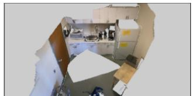
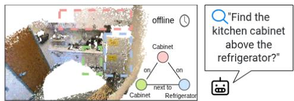
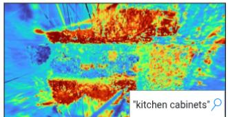
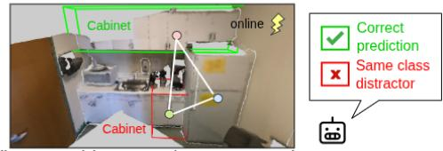
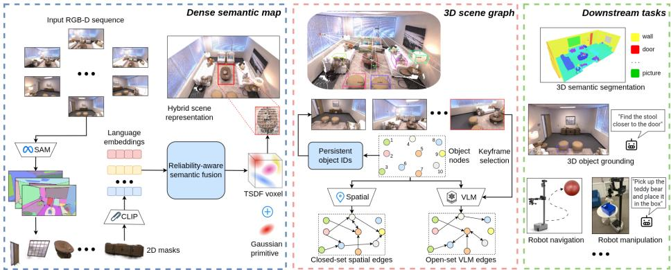
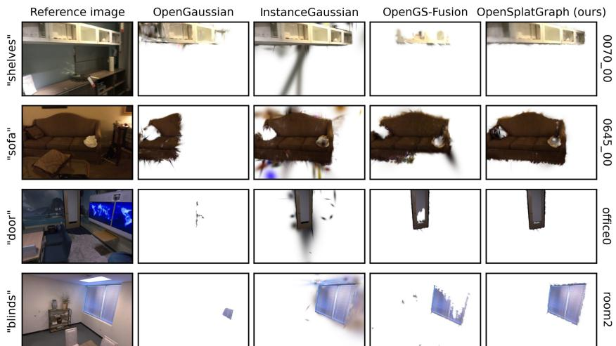
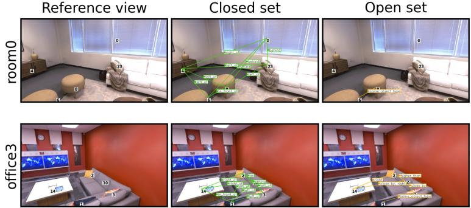
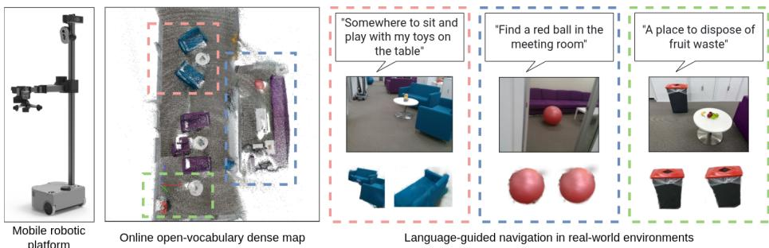

# OpenSplatGraph: From Dense Semantic Maps to Structured Scene Graphs for Open-Vocabulary Robot Perception

Binh Long Nguyen1,2 , Kien Nguyen1 , Clinton Fookes1 , and Peyman Moghadam1,2

School of Electrical Engineering and Robotics, Queensland University of   
Technology (QUT), Brisbane, QLD 4000, Australia {binhlong.nguyen, k.nguyenthanh, c.fookes, peyman.moghadam}@qut.edu.au 2 CSIRO Robotics, CSIRO, Brisbane, QLD 4069, Australia {binhlong.nguyen, peyman.moghadam}@csiro.au

Abstract. Dense 3D mapping with semantic understanding is essential for robotic perception in complex environments. Recent 3D Gaussian Splatting-based mapping approaches enable high-fidelity geometry and eficient open-vocabulary perception, but typically represent semantics as unstructured feature fields that limit object-centric reasoning. In contrast, 3D scene graphs explicitly model objects and their relationships for structured reasoning, but are commonly constructed from sparse geometric representations that do not fully exploit dense semantic maps. In this work, we present OpenSplatGraph, a unified framework that constructs persistent 3D scene graphs directly from an online Gaussianbased open-vocabulary semantic map. The proposed framework augments the dense semantic map with a reliability-aware semantic field that maintains lightweight observation statistics for confidence-aware, queryconditioned object extraction. Extracted object instances are associated with persistent graph nodes, allowing object attributes and relationships to be incrementally updated across observations and queries. By tightly coupling dense semantic mapping with persistent object-centric representations, our framework supports both language-guided object grounding and structured relational reasoning while preserving the geometric fidelity of Gaussian-based mapping. Comprehensive evaluations on standard 3D scene understanding benchmarks and real-world robotic experiments demonstrate that OpenSplatGraph achieves competitive performance for online open-vocabulary perception and downstream robotic tasks. Project page: https://csiro-robotics.github.io/OpenSplatGra

Keywords: 3D Gaussian Splatting · 3D Scene Graph · Open-Vocabulary Scene Understanding · Robot Perception

## 1 Introduction

Dense 3D mapping with semantic understanding is fundamental to robotic perception, supporting navigation, manipulation, and interaction in complex environments [9, 11, 38]. Recent advances in vision-language foundation models [18,

d) Ours: object-centric scene graph grounded in dense mapping  
  
a) 3D scene recontruction

  
c) Sparse 3D scene graph

  
b) Unstructured semantic field  
Fig. 1: Comparison of complementary representations for open-vocabulary 3D scene understanding. Dense semantic maps provide high-fidelity geometry and languagealigned features but represent semantics as unstructured feature fields. Scene graphs explicitly model objects and their relationships for structured reasoning, but typically rely on sparse geometric representations. Our framework bridges these paradigms by constructing a persistent 3D scene graph directly from an online dense semantic map.

24] have further enabled open-vocabulary 3D scene understanding that responds to natural language queries and generalizes to previously unseen objects.

Meanwhile, 3D Gaussian Splatting (3D-GS) [13] has established an eficient representation for high-fidelity 3D reconstruction with real-time rendering. Online GS-based mapping systems [8, 12, 21] integrate Gaussian primitives with Simultaneous Localization and Mapping (SLAM) for geometrically consistent mapping. Building on this representation, open-vocabulary approaches [22, 23, 33, 34] incorporate vision-language features into dense Gaussian maps, enabling language-guided retrieval of scene regions. However, semantics are often represented as unstructured per-voxel or per-Gaussian feature fields rather than explicit object-level entities. Consequently, they provide limited support for objectcentric reasoning and modeling inter-object relationships.

In parallel, 3D Scene Graphs (3DSGs) address this limitation by representing environments as graphs whose nodes correspond to objects and whose edges encode semantic or spatial relationships [1]. Recent advances have extended scene graphs to online incremental systems [10, 32], open-vocabulary reasoning [7, 16, 20], and large-scale robotic applications [5, 35]. Most open-vocabulary scene graph methods construct graphs from RGB-D observations by projecting 2D detections into point clouds or meshes. While these approaches provide compact and interpretable scene abstractions for reasoning, they typically rely on sparse geometric representations that cannot fully exploit the dense geometric and semantic information available in Gaussian-based maps.

As illustrated in Fig. 1, robotic systems benefit from these two complementary scene representations. Dense geometric-semantic maps provide high-fidelity 3D reconstruction for language-grounded perception and localization, whereas object-centric scene graphs explicitly model objects and their relationships for structured reasoning and task planning. However, existing approaches typically emphasize one representation over the other, making it dificult to simultaneously achieve both high-fidelity mapping and structured scene understanding.

In this paper, we propose OpenSplatGraph, a framework that bridges these two paradigms by grounding 3D scene graphs directly in an online open-vocabular 3D-GS semantic map. Rather than treating the dense semantic field and the scene graph as alternative representations, we maintain both throughout operation, allowing each to serve a complementary role. The dense semantic map preserves fine-grained geometric and semantic information for open-vocabulary perception, while the scene graph incrementally accumulates persistent objectcentric knowledge for structured reasoning. To support object construction, we introduce a reliability-aware semantic field that augments the dense semantic map with lightweight observation statistics, enabling confidence-aware ranking of query-conditioned object instances. Extracted object instances are assigned persistent identities and incrementally incorporated into a 3D scene graph, allowing object attributes and relationships to be consistently accumulated across multiple queries. By jointly maintaining these two representations, OpenSplatGraph preserves the geometric fidelity of dense mapping while progressively constructing an interpretable object-centric representation for language grounding, relational reasoning, and downstream robotic tasks.

Our contributions are summarized as follows:

– We introduce OpenSplatGraph, a unified framework that constructs persistent 3D scene graphs directly from online open-vocabulary Gaussian semantic maps, enabling high-fidelity dense mapping and structured scene understanding within a single system.

We propose a reliability-aware semantic field that leverages lightweight pervoxel observation statistics for robust query-conditioned object extraction under partial observations and semantic ambiguity.

– We design a scene graph construction strategy that associates extracted object instances with persistent identities and incrementally accumulates object-centric knowledge across queries for structured relational reasoning.

– We validate the framework on standard 3D scene understanding benchmarks and real-world robotic experiments, demonstrating competitive performance for online open-vocabulary perception and downstream robotic tasks.

## 2 Related Work

## 2.1 Open-Vocabulary 3D Scene Understanding

Vision-language foundation models [18, 24] have enabled open-vocabulary 3D scene understanding by aligning visual representations with natural language. Early methods, such as PointCLIP [37] and ConceptFusion [11], leverage language features for point cloud understanding, while LERF [14] extends languageguided retrieval to Neural Radiance Field (NeRF) representations. More recently, 3D-GS [13] has emerged as an eficient representation for open-vocabulary 3D perception and robotic applications [22, 40]. Representative methods, including LangSplat [23], LEGaussian [26], OpenGaussian [33], and InstanceGaussian [17], associate language features with Gaussian primitives for open-vocabulary querying. However, these methods primarily represent semantics as unstructured feature fields, limiting their support for object-centric and relational reasoning.

## 2.2 3D Gaussian-Based Scene Mapping

3D-GS has been integrated into SLAM systems for eficient online dense mapping and high-fidelity rendering. Methods such as SplaTAM [12], MonoGS [21], and GS-ICP SLAM [8] jointly optimize Gaussian representations and camera poses for real-time reconstruction. Subsequent works incorporate semantic information through supervised labels [19, 39] or open-vocabulary features, as demonstrated by OpenGS-Fusion [34]. These approaches provide geometrically accurate and semantically rich maps for robotic perception. However, they primarily focus on online reconstruction and semantic fusion, without explicitly maintaining persistent object-centric representations for structured reasoning and task planning.

## 2.3 3D Scene Graphs

3DSGs [1] represent objects as nodes and their relationships as edges, providing interpretable scene abstractions for planning and human-robot interaction [25, 31]. Recent advances [3] highlight rapid progress from online incremental graph construction [10, 32] to open-vocabulary scene understanding through ConceptGraphs [7], Open3DSG [16], and Clio [20], and large-scale robotic applications [5,35]. These methods typically construct graphs from point clouds or meshes, providing compact object-centric representations for downstream reasoning. Despite these advances, many open-vocabulary approaches infer object relationships from 2D observations using Vision-Language Models (VLM), resulting in graph representations that are weakly grounded in dense 3D geometry.

Recent studies [6,30] have explored grounding scene graphs directly in Gaussian representations. Our work follows this emerging direction but adopts a different architectural perspective. Rather than treating the dense maps and the scene graph as alternative world models, we explicitly maintain both throughout operation. The dense semantic field serves as the geometric and semantic foundation for reliable object extraction, while the scene graph incrementally accumulates object-centric knowledge for structured and relational reasoning.

## 3 Methodology

We propose OpenSplatGraph, a unified framework that jointly maintains a dense open-vocabulary semantic field and a persistent 3D scene graph throughout online operation. The dense semantic field serves as a geometrically consistent foundation for query-conditioned object extraction, while the scene graph incrementally accumulates object-centric knowledge to support structured reasoning across multiple queries. Rather than maintaining a fixed object inventory,

  
Fig. 2: Overview of OpenSplatGraph. Starting from a multi-view RGB-D sequence, the framework incrementally constructs an online open-vocabulary dense semantic map together with a reliability-aware semantic field for robust query-conditioned object extraction. Extracted object instances are then associated across queries and incrementally accumulated into a persistent 3D scene graph. By jointly maintaining the dense semantic field and the scene graph, OpenSplatGraph enables structured relational reasoning while preserving high-fidelity geometric and semantic information for downstream robotic tasks.

OpenSplatGraph extracts objects on demand from language queries by grouping spatially and semantically consistent regions in the semantic field. Extracted instances are associated with persistent graph nodes and enriched with semantic and relational information as the map evolves. In this way, OpenSplatGraph preserves the fidelity of dense semantic mapping while progressively constructing an interpretable scene representation for downstream robotic tasks. An overview of the framework is shown in Fig. 2.

## 3.1 Reliability-Aware Semantic Field

The dense semantic field forms the perception layer of OpenSplatGraph, providing a geometrically consistent representation for query-conditioned object extraction. Built upon an online open-vocabulary Gaussian semantic map, the field maintains fused semantic features together with lightweight reliability statistics that characterize the quality of semantic observations. These statistics regulate semantic fusion and assess the reliability of extracted object candidates, improving robustness under partial visibility, occlusions, and semantic ambiguity.

Semantic Representation. OpenSplatGraph adopts a hybrid semantic mapping framework [34], combining voxel-based Truncated Signed Distance Function (TSDF) geometry with 3D Gaussian primitives. The TSDF supports incremental geometric and semantic fusion, while the Gaussians capture fine scene details and enable high-fidelity rendering. Given posed RGB-D observations, we extract 2D instance masks using SAM [15] and associate them with language-aligned CLIP embeddings [24]. These observations are incrementally integrated into a semantic field that remains consistent across viewpoints and over time.

Formally, the hybrid map is represented by a sparse voxel set $\mathbf { \nabla } \gamma = \{ v _ { j } \} _ { j = 1 } ^ { V } ,$ where each voxel v is associated with a set of Gaussian primitives $\mathcal { G } _ { v }$ . Let d denote the semantic embedding dimension $( \mathrm { e . g . } , d = 5 1 2$ for CLIP). Each voxel stores a fused semantic embedding $F _ { v } \in \mathbb { R } ^ { d }$ , an observation count $c ( v )$ , an accumulated semantic confidence $w ( v )$ , and a 3D coordinate $X _ { v } \in \mathbb { R } ^ { 3 }$ in the global reference frame. For each observed voxel, an incoming semantic embedding $f _ { v }$ with confidence $\omega _ { v }$ is integrated as:

$$
F _ { v } \gets \frac { c ( v ) F _ { v } + \omega _ { v } f _ { v } } { c ( v ) + \omega _ { v } } .\tag{1}
$$

Here, $c ( v )$ controls the contribution of the stored embedding based on the number of prior observations, while $\omega _ { v }$ weights the incoming embedding according to its observation confidence. This mixed weighting scheme reduces the influence of low-confidence observations on the accumulated embedding. After fusion, we update $c ( v )  c ( v ) + 1$ and $w ( v )  w ( v ) + \omega _ { v } ,$ , where the accumulated confidence $w ( v )$ is used for subsequent instance scoring. Given a language query $q ,$ we obtain its normalized text embedding $e ( q ) \in \mathbb { R } ^ { d }$ and compute the voxel-level similarity $s _ { q } ( v ) = \cos ( e ( q ) , F _ { v } )$ . This results in a dense semantic foundation that supports query-conditioned object extraction and subsequent scene graph construction.

Reliability-Aware Semantic Modeling. Semantic fusion over long RGB-D sequences naturally produces observations of varying reliability due to occlusions, partial visibility, and semantic ambiguity. To capture this uncertainty, OpenSplatGraph augments the semantic field with a per-voxel residual semantic disagreement $r ( v )$ . Together with the observation count $c ( v )$ and accumulated confidence $w ( v )$ , it forms the per-voxel statistics:

$$
\mathcal { S } = \left\{ ( c ( v ) , w ( v ) , r ( v ) ) \ | \ v \in \mathcal { V } \right\} .\tag{2}
$$

For each incoming observation, $r ( v )$ is updated using an exponential moving average of the normalized cosine disagreement between the incoming and previously fused semantic embeddings, computed before semantic fusion. The residual is initialized to zero, with a fixed decay factor used throughout the sequence.

Given a candidate object region represented by a voxel subset $\nu _ { k } \subset \nu$ , we define an instance confidence score $C ( \mathcal { V } _ { k } ) \in [ 0 , 1 ]$ that favors well-observed and semantically consistent regions:

$$
C ( \mathcal { V } _ { k } ) = \lambda \cdot \operatorname { t a n h } \Bigl ( \frac { 1 } { | \mathcal { V } _ { k } | } \sum _ { v \in \mathcal { V } _ { k } } \frac { w ( v ) } { \kappa } \Bigr ) + ( 1 - \lambda ) \cdot \operatorname { s a t } _ { [ 0 , 1 ] } \Bigl ( 1 - \frac { 1 } { | \mathcal { V } _ { k } | } \sum _ { v \in \mathcal { V } _ { k } } r ( v ) \Bigr ) ,\tag{3}
$$

where $\lambda \in ( 0 , 1 )$ controls the trade-of between observation strength and semantic stability, $\kappa > 0$ is a normalization constant, and sa $\mathrm { t } _ { [ 0 , 1 ] } ( x ) = \operatorname* { m i n } ( 1 , \operatorname* { m a x } ( 0 , x ) )$ . The confidence score is used solely for ranking and filtering candidate object instances and requires no supervised calibration.

Algorithm 1 Query-conditioned object extraction from voxel similarity scores.   
Require: Query $q ;$ voxel embeddings $F ;$ voxel coordinates $X ;$ voxel stats $s ;$ threshold   
$\delta ;$ clustering params $( r , k _ { \mathrm { m i n } } ) ;$ top-K   
Ensure: Query-conditioned instances $\{ O _ { k } \}$ with voxel set $\nu _ { k } ,$ centroid $\mu _ { k } .$ , AABB,   
score $S _ { k } ,$ , confidence $C _ { k }$   
1: $e \gets$ EncodeText $( q )$ \triangleright normalized text embedding   
2: for $v = 1$ to $V$ do   
3: s(v) \gets co (e, F\_v)   
4: end for   
5: $\mathcal { M }  \{ v \mid s ( v ) > \delta \}$   
6: if $\mathcal { M } = \emptyset$ then   
7: return $\varnothing$   
8: end if   
9: $\mathcal { C } \gets \mathrm { D B S C A N } ( \{ X _ { v } \} _ { v \in \mathcal { M } } ; ~ r , ~ k _ { \operatorname* { m i n } } )$ \triangleright a set of clusters   
10: for all cluster $\nu _ { k } \in \mathcal { C }$ do   
11: $\mu _ { k }  \operatorname* { m e a n } \{ X _ { v } \mid v \in \mathcal { V } _ { k } \}$   
12: $\begin{array} { r } { \mathrm { A A B B } _ { k } \gets \left( \operatorname* { m i n } _ { v \in \mathcal { V } _ { k } } X _ { v } , \operatorname* { m a x } _ { v \in \mathcal { V } _ { k } } X _ { v } \right) } \end{array}$   
13: $S _ { k } \gets \mathrm { m e a n } \{ s ( v ) \ | \ v \in \mathcal { V } _ { k } \}$   
14: $C _ { k } \gets \mathrm { I n s t a n c e { C o n f i d e n c e } } ( \mathcal { V } _ { k } ; \mathcal { S } )$ \triangleright computed via Eq. (3)   
15: $O _ { k } \gets ( \mathcal { V } _ { k } , \mu _ { k } , \mathrm { A A B B } _ { k } , S _ { k } , C _ { k } )$   
16: end for   
17: $\{ O _ { k } \} \gets \mathrm { R a n k A n d S e l e c t } ( \{ O _ { k } \} , K )$   
18: return $\{ O _ { k } \}$

Query-conditioned Object Extraction. Given a language query $q ,$ we extract a set of object instances $\mathcal { O } _ { q } = \{ O _ { 1 } , . . . , O _ { K } \}$ from the voxel-level similarity field $s _ { q } ( v )$ . Each instance corresponds to a spatially coherent voxel cluster with associated semantic and geometric attributes. We first threshold the similarity field using $m _ { q } ( v ) = \mathbb { I } [ s _ { q } ( v ) > \delta ]$ to obtain the corresponding voxel coordinates $X _ { q } = \{ X _ { v } \mid \bar { m _ { q } } ( v ) = 1 \}$ . We then cluster $X _ { q }$ in Euclidean space using DBSCAN with neighborhood radius r and minimum number of points $k _ { \mathrm { m i n } }$ . The radius is set proportional to the voxel size to ensure scale consistency across maps.

For each resulting voxel cluster $\nu _ { k }$ , we compute its centroid $\begin{array} { r } { \mu _ { k } = \frac { 1 } { | { \mathcal V } _ { k } | } \sum _ { v \in { \mathcal V } _ { k } } X _ { v } , } \end{array}$ axis-aligned bounding box (AABB), instance score $S _ { k }$ as the mean voxel-level similarity, and reliability-based confidence $C ( \nu _ { k } )$ from Eq. (3). Candidate instances are ranked by a weighted combination of $S _ { k }$ and $C ( \nu _ { k } )$ , prioritizing semantic similarity and using cluster size as a tie-breaker. The top-ranked candidates are retained for subsequent processing. The complete extraction procedure is summarized in Alg. 1. Importantly, object extraction is conditioned on the language query, whereas the underlying semantic field remains persistent and is incrementally updated during mapping.

## 3.2 Persistent 3D Scene Graph Construction

The persistent scene graph forms the reasoning layer of OpenSplatGraph, incrementally accumulating object-centric knowledge extracted from the reliabilityaware semantic field. Rather than reconstructing a scene graph for every query, confidence-ranked object instances are associated with existing graph nodes whenever possible, enabling incremental updates to node attributes and interobject relations. The resulting graph provides a compact and interpretable representation for structured reasoning while preserving the underlying dense semantic field for perception. We represent the scene as a graph $G = ( \mathcal { N } , \mathcal { E } )$ , where nodes N define object instances and edges $\mathcal { E }$ encode inter-object relations.

Algorithm 2 Persistent object association via label-aware centroid matching.   
Require: New instances $\{ O _ { i } \}$ with label $\ell _ { i }$ and centroid $\mu _ { i } ;$ previous instances $\{ \hat { O } _ { j } \}$   
with identifier $\mathrm { i } \hat { \mathrm { d } } _ { j }$ , label $\hat { \ell } _ { j } .$ , centroid $\hat { \mu } _ { j } ;$ distance threshold $\tau$   
Ensure: Assigned persistent IDs for all $O _ { i }$   
1: Prev $[ \ell ] \gets \mathsf { \bar { \{ O } }  _ { j } \mathsf { \Gamma } | \bar { \ell } _ { j } = \ell \}$ \triangleright group previous instances by label   
2: Mark all previous IDs as unused   
3: for all new instance $O _ { i }$ do   
4: Candidates $ \{ \hat { O } _ { j } \in \operatorname { P r e v } [ \ell _ { i } ] \mid { \hat { \mathrm { i } } } { \hat { \mathrm { d } } } _ { j }$ unused, $\| \mu _ { i } - \hat { \mu } _ { j } \| _ { 2 } \leq \tau \}$   
5: if Candidates $\neq \emptyset$ then   
6: $j ^ { \star } \gets$ arg mi $^ { 1 } \hat { O } _ { j }$ ∈Candidates $\| \mu _ { i } - \hat { \mu } _ { j } \|$ 2   
7: $O _ { i } . \mathrm { i d }  \mathrm { i } \hat { \mathrm { d } } _ { j } ,$   
8: Mark $\hat { \mathrm { i d } } _ { j ^ { \star } }$ as used   
9: else   
10: $O _ { i } . \mathrm { i d }  \mathrm { N e w I D ( ) }$   
11: end if   
12: end for   
13: return $\{ O _ { i } \}$

Object Association. To maintain persistent object identities during mapping, OpenSplatGraph maintains a set of previously extracted object instances and associates newly extracted objects with this set before updating the scene graph.

Let $\hat { \mathcal { O } } = \{ \hat { O } _ { j } \}$ denote the set of previously extracted object instances, each associated with a persistent identifier (ID), semantic label, and centroid. For each newly extracted instance $O _ { i }$ with label $\ell _ { i }$ and centroid $\mu _ { i } .$ , candidate matches are restricted to instances in $\hat { \mathcal { O } }$ with the same semantic label. Among these candidates, the nearest unmatched centroid within a distance threshold $\tau$ is selected. If a valid match is found, its persistent identifier is reused; otherwise, a new identifier is assigned. This one-to-one association preserves object identities across extraction steps and supports incremental graph updates. The complete association procedure is summarized in Alg. 2.

Nodes. Each graph node $N _ { i } \in \mathcal N$ represents an associated object instance $O _ { i }$ and stores its persistent identifier, semantic label, centroid, axis-aligned bounding box (AABB), confidence score, and other geometric attributes. As new observations become available, node attributes are updated while preserving the persistent identifier. Optionally, descriptive captions can be attached by selecting informative object views and applying a lightweight vision-language captioning model [7]. Since caption generation is decoupled from graph construction, it can be performed asynchronously without afecting the online mapping pipeline.

Edges. Edges encode spatial or semantic relationships between graph nodes. We distinguish two complementary relation types: (i) online spatial relations inferred directly from object geometry, and (ii) optional open-set semantic relations inferred asynchronously using a VLM. This separation enables eficient low-latency access to spatial relations for robot planning while allowing richer semantic knowledge to be incorporated without interrupting online mapping.

1) Online Spatial Relations: Spatial relations are inferred online using simple geometric tests based on object centroids and AABBs. We consider relations such as near (centroid distance below a threshold), on/under (suficient horizontal overlap with limited vertical separation), inside (bounding-box containment), and relative ordering relations derived from centroid ofsets in the global coordinate frame. Each spatial relation is assigned a confidence score computed from normalized geometric measures.

2) Open-set Semantic Relations: To capture relations that cannot be reliably inferred from geometry alone, OpenSplatGraph optionally enriches the scene graph using a VLM. This process is independent of object extraction and graph construction, and is applied only to augment the graph with open-set semantic relations. Specifically, we render a set of keyframes following [8] from the reconstructed scene with persistent instance identifiers overlaid near visible objects, and query the VLM to predict directed relation triplets $( i , r , j )$ . Predictions from individual keyframes are aggregated through multi-view voting. For each object pair, edge confidence is computed as the ratio of positive relation predictions to the number of keyframes in which both objects are co-visible. Relations with sufficient multi-view support are retained, reducing viewpoint-dependent ambiguity while improving the robustness of semantic relation prediction.

## 4 Experiments

We evaluate OpenSplatGraph from three complementary perspectives corresponding to the proposed dual-representation architecture. First, we assess the reliability-aware semantic field through open-vocabulary 3D semantic segmentation (Sec. 4.2). Next, we evaluate the persistent scene graph on 3D object grounding from relational natural language queries (Sec. 4.3). Finally, we demonstrate the practical utility of the complete system on a mobile robotic platform in real-world environments (Sec. 4.4). Ablation studies further examine the contributions of individual components (Sec. 4.5).

## 4.1 Implementation Details

We summarize the key implementation details of the proposed framework. For 2D feature extraction, SAM [15] is used on benchmark datasets, while Mobile-SAMv2 [36] is adopted for real-world robotic experiments to enable real-time operation. The resulting segmentation masks are then encoded using the Open-CLIP ViT-B/16 model to obtain language-aligned semantic embeddings. For query-conditioned object extraction, DBSCAN clustering is performed with radius $r \ = \ \beta$ · voxel\_size, where voxel\_size $= \ 0 . 0 5 \mathrm { m }$ and $\beta = 1 . 5$ . We set $k _ { \operatorname* { m i n } { } } = 5$ and discard clusters containing fewer than min\_voxels = 10 voxels. The semantic residual $r ( v )$ is updated with decay factor $\alpha = 0 . 9 .$ . Reliabilityaware confidence estimation uses $\lambda = 0 . 6$ and $\kappa = 5 . 0$ . Object association employs label-aware centroid matching with a distance threshold of $\tau = 0 . 3 5 \mathrm { m }$ When open-set semantic relations are enabled, GPT-4o-mini predicts relation triplets, which are retained with at least three votes across up to 30 keyframes.

Table 1: Quantitative comparison of 3D semantic segmentation on ScanNet and Replica datasets. (Best and second-best results are highlighted in bold and underlined.)
<table><tr><td rowspan="3">Mode Method</td><td colspan="4">ScanNet</td><td colspan="4">Replica</td></tr><tr><td>ScanNet20</td><td></td><td>NYUv2-40</td><td></td><td>ScanNet20</td><td>NYUv2-40</td><td></td><td></td></tr><tr><td>mIoU↑ mAcc↑ mIoU↑ mAcc↑ FPS↑</td><td></td><td></td><td></td><td>mIoU↑ mAcc↑ mIoU↑ mAcc↑ FPS↑</td><td></td><td></td><td></td></tr><tr><td>LangSplat [23]</td><td>3.78</td><td>9.11 3.46</td><td>8.43</td><td></td><td>3.84 8.75</td><td>3.56</td><td>8.26</td><td></td></tr><tr><td>Offline OpenGaussian [33]</td><td>30.08</td><td>45.59 27.53</td><td>42.17</td><td></td><td>25.63 36.24</td><td>23.45</td><td>31.59</td><td></td></tr><tr><td>InstanceGaussian [17]</td><td>40.32</td><td>55.78 36.88</td><td>52.91</td><td></td><td>32.24 45.99</td><td>29.88</td><td>41.01</td><td></td></tr><tr><td>ConceptFusion [11]</td><td>12.80</td><td>22.62 11.72</td><td>20.93</td><td>0.52</td><td>13.05 29.89</td><td>11.51</td><td>27.66</td><td>0.49</td></tr><tr><td>Online OpenGS-Fusion [34]</td><td>27.09</td><td>39.62 24.69</td><td>35.95</td><td>1.22</td><td>34.84</td><td>45.15 31.98</td><td>41.93</td><td>1.02</td></tr><tr><td>OpenSplatGraph (Ours)</td><td>36.75</td><td>53.82 33.52</td><td>50.64</td><td>1.20</td><td>35.37</td><td>47.67 32.87</td><td>42.85</td><td>1.02</td></tr></table>

## 4.2 3D Semantic Segmentation

Settings. (i) Task: We evaluate the quality of the proposed reliability-aware semantic field through open-vocabulary 3D semantic segmentation. Given a language query, object instances are extracted from the dense semantic field and compared against ground-truth semantic annotations. (ii) Baselines: We compare our approach against recent 3D-GS-based open-vocabulary methods, including LangSplat [23], OpenGaussian [33], and InstanceGaussian [17]. In addition, point cloud-based methods, including ConceptFusion [11] and OpenGS-Fusion [34], are compared to assess performance under online mapping settings. For all baselines, we use the oficial hyperparameters or tune them on validation scenes for fair comparison. (iii) Metrics: Experiments are conducted on Scan-Net [4] and Replica [28] with ground-truth 3D semantic annotations. Performance is reported using mIoU and mAcc. Following common practice, Replica’s 88 semantic categories are remapped to the ScanNet20 [4] and NYUv2-40 [27] label sets to ensure consistent evaluation.

Results. Table 1 reports quantitative results for open-vocabulary 3D semantic segmentation on ScanNet and Replica. Among the ofline methods, Instance-Gaussian achieves the best performance, benefiting from its bottom-up instance aggregation strategy [17]. Although OpenSplatGraph is designed for online semantic mapping rather than ofline segmentation, it achieves competitive performance with InstanceGaussian while consistently outperforming other Gaussianbased methods, including LangSplat and OpenGaussian. More importantly, under the online setting, OpenSplatGraph consistently surpasses ConceptFusion and OpenGS-Fusion on both mIoU and mAcc, demonstrating that the proposed reliability-aware semantic field produces more accurate and geometrically coherent object instances.

  
Fig. 3: Qualitative results of 3D semantic segmentation on ScanNet and Replica datasets.

Figure 3 presents qualitative comparisons on both datasets. Compared with prior methods, OpenSplatGraph produces more spatially coherent object instances with better alignment to object boundaries, particularly for thin structures and partially observed objects such as “shelves”, “door”, and “blinds”. Modeling observation reliability efectively suppresses fragmented and noisy predictions. These qualitative observations are consistent with the quantitative results and demonstrate that the proposed reliability-aware semantic field provides a stronger foundation for persistent scene graph construction.

## 4.3 3D Object Grounding

Settings. (i) Task: We evaluate the persistent scene graph through 3D object grounding under complex natural language queries. Following the Concept-Graphs protocol [7], we consider three types of queries: a) descriptive (e.g., “a pillow on top of the sofa”), b) afordance (e.g., “something to tell the time”), and c) negation (e.g., “something to sit on other than a chair”). (ii) Baselines: We compare against ConceptGraphs [7], the only existing open-vocabulary 3D scene graph method with a publicly available grounding benchmark and evaluation protocol on Replica [28]. We adopt its query set and protocol for direct comparison, evaluating both CLIP retrieval based on query–embedding similarity and LLM retrieval based on structured node descriptions. (iii) Metrics: Performance is evaluated using the standard Recall@k (R@k) metric [29] following the ConceptGraphs protocol.

Table 2: Quantitative comparison of 3D object grounding on Replica across diferent query types and retrieval strategies. (ConceptGraphs results are reported from [7].)
<table><tr><td rowspan=3 colspan=1>Query Type</td><td rowspan=1 colspan=2>CLIP Retrieval</td><td rowspan=1 colspan=2>LLM Retrieval</td></tr><tr><td rowspan=1 colspan=1>ConceptGraphs</td><td rowspan=1 colspan=1>OpenSplatGraph</td><td rowspan=1 colspan=1>ConceptGraphs</td><td rowspan=1 colspan=1>OpenSplatGraph</td></tr><tr><td rowspan=1 colspan=1>R@1 R@2R@3</td><td rowspan=1 colspan=1>R@1R@2R@3</td><td rowspan=1 colspan=1>R@1R@2R@3</td><td rowspan=1 colspan=1>R@1 R@2R@3</td></tr><tr><td rowspan=1 colspan=1>Descriptive</td><td rowspan=1 colspan=1>0.59 0.82 0.86</td><td rowspan=1 colspan=1>0.45 0.82 0.92</td><td rowspan=1 colspan=1>0.610.64 0.64</td><td rowspan=1 colspan=1>0.50 0.59 0.69</td></tr><tr><td rowspan=2 colspan=1>AffordanceNegation</td><td rowspan=1 colspan=1>0.43 0.57 0.63</td><td rowspan=1 colspan=1>0.540.610.79</td><td rowspan=1 colspan=1>0.57 0.63 0.66</td><td rowspan=2 colspan=1>0.610.710.750.80 0.89 0.94</td></tr><tr><td rowspan=1 colspan=1>0.26 0.60 0.71</td><td rowspan=1 colspan=1>0.510.640.82</td><td rowspan=1 colspan=1>0.80 0.89 0.97</td></tr></table>

  
Fig. 4: Qualitative visualization of open-vocabulary 3D scene graph construction on the Replica dataset. For visualization, asymmetric relations are displayed from nodes with lower instance IDs to those with higher IDs.

Results. Table 2 reports quantitative results for 3D object grounding on the Replica dataset across three query categories and two retrieval strategies. Overall, OpenSplatGraph achieves competitive grounding performance and consistently improves Recall@k over ConceptGraphs in several retrieval settings. The largest improvements are observed for the afordance and negation queries, which require reasoning beyond direct semantic similarity. These gains demonstrate the benefit of maintaining a persistent object-centric scene graph, where explicit object identities and inter-object relations provide complementary information to the underlying dense semantic field during language grounding.

Figure 4 visualizes representative scene graphs predicted by OpenSplatGraph on two Replica scenes. For clarity, the 3D scene graphs are projected into 2D graph visualizations from a reference viewpoint. The predicted object relationships are spatially and semantically consistent with the underlying scene geometry. In addition, open-set relation prediction enables diverse semantic predicates, such as “same object type”, that cannot be predefined by fixed relation vocabularies, further enriching the scene graph for downstream reasoning. Additional direct scene-graph evaluation is provided in the supplementary material.

## 4.4 Real-world Robotic Experiments

We evaluate the practical utility of OpenSplatGraph in a real-world indoor environment using a Stretch 3 (Hello Robot) mobile manipulator equipped with an Intel RealSense D435i RGB-D camera and an arm with a gripper. During exploration, the robot incrementally scans the environment to acquire RGB-D observations while constructing an online Gaussian semantic map. Following OpenGS-Fusion [34], camera poses are estimated using ORB-SLAM3 [2]. The proposed reliability-aware semantic field and persistent scene graph are then built online from the fused semantic map to support language-guided robotic perception.

  
Fig. 5: Real-world robotic navigation experiments with OpenSplatGraph. The framework constructs an open-vocabulary semantic map online and supports languageguided navigation in indoor environments. For each query, we visualize the rendered target object from the reference view and from an additional arbitrary viewpoint.

To demonstrate the efectiveness of the proposed perception framework for downstream robotics, we evaluate two representative tasks, as illustrated in Fig. 2 and Fig. 5. In a navigation task, the robot receives abstract natural language queries that may include semantic, relational, or functional descriptions. Using the persistent scene graph, the queried object is grounded in the reconstructed environment, after which the robot plans and executes navigation toward the target location. In a manipulation task, the robot performs language-guided pick-and-place by grounding an object query (e.g., “teddy bear”) within the persistent scene graph, localizing the corresponding object in the dense semantic map, and executing grasping and placement into a designated container. These experiments illustrate that OpenSplatGraph provides a unified structured and open-vocabulary perception backbone that supports closed-loop robotic navigation and manipulation in real-world environments. A demonstration video of the complete real-world experiments is included in the supplementary material.

## 4.5 Ablation Study

Table 3 presents a progressive ablation of the proposed framework. Starting from a baseline model, introducing reliability-aware semantic modeling significantly improves segmentation performance, demonstrating that modeling observation quality leads to more accurate and coherent object instances. Adding persistent object identities does not afect segmentation metrics but improves object grounding by enabling consistent object association across multiple queries. In this setting, object grounding relies solely on semantic similarity without exploiting relational information. Finally, incorporating scene graph reasoning yields the largest gain in relational grounding, highlighting the benefit of explicit inter-object modeling. Overall, the full framework achieves the best performance across all metrics, validating the efectiveness of the proposed design.

Table 3: Progressive ablation of OpenSplatGraph components.
<table><tr><td>Configuration</td><td>mIoU↑ mAcc↑ R@1↑</td><td></td></tr><tr><td>Baseline</td><td>30.97</td><td>42.39</td></tr><tr><td>+ Reliability-aware semantic modeling</td><td>36.06</td><td>50.74</td></tr><tr><td>+ Persistent object association</td><td>36.06</td><td>50.74 0.36</td></tr><tr><td>+ Scene graph reasoning (Full)</td><td></td><td>36.06 50.74 0.50</td></tr></table>

## 4.6 Limitations

While OpenSplatGraph enables persistent scene graph construction from an online open-vocabulary semantic map, several limitations remain. First, object extraction is query-conditioned, and the framework does not maintain a complete query-independent object inventory. Instead, object instances are accumulated incrementally as new queries are issued. Second, object association relies on lightweight semantic and geometric cues, which may become less reliable in highly cluttered scenes or under severe viewpoint changes. Finally, open-set semantic relations are inferred using an external VLM, introducing additional computational overhead and dependence on the model’s reasoning capability. Addressing these limitations through more robust object association and queryindependent proposal mechanisms is a promising direction for future work.

## 5 Conclusion

We presented OpenSplatGraph, a unified framework that jointly maintains a reliability-aware open-vocabulary semantic field and a persistent 3D scene graph for online robotic perception. The proposed semantic field enables robust queryconditioned object extraction from dense Gaussian-based maps, while the persistent scene graph incrementally accumulates object-centric knowledge to support structured relational reasoning. Extensive experiments on standard benchmarks demonstrate competitive performance in open-vocabulary semantic segmentation and 3D object grounding, and real-world robotic experiments validate the efectiveness of the proposed framework for language-guided navigation and manipulation. Future work will address the discussed limitations and explore integration with multi-step task planning in more complex environments.

Acknowledgements This work was supported in part by the Australian Research Council Discovery Project under Grant DP250103634, and in part by the Commonwealth Scientific and Industrial Research Organisation (CSIRO). The authors acknowledge continued support from the CSIRO’s Embodied AI Cluster.

## References

1. Armeni, I., He, Z.Y., Gwak, J., Zamir, A.R., Fischer, M., Malik, J., Savarese, S.: 3d scene graph: A structure for unified semantics, 3d space, and camera. In: Proceedings of the IEEE/CVF international conference on computer vision. pp. 5664–5673 (2019)

2. Campos, C., Elvira, R., Rodríguez, J.J.G., Montiel, J.M., Tardós, J.D.: Orb-slam3: An accurate open-source library for visual, visual–inertial, and multimap slam. IEEE transactions on robotics 37(6), 1874–1890 (2021)

3. Catalano, I., Zumaya, C.C., Placed, J.A., Civera, J., Bessa, W.M., Peña-Queralta, J.: 3d scene graphs in robotics: A unified representation bridging geometry, semantics, and action. Authorea Preprints (2025)

4. Dai, A., Chang, A.X., Savva, M., Halber, M., Funkhouser, T., Nießner, M.: Scannet: Richly-annotated 3d reconstructions of indoor scenes. In: Proceedings of the IEEE conference on computer vision and pattern recognition. pp. 5828–5839 (2017)

5. Deng, Y., Wang, J., Zhao, J., Tian, X., Chen, G., Yang, Y., Yue, Y.: Opengraph: Open-vocabulary hierarchical 3d graph representation in large-scale outdoor environments. IEEE Robotics and Automation Letters 9(10), 8402–8409 (2024)

6. Ge, L., Zhu, X., Yang, Z., Li, X.: Dynamicgsg: Dynamic 3d gaussian scene graphs for environment adaptation. In: 2025 IEEE/RSJ International Conference on Intelligent Robots and Systems (IROS). pp. 2232–2239. IEEE (2025)

7. Gu, Q., Kuwajerwala, A., Morin, S., Jatavallabhula, K.M., Sen, B., Agarwal, A., Rivera, C., Paul, W., Ellis, K., Chellappa, R., et al.: Conceptgraphs: Openvocabulary 3d scene graphs for perception and planning. In: 2024 IEEE International Conference on Robotics and Automation (ICRA). pp. 5021–5028. IEEE (2024)

8. Ha, S., Yeon, J., Yu, H.: RGBD gs-icp SLAM. In: European Conference on Computer Vision. pp. 180–197 (2024)

9. Huang, C., Mees, O., Zeng, A., Burgard, W.: Visual language maps for robot navigation. In: 2023 IEEE International Conference on Robotics and Automation (ICRA). pp. 10608–10615. IEEE (2023)

10. Hughes, N., Chang, Y., Carlone, L.: Hydra: A real-time spatial perception system for 3d scene graph construction and optimization. arXiv preprint arXiv:2201.13360 (2022)

11. Jatavallabhula, K., Kuwajerwala, A., Gu, Q., Omama, M., Iyer, G., Saryazdi, S., Chen, T., Maalouf, A., Li, S., Keetha, N., et al.: Conceptfusion: Open-set multimodal 3d mapping (2023)

12. Keetha, N., Karhade, J., Jatavallabhula, K.M., Yang, G., Scherer, S., Ramanan, D., Luiten, J.: Splatam: Splat track & map 3d gaussians for dense rgb-d slam. In: Proceedings of the IEEE/CVF conference on computer vision and pattern recognition. pp. 21357–21366 (2024)

13. Kerbl, B., Kopanas, G., Leimkühler, T., Drettakis, G.: 3d gaussian splatting for real-time radiance field rendering. ACM Trans. Graph. 42(4), 139–1 (2023)

14. Kerr, J., Kim, C.M., Goldberg, K., Kanazawa, A., Tancik, M.: Lerf: Language embedded radiance fields. In: Proceedings of the IEEE/CVF International Conference on Computer Vision. pp. 19729–19739 (2023)

15. Kirillov, A., Mintun, E., Ravi, N., Mao, H., Rolland, C., Gustafson, L., Xiao, T., Whitehead, S., Berg, A.C., Lo, W.Y., et al.: Segment anything. In: Proceedings of the IEEE/CVF international conference on computer vision. pp. 4015–4026 (2023)

16. Koch, S., Vaskevicius, N., Colosi, M., Hermosilla, P., Ropinski, T.: Open3dsg: Open-vocabulary 3d scene graphs from point clouds with queryable objects and open-set relationships. In: Proceedings of the IEEE/CVF Conference on Computer Vision and Pattern Recognition. pp. 14183–14193 (2024)

17. Li, H., Wu, Y., Meng, J., Gao, Q., Zhang, Z., Wang, R., Zhang, J.: Instancegaussian: Appearance-semantic joint gaussian representation for 3d instance-level perception. In: Proceedings of the Computer Vision and Pattern Recognition Conference. pp. 14078–14088 (2025)

18. Li, J., Li, D., Xiong, C., Hoi, S.: Blip: Bootstrapping language-image pre-training for unified vision-language understanding and generation. In: International conference on machine learning. pp. 12888–12900. PMLR (2022)

19. Li, M., Liu, S., Zhou, H., Zhu, G., Cheng, N., Deng, T., Wang, H.: Sgs-slam: Semantic gaussian splatting for neural dense slam. In: European Conference on Computer Vision. pp. 163–179. Springer (2024)

20. Maggio, D., Chang, Y., Hughes, N., Trang, M., Grifith, D., Dougherty, C., Cristofalo, E., Schmid, L., Carlone, L.: Clio: Real-time task-driven open-set 3d scene graphs. IEEE Robotics and Automation Letters 9(10), 8921–8928 (2024)

21. Matsuki, H., Murai, R., Kelly, P.H., Davison, A.J.: Gaussian splatting slam. In: Proceedings of the IEEE/CVF conference on computer vision and pattern recognition. pp. 18039–18048 (2024)

22. Nguyen, B.L., Nguyen, K., Sridharan, S., Fookes, C., Moghadam, P.: Ilov3splat: Instance-level open-vocabulary 3d scene understanding in gaussian splatting. In: International Conference on Pattern Recognition. pp. 251–266. Springer (2026)

23. Qin, M., Li, W., Zhou, J., Wang, H., Pfister, H.: Langsplat: 3d language gaussian splatting. In: Proceedings of the IEEE/CVF Conference on Computer Vision and Pattern Recognition. pp. 20051–20060 (2024)

24. Radford, A., Kim, J.W., Hallacy, C., Ramesh, A., Goh, G., Agarwal, S., Sastry, G., Askell, A., Mishkin, P., Clark, J., et al.: Learning transferable visual models from natural language supervision. In: International conference on machine learning. pp. 8748–8763. PmLR (2021)

25. Rana, K., Haviland, J., Garg, S., Abou-Chakra, J., Reid, I., Suenderhauf, N.: SayPlan: Grounding Large Language Models using 3D Scene Graphs for Scalable Robot Task Planning. In: 7th Annual Conference on Robot Learning

26. Shi, J.C., Wang, M., Duan, H.B., Guan, S.H.: Language embedded 3d gaussians for open-vocabulary scene understanding. In: Proceedings of the IEEE/CVF Conference on Computer Vision and Pattern Recognition. pp. 5333–5343 (2024)

27. Silberman, N., Hoiem, D., Kohli, P., Fergus, R.: Indoor segmentation and support inference from rgbd images. In: European conference on computer vision. pp. 746– 760. Springer (2012)

28. Straub, J., Whelan, T., Ma, L., Chen, Y., Wijmans, E., Green, S., et al.: The replica dataset: A digital replica of indoor spaces. arXiv preprint arXiv:1906.05797 (2019)

29. Wald, J., Dhamo, H., Navab, N., Tombari, F.: Learning 3d semantic scene graphs from 3d indoor reconstructions. In: Proceedings of the IEEE/CVF Conference on Computer Vision and Pattern Recognition. pp. 3961–3970 (2020)

30. Wang, X., Yang, D., Gao, Y., Yue, Y., Yang, Y., Fu, M.: Gaussiangraph: 3d gaussian-based scene graph generation for open-world scene understanding. In: 2025 IEEE/RSJ International Conference on Intelligent Robots and Systems (IROS). pp. 4091–4098. IEEE (2025)

31. Werby, A., Huang, C., Büchner, M., Valada, A., Burgard, W.: Hierarchical openvocabulary 3d scene graphs for language-grounded robot navigation. In: First Workshop on Vision-Language Models for Navigation and Manipulation at ICRA 2024 (2024)

32. Wu, S.C., Wald, J., Tateno, K., Navab, N., Tombari, F.: Scenegraphfusion: Incremental 3d scene graph prediction from rgb-d sequences. In: Proceedings of the IEEE/CVF Conference on Computer Vision and Pattern Recognition. pp. 7515– 7525 (2021)

33. Wu, Y., Meng, J., Li, H., Wu, C., Shi, Y., Cheng, X., Zhao, C., Feng, H., Ding, E., Wang, J., et al.: Opengaussian: Towards point-level 3d gaussian-based open vocabulary understanding. Advances in Neural Information Processing Systems 37, 19114–19138 (2024)

34. Yang, D., Wang, X., Gao, Y., Liu, S., Ren, B., Yue, Y., Yang, Y.: Opengs-fusion: Open-vocabulary dense mapping with hybrid 3d gaussian splatting for refined object-level understanding. In: 2025 IEEE/RSJ International Conference on Intelligent Robots and Systems (IROS). pp. 21135–21142. IEEE (2025)

35. Yin, H., Xu, X., Wu, Z., Zhou, J., Lu, J.: Sg-nav: Online 3d scene graph prompting for llm-based zero-shot object navigation. Advances in neural information processing systems 37, 5285–5307 (2024)

36. Zhang, C., Han, D., Zheng, S., Choi, J., Kim, T.H., Hong, C.S.: Mobilesamv2: Faster segment anything to everything. arXiv preprint arXiv:2312.09579 (2023)

37. Zhang, R., Guo, Z., Zhang, W., Li, K., Miao, X., Cui, B., Qiao, Y., Gao, P., Li, H.: Pointclip: Point cloud understanding by clip. In: Proceedings of the IEEE/CVF conference on computer vision and pattern recognition. pp. 8552–8562 (2022)

38. Zhou, G., Hong, Y., Wu, Q.: Navgpt: Explicit reasoning in vision-and-language navigation with large language models. In: Proceedings of the AAAI Conference on Artificial Intelligence. vol. 38, pp. 7641–7649 (2024)

39. Zhu, S., Qin, R., Wang, G., Liu, J., Wang, H.: Semgauss-slam: Dense semantic gaussian splatting slam. In: 2025 IEEE/RSJ International Conference on Intelligent Robots and Systems (IROS). pp. 21174–21181. IEEE (2025)

40. Zieliński, M., Hall, D., Belter, D., Moghadam, P.: Neo: Nerf it once, edit it many times for continuous object manipulation. IEEE Robotics and Automation Letters (2026)

# OpenSplatGraph: From Dense Semantic Maps to Structured Scene Graphs for Open-Vocabulary Robot Perception Supplementary Material

## A Additional 3D Semantic Segmentation Results

We provide additional comparisons with GaussianGraph [30] and DynamicGSG [6] for open-vocabulary 3D semantic segmentation on ScanNet and Replica. Table 4 reports the results alongside OpenSplatGraph. Compared with GaussianGraph, OpenSplatGraph achieves higher mIoU on both datasets. DynamicGSG uses a diferent class and evaluation mapping; therefore, its Replica results are included for reference rather than direct comparison.

Table 4: Additional open-vocabulary 3D semantic segmentation results on ScanNet and Replica. †DynamicGSG uses a diferent evaluation mapping.
<table><tr><td rowspan="2">Method</td><td colspan="2">ScanNet</td><td colspan="2">Replica</td></tr><tr><td>mIoU↑</td><td>mAcc↑</td><td>mIoU↑</td><td>mAcc↑</td></tr><tr><td>GaussianGraph [30]</td><td>31.09</td><td>48.91</td><td>31.18</td><td>49.14</td></tr><tr><td>DynamicGSG [6]</td><td></td><td></td><td>31.06†</td><td>54.04†</td></tr><tr><td>OpenSplatGraph (Ours)</td><td>36.75</td><td>53.82</td><td>35.37</td><td>47.67</td></tr></table>

## B Direct Scene-Graph Evaluation

To directly evaluate graph correctness and identity persistence, we compare OpenSplatGraph with ConceptGraphs [7]. Following ConceptGraphs, we report node precision for object instances, edge precision for predicted inter-object relations, and duplicate-node rate to assess identity consistency across sequential observations.

Table 5: Direct scene-graph evaluation against ConceptGraphs.
<table><tr><td>Method</td><td>Node Prec.↑</td><td>Edge Prec.↑</td><td>Dup. Rate (%)↓</td></tr><tr><td>ConceptGraphs [7]</td><td>0.71</td><td>0.88</td><td>6.77</td></tr><tr><td>OpenSplatGraph (Ours)</td><td>0.73</td><td>0.91</td><td>5.94</td></tr></table>

As shown in Table 5, OpenSplatGraph achieves higher node and edge precision while reducing the duplicate-node rate compared to ConceptGraphs. These results complement the object grounding evaluation by directly assessing graph correctness and identity consistency.