# PDB: Point-Based Deformation Blending for Facial Animation Retargeting

SIHUN CHA, Visual Media Lab, KAIST, Republic of Korea HYEONSEUNG SHIN, Visual Media Lab, KAIST, Republic of Korea SUAH YU, Visual Media Lab, KAIST, Republic of Korea JUNYONG NOH, Visual Media Lab, KAIST, Republic of Korea

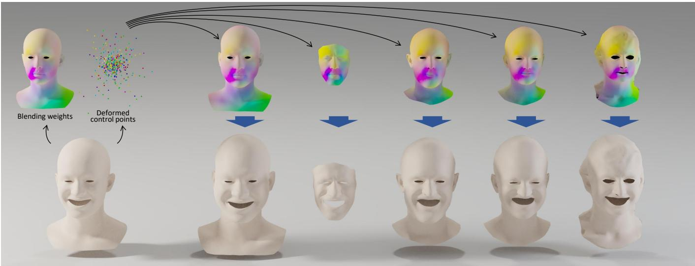  
Fig. 1. PDB retargets facial expressions by combining deformed control points predicted from the source expression with localized weights predicted from the target shape, enabling direct retargeting across diverse identities. The weights are visualized by assigning a random color to each control point and blending according to the predicted weight. (face models from BIWI [10], ICT [19], COMA [33] and Multiface [42])

Mesh-agnostic facial animation retargeting methods enable expression transfer across meshes with diferent structures. However, preserving the intended expressions while avoiding local surface artifacts remains challenging: dense per-vertex displacement predictions can exhibit surface noise, whereas the global reconstruction solve used by per-triangle Jacobian methods can introduce undesired coupling between facial regions. To address this, we present PDB, a Point-Based Deformation Blending method for facial animation retargeting. PDB represents source expressions using a compact set of deformed control points � and distributes their motion over the target surface through blending weights predicted from the target neutral mesh. During inference, the deformed control points are predicted for each source expression, while the blending weights are computed once for a given target neutral mesh and reused across frames. The weights are parameterized with ReLU to enforce non-negativity and allow exact zero entries, followed by row-wise normalization to obtain the normalized blending-weight matrix �. Both the deformed control points and blending weights are predicted without a predefined control structure or precomputed coordinates. The target mesh is reconstructed directly as ��, without a learned per-vertex or pertriangle deformation decoder or a global reconstruction solve. Trained with self-retargeting reconstruction supervision, PDB supports cross-identity retargeting without paired cross-identity training expressions. Experiments

demonstrate accurate retargeting and fast inference, with localized influence observed in the learned weights. Joint evaluation of expression accuracy and local surface preservation shows that PDB retains the intended facial motion while reducing surface artifacts relative to the evaluated dense displacement method. Perceptual evaluations further support its expression fidelity and visual quality in both self- and cross-retargeting.

CCS Concepts: • Computing methodologies → Animation; Neural networks.

Additional Key Words and Phrases: Facial Animation Retargeting, Point-Based Deformation Blending

## 1 Introduction

Deep learning has significantly improved the quality and controllability of 3D facial animation, enabling realistic motion transfer and expression synthesis. Recently, mesh-agnostic approaches have extended these advances to face meshes with diferent resolutions, triangulations, and geometric structures [4, 7, 26, 32, 41]. A key challenge in this setting is how to represent deformation so that local facial motion is preserved while avoiding surface artifacts and irregular geometry.

Existing methods mostly represent deformation on dense surface elements, such as per-vertex displacements or per-triangle Jacobians. Per-vertex approaches [4, 7, 41] predict local motion and eficiently capture fine-scale expressions, but can produce local surface arti facts on dense meshes, as shown in Figure 2 (b). Jacobian-based methods [1, 32] instead recover vertex positions through a global solve, producing spatially smooth and regular results. However, the global solve can introduce undesired coupling across distant regions, as illustrated in Figure 2 (a). These observations motivate a deformation representation that preserves local facial motion and surface structure without requiring a reconstruction process via global solve.

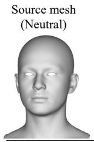

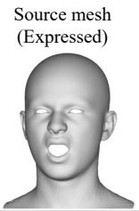  
Retargeted results

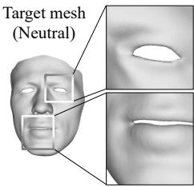

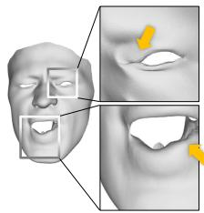  
(a)

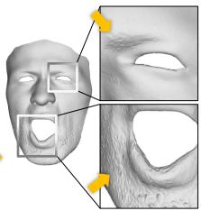  
(b)

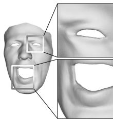  
(c)  
Fig. 2. Comparison of our method with previous approaches. Facial retargeting results from (a) per-triangle Jacobian prediction method [32], (b) per-vertex displacement prediction method [4], and (c) ours using a highresolution mesh from the BIWI [10] dataset (number of vertices: 23, 370). The yellow arrow indicates the artifacts.

To address this, we propose PDB, a point-based deformation blending method for mesh agnostic facial animation retargeting. PDB predicts a compact set of deformed control points � from the source neutral–expression pair and blending weights � from the target neutral mesh. The target expression is reconstructed by their direct weighted combination ��, where each row of � defines the contribution of the control points to a vertex of the target mesh.

PDB learns to predict the deformed control points and the blending weights from self-retargeting reconstruction supervision, without a predefined control structure or precomputed coordinates. For cross-identity retargeting, PDB combines the deformed control points predicted from the source with blending weights predicted from another identity’s neutral mesh. Across the evaluated identi ties, corresponding weight columns exhibit concentrated influence on similar facial regions, providing empirical evidence of a shared spatial organization for expression transfer, as illustrated in Figure 1.

ReLU enforces non-negativity and allows exact zero weights, while row-wise normalization controls the total blending weight at each target vertex. Spatial locality is assessed through the learned weight distributions and the resulting deformations. During inference, the deformed control points are predicted for each source expression, while the blending weights are computed once for a given target neutral mesh and reused across frames. Unlike previous approaches [4, 32] that evaluate a learned deformation decoder at every target vertex or triangle, PDB reconstructs the target mesh through a single matrix multiplication ��. We refer to this output formulation as decoder-free because it requires neither per-element neural decoding nor a global reconstruction solve.

Experiments evaluate PDB on self-retargeting and cyclic retargeting, together with neutral reconstruction, learned weight support, and qualitative cross-identity transfer. Joint analysis of expression accuracy and local surface preservation shows that PDB preserves the intended facial motion while reducing surface artifacts relative to the evaluated dense displacement method. Perceptual evaluations further support its expression fidelity and visual quality. Runtime comparisons demonstrate shorter end-to-end sequence processing times than the compared methods, including target-specific preprocessing.

## 2 Related work

## 2.1 Facial Animation Retargeting

Facial animation retargeting has long been studied as a problem of transferring expression deformation from one face to another since the foundational work by Parke [29]. Early methods relied on dense correspondences between source and target meshes [27, 38], while later approaches reduced this requirement by using sparse correspondences together with interpolation schemes [2, 23]. With the widespread use of blendshape models, many retargeting methods were developed in this space, including radial-basis-functionbased interpolation [2, 28, 34, 40], velocity-domain transfer [35], and segment-based localized transfer [21]. For a broader overview of motion retargeting techniques, we refer readers to the recent survey by Zhu and Joslin [44].

Deep learning reformulated the problem by learning deformation representations directly from data. Early neural approaches learned latent spaces of facial expression using graph-based or autoencoding architectures [3, 12, 33, 39]. Later works improved retargeting quality by disentangling identity and expression in the latent space [5, 14], while others addressed retargeting from weakly paired or unpaired data [11]. These methods demonstrated that transferable deformation priors can be learned without explicit hand-crafted correspondences. Instead, deformation is often expressed through latent codes that are not directly interpretable.

Recent mesh-agnostic methods generalized retargeting to arbitrary mesh structures by predicting local deformation quantities defined on surface elements, such as per-vertex displacements [4, 7, 41] or per-triangle Jacobians [1, 32]. Per-vertex approaches can capture subtle expressions and fine-scale motion, but they are sensitive to prediction noise on dense meshes. Jacobian-based methods reconstruct vertex positions through a global solve, which often improves surface regularity but introduces global coupling and additional computational overhead. In contrast, our method does not predict deformation directly on mesh vertices or triangles. Instead, it represents facial deformation through deformed control points and localized weights, and reconstructs the target mesh directly from their matrix product. NFS [4] also uses spatially localized skinning weights, but these weights condition a neural decoder that predicts per-vertex deformation. In PDB, the weights are themselves one of the two explicit geometric factors and directly reconstruct the target mesh through ��, without a deformation decoder.

## 2.2 Control-Based Deformation

Control-based deformation propagates motion from a compact set of controls to dense geometry through spatially varying weights. Linear blend skinning (LBS) [24] blends transformations associated with skeletal controls using per-vertex skinning weights. Compressed Skinning for Facial Blendshapes (CSFB) [17] converts facial blendshapes into an eficient linear blend skinning representation. PDB shares the motivation of compact animation representation, but learns to predict source-dependent deformed control points and target-dependent blending weights for cross-identity retargeting. Cage-based deformation (CBD) propagates the motion of cage vertices to an embedded shape through geometric coordinate functions, with representative formulations including mean value coordinates [16] and harmonic coordinates [15]. For a comprehensive overview of CBD, we refer readers to the survey by Ströter et al. [37].

Several recent works combine control-based deformation with deep learning for editing and deforming arbitrary meshes [8, 13, 22, 43]. NeuralCage [43] predicts cage ofsets to deform a source mesh toward a target shape. KeypointDeformer [13] learns sparse keypoints that serve as deformation handles. DeepMetaHandles [22] learns disentangled meta-handles as combinations of prescribed control-point translations and uses precomputed biharmonic coordinates to propagate them over the mesh. VBC [8] parameterizes continuous, valid barycentric-coordinate functions using a neural field, allowing the coordinates to be optimized for smoothness and deformation-aware energies. NeuralMLS [36] predicts weights from sparse control points and uses an MLS solver to propagate their motion to a dense shape. PDB predicts both deformed control points and blending weights without a prescribed cage or precomputed geometric coordinates.

Localized deformation representations have also been explored for facial animation and editing. SPLOCS [25] decomposes registered mesh animation sequences into sparse, spatially localized per-vertex components for intuitive animation editing, including facial animations. Whereas SPLOCS represents animation through fixed per-vertex deformation components with varying activation coeficients, PDB predicts expression-dependent 3D deformed control points and distributes their motion through blending weights predicted from the target neutral mesh. CUBE [6] represents 3D faces using a lattice of high-dimensional control features that are locally blended by B-spline bases and decoded through a residual MLP over a fixed template domain. Its local support enables localized facial editing, while diferences between control features can be transferred across identities to reproduce expressions. PDB blends explicit 3D deformed control points directly into target vertex positions, without an additional learned decoder after blending. Unlike the local support provided by CUBE’s B-spline bases, spatial locality in PDB is learned and evaluated empirically.

## 3 Method

In this section, we describe our method following the forward data flow of the system. Figure 3 shows the overall pipeline. Given a source neutral mesh, a source expression mesh, and a target neutral mesh, the goal is to produce the target expression mesh. Instead of predicting deformation directly on target vertices or triangles, our method represents facial deformation using two explicit geometric factors: deformed control points and localized weights. The deformed control points are predicted from the source expression, and the localized weights are predicted from the target identity. The target expression is then reconstructed directly by their weighted combination. For a fixed target, the weights are computed once and reused across source frames.

## 3.1 Overview and Reconstruction

PDB consists of two encoders: an expression point encoder $\phi$ and an identity weight encoder $\psi .$ From the input mesh, we extract a per-vertex feature $\boldsymbol { x } ~ \in ~ \mathbb { R } ^ { 6 }$ consisting of the vertex position and the vertex normal. The expression point encoder $\phi$ takes the rowwise concatenated source features $[ { x } _ { \mathrm { s r c } } ^ { n } , { x } _ { \mathrm { s r c } } ^ { e } ] \ \in \ \dot { \mathbb { R } } ^ { N _ { s } \times 1 2 }$ as input, where $x _ { \mathrm { { s r c } } } ^ { n }$ and $x _ { \mathrm { s r c } } ^ { e }$ are the features of the source neutral and source expression meshes, respectively. The source neutral and expression meshes must have corresponding vertices for this concatenation; no vertex correspondence between the source and target meshes is required. The encoder predicts a set of deformed control points:

$$
v = \phi \big ( \big [ x _ { \mathrm { s r c } } ^ { n } , x _ { \mathrm { s r c } } ^ { e } \big ] \big ) ,\tag{1}
$$

where � $\mathsf { \Lambda } _ { \mathsf { I } } \in \mathbb { R } ^ { K \times 3 }$ contains � deformed control points $v _ { i } \in \mathbb { R } ^ { 3 } . K$ can be adjusted as a hyperparameter before training, and the network always predicts � control points after training.

The identity weight encoder � takes the target neutral features $x _ { \mathrm { t g t } } ^ { n } \in \mathbb { R } ^ { N _ { t } \times 6 }$ as input and predicts a weight matrix

$$
w = \psi ( x _ { \mathrm { t g t } } ^ { n } ) ,\tag{2}
$$

where $\boldsymbol { w } \in \mathbb { R } ^ { N _ { t } \times K }$ contains the final non-negative blending weights, including the normalization steps described in Section 3.2. Each element $w _ { i } ^ { j }$ denotes the contribution of the �-th control point to the �-th target vertex. The target expression is reconstructed as

$$
\hat { \boldsymbol { p } } _ { \mathrm { t g t } } ^ { j } = \sum _ { i = 1 } ^ { K } w _ { i } ^ { j } \boldsymbol { v } _ { i } .\tag{3}
$$

Equivalently, for all target vertices,

$$
\begin{array} { r } { \hat { P } _ { \mathrm { t g t } } = w v , } \end{array}\tag{4}
$$

where $\hat { P } _ { \mathrm { t g t } } \in \mathbb { R } ^ { N _ { t } \times 3 }$ denotes the predicted target expression mesh.

## 3.2 Blending-Weight Parameterization

The blending weights determine how the predicted deformed control points contribute to each target vertex. We parameterize the weights using column-wise normalization and ReLU, followed by row-wise normalization to obtain the final blending weights used for reconstruction.

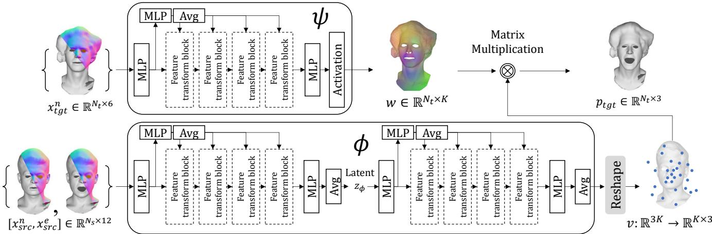  
Fig. 3. Method overview for cross-identity retargeting at inference.

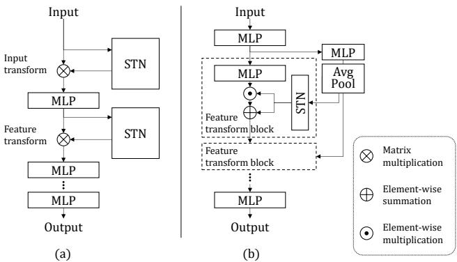  
Fig. 4. Illustration of the feature transform block (b) compared with the spatial transform in PointNet [30] (a).

Non-negative parameterization. Let $\boldsymbol { z } \in \mathbb { R } ^ { N _ { t } \times K }$ denote the output of the final linear layer of�. We normalize each column over the target vertices and apply ReLU:

$$
\tilde { w } _ { i } = \mathrm { R e L U } \left( \frac { z _ { i } } { \operatorname* { m a x } ( \| z _ { i } \| _ { 2 } , \varepsilon ) } \right) ,\tag{5}
$$

where $z _ { i } , \tilde { w } _ { i } \in \mathbb { R } ^ { N _ { t } }$ denote the �-th columns and ReLU acts elementwise. We use $\varepsilon = 1 0 ^ { - 1 2 }$ . The denominator floor keeps zero-norm columns well-defined. ReLU enforces non-negativity and allows exact zero entries.

Row-wise normalization. For each target vertex, the weights are normalized row-wise as follows:

$$
w _ { i } ^ { j } = \frac { \tilde { w } _ { i } ^ { j } } { \sum _ { k } \tilde { w } _ { k } ^ { j } + \varepsilon } ,\tag{6}
$$

where $\varepsilon = 1 0 ^ { - 1 2 }$ is used for numerical stability. For rows whose total weight is suficiently larger than $\varepsilon ,$ the normalized weights sum approximately to one. An all-zero row remains zero and reconstructs its vertex at the origin; this parameterization does not impose a separate nonzero-support constraint.

The control-point predictions and blending weights are learned jointly through the reconstruction objective defined in Equation 9.

Sparse support and spatial locality. Facial expressions often affect localized regions, as reflected by the sparse spatial support of many delta blendshapes [18]. Exact zero weights exclude individual control-point contributions at a target vertex, but do not by themselves enforce spatial locality. Although spatial locality is not explicitly constrained, the learned weights exhibit localized support, as shown in Figure 7.

## 3.3 Architecture

The networks are based on a Multi-Layer Perceptron (MLP). Inspired by PointNet [30], which applies feature-space transformations via spatial transformer networks (STN), we design a feature transform block. The original PointNet transform models a linear map without bias:

$$
y = x T ,\tag{7}
$$

where �, $y \in \mathbb { R } ^ { N \times F }$ are the features before and after transformation, $T \in \mathbb { R } ^ { F \times \check { F } }$ is the predicted transform, � is the number of vertices, and � is the feature dimension. In contrast, our block predicts a feature-wise afine transformation with learned scales and biases. We implement it as an element-wise afine map:

$$
y = a \odot x + b ,\tag{8}
$$

where � and $b \in \mathbb { R } ^ { 1 \times F }$ are the predicted per-element weights and biases, respectively, and ⊙ denotes Hadamard (element-wise) multiplication. Note that � and � are broadcast to match the dimension size �×� before the multiplication. Figure 4 illustrates the feature transform block.

The identity weight encoder $\psi$ uses an input linear projection, four feature transform blocks, and an output linear projection. An auxiliary MLP branch produces a pooled transform code that conditions the feature-wise scales and biases. The hidden MLPs use layer normalization and LeakyReLU activations. The output projection is followed by the weight parameterization in Section 3.2. The expression point encoder $\phi$ follows the same feature-transform pattern in two successive encoder stages, with an average-pooling layer and no activation at the output. Figure 3 shows the full architecture.

## 3.4 Training

Following Qin et al. [32], all meshes are standardized to a common orientation and scale before training. PDB is trained only with self-retargeting supervision; no paired cross-identity ground-truth expressions are used. During training, the source neutral mesh, source expression mesh, and target neutral mesh belong to the same identity, and the corresponding expression mesh provides the reconstruction target. Cross-identity retargeting is obtained at inference time by combining the source-dependent control points predicted by $\phi$ with the target-dependent weights predicted by �.

The reconstruction objective supervises the expression in the inner face and preserves the neutral geometry in the surrounding region:

$$
\begin{array} { r l } { \mathcal { L } _ { \mathrm { r e c o n } } = \displaystyle \frac { 1 } { N _ { t } } \left\| M _ { \mathrm { t g t } } ^ { \mathrm { i n } } \odot \big ( \hat { P } _ { \mathrm { t g t } } ^ { e } - P _ { \mathrm { G T } } ^ { e } \big ) \right\| _ { F } ^ { 2 } } & { } \\ { + \displaystyle \frac { 1 } { N _ { t } } \left\| M _ { \mathrm { t g t } } ^ { \mathrm { o u t } } \odot \big ( \hat { P } _ { \mathrm { t g t } } ^ { e } - P _ { \mathrm { G T } } ^ { n } \big ) \right\| _ { F } ^ { 2 } . } \end{array}\tag{9}
$$

where $\| \cdot \| _ { F }$ is the Frobenius norm and ⊙ denotes element-wise multiplication with each vertex mask broadcast over its three coordinates. The factor $1 / N _ { t }$ averages the squared Euclidean residuals over all target vertices. Because the masks multiply the residuals before squaring, their efective weights in the squared loss are $( M ^ { \mathrm { i n } } ) ^ { 2 }$ and $( M ^ { \mathrm { o u t } } ) ^ { 2 }$ . Here, $\hat { P } _ { \mathrm { t g t } } ^ { e }$ denotes the predicted target expression mesh, and $P _ { \mathrm { G T } } ^ { e }$ and $P _ { \mathrm { G T } } ^ { n }$ respectively denote the ground-truth target expression and neutral mesh. $M _ { \mathrm { t g t } } ^ { \mathrm { i n } }$ and $M _ { \mathrm { t g t } } ^ { \mathrm { o u t } }$ denote the masks for the inner facial region and its complement, respectively.

The masks are used to emphasize expression learning on the inner face while preserving the surrounding region. These masks are constructed using a hat function $h : \mathbb { R } ^ { 3 }  [ 0 , 1 ]$ centered at the nose peak vertex as follows:

$$
h ( \boldsymbol { p } ) = \left\{ \begin{array} { l l } { 1 , \ } & { r ( \boldsymbol { p } ) \le r _ { 0 } , } \\ { 1 - S \left( \displaystyle \frac { r ( \boldsymbol { p } ) - r _ { 0 } } { r _ { 1 } - r _ { 0 } } \right) , } & { r _ { 0 } < r ( \boldsymbol { p } ) < r _ { 1 } , } \\ { 0 , } & { r ( \boldsymbol { p } ) \ge r _ { 1 } , } \end{array} \right.\tag{10}
$$

$$
r ( p ) = \| p - c \| _ { 2 } ,\tag{11}
$$

$$
S ( t ) = 1 0 t ^ { 3 } - 1 5 t ^ { 4 } + 6 t ^ { 5 } ,\tag{12}
$$

where $\left( r _ { 0 } , r _ { 1 } \right) \ = \ \left( 1 . 0 , 2 . 2 5 \right)$ and � is the nose peak vertex in the standardized coordinate system. We then define the inner and outer face masks for the vertices of the target neutral mesh $P _ { \mathrm { { t g t } } }$ as follows:

$$
\boldsymbol { M } ^ { \mathrm { i n } } = [ h ( \boldsymbol { p } _ { t g t } ^ { 1 } ) , \dots , h ( \boldsymbol { p } _ { t g t } ^ { N _ { t } } ) ] ^ { \top } , \quad \boldsymbol { M } ^ { \mathrm { o u t } } = 1 - \boldsymbol { M } ^ { \mathrm { i n } } ,\tag{13}
$$

where each entry specifies a continuous mask value at a target vertex. The masks overlap in the transition region $r _ { 0 } < r ( \rho ) < r _ { 1 } ;$ they are not disjoint binary regions. Figure 5 visualizes the hat function and the resulting masks.

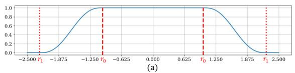

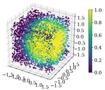  
(b)

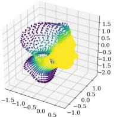  
(c)

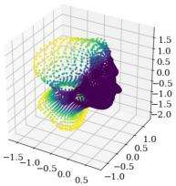  
(d)  
Fig. 5. Visualization of the hat function in 1D points (a), values on random sampled 3D points (b), and the obtained masks $M ^ { \mathrm { i n } } \left( \mathrm { c } \right)$ , and $M ^ { \mathrm { o u t } }$ (d). $r _ { 0 }$ and $r _ { 1 }$ are indicated with red dashed lines and doted lines in (a), respectively.

## 4 Experiments

To assess our design choices, we analyzed the efects of the activation function, POU constraint, hat function mask, and deformation representation (Section 4.1). To evaluate retargeting accuracy, we compared our method, PDB, with state-of-the-art facial animation retargeting methods on self-retargeting and cyclic-retargeting tasks (Section 4.2), using Mean Squared Error (MSE) as the evaluation metric. Self-retargeting transfers a source expression to the neutral mesh of the same identity and is therefore evaluated as reconstruction. Cyclic-retargeting transfers the source expression to a diferent target identity and then back to the source neutral mesh, allowing error measurement without ground-truth cross-identity targets. $\mathrm { C y - }$ cle error measures round-trip stability on unseen identities but does not by itself guarantee the semantic correctness of the intermediate cross-identity expression. We therefore report it together with intermediate qualitative results and the perceptual user study.

We evaluate expression reconstruction with the continuous innerface mask $M ^ { \mathrm { { i n } } }$ and neutral-geometry preservation with its complement $M ^ { \mathrm { o u t } }$ . Each metric averages the squared Euclidean masked residual over target vertices, following the corresponding term in Equation 9. We use the continuous masks defined in the Method section with $\left( r _ { 0 } , r _ { 1 } \right) \ = \ \left( 1 . 0 , 2 . 2 5 \right)$ ; the two masks overlap in the transition band rather than defining disjoint binary regions. To evaluate perceptual quality, we conducted a user study to judge the perceptual quality of the results (Section 4.3). To evaluate local surface preservation, we measured the MSE between the Laplacian coordinates of the predicted and ground-truth meshes on the inner facial region (Section 4.4). Note that we use ‘Ours‘ to denote the design variants of our model, and $\mathrm { \Delta \mathrm { \tilde { P } D B } \mathrm { \tilde { \ell } } }$ to denote the final model. Please refer to the supplementary material for additional application results.

For each experiment, we trained the model using the AdamW optimizer (betas=(0.9, 0.999), weight decay=0.01), with a learning rate of 1×10−4, and a batch size of 16 using a single NVIDIA-RTX-A5000 GPU. For design study (Section 4.1), open-source benchmark data (COMA [33], BIWI [10], and Multiface [42]) were used. Each model was trained for 200 epochs. We split the identities into train/validation/test sets of 9/1/2 for COMA, 6/6/8 for BIWI, and 10/1/1 for Multiface, where the training and validation identities were the same for BIWI. For the main comparison (Section 4.2), we use ICT-FaceKit and Multiface. Following the protocol of NFS, the 111 ICT identities are divided into 100/1/10 training, validation, and test identities, while the 13 Multiface identities are divided into 11/1/1 identities. Each model was trained until the loss converged. ICT and Multiface samples are uniformly sampled per batch. All compared methods use the same identity splits, selected frames and alignment process.

## 4.1 Design Study

In this section, we validate our design choices. For the base setting, we set the number of control points to �=512 in Equation 3, applied ReLU activation for the identity weight encoder $\psi$ with explicit row-wise normalization, and only a reconstruction loss $\scriptstyle { \mathcal { L } } _ { \mathrm { r e c o n } }$ is applied. The base setting is indicated as ‘Ours†’. We varied each component to assess the respective efect. The results are shown in Table 1 and Figure 6.

4.1.1 Activation variants. Our formulation is not tied to a specific activation function. In principle, any non-negative, non-linear activation can be used to parameterize the predicted weights. To examine how the choice of activation afects non-negativity, sparsity, and deformation locality, we compared four variants for the network �: (i) ReLU (Ours†), (ii) no activation, (iii) Softplus, and (iv) ELU with beta 0.5. Figure 7 visualizes the weights predicted by each variant.

The Softplus variant produced non-negative weights, with almost no zero entries. All control points therefore had nonzero contributions, although nonzero weights alone do not determine spatial locality. In this experiment, the learned supports were more difuse than those of the ReLU variant. This hindered the learning of localized facial deformation, leading to poor performance, as shown in Table 1 (a). The variants with no activation and ELU produced sparse weights and did not ensure non-negativity. While these variants achieved lower inner-face errors on BIWI, they showed higher errors on COMA and Multiface. This suggests that non-negative, sparse weights are important for modeling broader, more complex facial motions. Moreover, because of the negativity in weights, these variants produced unintended movements outside the facial region, such as in the upper chest, as shown in Figure 6 (frame 470). This is also reflected in the MSE in $M ^ { \mathrm { { o u t } } }$ as shown in Table 1 (a). In contrast, Ours† efectively promoted non-negativity and sparsity in weights, localizing the influence of each control point, as shown in Figure 7 (a). This locality led the model to reproduce the deformations with �=512 without generating unintended movements outside the face region. We therefore chose ReLU for its non-negative, potentially sparse weights and the localized support observed in these experiments; spatial locality is not guaranteed by the activation alone.

4.1.2 Partition of unity constraint. We approximate partition of unity through explicit row-wise normalization with a numericalstability term, as defined in Equation 6. To measure the efect of this enforcement on the network $\psi ,$ we tested a soft constraint as an alternative. Using the pre-normalization weights �˜ directly for reconstruction instead of applying row-wise normalization, we applied the following loss for the soft POU constraint:

$$
\mathcal { L } _ { \mathrm { s o f t P O U } } = \frac { 1 } { N _ { t } } \sum _ { j = 1 } ^ { N _ { t } } \Big \| \sum _ { i = 1 } ^ { K } \tilde { w } _ { i } ^ { j } - 1 \Big \| ^ { 2 } .\tag{14}
$$

The total loss function for the soft POU variant is $\lambda _ { r e c o n } \mathcal { L } _ { r e c o n } +$ $\lambda _ { \mathrm { { s o f t P O U } } } \mathcal { L } _ { \mathrm { { s o f t P O U } } } .$ , where $\lambda _ { r e c o n }$ and $\lambda _ { \mathrm { s o f t P O U } }$ are both set to 1. As shown in Table 1 (b), Ours†, which is trained with the explicit normalization (Section $^ { 3 . 2 ) , }$ produced better accuracy compared to the soft POU constraint. The explicitly normalized variant achieved lower inner-face error on COMA, BIWI, and Multiface than the soft POU variant. We adopt explicit normalization based on these results. Because its denominator includes $\varepsilon ,$ it does not provide an exact partition-of-unity or afine-consistency guarantee.

4.1.3 Hatfunction mask. To assess the efect of the masks based on the hat function in $\mathcal { L } _ { r e c o n : }$ , we conducted an ablation experiment. Without the masks, the model produced deformation around the neck and upper chest region that was unrelated to the source expression, as shown in Figure 6 (frame 470). Additional examples are shown in the supplementary video. Because some of the training data include global translation, the model trained without the mask tends to learn biased deformation outside the facial region, irrelevant to the source expression. The model trained with the mask mitigated this artifact and improved accuracy across most of the dataset compared with the variant without a mask, as reported in Table 1 (c).

4.1.4 Deformation representation. We compared three diferent representations for the network �: (i) the absolute positions of the deformed control points (Equation 3), (ii) the displacements of the deformed control points with respect to the initial control points, which can be expressed as follows:

$$
\hat { p } _ { \mathrm { t g t } } ^ { j } = p _ { \mathrm { t g t } } ^ { j } + \sum _ { i = 1 } ^ { K } w _ { i } ^ { j } v _ { i } ,\tag{15}
$$

where $p _ { \mathrm { t g t } } ^ { j }$ is the �-th vertex position of the target neutral mesh and $v _ { i }$ is interpreted as the control points displacement relative to the initial state, and (iii) a transformation matrix that maps each initial position of the control point to its deformed position, which can be expressed as follows:

$$
\hat { p } _ { \mathrm { t g t } } ^ { j } = \sum _ { i = 1 } ^ { K } w _ { i } ^ { j } \Gamma _ { i } \left[ \begin{array} { c } { { p _ { \mathrm { t g t } } ^ { j } } } \\ { { 1 } } \end{array} \right] ,\tag{16}
$$

where $\Gamma _ { i } \in \mathbb { R } ^ { 3 \times 4 }$ indicates the predicted transformation matrix. For the third variant, the formulation is the same as linear blend skinning, except that � and Γ are defined with respect to control points rather than bones or joints. As shown in Figure $^ { 6 , }$ all three formulations produced visually similar results, demonstrating that our method is compatible with two other representations. The results in Table 1 (d) indicate that using the absolute control point positions (Equation 3) yields the best performance in the $M ^ { \mathrm { { i n } } }$ region. In the $M ^ { \mathrm { { o u t } } }$ region, Equation 15 achieved the best performance. Because our focus is to learn the deformation inside the $M ^ { \mathrm { { i n } } }$ region, we adopted Equation 3 as our final formulation.

Table 1. Quantitative comparison of design variations. † indicates the base design seting with �=512. The best score is indicated in Bold.
<table><tr><td rowspan="2">Design variants</td><td colspan="4">MSE in  $M ^ { \mathrm { { i n } } }$  →  $( \times 1 0 ^ { - 4 } \mathrm { m m } ^ { 2 } )$ </td><td colspan="4">MSE in  $M ^ { \mathrm { o u t } }$  →  $( \times 1 0 ^ { - 4 } \mathrm { m m } ^ { 2 } )$ </td></tr><tr><td>COMA</td><td>BIWI</td><td>Multiface</td><td>Average</td><td>COMA</td><td>BIWI</td><td>Multiface</td><td>Average</td></tr><tr><td>Ours†</td><td>1.5242</td><td>0.5278</td><td>1.5461</td><td>1.1994</td><td>0.1174</td><td>2.0171×10−7</td><td>0.0855</td><td>0.0676</td></tr><tr><td colspan="9">(a) Activation variants</td></tr><tr><td>No activation</td><td>1.7143</td><td>0.5156</td><td>1.5636</td><td>1.2645</td><td>0.4973</td><td>1.6166×10−7</td><td>0.1015</td><td>0.1996</td></tr><tr><td>w/ Softplus</td><td>10.2799</td><td>2.9841</td><td>11.5780</td><td>8.2807</td><td>4.2061</td><td>4.3432×10−7</td><td>4.7640</td><td>2.9900</td></tr><tr><td>w/ ELU</td><td>1.8608</td><td>0.5101</td><td>1.6036</td><td>1.3248</td><td>0.3914</td><td>1.7556×10⁻7</td><td>1.0473</td><td>0.4796</td></tr><tr><td colspan="9">(b) POU constraint</td></tr><tr><td>w/ soft POU</td><td>1.8236</td><td>0.6003</td><td>1.7021</td><td>1.3753</td><td>0.3288</td><td>2.7500×10−7</td><td>0.8963</td><td>0.4084</td></tr><tr><td colspan="9">(c) Hat function mask</td></tr><tr><td>w/o mask</td><td>1.7916</td><td>0.6101</td><td>1.8672</td><td>1.4230</td><td>0.3850</td><td> $\overline { { 1 . 6 6 4 9 \times 1 0 ^ { - 7 } } }$ </td><td>0.7442</td><td>0.3764</td></tr><tr><td colspan="9">(d) Deformation representation</td></tr><tr><td>Equation 15</td><td>2.3562</td><td>0.4144</td><td>2.4199</td><td>1.7302</td><td>0.0223</td><td> $\overline { { 1 . 6 0 6 6 \times 1 0 ^ { - 7 } } }$ </td><td>0.0427</td><td>0.0217</td></tr><tr><td>Equation 16</td><td>2.4283</td><td>0.4449</td><td>2.2886</td><td>1.7206</td><td>0.0317</td><td> $\mathbf { 1 . 5 9 4 1 \times 1 0 ^ { - 7 } }$ </td><td>0.0391</td><td>0.0236</td></tr></table>

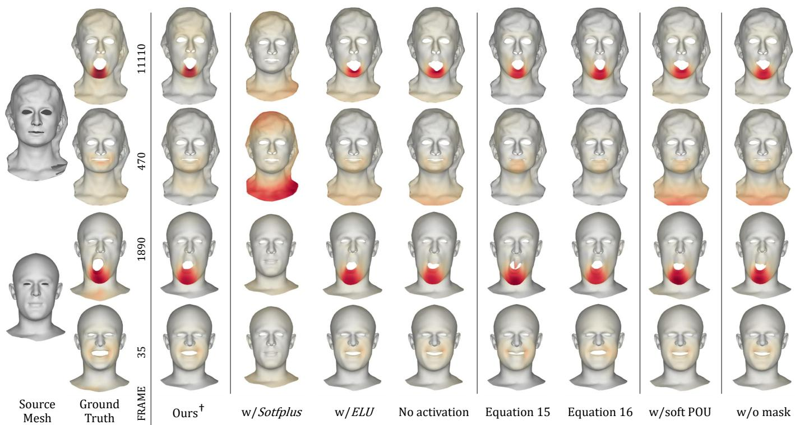  
Fig. 6. Visual comparison between the base seting and design variants using Multiface (upper) and COMA (lower). The incurred deformation on the face is colored using a yellow-orange-red color map (YlOrRd). The ground-truth data includes global translation, which produces visible deformation in the neck region.

4.1.5 Spatial Organization of Learned Weights. The identity weight encoder � predicts spatially coherent weights across meshes with diferent identities, resolutions, and geometric structures. Figure 9 visualizes the weights predicted on test meshes from BIWI, ICT, Multiface, and COMA. For the same control point, the predicted weights are concentrated on semantically corresponding facial regions across diferent shapes, while maintaining local and sparse support. This consistency indicates that � learns shape-dependent but semantically aligned weight distributions, which supports stable expression retargeting across diverse face meshes.

## 4.2 Comparison with Previous Methods

We compared our method, PDB, with state-of-the-art facial animation retargeting methods, NFR [32] and NFS [4], as well as NC [43], a neural cage-based deformation method. For a fair comparison, all methods were trained on ICT-FaceKit [19] and Multiface [42] using the same configuration as Cha et al. [4] until convergence. For NC, we constructed a single enclosed template cage with � vertices and used MVC, following the original paper. Because the Multiface dataset contains deformation outside the facial region, such as hair and upper chest motion, all errors were measured on the inner facial region using $M ^ { \mathrm { { i n } } }$

Table 2. Quantitative comparison with previous methods on self-retargeting and cyclic-retargeting. Cyclic-retargeting employs ICT→MF→ICT and $M F {  } | \mathrm { C T } {  } M \ F$ cycles, in which expressions are transferred from one dataset to a test mesh in the other dataset and then mapped back to the origi nal mesh. The best result is shown in bold. ICT and MF denote ICT-FaceKit and Multiface dataset, respectively.
<table><tr><td rowspan="3">Method</td><td colspan="3">Self-retargeting</td><td colspan="3">Cyclic-retargeting</td></tr><tr><td>MSE in</td><td> $M ^ { \mathrm { i n } } \downarrow ( \times 1 0 ^ { - 4 } \mathrm { m m } ^ { 2 } )$ </td><td></td><td>MSE in</td><td> $M ^ { \mathrm { i n } } \downarrow ( \times 1 0 ^ { - 4 } \mathrm { m m } ^ { 2 } )$ </td><td></td></tr><tr><td>ICT</td><td>MF</td><td>Average</td><td> $\overline { { \mathrm { I C T } \to \mathrm { M F } \to \mathrm { I C T } } }$ </td><td> $\overline { { \mathrm { M F } \to \mathrm { I C T } \to \mathrm { M F } } }$ </td><td>Average</td></tr><tr><td>NC</td><td>64.7652</td><td>11.6344</td><td>38.1998</td><td>89.0935</td><td>53.2029</td><td>71.1482</td></tr><tr><td>NFR</td><td>1.9921</td><td>2.9145</td><td>2.4533</td><td>1.0957</td><td>4.2026</td><td>2.6492</td></tr><tr><td>NFS</td><td>0.6161</td><td>2.5024</td><td>1.5592</td><td>1.2264</td><td>4.1020</td><td>2.6642</td></tr><tr><td>PDB</td><td>0.5731</td><td>0.8392</td><td>0.7061</td><td>0.9101</td><td>3.0792</td><td>1.9947</td></tr></table>

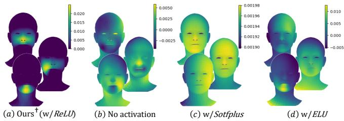  
Fig. 7. Visualization of predicted weights. Three cage vertices are randomly selected to visualize the weights predicted by each variant on the COMA test dataset.

Table 2 summarizes the quantitative results. PDB achieved the best average performance in both self-retargeting and more challenging cyclic-retargeting due to repeated cross-identity transfer, demonstrating a clear margin of improvement in average error over previous methods. These results provide evidence that the learned factorization remains stable under repeated cross-identity transfer on unseen test identities.

Qualitative results are shown in Figure 8 and Figure 10. NC failed to reproduce the target deformations. During training, NC constrains the cage to a single polyhedron and penalizes negative MVC values, which pushes the predicted cage toward a convex shape. However, many facial motions involve concave configurations, such as those around the eyes and mouth. As a result, NC did not converge properly and often produced self-intersecting cages or degenerate cage triangles, leading to severe artifacts. In contrast, PDB produced stable retargeting results without exhibiting these failure modes. Fig ure 14 further demonstrates that our method generalizes to unseen stylized target meshes with substantially diferent facial geometry and proportions while preserving the source expression in a stable and coherent manner.

4.2.1 Neutral Reconstruction. We evaluate the special case in which the source neutral mesh, source expression mesh, and target neutral mesh are identical. The desired output is therefore the unchanged target neutral mesh. This experiment tests whether the learned factorization introduces drift when representing the identity deformation. It does not constitute an analytic guarantee of linear reproduction.

Table 3. Neutral reconstruction error on ICT-FaceKit and Multiface.
<table><tr><td>Method</td><td>MSE in  $M ^ { \mathrm { { i n } } }$  →  $( \times 1 0 ^ { - 6 }$  mm²)</td></tr><tr><td>NC</td><td>511.031</td></tr><tr><td>NFR</td><td>100.984</td></tr><tr><td>NFS</td><td>8.148</td></tr><tr><td>PDB</td><td>8.779</td></tr></table>

## 4.3 User Study for Perceptual Quality

We conducted a user study with 30 participants to evaluate the perceptual quality of the retargeted animations. The participants included 12 males and 18 females, mostly in their 20s and 30s, with 14 participants having prior experience with animation or digital content creation. The study included both self-retargeting and crossretargeting results. We used 28 video clips in total: 7 self-retargeting clips and 21 cross-retargeting clips generated from the ICT and Multiface test set. The participants were presented with each clip and asked to evaluate two aspects: expression similarity and visual quality. Expression similarity was measured using a forced-choice selection of the method that best preserved the source motion among four randomly ordered results: PDB, NFS, NFR, and NC. Visual quality was measured using a 1–5 Likert score, where higher scores indicate more natural results with fewer visible artifacts. Figure 12 and Figure 13 summarize the results separately for self-retargeting and cross-retargeting.

The results show that our method was most frequently selected for expression similarity and achieved the highest visual quality scores in both self-retargeting and cross-retargeting. NC received low scores in both metrics, indicating severe visual artifacts and poor expression preservation. NFR and NFS produced visually plausible animations, but they were less efective in preserving the source expression. In contrast, ours maintained both high mesh quality and strong expression similarity, showing that the proposed representation retargets source motion faithfully while producing stable and plausible target animations.

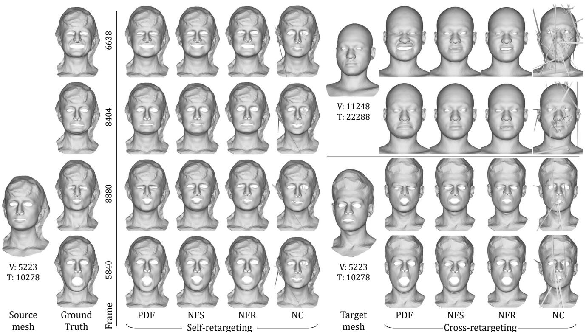  
Fig. 8. Visual comparison of retargeting results for the Multiface test dataset produced by our method and comparative methods. The facial expressions from the source mesh are retargeted to itself, and the target meshes with diferent shapes and mesh structures. V and T indicate the number of vertices and triangles of the mesh, respectively.

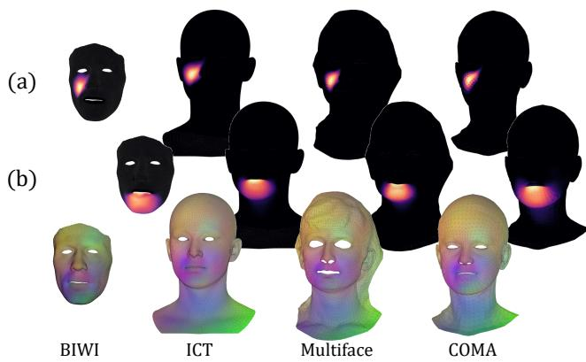  
Fig. 9. Visualization of weights predicted from the model trained with �=512. The predicted weights correspond to the 413�ℎ control point (a) and the 261�� control point (b) on test meshes from BIWI [10], ICT [19], Multiface [42], and COMA [33].

## 4.4 Local Surface Preservation

To evaluate local surface structure preservation, we measured the MSE between the predicted results and the ground truth in Laplacian coordinates within the inner facial region. Table 4 reports the results on the ICT and Multiface datasets. NC produced very large errors on the ICT data, indicating unstable local surface behavior. Among the remaining methods, NFR yielded the lowest errors overall while PDB achieved the second-best result, outperforming NFS on both datasets with a substantially lower average error. NFR achieved strong surface regularity through a global linear solve, but local prediction noise could propagate globally and cause retargeting errors. This tendency is also observed in the qualitative comparison presented in Figure 11. In the magnified eyelid and mouth regions, our method produced a smooth surface that closely matches the ground truth, whereas NFS exhibited noisy local surface artifacts. NFR preserved the smooth surface but produced undesired deformation in both the eyelid and the inner mouth, indicating global entanglement. These results indicate that the proposed point-based factorization preserves local surface structure more efectively than per-vertex prediction, while avoiding the severe instability observed in NC.

## 4.5 Runtime Comparison

We compared the runtime of our method with state-of-the-art retargeting methods on test performance sequences. For this purpose, a single performance (EXP\_free\_face) from the Multiface dataset and custom human performances captured with Live Link Face [9] and ICT-FaceKit [19] (capture #1, capture #2), were employed. All methods were evaluated on the same hardware, a single NVIDIA RTX A5000 24GB GPU. The reported time includes the end-to-end runtime for each sequence, including any one-time preprocessing required for each target mesh. NFR and NFS both require meshdependent preprocessing, such as computing the Laplace–Beltrami operator. This required additional computation time, thereby increasing latency by around 15 seconds. In contrast, PDB does not require any such preprocessed information and directly predicts the retargeted mesh. Moreover, unlike NFR and NFS, which rely on a neural decoder to map latent to deformation, PDB produces the deformation through a simple matrix product between predicted weights and deformed control points, reducing both computation and runtime. Table 5 shows that PDB has the lowest end-to-end runtime for all three sequences. These measurements include targetspecific setup and do not separately quantify preprocessing and per-frame inference.

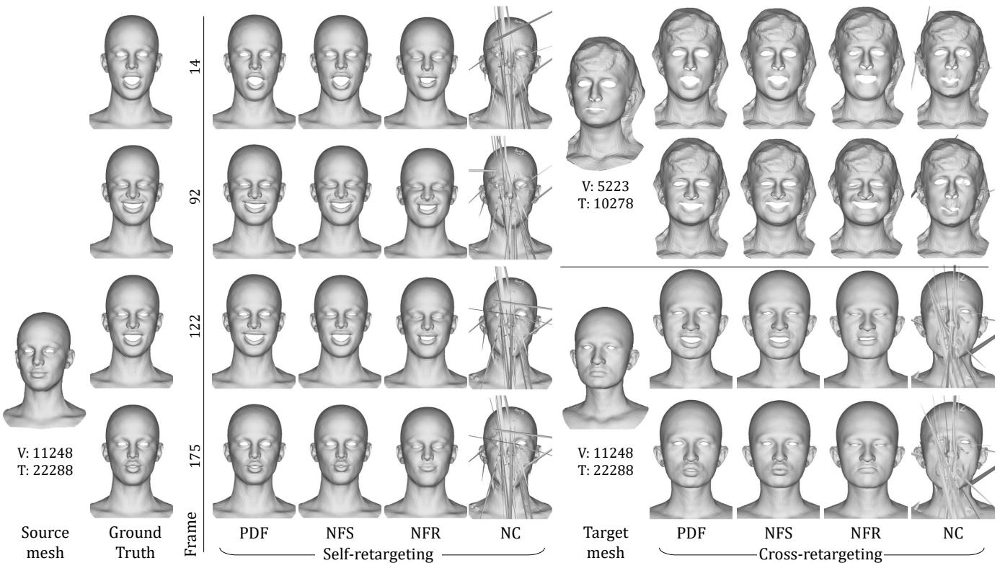  
Fig. 10. Visual comparison of retargeting results for the ICT test dataset produced by our method and comparative methods. The facial expressions from the source mesh are retargeted to itself and the target meshes with diferent shapes and mesh structures. V and T indicate the number of vertices and triangles o the mesh, respectively.

Table 4. Quantitative comparison of local surface structure preservation, measured by the MSE between Laplacian coordinates within the inner facial region. The best result is shown in bold, and the second-best result is underlined.
<table><tr><td rowspan="2">Method</td><td colspan="3">MSE in Min ↓ (×10−4 mm2)</td></tr><tr><td>ICT</td><td>Multiface</td><td>Average</td></tr><tr><td>NC</td><td>5927.2172</td><td>178.2116</td><td>3052.7144</td></tr><tr><td>NFR</td><td>1.1284</td><td>1.2206</td><td>1.1745</td></tr><tr><td>NFS</td><td>1.6646</td><td>3.9028</td><td>2.7837</td></tr><tr><td>PDB</td><td>1.2771</td><td>1.8993</td><td>1.5882</td></tr></table>

Table 5. Runtime comparison for retargeting complete performance sequences. Total time includes one-time target-specific preprocessing and processing all frames.
<table><tr><td rowspan="2">Data</td><td rowspan="2">Frames</td><td colspan="3">Time (min:sec)</td></tr><tr><td>NFR</td><td>NFS</td><td>PDB</td></tr><tr><td>ICT (capture #1)</td><td>183</td><td>00:25</td><td>00:17</td><td>00:01</td></tr><tr><td>ICT (capture #2)</td><td>1,147</td><td>01:19</td><td>00:34</td><td>00:06</td></tr><tr><td>Multiface (test data)</td><td>11,649</td><td>17:32</td><td>02:29</td><td>00:50</td></tr></table>

## 5 Limitation

High-frequency components of the deformation, such as wrinkles or abrupt movements, may not be fully captured by our method. The model tends to place control points in regions with large deformations, such as the eyes and mouth. Because wrinkles are subtle and vary across identities, these fine details are often overlooked. Increasing the number of control points or introducing additional constraints on their spatial support may improve fine-detail reconstruction, but this remains to be evaluated. Increasing � reduces the compactness of the representation and increases the storage and multiplication cost of the $N _ { t } \times K$ weight matrix. Even when $K = N _ { t }$ the learned weighted reconstruction is not generally equivalent to independent per-vertex displacement prediction. In this work, we used $K = 5 1 2$ as a heuristic setting rather than an optimized value. As shown in Table 6, the model also trained successfully with $K = 2 5 6$ , achieving comparable performance to $K = 5 1 2$ on self-retargeting. While this suggests that the method is not tied to a specific value of $K ,$ identifying the optimal number of control points for faithfully reproducing fine details remains an important direction for future work.

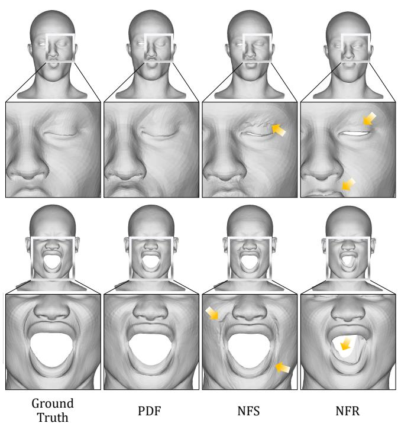  
Fig. 11. Magnified results on the ICT test dataset produced by our method and comparative methods. The meshes were rendered with flat shading to visualize the deformed surface.

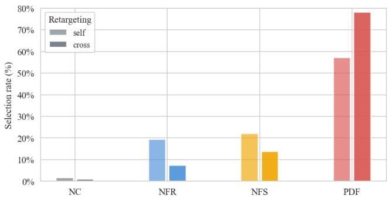  
Fig. 12. User study results for expression similarity. Participants selected the method that best preserved the source motion for each clip.

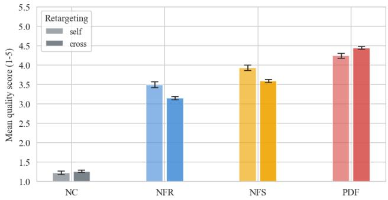

Fig. 13. User study results for visual quality. Participants rated the naturalness and absence of visible artifacts using a 1–5 Likert scale.  
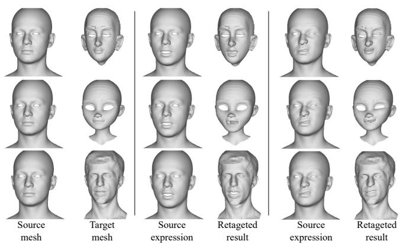  
Fig. 14. Generalization to unseen stylized target meshes. PDB retargets source expressions to target meshes with substantially diferent facial geometry and stylized proportions.

Table 6. Quantitative comparison with diferent numbers of control points � on self-retargeting. The best result is shown in bold.
<table><tr><td rowspan="2">Control points K</td><td colspan="3">Self-retargeting MSE in Min↓(×10−4 mm²)</td></tr><tr><td>ICT</td><td>MF</td><td>Average</td></tr><tr><td>K=512</td><td>0.5731</td><td>0.8392</td><td>0.7061</td></tr><tr><td>K=256</td><td>0.5820</td><td>0.8025</td><td>0.6922</td></tr></table>

## 6 Conclusion

We presented PDB, a method for mesh-agnostic facial animation retargeting that combines source-dependent deformed control points with target-dependent blending weights. The target mesh is reconstructed by a matrix product, without a predefined cage, precomputed coordinates, a learned per-element deformation decoder, or a global reconstruction solve. The learned non-negative weights exhibit localized support in our evaluations. Self-retargeting and cyclicretargeting experiments show lower reconstruction and round-trip errors than the compared methods, while qualitative cross-identity results and perceptual evaluations support expression fidelity and visual quality. Additional analysis shows improved local surface preservation relative to the evaluated displacement method, transfer to unseen stylized meshes, and shorter end-to-end sequence processing times. Capturing fine-scale details and selecting the number of control points remain directions for future work.

## References

[1] Noam Aigerman, Kunal Gupta, Vladimir G Kim, Siddhartha Chaudhuri, Jun Saito, and Thibault Groueix. 2022. Neural jacobian fields: learning intrinsic mappings of arbitrary meshes. ACM Transactions on Graphics (TOG) 41, 4 (2022), 1–17.

[2] Bernd Bickel, Mario Botsch, Roland Angst, Wojciech Matusik, Miguel Otaduy, Hanspeter Pfister, and Markus Gross. 2007. Multi-scale capture of facial geometry and motion. ACM transactions on graphics (TOG) 26, 3 (2007), 33–es.

[3] Giorgos Bouritsas, Sergiy Bokhnyak, Stylianos Ploumpis, Michael Bronstein, and Stefanos Zafeiriou. 2019. Neural 3d morphable models: Spiral convolutional networks for 3d shape representation learning and generation. In Proceedings of the IEEE/CVF international conference on computer vision. 7213–7222.

[4] Sihun Cha, Serin Yoon, Kwanggyoon Seo, and Junyong Noh. 2025. Neural Face Skinning for Mesh-agnostic Facial Expression Cloning. In Computer Graphics Forum. Wiley Online Library, e70009.

[5] Prashanth Chandran, Derek Bradley, Markus Gross, and Thabo Beeler. 2020. Semantic deep face models. In 2020 international conference on 3D vision (3DV). IEEE, 345–354.

[6] Prashanth Chandran, Daoye Wang, and Timo Bolkart. 2026. Representing 3D Faces with Learnable B-Spline Volumes. arXiv preprint arXiv:2604.12894 (2026).

[7] Prashanth Chandran, Gaspard Zoss, Markus Gross, Paulo Gotardo, and Derek Bradley. 2022. Shape Transformers: Topology-Independent 3D Shape Models Using Transformers. In Computer Graphics Forum, Vol. 41. Wiley Online Library, 195–207.

[8] Ana Dodik, Oded Stein, Vincent Sitzmann, and Justin Solomon. 2023. Variational barycentric coordinates. ACM Transactions on Graphics (TOG) 42, 6 (2023), 1–16.

[9] EpicGames. [n. d.]. Live Link Face. https://apps.apple.com/us/app/live-linkface/id1495370836.

[10] Gabriele Fanelli, Matthias Dantone, Juergen Gall, Andrea Fossati, and Luc Van Gool. 2013. Random Forests for Real Time 3D Face Analysis. IJCV 101 3 (2 2013), 437–458.

[11] Lin Gao, Jie Yang, Yi-Ling Qiao, Yu-Kun Lai, Paul L Rosin, Weiwei Xu, and Shihong Xia. 2018. Automatic unpaired shape deformation transfer. ACM Transactions on Graphics (ToG) 37, 6 (2018), 1–15.

[12] Thibault Groueix, Matthew Fisher, Vladimir G Kim, Bryan C Russell, and Mathieu Aubry. 2018. 3d-coded: 3d correspondences by deep deformation. In Proceedings ofthe european conference on computer vision (ECCV). 230–246.

[13] Tomas Jakab, Richard Tucker, Ameesh Makadia, Jiajun Wu, Noah Snavely, and Angjoo Kanazawa. 2021. Keypointdeformer: Unsupervised 3d keypoint discovery for shape control. In Proceedings ofthe IEEE/CVF Conference on Computer Vision and Pattern Recognition. 12783–12792.

[14] Zi-Hang Jiang, Qianyi Wu, Keyu Chen, and Juyong Zhang. 2019. Disentangled representation learning for 3d face shape. In Proceedings ofthe IEEE/CVFconference on computer vision and pattern recognition. 11957–11966.

[15] Pushkar Joshi, Mark Meyer, Tony DeRose, Brian Green, and Tom Sanocki. 2007. Harmonic coordinates for character articulation. ACM transactions on graphics (TOG) 26, 3 (2007), 71–es.

[16] Tao Ju, Scott Schaefer, and Joe Warren. 2005. Mean value coordinates for closed triangular meshes. In ACM SIGGRAPH 2005 Papers. 561–566.

[17] Ladislav Kavan, John Doublestein, Martin Prazak, Matthew Ciofi, and Doug Roble. 2024. Compressed Skinning for Facial Blendshapes. In ACM SIGGRAPH 2024 Conference Papers. 1–9.

[18] John P Lewis, Ken Anjyo, Taehyun Rhee, Mengjie Zhang, Frederic H Pighin, and Zhigang Deng. 2014. Practice and theory of blendshape facial models. Eurographics (State ofthe Art Reports) 1, 8 (2014), 2.

[19] Ruilong Li, Karl Bladin, Yajie Zhao, Chinmay Chinara, Owen Ingraham, Pengda Xiang, Xinglei Ren, Pratusha Prasad, Bipin Kishore, Jun Xing, and Hao Li. 2020. Learning Formation ofPhysically-Based Face Attributes. arXiv:2004.03458 [cs.CV]

[20] Tianye Li, Timo Bolkart, Michael J Black, Hao Li, and Javier Romero. 2017. Learning a model of facial shape and expression from 4D scans. ACM Trans. Graph. 36, 6 (2017), 194–1.

[21] Ko-Yun Liu, Wan-Chun Ma, Chun-Fa Chang, Chuan-Chang Wang, and Paul Debevec. 2011. A framework for locally retargeting and rendering facial performance. Computer Animation and Virtual Worlds 22, 2-3 (2011), 159–167.

[22] Minghua Liu, Minhyuk Sung, Radomir Mech, and Hao Su. 2021. Deepmetahandles: Learning deformation meta-handles of3d meshes with biharmonic coordinates. In Proceedings ofthe IEEE/CVFConference on ComputerVision and Pattern Recognition. 12–21.

[23] Wan-Chun Ma, Andrew Jones, Jen-Yuan Chiang, Tim Hawkins, Sune Frederiksen, Pieter Peers, Marko Vukovic, Ming Ouhyoung, and Paul Debevec. 2008. Facial

performance synthesis using deformation-driven polynomial displacement maps. ACM Transactions on Graphics (TOG) 27, 5 (2008), 1–10.

[24] Thalmann Magnenat, Richard Laperrière, and Daniel Thalmann. 1988. Joint dependent local deformations for hand animation and object grasping. In Proceedings ofGraphics Interface’88. Canadian Inf. Process. Soc, 26–33.

[25] Thomas Neumann, Kiran Varanasi, Stephan Wenger, Markus Wacker, Marcus A. Magnor, and Christian Theobalt. 2013. Sparse Localized Deformation Components. ACM Transactions on Graphics 32, 6 (2013), 179:1–179:10. doi:10.1145/2508363. 2508417

[26] Federico Nocentini, Thomas Besnier, Claudio Ferrari, Sylvain Arguillere, Stefano Berretti, and Mohamed Daoudi. 2024. ScanTalk: 3D Talking Heads from Unregistered Scans. arXiv preprint arXiv:2403.10942 (2024).

[27] Jun-yong Noh and Ulrich Neumann. 2001. Expression cloning. In Proceedings of the 28th annual conference on Computer graphics and interactive techniques. 277–288.

[28] Verónica Costa Orvalho, Ernesto Zacur, and Antonio Susin. 2008. Transferring the rig and animations from a character to diferent face models. In Computer Graphics Forum, Vol. 27. Wiley Online Library, 1997–2012.

[29] Frederick I Parke. 1972. Computer generated animation of faces. In Proceedings ofthe ACM annual conference-Volume 1. 451–457.

[30] Charles R Qi, Hao Su, Kaichun Mo, and Leonidas J Guibas. 2017. Pointnet: Deep learning on point sets for 3d classification and segmentation. In Proceedings of the IEEE conference on computer vision and pattern recognition. 652–660.

[31] Shenhan Qian, Tobias Kirschstein, Liam Schoneveld, Davide Davoli, Simon Giebenhain, and Matthias Nießner. 2024. Gaussianavatars: Photorealistic head avatars with rigged 3d gaussians. In Proceedings ofthe IEEE/CVF Conference on Computer Vision and Pattern Recognition. 20299–20309.

[32] Dafei Qin, Jun Saito, Noam Aigerman, Groueix Thibault, and Taku Komura. 2023. Neural Face Rigging for Animating and Retargeting Facial Meshes in the Wild. In SIGGRAPH 2023 Conference Papers.

[33] Anurag Ranjan, Timo Bolkart, Soubhik Sanyal, and Michael J. Black. 2018. Gen erating 3D Faces using Convolutional Mesh Autoencoders. In ECCV.

[34] Roger Blanco I Ribera, Eduard Zell, John P Lewis, Junyong Noh, and Mario Botsch. 2017. Facial retargeting with automatic range of motion alignment. ACM Transactions on graphics (TOG) 36, 4 (2017), 1–12.

[35] Yeongho Seol, John P Lewis, Jaewoo Seo, Byungkuk Choi, Ken Anjyo, and Junyong Noh. 2012. Spacetime expression cloning for blendshapes. ACM Transactions on Graphics (TOG) 31, 2 (2012), 1–12.

[36] Meitar Shechter, Rana Hanocka, Gal Metzer, Raja Giryes, and Daniel Cohen-Or. 2022. Neuralmls: Geometry-aware control point deformation. arXiv preprint arXiv:2201.01873 (2022).

[37] Daniel Ströter, Jean-Marc Thiery, Kai Hormann, Jiong Chen, Qingjun Chang, Sebastian Besler, Johannes Sebastian Mueller-Roemer, Tamy Boubekeur, André Stork, and Dieter W Fellner. 2024. A Survey on Cage-based Deformation of 3D Models. In Computer Graphics Forum, Vol. 43. Wiley Online Library, e15060.

[38] Robert W Sumner and Jovan Popović. 2004. Deformation transfer for triangle meshes. ACM Transactions on graphics (TOG) 23, 3 (2004), 399–405.

[39] Qingyang Tan, Lin Gao, Yu-Kun Lai, and Shihong Xia. 2018. Variational autoencoders for deforming 3d mesh models. In Proceedings ofthe IEEE conference on computer vision and pattern recognition. 5841–5850.

[40] Tamás Umenhofer and Balázs Tóth. 2012. Facial Animation Retargeting Framework Using Radial Basis Functions. In Sixth Hungarian Conference on Computer Graphics and Geometry.

[41] Jiashun Wang, Xueting Li, Sifei Liu, Shalini De Mello, Orazio Gallo, Xiaolong Wang, and Jan Kautz. 2023. Zero-shot pose transfer for unrigged stylized 3d characters. In Proceedings ofthe IEEE/CVF Conference on Computer Vision and Pattern Recognition. 8704–8714.

[42] Cheng-hsin Wuu, Ningyuan Zheng, Scott Ardisson, Rohan Bali, Danielle Belko, Eric Brockmeyer, Lucas Evans, Timothy Godisart, Hyowon Ha, Xuhua Huang, Alexander Hypes, Taylor Koska, Steven Krenn, Stephen Lombardi, Xiaomin Luo, Kevyn McPhail, Laura Millerschoen, Michal Perdoch, Mark Pitts, Alexander Richard, Jason Saragih, Junko Saragih, Takaaki Shiratori, Tomas Simon, Matt Stewart, Autumn Trimble, Xinshuo Weng, David Whitewolf, Chenglei Wu, Shoou-I Yu, and Yaser Sheikh. 2022. Multiface: A Dataset for Neural Face Rendering. In arXiv.

[43] Wang Yifan, Noam Aigerman, Vladimir G Kim, Siddhartha Chaudhuri, and Olga Sorkine-Hornung. 2020. Neural cages for detail-preserving 3d deformations. In Proceedings of the IEEE/CVF conference on computer vision and pattern recognition. 75–83.

[44] Changan Zhu and Chris Joslin. 2024. A Review of Motion Retargeting Techniques for 3D Character Facial Animation. Computers & Graphics 123 (2024), 104037. doi:10.1016/j.cag.2024.104037

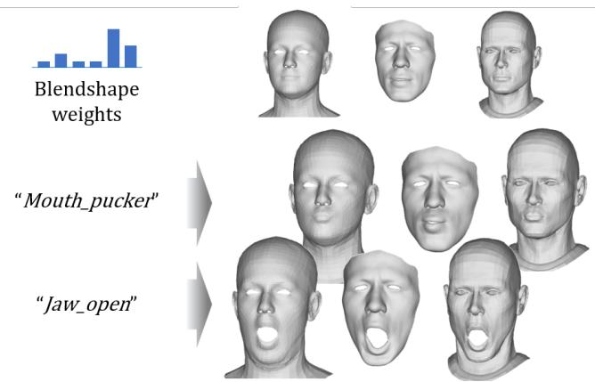  
Fig. 15. Expression controlled by blendshape coeficients using the model with latent aligned to the ICT blendshape. (Face meshes from left to right: FLAME [20], BIWI [10], and DT [38].)

## Supplementary Material

The control space for the control points can be provided by enforcing the latent of $\phi$ to align with the blendshape weights, following Qin et al. [32]. Figure 15 shows an example of our model trained with blendshape alignment, providing facial expression editing via latent manipulation. To enable the intuitive control via latent manipulation, we align the latent of � with the target blendshape coeficients using an additional loss as follows:

$$
\mathcal { L } _ { \mathrm { B S } } \ = \ \left\| z _ { \phi } - z _ { \mathrm { B S } } \right\| _ { 2 } ^ { 2 } ,\tag{17}
$$

where $z _ { \phi }$ is the latent o $\dot { \boldsymbol { \varphi } }$ and � is the target blendshape coeficient vector. The total loss is $\lambda _ { \mathrm { t o t a l } } \mathcal { L } _ { \mathrm { t o t a l } } + \lambda _ { \mathrm { B S } } \mathcal { L } _ { \mathrm { B S } }$ , where $\lambda _ { \mathrm { t o t a l } }$ and $\lambda _ { \mathrm { B S } }$ are set to 1 and 0.5, respectively.

## 7 Training Data Preparation

During training, the network input is a per-vertex feature formed by concatenating the vertex position and vertex normal (row-wise). For the design study, public benchmark datasets—COMA [33], BIWI [10], and Multiface [2] were used for training the model. Each dataset was created by capturing human facial expressions, following a similar capture protocol: sequences start from a neutral face, perform an expression, and return to neutral. As a result, most frames are mostly neutral. To reduce duplicate neutral expressions, Principal Component Analysis (PCA) was applied to each captured expression sequence, and the top principal components that collectively explain at least 95% of the total variance were retained. Then, data was sampled uniformly from each expression PCA basis for training.

The same mesh can be represented with a varying number of vertices. To make the model output a consistent result regardless of discretization, we augmented the data by subsampling mesh vertices: for each mesh, we randomly removed a number of vertices ranging from 200 up to one-sixth of the total vertices of the mesh.

## 8 Application

Our method can be applied not only to meshes but also to point clouds and Gaussian splats (GS) enclosed by the learned control points. For application to these targets, we first align the target’s orientation and scale, apply the deformation, and then restore the original orientation. For alignment, we coarsely match the target scale to that of a training mesh, then define approximate correspondences to perform Procrustes analysis. Figure 16 shows an example of our method applied to the GS-based method.

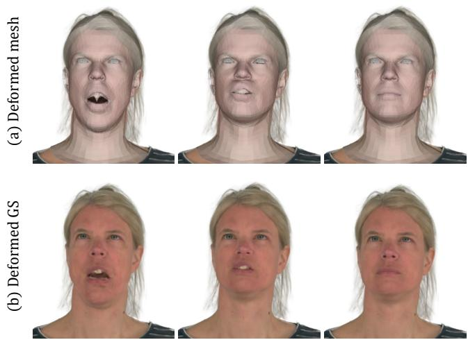  
Fig. 16. Application on GaussianAvatar [31]. The deformation applied to the underlying mesh (a) and the corresponding rendered results (b).

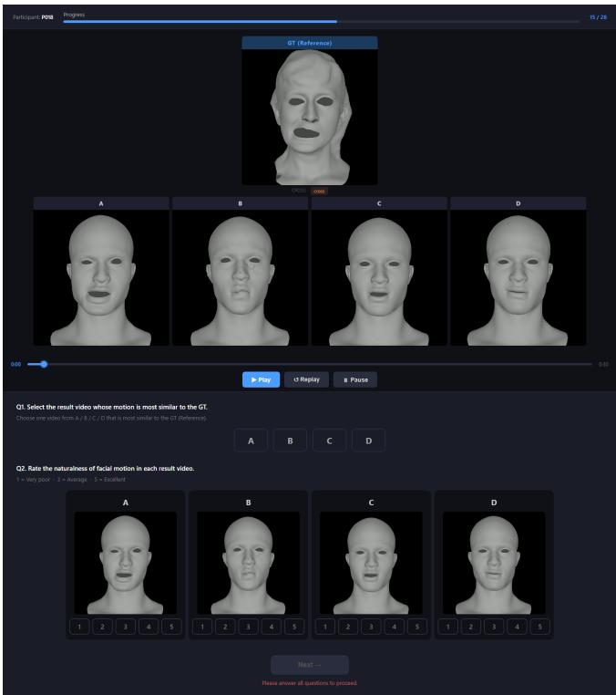  
Fig. 17. A sample trial of the user study.