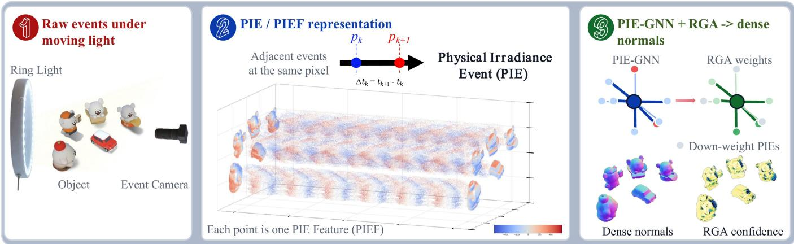
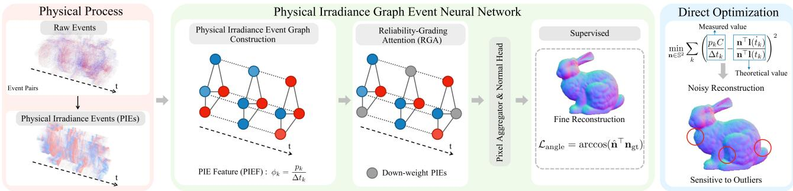
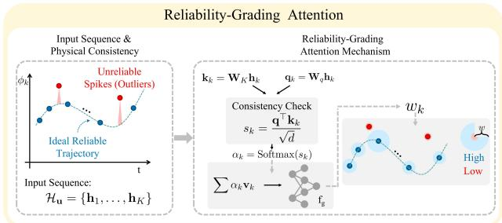
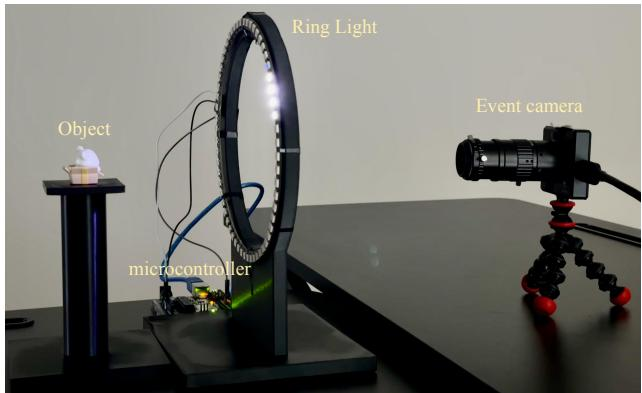
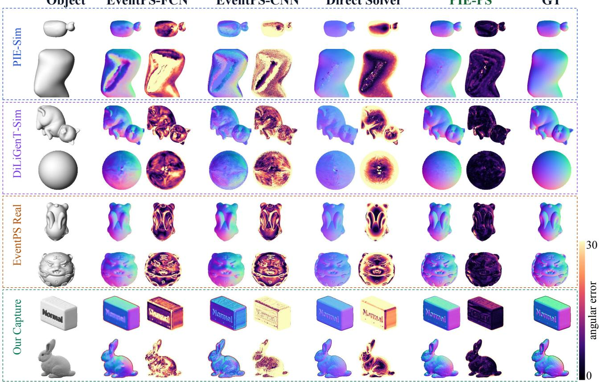
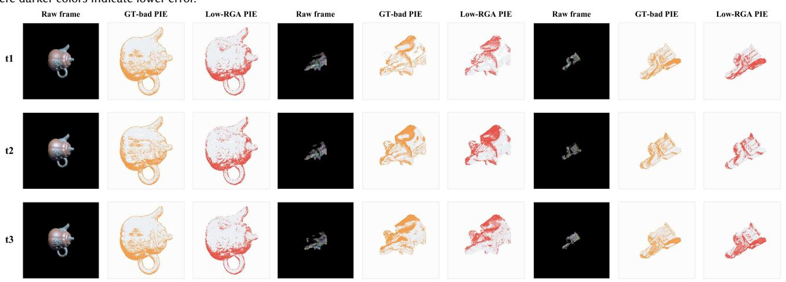
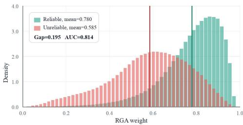

# PIE-PS: Photometric Stereo from Physical Irradiance Event Streams

XIANGZE MENG, Jilin University, China; Guangdong Institute of Intelligence Science and Technology, China GUANGYU LI, Guangdong Institute of Intelligence Science and Technology, China

JING LI, Jilin University, China

DI MEI, Beijing Institute of Technology, China

SONGCHEN MA, The Hong Kong University of Science and Technology, China

MINGKUN XU∗, Guangdong Institute of Intelligence Science and Technology, China

RUI MA∗, Jilin University, China

  
Fig. 1. Overview of PIE-PS. A prototype system captures raw event streams under moving light. Adjacent events at the same pixel are paired with their light directions to form Physical Irradiance Event (PIE) observations. Each PIE provides a threshold-free signed event-rate Physical Irradiance Event Feature (PIEF) and calibrated light-pair geometry. PIE-GNN encodes these PIE nodes, Reliability-Grading Atention (RGA) down-weights unreliable observations, and pixel aggregation produces dense surface normals.

Event cameras record asynchronous log-image-irradiance changes with mi-crosecond latency and high dynamic range. These properties are useful for photometric stereo under moving illumination, but raw events are sparse and depend on an unknown contrast threshold. We start from the event trigger model and derive a physical relation between adjacent events, light motion, and surface normals. This relation gives a direct physics-only solver, but the solver needs the threshold, enough events at each pixel, and indepen dent per-pixel optimization. To address these limits, we introduce PIE-PS, a learning-based framework for dense surface normal reconstruction from raw event streams and known li htin . We form Ph sical Irradiance Events (PIEs) by pairing two adjacent events at the same pixel with their corre-sponding light directions. Each PIE provides a Physical Irradiance Event Feature (PIEF), defined as the signed event rate. PIEF does not require the unknown contrast threshold. To share spatial and temporal context across nearby PIEs, we introduce PIE-GNN, which treats each PIE as a graph node and encodes it with its light-pair geometry. Since the reliability of PIE observations can vary with local appearance, illumination geometry, and sensor noise, Reliability-Grading Attention (RGA) predicts reliability weights to down-weight unreliable PIEs. Pixel aggregation then produces dense normals. Experiments on synthetic and real data show that PIE-PS outperforms prior event-based photometric stereo methods and the direct solver baseline. Project page: https://pie-ps.github.io.

CCS Concepts: • Computing methodologies → Reconstruction.

Additional Key Words and Phrases: Photometric Stereo, Event Camera, Phys- ical Irradiance Events

## ACM Reference Format:

Xiangze Meng, Guangyu Li, Jing Li, Di Mei, Songchen Ma, Mingkun Xu, and Rui Ma. 2026. PIE-PS: Photometric Stereo from Ph sical Irradiance Event Streams. In SIGGRAPH Asia 2026 Conference Papers (SA Conference Papers ’26), December 01–04, 2026, Kuala Lumpur, Malaysia. ACM, New York, NY, USA, 9 pages. https://doi.org/10.1145/3829340.3842249

## 1 Introduction

Recovering detailed surface geometry is important for content creation, inspection, and augmented reality [Bae and Davison 2024;

Qi et al. 2018]. Photometric Stereo (PS) [Woodham 1980] estimates dense surface normals from shading changes under varying light. It can recover fine detail, but standard frame-based PS records one image for each light state. This limits frame rate and dynamic range, especially under fast lighting or large intensity variation.

Event cameras provide a diferent sensing model. They record asynchronous log-image-irradiance changes with microsecond la tency and high dynamic range [Gallego et al. 2020; Rebecq et al. 2019]. Under moving light, these events contain normal cues. These properties make event-based PS more than a direct reuse of frame- based PS.

Prior analytical methods show that event-based PS is possible. EventPS [Yu et al. 2024] formulates event-based photometric stereo as per-pixel reconstruction from changes in log image irradiance. This connects event measurements with the lighting trajectory, but it depends on a fixed event contrast threshold. PS-EIP [Kitazawa et al. 2025] improves robustness by using an interval-profile approximation over three recorded events. However, this design requires a look-ahead event and does not use event polarity. Their physical formulations are still built on local per-pixel event constraints. Thus, the reconstruction can have limited spatial context and can be sen- sitive to event density, threshold calibration, and locally unreliable observations.

We start from the same event trigger model under moving light, but use it in a diferent way. Prior analytical methods mainly turn the event stream into a per-pixel diferential or interval-profile equation. We instead derive a pairwise photometric constraint from two adjacent events and the light directions at their timestamps. This gives a direct relation between the event pair, the light-pair change, and the surface normal. If the contrast threshold is known and enough event pairs are available at a pixel, these constraints can be solved by direct numerical optimization. We keep this solver as a physics-only baseline because it makes the observation model explicit. It also shows the limits of a pure analytical route. The solver needs the unknown threshold �, requires enough events to build stable equations, and treats each pixel independently.

Fig. 1 gives an overview of the PIE-PS representation and reconstruction pipeline. To address these limits, we introduce a learning- based framework built on Physical Irradiance Events (PIEs). A PIE is not a new sensor event. It is a structured observation built from two adjacent events at the same pixel and their corresponding light directions. Its Physical Irradiance Event Feature (PIEF) is a scalar signed event rate, given by event polarity divided by inter-event time. The light-pair geometry remains part ofthe PIE observation and is added when building the graph node. We then treat each PIE as a graph node and use PIE-GNN to exchange information between nearby event-pair observations in space and time. This graph form shares context across nearby pixels and times. In practice, the reliability of PIE observations can vary with local appearance, illumination geometry, and sensor noise, while less reliable observations may still retain useful cues for normal estimation. Reliability-Grading Attention (RGA) therefore assigns each PIE a soft reliability grade before pixel aggregation. The weighted PIE embeddings are then aggregated into pixel features, and a lightweight pixel aggregator predicts dense surface normals.

Our method separates the roles of physics and learning. The physical model tells us what an event pair should measure and which light-pair cues are useful. The graph network handles the parts that are hard to solve analytically, including unknown threshold, uneven event density, varying PIE reliability, and spatial context. As a result, PIE-PS uses the event formation model without making the fixed- threshold analytical solver the main reconstruction method.

Our main contributions are summarized as follows:

• We formulate pairwise event photometry from adjacent event triggers and use it to build a direct numerical solver baseline.

• We introduce PIE-PS, a framework for event-based photometric stereo from raw event streams and known lighting.

• We develop PIEF, PIE-GNN, and RGA as the main learned method for threshold-free signed-rate encoding, light-pair contextual fea- ture extraction, and unreliable-event suppression.

## 2 Related Work

## 2.1 Photometric Stereo

Photometric Stereo (PS) was pioneered by Woodham [Woodham 1980] to recover surface normals from varying illumination. To handle shadows, specularities, and other non-Lambertian efects, later methods use robust optimization, sparse regression, low-rank modeling, and benchmarked evaluation on DiLiGenT [Chandraker et al. 2007; Ikehata et al. 2012; Miyazaki et al. 2010; Shi et al. 2016; Wu et al. 2010]. Learning-based methods further map calibrated or uncalibrated image observations to normals [Chen et al. 2019; Ge et al. 2025; Li and Li 2022; Li et al. 2024; Lichy et al. 2022; Santo et al. 2017, 2020; Zheng et al. 2019, 2020]. Related reflectanceacquisition methods recover shape or normals together with polarimetric SVBRDFs [Baek et al. 2018; Hwang et al. 2022]. These works target richer material capture, while our work focuses on calibrated event-based dense normal recovery under moving illu- mination. Frame-based PS methods remain limited b sensor frame rate, motion blur, and dynamic range in high-speed lighting scenarios [Logothetis et al. 2021].

## 2.2 Event-based 3D Vision

Event cameras ofer high dynamic range and microsecond temporal resolution by asynchronously recording intensity changes. Recent surveys summarize event-based 3D reconstruction under high-speed motion, low light, and high dynamic range scenes [Xu et al. 2025]. Early event-based 3D methods focus on sparse depth estimation, multi-view stereo, structured light, and visual odometry [Gallego et al. 2020; Muglikar et al. 2021; Niu et al. 2025; Rebecq et al. 2018a]. Other approaches use events for visual hull reconstruction [Wang et al. 2022] or combine them with implicit representations, such as EventNeRF [Feng et al. 2025b; Rudnev et al. 2023], event-based NeRF variants [Low and Lee 2023; Ma et al. 2023], and Event-3DGS [Feng et al. 2025a; Han et al. 2024]. These methods mainly target depth, trajectory tracking, novel view synthesis, or 3D reconstruction, rather than controlled-light pixel-wise normal estimation.

## 2.3 Event-based Photometric Stereo

Recent research has used event streams for high-speed normal esti- mation. Hybrid methods, such as EFPS-Net [Ryoo et al. 2023], fuse

RGB frames with event data to enhance boundary and specular details. EventPS [Yu et al. 2024] is a calibrated pure event-based method that formulates a per-pixel diferential constraint on log image irradiance from the light trajectory, but it depends on the event contrast threshold and local event density. PS-EIP [Kitazawa et al. 2025] improves robustness with an Event Interval Profile built from three events, although it requires a look-ahead event and does not use event polarity. EventUPS [Liang et al. 2025] extends eventbased PS to the uncalibrated illumination setting. In contrast, we use adjacent-event pairwise photometry to build PIEs that preserve event timing, polarity, and light-pair geometry without requiring the contrast threshold at test time. PIE-GNN then shares context across nearby PIE nodes, and RGA weights unreliable PIEs before pixel aggregation produces dense normals.

## 3 Methodology

We propose PIE-PS for surface normal recovery from event streams. Fig. 2 shows the pipeline. We first derive event-pair photometry and build Physical Irradiance Events (PIEs) from adjacent events and their light directions in Sec. 3.1. Each PIE provides a Physical Irradiance Event Feature (PIEF), defined as the threshold-free signed event rate of the event pair in Sec. 3.2. PIE-GNN then uses the PIEF together with the corresponding light-pair geometry to extract node features in Sec. 3.2. RGA weights unreliable PIEs, and pixel aggregation predicts dense normals as described in Sec. 3.3.

## 3.1 Physical Modeling of Event Photometry

We consider a pixel location u on a static surface. Its unit surface normal is $\mathbf { n } _ { \mathbf { u } } \in \mathbb { S } ^ { 2 }$ . The difuse albedo is $\rho \in \mathbb { R } ^ { + }$ . Under a distant directional light $\mathbf { l } ( t ) \in \mathbb { S } ^ { 2 }$ with intensity �, the image irradiance at pixel u is

$$
I ( t ) = s \rho \mathbf { n } _ { \mathbf { u } } ^ { \top } \mathbf { l } ( t ) ,\tag{1}
$$

for lit regions where $\mathbf { n } _ { \mathbf { u } } ^ { \top } \mathbf { l } ( t ) > 0 .$

An event camera measures changes in log image irradiance. We write the log image irradiance as

$$
\mathcal { L } ( t ) = \ln ( q I ( t ) ) ,\tag{2}
$$

where $q$ is a sensor gain. Using Eq. 1, we have

$$
\begin{array} { r } { \mathcal { L } ( t ) = \ln q + \ln s + \ln \rho + \ln \left( \mathbf { n } _ { \mathbf { u } } ^ { \top } \mathbf { l } ( t ) \right) . } \end{array}\tag{3}
$$

The first three terms are constant for a fixed pixel. Taking the time derivative gives the theoretical value

$$
\dot { \mathcal { L } } ( t ) \triangleq \frac { \partial \mathcal { L } ( t ) } { \partial t } = \frac {  { \mathbf { n } } _ { \mathbf { u } } ^ { \top } \dot { \mathbf { l } } ( t ) } {  { \mathbf { n } } _ { \mathbf { u } } ^ { \top }  { \mathbf { l } } ( t ) } .\tag{4}
$$

This value is defined by the normal and the light motion.

The event camera does not measure Eq. 4 directly. It reports an event when the accumulated log-image-irradiance change reaches a threshold. At pixel u, let two adjacent events be $e _ { k }$ and $e _ { k + 1 }$ . Their timestamps are $t _ { k }$ and $t _ { k + 1 }$ , and the polarity of the second event is $p _ { k + 1 } \in \{ + 1 , - 1 \}$ . The trigger model gives

$$
\begin{array} { r } { \mathcal { L } ( t _ { k + 1 } ) - \mathcal { L } ( t _ { k } ) \approx p _ { k + 1 } C , } \end{array}\tag{5}
$$

where � is the contrast threshold. With $\Delta t _ { k } = t _ { k + 1 } - t _ { k }$ , the event gives a finite-diference measurement:

$$
\dot { \mathcal { L } } ( t _ { k + 1 } ) \approx \frac { \mathcal { L } ( t _ { k + 1 } ) - \mathcal { L } ( t _ { k } ) } { \Delta t _ { k } } \approx \frac { \dot { p } _ { k + 1 } C } { \Delta t _ { k } } .\tag{6}
$$

Eq. 4 gives the theoretical value, while Eq. 6 gives the eventcamera measurement. Matching them gives the following pixel-wise objective:

$$
\operatorname* { m i n } _ { \mathbf { n } _ { \mathbf { u } } \in \mathbb { S } ^ { 2 } } \sum _ { k } \left( \frac { p _ { k + 1 } C } { \Delta t _ { k } } - \frac { \mathbf { n } _ { \mathbf { u } } ^ { \top } \mathbf { \dot { l } } ( t _ { k + 1 } ) } { \mathbf { n } _ { \mathbf { u } } ^ { \top } \mathbf { l } ( t _ { k + 1 } ) } \right) ^ { 2 } .\tag{7}
$$

This objective can be solved directly by numerical optimization to recover the normal $\mathbf { n } _ { \mathbf { u } } .$ . However, using this objective as a reconstruction method leads to practical limitations. It requires a fixed event contrast threshold �. It also needs enough event-pair observations at each pixel to make the normal well constrained. These limitations motivate our Physical Irradiance Event (PIE) representation. A PIE is not a new sensor event. It is a paired observation built from two ad- jacent events at the same pixel. Let the raw events be $e _ { k } = ( { \mathbf { u } } , t _ { k } , p _ { k } )$ and $e _ { k + 1 } = ( { \mathbf { u } } , t _ { k + 1 } , { p _ { k + 1 } } )$ . We also use $\Delta t _ { k } = t _ { k + 1 } - t _ { k } , \mathbf { l } _ { k } = \mathbf { l } ( t _ { k } )$ , and $\mathbf { l } _ { k + 1 } = \mathbf { l } ( t _ { k + 1 } )$ . To establish notation for the subsequent derivation, we record the quantities associated with one PIE observation as

$$
\begin{array} { r } { \mathcal { P } _ { k } = \left( \mathbf { u } , t _ { k } , t _ { k + 1 } , p _ { k + 1 } , \Delta t _ { k } , \mathbf { l } _ { k } , \mathbf { l } _ { k + 1 } \right) . } \end{array}\tag{8}
$$

The resulting PIE record contains the event-pair information and corresponding light directions, without explicitly including the unknown contrast threshold �.

## 3.2 Physical Irradiance Event Graph Neural Network

For each PIE $\mathcal { P } _ { k }$ , we define its PIE Feature (PIEF) as

$$
\phi _ { k } = \frac { { p } _ { k + 1 } } { \Delta t _ { k } } .\tag{9}
$$

This scalar is the signed event rate. It keeps event timing and polarity, and it does not require the unknown threshold scale �.

We treat each PIE as one PIE-GNN node. Let $\tau _ { k } = ( t _ { k } + t _ { k + 1 } ) / 2$ be its midpoint time and let $\bar { \mathbf { u } } _ { k }$ be its normalized pixel coordinate. The node coordinate is

$$
\mathbf { q } _ { k } = \left[ \bar { \mathbf { u } } _ { k } ^ { \top } , \gamma \tau _ { k } \right] ^ { \top } ,\tag{10}
$$

where � is a time scale. We build the graph used by the PIE-GNN as

$$
\begin{array} { r } { G _ { \mathrm { p i e } } = ( \mathcal { V } _ { \mathrm { p i e } } , \mathcal { E } _ { \mathrm { p i e } } ) , \qquad \mathcal { V } _ { \mathrm { p i e } } = \{ \mathcal { P } _ { k } \} . } \end{array}\tag{11}
$$

The edge set $\mathcal { E } _ { \mathrm { p i e } }$ connects PIE nodes that are close in image space and time. We add a directed edge $e _ { i j }$ when

$$
\left\| \bar { \mathbf { u } } _ { i } - \bar { \mathbf { u } } _ { j } \right\| _ { \infty } \leq r _ { \mathrm { p i e } } , \qquad 0 < \tau _ { j } - \tau _ { i } \leq \Delta \tau _ { \mathrm { m a x } } .\tag{12}
$$

Here $r _ { \mathrm { p i e } }$ is the spatial search radius. $\Delta \tau _ { \mathrm { m a x } }$ is the temporal window. For each edge, we define the edge feature as

$$
\mathbf { a } _ { i j } = \frac { \mathbf { q } _ { j } - \mathbf { q } _ { i } } { 2 \rho _ { \mathrm { p i e } } } + \frac { 1 } { 2 } \mathbf { 1 } , \qquad \mathbf { \mathit { e } } _ { i j } \in \mathcal { E } _ { \mathrm { p i e } } .\tag{13}
$$

Here, $\rho _ { \mathrm { p i e } }$ is the radius used to normalize the relative coordinate, and 1 $\in \mathbb { R } ^ { 3 }$ denotes the all-ones vector.

For graph feature extraction, each PIE node uses the PIEF and the light-pair geometry as its base feature:

$$
\mathbf { x } _ { k } = \left[ \phi _ { k } , \mathbf { l } _ { k } ^ { \top } , \mathbf { l } _ { k + 1 } ^ { \top } \right] ^ { \top } .\tag{14}
$$

SA Conference Papers ’26, December 01–04, 2026, Kuala Lumpur, Malaysia.

  
Fig. 2. Overview of the PIE-PS framework. We first convert raw events under moving light into PIE observations. Each PIE provides a threshold-free signed event-rate feature and a corresponding light-pair geometry. The PIE-GNN encodes these observations, uses Reliability-Grading Atention (RGA) to weight them, aggregates pixel features, and predicts normals with a pixel aggregator.

The pixel coordinate is used as an additional input for graph convolution and neighbor search. A spline graph convolution extracts a contextual PIE feature from $\textstyle \mathcal { G } _ { \mathrm { p i e } }$

$$
\begin{array} { r } { \mathbf { h } _ { k } = f _ { \mathrm { o b s } } \left( \mathrm { G C o n v } _ { \mathrm { p i e } } ( \mathbf { x } _ { k } , \bar { \mathbf { u } } _ { k } , \mathcal { E } _ { \mathrm { p i e } } , \{ \mathbf { a } _ { i j } \} ) \right) . } \end{array}\tag{15}
$$

Here ${ \mathrm { G C o n v } } _ { \mathrm { p i e } }$ denotes the PIE-GNN graph convolution, using $\mathcal { E } _ { \mathrm { p i e } }$ and its edge features. $f _ { \mathrm { o b s } }$ is an MLP that maps the graph-convolution output to a PIE embedding. Thus, $\mathbf { h } _ { k }$ keeps the signed-rate measure- ment, the local light-pair cues, and context from nearby PIEs.

Let $N ( \mathbf { u } ) \ = \ \{ k \ | \ \mathcal { P } _ { k }$ is observed at pixel u}. This is the set of PIE nodes that belong to pixel u. The Reliability-Grading Attention (RGA) module predicts a reliability grade $w _ { k } \in \left[ 0 , 1 \right]$ for each PIE node. It is described in Sec. 3.3. We use these grades to summarize PIE embeddings at each pixel:

$$
\bar { \mathbf { h } } _ { \mathbf { u } } = \frac { \sum _ { k \in \mathcal { N } ( \mathbf { u } ) } w _ { k } \mathbf { h } _ { k } } { \sum _ { k \in \mathcal { N } ( \mathbf { u } ) } w _ { k } + \epsilon } , \qquad \mathbf { m } _ { \mathbf { u } } = \operatorname* { m a x } _ { k \in \mathcal { N } ( \mathbf { u } ) } w _ { k } \mathbf { h } _ { k } .\tag{16}
$$

Here � avoids division by zero, and the max is taken element-wise. The pixel feature is obtained by projecting the concatenated statistics:

$$
\begin{array} { r } { \mathbf { s } _ { \mathbf { u } } = f _ { \mathrm { p o o l } } \left( \left[ \bar { \mathbf { h } } _ { \mathbf { u } } , \mathbf { m } _ { \mathbf { u } } \right] \right) . } \end{array}\tag{17}
$$

A lightweight pixel aggregator then refines these features over nearby valid pixels. Let M (u) denote the spatial neighbors of pixel u. The aggregator output is

$$
\mathbf { q } _ { \mathbf { u } } = F _ { \mathrm { p i x } } \left( \left\{ \mathbf { s } _ { \mathbf { v } } ~ | ~ \mathbf { v } \in M ( \mathbf { u } ) \cup \{ \mathbf { u } \} \right\} \right) .\tag{18}
$$

More details of this pixel aggregation $F _ { \mathrm { p i x } }$ are provided in the ap- pendix. The normal head maps this refined pixel feature to the final normal:

$$
\hat { \bf n } _ { \bf u } = { \bf N o r m } \left( f _ { \mathrm { n o r m a l } } ( { \bf q } _ { \bf u } ) \right) ,\tag{19}
$$

where $f _ { \mathrm { p o o l } }$ and $f _ { \mathrm { n o r m a l } }$ are MLPs, and Norm(·) denotes $L _ { 2 }$ normal- ization.

## 3.3 Reliability-Grading Atention

Eq. 6 shows that the PIEF is proportional to the measured log-imageirradiance change, up to the unknown scale �. Under ideal Lam- bertian reflectance and smoothly varying illumination, PIEF observations at the same pixel are expected to vary consistently with their corresponding light pairs. In practice, the reliability of PIE observations can vary with local appearance, illumination geometry, and sensor noise. Less reliable observations may appear as abrupt deviations from this same-pixel temporal trend, as illustrated in Fig. 3. We propose RGA to assign each PIE a soft reliability grade for subsequent aggregation.

  
Fig. 3. The Reliability-Grading Atention module scores each event-pair observation. It detects spikes in the PIE sequence and predicts a confidence weight for each observation. The weighted observations are then aggregated into pixel features.

For a reliable PIE, the measured event contrast should agree with the Lambertian change predicted by the two light directions. Substituting Eq. 3 into Eq. 5 gives

$$
\ln \left( \mathbf { n } _ { \mathbf { u } } ^ { \top } \mathbf { l } _ { k + 1 } \right) - \ln \left( \mathbf { n } _ { \mathbf { u } } ^ { \top } \mathbf { l } _ { k } \right) \approx p _ { k + 1 } C .\tag{20}
$$

Exponentiating both sides gives

$$
\frac {  { \mathbf { n } } _ {  { \mathbf { u } } } ^ { \top }  { \mathbf { l } } _ { k + 1 } } {  { \mathbf { n } } _ {  { \mathbf { u } } } ^ { \top }  { \mathbf { l } } _ { k } } \approx \exp ( p _ { k + 1 } C ) .\tag{21}
$$

This step uses the discrete relation between two adjacent events rather than the continuous-time derivative. This leads to the discrete pairwise constraint

$$
\begin{array} { r } { \mathbf { n } _ { \mathbf { u } } ^ { \top } \left( \mathbf { l } _ { k + 1 } - \exp ( p _ { k + 1 } C ) \mathbf { l } _ { k } \right) \approx 0 . } \end{array}\tag{22}
$$

When a PIE is reliable, the left-hand side of $\operatorname { E q } .$ 22 should be close to zero. A large magnitude therefore indicates a potentially unreliable PIE observation.

In synthetic data, the ground-truth normal $\mathbf { n } _ { \mathrm { g t , u } }$ and the threshold � are known. We use Eq. 22 only to identify unreliable PIEs for

analysis and comparison. We define

$$
\mathbf { z } _ { k } = \mathbf { l } _ { k + 1 } - \exp ( { \hat { p } } _ { k + 1 } C ) \mathbf { l } _ { k } , \qquad r _ { k } = { \frac { \left| \mathbf { n } _ { \mathrm { g t } , { \mathbf { u } } } ^ { \top } \mathbf { z } _ { k } \right| } { \left\| \mathbf { z } _ { k } \right\| _ { 2 } + \epsilon } } .\tag{23}
$$

The score $r _ { k }$ measures how much one PIE violates the discrete pairwise constraint. A small $r _ { k }$ means this PIE agrees with the Lambertian prediction. A large $r _ { k }$ means this PIE does not agree with the prediction, so it is treated as unreliable. We also handle shadow and grazing lighting separately. In these cases, $\mathbf { n } _ { \mathrm { g t } , \mathbf { u } } ^ { \top } \mathbf { l } _ { k }$ or $\mathbf { n } _ { \mathrm { g t } , \mathbf { u } } ^ { \top } \mathbf { l } _ { k + 1 }$ is non-positive or close to zero, so the Lambertian log- image-irradiance equation is invalid or unstable. We therefore mark these PIEs as unreliable without using $r _ { k }$ . The remaining PIEs are treated as GT-identified reliable PIEs. These labels are used only for visualization, diagnostics, and comparison. They are not model inputs at test time.

RGA suppresses unreliable observations by predicting a confidence weight for each PIE. In our implementation, RGA uses a soft-gating attention. It assigns an individual confidence weight to each PIE in the same-pixel sequence. Fig. 3 shows this process on the time-ordered PIE sequence of one pixel. Given a pixel u, we collect the time-ordered PIE embeddings

$$
\mathcal { H } _ { \mathbf { u } } = \{ { \mathbf { h } } _ { k } \ | \ k \in N ( { \mathbf { u } } ) \} .\tag{24}
$$

The embeddings are sorted by time.

A small self-attention scorer reads the time-ordered embedding sequence and predicts an individual confidence weight for each PIE. For each PIE embedding, we first form query, key, and value vectors:

$$
\mathbf { q } _ { k } = W _ { q } \mathbf { h } _ { k } , \qquad \mathbf { k } _ { k } = W _ { k } \mathbf { h } _ { k } , \qquad \mathbf { v } _ { k } = W _ { v } \mathbf { h } _ { k } .\tag{25}
$$

The attention score for PIE � is computed from all PIEs at the same pixel:

$$
\alpha _ { k j } = \mathrm { s o f t m a x } _ { j \in N ( \mathbf { u } ) } \left( \frac { \mathbf { q } _ { k } ^ { \top } \mathbf { k } _ { j } } { \sqrt { d } } \right) , \qquad \mathbf { y } _ { k } = \sum _ { j \in N ( \mathbf { u } ) } \alpha _ { k j } \mathbf { v } _ { j } .\tag{26}
$$

The RGA confidence weight is then

$$
w _ { k } = \sigma ( f _ { g } ( \mathbf { y } _ { k } ) ) .\tag{27}
$$

Here $f _ { g }$ maps each attention output to a scalar logit, and $\sigma ( \cdot )$ is the sigmoid function. The sigmoid output lets multiple PIEs remain active at one pixel. RGA reduces the contribution of PIEs assigned lower reliability grades. The weights are used in Eq. 16 to form the pixel feature.

## 3.4 Training Strategy

We train the network with direct normal supervision. Let Ω be the set of valid training pixels. The main loss is the mean angular error on the final normal:

$$
\mathcal { L } _ { \mathrm { n o r m a l } } = \frac { 1 } { | \Omega | } \sum _ { \mathbf { u } \in \Omega } \operatorname { a r c c o s } \left( \hat { \mathbf { n } } _ { \mathbf { u } } ^ { \top } \mathbf { n } _ { \mathrm { g t } , \mathbf { u } } \right) .\tag{28}
$$

At test time, the model only needs event pairs and light directions.

  
Fig. 4. Prototype acquisition system used for real-world event-based photometric stereo.

## 4 Experiment

## 4.1 Implementation Details

Method Implementation. We implement PIE-PS in PyTorch. The physics-only direct solver is implemented in NumPy. For each pixel, it optimizes Eq. 7 independently. We use exact SVD for initialization and run five IRLS iterations with two tangent-plane Gauss-Newton steps. Pixels with fewer than five PIE observations are not evaluated. For PIE-GNN, we use a 7-D node feature, a 64-D PIE embedding, and a 128-D graph hidden feature. The neighborhood search modules use custom CUDA kernels. For the PIE graph, we set the spatial search radius to $r _ { \mathrm { p i e } } = 0 . 0 5$ . PIE times are normalized to [0, 1] within each sequence, and we use the full normalized range as the temporal window, so $\Delta \tau _ { \mathrm { m a x } } \ = \ 1$ . The temporal scale in Eq. 10 is $\gamma = 0 . 3$ For edge-feature normalization, we set $\rho _ { \mathrm { p i e } } ~ = ~ 2 \lfloor r _ { \mathrm { p i e } } W + 2 \rfloor / W$ where � is the image width. The pixel aggregator implementation is detailed in the supplementary material. The RGA scorer is a twolayer Transformer with four attention heads and a 64-D hidden feature. We optimize the network with Adam using the normal-estimation loss in Sec. 3.4. Training takes about 3.4 hours for 200 epochs on a single NVIDIA H100 PCIe GPU.

Prototype System. To validate our method on real-world data, we constructed the prototype acquisition system shown in Fig. 4. The imaging setup uses a CeleX-V event camera with a spatial resolution of 1280 × 800. The camera is equipped with a Zhonglian Kechuang TM5028MP12 macro lens with a 50mm focal length, 1.1-inch format, and C-mount interface. For illumination, we use a programmable ring light with 60 WS2812 5050 RGB LED beads. An Arduino Uno R3 sequentially drives the LEDs and records the activation timestamps and light directions. The lighting timestamps are manually synchronized with the event camera clock. We calibrate the setup so that the camera optical center, ring light center, and target object are aligned on the same horizontal axis.

## 4.2 Datasets

To train PIE-PS and ensure fair comparison with prior methods, we generate a synthetic dataset, named PIE-Sim. PIE-Sim follows the same simulation pipeline as EventPS [Yu et al. 2024]. It uses objects

Object

EventPS-FCN

EventPS-CNN

Direct Solver

PIE-PS

GT

Fig. 5. Qualitative comparison across synthetic and real scenes. Each row shows the object, the normal prediction and angular error map of each method, and the ground-truth normal. We include PIE-Sim, DiLiGenT-Sim, EventPS real scenes, and our captured scenes. Error maps use the same 0◦–30◦ color range, where darker colors indicate lower error.  

Fig. 6. RGA reliability visualization. Each object is shown at three time slices. For each time slice, we show the raw frame, the GT-identified unreliable PIE ratio, and the low-RGA PIE ratio. GT-identified unreliable PIEs are computed with ground-truth normals and known simulation thresholds only for analysis. The figure label GT-bad denotes these GT-identified unreliable PIEs. Low-RGA maps are produced by the learned RGA scorer.

Table 1. Quantitative comparison on DiLiGenT-Sim. MAE is reported in degrees, and lower is beter.
<table><tr><td>Method</td><td>BALL</td><td>BUDDHA</td><td>CAT</td><td>Cow</td><td>GOBLET</td><td>HARVEST</td><td>PoT1</td><td>PoT2</td><td>READING</td><td>Average</td></tr><tr><td>EventUPS</td><td>8.86</td><td>12.21</td><td>10.78</td><td>18.58</td><td>12.97</td><td>23.32</td><td>8.70</td><td>15.13</td><td>16.71</td><td>14.14</td></tr><tr><td>EventPS-OP</td><td>10.99</td><td>18.73</td><td>12.74</td><td>26.51</td><td>18.43</td><td>36.06</td><td>13.78</td><td>15.75</td><td>24.61</td><td>19.73</td></tr><tr><td>EventPS-FCN</td><td>7.49</td><td>18.13</td><td>11.42</td><td>20.61</td><td>18.07</td><td>26.05</td><td>12.83</td><td>16.59</td><td>15.16</td><td>16.26</td></tr><tr><td>EventPS-CNN</td><td>10.44</td><td>16.79</td><td>11.88</td><td>20.60</td><td>16.44</td><td>25.26</td><td>12.93</td><td>15.54</td><td>18.19</td><td>16.45</td></tr><tr><td>Direct Solver</td><td>15.36</td><td>15.09</td><td>13.75</td><td>14.55</td><td>15.62</td><td>20.07</td><td>13.59</td><td>14.67</td><td>17.72</td><td>15.60</td></tr><tr><td>PIE-PS</td><td>3.93</td><td>8.67</td><td>5.15</td><td>12.90</td><td>7.81</td><td>12.91</td><td>6.33</td><td>8.34</td><td>12.25</td><td>8.70</td></tr></table>

from the Blobby [Johnson and Adelson 2011] and Sculpture [Wiles and Zisserman 2017] collections, rendered with random poses and appearance parameters following the EventPS setup. We simulate event streams using ESIM [Rebecq et al. 2018b] under three lighting trajectories, including circle, hypotrochoid, and interpolated DiLi-GenT. Each PIE-Sim scene is generated with an independently sam-pled contrast threshold and simulation-noise realization, producing diferent event densities and inter-event intervals. Each sequence contains 600 rendered frames. PIE-Sim contains 77 training scenes and 30 test scenes with no object overlap between the two splits. To test generalization to standard photometric-stereo geometry, we also introduce DiLiGenT-Sim. It is built by simulating event streams on DiLiGenT [Shi et al. 2016]. DiLiGenT-Sim contains 9 test scenes.

For real-world evaluation, we use two real data sources. First, we include the three real EventPS scenes [Yu et al. 2024]. Second, we capture three 3D-printed objects with our prototype system, including Bunny, Rectangle, and Flower. We compute GT normals from the corresponding 3D CAD models and align them to the sensor observation using the event accumulation image [Kitazawa et al. 2025]. The alignment is performed with MeshLab’s mutual information registration filter [Cignoni et al. 2008], following the method in [Shi et al. 2016].

## 4.3 Quantitative Evaluation

Table 1 reports the MAE on DiLiGenT-Sim. For baselines, we use the published EventUPS and EventPS results on the same scene set. EventUPS has no public code, and PS-EIP is omitted because its code and benchmark data are unavailable. The direct solver is a physics- only baseline that optimizes Eq. 7. PIE-PS achieves an average MAE of 8.70◦. It is 5.44◦ lower than the best published baseline EventUPS and 6.90◦ lower than the direct solver.

Table 2. PIE-Sim results by object family and lighting trajectory. MAE is reported in degrees.
<table><tr><td rowspan="2">Method</td><td colspan="3">Blobby</td><td colspan="3">Sculpture</td><td rowspan="2">Avg.</td></tr><tr><td>Circle</td><td>Hypo.</td><td>DiLiGenT</td><td>Circle</td><td>Hypo.</td><td>DiLiGenT</td></tr><tr><td>EventPS-FCN</td><td>28.83</td><td>16.83</td><td>21.73</td><td>31.63</td><td>26.43</td><td>29.59</td><td>25.84</td></tr><tr><td>EventPS-CNN</td><td>43.50</td><td>42.11</td><td>26.08</td><td>48.31</td><td>46.85</td><td>28.08</td><td>39.15</td></tr><tr><td>Direct Solver</td><td>27.08</td><td>17.24</td><td>13.02</td><td>26.60</td><td>24.68</td><td>22.67</td><td>21.88</td></tr><tr><td>PIE-PS</td><td>10.68</td><td>6.41</td><td>4.81</td><td>17.17</td><td>12.09</td><td>12.77</td><td>10.66</td></tr></table>

Table 2 reports a breakdown by object family and lighting trajectory on PIE-Sim. We evaluate EventPS-FCN and EventPS-CNN using their released models. PIE-PS gives the lowest error in every group. Its average MAE is 10.66◦, which is 11.22◦ lower than the direct solver and 15.18◦ lower than EventPS-FCN.

Table 3. Real-world results on EventPS scenes and our captures. MAE is reported in degrees.
<table><tr><td rowspan="2">Method</td><td colspan="3">EventPS Real</td><td colspan="3">Captured</td><td rowspan="2">Avg.</td></tr><tr><td>Real-1</td><td>Real-2</td><td>Real-3</td><td>Bunny</td><td>Rectangle</td><td>Flower</td></tr><tr><td>EventPS-FCN</td><td>15.79</td><td>19.65</td><td>9.42</td><td>26.14</td><td>18.70</td><td>35.76</td><td>20.91</td></tr><tr><td>EventPS-CNN</td><td>17.65</td><td>20.16</td><td>14.85</td><td>48.78</td><td>48.11</td><td>43.14</td><td>32.12</td></tr><tr><td>Direct Solver</td><td>21.08</td><td>21.10</td><td>20.50</td><td>23.46</td><td>32.22</td><td>25.02</td><td>23.90</td></tr><tr><td>PIE-PS</td><td>6.51</td><td>6.09</td><td>5.92</td><td>12.69</td><td>11.52</td><td>19.57</td><td>10.38</td></tr></table>

Table 3 reports the MAE on six real-world scenes with aligned ground-truth normals. We compare the released EventPS networks, the direct solver, and PIE-PS on the same scenes. PIE-PS has the best result on all six scenes. Its average MAE is 10.38◦, which is 10.53◦ lower than EventPS-FCN and 13.52◦ lower than the direct solver.

We additionally evaluate PIE-PS under three CeleX SDK sensitiv- ity settings, with detailed statistics reported in the supplementary material.

## 4.4 Qualitative Evaluation

Fig. 5 compares reconstruction quality on both synthetic and real data. EventPS-FCN and EventPS-CNN often recover the coarse object shape, but their error maps show large local errors, especially on high-curvature regions and real captures. The direct solver gives a useful physics-only baseline, but it produces noisy normals because it solves each pixel independently and cannot reject unreliable event pairs. In contrast, PIE-PS gives smoother and more accurate normals across the four settings. The improvement is visible in the darker error maps and is consistent with the MAE values shown in the figure.

Fig. 6 visualizes the RGA reliability weights. The orange maps show GT-identified unreliable PIEs. The red maps show PIEs as- signed low RGA weights. The low-RGA regions overlap more with GT-identified unreliable regions than with reliable regions. This supports using RGA as a soft reliability-weighting module.

## 5 Ablation Study

We analyze PIEF and RGA on PIE-Sim. For PIEF, we remove the signed event-rate input from each PIE node, while keeping the light-pair geometry and the rest of the network unchanged. For RGA, we remove learned reliability weights and pool PIE observations directly. All results are reported as MAE in degrees.

Table 4. Ablation results on PIE-Sim. MAE is reported in degrees.
<table><tr><td>Metric</td><td>PIE-PS</td><td>w/o PIEF rate</td><td>w/o RGA</td></tr><tr><td>Avg. MAE</td><td>10.66</td><td>14.52</td><td>11.99</td></tr></table>

  
Fig. 7. RGA weight distribution on PIE-Sim. GT-identified unreliable PIEs receive lower weights on average, supporting RGA as a soft reliability weighting module.

Table 4 summarizes the contribution of the main PIE-PS com- ponents. PIEF gives the main photometric signal, and removing it increases the average MAE from 10.66◦ to 14.52◦. This shows that light-pair geometry alone is not enough, because it does not include the signed event response caused by the light change. Removing

RGA also increases the average MAE to 11.99◦, confirming the value of learned reliability weighting. Fig. 7 further shows that RGA tends to assign lower weights to unreliable PIEs rather than weighting observations randomly. This supports its role as a learned reliability weighting module.

## 6 Conclusion and Discussion

In this paper, we presented PIE-PS, a physics-embedded framework that uses Physical Irradiance Events (PIEs) and a Physical Irradiance Event Graph Neural Network (PIE-GNN) to recover dense surface normals from event streams. Reliability-Grading Attention (RGA) assigns soft reliability grades to PIE observations before pixel aggregation.

Our method still assumes calibrated light directions. Strong spec- ular highlights or complex inter-reflections can reduce the reliability of PIE observations and degrade normal estimation. In future work, we will extend the model to uncalibrated lighting and more general reflectance.

## Acknowledgments

This work was supported in part by the National Natural Science Foundation of China (Grant Nos. 62572212 and 62506084), the Science and Technology Development Plan of Jilin Province (Grant No. 20260203049SF), and the Fundamental Research Funds for the Central Universities. This work was also supported by the High-Level Talents Innovation Team Project of the Guangdong-Macao In-Depth Cooperation Zone in Hengqin (Grant No. 2630004018939).

## References

Gwangbin Bae and Andrew J Davison. 2024. Rethinking inductive biases for surface normal estimation. In Proceedings ofthe IEEE/CVF Conference on Computer Vision and Pattern Recognition. 9535–9545.

Seung-Hwan Baek, Daniel S. Jeon, Xin Tong, and Min H. Kim. 2018. Simultaneous Acquisition of Polarimetric SVBRDF and Normals. ACM Transactions on Graphics 37, 6, Article 268 (2018), 15 pages. doi:10.1145/3272127.3275018

Manmohan Chandraker, Sameer Agarwal, and David Kriegman. 2007. Shadowcuts: Photometric stereo with shadows. In 2007 IEEE Conference on Computer Vision and Pattern Recognition. IEEE, 1–8.

Guanying Chen, Kai Han, Boxin Shi, Yasuyuki Matsushita, and Kwan-Yee K Wong. 2019. Self-calibrating deep photometric stereo networks. In Proceedings ofthe IEEE/CVF conference on computer vision and pattern recognition. 8739–8747.

Paolo Cignoni, Marco Callieri, Massimiliano Corsini, Matteo Dellepiane, Fabio Ganov elli, Guido Ranzuglia, et al. 2008. Meshlab: an open-source mesh processing tool.. In Eurographics Italian chapter conference, Vol. 2008. Salerno, 129–136.

Chaoran Feng, Zhenyu Tang, Wangbo Yu, Yatian Pang, Yian Zhao, Jianbin Zhao, Li Yuan, and Yon hon Tian. 2025a. E-4d s: Hi h-fidelit d namic reconstruction from the multi-view event cameras. In Proceedings ofthe 33rd ACM International Conference on Multimedia. 7356–7365.

Chaoran Feng, Wangbo Yu, Xinhua Cheng, Zhenyu Tang, Junwu Zhang, Li Yuan, and Yon hon Tian. 2025b. AE-NeRF: Au mentin Event-Based Neural Radiance Fields for Non-ideal Conditions and Larger Scenes. In Proceedings of the AAAI Conference on Artificial Intelligence, Vol. 39. 2924–2932.

Guillermo Gallego, Tobi Delbrück, Garrick Orchard, Chiara Bartolozzi, Brian Taba, Andrea Censi, Stefan Leutenegger, Andrew J Davison, Jörg Conradt, Kostas Daniilidis, et al. 2020. Event-based vision: A survey. IEEE transactions on pattern analysis and machine intelligence 44, 1 (2020), 154–180.

Wenhang Ge, Jiantao Lin, Guibao Shen, Jiawei Feng, Tao Hu, Xinli Xu, and Ying Cong Chen. 2025. Prm: Photometric stereo based large reconstruction model. In Proceedings ofthe IEEE/CVF International Conference on Computer Vision. 25009– 25018.

Hanqian Han, Jianing Li, Henglu Wei, and Xiangyang Ji. 2024. Event-3dgs: Event-based 3d reconstruction using 3d gaussian splatting. Advances in Neural Information Processing Systems 37 (2024), 128139–128159.

Inseung Hwang, Daniel S. Jeon, Adolfo Muñoz, Diego Gutierrez, Xin Tong, and Min H. Kim. 2022. Sparse Ellipsometry: Portable Acquisition of Polarimetric SVBRDF and Shape with Unstructured Flash Photography. ACM Transactions on Graphics 41, 4, Article 145 (2022), 14 pages. doi:10.1145/3528223.3530075

Satoshi Ikehata, David Wipf, Yasuyuki Matsushita, and Kiyoharu Aizawa. 2012. Robust photometric stereo using sparse regression. In 2012 IEEE Conference on Computer Vision and Pattern Recognition. IEEE, 318–325.

Micah K Johnson and Edward H Adelson. 2011. Shape estimation in natural illumination. In CVPR 2011. IEEE, 2553–2560.

Kazuma Kitazawa, Takahito Aoto, Satoshi Ikehata, and Tsuyoshi Takatani. 2025. PS-EIP: Robust Photometric Stereo Based on Event Interval Profile. In Proceedings ofthe Computer Vision and Pattern Recognition Conference. 6241–6251.

Junxuan Li and Hongdong Li. 2022. Self-calibrating photometric stereo by neural inverse rendering. In European Conference on Computer Vision. Springer, 166–183.

Zongrui Li, Zhan Lu, Haojie Yan, Boxin Shi, Gang Pan, Qian Zheng, and Xudong Jiang. 2024. Spin-up: Spin light for natural light uncalibrated photometric stereo. In Proceedings ofthe IEEE/CVF Conference on Computer Vision and Pattern Recognition. 11905–11914.

Jinxiu Liang, Bohan Yu, Siqi Yang, Haotian Zhuang, Jieji Ren, Peiqi Duan, and Boxin Shi. 2025. EventUPS: Uncalibrated Photometric Stereo Usin an Event Camera. In Proceedings of the IEEE/CVF International Conference on Computer Vision. 7516–7525.

Daniel Lichy, Soumyadip Sengupta, and David W Jacobs. 2022. Fast light-weight nearfield photometric stereo. In Proceedings ofthe IEEE/CVF Conference on Computer Vision and Pattern Recognition. 12612–12621.

Fotios Logothetis, Ignas Budvytis, Roberto Mecca, and Roberto Cipolla. 2021. Px net: Simple and eficient pixel-wise training of photometric stereo networks. In Proceedings ofthe IEEE/CVFinternational conference on computervision. 12757–12766.

Weng Fei Low and Gim Hee Lee. 2023. Robust e-nerf: Nerf from sparse & noisy events under non-uniform motion. In Proceedings of the IEEE/CVF International Conference

on Computer Vision. 18335–18346.

Qi Ma, Danda Pani Paudel, Ajad Chhatkuli, and Luc Van Gool. 2023. Deformable neural radiance fields using rgb and event cameras. In Proceedings of the IEEE/CVF International Conference on Computer Vision. 3590–3600.

Daisuke Miyazaki, Kenji Hara, and Katsushi Ikeuchi. 2010. Median photometric stereo as applied to the segonko tumulus and museum objects. International Journal of Computer Vision 86, 2 (2010), 229–242.

Manasi Muglikar, Guillermo Gallego, and Davide Scaramuzza. 2021. Esl: Event-based structured light. In 2021 International Conference on 3D Vision (3DV). IEEE, 1165– 1174.

Junkai Niu, Sheng Zhong, Xiuyuan Lu, Shaojie Shen, Guillermo Gallego, and Yi Zhou. 2025. Esvo2: Direct visual-inertial odometry with stereo event cameras. IEEE Transactions on Robotics (2025).

Xiaojuan Qi, Renjie Liao, Zhengzhe Liu, Raquel Urtasun, and Jiaya Jia. 2018. Geonet: Geometric neural network for joint depth and surface normal estimation. In Proceedings of the IEEE Conference on Computer Vision and Pattern Recognition. 283–291.

Henri Rebecq, Guillermo Gallego, Elias Mueggler, and Davide Scaramuzza. 2018a. EMVS: Event-based multi-view stereo—3D reconstruction with an event camera in real-time. International Journal ofComputer Vision 126, 12 (2018), 1394–1414.

Henri Rebecq, Daniel Gehrig, and Davide Scaramuzza. 2018b. Esim: an open event camera simulator. In Conference on robot learning. PMLR, 969–982.

Henri Rebecq, René Ranftl, Vladlen Koltun, and Davide Scaramuzza. 2019. Events-to- video: Bringing modern computer vision to event cameras. In Proceedings of the IEEE/CVF Conference on Computer Vision and Pattern Recognition. 3857–3866.

Viktor Rudnev, Mohamed Elgharib, Christian Theobalt, and Vladislav Golyanik. 2023. Eventnerf: Neural radiance fields from a single colour event camera. In Proceedings ofthe IEEE/CVF Conference on Computer Vision and Pattern Recognition. 4992–5002.

Wonjeong Ryoo, Giljoo Nam, Jae-Sang Hyun, and Sangpil Kim. 2023. Event fusion photometric stereo network. Neural Networks (aug 2023). doi:10.1016/j.neunet.2023. 08.009

Hiroaki Santo, Masaki Samejima, Yusuke Sugano, Boxin Shi, and Yasuyuki Matsushita. 2017. Deep photometric stereo network. In Proceedings ofthe IEEE international conference on computer vision workshops. 501–509.

Hiroaki Santo, Masaki Samejima, Yusuke Sugano, Boxin Shi, and Yasuyuki Matsushita. 2020. Deep photometric stereo networks for determining surface normal and reflectances. IEEE Transactions on Pattern Analysis and Machine Intelligence 44, 1 (2020), 114–128.

Boxin Shi, Zhe Wu, Zhipeng Mo, Dinglong Duan, Sai-Kit Yeung, and Ping Tan. 2016. A benchmark dataset and evaluation for non-lambertian and uncalibrated hotometric stereo. In Proceedings ofthe IEEE conference on computervision andpattern recognition. 3707–3716.

Ziyun Wang, Kenneth Chaney, and Kostas Daniilidis. 2022. Evac3d: From event-based apparent contours to 3d models via continuous visual hulls. In European conference on computer vision. Springer, 284–299.

Olivia Wiles and Andrew Zisserman. 2017. Silnet: Single-and multi-view reconstruction by learning from silhouettes. arXiv preprint arXiv:1711.07888 (2017).

Robert J Woodham. 1980. Photometric method for determining surface orientation from multiple images. Optical engineering 19, 1 (1980), 139–144.

Lun Wu, Arvind Ganesh, Boxin Shi, Yasuyuki Matsushita, Yongtian Wang, and Yi Ma. 2010. Robust photometric stereo via low-rank matrix completion and recovery. In Asian conference on computer vision. Springer, 703–717.

Chuanzhi Xu, Haoxian Zhou, Langyi Chen, Haodong Chen, Ying Zhou, Vera Yuk Ying Chung, Qiang Qu, and Weidong Cai. 2025. A Survey of 3D Reconstruction with Event Cameras. arXiv preprint arXiv:2505.08438 (2025).

Bohan Yu, Jieji Ren, Jin Han, Feishi Wang, Jinxiu Liang, and Boxin Shi. 2024. Eventps: Real-time photometric stereo using an event camera. In Proceedings ofthe IEEE/CVF Conference on Computer Vision and Pattern Recognition. 9602–9611.

Qian Zheng, Yiming Jia, Boxin Shi, Xudong Jiang, Ling-Yu Duan, and Alex C Kot. 2019. SPLINE-Net: Sparse photometric stereo through lighting interpolation and normal estimation networks. In Proceedings ofthe IEEE/CVF International Conference on Computer Vision. 8549–8558.

Qian Zheng, Boxin Shi, and Gang Pan. 2020. Summary study ofdata-driven photometric stereo methods. Virtual Reality & Intelligent Hardware 2, 3 (2020), 213–221.