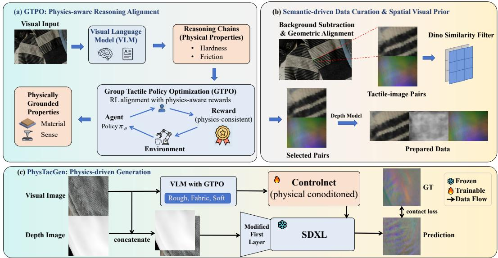
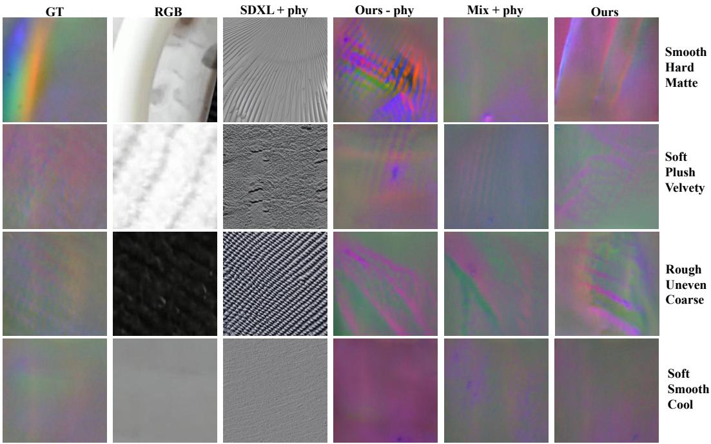
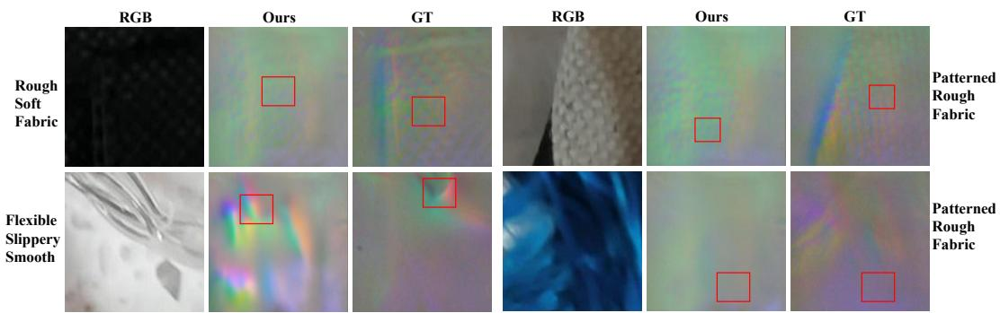

# PhysTacGen: Physics-Aware Visual-Tactile Sensor Image Generation

Guo Tang1 Yongtao Wang1,2∗ 1Wangxuan Institute of Computer Technology, Peking University 2 VGI Labs Co., Ltd. confection\_tang@stu.pku.edu.cn wyt@pku.edu.cn

## Abstract

Realistic physical interaction is a cornerstone of embodied intelligence, yet collecting paired visual–tactile data remains costly. Visual-to-tactile synthesis offers a promising approach to augmenting such data, but learning this mapping is complicated by the gap between visual appearance and contact-related material properties, as well as spatial misalignment in paired observations. To address these challenges, we present PhysTacGen, a visual-to-optical-tactile image generation framework that integrates material-aware descriptions with geometric conditioning. First, we introduce Group Tactile Policy Optimization (GTPO), a reinforcement learning strategy that refines a vision–language model to generate structured material descriptions using task-specific rewards. Second, we combine DINOv2-based pair curation with monocular relative-depth estimation to select training pairs and provide geometric priors. Finally, an SDXL ControlNet synthesizes optical tactile images conditioned on RGB, relative depth, and GTPO-generated text. Experiments on curated SSVTP data demonstrate improved structural similarity over the compared baselines, while a blinded user study shows a preference for GTPO-generated descriptions. Generated tactile inputs also improve performance on an attribute-derived force-coefficient prediction proxy. Together, these results demonstrate the effectiveness of PhysTacGen for optical tactile image synthesis and its utility in the evaluated downstream task.The code will be available at https://github.com/VDIGPKU/PhysTacGen.

## 1 Introduction

High-precision manipulation is the cornerstone of next-generation embodied intelligence. Tasks requiring sub-millimetre accuracy—such as threading a cable, inserting a USB connector [33], or handling deformable tissues [5]—often render vision insufficient due to occlusion or lack of contact information. Consequently, tactile sensing has emerged as an imperative modality for the last centimetre of interaction, providing the temporal feedback and subtle surface deformation cues necessary for complex reasoning [2]. The recent surge in Vision-Tactile-Language Models (VTLMs) further underscores the necessity of integrating touch with semantic understanding to achieve robust robot perception [33]. However, a critical bottleneck impedes this progress: the scarcity of largescale, paired visual-tactile data. Unlike the web-scale abundance of visual data or the maturity of photorealistic visual rendering, collecting high-fidelity tactile datasets is prohibitively expensive, hardware-dependent, and labour-intensive. Furthermore, as highlighted in recent multi-embodied studies [11], the spatial relationship between external cameras and tactile sensors varies significantly across different robotic platforms. This inconsistency in camera-to-sensor layout introduces severe spatial noise into existing datasets, making it difficult for conventional models to learn a robust mapping from 2D visual pixels to 3D tactile deformations. To address this scarcity, prior works have primarily turned to physical simulation. Simulators such as Tacto [26], Taxim [24], and TacSL [1] leverage rendering engines to generate synthetic tactile images. While scalable, these approaches suffer from a fundamental domain gap. The rendered visual counterparts in simulators often lack the photorealism and diverse textures of real-world objects. Furthermore, the simplified contact physics in simulators frequently fails to capture the complex, non-linear deformations of elastomers found in real optical tactile sensors.

Alternatively, data-driven Visual-to-Tactile (V2T) synthesis has gained traction. Approaches like SingleS2R [25] attempt to map visual features directly to tactile responses using pixel-level statistics. However, these methods expose two critical failure modes. First, they fail to distinguish between visual texture and physical compliance. A model might erroneously generate deep tactile deformations for a hard, marble-patterned surface simply because the visual texture is complex, or conversely, generate a flat response for a texture-less but soft sponge. Second, real-world visual-tactile pairs suffer from severe spatial misalignment due to mechanical tolerances. For deterministic pixel-wise MSE regression, uncertainty over spatial correspondence can average out detail; stochastic generators may instead produce sharp but misplaced features. Without explicit physical grounding and spatial alignment, these generative models hallucinate interactions that violate physical laws.

In this paper, we introduce PhysTacGen, a physics-aware generation framework that bridges the gap between visual appearance and tactile mechanics. PhysTacGen moves beyond simple modality mapping by explicitly modeling physical reasoning, filtering spatial noise, and injecting geometric constraints. On the evaluated curated SSVTP split, our method achieves the highest SSIM among the compared systems; the downstream experiment tests substitution of generated tactile images on a heuristic proxy task rather than robot transfer.

These three components form a cohesive pipeline: GTPO acts as the ’physical brain’ to infer latent properties from semantic cues; the Data Curation & Prior stage functions as the ’geometric filter’ to resolve spatial noise; and finally, the SDXL-based Synthesis serves as the ’integrator’ that fuses these semantic and geometric insights into high-fidelity tactile images. To sum up, our system makes three core technical contributions:

• Group Tactile Policy Optimization (GTPO) for Physical Grounding. We propose GTPO, a novel alignment approach inspired by reasoning models. GTPO utilizes Reinforcement Learning with a specialized suite of reward functions to refine Large Multimodal Models. By rewarding reasoning chains that align with contact mechanics and tribology, we generate precise, physics-informed textual descriptions.

• Semantic-Driven Data Curation and Spatial Visual Prior. To resolve the blurriness caused by spatial misalignment, we introduce a rigorous data curation pipeline using Foundation Models (DINOv2) to filter out geometrically mismatched pairs. Concurrently, we utilize monocular depth estimation to provide a relative macro-geometric prior alongside visual texture.

• Physics-Driven Multi-Modal Synthesis via SDXL. We propose a generative architecture powered by Stable Diffusion XL (SDXL) that fuses semantic reasoning with geometric guidance. We utilize the physics-rich text generated by GTPO as the prompt for the dual text encoders, while employing the RGB image and its estimated depth map as 4-channel structural conditions for high-frequency detail generation.

## 2 Related Work

Optical Tactile Sensing and Simulation. High-resolution optical tactile sensors, such as Gel-Sight [32] and Digit [9], have revolutionized robotic manipulation by providing dense geometric information. Recent advancements have further integrated multimodal fingertips to digitize touch [10]. To mitigate the high cost of real-world data collection, simulators like Tacto [26], Taxim [24] and TacSL [1] leverage rendering engines to synthesize tactile images. Other efforts utilize path tracing and IMPM to simulate complex dynamic contact like slip and rotation [23]. However, these analytical simulators often rely on simplified contact models that fail to capture the complex, non-linear deformations of elastomers found in real-world environments.

  
Figure 1: The PhysTacGen Framework. Given a visual observation, our system operates in three sequential stages: (1) Physics-Aware Reasoning: A VLM fine-tuned via GTPO infers latent physical properties. (2) Data Curation & Spatial Prior: The dataset is semantically purified using DINOv2, and input RGB is depth-estimated to form a 4-channel geometric condition. (3) Multi-Modal Synthesis: A physics-driven SDXL ControlNet synthesises the high-fidelity tactile sensor image $I _ { t } .$ Here $I _ { v }$ is the external visual RGB image, $I _ { d }$ the estimated relative-depth prior, and $c _ { \mathrm { p h y s } }$ the GTPO-generated physical description; the optical tactile image is $I _ { t }$

Tactile Representation and Foundation Models. With the advent of self-supervised learning, models like Sparsh [6] and AnyTouch [2] have established unified representations across diverse sensors. These frameworks often leverage vision foundation models such as MAE [4] or multi-modal alignment strategies like CLIP [19] to bind touch to everything [29]. Specifically, CLTP [14] focuses on 3D contact geometry understanding, while Octopi [31] utilizes Large Multimodal Models for object property reasoning. Our work builds on this trend but shifts the focus from representation to generation, specifically addressing the semantic-physical gap that representation-only models might overlook.

Visual-to-Tactile (V2T) Synthesis and Force Perception. Mapping external RGB to optical tactile observations has been studied using image translation and reference-conditioned synthesis. Pix2Pix [7] provides a general paired translation baseline; Pix2Pix-Turbo [17] uses a one-step text-toimage backbone. VisGel [12] uses a query RGB image and a reference RGB–tactile pair, whereas Controllable Visual-Tactile Synthesis [3] generates visual and tactile outputs from editable sketches. The latter uses a different input and output protocol from our local optical-tactile prediction. Latent Diffusion Models [20], PolyTouch [34], SingleS2R [25], and contact-force estimation [21] provide further context, but the experiments below assess tactile image synthesis and a heuristic coefficient proxy, not measured-force control.

Tactile-Aware Manipulation and Real-world Challenges. Dynamic tactile perception is essential for contact-rich tasks, as explored in Reactive Diffusion Policy [28] and ViTacformer [5]. The integration of language has led to the emergence of Vision-Tactile-Language-Action (VTLA) models [33]. Despite these advances, real-world data collection remains plagued by spatial misalignment between cameras and sensors, especially in hardware-independent interfaces like Fast-UMI [27]. Large-scale datasets such as SSVTP [8] highlight the need for robust cross-modal alignment. Our framework contributes to this ecosystem by generating spatially aligned, physics-aware tactile data, motivating future validation in real manipulation tasks.

## 3 Method

The goal of PhysTacGen is to synthesise high-fidelity tactile sensor images $I _ { t } \in \mathbb { R } ^ { H \times W \times 3 }$ given a visual observation $I _ { v } \in \mathbb { R } ^ { H \times }$ . As illustrated in Figure 1, the framework operates in three sequential stages to explicitly disentangle semantic physical reasoning from geometric deformation generation. Optical tactile RGB records a deformed, internally illuminated sensor membrane, rather than the contacting objects visible color; its color-to-gradient mapping depends on the sensor´ calibration. The RGB input $I _ { v }$ yields both the physical description $c _ { \mathrm { p h y s } }$ and estimated relative depth $I _ { d } .$ , which condition the generator.

## 3.1 Group Tactile Policy Optimisation (GTPO)

Standard Supervised Fine-Tuning (SFT) often leads to superficial alignment where models mimic the style of training captions without grounding the underlying physics. Traditional RLHF requires training a critic model, which is extremely expensive and unstable in multimodal large models since the value model also needs to look at images, leading to memory explosion. To address this, we propose Group Tactile Policy Optimisation (GTPO), a reinforcement learning framework built upon GRPO [22]. However, standard GRPO is primarily designed for general semantic alignment or mathematical reasoning and lacks the domain-specific physical common sense required for tactile tasks. It cannot inherently parse the subtle relationship between visual textures and latent material mechanics. To bridge this gap, we specialize the framework into GTPO, which adapts the group-based reward mechanism to the nuances of tactile physics. GTPO refines the Large Multimodal Model (LMM) to infer latent physical properties from visual cues by rewarding reasoning chains that strictly adhere to physical laws. Its primary objective is to serve as a semantic physical interpreter, which guides the subsequent image synthesis process.

Objective Function. Given a visual prompt $x ,$ we sample a group of $G$ outputs $\left\{ y _ { 1 } , y _ { 2 } , \dotsc , y _ { G } \right\}$ from the current policy $\pi _ { \theta }$ . Unlike PPO, GRPO eliminates the need for a critic model by using group-based advantage estimation. The optimization objective is formulated as:

$$
\rho _ { i } ( \theta ) = \frac { \pi _ { \theta } ( y _ { i } | x ) } { \pi _ { \theta _ { \mathrm { o l d } } } ( y _ { i } | x ) } ,\tag{1a}
$$

$$
\mathcal { L } _ { i } ( \theta ) = \operatorname* { m i n } \Big ( \rho _ { i } \hat { A } _ { i } , \mathrm { c l i p } ( \rho _ { i } , 1 - \epsilon , 1 + \epsilon ) \hat { A } _ { i } \Big ) ,\tag{1b}
$$

$$
\mathcal { I } ( \theta ) = \mathbb { E } _ { \boldsymbol { B } } \Bigg [ \frac { 1 } { G } \sum _ { i = 1 } ^ { G } \Big ( \mathcal { L } _ { i } ( \theta ) - \beta \mathbb { D } _ { \mathrm { K L } } ( \pi _ { \theta } | | \pi _ { \mathrm { r e f } } ) \Big ) \Bigg ] ,\tag{1c}
$$

where $\rho _ { i }$ is the importance sampling ratio, ϵ is the clipping coefficient, and ${ \hat { A } } _ { i }$ is the group-normalized advantage. The policy $\pi _ { \mathrm { r e f } }$ is the frozen SFT reference; B is a training batch. The start/end tokens $t _ { \mathrm { s t a r t } } ^ { \mathrm { r } } , t _ { \mathrm { e n d } } ^ { \mathrm { r } }$ and $t _ { \mathrm { s t a r t } } ^ { \mathrm { s } } , \dot { t } _ { \mathrm { e n d } } ^ { \mathrm { s } }$ delimit reasoning and solution sections, and $\bar { \mathcal { V } } _ { \mathrm { { p h y s } } }$ is the predefined physical vocabulary. The total reward $R ( y )$ is a weighted sum of three distinct physical alignment components: $R ( y ) = R _ { \mathrm { f m t } } ( y ) + R _ { \mathrm { s e m } } ( y , y ^ { * } ) + R _ { \mathrm { v o c a b } } ( y )$

Reward Design. $R _ { \mathrm { f m t } }$ enforces a structured Chain-of-Thought (CoT) process using reasoning and solution delimiters:

$$
R _ { \mathrm { f m t } } ( y ) = 0 . 5 \cdot \mathbb { I } \left( t _ { \mathrm { s t a r t } } ^ { \mathrm { r } } \in y \wedge t _ { \mathrm { e n d } } ^ { \mathrm { r } } \in y \right) + 0 . 5 \cdot \mathbb { I } \left( t _ { \mathrm { s t a r t } } ^ { \mathrm { s } } \in y \wedge t _ { \mathrm { e n d } } ^ { \mathrm { s } } \in y \right) ,\tag{2}
$$

$R _ { \mathrm { s e m } }$ aligns the generated physical description with ground truth physics in a semantic embedding space. We extract the text within the solution tags as $y _ { \mathrm { p r e d } }$ and compare it with the ground truth $y ^ { * }$ . Using a pre-trained sentence encoder $E ( \cdot )$ , we compute the cosine similarity $s _ { \mathrm { c o s } } .$ To penalize hallucinations and reward high-fidelity descriptions, we apply a clamped linear transformation:

$$
s _ { \mathrm { c o s } } = { \frac { E ( y _ { \mathrm { p r e d } } ) \cdot E ( y ^ { * } ) } { \| E ( y _ { \mathrm { p r e d } } ) \| \| E ( y ^ { * } ) \| } } , \quad R _ { \mathrm { s e m } } ( y ) = \mathrm { c l i p } \left( 1 . 5 \cdot ( s _ { \mathrm { c o s } } + 0 . 1 ) , 0 . 0 , 2 . 0 \right) .\tag{3}
$$

Finally, $R _ { \mathrm { v o c a b } }$ measures the density of valid physical terms in the prediction to prevent the generation of useless descriptions:

$$
R _ { \mathrm { v o c a b } } ( y ) = 0 . 5 \cdot \frac { \sum _ { w \in W ( y _ { \mathrm { p r e d } } ) } \mathbb { I } ( w \in \mathcal { V } _ { \mathrm { p h y s } } ) } { | W ( y _ { \mathrm { p r e d } } ) | } ,\tag{4}
$$

where $W ( y _ { \mathrm { p r e d } } )$ denotes the set of words in the generated solution.

Algorithm 1 Group Tactile Policy Optimization (GTPO)   
1: Input: Dataset D, Initial Policy πθ, Reference Model $\pi _ { \mathrm { r e f } }$ , Semantic Encoder $E ( \cdot )$ , Group Size   
G, Learning Rate η, KL Coefficient β, Clip Ratio ϵ.   
2: Initialize $\pi _ { \mathrm { r e f } }  \pi _ { \theta }$   
3: repeat   
4: Sample a batch of visual prompts and ground truths $\boldsymbol { B } \sim \mathcal { D }$   
5: Update old policy $\pi _ { \theta _ { \mathrm { o l d } } }  \pi _ { \theta }$   
6: for each visual prompt $\boldsymbol { \mathrm { { r } } } \in \boldsymbol { B }$ do   
7: Sample G outputs $\left\{ y _ { 1 } , y _ { 2 } , \dotsc , y _ { G } \right\} \sim \pi _ { \theta _ { \mathrm { o l d } } } ( \cdot | x )$   
8: for $i = 1$ to $\dot { G }$ do   
9: Rule-based Formatting Reward: $r _ { \mathrm { f m t } }  R _ { \mathrm { f m t } } ( y _ { i } )$   
10: Rule-based Vocabulary Reward: $r _ { \mathrm { v o c a b } }  R _ { \mathrm { v o c a b } } ( y _ { i } )$   
11: Model-based Semantic Reward: $r _ { \mathrm { s e m } } \gets \mathrm { c l i p } ( 1 . 5 \cdot ( \cos ( E ( y _ { i } ) , E ( y ^ { * } ) ) + 0 . 1 ) , 0 , 2 )$   
12: $r _ { i } \gets r _ { \mathrm { f m t } } + r _ { \mathrm { s e m } } + r _ { \mathrm { v o c a b } }$   
13: end for   
14: Compute Mean $\begin{array} { r } { \mu = \frac { 1 } { G } \sum _ { j = 1 } ^ { G } r _ { j } } \end{array}$ and Std $\begin{array} { r } { \sigma = \sqrt { \frac { 1 } { G } \sum _ { j = 1 } ^ { G } ( r _ { j } - \mu ) ^ { 2 } } } \end{array}$   
15: for $i = 1$ to G do   
16: $A _ { i } \gets ( r _ { i } - \mu ) / ( \sigma + \delta )$   
17: end for   
18: end for   
19: Optimize θ by maximizing the objective J :   
20: for each yi in group do   
21: ratio $\rho _ { i } = \pi _ { \theta } ( y _ { i } | x ) / \pi _ { \theta _ { \mathrm { o l d } } } ( y _ { i } | x )$ , surrogate $L _ { i } ^ { \mathrm { c l i p } } = \operatorname* { m i n } ( \rho _ { i } A _ { i } , \mathrm { c l i p } ( \rho _ { i } , 1 - \epsilon , 1 + \epsilon ) A _ { i } )$   
22: end for   
23: Optimize θ by maximizing $\mathcal { I }$ in Eq. 1c   
24: until convergence   
25: Output: Optimized Physics-Aware Policy $\pi _ { \theta }$

## 3.2 Semantic-Driven Data Curation and Visual Prior

Real-world visual-tactile datasets often suffer from severe spatial misalignment due to mechanical tolerances. Spatial uncertainty can blur the outputs of deterministic pixel-wise regression and displace details in stochastic synthesis.

DINOv2 Semantic Filtering. To resolve this, we employ DINOv2 [15], a foundation model highly sensitive to material textures, to compute the semantic correlation between visual crops and tactile readings. Let $f _ { \mathrm { D I N O } } ( \cdot )$ denote the CLS token feature extraction of DINOv2. For each data pair $( I _ { v } , I _ { t } )$ , we compute the semantic similarity score:

$$
S _ { \mathrm { D I N O } } = \frac { f _ { \mathrm { D I N O } } ( I _ { v } ) \cdot f _ { \mathrm { D I N O } } ( I _ { t } ) } { \| f _ { \mathrm { D I N O } } ( I _ { v } ) \| _ { 2 } \| f _ { \mathrm { D I N O } } ( I _ { t } ) \| _ { 2 } } .\tag{5}
$$

We use CLS features from facebook/dinov2-base, rank calibrated RGB–tactile pairs by this cosine score, and discard the bottom 30%. This feature-based heuristic is applied before the split to all pairs; it does not use target labels or evaluation feedback, but it shapes the retained test distribution. Cross-modal DINO similarity is not a calibrated geometric alignment measure.

Depth Isolation and Calibration. Concurrently, we explicitly model the transformation $\mathcal { T } : \mathcal { T } _ { v } $ It to map the visual observation to the tactile sensor space using center-crop operations and rotations. We use the pretrained relative-depth model Depth-Anything-V2-Large-hf [30]. Its output is min–max normalized per image to [0, 255], stored as uint8, and scaled to [0, 1] for ControlNet. This is a macro-geometric prior, not calibrated metric depth or the contact-induced elastomer deformation field.

## 3.3 Physics-Driven Multi-Modal Tactile Image Generation

To synthesize high-fidelity tactile responses that respect both macroscopic geometry and microscopic material properties, we adopt Stable Diffusion XL (SDXL) [18] as our generative backbone. Unlike earlier models, SDXL features dual text encoders (CLIP ViT-L and OpenCLIP ViT-bigG), which significantly enhances its comprehension of complex GTPO-generated physical attributes.

Four-Channel Geometric-Aware Input Representation. We augment the aligned RGB prior $I _ { \mathrm { r g b } }$ with its corresponding depth map $I _ { \mathrm { d e p t h } }$ to form a 4-channel control tensor $\bar { \mathbf { C } } \in \mathbb { R } ^ { H \times \bar { W } \times 4 }$ . We modify the first convolutional layer of the SDXL ControlNet to accommodate this input. To preserve the pretrained visual feature extraction capabilities, we employ a channel-wise weight inheritance strategy. Let $\mathbf { W } _ { \mathrm { o l d } } \in \mathbb { R } ^ { K \times 3 \times S \times S }$ be the original weights. The new weights $\mathbf { W } _ { \mathrm { n e w } } \in \mathbb { R } ^ { K \times 4 \times S \times S }$ are initialized as:

$$
\begin{array} { r } { \mathbf { W } _ { \mathrm { n e w } } ^ { ( c ) } = \left\{ \begin{array} { l l } { \mathbf { W } _ { \mathrm { o l d } } ^ { ( c ) } } & { \mathrm { i f } c \in \{ 0 , 1 , 2 \} , } \\ { \frac { 1 } { 3 } \sum _ { j = 0 } ^ { 2 } \mathbf { W } _ { \mathrm { o l d } } ^ { ( j ) } } & { \mathrm { i f } c = 3 , } \end{array} \right. } \end{array}\tag{6}
$$

This initialization ensures that the depth channel starts with a neutral but feature-aware contribution.   
The SDXL VAE, U-Net, and text encoders remain frozen; only ControlNet is trained.

Physically-Grounded Training Strategy. To prevent the model from overfitting to the non-contact background, we propose a Contact-Aware Loss Reweighting strategy. We generate a spatial weight mask M based on the depth prior $I _ { \mathrm { d e p t h } } \in [ 0 , 1 ]$

$$
\mathbf { M } _ { u , v } = { \left\{ \begin{array} { l l } { \lambda _ { \mathrm { b o o s t } } } & { { \mathrm { i f ~ } } I _ { \mathrm { d e p t h } } ( u , v ) > \tau , } \\ { 1 . 0 } & { { \mathrm { o t h e r w i s e } } , } \end{array} \right. }\tag{7}
$$

where $\tau = 0 . 5$ and $\lambda _ { \mathrm { b o o s t } } = 5 . 0$ . The depth mask is resized to latent resolution. The diffusion training objective incorporates this mask to focus gradient descent on reconstructing fine-grained deformation details:

$$
\mathcal { L } = \mathbb { E } _ { \mathbf { z } _ { t } , t , \mathbf { c } _ { \mathrm { t x t } } , \mathbf { C } , \epsilon } [ | \mathbf { M } \odot ( \epsilon - \epsilon _ { \theta } ( \mathbf { z } _ { t } , t , \mathbf { c } _ { \mathrm { t x t } } , \mathbf { C } ) ) | | _ { 2 } ^ { 2 } ] ,\tag{8}
$$

where $\odot$ denotes element-wise multiplication, $\mathbf { z } _ { t }$ is the noisy latent, and $\epsilon _ { \theta }$ is the predicted noise.   
This forces the model to focus gradient descent steps on reconstructing deformation details.

Furthermore, we implement a Classifier-Free Guidance with Text Dropout, randomly dropping the physics-aware text condition $\mathbf { c } _ { \mathrm { t x t } }$ with a probability $p = 0 . 1 5$ during training. Finally, a Physics-Prompt Normalization protocol is applied to parse the LMM reasoning output into a structured set of concise physical tags.

## 4 Experiments

## 4.1 Implementation Details

We train PhysTacGen on SSVTP, which contains 4,587 original visual–tactile pairs with human material descriptions. DINOv2 curation retains 70% of calibrated pairs before the train/test split. Paired crop/rotation augmentation yields approximately 13k training instances, and SSIM/LPIPS use approximately 1.2k held-out processed test instances; the separate reasoning benchmark has 452 pairs. All compared image-generation methods use the same retained split. The GTPO model is Qwen3-VL-8B-Instruct with group size 4, learning rate $2 \times 1 0 ^ { - 6 }$ , KL coefficient 0.05, clip ratio 0.2, and 1,000 training steps. The format, semantic, and vocabulary reward scales are 1.0, 1.5, and 0.5. Its vision encoder, vision–language adapter, and output head are frozen, while LoRA trains language-model attention and $\mathrm { M L P }$ modules; the reference policy is the frozen SFT model. For the SDXL generator, RGB and relative depth form the four-channel ControlNet condition. We train only ControlNet on 512×512 images with AdamW at $1 0 ^ { - 5 }$ , fp16, batch size 1 with gradient accumulation 8, 10,000 steps, and 15% text dropout. Final GTPO and generator runs used NVIDIA A100 GPUs; RTX 3090/4090 systems were used only for pilot work. SSIM uses aligned RGB images with data\_range=255; LPIPS uses VGG with inputs in [−1, 1]. We report legacy nFD, computed by dividing the Fréchet feature distance by the evaluation-set size,which is not standard FID.

## 4.2 Visual-to-Tactile Synthesis Quality

We compare PhysTacGen with three external baselines and the original generator variants on the same curated SSVTP split. Pix2Pix [7] uses U-Net-256/PatchGAN at 512×512 for 200 epochs;

  
Figure 2: Qualitative Synthesis Results. Visualisation of generated tactile images across different settings. SDXL (Baseline) fails to ground the contact location. The Mix-Fusion and four-channel variants change both fusion and loss and therefore do not isolate a single cause of their visual differences. The examples illustrate generated contact appearance under the original conditions.

Table 1: External baselines and original generator variants. All rows use the same retained SSVTP split. The last column is the legacy Fréchet statistic divided by evaluation-set size (legacy nFD), not FID.
<table><tr><td>Method and condition</td><td>SSIM↑</td><td>LPIPS ↓</td><td>legacy nFD ↓</td></tr><tr><td>Pix2Pix / RGB</td><td>0.106</td><td>0.819</td><td>0.829</td></tr><tr><td>Pix2Pix-Turbo / RGB + generic prompt</td><td>0.417</td><td>0.692</td><td>0.628</td></tr><tr><td>VisGel (adapted) / RGB + train reference</td><td>0.715</td><td>0.629</td><td>0.433</td></tr><tr><td>SDXL baseline / physical text only</td><td>0.190</td><td>0.859</td><td>0.838</td></tr><tr><td>Mix-Fusion / RGB + depth, physical text</td><td>0.938</td><td>0.617</td><td>0.241</td></tr><tr><td>Four-channel / RGB + depth, generic text</td><td>0.908</td><td>0.637</td><td>0.349</td></tr><tr><td>PhysTacGen / RGB + depth, GTPO text</td><td>0.964</td><td>0.559</td><td>0.278</td></tr></table>

Pix2Pix-Turbo [17] uses one-step SD-Turbo at 512×512 for 6,000 steps with a fixed generic prompt. VisGel [12] uses the query RGB plus a reference RGB–tactile pair retrieved using RGB features from the training split only; query tactile data are never accessed. Because SSVTP lacks VisGel’s original temporal/no-contact reference, this baseline is an adaptation.

Table 1 shows the highest SSIM and lowest LPIPS for PhysTacGen among the original variants and the evaluated external baselines; Mix-Fusion obtains the lowest legacy nFD. Since Mix-Fusion changes both fusion and loss, that row cannot isolate either effect. The generic-text variant tests the impact of semantic text with the same four-channel architecture and contact-aware training.

Matched prompt-source comparison. For a matched comparison of prompt sources, we train three separate ControlNet generators from the same pretrained initialization.Classifier, SFT, and GTPO prompts are each used during both training and test time for their own model. The DINO-retained pairs, split, RGB-depth inputs, architecture, contact-aware loss, optimizer, training steps, random seed, and inference settings are held fixed. The seven-label classifier is trained from original SSVTP human descriptions, not distilled from GTPO; its vocabulary is textured, hard, smooth, rough, soft, flexible, and fabric. Since captions may omit valid properties, absent labels need not be true negatives.

  
Figure 3: Material and Textural Consistency under Spatial Misalignment. Red boxes highlight areas for qualitative texture comparison.The details in the areas outlined in red in each set of images are similar.

Table 2: Final matched end-to-end prompt-source comparison. Each prompt source trains and tests a separate generator under the same conditions; legacy nFD is not standard FID.
<table><tr><td>Prompt source</td><td>SSIM↑</td><td>LPIPS ↓</td><td>legacy nFD ↓</td></tr><tr><td>7-label classifier</td><td>0.919</td><td>0.557</td><td>0.305</td></tr><tr><td>SFT</td><td>0.948</td><td>0.570</td><td>0.255</td></tr><tr><td>GTPO</td><td>0.964</td><td>0.559</td><td>0.278</td></tr></table>

Relative to SFT, GTPO improves SSIM from 0.948 to 0.964 and LPIPS from 0.570 to 0.559; SFT has lower legacy nFD. Relative to the classifier, GTPO improves SSIM and legacy nFD, while the classifier has LPIPS lower by 0.002. A simplified lexical consistency check counts descriptions containing both hard and soft or both smooth and rough. Contradiction rates are 7.6% for the classifier, 3.2% for SFT, and 1.3% for GTPO. Figure 3 offers qualitative examples of residual spatial offsets.

## 4.3 Downstream Application: Synthetic-Tactile Substitution for Proxy Force-Coefficient Prediction

The force-coefficient target $y \in [ 0 . 1 , 0 . 9 ]$ is assigned heuristically from normalized SSVTP material descriptions, rather than measured with a force sensor. In the fixed attribute mapping, “slippery” adds 0.25 and “soft” subtracts 0.15. A late-fusion $\mathrm { R e s N e t - } 1 8 \pi ( I _ { v } , I _ { t } )$ is trained on real RGB–real tactile pairs with a 90:10 split. At test time we compare RGB-only, RGB plus generated tactile, and RGB plus real tactile (oracle). This tests substitution of a synthetic observation on the same proxy task; it does not test simulator-to-robot transfer or closed-loop manipulation.

Generated-tactile input improves on RGB-only in both runs, and its MSE is 0.002 above the realtactile oracle in each. As the target is built from material attributes also used in the semantic pipeline, these results indicate consistency on a proxy task, not measured-force utility. Two final generator models trained on independently selected 9:1 folds differed by less than 5% in SSIM/LPIPS.

## 4.4 Comprehensive Evaluation of Physical Reasoning (GTPO)

We assess GTPO-generated physical descriptions against SFT and a seven-label classifier on the standardized 452-pair benchmark, using lexical metrics, an auxiliary automatic judge, and blinded human preference.

Data Curation and Vocabulary Standardization. The raw SSVTP dataset contains unstructured human descriptions often polluted by purely visual adjectives or vague terms. To construct a highquality ground truth for physical reasoning, we implemented a rigorous text normalization pipeline: (1) Visual Noise Filtering: We constructed a blacklist to discard non-tactile descriptors. (2) Physical

Table 3: Test MSE for the heuristic force-coefficient prediction proxy. Sample SD describes variation across from two random seeds; the last column reports their mean and sample standard deviation.
<table><tr><td>Input modality</td><td>Run 1</td><td>Run 2</td><td> $\mathrm { M e a n } \pm \mathrm { s a m p l e } \mathrm { S D }$ </td></tr><tr><td>RGB only</td><td>0.144</td><td>0.147</td><td> $0 . 1 4 5 5 \pm 0 . 0 0 2 1$ </td></tr><tr><td>RGB + generated tactile</td><td>0.132</td><td>0.134</td><td> $0 . 1 3 3 0 \pm 0 . 0 0 1 4$ </td></tr><tr><td>RGB + real tactile (oracle)</td><td>0.130</td><td>0.132</td><td> $0 . 1 3 1 0 \pm 0 . 0 0 1 4$ </td></tr></table>

Table 4: Description evaluation on 452 pairs. The human column is a blinded forced choice among classifier, SFT, and GTPO descriptions by 22 participants, with randomized presentation and one choice per image.
<table><tr><td>Method</td><td>SES ↑</td><td>BLEU↑</td><td>ROUGE↑</td><td>PPL↓</td><td>Judge ↑</td><td>Human ↑</td></tr><tr><td>7-label classifier</td><td>0.732</td><td>29.3</td><td>52.7</td><td>12.9</td><td>2.94</td><td>16%</td></tr><tr><td>SFT Qwen</td><td>0.461</td><td>18.4</td><td>32.7</td><td>14.3</td><td>3.42</td><td>27%</td></tr><tr><td>GTPO Qwen</td><td>0.586</td><td>26.8</td><td>44.5</td><td>10.8</td><td>4.65</td><td>57%</td></tr></table>

Attribute Normalization: We mapped synonymous adjectives to a standardized physics vocabulary. For instance, terms like “rigid", “stiff", and “ceramic" are mapped to the canonical label “hard". This process yielded a refined dataset of 452 unique object-material pairs for testing.

Evaluation Metrics. We employ BLEU [16] and ROUGE [13] to measure linguistic overlap with expert annotations, while Perplexity (PPL) is used to measure fluency. As an auxiliary automatic measure, we use a VLM Physics Judge. We prompt GPT-4o to act as an expert which reviews the generated descriptions for apparent physical plausibility and outputs a Physics Plausibility Score between 1-5. Furthermore, we extract the physical keywords from the tags and compute the Semantic Embedding Similarity (SES) using all-MiniLM-L6-v2 to capture objective vector-space alignment.

Results Analysis. As Table 4 shows, the closed-vocabulary classifier leads SES, BLEU, and ROUGE; this favors frequent canonical words. GTPO has the lowest reported PPL, highest auxiliary judge score (4.65), and highest human preference (57%). The study used 22 participants; every evaluated image was presented to all 22, with descriptions in randomized order and no ties. These measures support the quality of GTPO descriptions but do not directly validate contact mechanics. The matched generator table additionally shows a modest SSIM and LPIPS advantage over SFT, with trade-offs against the classifier.

## 5 Limitations and Broader Impacts

Limitations and Future Work. The generation results are limited to one curated SSVTP dataset. DINO filtering occurred before the split, shaping the retained test distribution, and direct DINO feature similarity across camera and optical tactile images is a heuristic. Homogeneous surfaces and residual spatial offsets can still cause errors. The two-seed and two-fold checks show consistency but not formal significance or cross-sensor generalization. The force-coefficient labels are heuristic proxies, so the downstream result cannot demonstrate measured force or real robot transfer. The distributional comparison uses legacy nFD rather than standard FID/KID. The heuristic coefficient mapping is specified only in part, and the current experiments do not isolate every component or assess cross-sensor generalization.

Broader Impacts. This study investigates synthetic optical tactile observations as a potential supplement to costly paired data collection. Generated outputs can be inaccurate, especially outside the curated distribution; applications involving force control or safety-critical contact require validation with calibrated sensors and real robots.

## 6 Conclusion

We presented PhysTacGen, which combines GTPO-derived material descriptions, DINOv2-based pair curation, relative-depth conditioning, and an SDXL ControlNet for visual-to-optical-tactile synthesis. On the curated SSVTP test split, PhysTacGen achieves an SSIM of 0.964 and an LPIPS of 0.559. In a matched comparison of separately trained generators, GTPO prompts yield the highest SSIM, while seven-label-classifier prompts achieve a marginally lower LPIPS. In a blinded study with 22 participants, GTPO descriptions receive the highest preference rate of 57%. Generated tactile inputs also reduce test MSE relative to RGB-only inputs in both runs of the attribute-derived force-coefficient proxy task. Together, these results demonstrate PhysTacGen’s optical tactile image synthesis performance and its utility for the evaluated proxy task on curated SSVTP data.

## References

[1] Iretiayo Akinola, Jie Xu, Jan Carius, Dieter Fox, and Yashraj Narang. Tacsl: A library for visuotactile sensor simulation and learning. IEEE Transactions on Robotics, 2025.

[2] Ruoxuan Feng, Jiangyu Hu, Wenke Xia, Tianci Gao, Ao Shen, Yuhao Sun, Bin Fang, and Di Hu. Anytouch: Learning unified static-dynamic representation across multiple visuo-tactile sensors. arXiv preprint arXiv:2502.12191, 2025.

[3] Ruihan Gao, Wenzhen Yuan, and Jun-Yan Zhu. Controllable visual-tactile synthesis. In 2023 IEEE/CVF International Conference on Computer Vision (ICCV), pages 7017–7029. IEEE, 2023.

[4] Kaiming He, Xinlei Chen, Saining Xie, Yanghao Li, Piotr Dollár, and Ross Girshick. Masked autoencoders are scalable vision learners. In Proceedings ofthe IEEE/CVF conference on computer vision and pattern recognition, pages 16000–16009, 2022.

[5] Liang Heng, Haoran Geng, Kaifeng Zhang, Pieter Abbeel, and Jitendra Malik. Vitacformer: Learning cross-modal representation for visuo-tactile dexterous manipulation. arXiv preprint arXiv:2506.15953, 2025.

[6] Carolina Higuera, Akash Sharma, Chaithanya Krishna Bodduluri, Taosha Fan, Patrick Lancaster, Mrinal Kalakrishnan, Michael Kaess, Byron Boots, Mike Lambeta, Tingfan Wu, et al. Sparsh: Self-supervised touch representations for vision-based tactile sensing. arXiv preprint arXiv:2410.24090, 2024.

[7] Phillip Isola, Jun-Yan Zhu, Tinghui Zhou, and Alexei A Efros. Image-to-image translation with conditional adversarial networks. In 2017 IEEE conference on computer vision and pattern recognition (CVPR), pages 5967–5976. Ieee, 2017.

[8] Justin Kerr, Huang Huang, Albert Wilcox, Ryan Hoque, Jeffrey Ichnowski, Roberto Calandra, and Ken Goldberg. Self-supervised visuo-tactile pretraining to locate and follow garment features. arXiv preprint arXiv:2209.13042, 2022.

[9] Mike Lambeta, Po-Wei Chou, Stephen Tian, Brian Yang, Benjamin Maloon, Victoria Rose Most, Dave Stroud, Raymond Santos, Ahmad Byagowi, Gregg Kammerer, et al. Digit: A novel design for a low-cost compact high-resolution tactile sensor with application to in-hand manipulation. IEEE Robotics and Automation Letters, 5(3):3838–3845, 2020.

[10] Mike Lambeta, Tingfan Wu, Ali Sengul, Victoria Rose Most, Nolan Black, Kevin Sawyer, Romeo Mercado, Haozhi Qi, Alexander Sohn, Byron Taylor, et al. Digitizing touch with an artificial multimodal fingertip. arXiv preprint arXiv:2411.02479, 2024.

[11] Hongyu Li, Mingxi Jia, Tuluhan Akbulut, Yu Xiang, George Konidaris, and Srinath Sridhar. V-hop: Visuo-haptic 6d object pose tracking. arXiv preprint arXiv:2502.17434, 2025.

[12] Yunzhu Li, Jun-Yan Zhu, Russ Tedrake, and Antonio Torralba. Connecting touch and vision via crossmodal prediction. In 2019 IEEE/CVF Conference on Computer Vision and Pattern Recognition (CVPR), pages 10601–10610. IEEE, 2019.

[13] Chin-Yew Lin. Rouge: A package for automatic evaluation of summaries. In Text summarization branches out, pages 74–81, 2004.

[14] Wenxuan Ma, Xiaoge Cao, Yixiang Zhang, Chaofan Zhang, Shaobo Yang, Peng Hao, Bin Fang, Yinghao Cai, Shaowei Cui, and Shuo Wang. Cltp: Contrastive language-tactile pre-training for 3d contact geometry understanding. Biomimetic Intelligence and Robotics, page 100324, 2026.

[15] Maxime Oquab, Timothée Darcet, Théo Moutakanni, Huy Vo, Marc Szafraniec, Vasil Khalidov, Pierre Fernandez, Daniel Haziza, Francisco Massa, Alaaeldin El-Nouby, et al. Dinov2: Learning robust visual features without supervision. arXiv preprint arXiv:2304.07193, 2023.

[16] Kishore Papineni, Salim Roukos, Todd Ward, and Wei-Jing Zhu. Bleu: a method for automatic evaluation of machine translation. In Proceedings ofthe 40th annual meeting ofthe Associationfor Computational Linguistics, pages 311–318, 2002.

[17] Gaurav Parmar, Taesung Park, Srinivasa Narasimhan, and Jun-Yan Zhu. One-step image translation with text-to-image models. arXiv preprint arXiv:2403.12036, 2024.

[18] Dustin Podell, Zion English, Kyle Lacey, Andreas Blattmann, Tim Dockhorn, Jonas Müller, Joe Penna, and Robin Rombach. Sdxl: Improving latent diffusion models for high-resolution image synthesis. arXiv preprint arXiv:2307.01952, 2023.

[19] Alec Radford, Jong Wook Kim, Chris Hallacy, Aditya Ramesh, Gabriel Goh, Sandhini Agarwal, Girish Sastry, Amanda Askell, Pamela Mishkin, Jack Clark, et al. Learning transferable visual models from natural language supervision. In International conference on machine learning, pages 8748–8763. PmLR, 2021.

[20] Robin Rombach, Andreas Blattmann, Dominik Lorenz, Patrick Esser, and Björn Ommer. High-resolution image synthesis with latent diffusion models. In Proceedings ofthe IEEE/CVF conference on computer vision and pattern recognition, pages 10684–10695, 2022.

[21] Amir-Hossein Shahidzadeh, Gabriele M Caddeo, Koushik Alapati, Lorenzo Natale, Cornelia Fermüler, and Yiannis Aloimonos. Feelanyforce: Estimating contact force feedback from tactile sensation for vision-based tactile sensors. In 2025 IEEE International Conference on Robotics and Automation (ICRA), pages 251–257. IEEE, 2025.

[22] Zhihong Shao, Peiyi Wang, Qihao Zhu, Runxin Xu, Junxiao Song, Xiao Bi, Haowei Zhang, Mingchuan Zhang, YK Li, Yang Wu, et al. Deepseekmath: Pushing the limits of mathematical reasoning in open language models. arXiv preprint arXiv:2402.03300, 2024.

[23] Zirong Shen, Yuhao Sun, Shixin Zhang, Zixi Chen, Heyi Sun, Fuchun Sun, and Bin Fang. Simulation of optical tactile sensors supporting slip and rotation using path tracing and impm. IEEE Robotics and Automation Letters, 9(12):11218–11225, 2024.

[24] Zilin Si and Wenzhen Yuan. Taxim: An example-based simulation model for gelsight tactile sensors. IEEE Robotics and Automation Letters, 7(2):2361–2368, 2022

[25] Jing Tang, Zeyu Gong, Bo Tao, and Zhouping Yin. Singles2r: Single sample driven sim-to-real transfer for multi-source visual-tactile information understanding using multi-scale vision transformers. Information Fusion, 108:102390, 2024.

[26] Shaoxiong Wang, Mike Lambeta, Po-Wei Chou, and Roberto Calandra. Tacto: A fast, flexible, and open-source simulator for high-resolution vision-based tactile sensors. IEEE Robotics and Automation Letters, 7(2):3930–3937, 2022.

[27] Ziniu Wu, Tianyu Wang, Chuyue Guan, Zhongjie Jia, Shuai Liang, Haoming Song, Delin Liu, Dong Wang, Zhigang Wang, Nieqing Cao, et al. Fast-umi: A scalable and hardware-independent universal manipulation interface. 2024.

[28] Han Xue, Jieji Ren, Wendi Chen, Gu Zhang, Yuan Fang, Guoying Gu, Huazhe Xu, and Cewu Lu. Reactive diffusion policy: Slow-fast visual-tactile policy learning for contact-rich manipulation. arXiv preprint arXiv:2503.02881, 2025.

[29] Fengyu Yang, Chao Feng, Ziyang Chen, Hyoungseob Park, Daniel Wang, Yiming Dou, Ziyao Zeng, Xien Chen, Rit Gangopadhyay, Andrew Owens, et al. Binding touch to everything: Learning unified multimodal tactile representations. In Proceedings of the IEEE/CVF Conference on Computer Vision and Pattern Recognition, pages 26340–26353, 2024.

[30] Lihe Yang, Bingyi Kang, Zilong Huang, Zhen Zhao, Xiaogang Xu, Jiashi Feng, and Hengshuang Zhao. Depth anything v2. Advances in neural information processing systems, 37:21875–21911, 2024.

[31] Samson Yu, Kelvin Lin, Anxing Xiao, Jiafei Duan, and Harold Soh. Octopi: Object property reasoning with large tactile-language models. arXiv preprint arXiv:2405.02794, 2024.

[32] Wenzhen Yuan, Siyuan Dong, and Edward H Adelson. Gelsight: High-resolution robot tactile sensors for estimating geometry and force. Sensors, 17(12):2762, 2017.

[33] Chaofan Zhang, Peng Hao, Xiaoge Cao, Xiaoshuai Hao, Shaowei Cui, and Shuo Wang. Vtla: Visiontactile-language-action model with preference learning for insertion manipulation. Biomimetic Intelligence and Robotics, page 100333, 2026.

[34] Jialiang Zhao, Naveen Kuppuswamy, Siyuan Feng, Benjamin Burchfiel, and Edward Adelson. Polytouch: A robust multi-modal tactile sensor for contact-rich manipulation using tactile-diffusion policies. In 2025 IEEE International Conference on Robotics and Automation (ICRA), pages 104–110. IEEE, 2025.