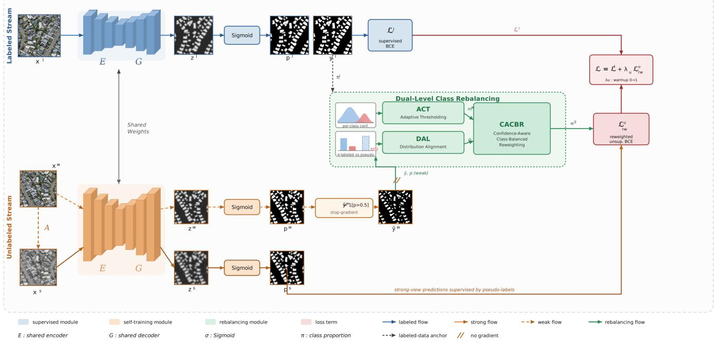
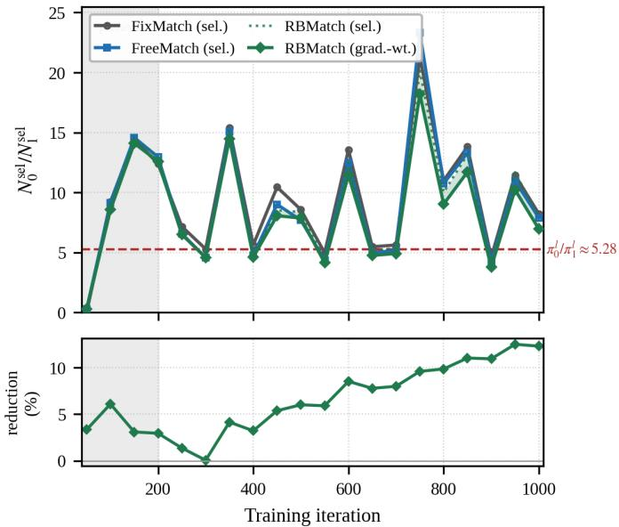
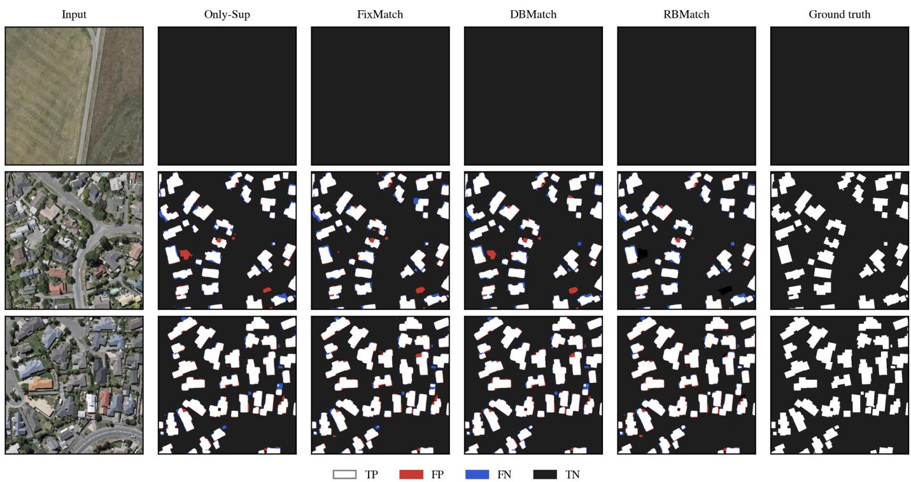

# RBMatch: Dual-Level Class Rebalancing for Semi-Supervised Building Footprint Extraction

Akil Ahmad Taki1,2, Shaikh Anowarul Fattah1 Member, IEEE

Abstract—Accurate building footprint extraction from highresolution remote sensing imagery underpins urban planning, disaster response, and environmental monitoring. This remains a challenge, as conventional supervised learning involves extensive pixel-wise annotation. On the other hand, Semi-supervised learning (SSL) reduces this burden by exploiting unlabeled data through self-training. However, remote sensing images are inherently dominated by background pixels, and this class imbalance biases the unsupervised gradient toward the majority class during self-training. We found that fixing this imbalance at a single stage falls short. If only the pseudo-labels are balanced, the background bias still reappears during the unsupervised loss calculation, an issue we term the imbalance leak. To address this issue, we propose RBMatch, a dual-level class-rebalancing framework that intervenes at both the pseudo-label and loss levels of self-training. RBMatch integrates a standard supervised pathway with a robust self-training module that incorporates three components: adaptive class-specific thresholding (ACT) for balanced pseudo-label selection, confidence-aware class-balanced reweighting (CACBR) of the unsupervised loss, and a distribution alignment layer (DAL) that matches predicted class distributions on unlabeled data to the labeled-data prior. Experiments on the WHU, INRIA, and Massachusetts building datasets under labeled ratios of 1%–10% show that RBMatch attains the highest building IoU and F1 in every setting evaluated. Gains are largest on the most imbalanced benchmark, Massachusetts, where RBMatch improves IoU by 1.37 over the strongest baseline at r = 0.01 and it is the only method to exceed the supervised baseline in all twelve dataset–ratio settings.

Index Terms—Building footprint extraction, class imbalance, confidence-aware reweighting, debiasing, distribution alignment, remote sensing, semi-supervised learning.

## I. INTRODUCTION

B UILDING footprint extraction (pixel-level segmentation of buildings from optical imagery) supports urban-growth monitoring, damage assessment, and population estimation. Transformers like SegFormer [1] set strong benchmarks but require expensive dense pixel-wise annotations. Semi-supervised learning (SSL) addresses this bottleneck by pairing a small labeled set with a large unlabeled corpus. The dominant paradigm is weak-to-strong self-training: pseudo-labels from weakly augmented unlabeled images supervise predictions on strongly augmented counterparts [2], [3]. Self-training pipelines divide into consistency-based [4], [5] and pseudolabel-based methods [2], with the latter dominating recent state-of-the-art.

This paradigm exposes a structural difficulty on building data: severe class imbalance. Building pixels occupy at most

10–25% of image area, and as little as 3–5% in suburban scenes. This imbalance creates a positive feedback loop: initial background bias yields skewed pseudo-labels, which reinforces the bias during training—a form of confirmation bias [6].

Recent work corrects imbalance at distinct pipeline stages. At the logit level, DBMatch [7] subtracts a global bias estimated from class-conditional logit means. At the threshold level, FreeMatch [8] and AdaptMatch [9] replace Fix-Match’s fixed $\tau ~ = ~ 0 . 9 5$ with dynamic thresholds that admit more minority pseudo-labels. Class imbalance is also treated at the loss level via focal loss [10], effective-number balancing [11], margin-aware losses [12], [13], distribution alignment [14], and labeled-data-anchored resampling (DARS [15]). In remote-sensing SSL, Zhang et al. [16] rebalance which samples enter consistency regularization at the input-batch level.

These methods improve on FixMatch but share a structural flaw: relying on a single corrective intervention. After any threshold correction, the selected set S remains dominated by background due to spatial sparsity (background pixels vastly outnumber building pixels) and confidence asymmetry (homogeneous background accumulates high-confidence pixels quickly). Because the unsupervised loss aggregates per-pixel terms uniformly, the gradient stays background-dominated regardless of how S is constructed. Threshold rebalancing fixes which pseudo-labels are used; it does not fix how much each contributes. We term this residual skew the imbalance leak.

To address these challenges, the main contributions are summarized as follows:

• We empirically characterize the imbalance leak, showing that residual selection skew drives majority-class gradient dominance.

• We propose RBMatch, the first remote-sensing SSL framework to coordinate rebalancing at both the pseudolabel level (via adaptive thresholding and distribution alignment) and loss level (via confidence-aware reweighting).

• We demonstrate that RBMatch achieves state-of-the-art building IoU/F1 across three benchmarks at diverse labeled ratios.

• We provide mechanistic evidence via gradient-weight logging that our loss-level intervention mitigates residual pseudo-label imbalance.

## II. PRELIMINARIES

Let $\mathcal { D } _ { l } ~ = ~ \{ ( x _ { n } ^ { l } , y _ { n } ^ { l } ) \} _ { n = } ^ { N _ { l } }$ 1 be the labeled set, with $x _ { n } ^ { l } \in$ RH×W×3 and pixel-wise binary labels $y _ { n } ^ { l } ~ \in ~ \{ 0 , 1 \}$ H×W (0 = background, 1 = building), and $\mathcal { D } _ { u } = \{ x _ { m } ^ { u } \} _ { m = 1 } ^ { N _ { u } }$ the unlabeled set with $N _ { u } \gg N _ { l }$ . The labeled ratio is $r = N _ { l } / ( N _ { l } +$ $N _ { u } ) ;$ we report $r \in \{ 0 . 0 1 , 0 . 0 2 , 0 . 0 5 , 0 . 1 0 \}$ . Following [7], all methods use SegFormer-B2 as a shared encoder–decoder backbone producing a logit map $z = G ( E ( x ) ) \in \mathbb { R } ^ { H \times W }$ and probability map $p _ { i j } = \sigma ( z _ { i j } )$ . For each unlabeled image, we form a weakly augmented view $x ^ { w } \ ( \mathrm { { f i p } , }$ scale in $[ 0 . 5 , 2 . 0 ]$ crop) and a strongly augmented view $x ^ { s } = \mathcal { A } _ { s } ( x ^ { w } )$ (color jitter, grayscale, blur) [3], [7].

  
Fig. 1. Proposed RBMatch architecture. A shared SegFormer-B2 backbone processes the labeled stream and the weak/strong unlabeled views. Weak-view pseudo-labels (gradient stopped) drive ACT (adaptive thresholding), DAL (distribution alignment, anchored by $\pi ^ { l } ) ,$ , and CACBR (confidence-aware reweighting), which produce per-pixel weights $w _ { i j }$ for the reweighted unsupervised loss on the strong view.

## III. THE RBMATCH FRAMEWORK

Imbalance in SSL building extraction is a multi-stage phenomenon. Closing the leak requires acting where it is created (selection) and where it operates (the gradient). Three hypotheses frame our modules:

• H1 (Multi-stage imbalance): Effective correction requires intervention at both pseudo-label selection (which pixels participate) and loss computation (how much each contributes).

• H2 (Confidence-aware reweighting): Loss-level rebalancing must be modulated by per-pixel confidence to amplify high-quality minority pseudo-labels rather than indiscriminately boosting all minority pixels.

• H3 (Labeled-data anchoring): Reweighting intensity must be anchored to the labeled-data class distribution to prevent self-reinforcing drift.

RBMatch builds on the FixMatch template (Fig. 1). The labeled stream produces the supervised loss; the unlabeled image is augmented weakly to $x ^ { w }$ (whose pseudo-labels $\hat { y } ^ { w } = \mathbf { 1 } [ p ^ { w } > 0 . 5 ]$ are formed with stopped gradients) and strongly to $x ^ { s } .$ . Three modules operate on the weak-view pseudo-labels: ACT produces a class-balanced selection mask, DAL computes a drift coefficient anchored to the labeled-data proportions, and CACBR converts these into per-pixel weights $w _ { i j }$ for the reweighted unsupervised loss.

Supervised branch. For a labeled pair, the supervised loss is the pixel-averaged BCE:

$$
\mathcal { L } _ { l } = \frac { 1 } { H W } \sum _ { i , j } \bigl [ - y _ { i j } ^ { l } \log p _ { i j } ^ { l } - ( 1 - y _ { i j } ^ { l } ) \log ( 1 - p _ { i j } ^ { l } ) \bigr ] .\tag{1}
$$

This branch yields the frozen reference proportions $\pi _ { c } ^ { l } \ =$ $\big ( \sum _ { n } \sum _ { i , j } \mathbf { 1 } [ \dot { y } _ { n , i j } ^ { l } ~ = ~ c ] \big ) / ( N _ { l } H W ) , ~ c ~ \in ~ \{ 0 , 1 \}$ , computed once over $\mathcal { D } _ { l } ;$ DAL uses $\pi ^ { l }$ to anchor rebalancing.

## A. Adaptive Class-Specific Thresholding (ACT)

FixMatch’s fixed 0.95 threshold starves minority pseudolabels early in training. Following FreeMatch [8], ACT tracks the model’s per-class confidence on the unlabeled stream by EMA,

$$
\hat { \tau } _ { c } \gets \alpha _ { \tau } \hat { \tau } _ { c } + \left( 1 - \alpha _ { \tau } \right) \underset { ( i , j ) \in B _ { c } } { \mathbb { E } } \big [ p _ { i j } ^ { w } \big ] ,\tag{2}
$$

with $B _ { c } = \{ ( i , j ) : \hat { y } _ { i j } ^ { w } = c \}$ and $\alpha _ { \tau } = 0 . 9 9 9$ , and forms the class-conditional selection mask:

$$
m _ { i j } ^ { w } = { \bf 1 } \big [ p _ { i j } ^ { w } > \hat { \tau } _ { 1 } ~ \lor ~ p _ { i j } ^ { w } < 1 - \hat { \tau } _ { 0 } \big ] .\tag{3}
$$

When the model is uncertain about buildings, (2) drives $\hat { \tau } _ { 1 }$ down, letting more building pseudo-labels through. The property $\hat { \tau } _ { 1 } < \hat { \tau } _ { 0 }$ emerges structurally from EMA tracking.

## B. Confidence-Aware Class-Balanced Reweighting (CACBR)

ACT fixes which pseudo-labels enter the loss, but the surviving set remains background-dominated. CACBR replaces uniform aggregation with a per-pixel weight multiplying a class-balance factor, a confidence factor, and the ACT mask: $w _ { i j } = w _ { \mathrm { c l a s s } } ( \hat { y } _ { i j } ^ { w } ) \cdot w _ { \mathrm { c o n f } } ( p _ { i j } ^ { w } ) \cdot m _ { i j } ^ { w }$ . The class-balance factor uses the effective-number formulation [11],

$$
w _ { \mathrm { c l a s s } } ( c ) = \frac { 1 - \beta } { 1 - \beta ^ { n _ { c } } } ,\tag{4}
$$

with $n _ { c }$ the EMA-tracked count of selected class-c pixels and $\beta ~ = ~ 0 . 9 9 9 9$ , normalized so $\begin{array} { r } { \sum _ { c } \pi _ { c } ^ { l } w _ { \mathrm { c l a s s } } ( c ) = 1 } \end{array}$ . The confidence factor modulates by per-pixel confidence: $w _ { \mathrm { c o n f } } =$ $( p _ { i j } ^ { w } ) ^ { \gamma }$ if $\hat { y } _ { i j } ^ { w } = 1$ and $( 1 - p _ { i j } ^ { w } ) ^ { \gamma } \ \mathrm { i f } \ \hat { y } _ { i j } ^ { w } = 0$ , with $\gamma = 1$ . The multiplicative form ensures minority pixels require high confidence to receive large weights. The reweighted unsupervised loss aggregates by weight:

$$
\mathcal { L } _ { \mathrm { r w } } ^ { u } = \frac { \sum _ { i , j } w _ { i j } \operatorname { B C E } ( p _ { i j } ^ { s } , \hat { y } _ { i j } ^ { w } ) } { \sum _ { i , j } w _ { i j } + \epsilon } , \quad \epsilon = 1 0 ^ { - 8 } .\tag{5}
$$

## C. Distribution Alignment Layer (DAL)

If early pseudo-labels are background-skewed, CACBR amplifies the minority class based on a corrupted estimate. DAL guards against this loop by anchoring to the trustworthy labeled distribution $\pi ^ { l }$ (H3). Let $\hat { \pi } _ { c } ^ { u }$ be the EMA-tracked pseudo-label proportion $( \alpha _ { \pi } \ : = \ : 0 . 9 9 9 )$ . The drift coefficient $\rho$ scales the minority weight asymmetrically, leaving the background untouched:

$$
\rho = \operatorname* { m i n } \Bigl ( \frac { \pi _ { 1 } ^ { l } / \hat { \pi } _ { 1 } ^ { u } } { \pi _ { 0 } ^ { l } / \hat { \pi } _ { 0 } ^ { u } } , \rho _ { \operatorname* { m a x } } \Bigr ) , \quad \tilde { w } _ { \mathrm { c l a s s } } ( 1 ) = \rho w _ { \mathrm { c l a s s } } ( 1 ) ,\tag{6}
$$

and $\tilde { w } _ { \mathrm { c l a s s } } ( 0 ) = w _ { \mathrm { c l a s s } } ( 0 )$ . DAL is strictly a minority-class booster; the cap $\rho _ { \mathrm { m a x } } = 3 . 0$ prevents transient EMA instability from triggering excessive amplification. The final weight is $w _ { i j } = \tilde { w } _ { \mathrm { c l a s s } } ( \hat { y } _ { i j } ^ { w } ) w _ { \mathrm { c o n f } } ( p _ { i j } ^ { w } ) m _ { i j } ^ { w }$

Overall objective. The total loss combines both terms:

$$
\mathcal { L } = \mathcal { L } _ { l } + \lambda _ { u } \mathcal { L } _ { \mathrm { r w } } ^ { u } ,\tag{7}
$$

with $\lambda _ { u }$ warmed linearly from 0 to 1 over 500 iterations. Algorithm 1 summarizes one iteration. In contrast to DB-Match (global scalar logit shift), FreeMatch (selection-only), and DARS (resampling), RBMatch operates at a per-pixel granularity across multiple training stages.

## IV. EXPERIMENTS

## A. Setup

We evaluate on the WHU Building Dataset [17] (official 5 733/1 228/1 228 splits), the INRIA Vienna/Tyrol/Kitsap subsets [18], and the Massachusetts Boston subset [19], cropped to 512 × 512 [7]. The WHU labeled distribution is $\pi _ { 0 } ^ { l } =$ $0 . 8 4 1 , \pi _ { 1 } ^ { l } = 0 . 1 5 9$ at $r = 0 . 0 1$ . Baselines include Only-Sup, FixMatch [2], DBMatch [7], FreeMatch [8], AdaptMatch [9], and DARS [15]. We report Recall, Precision, IoU, and F1 for the building class. Methods utilize SegFormer-B2 with identical augmentations, AdamW $( \mathrm { l r ~ 2 . 5 \times 1 0 ^ { - 4 } }$ , poly decay

Algorithm 1 RBMatch training loop (one iteration).   
Input: Labeled batch $\{ ( x ^ { l } , y ^ { l } ) \}$ , unlabeled batch $\{ x ^ { u } \}$ , model   
$E \circ G$ , EMA state $\left( \hat { \tau } _ { 0 } , \hat { \tau } _ { 1 } , n _ { 0 } , n _ { 1 } , \hat { \pi } _ { 0 } ^ { u } , \hat { \pi } _ { 1 } ^ { u } \right)$ , frozen $\pi ^ { l } .$ , hyperpa  
rameters.   
Output: Updated parameters and EMA state.   
1: Forward pass: compute $p ^ { l } , p ^ { w } , p ^ { s }$ through shared back  
bone   
2: Supervised loss $\mathcal { L } _ { l }$ via (1); Pseudo-labels $\hat { y } _ { i j } ^ { w }  \mathbf { 1 } [ p _ { i j } ^ { w } >$   
0.5]   
3: ACT: update $\hat { \tau } _ { c }$ via (2); mask $m ^ { w }$ via (3)   
4: DAL: update $\hat { \pi } _ { c } ^ { u . }$ drift $\rho$ via (6)   
5: CACBR: update $n _ { c } , w _ { \mathrm { c l a s s } } ;$ DAL scale (6); weights $w _ { i j }$   
6: Reweighted loss $\mathcal { L } _ { \mathrm { r w } } ^ { u }$ via (5); Backprop $\mathcal { L }  \mathcal { L } _ { l } + \lambda _ { u } \mathcal { \bar { L } } _ { \mathrm { r w } } ^ { u }$

0.9), batch sizes 4/4, and 500-iteration warmup. RBMatch uses $\alpha _ { \tau } = \alpha _ { \pi } = 0 . 9 9 9 , \beta = 0 . 9 9 9 9 , \gamma = 1 , \rho _ { \mathrm { { m a x } } } = 3 . 0 ,$ , and $\lambda _ { u } = 1$ . Experiments run on an RTX-3090 GPU; our modules add under 5% forward-pass time.

## B. Diagnostic: demonstrating the imbalance leak

We log the selection ratio $N _ { 0 } ^ { \mathrm { s e l } } / N _ { 1 } ^ { \mathrm { s e l } }$ and gradient-weighted effective ratio $\textstyle \big ( \sum _ { \hat { y } ^ { w } = 0 } w _ { i j } \big ) / \big ( \sum _ { \hat { y } ^ { w } = 1 } w _ { i j } \big )$ every 50 iterations. On WHU $( r \dot { = } 0 . 0 1 )$ , FixMatch oscillates between ${ \sim } 5 -$ 28, spiking on sparse batches. DBMatch performs similarly because its global logit shift does not alter pixel selection. FreeMatch lowers the ratio to ∼8–15, confirming selection rebalancing leaves a residual leak. RBMatch’s gradient-weighted ratio remains strictly below the raw selection ratio across all iterations (Fig. 2). By iteration 750, the raw ratio is 9.69 versus a gradient-weighted ≈ 7. This expanding gap supports H1, driving the effective gradient closer to the true distribution.

  
Fig. 2. Empirical demonstration of the imbalance leak on WHU (r = 0.01). RBMatch’s gradient-weighted effective ratio corrects FreeMatch/FixMatch bias.

## C. Ablation

Six configurations evaluated on WHU at r =0.05 (Table I) isolate the contribution of each module. Naive self-training (b)

  
Fig. 3. Qualitative comparison on WHU (r = 0.01). White: TP, red: FP, blue: FN, black: TN. RBMatch recovers complete interiors without inflating false positives.

underperforms the supervised baseline (a) by 1.23 IoU, consistent with confirmation bias: unchecked background-dominated pseudo-labels reinforce the majority-class prior. ACT alone (c) and CACBR alone (d) each recover roughly 60% of this deficit, but neither restores the baseline. Their near-identical results (83.89 vs. 83.87 IoU) indicate that the two interventions act on largely overlapping sources of skew when applied in isolation. Combining them without DAL (e) yields 84.33 IoU and still falls short of Only-Sup, because the reweighting remains tied to uncalibrated model predictions rather than to a trustworthy reference distribution. The full framework (f) adds DAL to anchor the weights to $\pi ^ { l } .$ , reaching 85.19 IoU and establishing the only configuration that clears the supervised baseline— validating H3. The gain is driven by recall, which improves from 88.55 (b) to 90.21 while precision is preserved (93.14 to 93.88), confirming that dual-level rebalancing recovers minority-class pixels without inflating false positives.

TABLE I  
ABLATION ON WHU AT r = 0.05. BEST IN BOLD.
<table><tr><td></td><td>Configuration</td><td>Recall</td><td>Precision</td><td>IoU</td><td>F1</td></tr><tr><td>(a)</td><td>Only-Sup</td><td>89.68</td><td>93.43</td><td>84.36</td><td>91.52</td></tr><tr><td>(b)</td><td>FixMatch (SUP+ST)</td><td>88.55</td><td>93.14</td><td>83.13</td><td>90.79</td></tr><tr><td>(c)</td><td>+ ACT only</td><td>88.60</td><td>94.04</td><td>83.89</td><td>91.24</td></tr><tr><td>(d)</td><td>+ CACBR only</td><td>88.58</td><td>94.04</td><td>83.87</td><td>91.23</td></tr><tr><td>(e)</td><td>ACT+CACBR (no DAL)</td><td>89.31</td><td>93.80</td><td>84.33</td><td>91.50</td></tr><tr><td>(f)</td><td>RBMatch (full)</td><td>90.21</td><td>93.88</td><td>85.19</td><td>92.00</td></tr></table>

## D. Comparison with state of the art

Table II presents quantitative results. RBMatch secures the highest IoU and F1 score at every labeled ratio across all datasets. On WHU, its performance edge over DBMatch expands alongside the label budget (+0.04 at $r = 0 . 0 1$ to +1.97 at $r = 0 . 1 0 )$ . On INRIA, RBMatch dominates every column while baselines alternate second-best status. The most pronounced margins occur on Massachusetts—the most imbalanced benchmark—yielding a +1.37 IoU improvement over FreeMatch at $r = 0 . 0 1$ . Crucially, across all twelve dataset– ratio settings RBMatch is the only method that never falls below the supervised baseline, while every competing SSL method regresses in at least two settings.

## E. Generality across backbones

To verify that RBMatch is not tied to transformer-specific behaviour, we evaluate it across UNet [20], UNet++, and DeepLabV3 on WHU at $r ~ = ~ 0 . 0 5$ (Table III). RBMatch attains the best IoU and F1 on every backbone. Its margin over DBMatch is stable across architecture families (+1.81, +1.54, +1.69, and +1.29 IoU on UNet, UNet++, DeepLabV3, and SegFormer-B2, respectively), indicating that dual-level rebalancing acts on the pseudo-label distribution rather than on any property of a particular encoder.

The comparison against the supervised baseline is more discriminative. DBMatch improves over Only-Sup on the three CNNs (+2.22 to +0.33 IoU) but falls below it on SegFormer-B2 (83.90 vs. 84.36), whereas RBMatch clears the baseline on all four backbones (+4.03, +4.00, +2.02, and +0.83 IoU). Correcting the imbalance leak at the loss level therefore determines whether self-training helps or hurts, which supports H1.

TABLE II  
IOU/F1 (%) ACROSS DATASETS. BEST IN BOLD; SECOND-BEST UNDERLINED
<table><tr><td>Method</td><td>r=0.01</td><td>r=0.02</td><td>r=0.05</td><td>r=0.10</td></tr><tr><td colspan="5">WHU Building Dataset</td></tr><tr><td>Only-Sup FixMatch FreeMatch AdaptMatch</td><td>83.27/90.87 82.42/90.36 81.79/89.98 82.62/90.48</td><td>83.55/91.04 82.89/90.64 82.05/90.14 83.21/90.84</td><td>84.36/91.52 83.13/90.79 82.80/90.59 83.31/90.90</td><td>85.38/92.11 84.74/91.74 83.94/91.27 84.88/91.82 84.43/91.56</td></tr><tr><td colspan="5">DARS 82.55/90.44 83.41/90.95 83.16/90.81 DBMatch 83.48/91.00 84.01/91.31 83.90/91.25 RBMatch 83.52/91.02 84.30/91.48 85.19/92.00</td></tr><tr><td colspan="5">INRIA Aerial Image Labeling</td></tr><tr><td>Only-Sup FreeMatch AdaptMatch DBMatch</td><td>68.76/81.49 69.47/81.99 69.80/82.21 69.94/82.31</td><td>71.41/83.32 70.96/83.01 71.08/83.09 68.17/81.07</td><td>70.94/83.00 71.83/83.61 71.50/83.38 70.39/82.62</td><td>71.32/83.26 71.17/83.16 72.45/84.02 71.55/83.42</td></tr><tr><td>RBMatch</td><td>70.96/83.01</td><td>72.32/83.94</td><td>72.39/83.98</td><td>72.88/84.31</td></tr><tr><td colspan="5">Massachusetts Boston Subset</td></tr><tr><td>Only-Sup FreeMatch AdaptMatch DBMatch</td><td>53.66/69.84 57.29/72.85 52.84/69.14 54.10/70.21</td><td>56.91/72.54 58.23/73.60 57.63/73.12 58.61/73.90</td><td>62.07/76.60 62.59/76.99 62.95/77.26 62.62/77.01</td><td>63.06/77.35 62.97/77.28 63.31/77.53 63.46/77.65</td></tr></table>

TABLE III  
GENERALITY ACROSS BACKBONES ON WHU AT r =0.05. BEST IN BOLD.
<table><tr><td>Method</td><td>UNet</td><td>UNet++</td><td>DeepLabV3</td><td>SegFormer-B2</td></tr><tr><td>Only-Sup</td><td>73.16/84.50</td><td>75.37/85.95</td><td>78.18/87.75</td><td>84.36/91.52</td></tr><tr><td>DBMatch</td><td>75.38/85.96</td><td>77.83/87.53</td><td>78.51/87.96</td><td>83.90/91.25</td></tr><tr><td>RBMatch</td><td>77.19/87.13</td><td>79.37/88.50</td><td>80.20/89.01</td><td>85.19/92.00</td></tr></table>

## F. Qualitative analysis, discussion, and limitations

Fig. 3 illustrates model outputs. RBMatch resolves falsenegative errors inside building structures, leading to solid interior segments without introducing false-positive artifacts, matching expectations for joint threshold and loss adjustments. DBMatch edits show uniform changes along edges. The framework yields optimal increments under skewed profiles and severe data limitations, satisfying H1. Limitations: Expansion to multi-class scenarios requires multi-dimensional alignment; label noise in the reference ground-truth $\pi ^ { l }$ propagates into DAL anchors.

## V. CONCLUSION

We introduced RBMatch, a dual-level class-rebalancing framework for semi-supervised building footprint extraction. RBMatch closes the imbalance leak with three coordinated modules (ACT, CACBR, DAL) acting at the threshold and loss levels. It attains state-of-the-art building IoU/F1 among evaluated SSL methods on WHU, INRIA, and Massachusetts, with the largest margins on the most imbalanced benchmarks. Future work includes multi-class extensions and SAMbased [21] boundary refinement.

## REFERENCES

[1] E. Xie, W. Wang, Z. Yu, A. Anandkumar, J. M. Alvarez, and P. Luo, “SegFormer: Simple and efficient design for semantic segmentation with

transformers,” in Proc. Adv. Neural Inf. Process. Syst. (NeurIPS), Dec. 2021, pp. 12077–12090.

[2] K. Sohn, D. Berthelot, N. Carlini, Z. Zhang, H. Zhang, and C. A. Raffel, “FixMatch: Simplifying semi-supervised learning with consistency and confidence,” in Proc. Adv. Neural Inf. Process. Syst. (NeurIPS), Dec. 2020, pp. 596–608.

[3] L. Yang, L. Qi, L. Feng, W. Zhang, and Y. Shi, “Revisiting weak-tostrong consistency in semi-supervised semantic segmentation,” in Proc. IEEE/CVF Conf. Comput. Vis. Pattern Recognit. (CVPR), Jun. 2023, pp. 7236–7246.

[4] Y. Ouali, C. Hudelot, and M. Tami, “Semi-supervised semantic segmentation with cross-consistency training,” in Proc. IEEE/CVF Conf. Comput. Vis. Pattern Recognit. (CVPR), Jun. 2020, pp. 12674–12684.

[5] X. Chen, Y. Yuan, G. Zeng, and M. Wang, “Semi-supervised semantic segmentation with cross pseudo supervision,” in Proc. IEEE/CVF Conf. Comput. Vis. Pattern Recognit. (CVPR), Jun. 2021, pp. 2613–2622.

[6] E. Arazo, D. Ortego, P. Albert, N. E. O’Connor, and K. McGuinness, “Pseudo-labeling and confirmation bias in deep semi-supervised learning,” in Proc. Int. Joint Conf. Neural Netw. (IJCNN), Jul. 2020, pp. 1–8.

[7] W. Huang, Z. Gu, Y. Shi, Z. Xiong, and X. X. Zhu, “Semi-supervised building footprint extraction using debiased pseudo-labels,” IEEE Trans. Geosci. Remote Sens., vol. 63, pp. 1–14, Jan. 2025.

[8] Y. Wang, H. Chen, Q. Heng, W. Hou, M. Savvides, and T. Shinozaki, “FreeMatch: Self-adaptive thresholding for semi-supervised learning,” in Proc. Int. Conf. Learn. Represent. (ICLR), May 2023.

[9] W. Huang, Z. Gu, Y. Shi, Z. Xiong, and X. X. Zhu, “AdaptMatch: Adaptive matching for semisupervised binary segmentation of remote sensing images,” IEEE Trans. Geosci. Remote Sens., vol. 61, pp. 1–16, Jan. 2023.

[10] T.-Y. Lin, P. Goyal, R. Girshick, K. He, and P. Dollar, “Focal loss for´ dense object detection,” in Proc. IEEE/CVF Int. Conf. Comput. Vis. (ICCV), Oct. 2017, pp. 2980–2988.

[11] Y. Cui, M. Jia, T.-Y. Lin, Y. Song, and S. Belongie, “Class-balanced loss based on effective number of samples,” in Proc. IEEE/CVF Conf. Comput. Vis. Pattern Recognit. (CVPR), Jun. 2019, pp. 9268–9277.

[12] K. Cao, C. Wei, A. Gaidon, N. Arechiga, and T. Ma, “Learning imbalanced datasets with label-distribution-aware margin loss,” in Proc. Adv. Neural Inf. Process. Syst. (NeurIPS), Dec. 2019, pp. 1567–1578.

[13] A. K. Menon, S. Jayasumana, A. S. Rawat, H. Jain, A. Veit, and S. Kumar, “Long-tail learning via logit adjustment,” in Proc. Int. Conf. Learn. Represent. (ICLR), May 2021.

[14] D. Berthelot, N. Carlini, E. D. Cubuk, A. Kurakin, K. Sohn, and H. Zhang, “ReMixMatch: Semi-supervised learning with distribution alignment and augmentation anchoring,” in Proc. Int. Conf. Learn. Represent. (ICLR), Apr. 2020.

[15] R. He, J. Yang, and X. Qi, “Re-distributing biased pseudo labels for semi-supervised semantic segmentation: A baseline investigation,” in Proc. IEEE/CVF Int. Conf. Comput. Vis. (ICCV), Oct. 2021, pp. 6930– 6940.

[16] X. Zhang, X. Huang, and J. Li, “Joint self-training and rebalanced consistency learning for semi-supervised change detection,” IEEE Trans. Geosci. Remote Sens., vol. 61, pp. 1–13, 2023.

[17] S. Ji, S. Wei, and M. Lu, “Fully convolutional networks for multisource building extraction from an open aerial and satellite imagery data set,” IEEE Trans. Geosci. Remote Sens., vol. 57, no. 1, pp. 574–586, Jan. 2019.

[18] E. Maggiori, Y. Tarabalka, G. Charpiat, and P. Alliez, “Can semantic labeling methods generalize to any city? The Inria aerial image labeling benchmark,” in Proc. IEEE Int. Geosci. Remote Sens. Symp. (IGARSS), Jul. 2017, pp. 3226–3229.

[19] V. Mnih, “Machine learning for aerial image labeling,” Ph.D. dissertation, Univ. Toronto, Toronto, ON, Canada, 2013.

[20] O. Ronneberger, P. Fischer, and T. Brox, “U-Net: Convolutional networks for biomedical image segmentation,” in Proc. Med. Image Comput. Comput.-Assist. Interv. (MICCAI), Oct. 2015, pp. 234–241.

[21] A. Kirillov, E. Mintun, N. Ravi, H. Mao, C. Rolland, and L. Gustafson, “Segment anything,” in Proc. IEEE/CVF Int. Conf. Comput. Vis. (ICCV), Oct. 2023, pp. 4015–4026.