# REVAR3R: GAUGE-AWARE PERTURBATION UNCERTAINTY FOR FEED-FORWARD 3D RECONSTRUCTION

PREPRINT

Sammam Mahdi1,∗, Fariha Binta Salim1, Rakin Bin Rabbani1, Aniqua Nusrat Zereen2

1BRAC University 2Mahidol University ∗Corresponding author

{sammam.mahdi, fariha.binta.salim}@g.bracu.ac.bd rakin.rabbani@bracu.ac.bd aniqua.zer@mahidol.ac.th

## ABSTRACT

A correctly reconstructed distant point appears uncertain even when a frozen 3D model processes equivalent inputs because its output frame rotates fractionally. This exposes a weakness of trainingfree perturbation uncertainty: when outputs contain an unobserved symmetry, run-to-run variation potentially reflects symmetry rather than error. Existing alternatives have trade-offs: built-in confidence is outperformed in most evaluated conditions, while trained evidential heads require modelspecific supervision. For point maps, this research derives a closed-form, error-independent variance term that grows with scene extent and potentially overwhelms the desired signal. Simulation reproduces the effect; all 30 real VGGT view-sets tested exhibit its predicted $\| x _ { p } \| ^ { 2 }$ signature. ReVar3R robustly registers predictions to a common similarity frame before computing per-point variance, without retraining or modifying the frozen model. Optional calibration and fusion use a held-out split. Across VGGT, $\pi ^ { 3 }$ , and MASt3R on six datasets, the same estimator on every backbone lowers AUSE below built-in confidence in 15 of 18 conditions. The staged evaluation yields 11 of 18 wins for the label-free core, 12/18 for label-free equal-weight fusion, 14/18 with held-out weights, and 15/18 when the built-in signal is included. Against a trained evidential head, the result is a trade-off: the head calibrates magnitude better and leads in its training domain, whereas ReVar-3R transfers across backbones without adaptation. Its ranking improves point filtering, but it does not detect stable systematic bias, aid novel-view synthesis, or transfer calibration across domains.

## 1 Introduction

Feed-forward 3D foundation models now recover dense scene geometry from a handful of images in one pass: DUSt3R (Wang et al., 2024), MASt3R (Leroy et al., 2024), VGGT (Wang et al., 2025a), and $\pi ^ { 3 }$ (Wang et al., 2026) regress per-pixel 3D point maps without per-scene optimization or known camera poses. Those outputs carry no fixed coordinate frame, so a far wall reconstructed correctly twice still appears unreliable: a fractional rotation between output frames moves distant points enough to create large run-to-run variance. These predictions are useful only where reliability is established, yet their jointly trained per-pixel confidence need not track geometric error. In the present evaluation, that correlation is weak in distribution and weaker on average under shift, although unevenly so. The result limits point filtering, multi-view fusion, and other decisions that depend on geometric reliability.

Perturbation uncertainty and its failure in 3D. Perturbation uncertainty offers a training-free alternative: rerun a frozen model on perturbed inputs and interpret disagreement as uncertainty, as established for dense regression and depth (Mi et al., 2022; Poggi et al., 2020). For 3D point maps, that disagreement is not directly meaningful. Absolute scale, orientation, and position are unconstrained, so the same geometry occupies different similarity gauges across runs. Native-frame variance then conflates prediction instability with coordinate-frame variation. A closed form separates the desired predictive spread from an additive, error-independent gauge term that grows with squared distance from the origin. In a large scene, this term potentially dominates and makes naive variance rank position rather than error.

Removing the gauge before the variance. The principle of removing a gauge before interpreting covariance is classical, but standard remedies act inside an estimator through parameters, Jacobians, or normal equations. A frozen feed-forward network exposes only its outputs. The available correction is correspondingly direct: align before variance. ReVar3R robustly registers perturbed predictions to a common similarity (Sim(3)) frame and then computes per-point variance, without modifying or retraining the foundation model. Held-out calibration and rank-space fusion of perturbation families are optional. The decomposition, simulation, and experiments on three architectures (VGGT, $\pi ^ { 3 }$ , MASt3R) across six datasets test this account. The recovered ranking depends comparatively little on the perturbation family and improves multi-view point filtering; against the trained Trust3R head (Zhu et al., 2026), it presents a complementary trade-off rather than uniform superiority.

## Contributions.

1. A closed form exposes gauge contamination in black-box perturbation ensembles. Run-to-run similaritygauge variation adds an error-independent term whose scale/rotation component grows with scene extent. Classical remedies require access to the estimator, which the frozen-network setting does not provide. Controlled simulation reproduces the effect, and all 30 real VGGT view-sets tested exhibit its predicted $\| x _ { p } \| ^ { 2 }$ signature. The same confound arises whenever a predicted output carries a symmetry the model does not observe.

2. One output-side estimator applies across frozen point-map backbones. Unlike a trained uncertainty head tied to its checkpoint, ReVar3R applies without adaptation to any backbone that emits point maps. Robust registration removes the nuisance without modifying or retraining the foundation model. A global Sim(3) correction directly instantiates the theory and accounts for 65% of the empirical gain; the default then performs evaluation-consistent per-view frame stabilization.

3. Ablations isolate alignment as the source of the ranking gain. Across VGGT, $\pi ^ { 3 } .$ , and MASt3R on six datasets, ReVar3R lowers AUSE below built-in confidence in 15 of 18 conditions, with the supervision of each stage separated in Section 6.3. Ablations over alignment group, reference, scope, aggregation, sample count, fit hyperparameters, and near-degenerate geometry isolate the gain, while the camera-centre signature is strong on non-equivariant VGGT and near-absent on permutation-equivariant $\pi ^ { 3 }$

4. The improved ranking has a defined use and boundary. It improves multi-view point filtering, while the comparison with a trained head remains a trade-off rather than a uniform ranking. It does not detect stable systematic bias, transfer magnitude calibration across domains, or improve novel-view synthesis.

## 2 Related Work

Feed-forward 3D reconstruction. Direct point-map regression makes coordinate freedom an output-level concern. DUSt3R (Wang et al., 2024) recasts two-view geometry as per-pixel 3D points in a shared frame, and MASt3R (Leroy et al., 2024) adds metric-scale matching. Many-view systems extend the setting: VGGT predicts point maps, depth, and cameras jointly (Wang et al., 2025a), and $\cdot - 3$ is permutation-equivariant in the input views (Wang et al., 2026). Thousand-image (Yang et al., 2025), streaming (Wang & Agapito, 2025; Wang et al., 2025b), mixed-input (Keetha et al., 2026), and any-view (Lin et al., 2026) systems broaden the same family. Each system emits geometry in a frame selected by the network, so the confound belongs to the setting rather than any one backbone. Each backbone’s global point-map output is used $( \mathrm { f o r } ~ \pi ^ { 3 }$ , its world-frame points); view-order equivariance does not remove that frame’s similarity-gauge freedom. A second gap concerns reliability: the models’ per-pixel confidence channels are trained jointly with geometry rather than calibrated to geometric error, and are frequently weak in the present evaluation, especially under distribution shift, consistent with concurrent VGGT evidence on DTU (Hillemann et al., 2026).

Uncertainty estimation. Predictive uncertainty classically separates into aleatoric and epistemic components (Kendall & Gal, 2017). Ensembles sample independently trained models (Lakshminarayanan et al., 2017); stochastic passes approximate that sampling within one model (Gal & Ghahramani, 2016); and deep evidential regression predicts distributional parameters in one trained pass (Amini et al., 2020). All require training or model modification, and all risk degradation under dataset shift (Ovadia et al., 2019). Input perturbations instead expose the sensitivity of a frozen model (Mi et al., 2022; Wang et al., 2019). This training-free strategy applies naturally to depth (Poggi et al., 2020) and flow (Ilg et al., 2018), where cross-run variance has a fixed coordinate meaning. Sparsification against an oracle ordering measures ranking through AUSE (Ilg et al., 2018), while score-to-error scaling measures calibration (Guo et al., 2017; Kuleshov et al., 2018). Point maps leave the unresolved case: global similarity freedom makes their cross-run variance conflate instability with coordinate-frame variation.

Uncertainty for feed-forward 3D models. Trust3R (Zhu et al., 2026), the closest method to the present setting, trains an evidential (Normal–Inverse–Wishart) head (Amini et al., 2020) on a frozen reconstruction backbone to predict per-point covariance in one pass from labelled 3D data. ReVar3R instead reads the unchanged checkpoint’s response to equivalent inputs, exchanging additional inference passes for zero adaptation. The methods answer the same reliability question under different access and cost assumptions, which motivates a direct trade-off rather than a baseline to minimize.

Gauge freedom and alignment. Aligning point sets by a closed-form similarity fit is classical (Umeyama, 1991), and the deeper principle behind it, that a free datum makes covariance uninterpretable, was established independently in geodetic free-network adjustment (Baarda, 1981), statistical shape analysis (Goodall, 1991), bundle adjust ment (Kanatani & Morris, 2001; Morris, 2001; Triggs et al., 2000), and modern visual-inertial estimation (Zhang et al., 2018); this paper claims no novelty for it. These literatures also expose the missing case: every remedy acts on the estimator, through normal equations, inner constraints, or an optimizer covariance, and thus presumes parameters and a Jacobian. A frozen feed-forward predictor provides none of them, only outputs.

Gauge normalization is routine at evaluation time for point maps, which are scored after a similarity fit to ground truth; Trust3R applies a per-image Sim(3) alignment for this reason (Zhu et al., 2026). Yet the gauge inside the ensemble remains untreated. Trust3R’s released evaluator illustrates the split: it aligns each image when scoring, while its ensemble and MC-dropout baselines accumulate cross-pass variance in raw predicted frames. The missing output-side remedy is to register runs to a common frame before computing variance. The resulting contamination is derived in closed form, and registration is tested for whether it separates an unusable signal from a useful one.

## 3 Problem: Perturbation Variance in Gauge-Ambiguous 3D

The objective is to rank pixels by geometric error using only a frozen 3D model’s outputs. Repeated-run variance has a clear meaning in a fixed coordinate system; a point map is not constrained to a fixed frame across runs. This failure is formalized first, then the gauge term the estimator must remove is derived.

## 3.1 Setup and notation

Let the frozen feed-forward model f map V input views to per-view point maps $X \in \mathbb { R } ^ { V \times H \times W \times 3 }$ . For pixel $p$ in view v, $X _ { v } [ p ] \in \mathbb { R } ^ { 3 }$ is its predicted position in the common output frame. The model f is treated as a black box, and its weights remain unchanged. Label-preserving perturbations (photometric jitter, view re-ordering, or small input noise) produce N predictions $\bar { \{ } X  ^ { ( n ) } \} _ { n = 1 } ^ { N }$ of the same scene. These predictions form a score $u [ p ] \geq 0$ that ranks pixels by geometric error. Area Under the Sparsification Error (AUSE, lower is better) compares this ranking with an oracle ordering (Ilg et al., 2018); Spearman correlation compares u with realized error. That error is computed only after gauge-free alignment to ground truth, so a global frame offset is not itself an error. Appendix A collects the notation.

The models also expose built-in confidence, but its correlation with error is weak in distribution and remains weak under distribution shift (Section 6). This gap motivates a reliability signal derived from model behaviour rather than a single confidence head.

## 3.2 Why a direct variance is not well defined

Perturbation methods read the spread of $\{ X ^ { ( n ) } [ p ] \} _ { n }$ as unreliability. This spread is meaningful for outputs fixed to one coordinate system, including per-pixel labels, disparities, and depths. Images do not determine a point map’s absolute scale, orientation, or world position, so its geometry is defined only up to a global similarity transform. Two runs therefore recover the same scene in different gauges. Let run n differ from a reference by $T _ { n } = \mathsf { \bar { ( } } s _ { n } , R _ { n } , t _ { n } \mathsf { ) } \in \mathrm { S i m } ( 3 )$ with scale $s _ { n } \ > \ 0$ , rotation $R _ { n } \in S O ( 3 )$ , and translation $t _ { n } \in \mathbb { R } ^ { 3 }$ . The native-frame variance $\operatorname { V a r } _ { n } [ X ^ { ( n ) } [ p ] ]$ then mixes predictive instability with error-independent variation in $T _ { n }$ . Rotation and scale displace a point in proportion to its distance, so this contamination grows with scene extent.

## 3.3 Gauge contamination of the variance

The effect is quantified with a small-perturbation gauge model.

Assumption 1 (Small-perturbation gauge model). Let $x _ { p }$ denote the clean geometry of point $p .$ Each run adds isotropic predictive noise and applies the similarity gauge ${ \bf \dot { \cal T } } _ { n } = ( s _ { n } , R _ { n } , t _ { n } )$

$$
X ^ { ( n ) } [ p ] \ : = \ : s _ { n } { \cal R } _ { n } \big ( x _ { p } + \delta _ { p } ^ { ( n ) } \big ) + t _ { n } , \qquad \delta _ { p } ^ { ( n ) } \sim \mathcal { N } \big ( 0 , \ : \sigma _ { \mathrm { t r u e } } ^ { 2 } ( p ) \ : \mathbf { I } \big ) .\tag{1}
$$

The gauge variables are small, mutually independent, independent of the predictive noise, and zero-mean about the identity:

$$
s _ { n } = 1 + \varepsilon _ { n } , ~ \varepsilon _ { n } \sim { \mathcal N } ( 0 , \sigma _ { s } ^ { 2 } ) ; ~ R _ { n } \approx \mathbf { I } + [ \omega _ { n } ] _ { \times } , ~ \omega _ { n } \sim { \mathcal N } ( 0 , \sigma _ { r } ^ { 2 } \mathbf { I } ) ; ~ t _ { n } \sim { \mathcal N } ( 0 , \sigma _ { t } ^ { 2 } \mathbf { I } ) .\tag{2}
$$

Proposition 1 (Gauge-contaminated variance). Under Assumption 1 (Eqs. (1)–(2)), to first order in the gauge parameters and for $\breve { \sigma _ { \mathrm { t r u e } } ^ { 2 } } ( p ) \ll \| x _ { p } \| ^ { 2 } ,$ , the per-point trace of the cross-run covariance separates additively as

$$
\begin{array} { r } { U _ { \mathrm { u n a l i g n e d } } ( p ) \ = \ \underbrace { 3 \sigma _ { \mathrm { t r u e } } ^ { 2 } ( p ) } _ { t r u e s p r e a d } + \underbrace { \left( \sigma _ { s } ^ { 2 } + 2 \sigma _ { r } ^ { 2 } \right) \| x _ { p } \| ^ { 2 } \ + \ 3 \sigma _ { t } ^ { 2 } } _ { g a u g e c o n t a m i n a t i o n } . } \end{array}\tag{3}
$$

Appendix B provides the derivation. The decomposition yields three consequences. First, the gauge term is independent of the target $\sigma _ { \mathrm { t r u e } } ^ { 2 } ( p )$ and is a nuisance. Second, scale and rotation contribute in proportion to the squared lever arm $\| x _ { p } \| ^ { 2 } ;$ the factor two on $\sigma _ { r } ^ { 2 }$ arises because a fractional rotation moves a point in its orthogonal plane. For distant points or large scenes, this term potentially dominates the true spread, making $U _ { \mathrm { u n a l i g n e d } }$ rank position rather than error. Third, translation adds the position-independent offset $3 \sigma _ { t } ^ { 2 }$ , which does not asymptotically reorder points. Centring each run removes only this offset, not the persistent scale and rotation contamination. The variance becomes interpretable only after the gauge is removed.

Scope of the gauge model. Equation (3) describes one global similarity frame varying across runs, not residual view-dependent frame motion in a multi-view predictor. Scene-level alignment is accordingly evaluated; it instantiates Proposition 1 and supplies most of the empirical gain, followed by the default per-view refinement. Both estimator and target are defined modulo per-view alignment (Section 6.2); this scope distinction determines the procedure that follows.

## 4 Gauge-Aware Perturbation Uncertainty

ReVar3R targets the nuisance term in Proposition 1 directly at the output level. Its procedure has three stages: align each perturbed run to a shared frame, aggregate the aligned spread, then optionally calibrate and fuse the scores. Figure 1 depicts the pipeline: aligning the perturbed predictions before taking the variance localizes high scores on unstable geometry rather than on distant, correctly predicted points. Algorithm 1 in Appendix C specifies the complete procedure. Output alignment is the conceptual contribution; the aggregation, calibration, and fusion operations are standard.

## 4.1 Alignment before variance

Definition 1 (Gauge-aligned variance). For N perturbed predictions of one view, run 0 is selected as the reference, and each remaining run is mapped into that frame by an estimated similarity transform $\hat { T } _ { n } \in \mathrm { S i m } ( 3 )$ . The gaugealigned variance of pixel $p$ is the trace of the per-point sample covariance of the aligned predictions over the N runs:

$$
\tilde { X } ^ { ( n ) } [ p ] = \hat { T } _ { n } \bigl ( X ^ { ( n ) } [ p ] \bigr ) , \qquad u [ p ] = \mathrm { t r } \mathrm { C o v } _ { n } \bigl [ \tilde { X } ^ { ( n ) } [ p ] \bigr ] .\tag{4}
$$

If $\hat { T } _ { n }$ recovers each run’s true gauge, alignment removes the additive term in Eq. (3) and $u [ p ] \approx 3 \sigma _ { \mathrm { t r u e } } ^ { 2 } ( p )$ . Section 6 shows that removing this nuisance before aggregation recovers a useful error ranking, after which the perturbation family matters comparatively little. Internal registration is strictly prediction-to-prediction. It uses prediction-derived correspondences only; ground-truth validity is used exclusively for evaluation metrics. At evaluation time, a separate gauge-free alignment defines prediction error as described in Section 5.

## 4.2 Robust similarity alignment

$\hat { T } _ { n }$ is initialized with a closed-form similarity (Sim(3)) fit (Umeyama, 1991), then refined through five rounds of robust trimming under a Cauchy M-estimator scale (Zhang, 1997). Plain least squares would allow the unstable or high-error regions being detected to pull the gauge estimate toward themselves and partially reabsorb their signal. In each round, Cauchy weights rank the correspondences, the worst 10% are discarded, and the closed-form fit is recomputed on the remainder. The weights determine rejection order; they do not enter the fit as continuous weights. This procedure anchors registration to stable geometry, so the residual variance reflects instability rather than fit error.

For each run, one $\hat { T } _ { n }$ is estimated relative to the reference from all finite, prediction-valid correspondences. No confidence threshold or manual mask is applied. The seven parameters are over-determined well below a view’s full point count, so the fit uses a fixed-seed random subsample of at most 8,000 correspondences and then applies it to every point. At the point counts evaluated here, it is insensitive to trimming fraction, Cauchy scale, and near-planar geometry (Appendix E.2). The same appendix controls explicitly for the exclusion of ground-truth validity from this internal fit.

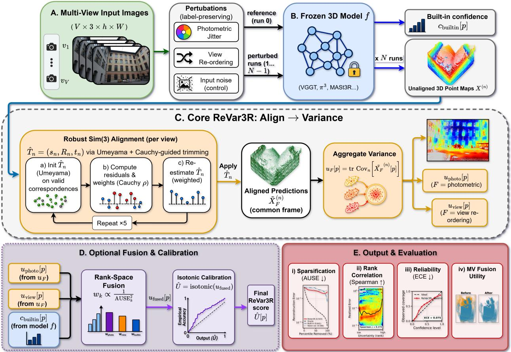  
Figure 1: ReVar3R pipeline. Alignment precedes per-point variance.

## 4.3 Aggregation, calibration, and fusion

The core estimator aggregates aligned spread with the trace of the per-point covariance (Eq. (4)). Trace variance produces a ranking without ground truth; robust median spread is weaker in the ablation, while the largest-eigenvalue aggregator is marginally weaker (Appendix C). Two optional components use a small held-out labelled split without changing any single family’s ranking. Isotonic calibration (Kuleshov et al., 2018) maps a score to error magnitude for expected calibration error (ECE). Rank-space fusion combines photometric jitter, view re-ordering, and built-in confidence, weighting each signal by held-out inverse-AUSE2 so that a weak family is down-weighted rather than allowed to degrade the estimate. Aligned single-family variance is termed the core, and the fused variant is termed the full ReVar3R estimator. Table 4 separates the label-free ranking from held-out fusion and magnitude calibration.

## 5 Experimental Setup

Models and datasets. The evaluation uses released checkpoints for three frozen backbones: VGGT (Wang et al., 2025a), π3 (Wang et al., 2026), and MASt3R (Leroy et al., 2024). VGGT and MASt3R are reference-dependent; π3 is permutation-equivariant. The six datasets span complementary regimes. 7-Scenes (Shotton et al., 2013) and DTU (Jensen et al., 2014) are in-distribution. ETH3D (Schöps et al., 2017) is a wide-baseline outdoor shift, while BlendedMVS (Yao et al., 2020) overlaps the base models’ training corpus, where built-in confidence is already strong. The competitor’s own benchmarks (Section 6.5) add indoor RGB-D TUM (Sturm et al., 2012) and outdoor-driving KITTI (Geiger et al., 2012); KITTI’s sparse LiDAR ground truth and road scenes are far from object- and room-scale training data. Trust3R also reports ScanNet++, which is unavailable here, so the evaluation covers three of its four benchmarks (TUM, KITTI, ETH3D). Each condition contains overlapping V=5-view sets with per-pixel ground-truth point maps. Ground truth is resized to the model output resolution, and comparisons follow gauge-free alignment.

Metrics. The primary metric, Area Under the Sparsification Error (AUSE) (Ilg et al., 2018) (↓), compares an uncertainty ordering with the oracle error ordering after per-scene normalization. The evaluation also reports Spearman correlation (↑) with realized error as a complementary monotone-invariant ranking measure, Area Under the Random Gain (AURG, ↑) as a reference, and regression ECE (↓) for magnitude calibration (Kuleshov et al., 2018). Per-point error is Euclidean distance to ground truth after robust similarity alignment. This evaluation alignment is separate from the estimator’s internal run-to-run registration (Section 4); global frame offsets are not scored as error.

Baselines. Training-free baselines comprise built-in confidence, an input-noise (Monte Carlo, MC) ensemble taken both without alignment and through the identical registration and scoring path as ReVar3R, and random and oracle references. The aligned ensemble is the stronger comparator and is reported as such (Table 8). The same-task learned comparator, Trust3R (Zhu et al., 2026), trains an evidential uncertainty head on frozen MASt3R. Its released checkpoint operates at 224 px, so the head-to-head evaluation uses that backbone at matched resolution and on identical point sets (Section 6.5).

Protocol and statistics. Unless noted, ReVar3R uses N=5 passes for each of two families: random view re-ordering and photometric jitter, with brightness, contrast, and colour each scaled by ±25% plus ≈0.5% additive pixel noise. The families share their reference prediction, so they require 9 total model evaluations. The naive input-noise baseline adds ≈1.5% Gaussian pixel noise. Appendix D.7 motivates the sample count.

The view-set, not the pixel, is the unit of statistical inference because spatially correlated per-pixel errors would overstate significance. AUSE is computed per view-set, paired differences over view-sets are tested with the Wilcoxon signed-rank test, and report absolute and relative effect sizes. View-sets from one scene are also correlated, making this test anticonservative when a dataset supplies few independent scenes. For the trained-head comparison, effect sizes are therefore reported rather than p-values except where the scene count supports a test (Appendix D.3). Win counts such as 15/18 are descriptive and carry no test.

Within each backbone, the training-free estimators share predictions, alignment conventions, and scoring code; Trust3R uses its own refined point map, scored on the same valid pixels. The stochastic estimators (ReVar3R and the input-noise ensemble) run over five random seeds, and the seed mean is reported; the trained Trust3R head and built-in confidences are deterministic single-pass references (Appendix E.3). In the Trust3R comparison (§6.5), both methods use identical view-sets (all available view-sets per dataset; counts in Table 11), so per-point AUSE covers the same points.

## 6 Results

The experiments follow the causal chain of the argument: isolate gauge contamination, remove it on real models, then compare the recovered ranking with built-in confidence, under shift, against a trained head, and in point filtering.

## 6.1 Controlled validation of gauge contamination

Alignment removes injected gauge contamination; unaligned variance deteriorates as the gauge grows. The validation uses known per-point uncertainty $\sigma _ { \mathrm { t r u e } } ,$ a controlled Sim(3) gauge, and the real-data estimator code (Appendix B). Increasing the gauge degrades unaligned ranking (Spearman $\mathbf { 0 . 9 9 }  \mathbf { 0 . 4 0 } ; \mathrm { ~ A U S E ~ 0 . 0 0 7  \mathbf { 0 . 4 7 } ) }$ , while aligned variance remains at oracle quality (Spearman ≈ 0.99, AUSE ≈ 0.008) across both gauge magnitude and scene distance (Figure 2). The transform decomposition matches Eq. (3): scale and rotation produce persistent distance-scaling contamination, whereas translation contributes only a position-independent offset.

Real models reproduce that signature. For every one of 30 VGGT view-sets across six datasets, $U _ { \mathrm { u n a l i g n e d } } - U _ { \mathrm { a l i g n e d } }$ grows with $\| x _ { p } \| ^ { 2 }$ (median Spearman +0.59, positive in 30/30 view-sets; Appendix B). A direct fit of Eq. (3) across all three backbones and six datasets yields a positive gauge coefficient in 16/18 conditions and median $R ^ { 2 } = \mathbf { 0 . 7 4 }$ The predicted functional form, not only its direction, holds on real models (Appendix B).

## 6.2 Alignment removes the dominant nuisance

Among the estimator’s stages, alignment rather than fusion with the baseline produces the main ranking gain. Averaged over six datasets, it lowers mean AUSE by 0.165, 0.131, and 0.105 for VGGT, MASt3R, and $\pi ^ { 3 } \left( { \bar { \mathrm { F i g u r e } } } \ 6 \right)$ . The reduction is larger in distribution (+0.167 mean, against +0.066 under shift), and wide-baseline ETH3D is the only dataset with near-zero mean alignment benefit across backbones. Robust alignment is at least as good as a plain similarity fit on every backbone (Appendix C). The training-free core, aligned single-family variance without fusion or built-in confidence, beats the built-in signal in 11/18 conditions, versus 5/18 unaligned (Tables 5, 10). Held-out inverse-AUSE2 fusion adds less, beating naive equal fusion in 83% of conditions (Appendix C).

Two ablations identify the nuisance removed (Appendix C.1). (i) The group matches the theory: AUSE falls from none 0.543, through translation 0.500 and rigid SE(3) 0.460, to similarity Sim(3) 0.392. The largest steps add rotation and scale, removing the $( \sigma _ { s } ^ { 2 } + 2 \sigma _ { r } ^ { 2 } ) \| x \| ^ { 2 }$ nuisance in Eq. (3). (ii) The signal belongs to the ensemble: fixed run-0, medoid, and random-run references give indistinguishable AUSE (0.392/0.395/0.394), requiring no privileged anchor.

Global gauge removal explains most, but not all, of the alignment gain. One scene-level transform, the run-level nuisance of Proposition 1, lowers mean AUSE 0.543 → 0.446, accounting for 0.097 of the default alignment’s 0.151 total gain, or 65%; per-view transforms supply the remaining 35% (0.446 → 0.392, helping 11/18 vs. 7/18), which Appendix C.1 interprets. Routing an input-noise ensemble through the same registration lifts it from beating built-in confidence in five of nine conditions to all nine (Table 8).

## 6.3 Comparison with built-in confidence

The same estimator improves over built-in confidence in most conditions, but not entirely without labels. ReVar3R lowers AUSE in 15 of 18 conditions across three backbones × six datasets. Its four-stage ladder exposes supervision: the label-free core wins 11/18; label-free equal-weight fusion reaches 12/18; fitting fusion weights on a held-out split reaches 14/18; and admitting the built-in signal as a fusion input reaches 15/18 (Appendix C). Only the first two stages use no labels at any point. The core supplies most of the effect; reusing the baseline recovers one condition. Repeating the full grid over five seeds returns 15/18 every time, with no condition changing sign (Table 16).

The wins include all six TUM and KITTI conditions at each backbone’s native resolution (Figure 3, positive cells; exact values in Appendices D.1 and D.2). The three exceptions are $\pi ^ { 3 }$ and MASt3R on BlendedMVS, which overlaps the base models’ training corpus, and $\pi ^ { 3 }$ on ETH3D. Built-in confidence is comparatively strong in these cells, although not uniformly strongest in the grid (Appendix D.1). Gains are largest where that signal is weak: VGGT on 7-Scenes (0.712 → 0.491, −31%), MASt3R on 7-Scenes $( 0 . 5 8 7  0 . 3 5 \bar { 8 } , - 3 9 \% )$ , and VGGT on KITTI (0.401 → 0.237, −41%). Appendix D.10 shows representative uncertainty maps for 7-Scenes, DTU, and ETH3D, with the typical gains and the variability against built-in confidence.

## 6.4 Behaviour under distribution shift

The gain under shift is not uniform. On far-shift outdoor KITTI, ReVar3R ranks error best (Spearman +0.69 against +0.48 for built-in confidence and +0.44 for the trained head) and attains the lowest AUSE (0.216 against 0.359). ETH3D, by contrast, is a loss: across 24 wide-baseline view-sets spanning nine scenes, built-in confidence ranks better than ReVar3R (+0.31 against +0.13) and has lower AUSE (0.585 against 0.667); the trained head is better still (Appendix D.8). Alignment helps most where the frame moves and the baseline is weak (Section 6.2).

## Gauge contamination in simulation

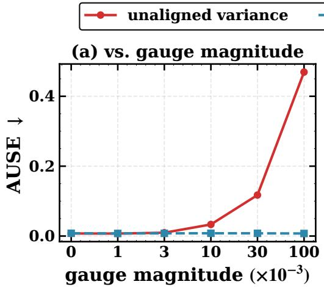

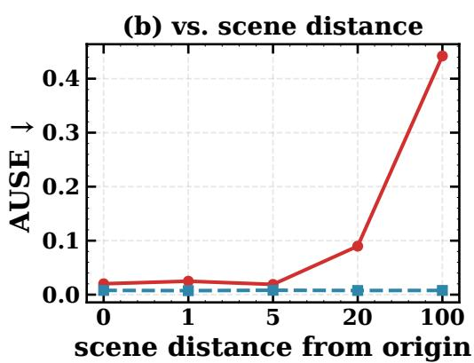  
Figure 2: Gauge contamination in simulation. (a) A growing injected Sim(3) gauge degrades unaligned perturbation variance (AUSE ↓); gauge-aligned variance stays near oracle quality. (b) At a fixed gauge, the degradation grows with the scene’s distance from the origin, the lever arm in the $\| x \| ^ { 2 }$ term of Eq. (3).

AUSE improvement over built-in confidence (built-in − ReVar3R)
<table><tr><td>VGGT</td><td>+0.22</td><td>+0.08</td><td>+0.10</td><td>+0.38</td><td>+0.10</td><td>+0.16</td><td rowspan="5">0.3 0.2 0.1 AUSE 0.0</td></tr><tr><td>π3</td><td>+0.15</td><td>+0.05</td><td>–0.06</td><td>–0.11</td><td>+0.08</td><td>+0.11</td></tr><tr><td>MASt3R</td><td>+0.23</td><td>+0.11</td><td>+0.01</td><td>-0.09</td><td>+0.04</td><td>+0.13</td></tr><tr><td></td><td>7-Scenes</td><td>DTU</td><td>ETH3D</td><td>BlendedMVS</td><td>TUM</td><td>KITTI</td></tr></table>

Figure 3: Main comparison over six datasets. AUSE improvement (built-in − ReVar3R) per backbone and dataset; blue is a gain and red a loss, darker is larger. Positive cells (15 of 18) are conditions where ReVar3R lowers AUSE.

## 6.5 Relation to a trained uncertainty head

The trained-head comparison exposes a trade-off, not a uniform ranking. Trust3R (Zhu et al., 2026) attaches an evidential head to frozen MASt3R; its released checkpoint enables a matched 224 px comparison on identical point sets across five datasets, including TUM and KITTI (Table 11). By per-view-set median AUSE, ReVar3R is favored on three of five datasets; the trained head leads on TUM, and 7-Scenes is a near tie (0.272 against 0.271). By Spearman, the trained head leads on two, and it calibrates magnitude better throughout.

Only DTU supports scene-level significance, because view-sets from one scene are correlated; sampling one view-set from each of 30 DTU scans, ReVar3R has lower AUSE on every scan; the per-scene mean difference is −0.205, and the scene-level sign-flip gives $p = 1 . 9 \times 1 0 ^ { - 9 }$ (Appendix D.3). ReVar3R adds no parameters but costs ∼10× a singlepass head (Appendix D.9). The trained head is stronger and better calibrated in its training domain; the training-free estimator holds up on the most dissimilar data.

## 6.6 Downstream utility

The improved ranking retains better geometry after uncertain points are removed. Under the selective-prediction protocol (Geifman & El-Yaniv, 2017), the most-uncertain points are removed, and mean error is measured among those kept (Figure 7). At 50% removal, ReVar3R closes 43% on 7-Scenes, 57% on DTU, and 30% on outdoor KITTI of the built-in-to-oracle gap. It beats built-in, input-noise, and random removal on every dataset.

## 7 Discussion and Limitations

Limitations. Four limitations follow. First, ReVar3R measures instability, not incorrectness: stable systematic error has low variance when perturbations agree on the same wrong geometry, a limitation the trained head also retains (Appendix D.6). Second, magnitude calibration requires labels and transfers poorly across domains for both methods. An exchangeable in-domain calibration set could support finite-sample marginal coverage guarantees through conformal prediction (Angelopoulos & Bates, 2023). Third, uncertainty-guided initialization does not improve novel-view synthesis under a fixed budget. Fourth, multiple passes add roughly an order of magnitude in latency (Appendix D.9), and the analysis idealizes the estimated gauge (Appendix E.1).

Broader implication. Normalize an unobserved symmetry before interpreting variance in a structured geometric output. Camera poses confirm the mechanism in a second modality because they share the point-map frame: naive centre uncertainty has the predicted $\| c \| ^ { 2 }$ inflation, strong for non-equivariant VGGT $( p < 1 0 ^ { \dot { - } 1 2 }$ on all three datasets) and near-absent on permutation-equivariant $\pi ^ { 3 }$ outside 7-Scenes. Alignment improves centre AUSE in all six conditions, but centre-error Spearman confirms only three of six, leaving pose instability a weak error ranker in some settings (Appendix B.1). The principle should extend to shape codes under global similarity and to radiance fields (NeRF (Mildenhall et al., 2020), 3D Gaussian Splatting (Kerbl et al., 2023)), whose geometry is defined only up to a world frame (Goli et al., 2024).

## 8 Conclusion

Perturbation uncertainty for feed-forward 3D point maps becomes interpretable only after similarity-gauge variation is removed. The derived additive term and simulation show that alignment recovers a near-oracle signal. ReVar3R applies align-before-variance to frozen-model outputs without added parameters or retraining, improving ranking over built-in confidence in most conditions and in point filtering, though not uniformly under shift. It measures gauge-aware procedural reliability, not geometric error: it misses stable systematic bias, and its calibration does not transfer across domains.

## Reproducibility statement

Section 4 specifies the estimator: the two perturbation families, robust similarity registration with its trimming schedule and fit subsample, trace aggregation, held-out isotonic calibration, and inverse-AUSE2 rank fusion. Section 5 lists the public backbone and Trust3R checkpoints, the six datasets, the perturbation settings, and the statistical protocol, including per-view-set paired Wilcoxon tests and the five-seed convention. Appendix B gives the full derivation of the gauge term and its Monte-Carlo check, Appendix D.3 the identical-point-set protocol of the Trust3R comparison, and Appendix E.3 the seed-stability analysis. Appendices D.1 and D.2 report the per-condition values behind the aggregates in the main text.

## AI use statement

Large language models are used in the preparation of this paper for two purposes, both under author supervision and both disclosed in the submission form. First, to draft sections of the paper: passages are generated from authorsupplied outlines, derivations, and result tables, then edited by the authors. Second, to aid or polish the writing: previously drafted prose is revised for concision, consistency of terminology, and clarity. Every drafted or polished passage is read, corrected, and approved by the authors before inclusion.

The research problem, conceptual framework, hypotheses, theoretical results, and benchmark design are developed by the authors before any generative AI is used. AI is not used to originate ideas or hypotheses, to retrieve or select related work, to derive or verify proofs, or to produce any reported result. Every citation is checked against its original source, and every reported number comes from the reported experiments. The authors take full responsibility for the manuscript and all claims, results, and artifacts.

## References

Alexander Amini, Wilko Schwarting, Ava Soleimany, and Daniela Rus. Deep evidential regression. In Advances in Neural Information Processing Systems (NeurIPS), 2020.

Anastasios N. Angelopoulos and Stephen Bates. Conformal prediction: A gentle introduction. Foundations and Trends in Machine Learning, 16(4):494–591, 2023.

Willem Baarda. S-Transformations and Criterion Matrices, volume 18 of Publications on Geodesy. Netherlands Geodetic Commission, Delft, second revised edition, 1981.

Yarin Gal and Zoubin Ghahramani. Dropout as a Bayesian approximation: Representing model uncertainty in deep learning. In Proceedings ofthe International Conference on Machine Learning (ICML), 2016.

Yonatan Geifman and Ran El-Yaniv. Selective classification for deep neural networks. In Advances in Neural Information Processing Systems (NIPS), 2017.

Andreas Geiger, Philip Lenz, and Raquel Urtasun. Are we ready for autonomous driving? the KITTI vision benchmark suite. In Proceedings ofthe IEEE Conference on Computer Vision and Pattern Recognition (CVPR), 2012.

Lily Goli, Cody Reading, Silvia Sellán, Alec Jacobson, and Andrea Tagliasacchi. Bayes’ Rays: Uncertainty quantification for neural radiance fields. In Proceedings of the IEEE/CVF Conference on Computer Vision and Pattern Recognition (CVPR), 2024.

Colin Goodall. Procrustes methods in the statistical analysis of shape. Journal ofthe Royal Statistical Society: Series B (Methodological), 53(2):285–321, 1991.

Chuan Guo, Geoff Pleiss, Yu Sun, and Kilian Q. Weinberger. On calibration of modern neural networks. In Proceedings ofthe International Conference on Machine Learning (ICML), 2017.

Markus Hillemann, Robert Langendörfer, Steven Landgraf, and Markus Ulrich. Uncertainty quality of VGGT: An analysis on the DTU benchmark dataset. ISPRS Annals ofthe Photogrammetry, Remote Sensing and Spatial Information Sciences, XI-2-2026:665–672, 2026.

Eddy Ilg, Ozgun Cicek, Silvio Galesso, Aaron Klein, Osama Makansi, Frank Hutter, and Thomas Brox. Uncertainty estimates and multi-hypotheses networks for optical flow. In Proceedings of the European Conference on Computer Vision (ECCV), 2018.

Rasmus Jensen, Anders Dahl, George Vogiatzis, Engin Tola, and Henrik Aanæs. Large scale multi-view stereopsis evaluation. In Proceedings ofthe IEEE Conference on Computer Vision and Pattern Recognition (CVPR), 2014.

Kenichi Kanatani and Daniel D. Morris. Gauges and gauge transformations for uncertainty description of geometric structure with indeterminacy. IEEE Transactions on Information Theory, 47(5), 2001.

Nikhil Keetha, Norman Müller, Johannes Schönberger, Lorenzo Porzi, Yuchen Zhang, Tobias Fischer, Arno Knapitsch, Duncan Zauss, Ethan Weber, Nelson Antunes, Jonathon Luiten, Manuel Lopez-Antequera, Samuel Rota Bulò, Christian Richardt, Deva Ramanan, Sebastian Scherer, and Peter Kontschieder. MapAnything: Universal feedforward metric 3d reconstruction. In International Conference on 3D Vision (3DV), 2026.

Alex Kendall and Yarin Gal. What uncertainties do we need in Bayesian deep learning for computer vision? In Advances in Neural Information Processing Systems (NIPS), 2017.

Bernhard Kerbl, Georgios Kopanas, Thomas Leimkühler, and George Drettakis. 3d gaussian splatting for real-time radiance field rendering. ACM Transactions on Graphics (SIGGRAPH), 42(4), 2023.

Volodymyr Kuleshov, Nathan Fenner, and Stefano Ermon. Accurate uncertainties for deep learning using calibrated regression. In Proceedings ofthe International Conference on Machine Learning (ICML), 2018.

Balaji Lakshminarayanan, Alexander Pritzel, and Charles Blundell. Simple and scalable predictive uncertainty esti mation using deep ensembles. In Advances in Neural Information Processing Systems (NIPS), 2017.

Vincent Leroy, Yohann Cabon, and Jérôme Revaud. Grounding image matching in 3d with MASt3R. In Proceedings ofthe European Conference on Computer Vision (ECCV), 2024.

Haotong Lin, Sili Chen, Jun Hao Liew, Donny Y. Chen, Zhenyu Li, Yang Zhao, Sida Peng, Hengkai Guo, Xiaowei Zhou, Guang Shi, Jiashi Feng, and Bingyi Kang. Depth Anything 3: Recovering the visual space from any views. In International Conference on Learning Representations (ICLR), 2026.

Lu Mi, Hao Wang, Yonglong Tian, Hao He, and Nir Shavit. Training-free uncertainty estimation for dense regression: Sensitivity as a surrogate. In Proceedings ofthe AAAI Conference on Artificial Intelligence (AAAI), 2022.

Ben Mildenhall, Pratul P. Srinivasan, Matthew Tancik, Jonathan T. Barron, Ravi Ramamoorthi, and Ren Ng. NeRF: Representing scenes as neural radiance fields for view synthesis. In Proceedings of the European Conference on Computer Vision (ECCV), 2020.

Daniel D. Morris. Gauge Freedoms and Uncertainty Modeling for 3D Computer Vision. PhD thesis, Carnegie Mellon University, Pittsburgh, PA, March 2001. Robotics Institute technical report CMU-RI-TR-01-15.

Yaniv Ovadia, Emily Fertig, Jie Ren, Zachary Nado, D. Sculley, Sebastian Nowozin, Joshua V. Dillon, Balaji Lakshminarayanan, and Jasper Snoek. Can you trust your model’s uncertainty? evaluating predictive uncertainty under dataset shift. In Advances in Neural Information Processing Systems (NeurIPS), 2019.

Matteo Poggi, Filippo Aleotti, Fabio Tosi, and Stefano Mattoccia. On the uncertainty of self-supervised monocular depth estimation. In Proceedings of the IEEE/CVF Conference on Computer Vision and Pattern Recognition (CVPR), 2020.

Thomas Schöps, Johannes L. Schönberger, Silvano Galliani, Torsten Sattler, Konrad Schindler, Marc Pollefeys, and Andreas Geiger. A multi-view stereo benchmark with high-resolution images and multi-camera videos. In Proceed ings ofthe IEEE Conference on Computer Vision and Pattern Recognition (CVPR), 2017.

Jamie Shotton, Ben Glocker, Christopher Zach, Shahram Izadi, Antonio Criminisi, and Andrew Fitzgibbon. Scene coordinate regression forests for camera relocalization in RGB-D images. In Proceedings of the IEEE Conference on Computer Vision and Pattern Recognition (CVPR), 2013.

Jürgen Sturm, Nikolas Engelhard, Felix Endres, Wolfram Burgard, and Daniel Cremers. A benchmark for the evaluation of RGB-D SLAM systems. In Proceedings of the IEEE/RSJ International Conference on Intelligent Robots and Systems (IROS), 2012.

Bill Triggs, Philip F. McLauchlan, Richard I. Hartley, and Andrew W. Fitzgibbon. Bundle adjustment: A modern synthesis. In Vision Algorithms: Theory and Practice, Lecture Notes in Computer Science. Springer, 2000.

Shinji Umeyama. Least-squares estimation of transformation parameters between two point patterns. IEEE Transac tions on Pattern Analysis and Machine Intelligence (TPAMI), 13(4), 1991.

Guotai Wang, Wenqi Li, Michael Aertsen, Jan Deprest, Sébastien Ourselin, and Tom Vercauteren. Aleatoric uncertainty estimation with test-time augmentation for medical image segmentation with convolutional neural networks. Neurocomputing, 338:34–45, 2019.

Hengyi Wang and Lourdes Agapito. 3d reconstruction with spatial memory. In International Conference on 3D Vision (3DV), 2025.

Jianyuan Wang, Minghao Chen, Nikita Karaev, Andrea Vedaldi, Christian Rupprecht, and David Novotny. VGGT: Visual geometry grounded transformer. In Proceedings of the IEEE/CVF Conference on Computer Vision and Pattern Recognition (CVPR), 2025a.

Qianqian Wang, Yifei Zhang, Aleksander Holynski, Alexei A. Efros, and Angjoo Kanazawa. Continuous 3d percep tion model with persistent state. In Proceedings of the IEEE/CVF Conference on Computer Vision and Pattern Recognition (CVPR), 2025b.

Shuzhe Wang, Vincent Leroy, Yohann Cabon, Boris Chidlovskii, and Jérôme Revaud. DUSt3R: Geometric 3d vision made easy. In Proceedings of the IEEE/CVF Conference on Computer Vision and Pattern Recognition (CVPR), 2024.

Yifan Wang, Jianjun Zhou, Haoyi Zhu, Wenzheng Chang, Yang Zhou, Zizun Li, Junyi Chen, Jiangmiao Pang, Chunhua Shen, and Tong He. π3: Permutation-equivariant visual geometry learning. In International Conference on Learning Representations (ICLR), 2026.

Jianing Yang, Alexander Sax, Kevin J. Liang, Mikael Henaff, Hao Tang, Ang Cao, Joyce Chai, Franziska Meier, and Matt Feiszli. Fast3R: Towards 3d reconstruction of 1000+ images in one forward pass. In Proceedings of the IEEE/CVF Conference on Computer Vision and Pattern Recognition (CVPR), 2025.

Yao Yao, Zixin Luo, Shiwei Li, Jingyang Zhang, Yufan Ren, Lei Zhou, Tian Fang, and Long Quan. BlendedMVS: A large-scale dataset for generalized multi-view stereo networks. In Proceedings of the IEEE/CVF Conference on Computer Vision and Pattern Recognition (CVPR), 2020.

Zhengyou Zhang. Parameter estimation techniques: A tutorial with application to conic fitting. Image and Vision Computing, 15(1):59–76, 1997.

Zichao Zhang, Guillermo Gallego, and Davide Scaramuzza. On the comparison of gauge freedom handling in optimization-based visual-inertial state estimation. IEEE Robotics and Automation Letters, 3(3):2710–2717, 2018.

Zihao Zhu, Wenyuan Zhao, Nuo Chen, Chao Tian, and Zhiwen Fan. Trust it or not: Evidential uncertainty for feedforward 3d reconstruction with Trust3R. In Proceedings of the International Conference on Machine Learning (ICML), 2026.

## Supplementary Material

ReVar3R: Gauge-Aware Perturbation Uncertainty for Feed-Forward 3D Reconstruction

## A Notation

This section fixes the notation shared by the problem statement (Section 3), estimator (Section 4), and derivation (Appendix B). Table 1 groups the symbols by their role in the model, gauge, estimator, and evaluation.

Table 1: Notation. Definitions used throughout the paper, grouped by model, perturbation ensemble, gauge, estimator, and metric.
<table><tr><td>Symbol</td><td>Meaning</td></tr><tr><td>Model and geometry  $\mathbf { \Pi } _ { V } ^ { f }$   $H , W$   $X ^ { ' } \in \mathbb { R } ^ { V \times H \times W \times 3 }$   $p , \ v$   $\mathbf { \hat { \boldsymbol { X } } } _ { v } [ p ] \in \mathbb { R } ^ { 3 }$ </td><td>frozen feed-forward 3D model (weights never modified) number of input views height and width of each per-view point map per-view point maps emitted by  $f$  pixel (correspondence) index; view index predicted 3D position of pixel p in view v clean (true) geometry of point p distance of  $x _ { p }$  from the frame origin (lever arm)</td></tr><tr><td>Perturbation ensemble  $N$   $X ^ { ( 0 ) }$   $\{ X ^ { ( n ) } \} _ { n = 1 } ^ { N }$   ${ \mathcal { F } } , F$   $P _ { n } ^ { F }$ </td><td>number of perturbed passes per family reference prediction (run 0) the  $N$  perturbed predictions; n is the run index set of perturbation families; a single family the n-th label-preserving input perturbation drawn from F</td></tr><tr><td> $S O ( \mathrm { 3 } )$   $T _ { n } = ( s _ { n } , R _ { n } , t _ { n } )$   $\hat { T } _ { n }$   $s _ { n } = 1 + \varepsilon _ { n }$   ${ \cal R } _ { n } \approx { \bf I } + [ \omega _ { n } ] \times$   $\left[ \omega _ { n } \right] _ { \times }$   $t _ { n }$ </td><td>rotation group true per-run similarity gauge,  $T _ { n } \in \mathrm { S i m } ( 3 )$  fitted similarity map from run  $n \mathrm { { : } }$  frame to the reference frame per-run scale;  $\varepsilon _ { n } \sim \mathcal { N } ( 0 , \sigma _ { s } ^ { 2 } )$  per-run rotation;  $\omega _ { n } \sim \mathcal { N } ( 0 , \sigma _ { r } ^ { 2 } \mathbf { I } )$  skew-symmetric (cross-product) matrix of  $\omega _ { n }$  per-run translation,  $\mathcal { N } ( 0 , \sigma _ { t } ^ { 2 } \mathbf { I } )$ </td></tr><tr><td> $\tilde { X } ^ { ( n ) } [ p ] = \hat { T } _ { n } ( X ^ { ( n ) } [ p ] )$   $\mathrm { C o v } _ { n } [ \cdot ] , \ \mathrm { t r }$   $u [ p ] \geq { \bar { 0 } }$   $\bar { U _ { \mathrm { u n a l i g n e d } } } ( p )$   $u _ { F } [ p ]$ </td><td>gauge-aligned prediction per-point sample covariance across runs; its trace per-point uncertainty score (Eq. (4)) naive unaligned trace-covariance (Eq. (3)) per-family uncertainty before fusion</td></tr><tr><td>Metrics AUSE</td><td>Area Under the Sparsification Error (lower is better)</td></tr><tr><td>Spearman AURG ECE</td><td>rank correlation of u with realized error Area Under the Random Gain (higher is better)</td></tr></table>

## B Gauge Mechanism and Verification

This section establishes the closed-form gauge-contamination term, verifies it numerically, and tests its predicted distance signature in simulation and real scenes.

Derivation of $\mathbf { E q } . \mathbf { \Gamma } ( 3 )$ . Under Eqs. (1)–(2), each run is linearized about the identity gauge. Substituting $R _ { n }$ ≈ $\mathbf { I } + [ \omega _ { n } ] _ { \times }$ and $s _ { n } = 1 + \varepsilon _ { n }$ , then retaining first-order terms in $\left( \varepsilon _ { n } , \omega _ { n } , t _ { n } \right)$ , gives

$$
X ^ { ( n ) } [ p ] - x _ { p } \approx \delta _ { p } ^ { ( n ) } + \varepsilon _ { n } x _ { p } + \omega _ { n } \times x _ { p } + t _ { n } ,\tag{5}
$$

where $\delta _ { p } ^ { ( n ) }$ is predictive noise and $\left( \varepsilon _ { n } , \omega _ { n } , t _ { n } \right)$ are the scale, rotation, and translation parameters defined in Section 3.3. Mutual independence and zero means eliminate the cross-covariances, so the per-point covariance is the sum

$$
\begin{array} { r l r } & { \mathrm { C o v } \big ( \delta _ { p } ^ { ( n ) } \big ) = \sigma _ { \mathrm { t r u e } } ^ { 2 } ( p ) { \bf I } , } & { \qquad } & { \mathrm { C o v } \big ( t _ { n } \big ) = \sigma _ { t } ^ { 2 } { \bf I } , } \\ & { \mathrm { C o v } \big ( \varepsilon _ { n } x _ { p } \big ) = \sigma _ { s } ^ { 2 } x _ { p } x _ { p } ^ { \top } , \qquad } & { \mathrm { C o v } \big ( \omega _ { n } \times x _ { p } \big ) = \sigma _ { r } ^ { 2 } \big ( \| x _ { p } \| ^ { 2 } { \bf I } - x _ { p } x _ { p } ^ { \top } \big ) , } \end{array}
$$

where I is the 3×3 identity. The trace is then taken. Because $\operatorname { t r } ( \mathbf { I } ) = 3 \operatorname { a n d } \operatorname { t r } ( x _ { p } x _ { p } ^ { \top } ) = \| x _ { p } \| ^ { 2 }$ , the rotation covariance contributes $\sigma _ { r } ^ { 2 } ( 3 - 1 ) \| x _ { p } \| ^ { 2 } = 2 \sigma _ { r } ^ { 2 } \| x _ { p } \| ^ { 2 }$ . The two isotropic terms therefore sum to $3 \sigma _ { \mathrm { t r u e } } ^ { 2 } ( p ) + 3 \sigma _ { t } ^ { 2 }$ , while the scale and rotation terms sum to $( \sigma _ { s } ^ { 2 } + 2 \sigma _ { r } ^ { 2 } ) \| x _ { p } \| ^ { 2 }$ , yielding Eq. (3). The first-order expansion also generates the cross terms $\varepsilon _ { n } \delta _ { p } ^ { ( n ) }$ and $\omega _ { n } \times \delta _ { p } ^ { ( n ) }$ . Their contribution, $3 \sigma _ { \mathrm { t r u e } } ^ { 2 } ( \sigma _ { s } ^ { 2 } + 2 \sigma _ { r } ^ { 2 } )$ , only rescales the signal by $( 1 + \sigma _ { s } ^ { 2 } + 2 \sigma _ { r } ^ { 2 } )$ and cannot reorder points. These terms are therefore omitted under $\sigma _ { \mathrm { t r u e } } ^ { 2 ^ { \cdot ^ { \cdot } } } \ll \| x _ { p } \| ^ { 2 }$ . Trace variance is reported; the estimator uses its rank-equivalent square root.

Synthetic experiment. Alignment removes the injected gauge effect, whereas unaligned ranking degrades with gauge magnitude and scene distance. The experiment draws heterogeneous known $\sigma _ { \mathrm { t r u e } } .$ , injects a known Sim(3) gauge per run, and uses the same align/aggregate implementation as for real data. Gauge magnitude g is the standard deviation of the scale factor and of the rotation angle (in radians), and translation has standard deviation 5g per axis. The points fill a cube of side 2 centred at distance 5 from the origin; the distance sweep moves this cube at $g = 0 . 0 1$ Table 2 also isolates components and sample count: scale+rotation creates persistent $\| x \| ^ { 2 }$ -scaling contamination, whereas translation adds a position-independent offset that does not reorder points (Eq. (3)). The N-sweep shows that the scale+rotation contamination persists instead of averaging out with N.

Table 2: Synthetic gauge contamination. Spearman against true uncertainty and AUSE show that aligned estimates remain invariant while unaligned estimates degrade with gauge magnitude and scene distance. Component rows use magnitude 0.05; the N-sweep reports unaligned Spearman and shows persistent contamination.
<table><tr><td>Sweep</td><td>setting</td><td>ρunaligned</td><td>ρaligned</td><td> $\bf { A U S E _ { u n } }$ </td><td> $\bf { A U S E _ { a l } }$ </td></tr><tr><td rowspan="4">gauge mag.</td><td>0.0</td><td>0.991</td><td>0.990</td><td>0.007</td><td>0.008</td></tr><tr><td>0.01</td><td>0.936</td><td>0.989</td><td>0.033</td><td>0.008</td></tr><tr><td>0.03</td><td>0.774</td><td>0.989</td><td>0.117</td><td>0.008</td></tr><tr><td>0.10</td><td>0.395</td><td>0.990</td><td>0.469</td><td>0.007</td></tr><tr><td rowspan="3">distance</td><td>D=0</td><td>0.962</td><td>0.989</td><td>0.020</td><td>0.008</td></tr><tr><td>D=20</td><td>0.852</td><td>0.989</td><td>0.090</td><td>0.008</td></tr><tr><td>D=100</td><td>0.477</td><td>0.989</td><td>0.442</td><td>0.008</td></tr><tr><td rowspan="2">component</td><td>translation only</td><td>0.808</td><td></td><td></td><td></td></tr><tr><td>scale+rotation</td><td>0.679</td><td></td><td></td><td></td></tr><tr><td>N-sweep</td><td> $\mathrm { s c a l e + r o t } \left( N { = } 8 / 5 0 / 2 0 0 \right)$ </td><td>0.74/0.84/0.80</td><td></td><td></td><td></td></tr></table>

Real-data confirmation of the $\| x _ { p } \| ^ { 2 }$ term. Every tested view-set exhibits the predicted within-view-set distance signature. Unlike the simulation, real data do not control gauge magnitude, but the theory’s shape prediction remains testable within each view-set. For each of 30 view-sets (5 per dataset × six datasets, VGGT; those five come from one or two scenes per dataset, eight scenes in all, so these are repeated views of a scene rather than thirty independent scenes), the gauge-attributable variance is computed per point as $U _ { \mathrm { u n a l i g n e d } } ( p ) - U _ { \mathrm { a l i g n e d } } ( p )$ , and its rank correlation with $\| x _ { p } \| ^ { 2 }$ (point distance in the model’s output frame, where the gauge acts). It is positive in all 30 (median Spearman $+ \mathbf { 0 . 5 9 } ;$ per-dataset medians $+ 0 . 5 3 \ \mathrm { t o } \ + 0 . 8 \bar { 8 } )$ , and the pooled decile-binned curve rises monotonically with distance (Figure 4), confirming the distance-growing gauge term of Eq. (3) on real models. A clean cross-dataset extent trend does not hold because uncontrolled per-scene gauge magnitude confounds it. The within-scene test, rather than a cross-dataset comparison, is what isolates the $\| \breve { x } _ { p } \| ^ { \breve { 2 } }$ shape from that magnitude.

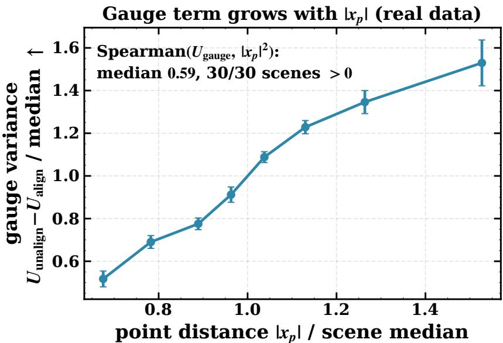  
Figure 4: The gauge term grows with distance within real scenes. After per-view-set normalization and pooling over 30 view-sets from six datasets (eight scenes in all), $U _ { \mathrm { u n a l i g n e d } } - U _ { \mathrm { a l i g n e d } }$ rises monotonically with point distance $| x _ { p } |$ . Its rank correlation with $| x _ { p } | ^ { 2 }$ is positive in 30/30 view-sets (median +0.59), matching the $\| \dot { x } _ { p } \| ^ { 2 }$ term in Eq. (3).

Recovering the gauge coefficient across all eighteen conditions. The rank test above establishes the direction of the effect; the functional form permits a direct test. For each of the 3 backbones $\times \ 6$ datasets, the analysis records per-point $U _ { \mathrm { u n a l i g n e d } }$ and $U _ { \mathrm { a l i g n e d } }$ from the same forward passes, bins points into 50 quantiles of $\| x _ { p } \| ^ { 2 } .$ , and fits the conditional means to Eq. (3), whose slope is the gauge coefficient $( \sigma _ { s } ^ { 2 } + 2 \sigma _ { r } ^ { 2 } )$ and whose intercept is $3 \sigma _ { t } ^ { 2 }$ . Binning is necessary because a per-point variance from $N { = } 5$ samples carries ≈70% relative noise, which bounds any per-point fit regardless of whether the model is correct; Eq. (3) is a statement about the conditional expectation. The affine form fits well: median $R ^ { 2 } = \mathbf { 0 . 7 4 }$ over the eighteen conditions (max 0.995), with a positive recovered coefficient in $\mathbf { 1 6 } / \mathbf { 1 8 }$ . The two exceptions (VGGT/KITTI, MASt3R/BlendedMVS) have $R ^ { 2 } \leq 0 . 0 \bar { 5 }$ , that ${ \mathrm { i s } } ,$ no detectable distance dependence at all rather than a contradicting one. This extends the within-scene test beyond VGGT to all three backbones.

An additional test does not establish whether the magnitude of the recovered contamination predicts how much alignment helps. Regressing the AUSE reduction on $( \sigma _ { s } ^ { 2 } + 2 \sigma _ { r } ^ { 2 } ) \mathbb { E } \| x \| ^ { 2 } / \mathbb { E } [ U _ { \mathrm { a l i g n e d } } ]$ over the 16 conditions with a positive recovered coefficient gives Spearman $+ 0 . 0 3 , \mathrm { o r } - 0 . 2 0$ when the reduction is first divided by the built-in AUSE to account for the headroom the built-in confidence leaves. Neither is informative at this sample size: the bootstrap 95% interval on the correlation is $[ - 0 . 4 9 , + 0 . 5 9 ]$ and a permutation test gives $p = 0 . 9 1$ , so the design neither supports nor excludes a magnitude relation. The result is reported because the analysis is specified before execution and shares its fitted coefficients with the result above, not because it settles the question. Eq. (3) predicts theform of the contamination; how much a ranking metric improves once that contamination is removed depends further on how much of the remaining error the perturbation family exposes, and on how much headroom the baseline leaves.

The effect is expected to scale with how far a backbone’s output frame actually moves between passes, and the pose modality supports that reading: the analogous $\| c \| ^ { 2 }$ signature is strong on VGGT and statistically absent on the permutation-equivariant $\pi ^ { 3 }$ (Table 3). The confound is therefore backbone-dependent in magnitude, not universal in strength.

The gauge/covariance coupling is classical in bundle adjustment (Triggs et al., 2000); here it identifies the dominant nuisance in perturbation-ensemble uncertainty for frozen point maps.

## B.1 Second Modality: SE(3) Camera Poses

Camera poses exhibit the same gauge contamination, although alignment does not make pose instability a uniformly strong error ranker. Equation (3) applies to outputs with an unobserved global symmetry, not only to point maps. Feed-forward reconstruction places points and cameras in a shared frame that floats in Sim(3) across passes. This second structured output is tested by reusing the point maps’ per-run similarity fit to gauge-align the per-view camera poses.

Protocol. Each view-set uses the main estimator’s $N { = } 5$ photometric passes, from which the point map and per-view camera pose are collected. For run n, the same code as Section 4 fits one global robust similarity $\left( s _ { n } , R _ { n } , t _ { n } \right)$ from its point map to the reference, then applies that transform to its cameras. Camera centres follow $c \mapsto s _ { n } R _ { n } c + t _ { n }$ , and camera-to-world rotations follow $R _ { c } \mapsto R _ { n } R _ { c }$ . Naive pose uncertainty is the cross-run spread before this correction; gauge-aligned uncertainty is the spread after it. Centre uncertainty is defined as the trace spread of camera centres and rotation uncertainty as the RMS geodesic angle about their chordal mean. Pose error is the reference pose’s centre distance and geodesic rotation angle after one gauge-free similarity alignment to ground-truth poses. AUSE and Spearman pool all cameras (120 to 150 per condition). The pose convention is determined once against ground truth: camera-to-world for $\pi ^ { 3 }$ and world-to-camera for VGGT.

Result. The $\| x _ { p } \| ^ { 2 }$ signature of Eq. (3) transfers to camera centres, although the error-ranking gains it produces are mixed. Table 3 shows that naive centre uncertainty grows with camera-centre magnitude $\| c \| ^ { 2 }$ , strongly on VGGT (Spearman 0.61 to 0.70, $p \ < \ 1 0 ^ { - 1 2 }$ on every dataset) and on $\pi ^ { 3 } / 7 .$ -Scenes, but only weakly on the permutationequivariant $\pi ^ { 3 }$ elsewhere. This pattern tracks how much each backbone’s frame moves between passes. Gauge removal lowers centre pose-error AUSE in all six conditions. However, the reported AUSE risk is outlier-sensitive; under the outlier-robust rank correlation, centre improvement holds in only three of six (both DTU conditions and $\pi ^ { 3 } / 7 .$ Scenes). On VGGT/7-Scenes and VGGT/ETH3D, centre uncertainty remains a weak error ranker with or without alignment. Rotation AUSE improves in four of six, including all three VGGT conditions. These results are interpreted as evidence that Eq. (3)’s contamination is present and removable in a second structured output, most clearly for the non-equivariant backbone whose frame moves. No pose-uncertainty method is proposed.

Table 3: The gauge confound transfers to SE(3) camera poses, but ranking gains are mixed. Naive and gaugealigned pose uncertainty rank pose error over all cameras pooled per condition (AUSE lower is better; Spearman higher is better). Bold marks the better AUSE. Centre alignment lowers AUSE in all six conditions, whereas outlierrobust centre Spearman improves in three (both DTU and $\pi ^ { 3 } / 7$ -Scenes); VGGT/7-Scenes and VGGT/ETH3D remain weak negative rankers. The final column measures Eq. $( 3 ) ^ { \bullet } \| c \| ^ { 2 }$ signature through the rank correlation between naive centre uncertainty and squared camera-centre magnitude, which is strong where the frame moves.
<table><tr><td colspan="2"></td><td colspan="2">Centre AUSE</td><td colspan="2">Centre Spearman</td><td colspan="2">Rot. AUSE</td><td rowspan="2"> $\pmb { \rho } ( \| \pmb { c } \| ^ { 2 } )$  naive</td></tr><tr><td>Backbone</td><td>Dataset</td><td>naive</td><td>align</td><td>naive</td><td>align</td><td>naive</td><td>align</td></tr><tr><td> $\pi ^ { 3 }$ </td><td>7-Scenes</td><td>0.217</td><td>0.175</td><td>0.276</td><td>0.351</td><td>0.299</td><td>0.314</td><td>0.38*</td></tr><tr><td> $\pi ^ { 3 }$ </td><td>DTU</td><td>0.210</td><td>0.119</td><td>-0.006</td><td>0.521</td><td>0.156</td><td>0.088</td><td>0.15</td></tr><tr><td> $\pi ^ { 3 }$ </td><td>ETH3D</td><td>0.534</td><td>0.519</td><td>0.157</td><td>0.007</td><td>0.401</td><td>0.445</td><td>0.07</td></tr><tr><td>VGGT</td><td>7-Scenes</td><td>0.556</td><td>0.461</td><td>-0.297</td><td>-0.301</td><td>0.322</td><td>0.291</td><td>0.70*</td></tr><tr><td>VGGT</td><td>DTU</td><td>0.083</td><td>0.048</td><td>0.121</td><td>0.386</td><td>0.355</td><td>0.305</td><td>0.66*</td></tr><tr><td>VGGT</td><td>ETH3D</td><td>0.714</td><td>0.569</td><td>-0.195</td><td>-0.233</td><td>0.655</td><td>0.507</td><td>0.61*</td></tr></table>

$^ { * } p < 1 0 ^ { - 4 }$ . Centre Spearman is negative on VGGT/7-Scenes and VGGT/ETH3D for both naive and aligned, indicating pose-centre instability is a weak proxy for pose error there regardless of the gauge.

## C Estimator Components and Alignment

Alignment removes the dominant nuisance in the training-free ranking, while held-out fusion supplies a smaller, more consistent gain and calibration affects magnitude rather than rank. Algorithm 1 gives the complete procedure of Section 4.

The component ladder shows that alignment dominates in distribution, held-out learned fusion is the most consistent step overall, and naive equal fusion is unreliable. A ten-step progression is evaluated across 3 models $\times \ 6$ datasets: built-in confidence; individual perturbation families without alignment; alignment; variance versus robust spread; equal fusion; held-out learned fusion; and the full estimator. Figure 5 gives each step’s mean AUSE change and help rate for in-distribution (ID) and distribution-shift (OOD) conditions. After alignment, photometric and input-noise perturbations differ only marginally in best-configuration AUSE on average. Their choice matters more under shift, where input noise is marginally stronger.

Robust Umeyama alignment reduces AUSE on every backbone when averaged over the six datasets $( 1 5 / 1 8$ conditions individually; see Figure 5): 0.165, 0.131, and 0.105 on VGGT, MASt3R, and $\pi ^ { 3 }$ , respectively. It is at least as good as plain Umeyama on every backbone. Figure 5 shows that alignment dominates in distribution, held-out learned fusion alone helps in every shifted condition, and naive equal fusion is unreliable.

Algorithm 1: ReVar3R: gauge-aware perturbation uncertainty (single view v shown; run over all V). Here $\hat { T } _ { n } \in$   
Sim(3) is the robust similarity fit of Section $4 . 2 , { \tilde { X } } ^ { ( n ) }$ the aligned prediction, $\operatorname { C o v } _ { n }$ and tr the per-point sample   
covariance across the N runs and its trace, and RANKFUSE the held-out inverse-AUSE2 rank fusion of Section 4.3.   
Input: frozen model f; V input views; passes per family N; perturbation families F, each $\overline { { F \in \mathcal { F } \mathrm { ~ a ~ } } }$ distribution   
over label-preserving input transforms $\stackrel { \bullet } { P } _ { n } ^ { F }$   
Output: per-point uncertainty ${ \dot { u } } [ p ] \geq 0$   
1 $X ^ { ( 0 ) } \gets f ( \mathrm { v i e w s } )$ ; $/ /$ reference prediction (gauge reference frame)   
2 $\tilde { X } ^ { ( 0 ) }  X ^ { ( 0 ) }$ $/ /$ reference needs no alignment   
3 foreach family $F \in { \mathcal { F } }$ do   
4 for $n = 1$ to $N - 1$ do   
5 $X ^ { ( n ) }  f \big ( P _ { n } ^ { F } ( \mathrm { v i e w s } ) \big )$ // re-run on perturbed input   
6 $\hat { T } _ { n } \gets \mathrm { R o B U S T S I M 3 } \big ( X ^ { ( n ) } , X ^ { ( 0 ) } \big ) ; \quad \tilde { X } ^ { ( n ) } \gets \hat { T } _ { n } ( X ^ { ( n ) } )$ // align before variance   
7 end   
8 $u _ { F } [ p ]  \mathrm { t r } \mathrm { C o v } _ { n } \big [ \tilde { X } ^ { ( n ) } [ p ] \big ]$ // aggregate over runs   
9 end   
10 $u [ p ] \gets \mathrm { R A N K F U S E } \left( \{ u _ { F } [ p ] \} _ { F \in \mathcal { F } } \cup \{ \mathrm { b u i l t - i n c o n f . } \} \right)$ ; // optional, held-out weights

Table 4: The three levels of ReVar3R. The training-free core produces the AUSE/Spearman ranking. Fusion and calibration use a small held-out labelled split; neither changes a single family’s ranking, and calibration alone changes only magnitude. This separation distinguishes ranking from calibration in the Trust3R comparison (Section 6.5).
<table><tr><td>Level</td><td>What it adds</td><td>Labels</td></tr><tr><td>Core</td><td>aligned single-family variance (a ranking)</td><td>none</td></tr><tr><td>+ fusion</td><td>rank-space fusion of families with the built-in confidence</td><td>held-out split</td></tr><tr><td>+ calibration</td><td>isotonic map from score to error magnitude (ECE)</td><td>held-out split</td></tr></table>

The training-free core, not fusion with built-in confidence, drives the gain. Table 5 separates aligned single-family variance, with neither fusion nor built-in confidence, from the fused variant. The core lowers AUSE below built-in confidence in $8 / 1 2$ conditions on the four original datasets and 11/18 across all six (Table 10), compared with only $5 / 1 8$ for the same perturbation without alignment. The optional held-out fusion recovers additional cells, especially where one family is weak, but does not create the main result.

Table 5: Training-free core vs. built-in. Decomposition of the gain (AUSE ↓) across the four original datasets (twelve conditions): built-in confidence; unaligned single-family perturbation variance; the training-free core ReVar-3R estimator (robust-aligned single-family variance, no fusion, no built-in confidence); and the full held-out fusion. The training-free core beats built-in in 8/12 here and 11/18 with the competitor benchmarks (Table 10), versus 5/18 for unaligned perturbation. The gain comes from alignment, not fusion with the baseline.
<table><tr><td>Model</td><td>Dataset</td><td>built-in</td><td>unaligned</td><td>core (train-free)</td><td>full (fused)</td></tr><tr><td>VGGT</td><td>7-Scenes</td><td>0.712</td><td>0.655</td><td>0.536</td><td>0.491</td></tr><tr><td>VGGT</td><td>DTU</td><td>0.248</td><td>0.313</td><td>0.236</td><td>0.171</td></tr><tr><td>VGGT</td><td>ETH3D</td><td>0.740</td><td>0.520</td><td>0.578</td><td>0.635</td></tr><tr><td>VGGT</td><td>BlendedMVS</td><td>0.786</td><td>0.597</td><td>0.276</td><td>0.407</td></tr><tr><td> $\pi ^ { 3 }$ </td><td>7-Scenes</td><td>0.517</td><td>0.541</td><td>0.439</td><td>0.363</td></tr><tr><td> $\pi ^ { 3 }$ </td><td>DTU</td><td>0.273</td><td>0.660</td><td>0.276</td><td>0.220</td></tr><tr><td> $\pi ^ { 3 }$ </td><td>ETH3D</td><td>0.528</td><td>0.487</td><td>0.522</td><td>0.593</td></tr><tr><td> $\pi ^ { 3 }$ </td><td>BlendedMVS</td><td>0.187</td><td>0.243</td><td>0.251</td><td>0.298</td></tr><tr><td>MASt3R</td><td>7-Scenes</td><td>0.587</td><td>0.479</td><td>0.391</td><td>0.358</td></tr><tr><td>MASt3R</td><td>DTU</td><td>0.463</td><td>0.500</td><td>0.364</td><td>0.350</td></tr><tr><td>MASt3R</td><td>ETH3D</td><td>0.570</td><td>0.645</td><td>0.595</td><td>0.558</td></tr><tr><td>MASt3R</td><td>BlendedMVS</td><td>0.282</td><td>0.843</td><td>0.659</td><td>0.367</td></tr></table>

Aggregation statistic. Trace variance is the strongest aggregator. Table 6 compares the three choices from Section 4.3, trace covariance, median-absolute-deviation spread, and largest covariance eigenvalue, on aligned photometric spread across the same 3 × 6 grid. The trace column reproduces the training-free core in Table 5. Median spread is clearly weaker (mean AUSE +0.068, weaker in 16/18 conditions), whereas the largest eigenvalue is only marginally weaker (mean +0.006, weaker in 15/18 but close to a tie).

Component contributions: mean AUSE reduction (% of conditions helped)  
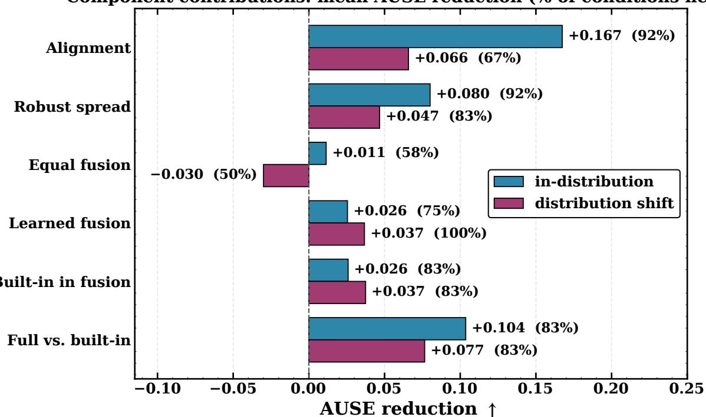  
Figure 5: Component decomposition. Mean AUSE reduction (positive = improvement) and, in parentheses, the share of conditions each component helps, split into in-distribution and shifted conditions. Alignment supplies the largest in-distribution gain, held-out learned fusion is the most consistent component, and equal fusion exhibits occasional degradation under shift. The fifth group isolates admitting built-in confidence as a fusion input: it is of the same order as the fusion step itself, which is why the label-free core (11/18) is reported alongside the fused 15/18.

Table 6: Aggregation statistic (full grid). Mean AUSE over 3 models × 6 datasets for three aligned-photometric aggregators; lower is better. Trace variance is strongest, median spread is clearly weaker, and the largest eigenvalue is marginally weaker. The trace column reproduces the rung-7 core values of Table 5 on the four original datasets; TUM and KITTI are recomputed here over ten view-sets rather than the eight used in Table 10.
<table><tr><td>Aggregator</td><td>ID</td><td>OOD</td><td>overall</td></tr><tr><td>Trace variance (used)</td><td>0.359</td><td>0.464</td><td>0.394</td></tr><tr><td>Median absolute deviation</td><td>0.440</td><td>0.507</td><td>0.462</td></tr><tr><td>Largest eigenvalue</td><td>0.365</td><td>0.468</td><td>0.399</td></tr></table>

## C.1 Alignment Ablations: Reference, Group, and Scope

The alignment ablations establish three facts: the similarity group is necessary, the reference choice is immaterial, and per-view scope outperforms scene-level scope. Table 7 varies only alignment while sharing forward passes, then averages the photometric core over the eighteen model–dataset conditions.

Group. AUSE falls monotonically as the group expands. The two largest steps add rotation (translation→rigid) and scale (rigid→similarity), removing precisely the $( \sigma _ { s } ^ { 2 } + 2 \sigma _ { r } ^ { 2 } ) \lVert x \rVert ^ { 2 }$ term that Eq. (3) identifies as the dominant distancescaling nuisance; translation, a position-independent offset in the theory, helps least.

Reference. Fixed run 0, ensemble medoid, and random-run anchors are indistinguishable, so the signal belongs to the ensemble rather than a privileged reference.

Scope. Independent per-view alignment beats a single scene-level transform, which cannot absorb per-view gauge variation. The scene-level transform removes the predicted global gauge; per-view alignment additionally stabilizes residual view-dependent frame variation outside the proposition’s single-transform model. Each view’s error is evaluated after its own similarity alignment to ground truth, so these offsets are absent from the target and removing them does not score away error. The estimator is interpreted as global gauge removal followed by evaluation-consistent per-view frame stabilization, not as a claim that the entire improvement follows from Proposition 1.

Table 7: Alignment ablations: group, reference, and scope. Photometric-core means over 18 conditions (AUSE ↓, Spearman ↑). Similarity alignment performs best, reference choices are indistinguishable, and per-view scope beats scene-level scope. “helps” counts conditions beating built-in AUSE; similarity/run-0/per-view is the default core and appears identically in all three blocks. This ablation uses the first 8 view-sets in every condition, whereas Table 5 uses 10 for the four original datasets (TUM and KITTI have eight in both). With the larger sample, unaligned variance beats built-in confidence in 5/18 conditions rather than $3 / 1 8 \colon { \overline { { \pi } } } ^ { 3 }$ on ETH3D and VGGT on BlendedMVS change sign.
<table><tr><td></td><td></td><td colspan="3">AUSE</td><td></td><td></td></tr><tr><td>axis</td><td>variant</td><td>all</td><td>ID</td><td>OOD</td><td>Spearman</td><td>helps</td></tr><tr><td>group</td><td>none</td><td>0.543</td><td>0.526</td><td>0.578</td><td>+0.20</td><td>3/18</td></tr><tr><td></td><td>translation</td><td>0.500</td><td>0.459</td><td>0.581</td><td>+0.27</td><td>8/18</td></tr><tr><td></td><td>rigid SE(3)</td><td>0.460</td><td>0.420</td><td>0.539</td><td>+0.31</td><td>7/18</td></tr><tr><td></td><td>similarity Sim(3)</td><td>0.392</td><td>0.347</td><td>0.483</td><td>+0.36</td><td>11/18</td></tr><tr><td>reference</td><td>run 0</td><td>0.392</td><td>0.347</td><td>0.483</td><td>+0.36</td><td>11/18</td></tr><tr><td></td><td>medoid</td><td>0.395</td><td>0.351</td><td>0.483</td><td>+0.37</td><td>11/18</td></tr><tr><td></td><td>random</td><td>0.394</td><td>0.349</td><td>0.484</td><td>+0.36</td><td>11/18</td></tr><tr><td>scope</td><td>per-view</td><td>0.392</td><td>0.347</td><td>0.483</td><td>+0.36</td><td>11/18</td></tr><tr><td></td><td>scene-level</td><td>0.446</td><td>0.404</td><td>0.530</td><td>+0.26</td><td>7/18</td></tr></table>

Alignment efect: unaligned vs. aligned AUSE per condition  
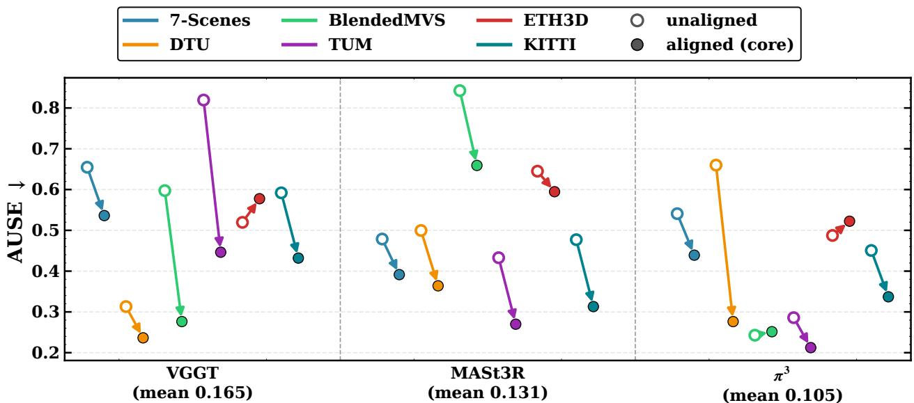  
Figure 6: Alignment removes the dominant nuisance. For each backbone (group) and dataset (colour), AUSE ↓ of photometric perturbation variance without alignment (hollow circle) and of the same runs after gauge alignment (filled circle, the ReVar3R core); each arrow runs from unaligned to aligned, so an arrow sloping down is a reduction. The pair of one condition is offset horizontally so the arrow stays readable where the effect is small. The labels under the groups give the mean reduction over the six datasets (VGGT 0.165, MASt3R 0.131, π3 0.105). Alignment lowers AUSE in 15 of the 18 conditions; the exceptions are ETH3D for VGGT and $\pi ^ { 3 }$ , and BlendedMVS for $\overline { { \pi } } ^ { 3 }$ , the last by 0.009. Table 5 lists the values for the four original datasets.

Aligned sampling baselines. Alignment, not the perturbation recipe, carries the result. The input-noise (Monte-Carlo) ensemble is rerun through the identical registration, aggregation and scoring path used for photometric jitter, at the same pass budget, and both are compared against built-in confidence. Table 8 reports the outcome: aligned input-noise lowers AUSE below built-in confidence in all nine conditions, whereas the same ensemble without alignment does so in five, and aligned input-noise is closely matched to aligned photometric jitter in this nine-condition comparison (lower in five conditions, higher in four). These results indicate that the transferable content of this paper is the alignment step, and that the choice of label-preserving perturbation is a second-order implementation detail.

Table 8: Aligned sampling baseline at matched budget. AUSE ↓ for the input-noise ensemble with and without gauge alignment, beside aligned photometric jitter, all scored identically. Bold marks the best of the three uncertainty estimators per row. Same pass budget, registration and scoring throughout, so the columns differ only in whether the ensemble is aligned and in which perturbation generates it.
<table><tr><td colspan="3"></td><td colspan="2">input-noise</td><td>photometric</td></tr><tr><td>Model</td><td>Dataset</td><td>built-in</td><td>unaligned</td><td>aligned</td><td>aligned</td></tr><tr><td>MASt3R</td><td>DTU</td><td>0.463</td><td>0.491</td><td>0.358</td><td>0.343</td></tr><tr><td>MASt3R</td><td>ETH3D</td><td>0.570</td><td>0.568</td><td>0.540</td><td>0.576</td></tr><tr><td>MASt3R</td><td>7-Scenes</td><td>0.587</td><td>0.494</td><td>0.374</td><td>0.389</td></tr><tr><td> $\pi ^ { 3 }$ </td><td>DTU</td><td>0.273</td><td>0.613</td><td>0.272</td><td>0.269</td></tr><tr><td> $\pi ^ { 3 }$ </td><td>ETH3D</td><td>0.528</td><td>0.490</td><td>0.453</td><td>0.481</td></tr><tr><td> $\pi ^ { 3 }$ </td><td>7-Scenes</td><td>0.517</td><td>0.547</td><td>0.412</td><td>0.409</td></tr><tr><td>VGGT</td><td>DTU</td><td>0.248</td><td>0.315</td><td>0.230</td><td>0.236</td></tr><tr><td>VGGT</td><td>ETH3D</td><td>0.740</td><td>0.507</td><td>0.576</td><td>0.560</td></tr><tr><td>VGGT</td><td>7-Scenes</td><td>0.712</td><td>0.610</td><td>0.522</td><td>0.526</td></tr></table>

## D Evaluation and Comparisons

## D.1 Per-Condition Results

Across the twelve conditions, ReVar3R improves Spearman in eight, ties in one $( \pi ^ { 3 } / \mathrm { E T H } 3 \mathrm { D } , 0 . 1 9  0 . 1 9 ) ,$ , and regresses in three (π3/BlendedMVS 0.59 → 0.48, MASt3R/ETH3D 0.27 → 0.22, MASt3R/BlendedMVS 0.50 → 0.35), all cells where the built-in ranking is already comparatively strong. Table 9 supplies the exact AUSE cells behind the main heatmap (Figure 3) and the corresponding Spearman values for built-in confidence and full ReVar3R. The Trust3R comparison is reported separately in Appendix D.3, where the scene structure of these benchmarks is discussed and effect sizes are given in place of significance tests.

Table 9: Per-condition results at native resolution. AUSE (↓) and Spearman (↑) compare built-in confidence with full ReVar3R. Improvements concentrate where built-in ranking is weak; regressions occur where it is already comparatively strong.
<table><tr><td colspan="2"></td><td colspan="2">AUSE↓</td><td colspan="2">Spearman ↑</td></tr><tr><td>Model</td><td>Dataset</td><td>built-in</td><td>ReVar3R</td><td>built-in</td><td>ReVar3R</td></tr><tr><td>VGGT</td><td>7-Scenes</td><td>0.712</td><td>0.491</td><td>0.06</td><td>0.32</td></tr><tr><td>VGGT</td><td>DTU</td><td>0.248</td><td>0.171</td><td>0.31</td><td>0.44</td></tr><tr><td>VGGT</td><td>ETH3D</td><td>0.740</td><td>0.635</td><td>-0.11</td><td>0.13</td></tr><tr><td>VGGT</td><td>BlendedMVS</td><td>0.786</td><td>0.407</td><td>-0.16</td><td>0.43</td></tr><tr><td> $\pi ^ { 3 }$ </td><td>7-Scenes</td><td>0.517</td><td>0.363</td><td>0.36</td><td>0.48</td></tr><tr><td> $\pi ^ { 3 }$ </td><td>DTU</td><td>0.273</td><td>0.220</td><td>0.37</td><td>0.47</td></tr><tr><td> $\pi ^ { 3 }$ </td><td>ETH3D</td><td>0.528</td><td>0.593</td><td>0.19</td><td>0.19</td></tr><tr><td> $\pi ^ { 3 }$ </td><td>BlendedMVS</td><td>0.187</td><td>0.298</td><td>0.59</td><td>0.48</td></tr><tr><td>MASt3R</td><td>7-Scenes</td><td>0.587</td><td>0.358</td><td>0.04</td><td>0.48</td></tr><tr><td>MASt3R</td><td>DTU</td><td>0.463</td><td>0.350</td><td>0.13</td><td>0.24</td></tr><tr><td>MASt3R</td><td>ETH3D</td><td>0.570</td><td>0.558</td><td>0.27</td><td>0.22</td></tr><tr><td>MASt3R</td><td>BlendedMVS</td><td>0.282</td><td>0.367</td><td>0.50</td><td>0.35</td></tr></table>

## D.2 Competitor-Benchmark Results (TUM, KITTI)

The full estimator beats built-in AUSE in all six competitor-benchmark conditions, while the training-free core is more effective on far-out-of-domain KITTI than indoor TUM. Table 10 decomposes both Trust3R benchmarks at each backbone’s native resolution, matching the main heatmap (Figure 3). The core wins $1 / 3$ on TUM, where built-in confidence is strong, and $2 / 3$ on KITTI. On KITTI it also raises Spearman $\mathrm { t o } + 0 . 6 7$ for the core and +0.77 for the full estimator, compared with +0.30–+0.53 for built-in confidence. Table 11 gives the head-to-head comparison with the trained Trust3R head.

Table 10: Competitor benchmarks (TUM, KITTI). AUSE ↓ / Spearman ↑ for built-in confidence, unaligned singlefamily perturbation, the training-free core (aligned single-family variance), and the full fused estimator. Full ReVar3R beats built-in AUSE in $6 / 6$ conditions; the core wins in $3 / 6 ( \pi ^ { 3 }$ on both benchmarks and MASt3R/KITTI).
<table><tr><td>Dataset</td><td>Model</td><td>built-in</td><td>unaligned</td><td>core (train-free)</td><td>full (fused)</td></tr><tr><td>TUM</td><td>VGGT</td><td>0.296 / +0.48</td><td>0.819 / -0.01</td><td> $0 . 4 4 6 / + 0 . 3 9$ </td><td> $\mathbf { 0 . 1 9 9 } \ : / \ : + 0 . 5 1$ </td></tr><tr><td>TUM</td><td> $\pi ^ { 3 }$ </td><td>0.273 / +0.25</td><td> $0 . 2 8 6 \mathrm { ~ / ~ } { + } 0 . 6 5$ </td><td> $\mathbf { 0 . 2 1 } 2 \mathrm { ~ / ~ } + 0 . 5 1$ </td><td> $\mathbf { 0 . 1 9 8 } \ : / + 0 . 4 6$ </td></tr><tr><td>TUM</td><td>MASt3R</td><td>0.226 / +0.63</td><td> $0 . 4 3 3 / + 0 . 2 4$ </td><td> $0 . 2 7 0 / + 0 . 4 4$ </td><td> $\mathbf { 0 . 1 8 2 } \mathrm {                  } / \mathrm { + } 0 . 5 6$ </td></tr><tr><td>KITTI</td><td>VGGT</td><td>0.401 / +0.30</td><td>0.592 / +0.32</td><td>0.432 / +0.58</td><td> $\mathbf { 0 . 2 3 7 \ / \ } 1 0 . 6 2$ </td></tr><tr><td>KITTI</td><td> $\pi ^ { 3 }$ </td><td>0.385 / +0.45</td><td>0.451 / +0.53</td><td>0.337 / +0.64</td><td> $\mathbf { 0 . 2 7 3 } / + 0 . 7 4$ </td></tr><tr><td>KITTI</td><td>MASt3R</td><td>0.346 / +0.53</td><td>0.477 / +0.45</td><td>0.313 / +0.67</td><td> $\mathbf { 0 . 2 1 5 } / + 0 . 7 7$ </td></tr></table>

## D.3 Comparison with a Trained Uncertainty Head

This section gives the full comparison against Trust3R (Zhu et al., 2026), the closest learned alternative, and states its limits. The comparison is reported as a trade-off, and no claim in the paper rests on it.

Protocol. Trust3R’s released checkpoint is a MASt3R-based implementation at 224 px, so the comparison is available on that backbone only. Both methods are scored inside the present evaluation harness on identical view-sets, identical ground truth, the same gauge-free alignment and the same AUSE definition, which is what makes them comparable to each other. Trust3R uses its paper-default epistemic readout for ranking and the full posterior-predictive variance for calibration. All available view-sets per dataset are used; Trust3R also reports ScanNet++, which is unavailable for the present study.

Scenes, not view-sets, are the unit of inference. View-sets drawn from one scene are correlated, so a paired test over view-sets is anticonservative. Blocking by scene, the smallest attainable two-sided $\mathbf { \nabla } \cdot p$ is $2 / 2 ^ { G }$ for G scenes, so the number of independent scenes sets a hard floor on the significance attainable by any test. One view-set per scene is therefore sampled wherever a dataset supplies enough scenes, and an exact cluster sign-flip permutation tests per-scene mean differences.

On DTU this is decisive. Sampling one view-set from each of 30 scans instead of ten view-sets from three scans, ReVar3R attains a lower per-view-set AUSE than the trained head on every one of the 30 scans: median 0.228 against 0.459, per-scene mean difference −0.205, and the closest scan still favours ReVar3R by 0.027. The scenelevel sign-flip test gives $p = 1 . 9 \times 1 0 ^ { - 9 }$ , the smallest value attainable with 30 scans, which survives Holm correction over the three scene-blocked tests. Pooled AUSE agrees on the same sample (0.403 against 0.637), so the result does not depend on the aggregation. Seed spread of per-scan AUSE is 0.025 against an effect of 0.205.

ETH3D supplies nine scenes and 7-Scenes seven rooms (floors $3 . 9 \times 1 0 ^ { - 3 }$ and $1 . 6 \times 1 0 ^ { - 2 } )$ , and neither reaches significance: the per-scene mean differences are −0.034 and −0.027, favouring ReVar3R in $5 / 9$ scenes and $4 / 7$ rooms, with sign-flip $p = 0 . 2 3$ and $p = 0 . 6 4$ . KITTI and TUM cannot be tested at all, supplying a single drive and two sequences. Only one significance claim is therefore made, on the dataset where the effect is large and the scene count supports it; the remaining results are reported as effect sizes.

Result. Table 11 reports both aggregations. They disagree in several conditions, and the disagreement is informative. Pooled AUSE concatenates points across view-sets and is therefore dominated by the largest-error scenes, whereas the per-view-set median is robust to scene heterogeneity and is the quantity examined by the paired analysis. Under the per-set median ReVar3R is favoured on DTU, ETH3D and KITTI; under pooled AUSE the trained head leads on 7-Scenes, TUM and ETH3D, while ReVar3R leads on DTU and KITTI. Trust3R is the better magnitude calibrator throughout. The consistent reading across both aggregations is that the trained head is stronger inside its training domain and better calibrated, while the training-free estimator is favoured on the most dissimilar data and transfers to any backbone without adaptation.

Sensitivity to the view-set count. An earlier protocol used ten view-sets per dataset (eight for TUM and KITTI). On TUM, ETH3D and KITTI the present sample extends that list. On the shared view-sets the present run reproduces

Table 11: ReVar3R vs. a trained evidential head (Trust3R). Frozen MASt3R at 224 px on identical point sets and all available view-sets. AUSE ↓, Spearman ↑; Trust3R uses its paper-default epistemic readout and ReVar3R entries are means over five seeds. “scenes” counts the independent scenes available for inference.
<table><tr><td></td><td></td><td>7-Scenes</td><td>TUM</td><td>ETH3D</td><td>DTU</td><td>KITTI</td></tr><tr><td>sets</td><td></td><td>23</td><td>12</td><td>24</td><td>30</td><td>12</td></tr><tr><td>scenes</td><td></td><td>7</td><td>2</td><td>9</td><td>30</td><td>1</td></tr><tr><td>pooled AUSE↓</td><td>built-in</td><td>0.535</td><td>0.232</td><td>0.585</td><td>0.557</td><td>0.359</td></tr><tr><td></td><td>ReVar3R</td><td>0.293</td><td>0.188</td><td>0.667</td><td>0.403</td><td>0.216</td></tr><tr><td></td><td>Trust3R</td><td>0.268</td><td>0.119</td><td>0.477</td><td>0.637</td><td>0.319</td></tr><tr><td>per-set median AUSE↓</td><td>ReVar3R</td><td>0.272</td><td>0.148</td><td>0.471</td><td>0.228</td><td>0.209</td></tr><tr><td></td><td>Trust3R</td><td>0.271</td><td>0.125</td><td>0.514</td><td>0.459</td><td>0.242</td></tr><tr><td>Spearman ↑</td><td>ReVar3R</td><td>+0.43</td><td>+0.59</td><td>+0.13</td><td>+0.43</td><td>+0.69</td></tr><tr><td></td><td>Trust3R</td><td>+0.36</td><td>+0.69</td><td>+0.23</td><td>-0.13</td><td>+0.44</td></tr></table>

Trust3R’s per-set AUSE exactly and ReVar3R’s mean AUSE to within 0.01, although individual view-sets move by up to 0.043, so the two protocols agree on average where they overlap. The added view-sets are not uniformly harder: they are easier on ETH3D and TUM and harder on KITTI. On 7-Scenes and DTU the present samples are instead drawn across seven rooms and thirty scans, so they replace rather than extend the earlier view-sets. The pooled numbers nonetheless move substantially, which is the aggregation effect described above rather than a difference in difficulty.

Relation to Trust3R’s published table. The reported numbers are not directly comparable to the values published with Trust3R, and no reproduction is claimed. The metric differs: they report the unnormalized area between the risk-coverage curve and its oracle, in scene units, whereas the present evaluation reports AUSE after per-scene normalization. The evaluation also differs in sample (5000 image pairs drawn from their benchmark splits, against the present V=5 view-sets), in grouping, and in the masking and alignment path, since every method here is scored through the present evaluation harness. As a partial check, recomputing their metric definition on the present point sets and dividing by mean error to remove the scene-scale factor gives 0.259 on KITTI against their published 0.266, while TUM gives 0.127 against their published 0.204; rank correlation, which is normalization-invariant, agrees on KITTI (+0.44 against +0.46) and differs on ETH3D, where the present wide-baseline view-sets leave every method near zero. Table 12 reports their metric on the present point sets. The released code also computes the epistemic readout as $1 / ( \kappa ( \nu - 2 { \bar { ) } } )$ ), which is implemented by the evaluation wrapper, rather than the κ(ν − 4) given in its documentation.

Table 12: Trust3R’s metric definition, recomputed on the present point sets. Risk-coverage AURC ↓ and unnormalized AUSE ↓, both in scene units, so methods are comparable within a row but values are not comparable across datasets. Ten view-sets per dataset (eight for TUM and KITTI), seed 0, Trust3R total readout, and an exact sort-based curve in place of their log-binned estimator; it is a cross-check on the metric definition, not a reproduction of their protocol.
<table><tr><td></td><td colspan="4">AURC↓</td><td colspan="4">AUSE↓ (unnormalized)</td></tr><tr><td>Dataset</td><td>built-in</td><td>ReVar3R</td><td>input noise</td><td>Trust3R</td><td>built-in</td><td>ReVar3R</td><td>input noise</td><td>Trust3R</td></tr><tr><td>7-Scenes</td><td>0.249</td><td>0.189</td><td>0.224</td><td>0.179</td><td>0.127</td><td>0.068</td><td>0.102</td><td>0.067</td></tr><tr><td>TUM</td><td>0.079</td><td>0.082</td><td>0.101</td><td>0.067</td><td>0.027</td><td>0.030</td><td>0.050</td><td>0.019</td></tr><tr><td>ETH3D</td><td>3.812</td><td>3.535</td><td>3.408</td><td>3.513</td><td>2.114</td><td>1.837</td><td>1.710</td><td>1.834</td></tr><tr><td>DTU</td><td>34.95</td><td>25.93</td><td>33.20</td><td>33.59</td><td>16.83</td><td>7.81</td><td>15.08</td><td>17.87</td></tr><tr><td>KITTI</td><td>2.929</td><td>2.418</td><td>3.524</td><td>2.833</td><td>1.231</td><td>0.721</td><td>1.827</td><td>1.198</td></tr></table>

## D.4 Frozen-Feature Probe

The frozen-feature probe has worse AUSE than ReVar3R on all three tested datasets, but better Spearman on DTU, so the two rankings are not uniformly ordered. Table 13 compares ReVar3R with a learned VGGT probe trained to predict per-point error from frozen features. This is a separate VGGT run that scores the view-re-ordering family rather than the photometric core on the main protocol, so its built-in-confidence column differs from Table 9 (most visibly on DTU, 0.402 vs. 0.248); read the two tables independently rather than cell by cell. On DTU, the probe reaches Spearman 0.56 versus 0.46 for ReVar3R. Overall, the result remains consistent with cross-run input sensitivity exposing reliability information that a single deterministic pass does not fully recover.

Table 13: Frozen-feature probe on VGGT. AUSE ↓ / Spearman ↑ for built-in confidence, a learned probe, and ReVar3R. ReVar3R has lower AUSE throughout, while the probe has higher Spearman on DTU.
<table><tr><td>Signal</td><td>7-Scenes</td><td>DTU</td><td>ETH3D</td></tr><tr><td>Built-in conf.</td><td>0.702 / 0.09</td><td>0.402 / 0.24</td><td>0.754 / -0.09</td></tr><tr><td>Learned probe (frozen features)</td><td>0.791 / 0.09</td><td>0.245 / 0.56</td><td>0.644 / 0.14</td></tr><tr><td>ReVar3R (aligned perturbation)</td><td>0.546 / 0.29</td><td>0.170 / 0.46</td><td>0.510 / 0.15</td></tr></table>

## D.5 Downstream Utility

Figure 7 shows the full point-filtering curves summarized in Section 6.6.

Point filtering: error of the points kept  
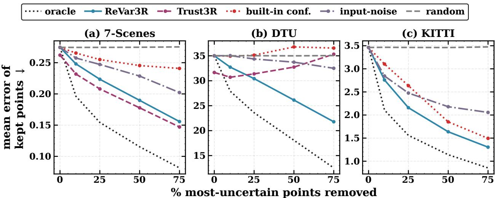  
Figure 7: Better ranking yields better geometry. Mean error of kept points ↓ vs. removal fraction. Dropping the points ReVar3R ranks most-uncertain retains lower-error geometry than built-in confidence, a naive input-noise ensemble, or random removal, closing 30–57% of the built-in-to-oracle gap at 50% removal. All panels use frozen MASt3R: (a) and (b) the 224 px protocol with ten view-sets, (c) the native-resolution KITTI run with eight, where the 224 px Trust3R checkpoint does not apply. Trust3R filters its own refined point map and starts from a different zero-removal error (DTU 31.7 vs. 35.0), so read its shape, not its offset.

## D.6 Negative Results: Systematic Bias, Calibration Transfer, NVS

Three negative results bound the estimator: variance misses stable systematic bias, magnitude calibration does not transfer across domains, and uncertainty-guided initialization does not improve novel-view synthesis.

Stable systematic bias. Variance does not detect errors that remain stable across perturbations. In a controlled mixture of unstable points, whose predictions disagree, and stably biased points, whose predictions agree on a wrong value, the variance ranking inverts as biased fraction f grows: Spearman starts at +0.39 for f=0 and falls to −0.67 at f=0.6. On real data, top-decile-error detection AUROC is 0.75 on 7-Scenes and 0.80 on DTU, but near chance under shift (0.53 on ETH3D). A trained head does not resolve the limitation (e.g. AUROC 0.49 on DTU).

Cross-domain calibration. Magnitude calibration improves within domain but does not transfer. Isotonic calibration reduces ECE on its fit domain (Figure 8; e.g. ETH3D 0.48 → 0.06), yet fitting on one dataset and evaluating on another raises average ECE to ≈ 0.46 (Figure 9). The transfer gap is +0.40 for ReVar3R and +0.38 for the trained head (Figure 9). Ranking transfers; magnitude calibration does not.

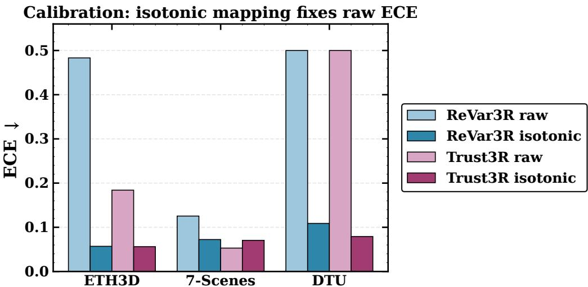  
Figure 8: Calibration improves within domain. Raw versus isotonic-calibrated ECE (↓) from a within-domain calibration split. Raw perturbation scores are poorly scaled, with DTU and ETH3D saturated; a small held-out isotonic map corrects ECE for ReVar3R and the trained head. On 7-Scenes, Trust3R’s native standard deviation is already calibrated.

Magnitude calibration does not transfer across domains  
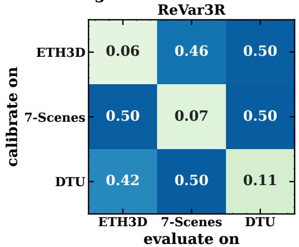

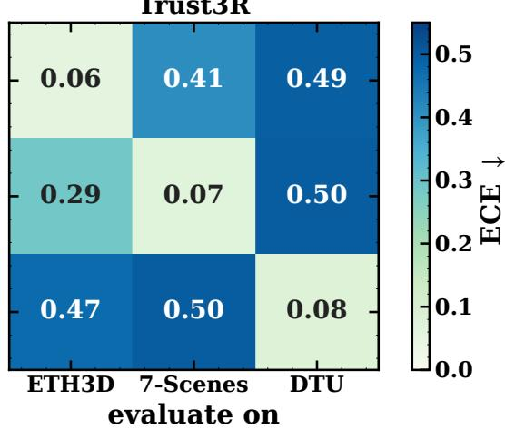  
Figure 9: Calibration does not transfer across domains. ECE (↓) for an isotonic map fit on the row domain and evaluated on the column domain, for ReVar3R (left) and Trust3R (right). Both methods calibrate well on the diagonal and poorly off it; neither transfers magnitude calibration across domains.

Novel-view synthesis (NVS). Uncertainty-guided 3D Gaussian-Splatting (Kerbl et al., 2023) initialization does not improve held-out peak signal-to-noise ratio (PSNR) under a fixed optimization budget. The five initialization signals span 0.96 dB, and even oracle-error initialization (19.03) does not exceed random initialization (19.52), indicating that per-scene optimization overwrites the initialization. The estimator helps geometric point selection, not view synthesis.

## D.7 Sample-Count Sweep

The default sample count lies near the in-distribution diminishing-returns knee, while shifted AUSE is largely insensitive to sample count. Figure 10 varies the number of perturbed passes N. In distribution, AUSE improves monotonically but flattens: N=5 captures a median 85% of the improvement available at N=8 with fewer passes, motivating the marked default. The spread across the six in-distribution conditions is wide, 40–99%; MASt3R on DTU sits at the low end with a curve still descending at N=8, so the default trades a little headroom there for a uniform protocol. On shifted ETH3D, AUSE remains largely insensitive to N.

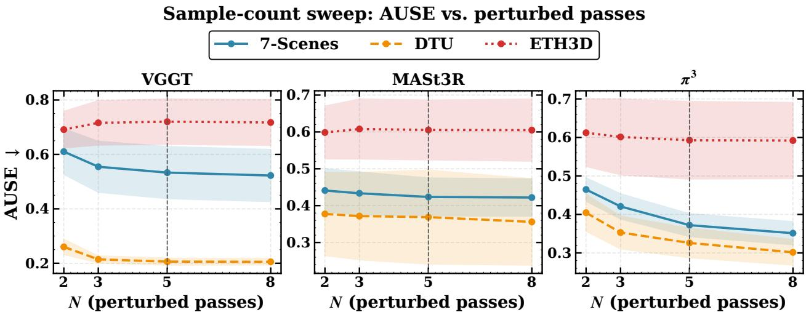  
Figure 10: Sample-count sweep. AUSE (↓) versus perturbed passes N for each backbone and dataset; shading gives standard deviation across view-sets, and the dashed line marks the N=5 default. In-distribution AUSE flattens by N=5, while shifted ETH3D is nearly flat throughout.

## D.8 Distribution-Shift Breakdown

Shift is not one condition, and ReVar3R does not win it uniformly. Table 14 details ETH3D on a frozen MASt3R backbone at 224 px over 24 view-sets spanning nine scenes: there the trained head attains the lowest AUSE and the best calibration, built-in confidence ranks best, and ReVar3R leads on neither. On far-shift KITTI the ordering reverses and ReVar3R leads on both AUSE and ranking (Section 6.4). An earlier ten-view-set ETH3D sample, drawn from four scenes rather than nine, put ReVar3R ahead on ranking and built-in confidence below random; the larger sample does not reproduce that ordering and supersedes it. The reversal is reported rather than the smaller, more favourable sample: the honest reading is that gauge alignment helps where the output frame moves between passes and the baseline is weak, which is true of KITTI and not of wide-baseline ETH3D.

Table 14: Distribution-shift breakdown on ETH3D with frozen MASt3R at 224 px, over 24 view-sets spanning nine scenes. Bold marks the best non-oracle value per column.
<table><tr><td>Method</td><td>AUSE↓</td><td>Spearman ↑</td><td>ECE↓</td><td></td></tr><tr><td>oracle (bound)</td><td>0.000</td><td>1.00</td><td></td><td></td></tr><tr><td>built-in conf.</td><td>0.585</td><td>0.31</td><td></td><td>best ranking</td></tr><tr><td>random removal</td><td>0.743</td><td>0.00</td><td></td><td>reference</td></tr><tr><td>input-noise ensemble</td><td>0.766</td><td>-0.31</td><td></td><td>worse than random</td></tr><tr><td>Trust3R (trained)</td><td>0.475</td><td>0.25</td><td>0.10</td><td>best AUSE and calibration</td></tr><tr><td>ReVar3R</td><td>0.667</td><td>0.13</td><td>0.38</td><td>neither</td></tr></table>

## D.9 Cost and Efficiency

ReVar3R trades roughly ten-fold more inference passes for zero training and zero added parameters, while using peak memory comparable to, and slightly below, the trained head. This operating point matches training-free uncertainty estimation generally (Mi et al., 2022; Wang et al., 2019; Poggi et al., 2020; Ilg et al., 2018), which replaces model adaptation with additional inference. Table 15 compares the alternatives. It does not price a separate one-time cost per backbone: because ReVar3R reads only outputs, it transfers to another backbone or resolution without a new training stage. A trained head generally requires checkpoint-specific adaptation on labelled 3D data, which is why the head-to-head in Section 6.5 is available only on MASt3R.

## D.10 Additional Qualitative Results

Figure 11 shows one typical view-set per dataset on VGGT (seed 0): the one with the median within-set AUSE gap between built-in confidence and the full ReVar3R estimator. Each map shows percentile ranks within the view, and the number under it is that view’s own AUSE. Over each dataset’s ten view-sets, the full estimator ranks error better than built-in confidence in 9 on 7-Scenes, 10 on DTU and 5 on ETH3D, and its pooled AUSE is lower on all three (0.491 against 0.712, 0.171 against 0.248, 0.635 against 0.740). Alignment helps in distribution: the core beats unaligned variance pooled on 7-Scenes (0.536 against 0.655) and DTU (0.236 against 0.313). On wide-baseline ETH3D it does not (Section 6.2), and VGGT’s unaligned variance ranks error best there (pooled 0.520).

Table 15: Cost and efficiency on the shared backbone. ReVar3R adds no parameters or training and uses comparable peak memory, but requires multiple passes and roughly an order of magnitude more latency than the single-pass trained head. Latency is wall-clock time on one 16 GB GPU.
<table><tr><td>Method</td><td>Training</td><td>Params</td><td>Passes</td><td>Peak mem.</td><td>Latency</td></tr><tr><td>Built-in conf.</td><td>none</td><td>0</td><td>0 (free)</td><td>≤2.91 GB</td><td>~0.92 s/pair</td></tr><tr><td>Input-noise ensemble</td><td>none</td><td>0</td><td>~5</td><td>~base</td><td>subset of 9 s/set</td></tr><tr><td>ReVar3R</td><td>none</td><td>0</td><td>~10-11</td><td>2.91 GB</td><td>9.09 s/set (~9.9×)</td></tr><tr><td>Trust3R</td><td>10 ep. / 150k pairs</td><td>40.4M</td><td>1</td><td>3.37GB</td><td>0.919 s/pair</td></tr></table>

Uncertainty maps for one typical view-set per dataset (VGGT, seed 0)

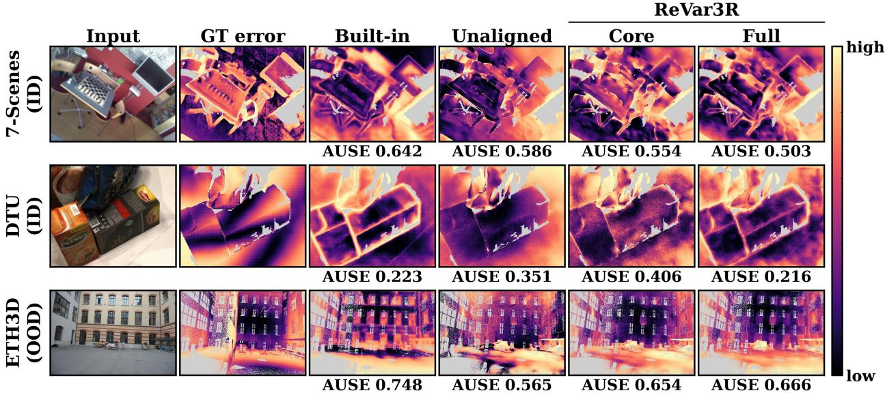  
Figure 11: Qualitative uncertainty maps from VGGT (seed 0), one typical view-set per dataset (median within-set AUSE gap between built-in confidence and the full estimator). Columns: input, ground-truth error, built-in confidence as uncertainty, unaligned photometric variance, and ReVar3R: the core (the same runs, gauge-aligned) and the full estimator (held-out rank fusion with view-order variance and built-in confidence). Each map shows every pixel’s percentile rank within the view among pixels with ground truth, from low (dark) to high (light) on the scale at the right; grey pixels have no ground truth. The number under each map is that view’s own AUSE.

## E Reproducibility Details

## E.1 Scope of the Analysis and Design Choices

Estimated versus idealized gauge. The proposition does not bound the residual error created by estimating the alignment. Proposition 1 characterizes exact removal of each run’s gauge, whereas in practice every $\hat { T } _ { n }$ is estimated and the recovered variance retains a residual alignment-error term. Robust alignment keeps this term small empirically: down-weighting high-residual correspondences prevents the unstable, high-error points targeted for detection from dominating the fit and being partially reabsorbed into the gauge estimate. Accordingly, robust Umeyama is at least as good as plain similarity fitting on every backbone (Figure 5), and the recovered ranking is insensitive to the trimming fraction, Cauchy scale, and even near-planar geometry (Appendix E.2). A formal bound relating alignment error to outlier fraction and scene conditioning is left to future work.

Reference and per-view alignment. Reference choice matters little, but alignment scope matters. Each perturbed run aligns to fixed reference run 0, and each view aligns independently; the estimator is therefore best interpreted as per-view procedural reliability under the perturbation family, not as one scene-level uncertainty. Table 7 evaluates a consensus (medoid) reference and a shared scene-level transform. As expected under robust alignment, reference choice has little effect, whereas per-view versus scene-level scope does. Section 6.2 decomposes this difference into global-gauge and residual per-view components.

Table 16: Full estimator over five seeds. Per-condition AUSE ↓ of the fused estimator, mean ± standard deviation over five seeds, against built-in confidence; “wins” counts the seeds in which ReVar3R is lower.
<table><tr><td>Model</td><td>Dataset</td><td>built-in</td><td>ReVar3R</td><td>wins</td></tr><tr><td>MASt3R</td><td>BlendedMVS</td><td>0.282</td><td> $0 . 3 4 9 \pm 0 . 0 1 1$ </td><td>0/5</td></tr><tr><td>MASt3R</td><td>DTU</td><td>0.463</td><td> $0 . 3 3 0 \pm 0 . 0 1 2$ </td><td>5/5</td></tr><tr><td>MASt3R</td><td>ETH3D</td><td>0.570</td><td> $0 . 5 5 6 \pm 0 . 0 0 5$ </td><td>5/5</td></tr><tr><td>MASt3R</td><td>KITTI</td><td>0.358</td><td> $0 . 2 4 0 \pm 0 . 0 0 7$ </td><td>5/5</td></tr><tr><td>MASt3R</td><td>7-Scenes</td><td>0.587</td><td> $0 . 3 5 3 \pm 0 . 0 0 5$ </td><td>5/5</td></tr><tr><td>MASt3R</td><td>TUM</td><td>0.231</td><td> $0 . 1 7 2 \pm 0 . 0 0 4$ </td><td>5/5</td></tr><tr><td> $\pi ^ { 3 }$ </td><td>BlendedMVS</td><td>0.187</td><td> $0 . 2 9 6 \pm 0 . 0 0 4$ </td><td>0/5</td></tr><tr><td> $\pi ^ { 3 }$ </td><td>DTU</td><td>0.273</td><td> $0 . 2 3 0 \pm 0 . 0 0 7$ </td><td>5/5</td></tr><tr><td> $\pi ^ { 3 }$ </td><td>ETH3D</td><td>0.528</td><td> $0 . 5 9 3 \pm 0 . 0 0 3$ </td><td>0/5</td></tr><tr><td> $\pi ^ { 3 }$ </td><td>KITTI</td><td>0.387</td><td> $0 . 2 6 5 \pm 0 . 0 1 1$ </td><td>5/5</td></tr><tr><td> $\pi ^ { 3 }$ </td><td>7-Scenes</td><td>0.517</td><td> $0 . 3 6 3 \pm 0 . 0 0 5$ </td><td>5/5</td></tr><tr><td> $\pi ^ { 3 }$ </td><td>TUM</td><td>0.246</td><td> $0 . 1 8 1 \pm 0 . 0 0 2$ </td><td>5/5</td></tr><tr><td>VGGT</td><td>BlendedMVS</td><td>0.786</td><td> $0 . 3 8 7 \pm 0 . 0 1 4$ </td><td>5/5</td></tr><tr><td>VGGT</td><td>DTU</td><td>0.248</td><td> $0 . 1 7 2 \pm 0 . 0 0 2$ </td><td>5/5</td></tr><tr><td>VGGT</td><td>ETH3D</td><td>0.740</td><td> $0 . 6 2 8 \pm 0 . 0 0 5$ </td><td>5/5</td></tr><tr><td>VGGT</td><td>KITTI</td><td>0.479</td><td> $0 . 2 4 2 \pm 0 . 0 0 5$ </td><td>5/5</td></tr><tr><td>VGGT</td><td>7-Scenes</td><td>0.712</td><td> $0 . 4 8 6 \pm 0 . 0 0 6$ </td><td>5/5</td></tr><tr><td>VGGT</td><td>TUM</td><td>0.308</td><td> $0 . 1 9 1 \pm 0 . 0 0 5$ </td><td>5/5</td></tr></table>

Table 17: Alignment robustness in simulation. Aligned-estimator Spearman ↑ / AUSE ↓ against known $\sigma _ { \mathrm { t r u e } }$ remains stable across trimming-fraction, Cauchy-scale, and near-planar sweeps. The default drops 10% and sets Cauchy scale to the median residual.
<table><tr><td>trim drop</td><td> $\rho / \mathbf { A U S E }$ </td><td>Cauchy×</td><td> $\rho / \mathbf { A U S E }$ </td><td>depth ext.</td><td> $\rho / \mathbf { A U S E }$ </td></tr><tr><td>0%</td><td>0.98/0.011</td><td>0.25</td><td>0.99/0.008</td><td>2.0</td><td>0.99/0.008</td></tr><tr><td>5%</td><td>0.99/0.008</td><td>0.5</td><td>0.99/0.007</td><td>1.0</td><td>0.99/0.008</td></tr><tr><td>10%</td><td>0.99/0.008</td><td>1.0</td><td>0.99/0.008</td><td>0.3</td><td>0.99/0.008</td></tr><tr><td>20%</td><td>0.99/0.007</td><td>2.0</td><td>0.99/0.008</td><td>0.1</td><td>0.99/0.008</td></tr><tr><td>30%</td><td>0.99/0.007</td><td>4.0</td><td>0.99/0.008</td><td>0.03</td><td>0.99/0.008</td></tr></table>

## E.2 Robustness of the Robust Alignment

The internal fit does not use ground-truth validity. The label-free alignment uses only prediction-valid, finite correspondences; ReVar3R never sees ground truth (Section 4). As a control, the internal fit is restricted to evaluationvalid pixels for the VGGT photometric core over ten view-sets per dataset. Pooled AUSE changes by −0.010 on 7-Scenes, −0.006 on DTU, and −0.088 on sparse-ground-truth KITTI (0.417 → 0.330). Every change is an improvement: ground-truth validity would only help the fit. Because the estimator does not use it, the reported gains cannot arise from ground-truth validity information, and the label-free choice is, if anything, conservative.

The recovered ranking is insensitive to both robust-fit hyperparameters and near-degenerate geometry. The controlled synthetic harness of Appendix B tests trimmed fraction, Cauchy scale, and geometry, using gauge magnitude 0.01 and scene distance 5; at its defaults, the parameterized fit exactly reproduces the released robust\_umeyama. Table 17 shows that all three sweeps preserve the ranking of known $\sigma _ { \mathrm { t r u e } }$ . Changing the trimmed fraction from 0 to 30% keeps Spearman in [0.98, 0.99] and AUSE in [0.007, 0.011]. Scaling the Cauchy width from 0.25–4× its median-residual default changes neither past the third decimal. Finally, shrinking depth extent to 1.5% of lateral extent creates a nearplanar scene with an ill-conditioned depth-direction similarity fit, yet ranking remains intact (ρ≈0.99). Lateral point spread keeps the fit well determined, so one degenerate direction does not propagate to the estimate.

## E.3 Seed Stability and Determinism

The full $3 \times 6$ grid is repeated over five seeds. The fused estimator lowers AUSE below built-in confidence in 15 of 18 conditions in every seed, and no condition changes sign: each is won in five seeds out of five or lost in five out of five, with the three losses always MASt3R and $\pi ^ { 3 ^ { \dagger } }$ on BlendedMVS and $\pi ^ { 3 }$ on ETH3D. Per-condition AUSE varies little across seeds, with a standard deviation between 0.002 and 0.014 (mean 0.006), roughly 19× smaller than the median margin of 0.115 over built-in confidence. This repetition holds every condition at ten view-sets, whereas the main tables use eight for TUM and KITTI; the 15/18 outcome is identical under both protocols. The intermediate rungs are less stable than the headline: at the uniform ten-set protocol the label-free core wins between 10 and 12 of 18 depending on seed and the held-out learned fusion between 13 and 14, so the stage decomposition is best read as an ordering rather than as exact counts.

A separate five-seed sweep varies alignment rather than fusion at eight view-sets per condition. There the core lowers AUSE below built-in confidence in 11, 11, 10, 10 and 11 of the 18 conditions, with MASt3R on KITTI the only condition to change sign; the core lies between 0.313 and 0.366 against a built-in value of 0.346, a margin never exceeding 0.034 either way, so that condition is a near-tie rather than a reversal. The stochastic estimators, ReVar3R and the input-noise ensemble, are repeated over five random seeds. By contrast, the trained Trust3R head and each backbone’s built-in confidence are single deterministic forward passes with no sampling step, so they carry no seed variation by construction.

Estimator variation is small. In the five-seed runs behind Table 11, the per-dataset standard deviation of pooled ReVar-3R AUSE over seeds is 0.009 on 7-Scenes, 0.002 on TUM, 0.005 on ETH3D, 0.016 on DTU, and 0.007 on KITTI. The single-run headline values are therefore representative rather than fortuitous.