# REVISITING NUMERICAL FORECASTING MODELS FORLANGUAGE-BASED TRAJECTORY PREDICTION

JunGyu Lee1 Inhwan Bae2 Hae-Gon Jeon1∗ 1Yonsei University 2DGIST

## ABSTRACT

Language-based trajectory predictors represent coordinates as discrete tokens and learn auxiliary tasks such as destination and group reasoning. This formulation enables the model to capture behavioral intent and social context beyond coordinate dynamics alone. However, token-level objectives provide only indirect guidance for continuous coordinate-space dynamics. To address this limitation, we introduce MoRE (Mixture of Reward Experts), a refinement framework that transfers numerical forecasting priors into a pretrained language-based predictor through reinforcement learning. Five frozen numerical predictors provide complementary coordinate-level knowledge of motion and interactions. Their predictions are converted into expert rewards and combined through an uncertainty-weighted consensus that penalizes disagreement. A ground-truth reward anchors the prediction to the target trajectory. To focus refinement on difficult cases, MoRE refines the policy using the top 1% of training samples ranked by predictive entropy. Expert predictions are computed once and cached before PPO training, so the experts are not run during policy updates or inference. In this way, MoRE combines the contextual modeling of the language-based predictor with coordinatelevel feedback from numerical experts. On ETH-UCY, MoRE reduces ADE from 0.22 to 0.20 m and FDE from 0.32 to 0.29 m. Relative to the base policy, ADE decreases by 17.9% on SDD and 12.7% on NBA. On ETH-UCY, MoRE also reduces collision rates and better matches ground-truth pedestrian spacing, without increasing measured inference memory or latency. The project page is available at https://jungyu0413.github.io/MoRE/.

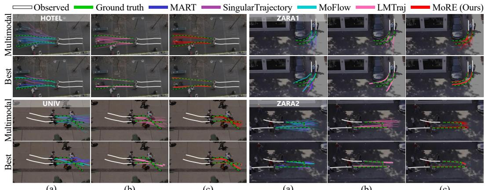  
(a)  
(b)  
(c)  
(a)  
(b)  
(c)  
Figure 1: Prediction examples on ETH-UCY. “Multimodal” shows 20 samples, and “Best” shows the closest sample. (a) Numerical baselines and (b) LMTraj exhibit different spatial patterns. (c) MoRE refines the language-based predictions using numerical feedback.

## 1 INTRODUCTION

Forecasting human trajectories requires modeling motion, interactions, and uncertainty about future behavior. Numerical trajectory predictors model human motion directly in continuous coordinate space and have progressively incorporated specialized priors for local interactions, group behavior, motion patterns, and destination goals (Mohamed et al., 2020; Bae et al., 2022a; 2024b; Zhao & Wildes, 2021). This coordinate-based formulation provides strong spatial accuracy, particularly for the best sample under standard best-of-K evaluation (Fig. 1(a), Best). However, coordinate-based numerical predictors do not directly leverage the contextual knowledge captured by language-based models. As a result, stochastic numerical predictors often generate high-variance, scattered predictive distributions while optimizing coordinate-level regression objectives (Fig. 1(a), Multimodal)

Language-based predictors provide a complementary formulation by representing trajectories and related reasoning tasks as discrete tokens. LMTraj (Bae et al., 2024a) jointly learns destination, group, collision, and other auxiliary tasks, allowing the model to capture behavioral intent and social context more explicitly. Compared with the dispersed multimodal predictions of the numerical baselines in Fig. 1(a), LMTraj produces more spatially consistent multimodal paths in Fig. 1(b). However, token-level likelihood does not directly reflect metric errors in continuous coordinates, so its best prediction can remain spatially inaccurate (Fig. 1(b), Best). This motivates incorporating coordinate-level numerical feedback during refinement. Our goal is to improve the coordinate accuracy of a pretrained language-based predictor using numerical forecasting knowledge, without requiring numerical experts at inference.

We propose MoRE (Mixture of Reward Experts), a framework that transfers complementary knowledge from pretrained numerical predictors to a language-based predictor during training. Rather than directly combining expert outputs, MoRE converts their predictions into reward signals, integrating the language-based model’s contextual knowledge with the complementary motion and social-interaction priors learned by numerical predictors. The expert rewards are combined through a consensus objective and used to refine the policy with reinforcement learning. To keep the process efficient, refinement focuses on difficult samples identified by predictive uncertainty, with expert predictions computed and cached in advance.

MoRE combines the contextual representations of the language-based predictor with complementary knowledge from multiple numerical experts. This integration improves prediction accuracy across ETH-UCY, SDD, GCS, and NBA, with larger gains on challenging non-linear motion and crossdataset transfer. Overall, MoRE transfers knowledge from multiple numerical experts into a single language-based predictor during training, without requiring the experts at inference or increasing the measured inference memory and latency of the base policy.

## 2 RELATED WORK

## 2.1 NUMERICAL TRAJECTORY PREDICTION

Numerical trajectory prediction has progressed from hand-crafted social interaction models (Helbing & Molnar, 1995; Pellegrini et al., 2009) to data-driven approaches that learn interactions and multimodal futures (Alahi et al., 2016; Gupta et al., 2018; Mangalam et al., 2020; Salzmann et al., 2020). Recent methods introduce different inductive biases to capture human motion more effec tively. Spatio-temporal graph models focus on interaction structure (Mohamed et al., 2020; Huang et al., 2019; Bae & Jeon, 2021), while GP-Graph and GroupNet explicitly model group-level relations (Bae et al., 2022a; Xu et al., 2022a). Other methods capture characteristic motion patterns through compact trajectory representations (Bae et al., 2023; 2024b), or guide future motion using destination information (Dendorfer et al., 2020; Zhao & Wildes, 2021). Recent generative and relational approaches further improve multimodal forecasting through diffusion, transformer, and flowbased modeling (Gu et al., 2022; Mao et al., 2023; Lee et al., 2024; Fu et al., 2025). These numerical predictors already model social interactions, group structure, and diverse motion patterns (Kothari et al., 2021), but they encode such knowledge through different architectures and objectives. MoRE leverages this diversity rather than introducing another numerical predictor. We use models with complementary strengths as numerical experts and transfer their specialized coordinate-level knowl edge to a language-based predictor.

## 2.2 LANGUAGE-BASED TRAJECTORY PREDICTION

Language-based trajectory prediction represents coordinates as tokens and formulates forecasting as sequence generation. LMTraj (Bae et al., 2024a) jointly learns trajectory prediction with auxiliary tasks involving destinations, directions, groups, collisions, and mimicry, while its multimodal extension incorporates visual information (Bae et al., 2025). Subsequent approaches explore languageguided numerical forecasting (Chib & Singh, 2025), goal-oriented prompting and chain-of-thought reasoning (Kim et al., 2025), visual-linguistic reasoning (Shenkut & Kumar, 2025), autoregressive multimodal generation (Wang et al., 2026), and reinforcement learning for language-based trajectory prediction (Xu et al., 2026). These methods aim to strengthen contextual and behavioral reasoning, but token-only objectives provide only indirect supervision for continuous coordinate accuracy. MoRE combines the contextual modeling of the language-based predictor with coordinate-level feedback from numerical predictors while retaining a single language-based predictor at inference.

## 2.3 EXPERT TRANSFER AND REWARD-BASED REFINEMENT

Knowledge from multiple models can be transferred in several ways. Knowledge distillation trains a student to reproduce the predictions of one or more teacher models (Hinton et al., 2015; You et al., 2017). Mixture-of-experts methods instead maintain subnetworks and select or combine them within the model (Jacobs et al., 1991; Shazeer et al., 2017; Fedus et al., 2022). These approaches transfer expert knowledge through supervised targets or architectural composition. Reward-based learning provides another form of supervision by evaluating generated outputs and optimizing the policy from this feedback (Christiano et al., 2017; Ouyang et al., 2022). Since a reward can be an imperfect proxy for the desired behavior, aggressive optimization may lead to reward overoptimization (Gao et al., 2023). Reward-model ensembles reduce reliance on a single reward signal, and Coste et al. (2024) investigate conservative aggregation strategies including uncertainty-weighted optimization. MoRE builds on this reward-based approach but uses pretrained numerical predictors as domain experts. Their forecasts provide coordinate-level rewards for refining a language-based predictor, rather than serving as direct supervision targets or inference-time modules.

## 3 METHOD

MoRE builds on a pretrained language-based forecasting architecture and refines it using rewards from numerical experts. We first describe the tokenized trajectory prediction setup (Sec. 3.1), followed by the multi-expert consensus reward (Sec. 3.2), PPO-based refinement (Sec. 3.3), and uncertainty-driven sample selection (Sec. 3.4). Implementation details are provided in Sec. 3.5.

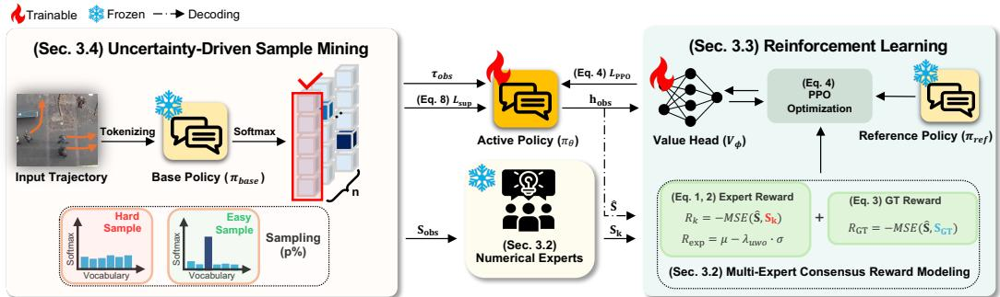  
Figure 2: MoRE training pipeline. A frozen base policy ranks training samples by predictive entropy. Numerical expert predictions for the selected subset are cached once. Decoded policy samples receive expert-consensus and ground-truth rewards for PPO refinement, interleaved with supervised learning. Only the refined forecasting policy is needed at inference.

## 3.1 PRELIMINARIES

Problem Definition. Given observed trajectories of N pedestrians over $T _ { \mathrm { o b s } }$ timesteps, our goal is to predict their future trajectories over $T _ { \mathrm { p r e d } } ^ { \mathrm { ^ { - } } }$ timesteps. Formally, let $\mathbf { p } _ { t } ^ { n } = \left[ x _ { t } ^ { n } , y _ { t } ^ { n } \right] ^ { \top } \in \mathbb { R } ^ { 2 }$ denote the 2D coordinate vector of pedestrian n at time t. The observed trajectory and the ground truth future trajectory for pedestrian n are defined as matrices $\mathbf { S } _ { \mathrm { o b s } } ^ { n } = [ \mathbf { p } _ { 1 } ^ { n } , \dots , \mathbf { p } _ { T _ { \mathrm { o b s } } } ^ { n } ] ^ { \top } \in \mathbb { R } ^ { T _ { \mathrm { o b s } } \times 2 }$ and $\mathbf { S } _ { \mathrm { G T } } ^ { n } = [ \mathbf { p } _ { T _ { \mathrm { o b s } } + 1 } ^ { n } , \dots , \mathbf { p } _ { T _ { \mathrm { o b s } } + T _ { \mathrm { p r e d } } } ^ { n } ] ^ { \top } \in \mathbb { R } ^ { T _ { \mathrm { p r e d } } \times 2 }$ , respectively. Consequently, our model aims to learn the parameterized conditional distribution across all N pedestrians, formulated as $p _ { \theta } \big ( \{ \mathbf { S } _ { \mathrm { G T } } ^ { n } \} _ { n = 1 } ^ { N } \ \big |$ $\{ \mathbf { S } _ { \mathrm { o b s } } ^ { n } \} _ { n = 1 } ^ { N } )$ . For the pedestrian benchmarks, we use $T _ { \mathrm { o b s } } = 8$ and $T _ { \mathrm { p r e d } } = 1 2$ . NBA follows its benchmark-specific evaluation protocol described in Sec. 4.1.

Base Policy. Our framework builds upon LMTraj (Bae et al., 2024a), which formulates trajectory prediction as a text-based sequence generation task (Raffel et al., 2020). A numerical tokenizer maps continuous trajectories into a discrete token space, and we initialize from its pretrained weights. However, next-token likelihood does not directly penalize the magnitude of errors in decoded coordinates. Formally, the tokenizer maps the continuous observation matrix $\mathbf { S _ { \mathrm { o b s } } }$ to a discrete text prompt $\tau _ { \mathrm { o b s } } .$ , and the ground-truth future trajectory $\mathbf { S } _ { \mathrm { G T } }$ to a target token sequence $\tau _ { \mathrm { G T } } = [ \tau _ { 1 } , \dots , \tau _ { L } ]$ . The policy models the discrete conditional distribution $\pi _ { \boldsymbol { \theta } } ( \tau _ { k } \mid \tau _ { \mathrm { o b s } } , \tau _ { < k } )$

## 3.2 MULTI-EXPERT CONSENSUS REWARD MODELING

Numerical Reward Formulation. We define a composite reward that integrates complementary knowledge from multiple numerical experts. We use five specialized predictors with different strengths: (i) a local interaction expert for local pedestrian interactions, (ii) a structural relation expert for relational dynamics, (iii) a social grouping expert for group behavior, (iv) a motion pattern expert for characteristic motion patterns, and (v) a goal expert for destination information. Each expert contributes its own prediction as coordinate-level guidance, allowing MoRE to preserve their complementary knowledge rather than forcing them to agree on a single behavior. At the same time, individual predictions can contain noisy or unreliable guidance. MoRE therefore applies a consensus reward in which larger disagreement among expert scores receives a stronger penalty, reducing the influence of strongly inconsistent signals while retaining the guidance from each expert. The same framework can incorporate other pretrained numerical predictors, and results with additional experts and alternative expert configurations are provided in Sec. C.

Reward Aggregation via Uncertainty-Weighted Optimization. Given a text-based observation prompt, the language-based policy autoregressively generates a sequence of discrete tokens, which is decoded into a continuous coordinate matrix Sˆ. For each selected observation, each frozen numerical expert $k \in \{ 1 , \ldots , K \}$ produces a continuous prediction $\mathbf { S } _ { k }$ from the historical trajectory, and these predictions are cached before policy refinement. We then define the reward from expert k as the negative mean squared error between the decoded policy prediction and the cached expert prediction:

$$
R _ { k } = - \mathbf { M } \mathbf { S } \mathbf { E } ( \hat { \mathbf { S } } , \mathbf { S } _ { k } ) .\tag{1}
$$

To combine expert rewards, we follow the conservative aggregation principle of Uncertainty-Weighted Optimization (UWO) (Coste et al., 2024). For each generated trajectory, the mean reward represents its overall agreement with the numerical experts, while the standard deviation measures disagreement among their scores. We penalize this disagreement so that trajectories receiving inconsistent evaluations from the experts obtain lower consensus rewards. The resulting consensus reward is defined as:

$$
R _ { \mathrm { e x p } } = \mu - \lambda _ { \mathrm { u w o } } \cdot \sigma , \quad \mathrm { w h e r e } \ \mu = { \frac { 1 } { K } } \sum _ { k = 1 } ^ { K } R _ { k } , \sigma = { \sqrt { { \frac { 1 } { K } } \sum _ { k = 1 } ^ { K } ( R _ { k } - \mu ) ^ { 2 } } } .\tag{2}
$$

The penalty coefficient $\lambda _ { \mathrm { u w o } }$ reduces the influence of noisy or inconsistent expert signals by penalizing disagreement among expert rewards, encouraging more stable and physically grounded predictions. Here, $\mu$ is the mean expert reward and σ is the standard deviation of expert rewards for the same generated trajectory. Setting $\lambda _ { \mathrm { u w o } } = 0$ recovers mean aggregation.

Total Reward Formulation. To balance expert guidance with accuracy to the ground-truth trajectory, we use the composite reward:

$$
R = R _ { \mathrm { G T } } + \lambda _ { \mathrm { e x p } } \cdot R _ { \mathrm { e x p } } , \quad \mathrm { w h e r e } ~ R _ { \mathrm { G T } } = - \mathbf { M S E } ( \hat { \mathbf { S } } , \mathbf { S } _ { \mathrm { G T } } ) .\tag{3}
$$

While $R _ { \mathrm { G T } }$ anchors the prediction to the target trajectory, $R _ { \mathrm { e x p } }$ incorporates complementary knowledge from the numerical experts. The expert reward encourages agreement with their forecasts rather than directly enforcing physical constraints.

## 3.3 REINFORCEMENT LEARNING VIA PPO

PPO Optimization. The policy πθ and the value network $V _ { \phi }$ are jointly optimized by minimizing a composite surrogate loss, which integrates a clipped policy objective, a value regression loss, and a KL divergence penalty to prevent catastrophic forgetting:

$$
\begin{array} { r l } & { \mathcal { L } _ { \mathrm { P P O } } = - \mathbb { E } \left[ \cfrac { 1 } { L } \sum _ { t = 1 } ^ { L } \operatorname* { m i n } \left( \rho _ { t } ( \theta ) \hat { A } , \operatorname { c l i p } ( \rho _ { t } ( \theta ) , 1 - \epsilon , 1 + \epsilon ) \hat { A } \right) \right] + c _ { v } \mathbb { E } \left[ \left( V _ { \phi } ( { \mathbf { h } } _ { \mathrm { o b s } } ) - R \right) ^ { 2 } \right] } \\ & { \quad \quad \quad + \beta \hat { D } _ { \mathrm { K L } } ( \pi _ { \theta } \| \pi _ { \mathrm { r e f } } ) , \quad \mathrm { w h e r e } \quad \rho _ { t } ( \theta ) = \frac { \pi _ { \theta } \left( \tau _ { t } \mid \tau _ { \mathrm { o b s } } , \tau _ { < t } \right) } { \pi _ { \mathrm { o l d } } \left( \tau _ { t } \mid \tau _ { \mathrm { o b s } } , \tau _ { < t } \right) } . } \end{array}\tag{4}
$$

The token-level importance ratio $\rho _ { t } ( \theta )$ is computed for each generation step t relative to the behavior policy $\pi _ { \mathrm { o l d } }$ . The sequence-level advantage $\hat { A } = R - V _ { \phi } ( { \bf h } _ { \mathrm { o b s } } )$ is calculated as the direct difference between the composite reward R and the expected return. The value function $V _ { \phi }$ processes the mean-pooled encoder hidden states of the observation context $\mathbf { \Pi } ( \mathbf { h } _ { \mathrm { o b s } } )$ and is jointly trained via Mean Squared Error (MSE) regression on the observed returns R. Further mathematical details are provided in Sec. A.

## 3.4 UNCERTAINTY-DRIVEN SAMPLE MINING

We focus PPO refinement on training samples with high predictive entropy under the frozen base policy. Entropy is used to rank sample uncertainty, and numerical expert rewards are applied to the selected top-p% subset.

Sample Difficulty Scoring. We assess the difficulty of each trajectory sample by measuring the predictive uncertainty of the base policy $\pi _ { \mathrm { b a s e } }$ . Rather than relying on ground-truth predictive error, we compute the Shannon entropy of the model’s Softmax output distribution to reveal inherent model ambiguity. The difficulty score $\boldsymbol { S } _ { i }$ for sample i is defined as the sequence-averaged entropy across the vocabulary space V:

$$
S _ { i } = - \frac { 1 } { L _ { i } } \sum _ { k = 1 } ^ { L _ { i } } \sum _ { \boldsymbol { v } \in \mathcal { V } } \pi _ { \mathrm { b a s e } } ( \boldsymbol { v } \mid \tau _ { i , \mathrm { o b s } } , \tau _ { i , < k } ) \log \pi _ { \mathrm { b a s e } } ( \boldsymbol { v } \mid \tau _ { i , \mathrm { o b s } } , \tau _ { i , < k } ) ,\tag{5}
$$

where v represents a candidate token and $L _ { i }$ is the sequence length. Here, a high $s _ { i }$ indicates a relatively flat Softmax distribution, indicating greater uncertainty in the base policy’s token distribution. Based on this difficulty distribution across the entire training set D, we define a selection threshold $\gamma _ { p }$ to identify the top $p \%$ of samples. We then apply a binary selection mask $M _ { i }$ to focus the optimization processes on these high-uncertainty cases:

$$
\gamma _ { p } = \mathrm { P e r c e n t i l e } ( \{ S _ { i } \} _ { i = 1 } ^ { | D | } , 1 0 0 - p ) , \quad M _ { i } = \ndot { \ncal K } [ S _ { i } \geq \gamma _ { p } ] .\tag{6}
$$

Overall Objective. The refinement process combines supervised learning with PPO on the selected subset. The total objective is defined as:

$$
\mathcal { L } _ { \mathrm { t o t a l } } = \frac { 1 } { \vert M \vert } \sum _ { i \in M } \left( \mathcal { L } _ { \mathrm { s u p } } ^ { ( i ) } + \lambda _ { \mathrm { R L } } \mathcal { L } _ { \mathrm { P P O } } ^ { ( i ) } \right) ,\tag{7}
$$

where $M = \{ i : M _ { i } = 1 \}$ denotes the identified subset of hard samples. The supervised term $\mathcal { L } _ { \mathrm { s u p } } ^ { ( i ) }$ acts as a regularizer to maintain the model’s fundamental sequence-to-sequence mapping capabilities. It is defined as the standard negative log-likelihood (NLL) against the ground-truth token sequence $\boldsymbol { \tau } _ { i } ^ { * }$ :

$$
\mathcal { L } _ { \mathrm { s u p } } ^ { ( i ) } = - \frac { 1 } { L _ { i } } \sum _ { k = 1 } ^ { L _ { i } } \log \pi _ { \theta } ( \tau _ { i , k } ^ { * } \mid \tau _ { i , \mathrm { o b s } } , \tau _ { i , < k } ^ { * } ) .\tag{8}
$$

The PPO term provides reward-based feedback from the ground-truth and numerical expert rewards. During training, PPO and supervised updates are interleaved, with one PPO update every ten supervised steps. This schedule maintains the original token-prediction objective while introducing coordinate-level guidance through PPO.

## 3.5 IMPLEMENTATION DETAILS

We adopt the pretrained LMTraj (Bae et al., 2024a) as the base policy and refine it with LoRA (Hu et al., 2022) of rank $r ~ = ~ 1 6$ , updating 0.3% of the base-policy parameters. The five frozen numerical experts are Social-STGCNN (Mohamed et al., 2020), DMRGCN (Bae & Jeon, 2021), GP-Graph (Bae et al., 2022a), SingularTrajectory (Bae et al., 2024b), and Expert-Trajectory (Zhao & Wildes, 2021). We set $\lambda _ { \mathrm { e x p } } = 0 . 5 , \lambda _ { \mathrm { u w o } } = 0 . 0 5$ , and $\lambda _ { \mathrm { R L } } = 0 . 5$ . PPO uses $\epsilon = 0 . 2 , c _ { v } = 0 . 5$ and $\beta ~ = ~ 0 . 1$ We refine the top 1% of training samples ranked by predictive entropy using AdamW (Loshchilov & Hutter, 2017) with a learning rate of $1 0 ^ { - 4 }$ and an effective batch size of 1,024. Refinement takes about one hour on eight NVIDIA RTX PRO 6000 GPUs.

## 4 EXPERIMENTS

## 4.1 EXPERIMENTAL SETUP

Benchmarks and protocol. We evaluate on ETH-UCY (Pellegrini et al., 2009; Lerner et al., 2007), Stanford Drone Dataset (SDD) (Robicquet et al., 2016), Grand Central Station (GCS) (Yi et al., 2015), and NBA. ETH-UCY comprises ETH, HOTEL, UNIV, ZARA1, and ZARA2 and uses leaveone-out evaluation. SDD contains aerial trajectories, while GCS includes dense station scenes with up to 289 concurrent pedestrians. These pedestrian benchmarks use eight observed and twelve future frames. NBA evaluates highly interactive motion under the protocol of Wong et al. (2025). Crossdataset evaluation trains on ETH-UCY and tests on SDD without fine-tuning, assessing whether numerical refinement improves spatial accuracy while retaining the cross-dataset transfer capability of the language-based predictor.

Metrics. Average Displacement Error (ADE) measures mean Euclidean position error over future timesteps, while Final Displacement Error (FDE) measures endpoint error. Following the standard best-of-20 evaluation protocol for stochastic trajectory prediction (Gupta et al., 2018), we report the minimum ADE and FDE over 20 sampled trajectories.

Social spacing and collisions. On ETH-UCY, we additionally report collision rate (COL) (Liu et al., 2021) and pedestrian-spacing statistics based on Hall’s proxemic zones (Hall, 1966). These distance ranges provide a simple way to compare whether predicted pedestrian spacing resembles real interactions beyond displacement error alone. We use three zones: intimate (< 0.45 m), personal (0.45–1.2 m), and social (1.2–3.7 m). For each zone, we measure the percentage of pedestrians with at least one other pedestrian within that range. A pedestrian may have neighbors in multiple zones, so the percentages do not need to sum to 100%. Values closer to the ground truth indicate more realistic spacing, while lower COL is better.

Table 1: Best-of-20 ADE / FDE (ETH-UCY in meters, with SDD and GCS in pixels). Bold and underline indicate best and second-best values, including ties. Model references are in Sec. C.1.
<table><tr><td>Model</td><td>ETH</td><td>HOTEL</td><td>UNIV</td><td>ZARA1</td><td>ZARA2</td><td>AVG</td><td>SDD</td><td>GCS</td></tr><tr><td colspan="9">Numerical models</td></tr><tr><td>Social GAN</td><td>0.77/1.40</td><td>0.43/0.88</td><td>0.75/1.50</td><td>0.35/0.69</td><td>0.36/0.72</td><td>0.53/1.04</td><td>13.6/24.6</td><td>15.9/32.6</td></tr><tr><td>Social-STGCNN0.65/1.10</td><td></td><td>0.50/0.86</td><td>0.44/0.80</td><td>0.34/0.53</td><td>0.31/0.48</td><td>0.45/0.75</td><td>20.8/33.2</td><td>14.7/23.9</td></tr><tr><td>PECNet</td><td>0.61/1.07</td><td>0.22/0.39</td><td>0.34/0.56</td><td>0.25/0.45</td><td>0.19/0.33</td><td>0.32/0.56</td><td>10.0/15.9</td><td>17.1/29.3</td></tr><tr><td>Trajectron++</td><td>0.61/1.03</td><td>0.20/0.28</td><td>0.30/0.55</td><td>0.24/0.41</td><td>0.18/0.32</td><td>0.31/0.52</td><td>11.4/20.1</td><td>12.8/24.2</td></tr><tr><td>AgentFormer</td><td>0.46/0.80</td><td>0.14/0.22</td><td>0.25/0.45</td><td>0.18/0.30</td><td>0.14/0.24</td><td>0.23/0.40</td><td>8.7/14.9</td><td>10.2/16.9</td></tr><tr><td>MID</td><td>0.57/0.93</td><td>0.21/0.33</td><td>0.29/0.55</td><td>0.28/0.50</td><td>0.20/0.37</td><td>0.31/0.54</td><td>7.6/14.3</td><td>10.7/18.2</td></tr><tr><td>EqMotion</td><td>0.40/0.61</td><td>0.12/0.18</td><td>0.23/0.43</td><td>0.18/0.32</td><td>0.13/0.23</td><td>0.21/0.35</td><td>7.9/11.9</td><td>7.6/13.1</td></tr><tr><td>GP-Graph</td><td>0.43/0.63</td><td>0.18/0.30</td><td>0.24/0.42</td><td>0.17/0.31</td><td>0.15/0.29</td><td>0.23/0.39</td><td>9.1/13.8</td><td>7.8/13.7</td></tr><tr><td>LED</td><td>0.39/0.58</td><td>0.11/0.17</td><td>0.26/0.43</td><td>0.18/0.26</td><td>0.13/0.22</td><td>0.21/0.33</td><td>8.5/11.7</td><td>9.0/11.4</td></tr><tr><td>MART</td><td>0.35/0.47</td><td>0.14/0.22</td><td>0.25/0.45</td><td>0.17/0.29</td><td>0.13/0.22</td><td>0.21/0.33</td><td>7.4/11.8</td><td>10.6/14.1</td></tr><tr><td>SingularTraj.</td><td>0.35/0.42</td><td>0.13/0.19</td><td>0.25/0.44</td><td>0.19/0.32</td><td>0.15/0.25</td><td>0.21/0.32</td><td>7.58/12.1</td><td>7.9/13.3</td></tr><tr><td>MoFlow</td><td>0.40/0.57</td><td>0.11/0.17</td><td>0.23/0.39</td><td>0.15/0.26</td><td>0.12/0.22</td><td>0.20/0.32</td><td>7.5/12.0</td><td>9.1/11.6</td></tr><tr><td>PCHGCN</td><td>0.42/0.65</td><td>0.17/0.28</td><td>0.21/0.38</td><td>0.17/0.31</td><td>0.13/0.23</td><td>0.22/0.37</td><td>N/A</td><td>N/A</td></tr><tr><td>ViTE</td><td>0.35/0.49</td><td>0.11/0.17</td><td>0.23/0.42</td><td>0.18/0.30</td><td>0.13/0.22</td><td>0.20/0.32</td><td>7.4/11.9</td><td>N/A</td></tr><tr><td colspan="9">Language-based models</td></tr><tr><td>LMTraj-ZERO</td><td>0.80/1.64</td><td>0.20/0.37</td><td>0.37/0.77</td><td>0.33/0.66</td><td>0.24/0.50</td><td>0.39/0.79</td><td>10.9/21.0</td><td>12.7/25.5</td></tr><tr><td>LMTraj-SUP</td><td>0.41/0.50</td><td>0.12/0.16</td><td>0.22/0.34</td><td>0.20/0.32</td><td>0.17/0.27</td><td>0.22/0.32</td><td>7.8/10.1</td><td>7.1/9.6</td></tr><tr><td>GUIDE-CoT</td><td>0.38/0.43</td><td>0.13/0.15</td><td>0.34/0.48</td><td>0.19/0.29</td><td>0.17/0.21</td><td>0.24/0.31</td><td>N/A</td><td>N/A</td></tr><tr><td>W2W</td><td>0.35/0.41</td><td>0.12/0.15</td><td>0.20/0.32</td><td>0.19/0.29</td><td>0.17/0.26</td><td>0.21/0.29</td><td>7.4/10.1</td><td>N/A</td></tr><tr><td>MoRE (Ours)</td><td>0.36/0.42</td><td>0.11/0.14</td><td>0.21/0.32</td><td>0.18/0.28</td><td>0.17/0.26</td><td>0.20/0.29</td><td>6.4/9.5</td><td>6.8/8.5</td></tr></table>

## 4.2 EVALUATION RESULTS

Forecasting accuracy. Tab. 1 compares numerical and language-based predictors. At the reported precision, MoRE achieves tied-best average ADE and FDE on ETH-UCY and the lowest ADE and FDE on both SDD and GCS among the compared models. Relative to LMTraj-SUP, ETH-UCY ADE decreases from 0.22 to 0.20 m and FDE from 0.32 to 0.29 m, corresponding to approximately 9.1% and 9.4% reductions. SDD ADE decreases from 7.8 to 6.4 pixels by approximately 17.9%, while GCS FDE decreases from 9.6 to 8.5 pixels by approximately 11.5%. Together, these results show consistent improvements across benchmarks, with MoRE matching the best average accuracy on ETH-UCY and yielding larger relative gains on SDD and GCS.

Table 2: Social interaction statistics on ETH-UCY (%). Intimate, personal, and social values are compared with the ground truth, while lower collision rate (COL) is better.
<table><tr><td>Method</td><td>Intimate</td><td>Personal</td><td>Social</td><td>COL↓</td></tr><tr><td>Ground truth</td><td>22.48</td><td>62.61</td><td>12.93</td><td>N/A</td></tr><tr><td>GP-Graph</td><td>26.02</td><td>58.91</td><td>13.82</td><td>2.44</td></tr><tr><td>LED</td><td>27.06</td><td>58.81</td><td>13.72</td><td>2.62</td></tr><tr><td>SingularTraj.</td><td>27.10</td><td>57.25</td><td>12.12</td><td>2.96</td></tr><tr><td>MART</td><td>26.71</td><td>58.14</td><td>12.14</td><td>2.23</td></tr><tr><td>LMTraj-SUP</td><td>25.72</td><td>59.79</td><td>12.58</td><td>2.54</td></tr><tr><td>MoRE (Ours)</td><td>23.41</td><td>60.49</td><td>13.08</td><td>2.11</td></tr></table>

Table 3: Trajectory prediction results on the NBA dataset using best-of-20 ADE / FDE (meters).
<table><tr><td>Method</td><td>ADE</td><td>FDE</td></tr><tr><td>MemoNet</td><td>1.25</td><td>1.47</td></tr><tr><td>E-V2-Net</td><td>1.26</td><td>1.64</td></tr><tr><td>SocialCircle+</td><td>1.14</td><td>1.37</td></tr><tr><td>Resonance</td><td>1.12</td><td>1.38</td></tr><tr><td>LMTraj-SUP</td><td>1.10</td><td>1.21</td></tr><tr><td>MoRE (Ours)</td><td>0.96</td><td>1.11</td></tr></table>

Interaction-heavy motion and social spacing. On the highly interactive NBA benchmark, MoRE achieves the lowest ADE and FDE among the compared methods (Tab. 3). Relative to LMTraj-SUP, ADE decreases from 1.10 to 0.96 m and FDE from 1.21 to 1.11 m, reductions of approximately 12.7% and 8.3%. On ETH-UCY, we further evaluate whether the predicted trajectories reproduce observed pedestrian spacing. MoRE is closest to the ground truth in all three distance zones (Tab. 2). The intimate-zone percentage decreases from 25.72% to 23.41%, closer to the ground-truth value of 22.48%. COL also decreases from 2.54% to 2.11%, the lowest among the compared methods. Together, these results show that MoRE improves trajectory accuracy while producing sampled predictions with spacing patterns closer to real pedestrians and fewer collisions.

Qualitative comparison. Fig. 1, Fig. 3, and Fig. 4 compare sampled predictions across ETH-UCY and SDD. In the illustrated cases, MoRE reduces the spatial offset of the language-based predictions and concentrates samples around paths closer to the ground truth. These qualitative observations complement the displacement and pedestrian-spacing measurements. Additional visual comparison on ETH-UCY, SDD, and GCS are provided in Sec. E.

## 4.3 ABLATION STUDIES

Expert integration and reward design. Tab. 4 examines both how numerical expert knowledge is integrated and how the reward is constructed. Additional SFT on the same hard-sample subset does not improve the base policy, while distillation remains above MoRE. Within PPO, maximum and mean aggregation give 0.218 / 0.314 m and 0.217 / 0.307 m, respectively, whereas UWO reaches 0.204 / 0.285 m. Removing the ground-truth reward increases the error to 0.211 / 0.297 m. Together, these results show that the gain depends on both the integration strategy and the proposed reward design, rather than additional fine-tuning or direct expert transfer alone. Output ensembling, additional non-PPO integration strategies, and per-scene results are reported in Tab. 12.

Individual expert contributions. Tab. 5 evaluates refinement with individual experts on four behavioral subsets following prior work. These subsets may overlap. GP-Graph performs best among individual experts on group walking and collision avoidance, while SingularTrajectory performs best on mimicry and non-linear motion. The effect of each expert varies by behavior. For example, DMRGCN improves mimicry but does not improve the collision subset over the base policy. Combining all five experts gives the lowest ADE in every reported subset, showing the benefit of their complementary strengths. Full ADE / FDE and aggregate results are provided in Tab. 10.

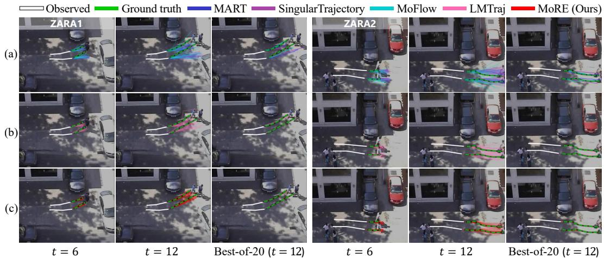

Figure 3: Sampled predictions on ZARA1 and ZARA2 at t = 6 and t = 12, with the best-of-20 trajectory. Rows show (a) numerical baselines, (b) LMTraj, and (c) MoRE. Additional qualitative results are provided in Sec. E.  
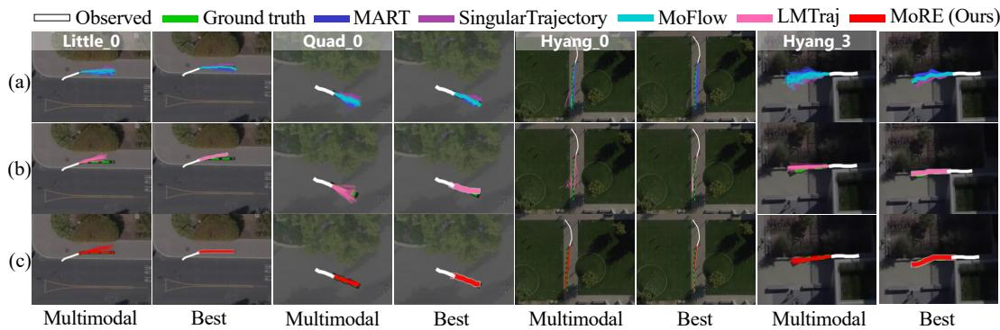  
Figure 4: Sampled predictions on four SDD scenes, showing 20 trajectories and the best-of-20 trajectory. From top to bottom, rows show numerical baselines, LMTraj, and MoRE.

Table 4: Expert integration and reward ablation on ETH-UCY (ADE / FDE, meters). GT denotes ground truth.
<table><tr><td>Method</td><td>ADE</td><td>FDE</td></tr><tr><td>Base policy</td><td>0.224</td><td>0.318</td></tr><tr><td>Additional SFT</td><td>0.227</td><td>0.321</td></tr><tr><td>Distillation</td><td>0.218</td><td>0.313</td></tr><tr><td>PPO + Max</td><td>0.218</td><td>0.314</td></tr><tr><td>PPO + Mean</td><td>0.217</td><td>0.307</td></tr><tr><td>MoRE w/o GT</td><td>0.211</td><td>0.297</td></tr><tr><td>MoRE (Ours)</td><td>0.204</td><td>0.285</td></tr></table>

Table 5: Refinement with individual experts on ETH-UCY behavioral subsets (ADE, meters). Subsets may overlap; All combines the five experts.
<table><tr><td>Expert</td><td>Group</td><td>Mimicry</td><td>Non-lin.</td><td>Coll.</td></tr><tr><td>None</td><td>0.206</td><td>0.164</td><td>0.322</td><td>0.200</td></tr><tr><td>STGCNN</td><td>0.202</td><td>0.158</td><td>0.312</td><td>0.215</td></tr><tr><td>DMRGCN</td><td>0.198</td><td>0.148</td><td>0.318</td><td>0.205</td></tr><tr><td>GP-Graph</td><td>0.192</td><td>0.152</td><td>0.310</td><td>0.192</td></tr><tr><td>SingularTraj.</td><td>0.212</td><td>0.145</td><td>0.292</td><td>0.202</td></tr><tr><td>ExpertTraj.</td><td>0.210</td><td>0.160</td><td>0.308</td><td>0.198</td></tr><tr><td>All (Ours)</td><td>0.188</td><td>0.142</td><td>0.282</td><td>0.185</td></tr></table>

Sample selection and refinement. Tab. 6 compares tuning strategies and data fractions. On the same 1% subset, LoRA gives 0.204 / 0.285 m, compared with 0.213 / 0.297 m for full fine-tuning. Using 0.1% or 100% of the data raises LoRA’s ADE to 0.223 m or 0.221 m. The 1% setting is best among those shown. Tab. 7 examines samples before refinement. The top 1% has base-policy ADE

Table 6: Refinement on ETH-UCY (meters). Data is the training fraction used. Lower ADE / FDE is better.  
Table 7: Training samples before refinement. Basepolicy errors are in meters. Coll.-inv. denotes collisioninvolved samples.
<table><tr><td>Tuning</td><td>Data (%)</td><td>ADE / FDE</td><td>Partition</td><td>ADE/FDE</td><td>Non-linear (%)</td><td>Coll.-inv. (%)</td></tr><tr><td>Full FT</td><td>1</td><td>0.213/0.297</td><td>Top 1%</td><td>0.40/0.60</td><td>82</td><td>25</td></tr><tr><td>LoRA</td><td>100</td><td>0.221/0.303</td><td>Random 1%</td><td>0.24/0.35</td><td>45</td><td>13</td></tr><tr><td>LoRA</td><td>0.1</td><td>0.223/0.288</td><td>Bottom 1%</td><td>0.05/0.08</td><td>2</td><td>1</td></tr><tr><td>LoRA (Ours)</td><td>1</td><td>0.204/0.285</td><td>All</td><td>0.22/0.32</td><td>41</td><td>9</td></tr></table>

/ FDE of 0.40 / 0.60 m, compared with 0.22 / 0.32 m overall. Non-linear and collision-involved samples account for 82% and 25%, versus 41% and 9% overall. These results show that entropy ranking selects samples where the base policy struggles more and where non-linear and collision-related interactions occur more frequently. We therefore focus refinement on the top-entropy samples instead of applying numerical expert feedback to the entire training set. The random and bottom-entropy rows are included only to characterize sample difficulty, not as refinement baselines.

Table 8: Additional evaluation. Forecasting entries are ADE / FDE. Non-linear errors are in meters and ETH-UCY-to-SDD transfer errors are in pixels. Inference is measured on an RTX 4090. The reference is the base policy for non-linear subsets and LMTraj-SUP for transfer and cost.
<table><tr><td>Evaluation</td><td>Reference</td><td>MoRE (Ours)</td></tr><tr><td>Non-linear group walking</td><td>0.297 / 0.323</td><td>0.211 / 0.274</td></tr><tr><td>Non-linear mimicry walking</td><td>0.195 / 0.277</td><td>0.151 / 0.217</td></tr><tr><td>Non-linear collision avoidance</td><td>0.251 / 0.288</td><td>0.198 / 0.264</td></tr><tr><td>Non-linear subset average</td><td>0.248 / 0.296</td><td>0.187 / 0.252</td></tr><tr><td>ETH-UCY → SDD</td><td>10.03 / 17.93</td><td>9.14 /15.32</td></tr><tr><td>Inference memory (MB)</td><td>1,401</td><td>1,401</td></tr><tr><td>Inference latency (ms)</td><td>18.3</td><td>18.3</td></tr></table>

Hard cases, transfer, and inference cost. Tab. 8 evaluates MoRE only on challenging non-linear motion and interaction cases, using behavioral subsets that are distinct from the entropy-ranked training subset. MoRE improves both metrics in all three subsets, reducing the reported average ADE by approximately 24.6%. This focused evaluation shows that the gains remain substantial on challenging non-linear motion and interaction cases. In ETH-UCY-to-SDD transfer without finetuning, FDE decreases from 17.93 to 15.32 pixels, approximately 14.6%, showing that the refinement also transfers beyond the source dataset. Reported RTX 4090 measurements remain 1,401 MB and 18.3 ms, confirming that the numerical experts introduce no measured inference-time overhead. Sec. C provides full per-scene results, expert configurations, collision ablations, coefficient sweeps, and deterministic comparisons.

## 5 CONCLUSION

MoRE refines a pretrained language-based trajectory predictor using cached coordinate-level rewards from complementary numerical experts, uncertainty-weighted consensus, and entropy-based sample selection. Across ETH-UCY, SDD, GCS, and NBA, MoRE improves stochastic forecasting accuracy, including non-linear subsets and cross-dataset transfer. On ETH-UCY, it also yields pedestrian spacing closer to the ground truth and fewer collisions. Because experts are used only during training, measured inference memory and latency remain unchanged, while ablations show that expert composition and reward aggregation both matter.

Limitations. MoRE depends on numerical experts, which may share errors or provide inaccurate forecasts. Expert disagreement can reflect valid alternative futures, so consensus does not guarantee safe or calibrated predictions. Deterministic gains remain small because available deterministic experts provide limited improvement, motivating stronger deterministic forecasters. Future work will investigate stronger deterministic experts and adaptive expert weighting to provide more reliable guidance. We also plan to extend MoRE to broader domains and evaluate multimodal coverage under larger distribution shifts.

## AI USE STATEMENT

Generative AI tools were not used for any activities requiring disclosure, including synthetic data generation, theoretical model development, the formulation or proof of mathematical claims, research methodology design, method implementation, or result interpretation. The authors drafted all text and used generative AI tools solely to improve its readability. All edited text was reviewed by the authors, who take full responsibility for the final content of this work.

## ETHICS STATEMENT

This work uses only existing, publicly available datasets for trajectory prediction. These datasets may have limited coverage of motion patterns and environments, and the proposed method may inherit biases present in the source data. Predicted trajectories are uncertain estimates rather than guaranteed outcomes of individual behavior. Deployment in safety-critical or privacy-sensitive settings would require further validation and appropriate safeguards, particularly where predictions could support the tracking or monitoring of individuals. Any materials released with this work will comply with the applicable licenses and redistribution restrictions of the source datasets.

## REPRODUCIBILITY STATEMENT

To support reproducibility, Sec. 3 presents the model formulation, learning objectives, sample selection, and implementation settings. Sec. A provides further details on the RL formulation, value network, optimization, hyperparameters, and numerical handling. Sec. 4.1 describes the datasets, evaluation protocols, and metrics, while Sec. C reports additional ablations, sensitivity analyses, transfer experiments, and computational costs. Additional qualitative results are provided in Sec. E. We intend to release our code and evaluation scripts upon acceptance, subject to internal approval.

## REFERENCES

Alexandre Alahi, Kratarth Goel, Vignesh Ramanathan, Alexandre Robicquet, Li Fei-Fei, and Silvio Savarese. Social lstm: Human trajectory prediction in crowded spaces. In Proceedings of the IEEE/CVF Conference on Computer Vision and Pattern Recognition (CVPR), 2016.

Inhwan Bae and Hae-Gon Jeon. Disentangled multi-relational graph convolutional network for pedestrian trajectory prediction. Proceedings of the AAAI Conference on Artificial Intelligence (AAAI), 2021.

Inhwan Bae, Jin-Hwi Park, and Hae-Gon Jeon. Learning pedestrian group representations for multimodal trajectory prediction. In Proceedings of the European Conference on Computer Vision (ECCV), 2022a.

Inhwan Bae, Jin-Hwi Park, and Hae-Gon Jeon. Non-probability sampling network for stochastic human trajectory prediction. In Proceedings of the IEEE/CVF Conference on Computer Vision and Pattern Recognition (CVPR), 2022b.

Inhwan Bae, Jean Oh, and Hae-Gon Jeon. EigenTrajectory: Low-rank descriptors for multi-modal trajectory forecasting. In Proceedings of the IEEE/CVF International Conference on Computer Vision (ICCV), 2023.

Inhwan Bae, Junoh Lee, and Hae-Gon Jeon. Can language beat numerical regression? languagebased multimodal trajectory prediction. In Proceedings of the IEEE/CVF Conference on Computer Vision and Pattern Recognition (CVPR), 2024a.

Inhwan Bae, Young-Jae Park, and Hae-Gon Jeon. Singulartrajectory: Universal trajectory predictor using diffusion model. In Proceedings of the IEEE/CVF Conference on Computer Vision and Pattern Recognition (CVPR), 2024b.

Inhwan Bae, Junoh Lee, and Hae-Gon Jeon. Social reasoning-aware trajectory prediction via multimodal language model. IEEE Transactions on Pattern Analysis and Machine Intelligence (TPAMI), 2025.

Yuntao Bai, Andy Jones, Kamal Ndousse, Amanda Askell, Anna Chen, Nova DasSarma, Dawn Drain, Stanislav Fort, Deep Ganguli, Tom Henighan, et al. Training a helpful and harmless assistant with reinforcement learning from human feedback. arXiv preprint arXiv:2204.05862, 2022.

Apratim Bhattacharyya, Michael Hanselmann, Mario Fritz, Bernt Schiele, and Christoph-Nikolas Straehle. Conditional flow variational autoencoders for structured sequence prediction. arXiv preprint arXiv:1908.09008, 2020.

Niccolo Bisagno, Bo Zhang, and Nicola Conci. Group lstm: Group trajectory prediction in crowded´ scenarios. In Proceedings ofthe European Conference on Computer Vision Workshop (ECCVW), 2018.

Tom Brown, Benjamin Mann, Nick Ryder, Melanie Subbiah, Jared D Kaplan, Prafulla Dhariwal, Arvind Neelakantan, Pranav Shyam, Girish Sastry, Amanda Askell, et al. Language models are few-shot learners. Proceedings ofthe Neural Information Processing Systems (NeurIPS), 2020.

Wangxing Chen, Haifeng Sang, and Zishan Zhao. Pchgcn: Physically constrained higher-order graph convolutional network for pedestrian trajectory prediction. IEEE Internet ofThings Journal, 2025.

Pranav Singh Chib and Pravendra Singh. Lg-traj: LLM guided pedestrian trajectory prediction. In Proceedings of the IEEE/CVF International Conference on Computer Vision (ICCV), 2025.

Paul F Christiano, Jan Leike, Tom Brown, Miljan Martic, Shane Legg, and Dario Amodei. Deep reinforcement learning from human preferences. Proceedings of the Neural Information Processing Systems (NeurIPS), 2017.

Thomas Coste, Usman Anwar, Robert Kirk, and David Krueger. Reward model ensembles help mitigate overoptimization. In Proceedings of the International Conference on Learning Representations (ICLR), 2024.

Patrick Dendorfer, Aljosa Osep, and Laura Leal-Taixe. Goal-gan: Multimodal trajectory prediction based on goal position estimation. In Proceedings of the Asian Conference on Computer Vision (ACCV), 2020.

William Fedus, Barret Zoph, and Noam Shazeer. Switch transformers: Scaling to trillion parameter models with simple and efficient sparsity. Journal of Machine Learning Research (JMLR), 2022.

Tharindu Fernando, Simon Denman, Sridha Sridharan, and Clinton Fookes. Soft+ hardwired attention: An lstm framework for human trajectory prediction and abnormal event detection. Neural Networks, 108:466–478, 2018.

Yuxiang Fu, Qi Yan, Lele Wang, Ke Li, and Renjie Liao. Moflow: One-step flow matching for human trajectory forecasting via implicit maximum likelihood estimation based distillation. In Proceedings ofthe IEEE/CVF Conference on Computer Vision and Pattern Recognition (CVPR), 2025.

Leo Gao, John Schulman, and Jacob Hilton. Scaling laws for reward model overoptimization. In Proceedings ofthe International Conference on Machine Learning (ICML), 2023.

Tianpei Gu, Guangyi Chen, Junlong Li, Chunze Lin, Yongming Rao, Jie Zhou, and Jiwen Lu. Stochastic trajectory prediction via motion indeterminacy diffusion. In Proceedings of the IEEE/CVF Conference on Computer Vision and Pattern Recognition (CVPR), 2022.

Agrim Gupta, Justin Johnson, Li Fei-Fei, Silvio Savarese, and Alexandre Alahi. Social gan: Socially acceptable trajectories with generative adversarial networks. In Proceedings of the IEEE/CVF Conference on Computer Vision and Pattern Recognition (CVPR), 2018.

Edward T. Hall. The Hidden Dimension. Doubleday, 1966.

Dirk Helbing and Peter Molnar. Social force model for pedestrian dynamics. Physical review E, 51 (5):4282, 1995.

Geoffrey Hinton, Oriol Vinyals, and Jeff Dean. Distilling the knowledge in a neural network. arXiv preprint arXiv:1503.02531, 2015.

Jordan Hoffmann, Sebastian Borgeaud, Arthur Mensch, Elena Buchatskaya, Trevor Cai, Eliza Rutherford, Diego de Las Casas, Lisa Anne Hendricks, Johannes Welbl, Aidan Clark, et al. Training compute-optimal large language models. arXiv preprint arXiv:2203.15556, 2022.

Edward J Hu, Yelong Shen, Phillip Wallis, Zeyuan Allen-Zhu, Yuanzhi Li, Shean Wang, Lu Wang, and Weizhu Chen. LoRA: Low-rank adaptation of large language models. In Proceedings ofthe International Conference on Learning Representations (ICLR), 2022.

Yingfan Huang, Huikun Bi, Zhaoxin Li, Tianlu Mao, and Zhaoqi Wang. Stgat: Modeling spatialtemporal interactions for human trajectory prediction. In Proceedings of the IEEE/CVF International Conference on Computer Vision (ICCV), 2019.

Ronny Hug, Wolfgang Hubner, and Michael Arens. Introducing probabilistic b¨ ezier curves for´ n-step sequence prediction. In Proceedings of the AAAI Conference on Artificial Intelligence (AAAI), 2020.

Boris Ivanovic and Marco Pavone. The trajectron: Probabilistic multi-agent trajectory modeling with dynamic spatiotemporal graphs. In Proceedings of the IEEE/CVF International Conference on Computer Vision (ICCV), 2019.

Robert A Jacobs, Michael I Jordan, Steven J Nowlan, and Geoffrey E Hinton. Adaptive mixtures of local experts. Neural Computation, 1991.

Yanlin Jiang, Yuchen Liu, and Mingren Liu. Cort-predictor: Chain of risk thought autoregressive trajectory predictor for autonomous driving. In Proceedings of the IEEE/CVF Conference on Computer Vision and Pattern Recognition (CVPR), 2026.

Jared Kaplan, Sam McCandlish, Tom Henighan, Tom B Brown, Benjamin Chess, Rewon Child, Scott Gray, Alec Radford, Jeffrey Wu, and Dario Amodei. Scaling laws for neural language models. arXiv preprint arXiv:2001.08361, 2020.

Sungsik Kim, Janghyun Baek, Jinkyu Kim, and Jaekoo Lee. GUIDE-CoT: goal-driven and userinformed dynamic estimation for pedestrian trajectory using chain-of-thought. arXiv preprint arXiv:2503.06832, 2025.

Vineet Kosaraju, Amir Sadeghian, Roberto Mart´ın-Mart´ın, Ian Reid, Hamid Rezatofighi, and Silvio Savarese. Social-bigat: Multimodal trajectory forecasting using bicycle-gan and graph attention networks. In Proceedings of the Neural Information Processing Systems (NeurIPS), 2019.

Parth Kothari, Sven Kreiss, and Alexandre Alahi. Human trajectory forecasting in crowds: A deep learning perspective. IEEE Transactions on Intelligent Transportation Systems (T-ITS), 2021.

Balaji Lakshminarayanan, Alexander Pritzel, and Charles Blundell. Simple and scalable predictive uncertainty estimation using deep ensembles. Proceedings of the Neural Information Processing Systems (NeurIPS), 2017.

Namhoon Lee, Wongun Choi, Paul Vernaza, Christopher B. Choy, Philip H. S. Torr, and Manmohan Chandraker. Desire: Distant future prediction in dynamic scenes with interacting agents. In Proceedings ofthe IEEE/CVF Conference on Computer Vision and Pattern Recognition (CVPR), 2017.

Seongju Lee, Junseok Lee, Yeonguk Yu, Taeri Kim, and Kyoobin Lee. Mart: Multiscale relational transformer networks for multi-agent trajectory prediction. In Proceedings of the European Conference on Computer Vision (ECCV), 2024.

Alon Lerner, Yiorgos Chrysanthou, and Dani Lischinski. Crowds by example. Computer Graphics Forum, 26(3):655–664, 2007.

Ruochen Li, Zhanxing Zhu, Tanqiu Qiao, and Hubert P. H. Shum. ViTE: Virtual Graph Trajectory Expert Router for Pedestrian Trajectory Prediction. Proceedings of the AAAI Conference on Artificial Intelligence, 40(21):17535–17543, 2026. doi: 10.1609/aaai.v40i21.38808.

Junwei Liang, Lu Jiang, and Alexander Hauptmann. Simaug: Learning robust representations from simulation for trajectory prediction. In Proceedings of the European Conference on Computer Vision (ECCV), 2020.

Yuejiang Liu, Qi Yan, and Alexandre Alahi. Social nce: Contrastive learning of socially-aware motion representations. In Proceedings of the IEEE/CVF International Conference on Computer Vision (ICCV), 2021.

Ilya Loshchilov and Frank Hutter. Decoupled weight decay regularization. arXiv preprint arXiv:1711.05101, 2017.

Karttikeya Mangalam, Harshayu Girase, Shreyas Agarwal, Kuan-Hui Lee, Ehsan Adeli, Jitendra Malik, and Adrien Gaidon. It is not the journey but the destination: Endpoint conditioned trajectory prediction. In Proceedings of the European Conference on Computer Vision (ECCV), 2020.

Weibo Mao, Chenxin Xu, Qi Zhu, Siheng Chen, and Yanfeng Wang. Leapfrog diffusion model for stochastic trajectory prediction. In Proceedings of the IEEE/CVF Conference on Computer Vision and Pattern Recognition (CVPR), 2023.

Ramin Mehran, Alexis Oyama, and Mubarak Shah. Abnormal crowd behavior detection using social force model. In Proceedings of the IEEE/CVF Conference on Computer Vision and Pattern Recognition (CVPR), 2009.

Abduallah Mohamed, Kun Qian, Mohamed Elhoseiny, and Christian Claudel. Social-stgcnn: A social spatio-temporal graph convolutional neural network for human trajectory prediction. In Proceedings ofthe IEEE/CVF Conference on Computer Vision and Pattern Recognition (CVPR), 2020.

Ingrid Navarro and Jean Oh. Social-patternn: Socially-aware trajectory prediction guided by motion patterns. In 2022 IEEE/RSJ International Conference on Intelligent Robots and Systems (IROS), 2022.

Long Ouyang, Jeffrey Wu, Xu Jiang, Diogo Almeida, Carroll Wainwright, Pamela Mishkin, Chong Zhang, Sandhini Agarwal, Katarina Slama, Alex Ray, et al. Training language models to follow instructions with human feedback. Proceedings of the Neural Information Processing Systems (NeurIPS), 2022.

Stefano Pellegrini, Andreas Ess, Konrad Schindler, and Luc Van Gool. You’ll never walk alone: Modeling social behavior for multi-target tracking. In Proceedings ofthe IEEE/CVF International Conference on Computer Vision (ICCV), 2009.

Colin Raffel, Noam Shazeer, Adam Roberts, Katherine Lee, Sharan Narang, Michael Matena, Yanqi Zhou, Wei Li, and Peter J. Liu. Exploring the limits of transfer learning with a unified text-to-text transformer. Journal ofMachine Learning Research (JMLR), 2020.

Eike Rehder and Horst Kloeden. Goal-directed pedestrian prediction. In Proceedings of the IEEE International Conference on Computer Vision Workshop (ICCVW), 2015.

Alexandre Robicquet, Amir Sadeghian, Alexandre Alahi, and Silvio Savarese. Learning social etiquette: Human trajectory understanding in crowded scenes. In Proceedings of the European Conference on Computer Vision (ECCV), 2016.

Amir Sadeghian, Vineet Kosaraju, Ali Sadeghian, Noriaki Hirose, Hamid Rezatofighi, and Silvio Savarese. Sophie: An attentive gan for predicting paths compliant to social and physical constraints. In Proceedings of the IEEE/CVF Conference on Computer Vision and Pattern Recognition (CVPR), 2019.

Tim Salzmann, Boris Ivanovic, Punarjay Chakravarty, and Marco Pavone. Trajectron++: Dynamically-feasible trajectory forecasting with heterogeneous data. In Proceedings of the European Conference on Computer Vision (ECCV), 2020.

John Schulman, Filip Wolski, Prafulla Dhariwal, Alec Radford, and Oleg Klimov. Proximal policy optimization algorithms. arXiv preprint arXiv:1707.06347, 2017.

Noam Shazeer, Azalia Mirhoseini, Krzysztof Maziarz, Andy Davis, Quoc Le, Geoffrey Hinton, and Jeff Dean. Outrageously large neural networks: The sparsely-gated mixture-of-experts layer. arXiv preprint arXiv:1701.06538, 2017.

Dereje Shenkut and BVK Vijaya Kumar. Visual-linguistic reasoning for pedestrian trajectory prediction. In Proceedings of the IEEE International Conference on Robotics and Automation (ICRA), 2025.

Liushuai Shi, Le Wang, Chengjiang Long, Sanping Zhou, Mo Zhou, Zhenxing Niu, and Gang Hua. Sgcn: Sparse graph convolution network for pedestrian trajectory prediction. In Proceedings of the IEEE/CVF Conference on Computer Vision and Pattern Recognition (CVPR), 2021.

Liushuai Shi, Le Wang, Chengjiang Long, Sanping Zhou, Fang Zheng, Nanning Zheng, and Gang Hua. Social interpretable tree for pedestrian trajectory prediction. Proceedings of the AAAI Conference on Artificial Intelligence (AAAI), 2022.

Jianhua Sun, Yuxuan Li, Hao-Shu Fang, and Cewu Lu. Three steps to multimodal trajectory prediction: Modality clustering, classification and synthesis. In Proceedings of the IEEE/CVF International Conference on Computer Vision (ICCV), 2021.

Anirudh Vemula, Katharina Muelling, and Jean Oh. Social attention: Modeling attention in human crowds. In Proceedings of the IEEE International Conference on Robotics and Automation (ICRA), 2018.

Chuhua Wang, Yuchen Wang, Mingze Xu, and David J Crandall. Stepwise goal-driven networks for trajectory prediction. IEEE Robotics and Automation Letters (RA-L), 2022.

Teng Wang, Yanting Lu, and Ruize Wang. Autotraces: Autoregressive trajectory forecasting via multimodal large language models. In Proceedings of the IEEE/CVF Conference on Computer Vision and Pattern Recognition (CVPR), 2026.

Jason Wei, Yi Tay, Rishi Bommasani, Colin Raffel, Barret Zoph, Sebastian Borgeaud, Dani Yogatama, Maarten Bosma, Denny Zhou, Donald Metzler, et al. Emergent abilities of large language models. arXiv preprint arXiv:2206.07682, 2022a.

Jason Wei, Xuezhi Wang, Dale Schuurmans, Maarten Bosma, Fei Xia, Ed Chi, Quoc V Le, Denny Zhou, et al. Chain-of-thought prompting elicits reasoning in large language models. Proceedings of the Neural Information Processing Systems (NeurIPS), 2022b.

Conghao Wong, Ziqian Zou, and Beihao Xia. Resonance: Learning to predict social-aware pedestrian trajectories as co-vibrations. In Proceedings of the IEEE/CVF International Conference on Computer Vision (ICCV), 2025.

Chenxin Xu, Maosen Li, Zhenyang Ni, Ya Zhang, and Siheng Chen. Groupnet: Multiscale hypergraph neural networks for trajectory prediction with relational reasoning. In Proceedings of the IEEE/CVF Conference on Computer Vision and Pattern Recognition (CVPR), 2022a.

Chenxin Xu, Robby T Tan, Yuhong Tan, Siheng Chen, Yu Guang Wang, Xinchao Wang, and Yanfeng Wang. Eqmotion: Equivariant multi-agent motion prediction with invariant interaction reasoning. In Proceedings ofthe IEEE/CVF Conference on Computer Vision and Pattern Recognition (CVPR), 2023.

Pei Xu, Jean-Bernard Hayet, and Ioannis Karamouzas. Socialvae: Human trajectory prediction using timewise latents. In Proceedings of the European Conference on Computer Vision (ECCV), 2022b.

Zirui Xu, Biao Yang, Rongrong Ni, Zhongkai Zhou, and Shaobo Shen. W2w: Language-modelbased trajectory prediction with reinforcement learning. In Proceedings of the IEEE/CVF Conference on Computer Vision and Pattern Recognition (CVPR), 2026.

Kota Yamaguchi, Alexander C Berg, Luis E Ortiz, and Tamara L Berg. Who are you with and where are you going? In Proceedings of the IEEE/CVF Conference on Computer Vision and Pattern Recognition (CVPR), 2011.

Shuai Yi, Hongsheng Li, and Xiaogang Wang. Understanding pedestrian behaviors from stationary crowd groups. In Proceedings of the IEEE/CVF Conference on Computer Vision and Pattern Recognition (CVPR), 2015.

Shan You, Chang Xu, Chao Xu, and Dacheng Tao. Learning from multiple teacher networks. In Proceedings of the ACM SIGKDD International Conference on Knowledge Discovery and Data Mining (KDD), 2017.

Ye Yuan, Xinshuo Weng, Yanglan Ou, and Kris Kitani. Agentformer: Agent-aware transformers for socio-temporal multi-agent forecasting. In Proceedings of the IEEE/CVF International Conference on Computer Vision (ICCV), 2021.

Jiangbei Yue, Dinesh Manocha, and He Wang. Human trajectory prediction via neural social physics. In Proceedings ofthe European Conference on Computer Vision (ECCV), 2022.

He Zhao and Richard P. Wildes. Where are you heading? dynamic trajectory prediction with expert goal examples. In Proceedings of the IEEE/CVF International Conference on Computer Vision (ICCV), 2021.

## A RL FORMULATION AND IMPLEMENTATION

This appendix expands the training procedure in Sec. 3. Extended related work appears in Sec. B. Additional experiments, interpretation, and qualitative results follow in Secs. C to E. The learning architecture, numerical reward definitions, and hyperparameters are retained from the main formulation.

## A.1 MDP FORMULATION FOR TOKEN GENERATION

Trajectory generation is an episodic Markov decision process. At token step t, the state is $s _ { t } ~ =$ $( \tau _ { \mathrm { o b s } } , \tau _ { < t } )$ and the action is the next token $a _ { t } = \tau _ { t } \in \mathcal { V } .$ . Numerical feedback is evaluated after the entire token sequence is decoded into coordinates. Intermediate rewards are zero. The terminal reward is the bounded ground-truth and expert return used for training:

$$
r _ { t } = { \left\{ \begin{array} { l l } { 0 , } & { t < L , } \\ { R , } & { t = L . } \end{array} \right. }\tag{9}
$$

With discount factor $\gamma = 1$ , every token receives the same terminal return. The raw score is defined in Eq. (3), and its clipping is described below. Expert predictions are functions of the observed trajectory, not of the generated token prefix. Consequently, caching these predictions once avoids repeated expert inference during policy refinement. Decoding and coordinate-error calculations still occur for each rollout.

## A.2 VALUE NETWORK AND SHARED ADVANTAGE

The critic is a two-layer MLP with a ReLU activation, attached to the mean-pooled encoder features of the observation prompt, $\mathbf { h } _ { \mathrm { o b s } } \in \mathbb { R } ^ { d _ { \mathrm { m o d e l } } }$ . It predicts the terminal return from the initial context rather than the return from every generated prefix. The shared advantage estimate is

$$
\hat { A } = R - V _ { \phi } (  { \mathbf { h } } _ { \mathrm { o b s } } ) .\tag{10}
$$

This is a sequence-return baseline, not a learned token-state value function or a generalizedadvantage estimator. The actor’s token-level terms share this scalar, while the critic is trained by regression to the return. The distinction matters because terminal-only feedback does not by itself require a context-only critic. It is the chosen lightweight baseline in this implementation.

## A.3 TOKEN-LEVEL POLICY OBJECTIVE

The actor uses the clipped token-level surrogate in Eq. (4). The likelihood ratio is relative to the rollout behavior policy $\pi _ { \mathrm { o l d } }$ , whereas the KL penalty is relative to the frozen pretrained reference $\pi _ { \mathrm { r e f } }$ . These policies have different roles. The same sequence-level advantage is used for every token, and the actor objective is averaged over the generated length. The supervised objective instead averages over the ground-truth sequence length.

The training schedule uses one gradient update per rollout, interleaved with supervised updates. Under a strictly on-policy single-step update, with no parameter change between sampling and loss evaluation, the importance ratios initially equal one and clipping is locally inactive. Thus, using a PPO surrogate should not be interpreted as independently demonstrating a benefit from clipping. The empirical comparisons evaluate the complete reward-guided refinement procedure, including its supervised and reference-policy regularization, rather than isolating every optimizer component.

## A.4 HYPERPARAMETERS AND NUMERICAL HANDLING

One PPO update is interleaved with every ten supervised steps $( \mathtt { r l \_ s t e p \_ f r e q u e n c y = } 1 0 )$ . The weights are $\lambda _ { \mathrm { R L } } = 0 . 5 , \lambda _ { \mathrm { e x p } } = 0 . 5$ , and $\lambda _ { \mathrm { u w o } } = 0 . 0 5$ PPO uses clipping threshold $\epsilon = 0 . 2 .$ value-loss coefficient $c _ { v } ~ = ~ 0 . 5$ , and reference-KL coefficient $\beta = 0 . 1$ . Low-rank adapters have rank 16. AdamW uses a learning rate of $1 0 ^ { - 4 }$ and an effective batch size of 1,024. The distributed configuration described in the manuscript uses eight RTX PRO 6000 GPUs with 128 samples per GPU.

Rollouts use temperature 0.7, top-k sampling with $k = 5 0$ , and a maximum length of 100 tokens. The composite reward R in Eq. (3) is computed in coordinate space and then clamped to $[ - 1 0 , 0 ]$ before PPO optimization, with −10 assigned to malformed decoded sequences. Expert and groundtruth errors are computed in the tokenizer’s normalized coordinate frame, so the same clipping range is used across benchmarks. The advantage clamp value is 5. In the optimization equations, R denotes this bounded return used for training. The reported settings should be distinguished from test-time decoding, for which deterministic and stochastic evaluations are separate protocols.

## A.5 REGULARIZATION AND SCOPE

The frozen reference, supervised token likelihood, low-rank adaptation, and interleaved update schedule are intended to limit changes to the pretrained distribution. They do not guarantee preservation of all auxiliary-task capabilities or prevent every form of reward exploitation. Our evidence consists of forecasting accuracy, pedestrian-spacing statistics, collision rates, and the evaluated transfer setting. We do not measure an independent semantic-reasoning capability before and after refinement.

## A.6 GEOMETRY OF THE MEAN EXPERT REWARD

The following identity is an algebraic interpretation of the existing MSE reward, not an additional learning component. Let $d = 2 \mathsf { \bar { T } } _ { \mathrm { p r e d } } , \bar { \mathbf { S } } = \bar { K } ^ { - 1 } \sum _ { k } \mathbf { S } _ { k }$ , and $\begin{array} { r } { C = \breve { K } ^ { - 1 } \sum _ { k } \| \mathbf { S } _ { k } - \bar { \mathbf { S } } \| _ { F } ^ { 2 } / d . } \end{array}$ Expanding the squares gives

$$
\frac { 1 } { K } \sum _ { k = 1 } ^ { K } \mathrm { M S E } ( \hat { \mathbf { S } } , \mathbf { S } _ { k } ) = \mathrm { M S E } ( \hat { \mathbf { S } } , \bar { \mathbf { S } } ) + C ,\tag{11}
$$

$$
\mu = - \operatorname { M S E } ( { \hat { \mathbf { S } } } , { \bar { \mathbf { S } } } ) - C .\tag{12}
$$

The cross term vanishes because $\begin{array} { r } { \sum _ { k } ( \mathbf { S } _ { k } - \bar { \mathbf { S } } ) = 0 } \end{array}$ . For a fixed observation and its cached experts, C is independent of the generated trajectory. The unclipped mean expert score therefore induces the same candidate ordering as distance to the average expert trajectory. It does not preserve the full multimodal predictive distribution of each expert.

The UWO term is the standard deviation of the scalar rewards $R _ { k } ( \hat { \bf S } )$ , which generally depends on the candidate. It penalizes unequal expert assessments of that candidate, not the fixed pairwise dispersion of cached expert trajectories alone. This explains why the mean-aggregation control is important. The identity does not imply that distillation and policy optimization have identical gradients, optimization dynamics, or regularization. Reward and advantage clipping further qualify any such equivalence.

## B EXTENDED RELATED WORK

## B.1 NUMERICAL TRAJECTORY PREDICTION

Pioneering works (Helbing & Molnar, 1995; Pellegrini et al., 2009; Mehran et al., 2009; Yamaguchi et al., 2011) rely on physics-based formulations such as social force models that describe pedes trian dynamics through attractive and repulsive forces. With the advent of deep learning, Social-LSTM (Alahi et al., 2016) introduces data-driven recurrent modeling with social pooling to capture interactions between pedestrians. Subsequent methods extend this paradigm by employing conditional variational autoencoders (Lee et al., 2017; Bhattacharyya et al., 2020; Mangalam et al., 2020; Sun et al., 2021; Wang et al., 2022; Xu et al., 2022a;b), generative adversarial networks (Gupta et al., 2018; Sadeghian et al., 2019), and attention mechanisms (Fernando et al., 2018; Ivanovic & Pavone, 2019; Salzmann et al., 2020; Vemula et al., 2018). Graph-based architectures such as GCNs (Mohamed et al., 2020; Shi et al., 2021), GATs (Bae et al., 2022b; Huang et al., 2019; Kosaraju et al., 2019; Liang et al., 2020) and transformers (Yuan et al., 2021; Bae et al., 2022b) enable direct model ing of pairwise interactions through spatial-temporal graphs, with extensions incorporating velocityand distance-aware affinity (Bae & Jeon, 2021). Beyond pairwise interactions, group-aware meth ods (Bae et al., 2022a; Xu et al., 2022a) explicitly model intra-group coherence and inter-group avoidance. To capture generalizable motion patterns, recent approaches explore basis trajectory decomposition (Bae et al., 2023) with diffusion priors (Bae et al., 2024b) that learn low-rank representations across diverse scenarios. Meanwhile, goal-conditioned approaches (Mangalam et al., 2020; Zhao & Wildes, 2021; Dendorfer et al., 2020) leverage predicted destination information to guide trajectory interpolation, and diffusion models (Gu et al., 2022; Mao et al., 2023) further enable better stochastic prediction. Recent models further improve relational modeling and efficient forecasting (Xu et al., 2023; Lee et al., 2024; Fu et al., 2025; Chen et al., 2025; Li et al., 2026). These coordinate-based methods model interactions, groups, scene context, and motion patterns. Their different architectures provide complementary inductive biases (Kothari et al., 2021). Complementary priors include pattern-guided forecasting (Navarro & Oh, 2022), probabilistic Bezier curves (Hug ´ et al., 2020), interpretable social trees (Shi et al., 2022), and neural social physics (Yue et al., 2022), alongside group (Bisagno et al., 2018) and goal-directed prediction (Rehder & Kloeden, 2015).

## B.2 LANGUAGE-BASED TRAJECTORY PREDICTION

Recently, inspired by the success of Large Language Models (LLMs) in high-level reasoning tasks (Brown et al., 2020; Wei et al., 2022b;a) and driven by scaling laws (Kaplan et al., 2020; Hoffmann et al., 2022), there have been attempts to incorporate language priors into trajectory forecasting. These approaches typically recast trajectory sequences as text-based prompts, allowing the model to interpret coordinates as discrete tokens and formulate prediction as a generative questionanswering task (Bae et al., 2024a; 2025; Kim et al., 2025). To learn contextual representations, LMTraj learns auxiliary tasks such as collision assessment and group-member estimation (Bae et al., 2024a). Its multimodal extension instead uses a modality connector to incorporate visual information (Bae et al., 2025). Recent methodologies also explore task-specific enhancements, such as fine-tuning models for egocentric pedestrian reasoning (Shenkut & Kumar, 2025) and employing goal-oriented visual prompts with chain-of-thought reasoning (Kim et al., 2025). Some frameworks leverage LLMs as a submodule to incorporate high-level motion cues for numerical forecasting (Chib & Singh, 2025). More recent approaches directly formulate trajectory prediction as autoregressive language generation (Wang et al., 2026) or optimize a language-based trajectory policy with reinforcement learning (Xu et al., 2026), with related extensions to autonomous driving (Jiang et al., 2026). MoRE focuses on transferring the predictions of frozen numerical forecasters into a pretrained language-based policy as reward feedback. For predictors trained only with token likelihood, the objective does not directly penalize distances in continuous coordinate space. MoRE supplies this feedback without changing the inference architecture.

## B.3 MULTI-EXPERT LEARNING AND REWARD-BASED OPTIMIZATION

Integrating insights from diverse models is a well-established paradigm for enhancing representational capacity, spanning from knowledge distillation (KD) (Hinton et al., 2015; You et al., 2017) to Mixture-of-Experts (MoE) architectures (Jacobs et al., 1991; Shazeer et al., 2017; Fedus et al., 2022). These mechanisms combine experts at the level of features or outputs, whereas MoRE uses numerical predictions to score trajectories sampled from the language model. Reward learning from human preferences (Christiano et al., 2017) supplies feedback beyond supervised targets. Subsequent work applies this approach to language-model alignment (Ouyang et al., 2022; Bai et al., 2022), often using PPO (Schulman et al., 2017). While conventional alignment relies on human annotations, recent strategies increasingly formulate programmatic reward functions to explicitly enforce domain-specific constraints. A critical issue in this monolithic reward optimization process is reward overoptimization (Gao et al., 2023), wherein a policy exploits flaws in the proxy reward at the expense of the underlying task objective. To mitigate this, Coste et al. (2024) showed that en sembling reward models offers useful disagreement signals (Lakshminarayanan et al., 2017), using disagreement for conservative policy updates.

Our use of multiple experts concerns the reward construction, rather than inference-time expert routing. Consensus rewards and uncertainty-driven mining guide this transfer without inferencetime experts.

## C ADDITIONAL EXPERIMENTAL RESULTS

## C.1 SOURCES AND REPORTING CONVENTIONS

The references for Tab. 1 are Social GAN (Gupta et al., 2018), Social-STGCNN (Mohamed et al., 2020), PECNet (Mangalam et al., 2020), Trajectron++ (Salzmann et al., 2020), Agent-Former (Yuan et al., 2021), MID (Gu et al., 2022), EqMotion (Xu et al., 2023), GP-Graph (Bae et al., 2022a), LED (Mao et al., 2023), MART (Lee et al., 2024), SingularTrajectory (Bae et al., 2024b), MoFlow (Fu et al., 2025), PCHGCN (Chen et al., 2025), ViTE (Li et al., 2026), LMTraj-SUP (Bae et al., 2024a), GUIDE-CoT (Kim et al., 2025), and W2W (Xu et al., 2026). The NBA comparison follows Wong et al. (2025).

Benchmark and ablation results are reproduced at their displayed precision. The main benchmark table uses the reporting precision shown for each benchmark, while detailed ablations retain higherprecision values when available. For example, the LMTraj-SUP ETH result is 0.409 / 0.501 in the detailed integration experiment and is reported as 0.41 / 0.50 in Tab. 1. Likewise, the ETH-UCY average is reported as 0.22 / 0.32 in the main benchmark table and 0.224 / 0.318 in the controlled integration comparison. Percentage reductions in the main text are approximate calculations from the displayed benchmark values. Behavioral subsets may overlap, so the reported aggregate in Tab. 10 is evaluated separately and is not the arithmetic mean of the four displayed subset columns.

## C.2 NUMERICAL EXPERT SELECTION

Table 9: Numerical expert configurations on ETH-UCY (ADE / FDE, meters). The proposed fiveexpert model is the reference for leave-one-out, replacement, and addition tests.
<table><tr><td>Configuration</td><td>ADE / FDE</td></tr><tr><td>(a) Single-expert alignment SingularTrajectory MART</td><td>0.211 / 0.315 0.207 / 0.314</td></tr><tr><td>(b) Leave-one-out removal MoRE without Social-STGCNN MoRE without DMRGCN MoRE without GP-Graph MoRE without SingularTrajectory MoRE without Expert-Trajectory</td><td>0.207 / 0.291 0.206 / 0.291 0.208 / 0.293 0.208 / 0.291</td></tr><tr><td>(c) Replace SingularTrajectory SingularTrajectory → MART</td><td>0.207 / 0.289</td></tr><tr><td></td><td></td></tr><tr><td></td><td></td></tr><tr><td></td><td></td></tr><tr><td></td><td></td></tr><tr><td></td><td>0.206 / 0.288</td></tr><tr><td></td><td></td></tr><tr><td>SingularTrajectory → MoFlow</td><td></td></tr><tr><td></td><td></td></tr><tr><td>(d) Add a sixth expert</td><td></td></tr><tr><td> $\mathbf { M o R E + L E D }$ </td><td></td></tr><tr><td></td><td>0.206 / 0.290</td></tr><tr><td> $\mathbf { M o R E + M A R T }$ </td><td></td></tr><tr><td></td><td>0.205 / 0.288</td></tr><tr><td> $\mathbf { M o R E + M o F l o w }$ </td><td></td></tr><tr><td></td><td>0.205 / 0.287</td></tr><tr><td></td><td></td></tr><tr><td>(e) Ground-truth reward ablation</td><td></td></tr><tr><td></td><td></td></tr><tr><td></td><td></td></tr><tr><td></td><td></td></tr><tr><td></td><td></td></tr><tr><td></td><td></td></tr><tr><td>MoRE without ground-truth reward 0.211 / 0.297</td><td></td></tr><tr><td></td><td></td></tr><tr><td></td><td></td></tr><tr><td></td><td></td></tr><tr><td></td><td></td></tr><tr><td></td><td></td></tr><tr><td></td><td></td></tr><tr><td></td><td></td></tr><tr><td></td><td></td></tr><tr><td></td><td></td></tr><tr><td></td><td></td></tr><tr><td></td><td></td></tr><tr><td></td><td></td></tr><tr><td></td><td></td></tr><tr><td></td><td></td></tr><tr><td></td><td></td></tr><tr><td>MoRE (five experts)</td><td></td></tr><tr><td></td><td></td></tr><tr><td></td><td></td></tr><tr><td></td><td></td></tr><tr><td></td><td></td></tr><tr><td></td><td></td></tr><tr><td></td><td></td></tr><tr><td></td><td>0.204 / 0.285</td></tr></table>

Table 9(a) examines alignment with additional individual forecasters. In panel (b), removing any of the five experts raises both reported aggregate errors relative to the full configuration. Panels (c) and (d) show that replacing SingularTrajectory or adding a sixth expert does not improve the evaluated five-expert result. These tests support the selected combination. They do not establish that it is optimal among all available forecasters. Increasing the number of experts also increases the amount of prediction caching, even though the experts remain unnecessary at inference.

Panel (e), also summarized in Tab. 4, removes the ground-truth reward and gives 0.211 / 0.297, compared with 0.204 / 0.285 for the full reward. This supports retaining the ground-truth anchor.

It is not the converse ablation of removing all expert rewards: the two questions should not be conflated.

Table 10: Refinement with individual experts on ETH-UCY behavioral subsets (ADE / FDE, meters). Behavioral subsets may overlap, and the reported aggregate is evaluated separately from the four displayed subsets.
<table><tr><td>Expert</td><td>Group</td><td>Mimicry Non-linear</td><td>Collision Reported avg.</td></tr><tr><td>None</td><td></td><td>0.206/0.2560.164/0.2320.322/0.4740.200/0.275</td><td>0.223/0.309</td></tr><tr><td>STGCNN</td><td></td><td>0.202/0.2520.158/0.2120.312/0.4550.215/0.292</td><td>0.221/0.301</td></tr><tr><td>DMRGCN</td><td></td><td>0.198/0.2480.148/0.1950.318/0.4620.205/0.282</td><td>0.224/0.305</td></tr><tr><td>GP-Graph</td><td></td><td>0.192/0.242 0.152/0.202 0.310/0.450 0.192/0.268</td><td>0.216/0.298</td></tr><tr><td></td><td></td><td>SingularTraj. 0.212/0.2680.145/0.200 0.292/0.4280.202/0.278</td><td>0.218/0.296</td></tr><tr><td>ExpertTraj.</td><td>0.210/0.266 0.160/0.2160.308/0.4480.198/0.260</td><td></td><td>0.220/0.290</td></tr><tr><td>All (Ours)</td><td>0.188/0.238 0.142/0.192 0.282/0.412 0.185/0.255</td><td></td><td>0.208/0.282</td></tr></table>

Table 10 reports both ADE and FDE for all five individual experts and their combination. Since the behavioral subsets may overlap, the reported aggregate is not obtained by averaging the four subset columns. Individual experts show different strengths across behaviors, while the combined reward gives the lowest ADE and FDE in all four displayed subsets and the lowest reported aggregate error. These subset results are distinct from the per-scene integration comparison in Tab. 12.

## C.3 COLLISION-AVOIDING PERFORMANCE

Table 11: Collision rates on ETH-UCY (%). Lower is better. The baseline values also appear in Tab. 2.
<table><tr><td>Baseline</td><td>COL</td><td>Integration</td><td>COL</td></tr><tr><td>GP-Graph</td><td></td><td>2.44 Ensemble</td><td>3.67</td></tr><tr><td>LED</td><td></td><td>2.62 Knowledge distillation</td><td>2.92</td></tr><tr><td>MART</td><td></td><td>2.23 Maximum aggregation</td><td>2.79</td></tr><tr><td>SingularTrajectory</td><td></td><td>2.96 Mean aggregation</td><td>2.37</td></tr><tr><td>LMTraj-SUP</td><td></td><td>2.54 UWO (MoRE)</td><td>2.11</td></tr></table>

Collision rates are computed across predicted multimodal samples under the protocol of Liu et al. (2021). Table 11 compares output/target transfer with reward aggregation. UWO has the lowest reported collision rate, followed by mean aggregation among the integration strategies. Maximum aggregation improves over the displayed output-level alternatives but is worse than the base policy. Thus, reward-based training alone is not sufficient to ensure improvement. The aggregation rule matters in these comparisons. The distance-zone measurements in Tab. 2 assess agreement with observed spacing, not complete social compliance.

## C.4 PER-SCENE EXPERT INTEGRATION

Table 12: Per-scene expert integration on ETH-UCY (ADE / FDE, meters). Aggregate values are reproduced at their reported precision.
<table><tr><td>Method</td><td>ETH</td><td>HOTEL</td><td>UNIV</td><td>ZARA1</td><td>ZARA2</td><td>Reported avg.</td></tr><tr><td>Base policy</td><td>0.409/0.501</td><td>0.120/0.159</td><td>0.218/0.344</td><td>0.199/0.318</td><td>0.175/0.272</td><td>0.224/0.318</td></tr><tr><td>Supervised FT</td><td>0.401/0.514</td><td>0.108/0.148</td><td>0.247/0.353</td><td>0.211/0.319</td><td>0.168/0.271</td><td>0.227/0.321</td></tr><tr><td>Ensemble</td><td>0.421/0.612</td><td>0.173/0.261</td><td>0.292/0.514</td><td>0.231/0.382</td><td>0.203/0.331</td><td>0.264/0.420</td></tr><tr><td>Distillation</td><td>0.382/0.492</td><td>0.122/0.155</td><td>0.211/0.338</td><td>0.196/0.301</td><td>0.177/0.277</td><td>0.218/0.313</td></tr><tr><td>Reward-weighted reg.</td><td>0.388/0.499</td><td>0.121/0.158</td><td>0.215/0.342</td><td>0.198/0.305</td><td>0.173/0.283</td><td>0.219/0.317</td></tr><tr><td>Minimum-risk training</td><td>0.412/0.515</td><td>0.135/0.172</td><td>0.230/0.355</td><td>0.210/0.315</td><td>0.188/0.298</td><td>0.235/0.331</td></tr><tr><td>Expert-guided FT</td><td>0.386/0.495</td><td>0.124/0.157</td><td>0.213/0.339</td><td>0.196/0.302</td><td>0.186/0.287</td><td>0.221/0.316</td></tr><tr><td>Max aggregation</td><td>0.377/0.503</td><td>0.116/0.152</td><td>0.223/0.340</td><td>0.192/0.296</td><td>0.182/0.279</td><td>0.218/0.314</td></tr><tr><td>Mean aggregation</td><td>0.393/0.482</td><td>0.111/0.141</td><td>0.218/0.345</td><td>0.190/0.298</td><td>0.173/0.268</td><td>0.217/0.307</td></tr><tr><td>UWO (MoRE)</td><td>0.358/0.424</td><td>0.111/0.1400.206/0.323</td><td></td><td>0.180/0.275</td><td>0.166/0.263</td><td>0.204/0.285</td></tr></table>

Table 12 includes every evaluated integration strategy. It expands the aggregate comparisons in Tab. 4, including reward-weighted regression, minimum-risk training, and expert-guided fine-tuning without PPO. UWO is the only evaluated configuration that improves both ADE and FDE over the base policy in every displayed scene. Other approaches have mixed effects. For example, additional supervised fine-tuning improves HOTEL but worsens UNIV. Mean aggregation improves several scenes but slightly worsens UNIV FDE. The controlled subset comparison supports the complete MoRE procedure but does not replace a matched-compute or multi-seed study of every baseline.

## C.5 REWARD-COEFFICIENT SENSITIVITY

Table 13: Reward-coefficient sensitivity on ETH-UCY (ADE / FDE, meters), with $\lambda _ { \mathrm { R L } } = 0 . 5 .$ Columns vary $\lambda _ { \mathrm { u w o } } .$ Zero is mean aggregation.
<table><tr><td> $\lambda _ { \mathrm { e x p } }$ </td><td>0</td><td>0.01</td><td>0.05</td><td>0.1</td><td>0.5</td></tr><tr><td>0.1</td><td></td><td></td><td>0.223/0.3160.218/0.3090.211/0.297</td><td>0.213/0.3000.222/0.315</td><td></td></tr><tr><td>0.3</td><td></td><td></td><td>0.222/0.3120.212/0.2980.208/0.2890.214/0.2920.217/0.306</td><td></td><td></td></tr><tr><td>0.5</td><td></td><td></td><td>0.217/0.3070.210/0.2950.204/0.2850.206/0.2880.211/0.299</td><td></td><td></td></tr><tr><td>0.7</td><td></td><td></td><td>0.219/0.3100.217/0.302 0.207/0.2890.211/0.306 0.219/0.316</td><td></td><td></td></tr><tr><td>1.0</td><td></td><td></td><td>0.221/0.3090.216/0.3000.210/0.2940.215/0.297 0.221/0.312</td><td></td><td></td></tr></table>

Table 14: Sensitivity to $\lambda _ { \mathrm { R L } }$ on ETH-UCY (ADE / FDE, meters), with $\lambda _ { \mathrm { e x p } } = 0 . 5$ and $\lambda _ { \mathrm { u w o } } = 0 . 0 5$
<table><tr><td> $\lambda _ { \mathrm { R L } }$ </td><td>0 (SFT)</td><td>0.1</td><td>0.3</td><td></td><td>0.5</td><td>0.7</td><td>1.0</td></tr><tr><td>ADE / FDE0.227/0.321 0.213/0.301 0.207/0.290.204/.285</td><td></td><td></td><td></td><td></td><td></td><td>.206/.289</td><td>.213/.303</td></tr></table>

Table 13 fixes $\lambda _ { \mathrm { R L } } = 0 . 5$ and varies expert weight and score-disagreement penalty. Table 14 fixes $\lambda _ { \mathrm { e x p } } = 0 . 5$ and $\lambda _ { \mathrm { u w o } } = 0 . 0 5$ and varies the RL weight. The $5 \times 5$ grid and six RL weights contain 30 distinct configurations because the selected setting occurs in both tables. All are reported to converge without divergence or collapse. In the local range $\lambda _ { \mathrm { e x p } } \in [ 0 . 3 , 0 . 7 ]$ and $\lambda _ { \mathrm { u w o } } \in [ \bar { 0 . 0 1 } , 0 . 1 ]$ ADE ranges from 0.204 to 0.217.

At every tested expert weight, $\lambda _ { \mathrm { u w o } } = 0 . 0 5$ improves over mean aggregation $( \lambda _ { \mathrm { u w o } } = 0 )$ . Setting $\lambda _ { \mathrm { R L } } ~ = ~ 0$ gives additional supervised fine-tuning on the same hard subset and does not explain MoRE’s improvement. These experiments use the interleaved update schedule and reference regularization. They support sensitivity claims only over the tested coefficient range, not a general statement that reward balance cannot destabilize training.

## C.6 COMPLETE REFINEMENT-EFFICIENCY STUDY

Table 15 retains all six settings behind the selected comparisons in Tab. 6. The 0.1%, 1%, 10%, 50%, and 100% rows vary the fraction used for LoRA refinement. Full fine-tuning uses the same 1% subset as the selected LoRA setting. LoRA on 1% gives the lowest reported ADE and FDE. Its advantage over the 0.1% setting is larger for ADE than for FDE, whereas expanding the subset does not consistently improve either metric.

Table 15: Complete tuning and data-fraction comparison on ETH-UCY (ADE / FDE, meters). Parameter fractions refer to the forecasting backbone and exclude the critic.
<table><tr><td>Tuning</td><td>Parameters (%)</td><td>Data (%)</td><td>ADE</td><td>FDE</td></tr><tr><td>Full FT</td><td>100</td><td>1</td><td>0.213</td><td>0.297</td></tr><tr><td>LoRA</td><td>0.3</td><td>100</td><td>0.221</td><td>0.303</td></tr><tr><td>LoRA</td><td>0.3</td><td>50</td><td>0.220</td><td>0.312</td></tr><tr><td>LoRA</td><td>0.3</td><td>10</td><td>0.219</td><td>0.299</td></tr><tr><td>LoRA</td><td>0.3</td><td>0.1</td><td>0.223</td><td>0.288</td></tr><tr><td>LoRA (Ours)</td><td>0.3</td><td>1</td><td>0.204</td><td>0.285</td></tr></table>

## C.7 PROPERTIES OF MINED SAMPLES

Table 16: Entropy-partitioned training samples on ETH-UCY. ADE / FDE is measured with the base policy. Constant-velocity error uses pixel coordinates. Behavioral labels follow Bae et al. (2024a).
<table><tr><td>Metric</td><td>Top 1%</td><td>Random 1%</td><td>Bottom 1%</td><td>All</td></tr><tr><td>Mean entropy (nats)</td><td>2.8</td><td>1.3</td><td>0.4</td><td>1.3</td></tr><tr><td>Base-policy ADE / FDE (m) 0.40/0.60</td><td></td><td>0.24/0.35</td><td>0.05/0.08</td><td>0.22/0.32</td></tr><tr><td>Constant-velocity error (px)</td><td>11.0</td><td>4.8</td><td>0.8</td><td>4.5</td></tr><tr><td>Non-linear (%)</td><td>82</td><td>45</td><td>2</td><td>41</td></tr><tr><td>Collision-involved (%)</td><td>25</td><td>13</td><td>1</td><td>9</td></tr></table>

The top-entropy subset has larger base-policy errors, a higher non-linear fraction, and more collision-involved interactions than the full training set, as shown in Tab. 16. Constant-velocity extrapolation, which is independent of learned models, gives the same ordering. Its pixel-coordinate errors should not be directly compared in magnitude with the meter-coordinate ADE / FDE entries.

Entropy is used as a relative ranking statistic. A transformation that preserves the sample ordering leaves selection unchanged. Uncertainty errors that change the ordering can affect it. The random and bottom-entropy subsets in this table characterize data difficulty. They are not post-training comparisons of MoRE fitted to those subsets, and therefore do not independently establish the optimality of entropy-based selection over random selection.

## C.8 CROSS-DATASET TRANSFER

Table 17: Cross-dataset transfer from ETH-UCY to SDD without fine-tuning on SDD. ADE / FDE is measured in pixels.
<table><tr><td>Model</td><td>ADE</td><td>FDE</td></tr><tr><td>LMTraj-SUP</td><td>10.03</td><td>17.93</td></tr><tr><td>MoRE</td><td></td><td>9.14 15.32</td></tr></table>

The transfer values in Tab. 8 are reproduced in Tab. 17. In this evaluation, the model is trained on ETH-UCY and tested on SDD without fine-tuning. The improvement from 17.93 to 15.32 pixels corresponds to a 14.6% reduction in FDE. This supports transfer of the refined supervised backbone

in this particular source-to-target setting. It is distinct from LMTraj-ZERO, which tests a generalpurpose foundation model without trajectory-specific supervised training. One transfer experiment does not establish robustness to all domain shifts.

## C.9 DETERMINISTIC EVALUATION

Table 18: Deterministic and best-of-20 results on ETH-UCY (ADE / FDE, meters).
<table><tr><td>Model</td><td>Deterministic</td><td>Stochastic</td></tr><tr><td>SocialVAE</td><td>0.54 /1.12</td><td>0.21 / 0.33</td></tr><tr><td>EigenTrajectory</td><td>0.51 / 1.11</td><td>0.21 / 0.34</td></tr><tr><td>LMTraj-SUP</td><td>0.477 / 0.880</td><td>0.22 / 0.32</td></tr><tr><td>MoRE</td><td>0.476 / 0.8770.20 / 0.29</td><td></td></tr><tr><td>MoRE + deterministic experts</td><td>0.477 / 0.8780.20 / 0.29</td><td></td></tr></table>

Table 18 reports deterministic and stochastic comparisons. MoRE’s deterministic difference from LMTraj-SUP is 0.001 m ADE and 0.003 m FDE. Adding deterministic experts does not improve those reported values. These are small point-estimate differences rather than evidence of a substantial deterministic gain. The stochastic improvement is the main empirical result. A single sampled output should not automatically be equated with deterministic decoding. The column labels follow the reported evaluation modes.

## C.10 NON-LINEAR BEHAVIORAL SUBSETS

Table 19: Non-linear behavioral subsets of ETH-UCY (ADE / FDE, meters). These subsets differ from the four categories in Tab. 5.
<table><tr><td>Method</td><td>Non-linear group walking</td><td>Non-linear mimicry walking</td><td>Non-linear collision avoidance</td><td>Subset average</td></tr><tr><td>Base policy</td><td>0.297/0.323</td><td>0.195/0.277</td><td>0.251/0.288</td><td>0.248/0.296</td></tr><tr><td>MoRE</td><td>0.211/0.274</td><td>0.151/0.217</td><td>0.198/0.264</td><td>0.187/0.252</td></tr></table>

The non-linear group-walking, mimicry, and collision-avoidance results are also summarized in Tab. 8. These subsets provide a more focused test than overall scene averages. MoRE improves both reported metrics in every category. The reported average ADE falls from 0.248 to 0.187 m, a 24.6% reduction. These additional non-linear subsets are not interchangeable with the broader Group, Mimicry, Non-linear, and Collision categories in Tab. 5.

## C.11 NBA AND COMPUTATIONAL COST

Table 20: Computational cost on ETH-UCY. Inference memory and latency are measured on an RTX 4090. Training times follow the reported setups and are not hardware-matched.
<table><tr><td>Model</td><td>Memory (MB)</td><td>Training (h)</td><td>Inference (ms)</td></tr><tr><td>PECNet</td><td>1,733</td><td>0.3</td><td>57.0</td></tr><tr><td>MID</td><td>2,929</td><td>6.9</td><td>35.0</td></tr><tr><td>AgentFormer</td><td>9,639</td><td>22.0</td><td>8.2</td></tr><tr><td>SocialVAE</td><td>1,762</td><td>2.1</td><td>73.0</td></tr><tr><td>LMTraj-SUP</td><td>1,401</td><td>3.8</td><td>18.3</td></tr><tr><td>MoRE (Ours)</td><td>1,401</td><td>3.8 + 1</td><td>18.3</td></tr></table>

The cost entries for LMTraj-SUP and MoRE also appear in Tab. 8. The NBA comparison in Tab. 3 extends evaluation to highly interactive motion and improves ADE from 1.10 to 0.96. Table 20 separately compares inference memory, latency, and reported training durations on ETH-UCY. Memory

refers to inference-time GPU memory, not the full training footprint of the policy, reference model, optimizer, critic, or expert precomputation. The training durations are not a hardware-matched speed ranking. The distributed refinement configuration is described in Sec. A.4.

## C.12 INFERENCE ON ADDITIONAL HARDWARE

Table 21: Additional inference measurements in FP32 with PyTorch and without deploymentspecific optimization. These are predictor latencies, not end-to-end navigation measurements.
<table><tr><td>Platform</td><td>Latency (ms) Rate (Hz)</td><td></td></tr><tr><td>NVIDIA DGX Spark</td><td>55</td><td>18.2</td></tr><tr><td>NVIDIA AGX Orin</td><td>90</td><td>11.1</td></tr></table>

Table 21 reports full-FP32 PyTorch inference without deployment-specific optimization. MoRE runs at 11.1 Hz on AGX Orin and 18.2 Hz on DGX Spark. These measurements characterize the predictor on the tested hardware. They do not include sensing, tracking, planning, control, or all multi-agent workloads of a deployed robot. No closed-loop navigation claim is inferred from these latency values.

## D DISCUSSION AND SCOPE

## D.1 NUMERICAL KNOWLEDGE AND CONTEXTUAL PREDICTION

Numerical models and language-based models both learn from trajectories and may both encode social context. The relevant distinction here is the form of supervision: the base policy uses a tokenlevel objective, whereas the experts provide decoded coordinate-space feedback. MoRE uses their architectural diversity as a source of priors. It does not identify which model understands an agent’s true intention, and it does not treat visible group-like motion as proof that a model recognizes a particular social relationship.

## D.2 PRESERVATION OF THE BASE POLICY

The reference KL penalty, supervised loss, and restricted refinement subset constrain changes to the pretrained policy in different ways. The first penalizes distributional deviation, the second retains the ground-truth token objective on the selected data, and the third restricts which training contexts receive updates. These are design choices for stability, not guarantees of semantic fidelity. Because only the selected subset is used for refinement, behavior outside that subset must be assessed empirically. Good transfer on SDD is one such test, not an exhaustive guarantee.

## D.3 DIFFERENCE FROM INFERENCE-TIME ENSEMBLING

An output ensemble combines numerical predictions during forecasting. MoRE instead computes numerical predictions before policy refinement and then deploys only the refined language-based policy. Distillation is also a training-time transfer method, so the absence of inference-time experts is not unique to MoRE. The relevant empirical question is whether the reward-based training procedure improves over these alternatives under the evaluated controls. The mean-reward identity in Sec. A.6 cautions against attributing the entire effect to information unavailable in an averaged expert target.

## D.4 REMAINING EVALUATION BOUNDARIES

Best-of-20 displacement metrics can improve without improving calibrated probability estimates or covering all plausible futures. Collision and distance-zone statistics add useful but partial information. Lower collision rate can also be influenced by sample diversity. Likewise, agreement between several experts does not imply correctness if their errors are correlated. The reported point estimates do not provide confidence intervals across random seeds. These boundaries motivate future evaluation of mode coverage, expert correlation, and statistically reliable gains, rather than broader claims of semantic understanding or deployment safety.

## E ADDITIONAL QUALITATIVE RESULTS

We provide additional trajectory visualizations from ETH-UCY, SDD, and GCS. Numerical and language-based predictions can differ in both spread and spatial offset. MoRE shows improved alignment in selected examples, but these illustrations do not quantify uncertainty calibration, ob stacle clearance, or an agent’s latent intent. All claims about accuracy and social spacing rely on the corresponding quantitative results.

Observed GT Expert MART SingularTrajectory MoFlow LMTraj MoRE (Ours)  
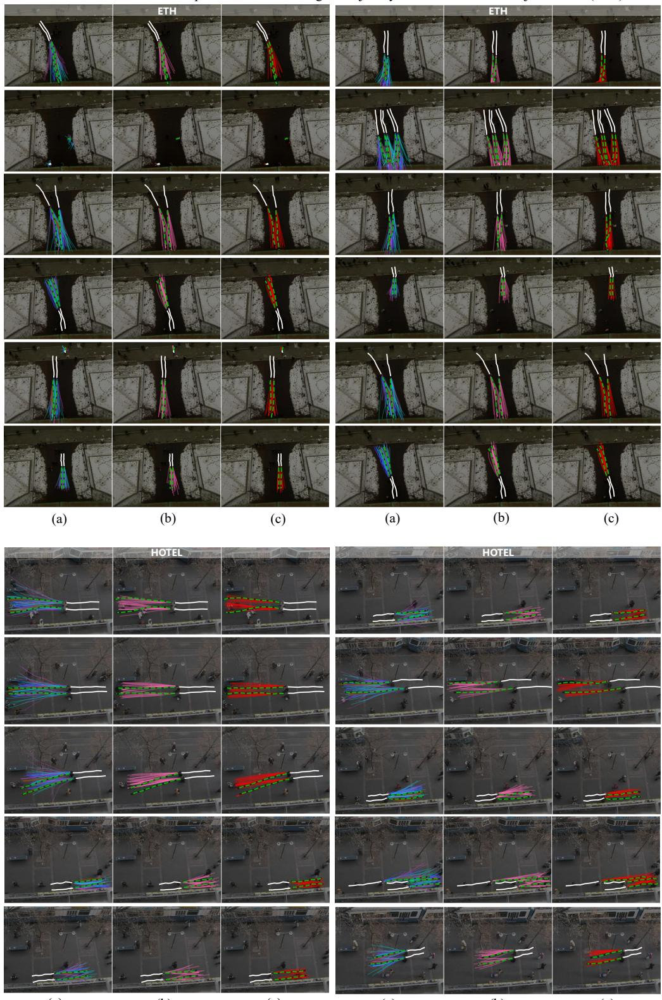  
(a)  
(b)  
(c)  
(a)  
(b)  
(c)  
Figure 5: Visualization of prediction results on the ETH and HOTEL scenes. To aid visualization, selected agents are shown.

Observed GT Expert MART SingularTrajectory MoFlow LMTraj MoRE (Ours)  
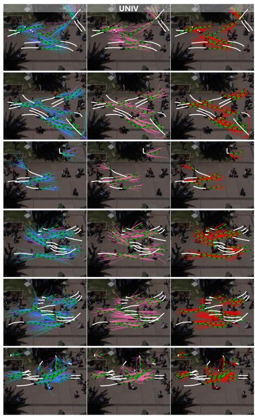

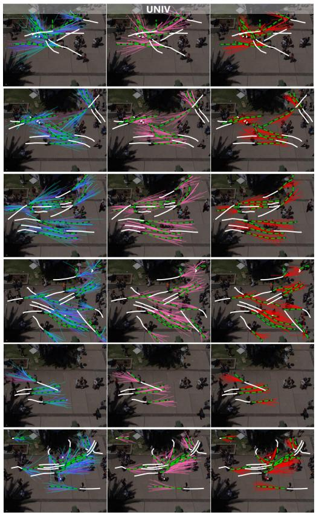

(a)  
(b)  
(c)  
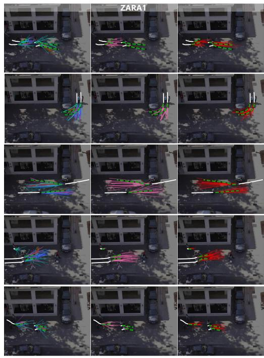  
(b)  
(a)

(a)  
(b)  
(c)  
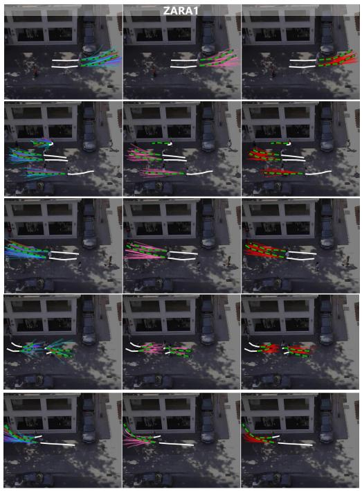  
(c)  
(a)  
(b)  
(c)  
Figure 6: Visualization of prediction results on the UNIV and ZARA1 scenes. To aid visualization, selected agents are shown.

Observed GT Expert MART SingularTrajectory MoFlow LMTraj MoRE (Ours)  
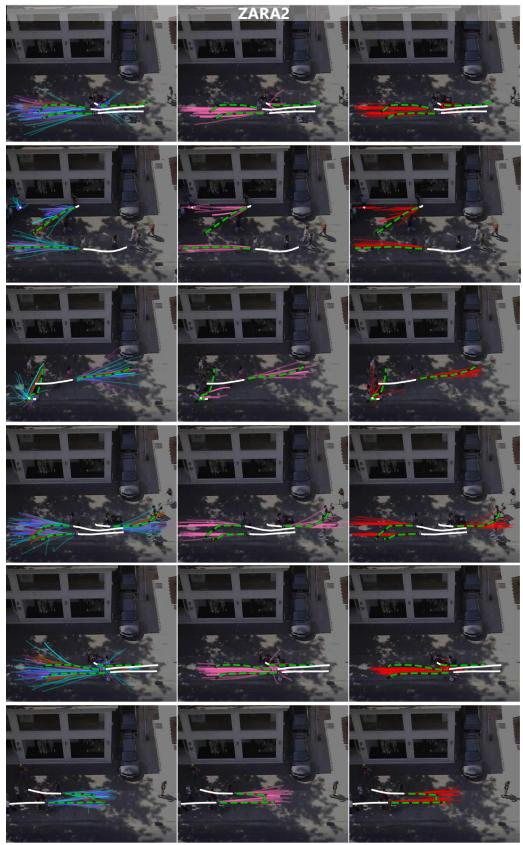

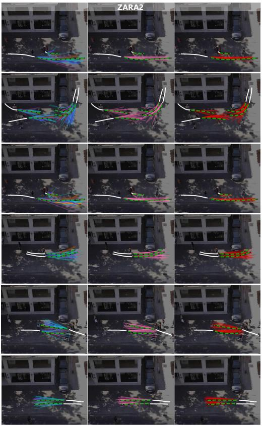  
(c)  
(a)  
(b)  
(c)  
Figure 7: Visualization of prediction results on the ZARA2 scene. To aid visualization, selected agents are shown.

(a)  
(b)  
Observed GT MART SingularTrajectory MoFlow LMTraj MoRE (Ours)  
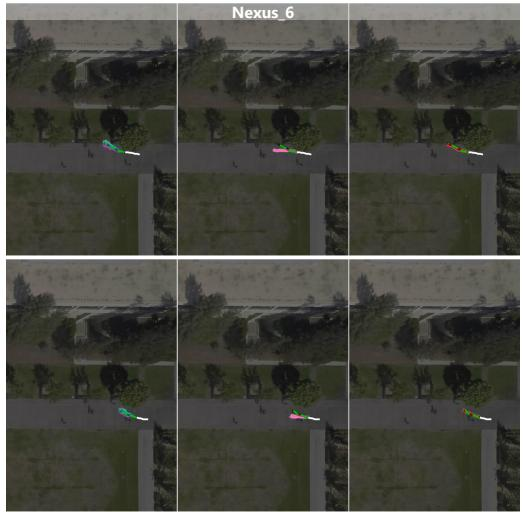  
(a)  
(b)  
(c)

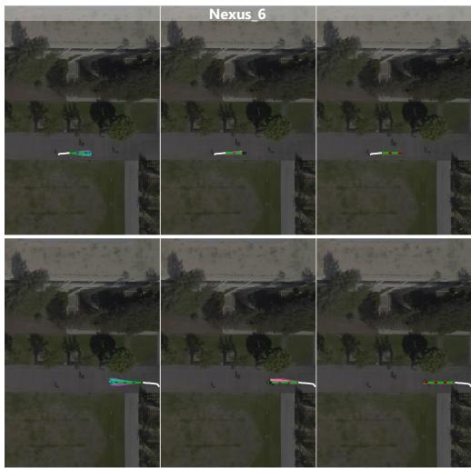  
(a)  
(b)  
(c)  
Figure 8: Visualization of trajectory predictions on nexus 6 scene. To aid visualization, selected agents are shown.

Observed GT MART SingularTrajectory MoFlow LMTraj MoRE (Ours)  
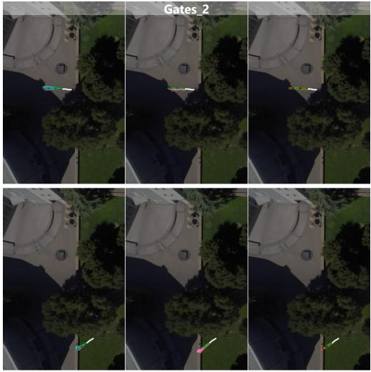

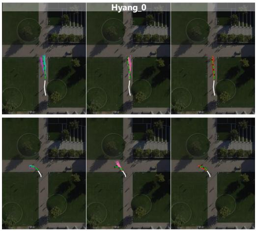

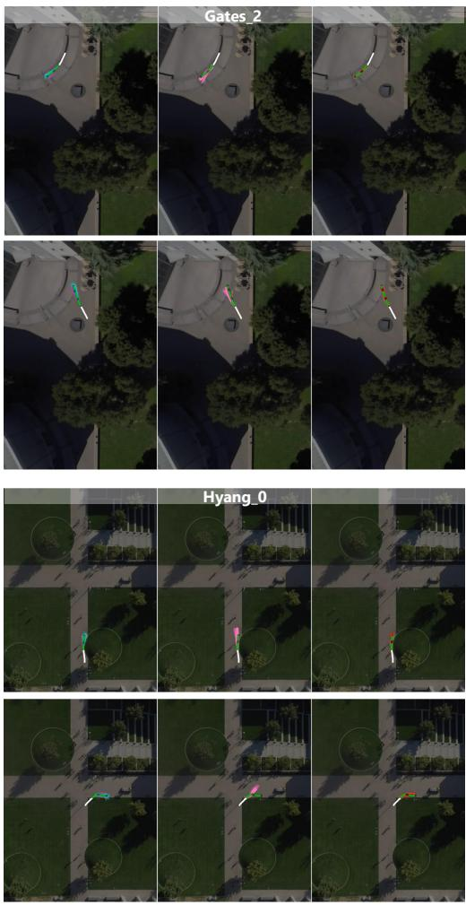

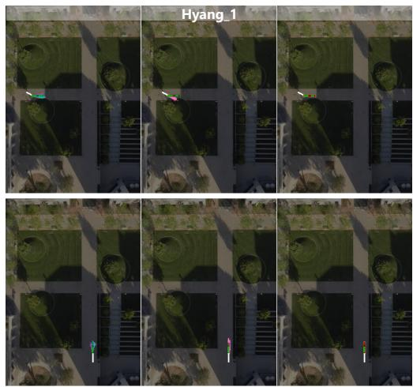  
(a)  
(b)  
(c)

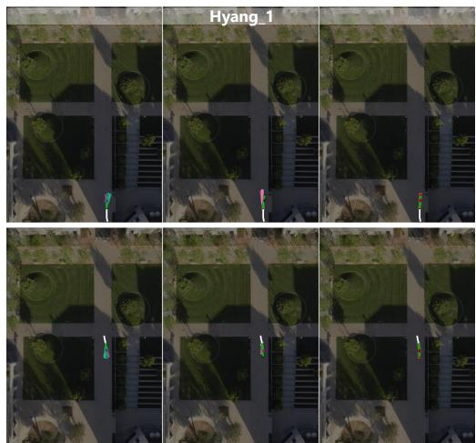  
(a)  
(b)  
(c)  
Figure 9: Visualization of trajectory predictions on gates 2, hyang 0, 1 scenes. To aid visualization, selected agents are shown.

Observed GT MART SingularTrajectory MoFlow LMTraj MoRE (Ours)  
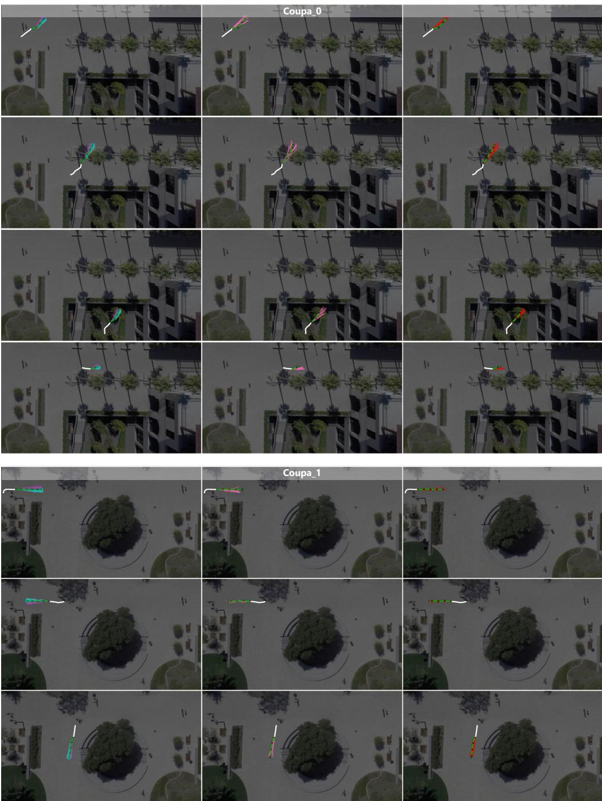  
(a)  
(b)  
(c)  
Figure 10: Visualization of prediction results on the coupa 0 and coupa 1 scenes. To aid visualiza tion, selected agents are shown.

Observed GT MART SingularTrajectory MoFlow LMTraj MoRE (Ours)  
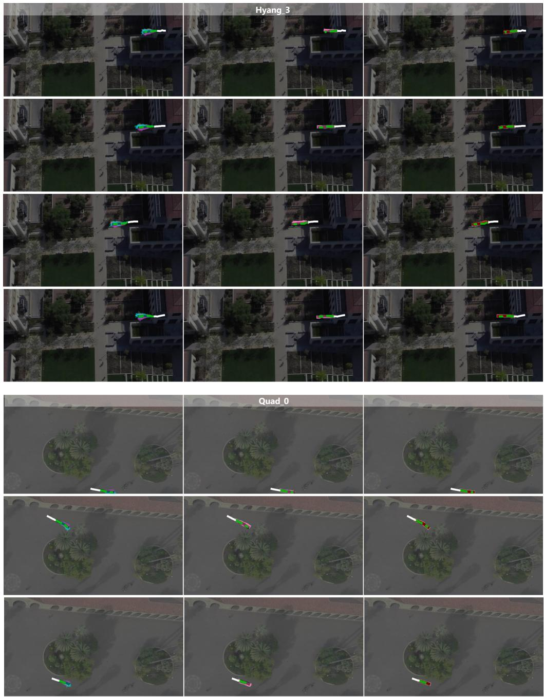  
(a)  
(b)  
(c)  
Figure 11: Visualization of trajectory predictions on hyang 3 and quad 0 scenes. To aid visualization, selected agents are shown.

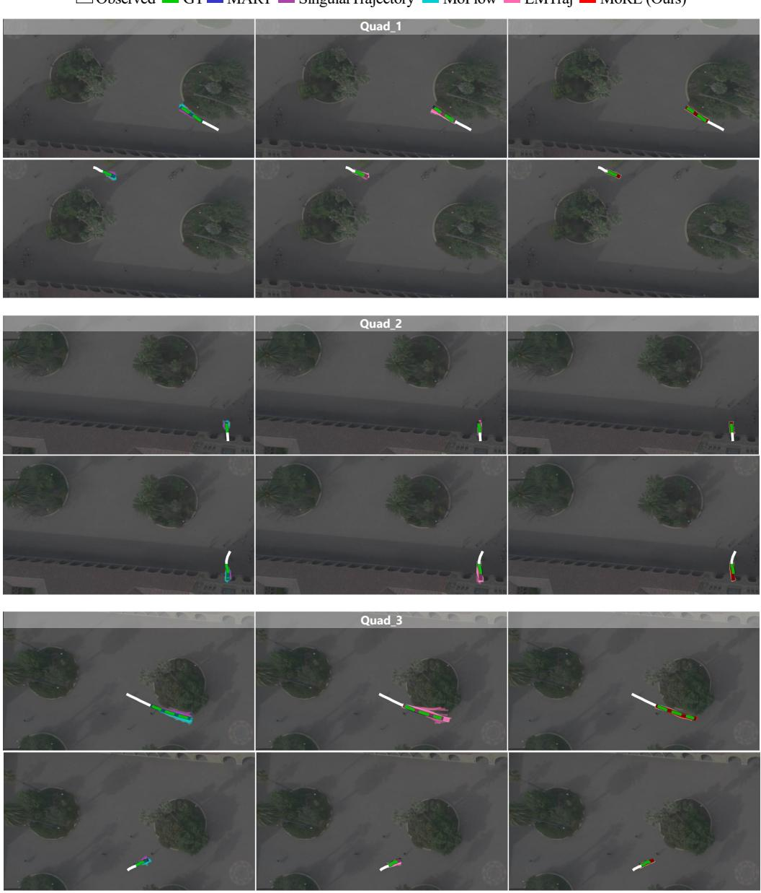  
(a)  
(b)  
(c)  
Figure 12: Visualization of prediction results on the quad 1, 2, 3 scenes. To aid visualization, selected agents are shown.

Observed GT MART SingularTrajectory MoFlow LMTraj MoRE (Ours)  
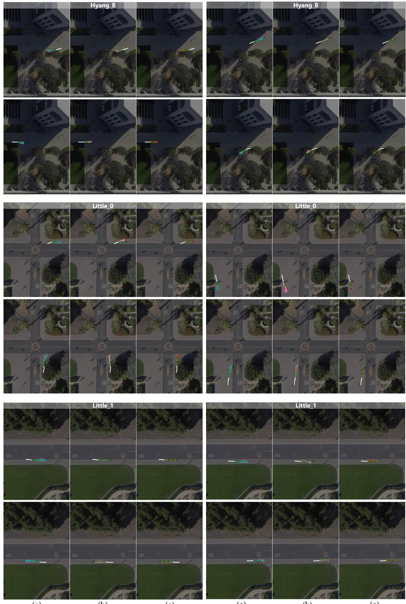  
(b)  
(a)  
(c)  
(a)  
(b)  
(c)  
Figure 13: Visualization of prediction results on the hyang 8 and little 0, 1 scenes. To aid visualiza tion, selected agents are shown.

Observed GT MART SingularTrajectory MoFlow LMTraj MoRE (Ours)  
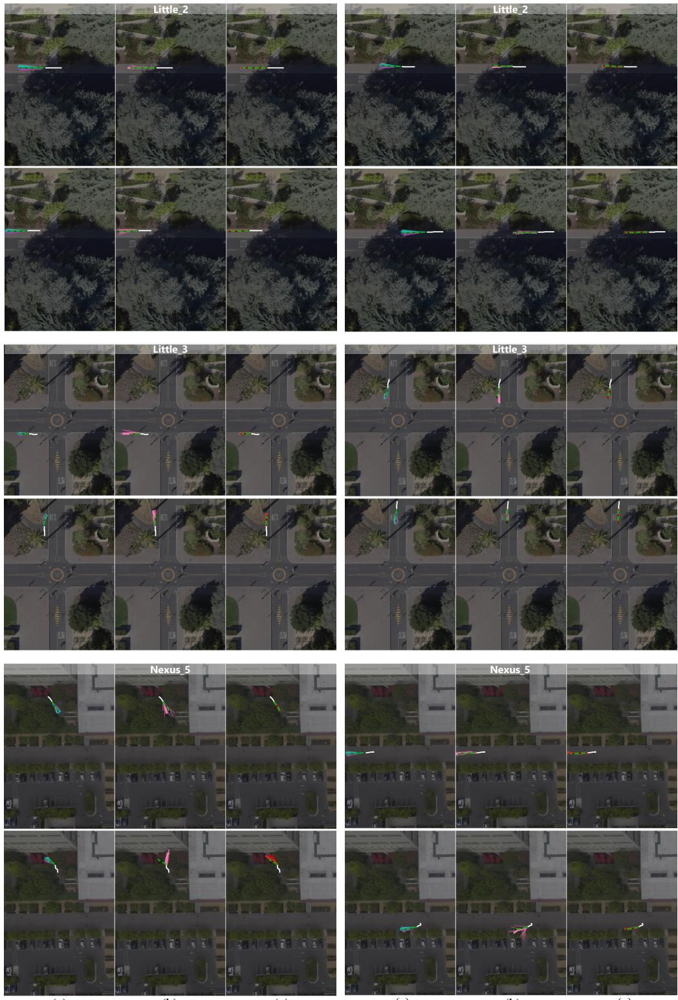  
(a)  
(b)  
(c)  
(a)  
(b)  
(c)  
Figure 14: Visualization of prediction results on the little 2, 3 and nexus 5 scenes. To aid visualization, selected agents are shown.

Observed GT MART SingularTrajectory MoFlow LMTraj MoRE (Ours)  
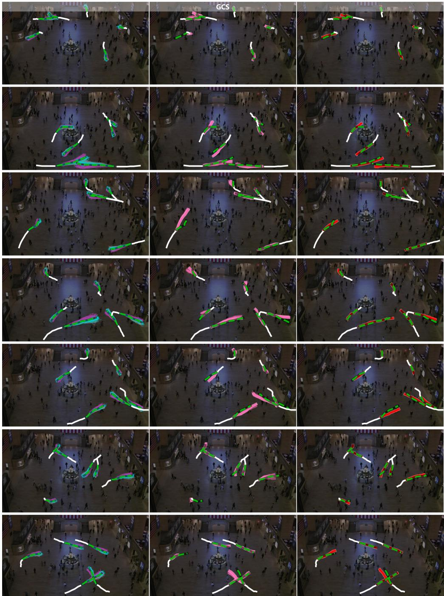  
(a)  
(b)  
(c)  
Figure 15: Visualization of prediction results on the GCS dataset. To aid visualization, selected agents are shown.