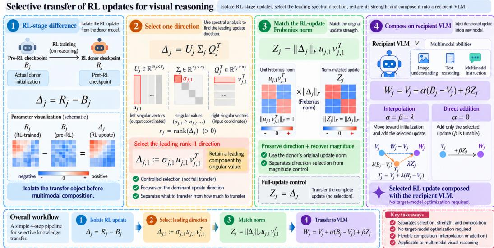
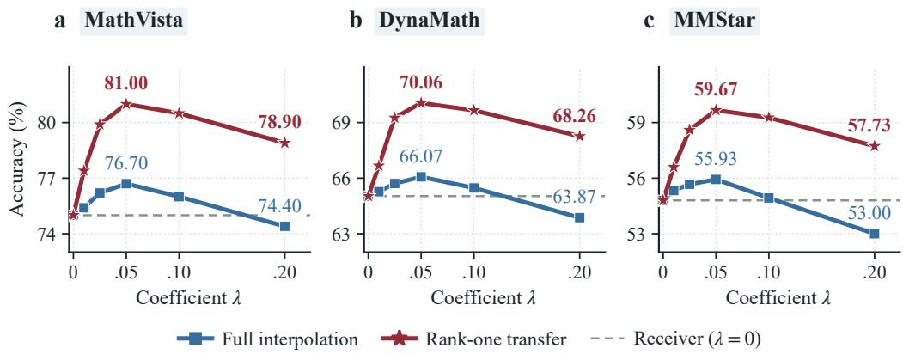
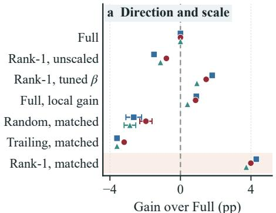
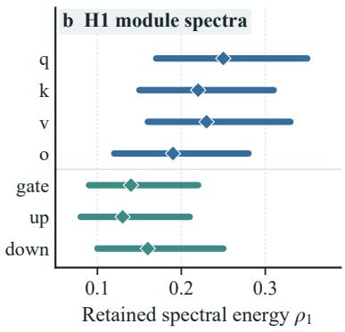
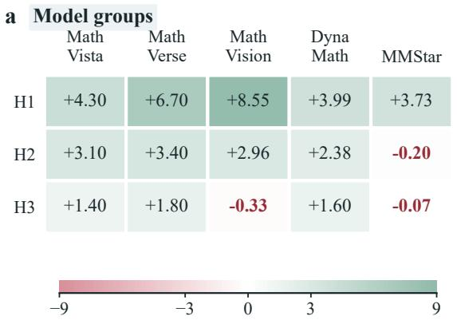
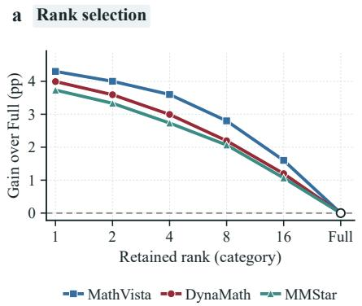
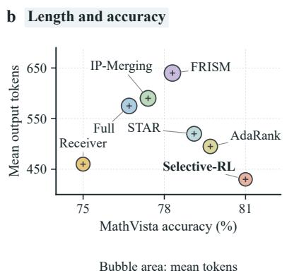
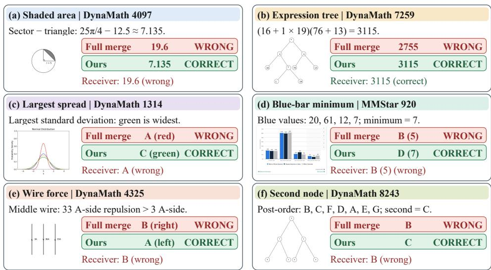
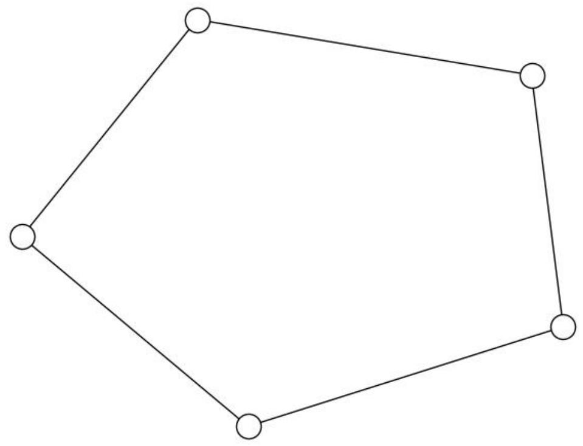
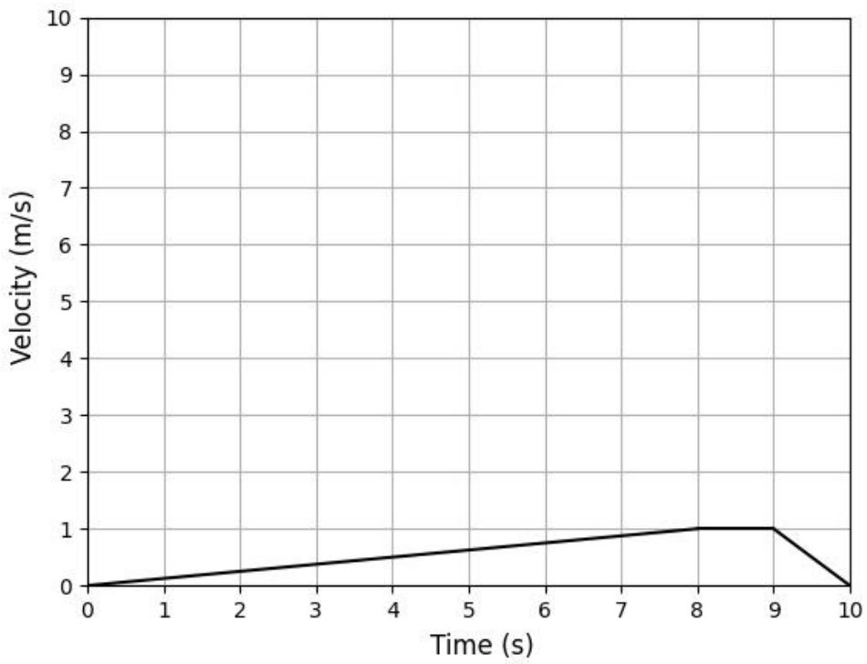

# SELECTIVE TRANSFER OF RL UPDATES FOR VISUAL REASONING

Suxin Ji1 Hungtao Wan2 Mingjun Liu3 An Zhang4

1University of Pennsylvania 2Independent Researcher

3University of Electronic Science and Technology of China 4Chongqing University

## ABSTRACT

Model merging provides a training-free way to transfer reasoning capabilities from language models to vision-language models (VLMs), but endpoint-based transfer can conflate pre-existing model differences with changes acquired during reasoning post-training. We instead formulate capability transfer around the training-stage update, isolating the parameter changes induced by reinforcement learning (RL). Yet transferring this update in full remains suboptimal: we find that its components differ substantially in cross-model transferability, with dominant directions transferring more effectively than the complete update. Based on this finding, we introduce Selective-RL, which isolates the RL-stage update, retains its dominant matrix-wise directions with magnitude preservation, and transfers them to the language modules of a VLM. Across three model families and five visual-reasoning benchmarks, Selective-RL improves full-update interpolation in 12 of 15 comparisons, including an 8.55 percentage-point MathVision gain on the Qwen recipient. Matched controls show that update magnitude or arbitrary low rank alone does not reproduce these gains. These results highlight a distinction between what is acquired during post-training and what remains transferable across models, providing a training-stage perspective on cross-model capability transfer. Code is available at https://anonymous.4open.science/r/selective-rl.

## 1 INTRODUCTION

Model merging transfers capabilities across pretrained models without additional training (Marczak et al., 2025; Fang et al., 2025), including reasoning transfer from language models to vision-language models (VLMs) (Chen et al., 2025; Hu et al., 2025; Huang et al., 2026a). Endpoint-based transfer constructs a donor–recipient displacement, while parameter selection, projection, and spectral filtering address interference (Gargiulo et al., 2025; Lee et al., 2025; 2026). Yet the donor endpoint alone cannot identify reasoning post-training changes. Analyses of base-model capabilities and reinforcement learning (RL) distinguish pre-existing reasoning behavior from post-training effects (Liu et al., 2025b; Yue et al., 2025; Yu et al., 2025). For a reasoning donor and a multimodal recipient, their displacement can therefore mix differences that predate RL with changes acquired during RL.

This distinction becomes explicit when we track parameter provenance, as in task-vector and alignment transfer (Ilharco et al., 2023; Huang et al., 2024) and interpolation between reward-specialized models (Ramé et al., 2023). Let V denote the multimodal recipient, B the donor’s actual pre-RL checkpoint, and R its post-trained counterpart. On their aligned language parameters,

$$
\underbrace { \mathrm { R - V } } _ { \mathrm { e n d p o i n t d i s p l a c e m e n t } } = \underbrace { \mathrm { B - V } } _ { \mathrm { p r e - R L ~ d i s p l a c e m e n t } } + \underbrace { \mathrm { R - B } } _ { \mathrm { R L - s t a g e ~ u p d a t e } } .
$$

Here B − V predates RL, whereas R − B isolates RL-acquired changes. Merging depends on parameter importance and functional mismatch (Matena & Raffel, 2022; Jin et al., 2023; Daheim et al., 2024); task information can occupy localized directions or parameter supports (Ortiz-Jimenez et al., 2023; Wang et al., 2024a). Selective parameter transfer can also preserve existing multimodal capabilities (Zhu et al., 2024). These findings motivate isolating the RL-stage update before testing which components transfer; stage attribution alone does not establish that every component encodes transferable reasoning.

RL-stage isolation is necessary but insufficient: R − B was optimized for the source language model, so its components may differ in usefulness to a multimodal recipient. This question is particularly relevant because RL updates in reasoning models exhibit pronounced spectral structure, with dominant directions capturing a disproportionate part of their learning dynamics (Cai et al., 2026). Prior work primarily examines this structure through source-model reconstruction or trajectory characterization; whether it identifies components compatible across models remains unclear. In the primary Qwen controls, the dominant matrix-wise direction outperforms the complete update at matched Frobenius magnitude; retaining more directions progressively reduces MathVista accuracy. Thus, components of the same post-training update can differ substantially in cross-model transferability, and preserving more of the source update need not be beneficial.

Motivated by this finding, we introduce Selective-RL, a training-free framework for transferring reasoning capabilities from RL-trained language models to multimodal recipients. It first extracts the RL-stage update R − B, excluding parameter differences that predate reasoning post-training. For each eligible language-layer matrix, it then retains the dominant singular direction and rescales it to preserve the magnitude of the original matrix-wise update. We compare direct injection and reconstructed-donor interpolation on aligned language modules, preserving visual components. The interpolation comparison holds pre-RL displacement fixed. Unlike multimodal post-training approaches (Deng et al., 2025; Huang et al., 2026b; Wang et al., 2025), Selective-RL requires no multimodal post-training, recipient gradients, additional modules, or target-side adaptation, and preserves the VLM’s architecture and inference structure.

We evaluate Selective-RL on three multimodal recipients spanning the Qwen (Bai et al., 2025), LLaMA (Grattafiori et al., 2024), and Mistral (Jiang et al., 2023) families across five visual-reasoning benchmarks. It improves matched full-update interpolation in 12/15 backbone–benchmark comparisons (Table 1). On Qwen3-VL, MathVision rises 40.46 → 49.01% (+8.55 pp), MathVerse 45.30 → 52.00% (+6.70 pp), and MathVista 76.70 → 81.00% (+4.30 pp). On MathVista, normmatched leading directions reach 81.00%, versus 74.05 ± 0.45% for ten matched random-direction runs and 73.10% for trailing directions (Table 2). Increasing rank from one to sixteen lowers accuracy to 78.30%, while gains over Full average 4.13 ± 0.15 pp across three donor seeds (Tables 8 and 22). These results distinguish source-update preservation from recipient improvement: selecting transferable structure can be more effective than retaining the complete update, with task-dependent exceptions.

## 2 RELATED WORK

Model Merging. Task Arithmetic (Ilharco et al., 2023) composes checkpoint differences. TIES-Merging (Yadav et al., 2023) trims updates and resolves sign disagreement; DARE (Yu et al., 2024) drops and rescales delta parameters. TSV (Gargiulo et al., 2025) compresses task matrices and decorrelates singular vectors. LoRE-Merging (Liu et al., 2025a) estimates a reference and low-rank task vectors without the original base. STAR (Lee et al., 2025) truncates by cumulative spectral mass and restores nuclear norms. AdaRank (Lee et al., 2026) learns component masks by entropy minimization on unlabeled test inputs. We compare adaptive selection and scaling with fixed leading component transfer of the actual RL update under Frobenius matching.

Multimodal Reasoning. OpenVLThinker (Deng et al., 2025) alternates supervised fine-tuning and RL. Vision-R1 (Huang et al., 2026b) combines a reasoning cold start, GRPO, and Progressive Thinking Suppression Training. VL-Rethinker (Wang et al., 2025) uses Selective Sample Replay and Forced Rethinking. Bring Reason to Vision (Chen et al., 2025) merges language parameters while retaining visual components. IP-Merging (Hu et al., 2025) identifies, rescales, and projects reasoning-associated parameters into recipient subspaces. FRISM (Huang et al., 2026a) learns subspace coefficients through label-free multimodal self-distillation. We separate RL updates from initialization displacement without recipient gradients, retaining validation-selected coefficients.

RL Updates. Source recovery, generation behavior, and recipient improvement require separate evidence. DeepSeek-R1 (DeepSeek-AI et al., 2025) contrasts direct RL with multistage training, making the reference checkpoint essential. DAPO (Yu et al., 2025) studies decoupled clipping and dynamic sampling. Dr. GRPO (Liu et al., 2025b) examines base-model behavior and response-length biases. Large-budget pass@k analysis (Yue et al., 2025) distinguishes sampling efficiency from solution coverage. Cai et al. (2026) study low-rank RL reconstruction and introduce AlphaRL for trajectory extrapolation. Frankenstein-style analysis (Li et al., 2026) probes visual-RL refinements through causal interventions, checkpoint exchange, and freezing. We control direction, magnitude, and initialization displacement; spectral concentration alone identifies neither causal mechanisms nor RL-exclusive semantic components.

## 3 METHODOLOGY

Our goal is to transfer the capability acquired during the donor’s RL stage while separating it from parameter differences that predate RL. We isolate the RL-stage update from initialization displacement (Section 3.1), select its dominant matrix-wise direction at controlled magnitude (Section 3.2), and compose it with the recipient through two transfer routes (Section 3.3). Section 3.4 characterizes update scale and resource use.

## 3.1 PROBLEM DEFINITION AND STAGE ISOLATION

We begin by separating two sources of parameter change that are mixed in conventional donor– recipient merging. Let $V = ( V _ { j } ) _ { j \in \mathbb { Z } }$ denote the multimodal recipient, B the actual checkpoint from which RL training starts, and R the resulting reasoning donor. Let $\mathcal { S } \subseteq \mathcal { Z }$ contain the transferable attention and MLP matrices that are aligned between donor and recipient, with $V _ { j } , B _ { j } , R _ { j } \in \mathbb { R } ^ { m _ { j } \times n _ { j } }$ for $j \in \mathcal S$ . We define $\Gamma _ { j } : = B _ { j } - V _ { j }$ and $\Delta _ { j } : = R _ { j } - B _ { j }$ for $j \in \bar { \mathcal { S } }$

Here, $\Gamma _ { j }$ captures parameter differences that already exist before RL, whereas $\Delta _ { j }$ isolates the update acquired during RL. This separates RL-acquired changes from pre-existing donor–recipient mismatch.

The support $s$ contains the aligned $q / k / v / o$ projections in attention blocks and the gate/up/down projections in MLP blocks, matched by layer and module with consistent orientation and head ordering. Parameters outside S, including the recipient’s visual components, remain unchanged.

To express different transfer strategies in a common form, we define zero extension for any collection $H = \mathsf { \bar { ( } } H _ { j } ) _ { j \in { \cal S } } , [ { \mathcal { E } } _ { S } ( H ) ] _ { j } = H _ { j }$ for $j \in \mathcal S$ and 0 otherwise, and write the merged model as

$$
W ( \alpha , \beta ; Z ) = V + \mathcal { E } _ { S } ( \alpha \Gamma + \beta Z ) ,\tag{1}
$$

where $Z$ is the RL-derived signal to be transferred. The coefficients α and $\beta$ independently control the initialization displacement and the RL-stage contribution, enabling us to separate their effects.

Conventional interpolation (Chen et al., 2025) is recovered by setting $Z = \Delta$ and $\alpha = \beta = \lambda \colon$

$$
W _ { j } ^ { \mathrm { { f u l l } } } = V _ { j } + \lambda \Gamma _ { j } + \lambda \Delta _ { j } = ( 1 - \lambda ) V _ { j } + \lambda R _ { j } , \qquad j \in \mathcal { S } .\tag{2}
$$

Equation (2) makes the coupling explicit: standard interpolation simultaneously moves the recipient toward the donor’s pre-RL initialization through Γ and transfers the entire RL-stage update through $\Delta$ . Isolating $\Delta$ identifies what was acquired during RL; the remaining question is whether all of this update should be transferred.

Figure 1 summarizes the stage-isolation, direction-selection, normalization, and composition steps.

## 3.2 FIXED MATRIXWISE SPECTRAL SELECTION

Having isolated the RL-stage update, we next ask which part of it transfers effectively. The complete update $\Delta _ { j }$ was optimized for the source language model, so its constituent directions need not be equally compatible with a multimodal recipient. We therefore decompose each update matrix independently and study its spectral directions under controlled magnitude.

For a nonzero $\Delta _ { j }$ with rank $r _ { j }$ , the compact singular value decomposition is $\Delta _ { j } = U _ { j } \Sigma _ { j } Q _ { j } ^ { \intercal }$ where $U _ { j } = [ u _ { j , 1 } , \dotsc , u _ { j , r _ { j } } ]$ and $Q _ { j } = [ v _ { j , 1 } , \dotsc , v _ { j , r _ { j } } ]$ contain the left and right singular vectors, respectively, and $\sigma _ { j , 1 } \ : \geq \ : \cdot \cdot \geq \ : \sigma _ { j , r _ { j } } \ : > \ : 0$ , with $U _ { j } ^ { \top } U _ { j } = Q _ { j } ^ { \top } Q _ { j } = I _ { r _ { j } }$ . For a positive integer $k ,$ we retain the leading k singular components, $\begin{array} { r } { \mathcal { P } _ { k } ( \Delta _ { j } ) : = \Delta _ { j , k } = \sum _ { i = 1 } ^ { \operatorname* { m i n } ( k , r _ { j } ) } \sigma _ { j , i } u _ { j , i } v _ { j , i } ^ { \top } } \end{array}$ , with $\mathcal { P } _ { k } ( 0 ) = 0$ and empty sums equal to zero. For nonzero updates, these approximations satisfy

$$
\| \Delta _ { j } - \Delta _ { j , k } \| _ { F } ^ { 2 } = \operatorname* { m i n } _ { \operatorname { r a n k } ( A ) \leq k } \| \Delta _ { j } - A \| _ { F } ^ { 2 } .\tag{3}
$$

  
Figure 1: Selective RL-update transfer. Four stages isolate $R - B ,$ , select a matrixwise direction, restore its Frobenius norm, and compose it with the recipient. Interpolation includes initialization displacement; direct addition omits it. Matrix patterns are schematic.

Equation (3) characterizes optimal low-rank reconstruction of the source update, which need not maximize transfer to another model. Spectral ordering defines controlled candidate directions whose transferability we evaluate empirically.

A second issue is that truncation changes both direction and magnitude. To avoid confounding these effects, we measure the fraction of squared Frobenius energy retained by the rank-k approximation, $\rho _ { j , k } : = \| \Delta _ { j , k } \| _ { F } ^ { 2 } / \| \Delta _ { j } \| _ { F } ^ { 2 }$ for $\Delta _ { j } \neq 0 _ { : }$ , and rescale the truncated update to match the Frobenius norm of the original matrix (Cai et al., 2026): $\widehat { \Delta } _ { j , k } : = \mathcal { N } _ { k } ( \Delta _ { j } ) , \mathcal { N } _ { k } ( \Delta _ { j } ) = \rho _ { j , k } ^ { - 1 / 2 } \Delta _ { j , k } \mathrm { ~ f o r ~ } \Delta _ { j } \neq 0 ,$ and $\mathcal { N } _ { k } ( 0 ) = 0$ . Thus, $\| \widehat { \Delta } _ { j , k } \| _ { F } = \| \Delta _ { j } \| _ { F }$ . The full and selected updates therefore have the same matrix-wise Frobenius magnitude while differing in directional content. Unless otherwise specified, Selective-RL uses k = 1 independently for each matrix, giving, for $\Delta _ { j } \neq 0 , \widehat { \Delta } _ { j , 1 } = \| \Delta _ { j } \| _ { F } u _ { j , 1 } v _ { j , 1 } ^ { \top } .$ Rank one is a fixed empirical rule, not an assumption that one direction constitutes reasoning capability. We vary rank, direction, and normalization separately to assess their effects on transfer.

## 3.3 CONTROLLED TRANSFER AND COMPOSITION

Spectral selection determines what within the RL update is transferred. We next separate this choice from how the update is composed with the recipient, since conventional interpolation also introduces the initialization displacement Γ.

We first consider reconstructed-donor interpolation, which keeps the initialization displacement identical between full and selected transfer. Setting $Z ~ = ~ \widehat { \Delta } _ { 1 }$ and $\alpha ~ = ~ \beta ~ = ~ \lambda$ gives $W _ { j } ^ { \mathrm { r a n k 1 } } = V _ { j } + \lambda ( \Gamma _ { j } + \widehat { \Delta } _ { j , 1 } )$ , and $W _ { j } ^ { \mathrm { r a n k 1 } } - W _ { j } ^ { \mathrm { f u l l } } = \lambda ( \widehat { \Delta } _ { j , 1 } - \Delta _ { j } )$

Both variants share initialization displacement $\lambda \Gamma _ { j }$ and differ only in the RL contribution $( \Delta _ { j }$ or $\widehat { \Delta } _ { j , 1 } )$ , providing a controlled comparison of spectral selection.

We additionally consider direct RL-update transfer by setting $\alpha = 0 : W _ { j } ^ { \mathrm { d i r e c t } } = V _ { j } + \beta \widehat { \Delta } _ { j , 1 } , j \in \mathcal { S }$ This isolates RL-update transfer to test whether selection remains beneficial without initialization displacement.

For both routes, we compare $Z = \widehat { \Delta } _ { 1 }$ against the corresponding full-update control $Z = \Delta$ , holding transfer support, numerical precision, and coefficients fixed. Under direct transfer, $Z = \Delta$ reduces to RL-update Task Arithmetic (Ilharco et al., 2023). An initialization-only control instead sets $\beta = 0$ while retaining αΓ. Together, these routes separate three otherwise entangled factors: stage isolation, spectral selection, and update composition. Construction requires no recipient gradient training; the coefficient is selected on H1 held-out validation and frozen for H2/H3. Algorithm 1 in Appendix A materializes the update.

## 3.4 UPDATE SCALE AND RESOURCE USE

Frobenius matching controls the magnitude of the RL component, but not necessarily the total displacement from the recipient. Under interpolation, the selected update also interacts with Γ. Let $\langle A , \bar { H } \rangle _ { F } : = \mathrm { t r } ( A ^ { \top } H )$ . From Eq. (1),

$$
\begin{array} { r } { \| W _ { j } ( \alpha , \beta ; Z ) - V _ { j } \| _ { F } ^ { 2 } = \alpha ^ { 2 } \| \Gamma _ { j } \| _ { F } ^ { 2 } + \beta ^ { 2 } \| Z _ { j } \| _ { F } ^ { 2 } + 2 \alpha \beta \langle \Gamma _ { j } , Z _ { j } \rangle _ { F } . } \end{array}\tag{4}
$$

Matching $\| Z _ { j } \| _ { F }$ therefore controls matrix-wise intervention strength while preserving directional differences through the cross term.

For rank-one selection with $\Delta _ { j } \neq 0 , \| \widehat { \Delta } _ { j , 1 } \| _ { 2 } / \| \Delta _ { j } \| _ { 2 } = \rho _ { j , 1 } ^ { - 1 / 2 } \geq 1$ . Thus, Frobenius matching amplifies the retained direction by an amount determined by the spectral concentration of the original update. This motivates separate controls for rank, direction, global coefficient, and matrix-wise rescaling rather than attributing performance changes to selection alone.

All decomposition, normalization, coefficient selection, and checkpoint construction are performed offline. The checkpoint remains a standard dense VLM without extra inference-time modules.

## 4 EXPERIMENTS

We evaluate RQ1, method and backbone transfer; RQ2, direction, scale, and composition; RQ3, source reconstruction and transfer boundaries; and RQ4, output behavior and construction cost.

## 4.1 EXPERIMENTAL SETUP

Models and selection. H1 uses Qwen3-VL-8B-Instruct, H2 LLaVA-NeXT-LLaMA3-8B, and H3 Idefics2-8B, with Qwen3, LLaMA3, and Mistral language backbones (Bai et al., 2025; LMMs-Lab, 2024; Laurençon et al., 2024). Matched DAPO-style donors are trained on DAPO-Math-17K (Yu et al., 2025), starting from the actual pre-RL initialization. With primary seed 42, a 150-step budget, and checkpoints every ten steps, source-side validation selects steps 120/100/110 for H1/H2/H3; VLM benchmarks are not used for donor selection. H1 held-out validation selects λ = 0.05, which is frozen for H2/H3. The support contains 252/224/224 attention/MLP matrices, respectively, and excludes visual components, embeddings, output heads, LayerNorm, and biases. All groups use bf16 and primary rank 1 (Appendix A).

Tasks and comparisons. The primary tasks are MathVista (N = 1,000), MathVerse (1,000), MathVision (304), DynaMath (5,010), and MMStar (1,500) (Lu et al., 2024; Zhang et al., 2025; Wang et al., 2024b; Zou et al., 2025; Chen et al., 2024). Additional H1 evaluations cover TextVQA, MMMU, OCRBench, and POPE (Singh et al., 2019; Yue et al., 2024; Liu et al., 2023; Li et al., 2023). We compare Task Arithmetic, Full interpolation, TIES, DARE, TSV, LoRE, IP-Merging, FRISM, STAR, and AdaRank (Ilharco et al., 2023; Chen et al., 2025; Yadav et al., 2023; Yu et al., 2024; Gargiulo et al., 2025; Liu et al., 2025a; Hu et al., 2025; Huang et al., 2026a; Lee et al., 2025; 2026). Full shares the proposed method’s support. FRISM and AdaRank additionally adapt on the target side. We report single-run scores, donor seeds, and random-direction trials separately.

## 4.2 COMPARING METHODS AND BACKBONES (RQ1)

Observation 1: Gains transfer across backbones, with task-dependent exceptions. SELECTIVE-RL improves Full in 12/15 group–task comparisons. H1 gains are ↑4.30/↑6.70/↑8.55/↑3.99/↑3.73 points from paired counts. On H1 MathVista, $8 1 . 0 0 > 7 9 . 7 0 > 7 9 . 1 0 > 7 6 . 7 0$ for Selective, AdaRank, STAR, and Full. On MMStar, AdaRank leads $( 6 0 . 0 7 > 5 9 . 6 7 )$ . H2 improves four tasks but loses 0.20 MMStar points; H3 improves MathVista/MathVerse/DynaMath by $1 . 4 0 / 1 . 8 0 / 1 . 6 0$ while MathVision/MMStar decline 0.33/0.07. These reversals are included in Table 1 and Figure 4.

Table 1: Cross-backbone transfer and paired H1 outcomes. Scores (%) for methods evaluated on all five benchmarks; extended comparisons: Table 6. Bold/underline: best/second within displayed groups; arrows: changes from Receiver.
<table><tr><td>Method</td><td>Math Vista</td><td>Math Verse</td><td>Math Vision</td><td>DynaMath</td><td>MMStar</td></tr><tr><td colspan="6">H1: Qwen3-VL-8B-Instruct</td></tr><tr><td>Receiver</td><td>75.00</td><td>42.00</td><td>37.50</td><td>65.03</td><td>54.80</td></tr><tr><td>Task Arithmetic</td><td> $7 6 . 1 0 _ { \uparrow 1 . 1 0 }$ </td><td> $4 4 . 5 0 _ { \uparrow 2 . 5 0 }$ </td><td> $3 9 . 4 7 _ { \uparrow 1 . 9 7 }$ </td><td> $6 5 . 6 7 _ { \uparrow 0 . 6 4 }$ </td><td> $5 4 . 6 7 _ { \downarrow 0 . 1 3 }$ </td></tr><tr><td>Full interpolation</td><td> $7 6 . 7 0 _ { \uparrow 1 . 7 0 }$ </td><td> $4 5 . 3 0 _ { \uparrow 3 . 3 0 }$ </td><td> $4 0 . 4 6 _ { \uparrow 2 . 9 6 }$ </td><td> $6 6 . 0 7 _ { \uparrow 1 . 0 4 }$ </td><td> $5 5 . 9 3 _ { \uparrow 1 . 1 3 }$ </td></tr><tr><td>TIES</td><td> $7 6 . 4 0 _ { \uparrow 1 . 4 0 }$ </td><td> $4 4 . 8 0 _ { \uparrow 2 . 8 0 }$ </td><td> $3 9 . 8 0 _ { \uparrow 2 . 3 0 }$ </td><td> $6 5 . 7 7 _ { \uparrow 0 . 7 4 }$ </td><td> $5 5 . 5 3 _ { \uparrow 0 . 7 3 }$ </td></tr><tr><td>DARE</td><td> $7 6 . 3 0 _ { \uparrow 1 . 3 0 }$ </td><td> $4 5 . 0 0 _ { \uparrow 3 . 0 0 }$ </td><td> $4 0 . 1 3 _ { \uparrow 2 . 6 3 }$ </td><td> $6 5 . 9 7 _ { \uparrow 0 . 9 4 }$ </td><td> $5 5 . 7 3 _ { \uparrow 0 . 9 3 }$ </td></tr><tr><td>IP-Merging</td><td> $7 7 . 4 0 _ { \uparrow 2 . 4 0 }$ </td><td> $4 6 . 6 0 _ { \uparrow 4 . 6 0 }$ </td><td> $4 2 . 7 6 _ { \uparrow 5 . 2 6 }$ </td><td> $6 6 . 8 7 _ { \uparrow 1 . 8 4 }$ </td><td> $5 6 . 6 7 _ { \uparrow 1 . 8 7 }$ </td></tr><tr><td>FRISM†</td><td> $7 8 . 3 0 _ { \uparrow 3 . 3 0 }$ </td><td> $4 9 . 2 0 _ { \uparrow 7 . 2 0 }$ </td><td> $4 5 . 0 7 _ { \uparrow 7 . 5 7 }$ </td><td> $6 8 . 0 6 _ { \uparrow 3 . 0 3 }$ </td><td> $5 7 . 7 3 _ { \uparrow 2 . 9 3 }$ </td></tr><tr><td>STAR</td><td> $7 9 . 1 0 _ { \uparrow 4 . 1 0 }$ </td><td> $4 9 . 8 0 _ { \uparrow 7 . 8 0 }$ </td><td> $4 7 . 7 0 _ { \uparrow 1 0 . 2 0 }$ </td><td> $6 8 . 6 2 _ { \uparrow 3 . 5 9 }$ </td><td> $5 8 . 2 7 _ { \uparrow 3 . 4 7 }$ </td></tr><tr><td>AdaRank†</td><td> $\underline { { 7 9 . 7 0 } } _ { \uparrow 4 . 7 0 }$ </td><td> $5 0 . 6 0 _ { \uparrow 8 . 6 0 }$ </td><td> $\frac { 4 8 . 3 6 } { - 0 . 8 6 }$ </td><td> $\underline { { 6 9 . 1 2 } } _ { \uparrow 4 . 0 9 }$ </td><td> ${ \bf 6 0 . 0 7 } _ { \uparrow 5 . 2 7 }$ </td></tr><tr><td>SELECTIVE-RL</td><td> $\mathbf { 8 1 . 0 0 } _ { \uparrow 6 . 0 0 }$ </td><td> $\mathbf { 5 2 . 0 0 } _ { \uparrow 1 0 . 0 0 }$ </td><td> $\mathbf { 4 9 . 0 1 } _ { \uparrow 1 1 . 5 1 }$ </td><td> ${ \bf 7 0 . 0 6 } _ { \uparrow 5 . 0 3 }$ </td><td> $\underline { { 5 9 . 6 7 } } _ { \uparrow 4 . 8 7 }$ </td></tr></table>

H2: LLaVA-NeXT-LLaMA3-8B

$$
3 7 . 4 0
$$

$$
\underline { { 3 9 . 1 0 } } _ { \uparrow 1 . 7 0 }
$$

$$
\underline { { 2 2 . 4 0 } } _ { \uparrow 2 . 3 0 }
$$

$$
\mathbf { 4 2 . 2 0 } _ { \uparrow 4 . 8 0 }
$$

$$
\mathbf { 2 5 . 8 0 } _ { \uparrow 5 . 7 0 }
$$

$$
\underline { { 1 5 . 1 3 } } _ { \uparrow 1 . 3 1 }
$$

$$
\mathbf { 1 8 . 0 9 } _ { \uparrow 4 . 2 7 }
$$

$$
\underline { { 2 4 . 0 7 } } _ { \uparrow 1 . 3 8 }
$$

$$
\mathbf { 4 4 . 3 3 } _ { \uparrow 0 . 5 3 }
$$

$$
\mathbf { 2 6 . 4 5 } _ { \uparrow 3 . 7 6 }
$$

$$
\underline { { 4 4 . 1 3 } } _ { \uparrow 0 . 3 3 }
$$

<table><tr><td colspan="6">H3: Idefics2-8B</td></tr><tr><td>Receiver</td><td> $5 1 . 8 0$ </td><td> $^ { 1 9 . 4 0 }$ </td><td> $^ \mathrm { 1 7 . 1 1 }$ </td><td>21.80</td><td>49.53</td></tr><tr><td>Full interpolation</td><td> $5 2 . 6 0 _ { \uparrow 0 . 8 0 }$ </td><td> ${ \underline { { 2 0 . 4 0 } } } _ { \uparrow 1 . 0 0 }$ </td><td> $\mathbf { 1 7 . 7 6 } _ { \uparrow 0 . 6 5 }$ </td><td> $\underline { { 2 2 . 5 5 } } _ { \uparrow 0 . 7 5 }$ </td><td> $\underline { { 4 9 . 4 7 } } _ { \downarrow 0 . 0 6 }$ </td></tr><tr><td>SELECTIVE-RL</td><td> $\mathbf { 5 4 . 0 0 } _ { \uparrow 2 . 2 0 }$ </td><td> $\mathbf { 2 2 . 2 0 } _ { \uparrow 2 . 8 0 }$ </td><td> $\underline { { 1 7 . 4 3 } } _ { \uparrow 0 . 3 2 }$ </td><td> $\mathbf { 2 4 . 1 5 } _ { \uparrow 2 . 3 5 }$ </td><td> $4 9 . 4 0 _ { \downarrow 0 . 1 3 }$ </td></tr></table>

<table><tr><td colspan="6">H1: paired Full-Selective outcomes</td></tr><tr><td>Task</td><td>N</td><td>Full correct</td><td>Selective correct</td><td>Gain (pp)</td><td>95% CI</td></tr><tr><td>MathVista</td><td>1,000</td><td>767</td><td>810</td><td>↑4.30</td><td>[2.14, 6.46]</td></tr><tr><td>MathVerse</td><td>1,000</td><td>453</td><td>520</td><td>↑6.70</td><td>[4.31, 9.09]</td></tr><tr><td>MathVision</td><td>304</td><td>123</td><td>149</td><td>↑8.55</td><td>[3.82, 13.29]</td></tr><tr><td>DynaMath</td><td>5,010</td><td>3,310</td><td>3,510</td><td>↑3.99</td><td>[2.10, 5.86]</td></tr><tr><td>MMStar</td><td>1,500</td><td>839</td><td>895</td><td>↑3.73</td><td>[2.23, 5.23]</td></tr></table>

†: target-side adaptation. H1/H2/H3 donor steps: 120/100/110; $\lambda = 0 . 0 5$ . Paired gains use integer counts; DynaMath intervals resample seed questions (Appendix E).

Observation 2: Broader capability gains are substantial but not uniform. H1 gains over Full are 2.58/3.60/0.70/0.50 points on TextVQA/MMMU/OCRBench/POPE. Relative to Receiver, OCRBench changes $7 8 . 6 0  7 8 . 7 0$ and POPE 86.90 → 86.80. The broader scores appear in Table 28.

## 4.3 ISOLATING SELECTION AND COMPOSITION (RQ2)

Observation 3: Selection helps under both composition routes. $\mathrm { A t } \ \beta = 0 . 0 5$ , direct/interpolated selection gains 3.10/4.30 MathVista points and 5.70/6.70 MathVerse points over matched Full (Table 2). Initialization displacement lowers MathVista to 74.70 alone but raises selected direct transfer 79.20 → 81.00, depending on the paired update. Increasing Full’s coefficient does not close the gap: at λ = 0.2, Rank-1 78.90 > Receiver 75.00 > Full 74.40 (Figure 2).

Observation 4: Direction selection adds value beyond a tuned global or matrixwise scale. Unscaled rank-1 with validation-tuned $\beta = 0 . 5 0$ reaches MathVista 78.50; applying rank-onederived matrixwise gains to Full reaches 77.60, versus matched selection 81.00. Ten matched random directions yield $7 4 . 0 5 \pm 0 . 4 5$ , below Receiver 75.00; the trailing direction reaches 73.10. On DynaMath, tuned unscaled/full-reweighted/matched-leading give $6 \bar { 7 } . 5 2 / 6 6 . 9 3 / 7 0 . 0 6$ . These controls separate direction from global and matrixwise scale; semantic attribution requires separate analysis.

Figure 2: Coefficient sensitivity on H1. Full and rank-one interpolation for $0 \leq \lambda \leq 0 . 2 ;$ dashed lines mark Receiver accuracy. Validation selects 0.05; full sweeps: Table 9.  
Table 2: Composition, direction controls, and generation behavior on H1. Panels (a,b): four tasks with complete controls; five-task results: Table 7. Panel (c): 1,000 MathVista examples.
<table><tr><td>Construction</td><td>α</td><td>β</td><td>Math Vista</td><td>Math Verse</td><td>DynaMath</td><td>MMStar</td></tr><tr><td></td><td colspan="6">(a) Composition: initialization displacement and RL update</td></tr><tr><td>Receiver</td><td>0.00</td><td>0.00</td><td>75.00</td><td>42.00</td><td>65.03</td><td>54.80</td></tr><tr><td>Initialization only</td><td>0.05</td><td>0.00</td><td>74.70</td><td>41.50</td><td>64.65</td><td>54.07</td></tr><tr><td></td><td></td><td>0.05</td><td>76.10</td><td>44.50</td><td>65.67</td><td>54.67</td></tr><tr><td>Direct full</td><td>0.00</td><td>0.05</td><td>79.20</td><td>50.20</td><td>69.06</td><td></td></tr><tr><td>Direct rank-1</td><td>0.00</td><td></td><td>76.70</td><td>45.30</td><td>66.07</td><td>58.80</td></tr><tr><td>Interpolation full Interpolation rank-1</td><td>0.05 0.05</td><td>0.05 0.05</td><td>81.00</td><td>52.00</td><td>70.06</td><td>55.93 59.67</td></tr></table>

<table><tr><td colspan="7">(b) Direction and scale: fixed initialization displacement</td></tr><tr><td>Leading, unscaled</td><td>0.05</td><td>0.05</td><td>75.20</td><td>42.60</td><td>65.27</td><td>54.80</td></tr><tr><td>Leading, tuned β</td><td>0.05</td><td>0.50</td><td>78.50</td><td>47.90</td><td>67.52</td><td>56.87</td></tr><tr><td>Full, matrixwise gains</td><td>0.05</td><td>0.05</td><td>77.60</td><td>46.50</td><td>66.93</td><td>56.33</td></tr><tr><td>Random, seed 42</td><td>0.05</td><td>0.05</td><td>73.70</td><td>40.50</td><td>63.67</td><td>52.93</td></tr><tr><td>Random, 10 seeds</td><td>0.05</td><td>0.05</td><td> $7 4 . 0 5 \pm 0 . 4 5$ </td><td> $4 0 . 9 2 \pm 0 . 5 1$ </td><td> $6 4 . 1 1 \pm 0 . 3 5$ </td><td>53.07± 0.33</td></tr><tr><td>Trailing, matched</td><td>0.05</td><td>0.05</td><td>73.10</td><td>39.60</td><td>62.87</td><td>52.33</td></tr><tr><td>Leading rank-1 matched</td><td>0.05</td><td>0.05</td><td>81.00</td><td>52.00</td><td>70.06</td><td>59.67</td></tr></table>

<table><tr><td colspan="6">(c) H1 Math Vista: output lengths and generation events</td></tr><tr><td>Method</td><td>Mean tokens</td><td>P95 tokens</td><td>Repetition</td><td>Extract fail</td><td>At cap</td></tr><tr><td>Receiver</td><td>460</td><td>1,550</td><td>8</td><td>5</td><td>6</td></tr><tr><td>Full</td><td>575</td><td>2,200</td><td>15</td><td>8</td><td>14</td></tr><tr><td>SELECTIVE-RL</td><td>430</td><td>1,350</td><td>3</td><td>2</td><td>3</td></tr></table>

Random, 10 seeds: mean $\pm$ sample SD. Full matrixwise gains use $\rho _ { j , 1 } ^ { - 1 / 2 } \Delta _ { j } ;$ leading matched uses $\widehat { \Delta } _ { j , 1 }$ Unscaled β is validation-selected. Generation events can overlap.

H1 median $\rho _ { 1 }$ is 0.18 (IQR 0.11–0.31), with median amplification 2.36×; H2/H3 medians are 0.13/0.09. Attention retains more leading-component energy than MLP (0.24 > 0.15 in H1). Rank 1 gives MathVista 81.00, followed by 80 $\mathrm { \bar { . 7 0 } / 8 0 \dot { . } 3 0 / 7 9 . 5 0 / \bar { 7 } \bar { 8 } . 3 0 }$ at ranks $2 / 4 / 8 / 1 6$ (Figure 5). The rank-1/rank-2 gap is 0.30; fixed rank one is an empirical choice.

## 4.4 SOURCE RECONSTRUCTION AND TRANSFER BOUNDARIES (RQ3)

Observation 5: Source recovery and recipient gains are distinct measurements. H1 rank-one reconstruction attains MATH 75.80 versus donor 76.20, recovering 97.18% of its gain over 62.00 pre-

  
MathVista DynaMath MMStar

  
Diamond: median; line: IQR

Figure 3: Direction, scale, and spectral concentration. Left: gains over Full under the H1 controls; only random-direction means carry sample-SD bars from ten runs. Right: module-wise median retained energy $\rho _ { 1 }$ and interquartile ranges across eligible matrices.  

<table><tr><td rowspan=1 colspan=1>b</td><td rowspan=1 colspan=4>Post-training sources</td></tr><tr><td rowspan=1 colspan=1></td><td rowspan=1 colspan=1></td><td rowspan=1 colspan=2>Math  Dyna</td><td rowspan=1 colspan=1></td></tr><tr><td rowspan=1 colspan=1></td><td rowspan=1 colspan=1></td><td rowspan=1 colspan=2>Vista  Math</td><td rowspan=1 colspan=1>MMStar</td></tr><tr><td rowspan=1 colspan=1></td><td rowspan=1 colspan=1>RL</td><td rowspan=1 colspan=1>+4.30</td><td rowspan=1 colspan=1>+3.99</td><td rowspan=1 colspan=1>+3.73</td></tr><tr><td rowspan=1 colspan=1></td><td rowspan=1 colspan=1>OfflineSFT</td><td rowspan=1 colspan=1>+0.90</td><td rowspan=1 colspan=1>+0.48</td><td rowspan=1 colspan=1>-0.13</td></tr><tr><td rowspan=1 colspan=2>Offlinedistill.</td><td rowspan=1 colspan=1>+1.20</td><td rowspan=1 colspan=1>+0.92</td><td rowspan=1 colspan=1>+0.13</td></tr><tr><td rowspan=1 colspan=2>On-policydistill.</td><td rowspan=1 colspan=1>+2.60</td><td rowspan=1 colspan=1>+2.20</td><td rowspan=1 colspan=1>+1.87</td></tr></table>

Selective-RL − Full accuracy (pp); H1 and RL share one comparison  
Figure 4: Transfer scope and its limits. Rank-1 minus Full in percentage points: three receiver backbones (left) and four post-training sources on H1 (right). Negative cells retain regressions; the H1/RL setting is shared across panels.

RL (Table 19). The earlier-reference control lowers selective MathVista 81.00 → 77.80, supporting explicit stage isolation. Three donor seeds give MathVista gains 4.10/4.30/4.00 (4.13 ± 0.15). Offline SFT/distillation/on-policy distillation gain 0.90/1.20/2.60 MathVista points; SFT loses 0.13 MMStar points. The effect is not exclusive to RL.

Primary DynaMath gains 200 correct variants (3.99 points), with a reported seed-cluster 95% interval [2.10, 5.86]; all-ten-correct rises 29.1 → 34.3% (Appendix E).

## 4.5 GENERATION BEHAVIOR AND COST (RQ4)

Observation 6: Shorter outputs accompany gains beyond obvious generation failures. Mean output length falls 575 → 430 tokens (↓ 25.22%); repetition/extraction-failure/cap-hit counts fall $1 5 / \dot { 8 } / 1 4 \dot {  } 3 / 2 / 3$ Of 83 Selective-only MathVista successes, 8/6/4 correspond to Full repetition/truncation/extraction pathology and 65 (78.3%) to ordinary reasoning or perception errors. Mechanism attribution requires separate analysis. In the 200-example evaluator audit per model, disagreement is 3.0/3.5/2.5% for Receiver/Full/Selective.

Construction costs $9 0 = 5 5 + 3 5$ s for decomposition and writing, versus Full’s 35 s, STAR’s 395 s, and AdaRank’s 2,045 s. Validation search is separate (3.0 GPU-h for Full and Selective). The dense parameter ratio remains 1.00×; no inference module is added (Appendix F).

  
Figure 5: Rank and output efficiency. Left: gains over Full for finite ranks on three H1 tasks. Right: MathVista accuracy versus mean output tokens; bubble area encodes mean tokens. Points show measurements without fitted trends.

## 4.5.1 QUALITATIVE CASES AND EVALUATION BOUNDARIES

  
Figure 6: Six Full errors corrected by Selective-RL. Receiver also fails except in (b). Cases are outcome-selected; (f) uses left-to-right post-order. Records were retained during qualitative analysis.

Observation 7: Selection can correct a shared error or avoid a merge regression. Figure 6 shows six corrected Full errors: five shared failures and a merge regression in (b), where Receiver already answers 3115. Attribution to a singular component’s visual skill requires separate analysis.

These outcome-selected Qwen-family cases serve qualitative analysis; benchmark performance is evaluated separately. Appendix G reports case provenance and further response comparisons, complementing the quantitative audit.

## 5 CONCLUSION

In this paper, we propose SELECTIVE-RL, a selective transfer algorithm that adapts RL-stage updates for visual reasoning. The method isolates the donor’s RL update, selects each eligible matrix’s leading spectral direction, and restores its magnitude through Frobenius matching before composing it with a recipient VLM. This construction separates direction selection, update strength, and initialization displacement without recipient gradient training or additional inference modules. Experiments across visual reasoning benchmarks and VLM backbones show effective selective transfer; controlled ablations characterize the roles of direction, normalization, and parameter support.

## AI USE STATEMENT

In this work, we used generative AI tools for limited assistance with technical tasks. We have not used generative AI tools for other applicable tasks with required disclosure, and the remaining required-disclosure tasks are not applicable to this work. Additionally, we used generative AI tools to edit the manuscript to improve readability. We have reviewed all AI-assisted work. All AI-generated suggestions were independently reviewed, revised, and validated by the authors before inclusion in the final work. We take responsibility for the final content of this work, including text, claims, or artifacts produced with the aid of generative AI.

## ETHICS STATEMENT

This work uses existing model checkpoints and standard research benchmarks and does not involve the collection of private data or human-subject experiments. We follow the applicable licenses and usage conditions of the models, datasets, and software used in this study.

## REPRODUCIBILITY STATEMENT

We provide the methodological details, experimental settings, evaluation protocols, and hyperparameters needed to understand and reproduce the reported experiments in the main paper and appendices. An anonymous code repository with the corresponding implementation and supporting materials is also provided.

## REFERENCES

Shuai Bai, Yuxuan Cai, Ruizhe Chen, Keqin Chen, Xionghui Chen, Zesen Cheng, Lianghao Deng, Wei Ding, Chang Gao, Chunjiang Ge, et al. Qwen3-VL Technical Report. arXiv preprint arXiv:2511.21631v2, 2025. URL https://arxiv.org/abs/2511.21631v2.

Yuchen Cai, Ding Cao, Xin Xu, Zijun Yao, Yuqing Huang, Benyi Zhang, Zhenyu Tan, Guiquan Liu, and Junfeng Fang. On Predictability of Reinforcement Learning Dynamics for Large Language Models. In International Conference on Learning Representations, 2026. URL https://proceeding s.iclr.cc/paper\_files/paper/2026/hash/4c454d34f3a4c8d6b4ca85a918e5d7ba-Abstract-Conferenc e.html.

Lin Chen, Jinsong Li, Xiaoyi Dong, Pan Zhang, Yuhang Zang, Zehui Chen, Haodong Duan, Jiaqi Wang, Yu Qiao, Dahua Lin, and Feng Zhao. Are We on the Right Way for Evaluating Large Vision-Language Models? In Advances in Neural Information Processing Systems, volume 37, 2024. URL https://proceedings.neurips.cc/paper\_files/paper/2024/hash/2f8ee6a3d766b426d2618 e555b5aeb39-Abstract-Conference.html.

Shiqi Chen, Jinghan Zhang, Tongyao Zhu, Wei Liu, Siyang Gao, Miao Xiong, Manling Li, and Junxian He. Bring Reason to Vision: Understanding Perception and Reasoning through Model Merging. In Proceedings of the 42nd International Conference on Machine Learning, volume 267, pp. 9803–9817. PMLR, 2025. URL https://proceedings.mlr.press/v267/chen25cm.html.

Karl Cobbe, Vineet Kosaraju, Mohammad Bavarian, Mark Chen, Heewoo Jun, Lukasz Kaiser, Matthias Plappert, Jerry Tworek, Jacob Hilton, Reiichiro Nakano, Christopher Hesse, and John Schulman. Training verifiers to solve math word problems. arXiv preprint arXiv:2110.14168, 2021. URL https://arxiv.org/abs/2110.14168.

Nico Daheim, Thomas Möllenhoff, Edoardo M. Ponti, Iryna Gurevych, and Mohammad Emtiyaz Khan. Model Merging by Uncertainty-Based Gradient Matching. In International Conference on Learning Representations, 2024. URL https://proceedings.iclr.cc/paper\_files/paper/2024/hash/327 b9b8d4e45c3f81568e11ffc505f77-Abstract-Conference.html.

DeepSeek-AI, Daya Guo, Dejian Yang, Haowei Zhang, et al. DeepSeek-R1: Incentivizing Reasoning Capability in LLMs via Reinforcement Learning. arXiv preprint arXiv:2501.12948, 2025. URL https://arxiv.org/abs/2501.12948.

Yihe Deng, Hritik Bansal, Fan Yin, Nanyun Peng, Wei Wang, and Kai-Wei Chang. OpenVLThinker: Complex Vision-Language Reasoning via Iterative SFT-RL Cycles. In Advances in Neural Information Processing Systems, volume 38, 2025. URL https://proceedings.neurips.cc/paper\_files /paper/2025/hash/b33286edd8602ead8cb966358b01d115-Abstract-Conference.html.

Haodong Duan, Junming Yang, Yuxuan Qiao, Xinyu Fang, Lin Chen, Yuan Liu, Xiaoyi Dong, Yuhang Zang, Pan Zhang, Jiaqi Wang, Dahua Lin, and Kai Chen. VLMEvalKit: An Open-Source Toolkit for Evaluating Large Multi-Modality Models. In Proceedings of the 32nd ACM International Conference on Multimedia, pp. 11198–11201, 2024. URL https://arxiv.org/abs/2407.11691v1.

Zitao Fang, Guodong Du, Shuyang Yu, Yifei Guo, Yiwei Zhang, Yiyao Cao, Jing Li, Ho-Kin Tang, and Sim Kuan Goh. To See a World in a Spark of Neuron: Disentangling Multi-Task Interference for Training-Free Model Merging. In Proceedings ofthe 2025 Conference on Empirical Methods in Natural Language Processing, pp. 15720–15740. Association for Computational Linguistics, 2025. doi: 10.18653/v1/2025.emnlp-main.793. URL https://aclanthology.org/2025.emnlp-main.793/.

Antonio Andrea Gargiulo, Donato Crisostomi, Maria Sofia Bucarelli, Simone Scardapane, Fabrizio Silvestri, and Emanuele Rodolà. Task Singular Vectors: Reducing Task Interference in Model Merging. In Proceedings of the IEEE/CVF Conference on Computer Vision and Pattern Recognition, pp. 18695–18705, 2025. URL https://openaccess.thecvf.com/content/CVPR2025/html/Gargiulo\_Task\_ Singular\_Vectors\_Reducing\_Task\_Interference\_in\_Model\_Merging\_CVPR\_2025\_paper.html.

Aaron Grattafiori, Abhimanyu Dubey, Abhinav Jauhri, Abhinav Pandey, Abhishek Kadian, Ahmad Al-Dahle, Aiesha Letman, Akhil Mathur, Alan Schelten, Alex Vaughan, et al. The Llama 3 Herd of Models. arXiv preprint arXiv:2407.21783, 2024. URL https://arxiv.org/abs/2407.21783.

Dan Hendrycks, Collin Burns, Saurav Kadavath, Akul Arora, Steven Basart, Eric Tang, Dawn Song, and Jacob Steinhardt. Measuring mathematical problem solving with the MATH dataset. In Proceedings ofthe Neural Information Processing Systems Track on Datasets and Benchmarks, volume 1, 2021. URL https://datasets-benchmarks-proceedings.neurips.cc/paper/2021/hash/be83 ab3ecd0db773eb2dc1b0a17836a1-Abstract-round2.html.

Yijie Hu, Zihao Zhou, Kaizhu Huang, Xiaowei Huang, and Qiufeng Wang. Can MLLMs Absorb Math Reasoning Abilities from LLMs as Free Lunch? In Advances in Neural Information Processing Systems, volume 38, 2025. URL https://proceedings.neurips.cc/paper\_files/paper/2025/hash/bdcdf 38389d7fcefc73c4c3720217155-Abstract-Conference.html.

Chenyu Huang, Peng Ye, Xudong Tan, Jinhan Mu, Shenghe Zheng, Li Shen, and Tao Chen. FRISM: Fine-Grained Reasoning Injection via Subspace-Level Model Merging for Vision-Language Models. In Proceedings of the 43rd International Conference on Machine Learning, 2026a. URL https://openreview.net/forum?id=F13K6NNeAz.

Shih-Cheng Huang, Pin-Zu Li, Yu-Chi Hsu, Kuang-Ming Chen, Yu Tung Lin, Shih-Kai Hsiao, Richard Tzong-Han Tsai, and Hung-yi Lee. Chat Vector: A Simple Approach to Equip LLMs with Instruction Following and Model Alignment in New Languages. In Proceedings ofthe 62nd Annual Meeting of the Association for Computational Linguistics (Volume 1: Long Papers), 2024. URL https://aclanthology.org/2024.acl-long.590/.

Wenxuan Huang, Bohan Jia, Shaosheng Cao, Zheyu Ye, Fei Zhao, Zhe Xu, Yao Hu, and Shaohui Lin. Vision-R1: Incentivizing Reasoning Capability in Multimodal Large Language Models. In International Conference on Learning Representations, 2026b. URL https://openreview.net/forum ?id=UZIjskfbfU.

Gabriel Ilharco, Marco Tulio Ribeiro, Mitchell Wortsman, Ludwig Schmidt, Hannaneh Hajishirzi, and Ali Farhadi. Editing Models with Task Arithmetic. In International Conference on Learning Representations, 2023. URL https://arxiv.org/abs/2212.04089v3.

Albert Q. Jiang, Alexandre Sablayrolles, Arthur Mensch, Chris Bamford, Devendra Singh Chaplot, Diego de las Casas, Florian Bressand, Gianna Lengyel, Guillaume Lample, Lucile Saulnier, et al. Mistral 7B. arXiv preprint arXiv:2310.06825, 2023. URL https://arxiv.org/abs/2310.06825.

Xisen Jin, Xiang Ren, Daniel Preotiuc-Pietro, and Pengxiang Cheng. Dataless Knowledge Fusion by Merging Weights of Language Models. In International Conference on Learning Representations, 2023. URL https://openreview.net/forum?id=FCnohuR6AnM.

Hugo Laurençon, Léo Tronchon, Matthieu Cord, and Victor Sanh. What matters when building vision-language models? In Advances in Neural Information Processing Systems, 2024. URL https://arxiv.org/abs/2405.02246.

Chanhyuk Lee, Jiho Choi, Chanryeol Lee, Donggyun Kim, and Seunghoon Hong. AdaRank: Adaptive Rank Pruning for Enhanced Model Merging. In International Conference on Learning Representations, 2026. URL https://proceedings.iclr.cc/paper\_files/paper/2026/hash/0b77a07c3c1 2b52121b3f42f96875726-Abstract-Conference.html.

Yu-Ang Lee, Ching-Yun Ko, Tejaswini Pedapati, I-Hsin Chung, Mi-Yen Yeh, and Pin-Yu Chen. STAR: Spectral Truncation and Rescale for Model Merging. In Proceedings ofthe 2025 Conference ofthe Nations ofthe Americas Chapter ofthe Associationfor Computational Linguistics: Human Language Technologies (Volume 2: Short Papers), pp. 496–505. Association for Computational Linguistics, 2025. doi: 10.18653/v1/2025.naacl-short.42. URL https://aclanthology.org/2025.naac l-short.42/.

Xirui Li, Ming Li, and Tianyi Zhou. What does RL improve for Visual Reasoning? A Frankenstein Style Analysis. In Conference on Language Modeling, 2026. URL https://arxiv.org/abs/2602.12395. Accepted paper; full text available as arXiv:2602.12395.

Yifan Li, Yifan Du, Kun Zhou, Jinpeng Wang, Wayne Xin Zhao, and Ji-Rong Wen. Evaluating object hallucination in large vision-language models. In Proceedings ofthe 2023 Conference on Empirical Methods in Natural Language Processing, 2023. URL https://aclanthology.org/2023.em nlp-main.20/.

Yuliang Liu, Zhang Li, Mingxin Huang, Biao Yang, Wenwen Yu, Chunyuan Li, Xucheng Yin, Cheng lin Liu, Lianwen Jin, and Xiang Bai. OCRBench: On the hidden mystery of OCR in large multimodal models. arXiv preprint arXiv:2305.07895, 2023. URL https://arxiv.org/abs/2305.078 95.

Zehua Liu, Han Wu, Yuxuan Yao, Xiaojin Fu, Ruifeng She, Xiongwei Han, Tao Zhong, and Mingxuan Yuan. LoRE-Merging: Exploring Low-Rank Estimation For Large Language Model Merging. In Findings ofthe Associationfor Computational Linguistics: EMNLP 2025, pp. 21919–21926. Association for Computational Linguistics, 2025a. doi: 10.18653/v1/2025.findings-emnlp.1195. URL https://aclanthology.org/2025.findings-emnlp.1195/.

Zichen Liu, Changyu Chen, Wenjun Li, Penghui Qi, Tianyu Pang, Chao Du, Wee Sun Lee, and Min Lin. Understanding R1-Zero-Like Training: A Critical Perspective. In Conference on Language Modeling, 2025b. URL https://openreview.net/forum?id=5PAF7PAY2Y.

LMMs-Lab. LLaVA-NeXT Llama-3 8B Model Card, 2024. URL https://huggingface.co/lmms-lab/l lama3-llava-next-8b.

Pan Lu, Hritik Bansal, Tony Xia, Jiacheng Liu, Chunyuan Li, Hannaneh Hajishirzi, Hao Cheng, Kai-Wei Chang, Michel Galley, and Jianfeng Gao. MathVista: Evaluating Mathematical Reasoning of Foundation Models in Visual Contexts. In International Conference on Learning Representations, 2024. URL https://arxiv.org/abs/2310.02255v3.

Daniel Marczak, Simone Magistri, Sebastian Cygert, Bartłomiej Twardowski, Andrew D. Bagdanov, and Joost van de Weijer. No Task Left Behind: Isotropic Model Merging with Common and Task Specific Subspaces. In Proceedings of the 42nd International Conference on Machine Learning, volume 267, pp. 43177–43199. PMLR, 2025. URL https://proceedings.mlr.press/v267/marczak25 a.html.

Michael S. Matena and Colin A. Raffel. Merging Models with Fisher-Weighted Averaging. In Advances in Neural Information Processing Systems, volume 35, 2022. URL https://proceedings. neurips.cc/paper\_files/paper/2022/hash/70c26937fbf3d4600b69a129031b66ec-Abstract-Confe rence.html.

Guillermo Ortiz-Jimenez, Alessandro Favero, and Pascal Frossard. Task Arithmetic in the Tangent Space: Improved Editing of Pre-Trained Models. In Advances in Neural Information Processing Systems, volume 36, 2023. URL https://proceedings.neurips.cc/paper\_files/paper/2023/hash/d2807 7e5ff52034cd35b4aa15320caea-Abstract.html.

Alexandre Ramé, Guillaume Couairon, Corentin Dancette, Jean-Baptiste Gaya, Mustafa Shukor, Laure Soulier, and Matthieu Cord. Rewarded soups: towards Pareto-optimal alignment by interpolating weights fine-tuned on diverse rewards. In Advances in Neural Information Processing Systems, volume 36, 2023. URL https://proceedings.neurips.cc/paper\_files/paper/2023/hash/e12a3 b98b67e8395f639fde4c2b03168-Abstract-Conference.html.

Amanpreet Singh, Vivek Natarajan, Meet Shah, Yu Jiang, Xinlei Chen, Dhruv Batra, Devi Parikh, and Marcus Rohrbach. Towards VQA models that can read. In Proceedings of the IEEE/CVF Conference on Computer Vision and Pattern Recognition, 2019. URL https://arxiv.org/abs/1904.0 8920.

Haozhe Wang, Chao Qu, Zuming Huang, Wei Chu, Fangzhen Lin, and Wenhu Chen. VL-Rethinker: Incentivizing Self-Reflection of Vision-Language Models with Reinforcement Learning. In Advances in Neural Information Processing Systems, volume 38, 2025. URL https://proceedings. neurips.cc/paper\_files/paper/2025/hash/2c84844a559e4f962752570bff456ae4-Abstract-Confere nce.html.

Ke Wang, Nikolaos Dimitriadis, Guillermo Ortiz-Jimenez, François Fleuret, and Pascal Frossard. Localizing Task Information for Improved Model Merging and Compression. In Proceedings of the 41st International Conference on Machine Learning, volume 235, pp. 50268–50287. PMLR, 2024a. URL https://proceedings.mlr.press/v235/wang24k.html.

Ke Wang, Junting Pan, Weikang Shi, Zimu Lu, Houxing Ren, Aojun Zhou, Mingjie Zhan, and Hongsheng Li. Measuring Multimodal Mathematical Reasoning with MATH-Vision Dataset. In Advances in Neural Information Processing Systems, volume 37, 2024b. URL https://proceedings. neurips.cc/paper\_files/paper/2024/hash/ad0edc7d5fa1a783f063646968b7315b-Abstract-Dataset s\_and\_Benchmarks\_Track.html.

Prateek Yadav, Derek Tam, Leshem Choshen, Colin Raffel, and Mohit Bansal. TIES-Merging: Resolving Interference When Merging Models. In Advances in Neural Information Processing Systems, volume 36, 2023. URL https://arxiv.org/abs/2306.01708v2.

An Yang, Anfeng Li, Baosong Yang, Beichen Zhang, Binyuan Hui, Bo Zheng, Bowen Yu, Chang Gao, Chengen Huang, Chenxu Lv, et al. Qwen3 Technical Report. arXiv preprint arXiv:2505.09388, 2025. URL https://arxiv.org/abs/2505.09388.

Le Yu, Bowen Yu, Haiyang Yu, Fei Huang, and Yongbin Li. Language Models are Super Mario: Absorbing Abilities from Homologous Models as a Free Lunch. In Proceedings of the 41st International Conference on Machine Learning, volume 235, pp. 57755–57775, 2024. URL https://proceedings.mlr.press/v235/yu24p.html.

Qiying Yu, Zheng Zhang, Ruofei Zhu, Yufeng Yuan, Xiaochen Zuo, Yu Yue, Weinan Dai, Tiantian Fan, Gaohong Liu, et al. DAPO: An Open-Source LLM Reinforcement Learning System at Scale. In Advances in Neural Information Processing Systems, volume 38, 2025. URL https: //proceedings.neurips.cc/paper\_files/paper/2025/hash/a4277440d50f1f15d2cb4c14f7e0c0d2-A bstract-Conference.html.

Xiang Yue, Yuansheng Ni, Kai Zhang, Tianyu Zheng, Ruoqi Liu, Ge Zhang, et al. MMMU: A massive multi-discipline multimodal understanding and reasoning benchmark for expert AGI. In Proceedings of the IEEE/CVF Conference on Computer Vision and Pattern Recognition, 2024. URL https://arxiv.org/abs/2311.16502.

Yang Yue, Zhiqi Chen, Rui Lu, Andrew Zhao, Zhaokai Wang, Yang Yue, Shiji Song, and Gao Huang. Does Reinforcement Learning Really Incentivize Reasoning Capacity in LLMs Beyond the Base Model? In Advances in Neural Information Processing Systems, volume 38, 2025. URL https://proceedings.neurips.cc/paper\_files/paper/2025/hash/537d5aa768c2d534016a4d06f87bc8f b-Abstract-Conference.html.

Renrui Zhang, Dongzhi Jiang, Yichi Zhang, Haokun Lin, Ziyu Guo, Pengshuo Qiu, Aojun Zhou, Pan Lu, Kai-Wei Chang, Yu Qiao, Peng Gao, and Hongsheng Li. MathVerse: Does Your Multi-modal LLM Truly See the Diagrams in Visual Math Problems? In Computer Vision – ECCV 2024, volume 15066 of Lecture Notes in Computer Science, pp. 169–186. Springer Nature Switzerland, 2025. doi: 10.1007/978-3-031-73242-3\_10. URL https://link.springer.com/chapter/10.1007/97 8-3-031-73242-3\_10.

Didi Zhu, Zhongyi Sun, Zexi Li, Tao Shen, Ke Yan, Shouhong Ding, Chao Wu, and Kun Kuang. Model Tailor: Mitigating Catastrophic Forgetting in Multi-modal Large Language Models. In Proceedings of the 41st International Conference on Machine Learning, volume 235, pp. 62581– 62598. PMLR, 2024. URL https://proceedings.mlr.press/v235/zhu24l.html.

Chengke Zou, Xingang Guo, Rui Yang, Junyu Zhang, Bin Hu, and Huan Zhang. DynaMath: A Dynamic Visual Benchmark for Evaluating Mathematical Reasoning Robustness of Vision Language Models. In International Conference on Learning Representations, 2025. URL https: //openreview.net/forum?id=VOAMTA8jKu.

## A MODEL CONFIGURATIONS AND EVALUATION PROTOCOL

Algorithm 1 Fixed Matrixwise Rank-One Transfer   
1 Input: recipient V, actual pre-RL checkpoint B, donor R, matrix support $s ,$ coefficients $\alpha , \beta .$   
2 Verify aligned tensor coordinates and consistent support and updates for tied parameters.   
3 $W  \mathrm { c o p y } ( V ) .$ $/ /$ copy all tensors   
4 for each $j \in \mathcal S$ do   
5 $\Gamma _ { j }  B _ { j } - V _ { j } ; \Delta _ { j }  R _ { j } - B _ { j } .$ // isolate RL   
6 $\eta _ { j }  \sqrt { \langle \Delta _ { j } , \Delta _ { j } \rangle _ { F } } = \| \Delta _ { j } \| _ { F } .$   
7 i $\mathbf { f } \eta _ { j } = 0 \mathbf { t h e n } Z _ { j } \gets 0$ $/ /$ zero RL term   
8 else $( \sigma _ { j , 1 } , u _ { j , 1 } , v _ { \underline { { j } } , 1 } )  \mathrm { s v d } _ { 1 } ( \Delta _ { j } )$   
9 $Z _ { j } \gets \eta _ { j } u _ { j , 1 } v _ { j , 1 } ^ { \top } = \mathcal { N } _ { 1 } ( \Delta _ { j } )$ $/ /$ match update norm   
10 end if   
11 $W _ { j }  V _ { j } + \alpha \Gamma _ { j } + \beta Z _ { j } .$ $/ /$ compose both updates   
12 end for   
13 Return $W ; \forall j \notin S , W _ { j } = V _ { j } .$   
Routes: interpolation $\alpha = \beta = \lambda ;$ direct addition $\alpha = 0$ with coefficient $\beta .$

Table 3: Model groups and donor selection. All donors use matched DAPO-style training on DAPO-Math-17K.
<table><tr><td>Configuration</td><td>H1: primary</td><td>H2: cross-family</td><td>H3: cross-backbone</td></tr><tr><td>Receiver</td><td>Qwen3-VL-8B-Instruct</td><td>LLaVA-NeXT-LLaMA3-8B</td><td>Idefics2-8B</td></tr><tr><td>LM family</td><td>Qwen3</td><td>LLaMA3</td><td>Mistral</td></tr><tr><td>Layers / matrices</td><td>36/252</td><td>32/224</td><td>32/224</td></tr><tr><td>Donor seed</td><td>42</td><td>42</td><td>42</td></tr><tr><td>Selected step</td><td>120</td><td>100</td><td>110</td></tr><tr><td>Training budget</td><td>150 steps</td><td>150 steps</td><td>150 steps</td></tr><tr><td>Save interval</td><td>10 steps</td><td>10 steps</td><td>10 steps</td></tr><tr><td>Donor selection</td><td></td><td>Source-side validation only</td><td></td></tr><tr><td>Coefficient</td><td></td><td>0.05: H1 held-out selection, then frozen for H2/H3</td><td></td></tr></table>

The actual initialization used by each donor defines B. All groups use bf16 and rank 1; visual components, embeddings, output heads, LayerNorm, and bias remain frozen.

Checkpoint identities. The receiver checkpoints and donor configurations used in the primary experiments are as follows:

• H1: receiver: Qwen/Qwen3-VL-8B-Instruct; pre-RL initialization B: Qwen3-8B-Base (Yang et al., 2025); donor run: qwen3\_dapo\_math17k\_s42\_step120.

• H2: receiver: lmms-lab/llama3-llava-next-8b; pre-RL initialization B: Meta-Llama-3-8B-Instruct; donor run: llama3\_dapo\_math17k\_s42\_step100.

• H3: receiver: HuggingFaceM4/idefics2-8b; pre-RL initialization B: Mistral-7B-v0.1; donor run: mistral7b\_dapo\_math17k\_s42\_step110.

Each donor is obtained from the corresponding pre-RL initialization through DAPO-style posttraining. Checkpoints are saved every ten training steps within a 150-step budget, and the checkpoint used for each primary configuration is selected using source-side validation. The donor run identifiers denote the training runs used in the reported experiments.

Parameter support. The seven projections are $\mathrm { q / k / v / o \_ p r o j }$ and gate/up/down\_proj. There are 36 language layers in H1 and 32 in H2/H3, giving 252/224/224 eligible matrices. Correspondence is by layer, module, and orientation, not a shared full parameter-name string. The recipient configuration and tensors outside this support remain fixed. Visual modules, embeddings, output heads, LayerNorm parameters, and biases are excluded, also avoiding transfer of incompatible multimodal vocabulary extensions. The anonymous repository includes inference and evaluation support based on VLMEvalKit (Duan et al., 2024).

Table 4: Evaluation tasks and sample sizes. Main results use the first five tasks; the remaining four assess broader capabilities.
<table><tr><td>Benchmark N</td><td>Metric</td></tr><tr><td>MathVista 1,000</td><td>Accuracy (%)</td></tr><tr><td>MathVerse 1,000</td><td>Accuracy (%)</td></tr><tr><td>MathVision 304</td><td>Accuracy (%)</td></tr><tr><td>DynaMath 5,010</td><td>Accuracy (%)</td></tr><tr><td>MMStar 1,500</td><td>Accuracy (%)</td></tr><tr><td>TextVQA</td><td>1,000 VQA soft score</td></tr><tr><td>MMMU 1,000</td><td>Accuracy (%)</td></tr><tr><td>OCRBench 1,000</td><td>Score (%)</td></tr><tr><td>POPE 3,000</td><td>Accuracy (%)</td></tr></table>

Table 5: H1 held-out coefficient selection. $\lambda = 0 . 0 5$ leads both validation metrics and is then frozen for H2 and H3.
<table><tr><td colspan="2">λ MathVista-val DynaMath-val</td></tr><tr><td>0.01</td><td>76.90 66.10</td></tr><tr><td>0.025</td><td>79.00 68.35</td></tr><tr><td>0.05</td><td>80.20 69.40</td></tr><tr><td>0.075</td><td>79.90 69.10</td></tr><tr><td>0.1</td><td>79.50 68.75</td></tr></table>

## B EXTENDED METHOD AND CONTROL COMPARISONS

Table 6 retains every reported baseline and available five-task score. The main comparison presents rows with all five measurements available; this appendix preserves the broader method coverage. Table 7 reports the five-task controls, including MathVision, while the main control block uses four tasks with complete coverage. — indicates an unavailable measurement.

Table 6: Extended comparison across all reported merging methods. Accuracy (%). Colored subscripts show changes from the Receiver within each group; changes use displayed scores. Bold/underline: best/second-best available score per group and task.
<table><tr><td>Method</td><td>Math Vista</td><td>Math Verse</td><td>Math Vision</td><td>DynaMath</td><td>MMStar</td></tr><tr><td colspan="6">H1: Qwen3-VL-8B-Instruct</td></tr><tr><td>Receiver</td><td>75.00</td><td>42.00</td><td>37.50</td><td>65.03</td><td>54.80</td></tr><tr><td>Task Arithmetic</td><td> $7 6 . 1 0 _ { \uparrow 1 . 1 0 }$ </td><td> $4 4 . 5 0 _ { \uparrow 2 . 5 0 }$ </td><td> $3 9 . 4 7 _ { \uparrow 1 . 9 7 }$ </td><td> $6 5 . 6 7 _ { \uparrow 0 . 6 4 }$ </td><td> $5 4 . 6 7 _ { \downarrow 0 . 1 3 }$ </td></tr><tr><td>Full interpolation</td><td> $7 6 . 7 0 _ { \uparrow 1 . 7 0 }$ </td><td> $4 5 . 3 0 _ { \uparrow 3 . 3 0 }$ </td><td> $4 0 . 4 6 _ { \uparrow 2 . 9 6 }$ </td><td> $6 6 . 0 7 _ { \uparrow 1 . 0 4 }$ </td><td> $5 5 . 9 3 _ { \uparrow 1 . 1 3 }$ </td></tr><tr><td>TIES</td><td> $7 6 . 4 0 _ { \uparrow 1 . 4 0 }$ </td><td> $4 4 . 8 0 _ { \uparrow 2 . 8 0 }$ </td><td> $3 9 . 8 0 _ { \uparrow 2 . 3 0 }$ </td><td> $6 5 . 7 7 _ { \uparrow 0 . 7 4 }$ </td><td> $5 5 . 5 3 _ { \uparrow 0 . 7 3 }$ </td></tr><tr><td>DARE</td><td> $7 6 . 3 0 _ { \uparrow 1 . 3 0 }$ </td><td> $4 5 . 0 0 _ { \uparrow 3 . 0 0 }$ </td><td> $4 0 . 1 3 _ { \uparrow 2 . 6 3 }$ </td><td> $6 5 . 9 7 _ { \uparrow 0 . 9 4 }$ </td><td> $5 5 . 7 3 _ { \uparrow 0 . 9 3 }$ </td></tr><tr><td>TSV</td><td> $7 7 . 9 0 _ { \uparrow 2 . 9 0 }$ </td><td> $4 7 . 8 0 _ { \uparrow 5 . 8 0 }$ </td><td></td><td></td><td> $5 7 . 0 7 _ { \uparrow 2 . 2 7 }$ </td></tr><tr><td>LoRE</td><td> $7 8 . 4 0 _ { \uparrow 3 . 4 0 }$ </td><td> $4 8 . 7 0 _ { \uparrow 6 . 7 0 }$ </td><td></td><td> $6 7 . 9 0 _ { \uparrow 2 . 8 7 }$ </td><td> $5 7 . 4 7 _ { \uparrow 2 . 6 7 }$ </td></tr><tr><td>IP-Merging</td><td> $7 7 . 4 0 _ { \uparrow 2 . 4 0 }$ </td><td> $4 6 . 6 0 _ { \uparrow 4 . 6 0 }$ </td><td> $4 2 . 7 6 _ { \uparrow 5 . 2 6 }$ </td><td> $6 6 . 8 7 _ { \uparrow 1 . 8 4 }$ </td><td> $5 6 . 6 7 _ { \uparrow 1 . 8 7 }$ </td></tr><tr><td>FRISM†</td><td> $7 8 . 3 0 _ { \uparrow 3 . 3 0 }$ </td><td> $4 9 . 2 0 _ { \uparrow 7 . 2 0 }$ </td><td> $4 5 . 0 7 _ { \uparrow 7 . 5 7 }$ </td><td> $6 8 . 0 6 _ { \uparrow 3 . 0 3 }$ </td><td> $5 7 . 7 3 _ { \uparrow 2 . 9 3 }$ </td></tr><tr><td>STAR</td><td> $7 9 . 1 0 _ { \uparrow 4 . 1 0 }$ </td><td> $4 9 . 8 0 _ { \uparrow 7 . 8 0 }$ </td><td> $4 7 . 7 0 _ { \uparrow 1 0 . 2 0 }$ </td><td> $6 8 . 6 2 _ { \uparrow 3 . 5 9 }$ </td><td> $5 8 . 2 7 _ { \uparrow 3 . 4 7 }$ </td></tr><tr><td>AdaRank†</td><td> $\underline { { 7 9 . 7 0 } } _ { \uparrow 4 . 7 0 }$ </td><td> $5 0 . 6 0 _ { \cdot \mathrm { \tiny \mathrm { \approx } } . 6 0 }$ </td><td> $\underline { { 4 8 . 3 6 } } _ { \uparrow 1 0 . 8 6 }$ </td><td> $\underline { { 6 9 . 1 2 } } _ { \uparrow 4 . 0 9 }$ </td><td> ${ \bf 6 0 . 0 7 } _ { \mathrm { \uparrow 5 . 2 7 } }$ </td></tr><tr><td>SELECTIVE-RL</td><td> $\mathbf { 8 1 . 0 0 } _ { \uparrow 6 . 0 0 }$ </td><td> $\mathbf { 5 2 . 0 0 } _ { \uparrow 1 0 . 0 0 }$ </td><td> $\mathbf { 4 9 . 0 1 } _ { \uparrow 1 1 . 5 1 }$ </td><td> $\mathbf { 7 0 . 0 6 } _ { \uparrow 5 . 0 3 }$ </td><td> $\frac { 5 9 . 6 7 } { - 1 . 8 7 } $ </td></tr></table>

<table><tr><td colspan="6">H2: LLaVA-NeXT-LLaMA3-8B</td></tr><tr><td>Receiver</td><td>37.40</td><td>20.10</td><td>13.82</td><td>22.69</td><td>43.80</td></tr><tr><td>Full interpolation</td><td> $3 9 . 1 0 _ { \uparrow 1 . 7 0 }$ </td><td> $2 2 . 4 0 _ { \uparrow 2 . 3 0 }$ </td><td> $\underline { { 1 5 . 1 3 } } _ { \uparrow 1 . 3 1 }$ </td><td> $\underline { { 2 4 . 0 7 } } _ { \uparrow 1 . 3 8 }$ </td><td> $4 4 . 3 3 _ { \uparrow 0 . 5 3 }$ </td></tr><tr><td>STAR</td><td> $4 0 . 6 0 _ { \uparrow 3 . 2 0 }$ </td><td> $2 4 . 2 0 _ { \uparrow 4 . 1 0 }$ </td><td></td><td></td><td> $\underline { { 4 4 . 5 3 } } _ { \uparrow 0 . 7 3 }$ </td></tr><tr><td>AdaRank†</td><td> $\underline { { 4 1 . 0 0 } } _ { \uparrow 3 . 6 0 }$ </td><td> $\underline { { 2 4 . 8 0 } } _ { \uparrow 4 . 7 0 }$ </td><td></td><td></td><td> $\mathbf { 4 4 . 9 3 _ { \uparrow 1 . 1 3 } }$ </td></tr><tr><td>SELECTIVE-RL</td><td> $\mathbf { 4 2 . 2 0 } _ { \uparrow 4 . 8 0 }$ </td><td> $\mathbf { 2 5 . 8 0 } _ { \uparrow 5 . 7 0 }$ </td><td> $\mathbf { 1 8 . 0 9 } _ { \uparrow 4 . 2 7 }$ </td><td> $\mathbf { 2 6 . 4 5 } _ { \uparrow 3 . 7 6 }$ </td><td> $4 4 . 1 3 _ { \uparrow 0 . 3 3 }$ </td></tr><tr><td colspan="6">H3: Idefics2-8B</td></tr><tr><td>Receiver</td><td>51.80</td><td>19.40</td><td>17.11</td><td>21.80</td><td>49.53</td></tr><tr><td>Full interpolation</td><td> $5 2 . 6 0 _ { \uparrow 0 . 8 0 }$ </td><td> $2 0 . 4 0 _ { \uparrow 1 . 0 0 }$ </td><td> $\mathbf { 1 7 . 7 6 } _ { \uparrow 0 . 6 5 }$ </td><td> $\underline { { 2 2 . 5 5 } } _ { \uparrow 0 . 7 5 }$ </td><td> $4 9 . 4 7 _ { \downarrow 0 . 0 6 }$ </td></tr><tr><td>STAR</td><td> $5 3 . 2 0 _ { \uparrow 1 . 4 0 }$ </td><td> $2 1 . 4 0 _ { \uparrow 2 . 0 0 }$ </td><td></td><td></td><td> $\underline { { 4 9 . 6 0 } } _ { \uparrow 0 . 0 7 }$ </td></tr><tr><td>AdaRank†</td><td> $5 3 . 6 0 _ { \uparrow 1 . 8 0 }$ </td><td> $2 1 . 7 0 _ { \uparrow 2 . 3 0 }$ </td><td></td><td></td><td> $\mathbf { 5 0 . 0 0 } _ { \uparrow 0 . 4 7 }$ </td></tr><tr><td>SELECTIVE-RL</td><td> $\mathbf { 5 4 . 0 0 } _ { \uparrow 2 . 2 0 }$ </td><td> $\mathbf { 2 2 . 2 0 } _ { \uparrow 2 . 8 0 }$ </td><td> $\underline { { 1 7 . 4 3 } } _ { \uparrow 0 . 3 2 }$ </td><td> $\mathbf { 2 4 . 1 5 } _ { \uparrow 2 . 3 5 }$ </td><td> $4 9 . 4 0 _ { \downarrow 0 . 1 3 }$ </td></tr></table>

†: target-side adaptation. — indicates an unavailable measurement. H1/H2/H3 use donor checkpoints 120/100/110, respectively, with $\lambda = 0 . 0 5$

Table 7: Five-benchmark composition and direction controls. The same five benchmarks are used across controls. The ten-seed random row reports mean ± sample standard deviation.
<table><tr><td>Construction</td><td>α</td><td>β</td><td>Math Vista</td><td>Math Verse</td><td>Math Vision</td><td>DynaMath</td><td>MMStar</td></tr><tr><td>(a) Composition: initialization displacement and RL update</td><td></td><td></td><td></td><td></td><td></td><td></td><td></td></tr><tr><td>Receiver</td><td>0.00 0.00</td><td></td><td>75.00</td><td>42.00</td><td>37.50</td><td>65.03</td><td>54.80</td></tr><tr><td>Initialization only</td><td>0.05 0.00</td><td></td><td>74.70</td><td>41.50</td><td>37.17</td><td>64.65</td><td>54.07</td></tr><tr><td>Direct full</td><td>0.00 0.05</td><td></td><td>76.10</td><td>44.50</td><td>39.47</td><td>65.67</td><td>54.67</td></tr><tr><td>Direct rank-1</td><td>0.00 0.05</td><td></td><td>79.20</td><td>50.20</td><td>47.04</td><td>69.06</td><td>58.80</td></tr><tr><td>Interpolation full</td><td>0.05</td><td>0.05</td><td>76.70</td><td>45.30</td><td>40.46</td><td>66.07</td><td>55.93</td></tr><tr><td>Interpolation rank-1</td><td>0.05 0.05</td><td></td><td>81.00</td><td>52.00</td><td>49.01</td><td>70.06</td><td>59.67</td></tr><tr><td></td><td>(b) Direction and scale: fixed initialization displacement</td><td></td><td></td><td></td><td></td><td></td><td></td></tr><tr><td>Leading, unscaled</td><td>0.05 0.05</td><td></td><td>75.20</td><td>42.60</td><td>38.16</td><td>65.27</td><td>54.80</td></tr><tr><td>Leading, tuned β</td><td>0.05</td><td>0.50</td><td>78.50</td><td>47.90</td><td></td><td>67.52</td><td>56.87</td></tr><tr><td>Full, matrixwise gains</td><td>0.05</td><td>0.05</td><td>77.60</td><td>46.50</td><td></td><td>66.93</td><td>56.33</td></tr><tr><td>Random, seed 42</td><td>0.05</td><td>0.05</td><td>73.70</td><td>40.50</td><td>35.86</td><td>63.67</td><td>52.93</td></tr><tr><td>Random, 10 seeds</td><td>0.05</td><td>0.05</td><td>74.05 ± 0.45</td><td>40.92 ± 0.51</td><td></td><td>64.11 ± 0.35</td><td>53.07±0.33</td></tr><tr><td>Trailing, matched</td><td>0.05</td><td>0.05</td><td>73.10</td><td>39.60</td><td>34.54</td><td>62.87</td><td>52.33</td></tr><tr><td>Leading rank-1 matched</td><td>0.05</td><td>0.05</td><td>81.00</td><td>52.00</td><td>49.01</td><td>70.06</td><td>59.67</td></tr></table>

Full matrixwise gains use $\rho _ { j , 1 } ^ { - 1 / 2 } \Delta _ { j } ;$ leading matched uses $\widehat { \Delta } _ { j , 1 }$ . The unscaled coefficient is chosen on validation. — indicates an unavailable measurement.

## C ADDITIONAL MECHANISM AND SPECTRAL ANALYSES

Tables 8–10 expand the rank, coefficient, and support comparisons. Tables 11–13 report retainedenergy distributions without fitting an association across configurations.

Table 8: Rank sensitivity on H1. Frobenius matching is applied at every finite rank.
<table><tr><td>Rank</td><td>Math Vista</td><td>Math Verse</td><td>Math Vision</td><td>DynaMath</td><td>MMStar</td></tr><tr><td>1</td><td>81.00</td><td>52.00</td><td>49.01</td><td>70.06</td><td>59.67</td></tr><tr><td>2</td><td>80.70</td><td>51.60</td><td></td><td>69.66</td><td>59.27</td></tr><tr><td>4</td><td>80.30</td><td>50.80</td><td>47.70</td><td>69.06</td><td>58.67</td></tr><tr><td>8</td><td>79.50</td><td>49.40</td><td></td><td>68.26</td><td>58.00</td></tr><tr><td>16</td><td>78.30</td><td>47.60</td><td></td><td>67.27</td><td>57.00</td></tr><tr><td>Full</td><td>76.70</td><td>45.30</td><td>40.46</td><td>66.07</td><td>55.93</td></tr></table>

Full retains the complete update. — indicates an unavailable measurement.

Table 9: Complete test-set coefficient sweep. The main coefficient 0.05 is selected using H1 validation, not this test sweep.
<table><tr><td>λ</td><td>MathVista Full</td><td>MathVista Rank-1</td><td>DynaMath Full</td><td>DynaMath Rank-1</td><td>MMStar Full</td><td>MMStar Rank-1</td></tr><tr><td>0</td><td>75.00</td><td>75.00</td><td>65.03</td><td>65.03</td><td>54.80</td><td>54.80</td></tr><tr><td>0.01</td><td>75.40</td><td>77.40</td><td>65.27</td><td>66.67</td><td>55.33</td><td>56.60</td></tr><tr><td>0.025</td><td>76.20</td><td>79.90</td><td>65.71</td><td>69.26</td><td>55.67</td><td>58.60</td></tr><tr><td>0.05</td><td>76.70</td><td>81.00</td><td>66.07</td><td>70.06</td><td>55.93</td><td>59.67</td></tr><tr><td>0.1</td><td>76.00</td><td>80.50</td><td>65.47</td><td>69.66</td><td>54.93</td><td>59.27</td></tr><tr><td>0.2</td><td>74.40</td><td>78.90</td><td>63.87</td><td>68.26</td><td>53.00</td><td>57.73</td></tr><tr><td>0.5</td><td>70.00</td><td>76.50</td><td>59.88</td><td>66.07</td><td>49.00</td><td>55.67</td></tr><tr><td>1</td><td>61.00</td><td>75.20</td><td>52.89</td><td>65.07</td><td>42.33</td><td>55.00</td></tr></table>

Table 10: Eligible support on H1. The remaining recipient parameters stay fixed.
<table><tr><td></td><td>Matrices</td><td>Math Vista</td><td>Math Verse</td><td>Math Vision</td><td>DynaMath</td><td>MMStar</td></tr><tr><td>Support QKV only</td><td>108</td><td>78.10</td><td>47.60</td><td></td><td></td><td>57.47</td></tr><tr><td>Attention only</td><td>144</td><td>79.40</td><td>49.30</td><td></td><td>68.52</td><td>58.47</td></tr><tr><td>MLP only</td><td>108</td><td>78.80</td><td>48.60</td><td></td><td>68.88</td><td>57.93</td></tr><tr><td>O + Down only</td><td>72</td><td>77.90</td><td>46.90</td><td></td><td>67.54</td><td>57.20</td></tr><tr><td>Attention + MLP</td><td>252</td><td>81.00</td><td>52.00</td><td>49.01</td><td>70.06</td><td>59.67</td></tr></table>

QKV: query/key/value projections; O: attention output; Down: MLP down projection. — indicates an unavailable measurement.

Table 11: Spectral concentration by model configuration. $\rho _ { 1 }$ is retained squared Frobenius energy; amplification is $\rho _ { 1 } ^ { - 1 / 2 }$
<table><tr><td rowspan="2">Configuration</td><td rowspan="2">Attention median</td><td rowspan="2">MLP median</td><td colspan="4"></td></tr><tr><td>Overall</td><td>Q1</td><td>Q3</td><td>Median amplification</td></tr><tr><td>H1 Qwen RL</td><td>0.24</td><td>0.15</td><td>0.18</td><td>0.11</td><td>0.31</td><td>2.36</td></tr><tr><td>H2 LLaMA RL</td><td>0.17</td><td>0.11</td><td>0.13</td><td>0.08</td><td>0.24</td><td>2.77</td></tr><tr><td>H3 Mistral RL</td><td>0.12</td><td>0.08</td><td>0.09</td><td>0.05</td><td>0.17</td><td>3.33</td></tr></table>

Table 12: H1 spectral energy by module. Quartiles summarize the distribution across eligible matrices.
<table><tr><td>Module</td><td> $\mathrm { M e a n } \rho _ { 1 }$ </td><td> $\operatorname { M e d i a n } \rho _ { 1 }$  Q1</td><td>Q3</td></tr><tr><td>q_proj</td><td>0.27</td><td>0.25 0.17</td><td>0.35</td></tr><tr><td>k_proj</td><td>0.24</td><td>0.22 0.15</td><td>0.31</td></tr><tr><td>v_proj</td><td>0.25</td><td>0.23 0.16</td><td>0.33</td></tr><tr><td>o_proj</td><td>0.21</td><td>0.19 0.12</td><td>0.28</td></tr><tr><td>gate_proj</td><td>0.16</td><td>0.14 0.09</td><td>0.22</td></tr><tr><td>up_proj</td><td>0.15</td><td>0.13 0.08</td><td>0.21</td></tr><tr><td>down_proj</td><td>0.18</td><td>0.16 0.10</td><td>0.25</td></tr></table>

Table 13: H1 spectral energy by depth.
<table><tr><td>Layer region</td><td>Median  $\rho _ { 1 }$ </td><td>Median amplification</td></tr><tr><td>Early 1-12</td><td>0.13</td><td>2.77</td></tr><tr><td>Middle 13-24</td><td>0.22</td><td>2.13</td></tr><tr><td>Late 25-36</td><td>0.19</td><td>2.29</td></tr></table>

Table 14: Normalization ablation on H1. Leading rank-one updates are compared at the same composition coefficients.
<table><tr><td>Normalization</td><td>Math Vista</td><td>Math Verse</td><td>Math Vision</td><td>DynaMath</td><td>MMStar</td></tr><tr><td>None</td><td>75.20</td><td>42.60</td><td>38.16</td><td>65.27</td><td>54.80</td></tr><tr><td>Nuclear-norm match</td><td>80.00</td><td>50.10</td><td></td><td>69.16</td><td>58.67</td></tr><tr><td>Frobenius match</td><td>81.00</td><td>52.00</td><td>49.01</td><td>70.06</td><td>59.67</td></tr></table>

Frobenius and nuclear matching use the corresponding norm of the full matrix as the target. — indicates an unavailable measurement.

Table 15: Stage-reference ablation. The actual donor initialization is compared with an earlier reference checkpoint.
<table><tr><td>Reference control</td><td>Math Vista</td><td>Math Verse</td><td>Math Vision</td><td>DynaMath</td><td>MMStar</td></tr><tr><td>Full, actual pre-RL</td><td>76.70</td><td>45.30</td><td>40.46</td><td>66.07</td><td>55.93</td></tr><tr><td>Rank-1, actual pre-RL</td><td>81.00</td><td>52.00</td><td>49.01</td><td>70.06</td><td>59.67</td></tr><tr><td>Full, earlier reference</td><td>75.60</td><td>43.80</td><td></td><td>65.41</td><td>54.93</td></tr><tr><td>Rank-1, earlier reference</td><td>77.80</td><td>46.90</td><td></td><td>67.11</td><td>56.40</td></tr></table>

All variants use α = β = 0.05. — indicates an unavailable measurement.

Table 16: Unscaled leading rank-one coefficient sweep. Initialization displacement remains fixed at $\alpha = 0 . 0 5$
<table><tr><td colspan="3"> $\beta$  MathVista DynaMath MMStar</td></tr><tr><td>0.05</td><td>75.20</td><td>65.27 54.80</td></tr><tr><td>0.1</td><td>76.40 65.87</td><td>55.47</td></tr><tr><td>0.2</td><td>77.60 66.91</td><td>56.33</td></tr><tr><td>0.5</td><td>78.50 67.52</td><td>56.87</td></tr><tr><td>1</td><td>77.80 66.95</td><td>56.40</td></tr><tr><td>2</td><td>74.90 63.95</td><td>53.87</td></tr></table>

Table 17: Separating direction selection from matrixwise amplification.
<table><tr><td>Control</td><td>MathVista</td><td>DynaMath MMStar</td><td></td></tr><tr><td>Full, global beta</td><td>76.70</td><td>66.07</td><td>55.93</td></tr><tr><td>Full, rank-1 matrixwise gains</td><td>77.60</td><td>66.93</td><td>56.33</td></tr><tr><td>Rank-1, tuned global beta</td><td>78.50</td><td>67.52</td><td>56.87</td></tr><tr><td>Rank-1, Frobenius matched</td><td>81.00</td><td>70.06</td><td>59.67</td></tr></table>

Table 18: Random-direction robustness. Ten matched rank-one direction draws at $\alpha = \beta = 0 . 0 5 .$
<table><tr><td>Direction seed</td><td>MathVista</td><td>DynaMath</td><td>MMStar</td></tr><tr><td>0</td><td>74.60</td><td>64.43</td><td>53.27</td></tr><tr><td>1</td><td>73.80</td><td>63.87</td><td>52.87</td></tr><tr><td>2</td><td>74.10</td><td>64.07</td><td>53.13</td></tr><tr><td>3</td><td>73.40</td><td>63.55</td><td>52.47</td></tr><tr><td>4</td><td>74.70</td><td>64.51</td><td>53.60</td></tr><tr><td>5</td><td>73.90</td><td>63.91</td><td>52.93</td></tr><tr><td>6</td><td>74.30</td><td>64.23</td><td>53.20</td></tr><tr><td>7</td><td>73.50</td><td>63.67</td><td>52.73</td></tr><tr><td>8</td><td>74.40</td><td>64.35</td><td>53.40</td></tr><tr><td>9</td><td>73.80</td><td>64.49</td><td>53.07</td></tr><tr><td>Mean ± SD</td><td>74.05 ± 0.45 64.11 ± 0.35</td><td></td><td>53.07 ± 0.33</td></tr></table>

Summary statistics are recomputed from the displayed ten runs using sample SD.

## D SOURCE RECOVERY, DONOR VARIATION, AND BOUNDARIES

Accuracy retention is $A _ { \mathrm { r e c o n } } / A _ { R }$ and gain retention is $( A _ { \mathrm { r e c o n } } - A _ { B } ) / ( A _ { R } - A _ { B } )$ , each expressed as a percentage. These describe recovery of donor behavior; recipient transfer is evaluated separately. Donor stages belong to one trajectory, while the seed comparison repeats donor training.

Table 19: Source-side reconstruction. MATH (Hendrycks et al., 2021) and GSM8K (Cobbe et al., 2021) accuracy; retention ratios use the donor accuracy or its gain over the pre-RL model.
<table><tr><td colspan="3">Reconstruction</td><td rowspan="2">Accuracy retention (%)</td><td rowspan="2">Gain retention (%)</td></tr><tr><td></td><td>MATH</td><td>GSM8K</td></tr><tr><td>Pre-RL</td><td>62.00</td><td>84.99</td><td></td><td></td></tr><tr><td>Donor</td><td>76.20</td><td>90.98</td><td>100.00</td><td>100.00</td></tr><tr><td>rank-1</td><td>75.80</td><td>90.74</td><td>99.48</td><td>97.18</td></tr><tr><td>rank-2</td><td>75.40</td><td>90.60</td><td>98.95</td><td>94.37</td></tr><tr><td>rank-4</td><td>76.00</td><td>90.82</td><td>99.74</td><td>98.59</td></tr><tr><td>rank-8</td><td>75.60</td><td>90.67</td><td>99.21</td><td>95.77</td></tr></table>

For MATH, rank-1 recovers (75.80 − 62.00)/(76.20 − 62.00) = 97.18% of the donor improvement. Retention is reported as a reconstruction-fidelity ratio.

Table 20: H1 donor progression. Stage labels refer to checkpoints within one RL training trajectory.
<table><tr><td>Stage</td><td>Source MATH</td><td>MathVista Full</td><td>MathVista Rank-1</td><td>DynaMath Full</td><td>DynaMath Rank-1</td><td>MMStar Full</td><td>MMStar Rank-1</td></tr><tr><td>Early</td><td>69.60</td><td>75.80</td><td>77.90</td><td>65.47</td><td>66.91</td><td>55.33</td><td>56.47</td></tr><tr><td>Middle</td><td>75.60</td><td>76.60</td><td>79.90</td><td>65.87</td><td>68.72</td><td>55.80</td><td>58.33</td></tr><tr><td>Late</td><td>76.20</td><td>76.70</td><td>81.00</td><td>66.07</td><td>70.06</td><td>55.93</td><td>59.67</td></tr></table>

Table 21: Transfer from different post-training sources. Within each source, Full and Rank-1 share the donor and support.
<table><tr><td>Source</td><td></td><td>Transfer MathVista</td><td>DynaMath</td><td>MMStar</td><td>Median ρ1</td></tr><tr><td>RL</td><td>Full</td><td>76.70</td><td>66.07</td><td>55.93</td><td></td></tr><tr><td>RL</td><td>Rank-1</td><td>81.00</td><td>70.06</td><td>59.67</td><td>0.18</td></tr><tr><td>Offline SFT</td><td>Full</td><td>77.10</td><td>66.67</td><td>56.27</td><td></td></tr><tr><td>Offline SFT</td><td>Rank-1</td><td>78.00</td><td>67.15</td><td>56.13</td><td>0.10</td></tr><tr><td>Offline distillation</td><td>Full</td><td>77.60</td><td>67.27</td><td>56.67</td><td></td></tr><tr><td>Offline distillation</td><td>Rank-1</td><td>78.80</td><td>68.18</td><td>56.80</td><td>0.12</td></tr><tr><td>On-policy distillation</td><td>Full</td><td>77.20</td><td>67.07</td><td>56.53</td><td></td></tr><tr><td>On-policy distillation</td><td>Rank-1</td><td>79.80</td><td>69.26</td><td>58.40</td><td>0.15</td></tr></table>

Table 22: Donor-training seed robustness. Each seed compares Full and Selective with the same trained donor.
<table><tr><td>Seed</td><td>Full MathVista</td><td>Selective MathVista</td><td>MathVista gain</td><td>DynaMath gain</td><td>MMStar gain</td></tr><tr><td>17</td><td>76.60</td><td>80.70</td><td>↑4.10</td><td>↑3.75</td><td>↑3.47</td></tr><tr><td>42</td><td>76.70</td><td>81.00</td><td>↑4.30</td><td>↑3.99</td><td>↑3.73</td></tr><tr><td>73</td><td>76.50</td><td>80.50</td><td>↑4.00</td><td>↑3.81</td><td>↑3.33</td></tr><tr><td>Mean ± SD</td><td>76.60 ± 0.10 80.73 ± 0.25</td><td></td><td>4.13 ± 0.15</td><td>3.85 ± 0.12</td><td>3.51 ± 0.20</td></tr></table>

Gains are in percentage points; standard deviations are sample SDs over the three donor seeds.

## E PAIRED OUTCOMES AND VARIANT ROBUSTNESS

Let $( a , b , c , d )$ denote both-correct, Full-only, Selective-only, and both-wrong counts. With $n =$ $a + b + c + d$ and ${ \widehat { \delta } } = ( c - b ) / n .$ , the paired normal interval for independent evaluation examples is

$$
1 0 0 \left[ \widehat { \delta } \pm 1 . 9 6 \sqrt { \frac { ( b + c ) / n - \widehat { \delta } ^ { 2 } } { n - 1 } } \right] .\tag{5}
$$

For DynaMath the resampling unit is the seed question. If $\cdot _ { y _ { s , v } ^ { M } } \in \{ 0 , 1 \}$ is correctness for method M on variant v of seed s, then

$$
d _ { s } = \frac { 1 } { 1 0 } \sum _ { v = 1 } ^ { 1 0 } ( y _ { s , v } ^ { \mathrm { S e l e c t i v e } } - y _ { s , v } ^ { \mathrm { F u l l } } ) , \qquad \widehat { \delta } = \frac { 1 } { 5 0 1 } \sum _ { s = 1 } ^ { 5 0 1 } d _ { s } .\tag{6}
$$

Seed-cluster bootstrap resamples the 501 questions with replacement, retaining the ten individual variant outcomes within each question. It does not impose equal outcomes within a question. The reported DynaMath interval is [2.10, 5.86] percentage points. The paired counts yield 3,310 Fullcorrect and 3,510 Selective-correct variants; $1 1 3 + \bar { 3 } 1 \bar { 3 } = 4 2 6$ variants have different correctness outcomes.

Table 23: Paired H1 outcomes and 95% confidence intervals. Full is the baseline.
<table><tr><td>Task</td><td>a</td><td> $^ { b }$ </td><td> $c$ </td><td> $d$ </td><td> $N$ </td><td>Gain (pp)</td><td>95% CI</td></tr><tr><td>MathVista</td><td>727</td><td>40</td><td>83</td><td>150</td><td>1000</td><td>↑4.30</td><td>[2.14, 6.46]</td></tr><tr><td>MathVerse</td><td>410</td><td>43</td><td>110</td><td>437</td><td>1000</td><td>↑6.70</td><td>[4.31, 9.09]</td></tr><tr><td>MathVision</td><td>108</td><td>15</td><td>41</td><td>140</td><td>304</td><td>↑8.55</td><td>[3.82, 13.29]</td></tr><tr><td>DynaMath</td><td>3197</td><td>113</td><td>313</td><td>1387</td><td>5010</td><td>↑3.99</td><td>[2.10, 5.86]</td></tr><tr><td>MMStar</td><td>800</td><td>39</td><td>95</td><td>566</td><td>1500</td><td>↑3.73</td><td>[2.23, 5.23]</td></tr></table>

a: both correct; b: Full only; c: Selective only; d: both wrong. Gains use integer counts before rounding.   
DynaMath uses seed-cluster bootstrap; the other tasks use paired normal intervals.

Table 24: DynaMath robustness across variants. Each of the 501 seed questions has ten variants.
<table><tr><td>Statistic</td><td>Full</td><td>SELECTIVE-RL</td></tr><tr><td>All-ten-correct (%)</td><td>29.1</td><td>34.3</td></tr><tr><td>Median correct variants</td><td>7.0</td><td>8.0</td></tr></table>

All-ten-correct is a seed-level metric, distinct from mean accuracy across 5,010 variants. The ten outcomes within a seed are retained individually.

## F GENERATION DIAGNOSTICS AND RESOURCE ACCOUNTING

Output diagnostics are measured on H1 MathVista. Repetition, extraction failure, and reaching the generation cap may overlap. The separate analysis of Selective-only wins uses the mutually exclusive categories in Table 26. The evaluator audit compares extracted labels with final-answer correctness on 200 manually inspected examples per model, separately from full benchmark scores.

Table 25: Generation diagnostics on H1 MathVista. Token counts and events over 1,000 examples.
<table><tr><td>Method</td><td>Mean P95 tokens tokens</td><td>Repeat</td><td>Extract fail</td><td>At cap</td></tr><tr><td>Receiver</td><td>460 1550</td><td>8</td><td>5</td><td>6</td></tr><tr><td>Full</td><td>575 2200</td><td>15</td><td>8</td><td>14</td></tr><tr><td>IP-Merging</td><td>590 2050</td><td>11</td><td>6</td><td>10</td></tr><tr><td>FRISM</td><td>640 2200</td><td>7</td><td>4</td><td>8</td></tr><tr><td>STAR</td><td>520 1820</td><td>8</td><td>4</td><td>7</td></tr><tr><td>AdaRank</td><td>495 1740</td><td>6</td><td>4</td><td>6</td></tr><tr><td>SELECTIVE-RL</td><td>430 1350</td><td>3</td><td>2</td><td>3</td></tr></table>

Repetition, extraction failure, and reaching the token cap may overlap.

Table 26: Error categories among 83 Selective-only MathVista successes.
<table><tr><td>Full error category</td><td></td><td>Count Share (%)</td></tr><tr><td>Repetition / loop</td><td>8</td><td>9.6</td></tr><tr><td>Token-cap truncation</td><td>6</td><td>7.2</td></tr><tr><td>Extraction pathology</td><td>4</td><td>4.8</td></tr><tr><td>Reasoning / perception</td><td>65</td><td>78.3</td></tr></table>

The categories are mutually exclusive; rounded shares may sum to 99.9%.

Table 27: Final-answer/evaluator audit on H1 MathVista. Each model has 200 manually audited examples.
<table><tr><td>Statistic</td><td>Receiver</td><td>Full</td><td>SELECTIVE-RL</td></tr><tr><td>Audited examples</td><td></td><td>200.0 200.0</td><td>200.0</td></tr><tr><td>Answer/extraction disagreement</td><td>6.0</td><td>7.0</td><td>5.0</td></tr><tr><td>False-positive extraction</td><td>2.0</td><td>3.0</td><td>2.0</td></tr><tr><td>False-negative extraction</td><td>4.0</td><td>4.0</td><td>3.0</td></tr><tr><td>Disagreement (%)</td><td>3.0</td><td>3.5</td><td>2.5</td></tr></table>

The audit is reported separately from the full-benchmark scores.

Table 28: Broader H1 capabilities. TextVQA uses the VQA soft score; other metrics follow Table 4.
<table><tr><td>Benchmark</td><td>Receiver</td><td>Full</td><td>SELECTIVE-RL</td><td>∆ vs Full</td></tr><tr><td>TextVQA</td><td>82.03</td><td>81.06</td><td>83.64</td><td>↑2.58</td></tr><tr><td>MMMU</td><td></td><td>60.00 59.20</td><td>62.80</td><td>↑3.60</td></tr><tr><td>OCRBench</td><td></td><td>78.60 78.00</td><td>78.70</td><td>↑0.70</td></tr><tr><td>POPE</td><td>86.90</td><td>86.30</td><td>86.80</td><td>↑0.50</td></tr></table>

OCRBench is reported on a 0–100 scale. POPE changes 86.90 → 86.80 relative to Receiver, so improvements are not uniform across perception metrics.

Table 29: Offline construction costs. Stage times and totals are in seconds; validation search is separate in GPU-hours.
<table><tr><td colspan="2"></td><td colspan="5"></td></tr><tr><td>Method</td><td>SVD</td><td>Other</td><td>Write</td><td>Calib.</td><td>Total</td><td>(GPU-h)</td></tr><tr><td>Receiver</td><td>0</td><td>0</td><td>0</td><td>0</td><td>0</td><td>0.0</td></tr><tr><td>Full</td><td>0</td><td>0</td><td>35</td><td>0</td><td>35</td><td>3.0</td></tr><tr><td>TIES</td><td>0</td><td>40</td><td>35</td><td>0</td><td>75</td><td>3.0</td></tr><tr><td>DARE</td><td>0</td><td>27</td><td>35</td><td>0</td><td>62</td><td>3.0</td></tr><tr><td>TSV</td><td>260</td><td>90</td><td>35</td><td>0</td><td>385</td><td>3.0</td></tr><tr><td>STAR</td><td>285</td><td>75</td><td>35</td><td>0</td><td>395</td><td>3.0</td></tr><tr><td>AdaRank</td><td>300</td><td>110</td><td>35</td><td>1600</td><td>2045</td><td>4.0</td></tr><tr><td>IP-Merging</td><td>310</td><td>175</td><td>35</td><td>0</td><td>520</td><td>3.0</td></tr><tr><td>FRISM</td><td>300</td><td>195</td><td>35</td><td>2400</td><td>2930</td><td>4.5</td></tr><tr><td>SELECTIVE-RL</td><td>55</td><td>0</td><td>35</td><td>0</td><td>90</td><td>3.0</td></tr></table>

Table 30: Deployment footprint. The merged model retains the recipient architecture.
<table><tr><td>Method</td><td>Dense ratio</td><td>Added module VRAM (GB)</td></tr><tr><td>Receiver</td><td>1.00</td><td>No 24.60</td></tr><tr><td>Full</td><td>1.00</td><td>No 24.60</td></tr><tr><td>STAR</td><td>1.00</td><td>No 24.60</td></tr><tr><td>AdaRank</td><td>1.00</td><td>No 24.60</td></tr><tr><td>FRISM</td><td>1.00</td><td>No 24.60</td></tr><tr><td>SELECTIVE-RL</td><td>1.00</td><td>No 24.60</td></tr></table>

Peak VRAM is reported for batch size 1; completion time is a separate deployment metric.

Construction totals sum decomposition, other processing, writing, and calibration. Validation search is additional and reported in GPU-hours; donor training is a separate upstream cost. Parameter count and VRAM characterize the dense merged model. Timing and VRAM measurements use the same hardware/software environment. Output length measures token use; inference latency is a separate timing metric.

## G QUALITATIVE CASE AUDIT AND OUTPUT ANALYSIS

Selection and duplicate handling. The analyzed collection contains 307 records organized for qualitative case analysis: 29 category-1 cases (both comparison models fail), 51 category-2 cases (the receiver succeeds and full merging fails), and 227 category-3 records excluded from the correction examples. The collection is outcome-selected, with other unsuccessful outputs of the proposed method outside its scope. Exact image-and-question matching yields 279 distinct records and 277 distinct decoded images. The displayed panels use distinct problems, with repeated runs grouped by image and question; semantic overlap across datasets may remain. Benchmark-level performance is evaluated separately in the H1–H3 experiments.

The main panels use DynaMath\_4097 (source question 97, variant 5), DynaMath\_7259 (question 259, variant 8), DynaMath\_1314 (question 314, variant 2), MMStar\_920, DynaMath\_4325 (question 325, variant 5), and DynaMath\_8243 (question 243, variant 9). Their decoded image hashes match the retained records. Model predictions, references, question identifiers, and evaluator-extracted answers were retained during the analysis and used to construct the qualitative examples reported in this appendix. Figure text summarizes these records. The retained run records correspond to the Qwen3-VL-8B family receiver and the associated Full and rank-one variants.

DynaMath 5234: reasoning about edge coloring Question. Find the chromatic index of the following graph.

<table><tr><td>Receiver</td><td>Full interpolation</td><td>Selective-RL</td></tr><tr><td>5.0 - wrong</td><td>5.0 - wrong</td><td>3.0 - correct</td></tr></table>

Reasoning summary. The graph is an odd cycle with maximum degree 2. Its edges cannot be colored with only two colors, but three suffice. Selective-RL correctly answers 3; Receiver and Full incorrectly answer 5.

Displayed text summarizes the analyzed records; complete model outputs were retained during the analysis.

Figure 7: An edge-coloring correction (DynaMath 5234; question 234, variant 6). The graph is a five-vertex cycle, whose chromatic index is 3. The receiver and Full each answer 5. Rank-one merging correctly identifies that the odd cycle requires three edge colors.

Preserving correct receiver behavior. The following case illustrates a Full-interpolation error while the receiver and rank-one variant both answer correctly. Table 27 reports the separate H1 audit on 200 examples per model.

## DynaMath 7268: integrating a velocity graph

Question. The motion of a car in a straight line is shown in the graph below. After 10 seconds, how far is the car from the starting point?

Correct answer. 5.5 m  

<table><tr><td>Receiver</td><td>Full interpolation</td><td>Selective-RL</td></tr><tr><td>5.500 - correct</td><td>5.000 - wrong</td><td>5.500 - correct</td></tr></table>

Reasoning summary. The rising segment, constant-velocity interval, and falling segment contribute 4, 1, and 0.5 m, respectively. Selective-RL and Receiver correctly sum these to 5.5 m; Full treats 0-9 s as one rising segment and returns 5 m.  
Displayed text summarizes the analyzed records; complete model outputs were retained during the analysis.

Figure 8: Correct integration of a velocity graph (DynaMath 7268; question 268, variant 8). The three segment areas give $4 + 1 + 0 . 5 = 5 . 5$ m. Full treats 0–9 s as a single rising segment and answers 5 m. Rank-one merging and the receiver both account for the constant-velocity interval and correctly answer 5.5 m.