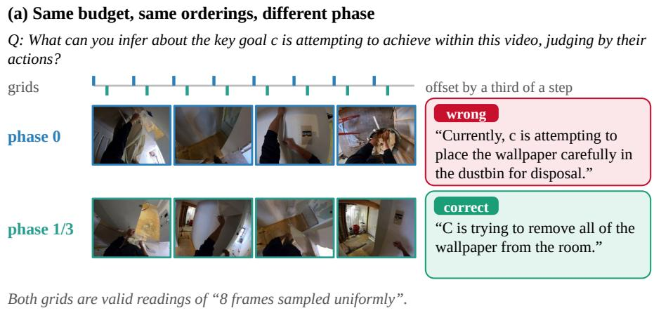
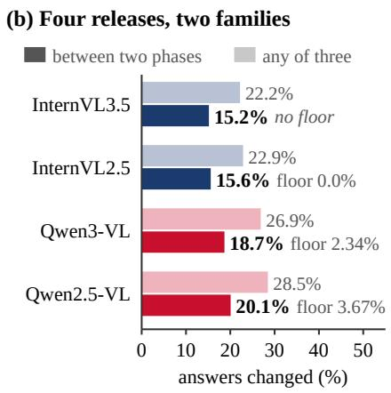
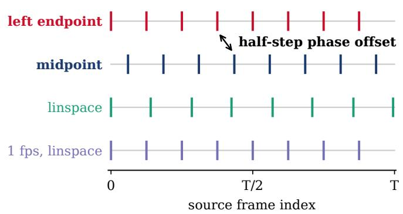
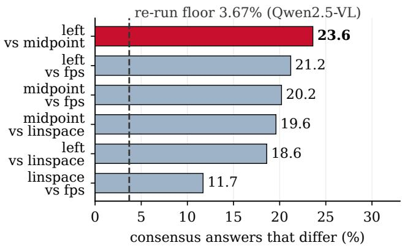
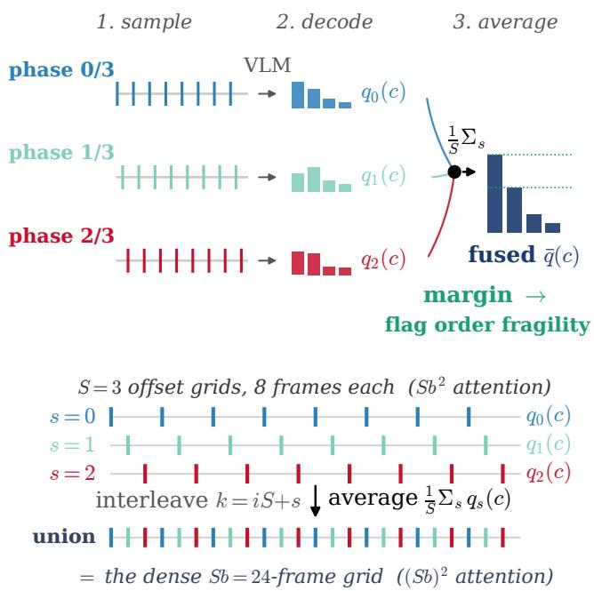
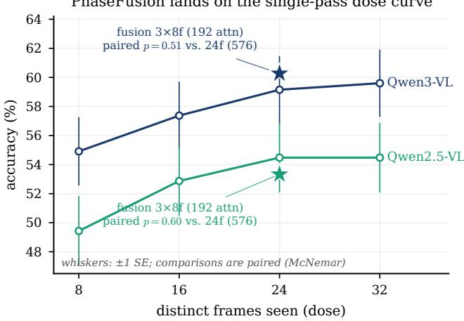
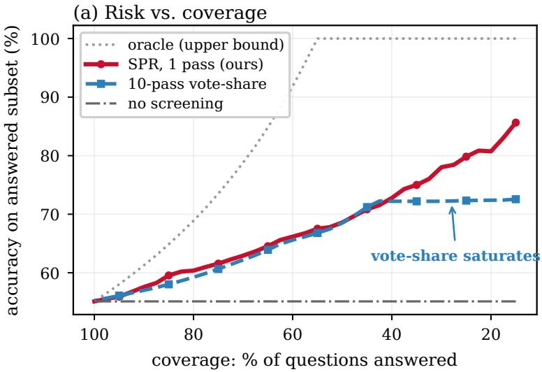
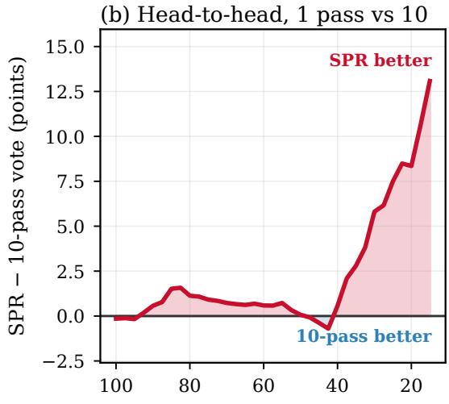

# STABLE SCORES, UNSTABLE ANSWERS: FRAME PHASE AND OPTION ORDER IN VIDEO MULTIPLE-CHOICE EVALUATION

Lichen Zhu, Yiheng Wang, Yueqian Lin, Hai “Helen” Li, Yiran Chen

Duke University, Durham, NC, USA

## ABSTRACT

Video-language models are ranked by multiple-choice accuracy on frames from a uniform grid. The grid has two parameters, a rate and a phase, and benchmarks report only the rate. The phase moves answers: two deployed samplers differing only by a half-step phase offset answer 23.6% of questions differently while scoring within a point, and across four releases from two families shifting only the phase changes roughly one answer in five after controlling option order. PHASEFUSION decodes three offset grids and averages the option posteriors. The grids are the polyphase components of the dense grid. Fusion matches a 32-frame single pass in accuracy within a prespecified margin (logit-scored) and cuts the answers a half-step shift of all three grids changes from 18.2% to 10.1%. Option order, which changes only the presentation, is flagged instead by a one-pass answer margin. Report the phase convention with the budget, or marginalize it.

Index Terms— Video-language models, uniform temporal sampling, polyphase decomposition, nuisance parameters, evaluation reproducibility

## 1. INTRODUCTION

Video-language leaderboards rest on a common front end: a clip of T frames is thinned to b frames on a uniform grid, the model answers a multiple-choice question, and the fraction of answers that match the key is the score [1, 2, 3]. The score is trusted because re-running the harness returns the same number. A uniform grid, however, has two parameters, and only one of them is ever written down. The rate, the frame budget b, appears in every protocol. The phase, where the first sample falls, is left to whichever line of code draws the indices, and we know of no benchmark protocol that states it. A re-run holds that phase fixed along with everything else, so the reproducibility that earns the score its trust is measured under the one condition that hides the parameter.

Prior audits of video evaluation have varied which and how many frames are fed [4, 5, 6]. Sun et al. [7] vary the frame budget and find stable curves over unstable items, and Cao et al. [8] use an offset shift as an intervention. All of these effects are read off accuracy. A parallel line documents sensitivity to the presentation of the options themselves [9, 10, 11, 12, 13, 14], including whether the correct option is present at all [15]. Closest in name, PAS [16] averages over phase offsets of the rotary temporal encoding inside the model. The phase studied here is different in kind: a free parameter inside one fixed sampling strategy, at an unchanged rate and outside any model, whose effect is an answer-level reproducibility property rather than an accuracy delta. We therefore hold the rate, vary the phase, and measure answers rather than scores.

This paper asks how much that unreported phase matters and what an evaluator should do about it. We first measure it. Op-

tion order is itself a large nuisance, so we control it before looking at the phase, and Section 2 reports the consensus answer over ten option orderings. Against that baseline, shifting only the phase changes roughly one answer in five (Fig. 1) while accuracy stays flat, separates two samplers that are already in deployment, and survives an eightfold increase in the frame budget. We then remove it rather than legislate it. Section 3 averages the model’s option posteriors over offset grids, the classical multi-view test-time operator [17, 18, 19, 20], applied here to an axis no benchmark protocol reports. In this setting the operator has an exact structure: the S offset grids are the polyphase components of a dense Sb-frame grid, so averaging over them integrates the phase out while the same frames are decoded in three short passes. The two nuisances call for different treatments. The phase changes the evidence, so it can be averaged out. The order changes only its presentation, and averaging it exhaustively is factorial, so we flag it instead (Section 4.3).

## 2. PHASE SENSITIVITY OF UNIFORM FRAME SAMPLING

## 2.1. Protocol

The core 3×3 audit evaluates Qwen2.5-VL-7B (Q2.5) [21], Qwen3- VL-8B (Q3) [22], and InternVL2.5-8B (IV2.5) [23] on EgoSchema [1], MVBench [2], and Video-MME [3]: nine 500-question cells with 10 shared orderings. The phase sweep, three passes per ordering, re-decodes a 200-question subset of each cell (593–599 items per model) under the same ten orderings, and ordering results use all 500. In all, the study decodes 289k passes. Separate replications use MiMo-VL-7B-RL [24] (450 logit-scored and 1,495 fusion items) and InternVL3.5 [25].

Letters map back to a stable content index through the inverse permutation, and a cell’s consensus answer is the plurality content index over its ten orderings, ties broken by lowest index.

All decoding is greedy argmax. Within a run it is bit-stable: 2,952 duplicated permutations agree 100%. The re-run floor is measured, not assumed, following the same-ordering control of Facet-Probe [14]: phase 0 is re-decoded in a separate run (same weights, frames, prompts, greedy) and compared with the released corpus at the consensus level. GPU kernel nondeterminism alone puts it at 2.34% for Qwen3-VL and 3.67% for Qwen2.5-VL (n=599 each). InternVL2.5 re-derives its corpus bit-exactly (0.0% of 5,930 passes), and InternVL3.5 enters the phase sweep only.

The ordering nuisance, and why it goes first. Per-cell flip rates span 40.8–66.4% over the nine 500-question cells (pooled 54.0%, n=4500). Across the nine cells the reported score moves by at most 5.8 points under the same re-orderings. In total, 39.2% of a single ordering’s gold-correct answers are wrong under at least one other ordering (9.3% against the ten-ordering consensus outright): a single ordering is a lottery ticket for two correct answers in five, and on MVBench and Video-MME one of the ten draws reverses the InternVL2.5 vs. Qwen3-VL ranking that the other nine report.

  
Fig. 1. The sampling phase changes answers, not scores. (a) One EgoSchema clip decoded at two phases of the same uniform 8-frame grid, whose sample times are drawn on a common axis (four of eight frames shown per phase). Each phase is unanimous across all ten option orderings, yet they pick different options, one of them wrong. (b) Four releases from two families. Dark bars: consensus answers that differ between two phases, with each family’s measured re-run floor printed beside the bar (InternVL3.5 has no re-run corpus). Light bars: answers that change under any of the three phases.

## 2.2. The sampling phase

Shifting only the phase changes roughly one answer in five while accuracy stays flat. Between two phases of the same 8-frame grid, under the same ten orderings, the consensus answer differs on 18.7% of items for Qwen3-VL and 20.1% for Qwen2.5-VL, 8.0× and 5.5× their re-run floors, and on 15.6% and 15.2% for the two InternVL releases (Fig. 1). Per benchmark the rate runs from 11.2% (MVBench, n=199 items, 95% CI 7.7–14.9) to 29.5% (Video-MME, n=200, 24.5–34.7), both on Qwen2.5-VL, and clears the floor in every cell. Per-phase accuracy moves by less than two points.

Allowing all three phases, the answer changes at least once on 26.9% of questions for Qwen3-VL and 28.5% for Qwen2.5-VL, and on 22.9% and 22.2% for the InternVL releases (Fig. 1b). Ties do not drive this. On the 84–86% of items whose consensus is tie-free the three-phase rate is still 20.6/23.5%, and with thirteen phases on Qwen2.5-VL nearly half of all answers (49.3%) change somewhere. Larger budgets do not remove it. A larger budget might be expected to wash the phase out. It does not, at least up to 32 frames. As the budget grows eightfold from 4 to 32 frames (Qwen2.5-VL), pairwise disagreement falls only from 24.0% to 12.4% on EgoSchema and from 34.7% to 22.1% on Video-MME, so each doubling leaves 0.80 to 0.86 of it. At 32 frames, the top of deployed practice, it is still 3.4× and 6.0× the re-run floor.

## 2.3. Samplers in the wild

The phase already varies between deployed harnesses [26]. On Qwen2.5-VL, the four deployed “uniform” samplers of Fig. 2 disagree on 12–24% of consensus answers pairwise while their scores stay within 1.2 points of one another. The most telling pair is left endpoint against midpoint. The two sample at the same rate and differ only by a half-step phase, yet they disagree most, on 23.6% of consensus answers, at 0.7 points of score.

Other re-readings of the clip. Any legal re-reading of the clip moves answers about as much as the phase does. Holding the phase at 0 and drawing two other readings under the same ten orderings (Qwen2.5-VL), two independent uniform-random subsets disagree on 24.2% of consensus answers and two grids jittered by one frame per cell on 19.0%, against 20.1% between two phases. The phase differs from these in two ways. Deployed samplers fix it silently, and a polyphase average removes the choice by construction. The consensus itself is not perfectly reliable, since two disjoint five-ordering halves at one phase already disagree on 18.5 to 19.4% across the three core models, but a phase change adds 6 to 9 points on top.

Standardization versus marginalization. Fixing the phase makes a number reproducible without making it less arbitrary. Depending only on which phase is used, the measured Qwen3-VL lead over Qwen2.5-VL is 3.97, 6.08 or 6.74 points, a 2.77-point swing (orderaveraged, n=599 items) from one unreported parameter. Marginalization removes the free parameter from the protocol, whereas standardization merely picks one of its values.

## 3. POLYPHASE MARGINALIZATION

## 3.1. The offset grids are polyphase components

Sample i of the phase-s grid sits at

$$
{ \Bigl ( } i + { \textstyle \frac { s } { s } } { \Bigr ) } { \frac { T } { b } } = ( i S + s ) { \frac { T } { S b } } ,\tag{1}
$$

which is sample $k { = } i S { + } s$ of the dense Sb-frame uniform grid, and k = iS + s is a bijection onto [0, Sb). The S offset grids are therefore exactly the polyphase components of that dense grid, disjoint whenever the clip has at least Sb frames (up to one frame of integer rounding, Fig. 3). The textbook remedy for a phase-sensitive decimator is to filter before decimating, averaging each sample’s neighbourhood. A vision encoder consumes discrete frames, not temporally blurred ones, so we average after the encoder instead, over the posteriors of the S components. The decomposition itself is the standard polyphase identity of multirate signal processing [27, 28]. The identity fixes the set of views deterministically. How their posteriors should be combined is an empirical question that Section 4 answers.

(a) four deployed uniform samplers  

(b) every pair disagrees, pure-phase pair most  
  
Fig. 2. The disagreement needs no perturbation from us. (a) Four uniform samplers taken from deployed harnesses, on a common time axis: left endpoint $\lfloor i T / b \rfloor$ , midpoint $\lfloor ( i + \frac { 1 } { 2 } ) T / b \rfloor$ , endpoint-inclusive round(i $\frac { T - 1 } { b - 1 } \Big )$ , and decimation to 1 fps followed by linspace. Left endpoint and midpoint have the same rate and differ only by a half-step phase offset. (b) All six pairs disagree far above the re-run floor, and the pure-phase pair disagrees most, on 23.6% of consensus answers, while all four score within 1.2 points of one another.

## 3.2. PHASEFUSION

Let a question have n options presented under permutation π (option at slot j is content $\pi ( j ) )$ , and let the model see frames $F _ { s }$ sampled at grid phase $s / S ,$ budget b: $F _ { s } = \{ f _ { \left\lfloor \left( i + s / S \right) T / b \right\rfloor } \} _ { i = 0 } ^ { b - 1 }$ . One forward pass yields letter log-probabilities at the answer position. Renormalized over the n live letters and mapped through $\pi ^ { - 1 }$ , they define a content-space distribution $q _ { s } ( \cdot \mid \pi )$ . PHASEFUSION outputs

$$
\hat { y } \ = \ \arg \operatorname* { m a x } _ { c } \ \frac { 1 } { S } \sum _ { s = 0 } ^ { S - 1 } q _ { s } ( c \mid \pi ) , \qquad S = 3 , \ b = 8 ,\tag{2}
$$

the mixture over phases (arithmetic pooling, geometric pooling performs within 0.3 points). All S phases enter symmetrically, so the output no longer depends on which of the prespecified phases an evaluator would have selected. The continuous phase integral $\int _ { 0 } ^ { 1 } q _ { \delta } ( c ) d \delta ,$ , with phase treated as periodic modulo one, is origininvariant up to one boundary frame in b. Eq. 2 is its finite Riemann approximation and retains a residual origin sensitivity that we measure in Section 4.

Order is untouched. Pooling phases leaves order sensitivity unchanged (order flips $5 3 . 1  5 3 . 4 \% , p \mathrm { = } 1 . 0 , n \mathrm { = } 4 4 6 )$ , which is why the ordering axis needs its own instrument (Section 4.3).

Cost. Attention units are in Table 1. End to end, the three passes cost 3× one 8-frame pass. Median serial latency is 3.18 s, against 0.99 s for one 8-frame pass, 2.86 s for the 24-frame pass (10% less, at 13.3% rather than 10.1% origin sensitivity) and 3.92 s for 32 frames.

## 4. EXPERIMENTS

## 4.1. Averaging costs no accuracy

Three short passes match one long pass in accuracy. PHASEFU-SION at 3×8 frames sits on the accuracy of the 32-frame pass, the largest single pass we decode, at 3/16 of its visual-prefix attention, and is equivalent to it within a prespecified margin (Table 1A). Over 500 questions on each of three benchmarks per model, at the identity ordering, fusion reaches 60.2% for Qwen3-VL and 54.9% for Qwen2.5-VL.

  
Fig. 3. PHASEFUSION. Top: the S phase grids are decoded separately and their content-space posteriors averaged. The margin of the fused posterior is available for flagging order fragility at no extra pass (Section 4.3). Bottom: the three offset grids interleave into the dense Sb-frame grid, sample i of phase s being sample $k { = } i S { + } s$ (Eq. 1).

The accuracy does not come from extra compute. At 192 attention units fusion outscores the 16-frame single pass at 256 units by 2.9 points (Table 1A), and it beats a majority vote over the same three views, 59.3% against 57.8% on the same 1,132 passes, so how the views are pooled matters. Even three 4-frame passes, cheaper than a single 8-frame pass, stay within 1.2 points of the 32-frame pass (Table 1A). Returns saturate by S=3: two more passes at S=5 add nothing (60.0 vs. 60.4% on the 442 paired items). The gain also survives a change of ordering. Under all ten orderings (Qwen2.5-VL, n=445), per-ordering accuracy is 51.2% single-phase against 52.7% fused, and the ordering flip rate is unchanged (59.8 vs. 58.9%).

<table><tr><td colspan="4">A. Cost and accuracy, Qwen3-VL, n=442 paired items</td></tr><tr><td>arm</td><td>attn.</td><td>acc. % ∆ vs. 32f</td><td></td></tr><tr><td>PHASEFUSION 3×4f</td><td>48</td><td>58.8</td><td>-1.13 .603</td></tr><tr><td>single pass, 8f</td><td>64</td><td>55.0</td><td>-4.98 .004</td></tr><tr><td>PHASEFUSION 3×8f</td><td>192</td><td>60.4</td><td>+0.45 .883</td></tr><tr><td>single pass, 16f</td><td>256</td><td>57.5</td><td>-2.49 .109</td></tr><tr><td>single pass, 32f</td><td>1024</td><td>60.0</td><td>+0.00</td></tr></table>

B. Reproducibility under a half-step origin shift, n=587
<table><tr><td>arm</td><td>changed %</td><td>p vs. fusion</td></tr><tr><td>single pass, 8f</td><td>18.2</td><td>&lt;.001</td></tr><tr><td>dense pass, 24f (union)</td><td>13.3</td><td>.032</td></tr><tr><td>PHASEFUSION 3×8f</td><td>10.1</td><td>一</td></tr></table>

Table 1. What averaging buys, on one table. (A) At S=3, b=8 fusion sits on the 32-frame accuracy at 3/16 of its visual-prefix attention. (B) Under a shift of all three grids by half their spacing, seeing the same 24 frames as one sequence buys the accuracy but not the stability: the dense pass still changes 13.3% of its answers, fusion 10.1%. Attention units are $S b ^ { 2 }$ for the visual prefix, and endto-end latency is reported in Section 3. p: McNemar, paired. Shaded rows are PHASEFUSION. All blocks are Qwen3-VL at the identity ordering, and each uses the items that carry all of its arms, hence the differing n and accuracies.

## 4.2. Averaging buys reproducibility

What averaging buys over one long pass is stability. The three grids together are just the 24-frame grid, so we hold the frame set fixed and compare fusion with one pass over the same 24 frames. The two are equivalent in logit-scored accuracy, but they part under a shift of origin. When all three grids move together by half their spacing $( n { = } 5 8 7 )$ , the dense pass changes 13.3% of its answers and fusion 10.1%, against 18.2% for a single 8-frame pass (Table 1B). The same holds when the frames are redrawn rather than shifted. Across two independent random draws (n=598), a single 8-frame pass changes 19.6% of its answers and fusion over a random 24-frame draw 12.0%, with the largest drop on Video-MME (27.0→15.5%). How the 24 frames are split matters little. Random and contiguous partitions at the same cost are no more stable (10.6% and 11.2% against 9.7% for the polyphase split, n=570, within noise), and only the polyphase split adds no sampling seed of its own.

## 4.3. Flagging order fragility in one pass

Order cannot be averaged away at this price, since exhaustive marginalization costs n! passes, but the pass already decoded can tell which answers would move. The answer margin of a single plain pass ranks which questions flip under re-ordering at 0.831 AU-ROC, better than it predicts correctness (0.695), and ahead of top-1 probability and negative entropy (0.82/0.80, pooled, n=1,350).

It transfers zero-shot to the two families that entered no design decision, InternVL2.5 and MiMo-VL (0.867/0.876). In practice, flagging the lowest-margin fifth of items marks a set that flips 89.6% of the time against 48.5% outside it, catching 31.6% of all flips. Under PHASEFUSION the same statistic is read off the fused posterior it already computes (Fig. 3), so in either setting flagging adds no pass.

## 4.4. When it helps

Fusion helps most where adjacent phases lie far apart in time. It can only change an answer where the phases disagree, which happens on 18–41% of items, and the offset between adjacent phases, duration/(Sb) seconds, is known from metadata. An exploratory 1 s split separates the regimes, with a gain of −0.3 points below it $\scriptstyle ( n = 3 7 0 )$ and +2.7 points above it $_ { ( n = 1 , 4 2 7 ) }$ . Accordingly, the only significant gains are on long Video-MME clips, +4.4 and +5.0 points for Qwen3-VL and MiMo-VL. Qwen2.5-VL gains +0.6 there, and the gains on EgoSchema $( + 2 . 2 / + 1 . 8 )$ and short-clip MVBench $( - 0 . 2 / + 1 . 6 )$ are small and not significant. The two halves of the paper meet here. The phase moves the most answers on long clips at small budgets (Section 2), and that is also where averaging it pays.

Statistical protocol. The equivalence claims rest on two one-sided tests [29] against a margin of ±2.5 points, fixed ex ante at half the 8→32-frame gain of the cost sweep (+5.0 points, Table 1A) before any fusion arm was decoded. Against the 32-frame pass the test pools the two models (n=1,132 passes over 581 questions, question-clustered, p=.022, 90% CI [−2.09, +1.56]). Against the 24-frame union, scored from answer-letter log-probabilities (the logit path), it passes per model (p=.035/.046, $\scriptstyle n = 5 9 2 / 5 9 6$ , 90% CIs [−2.30, +1.62] and $[ - 2 . 4 4 , + 2 . 4 4 ] )$ . Scored instead from the generated letter (the generation path), the point estimates are +1.12/−1.15 points (n=448/435) and the margin is not certifiable at these n $\left( p { = } . 1 5 / . 2 2 \right)$ . Paired answer changes use McNemar tests (vote baseline $p { = } . 0 2 ,$ origin shift $\scriptstyle p = . 0 3 2 .$ , redraw $p { < } . 0 0 1 $ ), and the Video-MME gains reach $p { \leq } . 0 0 4$ . The eight confirmatory tests form one Benjamini–Hochberg family [30]: the pooled equivalence test (.022), the origin-shift McNemar (.032), the phase lever of Section 2.3 (permutation test, .048), S=3 against S=2 (.016) and against its own single views (.022), the MiMo-VL fusion gain (.037), and the margin against top-1 probability (.005) and against a ten-pass vote (.042). The largest sits below its step-up threshold of .05, so all eight survive at $q < . 0 5$

## 5. CONCLUSION

A uniform sampler is specified by a rate and a phase. Benchmarks report the rate and leave the phase to an implementation detail, and that detail changes roughly one answer in five while leaving the score where it was, most sharply between two deployed samplers that differ by nothing else. The fix is to report the sampler’s phase convention with its budget, or to marginalize it. Because the S offset grids are the polyphase components of the dense grid, averaging their posteriors damps the parameter at no cost in accuracy inside a prespecified margin. Reporting the convention costs a line, and marginalizing it costs three short passes whose union is the dense grid. Our evidence covers five open 7–8B releases from three families and requires option log-probabilities. Passes and audit will be released upon publication. Audio-language evaluation already shows the option-order half of this picture [31], and we conjecture the frame-offset half holds there too.

## 6. COMPLIANCE WITH ETHICAL STANDARDS

This is a computational study of publicly released models and benchmarks (EgoSchema, MVBench and Video-MME), used under their published terms. No new data were collected from human or animal subjects, and no ethical approval was required. The authors declare no conflict of interest.

## 7. REFERENCES

[1] Karttikeya Mangalam, Raiymbek Akshulakov, and Jitendra Malik, “EgoSchema: A diagnostic benchmark for very longform video language understanding,” in NeurIPS, 2023.

[2] Kunchang Li, Yali Wang, Yinan He, et al., “MVBench: A comprehensive multi-modal video understanding benchmark,” in CVPR, 2024.

[3] Chaoyou Fu, Yuhan Dai, Yongdong Luo, et al., “Video-MME: The first-ever comprehensive evaluation benchmark of multimodal LLMs in video analysis,” in CVPR, 2025.

[4] Shyamal Buch, Cristobal Eyzaguirre, Adrien Gaidon, et al.,´ “Revisiting the ‘video’ in video-language understanding,” in CVPR, 2022.

[5] Marija Brkic, Anas Filali Razzouki, Yannis Tevissen, et al., “Frame sampling strategies matter: A benchmark for small vision language models,” arXiv preprint arXiv:2509.14769, 2025.

[6] Hyunjong Ok and Jaeho Lee, “TempCore: Are video QA benchmarks temporally grounded? A frame selection sensitivity analysis and benchmark,” arXiv preprint arXiv:2509.01167, 2025.

[7] Wenzhang Sun, Chunfeng Wang, Xiangchen Yin, et al., “Stable curves, unstable items: Item-level scaling heterogeneity in video LLMs,” arXiv preprint arXiv:2608.07014, 2026.

[8] Yuxin Cao, Wei Song, Jingling Xue, et al., “Caved or convinced: Temporal sampling gates claim deference in video large language models,” arXiv preprint arXiv:2608.03160, 2026.

[9] Chujie Zheng, Hao Zhou, Fandong Meng, et al., “Large language models are not robust multiple choice selectors,” in ICLR, 2024.

[10] Pouya Pezeshkpour and Estevam Hruschka, “Large language models sensitivity to the order of options in multiple-choice questions,” in Findings ofNAACL, 2024.

[11] Joshua Robinson, Christopher Michael Rytting, and David Wingate, “Leveraging large language models for multiple choice question answering,” in ICLR, 2023.

[12] Yongshuo Zong, Tingyang Yu, Ruchika Chavhan, et al., “Fool your (vision and) language model with embarrassingly simple permutations,” in ICML, 2024.

[13] Yuan Liu, Haodong Duan, Yuanhan Zhang, et al., “MMBench: Is your multi-modal model an all-around player?,” in ECCV, 2024.

[14] Akshay Paruchuri, Sanmi Koyejo, and Ehsan Adeli, “Same evidence, different answer: Auditing order sensitivity in multimodal large language models,” arXiv preprint arXiv:2606.26079, 2026.

[15] Yiheng Wang, Yueqian Lin, Lichen Zhu, et al., “When no answer is correct: Diagnosing absent answer detection for MLLMs in video understanding,” arXiv preprint arXiv:2606.08239, 2026.

[16] Bowen Sun, Yujun Cai, Ming-Hsuan Yang, et al., “PAS: A training-free stabilizer for temporal encoding in video LLMs,” arXiv preprint arXiv:2511.10979, 2025.

[17] Alex Krizhevsky, Ilya Sutskever, and Geoffrey E. Hinton, “ImageNet classification with deep convolutional neural networks,” in NeurIPS, 2012.

[18] Limin Wang, Yuanjun Xiong, Zhe Wang, et al., “Temporal segment networks: Towards good practices for deep action recognition,” in ECCV, 2016.

[19] Christoph Feichtenhofer, Haoqi Fan, Jitendra Malik, et al., “SlowFast networks for video recognition,” in ICCV, 2019.

[20] Divya Shanmugam, Davis Blalock, Guha Balakrishnan, et al., “Better aggregation in test-time augmentation,” in ICCV, 2021.

[21] Shuai Bai, Keqin Chen, Xuejing Liu, et al., “Qwen2.5-VL technical report,” arXiv preprint arXiv:2502.13923, 2025.

[22] Shuai Bai, Yuxuan Cai, Ruizhe Chen, et al., “Qwen3-VL technical report,” arXiv preprint arXiv:2511.21631, 2025.

[23] Zhe Chen, Weiyun Wang, Yue Cao, et al., “Expanding performance boundaries of open-source multimodal models with model, data, and test-time scaling,” arXiv preprint arXiv:2412.05271, 2024.

[24] Xiaomi LLM-Core Team, “MiMo-VL technical report,” arXiv preprint arXiv:2506.03569, 2025.

[25] Weiyun Wang, Zhangwei Gao, Lixin Gu, et al., “InternVL3.5: Advancing open-source multimodal models in versatility, reasoning, and efficiency,” arXiv preprint arXiv:2508.18265, 2025.

[26] Prakhar Khatri, “Select, compress, reinvest: A controlled study of visual-token allocation in long-video MLLMs,” arXiv preprint arXiv:2609.03820, 2026.

[27] Ronald E. Crochiere and Lawrence R. Rabiner, Multirate Digital Signal Processing, Prentice-Hall, Englewood Cliffs, NJ, 1983.

[28] P. P. Vaidyanathan, Multirate Systems and Filter Banks, Prentice Hall, Englewood Cliffs, NJ, 1993.

[29] Donald J. Schuirmann, “A comparison of the two one-sided tests procedure and the power approach for assessing the equivalence of average bioavailability,” Journal of Pharmacokinetics and Biopharmaceutics, vol. 15, no. 6, 1987.

[30] Yoav Benjamini and Yosef Hochberg, “Controlling the false discovery rate: A practical and powerful approach to multiple testing,” Journal ofthe Royal Statistical Society: Series B, vol. 57, no. 1, 1995.

[31] Yu-Xiang Lin, Chen-An Li, Sheng-Lun Wei, et al., “Hearing the order: Investigating position bias in large audio-language models,” arXiv preprint arXiv:2510.00628, 2025.

[32] Ari Holtzman, Peter West, Vered Shwartz, et al., “Surface form competition: Why the highest probability answer isn’t always right,” in EMNLP, 2021.

[33] Edward J. Hu, Yelong Shen, Phillip Wallis, et al., “LoRA: Low-rank adaptation of large language models,” in ICLR, 2022.

[34] Junbin Xiao, Xindi Shang, Angela Yao, et al., “NExT-QA: Next phase of question-answering to explaining temporal actions,” in CVPR, 2021.

[35] Minbin Huang, Runhui Huang, Chuanyang Zheng, et al., “Answer-consistent chain-of-thought reinforcement learning for multi-modal large language models,” arXiv preprint arXiv:2510.10104, 2025.

[36] Jinquan Zheng, Jia Yuan, Jiacheng Yao, et al., “Mitigating selection bias in large language models via permutation-aware GRPO,” in ACL, 2026.

## Supplementary Material

This supplement gives the per-cell breakdowns behind the pooled numbers in the main paper, the full protocol, the intervention ladder that motivates flagging rather than repairing order sensitivity, and the auxiliary analyses the main paper refers to. Section, table, figure and equation numbers without an S prefix refer to the main paper. An executable audit that checks every load-bearing number against the result files will be released with the corpus.

## A. PROTOCOL AND DATASET STATISTICS

Benchmarks and sampling. Table S1 gives the composition of each evaluated subset. EgoSchema’s 500 items are its complete public subset; MVBench and Video-MME are uniform random samples drawn with random.Random(42).sample. The optioncount column matters for interpreting flip rates: 369 MVBench items carry three options, which admit only 3!=6 distinct permutations, so those items’ ten orderings necessarily contain repeats and their measured flip rate is a lower bound relative to the 4- and 5-option benchmarks. Deduplicating changes nothing (2,952/2,952 redundant variants agree), and the constrained stratum in fact flips most: 63.5% at three options (n=1107) against 50.2% at four (n=1893) and 51.7% at five (n=1500); dropping every three-option item still leaves 50.9% [49.2, 52.5].

How many orderings are enough? Three checks show the ten-draw flip rate is a converged property, not a sampling accident. First, on the three-option stratum the ten draws cover all 3!=6 permutations for every one of its 1,107 cells, so the measured 63.5% is the exhaustive rate, exactly. Second, subsampling k of the ten orderings (50 seeds) gives 25.3/36.4/42.4/48.8/52.0/54.0% at $k { = } 2 / 3 / 4 / 6 / 8 / 1 0 { : }$ the gain per added ordering shrinks monotonically (11.1/6.0/3.2/1.6/1.0 points), and the last two orderings buy only +2.0 points. Third, a question-clustered bootstrap puts the pooled nine-cell rate at 54.0% [52.1, 55.8] (Qwen corpus 53.0% [50.8, 55.0]), so the headline is insensitive to the resampling unit (results/derived/ordering\_convergence.json).

At four and five options the ten-draw rate remains a lower bound on the full-permutation rate, which only strengthens the reported instability.

Inference. Frames are sampled uniformly over the clip with OpenCV at grid positions $\lfloor ( i \bar { \cdot } s / S ) T / b \rfloor$ for $\stackrel { \cdot } { - 1 } = 0 . . b - 1 \stackrel { \cdot } { ( T }$ the frame count, s the phase index, S the phase count; s=0, S=1 recovers the standard sampler), each resized so the longer side is at most 360px. Frames and the question with its permuted options go through the model’s own chat template; the instruction requests the option letter only. Decoding is greedy (do sample=False, at most 4 new tokens) in bfloat16 on single 24–48GB GPUs. Orderings are the identity plus nine permutations from a generator seeded by (question id, ordering index), identical across models, so all cross-model comparisons are paired at the (question, ordering) level.

<table><tr><td>Benchmark</td><td>pool</td><td>used</td><td>options</td><td>perms</td></tr><tr><td>EgoSchema</td><td>500</td><td>500</td><td>5 (all)</td><td>10</td></tr><tr><td>MVBench</td><td>1420</td><td>500</td><td>3/4</td><td>6</td></tr><tr><td>Video-MME</td><td>2700</td><td>500</td><td>(369 / 131) 4 (all)</td><td>10</td></tr></table>

Table S1. Evaluated subsets. “perms” is the number of distinct option orderings available given the smallest option count present, capped at the ten we evaluate.

Cloze scoring. Row 3 of Table S3 scores each option’s text with no lettered list, under three normalizations: raw $\textstyle \sum _ { t }$ log $P ( o _ { t } \mid v , q , o _ { < t } )$ , its token mean, and domain-conditional PMI log $\dot { P ( o \mid v , q ) } - \log P ( o \mid q )$ [32]. On 100 Video-MME items (Qwen3-VL-8B) they reach 35.0/37.0/42.0% against 53.0% for the letter channel on the same items, so the −11 points of Table S3, row 3, is the best of the three, not an artifact of unnormalized scoring. PMI costs two passes per option, one of them text-only.

Reasoning-model prefill. Any logit-level screen on a reasoningtuned model needs the following protocol step. MiMo-VL-7B-RL opens every response with a <think> scaffold, so with a four-token budget the model never reaches an answer letter and the first-token log-probs sit ≈30 nats below the top token, carrying no answer information: every pred letter in an unmodified run is "<". Under our answer-only instruction the scaffold the model emits is empty, so we prefill that closed empty block into the assistant turn. On a sixquestion probe this made the answer letter the first generated token in 6/6 cases (0/6 without); over the full run, zero predictions are nonletters and the logit argmax agrees with the emitted letter on 100% of passes. The prefill reproduces behaviour the model exhibits unprompted rather than suppressing reasoning it would otherwise perform.

Population sizes. The core ordering sweep covers three models by three benchmarks at 500 questions per cell; the separate MiMo-VL logit replication covers 150 questions per benchmark. In the frame-phase sweep, n=598 (Qwen3-VL), n=599 (Qwen2.5-VL), n=593 (InternVL2.5), and n=599 (InternVL3.5) items carry all three phases, roughly 200 per benchmark. Per-model phase numbers in the main paper are computed on these populations, and the 22.2–28.5% any-of-three range in the main paper spans all four.

A dense random-phase Monte Carlo. The three-phase grid is typical of the continuous phase space, not a special construction. Rerunning Qwen2.5-VL on 592 of the same items and their orderings at 13 phases (the zero anchor plus 12 stratified-random draws, seed 11), the pairwise consensus-disagreement rate is 20.4%, against 20.1% anywhere-rate of 29.1% (90% interval [26.4, 31.6]) over 300 subsets, bracketing the printed 28.5%. Coverage grows with density: across all 13 phases, 49.3% of consensus answers change somewhere, so the three-phase figures in the main paper are conservative lower bounds (results/derived/phase\_mc.json).

Implementations in the wild already disagree. The phase sweep constructs its perturbation; deployed harnesses need no construction. We re-decoded the same items and ten orderings under four uniform-sampler conventions in production use: left-endpoint ⌊iT/b⌋ (torchvision-style), midpoint $( i + \frac { 1 } { 2 } ) T / b$ (TSN-style), endpoint-inclusive linspace, and 1-fps decimation followed by linspace. Each is a defensible reading of “uniformly sample 8 frames.” On Qwen2.5-VL (n=598), any two conventions disagree on 11.7–23.6% of consensus answers (re-run floor 3.67%), and 33.3% of items change consensus under at least one pair, while the four conventions’ accuracies sit within 1.2 points of one another (51.1–52.3%). Two harnesses can thus reproduce each other’s scores to within a point yet disagree on one question in five, and every one of them truthfully reports “uniform sampling” (results/derived/convention\_audit.json).

A matched-vote control. The re-run floor quoted throughout is a reproducibility floor: how far the consensus moves when nothing changes. Because the ten orderings are held fixed across phases, a stricter null is a fresh ordering draw at the same vote size, which perturbs the consensus without carrying any phase information. Splitting each item’s ten orderings into disjoint five-ordering halves (50 random splits per item, seed 0), consensus disagreement between two halves within one phase is 19.4/18.5/19.3% (Q3/Q2.5/IV2.5), and between halves drawn at different phases it rises to 26.1/27.9/25.1%. Both halves vote at size five, so these rates index a noisier statistic than the ten-ordering consensus and are not comparable to the main paper’s phase rates; the within- versus across-phase contrast is. The phase adds disagreement over and above the ordering lottery, in every family (results/derived/matched\_vote\_control.json).

The phase lever, in full. The 3.97/6.08/6.74-point gaps in the main paper are measured on the balanced n=599 items (the lever averages accuracy over orderings, so it needs no consensus; the n=598 in Population sizes counts items with a defined ten-ordering consensus at every phase), and the test statistic is the lever itself, max − min over the three per-phase gaps (2.77 points unrounded), referred to 20,000 within-item permutations of the phase labels (p=.048). Measuring the same lever through a single option ordering is itself an ordering lottery: across the ten draws it ranges 0.3–5.0 points (median 3.4, sd 1.4), is significant in one of ten, and the order-averaged estimate sits at the 40th percentile of the ten, so marginalizing the ordering axis is a precondition for measuring the phase axis. In the matched pairwise unit, the phase moves the consensus on 18.7%/20.1% of item pairs (Q3/Q2.5) against the 2.34%/3.67% re-run floor, 8.0×/5.5× the pipeline’s own irreproducibility. (results/derived/phase\_lever\_estimators.json).

Two more families, and a generation of architecture. InternVL2.5-8B replicates the finding outside the Qwen line. Replaying its released ten orderings at the same three grid phases changes the ten-ordering consensus answer on 22.9% [19.7, 26.5] of n=593 questions, with per-phase accuracy flat (50.7/51.4/51.4%). As in the Qwen sweeps, phase 0 is re-run rather than copied, so agreement with the released ordering corpus is measured rather than assumed: it differs on 0.0% of 5,930 passes, a floor the phase effect clears outright.

Its successor answers the obvious question, whether a newer generation fixes this. InternVL3.5-8B, which replaces the InternLM2 language tower with Qwen3, was run on the same items and the same permutations: the consensus changes on 22.2% [19.1, 25.7] of n=599 questions (16.5/19.6/30.5% by benchmark), per-phase accuracy 52.9/53.4/53.0% (a 0.49-point spread, the flattest of the four phase populations), and its ordering-axis flip rate at phase 0 is 50.9%. A generation of architecture and training moves phase stability by 0.7 points, within overlapping intervals, and leaves the ordering axis where it was (the two InternVL phase-replication JSONs in results/derived/).

<table><tr><td>Confirmatory test</td><td>p</td><td>crit.</td></tr><tr><td>Margin vs. MSP, flip prediction</td><td>.005</td><td>.0063</td></tr><tr><td>S=3 vs. S=2 phase count</td><td>.016</td><td>.0125</td></tr><tr><td>Fusion vs. 32f, clustered TOST</td><td>.022</td><td>.0188</td></tr><tr><td>S=3 vs. its own single views</td><td>.022</td><td>.0250</td></tr><tr><td>Fusion vs. union pass, origin shift</td><td>.032</td><td>.0312</td></tr><tr><td>MiMo-VL fusion gain</td><td>.037</td><td>.0375</td></tr><tr><td>One-pass margin vs. ten-pass vote</td><td>.042</td><td>.0438</td></tr><tr><td>Phase lever, order-averaged</td><td>.048</td><td>.0500</td></tr></table>

Table S2. Benjamini–Hochberg over the confirmatory family (m=8, q=.05). The largest passing rank is 8, so the step-up procedure rejects all eight; intermediate ranks need not clear their own thresholds.

Compute. The corpus comprises the ordering sweep (nine cells × 500 questions × ten orderings), the logit subsets, the frame-phase sweeps for four releases, the phase-by-budget sweep (47,930 passes), the 13-phase Monte Carlo, the deployed-sampler audit, the PHASEFUSION captures and (S, b) ablation (including the MiMo-VL fusion arm), and the union, origin, re-reading, partition and timing controls (Section E), 289k forward passes in all.

Multiplicity. The eight confirmatory tests of the main paper survive Benjamini–Hochberg control [30] as a family at q=.05: the largest p, .048 at rank 8, falls below its critical value q · 8/8=.050, so the step-up procedure rejects all eight (Table S2; results/ derived/bh\_family.json). The family comprises the eight tests the paper’s claims rest on, listed in Table S2 and enumerated row by row in bh family.json; remaining p-values are descriptive and reported unadjusted.

## B. INTERVENTIONS THAT DO NOT REMOVE ORDER SENSITIVITY

Table S3 summarizes thirteen interventions spanning every level a practitioner controls. Three results determine the method design. Here SPR denotes the single-pass answer margin of Section 4.3 of the main paper.

Aggregation cannot remove presentation noise. A ten-ordering vote gains +2.08 points over the pooled Qwen corpus (+1.74 over all nine cells), but two disjoint four-ordering votes still disagree on 18.2% of items. Even an oracle allocator that knows which questions flip has no headroom over the best uniform budget (−0.4 points, bootstrap CI [−1.9, +0.7] points). Margin-guided reallocation and routing fail likewise (rows 4, 9, 10): the margin ranks fragility but is too blunt to buy accuracy back by re-spending the budget. Repetition without new evidence leaves a residual ordering choice.

The effect is not explained by answer-letter priors. Removing labels entirely, presenting an unlabeled list and matching the generated text, reduces flips only from 53.0% to 49.0% (n=100). The model tracks content more strongly than letters (content versus letter fixation, 0.81 versus 0.46), but remains sensitive to the presentation slots themselves.

PhaseFusion lands on the single-pass dose curve

Naive consistency tuning can collapse uncertainty. We train seven LoRA [33] arms from two objective families on 4,996 NExT-QA [34] MCQs, disjoint from all three evaluation benchmarks, and score them on the Video-MME logit cell $\scriptstyle ( n = 1 5 0 )$ Distribution matching has a degenerate flattening optimum: at $\lambda { = } 1 0$ , flips rise from 53.3% to 80.0% while the median margin falls from 0.83 to 0.60 $( p { = } 1 0 ^ { - 7 } )$ . Hard pseudo-label consistency also worsens flips at high confidence gates (+10.7 points, $\scriptstyle p = . 0 2 4 )$ ; its only reduction is not significant and costs accuracy. (Concurrent RL training with joint answer-consistency rewards reports gains [35, 36]; ours cover frozen-backbone LoRA distillation.)

Additional ablations point to visual evidence rather than letter bias. Removing the video raises the flip rate from 50.3% to 79.9% while accuracy falls from 57.7% to 38.5% (n=1500, Qwen3-VL). Thus the instability studied here is the residual regime after visual evidence has already removed roughly thirty points of blind-text instability.

## C. PER-CELL INSTABILITY

Table S4 is the per-cell form of the nine-cell flip rates pooled in Section 2 of the main paper. Flip rate is the fraction of questions whose chosen content index (the option identity recovered through the inverse permutation) is not constant across the ten orderings; swing is the max−min accuracy over those same ten orderings.

Cross-model decomposition. Evaluating models on identical items and identical orderings decomposes per-question flip state into bothstable, shared-unstable (both models flip) and model-specific (exactly one flips) components (Table S5). Shared-unstable mass exceeds the independence null in every pair and benchmark (lift >1, all bootstrap CIs excluding 1), so part of the fragility is item-intrinsic; the large model-specific mass shows it is not reducible to item weakness. The pattern holds across architectures, not only within the Qwen family.

Oracle-bound uncertainty. The oracle re-ask bound (Table S3, row 2) carries a question-clustered bootstrap: the best oracle-gated budget trails the best uniform budget by 0.37 points, 95% CI $[ - 1 . 8 5 , + 0 . 6 7 ]$ points (results/derived/oracle\_bound\_ ci.json): no headroom.

Consistency-tuning setup. The consistency-tuning negative results (Table S3, rows 11–12) rest on seven LoRA arms: four for the JSto-mixture objective $( \lambda \in \{ 0 , 1 , 3 , 1 0 \}$ , where λ=0 is the plain-SFT control that isolates the consistency term) and three for confident pseudo-labelling (τ=0.7 at λ=1 and λ=2, and τ=0.9 at λ=1). All seven are trained identically, so the arms differ only in the objective and its strength. Each adapts Qwen2.5-VL-7B with rank-16 LoRA [33] (α=32, dropout 0.05) on all seven linear projections of every language block $( \mathtt { q } , \mathtt { k } , \mathtt { v } , \mathtt { o } ,$ ,gate,up,down), the vision tower frozen, at learning rate $1 0 ^ { - 4 }$ for one epoch over 4,996 NExT-QA [34] MCQs with effective batch 16 and 8 frames per clip, bfloat16 with gradient checkpointing, seed 0. The configuration is deliberately generous: a higher-capacity adapter reaching every projection is the setting most likely to succeed, which is what makes the negative result informative. The trainer (code/train\_pct.py) will be released with the code.

## D. MECHANISM: PER-CELL FIXATION

Table S6 gives the fixation statistics per cell (pooled: content 0.81, letter 0.46, position mass 0.38). Content-fixation (c-fix) and letterfixation (l-fix) are the modal vote-shares over orderings of, respectively, the chosen content index and the emitted letter. Position-mass fixation is the logit-level analogue: the probability mass placed on the modal letter slot across orderings, regardless of which option occupies it. The ordering c-fix > l-fix > pos-mass holds in every cell.

  
Fig. S1. The union control, visually. Single-pass accuracy against the number of distinct frames seen (8/16/24/32; whiskers ±1 SE), with PHASEFUSION 3×8f plotted at its own dose of 24 distinct frames (star). On the generation-scored path, the star differs from the union pass by +1.12/ − 1.15 points; McNemar $\scriptstyle { p = . 5 1 / . 6 0 }$ tests difference, not equivalence. The same-logit TOST $\scriptstyle ( p = . 0 3 5 / . 0 4 6 ;$ “Same-pipeline replication” below) establishes equivalence within the prespecified ±2.5-point margin. Fusion uses 192 attention units instead of 576 and reduces origin sensitivity.

Letter prior. The prior is real but secondary. $\mathbf { A } \ \chi ^ { 2 }$ goodness-of-fit test of predicted-letter uniformity, computed on shuffled orderings only (the identity ordering is excluded to remove the benchmarks’ own gold-letter distribution as a confound) and pooled per optioncount group, rejects uniformity in all eight option-count groups, with p ranging from $6 . 5 \times 1 0 ^ { - 4 }$ (Q2.5/MVBench, 4-option) to $3 . 0 \times$ $\mathbf { \bar { 1 0 } ^ { - 9 6 } }$ (Q3/MVBench, 3-option). A letter prior therefore exists and is highly significant. The claim is one of relative magnitude: content fixation exceeds letter fixation in every cell. Consistently, PriDe debiasing (Table S3, row 7) removes almost nothing: single-pass PriDe moves pooled accuracy from 56.2% to 56.4%, and full permutation marginalization reaches 58.0%, statistically indistinguishable from the logit-free ordering ensemble at 57.8%.

## E. THE UNION CONTROL

The three phase grids of S=3, b=8 partition, up to floor rounding of at most one frame index, the uniform 24-frame grid. A single pass over those 24 frames is therefore the frame-matched control separating “fusion pools complementary evidence” from “the model saw more frames”. We ran it on both families and both scoring paths (Table S7, Figure S1).

Same-pipeline replication. Scoring the 24-frame pass through the identical letter-logprob path as fusion (rather than generation) gives −0.34 points, p=.89 (n=592, Q3) and ±0.00 points, $p { = } 1 . 0 \ ( n { = } 5 9 6 , \ 0 2 . 5 ) ;$ on items shared by both scorers the two judgments agree on $4 4 7 / 4 4 7 { = } 1 0 0 \%$ , so the near-zero same-path contrast is not a scoring artifact. This path is also powered against the pre-registered margin: the paired per-item differences carry standard errors of 1.19 points (n=592, 50 discordant pairs) and 1.48 points (n=596, 78 discordant), so two one-sided tests [29] reject differences larger than ±2.5 points at p=.035 (Q3) and p=.046 (Q2.5), the equivalence test the main paper cites (results/derived/b24\_crosspipeline.json). The generation-scored subsets are smaller and do not certify the margin on their own (TOST p=.154/.222), so the equivalence is established on the shared logit path and the generation-path contrast is reported as a point estimate. Per benchmark on the logit path (Q3) the contrast is −0.51, −0.52 and +0.00 points on EgoSchema, MVBench

<table><tr><td>#</td><td>Intervention (cost in passes)</td><td>Level</td><td>Outcome on the failure it targets</td><td>Verdict</td></tr><tr><td></td><td>1 k-ordering plurality vote (10×)</td><td>inference</td><td>+2.08 points Qwen-pooled (+1.74 points over all 9 lottery persists cells); two disjoint 4-votes disagree on 18.2% of items</td><td></td></tr><tr><td>2</td><td>SPR-gated adaptive re-ask (2–5×)</td><td>inference</td><td>oracle gate 55.0% at its best budget vs. best uniform no headroom 55.4% (−0.4 points)</td><td></td></tr><tr><td>3</td><td>Per-option content scoring (cloze, inference  $2 n _ { \mathrm { o p t } } \times )$ </td><td></td><td>raw 35.0/token-mean 37.0/PMI 42.0% vs. letter 53.0%, –11 points at best same items</td><td></td></tr><tr><td>4</td><td>Margin-routed channel switch (～1.5×) inference</td><td></td><td>+1.9 points on flipped items, —25 points on stable ones nothing to route to</td><td></td></tr><tr><td>5</td><td>Content-space logit fusion, antithetic pair inference (2×)</td><td></td><td>54.7 vs. 54.5% (random pair) on exact-reverse subset</td><td>pairing worth 0.2 points</td></tr><tr><td>6</td><td>Phase-ensemble, argmax majority (3×)</td><td>inference</td><td>3×8f vote 57.8% ≈ 16f single 58.1% (p=.79); logit mix- ture +1.5 points over the vote  $\scriptstyle ( p = . 0 2 0 )$ </td><td>counting loses to pool- ing</td></tr><tr><td>7</td><td>PriDe letter-prior debiasing (1 × / k×)</td><td>inference</td><td>single-pass +0.2 points over naive (56.4 vs. 56.2%); full marginalization 58.0% ≈ logit-free vote 57.8%</td><td>prior real but immate- rial</td></tr><tr><td>8</td><td>Label-free joint presentation (1 ×)</td><td>prompt</td><td>flip 53.0% → 49.0%, accuracy unchanged</td><td>slot-noise, not letters</td></tr><tr><td>9</td><td>SPR-driven Neyman estimation (1.5- 5×)</td><td>measurement</td><td>RMSE ratio vs. uniform 1.15× at b=1.5, ≤1.02× be- margin too blunt yond</td><td></td></tr><tr><td>10</td><td>SPR-guided flip detection (1.5–3×)</td><td>measurement</td><td>recall ratio ≤1.22×; deeper escalation worse  $5 3 . 3 \% {  } 8 0 . 0 \% ( p { = } 1 0 ^ { - 7 } ) ;$ </td><td>base rate 57%</td></tr><tr><td>11</td><td>Consistency tuning, (LoRA, 4 arms)</td><td>JS-to-mixture training</td><td>λ=10: flip 0.83→0.60</td><td>median margin degenerate optimum</td></tr><tr><td>12</td><td>Consistency tuning, confident pseudo- training label (3 arms)</td><td></td><td>best arm —2.6 points flip (n.s.) at —2.2 points accuracy; consistency ≠ correct- τ=0.9: +10.7 points (p=.024)</td><td>ness</td></tr><tr><td>13</td><td>Cross-family transfer of certified thresh- calibration olds (1 ×)</td><td></td><td>held-out-family selective error up to 30% at α=25%</td><td>rankings transfer, thresholds don&#x27;t</td></tr></table>

Table S3. The repair ladder, tested rung by rung. Every intervention level available to a practitioner (inference-time aggregation and debiasing, prompt re-design, measurement reallocation, training-time consistency objectives, and calibration transfer) fails to repair perquestion instability, several worsening it. Two results bound the space we test: an oracle re-ask allocator shows no headroom over the best uniform budget (row 2; bootstrap $\operatorname { C I } \left[ - 1 . 9 , + 0 . 7 \right]$ points), and no LoRA consistency objective reduces flips at $p { < } . 0 5$ (rows 11–12), because forcing agreement at genuine near-ties trades instability for arbitrary commitment. The instability is epistemic signal, not a removable artifact, which is exactly why it can be screened (Section 4.3) even though it cannot be fixed. SPR is the single-pass answer margin of Section 4.3 of the main paper.

<table><tr><td>Model</td><td>Benchmark</td><td>Flip%</td><td>Swing (points)</td><td>BHp</td></tr><tr><td>Q2.5</td><td>EgoSchema</td><td>52.8</td><td>5.8</td><td> $< 1 0 ^ { - 1 5 }$ </td></tr><tr><td>Q2.5</td><td>MVBench</td><td>66.4</td><td>4.6</td><td> $< 1 0 ^ { - 1 5 }$ </td></tr><tr><td>Q2.5</td><td>Video-MME</td><td>47.8</td><td>2.6</td><td> $< 1 0 ^ { - 1 5 }$ </td></tr><tr><td>Q3</td><td>EgoSchema</td><td>40.8</td><td>3.2</td><td> $< 1 0 ^ { - 1 5 }$ </td></tr><tr><td>Q3</td><td>MVBench</td><td>58.2</td><td>4.0</td><td> $< 1 0 ^ { - 1 5 }$ </td></tr><tr><td>Q3</td><td>Video-MME</td><td>51.8</td><td>3.8</td><td> $< 1 0 ^ { - 1 5 }$ </td></tr><tr><td>IV2.5</td><td>EgoSchema</td><td>61.6</td><td>5.4</td><td> $< 1 0 ^ { - 1 5 }$ </td></tr><tr><td>IV2.5</td><td>MVBench</td><td>54.8</td><td>4.0</td><td> $< 1 0 ^ { - 1 5 }$ </td></tr><tr><td>IV2.5</td><td>Video-MME</td><td>51.6</td><td>2.2</td><td> $< 1 0 ^ { - 1 5 }$ </td></tr></table>

Table S4. Per-cell flip rate vs. accuracy swing. The rightmost column is the Benjamini–Hochberg-adjusted p for a one-sided binomial test of $H _ { 0 } { \mathrm { : } }$ flip ≤ 15%; all nine fall below $1 0 ^ { - 1 5 }$ , and the least extreme is $3 . 4 \times 1 0 ^ { - 4 4 }$ (Q3/EgoSchema).

<table><tr><td>Pair</td><td>Benchmark</td><td>Shared</td><td>Model-sp.</td><td>Lift</td></tr><tr><td> $\mathbf { Q } 2 . 5 { \times } \mathbf { Q } 3$ </td><td>EgoSchema</td><td>32.0</td><td>29.6</td><td>1.49</td></tr><tr><td> $\mathbf { Q } 2 . 5 { \times } \mathbf { Q } 3$ </td><td>MVBench</td><td>43.2</td><td>38.2</td><td>1.12</td></tr><tr><td> $\mathbf { Q } 2 . 5 { \times } \mathbf { Q } 3$ </td><td>Video-MME</td><td>35.0</td><td>29.6</td><td>1.41</td></tr><tr><td> $\scriptstyle \mathrm { I V } 2 . 5 \times \mathrm { Q } 3$ </td><td>EgoSchema</td><td>33.0</td><td>36.4</td><td>1.31</td></tr><tr><td> $\scriptstyle \mathrm { I V } 2 . 5 \times \mathrm { Q } 3$ </td><td>MVBench</td><td>40.6</td><td>31.8</td><td>1.27</td></tr><tr><td> $\scriptstyle \mathrm { I V } 2 . 5 \times \mathrm { Q } 3$ </td><td>Video-MME</td><td>36.4</td><td>30.6</td><td>1.36</td></tr><tr><td> $\Gamma V 2 . 5 { \times } \mathrm { Q } 2 . 5$ </td><td>EgoSchema</td><td>41.4</td><td>31.6</td><td>1.27</td></tr><tr><td> $\Gamma V 2 . 5 { \times } \mathrm { Q } 2 . 5$ </td><td>MVBench</td><td>42.8</td><td>35.6</td><td>1.18</td></tr><tr><td> $\Gamma V 2 . 5 { \times } \mathrm { Q } 2 . 5$ </td><td>Video-MME</td><td>32.0</td><td>35.4</td><td>1.30</td></tr></table>

Table S5. Flip-state decomposition (% of shared items). Lift is the shared-unstable mass over its independence null.
<table><tr><td>Model</td><td>Benchmark</td><td>c-fix</td><td>l-fix</td><td>pos-mass</td></tr><tr><td>Q2.5</td><td>EgoSchema</td><td>0.82</td><td>0.40</td><td>0.31</td></tr><tr><td>Q2.5</td><td>MVBench</td><td>0.78</td><td>0.54</td><td>0.38</td></tr><tr><td>Q2.5</td><td>Video-MME</td><td>0.82</td><td>0.44</td><td>0.34</td></tr><tr><td>Q3</td><td>EgoSchema</td><td>0.86</td><td>0.40</td><td>0.38</td></tr><tr><td>Q3</td><td>MVBench</td><td>0.78</td><td>0.53</td><td>0.47</td></tr><tr><td>Q3</td><td>Video-MME</td><td>0.81</td><td>0.44</td><td>0.40</td></tr><tr><td>Pooled</td><td></td><td>0.81</td><td>0.46</td><td>0.38</td></tr></table>

Table S6. Content-, letter- and position-fixation per cell.  
and Video-MME, all $\mathrm { { } } p { = } 1 . 0 .$

Timing and memory. Median seconds per question and peak memory for every configuration, from one matched idle-node run (100 Video-MME questions, one NVIDIA L40S at batch 1, frame decode, vision encoder and prompt re-encode all inside every reported second). Medians agree with means within 2% for every configuration except $3 \times 8 \mathrm { f } ,$ whose 10.6 s mean reflects a single stalled decode. Serially, three short passes pay three fixed overheads, so fusion is not faster than the 24-frame union pass it factorizes (3.18 vs. 2.86 s); its cost case is attention compute and the removal of the phase draw.

<table><tr><td></td><td>8f 16f</td><td>24f</td><td>32f</td><td>PHASEFUSION 3×8f</td></tr><tr><td>Q3 (n=448) 54.9</td><td>57.4</td><td>59.2</td><td>59.6</td><td>60.3</td></tr><tr><td>Q2.5 (n=435) 49.4</td><td>52.9</td><td>54.5</td><td>54.5</td><td>53.3</td></tr><tr><td>Attn. units</td><td>64 256</td><td>576</td><td>1024</td><td>192</td></tr></table>

Table S7. Union control, generation-scored pipeline, identity ordering. Fusion vs. 24f: Q3 +1.12 points (McNemar p=.51), Q2.5 −1.15 points (p=.60). Fusion vs. 32f: +0.67 points (p=.77) / −1.15 points (p=.61). Fusion vs. 8f: +5.36 points $( p { = } 4 \times 1 0 ^ { - 4 } ) .$ / +3.91 points (p=.043). The gain over the single pass is attributable to the additional frame dose, delivered at 1/3 the attention.

<table><tr><td>Configuration</td><td>Attn. units</td><td>Median s/q</td><td>Peak GB</td></tr><tr><td>single 4f</td><td>16</td><td>0.55</td><td>17.67</td></tr><tr><td>single 8f</td><td>64</td><td>0.99</td><td>17.83</td></tr><tr><td>single 16f</td><td>256</td><td>1.92</td><td>18.29</td></tr><tr><td>single 24f</td><td>576</td><td>2.86</td><td>18.93</td></tr><tr><td>single 32f</td><td>1024</td><td>3.92</td><td>19.77</td></tr><tr><td>fusion 3×4f</td><td>48</td><td>1.72</td><td>17.67</td></tr><tr><td>fusion  $3 \times 8 \mathrm { f }$ </td><td>192</td><td>3.18</td><td>17.83</td></tr></table>

Table S8. Measured cost of each configuration in the matched run. Means carry heavy decode tails on long videos, so medians are reported; peak memory is flat because 8B bfloat16 weights dominate activations at these lengths.

The (S, b) frontier. Table S9 is the full sweep behind Table 1A of the main paper: accuracy against attention cost for every single-pass budget and every (S, b) fusion configuration we ran, on the n=442 subset carrying all of them.

What fusion leaves unchanged, and its per-family gain. PHASEFUSION does not touch the ordering axis: order flips move 53.1→53.4% (p=1.0), an empirical check that pooling phases neither repairs nor worsens presentation noise. Over the single 8-frame pass it replaces, the order-averaged gain is +2.6 points (Q3) / +1.5 points (Q2.5) (results/derived/ phase\_fusion\_final.json). That average is not carried by a lucky ordering: taken one ordering at a time, the gain is positive under all ten for Qwen3-VL (+1.35 to +4.93 points, mean +2.62) and under eight of ten for Qwen2.5-VL (−0.67 to +4.49 points, mean +1.57), a −0.7 to +4.9-point range (results/derived/per\_ordering\_gains.json).

Origin robustness of the union pass. Under the matched half-step origin shift (T/48 absolute, the same shift that maximally perturbs the S=3 phase set), and paired on the n=587 items carrying every arm, the answer changes on 18.2% of items for a single 8-frame pass, 13.3% for the 24-frame union pass, and 10.1% for PHASE-FUSION. Both contrasts against fusion are significant (union pass,

<table><tr><td>Configuration</td><td>Attn. Acc. (%)</td><td>vs. 32f</td></tr><tr><td>Single pass, 4f</td><td>16</td><td>53.6 -6.3*</td></tr><tr><td>PHASEFUSION, 3×4f</td><td>48</td><td>58.8 -1.1</td></tr><tr><td>Single pass, 8f</td><td>64</td><td>55.0 -5.0*</td></tr><tr><td>Argmax vote, 3×8f</td><td>192</td><td>59.3 -0.7</td></tr><tr><td>PHASEFUSION, 2×8f</td><td>128</td><td>55.9 -4.1*</td></tr><tr><td>PHASEFUSION, 3×8f</td><td>192</td><td>60.4 +0.5</td></tr><tr><td>Single pass, 16f</td><td>256</td><td>57.5 -2.5</td></tr><tr><td>PHASEFUSION, 5×8f</td><td>320</td><td>60.0 +0.0</td></tr><tr><td>PHASEFUSION,  $3 \times 1 6 \mathrm { f }$ </td><td>768</td><td>60.9 +0.9</td></tr><tr><td>Single pass, 32f</td><td>1024</td><td>60.0</td></tr></table>

Table S9. The (S, b) frontier (Qwen3-VL, paired n=442 items carrying every configuration and baseline; attention cost $S b ^ { 2 }$ in frametoken2; ∗ below the 32-frame pass at McNemar p<.05). Every S=3 configuration sits above the single-pass curve at its cost. PHASE-FUSION at 3×4f sits 1.1 points below the 32-frame pass and runs at 1.72 s/question against 3.92 s in the matched run, and costs no more than a 16-frame pass (1.92 s; +1.4 points, $p { = } . 5 1 )$ . S=2 is the exception (Section G); S=5 buys nothing. Argmax vote is shown at this subset’s own value; its pooled gap is in Section 4 of the main paper.

McNemar p=.032; single pass, $\scriptstyle p = 1 . 3 \times 1 0 ^ { - 7 } )$ , and accuracy is flat across origins (61.18 vs. 61.34% for the union pass). Seeing the same 24 frames as one sequence therefore buys the accuracy but not the reproducibility: averaging over the phase offsets is what damps the residual origin dependence, which is the one axis on which the factorization is strictly better than the pass it factorizes.

Visual distinctness, in full. Each video is scored with no model in the loop as the mean 1−histogram-intersection between corresponding frames of the S grids. Distinctness tracks the phase offset (ρ=0.77) and predicts the rate of phase disagreement only weakly $( r { = } 0 . 1 3 , p { = } 1 \bar { 0 } ^ { - 7 } )$ , but its usability strongly: across quartiles the disagreement rate barely moves for the lowest two (20.1 vs. 20.9%) while the fusion gain goes −0.2, +2.7, +2.4, +3.6 points.

The one-second split, in full. Thresholding the phase offset at one second partitions the 1,797 swept items: below it PHASEFUSION does nothing (−0.27 points, $n { = } 3 7 0 , p { = } 1 . 0 )$ , above it it gains +2.73 points (n=1427, $\scriptstyle { p = 9 } \times 1 0 ^ { - 4 } )$ . The split is exploratory, and the quartile analysis above gives the threshold-free form of the same effect, with gains ordered −0.2, +2.7, +2.4, +3.6 points.

Equivalence, in full. The paired fusion-vs-32f difference is −0.27 points over 1,132 observations on 581 distinct questions, with question-clustered standard errors giving a 90% CI of [−2.09, +1.56] points; two one-sided tests reject differences larger than the pre-registered ±2.5-point margin at p=.022. On the union control the shared logit path clears the same margin per model $\begin{array} { r } { ( p { = } . 0 3 5 / . 0 4 6 . } \end{array}$ , “Same-pipeline replication” above).

## F. ORIGIN ROBUSTNESS OF PHASEFUSION

Eq. 2 of the main paper is a three-point Riemann sum for $\int _ { 0 } ^ { 1 } q _ { \delta } ( c ) d \delta ,$ , which is origin-invariant up to one boundary frame in b; at finite S a residual dependence on the grid origin δ survives. We measure it on Qwen3-VL by repeating the full 500-question, three-benchmark capture at $\delta { = } 1 / 6$ (the origin maximally offset from δ=0 for S=3, hence the worst case) and comparing fused answers on the n=1488 shared items.

A single pass changes its answer between the two origins on 17.5% [15.6, 19.5] of items; PHASEFUSION changes on 11.0% [9.5, 12.7], a 1.6× damping. Accuracy is flat across origins (60.15 vs. 60.28%), so the residual is seed rather than signal. Three checks confirm the residual is the expected finite-S discretization rather than an implementation artifact. (i) The two captures genuinely differ: corresponding frames of the two grids differ by a mean absolute pixel difference of 50.0/255. (ii) The residual is concentrated exactly where the phases carry different evidence: origin shifts change the fused answer on 3.1% of items whose within-run phases already agree (close to the 2.34% byte-identical re-run floor) against 35.2% of items where they disagree. (iii) The two grids, $\{ \bar { 0 } , { \textstyle \frac { 1 } { 3 } } , { \textstyle \frac { 2 } { 3 } } \}$ } and $\textstyle \left\{ { \frac { 1 } { 6 } } , { \frac { 1 } { 2 } } , { \frac { 5 } { 6 } } \right\}$ , union to a uniform S=6 grid; each S=3 half deviates from the $S { = } 6$ fusion on 5.0% and 6.2% of items, about half of their mutual 11.0% disagreement, a consistency check rather than a test. The S=6 fusion scores 60.28%, differing from S=3 on 4% of items (+0.13 points, $\scriptstyle p = . 8 9 )$ . Origin-invariance is approached as S grows.

## G. WHY THREE PHASES? THE PHASE-COUNT DIAGNOSTIC

On a matched n=593 subset (Qwen3-VL, b=8), the S=2 mixture over phases $\{ 0 , { \frac { 1 } { 2 } } \}$ scores 58.35% against 58.52% and 59.02% for its own two views, with differences of −0.17 points $( p { = } 1 . 0 )$ and $- 0 . 6 7$ points $\left( p { = } . 6 4 \right)$ , i.e. indistinguishable from simply picking one of them. With three phases $\mathsf { \bar { \{ 0 , } }  \frac { 1 } { 3 } , \frac { 2 } { 3 } \mathsf  \}$ the mixture reaches 61.38% against views of 58.52, 59.19 and 60.37%, beating two of the three (+2.9 points, $p { = } . 0 2 2 ; ~ { + } 2 . 2$ points, $\scriptstyle p = . 0 4 9 )$ and nominally above the third (+1.0 points, $ { p }  { = } . 4 2 )$ ; head-to-head it beats the $S { = } 2$ mixture by +3.0 points $\scriptstyle ( p = . 0 1 6 )$ , the contrast in the main paper’s confirmatory family. On the items where the phases disagree, the S=3 mixture scores 47.7% against 36.2 / 38.9 / 43.6% for the individual views, while the $S { = } 2$ mixture (33.9%) is below both of its own (34.7 / 37.3%). The fused argmax is never an option no view chose (0 of 593 items in both settings), so the failure at $S { = } 2$ is not a “compromise candidate” artifact: with two views there is simply no majority to form.

## H. RISK–COVERAGE

Figure S2 compares the single-pass margin against the ten-pass selfconsistency vote-share as selective-prediction signals, each protocol scored on the answers it would deploy. The vote-share saturates near 72% accuracy because it takes only k+1 distinct values and cannot rank items inside the unanimous bucket, while the continuous margin keeps ordering them. This is why the margin pulls ahead by up to 13.1 points exactly where abstention matters most.

Certified selective risk. A ranking becomes a guarantee only after calibration. Within each (model, benchmark) cell we split its 150 logit-scored items in half (75 gold calibration labels, 75 test, 300 random splits) and run fixed-sequence Learn-then-Test: candidate thresholds are ordered strict to permissive, each is accepted while the Clopper–Pearson upper bound on calibration selective error stays at or below $\alpha ,$ and the walk stops at the first failure. The selected threshold controls P(answer̸=gold | answered) at level α with confidence 1−δ, δ=10% (code/conformal\_selective\_sim. py).

Why thresholds are calibrated per cell. The margin’s ranking transfers zero-shot across families (Section I) while its scale does not (row 13 of Table S3), so thresholds are calibrated per cell.

<table><tr><td rowspan="2">Signal</td><td colspan="2"> $\alpha { = } . 3 0$ </td><td colspan="2"> $\alpha { = } . 2 5$ </td></tr><tr><td>viol.</td><td>cov.</td><td>viol.</td><td>coV.</td></tr><tr><td>Margin (SPR)</td><td>6.0</td><td>11.6</td><td>4.7</td><td>6.7</td></tr><tr><td>Top-1 prob. (MSP)</td><td>6.7</td><td>12.3</td><td>3.0</td><td>9.5</td></tr><tr><td>Answer entropy</td><td>6.3</td><td>13.2</td><td>5.3</td><td>9.9</td></tr><tr><td>10-pass vote-share</td><td>1.7</td><td>5.9</td><td>1.7</td><td>2.6</td></tr><tr><td>Random</td><td>0.0</td><td>0.1</td><td>0.0</td><td>0.1</td></tr></table>

Table S10. In-cell certified mode (%; 300 splits, 75 calibration labels per cell). Violations stay inside the δ=10% budget for every signal. At matched validity the one-pass margin certifies twice the coverage of the ten-pass vote-share, at a tenth of the cost. At α=.20 every signal certifies zero coverage. The fixed-sequence walk starts at the ten highest-scoring calibration items, and the Clopper– Pearson upper bound for ten items with no errors at $\delta \mathrm { = } 1 0 \%$ is 0.206, above $\alpha ,$ so the first hypothesis in the sequence fails and the walk stops before any threshold can be accepted. The binding constraint there is the start of the sequence under this δ, not the signal (results/derived/conformal selective.json).
<table><tr><td>Signal</td><td>Passes</td><td>flip</td><td>correct</td></tr><tr><td>Random</td><td>0</td><td>0.484</td><td>0.496</td></tr><tr><td>Option count only</td><td>0</td><td>0.450</td><td>0.423</td></tr><tr><td>Surface features  $\mathrm { \ o n l y ^ { \dagger } }$ </td><td>0</td><td>0.619</td><td></td></tr><tr><td>Answer entropy</td><td>1</td><td>0.803</td><td>0.693</td></tr><tr><td>Top-1 prob. (MSP)</td><td>1</td><td>0.823</td><td>0.700</td></tr><tr><td>Learned, 4 features</td><td>1</td><td>0.829</td><td>0.696</td></tr><tr><td>Margin (SPR)</td><td>1</td><td>0.831</td><td>0.695</td></tr><tr><td>Fused margin (3×8f)</td><td>3</td><td>0.854/0.819</td><td>0.688/0.691</td></tr><tr><td>10-pass vote-share</td><td>10</td><td></td><td>0.665</td></tr></table>

Table S11. Reliability-signal ablation (AUROC; $_ { n = 1 , 3 5 0 }$ pooled, three models; fused-margin row per model on its own fused answers, $n { = } 4 4 6 / 4 4 5 )$ . No single-pass signal separates on correctness; the margin wins on flip prediction (vs. MSP p=.005), learning adds nothing $\left( p = . 2 6 \right)$ , and the 10-pass vote-share loses to one pass on the shared target $\left( { { p = } . 0 4 2 } \right)$ . †Qwen-only 5-fold CV $\scriptstyle ( n = 3 0 0 0 ) ;$ ; transfers to InternVL2.5 (n=1500) at 0.551.

## I. FRAGILITY-RANKING TRANSFER

The training-free margin retains its ranking on models untouched by score selection, including a reasoning/RL model whose elicitation protocol differs. Table S11 places it among every cheap reliability signal on the same 1,350 questions; Table S12 separately tests whether a learned four-feature predictor transfers when its training family changes.

## J. PER-CELL FRAGILITY RANKING

Table S13 reports the training-free single-pass ranking in-domain per cell, which the pooled figures understate. Because the margin is not calibrated across models, pooling nine cells with different margin scales and base rates costs roughly four AUROC points relative to the mean within-cell value. The score ranks questions within a (model, benchmark) pair; risk control additionally needs the per-cell calibration of Section H.

  
coverage: % of questions answered

Fig. S2. Risk–coverage over the pooled three-model logit subset (n=1350): accuracy on the answered subset as low-confidence items are abstained on, for the single-pass margin vs. the ten-pass vote-share.
<table><tr><td>Transfer setting</td><td>Passes</td><td>flip AUROC</td></tr><tr><td>in-cell, per cell (range of 9)</td><td>1</td><td>0.793–0.925</td></tr><tr><td>cross-cell (train 8, test 1; mean)</td><td>1</td><td>0.87</td></tr><tr><td>cross-model Q2.5→Q3</td><td>1</td><td>0.900</td></tr><tr><td>cross-model Q3→Q2.5</td><td>1</td><td>0.837</td></tr><tr><td>held-out family (worst/best of 3)</td><td>1</td><td>0.842/0.898</td></tr><tr><td>held-out RL family (MiMo-VL)</td><td>1</td><td>0.882</td></tr></table>

Table S12. Transfer of the learned four-feature flip predictor when fit on other cells, models, or entire families (n=450 per held-out family). The training-free margin itself needs no fit; its untouchedfamily results are 0.867 (InternVL2.5) and 0.876 (MiMo-VL), as reported in Section 4.3 of the main paper.

<table><tr><td>Model</td><td>Benchmark</td><td>flip</td><td>correct</td><td>base flip%</td></tr><tr><td>Q2.5</td><td>EgoSchema</td><td>0.847</td><td>0.723</td><td>54.7</td></tr><tr><td>Q2.5</td><td>MVBench</td><td>0.793</td><td>0.688</td><td>68.7</td></tr><tr><td>Q2.5</td><td>Video-MME</td><td>0.875</td><td>0.659</td><td>54.0</td></tr><tr><td>Q3</td><td>EgoSchema</td><td>0.893</td><td>0.721</td><td>41.3</td></tr><tr><td>Q3</td><td>MVBench</td><td>0.877</td><td>0.599</td><td>62.0</td></tr><tr><td>Q3</td><td>Video-MME</td><td>0.916</td><td>0.737</td><td>55.3</td></tr><tr><td>IV2.5</td><td>EgoSchema</td><td>0.869</td><td>0.710</td><td>64.0</td></tr><tr><td>IV2.5</td><td>MVBench</td><td>0.841</td><td>0.735</td><td>58.7</td></tr><tr><td>IV2.5</td><td>Video-MME</td><td>0.925</td><td>0.711</td><td>52.0</td></tr><tr><td colspan="2">Mean within-cell</td><td>0.871</td><td>0.698</td><td></td></tr><tr><td colspan="2">Pooled (main paper)</td><td>0.831</td><td>0.695</td><td></td></tr></table>

Table S13. Single-pass margin in-domain per cell (n=150 each), training-free.

## K. RELATION TO CIRCULAREVAL AND FLUCTUATION RATE

Our metrics map onto the community’s existing instruments as follows. CircularEval’s unanimity rule (correct under all circular shifts) scores 34.0% [32.3, 35.8] pooled against a 55.99% naive per-ordering accuracy (all ten orderings of 3,000 questions, i.e. the expected accuracy of an arbitrary single ordering, not the identity-ordering accuracies of the main paper): a 22.0-point gap that measures robustness, not capability, and that returns no answer at all for the items that flip. The two-ordering forward/reverse fluctuation rate is 32.2% on the 1,298 items admitting an exact reverse, while the ten-ordering flip rate on those same items is 58.3% for a 26.1-point undercount. A Kendall-τ-maximal two-ordering proxy gives 28.7%, a 24.3-point undercount on the full set. Cheap two-ordering checks are lower bounds, not measurements.

## L. VIDMCQ-FLIP DATASHEET

Composition. The corpus, to be released upon publication, contains every forward pass behind the paper as paired records: the core ordering sweep (nine model×benchmark cells at 500 questions × ten orderings) plus the separate MiMo-VL logit replication, the frame-budget sweep (budgets 1–32), the frame-phase sweeps (four model releases, three phases, and two origins for Qwen3-VL), the 3-phase × 10-ordering grid (150 questions per cell with letter logprobabilities), the PHASEFUSION and union-control captures (including the 24-frame control at both origins), the re-reading and partition controls, and the timing runs, 289k passes in all. All files are plain JSON, and results/derived/ holds the derived analysis JSONs behind every table and figure.

Record schema. Fields vary by capture; every record carries question id, benchmark, option count, and gold content index, and then the per-directory fields of Table S14. Benchmark content itself is referenced by question id under the original licenses; no video or question text is redistributed.

<table><tr><td>Directory</td><td>Per-pass fields</td></tr><tr><td>extended_ordering/ ord_idx,</td><td>perm, pred_letter, pred_content_idx, new_gt_letter,</td></tr><tr><td>logits/</td><td>correct the above plus letter_logprobs</td></tr><tr><td>frame_seed/</td><td>per phase: content_idxs (ten order- ings), mean_acc</td></tr><tr><td>phase_logits/</td><td>per phase: letter_logprobs</td></tr><tr><td>frame_order/</td><td>frame_budget, content_idxs, flip,mean_acc</td></tr></table>

Table S14. Per-directory record fields. Permutations are stored where orderings vary; the phase captures store the phase index instead.

Intended uses. Because every comparison is paired at question level, the corpus supports flip prediction, confidence calibration, selective-prediction and conformal research, and evaluationprotocol design without any GPU inference. An audit script will ship with the corpus: it checks the load-bearing numbers against the result files and, in --from-raw mode, re-derives the headline rates from these records, failing loudly on any mismatch.

Distribution and access. The corpus and code will be released upon publication as a public Git repository whose tagged releases are archived to a DOI-issuing archive (Zenodo), under a CC-BY-4.0 license for the records and MIT for the code. Benchmark questions and videos are not redistributed; records reference them by question id under the benchmarks’ original licenses.

Maintenance. The authors will maintain the repository, version new captures by date, and preserve the audited JSONs immutably so that the audit script keeps passing against the released snapshot.